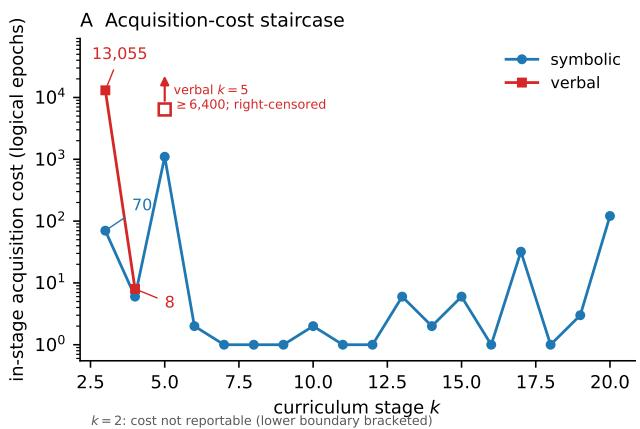
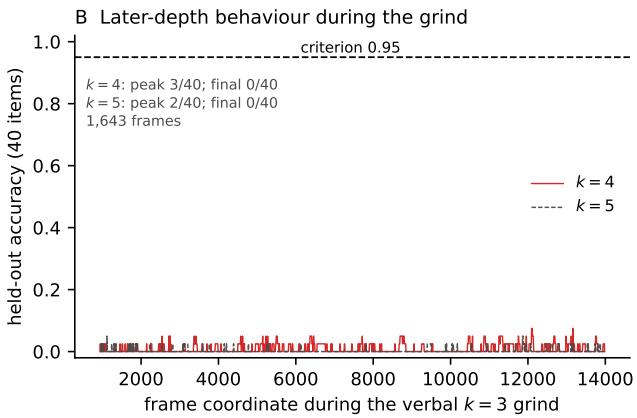
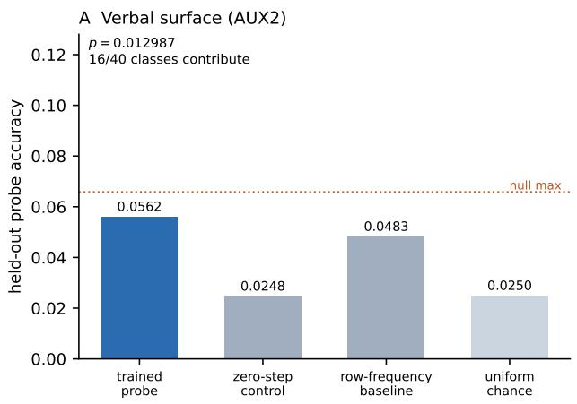
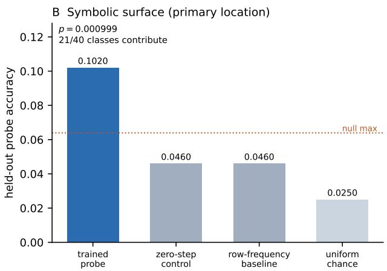
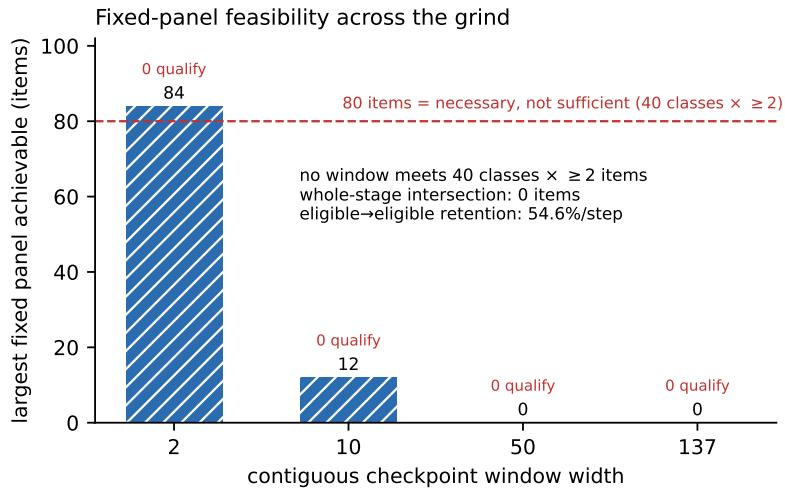

# Behaviour Is an Incomplete Measure of Reasoning Development: Cross-surface pre-arrival accessibility and the limits of developmental inference in a recurrent-depth reasoner

Simon Lam-Muir1

1Prime Calibre, Australia research@primecalibre.com ORCID 0009-0001-2442-4479

August 2026

## Abstract

Capability development is routinely inferred from behavioural thresholds, from final checkpoints, or from what a decoder can read out of a hidden state. These quantities need not identify the same event. We study a 30M-parameter recurrent-depth relational reasoner in a closed, oracle-defined world, using dense behavioural trajectories, two training surfaces, preregistered pre-arrival hidden-state probes, prospectively checked evaluability, and explicit untrained and negative controls, holding the training-time and inference-time axes separate throughout. Behaviour first: under one frozen acquisition criterion, three-hop competence cost 70 logical epochs on the symbolic surface and 13,055 on the verbal surface — a derived contrast of 186.5× after which verbal four-hop competence cleared in 8 logical epochs. Across the 13,055-epoch grind, four-hop held-out behaviour never exceeded 3/40 and ended at 0/40. Internal measurement next: on the verbal surface a linear probe recovered future-answer identity before behavioural arrival at 0.056159 against uniform chance 0.025, an untrained control of 0.024758 and a population frequency baseline of 0.048309 (p = 0.012987; 16/40 answer classes contributing). Analogous pre-arrival accessibility survived the surface change, reaching 0.1020 against a zero-step control of 0.0460 (p = 0.000999) at the upstream structural position and 0.0618 at the readout comparator (p = 0.004), with 21/40 classes contributing. Finally, the natural attempt to track that accessibility across training was not cleanly evaluable: probe eligibility is defined by behavioural arrival, so the measured population changes with the measurand. Behavioural competence, internal accessibility, and training-time development are distinct observables, and neither behaviour nor decoder accessibility identifies the computation training acquired; causal intervention is the necessary next step.

## 1 Introduction

Three measurements are commonly used to say when a model acquired a capability. The first is behavioural: a threshold on held-out accuracy, crossed at some point in training. The second is internal: a decoder or probe recovers some property from hidden state, and the property is said to have appeared when the probe succeeds. The third is retrospective: a final checkpoint is analysed and the resulting mechanism is described as what training produced.

These three need not agree, and where they disagree, the disagreement itself does not tell us which one corresponds to the computation the model actually acquired. That is the measurement problem this paper addresses.

We study it in a setting chosen so that the ground truth is mechanically available: a closed relational world with oracle-defined answers, a recurrent-depth reasoner [3] trained by a hop-depth curriculum, and two training surfaces that express the same underlying relational task family diferently. The closed world lets us check item novelty, path overlap and answer-class coverage exactly, rather than estimating them.

Contributions. First, behavioural development has hidden structure. Holding the world, architecture, curriculum, optimiser configuration and acquisition criterion fixed while changing the bundled training surface produces radically diferent acquisition costs and diferent developmental shapes — long grinds on one surface, rapid races on the other. A single competence threshold collapses that structure to a point.

Second, pre-arrival answer accessibility is not confined to one surface. Weak, heterogeneous information about the future answer is linearly accessible from hidden state before the model behaviourally produces that answer, on the verbal surface, and this survives a change of surface, appearing at two separately preregistered positions on the symbolic surface.

Third, richer observation still has identification limits. The obvious next measurement — tracking pre-arrival accessibility across training — cannot be validly estimated here, because the population eligible for the probe is defined by the behavioural event being studied. Together with a quarantined execution and an earlier validation branch that correctly returned no result, this shows that an instrument’s refusal to emit an unsupported number is itself informative.

This paper does not identify the acquired computation. It establishes why behavioural and accessibility measurements alone are insuficient to do so, and why the next step must be causal.

## 2 Experimental setting and measurement framework

## 2.1 An oracle-defined relational world

The world contains a fixed set of entities and relations. A k-hop query names a starting entity and a chain of k relations; its answer is the entity reached by following that chain. Because the world is closed and generated from a fixed seed, every answer is mechanically known, every intermediate along a path is definable, and the novelty of any evaluation item with respect to training can be checked exactly rather than estimated. Held-out batteries are constructed per depth with verified zero overlap against training items.

This control is the reason for the setting, and also its principal limitation: results here concern this world and this substrate class. Nothing in what follows should be read as automatically transferring to models trained on natural language at scale.

## 2.2 Model and curriculum

The model is a 30M-parameter recurrent-depth transformer: a 768-dimensional state and a 4-layer block that is applied repeatedly within a single forward pass, so that computational depth at inference is decoupled from parameter count [3]. Training proceeds by curriculum over hop depth. A stage k trains on all items of depth at most k and is evaluated on a held-out k-hop battery; the stage clears when held-out accuracy strictly exceeds 0.95, a criterion frozen before any of the results reported here.

Physical reuse of the recurrent block is an architectural fact. It is not evidence that the model reuses a semantic operator across depths, and we do not treat it as such.

## 2.3 Two surfaces

The same relational task family is presented through two surfaces. The symbolic surface names entities and relations by opaque tokens; the verbal surface expresses the same queries as Englishlike sentences with function words and nested genitive structure. The world, the curriculum, the architecture, the optimiser configuration and the acquisition criterion are held fixed across the two.

We are careful about a phrase that would be convenient and wrong. These are not the same model evaluated twice; they are separate trained realizations under a matched architecture, world and curriculum. Statements below compare realizations, not a single model’s two behaviours.

## 2.4 Developmental coordinates

Acquisition costs are reported in logical epochs under one convention, fixed in advance: milestone checkpoints are named by a filename epoch, and the in-stage cost of stage k is the diference between the clearing epochs of stages k and k − 1. Distinct epoch namespaces exist in the training system — the filename coordinate, an internal payload field ofset by one, and a frame coordinate used by the developmental camera — and every quantity in this paper is reported in a named namespace rather than inferred from filename arithmetic alone.

Where a stage’s lower boundary is not established by a surviving predecessor checkpoint, we report the stage’s clearing epoch but not an in-stage cost. This applies to k = 2 on both surfaces: no predecessor clearance checkpoint exists, and epoch 0 is not assumed. Those cells are recorded as not reportable rather than imputed.

## 2.5 Two axes that must not be merged

Two diferent clocks run in this system. Training time indexes parameter updates across checkpoints. Inference time indexes recurrent iterations inside a single forward pass. A statement about when information becomes available inside one forward pass is not a statement about when training produced it, and the reverse also holds. Keeping these separate is load-bearing for everything in Sections 4 and 5.

## 2.6 Probe protocol and controls

Probes are linear classifiers over hidden state at registered, event-relative positions, fitted independently per layer across four layers and scored on held-out folds under a fold map frozen before any activation was captured. Each probe result is reported against three references simultaneously:

• Uniform chance, 1/40 = 0.025 for the 40-answer-class universe;

• A population frequency baseline, computed on the same rows, which absorbs any class imbalance the probe could otherwise exploit;

• An untrained zero-step control, a model reconstructed deterministically at initialisation under the same procedure, which absorbs anything readable from architecture and inputs alone.

Significance is assessed by item-level restricted permutation with B = 1000 replicates; we report the null mean, spread and maximum, not only the p-value. Class-level heterogeneity is reported beside every pooled figure.

The zero-step control carries a classification that travels with every result derived from it: it is a deterministic reconstruction from recovered historical provenance under a prospectively frozen procedure, and its byte-identity with the original historical initialisation is unverified.

## 2.7 Evaluability is checked before inference

One design principle governs the internal measurements: question, then minimum suficient statistic, then a mechanical proof that the population supports that statistic, and only then the smallest freeze that fixes it. A planned analysis is not run merely because the activations exist. The population must be shown, mechanically and in advance, to support the estimand. Section 5 is what happens when it does not.

## 3 Behaviour has hidden structure

## 3.1 A surface-dependent acquisition staircase

Table 1 reports the early acquisition staircase numerically, while Figure 1A shows the longer symbolic trajectory through $k = 2 0$ alongside the available verbal stages, all under the same frozen criterion. Three-hop competence cost 13,055 logical epochs on the verbal surface against 70 on the symbolic surface, a derived contrast of 186.5×. The symbolic staircase then proceeds in small steps — 6, 1,099, 2, 1, 1, 1 epochs at successive depths — while the verbal trajectory is dominated by the 13,055-epoch k = 3 grind, followed by an eight-epoch $k = 4$ race and a second long, right-censored k = 5 stage that had accumulated at least 6,400 logical epochs at the manuscript snapshot.

The result is not the ratio. It is that two realizations of the same relational task family, matched in architecture, world, curriculum and criterion, have developmental trajectories of entirely diferent shape. A single threshold reports one number and discards that shape.

## 3.2 A long grind followed by an eight-epoch race

After 13,055 epochs at $k = 3 .$ , the verbal realization cleared k = 4 in 8 logical epochs.

We state that as a sequence and stop there. The grind preceded the race; behaviour alone does not tell us why. In particular, this observation does not establish that the grind purchased machinery later reused at $k = 4$ , and it does not establish that four-hop capability was present and unexpressed. Both remain open, and Section 5 explains why the measurement that would most directly address them is not available here.

## 3.3 Later-depth behaviour during the grind

Figure 1B shows held-out four- and five-hop accuracy across 1,643 frames of the verbal k = 3 grind. Four-hop accuracy took only the values 0, 0.025, 0.05 and 0.075; it was exactly zero in 71.3% of frames, peaked at 3/40, and ended at 0/40. Five-hop accuracy took only 0, 0.025 and 0.05, was zero in 93.3% of frames, and also ended at 0. The criterion is 0.95. Against that criterion both curves are at floor throughout.

A classifier that failed, reported beside the raw curve. A five-class developmental classifier was registered in advance to label these curves, and its labels were emitted: distributed-climb for k = 4 and none-of-the-above for $k = 5$ . Those labels misdescribe the data, and the reason is instructive. The classifier’s leading statistic is maximum-based, so a single $3 / 4 0$ frame among 1,643 is enough to defeat its flat predicate; a concentration measure computed over roughly seventy isolated floor flickers then becomes small, which selects distributed-climb. A pure-noise floor curve of this length will reliably receive that label. The k = 5 curve escaped only through an exact equality in a threshold comparison — two contributing items rather than three is the whole diference between the two labels.

Table 1: Acquisition-cost staircase, both realizations, one frozen convention (strict > 0.95 held-out accuracy; filename-epoch coordinate). In-stage cost is the diference between successive clearing epochs. Both k = 2 rows are not reportable: no predecessor clearance checkpoint survives and epoch 0 is not assumed. Symbolic rows through k = 10 are shown here for tabular readability; Figure 1A plots the complete symbolic series through k = 20 from the same authoritative staircase source. Verbal k = 5 is right-censored at the manuscript snapshot. Generated from T1-acquisition-staircase.csv.
<table><tr><td>surface</td><td>stage k</td><td>clearing epoch</td><td>in-stage cost</td><td>boundary status</td></tr><tr><td>symbolic</td><td>2</td><td>2,808</td><td></td><td>bracketed lower bound</td></tr><tr><td>symbolic</td><td>3</td><td>2,878</td><td>70</td><td>exact</td></tr><tr><td>symbolic</td><td>4</td><td>2,884</td><td>6</td><td>exact</td></tr><tr><td>symbolic</td><td>5</td><td>3,983</td><td>1,099</td><td>exact</td></tr><tr><td>symbolic</td><td>6</td><td>3,985</td><td>2</td><td>exact</td></tr><tr><td>symbolic</td><td>7</td><td>3,986</td><td>1</td><td>exact</td></tr><tr><td>symbolic</td><td>8</td><td>3,987</td><td>1</td><td>exact</td></tr><tr><td>symbolic</td><td>9</td><td>3,988</td><td>1</td><td>exact</td></tr><tr><td>symbolic</td><td>10</td><td>3,990</td><td>2</td><td>exact</td></tr><tr><td>verbal</td><td>2</td><td>936</td><td></td><td>bracketed lower bound</td></tr><tr><td>verbal</td><td>3</td><td>13,991</td><td>13,055</td><td>exact</td></tr><tr><td>verbal</td><td>4</td><td>13,999</td><td>8</td><td>exact</td></tr><tr><td>verbal</td><td>5</td><td></td><td></td><td>right-censored at snapshot</td></tr></table>

We report the registered labels because they were registered, and we rest the interpretation on the raw values. The methodological point is general: extreme-value statistics applied to very long developmental series are not robust, and a classifier validated on short series should not be transported to long ones without re-registration.

## 3.4 What a behavioural threshold conceals

Surface representation changes the developmental trajectory profoundly. An eventual criterion crossing says little about the route taken to it. And the absence of competence-scale later-depth behaviour during a long grind does not establish the absence of internal development, because behaviour measures expression, not availability. That is the motivation for measuring inside the model — and the subject of the next section.

## 4 Internal accessibility is a diferent observable

## 4.1 A local content-first observation during training

In a registered assay over the developmental film, a content-sensitive diferential reached 93.25 against a parse-control baseline of 88.5 and a confound boundary of 89.5 fixed in advance — a clearance of 3.75 — at a frame where held-out novel two-hop accuracy was 0.025.

The licensed reading is narrow. The content-sensitive diferential exceeded both its parse control and the preregistered confound threshold while novel behavioural accuracy remained near floor. The margin over the boundary is modest and travels with the result. This is a local descriptive ordering observation: it is not an estimate of when any mechanism was acquired, and it is not the developmental accessibility curve that Section 5 shows to be non-identifiable. It is also a diferent observable class from the probe results below — interior reads from a training film, versus decoder probes on frozen checkpoints at registered event-relative positions — and we do not merge the two into a single notion of “internal signal”.

  
Figure 1: Behavioural development. (A) In-stage acquisition cost by curriculum stage for both realizations, logarithmic scale. Verbal $k = 3$ costs 13,055 logical epochs against symbolic 70 at the same depth, a derived contrast of $1 8 6 . 5 \times ;$ verbal $k = 4$ then costs 8. Verbal $k = 5$ is plotted at its manuscript-snapshot lower bound of $\geq 6 { , } 4 0 0$ logical epochs using an open marker and upward arrow to denote right-censoring; this is not a completed stage cost. The $k = 2$ costs are not plotted because their lower boundaries are bracketed and exact in-stage costs are not reportable. The symbolic series is shown through $k = 2 0 ;$ ; Table 1 prints the $k \leq 1 0$ subset for compactness, and both are generated from the same authoritative staircase source. (B) Held-out four- and five-hop accuracy across 1,643 frames of the verbal $k = 3$ grind, against the 0.95 criterion. Fourhop peaks at $3 / 4 0$ and ends at $0 / 4 0 ;$ five-hop peaks at $2 / 4 0$ and ends at $0 / 4 0$ . Both are at floor scale throughout. Plotted directly from the registered per-frame series. Panels use diferent developmental coordinates: panel A reports logical-epoch stage costs, whereas panel B uses the registered frame coordinate; horizontal positions are not directly comparable across panels.

## 4.2 Verbal pre-arrival accessibility

On the verbal surface, a linear probe was fitted at a registered position preceding the answer slot, on items the model had not yet answered correctly, and scored on held-out folds. Its four-layer mean held-out accuracy was 0.056159, against uniform chance 0.025, an untrained zero-step control of $0 . 0 2 4 7 5 8$ , and a population frequency baseline of 0.048309. Restricted permutation with $B = 1 0 0 0$ gave $p = 0 . 0 1 2 9 8 7$ , with a null mean of 0.0285 and a null maximum of 0.0658. Sixteen of the forty answer classes contributed any correct held-out prediction.

The reading is that future-answer identity is weakly but reproducibly linearly accessible before behavioural arrival, on unseen item and path surfaces within the same frozen answer-class universe.

Four qualifications travel with it. The efect is weak in absolute terms. Class expression is strongly heterogeneous. This is not a high-accuracy decoder and does not establish that a completed answer representation exists. And accessibility is not use: a linear classifier can exploit distributed partial information without that information being what the model’s own computation consumes.

## 4.3 Analogous accessibility survives a surface change

The analogous measurement on the symbolic surface used two registered locations, fixed in advance: a primary position, defined as the final observed query position immediately preceding the answer slot, and a secondary readout comparator. At the primary position the trained probe reached 0.10201 against a zero-step control of 0.04598, with $p = \ 0 . 0 0 0 9 9 9 \ -$ the observed value falls outside the entire null distribution over 1000 permutations, whose maximum was 0.06394. At the secondary position it reached 0.06178 with $p = 0 . 0 0 3 9 9 6$ . Twenty-one of forty classes contributed at the primary position and sixteen at the secondary.

At the primary position the zero-step control and the frequency baseline are numerically identical at 0.04598. This is a coincidence of this population, not an identity of the two quantities, and they are reported as two separate references.

The two locations were registered separately, each with its own threshold: the secondary cannot rescue the primary, and there is no omnibus criterion under which a positive at either location counts.

Analogous pre-arrival answer accessibility therefore survives the surface change, at both registered locations, with the upstream structural position carrying the stronger signal. Neither result establishes causal use, and neither identifies the acquired computation.

On comparing the two surfaces. The symbolic primary sits +5.60 points above its frequency baseline where the verbal result sits +0.785 above its own; the symbolic figure is 4.1× uniform chance and 2.2× its control. These are descriptive contrasts. No registered cross-population efectsize comparison was performed, and we do not claim the symbolic efect is statistically larger than the verbal one.

## 4.4 Ignition as decisive expression, not first appearance

Taken with earlier work on this substrate [5], in which the resolution of an answer at the vocabulary readout is a sharp interface event, the present results refine what that event marks. Ignition is not the first appearance of answer-relevant information; it is the decisive readout commitment of information that can already be weakly accessible internally — and that refinement now holds on both surfaces.

This synthesis relates two diferent variables and we mark the seam. The earlier readout result [5] concerned composed intermediates exposed through the tied vocabulary readout; the probes here concern final-answer identity present in hidden state. The relation is present versus exposed, not a two-channel comparison of one variable. We do not conclude that the model has already computed the answer.

## 5 Measurement has hard limits

## 5.1 A developmental curve that could not be estimated

The natural next question is whether pre-arrival accessibility emerges or strengthens across a long grind. The registered design was to fit the same probe at successive checkpoints and report the resulting trajectory.

  
Figure 2: Pre-arrival answer accessibility on both surfaces. Trained held-out probe accuracy against all three registered references — untrained zero-step control, population frequency baseline, and uniform 40-way chance — with the maximum of the B = 1000 permutation null marked. (A) Verbal surface. (B) Symbolic surface, primary position. Class heterogeneity is printed with each panel. The two panels are shown together for readability; the verbal–symbolic contrast is descriptive and no registered cross-population efect-size test was performed.

That estimand does not cleanly exist here, for a structural reason. Probe eligibility is defined by behavioural arrival: an item is eligible only while the model has not yet answered it correctly. As training proceeds, items improve and leave the eligible population — and they leave because they improve. The population being measured therefore changes as a function of the measurand. We name the failure mode selection coupled to the measurand.

The consequence is that a probe-accuracy curve over these checkpoints would mix representational change with population migration, in unknown proportion, with no way to separate them after the fact.

We established this mechanically before any developmental capture, by asking whether a fixed panel — the same items, in all forty classes, present across a contiguous window of checkpoints — exists at any window width. It does not. At width 2, the largest achievable panel covered 84 items and zero of 136 windows met the requirement of forty classes with at least two items each; at width 10, zero of 128; at width 50, zero of 88; at the whole-stage width, zero of 1. The whole-stage intersection contains no items at all. Eligible-to-eligible retention is 54.6% per step, and 8.9% of items per step exit specifically by arriving. Figure 3 summarises this.

Five rescues were considered and refused in advance: smoothing the curve, shortening the window, moving the probe ofsets, relaxing the support requirement, and defining a post-hoc onset statistic. Each would have produced a number. None would have produced the registered estimand.

The result is not cleanly evaluable. It is not a null result, and it is not evidence that accessibility fails to develop. It is a statement that this design cannot measure that question.

Two features make this trustworthy rather than convenient. The inferential object was fixed as none exists before the symbolic result of Section 4 was known, so no developmental claim could be authored in light of an outcome. And the finding prevented rather than excused work: the whole-stage capture never occurred, so the activations that would have supported a plausible and invalid curve were never collected.

The general lesson is worth stating plainly, because the design that fails here is a natural one: a checkpoint-wise probe-accuracy curve cannot by itself identify representational development when probe eligibility changes as a function of the behaviour being tracked; without a fixed cohort or an explicit model of that selection process, representational change and population migration are confounded.

## 5.2 A quarantined execution

An earlier realization of the verbal accessibility experiment produced a complete result — null distribution, p-value, per-class breakdown — while an explicit halt was in force. The cause was a process-identity error in which the verification step was incapable of establishing the proposition it was being used to establish; details are in the companion repository.

That population’s confirmatory standing was withdrawn permanently, and the experiment was rebuilt on an independent population, which is the result reported in Section 4. The later positive result does not rehabilitate the quarantined one. We report this because the alternative — retaining an attractive result whose execution conditions were violated — is precisely the failure mode that preregistration exists to prevent.

## 5.3 An earlier branch that correctly returned nothing

A separate earlier analysis returned not evaluable for a diferent reason again: the frozen holdout geometry did not supply the support the planned statistic required. A positive control established that the decision procedure could fire when its conditions were met, so the outcome was a statement about support, not a failure of the instrument.

These three are distinct and should not be merged. Section 5 concerns an estimand that does not exist under longitudinal eligibility; the quarantine concerns execution integrity with the estimand intact; this branch concerns a population that could not support a well-defined statistic. Only the first is a claim about identifiability.

## 5.4 What richer measurement still cannot tell us

Behaviour can miss internal accessibility. Accessibility can precede behavioural expression. Longitudinal probing can itself become non-identifiable. And decoder success does not establish that the decoded information is causally used. Observation, however refined, does not identify the computation that training acquired.

## 6 Related work

## 6.1 Development across training

That behavioural emergence can conceal gradual internal change is established: reverse-engineering the grokking transition reveals continuous circuit formation beneath a discontinuous behavioural curve [9], and circuit-level analyses track how mechanisms appear and stabilise across training and scale [14].

Longitudinal probing itself predates the present work. Liu et al. [7] apply a common probe suite across RoBERTa pretraining checkpoints to ask when linguistic, factual, commonsense and reasoning information becomes accessible, reporting that linguistic knowledge is acquired quickly and stably while reasoning abilities are not stably acquired. Our concern is diferent: when eligibility for the probe changes as a function of the behavioural event being tracked, checkpoint-wise accessibility can mix representational development with population migration.

  
Figure 3: Why the developmental accessibility curve is not identifiable. Largest fixed panel of probe-eligible items achievable within a contiguous checkpoint window, by window width, against the registered requirement of forty classes with at least two items each. No window at any width satisfies ${ \mathrm { i t } } ,$ and the whole-stage intersection is empty. Item count alone is necessary but not suficient: the widest achievable panel reaches 84 items yet still covers too few classes, so zero windows qualify at any width. Items leave the eligible population by improving, so eligibility is coupled to the measured event.

Two recent neighbours are closer still. Jin et al. [4] apply counterfactual edits and activation patches at successive training checkpoints and find that latent-reasoning faithfulness depends on training stage, arguing directly that final checkpoints are insuficient; their setting is a diferent latent-reasoning architecture and task, and does not involve the recurrent-depth surface comparison studied here. Ye et al. [16] train transformers from scratch in a controlled symbolic multi-hop setting and identify a staged developmental trajectory, using cross-query semantic patching to locate reusable intermediate representations; their question is mechanism and development within that setting, where ours separates behavioural trajectories, inference-time answer accessibility, and a longitudinal evaluability limit.

We therefore take the insuficiency of final checkpoints as established rather than as our contribution. What we add is the separation of three observables — behavioural competence, inferencetime accessibility, and training-time development — and, in Section 5, an evaluability result: a longitudinal internal measurement that cannot be identified because the population it measures is defined by the behavioural event under study. That failure mode is a property of the estimand rather than of the probe.

## 6.2 Latent reasoning, recurrence, and what a probe licenses

The architecture studied here iterates a shared block to scale computation at inference rather than by emitting tokens [3], which is why the training-time and inference-time axes must be tracked separately throughout this paper.

Two studies probe that class of model directly. Lu et al. [8] examine a depth-recurrent transformer on arithmetic with logit-lens and coda-lens decoders, find limited evidence of interpretable latent chain-of-thought, and report that the interpretability of hidden states depends heavily on both layer index and decoding method — a direct caution that what is linearly readable is partly a property of the instrument. Blayney et al. [2] analyse looped reasoning models mechanistically, showing that layers in the cycle converge to distinct fixed points so that the recurrent block follows a consistent cyclic trajectory, with attention-head behaviour stabilising as those points are reached. Both characterise internal dynamics at inference; neither studies the developmental acquisition event, which is where our question sits.

Our probe results are deliberately reported as accessibility rather than use, and that restraint has a literature behind it. Ravichander et al. [11] show directly that models encode properties recoverable by a probe even when those properties are not needed for the trained task, including under synthetic noise — probe-decodable information need not be information the model uses — and Belinkov [1] reviews the broader methodological limits of probing classifiers and the dificulty of moving from decodability to causal claims. This is the reason Sections 4 and 7 treat linear accessibility as strictly weaker evidence than causal use, and why the paper ends by asking for intervention rather than a better decoder.

## 6.3 Representation, order, and compositional learnability

That surface and representational choices change compositional performance is likewise established. CLUTRR reports a substantial gap between NLU systems reasoning over natural-language stories and a graph model given direct symbolic access to the underlying relations [13]. Because the access pathway and model class both difer there, it does not isolate acquisition cost under controlled surface rewrites under matched architecture and training procedure, which is the comparison our Act 1 makes. ReCOGS shows that semantically incidental details of a target representation can dominate measured dificulty, so that apparent model failures trace to the encoding rather than the competence [15]; that result concerns its own representation and output setting rather than an input-surface rewrite. Ramesh et al. [10] show that the order in which compositions appear in training biases which combinations a transformer can subsequently compose, and Lee et al. [6] show that data format and representation substantially change the sample eficiency with which small transformers learn arithmetic. Sato et al. [12] go further and treat generation order explicitly as a learnability variable, searching for orders that make otherwise hard sequential tasks trainable and diagnosing them from early-training dynamics. Training-time order is therefore an actively studied variable, not an untouched one.

Our Act 1 result should therefore not be read as the claim that representation afects learning, which is not in dispute. It is a measurement of the developmental cost structure that a surface change produces under a matched world, architecture, curriculum and criterion — 13,055 against 70 logical epochs at one depth, a 186.5× contrast — and of trajectories that difer in shape rather than merely in length. We also do not decompose our surfaces into their constituent factors: the verbal and symbolic surfaces here difer in vocabulary, grammatical structure, relation order and sequence length simultaneously, and isolating those factors requires arms this paper does not contain. Where Sato et al. [12] and Ramesh et al. [10] vary order deliberately, we vary a bundle and report its cost.

Taken together, prior work establishes that behavioural emergence can conceal gradual internal change, that probes can reveal information not directly expressed in behaviour, and that representation and computation order can strongly afect compositional learnability. We study these issues jointly in a controlled recurrent-depth relational setting, separating behavioural development from inference-time answer accessibility and showing a specific identification failure that arises when the population eligible for longitudinal probing changes as a function of the behavioural event being measured.

## 7 Discussion

## 7.1 Three observables, and a fourth that is still open

This paper separates three quantities that are often used interchangeably. Behavioural competence is what the model produces. Internal linear accessibility is what a decoder can recover from its state. Training-time development is when either of those changes across checkpoints. They are related and not interchangeable, and each of our three acts shows a way they can come apart.

A fourth quantity — the causal computation the model performs — is not measured here, and the first three do not determine it.

## 7.2 Surface representation changes developmental cost

The same class of relational task, matched in world, architecture, curriculum and criterion, exhibits radically diferent acquisition trajectories under two surfaces. We deliberately do not attribute that diference to any specific property of the surfaces — vocabulary, grammatical structure, relation order, sequence length — because this experiment varies them together. Decomposing that bundle requires arms in which those factors are isolated, which is downstream of this paper. Nor do we claim the two realizations learn the same algorithm; nothing here tests that.

## 7.3 Implications for developmental interpretability

Final checkpoints are insuficient: they cannot distinguish a long grind from a short race that ended in the same place. Behavioural thresholds conceal route structure. Probes can reveal information that behaviour does not express. But probe curves can be invalid when population membership depends on the behaviour under study, and that invalidity is not visible in the curve itself — it has to be established from the design in advance. Evaluability is therefore a property to be proved before measurement, not diagnosed after. An instrument that declines to emit a number, having shown that the number would not mean what it appears to mean, has succeeded.

## 7.4 From observation to mechanism

The next question is not whether a better decoder can read the state. It is whether the state can be manipulated. Concretely: identify the oracle-defined semantic content of an intermediate state, intervene on it, and test whether a recipient computation combines the transplanted intermediate with its own untouched remainder in the way the semantics predict — and whether a common transition law governs that combination across entities and depths. We report none of these results here.

The observational programme has established where measurement is informative and where it is insuficient. The next question is not whether another decoder can read the state, but whether manipulating that state predictably changes the computation.

## 8 Limitations

These are scope statements, not caveats ofered in mitigation.

The results concern one closed synthetic world and one recurrent-depth architecture class, and do not automatically generalise to frontier language models. The answer universe is frozen at forty classes; we test neither unseen-answer nor unseen-head generalisation. The probe efects are weak and strongly heterogeneous across classes — 21/40 and 16/40 classes contribute, and the thinnest classes contribute nothing — so the pooled figures are not uniform properties of the class space. The two surfaces are separate trained realizations, not one model observed twice. No registered cross-population efect-size comparison between surfaces was performed, so the surfaces are compared descriptively only. Linear accessibility does not establish a completed representation, and no causal use, shared representation across surfaces, or shared transition law is established. No cross-world confirmation exists. Verbal $k = 5$ is right-censored at the manuscript snapshot: at the final evaluated filename epoch 20,399 its in-stage cost was at least 6,400 logical epochs with a maximum observed accuracy of 0.9133 and no crossing of the 0.95 criterion. And the developmental accessibility trajectory is not cleanly evaluable in this design, so the question it was meant to answer remains open.

## 9 Conclusion

Behavioural thresholds hide developmental structure: realizations matched in world, architecture, curriculum and acquisition criterion but trained on diferent surfaces required 70 and 13,055 logical epochs for the same depth of competence, and a 13,055-epoch grind was followed by an 8-epoch race. Weak answer information is linearly accessible before behavioural arrival, and this survives a change of surface, appearing at two separately preregistered positions. And richer internal observation can itself encounter an identification failure, when the population a probe measures is defined by the behaviour being studied.

We can observe more than behaviour reveals, but observation still does not identify what computation training acquired.

## Data and code availability

Instrument sources, registered specifications, per-result receipts with cryptographic digests, the population and support proofs underlying Section 5, and the figure-generation scripts for every panel in this paper are available in the companion repository at https://github.com/primeca libre-research/ltg-replication-receipts. Executed registrations and receipts supporting reported claims are released with the paper. Prospectively registered but unexecuted experiments remain sealed until execution or formal retirement to preserve prospective integrity.

## References

[1] Yonatan Belinkov. Probing classifiers: Promises, shortcomings, and advances. Computational Linguistics, 48(1):207–219, 2022.

[2] Hugh Blayney, Alvaro Arroyo, Johan Obando-Ceron, Pablo Samuel Castro, Aaron Courville,´ Michael M. Bronstein, and Xiaowen Dong. A mechanistic analysis of looped reasoning language models. 2026.

[3] Jonas Geiping, Sean McLeish, Neel Jain, John Kirchenbauer, Siddharth Singh, Brian R. Bartoldson, Bhavya Kailkhura, Abhinav Bhatele, and Tom Goldstein. Scaling up test-time compute with latent reasoning: A recurrent depth approach. 2025. NeurIPS 2025 spotlight.

[4] Hengyu Jin, Shu Yang, and Di Wang. Final checkpoints are not enough: Analyzing latent reasoning faithfulness along training trajectories. 2026.

[5] Simon Lam-Muir. The ignition is real, and it lives at the readout: Latent composition, dificulty-clocked ignition, and the interface-constituted commit in a recurrent-depth reasoner. 2026.

[6] Nayoung Lee, Kartik Sreenivasan, Jason D. Lee, Kangwook Lee, and Dimitris Papailiopoulos. Teaching arithmetic to small transformers. 2023.

[7] Leo Z. Liu, Yizhong Wang, Jungo Kasai, Hannaneh Hajishirzi, and Noah A. Smith. Probing across time: What does RoBERTa know and when? In Findings of the Association for Computational Linguistics: EMNLP 2021, 2021.

[8] Wenquan Lu, Yuechuan Yang, Kyle Lee, Yanshu Li, and Enqi Liu. Latent chain-of-thought? decoding the depth-recurrent transformer. In First Workshop on the Application of LLM Explainability to Reasoning and Planning, Conference on Language Modeling (COLM), 2025.

[9] Neel Nanda, Lawrence Chan, Tom Lieberum, Jess Smith, and Jacob Steinhardt. Progress measures for grokking via mechanistic interpretability. In International Conference on Learning Representations (ICLR), 2023.

[10] Rahul Ramesh, Ekdeep Singh Lubana, Mikail Khona, Robert P. Dick, and Hidenori Tanaka. Compositional capabilities of autoregressive transformers: A study on synthetic, interpretable tasks. In Proceedings of the 41st International Conference on Machine Learning (ICML), 2024.

[11] Abhilasha Ravichander, Yonatan Belinkov, and Eduard Hovy. Probing the probing paradigm: Does probing accuracy entail task relevance? In Proceedings of the 16th Conference of the European Chapter of the Association for Computational Linguistics (EACL), 2021.

[12] Yuta Sato, Kazuhiko Kawamoto, and Hiroshi Kera. Discovering learning-friendly generation orders for sequential computation. 2025. arXiv preprint; v1 June 2025, revised May 2026.

[13] Koustuv Sinha, Shagun Sodhani, Jin Dong, Joelle Pineau, and William L. Hamilton. CLUTRR: A diagnostic benchmark for inductive reasoning from text. In Proceedings of the 2019 Conference on Empirical Methods in Natural Language Processing and the 9th International Joint Conference on Natural Language Processing (EMNLP-IJCNLP), 2019.

[14] Curt Tigges, Michael Hanna, Qinan Yu, and Stella Biderman. LLM circuit analyses are consistent across training and scale. In Advances in Neural Information Processing Systems (NeurIPS), 2024.

[15] Zhengxuan Wu, Christopher D. Manning, and Christopher Potts. ReCOGS: How incidental details of a logical form overshadow an evaluation of semantic interpretation. Transactions of the Association for Computational Linguistics, 11:1719–1733, 2023.

[16] Jiaran Ye, Zijun Yao, Zhidian Huang, Liangming Pan, Jinxin Liu, Yushi Bai, Amy Xin, Weichuan Liu, Xiaoyin Che, Lei Hou, and Juanzi Li. How do transformers learn implicit reasoning? In Advances in Neural Information Processing Systems (NeurIPS), 2025. Spotlight.