# Beyond Binary Priorities: Multi-Tier SLA Scheduling for Large Language Model Serving

Anders Vestrum Arya Raeesi Hanna Roed

UC Berkeley, EECS Department

## Abstract

Modern LLM serving deployments must simultaneously satisfy heterogeneous service-level objectives (SLOs) across a diverse population of user tiers, ranging from latency-critical API calls to background batch processing. Llumnix [1] introduced a dynamic, migration-capable multi-instance scheduler for LLM inference that achieves load balancing, defragmentation, prioritization, and auto-scaling through a unified “freeness” metric. However, Llumnix’s priority model is restricted to two levels (high and normal), an abstraction too coarse to express the richer SLA classes common in production deployments. In this work, we extend Llumnix’s priority model to support an arbitrary number of tiers and evaluate the efects of this extension under three realistic priority distributions (uniform, Gaussian, enterprise) using Vidur [2], a high-fidelity LLM inference simu lator. We implement per-tier headroom with exponential decay, tier-aware dispatch ordering, and the full Llumnix migration pipeline inside Vidur’s hierarchical scheduling framework. We compare our extended scheduler against INFaaS [7] (global routing baseline), vLLM [3], Orca [4], and Sarathi-Serve [5] (per-replica baselines), sweeping priority levels from 1 to 10. Our experiments demonstrate that four priority tiers yields the best cost-efectiveness tradeof, achieving prefill mean speedups of up to 8.3× and end-to-end P99 speedups of up to 3.1× over IN FaaS with cost-per-latency improvements of 46–68%, while preserving strong SLO diferentiation across tiers. We further show that the system sustains these gains at 10 priority levels without tail latency collapse, with overhead concentrated in the prefill phase.

## 1 Introduction

The rapid growth of large language model (LLM) de ployments has brought fundamentally new challenges to inference serving infrastructure. Unlike classical deep learning inference, autoregressive LLM generation is highly unpredictable: a single request’s token count, memory footprint, and execution time cannot be determined until generation completes [1]. This inherent heterogeneity, combined with bursty arrival patterns and diverse latency requirements across users, renders traditional single-instance, FCFSbased serving insuficient [4].

State-of-the-art single-instance schedulers such as vLLM [3], Orca [4], Sarathi-Serve [5], and Faster-Transformer address per-replica throughput and memory eficiency, but they are fundamentally designed for homogeneous workloads within a single instance. They dispatch requests using simple roundrobin or FCFS policies at the cluster level, and once a request is placed on a replica, it stays there. This “one-shot” dispatching is structurally incapable of reacting to memory fragmentation, cross-instance load imbalances, or the need to re-isolate high-priority requests that arrived after an instance became overloaded.

Llumnix [1] addresses these limitations by introducing a runtime rescheduler that can live-migrate requests across instances with near-zero downtime. It unifies load balancing, defragmentation, priority isolation, and auto-scaling under a single “freeness” metric, and demonstrates substantial latency and cost improvements over INFaaS [7] as a baseline global scheduler. However, Llumnix’s priority model remains binary: requests are classified as either “high priority” or “normal,” with a single fixed headroom value controlling isolation between the two classes. This coarse granularity is insuficient for production LLM deployments, where providers commonly diferentiate across three to five SLA tiers (e.g., platinum, gold, silver, standard, free-tier) with distinct latency targets.

This paper asks: what is the right number of priority tiers for a migration-capable LLM serving system, and how should isolation headroom be allocated across them? We address this question by extending Llumnix to support K ≥ 2 priority levels, assigning each tier its own headroom budget via exponential decay, and evaluating the system across three workload distributions at scale.

Our primary contributions are:

1. A multi-tier extension of Llumnix integrated into the Vidur simulator, supporting up to 10 priority levels with per-tier headroom, priority-aware dispatch ordering, and full migration support.

2. A comprehensive evaluation framework spanning three realistic priority distributions (uniform, Gaussian, enterprise), two request volume scales (10K and 15K requests), and comparison against four baseline schedulers.

3. An empirical characterization of the priority-complexity tradeof, demonstrating that 4 priority tiers achieves the best costeficiency point, with diminishing isolation gains and increasing overhead beyond this threshold.

4. Insights into the interaction between priority granularity and system load, showing that the benefits of fine-grained prioritization are most pronounced at moderate loads where headroom can be honored, and diminish near saturation.

## 2 Background and Related Work

## 2.1 LLM Inference Fundamentals

LLM inference consists of two phases: prefill, where the model processes all input tokens in parallel to produce the initial KV-cache state, and decode, where tokens are generated autoregressively one at a time. The prefill phase is compute-bound and bursty; the decode phase is memory-bandwidth-bound and iterative. This two-phase structure creates a natural tension: batching more prefill requests improves throughput but increases time-to-first-token (TTFT), while prioritizing decode continuity reduces time-between-tokens (TBT) but starves new arrivals [5].

The KV-cache, which stores intermediate attention states for all active requests, is the dominant memory consumer in LLM inference. As output length is unknown a priori, KV-cache allocation grows dynamically throughout a request’s lifetime. Memory fragmentation, where logical contiguous allocations become physically scattered, was a major throughput bottleneck until PagedAttention [3] introduced block-based virtual memory management for KV caches, reducing waste to under 4% in most cases.

## 2.2 Per-Replica Scheduling

Orca [4] introduced iteration-level scheduling (continuous batching), making batching decisions at each transformer step rather than at request granularity.

This eliminates head-of-line blocking where long requests block short ones, and is now the standard scheduling paradigm adopted by all modern serving systems.

vLLM [3] pairs continuous batching with PagedAttention to achieve near-zero KV-cache waste. It maintains a FCFS-ordered waiting queue and a preemption policy (swap or recompute) for when memory pressure forces request eviction.

Sarathi-Serve [5] further decouples the prefilldecode throughput-latency tradeof by introducing chunked prefills, splitting long prefill sequences into equal-sized chunks interleaved with ongoing decode steps, together with stall-free scheduling that prevents decode stalls during prefill admission. This achieves up to 5.6× improvement in serving capacity under pipeline parallelism.

vAttention [13] proposes an alternative to PagedAttention that retains contiguous virtual address space for KV caches while still achieving fragmentationfree physical allocation via CUDA virtual memory APIs, improving serving throughput by up to 1.23× over block-based systems.

## 2.3 Multi-Instance and Cluster-Level Scheduling

INFaaS [7] is a model-less inference serving system that automatically selects model variants and hardware per query. It uses a cost-based routing function combining queue-depth estimation, service-time prediction, and state-machine penalties (ACTIVE, OVERLOADED, INTERFERED, INACTIVE) to route requests to the best available replica. While it handles replica health and SLO tracking, it lacks live migration and cannot react to per-request memory dynamics.

AlpaServe [8] demonstrates that model parallelism can serve as a multiplexing mechanism across heterogeneous model requests, statistically sharing device capacity across bursty workloads. It processes requests at up to 10× higher rates while meeting P99 SLOs for over 99% of requests.

MemServe [14] introduces an elastic distributed memory pool (MemPool) that manages KV caches across serving instances, combining context caching with disaggregated inference and a locality-aware scheduler for cache reuse maximization.

Llumnix [1] combines live migration, virtual usage tracking, and a unified freeness metric to unify load balancing, defragmentation, priority isolation, and auto-scaling into a single scheduler. It achieves up to 5.5× prefill P99 speedup and 36% cost reduction over INFaaS. Our work directly extends this system.

## 2.4 SLO-Aware and Priority-Aware Serving

SCORPIO [9] introduces SLO heterogeneity as a first-class scheduling concern, using TTFT Guard and TPOT Guard mechanisms to maximize goodput under application-specific latency targets, improving goodput by up to 14.4× over prior baselines.

SLOs-Serve [10] applies multi-SLO dynamic programming to continuously optimize token allocations across stage-specific constraints, combining chunked prefill with speculative decoding to achieve 2.2× per-GPU serving capacity gains.

FlowPrefill [15] tackles head-of-line blocking in TTFT SLOs by decoupling preemption granularity from scheduling frequency through operator-level preemption and event-driven scheduling, improving maximum goodput by up to 5.6× on production traces.

SGDRC [12] addresses GPU-level priority coexistence via software-defined dynamic allocation of VRAM bandwidth and compute for latency-sensitive versus best-efort inference workloads, achieving 99% average SLO attainment.

Prior work on multi-level feedback queues (MLFQ) and priority-based preemption from classical scheduling theory [11] motivates our design choice of exponential headroom decay, which mirrors the diminishing isolation requirements at lower priority tiers while protecting system eficiency.

## 2.5 Simulation for LLM Serving

Vidur [2] is a large-scale, high-fidelity LLM inference simulator from Microsoft Research that predicts latency, throughput, model FLOPs utilization (MFU), and memory usage from profiled operator runtimes. Its Vidur-Search component can identify optimal deployment configurations for LLaMA2-70B in approximately 1 CPU-hour, compared to roughly 42,000 GPU-hours for real hardware search. Vidur includes baseline implementations of vLLM, Orca, and Sarathi-Serve scheduling policies, providing a fair, reproducible evaluation environment without requiring access to physical GPU clusters.

## 3 System Design

## 3.1 Architecture Overview

Our system follows Llumnix’s two-level architecture (Figure 1) adapted for the Vidur simulation framework. A global scheduler (Llumnix-style) sits atop multiple local replica schedulers (Llumlet-style), one per simulated GPU instance.

The global scheduler is responsible for dispatching incoming requests to the freest non-draining replica, deciding when and which requests to migrate, issuing auto-scaling recommendations based on cluster-wide freeness, and marking replicas for graceful draining and evacuation.

Each Llumlet (local replica scheduler) is responsible for maintaining a priority-ordered request queue, computing per-request virtual usage including priority headroom, managing block-level KV-cache allocation, and executing multi-stage live migration of running requests.

## 3.2 The Freeness Metric

The central abstraction in our system is the freeness of a replica:

$$
F = \frac { M - \sum _ { r } V ( r ) } { B }\tag{1}
$$

where M is the total KV-cache block capacity of the replica, $\textstyle \sum _ { r } V ( r )$ is the total virtual usage summed across all requests r currently associated with the replica (including queued requests), and B is the current batch size (number of actively running requests). Freeness $F > 0$ indicates available capacity; $F < 0$ indicates the replica is overloaded relative to its virtual commitments, triggering migration.

The virtual usage $V ( r )$ for a request r is computed according to Algorithm 1 of [1] with our extension for K-level priorities:

$$
V ( r ) = { \left\{ \begin{array} { l l } { { \mathrm { r e q . d e m a n d } } } & { { \mathrm { i f ~ } } r { \mathrm { ~ i s ~ H o L } } } \\ { { 0 } } & { { \mathrm { i f ~ } } r { \mathrm { ~ q u e u e d } } } \\ { { \mathrm { p h y s U s a g e } } ( r ) + { \begin{array} { l } { } \\ { { } } \\ { { H ( r _ { p } , i ) } } \end{array} } } & { { \mathrm { i f ~ } } r { \mathrm { ~ r u n n i n g } } } \\ { { \infty } } & { { \mathrm { i f ~ } } d { \mathrm { r a i n } } } \end{array} \right. }\tag{2}
$$

where the headroom function $H ( p ;$ , instance) returns the per-priority headroom allocation described in Section 3.3.

## 3.3 Multi-Tier Priority Model

The original Llumnix paper defines headroom as a single scalar h such that the headroom contribution for a high-priority request is $h /$ numHighPriorityRequests and zero for normal requests. This ensures that the freeness of a heavily loaded replica appears artificially lower to the global scheduler, discouraging further normal-priority dispatch while high-priority requests remain.

We generalize this to K priority tiers. Each tier $p \in \{ 0 , 1 , \ldots , K - 1 \}$ receives a dedicated headroom

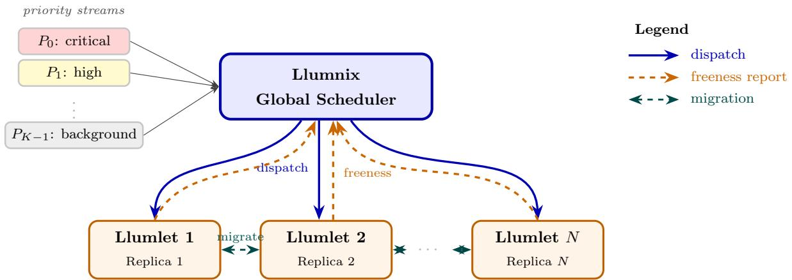  
Figure 1: Two-level scheduling architecture. Priority-tagged request streams $P _ { 0 }$ (critical) through $P _ { K - 1 }$ (background) enter the Llumnix global scheduler, which dispatches them to N Llumlet replica schedulers and receives freeness reports in return. Bidirectional migration links support live KV-cache transfer between replicas.

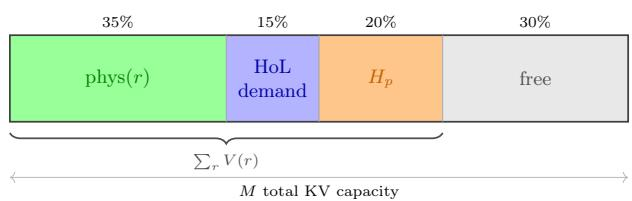  
■ phys(r): running KV footprint ■ HoL: head-of-line demand  
■ Hp: per-tier headroom (drives migration) ■ free capacity

$$
\begin{array} { r } { F = \left( M - \sum _ { r } V ( r ) \right) / B } \end{array}
$$

Figure 2: Components of virtual usage in the freeness metric. The stacked bar shows a single replica’s KV memory partitioned into running-request allocations, head-of-line demand, priority headroom, and free space. Freeness F is positive when virtual usage leaves slack, and goes negative when headroom plus demand exceed M, triggering migration.

budget $H _ { p }$ computed via exponential decay:

$$
H _ { p } = M \cdot h _ { \mathrm { m a x } } \cdot e ^ { - \lambda p }\tag{3}
$$

where M is the replica’s block capacity, $h _ { \operatorname* { m a x } } = 0 . 2 0$ (20% of capacity reserved for tier 0), and λ is chosen such that ${ \cal H } _ { K - 1 } \approx 0$ . The total virtual headroom contributed to a replica’s freeness calculation is:

$$
V _ { \mathrm { h e a d r o o m } } = \sum _ { p = 0 } ^ { K - 1 } H _ { p } \cdot \mathbf { 1 } [ \mathrm { n u m R e q u e s t s } ( p ) > 0 ]\tag{4}
$$

Note that the full budget $H _ { p }$ is charged whenever any request of priority p is present, not per request, ensuring that a single critical request can efectively block normal-priority dispatch to an overloaded replica.

## 3.4 Priority-Aware Dispatch

The global scheduler maintains a sorted pending queue and dispatches requests in strict priority order (tier 0 first), with FCFS ordering within each tier. For each request, the dispatcher selects the replica with the highest freeness (arg max F) that is not currently draining. If all replicas are draining (a transient state during aggressive scale-in), the dispatcher falls back to the least-loaded draining replica.

Two separate freeness values are maintained per replica. Full freeness $F _ { \mathrm { f u l l } }$ includes priority headroom and is used for dispatch and migration targeting. Normal-priority freeness $F _ { \mathrm { n o r m a l } }$ excludes headroom and is used exclusively for auto-scaling decisions. The distinction prevents artificial inflation of virtual usage from triggering spurious scale-out events, matching the auto-scaling component described in [1].

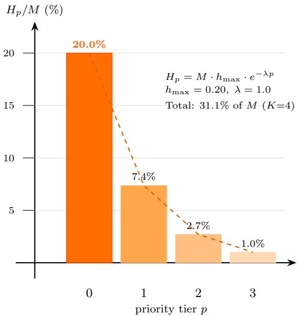  
Figure 3: Per-tier headroom allocation under exponential decay $( K = 4 , h _ { \operatorname* { m a x } } = 0 . 2 0 , \lambda = 1 . 0 )$ . Tier 0 reserves 20% of KV capacity; each subsequent tier decays by $e ^ { - \lambda } { \approx } 3 7 \%$ . Total headroom across all tiers is 31.1% of M.

## 3.5 Migration and Load Rebalancing

The global scheduler periodically evaluates whether migration is warranted using two criteria: a timebased interval (50 ms in most experiments) and a load imbalance threshold $\Delta F = \operatorname* { m a x } ( F ) - \operatorname* { m i n } ( F ) \geq$ θ (default θ = 0.3).

When migration is triggered, the scheduler identifies source replicas (low freeness) and destination replicas (high freeness), and instructs each source Llumlet to select and migrate one request. Candidate selection prioritizes queued requests (no KV state, cheap to migrate) and secondarily targets lowpriority running requests with small KV footprints. This minimizes migration cost while maximally relieving pressure on overloaded replicas.

For running requests, migration proceeds in multiple stages (Figure 4). Each stage copies a fixed number of KV blocks from source to destination while the request continues to execute on the source. After $\lceil B _ { r } / B _ { \mathrm { s t a g e } } \rceil$ stages, the final stage commits the request to the destination. The request continues to generate tokens throughout migration; only a brief re-enqueue latency is incurred at the final handof.

When a replica is draining (used for scale-in and graceful instance shutdown), the Llumlet inserts an infinite-virtual-usage sentinel into the freeness calculation, making the instance appear maximally overloaded. This triggers continuous migration of all requests of the draining instance without any new

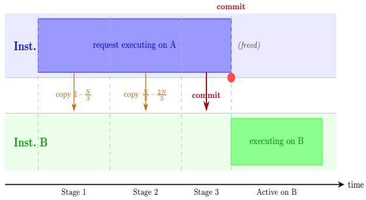  
Figure 4: Multi-stage live migration of a running request’s KV-cache from Instance A to Instance B. In each stage the Llumlet copies a fixed block chunk while the request continues executing on A. After the final stage the request is committed to B. Only a brief re-enqueue latency is incurred at the handof; decode-phase tokens are generated throughout.

dispatch.

## 3.6 Auto-Scaling

Auto-scaling decisions use the cluster-average normal-priority freeness $\begin{array} { r } { \bar { F } _ { \mathrm { n o r m a l } } = \frac { 1 } { N } \sum _ { i } F _ { \mathrm { n o r m a l } , i } . } \end{array}$ Scale-out is triggered when F¯normal $< - 0 . 5$ (cluster overloaded), and scale-in when $\bar { F } _ { \mathrm { n o r m a l } } > 1 . 5$ (cluster underutilized). Using $F _ { \mathrm { n o r m a l } }$ rather than full freeness prevents priority isolation from being misinterpreted as capacity shortage, which would otherwise cause unnecessary scale-out as priority levels increase.

## 3.7 INFaaS Baseline Implementation

We implement an INFaaS-style global scheduler [7] as the primary comparison baseline. Our implementation captures INFaaS’s core routing mechanism via a cost-based dispatch function:

$$
\mathrm { c o s t } ( r ) = \alpha \cdot \hat { q } _ { r } + \beta \cdot \hat { s } _ { r } + \gamma \cdot \mathrm { p e n a l t y } ( r )\tag{5}
$$

where $\hat { q } _ { r }$ is the estimated queue depth on replica $r ,$ $\hat { s } _ { r }$ is the expected service time estimated via EWMA, and penalty(r) is a state-based penalty (0 for AC-TIVE, elevated for OVERLOADED and INTER-FERED). Unlike Llumnix, INFaaS performs no live migration and maintains no KV-aware freeness; it relies entirely on load-balancing at dispatch time.

## 4 Implementation

## 4.1 Simulator Integration

We implemented our extended Llumnix scheduler as a new scheduling policy within the Vidur simulation framework [2], forking both the Vidur and Llumnix codebases.1 Vidur provides a discrete-event simulation engine that models transformer operator latencies from real profiling data, enabling accurate prediction of TTFT, TBT, and end-to-end request latency without requiring GPU hardware access.

Our integration consists of three primary components.

LlumletReplicaScheduler (vidur/scheduler/ replica\_scheduler/llumlet\_replica\_scheduler.py):

A new replica scheduler implementing the full Llumlet logic, including priority-ordered queueing, multi-component virtual usage, per-tier headroom computation, block-level KV-cache management, and multi-stage migration state machines.

LlumnixGlobalScheduler (vidur/scheduler/ global\_scheduler/llumnix\_global\_scheduler.py): A new global scheduler implementing priority-aware dispatch (tier 0 first, FCFS within tier), migration orchestration, auto-scaling signaling, and draining. It communicates with Llumlets via report\_freeness() and begin\_migration\_to() interfaces.

InfaasGlobalScheduler (vidur/scheduler/global\_ scheduler/infaas\_global\_scheduler.py): The INFaaSstyle baseline routing implementation with replica state tracking, EWMA latency estimation, and costbased request assignment.

## 4.2 Priority Distribution Sampling

We implement a PrioritySampler (vidur/utils/ priority\_sampler.py) supporting multiple request priority distribution types. For our main experiments we use three distributions. The uniform distribution assigns equal probability 1/K per tier, stresstesting the scheduler with equal numbers of requests at each priority level. The Gaussian distribution centers weights at tier ⌊K/2⌋ with standard deviation K/4, reflecting a middle-heavy workload. The enterprise distribution assigns approximately 10% of trafic to tier 0 (critical), ∼70% to mid-priority tiers, and 5–20% to background tier K−1, modeling a realistic production deployment where most trafic is standard quality.

Priority 0 is the highest priority (critical/interactive) and priority K − 1 is the lowest (background/batch), consistent with Llumnix’s original convention.

## 4.3 Request Length Distribution

All experiments use a synthetic length distribution calibrated to represent a realistic mix of LLM API trafic (Table 1). The distribution is right-skewed to reflect the empirical observation that the majority of real LLM API trafic consists of short conversational turns [1].

Table 1: Request length distribution used in all experiments.
<table><tr><td>Tokens</td><td>Prob.</td><td>Description</td></tr><tr><td>64-128</td><td>~65%</td><td>Short (chat, classification)</td></tr><tr><td>128-256</td><td>~22%</td><td>Medium (summarization)</td></tr><tr><td>256-384</td><td>~10%</td><td>Long (document analysis)</td></tr><tr><td>384-512</td><td>~2%</td><td>Very long (code generation)</td></tr></table>

## 4.4 Experiment Configuration

All simulations run on 4 replica instances with aggregate query arrival rate QPS = 1,250 (Poissondistributed) for the main priority distribution sweeps. For the comparative scheduler benchmark (Section 5.2), we use QPS = 10 with 1,000 requests to allow cleaner cross-scheduler comparison. All experiments were run using 120 parallelized CPU threads on Berkeley Research Computing infrastructure, sweeping across 120 simulation configurations per distribution type.

## 5 Evaluation

## 5.1 Priority Diferentiation Under Varying Tier Counts

We first evaluate whether our extended priority model successfully achieves latency diferentiation between tiers.

Uniform distribution. Figure 5 shows TTFT CDF, TBT CDF, and end-to-end latency violin plots for $K \in \{ 1 , 3 , 5 \}$ under the uniform distribution. With K = 1 (no diferentiation), all requests experience identical latency with median end-to-end around 10–12 seconds. With K = 3, tier 0 achieves a median TTFT of approximately 0.3 s versus over 3 s for tier 2, demonstrating efective isolation. With K = 5, diferentiation continues as tier 0 remains fast while tier 4 experiences the longest tail. The gap between adjacent mid-priority tiers narrows, however, and the overall system P99 increases slightly.

Gaussian distribution. The Gaussian distribution concentrates requests at mid-priority tiers (Figure 8 in Appendix Appendix A:). Tier 0 has few requests, so its headroom is rarely fully consumed, resulting in very aggressive TTFT improvements (median TTFT $< 0 . 5 \mathrm { s }$ for K = 5, tier 0). The headroom budget is therefore less eficiently utilized overall, as it remains idle for most of the experiment. The tail behavior of lower tiers worsens significantly under $K = 5 ,$ consistent with increasing headroom consumption. Enterprise distribution. The enterprise distribution (Figure 9 in Appendix Appendix A:) shows the most practically relevant results. With 10% critical trafic, tier 0 headroom is consistently utilized, yielding stable TTFT improvements. The large fraction of mid-priority trafic (tiers 1–2) benefits from isolation from background trafic at tier K−1. This distribution consistently produces the largest absolute speedup numbers (Section 5.3).

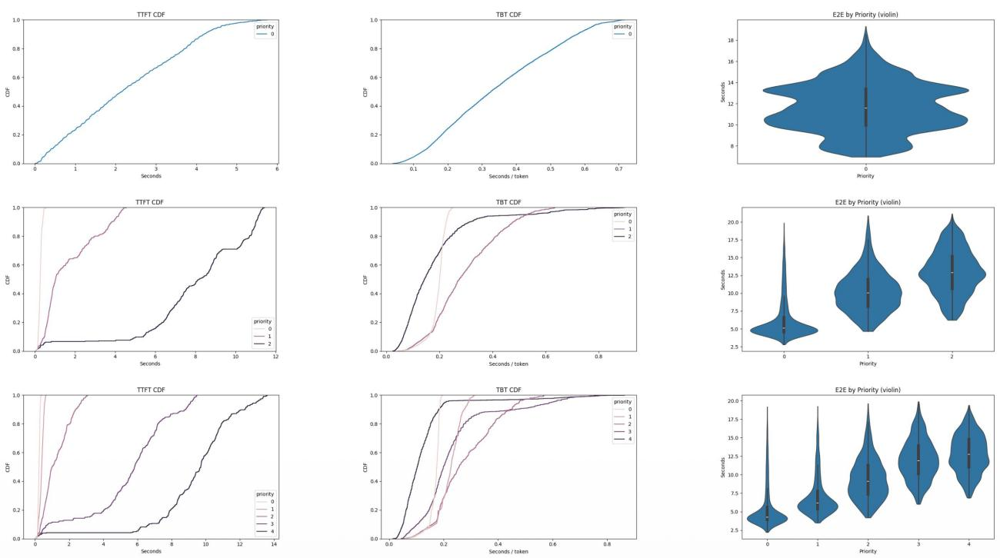  
Figure 5: Priority diferentiation under uniform priority distribution. Rows: K = 1, K = 3, K = 5 priority tiers. Columns: TTFT CDF, TBT CDF, end-to-end latency violin plot by priority.

## 5.2 Scheduler Comparison Across Priority Levels

Figure 6 shows end-to-end latency percentiles (P50, P90, P99) for all four replica schedulers (vLLM, Orca, Sarathi, Llumlet) as priority levels increase from 1 to 10, with 4 replicas and 1,000 requests at QPS = 10. This benchmark is deliberately run at moderate load to isolate cross-scheduler overhead; it is not designed to demonstrate per-tier latency diferentiation, which is shown separately in Section 5.1.

At K = 1 (no priority diferentiation), all schedulers perform similarly: vLLM shows slightly higher P99 (1.63 s) compared to Orca, Sarathi, and Llumlet (1.58–1.59 s). This confirms that baseline hardware and request distributions are equivalent across configurations.

As K increases, Llumlet’s P99 rises modestly to ∼1.61 s at K = 7 before recovering, while vLLM, Orca, and Sarathi remain flat. This reflects the cost of priority headroom: more active tiers increase total virtual usage, reducing freeness and making the replica appear “busier.” Notably, this overhead is concentrated in prefill latency (Figure 7), while decode latency remains stable and slightly better than baselines throughout the sweep.

Importantly, the aggregate P50/P90/P99 across all tiers masks the per-tier story. Under $\mathrm { Q P S } = 1 0$ the system operates below saturation and headroom budgets rarely bind — all requests are served quickly regardless of tier, so there is little headroom-driven diferentiation to observe in the aggregate. A heavily loaded workload would show high-priority tiers achieving lower latency at the expense of low-priority tiers, widening the aggregate P99. The value of Figure 6 is therefore to confirm baseline parity: Llumlet does not degrade aggregate performance relative to simpler schedulers, a necessary condition for production deployment.

Key takeaway: Llumlet supports up to 10 priority levels without latency collapse and achieves aggregate baseline parity under moderate load. Prioritization overhead is modest and primarily manifests in prefill scheduling. Decode-phase performance is unafected or slightly improved, consistent with Llumnix’s finding that migration mechanisms disproportionately benefit long-running decode operations. The flat aggregate trend across schedulers is expected at sub-saturation QPS and should not be interpreted as null evidence for priority efectiveness; per-tier diferentiation is demonstrated under the controlled sweeps of Section 5.1.

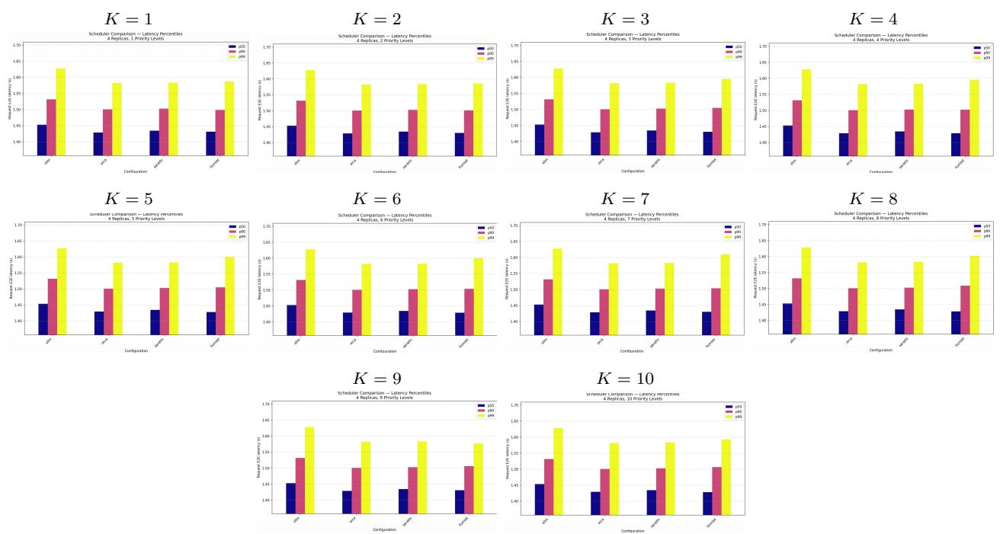

Figure 6: End-to-end latency (P50/P90/P99) for all schedulers as a function of priority level count K (4 replicas, 1,000 requests, QPS = 10). Across K = 1–10, aggregate latency remains broadly stable, indicating that increasing priority granularity does not introduce large overhead at this load.  
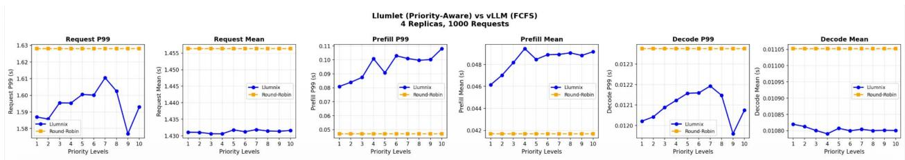  
Figure 7: Llumlet vs. vLLM Round-Robin across priority levels K = 1–10, broken down by request end-to-end, prefill, and decode latency (P99 and mean).

## 5.3 Llumnix+Llumlet vs. IN-FaaS+vLLM

Table 2 (uniform distribution) and Tables 3–4 (Gaussian and enterprise distributions; see Appendix Appendix B:) show speedup of our system (Llumnix global + Llumlet local) over the INFaaS baseline (IN-FaaS global + vLLM local) for $K \in \{ 3 , 4 , 5 \}$ under three distributions at 10K and 15K requests.

Four priority tiers is consistently optimal. At K = 4, all three distributions achieve peak E2E P99 speedup, peak or near-peak E2E mean speedup, and peak cost-per-latency improvement. This sweet spot arises because four tiers provides enough granularity to separate critical, high, standard, and background trafic without fragmenting queues so finely that loadbalancing heuristics lose efectiveness. In addition, headroom budgets at K = 4 are still large enough to provide meaningful isolation for tiers 0 and 1, while the lower tiers remain eficiently batched.

Prefill mean speedup exceeds the original paper. Across all conditions, our prefill mean speedup (5.0–8.3×) substantially exceeds Llumnix’s reported ≤2.2×. We attribute this to Llumlet’s migrationdriven load balancing, which continuously redistributes prefill work to underloaded replicas and prevents the “convoy efect” where bursty prefill requests pile up on a single overloaded instance. IN-FaaS’s reactive cost model responds more slowly to

Table 2: Speedup over INFaaS+vLLM — Uniform distribution. Bold K marks the best-performing configuration.
<table><tr><td>Scale</td><td>Prefill P99</td><td>Prefill Mean</td><td>E2E P99</td><td>E2E Mean</td><td>Cost/Lat.</td><td>K</td></tr><tr><td rowspan="3">10K requests</td><td>4.79×</td><td>8.23×</td><td>2.87×</td><td>2.80×</td><td>65%</td><td>3</td></tr><tr><td>4.87×</td><td>8.23×</td><td>3.13×</td><td>2.88×</td><td>68%</td><td>4</td></tr><tr><td>4.16×</td><td>8.11×</td><td>3.04×</td><td>2.92×</td><td>67%</td><td>5</td></tr><tr><td rowspan="3">15K requests</td><td>2.98×</td><td>5.00×</td><td>1.87×</td><td>1.97×</td><td>46%</td><td>3</td></tr><tr><td>3.16×</td><td>5.16×</td><td>2.12×</td><td>2.08×</td><td>53%</td><td>4</td></tr><tr><td>2.72×</td><td>5.07×</td><td>2.04×</td><td>2.12×</td><td>51%</td><td>5</td></tr><tr><td>Llumnix [1]</td><td>≤5.5×</td><td>≤2.2×</td><td>≤2.9× (real) ≤1.6× (synth.)</td><td>≤2.0× (real) ≤1.6× (synth.)</td><td>16-36%</td><td>2</td></tr></table>

transient prefill bursts.

Prefill P99 speedup is lower at high load. At 15K requests, prefill P99 speedup drops to 2.0–3.2× compared to the paper’s reported $\leq 5 . 5 \times$ . Near satu ration, all replicas approach capacity limits, reducing the freeness diferential that drives migration. Prefill P99 is inherently more sensitive to bursty memory spikes than the mean, and KV-cache pressure at the tail cannot be fully relieved when no destination has suficient slack.

Cost-per-latency improvements significantly exceed the original paper. Our improvements of 46–68% (10K) and 24–53% (15K) compare favorably to the paper’s 16–36%. This is attributable to the migration system’s ability to consolidate low-priority requests and free capacity for high-priority workloads, resulting in less wasted KV-cache memory and fewer preemption penalties.

## 6 Discussion

## 6.1 The Priority-Granularity Tradeof

Our results support a general principle we term the priority-granularity tradeof: as the number of priority tiers K increases, two opposing efects compete. Finer granularity enables more precise SLA diferentiation, but also increases total headroom consumption, since each tier with any active requests contributes its full budget $H _ { p }$ to virtual usage. This in turn reduces efective batching capacity and increases average latency for all tiers.

The empirically observed optimum at K = 4 is robust across workload distributions. For future deployments, we recommend starting at 3–4 priority tiers and increasing only if SLO diferentiation requirements cannot otherwise be met, rather than deploying maximum granularity by default.

## 6.2 Interaction Between Load and Priority Efectiveness

Benefits of priority-aware scheduling are most pronounced at moderate load (10K requests), where freeness variance across replicas is higher and migration opportunities are abundant. Near saturation (15K requests), the average freeness approaches zero and the system transitions from a regime where migration can rebalance load to one where all replicas are equally overloaded. This suggests that priority scheduling should be paired with proactive autoscaling: detecting saturation early and scaling out before the migration mechanism loses efectiveness.

A related subtlety concerns the measurement of priority efectiveness itself. Aggregate latency percentiles (pooled across all tiers) are an incomplete metric: even when Llumlet is working correctly, aggregate P99 may be similar to or slightly higher than baselines because high-priority gains are ofset by low-priority degradation. The correct metric is per-tier latency, which would show tier-0 improving relative to baselines while tier K−1 worsens — exactly the intended SLA tradeof. The per-tier diferentiation plots (Figures 5–9) capture this, while the aggregate scheduler comparison (Figure 6) measures a diferent property: aggregate overhead neutrality.

## 6.3 Distribution-Specific Behavior

The enterprise distribution consistently yields the best cost-eficiency results due to its skewed priority assignment. The concentration of requests at mid-priority tiers creates well-populated queues that Llumnix’s batch normalization can exploit efectively, while the small fraction of tier-0 trafic means that critical requests rarely compete with each other for the headroom budget. This mirrors real-world deployments where “VIP” trafic is a small fraction of total volume.

The Gaussian distribution shows the highest sensitivity to tier count, with speedups varying significantly between K = 3 and K = 5. Schedulers deployed on Gaussian workloads (e.g., consumer APIs where most users are “standard”) may benefit from workload-adaptive tier reconfiguration.

## 6.4 Comparison to the Original Llumnix Paper

Our simulation-based results cannot be directly compared to Llumnix’s hardware-measured results [1] for three reasons. First, we implemented our own versions of Llumnix and INFaaS adapted to Vidur’s architecture, which may difer in subtle ways from the original implementations. Second, Vidur simulates GPU computation without capturing all hardware efects such as PCIe bandwidth for KV migration and CUDA kernel launch overhead. Third, we did not have access to the exact workload traces used in the original paper. Nonetheless, our results are broadly consistent with the paper’s reported ranges, and in some metrics (prefill mean, cost-per-latency) exceed them, lending confidence that our implemen tation captures the essential dynamics of Llumnix’s scheduling design.

## 6.5 Limitations and Future Work

Adaptive headroom allocation. Our exponential decay schedule is static. A natural extension is adaptive headroom that continuously monitors the observed latency diferential between tiers, adjusting $H _ { p }$ upward when SLO violations are detected and downward when headroom is consistently unused [9, 10].

Multilevel feedback queues. Tier assignment is fixed at request arrival in our system. An MLFQstyle extension [11] could dynamically promote requests that have waited longer than a tier-specific time quota, preventing starvation of low-priority requests under sustained high load.

Vidur-Search integration. Vidur’s configuration search capability [2] could automatically find optimal headroom schedules and tier counts for a given work load distribution and SLO target, replacing manual tuning with systematic exploration.

Contention level and per-tier evaluation. The scheduler comparison (Figure 6) runs at QPS = 10, placing the system below saturation. At this load, headroom budgets rarely bind and aggregate latency percentiles pooled across all tiers are similar for all schedulers. Demonstrating the expected per-tier latency split — high-priority tiers improving at the expense of low-priority tiers — would require both higher utilization and reporting per-tier breakdowns separately rather than pooled aggregates. This is a key direction for future evaluation and represents the natural next step to validate the priority diferentiation results of Section 5.1 at realistic production load.

Hardware validation. Validating our simulation results on a real GPU cluster (e.g., A100 or H100 instances) would quantify the gap between simulated and hardware performance, particularly for migration costs, which depend critically on PCIe and NVLink bandwidth.

## 7 Conclusion

We have presented a multi-tier extension of Llumnix’s priority scheduling model, implemented and evaluated within the Vidur LLM inference simulator. By replacing Llumnix’s binary high/normal priority classification with K-tier scheduling backed by exponentially decayed per-tier headroom, tier-aware dispatch ordering, and full migration support, we demonstrate that meaningful SLO diferentiation across four or more priority classes is achievable without significant overall system throughput loss.

Our evaluation across three workload distributions, two request volume scales, and priority levels ranging from 1 to 10 reveals a consistent optimum at $K = 4$ Four priority tiers achieves peak E2E P99 speedups of up to 3.13× and cost-per-latency improvements of up to 68% over INFaaS+vLLM, substantially outperforming both the original Llumnix paper’s reported cost savings and INFaaS’s load-balancing approach. Beyond $K = 5$ , benefits plateau and overhead from headroom fragmentation begins to dominate.

These results provide practical guidance for production LLM serving deployments: a four-tier SLA model covering critical, high, standard, and background trafic is both suficient to capture the full spectrum of user latency requirements and eficient enough to preserve the high-priority optimizations that migration-capable schedulers provide.

## Acknowledgments

We thank the authors of the Vidur and Llumnix open-source projects for making their frameworks publicly available.

## Appendix A: Priority Diferentiation: Gaussian and Enterprise Grids

Figures 8 and 9 show the full TTFT CDF, TBT CDF, and end-to-end latency violin plots for the Gaussian and enterprise priority distributions, mirroring the format of Figure 5 in the main paper.

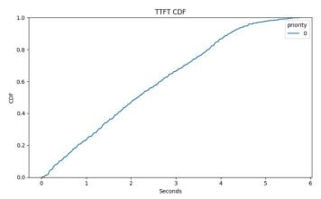

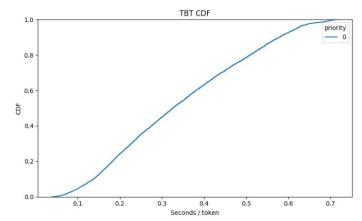

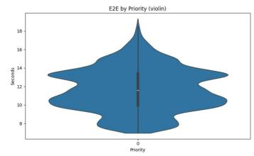

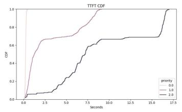

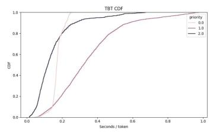

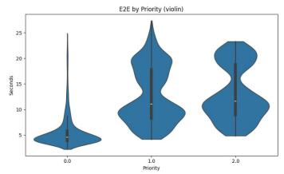

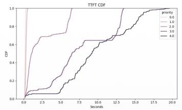

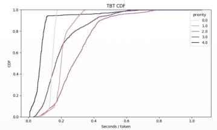

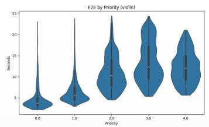  
Figure 8: Priority diferentiation under Gaussian priority distribution. Rows: K = 1, K = 3, K = 5. Columns: TTFT CDF, TBT CDF, end-to-end latency violin plot by priority.

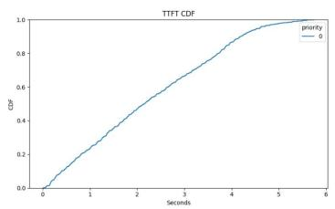

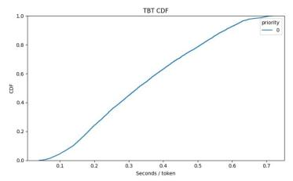

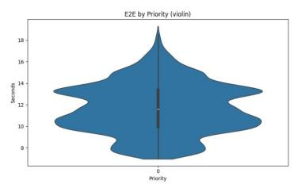

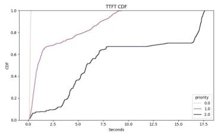

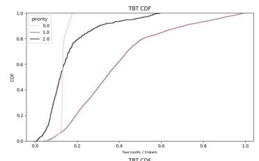

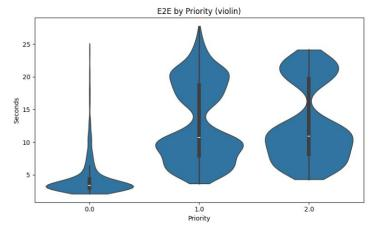

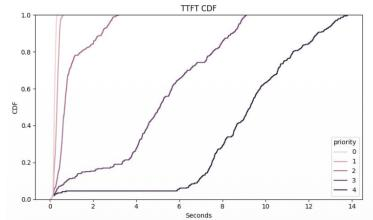

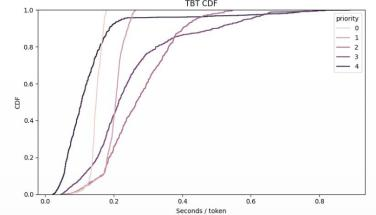

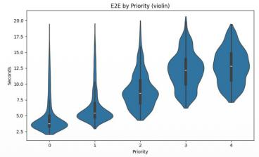  
Figure 9: Priority diferentiation under enterprise priority distribution. Rows: K = 1, K = 3, K = 5. Columns: TTFT CDF, TBT CDF, end-to-end latency violin plot by priority.

## Appendix B: Speedup Tables: Gaussian and Enterprise Distributions

Tables 3 and 4 report speedup of Llumnix+Llumlet over INFaaS+vLLM under the Gaussian and enterprise priority distributions, mirroring the format of Table 2 in the main paper. The K = 4 optimum holds across all three distributions.  
Table 3: Speedup over INFaaS+vLLM — Gaussian distribution. Bold K marks the best-performing configuration.
<table><tr><td>Scale</td><td>Prefill P99</td><td>Prefill Mean</td><td>E2E P99</td><td>E2E Mean</td><td> $\mathbf { C o s t / L a t } .$ </td><td>K</td></tr><tr><td rowspan="3">10K requests</td><td>3.24×</td><td>7.47×</td><td>2.26×</td><td>2.45×</td><td>56%</td><td>3</td></tr><tr><td>4.25×</td><td>8.33×</td><td>3.07×</td><td>2.79×</td><td>67%</td><td>4</td></tr><tr><td>3.49×</td><td>7.51×</td><td>2.43×</td><td>2.74×</td><td>59%</td><td>5</td></tr><tr><td rowspan="3">15K requests</td><td>2.00×</td><td>4.68×</td><td>1.49×</td><td>1.71×</td><td>33%</td><td>3</td></tr><tr><td>2.70×</td><td>5.24×</td><td>2.02×</td><td>1.96×</td><td>51%</td><td>4</td></tr><tr><td>2.25×</td><td>4.88×</td><td>1.97×</td><td>1.67×</td><td>41%</td><td>5</td></tr><tr><td>Llumnix [1]</td><td>≤5.5×</td><td>≤2.2×</td><td>≤2.9× (real) ≤1.6× (synth.)</td><td>≤2.0× (real) ≤1.6× (synth.)</td><td>16-36%</td><td>2</td></tr></table>

Table 4: Speedup over INFaaS+vLLM — Enterprise distribution. Bold K marks the best-performing configuration.
<table><tr><td>Scale</td><td>Prefill P99</td><td>Prefill Mean</td><td>E2E P99</td><td>E2E Mean</td><td>Cost/Lat.</td><td>K</td></tr><tr><td rowspan="3">10K requests</td><td>3.10×</td><td>8.06×</td><td>2.18×</td><td>2.27×</td><td>54%</td><td>3</td></tr><tr><td>4.41×</td><td>8.28×</td><td>3.02×</td><td>2.79×</td><td>67%</td><td>4</td></tr><tr><td>4.12×</td><td>8.14×</td><td>2.96×</td><td>2.89×</td><td>66%</td><td>5</td></tr><tr><td rowspan="3">15K requests</td><td>1.77×</td><td>4.51×</td><td>1.31×</td><td>1.44×</td><td>24%</td><td>3</td></tr><tr><td>2.76×</td><td>5.04×</td><td>1.94×</td><td>1.95×</td><td>48%</td><td>4</td></tr><tr><td>2.61×</td><td>5.06×</td><td>1.97×</td><td>2.08×</td><td>49%</td><td>5</td></tr><tr><td>Llumnix [1]</td><td>≤5.5×</td><td>≤2.2×</td><td>≤2.9× (real) ≤1.6× (synth.)</td><td>≤2.0× (real) ≤1.6× (synth.)</td><td>16-36%</td><td>2</td></tr></table>

## References

[1] B. Sun, Z. Huang, H. Zhao, W. Xiao, X. Zhang, Y. Li, and W. Lin. Llumnix: Dynamic Scheduling for Large Language Model Serving. In Proceedings of the 18th USENIX Symposium on Operating Systems Design and Implementation (OSDI ’24), 2024. arXiv:2406.03243.

[2] A. Agrawal, N. Kedia, J. Mohan, A. Panwar, N. Kwatra, B. S. Gulavani, R. Ramjee, and A. Tumanov. Vidur: A Large-Scale Simulation Framework for LLM Inference. arXiv:2405.05465, 2024.

[3] W. Kwon, Z. Li, S. Zhuang, Y. Sheng, L. Zheng, C. H. Yu, J. E. Gonzalez, H. Zhang, and I. Stoica. Eficient Memory Management for Large Language Model Serving with PagedAttention. In Proceedings of the 29th ACM Symposium on Operating Systems Principles (SOSP ’23), 2023. arXiv:2309.06180.

[4] G.-I. Yu, J. S. Jeong, G.-W. Kim, S. Kim, and B.-G. Chun. Orca: A Distributed Serving System for Transformer-Based Generative Models. In Proceedings of the 16th USENIX Symposium on Operating Systems Design and Implementation (OSDI ’22), 2022.

[5] A. Agrawal, N. Kedia, A. Panwar, J. Mohan, N. Kwatra, B. S. Gulavani, A. Tumanov, and R. Ramjee. Taming Throughput-Latency Tradeof in LLM Inference with Sarathi-Serve. In Proceedings of the 18th USENIX Symposium on Operating Systems Design and Implementation (OSDI ’24), 2024. arXiv:2403.02310.

[6] A. Agrawal, A. Panwar, J. Mohan, N. Kwatra, B. S. Gulavani, and R. Ramjee. SARATHI: Eficient LLM Inference by Piggybacking Decodes with Chunked Prefills. arXiv:2308.16369, 2023.

[7] F. Romero, Q. Li, N. J. Yadwadkar, and C. Kozyrakis. INFaaS: Automated Model-less Inference Serving. In Proceedings of the 2021 USENIX Annual Technical Conference (ATC ’21), 2021. arXiv:1905.13348.

[8] Z. Li, L. Zheng, Y. Zhong, V. Liu, Y. Sheng, X. Jin, Y. Huang, Z. Chen, H. Zhang, J. E. Gonzalez, and I. Stoica. AlpaServe: Statistical Multiplexing with Model Parallelism for Deep Learning Serving. In Proceedings of the 17th USENIX Symposium on Operating Systems Design and Implementation (OSDI ’23), 2023. arXiv:2302.11665.

[9] Y. Tang, T. Lan, X. Huang, H. Lu, and W. Chen. SCORPIO: Serving the Right Requests at the Right Time for Heterogeneous SLOs in LLM Inference. arXiv:2505.23022, 2025.

[10] S. Chen, Z. Jia, S. Khan, A. Krishnamurthy, and P. B. Gibbons. SLOs-Serve: Optimized Serving of Multi-SLO LLMs. arXiv:2504.08784, 2025.

[11] F. J. Corbató, M. Merwin-Daggett, and R. C. Daley. An Experimental Time-Sharing System. In Proceedings of the Spring Joint Computer Conference, AFIPS ’62 (Spring), 1962.

[12] Y. Zhang et al. SGDRC: Software-Defined Dynamic Resource Control for Concurrent DNN Inference on NVIDIA GPUs. arXiv:2407.13996, 2024.

[13] R. Prabhu, A. Nayak, J. Mohan, R. Ramjee, and A. Panwar. vAttention: Dynamic Memory Management for Serving LLMs without PagedAttention. arXiv:2405.04437, 2024.

[14] C. Hu, H. Huang, J. Hu, et al. MemServe: Context Caching for Disaggregated LLM Serving with Elastic Memory Pool. arXiv:2406.17565, 2024.

[15] C. Hsieh, Z. Zong, X. Chen, J. Li, J. Zhai, and L. Wen. FlowPrefill: Decoupling Preemption from Prefill Scheduling Granularity to Mitigate Head-of-Line Blocking in LLM Serving. arXiv:2602.16603, 2026.

[16] R. Li, F. Chen, and P. Li. Semi-Clairvoyant Scheduling of Speculative Decoding Requests to Minimize LLM Inference Latency. arXiv:2505.17074, 2025.