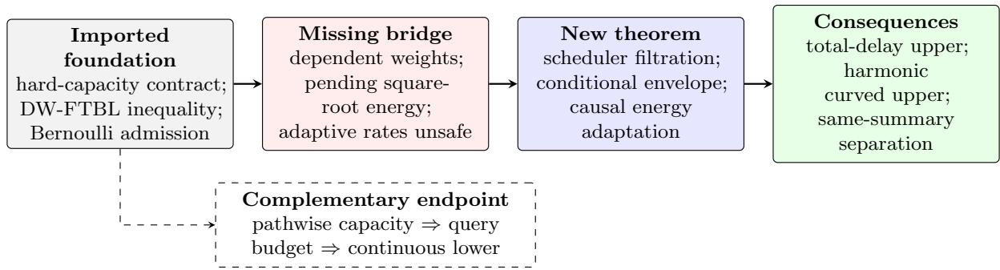
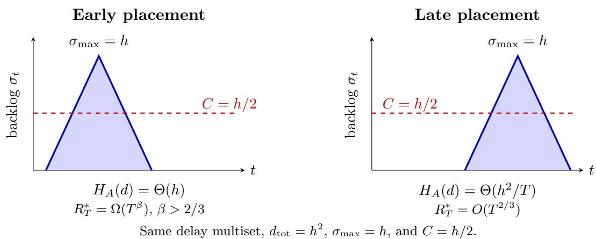

# Beyond Peak Backlog: Conditional Energy and Temporal Geometry in

# Capacity-Constrained Delayed Bandit Optimization

Anling Xiang1, Yuwen Yang2, Yang Shen3,4 1Department of Intelligent Communication, School of Journalism and Communication, Minzu University of China, Beijing, China 2ZeeLin (Beijing) Technology Co., Ltd., Beijing, China 3School of Journalism and Communication, Tsinghua University, Beijing, China 4College of AI, Tsinghua University, Beijing, China ORCID: Anling Xiang 0000-0003-1690-1586 Yuwen Yang 0009-0002-3084-6720; Yang Shen 0000-0003-4814-9018

## Abstract

What is the right delay complexity when a learner can track only C pending feedback items and discarded feedback is permanently lost? The current one-point bandit convex optimization guarantee in this model pays $\sqrt { T \sigma _ { \mathrm { m a x } } }$ , where $\sigma _ { \mathrm { m a x } }$ is the peak backlog, although unlimited tracking admits the sharper $\sqrt { d _ { \mathrm { t o t } } }$ dependence on total delay. This gap cannot be closed by a direct moment substitution: randomized admission creates dependent importance weights, and a learning rate adapted to their history can invalidate the required cancellation.

We introduce a scheduler-side conditional-energy interface that separates rate adaptation from the one-point perturbation filtration. Under the same semi-clairvoyant oracle and pathwise hard-capacity contract, it yields an untuned learner satisfying

$$
\begin{array} { c c c } { { O \displaystyle { \left( G D \left[ \sqrt { E _ { C } { d } _ { \mathrm { t o t } } } + T ^ { 3 / 4 } \left( 1 + \frac { \sigma _ { \mathrm { m a x } } } { C } \right) ^ { 1 / 4 } \sqrt { \nu k } + 1 \right] \right) } , } } \\ { { E _ { C } = 1 + \displaystyle { \left\lceil { \log _ { 2 } \left( 1 + \frac { 1 6 \left( \sigma _ { \mathrm { m a x } } + 1 \right) } { C } \right) } \right\rceil } . } } \end{array}
$$

Here $\nu = M / ( G r )$ is the one-point geometry ratio. Thus peak-times-horizon is replaced by total backlog area, up to the explicit restart factor $E _ { C } ;$ a public constant-factor peak bound removes $E _ { C }$ while $d _ { \mathrm { t o t } }$ remains unknown. The interface is stated as a reusable delayed weighted Follow-the-Bandit-Leader theorem, and we show why unrestricted predictable adaptation is false.

Under strong convexity, the interface yields the temporal cost $\begin{array} { r } { H _ { A } ( d ) = \sum _ { t } \sigma _ { t } / ( A + t ) } \end{array}$ . Two delay vectors with identical delay multisets, $d _ { \mathrm { t o t } } , \sigma _ { \mathrm { m a x } }$ , and capacity have polynomially diferent minimax regret. Hence total delay controls the convex upper, but timing matters under curvature. Finally, a continuous hard family converts tracking capacity into a zeroth-order query budget and gives the endpoint

$$
\Omega \Big ( \operatorname* { m i n } \{ T , k \sqrt { T \operatorname* { m a x } \{ 1 , d / C \} } \} \Big ) \ .
$$

This shows that the hard cap is statistically non-vacuous. The results require $C \geq \ln T + 1$ for the upper bounds and do not constitute a complete capacity minimax characterization.

## 1 Introduction

Delayed online optimization usually assumes that every pending gradient or function value can eventually be recovered. In systems with a finite feedback bufer—for example, outstanding experiments, remote evaluations, or asynchronous jobs—this assumption fails: only C pending rounds can be tracked, and preempted feedback is lost forever. The hard-capacity model of Ryabchenko et al. [1] captures exactly this constraint through $| S _ { t } | \leq C$ on every sample path. Its one-point convex BCO guarantee is

$$
O \left( G D \left[ \sqrt { T \sigma _ { \mathrm { m a x } } } + T ^ { 3 / 4 } \left( 1 + \frac { \sigma _ { \mathrm { m a x } } } { C } \right) ^ { 1 / 4 } \sqrt { \nu k } \right] \right) ,
$$

and explicitly leaves open whether the first term can be reduced to the unconstrained-optimal $\sqrt { d _ { \mathrm { t o t } } }$ dependence. Since $\begin{array} { r } { d _ { \mathrm { t o t } } = \sum _ { t } \sigma _ { t } \le T \sigma _ { \mathrm { m a x } } } \end{array}$ , the diference can be polynomial when a large backlog is short-lived.

At first sight, one might keep the time-varying backlog inside the existing proof and sum it at the end. This is not valid. Randomized admission creates importance weights coupled through the hard tracking set, while the delayed one-point estimator contains a square root of the pending weighted energy. Unconditional moment bounds sufice for deterministic rates but cannot be multiplied by a rate adapted to the same weight history. We give an explicit two-round counterexample to this tempting step.

Our solution is to separate what the scheduler knows from what the bandit estimator randomizes. We define a scheduler-side filtration, derive an exact conditional energy envelope inside it, and prove an adaptive delayed-weighted FTBL theorem. This interface is the paper’s central object: the total-delay and strongly-convex results are two consequences of the same filtration-safe principle rather than unrelated refinements of the source analysis; Figure 1 records the boundary precisely.

The resulting message has two parts. For general convex losses, total backlog area can replace a peak-times-horizon delay charge even when feedback is permanently censored. Under curvature, however, the temporal placement of that same backlog can change minimax regret polynomially.

For compactness, let $\begin{array} { r } { E _ { C } = 1 + \lceil \log _ { 2 } ( 1 + 1 6 ( \sigma _ { \operatorname* { m a x } } + 1 ) / C ) \rceil } \end{array}$ ⌉ denote the capacity-relative number of backlog scales.

## Contributions.

1. A conditional-energy theorem. We identify the scheduler-side filtration needed by our construction, prove a causal adaptive FTBL interface for conditional energy envelopes, and show by counterexample why adaptation to the full predictable history is invalid.

2. From peak backlog to total delay. An exact Bernoulli-proxy envelope and delay-clock restart scheme give a hard-capacity learner that knows neither $d _ { \mathrm { t o t } }$ nor $\sigma _ { \mathrm { m a x } }$ and replaces $\sqrt { T \sigma _ { \mathrm { m a x } } }$ by $O ( \sqrt { E _ { C } d _ { \mathrm { t o t } } } )$ . With a public constant-factor peak bound, the restart factor disappears while $d _ { \mathrm { t o t } }$ remains unknown.

3. Temporal geometry under curvature. The same interface yields the harmonic cost $H _ { A } ( d ) =$ $\textstyle \sum _ { t } { \sigma _ { t } } / ( A + t )$ . Two instances with the same delay multiset, $d _ { \mathrm { t o t } } , \sigma _ { \mathrm { m a x } }$ , and capacity nevertheless have polynomially diferent minimax regret, proving that timing survives after all standard aggregate summaries are fixed.

A complementary endpoint turns pathwise tracking capacity into a continuous zeroth-order query budget. It verifies that the hard cap is statistically non-vacuous, but is not presented as a pointwise match to the upper bound.

  
Figure 1: Dependency map. The contract, base DW-FTBL inequalities, and Bernoulli admission rule are imported from Ryabchenko et al. [1]. The missing step is not a sharper summation: weightdependent adaptation is invalid without the blue filtration-safe interface. The dashed capacity lower is a supporting endpoint rather than an application of the compiler.

Table 1: Result map. Constants depending on fixed geometric scales are suppressed. “Match” refers only to the stated component, not to a complete BCO minimax characterization.
<table><tr><td>Setting</td><td>Closest benchmark</td><td>This work</td><td>Role / limitation</td></tr><tr><td>Convex BCO</td><td> $\sqrt { T \sigma _ { \operatorname* { m a x } } } + T ^ { 3 / 4 } ( 1 + \sigma _ { \operatorname* { m a x } } / C ) ^ { 1 / 4 } \sqrt { \nu k }$ </td><td> $O ( \sqrt { E c d _ { \mathrm { t o t } } } + T ^ { 3 / 4 } ( 1 +$   $\sigma _ { \mathrm { m a x } } / C ) ^ { 1 / 4 } \sqrt { \nu k } )$ </td><td>Upper;  $\sqrt { d _ { \mathrm { t o t } } }$  endpoint matched up to  $\sqrt { E _ { C } }$ </td></tr><tr><td>Strongly convex BCO</td><td> $\sigma _ { \mathrm { m a x } } \log T + ( T ^ { 2 } \log T ) ^ { 1 / 3 } ( 1 +$   $\sigma _ { \operatorname* { m a x } } / C ) ^ { 1 / 3 } ( \nu k ) ^ { 2 / 3 }$ </td><td> $H _ { A } ( d ) + A ^ { 1 / 3 } T ^ { 2 / 3 }$ </td><td>Upper; public backlog bound</td></tr><tr><td>Temporal geometry</td><td>Aggregate summaries assign the same scale to the early/late pair</td><td> $R _ { T } ^ { * } ( d ^ { \mathrm { e a r l y } } ) = \Omega ( T ^ { \beta } )$  versus  $R _ { T } ^ { * } ( d ^ { \mathrm { l a t e } } ) { } = { \cal O } ( T ^ { 2 / 3 } )$ </td><td>Minimax separation;  $2 / 3 < \beta < 5 / 6$ </td></tr><tr><td>Fixed-delay capacity</td><td>No continuous-domain capacity lower in the exact contract</td><td> $\Omega ( \operatorname* { m i n } \{ T , k \sqrt { T \operatorname* { m a x } \{ 1 , d / C \} } \} )$ </td><td>Lower endpoint; not a full match</td></tr></table>

## 2 Model and notation

Let $\kappa \subset \mathbb { R } ^ { k }$ be convex with diameter at most D and $r \mathbb { B } ^ { k } \subseteq \mathcal { K } \subseteq R \mathbb { B } ^ { k }$ . Before play, an oblivious adversary fixes diferentiable convex losses $f _ { t } : { \mathcal { K } }  \mathbb { R }$ and delays $d _ { t } \in \{ 0 , \ldots , T - t \}$ . Each loss is G-Lipschitz and satisfies $| f _ { t } ( x ) | \leq M$

At round t, the learner queries one point $x _ { t }$ . Its scalar feedback is observed at time $t + d _ { t }$ if and only if index t has remained in a tracking set of pathwise size at most C. A preempted index cannot be reinstated. At every expiry, including expiry of an untracked index, the learner receives the indexed message (t, feedback) or (t, ⊥). This is the semi-clairvoyant model of Ryabchenko et al. [1].

Define

$$
\begin{array} { c } { { \displaystyle { \mathcal { B } } _ { t } = \big \{ s < t : t \le s + d _ { s } \big \} , \qquad \sigma _ { t } = | \mathcal { B } _ { t } | , } } \\ { { \displaystyle d _ { \mathrm { t o t } } = \sum _ { t = 1 } ^ { T } \sigma _ { t } = \sum _ { t = 1 } ^ { T } d _ { t } , \qquad \sigma _ { \operatorname* { m a x } } = \operatorname* { m a x } _ { t } \sigma _ { t } , \qquad \nu = \frac { M } { G r } . } } \end{array}
$$

The comparator is $\begin{array} { r } { x ^ { * } \in \arg \operatorname* { m i n } _ { x \in \mathcal { K } } \sum _ { t } f _ { t } ( x ) } \end{array}$ , and all guarantees are in expectation over learner randomization. For a nonnegative analysis-weight sequence $w _ { 1 : T }$ , write

$$
\mathrm { R e g } _ { T } ^ { w } ( u ) = \sum _ { t = 1 } ^ { T } w _ { t } \big ( f _ { t } ( x _ { t } ) - f _ { t } ( u ) \big ) .
$$

Only the temporal placement changes.

  
Figure 2: Schematic continuous envelopes of the discrete early/late backlog profiles used in Theorem 9. Peak, area, delay multiset, and capacity agree, while the harmonic placement cost and minimax regret difer polynomially.

The weights are analysis variables produced by the admission wrapper; a round with weight zero can still incur true regret and is accounted for by the wrapper or by the explicit censoring charge below.

## 3 Scheduler-side conditional energy

Let $\mathcal { F } _ { t } ^ { \mathrm { s c h } }$ contain only the scheduler-side projection of indexed expiry messages (index, timing, and delivery/empty status, but not the scalar feedback payload), together with the tracking set, past proxy coins, admission decisions, importance weights, public parameters, and scheduler randomness available before the current coin. It excludes every past and current one-point perturbation direction and every function value generated from those directions. Rates and energy envelopes below are measurable with respect to this scheduler filtration. Conditional on the fixed oblivious instance, the entire scheduler and weight process is generated only from indexed expiry messages, proxy/admission randomness, and fresh scheduler randomness independent of the full direction sequence. No present or future weight may depend on a past direction.

For nonincreasing $\delta _ { t } \in ( 0 , r ]$ and nonnegative weights $w _ { t }$ , define

$$
\Xi _ { t } = \frac { k ^ { 2 } M ^ { 2 } w _ { t } ^ { 2 } } { G ^ { 2 } \delta _ { t } ^ { 2 } } + \frac { k M w _ { t } } { G \delta _ { t } } \sqrt { \sum _ { s \in \mathcal { B } _ { t } } w _ { s } ^ { 2 } } + w _ { t } \sum _ { s \in \mathcal { B } _ { t } } w _ { s } .
$$

Theorem 1 (Conditional energy). Suppose there are nonnegative $\mathcal { F } _ { t } ^ { \mathrm { s c h } }$ -measurable $h _ { t } , b _ { t }$ such that

$$
\mathbb { E } [ \Xi _ { t } \mid \mathcal { F } _ { t } ^ { \mathrm { s c h } } ] \leq h _ { t } , \qquad \mathbb { E } [ w _ { t } \mid \mathcal { F } _ { t } ^ { \mathrm { s c h } } ] \leq b _ { t } .
$$

Let $A _ { 0 } > 0$ be fixed at the start of the run and dominate all $h _ { t }$ in that run, and put

$$
A _ { t } = A _ { 0 } + \sum _ { s \leq t } h _ { s } , \qquad \eta _ { t } = \frac { D } { G \sqrt { A _ { t } } } , \qquad \eta _ { 0 } = \eta _ { 1 } .
$$

Then scheduler-adaptive delayed weighted FTBL satisfies, for every $u \in \kappa$

$$
\mathbb { E } \mathrm { R e g } _ { T } ^ { w } ( u ) \leq c _ { 0 } G D \mathbb { E } \sqrt { A _ { T } } + \frac { 3 G D } { r } \mathbb { E } \sum _ { t = 1 } ^ { T } b _ { t } \delta _ { t } ,
$$

where $c _ { 0 } = 5 / 2 + 2 \sqrt { 2 }$ is valid. Consequently,

$$
\mathbb { E } \mathrm { R e g } _ { T } ^ { w } ( u ) \leq c _ { 0 } G D \sqrt { \mathbb { E } A _ { 0 } + \sum _ { t } \mathbb { E } h _ { t } } + \frac { 3 G D } { r } \mathbb { E } \sum _ { t } b _ { t } \delta _ { t } .
$$

Lemma 2 (Delay-clock stopping and zero padding). Suppose a run ends at a time determined only by the global indexed-expiry clock and public thresholds. Conditional on the fixed oblivious delay vector, the endpoint is deterministic and independent of scheduler coins, directions, and loss values. Lemma 11 and Theorem 1 apply after padding every post-end round $b y$ zero analysis weight and zero loss.

Why the filtration matters. Unconditional energy moments cannot be multiplied by arbitrary predictable rates. If $B \sim \mathrm { B e r } ( \epsilon )$ is known before round two, $\Xi _ { 2 } = B / \epsilon$ , and $\eta _ { 1 } = B + \epsilon ( 1 - B )$ , then $\mathbb { E } \Xi _ { 2 } = 1$ but $\mathbb { E } [ \eta _ { 1 } \Xi _ { 2 } ] = 1$ while $\mathbb { E } \eta _ { 1 } \mathbb { E } \Xi _ { 2 } \le 2 \epsilon$ . Dependence on past perturbation directions similarly destroys the square-root cancellation for pending one-point estimators.

## 4 Bernoulli proxy energy

Consider one run whose local backlog never exceeds a public H. Use

$$
p = \operatorname* { m i n } \left\{ 1 , \frac { C } { 8 ( H + 1 ) } \right\} , \quad I _ { t } \sim \mathrm { B e r } ( p ) , \quad w _ { t } = Q _ { t } I _ { t } / p , \quad Q _ { t } = \mathbf { 1 } \{ | S _ { t } | < C \} .
$$

Let $c _ { t } = | S _ { t } |$ before current admission and $z = k M / ( G \delta )$ for a fixed run-wise radius.

Lemma 3 (Exact proxy energy). Before the current proxy coin,

$$
\mathbb { E } [ \Xi _ { t } \mid \mathcal { F } _ { t } ^ { \mathrm { s c h } } ] = \frac { Q _ { t } } { p } [ z ^ { 2 } + z \sqrt { c _ { t } } + c _ { t } ] , \qquad \mathbb { E } [ w _ { t } \mid \mathcal { F } _ { t } ^ { \mathrm { s c h } } ] = Q _ { t } .
$$

If the run has length L, local backlog area $D _ { E } { \mathrm { : } }$ , and local backlog sizes $\sigma _ { t } ^ { E }$ , then

$$
\sum _ { t } \mathbb { E } h _ { t } \leq \frac { z ^ { 2 } L } { p } + z \sqrt { \frac { L D _ { E } } { p } } + D _ { E } .
$$

Moreover, a valid uniform initial envelope is

$$
A _ { 0 } = \frac { 2 ( z ^ { 2 } + \operatorname* { m i n } \{ C - 1 , H \} + 1 ) } { p } \leq \frac { 2 z ^ { 2 } } { p } + 1 6 ( H + 1 ) .
$$

The key point is pathwise: every pending item with nonzero weight remains in the actual tracking set, so its weight is exactly $1 / p$ . No cross-time independence of the weights is used.

Corollary 4 (Known-peak total-delay bound). Suppose $C \geq \ln T + 1$ and a public $\sigma _ { \mathrm { m a x } } \le \bar { \sigma } \le$ cbσmax is available for a universal constant $c _ { b }$ . A single-run scheduler-side adaptive $D W  – F T B L$ learner, using

$$
p = \operatorname* { m i n } \left\{ 1 , \frac { C } { 8 ( \bar { \sigma } + 1 ) } \right\} , \qquad \frac { \delta } { r } = \operatorname* { m i n } \left\{ 1 , c _ { 1 } \sqrt { \nu k } T ^ { - 1 / 4 } p ^ { - 1 / 4 } \right\} ,
$$

and the learning rates of Theorem $^ { 1 , }$ satisfies

$$
\mathbb { E } R _ { T } ( x ^ { * } ) = O \Bigg ( G D \left[ \sqrt { d _ { \mathrm { t o t } } } + T ^ { 3 / 4 } \left( 1 + \frac { \bar { \sigma } } { C } \right) ^ { 1 / 4 } \sqrt { \nu k } + 1 \right] \Bigg ) .
$$

The learner does not know $d _ { \mathrm { t o t } }$ . If σ¯ is a constant-factor upper bound on $\sigma _ { \mathrm { m a x } }$ , the capacity term has the same order as the tuned source expression.

Algorithm 1 Untuned total-delay DW-FTBL   
1: Set $B _ { C } = \operatorname* { m a x } \{ 1 , \lfloor C / 8 \rfloor \}$ and initialize $j = 0 , H _ { j } = 2 ^ { j } B _ { C } - 1$ , an empty tracking set, and fresh   
base.   
2: for $t = 1 , \dots , T$ do   
3: Process all previously delivered indexed messages and update global backlog.   
4: if global backlog exceeds $H _ { j }$ then   
5: Charge and preempt every epoch-j item still pending.   
6: Increase $j$ until $H _ { j }$ covers the backlog; restart the base.   
7: end if   
8: $p _ { j } \gets \operatorname* { m i n } \{ 1 , C / [ 8 ( H _ { j } + 1 ) ] \} .$   
9: $\bar { \delta _ { j } } / r  \operatorname* { m i n } \{ 1 , c _ { 1 } \sqrt { \nu k } T ^ { - 1 / 4 } p _ { j } ^ { - 1 / 4 } \} ,$   
10: Update $A _ { t }$ from Lemma $3 ;$ use $\eta _ { t } = D / ( G \sqrt { A _ { t } } )$ for the next center.   
11: Query the DW-FTBL perturbation.   
12: Draw $I _ { t } \sim \mathrm { B e r } ( p _ { j } )$ and track t with weight $1 / p _ { j }$ if $I _ { t } = 1$ and capacity is available; otherwise   
use weight zero.   
13: Forward only observed, noncensored weighted feedback to the active base.   
14: end for

Indeed, apply Lemma 3 to the full horizon. The compiler and $\sqrt { \bar { \sigma } + 1 } \leq O ( \sqrt { d _ { \mathrm { t o t } } } + 1 )$ give

$$
O \left( G D \left[ \sqrt { d _ { \mathrm { t o t } } } + \frac { \nu k } { \delta / r } \sqrt { \frac { T + 1 } { p } } + T \frac { \delta } { r } + 1 \right] \right) .
$$

The displayed radius balances the last two nonconstant terms. In the clipped regime the target is already linear and the trivial regret bound applies.

## 5 Untuned total-delay algorithm

At a restart, an epoch-born item still pending is charged directly by GD, assigned analysis weight zero, and never forwarded to a later base. Its eventual empty acknowledgment updates only the external pending clock.

Lemma 5 (Delay-clock charged censoring). Let an epoch boundary depend only on the global delay/expiry clock and public thresholds, not admission coins, weights, directions, or loss values. Let X be its epoch-born pending items. The true epoch regret is at most the weighted regret on complement rounds, plus GD|X| and the source saturation charge. Equivalently, the base may be analyzed on the same trajectory with all items in X assigned analysis weight zero.

Theorem 6 (Total-delay hard-capacity BCO). $I f C \geq \ln T + 1$ , Algorithm 1, which knows neither $d _ { \mathrm { t o t } }$ nor $\sigma _ { \mathrm { m a x } }$ , satisfies

$$
\mathbb { E } R _ { T } ( x ^ { * } ) \leq c G D \left[ \sqrt { E _ { C } d _ { \mathrm { t o t } } } + T ^ { 3 / 4 } \left( 1 + \frac { \sigma _ { \operatorname* { m a x } } } { C } \right) ^ { 1 / 4 } \sqrt { \nu k } + 1 \right] ,
$$

where

$$
E _ { C } = 1 + \left\lceil \log _ { 2 } \left( 1 + \frac { 1 6 ( \sigma _ { \operatorname* { m a x } } + 1 ) } { C } \right) \right\rceil .
$$

Thus the only epoch factor is $\sqrt { E _ { C } }$ on the total-delay term; the one-point and smoothing terms carry no restart logarithm.

Algorithm 2 Tuned harmonic-backlog DW-FTBL   
1: for $\overline { { t = 1 , \ldots , T } }$ do   
2: $\eta _ { t }  1 / [ \lambda ( A + t ) ]$ and $\delta _ { t } \gets r [ A / ( A + t ) ] ^ { 1 / 3 }$   
3: Query the strongly-convex DW-FTBL perturbation.   
4: Draw $I _ { t } \sim \mathrm { B e r } ( p )$ and track with weight $1 / p$ if $I _ { t } = 1$ and capacity is available; otherwise use   
weight zero.   
5: Forward observed weighted feedback as in the source wrapper.   
6: end for

Remark 7 (Residual restart factor). The factor $\sqrt { E _ { C } }$ comes solely from summing the comparator costs $\sqrt { D _ { j } }$ of independently restarted bases. Keeping one base across a drop in $p _ { j }$ would require increasing the optimal smoothing radius, whereas the source FTBL interface assumes a nonincreasing radius. We therefore do not claim that $\sqrt { E _ { C } }$ is minimax necessary; removing it requires a new nonrestart interface rather than a sharper summation of the present proof.

## 6 Strong convexity and harmonic backlog

Assume each loss is λ-strongly convex. Given a public $\bar { \sigma } \geq \sigma _ { \operatorname* { m a x } }$ , define

$$
p = \operatorname* { m i n } \left\{ 1 , \frac { C } { 8 ( \bar { \sigma } + 1 ) } \right\} , \quad \quad A = \frac { ( \nu k ) ^ { 2 } } { p } , \quad \quad H _ { A } ( d ) = \sum _ { t = 1 } ^ { T } \frac { \sigma _ { t } } { A + t } .
$$

Theorem 8 (Harmonic-backlog strongly-convex BCO). Suppose $C \geq \ln T + 1$ and $\bar { \sigma } \geq \sigma _ { \operatorname* { m a x } }$ is public. Then Algorithm 2 satisfies

$$
\mathbb { E } R _ { T } ( x ^ { * } ) \leq c { \frac { G ^ { 2 } } { \lambda } } \left[ 1 + H _ { A } ( d ) + A ^ { 1 / 3 } T ^ { 2 / 3 } \right] .
$$

In particular,

$$
H _ { A } ( d ) \leq \sigma _ { \operatorname* { m a x } } \log ( 1 + T / A ) ,
$$

and

$$
A ^ { 1 / 3 } T ^ { 2 / 3 } \leq c T ^ { 2 / 3 } \left( 1 + { \frac { \bar { \sigma } } { C } } \right) ^ { 1 / 3 } ( \nu k ) ^ { 2 / 3 } .
$$

When $\bar { \sigma } = \sigma _ { \mathrm { m a x } } ,$ or is a constant-factor tight upper bound, these displays strictly refine the corresponding source guarantee.

The shifted rates produce regularizer increments $\alpha _ { 1 } = \lambda ( A + 1 )$ and $\alpha _ { t } = \lambda$ for $t \geq 2$ . The initial excess is absorbed by the one-point term when $A \leq T$ ; when $A > T$ , the target is already at least linear and the trivial regret bound applies.

## 6.1 Same-summary temporal minimax separation

The harmonic upper suggests that the placement of missing feedback, not only its area or peak, can survive in the regret. We now close this implication at the minimax level for a matched pair of delay vectors, using the same learner class and public information on both sides.

Let exactly h rounds have delay h and all others delay zero. In the early vector, those rounds start at $1 , \ldots , h ;$ in the late vector, they start at $T - 2 h + 1 , \dots , T - h$ . Both vectors have the same delay multiset, $d _ { \mathrm { t o t } } = h ^ { 2 }$ , and $\sigma _ { \operatorname* { m a x } } = h$ , but

$$
H _ { A } ( d ^ { \mathrm { e a r l y } } ) = \Theta ( h ) , \qquad H _ { A } ( d ^ { \mathrm { l a t e } } ) = \Theta ( h ^ { 2 } / T )
$$

for $A \leq h$ and $T \geq 8 h$

Let F be the class of diferentiable functions on $[ - 1 , 1 ]$ that are 1-strongly convex, 2-Lipschitz, and bounded in absolute value by one. Let $\mathfrak { A } ( h , C )$ be the common class of randomized learners obeying the semi-clairvoyant one-point hard-capacity contract, knowing $T , h , C , \tilde { \vartheta }$ and the public geometric scales but not the future delay positions. Define

$$
R _ { T } ^ { * } ( d ; h , C ) = \operatorname* { i n f } _ { \substack { \mathcal { A } \in \mathfrak { A } ( h , C ) } } \operatorname* { s u p } _ { f _ { 1 : T } \in \mathfrak { F } ^ { T } } \mathbb { E } R _ { T } ( A , f _ { 1 : T } , d ) .
$$

The early lower below remains valid even if the entire delay vector is given to the learner in advance. We set $C = \lfloor h / 2 \rfloor < \sigma _ { \mathrm { m a x } }$ , so capacity is non-vacuous; the early lower itself, however, is caused by delayed information and remains valid with unlimited capacity.

Theorem 9 (Same-summary minimax separation). Fix $\beta \in ( 2 / 3 , 5 / 6 )$ and let $h = \lfloor T ^ { \beta } \rfloor$ . For all suficiently large $T ,$ the early and late vectors above, with the common capacity $C = \lfloor h / 2 \rfloor$ , satisfy

$$
R _ { T } ^ { * } ( d ^ { \mathrm { e a r l y } } ; h , C ) \ge c h , \qquad R _ { T } ^ { * } ( d ^ { \mathrm { l a t e } } ; h , C ) \le C _ { 0 } [ T ^ { 2 / 3 } + h ^ { 2 } / T + 1 ] = O ( T ^ { 2 / 3 } ) .
$$

Thus the early minimax lower exceeds the late minimax upper by the polynomial factor $\Omega ( T ^ { \beta - 2 / 3 } )$ Both problems use the same public information and algorithm class.

Lower-bound idea. Use $\kappa = [ - 1 , 1 ]$ and draw a hidden $\theta \in \{ - 1 , + 1 \}$ uniformly. Every loss is

$$
f _ { t } ^ { \theta } ( x ) = \frac { x ^ { 2 } } { 2 } - \frac { \theta x } { 2 } .
$$

The common minimizer is $x ^ { * } = \theta / 2$ with per-round loss $- 1 / 8$ . Under the early vector, predictions through round $h + 1$ are independent of $\theta ;$ hence their expected loss is $\mathbb { E } [ x _ { t } ^ { 2 } ] / 2 \geq 0$ . Granting θ after that cut can only help, and gives expected regret at least $( h + 1 ) / 8$ . Averaging over signs leaves a fixed sign with this regret. For the late vector, Theorem 8 applies with $p = C / [ 8 ( h + 1 ) ] = \Theta ( 1 )$ $A = \Theta ( 1 )$ , and $H _ { A } ( d ^ { \mathrm { l a t e } } ) = O ( h ^ { 2 } / T )$

## 7 Complementary capacity-starvation endpoint

The preceding separation isolates temporal placement but its early lower is not caused by capacity. For completeness, we give a separate endpoint in which hard capacity directly limits the number of recoverable zeroth-order observations. This theorem supports the model’s statistical relevance; it is not a third compiler application or a pointwise match to the convex upper.

Theorem 10 (Continuous capacity starvation). There are universal constants $c , c _ { 0 } > 0$ and a fixed class of stochastic loss distributions on $\mathcal { K } = B _ { 2 } ^ { k }$ such that every realized loss is bounded by a universal constant, 4-Lipschitz, 1/2-strongly convex, and $7 / 2$ -smooth. For every horizon $T _ { i }$ , dimension $k ,$ capacity $C \geq 1$ , and integer $1 \leq d \leq T / 8$ , every randomized learner obeying the semi-clairvoyant, preemptive, pathwise hard-capacity one-point contract has an oblivious deterministic loss sequence and a public delay vector for which

$$
\mathbb { E } \mathrm { R e g } _ { T } \geq c \operatorname* { m i n } \Bigl \{ T , \ k \sqrt { T \operatorname* { m a x } \{ 1 , d / C \} } \Bigr \} .\tag{19}
$$

The first $N = \lfloor T / 2 \rfloor$ rounds have delay d and all remaining rounds have delay zero. Hence $d _ { \mathrm { t o t } } = \Theta ( T d )$ and $\sigma _ { \mathrm { m a x } } = \Theta ( d )$

Proof idea. We use the smooth strongly-convex derivative-free family of Shamir [2], replacing Gaussian noise by a compact mean-zero density whose translated Hellinger distance is quadratic. Any procedure with at most m noisy value queries then has optimization error at least a constant times min $\{ 1 , k / \sqrt { m } \}$ . Before the learner generates $x _ { N } ,$ every observed first-block item must have occupied one tracking slot continuously for d rounds. Thus pathwise hard capacity gives at most

$$
m _ { 0 } = \operatorname* { m i n } \{ N , \lfloor C N / d \rfloor \}
$$

informative values. Simulating only this prefix and outputting its average reduces the learner to an m -query derivative-free procedure. Convexity yields

$$
\mathbb { E } \mathrm { R e g } _ { T } \geq c N \operatorname* { m i n } \{ 1 , k / \sqrt { m _ { 0 } } \} ,
$$

which is (19). Appendix H gives the adaptive Hellinger and deterministic-sequence details.

## 8 Relation to prior work and scope

This section places the paper at the intersection of four established lines: online convex optimization, learning with delayed feedback, bandit and zeroth-order convex optimization, and learning with restricted feedback acquisition. Table 2 records which parts of that stack are imported and where the present arguments enter.

Online convex optimization and adaptive regularization. Online gradient descent originates with Zinkevich [3]; logarithmic regret under strong convexity was developed by Hazan et al. [4]. Standard accounts include Cesa-Bianchi and Lugosi [5], Shalev-Shwartz [6], and Hazan [7]. The adaptive-regularization line includes bound optimization [8], AdaGrad [9], predictable sequences [10], and scale-free FTRL and mirror descent [11]. Our conditional-energy compiler is in this lineage, but its filtration restriction is essential: the rate may adapt to scheduler-side information, not to arbitrary past bandit perturbations or admission coins.

Delayed online learning. Early delayed prediction results include Weinberger and Ordentlich [12] and the parallel reduction of Zinkevich et al. [13]. General reduction principles were developed by Joulani et al. [14]; adversarial delayed OCO and adaptive-gradient refinements appear in Quanrud and Khashabi [15] and Joulani et al. [16]. For bandits, later work treats cooperation and delay [17], unrestricted or arbitrary delays [18, 19], and joint adaptation to observations and delays [20]. In a complementary direction, Bistritz et al. [21] develop no-weighted-regret guarantees and delay-adaptive doubling arguments for adversarial bandits with delays.

Without hard capacity, delayed one-point BCO has been studied by Wan et al. [22], while the observation-ordered reduction of Ryabchenko et al. [23] reaches the $\sqrt { d _ { \mathrm { t o t } } }$ scale with unlimited tracking. Curvature-aware delayed OCO is treated by Qiu et al. [24]. Temporal feedback graphs provide a more structural view: Gatmiry and Schneider [25] encode the complete loss-visibility pattern as a temporal feedback graph and derive graph-dependent upper and lower regret bounds. These works do not combine one-point convex feedback with permanent censoring induced by a pathwise tracking cap.

Bandit and zeroth-order convex optimization. The oracle-eficient term in this paper descends from the one-point smoothing estimator of Flaxman et al. [26]; smooth and strongly-convex variants are studied by Saha and Tewari [27] and Ito [28]. The $T ^ { 3 / 4 }$ term inherited from this route is not the information-theoretic minimax rate of general BCO. One-dimensional $\sqrt { T }$ regret was obtained by Bubeck et al. [29], and later kernel or information-theoretic methods attain near- $\sqrt { T }$ regret with dimension costs [30–32]; more recent work develops computationally eficient Newton-type methods [33]. Two-point feedback is substantially stronger [34].

Table 2: Method map for the closest literature. “Permanent loss” means that feedback from a preempted pending round can never be recovered.
<table><tr><td>Line of work</td><td>one-point convex</td><td>hard pathwise cap</td><td>permanent loss</td><td>principal control quantity</td></tr><tr><td>Classical delayed OCO [14-16]</td><td>no</td><td>no</td><td>no</td><td>delay count or total delay</td></tr><tr><td>Delayed BCO [22, 23]</td><td>yes</td><td>no</td><td>no</td><td> $d _ { \mathrm { m a x } } \ \mathrm { o r } \ d _ { \mathrm { t o t } }$ </td></tr><tr><td>Temporal feedback graphs [25]</td><td>no</td><td>no</td><td>no</td><td>temporal graph complexity</td></tr><tr><td>Capacity-constrained finite actions [42]</td><td>no</td><td>yes</td><td>yes</td><td>capacity-delay throughput</td></tr><tr><td>Capacity-constrained OCO/BCO [1]</td><td>yes</td><td>yes</td><td>yes</td><td> $\sigma _ { \mathrm { m a x } } , C ,$  weighted backlog</td></tr><tr><td>This paper, convex result</td><td>yes</td><td>yes</td><td>yes</td><td>conditional energy and  $d _ { \mathrm { t o t } }$ </td></tr><tr><td>This paper, curved result</td><td>yes</td><td>yes</td><td>yes</td><td> $\begin{array} { r } { H _ { A } ( d ) = \sum _ { t } \sigma _ { t } / ( A + t ) } \end{array}$ </td></tr></table>

Our capacity lower uses the complementary derivative-free query-complexity line. Relevant foundations include Jamieson et al. [35], the one-point lower bounds of Shamir [2], optimal twoevaluation rates of Duchi et al. [36], and random gradient-free methods of Nesterov and Spokoiny [37]. We transport a continuous nonlinear query barrier through the pathwise occupancy constraint; we do not reduce the lower bound to a finite collection of independent arms.

Restricted feedback and hard capacity. Label-eficient prediction [38], partial monitoring [39], side observations [40], and feedback graphs [41] all quantify the value of observing only a subset or transformation of the losses. They do not impose the present physical rule that an item must occupy a tracking slot continuously until its delayed feedback arrives and that a preempted item cannot be restored.

That hard-capacity rule was introduced for finite-action online learning by Ryabchenko et al. [42]. The exact continuous OCO/BCO contract, weighted base theorem, and Bernoulli scheduler used here are due to Ryabchenko et al. [1]. Their convex one-point guarantee contains the delay term $\sqrt { T \sigma _ { \mathrm { m a x } } }$ and explicitly asks whether it can be reduced to the unconstrained-optimal $\sqrt { d _ { \mathrm { t o t } } }$ scale or whether a separation is necessary. Our known-peak corollary resolves the upper side at that scale; the untuned theorem incurs only the explicit restart factor $\sqrt { E _ { C } }$ . Figure 1 separates this imported stack from the new filtration-safe interface and its consequences.

Exact scope of the present results. The total-delay theorem is not a new unconstrained delay reduction; it is a capacity-preserving extension through conditional energy. The strongly-convex quantity $H _ { A }$ is likewise not the first time-weighted delay sum: related strongly-convex analyses control delay through sums weighted by inverse time or inverse curvature accumulation [23, 24]. Our delta is a shifted primal harmonic bound under one-point feedback, dependent importance weights, permanent censoring, and a pathwise cap, together with a same-summary separation in that exact model.

For fixed delay d, the standard unlimited-capacity convex lower endpoint is [1]

$$
\Omega \Big ( G D \operatorname* { m i n } \{ T , \sqrt { T ( d + 1 ) } \} \Big ) .
$$

Since $d _ { \mathrm { t o t } } = \Theta ( T d )$ away from the truncated tail and hard capacity cannot help the learner, this endpoint matches the $\sqrt { d _ { \mathrm { t o t } } }$ component of our convex upper. It does not establish necessity of the capacity-dependent one-point term. Our continuous capacity-starvation theorem is a complementary endpoint, not a pointwise match to the full one-point term

$$
T ^ { 3 / 4 } \left( 1 + \frac { \sigma _ { \mathrm { m a x } } } { C } \right) ^ { 1 / 4 } \sqrt { k } .
$$

We do not claim a new feedback model, scheduler, or complete BCO minimax rate. We do not prove a pointwise matching lower bound for the precise capacity-dependent one-point factor, a pointwise lower bound in terms of $H _ { A } ( d )$ for every delay vector, the regime $C < \log T$ , adaptiveadversary guarantees, or high-probability regret. The strongly-convex theorem is tuned with a public backlog upper bound.

## References

[1] Alexander Ryabchenko, Idan Attias, and Daniel M. Roy. Capacity-constrained online convex optimization with delayed feedback. arXiv preprint arXiv:2606.11711, 2026. URL https: //arxiv.org/abs/2606.11711.

[2] Ohad Shamir. On the complexity of bandit and derivative-free stochastic convex optimization. In Conference on Learning Theory, volume 30 of Proceedings of Machine Learning Research, pages 3–24, 2013. URL https://proceedings.mlr.press/v30/Shamir13.html.

[3] Martin Zinkevich. Online convex programming and generalized infinitesimal gradient ascent. In International Conference on Machine Learning, pages 928–936, 2003. URL https://aaai. org/papers/icml03-120/.

[4] Elad Hazan, Amit Agarwal, and Satyen Kale. Logarithmic regret algorithms for online convex optimization. Machine Learning, 69(2–3):169–192, 2007. doi: 10.1007/s10994-007-5016-8.

[5] Nicol\`o Cesa-Bianchi and G´abor Lugosi. Prediction, Learning, and Games. Cambridge University Press, 2006. URL https://cesa-bianchi.di.unimi.it/predbook/.

[6] Shai Shalev-Shwartz. Online learning and online convex optimization. Foundations and Trends in Machine Learning, 4(2):107–194, 2012. doi: 10.1561/2200000018.

[7] Elad Hazan. Introduction to online convex optimization. Foundations and Trends in Optimization, 2(3–4):157–325, 2016. doi: 10.1561/2400000013.

[8] H. Brendan McMahan and Matthew Streeter. Adaptive bound optimization for online convex optimization. In Conference on Learning Theory, 2010. URL https://www.learningtheory. org/colt2010/papers/104mcmahan.pdf.

[9] John Duchi, Elad Hazan, and Yoram Singer. Adaptive subgradient methods for online learning and stochastic optimization. Journal of Machine Learning Research, 12(61):2121–2159, 2011. URL https://www.jmlr.org/papers/v12/duchi11a.html.

[10] Alexander Rakhlin and Karthik Sridharan. Online learning with predictable sequences. In Conference on Learning Theory, volume 30 of Proceedings of Machine Learning Research, pages 993–1019, 2013. URL https://proceedings.mlr.press/v30/Rakhlin13.html.

[11] Francesco Orabona and D´avid P´al. Scale-free online learning. Theoretical Computer Science, 716:50–69, 2018. doi: 10.1016/j.tcs.2017.11.021.

[12] Marcelo J. Weinberger and Erik Ordentlich. On delayed prediction of individual sequences. IEEE Transactions on Information Theory, 48(7):1959–1976, 2002. doi: 10.1109/TIT.2002.1013136.

[13] Martin Zinkevich, John Langford, and Alex Smola. Slow learners are fast. In Advances in Neural Information Processing Systems, 2009. URL https://proceedings.neurips.cc/ paper/2009/hash/b55ec28c52d5f6205684a473a2193564-Abstract.html.

[14] Pooria Joulani, Andr´as Gy¨orgy, and Csaba Szepesv´ari. Online learning under delayed feedback. In International Conference on Machine Learning, volume 28 of Proceedings of Machine Learning Research, pages 1453–1461, 2013. URL https://proceedings.mlr.press/v28/joulani13. html.

[15] Kent Quanrud and Daniel Khashabi. Online learning with adversarial delays. In Advances in Neural Information Processing Systems, 2015. URL https://proceedings.neurips.cc/ paper\_files/paper/2015/hash/72da7fd6d1302c0a159f6436d01e9eb0-Abstract.html.

[16] Pooria Joulani, Andr´as Gy¨orgy, and Csaba Szepesv´ari. Delay-tolerant online convex optimization: Unified analysis and adaptive-gradient algorithms. In AAAI Conference on Artificial Intelligence, 2016. URL https://ojs.aaai.org/index.php/AAAI/article/view/10320.

[17] Nicol\`o Cesa-Bianchi, Claudio Gentile, and Yishay Mansour. Delay and cooperation in nonstochastic bandits. Journal of Machine Learning Research, 20(17):1–38, 2019. URL https://jmlr.org/papers/v20/17-631.html.

[18] Tobias Thune, Nicol\`o Cesa-Bianchi, and Yevgeny Seldin. Nonstochastic multiarmed bandits with unrestricted delays. In Advances in Neural Information Processing Systems, 2019. URL https://proceedings.neurips.cc/paper/2019/file/ 0e4f5cc9f4f3f7f1651a6b9f9214e5b1-Paper.pdf.

[19] Julian Zimmert and Yevgeny Seldin. An optimal algorithm for adversarial bandits with arbitrary delays. In International Conference on Artificial Intelligence and Statistics, volume 108 of Proceedings of Machine Learning Research, pages 3285–3294, 2020. URL https:// proceedings.mlr.press/v108/zimmert20a.html.

[20] Andr´as Gy¨orgy and Pooria Joulani. Adapting to delays and data in adversarial multi-armed bandits. In International Conference on Machine Learning, volume 139 of Proceedings of Machine Learning Research, pages 3988–3997, 2021. URL https://proceedings.mlr.press/ v139/gyorgy21a.html.

[21] Ilai Bistritz, Zhengyuan Zhou, Xi Chen, Nicholas Bambos, and Jose Blanchet. No weightedregret learning in adversarial bandits with delays. Journal of Machine Learning Research, 23, 2022. URL https://jmlr.org/papers/v23/20-411.html.

[22] Yuanyu Wan, Chang Yao, Mingli Song, and Lijun Zhang. Improved regret for bandit convex optimization with delayed feedback. In Advances in Neural Information Processing Systems, 2024. URL https://papers.nips.cc/paper\_files/paper/2024/hash/ 00616a2d48f5716f3d6f783491149364-Abstract-Conference.html.

[23] Alexander Ryabchenko, Idan Attias, and Daniel M. Roy. A reduction from delayed to immediate feedback for online convex optimization with improved guarantees. arXiv preprint arXiv:2602.02634, 2026. URL https://arxiv.org/abs/2602.02634.

[24] Hao Qiu, Emmanuel Esposito, and Mengxiao Zhang. Exploiting curvature in online convex optimization with delayed feedback. In International Conference on Machine Learning, 2025. URL https://proceedings.mlr.press/v267/qiu25a.html.

[25] Khashayar Gatmiry and Jon Schneider. Adversarial online learning with temporal feedback graphs. In Conference on Learning Theory, 2024. URL https://proceedings.mlr.press/ v247/gatmiry24b.html.

[26] Abraham D. Flaxman, Adam Tauman Kalai, and H. Brendan McMahan. Online convex optimization in the bandit setting: Gradient descent without a gradient. In ACM-SIAM Symposium on Discrete Algorithms, pages 385– 394, 2005. URL https://www.microsoft.com/en-us/research/publication/ online-convex-optimization-bandit-setting-gradient-descent-without-gradient/.

[27] Ankan Saha and Ambuj Tewari. Improved regret guarantees for online smooth convex optimization with bandit feedback. In International Conference on Artificial Intelligence and Statistics, volume 15 of Proceedings of Machine Learning Research, pages 636–642, 2011. URL https://proceedings.mlr.press/v15/saha11a.html.

[28] Shinji Ito. An optimal algorithm for bandit convex optimization with strongly-convex and smooth loss. In International Conference on Artificial Intelligence and Statistics, volume 108 of Proceedings of Machine Learning Research, pages 2229–2239, 2020. URL https:// proceedings.mlr.press/v108/ito20a.html.

[29] S´ebastien Bubeck, Ofer Dekel, Tomer Koren, and Yuval Peres. Bandit convex optimization: √T regret in one dimension. In Conference on Learning Theory, volume 40 of Proceedings of Machine Learning Research, pages 266–278, 2015. URL https://proceedings.mlr.press/ v40/Bubeck15a.html.

[30] Elad Hazan and Yuanzhi Li. An optimal algorithm for bandit convex optimization. arXiv preprint arXiv:1603.04350, 2016. URL https://arxiv.org/abs/1603.04350.

[31] S´ebastien Bubeck, Ronen Eldan, and Yin Tat Lee. Kernel-based methods for bandit convex optimization. In ACM Symposium on Theory of Computing, pages 72–85, 2017. doi: 10.1145/ 3055399.3055403.

[32] Tor Lattimore. Improved regret for zeroth-order adversarial bandit convex optimisation. Mathematical Statistics and Learning, 2(3):311–334, 2020. URL https://arxiv.org/abs/ 2006.00475.

[33] Hidde Fokkema, Dirk van der Hoeven, Tor Lattimore, and Jack J. Mayo. Online newton method for bandit convex optimisation extended abstract. In Conference on Learning Theory, volume 247 of Proceedings of Machine Learning Research, pages 1713–1714, 2024. URL https://proceedings.mlr.press/v247/fokkema24a.html.

[34] Ohad Shamir. An optimal algorithm for bandit and zero-order convex optimization with two-point feedback. Journal of Machine Learning Research, 18(52):1–11, 2017. URL https: //jmlr.org/papers/v18/16-632.html.

[35] Kevin G. Jamieson, Robert D. Nowak, and Benjamin Recht. Query complexity of derivative-free optimization. In Advances in Neural Information Processing Systems, 2012. URL https://proceedings.neurips.cc/paper\_files/paper/2012/hash/ e6d8545daa42d5ced125a4bf747b3688-Abstract.html.

[36] John C. Duchi, Michael I. Jordan, Martin J. Wainwright, and Andre Wibisono. Optimal rates for zero-order convex optimization: The power of two function evaluations. IEEE Transactions on Information Theory, 61(5):2788–2806, 2015. doi: 10.1109/TIT.2015.2409256.

[37] Yurii Nesterov and Vladimir Spokoiny. Random gradient-free minimization of convex functions. Foundations of Computational Mathematics, 17(2):527–566, 2017. doi: 10.1007/ s10208-015-9296-2.

[38] Nicol\`o Cesa-Bianchi, G´abor Lugosi, and Gilles Stoltz. Minimizing regret with label eficient prediction. IEEE Transactions on Information Theory, 51(6):2152–2162, 2005. doi: 10.1109/ TIT.2005.847729.

[39] Nicol\`o Cesa-Bianchi, G´abor Lugosi, and Gilles Stoltz. Regret minimization under partial monitoring. Mathematics of Operations Research, 31(3):562–580, 2006. doi: 10.1287/moor. 1060.0206.

[40] Shie Mannor and Ohad Shamir. From bandits to experts: On the value of side-observations. In Advances in Neural Information Processing Systems, 2011. URL https://proceedings. neurips.cc/paper/2011/hash/e1e32e235eee1f970470a3a6658dfdd5-Abstract.html.

[41] Noga Alon, Nicol\`o Cesa-Bianchi, Ofer Dekel, and Tomer Koren. Online learning with feedback graphs: Beyond bandits. In Conference on Learning Theory, volume 40 of Proceedings of Machine Learning Research, pages 23–35, 2015. URL https://proceedings.mlr.press/v40/ Alon15.html.

[42] Alexander Ryabchenko, Idan Attias, and Daniel M. Roy. Capacity-constrained online learning with delays: Scheduling frameworks and regret trade-ofs. In Conference on Learning Theory, 2025. URL https://proceedings.mlr.press/v291/ryabchenko25a.html.

## A Imported source interfaces

We record the exact portions of Ryabchenko et al. [1] used in the paper. This separates source assumptions from the conditional-energy and backlog arguments introduced here.

Lemma 11 (Weighted one-point FTBL interface). Fix an oblivious loss and delay sequence. Let $w _ { t } \geq 0$ be fixed analysis weights, let $\eta _ { t } > 0$ and $\delta _ { t } \in ( 0 , r ]$ be nonincreasing, and use the source one-point DW-FTBL centers and independent uniform perturbation directions. Then, for every $u \in \kappa$

$$
\mathbb { E } _ { U } \mathrm { R e g } _ { T } ^ { w } ( u ) \leq \frac { D ^ { 2 } } { 2 \eta _ { T } } + 2 G ^ { 2 } \sum _ { t = 1 } ^ { T } \eta _ { t - 1 } \Xi _ { t } + \frac { 3 G D } { r } \sum _ { t = 1 } ^ { T } w _ { t } \delta _ { t } .
$$

Here $\eta _ { 0 } = \eta _ { 1 }$ and $\Xi _ { t }$ is the quantity defined before Theorem 1. If every $f _ { t }$ is λ-strongly convex and the source regularizer increments are $\alpha _ { t } ,$ the corresponding source inequality is

$$
\mathbb { E } _ { U } \mathrm { R e g } _ { T } ^ { w } ( u ) \leq \sum _ { t = 1 } ^ { T } \frac { \alpha _ { t } - \lambda w _ { t } } { 2 } \mathbb { E } _ { U } \Vert y _ { t } - u \Vert ^ { 2 } + 2 G ^ { 2 } \sum _ { t = 1 } ^ { T } \eta _ { t - 1 } \Xi _ { t } + \frac { 1 0 G ^ { 2 } } { \lambda r } \sum _ { t = 1 } ^ { T } w _ { t } \delta _ { t } .
$$

Both displays are fixed-horizon statements. They remain valid after conditioning on any sigma-field that fixes weights, rates, radii, and delays while leaving the perturbation directions independent and uniform.

Lemma 12 (Bernoulli hard-capacity wrapper). Suppose a run has backlog at most a public H and independently assigns each new index the infinite proxy lifetime with probability

$$
p = \operatorname* { m i n } \{ 1 , C / [ 8 ( H + 1 ) ] \} .
$$

The source preemptive wrapper maintains $| S _ { t } | \leq C$ pathwise and produces the analysis weight

$$
w _ { t } = { \mathbf { 1 } } \{ | S _ { t } | < C \} I _ { t } / p , \qquad I _ { t } \sim \mathrm { B e r } ( p ) .
$$

For every comparator u,

$$
\mathbb { E } \mathrm { R e g } _ { T } ( u ) \leq \mathbb { E } \mathrm { R e g } _ { T } ^ { w } ( u ) + G D \sum _ { t = 1 } ^ { T } \mathrm { P r } ( | \mathcal { S } _ { t } | = C ) ,
$$

and, under $p ( H + 1 ) \leq C / 8$

$$
\operatorname* { P r } ( | S _ { t } | = C ) \leq e ^ { - C }
$$

for every round. In the strongly-convex interface, the expectation of the residual term $( \lambda / 2 ) ( 1 -$ $w _ { t } ) \| y _ { t } - u \| ^ { 2 }$ is likewise supported on the saturation event $| S _ { t } | = C$

## B Proof of the conditional-energy compiler

Condition on the complete scheduler-side trajectory. The weights, delays, rates, and smoothing radii are fixed, while the global independence condition ensures that one-point directions remain independent and uniform. The convex part of Lemma 11 gives

$$
\mathbb { E } _ { U } [ \mathrm { R e g } _ { T } ^ { w } ( u ) \mid \mathcal { F } ^ { \mathrm { s c h } } ] \leq \frac { D ^ { 2 } } { 2 \eta _ { T } } + 2 G ^ { 2 } \sum _ { t } \eta _ { t - 1 } \Xi _ { t } + \frac { 3 G D } { r } \sum _ { t } w _ { t } \delta _ { t } .
$$

Taking conditional expectations uses only the stated scheduler filtration. For $t \geq 2 , h _ { t } \leq A _ { 0 } \leq A _ { t - 1 }$ and

$$
\frac { h _ { t } } { \sqrt { A _ { t - 1 } } } \leq ( 1 + \sqrt { 2 } ) ( \sqrt { A _ { t } } - \sqrt { A _ { t - 1 } } ) .
$$

The first term is bounded separately by $h _ { 1 } / \sqrt { A _ { 1 } } \leq \sqrt { A _ { 1 } }$ . The sum telescopes, while $D ^ { 2 } / ( 2 \eta _ { T } ) =$ $( G D / 2 ) \sqrt { A _ { T } }$ . Jensen’s inequality gives the second display in Theorem 1.

For Lemma 2, fix the oblivious delay vector. The global backlog and every public-threshold crossing are then deterministic functions of time. Extend the run to horizon $T$ by assigning every post-end round zero analysis weight and zero loss while keeping the last legal rates. The padded game has exactly the original run’s regret and energy and satisfies the fixed-horizon interface in Lemma 11.

## C Proof of the proxy-energy lemma

Every pending nonzero-weight item lies in the tracking set and has weight $1 / p$ . Therefore

$$
\sum _ { s \in \mathcal { B } _ { t } } w _ { s } = c _ { t } / p , \qquad \sum _ { s \in \mathcal { B } _ { t } } w _ { s } ^ { 2 } = c _ { t } / p ^ { 2 } .
$$

Taking expectation over only the current Bernoulli coin proves the exact identity. The tracking set is a subset of locally pending indices whose proxy coin succeeded, so $\mathbb { E } c _ { t } \le p \sigma _ { t } ^ { E }$ and $\mathbb { E } \sqrt { c _ { t } } \le \sqrt { p \sigma _ { t } ^ { E } }$ Summation and Cauchy–Schwarz give the area bound. Finally, $z { \sqrt { c } } \leq ( z ^ { 2 } + c ) / 2$ and the definition of p give the uniform initial envelope.

## D Proof of charged censoring

For the delay-clock boundary set X, decompose epoch regret into rounds in X and its complement. The former contribute at most $G D | X |$ . Conditional on the fixed delay vector, X is fixed independently of admission coins, directions, and loss values. On complement rounds, the original Bernoulli admission law, capacity indicator, importance weight, and saturation event are unchanged, so Lemma 12’s per-round conditioning may be summed over the complement alone.

No item in X produces feedback before the boundary. Assigning it eventual analysis weight zero therefore leaves all epoch predictions, tracking decisions, envelopes, and updates unchanged. The base terminates at the boundary and the eventual empty acknowledgment is used only by the external delay clock. Lemma 2 supplies the fixed-horizon extension. This proves Lemma 5.

## E Proof details for the total-delay theorem

For an epoch j of length $L _ { j }$ and local backlog area $D _ { j }$ , Theorem 1 and Lemma 3 give

$$
R _ { j } \le c G D \left[ \sqrt { D _ { j } } + z _ { j } \sqrt { \frac { L _ { j } + 1 } { p _ { j } } } + \sqrt { H _ { j } + 1 } + L _ { j } \frac { \delta _ { j } } { r } \right] + G D L _ { j } e ^ { - C } .
$$

Round–pending-time pairs belong to only one epoch, so $\begin{array} { r } { \sum _ { j } D _ { j } \ \leq \ d _ { \mathrm { t o t } } } \end{array}$ . Since $B _ { C } \geq C / 1 6$ and $H _ { j } + 1 = 2 ^ { j } B _ { C }$ , the number K of nonempty epochs satisfies $K \le E _ { C }$ , and hence

$$
\sum _ { j } { \sqrt { D _ { j } } } \leq { \sqrt { E _ { C } d _ { \mathrm { t o t } } } } .
$$

The modified initial threshold is important: $p _ { 0 }$ may equal one, but for $j \geq 1$ the inverse proxy scales grow geometrically. Consequently

$$
\sum _ { j } p _ { j } ^ { - 1 / 2 } \leq c p _ { J } ^ { - 1 / 2 } , \qquad \sum _ { j } p _ { j } ^ { - 1 / 4 } \sqrt { L _ { j } + 1 } \leq c p _ { J } ^ { - 1 / 4 } \sqrt { T + K } .
$$

In the unclipped regime, $z _ { j } = c ^ { - 1 } \sqrt { \nu k } T ^ { 1 / 4 } p _ { j } ^ { 1 / 4 }$ , so the one-point terms are at most

$$
c T ^ { 3 / 4 } \sqrt { \nu k } p _ { J } ^ { - 1 / 4 } .
$$

The smoothing terms obey the same bound directly from $\begin{array} { r } { \sum _ { j } L _ { j } p _ { j } ^ { - 1 / 4 } \le T p _ { J } ^ { - 1 / 4 } } \end{array}$ . Here $p _ { J } ^ { - 1 / 4 } = { \cal O } ( ( 1 +$ $\sigma _ { \mathrm { m a x } } / C ) ^ { 1 / 4 } )$ , so neither contribution has an epoch logarithm. Startup terms form a geometric series. The pending sets censored at successive boundaries are disjoint and have total size $O ( \sigma _ { \operatorname* { m a x } } + 1 ) =$ $O ( \sqrt { d _ { \mathrm { t o t } } } + 1 )$ . Finally $T e ^ { - C } \leq e ^ { - 1 }$ . This proves Theorem $6 ;$ if the smoothing ratio clips at one, the target already dominates the trivial GDT bound.

## F Proof details for strong convexity

The strongly-convex part of Lemma 11 is

$$
\mathbb { E } \mathrm { R e g } _ { T } ^ { w } ( u ) \leq \mathbb { E } \sum _ { t } \frac { \alpha _ { t } - \lambda w _ { t } } { 2 } \Vert y _ { t } - u \Vert ^ { 2 } + 2 G ^ { 2 } \sum _ { t } \eta _ { t - 1 } \mathbb { E } \Xi _ { t } + \frac { 1 0 G ^ { 2 } } { \lambda r } \sum _ { t } \mathbb { E } [ w _ { t } \delta _ { t } ] .
$$

For the shifted schedule, $\alpha _ { t } = \lambda$ for $t \geq 2$ . The corresponding expectation is supported on saturation: with $V _ { t } = ( \lambda / 2 ) \lVert y _ { t } - u \rVert ^ { 2 }$ and pre-admission capacity indicator $Q _ { t }$

$$
\mathbb { E } [ ( 1 - w _ { t } ) V _ { t } \mid \mathcal { F } _ { t } ^ { \mathrm { s c h } } ] = ( 1 - Q _ { t } ) V _ { t } .
$$

The extra initial term is at most $\lambda A D ^ { 2 } / 2 \le 2 G ^ { 2 } A / \lambda$ because $D \leq 2 G / \lambda$

The proxy moments and AM–GM yield

$$
\mathbb { E } \Xi _ { t } \leq \frac 3 2 \left( \frac { z _ { t } ^ { 2 } } { p } + \sigma _ { t } \right) , \qquad \eta _ { t - 1 } \leq \frac { 2 } { \lambda ( A + t ) } .
$$

With $x _ { t } = \delta _ { t } / r = [ A / ( A + t ) ] ^ { 1 / 3 }$

$$
\frac { z _ { t } ^ { 2 } } { p ( A + t ) } = A ^ { 1 / 3 } ( A + t ) ^ { - 1 / 3 } .
$$

Both this term and $\sum _ { t } \delta _ { t } / r$ are at most ${ \frac { 3 } { 2 } } A ^ { 1 / 3 } T ^ { 2 / 3 }$ , while the remaining delay contribution is exactly $H _ { A } ( d )$ . Saturation contributes $O ( G ^ { 2 } / \lambda )$ . This proves Theorem 8.

## G Proof of the temporal separation

For the early vector, the first delayed observation arrives only after the prediction at round $h + 1$ Therefore every prediction through that round is independent of the hidden sign and has expected loss at least zero. Even if the sign is revealed for free afterwards, every remaining loss is at least $- 1 / 8$ , whereas the static comparator has total loss $- T / 8$ . The regret is at least $( h + 1 ) / 8$

For the late vector, all nonzero backlog occurs after $T - 2 h$ , and its total area is $h ^ { 2 }$ . Therefore

$$
H _ { A } ( d ^ { \mathrm { l a t e } } ) \leq { \frac { h ^ { 2 } } { A + T - 2 h } } = O ( h ^ { 2 } / T ) .
$$

Theorem $8$ gives the late upper bound. The exponent conditions $\beta > 2 / 3$ and $\beta < 5 / 6$ respectively make the early lower exceed the one-point term and the late harmonic term no larger than it.

## H Proof of the capacity-starvation lower bound

Lemma 13 (Adaptive query lower bound). There are universal constants $c _ { 0 } , a _ { 0 } > 0$ and a fixed compactly supported mean-zero noise density g with the following property. For every $k , m \geq 1$ there is a family

$$
\{ F _ { v } : v \in \{ - \mu , + \mu \} ^ { k } \}
$$

on $B _ { 2 } ^ { k }$ , with every $F _ { v }$ being 1/2-strongly convex, $7 / 2$ -smooth, and 4-Lipschitz, such that every randomized procedure using at most m adaptive queries to $F _ { v } ( x ) + \xi , \ \xi \sim g$ , has some fixed v $f o r$ which

$$
\mathbb { E } [ F _ { v } ( \widehat { x } ) - F _ { v } ( x _ { v } ^ { * } ) ] \geq c _ { 0 } \operatorname* { m i n } \{ 1 , k / \sqrt { m } \} .\tag{20}
$$

The realized noisy functions are uniformly bounded on $B _ { 2 } ^ { k }$

Proof. For $v \in \{ - \mu , + \mu \} ^ { k }$ , let

$$
F _ { v } ( x ) = \| x \| ^ { 2 } - \sum _ { i = 1 } ^ { k } { \frac { v _ { i } x _ { i } } { 1 + ( x _ { i } / v _ { i } ) ^ { 2 } } } .
$$

The coordinate calculations in Shamir [2, Theorem $7 ]$ show that, for a universal $a _ { 0 } > 0 , F _ { v }$ is $1 / 2$ -strongly convex, $7 / 2 \cdot$ -smooth, and 4-Lipschitz on $B _ { 2 } ^ { k }$ when $\sqrt { k } \mu \leq 1 / 2 \colon$ ; its minimizer is $x _ { v } ^ { * } = a _ { 0 } v ;$ and adjacent sign vectors satisfy

$$
\operatorname* { s u p } _ { x } | F _ { v } ( x ) - F _ { v ^ { \prime } } ( x ) | \leq \mu ^ { 2 } .\tag{21}
$$

Let $g = h ^ { 2 }$ be the mean-zero density supported on $[ - 1 , 1 ]$ with $h ( u ) = \cos ( \pi u / 2 ) { \bf 1 } \{ | u | \le 1 \}$ . It satisfies $\| h \| _ { 2 } = 1$ and $\| h ^ { \prime } \| _ { 2 } ^ { 2 } = \pi ^ { 2 } / 4$ . If $P _ { a } , P _ { b }$ are translates of this density, the fundamental theorem of calculus in $L _ { 2 }$ gives

$$
H ^ { 2 } ( P _ { a } , P _ { b } ) = \frac { 1 } { 2 } \| h ( \cdot - a ) - h ( \cdot - b ) \| _ { 2 } ^ { 2 } \leq \frac { \pi ^ { 2 } } { 8 } ( a - b ) ^ { 2 } .\tag{22}
$$

For adaptive queries, condition on each common transcript prefix. The next query kernel is then the same under adjacent hypotheses, so the sequential Hellinger tensorization inequality and (21)–(22) give transcript squared Hellinger distance at most $c m \mu ^ { 4 }$ after m queries. Assouad’s lemma therefore leaves a constant sign-error probability in every coordinate when $m \mu ^ { 4 }$ is a suficiently small constant. On a sign error in coordinate i, $\lvert \widehat { x } _ { i } - a _ { 0 } v _ { i } \rvert \geq a _ { 0 } \mu ;$ strong convexity therefore converts the expected Hamming error to optimization error $c k \mu ^ { 2 }$ . Taking

$$
\mu = c _ { 1 } \operatorname* { m i n } \{ m ^ { - 1 / 4 } , k ^ { - 1 / 2 } \}
$$

proves (20). The compact additive noise preserves all derivative bounds and makes each realized loss uniformly bounded. □

Lemma 14 (Pathwise capacity-to-query reduction). Fix $N , d , C \geq 1$ and suppose the first N rounds have delay d. For any legal hard-capacity learner, take the prefix cut immediately after $x _ { N }$ is generated and before round-N feedback delivery. Let $Q _ { N }$ be the first-block indices delivered by that cut. Then, pathwise,

$$
| Q _ { N } | \leq m _ { 0 } : = \operatorname* { m i n } \{ N , \lfloor C N / d \rfloor \} .\tag{23}
$$

Moreover, for any stochastic value oracle with independent additive noise, the joint law of $x _ { 1 : N }$ and all feedback visible by the cut can be simulated with at most $m _ { 0 }$ adaptive oracle queries. In particular the simulator can output $\begin{array} { r } { \bar { x } = N ^ { - 1 } \sum _ { t = 1 } ^ { N } x _ { t } } \end{array}$

Proof. Let $Q _ { N }$ contain the first-block indices whose feedback is delivered by the cut just before round-N feedback delivery, after $x _ { N }$ has been generated. Every $t \in Q _ { N }$ must have occupied a tracking slot continuously for d rounds; a preempted index cannot be re-added. Hence, pathwise,

$$
d | Q _ { N } | \leq \sum _ { s = 1 } ^ { N } | S _ { s } | \leq C N ,
$$

Counting one endpoint adds one to d and only strengthens the inequality.

Simulate the learner only until it generates $x _ { N }$ . Query a stochastic value oracle at a first-block point $x _ { t }$ only when that index expires before the cut. The unseen value of index t cannot afect its earlier tracking or preemption decisions, so deferred sampling preserves the prefix transcript law. Feedback delivered after the cut cannot afect $x _ { 1 : N }$ . Thus the simulation is a valid procedure with at most $m _ { 0 }$ adaptive queries and output $\textstyle { \bar { x } } = N ^ { - 1 } \sum _ { t = 1 } ^ { N } x _ { t }$ □

Proof of Theorem 10. Fix an arbitrary randomized capacity learner and put $N = \lfloor T / 2 \rfloor$ . Apply Lemma 14 to the stochastic oracle in Lemma 13. The latter selects a fixed v for the resulting at-most-m0-query simulator. By convexity and (20),

$$
\sum _ { t = 1 } ^ { N } \mathbb { E } [ F _ { v } ( x _ { t } ) - F _ { v } ( x _ { v } ^ { * } ) ] \geq N \mathbb { E } [ F _ { v } ( \bar { x } ) - F _ { v } ( x _ { v } ^ { * } ) ] \geq c _ { 0 } N \operatorname* { m i n } \{ 1 , k / \sqrt { m _ { 0 } } \} .\tag{24}
$$

Finally draw $\xi _ { 1 } , \dots , \xi _ { T }$ independently from g at time zero and set $f _ { t } ( x ) = F _ { v } ( x ) + \xi _ { t }$ for every t. This is an oblivious distribution over loss sequences in the claimed function class, all with common minimizer $x _ { v } ^ { * }$ . For every realization,

$$
\mathrm { R e g } _ { T } = \sum _ { t = 1 } ^ { T } [ F _ { v } ( x _ { t } ) - F _ { v } ( x _ { v } ^ { * } ) ] \geq \sum _ { t = 1 } ^ { N } [ F _ { v } ( x _ { t } ) - F _ { v } ( x _ { v } ^ { * } ) ] .
$$

Combining with (24), $N = \Theta ( T )$ , and $m _ { 0 } \leq \operatorname* { m i n } \{ N , C N / d \}$ proves (19). Averaging over the time-zero noise draw selects one fixed deterministic realization with at least the same expected regret over the learner’s randomness, completing the minimax quantifiers. □