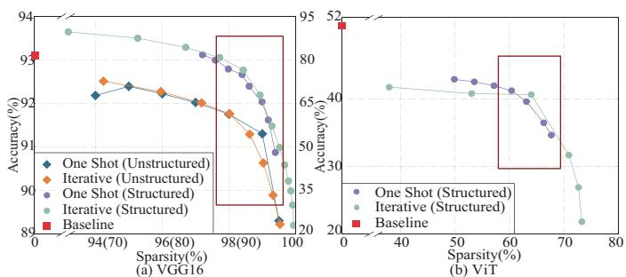
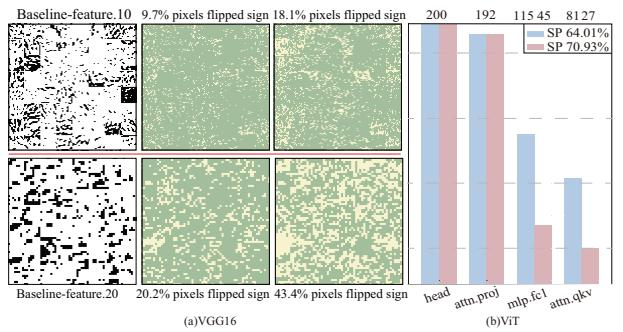
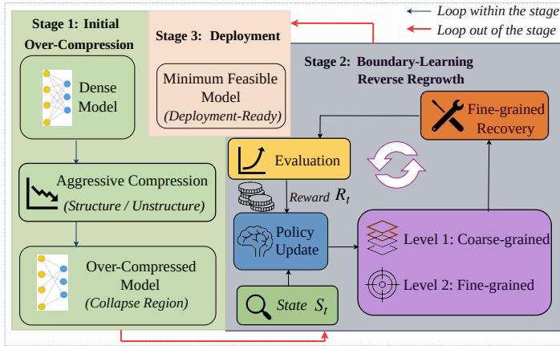
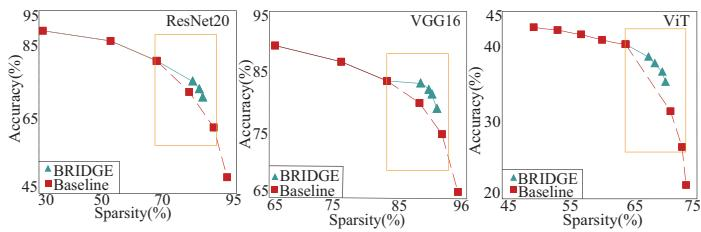

# Breaking the Compression Barrier: Cross-Architecture Compression Boundary Learning via Reverse Regrowth

Zhaocen Liu   
University of British Columbia   
Vancouver, British Columbia, CA liu0411@student.ubc.ca   
Satvik Praveen   
University of South Florida   
Tampa, Florida, USA   
satvikpraveen@usf.edu   
Yi Sheng   
University of South Florida   
Tampa, Florida, USA   
sheng1@usf.edu

## Abstract

Model compression is critical for deploying networks on resource-constrained edge devices. While pruning-based meth ods can significantly reduce model size, they often sufer from abrupt performance collapse beyond a sparsity threshold, making it dificult to identify the feasible compression limit of the model. To address this challenge, we propose a boundary-Learning reverse regrowth framework, BRIDGE, that reformulates compression as a constructive boundary search problem. Unlike forward pruning, our method first drives the model to an extremely sparse state to expose the collapse region, and then selectively regenerates the critical structure to restore performance. The proposed framework employs a hierarchical regeneration strategy, including coarse-grained layer selection and fine-grained regeneration parameter selection, to accurately identify which parameters require recovery. Experiments show that our method can recover models from the brink ofcollapse on both CNNs and Transformer architectures, demonstrating its architecture independence. BRIDGE achieves a performance improvement ofup to 1.49% in unstructured pruning and up to 4.77% in structured pruning. These results demonstrate that reverse regeneration can efectively extend the compression limit while maintaining stable performance. The source code is available at https://github.com/EnumaCaliber/BRIDGE.

## 1 Introduction

Modern architectures, including convolutional and Transformerbased models, have achieved remarkable success across a wide range ofintelligent applications [He et al. 2016; Vaswani et al. 2017]. However, deploying these models on resourceconstrained edge platforms, such as mobile processors [Sandler et al. 2019], embedded systems[Lin et al. 2020], and medical devices[Shoaran et al. 2018], remains challenging because their computational, memory, and energy demands often exceed the available hardware resources. As a result, network pruning has become one of the most widely adopted model compression techniques, substantially reducing model size and computational cost while preserving accuracy close to that of the original dense model [Cheng et al. 2023; Lee et al. 2026]. Despite this success, existing pruning methods are primarily designed to optimize model accuracy under

a predefined sparsity budget, leaving a fundamental question unanswered: what is the maximum feasible compression a model can sustain before its performance collapses?

Existing pruning methods, whether structured [He et al. 2017; Li et al. 2017; Liu et al. 2017] or unstructured [Guo et al. 2016; Han et al. 2015], operate within a common forward sparsification paradigm “large-to-small”: a dense model is progressively compressed while its accuracy is monitored. Although diferent approaches employ diverse pruning criteria, such as magnitude [Han et al. 2015], gradient[Lee et al. 2021], or second-order information[LeCun et al. 1990], they difer mainly in what is removed, not in how the compression boundary is identified. As sparsity approaches the compression boundary, model performance frequently exhibits an abrupt and highly nonlinear degradation, which we refer to as the performance clif [Ai et al. 2025; Ma et al. 2026]. Once this clif is crossed, the forward pruning trajectory provides litle information about where the true compression boundary lies, forcing practitioners to rely on repeated trialand-error to estimate the maximum feasible sparsity [Frantar and Alistarh 2023]. Consequently, existing pruning methods improve compression decisions within the same forward search paradigm, yet leave the boundary identification problem fundamentally unresolved [Hoefler et al. 2021]. We argue that identifying the compression boundary should be formulated as a boundary-learning problem, rather than a conventional pruning problem, motivating a fundamentally diferent search paradigm for model compression.

These observations motivate a diferent perspective on architecture compression. First, we observe that performance clifs are strategy-independent: both one-shot and iterative pruning exhibit abrupt accuracy collapse across representative convolutional and Transformer architectures. This suggests that the compression boundary is an intrinsic property of the model rather than an artifact of a particular pruning strategy. Second, the collapse is highly localized. Instead of uniform degradation throughout the network, the performance clif is primarily caused by severe representational damage in a small subset of layers, as revealed by layer-wise Structural Similarity Index (SSIM) analysis between dense and pruned feature representations.

Together, these observations suggest that identifying the compression boundary should be viewed as a boundary-learning problem, rather than a conventional forward pruning problem. Motivated by this insight, we propose BRIDGE, a reverse boundary-learning framework for architecture compression. Unlike existing pruning methods that progressively sparsify a dense model while atempting to stop before the performance clif, BRIDGE intentionally traverses the compression boundary to explicitly expose its location, and subsequently performs ”reverse regrowth” to selectively restore only the minimal subset of pruned parameters or channels required to recover the minimum feasible model. By reversing the conventional large-to-small compression paradigm, BRIDGE directly identifies the compression boundary instead of approximating it through repeated forward pruning.

The regrowth process is formulated as a Markov Decision Process in which an RL-based controller allocates a limited parameter budget through a two-level hierarchical strategy. At the coarse level, SSIM-based filtering identifies the most structurally degraded layers as regrowth candidates, restricting the search space to where recovery is most needed. At the fine level, gradient-based saliency scores rank pruned weights within the selected layers, ensuring that only the most critical connections are restored. This hierarchical decomposition reduces the combinatorial action space by orders of magnitude, making policy optimization tractable under tight computational budgets. Extensive experiments across four architectures and two pruning paradigms demonstrate that BRIDGE consistently recovers accuracy in the high-sparsity regime, with search costs under 10 GPU-hours per model.

The main contributions of this work are summarized as follows:

• We identify compression boundary estimation as a previously overlooked challenge in network compression and show that conventional forward pruning is fundamentally ill-suited for boundary identification due to its monotonic paradigm and performance-clif behavior.

• We propose BRIDGE, a reverse boundary-learning framework that reformulates network compression as a constructive boundary-learning problem by intentionally traversing the compression boundary and selectively recovering the minimum feasible model through reverse regrowth.

• We demonstrate that BRIDGE consistently identifies compression boundaries across representative convolutional and Transformer architectures, providing a unified framework for architecture-agnostic boundary-Learning compression while achieving competitive compression performance.

## 2 Related Works And Motivation

Observation 1: Performance clifs persist across pruning strategies, pruning paradigms, and networks. As shown in Figure 1, we evaluate both one-shot and iterative pruning on representative convolutional and Transformer architectures. For VGG16 [Simonyan and Zisserman 2015], both structured and unstructured pruning are considered, whereas for ViT [Dosovitskiy et al. 2021] we focus on structured pruning, which is the dominant choice for practical Transformer acceleration. A consistent observation across all setings is the emergence ofa distinct performance clif. Model accuracy remains relatively stable over a wide sparsity range, but deteriorates abruptly once a critical sparsity threshold is reached [Jaiswal et al. 2023]. For VGG16, the clif appears at approximately 98% sparsity under unstructured pruning and around 90% under structured pruning. In contrast, ViT exhibits a much earlier collapse at approximately 60% sparsity, with an even narrower transition region. This behavior is likely related to the stronger interlayer coupling and lower structural redundancy of Transformer architectures, making them more sensitive to aggressive structured pruning. More importantly, despite diferences in pruning schedule, sparsity type, and architecture, the performance clif consistently emerges. Although the exact compression boundary varies across models and pruning setings, the recurring clif-like behavior suggests that performance collapse is not an artifact of a particular pruning strategy, but rather a common phenomenon under extreme model compression.

  
Figure 1: Performance clifs consistently emerge across diferent pruning strategies and architectures: (a) VGG16; (b)ViT.

Motivation 1: Revisiting Forward Sparsification. Network pruning has been extensively studied as an efective approach for neural network compression. Existing methods can be broadly categorized into iterative pruning [Han et al. 2015], importance-based pruning [Guo et al. 2016; Lee et al. 2019], and dynamic sparse training [Evci et al. 2020]. More recently, pruning techniques have been extended from convolutional networks to Transformer architectures through structured pruning of atention heads and feed-forward channels [Chen et al. 2021; Yu et al. 2022], as well as dynamic token and module pruning [Rao et al. 2021]. Although these methods difer substantially in pruning criteria, optimization objectives, and training dynamics, each ofthem follows the same fundamental paradigm: starting from a dense model, parameters are progressively removed while atempting to preserve model accuracy. This forward sparsification paradigm has proven highly efective under moderate sparsity, where network redundancy remains abundant and local pruning decisions are generally suficient to maintain performance However, under extreme sparsity, both prior studies [Frankle et al. 2021; Hoefler et al. 2021; Tanaka et al. 2020; Zhang et al. 2025] and our Observation 1 consistently reveal the emergence ofa sharp performance clif, where accuracy deteriorates abruptly after a critical sparsity threshold. Notably, this phenomenon is observed across diferent pruning schedules, sparsity types, and representative convolutional and Transformer architectures, suggesting that it is not tied to a particular pruning strategy. Consequently, the primary challenge in the extreme-compression regime shifts from identifying which parameters should be removed to determining where the compression boundary lies. Existing pruning methods improve parameter selection within the same forward sparsification paradigm, yet none is explicitly designed to identify or exploit the compression boundary, leaving this fundamental problem largely unexplored.

  
Figure 2: Under extreme sparsity: (a) sign pattern disruption in intermediate features of VGG16. Green indicates preserved sign and yellow indicates sign flip relative to the baseline. While most activations remain stable before collapse, a significant increase in sign flips occurs after collapse. (b) The ratio ofsurviving channels in ViT is categorized by channel type. Only two channel types show significant changes across the collapse point, while the rest remain stable.

Observation 2: Performance Collapse Is Highly Localized. Unlike the gradual degradation observed under moderate sparsity, performance collapse is not uniformly distributed across the network but is concentrated in a small subset of layers. To investigate this phenomenon, Fig. 2(a) visualizes the sign consistency of feature maps in two representative VGG16 layers by comparing the dense baseline with a pre-collapse model (94.24%) and a post-collapse model (99.53%). Before crossing the performance clif, the feature maps remain largely consistent with the dense baseline, with only a small fraction of activations changing sign. After collapse, however, sign flips increase dramatically, indicating severe representational disruption in these layers. This observation is consistent with the corresponding low SSIM values, suggesting that only a few layers experience substantial structural degradation, while the majority of the network remains relatively stable. A similar phenomenon is observed in ViT. As shown in Fig. 2(b), when sparsity increases from the pre-collapse model (64.01%) to the postcollapse model (70.93%), the additional structural changes are concentrated in only two module types, whereas the remaining modules exhibit litle variation. Despite their architectural diferences, both CNNs and Transformers therefore exhibit highly localized changes after crossing the performance clif, indicating that performance collapse is dominated by a small number of structurally critical components rather than uniform degradation across the entire network.

Motivation 2: Bridging Pruning and Representation Analysis. Recovering a model after crossing the compression boundary requires answering two complementary questions: what should be modified, and where recovery should be performed. Existing research has addressed these two questions separately. Pruning methods estimate parameter importance using magnitude, gradient, saliency, or secondorder information to determine what weights or channels should be removed [Han et al. 2015; Hassibi and Stork 1992; LeCun et al. 1990; Lee et al. 2019; Molchanov et al. 2017], while layer-adaptive methods further allocate sparsity according to layer sensitivity [Lee et al. 2021]. In parallel, representation similarity measures, such as SVCCA, CKA, and SSIM, have been widely used to quantify feature consistency for model analysis, knowledge distillation, and network compression [Hinton et al. 2015; Kornblith et al. 2019; Raghu et al. 2017; Romero et al. 2015; Wang et al. 2004]. However, these two research directions have largely evolved independently. Existing pruning methods optimize parameter selection without considering representational degradation, where representation similarity is primarily used for post-hoc analysis rather than guiding model optimization [Klabunde et al. 2025; Li et al. 2024]. A unified framework that integrates pruning optimization with representation-guided recovery remains unexplored [Garg and Torra 2026; Schmit et al. 2024; Wu et al. 2025]. Our second observation establishes this connection by revealing that performance collapse is highly localized, enabling representation similarity to directly guide targeted reverse regrowth.

Motivation 3: From Sparse Maintenance to Boundary Recovery. Regrowth has long been recognized as an efective mechanism for improving sparse neural networks. Early work introduced connection splicing to restore mistakenly pruned weights, while subsequent dynamic sparse training methods, such as SET [Mocanu et al. 2018] and RigL [Evci et al. 2020], periodically regrow connections to maintain network connectivity and improve optimization quality [Wang et al. 2020]. Although these methods difer in implementation, they share a common objective: using regrowth to maintain a functional sparse network throughout training. Our problem is fundamentally distinct: rather than maintaining sparse-network functionality within a safe operating regime, we target models that have already crossed the performance clif. Existing regrowth methods are not designed to identify the compression boundary or perform targeted recovery after such collapse. We therefore use regrowth as a recovery mechanism that restores only the critical connections required to return the model to a feasible operating region.

  
Figure 3: BEIDGE: Boundary-Learning Reverse Regrowth Framework. The framework first over-compresses the model to expose the compression boundary, then performs a hierarchical reverse regrowth process to restore critical structures, and identifies the minimum feasible model for deployment.

## 3 Framework

The overall pipeline of BRIDGE consists of three stages, as illustrated in Fig. 3. We detail each stage in the following subsections.

## 3.1 Stage I: Initial Over-Compression

We progressively prune the dense model to increasing sparsity levels via iterative and one-shot pruning, obtaining the pruning baseline and identifying the collapse region. Pruning criteria can be categorized by the order of information they exploit: zero-order (magnitude), first-order (gradient), and second-order (curvature), and BRIDGE is order-independ regrowth requires only an importance measure of higher order than that used for pruning.

Collapse Region Identification: To automatically identify the onset of collapse, we compute the discrete secondorder diference of accuracy with respect to sparsity. Let $A \left( s _ { i } \right)$ denote the accuracy at the �-th sparsity level. We define the collapse onset as the smallest sparsity $s ^ { * }$ satisfying: $\Delta ^ { 2 } A \left( s ^ { \star } \right) = \hat { A } \left( s ^ { \star + 1 } \right) - 2 A \left( s ^ { \star } \right) + A \left( s ^ { \star - 1 } \right) < - \epsilon _ { \star }$ , where � is a predefined threshold (set to 0.5 in our experiments). This criterion captures the transition from approximately linear degradation to sharp nonlinear collapse. The sparsity level $s ^ { * }$ serves as the entry point for the subsequent reverse regrowth process.

## 3.2 Stage II: Boundary-Aware Reverse Regrowth

Starting from the sparsity level proximal to the collapse region identified in Stage I, the framework enters a closed iterative regrowth loop, which we formulate as a Markov Decision Process (MDP) [Benmeziane et al. 2021; Zoph and Le 2017]. At each step, an RL-based controller observes the current model state $S _ { t }$ and outputs a hierarchical regrowth action that determines where and how to restore model capacity. The regrown model is then fine-tuned and evaluated, producing a reward $R _ { t }$ that drives policy updates. The controller is trained to maximize the expected reward over all layer-wise decisions: $J ( \theta _ { c } ) ~ = ~ \mathbb { E } _ { P ( a _ { 1 : T } ; \theta _ { c } ) } [ R _ { T } ]$ , where $\theta _ { c }$ denotes the controller parameters and $a _ { 1 : T }$ is the sequence of layer-wise allocation actions. Since $R _ { T }$ is non-diferentiable with respect to $\theta _ { c }$ , we optimize $J ( \theta _ { c } )$ via the REINFORCE policy-gradient algorithm [Zoph and Le 2017]. This loop repeats until convergence, progressively restoring critical capacity while preserving high sparsity. Each component of the loop is detailed below.

Step 1 - State: At each episode step $t ,$ the state $S _ { t }$ is represented by a 3-dimensional context vector:

$$
S _ { t } = \left[ \frac { p + 1 } { N + 1 } , \frac { \mathrm { c a p } _ { l } } { \sum _ { l } \mathrm { c a p } _ { l } } , \frac { r } { N _ { \mathrm { r e s t o r e } } } \right] ,\tag{1}
$$

where $\boldsymbol { p }$ is the current layer index, cap is the number of pruned weights in layer $i ,$ and � is the remaining unallocated budget. The three dimensions are designed to provide the controller with the minimal yet suficient information for making informed regrowth decisions, encoding the relative layer depth $\textstyle { \frac { p + 1 } { N + 1 } }$ , the layer’s share of pruned weights $\frac { \mathrm { c a p } _ { l } } { \sum _ { l } \mathrm { c a p } _ { l } }$ (reflecting structural damage and recovery potential), and the remaining budget fraction $\frac { r } { N _ { \mathrm { r e s t o r e } } }$ (preventing overallocation to early layers).

Step 2 - Action: Hierarchical Reverse Regrowth. We decompose the action $a _ { t }$ into two levels: a coarse-grained stage that selects the target layer, thereby reducing the search space and improving eficiency, and a fine-grained stage that specifies which parameters or channels to regrow within it, ensuring efectiveness.

➀ Level 1 - Coarse-grained layer selection stage: Motivated by Observation 2, we compute the SSIM [Wang et al. 2004] between the feature maps of the sparse model and the dense baseline at each layer. Layers with the lowest SSIM values are preferentially selected as candidate regrowth layers. However, SSIM relies on local spatial statistics of the feature maps and therefore becomes unreliable for layers with small or absent spatial dimensions. To cover this regime, we incorporate cosine similarity as a complementary metric. Similar to SSIM, cosine similarity measures the degree of collapse relative to a dense model, but it is scale-invariant and independent ofspatial statistics, so it remains valid even when SSIM fails: values close to 1 indicate a complete representation, while negative values indicate that most activations have undergone sign inversion relative to a dense model and are close to collapse. Table 1 validates the situation at layers where SSIM fails: layers 13 and 14 exhibit negative cosine similarity and a sign-flip rate higher than 55%, while layer 15 maintains positive cosine similarity (0.5444) and a much lower sign-flip rate (28.12%). This confirms that cosine similarity can accurately track the layer’s representation to determine if it has collapsed. Therefore, these two metrics characterize structural damage from a complementary perspective and can be flexibly combined according to the architecture.

Table 1: Cosine similarity is consistent with layer damage (sign flip rate); negative values indicate collapse.
<table><tr><td>Layer</td><td>Cosine</td><td>Sign Flip (%)</td></tr><tr><td>layers.13</td><td>-0.1139</td><td>55.73</td></tr><tr><td>layers.14</td><td>-0.1405</td><td>56.38</td></tr><tr><td>layers.15</td><td>0.5444</td><td>28.12</td></tr></table>

➁ Level 2 - Fine-grained regrowth stage: After identifying degradation-sensitive layers, we perform fine-grained regrowth by ranking candidate units with a higher-order importance measure and restoring only the highest-ranked ones. Since pruning may remove parameters that later prove critical, richer information is needed to distinguish these mistakenly discarded units from the broader pruned set. We therefore reserve higher-order criteria for targeted regrowth. Step 3 - Reward and policy update: After each regrowth step, the model is finetuned and evaluated, and the reward is defined as the normalized accuracy improvement over the pruning baseline at the corresponding sparsity level, i.e., $R _ { t } = ( A _ { \mathrm { r e g r o w t h } } - A _ { \mathrm { b a s e l i n e } } ( s ) ) / 1 0 0$ , where $A _ { \mathrm { b a s e l i n e } } ( s )$ is interpolated from the pre-computed accuracy-sparsity curve. The controller is updated by REINFORCE with an exponential moving-average baseline to reduce variance and entropy regularization for exploration.

## 3.3 Stage III: Deployment

Upon convergence of Stage II, the regrown model satisfying the target performance threshold is selected as the final deployment-ready output. Deployment is an essential stage of BRIDGE: the ultimate goal of boundary-aware compression is to produce models that actually run faster and smaller on resource-constrained hardware. Our deployment evaluation is conducted on structured-pruned models, since structured sparsity translates directly into hardware benefits. The resulting model executes directly on standard dense kernels, delivering real acceleration without any specialized sparse library, a property that is particularly valuable for Transformer architectures, where sparse-kernel support remains limited. The core value ofBRIDGE at deployment time lies in extending the compression limit itself. Sparsity levels that were previously accuracy-infeasible, where forward pruning has already collapsed, become usable after BRIDGE. Consequently, under the same accuracy requirement, BRIDGE allows a model to be deployed at a higher sparsity than conventional pruning permits, which directly means fewer parameters, fewer FLOPs, faster inference, and lower latency on device. To faithfully emulate realistic resource-constrained scenarios, we validate this on a Raspberry Pi, a representative edge platform with limited compute and memory resources and no GPU acceleration.

## 4 Experiments

## 4.1 Experiments Setting

Common protocol. Unless otherwise specified, all fine-tuning uses AdamW [Loshchilov and Huter 2017] (with a learning rate of $3 \times 1 0 ^ { - 4 }$ , weight decay $1 0 ^ { - 2 } )$ with early stopping, and accuracy is evaluated on the full test set.

1) Models and Pretraining: We evaluate ResNet20 [He et al. 2016], EficientNetB0 [Tan and Le 2019], ShufleNetV2 [Ma et al. 2018], and VGG16 on CIFAR-10 [Krizhevsky 2009], and ViT on the larger Tiny-ImageNet, covering design paradigms from residual connections and depthwise convolutions to self-atention. All models are pretrained from scratch with SGD (momentum 0.9, weight decay $5 \times 1 0 ^ { - 4 } $ , lr 0.1 with cosine annealing, 200 epochs, batch size 128) and standard augmentation.

2) Pruning: The baseline combines iterative pruning (15 rounds, removing 30% of remaining weights per round with 40 fine-tuning epochs each; 10% per round for ViT due to its earlier and sharper collapse) with one-shot pruning at sparsity levels near the collapse edge (fine-tuned up to 400 epochs). For structured pruning, since channel indices are re-numbered after each round, we maintain a list of alive indices mapping each current position to its dense-model index; recording output channels sufices, as coupled input channels are implicitly determined. This mapping enables the regrowth stage to reconstruct the local computation graph and restore each channel together with its structurally coupled channels.

Table 2: Accuracy Improvement of BRIDGE over Strong Pruning Baselines in Extreme Sparsity Regimes. Results on the first four column groups are on CIFAR-10; the last column group reports VGG16 on Tiny-ImageNet.
<table><tr><td rowspan="2">Type</td><td colspan="3">ResNet20</td><td colspan="3">EfficientNetB0</td><td colspan="3">ShuffleNetV2</td><td colspan="3">VGG16</td><td colspan="3">VGG16 (Tiny-ImageNet)</td></tr><tr><td>Sp.(%)</td><td>Base.(%) Regr.(%)</td><td></td><td>Sp.(%)</td><td>Base.(%) Regr.(%)</td><td></td><td>Sp.(%) Base.(%) Regr.(%) Sp.(%)</td><td></td><td></td><td></td><td>Base.(%)</td><td>Regr.(%)</td><td>)Sp.(%) Base.(%) Regr.(%)</td><td></td></tr><tr><td>LAMP [Lee et al. 2021]</td><td>98.08 83.26</td><td></td><td>98.73</td><td>87.26</td><td></td><td>87.44</td><td>95.00</td><td>91.29</td><td></td><td>99.00</td><td>91.30</td><td></td><td></td><td></td></tr><tr><td></td><td>98.26</td><td>81.21</td><td>81.34 98.93</td><td></td><td>86.84</td><td>87.23</td><td>97.43</td><td>91.04</td><td></td><td>99.08</td><td>91.21</td><td></td><td>99.02</td><td>52.58 52.89</td></tr><tr><td></td><td>98.36</td><td>80.67</td><td>80.91</td><td>99.03</td><td>86.41</td><td>87.14</td><td>98.11</td><td>90.74</td><td></td><td>99.15</td><td>90.70</td><td>90.81</td><td>99.15</td><td>51.96 52.16</td></tr><tr><td></td><td>98.46</td><td>80.14</td><td>80.35</td><td>99.12</td><td>85.55</td><td>86.85</td><td>98.49</td><td>90.22</td><td>90.41</td><td>99.25</td><td>90.30</td><td>90.43</td><td>99.25</td><td>51.55 51.65</td></tr><tr><td></td><td>98.56</td><td>79.59</td><td>80.12 99.23</td><td></td><td>84.61</td><td>86.05</td><td>98.57</td><td>90.12</td><td>90.21</td><td>99.35</td><td>89.90</td><td>90.34</td><td>99.35 50.73</td><td>50.99 50.62</td></tr><tr><td></td><td>98.74</td><td>78.33</td><td>79.11 78.31</td><td>99.33 99.43</td><td>83.71</td><td>85.20 83.59</td><td>98.67 98.76</td><td>90.02 89.92</td><td>90.16 90.22</td><td>99.37</td><td>89.82 89.58</td><td>90.44 90.17</td><td>99.42 50.35 99.44</td><td>50.54</td></tr><tr><td></td><td>98.83</td><td>77.63</td><td></td><td></td><td>82.61</td><td></td><td></td><td></td><td></td><td>99.43</td><td></td><td></td><td></td><td>50.22</td></tr><tr><td>Search Cost (GPU-h)</td><td></td><td colspan="3">3.47</td><td colspan="3">9.57</td><td colspan="3">5.26</td><td colspan="3">6.64</td><td>9.82</td></tr></table>

3) BRIDGE Framework: The controller (hidden size 64, Adam, lr $3 \times 1 0 ^ { - 4 } )$ selects layer-wise allocation from $K =$ 11 proportions in [0, 1] and, in the iterative seting, a bud get fraction from $K _ { b } \ = \ 5$ options in [0.1%, 0.5%] of prunable weights. The entropy coeficient decays from 0.40 to 0.04 over the first 40% of episodes $( \tau ~ = ~ 0 . 0 0 5 )$ . Training runs up to 300 episodes per iteration with early stopping on reward stagnation. Post-regrowth finetuning runs 50 (oneshot) or 40 (iterative) epochs with regrown weights zeroinitialized; models surpassing the baseline are saved as candidates, and one-shot candidates undergo a final full finetuning (cosine annealing with warmup, up to 400 epochs). If none surpasses the baseline, the highest-reward model is retained.

4) Hardware: Edge deployment targets structured-pruned models only (Section 3.3) on a Raspberry Pi 5 (8 GB RAM), with FP32 ONNX export and ONNX Runtime 1.26 (CPU, 4 threads). We profile dense, pruned, and regrown checkpoints of VGG16, ResNet20, and ViT, measuring per-image latency, parameters, FLOPs, and file size.

## 4.2 Exploration of the BRIDGE

Consistent gains under extreme sparsity. Fig. 4 shows that under structured pruning, BRIDGE achieves pronounced recovery near the collapse boundary: the improvement on ResNet20 reaches +4.77%, and on VGG16 the BRIDGE-recovered curve even trends upward in the high-sparsity range while the baseline declines sharply, indicating that the recovered channels are precisely those critical to model performance. Tab 2 further confirms this under unstructured pruning, where BRIDGE consistently improves accuracy over strong pruning baselines with gains growing as sparsity increases, reaching up to +1.49% on EficientNetB0. On the larger Tiny-ImageNet dataset, VGG16 still shows improvement, albeit smaller; we atribute this to the higher task complexity, which leaves less recoverable redundancy after aggressive pruning. These results indicate that the advantage of BRIDGE lies not in

benign compression regimes, but precisely where conventional pruning begins to collapse.

  
Figure 4: Structured pruning versus BRIDGE

Recovery near the collapse boundary. More importantly, these improvements concentrate around the collapse boundary, where performance transitions from gradual degradation to abrupt failure and pruning baselines fall below critical usability thresholds. Under structured pruning (Fig. 4), VGG16 falls below 80% accuracy, and BRIDGE lifts it back above 80%, close to the low-sparsity baseline. Tab 2 shows the same behavior under unstructured pruning: ShufleNetV2 and VGG16 both drop below the 90% threshold at extreme sparsity, whereas BRIDGE restores both above it. This is precisely one of the core objectives of BRIDGE: it identifies the collapse boundary and regrows the model back into the usable regime, converting configurations that forward pruning renders unusable into deployment-feasible ones.

Architecture-independent recovery. A key advantage of BRIDGE is architecture independence, which Fig. 4 and Tab 2 jointly support from complementary perspectives. Fig. 4 shows that BRIDGE extends beyond convolutional networks: on ViT, whose collapse arrives markedly earlier and more sharply (Observation 1) and whose prunable units are atention/MLP dimensions rather than convolutional channels, BRIDGE still accurately localizes the collapse region and performs targeted recovery. Tab 2 further shows that four CNNs with fundamentally diferent design paradigms, despite exhibiting distinct degradation behaviors, all benefit from BRIDGE. All in all, four CNNs and one Transformer with two datasets,

and two pruning paradigms, BRIDGE maintaining stable effectiveness across all cases, reinforcing our central claim that model compression should be treated as a boundaryaware learning problem rather than a purely destructive pruning process.

Framework eficiency. Benefiting from the two-stage design, BRIDGE reduces the search space by orders of magnitude (e.g., from $1 0 ^ { 8 2 }$ to $1 0 ^ { 4 }$ on EficientNetB0), evaluating fewer than 2700 configurations in total. As shown in Tab 2, its search cost stays below 10 GPU-hours on a single GPU for all models, comparable to ENAS [Pham et al. 2018] (7.7 GPU-hours on CIFAR-10), despite the later requiring no per-episode fine-tuning on a structurally simpler search problem.

Table 3: Deployment results on Raspberry Pi 5.
<table><tr><td>Model</td><td>Config</td><td>Sp.(%)</td><td>Acc.(%)</td><td>Lat.(ms)</td><td>Speedup</td><td>FLOPs(M)</td></tr><tr><td></td><td>L1-norm</td><td>78.46</td><td>72.76</td><td>0.402</td><td>3.2×</td><td>3.01</td></tr><tr><td>ResNet20</td><td>BRIDGE</td><td>82.49</td><td>73.49</td><td>0.397</td><td>3.2×</td><td>2.25</td></tr><tr><td></td><td>L1-norm</td><td>88.40</td><td>80.28</td><td>0.418</td><td>42.2×</td><td>7.94</td></tr><tr><td>VGG16</td><td>BRIDGE</td><td>90.36</td><td>81.62</td><td>0.408</td><td>43.2×</td><td>8.37</td></tr><tr><td></td><td>L1-norm</td><td>64.96</td><td>37.98</td><td>1.909</td><td>3.4×</td><td>53.65</td></tr><tr><td>ViT</td><td>BRIDGE</td><td>67.55</td><td>38.92</td><td>1.741</td><td>3.7×</td><td>42.75</td></tr></table>

Edge device deployment: Tab 3 shows that structured pruning delivers real acceleration on device, reaching up to 43.2 times speedup on VGG16. More importantly, BRIDGE does not trade speed for recovery: across all three architectures, it simultaneously achieves higher sparsity, higher accuracy, and lower latency than the forward-pruning baseline, indicating that regrowth reallocates capacity more efectively than forward pruning itself. Notably, although the regrown VGG16 incurs marginally more FLOPs, it still runs faster with far fewer parameters, confirming that theoretical FLOPs are a poor proxy for on-device latency and that the regrown structures are more hardware-friendly [Yang et al. 2018]. These results show BRIDGE enabling deployment-ready models under extreme structured sparsity while extending the collapse boundary.

## 4.3 Ablation Studies

Efectiveness of RL-based component: We compare BRIDGE with greedy and fixed-proportion baselines using random and saliency-based allocation. As shown in Table 4, BRIDGE consistently performs best, indicating that saliency alone is insuficient. Its advantage arises from combining overcompression to expose the boundary with RL-based search to identify the parameters requiring restoration. Thus, efective recovery depends on the joint use of boundary-aware constraints and adaptive allocation.

Generalization of pruning and regrowth order: While our main experiments use zero-order pruning with first-order regrowth, the framework generalizes to any combination where the regrowth order exceeds the pruning order. We validate this on VGG16 and ResNet20: as Tab. 5 shows, both first and second-order regrowth outperform the corresponding pruning baselines. Moreover, on ViT, applying secondorder regrowth to a first-order pruned model yields a +4.48% improvement at 69.48% sparsity, confirming that the orderbased regrowth criterion is architecture-independent.

Table 4: Comparison between BRIDGE, fixed proportion(P), and pure greedy(G)(S: Saliency, R: Random)
<table><tr><td rowspan="2">Model</td><td rowspan="2">Method</td><td colspan="4">Sparsity (%)</td></tr><tr><td>99.43</td><td>99.33</td><td>99.23</td><td>99.13</td></tr><tr><td rowspan="5">VGG16</td><td>P+R</td><td> $8 9 . 6 6 \pm 0 . 1 6$ </td><td> $8 9 . 8 0 \pm 0 . 2 0 $ </td><td> $9 0 . 0 3 \pm 0 . 1 1$ </td><td> $9 0 . 0 3 \pm 0 . 0 3$ </td></tr><tr><td>P+S</td><td> $8 9 . 7 4 \pm 0 . 1 9$ </td><td> $9 0 . 0 0 \pm 0 . 1 5$ </td><td> $9 0 . 2 4 \pm 0 . 1 1$ </td><td> $9 0 . 3 0 \pm 0 . 0 8$ </td></tr><tr><td>G+R</td><td> $8 9 . 4 7 \pm 0 . 2 1$ </td><td> $8 9 . 6 1 \pm 0 . 2 3 $ </td><td> $8 9 . 7 3 \pm 0 . 1 3$ </td><td> $8 9 . 7 3 \pm 0 . 1 7$ </td></tr><tr><td>G+S</td><td> $8 9 . 5 1 \pm 0 . 1 7$ </td><td> $8 9 . 7 8 \pm 0 . 1 1$ </td><td> $8 9 . 7 8 \pm 0 . 1 1$ </td><td> $8 9 . 9 6 \pm 0 . 2 7$ </td></tr><tr><td>BRIDGE</td><td> ${ \bf 9 0 . 0 9 \pm 0 . 1 6 }$ </td><td> ${ \bf 9 0 . 3 7 \pm 0 . 0 2 }$ </td><td> ${ \bf 9 0 . 4 6 \pm 0 . 1 2 }$ </td><td> $\mathbf { 9 0 . 5 2 \pm 0 . 2 1 }$ </td></tr><tr><td rowspan="5">Efficient- NetB0</td><td>P+R</td><td> $8 1 . 9 3 \pm 0 . 4 2$ </td><td> $8 2 . 9 3 \pm 0 . 5 8$ </td><td> $8 3 . 6 9 \pm 0 . 7 7$ </td><td> $8 4 . 5 2 \pm 0 . 5 9$ </td></tr><tr><td>P+S</td><td> $8 3 . 1 3 \pm 0 . 6 7$ </td><td> $8 4 . 7 8 \pm 0 . 5 3$ </td><td> $8 5 . 5 5 \pm 0 . 5 3$ </td><td> $8 6 . 1 4 \pm 0 . 5 8$ </td></tr><tr><td>G+R</td><td> $8 1 . 1 7 \pm 0 . 1 8$ </td><td> $8 1 . 6 5 \pm 0 . 1 5$ </td><td> $8 2 . 1 4 \pm 0 . 1 3$ </td><td> $8 2 . 2 6 \pm 0 . 1 6$ </td></tr><tr><td>G+S</td><td> $8 1 . 1 1 \pm 0 . 2 7$ </td><td> $8 1 . 9 7 \pm 0 . 3 0$ </td><td> $8 2 . 5 3 \pm 0 . 8 5$ </td><td> $8 3 . 8 9 \pm 1 . 0 9$ </td></tr><tr><td>BRIDGE</td><td> $\mathbf { 8 3 . 3 5 \pm 0 . 3 4 }$ </td><td> ${ \bf 8 5 . 0 5 \pm 0 . 2 2 }$ </td><td> ${ \bf 8 5 . 8 4 \pm 0 . 2 9 }$ </td><td> $\mathbf { 8 6 . 4 1 \pm 0 . 6 2 }$ </td></tr></table>

Table 5: Accuracy gains under diferent pruning–regrowth order combinations.
<table><tr><td rowspan="3"></td><td rowspan="3">Model</td><td colspan="4">Regrowth order</td></tr><tr><td colspan="2">1st order</td><td colspan="2">2nd order</td></tr><tr><td>Sp. (%)</td><td>Gain (%)</td><td>Sp. (%)</td><td>Gain (%)</td></tr><tr><td rowspan="4">Prude oder</td><td>VGG16 0th</td><td>90.08 91.36</td><td>+3.39 +1.89</td><td>89.96 90.65</td><td>+3.27 +2.90</td></tr><tr><td>ResNet20</td><td>81.38 83.93</td><td>+4.77 +3.85</td><td>83.25 84.01</td><td>+3.50 +3.29</td></tr><tr><td>VGG16 1st</td><td></td><td></td><td>90.15 91.15 84.69</td><td>+5.70 +2.84</td></tr><tr><td>ResNet20</td><td></td><td></td><td>85.46</td><td>+6.05 +5.05</td></tr></table>

Diferent Layer Selection: We adopt SSIM as the primary metric for layer selection and cosine similarity as a supplementary one, evaluating both configurations on ResNet20 and EficientNetB0. As shown in Tab. 6, similarity-guided selection consistently outperforms the pruning baseline across both architectures. Adding cosine similarity improves ResNet20 by up to 0.71% with modest additional cost, but provides no consistent benefit on EficientNetB0 while substantially increasing search time. These results indicate that SSIM ofers the best overall accuracy–cost trade-of, whereas cosine similarity is beneficial only for selected architectures.

## 5 Conclusion

This paper addresses the drastic performance degradation of conventional pruning methods under extreme sparsity. We propose BRIDGE, a boundary-Learning reverse regrowth framework that reformulates compression as a constructive boundarysearch problem: the model is first over-compressed to expose its compression boundary, and critical structures are then selectively recovered through hierarchical regrowth.

Table 6: Accuracy and search cost comparison by diferent layer selection combinations.
<table><tr><td rowspan="2">Model</td><td rowspan="2"> $S \mathrm { p . } ( \% )$ </td><td rowspan="2">Baseline (%)</td><td colspan="2"> $\operatorname { A c c . } ( \% )$ </td><td colspan="2"> $\mathrm { { C o s t } ( G P U { - } h ) }$ </td></tr><tr><td>SSIM</td><td>SSIM+COS</td><td>SSIM</td><td>SSIM+COS</td></tr><tr><td rowspan="5">Efficie- ntNetB0</td><td>99.03</td><td>86.41</td><td>87.14</td><td>86.99</td><td>4.13</td><td>38.33</td></tr><tr><td>99.13</td><td>85.41</td><td>86.78</td><td>86.74</td><td>3.23</td><td>21.24</td></tr><tr><td>99.23</td><td>84.61</td><td>86.05</td><td>86.17</td><td>3.68</td><td>27.61</td></tr><tr><td>99.33</td><td>83.71</td><td>85.20</td><td>85.32</td><td>8.10</td><td>31.88</td></tr><tr><td>99.43</td><td>82.61</td><td>83.59</td><td>83.28</td><td>6.38</td><td>14.95</td></tr><tr><td rowspan="3">ResNet20</td><td>98.74</td><td>78.33</td><td>79.17</td><td>79.42</td><td>2.29</td><td>4.63</td></tr><tr><td>98.83</td><td>77.63</td><td>78.31</td><td>79.02</td><td>2.60</td><td>5.39</td></tr><tr><td>98.93</td><td>76.85</td><td>77.50</td><td>77.55</td><td>2.52</td><td>3.19</td></tr></table>

Experiments across diverse architectures show that BRIDGE restores near-collapsed models to usable performance without additional inference overhead, achieving gains of up to 4.77%. More importantly, BRIDGE is architecture-agnostic, delivering consistent improvements on both CNN and Transformer architectures. BRIDGE ofers a new perspective on neural network compression: boundary-learning recovery rather than purely destructive pruning, breaking the compression barrier.

## References

Mengting Ai, Tianxin Wei, Sirui Chen, and Jingrui He. 2025. NIRVANA: Structured pruning reimagined for large language models compression. arXiv preprint arXiv:2509.14230 (2025).

Hadjer Benmeziane, Kaoutar El Maghraoui, Hamza Ouarnoughi, Smail Niar, Martin Wistuba, and Naigang Wang. 2021. A Comprehensive Survey on Hardware-Aware Neural Architecture Search. arXiv preprint arXiv:2101.09336 (2021).

Tianlong Chen, Yu Cheng, Zhe Gan, Lu Yuan, Lei Zhang, and Zhangyang Wang. 2021. Chasing Sparsity in Vision Transformers:An End-to-End Exploration. arXiv:2106.04533 [cs.CV]

Hongrong Cheng, Miao Zhang, and Javen Qinfeng Shi. 2023. A survey on deep neural network pruning-taxonomy, comparison. Analysis, andRecommendations 2 (2023).

Alexey Dosovitskiy, Lucas Beyer, Alexander Kolesnikov, Dirk Weissenborn, Xiaohua Zhai, Thomas Unterthiner, Mostafa Dehghani, Mathias Minderer, Georg Heigold, Sylvain Gelly, Jakob Uszkoreit, and Neil Houlsby. 2021. An Image is Worth 16x16 Words: Transformers for Image Recognition at Scale. arXiv:2010.11929 [cs.CV] https://arxiv.org/abs/2010.11929

Utku Evci, Trevor Gale, Jacob Menick, Pablo Samuel Castro, and Erich Elsen. 2020. Rigging the Lotery: Making All Tickets Winners. In International Conference on Machine Learning. 2943–2952.

Jonathan Frankle, Gintare Karolina Dziugaite, Daniel Roy, and Michael Carlin. 2021. Pruning Neural Networks at Initialization: Why Are We Missing the Mark?. In ICLR.

Elias Frantar and Dan Alistarh. 2023. Sparsegpt: Massive language models can be accurately pruned in one-shot. In International conference on machine learning. PMLR, 10323–10337.

Sonakshi Garg and Vicenç Torra. 2026. PrunePrivyTune: Accelerating Language Models with Pruning and Diferentially Private Fine-Tuning. Machine Learning 115, 5 (2026), 108.

Yiwen Guo, Anbang Yao, and Yurong Chen. 2016. Dynamic Network Surgery for Eficient DNNs. arXiv:1608.04493 [cs.NE] https://arxiv.org/abs/1608.04493

Song Han, Jef Pool, John Tran, and William J Dally. 2015. Learning Both Weights and Connections for Eficient Neural Networks. In NeurIPS.

Babak Hassibi and David G. Stork. 1992. Second Order Derivatives for Network Pruning: Optimal Brain Surgeon. In Advances in Neural Information Processing Systems (NeurIPS), Vol. 5. 164–171.

Kaiming He, Xiangyu Zhang, Shaoqing Ren, and Jian Sun. 2016. Deep Residual Learning for Image Recognition. In Proceedings ofthe IEEE Conference on ComputerVision and Patern Recognition (CVPR).

Yihui He, Xiangyu Zhang, and Jian Sun. 2017. Channel Pruning for Accelerating Very Deep Neural Networks. In ICCV.

Geofrey Hinton, Oriol Vinyals, and Jef Dean. 2015. Distilling the Knowledge in a Neural Network. arXiv preprint arXiv:1503.02531 (2015).

Torsten Hoefler et al. 2021. Sparsity in Deep Learning: Pruning and growth for efi cient inference and training. JMLR (2021).

Ajay Jaiswal, Shiwei Liu, Tianlong Chen, Zhangyang Wang, et al. 2023. The emergence ofessential sparsity in large pre-trained models: The weights that mater. Advances in Neural Information Processing Systems 36 (2023), 38887–38901.

Max Klabunde, Tobias Schumacher, Markus Strohmaier, and Florian Lemmerich. 2025. Similarity of neural network models: A survey of functional and representational measures. Comput. Surveys 57, 9 (2025), 1–52.

Simon Kornblith, Mohammad Norouzi, Honglak Lee, and Geofrey Hinton. 2019. Similarity of Neural Network Representations Revisited. In Proceedings ofthe 36th International Conference on Machine Learning (ICML), Vol. 97. PMLR, 3519–3529.

Alex Krizhevsky. 2009. Learning Multiple Layers of Features from Tiny Images. Tech nical Report. University of Toronto.

Yann LeCun, John S Denker, and Sara A Solla. 1990. Optimal Brain Damage. In NeurIPS.

Gilhyeon Lee, Seonggeun Kim, Dongjun Lee, Kyungmin Goh, and Hyun Kim. 2026. Towards eficient language giants: A comprehensive survey on structural optimizations and compression techniques for large language models. Neural Networks (2026), 108900.

Jaeho Lee, Sejun Park, Sangwoo Mo, Sungsoo Ahn, and Jinwoo Shin. 2021. Layer-Adaptive Sparsity for the Magnitude-based Pruning Criterion. In International Conference on Learning Representations (ICLR).

Namhoon Lee, Thalaiyasingam Ajanthan, and Philip H S Torr. 2019. SNIP: Single-Sho Network Pruning Based on Connection Sensitivity. In ICLR.

Hao Li, Asim Kadav, Igor Durdanovic, Hanan Samet, and Hans Peter Graf. 2017. Prun ing Filters for Eficient ConvNets. In ICLR.

Yuqi Li, Yao Lu, Junhao Dong, Zeyu Dong, Chuanguang Yang, Xin Yin, Yihao Chen, Jianping Gou, Yingli Tian, and Tingwen Huang. 2024. Sglp: A similarity guided fast layer partition pruning for compressing large deep models. arXiv preprint arXiv:2410.14720 (2024).

Ji Lin, Wei-Ming Chen, Yujun Lin, John Cohn, Chuang Gan, and Song Han. 2020. MCUNet: Tiny Deep Learning on IoT Devices. arXiv:2007.10319 [cs.CV] https: //arxiv.org/abs/2007.10319

Zhuang Liu, Jianguo Li, Zhiqiang Shen, Gao Huang, Shuicheng Yan, and Changshui Zhang. 2017. Learning Eficient Convolutional Networks through Network Slim ming. In ICCV.

Ilya Loshchilov and Frank Huter. 2017. Decoupled weight decay regularization. arXiv preprint arXiv:1711.05101 (2017).

Ningning Ma, Xiangyu Zhang, Hai-Tao Zheng, and Jian Sun. 2018. ShufleNet V2: Practical Guidelines for Eficient CNN Architecture Design. In Proceedings ofthe European Conference on Computer Vision (ECCV).

Ziyang Ma, Zuchao Li, Lefei Zhang, Gui-Song Xia, Bo Du, Liangpei Zhang, and Dacheng Tao. 2026. Phase transitions in large language model compression. npj Artificial Intelligence 2, 1 (2026), 21.

Decebal Constantin Mocanu, Elena Mocanu, Peter Stone, Phuong H. Nguyen, Madeleine Gibescu, and Antonio Liota. 2018. Scalable Training of Artificial Neu ral Networks with Adaptive Sparse Connectivity Inspired by Network Science. In Nature Communications, Vol. 9. 2383.

Dmitry Molchanov, Arsenii Ashukha, and Dmitry Vetrov. 2017. Variational Dropout Sparsifies Deep Neural Networks. In ICML.

Hieu Pham, Melody Y. Guan, Barret Zoph, Quoc V. Le, and Jef Dean. 2018. Eficient Neural Architecture Search via Parameter Sharing. In Proceedings ofthe 35th Inter national Conference on Machine Learning (ICML). PMLR, 4095–4104.

Maithra Raghu, Justin Gilmer, Jason Yosinski, and Jascha Sohl-Dickstein. 2017. SVCCA: Singular Vector Canonical Correlation Analysis for Deep Learning Dynamics and Interpretability. In Advances in Neural Information Processing Systems (NeurIPS). 6076–6085.

Yongming Rao, Wenliang Zhao, Benlin Liu, Jiwen Lu, Jie Zhou, and Cho-Jui Hsieh. 2021. DynamicViT: Eficient Vision Transformers with Dynamic Token Sparsifica tion. arXiv:2106.02034 [cs.CV] https://arxiv.org/abs/2106.0203

Adriana Romero, Nicolas Ballas, Samira Ebrahimi Kahou, Antoine Chassang, Carlo Gata, and Yoshua Bengio. 2015. FitNets: Hints for Thin Deep Nets. In International Conference on Learning Representations (ICLR).

Mark Sandler, Andrew Howard, Menglong Zhu, Andrey Zhmoginov, and Liang-Chieh Chen. 2019. MobileNetV2: Inverted Residuals and Linear Botlenecks. arXiv:1801.04381 [cs.CV] https://arxiv.org/abs/1801.04381

Jonas Schmit, Ruiping Liu, Junwei Zheng, Jiaming Zhang, and Rainer Stiefelhagen. 2024. Comb, Prune, Distill: Towards Unified Pruning for Vision Model Compres sion. In 2024 IEEE 27th International Conference on Intelligent Transportation Systems (ITSC). IEEE, 2413–2419.

Mahsa Shoaran, Benyamin Allahgholizadeh Haghi, Milad Taghavi, Masoud Farivar, and Azita Emami-Neyestanak. 2018. Energy-Eficient Classification for Resource Constrained Biomedical Applications. IEEE Journal on Emerging and Selected Topics in Circuits and Systems 8, 4 (2018), 693–707. doi:10.1109/JETCAS.2018.2844733

Karen Simonyan and Andrew Zisserman. 2015. Very Deep Convolutional Networks for Large-Scale Image Recognition. In Proceedings ofthe International Conference on Learning Representations (ICLR).

Mingxing Tan and Quoc V. Le. 2019. EficientNet: Rethinking Model Scaling for Convolutional Neural Networks. In Proceedings of the International Conference on Machine Learning (ICML).

Hidenori Tanaka, Daniel Kunin, Daniel L. Yamins, and Surya Ganguli. 2020. Pruning Neural Networks without Any Data by Iteratively Conserving Synaptic Flow. In Advances in Neural Information Processing Systems, Vol. 33. 6377–6389.

Ashish Vaswani, Noam Shazeer, Niki Parmar, Jakob Uszkoreit, Llion Jones, Aidan N Gomez, Lukasz Kaiser, and Illia Polosukhin. 2017. Atention is All You Need. In NeurIPS.

Chaoqi Wang, Guodong Zhang, and Roger Grosse. 2020. Picking Winning Tickets Before Training by Preserving Gradient Flow. In ICLR.

Zhou Wang, Alan C. Bovik, Hamid R. Sheikh, and Eero P. Simoncelli. 2004. Image Quality Assessment: From Error Visibility to Structural Similarity. IEEE Transac tions on Image Processing 13, 4 (2004), 600–612. doi:10.1109/TIP.2003.819861

Zimeng Wu, Jiaxin Chen, and Yunhong Wang. 2025. Unified knowledge maintenance pruning and progressive recovery with weight recalling for large vision-language models. In Proceedings of the AAAI Conference on Artificial Intelligence, Vol. 39.

8550–8558.

Tien-Ju Yang, Andrew Howard, Bo Chen, Xiao Zhang, Alec Go, Mark Sandler, Vivienne Sze, and Hartwig Adam. 2018. Netadapt: Platform-aware neural network adaptation for mobile applications. In Proceedings of the European conference on computer vision (ECCV). 285–300.

Fang Yu, Kun Huang, Meng Wang, Yuan Cheng, Wei Chu, and Li Cui. 2022. Width & Depth Pruning for Vision Transformers. In AAAI Conference on Artificial Intelligence (AAAI), Vol. 2022.

Qiaozhe Zhang, Ruijie Zhang, Jun Sun, and Yingzhuang Liu. 2025. How Sparse Can We Prune A Deep Network: A Fundamental Limit Perspective. arXiv:2306.05857 [stat.ML] https://arxiv.org/abs/2306.05857

Barret Zoph and Quoc V. Le. 2017. Neural Architecture Search with Reinforcement Learning. arXiv:1611.01578 [cs.LG] https://arxiv.org/abs/1611.01578