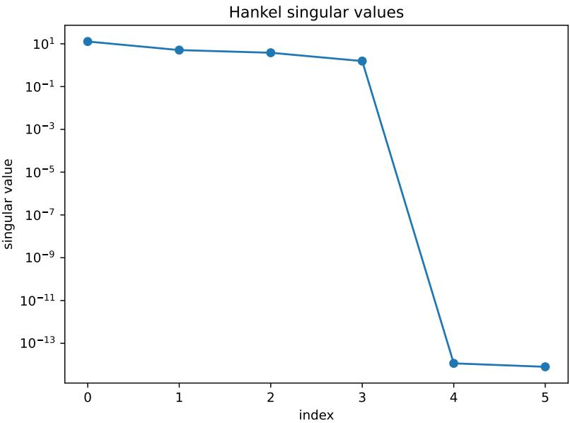
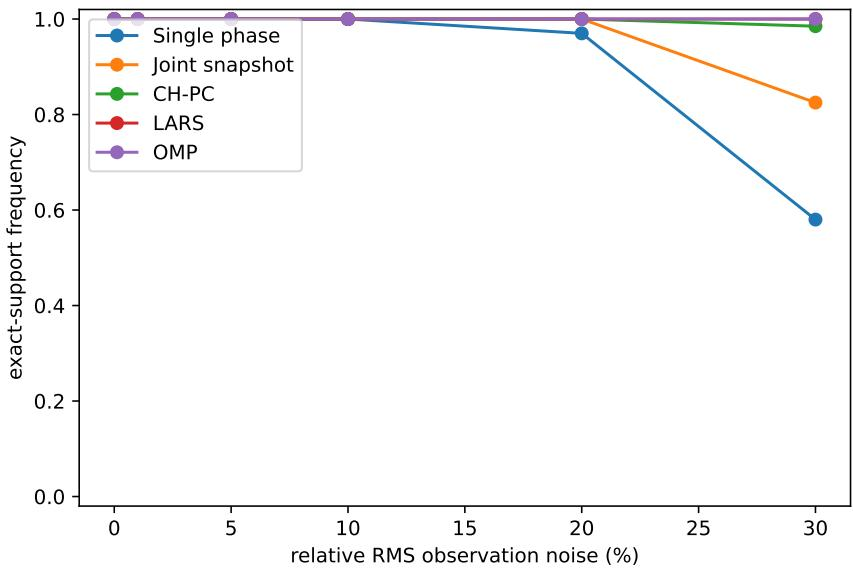
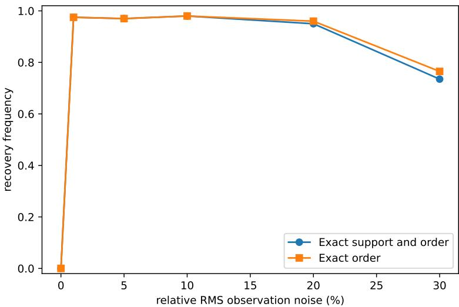
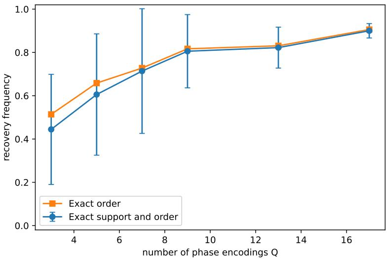
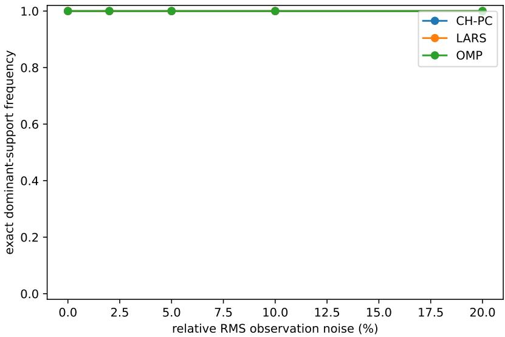

# Coded Hankel Polynomial Chaos: Spectral Identification of Dominant Polynomial-Chaos Modes

Zhiliang Deng∗

Xiaomei Yang†

## Abstract

Identification of dominant polynomial-chaos modes is usually formulated as a sparse-regression problem on a sampled multivariate polynomial dictionary. We develop coded Hankel polynomial chaos (CH-PC), a complementary spectral formulation for dominant-mode identification. A finite generating transform converts PCE coeficients into a coeficient-generating polynomial, and evaluation along a geometric phase orbit produces a finite exponential sum. Its model order and spectral nodes are encoded by low-rank Hankel matrices, while coordinate phase shifts attach root-of-unity labels from which the full polynomial multi-indices are recovered. Coordinate shifted probes are combined as common-node snapshots, and independent phase encodings provide redundant representations when a single spectral encoding is poorly conditioned. For finite observations, population, finite-data, and observed probes are kept distinct: sampling or quadrature error and observation error enter as separate Hankel perturbations, which are then connected to spectral stability, discrete decoding, and phase voting. For tensor-product candidate sets, the generating kernel factorizes into one-dimensional sums and can be evaluated without assembling the full multivariate PCE design matrix. Numerical experiments on sparse Legendre benchmarks and a stochastic Darcy problem illustrate exact recovery, noise stabilization, unknown-order identification by phase persistence, and dominant-mode recovery for a PDEgenerated quantity of interest.

Keywords. polynomial chaos, uncertainty quantification, sparse approximation, Hankel matrix, Prony method, matrix pencil, sensitivity analysis

AMS subject classifications. 65C20, 65D15, 65F15, 41A10

## 1 Introduction

Polynomial chaos expansion (PCE) represents stochastic model responses in an orthogonal polynomial basis determined by the probability law of the uncertain inputs [17, 18]. In high-dimensional settings, however, even a modest polynomial degree can produce a large number of candidate multivariate basis modes, while the response of interest often depends significantly on only a small subset of them. Identifying this influential subset is therefore important: it not only yields a parsimonious representation but also reveals the key variables, polynomial orders, and interactions that drive the response. To address this basis-selection problem, a range of sparse-regression techniques have been developed, including least angle regression (LARS), orthogonal matching pursuit (OMP), ℓ1 regularization, compressed sensing, and adaptive greedy strategies [1, 3, 4, 9, 13, 16].

This paper develops a complementary spectral viewpoint on dominant-mode identification based on Hankel matrix-pencil techniques. The underlying spectral principle can be traced back to classical Prony methods, which recover finite exponential sums from structured measurements. In this setting, Hankel matrices provide a low-rank representation of the exponential model, while matrix-pencil techniques recover the associated spectral nodes. Generalized Prony methods extend this basic principle beyond exponential sums to sparse expansions in more general function systems [10, 14]. Related spectral recovery constructions have also been developed for sparse Legendre and Gegenbauer expansions and for multivariate Prony systems [6, 11, 12]. Thus, Prony-type recovery, Hankel low-rank structure, and matrix-pencil techniques are established ingredients rather than new contributions of the present work. The problem addressed here is diferent: how can ordinary PCE input–output data be transformed into a structured spectral representation whose low-rank Hankel structure reveals the number of dominant modes and whose spectral information retains their polynomial multi-indices, so that support identification can be performed by spectral recovery rather than sparse regression?

The construction begins with a finite generating transform that converts the PCE coeficients into a multivariate coeficient-generating polynomial. Evaluation along a geometric phase orbit maps the active multi-indices to a finite exponential sum, whose model order is identified from Hankel rank and whose spectral nodes are recovered by a matrix pencil. A single spectral node, however, contains a multi-index only through a scalar phase combination. We therefore introduce coordinate phase shifts that preserve the nodes while multiplying their amplitudes by root-of-unity factors. These factors encode the individual polynomial degrees and reduce recovery of a multivariate index to finite coordinate-wise decoding. The shifted probes also provide multiple snapshots with the same nodes. CH-PC combines these common-node snapshots and, when a single phase is poorly conditioned, repeats the same construction with independent phase encodings.

The exact spectral construction has a natural finite-data realization. Data-based probes approximate the required generating functionals, and the resulting perturbations can be tracked at the joint-Hankel level before being propagated through spectral recovery and discrete multi-index decoding. This separation is useful because the conditioning of a phase is determined not only by the data error but also by the separation of its encoded nodes. Repeating the decoder over independent phases therefore supplies a second form of redundancy, and support persistence across phases provides a practical route to stable identification and unknown model order. CH-PC also has a computational structure diferent from dictionary-based sparse regression. For tensor-product candidate sets, the generating kernel factorizes into one-dimensional sums, so spectral probes can be formed without assembling the full multivariate polynomial dictionary. This yields a diferent memory and scaling profile, although it does not imply a universal runtime advantage.

The main contributions are fourfold. First, a PCE-specific generating representation converts dominant polynomial-chaos modes into a finite exponential system and yields an exact Hankel characterization of the efective model order. Second, coordinate phase shifts provide a root-of-unity encoding that reconstructs the individual degrees and hence the full active multi-indices. Third, common-node snapshots and independent phase encodings provide a redundant spectral recovery mechanism with explicit separation and support-recovery results. Fourth, the finite-data analysis separates integration error from propagated observation error and connects the resulting Hankel perturbations to model-order identification, discrete decoding, and phase voting. The framework is then extended to approximately sparse expansions and to sensitivity information. Section 2 develops the exact spectral representation, Section 3 treats the finite-data coded Hankel method and its stability, Section 4 discusses approximate sparsity, sensitivity, and methodological scope, and Section 5 presents the numerical experiments.

## 2 Dominant polynomial-chaos modes and exact spectral representation

This section formalizes the object to be identified and derives the exact population-level representation on which CH-PC is based. We define dominant PCE modes through orthogonal coeficient energy, construct the finite generating-kernel transform, and show how phase coding converts the active multi-indices into a finite Prony system with an exact Hankel factorization. Finite observations and their perturbations are introduced only in Section 3.

## 2.1 Polynomial-chaos model and dominant modes

Let $\Xi = ( \Xi _ { 1 } , \ldots , \Xi _ { d } )$ be a random input vector with probability measure $\rho .$ We first assume independent components, so that $\rho = \rho _ { 1 } \otimes \cdot \cdot \cdot \otimes \rho _ { d }$ . For the ℓth coordinate, let $\{ \psi _ { n } ^ { ( \ell ) } \} _ { n \geq 0 }$ be orthonormal in $L ^ { 2 } ( \rho _ { \ell } )$ . For a multi-index ${ \pmb { \alpha } } = ( \alpha _ { 1 } , . . . , \alpha _ { d } ) \in \mathbb { N } _ { 0 } ^ { d }$ , define $\begin{array} { r } { \Psi _ { \pmb { \alpha } } ( \pmb { \xi } ) = \prod _ { \ell = 1 } ^ { d } \psi _ { \alpha _ { \ell } } ^ { ( \ell ) } ( \xi _ { \ell } ) } \end{array}$ The tensor-product system then satisfies E $[ \Psi _ { { \pmb { \alpha } } } ( { \Xi } ) \Psi _ { \beta } ( { \Xi } ) ] = \delta _ { { \pmb { \alpha } } \beta }$ . Let $\mathcal { A } \subset \mathbb { N } _ { 0 } ^ { d }$ be a finite candidate set and write ${ \mathcal { P } } _ { A } = \operatorname { s p a n } \{ \Psi _ { \alpha } : \alpha \in A \}$ . For a scalar quantity of interest $\bar { Y } = Y ( \Xi ) \in L ^ { 2 } ( \rho )$ , its orthogonal projection onto $\mathcal { P } _ { A }$ is

$$
Y _ { \mathcal { A } } ( \Xi ) = \sum _ { \alpha \in \mathcal { A } } c _ { \alpha } \Psi _ { \alpha } ( \Xi ) , \qquad c _ { \alpha } = \mathbb { E } \left[ Y ( \Xi ) \Psi _ { \alpha } ( \Xi ) \right] .\tag{1}
$$

Throughout, Ξ denotes the random input governed by $\rho ,$ while $\boldsymbol { \xi }$ denotes a realization. This distinction will become important when the population generating functionals are replaced by finite-data approximations in Section 3.

Because the basis is orthonormal, coeficient magnitude has a direct energetic interpretation.

Proposition 2.1 (Orthogonal tail identity). For any subset $s \subset A$ , define $\begin{array} { r } { Y _ { S } = \sum _ { \alpha \in S } c _ { \alpha } \Psi _ { \alpha } } \end{array}$ . Then

$$
\left. Y _ { A } - Y _ { S } \right. _ { L ^ { 2 } ( \rho ) } ^ { 2 } = \sum _ { \alpha \in \mathcal { A } \backslash \mathcal { S } } \vert c _ { \alpha } \vert ^ { 2 } .
$$

Proof. The result is Parseval’s identity on the finite orthonormal system.

We call S a dominant support when it is small relative to $\mathcal { A }$ and captures the principal coeficient energy. In the exactly sparse case, $c _ { \alpha } = 0$ for $\alpha \not \in { \mathcal { S } }$ . In the approximately sparse case the omitted coeficients need not vanish, but we require

$$
\sum _ { \alpha \in \mathcal { A } \backslash \mathcal { S } } | c _ { \alpha } | ^ { 2 } \ll \sum _ { \alpha \in \mathcal { S } } | c _ { \alpha } | ^ { 2 } .
$$

The primary identification problem is to determine a dominant support ${ \mathcal { S } } \subset A .$ , its efective cardinality $s = | S |$ , and the associated coeficients from input–output information. The multi-index itself carries structural information: for example, ${ \pmb { \alpha } } = ( 3 , 0 , 0 )$ represents a third-order contribution in the first input, whereas ${ \pmb { \alpha } } = ( 1 , 1 , 0 )$ represents an interaction between the first two inputs.

## 2.2 Finite generating-kernel transform

For $\pmb { t } = ( t _ { 1 } , \dots , t _ { d } ) \in \mathbb { C } ^ { d }$ , write $\begin{array} { r } { \pmb { t } ^ { \alpha } = \prod _ { \ell = 1 } ^ { d } t _ { \ell } ^ { \alpha _ { \ell } } } \end{array}$

Definition 2.2 (Finite PCE generating kernel). For a finite candidate set A, define

$$
{ \ K } _ { \mathcal { A } } ( t , \pmb { \xi } ) = \sum _ { { \pmb { \alpha } } \in \mathcal { A } } t ^ { \alpha } \Psi _ { { \pmb { \alpha } } } ( { \pmb { \xi } } ) ,
$$

and the generating transform

$$
\mathcal G _ { A } Y ( t ) = \mathbb E \left[ Y ( \Xi ) K _ { A } ( t , \Xi ) \right] .
$$

Theorem 2.3 (Coeficient-generating identity). For every $Y \in L ^ { 2 } ( \rho )$ and finite A,

$$
\mathcal G _ { \mathcal A } Y ( t ) = \sum _ { \alpha \in \mathcal A } c _ { \alpha } t ^ { \alpha } ,
$$

where $c _ { \alpha }$ are the coeficients in (1).

Proof. Because A is finite,

$$
\mathcal { G } _ { \mathcal { A } } Y ( t ) = \sum _ { \alpha \in \mathcal { A } } t ^ { \alpha } \mathbb { E } \left[ Y ( \Xi ) \Psi _ { \alpha } ( \Xi ) \right] = \sum _ { \alpha \in \mathcal { A } } c _ { \alpha } t ^ { \alpha } .
$$

Thus the transform converts the orthogonal PCE coeficients into an ordinary multivariate coeficient-generating polynomial while preserving the complete multi-index support. No derivative of $Y$ is required, and the construction is independent of the particular orthogonal-polynomial family.

## 2.3 Tensorized evaluation of the generating probes

The generating transform is useful computationally only if its probe values can be formed without replacing one large PCE regression problem by another large sum. For tensor-product candidate sets, the kernel has an exact separable structure that removes the explicit dependence on the ful multivariate cardinality at the level of a single kernel evaluation.

Proposition 2.4 (Tensor-product factorization of the PCE kernel). Let $\textstyle A = \prod _ { \ell = 1 } ^ { d } \{ 0 , \dots , p _ { \ell } \}$ and define the one-dimensional finite kernels

$$
K _ { p \ell } ^ { ( \ell ) } ( t _ { \ell } , \xi _ { \ell } ) = \sum _ { r = 0 } ^ { p _ { \ell } } t _ { \ell } ^ { r } \psi _ { r } ^ { ( \ell ) } ( \xi _ { \ell } ) .
$$

Then

$$
{ \cal K } _ { { \cal A } } ( t , \xi ) = \prod _ { \ell = 1 } ^ { d } { \cal K } _ { p \ell } ^ { ( \ell ) } ( t _ { \ell } , \xi _ { \ell } ) .
$$

Proof. Expanding the product of the d one-dimensional sums gives one term $t ^ { \alpha } \Psi _ { { \pmb { \alpha } } } ( { \pmb \xi } )$ for every $\textstyle \pmb { \alpha } \in \prod _ { \ell = 1 } ^ { d } \{ 0 , \dots , p _ { \ell } \}$ and no other terms. □

Let $\begin{array} { r } { P = | \boldsymbol { \mathcal { A } } | = \prod _ { \ell = 1 } ^ { d } ( p _ { \ell } + 1 ) } \end{array}$ . If the univariate basis tables $\psi _ { r } ^ { ( \ell ) } ( \xi _ { \ell } ^ { ( n ) } )$ are precomputed on N observations, one probe point t can be evaluated by forming d one-dimensional sums and multiplying them. The arithmetic scales as $O ( N \textstyle \sum _ { \ell = 1 } ^ { d } ( p _ { \ell } + 1 ) )$ ), rather than $O ( N P )$ for an explicit summation over all multivariate basis functions. The corresponding stored basis tables require $O ( N \sum _ { \ell = 1 } ^ { d } ( p _ { \ell } + 1 ) )$

entries instead of the $O ( N P )$ entries of a full multivariate design matrix. Orthogonal-polynomia three-term recurrences may further reduce basis-evaluation overhead.

For $N _ { \mathrm { p r } }$ phase-orbit and coordinate-shift probe points, a direct implementation therefore has cost $O ( N N _ { \mathrm { p r } } \sum _ { \ell = 1 } ^ { d } ( p _ { \ell } + 1 ) )$ after the univariate tables have been formed. The subsequent Hankel $\mathrm { S V D s }$ and reduced pencils involve matrices whose working rank is controlled by the model-order ceiling $s _ { \mathrm { m a x } }$ , not by $P .$ . This is the main source of a possible scaling advantage over a method that repeatedly searches an $N \times P$ dictionary. The statement is deliberately restricted to tensor-product candidate sets. For total-degree or general finite sets the exact product factorization need not hold, and one may use a direct finite sum, dynamic programming, or another structured evaluation scheme. Consequently, runtime comparisons are meaningful only when the candidate geometry and the number of CH-PC probes are reported together.

## 2.4 Phase-coded Prony representation and coordinate decoding

Throughout this subsection and the next, “exact” refers to the population probe values generated by $\mathcal { G } _ { A } Y$ . A finite set of noise-free observations generally produces a quadrature or sampling approximation to these probes; that distinction is treated in Section 3.2.

Choose radii $0 < r _ { \ell } \leq 1 , \ell = 1 , \dots , d .$ and a phase vector $\pmb \theta = ( \theta _ { 1 } , \dots , \theta _ { d } ) \in [ 0 , 2 \pi ) ^ { d }$ . For $k \geq 0$ define the geometric phase orbit by $t _ { \ell } ( k ) = r _ { \ell } \exp ( \mathrm { i } k \theta _ { \ell } )$ . Evaluating the generating transform along this orbit gives

$$
m _ { k } = \mathcal { G } _ { \mathcal { A } } Y \left( \pmb { t } ( k ) \right) = \sum _ { \pmb { \alpha } \in \mathcal { A } } c _ { \alpha } r ^ { \alpha } \exp \left( \mathrm { i } k \pmb { \theta } \cdot \pmb { \alpha } \right) .
$$

For an exactly s-sparse support $S = \{ \alpha ^ { ( 1 ) } , \dots , \alpha ^ { ( s ) } \}$ , write $c ^ { ( j ) } : = c _ { \alpha ^ { ( j ) } }$ and set $a ^ { ( j ) } = c ^ { ( j ) } r ^ { \alpha ^ { ( j ) } }$ and $z ^ { ( j ) } = \exp ( \mathrm { i } \pmb { \theta } \cdot \pmb { \alpha } ^ { ( j ) } ) , j = 1 , \dots , s .$ . The probe sequence becomes

$$
m _ { k } = \sum _ { j = 1 } ^ { s } a ^ { ( j ) } \left( z ^ { ( j ) } \right) ^ { k } ,\tag{2}
$$

which is a finite exponential sum. The number of terms s is not assumed known. In exact arithmetic one may select a model-order ceiling $s _ { \mathrm { m a x } } .$ choose Hankel dimensions $R , C \geq s _ { \operatorname* { m a x } } .$ and recover the actual s from the Hankel rank. The lag-zero and lag-one Hankel pair requires the probe values $m _ { 0 } , \ldots , m _ { R + C - 1 }$ . For a fixed probe budget, balanced choices $R \approx C$ maximize the largest identifiable model order.

The scalar node $z ^ { ( j ) }$ contains the active multi-index only through the one-dimensional phase combination $\pmb \theta \cdot \pmb \alpha ^ { ( j ) }$ . Although this scalar code is generically injective on a finite candidate set, direct matching can be poorly conditioned when two phase codes are close. We therefore introduce coordinate shifts that leave every Prony node $z ^ { ( j ) }$ unchanged while multiplying its amplitude by a finite root-of-unity code. This converts multi-index recovery into d coordinate-wise discrete decoding problems and, at the same time, creates multiple snapshots sharing the same spectral nodes.

To recover the individual coordinates of the active multi-indices, define, for each $\ell = 1 , \ldots , d ,$

$$
p _ { \ell } = \operatorname* { m a x } _ { \alpha \in \mathcal { A } } \alpha _ { \ell } , \qquad \gamma _ { \ell } = \frac { 2 \pi } { p _ { \ell } + 1 } .
$$

The base probe orbit is regarded as snapshot $\nu = 0 .$ , namely

$$
\pmb { t } ^ { [ 0 ] } ( k ) = \pmb { t } ( k ) .
$$

For each coordinate $\ell = 1 , \ldots , d .$ , define the ℓ-th shifted probe point ${ \pmb t } ^ { [ \ell ] } ( k )$ by multiplying only the ℓ-th component of $\mathbf { } t ( k )$ by $\exp ( \mathrm { i } \gamma _ { \ell } )$

$$
t _ { r } ^ { [ \ell ] } ( k ) = \left\{ { \begin{array} { l l } { \exp ( { \mathrm { i } } \gamma _ { \ell } ) t _ { \ell } ( k ) , } & { r = \ell , } \\ { t _ { r } ( k ) , } & { r \neq \ell , } \end{array} } \right. \quad \quad r = 1 , \ldots , d .
$$

Evaluating the generating transform at this shifted probe point gives

$$
m _ { k } ^ { [ \ell ] } = \mathcal { G } _ { A } Y \left( t ^ { [ \ell ] } ( k ) \right) = \sum _ { j = 1 } ^ { s } a ^ { ( j ) } \chi _ { \ell } ^ { ( j ) } \left( z ^ { ( j ) } \right) ^ { k } , \qquad \ell = 1 , \dots , d ,\tag{3}
$$

where

$$
\chi _ { \ell } ^ { ( j ) } = \exp \left( \mathrm { i } \gamma \ell \alpha _ { \ell } ^ { ( j ) } \right) , \qquad j = 1 , \ldots , s .
$$

A coordinate with $p _ { \ell } = 0$ has the known degree $\alpha _ { \ell } = 0$ for every candidate and requires no decoding. We therefore omit such trivial coordinates from the decoding analysis and assume $p _ { \ell } \geq 1$ for the retained coordinates. For each retained coordinate ℓ, the choice $\gamma _ { \ell } = 2 \pi / ( p _ { \ell } + 1 )$ maps the admissible degrees $0 , \ldots , p _ { \ell }$ bijectively onto the $\left( p _ { \ell } + 1 \right)$ -st roots of unity. Consequently, χ(j) uniquely encodes the coordinate $\alpha _ { \ell } ^ { ( j ) }$ . Moreover, the corresponding coordinate codebook has minimum pairwise distance

$$
d _ { \ell } = 2 \sin \left( { \frac { \pi } { p _ { \ell } + 1 } } \right) .
$$

Thus the d shifted snapshots convert recovery of the multi-index $\pmb { \alpha } ^ { ( j ) }$ into d finite, coordinate-wise root-of-unity decoding problems while preserving the common Prony nodes $z ^ { ( j ) }$

## 2.5 Exact Hankel factorization and recovery

For convenience, set $m _ { k } ^ { [ 0 ] } = m _ { k }$ , while $m _ { k } ^ { [ \ell ] } , \ell = 1 , \dots , d ,$ denotes the coordinate-shifted sequence defined in (3).

For any positive integer K, define the $K \times s$ Vandermonde matrix $\mathcal { V } _ { K } = \left( ( z ^ { ( j ) } ) ^ { i } \right) _ { 0 \leq i \leq K - 1 , 1 \leq j \leq s } .$ Thus $\gamma _ { R }$ and $\nu _ { C }$ difer only in their numbers of rows, which match the row and column dimensions of the Hankel matrices. For $R , C \ge s$ , define

$$
\mathcal { H } _ { \kappa } ^ { [ \nu ] } = \left( m _ { u + v + \kappa } ^ { [ \nu ] } \right) _ { 0 \leq u \leq R - 1 , 0 \leq v \leq C - 1 } , \qquad \kappa = 0 , 1 , \quad \nu = 0 , \ldots , d .
$$

In particular, $\mathcal { H } _ { 0 } ^ { [ 0 ] }$ is the base Hankel matrix, $\mathcal { H } _ { 1 } ^ { [ 0 ] }$ is its one-step lagged companion, and $\mathcal { H } _ { 0 } ^ { [ \ell ] }$ is the unlagged Hankel matrix generated by the ℓ-th coordinate-shifted probe sequence.

Set $D = \mathrm { d i a g } ( a ^ { ( 1 ) } , \ldots , a ^ { ( s ) } )$ and $Z = \operatorname { d i a g } ( z ^ { ( 1 ) } , \dots , z ^ { ( s ) } )$ . To represent the coordinate snapshots, let $\Omega _ { 0 } = I _ { s }$ and $\Omega _ { \ell } = \mathrm { d i a g } ( \chi _ { \ell } ^ { ( 1 ) } , \dots , \chi _ { \ell } ^ { ( s ) } )$ for $\ell = 1 , \ldots , d .$ We also set $\chi _ { 0 } ^ { ( j ) } = 1$ and $a _ { \nu } ^ { ( j ) } = a ^ { ( j ) } \chi _ { \nu } ^ { ( j ) }$ for $\nu = 0 , \ldots , d ;$ hence $a _ { 0 } ^ { ( j ) } = a ^ { ( j ) }$ is the base amplitude and $a _ { \ell } ^ { ( j ) } = a ^ { ( j ) } \chi _ { \ell } ^ { ( j ) }$ is the amplitude of the jth active mode in the ℓth coordinate snapshot. Then

$$
\mathcal { H } _ { \kappa } ^ { [ \nu ] } = \mathcal { V } _ { R } D \Omega _ { \nu } Z ^ { \kappa } \mathcal { V } _ { C } ^ { T } , \qquad \kappa = 0 , 1 , \quad \nu = 0 , \dots , d .\tag{4}
$$

Because $\Omega _ { \nu }$ and $Z$ are diagonal, their order is immaterial; the displayed order separates the coordinatecode factor from the lag factor.

Theorem 2.5 (Exact model-order and single-phase recovery). Assume that $a ^ { ( j ) } \neq 0 , j = 1 , \ldots , s ,$ and that the nodes $z ^ { ( 1 ) } , \ldots , z ^ { ( s ) }$ are pairwise distinct. Let $s \leq s _ { \mathrm { m a x } }$ and choose $R , C \geq s _ { \operatorname* { m a x } }$ . Then the model order, spectral nodes, active multi-indices, and PCE coeficients are uniquely determined as follows.

First,

$$
\mathrm { r a n k } \left( \mathcal { H } _ { 0 } ^ { [ 0 ] } \right) = s ,\tag{5}
$$

so the unknown model order is determined by the Hankel rank.

Let $U _ { s } \in \mathbb { C } ^ { R \times s }$ and $V _ { s } \in \mathbb { C } ^ { C \times s }$ be orthonormal bases for the left and right signal subspaces of $\mathcal { H } _ { 0 } ^ { [ 0 ] }$ . Then $U _ { s } ^ { * } \mathcal { H } _ { 0 } ^ { [ 0 ] } V _ { s }$ is nonsingular, and the generalized eigenvalues of the reduced pencil

$$
\left( U _ { s } ^ { * } \mathcal { H } _ { 1 } ^ { [ 0 ] } V _ { s } , U _ { s } ^ { * } \mathcal { H } _ { 0 } ^ { [ 0 ] } V _ { s } \right)\tag{6}
$$

are exactly

$$
\left\{ z ^ { ( 1 ) } , \dots , z ^ { ( s ) } \right\} .\tag{7}
$$

Once the nodes are known, the amplitudes of each snapshot $\nu = 0 , \ldots , d$ are uniquely determined from

$$
\left( \begin{array} { c } { { m _ { 0 } ^ { [ \nu ] } } } \\ { { m _ { 1 } ^ { [ \nu ] } } } \\ { { \vdots } } \\ { { m _ { s - 1 } ^ { [ \nu ] } } } \end{array} \right) = \mathcal { V } _ { s } \left( \begin{array} { c } { { a _ { \nu } ^ { ( 1 ) } } } \\ { { a _ { \nu } ^ { ( 2 ) } } } \\ { { \vdots } } \\ { { a _ { \nu } ^ { ( s ) } } } \end{array} \right) .\tag{8}
$$

The coordinate codes and active polynomial degrees are then recovered by

$$
\chi _ { \ell } ^ { ( j ) } = \frac { a _ { \ell } ^ { ( j ) } } { a _ { 0 } ^ { ( j ) } } , \qquad \alpha _ { \ell } ^ { ( j ) } = \operatorname * { a r g m i n } _ { r \in \{ 0 , \ldots , p _ { \ell } \} } \left| \chi _ { \ell } ^ { ( j ) } - \exp \left( \mathrm { i } \gamma _ { \ell } r \right) \right| ,\tag{9}
$$

for $\ell = 1 , \ldots , d$ and $j = 1 , \dots , s$ . Finally,

$$
c ^ { ( j ) } = \frac { a _ { 0 } ^ { ( j ) } } { r ^ { \alpha ^ { ( j ) } } } , \qquad j = 1 , \dots , s .\tag{10}
$$

Hence the support $\{ \pmb { \alpha } ^ { ( 1 ) } , \ldots , \pmb { \alpha } ^ { ( s ) } \}$ and the corresponding PCE coeficients are uniquely recovered.

$$
\mathcal { H } _ { 0 } ^ { [ 0 ] } = \mathcal { V } _ { R } D \mathcal { V } _ { C } ^ { T } .
$$

Since the nodes are pairwise distinct, $\gamma _ { R }$ and $\nu _ { C }$ have full column rank, while $a ^ { ( j ) } \neq 0$ implies that D is nonsingular. Hence

$$
\mathrm { r a n k } \left( \mathcal { H } _ { 0 } ^ { [ 0 ] } \right) = s ,
$$

which proves (5).

We next recover the spectral nodes. Since $U _ { s }$ and $V _ { s }$ span the left and right signal subspaces of $\mathcal { H } _ { 0 } ^ { [ 0 ] }$ , respectively, the matrices

$$
M _ { L } = U _ { s } ^ { * } \mathcal { V } _ { R } , \qquad M _ { R } = \mathcal { V } _ { C } ^ { T } V _ { s }
$$

are nonsingular. Using (4) for $\kappa = 0$ and $\kappa = 1$ gives

$$
U _ { s } ^ { * } { \mathcal { H } } _ { 0 } ^ { [ 0 ] } V _ { s } = M _ { L } D M _ { R } , \qquad U _ { s } ^ { * } { \mathcal { H } } _ { 1 } ^ { [ 0 ] } V _ { s } = M _ { L } D Z M _ { R } .
$$

Therefore

$$
\operatorname * { d e t } \left( U _ { s } ^ { * } \mathcal { H } _ { 1 } ^ { [ 0 ] } V _ { s } - \lambda U _ { s } ^ { * } \mathcal { H } _ { 0 } ^ { [ 0 ] } V _ { s } \right) = \operatorname * { d e t } ( M _ { L } D ) \operatorname * { d e t } ( Z - \lambda I _ { s } ) \operatorname * { d e t } ( M _ { R } ) .
$$

Hence the generalized eigenvalues of the reduced pencil are exactly $z ^ { ( 1 ) } , \ldots , z ^ { ( s ) }$

Since the nodes are pairwise distinct, $\gamma _ { s }$ is nonsingular, so (8) uniquely determines the amplitude vector for each snapshot. The root-of-unity encoding in (3) then yields (9). Finally, (10) follows from

$$
a _ { 0 } ^ { ( j ) } = c ^ { ( j ) } r ^ { \alpha ^ { ( j ) } } .
$$

Proposition 2.6 (Almost-sure injectivity of phase encoding). Let $\mathcal { A } \subset \mathbb { N } _ { 0 } ^ { d }$ be finite and let θ have an absolutely continuous distribution on $[ 0 , 2 \pi ) ^ { d }$ . Then, with probability one, the map

$$
\alpha \longmapsto \exp \left( \mathrm { i } \pmb { \theta } \cdot \pmb { \alpha } \right)
$$

is injective on ${ \mathcal { A } } .$

Proof. For any distinct $\alpha , \beta \in { \mathcal { A } }$ , a collision requires

$$
{ \pmb { \theta } } \cdot \left( { \pmb { \alpha } } - { \pmb { \beta } } \right) \in 2 \pi { \mathbb { Z } } .
$$

This event is contained in a finite union of measure-zero hyperplanes. Since $\mathcal { A }$ is finite, a union over all distinct pairs still has measure zero. □

Thus the distinct-node assumption in Theorem 2.5 holds almost surely under a random absolutely continuous phase choice.

## 3 Noise-robust coded Hankel recovery

This section passes from the exact population representation to the practical finite-data decoder. The logic is sequential. We first use all coordinate snapshots to form a common-node joint Hankel pair. We then reduce finite-data and observation errors to perturbations of this pair. Random phases quantify and diversify the phase-dependent spectral conditioning, and the resulting perturbation and separation scales are combined with discrete coordinate decoding and phase voting. The section ends with coeficient refitting and a complete CH-PC algorithm.

## 3.1 Joint-snapshot Hankel representation

The coordinate-shifted probe sequences introduced for multi-index decoding share exactly the same Prony nodes as the base sequence. In the exact recovery of Section 2, the nodes can already be identified from the base Hankel pair alone. For finite-data recovery, however, all d + 1 probe sequences

are available and can be used jointly to estimate the common spectral subspace. We therefore stack their Hankel matrices before performing the spectral recovery. Define

$$
\begin{array} { r } { \mathcal { T } _ { \kappa } = \left( \begin{array} { c } { \mathcal { H } _ { \kappa } ^ { [ 0 ] } } \\ { \mathcal { H } _ { \kappa } ^ { [ 1 ] } } \\ { \vdots } \\ { \mathcal { H } _ { \kappa } ^ { [ d ] } } \end{array} \right) , \qquad \kappa = 0 , 1 , } \end{array}
$$

and

$$
\boldsymbol { \mathcal { W } } = \left( \begin{array} { c } { \gamma _ { R } D \Omega _ { 0 } } \\ { \gamma _ { R } D \Omega _ { 1 } } \\ { \vdots } \\ { \gamma _ { R } D \Omega _ { d } } \end{array} \right) .
$$

The exact factorization (4) gives

$$
\mathcal { I } _ { 0 } = \mathcal { W V } _ { C } ^ { T } , \qquad \mathcal { I } _ { 1 } = \mathcal { W Z V } _ { C } ^ { T } .
$$

Proposition 3.1 (Common-node joint Hankel representation). Under the assumptions of Theorem 2.5, rank $\left( \mathcal { I } _ { 0 } \right) = s .$ . Let $U _ { J , s } \in \bar { \mathbb { C } } ^ { ( d + 1 ) R \times s }$ and $V _ { J , s } \in \mathbb { C } ^ { C \times s }$ be orthonormal bases for the left and right signal subspaces of $\mathcal { I } _ { 0 }$ . Then $U _ { J , s } ^ { * } { \mathcal { J } } _ { 0 } V _ { J , s }$ s is nonsingular, and the generalized eigenvalues of the reduced joint pencil

$$
\left( U _ { J , s } ^ { * } \mathcal { J } _ { 1 } V _ { J , s } , U _ { J , s } ^ { * } \mathcal { J } _ { 0 } V _ { J , s } \right)\tag{11}
$$

are exactly $\{ z ^ { ( 1 ) } , \ldots , z ^ { ( s ) } \}$

Proof. The first block of W is $\nu _ { R } D$ , which has full column rank, so W and $\nu _ { C }$ both have rank s. Hence rank $\begin{array} { r } { \hat { \mathbf { \Omega } } ( \mathcal { I } _ { 0 } ) = s , } \end{array}$ . Since $U _ { J , s }$ and $V _ { J , s }$ span the left and right signal subspaces, respectively,

$$
M _ { J , L } = U _ { J , s } ^ { * } \mathcal { W } , \qquad M _ { J , R } = \mathcal { V } _ { C } ^ { T } V _ { J , s }
$$

are nonsingular. Therefore

$$
U _ { J , s } ^ { * } \mathcal { I } _ { 0 } V _ { J , s } = M _ { J , L } M _ { J , R } , \qquad U _ { J , s } ^ { * } \mathcal { I } _ { 1 } V _ { J , s } = M _ { J , L } Z M _ { J , R } .
$$

It follows that

$$
\operatorname * { d e t } \left( \boldsymbol { U } _ { J , s } ^ { * } \mathcal { I } _ { 1 } \boldsymbol { V } _ { J , s } - \lambda \boldsymbol { U } _ { J , s } ^ { * } \mathcal { I } _ { 0 } \boldsymbol { V } _ { J , s } \right) = \operatorname* { d e t } ( \boldsymbol { M } _ { J , L } ) \operatorname* { d e t } ( \boldsymbol { Z } - \lambda \boldsymbol { I } _ { s } ) \operatorname* { d e t } ( \boldsymbol { M } _ { J , R } ) ,
$$

which proves the claim.

In finite precision, an SVD of the perturbed $\mathcal { I } _ { 0 }$ estimates the common signal subspace, and the reduced pair in (11) is formed from the perturbed joint Hankel matrices. Once the common nodes are recovered, Vandermonde least-squares fits are performed separately for the base and coordinate-shifted probe sequences. The ratios of shifted to base amplitudes then estimate $\chi _ { \ell } ^ { ( j ) }$ . Thus joint stacking changes the spectral estimation step, not the subsequent coordinate-decoding rule.

## 3.2 Finite-data probes, observation noise, and Hankel perturbation

The finite-data stage starts from observations $\mathcal { D } _ { N } = \{ ( \pmb { \xi } ^ { ( n ) } , y ^ { ( n ) } ) \} _ { n = 1 } ^ { N }$ , where ${ \pmb \xi } ^ { ( n ) }$ is a realization of Ξ. Unless stated otherwise, we use

$$
y ^ { ( n ) } = Y \left( { \pmb { \xi } } ^ { ( n ) } \right) + \varepsilon _ { n } , \qquad { \varepsilon _ { n } } \overset { \mathrm { i i d } } { \sim } \mathcal { N } ( 0 , \sigma ^ { 2 } ) .\tag{12}
$$

Here $\varepsilon _ { n }$ is the scalar error in the nth observation, whereas $\pmb { \varepsilon } = ( \varepsilon _ { 1 } , \ldots , \varepsilon _ { N } ) ^ { T }$ denotes the complete observation-noise vector. Perturbation levels introduced below, such $\mathrm { a s } ~ \varepsilon _ { H } ( \pmb \theta )$ , are scalar quantities.

Let $w _ { n } \geq 0$ denote deterministic sampling or quadrature weights normalized so that $\textstyle \sum _ { n = 1 } ^ { N } w _ { n } = 1$ ; for Monte Carlo sampling one may take $w _ { n } = 1 / N$ . To construct both lag-zero and lag-one $R \times C$ Hankel matrices, set $K _ { H } = R + C - 1$ . For a fixed phase vector $\theta ,$ snapshot $\nu = 0 , \ldots , d ,$ and $k = 0 , \ldots , K _ { H }$ , define the noise-free finite-data probe

$$
m _ { k , N } ^ { [ \nu ] } = \sum _ { n = 1 } ^ { N } w _ { n } Y \left( \pmb { \xi } ^ { ( n ) } \right) { \mathcal { K } _ { A } \left( \pmb { t } ^ { [ \nu ] } ( k ) , \pmb { \xi } ^ { ( n ) } \right) } ,
$$

and the observable probe

$$
\widehat { m } _ { k } ^ { [ \nu ] } = \sum _ { n = 1 } ^ { N } w _ { n } y ^ { ( n ) } \mathcal { K } _ { \mathcal { A } } \left( \pmb { t } ^ { [ \nu ] } ( k ) , \pmb { \xi } ^ { ( n ) } \right) .
$$

The corresponding population probe is $m _ { k } ^ { [ \nu ] } = \mathcal { G } _ { A } Y ( t ^ { [ \nu ] } ( k ) )$ . Thus the three levels $m _ { k } ^ { [ \nu ] } , m _ { k , N } ^ { [ \nu ] }$ , and $\widehat { m } _ { k } ^ { \left[ \nu \right] }$ represent, respectively, the exact population quantity, its noise-free finite-data approximation, and the actually observed noisy probe.

Define the observation-induced probe error

$$
e _ { k } ^ { [ \nu ] } = \widehat { m } _ { k } ^ { [ \nu ] } - m _ { k , N } ^ { [ \nu ] } = \sum _ { n = 1 } ^ { N } w _ { n } \varepsilon _ { n } \mathcal { K } _ { \mathcal { A } } \left( t ^ { [ \nu ] } ( k ) , \pmb { \xi } ^ { ( n ) } \right) .
$$

Stack all pairs $( \nu , k )$ in a fixed order and denote the resulting vectors by $\widehat { \pmb { m } } _ { \mathrm { s t k } } ( \pmb { \theta } ) , \pmb { m } _ { N , \mathrm { s t k } } ( \pmb { \theta } )$ , and $m _ { \mathrm { s t k } } ( \theta )$ . Then

$$
\widehat { \pmb { m } } _ { \mathrm { s t k } } ( \pmb { \theta } ) = \pmb { m } _ { N , \mathrm { s t k } } ( \pmb { \theta } ) + \boldsymbol { B } ( \pmb { \theta } ) \varepsilon ,\tag{13}
$$

where $B ( \pmb \theta ) \in \mathbb { C } ^ { ( d + 1 ) ( K _ { H } + 1 ) \times N }$ . The row indexed by $( \nu , k )$ has entries

$$
B ( \pmb \theta ) _ { ( \nu , k ) , n } = w _ { n } \mathcal { K } _ { \mathcal { A } } \left( \pmb { t } ^ { [ \nu ] } ( k ) , \pmb \xi ^ { ( n ) } \right) .
$$

Equation (13) separates the two finite-data efects. The deterministic diference m $\mathbf { \partial } \cdot N , \mathrm { s t k } \ - \ m _ { \mathrm { s t k } }$ is the finite-sampling or quadrature error, whereas $B ( \pmb \theta ) \varepsilon$ is the additional perturbation caused by observation noise.

Proposition 3.2 (Exact conditional probe covariance). Under (12), conditional on the input design,

$$
\mathrm { C o v } \left( \widehat { \pmb { m } } _ { \mathrm { s t k } } - \pmb { m } _ { N , \mathrm { s t k } } \right) = \sigma ^ { 2 } B ( \pmb { \theta } ) B ( \pmb { \theta } ) ^ { * } .\tag{14}
$$

Proof. Equation (13) and $\mathbb { E } [ \varepsilon \varepsilon ^ { T } ] = \sigma ^ { 2 } I _ { N }$ give the result directly.

The covariance is therefore determined by the polynomial basis, radii, phase design, input points, and weights rather than being an unspecified nuisance parameter.

Theorem 3.3 (Gaussian probe-noise radius). Let $\varepsilon \sim \mathcal { N } ( 0 , \sigma ^ { 2 } I _ { N } )$ and let $\boldsymbol { B } \in \mathbb { C } ^ { N _ { \mathrm { p r } } \times N }$ be fixed. For every $0 < \delta < 1$ , with probability at least $1 - \delta _ { i }$

$$
\left\| B \varepsilon \right\| _ { 2 } \leq \sigma \left( \left\| B \right\| _ { F } + \left\| B \right\| _ { 2 } \sqrt { 2 \log \frac { 1 } { \delta } } \right) .
$$

Proof. Write ${ \varepsilon } = \sigma g$ with $\mathbf { \mathfrak { g } } \sim \mathcal { N } ( 0 , I _ { N } )$ . The map ${ \pmb g } \mapsto \| { \boldsymbol B } { \pmb g } \| _ { 2 } ~ \mathrm { i s } ~ \| { \boldsymbol B } \| _ { 2 } \mathrm { - L i p s c h i t z }$ . Gaussian concentration gives

$$
\mathbb { P } \left( \left\| B \pmb { g } \right\| _ { 2 } \ge \mathbb { E } \left\| B \pmb { g } \right\| _ { 2 } + t \right) \le \exp \left( - \frac { t ^ { 2 } } { 2 \left\| B \right\| _ { 2 } ^ { 2 } } \right) .
$$

Moreover, $\mathbb { E } \left\| B \pmb { g } \right\| _ { 2 } \le ( \mathbb { E } \left\| B \pmb { g } \right\| _ { 2 } ^ { 2 } ) ^ { 1 / 2 } = \| B \| _ { F }$ . Choosing $t = \| B \| _ { 2 } \sqrt { 2 \log ( 1 / \delta ) }$ proves the result.

Let $\mathcal { H } _ { R , C } ( u )$ denote the $R \times C$ Hankel matrix generated by a finite sequence u.

Lemma 3.4 (Hankel lifting bound). Let $h = \operatorname* { m i n } \{ R , C \}$ . Then

$$
\begin{array} { r } { \left\| \mathcal { H } _ { R , C } ( u ) \right\| _ { 2 } \leq \left\| \mathcal { H } _ { R , C } ( u ) \right\| _ { F } \leq \sqrt { h } \left\| u \right\| _ { 2 } . } \end{array}
$$

The same estimate holds for vertically stacked Hankel matrices when u is replaced by the stacked vector of their generating sequences.

Proof. If $q _ { k }$ denotes the number of entries on the k-th Hankel anti-diagonal, then $q _ { k } \le h$ and

$$
\left\| \mathcal { H } _ { R , C } ( u ) \right\| _ { F } ^ { 2 } = \sum _ { k } q _ { k } | u _ { k } | ^ { 2 } \leq h \left\| u \right\| _ { 2 } ^ { 2 } .
$$

The spectral-norm bound is standard. Summing the same estimate over stacked blocks proves the final statement. □

For each $\nu = 0 , \ldots , d$ and $\kappa = 0 , 1$ , define the noise-free finite-data and noisy Hankel matrices

$$
\begin{array} { r } { \mathcal { H } _ { \kappa , N } ^ { [ \nu ] } = \left( \boldsymbol { m } _ { u + v + \kappa , N } ^ { [ \nu ] } \right) _ { u , v } , \qquad \widehat { \mathcal { H } } _ { \kappa } ^ { [ \nu ] } = \left( \widehat { \boldsymbol { m } } _ { u + v + \kappa } ^ { [ \nu ] } \right) _ { u , v } , } \end{array}
$$

where $0 \leq u \leq R - 1$ and $0 \leq v \leq C - 1$ . Their observation-induced diference is the explicit Hankel perturbation

$$
E _ { \mathrm { o b s } , \kappa } ^ { [ \nu ] } = \widehat { \mathcal { H } } _ { \kappa } ^ { [ \nu ] } - \mathcal { H } _ { \kappa , N } ^ { [ \nu ] } = \left( e _ { u + v + \kappa } ^ { [ \nu ] } \right) _ { u , v } .
$$

Stacking the snapshots gives

$$
\mathcal { I } _ { \kappa , N } = ( { \widetilde { \mathcal { H } } } _ { \kappa , N } ^ { [ 0 ] } ) , \qquad \widehat { \mathcal { I } } _ { \kappa } = ( { \overset { { \widehat { \mathcal { H } } } _ { \kappa } ^ { [ 0 ] } } { \underset {  } { : } } } ) ,
$$

and

$$
E _ { \mathrm { o b s } , J , \kappa } = \widehat { \mathcal { T } } _ { \kappa } - \mathcal { T } _ { \kappa , N } = \binom { { E } _ { \mathrm { o b s } , \kappa } ^ { [ 0 ] } } { \displaystyle \vdots \imath } .
$$

Corollary 3.5 (Observation-to-Hankel perturbation bound). For a fixed phase θ, with probability at least $1 - \delta$

$$
\operatorname* { m a x } _ { \boldsymbol { \kappa } = 0 , 1 } \| E _ { \mathrm { o b s } , J , \boldsymbol { \kappa } } \| _ { 2 } \leq \Delta _ { H } ( \pmb { \theta } , \delta ) ,
$$

where

$$
\Delta _ { H } ( \pmb \theta , \delta ) = \sqrt { h } \sigma \left( \lVert B ( \pmb \theta ) \rVert _ { F } + \lVert B ( \pmb \theta ) \rVert _ { 2 } \sqrt { 2 \log \frac { 1 } { \delta } } \right) .\tag{15}
$$

Proof. Apply Theorem 3.3 to the complete stacked probe error $B ( \pmb \theta ) \varepsilon$ . For either lag, the generating error sequences form a subvector of this stack, so Lemma 3.4 gives the stated bound. □

The finite-data approximation contributes a second, deterministic perturbation. Define

$$
E _ { \mathrm { i n t } , J , \kappa } ( \pmb \theta ) = \mathcal { I } _ { \kappa , N } ( \pmb \theta ) - \mathcal { I } _ { \kappa } ( \pmb \theta ) , \qquad \eta _ { H } ( \pmb \theta ) = \operatorname* { m a x } _ { \kappa = 0 , 1 } \| E _ { \mathrm { i n t } , J , \kappa } ( \pmb \theta ) \| _ { 2 } .
$$

Then

$$
\begin{array} { r } { \widehat { \mathcal { T } } _ { \kappa } - \mathcal { I } _ { \kappa } = E _ { \mathrm { i n t } , J , \kappa } + E _ { \mathrm { o b s } , J , \kappa } , } \end{array}
$$

so, for a fixed phase, the total perturbation is bounded with probability at least $1 - \delta$ by $\eta _ { H } ( \pmb \theta ) +$ $\Delta _ { H } ( \pmb \theta , \delta )$ If the sampling or quadrature rule is exact for the required probe functionals, then $\eta _ { H } ( \pmb \theta ) = 0$

For the multi-phase analysis, set

$$
\beta _ { \mathrm { o p } } = \operatorname* { s u p } _ { \pmb { \theta } \in [ 0 , 2 \pi ) ^ { d } } \| \boldsymbol { B } ( \pmb { \theta } ) \| _ { 2 } , \qquad \overline { { \eta } } _ { H } = \operatorname* { s u p } _ { \pmb { \theta } \in [ 0 , 2 \pi ) ^ { d } } \eta _ { H } ( \pmb { \theta } ) .
$$

For a fixed finite candidate set, fixed radii, and fixed finite input design, both quantities are finite. Define the phase-uniform total radius

$$
\overline { { \Delta } } _ { \mathrm { t o t } } ( \delta ) = \overline { { \eta } } _ { H } + \sqrt { h } \sigma \beta _ { \mathrm { o p } } \left( \sqrt { N } + \sqrt { 2 \log \frac { 1 } { \delta } } \right) .\tag{16}
$$

Proposition 3.6 (Phase-uniform total Hankel perturbation). Under (12), for every $0 < \delta < 1$ , with probability at least $1 - \delta$ ，

$$
\operatorname* { s u p } _ { \pmb { \theta } \in [ 0 , 2 \pi ) ^ { d } } \operatorname* { m a x } _ { \kappa = 0 , 1 } \Big \| \widehat { \mathcal { T } } _ { \kappa } ( \pmb { \theta } ) - \mathcal { I } _ { \kappa } ( \pmb { \theta } ) \Big \| _ { 2 } \leq \overline { { \Delta } } _ { \mathrm { t o t } } ( \delta ) .
$$

Proof. Write ${ \varepsilon } = \sigma g$ with $\pmb { g } \sim \mathcal { N } ( 0 , I _ { N } )$ . With probability at least $1 - \delta , \| \pmb { g } \| _ { 2 } \leq \sqrt { N } + \sqrt { 2 \log ( 1 / \delta ) }$ On this event, simultaneously for every phase,

$$
\left\| B ( \pmb \theta ) \pmb \varepsilon \right\| _ { 2 } \leq \sigma \beta _ { \mathrm { o p } } \left( \sqrt { N } + \sqrt { 2 \log \frac { 1 } { \delta } } \right) .
$$

The Hankel lifting bound controls both joint lags, and the deterministic integration contribution is bounded by $\overline { { \eta } } _ { H }$ □

The fixed-phase radius (15) is typically sharper because it uses the actual probe matrix and its Frobenius norm. The uniform radius (16) is more conservative, but it controls the same realized observation noise simultaneously over all subsequently drawn phases. The term $\overline { { \eta } } _ { H }$ makes explicit that an end-to-end statement relative to the population Hankel matrices must also account for finite-sample integration error.

Theorem 3.7 (Perturbation-calibrated singular-gap condition). Let $\mathcal { I } _ { 0 }$ be an exact joint Hankel matrix of rank s and let $\begin{array} { r } { \widehat { \mathcal { I } } _ { 0 } = \mathcal { I } _ { 0 } + E . \ I f \left\| E \right\| _ { 2 } \leq \Delta } \end{array}$ and $\sigma _ { s } ( \mathcal { I } _ { 0 } ) > 2 \Delta$ , then

$$
\sigma _ { s } ( \widehat { \mathcal { I } } _ { 0 } ) > \Delta , \qquad \sigma _ { s + 1 } ( \widehat { \mathcal { I } } _ { 0 } ) \leq \Delta .
$$

Hence thresholding the singular values at $\Delta$ recovers the exact model order s.

Proof. Weyl’s inequality gives $\sigma _ { s } ( \widehat { \mathcal { I } } _ { 0 } ) \geq \sigma _ { s } ( \mathcal { I } _ { 0 } ) - \| E \| _ { 2 } > \Delta$ . Since $\sigma _ { s + 1 } ( \mathcal { I } _ { 0 } ) = 0$ , it also gives $\sigma _ { s + 1 } ( \widehat { \mathcal { I } } _ { 0 } ) \leq \| E \| _ { 2 } \leq \Delta$ □

The radii also enter the perturbation mechanism. By orthogonality,

$$
\mathbb { E } \left| { \cal K } _ { \mathcal { A } } ( t , \Xi ) \right| ^ { 2 } = \sum _ { \alpha \in \mathcal { A } } | t ^ { \alpha } | ^ { 2 } ,
$$

and along the phase orbit this becomes $\textstyle \sum _ { \alpha \in A } r ^ { 2 \alpha }$ . Smaller radii can reduce probe-noise amplification but simultaneously attenuate an active signal by $r ^ { \alpha }$ . The radii are therefore statistical design parameters rather than purely numerical regularizers.

The role of this subsection is to reduce the diferent finite-data error sources to perturbation levels at the joint-Hankel level. The spectral and discrete decoding analysis below does not need to distinguish their origin once $\hat { \mathcal { I } } _ { \kappa } - \mathcal { I } _ { \kappa }$ has been controlled.

## 3.3 Random phase redundancy and separation

The exact recovery theory requires distinct Prony nodes, but numerical stability depends more strongly on how well these nodes are separated. This subsection quantifies two complementary aspects of random phase encoding. First, we estimate the probability that a single random phase places two active modes too close on the unit circle. Second, we show that independent phases produce increasingly separated aggregate codewords on the finite candidate set. The first result motivates repeated phase recovery, while the second provides a geometric interpretation and a design diagnostic for the multi-phase ensemble.

A single phase vector maps a candidate multi-index to $z _ { \pmb \theta } ( \pmb { \alpha } ) = \exp ( \mathrm { i } \pmb \theta \cdot \pmb \alpha )$ . Although exact collisions occur with probability zero, near-collisions can make a Vandermonde factor poorly conditioned. We therefore draw independent phase vectors $\pmb \theta ^ { ( 1 ) } , \dots , \pmb \theta ^ { ( Q ) }$ and set $\Theta = ( \pmb { \theta } ^ { ( 1 ) } , \dots , \pmb { \theta } ^ { ( Q ) } )$ Every candidate multi-index is assigned the codeword

$$
\mathcal { C } _ { \Theta } ( \alpha ) = \left( \exp \left( \mathrm { i } \pmb { \theta } ^ { ( 1 ) } \cdot \alpha \right) , \ldots , \exp \left( \mathrm { i } \pmb { \theta } ^ { ( Q ) } \cdot \alpha \right) \right) .
$$

Define the normalized code distance

$$
\Delta _ { \mathrm { c o d e } } ( \Theta ) = \operatorname* { m i n } _ { \alpha \neq \beta \in \cal { A } } \left[ \frac { 1 } { Q } \sum _ { q = 1 } ^ { Q } \left| \exp \left( \mathrm { i } \theta ^ { ( q ) } \cdot \alpha \right) - \exp \left( \mathrm { i } \theta ^ { ( q ) } \cdot \beta \right) \right| ^ { 2 } \right] ^ { 1 / 2 } .\tag{17}
$$

For an active support ${ \mathbf { } } S _ { ; }$ , define the single-phase separation

$$
\Delta _ { \theta } ( S ) = \operatorname* { m i n } _ { \stackrel { \alpha , \beta \in S } { \alpha \neq \beta } } \left| \exp \left( \mathrm { i } \theta \cdot \alpha \right) - \exp \left( \mathrm { i } \theta \cdot \beta \right) \right| .
$$

Theorem 3.8 (Near-collision probability for one random phase). Let $| S | = s$ and let θ be uniformly distributed $o n ~ [ 0 , 2 \pi ) ^ { d }$ . For every $0 < \eta \leq 2$

$$
\mathbb { P } \left( \Delta _ { \theta } ( S ) < \eta \right) \le \binom { s } { 2 } \frac { 2 } { \pi } \arcsin \left( \frac { \eta } { 2 } \right) .
$$

Proof. For fixed $\alpha \neq \beta .$ , let $\pmb { \nu } = \pmb { \alpha } - \pmb { \beta } \in \mathbb { Z } ^ { d } \setminus \{ 0 \}$ . Since at least one component of ν is a nonzero integer, Haar invariance on the circle implies that $\theta \cdot \nu$ mod 2π is uniform on $[ 0 , 2 \pi )$ . If $\phi$ is uniform on this interval, then $| e ^ { \mathrm { i } \phi } - 1 | = 2 | \sin ( \phi / 2 ) |$ , and hence

$$
\mathbb { P } \left( \left| e ^ { \mathrm { i } \phi } - 1 \right| < \eta \right) = \frac { 2 } { \pi } \arcsin \left( \frac { \eta } { 2 } \right) .
$$

A union bound over the $\binom { s } { 2 }$ pairs proves the claim.

Proposition 3.9 (Aggregate separation of a random phase codebook). Let $P = | A |$ , and let $\pmb \theta ^ { ( 1 ) } , \dots , \pmb \theta ^ { ( Q ) }$ be independent and uniform on $[ 0 , 2 \pi ) ^ { d }$ . For every $0 < t < 2$

$$
\mathbb { P } \left( \Delta _ { \mathrm { c o d e } } ( \Theta ) ^ { 2 } \leq 2 - t \right) \leq { \binom { P } { 2 } } \exp \left( - \frac { Q t ^ { 2 } } { 8 } \right) .\tag{18}
$$

Consequently, a suficient condition for $\Delta _ { \mathrm { c o d e } } ( \Theta ) > \sqrt { 2 - t }$ with probability at least $1 - \delta$ is

$$
Q \geq \frac { 8 } { t ^ { 2 } } \log \left( \frac { P ( P - 1 ) } { 2 \delta } \right) .\tag{19}
$$

Proof. For a fixed pair α ̸= β, set $X _ { q } = \vert \exp ( \mathrm { i } \pmb { \theta } ^ { ( q ) } \cdot \pmb { \alpha } ) - \exp ( \mathrm { i } \pmb { \theta } ^ { ( q ) } \cdot \pmb { \beta } ) \vert ^ { 2 }$ . The argument of Theorem 3.8 gives $\mathbb { E } X _ { q } = 2$ and $0 \leq X _ { q } \leq 4$ . Hoefding’s inequality yields

$$
\mathbb { P } \left( \frac { 1 } { Q } \sum _ { q = 1 } ^ { Q } X _ { q } \leq 2 - t \right) \leq \exp \left( - \frac { Q t ^ { 2 } } { 8 } \right) .
$$

A union bound over all pairs in A proves (18); solving for Q gives (19).

Proposition 3.9 concerns the aggregate geometry of the phase ensemble; it does not state that every individual phase is well conditioned. Its role is to quantify the redundancy created by repeated phase encoding and to provide a phase-design diagnostic. The support-voting result below instead depends on the success probability of the individual phase decoder.

## 3.4 Stable discrete decoding and phase voting

We now connect the finite-data perturbation with the phase-dependent spectral conditioning. The argument has three steps: the joint-Hankel perturbation controls the continuous spectral decoder, the resulting node and amplitude errors are compared with the discrete decoding margins, and independent phase repetitions are finally aggregated by voting.

For one phase, define the total joint-Hankel perturbation level

$$
\varepsilon _ { H } ( \pmb { \theta } ) = \operatorname* { m a x } _ { \kappa = 0 , 1 } \left. \widehat { \mathcal { I } } _ { \kappa } ( \pmb { \theta } ) - \mathcal { I } _ { \kappa } ( \pmb { \theta } ) \right. _ { 2 } .
$$

The continuous part of the decoder consists of an SVD signal-subspace estimate, the reduced joint pencil in (11), and Vandermonde least-squares amplitude fits. The following local statement records only the stability property needed for the PCE-specific discrete decoder.

Lemma 3.10 (Local stability of the joint spectral decoder). Fix a phase θ for which the assumptions of Theorem 2.5 hold. Then there exist $\varepsilon _ { \mathrm { l o c } } ( \pmb \theta ) > 0$ and finite constants $K _ { z } ( \pmb { \theta } )$ and $K _ { a } ( \pmb \theta )$ such that, whenever $\varepsilon _ { H } ( \pmb { \theta } ) < \varepsilon _ { \mathrm { l o c } } ( \pmb { \theta } )$ , the rank-s $S V D .$ compressed joint decoder can be labeled so that

$$
\begin{array} { r l } & { \underset { j } { \operatorname* { m a x } } \left| \hat { z } ^ { ( j ) } - z ^ { ( j ) } \right| \leq K _ { z } ( \pmb { \theta } ) \varepsilon _ { H } ( \pmb { \theta } ) , } \\ & { \underset { j , \nu } { \operatorname* { m a x } } \left| \hat { a } _ { \nu } ^ { ( j ) } - a _ { \nu } ^ { ( j ) } \right| \leq K _ { a } ( \pmb { \theta } ) \varepsilon _ { H } ( \pmb { \theta } ) . } \end{array}
$$

The local radius may be chosen so that

$$
\varepsilon _ { \mathrm { l o c } } ( \pmb \theta ) \leq \frac { 1 } { 4 } \sigma _ { s } \left( \mathcal { T } _ { 0 } ( \pmb \theta ) \right) .
$$

Proof. Because $\sigma _ { s } ( \mathcal { I } _ { 0 } ) > 0 $ , suficiently small perturbations preserve an s-dimensional singular subspace, with a perturbation proportional to $\varepsilon _ { H }$ . The reduced exact pencil has the simple spectrum $\{ \boldsymbol { z } ^ { ( j ) } \} _ { j = 1 } ^ { s }$ by Proposition 3.1; standard subspace and matrix-pencil perturbation theory therefore gives a locally Lipschitz labeling of its eigenvalues [5, 7, 8, 2]. The two Hankel lags together contain every probe entry used in the amplitude fits; finite-dimensional norm equivalence therefore bounds the corresponding probe-sequence perturbations by a constant multiple of $\varepsilon _ { H }$ . With distinct nodes, the Vandermonde least-squares maps for the $d + 1$ snapshots are locally Lipschitz in both the nodes and the probe data. Shrinking the neighborhood if necessary gives the stated constants and the final singular-value condition. A representative reduced-pencil estimate is included in the supplementary material. □

Let

$$
a _ { \mathrm { m i n } } = \operatorname * { m i n } _ { j } | a _ { 0 } ^ { ( j ) } | , \qquad d _ { \mathrm { d e g } } = \operatorname * { m i n } _ { 1 \leq \ell \leq d } d _ { \ell } .
$$

If the base and shifted amplitudes are perturbed by at most $\varepsilon _ { a } < a _ { \mathrm { m i n } } / 2$ , then

$$
\left| \widehat { \chi } _ { \ell } ^ { ( j ) } - \chi _ { \ell } ^ { ( j ) } \right| \leq \frac { 4 \varepsilon _ { a } } { a _ { \mathrm { m i n } } } .
$$

Hence nearest-root decoding is exact whenever $\varepsilon _ { a } < a _ { \mathrm { m i n } } d _ { \mathrm { d e g } } / 8$

Define the single-phase stability radius

$$
\varepsilon _ { \mathrm { s t a b } } ( \pmb \theta ) = \mathrm { m i n } \left\{ \varepsilon _ { \mathrm { l o c } } ( \pmb \theta ) , \frac { \Delta _ { \pmb \theta } ( S ) } { 3 K _ { z } ( \pmb \theta ) } , \frac { a _ { \mathrm { m i n } } d _ { \mathrm { d e g } } } { 8 K _ { a } ( \pmb \theta ) } \right\} .\tag{20}
$$

Proposition 3.11 (Exact support recovery inside the stability radius). Under the exact-sparsity assumptions of Theorem 2.5, $i f \varepsilon _ { H } ( \pmb { \theta } ) < \varepsilon _ { \mathrm { s t a b } } ( \pmb { \theta } )$ , then thresholding the singular values $o f \widehat { \mathcal { I } } _ { 0 }$ at $\varepsilon _ { H } ( \pmb { \theta } )$ recovers the model order s, and the resulting joint-snapshot decoder recovers the exact $P C E$ support $s$

Proof. Since $\varepsilon _ { \mathrm { s t a b } } \leq \varepsilon _ { \mathrm { l o c } } \leq \sigma _ { s } ( \mathcal { I } _ { 0 } ) / 4$ , Theorem 3.7 gives the exact model order. Lemma 3.10 and the second term in (20) place each recovered node in a disjoint neighborhood of its exact node, so the labeling is unique. The third term makes the amplitude error smaller than $a _ { \mathrm { m i n } } d _ { \mathrm { d e g } } / 8$ , and the root-of-unity margin then gives the exact coordinate degrees. □

For phase q, let ${ \widetilde { S } } ^ { ( q ) } \subset A$ be the support returned by the joint decoder and define

$$
v _ { Q } ( \alpha ) = \frac { 1 } { Q } \sum _ { q = 1 } ^ { Q } { \bf 1 } \left\{ \alpha \in \widetilde { S } ^ { ( q ) } \right\} .\tag{21}
$$

For a threshold $0 < \tau < 1$ , define

$$
\widehat { S } _ { \tau } = \{ \pmb { \alpha } \in \mathcal { A } : v _ { Q } ( \pmb { \alpha } ) \geq \tau \} , \qquad \widehat { \pmb { s } } = \left| \widehat { S } _ { \tau } \right| .\tag{22}
$$

This thresholded estimator is used when the model order is unknown. In controlled ablation studies where the true order s is supplied to every method, we also use the oracle-order estimator

$$
\widehat { S } ^ { \mathrm { t o p } - s } = \mathrm { T o p } _ { s } \left\{ v _ { Q } ( \alpha ) : \alpha \in A \right\} ,
$$

which retains the s largest vote scores, with a fixed deterministic tie-breaking rule. When neither the order nor a reliable perturbation threshold is available, each phase may deliberately over-recover up to a prescribed ceiling $s _ { \mathrm { m a x } }$ and use phase persistence for practical order selection.

Theorem 3.12 (Conditional phase-voting concentration). Fix the observed dataset $\mathcal { D } _ { N }$ , including its realized observation noise. Draw the phases independently, and let the phase decoder be deterministic conditional on $\mathcal { D } _ { N }$ and the phase. Define $p _ { \alpha } ( \mathcal { D } _ { N } ) = \mathbb { P } _ { \pmb { \theta } } ( \pmb { \alpha } \in \widetilde { S } ( \pmb { \theta } ; \mathcal { D } _ { N } ) \mid \mathcal { D } _ { N } )$ . Suppose pT $> \tau >$ pF and

$$
\operatorname* { m i n } _ { \alpha \in S } p _ { \alpha } ( \mathcal D _ { N } ) \ge p _ { \mathrm { T } } , \qquad \operatorname* { m a x } _ { \beta \in \mathcal A \backslash S } p _ { \beta } ( \mathcal D _ { N } ) \le p _ { \mathrm { F } } .
$$

Then

$$
\begin{array} { r } { \mathbb { P } \left( \widehat { S } _ { \tau } \neq \mathcal { S } \mid \mathcal { D } _ { N } \right) \leq \left| \mathcal { S } \right| \exp \left( - 2 Q \left( p _ { \mathrm { T } } - \tau \right) ^ { 2 } \right) + \left( \left| A \right| - \left| \mathcal { S } \right| \right) \exp \left( - 2 Q \left( \tau - p _ { \mathrm { F } } \right) ^ { 2 } \right) . } \end{array}\tag{23}
$$

Proof. For each fixed candidate, the vote indicators are independent Bernoulli variables conditional on $\mathcal { D } _ { N }$ because the phases are independent. Hoefding’s inequality gives the corresponding lower-tail bound for true modes and upper-tail bound for false modes. A union bound over the candidate set proves (23). □

To connect the phase-dependent stability radius with the finite-data bound, fix $0 < \delta < 1$ and define the bad-phase probability

$$
\pi _ { \boldsymbol \delta } = \mathbb { P } _ { \pmb \theta } \left( \varepsilon _ { \mathrm { s t a b } } ( \pmb \theta ) \leq \overline { { \Delta } } _ { \mathrm { t o t } } ( \boldsymbol \delta ) \right) .\tag{24}
$$

Theorem 3.13 (End-to-end majority-voting recovery). Assume exact sparsity with support $s \subset A ,$ let the phase vectors be independent and uniform on $[ 0 , 2 \pi ) ^ { d }$ , and suppose the observation noise satisfies (12). $I f \pi _ { \delta } < 1 / 2$ , then majority voting at threshold $1 / 2$ satisfies

$$
\mathbb { P } \left( \widehat { S } _ { 1 / 2 } \neq { \mathcal { S } } \right) \leq \delta + | A | \exp \left[ - 2 Q \left( \frac { 1 } { 2 } - \pi _ { \delta } \right) ^ { 2 } \right] .\tag{25}
$$

Proof. By Proposition 3.6, with probability at least $1 - \delta$ the total joint-Hankel perturbation is bounded by $\overline { { \Delta } } _ { \mathrm { t o t } } ( \delta )$ simultaneously for every phase vector. Condition on this event and on the realized dataset. Proposition 3.11 shows that every phase satisfying

$$
\varepsilon _ { \mathrm { s t a b } } ( \pmb { \theta } ) > \overline { { \Delta } } _ { \mathrm { t o t } } ( \delta )
$$

returns the exact support. Consequently each true mode is selected with conditional probability at least $1 - \pi _ { \delta }$ , whereas a false mode can be selected only on a phase belonging to the complementary bad-phase event and therefore has conditional selection probability at most $\pi _ { \delta }$ . Hoefding’s inequality and a union bound over A give the exponential term in (25). Adding the probability δ of leaving the phase-uniform perturbation event completes the proof. □

The theorem separates four mechanisms: finite-data integration error enters through $\overline { { \eta } } _ { H }$ , ordinary observation noise through the remaining part of $\overline { { \Delta } } _ { \mathrm { t o t } } ( \delta )$ , phase-conditioned spectral stability through $\varepsilon _ { \mathrm { s t a b } } ( \pmb \theta )$ , and random redundancy through the exponential factor in $Q .$ . When the quadrature rule is exact for the required probe functionals, $\overline { { \eta } } _ { H } = 0$

## 3.5 Coeficient refit and practical CH-PC algorithm

The spectral stage is used to identify support. After a support $\widehat { s }$ has been selected, the final coeficients are estimated directly from the original observations by the restricted weighted least-squares problem

$$
\widehat { c } _ { \widehat { S } } = \underset { c } { \mathrm { a r g m i n } } \sum _ { n = 1 } ^ { N } w _ { n } \left| y ^ { ( n ) } - \sum _ { \alpha \in \widehat { S } } c _ { \alpha } \Psi _ { \alpha } \left( \pmb { \xi } ^ { ( n ) } \right) \right| ^ { 2 } .\tag{26}
$$

This separates support identification from coeficient estimation and avoids using noisy Vandermonde amplitudes as final coeficient estimates.

A practical CH-PC implementation is summarized as follows.

Step 1. Choose the finite candidate set ${ \mathcal { A } } ,$ radii $\mathbf { \nabla } _ { \mathbf { r } _ { \mathrm { ~ i ~ } } }$ , Hankel dimensions $R , C ,$ and a model-order ceiling $s _ { \mathrm { m a x } } \leq \operatorname* { m i n } \{ R , C \}$

Step 2. Draw $Q$ independent phase vectors. For moderate candidate sets, one may optionally compare several phase ensembles using the code distance (17); exhaustive pairwise screening is not required by the method and should be avoided when $| { \cal A } |$ is very large.

Step 3. Using the same observed model outputs, compute the base and coordinate-shifted probe sequences for every phase. Increasing $Q$ changes only postprocessing and does not require additional evaluations of the forward model.

Step 4. For each phase, form the noisy joint Hankel pair, estimate the common signal subspace, and solve the SVD-compressed common-node pencil. A calibrated total perturbation bound may be used for rank selection when the integration error is controlled; otherwise over-recover up to $s _ { \mathrm { m a x } }$ and rely on cross-phase persistence.

Step 5. Fit the base and shifted amplitudes using the recovered common nodes and decode candidate multi-indices from the root-of-unity amplitude ratios.

Step 6. Compute the phase vote scores (21) and retain the majority-supported modes using (22). Their cardinality is the estimated efective model order.

Step 7. Refit the PCE coeficients on the selected support by (26).

## 4 Approximate sparsity, sensitivity, and methodological scope

The exact recovery theory identifies a finite active support. In practical PCE approximations, however, weak nonzero coeficients are often present. Rather than introducing a second recovery theory, we show that these weak terms enter the coded Hankel construction as an additional structured perturbation. This gives a resolution-based interpretation of dominant support and connects naturally with coeficient-energy sensitivity measures. We then record the main modeling and design issues that delimit the present scope.

## 4.1 Approximate sparsity as a structured perturbation

$$
Y _ { \cal A } = \sum _ { \alpha \in \cal S } c _ { \alpha } \Psi _ { \alpha } + \sum _ { \alpha \in { \cal T } } c _ { \alpha } \Psi _ { \alpha } , \qquad { \cal T } = { \cal A } \backslash { \cal S } ,
$$

where the second sum is weak but not zero. For the base phase probe, $m _ { k } = m _ { k } ^ { S } + m _ { k } ^ { T }$ and

$$
\left| m _ { k } ^ { T } \right| \leq \eta _ { r } , \qquad \eta _ { r } = \sum _ { \alpha \in \mathcal { T } } | c _ { \alpha } | r ^ { \alpha } .\tag{27}
$$

The same bound holds for every coordinate-shifted snapshot because the additional root-of-unity factors have unit modulus.

Let $E _ { \mathrm { t a i l } , J , \kappa }$ denote the joint Hankel matrix obtained by lifting only these tail probes. Since each of its $( d + 1 ) R C$ entries has magnitude at most $\eta _ { r }$

$$
\begin{array} { r } { \| E _ { \mathrm { t a i l } , J , \kappa } \| _ { 2 } \leq \| E _ { \mathrm { t a i l } , J , \kappa } \| _ { F } \leq \sqrt { ( d + 1 ) R C } \eta _ { r } , \qquad \kappa = 0 , 1 . } \end{array}\tag{28}
$$

Thus approximate sparsity enters the dominant-support problem as a third structured perturbation, in addition to finite-data integration error and observation noise.

This bound also clarifies the interpretation of the recovered support. Voting does not prove that omitted PCE coeficients are mathematically zero. Rather, CH-PC identifies modes that are resolvable relative to the combined scales of dominant amplitudes, radius attenuation, weak-tail energy, finite-data integration error, observation noise, and spectral conditioning. This interpretation is consistent with the coeficient-energy definition of a dominant PCE representation.

## 4.2 Sensitivity information

For an orthonormal PCE, the nonconstant coeficient energy equals the response variance, and the total Sobol index of input $\Xi _ { \ell }$ is

$$
\begin{array} { l } { { \displaystyle V = \mathrm { V a r } ( Y _ { A } ) = \sum _ { \stackrel { \alpha \in \mathcal { A } } { \alpha \not = 0 } } | c _ { \alpha } | ^ { 2 } } , } \\ { { \displaystyle S _ { \ell } ^ { T } = \sum _ { \stackrel { \alpha \in \mathcal { A } } { \alpha \not = 0 } } | c _ { \alpha } | ^ { 2 } / V . } } \end{array}
$$

Thus a recovered multi-index records both the variables participating in a mode and the corresponding contribution to the variance decomposition [15].

Proposition 4.1 (Sobol stability under coeficient error). Let c and cb be the exact and estimated vectors of nonconstant coeficients on the same finite candidate set and suppose $\left\| \widehat { \pmb { c } } - \pmb { c } \right\| _ { 2 } \leq \varepsilon _ { c }$ . Set $\Delta _ { c } = \varepsilon _ { c } ( 2 \left\| c \right\| _ { 2 } + \varepsilon _ { c } ) . \ I f V = \left\| c \right\| _ { 2 } ^ { 2 } > 0$ and $\widehat { V } = \| \widehat { \pmb { c } } \| _ { 2 } ^ { 2 } > 0$ , then

$$
\left| \widehat { S } _ { \ell } ^ { T } - S _ { \ell } ^ { T } \right| \leq 2 \Delta _ { c } / V .
$$

Proof. Let $V _ { \ell } ^ { T }$ and $\widehat { V } _ { \ell } ^ { T }$ denote the exact and estimated total-efect numerators. The diference of the squared norms on any subset of coeficient indices is bounded by $\Delta _ { c }$ . Therefore

$$
\begin{array} { r } { \left| \widehat { V } _ { \ell } ^ { T } / \widehat { V } - V _ { \ell } ^ { T } / V \right| \leq | V _ { \ell } ^ { T } - \widehat { V } _ { \ell } ^ { T } | / V + \widehat { V } _ { \ell } ^ { T } \left| 1 / \widehat { V } - 1 / V \right| \leq \Delta _ { c } / V + | V - \widehat { V } | / V \leq 2 \Delta _ { c } / V . } \end{array}
$$

## 4.3 Present scope and unresolved issues

The probe covariance (14) suggests a noise-aware design problem: phase separation should be balanced against the amplification encoded by the probe matrices and against attenuation of high-order modes through $r ^ { \alpha }$ . A diagnostic such as $\Delta _ { \mathrm { c o d e } } ( \Theta ) / \operatorname* { m a x } _ { q } \left. B ( \pmb { \theta } ^ { ( q ) } ) \right. _ { 2 }$ captures only part of this tradeof; optimal joint phase–radius design remains open.

The Gaussian model in (12) isolates ordinary observation error. The linear probe representation extends to independent sub-Gaussian noise through the corresponding concentration inequalities, and heteroscedastic noise can be handled by replacing $\sigma ^ { 2 } I$ with a known or estimated observation covariance. Heavy-tailed contamination and outliers would require robust estimators of the probe functionals.

Finite-sample integration error is isolated in the analysis through $\eta _ { H } ( \pmb \theta )$ and its phase-uniform counterpart $\overline { { \eta } } _ { H }$ , but the present paper does not derive sample-complexity bounds for these quantities. The generating identity is exact at the population level, whereas the data-based probes approximate the required expectations using the available design. Sparse grids, quasi-Monte Carlo rules, importance sampling, and optimized experimental designs may therefore be as important as the spectral solver in high stochastic dimension. In the experiments below, quadrature-based examples are used first to make this integration error negligible and isolate observation-noise robustness before a PDE example is introduced.

Finally, CH-PC should be viewed as a spectral support-identification framework, not as a universal replacement for sparse regression. Regression methods and CH-PC have diferent conditioning mechanisms: sampled-dictionary geometry for the former, and probe noise, Hankel singular gaps, and phase-node separation for the latter. The numerical study below therefore emphasizes recovery behavior and the roles of joint snapshots and phase redundancy, without presuming a fixed ordering of methods.

## 5 Numerical Experiments

The numerical study is organized to test four distinct aspects of CH-PC: exact recovery, robustness to observation noise, unknown-order recovery by phase persistence, and recovery of dominant modes for a stochastic PDE. Examples 1–3 use the same synthetic Legendre benchmark so that changes in performance can be attributed to the recovery mechanism rather than to a change of model.

Common synthetic benchmark. For Examples $1 - 3 , d = 3$ and the candidate set is

$$
\mathcal { A } = \{ \alpha \in \mathbb { N } _ { 0 } ^ { 3 } : 0 \leq \alpha _ { \ell } \leq 4 , \ \ell = 1 , 2 , 3 \} , \qquad | \mathcal { A } | = 1 2 5 .
$$

The true support and coeficients are

$$
\mathcal { S } = \{ ( 1 , 0 , 0 ) , ( 0 , 2 , 0 ) , ( 1 , 1 , 0 ) , ( 0 , 0 , 3 ) \} , \qquad c _ { S } = ( 1 . 2 , - 0 . 8 , 0 . 5 , 0 . 3 5 ) ^ { T } .
$$

The model outputs are evaluated by the tensor Gauss–Legendre rule with five nodes per coordinate, hence $N = 1 2 5$ . When noise is added, we use

$$
y _ { n } ^ { \delta } = y _ { n } + \sigma _ { \delta } \varepsilon _ { n } , \qquad \varepsilon _ { n } \sim { \mathcal N } ( 0 , 1 ) , \qquad \sigma _ { \delta } = \delta \left( \sum _ { n = 1 } ^ { N } w _ { n } y _ { n } ^ { 2 } \right) ^ { 1 / 2 } ,
$$

and refer to $\delta$ as the relative RMS observation-noise level. Unless stated otherwise, the radii are $r _ { \ell } = 0 . 8$ . LARS and OMP receive the same observations, weights, candidate set, and prescribed

  
Figure 1: Singular values of the joint Hankel matrix in Example 1. The sharp gap after the fourth singular value agrees with the true model order $s = 4$

model order as CH-PC; coeficient estimates are recomputed by the common restricted least-squares refit (26).

## 5.1 Example 1: exact sparse recovery

We first verify the exact finite-rank mechanism using one phase realization and no observation noise. The joint Hankel matrices use $R = C = 6$ and $K = 1 2$ probe values, with the true order $s = 4$ supplied to the decoder. The recovered support agrees with S up to permutation, and the relative coeficient error is

$$
\frac { \| \widehat { \pmb { c } } _ { S } - \pmb { c } _ { S } \| _ { 2 } } { \| \pmb { c } _ { S } \| _ { 2 } } = 2 . 3 5 \times 1 0 ^ { - 1 5 } .
$$

For this phase, the minimum pairwise phase-code distances over the full candidate set and over the active support are $1 . 3 9 \times 1 0 ^ { - 2 }$ and $6 . 2 3 \times 1 0 ^ { - 1 }$ , respectively.

Figure 1 shows a sharp rank-four structure: the first four singular values lie between approximately $1 0 ^ { 1 }$ and $1 0 ^ { - 1 }$ , while the remaining singular values are below $1 0 ^ { - 1 3 }$ . This numerically confirms the exact Hankel-rank characterization in Theorem 2.5.

## 5.2 Example 2: stabilization under observation noise

We next keep the benchmark fixed and compare three spectral variants: a single-phase decoder based on the base Hankel pair, a one-phase joint-snapshot decoder, and the complete CH-PC procedure with $Q = 9$ phase encodings and voting. Here $R = C = 6 , K = 1 2$ , and the true order $s = 4$ is supplied to all methods. For each

$$
\delta \in \{ 0 , 0 . 0 1 , 0 . 0 5 , 0 . 1 0 , 0 . 2 0 , 0 . 3 0 \} ,
$$

  
Figure 2: Exact-support frequency versus relative RMS observation noise for Example 2. Joint snapshots improve the one-phase decoder, and multi-phase voting provides further stabilization.

we use 200 independent noise realizations.

All methods recover the exact support in every trial up to 10% noise. At 20% noise the single-phase frequency decreases to 0.970, while the joint-snapshot and full CH-PC procedures remain at 1.000. At 30% noise the corresponding frequencies are

$$
0 . 5 8 0 , \qquad 0 . 8 2 5 , \qquad 0 . 9 8 5 ,
$$

respectively. Thus joint stacking provides a substantial gain within one phase, and independent phase voting provides an additional gain on top of the joint-snapshot construction. LARS and OMP retain exact support recovery throughout this small orthogonal benchmark, so this experiment is used to isolate the stabilization mechanisms of CH-PC rather than to claim a universal advantage over sparse regression.

After support selection, CH-PC, LARS, and OMP use the same restricted weighted least-squares refit. Their coeficient-error curves therefore essentially coincide; the median relative errors for the correctly selected four-mode model increase from $1 . 7 8 \times 1 0 ^ { - 3 }$ at 1% noise to $5 . 1 1 \times 1 0 ^ { - 2 }$ at 30% noise. We omit the nearly coincident coeficient-error plot because it does not distinguish the support-selection methods.

## 5.3 Example 3: unknown order and phase persistence

We now remove the known-order assumption while retaining the same benchmark. The decoder is given only the ceiling $s _ { \operatorname* { m a x } } = 6$ and uses $R = C = 7 , K = 1 4$ . Each phase decoder may therefore over-recover, and the final support is obtained from the majority estimator (22); its cardinality is the estimated order sb.

First fix $Q = 1 3$ and vary the observation noise. For 1%, 5%, and 10% noise, the exact supportand-order frequencies are 0.975, 0.970, and 0.980, respectively. At 20% noise the frequency is 0.950, with mean selected order 4.010 and mean recall 0.9938; at 30% noise it decreases to 0.735, while the mean recall remains 0.9388. The noiseless over-ranked calculation retains one persistent extra mode and therefore gives $\widehat { s } = 5$ . This does not contradict Theorem 2.5: for exact data, direct singular-value rank detection is the appropriate mechanism, whereas the present test deliberately studies persistence filtering after over-recovery.

  
Figure 3: Unknown-order recovery versus relative RMS observation noise in Example 3. The true order is not supplied to the algorithm.

To isolate the efect of phase redundancy, we next fix the noise level at 30% and vary

$$
Q \in \{ 3 , 5 , 7 , 9 , 1 3 , 1 7 \} .
$$

For each $Q ,$ results are averaged over six independent phase ensembles and 60 noise realizations per ensemble. The exact support-and-order frequency increases from 0.444 for $Q = 3$ to 0.714 for $Q = 7$ 0.806 for $Q = 9$ , and 0.900 for $Q = 1 7$ . Over the same range, the mean selected order moves from 3.839 to 3.978. This trend is consistent with the aggregate code-separation mechanism in Section 3: repeated independent encodings reduce the influence of poorly conditioned individual phases.

## 5.4 Example 4: dominant modes for a stochastic Darcy problem

The final example replaces the synthetic PCE by a quantity of interest generated from the stochastic Darcy problem

$$
- \nabla \cdot ( a ( \mathbf { x } , \pmb { \xi } ) \nabla u ( \mathbf { x } , \pmb { \xi } ) ) = 1 , \qquad \mathbf { x } \in D = ( 0 , 1 ) ^ { 2 } ,\tag{29}
$$

$$
u ( \mathbf { x } , \pmb { \xi } ) = 0 , \qquad \mathbf { x } \in \partial D .\tag{30}
$$

The four independent parameters satisfy $\xi _ { \ell } \sim \mathcal { U } [ - 1 , 1 ]$ , and the log-permeability is

$$
\log a ( { \bf x } , { \pmb \xi } ) = \sum _ { \ell = 1 } ^ { 4 } b _ { \ell } \xi _ { \ell } \varphi _ { \ell } ( { \bf x } ) , \qquad ( b _ { 1 } , b _ { 2 } , b _ { 3 } , b _ { 4 } ) = ( 0 . 7 , 0 . 5 , 0 . 4 , 0 . 3 ) ,
$$

  
Figure 4: Unknown-order recovery at 30% noise as the number of phase encodings increases. Error bars show variation across independent phase ensembles.

with

$$
\begin{array} { r } { \varphi _ { 1 } = \sin ( \pi x _ { 1 } ) \sin ( \pi x _ { 2 } ) , } \\ { \varphi _ { 3 } = \sin ( \pi x _ { 1 } ) \cos ( \pi x _ { 2 } ) , } \end{array}
$$

$$
\begin{array} { l } { { \varphi _ { 2 } = \cos ( \pi x _ { 1 } ) \sin ( \pi x _ { 2 } ) , } } \\ { { \varphi _ { 4 } = \cos ( 2 \pi x _ { 1 } ) \cos ( \pi x _ { 2 } ) . } } \end{array}
$$

The PDE is discretized by finite diferences with harmonic averaging of the permeability. The quantity of interest is the spatial mean of u over $D _ { R } = \{ { \bf x } \in D : x _ { 1 } > 1 / 2 \}$

The PCE candidate set contains the nonconstant total-degree Legendre modes

$$
\mathcal { A } = \{ \pmb { \alpha } \in \mathbb { N } _ { 0 } ^ { 4 } : 1 \leq | \pmb { \alpha } | _ { 1 } \leq 3 \} , \qquad | \mathcal { A } | = 3 4 .
$$

Because the PDE response is not exactly sparse, a reference dominant support is obtained from a higher-accuracy seven-point tensor Gauss–Legendre projection. The four largest nonconstant coeficients correspond to

$$
S _ { \mathrm { r e f } } = \{ ( 1 , 0 , 0 , 0 ) , ( 0 , 1 , 0 , 0 ) , ( 1 , 1 , 0 , 0 ) , ( 2 , 0 , 0 , 0 ) \} ,
$$

with approximate values

$$
- 4 . 7 8 6 \times 1 0 ^ { - 3 } , \quad 2 . 8 1 2 \times 1 0 ^ { - 3 } , \quad - 5 . 0 2 \times 1 0 ^ { - 4 } , \quad 3 . 5 2 \times 1 0 ^ { - 4 } .
$$

Recovery uses a five-point rule in each stochastic coordinate, hence $N = 6 2 5$ , with $r _ { \ell } = 0 . 7 5$ $R = C = 9 , K = 1 8 .$ , and $Q = 3 1$ . The number of dominant modes is fixed at four, while their multi-indices are unknown. For

$$
\delta \in \{ 0 , 0 . 0 2 , 0 . 0 5 , 0 . 1 0 , 0 . 2 0 \} ,
$$

100 independent noise realizations are used at each nonzero level.

  
Figure 5: Exact recovery frequency of the four reference dominant modes for the stochastic Darcy problem. All three methods recover the same dominant support throughout the tested noise range.

CH-PC, LARS, and OMP recover the complete four-mode reference support in every trial through 20% relative RMS observation noise, as shown in Figure 5. Since the same support is selected, the subsequent restricted least-squares coeficient estimates are essentially identical; their median relative errors remain below $1 . 6 \times 1 0 ^ { - 2 }$ at 20% noise. The purpose of this example is therefore not to rank the three support-selection methods, but to verify that the CH-PC construction extends from exactly sparse synthetic PCEs to dominant-mode identification for a nonlinear stochastic PDE response.

## 6 Conclusion

We developed coded Hankel polynomial chaos as a spectral framework for identifying dominant PCE modes from input–output information. The starting point is a finite generating transform that converts orthogonal polynomial-chaos coeficients into a coeficient-generating polynomial. Geometric phase sampling then produces a finite exponential sum, so model order and spectral nodes are encoded by low-rank Hankel matrices. Coordinate shifts preserve the Prony nodes while attaching finite root-of-unity labels to the amplitudes, turning continuous spectral recovery into coordinatewise integer decoding. This provides a direct route from observed responses to active stochastic multi-indices—and therefore to the variables, polynomial orders, and interactions represented by the response—rather than an iterative search through candidate basis functions.

For finite observations, the exact spectral representation is retained but perturbed. Population, finite-data, and observed probes are kept distinct, so integration error and observation error can be tracked separately at the joint-Hankel level. Joint coordinate snapshots exploit repeated observations of the same spectral nodes, while independent random phase maps re-encode the same discrete support. The phase-separation results and majority-voting bound show quantitatively how this redundancy suppresses dependence on a single ill-conditioned encoding. Over-recovery followed by persistence filtering also provides a practical route to unknown model order.

A second contribution concerns computational structure. For tensor-product candidate sets, the generating kernel factorizes exactly into one-dimensional polynomial sums, so CH-PC can form spectral probes without assembling the full multivariate PCE design matrix. This gives the method a complexity profile diferent from dictionary-based sparse regression, although the total cost also depends on the number of phase decoders and no universal runtime ordering is claimed.

The numerical examples support this interpretation through exact and noisy Legendre benchmarks, unknown-order recovery by phase persistence, and a stochastic Darcy problem in which the dominant PCE modes are induced by the PDE response rather than prescribed in advance. The next theoretical questions are sharper sample-complexity bounds in terms of observation count, active amplitude, phase separation, and code redundancy; noise-aware optimization of radii and phases; and structured probe evaluation for non-tensor candidate sets. These directions would place the spectral and regression viewpoints on a common quantitative footing and clarify the regimes in which each is most efective.

## A A square-pencil perturbation estimate

This appendix records the standard reduced-pencil estimate used in the local stability argument of Section 3. It is separated from the main text because the estimate is supporting linear algebra rather than a PCE-specific ingredient. Let $T = G _ { 0 } ^ { - 1 } G _ { 1 }$ and $\widehat { T } = ( G _ { 0 } + E _ { 0 } ) ^ { - \bar { 1 } } \bar { ( } G _ { 1 } + \bar { E } _ { 1 } )$ ).

Proposition A.1. $\begin{array} { r } { I f \rho _ { 0 } = \left\| G _ { 0 } ^ { - 1 } E _ { 0 } \right\| _ { 2 } < 1 } \end{array}$ , then

$$
\left\| \widehat { T } - T \right\| _ { 2 } \leq \frac { \left\| G _ { 0 } ^ { - 1 } \right\| _ { 2 } } { 1 - \rho _ { 0 } } \left( \left\| E _ { 1 } \right\| _ { 2 } + \left\| E _ { 0 } \right\| _ { 2 } \left\| T \right\| _ { 2 } \right) .\tag{31}
$$

If $T = X Z X ^ { - 1 }$ is diagonalizable, every eigenvalue of $\widehat { T }$ lies within $\kappa _ { 2 } ( X ) \left\| { \widehat { T } } - T \right\| _ { 2 }$ of the exact spectrum.

Proof. Use $( G _ { 0 } + E _ { 0 } ) ^ { - 1 } = ( I + G _ { 0 } ^ { - 1 } E _ { 0 } ) ^ { - 1 } G _ { 0 } ^ { - 1 }$ and $\begin{array} { r } { \left\| ( I + G _ { 0 } ^ { - 1 } E _ { 0 } ) ^ { - 1 } \right\| _ { 2 } \leq ( 1 - \rho _ { 0 } ) ^ { - 1 } } \end{array}$ . The first estimate follows by subtraction and the second is the Bauer–Fike theorem. □

For coordinate ℓ, the minimum distance between adjacent root-of-unity codes is $d _ { \ell } = 2 \sin ( \pi / ( p _ { \ell } +$ 1)). Hence nearest-root decoding is exact whenever $| \widehat { \chi } _ { \ell } ^ { ( j ) } - \chi _ { \ell } ^ { ( j ) } | < d _ { \ell } / 2$

## B Regression baselines

The main text treats LARS and OMP only as established reference methods. For all numerical comparisons, they receive exactly the same model evaluations, input points, weights, and finite PCE candidate set as CH-PC. When the candidate set is denoted by A, the corresponding weighted regression matrix has entries $\Phi _ { n , \alpha } = \sqrt { w _ { n } } \Psi _ { \alpha } ( \pmb { \xi } ^ { ( n ) } )$ . In oracle-order experiments, the true number of retained modes is supplied to all three methods so that the comparison concerns support identification rather than model-order selection. After support selection, all reported coeficients are recomputed by the same restricted weighted least-squares refit (26). Thus the numerical comparison isolates the support-selection stage and does not depend on diferent coeficient-refitting conventions. The implementations use the LARS and orthogonal matching pursuit routines in scikit-learn.

## References

[1] G. Blatman and B. Sudret. Adaptive sparse polynomial chaos expansion based on least angle regression. Journal of Computational Physics, 230(6):2345–2367, 2011.

[2] Z. Ding, E. N. Epperly, L. Lin, and R. Zhang. The ESPRIT algorithm under high noise: optimal error scaling and noisy super-resolution. In Proceedings of the 65th IEEE Symposium on Foundations of Computer Science, pages 2344–2366, 2024.

[3] A. Doostan and H. Owhadi. A non-adapted sparse approximation of PDEs with stochastic inputs. Journal of Computational Physics, 230(8):3015–3034, 2011.

[4] B. Efron, T. Hastie, I. Johnstone, and R. Tibshirani. Least angle regression. Annals of Statistics, 32(2):407–499, 2004.

[5] G. H. Golub and C. F. Van Loan. Matrix Computations. Johns Hopkins University Press, Baltimore, 4th edition, 2013.

[6] S. Kunis, T. Peter, T. R¨omer, and U. von der Ohe. A multivariate generalization of Prony’s method. Linear Algebra and its Applications, 490:31–47, 2016.

[7] W. Li, Z. Zhu, W. Gao, and W. Liao. Stability and super-resolution of MUSIC and ESPRIT for multi-snapshot spectral estimation. IEEE Transactions on Signal Processing, 70, 2022.

[8] P. Liu, S. Yu, O. Sabet, L. Pelkmans, and H. Ammari. Mathematical foundation of sparsity-based multi-snapshot spectral estimation. Applied and Computational Harmonic Analysis, 73:101673, 2024.

[9] N. L¨uthens, S. Marelli, and B. Sudret. Sparse polynomial chaos expansions: literature survey and benchmark. SIAM/ASA Journal on Uncertainty Quantification, 9(2):593–649, 2021.

[10] T. Peter and G. Plonka. A generalized Prony method for reconstruction of sparse sums of eigenfunctions of linear operators. Inverse Problems, 29(2):025001, 2013.

[11] T. Peter, G. Plonka, and D. Ro¸sca. Representation of sparse Legendre expansions. Journal of Symbolic Computation, 50:159–169, 2013.

[12] D. Potts and M. Tasche. Reconstruction of sparse Legendre and Gegenbauer expansions. BIT Numerical Mathematics, 56:1019–1043, 2016.

[13] H. Rauhut and R. Ward. Sparse Legendre expansions via ℓ1-minimization. Journal of Approximation Theory, 164(5):517–533, 2012.

[14] K. Stampfer and G. Plonka. The generalized operator based Prony method. Constructive Approximation, 52:247–282, 2020.

[15] B. Sudret. Global sensitivity analysis using polynomial chaos expansions. Reliability Engineering & System Safety, 93(7):964–979, 2008.

[16] J. A. Tropp and A. C. Gilbert. Signal recovery from random measurements via orthogonal matching pursuit. IEEE Transactions on Information Theory, 53(12):4655–4666, 2007.

[17] N. Wiener. The homogeneous chaos. American Journal of Mathematics, 60(4):897–936, 1938.

[18] D. Xiu and G. E. Karniadakis. The wiener–askey polynomial chaos for stochastic diferential equations. SIAM Journal on Scientific Computing, 24(2):619–644, 2002.