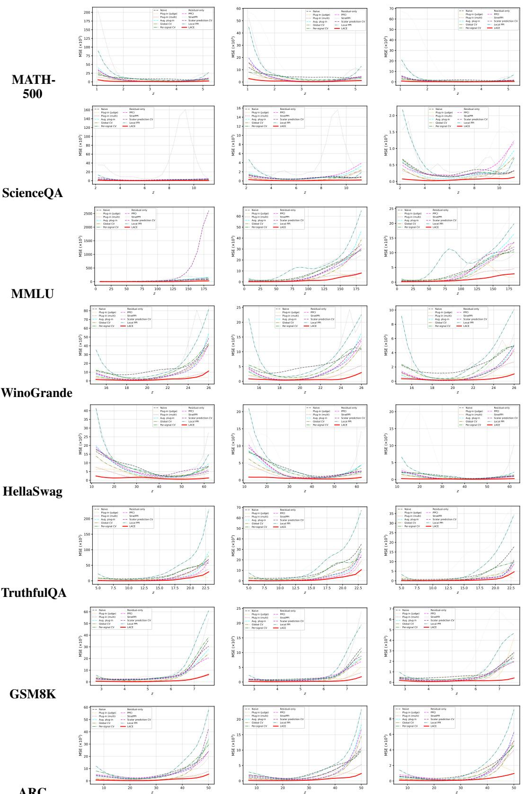
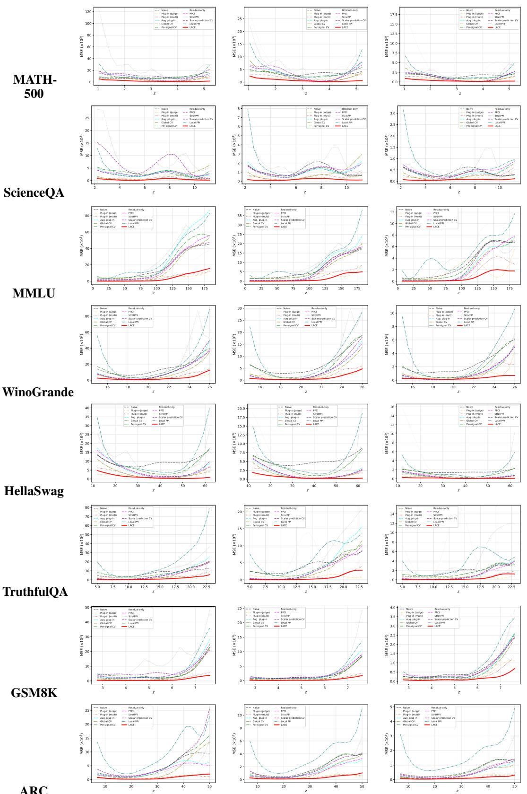
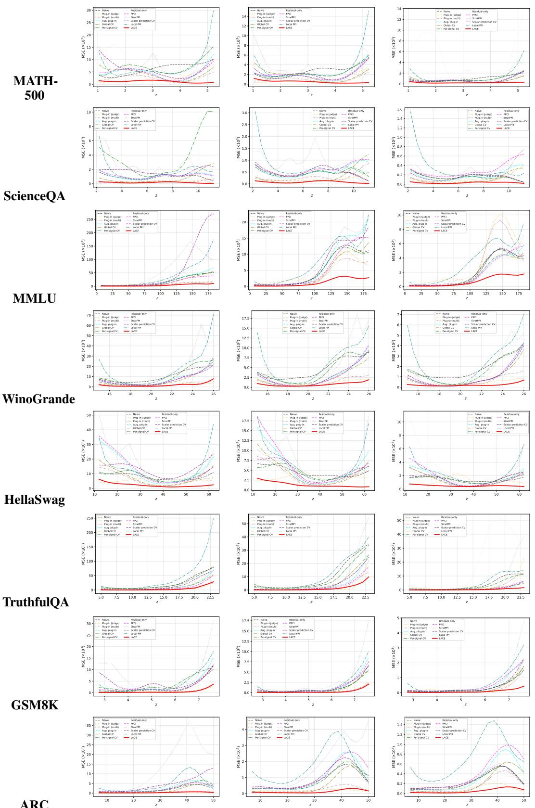
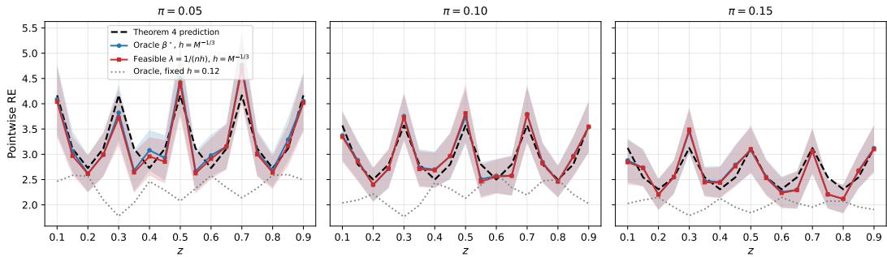

# Conditional Evaluation of Language Models with Cheap Auxiliary Signals

Zhi Zhang1∗ Lingfeng Lyu2∗ Yue Kang3 Doudou Zhou4†

1Department of Statistics and Data Science, University of California, Los Angeles 2Department of Statistics and Finance, School of Management, University of Science and Technology of China 3Microsoft

4Department of Statistics and Data Science, National University of Singapore

## Abstract

Aggregate accuracy hides where models succeed and fail. Estimating conditional performance profiles from gold labels alone is expensive, while cheap auxiliary signals such as LLM-judge scores, pairwise comparisons, confidence scores, and judge-disagreement features can be collected for every benchmark item but are often biased or miscalibrated. We propose LACE (Local Augmented Control-Variate Evaluation), a semi-supervised estimator for conditional LLM evaluation. The key step is local centering: after subtracting the conditional mean of a cheap signal within the target profile region, any linear augmentation has zero conditional mean and therefore cannot change the estimand. The augmentation coefficient is used only for efficiency, and a local ridge control variate combines a gold-label residual mean from the labeled subset with a cheap-signal mean from the full item pool. We prove calibration-free identification, unbiasedness for grouped profiles, local oracle optimality within centered linear augmentations, and firstorder adaptivity to the estimated coefficient. The resulting gain formula is governed by a population local R2, which characterizes how the efficiency attainable from the cheap signals varies across profile values. We also derive corresponding estimators for direct paired model gaps and deployment-weighted scores. We empirically evaluate the primary performance-profile estimator on MATH-500, ScienceQA, MMLU, WinoGrande, HellaSwag, TruthfulQA, GSM8K, and ARC.

## 1 Introduction

Large language model evaluation is increasingly a question of conditional performance, not merely aggregate score. A model may be strong on algebra but weak on geometry, reliable in high-school science but brittle in elementary grades, or dominant in some subject categories while losing in others. We index such profiles by a profiling covariate $Z \in { \mathcal { Z } }$ . The profile space $\mathcal { Z }$ may represent a single metadata axis, such as difficulty level or subject category, or a multidimensional combination of attributes, such as grade, subject, and task type. Such profiles matter for model selection, deployment targeting, and scientific diagnosis, echoing broader calls for benchmark reports that expose performance across tasks, metrics, and relevant subgroups [Mitchell et al., 2019, Liang et al., 2023]. The target of estimation is the conditional performance profile of a candidate model m over benchmark items i: $\theta _ { m } ( z ) = \operatorname* { P r } ( Y _ { i m } = 1 \mid Z _ { i } = \stackrel { - } { z } )$ , where $Y _ { i m }$ is the gold correctness of model m on item i and the profiling covariate $Z _ { i }$ is derived from benchmark metadata. Unfortunately, gold labels are often expensive: they may require expert grading, careful rubrics, or repeated adjudication. With limited labels, estimates of $\theta _ { m } ( z )$ can be too noisy to support fine-grained decisions.

At the same time, modern evaluation pipelines produce many inexpensive signals. LLM-as-a-judge scores, pairwise comparisons against anchor models, self-reported confidence, and disagreement across judge prompts are cheap enough to collect on every benchmark item [Zheng et al., 2023, Liu et al., 2023, Dubois et al., 2024]. These signals are useful but dangerous to treat as calibrated probabilities. A judge can be biased, overconfident, prompt-sensitive, influenced by output length or position, or systematically wrong on particular subpopulations [Wang et al., 2024a, Wu and $\mathrm { \bf A j i }$ 2023, Dubois et al., 2024]. The key question is therefore not whether cheap evaluators are correct in an absolute sense, but whether they explain residual variation in gold correctness locally.

Running example: MATH-500. Let $Z _ { i }$ record the difficulty of problem i, let $Y _ { i m }$ indicate whether candidate model m answers it correctly, and let $S _ { i m }$ collect inexpensive item-level information such as judge scores, pairwise comparisons with anchor models, self-confidence, and judge disagreement. The scientific target is $\mathrm { P r } ( Y _ { i m } ^ { \hat { } } = 1 \mid Z _ { i } = z )$ , the model’s accuracy at difficulty z. The kernel localizes items in the profile space defined by $Z ;$ it does not measure similarity among the cheap signals. Centering $S$ within each $Z .$ -neighborhood therefore lets those signals improve precision without changing the estimand.

This paper develops LACE (Local Augmented Control-Variate Evaluation). We present it through LLM benchmarking because that setting makes the problem concrete, but the statistical problem is more general: estimate a conditional mean when the gold outcome is observed on a small random subset, while multiple auxiliary measurements are observed on every item. The estimator starts from a simple identity: after centering a cheap signal by its conditional mean given $Z _ { i } = z$ , any linear adjustment has conditional expectation zero. The adjustment coefficient is therefore not needed for identification; it is chosen only to reduce variance. Estimating this coefficient locally gives a ridgeregularized control variate that can use unlabeled items through the local mean of cheap auxiliary signals. This construction is related to recent work on local and conditional prediction-powered inference (PPI) [Gu and Xia, 2024, Sui et al., 2026], which combines a supplied outcome prediction with a localized labeled residual correction. LACE addresses a different version of the problem: Z alone defines the conditional target, while an additional vector $S$ is used only for precision. It learns the full coefficient $\beta ( z )$ from the same scarce labels, so the relative value of the cheap signals may change across the profile without adding S to the conditioning event. The construction also treats continuous, ordered discrete, and categorical profile spaces within one estimator and provides a local theoretical characterization of the attainable efficiency gain. Concretely, we contribute a general semi-supervised profiling formulation for estimating $\mathbf { \bar { E } } ( Y \mid Z = z )$ with scarce gold outcomes and abundant heterogeneous auxiliary measurements; a local control-variate estimator covering continuous, ordered discrete, and unordered categorical profile spaces; theory establishing calibrationfree identification (Proposition 1), group-profile unbiasedness (Theorem 1), oracle optimality within centered linear augmentations (Theorem 3), and first-order adaptivity (Theorem 2); a local gain formula $\mathrm { G a i n } _ { m } ( z ) \overset { \vartriangle } { = } 1 / \{ 1 - ( 1 - \pi ) R _ { m } ^ { 2 } ( z ) \}$ that characterizes heterogeneous signal quality across $\mathcal { Z } ;$ theoretical extensions to direct paired model gaps and deployment-weighted scores; and an empirical evaluation of the primary profile estimator, with cell-level RE ranging from 2.73× to 11.03× across eight benchmarks, three models, and three label budgets.

## 2 Related Work

Conditional LLM evaluation. Fine-grained and conditional reporting is already central to LLM evaluation. MMLU reports subject-level performance [Hendrycks et al., 2021a]; MATH, ScienceQA, GPQA, and MMLU-Pro expose metadata or splits such as level, grade, subject, and domain [Hendrycks et al., 2021b, Lu et al., 2022, Rein et al., 2023, Wang et al., 2024c]; and evaluation suites such as BIG-bench, HELM, and the Language Model Evaluation Harness organize results across tasks, scenarios, metrics, and subtasks [Srivastava et al., 2023, Liang et al., 2023, Gao et al., 2024]. Recent benchmarks go further by defining fine-grained skill or instruction axes, including FLASK, IFEval, MT-Bench-101, and BiGGen Bench [Ye et al., 2024, Zhou et al., 2023, Bai et al., 2024, Kim et al., 2024]. Documentation frameworks such as model cards also advocate reporting performance across relevant conditions and subgroups [Mitchell et al., 2019]. Our focus is complementary: given such a profiling axis, we ask how to estimate the corresponding conditional profile when only a small random fraction of items carry gold labels, using cheap auxiliary signals for variance reduction rather than as replacement labels.

Cheap evaluators, LLM judges, and aggregation. LLM judges and pairwise preference evaluators are widely used because they are scalable and often correlated with human or gold-label assessments [Zheng et al., 2023, Liu et al., 2023]. Related systems use LLMs to estimate factuality or response quality at far lower cost than manual evaluation [Min et al., 2023, Dubois et al., 2024], and multi-agent judging has been proposed to improve reliability [Chan et al., 2024]. A parallel line trains or distills dedicated judge models, including PandaLM, Prometheus, Auto-J, JudgeLM, and CritiqueLLM [Wang et al., 2024b, Kim et al., 2023, Li et al., 2024, Zhu et al., 2023, Ke et al., 2024]. Pairwise outcomes are often modeled with Bradley–Terry–Luce (BTL) models [Bradley and Terry, 1952]; Chatbot Arena instantiates this at scale through crowdsourced human preferences [Chiang et al., 2024]. Pointwise confidence scores can be post-hoc calibrated to approximate empirical accuracy [Guo et al., 2017]. Other work aggregates noisy, sparse, or dependent judge outputs: judge-aware ranking extends BTL models with judge-specific discrimination parameters [Xu et al., 2026]; CARE models multi-judge scores as arising from a latent true-quality signal and shared confounding factors [Zhao et al., 2026]; and tensor methods model evaluation as low-rank completion of pairwise comparisons or cluster question–answerer–evaluator score tensors [Li et al., 2026, Watanabe and Sun, 2026]. However, LLM judges are known to exhibit position, verbosity, style, and self-preference biases [Wang et al., 2024a, Wu and Aji, 2023, Koo et al., 2023, Dubois et al., 2024]. Our estimator imposes neither a BTL model nor a calibration requirement; it only requires cheap signals to explain local variation in gold correctness within each subgroup.

Control variates, semi-supervised estimation, and local PPI. Control variates are a classical variance-reduction tool in Monte Carlo estimation [Owen, 2013]. Augmented inverse-probability weighting (AIPW), one-step estimation, and semi-supervised regression estimators combine scarce labels with abundant covariates through fitted means and labeled residual corrections [Robins et al., 1994, Zhang et al., 2019, Chernozhukov et al., 2018]. Prediction-powered inference uses machine predictions for scalar estimands [Angelopoulos et al., 2023a]; PPI++ optimally tunes a global coefficient [Angelopoulos et al., 2023b]. MultiPPI extends this global setting to multiple lower-cost measurement sources and jointly optimizes acquisition and linear combination weights [Cowen-Breen et al., 2026]. Recent work has instead localized PPI to conditional targets. Local PPI [Gu and Xia, 2024] fits a local polynomial to predictions from a supplied model on an independent unlabeled sample and subtracts a local labeled residual correction. Prediction-powered conditional inference (PPCI) [Sui et al., 2026] learns an RKHS localization weight for a conditional moment at a fixed test point, then applies a prediction-plus-residual decomposition using a supplied predictor.

Estimator structure in common notation. Let $P \in \mathbb { R }$ denote a supplied scalar prediction and $S \in \mathbb { R } ^ { K }$ a vector of auxiliary signals. Write $\bar { A } _ { D }$ for the mean of a variable over $\bar { D ^ { \prime } } \in \{ L , T \}$ and $\bar { A } _ { D } ( z )$ for its profile-local counterpart. The four structures can then be displayed as

PPI++ (global scalar):

$$
\widehat { \mu } = \bar { Y } _ { L } - \widehat { \omega } \{ \bar { P } _ { L } - \bar { P } _ { T } \} ,
$$

Local PPI (conditional scalar):

$$
\widehat { \theta } ( z ) = \bar { Y } _ { L } ( z ) - \{ \bar { P } _ { L } ( z ) - \bar { P } _ { T } ( z ) \} ,
$$

global vector control variate:

$$
\widehat { \mu } = \bar { Y } _ { L } - \widehat { \beta } ^ { \top } \{ \bar { S } _ { L } - \bar { S } _ { T } \} ,
$$

LACE (conditional vector):

$$
\widehat { \theta } ( z ) = \bar { Y } _ { L } ( z ) - \widehat { \beta } ( z ) ^ { \top } \{ \bar { S } _ { L } ( z ) - \bar { S } _ { T } ( z ) \} .
$$

These displays use the nested labeled/full-pool notation only to expose estimator structure; the original PPI++ and Local PPI methods retain their own sampling assumptions. The centered control-variate algebra itself is classical. Our contribution is the joint construction for a conditional target with multiple auxiliary signals, profile-dependent relevance, and a local vector coefficient learned from the same scarce labels with first-order adaptivity.

Our formulation separates two roles that are coupled in these conditional-PPI setups. The profiling variable $Z$ alone defines the target $\mathbb { E } ( Y \mid Z = z )$ , whereas the additional cheap-signal vector $S$ is used only for precision and is not added to the conditioning event. This distinction is important in evaluation: setting the conditional-PPI covariate to $Z$ leaves the item-level signals $S$ unused, while conditioning on $( \bar { Z } , S )$ changes the scientific target. LACE instead centers $\breve { S }$ within the Z-profile region and learns the full vector coefficient $\beta ( z )$ from the same scarce labels. Thus both the magnitude and direction of the auxiliary combination may change with $z ,$ without requiring a separately supplied outcome predictor or changing the estimand. The theory establishes first-order adaptivity to this same-label coefficient estimate and explicitly covers the nested finite-pool design $\dot { L } \subset \dot { T }$ with a non-negligible labeled fraction. The same construction handles continuous, ordered discrete, and unordered categorical profile spaces and yields the local gain formula $1 / \{ 1 - ( 1 - \pi ) R _ { m } ^ { 2 } ( z ) \}$ . In the LLM context, Zhou et al. target global win-rate estimation [Zhou et al., 2025] and Fisch et al. apply stratified PPI to pre-specified discrete strata [Fisch et al., 2024]; both target global or stratum-level means. Fogliato et al. use empirical-Bayes shrinkage for small benchmark subgroups [Fogliato et al., 2024]; tinyBenchmarks selects IRT-curated item subsets [Polo et al., 2024].

Local smoothing, survey estimation, and deployment weighting. Our continuous-Z estimator uses kernel weights in the spirit of local nonparametric regression [Fan and Gijbels, 1996]; the discrete version is the corresponding group estimator, and the ordinal version borrows strength across neighboring levels. Ratio and regression estimators in survey statistics exploit auxiliary information to improve precision [Cochran, 1977, Särndal et al., 1992], post-stratification and generalized regression estimators are discrete analogues of local smoothing, and Horvitz–Thompson weighting handles unequal inclusion probabilities [Horvitz and Thompson, 1952]. When a deployment distribution $Q$ differs from the benchmark distribution $P _ { \mathrm { : } }$ , importance weighting corrects distribution shift [Sugiyama et al., 2007]. LACE combines these ideas with local control variates: it targets nonparametric conditional profiles, allows noisy and biased auxiliary signals, and embeds deployment reweighting through $r _ { Q } ( z ) = d Q _ { Z } / d P _ { Z }$ rather than treating it as a post-hoc adjustment to global accuracy.

## 3 LACE: Local Augmented Control-Variate Evaluation

## 3.1 Setup and profile weights

We use LLM-evaluation notation, but the ingredients are only a gold outcome, auxiliary measurements, and a conditioning covariate. Fix a candidate model m. Items in the benchmark pool $\dot { T } = \{ 1 , \dots , M \}$ have $\left( Z _ { i } , Y _ { i m } , S _ { i m } \right) \stackrel { \mathrm { i . i . d . } } { \sim } \mathbb { P } .$ , where $Z _ { i } \in { \mathcal { Z } }$ is the profiling covariate (continuous, ordered discrete, or unordered categorical), $Y _ { i m } \in \{ 0 , 1 \}$ is the gold correctness label, and $S _ { i m } \in \mathbb { R } ^ { K }$ is the cheap-signal vector. We observe $( Z _ { i } , S _ { i m } )$ for every $i \in T$ but $Y _ { i m }$ only on a labeled subset $L \subset T$ of size $n ,$ drawn uniformly without replacement independently of the item data; write $\pi = n / M$ . The main target is the conditional performance profile $\theta _ { m } ( z ) \stackrel { \cdot } { = } \mathbb { P } ( Y _ { i m } = 1 \mid Z _ { i } = z )$

The profiling variable $Z$ is prespecified by the scientific question rather than formed by automatically combining all available metadata. For overlapping tags, each tag may define a separate low-dimensional query, with the same item contributing to several queries. A joint profile is needed only when performance on the intersection is itself the target.

For any sample set $A \subseteq T$ , local weights $w _ { i , A } ( z )$ are nonnegative and sum to one over $A .$ When the continuous profile space is a subset of $\mathbb { R } ^ { q }$ , we use $\begin{array} { r } { w _ { i , A , h } ( z ) = K _ { h } ( Z _ { i } - z ) / \sum _ { \ell \in A } K _ { h } ( Z _ { \ell } - z ) } \end{array}$ with $K _ { h } ( u ) = h ^ { - q } K ( u / h )$ . Ordered discrete profiles use normalized triangular ordinal weights $w _ { i , A } ( g ) \stackrel { \cdot } { \propto } ( 1 - | Z _ { i } - g | / \stackrel { \cdot } { b } _ { \mathrm { o r d } } ) _ { + } { \bf 1 } ( i \in A )$ , with within-group weights as the special case $b _ { \mathrm { o r d } } = 1$ . Unordered categorical profiles use $\begin{array} { r } { \dot { w } _ { i , A } ( g ) = 1 ( Z _ { i } = g ) / \sum _ { \ell \in A } \bar { 1 } ( Z _ { \ell } = g ) } \end{array}$ . In what follows, $w _ { i , A } ( z )$ denotes the chosen local-weight rule, with bandwidth parameters suppressed when unambiguous. For any scalar- or vector-valued quantity $V _ { i } .$ , write $\begin{array} { r } { \bar { V } _ { A } ( z ) = \sum _ { i \in A } w _ { i , A } \ ' ( z ) V _ { i } ; } \end{array}$ ; model-specific means such as $\bar { S } _ { m , L } ( z )$ use $V _ { i } = S _ { i m }$

## 3.2 Centered augmentation principle

Cheap auxiliary signals may be biased, prompt-sensitive, or miscalibrated, so LACE never treats them as substitute labels. Let $\mu _ { S , m } ( z ) = \mathbb { E } ( S _ { i m } \mid Z _ { i } = z )$ . For any deterministic vector $b ( z )$

$$
\mathbb { E } \big [ Y _ { i m } - b ( z ) ^ { \top } \{ S _ { i m } - \mu _ { S , m } ( z ) \} \mid Z _ { i } = z \big ] = \theta _ { m } ( z ) .
$$

Thus centering protects the target: the coefficient controls efficiency, not identification. The population coefficient that removes the largest amount of local linear variation is

$$
\beta _ { m } ^ { \star } ( z ) = \Sigma _ { S S , m } ( z ) ^ { \dagger } \Sigma _ { S Y , m } ( z ) ,
$$

where

$$
\Sigma _ { S S , m } ( z ) = \mathrm { V a r } ( S _ { i m } \mid Z _ { i } = z ) , \qquad \Sigma _ { S Y , m } ( z ) = \mathrm { C o v } ( S _ { i m } , Y _ { i m } \mid Z _ { i } = z ) .
$$

Section 4 states the formal identification and optimality results.

## 3.3 The LACE estimator and local coefficient

At a target profile value z, LACE combines a labeled residual mean with a full-pool cheap-signal mean. Using the local weights defined above, define $\begin{array} { r } { \bar { Y } _ { m , L } ( z ) = \sum _ { i \in L } w _ { i , L } ( z ) Y _ { i m } ^ { \ \cdot } } \end{array}$ and $\bar { S } _ { m , A } ( \bar { z } ) =$ $\begin{array} { r } { \sum _ { i \in A } w _ { i , A } ( z ) S _ { i m } } \end{array}$ for $A \in \{ L , T \}$ . For any coefficient $\gamma \in \mathbb { R } ^ { K }$ , consider

$$
\widehat { \theta } _ { m } ( z ; \gamma ) = \bar { Y } _ { m , L } ( z ) - \gamma ^ { \top } \left\{ \bar { S } _ { m , L } ( z ) - \bar { S } _ { m , T } ( z ) \right\} .\tag{1}
$$

We set $\gamma$ to a regularized local coefficient. Let $w _ { i , A , b } ( z )$ denote coefficient-fitting weights that use the same profile-space rule as $w _ { i , A } ( z )$ , possibly with a larger bandwidth or ordinal span for stability, and let $\bar { S } _ { m , T , b } ( z ) , \bar { S } _ { m , L , b } ( z )$ , and $\bar { Y } _ { m , L , b } ( z )$ be the corresponding local means. Define

$$
\widehat { \Sigma } _ { S S , m } ( z ) = \sum _ { i \in T } w _ { i , T , b } ( z ) \{ S _ { i m } - \bar { S } _ { m , T , b } ( z ) \} \{ S _ { i m } - \bar { S } _ { m , T , b } ( z ) \} ^ { \top } ,
$$

$$
\widehat { \Sigma } _ { S Y , m } ( z ) = \sum _ { i \in L } w _ { i , L , b } ( z ) \{ S _ { i m } - \bar { S } _ { m , L , b } ( z ) \} \{ Y _ { i m } - \bar { Y } _ { m , L , b } ( z ) \} ,
$$

and set

$$
\widehat { \beta } _ { m } ( z ) = \{ \widehat { \Sigma } _ { S S , m } ( z ) + \lambda I _ { K } \} ^ { - 1 } \widehat { \Sigma } _ { S Y , m } ( z ) ,
$$

where $\lambda > 0$ is a ridge penalty that stabilizes the inversion when the local covariance is illconditioned or the number of labeled items is small relative to $K$ . The final estimator is ${ \widehat { \theta } } _ { m } ^ { \mathrm { L A C E } } ( z ) = { \widehat { \theta } } _ { m } ( z ; { \widehat { \beta } } _ { m } ( z ) )$

$$
\widehat { \theta } _ { m } ^ { \mathrm { L A C E } } ( z ) = \bar { Y } _ { m , L } ( z ) - \widehat { \beta } _ { m } ( z ) ^ { \top } \left\{ \bar { S } _ { m , L } ( z ) - \bar { S } _ { m , T } ( z ) \right\} .\tag{2}
$$

Equivalently,

$$
\widehat { \theta } _ { m } ^ { \mathrm { L A C E } } ( z ) = \sum _ { i \in L } w _ { i , L } ( z ) \{ Y _ { i m } - \widehat { \beta } _ { m } ( z ) ^ { \top } S _ { i m } \} + \sum _ { i \in T } w _ { i , T } ( z ) \widehat { \beta } _ { m } ( z ) ^ { \top } S _ { i m } .
$$

Thus the gold labels estimate only the local residual mean, while all items estimate the cheap-signal component. The ridge term protects against ill-conditioned local covariances; when the cheap signals are locally uninformative, $\hat { \beta } _ { m } ( z )$ is shrunk toward zero and the estimator reduces to the gold-label smoother. When they explain local correctness variation, the labeled part has lower residual variance, yielding the gain quantified in Section 4.

## 3.4 Other evaluation targets

The same centered augmentation applies after changing the outcome, the auxiliary vector, or the target sampling law. We use this template to define estimators and derive theory for two LLM-evaluation targets beyond a single model’s profile.

Direct paired model gaps. For models a and b, define $\Delta _ { a b } ( z ) = \theta _ { a } ( z ) - \theta _ { b } ( z )$ and the paired outcome $D _ { i , a b } = Y _ { i a } - Y _ { i b }$ . Let $H _ { i , a b } = ( S _ { i a } ^ { \top } , S _ { i b } ^ { \top } , ( S _ { i a } - S _ { i b } ) ^ { \top } ) ^ { \top }$ , with any direct pairwise judge feature appended when available. The direct gap estimator is

$$
\widehat { \Delta } _ { a b } ^ { \mathrm { L A C E } } ( z ) = \bar { D } _ { a b , L } ( z ) - \widehat { \beta } _ { a b } ( z ) ^ { \top } \{ \bar { H } _ { a b , L } ( z ) - \bar { H } _ { a b , T } ( z ) \} .\tag{3}
$$

Here ${ \widehat \beta } _ { a b } ( z )$ is fitted by the same ridge covariance formula, replacing $( Y , S )$ by $( D , H )$ . Estimating the gap directly uses the within-item dependence between $Y _ { i a }$ and $Y _ { i b }$ , which can be more efficient than subtracting two separately estimated profiles.

Deployment-weighted scores. Let $Q _ { Z } \ll P _ { Z }$ be a deployment profile distribution and define the joint target law by the covariate-shift model $Q ( d z , \bar { d } y , \bar { d } s ) = \bar { Q } _ { Z } ( d z ) P ( d y , d s \mid z )$ . Write $r _ { Q } ( \bar { z } ) = d \bar { Q _ { Z } } ( z ) / d \bar { P _ { Z } } ( z )$ and $\rho _ { i } = r _ { Q } ( Z _ { i } )$ . For $A \in \{ L , { \dot { T } } \}$ , define

$$
\bar { S } _ { m , A } ^ { Q } = \frac { \sum _ { i \in { \cal A } } \rho _ { i } S _ { i m } } { \sum _ { i \in { \cal A } } \rho _ { i } } , \qquad \bar { Y } _ { m , L } ^ { Q } = \frac { \sum _ { i \in { \cal L } } \rho _ { i } Y _ { i m } } { \sum _ { i \in { \cal L } } \rho _ { i } } .
$$

To estimate the variance-optimal deployment coefficient, set

$$
\widehat { \phi } _ { S , i } ^ { Q } = \rho _ { i } \{ S _ { i m } - \bar { S } _ { m , T } ^ { Q } \} , \qquad \widehat { \phi } _ { Y , i } ^ { Q } = \rho _ { i } \{ Y _ { i m } - \bar { Y } _ { m , L } ^ { Q } \} ,
$$

and define the influence-moment estimators

$$
\widehat { \Gamma } _ { S S , m } ^ { Q } = \frac { 1 } { M } \sum _ { i \in T } \widehat { \phi } _ { S , i } ^ { Q } \widehat { \phi } _ { S , i } ^ { Q \top } , \qquad \widehat { \Gamma } _ { S Y , m } ^ { Q } = \frac { 1 } { n } \sum _ { i \in L } \widehat { \phi } _ { S , i } ^ { Q } \widehat { \phi } _ { Y , i } ^ { Q } .
$$

For a ridge level $\lambda _ { Q , n } > 0$ , let

$$
\widehat { \beta } _ { m } ( Q ) = \{ \widehat { \Gamma } _ { S S , m } ^ { Q } + \lambda _ { Q , n } I _ { K } \} ^ { - 1 } \widehat { \Gamma } _ { S Y , m } ^ { Q } .
$$

Because these are empirical products of the estimated influence quantities, their summands contain $\rho _ { i } ^ { 2 } = r _ { Q } ( Z _ { i } ) ^ { 2 }$ , rather than a single deployment-weight factor. The deployment-aware score is

$$
\widehat { \Psi } _ { m } ^ { \mathrm { L A C E } } ( Q ) = \bar { Y } _ { m , L } ^ { Q } - \widehat { \beta } _ { m } ( Q ) ^ { \top } \{ \bar { S } _ { m , L } ^ { Q } - \bar { S } _ { m , T } ^ { Q } \} ,\tag{4}
$$

with the same self-normalized deployment means used both for centering and for the final score.

## 4 Theory

This section collects the formal guarantees for the estimators in Section 3; proofs are deferred to Appendix B. Throughout this section, all conditional moments are evaluated at profile values z at which the chosen versions of the corresponding conditional moment functions are well defined. Let $\mu _ { S , m } ( z ) = \mathbb { E } ( S _ { i m } \mid Z _ { i } = z ) , \Sigma _ { S S , m } ( z ) = \mathbf { \bar { V } } \mathrm { a r } ( S _ { i m } \mid Z _ { i } = z ) , \Sigma _ { S Y , m } ( z ) = \operatorname { C o v } ( S _ { i m } , Y _ { i m } \mid Z _ { i } = z )$ $Z _ { i } = z ) , \sigma _ { Y . m } ^ { 2 } ( z ) = \operatorname { V a r } ( Y _ { i m } \mid Z _ { i } = z )$ , and $R _ { m } ^ { 2 } ( z ) = \Sigma _ { S Y , m } ( z ) ^ { \top } \Sigma _ { S S , m } ( z ) ^ { \dagger } \Sigma _ { S Y , m } ( z ) / \sigma _ { Y , m } ^ { 2 } ( z )$ when $\sigma _ { Y , m } ^ { 2 } ( z ) > 0$ . Here $R _ { m } ^ { 2 } ( z )$ is a population (oracle) quantity; we do not estimate or report it in the real-data experiments. Unless stated otherwise, limits take $n , M \to \infty$ . We write ⇝ for convergence in distribution, $\mathcal { N } ( 0 , v )$ for a normal law with variance v, $O _ { p } ( \cdot )$ and $o _ { p } ( \cdot )$ under the joint benchmark and label-subsampling law, and $\mathrm { A V a r } \{ \cdot \}$ for the leading asymptotic variance of the unscaled estimator.

Proposition 1 (Calibration-free identification). Assume $\mathbb { E } ( \| S _ { i m } \| _ { 2 } ^ { 2 } ~ | ~ Z _ { i } ~ = ~ z ) ~ < ~ \infty ~$ . For any deterministic vector $b ( z ) \in \mathbb { R } ^ { K } , \mathbb { E } [ Y _ { i m } - b ( z ) ^ { \top } \{ S _ { i m } - \mu _ { S , m } ( z ) \} \mid Z _ { i } = z ] = \theta _ { m } ( z )$ . Among all linear centered augmentations, the conditional variance is minimized by any solution of $\because \Sigma _ { S S , m } ( z ) b =$ $\Sigma _ { S Y , m } ( z )$ ; the minimum-norm solution is $\beta _ { m } ^ { \star } ( z ) = \Sigma _ { S S , m } ( z ) ^ { \dagger } \Sigma _ { S Y , m } ( z )$

Assumption 1 (Local regularity). The profiling density $f _ { Z }$ is continuous and positive $a t z ,$ and the conditionalfirst and second moments of $( \bar { Y _ { i m } } , \bar { S _ { i m } } )$ are continuous at z. The kernel K is nonnegative, bounded, symmetric, and integrable, with R K(u) du = 1 and $\begin{array} { r } { R ( K ) = \int K ( u ) ^ { 2 } d u < \infty . } \end{array}$ . For some $\delta > 0 ,$ , either (i) K has compact support and su $) _ { t \in \mathcal { N } ( z ) } \mathbb { E } \{ ( 1 + \| S _ { i m } \| _ { 2 } ) ^ { 2 + \delta } \mid Z _ { i } = t \} < \circ$ ∞ for some neighborhood $\begin{array} { r } {  { \mathcal { N } } ( z ) ~ o f z , o r ~ ( i i ) ~ \operatorname* { s u p } _ { t } ~ f _ { Z } ( t )  { \mathbb { E } } \{ ( 1 + \| S _ { i m } \| _ { 2 } ) ^ { 2 + \delta } ~ | ~ { Z } _ { i } = t \} < \infty . ~ F i n a l l y } \end{array}$ $h  0 \ a n d n h ^ { q }  \infty$

Assumption 2 (Stable nuisance estimation). The labeled fraction satisfies $\pi = n / M \to \pi _ { 0 } \in ( 0 , 1 ] .$ The local ridge coefficient obeys $\| \widehat { \beta } _ { m } ( z ) - \beta _ { m } ^ { \star } ( z ) \| = o _ { p } ( 1 )$ . Under Assumption 1, this holds,for example, when the nuisance bandwidth satisfies $b \geq h , b  0$ , and $n b ^ { q } \to \infty$ , the ridge level satisfies $\lambda  0 ,$ , and $\Sigma _ { S S , m } ( z )$ is nonsingular.

For discrete profiling groups, the estimator admits an exact finite-sample statement under random benchmark sampling and random label subsampling.

Theorem 1 (Unbiasedness and variance for group profiles). Fix a group g. Suppose $T _ { g }$ contains $M _ { g }$ i.i.d. itemsfrom the population conditional on $Z = g$ and, conditional on the realized item values in $T _ { g } , L _ { g }$ is uniformly distributed over all size- $\cdot n _ { g }$ subsets $o f T _ { g } ,$ , where $0 < n _ { g } \leq M _ { g }$ . For any fixed coefficient $b _ { g } ,$ , the group-weight version of $\widehat { \theta } _ { m } ( g ; b _ { g } )$ in (1) satisfies

$$
\mathbb { E } \{ \widehat { \theta } _ { m } ( g ; b _ { g } ) \} = \theta _ { m } ( g ) .
$$

In this theorem, expectation and variance are over both benchmark sampling and label sampling. If $\mathbb { E } ( \| S _ { i m } \| _ { 2 } ^ { 2 } \mid Z _ { i } = \dot { g } ) < \infty$ and $M _ { g } > 1$ , then

$$
\mathrm { V a r } \{ \widehat { \theta } _ { m } ( g ; b _ { g } ) \} = \frac { \sigma _ { Y , m } ^ { 2 } ( g ) } { M _ { g } } + \left( 1 - \frac { n _ { g } } { M _ { g } } \right) \frac { \sigma _ { R , g } ^ { 2 } ( b _ { g } ) } { n _ { g } } ,
$$

where $\begin{array} { r } { \sigma _ { Y , m } ^ { 2 } ( g ) = \mathrm { V a r } ( Y _ { i m } \mid Z _ { i } = g ) , R _ { i } ( b _ { g } ) = Y _ { i m } - b _ { g } ^ { \top } S _ { i m } , a n d \sigma _ { R , g } ^ { 2 } ( b _ { g } ) = \mathrm { V a r } \{ R _ { i } ( b _ { g } ) \mid Z _ { i } = \sigma _ { R , g } ^ { 2 } \} , } \end{array}$ $g \}$

Two exact oracle gains for group profiles. Let $\pi _ { g } ~ = ~ n _ { g } / M _ { g }$ . At the respective varianceminimizing population and realized-pool coefficients, when the corresponding outcome variances are positive, Theorem 1 and its conditional variance calculation give

$$
\underbrace { \frac { 1 } { 1 - ( 1 - \pi _ { g } ) R _ { m } ^ { 2 } ( g ) } } _ { \mathrm { p o p u l a t i o n t a r g e t } \theta _ { m } ( g ) } \le \frac { 1 } { \pi _ { g } } , \qquad \underbrace { \frac { 1 } { 1 - R _ { T , g } ^ { 2 , \mathrm { d } } } } _ { \mathrm { r e a l i z e d - p o o l t a r g e t } \bar { Y } _ { T , g } } .
$$

Here $R _ { m } ^ { 2 } ( g )$ is the population squared multiple correlation and $R _ { T , g } ^ { 2 , \mathrm { d } }$ is its counterpart computed from realized-pool covariances. In the second ratio, the common finite-population correction $1 - \pi _ { g }$ cancels. This second identity is an exact group-profile oracle comparison, not a pointwise gain theorem for the continuous profiles in the real-data study or an equality claimed for the feasible estimator.

Theorem 2 (First-order adaptivity to the nuisance coefficient). For the estimator $\widehat { \theta } _ { m } ( z ; b )$ in (1) and any possibly data-dependent $\widehat { \beta } _ { m } ( z )$

$$
\widehat { \theta } _ { m } ( z ; \widehat { \beta } _ { m } ( z ) ) - \widehat { \theta } _ { m } ( z ; \beta _ { m } ^ { \star } ( z ) ) = - \{ \widehat { \beta } _ { m } ( z ) - \beta _ { m } ^ { \star } ( z ) \} ^ { \top } \{ \bar { S } _ { m , L } ( z ) - \bar { S } _ { m , T } ( z ) \} .
$$

Under Assumption 1, $\| \bar { S } _ { m , L } ( z ) - \bar { S } _ { m , T } ( z ) \| ~ = ~ O _ { p } ( ( n h ^ { q } ) ^ { - 1 / 2 } )$ by standard kernel central limit arguments [Fan and Gijbels, 1996]. Consequently, $i f \| \widehat { \beta } _ { m } ( z ) - \beta _ { m } ^ { \star } ( z ) \| = o _ { p } ( 1 )$ , then $\sqrt { n h ^ { q } } \{ \widehat { \theta } _ { m } ( z ; \widehat { \beta } _ { m } ( z ) ) - \widehat { \theta } _ { m } ( z ; \beta _ { m } ^ { \star } ( z ) ) \} = o _ { p } ( 1 )$

Theorem 3 (Local oracle optimality of the augmentation). Under Assumption 1 and $n / M \to \pi _ { 0 } \in$ (0, 1],for anyfixed deterministic $b \in \mathbb { R } ^ { K }$ , the estimator $\widehat { \theta } _ { m } ( z ; b )$ in (1) satisfies

$$
\sqrt { n h ^ { q } } \{ \widehat { \theta } _ { m } ( z ; b ) - \theta _ { m } ( z ) - B _ { h } ( z ) \}  \mathcal { N } \biggl ( 0 , \frac { R ( K ) } { f _ { Z } ( z ) } \mathcal { V } _ { m } ( z ; b ) \biggr ) ,
$$

where

$$
B _ { h } ( z ) = \frac { \mathbb { E } \{ K _ { h } ( Z _ { i } - z ) \theta _ { m } ( Z _ { i } ) \} } { \mathbb { E } \{ K _ { h } ( Z _ { i } - z ) \} } - \theta _ { m } ( z )
$$

is the usual local-constant smoothing bias and

$$
\mathcal { V } _ { m } ( z ; b ) = \sigma _ { Y , m } ^ { 2 } ( z ) + ( 1 - \pi _ { 0 } ) \{ b ^ { \top } \Sigma _ { S S , m } ( z ) b - 2 b ^ { \top } \Sigma _ { S Y , m } ( z ) \} .
$$

$I f \pi _ { 0 } < 1$ , the minimizers are exactly the solutions of $\because \Sigma _ { S S , m } ( z ) b = \Sigma _ { S Y , m } ( z )$ , and the minimum first-order variancefactor is $\mathcal { V } _ { m } ( z ; \beta _ { m } ^ { \star } ) = \sigma _ { Y , m } ^ { 2 } ( z ) \{ 1 - ( \mathrm { 1 } - \pi _ { 0 } ) R _ { m } ^ { 2 } ( z ) \}$

Theorem 4 (Local semisupervised efficiency gain). Under Assumptions 1–2, for an interior continuous point $z ,$ the feasible estimator $\widehat { \theta } _ { m } ^ { \mathrm { L A C E } } ( z )$ in (2) satisfies

$$
\sqrt { n h ^ { q } } \{ \widehat { \theta } _ { m } ^ { \mathrm { L A C E } } ( z ) - \theta _ { m } ( z ) - B _ { h } ( z ) \}  { \mathcal N } \bigg ( 0 , \frac { R ( K ) } { f _ { Z } ( z ) } \sigma _ { Y , m } ^ { 2 } ( z ) \{ 1 - ( 1 - \pi _ { 0 } ) R _ { m } ^ { 2 } ( z ) \} \bigg ) .
$$

The naive smoother has the same limit with variancefactor $\{ R ( K ) / f _ { Z } ( z ) \} \sigma _ { Y , m } ^ { 2 } ( z )$ , so the asymptotic efficiency gain is

$$
\mathrm { G a i n } _ { m } ( z ) = \frac { 1 } { 1 - ( 1 - \pi _ { 0 } ) R _ { m } ^ { 2 } ( z ) } .
$$

Forfinite-sample simulation comparisons, we replace $\pi _ { 0 } b y$ the observed labeledfraction $\pi = n / M$ For afixed discrete group g with $p _ { g } = \mathbb { P } ( Z _ { i } = g ) > 0$ , the within-group estimator satisfies the same statement with $h ^ { q } f _ { Z } ( z )$ replaced by $p _ { g } , R ( K )$ replaced by 1, and $\overset { \cdot } { B } _ { h } ( g ) = 0 .$

The gain formula is local. If cheap auxiliary signals have no local explanatory power, $R _ { m } ^ { 2 } ( z ) = 0$ and $\bar { \mathrm { L A C E } }$ matches the gold-label smoother to first order. If they explain nearly all local correctness variation, $R _ { m } ^ { 2 } ( z ) \approx 1$ and the maximum gain approaches $1 / \pi$

Theorem 5 (Extensions to gaps and deployment scores). For a model pair $( a , b )$ , suppose Assumptions 1–2 hold after replacing $( Y _ { i m } , \dot { S _ { i m } } ) \dot { b } y \ : ( D _ { i , a b } , H _ { i , a b } )$ . Let $\sigma _ { \Delta , a b } ^ { 2 } \dot { ( z ) } = \mathrm { V a r } ( \hat { D _ { i , a b } _ { i } } \mid Z _ { i } = \dot { z } )$ $\Sigma _ { H H , a b } ( z ) ~ = ~ \mathrm { V a r } ( H _ { i , a b } ~ \vert ~ Z _ { i } ~ = ~ z ) , ~ \Sigma _ { H D , a b } ( z ) ~ = ~ \mathrm { C o v } ( H _ { i , a b } , \mathscr { D } _ { i , a b } ~ \vert ~ Z _ { i } ~ = ~ z ) , ~ \boldsymbol { R } _ { \Delta , a b } ^ { 2 } ( z ) ~ = ~ \mathrm { R e } ( z ) ,$

$\Sigma _ { H D , a b } ( z ) ^ { \top } \Sigma _ { H H , a b } ( z ) ^ { \dagger } \Sigma _ { H D , a b } ( z ) / \sigma _ { \Delta , a b } ^ { 2 } ( z )$ , and let $B _ { \Delta , h } ( z )$ be the analog of $B _ { h } ( z )$ in Theorem 3 with $\theta _ { m }$ replaced by $\Delta _ { a b }$ . Then the gap estimator in (3) satisfies

$$
\sqrt { n h ^ { q } } \{ \widehat \Delta _ { a b } ^ { \mathrm { L A C E } } ( z ) - \Delta _ { a b } ( z ) - B _ { \Delta , h } ( z ) \}  { \mathcal N } \bigg ( 0 , \frac { R ( K ) } { f _ { Z } ( z ) } \sigma _ { \Delta , a b } ^ { 2 } ( z ) \{ 1 - ( 1 - \pi _ { 0 } ) R _ { \Delta , a b } ^ { 2 } ( z ) \} \bigg ) .
$$

For the deployment estimator in (4), consider the covariate-shift law $\begin{array} { r l } { Q ( d z , d y , d s ) } & { { } = } \end{array}$ $Q _ { Z } ( d z ) P ( \bar { d y } , \bar { d s } \mid z )$ . Suppose $r _ { Q }$ is known and bounded with $\mathbb { E } _ { P } r _ { Q } ( Z _ { i } ) \ = \ 1$ , K is fixed, $n / M \to \pi _ { 0 } \in ( 0 , 1 ]$ , and $\lambda _ { Q , n } \to 0 .$ . Let $\Psi _ { m } ( Q ) = \mathbb { E } _ { Q } ( Y _ { i m } )$ . Define the influencefunctions

$$
\phi _ { Y , i } ^ { Q } = r _ { Q } ( Z _ { i } ) \{ Y _ { i m } - \Psi _ { m } ( Q ) \} , \qquad \phi _ { S , i } ^ { Q } = r _ { Q } ( Z _ { i } ) \{ S _ { i m } - \mathbb { E } _ { Q } ( S _ { i m } ) \} ,
$$

together with $\Gamma _ { S S , m } ^ { Q } = \mathrm { V a r } _ { P } ( \phi _ { S , i } ^ { Q } ) , \Gamma _ { S Y , m } ^ { Q } = \mathrm { C o v } _ { P } ( \phi _ { S , i } ^ { Q } , \phi _ { Y , i } ^ { Q } ) , \beta _ { Q , m } ^ { \star } = ( \Gamma _ { S S , m } ^ { Q } ) ^ { \dagger } \Gamma _ { S Y , m } ^ { Q } ,$ and $R _ { Q , m } ^ { 2 } = ( \Gamma _ { S Y , m } ^ { Q } ) ^ { \top } ( \Gamma _ { S S , m } ^ { Q } ) ^ { \dagger } \Gamma _ { S Y , m } ^ { Q } / \operatorname { V a r } _ { P } ( \phi _ { Y , i } ^ { Q } )$ . Assume $\mathbb { E } _ { Q } \| S _ { i m } \| _ { 2 } < \infty , \operatorname { V a r } _ { P } ( \phi _ { Y , i } ^ { Q } ) < \infty ,$ , and $\mathbb { E } _ { P } \| \phi _ { S , i } ^ { Q } \| _ { 2 } ^ { 2 } < \infty$ . Then the influence-moment ridge coefficient defined above satisfies ${ \widehat { \beta } } _ { m } ( Q ) \ { \overset { p } {  } }$ $\beta _ { Q , m } ^ { \star } ,$ and

$$
\sqrt { n } \{ \widehat { \Psi } _ { m } ^ { \mathrm { L A C E } } ( Q ) - \Psi _ { m } ( Q ) \}  \mathcal { N } \big ( 0 , \mathrm { V a r } _ { P } ( \phi _ { Y , i } ^ { Q } ) \{ 1 - ( 1 - \pi _ { 0 } ) R _ { Q , m } ^ { 2 } \} \big ) .
$$

## 5 Experiments

We evaluate LACE on eight real benchmarks across three models. Appendix I separates three controlled analyses: discrete-profile mechanism stress tests, a continuous shrinking-bandwidth diagnostic of the local gain formula, and a repeated-pool comparison of practical estimators. Together they cover continuous, ordered discrete, and unordered categorical profiles under known datagenerating processes.

## 5.1 Setup

The three evaluated candidate models are Claude Haiku 3, Ministral 3B, and Qwen3 32B. Claude Opus 4.6 supplies the judge-derived measurements. For each candidate, the three pairwise anchors are Ministral 3B, Claude Haiku 3, and Claude Opus 4.6; each pairwise signal averages the two response orderings.

The benchmarks and profiling axes are listed in Table 1. For each model m and item i, we construct $\begin{array} { r } { { S _ { i m } } \ = \ ( S _ { i m } ^ { \mathrm { { j i v a g e } } } , S _ { i m } ^ { \mathrm { { p i r } , 1 } } , S _ { i m } ^ { \mathrm { { p a i r } , 2 } } , S _ { i m } ^ { \mathrm { { p a i r } , 3 } } , S _ { i m } ^ { \mathrm { { c o n f } } } , S _ { i m } ^ { \mathrm { { d i s a g r e e } } } ) ^ { \top } \colon S _ { i m } ^ { \mathrm { { j u d g e } } } \ = \ 3 ^ { - 1 } \sum _ { r = 1 } ^ { 3 } G _ { i m r } \ } \end{array}$ averages pointwise judge scores across prompt variants; $S _ { i m } ^ { \mathrm { p a i r } , h } = ( w _ { i m h } + 0 . 5 t _ { i m h } ) / 2$ summarizes wins and ties against anchor model h; $S _ { i m } ^ { \mathrm { c o n f } }$ is self-reported confidence; and $S _ { i m } ^ { \mathrm { d i s a g r e e } } =$ $\begin{array} { r } { 3 ^ { - 1 } \sum _ { r = 1 } ^ { 3 } ( G _ { i m r } - \bar { G } _ { i m } ) ^ { 2 } } \end{array}$ . Each component is standardized within each benchmark/model pair using all M items in T. The exact prompts are in Appendix J.

We evaluate eight benchmarks spanning mathematical reasoning, commonsense, science, and general knowledge. Although full labels are available for evaluation, estimators are fit only on a sampled labeled set L. For each benchmark–model cell we draw $B = 1 0 0$ matched random permutations and use the nested prefixes of sizes $n _ { \mathrm { l a b } } \in \{ 5 0 , 1 0 0 , 2 0 0 \}$ ; every method receives the same labeled sets.

Our experiment protocol uses $\lambda = 0 . 3$ , profile bandwidth $h = h _ { 0 } = 1 . 5 \times 1 . 0 6 { \widehat { \mathrm { s d } } } ( Z ) M ^ { - 1 / 5 }$ coefficient-fitting bandwidth $b = h ,$ , and logistic regularization $C = 1$ . These values are shared across all benchmarks, candidates, budgets, and splits. The main results use no per-cell tuning or data-dependent hyperparameter fallback. The fixed ridge is a finite-sample stabilization choice rather than the vanishing-ridge sequence that provides one sufficient route to Assumption 2; its empirical robustness is examined in Appendix H.1.

## 5.2 Estimators compared

All methods use the same labeled split, full-pool target, and evaluation grid. They use the localization prescribed by each method; in particular, PPCI uses RKHS weights and StratPPI uses strata. All fitted logistic predictors standardize their covariates and use $C = 1$ . For prediction-based rectifiers, predictions at labeled items are two-fold out of fold, while predictions at the remaining pool items come from the model refit on all of L. Here and below, $\mathbf { \Omega ^ { 6 } C V } ^ { 5 }$ in an estimator name denotes control variate, whereas “cross-validation” refers to hyperparameter selection. Scalar prediction control variate (CV) uses the unregularized local covariance–variance coefficient.

Table 1: Benchmarks and profiling axes used in the main experiments.
<table><tr><td>Benchmark</td><td>Profiling axis Z</td><td>M</td><td>Domain</td></tr><tr><td>MATH-500</td><td>difficulty level  $( 1 , \ldots , 5 )$ </td><td>500</td><td>math reasoning</td></tr><tr><td>ScienceQA</td><td>grade level  $( 2 , \ldots , 1 2 )$ </td><td>500</td><td>science (text-only)</td></tr><tr><td>MMLU</td><td>question token length</td><td>500</td><td>general knowledge</td></tr><tr><td>WinoGrande</td><td>sentence length (tokens)</td><td>500</td><td>commonsense</td></tr><tr><td>HellaSwag</td><td>context sentence length</td><td>500</td><td>commonsense</td></tr><tr><td>TruthfulQA</td><td>question token length</td><td>500</td><td>factuality</td></tr><tr><td>GSM8K</td><td>solution steps  $( 3 , \ldots , 1 0 )$ </td><td>500</td><td>grade-school math</td></tr><tr><td>ARC</td><td>question token length</td><td>500</td><td>science (challenge)</td></tr></table>

Naive: $\widehat { \theta } _ { m } ^ { \mathrm { n a i v e } } ( z ) = \bar { Y } _ { m , L , h } ( z )$ , the local weighted mean of gold labels in $L$

Plug-in (judge): fits a logistic regression of $Y _ { i m }$ on $S _ { i m } ^ { \mathrm { j u d g e } }$ using $L ;$ estimates $\theta _ { m } ( z )$ as $\begin{array} { r l } { \sum _ { i \in T } w _ { i , T , h } ( z ) \widehat { p } _ { m } ( S _ { i m } ^ { \mathrm { j u d g e } } ) } & { { } } \end{array}$ .

Plug-in (multi): fits a ridge logistic regression of $Y _ { i m }$ on $( Z _ { i } , S _ { i m } )$ using L; estimates $\theta _ { m } ( z )$ as $\begin{array} { r l } { \phantom { x } } & { { } \sum _ { i \in T } w _ { i , T , h } ( z ) \widehat { p } _ { m } ( Z _ { i } , S _ { i m } ) } \end{array}$

Aug. plug-in: $\begin{array} { r } { \sum _ { i \in T } w _ { i , T , h } ( z ) \widehat { p } _ { m } ( Z _ { i } , S _ { i m } ) + \sum _ { i \in L } w _ { i , L , h } ( z ) \{ Y _ { i m } - \widehat { p } _ { m } ( Z _ { i } , S _ { i m } ) \} } \end{array}$ ; adds a labeled residual correction to reduce bias from model misspecification.

StratPPI [Fisch et al., 2024]: fits a two-fold cross-fitted logistic composite signal from $( S , Z )$ divides the range of $Z$ into five equal-width strata, applies a scalar PPI correction within each stratum, and linearly interpolates the stratum estimates. This is an adaptation of StratPPI to our setting: the original estimand is a stratum-weighted global mean rather than a continuous profile. When either the labeled subset or the full pool contains fewer than two items in a stratum, we use the labeled stratum mean, or 0.5 if the stratum contains no labeled item; this deterministic sparse-stratum rule involves no tuning.

Scalar prediction CV [Angelopoulos et al., 2023b]: $\bar { Y } _ { m , L , h } ( z ) - \widehat { \eta } _ { m } ( z ) \{ \bar { P } _ { m , L , h } ( z ) - \bar { P } _ { m , T , h } ( z ) \}$ where $\hat { \eta } _ { m } ( z )$ is a locally optimized scalar and $P _ { i m }$ is a logistic predictor of $Y _ { i m }$ from $S _ { i m }$ fit on $L$

Local PPI [Gu and Xia, 2024]: applies the original local-linear predictor and rectifier equations of Gu and Xia [2024], using the fixed raw judge-mean score as the supplied external predictor.

PPCI [Sui et al., 2026]: applies the prediction-plus-residual correction with Matérn-5/2 RKHS weights cross-fitted over the fixed pool $T ,$ , the localized residual and prediction terms averaged over the n labeled and the pool items before dividing by the localized Jacobian, and uses Tikhonov regularization selected at the corner of an L-curve defined by the RKHS residual norm and a variance proxy. We report it as a finite-pool adaptation, not the original algorithm.

Global CV: LACE with a single coefficient ${ \widehat { \beta } } _ { m } ^ { \mathrm { g l o b } }$ estimated by pooling all $z ,$ rather than fitting locally.

Per-signal CV: LACE restricted to the primary judge signal $S _ { i m } ^ { \mathrm { j u d g e } }$ with a scalar local coefficient;   
isolates the gain from using K signals jointly.

Residual-only: $\bar { Y } _ { m , L , h } ( z ) ~ - ~ \widehat { \beta } _ { m } ( z ) ^ { \top } \bar { S } _ { m , L , h } ( z )$ , i.e., LACE without the full-pool term $\widehat { \beta } _ { m } ( z ) ^ { \top } \bar { S } _ { m , T , h } ( z )$ ; isolates the contribution of unlabeled signal means.

LACE (oracle $\beta ^ { \star } )$ : true $\beta _ { m } ^ { \star } ( z )$ injected in place of $\widehat { \beta } _ { m } ( z )$ ; an efficiency upper bound (simulation only).

LACE (feasible): full LACE with local ridge coefficient $\widehat { \beta } _ { m } ( z )$ and all K signals.

Table 2: Overall results. Entries are geometric-mean RE [95% MC CI] across the 24 benchmark– model cells at each label budget; Overall aggregates all 72 cells. Each cell is a ratio of mean MSEs over the same $B = 1 0 0$ label splits. Intervals apply the paired delta method within each cell; budget columns combine cellwise log-RE variances across independent cells, and the Overall column treats the three nested budgets within each cell jointly, using the label-split permutation as the joint resampling unit, so its variance includes the cross-budget covariances induced by the nested prefixes. Target: realized full-pool gold kernel profile; randomness: matched L-draws conditional on $T .$
<table><tr><td>Estimator</td><td> $n _ { \mathrm { l a b } } = 5 0$ </td><td> $n _ { \mathrm { l a b } } = 1 0 0$ </td><td></td><td> $n _ { \mathrm { l a b } } = 2 0 0$ </td><td>Overall</td></tr><tr><td>Naive</td><td>1.000 [1.000, 1.000]</td><td>1.000 [1.000, 1.000]</td><td></td><td>1.000 [1.000, 1.000]</td><td>1.000 [1.000, 1.000]</td></tr><tr><td>Plug-in (judge)</td><td>3.128 [2.342, 4.177]</td><td>2.780 [2.398, 3.223]</td><td></td><td>2.093 [1.863, 2.351]</td><td>2.630 [2.270, 3.047]</td></tr><tr><td>Plug-in (multi)</td><td>3.214 [2.438, 4.236]</td><td>2.876 [2.366, 3.497]</td><td>2.006 [1.770, 2.272]</td><td></td><td>2.647 [2.277, 3.078]</td></tr><tr><td>Aug. plug-in</td><td>1.060 [0.798, 1.406]</td><td>1.227 [1.090, 1.382]</td><td>1.502 [1.302, 1.734]</td><td></td><td>1.250 [1.098, 1.423]</td></tr><tr><td>Global CV</td><td>1.438 [1.383, 1.494]</td><td>1.568 [1.507, 1.633]</td><td>1.703 [1.612, 1.799]</td><td></td><td>1.566 [1.516, 1.618]</td></tr><tr><td>Per-signal CV</td><td>0.891 [0.873, 0.909]</td><td>1.118 [1.103, 1.134]</td><td>1.175 [1.160, 1.190]</td><td></td><td>1.054 [1.042, 1.066]</td></tr><tr><td>Residual-only</td><td>1.185 [1.097, 1.279]</td><td>1.049 [0.900, 1.224]</td><td>0.597 [0.543, 0.656]</td><td></td><td>0.906 [0.833, 0.985]</td></tr><tr><td>Scalar prediction CV</td><td>0.772 [0.665, 0.896]</td><td>1.236 [1.140, 1.339]</td><td>1.480 [1.371, 1.597]</td><td></td><td>1.122 [1.050, 1.199]</td></tr><tr><td>Local PPI</td><td>0.590 [0.564, 0.617]</td><td>0.664 [0.647, 0.683]</td><td>0.610 [0.593, 0.627]</td><td></td><td>0.621 [0.607, 0.636]</td></tr><tr><td>PPCI</td><td>1.171 [0.983, 1.393]</td><td>1.262 [1.119, 1.423]</td><td>1.347 [1.182, 1.535]</td><td></td><td>1.258 [1.143, 1.384]</td></tr><tr><td>StratPPI</td><td>0.676 [0.581, 0.788]</td><td>0.850 [0.727, 0.994]</td><td>0.863 [0.794, 0.939]</td><td></td><td>0.792 [0.726, 0.864]</td></tr><tr><td>LACE (feasible)</td><td>5.400 [4.997, 5.836]</td><td>5.761 [5.321, 6.238]</td><td></td><td>5.431 [4.895, 6.025]</td><td>5.528 [5.181, 5.898]</td></tr></table>

The empirical comparisons below concern the primary performance-profile estimand; the paired-gap and deployment-weighted constructions of Section 3.4 are theoretical extensions and are not presented as separate empirical experiments.

## 5.3 Results

Metrics. For every cell, the evaluation target is the full-pool gold profile $\widehat { \theta } _ { m , T } ( z ) \ =$ $\begin{array} { r l } { \sum _ { i \in T } w _ { i , T , h _ { 0 } } ( z ) Y _ { i m } } \end{array}$ , computed with the Gaussian kernel and bandwidth $h _ { 0 }$ on a fixed grid of $G = 2 0$ points spanning the 5th–95th percentiles of $Z .$ Across repetitions, T is fixed and only L is resampled, so MSE and RE evaluate the realized target; the exact group formulas following Theorem 1 distinguish it from the population target. Every fitted profile is evaluated on the same grid. For split r, profile MSE is the unweighted grid average $\begin{array} { r } { \mathrm { M S E } _ { m , r } = \frac { 1 } { G } \sum _ { q = 1 } ^ { G } \{ \widehat { \theta } _ { m , r } ( z _ { g } ) - \widehat { \theta } _ { m , T } ( z _ { g } ) \} ^ { 2 } } \end{array}$ . Cellwise relative efficiency is the ratio of paired mean MSEs, $\begin{array} { r } { \mathrm { 3 E } _ { m , n } = \{ \frac { 1 } { B } \sum _ { r } \mathrm { M S E } _ { m , r } ^ { \mathrm { n a i v e } } \} / \{ \frac { 1 } { B } \sum _ { r } \mathrm { M S E } _ { m , r } \} } \end{array}$ values above one favor the method over the gold-label-only estimator. The reported 95% Monte Carlo intervals use paired split-level delta-method influence values; aggregate intervals combine cellwise log-RE variances across independent cells, and aggregates that pool the three nested label budgets treat the budgets within each cell jointly, with the label-split permutation as the joint resampling unit, so that the cross-budget covariances induced by the nested prefixes are included. Full-pool gold outcomes are used only to evaluate MSE, never to fit an estimator. We evaluate the corresponding superpopulation gain formula only in controlled simulations, where the population profile and local $R _ { m } ^ { \bar { 2 } } ( z )$ are analytically known; Figure 4 provides its pointwise validation.

Across the 24 benchmark–candidate cells and three label budgets, LACE attains an overall geometricmean RE of 5.528 [5.181, 5.898], compared with 2.647 [2.277, 3.078] for the strongest baseline overall, the multivariate plug-in. Its budget-specific RE is 5.400, 5.761, and 5.431 for $n _ { \mathrm { l a b } } ~ =$ 50, 100, 200, respectively, and it is the best-performing method in all 72 cells. Audited cell-level RE, Monte Carlo intervals, and mean MSEs are reported in Appendix G.

## 6 Conclusion

Cheap auxiliary signals need not be calibrated to be useful. They need only explain local variation in gold correctness. LACE turns that observation into a conditional estimator with a simple implementation, an oracle-optimal local augmentation, and an interpretable gain formula. Our experiments establish the result for data-efficient performance profiles; the theory gives corresponding extensions to direct paired model gaps and deployment-weighted scoring under the same statistical principle.

The scope extends naturally beyond LLM evaluation. The key ingredients are a scarce gold outcome $Y _ { i } ,$ abundant cheap proxy signals $S _ { i }$ observable for all items, and a metadata covariate $Z _ { i }$ defining the conditional structure of interest. In clinical prediction, gold outcomes might be long-term patient endpoints while cheap signals are short-term biomarkers, stratified by disease severity. In online experimentation, long-term user retention is expensive to observe while short-term engagement proxies are immediate, stratified by user segment. In scientific benchmarking beyond NLP—computer vision, speech recognition, code generation—expensive human annotations can be augmented with automated metrics stratified by input type or difficulty. In each case, the local centering principle applies without requiring the cheap proxy to be calibrated, and at the population level, the local $\hat { R } _ { m } ^ { 2 } ( z )$ characterizes which strata can benefit.

Semantic profile spaces. Semantic similarity may define an alternative profile, but then it also defines an alternative estimand. A prespecified low-dimensional embedding projection can serve as a continuous $Z ,$ while a prespecified locality-sensitive-hashing (LSH) bucket can serve as a categorical $Z ;$ the existing weights then apply unchanged. Direct smoothing in the original high-dimensional embedding space is outside the present theory. At the population level, $\breve { R _ { m } ^ { 2 } } ( z )$ characterizes the potential usefulness of cheap signals for a chosen profile; it does not select the profile.

Cascaded raters. The same centered construction suggests a multilevel design when cheap signals are available on the full pool, a more expensive rater is applied to a random subset, and human labels are collected on a random nested subset. Appendix F records this algebraic extension. We treat it as a discussion direction rather than a new main contribution and do not claim a complete optimality or adaptivity theory for the cascade.

Limitations. LACE improves efficiency only when cheap auxiliary signals have local explanatory power. If a cheap judge is uninformative or adversarial within a subgroup, the local $R ^ { 2 }$ will be small and the method should not be expected to help. Finite-sample covariance estimation can also be unstable when the number of labels in a group is small relative to the number of cheap signals; ridge regularization and bandwidth enlargement mitigate but do not remove this issue. The asymptotic theory allows an estimated nuisance coefficient under stability conditions, but small groups can still violate the large-neighborhood approximation and should be diagnosed empirically. For a continuous q-dimensional profile, the effective local sample size is of order $n h ^ { q }$ , so local smoothing inherits the curse of dimensionality. Our theory treats fixed, low-dimensional q and does not cover a profile dimension that grows with sample size or direct smoothing in a raw high-dimensional embedding space. A possible negative use is over-reliance on cheap auxiliary signals in settings where gold labels are biased, underspecified, or too sparse to detect local failures. We therefore report theoretical gain curves computed from population $\cdot { \cal R } ^ { 2 }$ in controlled simulations, sensitivity to ridge and bandwidth choices, and full-label oracle comparisons.

## References

Anastasios N. Angelopoulos, Stephen Bates, Clara Fannjiang, Michael I. Jordan, and Tijana Zrnic. Prediction-powered inference. Science, 382(6671):669–674, 2023a.

Anastasios N. Angelopoulos, John C. Duchi, and Tijana Zrnic. PPI++: Efficient prediction-powered inference. arXiv preprint arXiv:2311.01453, 2023b.

Ge Bai, Jie Liu, Xingyuan Bu, Yancheng He, Jiaheng Liu, Zhanhui Zhou, Zhuoran Lin, Wenbo Su, Tiezheng Ge, Bo Zheng, and Wanli Ouyang. MT-Bench-101: A fine-grained benchmark for evaluating large language models in multi-turn dialogues. arXiv preprint arXiv:2402.14762, 2024.

Ralph Allan Bradley and Milton E. Terry. Rank analysis of incomplete block designs: I. the method of paired comparisons. Biometrika, 39(3/4):324–345, 1952.

Chi-Min Chan, Weize Chen, Yusheng Su, Jianxuan Yu, Wei Xue, Shanghang Zhang, Jie Fu, and Zhiyuan Liu. ChatEval: Towards better LLM-based evaluators through multi-agent debate. In International Conference on Learning Representations, 2024.

Victor Chernozhukov, Denis Chetverikov, Mert Demirer, Esther Duflo, Christian Hansen, Whitney Newey, and James Robins. Double/debiased machine learning for treatment and structural parameters. The Econometrics Journal, 21(1):C1–C68, 2018.

Wei-Lin Chiang, Lianmin Zheng, Ying Sheng, Anastasios Nikolas Angelopoulos, Tianle Li, Dacheng Li, Banghua Zhu, Hao Zhang, Michael Jordan, Joseph E. Gonzalez, and Ion Stoica. Chatbot arena: An open platform for evaluating LLMs by human preference. In Proceedings ofthe 41st International Conference on Machine Learning, pages 8359–8388, 2024.

William G. Cochran. Sampling Techniques. Wiley, 3rd edition, 1977.

Charlie Cowen-Breen, Alekh Agarwal, Stephen Bates, William W. Cohen, Jacob Eisenstein, Amir Globerson, and Adam Fisch. Multiple-prediction-powered inference. In International Conference on Learning Representations, 2026.

Yann Dubois, Balázs Galambosi, Percy Liang, and Tatsunori B. Hashimoto. Length-controlled AlpacaEval: A simple way to debias automatic evaluators. arXiv preprint arXiv:2404.04475, 2024.

Jianqing Fan and Irene Gijbels. Local Polynomial Modelling and Its Applications. Chapman and Hall, 1996.

Adam Fisch, Joshua Maynez, R. Alex Hofer, Bhuwan Dhingra, Amir Globerson, and William W. Cohen. Stratified prediction-powered inference for hybrid language model evaluation. In Advances in Neural Information Processing Systems, 2024.

Riccardo Fogliato, Pratik Patil, Nil-Jana Akpinar, and Mathew Monfort. Precise model benchmarking with only a few observations. In Proceedings ofthe 2024 Conference on Empirical Methods in Natural Language Processing, 2024.

Leo Gao, Jonathan Tow, Baber Abbasi, Stella Biderman, Sid Black, Anthony DiPofi, Charles Foster, Laurence Golding, Jeffrey Hsu, Alain Le Noac’h, Haonan Li, Kyle McDonell, Niklas Muennighoff, Chris Ociepa, Jason Phang, Laria Reynolds, Hailey Schoelkopf, Aviya Skowron, Lintang Sutawika, Eric Tang, Anish Thite, Ben Wang, Kevin Wang, and Andy Zou. The language model evaluation harness, 2024.

Yanwu Gu and Dong Xia. Local prediction-powered inference. arXiv preprint arXiv:2409.18321, 2024.

Chuan Guo, Geoff Pleiss, Yu Sun, and Kilian Q. Weinberger. On calibration of modern neural networks. In Proceedings of the 34th International Conference on Machine Learning, pages 1321–1330, 2017.

Dan Hendrycks, Collin Burns, Steven Basart, Andy Zou, Mantas Mazeika, Dawn Song, and Jacob Steinhardt. Measuring massive multitask language understanding. In International Conference on Learning Representations, 2021a.

Dan Hendrycks, Collin Burns, Saurav Kadavath, Akul Arora, Steven Basart, Eric Tang, Dawn Song, and Jacob Steinhardt. Measuring mathematical problem solving with the MATH dataset. In Advances in Neural Information Processing Systems, 2021b.

Daniel G. Horvitz and Donovan J. Thompson. A generalization of sampling without replacement from a finite universe. Journal ofthe American Statistical Association, 47(260):663–685, 1952.

Pei Ke, Bosi Wen, Andrew Feng, Xiao Liu, Xuanyu Lei, Jiale Cheng, Shengyuan Wang, Aohan Zeng, Yuxiao Dong, Hongning Wang, Jie Tang, and Minlie Huang. CritiqueLLM: Towards an informative critique generation model for evaluation of large language model generation. In Proceedings ofthe 62nd Annual Meeting of the Association for Computational Linguistics (Volume 1: Long Papers), pages 13034–13054, 2024.

Seungone Kim, Jamin Shin, Yejin Cho, Joel Jang, Shayne Longpre, Hwaran Lee, Sangdoo Yun, Seongjin Shin, Sungdong Kim, James Thorne, and Minjoon Seo. Prometheus: Inducing finegrained evaluation capability in language models. arXiv preprint arXiv:2310.08491, 2023.

Seungone Kim, Juyoung Suk, Ji Yong Cho, Shayne Longpre, Chaeeun Kim, Dongkeun Yoon, Guijin Son, Yejin Cho, Sheikh Shafayat, Jinheon Baek, et al. The BiGGen bench: A principled benchmark for fine-grained evaluation of language models with language models. arXiv preprint arXiv:2406.05761, 2024.

Ryan Koo, Minhwa Lee, Vipul Raheja, Jong Inn Park, Zae Myung Kim, and Dongyeop Kang. Benchmarking cognitive biases in large language models as evaluators. arXiv preprint arXiv:2309.17012, 2023.

Jiachun Li, David Simchi-Levi, and Will Wei Sun. LLM evaluation as tensor completion: Low-rank structure and semiparametric efficiency. arXiv preprint arXiv:2604.05460, 2026.

Junlong Li, Shichao Sun, Weizhe Yuan, Run-Ze Fan, Hai Zhao, and Pengfei Liu. Generative judge for evaluating alignment. In International Conference on Learning Representations, 2024.

Percy Liang, Rishi Bommasani, Tony Lee, Dimitris Tsipras, Dilara Soylu, Michihiro Yasunaga, Yian Zhang, Deepak Narayanan, Yuhuai Wu, Ananya Kumar, Benjamin Newman, Binhang Yuan, Bobby Yan, Ce Zhang, Christian Cosgrove, Christopher D. Manning, Christopher Ré, Diana Acosta-Navas, Drew A. Hudson, Eric Zelikman, et al. Holistic evaluation of language models. Transactions on Machine Learning Research, 2023.

Yang Liu, Dan Iter, Yichong Xu, Shuohang Wang, Ruochen Xu, and Chenguang Zhu. G-Eval: NLG evaluation using GPT-4 with better human alignment. In Proceedings of the 2023 Conference on Empirical Methods in Natural Language Processing, 2023.

Pan Lu, Swaroop Mishra, Tony Xia, Liang Qiu, Kai-Wei Chang, Song-Chun Zhu, Oyvind Tafjord, Peter Clark, and Ashwin Kalyan. Learn to explain: Multimodal reasoning via thought chains for science question answering. In Advances in Neural Information Processing Systems, 2022.

Sewon Min, Kalpesh Krishna, Xinxi Lyu, Mike Lewis, Wen-tau Yih, Pang Wei Koh, Mohit Iyyer, Luke Zettlemoyer, and Hannaneh Hajishirzi. FActScore: Fine-grained atomic evaluation of factual precision in long form text generation. In Proceedings of the 2023 Conference on Empirical Methods in Natural Language Processing, 2023.

Margaret Mitchell, Simone Wu, Andrew Zaldivar, Parker Barnes, Lucy Vasserman, Ben Hutchinson, Elena Spitzer, Inioluwa Deborah Raji, and Timnit Gebru. Model cards for model reporting. In Proceedings ofthe Conference on Fairness, Accountability, and Transparency, pages 220–229, 2019.

Art B. Owen. Monte Carlo Theory, Methods and Examples. Unpublished manuscript, 2013. Available online.

Felipe Maia Polo, Lucas Weber, Leshem Choshen, Yuekai Sun, Gongjun Xu, and Mikhail Yurochkin. tinyBenchmarks: Evaluating LLMs with fewer examples. In Proceedings of the 41st International Conference on Machine Learning, 2024.

David Rein, Betty Li Hou, Asa Cooper Stickland, Jackson Petty, Richard Yuanzhe Pang, Julien Dirani, Julian Michael, and Samuel R. Bowman. GPQA: A graduate-level google-proof Q&A benchmark. arXiv preprint arXiv:2311.12022, 2023.

James M. Robins, Andrea Rotnitzky, and Lue Ping Zhao. Estimation of regression coefficients when some regressors are not always observed. Journal ofthe American Statistical Association, 89(427): 846–866, 1994.

Carl-Erik Särndal, Bengt Swensson, and Jan Wretman. Model Assisted Survey Sampling. Springer, 1992.

Aarohi Srivastava, Abhinav Rastogi, Abhishek Rao, Abu Awal Md Shoeb, Abubakar Abid, Adam Fisch, Adam R. Brown, Adam Santoro, Aditya Gupta, Adrià Garriga-Alonso, et al. Beyond the imitation game: Quantifying and extrapolating the capabilities of language models. Transactions on Machine Learning Research, 2023.

Masashi Sugiyama, Matthias Krauledat, and Klaus-Robert Müller. Covariate shift adaptation by importance weighted cross validation. Journal of Machine Learning Research, 8:985–1005, 2007.

Yang Sui, Jin Zhou, Hua Zhou, and Xiaowu Dai. Prediction-powered conditional inference. arXiv preprint arXiv:2603.05575, 2026.

Peiyi Wang, Lei Li, Liang Chen, Zefan Cai, Dawei Zhu, Binghuai Lin, Yunbo Cao, Lingpeng Kong, Qi Liu, Tianyu Liu, and Zhifang Sui. Large language models are not fair evaluators. In Proceedings ofthe 62nd Annual Meeting ofthe Associationfor Computational Linguistics, 2024a.

Yidong Wang, Zhuohao Yu, Wenjin Yao, Zhengran Zeng, Linyi Yang, Cunxiang Wang, Hao Chen, Chaoya Jiang, Rui Xie, Jindong Wang, Xing Xie, Wei Ye, Shikun Zhang, and Yue Zhang. PandaLM: An automatic evaluation benchmark for LLM instruction tuning optimization. In International Conference on Learning Representations, 2024b.

Yubo Wang, Xueguang Ma, Ge Zhang, Yuansheng Ni, Abhranil Chandra, Shiguang Guo, Weiming Ren, Aaran Arulraj, Xuan He, Ziyan Jiang, Tianle Li, Max Ku, Kai Wang, Alex Zhuang, Rongqi Fan, Xiang Yue, and Wenhu Chen. MMLU-Pro: A more robust and challenging multi-task language understanding benchmark. arXiv preprint arXiv:2406.01574, 2024c.

Chihiro Watanabe and Jingyu Sun. MultiwayPAM: Multiway partitioning around medoids for LLM-as-a-judge score analysis. arXiv preprint arXiv:2603.10287, 2026.

Minghao Wu and Alham Fikri Aji. Style over substance: Evaluation biases for large language models. arXiv preprint arXiv:2307.03025, 2023.

Mingyuan Xu, Xinzi Tan, Jiawei Wu, and Doudou Zhou. A judge-aware ranking framework for evaluating large language models without ground truth. arXiv preprint arXiv:2601.21817, 2026.

Seonghyeon Ye, Doyoung Kim, Sungdong Kim, Hyeonbin Hwang, Seungone Kim, Yongrae Jo, James Thorne, Juho Kim, and Minjoon Seo. FLASK: Fine-grained language model evaluation based on alignment skill sets. In International Conference on Learning Representations, 2024.

Anru Zhang, Lawrence D. Brown, and T. Tony Cai. Semi-supervised inference: General theory and estimation of means. The Annals of Statistics, 47(5):2538–2566, 2019.

Jitian Zhao, Changho Shin, Tzu-Heng Huang, Satya Sai Srinath Namburi GNVV, and Frederic Sala. CARE: Confounder-aware aggregation for reliable LLM evaluation. arXiv preprint arXiv:2603.00039, 2026.

Lianmin Zheng, Wei-Lin Chiang, Ying Sheng, Siyuan Zhuang, Zhanghao Wu, Yonghao Zhuang, Zi Lin, Zhuohan Li, Dacheng Li, Eric P. Xing, Hao Zhang, Joseph E. Gonzalez, and Ion Stoica. Judging LLM-as-a-judge with MT-Bench and chatbot arena. In Advances in Neural Information Processing Systems, Datasets and Benchmarks Track, 2023.

Jeffrey Zhou, Tianjian Lu, Swaroop Mishra, Siddhartha Brahma, Sujoy Basu, Yi Luan, Denny Zhou, and Le Hou. Instruction-following evaluation for large language models. arXiv preprint arXiv:2311.07911, 2023.

Zhaoyi Zhou, Yuda Song, and Andrea Zanette. Accelerating unbiased LLM evaluation via synthetic feedback. In Proceedings of the 42nd International Conference on Machine Learning, 2025.

Lianghui Zhu, Xinggang Wang, and Xinlong Wang. JudgeLM: Fine-tuned large language models are scalable judges. arXiv preprint arXiv:2310.17631, 2023.

## A Technical Lemmas

This appendix collects elementary linear-algebraic facts about positive semidefinite covariances and Moore–Penrose pseudoinverses that are used repeatedly in the proofs of Section 4.

Lemma 1. Let $X \in \mathbb { R } ^ { K }$ and $Y \in \mathbb { R }$ be random variables on a common probability space with $\mathbb { E } \| X \| _ { 2 } ^ { 2 } < \infty$ and $\mathbb { E } Y ^ { 2 } < \infty .$ Let $\Sigma _ { X X } = \operatorname { V a r } ( X ) , \Sigma _ { X Y } = \operatorname { C o v } ( X , Y )$ , and $f ( b ) \stackrel { \cdot } { = } b ^ { \dagger } \Sigma _ { X X } b -$ $2 b ^ { \top } \Sigma _ { X Y } f o r b \in \mathbb { R } ^ { K }$ . Write $\Sigma _ { X X } ^ { \dagger } f o r$ the Moore–Penrose pseudoinverse $o f \Sigma _ { X X }$ , range $\left( \Sigma _ { X X } \right) =$ $\{ \Sigma _ { X X } v : v \in \mathbb { R } ^ { K } \}$ for its column space, and ker $\left( \Sigma _ { X X } \right) = \left\{ v \in \mathbb { R } ^ { K } : \Sigma _ { X X } v = 0 \right\}$ for its null space. Then:

$$
( i ) ~ \Sigma _ { X Y } \in \mathrm { r a n g e } ( \Sigma _ { X X } ) .
$$

(ii) f is convex and attains a finite minimum on the affine set $\beta ^ { \star } + \ker ( \Sigma _ { X X } )$ , with $\beta ^ { \star } =$ $\Sigma _ { X X } ^ { \dagger } \Sigma _ { X Y }$ the unique minimum-Euclidean-norm minimizer.

(iii) $f ( \beta ^ { \star } ) = - \Sigma _ { X Y } ^ { \top } \Sigma _ { X X } ^ { \dagger } \Sigma _ { X Y } .$

(iv) Among all deterministic $b \in \mathbb { R } ^ { K } , \operatorname { V a r } ( Y - b ^ { \top } X )$ is minimized exactly on the same solution set, with minimum value $\operatorname { V a r } ( Y ) - \Sigma _ { X Y } ^ { \top } \Sigma _ { X X } ^ { \dagger } \Sigma _ { X Y }$

Proof. For (i), symmetry of $\Sigma _ { X X }$ gives the orthogonal decomposition $\mathbb { R } ^ { K } = \mathrm { r a n g e } ( \Sigma _ { X X } ) \oplus$ ker $\left( \Sigma _ { X X } \right)$ . Fix any $v \ \in \ \ker ( \Sigma _ { X X } )$ . Then $\mathrm { V a r } ( \bar { v } ^ { \top } X ) = v ^ { \top } \Sigma _ { X X } v = 0 .$ so $v ^ { \top } X$ is almost surely constant, hence ${ v ^ { \top } } \Sigma _ { X Y } = \operatorname { C o v } ( { v ^ { \top } } X , Y ) = 0$ . Thus $\Sigma _ { X Y } ~ \bot ~ \ker ( \Sigma _ { X X } )$ , which gives $\Sigma _ { X Y } \mathbf { \bar { \Psi } } \in \mathrm { r a n g e } ( \Sigma _ { X X } )$

For (ii), the Hessian of $f$ is $2 \Sigma _ { X X } \succeq 0 , \mathrm { s o } \ f$ is convex. $\mathrm { B y } \left( \mathrm { i } \right)$ , the equation $\Sigma _ { X X } b = \Sigma _ { X Y }$ has at least one solution. Pick any one and call it $\beta _ { 0 }$ . For any $b \in \mathbb { R } ^ { K }$ , b solves $\Sigma _ { X X } b = \Sigma _ { X Y }$ if and only $\mathrm { i f } \Sigma _ { X X } ( b - \beta _ { 0 } ) = 0 , \mathrm { i . e . , } b - \beta _ { 0 } \in \mathrm { k e r } ( \Sigma _ { X X } )$ , so the solution set equals $\beta _ { 0 } + \ker ( \Sigma _ { X X } )$ . Each such solution is a stationary point of the convex f, hence a global minimizer. Among solutions, $\Sigma _ { X X } ^ { \dagger } \Sigma _ { X Y }$ lies in $\mathrm { r a n g e } ( \Sigma _ { X X } )$ , which is orthogonal to ker $\left( \Sigma _ { X X } \right)$ , so adding any nonzero element of $\ker ( \Sigma _ { X X } )$ strictly increases its Euclidean norm, identifying $\beta ^ { \star } = \Sigma _ { X X } ^ { \dagger } \Sigma _ { X Y }$ as the unique minimum-Euclidean-norm minimizer.

For (iii), if $\Sigma _ { X X } \beta ^ { \star } = \Sigma _ { X Y }$ , then $\beta ^ { \star \top } \Sigma _ { X X } \beta ^ { \star } = \beta ^ { \star \top } \Sigma _ { X Y } , \thinspace \thinspace \mathrm { s o } \ f ( \beta ^ { \star } ) = - \beta ^ { \star \top } \Sigma _ { X Y }$ . Choosing $\beta ^ { \star } = \Sigma _ { X X } ^ { \dagger } \Sigma _ { X Y }$ and using $( \Sigma _ { X X } ^ { \dagger } ) ^ { \top } = \Sigma _ { X X } ^ { \dagger }$ for symmetric $\Sigma _ { X X }$ gives the stated value.

For (iv), $\operatorname { V a r } ( Y - b ^ { \top } X ) = \operatorname { V a r } ( Y ) + f ( b )$ , so the minimizers coincide with those of $f$ and the minimum value is $\operatorname { V a r } ( Y ) + f ( \beta ^ { \star } ) = \operatorname { V a r } ( Y ) - \Sigma _ { X Y } ^ { \top } \Sigma _ { X X } ^ { \dag } \Sigma _ { X Y }$ by (iii). □

## B Proofs for Section 4

## B.1 Proof of Proposition 1

For the identification claim, since $b ( z )$ is deterministic, linearity of expectation gives

$$
\mathbb { E } \left[ b ( z ) ^ { \top } \{ S _ { i m } - \mu _ { S , m } ( z ) \} \mid Z _ { i } = z \right] = b ( z ) ^ { \top } \left\{ \mathbb { E } ( S _ { i m } \mid Z _ { i } = z ) - \mu _ { S , m } ( z ) \right\} = 0 .
$$

Thus subtracting the centered cheap-signal term leaves the conditional mean of $Y _ { i m }$ unchanged.

For the optimality claim, note that the conditional variance of $Y _ { i m } - b ^ { \top } \{ S _ { i m } - \mu _ { S , m } ( z ) \}$ given $Z _ { i } = z$ equals $\mathrm { V a r } ( Y _ { i m } - b ^ { \top } S _ { i m } \mid Z _ { i } = z )$ , since $b ^ { \top } \mu _ { S , m } ( z )$ is non-random. Apply Lemma 1 conditionally on $Z _ { i } = z$ with $X = S _ { i m }$ and $\dot { Y } = Y _ { i m } .$ . The moment hypotheses hold by the assumed $\mathbb { E } ( \| S _ { i m } \| _ { 2 } ^ { 2 } ~ \big | ~ Z _ { i } = z ) < \infty$ and $Y _ { i m } \in \{ 0 , 1 \}$ . Part (i) gives $\Sigma _ { S Y , m } ( z ) \in \mathrm { r a n g e } ( \bar { \Sigma } _ { S S , m } ( z ) )$ , so the normal equations $\Sigma _ { S S , m } ( z ) b = \Sigma _ { S Y , m } ( z )$ have at least one solution. Part (iv) identifies this solution set with the minimizers of the conditional variance, and part (ii) singles out $\beta _ { m } ^ { \star } ( z ) =$ $\Sigma _ { S S , m } ( z ) ^ { \dagger } \Sigma _ { S Y , m } ( z )$ as the minimum-norm element.

## B.2 Proof of Theorem 1

Let $\begin{array} { r } { \bar { Y } _ { T , g } = M _ { g } ^ { - 1 } \sum _ { i \in T _ { g } } Y _ { i m } } \end{array}$ . Rewrite

$$
\widehat { \theta } _ { m } ( g ; b _ { g } ) = \bar { R } _ { L , g } ( b _ { g } ) + b _ { g } ^ { \top } \bar { S } _ { T , g } , \qquad R _ { i } ( b _ { g } ) = Y _ { i m } - b _ { g } ^ { \top } S _ { i m } .
$$

Here $\begin{array} { r } { \bar { R } _ { L , g } ( b _ { g } ) = n _ { g } ^ { - 1 } \sum _ { i \in L _ { a } } R _ { i } ( b _ { g } ) } \end{array}$ and $\begin{array} { r } { \bar { S } _ { T , g } = M _ { g } ^ { - 1 } \sum _ { i \in T _ { a } } S _ { i m } } \end{array}$ . Conditional on $T _ { g } , \bar { R } _ { L , g } ( b _ { g } )$ is the mean of a simple random sample without replacement from $\{ R _ { i } ( b _ { g } ) : i \in T _ { g } \} , \ s o \mathbb { E } _ { L } \{ \bar { R } _ { L , g } ( b _ { g } ) \ |$ $\begin{array} { r } { T _ { g } \} = M _ { g } ^ { - 1 } \sum _ { i \in T _ { a } } R _ { i } ( b _ { g } ) } \end{array}$ . Since $b _ { g } ^ { \top } \bar { S } _ { T , g }$ is $T _ { g }$ -measurable and $\begin{array} { r } { M _ { g } ^ { - 1 } \sum _ { i \in T _ { g } } { R _ { i } ( b _ { g } ) } + b _ { g } ^ { \top } \bar { \bar { S } } _ { T , g } = } \end{array}$ ${ \bar { Y } } _ { T , g } ,$

$$
\mathbb { E } _ { L } \{ \widehat { \theta } _ { m } ( g ; b _ { g } ) \mid T _ { g } \} = \bar { Y } _ { T , g } .
$$

Taking expectation over the i.i.d. benchmark draw gives $\mathbb { E } \{ \widehat { \theta } _ { m } ( g ; b _ { g } ) \} = \mathbb { E } ( \bar { Y } _ { T , g } ) = \theta _ { m } ( g )$

For the variance, let $\begin{array} { r } { S _ { R , T , g } ^ { 2 } ( b _ { g } ) = ( M _ { g } - 1 ) ^ { - 1 } \sum _ { i \in T _ { o } } \{ R _ { i } ( b _ { g } ) - \bar { R } _ { T , g } ( b _ { g } ) \} ^ { 2 } } \end{array}$ , where $\bar { R } _ { T , g } ( b _ { g } ) =$ $\begin{array} { r } { M _ { g } ^ { - 1 } \sum _ { i \in T _ { g } } R _ { i } ( b _ { g } ) } \end{array}$ . Conditional on $T _ { g } ,$

$$
\operatorname { V a r } _ { L } \{ { \widehat { \theta } } _ { m } ( g ; b _ { g } ) \mid T _ { g } \} = \left( 1 - { \frac { n _ { g } } { M _ { g } } } \right) { \frac { S _ { R , T , g } ^ { 2 } ( b _ { g } ) } { n _ { g } } } .
$$

This identity also gives the realized-pool oracle ratio used in the Metrics paragraph. When the finite-pool variance $S _ { Y , T , g } ^ { 2 }$ of $Y$ is positive, let $b _ { T , g } ^ { \mathrm { d } }$ minimize $S _ { R , T , g } ^ { 2 } ( b )$ . Writing $R _ { T , g } ^ { 2 , \mathrm { d } } = 1 -$ $S _ { R , T , g } ^ { 2 } ( b _ { T , g } ^ { \mathrm { d } } ) / S _ { Y , T , g } ^ { 2 } ,$ , the common factor $( 1 - n _ { g } / M _ { g } ) / n _ { g }$ cancels between the naive and oracle conditional variances, giving $1 / ( 1 - R _ { T , g } ^ { 2 , \mathrm { d } } )$ . Under the joint law, instead take the population minimizer $\beta _ { m } ^ { \star } ( g )$ , for which $\sigma _ { R , g } ^ { 2 } ( \beta _ { m } ^ { \star } ) = \sigma _ { Y , m } ^ { 2 } ( \stackrel { \sim } { g } ) \{ 1 - R _ { m } ^ { 2 } ( g ) \}$ . Substitution into the variance formula of Theorem 1, with $\pi _ { g } = n _ { g } / M _ { g }$ , gives the oracle ratio $1 / \{ 1 - ( 1 - \pi _ { g } ) R _ { m } ^ { 2 } ( g ) \} \le 1 / \pi _ { g }$ . By the law of total variance,

$$
\mathrm { V a r } \{ \widehat { \theta } _ { m } ( g ; b _ { g } ) \} = \mathrm { V a r } ( \bar { Y } _ { T , g } ) + { \mathbb E } \Big [ \mathrm { V a r } _ { L } \{ \widehat { \theta } _ { m } ( g ; b _ { g } ) \ | \ T _ { g } \} \Big ] \ .
$$

Since $T _ { g }$ contains $M _ { g }$ i.i.d. conditional draws, Va ${ \bf \sigma } \cdot ( \bar { Y } _ { T , g } ) = \sigma _ { Y , m } ^ { 2 } ( g ) / M _ { g }$ and $\mathbb { E } \{ S _ { R , T , g } ^ { 2 } ( b _ { g } ) \} =$ $\sigma _ { R , g } ^ { 2 } ( b _ { g } )$ , which yields the stated variance.

## B.3 Proof of Theorem 2

The estimator is affine in b:

$$
\widehat { \theta } _ { m } ( z ; b ) = \bar { Y } _ { m , L } ( z ) - b ^ { \top } \{ \bar { S } _ { m , L } ( z ) - \bar { S } _ { m , T } ( z ) \} .
$$

Subtracting the same expression evaluated at $b = \beta _ { m } ^ { \star } ( z )$ gives

$$
\widehat { \theta } _ { m } ( z ; \widehat { \beta } _ { m } ( z ) ) - \widehat { \theta } _ { m } ( z ; \beta _ { m } ^ { \star } ( z ) ) = - \{ \widehat { \beta } _ { m } ( z ) - \beta _ { m } ^ { \star } ( z ) \} ^ { \top } \{ \bar { S } _ { m , L } ( z ) - \bar { S } _ { m , T } ( z ) \} .
$$

The rate statement follows immediately from Cauchy–Schwarz. Specifically, under the stated conditions,

$$
\begin{array} { r } { \left| \widehat { \theta } _ { m } ( z ; ; \widehat { \beta } _ { m } ( z ) ) - \widehat { \theta } _ { m } ( z ; \beta _ { m } ^ { \star } ( z ) ) \right| \leq \| \widehat { \beta } _ { m } ( z ) - \beta _ { m } ^ { \star } ( z ) \| \| \bar { S } _ { m , L } ( z ) - \bar { S } _ { m , T } ( z ) \| = o _ { p } ( ( n h ^ { q } ) ^ { - 1 / 2 } ) , } \end{array}
$$

so the estimated coefficient contributes only a second-order term.

## C Proof of Theorem 3

Suppress $m , z$ from the notation and fix b. Let

$$
E _ { i } = b ^ { \top } S _ { i } , \qquad R _ { i } = Y _ { i } - b ^ { \top } S _ { i } .
$$

The estimator can be written as

$$
\widehat { \theta } ( z ; b ) = \widehat { \mu } _ { R , L } ( z ) + \widehat { \mu } _ { E , T } ( z ) .
$$

All local means below are well defined on the event that the empirical local denominators $\textstyle \sum _ { i \in L } K _ { h } ( Z _ { i } - z )$ and $\textstyle \sum _ { i \in T } K _ { h } ( Z _ { i } - z )$ are positive. Under Assumption 1, this event has probability tending to one, and it is automatic for kernels that are positive everywhere, such as the Gaussian. Define the population-smoothed local means

$$
\mu _ { R , h } ( z ) = \frac { \mathbb { E } \{ K _ { h } ( Z _ { i } - z ) R _ { i } \} } { \mathbb { E } \{ K _ { h } ( Z _ { i } - z ) \} } , \qquad \mu _ { E , h } ( z ) = \frac { \mathbb { E } \{ K _ { h } ( Z _ { i } - z ) E _ { i } \} } { \mathbb { E } \{ K _ { h } ( Z _ { i } - z ) \} } .
$$

Since $R _ { i } + E _ { i } = Y _ { i }$ and $\mathbb { E } ( Y _ { i } \mid Z _ { i } ) = \theta ( Z _ { i } )$ , the tower property gives the exact identity $\mu _ { R , h } ( z ) +$ $\mu _ { E , h } ( z ) - \theta ( z ) = B _ { h } ( z )$ . Hence, on that event,

$$
\widehat { \theta } ( z ; b ) - \theta ( z ) - B _ { h } ( z ) = \{ \widehat { \mu } _ { R , L } ( z ) - \mu _ { R , h } ( z ) \} + \{ \widehat { \mu } _ { E , T } ( z ) - \mu _ { E , h } ( z ) \} ,
$$

with no remainder. Since $\mathbb { E } [ K _ { h } ( Z _ { i } - z ) \{ R _ { i } - \mu _ { R , h } ( z ) \} ] = 0$ by construction, the standard ratio linearization gives

$$
\widehat { \mu } _ { R , L } ( z ) - \mu _ { R , h } ( z ) = \frac { 1 } { n \mathbb { E } \{ K _ { h } ( Z _ { i } - z ) \} } \sum _ { i \in L } K _ { h } ( Z _ { i } - z ) \{ R _ { i } - \mu _ { R , h } ( z ) \} + o _ { p } \{ ( n h ^ { q } ) ^ { - 1 / 2 } \} ,
$$

and similarly for $\widehat { \mu } _ { E , T } ( z )$ with $( L , n )$ replaced by $( T , M )$ . Because L is a uniform random subset of the i.i.d. pool drawn independently of the item values, the array of value–membership pairs is exchangeable, so we may take $L = \left\{ 1 , \dots , n \right\}$ without loss of generality. Any linear combination of the two centered sums is then a sum over two independent blocks of independent terms—items $1 , \ldots , n$ and items $n + 1 , \ldots , M { \mathrm { - a n d } }$ the Cramér–Wold device with the Lyapunov central limit theorem for triangular arrays, using the $( 2 + \delta )$ )-moment bound in Assumption 1, yields joint asymptotic normality.

The marginal variance limits follow from the same kernel integration. For the cross covariance, expanding over $L \times T$ , independence of items kills the $i \neq j$ contributions and leaves only the n overlap terms with $i = j \in L$ . Each contributes $\gimel [ K _ { h } ( Z _ { i } - z ) ^ { 2 } \{ R _ { i } - \mu _ { R , h } ( z ) \} \{ E _ { i } - \mu _ { E , h } ( z ) \} ] =$ $h ^ { - q } \{ \hat { R } ( K ) f _ { Z } ( z ) \operatorname { C o v } \bar { ( } R _ { i } , E _ { i } \mid Z _ { i } = z ) + o ( 1 \bar { ) } \}$ by kernel integration under continuity of the conditional second moments at z, since $\mu _ { R , h } ( z ) \stackrel { \cdot \cdot } {  } \mu _ { R } ( z )$ and $\mu _ { E , h } ( z ) \to \mu _ { E } ( z )$ . Normalizing the two sums by $n \mathbb { E } \{ K _ { h } ( Z _ { i } - z ) \}$ } and $M \mathbb { E } \{ K _ { h } ( Z _ { i } - z ) \}$ , and using ${ \mathbb E } \{ K _ { h } ( Z _ { i } - z ) \} \to f _ { Z } ( z )$ only at this final step, yields

$$
\operatorname { C o v } \{ \widehat { \mu } _ { R , L } ( z ) , \widehat { \mu } _ { E , T } ( z ) \} = \frac { R ( K ) } { M h ^ { q } f _ { Z } ( z ) } \operatorname { C o v } ( R _ { i } , E _ { i } \mid Z _ { i } = z ) + o ( ( n h ^ { q } ) ^ { - 1 } ) .
$$

Hence

$$
\mathrm { A V a r } \{ \widehat { \theta } ( z ; b ) \} = \frac { R ( K ) } { h ^ { q } f _ { Z } ( z ) } \left[ \frac { \mathrm { V a r } ( R _ { i } \mid Z _ { i } = z ) } { n } + \frac { \mathrm { V a r } ( E _ { i } \mid Z _ { i } = z ) } { M } + \frac { 2 \mathrm { C o v } ( R _ { i } , E _ { i } \mid Z _ { i } = z ) } { M } \right] .
$$

Multiplying by $n h ^ { q }$ and using $\pi _ { 0 } =$ lim $n / M$ gives the variance factor

$$
\operatorname { V a r } ( Y _ { i } - b ^ { \top } S _ { i } \mid Z _ { i } = z ) + \pi _ { 0 } \operatorname { V a r } ( b ^ { \top } S _ { i } \mid Z _ { i } = z ) + 2 \pi _ { 0 } \operatorname { C o v } ( Y _ { i } - b ^ { \top } S _ { i } , b ^ { \top } S _ { i } \mid Z _ { i } = z ) .
$$

Expanding the quadratic yields

$$
\begin{array} { r } { \sigma _ { Y } ^ { 2 } + ( 1 - \pi _ { 0 } ) \{ b ^ { \top } \Sigma _ { S S } b - 2 b ^ { \top } \Sigma _ { S Y } \} = \mathcal { V } ( z ; b ) . } \end{array}
$$

When $\pi _ { 0 } < 1$ , applying Lemma 1(i)–(iii) conditionally on $Z _ { i } = z \tan X = S _ { i }$ and $Y = Y _ { i }$ shows that the convex quadratic $\breve { f } ( b ) = b ^ { \top } \Sigma _ { S S } b - 2 b ^ { \top } \Sigma _ { S Y }$ is minimized on the solution set of $\Sigma _ { S S } b = \Sigma _ { S Y }$ with minimum-norm minimizer $\Sigma _ { S S } ^ { \dagger } \Sigma _ { S Y }$ and minimum value $- \Sigma _ { S Y } ^ { \top } \Sigma _ { S S } ^ { \dagger } \Sigma _ { S Y }$ . Substituting into $\mathcal { V } ( z ; b )$ gives

$$
\mathcal { V } ( z ; \beta _ { m } ^ { \star } ) = \sigma _ { Y } ^ { 2 } - ( 1 - \pi _ { 0 } ) \Sigma _ { S Y } ^ { \top } \Sigma _ { S S } ^ { \dag } \Sigma _ { S Y } = \sigma _ { Y } ^ { 2 } \{ 1 - ( 1 - \pi _ { 0 } ) R ^ { 2 } \} .
$$

When $\pi _ { 0 } = 1$ , the scaled variance of $\bar { S } _ { L } ( z ) - \bar { S } _ { T } ( z )$ carries the finite-population factor $1 - n / M \to 0$ so $\sqrt { n h ^ { q } } \{ \bar { S } _ { L } ( z ) - \bar { S } _ { T } ( z ) \} = o _ { p } ( 1 )$ and the augmentation does not contribute to the first-order variance.

## D Proof of Theorem 4

We first consider the continuous case. By Theorem 3 with $b ~ = ~ \beta _ { m } ^ { \star } ( z )$ , the oracle estimator $\widehat { \theta } _ { m } ( z ; \beta _ { m } ^ { \star } ( z ) )$ satisfies

$$
\sqrt { n h ^ { q } } \{ \widehat { \theta } _ { m } ( z ; \beta _ { m } ^ { \star } ( z ) ) - \theta _ { m } ( z ) - B _ { h } ( z ) \}  \mathcal { N } \biggl ( 0 , \frac { R ( K ) } { f _ { Z } ( z ) } \mathcal { V } _ { m } ( z ; \beta _ { m } ^ { \star } ( z ) ) \biggr ) .
$$

By Lemma 1 applied conditionally on $Z _ { i } ~ = ~ z$ with $X ~ = ~ S _ { i m }$ and ${ \cal { Y } } ~ = ~ { \cal { Y } } _ { i m } , ~ \beta _ { m } ^ { \star } ( z ) ~ =$ $\Sigma _ { S S , m } ( z ) ^ { \dagger } \Sigma _ { S Y , m } ( z )$ minimizes the local quadratic $f ,$ and by definition of $R _ { m } ^ { 2 } ( z )$

$$
\Sigma _ { S Y , m } ( z ) ^ { \top } \Sigma _ { S S , m } ( z ) ^ { \dagger } \Sigma _ { S Y , m } ( z ) = \sigma _ { Y , m } ^ { 2 } ( z ) R _ { m } ^ { 2 } ( z ) .
$$

Substituting into the variance factor of Theorem 3 gives

$$
\mathcal V _ { m } ( z ; \beta _ { m } ^ { \star } ( z ) ) = \sigma _ { Y , m } ^ { 2 } ( z ) \{ 1 - ( 1 - \pi _ { 0 } ) R _ { m } ^ { 2 } ( z ) \} .
$$

The feasible estimator replaces $\beta _ { m } ^ { \star } ( z )  { \mathbf { b y } } \widehat { \beta } _ { m } ( z )$ . By Theorem 2 and Assumption 2,

$$
\widehat { \theta } _ { m } ( z ; \widehat { \beta } _ { m } ( z ) ) - \widehat { \theta } _ { m } ( z ; \beta _ { m } ^ { \star } ( z ) ) = - \{ \widehat { \beta } _ { m } ( z ) - \beta _ { m } ^ { \star } ( z ) \} ^ { \top } \{ \bar { S } _ { m , L } ( z ) - \bar { S } _ { m , T } ( z ) \} = o _ { p } ( ( n h ^ { q } ) ^ { - 1 / 2 } ) ,
$$

so the feasible and oracle estimators share the same first-order limit distribution.

The naive smoother corresponds to $b = 0$ in Theorem 3, with $\mathcal { V } _ { m } ( z ; 0 ) = \sigma _ { Y , m } ^ { 2 } ( z )$ , so its first-order variance factor is $\{ R ( K ) / f _ { Z } ( z ) \} \sigma _ { Y , m } ^ { 2 } ( z )$ . Dividing the naive variance by the LACE variance gives the gain $\mathrm { G a i n } _ { m } ( z ) = 1 / \{ 1 - ( 1 - \pi _ { 0 } ) R _ { m } ^ { 2 } ( z ) \}$ .

For a fixed discrete group g with $p _ { q } = \mathbb { P } ( Z _ { i } = g ) > 0 .$ , condition on the group counts $M _ { g } = | \{ i \in$ $T : Z _ { i } = g \}$ | and $n _ { g } ^ { - } = | \bar { \{ i \in { L } : \bar { Z _ { i } } = g \} } \rangle$ |. For fixed $M _ { g }$ and $n _ { g }$ , Theorem 1 with $b _ { g } = \beta _ { m } ^ { \star } ( g )$ gives

$$
\mathrm { V a r } \widehat { \theta } _ { m } ( g ; \beta _ { m } ^ { \star } ( g ) ) = \frac { \sigma _ { Y , m } ^ { 2 } ( g ) } { M _ { g } } + \left( 1 - \frac { n _ { g } } { M _ { g } } \right) \frac { \sigma _ { Y , m } ^ { 2 } ( g ) \{ 1 - R _ { m } ^ { 2 } ( g ) \} } { n _ { g } } ,
$$

where the residual variance $\sigma _ { R , g } ^ { 2 } ( \beta _ { m } ^ { \star } ( g ) ) = \sigma _ { Y , m } ^ { 2 } ( g ) \{ 1 - R _ { m } ^ { 2 } ( g ) \}$ follows from Lemma 1(iv). Since $M _ { g } / M \to p _ { g } , n _ { g } / n \to p _ { g }$ , and $n _ { g } / M _ { g } \to \pi _ { 0 }$ in probability,

$$
\mathrm { V a r } \widehat { \theta } _ { m } ( g ; \beta _ { m } ^ { \star } ( g ) ) = \frac { \sigma _ { Y , m } ^ { 2 } ( g ) } { n p _ { g } } \{ 1 - ( 1 - \pi _ { 0 } ) R _ { m } ^ { 2 } ( g ) \} + o ( n ^ { - 1 } ) .
$$

The corresponding grouped CLT follows from the standard CLT for within-group sample means. The replacement of $\beta _ { m } ^ { \star } ( g )$ $\widehat { \beta } _ { m } ( g )$ follows from the same Cauchy–Schwarz argument as in Theorem 2, with rate $\| \bar { S } _ { m , L } ( g ) - \bar { S } _ { m , T } ( g ) \| = O _ { p } ( ( n p _ { g } ) ^ { - 1 / 2 } )$ from the standard CLT for sample means. The within-group estimator has $B _ { h } ( g ) = \bar { 0 }$ since it does not smooth.

## E Proof of Theorem 5

For the paired gap, apply Theorem 4 with $( Y _ { i m } , S _ { i m } )$ replaced by

$$
Y _ { i } ^ { \Delta } = D _ { i , a b } = Y _ { i a } - Y _ { i b } , \qquad S _ { i } ^ { \Delta } = H _ { i , a b } .
$$

Then $\begin{array} { r } { \mathbb { E } ( D _ { i , a b } \ | \ Z _ { i } = z ) = \Delta _ { a b } ( z ) } \end{array}$ , and the transferred Assumptions 1–2 give the stated limit distribution. The smoothing bias is

$$
B _ { \Delta , h } ( z ) = \frac { \mathbb { E } \{ K _ { h } ( Z _ { i } - z ) \Delta _ { a b } ( Z _ { i } ) \} } { \mathbb { E } \{ K _ { h } ( Z _ { i } - z ) \} } - \Delta _ { a b } ( z ) .
$$

Lemma 1, applied conditionally on $Z _ { i } = z$ with $X = H _ { i , a b }$ and $Y = D _ { i , a b }$ , identifies the optimal coefficient as

$$
\beta _ { a b } ^ { \star } ( z ) = \Sigma _ { H H , a b } ( z ) ^ { \dagger } \Sigma _ { H D , a b } ( z ) ,
$$

and yields the local coefficient of determination $R _ { \Delta , a b } ^ { 2 } ( z )$ appearing in the variance factor.

For the deployment score, abbreviate $\rho _ { i } = r _ { Q } ( Z _ { i } ) , \Psi _ { Q } = \Psi _ { m } ( Q )$ , and $\mu _ { Q } = \mathbb { E } _ { Q } ( S _ { i m } )$ . The covariate-shift definition of $Q .$ , together with $\mathbb { E } _ { P } \rho _ { i } = 1$ , gives

$$
\Psi _ { Q } = \mathbb { E } _ { P } ( \rho _ { i } Y _ { i m } ) , \qquad \mu _ { Q } = \mathbb { E } _ { P } ( \rho _ { i } S _ { i m } ) .
$$

Let

$$
X _ { i } = \rho _ { i } ( S _ { i m } - \mu _ { Q } ) = \phi _ { S , i } ^ { Q } , \qquad U _ { i } = \rho _ { i } ( Y _ { i m } - \Psi _ { Q } ) = \phi _ { Y , i } ^ { Q } ,
$$

and write $\begin{array} { r } { \mathbb { P } _ { A } f = | A | ^ { - 1 } \sum _ { i \in A } f _ { i } } \end{array}$ . Then $\mathbb { E } _ { P } X _ { i } \ = \ 0 , \mathbb { E } _ { P } U _ { i } \ = \ 0 , \Gamma _ { S S , m } ^ { Q } \ = \ \mathbb { E } _ { P } ( X _ { i } X _ { i } ^ { \top } )$ , and $\Gamma _ { S Y , m } ^ { Q } = \mathbb { E } _ { P } ( X _ { i } U _ { i } )$

We first establish consistency of the feasible coefficient. Conditional on any realized index set L independent of the data, the observations indexed by $L$ are n i.i.d. draws from $P .$ Consequently, the weak law applies to both $\mathbb { P } _ { T }$ and $\mathbb { P } _ { L }$ . In particular,

$$
\mathbb { P } _ { T } \rho _ { i } \stackrel { p } {  } 1 , \qquad \mathbb { P } _ { L } \rho _ { i } \stackrel { p } {  } 1 ,
$$

so both self-normalizing denominators are positive with probability tending to one; define the corresponding ratios arbitrarily on the complementary event. Moreover,

$$
d _ { M } : = \bar { S } _ { m , T } ^ { Q } - \mu _ { Q } = \frac { \mathbb { P } _ { T } X _ { i } } { \mathbb { P } _ { T } \rho _ { i } } = o _ { p } ( 1 ) , \qquad e _ { n } : = \bar { Y } _ { m , L } ^ { Q } - \Psi _ { Q } = \frac { \mathbb { P } _ { L } U _ { i } } { \mathbb { P } _ { L } \rho _ { i } } = o _ { p } ( 1 ) .
$$

The estimated influence quantities therefore satisfy

$$
\begin{array} { r } { \widehat { \phi } _ { S , i } ^ { Q } = X _ { i } - \rho _ { i } d _ { M } , \qquad \widehat { \phi } _ { Y , i } ^ { Q } = U _ { i } - \rho _ { i } e _ { n } . } \end{array}
$$

Expanding their empirical second moments gives

$$
\begin{array} { r l } & { \widehat { \Gamma } _ { S S , m } ^ { Q } = \mathbb { P } _ { T } ( X _ { i } X _ { i } ^ { \top } ) - \{ \mathbb { P } _ { T } ( \rho _ { i } X _ { i } ) \} d _ { M } ^ { \top } - d _ { M } \{ \mathbb { P } _ { T } ( \rho _ { i } X _ { i } ) \} ^ { \top } + \{ \mathbb { P } _ { T } ( \rho _ { i } ^ { 2 } ) \} d _ { M } d _ { M } ^ { \top } , } \\ & { \widehat { \Gamma } _ { S Y , m } ^ { Q } = \mathbb { P } _ { L } ( X _ { i } U _ { i } ) - \{ \mathbb { P } _ { L } ( \rho _ { i } X _ { i } ) \} e _ { n } - d _ { M } \mathbb { P } _ { L } ( \rho _ { i } U _ { i } ) + \{ \mathbb { P } _ { L } ( \rho _ { i } ^ { 2 } ) \} d _ { M } e _ { n } . } \end{array}
$$

Boundedness of $\rho _ { i }$ and the assumed second moments make all displayed empirical moments integrable; in particular, $\mathbb { E } _ { P } \| X _ { i } U _ { i } \| _ { 2 } \le \{ \mathbb { E } _ { P } \| X _ { i } \| _ { 2 } ^ { 2 } \} ^ { 1 / 2 } \{ \mathbb { E } _ { P } U _ { i } ^ { 2 } \} ^ { 1 / 2 } < \infty$ . The weak law and Slutsky’s theorem thus imply

$$
\widehat { \Gamma } _ { S S , m } ^ { Q } \ \stackrel { p } {  } \ \Gamma _ { S S , m } ^ { Q } , \qquad \widehat { \Gamma } _ { S Y , m } ^ { Q } \ \stackrel { p } {  } \ \Gamma _ { S Y , m } ^ { Q } .
$$

It remains to verify that a singular $\Gamma _ { S S , m } ^ { Q }$ causes no null-space instability. Let $\mathcal { R } = \mathrm { R a n g e } ( \Gamma _ { S S , m } ^ { Q } )$ For every $v \in \mathrm { N u l l } ( \Gamma _ { S S , m } ^ { Q } )$

$$
0 = v ^ { \top } \Gamma _ { S S , m } ^ { Q } v = \mathbb { E } _ { P } \{ ( v ^ { \top } X _ { i } ) ^ { 2 } \} .
$$

Taking a finite orthonormal basis of the null space and intersecting the corresponding probabilityone events shows that $X _ { i } \in \mathcal { R }$ almost surely. Hence, on the event $\mathbb { P } _ { T } \rho _ { i } > 0$ , the exact identity $d _ { M } = \mathbb { P } _ { T } X _ { i } / \mathbb { P } _ { T } \rho _ { i }$ gives $d _ { M } \in \mathcal { R }$ , and therefore $\widehat { \phi } _ { S , i } ^ { Q } \in \mathcal { R }$ . It follows that

$$
\mathrm { R a n g e } ( \widehat { \Gamma } _ { S S , m } ^ { Q } ) \subseteq \mathcal { R } , \qquad \widehat { \Gamma } _ { S Y , m } ^ { Q } \in \mathcal { R } .
$$

Let $d = \mathrm { r a n k } ( \Gamma _ { S S , m } ^ { Q } )$ . If $d = 0$ , then $X _ { i } = 0$ almost surely, $\widehat { \phi } _ { S , i } ^ { Q } = 0 .$ , and $\widehat { \beta } _ { m } ( Q ) = 0 = \beta _ { Q , m } ^ { \star }$ with probability tending to one. If $d > 0$ , let the columns of $V \in \mathbb { R } ^ { K \times d }$ form an orthonormal basis of $\mathcal { R } _ { : }$ and let the columns of W form an orthonormal basis of $\mathcal { R } ^ { \perp }$ . Set

$$
\begin{array} { r } { G = V ^ { \top } \Gamma _ { S S , m } ^ { Q } V , \quad \widehat { G } = V ^ { \top } \widehat \Gamma _ { S S , m } ^ { Q } V , \quad g = V ^ { \top } \Gamma _ { S Y , m } ^ { Q } , \quad \widehat g = V ^ { \top } \widehat \Gamma _ { S Y , m } ^ { Q } . } \end{array}
$$

The matrix G is positive definite, ${ \widehat { G } } { \stackrel { p } {  } } G .$ , and ${ \widehat { g } } \ { \xrightarrow { p } } \ g$ . The range inclusions above give the exact block decomposition

$$
\widehat { \Gamma } _ { S S , m } ^ { Q } + \lambda _ { Q , n } { \cal I } _ { K } = V ( \widehat { G } + \lambda _ { Q , n } { \cal I } _ { d } ) V ^ { \top } + \lambda _ { Q , n } W W ^ { \top } , \qquad \widehat { \Gamma } _ { S Y , m } ^ { Q } = V \widehat { g } ,
$$

and hence

$$
\{ \widehat { \Gamma } _ { S S , m } ^ { Q } + \lambda _ { Q , n } I _ { K } \} ^ { - 1 } = V ( \widehat { G } + \lambda _ { Q , n } I _ { d } ) ^ { - 1 } V ^ { \top } + \lambda _ { Q , n } ^ { - 1 } W W ^ { \top } .
$$

The potentially divergent null-space term vanishes when this inverse acts on $\widehat { \Gamma } _ { S Y , m } ^ { Q } = V \widehat { g }$ . Since $\lambda _ { Q , n } \to 0$ , the continuous mapping theorem therefore yields

$$
\widehat { \beta } _ { m } ( Q ) = V ( \widehat { G } + \lambda _ { Q , n } I _ { d } ) ^ { - 1 } \widehat { g } \stackrel { p } {  } V G ^ { - 1 } g = ( \Gamma _ { S S , m } ^ { Q } ) ^ { \dagger } \Gamma _ { S Y , m } ^ { Q } = \beta _ { Q , m } ^ { \star } .
$$

For $A = L$ for the outcome mean and $A \in \{ L , T \}$ for the signal mean, write $N _ { A } = \left| A \right|$ . The self-normalized weighted means satisfy the Hájek expansions

$$
\bar { Y } _ { m , A } ^ { Q } - \Psi _ { Q } = \frac { 1 } { N _ { A } } \sum _ { i \in A } \rho _ { i } \{ Y _ { i m } - \Psi _ { Q } \} + o _ { p } ( N _ { A } ^ { - 1 / 2 } ) = \mathbb { P } _ { A } \phi _ { Y , i } ^ { Q } + o _ { p } ( N _ { A } ^ { - 1 / 2 } ) ,
$$

and similarly $\bar { S } _ { m , A } ^ { Q } - \mu _ { Q } = \mathbb { P } _ { A } \phi _ { S , i } ^ { Q } + o _ { p } ( N _ { A } ^ { - 1 / 2 } )$ . These are first-order delta-method expansions for the ratio $\textstyle \sum _ { A } { \dot { r } } _ { Q } V _ { i } / \sum _ { A } r _ { Q }$ , using $\mathbb { E } _ { P } r _ { Q } ( Z _ { i } ) = 1$ and boundedness of $r _ { Q }$

For a fixed coefficient $\beta ,$ , the deployment LACE estimator is $\widehat { \Psi } _ { m } ( Q ; \beta ) = \bar { Y } _ { m , L } ^ { Q } - \beta ^ { \top } \{ \bar { S } _ { m , L } ^ { Q } - \bar { S } _ { m , T } ^ { Q } \}$ Substituting the two Hájek expansions gives

$$
\hat { \Psi } _ { m } ( Q ; \beta ) - \Psi _ { m } ( Q ) = \mathbb { P } _ { n , L } \phi _ { R , i } ^ { Q } ( \beta ) + \mathbb { P } _ { M , T } \phi _ { E , i } ^ { Q } ( \beta ) + o _ { p } ( n ^ { - 1 / 2 } ) ,
$$

where $\begin{array} { r } { \phi _ { R , i } ^ { Q } ( { \boldsymbol { \beta } } ) = \phi _ { Y , i } ^ { Q } - { \beta ^ { \top } } \phi _ { S , i } ^ { Q } } \end{array}$ and $\phi _ { E , i } ^ { Q } ( \beta ) = \beta ^ { \top } \phi _ { S , i } ^ { Q }$

Since $L \subset T$ , the covariance between the two empirical averages has the $1 / M$ overlap form

$$
\operatorname { C o v } \{ \mathbb { P } _ { n , L } \phi _ { R } ^ { Q } ( \beta ) , \mathbb { P } _ { M , T } \phi _ { E } ^ { Q } ( \beta ) \} = \frac { 1 } { M } \operatorname { C o v } _ { P } \{ \phi _ { R } ^ { Q } ( \beta ) , \phi _ { E } ^ { Q } ( \beta ) \} .
$$

Multiplying by n and using $n / M \to \pi _ { 0 }$ , the first-order variance factor for fixed $\beta$ is

$$
\mathrm { V a r } _ { P } \{ \phi _ { R } ^ { Q } ( \beta ) \} + \pi _ { 0 } \mathrm { V a r } _ { P } \{ \phi _ { E } ^ { Q } ( \beta ) \} + 2 \pi _ { 0 } \mathrm { C o v } _ { P } \{ \phi _ { R } ^ { Q } ( \beta ) , \phi _ { E } ^ { Q } ( \beta ) \} .
$$

The multivariate central limit theorem applied jointly to the labeled observations and the remaining full-pool observations gives asymptotic normality with this variance. Taking $\beta ~ = ~ \beta _ { Q , m } ^ { \star }$ and applying Lemma 1 with $X ~ = ~ \phi _ { S , i } ^ { Q }$ and $Y = \phi _ { Y , i } ^ { Q }$ gives $\mathrm { C o v } _ { P } \{ { \phi } _ { R } ^ { Q } ( \beta _ { Q , m } ^ { \star } ) , { \phi } _ { E } ^ { Q } ( \beta _ { Q , m } ^ { \star } ) \} =$ 0, Var $P \{ \phi _ { E } ^ { Q } ( \beta _ { Q , m } ^ { \star } ) \} \ = \ ( \Gamma _ { S Y , m } ^ { Q } ) ^ { \top } ( \Gamma _ { S S , m } ^ { Q } ) ^ { \dagger } \Gamma _ { S Y , m } ^ { Q } .$ and Var ${ \cal { P } } \{ \phi _ { R } ^ { Q } ( \beta _ { Q , m } ^ { \star } ) \} \ = \ \mathrm { V a r } _ { P } ( \phi _ { Y , i } ^ { Q } ) \ -$ $( \Gamma _ { S Y , m } ^ { Q } ) ^ { \top } ( \Gamma _ { S S , m } ^ { Q } ) ^ { \dagger } \Gamma _ { S Y , m } ^ { Q }$ Substituting yields the first-order variance $\backslash \cup _ { T P } ( \phi _ { Y , i } ^ { Q } ) \{ 1 - ( 1 -$ $\pi _ { 0 } ) R _ { Q , m } ^ { 2 } \}$ , matching the stated limit.

Finally,

$$
\widehat { \Psi } _ { m } ( Q ; \widehat { \beta } _ { m } ( Q ) ) - \widehat { \Psi } _ { m } ( Q ; \beta _ { Q , m } ^ { \star } ) = - \{ \widehat { \beta } _ { m } ( Q ) - \beta _ { Q , m } ^ { \star } \} ^ { \top } \{ \bar { S } _ { m , L } ^ { Q } - \bar { S } _ { m , T } ^ { Q } \} .
$$

Since $\| \bar { S } _ { m , L } ^ { Q } - \bar { S } _ { m , T } ^ { Q } \| = O _ { p } ( n ^ { - 1 / 2 } )$ and $\| \widehat { \beta } _ { m } ( Q ) - \beta _ { Q , m } ^ { \star } \| = o _ { p } ( 1 )$ , this difference is $o _ { p } ( n ^ { - 1 / 2 } )$ Hence the feasible deployment estimator has the same first-order limit distribution.

## F A cascaded auxiliary-rating construction

Suppose cheap signals $S _ { i }$ are observed for the full pool $T ,$ an expensive-rater signal $E _ { i }$ is observed on a random subset $A \subset T$ , and gold outcomes $Y _ { i }$ are observed on a random nested subset $L \subset A$ . Let $H _ { i } = ( E _ { i } , S _ { i } ^ { \top } ) ^ { \top }$ . Writing bars for the same profile-local means as in Section 3, a natural two-stage centered estimator is

$$
\widehat { \theta } _ { \mathrm { c a s c a d e } } ( z ) = \bar { Y } _ { L } ( z ) - \widehat { \beta } _ { 1 } ( z ) ^ { \top } \{ \bar { H } _ { L } ( z ) - \bar { H } _ { A } ( z ) \} - \widehat { \beta } _ { 0 } ( z ) ^ { \top } \{ \bar { S } _ { A } ( z ) - \bar { S } _ { T } ( z ) \} .
$$

The first difference uses the expensive-rated subset to reduce the sampling noise of the humanrated subset; the second uses the full pool of cheap signals to reduce the sampling noise of the expensive-rated subset. Neither auxiliary rater is required to be calibrated because it enters through a centered difference. For equal-weight group profiles, simple-random-sampling identities make these differences exactly centered. For normalized local kernel means, the corresponding claim is firstorder, through the usual Hájek expansions under analogous regularity conditions and nonvanishing nested sampling fractions, rather than an exact finite-sample identity.

One practical implementation fits both coefficients on L using the same local ridge construction as LACE: regress $Y$ locally on $H = ( E , S )$ for $\widehat { \beta } _ { 1 } ( z )$ and locally on $S$ for $\widehat { \beta } _ { 0 } ( z )$ . This documents an implementable algebraic extension; we do not assert that these coefficients are jointly variance-optimal for the cascade, nor establish a separate adaptivity or limit-distribution theorem here.

## G Additional Experimental Tables

Row labels in all tables correspond to the estimator definitions in Section 5.2.

Table 3: RE [95% MC CI] on MATH-500 (Claude Haiku 3, continuous Z, $B = 1 0 0 )$ ; mean MSE $\times 1 0 ^ { 3 }$ is in parentheses. Intervals use paired split-level delta-method influence values. The target is the realized full-pool gold kernel profile; uncertainty is over matched labeled-subset draws conditional on the observed benchmark pool.
<table><tr><td>Estimator</td><td> $n _ { \mathrm { l a b } } = 5 0$ </td><td></td><td></td><td> $n _ { \mathrm { l a b } } = 1 0 0$ </td><td></td><td></td><td> $n _ { \mathrm { l a b } } = 2 0 0$ </td><td></td></tr><tr><td>Naive</td><td>1.00 [1.00, 1.00]</td><td></td><td>(9.81)</td><td>1.00 [1.00, 1.00]</td><td>(5.00)</td><td></td><td>1.00 [1.00, 1.00] (1.77)</td><td></td></tr><tr><td>Plug-in (judge)</td><td></td><td>2.59 [0.96, 6.98]</td><td>(3.79)</td><td>2.43 [1.56, 3.79]</td><td>(2.06)</td><td></td><td>2.53 [1.72, 3.72]</td><td>(0.70)</td></tr><tr><td>Plug-in (multi)</td><td>2.77 [1.34, 5.73]</td><td></td><td>(3.54)</td><td>2.67 [1.86, 3.83]</td><td>(1.87)</td><td></td><td>2.37 [1.77, 3.18]</td><td>(0.75)</td></tr><tr><td>Aug. plug-in</td><td>1.45 [1.05, 2.00]</td><td></td><td>(6.76)</td><td>1.44 [1.20, 1.73]</td><td>(3.48)</td><td></td><td>1.70 [1.22, 2.36]</td><td>(1.04)</td></tr><tr><td>Global CV</td><td></td><td>1.86 [1.43, 2.41] (5.27)</td><td></td><td>1.81 [1.63, 2.01]</td><td>(2.76)</td><td></td><td>1.90 [1.55, 2.33]</td><td>(0.93)</td></tr><tr><td>Per-signal CV</td><td></td><td>1.24 [1.16, 1.33] (7.93)</td><td></td><td>1.39 [1.31, 1.47]</td><td>(3.60)</td><td></td><td>1.41 [1.33, 1.50] (1.25)</td><td></td></tr><tr><td>Residual-only</td><td></td><td>0.57 [0.33, 1.00] (17.33)</td><td></td><td>0.37 [0.27, 0.51] (13.67)</td><td></td><td></td><td>0.11 [0.07, 0.17] (16.81)</td><td></td></tr><tr><td>Scalar prediction CV</td><td></td><td>1.38 [1.08, 1.76] (7.09)</td><td></td><td>1.42 [1.21, 1.67]</td><td>(3.52)</td><td></td><td>1.66 [1.26, 2.19] (1.06)</td><td></td></tr><tr><td>Local PPI</td><td></td><td>0.59 [0.50, 0.67] (16.74)</td><td></td><td>0.62 [0.55, 0.70] (8.02)</td><td></td><td></td><td>0.51 [0.42, 0.60] (3.48)</td><td></td></tr><tr><td>PPCI</td><td></td><td>1.46 [1.09, 1.96] (6.72)</td><td></td><td>1.40 [1.17, 1.68] (3.58)</td><td></td><td></td><td>1.52 [1.13, 2.04] (1.16)</td><td></td></tr><tr><td>StratPPI</td><td></td><td>0.24 [0.14, 0.42] (40.69)</td><td></td><td>0.46 [0.24, 0.87] (10.84)</td><td></td><td></td><td>0.43 [0.30, 0.61] (4.10)</td><td></td></tr><tr><td>LACE (feasible)</td><td></td><td>6.14 [4.24, 8.88] (1.60)</td><td></td><td>5.78 [5.05, 6.62] (0.86)</td><td></td><td></td><td>6.07 [4.81, 7.65] (0.29)</td><td></td></tr></table>

Table 4: RE [95% MC CI] on ScienceQA (Claude Haiku 3, continuous Z, $B = 1 0 0 ) ;$ mean MSE $\times 1 0 ^ { 3 }$ is in parentheses. Intervals use paired split-level delta-method influence values. The target is the realized full-pool gold kernel profile; uncertainty is over matched labeled-subset draws conditional on the observed benchmark pool.
<table><tr><td>Estimator</td><td> $n _ { \mathrm { l a b } } = 5 0$ </td><td></td><td></td><td> $n _ { \mathrm { l a b } } = 1 0 0$ </td><td></td><td></td><td> $n _ { \mathrm { l a b } } = 2 0 0$ </td><td></td></tr><tr><td>Naive</td><td>1.00 [1.00, 1.00]</td><td>(1.71)</td><td></td><td>1.00 [1.00, 1.00]</td><td>(0.74)</td><td></td><td>1.00 [1.00, 1.00]</td><td>(0.31)</td></tr><tr><td>Plug-in (judge)</td><td>2.59 [1.37, 4.89]</td><td></td><td>(0.66)</td><td>2.10 [1.52, 2.91]</td><td>(0.35)</td><td></td><td>1.62 [1.17, 2.25]</td><td>(0.19)</td></tr><tr><td>Plug-in (multi)</td><td>1.96 [0.95, 4.05]</td><td>(0.88)</td><td></td><td>1.42 [0.94, 2.15]</td><td>(0.52)</td><td></td><td>1.24 [0.90, 1.71]</td><td>(0.25)</td></tr><tr><td>Aug. plug-in</td><td>0.74 [0.34, 1.61]</td><td>(2.30)</td><td></td><td>0.73 [0.53, 1.00]</td><td>(1.01)</td><td></td><td>1.07 [0.78, 1.46]</td><td>(0.29)</td></tr><tr><td>Global CV</td><td>1.43 [1.23, 1.66]</td><td>(1.20)</td><td></td><td>1.35 [1.16, 1.57]</td><td>(0.55)</td><td></td><td>1.53 [1.22, 1.92]</td><td>(0.20)</td></tr><tr><td>Per-signal CV</td><td>1.06 [0.99, 1.14]</td><td>(1.62)</td><td></td><td>1.09 [1.02, 1.17]</td><td>(0.68)</td><td></td><td>1.17 [1.10, 1.24]</td><td>(0.27)</td></tr><tr><td>Residual-only</td><td>1.34 [1.00, 1.80]</td><td>(1.28)</td><td></td><td>1.06 [0.82, 1.36]</td><td>(0.70)</td><td></td><td>0.64 [0.40, 1.03]</td><td>(0.48)</td></tr><tr><td>Scalar prediction CV</td><td>0.65 [0.49, 0.85]</td><td>(2.65)</td><td></td><td>1.03 [0.81, 1.30]</td><td>(0.72)</td><td></td><td>1.25 [0.95, 1.65]</td><td>(0.25)</td></tr><tr><td>Local PPI</td><td>0.63 [0.54, 0.73]</td><td>(2.71)</td><td></td><td>0.68 0.58, 0.77] (1.09)</td><td></td><td></td><td>0.65 [0.55, 0.75]</td><td>(0.48)</td></tr><tr><td>PPCI</td><td>0.72 [0.36, 1.42]</td><td>(2.39)</td><td></td><td>0.64 [0.44, 0.92]</td><td>(1.15)</td><td></td><td>0.80 [0.52, 1.24]</td><td>(0.39)</td></tr><tr><td>StratPPI</td><td>0.38 [0.21, 0.68]</td><td>(4.53)</td><td></td><td>0.65 [0.49, 0.87] (1.13)</td><td></td><td></td><td>0.81 [0.61, 1.07] (0.38)</td><td></td></tr><tr><td>LACE (feasible)</td><td>5.96 [3.75, 9.47] (0.29)</td><td></td><td></td><td>5.70 [2.20, 14.74] (0.13)</td><td></td><td></td><td>5.13 [3.42, 7.69] (0.06)</td><td></td></tr></table>

Table 5: RE [95% MC CI] on MMLU (Claude Haiku 3, continuous Z, $B = 1 0 0 )$ ; mean $\mathrm { M S E } \times \mathrm { 1 0 ^ { 3 } }$ is in parentheses. Intervals use paired split-level delta-method influence values. The target is the realized full-pool gold kernel profile; uncertainty is over matched labeled-subset draws conditional on the observed benchmark pool.
<table><tr><td>Estimator</td><td> $n _ { \mathrm { l a b } } = 5 0$ </td><td></td><td> $n _ { \mathrm { l a b } } = 1 0 0$ </td><td></td><td> $n _ { \mathrm { l a b } } = 2 0 0$ </td></tr><tr><td>Naive</td><td>1.00 [1.00, 1.00] (28.09)</td><td></td><td>1.00 [1.00, 1.00]</td><td>(9.59)</td><td>1.00 [1.00, 1.00] (4.17)</td></tr><tr><td>Plug-in (judge)</td><td>3.23 [1.67, 6.25] (8.69)</td><td></td><td>2.65 [1.46, 4.80]</td><td>(3.61)</td><td>1.91 [1.31, 2.78] (2.18)</td></tr><tr><td>Plug-in (multi)</td><td>3.09 [0.66, 14.51] (9.10)</td><td></td><td>3.42 [1.01, 11.59]</td><td>(2.80)</td><td>2.51 [1.36, 4.62] (1.66)</td></tr><tr><td>Aug. plug-in</td><td>0.69 [0.34, 1.39]</td><td>(40.94)</td><td>1.06 [0.69, 1.62]</td><td>(9.08)</td><td>1.00 [0.48, 2.09] (4.17)</td></tr><tr><td>Global CV</td><td>1.12 [1.06, 1.18]</td><td>(25.03)</td><td>1.29 [1.05, 1.58]</td><td>(7.41)</td><td>1.18 [1.05, 1.33] (3.53)</td></tr><tr><td>Per-signal CV</td><td>0.96 [0.90, 1.02]</td><td>(29.18)</td><td>1.00 [0.94, 1.06]</td><td>(9.60)</td><td>1.01 [0.96, 1.06] (4.12)</td></tr><tr><td>Residual-only</td><td>1.04 [0.89, 1.22]</td><td>(26.90)</td><td>0.92 [0.65, 1.30] (10.38)</td><td></td><td>0.73 [0.56, 0.96] (5.68)</td></tr><tr><td>Scalar prediction CV</td><td>0.08 [0.01, 1.13] (373.99)</td><td></td><td>1.10 [0.89, 1.36] (8.72)</td><td></td><td>1.02 [0.87, 1.20] (4.10)</td></tr><tr><td>Local PPI</td><td>0.61 [0.52, 0.70] (45.98)</td><td></td><td>0.58 [0.52, 0.65] (16.47)</td><td></td><td>0.53 [0.47, 0.59] (7.88)</td></tr><tr><td>PPCI</td><td>0.94 [0.46, 1.94]</td><td>(30.01)</td><td>1.25 [0.84, 1.87] (7.66)</td><td></td><td>1.06 [0.72, 1.57] (3.92)</td></tr><tr><td>StratPPI</td><td>0.97 [0.39, 2.41] (29.01)</td><td></td><td>1.15 [0.71, 1.87] (8.32)</td><td></td><td>1.09 [0.84, 1.42] (3.82)</td></tr><tr><td>LACE (feasible)</td><td>4.37 [3.90, 4.90] (6.43)</td><td></td><td>4.65 [3.90, 5.54] (2.06)</td><td></td><td>4.28 [3.89, 4.71] (0.97)</td></tr></table>

Table 6: RE [95% MC CI] on WinoGrande (Claude Haiku 3, continuous $Z , B = 1 0 0 ) ;$ mean MSE $\times 1 0 ^ { 3 }$ is in parentheses. Intervals use paired split-level delta-method influence values. The target is the realized full-pool gold kernel profile; uncertainty is over matched labeled-subset draws conditional on the observed benchmark pool.
<table><tr><td>Estimator</td><td> $n _ { \mathrm { l a b } } = 5 0$ </td><td></td><td> $n _ { \mathrm { l a b } } = 1 0 0$ </td><td></td><td></td><td> $n _ { \mathrm { l a b } } = 2 0 0$ </td><td></td></tr><tr><td>Naive</td><td>1.00 [1.00, 1.00] (14.40)</td><td></td><td>1.00 [1.00, 1.00] (5.51)</td><td></td><td></td><td>1.00 [1.00, 1.00] (</td><td>(2.21)</td></tr><tr><td>Plug-in (judge)</td><td>4.52 [0.15, 139.57] (3.18)</td><td></td><td>3.49 [1.42, 8.57] (1.58)</td><td></td><td></td><td>3.47 [1.26, 9.53]</td><td>(0.64)</td></tr><tr><td>Plug-in (multi)</td><td>5.00 [0.25, 98.06] (2.88)</td><td></td><td>3.56 [0.71, 17.92] (1.55)</td><td></td><td></td><td>3.08 [1.26, 7.55]</td><td>(0.72)</td></tr><tr><td>Aug. plug-in</td><td>1.55 [1.25, 1.92] (9.31)</td><td></td><td>1.56 [0.45, 5.43] </td><td>(3.54)</td><td></td><td>2.16 [1.60, 2.92]</td><td>(1.03)</td></tr><tr><td>Global CV</td><td>1.72 [1.61, 1.84] (8.35)</td><td></td><td>1.92 [1.72, 2.15]</td><td>(2.87)</td><td></td><td>2.21 [1.60, 3.05]</td><td>(1.00)</td></tr><tr><td>Per-signal CV</td><td>1.18 [1.14, 1.23] </td><td>(12.23)</td><td>1.19 [1.14, 1.24]</td><td>(4.63)</td><td></td><td>1.23 [1.19, 1.27]</td><td>(1.81)</td></tr><tr><td>Residual-only</td><td>1.44 [1.31, 1.58]</td><td>(10.00)</td><td>1.34 [1.19, 1.51]</td><td>(4.13)</td><td></td><td>0.80 [0.50, 1.28]</td><td>(2.77)</td></tr><tr><td>Scalar prediction CV</td><td>1.42 [1.09, 1.85]</td><td>(10.11)</td><td>1.50 [0.99, 2.27]</td><td>(3.67)</td><td></td><td>2.02 [1.35, 3.02]</td><td>(1.10)</td></tr><tr><td>Local PPI</td><td>0.71 [0.64, 0.78] (20.18)</td><td></td><td>0.69 [0.62, 0.77]</td><td>(7.95)</td><td></td><td>0.66 [0.59, 0.72]</td><td>(3.36)</td></tr><tr><td>PPCI</td><td>1.69 [1.37, 2.09] (8.52)</td><td></td><td>1.61 [0.30, 8.59]</td><td>(3.43)</td><td></td><td>2.07 [1.56, 2.75] </td><td>(1.07)</td></tr><tr><td>StratPPI</td><td>0.97 [0.70, 1.33] (14.79)</td><td></td><td>1.24 [0.94, 1.63]</td><td>(4.43)</td><td></td><td>1.42 [1.03, 1.95] (1.56)</td><td></td></tr><tr><td>LACE (feasible)</td><td>6.17 [5.71, 6.67] (2.33)</td><td></td><td>6.74 [6.08, 7.47] (0.82)</td><td></td><td></td><td>7.00 [4.17, 11.76] (0.32)</td><td></td></tr></table>

Table 7: RE [95% MC CI] on HellaSwag (Claude Haiku 3, continuous Z, $B = 1 0 0 ) \mathrm { ; }$ ; mean MSE $\times 1 0 ^ { 3 }$ is in parentheses. Intervals use paired split-level delta-method influence values. The target is the realized full-pool gold kernel profile; uncertainty is over matched labeled-subset draws conditional on the observed benchmark pool.
<table><tr><td>Estimator</td><td> $n _ { \mathrm { l a b } } = 5 0$ </td><td></td><td></td><td> $n _ { \mathrm { l a b } } = 1 0 0$ </td><td></td><td> $n _ { \mathrm { l a b } } = 2 0 0$ </td><td></td></tr><tr><td>Naive</td><td></td><td>1.00 [1.00, 1.00] (6.70)</td><td></td><td>1.00 [1.00, 1.00] (3.23)</td><td></td><td></td><td>1.00 [1.00, 1.00] (1.05)</td></tr><tr><td>Plug-in (judge)</td><td></td><td>2.41 [0.20, 28.63]</td><td>(2.79)</td><td>2.29 [0.57, 9.15] (1.41)</td><td></td><td>2.40 [0.71, 8.16]</td><td>(0.44)</td></tr><tr><td>Plug-in (multi)</td><td>2.65 [0.61, 11.50]</td><td></td><td>(2.53)</td><td>2.39 [0.19, 30.40] (1.35)</td><td></td><td>2.25 [1.01, 5.02]</td><td>(0.47)</td></tr><tr><td>Aug. plug-in</td><td></td><td>1.12 [0.53, 2.36] (</td><td>(5.98)</td><td>1.31 [0.99, 1.74]</td><td>(2.46)</td><td>1.65 [1.13, 2.41]</td><td>(0.63)</td></tr><tr><td>Global CV</td><td></td><td>1.34 [1.27, 1.41]</td><td>(4.99)</td><td>1.57 [1.47, 1.67]</td><td>(2.05)</td><td>1.73 [1.49, 2.00]</td><td>(0.60)</td></tr><tr><td>Per-signal CV</td><td>1.00 [0.95, 1.06]</td><td></td><td>(6.69)</td><td>1.15 [1.10, 1.20]</td><td>(2.82)</td><td>1.16 [1.11, 1.21]</td><td>(0.90)</td></tr><tr><td>Residual-only</td><td>1.15 [0.97, 1.36]</td><td></td><td>(5.81)</td><td>0.74 [0.25, 2.19]</td><td>(4.37)</td><td>0.17 [0.14, 0.21]</td><td>(6.09)</td></tr><tr><td>Scalar prediction CV</td><td>0.97 [0.70, 1.34]</td><td>(6.92)</td><td></td><td>1.21 [0.91, 1.61]</td><td>(2.67)</td><td>1.51 [1.15, 1.98]</td><td>(0.69)</td></tr><tr><td>Local PPI</td><td>0.74 [0.65, 0.83]</td><td>(9.04)</td><td></td><td>0.74 [0.65, 0.84]</td><td>(4.34)</td><td>0.69 [0.58, 0.80]</td><td>(1.52)</td></tr><tr><td>PPCI</td><td>1.12 [0.64, 1.95]</td><td></td><td>(6.00)</td><td>1.24 [0.91, 1.69]</td><td>(2.60)</td><td>1.45 [0.80, 2.64]</td><td>(0.72)</td></tr><tr><td>StratPPI</td><td>0.82 [0.55, 1.23]</td><td>(8.13)</td><td></td><td>0.98 [0.76, 1.26]</td><td>(3.28)</td><td>1.02 [0.84, 1.24]</td><td>(1.03)</td></tr><tr><td>LACE (feasible)</td><td></td><td>5.31 [4.26, 6.62] (1.26)</td><td></td><td>5.77 [5.17, 6.44] (0.56)</td><td></td><td>5.98 [4.69, 7.63] (0.17)</td><td></td></tr></table>

Table 8: RE [95% MC CI] on TruthfulQA (Claude Haiku 3, continuous Z, $B = 1 0 0 ) \mathrm { ; }$ ; mean MSE $\times 1 0 ^ { 3 }$ is in parentheses. Intervals use paired split-level delta-method influence values. The target is the realized full-pool gold kernel profile; uncertainty is over matched labeled-subset draws conditional on the observed benchmark pool.
<table><tr><td>Estimator</td><td> $n _ { \mathrm { l a b } } = 5 0$ </td><td></td><td> $n _ { \mathrm { l a b } } = 1 0 0$ </td><td></td><td> $n _ { \mathrm { l a b } } = 2 0 0$ </td></tr><tr><td>Naive</td><td>1.00 [1.00, 1.00] (20.94)</td><td></td><td>1.00 [1.00, 1.00] (9.29)</td><td></td><td>1.00 [1.00, 1.00] (3.82)</td><td></td></tr><tr><td>Plug-in (judge)</td><td>2.85 [0.00, 7723.82] (7.35)</td><td></td><td>3.20 [0.17, 61.80] (2.90)</td><td></td><td>3.65 [0.30, 44.55] (1.05)</td><td></td></tr><tr><td>Plug-in (multi)</td><td>3.10 [0.00, 1999.15] (6.75)</td><td></td><td>3.55 [0.04, 342.26] (2.62)</td><td></td><td>3.40 [0.01, 897.68] (1.12)</td><td></td></tr><tr><td>Aug. plug-in</td><td>1.65 [0.29, 9.27] (12.69)</td><td></td><td>2.10 [0.54, 8.19] (4.42)</td><td></td><td>2.85 [0.55, 14.76] (1.34)</td><td></td></tr><tr><td>Global CV</td><td>1.48 [1.30, 1.68]</td><td>(14.15)</td><td>1.72 [1.39, 2.13]</td><td>(5.40)</td><td>2.35 [1.34, 4.12] (1.63)</td><td></td></tr><tr><td>Per-signal CV</td><td>1.12 [1.05, 1.19]</td><td>(18.69)</td><td>1.25 [1.19, 1.32] (7.43)</td><td></td><td>1.48 [1.42, 1.55] (2.58)</td><td></td></tr><tr><td>Residual-only</td><td>0.85 [0.45, 1.62]</td><td>(24.63)</td><td>0.58 [0.38, 0.88] (16.02)</td><td></td><td>0.32 [0.19, 0.53] (11.95)</td><td></td></tr><tr><td>Scalar prediction CV</td><td>1.55 [1.11, 2.16]</td><td>(13.51)</td><td>2.05 [1.35, 3.12] (4.53)</td><td></td><td>2.75 [1.42, 5.31] (1.39)</td><td></td></tr><tr><td>Local PPI</td><td>0.49 [0.38, 0.60]</td><td>(42.75)</td><td>0.58 [0.53, 0.63] (15.92)</td><td></td><td>0.55 [0.50, 0.60] (6.95)</td><td></td></tr><tr><td>PPCI</td><td>2.20 [0.26, 18.56]</td><td>(9.52)</td><td>2.65 [0.56, 12.46] (3.51)</td><td></td><td>3.15 [0.62, 16.12] (1.21)</td><td></td></tr><tr><td>StratPPI</td><td>0.95 [0.01, 130.32]</td><td>(22.04)</td><td>1.10 [0.08, 15.15] (8.45)</td><td></td><td>0.88 [0.15, 5.24] (4.35)</td><td></td></tr><tr><td>LACE (feasible)</td><td>4.35 [4.04, 4.68] (4.81)</td><td></td><td>5.10 [4.57, 5.69] (1.82)</td><td></td><td>5.75 [4.85, 6.82] (0.67)</td><td></td></tr></table>

Table 9: RE [95% MC CI] on GSM8K (Claude Haiku 3, continuous Z, $B = 1 0 0 )$ ; mean $\mathrm { M S E } \times \mathrm { 1 0 ^ { 3 } }$ is in parentheses. Intervals use paired split-level delta-method influence values. The target is the realized full-pool gold kernel profile; uncertainty is over matched labeled-subset draws conditional on the observed benchmark pool.
<table><tr><td>Estimator</td><td> $n _ { \mathrm { l a b } } = 5 0$ </td><td></td><td></td><td> $n _ { \mathrm { l a b } } = 1 0 0$ </td><td></td><td> $n _ { \mathrm { l a b } } = 2 0 0$ </td><td></td></tr><tr><td>Naive</td><td>1.00 [1.00, 1.00]</td><td>(7.65)</td><td></td><td>1.00 [1.00, 1.00] </td><td>(2.50)</td><td>1.00 [1.00, 1.00]</td><td>(0.85)</td></tr><tr><td>Plug-in (judge)</td><td>3.71 [1.63, 8.43]</td><td>(2.06)</td><td></td><td>2.30 [1.46, 3.61]</td><td>(1.09)</td><td>1.28 [0.79, 2.07]</td><td>(0.67)</td></tr><tr><td>Plug-in (multi)</td><td>5.84 [1.66, 20.53] (1.31)</td><td></td><td>4.10 [2.39, 7.03]</td><td></td><td>(0.61)</td><td>1.68 [0.88, 3.19]</td><td>(0.51)</td></tr><tr><td>Aug. plug-in</td><td>1.25 [0.18, 8.85]</td><td>(6.12)</td><td></td><td>1.34 [0.79, 2.28]</td><td>(1.87)</td><td>1.62 [1.11, 2.37]</td><td>(0.53)</td></tr><tr><td>Global CV</td><td>1.45 [1.32, 1.59]</td><td>(5.27)</td><td></td><td>1.63 [1.48, 1.79]</td><td>(1.53)</td><td>1.73 [1.38, 2.17]</td><td>(0.49)</td></tr><tr><td>Per-signal CV</td><td>0.96 [0.85, 1.08]</td><td>(7.97)</td><td></td><td>1.18 [1.07, 1.30]</td><td>(2.12)</td><td>1.26 [1.13, 1.40]</td><td>(0.68)</td></tr><tr><td>Residual-only</td><td>1.68 [0.60, 4.69]</td><td>(4.54)</td><td></td><td>1.06 [0.05, 23.42] (2.36)</td><td></td><td>0.36 [0.23, 0.57]</td><td>(2.37)</td></tr><tr><td>Scalar prediction CV</td><td>1.09 [0.28, 4.21] (7.04)</td><td></td><td></td><td>1.29 [0.87, 1.91] (1.94)</td><td></td><td>1.42 [0.84, 2.41] </td><td>(0.60)</td></tr><tr><td>Local PPI</td><td>0.65 [0.55, 0.75] (11.76)</td><td></td><td></td><td>0.65 [0.54, 0.75] (3.87)</td><td></td><td>0.70 [0.60, 0.80] (1.21)</td><td></td></tr><tr><td>PPCI</td><td>1.33 [0.20, 8.87] (5.74)</td><td></td><td></td><td>1.30 [0.63, 2.69] (1.92)</td><td></td><td>1.50 [0.86, 2.61] (0.57)</td><td></td></tr><tr><td>StratPPI</td><td>0.50 [0.30, 0.83] (15.27)</td><td></td><td></td><td>0.71 [0.51, 0.99] (3.54)</td><td></td><td>0.79 [0.41, 1.53] (1.07)</td><td></td></tr><tr><td>LACE (feasible)</td><td>6.88 [1.99, 23.82] (1.11)</td><td></td><td></td><td>6.90 [3.73, 12.77] (0.36)</td><td></td><td>5.43 [0.91, 32.40] (0.16)</td><td></td></tr></table>

Table 10: RE [95% MC CI] on ARC (Claude Haiku 3, continuous $Z , B = 1 0 0 )$ ; mean $\mathrm { M S E } \times \mathrm { 1 0 ^ { 3 } }$ is in parentheses. Intervals use paired split-level delta-method influence values. The target is the realized full-pool gold kernel profile; uncertainty is over matched labeled-subset draws conditional on the observed benchmark pool.
<table><tr><td>Estimator</td><td> $n _ { \mathrm { l a b } } = 5 0$ </td><td></td><td></td><td> $n _ { \mathrm { l a b } } = 1 0 0$ </td><td></td><td> $n _ { \mathrm { l a b } } = 2 0 0$ </td><td></td></tr><tr><td>Naive</td><td>1.00 [1.00, 1.00]</td><td>(7.04)</td><td></td><td>1.00 [1.00, 1.00]</td><td>(3.17)</td><td>1.00 [1.00, 1.00]</td><td>(1.26)</td></tr><tr><td>Plug-in (judge)</td><td>3.29 [1.10, 9.82]</td><td>(2.14)</td><td></td><td>2.82 [1.15, 6.93]</td><td>(1.12)</td><td>1.68 [0.89, 3.16]</td><td>(0.75)</td></tr><tr><td>Plug-in (multi)</td><td>3.31 [0.30, 36.46]</td><td>(2.12)</td><td></td><td>2.79 [0.40, 19.31] (1.14)</td><td></td><td>1.58 [0.74, 3.39]</td><td>(0.80)</td></tr><tr><td>Aug. plug-in</td><td>0.98 [0.05, 17.94]</td><td>(7.16)</td><td></td><td>1.15 [0.60, 2.19]</td><td>(2.75)</td><td>1.27 [0.87, 1.85]</td><td>(0.99)</td></tr><tr><td>Global CV</td><td>1.39 [1.24, 1.56]</td><td>(5.07)</td><td></td><td>1.42 [1.29, 1.56]</td><td>(2.23)</td><td>1.67 [1.42, 1.96]</td><td>(0.76)</td></tr><tr><td>Per-signal CV</td><td>0.89 [0.81, 0.97]</td><td>(7.88)</td><td></td><td>1.16 [1.07, 1.25]</td><td>(2.74)</td><td>1.21 [1.12, 1.31]</td><td>(1.04)</td></tr><tr><td>Residual-only</td><td>1.38 [0.96, 1.99]</td><td>(5.08)</td><td></td><td>1.40 [0.96, 2.04]</td><td>(2.26)</td><td>0.85 [0.37, 1.95]</td><td>(1.48)</td></tr><tr><td>Scalar prediction CV</td><td>0.91 [0.63, 1.31] (7.73)</td><td></td><td></td><td>1.20 [0.72, 1.99]</td><td>(2.63)</td><td>1.22 [0.75, 1.99]</td><td>(1.03)</td></tr><tr><td>Local PPI</td><td>0.58 [0.48, 0.69] (12.05)</td><td></td><td></td><td>0.69 [0.58, 0.80]</td><td>(4.58)</td><td>0.66 [0.56, 0.76]</td><td>(1.91)</td></tr><tr><td>PPCI</td><td>1.06 [0.12, 9.65] (6.61)</td><td></td><td></td><td>1.10 [0.51, 2.38]</td><td>(2.87)</td><td>1.15 [0.82, 1.61]</td><td>(1.10)</td></tr><tr><td>StratPPI</td><td>1.44 [0.91, 2.29] (4.87)</td><td></td><td></td><td>1.14 [0.73, 1.78]</td><td>(2.78)</td><td>0.79 [0.59, 1.05] (1.59)</td><td></td></tr><tr><td>LACE (feasible)</td><td>5.71 [3.58, 9.11] (1.23)</td><td></td><td></td><td>5.97 [4.39, 8.12] (0.53)</td><td></td><td>5.34 [2.13, 13.38] (0.24)</td><td></td></tr></table>

Table 11: RE [95% MC CI] on MATH-500 (Ministral 3B, continuous Z, $B = 1 0 0 ) ;$ ; mean MSE $\times 1 0 ^ { 3 }$ is in parentheses. Intervals use paired split-level delta-method influence values. The target is the realized full-pool gold kernel profile; uncertainty is over matched labeled-subset draws conditional on the observed benchmark pool.
<table><tr><td>Estimator</td><td colspan="3"> $n _ { \mathrm { l a b } } = 5 0$ </td><td colspan="3"> $n _ { \mathrm { l a b } } = 1 0 0$ </td><td colspan="3"> $n _ { \mathrm { l a b } } = 2 0 0$ </td></tr><tr><td>Naive</td><td></td><td>1.00 [1.00, 1.00]</td><td>(7.46)</td><td></td><td>1.00 [1.00, 1.00]</td><td>(3.50)</td><td></td><td>1.00 [1.00, 1.00]</td><td>(1.63)</td></tr><tr><td>Plug-in (judge)</td><td></td><td>1.91 [1.15, 3.18]</td><td>(3.91)</td><td></td><td>2.08 [1.40, 3.10]</td><td>(1.68)</td><td></td><td>2.31 [1.54, 3.46]</td><td>(0.71)</td></tr><tr><td>Plug-in (multi)</td><td></td><td>1.85 [0.63, 5.42]</td><td>(4.04)</td><td></td><td>2.18 [1.47, 3.23]</td><td>(1.60)</td><td></td><td>2.20 [1.17, 4.15]</td><td>(0.74)</td></tr><tr><td>Aug. plug-in</td><td></td><td>0.96 [0.74, 1.24]</td><td>(7.79)</td><td></td><td>1.16 [0.82, 1.64]</td><td>(3.02)</td><td></td><td>1.46 [0.87, 2.45]</td><td>(1.12)</td></tr><tr><td>Global CV</td><td>1.28</td><td>[1.13, 1.45]</td><td>(5.82)</td><td></td><td>1.44 [1.18, 1.76]</td><td>(2.43)</td><td></td><td>1.53 [1.28, 1.84]</td><td>(1.07)</td></tr><tr><td>Per-signal CV</td><td></td><td>0.81 [0.74, 0.89]</td><td>(9.17)</td><td></td><td>1.05 [0.97, 1.14]</td><td>(3.34)</td><td></td><td>1.21 [1.13, 1.29]</td><td>(1.35)</td></tr><tr><td>Residual-only</td><td></td><td>0.81 [0.62, 1.05]</td><td>(9.18)</td><td></td><td>0.58 [0.43, 0.78]</td><td>(6.05)</td><td></td><td>0.40 [0.21, 0.75]</td><td>(4.09)</td></tr><tr><td>Scalar prediction CV</td><td></td><td>0.64 [0.47, 0.86] (11.59)</td><td></td><td></td><td>0.92 [0.73, 1.16]</td><td>(3.80)</td><td></td><td>1.35 [1.04, 1.75]</td><td>(1.21)</td></tr><tr><td>Local PPI</td><td></td><td>0.69 [0.61, 0.76] (10.84)</td><td></td><td></td><td>0.70 [0.64, 0.76]</td><td>(5.00)</td><td></td><td>0.75 [0.66, 0.84]</td><td>(2.17)</td></tr><tr><td>PPCI</td><td></td><td>0.97 [0.74, 1.27] (7.67)</td><td></td><td></td><td>1.15 [0.82, 1.62]</td><td>(3.05)</td><td></td><td>1.39 [1.02, 1.89]</td><td>(1.17)</td></tr><tr><td>StratPPI</td><td></td><td>0.28 [0.19, 0.40] (27.11)</td><td></td><td></td><td>0.37 [0.27, 0.51]</td><td>(9.32)</td><td></td><td>0.58 [0.46, 0.73] (2.82)</td><td></td></tr><tr><td>LACE (feasible)</td><td></td><td>4.19 [3.52, 4.99] (1.78)</td><td></td><td></td><td>4.73 [4.05, 5.52] (0.74)</td><td></td><td></td><td>5.20 [4.61, 5.86] (0.31)</td><td></td></tr></table>

Table 12: RE [95% MC CI] on ScienceQA (Ministral 3B, continuous $Z , B = 1 0 0 )$ ; mean $\mathrm { M S E } \times \mathrm { 1 0 ^ { 3 } }$ is in parentheses. Intervals use paired split-level delta-method influence values. The target is the realized full-pool gold kernel profile; uncertainty is over matched labeled-subset draws conditional on the observed benchmark pool.
<table><tr><td>Estimator</td><td> $n _ { \mathrm { l a b } } = 5 0$ </td><td></td><td></td><td> $n _ { \mathrm { l a b } } = 1 0 0$ </td><td></td><td> $n _ { \mathrm { l a b } } = 2 0 0$ </td><td></td></tr><tr><td>Naive</td><td></td><td>1.00 [1.00, 1.00] (2.30)</td><td></td><td>1.00 [1.00, 1.00] (1.13)</td><td></td><td>1.00 [1.00, 1.00]</td><td>(0.38)</td></tr><tr><td>Plug-in (judge)</td><td></td><td>3.34 [0.09, 123.13] (0.69)</td><td></td><td>2.57 [0.46, 14.27] (0.44)</td><td></td><td>2.25 [0.97, 5.22]</td><td>(0.17)</td></tr><tr><td>Plug-in (multi)</td><td></td><td>2.82 [0.78, 10.25] (0.81)</td><td></td><td>2.43 [0.92, 6.41] (0.47)</td><td></td><td>1.77 [0.91, 3.45]</td><td>(0.21)</td></tr><tr><td>Aug. plug-in</td><td>0.86 [0.56, 1.32]</td><td>(2.68)</td><td></td><td>1.04 [0.74, 1.46]</td><td>(1.09)</td><td>1.09 [0.73, 1.63]</td><td>(0.35)</td></tr><tr><td>Global CV</td><td>1.38 [1.27, 1.50]</td><td>(1.67)</td><td></td><td>1.45 [1.28, 1.65]</td><td>(0.78)</td><td>1.53 [1.29, 1.82]</td><td>(0.25)</td></tr><tr><td>Per-signal CV</td><td>0.71 [0.64, 0.79]</td><td>(3.22)</td><td></td><td>1.18 [1.09, 1.28]</td><td>(0.96)</td><td>1.15 [1.07, 1.23]</td><td>(0.33)</td></tr><tr><td>Residual-only</td><td>1.46 [1.01, 2.11]</td><td>(1.58)</td><td></td><td>1.63 [1.27, 2.09]</td><td>(0.69)</td><td>1.16 [0.93, 1.45]</td><td>(0.32)</td></tr><tr><td>Scalar prediction CV</td><td>0.36 [0.22, 0.59]</td><td>(6.45)</td><td></td><td>1.18 [0.85, 1.64]</td><td>(0.96)</td><td>1.20 [0.79, 1.83]</td><td>(0.31)</td></tr><tr><td>Local PPI</td><td>0.72 [0.57, 0.86]</td><td>(3.21)</td><td></td><td>0.69 [0.55, 0.83]</td><td>(1.63)</td><td>0.52 [0.43, 0.62]</td><td>(0.72)</td></tr><tr><td>PPCI</td><td>0.83 [0.50, 1.37]</td><td>(2.76)</td><td></td><td>0.96 [0.71, 1.30]</td><td>(1.18)</td><td>0.85 [0.56, 1.29]</td><td>(0.44)</td></tr><tr><td>StratPPI</td><td>0.59 [0.38, 0.92]</td><td>(3.91)</td><td></td><td>0.68 [0.16, 2.80] (1.66)</td><td></td><td>0.94 [0.68, 1.30]</td><td>(0.40)</td></tr><tr><td>LACE (feasible)</td><td>5.72 [4.41, 7.42] (0.40)</td><td></td><td></td><td>6.56 [5.29, 8.14] (0.17)</td><td></td><td>5.67 [4.24, 7.58] (0.07)</td><td></td></tr></table>

Table 13: RE [95% MC CI] on MMLU (Ministral 3B, continuous Z, $B = 1 0 0 ) \mathrm { ; }$ ; mean $\mathrm { M S E } \times \mathrm { 1 0 ^ { 3 } }$ is in parentheses. Intervals use paired split-level delta-method influence values. The target is the realized full-pool gold kernel profile; uncertainty is over matched labeled-subset draws conditional on the observed benchmark pool.
<table><tr><td>Estimator</td><td> $n _ { \mathrm { l a b } } = 5 0$ </td><td></td><td></td><td> $n _ { \mathrm { l a b } } = 1 0 0$ </td><td></td><td></td><td> $n _ { \mathrm { l a b } } = 2 0 0$ </td></tr><tr><td>Naive</td><td>1.00 [1.00, 1.00] (18.17)</td><td></td><td></td><td>1.00 [1.00, 1.00]</td><td>(6.65)</td><td>1.00 [1.00, 1.00]</td><td>(3.20)</td></tr><tr><td>Plug-in (judge)</td><td>3.36 [1.83, 6.17] (5.40)</td><td></td><td></td><td>2.33 [1.67, 3.25]</td><td>(2.86)</td><td>1.81 [1.50, 2.18]</td><td>(1.77)</td></tr><tr><td>Plug-in (multi)</td><td>4.19 [1.62, 10.81] (4.34)</td><td></td><td></td><td>2.77 [1.89, 4.06]</td><td>(2.40)</td><td>2.38 [1.90, 2.98]</td><td>(1.34)</td></tr><tr><td>Aug. plug-in</td><td>0.69 [0.31, 1.54]</td><td>(26.32)</td><td></td><td>0.97 [0.61, 1.54]</td><td>(6.83)</td><td>1.34 [1.01, 1.78]</td><td>(2.38)</td></tr><tr><td>Global CV</td><td>1.20 [1.10, 1.30]</td><td>(15.15)</td><td></td><td>1.28 [0.68, 2.40]</td><td>(5.18)</td><td>1.41 [1.21, 1.65]</td><td>(2.27)</td></tr><tr><td>Per-signal CV</td><td>0.84 [0.78, 0.91]</td><td>(21.52)</td><td></td><td>0.99 [0.91, 1.07]</td><td>(6.72)</td><td>1.09 [1.03, 1.16]</td><td>(2.94)</td></tr><tr><td>Residual-only</td><td>1.19 [0.98, 1.45]</td><td>(15.32)</td><td></td><td>1.13 [0.84, 1.52]</td><td>(5.89)</td><td>0.74 [0.44, 1.24]</td><td>(4.31)</td></tr><tr><td>Scalar prediction CV</td><td>1.06 [0.92, 1.22]</td><td>(17.21)</td><td></td><td>1.11 [0.89, 1.38]</td><td>(5.99)</td><td>1.22 [0.97, 1.53]</td><td>(2.63)</td></tr><tr><td>Local PPI</td><td>0.63 [0.57, 0.70]</td><td>(28.71)</td><td></td><td>0.65 [0.57, 0.73] (10.27)</td><td></td><td>0.69 [0.62, 0.75]</td><td>(4.66)</td></tr><tr><td>PPCI</td><td>1.02 [0.51, 2.04]</td><td>(17.79)</td><td></td><td>1.16 [0.70, 1.92] (5.72)</td><td></td><td>1.40 [1.08, 1.82]</td><td>(2.29)</td></tr><tr><td>StratPPI</td><td>0.88 [0.67, 1.15] (20.61)</td><td></td><td></td><td>0.87 [0.50, 1.50] (7.63)</td><td></td><td>0.78 [0.62, 0.98]</td><td>(4.12)</td></tr><tr><td>LACE (feasible)</td><td>4.70 [4.12, 5.37] (3.87)</td><td></td><td></td><td>4.88 [3.58, 6.64] (1.36)</td><td></td><td>4.86 [4.05, 5.83] (0.66)</td><td></td></tr></table>

Table 14: RE [95% MC CI] on WinoGrande (Ministral 3B, continuous Z, $B = 1 0 0 ) ;$ mean MSE $\times 1 0 ^ { 3 }$ is in parentheses. Intervals use paired split-level delta-method influence values. The target is the realized full-pool gold kernel profile; uncertainty is over matched labeled-subset draws conditional on the observed benchmark pool.
<table><tr><td>Estimator</td><td> $n _ { \mathrm { l a b } } = 5 0$ </td><td></td><td></td><td> $n _ { \mathrm { l a b } } = 1 0 0$ </td><td></td><td></td><td> $n _ { \mathrm { l a b } } = 2 0 0$ </td><td></td></tr><tr><td>Naive</td><td></td><td>1.00 [1.00, 1.00] (14.72)</td><td></td><td>1.00 [1.00, 1.00]</td><td>(6.86)</td><td></td><td>1.00 [1.00, 1.00]</td><td>(2.40)</td></tr><tr><td>Plug-in (judge)</td><td></td><td>3.72 [2.60, 5.33]</td><td>(3.95)</td><td>3.83 [2.18, 6.73]</td><td>(1.79)</td><td></td><td>2.91 [2.30, 3.68]</td><td>(0.83)</td></tr><tr><td>Plug-in (multi)</td><td>3.81 [2.76, 5.26]</td><td></td><td>(3.86)</td><td>4.15 [2.54, 6.77]</td><td>(1.65)</td><td></td><td>2.80 [2.14, 3.66]</td><td>(0.86)</td></tr><tr><td>Aug. plug-in</td><td></td><td>1.33 [1.00, 1.76] (11.07)</td><td></td><td>1.90 [1.38, 2.62]</td><td>(3.61)</td><td></td><td>2.22 [1.82, 2.71]</td><td>(1.08)</td></tr><tr><td>Global CV</td><td></td><td>1.84 [1.47, 2.31] (7.98)</td><td></td><td>2.20 [1.81, 2.68]</td><td>(3.12)</td><td></td><td>2.20 [1.81, 2.67]</td><td>(1.09)</td></tr><tr><td>Per-signal CV</td><td>1.11 [1.05, 1.17]</td><td></td><td>(13.27)</td><td>1.21 [1.14, 1.28]</td><td>(5.67)</td><td></td><td>1.27 [1.21, 1.33]</td><td>(1.89)</td></tr><tr><td>Residual-only</td><td></td><td>1.29 [1.07, 1.55] (11.40)</td><td></td><td>1.45 [1.03, 2.03]</td><td>(4.72)</td><td></td><td>1.47 [1.18, 1.83]</td><td>(1.64)</td></tr><tr><td>Scalar prediction CV</td><td>1.29 [1.10, 1.51]</td><td></td><td>(11.42)</td><td>1.70 [1.15, 2.52]</td><td>(4.03)</td><td></td><td>2.12 [1.21, 3.72]</td><td>(1.14)</td></tr><tr><td>Local PPI</td><td>0.65 [0.52, 0.77]</td><td></td><td>(22.71)</td><td>0.78 [0.71, 0.85]</td><td>(8.81)</td><td></td><td>0.75 [0.66, 0.83]</td><td>(3.21)</td></tr><tr><td>PPCI</td><td></td><td>1.43 [1.08, 1.90] (10.26)</td><td></td><td>1.95 [1.43, 2.66]</td><td>(3.52)</td><td></td><td>2.14 [1.65, 2.77]</td><td>(1.12)</td></tr><tr><td>StratPPI</td><td></td><td>0.83 [0.58, 1.19] (17.70)</td><td></td><td>1.10 [0.79, 1.54]</td><td>(6.24)</td><td></td><td>0.98 [0.72, 1.33]</td><td>(2.45)</td></tr><tr><td>LACE (feasible)</td><td></td><td>5.37 [4.48, 6.43] (2.74)</td><td></td><td>6.40 [4.73, 8.66] (1.07)</td><td></td><td></td><td>7.38 [6.29, 8.66] (0.33)</td><td></td></tr></table>

Table 15: RE [95% MC CI] on HellaSwag (Ministral 3B, continuous $Z , B = 1 0 0 )$ ; mean $\mathrm { M S E } \times \mathrm { 1 0 ^ { 3 } }$ is in parentheses. Intervals use paired split-level delta-method influence values. The target is the realized full-pool gold kernel profile; uncertainty is over matched labeled-subset draws conditional on the observed benchmark pool.
<table><tr><td>Estimator</td><td> $n _ { \mathrm { l a b } } = 5 0$ </td><td></td><td> $n _ { \mathrm { l a b } } = 1 0 0$ </td><td></td><td> $n _ { \mathrm { l a b } } = 2 0 0$ </td><td></td></tr><tr><td>Naive</td><td>1.00 [1.00, 1.00]</td><td>(9.73)</td><td>1.00 [1.00, 1.00] (5.25)</td><td></td><td>1.00 [1.00, 1.00]</td><td>(1.62)</td></tr><tr><td>Plug-in (judge)</td><td>5.02 [2.53, 9.97]</td><td>(1.94)</td><td>5.99 [2.54, 14.12] (0.88)</td><td></td><td>4.74 [2.91, 7.72]</td><td>(0.34)</td></tr><tr><td>Plug-in (multi)</td><td>3.98 [1.64, 9.65]</td><td>(2.45)</td><td>4.24 [2.05, 8.75] (1.24)</td><td></td><td>3.05 [1.87, 4.99]</td><td>(0.53)</td></tr><tr><td>Aug. plug-in</td><td>1.93 [0.84, 4.45]</td><td>(5.05)</td><td>3.33 [1.40, 7.93]</td><td>(1.58)</td><td>3.29 [0.79, 13.64] (0.49)</td><td></td></tr><tr><td>Global CV</td><td>3.02 [2.19, 4.16]</td><td>(3.23)</td><td>4.15 [3.28, 5.25]</td><td>(1.26)</td><td>3.76 [2.17, 6.51]</td><td>(0.43)</td></tr><tr><td>Per-signal CV</td><td>1.36 [1.25, 1.48]</td><td>(7.15)</td><td>1.53 [1.44, 1.63]</td><td>(3.43)</td><td>1.49 [1.39, 1.60]</td><td>(1.09)</td></tr><tr><td>Residual-only</td><td>1.68 [0.78, 3.61]</td><td>(5.78)</td><td>1.34 [0.78, 2.31]</td><td>(3.93)</td><td>0.56 [0.40, 0.78]</td><td>(2.91)</td></tr><tr><td>Scalar prediction CV</td><td>1.97 [1.34, 2.90] (4.94)</td><td></td><td>3.11 [1.25, 7.73]</td><td>(1.69)</td><td>3.24 [1.49, 7.04]</td><td>(0.50)</td></tr><tr><td>Local PPI</td><td>0.83 [0.73, 0.93] (11.69)</td><td></td><td>0.94 [0.83, 1.05]</td><td>(5.60)</td><td>0.92 [0.81, 1.03] (1.76)</td><td></td></tr><tr><td>PPCI</td><td>1.94 [0.85, 4.42] (5.02)</td><td></td><td>3.15 [1.43, 6.93]</td><td>(1.67)</td><td>2.92 [0.44, 19.20] (0.55)</td><td></td></tr><tr><td>StratPPI</td><td>1.26 [0.94, 1.70] (7.72)</td><td></td><td>1.64 [1.15, 2.33]</td><td>(3.21)</td><td>1.39 [1.09, 1.78] (1.17)</td><td></td></tr><tr><td>LACE (feasible)</td><td>7.95 [4.39, 14.40] (1.22)</td><td></td><td>10.09 [5.42, 18.80] (0.52)</td><td></td><td>11.03 [7.75, 15.70] (0.15)</td><td></td></tr></table>

Table 16: RE [95% MC CI] on TruthfulQA (Ministral 3B, continuous Z, $B = 1 0 0 ) ;$ mean MSE $\times 1 0 ^ { 3 }$ is in parentheses. Intervals use paired split-level delta-method influence values. The target is the realized full-pool gold kernel profile; uncertainty is over matched labeled-subset draws conditional on the observed benchmark pool.
<table><tr><td>Estimator</td><td> $n _ { \mathrm { l a b } } = 5 0$ </td><td></td><td></td><td> $n _ { \mathrm { l a b } } = 1 0 0$ </td><td></td><td> $n _ { \mathrm { l a b } } = 2 0 0$ </td><td></td></tr><tr><td>Naive</td><td>1.00 [1.00, 1.00]</td><td></td><td>(7.21)</td><td>1.00 [1.00, 1.00] (</td><td>(4.24)</td><td>1.00 [1.00, 1.00]</td><td>(1.85)</td></tr><tr><td>Plug-in (judge)</td><td>3.17 [1.90, 5.30]</td><td></td><td>(2.28)</td><td>4.49 [3.27, 6.17]</td><td>(0.95)</td><td>3.64 [2.86, 4.63]</td><td>(0.51)</td></tr><tr><td>Plug-in (multi)</td><td>2.68 [1.49, 4.83]</td><td>(2.70)</td><td></td><td>4.48 [2.53, 7.92]</td><td>(0.95)</td><td>3.35 [2.14, 5.24]</td><td>(0.55)</td></tr><tr><td>Aug. plug-in</td><td>1.08 [0.50, 2.35]</td><td></td><td>(6.67)</td><td>1.03 [0.57, 1.86]</td><td>(4.13)</td><td>1.76 [1.40, 2.21]</td><td>(1.05)</td></tr><tr><td>Global CV</td><td>1.34 [0.75, 2.39]</td><td></td><td>(5.37)</td><td>1.51 [1.11, 2.05]</td><td>(2.81)</td><td>1.72 [1.21, 2.44]</td><td>(1.07)</td></tr><tr><td>Per-signal CV</td><td>0.90 [0.85, 0.96]</td><td>(8.01)</td><td></td><td>1.08 [1.02, 1.14]</td><td>(3.92)</td><td>1.09 [1.04, 1.14]</td><td>(1.70)</td></tr><tr><td>Residual-only</td><td>0.91 [0.79, 1.05]</td><td>(7.94)</td><td></td><td>0.88 [0.72, 1.07]</td><td>(4.83)</td><td>0.40 [0.23, 0.70]</td><td>(4.68)</td></tr><tr><td>Scalar prediction CV</td><td>1.15 [0.82, 1.62]</td><td>(6.25)</td><td></td><td>1.46 [1.02, 2.09]</td><td>(2.91)</td><td>1.73 [1.05, 2.84]</td><td>(1.07)</td></tr><tr><td>Local PPI</td><td>0.37 [0.22, 0.51] (19.73)</td><td></td><td></td><td>0.64 [0.53, 0.75]</td><td>(6.62)</td><td>0.54 [0.46, 0.63]</td><td>(3.40)</td></tr><tr><td>PPCI</td><td>1.32 [0.77, 2.26]</td><td>(5.46)</td><td></td><td>1.47 [1.07, 2.02]</td><td>(2.89)</td><td>1.83 [1.41, 2.37]</td><td>(1.01)</td></tr><tr><td>StratPPI</td><td>1.25 [0.28, 5.68] (5.78)</td><td></td><td></td><td>1.24 [0.36, 4.26] (3.42)</td><td></td><td>1.27 [0.91, 1.77] (1.46)</td><td></td></tr><tr><td>LACE (feasible)</td><td>4.89 [4.30, 5.56] (1.48)</td><td></td><td></td><td>6.23 [3.75, 10.35] (0.68)</td><td></td><td>5.48 [4.23, 7.10] (0.34)</td><td></td></tr></table>

Table 17: RE [95% MC CI] on GSM8K (Ministral 3B, continuous Z, $B = 1 0 0 )$ ; mean $\mathrm { M S E } \times \mathrm { 1 0 ^ { 3 } }$ is in parentheses. Intervals use paired split-level delta-method influence values. The target is the realized full-pool gold kernel profile; uncertainty is over matched labeled-subset draws conditional on the observed benchmark pool.
<table><tr><td>Estimator</td><td> $n _ { \mathrm { l a b } } = 5 0$ </td><td></td><td></td><td> $n _ { \mathrm { l a b } } = 1 0 0$ </td><td></td><td> $n _ { \mathrm { l a b } } = 2 0 0$ </td><td></td></tr><tr><td>Naive</td><td></td><td>1.00 [1.00, 1.00] (4.68)</td><td></td><td>1.00 [1.00, 1.00] (2.03)</td><td></td><td>1.00 [1.00, 1.00]</td><td>(0.70)</td></tr><tr><td>Plug-in (judge)</td><td></td><td>2.77 [0.30, 25.82] (1.69)</td><td></td><td>3.03 [0.87, 10.55]</td><td>(0.67)</td><td>1.95 [0.59, 6.45]</td><td>(0.36)</td></tr><tr><td>Plug-in (multi)</td><td></td><td>2.82 [1.62, 4.92]</td><td>(1.66)</td><td>3.09 [0.99, 9.64]</td><td>(0.66)</td><td>2.36 [1.05, 5.29]</td><td>(0.30)</td></tr><tr><td>Aug. plug-in</td><td></td><td>0.77 [0.36, 1.64]</td><td>(6.06)</td><td>0.86 [0.55, 1.36]</td><td>(2.37)</td><td>1.20 [0.76, 1.91]</td><td>(0.58)</td></tr><tr><td>Global CV</td><td></td><td>1.19 [1.10, 1.29]</td><td>(3.94)</td><td>1.31 [1.18, 1.45]</td><td>(1.54)</td><td>1.47 [1.19, 1.81]</td><td>(0.47)</td></tr><tr><td>Per-signal CV</td><td></td><td>0.83 [0.77, 0.90]</td><td>(5.61)</td><td>1.12 [1.00, 1.25]</td><td>(1.81)</td><td>1.16 [1.05, 1.28]</td><td>(0.61)</td></tr><tr><td>Residual-only</td><td></td><td>1.23 [1.01, 1.49]</td><td>(3.81)</td><td>1.40 [0.92, 2.13]</td><td>(1.44)</td><td>0.93 [0.55, 1.57]</td><td>(0.75)</td></tr><tr><td>Scalar prediction CV</td><td></td><td>0.66 [0.40, 1.09]</td><td>(7.10)</td><td>0.88 [0.64, 1.21]</td><td>(2.29)</td><td>1.16 [0.75, 1.80]</td><td>(0.60)</td></tr><tr><td>Local PPI</td><td></td><td>0.66 [0.59, 0.73]</td><td>(7.11)</td><td>0.72 [0.62, 0.82]</td><td>(2.83)</td><td>0.77 [0.67, 0.87]</td><td>(0.91)</td></tr><tr><td>PPCI</td><td></td><td>0.82 [0.42, 1.62]</td><td>(5.68)</td><td>0.86 [0.56, 1.32]</td><td>(2.36)</td><td>1.06 [0.74, 1.52]</td><td>(0.66)</td></tr><tr><td>StratPPI</td><td></td><td>0.52 [0.42, 0.64]</td><td>(8.91)</td><td>0.60 [0.25, 1.44]</td><td>(3.38)</td><td>0.82 [0.41, 1.64]</td><td>(0.85)</td></tr><tr><td>LACE (feasible)</td><td></td><td>4.94 [3.78, 6.45]</td><td>(0.95)</td><td>5.40 [4.23, 6.90] (0.38)</td><td></td><td>4.46 [2.88, 6.91] (0.16)</td><td></td></tr></table>

Table 18: RE [95% MC CI] on ARC (Ministral 3B, continuous Z, $B = 1 0 0 ) ;$ ; mean $\mathrm { M S E } \times \mathrm { 1 0 ^ { 3 } }$ is in parentheses. Intervals use paired split-level delta-method influence values. The target is the realized full-pool gold kernel profile; uncertainty is over matched labeled-subset draws conditional on the observed benchmark pool.
<table><tr><td>Estimator</td><td> $n _ { \mathrm { l a b } } = 5 0$ </td><td></td><td></td><td> $n _ { \mathrm { l a b } } = 1 0 0$ </td><td></td><td></td><td> $n _ { \mathrm { l a b } } = 2 0 0$ </td></tr><tr><td>Naive</td><td>1.00 [1.00, 1.00] (4.44)</td><td></td><td></td><td>1.00 [1.00, 1.00] (1.82)</td><td></td><td>1.00 [1.00, 1.00] (0.65)</td><td></td></tr><tr><td>Plug-in (judge)</td><td>5.14 [2.38, 11.08]</td><td>(0.86)</td><td></td><td>4.48 [2.81, 7.15] (0.41)</td><td></td><td>3.89 [2.66, 5.70] (0.17)</td><td></td></tr><tr><td>Plug-in (multi)</td><td>5.79 [0.38, 87.23]</td><td>(0.77)</td><td></td><td>5.09 [2.28, 11.39] (0.36)</td><td></td><td>4.73 [1.46, 15.31] (0.14)</td><td></td></tr><tr><td>Aug. plug-in</td><td>1.28 [0.41, 4.03]</td><td>(3.48)</td><td></td><td>1.49 [0.43, 5.19]]</td><td>(1.23)</td><td>1.67 [0.91, 3.06]</td><td>(0.39)</td></tr><tr><td>Global CV</td><td>1.32 [1.21, 1.44]</td><td>(3.37)</td><td></td><td>1.47 [1.26, 1.72]</td><td>(1.24)</td><td>1.76 [1.21, 2.57]</td><td>(0.37)</td></tr><tr><td>Per-signal CV</td><td>0.90 [0.83, 0.98]</td><td>(4.95)</td><td></td><td>1.06 [0.98, 1.15]</td><td>(1.72)</td><td>1.18 [1.08, 1.29]</td><td>(0.55)</td></tr><tr><td>Residual-only</td><td>1.47 [1.29, 1.67]</td><td>(3.01)</td><td></td><td>1.13 [0.88, 1.45]</td><td>(1.61)</td><td>0.93 [0.57, 1.53]</td><td>(0.70)</td></tr><tr><td>Scalar prediction CV</td><td>0.71 [0.40, 1.27]</td><td>(6.24)</td><td></td><td>1.11 [0.81, 1.52]</td><td>(1.65)</td><td>1.37 [1.12, 1.68]</td><td>(0.48)</td></tr><tr><td>Local PPI</td><td>0.46 [0.37, 0.54]</td><td>(9.73)</td><td></td><td>0.47 [0.42, 0.52]</td><td>(3.85)</td><td>0.37 [0.33, 0.41]</td><td>(1.76)</td></tr><tr><td>PPCI</td><td>1.39 [0.50, 3.88]</td><td>(3.20)</td><td></td><td>1.47 [0.66, 3.26]</td><td>(1.24)</td><td>1.40 [0.69, 2.85]</td><td>(0.47)</td></tr><tr><td>StratPPI</td><td>1.07 [0.78, 1.48]</td><td>(4.16)</td><td></td><td>0.99 [0.51, 1.91]</td><td>(1.83)</td><td>0.58 [0.37, 0.91]</td><td>(1.13)</td></tr><tr><td>LACE (feasible)</td><td>5.93 [5.40, 6.52] (0.75)</td><td></td><td></td><td>5.34 [4.67, 6.11] (0.34)</td><td></td><td>5.73 [3.65, 8.99] (0.11)</td><td></td></tr></table>

Table 19: RE [95% MC CI] on MATH-500 (Qwen3 32B, continuous $Z , B = 1 0 0 )$ ; mean $\mathrm { M S E } \times \mathrm { 1 0 ^ { 3 } }$ is in parentheses. Intervals use paired split-level delta-method influence values. The target is the realized full-pool gold kernel profile; uncertainty is over matched labeled-subset draws conditional on the observed benchmark pool.
<table><tr><td>Estimator</td><td colspan="3"> $n _ { \mathrm { l a b } } = 5 0$ </td><td colspan="3"> $n _ { \mathrm { l a b } } = 1 0 0$ </td><td colspan="3"> $n _ { \mathrm { l a b } } = 2 0 0$ </td></tr><tr><td>Naive</td><td></td><td>1.00 [1.00, 1.00]</td><td>(6.14)</td><td></td><td>1.00 [1.00, 1.00]</td><td>(2.66)</td><td></td><td>1.00 [1.00, 1.00]</td><td>(0.98)</td></tr><tr><td>Plug-in (judge)</td><td></td><td>2.42 [1.32, 4.44]</td><td>(2.54)</td><td></td><td>2.57 [1.81, 3.66]</td><td>(1.03)</td><td></td><td>2.01 [1.61, 2.50]</td><td>(0.49)</td></tr><tr><td>Plug-in (multi)</td><td></td><td>2.49 [1.30, 4.76]</td><td>(2.46)</td><td></td><td>2.71 [1.84, 3.98]</td><td>(0.98)</td><td></td><td>1.94 [1.51, 2.49]</td><td>(0.50)</td></tr><tr><td>Aug. plug-in</td><td>1.32</td><td>[0.94, 1.86]</td><td>(4.64)</td><td></td><td>1.37 [1.04, 1.81]</td><td>(1.94)</td><td></td><td>1.47 [1.17, 1.84]</td><td>(0.67)</td></tr><tr><td>Global CV</td><td>1.49</td><td>[1.26, 1.76]</td><td>(4.13)</td><td></td><td>1.50 [1.32, 1.71]</td><td>(1.78)</td><td></td><td>1.54 [1.34, 1.77]</td><td>(0.63)</td></tr><tr><td>Per-signal CV</td><td>0.89</td><td>[0.82, 0.97]</td><td>(6.90)</td><td></td><td>1.10 [1.04, 1.16]</td><td>(2.42)</td><td></td><td>1.11 [1.05, 1.17]</td><td>(0.88)</td></tr><tr><td>Residual-only</td><td></td><td>0.90 [0.64, 1.27]</td><td>(6.82)</td><td></td><td>0.77 [0.58, 1.03]</td><td>(3.46)</td><td></td><td>0.21 [0.16, 0.28]</td><td>(4.69)</td></tr><tr><td>Scalar prediction CV</td><td></td><td>1.02 [0.84, 1.24]</td><td>(6.00)</td><td></td><td>1.27 [0.80, 2.02]</td><td>(2.09)</td><td></td><td>1.33 [1.02, 1.74]</td><td>(0.74)</td></tr><tr><td>Local PPI</td><td></td><td>0.81 [0.70, 0.92]</td><td>(7.61)</td><td></td><td>0.79 [0.69, 0.89]</td><td>(3.36)</td><td></td><td>0.69 [0.59, 0.80]</td><td>(1.41)</td></tr><tr><td>PPCI</td><td></td><td>1.34 [0.97, 1.86]</td><td>(4.58)</td><td></td><td>1.34 [1.01, 1.78]</td><td>(1.98)</td><td></td><td>1.36 [1.02, 1.81]</td><td>(0.72)</td></tr><tr><td>StratPPI</td><td></td><td>0.24 [0.16, 0.37] (25.19)</td><td></td><td></td><td>0.62 [0.47, 0.81]</td><td>(4.28)</td><td></td><td>0.63 [0.51, 0.77] (1.55)</td><td></td></tr><tr><td>LACE (feasible)</td><td></td><td>5.47 [4.46, 6.70] (1.12)</td><td></td><td></td><td>5.38 [4.58, 6.32]</td><td>(0.49)</td><td></td><td>4.32 [3.49, 5.35] (0.23)</td><td></td></tr></table>

Table 20: RE [95% MC CI] on ScienceQA (Qwen3 32B, continuous $Z , B = 1 0 0 ) ;$ mean $\mathrm { M S E } \times \mathrm { 1 0 ^ { 3 } }$ is in parentheses. Intervals use paired split-level delta-method influence values. The target is the realized full-pool gold kernel profile; uncertainty is over matched labeled-subset draws conditional on the observed benchmark pool.
<table><tr><td>Estimator</td><td colspan="3"> $n _ { \mathrm { l a b } } = 5 0$ </td><td colspan="3"> $n _ { \mathrm { l a b } } = 1 0 0$ </td><td colspan="3"> $n _ { \mathrm { l a b } } = 2 0 0$ </td></tr><tr><td>Naive</td><td></td><td>1.00 [1.00, 1.00]</td><td>(0.92)</td><td>1.00 [1.00, 1.00]</td><td></td><td>(0.42)</td><td>1.00 [1.00, 1.00]</td><td></td><td>(0.16)</td></tr><tr><td>Plug-in (judge)</td><td></td><td>3.07 [1.25, 7.56]</td><td>(0.30)</td><td></td><td>2.34 [1.54, 3.56]</td><td>(0.18)</td><td></td><td>1.30 [0.91, 1.85]</td><td>(0.13)</td></tr><tr><td>Plug-in (multi)</td><td></td><td>2.78 [1.53, 5.07]</td><td>(0.33)</td><td></td><td>1.43 [0.79, 2.59]</td><td>(0.29)</td><td></td><td>0.76 [0.52, 1.11]</td><td>(0.22)</td></tr><tr><td>Aug. plug-in</td><td></td><td>0.83 [0.62, 1.10]</td><td>(1.12)</td><td></td><td>0.77 [0.56, 1.05]</td><td>(0.55)</td><td></td><td>0.88 [0.59, 1.32]</td><td>(0.18)</td></tr><tr><td>Global CV</td><td></td><td>1.19 [1.16, 1.22]</td><td>(0.78)</td><td></td><td>1.34 [1.21, 1.48]</td><td>(0.31)</td><td></td><td>1.44 [1.15, 1.80]</td><td>(0.11)</td></tr><tr><td>Per-signal CV</td><td></td><td>0.24 [0.17, 0.33]</td><td>(3.90)</td><td></td><td>0.85 [0.78, 0.93]</td><td>(0.49)</td><td></td><td>1.11 [1.05, 1.18]</td><td>(0.15)</td></tr><tr><td>Residual-only</td><td></td><td>1.45 [1.20, 1.76]</td><td>(0.64)</td><td></td><td>1.49 [1.21, 1.83]</td><td>(0.28)</td><td></td><td>1.53 [1.30, 1.80]</td><td>(0.11)</td></tr><tr><td>Scalar prediction CV</td><td></td><td>0.52 [0.43, 0.62]</td><td>(1.78)</td><td></td><td>0.83 [0.47, 1.47]</td><td>(0.50)</td><td></td><td>1.10 [0.83, 1.46]</td><td>(0.15)</td></tr><tr><td>Local PPI</td><td></td><td>0.51 [0.38, 0.65]</td><td>(1.78)</td><td></td><td>0.54 [0.46, 0.62]</td><td>(0.77)</td><td></td><td>0.47 [0.40, 0.54]</td><td>(0.34)</td></tr><tr><td>PPCI</td><td></td><td>0.80 [0.60, 1.07]</td><td>(1.16)</td><td></td><td>0.66 [0.49, 0.88]</td><td>(0.63)</td><td></td><td>0.60 [0.31, 1.15]</td><td>(0.27)</td></tr><tr><td>StratPPI</td><td></td><td>0.28 [0.12, 0.63]</td><td>(3.31)</td><td></td><td>0.71 [0.57, 0.88]</td><td>(0.59)</td><td></td><td>0.95 [0.71, 1.27]</td><td>(0.17)</td></tr><tr><td>LACE (feasible)</td><td></td><td>5.71 [4.83, 6.75] (0.16)</td><td></td><td></td><td>5.90 [4.99, 6.97] (0.07)</td><td></td><td></td><td>5.12 [4.30, 6.10] (0.03)</td><td></td></tr></table>

Table 21: RE [95% MC CI] on MMLU (Qwen3 32B, continuous Z, $B = 1 0 0 ) ;$ mean $\mathrm { M S E } \times \mathrm { 1 0 ^ { 3 } }$ is in parentheses. Intervals use paired split-level delta-method influence values. The target is the realized full-pool gold kernel profile; uncertainty is over matched labeled-subset draws conditional on the observed benchmark pool.
<table><tr><td>Estimator</td><td> $n _ { \mathrm { l a b } } = 5 0$ </td><td></td><td></td><td> $n _ { \mathrm { l a b } } = 1 0 0$ </td><td></td><td></td><td> $n _ { \mathrm { l a b } } = 2 0 0$ </td></tr><tr><td>Naive</td><td>1.00 [1.00, 1.00] (17.93)</td><td></td><td>1.00 [1.00, 1.00]</td><td></td><td>(5.00)</td><td></td><td>1.00 [1.00, 1.00] (2.02)</td></tr><tr><td>Plug-in (judge)</td><td>2.09 [0.59, 7.46]</td><td>(8.57)</td><td>1.20 [0.76, 1.90]</td><td></td><td>(4.17)</td><td>0.61 [0.45, 0.84]</td><td>(3.31)</td></tr><tr><td>Plug-in (multi)</td><td>2.48 [0.96, 6.39]</td><td>(7.22)</td><td>1.52 [1.07, 2.16]</td><td></td><td>(3.30)</td><td>0.73 [0.56, 0.95]</td><td>(2.77)</td></tr><tr><td>Aug. plug-in</td><td>0.89 [0.01, 137.87] (20.25)</td><td></td><td>0.78 [0.45, 1.34]</td><td>(6.38)</td><td></td><td>1.11 [0.66, 1.86]</td><td>(1.81)</td></tr><tr><td>Global CV</td><td>1.17 [1.11, 1.24]</td><td>(15.28)</td><td>1.19 [1.08, 1.31]</td><td></td><td>(4.22)</td><td>1.18 [1.10, 1.27]</td><td>(1.71)</td></tr><tr><td>Per-signal CV</td><td>0.97 [0.92, 1.03]</td><td>(18.43)</td><td>1.02 [0.97, 1.07]</td><td></td><td>(4.90)</td><td>1.03 [0.97, 1.09]</td><td>(1.96)</td></tr><tr><td>Residual-only</td><td>1.33 [0.94, 1.89]</td><td>(13.49)</td><td>1.30 [0.63, 2.66]</td><td>(3.83)</td><td></td><td>1.04 [0.72, 1.49]</td><td>(1.94)</td></tr><tr><td>Scalar prediction CV</td><td>0.29 [0.13, 0.64]</td><td>(61.47)</td><td>0.79 [0.54, 1.17]</td><td></td><td>(6.37)</td><td>1.04 [0.82, 1.33]</td><td>(1.94)</td></tr><tr><td>Local PPI</td><td>0.45 [0.24, 0.66]</td><td>(39.95)</td><td>0.66 [0.59, 0.72]</td><td></td><td>(7.61)</td><td>0.59 [0.54, 0.64]</td><td>(3.41)</td></tr><tr><td>PPCI</td><td>1.23 [0.31, 4.86]</td><td>(14.56)</td><td>0.94 [0.55, 1.59]</td><td></td><td>(5.31)</td><td>1.09 [0.72, 1.65]</td><td>(1.85)</td></tr><tr><td>StratPPI</td><td>1.05 [0.62, 1.77] (17.10)</td><td></td><td>0.86 [0.60, 1.24]</td><td></td><td>(5.79)</td><td>0.72 [0.43, 1.19]</td><td>(2.80)</td></tr><tr><td>LACE (feasible)</td><td>5.00 [4.09, 6.11] (3.59)</td><td></td><td></td><td>4.27 [2.88, 6.33] (1.17)</td><td></td><td></td><td>2.73 [1.67, 4.46] (0.74)</td></tr></table>

Table 22: RE [95% MC CI] on WinoGrande (Qwen3 32B, continuous Z, $B = 1 0 0 ) ;$ mean MSE $\times 1 0 ^ { 3 }$ is in parentheses. Intervals use paired split-level delta-method influence values. The target is the realized full-pool gold kernel profile; uncertainty is over matched labeled-subset draws conditional on the observed benchmark pool.
<table><tr><td>Estimator</td><td> $n _ { \mathrm { l a b } } = 5 0$ </td><td></td><td> $n _ { \mathrm { l a b } } = 1 0 0$ </td><td></td><td> $n _ { \mathrm { l a b } } = 2 0 0$ </td><td></td></tr><tr><td>Naive</td><td>1.00 [1.00, 1.00] (10.35)</td><td></td><td>1.00 [1.00, 1.00] (4.59)</td><td></td><td></td><td>1.00 [1.00, 1.00] (1.80)</td></tr><tr><td>Plug-in (judge)</td><td>5.03 [1.94, 13.05] (2.06)</td><td></td><td>3.54 [1.84, 6.79]</td><td>(1.30)</td><td>3.69 [1.95, 6.99]</td><td>(0.49)</td></tr><tr><td>Plug-in (multi)</td><td>4.92 [0.81, 29.84] (2.10)</td><td></td><td>3.68 [2.34, 5.78]</td><td>(1.25)</td><td>3.14 [1.78, 5.54]</td><td>(0.57)</td></tr><tr><td>Aug. plug-in</td><td>1.42 [0.87, 2.31] (7.27)</td><td></td><td>1.69 [1.23, 2.31]</td><td>(2.72)</td><td>1.98 [1.46, 2.68]</td><td>(0.91)</td></tr><tr><td>Global CV</td><td>1.66 [1.36, 2.02] (6.24)</td><td></td><td>2.04 [1.65, 2.53]</td><td>(2.25)</td><td>2.08 [1.43, 3.03]</td><td>(0.86)</td></tr><tr><td>Per-signal CV</td><td>1.02 [0.97, 1.08] (10.14)</td><td></td><td>1.11 [1.07, 1.15]</td><td>(4.13)</td><td>1.16 [1.11, 1.21]</td><td>(1.55)</td></tr><tr><td>Residual-only</td><td>1.23 [1.07, 1.42]</td><td>(8.39)</td><td>1.31 [0.85, 2.02]</td><td>(3.51)</td><td>1.34 [0.90, 1.99]</td><td>(1.34)</td></tr><tr><td>Scalar prediction CV</td><td>1.41 [0.82, 2.41] (7.31)</td><td></td><td>1.62 [1.17, 2.25]</td><td>(2.84)</td><td>1.88 [1.40, 2.53]</td><td>(0.96)</td></tr><tr><td>Local PPI</td><td>0.61 [0.45, 0.78] (16.85)</td><td></td><td>0.74 [0.67, 0.81]</td><td>(6.21)</td><td>0.75 [0.66, 0.83]</td><td>(2.41)</td></tr><tr><td>PPCI</td><td>1.52 [0.97, 2.38] (6.79)</td><td></td><td>1.69 [1.16, 2.46]</td><td>(2.72)</td><td>1.89 [1.36, 2.62]</td><td>(0.95)</td></tr><tr><td>StratPPI</td><td>1.02 [0.73, 1.42] (10.12)</td><td></td><td>1.18 [0.82, 1.69] (3.91)</td><td></td><td>1.45 [0.96, 2.19] (1.24)</td><td></td></tr><tr><td>LACE (feasible)</td><td>5.66 [4.72, 6.79] (1.83)</td><td></td><td>6.33 [3.02, 13.28] (0.73)</td><td></td><td>7.96 [5.54, 11.44] (0.23)</td><td></td></tr></table>

Table 23: RE [95% MC CI] on HellaSwag (Qwen3 32B, continuous $Z , B = 1 0 0 )$ ; mean $\mathrm { M S E } \times \mathrm { 1 0 ^ { 3 } }$ is in parentheses. Intervals use paired split-level delta-method influence values. The target is the realized full-pool gold kernel profile; uncertainty is over matched labeled-subset draws conditional on the observed benchmark pool.
<table><tr><td>Estimator</td><td> $n _ { \mathrm { l a b } } = 5 0$ </td><td></td><td></td><td> $n _ { \mathrm { l a b } } = 1 0 0$ </td><td></td><td></td><td></td><td> $n _ { \mathrm { l a b } } = 2 0 0$ </td></tr><tr><td>Naive</td><td></td><td>1.00 [1.00, 1.00]</td><td>(8.01)</td><td>1.00 [1.00, 1.00]</td><td></td><td>(4.57)</td><td>1.00 [1.00, 1.00] (</td><td>(1.47)</td></tr><tr><td>Plug-in (judge)</td><td></td><td>1.57 [1.07, 2.31]</td><td>(5.11)</td><td>1.44 [1.13, 1.84]</td><td></td><td>(3.17)</td><td>1.30 [1.09, 1.55]</td><td>(1.13)</td></tr><tr><td>Plug-in (multi)</td><td></td><td>1.30 [0.85, 1.98]</td><td>(6.16)</td><td>1.23 [0.85, 1.78]</td><td>(3.73)</td><td></td><td>1.02 [0.80, 1.31]</td><td>(1.44)</td></tr><tr><td>Aug. plug-in</td><td></td><td>0.61 [0.48, 0.78]</td><td>(13.11)</td><td>0.78 [0.61, 1.00]</td><td>(5.90)</td><td></td><td>0.95 [0.82, 1.10]</td><td>(1.54)</td></tr><tr><td>Global CV</td><td></td><td>1.03 [1.02, 1.04]</td><td>(7.79)</td><td>1.04 [1.02, 1.06]</td><td>(4.39)</td><td></td><td>1.07 [1.03, 1.12]</td><td>(1.37)</td></tr><tr><td>Per-signal CV</td><td></td><td>0.93 [0.89, 0.97]</td><td>(8.66)</td><td>1.00 [0.97, 1.03]</td><td>(4.59)</td><td></td><td>1.01 [0.99, 1.03]</td><td>(1.45)</td></tr><tr><td>Residual-only</td><td></td><td>1.01 [0.97, 1.06]</td><td>(7.90)</td><td>0.98 [0.89, 1.08]</td><td>(4.66)</td><td></td><td>0.54 [0.39, 0.74]</td><td>(2.72)</td></tr><tr><td>Scalar prediction CV</td><td>0.60 [0.44, 0.83]</td><td></td><td>(13.33)</td><td>0.92 [0.84, 1.01]</td><td>(4.99)</td><td></td><td>1.02 [0.95, 1.09]</td><td>(1.44)</td></tr><tr><td>Local PPI</td><td>0.60 [0.54, 0.65]</td><td></td><td>(13.46)</td><td>0.65 [0.58, 0.71]</td><td>(7.08)</td><td></td><td>0.59 [0.53, 0.66]</td><td>(2.48)</td></tr><tr><td>PPCI</td><td>0.61 [0.48, 0.78]</td><td></td><td>(13.23)</td><td>0.74 [0.57, 0.96]</td><td></td><td>(6.21)</td><td>0.88 [0.74, 1.04]</td><td>(1.66)</td></tr><tr><td>StratPPI</td><td></td><td>0.68 [0.59, 0.79] (11.83)</td><td></td><td>0.72 [0.62, 0.84]</td><td>(6.32)</td><td></td><td>0.64 [0.52, 0.79] (2.30)</td><td></td></tr><tr><td>LACE (feasible)</td><td></td><td>3.51 [3.43, 3.59] (2.29)</td><td></td><td>3.39 [3.28, 3.51] (1.35)</td><td></td><td></td><td>3.01 [2.87, 3.16] (0.49)</td><td></td></tr></table>

Table 24: RE [95% MC CI] on TruthfulQA (Qwen3 32B, continuous $Z , B = 1 0 0 )$ ; mean $\mathrm { M S E } \times \mathrm { 1 0 ^ { 3 } }$ is in parentheses. Intervals use paired split-level delta-method influence values. The target is the realized full-pool gold kernel profile; uncertainty is over matched labeled-subset draws conditional on the observed benchmark pool.
<table><tr><td>Estimator</td><td> $n _ { \mathrm { l a b } } = 5 0$ </td><td></td><td> $n _ { \mathrm { l a b } } = 1 0 0$ </td><td></td><td></td><td> $n _ { \mathrm { l a b } } = 2 0 0$ </td><td></td></tr><tr><td>Naive</td><td>1.00 [1.00, 1.00] (22.10)</td><td></td><td></td><td>1.00 [1.00, 1.00]</td><td>(9.79)</td><td>1.00 [1.00, 1.00]</td><td>(3.81)</td></tr><tr><td>Plug-in (judge)</td><td>3.85 [2.40, 6.18] (5.74)</td><td></td><td>3.46 [2.12, 5.66]</td><td></td><td>(2.83)</td><td>1.39 [0.77, 2.52]</td><td>(2.75)</td></tr><tr><td>Plug-in (multi)</td><td>4.87 [1.19, 19.93] (4.54)</td><td></td><td>4.38 [2.69, 7.14]</td><td></td><td>(2.24)</td><td>1.74 [1.10, 2.76]</td><td>(2.19)</td></tr><tr><td>Aug. plug-in</td><td>1.89 [0.89, 4.02] (11.68)</td><td></td><td>2.47 [1.29, 4.71]</td><td></td><td>(3.97)</td><td>4.79 [2.52, 9.09]</td><td>(0.80)</td></tr><tr><td>Global CV</td><td>2.16 [1.84, 2.54]</td><td>(10.22)</td><td>2.00 [1.70, 2.35]</td><td></td><td>(4.89)</td><td>3.81 [2.31, 6.30]</td><td>(1.00)</td></tr><tr><td>Per-signal CV</td><td>1.02 [0.95, 1.10]</td><td>(21.74)</td><td></td><td>1.21 [1.13, 1.29] (8.09)</td><td></td><td>1.32 [1.24, 1.41]</td><td>(2.89)</td></tr><tr><td>Residual-only</td><td>0.90 [0.61, 1.33]</td><td>(24.67)</td><td></td><td>0.75 [0.49, 1.14] (13.08)</td><td></td><td>0.21 [0.08, 0.52] (18.23)</td><td></td></tr><tr><td>Scalar prediction CV</td><td>1.42 [0.99, 2.04]</td><td>(15.61)</td><td></td><td>2.13 [1.49, 3.05] (4.60)</td><td></td><td>3.88 [2.56, 5.89] (0.98)</td><td></td></tr><tr><td>Local PPI</td><td>0.49 [0.30, 0.69] (44.82)</td><td></td><td></td><td>0.87 [0.75, 0.99] (11.25)</td><td></td><td>0.77 [0.63, 0.92]</td><td>(4.92)</td></tr><tr><td>PPCI</td><td>2.62 [1.63, 4.21] (8.43)</td><td></td><td></td><td>3.33 [1.97, 5.64] (2.94)</td><td></td><td>3.57 [1.82, 7.02]</td><td> (1.07)</td></tr><tr><td>StratPPI</td><td>2.04 [0.57, 7.30] (10.82)</td><td></td><td></td><td>1.36 [0.27, 6.79] (7.22)</td><td></td><td>0.82 [0.62, 1.09] (4.64)</td><td></td></tr><tr><td>LACE (feasible)</td><td>5.36 [4.04, 7.12] (4.12)</td><td></td><td></td><td>7.08 [5.54, 9.04] (1.38)</td><td></td><td>9.89 [6.15, 15.90] (0.39)</td><td></td></tr></table>

Table 25: RE [95% MC CI] on GSM8K (Qwen3 32B, continuous Z, $B = 1 0 0 )$ ; mean $\mathrm { M S E } \times \mathrm { 1 0 ^ { 3 } }$ is in parentheses. Intervals use paired split-level delta-method influence values. The target is the realized full-pool gold kernel profile; uncertainty is over matched labeled-subset draws conditional on the observed benchmark pool.
<table><tr><td>Estimator</td><td> $n _ { \mathrm { l a b } } = 5 0$ </td><td></td><td></td><td> $n _ { \mathrm { l a b } } = 1 0 0$ </td><td></td><td></td><td> $n _ { \mathrm { l a b } } = 2 0 0$ </td><td></td></tr><tr><td>Naive</td><td>1.00 [1.00, 1.00]</td><td></td><td>(2.19)</td><td>1.00 [1.00, 1.00]</td><td></td><td>(1.17)</td><td>1.00 [1.00, 1.00]</td><td>(0.34)</td></tr><tr><td>Plug-in (judge)</td><td>2.49 [1.55, 4.01]</td><td></td><td>(0.88)</td><td>2.29 [1.71, 3.08]</td><td></td><td>(0.51)</td><td>1.11 [0.84, 1.47]</td><td>(0.31)</td></tr><tr><td>Plug-in (multi)</td><td>3.90 [1.18, 12.90]</td><td></td><td>(0.56)</td><td>3.29 [1.77, 6.11]</td><td></td><td>(0.35)</td><td>1.37 [0.79, 2.38]</td><td>(0.25)</td></tr><tr><td>Aug. plug-in</td><td>0.83 [0.44, 1.57]</td><td></td><td>(2.65)</td><td>0.84 [0.41, 1.73]</td><td>(1.38)</td><td></td><td>0.79 [0.07, 8.45]</td><td>(0.43)</td></tr><tr><td>Global CV</td><td>1.24 [1.15, 1.34]</td><td></td><td>(1.76)</td><td>1.27 [1.17, 1.38]</td><td></td><td>(0.92)</td><td>1.22 [0.89, 1.67]</td><td>(0.28)</td></tr><tr><td>Per-signal CV</td><td>0.56 [0.50, 0.62]</td><td></td><td>(3.89)</td><td>1.07 [1.01, 1.13]</td><td>(1.09)</td><td>1.02 </td><td>[0.96, 1.09]</td><td>(0.33)</td></tr><tr><td>Residual-only</td><td>1.49 [1.10, 2.02]</td><td></td><td>(1.47)</td><td>1.49 [1.05, 2.11]</td><td>(0.78)</td><td></td><td>0.97 [0.71, 1.33]</td><td>(0.35)</td></tr><tr><td>Scalar prediction CV</td><td>0.52 [0.45, 0.60]</td><td></td><td>(4.18)</td><td>0.84 [0.71, 0.99]</td><td>(1.38)</td><td></td><td>0.88 [0.68, 1.14]</td><td>(0.38)</td></tr><tr><td>Local PPI</td><td>0.56 [0.48, 0.64]</td><td></td><td>(3.99)</td><td>0.62 [0.53, 0.70]</td><td>(1.89)</td><td></td><td>0.50 [0.42, 0.58]</td><td>(0.69)</td></tr><tr><td>PPCI</td><td>0.86 [0.49, 1.51]</td><td></td><td>(2.53)</td><td>0.81 [0.44, 1.48]</td><td></td><td>(1.43)</td><td>0.65 [0.16, 2.63]</td><td>(0.52)</td></tr><tr><td>StratPPI</td><td>0.30 [0.11, 0.82] (</td><td></td><td>(7.33)</td><td>0.51 [0.41, 0.64]</td><td>(2.28)</td><td></td><td>0.52 [0.38, 0.71]</td><td>(0.65)</td></tr><tr><td>LACE (feasible)</td><td></td><td>6.20 [3.26, 11.78] (0.35)</td><td></td><td></td><td>5.90 [4.24, 8.21] (0.20)</td><td></td><td>3.85 [2.71, 5.46] (0.09)</td><td></td></tr></table>

Table 26: RE [95% MC CI] on ARC (Qwen3 32B, continuous Z, $B = 1 0 0 ) \mathrm { ; }$ mean $\mathrm { M S E } \times \mathrm { 1 0 ^ { 3 } }$ is in parentheses. Intervals use paired split-level delta-method influence values. The target is the realized full-pool gold kernel profile; uncertainty is over matched labeled-subset draws conditional on the observed benchmark pool.
<table><tr><td>Estimator</td><td> $n _ { \mathrm { l a b } } = 5 0$ </td><td></td><td></td><td> $n _ { \mathrm { l a b } } = 1 0 0$ </td><td></td><td></td><td> $n _ { \mathrm { l a b } } = 2 0 0$ </td></tr><tr><td>Naive</td><td>1.00 [1.00, 1.00]</td><td>(1.85)</td><td></td><td>1.00 [1.00, 1.00]</td><td>(0.81)</td><td>1.00 [1.00, 1.00]</td><td>(0.26)</td></tr><tr><td>Plug-in (judge)</td><td>4.41 [2.91, 6.69]</td><td>(0.42)</td><td></td><td>4.00 [2.43, 6.59]</td><td>(0.20)</td><td>2.30 [1.81, 2.93]</td><td>(0.11)</td></tr><tr><td>Plug-in (multi)</td><td>3.65 [2.64, 5.04]</td><td>(0.51)</td><td>3.28 [2.10, 5.12]</td><td></td><td>(0.25)</td><td>1.60 [1.05, 2.44]</td><td>(0.16)</td></tr><tr><td>Aug. plug-in</td><td>0.75 [0.45, 1.26]</td><td>(2.47)</td><td></td><td>0.84 [0.56, 1.25]</td><td>(0.97)</td><td>0.82 [0.54, 1.24]</td><td>(0.32)</td></tr><tr><td>Global CV</td><td>1.26 [0.93, 1.70]</td><td>(1.47)</td><td></td><td>1.42 [1.27, 1.58]</td><td>(0.57)</td><td>1.21 [1.06, 1.39]</td><td>(0.21)</td></tr><tr><td>Per-signal CV</td><td>0.79 [0.74, 0.85]</td><td>(2.34)</td><td></td><td>1.03 [0.96, 1.10]</td><td>(0.79)</td><td>1.04 [1.00, 1.08]</td><td>(0.25)</td></tr><tr><td>Residual-only</td><td>1.56 [1.28, 1.90]</td><td>(1.18)</td><td></td><td>1.67 [1.21, 2.30]</td><td>(0.49)</td><td>1.28 [1.02, 1.61]</td><td>(0.20)</td></tr><tr><td>Scalar prediction CV</td><td>0.41 [0.16, 1.04]</td><td>(4.48)</td><td></td><td>0.86 [0.51, 1.45]</td><td>(0.95)</td><td>1.06 [0.82, 1.38]</td><td>(0.24)</td></tr><tr><td>Local PI</td><td>0.41 [0.30, 0.52]</td><td>(4.52)</td><td></td><td>0.47 [0.39, 0.54] (1.74)</td><td></td><td>0.37 [0.30, 0.43]</td><td>(0.71)</td></tr><tr><td>PPCI</td><td>0.80 [0.49, 1.30]</td><td>(2.33)</td><td></td><td>0.77 [0.49, 1.22]</td><td>(1.06)</td><td>0.63 [0.41, 0.97]</td><td>(0.41)</td></tr><tr><td>StratPPI</td><td>0.55 [0.25, 1.22]</td><td>(3.36)</td><td></td><td>0.84 [0.14, 5.08] (0.97)</td><td></td><td>1.63 [0.87, 3.06] (0.16)</td><td></td></tr><tr><td>LACE (feasible)</td><td>5.95 [4.95, 7.15] (0.31)</td><td></td><td></td><td>6.70 [4.35, 10.32] (0.12)</td><td></td><td>5.17 [4.45, 6.01] (0.05)</td><td></td></tr></table>

  
Figure 1: Pointwise MSE $( \times 1 0 ^ { 3 } )$ for Claude Haiku 3. Each row: one dataset (label on left); columns are n = 50, 100, 200.

  
Figure 2: Pointwise MSE (×103) for Ministral 3B. Each row: one dataset (label on left), columns: n = 50, 100, 200.

  
Figure 3: Pointwise MSE $( \times 1 0 ^ { 3 } )$ for Qwen3 32B. Each row: one dataset (label on left), columns: $n = 5 0 , 1 0 0$ , 200.

## H Additional Implementation Details

For continuous $Z ,$ the naive and LACE estimators use the same kernel so the comparison isolates the contribution of auxiliary signals. In the real-data experiments, ordered discrete axes are jittered as described below and all eight benchmarks use Gaussian smoothing. Discrete simulation profiles use within-group means. Table 30 separately reports triangular ordinal and exact within-group alternatives for the three ordered-profile benchmarks.

The main implementation always uses $h = h _ { 0 } , b = h$ , and $\lambda = 0 . 3 ;$ ; it neither enlarges the nuisance bandwidth nor changes λ adaptively. Bandwidth/ridge sensitivity and nested cross-validation are reported as separate analyses below.

Continuous relaxation of discrete profiling axes. For benchmarks with naturally ordered discrete axes (MATH-500 difficulty level $g \in \{ 1 , \ldots , 5 \}$ , ScienceQA grade $g \in \{ 2 , \ldots , 1 2 \}$ , GSM8K solution steps $g \in \{ 3 , \ldots , 1 0 \} )$ , we construct a continuous profiling variable $Z _ { i } = g _ { i } + U _ { i }$ where $U _ { i } \sim$ $\mathrm { U n i f o r m } ( - 0 . 4 , 0 . { \dot { 4 } } )$ independently across items. This preserves the ordering and group structure while enabling Gaussian kernel smoothing with a data-driven bandwidth $h = 1 . 5 \times 1 . 0 6 \hat { \sigma } _ { Z } M ^ { - 1 / 5 }$ For benchmarks without a natural ordinal axis (MMLU, WinoGrande, HellaSwag, TruthfulQA, ARC), we use token length (of the question, context, or sentence) as a continuous profiling variable directly.

## H.1 Robustness analyses

Signal contributions. Leave-one-family-out ablations use all 24 cells and three budgets. Removing the three pairwise-anchor signals retains only 42.1%, 47.0%, and 52.1% of full-LACE efficiency at $n _ { \mathrm { l a b } } = 5 0 , 1 0 0 , 2 0 0$ , respectively, and this family is the largest contributor in 23/24 cells at $n = 1 0 0$ Removing the judge mean, self-confidence, or judge-disagreement family retains $7 4 . 0 { - } 8 9 . 3 \%$ across budgets, showing that the gain is distributed across signal families but is driven most strongly by pairwise comparisons. Across all 432 individual-signal removals, the 5th, median, and 95th percentiles of the percentage change in RE are $- 5 6 . 4 1 \% , - 1 7 . 4 8 \%$ , and 4.11%, respectively.

Ridge and bandwidth sensitivity. We evaluate the full $5 \times 5$ grid $\lambda \in \{ 0 . 0 3 , 0 . 1 , 0 . 3 , 1 , 3 \}$ and $h / \bar { h _ { 0 } } \in \{ 0 . 5 , 0 . 7 5 , 1 , 1 . 5 , 2 \}$ with $b = h$ on 40 matched splits; Table 27 summarizes the grid. This grid is a stress test, not the procedure used to obtain the reported results, and varying h is not a pure robustness perturbation: a narrower bandwidth both changes the smoothed target (the resolution of the estimand) and reduces the local effective sample size. At the shared default, no cell has RE below one at any budget. Considering every configuration, 9/24, 2/24, and 0/24 cells contain any sub-unit RE at $n = 5 0 , 1 0 0 , 2 0 0 ;$ every failure occurs at a bandwidth narrowed to $0 . 5 h _ { 0 }$ or $0 . 7 5 h _ { 0 }$ with $n \leq 1 0 0$ where weaker ridge values amplify the deterioration. At the manuscript bandwidth $h _ { 0 } , \mathrm { e v e r y }$ tested λ achieves RE above one in all 72 benchmark–model–budget cells (360 configuration–cell comparisons; minimum RE 1.419), so the reported improvement does not depend on the particular default $\lambda = 0 . 3 ;$ we do not claim uniform improvement across arbitrary bandwidths or target resolutions. For each ordered-profile cell, we define the sparse region as the five evaluation points in the lowest quartile of full-pool kernel effective sample size, $\begin{array} { r } { n _ { \mathrm { e f f } } ( \overline { { z } } ) = \{ \sum _ { i \in T } w _ { i , T , h _ { 0 } } ( z ) ^ { 2 } \} ^ { \frac { 1 } { - 1 } } } \end{array}$ ; this definition uses no gold outcomes. Restricting MSE to these points, default median RE is 4.064, 4.787, and 4.313, with 0/9 default cells below one at each budget.

Within-L three-fold cross-validation. As a separate robustness analysis of hyperparameter selection, we use three-fold cross-validation to select each method’s hyperparameter entirely within every sampled labeled set $L .$ For each benchmark–model cell, label budget, and outer split, we partition $\dot { L }$ into three approximately outcome-balanced folds. For each candidate value and held-out fold, the method is fitted using gold outcomes only from the other two folds; full-pool $Z$ and auxiliary signals remain available only as unlabeled covariates. Candidates are scored by the kernel-mass-weighted squared distance between the fitted profile and the $h _ { 0 }$ -smoothed held-out gold profile, averaged across the three folds. The selected estimator is then refit on all of $L .$ Each method receives an equal-size five-point grid for its applicable parameter: LACE, Global CV, Per-signal CV, and Residual-only select the ridge penalty $\bar { \lambda } \in \lbrace 0 . 0 \bar { 3 } , 0 . 1 , 0 . 3 , 1 , 3 \rbrace$ ; Plug-in (judge), Plug-in (multi), Aug. plug-in, and Scalar prediction CV select the logistic regularization $C \mathsf { \bar { \in } } \{ 0 . 0 3 , 0 . 1 , 0 . 3 , 1 , 3 \}$ ; PPCI selects the multiplier $m \in \{ 0 . 1 , 0 . 3 , 1 , 3 , 1 0 \}$ applied to its L-curve-selected Tikhonov parameter, with predictor $C = \bar { 1 }$ fixed; StratPPI selects the number of strata $G \in \{ 3 , 4 , 5 , 7 , 1 0 \}$ with predictor $C = 1$ fixed;

Table 27: Ridge–bandwidth stress grid $( \lambda \in \{ 0 . 0 3 , 0 . 1 , 0 . 3 , 1 , 3 \}$ $h / h _ { 0 } \in \{ 0 . 5 , 0 . 7 5 , 1 , 1 . 5 , 2 \}$ , 40 matched splits). Each row summarizes, across the 24 cells, the cellwise minimum RE over the entire 25-configuration grid. For each bandwidth, RE is evaluated against the corresponding realized full-pool gold kernel profile, so changing the bandwidth changes the target resolution.  
Panel A: Full-profile grid minima across 24 cells.
<table><tr><td>Budget</td><td>Worst</td><td>10th percentile</td><td>Median</td><td>Default below 1</td><td>Any grid value below 1</td></tr><tr><td>n=50</td><td>0.037</td><td>0.403</td><td>1.076</td><td>0/24</td><td>9/24</td></tr><tr><td>n=100</td><td>0.490</td><td>1.149</td><td>1.752</td><td>0/24</td><td>2/24</td></tr><tr><td>n=200</td><td>1.394</td><td>1.544</td><td>2.043</td><td>0/24</td><td>0/24</td></tr></table>

Panel B: Sparse-region summary across nine ordered-profile cells.
<table><tr><td>Budget</td><td>Default median</td><td>Grid minimum</td><td>Default below 1</td></tr><tr><td>n=50</td><td>4.064</td><td>0.160</td><td>0/9</td></tr><tr><td>n=100</td><td>4.787</td><td>0.615</td><td>0/9</td></tr><tr><td>n=200</td><td>4.313</td><td>1.331</td><td>0/9</td></tr></table>

Local PPI, which has no internal regularization parameter, selects its local-linear bandwidth multiplier in {0.5, 0.75, 1, 1.5, 2} of $h _ { 0 } ;$ and Naive varies no parameter. The profile bandwidth remains h , LACE uses b = h, and no gold outcomes outside L enter selection. Table 28 reports the CV results; the corresponding fixed-hyperparameter values are the rows of Table 2, and every method stays close to its fixed-hyperparameter value. Across B = 100 matched outer splits, LACE has geometric-mean RE 5.266, 5.646, and 5.415 by budget (5.440 overall) and is best in all 72 cells. Thus the main conclusion is unchanged when every method receives the same within-L CV protocol.

Table 28: Within-L three-fold cross-validation. Entries are geometric-mean RE [95% CI] across the 24 benchmark–model cells; intervals use the B = 100 matched label splits, and the Overall column treats the three nested budgets within each cell jointly, with the label-split permutation as the joint resampling unit, as in Table 2. The fixed-hyperparameter counterparts are the corresponding rows of Table 2. Target: realized full-pool gold kernel profile; randomness: matched L-draws conditional on T.
<table><tr><td>Method</td><td>n=50</td><td></td><td>n=100</td><td>n=200</td><td></td><td>Overall</td></tr><tr><td>Naive</td><td>1.000 [1.000, 1.000]</td><td></td><td>1.000 [1.000, 1.000]</td><td>1.000 [1.000, 1.000]</td><td></td><td>1.000 [1.000, 1.000]</td></tr><tr><td>Plug-in (judge)</td><td></td><td>2.960 [2.780, 3.150]</td><td>2.650 [2.510, 2.800]</td><td>2.030 [1.930, 2.140]</td><td></td><td>2.516 [2.392, 2.646]</td></tr><tr><td>Plug-in (multi)</td><td>3.050 [2.860, 3.250]</td><td></td><td>2.720 [2.580, 2.870]</td><td>1.950 [1.840, 2.070]</td><td></td><td>2.529 [2.419, 2.644]</td></tr><tr><td>Aug. plug-in</td><td>1.030 [0.981, 1.082]</td><td></td><td>1.190 [1.136, 1.247]</td><td>1.460 [1.381, 1.543]</td><td></td><td>1.214 [1.174, 1.256]</td></tr><tr><td>Global CV</td><td>1.370 [1.305, 1.438]</td><td></td><td>1.490 [1.421, 1.562]</td><td>1.617 [1.555, 1.681]</td><td></td><td>1.489 [1.438, 1.542]</td></tr><tr><td>Per-signal CV</td><td>0.930 [0.887, 0.975]</td><td></td><td>1.130 [1.104, 1.157]</td><td>1.205 [1.183, 1.228]</td><td></td><td>1.083 [1.059, 1.107]</td></tr><tr><td>Residual-only</td><td>1.205 [1.146, 1.267]</td><td></td><td>1.080 [1.034, 1.128]</td><td>0.653 [0.627, 0.680]</td><td></td><td>0.947 [0.919, 0.976]</td></tr><tr><td>Scalar prediction CV</td><td>0.815 [0.737, 0.901]</td><td></td><td>1.245 [1.199, 1.293]</td><td>1.485 [1.417, 1.556]</td><td></td><td>1.146 [1.098, 1.196]</td></tr><tr><td>Local PPI</td><td>0.602 [0.575, 0.630]</td><td></td><td>0.690 [0.672, 0.709]</td><td>0.647 [0.629, 0.665]</td><td></td><td>0.646 [0.631, 0.661</td></tr><tr><td>PPCI</td><td>1.205 [1.143, 1.270]</td><td></td><td>1.295 [1.238, 1.355]</td><td>1.380 [1.318, 1.445]</td><td></td><td>1.291 [1.252, 1.331]</td></tr><tr><td>StratPPI</td><td>0.735 [0.658, 0.821]</td><td></td><td>0.865 [0.788, 0.949]</td><td>0.920 [0.852, 0.993]</td><td></td><td>0.836 [0.777, 0.900]</td></tr><tr><td>LACE</td><td>5.266 [4.953, 5.599]</td><td></td><td>5.646 [5.277, 6.041]</td><td>5.415 [5.141, 5.705]</td><td></td><td>5.440 [5.208, 5.682]</td></tr></table>

Weaker judges. Holding candidate outcomes, Z, anchors, hyperparameters, and matched splits fixed, we replace only the judge used for judge-derived signals. Median LACE RE with Llama-3.1- 8B is 4.090, 4.150, and 3.940 by budget, with RE at least one in 70/72 cells; GPT-OSS-20B gives 4.563, 4.970, and 4.441, with RE at least one in 71/72 cells. Under the same protocol, the Claude Opus 4.6 judge used in the main experiments attains 5.565, 5.840, and 5.385, with RE at least one in all 72 cells, so the weaker judges retain most of the efficiency gain. The cost gap is large: each candidate-item uses nine judge calls, and under provider-reported token usage (108,000 calls per judge, 12,000 candidate-items) at public hosted prices, the judge-call cost is USD 0.00125 per item for Llama-3.1-8B (about 3.0% of the Opus cost) and USD 0.00057 for GPT-OSS-20B (about 1.4%), versus USD 0.04107 for Opus 4.6; these figures cover the nine judge calls only and exclude candidate and anchor response generation, which is held fixed across the comparison.

Jointly weaker judge and anchor. We also replace Claude Opus 4.6, used as both the judge and the strong anchor, with either Llama-3.1-8B or GPT-OSS-20B, while holding candidate outcomes, Z, hyperparameters, and matched label splits fixed. Table 29 reports the resulting comparison.

Table 29: Performance with jointly weaker judge and anchor models. Entries are overall geometricmean RE [95% CI] across 72 cells; as in the Overall column of Table 2, the three nested budgets within each cell are treated jointly, with the label-split permutation as the joint resampling unit. Target: realized full-pool gold kernel profile; randomness: matched L-draws conditional on T.
<table><tr><td>Method</td><td>Opus 4.6 judge + anchor</td><td></td><td>Llama-3.1-8B judge + anchor</td><td>GPT-OSS-20B judge + anchor</td></tr><tr><td>Naive</td><td>1.000 [1.000, 1.000]</td><td></td><td>1.000 [1.000, 1.000]</td><td>1.000 [1.000, 1.000]</td></tr><tr><td>Plug-in (judge)</td><td>2.630 [2.270, 3.047]</td><td></td><td>1.574 [1.530, 1.619]</td><td>1.896 [1.843, 1.950]</td></tr><tr><td>Plug-in (multi)</td><td>2.647 [2.277, 3.078]</td><td></td><td>1.899 [1.835, 1.966]</td><td>2.281 [2.202, 2.363]</td></tr><tr><td>Aug. plug-in</td><td>1.250 [1.098, 1.423]</td><td></td><td>1.061 [1.030, 1.093</td><td>1.167 [1.132, 1.203]</td></tr><tr><td>Global CV</td><td>1.566 [1.516, 1.618]</td><td></td><td>1.254 [1.223, 1.286</td><td>1.423 [1.386, 1.461]</td></tr><tr><td>Per-signal CV</td><td>1.054 [1.042, 1.066]</td><td></td><td>0.942 [0.926, 0.958]</td><td>1.003 [0.985, 1.021]</td></tr><tr><td>Residual-only</td><td>0.906 [0.833, 0.985]</td><td></td><td>0.716 [0.696, 0.736]</td><td>0.837 [0.813, 0.862]</td></tr><tr><td>Scalar prediction CV</td><td>1.122 [1.050, 1.199]</td><td></td><td>0.976 [0.940, 1.014]</td><td>1.061 [1.019, 1.104]</td></tr><tr><td>PPCI</td><td>1.258 [1.143, 1.384]</td><td></td><td>1.064 [1.033, 1.096]</td><td>1.174 [1.138, 1.211]</td></tr><tr><td>StratPPI profile adaptation</td><td>0.792 [0.726, 0.864]</td><td></td><td>0.657 [0.626, 0.690]</td><td>0.730 [0.695, 0.766]</td></tr><tr><td>LACE</td><td>5.528 [5.181, 5.898]</td><td></td><td>3.820 [3.672, 3.974]</td><td>4.457 [4.272, 4.650]</td></tr></table>

Under both replacements, LACE remains first overall: its RE is 3.820 versus 1.899 for the nexthighest method under Llama-3.1-8B, and 4.457 versus 2.281 under GPT-OSS-20B. At the cell level, LACE remains the best method in 70/72 cells under Llama-3.1-8B and in 71/72 cells under GPT-OSS-20B. (The judge-only paragraph above reports median RE across cells, whereas Table 29 reports geometric means with 95% CIs; the two summaries are therefore not directly comparable.)

Exploratory pre-label stratification. Using only information available before labeling, we compare uniform random labeling with proportional allocation over Z deciles, judge-score deciles, and a 5 × 5 crossed rank grid on 100 paired splits. For each cell we form the ratio of mean stratifiedsampling MSE to mean random-sampling MSE, then take its median across the 24 cells. At n = 50 and $n = 1 0 0$ , all three median ratios exceed one (1.526–1.672 and 1.216–1.293, respectively). At $n = 2 0 0$ , the ratios are 0.912, 0.912, and 0.774, with reductions exceeding 5% in 14/24, 13/24, and 14/24 cells. Thus simple proportional stratification is budget-dependent and can hurt when a small label budget is dispersed across many strata; active, uncertainty-based, and coverage-based allocation remain future work.

Kernel choice. On the 27 ordered-benchmark–candidate–budget cells, the jittered Gaussian version has RE above one in 27/27 cells and triangular ordinal smoothing in 25/27 cells, including 9/9 at $n = 2 0 0$ . Table 30 reports all matched-target values.

## I Simulation study

We report three complementary simulation analyses. First, Settings B and C are finite-sample mechanism stress tests for ordered discrete and unordered categorical profiles. They examine whether locally combining multiple signals and retaining the unlabeled-pool centering matter when the useful signal changes across groups. Second, a continuous Setting-A experiment uses repeated pool sampling and a shrinking bandwidth to examine the local efficiency formula of Theorem 4, including the effect of estimating the local coefficient from the same labeled sample. Third, a repeated-pool study over 24 DGP settings—eight benchmark-derived profile marginals crossed with three candidate-indexed outcome regimes—compares practical estimators at realistic label budgets against analytically known population profiles.

## I.1 Discrete-profile mechanism stress tests

Data-generating process. For each item i at profile value $Z _ { i } ~ = ~ z$ we draw $Y _ { i } \mid Z _ { i } = z \sim$ Bernoulli(θ(z)) and $S _ { i k } = a _ { k } ( z ) + \gamma _ { k } ( z ) Y _ { i } + \sigma _ { k } ( z ) \xi _ { i k }$ with $\xi _ { i } \sim \mathcal { N } ( 0 , I _ { K } )$ i.i.d. across items, where $\theta ( z ) \in ( 0 , 1 )$ is the prevalence and $( \gamma _ { k } , a _ { k } , \sigma _ { k } )$ are the slope, offset, and residual scale of evaluator k. This yields closed-form $\Sigma _ { S S } ( z ) = \theta ( z ) \{ 1 - \theta ( z ) \} \gamma ( z ) \gamma ( z ) ^ { \top } + \mathrm { d i a g } ( \sigma ( z ) ) ^ { 2 } , \Sigma _ { S Y } ( z ) =$ $\theta ( z ) \{ 1 - \theta ( z ) \} \gamma ( z ) , \beta ^ { \star } ( z ) = \Sigma _ { S S } ( z ) ^ { - 1 } \Sigma _ { S Y } ( z )$ , and $R ^ { 2 } ( z ) = \Sigma _ { S Y } ( z ) ^ { \top } \Sigma _ { S S } ( z ) ^ { - 1 } \Sigma _ { S Y } ( z ) / \sigma _ { Y } ^ { 2 } ( z )$ The two settings share $M = 1 0 , 0 0 0 , K = 6 , B = 3 0 0$ , and $n _ { \mathrm { l a b } } \in \{ 5 0 0 , 1 , 0 0 0 , 1 , 5 0 0 \}$ , and differ in the profile space and the structure of $( \gamma _ { k } , \sigma _ { k } , \theta , a _ { k } )$ :

Table 30: Ordered-profile kernel ablation. Entries are LACE RE at $n _ { \mathrm { l a b } } = 5 0 / 1 0 0 / 2 0 0$ under jittered Gaussian smoothing, triangular ordinal smoothing, and exact within-group estimation. The jittered-Gaussian column is the main experimental protocol and reports the same runs as Tables $3 \mathrm { - } 2 6 ;$ the remaining two columns rerun the estimator under the alternative locality definitions. Each estimator is compared with the naive estimator for its own matched full-pool target; the table therefore tests persistence of the efficiency gain rather than ranking targets or kernels. If a compact-support method has no labeled mass at a target level in a replication, that level is omitted for that replication.
<table><tr><td>Benchmark / candidate</td><td>Jittered Gaussian</td><td>Triangular ordinal</td><td>Within group</td></tr><tr><td>MATH-500 / Claude Haiku 3</td><td>6.14/5.78/6.07</td><td>4.82/4.38/4.41</td><td>1.75/3.73/7.27</td></tr><tr><td>MATH-500 / Ministral 3B</td><td>4.19/4.73/5.20</td><td>2.84/3.72/4.16</td><td>1.36/1.76/3.23</td></tr><tr><td>MATH-500 / Qwen3 32B</td><td>5.47/5.38/4.32</td><td>3.27/3.99/3.17</td><td>2.10/3.35/3.63</td></tr><tr><td>ScienceQA / Claude Haiku 3</td><td>5.96/5.70/5.13</td><td>1.47/2.00/2.99</td><td>0.65/1.05/1.72</td></tr><tr><td>ScienceQA / Ministral 3B</td><td>5.72/6.56/5.67</td><td>1.78/2.72/3.14</td><td>0.61/0.70/1.59</td></tr><tr><td>ScienceQA / Qwen3 32B</td><td>5.71/5.90/5.12</td><td>1.22/2.49/2.70</td><td>0.34/0.52/1.45</td></tr><tr><td>GSM8K / Claude Haiku 3</td><td>6.88/6.90/5.43</td><td>1.29/1.18/1.15</td><td>0.93/1.16/1.21</td></tr><tr><td>GSM8K / Ministral 3B</td><td>4.94/5.40/4.46</td><td>1.68/1.56/2.15</td><td>1.14/1.33/2.23</td></tr><tr><td>GSM8K / Qwen3 32B</td><td>6.20/5.90/3.85</td><td>0.93/0.79/1.81</td><td>0.83/0.99/1.48</td></tr></table>

• Setting B (ordered discrete profile). The pool uses a balanced fixed design over $Z _ { i } \in \{ 1 , \ldots , 5 \}$ with $\bar { M } _ { q } = 2 { , } 0 0 0$ items in each group. Exactly one specialist active at each level: $\gamma _ { k } ( g ) = 2$ for $( g , \check { k } ) \in \{ ( 1 , 1 ) , ( 2 , 2 ) , ( 3 , 3 ) , \bar { ( 4 , 4 ) } , ( 5 , 1 ) \}$ and 0 otherwise (level 5 reuses evaluator 1). $\sigma =$ $\begin{array} { r } { ( \frac { 1 } { 2 } , \frac { 1 } { 2 } , \frac { 1 } { 2 } , \frac { 1 } { 2 } , 1 , 1 ) , \theta = ( 0 . 3 , 0 . 4 , 0 . 5 , 0 . 6 , 0 . 7 ) } \end{array}$ , and $a _ { k } ( g ) \overset { \mathrm { i . i . d . } } { \sim } \mathcal { N } ( 0 , 1 )$ frozen across replications. Local weights are within-group means.

• Setting C (unordered categorical profile). The pool uses a balanced fixed design over $Z _ { i } \in  \mathsf { \Gamma }$ $\{ 1 , \ldots , 1 0 \}$ , with $M _ { g } = 1 { , } 0 0 0$ items in each group. For each $g , r _ { g } \in \{ 1 , 2 \}$ specialist indices are drawn uniformly without replacement, with $\gamma _ { k } ( g ) = 2$ and $\begin{array} { r } { \sigma _ { k } ( g ) = \frac { 1 } { 2 } } \end{array}$ at specialists and $\gamma _ { k } ( g ) = 0 .$ $\sigma _ { k } ( g ) = 1$ elsewhere. $\theta ( g ) \stackrel { \mathrm { i . i . d . } } { \sim }$ Uniform(0.25, 0.75) and $a _ { k } ( g ) \overset { \mathrm { i . i . d . } } { \sim } \mathcal { N } ( 0 , 1 )$ , all frozen across replications. Local weights are within-group means with the empty-category fallback $\widehat { \theta } ( g ) = \bar { Y } _ { L }$

The designs are frozen before the Monte Carlo experiment: group counts, $\theta ( g )$ , offsets, and specialist assignments remain fixed across replications, while $Y , S ,$ , and the labeled subset L are redrawn. The reported risks are therefore conditional on these prespecified designs.

Estimators. We compare feasible LACE and its oracle-coefficient counterpart with the gold-only naive estimator, judge-only and multivariate plug-in estimators, augmented plug-in, Global CV, Per-signal CV, Residual-only, and Scalar prediction CV. The estimator definitions match Section 5.2. Feasible LACE, Global CV, Per-signal CV, and Residual-only use the same prespecified ridge $\lambda = 0 . 3$ The augmented plug-in and Scalar prediction CV use the same two-fold cross-fitted labeled-set logistic predictor. PPCI is evaluated in the continuous-profile repeated-pool comparison below; it is not included here because the unordered categories in Setting C have no canonical profile distance for its RKHS.

We report $\mathrm { R E } = \overline { { \mathrm { M S E } } } ^ { \mathrm { n a i v e } } / \overline { { \mathrm { M S E } } }$ over $B = 3 0 0$ replications, with MSE unweighted across groups against $\theta ( g )$ . Larger RE means smaller mean MSE. We compute RE as a ratio of Monte Carlo mean MSEs, avoiding the Jensen-type bias that would arise from averaging per-replication ratios.

## I.2 Results

Tables 31 and 32 report the two conditional-on-design stress tests.

Table 31: Setting B (ordered discrete): conditional-on-design relative efficiency over $B = 3 0 0$ replications, with $\overline { { \mathrm { M S E } } } \times 1 0 ^ { 3 }$ in parentheses. Ridge-regularized estimators use the prespecified $\lambda = 0 . 3 ;$ ; bold marks the strongest feasible estimator. MSE is evaluated against the fixed conditional design profile $\theta ( g )$
<table><tr><td>Estimator</td><td> $n _ { \mathrm { l a b } } { = } 5 0 0$ </td><td> $n _ { \mathrm { l a b } } { = } 1 , 0 0 0$ </td><td> $n _ { \mathrm { l a b } } { = } 1 { , } 5 0 0$ </td></tr><tr><td>Naive</td><td> $1 . 0 0 \times ( 2 . 0 9 )$ </td><td> $1 . 0 0 \times ( 1 . 2 0 )$ </td><td> $1 . 0 0 \times ( 0 . 7 9 )$ </td></tr><tr><td>Plug-in (judge-only)</td><td> $0 . 1 7 \times ( 1 2 . 1 7 )$ </td><td> $0 . 1 0 \times ( 1 1 . 7 4 )$ </td><td> $0 . 0 7 \times ( 1 1 . 7 4 )$ </td></tr><tr><td>Plug-in (multivariate)</td><td> $0 . 1 4 \times ( 1 4 . 9 2 )$ </td><td> $0 . 0 8 \times \left( 1 4 . 6 2 \right)$ </td><td> $0 . 0 5 \times ( 1 4 . 6 2 )$ </td></tr><tr><td>Augmented plug-in</td><td> $1 . 3 3 \times ( 1 . 5 7 )$ </td><td> $1 . 4 3 \times ( 0 . 8 4 )$ </td><td> $1 . 4 2 \times ( 0 . 5 6 )$ </td></tr><tr><td>Global CV</td><td> $1 . 3 2 \times ( 1 . 5 8 )$ </td><td> $1 . 3 4 \times ( 0 . 8 9 )$ </td><td> $1 . 3 1 \times ( 0 . 6 1 )$ </td></tr><tr><td>Per-signal CV (S1)</td><td> $1 . 2 9 \times ( 1 . 6 2 )$ </td><td> $1 . 3 6 \times ( 0 . 8 8 )$ </td><td> $1 . 2 7 \times ( 0 . 6 2 )$ </td></tr><tr><td>Residual-only ablation</td><td> $0 . 0 1 \times ( 2 8 6 . 0 8 )$ </td><td> $< 0 . 0 1 \times ( 2 8 2 . 0 4 )$ </td><td> $< 0 . 0 1 \times ( 2 8 4 . 2 6 )$ </td></tr><tr><td> $\mathrm { S c a l a r p r e d i c i o n C V }$ </td><td> $1 . 2 7 \times ( 1 . 6 5 )$ </td><td> $1 . 4 3 \times ( 0 . 8 4 )$ </td><td> $1 . 3 7 \times ( 0 . 5 8 )$ </td></tr><tr><td> $\mathrm { L A C E } \ ( \mathrm { o r a c l e } \ \beta ^ { \star } )$ </td><td> $3 . 7 3 \times ( 0 . 5 6 )$ </td><td> $3 . 7 5 \times ( 0 . 3 2 )$ </td><td> $2 . 9 7 \times ( 0 . 2 7 )$ </td></tr><tr><td> $\mathrm { L A C E } \ ( \mathrm { f e a s i b l e } )$ </td><td> ${ \bf 3 . 0 4 } \times ( 0 . 6 9 )$ </td><td> ${ \bf 3 . 2 2 } \times ( 0 . 3 7 )$ </td><td> $\mathbf { 2 . 6 4 } \times ( 0 . 3 0 )$ </td></tr></table>

Table 32: Setting C (unordered categorical): conditional-on-design relative efficiency over $B = 3 0 0$ replications, with $\overline { { \mathrm { M S E } } } \times 1 0 ^ { 3 }$ in parentheses. Ridge-regularized estimators use the prespecified $\lambda = 0 . 3 ;$ ; bold marks the strongest feasible estimator. MSE is evaluated against the fixed conditional design profile $\theta ( g )$
<table><tr><td>Estimator</td><td> $n _ { \mathrm { l a b } } { = } 5 0 0$ </td><td> $n _ { \mathrm { l a b } } { = } 1 , 0 0 0$ </td><td> $n _ { \mathrm { l a b } } { = } 1 { , } 5 0 0$ </td></tr><tr><td>Naive</td><td> $1 . 0 0 \times ( 4 . 7 7 )$ </td><td> $1 . 0 0 \times ( 2 . 1 7 )$ </td><td> $1 . 0 0 \times ( 1 . 5 1 )$ </td></tr><tr><td>Plug-in (judge-only)</td><td> $0 . 1 6 \times ( 2 8 . 9 3 )$ </td><td> $0 . 0 8 \times \left( 2 8 . 1 6 \right)$ </td><td> $0 . 0 5 \times ( 2 8 . 2 4 )$ </td></tr><tr><td>Plug-in (multivariate)</td><td>0.24× (19.55)</td><td> $0 . 1 2 \times ( 1 8 . 5 1 )$ </td><td>0.08× (18.48)</td></tr><tr><td>Augmented plug-in</td><td>1.28× (3.72)</td><td> $1 . 2 5 \times ( 1 . 7 3 )$ </td><td>1.28× (1.18)</td></tr><tr><td>Global CV</td><td>1.31× (3.65)</td><td> $1 . 2 5 \times ( 1 . 7 4 )$ </td><td>1.26× (1.19)</td></tr><tr><td>Per-signal  $\mathrm { C V } \left( S _ { 1 } \right)$ </td><td>1.43× (3.33)</td><td> $1 . 4 0 \times ( 1 . 5 5 )$ </td><td> $1 . 3 6 \times ( 1 . 1 1 )$ </td></tr><tr><td>Residual-only ablation</td><td> $0 . 0 3 \times ( 1 6 3 . 9 8 )$ </td><td> $0 . 0 1 \times ( 1 6 1 . 9 0 )$ </td><td> $0 . 0 1 \times ( 1 6 2 . 3 3 )$ </td></tr><tr><td>Scalar prediction CV</td><td> $1 . 2 9 \times ( 3 . 6 9 )$ </td><td> $1 . 2 2 \times ( 1 . 7 7 )$ </td><td> $1 . 3 0 \times ( 1 . 1 6 )$ </td></tr><tr><td>LACE (oracle β*)</td><td> $5 . 0 0 \times ( 0 . 9 5 )$ </td><td> $3 . 7 7 \times ( 0 . 5 7 )$ </td><td> $3 . 3 5 \times ( 0 . 4 5 )$ </td></tr><tr><td> $\mathrm { L A C E } \ ( \mathrm { f e a s i b l e } )$ </td><td> ${ \bf 3 . 2 2 } \times ( 1 . 4 8 )$ </td><td> $\mathbf { 3 . 0 9 } \times ( 0 . 7 0 )$ </td><td> $\mathbf { 2 . 9 6 } \times ( 0 . 5 1 )$ </td></tr></table>

Feasible LACE has the highest RE among feasible methods at every budget in both discrete-profile settings. The larger oracle–feasible gap in Setting C at $n _ { \mathrm { l a b } } = 5 0 0$ is consistent with the harder local coefficient problem: ten categories leave only about 50 labeled observations per category for estimating a six-dimensional coefficient.

The remaining rows isolate the intended mechanisms. A single Global CV cannot follow a useful signal direction that changes across groups, while Per-signal CV discards the complementary specialists. The judge-only and multivariate plug-ins use globally parameterized logistic predictors and are misspecified under these group-varying signal slopes, falling below the naive estimator at all budgets. Finally, removing the unlabeled-pool centering in Residual-only causes a much larger error, illustrating the role of the centering term in Proposition 1.

## I.3 Gain formula in its asymptotic bandwidth regime

Continuous specialist DGP. For each replication, $Z _ { i } \stackrel { \mathrm { \tiny ~ { ~ i . i . d . } ~ } } { \sim }$ Uniform[0, 1] and ${ \cal Y } _ { i } \ { \bf \Sigma } \vert \ Z _ { i } \ =$ $z \sim \mathrm { B e r n o u l l i } ( 1 / 2 )$ . Five specialist signals have triangular slopes $\gamma _ { k } ( z ) = 2 ( 1 - 5 | z - \mu _ { k } | ) _ { + }$ at $\mu _ { k } ~ = ~ ( 2 k ~ - 1 ) / 1 0 , ~ k ~ \stackrel { \textstyle = } { = } ~ 1 , \ldots , \bar { 5 }$ , and the sixth is pure noise with $\gamma _ { 6 } \equiv 0 , \mathrm { { W e } }$ set $\sigma = ( 1 / 2 , 1 / 2 , 1 / 2 , 1 / 2 , 1 / 2 , 1 )$ and $a _ { k } ( z ) = c _ { k } \sin ( \pi z )$ for $c = ( 1 , - 1 , 1 , - 1 , 1 , 0 )$ , and evaluate on $\{ 0 . 1 0 , 0 . 1 5 , \ldots , 0 . 9 0 \}$ . The induced conditional first and second moments are continuous at every evaluation point despite the triangular kinks, and $B _ { h } ( z ) = 0$ because $\theta _ { 0 } ( z ) \equiv 1 / 2$

## The fixed-bandwidth Setting-A control uses $h = 0 . 1 2 { \mathrm { . } }$ , whereas

Theorem 4 is a pointwise, shrinking-bandwidth statement. We therefore run a dedicated continuous Setting-A simulation in which the entire pool is independently redrawn in every replication (500– 2,400 replications per pool size). We inject the population coefficient $\beta ^ { \star } ( z )$ to isolate the variance formula from coefficient-estimation error, hold the label fractions fixed at $\pi \in \{ 0 . 0 5 , 0 . 1 0 , 0 . 1 5 \}$ and grow the pool to $M = 3 2 0 { , } 0 0 0$ with the shrinking bandwidth $h = M ^ { - 1 / 3 }$ , so that $h  0$ and $n h  \infty$ as required by the theorem; the fixed bandwidth $h = 0 . 1 2$ is retained as a diagnostic control. In this DGP $\theta _ { 0 } ( z ) = 0 . 5 , f _ { Z } ( z ) = 1$ , and the evaluation grid is equally weighted, so the naive leading variance is constant across the grid and the profile-level theoretical RE is the correctly aggregated pointwise prediction rather than an unweighted approximation to a heterogeneous variance profile.

We also evaluate the feasible estimator from Equation (2) in the same paired replications. It uses coefficient bandwidth $b = h$ and the prespecified vanishing ridge sequence $\lambda \stackrel { - } { = } 1 / ( n h )$ , which satisfies the sufficient conditions in Assumption $2 ;$ the same labeled observations estimate $\widehat { \beta } ( z )$ and the final profile, and no Monte Carlo outcome is used for tuning.  
Table 33: Theorem 4 in its asymptotic regime, at $M = 3 2 0 , 0 0 0 ( h = 0 . 0 1 4 6 )$ . Entries are profile-level RE with paired Monte Carlo 95% CIs. MSE is evaluated against the population profile $\bar { \theta _ { 0 } } ( z ) = 1 / 2$ The feasible column uses $b = h$ and $\lambda = 1 / ( n h )$
<table><tr><td>Label fraction π</td><td>Theorem 4 prediction</td><td>Empirical RE (oracle)  $h = M ^ { - 1 / 3 } ( 9 5 \% \mathrm { C I } )$ </td><td>Empirical RE (feasible)  $h = M ^ { - 1 / 3 } ( 9 5 \% \mathrm { C I } )$ </td><td>Empirical RE (oracle) fixed h (95% CI)</td></tr><tr><td>0.05</td><td>3.245</td><td> $3 . 2 1 6 \left( 3 . 1 0 1 , 3 . 3 3 2 \right)$ </td><td>3.159 (3.045, 3.272)</td><td>2.332 (2.194, 2.470)</td></tr><tr><td>0.10</td><td>2.902</td><td>2.916 (2.818, 3.014)</td><td>2.904 (2.807, 3.002)</td><td>2.197 (2.070, 2.324)</td></tr><tr><td>0.15</td><td>2.625</td><td>2.610 (2.522, 2.698)</td><td>2.601 (2.512, 2.689)</td><td>1.994 (1.878, 2.109)</td></tr></table>

All three predictions fall inside the shrinking-bandwidth profile-level intervals. Because Theorem 4 is pointwise, we also compare the predicted and empirical gain at all 17 evaluation points: the oracle pointwise intervals contain the prediction at 15/17, 17/17, and $1 6 / 1 7$ points for $\pi = 0 . 0 5 , 0 . 1 0 , 0 . 1 5 .$ respectively. The feasible profile-level intervals also contain all three predictions, and its pointwise intervals contain the corresponding prediction at 15/17, 16/17, and $\bar { 1 6 / 1 7 }$ points. $\mathrm { A t } \ M = 3 2 0 { , } 0 0 0$ its RE is within 1.80%, 0.39%, and 0.36% of the oracle RE. Across the reported pool sizes, the mean squared coefficient error decreases monotonically from 0.00922 to 0.000843, from 0.00611 to 0.000435, and from 0.00475 to 0.000296 for $\pi = 0 . 0 5 , 0 . 1 0 , 0 . 1 5$ , respectively. The fixed-bandwidth control remains substantially below the prediction even as M increases $( \mathrm { a t } \pi = 0 . 0 5$ its RE changes only from 2.282 to 2.332 as M grows from 5,000 to 320,000, agreeing with the corresponding fixed bandwidth oracle result of about 2.33×). This isolates the gap between the fixed-bandwidth result and the pointwise prediction as a bandwidth-regime effect: holding $h = 0 . 1 2$ fixed mixes nearby regions whose signal coefficients vary with z, whereas Theorem 4 is a shrinking-bandwidth, pointwise result. Figure 4 shows the pointwise comparison directly: at $M = 3 2 0 { , } 0 0 0$ the oracle and feasible curves track the predicted gain $1 / \{ 1 - ( \stackrel { . } { 1 } - \pi ) R ^ { 2 } ( z ) \}$ across the evaluation grid, reproducing its peaks at the specialist centers and its troughs between them, whereas the fixed-bandwidth diagnostic control sits well below the prediction, consistent with the bandwidth-regime explanation above.

## I.4 Superpopulation risk under repeated pool resampling

The fixed-pool profile MSE in the main experiments is not, by itself, an empirical validation of the superpopulation gain theorem. We therefore add a complementary finite-sample experiment that uses the theorem’s two-stage sampling framework and population target at realistic label budgets. The reported quantity remains integrated finite-sample MSE, rather than the pointwise asymptotic variance in Theorem 4; direct validation of that variance formula is provided by the shrinking-bandwidth experiment above.

## The 24 prespecified data-generating settings. The settings form the Cartesian product

## 24 = 8 benchmark-derived profile marginals $\times 3$ candidate-indexed outcome regimes.

Let $d \in \{ 1 , \ldots , 8 \}$ index the benchmark profile marginal and $m \in \{ 1 , 2 , 3 \}$ index the candidate outcome regime, so a setting is $c = ( d , m )$ The benchmark index determines $P _ { Z , d }$ , while the candidate index selects a distinct conditional outcome law $p _ { m }$ . Thus the candidate index changes the probability law rather than merely the random seed. No real candidate outcome or judge output is reused. Concretely, benchmark d takes the $N _ { d }$ observed source profile values $z _ { d 1 } ^ { \mathrm { s r c } } , \ldots , z _ { d N _ { c } } ^ { \mathrm { s r c } }$ cN (with

  
Figure 4: Pointwise gain at $M = 3 2 0 { , } 0 0 0$ for $\pi \in \{ 0 . 0 5 , 0 . 1 0 , 0 . 1 5 \}$ . Each panel plots, across the 17 evaluation points, the Theorem 4 prediction $\stackrel { \cdot } { 1 } / \{ 1 \stackrel { \cdot } { - } ( 1 - \pi ) \stackrel { \cdot } { R } ^ { 2 } ( z ) \}$ (dashed, computed from the $\mathrm { D G P ^ { \circ } s }$ analytically known population $R ^ { 2 } ( z ) )$ , the oracle-coefficient empirical RE under the shrinking bandwidth $h = M ^ { - 1 / 3 }$ (circles), and the feasible estimator with vanishing ridge $\lambda = 1 / ( n h )$ (squares); shaded regions are paired Monte Carlo 95% intervals. The fixed-bandwidth control $h = 0 . 1 2$ (dotted) stays below the prediction throughout. The oracle intervals contain the prediction at $1 5 / 1 7 , 1 7 / 1 7$ , and $1 6 / 1 7$ points and the feasible intervals at $1 5 / 1 7 , 1 6 / 1 7$ , and $1 6 / 1 7$ points.

$N _ { d } = 5 0 0$ throughout) and converts each to its empirical midrank in $[ 0 , 1 ]$ : item i receives

$$
z _ { d i } = \frac { \# \{ j : z _ { d j } ^ { \mathrm { s r c } } < z _ { d i } ^ { \mathrm { s r c } } \} + \frac { 1 } { 2 } \# \{ j : z _ { d j } ^ { \mathrm { s r c } } = z _ { d i } ^ { \mathrm { s r c } } \} } { N _ { d } } ,
$$

that is, the fraction of items $j$ in benchmark d ranked strictly below item $i ,$ counting ties as one half. Let $P _ { Z , d }$ be uniform on $\{ z _ { d i } \} _ { i = 1 } ^ { N _ { d } }$ and set $P _ { Z , c } = P _ { Z , d } { \mathrm { f o r } } c = ( d , m )$ . The eight benchmark indices therefore differ through their prespecified profile marginals and tie structures. Within each benchmark, the candidate index selects

$$
p _ { m } ( z ) = \mu _ { m } + 0 . 1 5 \cos ( 2 \pi z ) , \qquad ( \mu _ { 1 } , \mu _ { 2 } , \mu _ { 3 } ) = ( 0 . 3 5 , 0 . 5 0 , 0 . 6 5 ) ,
$$

$$
Y \mid Z = z , c = ( d , m ) \sim \operatorname { B e r n o u l l i } \{ p _ { m } ( z ) \} .
$$

The three offsets represent lower-, middle-, and higher-accuracy outcome regimes and ensure $p _ { m } ( z ) \in$ [0.20, 0.80]. All settings retain the same locally heterogeneous signal mechanism below, but their joint laws differ through $P _ { Z , d }$ and $p _ { m }$ . With $\overset { \cdot } { X } = 2 \overset { \cdot } { Y } - \overset { \cdot } { 1 }$ , the six raw auxiliary signals are

$$
\begin{array} { c } { { S ^ { \mathrm { r a w } } = a ( z ) + \gamma ( z ) X + D \varepsilon , \qquad \varepsilon \sim \mathcal N ( 0 , I _ { 6 } ) , } } \\ { { { } } } \\ { { { } a ( z ) = 0 . 7 5 \sin ( 2 \pi z ) ( 1 , - 1 , 1 , - 1 , 1 , 0 ) ^ { \top } , } } \\ { { { } \gamma ( z ) = \left( 0 . 5 \cos 2 \pi z , \ 2 \sin 2 \pi z , \ 2 \cos 4 \pi z , \right. } } \\ { { { } } } \\ { { { } \left. 2 \sin 4 \pi z , \ 2 \cos 6 \pi z , \ 0 \right) ^ { \top } . } } \\ { { { } } } \\ { { D = \mathrm { d i a g } ( 0 . 2 5 , 0 . 2 5 , 0 . 2 5 , 0 . 2 5 , 0 . 5 0 ) . } } \end{array}
$$

The first coordinate is the prespecified primary signal, coordinates 2–5 are complementary smooth specialists whose useful direction changes with z, and coordinate 6 is pure noise. Each coordinate is centered and scaled using its fixed population mean and standard deviation under DGP setting $c = ( d , m )$ , before Monte Carlo sampling. All settings have a one-dimensional ordered profile; ordered-discrete and categorical kernel choices are assessed separately in Table 30.

The sampling law, evaluation target, and loss are as follows. For every DGP setting $c = ( d , m )$ budget $n \in \{ 5 0 , 1 0 0 , 2 0 0 \}$ , and replication $b = 1 , \dots , B$ with $B = 5 0 0 .$ , we set $M _ { n } = 1 0 n .$ , draw a fresh pool $\bar { T _ { c n b } } = \{ ( Z _ { i } , \bar { Y _ { i } } , S _ { i } ) \} _ { i = 1 } ^ { M _ { n } }$ i.i.d. from setting c, and sample $L _ { c n b } \subset T _ { c n b }$ uniformly without replacement with $| L _ { c n b } | = n$ . Every method receives the same full-pool $( Z , S )$ and gold $Y$ only on the same $L _ { c n b }$ . Because the pool size $M _ { n } = 1 0 n$ differs across budgets, the three budgets use independent pools of sizes 500, 1,000, and 2,000; unlike the main experiments, the labeled sets are not nested across budgets.

The population target is analytically known: $\theta _ { 0 , c } ( z ) = \mathbb { E } _ { c } ( Y \mid Z = z ) = p _ { m } ( z )$ . Let $Q _ { d }$ be the quantile function of $P _ { Z , d } .$ . We evaluate on the $G = 2 0$ support points $z _ { d g } = Q _ { d } \{ 0 . 0 5 + 0 . 9 0 ( g -$ $\hat { 1 } ) / ( G - 1 ) \}$ with uniform grid weight, using the Gaussian kernel and

$$
h _ { d , n } = 1 . 5 ( 1 . 0 6 ) \mathrm { s d } _ { d } ( Z ) M _ { n } ^ { - 1 / 5 } , \qquad b _ { d , n } = h _ { d , n } .
$$

For method r, the replication-level error is

$$
e _ { c n b , r } = \frac { 1 } { G } \sum _ { g = 1 } ^ { G } \{ \widehat { \theta } _ { c n b , r } ( z _ { d g } ) - \theta _ { 0 , c } ( z _ { d g } ) \} ^ { 2 } .
$$

The resulting risk includes benchmark-pool sampling, label subsampling, and finite-bandwidth approximation error.

All estimators follow the definitions in Section 5.2, with every hyperparameter fixed in advance. LACE and the vector or scalar control-variate variants use $\lambda = 0 . { \overset { \cdot } { 3 } } ;$ logistic predictors use $C = 1$ with two-fold cross-fitting for prediction-based rectifiers; scalar prediction $\dot { \mathrm { C V } }$ uses no additional ridge; StratPPI uses five equal-width strata; Local PPI uses local-linear bandwidth $h _ { d , n } ;$ and PPCI uses a Matérn- $- 5 / 2$ kernel on $| z - z ^ { \prime } |$ with its 25-point L-curve Tikhonov rule. No method is tuned using an outer-replication error or a gold outcome outside its labeled subset.

It remains to describe how the setting-level results are aggregated and how the intervals are formed. Within DGP setting c, budget n, and method r, relative efficiency is the ratio of Monte Carlo mean errors,

$$
\mathrm { R E } _ { c , n , r } = \frac { B ^ { - 1 } \sum _ { b } e _ { c n b , \mathrm { n a i v e } } } { B ^ { - 1 } \sum _ { b } e _ { c n b , r } } .
$$

Budget columns are geometric means across the 24 DGP settings and Overall is the geometric mean across all 72 setting–budget combinations. For each of $5 { , } 0 0 0$ bootstrap draws and each setting– budget pair $( c , n )$ , we independently resample the replication indices $\{ 1 , \ldots , B \}$ with replacement and recompute every RE using the selected replications. Within a setting–budget pair, the same selected indices are used for every method, making the intervals paired because all methods saw the same pool and labels. Resampling is independent across budgets, matching the independent pools used at the three budgets. The DGP settings are not resampled, so the intervals quantify Monte Carlo uncertainty conditional on the 24 prespecified DGP settings.

Table 34: Repeated-pool superpopulation risk over 24 DGP settings formed by eight benchmarkderived profile marginals and three candidate-indexed outcome regimes $( B = 5 0 0 , M _ { n } = 1 0 n .$ and labeled fraction $\pi = 0 . 1 )$ . Budget columns are geometric-mean RE across the 24 settings and Overall is the geometric mean across all 72 setting–budget combinations. Brackets are paired Monte Carlo $9 5 \%$ percentile intervals from 5,000 bootstrap resamples of the $B = 5 0 0$ replications; “Best” counts setting–budget combinations where the method is top. MSE is evaluated against the population target $\theta _ { 0 , c } ( z ) = p _ { m } ( z )$
<table><tr><td>Method</td><td>RE n=50</td><td>RE n=100</td><td>RE n=200</td><td>Overall</td><td>Best</td></tr><tr><td>Naive</td><td>1.000 [1.000, 1.000]</td><td>1.000 [1.000, 1.000]</td><td>1.000 [1.000, 1.000]</td><td>1.000 [1.000, 1.000]</td><td>0/72</td></tr><tr><td>LACE</td><td>2.235 [2.212, 2.260]</td><td>2.328 [2.306, 2.353]</td><td>1.849 [1.833, 1.867]</td><td>2.127 [2.112, 2.144]</td><td>72/72</td></tr><tr><td>Global CV</td><td>0.953 [0.948, 0.958]</td><td>0.974 [0.971, 0.978]</td><td>0.990 [0.988, 0.992]</td><td>0.972 [0.970, 0.975]</td><td>0/72</td></tr><tr><td>Per-signal CV</td><td>1.168 [1.164, 1.173]</td><td>1.178 [1.174, 1.182]</td><td>1.138 [1.134, 1.141]</td><td>1.161 [1.158, 1.164]</td><td>0/72</td></tr><tr><td>Residual-only</td><td>0.824 [0.812, 0.837]</td><td>0.579 [0.569, 0.587]</td><td>0.354 [0.349, 0.360]</td><td>0.553 [0.546, 0.559]</td><td>0/72</td></tr><tr><td>Plug-in (judge)</td><td>1.063 [1.053, 1.073]</td><td>0.758 [0.750, 0.765]</td><td>0.493 [0.488, 0.498]</td><td>0.735 [0.729, 0.741]</td><td>0/72</td></tr><tr><td>Plug-in (multi)</td><td>0.881 [0.874, 0.887]</td><td>0.672 [0.667, 0.678]</td><td>0.466 [0.462, 0.471]</td><td>0.651 [0.647, 0.655]</td><td>0/72</td></tr><tr><td>Aug. plug-in</td><td>0.618 [0.611, 0.626]</td><td>0.768 [0.761, 0.776]</td><td>0.912 [0.906, 0.917]</td><td>0.757 [0.752, 0.761]</td><td>0/72</td></tr><tr><td>Scalar prediction CV</td><td>0.453 [0.440, 0.467]</td><td>0.708 [0.695, 0.721]</td><td>0.969 [0.961, 0.977]</td><td>0.677 [0.669, 0.686]</td><td>0/72</td></tr><tr><td>Local PPI</td><td>0.499 [0.493, 0.506]</td><td>0.462 [0.456, 0.469]</td><td>0.374 [0.369, 0.380]</td><td>0.442 [0.437, 0.447]</td><td>0/72</td></tr><tr><td>StratPPI</td><td>0.155 [0.151, 0.161]</td><td>0.335 [0.328, 0.343]</td><td>0.552 [0.544, 0.559</td><td>0.306 [0.302, 0.311]</td><td>0/72</td></tr><tr><td>PPCI</td><td>0.727 [0.718, 0.736]</td><td>0.835 [0.826, 0.843]</td><td>0.936 [0.929, 0.944]</td><td>0.828 [0.823, 0.834]</td><td>0/72</td></tr></table>

Under this finite-sample superpopulation risk, LACE attains geometric-mean REs of $2 . 2 3 5 \times , 2 . 3 2 8 \times$ and 1.849× at budgets 50, 100, and 200, respectively, and 2.127× overall. It is the best-performing method in all 72 setting–budget combinations; the next-best overall method is Per-signal CV at 1.161×. The smaller margin than in the fixed-pool result is consistent with the additional benchmarkpool variation and finite-bandwidth approximation error included by this population-target criterion.

The decline at the largest budget is not caused by a changing labeled fraction, since $\pi \ : = \ : 0 . 1$ throughout. RE is a ratio of two budget-specific finite-sample integrated risks and need not be monotone in $n ;$ here both $M _ { n }$ and the bandwidth change with the budget while the ridge penalty remains fixed. This behavior does not contradict the pointwise asymptotic gain result. Together with the shrinking-bandwidth experiment above, the repeated-pool experiment shows that the practical estimator’s advantage persists when both the benchmark pool and the labeled subset are freshly sampled, while the original real-data experiment answers the distinct fixed-pool question.

## J Cheap Evaluator Signal Collection

This appendix documents the exact prompts and procedures used to collect the $K = 6$ cheap evaluator signals described in Section 5. For each model m and item i, signals are collected via API calls to a separate judge model (Opus 4.6). The evaluated model itself provides the self-reported confidence signal within its original response, without an additional API call.

## J.1 Pointwise Judge Signal $( S _ { i m } ^ { \mathrm { j u d g e } } )$

We query the judge model with three paraphrased prompts and average the returned scores: $S _ { i m } ^ { \mathrm { j u d g e } } =$ $3 ^ { - 1 } \textstyle \sum _ { r = 1 } ^ { 3 } G _ { i m r }$ . The variance across the three scores yields the disagreement signal $S _ { i m } ^ { \mathrm { d i s a g r e e } } =$ $3 ^ { - 1 } \textstyle \sum _ { r = 1 } ^ { 3 } ( G _ { i m r } - S _ { i m } ^ { \mathrm { j u d g e } } ) ^ { 2 }$ , which measures sensitivity to prompt paraphrasing rather than calibrated judge uncertainty and serves as a covariate in the local ridge regression.

Pointwise Judge: Variant 1 (confidence rating)   
Look at this solution carefully. Rate your confidence that the final answer is correct.   
Question: {question}   
Solution: {response}   
Respond with ONLY a number between 0.0 and 1.0.

Pointwise Judge: Variant 2 (correctness evaluation)   
Evaluate whether this solution arrives at the correct answer. Consider the reasoning quality and final answer.   
Question: {question}   
Candidate answer: {response}   
Output a single number 0.0 (certainly wrong) to 1.0 (certainly correct):

Pointwise Judge: Variant 3 (expert grading)   
You are an expert grader. Judge the correctness of this response.   
Problem: {question}   
Student response: {response}   
Probability the final answer is correct (output only a number 0.0–1.0):

## J.2 Pairwise Comparison Signal $( S _ { i m } ^ { \mathrm { p a i r } , h } )$

For each of three anchor models $a _ { h } \ ( h = 1 , 2 ,$ 3: weak, medium, strong), the judge compares the evaluated model’s response against the anchor’s response on the same item. The comparison is repeated with answer order swapped to mitigate position bias. The pairwise score is $S _ { i m } ^ { \mathrm { p a i r } , h } =$ $( \dot { w } + 0 . 5 t ) / 2$ , where w and t count wins and ties across the two order-swapped calls.

Pairwise Comparison Prompt   
Compare these two solutions to the question below.   
Which solution is more likely to have the correct final answer?   
Question: {question}

Solution A:   
{response\_a}   
Solution B:   
{response\_b}   
Reply with ONLY one of: “A”, “B”, or “TIE”.

For each anchor, two calls are made: one with the evaluated model as Solution A and anchor as Solution B, and one with the order swapped. This produces two verdicts per anchor, yielding $S _ { i m } ^ { \mathrm { p a i r } , h } \in \{ 0 , 0 . 2 5 , 0 . 5 , 0 . 7 5 , 1 \}$

## J.3 Self-Reported Confidence $( S _ { i m } ^ { \mathrm { c o n f } } )$

The evaluated model reports its own confidence during answer generation. We append the following suffix to every benchmark prompt:

Confidence Elicitation Suffix   
After your answer, rate your confidence from 0.0 to 1.0. Format: Confidence: X.XX

This signal requires no additional API call beyond the original model response, but the elicitation suffix adds output tokens and may affect the generated answer. The confidence value is extracted via regex matching on the model output.

## J.4 Signal Summary

Table 35: Summary of the K = 6 cheap evaluator signals collected per item.
<table><tr><td>Signal</td><td>Description</td><td>API calls</td><td>Range</td></tr><tr><td>Sjudge</td><td>Mean of 3 pointwise judge scores</td><td>3</td><td>[0, 1]</td></tr><tr><td>Sdisagree</td><td>Variance of 3 pointwise judge scores</td><td>0 (derived)</td><td>[0,2/9]</td></tr><tr><td>Spair,1</td><td>Pairwise vs. weak anchor (Ministral 3B)</td><td>2</td><td>{0, 0.25, 0.5, 0.75, 1}</td></tr><tr><td>Spair,2</td><td>Pairwise vs. medium anchor (Haiku 3)</td><td>2</td><td>{0, 0.25, 0.5, 0.75, 1}</td></tr><tr><td>Spair,3 Sconf</td><td>Pairwise vs. strong anchor (Opus 4.6)</td><td>2</td><td>{0, 0.25, 0.5, 0.75, 1}</td></tr><tr><td></td><td>Self-reported confidence</td><td>0 additional</td><td>[0, 1]</td></tr><tr><td colspan="2">Total per item</td><td>9</td><td>K = 6 signals</td></tr></table>