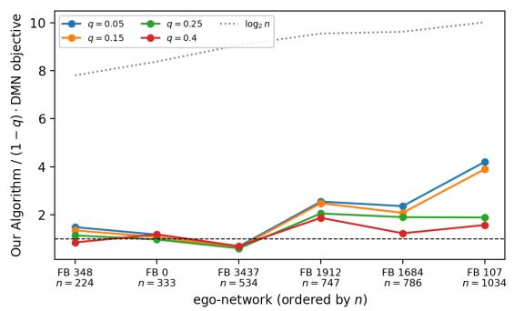
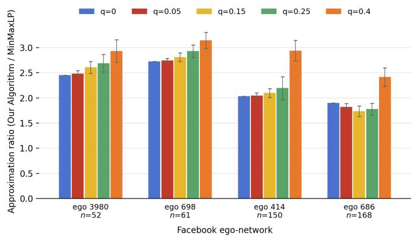
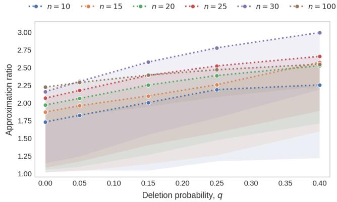
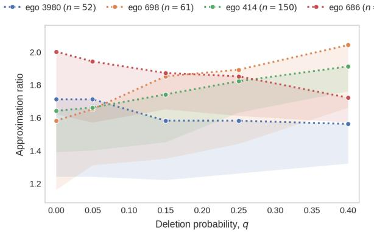
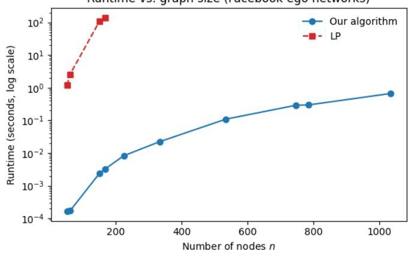
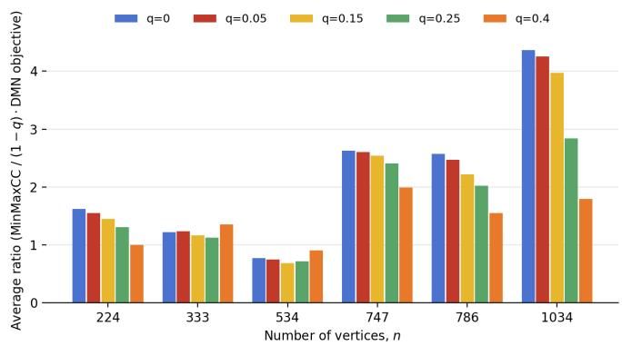
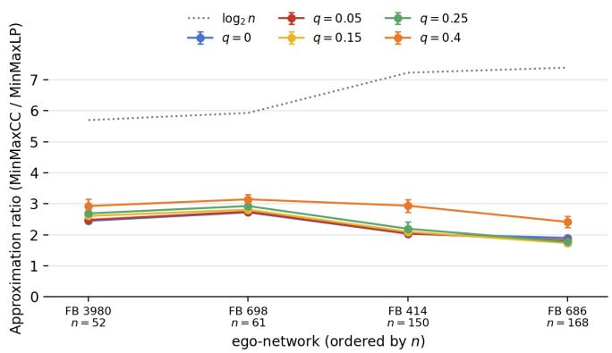

# Correlation Clustering with Random Partial Information

Rajath Rao K.N <sup>1</sup>, Jens Schlöter<sup>2</sup>, Sami Davies <sup>3</sup>, Amira Ouchene <sup>1</sup> , Yasamin Nazari <sup>1,2</sup>

<sup>1</sup>Vrije Universiteit Amsterdam, The Netherlands <sup>2</sup>CWI A<sub>ms</sub>t<sub>er</sub>d<sub>am,</sub> Th<sub>e</sub> N<sub>e</sub>th<sub>er</sub>l<sub>an</sub>d<sub>s</sub> <sup>3</sup>D<sub>epa</sub>rtm<sub>e</sub>nt <sub>o</sub>f EECS<sub>,</sub> UC B<sub>e</sub>rk<sub>e</sub>l<sub>ey</sub>

## Abstract

C<sub>orre</sub>l<sub>a</sub>ti<sub>on c</sub>l<sub>us</sub>t<sub>er</sub>i<sub>n</sub> i<sub>s a</sub> f<sub>un</sub>d<sub>amen</sub>t<sub>a</sub>l <sub>unsu erv</sub>i<sub>se</sub>d l<sub>earn</sub>i<sub>n ro</sub>bl<sub>em.</sub> O<sub>n com</sub> l<sub>e</sub>t<sub>e ra</sub> h<sub>s,</sub> b<sub>o</sub>th th<sub>e m</sub>i<sub>n-</sub>di<sub>sa reemen</sub>t <sub>an</sub>d <sub>m</sub>i<sub>n-max</sub> objectives admit constant-factor approximations, yet on general (non-complete) graphs, the best guarantees blow up to O(log n) and $O \bar { ( } \sqrt { n } )$ <sub>.</sub> Thi<sub>s gap</sub> b<sub>e</sub>t<sub>ween</sub> th<sub>e</sub> t<sub>wo reg</sub>i<sub>mes mo</sub>ti<sub>va</sub>t<sub>es</sub> th<sub>e</sub> f<sub>o</sub>ll<sub>ow</sub>i<sub>ng ques</sub>ti<sub>on: are</sub> th<sub>ere c</sub>l<sub>asses o</sub>f i<sub>ncomp</sub>l<sub>e</sub>t<sub>e grap</sub>h<sub>s</sub> th<sub>a</sub>t <sub>c</sub>i<sub>rcumven</sub>t th<sub>e</sub> l<sub>ower</sub> b<sub>oun</sub>d<sub>s on genera</sub>l <sub>grap</sub>h<sub>s an</sub>d <sub>a</sub>d<sub>m</sub>it <sub>approx</sub>i<sub>ma</sub>ti<sub>on guaran</sub>t<sub>ees approac</sub>hi<sub>ng</sub> th<sub>ose a</sub>tt<sub>a</sub>i<sub>na</sub>bl<sub>e on comp</sub>l<sub>e</sub>t<sub>e grap</sub>h<sub>s</sub>? W<sub>e s</sub>t<sub>u</sub>d<sub>y a</sub> natural class of graphs obtained b<sub>y</sub> randoml<sub>y</sub> subsampling a complete signed graph G, where each edge is independentl<sub>y</sub> deleted with probability q. For such graph instances both for the min-max and the min-disagreement objectives, we prove approximation guarantees (de<sub>p</sub>endin<sub>g</sub> on q) that are substantiall<sub>y</sub> better than the bounds achievable for <sub>g</sub>eneral <sub>g</sub>ra<sub>p</sub>hs. We su<sub>pp</sub>lement our theoretical results with <sub>exper</sub>i<sub>men</sub>t<sub>s</sub> th<sub>a</sub>t <sub>a</sub>l<sub>so sugges</sub>t th<sub>a</sub>t th<sub>e approx</sub>i<sub>ma</sub>ti<sub>on ra</sub>ti<sub>os o</sub>f <sub>our a</sub>l<sub>gor</sub>ith<sub>m are c</sub>l<sub>ose</sub> t<sub>o</sub> th<sub>ose o</sub>f th<sub>e comp</sub>l<sub>e</sub>t<sub>e grap</sub>h <sub>an</sub>d b<sub>e</sub>tt<sub>er</sub> th<sub>an</sub> th<sub>e</sub> worst-case bounds for <sub>g</sub>eneral (non-com<sub>p</sub>lete) <sub>g</sub>ra<sub>p</sub>hs.

## 1 Introduction

C<sub>orre</sub>l<sub>a</sub>ti<sub>on c</sub>l<sub>us</sub>t<sub>er</sub>i<sub>n</sub> i<sub>s a</sub> f<sub>un</sub>d<sub>amen</sub>t<sub>a</sub>l <sub>ro</sub>bl<sub>em</sub> i<sub>n unsu erv</sub>i<sub>se</sub>d l<sub>earn</sub>i<sub>n</sub> th<sub>a</sub>t h<sub>as rece</sub>i<sub>ve</sub>d <sub>muc</sub>h <sub>a</sub>tt<sub>en</sub>ti<sub>on over</sub> th<sub>e as</sub>t t<sub>wo</sub> d<sub>eca</sub>d<sub>es.</sub> Th<sub>e</sub> i<sub>npu</sub>t i<sub>s an un</sub>di<sub>rec</sub>t<sub>e</sub>d <sub>grap</sub>h $G = ( V , E )$ , with edges labeled either positive (+) or negative (−). A positive edge indicates its end<sub>p</sub>oints are similar, while a ne<sub>g</sub>ative ed<sub>g</sub>e indicates the<sub>y</sub> are dissimilar. A valid clusterin<sub>g</sub> C is a <sub>p</sub>artition of V that can have any number of clusters. An edge is in disagreement with respect to C if it is a positive edge whose endpoints are in diferent clusters of C, or if it is a ne<sub>g</sub>ative ed<sub>g</sub>e whose end<sub>p</sub>oints are in the same cluster of C. Our <sub>g</sub>oal is to find the o<sub>p</sub>timal clusterin<sub>g</sub> (usin<sub>g</sub> an<sub>y</sub> number of clusters) with res<sub>p</sub>ect to an objective function defined on such disa<sub>g</sub>reements. The <sub>p</sub>roblem is most well-studied in the setting when G is a complete graph. For the objective of finding a clustering that minimizes the tota number of edges in disagreement, called the min-disagreement objective, the problem is NP-hard to approximate within a factor of 24/23 (Cao et al. 2024). There are many constant factor approximation algorithms for this setting (Bansal, Blum, and Chawla 2004<sub>;</sub> Ch<sub>ar</sub>ik<sub>ar,</sub> G<sub>uruswam</sub>i<sub>, an</sub>d Wi<sub>r</sub>th 2005<sub>;</sub> Ail<sub>on,</sub> Ch<sub>ar</sub>ik<sub>ar, an</sub>d N<sub>ewman</sub> 2008<sub>;</sub> Ch<sub>aw</sub>l<sub>a e</sub>t <sub>a</sub>l<sub>.</sub> 2015<sub>;</sub> C<sub>o</sub>h<sub>en-</sub>Add<sub>a</sub>d<sub>,</sub> L<sub>ee, an</sub>d Newman 2022; Cohen-Addad et al. 2024), with the current best factor bein<sub>g</sub> 1.485 (Cao et al. 2024).

The state of afairs is similar for the objective of finding a clustering that minimizes the maximum number of disagreements incident to any vertex, called the min-max objective. The min-max objective is NP-hard to approximate within a factor better than 4/3, but there are several constant factor approximation algorithms (Puleo and Milenkovic 2015; Charikar, Gupta, and Schwartz 2017; Kalhan, Makar<sub>y</sub>chev, and Zhou 2019; Davies, Mosele<sub>y</sub>, and Newman 2023; Heidrich, Irmai, and Andres 2024), and the best factor is 3 (Cao, Roche, and Su 2025).

For both objectives, the problem is much less understood when G is not a complete graph, a setting also known as the general graph or partial information setting. For min-disagreement, there is an O(log n) approximation algorithm (for $n = | V | )$ <sub>, an</sub>d improving this to o(log n) would necessitate an improved approximation for minimum multicut (Demaine et al. 2006). For the min-max objective, there are $\widetilde { O } ( { \sqrt { n } } )$ a<sub>pp</sub>roximation<sup>1</sup> al<sub>g</sub>orithms (Charikar, Gu<sub>p</sub>ta, and Schwartz 2017; Kalhan, Makar<sub>y</sub>chev, and Zhou 2019), and natural LPs for the <sub>p</sub>roblem have lar<sub>g</sub>e inte<sub>g</sub>ralit<sub>y</sub> <sub>g</sub>a<sub>p</sub>s, makin<sub>g</sub> further al<sub>g</sub>orithmic im<sub>p</sub>rovement dificult. On the other hand, the min-max objective is only known to be NP-hard to approximate within a factor better than 2 − ε (Kalhan, Makar<sub>y</sub>chev, and Zhou 2019).

Therefore for both objectives, we have a large disparity between the best approximation factors in the complete graph versus <sub>genera</sub>l <sub>grap</sub>h <sub>se</sub>tti<sub>ngs.</sub> O<sub>ur mo</sub>ti<sub>va</sub>ti<sub>on</sub> i<sub>s</sub> t<sub>o</sub> fi<sub>n</sub>d <sub>a na</sub>t<sub>ura</sub>l <sub>grap</sub>h <sub>c</sub>l<sub>ass</sub> th<sub>a</sub>t i<sub>s no</sub>t <sub>comp</sub>l<sub>e</sub>t<sub>e,</sub> b<sub>u</sub>t <sub>can a</sub>tt<sub>a</sub>i<sub>n</sub> b<sub>e</sub>tt<sub>er approx</sub>i<sub>ma</sub>ti<sub>on</sub> f<sub>ac</sub>t<sub>or.</sub> Th<sub>e s</sub>i<sub>mp</sub>l<sub>es</sub>t <sub>suc</sub>h <sub>c</sub>l<sub>ass</sub> th<sub>a</sub>t <sub>we cons</sub>id<sub>er</sub> i<sub>s one w</sub>h<sub>ere a ran</sub>d<sub>om se</sub>t <sub>o</sub>f <sub>e</sub>d<sub>ges are m</sub>i<sub>ss</sub>i<sub>ng, e</sub>ith<sub>er</sub> d<sub>ue</sub> t<sub>o</sub> l<sub>ac</sub>k <sub>o</sub>f i<sub>n</sub>f<sub>orma</sub>ti<sub>on</sub> <sub>or</sub> th<sub>e connec</sub>ti<sub>on s</sub>t<sub>ruc</sub>t<sub>ure</sub> it<sub>se</sub>lf<sub>.</sub>

## 1.1 Our contribution

I<sub>n</sub> th<sub>e</sub> f<sub>o</sub>ll<sub>ow</sub>i<sub>ng resu</sub>lt<sub>s, we assume</sub> th<sub>a</sub>t $G = ( V , E )$ is a complete signed graph on n nodes. The graph $G ^ { \prime }$ i<sub>s cons</sub>t<sub>ruc</sub>t<sub>e</sub>d f<sub>rom</sub> $G$ b<sub>y</sub> i<sub>n</sub>d<sub>epen</sub>d<sub>en</sub>tl<sub>y</sub> d<sub>e</sub>l<sub>e</sub>ti<sub>ng eac</sub>h <sub>e</sub>d<sub>ge</sub> i<sub>n</sub> $G$ <sub>w</sub>ith <sub>pro</sub>b<sub>a</sub>bilit<sub>y</sub> $q .$ F<sub>orma</sub>ll<sub>y, we wr</sub>it<sub>e</sub> $S _ { q } ( G )$ <sub>as</sub> th<sub>e</sub> di<sub>s</sub>t<sub>r</sub>ib<sub>u</sub>ti<sub>on over e</sub>d <sub>e-</sub>i<sub>n</sub>d<sub>uce</sub>d subgraphs of G obtained b<sub>y</sub> independentl<sub>y</sub> deleting each edge with probabilit<sub>y</sub> $q ,$ th<sub>en samp</sub>l<sub>e</sub> $G ^ { \prime } \sim { \cal S } _ { q } ( G )$

O<sub>ur resu</sub>lt<sub>s ma</sub>k<sub>e</sub> dif<sub>eren</sub>t <sub>assump</sub>ti<sub>ons on w</sub>h<sub>a</sub>t i<sub>n</sub>f<sub>orma</sub>ti<sub>on</sub> th<sub>e a</sub>l<sub>gor</sub>ith<sub>m</sub> h<sub>as access</sub> t<sub>o.</sub> W<sub>e may assume access on</sub>l<sub>y</sub> t<sub>o</sub> th<sub>e</sub> <sub>or</sub>i<sub>g</sub>i<sub>na</sub>l <sub>comp</sub>l<sub>e</sub>t<sub>e</sub> <sub>grap</sub>h $G .$ <sub>.</sub> Thi<sub>s</sub> <sub>se</sub>tti<sub>ng</sub> <sub>can</sub> b<sub>e</sub> <sub>mo</sub>ti<sub>va</sub>t<sub>e</sub>d b<sub>y</sub> <sub>a</sub> <sub>no</sub>ti<sub>on</sub> <sub>o</sub>f <sub>ro</sub>b<sub>us</sub>t<sub>ness,</sub> <sub>w</sub>h<sub>ere</sub> th<sub>e</sub> <sub>guaran</sub>t<sub>ee</sub> h<sub>o</sub>ld<sub>s</sub> <sub>even</sub> <sub>a</sub>ft<sub>er</sub> <sub>some e</sub>d<sub>ges are remove</sub>d<sub>.</sub> Th<sub>e secon</sub>d <sub>an</sub>d <sub>mos</sub>t <sub>na</sub>t<sub>ura</sub>l <sub>assump</sub>ti<sub>on</sub> f<sub>or our ma</sub>i<sub>n mo</sub>ti<sub>va</sub>ti<sub>on</sub> i<sub>s w</sub>h<sub>en we</sub> h<sub>ave access on</sub>l<sub>y</sub> t<sub>o</sub> $G ^ { \prime } \sim \bar { S _ { q } ( G ) }$ <sub>.</sub> Fi<sub>na</sub>ll<sub>y,</sub> <sub>we</sub> <sub>s</sub>h<sub>ow</sub> <sub>more</sub> <sub>genera</sub>l <sub>guaran</sub>t<sub>ees</sub> <sub>w</sub>h<sub>en</sub> <sub>we</sub> h<sub>ave</sub> <sub>access</sub> b<sub>o</sub>th t<sub>o</sub> $G$ <sub>an</sub>d $G ^ { \prime }$ <sub>,</sub> <sub>w</sub>hi<sub>c</sub>h i<sub>s</sub> <sub>more</sub> f<sub>or</sub> <sub>ge</sub>tti<sub>ng</sub> th<sub>eore</sub>ti<sub>ca</sub>l i<sub>ns</sub>i<sub>g</sub>ht<sub>s</sub> th<sub>a</sub>t <sub>cou</sub>ld b<sub>e use</sub>f<sub>u</sub>l f<sub>or poss</sub>ibl<sub>e</sub> f<sub>u</sub>t<sub>ure ex</sub>t<sub>ens</sub>i<sub>ons o</sub>f <sub>our resu</sub>lt<sub>.</sub>

Min-Max Correlation Clustering. Our first result is for min-max correlation clustering under random deletions. Let $\mathrm { O P T } _ { \infty } ( G ^ { \prime } )$ denote the cost of an optimal solution for the min-max objective on graph $G ^ { \prime }$

Theorem 1. Given $G ^ { \prime } \sim { \cal S } _ { q } ( G )$ , there exists an algorithm that, with high probability, returns a clustering for $G ^ { \prime }$ that is $O ( \log n / 1 - q ) { \cdot } a p p r o x i m a t e$

Throughout, we use with high probability to mean with probability at least $1 - 1 / n$ <sub>.</sub> Th<sub>e ran</sub>d<sub>omness</sub> i<sub>n</sub> thi<sub>s s</sub>t<sub>a</sub>t<sub>emen</sub>t i<sub>s on</sub>l<sub>y</sub> <sub>over</sub> th<sub>e</sub> d<sub>e</sub>l<sub>e</sub>ti<sub>ons,</sub> <sub>an</sub>d th<sub>e</sub> <sub>a</sub>l<sub>gor</sub>ith<sub>m</sub> i<sub>s</sub> d<sub>e</sub>t<sub>erm</sub>i<sub>n</sub>i<sub>s</sub>ti<sub>c.</sub> Thi<sub>s</sub> <sub>approx</sub>i<sub>ma</sub>ti<sub>on</sub> <sub>guaran</sub>t<sub>ee</sub> i<sub>s</sub> <sub>su</sub>b<sub>s</sub>t<sub>an</sub>ti<sub>a</sub>ll<sub>y</sub> b<sub>e</sub>tt<sub>er</sub> th<sub>an</sub> th<sub>e</sub> b<sub>es</sub>t k<sub>nown</sub> <sub>o</sub>f $O ( { \sqrt { n } } )$ for <sub>g</sub>eneral <sub>g</sub>ra<sub>p</sub>hs b<sub>y</sub> Charikar, Gu<sub>p</sub>ta, and Schwartz (2017), and while their result is LP-based, our al<sub>g</sub>orithm is combinatorial. Our ins<sub>p</sub>iration for the al<sub>g</sub>orithm is a result of Heidrich, Irmai, and Andres (2024): it shows that on com<sub>p</sub>lete <sub>grap</sub>h<sub>s, ver</sub>ti<sub>ces w</sub>ith l<sub>arge over</sub>l<sub>app</sub>i<sub>ng pos</sub>iti<sub>ve ne</sub>i<sub>g</sub>hb<sub>or</sub>h<sub>oo</sub>d<sub>s mus</sub>t b<sub>e</sub> i<sub>n</sub> th<sub>e same c</sub>l<sub>us</sub>t<sub>er o</sub>f <sub>any op</sub>ti<sub>ma</sub>l <sub>m</sub>i<sub>n-max so</sub>l<sub>u</sub>ti<sub>on, an</sub>d <sub>ver</sub>ti<sub>ces</sub> <sub>w</sub>ith <sub>very</sub> dif<sub>eren</sub>t <sub>pos</sub>iti<sub>ve</sub> <sub>ne</sub>i<sub>g</sub>hb<sub>or</sub>h<sub>oo</sub>d<sub>s</sub> <sub>mus</sub>t b<sub>e</sub> i<sub>n</sub> dif<sub>eren</sub>t <sub>c</sub>l<sub>us</sub>t<sub>ers</sub> <sub>o</sub>f <sub>any</sub> <sub>op</sub>ti<sub>ma</sub>l <sub>m</sub>i<sub>n-max</sub> <sub>so</sub>l<sub>u</sub>ti<sub>on.</sub> Al<sub>so,</sub> <sub>us</sub>i<sub>ng</sub> randomized tools such as Johnson-Lindenstrauss (as used b<sub>y</sub> Cao, Roche, and Su (2025)) the runnin<sub>g</sub> time can be im<sub>p</sub>roved to ${ \widetilde { O } } ( n ^ { 2 } )$ ).

Min-disagreement. We first show that if we have access to only $G ,$ we can use any α-approximation algorithm for the complete graph G to obtain an $O \big ( { \textstyle \alpha } / ( 1 { - } q ) ^ { 2 } \big )$ <sub>-approx</sub>i<sub>ma</sub>ti<sub>on a</sub>l<sub>gor</sub>ith<sub>m</sub> f<sub>or</sub> th<sub>e grap</sub>h $G ^ { \prime } \sim { \cal S } _ { q } ( G )$ in expectation over the randomness of the d<sub>e</sub>l<sub>e</sub>ti<sub>ons.</sub> Thi<sub>s resu</sub>lt i<sub>s</sub> b<sub>ase</sub>d <sub>on</sub> th<sub>e o</sub>b<sub>serva</sub>ti<sub>on</sub> th<sub>a</sub>t th<sub>e expec</sub>t<sub>e</sub>d <sub>cos</sub>t <sub>o</sub>f <sub>an op</sub>ti<sub>ma</sub>l <sub>so</sub>l<sub>u</sub>ti<sub>on</sub> f<sub>or</sub> $G ^ { \prime }$ d<sub>oes no</sub>t d<sub>ecrease</sub> t<sub>oo</sub> f<sub>as</sub>t <sub>w</sub>ith th<sub>e</sub> d<sub>e</sub>l<sub>e</sub>ti<sub>on pro</sub>b<sub>a</sub>bilit<sub>y.</sub> M<sub>ore prec</sub>i<sub>se</sub>l<sub>y, we prove</sub> $\mathbb { E } [ \mathrm { O P T } ( G ^ { \prime } ) ] \ge \Omega ( ( 1 - \dot { q } ) ^ { 3 } \cdot \mathrm { O P T } ( G ) )$ ), where $\mathrm { O P T } ( G ^ { \prime } )$ <sub>an</sub>d $\mathrm { O P T } ( G )$ denote the cost of optimal solutions for the min-disagreement objective on $G ^ { \prime }$ <sub>an</sub>d $G .$

W<sub>e s</sub>h<sub>ow</sub> th<sub>a</sub>t <sub>a s</sub>i<sub>m</sub>il<sub>ar proper</sub>t<sub>y even</sub> h<sub>o</sub>ld<sub>s w</sub>ith hi<sub>g</sub>h <sub>pro</sub>b<sub>a</sub>bilit<sub>y w</sub>h<sub>en</sub> $\mathrm { O P T } ( G ) \in \Omega ( \log n )$ <sub>.</sub> U<sub>s</sub>i<sub>ng</sub> thi<sub>s s</sub>t<sub>ronger s</sub>t<sub>a</sub>t<sub>emen</sub>t<sub>,</sub> <sub>we</sub> <sub>s</sub>h<sub>ow</sub> th<sub>a</sub>t<sub>,</sub> <sub>g</sub>i<sub>ven</sub> <sub>access</sub> t<sub>o</sub> $G$ <sub>an</sub>d <sub>assum</sub>i<sub>ng</sub> $\mathrm { O P T } \bar { ( G ) } \in \Omega ( \log \bar { n } )$ , each α-approximation algorithm for the complete graph <sub>y</sub>i<sub>e</sub>ld<sub>s an</sub> $O \big ( { \alpha } / { ( 1 - q ) ^ { 2 } } \big )$ )-approximation for $G ^ { \prime }$ <sub>w</sub>ith hi<sub>g</sub>h <sub>pro</sub>b<sub>a</sub>bilit<sub>y.</sub>

Next, we move on to the technically more challenging setting where the algorithm only has access to $G ^ { \prime } \sim { \cal S } _ { q } ( G )$ <sub>.</sub> Thi<sub>s</sub> t<sub>urns ou</sub>t t<sub>o</sub> b<sub>e</sub> difi<sub>cu</sub>lt t<sub>o s</sub>h<sub>ow</sub> i<sub>n genera</sub>l<sub>,</sub> b<sub>u</sub>t <sub>we ge</sub>t b<sub>e</sub>tt<sub>er guaran</sub>t<sub>ees</sub> i<sub>n cer</sub>t<sub>a</sub>i<sub>n reg</sub>i<sub>mes o</sub>f $\mathrm { O P T } ( G )$ <sub>an</sub>d d<sub>epen</sub>di<sub>ng on w</sub>h<sub>a</sub>t i<sub>n</sub>f<sub>orma</sub>ti<sub>on we</sub> h<sub>ave access</sub> t<sub>o.</sub> If $\mathrm { O P T } ( G )$ i<sub>s</sub> <sub>sma</sub>ll<sub>,</sub> <sub>we</sub> <sub>can</sub> <sub>s</sub>h<sub>ow</sub> th<sub>e</sub> f<sub>o</sub>ll<sub>ow</sub>i<sub>ng:</sub>

Theorem 2. $I f \mathrm { O P T } ( G ) = O ( \log ^ { \gamma } n ) f o$ r any constant $\gamma ,$ then there is a polynomial time algorithm that, given only $G ^ { \prime } \sim { \cal S } _ { q } ( G )$ computes an $O ( \log ( \frac { \log n } { ( 1 - q ) ^ { 2 } } ) )$ -approximation for $G ^ { \prime }$ with high probability.

Thi<sub>s</sub> i<sub>s</sub> <sub>our</sub> <sub>ma</sub>i<sub>n</sub> t<sub>ec</sub>h<sub>n</sub>i<sub>ca</sub>l <sub>con</sub>t<sub>r</sub>ib<sub>u</sub>ti<sub>on.</sub> F<sub>or</sub> <sub>cons</sub>t<sub>an</sub>t $q ,$ th<sub>e</sub> <sub>approx</sub>i<sub>ma</sub>ti<sub>on</sub> <sub>ra</sub>ti<sub>o</sub> i<sub>s</sub> <sub>s</sub>i<sub>gn</sub>ifi<sub>can</sub>tl<sub>y</sub> b<sub>e</sub>tt<sub>er</sub> th<sub>an</sub> th<sub>e</sub> <sub>guaran</sub>t<sub>ee</sub> <sub>o</sub>f $O ( \log n )$ f<sub>or genera</sub>l <sub>grap</sub>h<sub>s.</sub> W<sub>e prove</sub> Th<sub>eorem</sub> 2 b<sub>y o</sub>b<sub>serv</sub>i<sub>ng</sub> th<sub>a</sub>t i<sub>n</sub> thi<sub>s se</sub>tti<sub>ng, every op</sub>ti<sub>ma</sub>l <sub>so</sub>l<sub>u</sub>ti<sub>on</sub> f<sub>or</sub> $G \thinspace \mathrm { o r } \thinspace G ^ { \prime }$ <sub>cons</sub>i<sub>s</sub>t<sub>s</sub> of onl<sub>y</sub> a few clusters with disa<sub>g</sub>reements. Additionall<sub>y</sub>, we show that we can accuratel<sub>y</sub> identif<sub>y</sub> lar<sub>g</sub>e o<sub>p</sub>timal clusters (size $p o l y l o g ( n ) )$ <sub>o</sub>f $G ^ { \prime }$ <sub>w</sub>ith hi<sub>g</sub>h <sub>pro</sub>b<sub>a</sub>bilit<sub>y.</sub> I<sub>n</sub> f<sub>ac</sub>t<sub>,</sub> <sub>we</sub> <sub>s</sub>h<sub>ow</sub> th<sub>a</sub>t th<sub>ese</sub> l<sub>arge</sub> <sub>c</sub>l<sub>us</sub>t<sub>ers</sub> <sub>are,</sub> <sub>w</sub>ith hi<sub>g</sub>h <sub>pro</sub>b<sub>a</sub>bilit<sub>y,</sub> <sub>par</sub>t <sub>o</sub>f th<sub>e</sub> <sub>op</sub>ti<sub>ma</sub>l <sub>so</sub>l<sub>u</sub>ti<sub>on</sub> f<sub>or</sub> b<sub>o</sub>th $G$ <sub>an</sub>d $\mathbf { \bar { \boldsymbol { G } } ^ { \prime } }$ <sub>.</sub> Thi<sub>s</sub> i<sub>mp</sub>li<sub>es</sub> th<sub>a</sub>t <sub>su</sub>fi<sub>c</sub>i<sub>en</sub>tl<sub>y</sub> l<sub>arge op</sub>ti<sub>ma</sub>l <sub>c</sub>l<sub>us</sub>t<sub>ers o</sub>f $G$ <sub>can</sub> b<sub>e recovere</sub>d f<sub>rom</sub> $G ^ { \prime }$ <sub>w</sub>ith hi<sub>g</sub>h <sub>ro</sub>b<sub>a</sub>bilit <sub>.</sub> Aft<sub>er</sub> fi<sub>n</sub>di<sub>n an</sub>d <sub>remov</sub>i<sub>n</sub> di<sub>sa reemen</sub>t<sub>-</sub>f<sub>ree c</sub>l<sub>us</sub>t<sub>ers an</sub>d l<sub>ar e c</sub>l<sub>us</sub>t<sub>ers, we w</sub>ill b<sub>e</sub> l<sub>e</sub>ft <sub>w</sub>ith <sub>a sma</sub>ll<sub>er</sub> i<sub>ns</sub>t<sub>ance</sub> <sub>w</sub>ith <sub>on</sub>l<sub>y</sub> $n _ { s } = p o l y l o g ( n )$ vertices on which we can run the al<sub>g</sub>orithm of Demaine et al. (2006) for <sub>g</sub>eneral <sub>g</sub>ra<sub>p</sub>hs to <sub>g</sub>et an $O ( \log ( n _ { s } ) ) = O ( \log \log n )$ <sub>approx</sub>i<sub>ma</sub>ti<sub>on</sub> f<sub>or</sub> $G ^ { \prime }$

W<sub>e</sub> b<sub>e</sub>li<sub>eve</sub> th<sub>a</sub>t th<sub>e assump</sub>ti<sub>on</sub> i<sub>n</sub> Th<sub>eorem</sub> $2$ that OPT(G) is small is a natural setting. As will be outlined in Section 1.2, the <sub>a</sub>l<sub>gor</sub>ith<sub>m</sub>i<sub>c</sub> t<sub>as</sub>k <sub>o</sub>f <sub>recover</sub>i<sub>ng a per</sub>f<sub>ec</sub>t <sub>groun</sub>d t<sub>ru</sub>th <sub>c</sub>l<sub>us</sub>t<sub>er</sub>i<sub>ng,</sub> th<sub>a</sub>t i<sub>s, an</sub> i<sub>ns</sub>t<sub>ance w</sub>ith <sub>cos</sub>t <sub>zero, a</sub>ft<sub>er no</sub>i<sub>sy per</sub>t<sub>ur</sub>b<sub>a</sub>ti<sub>ons</sub> h<sub>a</sub> <sub>rece</sub>i<sub>ve</sub>d <sub>muc</sub>h <sub>a</sub>tt<sub>en</sub>ti<sub>on</sub> i<sub>n</sub> th<sub>e</sub> lit<sub>era</sub>t<sub>ure.</sub> Th<sub>e se</sub>tti<sub>ng o</sub>f Th<sub>eorem</sub> 2 <sub>can</sub> b<sub>e cons</sub>id<sub>ere</sub>d <sub>as a var</sub>i<sub>an</sub>t <sub>o</sub>f thi<sub>s</sub> t<sub>as</sub>k<sub>, w</sub>h<sub>ere</sub> th<sub>e goa</sub>l i<sub>s</sub> to (a<sub>pp</sub>roximatel<sub>y</sub>) recover a sli<sub>g</sub>htl<sub>y</sub> im<sub>p</sub>erfect <sub>g</sub>round truth clusterin<sub>g</sub>, that is, an instance with small cost $O ( \log n )$ <sub>, a</sub>ft<sub>er no</sub>i<sub>sy</sub> <sub>per</sub>t<sub>ur</sub>b<sub>a</sub>ti<sub>ons</sub> i<sub>n</sub> th<sub>e</sub> f<sub>orm</sub> <sub>o</sub>f <sub>e</sub>d<sub>ge</sub> d<sub>e</sub>l<sub>e</sub>ti<sub>ons.</sub>

W<sub>e can a</sub>l<sub>so o</sub>bt<sub>a</sub>i<sub>n</sub> th<sub>e</sub> f<sub>o</sub>ll<sub>ow</sub>i<sub>ng resu</sub>lt f<sub>or</sub> th<sub>e</sub> f<sub>u</sub>ll <sub>range o</sub>f $\mathrm { O P T } ( G )$ if <sub>we</sub> <sub>are</sub> <sub>g</sub>i<sub>ven</sub> $G$ <sub>an</sub>d th<sub>e</sub> <sub>rea</sub>li<sub>ze</sub>d $G ^ { \prime }$

Theorem 3. Given G and $G ^ { \prime } \sim { \cal S } _ { a } ( G )$ , there exists a polynomial time algorithm that computes an $O ( \operatorname* { m a x } \{ 1 / ( 1 - q ) ^ { 2 }$ , log log $^ { n + }$ $\log ( 1 / 1 { - } q ) \} )$ -approximation for $G ^ { \dagger }$ with high probability.

Experimental results. We com lement our theoretical findin s with em irical results, on random deletion instances obtained f<sub>rom</sub> th<sub>e</sub> F<sub>ace</sub>b<sub>oo</sub>k <sub>ego-ne</sub>t<sub>wor</sub>k d<sub>a</sub>t<sub>ase</sub>t <sub>an</sub>d <sub>on p</sub>l<sub>an</sub>t<sub>e</sub>d<sub>-c</sub>li<sub>que</sub> i<sub>ns</sub>t<sub>ances</sub> b<sub>ase</sub>d <sub>on</sub> th<sub>e s</sub>t<sub>oc</sub>h<sub>as</sub>ti<sub>c</sub> bl<sub>oc</sub>k <sub>mo</sub>d<sub>e</sub>l<sub>.</sub>

O<sub>ur exper</sub>i<sub>men</sub>t<sub>s</sub> f<sub>or m</sub>i<sub>n-max corre</sub>l<sub>a</sub>ti<sub>on c</sub>l<sub>us</sub>t<sub>er</sub>i<sub>ng, sugges</sub>t th<sub>a</sub>t Th<sub>eorem</sub> 1 i<sub>s pre</sub>di<sub>c</sub>ti<sub>ve o</sub>f <sub>prac</sub>ti<sub>ce, as our emp</sub>i<sub>r</sub>i<sub>ca</sub>l <sub>approx</sub>i<sub>ma</sub>ti<sub>ons are a</sub>t l<sub>eas</sub>t <sub>as goo</sub>d <sub>as our</sub> th<sub>eore</sub>ti<sub>ca</sub>l <sub>guaran</sub>t<sub>ee o</sub>f $O ( \log n / 1 { - } q )$

For the min-disagreement objective, we study the empirical approximation ratio of Pivot (Ailon, Charikar, and Newman 2008) when run on <sub>g</sub>ra<sub>p</sub>h $G ^ { \prime }$ <sub>.</sub> O<sub>ur</sub> th<sub>eore</sub>ti<sub>ca</sub>l <sub>resu</sub>lt<sub>s s</sub>h<sub>ow</sub> th<sub>a</sub>t th<sub>e c</sub>l<sub>us</sub>t<sub>er</sub>i<sub>ng compu</sub>t<sub>e</sub>d b<sub>y</sub> P<sub>ivot</sub> f<sub>or</sub> th<sub>e or</sub>i<sub>g</sub>i<sub>na</sub>l <sub>comp</sub>l<sub>e</sub>t<sub>e grap</sub>h $G$ <sub>y</sub>i<sub>e</sub>ld<sub>s an expec</sub>t<sub>e</sub>d $\bar { O } \big ( \alpha / ( 1 - q ) ^ { 2 } \big )$ <sub>-approx</sub>i<sub>ma</sub>ti<sub>on</sub> f<sub>or</sub> $G ^ { \prime }$ <sub>.</sub> Th<sub>e emp</sub>i<sub>r</sub>i<sub>ca</sub>l <sub>resu</sub>lt<sub>s sugges</sub>t th<sub>a</sub>t thi<sub>s guaran</sub>t<sub>ee may a</sub>l<sub>so</sub> h<sub>o</sub>ld f<sub>or</sub> th<sub>e</sub> <sub>c</sub>l<sub>us</sub>t<sub>er</sub>i<sub>ng compu</sub>t<sub>e</sub>d b<sub>y</sub> P<sub>ivot on</sub> $G ^ { \prime }$ <sub>, w</sub>hi<sub>c</sub>h <sub>we</sub> d<sub>o no</sub>t <sub>s</sub>h<sub>ow</sub> th<sub>eore</sub>ti<sub>ca</sub>ll<sub>y.</sub>

Proofs are <sub>g</sub>iven alon<sub>g</sub>side their statements below; further details on our ex<sub>p</sub>eriments (includin<sub>g</sub> source code) are <sub>p</sub>rovided in th<sub>e supp</sub>l<sub>emen</sub>t<sub>ary ma</sub>t<sub>er</sub>i<sub>a</sub>l<sub>s.</sub>

## 1.2 Related work

To the best of our knowledge, for the min-max objective, there are no known special classes of non-complete graphs that admit <sub>approx</sub>i<sub>ma</sub>ti<sub>on a</sub>l<sub>gor</sub>ith<sub>ms</sub> b<sub>e</sub>tt<sub>er</sub> th<sub>an</sub> $O ( { \sqrt { n } } )$ . We note the min-max objective is a measure of fairness, and other fairnessmotivated and local objectives have been considered (Fri<sub>gg</sub>stad and Mousavi 2021; Davies, Mosele<sub>y</sub>, and Newman 2024), as well as fairness constraints (Ahmadi et al. 2020; Ahmadian et al. 2020). There is also work on <sub>g</sub>eneral <sub>g</sub>ra<sub>p</sub>hs for the min-disa<sub>g</sub>reement objective with fairness constraints (Schwartz and Zats 2022).

For the min-disa<sub>g</sub>reement objective, Demaine et al. (2006) showed an $O ( r ^ { 3 } )$ <sub>approx</sub>i<sub>ma</sub>ti<sub>on</sub> f<sub>or</sub> $K _ { r , r }$ <sub>-m</sub>i<sub>nor-</sub>f<sub>ree</sub> <sub>grap</sub>h<sub>s,</sub> <sub>an</sub>d Parsaei-Majd (2026) identified a class of <sub>g</sub>ra<sub>p</sub>hs for which there is a 2-a<sub>pp</sub>roximation b<sub>y</sub> definin<sub>g</sub> a small set of forbidden si<sub>g</sub>ned su<sup>b</sup><sub>g</sub>ra<sub>p</sub><sup>h</sup>s.

Other work on the min-disagreement objective on subclasses of general graphs holds only for classes of graphs arising from <sub>a</sub> <sub>no</sub>i<sub>sy</sub> <sub>an</sub>d <sub>par</sub>ti<sub>a</sub>ll<sub>y</sub> <sub>o</sub>b<sub>serve</sub>d <sub>p</sub>l<sub>an</sub>t<sub>e</sub>d <sub>par</sub>titi<sub>on</sub> <sub>mo</sub>d<sub>e</sub>l<sub>—</sub>th<sub>ese</sub> <sub>se</sub>tti<sub>ngs</sub> <sub>mo</sub>d<sub>e</sub>l th<sub>e</sub> <sub>pro</sub>bl<sub>em</sub> <sub>o</sub>f fi<sub>n</sub>di<sub>ng</sub> <sub>an</sub> <sub>un</sub>d<sub>er</sub>l<sub>y</sub>i<sub>ng</sub> <sub>groun</sub>d t<sub>ru</sub>th clusterin<sub>g</sub> in the <sub>p</sub>resence of random noise. Chen et al. (2014) stud<sub>y</sub> under what conditions one can find an o<sub>p</sub>timal clusterin<sub>g</sub> <sub>on an</sub> E<sub>r</sub>dö<sub>s-</sub>R<sub>eny</sub>i <sub>ran</sub>d<sub>om grap</sub>h <sub>o</sub>f <sub>o</sub>b<sub>serve</sub>d <sub>e</sub>d<sub>ges, w</sub>h<sub>ere</sub> th<sub>e s</sub>i<sub>gns o</sub>f th<sub>e o</sub>b<sub>serve</sub>d <sub>e</sub>d<sub>ges are accor</sub>di<sub>ng</sub> t<sub>o a p</sub>l<sub>an</sub>t<sub>e</sub>d <sub>par</sub>titi<sub>on</sub> <sub>mo</sub>d<sub>e</sub>l<sub>,</sub> <sub>excep</sub>t th<sub>e</sub> <sub>s</sub>i<sub>gns</sub> <sub>are</sub> <sub>a</sub>l<sub>so</sub> <sub>corrup</sub>t<sub>e</sub>d i<sub>.</sub>i<sub>.</sub>d<sub>.</sub> A<sub>n</sub> <sub>even</sub> <sub>more</sub> <sub>genera</sub>l <sub>mo</sub>d<sub>e</sub>l i<sub>s</sub> <sub>s</sub>t<sub>u</sub>di<sub>e</sub>d b<sub>y</sub> M<sub>a</sub>k<sub>aryc</sub>h<sub>ev,</sub> M<sub>a</sub>k<sub>aryc</sub>h<sub>ev,</sub> <sub>an</sub>d Vija<sub>y</sub>ara<sub>g</sub>havan (2015); here, an adversar<sub>y</sub> chooses an arbitrar<sub>y</sub> (unsi<sub>g</sub>ned) <sub>g</sub>ra<sub>p</sub>h and a <sub>g</sub>round truth clusterin<sub>g</sub> on that <sub>g</sub>ra<sub>p</sub>h, th<sub>en eac</sub>h <sub>e</sub>d<sub>ge</sub> i<sub>n</sub> th<sub>e grap</sub>h i<sub>s samp</sub>l<sub>e</sub>d i<sub>.</sub>i<sub>.</sub>d<sub>., an</sub>d th<sub>e a</sub>d<sub>versary can</sub> fli<sub>p</sub> th<sub>e s</sub>i<sub>gns o</sub>f <sub>any o</sub>f th<sub>ese samp</sub>l<sub>e</sub>d <sub>e</sub>d<sub>ges.</sub> Th<sub>ese</sub> l<sub>as</sub>t two models settin<sub>g</sub> were ins<sub>p</sub>ired b<sub>y</sub> work on com<sub>p</sub>lete <sub>g</sub>ra<sub>p</sub>hs arisin<sub>g</sub> from a nois<sub>y p</sub>lanted <sub>p</sub>artition model (Ben-Dor, Shamir, and Yakhini 1999; Bansal, Blum, and Chawla 2004; Mathieu and Schud<sub>y</sub> 2010) reconstruct the <sub>g</sub>round truth clusterin<sub>g</sub> as well as a<sub>pp</sub>roximation al<sub>g</sub>orithms. Similar models (thou<sub>g</sub>h less relevant to our stud<sub>y</sub>) have remained <sub>p</sub>o<sub>p</sub>ular over the last decade (Chierichetti et al. 2022; Wan<sub>g</sub>, Wan<sub>g</sub>, and So 2022).

## 1.3 Preliminaries

R<sub>eca</sub>ll $G = ( V , E )$ d<sub>eno</sub>t<sub>es a s</sub>i<sub>gne</sub>d <sub>grap</sub>h <sub>on</sub> $n = | V |$ <sub>ver</sub>ti<sub>ces.</sub> W<sub>e use</sub> $G ^ { \prime } = ( V , E ^ { \prime } )$ to refer to a subgraph of G that is generated from G b<sub>y</sub> independentl<sub>y</sub> deleting each edge $e \in E$ <sub>w</sub>ith <sub>pro</sub>b<sub>a</sub>bilit<sub>y</sub> $q ,$ <sub>w</sub>h<sub>ere we</sub> f<sub>orma</sub>ll<sub>y wr</sub>it<sub>e</sub> $\check { G } ^ { \prime } \sim \mathcal S _ { q } ( G )$ <sub>.</sub> Note <sub>w</sub>h<sub>en</sub> d<sub>e</sub>fi<sub>n</sub>i<sub>ng suc</sub>h $G ^ { \prime }$ , the graph G is alwa<sub>y</sub>s complete. We let $E ^ { + }$ d<sub>eno</sub>t<sub>e</sub> th<sub>e pos</sub>iti<sub>ve e</sub>d<sub>ges o</sub>f $\dot { G }$ <sub>an</sub>d $E ^ { - }$ th<sub>e nega</sub>ti<sub>ve, so</sub> $E = E ^ { + } \cup \bar { E ^ { - } }$ <sub>, an</sub>d <sub>s</sub>i<sub>m</sub>il<sub>ar</sub>l<sub>y</sub> $\dot { E ^ { \prime } } = E ^ { \prime + } \cup \dot { E ^ { \prime - } }$

F<sub>or</sub> $i \in \{ + , - \}$ <sub>an</sub>d $v \in V$ , define the positive and negative neighborhood of v in $G$ as $N _ { G } ^ { i } ( v ) : = \{ w \in V \mid \{ w , v \} \in E ^ { i } \}$ A<sub>na</sub>l<sub>ogous</sub>l<sub>y, we use</sub> $N _ { G ^ { \prime } } ^ { + } ( v )$ <sub>an</sub>d $N _ { G ^ { \prime } } ^ { - } ( v )$ t<sub>o re</sub>f<sub>er</sub> t<sub>o</sub> th<sub>e ne</sub>i<sub>g</sub>hb<sub>or</sub>h<sub>oo</sub>d<sub>s</sub> i<sub>n</sub> $G ^ { \prime }$ . We use C to denote a clusterin<sub>g</sub>, which is a <sub>p</sub>artition of the vertex set V. For a clusterin<sub>g</sub> C and a vertex $v \in V$ <sub>,</sub> l<sub>e</sub>t $[ v ] c$ be the cluster of v in C. Then we define

$$
\mathrm { c o s t } _ { G } ( \mathcal { C } , v ) = | N _ { G } ^ { + } ( v ) \setminus [ v ] _ { \mathcal { C } } | + | N _ { G } ^ { - } ( v ) \cap [ v ] _ { \mathcal { C } } | ,
$$

as the number of disagreements incident to v in G with respect to C. We use all of the same notation for the analogous terms in $G ^ { \prime }$ <sub>.</sub> If th<sub>e grap</sub>h i<sub>s c</sub>l<sub>ear</sub> f<sub>rom con</sub>t<sub>ex</sub>t<sub>, we om</sub>it th<sub>e su</sub>b<sub>scr</sub>i<sub>p</sub>t i<sub>n</sub> th<sub>e ne</sub>i<sub>g</sub>hb<sub>or</sub>h<sub>oo</sub>d <sub>no</sub>t<sub>a</sub>ti<sub>on or</sub> i<sub>n</sub> th<sub>e cos</sub>t <sub>no</sub>t<sub>a</sub>ti<sub>on.</sub>

$$
e \in E
$$

$$
e \in E ^ { \prime } : = E ^ { \prime + } \cup E ^ { \prime - }
$$

$$
X _ { e } \sim \operatorname { B e r } ( 1 - q )
$$

## 2 Min-disagreement Objective

In this section, we prove our results for the objective of minimizing the total number of disagreements, Theorems 3 and 4. We l<sub>e</sub>t $\begin{array} { r } { \mathrm { c o s t } _ { G ^ { \prime } } ( \mathcal { C } ) = 1 / 2 \cdot \sum _ { v \in V } \mathrm { c o s t } _ { G ^ { \prime } } ( \mathcal { C } , v ) } \end{array}$ , so the cost of an optimal clustering on $G ^ { \prime }$ i<sub>s</sub> d<sub>eno</sub>t<sub>e</sub>d b<sub>y</sub> $\mathrm { O P T } ( G ^ { \prime } ) = \operatorname* { m i n } _ { \mathcal { C } } \mathrm { c o s t } _ { G ^ { \prime } } ( \mathcal { C } )$ and analogousl<sub>y</sub> for G.

We start b<sub>y</sub> <sub>p</sub>rovin<sub>g</sub> <sub>p</sub>ro<sub>p</sub>erties of the (ex<sub>p</sub>ected) o<sub>p</sub>timum and <sub>p</sub>rovidin<sub>g</sub> a<sub>pp</sub>roximation results that hold in ex<sub>p</sub>ectation. Then, <sub>we prove upper</sub> b<sub>oun</sub>d<sub>s</sub> h<sub>o</sub>ldi<sub>ng w</sub>ith hi<sub>g</sub>h <sub>pro</sub>b<sub>a</sub>bilit<sub>y.</sub>

## 2.1 Expected upper bounds

F<sub>or</sub> $G ^ { \prime } \sim { \cal S } _ { q } ( G )$ <sub>, we</sub> d<sub>er</sub>i<sub>ve some use</sub>f<sub>u</sub>l <sub>proper</sub>ti<sub>es o</sub>f $\mathbb { E } [ \mathrm { O P T } ( G ^ { \prime } ) ]$ as a warm-u<sub>p</sub>. <sup>I</sup>n <sub>p</sub>art<sup>i</sup>cu<sup>l</sup>ar, we com<sub>p</sub>are $\mathbb { E } [ \mathrm { O P T } ( G ^ { \prime } ) ]$ to $\mathrm { O P T } ( G )$ <sub>.</sub> Thi<sub>s</sub> i<sub>mme</sub>di<sub>a</sub>t<sub>e</sub>l<sub>y</sub> i<sub>mp</sub>li<sub>es an expec</sub>t<sub>e</sub>d <sub>approx</sub>i<sub>ma</sub>ti<sub>on</sub> f<sub>ac</sub>t<sub>or</sub> f<sub>or</sub> th<sub>e case w</sub>h<sub>ere</sub> $G$ i<sub>s</sub> k<sub>nown</sub> t<sub>o</sub> th<sub>e a</sub>l<sub>gor</sub>ith<sub>m, an</sub>d <sub>w</sub>ill l<sub>a</sub>t<sub>er</sub> b<sub>e use</sub>f<sub>u</sub>l f<sub>or prov</sub>i<sub>ng upper</sub> b<sub>oun</sub>d<sub>s w</sub>ith hi<sub>g</sub>h <sub>pro</sub>b<sub>a</sub>bilit<sub>y.</sub> T<sub>o</sub> thi<sub>s en</sub>d<sub>, we re</sub>l<sub>y on we</sub>ll<sub>-es</sub>t<sub>a</sub>bli<sub>s</sub>h<sub>e</sub>d <sub>connec</sub>ti<sub>ons</sub> b<sub>e</sub>t<sub>ween</sub> OPT(G) and the number of bad triangles in G.

Definition 1 (Bad triangles). A triangle T in $G = ( V , E ^ { + } \cup E ^ { - } )$ is bad $i f \lvert T \cap E ^ { + } \rvert = 2$ and $| T \cap E ^ { - } | = 1$ . We use $T ( G )$ to refer to the maximum set of edge disjoint bad triangles in $G ,$ , and define $\tau ( \dot { G } ) : = | T ( \dot { G } ) |$

It i<sub>s we</sub>ll<sub>-</sub>k<sub>nown</sub> th<sub>a</sub>t $\tau ( G )$ l<sub>ower</sub> b<sub>oun</sub>d<sub>s</sub> $\mathrm { O P T } ( G )$ <sub>, even</sub> if $G$ is not com<sub>p</sub>lete (Bansal, Blum, and Chawla 2004). If G is com<sub>p</sub><sup>l</sup>ete, t<sup>h</sup>en we even <sub>g</sub>et $\operatorname { O P T } ( G ) \in \Theta ( \tau ( G ) )$ b<sub>y exp</sub>l<sub>o</sub>iti<sub>ng ex</sub>i<sub>s</sub>ti<sub>ng cons</sub>t<sub>an</sub>t f<sub>ac</sub>t<sub>or approx</sub>i<sub>ma</sub>ti<sub>ons</sub> th<sub>a</sub>t b<sub>oun</sub>d th<sub>e</sub>i<sub>r cos</sub>t<sub>s</sub> <sub>aga</sub>i<sub>ns</sub>t <sub>a</sub> t<sub>r</sub>i<sub>ang</sub>l<sub>e-</sub>b<sub>ase</sub>d LP<sub>.</sub>

Lemma 1. For every signed (not necessarily complete) graph G, we have $\tau ( G ) \leq \mathrm { O P T } ( G )$ . If G is complete, then $\mathrm { O P T } ( G ) \leq$ $9 \cdot \tau ( G )$

Proof. Inequality $\tau ( G ) \leq \mathrm { O P T } ( G )$ has, for exam<sub>p</sub>le, been shown b<sub>y</sub> Bansal, Blum, and Chawla (2004). Hence, it remains to <sub>s</sub>h<sub>ow</sub> th<sub>a</sub>t f<sub>or comp</sub>l<sub>e</sub>t<sub>e</sub> $G ,$ <sub>, we</sub> h<sub>ave</sub> $\operatorname { O P T } ( G ) \leq 9 \cdot { \bar { \tau } } ( G )$

We ar<sub>g</sub>ue usin<sub>g</sub> the followin<sub>g</sub> LP-relaxation (Ailon, Charikar, and Newman 2008), which uses H to refer to the set of all (not only edge-disjoint) bad triangles.

$$
\begin{array} { l l l } { \operatorname* { m i n } } & { \displaystyle \sum _ { a b \in E } x _ { a b } } \\ { \mathrm { s . t . } } & { x _ { a b } + x _ { b c } + x _ { c a } \geq 1 , } & { \forall \{ a , b , c \} \in H } \\ & { x _ { a b } \geq 0 , } & { \forall a b \in E . } \end{array}  ,\tag{1}
$$

Let Cost(LP) denote the cost of an o<sub>p</sub>timal solution to LP (1). We <sub>p</sub>rove that (i) $\mathbf { C o s t } ( \mathrm { L P } ) \leq 3 \cdot \tau ( G )$ and (ii) $\mathrm { O P T } ( G ) \leq$ 3 · Cost(LP). Combined, (i) and (ii) imply $\operatorname { O P T } ( G ) \leq 9 \cdot \tau ( G )$

• Proof of (i): We <sub>p</sub>rove Cost(LP) $\leq 3 \cdot \tau ( G )$ b<sub>y cons</sub>t<sub>ruc</sub>ti<sub>ng a</sub> f<sub>eas</sub>ibl<sub>e</sub> LP <sub>so</sub>l<sub>u</sub>ti<sub>on</sub> $x ^ { \prime }$ with objective value $3 \cdot \tau ( G )$ I<sub>n</sub>iti<sub>a</sub>li<sub>ze</sub> $x _ { u v } ^ { \prime } = 0$ f<sub>or a</sub>ll $u v \in E$ <sub>.</sub> Whil<sub>e</sub> th<sub>ere ex</sub>i<sub>s</sub>t<sub>s a v</sub>i<sub>o</sub>l<sub>a</sub>t<sub>e</sub>d b<sub>a</sub>d<sub>-</sub>t<sub>r</sub>i<sub>ang</sub>l<sub>e cons</sub>t<sub>ra</sub>i<sub>n</sub>t<sub>, p</sub>i<sub>c</sub>k <sub>suc</sub>h <sub>a</sub> t<sub>r</sub>i<sub>ang</sub>l<sub>e</sub> $\{ a , b , c \}$ <sub>an</sub>d <sub>se</sub>t $x _ { a b } ^ { \prime } = x _ { b c } ^ { \prime } = x _ { c a } ^ { \prime } = 1 . \operatorname { L e t } T ^ { \prime }$ b<sub>e</sub> th<sub>e</sub> t<sub>r</sub>i<sub>ang</sub>l<sub>es se</sub>l<sub>ec</sub>t<sub>e</sub>d<sub>.</sub> N<sub>o</sub>t<sub>e</sub> th<sub>a</sub>t $T ^ { \prime }$ is an edge-disjoint set of bad triangles and, therefore, $| \bar { T } ^ { \prime } | \leq \tau ( \bar { G } )$ <sub>.</sub> Th<sub>e so</sub>l<sub>u</sub>ti<sub>on</sub> $x ^ { \prime }$ is feasible b<sub>y</sub> construction. Hence, Cost(L $\mathrm { P } ) \leq \bar { \operatorname { C o s t } ( \bar { x ^ { \prime } } ) } = 3 \cdot | T ^ { \prime } | \leq 3 \cdot \tau ( \bar { G } )$

• Proof of (ii): The well-known anal<sub>y</sub>sis of the Pivot al<sub>g</sub>orithm <sub>p</sub>roves an a<sub>pp</sub>roximation factor of 3 b<sub>y</sub> com<sub>p</sub>arin<sub>g</sub> a<sub>g</sub>ainst $\mathrm { C o s t } ( L P )$ <sub>.</sub> H<sub>ence,</sub> $\operatorname { O P T } ( G ) \leq 3 \cdot { \dot { \operatorname { C o s t } } } ( L P )$ □

Th<sub>e</sub> fi<sub>rs</sub>t <sub>par</sub>t <sub>o</sub>f L<sub>emma</sub> 1 i<sub>mp</sub>li<sub>es</sub> $\mathbb { E } [ \mathrm { O P T } ( G ^ { \prime } ) ] \geq \mathbb { E } [ \tau ( G ^ { \prime } ) ]$ ]. Furthermore, we can observe that $\mathbb { E } [ \tau ( G ^ { \prime } ) ] \geq ( 1 - q ) ^ { 3 } \tau ( G )$ <sub>as eac</sub>h b<sub>a</sub>d t<sub>r</sub>i<sub>ang</sub>l<sub>e</sub> i<sub>n</sub> $T ( G )$ i<sub>s a</sub>l<sub>so presen</sub>t i<sub>n</sub> $\overrightharpoon { G ^ { \prime } }$ <sub>w</sub>ith <sub>an</sub> i<sub>n</sub>d<sub>epen</sub>d<sub>en</sub>t <sub>pro</sub>b<sub>a</sub>bilit<sub>y o</sub>f $( 1 - q ) ^ { 3 }$ <sub>.</sub> Th<sub>us, us</sub>i<sub>ng</sub> th<sub>e secon</sub>d <sub>par</sub>t <sub>o</sub>f L<sub>emma</sub> 1<sub>, we ge</sub>t $\mathbb { E } [ \mathrm { O P T } ( G ^ { \prime } ) ] \geq ( \dot { 1 } - q ) ^ { 3 } / 9 \cdot \mathrm { O P T } ( G )$ . An immediate corollary of this inequality is that every α-approximate clustering for the complete graph G is, in expectation, ${ \mathfrak { a } } ^ { 9 \cdot \alpha } / ( 1 { - } q ) ^ { 3 }$ <sub>-approx</sub>i<sub>ma</sub>ti<sub>on</sub> f<sub>or</sub> $G ^ { \prime }$ <sub>.</sub> With th<sub>e</sub> f<sub>o</sub>ll<sub>ow</sub>i<sub>ng</sub> l<sub>emma, we prove</sub> <sub>a s</sub>t<sub>ronger</sub> b<sub>oun</sub>d<sub>.</sub>

Lemma 2. Given access only to G, and a multiplicative α-approximation clustering C for G, we have $\mathbb { E } [ c o s t _ { G ^ { \prime } } ( \mathscr { C } ) ] \ \leq$ $\frac { 9 \cdot \alpha } { ( 1 - q ) ^ { 2 } } \cdot \mathbb { E } [ \mathrm { O P T } ( G ^ { \prime } ) ]$

Proof. We establish three inequalities.

Inequality 1: $\mathbb { E } [ \mathrm { O P T } ( G ^ { \prime } ) ] ~ \ge ~ ( 1 - q ) ^ { 3 } / 9 ~ \cdot ~ \mathrm { O P T } ( G )$ . By Lemma $1 , G$ h<sub>as a se</sub>t $T ( G )$ of edge-disjoint bad triangles with $| T ( { \bar { G } } ) | = { \bar { \tau } } ( G ) { \dot { \geq } } { \mathrm { O P T } } ( G ) { \dot { / } } 9$ <sub>.</sub> F<sub>or eac</sub>h ${ \dot { t } } \in T ( G )$ <sub>,</sub> l<sub>e</sub>t $Y _ { t } \dot { = } \mathbf { 1 } [ t \subseteq E ^ { \prime } ]$ <sub>, w</sub>h<sub>ere</sub> $E ^ { \prime }$ i<sub>s</sub> th<sub>e se</sub>t <sub>o</sub>f <sub>e</sub>d<sub>ges</sub> i<sub>n</sub> $G ^ { j }$ . The three edges of t are di<sub>s</sub>ti<sub>nc</sub>t<sub>, so</sub> $\dot { \mathbb { E } } [ \dot { Y } _ { t } ] = ( 1 - \dot { q } ) ^ { 3 }$ . Edge-disjointness of $T ( G )$ <sub>ma</sub>k<sub>es</sub> th<sub>e</sub> $Y _ { t } ^ { \prime } \mathrm { s }$ <sub>mu</sub>t<sub>ua</sub>ll<sub>y</sub> i<sub>n</sub>d<sub>epen</sub>d<sub>en</sub>t<sub>.</sub> D<sub>e</sub>fi<sub>ne</sub> $\begin{array} { r } { Y = \sum _ { t \in T } \breve { Y } _ { t } } \end{array}$ <sub>.</sub> Th<sub>en,</sub>

$$
\mathbb { E } [ Y ] = ( 1 - q ) ^ { 3 } \tau ( G ) \geq ( 1 - q ) ^ { 3 } / 9 \cdot \mathrm { O P T } ( G ) .
$$

S<sub>urv</sub>i<sub>v</sub>i<sub>ng</sub> t<sub>r</sub>i<sub>ang</sub>l<sub>es,</sub> i<sub>.e.,</sub> t<sub>r</sub>i<sub>ang</sub>l<sub>es</sub> $t \in T ( G )$ <sub>w</sub>ith $t \subseteq E ^ { \prime }$ , are still edge-disjoint in $G ^ { \prime }$ <sub>.</sub> H<sub>ence,</sub> L<sub>emma</sub> 1 i<sub>mp</sub>li<sub>es</sub> $\mathrm { O P T } ( G ^ { \prime } ) \geq Y$ T<sub>a</sub>ki<sub>ng expec</sub>t<sub>a</sub>ti<sub>ons:</sub>

$$
\mathbb { E } [ \mathrm { O P T } ( G ^ { \prime } ) ] \geq E [ Y ] \geq { ( 1 - q ) ^ { 3 } } / { 9 } \cdot \mathrm { O P T } ( G ) .\tag{2}
$$

Inequality 2: cos $\cdot _ { G } ( { \mathcal { C } } ) \leq \alpha \cdot \mathrm { O P T } ( G )$ . Since C is an α-approximation on $G ,$

$$
\displaystyle \mathrm { c o s t } _ { G } ( \mathcal { C } ) \ \leq \ \alpha \cdot \mathrm { O P T } ( G ) .\tag{3}
$$

Inequality 3: $\mathbb { E } [ \mathrm { c o s t } _ { G ^ { \prime } } ( \mathcal { C } ) ] = ( 1 - q ) \cdot \mathrm { c o s t } _ { G } ( \mathcal { C } )$ . Using the fact that for each edge e of G we have $e \in E ^ { \prime }$ <sub>w</sub>ith <sub>pro</sub>b<sub>a</sub>bilit<sub>y</sub> $( 1 - q )$ <sub>y</sub>i<sub>e</sub>ld<sub>s</sub>

$$
\mathbb { E } [ \mathrm { c o s t } ( \mathcal { C } , G ^ { \prime } ) ] = ( 1 - q ) \cdot \mathrm { c o s t } _ { G } ( \mathcal { C } )\tag{4}
$$

We conclude the <sub>p</sub>roof b<sub>y</sub> substitutin<sub>g</sub> (3) into (4) and then a<sub>pp</sub>l<sub>y</sub>in<sub>g</sub> (2):

$$
\begin{array} { r l } { \mathbb { E } [ \mathrm { c o s t } _ { G ^ { \prime } } ( \mathscr { C } ) ] \ \leq \ ( 1 - q ) \alpha \cdot \mathrm { O P T } ( G ) } \\ { \quad \leq \ ( 1 - q ) \alpha \cdot 9 / ( 1 - q ) ^ { 3 } \cdot \mathbb { E } [ \mathrm { O P T } ( G ^ { \prime } ) ] } \\ { \quad = \ 9 \alpha \big / ( 1 - q ) ^ { 2 } \cdot \mathbb { E } [ \mathrm { O P T } ( G ^ { \prime } ) ] . } \end{array}
$$

L<sub>emma</sub> 2 <sub>es</sub>t<sub>a</sub>bli<sub>s</sub>h<sub>es</sub> th<sub>a</sub>t if <sub>we</sub> h<sub>ave access</sub> t<sub>o</sub> $G ,$ t<sup>h</sup>en we can com<sub>p</sub>ute an ex<sub>p</sub>ecte<sup>d</sup> $9 \alpha \big / ( 1 - q ) ^ { 2 }$ <sub>-approx</sub>i<sub>ma</sub>ti<sub>on</sub> f<sub>or</sub> $G ^ { \prime }$ by just computing an α-approximation for G. With the next lemma, we show a similar propert<sub>y</sub> that holds with high probabilit<sub>y</sub> provided th<sub>a</sub>t ${ \dot { \operatorname { O P T } } } ( G )$ i<sub>s su</sub>fi<sub>c</sub>i<sub>en</sub>tl<sub>y</sub> l<sub>arge.</sub>

Lemma 3. Let $\beta \in ( 0 , 1 )$ and let C be an α-approximationfor $G . D e f i n e \ c = 5 4 / [ \beta ^ { 2 } ( 1 - q ) ^ { 3 } ] . I f { \mathrm { O P T } } ( G ) \geq c \log n$ , then with probability at least $1 \bar { - } n ^ { - 2 . 5 } , G ^ { \prime } \sim { \cal S } _ { q } ( G )$ has cost<sub>G</sub>′ $\begin{array} { r } { ( \mathcal { C } ) \overset { \cdot } { \leq } \frac { 1 8 \overset { \cdot } { \alpha } } { ( 1 - \beta ) ( 1 - q ) ^ { 2 } } \cdot \mathrm { O P T } ( \mathcal { \ ' } G ^ { \prime } ) } \end{array}$

Proof. Step 1: Lower bounding $\mathrm { O P T } ( G ^ { \prime } )$ whp. By Lemma 1, the maximum set of edge-disjoint bad triangles $T ( G )$ <sub>o</sub>f $G$ <sub>sa</sub>ti<sub>s</sub>fi<sub>es</sub> $| T \bar { ( G ) } | = \tau ( G ) \geq \mathrm { O P T } ( \bar { G } ) / 9$ <sub>.</sub> D<sub>e</sub>fi<sub>ne</sub> $Y _ { t } \overset { \cdot } { = } { \bf 1 } \rvert \dot { t } \subseteq E ^ { \prime } \vert$ <sub>,</sub> <sub>w</sub>h<sub>ere</sub> $E ^ { \prime }$ i<sub>s</sub> th<sub>e</sub> <sub>se</sub>t <sub>o</sub>f <sub>e</sub>d<sub>ges</sub> i<sub>n</sub> $G ^ { \prime }$ <sub>.</sub> Si<sub>nce</sub> <sub>eac</sub>h <sub>e</sub>d<sub>ge</sub> $e \in { \mathfrak { i } }$ t satisfies $e \in E ^ { \prime }$ <sub>w</sub>ith <sub>an</sub> i<sub>n</sub>d<sub>epen</sub>d<sub>en</sub>t <sub>pro</sub>b<sub>a</sub>bilit<sub>y o</sub>f $( 1 - q )$ , we <sub>g</sub>et <sup>E</sup> $[ Y _ { t } ] = ( 1 - q ) ^ { 3 }$ <sub>.</sub> Th<sub>e</sub> $Y _ { t } '$ <sub>s</sub> f<sub>or</sub> $t \in T ( G )$ <sub>are mu</sub>t<sub>ua</sub>ll<sub>y</sub> i<sub>n</sub>d<sub>epen</sub>d<sub>en</sub>t b<sub>ecause</sub> th<sub>e</sub> t<sub>r</sub>i<sub>ang</sub>l<sub>es</sub> i<sub>n</sub> $T ( \bar { G } )$ are edge-disjoint. Define $\textstyle { \overline { { Y } } } = \sum _ { t \in T } { \dot { Y } } _ { t }$ <sub>.</sub> Th<sub>en,</sub>

$$
\mu _ { Y } : = \operatorname { \mathbb { E } } [ Y ] = ( 1 - q ) ^ { 3 } \cdot \tau ( G ) \geq ( 1 - q ) ^ { 3 } / 9 \cdot { \operatorname { O P T } ( G ) } \geq { c ( 1 - q ) ^ { 3 } } / 9 \cdot \log n ,
$$

<sub>w</sub>h<sub>ere</sub> th<sub>e penu</sub>lti<sub>ma</sub>t<sub>e</sub> i<sub>nequa</sub>lit<sub>y uses</sub> L<sub>emma</sub> 1 <sub>an</sub>d th<sub>e</sub> l<sub>as</sub>t i<sub>nequa</sub>lit<sub>y uses</sub> th<sub>e assump</sub>ti<sub>on</sub> th<sub>a</sub>t $\operatorname { O P T } ( G ) \geq c$ · log n. Applying <sub>a</sub> Ch<sub>erno</sub>f b<sub>oun</sub>d <sub>w</sub>ith $\delta = \beta$ <sub>y</sub>i<sub>e</sub>ld<sub>s</sub>

$$
\begin{array} { r l } & { \operatorname* { P r } [ Y \leq ( 1 - \beta ) \mu _ { Y } ] \leq \exp \left( - \beta ^ { 2 } / 2 \cdot \mu _ { Y } \right) } \\ & { \qquad \leq \exp \left( - \beta ^ { 2 } c ( 1 - q ) ^ { 3 } / 1 8 \cdot \log n \right) } \\ & { \qquad = n ^ { - \beta ^ { 2 } c ( 1 - q ) ^ { 3 } / 1 8 } . } \end{array}
$$

B<sub>y</sub> <sub>c</sub>h<sub>o</sub>i<sub>ce</sub> <sub>o</sub>f $c = 5 4 / [ \beta ^ { 2 } ( 1 - q ) ^ { 3 } ]$ <sub>,</sub> <sub>we</sub> h<sub>ave</sub> $n ^ { - \beta ^ { 2 } c ( 1 - q ) ^ { 3 } / 1 8 } = n ^ { - 3 }$ <sub>.</sub> Th<sub>us, w</sub>ith <sub>pro</sub>b<sub>a</sub>bilit<sub>y a</sub>t l<sub>eas</sub>t $1 - n ^ { - 3 }$

$$
\operatorname { O P T } ( G ^ { \prime } ) \geq Y \geq ( 1 - \beta ) \mu _ { Y } \geq { ( 1 - \beta ) ( 1 - q ) ^ { 3 } } / { 9 } \cdot \operatorname { O P T } ( G ) ,
$$

<sub>w</sub>h<sub>ere</sub> th<sub>e</sub> fi<sub>rs</sub>t i<sub>nequa</sub>lit<sub>y uses</sub> L<sub>emma</sub> 1<sub>.</sub>

Step 2: Upper bounding $\mathbf { c o s t } _ { G ^ { \prime } } ( \mathcal { C } )$ whp. Next, consider $\mathrm { c o s t } _ { G ^ { \prime } } ( \mathcal { C } )$ . Let D denote the set of ed es that incur disa reements in clusterin C for ra h $G .$ Th<sub>a</sub>t i<sub>s, cos</sub> $_ { \cdot G } ( \mathcal { C } ) = | D |$ <sub>.</sub> Si<sub>nce</sub> $G ^ { \prime }$ i<sub>s</sub> <sub>a</sub> <sub>su</sub>b<sub>grap</sub>h <sub>o</sub>f $G ,$ <sub>we</sub> h<sub>ave</sub> <sub>cos</sub> $\begin{array} { r } { \mathrm { t } _ { \bar { G ^ { \prime } } } ( \bar { C } ) = \sum _ { e \in D } X _ { e } } \end{array}$ <sub>.</sub> R<sub>eca</sub>ll th<sub>a</sub>t $X _ { e }$ is an indicator for the event that edge e survives the deletion process. By definition of our model, we have $\mathbb { E } [ X _ { e } ] = 1 - q$ <sub>an</sub>d<sub>,</sub> th<sub>us,</sub> $\begin{array} { r } { \mathbb { E } [ \sum _ { e \in D } X _ { e } ] = ( 1 - q ) | D | } \end{array}$ <sub>.</sub> D<sub>e</sub>fi<sub>ne</sub> $\begin{array} { r } { X = \sum _ { e \in D } X _ { \bullet } } \end{array}$ <sub>e an</sub>d l<sub>e</sub>t $\mu _ { X } : = \operatorname { \mathbb { E } } [ X ] = ( 1 - q ) | D |$

A<sub>pp</sub>l<sub>y</sub>i<sub>ng a</sub> Ch<sub>erno</sub>f b<sub>oun</sub>d <sub>w</sub>ith $\delta = \beta \cdot ( 1 - q )$ <sub>y</sub>i<sub>e</sub>ld<sub>s</sub>

$$
\operatorname* { P r } [ X \geq ( 1 + \beta ( 1 - q ) ) ( 1 - q ) | D | ] \leq \exp \left( - \beta ^ { 2 } ( 1 - q ) ^ { 2 } / 3 \cdot \mu _ { X } \right) = \exp \left( - \beta ^ { 2 } ( 1 - q ) ^ { 3 } / 3 \cdot | D | \right) .
$$

Pl<sub>ugg</sub>in<sub>g</sub> in $c = 5 4 / [ \beta ^ { 2 } ( 1 - q ) ^ { 3 } ] \ \mathrm { a n d } \ | D | \geq \mathrm { O P T } ( G ) \geq c \log n ,$ <sub>an</sub>d <sub>o</sub>b<sub>serv</sub>i<sub>ng</sub> th<sub>a</sub>t $( 1 + \beta ( 1 - q ) ) \leq 2$ , w<sup>e</sup> g<sup>et</sup>

$$
\begin{array} { r l } & { \operatorname* { P r } [ X \geq 2 \cdot ( 1 - q ) | D | ] \leq \operatorname* { P r } [ X \geq ( 1 + \beta ( 1 - q ) ) ( 1 - q ) | D | ] } \\ & { \qquad \leq \exp ( - 1 8 \log n ) = n ^ { - 1 8 } . } \end{array}
$$

Thi<sub>s</sub> i<sub>mp</sub>li<sub>es</sub> th<sub>a</sub>t <sub>cos</sub>t $_ { G ^ { \prime } } ( \mathcal { C } ) \leq 2 \cdot ( 1 - q ) \cdot \mathrm { c o s t } _ { G } ( \mathcal { C } )$ h<sub>o</sub>ld<sub>s</sub> <sub>w</sub>ith <sub>pro</sub>b<sub>a</sub>bilit<sub>y</sub> <sub>a</sub>t l<sub>eas</sub>t $1 - n ^ { - 1 8 }$

Step 3: Combining both bounds. Applying a union bound to the event that $Y \le ( 1 - \beta ) \mu _ { Y } \operatorname { o r } X \ge 2 ( 1 - q ) | D |$ <sub>y</sub>i<sub>e</sub>ld<sub>s</sub>

$$
\begin{array} { r l } & { \operatorname* { P r } [ Y \leq ( 1 - \beta ) \mu _ { Y } \lor X \geq 2 ( 1 - q ) | D | ] \leq \operatorname* { P r } [ Y \leq ( 1 - \beta ) \mu _ { Y } ] + \operatorname* { P r } [ X \geq 2 ( 1 - q ) | D | ] } \\ & { \qquad \leq n ^ { - 3 } + n ^ { - 1 8 } } \\ & { \qquad \leq n ^ { - 2 . 5 } , } \end{array}
$$

<sub>w</sub>h<sub>ere</sub> th<sub>e</sub> l<sub>as</sub>t i<sub>nequa</sub>lit<sub>y assumes an</sub> i<sub>ns</sub>t<sub>ance w</sub>ith $n \geq 2$ <sub>.</sub> H<sub>ence, w</sub>ith <sub>pro</sub>b<sub>a</sub>bilit<sub>y a</sub>t l<sub>eas</sub>t $1 - n ^ { - 2 . 5 }$ <sub>, we</sub> h<sub>ave</sub> b<sub>o</sub>th $\mathrm { c o s t } _ { G ^ { \prime } } ( \mathcal { C } ) \leq$ $2 \cdot ( 1 - q ) \cdot \mathrm { c o s t } _ { G } ( { \mathcal { C } } )$ <sub>an</sub>d $\mathrm { O P T } ( G ^ { \prime } ) \geq ( 1 - \beta ) ( 1 - q ) ^ { 3 } / 9 \cdot \mathrm { O P T } ( G )$ . Using that C is an α-approximation for G, we can conclude th<sub>a</sub>t th<sub>e</sub> f<sub>o</sub>ll<sub>ow</sub>i<sub>ng c</sub>h<sub>a</sub>i<sub>n o</sub>f i<sub>nequa</sub>liti<sub>es</sub> h<sub>o</sub>ld<sub>s w</sub>ith <sub>pro</sub>b<sub>a</sub>bilit<sub>y a</sub>t l<sub>eas</sub>t $1 ^ { - } n ^ { - 2 . 5 }$

$$
\mathsf { c o s t } _ { G ^ { \prime } } ( \mathscr { C } ) \leq ( 1 - q ) \cdot 2 \cdot \mathsf { c o s t } _ { G } ( \mathscr { C } ) \leq ( 1 - q ) \cdot 2 \cdot \alpha \cdot \mathsf { O P T } ( G ) \leq \frac { 1 8 \alpha } { ( 1 - \beta ) ( 1 - q ) ^ { 2 } } \cdot \mathsf { O P T } ( G ^ { \prime } ) .
$$

□

## 2.2 Upper bounds with high probability

In this section, we desi<sub>g</sub>n al<sub>g</sub>orithms that achieve im<sub>p</sub>roved a<sub>pp</sub>roximation <sub>g</sub>uarantees (com<sub>p</sub>ared to the <sub>g</sub>eneral <sub>g</sub>ra<sub>p</sub>h settin<sub>g</sub>) with high probabilit<sub>y</sub>. If the algorithm has access to both G and G<sup>′</sup>, we prove the guarantee of Theorem 3, which we restate here f<sub>or conven</sub>i<sub>ence.</sub>

Theorem 3. Given G and $G ^ { \prime } \sim { \cal S } _ { q } ( G )$ , there exists a polynomial time algorithm that computes an $O ( \operatorname* { m a x } \{ { 1 } / { ( 1 - q ) ^ { 2 } }$ , log log $^ { n + }$ $\log ( 1 / 1 { - } q ) \} ,$ )-approximation for $G ^ { \dagger }$ with high probability.

Algorithm 1: Algorithm for small $\mathrm { O P T } ( G )$   
Input: Graph $\overline { { G ^ { \prime } = ( V , E ^ { \prime + } \cup E ^ { \prime - } ) } }$ <sub>,</sub> d<sub>e</sub>l<sub>e</sub>ti<sub>on pro</sub>b<sub>a</sub>bilit<sub>y</sub> $q \in [ 0 , 1 )$ , an<sup>d</sup> <sub>p</sub>arameters $\gamma , c \geq 1$   
Output: Clustering of $V$   
Remove trivial clusters (using Lemma 4)   
Step 1: Build Similarity Graph $H$   
I<sub>n</sub>iti<sub>a</sub>li<sub>ze emp</sub>t<sub>y grap</sub>h $\begin{array} { r } { \dot { H } = ( \bar { V } , \emptyset ) ; } \end{array}$   
for each pair $( u , v ) \in V \times V$ do   
if $| N _ { G ^ { \prime } } ^ { + } ( u ) \cap N _ { G ^ { \prime } } ^ { + } ( v ) | \geq 4 8 c$ · log<sup>γ</sup> n then Add edge $\{ u , v \}$ to $H$ ;   
end   
Step 2: Extract and Filter Components   
Fi<sub>n</sub>d <sub>connec</sub>t<sub>e</sub>d <sub>componen</sub>t<sub>s</sub> $S _ { 1 } , \bar { S } _ { 2 } , \ldots , S _ { k }$ <sub>o</sub>f $H ;$   
$C _ { \mathfrak { p } } \gets \emptyset , R \gets \emptyset ;$   
for each component $S _ { i }$ do   
if $\begin{array} { r } { | S _ { i } | \ge \frac { 1 0 0 c \cdot \log ^ { \gamma } n } { ( 1 - q ) ^ { 2 } } } \end{array}$ then $C _ { \mathfrak { p } }  C _ { \mathfrak { p } } \cup \{ S _ { i } \}$ ;   
else $R \gets R \cup \dot { S } _ { i }$ ;   
end   
Step 3: Cluster Residual Set   
R<sub>un</sub> <sub>genera</sub>l <sub>grap</sub>h <sub>a</sub>l<sub>gor</sub>ith<sub>m</sub> <sub>on</sub> $G ^ { \prime } [ R ] ;$   
L<sub>e</sub>t ${ \check { C } } _ { R }$ b<sub>e</sub> th<sub>e resu</sub>lti<sub>ng c</sub>l<sub>us</sub>t<sub>er</sub>i<sub>ng;</sub>   
return $C _ { \mathfrak { p } } \cup C _ { R } ;$

B<sub>y</sub> Lemma 3, ever<sub>y</sub> constant factor approximation for G satisfies the theorem provided that $\mathrm { O P T } ( G )$ i<sub>s</sub> <sub>su</sub>fi<sub>c</sub>i<sub>en</sub>tl<sub>y</sub> l<sub>arge.</sub> H<sub>ence, our s</sub>t<sub>ra</sub>t<sub>egy</sub> f<sub>or prov</sub>i<sub>ng</sub> Th<sub>eorem</sub> 3 i<sub>s</sub> t<sub>o</sub> d<sub>es</sub>i<sub>gn a</sub> d<sub>e</sub>di<sub>ca</sub>t<sub>e</sub>d <sub>a</sub>l<sub>gor</sub>ith<sub>m</sub> f<sub>or</sub> th<sub>e case w</sub>h<sub>en</sub> $\mathrm { O P T } ( { \dot { G } } )$ i<sub>s sma</sub>ll<sub>.</sub> W<sub>e can</sub> th<sub>en</sub> <sub>com</sub>bi<sub>ne</sub> b<sub>o</sub>th <sub>cases</sub> b<sub>y</sub> <sub>compu</sub>ti<sub>ng</sub> t<sub>wo</sub> <sub>c</sub>l<sub>us</sub>t<sub>er</sub>i<sub>ngs,</sub> <sub>an</sub>d <sub>re</sub>t<sub>urn</sub>i<sub>ng</sub> th<sub>e</sub> <sub>one</sub> <sub>w</sub>ith <sub>sma</sub>ll<sub>er</sub> <sub>cos</sub>t<sub>.</sub> N<sub>o</sub>t<sub>a</sub>bl<sub>y,</sub> <sub>our</sub> <sub>a</sub>l<sub>gor</sub>ith<sub>m</sub> f<sub>or</sub> <sub>sma</sub>ll $\mathrm { O P T } ( G )$ <sub>on</sub>l<sub>y</sub> <sub>nee</sub>d<sub>s</sub> $\dot { G } ^ { \prime }$ as <sup>i</sup>n<sub>p</sub>ut.

Theorem 4. $I f \mathrm { O P T } ( G ) < c \cdot \log ^ { \gamma } n f o r c , \gamma \geq 1 _ { }$ , then there is a polynomial time algorithm that, given only $G ^ { \prime } \sim { \cal S } _ { q } ( G )$ computes an $O ( \log ( c ^ { 2 } / ( 1 - q ) ^ { 2 } \cdot \log ^ { 2 \gamma } n ) )$ )-approximation for $G ^ { \prime }$ with high probability.

W<sub>e procee</sub>d b<sub>y s</sub>k<sub>e</sub>t<sub>c</sub>hi<sub>ng some argumen</sub>t<sub>s</sub> f<sub>or prov</sub>i<sub>ng</sub> Th<sub>eorem</sub> 4<sub>, w</sub>hi<sub>c</sub>h di<sub>rec</sub>tl<sub>y</sub> i<sub>mp</sub>li<sub>es</sub> Th<sub>eorem</sub> 2<sub>.</sub> L<sub>e</sub>t $\gamma , c \geq 1$ b<sub>e</sub> <sup>h</sup><sub>yp</sub>er<sub>p</sub>arameters, an<sup>d</sup> assume t<sup>h</sup>at $\operatorname { O P T } ( G ) < c \cdot { \dot { \log ^ { \gamma } } } n$ <sub>.</sub> Th<sub>e</sub> b<sub>as</sub>i<sub>c</sub> id<sub>ea o</sub>f <sub>our a</sub>l<sub>gor</sub>ith<sub>m</sub> i<sub>s</sub> t<sub>o exp</sub>l<sub>o</sub>it <sub>s</sub>t<sub>ruc</sub>t<sub>ura</sub>l <sub>proper</sub>ti<sub>es o</sub>f $G ^ { \prime }$ (im<sub>p</sub>lied b<sub>y</sub> the assum<sub>p</sub>tion $\operatorname { O P T } ( G ) < c \log ^ { \gamma } n )$ t<sub>o</sub> <sub>recover</sub> <sub>cer</sub>t<sub>a</sub>i<sub>n</sub> <sub>c</sub>l<sub>us</sub>t<sub>ers</sub> <sub>o</sub>f th<sub>e</sub> <sub>op</sub>ti<sub>ma</sub>l <sub>so</sub>l<sub>u</sub>ti<sub>on</sub> f<sub>or</sub> $G ^ { \prime }$ <sub>.</sub> Aft<sub>er</sub> <sub>remov</sub>i<sub>ng</sub> the vertices in those clusters, the remaining vertices R will induce a subgraph $G ^ { \prime } [ R ]$ <sub>w</sub>ith $n _ { r } \in O ( c ^ { 2 } \cdot \log ^ { 2 \gamma } n )$ <sub>ver</sub>ti<sub>ces.</sub> Thi<sub>s</sub> <sub>a</sub>ll<sub>ows</sub> <sub>us</sub> t<sub>o</sub> <sub>c</sub>l<sub>us</sub>t<sub>er</sub> th<sub>e</sub> <sub>rema</sub>i<sub>n</sub>i<sub>ng</sub> <sub>ver</sub>ti<sub>ces</sub> b<sub>y</sub> <sub>runn</sub>i<sub>ng</sub> th<sub>e</sub> $O ( \log n )$ -a<sub>pp</sub>roximation for <sub>g</sub>eneral <sub>g</sub>ra<sub>p</sub>hs (Demaine et al. 2006) to <sub>ac</sub>hi<sub>eve an</sub> $O ( \log n _ { r } ) = O ( \log ( c ^ { 2 } \cdot \log ^ { 2 \gamma } n ) )$ )-approximation.

Th<sub>e</sub> f<sub>u</sub>ll <sub>a</sub>l<sub>gor</sub>ith<sub>m</sub> i<sub>s</sub> f<sub>orma</sub>li<sub>ze</sub>d i<sub>n</sub> Al<sub>gor</sub>ith<sub>m</sub> 1<sub>.</sub> W<sub>e con</sub>ti<sub>nue</sub> b<sub>y</sub> di<sub>scuss</sub>i<sub>ng</sub> th<sub>e</sub> i<sub>n</sub>di<sub>v</sub>id<sub>ua</sub>l <sub>s</sub>t<sub>eps.</sub> Fi<sub>rs</sub>t<sub>, ca</sub>ll <sub>a c</sub>l<sub>us</sub>t<sub>er</sub> $C$ trivial if C incurs no disagreements in $G ^ { \prime }$ <sub>.</sub> Th<sub>a</sub>t i<sub>s,</sub> th<sub>ere</sub> i<sub>s</sub> <sub>no</sub> $e \in E ^ { \prime - }$ <sub>w</sub>ith $e \subseteq C$ <sub>an</sub>d <sub>no</sub> $e \in E ^ { \prime + }$ <sub>w</sub>ith $| \bar { e } \cap C | = 1$ <sub>.</sub> It i<sub>s no</sub>t h<sub>ar</sub>d t<sub>o s</sub>h<sub>ow</sub> th<sub>a</sub>t <sub>we can</sub> id<sub>en</sub>tif<sub>y a</sub>ll t<sub>r</sub>i<sub>v</sub>i<sub>a</sub>l <sub>c</sub>l<sub>us</sub>t<sub>ers</sub> i<sub>n po</sub>l<sub>ynom</sub>i<sub>a</sub>l ti<sub>me.</sub> A<sub>s a preprocess</sub>i<sub>ng s</sub>t<sub>ep, our a</sub>l<sub>gor</sub>ith<sub>m</sub> fi<sub>n</sub>d<sub>s an</sub>d <sub>removes a</sub>ll <sub>suc</sub>h <sub>c</sub>l<sub>us</sub>t<sub>ers.</sub> Thi<sub>s can</sub> b<sub>e</sub> d<sub>one</sub> b<sub>y compu</sub>ti<sub>ng</sub> th<sub>e connec</sub>t<sub>e</sub>d <sub>componen</sub>t<sub>s o</sub>f $G ^ { \prime } [ E ^ { \prime + } ]$ <sub>an</sub>d <sub>c</sub>h<sub>ec</sub>ki<sub>ng w</sub>h<sub>e</sub>th<sub>er</sub> th<sub>ey cause</sub> di<sub>sagreemen</sub>t<sub>s.</sub>

## Lemma 4. All trivial clusters can be identified in polynomial time.

Proof. Construct the graph containing only the positive edges of $G ^ { \prime }$ <sub>.</sub> A<sub>ny</sub> t<sub>r</sub>i<sub>v</sub>i<sub>a</sub>l <sub>c</sub>l<sub>us</sub>t<sub>er</sub> i<sub>n</sub>d<sub>uces</sub> <sub>a</sub> <sub>connec</sub>t<sub>e</sub>d <sub>componen</sub>t <sub>o</sub>f thi<sub>s</sub> <sub>grap</sub>h <sub>w</sub>ith <sub>no pos</sub>iti<sub>ve e</sub>d<sub>ge</sub> t<sub>o</sub> th<sub>e res</sub>t <sub>o</sub>f th<sub>e grap</sub>h<sub>.</sub> C<sub>ompu</sub>ti<sub>ng</sub> th<sub>e connec</sub>t<sub>e</sub>d <sub>componen</sub>t<sub>s, a</sub>ft<sub>er w</sub>hi<sub>c</sub>h <sub>eac</sub>h <sub>componen</sub>t <sub>can</sub> b<sub>e</sub> <sub>ver</sub>ifi<sub>e</sub>d b<sub>y</sub> i<sub>nspec</sub>ti<sub>ng</sub> it<sub>s</sub> i<sub>nc</sub>id<sub>en</sub>t <sub>e</sub>d<sub>ges.</sub> H<sub>ence, a</sub>ll t<sub>r</sub>i<sub>v</sub>i<sub>a</sub>l <sub>c</sub>l<sub>us</sub>t<sub>ers can</sub> b<sub>e</sub> id<sub>en</sub>tifi<sub>e</sub>d <sub>an</sub>d <sub>remove</sub>d i<sub>n po</sub>l<sub>ynom</sub>i<sub>a</sub>l ti<sub>me.</sub> □

Th<sub>e</sub> fi<sub>rs</sub>t <sub>an</sub>d <sub>secon</sub>d <sub>s</sub>t<sub>ep</sub> <sub>o</sub>f <sub>our</sub> <sub>a</sub>l<sub>gor</sub>ith<sub>m</sub> <sub>are</sub> <sub>mo</sub>ti<sub>va</sub>t<sub>e</sub>d b<sub>y</sub> th<sub>e</sub> f<sub>o</sub>ll<sub>ow</sub>i<sub>ng</sub> <sub>aux</sub>ili<sub>ary</sub> l<sub>emma,</sub> <sub>w</sub>hi<sub>c</sub>h <sub>exp</sub>l<sub>o</sub>it<sub>s</sub> th<sub>a</sub>t $G ^ { \prime }$ i<sub>s</sub> <sub>samp</sub>l<sub>e</sub>d f<sub>rom</sub> $S _ { q } ( G )$

Lemma 5. Let $T _ { 1 } , \dots , T _ { \ell }$ denote the clusters of size $\begin{array} { r } { | T _ { i } | \geq \theta _ { \mathrm { s i z e } } : = \frac { 1 0 0 c \cdot \log ^ { \gamma } n } { ( 1 - q ) ^ { 2 } } } \end{array}$ in an optimal solution $f o r G .$ For $G ^ { \prime } \sim { \cal S } _ { q } ( G )$ with probability at least $1 - n ^ { - 3 }$ , thefollowing two properties holdfor all $T _ { i } .$

$I . \forall u , v \in T _ { i }$ with u ̸= $v \colon | N _ { G ^ { \prime } } ^ { + } ( u ) \cap N _ { G ^ { \prime } } ^ { + } ( v ) | \geq 4 8 c \cdot \log ^ { \gamma } \tau$ n

$$
\forall v \in V \setminus T _ { i } \colon | N _ { G ^ { \prime } } ^ { - } ( v ) \cap T _ { i } | \geq 4 8 c \cdot \log ^ { \gamma } n
$$

Proof. Our proof proceeds in three steps:

1<sub>.</sub> Fi<sub>x ver</sub>ti<sub>ces</sub> $u \ne$ v with $u , v \in T _ { i }$ for some i. Let $S _ { u , \imath }$ d<sub>eno</sub>t<sub>e</sub> th<sub>e even</sub>t th<sub>a</sub>t $| N _ { G ^ { \prime } } ^ { + } ( u ) \cap N _ { G ^ { \prime } } ^ { + } ( v ) | < 4 8 c \cdot \log ^ { \gamma }$ n. Below, we <sub>s</sub>h<sub>ow</sub> th<sub>a</sub>t $\operatorname* { P r } [ S _ { u , v } ] \leq n ^ { - 1 2 }$

2. For a vertex v, define $Y _ { v }$ t<sub>o</sub> b<sub>e</sub> th<sub>e even</sub>t th<sub>a</sub>t th<sub>ere ex</sub>i<sub>s</sub>t<sub>s a</sub> $T _ { i }$ <sub>w</sub>ith $v \not \in T _ { i }$ <sub>an</sub>d $| N _ { G ^ { \prime } } ^ { - } ( v ) \cap T _ { i } | < 4 8 c \cdot \mathrm { l o g } ^ { \gamma }$ n. Below, we show th<sub>a</sub>t $\operatorname* { P r } [ Y _ { v } ] \leq n ^ { - 1 1 }$

3. Once, we have established the inequalities of the first two steps, we are ready to prove the statement. Let Z denote the event th<sub>a</sub>t $S _ { u , v } = 1$ for at least one pair u $\neq$ v with $u , v \in T _ { i }$ for some i or $Y _ { v } = \mathrm { i }$ for at least one v. Using a union bound and the i<sub>nequa</sub>liti<sub>es o</sub>f th<sub>e</sub> fi<sub>rs</sub>t t<sub>wo s</sub>t<sub>eps y</sub>i<sub>e</sub>ld<sub>s</sub>

$$
\begin{array} { l } { \displaystyle \operatorname* { P r } [ Z ] \leq \sum _ { i \in [ \ell ] } \sum _ { \boldsymbol { u } , \boldsymbol { v } \in T _ { i } : \boldsymbol { u } \neq \boldsymbol { v } } \operatorname* { P r } [ S _ { \boldsymbol { u } , \boldsymbol { v } } ] + \sum _ { \boldsymbol { v } \in V } \operatorname* { P r } [ Y _ { \boldsymbol { v } } ] } \\ { \leq \sum _ { i \in [ \ell ] } \displaystyle \sum _ { \boldsymbol { u } , \boldsymbol { v } \in T _ { i } : \boldsymbol { u } \neq \boldsymbol { v } } n ^ { - 1 2 } + \sum _ { \boldsymbol { v } \in V } n ^ { - 1 1 } . } \\ { \leq n ^ { - 3 } , } \end{array}
$$

<sub>w</sub>h<sub>ere</sub> th<sub>e secon</sub>d i<sub>nequa</sub>lit<sub>y uses</sub> th<sub>e</sub> b<sub>oun</sub>d<sub>s o</sub>f th<sub>e</sub> fi<sub>rs</sub>t t<sub>wo s</sub>t<sub>eps.</sub> Th<sub>e pro</sub>b<sub>a</sub>bilit<sub>y</sub> th<sub>a</sub>t th<sub>e proper</sub>ti<sub>es o</sub>f th<sub>e</sub> l<sub>emma</sub> h<sub>o</sub>ld i<sub>s</sub> $1 - \operatorname* { P r } [ Z ] \geq 1 - n ^ { - 3 }$

Proof of Step 1. Fix two vertices u $\neq$ v with $u , v \in T _ { i }$ f<sub>or some</sub> $i \in [ \ell ]$ <sub>.</sub> E<sub>ac</sub>h $w \in T _ { i } \setminus \{ u , v \}$ i<sub>s a common os</sub>iti<sub>ve ne</sub>i hb<sub>or</sub> of u and v unless uw or vw is a disagreement. By assumption that $\mathrm { O P } \bar { \mathrm { T } } ( G ) < c \log ^ { \gamma } n$ <sub>,</sub> at most $2 \cdot \mathrm { O P T } ( G ) ^ { ^ { - } } < 2 c \log ^ { \gamma }$ n such <sub>exce</sub> ti<sub>ons can ex</sub>i<sub>s</sub>t<sub>.</sub> H<sub>ence:</sub>

$$
\begin{array} { r l } & { | N _ { G } ^ { + } ( u ) \cap N _ { G } ^ { + } ( v ) | \geq | T _ { i } | - 2 - 2 0 \mathrm { P T } ( G ) } \\ & { \qquad \geq \theta _ { \mathrm { s i z e } } - 2 - 2 c \log ^ { \gamma } n } \\ & { \qquad \geq \displaystyle \frac { 9 7 c \log ^ { \gamma } n } { ( 1 - q ) ^ { 2 } } . } \end{array}\tag{A1}
$$

F<sub>or eac</sub>h $z \in N _ { G } ^ { + } ( u ) \cap N _ { G } ^ { + } ( v )$ <sub>,</sub> d<sub>e</sub>fi<sub>ne</sub> $W _ { z } = X _ { v z } \cdot X _ { z u }$ <sub>.</sub> R<sub>eca</sub>ll th<sub>a</sub>t $X _ { v z }$ is an indicator variable for the event that vz survives th<sub>e</sub> d<sub>e</sub>l<sub>e</sub>ti<sub>on process.</sub> Th<sub>en,</sub> $\bar { \mathbb { E } } [ W _ { z } ] = ( 1 - q ) ^ { 2 }$ <sub>,</sub> <sub>as</sub> <sub>e</sub>d<sub>ge</sub> d<sub>e</sub>l<sub>e</sub>ti<sub>ons</sub> <sub>are</sub> i<sub>n</sub>d<sub>epen</sub>d<sub>en</sub>t<sub>.</sub>

Th<sub>e</sub> $W _ { z } { ' } s$ are mutually independent as they concern disjoint edge pairs. Let $\begin{array} { r } { W = \sum _ { z } W _ { z } = | N _ { G ^ { \prime } } ^ { + } ( u ) \cap N _ { G ^ { \prime } } ^ { + } ( v ) ) | } \end{array}$ . B<sub>y</sub> (A1),

$$
\mu _ { W } : = E [ W ] = ( 1 - q ) ^ { 2 } \cdot | N _ { G } ^ { + } ( u ) \cap N _ { G } ^ { + } ( v ) | \geq 9 7 c \cdot \log ^ { \gamma } n .
$$

A<sub>pp</sub>l<sub>y</sub>i<sub>ng</sub> th<sub>e mu</sub>lti<sub>p</sub>li<sub>ca</sub>ti<sub>ve</sub> Ch<sub>erno</sub>f b<sub>oun</sub>d <sub>w</sub>ith $\delta = { ^ 1 } / { 2 }$ <sub>y</sub>i<sub>e</sub>ld<sub>s</sub>

$$
\begin{array} { r l } & { \mathrm { P r } [ S _ { u , v } ] \leq \mathrm { P r } \Big [ W \leq 1 / 2 \cdot \mu _ { W } \Big ] \leq \exp \Big ( - \mu _ { W } / 8 \Big ) } \\ & { \qquad \leq \exp \Big ( - ^ { 9 7 c } / 8 \cdot \log ^ { \gamma } n \Big ) } \\ & { \qquad \leq n ^ { - 9 7 / 8 } \leq n ^ { - 1 2 } , } \end{array}
$$

<sub>w</sub>h<sub>ere</sub> th<sub>e</sub> <sub>penu</sub>lti<sub>ma</sub>t<sub>e</sub> <sub>s</sub>t<sub>ep</sub> <sub>uses</sub> $\gamma \geq 1$ <sub>an</sub>d $c \geq 1 , \operatorname { s o } c \cdot \log ^ { \gamma } n \geq$ log n and exp $( - 9 7 c / 8 \cdot \log ^ { \gamma } n ) \leq \exp ( - 9 7 / 8 \cdot \log n ) = n ^ { - 9 7 / 8 }$

Proof of Step 2. Fix a vertex v and some $T _ { i }$ <sub>w</sub>ith $v \not \in T _ { i }$ <sub>.</sub> Ob<sub>serve</sub> th<sub>a</sub>t $| N _ { G } ^ { - } ( v ) \cap T _ { i } | \ge 9 9 c / 1 { - } q \cdot \log ^ { \gamma } n$ <sub>, s</sub>i<sub>nce o</sub>th<sub>erw</sub>i<sub>se</sub> th<sub>e</sub> completeness of G would impl<sub>y</sub> $| N _ { G } ^ { + } ( v ) \cap T _ { i } | > c \log ^ { \gamma } n$ <sub>, w</sub>hi<sub>c</sub>h i<sub>s a con</sub>t<sub>ra</sub>di<sub>c</sub>ti<sub>on</sub> t<sub>o</sub> $| N _ { G } ^ { + } ( v ) \cap T _ { i } | \le \mathrm { O P T } ( G ) < c \log ^ { \gamma } n$

For each u $\in N _ { G } ^ { - } ( v ) \cap T _ { i }$ <sub>,</sub> d<sub>e</sub>fi<sub>ne</sub> $W _ { u } = X _ { u v }$ <sub>.</sub> Th<sub>en,</sub> $\mathbb { E } [ W _ { u } ] = 1 - q .$ <sub>.</sub> L<sub>e</sub>t $\begin{array} { r } { W = \sum _ { u \in N _ { G } ^ { - } ( v ) \cap T _ { i } } W _ { u } } \end{array}$ <sub>.</sub> Th<sub>en,</sub>

$$
\mu _ { W } : = \mathbb { E } [ W ] = ( 1 - q ) \cdot | N _ { G } ^ { - } ( v ) \cap T _ { i } | \geq 9 9 \cdot c \log ^ { \gamma } n .
$$

Th<sub>e</sub> $W _ { u } { \bf \dot { s } }$ are mutually independent as they concern disjoint edges. Applying the multiplicative Chernof bound with $\begin{array} { r } { \delta = \frac { 1 } { 2 } } \end{array}$ <sub>y</sub>i<sub>e</sub>ld<sub>s</sub>

$$
\begin{array} { r l } & { \mathrm { P r } \Big [ W \leq 1 / 2 \cdot \mu _ { W } \Big ] \leq \exp \Bigl ( - 1 / 8 \cdot \mu _ { W } \Bigr ) } \\ & { \qquad \leq \exp \Bigl ( - 9 9 c / 8 \cdot \log ^ { \gamma } n \Bigr ) } \\ & { \qquad \leq n ^ { - 9 9 / 8 } \leq n ^ { - 1 2 } , } \end{array}
$$

<sub>w</sub>h<sub>ere</sub> th<sub>e</sub> <sub>penu</sub>lti<sub>ma</sub>t<sub>e</sub> <sub>s</sub>t<sub>ep</sub> <sub>uses</sub> $\gamma \geq 1$ <sub>an</sub>d $c \geq 1$ , so c log<sup>γ</sup> n ≥ log n and $\exp ( - 9 9 c / 8 \cdot \log ^ { \gamma } n ) \leq \exp ( - 9 9 / 8 \cdot \log n ) = n ^ { - 9 9 / 8 }$

L<sub>e</sub>t $Y _ { v } ^ { i }$ d<sub>eno</sub>t<sub>e</sub> th<sub>e even</sub>t th<sub>a</sub> $| N _ { G ^ { \prime } } ^ { - } ( v ) \cap T _ { i } | < 4 8 c \cdot \log ^ { \gamma } r$ n. Clearly, $\operatorname* { P r } [ Y _ { v } ^ { i } ] \leq \operatorname* { P r } \ [ W \leq { 1 } / { 2 } \cdot \mu _ { W } ] \leq n ^ { - 1 2 }$ . <sup>A</sup><sub>pp</sub><sup>l</sup><sub>y</sub><sup>i</sup>n<sub>g</sub> a un<sup>i</sup>on b<sub>oun</sub>d <sub>y</sub>i<sub>e</sub>ld<sub>s</sub>

$$
\operatorname* { P r } [ Y _ { v } ] \leq \sum _ { i \in [ \ell ] } \operatorname* { P r } [ Y _ { v } ^ { i } ] \leq n \cdot n ^ { - 1 2 } = n ^ { - 1 1 } .
$$

Th<sub>e ma</sub>i<sub>n</sub> i<sub>mp</sub>li<sub>ca</sub>ti<sub>on o</sub>f L<sub>emma</sub> 5 i<sub>s</sub> th<sub>a</sub>t <sub>a</sub>ll l<sub>arge c</sub>l<sub>us</sub>t<sub>ers</sub> i<sub>n an op</sub>ti<sub>ma</sub>l <sub>so</sub>l<sub>u</sub>ti<sub>on</sub> f<sub>or</sub> $G$ <sub>are a</sub>l<sub>so par</sub>t <sub>o</sub>f <sub>an op</sub>ti<sub>ma</sub>l <sub>so</sub>l<sub>u</sub>ti<sub>on</sub> f<sub>or</sub> $G ^ { \prime }$ <sub>w</sub>ith hi<sub>g</sub>h <sub>pro</sub>b<sub>a</sub>bilit<sub>y.</sub>

Corollary 1. For $G ^ { \prime } \sim { \cal S } _ { q } ( G )$ , with probability at least $1 - n ^ { - 3 }$ , every optimal clustering for $G ^ { \prime }$ contains $T _ { 1 } , \dots , T _ { \ell }$ of Lemma 5.

Proof. With probability at least $1 - n ^ { - 3 }$ th<sub>e</sub> <sub>proper</sub>ti<sub>es</sub> <sub>o</sub>f L<sub>emma</sub> 5 h<sub>o</sub>ld f<sub>or</sub> $G ^ { \prime }$ <sub>.</sub> L<sub>e</sub>t $\mathcal { C } ^ { * }$ d<sub>eno</sub>t<sub>e</sub> <sub>an</sub> <sub>op</sub>ti<sub>ma</sub>l <sub>c</sub>l<sub>us</sub>t<sub>er</sub>i<sub>ng</sub> f<sub>or</sub> $G ^ { \prime }$ <sub>con</sub>diti<sub>one</sub>d <sub>on</sub> th<sub>e</sub> <sub>proper</sub>ti<sub>es</sub> <sub>o</sub>f L<sub>emma</sub> 5 h<sub>o</sub>ldi<sub>ng.</sub>

Fi<sub>x some</sub> $T _ { i }$ <sub>.</sub> W<sub>e can o</sub>b<sub>serve</sub> th<sub>a</sub>t <sub>a</sub>ll <sub>pa</sub>i<sub>rs</sub> $u , v \in T _ { i }$ h<sub>ave</sub> t<sub>o</sub> b<sub>e</sub> i<sub>n</sub> th<sub>e same c</sub>l<sub>us</sub>t<sub>er o</sub>f $\mathcal { C } ^ { * }$ , as if u and v were separated, then <sub>eac</sub>h <sub>e</sub>l<sub>emen</sub>t <sub>o</sub>f $N _ { G ^ { \prime } } ^ { + } ( u ) \cap N _ { G ^ { \prime } } ^ { + } ( v )$ i<sub>ncurs a cos</sub>t<sub>.</sub> U<sub>s</sub>i<sub>ng</sub> th<sub>e</sub> fi<sub>rs</sub>t <sub>proper</sub>t<sub>y o</sub>f L<sub>emma</sub> $^ { 5 , }$ thi<sub>s g</sub>i<sub>ves cos</sub>t<sub>G</sub> $( { \mathcal { C } } ^ { * } ) \geq 4 \bar { 8 } c \cdot \log ^ { \gamma } n >$ $\operatorname { O P T } ( G ) \geq \operatorname { O P T } ( { \overset {  } { G } } ^ { \prime } ) ;$ <sub>; a con</sub>t<sub>ra</sub>di<sub>c</sub>ti<sub>on.</sub>

H<sub>ence,</sub> th<sub>ere</sub> i<sub>s</sub> <sub>some</sub> $C \in { \mathcal { C } } ^ { * }$ <sub>w</sub>ith $T _ { i } \subseteq C$ <sub>.</sub> It <sub>rema</sub>i<sub>ns</sub> t<sub>o s</sub>h<sub>ow</sub> $C \subseteq T _ { i }$ <sub>.</sub> A<sub>ssume</sub> th<sub>ere</sub> i<sub>s a</sub> $v \in C \backslash T _ { i }$ . <sup>B</sup>y <sup>the</sup> <sup>second</sup> p<sup>ro</sup>p<sup>ert</sup>y <sub>o</sub>f L<sub>emma</sub> $5 ,$ the vertex v incurs a cost of at least $4 8 c \log ^ { \gamma } n > \mathrm { O P T } ( G ) \geq \mathrm { O P T } ( G ^ { \prime } )$ <sub>; a con</sub>t<sub>ra</sub>di<sub>c</sub>ti<sub>on.</sub> □

St<sub>ep</sub> 1 <sub>an</sub>d St<sub>ep</sub> 2 <sub>o</sub>f Al<sub>gor</sub>ith<sub>m</sub> 1 <sub>are</sub> d<sub>es</sub>i<sub>gne</sub>d t<sub>o recover</sub> th<sub>e</sub> l<sub>arge c</sub>l<sub>us</sub>t<sub>ers</sub> $T _ { 1 } , \dots , T _ { \ell }$ <sub>prov</sub>id<sub>e</sub>d th<sub>a</sub>t th<sub>e proper</sub>ti<sub>es o</sub>f L<sub>emma</sub> 5 h<sub>o</sub>ld<sub>.</sub>

Observation 1. If the two properties of Lemma 5 hold, then C<sub>p</sub> of Algorithm 1 contains exactly the clusters $T _ { 1 } , \ldots , T _ { \ell } .$

Proof. Fix some $T _ { i }$ <sub>.</sub> B<sub>y</sub> th<sub>e</sub> fi<sub>rs</sub>t <sub>proper</sub>t<sub>y o</sub>f L<sub>emma</sub> 5<sub>, we</sub> h<sub>ave</sub> $T _ { i } \subseteq H ^ { \prime }$ <sub>w</sub>h<sub>ere</sub> $H ^ { \prime }$ i<sub>s some connec</sub>t<sub>e</sub>d <sub>com onen</sub>t <sub>o</sub>f th<sub>e</sub> <sub>s</sub>i<sub>m</sub>il<sub>ar</sub>it<sub>y grap</sub>h <sub>o</sub>f Al<sub>gor</sub>ith<sub>m</sub> 1<sub>.</sub> If $H ^ { \prime } \backslash \dot { T _ { i } } \neq \emptyset .$ <sub>,</sub> th<sub>en</sub> th<sub>ere are ver</sub>ti<sub>ces</sub> $v \in H ^ { \prime } \setminus T _ { i }$ <sub>an</sub>d $u \in T _ { i }$ <sub>w</sub>ith

$$
| N _ { G } ^ { + } ( v ) \cap N _ { G } ^ { + } ( u ) | \geq | N _ { G ^ { \prime } } ^ { + } ( v ) \cap N _ { G ^ { \prime } } ^ { + } ( u ) | \geq 4 8 c \cdot \log ^ { \gamma } n .
$$

H<sub>owever s</sub>i<sub>nce</sub> $T _ { i }$ is an o timal cluster for G and $v \not \in T _ { i }$ <sub>,</sub> thi<sub>s</sub> i<sub>mp</sub>li<sub>es</sub> $\mathrm { O P T } ( G ) > c \log ^ { \gamma } n ,$ <sub>w</sub>hi<sub>c</sub>h i<sub>s a con</sub>t<sub>ra</sub>di<sub>c</sub>ti<sub>on.</sub> C<sub>onverse</sub>l<sub>y,</sub> let S be a connected component of H with $| S | \geq \theta _ { \mathrm { s i z e } }$ . Every edge uv of H satisfies $| N _ { G } ^ { + } ( u ) \cap N _ { G } ^ { + } ( v ) | \geq | N _ { G ^ { \prime } } ^ { + } ( u ) \cap N _ { G ^ { \prime } } ^ { + } ( v ) | \geq$ $4 8 c \cdot \log ^ { \gamma } n$ , so by the argument above u and v lie in the same cluster of the optimal solution for G. Since any two vertices of $S$ are joined by a path in H, induction along the path shows that all vertices of S lie in a common cluster $\dot { C }$ <sub>o</sub>f th<sub>a</sub>t <sub>so</sub>l<sub>u</sub>ti<sub>on.</sub> Th<sub>en</sub> $| C | \geq | \dot { S } | \geq \theta _ { \mathrm { s i z e } }$ , so $C = T _ { i }$ for some i, and $T _ { i }$ i<sub>s</sub> it<sub>se</sub>lf <sub>a componen</sub>t <sub>o</sub>f $H . { \mathrm { ~ A s ~ } } S \subseteq T _ { i }$ and components are disjoint, $S = T _ { i }$ □

Ob<sub>serva</sub>ti<sub>on</sub> 1 <sub>s</sub>t<sub>a</sub>t<sub>es</sub> th<sub>a</sub>t St<sub>ep</sub> 1 <sub>an</sub>d 2 <sub>recover</sub> th<sub>e</sub> l<sub>arge c</sub>l<sub>us</sub>t<sub>ers</sub> i<sub>n</sub> th<sub>e op</sub>ti<sub>ma</sub>l <sub>so</sub>l<sub>u</sub>ti<sub>on o</sub>f $G .$ <sub>.</sub> Aft<sub>er</sub> th<sub>ese</sub> t<sub>wo s</sub>t<sub>eps,</sub> th<sub>e</sub> al<sub>g</sub>orithm clusters the remainin<sub>g</sub> vertices usin<sub>g</sub> the al<sub>g</sub>orithm of Demaine et al. (2006). One as<sub>p</sub>ect of our <sub>p</sub>roof is to observe th<sub>a</sub>t th<sub>e num</sub>b<sub>er o</sub>f <sub>suc</sub>h <sub>ver</sub>ti<sub>ces</sub> i<sub>s sma</sub>ll<sub>.</sub>

Observation 2. If the two properties of Lemma 5 hold, then $| R | \leq O \left( c ^ { 2 } / ( 1 - q ) ^ { 2 } \right) \cdot \log ^ { 2 \gamma }$ n with R defined as in Algorithm 1.

Proof. In the optimal solution for $G ,$ <sub>eac</sub>h $v \in R$ i<sub>s par</sub>t <sub>o</sub>f <sub>a non-</sub>t<sub>r</sub>i<sub>v</sub>i<sub>a</sub>l <sub>c</sub>l<sub>us</sub>t<sub>er w</sub>ith <sub>s</sub>i<sub>ze</sub> $\leq \theta _ { \mathrm { s i z e } }$ <sub>.</sub> B<sub>y ou</sub>r <sub>assu</sub>m<sub>p</sub>ti<sub>o</sub>n th<sub>a</sub>t $\operatorname { O P T } ( G ) < c \log ^ { \gamma } n ,$ <sub>,</sub> th<sub>ere can</sub> b<sub>e a</sub>t <sub>mos</sub>t $2 \cdot c \log ^ { \gamma }$ n such clusters. Hence, $| R | \leq \theta _ { \mathrm { s i z e } } \cdot 2 \cdot c \log ^ { \gamma } n = O \left( c ^ { 2 } / ( 1 - q ) ^ { 2 } \right) \cdot \log ^ { 2 \gamma } n .$ □

W<sub>e</sub> <sub>can</sub> <sub>now</sub> <sub>com</sub>bi<sub>ne</sub> th<sub>e</sub> <sub>prev</sub>i<sub>ous</sub> l<sub>emmas</sub> t<sub>o</sub> <sub>prove</sub> th<sub>e</sub> <sub>approx</sub>i<sub>ma</sub>ti<sub>on</sub> f<sub>ac</sub>t<sub>or</sub> <sub>c</sub>l<sub>a</sub>i<sub>me</sub>d i<sub>n</sub> Th<sub>eorem</sub> 4<sub>.</sub>

ProofofTheorem $4 .$ B<sub>y</sub> L<sub>emma</sub> $^ { 4 , }$ <sub>we may assume</sub> f<sub>or</sub> th<sub>e res</sub>t <sub>o</sub>f th<sub>e proo</sub>f th<sub>a</sub>t th<sub>ere are no</sub> t<sub>r</sub>i<sub>v</sub>i<sub>a</sub>l <sub>c</sub>l<sub>us</sub>t<sub>ers.</sub>

L<sub>e</sub>t $T _ { 1 } , \dots , T _ { \ell }$ d<sub>eno</sub>t<sub>e</sub> th<sub>e</sub> l<sub>arge c</sub>l<sub>us</sub>t<sub>ers w</sub>ith $| T _ { i } | \geq \theta _ { \mathrm { s i z e } }$ in an optimal solution for the complete graph G. With probabilit<sub>y</sub> <sub>a</sub>t l<sub>eas</sub>t $1 - n ^ { - 3 }$ <sub>,</sub> th<sub>ese</sub> <sub>c</sub>l<sub>us</sub>t<sub>ers</sub> <sub>are</sub> <sub>par</sub>t <sub>o</sub>f <sub>every</sub> <sub>op</sub>ti<sub>ma</sub>l <sub>so</sub>l<sub>u</sub>ti<sub>on</sub> f<sub>or</sub> $G ^ { \prime }$ b<sub>y</sub> C<sub>oro</sub>ll<sub>ary</sub> 1<sub>.</sub> B<sub>y</sub> Ob<sub>serva</sub>ti<sub>on</sub> $1 , T _ { i } \in \bar { C } _ { \mathfrak { p } }$ f<sub>or eac</sub>h $i \in [ \ell ]$ <sub>.</sub> Th<sub>e</sub> <sub>cos</sub>t i<sub>ncurre</sub>d b<sub>y</sub> th<sub>ese</sub> l<sub>arge</sub> <sub>c</sub>l<sub>us</sub>t<sub>ers,</sub> $\mathrm { i . e . }$ <sub>,</sub> th<sub>e</sub> <sub>num</sub>b<sub>er</sub> <sub>o</sub>f di<sub>sagreemen</sub>t<sub>s</sub> th<sub>a</sub>t <sub>con</sub>t<sub>a</sub>i<sub>n</sub> <sub>a</sub>t l<sub>eas</sub>t <sub>one</sub> <sub>ver</sub>t<sub>ex</sub> i<sub>n</sub> $\cup _ { i } T _ { i }$ <sub>,</sub> i<sub>s</sub> th<sub>e same</sub> i<sub>n</sub> th<sub>e ou</sub>t<sub>pu</sub>t <sub>o</sub>f Al<sub>gor</sub>ith<sub>m</sub> 1 <sub>an</sub>d i<sub>n</sub> th<sub>e op</sub>ti<sub>ma</sub>l <sub>so</sub>l<sub>u</sub>ti<sub>on.</sub>

It <sub>rema</sub>i<sub>ns</sub> t<sub>o</sub> <sub>cons</sub>id<sub>er</sub> th<sub>e</sub> <sub>cos</sub>t i<sub>ncurre</sub>d b<sub>y</sub> th<sub>e</sub> <sub>c</sub>l<sub>us</sub>t<sub>ers</sub> i<sub>n</sub> $C _ { R }$ <sub>.</sub> L<sub>e</sub>t $c _ { R } ^ { * }$ <sub>an</sub>d $c _ { R }$ d<sub>eno</sub>t<sub>e</sub> th<sub>e</sub> <sub>num</sub>b<sub>er</sub> <sub>o</sub>f di<sub>sagreemen</sub>t<sub>s</sub> b<sub>e</sub>t<sub>ween</sub> vertices in R in the optimal solution for $G ^ { \prime }$ <sub>an</sub>d i<sub>n</sub> th<sub>e a</sub>l<sub>gor</sub>ith<sub>m</sub>’<sub>s so</sub>l<sub>u</sub>ti<sub>on, respec</sub>ti<sub>ve</sub>l<sub>y.</sub> A<sub>s argue</sub>d <sub>a</sub>b<sub>ove,</sub> th<sub>e ra</sub>ti<sub>o</sub> b<sub>e</sub>t<sub>ween</sub> $c _ { R }$ <sub>an</sub>d $c _ { R } ^ { * }$ u<sub>pp</sub>er bounds the a<sub>pp</sub>roximation ratio of our al<sub>g</sub>orithm. Since we are usin<sub>g</sub> the al<sub>g</sub>orithm of Demaine et al. (2006), we g<sup>et</sup> $c _ { R } \leq \bar { O } ( \log | R | ) \cdot c _ { R } ^ { * }$ . By Observation 2,

$$
c _ { R } \leq O ( \log | R | ) \cdot c _ { R } ^ { * } \leq O \left( \log ( c ^ { 2 } / ( 1 - q ) ^ { 2 } \cdot \log ^ { 2 \gamma } n ) \right) \cdot c _ { R } ^ { * } .
$$

Proofofrunning time. The algorithm first computes $| N _ { G ^ { \prime } } ^ { + } ( u ) \cap N _ { G ^ { \prime } } ^ { + } ( v ) |$ f<sub>or every pa</sub>i<sub>r o</sub>f <sub>ver</sub>ti<sub>ces</sub> $u , v \in V .$ <sub>.</sub> Th<sub>ese va</sub>l<sub>ues can</sub> b<sub>e compu</sub>t<sub>e</sub>d i<sub>n</sub> ${ \mathrm { \bar { \cal O } } } ( n ^ { \omega } )$ ti<sub>me, w</sub>h<sub>ere</sub> $\omega < 2 . 3 7 3$ i<sub>s</sub> th<sub>e</sub> <sub>exponen</sub>t <sub>o</sub>f <sub>ma</sub>t<sub>r</sub>i<sub>x</sub> <sub>mu</sub>lti<sub>p</sub>li<sub>ca</sub>ti<sub>on.</sub> U<sub>s</sub>i<sub>ng</sub> th<sub>ese</sub> <sub>va</sub>l<sub>ues,</sub> th<sub>e</sub> <sub>aux</sub>ili<sub>ary</sub> <sub>grap</sub>h $H$ i<sub>s cons</sub>t<sub>ruc</sub>t<sub>e</sub>d b<sub>y cons</sub>id<sub>er</sub>i<sub>ng every pa</sub>i<sub>r o</sub>f <sub>ver</sub>ti<sub>ces, w</sub>hi<sub>c</sub>h <sub>requ</sub>i<sub>res</sub> $O ( n ^ { 2 } )$ time. The connected components of H are then <sub>compu</sub>t<sub>e</sub>d i<sub>n</sub> li<sub>near</sub> ti<sub>me</sub> $O ( | V ( \mathbf { \bar {  { H } } } ) | + | \mathbf { \bar {  { E } } } ( H ) | )$ ). Finally, we use the algorithm of Demaine et al. (2006) on the residual graph. Si<sub>nce</sub> thi<sub>s</sub> <sub>a</sub>l<sub>gor</sub>ith<sub>m</sub> <sub>runs</sub> i<sub>n</sub> <sub>po</sub>l<sub>ynom</sub>i<sub>a</sub>l ti<sub>me,</sub> <sub>every</sub> <sub>s</sub>t<sub>ep</sub> <sub>o</sub>f Al<sub>gor</sub>ith<sub>m</sub> 1 <sub>runs</sub> i<sub>n</sub> <sub>po</sub>l<sub>ynom</sub>i<sub>a</sub>l ti<sub>me.</sub> Th<sub>ere</sub>f<sub>ore,</sub> th<sub>e</sub> <sub>overa</sub>ll <sub>runn</sub>i<sub>ng</sub> ti<sub>me</sub> i<sub>s</sub> <sub>po</sub>l<sub>ynom</sub>i<sub>a</sub>l<sub>.</sub> □

U<sub>s</sub>in<sub>g</sub> Th<sub>eo</sub>r<sub>e</sub>m 4 <sub>a</sub>nd L<sub>e</sub>mm<sub>a</sub> 3<sub>, we ca</sub>n <sub>p</sub>r<sub>ove</sub> Th<sub>eo</sub>r<sub>e</sub>m 3 b<sub>y p</sub>i<sub>c</sub>kin<sub>g</sub> th<sub>e app</sub>r<sub>op</sub>ri<sub>a</sub>t<sub>e va</sub>l<sub>ues</sub> f<sub>o</sub>r $\gamma$ <sub>an</sub>d $c .$

Theorem 3. Given G and $G ^ { \prime } \sim { \cal S } _ { q } ( G )$ , there exists a polynomial time algorithm that computes an $O ( \operatorname* { m a x } \{ { 1 } / { ( 1 - q ) ^ { 2 } }$ , log log $^ { n + }$ $\log ( 1 / 1 { - } q ) \} ,$ )-approximation for $G ^ { \hat { \prime } }$ with high probability.

Proof. Let $\textstyle { \beta = { \frac { 1 } { 2 } } , c = 5 4 / [ \beta ^ { 2 } ( 1 - q ) ^ { 3 } ] }$ <sub>,</sub> <sub>an</sub>d $\gamma = 1$ <sub>.</sub> C<sub>ons</sub>id<sub>er</sub> th<sub>e</sub> f<sub>o</sub>ll<sub>ow</sub>i<sub>ng</sub> <sub>a</sub>l<sub>gor</sub>ith<sub>m:</sub>

1<sub>.</sub> C<sub>ompu</sub>t<sub>e</sub> <sub>a</sub> <sub>c</sub>l<sub>us</sub>t<sub>er</sub>i<sub>ng</sub> $\mathcal { C } _ { 1 }$ f<sub>or</sub> $G$ by running some constant α-approximation for the complete graph setting on $G$

2<sub>.</sub> C<sub>ompu</sub>t<sub>e</sub> <sub>a</sub> <sub>c</sub>l<sub>us</sub>t<sub>er</sub>i<sub>ng</sub> $\mathcal { C } _ { 2 }$ f<sub>or</sub> $G ^ { \prime }$ b<sub>y</sub> <sub>runn</sub>i<sub>ng</sub> Al<sub>gor</sub>ith<sub>m</sub> 1 <sub>w</sub>ith <sub>parame</sub>t<sub>ers</sub> $\gamma$ and c on $G ^ { \prime }$

3<sub>.</sub> L<sub>e</sub>t $\mathcal { C }$ d<sub>eno</sub>t<sub>e w</sub>hi<sub>c</sub>h<sub>ever c</sub>l<sub>us</sub>t<sub>er</sub>i<sub>ng,</sub> $\mathcal { C } _ { 1 }$ or $\mathcal { C } _ { 2 } .$ <sub>,</sub> h<sub>as sma</sub>ll<sub>er cos</sub>t <sub>on</sub> $G ^ { \prime } ;$ return $\mathcal { C } .$

W<sub>e</sub> di<sub>s</sub>ti<sub>ngu</sub>i<sub>s</sub>h th<sub>e</sub> t<sub>wo</sub> <sub>cases</sub> $( 1 ) \operatorname { O P T } ( G ) \geq c \log n$ <sub>an</sub>d $( 2 ) \operatorname { O P T } ( G ) < c \log n$

Case (1): Assume $\mathrm { O P T } ( G ) \geq c \log n .$ <sub>.</sub> B<sub>y</sub> L<sub>emma</sub> 3<sub>,</sub> <sub>we</sub> h<sub>ave</sub>

$$
\displaystyle \mathrm { c o s t } _ { G ^ { \prime } } ( \mathcal { C } ) \leq \frac { 1 8 \alpha } { ( 1 - \beta ) ( 1 - q ) ^ { 2 } } \cdot \mathrm { O P T } ( G ^ { \prime } ) \leq \frac { 3 6 \alpha } { ( 1 - q ) ^ { 2 } } \cdot \mathrm { O P T } ( G ^ { \prime } ) \leq O ( 1 / ( 1 - q ) ^ { 2 } ) \cdot \mathrm { O P T } ( G ^ { \prime } )
$$

<sub>w</sub>ith <sub>pro</sub>b<sub>a</sub>bilit<sub>y</sub> <sub>a</sub>t l<sub>eas</sub>t $1 - n ^ { - 2 . 5 }$

Case (2): Assume $\mathrm { O P T } ( G ) <$ c log n. By Theorem 4, we have

$$
\begin{array} { r l } { \mathrm { c o s t } _ { G ^ { \prime } } ( \mathcal { C } ) \leq O \left( \log \left( c ^ { 2 } / ( 1 - q ) ^ { 2 } \cdot \log ^ { 2 \gamma } n \right) \right) \cdot \mathrm { O P T } ( G ^ { \prime } ) } & { } \\ { \leq O ( \log \left( ^ { 1 } / ( 1 - q ) ^ { 8 } \cdot ( \log n ) ^ { 2 } \right) \cdot \mathrm { O P T } ( G ^ { \prime } ) } & { } \\ { = O ( \log \log n + \log ( ^ { 1 } / 1 - q ) ) } & { } \end{array}
$$

<sub>w</sub>ith <sub>pro</sub>b<sub>a</sub>bilit<sub>y a</sub>t l<sub>eas</sub>t $1 - n ^ { - 3 }$

I<sub>n</sub> b<sub>o</sub>th <sub>cases, w</sub>ith <sub>pro</sub>b<sub>a</sub>bilit<sub>y a</sub>t l<sub>eas</sub>t $1 - n ^ { - 2 . 5 }$ <sub>we</sub> h<sub>ave</sub> th<sub>a</sub>t

$$
\begin{array} { r } { \mathrm { c o s t } _ { G ^ { \prime } } ( \mathcal { C } ) \leq O ( \operatorname* { m a x } \{ { 1 } / { ( 1 - q ) ^ { 2 } } , \log \log n + \log ( { 1 } / { 1 - q } ) \} ) \cdot \mathrm { O P T } ( G ^ { \prime } ) . } \end{array}
$$

## 3 Min-max Objective

I<sub>n</sub> thi<sub>s sec</sub>ti<sub>on, we w</sub>ill <sub>s</sub>h<sub>ow</sub> th<sub>a</sub>t <sub>an a</sub>l<sub>gor</sub>ith<sub>m g</sub>i<sub>ven on</sub>l<sub>y</sub> $G ^ { \prime }$ <sub>ac</sub>hi<sub>eves a cos</sub>t <sub>o</sub>f $O ( 1 / ( 1 - q ) ) \cdot \operatorname* { m a x } \{ c \log n , 0 \mathrm { P T } _ { \infty } ( G ^ { \prime } ) \} ^ { 2 }$ <sub>w</sub>ith hi<sub>g</sub>h <sub>pro</sub>b<sub>a</sub>bilit<sub>y,</sub> i<sub>n</sub> <sub>par</sub>ti<sub>cu</sub>l<sub>ar:</sub>

Theorem 5. Given $G ^ { \prime } \sim { \cal S } _ { q } ( G )$ , there exists an algorithm that, with high probability, returns a clustering $f o r G ^ { \prime }$ with cost at most $O ( 1 / ( 1 - q ) ) \cdot \operatorname* { m a x } \{ \log n , \mathrm { O P T } _ { \infty } ( G ^ { \prime } ) \}$

Th<sub>roug</sub>h<sub>ou</sub>t thi<sub>s sec</sub>ti<sub>on, we</sub> l<sub>e</sub>t $\begin{array} { r } { \mathrm { c o s t } _ { G ^ { \prime } } ( \mathcal { C } ) = \mathrm { m a x } _ { v \in V } \mathrm { c o s t } _ { G ^ { \prime } } ( \mathcal { C } , v ) } \end{array}$ , so the optimal cost is denoted by $\mathrm { O P T } _ { \infty } ( G ^ { \prime } ) =$ min<sub>C</sub> $\mathrm { c o s t } _ { G ^ { \prime } } ( \mathcal { C } )$

We begin by providing a key lemma from the 4-approximation algorithm for the min-max objective on complete graphs given b<sub>y</sub> Heidrich, Irmai, and Andres (2024).

Lemma 6. (Heidrich, Irmai, and Andres 2024) For G complete, $\begin{array} { r } { \mathrm { \it ~ f i x t } \ge O P T ( G ) . I f | N ^ { + } ( u ) \cap N ^ { + } ( v ) | > 2 t } \end{array}$ , then u and v must belong to the same cluster in any optimal clustering. $I f \left| N ^ { \top } ( u ) \Delta N ^ { + } ( v ) \right| > 2 t ,$ , then u and v must belong to diferent clusters in any optimal clustering.

Alth<sub>oug</sub>h L<sub>emma</sub> 6 h<sub>o</sub>ld<sub>s</sub> f<sub>or</sub> <sub>comp</sub>l<sub>e</sub>t<sub>e</sub> <sub>grap</sub>h<sub>s,</sub> it i<sub>nsp</sub>i<sub>res</sub> Al<sub>gor</sub>ith<sub>m</sub> 2 <sub>an</sub>d i<sub>n</sub>f<sub>orms</sub> th<sub>e</sub> <sub>a</sub>l<sub>gor</sub>ith<sub>m</sub>’<sub>s</sub> <sub>ana</sub>l<sub>ys</sub>i<sub>s.</sub>

Algorithm. We note that Algorithm 2 is only given the incomplete graph G<sup>′</sup>. We choose c as a large constant. Since $\mathrm { O P T } _ { \infty } ( G ^ { \prime } )$ i<sub>s</sub> <sub>no</sub>t k<sub>nown</sub> i<sub>n</sub> <sub>a</sub>d<sub>vance,</sub> <sub>we</sub> <sub>run</sub> Al<sub>gor</sub>ith<sub>m</sub> 2 f<sub>or</sub> <sub>every</sub> <sub>guess</sub> $d \in \{ c \log n \}$ , 2c log n, 4c log $n , \ldots , n \}$ <sub>w</sub>hi<sub>c</sub>h <sub>re</sub>t<sub>urns</sub> <sub>c</sub>l<sub>us</sub>t<sub>er</sub>i<sub>ng</sub> $\mathcal { C } _ { d } ,$ t<sup>h</sup>en we com<sub>p</sub>ute $\mathrm { c o s t } _ { G ^ { \prime } } ( \mathcal { C } _ { d } )$ f<sub>or eac</sub>h $\mathcal { C } _ { d } .$ <sub>an</sub>d <sub>ou</sub>t<sub>pu</sub>t th<sub>e par</sub>titi<sub>on o</sub>f <sub>m</sub>i<sub>n</sub>i<sub>mum cos</sub>t<sub>.</sub>

B<sub>y s</sub>li<sub>g</sub>htl<sub>y a</sub>d<sub>ap</sub>ti<sub>ng</sub> th<sub>e proo</sub>f <sub>o</sub>f L<sub>emma</sub> 6<sub>,</sub> th<sub>e</sub> f<sub>o</sub>ll<sub>ow</sub>i<sub>ng</sub> t<sub>wo</sub> l<sub>emmas com</sub>bi<sub>ne</sub>d <sub>g</sub>i<sub>ve</sub> th<sub>e ana</sub>l<sub>ogous resu</sub>lt f<sub>or non-comp</sub>l<sub>e</sub>t<sub>e</sub> g<sup>ra</sup>p<sup>hs</sup>.

Lemma 7. Let $G ^ { \prime }$ be a signed (not necessarily complete) graph, and let C be a partition of $G ^ { \prime }$ such that $c o s t _ { G ^ { \prime } } ( { \mathcal { C } } ) \leq d .$ If $u , v \in V$ have $| N _ { G ^ { \prime } } ^ { + } ( u ) \cap N _ { G ^ { \prime } } ^ { + } ( v ) | > 2 d ,$ , then $[ u ] c = [ v ] c$

Lemma 8. Let $G ^ { \prime }$ be a signed (not necessarily complete) graph and let C be a partition of $G ^ { \prime }$ such that $c o s t _ { G ^ { \prime } } ( \mathcal { C } ) \leq d . \ I f$ $u , v \in V$ have $| N _ { G ^ { \prime } } ^ { + } ( v ) \cap N _ { G ^ { \prime } } ^ { - } ( u ) | > 2 d ,$ then $[ u ] c \neq [ v ] c$

Next, Lemma 9 proves that for a high-degree vertex v, with high probability, every vertex u falls into one of the two cases captured by Lemmas 7 and 8. In other words, the deletion of edges is very unlikely to destroy so many edges between u and $N _ { G ^ { \prime } } ^ { \div } ( v )$ that the choice on whether to cluster u with v is ambiguous. The proof follows from a Chernof bound.

Definition 2. Fix $\lambda > 0$ and $d > 0$ . Define $\mathcal { E } _ { \lambda , d }$ to be the event that for all $v \in V$ with $| N _ { G ^ { \prime } } ^ { + } ( v ) | > \lambda d ,$ , every $u \in V \setminus \{ v \}$ has $| N _ { G ^ { \prime } } ^ { + } ( v ) \cap N _ { G ^ { \prime } } ^ { + } ( u ) | + | N _ { G ^ { \prime } } ^ { + } ( v ) \cap N _ { G ^ { \prime } } ^ { - } ( u ) | > 4 d$

```perl
Algorithm 2: Robust Min-Max Correlation Clustering
Input: $\overline { { G ^ { \prime } = ( V , E ^ { \prime + } \cup E ^ { \prime - } ) } }$ <sub>,</sub> d<sub>e</sub>l<sub>e</sub>ti<sub>on pro</sub>b<sub>a</sub>bilit<sub>y</sub> $q \in [ 0 , 1 )$ , gu<sup>ess</sup> $d ,$ p<sup>arameter</sup> $\lambda > 0$
Output: Partition C
$S  \bar { \{ v \in V : | N _ { G ^ { \prime } } ^ { + } ( v ) | > \lambda d \} }$
I<sub>n</sub>iti<sub>a</sub>li<sub>ze aux</sub>ili<sub>ary grap</sub>h $H = ( V , \emptyset )$
foreach $v \in S$ do
foreach $u \in V , \ u \neq$ v do
if $| N _ { G ^ { \prime } } ^ { + } ( u ) \cap N _ { G ^ { \prime } } ^ { + } ( v ) | >$ 2d then
<sub>a</sub>dd <sub>e</sub>d<sub>ge</sub> $( u , v )$ to $H ;$
$c \gets$ <sub>connec</sub>t<sub>e</sub>d <sub>componen</sub>t<sub>s o</sub>f $H ;$
return C
```

Lemma 9. Fix $\lambda > \frac { 8 } { 1 - q }$ and $d \geq c$ log n for $\begin{array} { r } { c \ge \frac { 2 4 } { ( 1 - q ) \lambda } } \end{array}$ . Then $\begin{array} { r } { \operatorname* { P r } [ \mathcal { E } _ { \lambda , d } ] \geq 1 - \frac { 1 } { n } } \end{array}$

The rest of the vertices are made singletons, and we show their cost is at most λd.

Lemma 10. Fix $\lambda > 1$ and d > 0 with $\mathrm { O P T } _ { \infty } ( G ^ { \prime } ) \leq d .$ Condition on $\mathcal { E } _ { \lambda , d } ,$ and let C be the clustering returned by Algorithm 2 on $G ^ { \prime } .$ . Then every vertex v that is a singleton in C satisfies cos $_ { G ^ { \prime } } ( \mathcal { C } , v ) \leq \lambda d .$

ProofofTheorem 5. Let $\begin{array} { r } { d = \mathrm { O P T } _ { \infty } ( G ^ { \prime } ) , \lambda = \frac { 8 } { 1 - q } + 1 } \end{array}$ <sub>,</sub> <sub>an</sub>d $\hat { d } = \operatorname* { m a x } \{ c \log n , d \}$ <sub>.</sub> C<sub>on</sub>diti<sub>on on</sub> $G ^ { \prime }$ <sub>sa</sub>ti<sub>s</sub>f<sub>y</sub>i<sub>ng even</sub>t $\mathcal { E } _ { \lambda , \hat { d } }$ (which b<sub>y</sub> Lemma 9 occurs with <sub>p</sub>robabilit<sub>y</sub> $1 - n ^ { - 1 } )$ <sub>.</sub> R<sub>un</sub> Al<sub>gor</sub>ith<sub>m</sub> 2 <sub>w</sub>ith <sub>parame</sub>t<sub>ers</sub> $\hat { d }$ <sub>an</sub>d $\lambda ,$ <sub>an</sub>d l<sub>e</sub>t it<sub>s</sub> <sub>ou</sub>t<sub>pu</sub>t <sub>c</sub>l<sub>us</sub>t<sub>er</sub>i<sub>ng</sub> be C. Note that this is not the out<sub>p</sub>ut clusterin<sub>g</sub> of the full al<sub>g</sub>orithm within the <sub>g</sub>uessin<sub>g</sub> framework, which will lose a factor of 2 com<sub>p</sub>ared to C due to the doublin<sub>g</sub> strate<sub>gy</sub>. Let $S = \{ v \in V : | N _ { G ^ { \prime } } ^ { + } ( v ) | > \lambda \hat { d } \}$ <sub>.</sub> Fi<sub>x an op</sub>ti<sub>ma</sub>l <sub>c</sub>l<sub>us</sub>t<sub>er</sub>i<sub>ng</sub> $\mathcal { C } ^ { * }$ f<sub>or</sub> $G ^ { \prime }$

Step 1: H recovers C<sup>∗</sup>. We conditioned on $\mathcal { E } _ { \lambda , d } ,$ <sub>an</sub>d <sub>so</sub> f<sub>or</sub> <sub>a</sub>ll $v \in S$ <sub>an</sub>d $u \in V ,$ <sub>,</sub> <sub>exac</sub>tl<sub>y</sub> <sub>one</sub> <sub>o</sub>f th<sub>e</sub> f<sub>o</sub>ll<sub>ow</sub>i<sub>ng</sub> h<sub>o</sub>ld<sub>s:</sub>

$\vert N _ { G ^ { \prime } } ^ { + } ( v ) \cap N _ { G ^ { \prime } } ^ { + } ( u ) \vert > 2 \hat { d } \colon$ b<sub>y</sub> L<sub>e</sub>mm<sub>a</sub> 7 <sub>app</sub>li<sub>e</sub>d t<sub>o</sub> $\mathcal { C } ^ { * }$ <sub>w</sub>ith <sub>cos</sub>t<sub>G</sub> $\begin{array} { r } { ( \mathcal { C } ^ { * } ) = d \leq \hat { d } , } \end{array}$ <sub>we</sub> h<sub>ave</sub> $[ v ] c * = [ u ] c *$ <sub>∗</sub> <sub>,</sub> <sub>an</sub>d th<sub>e</sub> <sub>a</sub>l<sub>gor</sub>ith<sub>m</sub> <sub>a</sub>dd<sub>s</sub> <sub>e</sub>d<sub>ge</sub> $( u , v )$ to H.

$| N _ { G ^ { \prime } } ^ { + } ( v ) \cap N _ { G ^ { \prime } } ^ { - } ( u ) | > 2 \hat { d } :$ b<sub>y</sub> L<sub>e</sub>mm<sub>a</sub> 8 <sub>app</sub>li<sub>e</sub>d t<sub>o</sub> $\mathcal { C } ^ { * }$ <sub>,</sub> <sub>we</sub> h<sub>ave</sub> $[ v ] c * \neq [ u ] _ { \mathcal { C } ^ { * } }$ <sub>,</sub> <sub>an</sub>d <sub>no</sub> <sub>e</sub>d<sub>ge</sub> i<sub>s</sub> <sub>a</sub>dd<sub>e</sub>d<sub>.</sub>

H<sub>ence</sub> th<sub>e a</sub>l<sub>gor</sub>ith<sub>m a</sub>dd<sub>s</sub> $( u , v )$ to H if and only if $[ v ] _ { \mathcal { C } ^ { * } } = [ u ] _ { \mathcal { C } ^ { * } }$ <sub>.</sub> Si<sub>nce</sub> th<sub>e</sub> i<sub>nner</sub> l<sub>oop ranges over a</sub>ll $u \in V ,$ , ever<sub>y</sub> o<sub>p</sub>t<sup>i</sup>ma<sup>l</sup> <sub>c</sub>l<sub>us</sub>t<sub>er-ma</sub>t<sub>e o</sub>f $v -$ i<sub>nc</sub>l<sub>u</sub>di<sub>ng</sub> th<sub>ose</sub> i<sub>n</sub> $V \backslash S -$ is connected to v in H. Therefore each connected component of H containing <sub>a</sub>t l<sub>eas</sub>t <sub>one ver</sub>t<sub>ex</sub> $v \in S$ <sub>co</sub>i<sub>nc</sub>id<sub>es w</sub>ith <sub>exac</sub>tl <sub>one c</sub>l<sub>us</sub>t<sub>er o</sub>f $\mathcal { C } ^ { * }$ <sub>an</sub>d $[ v ] c = [ v ] c *$ . Since all non-singleton components of H <sub>con</sub>t<sub>a</sub>i<sub>n a</sub>t l<sub>eas</sub>t <sub>one ver</sub>t<sub>ex</sub> i<sub>n</sub> $S$ by construction, every non-singleton component in H coincides with exactly one cluster of $\mathcal { C } ^ { * }$

Step 2: Bounding the disagreement. For every non-singleton vertex v, cost<sub>G</sub>′ $( { \mathcal { C } } , v ) = \mathrm { c o s t } _ { G ^ { \prime } } ( { \mathcal { C } } ^ { * } , v ) \leq d \leq \lambda { \hat { d } } .$ <sup>F</sup>or ever<sub>y</sub> singleton vertex v, Lemma 10 gives cost<sub>G</sub>′ $( { \mathcal { C } } , v ) \leq \lambda { \hat { d } } .$ <sub>.</sub> Th<sub>ere</sub>f<sub>ore</sub>

$$
\mathrm { c o s t } _ { G ^ { \prime } } ( \mathcal { C } ) \leq O ( 1 / ( 1 - q ) ) \cdot \operatorname* { m a x } \{ c \log n , 0 \mathrm { P T } _ { \infty } ( G ^ { \prime } ) \} .
$$

Improved time. In the supplementary materials, we prove that if we allow extra randomization, the running time of Algorithm 2 <sub>can</sub> b<sub>e ma</sub>d<sub>e</sub> ${ \widetilde { \cal O } } ( n ^ { 2 } )$ , b<sub>y</sub> usin<sub>g</sub> the a<sub>pp</sub>roach of Cao, Roche, and Su (2025) that is based on (Johnson, Lindenstrauss et al. 1984).

## 4 Experiments

O<sub>ur co</sub>d<sub>e</sub> i<sub>s wr</sub>itt<sub>en</sub> i<sub>n</sub> P<sub>y</sub>th<sub>on</sub> $3 . 1 1 . 8 \textsuperscript { 3 }$ <sub>.</sub> W<sub>e ran our exper</sub>i<sub>men</sub>t<sub>s on</sub> A<sub>pp</sub>l<sub>e</sub> M2<sub>, w</sub>ith 8 <sub>cores an</sub>d 8 GB <sub>o</sub>f <sub>memory.</sub> F<sub>or our</sub> ex<sub>p</sub>eriments, we used the Stanford Lar<sub>g</sub>e Network Dataset Collection (Leskovec and Mcaule<sub>y</sub> 2012). S<sub>p</sub>ecificall<sub>y</sub>, we used the ego-Facebook dataset containing 10 graphs that are subgraphs of a social network from Facebook (throughout this section, we call these e<sub>g</sub>o-<sub>g</sub>ra<sub>p</sub>hs). Each sub<sub>g</sub>ra<sub>p</sub>h re<sub>p</sub>resents a s<sub>p</sub>ecific user’s friend list and the connection within. The <sub>g</sub>ra<sub>p</sub>h is converted i<sub>n</sub>t<sub>o</sub> <sub>a</sub> <sub>comp</sub>l<sub>e</sub>t<sub>e</sub> <sub>s</sub>i<sub>gne</sub>d <sub>grap</sub>h b<sub>y</sub> <sub>represen</sub>ti<sub>ng</sub> f<sub>r</sub>i<sub>en</sub>d<sub>s</sub> <sub>as</sub> <sub>a</sub> <sub>pos</sub>iti<sub>ve</sub> <sub>e</sub>d<sub>ge</sub> <sub>an</sub>d <sub>non-</sub>f<sub>r</sub>i<sub>en</sub>d<sub>s</sub> <sub>as</sub> <sub>a</sub> <sub>nega</sub>ti<sub>ve</sub> <sub>e</sub>d<sub>ge.</sub> W<sub>e</sub> th<sub>en</sub> <sub>su</sub>b<sub>samp</sub>l<sub>e</sub> this complete graph with diferent sampling probabilities q to generate instances $G ^ { \prime } \sim { \cal S } _ { q } ( G )$ <sub>.</sub> G<sub>rap</sub>h <sub>s</sub>t<sub>a</sub>ti<sub>s</sub>ti<sub>cs</sub> f<sub>or</sub> th<sub>e</sub> <sub>ego-grap</sub>h<sub>s</sub> <sub>are</sub> i<sub>n</sub> T<sub>a</sub>bl<sub>e</sub> 1 i<sub>n</sub> th<sub>e supp</sub>l<sub>emen</sub>t<sub>ary ma</sub>t<sub>er</sub>i<sub>a</sub>l<sub>s.</sub> W<sub>e overv</sub>i<sub>ew our ma</sub>i<sub>n</sub> fi<sub>n</sub>di<sub>ngs:</sub>

• (Min-max): On instances drawn from smaller Facebook e<sub>g</sub>o-<sub>g</sub>ra<sub>p</sub>hs<sub>,</sub> Al<sub>g</sub>orithm 2 obtains an a<sub>pp</sub>roximation that is at least as <sub>goo</sub>d <sub>as</sub> <sub>our</sub> <sub>guaran</sub>t<sub>ee</sub> f<sub>rom</sub> Th<sub>eorem</sub> 5<sub>.</sub> M<sub>oreover,</sub> th<sub>e</sub> <sub>approx</sub>i<sub>ma</sub>ti<sub>on</sub> f<sub>ac</sub>t<sub>or</sub> <sub>ge</sub>t<sub>s</sub> <sub>worse</sub> <sub>as</sub> $q$ i<sub>ncreases,</sub> <sub>as</sub> <sub>expec</sub>t<sub>e</sub>d<sub>.</sub> S<sub>ee</sub> th<sub>e</sub> <sub>r</sub>i<sub>g</sub>ht <sub>s</sub>id<sub>e o</sub>f Fi<sub>gure</sub> 1<sub>.</sub>



  
Fi ure 1: Performance of Al orithm 2 on the Facebook e o- ra hs under random ed e deletion, as means over 30 seeds. Left: th<sub>e s</sub>i<sub>x</sub> l<sub>arges</sub>t <sub>ego-grap</sub>h<sub>s, s</sub>h<sub>ow</sub>i<sub>ng</sub> th<sub>e cos</sub>t <sub>on</sub> $G ^ { \prime }$ <sub>re</sub>l<sub>a</sub>ti<sub>ve</sub> t<sub>o</sub> $( 1 - q )$ ti<sub>mes</sub> th<sub>e cos</sub>t <sub>repor</sub>t<sub>e</sub>d b<sub>y</sub> D<sub>av</sub>i<sub>es,</sub> M<sub>ose</sub>l<sub>ey, an</sub>d N<sub>ewman</sub> (2023) on the undeleted <sub>g</sub>ra<sub>p</sub>h; one line <sub>p</sub>er deletion <sub>p</sub>robabilit<sub>y</sub> $q ,$ <sub>w</sub>ith $\log _ { 2 } n$ dotted for reference. Right: the four smallest <sub>ego-grap</sub>h<sub>s,</sub> <sub>w</sub>h<sub>ere</sub> th<sub>e</sub> <sub>m</sub>i<sub>n-max</sub> $\mathrm { L P }$ i<sub>s</sub> <sub>so</sub>l<sub>ve</sub>d <sub>on</sub> $G ^ { \prime }$ <sub>,</sub> <sub>so</sub> th<sub>e</sub> <sub>ra</sub>ti<sub>o</sub> i<sub>s</sub> <sub>an</sub> <sub>upper</sub> b<sub>oun</sub>d <sub>on</sub> th<sub>e</sub> t<sub>rue</sub> <sub>approx</sub>i<sub>ma</sub>ti<sub>on</sub> <sub>ra</sub>ti<sub>o.</sub>

• (Min-max): On instances drawn from the lar<sub>g</sub>er e<sub>g</sub>o-<sub>g</sub>ra<sub>p</sub>hs<sub>,</sub> it is com<sub>p</sub>utationall<sub>y</sub> infeasible to obtain a lower bound on the t<sub>rue op</sub>ti<sub>ma</sub>l <sub>cos</sub>t<sub>.</sub> I<sub>ns</sub>t<sub>ea</sub>d <sub>we compare</sub> th<sub>e ou</sub>t<sub>pu</sub>t <sub>o</sub>f Al<sub>gor</sub>ith<sub>m</sub> 2 <sub>aga</sub>i<sub>ns</sub>t <sub>a surroga</sub>t<sub>e</sub> f<sub>or</sub> th<sub>e op</sub>ti<sub>ma</sub>l <sub>m</sub>i<sub>n-max cos</sub>t<sub>, an</sub>d <sub>s</sub>till fi<sub>n</sub>d <sub>guaran</sub>t<sub>ees aga</sub>i<sub>ns</sub>t thi<sub>s proxy cons</sub>i<sub>s</sub>t<sub>en</sub>t <sub>w</sub>ith <sub>our</sub> th<sub>eore</sub>ti<sub>ca</sub>l <sub>resu</sub>lt<sub>s.</sub> S<sub>ee</sub> th<sub>e</sub> l<sub>e</sub>ft <sub>s</sub>id<sub>e o</sub>f Fi<sub>gure</sub> 1<sub>.</sub>

• (Min-disagreement): In Lemma $^ { 2 , }$ <sub>we</sub> <sub>s</sub>h<sub>owe</sub>d th<sub>a</sub>t <sub>any</sub> <sub>cons</sub>t<sub>an</sub>t<sub>-</sub>f<sub>ac</sub>t<sub>or</sub> <sub>approx</sub>i<sub>ma</sub>t<sub>e</sub> <sub>c</sub>l<sub>us</sub>t<sub>er</sub>i<sub>ng</sub> f<sub>or</sub> th<sub>e</sub> <sub>m</sub>i<sub>n-</sub>di<sub>sagreemen</sub>t objective for the complete graph $G$ i<sub>s</sub> <sub>a</sub>l<sub>so</sub> <sub>a</sub> <sub>cons</sub>t<sub>an</sub>t<sub>-</sub>f<sub>ac</sub>t<sub>or</sub> <sub>approx</sub>i<sub>ma</sub>ti<sub>on</sub> <sub>on</sub> $G ^ { \prime } \sim { \cal S } _ { q } ( G )$ i<sub>n ex ec</sub>t<sub>a</sub>ti<sub>on.</sub> Whil<sub>e</sub> th<sub>e</sub> th<sub>eore</sub>ti<sub>ca</sub>l <sub>resu</sub>lt <sub>requ</sub>i<sub>res</sub> th<sub>e c</sub>l<sub>us</sub>t<sub>er</sub>i<sub>ng</sub> t<sub>o</sub> b<sub>e compu</sub>t<sub>e</sub>d <sub>on</sub> $G ,$ <sub>our exper</sub>i<sub>men</sub>t<sub>s</sub> i<sub>n</sub>di<sub>ca</sub>t<sub>e</sub> th<sub>a</sub>t <sub>s</sub>i<sub>m</sub>il<sub>ar guaran</sub>t<sub>ees m</sub>i<sub>g</sub>ht h<sub>o</sub>ld <sub>w</sub>h<sub>en</sub> it i<sub>s</sub> <sub>compu</sub>t<sub>e</sub>d <sub>on</sub> $G ^ { \prime } \mathrm { i }$ we run the Pivot (Ailon, Charikar, and Newman 2008) al<sub>g</sub>orithm on <sub>p</sub>lanted-clique instances <sub>an</sub>d <sub>on</sub> i<sub>ns</sub>t<sub>ances</sub> d<sub>rawn</sub> f<sub>rom</sub> <sub>sma</sub>ll<sub>er</sub> F<sub>ace</sub>b<sub>oo</sub>k <sub>ego-grap</sub>h<sub>s</sub> <sub>an</sub>d <sub>o</sub>b<sub>serve</sub> th<sub>a</sub>t th<sub>e</sub> <sub>approx</sub>i<sub>ma</sub>ti<sub>on</sub> <sub>rema</sub>i<sub>ns</sub> <sub>cons</sub>t<sub>an</sub>t<sub>.</sub>

• (Running time): One advanta<sub>g</sub>e of our Min-max al<sub>g</sub>orithm is that it combinatorial<sub>,</sub> meanin<sub>g</sub> that unlike the state-of-the-art it d<sub>oes no</sub>t <sub>so</sub>l<sub>ve an</sub> LP<sub>.</sub> Th<sub>us</sub> it <sub>can</sub> b<sub>e run on</sub> l<sub>arge grap</sub>h<sub>s</sub> f<sub>as</sub>t<sub>er; see</sub> Fi<sub>gure</sub> 3 i<sub>n</sub> th<sub>e supp</sub>l<sub>emen</sub>t<sub>ary ma</sub>t<sub>er</sub>i<sub>a</sub>l<sub>s</sub> f<sub>or runn</sub>i<sub>ng</sub> ti<sub>mes.</sub>

Min-max. For each of the 10 Facebook ego-graphs and each deletion probability $q \in \{ 0 . 0 5 , 0 . 1 5 , 0 . 2 5 , 0 . 4 \}$ , we generated 30 <sub>rea</sub>li<sub>za</sub>ti<sub>ons</sub> $G ^ { \prime }$ by deleting each edge independently with probability q, and ran Algorithm 2 on each. We compare the resulting <sub>cos</sub>t <sub>a a</sub>i<sub>ns</sub>t t<sub>wo</sub> dif<sub>eren</sub>t <sub>re</sub>f<sub>erence va</sub>l<sub>ues,</sub> d<sub>e en</sub>di<sub>n on</sub> th<sub>e s</sub>i<sub>ze o</sub>f th<sub>e ra</sub> h<sub>.</sub> O<sub>n</sub> th<sub>e</sub> f<sub>our sma</sub>ll<sub>es</sub>t <sub>e o- ra</sub> h<sub>s we so</sub>l<sub>ve</sub> th<sub>e</sub> <sub>m</sub>i<sub>n-max</sub> LP <sub>re</sub>l<sub>axa</sub>ti<sub>on w</sub>ith G<sub>uro</sub>bi 13<sub>.</sub>0<sub>.</sub>2<sub>, o</sub>bt<sub>a</sub>i<sub>n</sub>i<sub>ng a</sub> l<sub>ower</sub> b<sub>oun</sub>d <sub>on</sub> th<sub>e cos</sub>t <sub>o</sub>f <sub>an op</sub>ti<sub>ma</sub>l <sub>so</sub>l<sub>u</sub>ti<sub>on, so</sub> th<sub>e repor</sub>t<sub>e</sub>d <sub>quan</sub>tit<sub>y</sub> i<sub>s</sub> <sub>a</sub> <sub>upper</sub> b<sub>oun</sub>d <sub>on</sub> th<sub>e</sub> t<sub>rue</sub> <sub>approx</sub>i<sub>ma</sub>ti<sub>on</sub> <sub>ra</sub>ti<sub>o.</sub> O<sub>n</sub> th<sub>e</sub> <sub>s</sub>i<sub>x</sub> l<sub>arger</sub> <sub>ego-grap</sub>h<sub>s,</sub> <sub>so</sub>l<sub>v</sub>i<sub>ng</sub> th<sub>e</sub> LP i<sub>s</sub> <sub>compu</sub>t<sub>a</sub>ti<sub>ona</sub>ll<sub>y</sub> <sub>no</sub>t f<sub>eas</sub>ibl<sub>e,</sub> and instead we com<sub>p</sub>are a<sub>g</sub>ainst the objective achieved b the combinatorial al<sub>g</sub>orithm of Davies, Mosele , and Newman (2023)<sup>4</sup> on the original complete graph (hereafter called the DMN objective), rescaled by $( 1 - q )$ t<sub>o accoun</sub>t f<sub>or</sub> th<sub>e</sub> d<sub>e</sub>l<sub>e</sub>t<sub>e</sub>d <sub>e</sub>d<sub>ges.</sub> Th<sub>e</sub> l<sub>a</sub>tt<sub>er</sub> i<sub>s a compar</sub>i<sub>son aga</sub>i<sub>ns</sub>t <sub>ano</sub>th<sub>er a</sub>l<sub>gor</sub>ith<sub>m</sub>’<sub>s cos</sub>t<sub>, no</sub>t <sub>a</sub> l<sub>ower</sub> b<sub>oun</sub>d <sub>on</sub> th<sub>e op</sub>ti<sub>mum.</sub>

Fi<sub>gure</sub> 1 <sub>s</sub>h<sub>ows resu</sub>lt<sub>s o</sub>f <sub>our exper</sub>i<sub>men</sub>t<sub>s.</sub> O<sub>n</sub> th<sub>e</sub> l<sub>e</sub>ft <sub>s</sub>id<sub>e, we see</sub> th<sub>e average approx</sub>i<sub>ma</sub>ti<sub>on ra</sub>ti<sub>o o</sub>f Al<sub>gor</sub>ith<sub>m</sub> 2 f<sub>or</sub> th<sub>e s</sub>i<sub>x</sub> l<sub>arger ego-grap</sub>h<sub>s.</sub> W<sub>e</sub> h<sub>ave one p</sub>l<sub>o</sub>t f<sub>or eac</sub>h d<sub>e</sub>l<sub>e</sub>ti<sub>on pro</sub>b<sub>a</sub>bilit<sub>y as we</sub>ll <sub>as one p</sub>l<sub>o</sub>t f<sub>or</sub> $\log ( n )$ <sub>as a re</sub>f<sub>erence</sub> t<sub>o</sub> th<sub>e a</sub>l<sub>gor</sub>ith<sub>m</sub>’<sub>s</sub> th<sub>eore</sub>ti<sub>ca</sub>l <sub>guaran</sub>t<sub>ee o</sub>f $O ( 1 / ( 1 - q ) )$ · max{c log $n , \bar { \mathrm { O P T } } _ { \infty } ( G ^ { \prime } ) \}$ (cf Theorem 5). On these <sub>g</sub>ra<sub>p</sub>hs, if we consider the rescaled DMN objective as a proxy for the optimal, then our algorithm performs at least as well as its theoretical guarantee.

O<sub>n</sub> th<sub>e r</sub>i<sub>g</sub>ht <sub>s</sub>id<sub>e o</sub>f Fi<sub>gure</sub> 1<sub>, we see</sub> th<sub>e average approx</sub>i<sub>ma</sub>ti<sub>on ra</sub>ti<sub>o o</sub>f Al<sub>gor</sub>ith<sub>m</sub> 2 <sub>on</sub> th<sub>e</sub> f<sub>our sma</sub>ll<sub>es</sub>t <sub>ego-grap</sub>h<sub>s.</sub> H<sub>ere</sub> <sub>we so</sub>l<sub>ve</sub> th<sub>e m</sub>i<sub>n-max</sub> $\mathrm { L } \breve { \mathrm { P } }$ <sub>exac</sub>tl<sub>y, so</sub> th<sub>e cos</sub>t <sub>o</sub>f Al<sub>gor</sub>ith<sub>m</sub> 2 i<sub>s compare</sub>d <sub>aga</sub>i<sub>ns</sub>t <sub>a</sub> l<sub>ower</sub> b<sub>oun</sub>d <sub>on</sub> th<sub>e op</sub>ti<sub>mum.</sub> Th<sub>e ra</sub>ti<sub>os</sub> <sub>seem</sub> t<sub>o</sub> i<sub>ncrease w</sub>ith $q ,$ which we view as the expected behavior. Note that this is not the case for the plot on the left side, where th<sub>e ra</sub>ti<sub>o o</sub>f th<sub>e</sub> l<sub>arges</sub>t d<sub>e</sub>l<sub>e</sub>ti<sub>on pro</sub>b<sub>a</sub>bilit<sub>y</sub> i<sub>s sma</sub>ll<sub>es</sub>t<sub>.</sub> W<sub>e suspec</sub>t thi<sub>s</sub> t<sub>o</sub> b<sub>e an ar</sub>tif<sub>ac</sub>t <sub>o</sub>f <sub>compar</sub>i<sub>ng aga</sub>i<sub>ns</sub>t th<sub>e sca</sub>l<sub>e</sub>d DMN objective instead of the LP.

Min-disagreement. For the min-disagreement objective we evaluate Pivot run on non-complete graphs. Lemma 2 bounds Pivot on the original complete graph G, which an algorithm does not observe; we test whether the same behavior holds on $G ^ { \prime }$ it<sub>se</sub>lf<sub>.</sub> W<sub>e use</sub> t<sub>wo</sub> f<sub>am</sub>ili<sub>es: p</sub>l<sub>an</sub>t<sub>e</sub>d<sub>-c</sub>li<sub>que</sub> i<sub>ns</sub>t<sub>ances on</sub> $n \in \{ 1 0 , 1 5 , 2 0 , 2 5 , 3 0 , 1 0 0 \}$ <sub>ver</sub>ti<sub>ces, par</sub>titi<sub>one</sub>d i<sub>n</sub>t<sub>o c</sub>li<sub>ques accor</sub>di<sub>ng</sub> t<sub>o</sub> <sub>severa</sub>l d<sub>ecompos</sub>iti<sub>ons</sub> <sub>per</sub> <sub>s</sub>i<sub>ze,</sub> <sub>w</sub>ith i<sub>n</sub>t<sub>ra-c</sub>li<sub>que</sub> d<sub>ens</sub>it<sub>y</sub> $p _ { \mathrm { i n } } = 0 . 9$ <sub>an</sub>d i<sub>n</sub>t<sub>er-c</sub>li<sub>que</sub> d<sub>ens</sub>it<sub>y</sub> $\begin{array} { r } { p _ { \mathrm { o u t } } = 0 . } \end{array}$ 1 (the decompositions are listed in Table 4 in the su<sub>pp</sub>lementar<sub>y</sub> material), and the four smallest Facebook e<sub>g</sub>o-<sub>g</sub>ra<sub>p</sub>hs. For each instance and each $q$ we generated 30 realizations $\overset { \cdot } { G } ^ { \prime }$ <sub>an</sub>d <sub>ran</sub> P<sub>ivot on eac</sub>h<sub>.</sub> All <sub>o</sub>f th<sub>ese</sub> i<sub>ns</sub>t<sub>ances are sma</sub>ll <sub>enoug</sub>h t<sub>o so</sub>l<sub>ve</sub> th<sub>e m</sub>i<sub>n-</sub>di<sub>sagreemen</sub>t



  
Fi<sub>gure</sub> 2<sub>:</sub> A<sub>pprox</sub>i<sub>ma</sub>ti<sub>on ra</sub>ti<sub>o o</sub>f P<sub>ivot aga</sub>i<sub>ns</sub>t th<sub>e</sub> LP <sub>op</sub>ti<sub>mum, as a</sub> f<sub>unc</sub>ti<sub>on o</sub>f th<sub>e</sub> d<sub>e</sub>l<sub>e</sub>ti<sub>on pro</sub>b<sub>a</sub>bilit<sub>y</sub> $q .$ D<sub>o</sub>tt<sub>e</sub>d li<sub>nes s</sub>h<sub>ow</sub> th<sub>e</sub> mean ratio and the shaded region spans the best ratio observed to the mean. Left: planted-clique instances, over 50 independent seeds er instance (20 seeds for $n = 1 0 0 )$ . Right: the four smallest Facebook ego-graphs, over 30 seeds.

LP <sub>w</sub>ith G<sub>uro</sub>bi 13<sub>.</sub>0<sub>.</sub>2<sub>,</sub> <sub>so</sub> <sub>we</sub> <sub>compare</sub> <sub>aga</sub>i<sub>ns</sub>t th<sub>e</sub> LP <sub>op</sub>ti<sub>mum</sub> <sub>o</sub>f $G ^ { \prime }$ th<sub>roug</sub>h<sub>ou</sub>t<sub>.</sub> Fi<sub>gure</sub> 2 <sub>s</sub>h<sub>ows</sub> th<sub>e</sub> <sub>resu</sub>lt<sub>s.</sub> Th<sub>e</sub> <sub>per</sub>f<sub>ormance</sub> <sub>o</sub>f P<sub>ivot on a</sub>ll <sub>suc</sub>h $G ^ { \prime }$ i<sub>s goo</sub>d <sub>enoug</sub>h t<sub>o</sub> i<sub>n</sub>di<sub>ca</sub>t<sub>e</sub> th<sub>a</sub>t it <sub>m</sub>i<sub>g</sub>ht b<sub>e</sub>h<sub>ave s</sub>i<sub>m</sub>il<sub>ar</sub>l<sub>y</sub> t<sub>o</sub> th<sub>e</sub> i<sub>n expec</sub>t<sub>a</sub>ti<sub>on resu</sub>lt<sub>s o</sub>f L<sub>emma</sub> 2<sub>.</sub>

Th<sub>ere are some no</sub>t<sub>a</sub>bl<sub>e</sub> dif<sub>erences</sub> b<sub>e</sub>t<sub>ween</sub> th<sub>e</sub> b<sub>e</sub>h<sub>av</sub>i<sub>or o</sub>f P<sub>ivot on</sub> th<sub>e p</sub>l<sub>an</sub>t<sub>e</sub>d<sub>-c</sub>li<sub>que</sub> i<sub>ns</sub>t<sub>ances versus ego-grap</sub>h<sub>s</sub> i<sub>ns</sub>t<sub>ances.</sub> We see that for the <sub>p</sub>lanted-clique instances (left side of Fi<sub>g</sub>ure 2) the a<sub>pp</sub>roximation ratio increases steadil<sub>y</sub> with $q$ f<sub>or</sub> <sub>a</sub>ll $n ,$ <sub>cons</sub>i<sub>s</sub>t<sub>en</sub>t <sub>w</sub>ith th<sub>e</sub> $O \big ( \mathrm { 1 } / ( 1 - q ) ^ { 2 } \big )$ d<sub>epen</sub>d<sub>ence o</sub>f L<sub>emma</sub> 2<sub>, even</sub> th<sub>oug</sub>h P<sub>ivot</sub> i<sub>s run on</sub> $G ^ { \prime }$ <sub>ra</sub>th<sub>er</sub> th<sub>an on</sub> $G .$ O<sub>n</sub> th<sub>e</sub> F<sub>ace</sub>b<sub>oo</sub>k e<sub>g</sub>o-<sub>g</sub>ra<sub>p</sub>hs instances (ri<sub>g</sub>ht side of Fi<sub>g</sub>ure 2) no such trend is visible. We sus<sub>p</sub>ect this is due to the diference in de<sub>g</sub>ree distribution b<sub>e</sub>t<sub>ween</sub> th<sub>e</sub> t<sub>wo</sub> f<sub>am</sub>ili<sub>es:</sub> th<sub>e p</sub>l<sub>an</sub>t<sub>e</sub>d<sub>-c</sub>li<sub>que</sub> i<sub>ns</sub>t<sub>ances are</sub> h<sub>omogeneous</sub> b<sub>y cons</sub>t<sub>ruc</sub>ti<sub>on, w</sub>h<sub>ereas</sub> th<sub>e</sub> F<sub>ace</sub>b<sub>oo</sub>k <sub>ego-grap</sub>h<sub>s</sub> h<sub>ave</sub> h<sub>eavy-</sub>t<sub>a</sub>il<sub>e</sub>d d<sub>egrees, so</sub> d<sub>e</sub>l<sub>e</sub>ti<sub>on a</sub>f<sub>ec</sub>t<sub>s</sub> th<sub>e</sub>i<sub>r s</sub>t<sub>ruc</sub>t<sub>ure</sub> l<sub>ess un</sub>if<sub>orm</sub>l<sub>y.</sub>

Planted-clique instances. We considered Planted-clique instances for two reasons. The first is that solving the LP is prohibitive <sub>on</sub> th<sub>e</sub> l<sub>arger soc</sub>i<sub>a</sub>l <sub>grap</sub>h<sub>s, w</sub>h<sub>ereas</sub> th<sub>ese</sub> i<sub>ns</sub>t<sub>ances are sma</sub>ll <sub>enoug</sub>h th<sub>a</sub>t th<sub>e</sub> LP <sub>op</sub>ti<sub>mum can</sub> b<sub>e compu</sub>t<sub>e</sub>d<sub>.</sub> Th<sub>e secon</sub>d i<sub>s</sub> <sub>con</sub>t<sub>ro</sub>l<sub>: soc</sub>i<sub>a</sub>l <sub>grap</sub>h<sub>s vary</sub> i<sub>n s</sub>i<sub>ze,</sub> d<sub>ens</sub>it<sub>y an</sub>d <sub>commun</sub>it<sub>y s</sub>t<sub>ruc</sub>t<sub>ure a</sub>t <sub>once, w</sub>h<sub>ereas</sub> h<sub>ere we vary</sub> th<sub>e num</sub>b<sub>er an</sub>d <sub>s</sub>i<sub>zes o</sub>f th<sub>e</sub> <sub>p</sub>l<sub>an</sub>t<sub>e</sub>d <sub>c</sub>li<sub>ques.</sub>

## References

Ahmadi, S.; Galhotra, S.; Saha, B.; and Schwartz, R. 2020. Fair correlation clustering. arXiv preprint arXiv:2002.03508.

Ahmadian, S.; Epasto, A.; Kumar, R.; and Mahdian, M. 2020. Fair correlation clustering. In International Conference on Artificial Intelligence and Statistics, 4195–4205. PMLR.

Ailon, N.; Charikar, M.; and Newman, A. 2008. Aggregating inconsistent information: ranking and clustering. Journal of the ACM (JACM), 55(5): 1–27.

Bansal, N.; Blum, A.; and Chawla, S. 2004. Correlation clustering. Machine learning, 56(1): 89–113.

Ben-Dor, A.; Shamir, R.; and Yakhini, Z. 1999. Clustering Gene Expression Patterns. J. Comput. Biol., 6(3/4): 281–297.

C<sub>ao,</sub> N<sub>.;</sub> C<sub>o</sub>h<sub>en-</sub>Add<sub>a</sub>d<sub>,</sub> V<sub>.;</sub> L<sub>ee,</sub> E<sub>.;</sub> Li<sub>,</sub> S<sub>.;</sub> N<sub>ewman,</sub> A<sub>.; an</sub>d V<sub>og</sub>l<sub>,</sub> L<sub>.</sub> 2024<sub>.</sub> U<sub>n</sub>d<sub>ers</sub>t<sub>an</sub>di<sub>ng</sub> th<sub>e</sub> Cl<sub>us</sub>t<sub>er</sub> Li<sub>near</sub> P<sub>rogram</sub> f<sub>or</sub> Correlation Clustering. In Proceedings ofthe 56th Annual ACM Symposium on Theory ofComputing, STOC 2024, 1605–1616. N<sub>ew</sub> Y<sub>o</sub>rk<sub>,</sub> NY<sub>,</sub> USA<sub>:</sub> A<sub>ssoc</sub>i<sub>a</sub>ti<sub>o</sub>n f<sub>o</sub>r C<sub>o</sub>m<sub>pu</sub>tin<sub>g</sub> M<sub>ac</sub>hin<sub>e</sub>r<sub>y.</sub> ISBN 9798400703836<sub>.</sub>

C<sub>ao,</sub> N<sub>.;</sub> R<sub>oc</sub>h<sub>e,</sub> S<sub>.; an</sub>d S<sub>u,</sub> H<sub>.</sub> 2025<sub>.</sub> Mi<sub>n-</sub>M<sub>ax</sub> C<sub>orre</sub>l<sub>a</sub>ti<sub>on</sub> Cl<sub>us</sub>t<sub>er</sub>i<sub>ng v</sub>i<sub>a</sub> N<sub>e</sub>i<sub>g</sub>hb<sub>or</sub>h<sub>oo</sub>d Si<sub>m</sub>il<sub>ar</sub>it<sub>y.</sub> I<sub>n</sub> B<sub>eno</sub>it<sub>,</sub> A<sub>.;</sub> K<sub>ap</sub>l<sub>an,</sub> H.; Wild, S.; and Herman, G., eds., 33rd Annual European Symposium on Algorithms, ESA 2025, Warsaw, Poland, September 15-17, 2025, volume 351 of LIPIcs, 41:1–41:18. Schloss Dagstuhl - Leibniz-Zentrum für Informatik.

Ch<sub>ar</sub>ik<sub>ar</sub> M<sub>.</sub> G<sub>u</sub> t<sub>a</sub> N<sub>. an</sub>d S<sub>c</sub>h<sub>war</sub>t<sub>z</sub> R<sub>.</sub> 2017<sub>.</sub> L<sub>oca</sub>l G<sub>uaran</sub>t<sub>ees</sub> i<sub>n</sub> G<sub>ra</sub> h C<sub>u</sub>t<sub>s an</sub>d Cl<sub>us</sub>t<sub>er</sub>i<sub>n .</sub> I<sub>n</sub> Ei<sub>sen</sub>b<sub>ran</sub>d F<sub>. an</sub>d Könemann, J., eds., Integer Programming and Combinatorial Optimization - 19th International Conference, IPCO 2017, Waterloo, ON, Canada, June 26-28, 2017, Proceedings, volume 10328 of Lecture Notes in Computer Science, 136–147. <sup>S</sup><sub>p</sub>r<sup>i</sup>n<sub>g</sub>er.

Charikar, M.; Guruswami, V.; and Wirth, A. 2005. Clustering with qualitative information. Journal of Computer and System Sciences, 71(3): 360–383.

Ch<sub>aw</sub>l<sub>a,</sub> S<sub>.;</sub> M<sub>a</sub>k<sub>aryc</sub>h<sub>ev,</sub> K<sub>.;</sub> S<sub>c</sub>h<sub>ramm,</sub> T<sub>.; an</sub>d Y<sub>aros</sub>l<sub>av</sub>t<sub>sev,</sub> G<sub>.</sub> 2015<sub>.</sub> N<sub>ear</sub> O<sub>p</sub>ti<sub>ma</sub>l LP R<sub>oun</sub>di<sub>ng</sub> Al<sub>gor</sub>ith<sub>m</sub> f<sub>or</sub> C<sub>orre</sub>l<sub>a</sub>ti<sub>on</sub> Clustering on Complete and Complete k-partite Graphs. In Proceedings of the Forty-Seventh Annual ACM Symposium on Theory ofComputing, 219–228.

Chen, Y.; Jalali, A.; Sanghavi, S.; and Xu, H. 2014. Clustering partially observed graphs via convex optimization. J. Mach. Learn. Res., 15(1): 2213–2238.

Chi<sub>er</sub>i<sub>c</sub>h<sub>e</sub>tti<sub>,</sub> F<sub>.;</sub> P<sub>ancones</sub>i<sub>,</sub> A<sub>.;</sub> R<sub>e,</sub> G<sub>.; an</sub>d T<sub>rev</sub>i<sub>san,</sub> L<sub>.</sub> 2022<sub>.</sub> S<sub>pec</sub>t<sub>ra</sub>l R<sub>o</sub>b<sub>us</sub>t<sub>ness</sub> f<sub>or</sub> C<sub>orre</sub>l<sub>a</sub>ti<sub>on</sub> Cl<sub>us</sub>t<sub>er</sub>i<sub>ng</sub> R<sub>econs</sub>t<sub>ruc</sub>ti<sub>on</sub> in Semi-Adversarial Models. In Camps-Valls, G.; Ruiz, F. J. R.; and Valera, I., eds., International Conference on Artificial Intelligence and Statistics, AISTATS 2022, 28-30 March 2022, Virtual Event, volume 151 of Proceedings ofMachine Learning Research, 10852–10880. PMLR.

Cohen-Addad, V.; Lee, E.; and Newman, A. 2022. Correlation Clustering with Sherali-Adams. Symposium on Foundations of Computer Science (FOCS).

C<sub>o</sub>h<sub>en-</sub>Add<sub>a</sub>d<sub>,</sub> V<sub>.;</sub> L<sub>o</sub>l<sub>c</sub>k<sub>,</sub> D<sub>.</sub> R<sub>.;</sub> Pili<sub>pczu</sub>k<sub>,</sub> M<sub>.;</sub> Th<sub>orup,</sub> M<sub>.;</sub> Y<sub>an,</sub> S<sub>.;</sub> <sub>an</sub>d Zh<sub>ang,</sub> H<sub>.</sub> 2024<sub>.</sub> C<sub>om</sub>bi<sub>na</sub>t<sub>or</sub>i<sub>a</sub>l C<sub>orre</sub>l<sub>a</sub>ti<sub>on</sub> Cl<sub>us</sub>t<sub>er</sub>i<sub>ng.</sub> In Mohar, B.; Shinkar, I.; and O’Donnell, R., eds., Proceedings of the 56th Annual ACM Symposium on Theory of Computing, STOC 2024, Vancouver, BC, Canada, June 24-28, 2024, 1617–1628. ACM.

D<sub>av</sub>i<sub>es,</sub> S<sub>.;</sub> M<sub>ose</sub>l<sub>ey,</sub> B<sub>.; an</sub>d N<sub>ewman,</sub> H<sub>.</sub> 2023<sub>.</sub> F<sub>as</sub>t C<sub>om</sub>bi<sub>na</sub>t<sub>or</sub>i<sub>a</sub>l Al<sub>gor</sub>ith<sub>ms</sub> f<sub>or</sub> Mi<sub>n</sub> M<sub>ax</sub> C<sub>orre</sub>l<sub>a</sub>ti<sub>on</sub> Cl<sub>us</sub>t<sub>er</sub>i<sub>ng.</sub> I<sub>n</sub> International Conference on Machine Learning. PMLR.

D<sub>av</sub>i<sub>es,</sub> S<sub>.;</sub> M<sub>ose</sub>l<sub>ey,</sub> B<sub>.; an</sub>d N<sub>ewman,</sub> H<sub>.</sub> 2024<sub>.</sub> Si<sub>mu</sub>lt<sub>aneous</sub>l<sub>y</sub> A<sub>pprox</sub>i<sub>ma</sub>ti<sub>ng</sub> All l<sub>p-</sub>N<sub>orms</sub> i<sub>n</sub> C<sub>orre</sub>l<sub>a</sub>ti<sub>on</sub> Cl<sub>us</sub>t<sub>er</sub>i<sub>ng.</sub> I<sub>n</sub> 51st International Colloquium on Automata, Languages, and Programming (ICALP 2024). Schloss Dagstuhl–Leibniz-Zentrum fü<sub>r</sub> I<sub>n</sub>f<sub>orma</sub>tik<sub>.</sub>

Demaine, E. D.; Emanuel, D.; Fiat, A.; and Immorlica, N. 2006. Correlation clustering in general weighted graphs. Theoretical Computer Science, 361(2-3): 172–187.

Friggstad, Z.; and Mousavi, R. 2021. Fair correlation clustering with global and local guarantees. In Workshop on Algorithms and Data Structures, 414–427. Springer.

Heidrich, H. S.; Irmai, J.; and Andres, B. 2024. A 4-approximation algorithm for min max correlation clustering. In International Conference on Artificial Intelligence and Statistics, 1945–1953. PMLR.

Johnson, W. B.; Lindenstrauss, J.; et al. 1984. Extensions of Lipschitz mappings into a Hilbert space. Contemporary mathematics, 26(189-206): 1.

Kalhan, S.; Makarychev, K.; and Zhou, T. 2019. Correlation clustering with local objectives. Advances in Neural Information Processing Systems, 32.

Leskovec, J.; and Mcauley, J. 2012. Learning to discover social circles in ego networks. Advances in neural information processing systems, 25.

Makarychev, K.; Makarychev, Y.; and Vijayaraghavan, A. 2015. Correlation clustering with noisy partial information. In Conference on Learning Theory, 1321–1342. PMLR.

Mathieu, C.; and Schudy, W. 2010. Correlation clustering with noisy input. In Proceedings of the twenty-first annual ACM-SIAM symposium on Discrete Algorithms, 712–728. SIAM.

Parsaei-Majd, L. 2026. Correlation clustering for general graphs. Discret. Math., 349(2): 114747.

Puleo, G. J.; and Milenkovic, O. 2015. Correlation clusterin with constrained cluster sizes and extended wei hts bounds. SIAM Journal on Optimization, 25(3): 1857–1872.

Schwartz, R.; and Zats, R. 2022. Fair correlation clustering in general graphs. In Approximation, Randomization, and Combinatorial Optimization.Algorithms and Techniques (APPROX/RANDOM 2022), 37–1. Schloss Dagstuhl–Leibniz-Zentrum fü<sub>r</sub> I<sub>n</sub>f<sub>orma</sub>tik<sub>.</sub>

W<sub>a</sub>n<sub>g,</sub> X<sub>.;</sub> W<sub>a</sub>n<sub>g,</sub> P<sub>.; a</sub>nd S<sub>o,</sub> A<sub>.</sub> M<sub>.</sub> 2022<sub>.</sub> E<sub>xac</sub>t C<sub>o</sub>mm<sub>u</sub>nit<sub>y</sub> R<sub>ecove</sub>r<sub>y ove</sub>r Si<sub>g</sub>n<sub>e</sub>d Gr<sub>ap</sub>h<sub>s.</sub> In C<sub>a</sub>m<sub>ps-</sub>V<sub>a</sub>ll<sub>s,</sub> G<sub>.;</sub> R<sub>u</sub>i<sub>z,</sub> F<sub>.</sub> J<sub>.</sub> R<sub>.;</sub> and Valera, I., eds., International Conference on Artificial Intelligence and Statistics, AISTATS 2022, 28-30 March 2022, Virtual Event, volume 151 of Proceedings ofMachine Learning Research, 9686–9710. PMLR.

## A Supplementary Experiment Information

Thi<sub>s</sub> <sub>sec</sub>ti<sub>on</sub> <sub>con</sub>t<sub>a</sub>i<sub>ns</sub> <sub>a</sub>dditi<sub>ona</sub>l <sub>p</sub>l<sub>o</sub>t<sub>s</sub> f<sub>or</sub> th<sub>e</sub> <sub>exper</sub>i<sub>men</sub>t<sub>s</sub> di<sub>scusse</sub>d i<sub>n</sub> S<sub>ec</sub>ti<sub>on</sub> E<sub>xper</sub>i<sub>men</sub>t<sub>s.</sub>

<table><tr><td>Graph</td><td>#vertices</td><td>#edges</td><td>max. pos. degree</td></tr><tr><td>FB 3980</td><td>52</td><td>292</td><td>19</td></tr><tr><td>FB 698</td><td>61</td><td>540</td><td>30</td></tr><tr><td>FB 414</td><td>150</td><td>3,386</td><td>58</td></tr><tr><td>FB 686</td><td>168</td><td>3,312</td><td>78</td></tr><tr><td>FB 348</td><td>224</td><td>6,384</td><td>100</td></tr><tr><td>FB 0</td><td>333</td><td>5,038</td><td>78</td></tr><tr><td>FB 3437</td><td>534</td><td>9,626</td><td>108</td></tr><tr><td>FB 1912</td><td>747</td><td>60,050</td><td>294</td></tr><tr><td>FB 1684</td><td>786</td><td>28,048</td><td>137</td></tr><tr><td>FB 107</td><td>1,034</td><td>53,498</td><td>254</td></tr></table>

T<sub>a</sub>bl<sub>e</sub> 1<sub>:</sub> G<sub>rap</sub>h <sub>s</sub>t<sub>a</sub>ti<sub>s</sub>ti<sub>cs</sub> f<sub>or</sub> th<sub>e</sub> F<sub>ace</sub>b<sub>oo</sub>k <sub>ego-ne</sub>t<sub>wor</sub>k<sub>s.</sub> Th<sub>e</sub> f<sub>our</sub> <sub>grap</sub>h<sub>s</sub> <sub>a</sub>b<sub>ove</sub> th<sub>e</sub> <sub>ru</sub>l<sub>e</sub> <sub>are</sub> th<sub>ose</sub> <sub>on</sub> <sub>w</sub>hi<sub>c</sub>h th<sub>e</sub> LP <sub>re</sub>l<sub>axa</sub>ti<sub>on</sub> <sub>was so</sub>l<sub>ve</sub>d <sub>exac</sub>tl<sub>y; on</sub> th<sub>e s</sub>i<sub>x</sub> b<sub>e</sub>l<sub>ow</sub> it th<sub>e</sub> $\bar { \mathrm { L P } }$ <sub>was no</sub>t <sub>so</sub>l<sub>ve</sub>d<sub>.</sub>

## A.1 Min-Max

Recall the protocol: for each ego-graph and each deletion probability q we form $G ^ { \prime } .$ , run our Min-Max Al<sub>g</sub>orithm (Al<sub>g</sub>orithm 2) on it, and record the maximum disa<sub>g</sub>reement. On the four smallest e<sub>g</sub>o-<sub>g</sub>ra<sub>p</sub>hs (see Table 1) we solve the min-max LP relaxation (E uation (5)) with Gurobi 13.0.2, so the re orted uantit is a certified a roximation ratio a ainst a lower bound on the o timum. Table 3 ives means, standard deviations and 95% confidence intervals<sup>5</sup> over the 30 seeds for the first rou . Table 2 reports the means, standard deviations, and 95% confidence intervals over 30 seeds for the six larger ego-ids (Table 1). Because th<sub>e</sub> LP i<sub>s</sub> i<sub>n</sub>f<sub>eas</sub>ibl<sub>e</sub> i<sub>n</sub> th<sub>ese</sub> <sub>cases,</sub> <sub>per</sub>f<sub>ormance</sub> i<sub>s</sub> i<sub>ns</sub>t<sub>ea</sub>d <sub>compare</sub>d <sub>aga</sub>i<sub>ns</sub>t th<sub>e</sub> <sub>cos</sub>t <sub>repor</sub>t<sub>e</sub>d b<sub>y</sub> D<sub>av</sub>i<sub>es,</sub> M<sub>ose</sub>l<sub>ey,</sub> <sub>an</sub>d N<sub>ewman</sub> (2023) on the undeleted ra h, rescaled b (1 − q). Fi ure 4 shows this lot. Note that the ratios of the al orithm do not increase <sub>w</sub>ith th<sub>e</sub> d<sub>e</sub>l<sub>e</sub>ti<sub>on pro</sub>b<sub>a</sub>bilit<sub>y as one wou</sub>ld <sub>expec</sub>t<sub>.</sub> W<sub>e suspec</sub>t th<sub>a</sub>t thi<sub>s</sub> i<sub>s an ar</sub>tif<sub>ac</sub>t <sub>o</sub>f <sub>compar</sub>i<sub>ng aga</sub>i<sub>ns</sub>t th<sub>e sca</sub>l<sub>e</sub>d <sub>va</sub>l<sub>ue o</sub>f Davies, Mosele<sub>y</sub>, and Newman (2023) instead of on actual lower bound on the o<sub>p</sub>timal solution. In Fi<sub>g</sub>ure 5, where we com<sub>p</sub>are <sub>aga</sub>i<sub>ns</sub>t th<sub>e</sub> LP <sub>on sma</sub>ll<sub>er</sub> i<sub>ns</sub>t<sub>ances,</sub> th<sub>e ra</sub>ti<sub>os sca</sub>l<sub>e as expec</sub>t<sub>e</sub>d<sub>.</sub>

Algorithm 2 takes a single parameter λ. We evaluated $\lambda \in \{ 5 , 8 , 1 2 \}$ <sub>an</sub>d <sub>se</sub>l<sub>ec</sub>t<sub>e</sub>d th<sub>e va</sub>l<sub>ue m</sub>i<sub>n</sub>i<sub>m</sub>i<sub>z</sub>i<sub>ng</sub> th<sub>e max</sub>i<sub>mum</sub> di<sub>sagreemen</sub>t <sub>o</sub>f th<sub>e re</sub>t<sub>urne</sub>d <sub>c</sub>l<sub>us</sub>t<sub>er</sub>i<sub>ng, average</sub>d <sub>over see</sub>d<sub>s;</sub> $\lambda = 5$ <sub>was</sub> b<sub>es</sub>t <sub>on mos</sub>t i<sub>ns</sub>t<sub>ances an</sub>d i<sub>s use</sub>d th<sub>roug</sub>h<sub>ou</sub>t<sub>.</sub> Thi<sub>s</sub> i<sub>s</sub> b<sub>e</sub>l<sub>ow</sub> th<sub>e ran e</sub> Th<sub>eorem</sub> 5 <sub>re u</sub>i<sub>res:</sub> th<sub>e cons</sub>t<sub>an</sub>t<sub>s</sub> th<sub>ere are wors</sub>t<sub>-case an</sub>d <sub>uno</sub> ti<sub>m</sub>i<sub>se</sub>d <sub>an</sub>d l<sub>ar er va</sub>l<sub>ues on</sub>l d<sub>e ra</sub>d<sub>e</sub>d <sub>so</sub>l<sub>u</sub>ti<sub>on qua</sub>lit<sub>y</sub> i<sub>n our runs.</sub> Th<sub>e exper</sub>i<sub>men</sub>t<sub>s</sub> th<sub>ere</sub>f<sub>ore repor</sub>t <sub>prac</sub>ti<sub>ca</sub>l <sub>per</sub>f<sub>ormance, no</sub>t <sub>a cer</sub>tifi<sub>e</sub>d <sub>guaran</sub>t<sub>ee.</sub>

$$
\begin{array} { l l } { \operatorname* { m i n } } & { \displaystyle \operatorname* { m a x } _ { u \in V } y _ { u } } \\ { \mathrm { s . t . } } & { y _ { u } = \displaystyle \sum _ { v \in N _ { u } ^ { + } } x _ { u v } + \sum _ { v \in N _ { u } ^ { - } } ( 1 - x _ { u v } ) \quad \forall u \in V } \\ & { ~ x _ { u v } \leq x _ { u w } + x _ { v w } } \\ & { 0 \leq x _ { u v } \leq 1 } & { \forall u , v \in V } \end{array}\tag{5}
$$

## A.2 Min-disagreement

We evaluate Pivot (Ailon, Charikar, and Newman 2008) on $G ^ { \prime }$ <sub>across</sub> t<sub>wo</sub> i<sub>ns</sub>t<sub>ance</sub> f<sub>am</sub>ili<sub>es.</sub> Th<sub>e</sub> fi<sub>rs</sub>t i<sub>s a p</sub>l<sub>an</sub>t<sub>e</sub>d<sub>-c</sub>li<sub>que</sub> f<sub>am</sub>il<sub>y:</sub> for a given size n we partition the vertices according to each decomposition in Table 4 and draw a positive label with probability 0.9 within a part and 0.1 across parts. This is a stochastic block model with $p _ { \mathrm { i n } } = 0 . 9$ <sub>an</sub>d $p _ { \mathrm { o u t } } = 0 . 1$ <sub>, res</sub>t<sub>r</sub>i<sub>c</sub>t<sub>e</sub>d t<sub>o</sub> th<sub>e</sub> bl<sub>oc</sub>k <sub>s</sub>t<sub>ruc</sub>t<sub>ures o</sub>f T<sub>a</sub>bl<sub>e</sub> 4<sub>.</sub> Th<sub>e secon</sub>d f<sub>am</sub>il<sub>y</sub> i<sub>s</sub> th<sub>e</sub> f<sub>our sma</sub>ll<sub>es</sub>t F<sub>ace</sub>b<sub>oo</sub>k <sub>ego-grap</sub>h<sub>s o</sub>f T<sub>a</sub>bl<sub>e</sub> 1<sub>, on w</sub>hi<sub>c</sub>h th<sub>e m</sub>i<sub>n-</sub>di<sub>sagreemen</sub>t LP (Equation (6)) is small enou<sub>g</sub>h to solve exactl<sub>y</sub>, so ratios can be measured a<sub>g</sub>ainst a true lower bound. Table 6 and Table 5 re<sub>p</sub>ort the mean and standard deviation of the observed ratio, together with 95% confidence intervals, for the Facebook ego-networks <sub>an</sub>d th<sub>e p</sub>l<sub>an</sub>t<sub>e</sub>d<sub>-c</sub>li<sub>que</sub> i<sub>ns</sub>t<sub>ances respec</sub>ti<sub>ve</sub>l<sub>y.</sub> Fi<sub>gures o</sub>f th<sub>e resu</sub>lt<sub>s can</sub> b<sub>e</sub> f<sub>oun</sub>d i<sub>n</sub> th<sub>e ma</sub>i<sub>n par</sub>t <sub>o</sub>f th<sub>e paper.</sub>

Runtime vs. graph size (Facebook ego networks)  


Fi<sub>g</sub>ure 3: Avera<sub>g</sub>e runnin<sub>g</sub> time (lo<sub>g</sub> scale) of our combinatorial Al<sub>g</sub>orithm 2 and of LP on the Facebook e<sub>g</sub>o-networks, as a function of the number of vertices n.  
  
Fi<sub>g</sub>ure 4: Cost of our Min-Max Al<sub>g</sub>orithm (Al<sub>g</sub>orithm 2) on $G ^ { \prime }$ <sub>re</sub>l<sub>a</sub>ti<sub>ve</sub> t<sub>o</sub> $( 1 - q )$ ti<sub>mes</sub> th<sub>e cos</sub>t <sub>o</sub>f D<sub>av</sub>i<sub>es,</sub> M<sub>ose</sub>l<sub>ey, an</sub>d Newman (2023) on the original graph, over the six biggest ego-graphs where the min-max LP is infeasible. We ran it with 30 <sub>see</sub>d<sub>s.</sub>

$$
\begin{array} { r l l } { \operatorname* { m i n } } & { \displaystyle \sum _ { ( i , j ) \in E _ { H } ^ { + } } x _ { i j } + \sum _ { ( i , j ) \in E _ { H } ^ { - } } ( 1 - x _ { i j } ) } \\ { \mathrm { s . t . } } & { x _ { i j } \leq x _ { i k } + x _ { j k } } & { \forall i , j , k \in V } \\ & { 0 \leq x _ { i j } \leq 1 } & { \forall i , j \in V , i < j } \end{array}\tag{6}
$$

  
Fi<sub>g</sub>ure 5: A<sub>pp</sub>roximation ratio of our Min-Max Al<sub>g</sub>orithm (Al<sub>g</sub>orithm 2) a<sub>g</sub>ainst the min-max LP Equation (5) o<sub>p</sub>timum on the four smallest Facebook ego-graphs, plotted against graph size; one line per deletion probability q

<table><tr><td></td><td colspan="4">q</td></tr><tr><td>Graph</td><td>0.05</td><td>0.15</td><td>0.25</td><td>0.40</td></tr><tr><td>FB 348</td><td>1.550 (0.043) ±.016</td><td>1.453 (0.056) ±.021</td><td>1.306 (0.088) ±.033</td><td>0.998 (0.068) ±.025</td></tr><tr><td>FB 0</td><td>1.240 (0.038)</td><td>1.170 (0.075)</td><td>1.124 (0.073)</td><td>1.358 (0.118)</td></tr><tr><td>FB 3437</td><td>±.014 0.747 (0.029)</td><td>±.028 0.685 (0.031)</td><td>±.027 0.717 (0.041)</td><td>±.044 0.904 (0.080)</td></tr><tr><td>FB 1912</td><td>±.011 2.606 (0.028)</td><td>±.012 2.543 (0.031)</td><td>±.015 2.405 (0.130)</td><td>±.030 1.991 (0.094)</td></tr><tr><td>FB 1684</td><td>±.010 2.469 (0.043)</td><td>±.012</td><td>±.049</td><td>±.035</td></tr><tr><td></td><td>±.016</td><td>2.223 (0.070) ±.026</td><td>2.020 (0.068) ±.025</td><td>1.550 (0.200) ±.075</td></tr><tr><td></td><td></td><td></td><td></td><td></td></tr><tr><td>FB 107</td><td>4.253 (0.034)</td><td>3.976 (0.033)</td><td>2.844 (0.865)</td><td></td></tr><tr><td></td><td></td><td></td><td></td><td>1.794 (0.101)</td></tr><tr><td></td><td>±.013</td><td>±.012</td><td>±.323</td><td>±.038</td></tr></table>

Table 2: Min-max cost of Algorithm 2 relative to (1 − q) times the min-max cost of Davies, Moseley, and Newman (2023) on th<sub>e un</sub>d<sub>e</sub>l<sub>e</sub>t<sub>e</sub>d <sub>ra</sub> h<sub>,</sub> f<sub>or</sub> F<sub>ace</sub>b<sub>oo</sub>k <sub>e o-ne</sub>t<sub>wor</sub>k<sub>s un</sub>d<sub>er</sub> d<sub>e</sub>l<sub>e</sub>ti<sub>on ro</sub>b<sub>a</sub>bilit $q ;$ <sub>ra</sub> h<sub>s are or</sub>d<sub>ere</sub>d b <sub>s</sub>i<sub>ze.</sub> E<sub>ac</sub>h <sub>ce</sub>ll <sub>a re a</sub>t<sub>es</sub> 30 seeds and <sub>g</sub>ives the mean, the standard deviation in <sub>p</sub>arentheses, and below it the 95% confidence interval as ± a mar<sub>g</sub>in. Values below 1 indicate that our algorithm on $G ^ { \prime }$ i<sub>s c</sub>h<sub>eaper</sub> th<sub>an</sub> th<sub>e sca</sub>l<sub>e</sub>d b<sub>ase</sub>li<sub>ne.</sub>

<table><tr><td rowspan="2">Graph</td><td colspan="4">q</td></tr><tr><td>0.05</td><td>0.15</td><td>0.25</td><td>0.40</td></tr><tr><td>FB 3980</td><td>2.483 (0.061)</td><td>2.609 (0.118)</td><td>2.692 (0.175)</td><td>2.931 (0.225)</td></tr><tr><td rowspan="2">FB 698</td><td>±.023</td><td>±.044</td><td>±.066</td><td>±.084</td></tr><tr><td>2.747 (0.041)</td><td>2.811 (0.083)</td><td>2.930 (0.122)</td><td>3.145 (0.158)</td></tr><tr><td>FB 414</td><td>±.015</td><td>±.031</td><td>±.046</td><td>±.059</td></tr><tr><td rowspan="2"></td><td>2.047 (0.052)</td><td>2.099 (0.087)</td><td>2.196 (0.228)</td><td>2.941 (0.204)</td></tr><tr><td>±.020</td><td>±.033</td><td>±.085</td><td>±.076</td></tr><tr><td rowspan="2">FB 686</td><td>1.824 (0.062)</td><td>1.736 (0.101)</td><td>1.776 (0.116)</td><td>2.417 (0.183)</td></tr><tr><td>±.023</td><td>±.038</td><td>±.043</td><td>±.068</td></tr></table>

Table 3: Min-Max a<sub>pp</sub>roximation ratio a<sub>g</sub>ainst the min-max LP (Equation (5)) o<sub>p</sub>timum (Al<sub>g</sub>orithm 2 / MinMaxLP) for F<sub>ace</sub>b<sub>oo</sub>k <sub>ego-ne</sub>t<sub>wor</sub>k<sub>s</sub> <sub>un</sub>d<sub>er</sub> d<sub>e</sub>l<sub>e</sub>ti<sub>on</sub> <sub>pro</sub>b<sub>a</sub>bilit<sub>y</sub> $q .$ E<sub>ac</sub>h <sub>ce</sub>ll <sub>aggrega</sub>t<sub>es</sub> 30 <sub>see</sub>d<sub>s</sub> <sub>an</sub>d <sub>g</sub>i<sub>ves</sub> th<sub>e</sub> <sub>mean,</sub> th<sub>e</sub> <sub>s</sub>t<sub>an</sub>d<sub>ar</sub>d d<sub>ev</sub>i<sub>a</sub>ti<sub>on</sub> in <sub>p</sub>arentheses, and below it the 95% confidence interval as ± a mar<sub>g</sub>in.

```perl
n Clique decompositions
10 $2 \times 5 , ( 4 , 3 , 3 ) , ( 5 , 3 , 2 )$
15 $3 \times 5 , ( 5 , 5 , 3 , 2 ) , ( 8 , 7 )$
20 $2 \times 1 0 , \dot { 4 } \times 5 , \dot { ( 7 , 7 , 6 ) }$
25 $( 1 0 , 1 0 , 5 ) , ( \bar { 1 2 } , 7 , 6 ) , ( 1 3 , 1 2 ) , ( 9 , 8 , 8 )$
30 $( 1 5 , 1 0 , 5 ) , ( 2 0 , 5 , 5 ) , 2 \times 1 5 , 3 \times 1 0$
100 $\mathrm { 1 0 \times 1 0 , ~ 4 \times 2 5 , ~ ( 6 0 , 2 5 , 1 0 , 5 ) }$
```  
Table 4: Clique decompositions used to generate the planted-clique instances. Here, k × s denotes k planted cliques of size s.

<table><tr><td rowspan="2">n Runs</td><td rowspan="2"></td><td colspan="5">q</td></tr><tr><td>0.00</td><td>0.05</td><td>0.15</td><td>0.25</td><td>0.40</td></tr><tr><td>10</td><td>150†</td><td>1.731 (0.65) ±.105</td><td>1.825 (0.74) ±.120</td><td>2.005 (0.87) ±.141</td><td>2.189 (1.06) ±.173</td><td>2.255 (1.03) ±.176</td></tr><tr><td>15</td><td>150</td><td>1.871 (0.22) ±.036</td><td>1.960 (0.29) ±.048</td><td>2.100 (0.43) ±.069</td><td>2.258 (0.64) ±.104</td><td>2.575 (1.36) ±.219</td></tr><tr><td>20</td><td>150</td><td>1.972 (0.18) ±.029</td><td>2.064 (0.26)</td><td>2.253 (0.44) ±.071</td><td>2.388 (0.65) ±.105</td><td>2.527 (0.83)</td></tr><tr><td>25</td><td>200</td><td>2.068 (0.14)</td><td>±.042 2.177 (0.21)</td><td>2.390 (0.35)</td><td>2.524 (0.45)</td><td>±.135 2.659 (0.56)</td></tr><tr><td>30</td><td>200</td><td>±.020 2.160 (0.12)</td><td>±.030 2.304 (0.18)</td><td>±.049 2.579 (0.31)</td><td>±.062 2.780 (0.42)</td><td>±.078 2.996 (0.57)</td></tr><tr><td>100</td><td>60</td><td>±.016 2.224 (0.08)</td><td>±.025 2.290 (0.16)</td><td>±.043 2.394 (0.31)</td><td>±.059 2.470 (0.43)</td><td>±.080 2.548 (0.59)</td></tr></table>

T<sub>a</sub>bl<sub>e</sub> 5<sub>:</sub> R<sub>a</sub>ti<sub>o o</sub>f <sub>average</sub> P<sub>ivot cos</sub>t <sub>on</sub> $G ^ { \prime }$ to the min-disa<sub>g</sub>reement LP (Equation (2)) on the <sub>p</sub>lanted-clique instances. Each instance of Table 4 is run with 50 inde<sub>p</sub>endent seeds (20 for $n = 1 0 0 )$ <sub>.</sub> C<sub>e</sub>ll<sub>s</sub> <sub>g</sub>i<sub>ve</sub> th<sub>e</sub> <sub>mean,</sub> th<sub>e</sub> <sub>s</sub>t<sub>an</sub>d<sub>ar</sub>d d<sub>ev</sub>i<sub>a</sub>ti<sub>on</sub> i<sub>n</sub> <sub>paren</sub>th<sub>eses,</sub> and below it the 95% confidence interval as ± a mar<sub>g</sub>in. ${ } ^ { \dag } \mathrm { A t } n = 1 0$ , realisations with LP optimum 0 are omitted, leaving 149, 148 <sub>an</sub>d 133 <sub>runs a</sub>t $q = 0 . 1 5 , 0 . 2 5$ and 0.40.

<table><tr><td rowspan="2"></td><td colspan="4">q</td></tr><tr><td>0.05</td><td>0.15</td><td>0.25</td><td>0.40</td></tr><tr><td>Graph FB 3980</td><td>1.709 (0.030) ±.011</td><td>1.692 (0.040) ±.015</td><td>1.693 (0.038) ±.014</td><td>1.709 (0.048) ±.018</td></tr><tr><td>FB 698</td><td>1.643 (0.025)</td><td>1.750 (0.042)</td><td>1.839 (0.077)</td><td>1.961 (0.128)</td></tr><tr><td>FB 414</td><td>±.009 1.670 (0.013)</td><td>±.016 1.739 (0.016)</td><td>±.029 1.801 (0.023)</td><td>±.048 1.880 (0.030)</td></tr><tr><td>FB 686</td><td>±.005 1.978 (0.011)</td><td>±.006 1.955 (0.015)</td><td>±.009 1.925 (0.015)</td><td>±.011 1.871 (0.014)</td></tr></table>

Table 6: Ratio of avera<sub>g</sub>e Pivot cost on the subsam<sub>p</sub>led <sub>g</sub>ra<sub>p</sub>h to the min-disa<sub>g</sub>reement LP (Equation (6)), for Facebook e<sub>g</sub>onetworks under deletion probability q. Each cell aggregates 30 independent runs and gives the mean, the standard deviation in <sub>p</sub>arentheses, and below it below it the 95% confidence interval as ± a mar<sub>g</sub>in