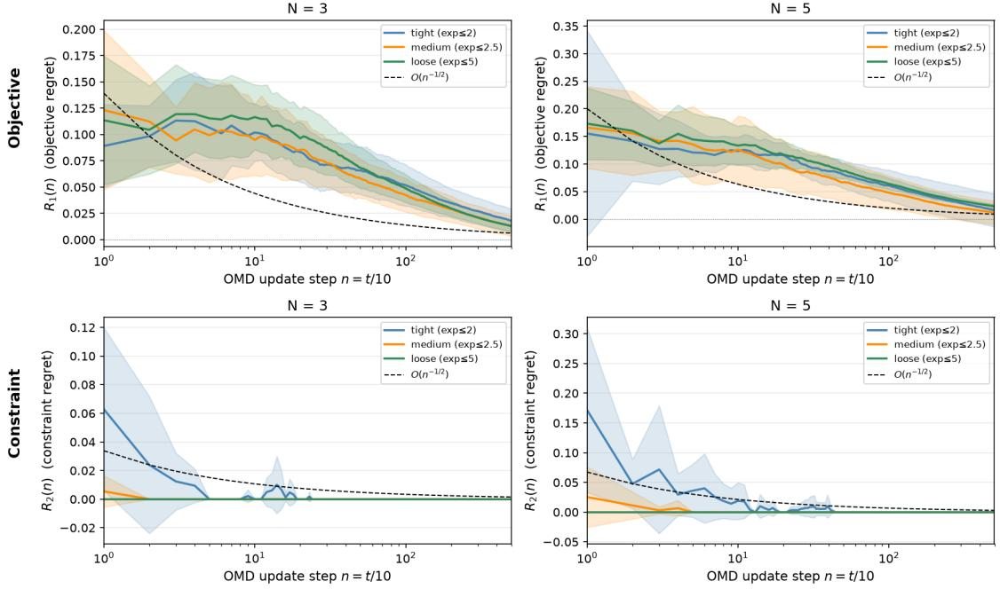
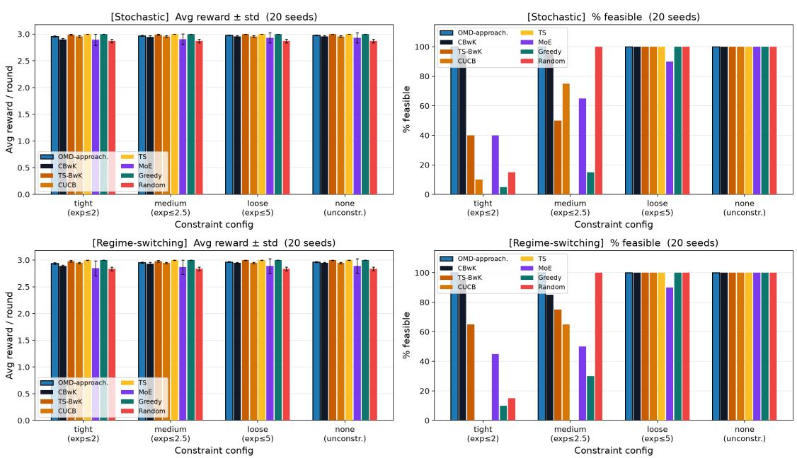
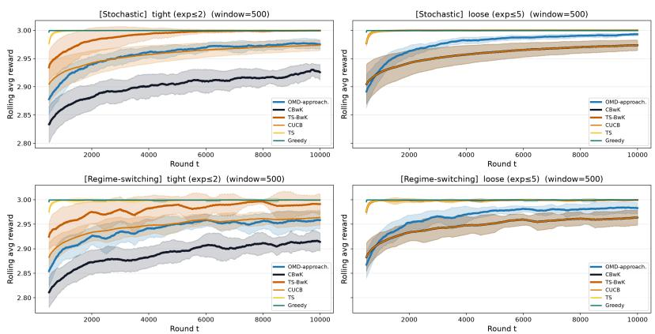

# Coverage-Maximizing Multinomial Subset Routing under Operational Constraints

Quan Zhou<sup>1</sup> and Yiyan Huang<sup>∗2</sup>

<sup>1</sup>National University of Singapore <sup>2</sup>The Great Bay University

## Abstract

We introduce Multinomial Subset Routing (MSR), a new online routing framework over K experts in which the learner keeps a multinomial routing policy instead of a deterministic subset of experts. At each round, the learner samples M experts i.i.d. from the multinomial policy, and the resulting set of distinct sampled experts forms the routed subset.

The reward depends only on the best-performing expert(s) in the routed subset. This reward structure arises naturally in routing across specialized models but is not captured by standard combinatorial bandits or subset-selection methods, which optimize deterministic subsets and typically assume additive rewards. We require the selection to satisfy several long-term, two-sided operational constraints under bandit feedback, observing only the winner’s reward each round. We propose OMD-Approachability, combining online mirror descent with Blackwell’s Approachability, and prove it achieves $O ( 1 / \sqrt { T } )$ regret in both reward and constraint violation. We ground the framework in practical application domains and validate it empirically on a real-world crowdsourcing dataset.

## 1 Introduction

The rise of specialized large language models (LLMs) has enabled hospitals to deploy ensembles of expert models—each trained on a distinct clinical domain—to assist in patient diagnosis and treatment planning. At each patient visit, the platform must select a subset of these specialists to consult. For any consults, only the most knowledgeable model determines the quality of the response, and the contributions of less capable models are subsumed. This winner-takes-all structure stands in sharp contrast to standard combinatorial bandits [30], where the quality is the sum of contributions of selected specialists. A patient’s case typically spans multiple clinical dimensions (e.g., a cardiac complication, a kidney function issue, and a neurological symptom); for each dimension, only the most proficient selected specialist contributes, and the total reward aggregates these per-dimension maxima, yielding a sum-max structure [37]. Formally, given a set of K experts and N medical dimensions, the reward of consulting a subset $A \subseteq [ K ]$ takes the form

$$
r ( A ) = \sum _ { k = 1 } ^ { N } \operatorname* { m a x } _ { i \in A } V _ { k , i } ,
$$

where $V _ { k , i } ~ \geq ~ 0$ denotes the proficiency of specialist i on the k-th medical dimension. This captures a fundamental property of ensemble consultation: specialists are complementary rather than additive. Crucially, these specialist models are black-box: the platform observes only the aggregate reward $r ( A )$ after consultation, not individual model contributions, motivating the bandit feedback setting.

Another key distinction between the proposed setting and standard combinatorial bandits is that the platform does not seek a deterministic subset. Beyond maximizing clinical coverage, the platform must also respect operational constraints: each medical specialty must be consulted suficiently often to ensure broad coverage, while computational resources must be balanced across servers to ensure timely responses. Consequently, a fixed deterministic subset may fail to satisfy these operational requirements. Instead, the platform seeks a multinomial routing policy that generates diferent subsets over time, allowing aggregate routing decisions to achieve both high clinical coverage and operational feasibility. We call this setting Multinomial Subset Routing (MSR). In MSR, the learner maintains a routing distribution over the K experts and, in each round, forms a subset by sampling M experts independently from this distribution. The resulting subset consists of the distinct experts sampled in that round. Thus, the optimization object is a routing policy rather than a deterministic subset.

This setting is important for three reasons. First, a fixed MSR policy provides a simple and stable mechanism for repeatedly generating subsets over a long horizon. Second, repeated execution of the same policy enables long-term operational constraints, such as capacity and fairness, to be enforced through average routing frequencies. Third, for sum-max rewards, the expected reward induced by a MSR policy is concave over the probability simplex [37], enabling the use of online convex optimization techniques.

Despite their practical importance, existing methods fail to address this problem in its full generality. On one hand, sum-max submodular bandits [37] capture the coverage structure of ensemble selection but do not incorporate operational constraints. On the other hand, bandit algorithms with knapsack constraints [6] typically handle budget requirements but assume simple linear or modular reward functions, which fail to model the coverage synergies inherent in multi-expert consultation. In the LLM routing literature, Mixture-of-Experts (MoE) approaches [40] learn to gate over specialists but lack provable feasibility guarantees and do not account for long-term constraint satisfaction.

Combining sum-max rewards with operational constraints poses two technical challenges. The sum-max reward structure difers from standard combinatorial bandits, and while its concave structure [37] enables online optimization of the reward, it simultaneously introduces a non-convexity in the operational constraints. We show that both challenges can be overcome by carefully exploiting this concave structure for the reward objective while introducing a surrogate constraint reformulation to restore tractability. In this paper, we propose a novel framework for sum-max submodular bandits with two-sided operational (covering and packing) constraints. Our main contributions are:

• We formulate the problem of online subset selection with sum-max rewards and multiple operational constraints under bandit feedback, a setting not addressed by prior work.

• We propose an Online Mirror Descent algorithm with Approachability constraints (OMD-Approachability) that achieves sublinear regret in both reward and constraint violation, with provable feasibility guarantees.

• We extend the framework to the contextual setting, where the learner observes a context before acting.

• We instantiate the framework on some real-world applications and validate empirically on a real dataset, demonstrating that OMD-Approachability achieves competitive reward while maintaining feasibility.

## 2 Related Works

Mixture-of-Experts The Mixture-of-Experts (MoE) architecture, introduced by [29] and scaled to modern LLMs by [40], increases model capacity by routing each input token to a learned subset of expert sub-networks via a gating function, activating only a fraction of parameters per forward pass. The Switch Transformer [21] formalized the notion of expert capacity — a hard upper bound on the number of tokens routable to each expert — and introduced load-balancing losses to prevent token dropping or expert collapse. This capacity constraint is a direct motivation for our work: the problem of routing queries to experts under capacity limits is naturally modeled as a bandit problem with knapsack constraints.

LLM Routing. While MoE routing operates at the token level within a single model, a related but distinct line of work considers routing at the system level — selecting which LLM among a pool of candidates to invoke for each incoming query, trading of response quality against inference cost. Early approaches learn a routing function ofline — either by directly optimizing performance minus scaled cost [13, 14], or by training a supervised router with labels from all candidate models [41, 36, 15, 22] — an assumption that breaks at deployment where only the outcome of the chosen model is observed (bandit feedback). Recent work addresses this by framing routing as an online learning problem: [35] formulates it as a multi-armed bandit that balances accuracy and cost, while [46] uses a contextual bandit conditioned on a user-specified performance–cost preference vector.

Our work difers along several dimensions: we route a subset of experts simultaneously rather than a single model, we operate under more restricted feedback (only the aggregated reward of the chosen subset is observed), and the selection is subject to multi-dimensional whole-horizon covering and packing constraints. These constraints generalize the single cost-budget of prior work and can additionally encode operational limits (e.g., query caps on a specific GPU cluster) or fairness requirements (e.g., guaranteeing each hospital receives a minimum allocation of queries). This routing-under-capacity problem above is closely related to the following Bandits with Knapsacks (BwK) [6].

Bandits with Knapsacks. The framework, pioneered by [6], studies the problem of online decision-making under resource consumption constraints. Over the years, it has been extended in numerous directions, including contextual settings [42, 4], linear bandits [2], combinatorial variants [32, 38], and adversarial settings [28], as well as connections to dueling bandits [20]. While the majority of approaches adopt UCB-style algorithms, recent work has explored Thompson sampling as an alternative [19]. Most relevant to our work is the setting of concave rewards and convex knapsacks [3], which proposes to handle the constraints via Blackwell’s Approachability algorithm; our work builds on and extends this line of research.

Submodular Maximization with Constraints. This line of work dates back to the last century, studying the problem of selecting a subset that maximizes a submodular set function subject to combinatorial constraints [5]. It is relevant to our setting because the sum-max reward function we consider is also submodular, satisfying the diminishing-returns property. Classical approaches include greedy [34], double greedy [9], and local search [31], with a celebrated breakthrough being the continuous greedy algorithm [10], which achieves the optimal (1 − 1/e) approximation for monotone submodular maximization under a matroid constraint, with extensions to non-monotone cases [8]. More recent works extend this framework to richer settings, including the intersection of matroid and knapsack constraints [39, 7], changing environments [48, 33], online settings [26, 43] and resource-aware settings [47]. However, These methods all require access to a value oracle of the set function, or with a access to subroutine to draw samples to estimate the function value e.g., [24], that remain inapplicable to our setting, where the reward function is unknown and must be learned from observations on the fly.

Submodular Bandits. This line of work relaxes the assumption of full access to a value oracle. The earliest works [50, 49] model the reward as a weighted sum of basis submodular functions with unknown weights, while still requiring access to the value oracle of each basis function. [49] additionally introduce a per-round knapsack constraint, meaning the budget is enforced independently at each round; in contrast, our whole-horizon knapsack couples decisions across rounds, requiring the algorithm to jointly manage exploration and resource consumption over time. [44] removes access to the value oracle entirely, requiring only marginal gain observations $r ( S \cup \{ i \} ) - r ( S )$ , and extends to per-round knapsack and matroid constraints. [12] adopts the same observation model but additionally assumes marginal gains are representable via a kernel function.

K-max Bandits. A special case is when the reward is the maximum over selected arms, which is itself submodular. Two distinct settings have been studied under the name K-max bandits: Extreme Bandits [18, 11, 1], which maximizes the expected best single-sample reward across T rounds, and [25, 23, 17], which defines the per-round reward as the maximum outcome within a selected subset — the setting directly related to ours, which we extend by incorporating knapsack constraints on action costs. The consideration of action costs is not entirely new [24, 37] that both treat costs as a shared quantity across actions. Our formulation is more general along two dimensions: first, we support multiple cost types simultaneously, where each cost type aggregates individual action costs over a specific group — motivated by the notion of expert capacity in Mixture-of-Experts (MoE) models; second, we support both upper-bound and lower-bound constraints on each cost type, requiring that certain resource consumption levels are met as well as not exceeded. We encode all of these as whole-horizon knapsack constraints.

Combinatorial Bandits consider a decision maker that selects M base arms from K in each round, forming a super-arm [30]. In the standard setting, the reward of a super-arm is determined by the rewards of its selected base arms, often through an additive structure. Popular methods include CUCB [16] and CTS [45]. These methods typically select a deterministic super-arm, e.g., the top-M base arms according to their UCB or Thompson-sampling values. In contrast, MSR optimizes a multinomial routing policy that induces subsets through repeated sampling.

## 3 Motivating Examples

We instantiate the general framework on three applications that illustrate the breadth of the coverage-maximizing bandit setting.

Medical Consultation via Mixture-of-Expert LLMs. A hospital network operates K specialist LLMs, each trained on distinct datasets. At each patient visit, the platform selects a subset $A _ { t } \subseteq [ K ]$ of up to M specialists and receives a scalar reward $\begin{array} { r } { r _ { t } ( A _ { t } ) = \sum _ { k = 1 } ^ { N } \operatorname* { m a x } _ { i \in A _ { t } } V _ { k , i } ^ { ( t ) } } \end{array}$ reflecting the clinical coverage of the consultation. Here $V _ { k , i } ^ { ( t ) } \geq 0$ captures how well specialist i covers clinical dimension k for patient t. Patient feedback reflects the quality of the consultation as a whole, not the contribution of any individual specialist, so only the aggregate reward $r _ { t } ( A _ { t } )$ is revealed after consultation. As examples of the operational constraints this can capture: (i) a specialty coverage constraint, requiring each specialist to be consulted often enough that it keeps receiving cases to update on; and (ii) a GPU load-balancing constraint, capping the average activations per server cluster.

Crowdsourcing Team Formation. A crowdsourcing platform assembles teams of up to M workers from a pool of K to complete sequentially arriving projects. The team quality reward for the t-th project is $\begin{array} { r } { r _ { t } ( A _ { t } ) = \sum _ { k = 1 } ^ { N } \operatorname* { m a x } _ { i \in A _ { t } } V _ { k , i } ^ { ( t ) } } \end{array}$ , where $V _ { k , i } ^ { ( t ) }$ is the match quality between worker i and project t along skill dimension k (e.g. software development, graphic design). The project requester only rates the completed project as a whole, not each worker’s individual sub-contribution, so only the aggregate reward $r _ { t } ( A _ { t } )$ is revealed after project completion. As examples of the operational constraints this can capture: (i) a wage budget constraint, capping the average spend per project; and (ii) a group fairness constraint, requiring each demographic group to be hired suficiently often on average.

Online Ad Allocation. A platform selects a subset of up to M candidate ads to display at each of T rounds. The resulting engagement reward at the t-th round is $r _ { t } ( A _ { t } )$ $\begin{array} { r } { \sum _ { k = 1 } ^ { N } \operatorname* { m a x } _ { i \in A _ { t } } V _ { k , i } ^ { ( t ) } } \end{array}$ , where $V _ { k , i } ^ { ( t ) } \geq 0$ is the relevance of ad i to user-interest category k. The realized payof (e.g. total session revenue) is logged for the displayed slate as a whole; ad-serving logs do not reliably attribute a single conversion to one specific ad among several shown together, so only the aggregate reward $r _ { t } ( A _ { t } )$ is revealed after each round. As examples of the operational constraints this can capture: (i) a budget constraint, capping average spend per round; (ii) a fairness constraint, requiring each advertiser group to receive a suficient share of impressions on average; and (iii) a load-balancing constraint, capping average activations per ad-serving node.

## 4 Problem Setup and Notation

We consider an online learning problem in which a learner repeatedly selects subsets of actions to maximize cumulative reward while satisfying long-term operational constraints.

Let $K , M , T \in \mathbb { N }$ be fixed, where K denotes the number of available actions (specialists), M is the maximum number of actions selected per round, and T is the time horizon. We write $[ K ] : = \{ 1 , \dots , K \}$ and denote by $\begin{array} { r } { \Delta _ { K } : = \Bigl \{ q \in \mathbb { R } _ { + } ^ { K } : \sum _ { i = 1 } ^ { K } q _ { i } = 1 \Bigr \} } \end{array}$ the probability simplex over [K]. For $u \in \mathbb { R } ^ { d }$ and a nonempty closed set $A \subseteq \mathbb { R } ^ { d }$ , we write dist $\begin{array} { r } { ( u , A ) : = \operatorname* { m i n } _ { x \in A } \| x - u \| } \end{array}$ for the Euclidean distance from u to A.

Rewards and costs. Each round t is associated with a reward set function $r _ { t } : 2 ^ { [ K ] } \to [ 0 , 1 ]$ and $r _ { t } ( \emptyset ) = 0$ . Each action $i \in [ K ]$ incurs a known cost vector $c _ { i } \in [ 0 , \bar { c } ] ^ { d }$ , where ¯c is the upper bound for each entry of the cost vector.

Interaction protocol. The interaction protocol below formalizes the MSR setting introduced in Section 1. Nature fixes in advance a sequence of reward functions $\{ r _ { t } \} _ { t = 1 } ^ { T }$ , which remain hidden from the learner. At each round $t = 1 , \dots , T$ , the learner proceeds as follows:

1. Choose a routing policy $q _ { t } \in \Delta _ { K }$

2. Draw M i.i.d. actions $a _ { t , 1 } , \ldots , a _ { t , M } \sim q _ { t }$ and form the (random) subset $A _ { t } : = \{ a _ { t , j } : j \in$ $[ M ] \} \subseteq [ K ] , \operatorname { s o } | A _ { t } | \leq M$

3. Observe the bandit feedback $r _ { t } ( A _ { t } )$

4. Incur the (random) loss $\ell _ { t } : = \sum _ { i = 1 } ^ { K } c _ { i } \mathrm { \bf ~ 1 } [ i \in A _ { t } ] ,$

The learner must ensure the time-averaged loss vector lies within an axis-aligned box $S ^ { \mathrm { o r i } } =$ $\begin{array} { r } { \prod _ { j = 1 } ^ { d } [ l _ { j } , u _ { j } ] , \mathrm { i . e . , } \frac { 1 } { T } \sum _ { t = 1 } ^ { T } \ell _ { t } \in S ^ { \mathrm { o r i } } } \end{array}$ . We assume throughout that $0 \leq u _ { j } \leq M \bar { c }$ and $0 \leq l _ { j } \leq \bar { c }$ This is without loss of generality: coordinates violating the bounds are satisfied by every policy, since $c _ { i } \in [ 0 , \bar { c } ] ^ { d }$ for $i \in [ K ]$ and $q _ { t } \in \Delta _ { K }$ for $t \in [ T ]$

## 4.1 Sum-Max Reward Functions

Recall the informal sum-max reward $\begin{array} { r } { r ( S ) = \sum _ { k = 1 } ^ { N } \operatorname* { m a x } _ { i \in { S } } V _ { k , i } } \end{array}$ from Section 1; following [37], we now fix this formally.

Definition 1 (Sum-max function). A set function $r : 2 ^ { [ K ] } \to \mathbb { R }$ is sum-max if there exist $N \in  { \mathbb { N } }$ and a matrix $\dot { V } \in \mathbb { R } ^ { N \times K }$ such that

$$
r ( A ) = \sum _ { k = 1 } ^ { N } \operatorname* { m a x } _ { i \in A } V _ { k , i } \qquad \forall A \subseteq [ K ] , A \neq \emptyset , \qquad a n d \quad r ( \emptyset ) = 0 .
$$

Definition 2 (Expected reward). For any $q \in \Delta _ { K }$ , let $b _ { 1 } ( q ) , \dots , b _ { M } ( q )$ be $i . i . d$ . draws from the routing policy q and set $B ( q ) : = \{ b _ { j } ( q ) : j \in [ M ] \}$ }. For a set function $r : 2 ^ { [ K ] } \to \mathbb { R }$ , define

$$
\Phi ^ { r } ( q ) : = \mathbb { E } [ r ( B ( q ) ) ] , \qquad q \in \Delta _ { K } .
$$

Lemma 1 (Concavity and gradient of $\Phi ^ { r } )$ . Let r be a sum-max function. Then $\Phi ^ { r }$ is concave over $\Delta _ { K }$ , and for every $q \in \Delta _ { K }$ , the partial derivative of the expected reward with respect to the $i ^ { t h }$ entry $q _ { i }$ , is

$$
\partial _ { i } \Phi ^ { r } ( q ) = \mathbb { E } \left[ \frac { r ( B ( q ) ) } { q _ { i } } \sum _ { j \in [ M ] } \mathbf { 1 } \{ b _ { j } ( q ) = i \} \right] .
$$

Proof. Both claims follow directly from [37]: concavity of $\Phi ^ { r }$ over $\Delta _ { K }$ follows from Theorem 2.3, and the gradient expression from Lemma 6.7. □

## 4.2 Tractability and constraint reformulation

Since the realized loss is stochastic, we analyze its expectation. At round t, under routing policy $q _ { t } \in \Delta _ { K }$ , arm i appears in $A _ { t }$ with probability $1 - ( 1 - q _ { t , i } ) ^ { M }$ , so the expected cost vector is

$$
\mathbb { E } [ \ell _ { t } ] = \sum _ { i = 1 } ^ { K } \bigl ( 1 - ( 1 - q _ { t , i } ) ^ { M } \bigr ) c _ { i } .\tag{1}
$$

Recall that one of the learner’s goals is to keep the time-averaged observed cost inside a target set $S ^ { \mathrm { { o r i } } }$ . Since the realized loss $\ell _ { t }$ is stochastic, we might first work with the constraint in expectation: $\textstyle { \frac { 1 } { T } } \sum _ { t = 1 } ^ { T } \mathbb { E } [ \ell _ { t } ] \in S ^ { \mathrm { o r i } }$ . However, the map $q _ { t } \mapsto \mathbb { E } [ \ell _ { t } ]$ is concave for $M \geq 1$ , which prevents the direct use of online convex optimization methods. To restore tractability and apply the approachability algorithm in [27], we construct a convex and compact set S such that playing $q _ { t }$ with $\textstyle \sum _ { i = 1 } ^ { K } q _ { t , i } c _ { i } \in S$ is suficient to guarantee $\mathbb { E } [ \ell _ { t } ] \in S ^ { \mathrm { o r i } }$ , i.e. S is a safe inner approximation of $S ^ { \mathrm { { o r i } } }$ under the linear surrogate.

Let $c _ { i } ^ { ( j ) }$ denote the $j ^ { \mathrm { t h } }$ entry of the cost vector $c _ { i }$ . The construction proceeds in two steps: (i) we replace $\mathbb { E } [ \ell _ { t } ]$ by the linear surrogate $\sum _ { i } q _ { i } c _ { i }$ , which yields a strict inner approximation; and (ii) we truncate $S$ to a box, which preserves both the feasible set and the constraint distance and serves only to render $S$ compact, as the approachability analysis of Section 5 requires.

(i) Surrogate substitution and rescaling. The map $q _ { t } \mapsto \mathbb { E } [ \ell _ { t } ]$ is concave, so constraining it directly does not yield a convex feasible set. We therefore constrain the linear surrogate $\textstyle \sum _ { i = 1 } ^ { K } q _ { t , i } c _ { i }$ instead, which is safe because the two are sandwiched coordinate-wise: for each $j \in [ d ]$

$$
\sum _ { i = 1 } ^ { K } q _ { t , i } c _ { i } ^ { ( j ) } \ \leq \ \mathbb { E } [ \ell _ { t } ] ^ { ( j ) } \ \leq \ M \sum _ { i = 1 } ^ { K } q _ { t , i } c _ { i } ^ { ( j ) } ,\tag{2}
$$

by $p \leq 1 - ( 1 - p ) ^ { M } \leq M p$ for $p \in [ 0 , 1 ] , M \geq 1$ , together with $c _ { i } ^ { ( j ) } \geq 0$

Consequently it sufices to enforce ${ \textstyle \sum _ { i = 1 } ^ { K } q _ { t , i } c _ { i } ^ { ( j ) } \leq u _ { j } / M }$ for an upper-bound coordinate, and $\begin{array} { r } { \sum _ { i = 1 } ^ { K } q _ { t , i } c _ { i } ^ { ( j ) } \geq l _ { j } } \end{array}$ for a lower-bound one<sup>1</sup>.

(ii) Truncating S to a box. The half-lines produced by step (i) are unbounded, so the approachability assumption defined in later text is violated. Since $\textstyle \sum _ { i } q _ { i } c _ { i } ^ { ( j ) } \in [ 0 , \bar { c } ]$ for every $q \in \Delta _ { K }$ and $j \in [ d ]$ , we may intersect each $S ^ { ( j ) }$ with [0, c¯] and take

$$
S ^ { ( j ) } = [ 0 , \ u _ { j } / M ] \quad \mathrm { ( u p p e r - b o u n d ~ c o o r d i n a t e s ) } , \qquad S ^ { ( j ) } = [ l _ { j } , \ \bar { c } ] \quad \mathrm { ( l o w e r - b o u n d ~ c o o r d i n a t e s ) } ,
$$

so that $\begin{array} { r } { S = \prod _ { i } S ^ { ( j ) } \subseteq [ 0 , \bar { c } ] ^ { d } } \end{array}$ . This alters neither the feasible set defined in step (i) nor the value of dist $( \sum _ { i } q _ { i } c _ { i } , S )$ , but renders $S$ compact.

The following lemma is the guarantee of this construction. Recall that $\begin{array} { r } { S ^ { \mathrm { o r i } } = \prod _ { j = 1 } ^ { d } ( S ^ { \mathrm { o r i } } ) ^ { ( j ) } } \end{array}$ is a product of intervals, where each coordinate $j$ is either an upper-bound coordinate with $( S ^ { \mathrm { o r i } } ) ^ { ( j ) } = ( - \infty , u _ { j } ] .$ or a lower-bound coordinate with $( S ^ { \mathrm { o r i } } ) ^ { ( j ) } = [ l _ { j } , \infty )$ ; the corresponding coordinates of $S$ are $S ^ { ( j ) } = [ 0 , u _ { j } / M ]$ and $S ^ { ( j ) } = [ l _ { j } , \bar { c } ]$

Lemma 2 (Distance transfer). For any sequence $q _ { 1 } , \dotsc , q _ { T } \in \Delta _ { K }$ , define

$$
\phi : = \frac { 1 } { T } \sum _ { t = 1 } ^ { T } \mathbb { E } [ \ell _ { t } ] = \frac { 1 } { T } \sum _ { t = 1 } ^ { T } \sum _ { i = 1 } ^ { K } \bigl ( 1 - ( 1 - q _ { t , i } ) ^ { M } \bigr ) c _ { i } , \qquad \varphi : = \frac { 1 } { T } \sum _ { t = 1 } ^ { T } \sum _ { i = 1 } ^ { K } q _ { t , i } c _ { i } .
$$

Then

$$
\mathrm { d i s t } \big ( \phi , \ S ^ { \mathrm { o r i } } \big ) \ \le \ M \cdot \mathrm { d i s t } ( \varphi , \ S ) .
$$

Proof. Since $S ^ { \mathrm { { o r i } } }$ and S are both axis-aligned boxes, it sufices to show, for each coordinate $j$ separately,

$$
\mathrm { d i s t } \Bigl ( \phi ^ { ( j ) } , ( S ^ { \mathrm { o r i } } ) ^ { ( j ) } \Bigr ) \ \le \ M \cdot \mathrm { d i s t } \Bigl ( \varphi ^ { ( j ) } , S ^ { ( j ) } \Bigr ) \ .
$$

We handle the two cases in turn.

Case 1: Upper-bound coordinate, $( S ^ { \mathrm { o r i } } ) ^ { ( j ) } = ( - \infty , u _ { j } ] , S ^ { ( j ) } = [ 0 , u _ { j } / M ] .$

The distance of a scalar $w \geq 0$ from $( - \infty , u ]$ is max $( w - u , 0 )$ , and from $[ 0 , u / M ]$ it is likewise max $\left( w - u / M , 0 \right)$ . From the sandwich (2), applied coordinate-wise and averaged over $t ,$

$$
0 \leq \phi ^ { ( j ) } \leq M \varphi ^ { ( j ) } ,
$$

and in particular $\varphi ^ { ( j ) } \ge 0$ . Therefore

$$
\begin{array} { r l } & { \mathrm { d i s t } \big ( \phi ^ { ( j ) } , ( S ^ { \mathrm { o r i } } ) ^ { ( j ) } \big ) = \operatorname* { m a x } ( \phi ^ { ( j ) } - u _ { j } , 0 ) } \\ & { \qquad \leq \operatorname* { m a x } ( M \varphi ^ { ( j ) } - u _ { j } , 0 ) } \\ & { \qquad = M \cdot \operatorname* { m a x } \big ( \varphi ^ { ( j ) } - \frac { u _ { j } } { M } , 0 \big ) } \\ & { \qquad = M \cdot \mathrm { d i s t } \big ( \varphi ^ { ( j ) } , S ^ { ( j ) } \big ) . } \end{array}
$$

Case 2: Lower-bound coordinate, $( S ^ { \mathrm { o r i } } ) ^ { ( j ) } = [ l _ { j } , \infty ) , S ^ { ( j ) } = [ l _ { j } , \bar { c } ]$

Since $\varphi ^ { ( j ) } \leq \bar { c } ,$ the upper end of $S ^ { ( j ) }$ is inactive and the distance of $\varphi ^ { ( j ) }$ from $S ^ { ( j ) }$ is ma $\mathfrak { c } ( l _ { j } - \varphi ^ { ( j ) } , 0 )$ , as it is from $[ l _ { j } , \infty )$ . From the sandwich (2), averaged over $t , \phi ^ { ( j ) } \geq \varphi ^ { ( j ) } \geq 0 .$ whence

$$
\begin{array} { r } { \mathrm { d i s t } \big ( \phi ^ { ( j ) } , ( S ^ { \mathrm { o r i } } ) ^ { ( j ) } \big ) = \operatorname* { m a x } ( l _ { j } - \phi ^ { ( j ) } , 0 ) \le \operatorname* { m a x } ( l _ { j } - \varphi ^ { ( j ) } , 0 ) = \mathrm { d i s t } \big ( \varphi ^ { ( j ) } , S ^ { ( j ) } \big ) . } \end{array}
$$

Corollary 1 (Constraint transfer). $\begin{array} { r } { I f \ \frac { 1 } { T } \sum _ { t = 1 } ^ { T } \sum _ { i = 1 } ^ { K } q _ { t , i } c _ { i } \in S } \end{array}$ , then $\textstyle { \frac { 1 } { T } } \sum _ { t = 1 } ^ { T } \mathbb { E } [ \ell _ { t } ] \in S ^ { \mathrm { o r i } }$

Proof. $\varphi \in S$ implies dist $( \varphi , S ) = 0$ , so Lemma 2 gives dist $( \phi , S ^ { \mathrm { o r i } } ) = 0 , \mathrm { i . e . } \ \phi \in S .$

## 4.3 Online Learning Goal

The learner’s goal is to simultaneously maximize the cumulative expected reward and keep the time-averaged observed cost inside a target set $S ^ { \mathrm { o r i } } \subseteq \mathbb { R } ^ { d }$ . Since the realized loss $\ell _ { t }$ is stochastic, we may impose the constraint in expectation: $\textstyle { \frac { 1 } { T } } \sum _ { t = 1 } ^ { T } \mathbb { E } [ \ell _ { t } ] \in S ^ { \mathrm { o r i } }$ . The non-trivial interaction between the sum-max reward structure and the box constraints prevents a direct formulation. We therefore work with the linear surrogate constraint ${ \frac { 1 } { T } } \sum _ { t = 1 } ^ { T } \sum _ { i } q _ { t , i } c _ { i } \in S$ in place of $\textstyle { \frac { 1 } { T } } \sum _ { t = 1 } ^ { T } \mathbb { E } [ \ell _ { t } ] \in S ^ { \mathrm { o r i } }$ , which by Corollary 1 is suficient to guarantee feasibility with respect to $S ^ { \mathrm { { o r i } } }$ . Further, we compare with the best fixed feasible routing policy in hindsight, not the best fixed subset. The benchmark is

$$
\mathrm { O P T } : = \operatorname* { m a x } _ { q \in \Delta _ { K } } ~ \frac { 1 } { T } \sum _ { t = 1 } ^ { T } \Phi ^ { r _ { t } } ( q ) \quad \mathrm { s . t . } \quad \sum _ { i = 1 } ^ { K } q _ { i } c _ { i } ~ \in ~ S .\tag{3}
$$

Since $S$ is a convex polytope and the objective is concave in $q$ (by Lemma 6.7 of [37]), this is a concave program over a convex feasible set.

We measure performance through two regret quantities.

Objective regret. The first compares the learner’s cumulative expected reward against the benchmark $\mathrm { O P T }$ , i.e. against the best fixed feasible routing policy in hindsight:

$$
\mathcal { R } _ { 1 } ( T ) : = \mathrm { O P T } - \textstyle \frac { 1 } { T } \sum _ { t = 1 } ^ { T } \Phi ^ { r _ { t } } ( q _ { t } ) .\tag{4}
$$

Constraint regret. The second measures how far the learner ends up from feasibility. Note that it is stated in terms of the realized costs $\begin{array} { r } { \ell _ { t } = \sum _ { i } { \bf 1 } [ i \in { \cal A } _ { t } ] c _ { i } } \end{array}$ and the original target set $S ^ { \mathrm { { o r i } } }$

$$
\mathcal { R } _ { 2 } ( T ) : = \mathrm { d i s t } \left( \frac { 1 } { T } \sum _ { t = 1 } ^ { T } \ell _ { t } , \ S ^ { \mathrm { o r i } } \right) .\tag{5}
$$

## 5 Algorithm and Theoretical Guarantees

We present Algorithm 1, where $\begin{array} { r } { h _ { S } ( w ) = \operatorname* { m a x } _ { x \in S } \{ w ^ { \top } x \} } \end{array}$ denotes the support function of S. Since $\begin{array} { r } { S = \prod _ { i = 1 } ^ { d } S ^ { ( j ) } } \end{array}$ is a compact axis-aligned box, the support function $\begin{array} { r } { h _ { S } ( w ) = \operatorname* { m a x } _ { x \in S } \{ w ^ { \top } x \} } \end{array}$ is finite and decomposes coordinate-wise:

$$
h _ { [ 0 , u _ { j } / M ] } ( w _ { j } ) = \left\{ \begin{array} { l l } { ( u _ { j } / M ) w _ { j } } & { w _ { j } \ge 0 , } \\ { 0 } & { w _ { j } < 0 , } \end{array} \right. \quad \quad h _ { [ l _ { j } , \bar { c } ] } ( w _ { j } ) = \left\{ \begin{array} { l l } { \bar { c } w _ { j } } & { w _ { j } \ge 0 , } \\ { l _ { j } w _ { j } } & { w _ { j } < 0 . } \end{array} \right.
$$

By [37], $g _ { t , i }$ is an unbiased estimate of $\nabla \Phi ^ { r _ { t } } ( q _ { t } )$ , but may explode if $q _ { t , i }$ is too small. The following assumption prevents this.

Assumption 1. The benchmark problem (3) is feasible and admits an optimal solution $q \in \Delta _ { K }$ satisfying $q _ { i } \geq \gamma$ for all $i \in [ K ]$

Remark 1 (feasibility of the QP). Assumption 1 implies that the quadratic program (6) is feasible.

Let $q ^ { \star }$ be an optimal solution of the benchmark problem (3). By feasibility of (3), we have $\textstyle \sum _ { i = 1 } ^ { K } q _ { i } ^ { \star } c _ { i } \in S$ . Hence, by Lemma 4,

$$
w ^ { \top } \sum _ { i = 1 } ^ { K } q _ { i } ^ { \star } c _ { i } - h _ { S } ( w ) \leq 0 , \qquad \forall \| w \| \leq 1 .
$$

Since the dual iterate $w _ { t } ,$ , as defined in the algorithm, lies in the unit Euclidean ball, the above inequality holds for $w = w _ { t }$ . Moreover, Assumption 1 ensures that $q _ { i } ^ { \star } \geq \gamma ~ f o r$ all i. Therefore $q ^ { \star }$ satisfies both the linear constraint and the lower-bound constraints in (6), so $q ^ { \star }$ is a feasible point of the quadratic program. Consequently, QP (6) is feasible at every round.

```latex
Algorithm 1: Online Mirror Descent with Approachability Constraints
1. Input: rescaled set $S ,$ OCO algorithm ${ \mathcal { A } } ,$ cost vectors $c _ { i } \in [ 0 , \bar { c } ] ^ { d }$ for $i \in [ K ]$ , floor $\gamma$ and
learning rate $\eta .$
2. Set $\mathbb { B } \subset \mathbb { R } ^ { d }$ to be the unit Euclidean ball, as decision set for ${ \mathcal { A } } .$
3. Set $q _ { 0 , i } : = 1 / K$ and initialize $g _ { 0 , i }$ arbitrarily for $i \in [ K ]$
4. For $t = 1 , \dots , T \colon$
(a) Set $\begin{array} { r } { f _ { t - 1 } ( w ) : = w ^ { \top } \left( \sum _ { i = 1 } ^ { K } q _ { t - 1 , i } c _ { i } \right) - h _ { S } ( w ) . } \end{array}$
(b) Query A: $w _ { t }  { \mathcal { A } } ( f _ { 1 } , \dotsc , f _ { t - 1 } )$
(c) Set $q _ { t }$ as the solution of:
max $q ^ { \top } g _ { t - 1 } - { \textstyle \frac \eta 2 } \| q - q _ { t - 1 } \| ^ { 2 }$
$q \in \Delta _ { K } \colon q \geq \gamma$
s.t. $w _ { t } ^ { \top } \sum _ { i = 1 } ^ { K } q _ { i } c _ { i } - h _ { S } ( w _ { t } ) \leq 0$ (6)
(d) Draw $a _ { t , 1 } , \ldots , a _ { t , M }$ independently from $q _ { t } ;$
(e) Set $A _ { t } \gets \{ a _ { t , j } : j \in [ M ] \}$ ;
(f) Observe $r _ { t } ( A _ { t } ) ;$
(g) For each $i \in [ K ]$ , define
$g _ { t , i } \gets \frac { r _ { t } ( A _ { t } ) } { q _ { t , i } } \sum _ { j = 1 } ^ { M } \mathbb { I } \{ a _ { t , j } = i \}$
5.1 Theoretical Guarantees
All proofs are deferred to Appendix.
Theorem 1 (Reward regret). Let $q _ { t }$ for $t \in [ T ]$ be the output of Algorithm 1 with proximal
parameter $\begin{array} { r } { \eta ^ { * } = \sqrt { 2 T K M \left( \frac { 1 } { \gamma } + ( M - 1 ) \right) } } \end{array}$ . Then
$\begin{array} { r } { T \mathbb { E } [ \mathcal { R } _ { 1 } ( T ) ] \leq 2 \sqrt { 2 T K M \Big ( \frac { 1 } { \gamma } + ( M - 1 ) \Big ) } . } \end{array}$
The constraint regret bound requires the following standard approachability condition.
Theorem 2 (Constraint regret). Let A be an OCO algorithm with regret ${ \mathrm { R e g r e t } } _ { T } ( A )$ . Then
for an absolute constant $L > 0$
$\begin{array} { r } { \mathbb { E } \left[ \mathcal { R } _ { 2 } ( T ) \right] \leq M \cdot \frac { \mathrm { R e g r e t } _ { T } ( A ) } { T } + M \bar { c } L \sqrt { \frac { d \log ( 2 d ) } { T } } . } \end{array}$
Using online gradient descent (OGD) as $\mathcal { A }$ gives $\mathrm { R e g r e t } _ { T } ( \mathcal { A } ) = O ( \sqrt { T } )$ , so both regrets are
$O ( 1 / \sqrt { T } )$ and thus sublinear.
5.2 Contextual extension
We extend to the contextual setting, where at round t the learner observes a context $x _ { t } \in \mathcal { X }$
from a finite set X (e.g. the case type in Section 3) before selecting its routing policy. No
```

distributional assumption is placed on the context sequence. The learner runs one independent copy of Algorithm 1 per context, sharing only the dual variable $w _ { t }$ across contexts to enforce the aggregate constraint. The contextual benchmark optimises over the best fixed feasible policy per context,

$$
\mathrm { O P T } ^ { \mathrm { c t x } } : = \frac { 1 } { T } \sum _ { \substack { x \in \mathcal { X } } } \operatorname* { m a x } _ { \substack { q \in \Delta _ { K } : q _ { i } \geq \gamma } } \sum _ { t : x _ { t } = x } \Phi ^ { r _ { t } } ( q ) ,
$$

and the contextual regret is $\begin{array} { r } { \mathcal { R } _ { 1 } ^ { \mathrm { c t x } } ( T ) : = \mathrm { O P T } ^ { \mathrm { c t x } } - \frac { 1 } { T } \sum _ { t = 1 } ^ { T } \Phi ^ { r _ { t } } ( q _ { t } ^ { ( x _ { t } ) } ) } \end{array}$ . The full contextual algorithm is given in Appendix D.

Corollary 2 (Contextual reward regret). Run the contextual algorithm (Appendix D) with percontext anytime proximal parameter $\eta _ { t } = a \sqrt { n _ { x _ { t } } }$ , where $a = 2 \sqrt { K M ( \textstyle { \frac { 1 } { \gamma } } + M - 1 ) }$ and $n _ { x _ { t } }$ is the visit count for context $x _ { t }$ up to round t. Then, without prior knowledge of T or $\{ T ^ { ( x ) } \}$

$$
\begin{array} { r } { T \mathbb { E } \big [ \mathcal { R } _ { 1 } ^ { \mathrm { c t x } } ( T ) \big ] \ \leq \ 4 \sqrt { | \mathcal { X } | T K M \Big ( \frac { 1 } { \gamma } + ( M - 1 ) \Big ) } . } \end{array}
$$

The contextual regret is $O ( \sqrt { | \mathcal { X } | } )$ larger than the non-contextual bound—sublinear in the number of contexts.

Remark 2 (Shared dual, decoupled primal). Algorithm 2 maintains a separate primal iterate $q ^ { ( x ) }$ for each context $x \in \mathcal { X }$ , but a single shared dual variable $w _ { t }$ . At round t, only the primal iterate corresponding to the observed context $x _ { t }$ is updated, whereas $w _ { t }$ is updated using the policy actually played, $q _ { t } = q ^ { ( x _ { t } ) }$ . Consequently, the reward optimization decomposes into |X| independent per-context online mirror descent problems, while the dual process couples all contexts through the aggregate surrogate cost $\textstyle { \frac { 1 } { T } } \sum _ { t = 1 } ^ { T } \sum _ { i = 1 } ^ { K } q _ { t , i } c _ { i }$ . Since the proof of Theorem 2 depends only on this aggregate surrogate cost sequence and the shared dual updates, it applies to Algorithm 2. Therefore the contextual algorithm satisfies the same constraint guarantee as in Theorem 2.

## 6 Numerical Experiments

We complement the theoretical guarantees of Section 5.1 with a numerical study on the realworld TREC 2010 Crowdsourcing Track dataset.

## 6.1 Data and Preprocessing

Source and cleaning. We use the TREC 2010 Crowdsourcing Track data distributed with the SpectralMethodsMeetEM repository of [51]: trec crowd.txt records each worker’s binary response to a task, and trec truth.txt records each task’s gold label. Inner-joining the two on task ID (keeping only tasks with a recorded gold label) yields 677 workers, 2,275 tasks, and 12,863 annotations. For each annotation we mark correct $= { \bf 1 } \{ \mathrm { r e s p o n s e } = \mathrm { g o l d ~ l a b e l } \}$ , and define a worker’s overall accuracy as the mean of correct over their annotations. Workers with fewer than 5 annotations are discarded, since their accuracy estimate would otherwise be too noisy, leaving a reliable pool of 270 workers.

Per-seed worker pool. For each of the random seeds used throughout Section 6, $K = 5 0$ workers are sampled uniformly without replacement from the reliable pool. The skill and cost statistics below are recomputed within that sampled pool of 50 workers, so quantities such as the cost normalization and the expert indicator are relative to the 50 workers actually competing in that seed’s instance, not to the full reliable pool.

Base skill matrix. The 2,275 tasks are partitioned into $N$ groups by round-robin index on the sorted task IDs (the j-th task in sorted order is assigned to group j mod N). The base skill matrix $V _ { \mathrm { b a s e } } \in [ 0 , 1 ] ^ { N \times 5 0 }$ has $V _ { \mathrm { b a s e } } [ n , i ]$ equal to sampled worker i’s accuracy restricted to group n’s tasks; if worker i has no annotations in group $n ,$ this entry is imputed with worker i’s overall accuracy. The value of $N$ is specified per experiment.

Cost matrix. Within the sampled pool of 50, each worker i is assigned two cost coordinates: a workload cost, equal to i’s annotation count divided by the largest annotation count in the pool, taking values in $[ 0 , 1 ]$ ; and a binary expert indicator, equal to 1 for the 10 highest-accuracy workers in the pool and 0 otherwise.

Per-round realization $V ^ { ( t ) }$ . Since $V _ { \mathrm { b a s e } }$ is static, the per-round skill matrix $V ^ { ( t ) }$ that forms the reward is instead drawn fresh each round from one of two environments built on top of $V _ { \mathrm { b a s e } }$ . In the stochastic environment, $V ^ { ( t ) } [ n , i ] \sim \mathrm { B e t a } ( \kappa V _ { \mathrm { b a s e } } [ n , i ] , \kappa ( 1 - V _ { \mathrm { b a s e } } [ n , i ] ) )$ independently each round with concentration $\kappa = 2 0$ , modeling stationary per-round noise around each worker’s true accuracy. In the regime-switching environment, every $T / 1 0$ rounds a fresh random 10% of workers (5 workers) have their mean accuracy shrunk by a factor of 0.2 for that block, modeling transient drops in annotator reliability (e.g. fatigue) that shift the optimal team composition over time before recovering at the next block.

## 6.2 Regret Convergence under Varying Constraint Tightness

We verify that both the objective regret $R _ { 1 }$ and the constraint regret $R _ { 2 }$ decay at the $O ( n ^ { - 1 / 2 } )$ rate predicted by the theory, across two reward-dimension settings $( N \in \{ 3 , 5 \} )$ and three levels of constraint tightness $( K = 5 0 , M = 5 , T = 1 0 , 0 0 0$ rounds, 5 seeds, stochastic environment with $\kappa = 2 0 )$ . OMD-Approachability (Algorithm 1) is run in the batched setting where the routing distribution $q$ is held fixed for $B \ = \ 1 0$ rounds and updated once per batch via a proximal QP step (6); the natural convergence clock is therefore the number of OMD update steps $n = t / B$ , and all curves are plotted against n.

Regret metrics. At each batch endpoint we compute two metrics. The objective regret

$$
R _ { 1 } ( n ) = { \textstyle { \frac { 1 } { t } } } \sum _ { s = 1 } ^ { t } \Bigl ( \mathbb { E } _ { A \sim q _ { T } } [ r ( A , V ^ { ( s ) } ) ] - r _ { s } \Bigr ) , \quad t = n B ,
$$

where $r _ { s } = r _ { s } ( A _ { s } )$ is the realized reward at round s. The quantity measures how much better the final learned policy $q _ { T }$ would have done if deployed from the start, relative to the algorithm’s actual trajectory. We use $q _ { T }$ as a proxy for the optimal feasible routing policy $q ^ { * }$ that attains OPT (3), which is not available in closed form; after $T = 1 0 \small { , } 0 0 0$ rounds of learning, $q _ { T }$ is taken as its empirical surrogate. The expectation $\mathbb { E } _ { A \sim q _ { T } } [ r ( A , V ^ { ( s ) } ) ]$ is estimated via 200 Monte Carlo draws of $A \sim q _ { T }$ applied retrospectively to each $V ^ { ( s ) } . \ \mathrm { A s } \ t$ grows, the objective regret approaches zero, and the theoretical bound gives a rate of $O ( n ^ { - 1 / 2 } )$ . The constraint regret

$$
\begin{array} { r } { R _ { 2 } ( n ) = \mathrm { { d i s t } } \Big ( \frac { 1 } { { t } } \sum _ { s = 1 } ^ { t } \ell _ { s } , \ S ^ { \mathrm { { o r i } } } \Big ) } \end{array}
$$

is the Euclidean distance from the running-average realized cost vector to the original feasible box $S ^ { \mathrm { { o r i } } }$ ; it is positive only when the time-averaged cost exceeds at least one constraint bound, and decays to zero once the algorithm stays consistently feasible.

Constraint configurations. Table 1 lists the four configurations, varying the expert-cap bound $\alpha _ { \mathrm { { e x p e r t } } }$ (maximum average number of top-accuracy workers selected per round) and the budget margin added to the baseline budget $M \cdot \overline { { C _ { 0 } } }$

Table 1: Constraint configurations used in Sections 6.2 and 6.3. The “none” level (unconstrained) is used in Section 6.3 only.
<table><tr><td>Config</td><td></td><td>Budget margin</td><td>1 Expert cap αexpert</td></tr><tr><td>tight</td><td> $( \exp \le 2 )$ </td><td>+0.0</td><td>2.0</td></tr><tr><td>medium</td><td> $( \exp \le 2 . 5 )$ </td><td>+0.1</td><td>2.5</td></tr><tr><td>loose</td><td> $\mathrm { ( e x p \le 5 ) }$ </td><td>+0.5</td><td>5.0</td></tr><tr><td>none</td><td>(unconstr.)</td><td>一</td><td>∞</td></tr></table>

Hyperparameters. The OMD proximal parameter is $\eta ~ = ~ \eta _ { \mathrm { m u l t } } { \sqrt { 2 T K M ( 1 / \gamma + M - 1 ) } }$ with $\eta _ { \mathrm { m u l t } } ~ = ~ 0 . 0 3$ for both $N \ = \ 3$ and $N \ = \ 5$ . The dual OGD step size is $\eta _ { \mathrm { o g d } } = 0 . 0 5$ and the exploration floor is $\gamma = 1 / ( 1 0 K ) = 0 . 0 0 2$

Figure and results. Figure 1 shows $R _ { 1 } ( n )$ (top row) and $R _ { 2 } ( n )$ (bottom row) for $N = 3$ (left) and $N = 5 \ \mathrm { ( r i g h t ) }$ . On each panel a dashed $c / { \sqrt { n } }$ reference line is shown, reflecting the $O ( n ^ { - 1 / 2 } )$ theoretical prediction.

For $R _ { 1 }$ , all three constraint configurations decay to near-zero by $n = 1 0 , 0 0 0$ under both N values. The empirical curves lie above the $O ( n ^ { - 1 / 2 } )$ reference throughout, indicating that convergence is initially slower than the reference rate; nevertheless all curves reach near-zero by the end of the horizon. A short warm-up plateau is visible at $n \lesssim 3 0$ , after which the curves enter a clear monotone descent. Under $N = 5$ , the loose configuration shows a more pronounced early hump, reflecting the wider reward range of the higher-dimensional sum-max objective. For $R _ { 2 } ,$ only the tight configuration registers meaningful constraint violation: the running-average cost vector starts above the expert-cap boundary, and the dual OGD corrections gradually steer selections away from over-used expert workers. The tight-configuration $R _ { 2 }$ tracks the $O ( n ^ { - 1 / 2 } )$ reference closely, reaching approximately zero by n ≈ 300 for $N = 3$ and $n \approx 1 , 0 0 0$ for $N = 5 ;$ the larger and slower-decaying violation under $N = 5$ reflects the wider per-round cost variance when more skill groups are active. The medium configuration shows only a small initial transient that vanishes by $n \approx 2 0 – 3 0$ . The loose configuration remains at zero throughout.

## 6.3 Crowdsourced Annotation via Worker Reliability

We instantiate the crowdsourcing application of Section 3 on the worker pool and skill/cost matrices of Section 6.1, comparing eight policies across four constraint-tightness levels and two environment types. A team of $M = 5$ workers is selected per round over $T = 1 0 \small { , } 0 0 0$ rounds, with team-quality reward $\begin{array} { r } { r _ { t } ( A _ { t } ) = \sum _ { n = 1 } ^ { 3 } \operatorname* { m a x } _ { i \in A _ { t } } V _ { n , i } ^ { ( t ) } } \end{array}$ . Results are averaged over 20 independent seeds.

Constraint configurations. The same two knapsack constraints as Section 6.1 are used: a budget constraint bounding time-averaged workload, and an expert-cap constraint limiting the average number of top-accuracy workers selected per round. Four tightness levels are evaluated, as listed in Table 1.

Policies. All UCB- and TS-based baselines begin with a round-robin warm-up of 10 rounds that cycles through all $K = 5 0$ workers before switching to their learned selection rule. Because the sum-max reward is non-decomposable, these baselines attribute the full combinatorial reward $r _ { t }$ to each selected arm as a heuristic proxy for its individual contribution.

• Random: selects M workers uniformly at random without replacement each round. No learning, no constraint awareness; lower-bound reference.

  
Figure 1: Objective regret $R _ { 1 } ( n )$ (top) and constraint regret $R _ { 2 } ( n )$ (bottom) vs. OMD update step $n = t / 1 0$ , for $N = 3$ (left) and $N = 5$ (right). Mean ± one standard deviation across 5 seeds. Dashed line: $O ( n ^ { - 1 / 2 } )$ reference curve.

• Greedy: after warm-up, always selects the M workers with the highest empirical mean (running average of the shared reward $r _ { t } )$ . Pure exploitation; no exploration or constraint awareness.

• CUCB (Combinatorial UCB): after warm-up, selects the $\mathrm { t o p } { - } M$ arms by UCB index $\hat { \mu } _ { i } + c \sqrt { 2 \log { t / n _ { i } } }$ , where $\hat { \mu } _ { i }$ is arm i’s empirical mean reward, $n _ { i }$ is the number of rounds arm i has been selected so far, and $c = 2$ . Since only the aggregate team reward $r _ { t } ( A _ { t } )$ is observed, $\hat { \mu } _ { i }$ is updated via the shared-reward heuristic described above: $r _ { t }$ is attributed to every selected arm as a proxy for its individual contribution. No constraint awareness; serves as an unconstrained reward ceiling.

• CBwK (Combinatorial Bandits with Knapsacks): extends CUCB with a Lagrangian dual $\lambda \in \mathbb { R } _ { + } ^ { d }$ , initialized at $\mathbf { \nabla } \lambda = \mathbf { 0 }$ . The selection score for arm i is $\mathrm { U C B } _ { i } + ( \lambda \odot \mathrm { s i g n } ) ^ { \top } C _ { : , i } .$ steering away from constraint-violating arms as λ grows. Dual updated each round by subgradient ascent on the running-average constraint violation, step size $1 0 / \sqrt { T }$

• TS (Thompson Sampling): maintains a $\mathrm { B e t a } ( \alpha _ { i } , \beta _ { i } )$ posterior per arm, initialized at $\alpha _ { i } = \beta _ { i } = 1$ . Each round samples $s _ { i } \sim \mathrm { B e t a } ( \alpha _ { i } , \beta _ { i } )$ and selects the top-M by $s _ { i } .$ . Posterior update: $\alpha _ { i } \mathrel { + } = r _ { t } / N , \beta _ { i } \mathrel { + } = 1 - r _ { t } / N$ for each selected arm (normalized by N to keep increments in $[ 0 , 1 ] )$ . No constraint awareness; Bayesian counterpart to CUCB.

• TS-BwK (Thompson Sampling with Knapsacks): extends TS with the same Lagrangian dual as CBwK. Selection score is $s _ { i } + ( \pmb { \lambda } \odot \mathrm { s i g n } ) ^ { \top } C _ { : , i } ;$ same subgradient dual update (step size $1 0 / { \sqrt { T } } )$ . Bayesian counterpart to CBwK.

• MoE (constrained online MoE gating): an adaptation of sparse Mixture-of-Experts gating [40] to the online, bandit-feedback, constrained setting. Each worker plays the role of an expert; the gating network is a logit vector $\pmb \theta \in \mathbb { R } ^ { K }$ that learns which experts to activate. Rather than training on a supervised loss with per-expert gradients, the gate is updated online via REINFORCE on the aggregate team reward — the only signal available under winner-only bandit feedback. Selection uses Gumbel-Top-M (top-M indices of $\pmb \theta + \pmb \xi , \xi _ { i } \stackrel { \mathrm { i . i . d . } } { \sim } \mathrm { G u m b e l } ( 0 , 1 ) )$ , the standard stochastic routing mechanism of sparse MoE, which interpolates between uniform exploration and greedy exploitation as θ concentrates. Knapsack constraints are enforced via a Lagrangian dual λ, giving the update

$$
\theta \gets \theta + \eta _ { \mathrm { l r } } r _ { \mathrm { e f f } } \left( \mathbf { 1 } _ { A _ { t } } - \mathbf { p } \right) , \quad r _ { \mathrm { e f f } } = r _ { t } + \left( \lambda \odot \mathrm { s i g n } \right) ^ { \top } x _ { t } , \quad \mathbf { p } = \mathrm { s o f t m a x } ( \theta ) , \quad \eta _ { \mathrm { l r } } = 0 . 0 1 ,
$$

with λ initialized at 0 and updated by subgradient ascent at step size $4 \times 1 0 ^ { - 4 }$

• OMD-Approachability (proposed): Algorithm 1. Maintains a distribution $q \in \Delta _ { K }$ updated every B = 10 rounds via the constrained QP (6), using an importance-weighted bandit gradient with a running-average reward baseline. Arms are drawn M times with replacement from q; no per-arm decomposition is required. The dual w<sub>t</sub> is updated each round via OGD on the unit ball. Primal proximal parameter $\eta = \eta _ { \mathrm { m u l t } } \sqrt { 2 T K M ( 1 / \gamma + M - 1 ) }$ with $\eta _ { \mathrm { m u l t } } = 0 . 0 5$ , dual step size $\eta _ { \mathrm { o g d } } = 0 . 0 5$ , exploration floor $\gamma = 1 / ( 1 0 K ) = 0 . 0 0 2$

Figures and results. Figure 2 reports the time-averaged reward and percentage of feasible runs across four constraint levels in both stochastic and regime-switching environments. Figure 3 shows the per-round rolling-average reward (window size 500) under the tight and loose constraint settings for six representative policies. MoE and Random are omitted from Figure 3 because their substantially higher per-round variance dominates the plotting scale and obscures the comparison among the remaining methods.

Reward–feasibility trade-of. The main result is that OMD-Approachability is the only policy that simultaneously achieves near-optimal reward and consistently satisfies the expertcap constraint. Under the tight constraint, OMD-Approachability attains 100% feasibility in both stochastic and regime-switching environments (Figure 2). In the stochastic environment, TS-BwK is also highly feasible (about 95–100%), whereas CBwK achieves only about 40% feasibility. In the regime-switching environment, TS-BwK drops to about 85%, while CBwK reaches about 65%, indicating that the approachability-based controller is substantially more robust to non-stationarity than the Lagrangian dual baselines. Constraint-unaware policies (CUCB, TS, and Greedy) are rarely feasible under the tight constraint because they have no mechanism to regulate cumulative expert usage.

Efect of constraint relaxation. As the constraint is relaxed from tight to medium, loose, and unconstrained, feasibility increases across all methods and reaches essentially 100% under the loose and unconstrained settings (Figure 2). At the same time, the average rewards of OMD-Approachability, TS, Greedy, TS-BwK, and CUCB remain close to the maximum value of 3.0, while CBwK is consistently lower. Thus, OMD-Approachability preserves nearoptimal reward without sacrificing feasibility, particularly in the constrained regimes where the diferences between methods are most pronounced.

Reward convergence dynamics. Figure 3 highlights the diference between constraintaware and unconstrained policies. Under the tight constraint, TS and Greedy achieve the highest rewards because they do not enforce the expert-cap constraint and therefore serve as unconstrained upper baselines. Among the constraint-aware methods, OMD-Approachability initially sacrifices reward to regulate expert usage, but it steadily improves and converges to near-optimal reward by the end of the horizon. TS-BwK exhibits reward trajectories that are competitive with OMD-Approachability under the tight constraint, while CBwK converges more slowly and remains consistently below both methods.

However, the reward curves must be interpreted together with the feasibility results in Figure 2. Although TS-BwK achieves comparable reward under the tight constraint, it satisfies the constraint in substantially fewer runs, especially in the regime-switching environment, whereas

OMD-Approachability maintains 100% feasibility. Thus, OMD-Approachability is the only constraint-aware policy that combines near-optimal reward with consistently reliable constraint satisfaction.

The advantage of OMD-Approachability is particularly pronounced in the regime-switching environment. Under both tight and loose constraints, it achieves higher rolling reward than the other constraint-aware methods throughout most of the horizon while maintaining full feasibility. CBwK exhibits a persistent reward gap, and TS-BwK is more sensitive to nonstationarity, leading to lower reward and reduced feasibility under the tight constraint. Under the loose constraint, all methods approach similar reward levels, but OMD-Approachability remains the strongest performing constraint-aware policy.

Constraint sweep | TREC dataset | K=50, M=5, T=10000, N=3, 20 seeds | 8 policies | Lagrangian dual\_Ir=10/√T | OMD n\_mult=0.05

  
Figure 2: Constraint tightness sweep (K = 50, M = 5, N = 3, T = 10,000, 20 seeds). Each row is an environment; columns show mean ± std of time-averaged reward (left) and % of seeds achieving feasibility (right). OMD-Approachability (blue) is the only policy that achieves 100% feasibility under the tight constraint in both environments.

## References

[1] M. Achab, S. Cl´emen¸con, A. Garivier, A. Sabourin, and C. Vernade. Max k-armed bandit: On the extremehunter algorithm and beyond. In Joint European Conference on Machine Learning and Knowledge Discovery in Databases, pages 389–404. Springer, 2017.

[2] S. Agrawal and N. Devanur. Linear contextual bandits with knapsacks. Advances in neural information processing systems, 29, 2016.

[3] S. Agrawal and N. R. Devanur. Bandits with concave rewards and convex knapsacks. In Proceedings of the fifteenth ACM conference on Economics and computation, pages 989– 1006, 2014.

  
Figure 3: Per-round rolling-average reward (window 5,000) for tight (left) and loose (right) constraint configurations, across 20 seeds (MoE and Random excluded due to high variance). Each row is an environment. Under tight constraint, OMD-Approachability (blue) starts lower than constraint-unaware baselines but converges to near-optimal reward while remaining feasible throughout.

[4] S. Agrawal, N. R. Devanur, and L. Li. An eficient algorithm for contextual bandits with knapsacks, and an extension to concave objectives. In Conference on Learning Theory, pages 4–18. PMLR, 2016.

[5] F. Bach. Learning with submodular functions: A convex optimization perspective. arXiv preprint arXiv:1111.6453, 2011.

[6] A. Badanidiyuru, R. Kleinberg, and A. Slivkins. Bandits with knapsacks. Journal of the ACM (JACM), 65(3):1–55, 2018.

[7] A. Badanidiyuru and J. Vondr´ak. Fast algorithms for maximizing submodular functions. In Proceedings of the twenty-fifth annual ACM-SIAM symposium on Discrete algorithms, pages 1497–1514. SIAM, 2014.

[8] A. Bian, K. Levy, A. Krause, and J. M. Buhmann. Continuous dr-submodular maximization: Structure and algorithms. Advances in Neural Information Processing Systems, 30, 2017.

[9] N. Buchbinder, M. Feldman, J. Sefi, and R. Schwartz. A tight linear time (1/2)- approximation for unconstrained submodular maximization. SIAM Journal on Computing, 44(5):1384–1402, 2015.

[10] G. Calinescu, C. Chekuri, M. Pal, and J. Vondr´ak. Maximizing a monotone submodular function subject to a matroid constraint. SIAM Journal on Computing, 40(6):1740–1766, 2011.

[11] A. Carpentier and M. Valko. Extreme bandits. Advances in Neural Information Processing Systems, 27, 2014.

[12] L. Chen, A. Krause, and A. Karbasi. Interactive submodular bandit. Advances in Neural Information Processing Systems, 30, 2017.

[13] L. Chen, M. Zaharia, and J. Zou. Eficient online ml api selection for multi-label classification tasks. In International conference on machine learning, pages 3716–3746. PMLR, 2022.

[14] L. Chen, M. Zaharia, and J. Y. Zou. Frugalml: How to use ml prediction apis more accurately and cheaply. Advances in neural information processing systems, 33:10685– 10696, 2020.

[15] S. Chen, W. Jiang, B. Lin, J. Kwok, and Y. Zhang. Routerdc: Query-based router by dual contrastive learning for assembling large language models. Advances in Neural Information Processing Systems, 37:66305–66328, 2024.

[16] W. Chen, Y. Wang, Y. Yuan, and Q. Wang. Combinatorial multi-armed bandit and its extension to probabilistically triggered arms. Journal of Machine Learning Research, 17(50):1–33, 2016.

[17] Y. Chen, S. Wang, L. Huang, and W. Chen. Continuous k-max bandits. arXiv preprint arXiv:2502.13467, 2025.

[18] V. A. Cicirello and S. F. Smith. The max k-armed bandit: A new model of exploration applied to search heuristic selection. In The Proceedings of the Twentieth National Conference on Artificial Intelligence, volume 3, pages 1355–1361, 2005.

[19] R. Deb, M. Ghavamzadeh, and A. Banerjee. Thompson sampling for constrained bandits. In Reinforcement Learning Conference, 2025.

[20] R. Deb, A. Saha, and A. Banerjee. Think before you duel: Understanding complexities of preference learning under constrained resources. In International Conference on Artificial Intelligence and Statistics, pages 4546–4554. PMLR, 2024.

[21] W. Fedus, B. Zoph, and N. Shazeer. Switch transformers: Scaling to trillion parameter models with simple and eficient sparsity. Journal of Machine Learning Research, 23(120):1– 39, 2022.

[22] T. Feng, Y. Shen, and J. You. Graphrouter: A graph-based router for llm selections. In International Conference on Learning Representations, volume 2025, pages 26186–26203, 2025.

[23] F. Fourati, C. J. Quinn, M.-S. Alouini, and V. Aggarwal. Combinatorial stochastic-greedy bandit. In Proceedings of the AAAI Conference on Artificial Intelligence, volume 38, pages 12052–12060, 2024.

[24] A. Goel, S. Guha, and K. Munagala. Asking the right questions: Model-driven optimization using probes. In Proceedings of the twenty-fifth ACM SIGMOD-SIGACT-SIGART symposium on Principles of database systems, pages 203–212, 2006.

[25] A. Gopalan, S. Mannor, and Y. Mansour. Thompson sampling for complex bandit problems. arXiv preprint arXiv:1311.0466, 2013.

[26] N. Harvey, C. Liaw, and T. Soma. Improved algorithms for online submodular maximization via first-order regret bounds. Advances in Neural Information Processing Systems, 33:123–133, 2020.

[27] E. Hazan. Introduction to online convex optimization. Foundations and Trends® in Optimization, 2(3-4):157–325, 2016.

[28] N. Immorlica, K. Sankararaman, R. Schapire, and A. Slivkins. Adversarial bandits with knapsacks. Journal of the ACM, 69(6):1–47, 2022.

[29] R. A. Jacobs, M. I. Jordan, S. J. Nowlan, and G. E. Hinton. Adaptive mixtures of local experts. Neural computation, 3(1):79–87, 1991.

[30] B. Kveton, Z. Wen, A. Ashkan, and C. Szepesvari. Tight regret bounds for stochastic combinatorial semi-bandits. In Artificial Intelligence and Statistics, pages 535–543. PMLR, 2015.

[31] J. Lee, M. Sviridenko, and J. Vondr´ak. Submodular maximization over multiple matroids via generalized exchange properties. Mathematics of Operations Research, 35(4):795–806, 2010.

[32] Q. Liu, W. Xu, S. Wang, and Z. Fang. Combinatorial bandits with linear constraints: Beyond knapsacks and fairness. Advances in Neural Information Processing Systems, 35:2997– 3010, 2022.

[33] T. Matsuoka, S. Ito, and N. Ohsaka. Tracking regret bounds for online submodular optimization. In International Conference on Artificial Intelligence and Statistics, pages 3421–3429. PMLR, 2021.

[34] G. L. Nemhauser, L. A. Wolsey, and M. L. Fisher. An analysis of approximations for maximizing submodular set functions—i. Mathematical programming, 14(1):265–294, 1978.

[35] Q. H. Nguyen, T. Dao, D. C. Hoang, J. Decugis, S. Manchanda, N. V. Chawla, and K. D. Doan. Metallm: A high-performant and cost-eficient dynamic framework for wrapping llms. arXiv preprint arXiv:2407.10834, 2024.

[36] I. Ong, A. Almahairi, V. Wu, W.-L. Chiang, T. Wu, J. E. Gonzalez, M. W. Kadous, and I. Stoica. Routellm: Learning to route llms with preference data. arXiv preprint arXiv:2406.18665, 2024.

[37] S. Pasteris, A. Rumi, F. Vitale, and N. Cesa-Bianchi. Sum-max submodular bandits. arXiv preprint arXiv:2311.05975, 2023.

[38] K. A. Sankararaman and A. Slivkins. Combinatorial semi-bandits with knapsacks. In International Conference on Artificial Intelligence and Statistics, pages 1760–1770. PMLR, 2018.

[39] K. K. Sarpatwar, B. Schieber, and H. Shachnai. Constrained submodular maximization via greedy local search. Operations Research Letters, 47(1):1–6, 2019.

[40] N. Shazeer, A. Mirhoseini, K. Maziarz, A. Davis, Q. Le, G. Hinton, and J. Dean. Outrageously large neural networks: The sparsely-gated mixture-of-experts layer. arXiv preprint arXiv:1701.06538, 2017.

[41] T. Shnitzer, A. Ou, M. Silva, K. Soule, Y. Sun, J. Solomon, N. Thompson, and M. Yurochkin. Large language model routing with benchmark datasets. arXiv preprint arXiv:2309.15789, 2023.

[42] A. Slivkins, K. A. Sankararaman, and D. J. Foster. Contextual bandits with packing and covering constraints: A modular lagrangian approach via regression. In The Thirty Sixth Annual Conference on Learning Theory, pages 4633–4656. PMLR, 2023.

[43] M. Streeter and D. Golovin. An online algorithm for maximizing submodular functions. Advances in Neural Information Processing Systems, 21, 2008.

[44] S. Takemori, M. Sato, T. Sonoda, J. Singh, and T. Ohkuma. Submodular bandit problem under multiple constraints. In Conference on Uncertainty in Artificial Intelligence, pages 191–200. PMLR, 2020.

[45] S. Wang and W. Chen. Thompson sampling for combinatorial semi-bandits. In International Conference on Machine Learning, pages 5114–5122. PMLR, 2018.

[46] W. Wei, T. Yang, H. Chen, Y. Zhao, F. Dernoncourt, R. A. Rossi, and H. Eldardiry. Learning to route llms from bandit feedback: One policy, many trade-ofs. arXiv preprint arXiv:2510.07429, 2025.

[47] Z. Xu, S. S. Garimella, and V. Tzoumas. Communication-and computation-eficient distributed submodular optimization in robot mesh networks. IEEE Transactions on Robotics, 2025.

[48] Z. Xu, H. Zhou, and V. Tzoumas. Online submodular coordination with bounded tracking regret: Theory, algorithm, and applications to multi-robot coordination. IEEE Robotics and Automation Letters, 8(4):2261–2268, 2023.

[49] B. Yu, M. Fang, and D. Tao. Linear submodular bandits with a knapsack constraint. In Proceedings of the AAAI Conference on Artificial Intelligence, volume 30, 2016.

[50] Y. Yue and C. Guestrin. Linear submodular bandits and their application to diversified retrieval. Advances in neural information processing systems, 24, 2011.

[51] Y. Zhang, X. Chen, D. Zhou, and M. I. Jordan. Spectral methods meet em: a provably optimal algorithm for crowdsourcing. J. Mach. Learn. Res., 17(1):3537–3580, Jan. 2016.

## Appendix Contents

• Appendix A: Auxiliary Lemmas . . . . 19   
• Appendix B: Proof of Theorem 1 . . . . . 20   
• Appendix C: Proof of Theorem 2 . . . . . . . . 22   
• Appendix D: Contextual Algorithm and Proof of Corollary 2 . . . . . . . . 24

## A Auxiliary Lemmas

We collect here the supporting lemmas used across the proofs. Let $w _ { t }$ be defined in Algorithm 1. We also define the feasible regions used in the analysis:

$$
\mathcal { F } _ { \circ } : = \left\{ q \in \Delta _ { K } : q _ { i } \geq \gamma ; \sum _ { i } q _ { i } c _ { i } \in S \right\}
$$

$$
\begin{array} { r } { \mathcal { F } _ { \tau } : = \{ q \in \Delta _ { K } : q _ { i } \geq \gamma ; \ w _ { t } ^ { \top } \sum _ { i } q _ { i } c _ { i } - h _ { S } ( w _ { t } ) \leq 0 , \ \forall t \in [ \tau ] \} , } \end{array}
$$

and their per-context analogues $\mathcal { F } _ { \circ } ^ { ( x ) } , \mathcal { F } _ { \tau } ^ { ( x ) }$ with $^ { 6 6 } \forall t \in [ \tau ] ^ { \flat }$ replaced by $ { \left[ \left[ t \right] \right] } { } \in \left[ \tau \right] : x _ { t } = x ^ { }$ . Note that $\mathcal { F } _ { \tau }$ and $\mathcal { F } _ { \tau } ^ { ( x ) }$ are random as $w _ { t }$ are randomly generated by the algorithm.

For the measurability argument, define the filtration, i.e., the history before sampling $A _ { t }$

$$
\mathcal { H } _ { t - 1 } = \sigma ( w _ { 1 } , \dots , w _ { t } , \ q _ { 1 } , \dots , q _ { t } , \ A _ { 1 } , r _ { 1 } ( A _ { 1 } ) , \dots , A _ { t - 1 } , r _ { t - 1 } ( A _ { t - 1 } ) ) .
$$

By construction of Algorithm 1, the variables $q _ { t }$ and $w _ { t }$ are $\mathcal { H } _ { t - 1 }$ -measurable, while $g _ { t }$ is $\mathcal { H } _ { t ^ { - } }$ measurable.

Lemma 3 (Three-point identity). For any $q , q _ { t } , q _ { t + 1 } \in \mathbb { R } ^ { K }$

$$
\begin{array} { r } { \langle q _ { t + 1 } - q _ { t } , q - q _ { t + 1 } \rangle = \frac { 1 } { 2 } \| q - q _ { t } \| ^ { 2 } - \frac { 1 } { 2 } \| q - q _ { t + 1 } \| ^ { 2 } - \frac { 1 } { 2 } \| q _ { t + 1 } - q _ { t } \| ^ { 2 } . } \end{array}
$$

Lemma 4. Let S be a convex and compact set, dist $\begin{array} { r } { ( u , S ) = \operatorname* { m a x } _ { \| w \| \leq 1 } \left\{ w ^ { \top } u - h _ { S } ( w ) \right\} } \end{array}$

Proof. The proof follows Lemma 13.5 of [27]. Using the definition of the support function,

$$
\begin{array} { r l } { \displaystyle \operatorname* { m a x } _ { | w | \leq 1 } \left\{ w ^ { \top } u - h _ { S } ( w ) \right\} = \displaystyle \operatorname* { m a x } _ { | w | \leq 1 } \left\{ w ^ { \top } u - \operatorname* { m a x } _ { \mathbf { x } \in S } w ^ { \top } \mathbf { x } \right\} } & { } \\ { = \displaystyle \operatorname* { m a x } _ { | w | \leq 1 } \operatorname* { m i n } \left\{ w ^ { \top } u - w ^ { \top } \mathbf { x } \right\} } & { } \\ { = \displaystyle \operatorname* { m i n } _ { \mathbf { x } \in S } \operatorname* { m a x } _ { \mathbf { x } \in S } \left\{ w ^ { \top } u - w ^ { \top } \mathbf { x } \right\} } & { ( \mathrm { m i n i m a x ~ t h e o r e m } ) } \\ { = \displaystyle \operatorname* { m i n } _ { \mathbf { x } \in S } \| w \| \leq 1 } & { ( \mathrm { m i n i m a x ~ } \mathrm { t h e o r e m } ) } \\ { = \displaystyle \operatorname* { m i n } _ { \mathbf { x } \in S } \| \mathbf { x } - u \| } & { } \\ { = \mathrm { d i s t } ( u , S ) . } \end{array}
$$

## B Proof of Theorem 1

Proof of Theorem 1. Let $q ^ { \star } \in \arg \operatorname* { m a x } _ { q \in \mathcal { F } _ { \circ } } \sum _ { t = 1 } ^ { T } \Phi ^ { r _ { t } } ( q )$ . By the definition of $\mathrm { O P T }$ in (3) and Assumption 1,

$$
\sum _ { t = 1 } ^ { T } \Phi ^ { r _ { t } } ( q ^ { \star } ) \geq T \cdot \mathrm { O P T } .\tag{7}
$$

Hence

$$
T \cdot \mathrm { O P T } - \sum _ { t = 1 } ^ { T } \Phi ^ { r _ { t } } ( q _ { t } ) \leq \sum _ { t = 1 } ^ { T } \bigl ( \Phi ^ { r _ { t } } ( q ^ { \star } ) - \Phi ^ { r _ { t } } ( q _ { t } ) \bigr ) .\tag{8}
$$

Step 1. By Lemma 4, for every realization of the algorithm, $\mathcal { F } _ { \circ } \subseteq \mathcal { F } _ { t }$ , because every $w _ { t }$ generated by Algorithm 1 satisfies $\| w _ { t } \| \leq 1$ . Therefore $q ^ { \star } \in \mathcal { F } _ { t }$ almost surely for every t.

Since $q _ { t + 1 }$ is the solution of the proximal optimization problem (6), the first-order optimality condition gives

$$
\langle g _ { t } - \eta ( q _ { t + 1 } - q _ { t } ) , q - q _ { t + 1 } \rangle \leq 0 , \qquad \forall q \in \mathcal { F } _ { t } .
$$

Applying this with $q = q ^ { \star }$ and using the three-point identity (Lemma 3),

$$
\begin{array} { r } { \langle g _ { t } , q ^ { \star } - q _ { t } \rangle \leq \frac { \eta } { 2 } \left( \| q ^ { \star } - q _ { t } \| ^ { 2 } - \| q ^ { \star } - q _ { t + 1 } \| ^ { 2 } - \| q _ { t + 1 } - q _ { t } \| ^ { 2 } \right) + \langle g _ { t } , q _ { t + 1 } - q _ { t } \rangle . } \end{array}
$$

By concavity of $\Phi ^ { r _ { t } }$

$$
\Phi ^ { r _ { t } } ( q ^ { \star } ) - \Phi ^ { r _ { t } } ( q _ { t } ) \leq \langle \nabla \Phi ^ { r _ { t } } ( q _ { t } ) , q ^ { \star } - q _ { t } \rangle .
$$

Adding and subtracting $g _ { t }$ ,

$$
\begin{array} { r l } & { \Phi ^ { r _ { t } } ( q ^ { \star } ) - \Phi ^ { r _ { t } } ( q _ { t } ) \leq \langle g _ { t } , q ^ { \star } - q _ { t } \rangle + \langle \nabla \Phi ^ { r _ { t } } ( q _ { t } ) - g _ { t } , q ^ { \star } - q _ { t } \rangle } \\ & { \qquad \leq \frac { \eta } { 2 } \left( \| q ^ { \star } - q _ { t } \| ^ { 2 } - \| q ^ { \star } - q _ { t + 1 } \| ^ { 2 } - \| q _ { t + 1 } - q _ { t } \| ^ { 2 } \right) } \\ & { \qquad + \langle g _ { t } , q _ { t + 1 } - q _ { t } \rangle + \langle \nabla \Phi ^ { r _ { t } } ( q _ { t } ) - g _ { t } , q ^ { \star } - q _ { t } \rangle . } \end{array}
$$

Summing over $t = 1 , \dots , T$ and telescoping,

$$
\begin{array} { r l } { \displaystyle \sum _ { t = 1 } ^ { T } \bigl ( \Phi ^ { r _ { t } } ( q ^ { \star } ) - \Phi ^ { r _ { t } } ( q _ { t } ) \bigr ) \leq \frac { \eta } { 2 } \| q ^ { \star } - q _ { 1 } \| ^ { 2 } + \displaystyle \sum _ { t = 1 } ^ { T } \langle g _ { t } , q _ { t + 1 } - q _ { t } \rangle } & { { } } \\ { \displaystyle } & { { } \qquad - \frac { \eta } { 2 } \displaystyle \sum _ { t = 1 } ^ { T } \| q _ { t + 1 } - q _ { t } \| ^ { 2 } } & { { } } \\ { \displaystyle } & { { } \qquad + \displaystyle \sum _ { t = 1 } ^ { T } \langle \nabla \Phi ^ { r _ { t } } ( q _ { t } ) - g _ { t } , q ^ { \star } - q _ { t } \rangle . } \end{array}\tag{9}
$$

Step 2. For the last term of (9), by Lemma 6.6 of [37],

$$
\mathbb { E } [ g _ { t } \mid \mathcal { H } _ { t - 1 } ] = \nabla \Phi ^ { r _ { t } } ( q _ { t } ) .
$$

Since both $q ^ { \star }$ and $q _ { t }$ are $\mathcal { H } _ { t - 1 } .$ -measurable,

$$
\mathbb { E } \big [ \langle \nabla \Phi ^ { r _ { t } } ( q _ { t } ) - g _ { t } , q ^ { \star } - q _ { t } \rangle \ | \ \mathcal { H } _ { t - 1 } \big ] = 0 .
$$

Taking expectations and using the tower property,

$$
\mathbb { E } \left[ \sum _ { t = 1 } ^ { T } \langle \nabla \Phi ^ { r _ { t } } ( q _ { t } ) - g _ { t } , \boldsymbol { q } ^ { \star } - \boldsymbol { q } _ { t } \rangle \right] = 0 .
$$

Step 3. For the first inner-product term of (9), Young’s inequality gives

$$
\begin{array} { r } { \langle g _ { t } , q _ { t + 1 } - q _ { t } \rangle \leq \frac { 2 } { \eta } \| g _ { t } \| ^ { 2 } + \frac { \eta } { 2 } \| q _ { t + 1 } - q _ { t } \| ^ { 2 } . } \end{array}
$$

Summing over i, the second term on the right-hand side exactly cancels the third term in (9).

Again conditioning on $\mathcal { H } _ { t - 1 }$ , Lemma 6.14 of [37] gives

$$
\begin{array} { r } { \mathbb { E } [ g _ { t , i } ^ { 2 } \mid \mathcal { H } _ { t - 1 } ] \le \frac { M } { q _ { t , i } } + M ( M - 1 ) . } \end{array}
$$

Since $q _ { t , i } \geq \gamma$ almost surely,

$$
\begin{array} { r } { \mathbb { E } [ g _ { t , i } ^ { 2 } \mid \mathcal { H } _ { t - 1 } ] \le \frac { M } { \gamma } + M ( M - 1 ) . } \end{array}
$$

Taking expectations and summing over $i ,$

$$
\mathbb { E } [ \| g _ { t } \| ^ { 2 } ] = \sum _ { i = 1 } ^ { K } \mathbb { E } [ g _ { t , i } ^ { 2 } ] \leq K M \left( \frac { 1 } { \gamma } + M - 1 \right) .
$$

Therefore

$$
\sum _ { t = 1 } ^ { T } \mathbb { E } [ \| g _ { t } \| ^ { 2 } ] \leq T K M \left( \frac { 1 } { \gamma } + M - 1 \right) .
$$

Step 4. Taking expectations on both sides of (8), and combining (9) with the bounds derived above, together with the Euclidean diameter bound of the simplex, $\| q ^ { \star } - q _ { 1 } \| ^ { 2 } \leq 2$ , we obtain

$$
\begin{array} { r l r } {  { \mathbb { E } \Bigg [ T \cdot \mathrm { O P T } - \sum _ { t = 1 } ^ { T } \Phi ^ { r t } ( q _ { t } ) \Bigg ] \leq \eta + \frac { 2 } { \eta } \sum _ { t = 1 } ^ { T } \mathbb { E } [ \| g _ { t } \| ^ { 2 } ] } } \\ & { } & { \leq \eta + \frac { 2 } { \eta } T K M ( \frac { 1 } { \gamma } + M - 1 ) . } \end{array}
$$

Step 5. Optimizing the upper bound over η gives

$$
\eta ^ { \star } = \sqrt { 2 T K M \left( \frac { 1 } { \gamma } + M - 1 \right) } .
$$

Substituting this value yields

$$
\mathbb { E } \left[ T \cdot \mathrm { O P T } - \sum _ { t = 1 } ^ { T } \Phi ^ { r _ { t } } ( q _ { t } ) \right] \leq 2 \sqrt { 2 T K M \left( \frac { 1 } { \gamma } + M - 1 \right) } ,
$$

which proves the theorem.

## C Proof of Theorem 2

The constraint regret could be decomposed as follows:

$$
\begin{array} { r l r } {  { \mathcal { R } _ { 2 } ( T ) = \mathrm { d i s t } ( \frac { T } { T } \sum _ { t = 1 } ^ { T } \ell _ { t } , ~ S ^ { \mathrm { o r i } } ) = \mathrm { d i s t } ( \frac { T } { T } \sum _ { t = 1 } ^ { T } \sum _ { i = 1 } ^ { K } \mathbf { 1 } [ i \in A _ { t } ] c _ { i } , ~ S ^ { \mathrm { o r i } } ) } } \\ & { } & { \leq \mathrm { d i s t } ( \frac { T } { T } \sum _ { t = 1 } ^ { K } \sum _ { i = 1 } ^ { K } \mathbf { 1 } [ i \in A _ { t } ] c _ { i } , ~ \frac { T } { T } \sum _ { t = 1 } ^ { T } \mathbb { E } [ \ell _ { t } ] ) + \mathrm { d i s t } ( \frac { 1 } { T } \sum _ { t = 1 } ^ { T } \mathbb { E } [ \ell _ { t } ] , ~ S ^ { \mathrm { o r i } } ) } \\ & { } & { \leq \mathrm { d i s t } ( \frac { T } { T } \sum _ { t = 1 } ^ { T } \sum _ { i = 1 } ^ { K } \mathbf { 1 } [ i \in A _ { t } ] c _ { i } , ~ \frac { T } { T } \sum _ { t = 1 } ^ { K } \mathbb { E } [ \ell _ { t } ] ) + M \cdot \underbrace { \mathrm { d i s t } ( \frac { 1 } { T } \sum _ { t = 1 } ^ { T } \sum _ { i = 1 } ^ { K } q _ { t , i } c _ { i } , ~ S ) } _ { \mathrm { a p p r o c a r i n g i l i t y ~ e r r o r } } , } \end{array}\tag{10}
$$

where the first inequality uses triangle inequality, the second inequality uses Lemma 2. Then, we deal with each term separately.

Lemma 5 (Approachability error). Let q<sub>t</sub> for $t \in [ T ]$ be the output of Algorithm 1, with input OCO algorithm A. Then the average approachability error is

$$
\operatorname { d i s t } \left( \frac { 1 } { T } \sum _ { t = 1 } ^ { T } \sum _ { i = 1 } ^ { K } q _ { t , i } c _ { i } , S \right) \ \leq \ \frac { \mathrm { R e g r e t } _ { T } ( A ) } { T } .
$$

Proof. The proof follows Theorem 13.7 of [27]. Set $\textstyle u _ { t } : = \sum _ { i = 1 } ^ { K } q _ { t , i } c _ { i }$ . Notice that $q _ { t }$ is the solution of the optimization problem (6), such that it satisfies its constraint, i.e., for $w _ { t }$ as defined in the algorithm, we have for any t,

$$
f _ { t } ( w _ { t } ) = w _ { t } ^ { \top } u _ { t } - h _ { S } ( w _ { t } ) \leq 0 .\tag{11}
$$

Set $\begin{array} { r } { \bar { u } _ { T } = \frac { 1 } { T } \sum _ { t = 1 } ^ { T } u _ { t } } \end{array}$ . Using Lemma 4,

$$
\begin{array} { r l } { \mathrm { d i s t } ( \bar { u } _ { T } , S ) = \displaystyle \operatorname* { m a x } _ { \| w \| \leq 1 } \left\{ w ^ { \top } \bar { u } _ { T } - h _ { S } ( w ) \right\} } & { } \\ & { = \displaystyle \operatorname* { m a x } _ { w ^ { * } \in \mathbb { B } } \frac { 1 } { T } \sum _ { t = 1 } ^ { T } f _ { t } ( w ^ { * } ) \quad \mathrm { ( d e f i n i t i o n ~ o f ~ } f _ { t } \mathrm { ) } } \\ & { \leq \frac { 1 } { T } \displaystyle \sum _ { t = 1 } ^ { T } f _ { t } ( w _ { t } ) + \frac { \mathrm { R e g r e t } _ { T } ( A ) } { T } \quad \mathrm { ( O C O ~ g u a r a n t e e ~ o f ~ } A \mathrm { ) } } \\ & { \leq \frac { \mathrm { R e g r e t } _ { T } ( A ) } { T } \quad \mathrm { ( E q u a t i o n ~ ( 1 1 ) ) } . } \end{array}
$$

Lemma 6 (Sampling error). With probability at least $1 - \delta ,$ , for each coordinate $j \in [ d ]$

$$
\left| \frac { 1 } { T } \sum _ { t = 1 } ^ { T } \sum _ { i = 1 } ^ { K } ( \mathbf { 1 } [ i \in A _ { t } ] - \mathbb { E } [ \mathbf { 1 } [ i \in A _ { t } ] ] ) c _ { i } ^ { ( j ) } \right| \leq M { \bar { c } } \sqrt { \frac { 2 \log ( 2 d / \delta ) } { T } } .
$$

Therefore, for an absolute constant $L > 0$

$$
\mathbb { E } \operatorname { d i s t } \left( \frac { 1 } { T } \sum _ { t = 1 } ^ { T } \sum _ { i = 1 } ^ { K } \mathbf { 1 } [ i \in A _ { t } ] c _ { i } , \ \frac { 1 } { T } \sum _ { t = 1 } ^ { T } \mathbb { E } [ \ell _ { t } ] \right) \leq M \bar { c } L \sqrt { \frac { d \log ( 2 d ) } { T } } .
$$

Proof. Step 1: High-probability event. Define $Y _ { t } : = \sum _ { i = 1 } ^ { K } ( \mathbf { 1 } [ i \in A _ { t } ] - \mathbb { E } [ \mathbf { 1 } [ i \in A _ { t } ] \ | \ \mathcal { H } _ { t - 1 } ] ) c _ { i }$ For each coordinate $j \in [ d ] , \mathbb { E } [ Y _ { t } ^ { ( j ) } \mid \mathcal { H } _ { t - 1 } ] = 0 , \mathrm { s o } \left( Y _ { t } ^ { ( j ) } , \mathcal { H } _ { t } \right)$ is a martingale diference sequence. Moreover, for each coordinate $j \in [ d ] , \mathbb { E } [ Y _ { t } ^ { ( j ) } \mid \mathcal { H } _ { t - 1 } ] = 0$ and $Y _ { t } ^ { ( j ) } \in [ - M \bar { c } , M \bar { c } ]$ as $c _ { i } ^ { ( j ) } \in [ 0 , \bar { c } ]$ and $| A _ { t } | \leq M$ . Let $\begin{array} { r } { \bar { Y } : = \frac { 1 } { T } \sum _ { t = 1 } ^ { T } Y _ { t } \in \mathbb R ^ { d } } \end{array}$ . By Azuma–Hoefding,

$$
\begin{array} { r } { \operatorname* { P r } \left( \left| \bar { Y } ^ { ( j ) } \right| \geq \epsilon \right) \leq 2 \exp \left( - \frac { T \epsilon ^ { 2 } } { 2 M ^ { 2 } \bar { c } ^ { 2 } } \right) . } \end{array}
$$

Applying a union bound over $j \in [ d ]$ and setting $\epsilon = M \bar { c } \sqrt { \frac { 2 \log ( 2 d / \delta ) } { T } }$ , with probability at least $1 - \delta \colon$

$$
\begin{array} { r } { \left| { \bar { Y } } ^ { ( j ) } \right| \leq M { \bar { c } } \sqrt { \frac { 2 \log ( 2 d / \delta ) } { T } } \quad \mathrm { f o r ~ a l l ~ } j \in [ d ] . } \end{array}
$$

Call this event E(δ). ${ \mathcal { E } } ( \delta )$

Step 2: $\ell _ { 2 }$ bound. On event ${ \mathcal { E } } ( \delta )$ :

$$
\begin{array} { r } { \| \bar { Y } \| _ { 2 } = \sqrt { \displaystyle \sum _ { j = 1 } ^ { d } ( \bar { Y } ^ { ( j ) } ) ^ { 2 } } \leq \sqrt { d \cdot \frac { 2 M ^ { 2 } \bar { c } ^ { 2 } \log ( 2 d / \delta ) } { T } } = \sqrt { \frac { 2 d M ^ { 2 } \bar { c } ^ { 2 } \log ( 2 d / \delta ) } { T } } . } \end{array}
$$

Step 3: Integration.

$$
\mathbb { E } \| \bar { Y } \| _ { 2 } = \int _ { 0 } ^ { \infty } \mathbb { P } \big ( \| \bar { Y } \| _ { 2 } > u \big ) d u .
$$

Choose $\delta = \delta ( u )$ to make the threshold equal u:

$$
\begin{array} { r } { \sqrt { \frac { 2 d M ^ { 2 } \bar { c } ^ { 2 } \log ( 2 d / \delta ) } { T } } = u \implies \delta ( u ) = 2 d \exp \left( - \frac { T u ^ { 2 } } { 2 d M ^ { 2 } \bar { c } ^ { 2 } } \right) . } \end{array}
$$

On $\mathcal { E } ( \delta ) , \| \bar { Y } \| _ { 2 } \leq u _ { \mathrm { m } }$ , so $\mathbb { P } ( \| \bar { Y } \| _ { 2 } > u ) \le \delta ( u )$ , giving:

$$
\mathbb { E } \| \bar { Y } \| _ { 2 } \leq \int _ { 0 } ^ { \infty } \operatorname* { m i n } \Bigl ( 1 , ~ 2 d \exp \Bigl ( - \frac { T u ^ { 2 } } { 2 d M ^ { 2 } \bar { c } ^ { 2 } } \Bigr ) \Bigr ) d u .
$$

Split at $u _ { 0 } = \sqrt { \frac { 2 d M ^ { 2 } \bar { c } ^ { 2 } \log ( 2 d ) } { T } }$ (where $2 d \exp \bigl ( - T u _ { 0 } ^ { 2 } / 2 d M ^ { 2 } \bar { c } ^ { 2 } \bigr ) = 1 )$

$$
\mathbb { E } \| \bar { Y } \| _ { 2 } \le \underbrace { \int _ { 0 } ^ { u _ { 0 } } 1 d u } _ { = u _ { 0 } } + \ \int _ { u _ { 0 } } ^ { \infty } 2 d \exp \Bigl ( { - \frac { T u ^ { 2 } } { 2 d M ^ { 2 } \bar { c } ^ { 2 } } } \Bigr ) d u .
$$

Using the Gaussian tail bound $\begin{array} { r } { \int _ { \nu } ^ { \infty } e ^ { - t ^ { 2 } / a ^ { 2 } } d t \leq \frac { a ^ { 2 } } { 2 \nu } e ^ { - \nu ^ { 2 } / a ^ { 2 } } } \end{array}$ with $a ^ { 2 } = 2 d M ^ { 2 } \bar { c } ^ { 2 } / T$

$$
\int _ { u _ { 0 } } ^ { \infty } 2 d e ^ { - T u ^ { 2 } / ( 2 d M ^ { 2 } \bar { c } ^ { 2 } ) } d u \leq \frac { 2 d ^ { 2 } M ^ { 2 } \bar { c } ^ { 2 } } { T u _ { 0 } } \cdot e ^ { - T u _ { 0 } ^ { 2 } / ( 2 d M ^ { 2 } \bar { c } ^ { 2 } ) } = \frac { 2 d ^ { 2 } M ^ { 2 } \bar { c } ^ { 2 } } { T u _ { 0 } } \cdot \frac { 1 } { 2 d } = \sqrt { \frac { d M ^ { 2 } \bar { c } ^ { 2 } } { 2 T \log ( 2 d ) } } .
$$

Combining:

$$
\begin{array} { r } { \mathbb { E } \| \bar { Y } \| _ { 2 } \ \leq \ \sqrt { \frac { 2 d M ^ { 2 } \bar { c } ^ { 2 } \log ( 2 d ) } { T } } + \sqrt { \frac { d M ^ { 2 } \bar { c } ^ { 2 } } { 2 T \log ( 2 d ) } } \ \leq \ M \bar { c } L \sqrt { \frac { d \log ( 2 d ) } { T } } } \end{array}
$$

for an absolute constant $L > 0$

Proof of Theorem 2. Taking expectations on (10) and applying Lemma 5 & 6 gives the result.

## D Contextual Algorithm and Proof of Corollary 2

Algorithm 2: Contextual OMD with Approachability Constraints   
1. Input: rescaled set S, OCO algorithm ${ \overline { { \mathcal { A } } } } ,$ context set ${ \overline { { \mathcal { X } } } } ,$ step-size constant   
$a = 2 \sqrt { K M ( \textstyle { \frac { 1 } { \gamma } } + M - 1 ) }$   
2. Set $\mathbb { B } \subset \mathbb { R } ^ { d }$ to be the unit Euclidean ball, as decision set for $\mathcal { A }$   
3. For each $x \in { \mathcal { X } } \colon$ set $q _ { i } ^ { ( x ) } : = 1 / K$ for $i \in [ K ] , g ^ { ( x ) } : = \mathbf { 0 } .$ , and visit count $n ^ { ( x ) } : = 0$   
4. For $t = 1 , \dots , T \colon$   
(a) Observe the context $x \gets x _ { t }$ and increment $n ^ { ( x ) } \gets n ^ { ( x ) } + 1$   
(b) Set $f _ { t - 1 } ( w ) = w ^ { \top } u _ { t - 1 } - h _ { S } ( w )$ , where $\begin{array} { r } { u _ { t - 1 } = \sum _ { i = 1 } ^ { K } q _ { t - 1 , i } ^ { ( x ) } c _ { i } } \end{array}$   
(c) Query A: $w _ { t }  { \mathcal { A } } ( f _ { 1 } , \dotsc , f _ { t - 1 } )$   
(d) Set the per-context anytime proximal parameter $\eta  a \sqrt { n ^ { ( x ) } }$   
(e) Update only the current context’s iterate, using its own stored gradient $g ^ { ( x ) }$   
$\begin{array} { r l } { \boldsymbol { q } ^ { ( x ) }  \arg \operatorname* { m a x } _ { \boldsymbol { q } \in \Delta _ { K } : \boldsymbol { q } > \gamma } } & { { } \boldsymbol { q } ^ { \top } \boldsymbol { g } ^ { ( x ) } - \frac { \eta } { 2 } \big \| \boldsymbol { q } - \boldsymbol { q } ^ { ( x ) } \big \| ^ { 2 } } \end{array}$   
s.t. $w _ { t } ^ { \top } \sum _ { i = 1 } ^ { K } q _ { i } c _ { i } - h _ { S } ( w _ { t } ) \leq 0$ (12)   
(f) Draw $a _ { t , 1 } , \ldots , a _ { t , M }$ independently from $q ^ { ( x ) }$ ; set $A _ { t } \gets \{ a _ { t , j } : j \in [ M ] \}$   
(g) Observe $r _ { t } ( A _ { t } )$   
(h) Refresh the current context’s gradient: for each $i \in [ K ]$   
$\begin{array} { r } { g _ { i } ^ { ( x ) } \gets \frac { r _ { t } ( A _ { t } ) } { q _ { i } ^ { ( x ) } } \sum _ { j = 1 } ^ { M } \mathbb { I } \{ a _ { t , j } = i \} } \end{array}$

Proof of Corollary 2. Write $\begin{array} { r } { G ^ { 2 } : = K M \left( \frac { 1 } { \gamma } + M - 1 \right) } \end{array}$ , so that $a = 2 G$ . Fix a context $x \in { \mathcal { X } } .$ Let $T ^ { ( x ) }$ be the number of rounds with $x _ { t } ~ = ~ x .$ , and index these visits by $s = 1 , \ldots , T ^ { ( x ) }$ The iterates $\{ q _ { s } ^ { ( x ) } \}$ evolve exactly as Algorithm 1 restricted to this subsequence, with proximal parameters $\eta _ { s } ^ { ( x ) } = a \sqrt { s }$

Applying the one-step inequality established in Step 1 of the proof of Theorem 1 (with the filtration argument and conditional expectation taken with respect to the history of the contextc process), we obtain after summing over $s = 1 , \ldots , T ^ { ( x ) }$ , for any per-context comparator $q _ { \star } ^ { ( \bar { x } ) } \in \mathcal { F } _ { \circ } ^ { ( \bar { x } ) }$

$$
\mathbb { E } \left[ \sum _ { s = 1 } ^ { T ^ { ( \alpha ) } } \bigl ( \Phi ^ { r s } ( q _ { \star } ^ { ( \alpha ) } ) - \Phi ^ { r s } ( q _ { s } ^ { ( \alpha ) } ) \bigr ) \right] \leq \sum _ { s = 1 } ^ { T ^ { ( \alpha ) } } \frac { \eta _ { s } ^ { ( \alpha ) } } { 2 } \Bigl ( \| q _ { \star } ^ { ( \alpha ) } - q _ { s } ^ { ( \alpha ) } \| ^ { 2 } - \| q _ { \star } ^ { ( \alpha ) } - q _ { s + 1 } ^ { ( \alpha ) } \| ^ { 2 } \Bigr ) + \sum _ { s = 1 } ^ { T ^ { ( \alpha ) } } \frac { 2 G ^ { 2 } } { \eta _ { s } ^ { ( \alpha ) } } ,
$$

where the two inner-product terms disappear exactly as in the proof of Theorem 1.

For the first sum, Abel summation with the simplex diameter $\| q _ { \star } ^ { ( x ) } - q _ { s } ^ { ( x ) } \| ^ { 2 } \leq 2$ gives a telescoping bound,

$$
\begin{array} { r } { \displaystyle \sum _ { s = 1 } ^ { T ^ { ( \alpha ) } } \frac { \eta _ { s } ^ { ( \alpha ) } } { 2 } \Big ( \big \| q _ { \star } ^ { ( \alpha ) } - q _ { s } ^ { ( \alpha ) } \big \| ^ { 2 } - \big \| q _ { \star } ^ { ( \alpha ) } - q _ { s + 1 } ^ { ( \alpha ) } \big \| ^ { 2 } \Big ) \ \le \ \eta _ { 1 } ^ { ( \alpha ) } + \displaystyle \sum _ { s = 2 } ^ { T ^ { ( \alpha ) } } \big ( \eta _ { s } ^ { ( \alpha ) } - \eta _ { s - 1 } ^ { ( \alpha ) } \big ) \ = \ \eta _ { T ^ { ( \alpha ) } } ^ { ( \alpha ) } \ = \ a \sqrt { T ^ { ( \alpha ) } } . } \end{array}
$$

For the second sum,

$$
\sum _ { s = 1 } ^ { T ^ { ( x ) } } \frac { 1 } { \eta _ { s } ^ { ( x ) } } = \frac { 1 } { a } \sum _ { s = 1 } ^ { T ^ { ( x ) } } s ^ { - 1 / 2 } \leq \frac { 2 } { a } \sqrt { T ^ { ( x ) } } .
$$

Hence the expected regret for context c satisfies

$$
\begin{array} { r } { \mathbb { E } \left[ \displaystyle \sum _ { s = 1 } ^ { T ^ { ( s ) } } \left( \Phi ^ { r _ { s } } ( q _ { \star } ^ { ( x ) } ) - \Phi ^ { r _ { s } } ( q _ { s } ^ { ( x ) } ) \right) \right] \leq \left( a + \frac { 4 G ^ { 2 } } { a } \right) \sqrt { T ^ { ( x ) } } = 4 G \sqrt { T ^ { ( x ) } } , } \end{array}
$$

where the last equality uses $a = 2 G$

Summing over all contexts and applying Cauchy–Schwarz $\begin{array} { r } { ( \mathrm { i . e . , ~ } \sum _ { x \in \mathcal { X } } \sqrt { T ^ { ( x ) } } \leq \sqrt { | \mathcal { X } | T } , ) } \end{array}$ yields

$$
\begin{array} { l } { { \displaystyle T \mathbb { E } \big [ R _ { 1 } ^ { \mathrm { c t x } } ( T ) \big ] \leq 4 G \sum _ { x \in \mathcal { X } } \sqrt { T ^ { ( x ) } } } } \\ { { \phantom { \displaystyle T \mathbb { E } \big [ R _ { 1 } ^ { \mathrm { c t x } } ( T ) \big ] } \leq 4 G \sqrt { | \mathcal { X } | T } } } \\ { { \phantom { \displaystyle T \mathbb { E } \big [ R _ { 1 } ^ { \mathrm { c t x } } ( T ) \big ] } = 4 \sqrt { | \mathcal { X } | T K M \left( \frac { 1 } { \gamma } + M - 1 \right) } , } } \end{array}
$$

which proves the result.