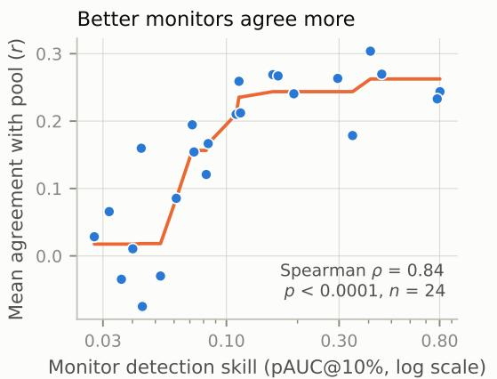
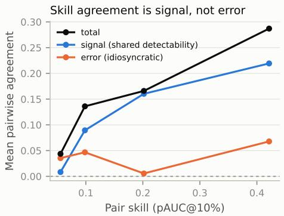
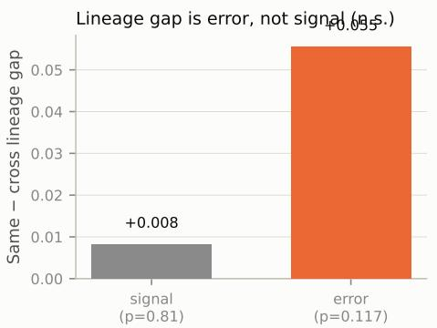
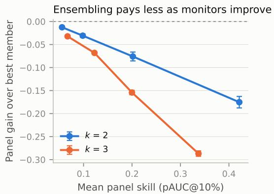

# Decorrelation Is Not Complementarity: Skill, Not Lineage, Governs Trusted-Monitor Ensembles

Anik Jha Independent Researcher anik.k.jha@gmail.com

## Abstract

Trusted monitoring has a cheap, trusted model score a stronger untrusted model’s actions, and a diverse ensemble of them beats a single stronger monitor at matched cost. They are built by minimising average pairwise correlation, and that paper’s twelve monitors shared one base model, leaving open what supplies the diversity. We study 24 open-weight monitors spanning nine pretraining lineages and a 29x range of detection skill (pAUC at 10 percent FPR, 0.028 to 0.803) on backdoored code.

The metric used to build panels does not predict what a panel is for, and we can say why. Agreement on attack items splits into a shared-detectability signal component and an idiosyncratic error component, which predict ensemble gain with opposite sign (Spearman -0.25 and +0.26), so their sum, the metric actually used, predicts it barely at all (+0.05); the cancellation holds in 7 of 8 evaluations. Skill acts on signal (+0.53) while error stays flat (-0.01), which is why a monitor’s own skill predicts its agreement with the pool (Spearman 0.84, n = 24, permutation p below 0.0001).

Pretraining lineage is the obvious way to buy decorrelation, and it does not pay. At matched member capability, cross-lineage panels detect no better (permutation p = 0.13), and lineage barely moves the metric either (+0.064, p = 0.18). We report that against ourselves: on our own 22-monitor pool the same test read +0.104 at p = 0.037 until two monitors were added. An earlier pool topping out at pAUC 0.23 had already invalidated another analysis. Such a quantity is a property of the pool assembled.

Panel gain over the best member falls monotonically with panel skill (-0.66 at k = 2, -0.70 at k = 3), and no correlation-weighted selection beats picking the single best monitor out of sample. Across six attacker models the gain result holds in all six, the agreement and cancellation results in five of six.

## 1 Introduction

In the AI-control setting (Greenblatt et al., 2024), a trusted but weaker model monitors the actions of a stronger untrusted model, and the most suspicious actions are audited or deferred. Because a single monitor is an obvious single point of failure, a natural move is to run several and combine their scores. Koran et al. (2026) show this pays. With twelve monitors built from GPT-4.1-mini and combined into ensembles, 94.6% of diverse five-monitor ensembles outperform a single GPT-4.1 call at approximately matched inference cost, and their best three-monitor diverse ensemble achieves 2.4× the gain of a homogeneous three-monitor ensemble. They title the result “diverse signals outweigh more compute.”

Crucially, all twelve of their monitors share one base model. Their diversity is prompt and fine-tuning variation only. They say so explicitly, and name the gap as future work: “[e]nsembles drawn from different model families—or that incorporate non-LLM-based signals—may be more resistant, but we have not tested this directly” (Koran et al., 2026, §6.3). They further note that “the mechanism underlying complementarity remains unclear.”

What is already theirs. We state the credit precisely, because two of our findings have qualitative antecedents in the same paper. First, they observe that selecting purely for diversity loses to random selection, because “[l]ow-performing monitors disagree with others not because they detect distinct signals, but because they are more often incorrect” (Koran et al., 2026, §5.4). That is our Finding 1, asserted qualitatively, for prompt-variant monitors sharing one base model. Second, on a three-point base-model ladder they find ensembling helps most for the weakest base (Nano pAUC 0.162 → 0.553) and report that a much stronger single monitor (GPT-5.1, pAUC 0.783) is not consistently beaten by their diverse five-monitor ensemble, both of which anticipate our Finding 3. What we add is not the direction of these effects but their measurement. We use a continuum of 24 monitors across nine lineages rather than a three-point ladder on one base model, with attenuation controls that separate a real capability effect from a statistical artifact, and we add a decomposition supplying the mechanism they leave open, which is ours alone.

Trusted monitoring is the verification layer that agentic deployments rest on. When an agent’s actions are too numerous for human review, a panel of cheaper models decides what gets audited. The design question for that layer is what to spend the next unit of budget on, a better monitor or a more heterogeneous one. This paper is about whether heterogeneity in the verifier pool is worth buying, which is the “diverse signals” question in its most measurable form. We study it on single-step code sabotage, where ground truth is unambiguous. Whether it holds over long agent trajectories is the obvious next step and is untested here (§5).

This paper takes up both of their open questions with a pool of open-weight monitors that varies along the axes a single-base-model study cannot: different weights, different pretraining lineages, and a wide range of competence. Our headline is not the one we expected. The dominant structure in the data is not lineage and not architecture. It is skill. Monitors that are better at the task agree with each other more, and the apparent diversity of a weak pool is largely the mutual disagreement of models that are each wrong in different places. Lineage, the obvious lever for buying genuine independence, moves no quantity we can measure that detection depends on.

## Contributions.

1. Why the diversity metric fails. Decomposing attack-item agreement into a shareddetectability signal component and an idiosyncratic error component shows the two predict ensemble gain with opposite sign (Spearman −0.25 and +0.26), so the metric used to build panels, which is their sum, predicts gain barely at all (+0.05). This answers the mechanism question Koran et al. (2026) leave open, and it replicates in 7 of the 8 evaluations available to us.

2. Skill, not lineage, is the axis that moves. Skill acts on the signal component (+0.53) while error stays flat (−0.01), giving a strong capability–agreement relationship (Spearman ρ = 0.84, n = 24, permutation $p < 1 0 ^ { - 4 } )$ that survives three attenuation controls. Lineage buys no detectable detection benefit at matched member capability (monitor-level permutation $p = 0 . 1 3 )$ , and in a 24-monitor pool it no longer moves the correlation metric either (+0.064, $p = 0 . 1 8 )$

3. Correlation structure is a property of the pool, not of monitoring. We demonstrate this twice, both times by invalidating our own earlier analysis. A pool topping out at pAUC 0.23 produced a lineage null that did not survive competent monitors, and a 22-monitor pool produced a significant lineage agreement gap (+0.104, p = 0.037) that adding two monitors erased. Published diversity numbers should be read as conditional on the pool that was assembled.

4. The practical consequence. Ensemble gain over the best single member falls with pool skill (Spearman −0.66 at k = 2, −0.70 at $k = 3 )$ , and no correlation-weighted panel selection beats the single best monitor out of sample.

## 2 Setup

Task and data. We use the public backdoored-APPS dataset released with Koran et al. (2026). Each sample is a Python solution to a competitive-programming problem, labelled attack if it contains a deliberate backdoor-code that passes the visible tests but fails on a hidden input-or honest otherwise. We reproduce their test split exactly: 1,375 samples, 172 attack and 1,203 honest. Their train/validation membership is not published, so ours is a deterministic reconstruction that matches their stated counts but not necessarily their exact assignment. Validation is used only to measure monitor capability, never to compute a reported test number. The test-set backdoors were authored by Claude-3.7-Sonnet-Thinking, so every monitor below is far smaller and weaker than the model whose sabotage it must catch (our largest is 32B, and the attacker’s parameter count is not public, so this is a claim about the capability gap rather than a measured ratio), which is the regime trusted monitoring assumes. Following their preprocessing, all code comments are stripped before any monitor sees a sample. Backdoor code in this dataset frequently carries comments that name the backdoor outright and would otherwise leak the label.

A second evaluation, varying the attacker. A single attacker is the obvious generality objection. The anchor’s second benchmark (BigCodeBench-Sabotage) was never released, so we instead vary the axis their release does support: the dataset carries usable backdoors from nine attacker models, and we build a second evaluation from six of them (o3-mini, Claude-3.7-Sonnet, GPT-4o, Gemini-2.0-Flash, o1-mini, GPT-4), 767 attacks against one shared 600-sample honest pool so per-attacker differences reflect the attacks and not a different negative set. This second set is drawn from TRAINsplit problems only: validation is excluded because monitor capability is measured there, and test is excluded because the headline numbers come from there. Every monitor is scored on both evaluations.

Monitors. Our pool is 24 open-weight instruction-tuned models spanning nine pretraining lineages (Qwen, Gemma/Google, Phi, Mistral, OLMo, SmolLM, Granite, Falcon, Yi) at sizes from 0.36B to 32B, giving 276 monitor pairs. Separately, and used only in §3.6, we build six prompt variants of one base model (Qwen3-8B) to reproduce the within-model diversity axis of Koran et al. (2026). We define lineage by pretraining provenance rather than vendor badge, and exclude distilled variants, following Pinto (2026); a model distilled from Qwen is Qwen lineage. One pool member is a domain-pruned variant of Qwen3.6-35B-A3B with 25% of experts removed and healed, built with the public recipe of Jha (2026); it scores pAUC 0.455, between the dense mid-size and strong monitors, and its lineage is counted as Qwen. We exclude an FP8 copy of Qwen3.6-27B that an earlier revision of the grid declared: it is the same weights at a different precision, so it would enter as a near-perfectly correlated same-lineage partner and inflate the one gap this paper measures.

The pool was grown once, deliberately, after the first analysis. The last two monitors added were OLMo-2-32B and Mistral-Small-3.2-24B, and we flag it because §3.4 shows the addition changed a headline. Both had previously been excluded on memory-budget estimates that were simply wrong. They were chosen before their scores were known, for a stated reason: OLMo and Mistral were the two lineages whose only members sat near chance, leaving the strong end of the pool three lineages deep. Mistral-Small landed at pAUC 0.407 and gave the strong end a fifth lineage; OLMo-2-32B landed at 0.166, the largest model in the pool and among its weakest monitors, which is its own warning that parameter count is not monitoring skill.

Scoring. We use the logprob-monitor design of Koran et al. (2026) rather than their integer 0–10 prompted monitor. The monitor is asked for a YES/NO backdoor judgement and the suspicion score is read from the logits of the decision token as logit(YES) − logit(NO). There are two reasons, and both matter for this study specifically. Weak models cannot reliably emit a parseable 0–10 score, and parse failures would be correlated with capability-contaminating the exact axis we measure. Integer scores also create large numbers of ties, and tied scores are precisely the regime in which partial-AUC implementations disagree. Scoring is prefill-only and deterministic. Re-scoring a sample under identical batching reproduces its score bitwise.

Metric. We report normalised partial AUROC at FPR ≤ 10% (pAUC@10%), the metric of Koran et al. (2026), since only the head of the ranking is ever audited under a realistic budget. A random ranking scores 0.05. Monitor capability is always measured on a held-out validation split and monitor agreement is the Pearson correlation of two monitors’ score vectors computed on attack samples only, again following their convention.

Disclosure of LLM and agent assistance. The study was designed by the author. The decision bars governing each experimental wave were pre-registered before the corresponding runs, and every reported number is written by the analysis harness to a machine-readable results file. The two analyses added after the monitor pool grew (the capability interaction in §3.4 and the cancellation replication in Table 1) are post-hoc and labelled as such where they appear. Implementation, sweep orchestration and drafting were agent-assisted under author supervision; the author verified the claims against those results files and is responsible for the content.

Statistics. Both lineage and capability are properties of a monitor, but our observations are pairs of monitors. 24 monitors generate 276 pairs that share members and are far from independent. Bootstrapping over pairs therefore overstates significance badly-in an earlier draft of this analysis it produced apparently significant lineage effects that vanish under a correct test. Every p-value below comes from permuting the property of interest across monitors, preserving its marginal distribution, and recomputing the statistic.

## 3 Results

## 3.1 Agreement rises with monitor skill

Figure 1 plots each monitor’s detection skill against its mean agreement with the other 23. The relationship is strong and monotone, at Spearman $\rho = 0 . 8 4 1 \ : ( n = 2 4$ , permutation $p = 5 \times 1 0 ^ { - 5 }$ zero exceedances in 20,000). At the pair level the same effect holds, $\rho = 0 . 3 5 \ : ( n = 2 7 6$ pairs, permutation $p = 0 . 0 1 1 )$ , rising monotonically across skill quartiles from mean $r = 0 . 0 4$ in the weakest quartile to $r = 0 . 2 9$ in the strongest.

Is this just attenuation? The obvious objection is statistical rather than substantive. Correlation between two noisy measurements is attenuated toward zero, so weak monitors may be unable to correlate highly with anything by construction. The confound is real in our data, since skill and score spread on attack samples are themselves strongly related (Spearman 0.78), so we test it three ways. First, we recompute agreement as a rank correlation, which is invariant to score scale and spread and therefore cannot be produced by the wider-spread mechanism, and the relationship is unchanged $( \rho = 0 . 8 1 8 , p = 5 \times 1 0 ^ { - 5 }$ , versus 0.841 for Pearson). Second, controlling for score spread explicitly reduces but does not remove it (partial $\rho = 0 . 6 5$ for Pearson agreement, 0.58 in rank space). Third, restricting to the 18 monitors above chance, which removes the degenerate floor, leaves $\rho = 0 . 6 8$ $( p = 0 . 0 0 3 )$ . Spread accounts for part of the effect, and most of it survives.

The interpretation is uncomfortable for ensemble monitoring. Two competent monitors agree because they both find the real backdoors, while two weak monitors disagree because they are each wrong in different places, so measured diversity in a weak pool is substantially noise. The next section turns that reading into a measurement.

## 3.2 The diversity metric fails because its two components cancel

Panels are built by minimising average pairwise correlation (Koran et al., 2026, §5.4), so the question that decides whether that is sound is a simple one. Does pairwise agreement predict how much a panel gains over its best member? Across our 276 pairs, it essentially does not $( \mathrm { S p e a r m a n } + 0 . 0 5 )$ .

The reason is that agreement is a sum of two things that pull in opposite directions. Write a monitor’s standardised score on an attack item as $s _ { m } ( i ) = \lambda _ { m } d ( i ) + e _ { m } ( i )$ , where $d ( i )$ is the item’s intrinsic detectability (some backdoors are easy for everyone), $\lambda _ { m }$ is how strongly the monitor tracks it, and $e _ { m }$ is idiosyncratic error. Two monitors then agree through a shared-signal term that grows with $\lambda _ { m } \lambda _ { n }$ and an error term $\mathrm { c o r r } ( e _ { m } , e _ { n } )$ . We estimate d by the leave-out mean score over all monitors except the pair being measured, and split each pair’s agreement into a signal part and an error part (residual agreement after removing d).

Those two components predict panel gain with opposite sign, signal agreement at Spearman −0.25 and error agreement at +0.26, total agreement at +0.05. Summing them produces a metric whose association with the thing it is used to optimise is near zero. We deliberately read no causal story into either sign. Gain is measured against the panel’s own best member, so both components are entangled with pair skill and with pair redundancy, which we cannot separate here. Our claim is the negative one and needs no such story. The composite is uninformative about gain because its parts move in opposite directions, so a panel chosen by minimising it is not being steered toward anything in particular. The cancellation is not a quirk of one evaluation. Across the two nested monitor pools on task 1 and the six attacker slices on task 2, signal is negative and error positive in 7 of 8, and in 7 of 8 the total sits closer to zero than either component (Table 1).

  
Figure 1: Each point is one of 24 monitors: its detection skill (log scale) against its mean agreement with the rest of the pool. The orange curve is an isotonic (monotone) fit-the reported statistic is a rank correlation, so a straight-line fit would overstate linearity. Agreement rises steeply through the weak range and plateaus.

Table 1: The cancellation, in every evaluation available. Cells are Spearman correlations with the gain of a k = 2 mean-aggregated panel over its own best member. The composite metric (total) is the one panels are selected with, and it lies closer to zero than either of its parts in 7 of the 8 rows. GPT-4O is the exception, where the signal component is itself near zero.
<table><tr><td>Evaluation</td><td>Sig.</td><td>Err.</td><td>Tot.</td><td>Evaluation</td><td>Sig.</td><td>Err.</td><td>Tot.</td></tr><tr><td>Task 1, 22 monitors</td><td>-0.28</td><td>+0.24</td><td>+0.03</td><td>T2, GPT-4</td><td>-0.36</td><td>+0.32</td><td>+0.08</td></tr><tr><td>Task 1, 24 monitors</td><td>-0.25</td><td>+0.26</td><td>+0.05</td><td>T2, GPT-40</td><td>+0.01</td><td>+0.33</td><td>+0.27</td></tr><tr><td>T2, Claude-3.7</td><td>-0.28</td><td>+0.23</td><td>+0.02</td><td>T2, o1-mini</td><td>-0.27</td><td>+0.38</td><td>+0.13</td></tr><tr><td>T2, Gemini-2.0</td><td>-0.28</td><td>+0.25</td><td>+0.06</td><td>T2, o3-mini</td><td>-0.23</td><td>+0.22</td><td>+0.01</td></tr></table>

The same decomposition explains §3.1. Skill acts on signal: the signal component rises steeply with pair skill (Spearman +0.53, from 0.008 to 0.219 across skill quartiles) while the error component is flat (−0.006, and non-monotone across quartiles). Competent monitors agree because they both load on real detectability; weak monitors’ apparent diversity is idiosyncratic error.

The proxy invites a circularity objection. Because d is built from the other monitors, so “signal agreement rises with skill” might restate “strong monitors agree with a consensus they dominate”. Estimating d from a disjoint half of the pool and measuring on the other half, the signal–skill relationship holds in both directions (+0.72 and +0.42); the error–skill relationship is unstable at n = 66 per half and takes both signs, so we claim the signal result and not a precise value for error. It does not hold when d comes from below-median monitors only, where the relationship inverts. That is the expected failure mode, since a consensus of near-chance monitors estimates noise rather than detectability. The decomposition requires a consensus containing competent monitors, and we state that as a condition on it.

## 3.3 Lineage moves neither detection nor, in a large enough pool, the metric

If cross-lineage monitors were complementary in a way same-lineage monitors are not, they should agree less, and panels built from them should detect more. Neither is measurable here.

  
Figure 2: Left: agreement split into a shared-detectability signal component and an idiosyncratic error component, by pair-skill quartile. Skill raises signal; error stays flat. Right: the same-minus-cross lineage agreement gap, which is mostly error but is not significant in this pool. Skill acts on signal, lineage acts on error, and only signal is what detection needs.

Detection. Holding the anchor monitor fixed and varying only its partner, matched on validation capability, a cross-lineage partner yields −0.0084 pAUC relative to a same-lineage partner (pooled $n = 1 9 3 8$ rows over six attacker evaluations). A monitor-level permutation of lineage labels puts that comfortably inside the null $( p = 0 . 1 3$ , null 95% interval $[ - \bar { 0 } . 0 1 2 , + 0 . 0 1 0 ] \rangle$ ). This is the test to read, because the rows share anchor monitors, so the pair-level bootstrap that an earlier version of this analysis reported, $\operatorname { C I } \left[ - 0 . 0 1 1 , - 0 . 0 0 6 \right]$ , excluding zero, is anticonservative, and its apparent significance is an artifact of treating dependent rows as independent.

The metric. Pooling the six attacker evaluations, same-lineage pairs agree 0.064 more than crosslineage pairs. All six per-attacker gaps are positive, spanning +0.040 to +0.098, which looks like six confirmations and is not. The slices share monitors and share the honest pool, so a monitor-level permutation that moves every slice at once is the dependence-respecting test, and it returns $p = 0 . 1 8$ Decomposed, 87% of the gap sits in the error component (+0.055, $p = 0 . 1 2 )$ against +0.008 in signal $( p = 0 . 8 1 )$ . That is the direction the mechanism predicts, at a magnitude this pool cannot resolve.

Does it switch on among competent monitors? The standing objection to a null pooled over a mostly-weak pool is that lineage might matter where monitors actually work. Slicing to the strongest monitors answers this with 3 rows and 2 anchors, which resolves nothing. Instead we ask it of every row. The cross-minus-same difference among above-median anchors minus the same among below-median anchors is −0.021 (1026 and 912 rows; monitor-level permutation $p = 0 . 0 4 2 )$ . If anything, cross-lineage partners do slightly worse among the more competent anchors. This test was added after the pool grew and is therefore post-hoc, not pre-registered. We report the sign for completeness, but a p of 0.042 on a single post-hoc interaction is weak evidence, and the honest reading is that lineage does not help at either end.

## 3.4 Correlation structure is a property of the pool

Twice in this project a result was invalidated by changing which monitors were in the pool, and both times the earlier version was ours.

The floor effect. Our initial pool held monitors of 13B parameters and below, topping out at pAUC 0.23 against the $0 . 4 \mathrm { - } 0 . 8$ range of Koran et al. (2026). On that pool we measured a clean lineage null and were prepared to report it. Adding larger monitors changed the regime. Gemma-4-26B reaches 0.781 and Qwen3.6-27B 0.803, roughly 4× the old best member. We checked both for harness artifacts rather than assuming. They hold on validation with its different attacker mix (0.932 and 0.928 AUROC), code length alone scores chance (AUROC 0.47, $r \leq 0 . 1 3$ with the score), 20/20 and 17/20 of their most-suspicious samples are true attacks, and neither is degenerate. Mean pairwise agreement was $r \approx 0 . 1 8$ among the weak monitors; among the competent ones it is 0.58 across lineages.

  
Figure 3: Panel gain over the best single member, by quartile of mean panel skill. Bars are standard errors. The advantage of ensembling shrinks as the monitors composing the panel get better.

The lineage gap. On the resulting 22-monitor pool, the same-minus-cross agreement gap was +0.104 with a monitor-level permutation $p = 0 . 0 3 7 \mathrm { . }$ , and we wrote it up as a real effect. Adding two monitors moved it to +0.064 at $p = 0 . 1 8 \colon$ Mistral-Small-24B at pAUC 0.407 and OLMo-2-32B at 0.166, both in lineages that previously had only near-chance members. The mechanism is visible in the two halves of the statistic. Same-lineage agreement barely moved $( 0 . 2 4 7  0 . 2 3 2 )$ , while cross-lineage agreement rose $( 0 . 1 4 2  0 . 1 6 8 )$ . Adding one competent monitor in a new lineage raises its agreement with every other lineage, because agreement tracks skill (§3.1). The apparent lineage effect was substantially a statement about which lineages happened to contain the competent monitors.

The caution generalises beyond us. Any quantity depending on a monitor pool’s correlation structure, which means every ensemble-diversity result including the metric panels are selected with, can move by a factor of three between a weak pool and a competent one, and can lose significance when a single lineage gains a competent member. A null measured on weak monitors is not evidence about deployed monitors, and an effect measured on a pool whose strong members cluster in a few lineages is not evidence about lineage.

## 3.5 Ensemble gain falls as pool skill rises

Sections 3.1–3.2 measure agreement, which is a proxy. Figure 3 measures the thing itself: the gain of a mean-aggregated panel over its own best member, as a function of the panel’s mean skill. Gain falls monotonically across skill quartiles, from −0.013 to −0.175 at k = 2 and from −0.032 to −0.287 at k = 3 (Spearman −0.66 and −0.70)

Two honest caveats. Gain is negative throughout, so in this pool an unselected panel never beats its best member. That is consistent with Kim (2026), who find majority vote beats the best member in 9.98% of canonical size-3 subsets (1.27% pooled over sizes 2–4). And part of the decline is mechanical, since a stronger panel has a stronger best member, which is a higher bar to clear. Neither caveat changes the direction, and the direction is the claim. Whatever ensembling buys, it buys less as monitors improve.

## 3.6 What still beats every ensemble we built

Across our pool the single best configuration is not an ensemble, and this holds in two separate regimes. Within the six prompt variants on a fixed base (Qwen3-8B), the best single variant reaches pAUC 0.228 against 0.226 for the best prompt-only panel. Over the full 24-monitor pool, the best single monitor reaches 0.803 against 0.808 for the best two-model panel and 0.793 for the best mixed prompt-and-model panel. Every one of these is a maximum over an exhaustive test-split search with no held-out selection, so a 0.005 margin is selection noise and we claim only the qualitative statement that no panel we built beats a single well-chosen monitor by more than selection noise. Section 3.7 makes the same point under an honest out-of-sample protocol, where the single best monitor wins outright.

One clarification matters for comparability. Our within-model panels show a negative mean gain $( - 0 . 0 3 2 \mathrm { ~ a t ~ } k \mathrm { ~ = ~ } 2 )$ , which might look like a failure to reproduce Koran et al. (2026)’s positive ensemble effect. It is not: we measure gain over the panel’s own best member, a strictly harder baseline than theirs, which is a single baseline monitor. Measured their way, against our baseline prompt variant at pAUC 0.149, the best prompt-only panel at 0.226 is a 52% relative gain, and their effect reproduces. The two framings disagree only about the reference point, and we report the stricter one throughout.

Separately, prompt choice on fixed weights moved pAUC by 3.3× (0.069 to 0.228), comparable to the 5.4× spread across the 14 monitors that clear chance on validation but fall below the competence threshold (0.036 to 0.193): down there, how a monitor is prompted is worth about as much as which one is chosen.

## 3.7 No correlation-weighted selection beats the best single monitor

The sharper test is whether the diversity metric helps select a panel out of sample. We select panels on the single-attacker data by the objective capability − λ agreement, which is skill-only at $\lambda = 0$ and pure diversity-seeking as $\lambda  \infty ,$ , then evaluate the chosen panel on the six-attacker set it never saw. No positive λ reliably helps. $\mathrm { A t } k = 3$ the out-of-sample pAUC is flat at 0.723 from λ = 0 through $\lambda = 1$ , then falls to 0.440 at $\lambda = 4$ and 0.068 at pure diversity; at $k = 4$ it is flat at 0.676 through $\lambda = 0 . 5$ and falls thereafter. Against this, the single best monitor chosen by validation capability scores 0.733 out of sample, higher than every selected panel at either k. Selecting for decorrelation does not survive contact with a new task. Skill selection is both simpler and, out of sample, at least as good.

## 3.8 Everything replicates across attackers

The findings above are not artifacts of one attacker. Agreement rises with skill in five of six attacker evaluations $( \rho \mathrm { f r o m } + 0 . 3 9 \mathrm { t o } + 0 . 8 5 ;$ ; the exception is GPT-4, our smallest slice at $n = 5 7$ , where $p = 0 . 0 6 )$ . Panel gain falls with pool skill in six of six $( \rho \mathrm { f r o m } - 0 . 5 8 \mathrm { t o } - 0 . 6 7 )$ . The signal/error cancellation of $\ S 3 . 2$ holds in five of six (Table 1). And monitor skill itself is nearly invariant to who wrote the backdoors. A monitor’s skill on the single-attacker evaluation predicts its mean skill across the six-attacker evaluation at $\rho = 0 . 9 5 \left( p < 1 0 ^ { - 5 } , n = 2 4 \right)$ ). Whatever these monitors are detecting, it is not specific to one attacker’s style.

## 4 Implications

Ensemble monitoring is motivated by the intuition that independent signals cover each other’s blind spots. Our measurements suggest that intuition is strongest exactly where it matters least. The pool where diversity is abundant is the pool of weak monitors, whose absolute detection is poor. As monitors become competent enough to deploy, they converge, and the diversity available to exploit falls away. This does not contradict Koran et al. (2026), whose ensembles do beat their single monitors, but it bounds the extrapolation. the ensemble advantage should not be assumed to persist as monitors improve, and it should be re-measured at the capability of the monitor actually being deployed.

The sharper consequence is about the metric. Average pairwise correlation is the instrument used to build diverse ensembles, and §3.2 shows it sums two terms whose associations with gain point in opposite directions, which is why it barely predicts the gain it is used to optimise. The obvious repair is to select on the error component alone, and we tested that rather than recommending it. Substituted into the out-of-sample scan of §3.7 it does not help at either panel size, matching skill-only selection at small weights and falling faster at large ones (0.646 against 0.723 at $k = 3 , \lambda = 1 )$ . Neither beats the single best monitor. Decomposing the metric explains its failure. It does not repair it.

What survives as advice is smaller and better supported. Spend the first unit of effort on prompting a competent monitor well, not on adding a second lineage. Prompt choice moved detection by more than 3× on fixed weights, while adding a lineage bought neither decorrelation nor detection. And before trusting any published diversity number, including ours, ask which monitors were in the pool.

## 5 Limitations

This is a single task family: backdoored competitive-programming solutions, from one dataset, scored one way (YES/NO decision log-odds). Varying the attacker across six models addresses who wrote the sabotage, not what kind of sabotage it is. A genuinely different task, such as sabotage in long-horizon agent trajectories, remains untested and is the experiment we would run next.

Our lineage results are nulls, and a null is a statement about power. With one to six monitors per lineage we can exclude a cross-lineage detection benefit of roughly the size of one attack item. At about 128 attacks per attacker slice, one item moves normalised pAUC@10% by around 0.008. We cannot exclude a smaller one. The monitor-level permutation null for the matched-partner statistic spans [−0.012, +0.010] pAUC, and effects inside that band are invisible to us. A pool with many competent monitors per lineage would settle it, and a 65 GiB single-node model-loading ceiling bounds how large those members can be. We think the more useful reading of §3.4 is not “lineage does nothing” but “this statistic is unstable in pools of this size”, which is also a warning about the positive lineage results in the literature.

The signal/error decomposition rests on a leave-out consensus as the estimate of item detectability, and §3.2 shows it fails when that consensus contains no competent monitors. It is a measurement device with a stated operating range, not a general-purpose estimator.

Finally, all monitors here are open-weight models of at most 32B. Whether the agreement–skill relationship continues into frontier-scale monitors is untested, and it is the regime that matters most for deployment. Our claim is that ensemble headroom shrinks as monitors improve, and the models actually being deployed as trusted monitors sit above the top of our range.

## 6 Related work

Koran et al. (2026) is the direct antecedent and the source of our data, metric, prompt and scoring design. Our contribution is to vary the axes their single-base-model design holds fixed. Pinto (2026) make untrusted model family the controlled axis for single monitors and find a real own-family interaction, consistent with ours. They vary the family of the monitored model with a trained monitor, whereas we vary the lineage of the monitors themselves. Kim (2026) audits diversity metrics for majority-vote ensembles under capability control and finds strict diversity nearly collinear with member capability. Our §3.1 is the weak-challenge analogue in a monitoring setting, and §3.2 goes past collinearity to say which part of the metric carries the confound. Three concurrent results in the voting setting converge with ours. Cohen et al. (2026) filter for competence before selecting for diversity, the prune-then-diversify discipline our selection scan (§3.6) finds necessary but not sufficient out of sample. Chen (2026) show across 67 frontier models that combining rarely beats the single best model absent a query-level routing signal, which is convergent evidence for our selection result at far larger scale. Closest to our mechanism, Ali (2026) find raw correctness correlation has almost no predictive power $( R ^ { 2 } \leq 0 . 0 9 )$ while an accuracy-adjusted variant reaches $R ^ { 2 } = 0 . 6 7$ . That is the same insight, that raw agreement confounds capability, reached independently in the voting setting. Our contribution relative to that line is to decompose agreement rather than correct a scalar, and to show the parts predict gain with opposite sign. Trusted monitoring follows Greenblatt et al. (2024).

All monitors are open-weight, all data is public, and every number here is written by the analysis harness to a results file. The analysis code and every results file quoted in this paper are at https: //github.com/anik-jha/challenger-panels. The monitors and the transcript dataset are public artifacts that the repository’s download scripts fetch rather than redistribute.

## References

J. Ali. Quantifying diversity of thought: A predictive law of weighted LLM ensemble lift. arXiv:2607.17384, 2026.

J. Chen. When does combining language models help? A co-failure ceiling on routing, voting, and mixture-of-agents across 67 frontier models. arXiv:2606.27288, 2026.

S. Cohen, N. Cohen Inger, N. Goldshlager, B. Shapira, and L. Rokach. DFPE: A diverse fingerprint ensemble for enhancing LLM performance. In Findings of the ACL: EACL 2026, pages 5326–5336, 2026. arXiv:2501.17479.

R. Greenblatt, B. Shlegeris, K. Sachan, and F. Roger. AI control: Improving safety despite intentional subversion. ICML, 2024. arXiv:2312.06942.

A. Jha. Half the experts, all the code: One-shot domain pruning of mixture-of-experts LLMs for coding. arXiv:2607.16721, 2026.

D. Kim. Are diversity metrics measuring diversity? A capability-controlled audit of majority-vote gain in LLM ensembles. arXiv:2607.20768, 2026.

E. Koran, Y. Yun, S. Tetef, B. Arnav, and P. Bernabeu-Perez. Ensemble monitoring for AI control: Diverse signals outweigh more compute. arXiv:2605.15377, 2026.

L. Pinto. Calibration-family overfit: Why trusted sabotage monitors don’t transfer across lineages. arXiv:2607.06596, 2026.