# DeepOHeat-v2: Self-Improving Operator Learning for Fast and Trustworthy Thermal Optimization in 3D-IC Design

Xinling Yu, Yixing Li, Ziyue Liu, Xin Ai, Zhiyu Zeng, Hai Li, and Zheng Zhang

Abstract—Thermal-aware optimization of multi-die 3D integrated circuits evaluates many designs, each a costly heatequation solve. Operator-learning surrogates replace this solve with a fast forward pass, ideally trained from physics alone, without labeled data. DeepOHeat-v1 made such surrogates fast and trustworthy, but only on low-contrast geometries. Highcontrast multi-die stacks break it in two ways: discontinuous conductivities make the continuous physics loss ill-defined at material interfaces, and ill-conditioning (κ<sub>2</sub>(A<sub>h</sub>) ≈ 6×10<sup>4</sup>) puts the discretized strong-form loss beyond first-order optimization. We propose DeepOHeat-v2 to overcome both. First, we train on a discretized physics loss that handles the discontinuities natively; its energy form reduces the prediction-space loss-Hessian conditioning from κ<sup>2</sup> to κ, and a matrix-preconditioned optimizer cuts the mean peak temperature error from over 30 K to 0.55 K. Second, because optimization leaves the training distribution, we propose a self-improving framework: a hotspot trust gate sends flagged placements to a reference solver, and the surrogate incrementally retrains on the refined solutions, keeping an update only when it improves held-out validation error. On a multi-die benchmark, the surrogate–true peak gap on the returned design falls from 1.12 K to 0.11 K, matching a solve-at-every-step optimizer while running 56× faster.

Index Terms—3D-IC thermal analysis, thermal optimization, operator learning, physics-informed learning.

## I. INTRODUCTION

performance beyond the limits of planar scaling. However, this vertical integration also concentrates power within a small volume and increases the thermal path length, making heat dissipation far harder [1]–[3]. The resulting temperature rise and on-chip thermal gradients degrade timing, reliability, and lifetime and increase leakage, so thermal analysis and thermalaware optimization have become standard steps of the 3D-IC design flow. Both reduce to the same computation: predicting the temperature profile of a candidate design, once for every design the optimizer visits. Traditional high-fidelity numerical solvers (e.g., finite element and finite difference methods) of the heat equation [4]–[6] are accurate but far too slow to call repeatedly inside such a loop; the thermal solver is the computational bottleneck, and a fast, accurate surrogate is the way around it.

Neural-network surrogates can predict temperature fields in milliseconds once trained. Early data-driven models learn this mapping from large sets of solver-generated examples [7]– [10], but their accuracy depends on how well the training set covers the design space, and generating that set is often computationally prohibitive. Operator learning [11]–[14] provides a more general formulation: a neural operator approximates the solution map from a design configuration to the corresponding temperature field, so a new design requires only a forward pass. An operator network can also be trained from physics alone, using a physics-informed loss [15] that supervises it directly from the governing heat equation and removes the need for labeled solver data [16], [17]. The DeepOHeat series [18], [19] brought this data-free, physics-informed operator-learning approach to 3D-IC thermal analysis. Its most recent version, DeepOHeat-v1, makes this practical with separable training [13] and Kolmogorov–Arnold trunks [20] for efficiency and accuracy, and a confidence-gated solver refinement for trustworthiness, but has so far been demonstrated only on mild, low-contrast geometries.

The first challenge is training itself: realistic multi-die stacks break this data-free approach on two counts. Their conductivities are discontinuous, changing abruptly both between material layers and at the walls of the copper through-silicon vias (TSVs) that pass through the dies; the continuous strongform physics-informed loss used by DeepOHeat-v1 then cannot represent the temperature field across such interfaces. PI-ONet [21] instead adds explicit interface-continuity terms to the loss and homogenizes each TSV into an equivalentconductivity block; but a realistic stack has many interfaces, so the number of interface terms grows quickly, and every added loss term needs a carefully tuned weight to train stably [22]. The conductivity contrast also makes the discretized operator ill-conditioned, and the squared strong-form residual loss inherits the square of that conditioning; first-order optimization then effectively cannot minimize it [23], [24]. Data-driven operators such as ARO [25] avoid both issues but require large labeled datasets, as does PI-ONet’s hybrid loss. No existing method is data-free and robust to both problems.

The second challenge appears once a trained surrogate is placed inside the optimization loop. The surrogate is pretrained on one distribution of randomly generated designs, but the optimizer queries it on the evolving designs it visits during the search, where the surrogate has seen little data and can be inaccurate. DeepOHeat-v1 mitigates this with a confidencegated hybrid scheme: a residual-based check accepts a prediction when it appears trustworthy and otherwise refines it with a warm-started generalized minimal residual (GMRES) solve [26], recovering solver-level accuracy at a fraction of the cost. DeepOHeat-v1’s scheme keeps each evaluation accurate, but the surrogate itself never improves: every difficult design must be re-solved, and on such a stack the confidence signal that decides when to refine becomes unreliable. The resulting refined solutions are the high-fidelity, on-distribution data the surrogate lacks, yet DeepOHeat-v1 discards them. Our self-improving framework reuses these verified solutions as training data: the surrogate improves on the designs the search visits, and the loop calls the solver progressively less.

To address these challenges, we develop DeepOHeat-v2. Its main contributions are:

1) Data-free physics-informed training for heterogeneous stacks. We train the surrogate on a discretized physics loss, which handles the discontinuous conductivities of the layers and TSVs natively, with no interface-condition terms and no TSV homogenization. Casting this loss in an energy form [27] provably reduces its prediction-space loss-Hessian condition number from $\kappa ^ { 2 }$ to $\kappa .$ Since this κ alone still stalls first-order optimization, we minimize the energy loss with a matrix-preconditioned optimizer [28] that rescales each update to counteract the residual illconditioning.

2) A self-improving operator-learning framework. We close a loop between optimization and training: when the trust gate flags a prediction during the search, the solver refines it; the surrogate trains incrementally on these verified in-trajectory solutions; and a held-out check decides which model to keep (pre-update, updated, or weight-averaged [29]). This makes the surrogate accurate where the search operates, and because it keeps improving along the trajectory, the loop calls the reference solver progressively less as the run proceeds.

3) Validation on a high-contrast 3D-IC benchmark. On a face-to-face chiplet stack with an 800× conductivity contrast, data-free training reaches a mean peak temperature error of 0.55 K, versus > 30 K for the strong-form loss; the hotspot trust gate catches 64% and 92% of the > 0.5 K and > 1 K prediction errors at a 30% flag rate, where the DeepOHeat-v1 residual criterion is no better than random; and the self-improving loop attains oracle placement quality (0.11 K surrogate–true gap) in 292 s, 56× faster than solving at every step and with about half the solver calls of the non-adaptive DeepOHeat-v1 loop.

## II. BACKGROUND AND MOTIVATION

## A. Thermal-Aware Design Optimization

Thermal-aware design optimization seeks a chip design whose hottest junction is as cool as possible. A design configuration $\mathbf { u } \in \mathcal { U }$ gathers the tunable parameters that shape a chip’s heat generation and conduction, such as block placement, perblock power, or layer materials. It induces a temperature field $T _ { \mathbf { u } } ,$ , whose peak we denote $T _ { \mathrm { p e a k } } ( \mathbf { u } )$ . The problem is

$$
\operatorname* { m i n } _ { \mathbf { u } \in \mathcal { U } } T _ { \mathrm { p e a k } } ( \mathbf { u } ) \quad \mathrm { s u b j e c t ~ t o ~ \mathbf { u } ~ f e a s i b l e } .\tag{1}
$$

Feasibility encodes the design rules of the instance, such as non-overlapping, in-bounds blocks. Problem (1) is solved by an outer-loop optimizer that proposes configurations and evaluates $T _ { \mathrm { p e a k } } ( \mathbf { u } )$ at each step. Every evaluation requires a full thermal solve, so the solver dominates the optimization cost.

Evaluating $T _ { \mathrm { p e a k } } ( \mathbf { u } )$ requires solving the heat equation on the chip domain $\Omega \subset \mathbb { R } ^ { 3 }$ . With spatial coordinate y, thermal conductivity $k ( \mathbf { y } )$ that is piecewise constant across material regions, and a configuration-dependent volumetric heat source $q _ { V } ( \mathbf { y } , \mathbf { u } )$ , the temperature field satisfies

$$
\nabla \cdot \left( k ( \mathbf { y } ) \nabla T \right) + q _ { V } ( \mathbf { y } , \mathbf { u } ) = 0 , \quad \mathbf { y } \in \Omega ,\tag{2}
$$

with Robin convection on the top and bottom surfaces and adiabatic side walls,

$$
\begin{array} { r l } { - k ( \mathbf { y } ) \partial _ { n } T = h \left( T - T _ { \mathrm { a m b } } \right) } & { \mathrm { o n ~ } \Gamma _ { \mathrm { t o p } } , \Gamma _ { \mathrm { b o t } } , } \\ { \partial _ { n } T = 0 } & { \mathrm { o n ~ } \Gamma _ { \mathrm { s i d e } } . } \end{array}\tag{3}
$$

Here $\partial _ { n }$ is the outward-normal derivative, $T _ { \mathrm { a m b } }$ the ambient temperature, and h the convection coefficient. Because k is discontinuous between material regions, Eq. (2) holds within each region and is completed by continuity of the temperature and of the normal heat flux $k \partial _ { n } T$ across their interfaces. Discretizing Eq. (2)–(3) via classical methods like finite difference or finite element yields a sparse linear system

$$
\mathbf { A } _ { h } \mathbf { T } = \mathbf { b } _ { h } .\tag{4}
$$

Each thermal evaluation in Eq. (1) is one solve of Eq. (4). On a high-resolution mesh, this per-evaluation cost is what a surrogate must replace.

## B. The DeepOHeat-v1 Framework

DeepOHeat [18] casts thermal simulation as an operatorlearning problem, and DeepOHeat-v1 [19] makes the resulting surrogate fast enough for full-chip resolution and trustworthy enough to drive an optimizer. We review the formulation, architecture, data-free training objective, and hybrid optimization loop on which DeepOHeat-v2 builds.

1) Operator Learning for Thermal Simulation: For every configuration $\mathbf { u } \in \mathcal { U }$ , the boundary-value problem $( 2 ) - ( 3 )$ has a unique temperature field $T _ { \mathbf { u } } \in S$ . The map that assigns this field to each configuration is the solution operator

$$
G : \mathcal { U } \to \mathcal { S } , \qquad G ( \mathbf { u } ) = T _ { \mathbf { u } } .\tag{5}
$$

Operator learning [11], [12] approximates G by a neural surrogate $G _ { \theta }$ with parameters θ, trained once so a new configuration’s temperature field follows from a single forward pass rather than a fresh solve of Eq. (4).

2) Separable Operator Network with ChebyKAN Trunks: The original DeepOHeat [18] represents the surrogate $G _ { \theta }$ as a DeepONet [11]. A branch network encodes a configuration u, such as its discretized power map q(u), into r coefficients $\beta _ { 1 } ( { \mathbf { u } } ) , \ldots , \beta _ { r } ( { \mathbf { u } } ) ;$ a trunk network maps a spatial coordinate y to r basis functions $\tau _ { 1 } ( \mathbf { y } ) , \dots , \tau _ { r } ( \mathbf { y } )$ ; and the predicted temperature field is their inner product,

$$
G _ { \pmb \theta } ( \mathbf { u } ) ( \mathbf { y } ) = \sum _ { j = 1 } ^ { r } \beta _ { j } ( \mathbf { u } ) \tau _ { j } ( \mathbf { y } ) .\tag{6}
$$

DeepOHeat-v1 [19] improves this architecture along two axes. For scalability, it makes the trunk separable [13], replacing the

single trunk over $\mathbf { y } = ( y _ { 1 } , y _ { 2 } , y _ { 3 } )$ with one trunk per spatial axis:

$$
G _ { \theta } ( \mathbf { u } ) ( y _ { 1 } , y _ { 2 } , y _ { 3 } ) = \sum _ { j = 1 } ^ { r } \beta _ { j } ( \mathbf { u } ) \tau _ { j } ^ { 1 } ( y _ { 1 } ) \tau _ { j } ^ { 2 } ( y _ { 2 } ) \tau _ { j } ^ { 3 } ( y _ { 3 } ) .\tag{7}
$$

A full-grid prediction then requires only $N _ { 1 } + N _ { 2 } + N _ { 3 }$ trunk evaluations and an outer product, rather than $N _ { 1 } N _ { 2 } N _ { 3 }$ pointwise evaluations; combined with forward-mode differentiation [30] of the physics loss, this reduction makes physicsinformed training feasible at full-chip resolution. For accuracy, the trunks are Chebyshev Kolmogorov–Arnold networks (ChebyKANs) [20], [31], whose learnable univariate edge functions mitigate the spectral bias of plain multilayerperceptron (MLP) trunks and resolve the steep temperature gradients near hotspots; the branch remains an MLP.

3) Data-Free Physics-Informed Training: The surrogate is trained directly from the governing equations, without using simulation data. Define the interior residual of a candidate field T for configuration u,

$$
\mathcal { R } [ T ] ( \mathbf { y } ; \mathbf { u } ) : = \nabla \cdot \big ( k ( \mathbf { y } ) \nabla T ( \mathbf { y } ) \big ) + q _ { V } ( \mathbf { y } , \mathbf { u } ) ,\tag{8}
$$

and let $\boldsymbol { B } [ \cdot ]$ denote the boundary operator collecting the conditions in Eq. (3). Given training configurations $\{ \mathbf { u } ^ { ( i ) } \} _ { i = 1 } ^ { N _ { u } } \subset \mathcal { U }$ interior collocation points $\{ \mathbf { y } _ { r } ^ { ( j ) } \} _ { j = 1 } ^ { N _ { r } } \bar { \subset } \Omega$ , and boundary points $\{ \mathbf { y } _ { b } ^ { ( j ) } \} _ { j = 1 } ^ { N _ { b } } \subset \partial \Omega$ , DeepOHeat-v1 minimizes the continuous physics-informed loss

$$
\begin{array} { r } { \mathcal { L } ( \pmb { \theta } ) = \mathcal { L } _ { \Omega } ( \pmb { \theta } ) + \lambda _ { b } \mathcal { L } _ { \Gamma } ( \pmb { \theta } ) , } \end{array}\tag{9}
$$

whose interior and boundary terms penalize the residuals of the predicted field $G _ { \pmb { \theta } } ( \mathbf { u } ^ { ( i ) } )$ at the collocation points,

$$
\begin{array} { r l } & { \mathcal { L } _ { \Omega } ( \mathbf { \boldsymbol { \theta } } ) = \displaystyle \frac { 1 } { N _ { u } N _ { r } } \sum _ { i = 1 } ^ { N _ { u } } \sum _ { j = 1 } ^ { N _ { r } } \mathcal { R } \big [ G _ { \boldsymbol { \theta } } ( \mathbf { u } ^ { ( i ) } ) \big ] \big ( \mathbf { y } _ { r } ^ { ( j ) } ; \mathbf { u } ^ { ( i ) } \big ) ^ { 2 } , } \\ & { \mathcal { L } _ { \Gamma } ( \mathbf { \boldsymbol { \theta } } ) = \displaystyle \frac { 1 } { N _ { u } N _ { b } } \sum _ { i = 1 } ^ { N _ { u } } \sum _ { j = 1 } ^ { N _ { b } } \mathcal { B } \big [ G _ { \boldsymbol { \theta } } ( \mathbf { u } ^ { ( i ) } ) \big ] \big ( \mathbf { y } _ { b } ^ { ( j ) } \big ) ^ { 2 } , } \end{array}\tag{10}
$$

where $\lambda _ { b } > 0$ balances the two terms. All derivatives act on the network output through automatic differentiation, so training never requires labeled solver data, which is why DeepOHeatv1 is data-free.

4) Hybrid Optimization for Trustworthiness: A surrogate is fast but not guaranteed accurate on every configuration an optimizer visits, so DeepOHeat-v1 pairs it with a verify-andrefine loop. Sampling the predicted field $G _ { \pmb { \theta } } ( \mathbf { u } )$ on the mesh gives a vector $\hat { \mathbf { T } } .$ , whose relative residual against the discretized system,

$$
r _ { \mathrm { r e l } } = { \frac { \| \mathbf { A } _ { h } \widehat { \mathbf { T } } - \mathbf { b } _ { h } \| _ { 2 } } { \| \mathbf { b } _ { h } \| _ { 2 } } } ,\tag{11}
$$

costs a single sparse matrix–vector product. The loop compares $r _ { \mathrm { r e l } }$ against a threshold. If the residual is small, the prediction is accepted; otherwise a refinement solves Eq. (4) by GMRES [26] warm-started from $\widehat { \mathbf { T } } \mathbf { ; }$ ; this recovers a nearsolver field in far fewer iterations than a cold solve.

## C. Challenges of High-Contrast Multi-Die Stacks

DeepOHeat-v1 was demonstrated on mild, low-contrast geometries. Real multi-die 3D-ICs are instead dominated by high material contrast: stacked dies, copper TSVs, and an organic substrate place conductivities orders of magnitude apart within a single chip, an ∼800× range on our benchmark stack (Section V-A).

At this contrast, three new challenges arise that DeepOHeatv1 cannot handle. First, the continuous physics loss (9) of DeepOHeat-v1 cannot represent the field across the discontinuous layer and TSV interfaces, where k changes abruptly and the temperature is only $C ^ { 0 }$ (continuous but not differentiable). Second, the squared residual inherits the square of the operator conditioning $\overline { { ( } } \kappa ^ { 2 } \approx 3 . 6 \times 1 0 ^ { 9 }$ on our benchmark), which puts it beyond first-order optimization. Finally, the hybrid loop discards each solver-refined field after one use, so the surrogate never improves and the same solver work is repeated every time.

In this paper, DeepOHeat-v2’s training method (Section III) fixes the first two; its self-improving framework (Section IV) addresses the third challenge.

## III. DATA-FREE PHYSICS-INFORMED TRAINING ON HETEROGENEOUS STACKS

Training the surrogate from physics alone on a heterogeneous stack faces two obstacles: the loss must represent the temperature field across discontinuous material interfaces, and it must stay optimizable despite the operator’s ill-conditioning. We address them in three steps. Discretizing by the finitevolume method (FVM) handles the interfaces by construction (Section III-A). Writing the resulting loss in energy form reduces the prediction-space loss-Hessian conditioning from $\kappa ^ { 2 }$ to $\boldsymbol { \kappa } : = \kappa _ { 2 } ( \mathbf { A } _ { h } )$ (Theorem 4). The remaining factor κ still stalls a per-coordinate optimizer, because at high contrast the stiff and compliant curvature directions couple across parameters; we remove it with a matrix-valued preconditioner that rescales them jointly (Section III-C).

## A. An FVM-Discretized Physics Loss

Why not the continuous strong form: DeepOHeat-v1 represents the field by a smooth network $T _ { \pmb { \theta } } : \Omega  \mathbb { R }$ and enforces the strong form (2) at collocation points. A discontinuous k breaks this at the level of the formulation, not the optimization. Write Γ for a material interface, $T ^ { \pm }$ and $\partial _ { n } T ^ { \pm }$ for the field and its normal derivative on either side, and $[ [ f ] ] _ { \Gamma } : = f ^ { + } - f ^ { - }$ for the abrupt change in $f$ across Γ.

Proposition 1 (The strong-form residual is singular at interfaces). Let k be piecewise constant with an abrupt change across $\Gamma ,$ , and let $T _ { \pmb { \theta } } \in C ^ { 1 } ( \Omega )$ (continuous, with continuous first derivatives). Then, in the distributional sense,

$$
\nabla \cdot \left( k \nabla T _ { \theta } \right) = k \Delta T _ { \theta } + \left( k ^ { + } - k ^ { - } \right) \partial _ { n } T _ { \theta } \delta _ { \Gamma } ,\tag{12}
$$

where $\Delta$ is the piecewise Laplacian and $\delta _ { \Gamma }$ is the surface Dirac measure on Γ. The interface term has no finite value unless $\partial _ { n } T _ { \pmb \theta } = 0 ,$ , so driving the strong-form residual to zero

forces a smooth network to carry no normal flux across every interface, incompatible with conducting heat.

Proposition 2 (The physical field has an interface kink). The physical temperature is continuous, $[ [ T ] ] _ { \Gamma } = 0 ,$ but continuity of the normal heat flux $k \partial _ { n } T$ forces an abrupt slope change,

$$
\partial _ { n } T ^ { - } = \frac { k ^ { + } } { k ^ { - } } \partial _ { n } T ^ { + } \neq \partial _ { n } T ^ { + } \qquad ( k ^ { + } \neq k ^ { - } ) .\tag{13}
$$

Hence T is $C ^ { 0 }$ (continuous) but not $C ^ { 1 }$ at Γ, and lies outside the hypothesis class of any $C ^ { 1 }$ network.

Together the propositions show that the problem lies in the model class, not the optimization: a smooth network cannot both carry heat across an interface and drive the strongform residual to zero because the field it must fit is itself non-smooth. Domain-decomposition physics-informed neural networks (PINNs) [32] and discontinuity-capturing architectures [33] recover such fields, but need the interface geometry known in advance; a multi-die stack carries thousands of TSV interfaces whose layout changes with every pattern, so neither scales.

The discretized loss: We instead let the discretization carry the interface physics. Integrating Eq. (2) over each control volume with harmonic-mean face conductivities [34] gives the symmetric positive-definite (SPD) system $\mathbf { A } _ { h } \mathbf { T } \ = \ \mathbf { b } _ { h }$ of (4); the harmonic mean enforces flux continuity at every face, so the discontinuities of Propositions 1–2 are handled by construction. We train on the data-free squared residual of this system,

$$
\begin{array} { r } { \mathcal { L } _ { \mathrm { s t r o n g } } ( \pmb { \theta } ) = \| \mathbf { A } _ { h } \widehat { \mathbf { T } } - \mathbf { b } _ { h } \| _ { 2 } ^ { 2 } , } \end{array}\tag{14}
$$

assembled from the coefficients of ${ \bf A } _ { h }$ and $\mathbf { b } _ { h }$ with no solved field. Its gradient is a fixed stencil applied through $\mathbf { A } _ { h }$ , avoiding the second-order automatic differentiation a continuous loss would need at every collocation point on the $N \approx 2 { \times } 1 0 ^ { 6 } .$ cell grid. Discretized residuals also appear in [35], [36], there for smooth geometries.

Conditioning of the discretized loss: That settles the representation problem, but $\mathbf { A } _ { h }$ is ill-conditioned: $\kappa _ { 2 } ( \mathbf { A } _ { h } )$ grows with the conductivity ratio ${ { k } _ { \operatorname* { m a x } } } / { { k } _ { \operatorname* { m i n } } }$ independently of the scheme (Appendix A), reaching $\kappa _ { 2 } ( \mathbf { A } _ { h } ) \approx 6 . 0 2 \times 1 0 ^ { 4 }$ on our benchmark (Section $\mathrm { V } { \mathrm { - } } \mathrm { A } )$ . The squared residual (14) then squares it: its Hessian $2 \mathbf { A } _ { h } ^ { 2 }$ has condition number $\kappa _ { 2 } ( { \bf A } _ { h } ) ^ { 2 }$ ≈ $3 . 6 \times 1 0 ^ { 9 }$ , putting the loss beyond first-order optimization (Table IV).

## B. A Reformulation with the Energy Form

To remove the squaring, we replace the squared residual (14) with the energy form of the same linear system.

Definition 3 (Energy-form discrete loss). For a predicted vector $\widehat { \mathbf { T } } \in \mathbb { R } ^ { N }$ , the FVM energy-form loss is

$$
\begin{array} { r } { \mathcal { L } _ { \mathrm { e n e r g y } } ( \pmb { \theta } ) : = \frac { 1 } { 2 } \widehat { \mathbf { T } } ^ { \top } \mathbf { A } _ { h } \widehat { \mathbf { T } } - \mathbf { b } _ { h } ^ { \top } \widehat { \mathbf { T } } . } \end{array}\tag{15}
$$

Theorem 4 (Energy form reduces the conditioning from $\kappa ^ { 2 }$ to κ). The strong-form loss (14) and the energy-form loss (15)

share the unique minimizer $\mathbf { T } ^ { * } = \mathbf { A } _ { h } ^ { - 1 } \mathbf { b } _ { h } ,$ , but as functions of the prediction Tb their Hessians have different conditioning,

$$
\kappa ( \nabla _ { \widehat { \mathbf { T } } } ^ { 2 } \mathcal { L } _ { \mathrm { s t r o n g } } ) = \kappa _ { 2 } ( \mathbf { A } _ { h } ) ^ { 2 } , \qquad \kappa ( \nabla _ { \widehat { \mathbf { T } } } ^ { 2 } \mathcal { L } _ { \mathrm { e n e r g y } } ) = \kappa _ { 2 } ( \mathbf { A } _ { h } ) .\tag{16}
$$

Proof. Both losses are quadratic in the prediction; write $\mathbf { e } : =$ $\widehat { \mathbf { T } } - \mathbf { T } ^ { * }$ with $\mathbf { T } ^ { * } = \mathbf { A } _ { h } ^ { - \mathrm { 1 } } \mathbf { b } _ { h }$ . Then

$$
\begin{array} { r } { \mathcal { L } _ { \mathrm { s t r o n g } } ( \widehat { \mathbf { T } } ) = \| \mathbf { A } _ { h } \mathbf { e } \| _ { 2 } ^ { 2 } = \mathbf { e } ^ { \top } \mathbf { A } _ { h } ^ { 2 } \mathbf { e } , \quad \nabla _ { \widehat { \mathbf { T } } } ^ { 2 } \mathcal { L } _ { \mathrm { s t r o n g } } = 2 \mathbf { A } _ { h } ^ { 2 } , } \end{array}\tag{17}
$$

$$
\begin{array} { r } { \mathcal { L } _ { \mathrm { e n e r g y } } ( \widehat { \mathbf { T } } ) = \frac { 1 } { 2 } \mathbf { e } ^ { \top } \mathbf { A } _ { h } \mathbf { e } + \mathrm { c o n s t } , ~ \nabla _ { \widehat { \mathbf { T } } } ^ { 2 } \mathcal { L } _ { \mathrm { e n e r g y } } = \mathbf { A } _ { h } . } \end{array}\tag{18}
$$

Because ${ \bf A } _ { h }$ is SPD, both Hessians are SPD, so $\mathbf { T } ^ { * }$ is the unique minimizer of each loss. Their condition numbers are $\kappa _ { 2 } ( \mathbf { \bar { A } } _ { h } ^ { 2 } ) = \kappa _ { 2 } ( \mathbf { A } _ { h } ) ^ { 2 }$ and $\kappa _ { 2 } ( \mathbf { A } _ { h } )$ , respectively. □

$\mathcal { L } _ { \mathrm { e n e r g y } }$ is the discrete energy of the boundary-value problem (Dirichlet energy plus Robin boundary term); minimizing this strictly convex quadratic solves ${ \mathbf A _ { h } } { \mathbf T } = { \mathbf b _ { h } }$ with curvature ${ \bf A } _ { h }$ rather than ${ \bf A } _ { h } ^ { 2 } ,$ , making first-order operator learning feasible at high contrast. Variational energies are an established training objective in physics-informed learning [27], [37]; we bring this form to the discrete finite-volume operator on a discontinuous stack and quantify its conditioning gain.

Theorem 4 concerns the Hessian in the prediction Tb , but training optimizes the network parameters θ, and the energy loss $\mathcal { L } ( \pmb { \theta } ) = \mathcal { L } _ { \mathrm { e n e r g y } } ( \widehat { \mathbf { T } } ( \pmb { \theta } ) )$ is nonconvex in θ. With $\textbf { J } : =$ $\partial \widehat { \mathbf { T } } / \partial \theta$ the output Jacobian and residual $\mathbf { r } : = \mathbf { A } _ { h } \widehat { \mathbf { T } } - \mathbf { b } _ { h } =$ $\nabla _ { \widehat { \mathbf { T } } } \mathcal { L } _ { \mathrm { e n e r g y } } ,$ , the parameter-space Hessian splits into a Gauss– Newton term and a residual-weighted term,

$$
\nabla _ { \pmb { \theta } } ^ { 2 } \mathcal { L } = \mathbf { J } ^ { \top } \mathbf { A } _ { h } \mathbf { J } + \sum _ { i } \mathbf { r } _ { i } \nabla _ { \pmb { \theta } } ^ { 2 } \widehat { T } _ { i } .\tag{19}
$$

Near a good fit $\mathrm { ~ { ~ \bf ~ r ~ } ~ } \to \mathrm { ~ 0 ~ }$ and the Gauss–Newton term $\mathbf { J } ^ { \top } \mathbf { A } _ { h } \mathbf { J }$ governs the curvature. Where J has full column rank, $\kappa ( \mathbf { J } ^ { \top } \mathbf { A } _ { h } \mathbf { J } ) \le \kappa ( \mathbf { J } ) ^ { 2 } \kappa _ { 2 } ( \mathbf { A } _ { h } )$ (Appendix A); the strongform Gauss–Newton Hessian $2 { \bf A } _ { h } ^ { 2 }$ gives the same bound with $\kappa _ { 2 } ( { \bf A } _ { h } ) ^ { 2 }$ in place of $\kappa _ { 2 } ( { \bf A } _ { h } )$ . The Jacobian factor $\kappa ( \mathbf { J } ) ^ { 2 }$ is common to both, so Theorem 4’s $\kappa ^ { 2 } \to \kappa$ reduction passes through to the parameter-space conditioning the optimizer actually sees. The energy rewrite adds no cost: the strongand energy-form losses share the same matrix-free stencil.

Matrix-free evaluation: Evaluating either loss never requires ${ \bf A } _ { h }$ as a matrix, only its action ${ \mathbf A } _ { h } \widehat { \mathbf T }$ on the predicted field, and that action is a local stencil on the grid. Each control volume exchanges heat only with its six face-neighbors, so the entry of ${ \mathbf A } _ { h } \widehat { \mathbf T }$ at a cell is the sum of the face fluxes $G _ { f } ( \widehat { T } _ { j } - \widehat { T } _ { i } )$ to those neighbors plus its Robin boundary term, the face conductances $G _ { f }$ being precomputed once from the geometry. This action is a handful of shifted-array differences and additions over the $N \approx 2 { \times } 1 0 ^ { 6 }$ -cell grid, evaluated at $O ( N )$ cost and constant memory; the $N \times N$ matrix is never built. The parameter gradient then comes from a single reverse-mode pass through the same stencil, so automatic differentiation sees only these array operations, not an assembled operator. We form ${ \bf A } _ { h }$ explicitly only for the reference solver. Since the loss reads only the predicted field, it applies to any architecture, not just the separable one used here.

## C. Optimization with a Matrix-Valued Preconditioner

Training minimizes $\mathcal { L } ( \pmb { \theta } )$ over the network parameters by first-order updates. The parameters that carry the remaining conditioning are matrix-shaped: each layer of the branch network is a weight matrix W, and at step t the optimizer forms the loss gradient $\mathbf { G } _ { t } : = \partial \mathcal { L } / \partial \mathbf { W }$ and its momentum $\mathbf { M } _ { t } ,$ then steps along a preconditioned version of $\mathbf { M } _ { t }$ . Adam preconditions entrywise, rescaling each entry of $\mathbf { M } _ { t }$ by its own running magnitude; but by Eq. (19) the conditioning left after the energy rewrite (still $\kappa _ { 2 } ( \mathbf { A } _ { h } ) \sim 1 0 ^ { 4 }$ on our benchmark) is off-diagonal in W: the stiff and compliant directions mix many entries, and no entrywise rescaling can remove that. A matrix-valued preconditioner must act jointly across the rows and columns of W, as orthogonalizing $\mathbf { M } _ { t }$ does.

Muon [38] is such a preconditioner. Its key operation replaces a matrix M with the matrix that has the same singular directions but all singular values equal to one,

$$
\mathrm { o r t h } ( \mathbf { M } ) : = \mathbf { M } ( \mathbf { M } ^ { \top } \mathbf { M } ) ^ { - 1 / 2 } ,\tag{20}
$$

the orthogonal factor of the polar decomposition of M. $\mathsf { A p - }$ plied to a gradient momentum, orth makes the update act with equal strength along every direction of W instead of being dominated by the few directions in which the momentum is largest; this is the joint rescaling that a diagonal optimizer such as Adam cannot perform. The inverse square root is never formed: a degree-5 Newton–Schulz (NS5) iteration approximates orth(M) with a few matrix multiplications.

Muon already removes most of this conditioning, but its Newton–Schulz step has a limitation that matters here. The polynomial that realizes orth(·) drives a singular value σ toward 1 only when σ already lies in its basin; for σ near zero it is nearly flat and leaves the smallest singular directions of the momentum almost unchanged. Under the conditioning of $\mathbf { A } _ { h } .$ however, the informative low-curvature modes concentrate in just these directions, so plain Muon under-corrects them. Muon<sup>2</sup> [28] restores these directions by prepending an Adamstyle second-moment rescale $\mathbf { M } _ { t } \oslash ( \sqrt { \mathbf { V } _ { t } } + \epsilon )$ that raises them to $O ( 1 )$ magnitude before orthogonalization, so the polynomial can then drive them to unit scale. $\mathrm { { M u o n } ^ { 2 } }$ keeps a momentum $\mathbf { M } _ { t }$ and an elementwise second moment $\mathbf { V } _ { t } ,$ rescales, and orthogonalizes:

$$
\mathbf { M } _ { t } = \mu \mathbf { M } _ { t - 1 } + \mathbf { G } _ { t } , \quad \mathbf { V } _ { t } = \beta \mathbf { V } _ { t - 1 } + \left( 1 - \beta \right) \mathbf { G } _ { t } \odot \mathbf { G } _ { t } ,
$$

$$
\mathbf { W } _ { t + 1 } = \mathbf { W } _ { t } - \eta \operatorname { o r t h } \bigl ( \mathbf { M } _ { t } \oslash \left( \sqrt { \mathbf { V } _ { t } } + \epsilon \right) \bigr ) ,\tag{21}
$$

where ⊙ and ⊘ are the elementwise (Hadamard) product and division, the square root is elementwise, and $\mu , \beta , \eta ,$ ϵ are the momentum, second-moment, step-size, and stabilization constants. As in Muon, the orthogonalized update is further scaled by $0 . 2 \sqrt { d _ { \operatorname* { m a x } } / d _ { \operatorname* { m i n } } } ,$ with $d _ { \mathrm { m a x } }$ and $d _ { \mathrm { m i n } }$ the larger and smaller dimensions of W, so its root-mean-square size matches an Adam step.

Because orth is defined for 2D matrices, we apply Muon<sup>2</sup> to the 2D MLP branch weights and train the 3D ChebyKAN trunk tensors and all 1D parameters with Adam; this is the configuration used throughout. The pretraining study (Section V-C) bears out this hierarchy: Adam plateaus on the energy loss, Muon removes most of the conditioning, and Muon<sup>2</sup> reaches the lowest error.

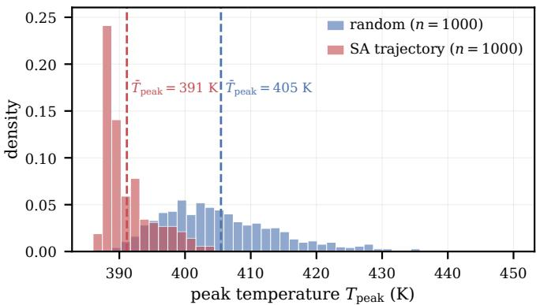  
Fig. 1. Distribution shift along the search. Peak temperatures of 1000 random placements (the pretraining distribution, mean ≈ 405 K, broad) and of 1000 placements visited along an optimization trajectory (mean ≈ 391 K, concentrated in the low-temperature tail). The optimizer drives the design into a region the random pretraining distribution rarely samples, so the surrogate is evaluated far from where most of its training examples lie.

## IV. SELF-IMPROVING OPERATOR-LEARNING FRAMEWORK

Before the search runs, the surrogate can only be pretrained on randomly generated placements, since the placements the optimizer will favor are not yet known. The search does not stay there: the optimizer drives the design toward low-peak placements rare under the random pretraining distribution, shifting where the surrogate is evaluated away from where it was trained. Fig. 1 shows the size of the shift: across a run, the peak temperatures of the placements the search visits concentrate near 391 K, well into the low-temperature tail of the random pretraining distribution centered near 405 K. The surrogate is therefore queried where its pretraining examples are sparsest, and its accuracy on the broad pretraining set need not carry to this shifted region.

DeepOHeat-v2 closes this gap online. Along the search trajectory a trust gate flags placements for the solver to refine, and the surrogate periodically retrains on the refined solutions, so it improves where the search goes and steers the search toward better placements (Fig. 2). Refinement and retraining run only in a fixed number of early rounds; afterward the search runs on the adapted surrogate alone. Each refinement thus corrects the current step and, through retraining, improves later predictions.

A. Online Adaptation: Incremental Training and Model Selection

Incremental training: We write $\mathcal { D } _ { \mathrm { t r a i n } }$ for the fixed set of randomly generated placements used in pretraining (Section III) and $\mathcal { D } _ { \mathrm { o n l i n e } }$ for the online buffer of solverrefined, in-trajectory placements accumulated during the run (Section $\mathrm { I V - C ) } ;$ ; incremental training combines the two. Each incremental-training event continues pretraining: the same architecture, the same optimizer $\mathrm { { ( M u o n ^ { 2 } } }$ on the weight matrices,

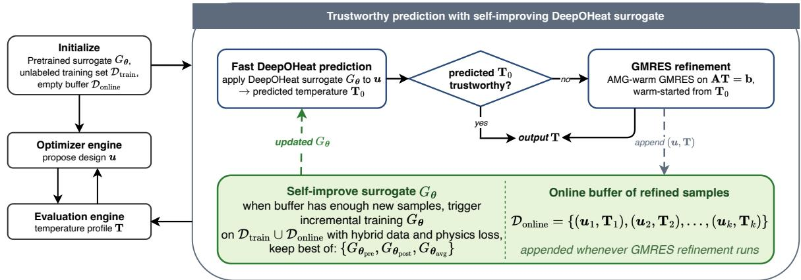  
Fig. 2. The DeepOHeat-v2 self-improving loop. The optimizer proposes a placement; the surrogate predicts its temperature field; the trust gate either accepts the prediction or sends it to a warm-started GMRES refinement. Refined solutions accumulate in an online buffer that periodically retrains the surrogate, so the surrogate grows more accurate along the trajectory the search follows.

Adam on the rest), and the same optimizer state (momenta and second moments), carried across events from the pretrained checkpoint. The loss keeps the energy term on both $\mathcal { D } _ { \mathrm { t r a i n } }$ and $\mathcal { D } _ { \mathrm { o n l i n e } }$ and adds a data mean-squared-error (MSE) term on the refined labels:

$$
\begin{array} { r l } & { \mathcal { L } _ { \mathrm { i n c } } = \lambda _ { e } \left[ \mathcal { L } _ { \mathrm { e n e r g y } } ( \mathcal { B } _ { \mathrm { o r i g } } ) + \mathcal { L } _ { \mathrm { e n e r g y } } ( \mathcal { B } _ { \mathrm { r e f i n e d } } ) \right] } \\ & { \quad \quad \quad + \lambda _ { d } \mathrm { M S E } \big ( G _ { \theta } ( \mathcal { B } _ { \mathrm { r e f i n e d } } ) , \mathbf { T } _ { \mathrm { r e f i n e d } } \big ) . } \end{array}\tag{22}
$$

Two batch streams are sampled per step: $B _ { \mathrm { o r i g } }$ from $\mathcal { D } _ { \mathrm { t r a i n } }$ and $B _ { \mathrm { r e f i n e d } }$ from $\mathcal { D } _ { \mathrm { o n l i n e } }$ . The energy stream sees both datasets; the data-MSE stream sees $\mathcal { D } _ { \mathrm { o n l i n e } }$ only. We set $\lambda _ { e }$ and $\lambda _ { d }$ so the two terms contribute comparable magnitudes at the start of an event, and hold the incremental learning rates constant and well below their pretraining values. Each event runs for a fixed number of gradient steps. Keeping the energy term on $\mathcal { D } _ { \mathrm { t r a i n } }$ active throughout prevents the data-MSE stream from overspecializing the surrogate to the narrow trajectory distribution.

In-trajectory model selection: An incremental event can overfit the buffer or step into a worse minimum, so we keep its update only if it lowers error on held-out trajectory data. At the start of an event the buffer $\mathcal { D } _ { \mathrm { o n l i n e } }$ is split chronologically: the most recent samples form a held-out validation slice $\mathcal { D } _ { \mathrm { o n l } } ^ { \mathrm { v a l } }$ online and the older remainder is used for training. After the event’s gradient steps we form three candidates, the pre-update model, the updated model, and their weight average [29],

$$
G _ { \theta _ { \mathrm { p r e } } } , \quad G _ { \theta _ { \mathrm { p o s t } } } , \quad G _ { \theta _ { \mathrm { a v g } } } = G _ { ( \theta _ { \mathrm { p r e } } + \theta _ { \mathrm { p o s t } } ) / 2 } ,\tag{23}
$$

score each by the mean absolute peak temperature error on $\mathcal { D } _ { \mathrm { o n l i n e } } ^ { \mathrm { v a l } } ,$ , and deploy the argmin. Because $G _ { \pmb { \theta } _ { \mathrm { p r e } } }$ is a candidate, the deployed model is never worse than the pre-event one on $\mathcal { D } _ { \mathrm { o n l i n e } } ^ { \mathrm { v a l } } ;$ when the selection keeps $G _ { \pmb { \theta } _ { \mathrm { p r e } } }$ , the optimizer state is also reverted to its pre-event snapshot so no rejected gradient leaks forward. The averaged candidate $G _ { \theta _ { \mathrm { a v g } } }$ offers a midpoint that sometimes generalizes better than either endpoint, at the cost of one more validation pass.

A fixed number of adaptation events: Refinement and incremental training run for a fixed number of events C. After the Cth event the surrogate has adapted to the trajectory fidistribution, so every later proposal is decided on the surrogate alone, with no further solver calls or retraining. The limit is needed because the trust gate (Section IV-B) flags a fixed fraction of proposals by design; without the limit, refinement would continue indefinitely even after the surrogate is accurate.

## B. When to Call the Non-AI Solver: The Hotspot Trust Gate

The surrogate is accurate on most placements; the gate must find the few with large peak temperature error. Catching them takes a signal that ranks predictions by peak error, which the v1 global residual cannot do, and a threshold that follows the residual scale as it drifts with the search and with each retraining. The hotspot-localized residual $r _ { \mathrm { h o t } }$ supplies the ranking; a sliding-window percentile sets the threshold.

Why the global residual may fail to rank: DeepOHeatv1 [19] gates on the global relative residual $r _ { \mathrm { r e l } } = \| { \bf r } \| _ { 2 } / \| { \bf b } _ { h } \|$ 2 (Section II-B), with residual $\mathbf { r } : = \mathbf { A } _ { h } \widehat { \mathbf { T } } - \mathbf { b } _ { h }$ , accepting when $r _ { \mathrm { r e l } } < \alpha$ . For $r _ { \mathrm { r e l } }$ to rank predictions it would have to track the peak error, but the two are linked only through the global operator norm: with $\mathbf { e } : = \widehat { \mathbf { T } } - \mathbf { T }$ and $x ^ { * }$ the predicted hotspot,

$$
| e ( \boldsymbol { x } ^ { * } ) | \leq \| \mathbf { e } \| _ { 2 } \leq \| \mathbf { A } _ { h } ^ { - 1 } \| _ { 2 } \| \mathbf { r } \| _ { 2 } = \frac { \kappa _ { 2 } ( \mathbf { A } _ { h } ) } { \| \mathbf { A } _ { h } \| _ { 2 } } \| \mathbf { b } _ { h } \| _ { 2 } \cdot r _ { \mathrm { r e l } } .\tag{24}
$$

The norm $\| \mathbf { A } _ { h } ^ { - 1 } \| _ { 2 }$ carries the full conditioning $\kappa _ { 2 } ( { \bf A } _ { h } ) =$ $6 . 0 2 \times 1 0 ^ { 4 }$ , so the bound evaluates to ≈ $1 . 6 { \times } 1 0 ^ { 5 } \ \mathrm { K } ,$ far above the sub-Kelvin errors we observe, and leaves $r _ { \mathrm { r e l } }$ free to vary independently of the peak error. In practice it does: on a heldout set of random placements (Section V-D) the Spearman rank correlation between $r _ { \mathrm { r e l } }$ and the peak error is $\rho ~ = ~ - 0 . 0 1 8$ $( \rho = \pm 1$ for a perfectly monotone ranking), so $r _ { \mathrm { r e l } }$ orders predictions essentially at random and the v1 gate can no longer separate reliable from unreliable predictions.

<sub>f</sub>The hotspot-localized residual: The gate does not need the whole-field error; it needs the error at the hotspot. We therefore measure the residual only there.

Definition 5 (Hotspot-localized residual). For a prediction $\widehat { \mathbf T }$ with residual $\mathbf { r } : = \mathbf { A } _ { h } \widehat { \mathbf { T } } - \mathbf { b } _ { h }$ , let $S _ { m }$ index the top-m hottest cells of ${ \widehat { \mathbf { T } } } ,$ for a fixed count m (Table III). Define

$$
r _ { \mathrm { h o t } } ( \widehat { \mathbf { T } } ) : = \frac { 1 } { m } \sum _ { y \in S _ { m } } | \mathbf { r } ( y ) | ,\tag{25}
$$

the mean residual magnitude over the predicted hotspot.

Computing $r _ { \mathrm { h o t } }$ costs one sparse matrix–vector product, against the same $\mathbf { b } _ { h }$ the surrogate is trained on. Restricting the residual to the hotspot gives a matching a-posteriori bound (Appendix B) in which the global norm $\lVert \mathbf A _ { h } ^ { - 1 } \rVert _ { 2 }$ of (24) is replaced by the local diagonal entry $( \mathbf { A } _ { h } ^ { - 1 } ) _ { x ^ { * } , x ^ { * } }$ , which does not grow with $\kappa _ { 2 } ( { \bf A } _ { h } )$ . Like the v1 bound it is numerically loose, so $r _ { \mathrm { h o t } }$ ranks predictions rather than certifying any one of them. Averaging over the top-m cells, instead of the single hottest, keeps the ranking stable when the predicted and true hotspots are close but not identical.

Adaptive sliding-window flagging: The scale of $r _ { \mathrm { h o t } }$ is not stationary: it shrinks as the search narrows and shifts again each time the surrogate is updated, so a fixed threshold calibrated once on $\mathcal { D } _ { \mathrm { t r a i n } }$ would soon flag too many or too few proposals. We instead set the threshold relative to the residuals currently observed, maintaining a first-in-first-out (FIFO) window W of the most recent $r _ { \mathrm { h o t } }$ values and, while the solver is active, taking the threshold at search step t to be the $( 1 - f _ { \mathrm { t a r g e t } } )$ -percentile of W. This makes the threshold self-calibrating: it tracks the moving $r _ { \mathrm { h o t } }$ distribution and holds the flag rate near $f _ { \mathrm { t a r g e t } }$ regardless of search progress or model updates. The window is bootstrapped by an initial block of no-flag search steps so the threshold is well-defined once flagging begins.

## C. How to Call the Non-AI Solver: Warm-Started GMRES Refinement

When a proposal is flagged, we want a peak estimate more accurate than the surrogate but far cheaper than a cold solve. We run the inherited GMRES refinement (Section II-B) on ${ \mathbf A _ { h } } { \mathbf T } = { \mathbf b _ { h } }$ from the warm start $\mathbf { T } _ { 0 } = \widehat { \mathbf { T } } ,$ , with a Ruge–Stüben algebraic-multigrid (AMG) V-cycle preconditioner [39], [40]. Because the warm prediction is already within a few K of the true field, the refinement need not drive the residual far down, so we set a deliberately loose relative tolerance $\epsilon .$ In practice this tolerance is met after a single V-cycle, which propagates information across all spatial scales and roughly halves the warm-start residual. The cost is ∼ 1 s per refinement versus ∼ 16 s for a tight solve (a ∼15× saving), and the post-cycle peak temperature error is typically reduced by 1–2 K, enough to flip a borderline accept/reject decision before it is committed. Each refined placement and its solved field $( \mathbf { u } ^ { \prime } , \mathbf { T } )$ are then added to the online buffer $\mathcal { D } _ { \mathrm { o n l i n e } } .$ , the labeled in-trajectory data on which the surrogate is incrementally retrained (Section IV-A).

## D. Algorithm

Algorithm 1 consolidates the components above into the decision logic of one optimization run; Fig. 2 gives the complementary data-and-model view. The run proceeds in two phases: while $e < C ,$ , every proposal passes through the gate, and a flagged proposal is refined, buffered, and, once the buffer crosses the next event threshold, drives an incremental-training event with model selection; once e reaches $C ,$ this block is skipped and the search continues on the adapted surrogate alone. The peak estimate $\widehat { p }$ in the accept/reject test holds the surrogate’s predicted peak by default and the refined peak whenever the proposal was refined. A single tight FVM solve at the end verifies the best-so-far placement and returns the peak temperature the run reports.

```latex
Algorithm 1 DeepOHeat-v2 (one optimization run): decision
logic.
Require: Pretrained $G _ { \theta } ;$ train set $\mathcal { D } _ { \mathrm { t r a i n } } ;$ acceptance schedule
$( \tau _ { 0 } , \tau _ { \mathrm { m i n } } , N )$ ; flag rate $f _ { \mathrm { t a r g e t } } ;$ window $| \mathcal { W } | ;$ refine toler
ance $\epsilon ;$ event trigger $\Delta N ;$ event budget $C .$
1: ${ \mathcal { D } } _ { \mathrm { o n l i n e } }  \emptyset ; { \mathbf { u } } ^ { 0 } \sim { \mathcal { U } } _ { \mathrm { i n i t } } ; { \mathcal { W } }  \emptyset ;$ event count $e \gets 0 .$
2: Bootstrap W with |W| no-flag search steps.
3: for $t = 1 , \ldots , N$ do
4: u<sup>′</sup> ← perturb $( \mathbf { u } ^ { t - 1 } ) ; \widehat { \mathbf { T } }  G _ { \theta } ( \mathbf { u } ^ { \prime } ) ; \widehat { p }  \| \widehat { \mathbf { T } } \| _ { \infty } .$
5: if $e < C$ then ▷ solver still active
6: Push $r _ { \mathrm { h o t } } ( \widehat { \mathbf { T } } )$ into W.
7: if $r _ { \mathrm { h o t } } ( \widehat { \mathbf { T } } ) > Q _ { 1 - f _ { \mathrm { t a r g e t } } } ( \mathcal { W } )$ then ▷ flag at
window percentile
8: $\mathbf { T }  \mathrm { A M G - G M R E S } ( \mathbf { A } _ { h } , \mathbf { b } _ { h } , \mathbf { T } _ { 0 } { = } \widehat { \mathbf { T } } , \epsilon ) .$
9: $\widehat { p }  \| \mathbf { T } \| _ { \infty } ; \ \mathcal { D } _ { \mathrm { o n l i n e } }  \mathcal { D } _ { \mathrm { o n l i n e } } \cup \{ ( \mathbf { u } ^ { \prime } , \mathbf { T } ) \}$
10: if $| \mathcal { D } _ { \mathrm { o n l i n e } } | \geq ( e { + } 1 ) \Delta N$ then ▷ event
11: $\theta _ { \mathrm { p r e } }  \theta ;$ incrementally train $\pmb { \theta } _ { \mathrm { p o s t } }$ on
${ \mathcal { L } } _ { \mathrm { { i n c } } } .$
12: $\begin{array} { r } { \pmb { \theta } _ { \mathrm { a v g } }  \frac { 1 } { 2 } ( \pmb { \theta } _ { \mathrm { p r e } } \underline { { + \pmb { \theta } } } _ { \mathrm { p o s t } } ) . } \end{array}$
13: θ ← arg min<sub>s</sub> $\overline { { | \Delta T _ { \mathrm { p e a k } } | } } ( G _ { \theta _ { s } } , { \cal D } _ { \mathrm { o n l i n e } } ^ { \mathrm { v a l } } ) , s \in$
{pre, post, avg}.
14: $e  e + 1 .$
15: end if
16: end if
17: end if
18: Accept u<sup>′</sup> w.p. min $\big ( 1 , \exp ( - ( \widehat { p } { - } \widehat { p } ^ { t - 1 } ) / \tau _ { t } ) \big )$
19: end for
20: Final tight FVM verify on the best-so-far placement.
```

## V. EXPERIMENTS

## A. The F2F Chiplet Benchmark

The benchmark is a 3 × 3 mm face-to-face (F2F) chiplet stack (Fig. 3): two bulk-plus-active-silicon dies vertically stacked and bonded face-to-face through a hybrid Cu–Cu bond, mounted on an organic substrate. Cooling is asymmetric, with a water cold plate at the top $( h = 5 0 0 0 \mathrm { W / m ^ { 2 } K } )$ and weak board conduction at the bottom $( h \ : = \ : 5 0 \ : \ : \mathrm { W / m ^ { 2 } K ) }$ . Copper TSVs, modeled as $1 0 \times 1 0 ~ \mu \mathrm { m }$ columns on a 50 µm pitch, pass through the silicon layers. Table I lists the seven layers and their conductivities, which span 0.5 to 400 W/m·K, an 800× contrast between copper and the substrate. We discretize the stack on a uniform $3 0 0 \times 3 0 0 \times 2 3$ grid (10 µm in plane; $N \approx 2 . 0 7 \times 1 0 ^ { 6 }$ cells), yielding the operator ${ \bf A } _ { h }$ of $\operatorname { E q . }$ (4). Ten power blocks sit on the two dies and dissipate ≈3.5 W Ten power blocks sit on the two dies and dissipate ≈3.5 W

in total: four hotspots (PHY, PLL, and two CPU cores) and six lower-power background blocks, all listed in Table II. The design places these blocks, so the configuration u collects their (x, y) positions; blocks on the same die may not overlap, though cross-die overlap is allowed.

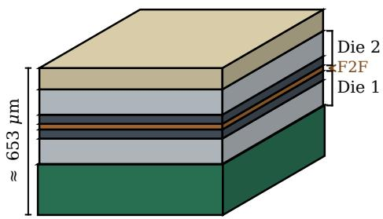  
3 mm × 3 mm

(a) 7-layer F2F chiplet stack 50 μm pitch  
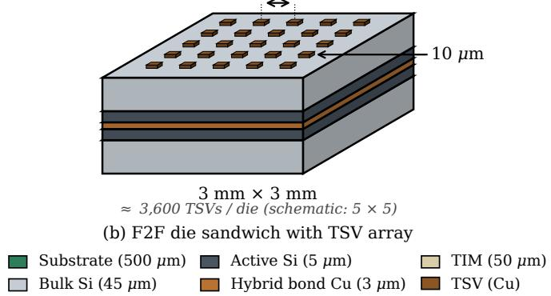  
Fig. 3. The F2F chiplet benchmark: two bulk-plus-active-Si dies vertically stacked and bonded face-to-face on an organic substrate, cooled by a top cold plate and weak bottom board conduction, with copper TSVs passing through the silicon layers.

TABLE I  
LAYER STACK OF THE F2F CHIPLET BENCHMARK (BOTTOM → TOP); TIM IS THE THERMAL INTERFACE MATERIAL.
<table><tr><td>#</td><td>Layer</td><td>Thickness</td><td>k (W/m·K)</td></tr><tr><td>1</td><td>Substrate (BT/FR4)</td><td>500 µm</td><td>0.5</td></tr><tr><td>2</td><td>Die 1 bulk Si (+ TSV Cu)</td><td>45 µm</td><td>140/400</td></tr><tr><td>3</td><td>Die 1 active Si (+ TSV)</td><td>5µm</td><td>140/400</td></tr><tr><td>4</td><td>Hybrid bond (Cu–Cu)</td><td>3 µm</td><td>100</td></tr><tr><td>5</td><td>Die 2 active Si (+ TSV)</td><td>5 µm</td><td>140/400</td></tr><tr><td>6</td><td>Die 2 bulk Si (+ TSV Cu)</td><td>45 µm</td><td>140/400</td></tr><tr><td>7</td><td>TIM</td><td>50 µm</td><td>5</td></tr></table>

The high conductivity contrast makes the benchmark challenging for DeepOHeat-v1. It leaves the discretized operator ${ \bf A } _ { h }$ ill-conditioned: a Lanczos estimate gives $\kappa _ { 2 } ( { \bf A } _ { h } ) = 6 . 0 2 \times$ $1 0 ^ { 4 }$ (computed in Appendix B), far above the regime in which DeepOHeat-v1 was demonstrated.

## B. Experimental Setup

All experiments use the F2F benchmark of Section V-A under a single fixed protocol. We check the two contributions on a held-out set of $n = 1 0 0$ random placements, a loss/optimizer study for the data-free training recipe of Section III and a catch-rate test for the $r _ { \mathrm { h o t } }$ trust gate of Section IV-B, then put the full loop through a simulated-annealing (SA) run from a random initial placement.

TABLE II  
POWER BLOCKS ON THE TWO DIES (≈3.5 W TOTAL). PHY, PLL, AND THE TWO CPU CORES ARE HOTSPOTS; THE REST ARE BACKGROUND BLOCKS.
<table><tr><td>Die</td><td>Block</td><td>Power (W)</td></tr><tr><td>1</td><td>PHY</td><td>1.0</td></tr><tr><td>1</td><td>PLL</td><td>0.6</td></tr><tr><td>1</td><td>SRAMO</td><td>0.08</td></tr><tr><td>1</td><td>SRAM1</td><td>0.08</td></tr><tr><td>1</td><td>Analog</td><td>0.08</td></tr><tr><td>2</td><td>CPU0</td><td>0.7</td></tr><tr><td>2</td><td>CPU1</td><td>0.7</td></tr><tr><td>2</td><td>GPU</td><td>0.08</td></tr><tr><td>2</td><td>Cache</td><td>0.08</td></tr><tr><td>2</td><td>IO</td><td>0.08</td></tr></table>

TABLE III

DEEPOHEAT-V2 SELF-IMPROVING-LOOP HYPERPARAMETERS, FIXED ACROSS ALL RUNS.
<table><tr><td>Quantity</td><td>Value</td></tr><tr><td>Trust-window length (|W|)</td><td>100</td></tr><tr><td>Hotspot cells (m)</td><td>100</td></tr><tr><td>Target flag rate  $( f _ { \mathrm { t a r g e t } } )$ </td><td>0.30</td></tr><tr><td>Refinement rel. tolerance (€)</td><td> $5 \times 1 0 ^ { - 1 }$ </td></tr><tr><td>Loss weights  $( \lambda _ { e } , \lambda _ { d } )$ </td><td>0.1, 1</td></tr><tr><td>Incremental LRs (ηmuon, ηadam) Batch size (per stream)</td><td> $5 \times 1 0 ^ { - 6 }$   $1 \times 1 0 ^ { - 6 }$  4</td></tr><tr><td>Gradient steps per event</td><td>1000</td></tr><tr><td></td><td></td></tr><tr><td>Refinements per event (∆N)</td><td>50</td></tr><tr><td>Event budget (C)</td><td>3</td></tr><tr><td>Validation-slice size</td><td>10</td></tr></table>

Simulated-annealing schedule: All optimization runs use the same SA loop [41]: from a random non-overlapping placement, each of $N = 1 0 0 0$ iterations perturbs one block by at most $\Delta _ { \mathrm { m a x } } = 1 0$ grid steps and accepts the move with the Metropolis criterion at an acceptance temperature $\tau _ { t }$ that is geometrically cooled,

$$
\tau _ { t } = \tau _ { 0 } ( \tau _ { \mathrm { { m i n } } } / \tau _ { 0 } ) ^ { t / N } , \qquad \tau _ { 0 } = 5 , \tau _ { \mathrm { { m i n } } } = 0 . 0 1 .\tag{26}
$$

The cost is $T _ { \mathrm { p e a k } } ( \mathbf { u } )$ , so each iteration requires one thermal evaluation.

Implementation: The separable operator network (Section II-B) uses an 8-layer branch of width 256, degree-3 ChebyKAN trunks of width 64, and rank $r = 1 2 8 .$ . It is implemented in JAX/Equinox [42]; the FVM assembly, the tight oracle solves, and the AMG-warm GMRES refinement use Ruge– Stüben algebraic-multigrid preconditioning via PyAMG [43]. All experiments run on a single NVIDIA RTX 3090.

Self-improving-loop hyperparameters: The trust-gate, refinement, and incremental-training hyperparameters of Section IV are collected in Table III; they were set once and held fixed across all runs.

Evaluated configurations and metrics: We compare four configurations that share the SA schedule above and justin-time (JIT)-compiled inference, differing only in the perproposal cost policy. Surrogate-only drives SA with $G _ { \theta } \mathrm { { ' s } }$ predicted peak and issues no solves during the search, with a single tight FVM verify at the end for the true peak; without the trust gate, it never flags or refines a proposal. DeepOHeat-v1 adds flagging and AMG-warm GMRES refinement but never updates $G _ { \theta } ;$ we deliberately give it the $r _ { \mathrm { h o t } }$ gate rather than its own $r _ { \mathrm { r e l } }$ , so anything v2 gains over it is the online adaptation. $D e e p O H e a t { - } \nu 2$ adds that adaptation (Section IV-A). Oracle SA drives the identical loop with a tight FVM solve at every step (tolerance $1 0 ^ { - 7 }$ , AMG-preconditioned GMRES, ∼ 16 s per evaluation); it is a non-competing ground-truth upper bound. For each configuration we report the surrogate-predicted peak (the signal the optimizer acts on), the true (oracle) peak of the returned placement under a tight FVM solve, their difference (the surrogate–true gap, i.e. the prediction error at the returned placement), and wall time.

## C. Pretraining: Loss Form and Optimizer

Both design choices behind the data-free training recipe hold up here: the energy-form loss and the Muon<sup>2</sup> optimizer. We pretrain the same separable surrogate on $n _ { \mathrm { d a t a } } = 1 0 { , } 0 0 0$ unlabeled power maps (batch 32, no temperature labels) under either the strong-form residual or the energy-form loss, with Adam, Muon, or $\mathrm { { M u o n ^ { 2 } } ; }$ a supervised control uses $n = 1 0 0$ labeled pairs and a pure MSE loss. Every loss-form and optimizer combination is in Table IV, evaluated on the $n = 1 0 0$ held-out set after 40,000 epochs, training times included. The largest single change in the table is the loss form: under Adam, switching the strong-form residual to the energy form cuts peak temperature error from 30.88 K to 1.05 K, a 97% drop. Both losses share the same FVM discretization, so interface representation is identical and only the conditioning differs, consistent with the $\kappa ^ { 2 } \to \kappa$ reduction of Theorem 4. The supervised MSE control, trained on $n = 1 0 0$ labeled fields, reaches only 9.81 K, far short of the energy form’s 1.05 K under the same optimizer. Its labels are not free: each of the 100 fields is a tight solve, and closing the gap would need many more. The data-free energy form reaches sub-Kelvin accuracy with no labels at all.

Within the energy form, the optimizer adds a further gain: Muon cuts the error 39% below Adam, and Muon<sup>2</sup> another 14% $( 1 . 0 5  0 . 6 4  0 . 5 5 ~ \mathrm { K } )$ . This matches the mechanism of Section III-C: Muon supplies the joint rescaling Adam cannot, and Muon<sup>2</sup> additionally restores the smallest singular directions; hence Muon<sup>2</sup> is our default.

The strong-form rows show the failure the energy form avoids. Under that loss Adam plateaus about 30 K from the optimum and both Muon variants diverge. The divergence comes from the NS5 orthogonalization, which loses its contraction at this conditioning $( \kappa ^ { 2 } \approx 3 . 6 \times 1 0 ^ { 9 } ) ;$ the lower κ of the energy form avoids it.

Fig. 4 shows the energy+Muon<sup>2</sup> surrogate on held-out placements that span a range of peak temperatures: it reproduces each reference field closely, locating the hotspot, with the largest residuals confined to block edges. At 0.55 K mean peak temperature error, this is the pretrained $G _ { \theta }$ used in the rest of the experiments.

## D. Confidence-Gate Validation

A surrogate that is accurate on average can still be wrong on individual placements, so we test whether the $r _ { \mathrm { h o t } }$ gate flags those. On the $n = 1 0 0$ held-out set, $r _ { \mathrm { h o t } }$ ranks predictions by true error far better than the global residual it replaces: its Spearman correlation with peak temperature error is $\rho =$ $+ 0 . 6 4 2$ , against $\rho = - 0 . 0 1 8$ for $r _ { \mathrm { r e l } }$ . At a 30% flag budget (Fig. $5 ) , r _ { \mathrm { h o t } }$ catches 64.4% of $> 0 . 5 ~ \mathrm { K }$ errors and 91.7% of $> 1 \mathrm { ~ K ~ }$ errors, where $r _ { \mathrm { r e l } }$ stays near the 30% random baseline (24.4% and 33.3%).

The tail the gate catches is real, not an averaging artifact: 12% of random held-out placements have peak temperature error > 1 K and 2% exceed 2 K, and which placements they are cannot be known without a solve.

## E. Online Stability of the Adaptation Loop

Two sanity checks before the integrated run: the adaptation loop never deploys an update that worsens held-out error, and it does not forget the broad pretraining distribution.

Model selection: At each event we compare the heldout validation peak temperature error of $G _ { \theta _ { \mathrm { p r e } } } , G _ { \theta _ { \mathrm { p o s t } } } ,$ and $G _ { \theta _ { \mathrm { a v g } } }$ and deploy the minimizer (Fig. 6, left). At event 1 the continued steps overshoot on the still-broad early-SA validation slice, so $G _ { \theta _ { \mathrm { p r e } } }$ wins (0.601 K versus $G _ { \theta _ { \mathrm { { p o s t } } } } \mathrm { { ' s } ~ 0 . 7 0 0 }$ K) and the update is reverted; events 2 and 3 keep $\boldsymbol { G } _ { \pmb { \theta } _ { \mathrm { p o s t } } }$ as the validation slice concentrates on late-SA placements and the per-event error scale drops from ∼ 1 K to ∼ 0.2 K. Without model selection the regressing first event would have been committed.

Anti-forgetting: Held-out error on the broad random set drops slightly after adaptation, from the pretrained 0.551 K to 0.499 K, so adapting to the trajectory does not cost accuracy elsewhere. The $\lambda _ { e } \mathcal { L } _ { \mathrm { e n e r g y } } ( \mathcal { D } _ { \mathrm { t r a i n } } )$ term keeps the surrogate accurate on the broad distribution while the data-MSE term fits the trajectory; the two do not conflict.

## F. Integrated Run: Optimization Quality and Cost

From a random initial placement, the full loop reaches a design whose true peak is within 0.11 K of what its own surrogate predicted, in 292 s, about 56× faster than solving at every step and with a bounded number of FVM solves.

The surrogate–true gap: The surrogate–true gap shrinks across the three configurations, from 1.12 K for surrogateonly, to 0.78 K for DeepOHeat-v1, to 0.11 K for DeepOHeatv2 (Table V). The gap is prediction error the optimizer never sees during the search, not a quality ranking of the placements. Under-prediction is the dangerous direction, since it lets the search accept a placement that is hotter than it looks; it dominates the surrogate-only and v1 gaps, while v2’s gap is a small over-prediction. Each gap has a mechanism: surrogateonly never sees its own error; v1 catches and refines bad proposals but leaves the surrogate fixed; only v2 adapts it, and that closes the gap to oracle level.

Per-configuration results: The run starts at a peak of 397.78 K; Table V and Table VI report the per-configuration outcomes. With no gate to warn it, surrogate-only commits its 1.12 K error undetected; v1 and v2 gate every proposal and refine the flagged ones. Oracle SA appears only as the reference row: solving tightly at every step, it has no surrogate–true gap and optimizes on ground truth throughout.

TABLE IV  
PRETRAINING RESULTS ON THE n = 100 HELD-OUT SET AFTER 40,000 EPOCHS: MEAN PEAK TEMPERATURE ERROR, RELATIVE $L _ { 2 }$ FIELD ERROR, FIELD MEAN-ABSOLUTE ERROR (MAE), AND WALL-CLOCK TRAINING TIME. † TRAINING DIVERGED; VALUES ARE THE ERROR MAGNITUDE AT TERMINATION.
<table><tr><td>Loss form</td><td>Optimizer</td><td>Peak temp. error (K)</td><td>Relative  $L _ { 2 }$ </td><td>MAE (K)</td><td>Train (min)</td></tr><tr><td>Supervised MSE</td><td>Adam</td><td>9.81</td><td> $1 . 2 8 \times 1 0 ^ { - 2 }$ </td><td>3.87</td><td>20.0</td></tr><tr><td>Strong-form physics</td><td>Adam</td><td>30.88</td><td> $2 . 9 1 \times 1 0 ^ { - 2 }$ </td><td>8.76</td><td>9.5</td></tr><tr><td>Strong-form physics</td><td>Muon</td><td> ${ \sim } 2 . 2 \times 1 0 ^ { 1 1 } \dagger$ </td><td> $5 . 8 4 \times 1 0 ^ { 8 }$ </td><td> ${ \sim } 2 . 2 \times 1 0 ^ { 1 1 }$ </td><td>11.8</td></tr><tr><td>Strong-form physics</td><td> $\mathrm { { M u o n } ^ { 2 } }$ </td><td> ${ \sim } 3 . 6 \times 1 0 ^ { 1 0 } \dag$ </td><td> $1 . 1 8 \times 1 0 ^ { 8 }$ </td><td> $\sim 4 . 4 \times 1 0 ^ { 1 0 }$ </td><td>11.9</td></tr><tr><td>Energy-form physics</td><td>Adam</td><td>1.05</td><td> $6 . 7 9 \times 1 0 ^ { - 4 }$ </td><td>0.179</td><td>11.7</td></tr><tr><td>Energy-form physics</td><td>Muon</td><td>0.639</td><td> $4 . 1 8 \times 1 0 ^ { - 4 }$ </td><td>0.112</td><td>13.3</td></tr><tr><td>Energy-form physics</td><td> $\mathbf { M u o n } ^ { 2 }$ </td><td>0.551</td><td> $\mathbf { 3 . 8 9 \times 1 0 ^ { - 4 } }$ </td><td>0.103</td><td>13.5</td></tr></table>

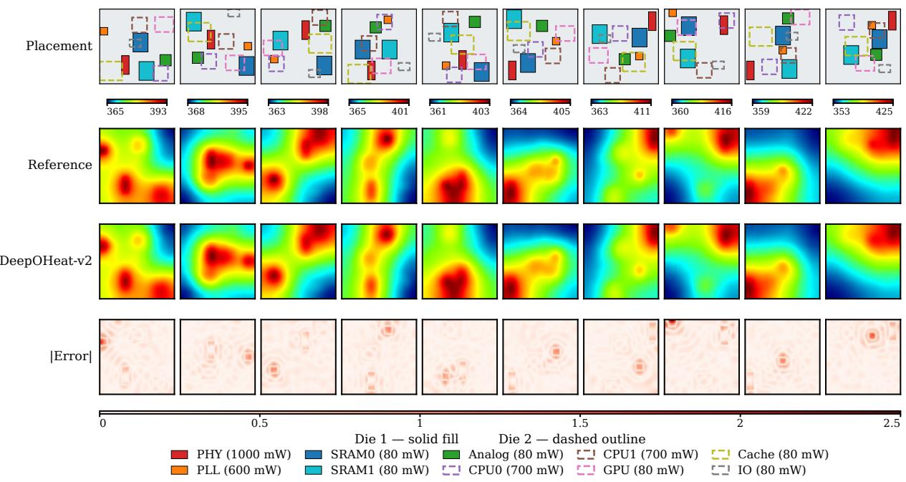  
Fig. 4. Energy+Muon<sup>2</sup> surrogate predictions on 10 random held-out placements. Rows, top to bottom: block placement (Die 1 solid fill, Die 2 dashed overlay) with reference and predicted peak temperatures; reference field $T _ { \mathrm { r e f } }$ at the Die-1 active layer; surrogate prediction Tb at the same layer (shared color scale); absolute residual $| \widehat { \mathbf { T } } - T _ { \mathrm { r e f } } |$ . The hotspot under PHY is captured consistently; residuals concentrate at block edges where in-plane gradients are steepest.

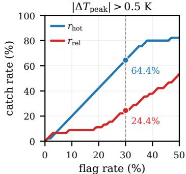  
(a) $P = 4 5$

|ΔT<sub>peak</sub>| > 1 K  
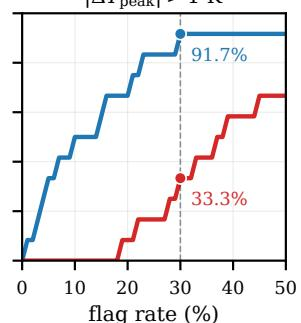  
(b) $P = 1 2$  
Fig. 5. Catch-rate operating curves for $r _ { \mathrm { h o t } }$ vs. the global relative residual $r _ { \mathrm { r e l } }$ on the surrogate pretrained for 40,000 epochs $( n = 1 0 0$ held-out placements). Each curve plots the fraction of bad predictions caught against the flag-rate budget; the diagonal is the random baseline. (a) Bad $= | \bar { \Delta } T _ { \mathrm { p e a k } } | > \bar { 0 . 5 }$ K $( P = 4 5 $ positives). (b) Bad $= \left| \Delta T _ { \mathrm { p e a k } } \right| > 1$ K $( P = 1 2$ positives). r<sub>hot</sub> dominates $r _ { \mathrm { r e l } }$ across the budget range.

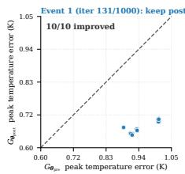

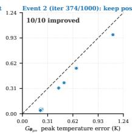

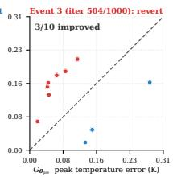  
Fig. 6. Online stability of DeepOHeat-v2 on the integrated run. Left: model-selection trace; for each incremental-training event the 10 most-recent validation samples are plotted at $( G _ { \pmb { \theta } _ { \mathrm { p r e } } }$ error, $G _ { \pmb { \theta } _ { \mathrm { p o s t } } }$ error), with points below the diagonal improved and above regressed. Event 1 reverts to $G _ { \theta _ { \mathrm { p r e } } }$ (red), events $2 { - } 3$ keep $G _ { \theta _ { \mathrm { p o s t } } }$ (blue); the per-event scale drops from ∼ 1 K to ∼ 0.2 K as SA cools. Right: anti-forgetting; the post-pipeline held-out mean peak temperature error stays below the pretrained baseline, so the loop does not forget the broad distribution.

Cost: DeepOHeat-v2 reaches the oracle’s placement quality for far less compute: 292 s against Oracle SA’s 4.51 h, with all four configurations within ∼ 1.8 K of one another on the absolute true peak (Table VI). The 0.32 K by which v2’s true peak (387.04 K) sits below Oracle SA’s (387.36 K) is not surrogate superiority: SA is a stochastic search whose accept/reject sequence is perturbed by prediction noise, so the two trajectories settle in slightly different basins.

TABLE V  
PREDICTED VS. TRUE PEAK ON THE INTEGRATED RUN FROM A RANDOMINITIAL PLACEMENT. THE GAP IS THE SURROGATE–TRUE DIFFERENCE ATTHE RETURNED PLACEMENT; ORACLE SA IS THE NON-COMPETINGZERO-GAP REFERENCE.
<table><tr><td>Configuration</td><td>Predicted peak (K)</td><td>True/oracle peak (K)</td><td>Gap (K)</td></tr><tr><td>Surrogate-only</td><td>387.67</td><td>388.79</td><td>1.12</td></tr><tr><td>DeepOHeat-v1</td><td>387.25</td><td>388.03</td><td>0.78</td></tr><tr><td>DeepOHeat-v2</td><td>387.15</td><td>387.04</td><td>0.11</td></tr><tr><td>Oracle SA (ref)</td><td></td><td>387.36</td><td>0.00</td></tr></table>

TABLE VI

TRUE (ORACLE) PEAK, FVM SOLVES ISSUED DURING SA, AND WALLTIME ON THE INTEGRATED RUN; “FVM SOLVES IN SA” EXCLUDES THESINGLE FINAL VERIFICATION SOLVE.
<table><tr><td>Configuration</td><td>True peak FVM solves (K)</td><td>in SA</td><td>Wall</td></tr><tr><td>Surrogate-only</td><td>388.79</td><td>0</td><td>40 s</td></tr><tr><td>DeepÖHeat-v1</td><td>388.03</td><td>~300</td><td>335 s</td></tr><tr><td>DeepOHeat-v2</td><td>387.04</td><td>150</td><td>292 s</td></tr><tr><td>Oracle SA (ref)</td><td>387.36</td><td>1000</td><td>4.51 h</td></tr></table>

Optimized placements: Fig. 7 shows the best placement each configuration returns alongside its oracle FVM field at the Die-1 active layer: surrogate-only leaves PHY near the chip edge, producing a hotspot it under-predicts; v1’s refinement moves the placement inward; and $\mathbf { v } 2 \mathbf { \bar { s } }$ adapted surrogate finds a PHY position whose oracle field is visually indistinguishable from Oracle SA’s; the 0.32 K between their peaks is basin scatter, not surrogate error.

## VI. CONCLUSION

We have presented DeepOHeat-v2, a self-improving operator-learning framework for thermal-aware placement optimization in 3D-IC design. A data-free thermal surrogate must clear two hurdles before it can steer an optimizer: it must first be trainable without labels on high-contrast multidie stacks, and it must then stay accurate as the search drives placements away from the distribution it was trained on. To make data-free training converge, we cast the physics loss in energy form, which provably reduces the prediction-space loss-Hessian conditioning from $\kappa _ { 2 } ( { \bf A } _ { h } ) ^ { 2 }$ to $\kappa _ { 2 } ( { \bf A } _ { h } )$ ), and pair it with a matrix-preconditioned optimizer that succeeds where first-order physics-informed training otherwise stalls. Holding that accuracy under the distribution shift of optimization falls to the self-improving loop: the hotspot trust gate sends flagged placements to the reference solver, the solutions feed back into the surrogate through incremental training, and model selection admits only updates that lower held-out trajectory error. The two mechanisms reinforce each other: the solver calls spent on uncertain designs train the surrogate on the placements the search visits next. On an integrated run from a random initial placement, the loop drives the gap between the surrogate’s predicted and true peak temperature at the returned design to 0.11 K, oracle quality, ∼56× faster than solving at every step.

The main limitation of DeepOHeat-v2 is geometric, and it stems from the surrogate architecture rather than the training method. The separable operator network inherited from DeepOHeat-v1 factorizes the temperature field along the coordinate axes, so it is tied to axis-aligned, grid-resolved structures. The through-silicon vias here are square, Cartesianaligned copper columns; round, tapered, or off-grid vias, irregular die outlines, and non-Manhattan blockages would need local mesh refinement or a mesh-agnostic architecture.

The matrix-free FVM loss (Section III-A) reads only the predicted field on the grid and takes its parameter gradient from a single reverse-mode pass, with no second-order automatic differentiation, so its cost is independent of how the field is produced. A non-separable or mesh-agnostic surrogate could therefore be trained with the same loss without reintroducing that cost, paired with a geometry-conforming (locally refined or cut-cell) discretization to resolve curved and off-grid features. A complementary direction is to start from a stronger pretrained backbone, such as an emerging thermal foundation model (Therm-FM [44] adapts a pretrained partial differential equation (PDE) foundation model to 3D-IC thermal simulation), on which the online adaptation studied here would build.

The adapt-during-search principle behind this loop is not specific to thermal analysis or to the surrogate it improves. Wherever an optimizer must repeatedly query an expensive solver, the queries it already pays for can be reused as a training signal that improves a surrogate where the search concentrates, so the solver is queried less as the run proceeds. We expect the mechanism to transfer to other solver-inthe-loop design-optimization problems in electronic design automation.

## APPENDIX AOPERATOR CONDITIONING

## A. Conditioning of the Continuous Operator

We show that the ill-conditioning of ${ \bf A } _ { h }$ is inherited from the continuous heat-conduction operator (Section III-A), by bounding the condition number of the continuous operator itself. Let $V = H ^ { 1 } ( \Omega )$ and write the governing equation (2), with conductivity $k ,$ volumetric source $q _ { V }$ , ambient temperature $T _ { \mathrm { a m b } }$ , and top and bottom film coefficients $h _ { \mathrm { t o p } } , h _ { \mathrm { b o t } } ,$ in weak form: find $T \in V$ with $a ( T , v ) = \ell ( v )$ for all $v \in V .$ where

$$
\begin{array} { r l } & { \displaystyle \boldsymbol { a } ( T , \boldsymbol { v } ) : = \int _ { \Omega } k ( \mathbf { y } ) \nabla T \cdot \nabla \boldsymbol { v } d \mathbf { y } } \\ & { \quad \quad \quad + \sum _ { \Pi \in \{ \mathrm { t o p } , \mathrm { b o t } \} } \int _ { \Gamma _ { \perp } } h _ { \perp } \left( T - T _ { \mathrm { a m b } } \right) \boldsymbol { v } d S , } \\ & { \quad \quad \quad \quad \quad \Pi \in \{ \mathrm { t o p } , \mathrm { b o t } \} } \end{array}\tag{27}
$$

$$
\ell ( v ) : = \int _ { \Omega } q _ { V } v d \mathbf { y } ,\tag{28}
$$

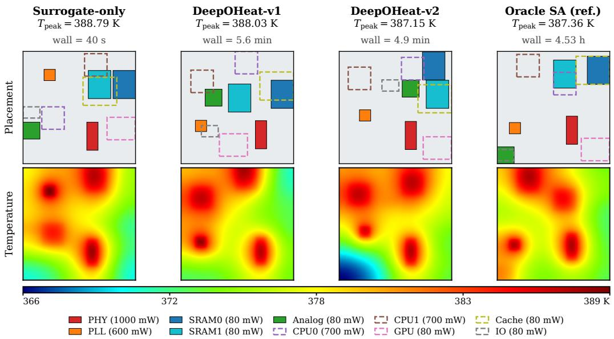  
Fig. 7. Optimized placements and oracle FVM temperature fields at the Die-1 active layer for the four configurations on the integrated run. Row 1: placement with Die 1 solid outlines and Die 2 dashed overlays. Row 2: oracle FVM field, shared color scale. DeepOHeat-v2 matches Oracle SA in placement structur and, to within the SA basin scatter (∼ 0.3 K), in peak temperature.

and abbreviate $\bar { h } : = \operatorname* { m a x } ( h _ { \mathrm { t o p } } , h _ { \mathrm { b o t } } )$

Lemma 6 (Two-sided operator conditioning). Let $L : V $ $V ^ { * } \ b e$ the bounded linear operator induced by $a ( \cdot , \cdot )$ on $( V , \parallel \cdot \parallel _ { H ^ { 1 } } )$ . There exist geometry-dependent constants $c _ { 0 } ( \Omega ) , C _ { \mathrm { t r } } , C _ { \mathrm { P F } } ( \Omega ) > 0$ such that

$$
\frac { k _ { \mathrm { m a x } } } { k _ { \mathrm { m i n } } } c _ { 0 } ( \Omega ) \leq \kappa ( L ) \leq \frac { k _ { \mathrm { m a x } } + C _ { \mathrm { t r } } \bar { h } } { k _ { \mathrm { m i n } } } \big ( 1 + C _ { \mathrm { P F } } ( \Omega ) \big ) .\tag{29}
$$

Proof sketch. The upper bound follows from continuity, $a ( T , T ) \leq \left( k _ { \operatorname* { m a x } } + C _ { \mathrm { t r } } \bar { h } \right) \| T \| _ { H ^ { 1 } } ^ { 2 }$ (trace theorem for the boundary term), and coercivity from a Robin–Poincaré inequality: because the Robin term penalizes the boundary trace of $T ,$ the gradient energy and that term together control the full norm, $\| T \| _ { H ^ { 1 } } ^ { 2 } \leq \widecheck { C } _ { \mathrm { P F } } \big ( \| \nabla T \| _ { L ^ { 2 } } ^ { 2 } + \| T \| _ { L ^ { 2 } ( \Gamma ) } ^ { 2 } \big )$ , so the constant mode is no longer in the null space (a homogeneous Poincaré inequality on $V$ would not hold). The lower bound uses two test functions concentrated in the high-k and low-k regions: the ratio of their Rayleigh quotients $a ( T , T ) / \| T \| _ { H ^ { 1 } } ^ { 2 }$ scales as ${ { k } _ { \operatorname* { m a x } } } / { { k } _ { \operatorname* { m i n } } }$ , bounding $\kappa ( L )$ below by that contrast factor.

With the benchmark contrast $k _ { \mathrm { m a x } } / k _ { \mathrm { m i n } } = 8 0 0$ and $c _ { 0 } ( \Omega ) \sim 5 0 \mathrm { - 1 0 0 }$ , the lower bound gives $\kappa ( L ) \gtrsim 4 – 8 \times 1 0 ^ { 4 }$ matching the measured $\kappa _ { 2 } ( { \bf A } _ { h } ) = 6 . 0 2 \times 1 0 ^ { 4 }$ (Appendix B) in order of magnitude. The discrete conditioning is thus intrinsic to the contrast, not a mesh artifact, and mesh refinement does not reduce it.

## B. Parameter-Space Transfer of the Conditioning Reduction

We make precise the transfer of Theorem 4 from prediction space to the parameter space the optimizer acts in (Section III-B). Let $\mathbf { J } : = \partial \widehat { \mathbf { T } } / \partial \pmb { \theta }$ be the network output Jacobian. On the parameter directions that change the prediction, the loss curvature is the pullback $\mathbf { J } ^ { \top } ( \nabla _ { \widehat { \mathsf { T } } } ^ { 2 } \bar { \mathcal { L } } ) \mathbf { J }$ . Where J has full column rank, $\kappa ( \mathbf { J } ^ { \top } \mathbf { H } \mathbf { J } ) \ \leq \ \kappa ( \mathbf { J } ) ^ { 2 } \kappa ( \mathbf { H } )$ for any SPD H. Taking $\mathbf { H } = \nabla _ { \widehat { \Gamma } } ^ { 2 } \mathcal { L } .$ , Theorem 4 reduces $\kappa ( \mathbf { H } )$ from $\kappa _ { 2 } ( { \bf A } _ { h } ) ^ { 2 }$ to $\kappa _ { 2 } ( { \bf A } _ { h } )$ , so the parameter-space bound tightens by the same factor; the Jacobian term $\kappa ( \mathbf { J } ) ^ { 2 }$ is identical for both losses and is unchanged by the rewrite.

## APPENDIX BTHE HOTSPOT-LOCALIZED BOUND AND OPERATORNUMERICS

## A. Derivation of the Bound

We derive the bound of Section IV-B: localizing the residual replaces the global norm $\| \mathbf { A } _ { h } ^ { - 1 } \| _ { 2 }$ in the error prefactor by the local diagonal entry $( \mathbf { A } _ { h } ^ { - 1 } ) _ { x ^ { * } , x ^ { * } }$ , which does not scale with $\kappa _ { 2 } ( { \bf A } _ { h } )$

Proposition 7 (Hotspot-localized a-posteriori bound). Write $\mathbf { A } _ { h } ^ { - 1 } \quad f o r$ the discrete Green’s function and $x ^ { * } : = \arg \operatorname* { m a x } _ { y } \widehat { \mathbf { T } } ( y )$ . Assume (A1) hotspot coincidence, arg $\operatorname { m a x } _ { y } { \hat { \mathbf { T } } } ( y ) ~ = ~ \operatorname { a r g m a x } _ { y } \mathbf { T } ( y )$ , so that $x ^ { * }$ is also the reference hotspot; and (A2) hotspot-row diagonal dominance, $( \mathbf { A } _ { h } ^ { - 1 } ) _ { x ^ { * } , x ^ { * } }$ is the row maximum of $\mathbf { A } _ { h } ^ { - 1 } \mathbf { \Phi } a t \mathbf { \Phi } x ^ { * } .$ . Then

$$
\begin{array} { r } { | e ( x ^ { * } ) | \ \leq \ \underbrace { \big ( \mathbf { A } _ { h } ^ { - 1 } \big ) _ { x ^ { * } , x ^ { * } } m r _ { \mathrm { h o t } } } _ { s i g n a l \ t e r m } + \underbrace { \big \| \big ( \mathbf { A } _ { h } ^ { - 1 } \big ) _ { x ^ { * } , \cdot \notin S _ { m } } \big \| _ { 2 } \| \mathbf { r } \| _ { 2 } } _ { t a i l \ t e r m } . } \end{array}\tag{30}
$$

The proof reads off the hotspot row of the error $\mathbf { e } : = \widehat { \mathbf { T } } -$ $\mathbf { T } = \mathbf { A } _ { h } ^ { - 1 } \mathbf { r }$ and splits it on and off $S _ { m } ;$ under (A1), |e(x<sup>∗</sup>)|

is the peak temperature error. Splitting the $x ^ { * }$ row,

$$
e ( x ^ { * } ) = \underset { y \in S _ { m } } { \sum } ( \mathbf A _ { h } ^ { - 1 } ) _ { x ^ { * } , y } \mathbf r ( y ) \qquad \\  = \underset { y \in S _ { m } } { \sum } ( \mathbf A _ { h } ^ { - 1 } ) _ { x ^ { * } , y } \mathbf r ( y ) + \underset { y \not \in S _ { m } } { \sum } ( \mathbf A _ { h } ^ { - 1 } ) _ { x ^ { * } , y } \mathbf r ( y ) .\tag{31}
$$

Signal term (on $S _ { m } ,$ via A2): The operator ${ \bf A } _ { h }$ is an SPD M-matrix: the harmonic-mean FVM stencil yields nonpositive off-diagonal entries and a strictly positive, Robin-augmented diagonal, so its inverse $\mathbf { A } _ { h } ^ { - 1 }$ has nonnegative entries (the thermal-spreading kernel, decaying away from the source) and the bounds below carry no absolute-value bars. Assumption (A2) makes the hotspot diagonal $( \mathbf { A } _ { h } ^ { - 1 } ) _ { x ^ { * } , x ^ { * } }$ the maximum of the $x ^ { * }$ row, so $( \mathbf { A } _ { h } ^ { - 1 } ) _ { x ^ { * } , y } \leq ( \mathbf { A } _ { h } ^ { - 1 } ) _ { x ^ { * } , x ^ { * } } ^ { }$ for every y, and in particular for $y \in S _ { m } .$ . Summing over $S _ { m }$ and applying the triangle inequality gives

$$
\begin{array} { r l r } {  { \Big | \sum _ { y \in S _ { m } } ( \mathbf { A } _ { h } ^ { - 1 } ) _ { x ^ { * } , y } \mathbf { r } ( y ) \Big | \leq ( \mathbf { A } _ { h } ^ { - 1 } ) _ { x ^ { * } , x ^ { * } } \sum _ { y \in S _ { m } } | \mathbf { r } ( y ) | } } \\ & { } & \\ & { } & { = ( \mathbf { A } _ { h } ^ { - 1 } ) _ { x ^ { * } , x ^ { * } } m r _ { \mathrm { h o t } } , } \end{array}\tag{32}
$$

using $\begin{array} { r } { r _ { \mathrm { h o t } } = \frac { 1 } { m } \sum _ { y \in S _ { m } } | \mathbf { r } ( y ) } \end{array}$ | from Definition 5.

Tail term (on $S _ { m } ^ { c } ,$ via Cauchy–Schwarz): Applying Cauchy–Schwarz to the row of $\mathbf { A } _ { h } ^ { - 1 }$ restricted to $S _ { m } ^ { c }$

$$
\Big | \sum _ { y \notin S _ { m } } ( \mathbf { A } _ { h } ^ { - 1 } ) _ { x ^ { * } , y } \mathbf { r } ( y ) \Big | \leq \left\| ( \mathbf { A } _ { h } ^ { - 1 } ) _ { x ^ { * } , \cdot \notin S _ { m } } \right\| _ { 2 } \| \mathbf { r } \| _ { 2 } .\tag{33}
$$

Adding the signal and tail bounds to the decomposition (31) yields the localized bound (30), completing the proof. The two assumptions on which it rests, (A1) and (A2), are verified numerically below.

The $9 2 \times$ coefficient: With the operator numerics reported below, namely $( \mathbf { A } _ { h } ^ { - 1 } ) _ { x ^ { * } , x ^ { * } } \ = \ 2 9 \mathfrak { E }$ 8 K/W, $\| \mathbf { A } _ { h } ^ { - 1 } \| _ { 2 } ~ = ~ 3 . 4 \times$ $1 0 ^ { 6 }$ K/W, and $\| ( \mathbf { A } _ { h } ^ { - 1 } ) _ { x ^ { * } , \cdot \notin S _ { m } } \| _ { 2 } \ = \ 3 . 6 9 \times \mathsf { \bar { 1 } 0 ^ { 4 } }$ K/W, the localized bound evaluates to $\approx 1 . 7 { \times } 1 0 ^ { 3 } \mathrm { \ K }$ , versus ≈ 1.6×10<sup>5</sup> K for the global relative-residual bound (24). The $\sim 9 2 \times$ gain is the ratio of the bound coefficients that multiply $\| \mathbf { r } \| _ { 2 }$ , namely $\| \mathbf { A } _ { h } ^ { - 1 } \| _ { 2 } / \| ( \mathbf { A } _ { h } ^ { - 1 } ) _ { x ^ { * } , \cdot \notin S _ { m } } \| _ { 2 } = 3 . 4 \times 1 0 ^ { 6 } / 3 . 6 9 \times 1 0 ^ { 4 } \approx 9 2$ . The localization replaces the global operator norm $\| \mathbf A _ { h } ^ { - 1 } \| _ { 2 }$ (which scales with $\kappa _ { 2 } ( \mathbf { A } _ { h } ) )$ with the local diagonal entry $\mathbf { \bar { ( A } } _ { h } ^ { - 1 } ) _ { x ^ { * } , x ^ { * } }$ (which does not). As noted in Section IV-B, both bounds are numerically loose against the observed 0.5–3 K errors and serve to identify which operator quantity controls the error. The detection power of $r _ { \mathrm { h o t } }$ is established empirically, through the Spearman correlation and catch rate of Section V-D.

## B. Operator Numerics and Assumption Verification

We report the numerics computed on the assembled operator $\mathbf { A } _ { h } \colon$ an estimate of its condition number $\kappa _ { 2 } ( { \bf A } _ { h } )$ , used throughout the paper, and a check of the two assumptions of Proposition 7.

Conditioning estimate: We estimate $\kappa _ { 2 } ( { \bf A } _ { h } )$ by Lanczos iteration on the assembled SPD operator: the largest eigenvalue from a forward Lanczos run and the smallest from inverse iteration (AMG-preconditioned solves), with the ratio $\kappa _ { 2 } ( \mathbf { A } _ { h } ) = \lambda _ { \operatorname* { m a x } } / \lambda _ { \operatorname* { m i n } } = 6 . 0 2 { \times } 1 0 ^ { 4 }$ converging to three significant figures within a few hundred Lanczos steps. The strongform loss-Hessian conditioning $\kappa ^ { 2 } : = \kappa _ { 2 } ( { \bf A } _ { h } ) ^ { \bar { 2 } } \approx 3 . 6 \times 1 0 ^ { 9 }$ is then derived from this value as in Section III-A, not measured separately.

Verification of A1 and A2: The two assumptions of Proposition 7 are checked on the same $n = 1 0 0$ held-out set used in Section V-D. (A1) hotspot coincidence: the predicted top-1 cell coincides with the reference top-1 cell, or the reference hotspot lies inside the predicted top-m set $S _ { m } ,$ on the great majority of the held-out placements; the remaining nearmisses are absorbed by the top-m aggregation, so detection is reported via the catch-rate curve rather than the bound. (A2) hotspot-row diagonal dominance: we verify directly on the assembled operator that $( \mathbf { A } _ { h } ^ { - 1 } ) _ { x ^ { * } , x ^ { * } }$ is the maximum entry of the $x ^ { * }$ row of $\mathbf { A } _ { h } ^ { - 1 }$ , consistent with the thermal-spreading kernel decaying away from the source; the operator numerics quoted above $( ( \mathbf { A } _ { h } ^ { - 1 } ) _ { x ^ { * } , x ^ { * } } = 2 9 8 ~ \mathrm { K } / \mathrm { W }$ and the tail-row norm) are read off the same computation.

## REFERENCES

[1] F. Tavakkoli, S. Ebrahimi, S. Wang, and K. Vafai, “Analysis of critical thermal issues in 3D integrated circuits,” International Journal of Heat and Mass Transfer, vol. 97, pp. 337–352, 2016.

[2] K. Cao, J. Zhou, T. Wei, M. Chen, S. Hu, and K. Li, “A survey of optimization techniques for thermal-aware 3D processors,” Journal of Systems Architecture, vol. 97, pp. 397–415, 2019.

[3] S. S. Iyer, “Heterogeneous integration for performance and scaling,” IEEE Transactions on Components, Packaging and Manufacturing Technology, vol. 6, no. 7, pp. 973–982, 2016.

[4] P. Li, L. T. Pileggi, M. Asheghi, and R. Chandra, “Efficient full-chip thermal modeling and analysis,” in IEEE/ACM International Conference on Computer Aided Design, 2004. ICCAD-2004. IEEE, 2004, pp. 319– 326.

[5] Z. Liu, S. Swarup, S. X.-D. Tan, H.-B. Chen, and H. Wang, “Compact lateral thermal resistance model of TSVs for fast finite-difference based thermal analysis of 3-D stacked ICs,” IEEE Transactions on Computer-Aided Design of Integrated Circuits and Systems, vol. 33, no. 10, pp. 1490–1502, 2014.

[6] H. Sultan, A. Chauhan, and S. R. Sarangi, “A survey of chip-level thermal simulators,” ACM Computing Surveys (CSUR), vol. 52, no. 2, pp. 1–35, 2019.

[7] R. Ranade, H. He, J. Pathak, N. Chang, A. Kumar, and J. Wen, “A thermal machine learning solver for chip simulation,” in Proceedings of the 2022 ACM/IEEE Workshop on Machine Learning for CAD, 2022, pp. 111–117.

[8] J. Wen, S. Pan, N. Chang, W.-T. Chuang, W. Xia, D. Zhu, A. Kumar, E.-C. Yang, K. Srinivasan, and Y.-S. Li, “DNN-based fast static on-chip thermal solver,” in 2020 36th Semiconductor Thermal Measurement, Modeling & Management Symposium (SEMI-THERM). IEEE, 2020, pp. 65–75.

[9] M. J. Smith, S. Hwang, V. C. Do Nascimento, Q. Qiu, C.-K. Koh, G. Subbarayan, and D. Jiao, “Real-time precision prediction of 3-D package thermal maps via image-to-image translation,” in 2023 IEEE 32nd Conference on Electrical Performance of Electronic Packaging and Systems (EPEPS). IEEE, 2023, pp. 1–3.

[10] C. Yang, S. Wang, X. Gao, Z. Zhang, and Z. Xu, “Real-time 3D thermal prediction for advanced packaging via machine learning,” International Journal of Heat and Mass Transfer, vol. 267, p. 128936, 2026.

[11] L. Lu, P. Jin, G. Pang, Z. Zhang, and G. E. Karniadakis, “Learning nonlinear operators via DeepONet based on the universal approximation theorem of operators,” Nature machine intelligence, vol. 3, no. 3, pp. 218–229, 2021.

[12] Z. Li, N. Kovachki, K. Azizzadenesheli, B. Liu, K. Bhattacharya, A. Stuart, and A. Anandkumar, “Fourier neural operator for parametric partial differential equations,” in International Conference on Learning Representations, 2021.

[13] X. Yu, S. Hooten, Z. Liu, Y. Zhao, M. Fiorentino, T. V. Vaerenbergh, and Z. Zhang, “Separable operator networks,” Transactions on machine learning research, 2024.

[14] H. Wu, H. Luo, H. Wang, J. Wang, and M. Long, “Transolver: A fast transformer solver for PDEs on general geometries,” in International Conference on Machine Learning (ICML). PMLR, 2024, pp. 53 681– 53 705.

[15] M. Raissi, P. Perdikaris, and G. E. Karniadakis, “Physics-informed neural networks: A deep learning framework for solving forward and inverse problems involving nonlinear partial differential equations,” Journal of Computational physics, vol. 378, pp. 686–707, 2019.

[16] Z. Lu, Y. Zhou, Y. Zhang, X. Hu, Q. Zhao, and X. Hu, “A fast general thermal simulation model based on multi-branch physics-informed deep operator neural network,” Physics of Fluids, vol. 36, no. 3, p. 037142, 2024.

[17] X. Wu, Z. Liu, R. Bai, Y. Wu, and X. Qian, “Data-driven and selfsupervised spectral operator learning methods for heat conduction equation with variable source functions,” Machine Learning: Science and Technology, vol. 7, no. 1, p. 015030, 2026.

[18] Z. Liu, Y. Li, J. Hu, X. Yu, S. Shiau, X. Ai, Z. Zeng, and Z. Zhang, “DeepOHeat: Operator learning-based ultra-fast thermal simulation in 3D-IC design,” in 2023 60th ACM/IEEE Design Automation Conference (DAC). IEEE, 2023, pp. 1–6.

[19] X. Yu, Z. Liu, H. Li, Y. Li, X. Ai, Z. Zeng, I. Young, and Z. Zhang, “DeepOHeat-v1: Efficient operator learning for fast and trustworthy thermal simulation and optimization in 3D-IC design,” IEEE Transactions on Components, Packaging and Manufacturing Technology, vol. 16, no. 1, pp. 82–96, 2026.

[20] Z. Liu, Y. Wang, S. Vaidya, F. Ruehle, J. Halverson, M. Soljacic, T. Hou, and M. Tegmark, “KAN: Kolmogorov–Arnold networks,” in International Conference on Learning Representations, 2025.

[21] Y. Sha, C. Zhang, and Q. Chen, “PI-ONet: A physics-informed operator network for efficient thermal analysis of multilayer chiplets,” IEEE Transactions on Components, Packaging and Manufacturing Technology, vol. 16, no. 3, pp. 493–505, 2026.

[22] S. Wang, X. Yu, and P. Perdikaris, “When and why PINNs fail to train: A neural tangent kernel perspective,” Journal of Computational Physics, vol. 449, p. 110768, 2022.

[23] T. De Ryck, F. Bonnet, S. Mishra, and E. De Bézenac, “An operator preconditioning perspective on training in physics-informed machine learning,” in International Conference on Learning Representations, 2024.

[24] P. Rathore, W. Lei, Z. Frangella, L. Lu, and M. Udell, “Challenges in training PINNs: A loss landscape perspective,” in International Conference on Machine Learning (ICML). PMLR, 2024, pp. 42 159– 42 191.

[25] M. Wang, Y. Cheng, W. Zeng, Z. Lu, V. F. Pavlidis, and W. Xing, “ARO: Autoregressive operator learning for transferable and multi-fidelity 3D-IC thermal analysis with active learning,” in Proceedings of the 43rd IEEE/ACM International Conference on Computer-Aided Design, 2024, pp. 1–9.

[26] Y. Saad and M. H. Schultz, “GMRES: A generalized minimal residual algorithm for solving nonsymmetric linear systems,” SIAM Journal on scientific and statistical computing, vol. 7, no. 3, pp. 856–869, 1986.

[27] W. E and B. Yu, “The deep Ritz method: A deep learning-based numerical algorithm for solving variational problems,” Communications in Mathematics and Statistics, vol. 6, no. 1, pp. 1–12, 2018.

[28] Z. Liu, R. Zhang, Z. Wang, Y. Zhao, Y. Su, Z. Yang, and Z. Zhang, “Muon<sup>2</sup>: Boosting Muon via adaptive second-moment preconditioning,” arXiv preprint arXiv:2604.09967, 2026.

[29] M. Wortsman, G. Ilharco, S. Y. Gadre, R. Roelofs, R. Gontijo-Lopes, A. S. Morcos, H. Namkoong, A. Farhadi, Y. Carmon, S. Kornblith, and L. Schmidt, “Model soups: averaging weights of multiple finetuned models improves accuracy without increasing inference time,” in International conference on machine learning. PMLR, 2022, pp. 23 965–23 998.

[30] K. A. Khan and P. I. Barton, “A vector forward mode of automatic differentiation for generalized derivative evaluation,” Optimization Methods and Software, vol. 30, no. 6, pp. 1185–1212, 2015.

[31] S. SS, K. AR, G. R, and A. KP, “Chebyshev polynomial-based Kolmogorov–Arnold networks: An efficient architecture for nonlinear function approximation,” arXiv preprint arXiv:2405.07200, 2024.

[32] A. D. Jagtap, E. Kharazmi, and G. E. Karniadakis, “Conservative physics-informed neural networks on discrete domains for conservation laws: Applications to forward and inverse problems,” Computer Methods in Applied Mechanics and Engineering, vol. 365, p. 113028, 2020.

[33] W.-F. Hu, T.-S. Lin, and M.-C. Lai, “A discontinuity capturing shallow neural network for elliptic interface problems,” Journal of Computational Physics, vol. 469, p. 111576, 2022.

[34] S. V. Patankar, Numerical heat transfer and fluid flow. Washington, DC: Hemisphere Publishing Corporation, 1980.

[35] H. Gao, L. Sun, and J.-X. Wang, “PhyGeoNet: Physics-informed geometry-adaptive convolutional neural networks for solving parameterized steady-state pdes on irregular domain,” Journal of Computational Physics, vol. 428, p. 110079, 2021.

[36] P.-H. Chiu, J. C. Wong, C. Ooi, M. H. Dao, and Y.-S. Ong, “CAN-PINN: A fast physics-informed neural network based on coupled-automatic– numerical differentiation method,” Computer Methods in Applied Mechanics and Engineering, vol. 395, p. 114909, 2022.

[37] E. Kharazmi, Z. Zhang, and G. E. Karniadakis, “Variational physicsinformed neural networks for solving partial differential equations,” arXiv preprint arXiv:1912.00873, 2019.

[38] K. Jordan, Y. Jin, V. Boza, J. You, F. Cesista, L. Newhouse, and J. Bernstein, “Muon: An optimizer for hidden layers in neural networks,” https://kellerjordan.github.io/posts/muon/, 2024, blog post.

[39] J. W. Ruge and K. Stüben, “Algebraic multigrid,” in Multigrid Methods, ser. Frontiers in Applied Mathematics, S. F. McCormick, Ed. Philadelphia, PA: SIAM, 1987, vol. 3, pp. 73–130.

[40] K. Stüben, “A review of algebraic multigrid,” Journal of Computational and Applied Mathematics, vol. 128, no. 1–2, pp. 281–309, 2001.

[41] P. J. Van Laarhoven and E. H. Aarts, “Simulated annealing,” in Simulated annealing: Theory and applications. Springer, 1987, pp. 7–15.

[42] P. Kidger and C. Garcia, “Equinox: neural networks in JAX via callable PyTrees and filtered transformations,” Differentiable Programming workshop at Neural Information Processing Systems, 2021, arXiv:2111.00254.

[43] N. Bell, L. N. Olson, and J. Schroder, “PyAMG: Algebraic multigrid solvers in Python,” Journal of Open Source Software, vol. 7, no. 72, p. 4142, 2022.

[44] Z. Huang, H. Xin, W. Yang, Y. Wei, Z. Yu, Y. Zhang, W. W. Xing, T.-J. Lin, and L. He, “Therm-FM: foundation model is ALL YOU NEED for 3D-ICs thermal simulation,” arXiv preprint arXiv:2605.22663, 2026.