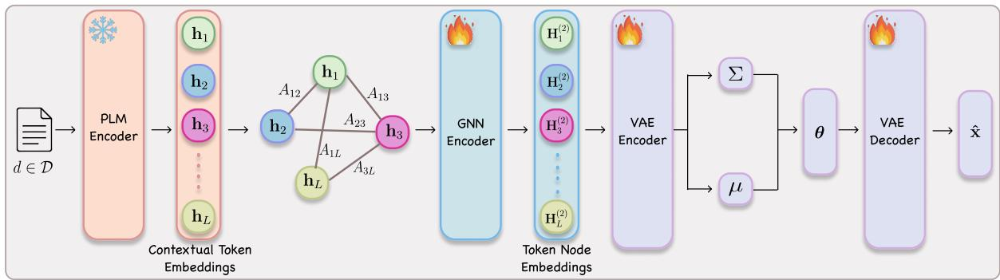

# Domain-Agnostic Neural Topic Modeling with Contextual Token-Level Semantic Graph Representation

Seung-Won Seo1, Won Ik Cho2, Yongmin Yoo3†

TelePIX1, AI Center, Samsung Electronics2

School of Computing & Frontier AI Research Centre, Macquarie University3 seungwonseo@telepix.net, {tsatsuki6,yooyongmin91}@gmail.com

## Abstract

Recent advances in neural topic models with pre-trained language models (PLMs) have achieved strong performance by leveraging general-domain pre-training, yet their topic interpretability often degrades on specialized corpora. This limitation primarily stems from the geometry of the embedding space, where domain-specific terms unseen during pretraining collapse into an indistinguishable region, and neither domain-specific re-training, word-level graph enrichment, nor parameterefficient fine-tuning can restructure this space without inheriting the capacity ceiling of the underlying encoder. Our key insight is that a learnable graph layer operating on token-level PLM embeddings can acquire corpus-specific semantic structure that the frozen encoder lacks, because token-level graphs preserve documentlocal context that word-level representations discard and joint optimization with the topic objective reshapes embedding geometry directly from target-domain evidence. We instantiate this insight as DARTOPIC, a domain-agnostic framework that constructs token-level semantic graphs from frozen PLM embeddings and jointly trains a GNN encoder with topic inference. Across three benchmarks spanning general, biomedical, and legal domains, DAR-TOPIC consistently outperforms strong baselines in topic coherence and document clustering without any encoder fine-tuning, while demonstrating robustness to PLM choice and favorable runtime efficiency over fine-tuningbased alternatives.

## 1 Introduction

Topic modeling has long been a fundamental technique in natural language processing (NLP), aiming to uncover latent semantic structures from large text collections (Wu et al., 2024a). Topic models have been extensively utilized across various applications, including text generation (Zhang et al.,

<table><tr><td>Model</td><td>Top-related words</td></tr><tr><td>FASTopic</td><td>develop, immunize, repeat, elicit, pseudomona, experiment, result, mechanic, correlate, occur, feature, convert</td></tr><tr><td>DARTopic</td><td>energy, cerevisiae, oxidative, peroxide, nitrate, hydrogen, carbon, kinetics, succinate, respiration, reduction, galactose</td></tr></table>

Table 1: Comparison of topics generated by FASTopic (Wu et al., 2024b) and DARTOPIC on BioASQ dataset. We report low-coherence words in RED font.

2022), sentiment analysis (Gui et al., 2022) and document summarization (Li et al., 2025).

Traditional probabilistic approaches such as Latent Dirichlet Allocation (LDA) (Blei et al., 2003), rely on bag-of-words (BoW) assumptions that disregard word order and fail to capture semantic similarity between lexically distinct but contextually related terms.

To address this, by replacing sparse BoW inputs with dense contextual document embeddings via pre-trained language models (PLMs), recent methods (Bianchi et al., 2021a; Grootendorst, 2022; Wu et al., 2024b) achieve strong performance, surpassing classical probabilistic approaches (Blei et al., 2003; Hofmann, 2013) and earlier VAE-based neural topic models (Miao et al., 2016; Srivastava and Sutton, 2017) by a wide margin. However, this success rests on the implicit assumption that the semantic geometry of the PLM embedding space adequately covers the vocabulary and relational structures of the target corpus. When this assumption holds, as in general-domain benchmarks whose distributions closely mirror PLM pre-training data, the resulting topics are coherent and interpretable.

Nevertheless, this assumption may not always hold in specialized domains such as biomedical and legal domains. Domain-specific terms that appear rarely or never in general pre-training corpora are mapped to a narrow, poorly differentiated region of the embedding space, a pathology known as representation degeneration (Gao et al., 2019; Godey et al., 2024). For topic modeling, this directly leads the inference network to conflate semantically distinct concepts into incoherent topics when domain-critical terms are represented as geometrically indistinguishable. As illustrated in Table 1, even FASTopic (Wu et al., 2024b), a recent state-ofthe-art model, produces topics on biomedical text that mix domain-relevant terms with generic, lowcoherence words such as repeat, mechanic, and feature, confirming that fixed PLM representations fail under domain shift.

Existing remedies each address only a partial aspect of this problem. Domain-specific PLMs such as BioBERT (Lee et al., 2020) can reshape the embedding geometry but require large-scale pretraining that is unavailable for many specialized fields. Graph-based neural topic models (Xu et al., 2023; Adhya and Sanyal, 2024; Liu et al., 2025) enrich representations with structural information, yet they operate on word-level graphs with fixed, context-independent node features and therefore cannot capture the contextual variation of the same term across documents. Parameter-efficient finetuning via prefix tuning (Li and Liang, 2021; Akash and Chang, 2024) adapts PLM representations at low cost, but if the frozen encoder cannot geometrically distinguish domain-specific terms in the first place, a lightweight prefix cannot overcome this representational ceiling. None of these approaches resolves the fundamental coupling between topic quality and PLM pre-training coverage.

Our key insight is that this coupling can be broken by interposing a learnable, corpus-specific graph layer between frozen token embeddings and topic inference. Rather than treating PLM outputs as fixed final representations or attempting to adapt the encoder itself, we propose to use them as initial node features for a dynamically constructed token-level semantic graph, which a graph neural network (GNN) then refines jointly with the topic objective. Token-level construction captures contextual semantics that word-level graphs miss, because each token node carries document-specific neighborhood structure. Joint GNN-topic optimization discovers corpus-specific relational patterns that the frozen PLM never observed during pretraining. And because the GNN operates over the full token embedding space, it is not bounded by the narrow capacity of a prefix adapter.

Based on this insight, we propose DARTOPIC (Domain-Agnostic neuRal Topic modeling), a lightweight framework that constructs token-level semantic graphs from frozen PLM embeddings and jointly trains a GNN encoder with topic inference. As shown in Table 1, DARTOPIC generates topics consistently organized around coherent biomedical concepts such as oxidative stress, respiration, and carbon metabolism, achieved without any domainspecific pre-training or fine-tuning.

Our contributions can be summarized as follows:

• We show that the performance ceiling of PLMpowered topic models under domain shift arises from fixed embedding geometry, and propose DARTOPIC, which breaks by leveraging token-level semantic graph representations.

• We reveal that token-level semantic graphs capture corpus-specific structure beyond word-level graphs and PLM representations, yielding robust topic quality across various PLMs.

• We demonstrate that learning relational structure from target-domain data enables a lightweight graph architecture to bridge domain gaps in frozen PLMs and achieve strong performance across diverse domains.

## 2 Related Works

## 2.1 PLM-powered Neural Topic Models

Early neural topic models reformulated topic inference within VAE frameworks (Miao et al., 2016; Srivastava and Sutton, 2017), replacing the intractable posteriors of LDA (Blei et al., 2003) with amortized inference networks, though their reliance on bag-of-words representations limited topic coherence. Subsequent work incorporated static word embeddings such as GloVe (Pennington et al., 2014) to encourage semantically similar words to share topic assignments, partially mitigating this limitation.

The introduction of contextual PLMs marked a more substantial shift: CombinedTM (Bianchi et al., 2021a) combines dense Sentence-BERT (Reimers and Gurevych, 2019) embeddings with BoW features, while BERTopic (Grootendorst, 2022) adopts a clustering-based approach leveraging contextual embeddings to group semantically coherent documents. More recent models such as FASTopic (Wu et al., 2024b) and NeuroMax (Pham et al., 2024) further advance this paradigm through optimal transport-based alignment and mutual information maximization, respectively, achieving strong performance on general-domain benchmarks.

Despite their effectiveness, PLM-powered models are fundamentally constrained by their pretraining domain coverage. When applied to specialized domains such as biomedical or legal text, the divergence between pre-training and target distributions leads to degraded topic coherence. Domainspecific PLMs (Lee et al., 2020) can partially address this gap but require costly large-scale pretraining that is not always feasible. PVTM (Akash and Chang, 2024) mitigates domain shift via prefix tuning (Li and Liang, 2021) of the PLM encoder, yet its quality remains tightly coupled to the underlying PLM capacity. In particular, lightweight models with limited prior knowledge struggle to produce coherent topics under significant domain shift, regardless of the tuning strategy applied.

## 2.2 Graph-based Neural Topic Models

Graph neural networks (GNNs) have demonstrated strong representational capacity across NLP tasks (Wu et al., 2023a), and several lines of work have explored their application to topic modeling. Early graph-based models focused on alleviating data sparsity in short-text settings, where limited token co-occurrence information impedes reliable topic inference (Cheng et al., 2014; Zhu et al., 2018; Wang et al., 2021a), enriching structural signals via corpus-level word co-occurrence graphs. Zhou et al. (2020) extended this by explicitly modeling document-level relational structures at the corpus level.

More recent work integrates GNNs with pretrained embeddings: GINopic (Adhya and Sanyal, 2024) employs graph isomorphism network (GIN) over word graphs to capture higher-order relational structures, CGTM (Liu et al., 2025) fuses PLM-based contextual document embeddings with graph-structured word representations, and Meta-CETM (Xu et al., 2023) uses a variational graph auto-encoder over dependency-parsed word graphs for low-resource settings. However, all of these approaches rely on fixed pre-trained embeddings, propagating domain-mismatched semantics through the graph regardless of architecture.

Taken together, PLM and graph-based topic models share a fundamental vulnerability: their representations are anchored to fixed pre-training knowledge that may not reflect the semantic structures of the target domain. DARTOPIC addresses this gap by constructing token-level semantic graphs whose node representations are initialized from a frozen PLM and jointly refined with the topic inference objective, learning corpus-adaptive representations directly from target data without reliance on domain-specific pre-training.

## 3 Proposed Methodology

## 3.1 Problem Statement

Notations. Let $\mathcal { D } \ = \ \{ d _ { 1 } , d _ { 2 } , . . . , d _ { N } \}$ denote a corpus consisting of N documents. Each document $d _ { i }$ is represented as a sequence of tokens $d _ { i } = ( t _ { i 1 } , t _ { i 2 } , . . . , t _ { i L _ { i } } )$ , where $L _ { i }$ denotes the number of tokens in the document and each token $t _ { i j }$ corresponds to a word from a vocabulary set V with size $V = | \nu |$ . In topic modeling, documents are commonly represented using a bag-of-words (BoW) representation. Let $\mathbf { x } _ { i } \in \mathbb { R } ^ { V }$ denote the BoW vector for document $d _ { i }$ , where $\mathbf { x } _ { i v }$ indicates the frequency of word v in the document. A topic model assumes the existence of K latent topics. Each document is associated with a documenttopic distribution $\pmb { \theta } _ { i } \in \Delta ^ { K }$ , where $\Delta ^ { K }$ denotes a K-dimensional probability simplex. Each topic k is characterized by a topic-word distribution $\beta _ { k } \in \Delta ^ { V }$ , and the topic-word matrix is denoted as $\beta \in \mathbb { R } ^ { K \times V }$ where $\beta _ { k v }$ represents the probability of word v under topic k. The log-likelihood of document $d _ { i }$ under the topic model is given by (Blei et al., 2003):

$$
\log p ( d _ { i } \mid \theta _ { i } , \beta ) = \sum _ { v = 1 } ^ { V } x _ { i v } \log \left( \sum _ { k = 1 } ^ { K } \theta _ { i k } \beta _ { k v } \right)\tag{1}
$$

Topic Modeling with Document Representations. Recent neural topic models often incorporate pre-trained language encoders to obtain semantic document representations (Bianchi et al., 2021b,a; Pham et al., 2024; Wu et al., 2024b; Akash and Chang, 2024; Liu et al., 2025). Let $f ( \cdot )$ denote a pre-trained encoder that maps a document $d _ { i }$ into a dense vector representation $\mathbf { z } _ { i } ~ \in ~ \mathbb { R } ^ { H }$ where H denotes the embedding dimension, i.e., $\mathbf { z } _ { i } = f ( d _ { i } )$ . Such encoders are typically trained on large-scale corpora and provide contextualized semantic representations of documents. In neural topic modeling frameworks, the document representation $\mathbf { z } _ { i }$ is used as input to an inference network that estimates the document-topic distribution. Formally, the document-topic distribution is obtained as $\pmb \theta _ { i } = g ( \mathbf z _ { i } )$ , where $g ( \cdot )$ denotes a inference network. The topic model then learns topic-word distributions $\beta$ by maximizing the log-likelihood of documents given the inferred topic mixtures:

  
Figure 1: The overall architecture of our proposed DARTOPIC framework. denotes frozen parameters, while denotes trainable parameters.

$$
\operatorname* { m a x } _ { \beta , g } \sum _ { i = 1 } ^ { N } \log p ( d _ { i } \mid \theta _ { i } , \beta ) , \quad \mathrm { w h e r e } \theta _ { i } = g ( f ( d _ { i } ) ) .\tag{2}
$$

Since contextualized document representations obtained from a pre-trained encoder often capture rich semantic information, they can significantly contribute to the discovery of coherent topics. Such contextual information can help the topic model better identify semantically related words and improve the overall quality of the learned topic-word distributions. Therefore, our main goal is to effectively leverage contextual information derived from the pre-trained encoder while adapting it to heterogeneous domain corpora.

## 3.2 Token-Level Semantic Graph Construction

To effectively represent documents from heterogeneous domains, we construct a token-level graph representation by leveraging token embeddings obtained from a pre-trained language model (PLM). Inspired by (Angelov and Inkpen, 2024; Donabauer and Kruschwitz, 2025), we represent each document as a graph where nodes correspond to tokens and edges capture relationships between tokens within the same document.

The motivation for adopting a token-level graph representation is closely related to the domainagnostic setting considered in this work. When documents originate from diverse domains, contextual information available in the training corpus may be insufficient to learn high-quality word representations without extensive fine-tuning. In such scenarios, relying solely on corpus-level statistics can lead to suboptimal semantic representations.

To alleviate this issue, we explicitly leverage the knowledge embedded in a PLM by constructing graphs based on token embeddings extracted from the PLM. This design allows the model to incorporate rich semantic knowledge acquired during large-scale pretraining while maintaining robustness under low-resource or cross-domain conditions. Unlike the token-level graph construction strategy (Donabauer and Kruschwitz, 2025), which connects tokens based on local co-occurrence windows (i.e., an n-hop or sliding-window graph), we construct a semantic graph where edges are determined by the similarity between token embeddings. The difference in graph construction reflects the different inductive biases required by the target task. Local window-based graphs emphasize positional proximity and syntactic relations, which are beneficial for text classification tasks (Wang et al., 2021b, 2024). In contrast, topic modeling aims to uncover latent semantic structures among words across a document. Therefore, a graph that directly captures semantic similarity provides a more appropriate inductive bias for topic modeling task. A detailed empirical analysis comparing different graph construction strategies is presented in Appendix D.

To obtain token embeddings, we employ the lightweight small-scale pre-trained model1, which offers a good trade-off between computational efficiency and representation quality, making it suitable for low-resource settings. The tokenizer used in our framework is defined as WordPiece tokenizer (Song et al., 2021). Given a document containing L tokens, we denote the token embedding matrix as $\mathbf { H } = [ \mathbf { h } _ { 1 } , \mathbf { h } _ { 2 } , \ldots , \mathbf { h } _ { L } ] \in \mathbb { R } ^ { L \times d }$ , where $\mathbf { h } _ { i } \in \mathbb { R } ^ { d }$ represents the contextual embedding of the i-th token obtained from the PLM. We construct an undirected and weighted token-level semantic graph $G = ( V , E )$ , where each node $v _ { i } \in V$ corresponds to a token embedding $\mathbf { h } _ { i }$ . The edges are defined based on cosine similarity between token embeddings. Specifically, the adjacency matrix $\mathbf { A } \in \mathbb { R } ^ { L \times \bar { L } }$ is defined as follows:

$$
A _ { i j } = { \left\{ \begin{array} { l l } { \cos ( \mathbf { h } _ { i } , \mathbf { h } _ { j } ) , } & { { \mathrm { i f ~ } } \cos ( \mathbf { h } _ { i } , \mathbf { h } _ { j } ) \geq \tau } \\ { 0 , } & { { \mathrm { o t h e r w i s e } } } \end{array} \right. }\tag{3}
$$

where cos $( \mathbf { h } _ { i } , \mathbf { h } _ { j } )$ denotes the cosine similarity between token embeddings and $\tau$ is a predefined similarity threshold controlling graph sparsity. The constructed token-level semantic graph is subsequently processed by a graph neural network to learn contextualized node representations, which are then used for topic inference.

## 3.3 Graph Representation Learning

We employ a two-layer graph convolutional network (GCN) (Kipf and Welling, 2017) to propagate semantic information over the token graph and obtain node embeddings that encode both token semantics and document-specific structural relations.

Let a document graph be denoted as $G = ( V , E )$ with adjacency matrix $\mathbf { A } \in \mathbb { R } ^ { L \times L }$ and node feature matrix $\mathbf { X } \in \mathbb { R } ^ { L \times d }$ , where L is the number of tokens in the document and d is the dimensionality of the PLM-based token embeddings. Following the standard GCN formulation (Kipf and Welling, 2017), we apply symmetric normalization with self-loops: $\hat { \textbf { A } } = \tilde { \textbf { D } } ^ { - \frac { 1 } { 2 } } ( \textbf A + \textbf I ) \tilde { \textbf { D } } ^ { - \frac { 1 } { 2 } }$ The first layer computes hidden representations as $\mathbf { H } ^ { ( 1 ) } = \operatorname { R e L U } ( \hat { \mathbf { A } } \hat { \mathbf { X } } \mathbf { W } ^ { ( 1 ) } + \mathbf { b } ^ { ( 1 ) } )$ , and the second layer produces the final node representations as

$$
\mathbf { H } ^ { ( 2 ) } = \operatorname { R e L U } ( \hat { \mathbf { A } } \mathbf { H } ^ { ( 1 ) } \mathbf { W } ^ { ( 2 ) } + \mathbf { b } ^ { ( 2 ) } ) ,\tag{4}
$$

where $\mathbf { W } ^ { ( \cdot ) }$ and $\mathbf { b } ^ { ( \cdot ) }$ are learnable parameters of each layer. The resulting matrix $\mathbf { H } ^ { ( \hat { 2 } ) } \in \mathbb { R } ^ { L \times d ^ { \prime } }$ contains the contextualized embeddings of all token nodes. Graph convolution enables each token representation to be enriched by semantically related neighbors in the document graph, which is particularly desirable for topic modeling where semantically coherent groups of tokens should be aggregated into document-level latent representations. To derive a fixed-length document representation, we apply mean pooling over all token nodes:

$$
\mathbf { g } = \frac { 1 } { L } \sum _ { i = 1 } ^ { L } \mathbf { H } _ { i } ^ { ( 2 ) } ,\tag{5}
$$

where $\mathbf { H } _ { i } ^ { ( 2 ) }$ denotes the contextualized embedding of the i-th token node.

## 3.4 DARTOPIC Framework

In this subsection, we present the overall DAR-TOPIC framework. The overall architecture is illustrated in Figure 1, our framework is designed to remain lightweight while effectively leveraging PLM-derived token semantics for neural topic modeling on various domains. To this end, DARTOPIC consists of a graph encoder for token-level document representation learning and a compact VAEbased topic inference module.

Lightweight Architecture. A key design principle of DARTOPIC is to keep the overall architecture lightweight. Unlike prior contextualized neural topic models that use dense contextual representations together with sparse lexical features such as TF-IDF or bag-of-words (BoW) vectors (Bianchi et al., 2021b; Adhya and Sanyal, 2024), we do not employ any joint input structure with sparse document embeddings. Such hybrid architectures often require additional projection layers or high-dimensional transformations, which increase the number of learnable parameters. Instead, we use only the graph-level document representation $\mathbf { g } \in \mathbb { R } ^ { d ^ { \prime } }$ obtained by mean pooling over all token nodes, as defined in Eq.5. By directly using g as the input of the topic model, DARTOPIC avoids the need to concatenate additional sparse document features, reducing computational cost and minimizing the number of trainable parameters.

Topic Inference. Following (Bianchi et al., 2021b), we employ a variational autoencoder (VAE) to infer the latent topic structure of the documents. The encoder maps g to the parameters of a Gaussian posterior distribution over the latent variable $\textbf { z } \in \ \mathbb { R } ^ { K }$ , where K denotes the number of topics. Concretely, the encoder produces the mean vector µ and log-variance vector log $\sigma ^ { 2 }$ as $\mu = f _ { \mu } ( \mathbf { g } )$ and log $\sigma ^ { 2 } = f _ { \sigma } ( \mathbf { g } )$ , where $f _ { \mu } ( \cdot )$ and $f _ { \sigma } ( \cdot )$ denote neural transformations of VAE. To enable gradient-based optimization, we adopt the reparameterization trick (Kingma and Welling, 2013) and sample the latent variable as $\mathbf { z } = \pmb { \mu } + \pmb { \sigma } \odot \pmb { \epsilon }$ , where $\mathbf { \epsilon } \gets \mathcal { N } ( \mathbf { 0 } , \mathbf { I } )$ and ⊙ denotes element-wise multiplication. The sampled latent variable is then transformed into the documenttopic distribution $\pmb \theta \in \mathbb { R } ^ { K }$ through a softmax function, i.e., θ = softmax(z).

Overall Training Objective. The GNN encoder and the VAE-based neural topic model are trained jointly in an end-to-end unsupervised manner. Let $\mathbf { x } _ { \mathrm { b o w } } \in \mathbb { R } ^ { V }$ denote the target document word-count vector over a vocabulary set of size V , and let $\hat { \mathbf { x } } \in \mathbb { R } ^ { V }$ denote the reconstructed word distribution generated from the inferred topic mixture θ through the decoder. The reconstruction loss is defined as the negative log-likelihood of the observed document under the reconstructed word distribution:

$$
\mathcal { L } _ { \mathrm { r e c } } = \frac { 1 } { N } \sum _ { i = 1 } ^ { N } \left[ - ( \mathbf { x } _ { i } ) ^ { \top } \log \left( \operatorname { s o f t m a x } ( \beta \pmb { \theta } _ { i } ) \right) \right] .\tag{6}
$$

To regularize the latent topic space, we impose a standard Gaussian prior on z, i.e., $p ( \mathbf { z } ) = \mathcal { N } ( \mathbf { 0 } , \mathbf { I } )$ The Kullback–Leibler (KL) divergence between the approximate posterior $q ( \mathbf { z } \mid \mathbf { g } )$ and the prior is defined as follows:

$$
\begin{array} { r } { \mathcal { L } _ { \mathrm { K L } } = D _ { \mathrm { K L } } \big ( q ( { \mathbf { z } } \mid { \mathbf { g } } ) \| p ( { \mathbf { z } } ) \big ) . } \end{array}\tag{7}
$$

The overall training objective of DARTOPIC is given by $\mathcal { L } = \mathcal { L } _ { \mathrm { r e c } } + \mathcal { L } _ { \mathrm { K L } }$ By optimizing this objective, the GCN-based graph encoder and the VAE-based topic model are trained simultaneously. Importantly, the token-level graph representation learning module is not optimized with a separate graph-specific supervision signal; instead, it is directly guided by the neural topic modeling objective. This allows the learned token and document representations to be specialized for latent topic inference while preserving the lightweight nature of the overall framework.

## 4 Experiments

## 4.1 Experimental Setup

Datasets. We conduct experiments on three benchmarks with heterogeneous domain texts: 20News-Group (20NG) (General), BioASQ (Biomedical) and BillSum (Bills) (Kornilova and Eidelman, 2019) (Legal). The statistics of the processed datasets are shown in Table 7 in Appendix A.

Baselines. We compare our framework with the following neural topic models: (1) FASTopic (Wu et al., 2024b), the recent state-of-the-art neural topic model using embedding regularization with optimal transport, (2) BERTopic (Grootendorst, 2022), a standard clustering-based topic model, (3) ProdLDA (Srivastava and Sutton, 2017), a first VAE-based standard neural topic model, (4) ZeroShotTM (Bianchi et al., 2021b) which replaces input data with PLM-based document representation, (5) CombinedTM (Bianchi et al., 2021a) which integrates BoW embeddings with PLM representations, (6) PVTM (Akash and Chang, 2024), a VAE-based neural topic model with parameterefficient fine-tuning method, (7) GINopic (Adhya and Sanyal, 2024), a graph-based neural topic model with graph isomorphism network, (8) CGTM (Liu et al., 2025), a neural topic model utilizing both Graph and PLMs, (9) NeuroMax (Pham et al., 2024), a lightweight neural topic model using PLM only in training time. The implementation details of baseline models are shown in Appendix B.

Evaluation. We use automatic evaluation metrics such as NPMI (Lau et al., 2014) (topic coherence) and TU (Nan et al., 2019) (topic diversity). For topic coherence evaluation on domainspecific texts, we follow (Han et al., 2023) and use the NPMI-In score. To evaluate coherence and diversity as a whole, we also use Topic Quality (TQ) (Dieng et al., 2020). Furthermore, to evaluate the quality of document-topic distributions, we conduct document clustering task and report Purity and normalized mutual information (NMI) (Manning et al., 2008). NMI measures the agreement between predicted topic assignments and groundtruth labels, while Purity assesses how consistently each cluster contains documents from a single class. Please refer to Appendix C for the detailed.

## 4.2 Main Results

Topic-Word Distribution Quality. We report the mean value over 5 random runs with 50 topics. Table 2 reports the topic-word distribution quality results on three datasets with different domains. Overall, DARTOPIC achieves consistently strong performance across all datasets, demonstrating its robustness to both domain variation and document length. In particular, the average document lengths of the three corpora are substantially different, i.e., 48.02 for 20NG, 7.44 for BioASQ, and 76.28 for Bills, yet DARTOPIC maintains superior or highly competitive results in all cases. This indicates that the proposed framework can effectively capture topic structure regardless of whether the target corpus consists of short or long documents. PVTM shows strong overall performance by leveraging parameter-efficient fine-tuning (PEFT) such as prefix tuning (Li and Liang, 2021) to adapt pretrained language models to domain-specific corpora. NeuroMax, in contrast, achieves perfect or near-perfect topic diversity through its embedding clustering regularization (ECR) (Wu et al., 2023b), but this comes at the cost of substantially weaker topic coherence. Compared with these methods, DARTOPIC provides a more balanced and reliable trade-off between coherence and diversity. Specifically, DARTOPIC achieves the best NPMI and TQ scores on all three datasets, while also maintaining highly competitive TU scores, demonstrating that it can generate topics that are not only diverse but also semantically coherent. These results suggest that DARTOPIC is not merely specialized for a particular domain or corpus condition, but instead offers a generally effective topic modeling framework across heterogeneous datasets. Its consistent gains over strong baselines further highlight the advantage of graph-based document representation learning for improving topic quality in neural topic modeling.

<table><tr><td>Dataset</td><td>Domain</td><td>Metric</td><td>ProdLDA</td><td>FASTopic</td><td>BERTopic</td><td>ZeroShotTM</td><td>CombinedTM</td><td>NeuroMax</td><td>PVTM</td><td>GINopic</td><td>CGTM</td><td>DARTOPIC (ours)</td></tr><tr><td rowspan="3">20NG</td><td rowspan="3">General</td><td>NPMI</td><td>0.1581</td><td>0.2624</td><td>0.2300</td><td>0.2604</td><td>0.1670</td><td>0.1833</td><td>0.2707</td><td>0.2172</td><td>0.2520</td><td>0.2736</td></tr><tr><td>TU</td><td>0.7613</td><td>0.8813</td><td>0.4547</td><td>0.9227</td><td>0.7853</td><td>1.0000</td><td>0.9133</td><td>0.4747</td><td>0.5227</td><td>0.9360</td></tr><tr><td>TQ</td><td>0.1203</td><td>0.2313</td><td>0.1046</td><td>0.2403</td><td>0.1311</td><td>0.1833</td><td>0.2473</td><td>0.1031</td><td>0.1317</td><td>0.2561</td></tr><tr><td rowspan="3">BioASQ</td><td rowspan="3">Biomedical</td><td>NPMI</td><td>0.0142</td><td>0.0789</td><td>0.1653</td><td>0.1448</td><td>0.0120</td><td>0.0094</td><td>0.1596</td><td>0.0213</td><td>0.1377</td><td>0.1641</td></tr><tr><td>TU</td><td>0.8213</td><td>0.4093</td><td>0.7320</td><td>0.8640</td><td>0.8080</td><td>1.0000</td><td>0.9730</td><td>0.8013</td><td>0.6947</td><td>0.9760</td></tr><tr><td>TQ</td><td>0.0117</td><td>0.0323</td><td>0.1210</td><td>0.1251</td><td>0.0097</td><td>0.0094</td><td>0.1553</td><td>0.0171</td><td>0.0957</td><td>0.1602</td></tr><tr><td rowspan="3">Bills</td><td rowspan="3">Legal</td><td>NPMI</td><td>0.0387</td><td>0.2291</td><td>0.1795</td><td>0.2525</td><td>0.0425</td><td>0.0506</td><td>0.2609</td><td>0.0371</td><td>0.2318</td><td>0.2685</td></tr><tr><td>TU</td><td>0.7853</td><td>0.9720</td><td>0.4787</td><td>0.9000</td><td>0.7813</td><td>1.0000</td><td>0.9133</td><td>0.8080</td><td>0.6013</td><td>0.9240</td></tr><tr><td>TQ</td><td>0.0304</td><td>0.2226</td><td>0.0859</td><td>0.2272</td><td>0.0332</td><td>0.0506</td><td>0.2383</td><td>0.0300</td><td>0.1394</td><td>0.2481</td></tr></table>

Table 2: Main results on topic-word distribution quality across three domains: general (20NG), biomedical (BioASQ) and legal (Bills). The best performance in each row is shown in bold and the second-best is underlined.

Doc-Topic Distribution Quality. We evaluate document-topic distributions via a downstream clustering task. The Bills dataset lacks document labels and is also omitted. Following Adhya and Sanyal (2024), each document is assigned to its highest-probability topic. Table 4 reports the results. DARTOPIC shows strong performance on both 20NG and BioASQ, with a clearer advantage on BioASQ, where domain-specific terms are poorly separated in the frozen PLM space and the graph layer’s corpus-learned structure provides greater discriminative benefit.

<table><tr><td></td><td>NPMI</td><td>TU</td><td>TQ</td><td>Purity</td><td>NMI</td></tr><tr><td>MiniLM</td><td>0.1641</td><td>0.9760</td><td>0.1602</td><td>0.5235</td><td>0.3833</td></tr><tr><td>Roberta-large</td><td>0.1660</td><td>0.9680</td><td>0.1606</td><td>0.4738</td><td>0.3492</td></tr><tr><td>Qwen-0.6B</td><td>0.1644</td><td>0.9653</td><td>0.1587</td><td>0.4829</td><td>0.3555</td></tr><tr><td>BioBERT</td><td>0.1690</td><td>0.9693</td><td>0.1638</td><td>0.5061</td><td>0.3696</td></tr></table>

Table 3: Comparison of DARTOPIC performance on BioASQ dataset with different pre-trained models.
<table><tr><td rowspan="2"></td><td colspan="2">20NG</td><td colspan="2">BioASQ</td></tr><tr><td>Purity</td><td>NMI</td><td>Purity</td><td>NMI</td></tr><tr><td>ProdLDA</td><td>0.1186</td><td>0.1652</td><td>0.2032</td><td>0.1030</td></tr><tr><td>BERTopic</td><td>0.4347</td><td>0.3369</td><td>0.4666</td><td>0.3205</td></tr><tr><td>FASTopic</td><td>0.4743</td><td>0.4089</td><td>0.4339</td><td>0.3650</td></tr><tr><td>ZeroshotTM</td><td>0.4555</td><td>0.3657</td><td>0.3217</td><td>0.3312</td></tr><tr><td>CombinedTM</td><td>0.1963</td><td>0.2262</td><td>0.2466</td><td>0.1566</td></tr><tr><td>NeuroMax</td><td>0.1889</td><td>0.2530</td><td>0.2561</td><td>0.2802</td></tr><tr><td>PVTM</td><td>0.4927</td><td>0.3917</td><td>0.5174</td><td>0.3824</td></tr><tr><td>GINopic</td><td>0.2122</td><td>0.2523</td><td>0.2440</td><td>0.1619</td></tr><tr><td>CGTM</td><td>0.4562</td><td>0.3900</td><td>0.4809</td><td>0.3626</td></tr><tr><td>DARTOPIC (ours)</td><td>0.4905</td><td>0.3968</td><td>0.5235</td><td>0.3833</td></tr></table>

Table 4: Performance comparison on document clustering task using document-topic distribution vector. The best-performing method is highlighted in bold and second-best performance is underlined.

## 5 Analysis

## 5.1 Robustness Analysis

We analyze the robustness of neural topic models under different PLM choices, including generalpurpose PLMs and a domain-specific PLM, BioBERT. Tables 3 and 5 report the results on the BioASQ dataset.

Table 3 shows the performance of DARTOPIC with various PLMs, ranging from lightweight models such as MiniLM to larger or domain-specific encoders such as RoBERTa-large, Qwen-0.6B, and BioBERT. The results demonstrate that DARTOPIC achieves consistently strong performance across different PLM choices, with only limited variation. This indicates that DARTOPIC is robust to both the scale and type of the underlying encoder, making it practical even when smaller and more efficient PLMs are preferred.

<table><tr><td>Methods</td><td>PLMs</td><td>NPMI</td><td>TU</td><td>TQ</td><td>Purity</td><td>NMI</td></tr><tr><td>FASTopic</td><td>MiniLM</td><td>0.0789</td><td>0.4093</td><td>0.0323</td><td>0.4339</td><td>0.3650</td></tr><tr><td>FASTopic</td><td>BioBERT</td><td>0.1146</td><td>0.9920</td><td>0.1137</td><td>0.4439</td><td>0.3375</td></tr><tr><td>ZeroshotTM</td><td>MiniLM</td><td>0.1448</td><td>0.8640</td><td>0.1251</td><td>0.3217</td><td>0.3312</td></tr><tr><td>ZeroshotTM</td><td>BioBERT</td><td>0.1628</td><td>0.9680</td><td>0.1576</td><td>0.4967</td><td>0.3652</td></tr><tr><td>CombinedTM</td><td>MiniLM</td><td>0.0120</td><td>0.8080</td><td>0.0097</td><td>0.2466</td><td>0.1566</td></tr><tr><td>CombinedTM</td><td>BioBERT</td><td>0.0130</td><td>0.7813</td><td>0.0102</td><td>0.1108</td><td>0.1157</td></tr><tr><td>BERTopic</td><td>MiniLM</td><td>0.1653</td><td>0.7320</td><td>0.1210</td><td>0.4666</td><td>0.3205</td></tr><tr><td>BERTopic</td><td>BioBERT</td><td>0.1601</td><td>0.7013</td><td>0.1123</td><td>0.4247</td><td>0.3031</td></tr><tr><td>NeuroMax</td><td>MiniLM</td><td>0.0094</td><td>1.0000</td><td>0.0094</td><td>0.2561</td><td>0.2802</td></tr><tr><td>NeuroMax</td><td>BioBERT</td><td>0.0073</td><td>1.0000</td><td>0.0073</td><td>0.2490</td><td>0.1994</td></tr><tr><td>PVTM</td><td>MiniLM</td><td>0.1596</td><td>0.9730</td><td>0.1553</td><td>0.5174</td><td>0.3824</td></tr><tr><td>PVTM</td><td>BioBERT</td><td>0.1716</td><td>0.9707</td><td>0.1666</td><td>0.4908</td><td>0.3651</td></tr><tr><td>CGTM</td><td>MiniLM</td><td>0.1377</td><td>0.6947</td><td>0.0957</td><td>0.4809</td><td>0.3626</td></tr><tr><td>CGTM</td><td>BioBERT</td><td>0.1366</td><td>0.6040</td><td>0.0825</td><td>0.4632</td><td>0.3437</td></tr></table>

Table 5: PLM dependency of PLM-powered neural topic models performance on BioASQ dataset. The better result is highlighted in bold for each metric.

Table 5 further compares recent PLM-based neural topic models using MiniLM and BioBERT. The results show that existing methods exhibit different levels of sensitivity to PLM choice. For models that combine PLM-based document embeddings with additional representations such as BoW or word embeddings, including CombinedTM, CGTM, and NeuroMax, MiniLM often outperforms BioBERT. In contrast, PLM-driven models such as FASTopic and ZeroShotTM benefit substantially from replacing MiniLM with BioBERT.

Overall, these results suggest that many baseline methods are highly dependent on the selected PLM, whereas DARTOPIC maintains stable and competitive performance regardless of the encoder. This demonstrates that the proposed graph-based framework can preserve topic quality even with relatively small or generic PLMs, offering a more robust solution for practical neural topic modeling.

<table><tr><td rowspan="2"></td><td colspan="2">20NG</td><td colspan="2">BioASQ</td><td colspan="2">Bills</td></tr><tr><td>Training</td><td>Inference</td><td>Training</td><td>Inference</td><td>Training</td><td>Inference</td></tr><tr><td>PVTM</td><td>13.55s</td><td>12.79s</td><td>2.55s</td><td>2.22s</td><td>9.82s</td><td>9.56s</td></tr><tr><td>DARTopic</td><td>7.67s</td><td>7.65s</td><td>2.59s</td><td>2.44s</td><td>8.67s</td><td>8.52s</td></tr></table>

Table 6: Runtime performance comparison with PVTM.

## 5.2 Runtime Performance

We compare PVTM and DARTOPIC in terms of per-epoch training time and full-corpus inference time, where all experiments were conducted on a single NVIDIA H100 GPU. In Table 6, the results show that DARTOPIC is consistently faster than PVTM on 20NG and Bills, while maintaining comparable efficiency on BioASQ. Notably, the advantage of DARTOPIC becomes more pronounced on datasets with longer documents, such as 20NG and Bills. This trend suggests that DAR-TOPIC is particularly effective for long-document processing, where computational bottlenecks tend to increase with document length. While PVTM relies on Prefix Tuning to mitigate domain mismatch, such adaptation introduces additional trainable parameters and computational overhead. In contrast, DARTOPIC uses a frozen pretrained encoder, enabling a simpler and more efficient architecture. As a result, DARTOPIC reduces the runtime burden associated with increasing document length, demonstrating that efficient domain-agnostic topic modeling can be achieved without fine-tuning. Notably, as shown in Table 2, DARTOPIC achieves this efficiency while also outperforming PVTM in topic quality across all three datasets.

## 5.3 Summary of Key Findings

Based on our experiments and analysis, we highlight three key findings:

Decoupling Topic Quality from PLM Capacity DARTOPIC achieves the best NPMI and TQ across all three domains using only a frozen PLM, demonstrating that corpus-learned token-level graph representations can replace domain-specific pre-training.

Robustness to PLM Choice. Unlike existing models that are sensitive to encoder selection, DAR-TOPIC maintains stable performance across PLMs of varying scale and domain specificity.

Efficiency without Fine-Tuning. Compared to PVTM which relies on prefix tuning, DARTOPIC achieves superior topic quality while being faster, confirming that graph representation learning is a more effective alternative to fine-tuning for crossdomain topic modeling.

## 6 Conclusion

We introduced DARTOPIC, which decouples topic quality from PLM pre-training coverage by interposing a corpus-learned token-level semantic graph between frozen embeddings and variational topic inference. Experiments across general, biomedical, and legal domains confirm consistent improvements in topic coherence and document clustering, with robustness to PLM choice and lower runtime than fine-tuning alternatives. Our results suggest a broader principle: when a frozen encoder lacks domain-specific geometric structure, a jointly optimized graph layer can reconstruct it from targetcorpus evidence alone.

## Limitations

Our proposed DARTOPIC framework shows strong effectiveness across heterogeneous domains, consistently improving topic quality and document representations with an efficient small-scale PLMpowered design. This work has several limitations that should be addressed in future research. Although DARTOPIC shows consistent gains across general, biomedical, and legal benchmarks, our experiments are limited to English corpora. Because the framework relies on token-level semantic graph construction rather than domain-specific resources, it is potentially applicable to broader settings, but multilingual validation remains for future work. In addition, our evaluation mainly uses standard automatic topic coherence metrics. While these protocols are widely adopted in neural topic modeling, human evaluation could provide complementary insight into domain-specific topic interpretability.

## References

Suman Adhya and Debarshi Kumar Sanyal. 2024. GINopic: Topic modeling with graph isomorphism network. In Proceedings ofthe 2024 Conference of the North American Chapter ofthe Associationfor Computational Linguistics: Human Language Technologies (Volume 1: Long Papers), pages 6171–6183, Mexico City, Mexico. Association for Computational Linguistics.

Pritom Saha Akash and Kevin Chen-Chuan Chang. 2024. Enhancing short-text topic modeling with LLM-driven context expansion and prefix-tuned VAEs. In Findings of the Association for Computational Linguistics: EMNLP 2024, pages 15635– 15646, Miami, Florida, USA. Association for Computational Linguistics.

Dimo Angelov and Diana Inkpen. 2024. Topic modeling: Contextual token embeddings are all you need. In Findings of the Association for Computational Linguistics: EMNLP 2024, pages 13528–13539, Miami, Florida, USA. Association for Computational Linguistics.

Federico Bianchi, Silvia Terragni, and Dirk Hovy. 2021a. Pre-training is a hot topic: Contextualized document embeddings improve topic coherence. In Proceedings ofthe 59th Annual Meeting ofthe Association for Computational Linguistics and the 11th International Joint Conference on Natural Language Processing (Volume 2: Short Papers), pages 759–766, Online. Association for Computational Linguistics.

Federico Bianchi, Silvia Terragni, Dirk Hovy, Debora Nozza, and Elisabetta Fersini. 2021b. Cross-lingual contextualized topic models with zero-shot learning. In Proceedings ofthe 16th Conference ofthe European Chapter ofthe Associationfor Computational Linguistics: Main Volume, pages 1676–1683, Online. Association for Computational Linguistics.

David M Blei, Andrew Y Ng, and Michael I Jordan. 2003. Latent dirichlet allocation. Journal ofmachine Learning research, 3(Jan):993–1022.

Xueqi Cheng, Xiaohui Yan, Yanyan Lan, and Jiafeng Guo. 2014. Btm: Topic modeling over short texts. IEEE Transactions on Knowledge and Data Engineering, 26(12):2928–2941.

Adji B. Dieng, Francisco J. R. Ruiz, and David M. Blei. 2020. Topic modeling in embedding spaces. Transactions ofthe Associationfor Computational Linguistics, 8:439–453.

Gregor Donabauer and Udo Kruschwitz. 2025. Tokenlevel graphs for short text classification. In European Conference on Information Retrieval, pages 427–436. Springer.

Jun Gao, Di He, Xu Tan, Tao Qin, Liwei Wang, and Tieyan Liu. 2019. Representation degeneration problem in training natural language generation models. In International Conference on Learning Representations.

Nathan Godey, Éric Clergerie, and Benoît Sagot. 2024. Anisotropy is inherent to self-attention in transformers. In Proceedings of the 18th Conference of the European Chapter ofthe Associationfor Computational Linguistics (Volume 1: Long Papers), pages 35–48, St. Julian’s, Malta. Association for Computational Linguistics.

Maarten Grootendorst. 2022. Bertopic: Neural topic modeling with a class-based tf-idf procedure.

Lin Gui, Jia Leng, Jiyun Zhou, Ruifeng Xu, and Yulan He. 2022. Multi task mutual learning for joint sentiment classification and topic detection. IEEE Transactions on Knowledge and Data Engineering, 34(4):1915–1927.

Sungwon Han, Mingi Shin, Sungkyu Park, Changwook Jung, and Meeyoung Cha. 2023. Unified neural topic model via contrastive learning and term weighting. In Proceedings ofthe 17th Conference ofthe European Chapter ofthe Associationfor Computational Linguistics, pages 1802–1817, Dubrovnik, Croatia. Association for Computational Linguistics.

Thomas Hofmann. 2013. Probabilistic latent semantic analysis. arXiv preprint arXiv:1301.6705.

Diederik P Kingma and Jimmy Ba. 2014. Adam: A method for stochastic optimization. arXiv preprint arXiv:1412.6980.

Diederik P Kingma and Max Welling. 2013. Autoencoding variational bayes. arXiv preprint arXiv:1312.6114.

Thomas N. Kipf and Max Welling. 2017. Semisupervised classification with graph convolutional networks. In International Conference on Learning Representations.

Anastassia Kornilova and Vladimir Eidelman. 2019. Billsum: A corpus for automatic summarization of us legislation. In Proceedings of the 2nd Workshop on New Frontiers in Summarization, pages 48–56.

Jey Han Lau, David Newman, and Timothy Baldwin. 2014. Machine reading tea leaves: Automatically evaluating topic coherence and topic model quality. In Proceedings of the 14th Conference of the European Chapter of the Association for Computational Linguistics, pages 530–539, Gothenburg, Sweden. Association for Computational Linguistics.

Jinhyuk Lee, Wonjin Yoon, Sungdong Kim, Donghyeon Kim, Sunkyu Kim, Chan Ho So, and Jaewoo Kang. 2020. BioBERT: A pre-trained biomedical language representation model for biomedical text mining. Bioinformatics, 36(4):1234–1240.

Chuyuan Li, Austin Xu, Shafiq Joty, and Giuseppe Carenini. 2025. Topic-guided reinforcement learning with LLMs for enhancing multi-document summarization. In Findings of the Association for Computational Linguistics: EMNLP 2025, pages 12395– 12412, Suzhou, China. Association for Computational Linguistics.

Xiang Lisa Li and Percy Liang. 2021. Prefix-tuning: Optimizing continuous prompts for generation. In Proceedings ofthe 59th Annual Meeting ofthe Associationfor Computational Linguistics and the 11th International Joint Conference on Natural Language Processing (Volume 1: Long Papers), pages 4582– 4597, Online. Association for Computational Linguistics.

Jiyuan Liu, Jiaxing Yan, Chunjiang Zhu, Xingyu Liu, Li Qing, and Yanghui Rao. 2025. Neural topic modeling via contextual and graph information fusion. In Proceedings of the 2025 Conference on Empirical Methods in Natural Language Processing, pages 13247–13263, Suzhou, China. Association for Computational Linguistics.

Christopher D. Manning, Prabhakar Raghavan, and Hinrich Schütze. 2008. Introduction to Information Retrieval. Cambridge University Press.

Yishu Miao, Lei Yu, and Phil Blunsom. 2016. Neural variational inference for text processing. In International conference on machine learning, pages 1727–1736. PMLR.

Tomas Mikolov, Kai Chen, Greg Corrado, and Jeffrey Dean. 2013. Efficient estimation of word representations in vector space. arXiv preprint arXiv:1301.3781.

Feng Nan, Ran Ding, Ramesh Nallapati, and Bing Xiang. 2019. Topic modeling with Wasserstein autoencoders. In Proceedings of the 57th Annual Meeting of the Association for Computational Linguistics, pages 6345–6381, Florence, Italy. Association for Computational Linguistics.

Jeffrey Pennington, Richard Socher, and Christopher Manning. 2014. GloVe: Global vectors for word representation. In Proceedings of the 2014 Conference on Empirical Methods in Natural Language Processing (EMNLP), pages 1532–1543, Doha, Qatar. Association for Computational Linguistics.

Duy-Tung Pham, Thien Trang Nguyen Vu, Tung Nguyen, Linh Van Ngo, Duc Anh Nguyen, and Thien Huu Nguyen. 2024. NeuroMax: Enhancing neural topic modeling via maximizing mutual information and group topic regularization. In Findings of the Association for Computational Linguistics: EMNLP 2024, pages 7758–7772, Miami, Florida, USA. Association for Computational Linguistics.

Nils Reimers and Iryna Gurevych. 2019. Sentence-BERT: Sentence embeddings using Siamese BERTnetworks. In Proceedings ofthe 2019 Conference on Empirical Methods in Natural Language Processing and the 9th International Joint Conference on Natural Language Processing (EMNLP-IJCNLP), pages 3982–3992, Hong Kong, China. Association for Computational Linguistics.

Xinying Song, Alex Salcianu, Yang Song, Dave Dopson, and Denny Zhou. 2021. Fast WordPiece tokenization. In Proceedings of the 2021 Conference on Empirical Methods in Natural Language Processing, pages 2089–2103, Online and Punta Cana, Dominican Republic. Association for Computational Linguistics.

Akash Srivastava and Charles Sutton. 2017. Autoencoding variational inference for topic models. In International Conference on Learning Representations.

Kunze Wang, Yihao Ding, and Soyeon Caren Han. 2024. Graph neural networks for text classification: A survey. Artificial intelligence review, 57(8):190.

Yiming Wang, Ximing Li, Xiaotang Zhou, and Jihong Ouyang. 2021a. Extracting topics with simultaneous word co-occurrence and semantic correlation graphs: Neural topic modeling for short texts. In Findings of the Association for Computational Linguistics: EMNLP 2021, pages 18–27.

Ziyun Wang, Xuan Liu, Peiji Yang, Shixing Liu, and Zhisheng Wang. 2021b. Cross-lingual text classification with heterogeneous graph neural network. In Proceedings ofthe 59th Annual Meeting ofthe Associationfor Computational Linguistics and the 11th International Joint Conference on Natural Language Processing (Volume 2: Short Papers), pages 612–620, Online. Association for Computational Linguistics.

Lingfei Wu, Yu Chen, Kai Shen, Xiaojie Guo, Hanning Gao, Shucheng Li, Jian Pei, and Bo Long. 2023a. Graph neural networks for natural language processing: A survey. Foundations and Trends in Machine Learning, 16(2):119–328.

Xiaobao Wu, Xinshuai Dong, Thong Thanh Nguyen, and Anh Tuan Luu. 2023b. Effective neural topic modeling with embedding clustering regularization. In International Conference on Machine Learning, pages 37335–37357. PMLR.

Xiaobao Wu, Thong Nguyen, and Anh Tuan Luu. 2024a. A survey on neural topic models: methods, applications, and challenges. Artificial Intelligence Review, 57(2):18.

Xiaobao Wu, Thong Nguyen, Delvin Zhang, William Yang Wang, and Anh Tuan Luu. 2024b. Fastopic: A fast, adaptive, stable, and transferable topic modeling paradigm. In Advances in Neural Information Processing Systems, volume 37.

Xiaobao Wu, Fengjun Pan, and Anh Tuan Luu. 2024c. Towards the TopMost: A topic modeling system toolkit. In Proceedings of the 62nd Annual Meeting ofthe Associationfor Computational Linguistics (Volume 3: System Demonstrations), pages 31–41, Bangkok, Thailand. Association for Computational Linguistics.

Yishi Xu, Jianqiao Sun, Yudi Su, Xinyang Liu, Zhibin Duan, Bo Chen, and Mingyuan Zhou. 2023. Contextguided embedding adaptation for effective topic modeling in low-resource regimes. In Thirty-seventh Conference on Neural Information Processing Systems.

Yuxiang Zhang, Tao Jiang, Tianyu Yang, Xiaoli Li, and Suge Wang. 2022. Htkg: Deep keyphrase generation with neural hierarchical topic guidance. In Proceedings of the 45th International ACM SIGIR Conference on Research and Development in Information Retrieval, SIGIR ’22, page 1044–1054, New York, NY, USA. Association for Computing Machinery.

Deyu Zhou, Xuemeng Hu, and Rui Wang. 2020. Neural topic modeling by incorporating document relationship graph. In Proceedings of the 2020 Conference on Empirical Methods in Natural Language Processing (EMNLP), pages 3790–3796, Online. Association for Computational Linguistics.

Qile Zhu, Zheng Feng, and Xiaolin Li. 2018. GraphBTM: Graph enhanced autoencoded variational inference for biterm topic model. In Proceedings of the 2018 Conference on Empirical Methods in Natural Language Processing, pages 4663–4672, Brussels, Belgium. Association for Computational Linguistics.

## A Benchmark Datasets

In this section, we provide detailed description of the benchmark datasets: 20NewsGroup2, BioASQ3 and $\mathrm { B i l l s ^ { 4 } }$ The statistics of the preprocessed datasets are presented in Table 7.

## B Implementation Details and Hyperparameter Settings

In this section, we describe the training environment, our proposed DARTOPIC framework and baseline models details. All experiments, including those for DARTOPIC and all baseline methods, were conducted under the same training environment for fair comparison. Specifically, all models were implemented in PyTorch (version 2.10.0) and trained on a single NVIDIA H100 GPU. Following a unified setup, we used $a 1 1 - M i n i L M - L 6 - v 2 ^ { 5 }$ as the PLM for all methods, and adopted Adam (Kingma and Ba, 2014) as the optimizer with a learning rate of $1 \times 1 0 ^ { - 3 }$ for 200 epochs. For FASTopic, we set $\mathrm { D T } _ { \alpha } = 3 . 0 $ $\mathrm { T W } _ { \alpha } ~ = ~ 2 . 0 $ , and $\theta _ { \mathrm { t e m p } } ~ = ~ 1 . 0$ For Neuro-Max, we followed the hyperparameter settings provided in the official implementation. In particular, we used $\epsilon = 1 \times 1 0 ^ { - 1 6 }$ , OT\_max\_iter = 5000, stopThr $= \ 0 . 5 \times 1 0 ^ { - 2 }$ , num\_groups = 10, $\beta _ { \mathrm { t e m p } } ~ = ~ 0 . 2$ , weight\_loss\_ $\mathrm { E C R } \ = \ 2 5 0 . 0 .$ weight\_loss\_ $\mathrm { G R } \quad = \quad 2 5 0 . 0$ $\begin{array} { r l r } { \alpha _ { \mathrm { G R } } } & { { } = } & { 2 0 . 0 . } \end{array}$ αECR = 20.0, sinkhorn\_max\_iter = 1000, and weight\_loss\_InfoNCE = 10.0. For GINopic, we used pre-trained $\mathrm { W o r d } 2 \mathrm { V e c } ^ { 6 }$ embeddings for graph construction. The edge-weight threshold was set to 0.4 for Bills and 20NG, and 0.05 for BioASQ. For CGTM, we set $\gamma _ { c } = 1 . 0 , \gamma _ { g } = 0 . 2$ , and GMM weight equal to 20. For graph information, we used $\epsilon _ { g } = 0 . 0 0 4$

For our proposed DARTOPIC, the edge-weight threshold (τ) was set to 0.2 for BioASQ and 20NG, and 0.3 for Bills.

2https://github.com/MIND-Lab/OCTIS/tree/ master/preprocessed\_datasets/20NewsGroup

3https://github.com/AdhyaSuman/GINopic/tree/ master/preprocessed\_datasets/Bio

4https://huggingface.co/datasets/FiscalNote/ billsum

5https://huggingface.co/sentence-transformers/ all-MiniLM-L6-v2

6https://huggingface.co/fse/ word2vec-google-news-300

<table><tr><td>Dataset</td><td>Domain</td><td>#Docs</td><td>#Vocab</td><td>Avg. length</td><td>#Labels</td></tr><tr><td>20NewsGroup</td><td>General</td><td>16,309</td><td>1,612</td><td>48.02</td><td>20</td></tr><tr><td>BioASQ</td><td>Biomedical</td><td>19,448</td><td>2,000</td><td>7.44</td><td>20</td></tr><tr><td>Bills</td><td>Legal</td><td>18,945</td><td>2,000</td><td>76.28</td><td>一</td></tr></table>

Table 7: Statistics of the preprocessed benchmark datasets

## C Evaluation Metrics

In this section, we explain the details of our used automatic evaluation metrics in subsection 4.1. We implement NPMI and TU metrics based on Top-Most (Wu et al., 2024c), a comprehensive toolkit for comparing and optimizing topic modeling in various scenarios7. We evaluate topic coherence using Normalized Pointwise Mutual Information (NPMI) (Lau et al., 2014). For each topic k, let $W _ { k } = \{ w _ { 1 } , \ldots , w _ { L } \}$ denote the top L words. The NPMI between a pair of words $( w _ { i } , w _ { j } )$ is defined as:

$$
\mathrm { N P M I } ( w _ { i } , w _ { j } ) = \frac { \log \frac { P ( w _ { i } , w _ { j } ) } { P ( w _ { i } ) P ( w _ { j } ) } } { - \log P ( w _ { i } , w _ { j } ) } .\tag{8}
$$

Here, $P ( w _ { i } )$ and $P ( w _ { j } )$ denote the marginal probabilities of words wi and wj, respectively, and $P ( w _ { i } , w _ { j } )$ denotes their co-occurrence probability estimated from a reference corpus. The topic-level coherence score is obtained by averaging the NPMI values over all word pairs among the top L words:

$$
\mathrm { N P M I } ( k ) = \frac { 2 } { L ( L - 1 ) } \sum _ { 1 \le i < j \le L } \mathrm { N P M I } ( w _ { i } , w _ { j } ) .\tag{9}
$$

The final NPMI score is computed by averaging across all K topics:

$$
\mathrm { N P M I } = \frac { 1 } { K } \sum _ { k = 1 } ^ { K } \mathrm { N P M I } ( k ) .\tag{10}
$$

A higher NPMI score indicates that the top words within a topic co-occur more frequently in the reference corpus, suggesting better semantic coherence. Additionally, we evaluate topic diversity using topic uniqueness (TU) (Nan et al., 2019). For each topic k, the top L words are obtained by ranking the decoder topic-word weights $\beta _ { k }$ in descending order. Let cnt(l, k) denote the number of topics whose top-L words contain the l-th top word of topic k. Then, the uniqueness of topic k is defined as:

$$
\mathrm { T U } ( k ) = \frac { 1 } { L } \sum _ { l = 1 } ^ { L } \frac { 1 } { \mathrm { c n t } ( l , k ) } , \quad k = 1 , \ldots , K .\tag{11}
$$

The final TU score is computed by averaging over all K topics:

$$
\mathrm { T U } = \frac { 1 } { K } \sum _ { k = 1 } ^ { K } \mathrm { T U } ( k ) .\tag{12}
$$

The TU value ranges from $1 / K$ to 1, where a higher value indicates that fewer top words are shared across topics, implying greater topic diversity and lower redundancy. The overall topic quality (TQ) (Dieng et al., 2020) is calculated as the product of the coherence and diversity values.

To evaluate the quality of document-topic distributions, we perform a document clustering task based on the inferred document-topic representations. The resulting clustering assignments are then evaluated using Purity and normalized mutual information (NMI) (Manning et al., 2008), which measure how well the predicted clusters align with the ground-truth document labels.

Let $\mathcal { C } = \{ C _ { 1 } , \ldots , C _ { K } \}$ denote the set of predicted clusters and $\mathcal { L } = \{ L _ { 1 } , \ldots , L _ { J } \}$ denote the set of ground-truth classes, where N is the total number of documents. Purity measures the extent to which each cluster contains documents from a single class, and is defined as

$$
\mathrm { P u r i t y } = \frac { 1 } { N } \sum _ { k = 1 } ^ { K } \operatorname* { m a x } _ { j } | C _ { k } \cap L _ { j } | .\tag{13}
$$

A higher Purity indicates that each predicted cluster is dominated by documents from one ground-truth class.

NMI measures the agreement between the predicted clustering and the ground-truth labels from an information-theoretic perspective. It is defined as

$$
\operatorname { N M I } ( \mathcal { C } , \mathcal { L } ) = \frac { I ( \mathcal { C } ; \mathcal { L } ) } { \sqrt { H ( \mathcal { C } ) H ( \mathcal { L } ) } } ,\tag{14}
$$

where $I ( \mathcal { C } ; \mathcal { L } )$ is the mutual information between the predicted clusters and the ground-truth classes, and $H ( { \mathcal { C } } )$ and $H ( \mathcal { L } )$ are their entropies. The mutual information is computed as

$$
I ( \mathcal C ; \mathcal { L } ) = \sum _ { k = 1 } ^ { K } \sum _ { j = 1 } ^ { J } \frac { | C _ { k } \cap L _ { j } | } { N } \log \frac { N \cdot | C _ { k } \cap L _ { j } | } { | C _ { k } | | L _ { j } | } ,\tag{15}
$$

and the entropy of the predicted clusters is defined as

$$
H ( \mathcal C ) = - \sum _ { k = 1 } ^ { K } \frac { | C _ { k } | } { N } \log \frac { | C _ { k } | } { N } ,\tag{16}
$$

with $H ( \mathcal { L } )$ defined analogously for the groundtruth classes. Higher NMI indicates better consistency between the cluster assignments and the true labels.

## D Analysis of Graph Construction Methods

<table><tr><td rowspan="2">Graph Structure</td><td colspan="3">20NG</td><td colspan="3">BioASQ</td></tr><tr><td>NPMI</td><td>TU</td><td>TQ</td><td>NPMI</td><td>TU</td><td>TQ</td></tr><tr><td>1-hop</td><td>0.2643</td><td>0.9307</td><td>0.2460</td><td>0.1583</td><td>0.9600</td><td>0.1520</td></tr><tr><td>2-hop</td><td>0.2667</td><td>0.9400</td><td>0.2507</td><td>0.1687</td><td>0.9600</td><td>0.1620</td></tr><tr><td>3-hop</td><td>0.2655</td><td>0.9227</td><td>0.2449</td><td>0.1659</td><td>0.9693</td><td>0.1608</td></tr><tr><td>Semantic (ours)</td><td>0.2736</td><td>0.9360</td><td>0.2561</td><td>0.1641</td><td>0.9760</td><td>0.1602</td></tr></table>

Table 8: Analysis of different graph construction methods in our proposed DARTOPIC framework. The bestperforming method is highlighted in bold.

We explore two graph construction strategies, the token-level n-hop graph (Donabauer and Kruschwitz, 2025) and the our token-level semantic graph method, within our DARTOPIC framework. In tabel 8, the results show that the n-hop graph is more effective on BioASQ, which consists of relatively short documents, whereas the semantic graph performs better on 20NG, which contains relatively long documents. This suggests that local structural relations are more useful for short texts, while broader semantic connections become more important for longer documents. Overall, the results highlight that graph construction should be chosen carefully according to the document length characteristics of the target corpus.

## E Hyperparameter Analysis

We analyze the effect of the graph construction hyperparameter τ in DARTopic. The parameter τ controls the semantic similarity threshold used to construct the token-level semantic graph. To examine its influence, we evaluate $\tau \in \{ 0 . 1 , 0 . 2 , 0 . 3 , 0 . 4 \}$ on three datasets: 20NG, BioASQ, and Bills.

As shown in Table 9, the best topic quality is generally achieved when τ is set between 0.2 and 0.3. Specifically, 20NG obtains the highest TQ score when $\tau = 0 . 2$ , while Bills achieves the best TQ score when $\tau = 0 . 3$ . For BioASQ, the performance is also stable in this range, and we select $\tau = 0 . 2$ for the main experiments. Thus, we use $\tau = 0 . 2$ for 20NG and BioASQ, and $\tau = 0 . 3$ for Bills. The results show that both too small and too large values of $\tau$ can be less effective. When τ is too small, weak semantic relations may be included, which can introduce noisy edges into the graph. In contrast, when τ is too large, the graph may become overly sparse and discard useful semantic connections. Therefore, moderate values of $\tau$ provide a better balance between preserving meaningful semantic relations and filtering out noisy ones.

Interestingly, this tendency differs from n-hop based graph construction methods (Donabauer and Kruschwitz, 2025), whose performance can be highly affected by document length. Although BioASQ consists of relatively short documents, while 20NG and Bills contain longer documents, the optimal range of τ remains similar across all datasets. This indicates that the proposed tokenlevel semantic graph construction is less sensitive to document length and less dependent on dataset-specific hyperparameter tuning. Overall, our analysis suggest that the proposed semantic graph construction method is robust to hyperparameter changes and can effectively adapt to datasets with different document lengths and domains.

## F Qualitative Evaluation

In this section, we analyze to further examine the interpretability of the topics generated by different methods. Specifically, we select topics from the BioASQ dataset that contain biomedical-related keywords such as “acid”, “dna”, “rna”, and $" c e l l "$ . For each method, we report two representative topic word lists in Table 10. Words highlighted in blue indicate general or less domain-specific terms that are relatively unrelated to professional biomedical terminology.

As shown in Table 10, several baseline methods generate topics that include many general words, such as “efficiency”, “food”, “human”, “prediction”, “experience”, and “route”. Although these words may frequently appear in the corpus, they are less informative for explaining biomedical topics. This suggests that the baseline methods often mix domain-specific biomedical terms with general-purpose words, which can reduce topic interpretability.

<table><tr><td rowspan="2"></td><td colspan="3">20NG</td><td colspan="3">BioASQ</td><td colspan="3">Bills</td></tr><tr><td>NPMI</td><td>TU</td><td>TQ</td><td>NPMI</td><td>TU</td><td>TQ</td><td>NPMI</td><td>TU</td><td>TQ</td></tr><tr><td>τ = 0.1</td><td>0.2670</td><td>0.9320</td><td>0.2488</td><td>0.1668</td><td>0.9693</td><td>0.1617</td><td>0.2503</td><td>0.9307</td><td>0.2329</td></tr><tr><td>τ = 0.2</td><td>0.2736</td><td>0.9360</td><td>0.2561</td><td>0.1641</td><td>0.9760</td><td>0.1602</td><td>0.2545</td><td>0.9160</td><td>0.2331</td></tr><tr><td>τ = 0.3</td><td>0.2689</td><td>0.9307</td><td>0.2502</td><td>0.1737</td><td>0.9533</td><td>0.1656</td><td>0.2685</td><td>0.9240</td><td>0.2481</td></tr><tr><td>τ = 0.4</td><td>0.2647</td><td>0.9400</td><td>0.2488</td><td>0.1609</td><td>0.9640</td><td>0.1551</td><td>0.2489</td><td>0.9173</td><td>0.2283</td></tr></table>

Table 9: Analysis of graph construction hyperparameter in DARTOPIC.

In contrast, DARTopic produces more coherent and domain-specific topic words, including terms such as “replication”, “leukemic”, “rna”, “avian”, “leukemia”, “adenovirus”, “dna”, “ribonucleic acid”, and “messenger”. These words are closely related to biomedical concepts and provide clearer semantic explanations of the learned topics. Therefore, the qualitative results demonstrate that DARTopic can generate more interpretable and specialized topics in domain-specific corpora such as BioASQ.

## G Effect of Contextual Embeddings

Word2Vec (Mikolov et al., 2013) produces contextindependent embeddings, edge weights are governed by pre-trained global word similarity rather than the actual semantic relationships within a document. This is the same word-level design adopted by GINopic, which falls substantially behind DARTOPIC across all three domains (Table 2). In contrast, our contextual token embeddings from a Transformer encoder (SBERT) allow the same token to obtain different embeddings depending on its co-occurring words. We also clarify that our goal is not to eliminate PLMs, but to reduce reliance on a specific PLM’s scale or domainspecific pre-training (Tables 3 and 5); the GCN layers compensate using corpus information. Nevertheless, we agree a Word2Vec-initialized variant is a valuable comparison and will add it to the revised version. As shown in Table 11, Word2Vec yields markedly lower topic quality in the biomedical domain, further underscoring the effectiveness of Transformer-based token embeddings.

## H Use of AI Assistants

AI assistants were used only for limited writing and language-editing support, as well as preparation of submission materials. All technical content, methodology, implementation, experimental results, and final verification were performed and checked by the authors.

<table><tr><td>Methods</td><td>Top-related word examples</td></tr><tr><td>ProdLDA</td><td>efficiency citrate acidosis african section diurnal gastrin diabetic tube conformation food guanethidine reagent hydroxy recognition testing acidosis trial dog dark</td></tr><tr><td>FASTopic</td><td>human cell skin red culture erythrocytes peripheral serum studies normal acid synthesis amino acids enzyme phosphate biosynthesis ribonucleic rna dna</td></tr><tr><td>BERTopic</td><td>cells human cell cadmium zinc dna electron skin culture synthesis amino intestine intestinal acid albumin trypsin pig pigs small chymotrypsin</td></tr><tr><td>ZeroShotTM</td><td>plasmid recombination repair dna coli excision rec replication defective division hela nucleic rna poliovirus histone simian simplex sendai herpesvirus newcastle</td></tr><tr><td>CombinedTM</td><td>mother prediction rna rest virulence insufficiency tracheal sickle dynamic experience range mapping map intracellular head occurrence rhesus angle eye respiration</td></tr><tr><td>NeuroMax</td><td>extracellular basal probe ontogeny grow subject modify apply react mediate rna person recipient effector border evolution sow kitten rhythm route</td></tr><tr><td>PVTM</td><td>versus hapten secondary host response cellular suppression class hybrid carrier nucleic hela rna ribonucleic poliovirus replication acid dna messenger double</td></tr><tr><td>GINopic</td><td>spin cross rec dna head description viral inducible repair hydroxybutyrate polymerase wild dna hela freeze synthase estradiol importance polarity malate human cell vitro peripheral surface antigen response anti normal culture</td></tr><tr><td>CGTM DARTOPIC</td><td>virus murine lymphocyte tumor mice cell friend spleen host lymphocytic replication leukemic rauscher rna avian leukemia murine adenovirus primate dna</td></tr></table>

Table 10: Top-related word examples generated by different baseline methods.

<table><tr><td></td><td>NPMI</td><td>TU</td><td>TQ</td></tr><tr><td>Word2Vec</td><td>0.0114</td><td>0.6093</td><td>0.0069</td></tr><tr><td>MiniLM</td><td>0.1641</td><td>0.9760</td><td>0.1602</td></tr></table>

Table 11: Comparison of DARTOPIC performance on BioASQ dataset with Word2Vec models. The bestperforming method is highlighted in bold.