# Evolving Executable Pipeline Programs for AutoML with Language Models

Sofoklis Kitharidis<sup>1</sup>, Cor J. Veenman<sup>1,2</sup>, Jan N. van Rijn<sup>1</sup>, Thomas Bäck<sup>1</sup>, Niki van Stein<sup>1</sup>

<sup>1</sup>Leiden Institute of Advanced Com<sub>p</sub>uter Science (LIACS), Leiden Universit<sub>y</sub>, The Netherlands <sup>2</sup>Netherlands Or<sub>g</sub>anization for A<sub>pp</sub>lied Scientific Research (TNO), The Netherlands

## Abstract

Automated machine learnin<sub>g</sub> (AutoML) s<sub>y</sub>stems search for <sub>p</sub>i<sub>pe</sub>li<sub>nes</sub> <sub>w</sub>ithi<sub>n</sub> <sub>a</sub> <sub>space</sub> <sub>o</sub>f <sub>preprocess</sub>i<sub>ng</sub> <sub>opera</sub>t<sub>ors,</sub> l<sub>earners,</sub> <sub>an</sub>d h<sub>yper-parame</sub>t<sub>ers</sub> <sub>spec</sub>ifi<sub>e</sub>d i<sub>n</sub> <sub>a</sub>d<sub>vance:</sub> th<sub>ey</sub> <sub>can</sub> <sub>se</sub>l<sub>ec</sub>t <sub>an</sub>d t<sub>une</sub> k<sub>nown componen</sub>t<sub>s,</sub> b<sub>u</sub>t <sub>canno</sub>t <sub>pro</sub>d<sub>uce s</sub>t<sub>ruc</sub>t<sub>ure ou</sub>t<sub>s</sub>id<sub>e</sub> th<sub>a</sub>t <sub>space.</sub> W<sub>e presen</sub>t LACE<sub>, an</sub> A<sub>u</sub>t<sub>o</sub>ML f<sub>ramewor</sub>k th<sub>a</sub>t i<sub>n-</sub> <sub>s</sub>t<sub>ea</sub>d <sub>searc</sub>h<sub>es</sub> <sub>over</sub> <sub>comp</sub>l<sub>e</sub>t<sub>e</sub> <sub>execu</sub>t<sub>a</sub>bl<sub>e</sub> <sub>p</sub>i<sub>pe</sub>li<sub>ne</sub> <sub>programs:</sub> <sub>an evo</sub>l<sub>u</sub>ti<sub>onary</sub> l<sub>oop ma</sub>i<sub>n</sub>t<sub>a</sub>i<sub>ns a popu</sub>l<sub>a</sub>ti<sub>on o</sub>f <sub>sc</sub>ikit<sub>-</sub>l<sub>earn-</sub> <sub>compa</sub>tibl<sub>e</sub> P<sub>y</sub>th<sub>on c</sub>l<sub>asses, an</sub>d <sub>a</sub> l<sub>arge</sub> l<sub>anguage mo</sub>d<sub>e</sub>l <sub>ac</sub>t<sub>s as</sub> th<sub>e var</sub>i<sub>a</sub>ti<sub>on opera</sub>t<sub>or.</sub> T<sub>o our</sub> k<sub>now</sub>l<sub>e</sub>d<sub>ge,</sub> LACE i<sub>s</sub> th<sub>e</sub> fi<sub>rs</sub>t t<sub>o</sub> f<sub>ormu</sub>l<sub>a</sub>t<sub>e genera</sub>l t<sub>a</sub>b<sub>u</sub>l<sub>ar p</sub>i<sub>pe</sub>li<sub>ne</sub> A<sub>u</sub>t<sub>o</sub>ML thi<sub>s way, eva</sub>l<sub>ua</sub>t<sub>e</sub>d <sub>on s</sub>t<sub>an</sub>d<sub>ar</sub>di<sub>ze</sub>d O<sub>pen</sub>ML t<sub>as</sub>k<sub>s un</sub>d<sub>er a</sub> l<sub>ea</sub>k<sub>age-con</sub>t<sub>ro</sub>ll<sub>e</sub>d <sub>pro</sub>t<sub>oco</sub>l th<sub>a</sub>t <sub>w</sub>ithh<sub>o</sub>ld<sub>s</sub> d<sub>a</sub>t<sub>ase</sub>t id<sub>en</sub>tit<sub>y</sub> f<sub>rom</sub> th<sub>e</sub> <sub>genera</sub>t<sub>or.</sub> B<sub>ecause every can</sub>did<sub>a</sub>t<sub>e</sub> i<sub>s or</sub>di<sub>nary</sub> P<sub>y</sub>th<sub>on,</sub> th<sub>e re</sub>t<sub>urne</sub>d <sub>p</sub>i<sub>pe</sub>li<sub>ne an</sub>d th<sub>e searc</sub>h th<sub>a</sub>t <sub>pro</sub>d<sub>uce</sub>d it <sub>can</sub> b<sub>e</sub> i<sub>nspec</sub>t<sub>e</sub>d <sub>an</sub>d <sub>e</sub>dit<sub>e</sub>d di<sub>rec</sub>tl<sub>y, ra</sub>th<sub>er</sub> th<sub>an on</sub>l<sub>y</sub> th<sub>roug</sub>h <sub>a</sub> f<sub>ramewor</sub>k’<sub>s</sub> model objects. On 68 OpenML classification tasks, LACE <sub>w</sub>ith GPT<sub>-</sub>5<sub>.</sub>4<sub>-m</sub>i<sub>n</sub>i <sub>s</sub>i<sub>gn</sub>ifi<sub>can</sub>tl<sub>y ou</sub>t<sub>per</sub>f<sub>orms au</sub>t<sub>o-s</sub>kl<sub>earn,</sub> H2O<sub>, an</sub>d <sub>a</sub> fi<sub>xe</sub>d XGB<sub>oos</sub>t b<sub>ase</sub>li<sub>ne, w</sub>ith <sub>no</sub> d<sub>e</sub>t<sub>ec</sub>t<sub>a</sub>bl<sub>e</sub> dif<sub>-</sub> f<sub>erence aga</sub>i<sub>ns</sub>t A<sub>u</sub>t<sub>o</sub>Gl<sub>uon,</sub> th<sub>e s</sub>t<sub>ronges</sub>t <sub>searc</sub>h<sub>-</sub>b<sub>ase</sub>d <sub>sys</sub>t<sub>em</sub> <sub>eva</sub>l<sub>ua</sub>t<sub>e</sub>d<sub>, w</sub>hil<sub>e cover</sub>i<sub>ng</sub> th<sub>e</sub> f<sub>u</sub>ll b<sub>enc</sub>h<sub>mar</sub>k<sub>.</sub> N<sub>ewer</sub> t<sub>a</sub>b<sub>u</sub>l<sub>ar</sub> f<sub>oun</sub>d<sub>a</sub>ti<sub>on mo</sub>d<sub>e</sub>l<sub>s are more accura</sub>t<sub>e on</sub> th<sub>e su</sub>b<sub>se</sub>t <sub>o</sub>f t<sub>as</sub>k<sub>s</sub> th<sub>ey suppor</sub>t<sub>,</sub> b<sub>u</sub>t <sub>app</sub>l<sub>y a</sub> fi<sub>xe</sub>d <sub>pre</sub>t<sub>ra</sub>i<sub>ne</sub>d <sub>pre</sub>di<sub>c</sub>t<sub>or ra</sub>th<sub>er</sub> th<sub>an</sub> <sub>re</sub>t<sub>urn</sub>i<sub>ng an e</sub>dit<sub>a</sub>bl<sub>e</sub> t<sub>as</sub>k<sub>-spec</sub>ifi<sub>c program.</sub> LACE’<sub>s con</sub>t<sub>r</sub>i<sub>-</sub> b<sub>u</sub>ti<sub>on</sub> i<sub>s</sub> th<sub>ere</sub>f<sub>ore no</sub>t <sub>raw accuracy</sub> b<sub>u</sub>t <sub>a searc</sub>h <sub>space</sub> d<sub>e</sub>fi<sub>ne</sub>d b<sub>y co</sub>d<sub>e: comp</sub>l<sub>e</sub>t<sub>e coverage, p</sub>i<sub>pe</sub>li<sub>nes prac</sub>titi<sub>oners can reuse</sub> di<sub>rec</sub>tl<sub>y, an</sub>d <sub>a componen</sub>t <sub>se</sub>t <sub>ex</sub>t<sub>en</sub>d<sub>e</sub>d b<sub>y e</sub>diti<sub>ng</sub> th<sub>e promp</sub>t <sub>ra</sub>th<sub>er</sub> th<sub>an</sub> th<sub>e</sub> f<sub>ramewor</sub>k<sub>.</sub>

## 1 Introduction

Automated machine learnin<sub>g</sub> (AutoML) automates <sub>p</sub>i<sub>p</sub>eline <sub>cons</sub>t<sub>ruc</sub>ti<sub>on,</sub> b<sub>u</sub>t <sub>mos</sub>t <sub>es</sub>t<sub>a</sub>bli<sub>s</sub>h<sub>e</sub>d <sub>sys</sub>t<sub>ems searc</sub>h <sub>w</sub>ithi<sub>n</sub> <sub>a</sub> fi<sub>xe</sub>d <sub>ope</sub>r<sub>a</sub>t<sub>o</sub>r <sub>a</sub>nd h<sub>ype</sub>r<sub>pa</sub>r<sub>a</sub>m<sub>e</sub>t<sub>e</sub>r <sub>space.</sub> S<sub>ys</sub>t<sub>e</sub>m<sub>s</sub> <sub>suc</sub>h <sub>as</sub> A<sub>u</sub>t<sub>o</sub>Gl<sub>uon-</sub>T<sub>a</sub>b<sub>u</sub>l<sub>ar,</sub> H2O A<sub>u</sub>t<sub>o</sub>ML<sub>, an</sub>d <sub>au</sub>t<sub>o-s</sub>kl<sub>earn op-</sub> ti<sub>m</sub>i<sub>ze cura</sub>t<sub>e</sub>d <sub>se</sub>t<sub>s o</sub>f <sub>preprocessors,</sub> l<sub>earners, an</sub>d h<sub>yper-</sub> <sub>p</sub>arameters (Erickson et al. 2020; LeDell and Poirier 2020; Feurer et al. 2015), while evolutionar<sub>y</sub> s<sub>y</sub>stems such as TPOT var<sub>y</sub> structures within a fixed o<sub>p</sub>erator inventor<sub>y</sub> (Olson et al. 2016). Tabular foundation models instead avoid <sub>p</sub>er-task search b<sub>y</sub> a<sub>pp</sub>l<sub>y</sub>in<sub>g</sub> a <sub>p</sub>retrained <sub>p</sub>redictor (Hollmann et al. 2025). Because <sub>p</sub>re<sub>p</sub>rocessin<sub>g</sub>, model, and h<sub>yp</sub>er<sub>p</sub>arameter choices interact, jointly optimizing them is dificult (Baratchi et al. 2024). Classical AutoML s<sub>y</sub>stems t<sub>yp</sub>icall<sub>y</sub> return fitted objects accessed through framework APIs, whereas tabular f<sub>oun</sub>d<sub>a</sub>ti<sub>on</sub> <sub>mo</sub>d<sub>e</sub>l<sub>s</sub> <sub>app</sub>l<sub>y</sub> <sub>pre</sub>t<sub>ra</sub>i<sub>ne</sub>d <sub>pre</sub>di<sub>c</sub>t<sub>ors.</sub> Th<sub>ese</sub> <sub>ou</sub>t<sub>-</sub> <sub>pu</sub>t<sub>s</sub> <sub>can</sub> b<sub>e</sub> i<sub>nspec</sub>t<sub>e</sub>d<sub>,</sub> b<sub>u</sub>t <sub>are</sub> <sub>no</sub>t <sub>or</sub>di<sub>nar</sub>il<sub>y</sub> <sub>re</sub>t<sub>urne</sub>d <sub>as</sub> <sub>se</sub>lf<sub>-con</sub>t<sub>a</sub>i<sub>ne</sub>d<sub>,</sub> <sub>e</sub>dit<sub>a</sub>bl<sub>e</sub> t<sub>as</sub>k<sub>-spec</sub>ifi<sub>c</sub> <sub>programs.</sub>

L<sub>arge</sub> l<sub>anguage mo</sub>d<sub>e</sub>l<sub>s sugges</sub>t <sub>a</sub> dif<sub>eren</sub>t <sub>searc</sub>h <sub>represen-</sub> t<sub>a</sub>ti<sub>on.</sub> C<sub>o</sub>d<sub>e-genera</sub>ti<sub>on sys</sub>t<sub>ems pro</sub>d<sub>uce execu</sub>t<sub>a</sub>bl<sub>e</sub> P<sub>y</sub>th<sub>on,</sub> <sub>w</sub>hil<sub>e execu</sub>ti<sub>on</sub> f<sub>ee</sub>db<sub>ac</sub>k <sub>separa</sub>t<sub>es va</sub>lid f<sub>rom</sub> i<sub>nva</sub>lid <sub>pro-</sub> <sub>g</sub>rams (Chen et al. 2021; Li et al. 2022). Existin<sub>g</sub> LLM-based ML <sub>sys</sub>t<sub>ems genera</sub>t<sub>e</sub> f<sub>ea</sub>t<sub>ures, con</sub>fi<sub>gure</sub> t<sub>oo</sub>l<sub>s, or rev</sub>i<sub>se</sub> broader ex<sub>p</sub>eriment workflows (Hollmann, Müller, and Hutter 2023; Trirat, Jeon<sub>g</sub>, and Hwan<sub>g</sub> 2025; Nam et al. 2025), b<sub>u</sub>t <sub>none,</sub> t<sub>o our</sub> k<sub>now</sub>l<sub>e</sub>d<sub>ge,</sub> f<sub>ormu</sub>l<sub>a</sub>t<sub>e genera</sub>l t<sub>a</sub>b<sub>u</sub>l<sub>ar</sub> A<sub>u-</sub> t<sub>o</sub>ML <sub>as popu</sub>l<sub>a</sub>ti<sub>on-</sub>b<sub>ase</sub>d <sub>evo</sub>l<sub>u</sub>ti<sub>on o</sub>f <sub>cons</sub>t<sub>ra</sub>i<sub>ne</sub>d <sub>p</sub>i<sub>pe</sub>li<sub>ne</sub> programs. We therefore introduce LACE (LLM-Automated Code Evolution), which optimizes LLM-generated scikitl<sub>earn-compa</sub>tibl<sub>e</sub> <sub>p</sub>i<sub>pe</sub>li<sub>ne</sub> <sub>c</sub>l<sub>asses</sub> th<sub>roug</sub>h <sub>popu</sub>l<sub>a</sub>ti<sub>on-</sub>b<sub>ase</sub>d <sub>evo</sub>l<sub>u</sub>ti<sub>on.</sub> G<sub>enera</sub>t<sub>e</sub>d <sub>co</sub>d<sub>e</sub> d<sub>e</sub>t<sub>erm</sub>i<sub>nes preprocess</sub>i<sub>ng,</sub> l<sub>earner</sub> <sub>c</sub>h<sub>o</sub>i<sub>ce, ensem</sub>bli<sub>ng, an</sub>d <sub>expose</sub>d h<sub>yperparame</sub>t<sub>ers.</sub> C<sub>an</sub>di<sub>-</sub> d<sub>a</sub>t<sub>es</sub> <sub>are</sub> <sub>eva</sub>l<sub>ua</sub>t<sub>e</sub>d <sub>on</sub> h<sub>e</sub>ld<sub>-ou</sub>t i<sub>nner-va</sub>lid<sub>a</sub>ti<sub>on</sub> <sub>sp</sub>lit<sub>s,</sub> <sub>an</sub>d th<sub>e</sub>i<sub>r scores or errors gu</sub>id<sub>e su</sub>b<sub>sequen</sub>t <sub>genera</sub>ti<sub>ons.</sub> Th<sub>e</sub> <sub>searc</sub>h <sub>space</sub> i<sub>s</sub> th<sub>us</sub> d<sub>e</sub>fi<sub>ne</sub>d b<sub>y</sub> th<sub>e</sub> <sub>programs</sub> th<sub>e</sub> <sub>mo</sub>d<sub>e</sub>l <sub>can</sub> <sub>pro</sub>d<sub>uce un</sub>d<sub>er</sub> th<sub>e</sub> i<sub>n</sub>t<sub>er</sub>f<sub>ace an</sub>d <sub>pac</sub>k<sub>age cons</sub>t<sub>ra</sub>i<sub>n</sub>t<sub>s, ra</sub>th<sub>er</sub> th<sub>an</sub> b<sub>y a</sub> fi<sub>xe</sub>d <sub>opera</sub>t<sub>or grammar.</sub>

P<sub>u</sub>bli<sub>c</sub> A<sub>u</sub>t<sub>o</sub>ML b<sub>enc</sub>h<sub>mar</sub>k<sub>s may occur</sub> i<sub>n</sub> LLM <sub>pre</sub>t<sub>ra</sub>i<sub>n-</sub> i<sub>ng</sub> d<sub>a</sub>t<sub>a, po</sub>t<sub>en</sub>ti<sub>a</sub>ll<sub>y con</sub>f<sub>oun</sub>di<sub>ng p</sub>i<sub>pe</sub>li<sub>ne</sub> d<sub>es</sub>i<sub>gn w</sub>ith d<sub>a</sub>t<sub>ase</sub>t reco<sub>g</sub>nition (Xu et al. 2024). To reduce this risk, LACE withh<sub>o</sub>ld<sub>s</sub> d<sub>a</sub>t<sub>ase</sub>t id<sub>en</sub>tit<sub>y</sub> <sub>an</sub>d <sub>o</sub>th<sub>er</sub> id<sub>en</sub>tif<sub>y</sub>i<sub>ng</sub> i<sub>n</sub>f<sub>orma</sub>ti<sub>on</sub> f<sub>rom</sub> th<sub>e</sub> <sub>genera</sub>t<sub>or;</sub> th<sub>e</sub> <sub>comp</sub>l<sub>e</sub>t<sub>e</sub> i<sub>n</sub>f<sub>orma</sub>ti<sub>on</sub> b<sub>oun</sub>d<sub>ary</sub> i<sub>s</sub> <sub>spec</sub>i<sub>-</sub> fi<sub>e</sub>d i<sub>n</sub> S<sub>ec</sub>ti<sub>on</sub> 3<sub>.</sub>1<sub>.</sub> A<sub>cross</sub> 68 <sub>c</sub>l<sub>ass</sub>ifi<sub>ca</sub>ti<sub>on</sub> t<sub>as</sub>k<sub>s an</sub>d th<sub>ree</sub> LLM b<sub>ac</sub>kb<sub>ones,</sub> th<sub>e s</sub>t<sub>ronges</sub>t LACE <sub>var</sub>i<sub>an</sub>t i<sub>s compe</sub>titi<sub>ve</sub> <sub>w</sub>ith A<sub>u</sub>t<sub>o</sub>Gl<sub>uon, ou</sub>t<sub>per</sub>f<sub>orms au</sub>t<sub>o-s</sub>kl<sub>earn an</sub>d H2O<sub>, covers</sub> th<sub>e</sub> f<sub>u</sub>ll b<sub>enc</sub>h<sub>mar</sub>k<sub>, an</sub>d <sub>re</sub>t<sub>urns rea</sub>d<sub>a</sub>bl<sub>e c</sub>l<sub>ass</sub>i<sub>ca</sub>l <sub>p</sub>i<sub>pe</sub>li<sub>nes</sub> th<sub>a</sub>t <sub>can</sub> b<sub>e</sub> i<sub>nspec</sub>t<sub>e</sub>d <sub>an</sub>d <sub>reuse</sub>d<sub>.</sub>

## Contributions.

1. Evolutionary AutoML over executable programs. W<sub>e</sub> i<sub>n</sub>t<sub>ro</sub>d<sub>uce,</sub> t<sub>o our</sub> k<sub>now</sub>l<sub>e</sub>d<sub>ge,</sub> th<sub>e</sub> fi<sub>rs</sub>t LLM<sub>-</sub>d<sub>r</sub>i<sub>ven</sub> <sub>popu</sub>l<sub>a</sub>ti<sub>on-</sub>b<sub>ase</sub>d A<sub>u</sub>t<sub>o</sub>ML f<sub>ramewor</sub>k th<sub>a</sub>t <sub>evo</sub>l<sub>ves</sub> <sub>com-</sub> <sub>p</sub>l<sub>e</sub>t<sub>e</sub> <sub>execu</sub>t<sub>a</sub>bl<sub>e</sub> <sub>p</sub>i<sub>pe</sub>li<sub>ne</sub> <sub>programs.</sub>

2. Open code instead of a fixed grammar. We replace a <sub>pre</sub>d<sub>e</sub>fi<sub>ne</sub>d <sub>p</sub>i<sub>pe</sub>li<sub>ne grammar w</sub>ith <sub>genera</sub>t<sub>e</sub>d <sub>co</sub>d<sub>e</sub> th<sub>a</sub>t <sub>c</sub>h<sub>ooses</sub> <sub>preprocess</sub>i<sub>ng,</sub> l<sub>earners,</sub> <sub>ensem</sub>bl<sub>es,</sub> <sub>an</sub>d <sub>expose</sub>d <sup>h</sup>yp<sup>er</sup>p<sup>arameters</sup>.

3. Inspectable and editable task-specific programs. We <sub>au</sub>dit <sub>a</sub>ll fi<sub>na</sub>l <sub>programs</sub> <sub>an</sub>d <sub>s</sub>h<sub>ow</sub> th<sub>a</sub>t LACE <sub>exposes</sub> t<sub>as</sub>k<sub>-spec</sub>ifi<sub>c</sub> <sub>mo</sub>d<sub>e</sub>lli<sub>ng</sub> d<sub>ec</sub>i<sub>s</sub>i<sub>ons</sub> <sub>as</sub> <sub>or</sub>di<sub>nary</sub> <sub>co</sub>d<sub>e</sub> th<sub>a</sub>t <sub>can</sub> b<sub>e</sub> i<sub>nspec</sub>t<sub>e</sub>d<sub>, mo</sub>difi<sub>e</sub>d<sub>, an</sub>d <sub>reuse</sub>d <sub>ou</sub>t<sub>s</sub>id<sub>e</sub> th<sub>e searc</sub>h f<sub>ramewor</sub>k<sub>.</sub>

## 2 Related Work

AutoML and pipeline search. Classical AutoML often f<sub>ormu</sub>l<sub>a</sub>t<sub>es mo</sub>d<sub>e</sub>l <sub>cons</sub>t<sub>ruc</sub>ti<sub>on as</sub> th<sub>e com</sub>bi<sub>ne</sub>d <sub>a</sub>l<sub>gor</sub>ith<sub>m se-</sub> l<sub>ec</sub>ti<sub>on an</sub>d h<sub>yperparame</sub>t<sub>er op</sub>ti<sub>m</sub>i<sub>za</sub>ti<sub>on pro</sub>bl<sub>em: c</sub>h<sub>oos</sub>i<sub>ng</sub> <sub>among</sub> <sub>pre</sub>d<sub>e</sub>fi<sub>ne</sub>d l<sub>earners</sub> <sub>an</sub>d <sub>preprocessors</sub> <sub>w</sub>hil<sub>e</sub> t<sub>un</sub>i<sub>ng</sub> th<sub>e</sub>i<sub>r</sub> h<sub>yperparame</sub>t<sub>ers, as</sub> i<sub>n</sub>t<sub>ro</sub>d<sub>uce</sub>d b<sub>y</sub> A<sub>u</sub>t<sub>o-</sub>WEKA <sub>an</sub>d commonl<sub>y</sub> o<sub>p</sub>timized with en<sub>g</sub>ines such as SMAC (Thornt<sub>on e</sub>t <sub>a</sub>l<sub>.</sub> ${ \dot { 2 } } 0 1 { \dot { 3 } } ;$ H<sub>u</sub>tt<sub>er,</sub> H<sub>oos, an</sub>d L<sub>ey</sub>t<sub>on-</sub>B<sub>rown</sub> 2011<sub>;</sub> Li<sub>n-</sub> dauer et al. 2022). Auto-sklearn adds meta-learnin<sub>g</sub> and ensemble construction (Feurer et al. 2015); AutoGluon and H2O AutoML use stacked ensembles (Erickson et al. 2020; LeDell and Poirier 2020); and FLAML <sub>p</sub>erforms cost-fru<sub>g</sub>al search (Wan<sub>g</sub> et al. 2021). Evolutionar<sub>y</sub> s<sub>y</sub>stems such as TPOT<sub>,</sub> GAMA<sub>,</sub> <sub>a</sub>nd RECIPE <sub>evo</sub>l<sub>ve</sub> <sub>p</sub>i<sub>pe</sub>lin<sub>es</sub> b<sub>y</sub> <sub>co</sub>m<sub>pos-</sub> in<sub>g p</sub>redefined <sub>p</sub>re<sub>p</sub>rocessin<sub>g</sub> and learnin<sub>g</sub> o<sub>p</sub>erators (Olson et al. 2016; Gijsbers and Vanschoren 2019; de Sá et al. 2017), <sub>w</sub>h<sub>ereas</sub> A<sub>u</sub>t<sub>o</sub>ML<sub>-</sub>Z<sub>ero cons</sub>t<sub>ruc</sub>t<sub>s</sub> l<sub>earn</sub>i<sub>ng a</sub>l<sub>gor</sub>ith<sub>ms</sub> f<sub>rom</sub> low-level scalar, vector, and matrix o<sub>p</sub>erations (Real et al. 2020). This <sub>p</sub>rovides broad ex<sub>p</sub>ressivit<sub>y</sub>, but useful learners <sub>mus</sub>t b<sub>e assem</sub>bl<sub>e</sub>d f<sub>rom</sub> fi<sub>ne-gra</sub>i<sub>ne</sub>d <sub>opera</sub>ti<sub>ons ra</sub>th<sub>er</sub> th<sub>an</sub> <sub>se</sub>l<sub>ec</sub>t<sub>e</sub>d <sub>as co</sub>m<sub>p</sub>l<sub>e</sub>t<sub>e</sub> libr<sub>a</sub>r<sub>y co</sub>m<sub>po</sub>n<sub>e</sub>nt<sub>s.</sub> T<sub>a</sub>bPFN r<sub>ep</sub>r<sub>ese</sub>nt<sub>s</sub> <sub>a</sub> di<sub>s</sub>ti<sub>nc</sub>t <sub>a</sub>lt<sub>erna</sub>ti<sub>ve</sub> <sub>ra</sub>th<sub>er</sub> th<sub>an</sub> <sub>c</sub>l<sub>ass</sub>i<sub>ca</sub>l A<sub>u</sub>t<sub>o</sub>ML<sub>:</sub> it <sub>app</sub>li<sub>es</sub> a <sub>p</sub>retrained <sub>p</sub>redictor without <sub>p</sub>er-task <sub>p</sub>i<sub>p</sub>eline search (Hollmann et al. 2023, 2025). Existin<sub>g</sub> a<sub>pp</sub>roaches therefore either <sub>searc</sub>h <sub>w</sub>ithi<sub>n pre</sub>d<sub>e</sub>fi<sub>ne</sub>d <sub>componen</sub>t lib<sub>rar</sub>i<sub>es, cons</sub>t<sub>ruc</sub>t <sub>a</sub>l<sub>go-</sub> <sub>r</sub>ith<sub>ms</sub> f<sub>rom</sub> l<sub>ow-</sub>l<sub>eve</sub>l <sub>opera</sub>ti<sub>ons,</sub> <sub>or</sub> <sub>rep</sub>l<sub>ace</sub> <sub>per-</sub>t<sub>as</sub>k <sub>searc</sub>h <sub>w</sub>ith <sub>pre</sub>t<sub>ra</sub>i<sub>n</sub>i<sub>ng.</sub>

LLM-based AutoML and ML-engineering agents. Re-<sub>cen</sub>t LLM <sub>s s</sub>t<sub>ems cons</sub>t<sub>ruc</sub>t ML <sub>so</sub>l<sub>u</sub>ti<sub>ons</sub> di<sub>rec</sub>tl <sub>as co</sub>d<sub>e.</sub> CAAFE <sub>ge</sub>n<sub>e</sub>r<sub>a</sub>t<sub>es</sub> f<sub>ea</sub>t<sub>u</sub>r<sub>es a</sub>nd LLM<sub>-</sub>FE <sub>evo</sub>l<sub>ves</sub> f<sub>ea</sub>t<sub>u</sub>r<sub>e-</sub> tr<sub>a</sub>n<sub>s</sub>f<sub>o</sub>rm<sub>a</sub>ti<sub>o</sub>n <sub>p</sub>r<sub>og</sub>r<sub>a</sub>m<sub>s, w</sub>hil<sub>e</sub> A<sub>u</sub>t<sub>o</sub>ML<sub>-</sub>GPT <sub>a</sub>nd MLC<sub>op</sub>i<sub>-</sub> lot confi<sub>g</sub>ure existin<sub>g</sub> tools or retrieve <sub>p</sub>rior solutions (Hollmann, Müller, and Hutter 2023; Abhyankar, Shojaee, and Redd<sub>y</sub> 2026; Zhan<sub>g</sub> et al. 2023, 2024). NNGPT <sub>g</sub>enerates <sub>comp</sub>l<sub>e</sub>t<sub>e neura</sub>l <sub>arc</sub>hit<sub>ec</sub>t<sub>ures an</sub>d t<sub>ra</sub>i<sub>n</sub>i<sub>ng spec</sub>ifi<sub>ca</sub>ti<sub>ons</sub> th<sub>roug</sub>h <sub>one-s</sub>h<sub>o</sub>t <sub>genera</sub>ti<sub>on, re</sub>t<sub>r</sub>i<sub>eva</sub>l<sub>, an</sub>d <sub>con</sub>ti<sub>nua</sub>l fi<sub>ne-</sub> tunin<sub>g</sub> of the <sub>g</sub>enerator itself (Kochnev et al. 2026). Endt<sub>o-en</sub>d <sub>agen</sub>t<sub>s</sub> it<sub>era</sub>ti<sub>ve</sub>l<sub>y rev</sub>i<sub>se co</sub>d<sub>e an</sub>d <sub>exper</sub>i<sub>men</sub>t <sub>p</sub>l<sub>ans,</sub> <sub>w</sub>ith <sub>some us</sub>i<sub>ng</sub> b<sub>ranc</sub>hi<sub>ng or</sub> t<sub>ree searc</sub>h <sub>an</sub>d <sub>o</sub>th<sub>ers coor</sub>di<sub>-</sub> natin<sub>g</sub> multi<sub>p</sub>le a<sub>g</sub>ents (Guo et al. 2024; Hon<sub>g</sub> et al. 2025; G<sub>rosn</sub>it <sub>e</sub>t <sub>a</sub>l<sub>.</sub> 2024<sub>;</sub> Ji<sub>ang e</sub>t <sub>a</sub>l<sub>.</sub> 2025<sub>;</sub> Chi <sub>e</sub>t <sub>a</sub>l<sub>.</sub> 2024<sub>;</sub> Li<sub>ang</sub> <sub>e</sub>t <sub>a</sub>l<sub>.</sub> 2025<sub>;</sub> N<sub>am e</sub>t <sub>a</sub>l<sub>.</sub> 2025<sub>;</sub> Li <sub>e</sub>t <sub>a</sub>l<sub>.</sub> 2024<sub>;</sub> T<sub>r</sub>i<sub>ra</sub>t<sub>,</sub> J<sub>eong,</sub> and Hwan<sub>g</sub> 2025; Fan<sub>g</sub> et al. 2025; Yan<sub>g</sub> et al. 2025). Man<sub>y</sub> t<sub>a</sub>r<sub>ge</sub>t <sub>ope</sub>n<sub>-e</sub>nd<sub>e</sub>d ML<sub>-e</sub>n<sub>g</sub>in<sub>ee</sub>rin<sub>g o</sub>r <sub>co</sub>m<sub>pe</sub>titi<sub>o</sub>n <sub>se</sub>ttin<sub>gs</sub> i<sub>n w</sub>hi<sub>c</sub>h th<sub>e agen</sub>t i<sub>nspec</sub>t<sub>s</sub> th<sub>e</sub> d<sub>a</sub>t<sub>a an</sub>d <sub>runs ar</sub>bit<sub>rary exper-</sub> iments (Chan et al. 2025; Huan<sub>g</sub> et al. 2024). LACE instead <sub>evo</sub>l<sub>ves one cons</sub>t<sub>ra</sub>i<sub>ne</sub>d <sub>p</sub>i<sub>pe</sub>li<sub>ne program</sub> f<sub>rom a coarse</sub> t<sub>as</sub>k <sub>summary an</sub>d f<sub>or</sub>bid<sub>s nes</sub>t<sub>e</sub>d A<sub>u</sub>t<sub>o</sub>ML<sub>, so</sub> th<sub>a</sub>t <sub>measure</sub>d i<sub>m-</sub> <sub>provemen</sub>t<sub>s are a</sub>tt<sub>r</sub>ib<sub>u</sub>t<sub>a</sub>bl<sub>e</sub> t<sub>o</sub> th<sub>e searc</sub>h <sub>ra</sub>th<sub>er</sub> th<sub>an</sub> t<sub>o</sub> d<sub>a</sub>t<sub>ase</sub>t <sub>recogn</sub>iti<sub>on or a</sub> hidd<sub>en</sub> i<sub>nner op</sub>ti<sub>m</sub>i<sub>zer.</sub> W<sub>e</sub> th<sub>ere</sub>f<sub>ore</sub> t<sub>rea</sub>t th<sub>ese agen</sub>t<sub>s as re</sub>l<sub>a</sub>t<sub>e</sub>d <sub>approac</sub>h<sub>es ra</sub>th<sub>er</sub> th<sub>an</sub> b<sub>ase</sub>li<sub>nes:</sub> th<sub>ey</sub> search a diferent object (whole scripts or trajectories) under a diferent information re<sub>g</sub>ime (direct dataset access and arbitrar<sub>y</sub> ex<sub>p</sub>erimentation), so a head-to-head com<sub>p</sub>arison would <sub>con</sub>f<sub>oun</sub>d th<sub>e searc</sub>h <sub>me</sub>th<sub>o</sub>d <sub>w</sub>ith th<sub>e</sub> i<sub>n</sub>f<sub>orma</sub>ti<sub>on ava</sub>il<sub>a</sub>bl<sub>e</sub> t<sub>o</sub> it<sub>.</sub>

LLM-guided evolutionary program search. LLM-<sub>gu</sub>id<sub>e</sub>d <sub>program searc</sub>h <sub>genera</sub>t<sub>es an</sub>d <sub>mu</sub>t<sub>a</sub>t<sub>es execu</sub>t<sub>a</sub>bl<sub>e</sub> <sub>programs</sub> th<sub>a</sub>t <sub>are score</sub>d <sub>au</sub>t<sub>oma</sub>ti<sub>ca</sub>ll<sub>y.</sub> F<sub>un</sub>S<sub>earc</sub>h <sub>evo</sub>l<sub>ves</sub> short functions within a fixed skeleton (Romera-Paredes et al. 2024), EoH and ReEvo evolve o<sub>p</sub>timization heuristics (Liu et al. 2024; Ye et al. 2024), and Al<sub>p</sub>haEvolve extends the <sub>p</sub>attern to lar<sub>g</sub>er codebases (Novikov et al. 2025). LLaMEA f<sub>orma</sub>li<sub>zes</sub> th<sub>e</sub> l<sub>anguage mo</sub>d<sub>e</sub>l <sub>as an evo</sub>l<sub>u</sub>ti<sub>onary var</sub>i<sub>a</sub>ti<sub>on</sub> <sub>opera</sub>t<sub>or, w</sub>ith f<sub>o</sub>ll<sub>ow-up wor</sub>k <sub>a</sub>ddi<sub>ng ex</sub>t<sub>erna</sub>l <sub>numer</sub>i<sub>ca</sub>l t<sub>un-</sub> in<sub>g</sub> and benchmarkin<sub>g</sub> infrastructure (van Stein and Bäck 2025<sub>; van</sub> St<sub>e</sub>i<sub>n,</sub> V<sub>erme</sub>tt<sub>en, an</sub>d Bä<sub>c</sub>k 2025<sub>; van</sub> St<sub>e</sub>i<sub>n e</sub>t <sub>a</sub>l<sub>.</sub> 2025). Most closel<sub>y</sub>, Guided Evolution has an LLM <sub>p</sub>erf<sub>orm mu</sub>t<sub>a</sub>ti<sub>on an</sub>d <sub>crossover over</sub> th<sub>e co</sub>d<sub>e o</sub>f <sub>a see</sub>d <sub>neura</sub>l network within a multi-objective loop (Morris, Jurado, and Zutt<sub>y</sub> 2024), thou<sub>g</sub>h it refines one architecture on a sin<sub>g</sub>le <sub>v</sub>i<sub>s</sub>i<sub>on</sub> d<sub>a</sub>t<sub>ase</sub>t<sub>.</sub> I<sub>n</sub> th<sub>ese se</sub>tti<sub>ngs,</sub> th<sub>e evo</sub>l<sub>ve</sub>d <sub>program</sub> i<sub>s</sub> it<sub>se</sub>lf <sub>a so</sub>l<sub>u</sub>ti<sub>on proce</sub>d<sub>ure.</sub> LACE i<sub>ns</sub>t<sub>ea</sub>d <sub>evo</sub>l<sub>ves a</sub> l<sub>earner</sub> th<sub>a</sub>t i<sub>s</sub> fitt<sub>e</sub>d <sub>on</sub> t<sub>ra</sub>i<sub>n</sub>i<sub>ng</sub> d<sub>a</sub>t<sub>a an</sub>d <sub>score</sub>d <sub>on</sub> h<sub>e</sub>ld<sub>-ou</sub>t d<sub>a</sub>t<sub>a, ma</sub>ki<sub>ng</sub> <sub>genera</sub>li<sub>za</sub>ti<sub>on, assessmen</sub>t l<sub>ea</sub>k<sub>age,</sub> b<sub>enc</sub>h<sub>mar</sub>k <sub>con</sub>t<sub>am</sub>i<sub>na-</sub> tion (Bordt et al. 2024; Ronval and Du<sub>p</sub>ont 2025; Silvestri et al. 2025), and dele<sub>g</sub>ation to nested AutoML central con-<sub>cerns.</sub> Th<sub>e cons</sub>t<sub>ra</sub>i<sub>ne</sub>d i<sub>n</sub>t<sub>er</sub>f<sub>ace, coarse</sub> t<sub>as</sub>k <sub>summary, an</sub>d <sub>no-nes</sub>t<sub>e</sub>d<sub>-</sub>A<sub>u</sub>t<sub>o</sub>ML <sub>ru</sub>l<sub>e a</sub>dd<sub>ress</sub> th<sub>ese</sub> dif<sub>erences.</sub>

## 3 Method

Fi<sub>gure</sub> 1 <sub>summar</sub>i<sub>zes</sub> th<sub>e</sub> i<sub>n</sub>f<sub>orma</sub>ti<sub>on</sub> fl<sub>ow</sub> i<sub>n</sub> LACE<sub>,</sub> f<sub>rom</sub> th<sub>e</sub> <sub>coarse</sub> t<sub>as</sub>k d<sub>escr</sub>i<sub>p</sub>ti<sub>on</sub> <sub>prov</sub>id<sub>e</sub>d t<sub>o</sub> th<sub>e</sub> l<sub>anguage</sub> <sub>mo</sub>d<sub>e</sub>l t<sub>o</sub> th<sub>e</sub> l<sub>ea</sub>k<sub>age-con</sub>t<sub>ro</sub>ll<sub>e</sub>d <sub>eva</sub>l<sub>ua</sub>ti<sub>on</sub> <sub>an</sub>d <sub>evo</sub>l<sub>u</sub>ti<sub>onary</sub> <sub>se</sub>l<sub>ec</sub>ti<sub>on</sub> <sub>o</sub>f <sub>execu</sub>t<sub>a</sub>bl<sub>e</sub> <sub>p</sub>i<sub>pe</sub>li<sub>ne</sub> <sub>programs.</sub>

## 3.1 Problem Setting

W<sub>e cons</sub>id<sub>er superv</sub>i<sub>se</sub>d <sub>c</sub>l<sub>ass</sub>ifi<sub>ca</sub>ti<sub>on on</sub> t<sub>a</sub>b<sub>u</sub>l<sub>ar</sub> d<sub>a</sub>t<sub>a.</sub> A t<sub>as</sub>k $\mathcal { T } = ( \mathcal { D } , \mathcal { S } , m )$ consists of a dataset D, <sub>p</sub>re-defined train/test <sub>sp</sub>lit<sub>s</sub> $\mathcal { S } = \{ ( \mathcal { D } _ { \mathrm { t r a i n } } ^ { ( k ) } , \mathcal { D } _ { \mathrm { t e s t } } ^ { ( k ) } ) \} _ { k = 1 } ^ { K }$ <sub>, an</sub>d <sub>an eva</sub>l<sub>ua</sub>ti<sub>on me</sub>t<sub>r</sub>i<sub>c</sub> m. A candidate is an executable program $p$ th<sub>a</sub>t i<sub>mp</sub>l<sub>emen</sub>t<sub>s</sub> a fixed interface: instantiating p fits a model on training data, and calling the fitted object returns predictions on held-out d<sub>a</sub>t<sub>a.</sub> W<sub>e wr</sub>it<sub>e</sub> $\mathcal { P }$ f<sub>or</sub> th<sub>e space o</sub>f <sub>suc</sub>h <sub>can</sub>did<sub>a</sub>t<sub>es.</sub> U<sub>n</sub>lik<sub>e</sub> <sub>c</sub>l<sub>ass</sub>i<sub>ca</sub>l A<sub>u</sub>t<sub>o</sub>ML<sub>, w</sub>h<sub>ere</sub> $\mathcal { P }$ i<sub>s an enumera</sub>bl<sub>e space o</sub>f <sub>com-</sub> <sub>ponen</sub>t<sub>s an</sub>d h<sub>yperparame</sub>t<sub>er ranges spec</sub>ifi<sub>e</sub>d i<sub>n a</sub>d<sub>vance,</sub> h<sub>ere</sub> $\mathcal { P }$ i<sub>s</sub> d<sub>e</sub>fi<sub>ne</sub>d <sub>on</sub>l<sub>y</sub> i<sub>mp</sub>li<sub>c</sub>itl<sub>y, as</sub> th<sub>e se</sub>t <sub>o</sub>f <sub>programs</sub> th<sub>e</sub> <sub>genera</sub>t<sub>or can em</sub>it th<sub>a</sub>t <sub>comp</sub>il<sub>e an</sub>d <sub>sa</sub>ti<sub>s</sub>f<sub>y</sub> th<sub>e</sub> i<sub>n</sub>t<sub>er</sub>f<sub>ace.</sub>

T<sub>o o</sub>bt<sub>a</sub>i<sub>n searc</sub>h f<sub>ee</sub>db<sub>ac</sub>k <sub>w</sub>ith<sub>ou</sub>t <sub>consu</sub>lti<sub>ng</sub> th<sub>e o</sub>fi<sub>c</sub>i<sub>a</sub>l t<sub>es</sub>t d<sub>a</sub>t<sub>a,</sub> <sub>we</sub> <sub>sp</sub>lit <sub>eac</sub>h <sub>pre-</sub>d<sub>e</sub>fi<sub>ne</sub>d t<sub>ra</sub>i<sub>n</sub>i<sub>ng</sub> <sub>par</sub>titi<sub>on</sub> ${ \mathcal { D } } _ { \mathrm { t r a i } } ^ { ( k ) }$ in i<sub>n</sub>t<sub>o</sub> <sub>an</sub> i<sub>nner-</sub>t<sub>ra</sub>i<sub>n</sub>i<sub>ng</sub> <sub>se</sub>t $\mathcal { D } _ { \mathrm { t r } } ^ { ( k ) }$ <sub>an</sub>d <sub>an</sub> i<sub>nner-va</sub>lid<sub>a</sub>ti<sub>on se</sub>t ${ \mathcal { D } } _ { \mathrm { v a l } } ^ { ( k ) }$ <sub>.</sub> A <sub>can</sub>did<sub>a</sub>t<sub>e</sub> i<sub>s</sub> fit <sub>on</sub> $\mathcal { D } _ { \mathrm { t r } }$ <sub>an</sub>d <sub>score</sub>d <sub>on</sub> $\mathcal { D } _ { \mathrm { v a l } }$ <sub>, an</sub>d thi<sub>s</sub> <sub>score</sub> i<sub>s</sub> it<sub>s</sub> fit<sub>ness:</sub>

$$
f ( \boldsymbol { p } ) = \frac { 1 } { K } \sum _ { k = 1 } ^ { K } m \Big ( \boldsymbol { p } ; \mathcal { D } _ { \mathrm { t r } } ^ { ( k ) } , \mathcal { D } _ { \mathrm { v a l } } ^ { ( k ) } \Big ) ,\tag{1}
$$

<sub>w</sub>ith th<sub>e</sub> <sub>searc</sub>h <sub>max</sub>i<sub>m</sub>i<sub>z</sub>i<sub>ng</sub> $f ( \boldsymbol p )$ over $p \in \mathcal P$ <sub>.</sub> S<sub>earc</sub>h th<sub>ere-</sub> f<sub>ore op</sub>ti<sub>m</sub>i<sub>ses an emp</sub>i<sub>r</sub>i<sub>ca</sub>l <sub>es</sub>ti<sub>ma</sub>t<sub>e on a</sub> fi<sub>n</sub>it<sub>e va</sub>lid<sub>a</sub>ti<sub>on</sub> split and is subject to selection overfitting; Section 5 reports <sub>o</sub>fi<sub>c</sub>i<sub>a</sub>l<sub>-</sub>t<sub>es</sub>t <sub>per</sub>f<sub>ormance,</sub> <sub>w</sub>hi<sub>c</sub>h i<sub>s</sub> <sub>never</sub> <sub>consu</sub>lt<sub>e</sub>d d<sub>ur</sub>i<sub>ng</sub> <sub>searc</sub>h<sub>.</sub>

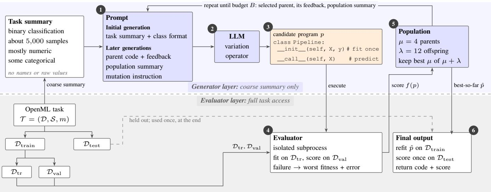  
Fi<sub>gure</sub> 1<sub>:</sub> O<sub>verv</sub>i<sub>ew o</sub>f LACE<sub>.</sub> Th<sub>e genera</sub>t<sub>or rece</sub>i<sub>ves a coarse, non-</sub>id<sub>en</sub>tif<sub>y</sub>i<sub>ng</sub> t<sub>as</sub>k <sub>summary an</sub>d <sub>proposes execu</sub>t<sub>a</sub>bl<sub>e p</sub>i<sub>pe</sub>li<sub>nes;</sub> th<sub>e</sub> i<sub>so</sub>l<sub>a</sub>t<sub>e</sub>d <sub>eva</sub>l<sub>ua</sub>t<sub>or</sub> h<sub>as</sub> f<sub>u</sub>ll t<sub>as</sub>k <sub>access an</sub>d <sub>re</sub>t<sub>urns</sub> i<sub>nner-va</sub>lid<sub>a</sub>ti<sub>on scores or errors.</sub> Aft<sub>er</sub> th<sub>e</sub> b<sub>u</sub>d<sub>ge</sub>t i<sub>s ex</sub>h<sub>aus</sub>t<sub>e</sub>d<sub>,</sub> th<sub>e se</sub>l<sub>ec</sub>t<sub>e</sub>d <sub>p</sub>i<sub>pe</sub>li<sub>ne</sub> i<sub>s re</sub>fit <sub>an</sub>d <sub>eva</sub>l<sub>ua</sub>t<sub>e</sub>d <sub>once per o</sub>fi<sub>c</sub>i<sub>a</sub>l t<sub>es</sub>t f<sub>o</sub>ld<sub>.</sub>

Th<sub>e pro</sub>t<sub>oco</sub>l <sub>en</sub>f<sub>orces a s</sub>t<sub>r</sub>i<sub>c</sub>t <sub>separa</sub>ti<sub>on</sub> b<sub>e</sub>t<sub>ween searc</sub>h <sub>an</sub>d fi<sub>na</sub>l <sub>assessmen</sub>t<sub>.</sub> D<sub>ur</sub>i<sub>ng evo</sub>l<sub>u</sub>ti<sub>on, can</sub>did<sub>a</sub>t<sub>es are score</sub>d onl<sub>y</sub> throu<sub>g</sub>h Eq. (1) on inner-validation data; the oficial test <sub>par</sub>titi<sub>ons</sub> $\{ \mathcal { D } _ { \mathrm { t e s t } } ^ { ( k ) } \} _ { k = 1 } ^ { K }$ <sub>are never rea</sub>d<sub>.</sub> Aft<sub>er</sub> th<sub>e searc</sub>h b<sub>u</sub>d<sub>-</sub> <sub>ge</sub>t i<sub>s ex</sub>h<sub>aus</sub>t<sub>e</sub>d<sub>,</sub> th<sub>e s</sub>i<sub>ng</sub>l<sub>e se</sub>l<sub>ec</sub>t<sub>e</sub>d <sub>can</sub>did<sub>a</sub>t<sub>e</sub> $\hat { p }$ i<sub>s eva</sub>l<sub>ua</sub>t<sub>e</sub>d <sub>un</sub>d<sub>er</sub> th<sub>e</sub> b<sub>enc</sub>h<sub>mar</sub>k’<sub>s prescr</sub>ib<sub>e</sub>d t<sub>en-</sub>f<sub>o</sub>ld <sub>pro</sub>t<sub>oco</sub>l<sub>: re</sub>fit <sub>on</sub> <sub>eac</sub>h f<sub>o</sub>ld’<sub>s</sub> t<sub>ra</sub>i<sub>n</sub>i<sub>ng par</sub>titi<sub>on an</sub>d <sub>score</sub>d <sub>once on</sub> th<sub>e</sub> h<sub>e</sub>ld<sub>-ou</sub>t t<sub>es</sub>t <sub>par</sub>titi<sub>on, an</sub>d <sub>we repor</sub>t th<sub>e mean over</sub> f<sub>o</sub>ld<sub>s.</sub> Th<sub>roug</sub>h<sub>ou</sub>t<sub>,</sub> the <sub>g</sub>enerator receives onl<sub>y</sub> a coarse task summar<sub>y</sub> (task t<sub>yp</sub>e, <sub>approx</sub>i<sub>ma</sub>t<sub>e samp</sub>l<sub>e coun</sub>t<sub>, an</sub>d th<sub>e num</sub>b<sub>er o</sub>f b<sub>oo</sub>l<sub>ean,</sub> i<sub>n</sub>t<sub>e-</sub> <sub>g</sub>er, and real-valued features), which omits the dataset name, t<sub>as</sub>k id<sub>en</sub>tifi<sub>er,</sub> f<sub>ea</sub>t<sub>ure names,</sub> t<sub>arge</sub>t <sub>seman</sub>ti<sub>cs, c</sub>l<sub>ass</sub> di<sub>s</sub>t<sub>r</sub>i<sub>-</sub> b<sub>u</sub>ti<sub>on, an</sub>d <sub>eva</sub>l<sub>ua</sub>ti<sub>on me</sub>t<sub>r</sub>i<sub>c, w</sub>hil<sub>e</sub> th<sub>e eva</sub>l<sub>ua</sub>t<sub>or re</sub>t<sub>a</sub>i<sub>ns</sub> f<sub>u</sub>l <sub>access</sub> t<sub>o</sub> th<sub>e</sub> t<sub>as</sub>k<sub>,</sub> it<sub>s sp</sub>lit<sub>s, an</sub>d it<sub>s me</sub>t<sub>r</sub>i<sub>c.</sub>

## 3.2 Pipeline Representation, Evaluation, and Feedback

C<sub>an</sub>did<sub>a</sub>t<sub>es</sub> f<sub>o</sub>ll<sub>ow a</sub> fi<sub>xe</sub>d fit<sub>-on-cons</sub>t<sub>ruc</sub>ti<sub>on, pre</sub>di<sub>c</sub>t<sub>-on-</sub> call interface: \_\_init\_\_(X, y, ...) fits exactl<sub>y</sub> once and \_\_call\_\_(X) returns <sub>p</sub>redictions. Alon<sub>g</sub>side the class <sub>co</sub>d<sub>e,</sub> th<sub>e</sub> l<sub>anguage mo</sub>d<sub>e</sub>l <sub>re</sub>t<sub>urns a s</sub>h<sub>or</sub>t d<sub>escr</sub>i<sub>p</sub>ti<sub>on an</sub>d <sub>exposes</sub> t<sub>una</sub>bl<sub>e</sub> <sub>cons</sub>t<sub>ruc</sub>t<sub>or</sub> <sub>argumen</sub>t<sub>s</sub> <sub>w</sub>ith d<sub>e</sub>f<sub>au</sub>lt <sub>va</sub>l<sub>ues.</sub> Fi<sub>gure</sub> 1 <sub>s</sub>h<sub>ows</sub> th<sub>e</sub> i<sub>n</sub>t<sub>er</sub>f<sub>ace</sub> i<sub>n con</sub>t<sub>ex</sub>t<sub>, an</sub>d S<sub>ec</sub>ti<sub>on</sub> M <sub>o</sub>f th<sub>e</sub> <sub>supp</sub>l<sub>emen</sub>t<sub>ary</sub> <sub>ma</sub>t<sub>er</sub>i<sub>a</sub>l <sub>g</sub>i<sub>ves</sub> th<sub>e</sub> <sub>comp</sub>l<sub>e</sub>t<sub>e</sub> <sub>promp</sub>t <sub>an</sub>d exam<sub>p</sub><sup>l</sup>e.

Th<sub>e promp</sub>t <sub>res</sub>t<sub>r</sub>i<sub>c</sub>t<sub>s can</sub>did<sub>a</sub>t<sub>es</sub> t<sub>o sc</sub>ikit<sub>-</sub>l<sub>earn,</sub> N<sub>um</sub>P<sub>y,</sub> S<sub>c</sub>iP<sub>y,</sub> <sub>an</sub>d <sub>pan</sub>d<sub>as;</sub> <sub>a</sub> <sub>s</sub>i<sub>ng</sub>l<sub>e</sub> <sub>es</sub>ti<sub>ma</sub>t<sub>or</sub> <sub>or</sub> <sub>an</sub> <sub>ensem</sub>bl<sub>e</sub> <sub>o</sub>f <sub>a</sub>t <sub>mos</sub>t th<sub>ree</sub> l<sub>earners;</sub> <sub>a</sub> <sub>s</sub>i<sub>ng</sub>l<sub>e</sub> <sub>s</sub>h<sub>are</sub>d <sub>preprocess</sub>i<sub>ng</sub> <sub>s</sub>t<sub>age</sub> a<sub>pp</sub>lied once before all base learners (rather than a se<sub>p</sub>arate transformer <sub>p</sub>er learner); and no internal cross-validation, <sub>mo</sub>d<sub>e</sub>l <sub>se</sub>l<sub>ec</sub>ti<sub>on,</sub> <sub>or</sub> h<sub>yperparame</sub>t<sub>er</sub> <sub>searc</sub>h<sub>.</sub> T<sub>una</sub>bl<sub>e</sub> <sub>va</sub>l<sub>ues</sub> <sub>mus</sub>t i<sub>ns</sub>t<sub>ea</sub>d b<sub>e</sub> <sub>expose</sub>d <sub>as</sub> <sub>cons</sub>t<sub>ruc</sub>t<sub>or</sub> <sub>argumen</sub>t<sub>s.</sub> C<sub>ruc</sub>i<sub>a</sub>ll<sub>y,</sub> th<sub>ese</sub> <sub>cons</sub>t<sub>ra</sub>i<sub>n</sub>t<sub>s</sub> <sub>are</sub> <sub>reques</sub>t<sub>e</sub>d i<sub>n</sub> th<sub>e</sub> <sub>promp</sub>t <sub>an</sub>d <sub>are</sub> <sub>no</sub>t <sub>en</sub>f<sub>orce</sub>d b<sub>y</sub> th<sub>e execu</sub>ti<sub>on</sub> h<sub>arness;</sub> th<sub>e</sub> h<sub>arness a</sub>tt<sub>emp</sub>t<sub>s</sub> t<sub>o</sub> execute ever<sub>y p</sub>ro<sub>g</sub>ram t<sup>h</sup>e <sub>g</sub>enerator returns. <sup>W</sup>e t<sup>h</sup>ere<sup>f</sup>ore <sub>ver</sub>if<sub>y comp</sub>li<sub>ance a</sub>ft<sub>er</sub> th<sub>e</sub> f<sub>ac</sub>t th<sub>roug</sub>h th<sub>e s</sub>t<sub>a</sub>ti<sub>c au</sub>dit <sub>o</sub>f S<sub>ec</sub>ti<sub>on</sub> 6<sub>.</sub>3<sub>, w</sub>hi<sub>c</sub>h <sub>repor</sub>t<sub>s</sub> h<sub>ow o</sub>ft<sub>en eac</sub>h <sub>cons</sub>t<sub>ra</sub>i<sub>n</sub>t <sub>was</sub> i<sub>n</sub> f<sub>ac</sub>t <sub>respec</sub>t<sub>e</sub>d<sub>.</sub>

B<sub>e</sub>f<sub>ore</sub> <sub>execu</sub>ti<sub>on,</sub> th<sub>e</sub> <sub>eva</sub>l<sub>ua</sub>t<sub>or</sub> <sub>app</sub>li<sub>es</sub> <sub>sp</sub>lit<sub>-sa</sub>f<sub>e</sub> <sub>or</sub>di<sub>na</sub>l <sub>enco</sub>di<sub>ng,</sub> b<sub>oo</sub>l<sub>ean cas</sub>ti<sub>ng, an</sub>d <sub>m</sub>i<sub>ss</sub>i<sub>ng-va</sub>l<sub>ue</sub> i<sub>mpu</sub>t<sub>a</sub>ti<sub>on</sub> t<sub>o</sub> <sub>prov</sub>id<sub>e</sub> <sub>a</sub> <sub>s</sub>t<sub>a</sub>bl<sub>e</sub> <sub>numer</sub>i<sub>c</sub> i<sub>n</sub>t<sub>er</sub>f<sub>ace;</sub> <sub>eac</sub>h t<sub>rans</sub>f<sub>orm</sub> i<sub>s</sub> fit <sub>on</sub>l<sub>y</sub> <sub>on</sub> th<sub>e correspon</sub>di<sub>ng</sub> t<sub>ra</sub>i<sub>n</sub>i<sub>ng por</sub>ti<sub>on.</sub> C<sub>an</sub>did<sub>a</sub>t<sub>es run</sub> i<sub>n</sub> i<sub>so-</sub> l<sub>a</sub>t<sub>e</sub>d <sub>su</sub>b<sub>processes un</sub>d<sub>er a wa</sub>ll<sub>-c</sub>l<sub>oc</sub>k ti<sub>meou</sub>t<sub>.</sub> S<sub>uccess</sub>f<sub>u</sub>l <sub>eva</sub>l<sub>ua</sub>ti<sub>ons re</sub>t<sub>urn</sub> i<sub>nner-va</sub>lid<sub>a</sub>ti<sub>on</sub> fit<sub>ness, w</sub>hil<sub>e</sub> f<sub>a</sub>il<sub>ures re-</sub> <sub>ce</sub>i<sub>ve</sub> th<sub>e wors</sub>t fit<sub>ness</sub> t<sub>oge</sub>th<sub>er w</sub>ith th<sub>e</sub> fi<sub>rs</sub>t <sub>cap</sub>t<sub>ure</sub>d <sub>error</sub> and source line (Section B of the su<sub>pp</sub>lementar<sub>y</sub> material).

## 3.3 Evolutionary optimization

LACE uses a (µ+λ) evolutionary loop (Bäck 1996) in which th<sub>e</sub> l<sub>anguage</sub> <sub>mo</sub>d<sub>e</sub>l i<sub>s</sub> th<sub>e</sub> <sub>var</sub>i<sub>a</sub>ti<sub>on</sub> <sub>opera</sub>t<sub>or.</sub> Th<sub>e</sub> i<sub>n</sub>iti<sub>a</sub>l <sub>pop-</sub> ulation of µ pipelines is generated from the task summary <sub>an</sub>d i<sub>n</sub>t<sub>er</sub>f<sub>ace</sub> <sub>a</sub>l<sub>one.</sub> E<sub>ac</sub>h l<sub>a</sub>t<sub>er</sub> <sub>o</sub>f<sub>spr</sub>i<sub>ng</sub> i<sub>s</sub> <sub>pro</sub>d<sub>uce</sub>d b<sub>y</sub> <sub>se-</sub> l<sub>ec</sub>ti<sub>ng</sub> <sub>a</sub> <sub>paren</sub>t <sub>un</sub>if<sub>orm</sub>l<sub>y</sub> <sub>a</sub>t <sub>ran</sub>d<sub>om</sub> <sub>an</sub>d <sub>prov</sub>idi<sub>ng</sub> it<sub>s</sub> <sub>co</sub>d<sub>e,</sub> <sub>eva</sub>l<sub>ua</sub>ti<sub>on</sub> f<sub>ee</sub>db<sub>ac</sub>k<sub>, a score</sub>d <sub>popu</sub>l<sub>a</sub>ti<sub>on summary, an</sub>d <sub>one</sub> randoml<sub>y</sub> chosen mutation instruction (Section M of the su<sub>p</sub>- <sub>p</sub>lementar<sub>y</sub> material).

After evaluating λ ofspring, elitist truncation retains the best µ members of the combined parent and ofspring populati<sub>on.</sub> A b<sub>es</sub>t<sub>-so-</sub>f<sub>ar</sub> <sub>p</sub>i<sub>pe</sub>li<sub>ne</sub> i<sub>s</sub> t<sub>rac</sub>k<sub>e</sub>d <sub>un</sub>til th<sub>e</sub> <sub>can</sub>did<sub>a</sub>t<sub>e</sub> b<sub>u</sub>d<sub>-</sub> <sub>ge</sub>t<sub>,</sub> i<sub>nc</sub>l<sub>u</sub>di<sub>ng</sub> i<sub>nva</sub>lid <sub>or</sub> ti<sub>me</sub>d<sub>-ou</sub>t <sub>can</sub>did<sub>a</sub>t<sub>es,</sub> i<sub>s ex</sub>h<sub>aus</sub>t<sub>e</sub>d<sub>;</sub> it i<sub>s</sub> th<sub>en re</sub>fit <sub>an</sub>d <sub>eva</sub>l<sub>ua</sub>t<sub>e</sub>d <sub>on</sub> th<sub>e o</sub>fi<sub>c</sub>i<sub>a</sub>l t<sub>es</sub>t f<sub>o</sub>ld<sub>s.</sub> F<sub>or-</sub> <sub>ma</sub>l <sub>pseu</sub>d<sub>oco</sub>d<sub>e appears</sub> i<sub>n</sub> S<sub>ec</sub>ti<sub>on</sub> A <sub>o</sub>f th<sub>e supp</sub>l<sub>emen</sub>t<sub>ary</sub> <sub>ma</sub>t<sub>er</sub>i<sub>a</sub>l<sub>.</sub>

## 4 Experimental Setup

## 4.1 OpenML tasks, protocol, and metrics

W<sub>e</sub> <sub>eva</sub>l<sub>ua</sub>t<sub>e</sub> <sub>a</sub>ll 68 <sub>c</sub>l<sub>ass</sub>ifi<sub>ca</sub>ti<sub>on</sub> t<sub>as</sub>k<sub>s</sub> i<sub>n</sub> th<sub>e</sub> O<sub>pen</sub>ML amlb-classification-all benchmark suite (Gijsbers et al. 2024). The suite s<sub>p</sub>ans a wide ran<sub>g</sub>e of tabular setti<sub>ngs,</sub> f<sub>rom</sub> 100 t<sub>o</sub> 4<sub>,</sub>898<sub>,</sub>431 i<sub>ns</sub>t<sub>ances an</sub>d f<sub>rom</sub> 4 t<sub>o</sub> 10<sub>,</sub>000 f<sub>ea</sub>t<sub>ures, cover</sub>i<sub>ng sma</sub>ll<sub>-</sub>d<sub>a</sub>t<sub>a reg</sub>i<sub>mes</sub> th<sub>roug</sub>h l<sub>arge,</sub> hi<sub>g</sub>h<sub>-</sub> di<sub>mens</sub>i<sub>ona</sub>l t<sub>as</sub>k<sub>s.</sub> Th<sub>e</sub> f<sub>u</sub>ll t<sub>as</sub>k li<sub>s</sub>t i<sub>s g</sub>i<sub>ven</sub> i<sub>n</sub> S<sub>ec</sub>ti<sub>on</sub> C <sub>o</sub>f th<sub>e supp</sub>l<sub>emen</sub>t<sub>ary ma</sub>t<sub>er</sub>i<sub>a</sub>l<sub>.</sub>

All <sub>me</sub>th<sub>o</sub>d<sub>s are eva</sub>l<sub>ua</sub>t<sub>e</sub>d <sub>un</sub>d<sub>er</sub> th<sub>e</sub> O<sub>pen</sub>ML t<sub>as</sub>k <sub>pro</sub>t<sub>o-</sub> <sub>co</sub>l<sub>.</sub> E<sub>ac</sub>h t<sub>as</sub>k <sub>prov</sub>id<sub>es pre-</sub>d<sub>e</sub>fi<sub>ne</sub>d <sub>sp</sub>lit i<sub>ns</sub>t<sub>ances</sub> th<sub>roug</sub>h its O<sub>p</sub>enML definition (here, one re<sub>p</sub>eat of ten folds), and we <sub>re</sub>t<sub>r</sub>i<sub>eve</sub> th<sub>e pre-</sub>d<sub>e</sub>fi<sub>ne</sub>d t<sub>ra</sub>i<sub>n</sub>/t<sub>es</sub>t i<sub>n</sub>di<sub>ces</sub> di<sub>rec</sub>tl<sub>y ra</sub>th<sub>er</sub> th<sub>an</sub> <sub>cons</sub>t<sub>ruc</sub>ti<sub>ng our own ou</sub>t<sub>er</sub> f<sub>o</sub>ld<sub>s.</sub> F<sub>or</sub> LACE<sub>, as</sub> d<sub>escr</sub>ib<sub>e</sub>d i<sub>n</sub> S<sub>ec</sub>ti<sub>on</sub> 3<sub>.</sub>1<sub>,</sub> d<sub>ur</sub>i<sub>ng searc</sub>h <sub>eac</sub>h <sub>pre-</sub>d<sub>e</sub>fi<sub>ne</sub>d t<sub>ra</sub>i<sub>n</sub>i<sub>ng</sub> f<sub>o</sub>ld i<sub>s</sub> f<sub>ur</sub>th<sub>er sp</sub>lit i<sub>n</sub>t<sub>o</sub> i<sub>nner-</sub>t<sub>ra</sub>i<sub>n</sub>i<sub>ng an</sub>d i<sub>nner-va</sub>lid<sub>a</sub>ti<sub>on por</sub>ti<sub>ons</sub> (an inner-validation fraction of 0.2), candidate selection uses <sub>on</sub>l<sub>y</sub> th<sub>e</sub> i<sub>nner-va</sub>lid<sub>a</sub>ti<sub>on scores aggrega</sub>t<sub>e</sub>d <sub>across</sub> th<sub>e</sub> t<sub>en</sub> f<sub>o</sub>ld<sub>s, an</sub>d <sub>eac</sub>h h<sub>e</sub>ld<sub>-ou</sub>t t<sub>es</sub>t f<sub>o</sub>ld i<sub>s score</sub>d <sub>once per repe</sub>ti<sub>-</sub> ti<sub>on, a</sub>ft<sub>er can</sub>did<sub>a</sub>t<sub>e se</sub>l<sub>ec</sub>ti<sub>on,</sub> f<sub>or</sub> th<sub>e</sub> fi<sub>na</sub>l <sub>se</sub>l<sub>ec</sub>t<sub>e</sub>d <sub>p</sub>i<sub>pe</sub>li<sub>ne.</sub> Th<sub>e eva</sub>l<sub>ua</sub>ti<sub>on me</sub>t<sub>r</sub>i<sub>c</sub> i<sub>s</sub> t<sub>as</sub>k<sub>-spec</sub>ifi<sub>c: c</sub>l<sub>ass</sub>ifi<sub>ca</sub>ti<sub>on accuracy</sub> f<sub>or</sub> 67 <sub>o</sub>f th<sub>e</sub> 68 t<sub>as</sub>k<sub>s an</sub>d ROC<sub>–</sub>AUC f<sub>or</sub> th<sub>e rema</sub>i<sub>n</sub>i<sub>ng</sub> t<sub>as</sub>k (Section D of the su<sub>pp</sub>lementar<sub>y</sub> material). All methods are <sub>eva</sub>l<sub>ua</sub>t<sub>e</sub>d <sub>us</sub>i<sub>ng</sub> th<sub>e</sub> <sub>same</sub> <sub>me</sub>t<sub>r</sub>i<sub>c</sub> <sub>an</sub>d <sub>pre-</sub>d<sub>e</sub>fi<sub>ne</sub>d <sub>par</sub>titi<sub>ons</sub> f<sub>or</sub> <sub>a</sub> <sub>g</sub>i<sub>ven</sub> t<sub>as</sub>k<sub>.</sub> Th<sub>e</sub> O<sub>pen</sub>ML d<sub>e</sub>fi<sub>n</sub>iti<sub>on</sub> <sub>prov</sub>id<sub>es</sub> <sub>a</sub> <sub>s</sub>i<sub>ng</sub>l<sub>e</sub> <sub>repea</sub>t <sub>o</sub>f t<sub>en</sub> f<sub>o</sub>ld<sub>s, w</sub>hi<sub>c</sub>h fi<sub>xes</sub> th<sub>e</sub> f<sub>o</sub>ld <sub>s</sub>t<sub>ruc</sub>t<sub>ure w</sub>ithi<sub>n one</sub> <sub>run.</sub> O<sub>n</sub> t<sub>op</sub> <sub>o</sub>f thi<sub>s,</sub> <sub>we</sub> <sub>per</sub>f<sub>orm</sub> fi<sub>ve</sub> i<sub>n</sub>d<sub>epen</sub>d<sub>en</sub>t <sub>exper</sub>i<sub>-</sub> <sub>men</sub>t<sub>a</sub>l <sub>repe</sub>titi<sub>ons per</sub> t<sub>as</sub>k<sub>, w</sub>ith <sub>see</sub>d<sub>s</sub> $0 , \ldots , 4$ , <sup>to</sup> <sup>ca</sup>p<sup>t</sup>u<sup>re</sup> <sub>me</sub>th<sub>o</sub>d <sub>s</sub>t<sub>oc</sub>h<sub>as</sub>ti<sub>c</sub>it<sub>y an</sub>d i<sub>nner-sp</sub>lit <sub>var</sub>i<sub>a</sub>ti<sub>on; eac</sub>h <sub>repe</sub>titi<sub>on</sub> <sub>uses</sub> th<sub>e same</sub> t<sub>en pre-</sub>d<sub>e</sub>fi<sub>ne</sub>d f<sub>o</sub>ld<sub>s</sub> b<sub>u</sub>t <sub>a</sub> dif<sub>eren</sub>t <sub>see</sub>d<sub>.</sub> R<sub>e-</sub> <sub>por</sub>t<sub>e</sub>d <sub>resu</sub>lt<sub>s summar</sub>i<sub>ze</sub> th<sub>ese</sub> fi<sub>ve repe</sub>titi<sub>ons un</sub>l<sub>ess s</sub>t<sub>a</sub>t<sub>e</sub>d <sub>o</sub>th<sub>erw</sub>i<sub>se.</sub>

E<sub>ac</sub>h <sub>run uses a</sub> b<sub>u</sub>d <sub>e</sub>t <sub>o</sub>f $B = 1 0 0$ <sub>genera</sub>t<sub>e</sub>d <sub>can</sub>did<sub>a</sub>t<sub>es,</sub> <sub>coun</sub>ti<sub>n</sub> i<sub>nva</sub>lid <sub>an</sub>d ti<sub>me</sub>d<sub>-ou</sub>t <sub>ones; w</sub>ith $\mu = 4$ <sub>an</sub>d $\lambda =$ 12, this comprises four initial candidates followed by eight <sub>genera</sub>ti<sub>ons o</sub>f t<sub>we</sub>l<sub>ve.</sub> P<sub>er-can</sub>did<sub>a</sub>t<sub>e</sub> ti<sub>meou</sub>t<sub>s are</sub> f<sub>our</sub> h<sub>ours</sub> f<sub>or</sub> h<sub>eavy</sub> t<sub>as</sub>k<sub>s an</sub>d <sub>one</sub> h<sub>our o</sub>th<sub>erw</sub>i<sub>se.</sub> A t<sub>as</sub>k i<sub>s</sub> h<sub>eavy</sub> if it h<sub>as a</sub>t l<sub>eas</sub>t 400<sub>,</sub>000 <sub>sa</sub>m<sub>p</sub>l<sub>es, a</sub>t l<sub>eas</sub>t 1<sub>,</sub>000 f<sub>ea</sub>t<sub>u</sub>r<sub>es, o</sub>r <sub>a</sub>n i<sub>ns</sub>t<sub>ance–</sub>f<sub>ea</sub>t<sub>ure pro</sub>d<sub>uc</sub>t <sub>o</sub>f<sub>a</sub>t l<sub>eas</sub>t 10<sub>,</sub>000<sub>,</sub>000<sub>;</sub> 20 <sub>o</sub>f68 t<sub>as</sub>k<sub>s</sub> <sub>qua</sub>lif<sub>y.</sub> Th<sub>e</sub> l<sub>onger</sub> li<sub>m</sub>it f<sub>or</sub> h<sub>eavy</sub> t<sub>as</sub>k<sub>s re</sub>fl<sub>ec</sub>t<sub>s</sub> th<sub>e</sub> k<sub>nown</sub> <sub>sca</sub>li<sub>ng o</sub>f fit<sub>-an</sub>d<sub>-eva</sub>l<sub>ua</sub>t<sub>e</sub> ti<sub>me an</sub>d f<sub>a</sub>il<sub>ure ra</sub>t<sub>es w</sub>ith d<sub>a</sub>t<sub>ase</sub>t size and dimensionalit<sub>y</sub> (Gu<sub>y</sub>on et al. 2019; Bischl et al. 2021): without it, lar<sub>g</sub>e tasks would accrue failed or timed-<sub>ou</sub>t <sub>eva</sub>l<sub>ua</sub>ti<sub>ons</sub> f<sub>or reasons unre</sub>l<sub>a</sub>t<sub>e</sub>d t<sub>o p</sub>i<sub>pe</sub>li<sub>ne qua</sub>lit<sub>y.</sub> Th<sub>e</sub> ti<sub>er c</sub>h<sub>anges on</sub>l<sub>y</sub> th<sub>e</sub> ti<sub>meou</sub>t<sub>, no</sub>t th<sub>e can</sub>did<sub>a</sub>t<sub>e</sub> b<sub>u</sub>d<sub>ge</sub>t<sub>, so</sub> <sub>every</sub> t<sub>as</sub>k <sub>rece</sub>i<sub>ves</sub> th<sub>e same num</sub>b<sub>er o</sub>f <sub>genera</sub>t<sub>e</sub>d <sub>can</sub>did<sub>a</sub>t<sub>es.</sub>

F<sub>or</sub> <sub>cross-</sub>t<sub>as</sub>k <sub>aggrega</sub>ti<sub>on,</sub> <sub>eac</sub>h <sub>me</sub>th<sub>o</sub>d’<sub>s</sub> <sub>per-</sub>t<sub>as</sub>k <sub>score</sub> i<sub>s conver</sub>t<sub>e</sub>d t<sub>o a norma</sub>li<sub>ze</sub>d d<sub>ev</sub>i<sub>a</sub>ti<sub>on</sub> b<sub>y</sub> li<sub>near</sub>l<sub>y resca</sub>li<sub>ng</sub> th<sub>e va</sub>lid <sub>scores w</sub>ithi<sub>n eac</sub>h t<sub>as</sub>k <sub>so</sub> th<sub>a</sub>t th<sub>e</sub> b<sub>es</sub>t <sub>score maps</sub> to 0 and the worst to 1; figures report the complementary closeness, 100 (1 − deviation).

## 4.2 Baselines

W<sub>e co</sub>m<sub>pa</sub>r<sub>e</sub> LACE <sub>w</sub>ith thr<sub>ee</sub> m<sub>a</sub>t<sub>u</sub>r<sub>e</sub> A<sub>u</sub>t<sub>o</sub>ML <sub>sys-</sub> tems, AutoGluon-Tabular (Erickson et al. 2020), autosklearn (Feurer et al. 2015), and H2O AutoML (LeDell and Poirier 2020); three <sub>p</sub>retrained tabular models, TabPFN v2.5, TabPFN v3 (Hollmann et al. 2025), and TabICL (Qu et al. 2025); and a fixed XGBoost <sub>p</sub>i<sub>p</sub>eline (Chen and Guestrin 2016). The AutoML s<sub>y</sub>stems re<sub>p</sub>resent classical search-based <sub>p</sub>i<sub>pe</sub>li<sub>ne</sub> <sub>cons</sub>t<sub>ruc</sub>ti<sub>on,</sub> th<sub>e</sub> <sub>pre</sub>t<sub>ra</sub>i<sub>ne</sub>d <sub>mo</sub>d<sub>e</sub>l<sub>s</sub> <sub>prov</sub>id<sub>e</sub> <sub>s</sub>t<sub>rong</sub> b<sub>u</sub>t <sub>arc</sub>hit<sub>ec</sub>t<sub>ura</sub>ll<sub>y</sub> di<sub>s</sub>ti<sub>nc</sub>t <sub>re</sub>f<sub>erences,</sub> <sub>an</sub>d XGB<sub>oos</sub>t <sub>prov</sub>id<sub>es</sub> <sub>an un</sub>t<sub>une</sub>d <sub>non-</sub>A<sub>u</sub>t<sub>o</sub>ML b<sub>ase</sub>li<sub>ne.</sub>

T<sub>o</sub> i<sub>so</sub>l<sub>a</sub>t<sub>e</sub> dif<sub>erences</sub> i<sub>n</sub> <sub>p</sub>i<sub>pe</sub>li<sub>ne</sub> <sub>searc</sub>h <sub>ra</sub>th<sub>er</sub> th<sub>an</sub> <sub>access</sub> t<sub>o neura</sub>l <sub>arc</sub>hit<sub>ec</sub>t<sub>ures,</sub> LACE <sub>an</sub>d th<sub>e</sub> th<sub>ree searc</sub>h<sub>-</sub>b<sub>ase</sub>d A<sub>u-</sub> t<sub>o</sub>ML <sub>sys</sub>t<sub>ems are res</sub>t<sub>r</sub>i<sub>c</sub>t<sub>e</sub>d t<sub>o c</sub>l<sub>ass</sub>i<sub>ca</sub>l<sub>, non-neura</sub>l t<sub>a</sub>b<sub>u</sub>l<sub>ar</sub> l<sub>earners, ma</sub>t<sub>c</sub>hi<sub>ng</sub> th<sub>e componen</sub>t f<sub>am</sub>ili<sub>es ava</sub>il<sub>a</sub>bl<sub>e</sub> i<sub>n</sub> th<sub>e</sub> LACE <sub>execu</sub>ti<sub>on env</sub>i<sub>ronmen</sub>t<sub>.</sub> T<sub>a</sub>bPFN <sub>an</sub>d T<sub>a</sub>bICL <sub>are eva</sub>l<sub>-</sub> <sub>ua</sub>t<sub>e</sub>d <sub>separa</sub>t<sub>e</sub>l<sub>y</sub> <sub>as</sub> <sub>pre</sub>t<sub>ra</sub>i<sub>ne</sub>d <sub>neura</sub>l <sub>pre</sub>di<sub>c</sub>t<sub>ors,</sub> <sub>represen</sub>ti<sub>ng</sub> <sub>a</sub> di<sub>s</sub>ti<sub>nc</sub>t <sub>pre</sub>t<sub>ra</sub>i<sub>n</sub>i<sub>ng-</sub>b<sub>ase</sub>d <sub>approac</sub>h <sub>ra</sub>th<sub>er</sub> th<sub>an componen</sub>t<sub>s</sub> <sub>o</sub>f th<sub>e s</sub>h<sub>are</sub>d <sub>searc</sub>h <sub>space.</sub> T<sub>o con</sub>t<sub>ro</sub>l f<sub>or run</sub>ti<sub>me, every</sub> baseline was subject to an external wall-clock limit equal to th<sub>e</sub> ti<sub>me consume</sub>d b<sub>y</sub> th<sub>e correspon</sub>di<sub>ng</sub> LACE t<sub>as</sub>k <sub>repe</sub>ti<sub>-</sub> ti<sub>on.</sub> All <sub>me</sub>th<sub>o</sub>d<sub>s use</sub> th<sub>e same pre-</sub>d<sub>e</sub>fi<sub>ne</sub>d O<sub>pen</sub>ML <sub>sp</sub>lit<sub>s</sub> and task-s<sub>p</sub>ecific metric as LACE (Section 4.1). Exact ver-<sub>s</sub>i<sub>ons, mo</sub>d<sub>e</sub>l f<sub>am</sub>ili<sub>es,</sub> b<sub>u</sub>d<sub>ge</sub>t <sub>a</sub>ll<sub>oca</sub>ti<sub>on, an</sub>d <sub>unsuppor</sub>t<sub>e</sub>d<sub>-</sub> t<sub>as</sub>k h<sub>an</sub>dli<sub>ng are repor</sub>t<sub>e</sub>d i<sub>n</sub> S<sub>ec</sub>ti<sub>on</sub> D <sub>o</sub>f th<sub>e supp</sub>l<sub>emen</sub>t<sub>ary</sub> <sub>ma</sub>t<sub>er</sub>i<sub>a</sub>l<sub>.</sub>

## 4.3 Implementation details

LACE i<sub>s</sub> i<sub>mp</sub>l<sub>emen</sub>t<sub>e</sub>d i<sub>n</sub> P<sub>y</sub>th<sub>on us</sub>i<sub>ng sc</sub>ikit<sub>-</sub>l<sub>earn</sub> 1<sub>.</sub>8<sub>.</sub>0 f<sub>or p</sub>i<sub>pe</sub>li<sub>ne execu</sub>ti<sub>on an</sub>d O<sub>pen</sub>ML 0<sub>.</sub>15<sub>.</sub>1 f<sub>or</sub> t<sub>as</sub>k <sub>an</sub>d <sub>sp</sub>lit <sub>re</sub>t<sub>r</sub>i<sub>eva</sub>l<sub>.</sub> E<sub>xper</sub>i<sub>men</sub>t<sub>s</sub> <sub>were</sub> <sub>run</sub> <sub>us</sub>i<sub>ng</sub> <sub>a</sub> <sub>mo</sub>d<sub>u</sub>l<sub>ar</sub> <sub>open-</sub> <sub>source</sub> b<sub>enc</sub>h<sub>mar</sub>ki<sub>ng</sub> t<sub>oo</sub>lb<sub>ox</sub> f<sub>or</sub> LLM<sub>-</sub>d<sub>r</sub>i<sub>ven a</sub>l<sub>gor</sub>ith<sub>m</sub> d<sub>e-</sub> si<sub>g</sub>n (van Stein et al. 2025). These com<sub>p</sub>onents, the anal-<sub>ys</sub>i<sub>s scr</sub>i<sub>p</sub>t<sub>s, an</sub>d th<sub>e run-</sub>l<sub>eve</sub>l <sub>resu</sub>lt t<sub>a</sub>bl<sub>es are prov</sub>id<sub>e</sub>d i<sub>n</sub> th<sub>e</sub> <sub>accompany</sub>i<sub>ng</sub> Z<sub>eno</sub>d<sub>o</sub> <sub>ar</sub>tif<sub>ac</sub>t<sub>.</sub> E<sub>ac</sub>h <sub>p</sub>i<sub>pe</sub>li<sub>ne</sub> <sub>exposes</sub> it<sub>s</sub> t<sub>una</sub>bl<sub>e va</sub>l<sub>ues as cons</sub>t<sub>ruc</sub>t<sub>or argumen</sub>t<sub>s w</sub>ith d<sub>e</sub>f<sub>au</sub>lt <sub>se</sub>t<sub>-</sub> tin<sub>g</sub>s (a median of 12 <sub>p</sub>er <sub>p</sub>i<sub>p</sub>eline); all re<sub>p</sub>orted scores use th<sub>ese genera</sub>t<sub>or-c</sub>h<sub>osen</sub> d<sub>e</sub>f<sub>au</sub>lt<sub>s.</sub> Th<sub>e searc</sub>h <sub>uses</sub> $\mu = 4$ p<sup>ar-</sup> ents, $\bar { \lambda } = 1 2$ <sub>o</sub>f<sub>spr</sub>i<sub>ng, a</sub> b<sub>u</sub>d<sub>ge</sub>t <sub>o</sub>f 100 <sub>genera</sub>t<sub>e</sub>d <sub>can</sub>di<sub>-</sub> d<sub>a</sub>t<sub>es,</sub> <sub>e</sub>liti<sub>s</sub>t t<sub>runca</sub>ti<sub>on,</sub> <sub>un</sub>if<sub>orm-ran</sub>d<sub>om</sub> <sub>paren</sub>t <sub>se</sub>l<sub>ec</sub>ti<sub>on,</sub> and crossover disabled, at a sampling temperature of 0.7. Th<sub>ese se</sub>tti<sub>ngs were se</sub>l<sub>ec</sub>t<sub>e</sub>d <sub>on a</sub> th<sub>ree-</sub>t<sub>as</sub>k d<sub>eve</sub>l<sub>opmen</sub>t <sub>su</sub>b<sub>se</sub>t<sub>;</sub> th<sub>e a</sub>bl<sub>a</sub>ti<sub>ons</sub> b<sub>e</sub>hi<sub>n</sub>d th<sub>em are repor</sub>t<sub>e</sub>d i<sub>n</sub> S<sub>ec</sub>ti<sub>on</sub> F <sub>o</sub>f th<sub>e supp</sub>l<sub>emen</sub>t<sub>ary ma</sub>t<sub>er</sub>i<sub>a</sub>l<sub>.</sub>

Th<sub>ree</sub> l<sub>anguage mo</sub>d<sub>e</sub>l<sub>s serve as</sub> th<sub>e var</sub>i<sub>a</sub>ti<sub>on opera</sub>t<sub>or o</sub>f Fi<sub>gure</sub> 1 <sub>un</sub>d<sub>er</sub> th<sub>e same con</sub>fi<sub>gura</sub>ti<sub>on:</sub> t<sub>wo</sub> th<sub>roug</sub>h <sub>prov</sub>id<sub>er</sub> APIs, gpt-5.4-mini and deepseek-v4-flash, and one served locall<sub>y</sub>, qwen3-coder-next (a 4-bit <sub>q</sub>uantized build). All runs use a shared, hetero<sub>g</sub>eneous com<sub>p</sub>ute cluster, so the time-matched bud<sub>g</sub>ets (Section 4.2) are mea-<sub>sure</sub>d <sub>run</sub>ti<sub>mes</sub> <sub>ra</sub>th<sub>er</sub> th<sub>an</sub> h<sub>ar</sub>d<sub>ware-norma</sub>li<sub>ze</sub>d fi<sub>gures;</sub> <sub>we</sub> th<sub>ere</sub>f<sub>ore</sub> t<sub>rea</sub>t it <sub>as a compar</sub>i<sub>son un</sub>d<sub>er common</sub> i<sub>n</sub>f<sub>ras</sub>t<sub>ruc-</sub> t<sub>ure,</sub> <sub>no</sub>t <sub>a</sub> <sub>s</sub>t<sub>r</sub>i<sub>c</sub>t <sub>compu</sub>t<sub>e-par</sub>it<sub>y</sub> b<sub>enc</sub>h<sub>mar</sub>k<sub>.</sub>

## 5 Main Results

We re<sub>p</sub>ort t<sub>w</sub>o com<sub>p</sub>lementar<sub>y v</sub>ie<sub>w</sub>s<sub>.</sub> The <sub>p</sub>rimar<sub>y</sub> com<sub>p</sub>ari-<sub>son uses</sub> th<sub>e</sub> 45 t<sub>as</sub>k<sub>s</sub> f<sub>or w</sub>hi<sub>c</sub>h <sub>every me</sub>th<sub>o</sub>d <sub>re</sub>t<sub>urns a va</sub>lid <sub>score, separa</sub>ti<sub>ng pre</sub>di<sub>c</sub>ti<sub>ve per</sub>f<sub>ormance</sub> f<sub>rom</sub> b<sub>enc</sub>h<sub>mar</sub>k <sub>coverage; a secon</sub>d<sub>,</sub> f<sub>a</sub>il<sub>ure-aware v</sub>i<sub>ew uses a</sub>ll 68 t<sub>as</sub>k<sub>s.</sub> B<sub>o</sub>th <sub>summar</sub>i<sub>ze</sub> <sub>eac</sub>h <sub>me</sub>th<sub>o</sub>d b<sub>y</sub> it<sub>s</sub> <sub>mean</sub> t<sub>as</sub>k<sub>-</sub>l<sub>eve</sub>l <sub>ran</sub>k <sub>an</sub>d it<sub>s</sub> <sub>norma</sub>li<sub>ze</sub>d <sub>c</sub>l<sub>oseness</sub> t<sub>o</sub> th<sub>e</sub> t<sub>as</sub>k<sub>-</sub>b<sub>es</sub>t <sub>score, compu</sub>t<sub>e</sub>d <sub>w</sub>ithi<sub>n</sub> each task before a<sub>gg</sub>re<sub>g</sub>ation (Fi<sub>g</sub>ure 2).

## 5.1 Aggregate Performance on Common Tasks

Fi<sub>gure</sub> 2<sub>a</sub> <sub>compares</sub> <sub>me</sub>th<sub>o</sub>d<sub>s</sub> <sub>on</sub> th<sub>e</sub> 45 t<sub>as</sub>k<sub>s</sub> <sub>comp</sub>l<sub>e</sub>t<sub>e</sub>d b<sub>y</sub> <sub>a</sub>ll <sub>sys</sub>t<sub>ems.</sub> T<sub>a</sub>bICL <sub>an</sub>d T<sub>a</sub>bPFN <sub>v</sub>3 <sub>ran</sub>k fi<sub>rs</sub>t <sub>an</sub>d <sub>secon</sub>d<sub>,</sub> f<sub>o</sub>ll<sub>owe</sub>d b<sub>y</sub> T<sub>a</sub>bPFN <sub>v</sub>2<sub>.</sub>5 <sub>an</sub>d LACE <sub>w</sub>ith GPT<sub>-</sub>5<sub>.</sub>4<sub>-m</sub>i<sub>n</sub>i<sub>,</sub> which obtains a mean rank of 4.71 and normalized deviation of 32.8%, ahead of AutoGluon, XGBoost, auto-sklearn, and H2O. DeepSeek and Qwen3-Coder-Next are weaker (mean ranks 5.76 and 5.88). Large standard deviations indicate sub-<sub>s</sub>t<sub>an</sub>ti<sub>a</sub>l t<sub>as</sub>k<sub>-</sub>l<sub>eve</sub>l h<sub>e</sub>t<sub>erogene</sub>it<sub>y, so</sub> th<sub>e or</sub>d<sub>er</sub>i<sub>ng</sub> i<sub>s no</sub>t <sub>un</sub>i<sub>-</sub> f<sub>orm</sub> d<sub>om</sub>i<sub>nance.</sub>

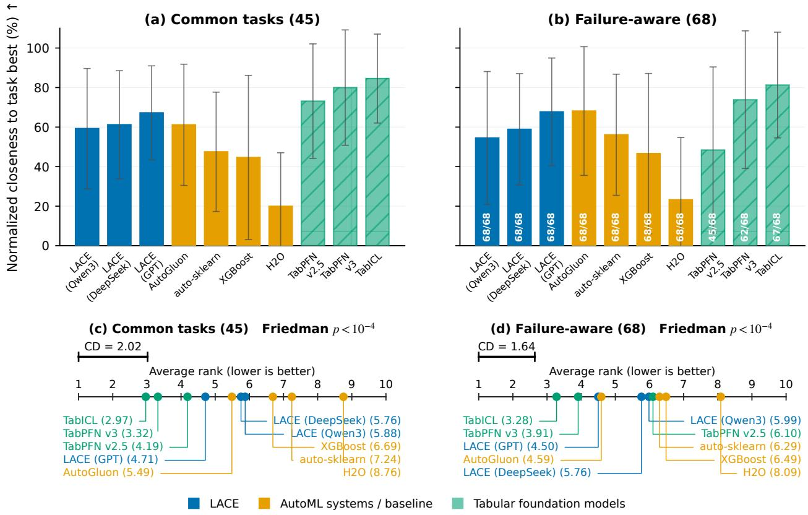  
Fi<sub>g</sub>ure 2: Benchmark com<sub>p</sub>arison, coloured b<sub>y</sub> method famil<sub>y</sub>. To<sub>p</sub>: normalized closeness to the task-best score (hi<sub>g</sub>her is better; mean and one standard deviation) on (a) 45 common tasks and (b) all 68 with failure-aware <sub>p</sub>enalties; bar labels show covera<sub>g</sub>e. Bottom: Demšar-st<sub>y</sub>le mean task-level ranks (lower is better), with the Nemen<sub>y</sub>i critical diference at α = 0.05, on (c) 45 common tasks and (d) all 68. Pairwise tests <sub>are</sub> i<sub>n</sub> S<sub>ec</sub>ti<sub>on</sub> I <sub>o</sub>f th<sub>e supp</sub>l<sub>emen</sub>t<sub>ary ma</sub>t<sub>er</sub>i<sub>a</sub>l<sub>.</sub>

Paired Wilcoxon signed-rank tests at α = 0.05, applied on th<sub>e</sub> t<sub>as</sub>k<sub>s s</sub>h<sub>are</sub>d b<sub>y eac</sub>h <sub>pa</sub>i<sub>r a</sub>ft<sub>er averag</sub>i<sub>ng repe</sub>titi<sub>ons an</sub>d <sub>correc</sub>t<sub>e</sub>d <sub>w</sub>ith H<sub>o</sub>l<sub>m</sub>’<sub>s proce</sub>d<sub>ure, s</sub>h<sub>arpen</sub> thi<sub>s p</sub>i<sub>c</sub>t<sub>ure.</sub> LACE (GPT-5.4-mini) si<sub>g</sub>nificantl<sub>y</sub> out<sub>p</sub>erforms auto-sklearn, XG-B<sub>oos</sub>t<sub>, an</sub>d H2O $\bar { ( } p _ { \mathrm { H o l m } } ~ < ~ 0 . 0 \bar { 1 }$ in each case). The com-<sub>p</sub>arison with AutoGluon is not si<sub>g</sub>nificant: LACE(GPT-5.4- mini) wins 33 and loses 35 of the 68 shared tasks, with a median diference of −0.001 points and $p _ { \mathrm { H o l m } } = 0 . 6 6$ Th<sub>e</sub> <sub>compar</sub>i<sub>son</sub> <sub>w</sub>ith T<sub>a</sub>bPFN <sub>v</sub>2<sub>.</sub>5 i<sub>s</sub> lik<sub>ew</sub>i<sub>se</sub> <sub>no</sub>t <sub>s</sub>i<sub>gn</sub>ifi<sub>-</sub> cant $( p _ { \mathrm { H o l m } } = 0 . 1 9 9 )$ <sub>.</sub> T<sub>a</sub>bPFN <sub>v</sub>3 <sub>a</sub>nd T<sub>a</sub>bICL <sub>s</sub>i<sub>g</sub>nifi<sub>ca</sub>ntl<sub>y</sub> out<sub>p</sub>erform LACE (GPT-5.4-mini) on their shared tasks, although the median margins are small (0.34 and 0.26 percenta<sub>g</sub>e <sub>p</sub>oints in the corres<sub>p</sub>ondin<sub>g</sub> task metric); a<sub>g</sub>ainst TabICL the mean diference nevertheless favors LACE (GPT-5.4- mini) (+0.22 points), reflecting a small number of tasks with l<sub>arge marg</sub>i<sub>ns</sub> i<sub>n</sub> it<sub>s</sub> f<sub>avor.</sub> Th<sub>e non-s</sub>i<sub>gn</sub>ifi<sub>can</sub>t <sub>compar</sub>i<sub>sons</sub> d<sub>o no</sub>t <sub>es</sub>t<sub>a</sub>bli<sub>s</sub>h <sub>equ</sub>i<sub>va</sub>l<sub>ence.</sub> F<sub>u</sub>ll <sub>e</sub>f<sub>ec</sub>t <sub>s</sub>i<sub>zes an</sub>d <sub>w</sub>i<sub>n–</sub>ti<sub>e–</sub> l<sub>oss</sub> <sub>coun</sub>t<sub>s</sub> <sub>are</sub> <sub>repor</sub>t<sub>e</sub>d i<sub>n</sub> S<sub>ec</sub>ti<sub>on</sub> I <sub>o</sub>f th<sub>e</sub> <sub>supp</sub>l<sub>emen</sub>t<sub>ary</sub> <sub>ma</sub>t<sub>er</sub>i<sub>a</sub>l<sub>.</sub>

## 5.2 Coverage-Aware Performance

Th<sub>e</sub> <sub>common-</sub>t<sub>as</sub>k <sub>compar</sub>i<sub>son</sub> <sub>exc</sub>l<sub>u</sub>d<sub>es</sub> 23 t<sub>as</sub>k<sub>s</sub> b<sub>ecause</sub> <sub>a</sub>t l<sub>eas</sub>t <sub>one me</sub>th<sub>o</sub>d <sub>re</sub>t<sub>urns no va</sub>lid <sub>resu</sub>lt<sub>.</sub> All LACE <sub>var</sub>i<sub>an</sub>t<sub>s,</sub>

A<sub>u</sub>t<sub>o</sub>Gl<sub>uon, au</sub>t<sub>o-s</sub>kl<sub>earn,</sub> XGB<sub>oos</sub>t<sub>, an</sub>d H2O <sub>cover a</sub>ll 68 t<sub>as</sub>k<sub>s, w</sub>h<sub>ereas</sub> T<sub>a</sub>bPFN <sub>v</sub>2<sub>.</sub>5<sub>,</sub> T<sub>a</sub>bPFN <sub>v</sub>3<sub>, an</sub>d T<sub>a</sub>bICL <sub>cover</sub> 45<sub>,</sub> 62<sub>, an</sub>d 67 t<sub>as</sub>k<sub>s, respec</sub>ti<sub>ve</sub>l<sub>y.</sub> Fi<sub>gure</sub> 2 <sub>summar</sub>i<sub>zes</sub> b<sub>o</sub>th <sub>compar</sub>i<sub>sons;</sub> f<sub>u</sub>ll <sub>per-me</sub>th<sub>o</sub>d <sub>ran</sub>k<sub>,</sub> d<sub>ev</sub>i<sub>a</sub>ti<sub>on, an</sub>d f<sub>rac</sub>ti<sub>ona</sub>l<sub>-</sub> <sub>w</sub>i<sub>n va</sub>l<sub>ues are repor</sub>t<sub>e</sub>d i<sub>n</sub> S<sub>ec</sub>ti<sub>on</sub> I <sub>o</sub>f th<sub>e supp</sub>l<sub>emen</sub>t<sub>ary</sub> <sub>ma</sub>t<sub>er</sub>i<sub>a</sub>l<sub>.</sub>

W<sub>e</sub> th<sub>ere</sub>f<sub>ore con</sub>d<sub>uc</sub>t <sub>a</sub> f<sub>a</sub>il<sub>ure-aware sens</sub>iti<sub>v</sub>it<sub>y ana</sub>l<sub>ys</sub>i<sub>s</sub> i<sub>n w</sub>hi<sub>c</sub>h <sub>a m</sub>i<sub>ss</sub>i<sub>ng me</sub>th<sub>o</sub>d <sub>rece</sub>i<sub>ves</sub> th<sub>e</sub> ti<sub>e</sub>d <sub>average o</sub>f th<sub>e re-</sub> mainin<sub>g</sub> worst ranks and normalized deviation 1 (Fi<sub>g</sub>ure 2b). The top of the ordering is unchanged, with TabICL (3.28, penalized on a single task) ahead of TabPFN v3 (3.91), while covera<sub>g</sub>e resha<sub>p</sub>es the middle of the field: LACE (GPT-5.4- mini) improves from 4.71 to 4.50 and AutoGluon from 5.49 to 4.59, leaving the two essentially tied, and TabPFN v2.5, missing 23 tasks, falls from 4.19 to 6.10, the strongest cover-<sub>age</sub> <sub>e</sub>f<sub>ec</sub>t i<sub>n</sub> th<sub>e</sub> <sub>compar</sub>i<sub>son;</sub> S<sub>ec</sub>ti<sub>on</sub> J <sub>o</sub>f th<sub>e</sub> <sub>supp</sub>l<sub>emen</sub>t<sub>ary</sub> <sub>ma</sub>t<sub>er</sub>i<sub>a</sub>l d<sub>ecomposes</sub> thi<sub>s e</sub>f<sub>ec</sub>t b<sub>y</sub> t<sub>as</sub>k <sub>s</sub>i<sub>ze.</sub>

N<sub>o s</sub>i<sub>ng</sub>l<sub>e me</sub>th<sub>o</sub>d d<sub>om</sub>i<sub>na</sub>t<sub>es, an</sub>d <sub>a cons</sub>i<sub>s</sub>t<sub>en</sub>t di<sub>s</sub>ti<sub>nc</sub>ti<sub>on</sub> b<sub>e</sub>t<sub>ween me</sub>th<sub>o</sub>d f<sub>am</sub>ili<sub>es emerges.</sub> T<sub>a</sub>bPFN <sub>v</sub>3 <sub>an</sub>d T<sub>a</sub>bICL <sub>prov</sub>id<sub>e</sub> th<sub>e</sub> <sub>s</sub>t<sub>ronges</sub>t <sub>pre</sub>di<sub>c</sub>ti<sub>ve</sub> <sub>per</sub>f<sub>ormance</sub> <sub>on</sub> th<sub>e</sub> t<sub>as</sub>k<sub>s</sub> th<sub>ey</sub> <sub>suppor</sub>t<sub>,</sub> b<sub>u</sub>t d<sub>o no</sub>t <sub>cover</sub> th<sub>e comp</sub>l<sub>e</sub>t<sub>e</sub> b<sub>enc</sub>h<sub>mar</sub>k<sub>.</sub> Cl<sub>ass</sub>i<sub>-</sub> <sub>ca</sub>l A<sub>u</sub>t<sub>o</sub>ML <sub>sys</sub>t<sub>ems</sub> <sub>cover</sub> it i<sub>n</sub> f<sub>u</sub>ll <sub>w</sub>ith <sub>genera</sub>ll<sub>y</sub> <sub>wea</sub>k<sub>er</sub> <sub>aggrega</sub>t<sub>e per</sub>f<sub>ormance.</sub> O<sub>n</sub> th<sub>e</sub> f<sub>u</sub>ll b<sub>enc</sub>h<sub>mar</sub>k<sub>,</sub> LACE <sub>w</sub>ith GPT<sub>-</sub>5<sub>.</sub>4<sub>-m</sub>i<sub>n</sub>i <sub>com</sub>bi<sub>nes</sub> <sub>comp</sub>l<sub>e</sub>t<sub>e</sub> <sub>coverage</sub> <sub>w</sub>ith <sub>no</sub> <sub>s</sub>i<sub>gn</sub>ifi<sub>-</sub> <sub>can</sub>t dif<sub>erence</sub> f<sub>rom</sub> A<sub>u</sub>t<sub>o</sub>Gl<sub>uon,</sub> <sub>s</sub>i<sub>gn</sub>ifi<sub>can</sub>tl<sub>y</sub> <sub>s</sub>t<sub>ronger</sub> th<sub>an</sub> <sub>au</sub>t<sub>o-s</sub>kl<sub>earn,</sub> H2O<sub>, an</sub>d th<sub>e</sub> fi<sub>xe</sub>d XGB<sub>oos</sub>t b<sub>ase</sub>li<sub>ne, an</sub>d b<sub>e-</sub> hi<sub>n</sub>d <sub>on</sub>l<sub>y</sub> th<sub>e</sub> <sub>newes</sub>t <sub>pre</sub>t<sub>ra</sub>i<sub>ne</sub>d <sub>mo</sub>d<sub>e</sub>l<sub>s,</sub> <sub>an</sub>d th<sub>en</sub> <sub>on</sub>l<sub>y</sub> <sub>on</sub> th<sub>e</sub> t<sub>as</sub>k<sub>s</sub> th<sub>ey</sub> <sub>cover.</sub>

## 5.3 Efect of the LLM Backbone

Th<sub>e</sub> <sub>c</sub>h<sub>o</sub>i<sub>ce</sub> <sub>o</sub>f l<sub>anguage-mo</sub>d<sub>e</sub>l b<sub>ac</sub>kb<sub>one</sub> <sub>a</sub>f<sub>ec</sub>t<sub>s</sub> th<sub>e</sub> <sub>qua</sub>lit<sub>y</sub> of the resultin<sub>g p</sub>i<sub>p</sub>elines (Fi<sub>g</sub>ure 2). GPT-5.4-mini is the <sub>s</sub>t<sub>ronges</sub>t LACE <sub>con</sub>fi<sub>gura</sub>ti<sub>on, w</sub>ith <sub>a common-</sub>t<sub>as</sub>k <sub>mean</sub> rank of 4.71, compared with 5.76 for DeepSeek and 5.88 for Qwen3-Coder-Next, and paired Wilcoxon tests favor it over both alternatives after Holm correction (Section I of the su<sub>p</sub>- <sub>p</sub>lementar<sub>y</sub> material). All three variants com<sub>p</sub>lete the full set <sub>o</sub>f 68 t<sub>as</sub>k<sub>s, an</sub>d <sub>eac</sub>h <sub>ran</sub>k<sub>s a</sub>h<sub>ea</sub>d <sub>o</sub>f <sub>au</sub>t<sub>o-s</sub>kl<sub>earn,</sub> XGB<sub>oos</sub>t<sub>,</sub> <sub>an</sub>d H2O <sub>on</sub> th<sub>e common-</sub>t<sub>as</sub>k <sub>compar</sub>i<sub>son, w</sub>hil<sub>e on</sub>l<sub>y</sub> LACE (GPT-5.4-mini) ranks ahead of AutoGluon. The framework i<sub>s</sub> th<sub>us no</sub>t ti<sub>e</sub>d t<sub>o a s</sub>i<sub>ng</sub>l<sub>e mo</sub>d<sub>e</sub>l<sub>,</sub> th<sub>oug</sub>h th<sub>e</sub> b<sub>ac</sub>kb<sub>one ma</sub>t<sub>-</sub> ters: LACE (GPT-5.4-mini) leads both alternatives b<sub>y</sub> small but consistent median diferences (0.06 and 0.18 points).

## 6 Analysis of Generated Pipelines

Th<sub>e</sub> b<sub>enc</sub>h<sub>mar</sub>k <sub>compar</sub>i<sub>son es</sub>t<sub>a</sub>bli<sub>s</sub>h<sub>es w</sub>h<sub>ere</sub> LACE <sub>ran</sub>k<sub>s;</sub> thi<sub>s</sub> <sub>sec</sub>ti<sub>on</sub> <sub>exam</sub>i<sub>nes</sub> h<sub>ow</sub> <sub>evo</sub>l<sub>u</sub>ti<sub>onary</sub> f<sub>ee</sub>db<sub>ac</sub>k <sub>c</sub>h<sub>anges</sub> <sub>genera</sub>t<sub>e</sub>d <sub>programs an</sub>d <sub>w</sub>h<sub>a</sub>t th<sub>e open represen</sub>t<sub>a</sub>ti<sub>on ma</sub>k<sub>es</sub> <sub>v</sub>i<sub>s</sub>ibl<sub>e.</sub>

## 6.1 Evolutionary Search Improves Zero-Shot Pipelines

Th<sub>e</sub> fi<sub>rs</sub>t <sub>can</sub>did<sub>a</sub>t<sub>e o</sub>f <sub>eac</sub>h <sub>run</sub> i<sub>s genera</sub>t<sub>e</sub>d b<sub>e</sub>f<sub>ore any</sub> <sub>execu</sub>ti<sub>on</sub> f<sub>ee</sub>db<sub>ac</sub>k <sub>an</sub>d th<sub>ere</sub>f<sub>ore prov</sub>id<sub>es a zero-s</sub>h<sub>o</sub>t <sub>re</sub>f<sub>erence.</sub> S<sub>earc</sub>h i<sub>mproves on</sub> it i<sub>n</sub> t<sub>wo ways.</sub> It <sub>re-</sub> stores executability: first-shot validity ranges from 37.6% for LACE(Qwen3) through 66.5% for LACE(DeepSeek) to 79.7% for LACE(GPT-5.4-mini), whereas every final <sub>p</sub>i<sub>pe</sub>li<sub>ne</sub> i<sub>s va</sub>lid<sub>, so eac</sub>h <sub>run</sub> b<sub>eg</sub>i<sub>nn</sub>i<sub>ng</sub> f<sub>rom an</sub> i<sub>nva</sub>lid <sub>pro-</sub> <sub>gram recovere</sub>d <sub>w</sub>ithi<sub>n</sub> th<sub>e</sub> b<sub>u</sub>d<sub>ge</sub>t<sub>.</sub> It <sub>a</sub>l<sub>so</sub> i<sub>mproves programs</sub> th<sub>a</sub>t <sub>a</sub>l<sub>rea</sub>d<sub>y ran, an</sub>d thi<sub>s</sub> i<sub>mprovemen</sub>t h<sub>o</sub>ld<sub>s on</sub> h<sub>e</sub>ld<sub>-ou</sub>t d<sub>a</sub>t<sub>a:</sub> <sub>a</sub>ft<sub>er re</sub>fitti<sub>ng eac</sub>h <sub>va</sub>lid fi<sub>rs</sub>t <sub>program on</sub> th<sub>e o</sub>fi<sub>c</sub>i<sub>a</sub>l t<sub>ra</sub>i<sub>n</sub>i<sub>ng</sub> f<sub>o</sub>ld<sub>s an</sub>d <sub>eva</sub>l<sub>ua</sub>ti<sub>ng</sub> it <sub>on</sub> th<sub>e correspon</sub>di<sub>ng</sub> t<sub>es</sub>t f<sub>o</sub>ld<sub>s un-</sub> d<sub>er</sub> th<sub>e same pro</sub>t<sub>oco</sub>l <sub>as</sub> th<sub>e re</sub>t<sub>urne</sub>d <sub>p</sub>i<sub>pe</sub>li<sub>ne,</sub> th<sub>e re</sub>t<sub>urne</sub>d <sub>p</sub>i<sub>pe</sub>li<sub>ne</sub> i<sub>s</sub> b<sub>e</sub>tt<sub>er on</sub> 190 <sub>o</sub>f 193 b<sub>ac</sub>kb<sub>one–</sub>t<sub>as</sub>k <sub>un</sub>it<sub>s, w</sub>ith <sub>a</sub> median gain of 2.99 percentage points in the corresponding task (bootstrap 95% CI [2.42, 4.17]; Wilcoxon $p < \mathsf { \bar { 1 0 } } ^ { - 3 2 } ) ;$ under LACE(GPT-5.4-mini) all 66 usable units im<sub>p</sub>rove, with a median gain of 4.53 points. The comparison conditions on <sub>a va</sub>lid fi<sub>rs</sub>t <sub>program an</sub>d <sub>ass</sub>i<sub>gns no score</sub> t<sub>o runs w</sub>h<sub>ose</sub> first program failed. On the inner-validation objective the ret<sub>urne</sub>d <sub>p</sub>i<sub>pe</sub>li<sub>ne a</sub>l<sub>so excee</sub>d<sub>s</sub> th<sub>e</sub> b<sub>es</sub>t <sub>va</sub>lid <sub>mem</sub>b<sub>er o</sub>f th<sub>e</sub> four-candidate initial population by 1.58 points, so the gain i<sub>s</sub> <sub>no</sub>t <sub>a</sub> b<sub>es</sub>t<sub>-o</sub>f<sub>-</sub>f<sub>our</sub> <sub>e</sub>f<sub>ec</sub>t<sub>.</sub> F<sub>u</sub>ll di<sub>s</sub>t<sub>r</sub>ib<sub>u</sub>ti<sub>ons</sub> <sub>an</sub>d <sub>va</sub>lidit<sub>y</sub> <sub>accoun</sub>ti<sub>ng are repor</sub>t<sub>e</sub>d i<sub>n</sub> S<sub>ec</sub>ti<sub>on</sub> K <sub>o</sub>f th<sub>e supp</sub>l<sub>emen</sub>t<sub>ary</sub> <sub>ma</sub>t<sub>er</sub>i<sub>a</sub>l<sub>.</sub>

## 6.2 Pipeline composition and structural diversity

Th<sub>e genera</sub>t<sub>e</sub>d <sub>programs</sub> did <sub>no</sub>t <sub>co</sub>ll<sub>apse on</sub>t<sub>o a sma</sub>ll <sub>se</sub>t of templates. Among the 1,020 final pipelines, 99.9% added preprocessing beyond the harness and 73.3% combined at least two learners. Gradient boosting appeared in 69.4% of finals, forests or extra trees in 52.5%, and linear models in 55.8%. We characterize structure by the ordered prepro-<sub>cess</sub>i<sub>ng</sub> <sub>s</sub>t<sub>eps,</sub> l<sub>earner</sub> f<sub>am</sub>ili<sub>es,</sub> <sub>ensem</sub>bl<sub>e</sub> t<sub>ype,</sub> <sub>an</sub>d <sub>expose</sub>d h<sub>yperparame</sub>t<sub>er</sub> <sub>names,</sub> i<sub>gnor</sub>i<sub>ng</sub> <sub>numer</sub>i<sub>ca</sub>l <sub>va</sub>l<sub>ues.</sub> A<sub>cross</sub> the 70,998 valid candidates, this yields 65,298 (92%) unique <sub>s</sub>t<sub>ruc</sub>t<sub>ura</sub>l <sub>s</sub>i<sub>gna</sub>t<sub>ures, w</sub>ith <sub>a me</sub>di<sub>an o</sub>f 68 di<sub>s</sub>ti<sub>nc</sub>t <sub>s</sub>t<sub>ruc</sub>t<sub>ures</sub> <sub>w</sub>ithi<sub>n</sub> <sub>a</sub> <sub>run.</sub> P<sub>ar</sub>t <sub>o</sub>f thi<sub>s</sub> <sub>un</sub>i<sub>queness</sub> <sub>re</sub>fl<sub>ec</sub>t<sub>s</sub> h<sub>yperparame-</sub> t<sub>er nam</sub>i<sub>ng,</sub> b<sub>u</sub>t th<sub>e coarser</sub> f<sub>am</sub>il<sub>y s</sub>t<sub>a</sub>ti<sub>s</sub>ti<sub>cs s</sub>h<sub>ow</sub> th<sub>e same</sub> p<sup>attern</sup>.

E<sub>very re</sub>t<sub>urne</sub>d <sub>p</sub>i<sub>pe</sub>li<sub>ne</sub> i<sub>s an execu</sub>t<sub>a</sub>bl<sub>e</sub> P<sub>y</sub>th<sub>on program</sub> w<sup>h</sup>ose <sub>p</sub>re<sub>p</sub>rocess<sup>i</sup>n<sub>g</sub>, <sup>l</sup>earners, an<sup>d h</sup><sub>yp</sub>er<sub>p</sub>arameter va<sup>l</sup>ues <sub>can</sub> b<sub>e</sub> i<sub>nspec</sub>t<sub>e</sub>d <sub>an</sub>d <sub>mo</sub>difi<sub>e</sub>d<sub>.</sub> B<sub>eyon</sub>d thi<sub>s</sub> <sub>genera</sub>l <sub>e</sub>dit<sub>a</sub>bil<sub>-</sub> ity, 89 of the 1,020 finals (8.7%, spanning 53 tasks) im-<sub>p</sub>l<sub>emen</sub>t<sub>e</sub>d <sub>pre</sub>di<sub>c</sub>ti<sub>on-com</sub>bi<sub>na</sub>ti<sub>on</sub> l<sub>og</sub>i<sub>c</sub> di<sub>rec</sub>tl<sub>y</sub> i<sub>n</sub> N<sub>um</sub>P<sub>y</sub> <sub>or</sub> <sub>or</sub>di<sub>nary</sub> P<sub>y</sub>th<sub>on</sub> <sub>ra</sub>th<sub>er</sub> th<sub>an</sub> <sub>re</sub>l<sub>y</sub>i<sub>ng</sub> <sub>so</sub>l<sub>e</sub>l<sub>y</sub> <sub>on</sub> <sub>a</sub> lib<sub>rary</sub> <sub>ensem</sub>bl<sub>e wrapper.</sub> I<sub>n one</sub> ill<sub>us</sub>t<sub>ra</sub>ti<sub>ve examp</sub>l<sub>e se</sub>l<sub>ec</sub>t<sub>e</sub>d f<sub>or</sub> clarit<sub>y</sub>, from LACE(GPT-5.4-mini) on task 2073, the final <sub>program</sub> <sub>com</sub>bi<sub>nes</sub> fitt<sub>e</sub>d SVC <sub>an</sub>d <sub>ran</sub>d<sub>om-</sub>f<sub>ores</sub>t <sub>c</sub>l<sub>ass</sub> <sub>pro</sub>b<sub>-</sub> abilities with explicit weights 0.60 and 0.40. Because that <sub>c</sub>h<sub>o</sub>i<sub>ce</sub> i<sub>s or</sub>di<sub>nary</sub> P<sub>y</sub>th<sub>on, a prac</sub>titi<sub>oner can c</sub>h<sub>ange e</sub>ith<sub>er</sub> <sub>coe</sub>fi<sub>c</sub>i<sub>en</sub>t<sub>, rep</sub>l<sub>ace a mem</sub>b<sub>er, or reuse</sub> th<sub>e</sub> bl<sub>oc</sub>k <sub>ou</sub>t<sub>s</sub>id<sub>e</sub> th<sub>e</sub> <sub>searc</sub>h f<sub>ramewor</sub>k<sub>.</sub> I<sub>nspec</sub>ti<sub>ng or mo</sub>dif<sub>y</sub>i<sub>ng a</sub> fitt<sub>e</sub>d A<sub>u</sub>t<sub>o</sub>ML <sub>ensem</sub>bl<sub>e</sub> t<sub>yp</sub>i<sub>ca</sub>ll<sub>y</sub> <sub>requ</sub>i<sub>res</sub> i<sub>n</sub>t<sub>erac</sub>ti<sub>ng</sub> <sub>w</sub>ith th<sub>e</sub> <sub>or</sub>i<sub>g</sub>i<sub>na</sub>ti<sub>ng</sub> framework’s model objects, while a pretrained predictor uses fi<sub>xe</sub>d <sub>pre</sub>t<sub>ra</sub>i<sub>ne</sub>d <sub>we</sub>i<sub>g</sub>ht<sub>s an</sub>d <sub>exposes no compara</sub>bl<sub>e</sub> t<sub>as</sub>k<sub>-</sub> <sub>spec</sub>ifi<sub>c</sub> <sub>p</sub>i<sub>pe</sub>li<sub>ne</sub> <sub>program.</sub> Th<sub>e</sub> <sub>se</sub>l<sub>ec</sub>ti<sub>on</sub> <sub>ru</sub>l<sub>e,</sub> <sub>source</sub> <sub>excerp</sub>t<sub>,</sub> <sub>an</sub>d li<sub>neage are repor</sub>t<sub>e</sub>d i<sub>n</sub> S<sub>ec</sub>ti<sub>on</sub> H <sub>o</sub>f th<sub>e supp</sub>l<sub>emen</sub>t<sub>ary</sub> <sub>ma</sub>t<sub>er</sub>i<sub>a</sub>l<sub>.</sub>

## 6.3 Auditing pipelines as code

B<sub>ecause</sub> th<sub>e</sub> S<sub>ec</sub>ti<sub>on</sub> 3<sub>.</sub>2 <sub>cons</sub>t<sub>ra</sub>i<sub>n</sub>t<sub>s are promp</sub>t<sub>e</sub>d <sub>ra</sub>th<sub>er</sub> th<sub>an</sub> enforced, we audited all 1,020 final ro rams with static det<sub>ec</sub>t<sub>ors an</sub>d <sub>manua</sub>ll<sub>y rev</sub>i<sub>ewe</sub>d <sub>every</sub> fl<sub>ag.</sub> N<sub>o</sub> fi<sub>na</sub>l <sub>p</sub>i<sub>pe</sub>li<sub>ne</sub> t<sub>r</sub>i<sub>ggere</sub>d th<sub>e</sub> d<sub>e</sub>t<sub>ec</sub>t<sub>ors</sub> f<sub>or</sub> i<sub>n</sub>t<sub>erna</sub>l h<sub>yperparame</sub>t<sub>er searc</sub>h<sub>,</sub> <sub>nes</sub>t<sub>e</sub>d A<sub>u</sub>t<sub>o</sub>ML<sub>, or</sub> h<sub>yperparame</sub>t<sub>er-</sub>d<sub>r</sub>i<sub>ven es</sub>ti<sub>ma</sub>t<sub>or sw</sub>it<sub>c</sub>h<sub>-</sub> i<sub>ng.</sub> Of 24 fl<sub>agge</sub>d <sub>programs,</sub> 22 <sub>were con</sub>fi<sub>rme</sub>d <sub>v</sub>i<sub>o</sub>l<sub>a</sub>ti<sub>ons:</sub> fi<sub>ve can</sub>did<sub>a</sub>t<sub>e-au</sub>th<sub>ore</sub>d <sub>ou</sub>t<sub>-o</sub>f<sub>-</sub>f<sub>o</sub>ld <sub>cons</sub>t<sub>ruc</sub>ti<sub>ons,</sub> thi<sub>r</sub>t<sub>een</sub> f<sub>our-</sub>l<sub>earner ensem</sub>bl<sub>es, an</sub>d f<sub>our p</sub>i<sub>pe</sub>li<sub>nes</sub> th<sub>a</sub>t <sub>re</sub>fitt<sub>e</sub>d <sub>pre-</sub> <sub>process</sub>i<sub>ng</sub> d<sub>ur</sub>i<sub>ng pre</sub>di<sub>c</sub>ti<sub>on.</sub> O<sub>n</sub>l<sub>y</sub> t<sub>wo con</sub>fi<sub>rme</sub>d <sub>v</sub>i<sub>o</sub>l<sub>a</sub>ti<sub>ons</sub> occurred under LACE(GPT-5.4-mini), the backbone used f<sub>or</sub> th<sub>e pr</sub>i<sub>mary</sub> b<sub>ase</sub>li<sub>ne compar</sub>i<sub>son.</sub> Th<sub>e au</sub>dit i<sub>s a</sub> t<sub>arge</sub>t<sub>e</sub>d <sub>ana</sub>l<sub>ys</sub>i<sub>s ra</sub>th<sub>er</sub> th<sub>an a proo</sub>f <sub>o</sub>f <sub>a</sub>b<sub>sence;</sub> d<sub>e</sub>t<sub>ec</sub>t<sub>or</sub> d<sub>e</sub>fi<sub>n</sub>iti<sub>ons</sub> <sub>an</sub>d <sub>comp</sub>l<sub>e</sub>t<sub>e c</sub>l<sub>ass</sub>ifi<sub>ca</sub>ti<sub>ons are repor</sub>t<sub>e</sub>d i<sub>n</sub> S<sub>ec</sub>ti<sub>on</sub> H <sub>o</sub>f th<sub>e</sub> <sub>supp</sub>l<sub>emen</sub>t<sub>ary</sub> <sub>ma</sub>t<sub>er</sub>i<sub>a</sub>l<sub>.</sub> All fl<sub>agge</sub>d <sub>programs</sub> <sub>rema</sub>i<sub>n</sub> i<sub>n</sub> th<sub>e pr</sub>i<sub>mary ana</sub>l<sub>ys</sub>i<sub>s, an</sub>d <sub>exc</sub>l<sub>u</sub>di<sub>ng</sub> th<sub>e con</sub>fi<sub>rme</sub>d <sub>v</sub>i<sub>o-</sub> l<sub>a</sub>ti<sub>ons</sub> l<sub>eaves</sub> <sub>every</sub> <sub>coverage</sub> fi<sub>gure,</sub> <sub>mean-ran</sub>k <sub>or</sub>d<sub>er</sub>i<sub>ng,</sub> and Holm-corrected conclusion unchan<sub>g</sub>ed (Section H of the su<sub>pp</sub>lementar<sub>y</sub> material).

## 6.4 Search dynamics and program evolution

E<sub>vo</sub>l<sub>u</sub>ti<sub>on con</sub>ti<sub>nue</sub>d th<sub>roug</sub>h<sub>ou</sub>t<sub>:</sub> th<sub>e me</sub>di<sub>an run ma</sub>d<sub>e</sub> it<sub>s</sub> fi<sub>na</sub>l i<sub>mprovemen</sub>t i<sub>n genera</sub>ti<sub>on</sub> 7 <sub>o</sub>f 8 <sub>an</sub>d h<sub>a</sub>d <sub>a</sub>l<sub>rea</sub>d<sub>y re-</sub> alized 91% of its eventual gain by candidate 50 (Figure 3). S<sub>e</sub>l<sub>ec</sub>t<sub>e</sub>d <sub>p</sub>i<sub>pe</sub>li<sub>nes</sub> h<sub>a</sub>d <sub>a me</sub>di<sub>an crea</sub>ti<sub>on genera</sub>ti<sub>on o</sub>f 7 <sub>an</sub>d <sub>a</sub> <sub>me</sub>di<sub>an</sub> <sub>ances</sub>t<sub>ry</sub> d<sub>ep</sub>th <sub>o</sub>f f<sub>our</sub> <sub>mu</sub>t<sub>a</sub>ti<sub>on</sub> <sub>e</sub>d<sub>ges</sub> f<sub>rom</sub> th<sub>e</sub>i<sub>r</sub> nearest generation-0 ancestor; 52.6% of finals appeared in the last two generations, and only 1.3% were unmodified initi<sub>a</sub>l <sub>can</sub>did<sub>a</sub>t<sub>es.</sub> A<sub>cross</sub> <sub>va</sub>lid <sub>paren</sub>t<sub>–o</sub>f<sub>spr</sub>i<sub>ng</sub> <sub>compar</sub>i<sub>sons,</sub> <sub>a</sub> <sub>me</sub>di<sub>an</sub> <sub>o</sub>f 21<sub>.</sub>9% <sub>o</sub>f <sub>o</sub>f<sub>spr</sub>i<sub>ng</sub> i<sub>mprove</sub>d <sub>on</sub> th<sub>e</sub>i<sub>r</sub> <sub>paren</sub>t<sub>,</sub> <sub>usua</sub>ll<sub>y</sub> th<sub>roug</sub>h <sub>sma</sub>ll <sub>s</sub>t<sub>eps w</sub>ith <sub>a me</sub>di<sub>an ga</sub>i<sub>n o</sub>f 0<sub>.</sub>23 <sub>per-</sub> <sub>cen</sub>t<sub>age po</sub>i<sub>n</sub>t<sub>s on</sub> th<sub>e accuracy-score</sub>d <sub>runs.</sub> E<sub>xecu</sub>t<sub>a</sub>bilit<sub>y,</sub> <sub>exc</sub>l<sub>us</sub>i<sub>ons, an</sub>d <sub>comp</sub>l<sub>e</sub>t<sub>e</sub> li<sub>neage s</sub>t<sub>a</sub>ti<sub>s</sub>ti<sub>cs are repor</sub>t<sub>e</sub>d i<sub>n</sub> S<sub>ec</sub>ti<sub>on</sub> L <sub>o</sub>f th<sub>e supp</sub>l<sub>emen</sub>t<sub>ary ma</sub>t<sub>er</sub>i<sub>a</sub>l<sub>.</sub>

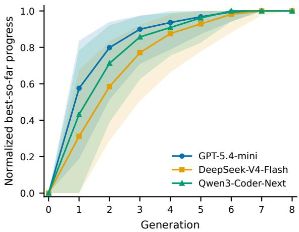  
Fi<sub>gure</sub> 3<sub>:</sub> N<sub>orma</sub>li<sub>ze</sub>d b<sub>es</sub>t<sub>-so-</sub>f<sub>ar progress</sub> b<sub>y genera</sub>ti<sub>on,</sub> <sub>s</sub>h<sub>own as</sub> th<sub>e me</sub>di<sub>an an</sub>d i<sub>n</sub>t<sub>erquar</sub>til<sub>e range across runs.</sub> R<sub>uns w</sub>ith<sub>ou</sub>t <sub>a va</sub>lid i<sub>n</sub>iti<sub>a</sub>l <sub>can</sub>did<sub>a</sub>t<sub>e or</sub> i<sub>mprovemen</sub>t <sub>are</sub> <sub>exc</sub>l<sub>u</sub>d<sub>e</sub>d<sub>.</sub>

## 7 Discussion and Limitations

LACE <sub>s</sub>h<sub>ows</sub> th<sub>a</sub>t <sub>evo</sub>l<sub>u</sub>ti<sub>onary searc</sub>h <sub>over execu</sub>t<sub>a</sub>bl<sub>e</sub> <sub>p</sub>i<sub>pe</sub>li<sub>ne programs</sub> i<sub>s a v</sub>i<sub>a</sub>bl<sub>e rou</sub>t<sub>e</sub> t<sub>o</sub> A<sub>u</sub>t<sub>o</sub>ML<sub>:</sub> it i<sub>s com-</sub> <sub>pe</sub>titi<sub>ve w</sub>ith A<sub>u</sub>t<sub>o</sub>Gl<sub>uon, ou</sub>t<sub>per</sub>f<sub>orms</sub> th<sub>e o</sub>th<sub>er searc</sub>h<sub>-</sub>b<sub>ase</sub>d baselines, and covers all 68 tasks (Section 5.2). Relative to <sub>program-evo</sub>l<sub>u</sub>ti<sub>on</sub> A<sub>u</sub>t<sub>o</sub>ML th<sub>a</sub>t <sub>searc</sub>h<sub>es</sub> l<sub>ow-</sub>l<sub>eve</sub>l <sub>pr</sub>i<sub>m</sub>i<sub>-</sub> ti<sub>ves, suc</sub>h <sub>as</sub> A<sub>u</sub>t<sub>o</sub>ML<sub>-</sub>Z<sub>ero,</sub> LACE <sub>uses a coarser</sub> lib<sub>rary-</sub> b<sub>ase</sub>d <sub>represen</sub>t<sub>a</sub>ti<sub>on</sub> th<sub>a</sub>t <sub>pro</sub>d<sub>uce</sub>d hi<sub>g</sub>h <sub>can</sub>did<sub>a</sub>t<sub>e va</sub>lidit<sub>y</sub> in our ex<sub>p</sub>eriments (Section 6.1), thou<sub>g</sub>h its search s<sub>p</sub>ace re-<sub>ma</sub>i<sub>ns</sub> b<sub>oun</sub>d<sub>e</sub>d b<sub>y</sub> th<sub>e ava</sub>il<sub>a</sub>bl<sub>e</sub> lib<sub>rar</sub>i<sub>es.</sub> T<sub>wo proper</sub>ti<sub>es o</sub>f thi<sub>s resu</sub>lt d<sub>eserve emp</sub>h<sub>as</sub>i<sub>s.</sub> Fi<sub>rs</sub>t<sub>, every</sub> LACE <sub>score was</sub> <sub>o</sub>bt<sub>a</sub>i<sub>ne</sub>d <sub>a</sub>t th<sub>e</sub> h<sub>yperparame</sub>t<sub>er va</sub>l<sub>ues c</sub>h<sub>osen</sub> b<sub>y</sub> th<sub>e gen-</sub> <sub>era</sub>t<sub>or, w</sub>ith <sub>no ex</sub>t<sub>erna</sub>l t<sub>un</sub>i<sub>ng;</sub> th<sub>e compar</sub>i<sub>son</sub> th<sub>ere</sub>f<sub>ore</sub> <sub>measures</sub> th<sub>e searc</sub>h <sub>over genera</sub>t<sub>e</sub>d <sub>programs a</sub>l<sub>one.</sub> C<sub>ou-</sub> <sub>p</sub>li<sub>ng</sub> th<sub>e expose</sub>d <sub>parame</sub>t<sub>er spaces</sub> t<sub>o an ex</sub>t<sub>erna</sub>l t<sub>uner</sub> i<sub>s a</sub> <sub>na</sub>t<sub>ura</sub>l <sub>ex</sub>t<sub>ens</sub>i<sub>on.</sub> S<sub>econ</sub>d<sub>, a</sub> fi<sub>ve-</sub>t<sub>as</sub>k <sub>a</sub>bl<sub>a</sub>ti<sub>on s</sub>h<sub>owe</sub>d th<sub>a</sub>t th<sub>e genera</sub>t<sub>e</sub>d <sub>searc</sub>h <sub>space</sub> d<sub>epen</sub>d<sub>s on w</sub>h<sub>a</sub>t th<sub>e promp</sub>t <sub>an-</sub> <sub>nounces: an</sub> i<sub>ns</sub>t<sub>a</sub>ll<sub>e</sub>d b<sub>u</sub>t <sub>unmen</sub>ti<sub>one</sub>d T<sub>a</sub>bPFN <sub>componen</sub>t <sub>was never use</sub>d<sub>, w</sub>h<sub>ereas exp</sub>li<sub>c</sub>itl<sub>y announc</sub>i<sub>ng</sub> it l<sub>e</sub>d th<sub>e gen-</sub> erator to incor<sub>p</sub>orate it, usuall<sub>y</sub> within ensembles (Section N of the su<sub>pp</sub>lementar<sub>y</sub> material). The ablation shows that the <sub>e</sub>f<sub>ec</sub>ti<sub>ve searc</sub>h <sub>space</sub> i<sub>s s</sub>h<sub>ape</sub>d b<sub>y announce</sub>d <sub>componen</sub>t<sub>s,</sub> <sub>no</sub>t <sub>pac</sub>k<sub>age ava</sub>il<sub>a</sub>bilit<sub>y a</sub>l<sub>one.</sub>

Th<sub>e me</sub>th<sub>o</sub>d i<sub>n</sub>h<sub>er</sub>it<sub>s</sub> th<sub>e capa</sub>biliti<sub>es an</sub>d <sub>compu</sub>t<sub>a</sub>ti<sub>ona</sub>l <sub>cos</sub>t <sub>o</sub>f it<sub>s var</sub>i<sub>a</sub>ti<sub>on opera</sub>t<sub>or.</sub> Th<sub>e</sub> th<sub>ree</sub> b<sub>ac</sub>kb<sub>ones were</sub> <sub>re</sub>t<sub>a</sub>i<sub>ne</sub>d f<sub>rom a seven-mo</sub>d<sub>e</sub>l <sub>screen</sub>i<sub>ng</sub> th<sub>a</sub>t i<sub>nc</sub>l<sub>u</sub>d<sub>e</sub>d b<sub>o</sub>th API-accessed and locall<sub>y</sub> served models (Section G of the su<sub>pp</sub>lementar<sub>y</sub> material), and LACE(GPT-5.4-mini) si<sub>g</sub>nifi-<sub>can</sub>tl<sub>y ou</sub>t<sub>per</sub>f<sub>orme</sub>d th<sub>e o</sub>th<sub>er</sub> t<sub>wo un</sub>d<sub>er</sub> th<sub>e</sub> fi<sub>na</sub>l <sub>con</sub>fi<sub>gura-</sub> tion; the margins are small (median diferences of 0.06 and 0.18 points). The campaign is computationally intensive by d<sub>es</sub>i<sub>gn</sub> b<sub>ecause eac</sub>h <sub>genera</sub>t<sub>e</sub>d <sub>program mus</sub>t b<sub>e</sub> fitt<sub>e</sub>d <sub>an</sub>d evaluated: it comprises 102,000 planned candidate evaluations, each subject to a one- or four-hour wall-clock limit. Thi<sub>s cos</sub>t did <sub>no</sub>t <sub>a</sub>d<sub>van</sub>t<sub>age</sub> LACE i<sub>n</sub> th<sub>e compar</sub>i<sub>son,</sub> h<sub>ow-</sub> <sub>ever: every</sub> b<sub>ase</sub>li<sub>ne rece</sub>i<sub>ve</sub>d th<sub>e same per-</sub>t<sub>as</sub>k <sub>wa</sub>ll<sub>-c</sub>l<sub>oc</sub>k b<sub>u</sub>d <sub>e</sub>t LACE <sub>consume</sub>d<sub>, so eac</sub>h h<sub>a</sub>d th<sub>e same</sub> ti<sub>me ava</sub>il<sub>-</sub> <sub>a</sub>bl<sub>e</sub> t<sub>o pro</sub>d<sub>uce a so</sub>l<sub>u</sub>ti<sub>on;</sub> th<sub>e pre</sub>t<sub>ra</sub>i<sub>ne</sub>d <sub>mo</sub>d<sub>e</sub>l<sub>s requ</sub>i<sub>re no</sub> candidate search but were nevertheless subject to the same <sub>ex</sub>t<sub>erna</sub>l b<sub>u</sub>d<sub>ge</sub>t<sub>, an</sub>d th<sub>ey mus</sub>t <sub>con</sub>diti<sub>on a</sub> t<sub>rans</sub>f<sub>ormer on</sub> th<sub>e</sub> t<sub>ra</sub>i<sub>n</sub>i<sub>ng</sub> d<sub>a</sub>t<sub>a a</sub>t <sub>every pre</sub>di<sub>c</sub>ti<sub>on, w</sub>h<sub>ereas a re</sub>t<sub>urne</sub>d LACE <sub>p</sub>i<sub>pe</sub>li<sub>ne</sub> i<sub>s a</sub> fitt<sub>e</sub>d <sub>c</sub>l<sub>ass</sub>i<sub>ca</sub>l <sub>mo</sub>d<sub>e</sub>l <sub>w</sub>ith <sub>neg</sub>li<sub>g</sub>ibl<sub>e</sub> i<sub>n</sub>f<sub>erence</sub> <sub>cos</sub>t<sub>.</sub> Th<sub>ese</sub> li<sub>m</sub>it<sub>s are caps ra</sub>th<sub>er</sub> th<sub>an</sub> t<sub>yp</sub>i<sub>ca</sub>l <sub>rea</sub>li<sub>ze</sub>d <sub>run-</sub> ti<sub>mes, an</sub>d th<sub>e</sub> h<sub>e</sub>t<sub>erogeneous c</sub>l<sub>us</sub>t<sub>er prec</sub>l<sub>u</sub>d<sub>es a s</sub>t<sub>r</sub>i<sub>c</sub>t <sub>run-</sub> ti<sub>me compar</sub>i<sub>son w</sub>ith <sub>pr</sub>i<sub>or wor</sub>k<sub>.</sub> P<sub>er-</sub>t<sub>as</sub>k <sub>wa</sub>ll<sub>-c</sub>l<sub>oc</sub>k ti<sub>mes</sub> <sub>are</sub> <sub>repor</sub>t<sub>e</sub>d i<sub>n</sub> S<sub>ec</sub>ti<sub>on</sub> O <sub>o</sub>f th<sub>e</sub> <sub>supp</sub>l<sub>emen</sub>t<sub>ary</sub> <sub>ma</sub>t<sub>er</sub>i<sub>a</sub>l<sub>.</sub> Th<sub>e searc</sub>h d<sub>ynam</sub>i<sub>cs never</sub>th<sub>e</sub>l<sub>ess</sub> i<sub>n</sub>di<sub>ca</sub>t<sub>e su</sub>b<sub>s</sub>t<sub>an</sub>ti<sub>a</sub>l <sub>scope</sub> for reducing cost: the median run had realized 91% of its <sub>even</sub>t<sub>ua</sub>l i<sub>mprovemen</sub>t b<sub>y</sub> <sub>can</sub>did<sub>a</sub>t<sub>e</sub> 50<sub>,</sub> <sub>mo</sub>ti<sub>va</sub>ti<sub>ng</sub> <sub>s</sub>h<sub>or</sub>t<sub>er,</sub> <sub>a</sub>d<sub>ap</sub>ti<sub>ve,</sub> <sub>or</sub> <sub>ear</sub>l<sub>y-s</sub>t<sub>oppe</sub>d b<sub>u</sub>d<sub>ge</sub>t<sub>s.</sub>

S<sub>evera</sub>l li<sub>m</sub>it<sub>a</sub>ti<sub>ons</sub> b<sub>oun</sub>d th<sub>ese conc</sub>l<sub>us</sub>i<sub>ons.</sub> Th<sub>e eva</sub>l<sub>ua-</sub> ti<sub>on covers a s</sub>i<sub>ng</sub>l<sub>e</sub> b<sub>enc</sub>h<sub>mar</sub>k <sub>su</sub>it<sub>e o</sub>f t<sub>a</sub>b<sub>u</sub>l<sub>ar c</sub>l<sub>ass</sub>ifi<sub>ca</sub>ti<sub>on</sub> t<sub>as</sub>k<sub>s w</sub>ith fi<sub>ve repe</sub>titi<sub>ons per con</sub>fi<sub>gura</sub>ti<sub>on, on s</sub>h<sub>are</sub>d h<sub>e</sub>t<sub>-</sub> <sub>erogeneous</sub> i<sub>n</sub>f<sub>ras</sub>t<sub>ruc</sub>t<sub>ure</sub> th<sub>a</sub>t <sub>suppor</sub>t<sub>s a common-</sub>b<sub>u</sub>d<sub>ge</sub>t <sub>ra</sub>th<sub>er</sub> th<sub>an</sub> <sub>a</sub> <sub>s</sub>t<sub>r</sub>i<sub>c</sub>t <sub>compu</sub>t<sub>e-par</sub>it<sub>y</sub> <sub>compar</sub>i<sub>son.</sub> Th<sub>e</sub> <sub>repor</sub>t<sub>e</sub>d <sub>resu</sub>lt<sub>s c</sub>h<sub>arac</sub>t<sub>er</sub>i<sub>ze</sub> LACE <sub>a</sub>t <sub>genera</sub>t<sub>or-c</sub>h<sub>osen</sub> d<sub>e</sub>f<sub>au</sub>lt<sub>s an</sub>d l<sub>eave</sub> th<sub>e</sub> i<sub>n</sub>t<sub>erac</sub>ti<sub>on</sub> b<sub>e</sub>t<sub>ween enera</sub>t<sub>e</sub>d <sub>s</sub>t<sub>ruc</sub>t<sub>ure an</sub>d <sub>ex</sub>t<sub>erna</sub>l <sub>numer</sub>i<sub>ca</sub>l t<sub>un</sub>i<sub>ng unmeasure</sub>d<sub>.</sub> Th<sub>e comp</sub>li<sub>ance au</sub>dit i<sub>s</sub> t<sub>ar-</sub> <sub>ge</sub>t<sub>e</sub>d <sub>s</sub>t<sub>a</sub>ti<sub>c</sub> <sub>ana</sub>l<sub>ys</sub>i<sub>s</sub> <sub>w</sub>ith <sub>manua</sub>l <sub>c</sub>l<sub>ass</sub>ifi<sub>ca</sub>ti<sub>on,</sub> <sub>no</sub>t <sub>a</sub> <sub>proo</sub>f <sub>o</sub>f <sub>a</sub>b<sub>sence.</sub> Fi<sub>na</sub>ll<sub>y,</sub> th<sub>e coarse</sub> t<sub>as</sub>k <sub>summary re</sub>d<sub>uces,</sub> b<sub>u</sub>t <sub>canno</sub>t <sub>e</sub>li<sub>m</sub>i<sub>na</sub>t<sub>e,</sub> th<sub>e poss</sub>ibilit<sub>y</sub> th<sub>a</sub>t <sub>pre</sub>t<sub>ra</sub>i<sub>n</sub>i<sub>ng exposure</sub> t<sub>o</sub> <sub>pu</sub>bli<sub>c</sub> b<sub>enc</sub>h<sub>mar</sub>k<sub>s</sub> i<sub>n</sub>fl<sub>a</sub>t<sub>es</sub> th<sub>e resu</sub>lt<sub>s.</sub>

## 8 Conclusion

W<sub>e</sub> i<sub>n</sub>t<sub>ro</sub>d<sub>uce</sub>d LACE<sub>, an</sub> A<sub>u</sub>t<sub>o</sub>ML f<sub>ramewor</sub>k th<sub>a</sub>t <sub>evo</sub>l<sub>ves</sub> com<sub>p</sub><sup>l</sup>ete executa<sup>bl</sup>e <sub>p</sub><sup>i</sup><sub>p</sub>e<sup>li</sup>ne <sub>p</sub>ro<sub>g</sub>rams us<sup>i</sup>n<sub>g</sub> a <sup>l</sup>an<sub>g</sub>ua<sub>g</sub>e <sub>mo</sub>d<sub>e</sub>l <sub>as</sub> th<sub>e var</sub>i<sub>a</sub>ti<sub>on opera</sub>t<sub>or.</sub> A<sub>cross</sub> 68 O<sub>pen</sub>ML t<sub>as</sub>k<sub>s,</sub> th<sub>e s</sub>t<sub>ronges</sub>t LACE <sub>var</sub>i<sub>an</sub>t i<sub>s compe</sub>titi<sub>ve w</sub>ith A<sub>u</sub>t<sub>o</sub>Gl<sub>uon,</sub> <sub>ou</sub>t<sub>per</sub>f<sub>orms</sub> th<sub>e</sub> <sub>rema</sub>i<sub>n</sub>i<sub>ng</sub> <sub>searc</sub>h<sub>-</sub>b<sub>ase</sub>d b<sub>ase</sub>li<sub>nes,</sub> <sub>an</sub>d <sub>cov-</sub> <sub>ers</sub> t<sub>as</sub>k<sub>s unsuppor</sub>t<sub>e</sub>d b<sub>y severa</sub>l <sub>pre</sub>t<sub>ra</sub>i<sub>ne</sub>d t<sub>a</sub>b<sub>u</sub>l<sub>ar mo</sub>d<sub>e</sub>l<sub>s.</sub> Th<sub>e</sub> <sub>genera</sub>t<sub>e</sub>d <sub>p</sub>i<sub>pe</sub>li<sub>nes</sub> <sub>are</sub> di<sub>verse,</sub> i<sub>mprove</sub> th<sub>roug</sub>h <sub>rev</sub>i<sub>-</sub> <sub>s</sub>i<sub>on, an</sub>d <sub>expose</sub> t<sub>as</sub>k<sub>-spec</sub>ifi<sub>c c</sub>h<sub>o</sub>i<sub>ces as e</sub>dit<sub>a</sub>bl<sub>e co</sub>d<sub>e.</sub> Th<sub>e</sub> <sub>resu</sub>lt<sub>s a</sub>l<sub>so s</sub>h<sub>ow</sub> th<sub>a</sub>t thi<sub>s e</sub>f<sub>ec</sub>ti<sub>ve program space</sub> i<sub>s s</sub>h<sub>ape</sub>d b<sub>y</sub> th<sub>e</sub> <sub>componen</sub>t<sub>s</sub> <sub>announce</sub>d t<sub>o</sub> th<sub>e</sub> <sub>genera</sub>t<sub>or,</sub> <sub>ra</sub>th<sub>er</sub> th<sub>an</sub> b<sub>y</sub> <sub>pac</sub>k<sub>age ava</sub>il<sub>a</sub>bilit<sub>y a</sub>l<sub>one.</sub> Th<sub>ese resu</sub>lt<sub>s es</sub>t<sub>a</sub>bli<sub>s</sub>h <sub>execu</sub>t<sub>a</sub>bl<sub>e</sub> <sub>p</sub>r<sub>og</sub>r<sub>a</sub>m<sub>s</sub> <sub>as</sub> <sub>a</sub> <sub>p</sub>r<sub>o</sub>mi<sub>s</sub>in<sub>g</sub> <sub>sea</sub>r<sub>c</sub>h r<sub>ep</sub>r<sub>ese</sub>nt<sub>a</sub>ti<sub>o</sub>n f<sub>o</sub>r A<sub>u</sub>t<sub>o</sub>ML<sub>.</sub> E<sub>x</sub>t<sub>erna</sub>l t<sub>un</sub>i<sub>ng, a</sub>d<sub>ap</sub>ti<sub>ve</sub> b<sub>u</sub>d<sub>ge</sub>t<sub>s, an</sub>d <sub>s</sub>t<sub>ronger</sub> b<sub>ac</sub>kb<sub>ones</sub> <sub>rema</sub>i<sub>n</sub> f<sub>u</sub>t<sub>ure wor</sub>k<sub>.</sub>

## Code Availability

Th<sub>e</sub> i<sub>mp</sub>l<sub>emen</sub>t<sub>a</sub>ti<sub>on</sub> <sub>o</sub>f LACE<sub>,</sub> t<sub>oge</sub>th<sub>er</sub> <sub>w</sub>ith <sub>a</sub> <sub>no</sub>t<sub>e</sub>b<sub>oo</sub>k <sub>re-</sub> <sub>pro</sub>d<sub>uc</sub>i<sub>ng a m</sub>i<sub>n</sub>i<sub>ma</sub>l <sub>examp</sub>l<sub>e on an</sub> O<sub>pen</sub>ML t<sub>as</sub>k<sub>,</sub> i<sub>s ava</sub>il<sub>-</sub> <sub>a</sub>bl<sub>e a</sub>t htt<sub>ps:</sub>//d<sub>o</sub>i<sub>.org</sub>/10<sub>.</sub>5281/<sub>zeno</sub>d<sub>o.</sub>21886859<sub>.</sub>

## References

Abhyankar, N.; Shojaee, P.; and Reddy, C. K. 2026. LLM-FE<sub>:</sub> A<sub>u</sub>t<sub>oma</sub>t<sub>e</sub>d F<sub>ea</sub>t<sub>ure</sub> E<sub>ng</sub>i<sub>neer</sub>i<sub>ng</sub> f<sub>or</sub> T<sub>a</sub>b<sub>u</sub>l<sub>ar</sub> D<sub>a</sub>t<sub>a w</sub>ith LLM<sub>s as</sub> E<sub>vo</sub>l<sub>u</sub>ti<sub>onary</sub> O<sub>p</sub>ti<sub>m</sub>i<sub>zers. ar</sub>Xi<sub>v:</sub>2503<sub>.</sub>14434<sub>.</sub>

Bäck, T. 1996. Evolutionary Algorithms in Theory and Practice: Evolution Strategies, Evolutionary Programming, Genetic Algorithms. New York: Oxford University Press. ISBN 9780195099713<sub>.</sub> O<sub>n</sub>li<sub>ne e</sub>diti<sub>on pu</sub>bli<sub>s</sub>h<sub>e</sub>d 12 N<sub>ovem</sub>b<sub>er</sub> 2020<sub>.</sub>

Baratchi, M.; Wang, C.; Limmer, S.; van Rijn, J. N.; Hoos, H<sub>.;</sub> Bä<sub>c</sub>k<sub>,</sub> T<sub>.; an</sub>d Olh<sub>o</sub>f<sub>er,</sub> M<sub>.</sub> 2024<sub>.</sub> A<sub>u</sub>t<sub>oma</sub>t<sub>e</sub>d M<sub>ac</sub>hi<sub>ne</sub> Learning: Past, Present and Future. Artificial Intelligence Review, 57(5): 122.

Bi<sub>sc</sub>hl<sub>,</sub> B<sub>.;</sub> C<sub>asa</sub>li<sub>cc</sub>hi<sub>o,</sub> G<sub>.;</sub> F<sub>eurer,</sub> M<sub>.;</sub> <sub>e</sub>t <sub>a</sub>l<sub>.</sub> 2021<sub>.</sub> O<sub>pen</sub>ML Benchmarking Suites. In Proceedings ofthe Neural Information Processing Systems Track on Datasets and Benchmarks.

B<sub>o</sub>rdt<sub>,</sub> S<sub>.;</sub> N<sub>o</sub>ri<sub>,</sub> H<sub>.;</sub> R<sub>o</sub>dri<sub>gues,</sub> V<sub>.;</sub> N<sub>us</sub>hi<sub>,</sub> B<sub>.; a</sub>nd C<sub>a</sub>r<sub>ua</sub>n<sub>a,</sub> R<sub>.</sub> 2024<sub>.</sub> El<sub>ep</sub>h<sub>an</sub>t<sub>s</sub> N<sub>ever</sub> F<sub>orge</sub>t<sub>:</sub> M<sub>emor</sub>i<sub>za</sub>ti<sub>on</sub> <sub>an</sub>d L<sub>earn</sub>i<sub>ng</sub> of Tabular Data in Large Language Models. In Conference on Language Modeling (COLM).

Ch<sub>an,</sub> J<sub>.</sub> S<sub>.; e</sub>t <sub>a</sub>l<sub>.</sub> 2025<sub>.</sub> MLE<sub>-</sub>b<sub>enc</sub>h<sub>:</sub> E<sub>va</sub>l<sub>ua</sub>ti<sub>ng</sub> M<sub>ac</sub>hi<sub>ne</sub> Learning Agents on Machine Learning Engineering. In International Conference on Learning Representations.

Chen, M.; Tworek, J.; Jun, H.; Yuan, Q.; Pinto, H. P. d. O.; K<sub>ap</sub>l<sub>a</sub>n<sub>,</sub> J<sub>.;</sub> Ed<sub>wa</sub>rd<sub>s,</sub> H<sub>.;</sub> B<sub>u</sub>rd<sub>a,</sub> Y<sub>.;</sub> J<sub>osep</sub>h<sub>,</sub> N<sub>.;</sub> Br<sub>oc</sub>km<sub>a</sub>n<sub>,</sub> G<sub>.;</sub> R<sub>ay,</sub> A<sub>.; e</sub>t <sub>a</sub>l<sub>.</sub> 2021<sub>.</sub> E<sub>va</sub>l<sub>ua</sub>tin<sub>g</sub> L<sub>a</sub>r<sub>ge</sub> L<sub>a</sub>n<sub>guage</sub> M<sub>o</sub>d<sub>e</sub>l<sub>s</sub> Trained on Code. arXiv preprint arXiv:2107.03374.

Ch<sub>en,</sub> T<sub>.; an</sub>d G<sub>ues</sub>t<sub>r</sub>i<sub>n,</sub> C<sub>.</sub> 2016<sub>.</sub> XGB<sub>oos</sub>t<sub>:</sub> A S<sub>ca</sub>l<sub>a</sub>bl<sub>e</sub> T<sub>ree</sub> Boosting System. In Proceedings ofthe 22ndACM SIGKDD International Conference on Knowledge Discovery and Data Mining, 785–794.

Chi<sub>,</sub> Y<sub>.; e</sub>t <sub>a</sub>l<sub>.</sub> 2024<sub>.</sub> SELA<sub>:</sub> T<sub>ree-</sub>S<sub>earc</sub>h E<sub>n</sub>h<sub>ance</sub>d LLM Agents for Automated Machine Learning. arXiv preprint arXiv:2410.17238.

d<sub>e</sub> Sá<sub>,</sub> A<sub>.</sub> G<sub>.</sub> C<sub>.;</sub> Pint<sub>o,</sub> W<sub>.</sub> J<sub>.</sub> G<sub>.</sub> S<sub>.;</sub> Oli<sub>ve</sub>ir<sub>a,</sub> L<sub>.</sub> O<sub>.</sub> V<sub>.</sub> B<sub>.;</sub> <sub>a</sub>nd P<sub>appa,</sub> G<sub>.</sub> L<sub>.</sub> 2017<sub>.</sub> RECIPE<sub>:</sub> A Gr<sub>a</sub>mm<sub>a</sub>r<sub>-</sub>B<sub>ase</sub>d Fr<sub>a</sub>m<sub>e-</sub> <sub>wor</sub>k f<sub>or</sub> A<sub>u</sub>t<sub>oma</sub>ti<sub>ca</sub>ll<sub>y</sub> E<sub>vo</sub>l<sub>v</sub>i<sub>ng</sub> Cl<sub>ass</sub>ifi<sub>ca</sub>ti<sub>on</sub> Pi<sub>pe</sub>li<sub>nes.</sub> I<sub>n</sub> Proceedings of the 20th European Conference on Genetic Programming (EuroGP), 246–261.

Eri<sub>c</sub>k<sub>so</sub>n<sub>,</sub> N<sub>.;</sub> M<sub>ue</sub>ll<sub>e</sub>r<sub>,</sub> J<sub>.;</sub> Shirk<sub>ov,</sub> A<sub>.;</sub> Zh<sub>a</sub>n<sub>g,</sub> H<sub>.;</sub> L<sub>a</sub>rr<sub>oy,</sub> P<sub>.;</sub> Li<sub>,</sub> M<sub>.; an</sub>d S<sub>mo</sub>l<sub>a,</sub> A<sub>.</sub> 2020<sub>.</sub> A<sub>u</sub>t<sub>o</sub>Gl<sub>uon-</sub>T<sub>a</sub>b<sub>u</sub>l<sub>ar:</sub> R<sub>o</sub>b<sub>us</sub>t and Accurate AutoML for Structured Data. arXiv preprint arXiv:2003.06505.

F<sub>ang,</sub> H<sub>.;</sub> H<sub>an,</sub> B<sub>.;</sub> E<sub>r</sub>i<sub>c</sub>k<sub>son,</sub> N<sub>.;</sub> <sub>e</sub>t <sub>a</sub>l<sub>.</sub> 2025<sub>.</sub> MLZ<sub>ero:</sub> A M<sub>u</sub>lti<sub>-</sub>A<sub>gen</sub>t S<sub>ys</sub>t<sub>em</sub> f<sub>or</sub> E<sub>n</sub>d<sub>-</sub>t<sub>o-</sub>E<sub>n</sub>d M<sub>ac</sub>hi<sub>ne</sub> L<sub>earn</sub>i<sub>ng</sub> A<sub>u-</sub> tomation. In Advances in Neural Information Processing Systems.

F<sub>eu</sub>r<sub>e</sub>r<sub>,</sub> M<sub>.;</sub> Kl<sub>e</sub>in<sub>,</sub> A<sub>.;</sub> E<sub>gge</sub>n<sub>spe</sub>r<sub>ge</sub>r<sub>,</sub> K<sub>.;</sub> S<sub>p</sub>rin<sub>ge</sub>nb<sub>e</sub>r<sub>g,</sub> J<sub>.;</sub> Bl<sub>um,</sub> M<sub>.; an</sub>d H<sub>u</sub>tt<sub>er,</sub> F<sub>.</sub> 2015<sub>.</sub> Efi<sub>c</sub>i<sub>en</sub>t <sub>an</sub>d R<sub>o</sub>b<sub>us</sub>t A<sub>u</sub>t<sub>o-</sub> mated Machine Learning. In Advances in Neural Information Processing Systems, volume 28.

Gijsbers, P.; Bueno, M. L. P.; Coors, S.; LeDell, E.; Poirier, S<sub>.;</sub> Th<sub>omas,</sub> J<sub>.;</sub> Bi<sub>sc</sub>hl<sub>,</sub> B<sub>.; an</sub>d V<sub>ansc</sub>h<sub>oren,</sub> J<sub>.</sub> 2024<sub>.</sub> AMLB<sub>:</sub> An AutoML Benchmark. Journal of Machine Learning Research, 25(101): 1–65.

Gijsbers, P.; and Vanschoren, J. 2019. GAMA: Genetic Automated Machine Learning Assistant. Journal ofOpen Source Software, 4(33): 1132.

G<sub>rosn</sub>it<sub>,</sub> A<sub>.;</sub> M<sub>arava</sub>l<sub>,</sub> A<sub>.;</sub> D<sub>oran,</sub> J<sub>.;</sub> P<sub>ao</sub>l<sub>o,</sub> G<sub>.;</sub> Th<sub>omas,</sub> A<sub>.;</sub> B<sub>eev</sub>i<sub>,</sub> R<sub>.</sub> S<sub>.</sub> H<sub>.</sub> N<sub>.;</sub> G<sub>o</sub>n<sub>za</sub>l<sub>ez,</sub> J<sub>.;</sub> Kh<sub>a</sub>nd<sub>e</sub>l<sub>wa</sub>l<sub>,</sub> K<sub>.;</sub> I<sub>aco</sub>b<sub>acc</sub>i<sub>,</sub> I<sub>.;</sub> B<sub>enec</sub>h<sub>e</sub>h<sub>a</sub>b<sub>,</sub> A<sub>.;</sub> Ch<sub>er</sub>k<sub>aou</sub>i<sub>,</sub> H<sub>.;</sub> El<sub>-</sub>Hili<sub>,</sub> Y<sub>.</sub> A<sub>.;</sub> Sh<sub>ao,</sub> K<sub>.;</sub> H<sub>ao,</sub> J<sub>.;</sub> Y<sub>ao,</sub> J<sub>.;</sub> Ké<sub>g</sub>l<sub>,</sub> B<sub>.;</sub> B<sub>ou-</sub>Amm<sub>a</sub>r<sub>,</sub> H<sub>.; a</sub>nd W<sub>a</sub>n<sub>g,</sub> J<sub>.</sub> 2024<sub>.</sub> L<sub>a</sub>r<sub>ge</sub> L<sub>a</sub>n<sub>guage</sub> M<sub>o</sub>d<sub>e</sub>l<sub>s</sub> Or<sub>c</sub>h<sub>es</sub>tr<sub>a</sub>tin<sub>g</sub> Str<sub>uc</sub>t<sub>u</sub>r<sub>e</sub>d R<sub>ea-</sub> soning Achieve Kaggle Grandmaster Level. arXiv preprint arXiv:2411.03562.

G<sub>uo,</sub> S<sub>.;</sub> D<sub>e</sub>n<sub>g,</sub> C<sub>.;</sub> W<sub>e</sub>n<sub>,</sub> Y<sub>.;</sub> Ch<sub>e</sub>n<sub>,</sub> H<sub>.;</sub> Ch<sub>a</sub>n<sub>g,</sub> Y<sub>.;</sub> <sub>a</sub>nd W<sub>a</sub>n<sub>g,</sub> J<sub>.</sub> 2024<sub>.</sub> DS<sub>-</sub>A<sub>gen</sub>t<sub>:</sub> A<sub>u</sub>t<sub>oma</sub>t<sub>e</sub>d D<sub>a</sub>t<sub>a</sub> S<sub>c</sub>i<sub>ence</sub> b<sub>y</sub> E<sub>mpower</sub>i<sub>ng</sub> Large Language Models with Case-Based Reasoning. In Proceedings of the 41st International Conference on Machine Learning, volume 235 of Proceedings of Machine Learning Research, 16813–16848.

G<sub>uyon,</sub> I<sub>.;</sub> S<sub>un-</sub>H<sub>osoya,</sub> L<sub>.;</sub> B<sub>ou</sub>llé<sub>,</sub> M<sub>.;</sub> E<sub>sca</sub>l<sub>an</sub>t<sub>e,</sub> H<sub>.</sub> J<sub>.;</sub> E<sub>s-</sub> calera, S.; Liu, Z.; Jajetic, D.; Ray, B.; Saeed, M.; Sebag, M<sub>.;</sub> St<sub>a</sub>t<sub>n</sub>ik<sub>ov,</sub> A<sub>.;</sub> T<sub>u,</sub> W<sub>.-</sub>W<sub>.; an</sub>d Vi<sub>egas,</sub> E<sub>.</sub> 2019<sub>.</sub> A<sub>na</sub>l<sub>ys</sub>i<sub>s</sub> <sub>o</sub>f th<sub>e</sub> A<sub>u</sub>t<sub>o</sub>ML Ch<sub>a</sub>ll<sub>enge</sub> S<sub>er</sub>i<sub>es</sub> 2015<sub>–</sub>2018<sub>.</sub> I<sub>n</sub> H<sub>u</sub>tt<sub>er,</sub> F<sub>.;</sub>

H<sub>o</sub>llm<sub>a</sub>nn<sub>,</sub> N<sub>.;</sub> Müll<sub>e</sub>r<sub>,</sub> S<sub>.;</sub> E<sub>gge</sub>n<sub>spe</sub>r<sub>ge</sub>r<sub>,</sub> K<sub>.; a</sub>nd H<sub>u</sub>tt<sub>e</sub>r<sub>,</sub> F<sub>.</sub> 2023<sub>.</sub> T<sub>a</sub>bPFN<sub>:</sub> A T<sub>rans</sub>f<sub>ormer</sub> Th<sub>a</sub>t S<sub>o</sub>l<sub>ves</sub> S<sub>ma</sub>ll T<sub>a</sub>b<sub>u</sub>l<sub>ar</sub> Classification Problems in a Second. In International Conference on Learning Representations.

H<sub>o</sub>ll<sub>mann,</sub> N<sub>.;</sub> Müll<sub>er,</sub> S<sub>.; an</sub>d H<sub>u</sub>tt<sub>er,</sub> F<sub>.</sub> 2023<sub>.</sub> L<sub>arge</sub> L<sub>an-</sub> <sub>guage</sub> M<sub>o</sub>d<sub>e</sub>l<sub>s</sub> f<sub>or</sub> A<sub>u</sub>t<sub>oma</sub>t<sub>e</sub>d D<sub>a</sub>t<sub>a</sub> S<sub>c</sub>i<sub>ence:</sub> I<sub>n</sub>t<sub>ro</sub>d<sub>uc</sub>i<sub>ng</sub> CAAFE f<sub>or</sub> C<sub>on</sub>t<sub>ex</sub>t<sub>-</sub>A<sub>ware</sub> A<sub>u</sub>t<sub>oma</sub>t<sub>e</sub>d F<sub>ea</sub>t<sub>ure</sub> E<sub>ng</sub>i<sub>neer</sub>i<sub>ng.</sub> In Advances in Neural Information Processing Systems, vol-<sub>u</sub>m<sub>e</sub> 36<sub>.</sub>

H<sub>o</sub>ll<sub>mann,</sub> N<sub>.;</sub> Müll<sub>er,</sub> S<sub>.;</sub> P<sub>uruc</sub>k<sub>er,</sub> L<sub>.;</sub> K<sub>r</sub>i<sub>s</sub>h<sub>na</sub>k<sub>umar,</sub> A<sub>.;</sub> Kö<sub>r</sub>f<sub>er,</sub> M<sub>.;</sub> H<sub>oo,</sub> S<sub>.</sub> B<sub>.;</sub> S<sub>c</sub>hi<sub>rrme</sub>i<sub>s</sub>t<sub>er,</sub> R<sub>.</sub> T<sub>.; an</sub>d H<sub>u</sub>tt<sub>er,</sub> F<sub>.</sub> 2025<sub>.</sub> A<sub>ccura</sub>t<sub>e</sub> P<sub>re</sub>di<sub>c</sub>ti<sub>ons on</sub> S<sub>ma</sub>ll D<sub>a</sub>t<sub>a w</sub>ith <sub>a</sub> T<sub>a</sub>b<sub>u</sub>l<sub>ar</sub> Foundation Model. Nature, 637(8045): 319–326.

H<sub>o</sub>n<sub>g,</sub> S<sub>.;</sub> Lin<sub>,</sub> Y<sub>.;</sub> Li<sub>u,</sub> B<sub>.; e</sub>t <sub>a</sub>l<sub>.</sub> 2025<sub>.</sub> D<sub>a</sub>t<sub>a</sub> Int<sub>e</sub>r<sub>p</sub>r<sub>e</sub>t<sub>e</sub>r<sub>:</sub> An LLM Agent for Data Science. In Findings ofthe Association for Computational Linguistics: ACL 2025.

Huan<sub>g</sub>, Q.; Vora, J.; Lian<sub>g</sub>, P.; and Leskovec, J. 2024. MLA-<sub>ge</sub>ntB<sub>e</sub>n<sub>c</sub>h<sub>:</sub> E<sub>va</sub>l<sub>ua</sub>tin<sub>g</sub> L<sub>a</sub>n<sub>guage</sub> A<sub>ge</sub>nt<sub>s</sub> <sub>o</sub>n M<sub>ac</sub>hin<sub>e</sub> L<sub>ea</sub>rn<sub>-</sub> ing Experimentation. In Proceedings of the 41st International Conference on Machine Learning, volume 235 of Proceedings ofMachine Learning Research, 20271–20309.

H<sub>u</sub>tt<sub>er,</sub> F<sub>.;</sub> H<sub>oos,</sub> H<sub>.</sub> H<sub>.; an</sub>d L<sub>ey</sub>t<sub>on-</sub>B<sub>rown,</sub> K<sub>.</sub> 2011<sub>.</sub> S<sub>e-</sub> <sub>quen</sub>ti<sub>a</sub>l M<sub>o</sub>d<sub>e</sub>l<sub>-</sub>B<sub>ase</sub>d O<sub>p</sub>ti<sub>m</sub>i<sub>za</sub>ti<sub>on</sub> f<sub>or</sub> G<sub>enera</sub>l Al<sub>gor</sub>ith<sub>m</sub> Configuration. In Proceedings of the 5th International Conference on Learning and Intelligent Optimization, 507–523.

Ji<sub>a</sub>n<sub>g,</sub> Z<sub>.;</sub> S<sub>c</sub>hmidt<sub>,</sub> D<sub>.;</sub> Srik<sub>a</sub>nth<sub>,</sub> D<sub>.;</sub> X<sub>u,</sub> D<sub>.;</sub> K<sub>ap</sub>l<sub>a</sub>n<sub>,</sub> I<sub>.;</sub> J<sub>acen</sub>k<sub>o,</sub> D<sub>.;</sub> <sub>an</sub>d W<sub>u,</sub> Y<sub>.</sub> 2025<sub>.</sub> AIDE<sub>:</sub> AI<sub>-</sub>D<sub>r</sub>i<sub>ven</sub> E<sub>xp</sub>l<sub>ora</sub>ti<sub>on</sub> in the Space of Code. arXiv preprint arXiv:2502.13138.

K<sub>oc</sub>hn<sub>ev,</sub> R<sub>.;</sub> Kh<sub>a</sub>lid<sub>,</sub> W<sub>.;</sub> U<sub>zu</sub>n<sub>,</sub> T<sub>.</sub> A<sub>.;</sub> Zh<sub>a</sub>n<sub>g,</sub> X<sub>.;</sub> Dh<sub>a</sub>m<sub>e</sub>li<sub>ya,</sub> Y. S.; Qin, F.; Vysyaraju, C.; Duvvuri, R.; Goyal, A.; Ignatov, D<sub>.;</sub> <sub>an</sub>d Ti<sub>mo</sub>ft<sub>e,</sub> R<sub>.</sub> 2026<sub>.</sub> NNGPT<sub>:</sub> R<sub>e</sub>thi<sub>n</sub>ki<sub>ng</sub> A<sub>u</sub>t<sub>o</sub>ML <sub>w</sub>ith Large Language Models. In Proceedings of the IEEE/CVF Conference on Computer Vision and Pattern Recognition Workshops, 3262–3272.

L<sub>e</sub>D<sub>e</sub>ll<sub>,</sub> E<sub>.; an</sub>d P<sub>o</sub>i<sub>r</sub>i<sub>er,</sub> S<sub>.</sub> 2020<sub>.</sub> H2O A<sub>u</sub>t<sub>o</sub>ML<sub>:</sub> S<sub>ca</sub>l<sub>a</sub>bl<sub>e</sub> Automatic Machine Learning. In Proceedings of the 7th ICML Workshop on Automated Machine Learning.

Li<sub>,</sub> Y<sub>.;</sub> Ch<sub>o</sub>i<sub>,</sub> D<sub>.;</sub> Ch<sub>u</sub>n<sub>g,</sub> J<sub>.;</sub> K<sub>us</sub>hm<sub>a</sub>n<sub>,</sub> N<sub>.;</sub> S<sub>c</sub>hritt<sub>w</sub>i<sub>ese</sub>r<sub>,</sub> J<sub>.;</sub> L<sub>e</sub>bl<sub>o</sub>nd<sub>,</sub> R<sub>.;</sub> E<sub>cc</sub>l<sub>es,</sub> T<sub>.;</sub> K<sub>ee</sub>lin<sub>g,</sub> J<sub>.;</sub> Gim<sub>e</sub>n<sub>o,</sub> F<sub>.;</sub> D<sub>a</sub>l L<sub>ago,</sub> A<sub>.; e</sub>t <sub>a</sub>l<sub>.</sub> 2022<sub>.</sub> C<sub>ompe</sub>titi<sub>on-</sub>L<sub>eve</sub>l C<sub>o</sub>d<sub>e</sub> G<sub>enera</sub>ti<sub>on w</sub>ith AlphaCode. Science, 378(6624): 1092–1097.

Li, Z.; Zan<sub>g</sub>, Q.; Ma, D.; Guo, J.; Zhen<sub>g</sub>, T.; Liu, M.; Niu, X.; W<sub>a</sub>n<sub>g,</sub> Y<sub>.;</sub> Y<sub>a</sub>n<sub>g,</sub> J<sub>.; a</sub>nd Li<sub>u,</sub> J<sub>.</sub> 2024<sub>.</sub> A<sub>u</sub>t<sub>o</sub>K<sub>agg</sub>l<sub>e:</sub> A M<sub>u</sub>lti<sub>-</sub> A<sub>gen</sub>t F<sub>ramewor</sub>k f<sub>or</sub> A<sub>u</sub>t<sub>onomous</sub> D<sub>a</sub>t<sub>a</sub> S<sub>c</sub>i<sub>ence</sub> C<sub>ompe</sub>ti<sub>-</sub> tions. arXiv preprint arXiv:2410.20424.

Lian<sub>g</sub>, Z.; Wei, F.; Xu, W.; Chen, L.; Qian, Y.; and W<sub>u,</sub> X<sub>.</sub> 2025<sub>.</sub> I<sub>-</sub>MCTS<sub>:</sub> E<sub>n</sub>h<sub>anc</sub>i<sub>ng</sub> A<sub>gen</sub>ti<sub>c</sub> A<sub>u</sub>t<sub>o</sub>ML <sub>v</sub>i<sub>a</sub> Introspective Monte Carlo Tree Search. arXiv preprint arXiv:2502.14693.

Lind<sub>aue</sub>r<sub>,</sub> M<sub>.;</sub> E<sub>gge</sub>n<sub>spe</sub>r<sub>ge</sub>r<sub>,</sub> K<sub>.;</sub> F<sub>eu</sub>r<sub>e</sub>r<sub>,</sub> M<sub>.;</sub> Bi<sub>e</sub>d<sub>e</sub>nk<sub>app,</sub> A<sub>.;</sub> Deng, D.; Benjamins, C.; Ruhkopf, T.; Sass, R.; and Hutter, F<sub>.</sub> 2022<sub>.</sub> SMAC3<sub>:</sub> A V<sub>ersa</sub>til<sub>e</sub> B<sub>ayes</sub>i<sub>an</sub> O<sub>p</sub>ti<sub>m</sub>i<sub>za</sub>ti<sub>on</sub> P<sub>ac</sub>k<sub>-</sub> age for Hyperparameter Optimization. Journal of Machine Learning Research, 23(54): 1–9.

Li<sub>u,</sub> F<sub>.;</sub> T<sub>ong,</sub> X<sub>.;</sub> Y<sub>uan,</sub> M<sub>.;</sub> Li<sub>n,</sub> X<sub>.;</sub> L<sub>uo,</sub> F<sub>.;</sub> W<sub>ang,</sub> Z<sub>.;</sub> L<sub>u,</sub> Z.; and Zhan<sub>g</sub>, Q. 2024. Evolution ofHeuristics: Towards Effi<sub>c</sub>i<sub>en</sub>t A<sub>u</sub>t<sub>oma</sub>ti<sub>c</sub> Al<sub>gor</sub>ith<sub>m</sub> D<sub>es</sub>i<sub>gn</sub> U<sub>s</sub>i<sub>ng</sub> L<sub>arge</sub> L<sub>anguage</sub> Model. In Proceedings of the 41st International Conference on Machine Learning.

M<sub>orr</sub>i<sub>s,</sub> C<sub>.;</sub> J<sub>ura</sub>d<sub>o,</sub> M<sub>.; an</sub>d Z<sub>u</sub>tt<sub>y,</sub> J<sub>.</sub> 2024<sub>.</sub> LLM G<sub>u</sub>id<sub>e</sub>d E<sub>vo</sub>l<sub>u</sub>ti<sub>on:</sub> Th<sub>e</sub> A<sub>u</sub>t<sub>oma</sub>ti<sub>on o</sub>f M<sub>o</sub>d<sub>e</sub>l<sub>s</sub> Ad<sub>vanc</sub>i<sub>ng</sub> M<sub>o</sub>d<sub>-</sub> els. In Proceedings of the Genetic and Evolutionary Computation Conference, GECCO ’24, 377–384. New York, NY<sub>,</sub> USA<sub>:</sub> A<sub>ssoc</sub>i<sub>a</sub>ti<sub>on</sub> f<sub>or</sub> C<sub>ompu</sub>ti<sub>ng</sub> M<sub>ac</sub>hi<sub>nery.</sub> ISBN 9798400704949<sub>.</sub>

N<sub>am,</sub> J<sub>.;</sub> Y<sub>oon,</sub> J<sub>.;</sub> Ch<sub>en,</sub> J<sub>.;</sub> Shi<sub>n,</sub> J<sub>.;</sub> A<sub>rı</sub>k<sub>,</sub> S<sub>.</sub> Ö<sub>.;</sub> <sub>an</sub>d Pfi<sub>s-</sub> t<sub>e</sub>r<sub>,</sub> T<sub>.</sub> 2025<sub>.</sub> MLE<sub>-</sub>STAR<sub>:</sub> M<sub>ac</sub>hin<sub>e</sub> L<sub>ea</sub>rnin<sub>g</sub> En<sub>g</sub>in<sub>ee</sub>rin<sub>g</sub> Agent via Search and Targeted Refinement. arXiv preprint arXiv:2506.15692.

N<sub>ov</sub>ik<sub>ov,</sub> A<sub>.;</sub> V<sub>u,</sub> N<sub>.;</sub> Ei<sub>sen</sub>b<sub>erger,</sub> M<sub>.;</sub> <sub>e</sub>t <sub>a</sub>l<sub>.</sub> 2025<sub>.</sub> Al<sub>p</sub>h<sub>a</sub>E<sub>-</sub> <sub>vo</sub>l<sub>ve:</sub> A C<sub>o</sub>di<sub>ng</sub> A<sub>gen</sub>t f<sub>or</sub> S<sub>c</sub>i<sub>en</sub>tifi<sub>c</sub> <sub>an</sub>d Al<sub>gor</sub>ith<sub>m</sub>i<sub>c</sub> Di<sub>s-</sub> covery. arXiv preprint arXiv:2506.13131.

Ol<sub>so</sub>n<sub>,</sub> R<sub>.</sub> S<sub>.;</sub> B<sub>a</sub>rtl<sub>ey,</sub> N<sub>.;</sub> Urb<sub>a</sub>n<sub>ow</sub>i<sub>cz,</sub> R<sub>.</sub> J<sub>.; a</sub>nd M<sub>oo</sub>r<sub>e,</sub> J<sub>.</sub> H<sub>.</sub> 2016<sub>.</sub> E<sub>va</sub>l<sub>ua</sub>ti<sub>on o</sub>f <sub>a</sub> T<sub>ree-</sub>B<sub>ase</sub>d Pi<sub>pe</sub>li<sub>ne</sub> O<sub>p</sub>ti<sub>m</sub>i<sub>za</sub>ti<sub>on</sub> T<sub>oo</sub>l for Automating Data Science. In Proceedings of the Genetic and Evolutionary Computation Conference (GECCO), 485– 492<sub>.</sub>

Qu, J.; Holzmüller, D.; Varoquaux, G.; and Le Morvan, M. 2025<sub>.</sub> T<sub>a</sub>bICL<sub>:</sub> A T<sub>a</sub>b<sub>u</sub>l<sub>ar</sub> F<sub>oun</sub>d<sub>a</sub>ti<sub>on</sub> M<sub>o</sub>d<sub>e</sub>l f<sub>or</sub> I<sub>n-</sub>C<sub>on</sub>t<sub>ex</sub>t L<sub>ea</sub>rnin<sub>g o</sub>n L<sub>a</sub>r<sub>ge</sub> D<sub>a</sub>t<sub>a.</sub> In Sin<sub>g</sub>h<sub>,</sub> A<sub>.;</sub> F<sub>aze</sub>l<sub>,</sub> M<sub>.;</sub> H<sub>su,</sub> D<sub>.;</sub> Lacoste-Julien, S.; Berkenkamp, F.; Maharaj, T.; Wagstaf, K.; and Zhu, J., eds., Proceedings of the 42nd International Conference on Machine Learning, volume 267 of Proceedings ofMachine Learning Research, 50817–50847. PMLR.

Real, E.; Lian<sub>g</sub>, C.; So, D. R.; and Le, Q. V. 2020. AutoML-Z<sub>ero:</sub> E<sub>vo</sub>l<sub>v</sub>i<sub>ng</sub> M<sub>ac</sub>hi<sub>ne</sub> L<sub>earn</sub>i<sub>ng</sub> Al<sub>gor</sub>ith<sub>ms</sub> F<sub>rom</sub> S<sub>cra</sub>t<sub>c</sub>h<sub>.</sub> In Proceedings of the 37th International Conference on Machine Learning, 8007–8019.

R<sub>o</sub>m<sub>e</sub>r<sub>a-</sub>P<sub>a</sub>r<sub>e</sub>d<sub>es,</sub> B<sub>.;</sub> B<sub>a</sub>r<sub>e</sub>k<sub>a</sub>t<sub>a</sub>in<sub>,</sub> M<sub>.;</sub> N<sub>ov</sub>ik<sub>ov,</sub> A<sub>.;</sub> B<sub>a</sub>l<sub>og,</sub> M<sub>.;</sub> K<sub>umar,</sub> M<sub>.</sub> P<sub>.;</sub> D<sub>upon</sub>t<sub>,</sub> E<sub>.;</sub> R<sub>u</sub>i<sub>z,</sub> F<sub>.</sub> J<sub>.</sub> R<sub>.;</sub> Ell<sub>en</sub>b<sub>erg,</sub>

J<sub>.</sub> S<sub>.;</sub> W<sub>ang,</sub> P<sub>.;</sub> F<sub>awz</sub>i<sub>,</sub> O<sub>.;</sub> K<sub>o</sub>hli<sub>,</sub> P<sub>.; an</sub>d F<sub>awz</sub>i<sub>,</sub> A<sub>.</sub> 2024<sub>.</sub> M<sub>a</sub>th<sub>ema</sub>ti<sub>ca</sub>l Di<sub>scover</sub>i<sub>es</sub> f<sub>rom</sub> P<sub>rogram</sub> S<sub>earc</sub>h <sub>w</sub>ith L<sub>arge</sub> Language Models. Nature, 625: 468–475.

R<sub>o</sub>n<sub>va</sub>l<sub>,</sub> B<sub>.; a</sub>nd D<sub>upo</sub>nt<sub>,</sub> P<sub>.</sub> 2025<sub>.</sub> D<sub>e</sub>t<sub>ec</sub>ti<sub>o</sub>n <sub>o</sub>f L<sub>a</sub>r<sub>ge</sub> L<sub>a</sub>n<sub>-</sub> guage Model Contamination with Tabular Datasets. In International Symposium on Intelligent Data Analysis.

Sil<sub>ves</sub>t<sub>r</sub>i<sub>,</sub> M<sub>.;</sub> Gi<sub>org</sub>i<sub>,</sub> F<sub>.;</sub> Sil<sub>ves</sub>t<sub>r</sub>i<sub>,</sub> F<sub>.; an</sub>d T<sub>o</sub>l<sub>ome</sub>i<sub>,</sub> G<sub>.</sub> 2025<sub>.</sub> E<sub>va</sub>l<sub>ua</sub>ti<sub>ng</sub> L<sub>a</sub>t<sub>en</sub>t K<sub>now</sub>l<sub>e</sub>d<sub>ge o</sub>f P<sub>u</sub>bli<sub>c</sub> T<sub>a</sub>b<sub>u</sub>l<sub>ar</sub> D<sub>a</sub>t<sub>ase</sub>t<sub>s</sub> i<sub>n</sub> Large Language Models. arXiv preprint arXiv:2510.20351.

Th<sub>orn</sub>t<sub>on,</sub> C<sub>.;</sub> H<sub>u</sub>tt<sub>er,</sub> F<sub>.;</sub> H<sub>oos,</sub> H<sub>.</sub> H<sub>.; an</sub>d L<sub>ey</sub>t<sub>on-</sub>B<sub>rown,</sub> K<sub>.</sub> 2013<sub>.</sub> A<sub>u</sub>t<sub>o-</sub>WEKA<sub>:</sub> C<sub>om</sub>bi<sub>ne</sub>d S<sub>e</sub>l<sub>ec</sub>ti<sub>on</sub> <sub>an</sub>d H<sub>yperparam-</sub> eter Optimization of Classification Algorithms. In Proceedings of the 19th ACM SIGKDD International Conference on Knowledge Discovery and Data Mining, 847–855.

Trir<sub>a</sub>t<sub>,</sub> P<sub>.;</sub> J<sub>eo</sub>n<sub>g,</sub> W<sub>.; a</sub>nd H<sub>wa</sub>n<sub>g,</sub> S<sub>.</sub> J<sub>.</sub> 2025<sub>.</sub> A<sub>u</sub>t<sub>o</sub>ML<sub>-</sub>A<sub>ge</sub>nt<sub>:</sub> A M<sub>u</sub>lti<sub>-</sub>A<sub>gen</sub>t LLM F<sub>ramewor</sub>k f<sub>or</sub> F<sub>u</sub>ll<sub>-</sub>Pi<sub>pe</sub>li<sub>ne</sub> A<sub>u</sub>t<sub>o</sub>ML<sub>.</sub> In Proceedings of the 42nd International Conference on Machine Learning.

<sub>van</sub> St<sub>e</sub>i<sub>n,</sub> N<sub>.; an</sub>d Bä<sub>c</sub>k<sub>,</sub> T<sub>.</sub> 2025<sub>.</sub> LL<sub>a</sub>MEA<sub>:</sub> A L<sub>arge</sub> L<sub>anguage</sub> M<sub>o</sub>d<sub>e</sub>l E<sub>vo</sub>l<sub>u</sub>ti<sub>onary</sub> Al<sub>gor</sub>ith<sub>m</sub> f<sub>or</sub> A<sub>u</sub>t<sub>oma</sub>ti<sub>ca</sub>ll<sub>y</sub> Generating Metaheuristics. IEEE Transactions on Evolutionary Computation, 29(2): 331–345.

<sub>van</sub> St<sub>e</sub>i<sub>n,</sub> N<sub>.;</sub> K<sub>ononova,</sub> A<sub>.</sub> V<sub>.;</sub> Yi<sub>n,</sub> H<sub>.; an</sub>d Bä<sub>c</sub>k<sub>,</sub> T<sub>.</sub> 2025<sub>.</sub> BLADE<sub>:</sub> B<sub>enc</sub>h<sub>mar</sub>k S<sub>u</sub>it<sub>e</sub> f<sub>or</sub> LLM<sub>-</sub>D<sub>r</sub>i<sub>ven</sub> A<sub>u</sub>t<sub>oma</sub>t<sub>e</sub>d D<sub>e-</sub> <sub>s</sub>i<sub>gn an</sub>d E<sub>vo</sub>l<sub>u</sub>ti<sub>on o</sub>f It<sub>era</sub>ti<sub>ve</sub> O<sub>p</sub>ti<sub>m</sub>i<sub>sa</sub>ti<sub>on</sub> H<sub>eur</sub>i<sub>s</sub>ti<sub>cs.</sub> I<sub>n</sub> Proceedings of the Genetic and Evolutionary Computation Conference Companion (GECCO).

<sub>va</sub>n St<sub>e</sub>in<sub>,</sub> N<sub>.;</sub> V<sub>e</sub>rm<sub>e</sub>tt<sub>e</sub>n<sub>,</sub> D<sub>.;</sub> <sub>a</sub>nd Bä<sub>c</sub>k<sub>,</sub> T<sub>.</sub> 2025<sub>.</sub> In<sub>-</sub>th<sub>e-</sub>L<sub>oop</sub> H<sub>ype</sub>r<sub>-</sub>P<sub>a</sub>r<sub>a</sub>m<sub>e</sub>t<sub>e</sub>r O<sub>p</sub>timi<sub>za</sub>ti<sub>o</sub>n f<sub>o</sub>r LLM<sub>-</sub>B<sub>ase</sub>d A<sub>u</sub>t<sub>o</sub>m<sub>a</sub>t<sub>e</sub>d Design of Heuristics. ACM Transactions on Evolutionary Learning and Optimization.

Wan<sub>g</sub>, C.; Wu, Q.; Weimer, M.; and Zhu, E. 2021. FLAML: A Fast and Lightweight AutoML Library. In Proceedings of Machine Learning and Systems, volume 3.

X<sub>u,</sub> C<sub>.;</sub> G<sub>ua</sub>n<sub>,</sub> S<sub>.;</sub> Gr<sub>ee</sub>n<sub>e,</sub> D<sub>.; a</sub>nd K<sub>ec</sub>h<sub>a</sub>di<sub>,</sub> M<sub>.-</sub>T<sub>.</sub> 2024<sub>.</sub> B<sub>e</sub>n<sub>c</sub>hm<sub>a</sub>rk D<sub>a</sub>t<sub>a</sub> C<sub>o</sub>nt<sub>a</sub>min<sub>a</sub>ti<sub>o</sub>n <sub>o</sub>f L<sub>a</sub>r<sub>ge</sub> L<sub>a</sub>n<sub>guage</sub> M<sub>o</sub>d<sub>e</sub>l<sub>s:</sub> A Survey. arXiv preprint arXiv:2406.04244.

Y<sub>a</sub>n<sub>g,</sub> X<sub>.; e</sub>t <sub>a</sub>l<sub>.</sub> 2025<sub>.</sub> R&D<sub>-</sub>A<sub>ge</sub>nt<sub>:</sub> An LLM<sub>-</sub>A<sub>ge</sub>nt Fr<sub>a</sub>m<sub>e-</sub> work Towards Autonomous Data Science. arXiv preprint arXiv:2505.14738.

Y<sub>e,</sub> H<sub>.;</sub> W<sub>ang,</sub> J<sub>.;</sub> C<sub>ao,</sub> Z<sub>.;</sub> B<sub>er</sub>t<sub>o,</sub> F<sub>.;</sub> H<sub>ua,</sub> C<sub>.;</sub> Ki<sub>m,</sub> H<sub>.;</sub> P<sub>ar</sub>k<sub>,</sub> J<sub>.; a</sub>nd S<sub>o</sub>n<sub>g,</sub> G<sub>.</sub> 2024<sub>.</sub> R<sub>e</sub>E<sub>vo:</sub> L<sub>a</sub>r<sub>ge</sub> L<sub>a</sub>n<sub>guage</sub> M<sub>o</sub>d<sub>e</sub>l<sub>s as</sub> Hyper-Heuristics with Reflective Evolution. In Advances in Neural Information Processing Systems.

Zh<sub>a</sub>n<sub>g,</sub> L<sub>.;</sub> Zh<sub>a</sub>n<sub>g,</sub> Y<sub>.;</sub> R<sub>e</sub>n<sub>,</sub> K<sub>.;</sub> Li<sub>,</sub> D<sub>.; a</sub>nd Y<sub>a</sub>n<sub>g,</sub> Y<sub>.</sub> 2024<sub>.</sub> MLC<sub>op</sub>il<sub>o</sub>t<sub>:</sub> Unl<sub>eas</sub>hin<sub>g</sub> th<sub>e</sub> P<sub>owe</sub>r <sub>o</sub>f L<sub>a</sub>r<sub>ge</sub> L<sub>a</sub>n<sub>guage</sub> M<sub>o</sub>d<sub>-</sub> els in Solving Machine Learning Tasks. In Proceedings ofthe 18th Conference ofthe European Chapter ofthe Association for Computational Linguistics.

Zh<sub>a</sub>n<sub>g,</sub> S<sub>.;</sub> G<sub>o</sub>n<sub>g,</sub> C<sub>.;</sub> W<sub>u,</sub> L<sub>.;</sub> Li<sub>u,</sub> X<sub>.; a</sub>nd Zh<sub>ou,</sub> M<sub>.</sub> 2023<sub>.</sub> A<sub>u</sub>t<sub>o</sub>ML<sub>-</sub>GPT<sub>:</sub> A<sub>u</sub>t<sub>oma</sub>ti<sub>c</sub> M<sub>ac</sub>hi<sub>ne</sub> L<sub>earn</sub>i<sub>ng</sub> <sub>w</sub>ith GPT<sub>.</sub> arXiv preprint arXiv:2305.02499.

## Supplementary Material

Thi<sub>s supp</sub>l<sub>emen</sub>t<sub>ary ma</sub>t<sub>er</sub>i<sub>a</sub>l <sub>prov</sub>id<sub>es a</sub>dditi<sub>ona</sub>l i<sub>mp</sub>l<sub>emen-</sub> t<sub>a</sub>ti<sub>on</sub> d<sub>e</sub>t<sub>a</sub>il<sub>s,</sub> <sub>con</sub>fi<sub>gura</sub>ti<sub>on</sub> <sub>s</sub>t<sub>u</sub>di<sub>es,</sub> <sub>ana</sub>l<sub>yses,</sub> <sub>an</sub>d <sub>per-</sub>t<sub>as</sub>k resu<sup>l</sup>ts su<sub>pp</sub>ort<sup>i</sup>n<sub>g</sub> t<sup>h</sup>e ma<sup>i</sup>n <sub>p</sub>a<sub>p</sub>er. <sup>Th</sup>e accom<sub>p</sub>an<sub>y</sub><sup>i</sup>n<sub>g</sub> co<sup>d</sup>e <sub>ar</sub>tif<sub>ac</sub>t<sub>,</sub> <sub>ava</sub>il<sub>a</sub>bl<sub>e</sub> <sub>a</sub>t th<sub>e</sub> Z<sub>eno</sub>d<sub>o</sub> <sub>repos</sub>it<sub>ory</sub> <sub>c</sub>it<sub>e</sub>d i<sub>n</sub> th<sub>e</sub> <sub>ma</sub>i<sub>n</sub> <sub>paper, con</sub>t<sub>a</sub>i<sub>ns</sub> th<sub>e source co</sub>d<sub>e, scr</sub>i<sub>p</sub>t<sub>s, an</sub>d <sub>represen</sub>t<sub>a</sub>ti<sub>ve</sub> <sub>ar</sub>tif<sub>ac</sub>t<sub>s</sub> <sub>nee</sub>d<sub>e</sub>d t<sub>o</sub> i<sub>nspec</sub>t th<sub>e</sub> <sub>repro</sub>d<sub>uc</sub>ibilit<sub>y</sub> <sub>o</sub>f th<sub>e</sub> <sub>repor</sub>t<sub>e</sub>d <sub>resu</sub>lt<sub>s.</sub>

Guide. Sections A–D cover the search procedure, candid<sub>a</sub>t<sub>e eva</sub>l<sub>ua</sub>ti<sub>on,</sub> th<sub>e</sub> t<sub>as</sub>k <sub>se</sub>t<sub>, an</sub>d b<sub>ase</sub>li<sub>ne con</sub>fi<sub>gura</sub>ti<sub>ons.</sub> S<sub>ec</sub>ti<sub>o</sub>n<sub>s</sub> E<sub>–</sub>G th<sub>e</sub>n d<sub>ocu</sub>m<sub>e</sub>nt th<sub>e expose</sub>d h<sub>ype</sub>r<sub>pa</sub>r<sub>a</sub>m<sub>e</sub>t<sub>e</sub>r <sub>spaces an</sub>d th<sub>e sma</sub>ll<sub>-sca</sub>l<sub>e s</sub>t<sub>u</sub>di<sub>es</sub> b<sub>e</sub>hi<sub>n</sub>d th<sub>e searc</sub>h <sub>con</sub>fi<sub>g-</sub> <sub>ura</sub>ti<sub>on.</sub> Th<sub>e ana</sub>l<sub>yses</sub> f<sub>o</sub>ll<sub>ow: p</sub>i<sub>pe</sub>li<sub>ne compos</sub>iti<sub>on an</sub>d th<sub>e</sub> <sub>comp</sub>li<sub>ance au</sub>dit i<sub>n</sub> S<sub>ec</sub>ti<sub>on</sub> H<sub>, pa</sub>i<sub>rw</sub>i<sub>se</sub> t<sub>es</sub>t<sub>s an</sub>d t<sub>as</sub>k<sub>-s</sub>i<sub>ze</sub> d<sub>ecompos</sub>iti<sub>on</sub> i<sub>n</sub> S<sub>ec</sub>ti<sub>ons</sub> I<sub>–</sub>J<sub>, an</sub>d <sub>zero-s</sub>h<sub>o</sub>t <sub>an</sub>d <sub>searc</sub>h<sub>-</sub> d<sub>ynam</sub>i<sub>cs resu</sub>lt<sub>s</sub> i<sub>n</sub> S<sub>ec</sub>ti<sub>ons</sub> K<sub>–</sub>L<sub>.</sub> S<sub>ec</sub>ti<sub>on</sub> M <sub>repro</sub>d<sub>uces</sub> th<sub>e</sub> <sub>promp</sub>t<sub>s,</sub> <sub>an</sub>d S<sub>ec</sub>ti<sub>ons</sub> N<sub>–</sub>P <sub>repor</sub>t th<sub>e</sub> f<sub>oun</sub>d<sub>a</sub>ti<sub>on-mo</sub>d<sub>e</sub>l <sub>a</sub>bl<sub>a</sub>ti<sub>on, per-</sub>t<sub>as</sub>k <sub>wa</sub>ll<sub>-c</sub>l<sub>oc</sub>k ti<sub>mes, an</sub>d <sub>per-</sub>t<sub>as</sub>k <sub>score</sub> di<sub>s</sub>t<sub>r</sub>i<sub>-</sub> b<sub>u</sub>ti<sub>ons.</sub>

Experimental setting at a glance. The main study evalu-<sub>a</sub>t<sub>es</sub> LACE <sub>on</sub> 68 O<sub>pen</sub>ML <sub>c</sub>l<sub>ass</sub>ifi<sub>ca</sub>ti<sub>on</sub> t<sub>as</sub>k<sub>s w</sub>ith th<sub>ree</sub> lan<sub>g</sub>ua<sub>g</sub>e-model backbones (GPT-5.4-mini, Dee<sub>p</sub>Seek-V4- Flash, and Qwen3-Coder-Next) and five repetitions per task and backbone. Each run uses a budget of B = 100 candidates, µ = 4 parents, λ = 12 ofspring, no crossover, and a 20% i<sub>nner-va</sub>lid<sub>a</sub>ti<sub>on sp</sub>lit <sub>w</sub>ithi<sub>n eac</sub>h <sub>o</sub>fi<sub>c</sub>i<sub>a</sub>l t<sub>ra</sub>i<sub>n</sub>i<sub>ng</sub> f<sub>o</sub>ld<sub>.</sub> S<sub>earc</sub>h <sub>uses</sub> <sub>on</sub>l<sub>y</sub> i<sub>nner-va</sub>lid<sub>a</sub>ti<sub>on</sub> <sub>scores;</sub> th<sub>e</sub> <sub>o</sub>fi<sub>c</sub>i<sub>a</sub>l t<sub>es</sub>t f<sub>o</sub>ld i<sub>s eva</sub>l<sub>ua</sub>t<sub>e</sub>d <sub>on</sub>l<sub>y a</sub>ft<sub>er</sub> th<sub>e</sub> fi<sub>na</sub>l <sub>p</sub>i<sub>pe</sub>li<sub>ne</sub> h<sub>as</sub> b<sub>een se</sub>l<sub>ec</sub>t<sub>e</sub>d<sub>.</sub>

## A Evolutionary Search Pseudocode

Al<sub>gor</sub>ith<sub>m</sub> 1 <sub>g</sub>i<sub>ves</sub> th<sub>e</sub> <sub>comp</sub>l<sub>e</sub>t<sub>e</sub> <sub>popu</sub>l<sub>a</sub>ti<sub>on-</sub>b<sub>ase</sub>d <sub>searc</sub>h <sub>pro-</sub> <sub>ce</sub>d<sub>ure summar</sub>i<sub>ze</sub>d <sub>v</sub>i<sub>sua</sub>ll<sub>y</sub> i<sub>n</sub> th<sub>e overv</sub>i<sub>ew</sub> fi<sub>gure o</sub>f th<sub>e</sub> <sub>ma</sub>i<sub>n</sub> <sub>paper.</sub> C<sub>an</sub>did<sub>a</sub>t<sub>e</sub> fit<sub>ness</sub> i<sub>s</sub> <sub>compu</sub>t<sub>e</sub>d <sub>exc</sub>l<sub>us</sub>i<sub>ve</sub>l<sub>y</sub> f<sub>rom</sub> i<sub>nner-va</sub>lid<sub>a</sub>ti<sub>on</sub> d<sub>a</sub>t<sub>a</sub> d<sub>ur</sub>i<sub>ng searc</sub>h<sub>.</sub> Th<sub>e o</sub>fi<sub>c</sub>i<sub>a</sub>l t<sub>es</sub>t f<sub>o</sub>ld<sub>s are</sub> <sub>use</sub>d <sub>on</sub>l<sub>y a</sub>ft<sub>er</sub> th<sub>e a</sub>l<sub>gor</sub>ith<sub>m re</sub>t<sub>urns</sub> th<sub>e se</sub>l<sub>ec</sub>t<sub>e</sub>d <sub>p</sub>i<sub>pe</sub>li<sub>ne.</sub>

## B Candidate Evaluation Details

E<sub>ac</sub>h <sub>can</sub>did<sub>a</sub>t<sub>e runs</sub> i<sub>n a separa</sub>t<sub>e process w</sub>ith it<sub>s own env</sub>i<sub>-</sub> <sub>ronmen</sub>t<sub>, un</sub>d<sub>er a wa</sub>ll<sub>-c</sub>l<sub>oc</sub>k ti<sub>meou</sub>t <sub>cover</sub>i<sub>ng</sub> th<sub>e</sub> f<sub>u</sub>ll <sub>eva</sub>l<sub>ua-</sub> ti<sub>on: one</sub> h<sub>our</sub> f<sub>or mos</sub>t t<sub>as</sub>k<sub>s an</sub>d f<sub>our</sub> h<sub>ours</sub> f<sub>or</sub> th<sub>e</sub> d<sub>es</sub>i<sub>gna</sub>t<sub>e</sub>d h<sub>eavy</sub> t<sub>as</sub>k<sub>s.</sub> A <sub>can</sub>did<sub>a</sub>t<sub>e eva</sub>l<sub>ua</sub>ti<sub>on</sub> i<sub>s cons</sub>id<sub>ere</sub>d <sub>success</sub>f<sub>u</sub>l <sub>on</sub>l<sub>y w</sub>h<sub>en every</sub> i<sub>nner-va</sub>lid<sub>a</sub>ti<sub>on</sub> f<sub>o</sub>ld <sub>re</sub>t<sub>urns a</sub> fi<sub>n</sub>it<sub>e score.</sub> If <sub>any</sub> f<sub>o</sub>ld f<sub>a</sub>il<sub>s,</sub> ti<sub>mes ou</sub>t<sub>, or pro</sub>d<sub>uces</sub> i<sub>nva</sub>lid <sub>pre</sub>di<sub>c</sub>ti<sub>ons</sub> <sub>or a non-</sub>fi<sub>n</sub>it<sub>e score,</sub> th<sub>e en</sub>ti<sub>re can</sub>did<sub>a</sub>t<sub>e rece</sub>i<sub>ves</sub> th<sub>e wors</sub>t fit<sub>ness.</sub> F<sub>a</sub>il<sub>ure mo</sub>d<sub>es</sub> i<sub>nc</sub>l<sub>u</sub>d<sub>e comp</sub>il<sub>a</sub>ti<sub>on an</sub>d i<sub>mpor</sub>t <sub>errors,</sub> <sub>a m</sub>i<sub>ss</sub>i<sub>ng or ma</sub>lf<sub>orme</sub>d <sub>c</sub>l<sub>ass, cons</sub>t<sub>ruc</sub>t<sub>or an</sub>d i<sub>n</sub>t<sub>er</sub>f<sub>ace er-</sub> <sub>rors,</sub> i<sub>nva</sub>lid <sub>or wrong</sub>l<sub>y s</sub>h<sub>ape</sub>d <sub>pre</sub>di<sub>c</sub>ti<sub>ons, scor</sub>i<sub>ng errors,</sub> f<sub>o</sub>ld<sub>-</sub>l<sub>eve</sub>l f<sub>a</sub>il<sub>ures, an</sub>d ti<sub>meou</sub>t<sub>s.</sub> Th<sub>e</sub> fi<sub>rs</sub>t <sub>cap</sub>t<sub>ure</sub>d <sub>error an</sub>d it<sub>s source</sub> li<sub>ne are re</sub>t<sub>urne</sub>d t<sub>o</sub> th<sub>e genera</sub>t<sub>or, as</sub> ill<sub>us</sub>t<sub>ra</sub>t<sub>e</sub>d i<sub>n</sub> th<sub>e ma</sub>i<sub>n paper</sub>’<sub>s p</sub>i<sub>pe</sub>li<sub>ne-represen</sub>t<sub>a</sub>ti<sub>on sec</sub>ti<sub>on.</sub>

A <sub>success</sub>f<sub>u</sub>l <sub>eva</sub>l<sub>ua</sub>ti<sub>on</sub> th<sub>ere</sub>f<sub>ore</sub> <sub>a</sub>l<sub>ways</sub> <sub>repor</sub>t<sub>s</sub> failed\_splits=0, and returns a summar<sub>y</sub> of the form: SEARCH[inner\_val] metric = mean +/- std | splits: folds=F | failed\_splits=0

A f<sub>a</sub>il<sub>e</sub>d <sub>eva</sub>l<sub>ua</sub>ti<sub>on</sub> <sub>repor</sub>t<sub>s</sub> th<sub>e</sub> <sub>wors</sub>t fit<sub>ness</sub> t<sub>oge</sub>th<sub>er</sub> <sub>w</sub>ith th<sub>e</sub> fi<sub>rs</sub>t <sub>cap</sub>t<sub>ure</sub>d <sub>error an</sub>d it<sub>s source</sub> li<sub>ne,</sub> f<sub>or examp</sub>l<sub>e:</sub>

Algorithm 1 LACE evolutionary search   
1: Input: budget B, parents µ, ofspring λ, mutation in  
structions M   
2: P ← ∅   
3: for i = 1 to µ do   
4: x ← LLM(task + interface + format)   
5<sub>:</sub> $f ( x ) \gets \mathrm { E v a L U A T E } ( x )$ {record exposed space; de  
faults used in this stud<sub>y</sub>}   
6<sub>:</sub> $P  P \cup \{ x \}$   
7: end for   
8<sub>:</sub> $x ^ { \star } \gets \arg \operatorname* { m a x } _ { x \in P } f ( x )$   
9: while evaluated candidates $< B$ do   
10<sub>:</sub> O ← ∅   
11<sub>:</sub> for j = 1 to λ do   
12<sub>:</sub> p ← uniform random <sub>p</sub>arent from $P$   
13<sub>:</sub> m ← uniform random instruction from M   
14<sub>:</sub> x ← LLM(task + summary(P) + p +   
feedbac $\therefore ( p ) + m +$ format)   
15<sub>:</sub> f(x) ← Evaluate(x)   
16<sub>:</sub> $O  O \cup \{ x \}$   
17<sub>:</sub> end for   
18<sub>:</sub> $P $ best µ of $P \cup O$ {elitist truncation}   
19<sub>:</sub> if m $\operatorname { a x } _ { x \in P } { \dot { f } } ( x ) > f ( x ^ { \star } )$ then   
20<sub>:</sub> $x ^ { \star } \gets \arg \operatorname* { m a x } _ { x \in P } f ( x )$   
21<sub>:</sub> end if   
22: end while   
23: return x<sup>⋆</sup>; refit and evaluate once per oficial test fold

SEARCH[inner\_val] predictive\_accuracy =   
-inf +/- nan |   
splits: folds=10 | failed\_splits=10   
First failed split: line 75, in \_\_call\_\_:   
AttributeError: ’RidgeClassifier’   
object has no attribute ’predict\_proba

## C OpenML Task Set and Timeout Policy

Th<sub>e exper</sub>i<sub>men</sub>t<sub>s use</sub> th<sub>e</sub> 68 t<sub>as</sub>k<sub>s o</sub>f th<sub>e</sub> O<sub>pen</sub>ML amlb-classification-all suite:

```csv
2073, 3945, 7593, 10090, 146818, 146820,
167120, 168350, 168757, 168784, 168868,
168909, 168910, 168911, 189354, 189355,
189356, 189922, 190137, 190146, 190392,
190410, 190411, 190412, 211979, 211986,
359953, 359954, 359955, 359956, 359957,
359958, 359959, 359960, 359961, 359962,
359963, 359964, 359965, 359966, 359967,
359968, 359969, 359970, 359971, 359972,
359973, 359974, 359975, 359976, 359977,
359979, 359980, 359981, 359982, 359983,
359984, 359985, 359987, 359989, 359990,
359991, 359992, 359993, 359994, 360112,
360113, 360114.
```

Dataset sizes ran<sub>g</sub>e from 100 instances (task 190412, with 10,000 features) to 4,898,431 instances (task 360112, 41 features); the smallest feature count is 4 (task 359955). The f<sub>o</sub>ll<sub>ow</sub>i<sub>ng</sub> 20 t<sub>as</sub>k<sub>s mee</sub>t th<sub>e</sub> h<sub>eavy-</sub>ti<sub>er cr</sub>it<sub>er</sub>i<sub>on</sub> $n \geq 4 0 0 { , } 0 0 0 ,$ $d \geq 1 , 0 0 0 , \operatorname { o r } n d \geq 1 0 , 0 0 0 , 0 0 0 ,$ <sub>an</sub>d <sub>rece</sub>i<sub>ve a</sub> f<sub>our-</sub>h<sub>our per-</sub> <sub>can</sub>did<sub>a</sub>t<sub>e</sub> ti<sub>meou</sub>t<sub>;</sub> th<sub>e rema</sub>i<sub>n</sub>i<sub>ng</sub> 48 <sub>rece</sub>i<sub>ve one</sub> h<sub>our:</sub>

```csv
3945, 7593, 10090, 168868, 168909,
```

189354, 189355, 189356, 190412, 359953,   
359966, 359967, 359973, 359976, 359985,   
359989, 359994, 360112, 360113, 360114.

Th<sub>e</sub> ti<sub>er</sub> <sub>c</sub>h<sub>anges</sub> <sub>on</sub>l<sub>y</sub> th<sub>e</sub> <sub>per-can</sub>did<sub>a</sub>t<sub>e</sub> <sub>wa</sub>ll<sub>-c</sub>l<sub>oc</sub>k li<sub>m</sub>it<sub>,</sub> <sub>no</sub>t th<sub>e searc</sub>h b<sub>u</sub>d<sub>ge</sub>t<sub>, num</sub>b<sub>er o</sub>f <sub>repe</sub>titi<sub>ons,</sub> i<sub>nner-va</sub>lid<sub>a</sub>ti<sub>on</sub> f<sub>rac</sub>ti<sub>on,</sub> <sub>or</sub> <sub>me</sub>t<sub>r</sub>i<sub>c.</sub> If <sub>any</sub> <sub>sp</sub>lit f<sub>a</sub>il<sub>s</sub> <sub>or</sub> ti<sub>mes</sub> <sub>ou</sub>t<sub>,</sub> th<sub>e</sub> <sub>eva</sub>l<sub>ua</sub>t<sub>or</sub> <sub>recor</sub>d<sub>s</sub> th<sub>e en</sub>ti<sub>re can</sub>did<sub>a</sub>t<sub>e eva</sub>l<sub>ua</sub>ti<sub>on w</sub>ith th<sub>e wors</sub>t fit<sub>ness</sub> <sub>an</sub>d <sub>re</sub>t<sub>urns</sub> th<sub>e</sub> fi<sub>rs</sub>t <sub>cap</sub>t<sub>ure</sub>d <sub>error</sub> <sub>as</sub> f<sub>ee</sub>db<sub>ac</sub>k<sub>.</sub> P<sub>er-sp</sub>lit <sub>ou</sub>t<sub>comes</sub> <sub>are</sub> <sub>re</sub>t<sub>a</sub>i<sub>ne</sub>d f<sub>or</sub> di<sub>agnos</sub>ti<sub>cs,</sub> b<sub>u</sub>t <sub>can</sub>did<sub>a</sub>t<sub>e</sub> fit<sub>ness</sub> i<sub>s average</sub>d <sub>over</sub> th<sub>e pre</sub>d<sub>e</sub>fi<sub>ne</sub>d f<sub>o</sub>ld<sub>s on</sub>l<sub>y w</sub>h<sub>en every</sub> f<sub>o</sub>ld <sub>re</sub>t<sub>urns</sub> <sub>a</sub> fi<sub>n</sub>it<sub>e</sub> <sub>score.</sub> A fi<sub>na</sub>l <sub>se</sub>l<sub>ec</sub>t<sub>e</sub>d <sub>p</sub>i<sub>pe</sub>li<sub>ne</sub> th<sub>a</sub>t f<sub>a</sub>il<sub>s</sub> <sub>a</sub>t <sub>o</sub>fi<sub>c</sub>i<sub>a</sub>l<sub>-</sub>t<sub>es</sub>t <sub>eva</sub>l<sub>ua</sub>ti<sub>on</sub> i<sub>s</sub> lik<sub>ew</sub>i<sub>se recor</sub>d<sub>e</sub>d <sub>w</sub>ith th<sub>e wors</sub>t fit<sub>ness</sub> <sub>ra</sub>th<sub>er</sub> th<sub>an</sub> <sub>s</sub>il<sub>en</sub>tl<sub>y</sub> <sub>s</sub>ki<sub>ppe</sub>d<sub>.</sub>

## D Baseline Configurations

T<sub>a</sub>bl<sub>e</sub> 1 <sub>summar</sub>i<sub>zes</sub> th<sub>e</sub> b<sub>ase</sub>li<sub>ne con</sub>fi<sub>gura</sub>ti<sub>ons.</sub> All b<sub>ase</sub>li<sub>nes</sub> <sub>were</sub> <sub>eva</sub>l<sub>ua</sub>t<sub>e</sub>d <sub>on</sub> th<sub>e</sub> 68 O<sub>pen</sub>ML t<sub>as</sub>k<sub>s</sub> <sub>w</sub>ith fi<sub>ve</sub> <sub>repe</sub>titi<sub>ons</sub> <sub>per</sub> t<sub>as</sub>k<sub>,</sub> <sub>us</sub>i<sub>ng</sub> th<sub>e</sub> <sub>o</sub>fi<sub>c</sub>i<sub>a</sub>l O<sub>pen</sub>ML <sub>sp</sub>lit i<sub>ns</sub>t<sub>ances an</sub>d th<sub>e</sub> t<sub>as</sub>k<sub>-spec</sub>ifi<sub>c eva</sub>l<sub>ua-</sub> tion metric: predictive\_accuracy for 67 tasks and area\_under\_roc\_curve for task 360114. Each baseli<sub>ne rece</sub>i<sub>ve</sub>d<sub>, per</sub> t<sub>as</sub>k <sub>an</sub>d <sub>repe</sub>titi<sub>on,</sub> th<sub>e same</sub> t<sub>o</sub>t<sub>a</sub>l <sub>wa</sub>ll<sub>-</sub> <sub>c</sub>l<sub>oc</sub>k b<sub>u</sub>d<sub>ge</sub>t LACE <sub>use</sub>d <sub>on</sub> th<sub>a</sub>t t<sub>as</sub>k<sub>,</sub> di<sub>v</sub>id<sub>e</sub>d d<sub>ynam</sub>i<sub>ca</sub>ll<sub>y</sub> <sub>across</sub> th<sub>e rema</sub>i<sub>n</sub>i<sub>ng pre-</sub>d<sub>e</sub>fi<sub>ne</sub>d <sub>sp</sub>lit<sub>s.</sub>

T<sub>a</sub>bPFN <sub>v</sub>2<sub>.</sub>5<sub>,</sub> T<sub>a</sub>bPFN <sub>v</sub>3<sub>, an</sub>d T<sub>a</sub>bICL <sub>were eva</sub>l<sub>ua</sub>t<sub>e</sub>d <sub>on</sub> th<sub>e</sub> f<sub>u</sub>ll <sub>o</sub>fi<sub>c</sub>i<sub>a</sub>l t<sub>ra</sub>i<sub>n</sub>i<sub>ng</sub> f<sub>o</sub>ld<sub>s w</sub>ith<sub>ou</sub>t <sub>manua</sub>l <sub>row or</sub> f<sub>ea</sub>t<sub>ure su</sub>b<sub>samp</sub>li<sub>ng or ex</sub>t<sub>erna</sub>l h<sub>yperparame</sub>t<sub>er op</sub>ti<sub>m</sub>i<sub>za-</sub> tion. Each was subject to the external wall-clock limit <sub>ma</sub>t<sub>c</sub>h<sub>e</sub>d t<sub>o</sub> th<sub>e correspon</sub>di<sub>ng</sub> LACE t<sub>as</sub>k <sub>repe</sub>titi<sub>on.</sub> F<sub>or</sub> A<sub>u</sub>t<sub>o</sub>Gl<sub>uon,</sub> d<sub>ynam</sub>i<sub>c s</sub>t<sub>ac</sub>k<sub>-</sub>l<sub>eve</sub>l <sub>se</sub>l<sub>ec</sub>ti<sub>on was</sub> di<sub>sa</sub>bl<sub>e</sub>d b<sub>e</sub>f<sub>ore</sub> th<sub>e</sub> f<sub>u</sub>ll b<sub>enc</sub>h<sub>mar</sub>k <sub>an</sub>d th<sub>e</sub> d<sub>ep</sub>th <sub>was</sub> fi<sub>xe</sub>d t<sub>o</sub> <sub>one s</sub>t<sub>ac</sub>k l<sub>eve</sub>l<sub>.</sub> D<sub>y</sub>St<sub>ac</sub>k <sub>se</sub>l<sub>ec</sub>t<sub>e</sub>d th<sub>e same</sub> d<sub>ep</sub>th i<sub>n</sub> th<sub>e</sub> <sub>pre</sub>li<sub>m</sub>i<sub>nary smo</sub>k<sub>e</sub> t<sub>es</sub>t<sub>.</sub> Fi<sub>x</sub>i<sub>ng</sub> thi<sub>s c</sub>h<sub>o</sub>i<sub>ce avo</sub>id<sub>s an</sub> <sub>a</sub>dditi<sub>ona</sub>l di<sub>agnos</sub>ti<sub>c su</sub>b<sub>-</sub>fit <sub>w</sub>ithi<sub>n every o</sub>fi<sub>c</sub>i<sub>a</sub>l <sub>sp</sub>lit <sub>w</sub>hil<sub>e</sub> <sub>re</sub>t<sub>a</sub>i<sub>n</sub>i<sub>ng s</sub>t<sub>ac</sub>k<sub>e</sub>d <sub>ensem</sub>bli<sub>ng.</sub> Th<sub>e</sub> fi<sub>xe</sub>d XGB<sub>oos</sub>t b<sub>ase-</sub> line uses n\_estimators=500, max\_depth=6, learning\_rate=0.05, subsample=0.8, colsample\_bytree=0.8, and tree\_method=hist, <sub>w</sub>ith f<sub>our</sub> th<sub>rea</sub>d<sub>s.</sub> F<sub>or</sub> th<sub>e searc</sub>h<sub>-</sub>b<sub>ase</sub>d A<sub>u</sub>t<sub>o</sub>ML b<sub>ase</sub>li<sub>nes,</sub> th<sub>e eva</sub>l<sub>ua</sub>ti<sub>on env</sub>i<sub>ronmen</sub>t<sub>s</sub> did <sub>no</sub>t i<sub>nc</sub>l<sub>u</sub>d<sub>e</sub> d<sub>eep-</sub>l<sub>earn</sub>i<sub>ng</sub> lib<sub>rar</sub>i<sub>es suc</sub>h <sub>as</sub> P<sub>y</sub>T<sub>orc</sub>h<sub>,</sub> F<sub>as</sub>tAI<sub>,</sub> T<sub>ensor</sub>Fl<sub>ow, or</sub> K<sub>eras;</sub> T<sub>a</sub>bPFN <sub>was eva</sub>l<sub>ua</sub>t<sub>e</sub>d i<sub>n</sub> it<sub>s own env</sub>i<sub>ronmen</sub>t<sub>.</sub> T<sub>a</sub>bPFN <sub>v</sub>2<sub>.</sub>5 <sub>an</sub>d <sub>v</sub>3 <sub>are run on</sub> th<sub>e</sub> f<sub>u</sub>ll <sub>o</sub>fi<sub>c</sub>i<sub>a</sub>l f<sub>o</sub>ld<sub>s w</sub>ith<sub>ou</sub>t di<sub>sa</sub>bli<sub>ng</sub> their <sub>p</sub>retrainin<sub>g</sub>-size limits (rou<sub>g</sub>hl<sub>y</sub> 50,000 rows and 2,000 f<sub>ea</sub>t<sub>ures</sub> f<sub>or v</sub>2<sub>.</sub>5<sub>, one m</sub>illi<sub>on rows an</sub>d 2<sub>,</sub>000 f<sub>ea</sub>t<sub>ures</sub> f<sub>or</sub> v3); tasks exceedin<sub>g</sub> these limits are not truncated and i<sub>ns</sub>t<sub>ea</sub>d <sub>appear as</sub> f<sub>a</sub>il<sub>e</sub>d <sub>sp</sub>lit<sub>s, runner</sub> f<sub>a</sub>il<sub>ures, or</sub> ti<sub>meou</sub>t<sub>s.</sub>

## E Exposed Hyperparameter Spaces

Th<sub>e ma</sub>i<sub>n paper no</sub>t<sub>es</sub> th<sub>a</sub>t <sub>eac</sub>h fi<sub>na</sub>l <sub>p</sub>i<sub>pe</sub>li<sub>ne exposes a</sub> <sub>me</sub>di<sub>an</sub> <sub>o</sub>f 12 t<sub>una</sub>bl<sub>e</sub> <sub>cons</sub>t<sub>ruc</sub>t<sub>or</sub> <sub>argumen</sub>t<sub>s.</sub> Thi<sub>s</sub> <sub>sec</sub>ti<sub>on</sub> d<sub>e</sub>t<sub>a</sub>il<sub>s</sub> h<sub>ow</sub> th<sub>ose spaces were pro</sub>d<sub>uce</sub>d<sub>.</sub> Th<sub>e</sub> i<sub>n</sub>iti<sub>a</sub>li<sub>za</sub>ti<sub>on</sub> <sup>and</sup> <sup>m</sup>u<sup>tation</sup> p<sup>rom</sup>p<sup>ts</sup> <sup>re</sup>qu<sup>est</sup> <sup>a</sup> <sup>h</sup>yp<sup>er</sup>p<sup>arameter-s</sup>p<sup>ace</sup> <sup>block</sup> <sub>a</sub>l<sub>ongs</sub>id<sub>e</sub> <sub>eac</sub>h <sub>p</sub>i<sub>pe</sub>li<sub>ne,</sub> <sub>an</sub>d th<sub>e</sub> <sub>genera</sub>t<sub>ors</sub> <sub>comp</sub>li<sub>e</sub>d<sub>:</sub> <sub>a</sub>t l<sub>eas</sub>t 97.5% of candidates emitted a nonem<sub>p</sub>t<sub>y</sub> # Space: block. I<sub>n</sub> th<sub>e</sub> <sub>exper</sub>i<sub>men</sub>t<sub>s</sub> <sub>repor</sub>t<sub>e</sub>d h<sub>ere,</sub> <sub>a</sub>ll <sub>p</sub>i<sub>pe</sub>li<sub>nes</sub> <sub>are</sub> <sub>eva</sub>l<sub>u-</sub> <sub>a</sub>t<sub>e</sub>d <sub>a</sub>t th<sub>e</sub>i<sub>r genera</sub>t<sub>or-c</sub>h<sub>osen</sub> d<sub>e</sub>f<sub>au</sub>lt <sub>argumen</sub>t<sub>s, an</sub>d th<sub>ese</sub> <sub>expose</sub>d <sub>spaces are no</sub>t t<sub>une</sub>d<sub>.</sub> Th<sub>e em</sub>itt<sub>e</sub>d <sub>spaces rema</sub>i<sub>n</sub> <sub>par</sub>t <sub>o</sub>f th<sub>e re</sub>t<sub>urne</sub>d <sub>ar</sub>tif<sub>ac</sub>t<sub>s an</sub>d <sub>can</sub> b<sub>e</sub> t<sub>une</sub>d <sub>ou</sub>t<sub>s</sub>id<sub>e</sub> th<sub>e</sub> f<sub>ramewor</sub>k <sub>as</sub> <sub>a</sub> di<sub>rec</sub>t <sub>ex</sub>t<sub>ens</sub>i<sub>on</sub> <sub>o</sub>f th<sub>e</sub> <sub>approac</sub>h<sub>.</sub>

## F Configuration Ablations

W<sub>e con</sub>d<sub>uc</sub>t<sub>e</sub>d <sub>sma</sub>ll<sub>-sca</sub>l<sub>e screen</sub>i<sub>ng exper</sub>i<sub>men</sub>t<sub>s</sub> b<sub>e</sub>f<sub>ore</sub> th<sub>e</sub> f<sub>u</sub>ll b<sub>enc</sub>h<sub>mar</sub>k <sub>runs</sub> t<sub>o exam</sub>i<sub>ne crossover, o</sub>f<sub>spr</sub>i<sub>ng coun</sub>t<sub>,</sub> <sub>paren</sub>t <sub>se</sub>l<sub>ec</sub>ti<sub>on, mu</sub>t<sub>a</sub>ti<sub>on</sub> i<sub>ns</sub>t<sub>ruc</sub>ti<sub>ons, an</sub>d b<sub>ac</sub>kb<sub>one c</sub>h<sub>o</sub>i<sub>ce.</sub> Th<sub>e</sub> b<sub>ac</sub>kb<sub>one screen</sub>i<sub>ng use</sub>d t<sub>as</sub>k<sub>s</sub> 190146<sub>,</sub> 359970<sub>, an</sub>d 359974<sub>, w</sub>hi<sub>c</sub>h <sub>are a</sub>l<sub>so con</sub>t<sub>a</sub>i<sub>ne</sub>d i<sub>n</sub> th<sub>e</sub> 68<sub>-</sub>t<sub>as</sub>k b<sub>enc</sub>h<sub>mar</sub>k<sub>.</sub> W<sub>e</sub> th<sub>ere</sub>f<sub>ore repor</sub>t th<sub>ese exper</sub>i<sub>men</sub>t<sub>s on</sub>l<sub>y</sub> t<sub>o</sub> d<sub>ocumen</sub>t th<sub>e</sub> d<sub>es</sub>i<sub>gn</sub> <sub>c</sub>h<sub>o</sub>i<sub>ces</sub> <sub>an</sub>d d<sub>o</sub> <sub>no</sub>t t<sub>rea</sub>t th<sub>em</sub> <sub>as</sub> <sub>an</sub> i<sub>n</sub>d<sub>epen</sub>d<sub>en</sub>t h<sub>e</sub>ld<sub>-</sub> <sub>ou</sub>t <sub>eva</sub>l<sub>ua</sub>ti<sub>on.</sub> W<sub>e var</sub>i<sub>e</sub>d <sub>one aspec</sub>t <sub>a</sub>t <sub>a</sub> ti<sub>me.</sub>

Crossover. We compared crossover rates of 0, 0.25, and 0.75 with $\mu = 4$ parents and λ = 4 ofspring. No setting showed a consistent advantage: a rate of 0.75 was nominally b<sub>es</sub>t<sub>,</sub> b<sub>u</sub>t th<sub>e</sub> dif<sub>erence</sub> f<sub>rom</sub> di<sub>sa</sub>bli<sub>ng crossover was w</sub>ithi<sub>n</sub> <sub>run-</sub>t<sub>o-run var</sub>i<sub>a</sub>ti<sub>on on</sub> th<sub>e</sub> d<sub>eve</sub>l<sub>opmen</sub>t t<sub>as</sub>k<sub>s.</sub> W<sub>e</sub> th<sub>ere</sub>f<sub>ore</sub> di<sub>sa</sub>bl<sub>e crossover an</sub>d <sub>re</sub>l<sub>y on mu</sub>t<sub>a</sub>ti<sub>on a</sub>l<sub>one, ra</sub>th<sub>er</sub> th<sub>an</sub> <sub>a</sub>ddi<sub>ng a mec</sub>h<sub>an</sub>i<sub>sm w</sub>ith<sub>ou</sub>t <sub>a</sub> d<sub>emons</sub>t<sub>ra</sub>t<sub>e</sub>d b<sub>ene</sub>fit<sub>.</sub>

Ofspring count and parent selection. Increasing the ofspring count from 4 to 12 (at µ = 4) improved developmentset performance, so we adopt λ = 12. Replacing uniformrandom <sub>p</sub>arent selection with tournament selection (size 2) did <sub>no</sub>t i<sub>mprove over ran</sub>d<sub>om se</sub>l<sub>ec</sub>ti<sub>on on</sub> th<sub>ese</sub> t<sub>as</sub>k<sub>s, so we</sub> k<sub>eep ran</sub>d<sub>om se</sub>l<sub>ec</sub>ti<sub>on.</sub>

Mutation instructions. We compared the threeinstruction set used in the main runs (chan<sub>g</sub>e the estimator family, refine the preprocessing, adjust a small ensemble) <sub>aga</sub>i<sub>ns</sub>t t<sub>wo a</sub>lt<sub>erna</sub>ti<sub>ves: remov</sub>i<sub>ng</sub> th<sub>e mo</sub>d<sub>e</sub>l<sub>-</sub>f<sub>am</sub>il<sub>y</sub> i<sub>ns</sub>t<sub>ruc-</sub> ti<sub>on, an</sub>d <sub>a var</sub>i<sub>an</sub>t <sub>emp</sub>h<sub>as</sub>i<sub>z</sub>i<sub>ng preprocess</sub>i<sub>ng an</sub>d l<sub>oca</sub>l h<sub>yperparame</sub>t<sub>er c</sub>h<sub>anges over</sub> l<sub>arger s</sub>t<sub>ruc</sub>t<sub>ura</sub>l <sub>e</sub>dit<sub>s.</sub> Th<sub>e</sub> th<sub>ree-</sub>i<sub>ns</sub>t<sub>ruc</sub>ti<sub>on se</sub>t <sub>per</sub>f<sub>orme</sub>d b<sub>es</sub>t<sub>, w</sub>i<sub>nn</sub>i<sub>ng on a</sub>ll th<sub>ree</sub> d<sub>eve</sub>l<sub>opmen</sub>t t<sub>as</sub>k<sub>s;</sub> <sub>remov</sub>i<sub>ng</sub> th<sub>e</sub> <sub>mo</sub>d<sub>e</sub>l<sub>-</sub>f<sub>am</sub>il<sub>y</sub> i<sub>ns</sub>t<sub>ruc</sub>ti<sub>on</sub> <sub>was c</sub>l<sub>ear</sub>l<sub>y worse, an</sub>d th<sub>e preprocess</sub>i<sub>ng-</sub>f<sub>ocuse</sub>d <sub>var</sub>i<sub>an</sub>t <sub>recovere</sub>d <sub>par</sub>t <sub>o</sub>f th<sub>a</sub>t d<sub>rop</sub> b<sub>u</sub>t <sub>rema</sub>i<sub>ne</sub>d b<sub>e</sub>l<sub>ow</sub> th<sub>e</sub> f<sub>u</sub>ll <sub>se</sub>t<sub>.</sub>

Backbone selection. We screened seven language mod-<sub>e</sub>l<sub>s as</sub> th<sub>e var</sub>i<sub>a</sub>ti<sub>on opera</sub>t<sub>or an</sub>d <sub>re</sub>t<sub>a</sub>i<sub>ne</sub>d th<sub>ree</sub> f<sub>or</sub> th<sub>e</sub> <sub>ma</sub>i<sub>n</sub> <sub>s</sub>t<sub>u</sub>d<sub>y</sub> b<sub>ase</sub>d <sub>on</sub> <sub>screen</sub>i<sub>ng-</sub>t<sub>as</sub>k <sub>per</sub>f<sub>ormance</sub> <sub>an</sub>d <sub>can</sub>did<sub>a</sub>t<sub>e</sub> <sub>va</sub>lidit<sub>y,</sub> <sub>w</sub>ith i<sub>n</sub>f<sub>erence</sub> <sub>cos</sub>t <sub>an</sub>d d<sub>ep</sub>l<sub>oymen</sub>t <sub>mo</sub>d<sub>e use</sub>d <sub>as prac</sub>ti<sub>ca</sub>l <sub>se</sub>l<sub>ec</sub>ti<sub>on cr</sub>it<sub>er</sub>i<sub>a.</sub> W<sub>e se</sub>l<sub>ec</sub>t<sub>e</sub>d gpt-5.4-mini as the stron<sub>g</sub>est cost-efective commercial model, deepseek-v4-flash as a com<sub>p</sub>etitive lower-cost API model, and qwen3-coder-next <sub>as</sub> th<sub>e s</sub>t<sub>ronges</sub>t l<sub>oca</sub>ll<sub>y serve</sub>d <sub>mo</sub>d<sub>e</sub>l<sub>.</sub> Th<sub>e screen</sub>i<sub>ng</sub> also included qwen3.5-27b, nemotron-3-super, nemotron-3-nano-30b, and gemini-2.5-flash. T<sub>as</sub>k<sub>-w</sub>i<sub>se screen</sub>i<sub>ng resu</sub>lt<sub>s an</sub>d th<sub>e se</sub>l<sub>ec</sub>ti<sub>on ra</sub>ti<sub>ona</sub>l<sub>e are</sub> <sub>repor</sub>t<sub>e</sub>d i<sub>n</sub> A<sub>ppen</sub>di<sub>x</sub> G<sub>.</sub>

## G Backbone Screening

B<sub>e</sub>f<sub>ore</sub> th<sub>e</sub> f<sub>u</sub>ll b<sub>enc</sub>h<sub>mar</sub>k <sub>runs, we screene</sub>d <sub>seven can</sub>di<sub>-</sub> d<sub>a</sub>t<sub>e</sub> l<sub>anguage mo</sub>d<sub>e</sub>l<sub>s as</sub> th<sub>e var</sub>i<sub>a</sub>ti<sub>on opera</sub>t<sub>or on</sub> O<sub>pen</sub>ML t<sub>as</sub>k<sub>s</sub> 190146<sub>,</sub> 359970<sub>, an</sub>d 359974<sub>.</sub> E<sub>ac</sub>h <sub>mo</sub>d<sub>e</sub>l <sub>was eva</sub>l<sub>u-</sub> <sub>a</sub>t<sub>e</sub>d <sub>over</sub> fi<sub>ve repe</sub>titi<sub>ons un</sub>d<sub>er</sub> th<sub>e screen</sub>i<sub>ng con</sub>fi<sub>gura</sub>ti<sub>on.</sub> Fi<sub>gures</sub> 4<sub>–</sub>6 <sub>s</sub>h<sub>ow</sub> th<sub>e</sub> b<sub>es</sub>t i<sub>nner-va</sub>lid<sub>a</sub>ti<sub>on</sub> fit<sub>ness reac</sub>h<sub>e</sub>d i<sub>n eac</sub>h <sub>repe</sub>titi<sub>on.</sub> Th<sub>e percen</sub>t<sub>ages s</sub>h<sub>own</sub> b<sub>e</sub>l<sub>ow</sub> th<sub>e mo</sub>d<sub>e</sub>l <sub>names repor</sub>t th<sub>e</sub> f<sub>rac</sub>ti<sub>on o</sub>f <sub>genera</sub>t<sub>e</sub>d <sub>can</sub>did<sub>a</sub>t<sub>es ass</sub>i<sub>gne</sub>d <sub>non-</sub>fi<sub>n</sub>it<sub>e</sub> fit<sub>ness, an</sub>d th<sub>ere</sub>f<sub>ore summar</sub>i<sub>ze can</sub>did<sub>a</sub>t<sub>e va</sub>lidit<sub>y</sub> <sub>separa</sub>t<sub>e</sub>l<sub>y</sub> f<sub>rom</sub> th<sub>e qua</sub>lit<sub>y o</sub>f th<sub>e</sub> b<sub>es</sub>t <sub>va</sub>lid <sub>p</sub>i<sub>pe</sub>li<sub>ne.</sub>

<table><tr><td>Baseline</td><td>Version</td><td>Main configuration</td></tr><tr><td>AutoGluon-Tabular</td><td>1.4.0</td><td>high_quality preset, num_gpus=0, dynamic_stacking=False, and num_stack_levels=1; task budget divided across remaining pre-defined splits. Search space restricted to GBM, CAT, XGB, RF, XT, KNN, and LR; neural and foundation-model families (NN_TORCH, FASTAI, REALMLP, TABM, TABPFNV2, TABICL, MITRA) excluded.</td></tr><tr><td>auto-sklearn</td><td>0.15.0</td><td>Each split records the fitted model names and the run fails if any excluded family appears. time_left_for_this_task set to the per-split budget; per-model time limit set to half the per-split budget (minimum 30 seconds).</td></tr><tr><td>H2O AutoML</td><td>3.46.0.10</td><td>Allowed algorithms GLM, DRF, GBM, and StackedEnsemble, with DeepLearning excluded; a 20% inner-validation split (seeded by repetition) within each official training fold is used for</td></tr><tr><td rowspan="2">TabPFN v2.5</td><td>tabpfn</td><td>model selection. create_default_for_version (V2_5) on GPU; full official folds with no row or</td></tr><tr><td>6.0.6</td><td>feature subsampling; ignore_pretraining_limits=False; external wall-clock</td></tr><tr><td rowspan="2">TabPFN v3</td><td>tabpfn</td><td>timeout. OSS default classifier with n_estimators=8, device=cuda,</td></tr><tr><td>8.0.3</td><td>fit_mode=fit_preprocessors,memory_saving_mode=auto,</td></tr><tr><td rowspan="2">TabICL</td><td>tabicl</td><td>ignore_pretraining_limits=False; full official folds, no external HPO.  $\mathtt { T a b I C L C l a s s i f i e r w i t h \mathtt { n _ { - } e s t i m a t o r s } = 8 , d e v i c e = c u d a , b a t c h \_ s i z e = 1 }$ </td></tr><tr><td>2.1.1</td><td> $\mathrm { k v \_ c a c h e = F a l s e , o f f l o a d \_ m o d e = a u t o , }$  and random_state set to the repetition seed; full official OpenML folds with no manual row or feature subsampling and no external HPO; external wall-clock timeout matched to the corresponding LACE task repetition.</td></tr><tr><td>XGBoost</td><td>3.2.0</td><td>Remaining constructor options use the package defaults. Fixed scikit-learn pipeline: median imputation (numeric), most-frequent imputation and one-hot encoding (categorical), then XGBClassi fier; no HPO or internal CV.</td></tr></table>

T<sub>a</sub>bl<sub>e</sub> 1<sub>:</sub> B<sub>ase</sub>li<sub>ne</sub> <sub>con</sub>fi<sub>gura</sub>ti<sub>ons</sub> <sub>use</sub>d i<sub>n</sub> th<sub>e</sub> O<sub>pen</sub>ML <sub>exper</sub>i<sub>men</sub>t<sub>s.</sub>

A<sub>n ear</sub>li<sub>er</sub> h<sub>arness con</sub>fi<sub>gura</sub>ti<sub>on,</sub> A<sub>u</sub>t<sub>o</sub>Gl<sub>uon, an</sub>d T<sub>a</sub>bPFN <sub>are</sub> i<sub>nc</sub>l<sub>u</sub>d<sub>e</sub>d i<sub>n</sub> th<sub>e</sub> fi<sub>gures on</sub>l<sub>y as con</sub>t<sub>ex</sub>t<sub>ua</sub>l <sub>re</sub>f<sub>erence po</sub>i<sub>n</sub>t<sub>s;</sub> th<sub>ey were no</sub>t <sub>can</sub>did<sub>a</sub>t<sub>es</sub> i<sub>n</sub> th<sub>e</sub> l<sub>anguage-mo</sub>d<sub>e</sub>l <sub>se</sub>l<sub>ec</sub>ti<sub>on.</sub> B<sub>ecause</sub> th<sub>e</sub> th<sub>ree screen</sub>i<sub>ng</sub> t<sub>as</sub>k<sub>s are a</sub>l<sub>so con</sub>t<sub>a</sub>i<sub>ne</sub>d i<sub>n</sub> th<sub>e</sub> <sub>ma</sub>i<sub>n</sub> b<sub>enc</sub>h<sub>mar</sub>k<sub>,</sub> th<sub>ese resu</sub>lt<sub>s are use</sub>d <sub>on</sub>l<sub>y</sub> t<sub>o exp</sub>l<sub>a</sub>i<sub>n</sub> th<sub>e</sub> b<sub>ac</sub>kb<sub>one c</sub>h<sub>o</sub>i<sub>ce an</sub>d <sub>no</sub>t <sub>as</sub> i<sub>n</sub>d<sub>epen</sub>d<sub>en</sub>t <sub>ev</sub>id<sub>ence o</sub>f <sub>gener-</sub> <sub>a</sub>li<sub>za</sub>ti<sub>on.</sub>

Across the three tasks, gpt-5.4-mini achieved the <sup>stron</sup>g<sup>est or near-stron</sup>g<sup>est screenin</sup>g p<sup>erformance amon</sup>g th<sub>e can</sub>did<sub>a</sub>t<sub>e</sub> l<sub>anguage mo</sub>d<sub>e</sub>l<sub>s an</sub>d <sub>a</sub>l<sub>so genera</sub>t<sub>e</sub>d th<sub>e</sub> <sub>sma</sub>ll<sub>es</sub>t f<sub>rac</sub>ti<sub>on</sub> <sub>o</sub>f i<sub>nva</sub>lid <sub>can</sub>did<sub>a</sub>t<sub>es.</sub> A<sub>mong</sub> th<sub>e</sub> l<sub>o-</sub> call<sub>y</sub> served models, qwen3-coder-next consistentl<sub>y</sub> <sub>ac</sub>hi<sub>eve</sub>d th<sub>e s</sub>t<sub>ronges</sub>t b<sub>es</sub>t<sub>-p</sub>i<sub>pe</sub>li<sub>ne</sub> fit<sub>ness, a</sub>lth<sub>oug</sub>h <sub>w</sub>ith a hi<sub>g</sub>her invalid-candidate rate than qwen3.5-27b. deepseek-v4-flash <sub>p</sub>rovided com<sub>p</sub>etitive <sub>p</sub>erformance <sub>as a</sub> l<sub>ower-cos</sub>t API<sub>-accesse</sub>d <sub>a</sub>lt<sub>erna</sub>ti<sub>ve.</sub> W<sub>e re</sub>t<sub>a</sub>i<sub>ne</sub>d <sub>one</sub> <sub>s</sub>t<sub>rong commerc</sub>i<sub>a</sub>l <sub>mo</sub>d<sub>e</sub>l<sub>, one</sub> l<sub>ower-cos</sub>t API <sub>mo</sub>d<sub>e</sub>l<sub>, an</sub>d th<sub>e s</sub>t<sub>ronges</sub>t l<sub>oca</sub>ll<sub>y serve</sub>d <sub>mo</sub>d<sub>e</sub>l<sub>.</sub> Th<sub>e se</sub>l<sub>ec</sub>ti<sub>on</sub> th<sub>ere</sub>f<sub>ore</sub> <sub>re</sub>fl<sub>ec</sub>t<sub>s per</sub>f<sub>ormance, can</sub>did<sub>a</sub>t<sub>e va</sub>lidit<sub>y, cos</sub>t<sub>, an</sub>d d<sub>ep</sub>l<sub>oy-</sub> <sub>men</sub>t <sub>mo</sub>d<sub>e ra</sub>th<sub>er</sub> th<sub>an</sub> th<sub>e ran</sub>ki<sub>ng on any s</sub>i<sub>ng</sub>l<sub>e</sub> t<sub>as</sub>k<sub>.</sub>

## H Pipeline Analysis Details

Thi<sub>s sec</sub>ti<sub>on</sub> d<sub>ocumen</sub>t<sub>s</sub> th<sub>e s</sub>t<sub>a</sub>ti<sub>c ana</sub>l<sub>ys</sub>i<sub>s</sub> b<sub>e</sub>hi<sub>n</sub>d th<sub>e com-</sub> <sub>pos</sub>iti<sub>on</sub> <sub>an</sub>d <sub>au</sub>dit <sub>resu</sub>lt<sub>s</sub> <sub>repor</sub>t<sub>e</sub>d i<sub>n</sub> th<sub>e</sub> <sub>ma</sub>i<sub>n</sub> <sub>paper.</sub>

Coverage and conventions. The experiment comprises 68 t<sub>as</sub>k<sub>s,</sub> fi<sub>ve repe</sub>titi<sub>ons per</sub> t<sub>as</sub>k<sub>, an</sub>d th<sub>ree</sub> l<sub>anguage-mo</sub>d<sub>e</sub>l b<sub>ac</sub>kb<sub>ones,</sub> <sub>y</sub>i<sub>e</sub>ldi<sub>ng</sub> $6 \bar { 8 } \times 5 \times 3 = 1 { , } 0 2 0$ <sub>comp</sub>l<sub>e</sub>t<sub>e</sub>d <sub>runs:</sub> 340 each for DeepSeek, GPT-5.4-mini, and Qwen3. With <sub>a</sub> b<sub>u</sub>d<sub>ge</sub>t <sub>o</sub>f 100 <sub>can</sub>did<sub>a</sub>t<sub>es per run,</sub> th<sub>ese runs correspon</sub>d t<sub>o</sub> 102<sub>,</sub>000 <sub>p</sub>l<sub>anne</sub>d <sub>can</sub>did<sub>a</sub>t<sub>e eva</sub>l<sub>ua</sub>ti<sub>ons.</sub> Th<sub>e</sub> l<sub>ogs con</sub>t<sub>a</sub>i<sub>n</sub> 101<sub>,</sub>959 <sub>can</sub>did<sub>a</sub>t<sub>e recor</sub>d<sub>s</sub> b<sub>ecause</sub> 17 <sub>runs recor</sub>d<sub>e</sub>d b<sub>e</sub>t<sub>ween</sub> 95 <sub>an</sub>d 99 <sub>o</sub>f th<sub>e</sub>i<sub>r</sub> 100 <sub>can</sub>did<sub>a</sub>t<sub>es.</sub> Of th<sub>e o</sub>b<sub>serve</sub>d <sub>recor</sub>d<sub>s,</sub> 70,998 (69.6%) received finite fitness and are treated as valid <sub>can</sub>did<sub>a</sub>t<sub>es.</sub> R<sub>e</sub>l<sub>a</sub>ti<sub>ve</sub> t<sub>o</sub> th<sub>e</sub> 34<sub>,</sub>000 <sub>p</sub>l<sub>anne</sub>d <sub>can</sub>did<sub>a</sub>t<sub>e s</sub>l<sub>o</sub>t<sub>s</sub> <sub>per</sub> b<sub>ac</sub>kb<sub>one,</sub> thi<sub>s compr</sub>i<sub>ses</sub> 25<sub>,</sub>396 <sub>va</sub>lid <sub>can</sub>did<sub>a</sub>t<sub>es</sub> f<sub>or</sub> DeepSeek (74.7%), 29,691 for GPT-5.4-mini (87.3%), and 15,911 for Qwen3 (46.8%). The AST-based analyzer parsed 101,674 programs (99.7%); a regex fallback handled the re-<sub>ma</sub>i<sub>n</sub>i<sub>ng</sub> 285<sub>, a</sub>ll <sub>o</sub>f <sub>w</sub>hi<sub>c</sub>h <sub>were</sub> i<sub>nva</sub>lid <sub>can</sub>did<sub>a</sub>t<sub>es, an</sub>d <sub>no</sub> <sub>program</sub> f<sub>a</sub>il<sub>e</sub>d b<sub>o</sub>th <sub>parsers.</sub> Fi<sub>na</sub>ll<sub>y,</sub> th<sub>e source</sub> h<sub>as</sub>h <sub>o</sub>f <sub>ev-</sub> <sub>ery</sub> t<sub>race</sub>d fi<sub>na</sub>l <sub>p</sub>i<sub>pe</sub>li<sub>ne</sub> <sub>ma</sub>t<sub>c</sub>h<sub>e</sub>d it<sub>s</sub> <sub>correspon</sub>di<sub>ng</sub> <sub>can</sub>did<sub>a</sub>t<sub>e</sub> <sub>recor</sub>d<sub>.</sub>

<table><tr><td>Backbone</td><td>Finals</td><td>Preproc.</td><td>Ensemble</td><td>Custom</td><td>Flags</td></tr><tr><td>DeepSeek</td><td>340</td><td>100.0%</td><td>72.6%</td><td>3.2%</td><td>7</td></tr><tr><td>GPT-5.4-mini</td><td>340</td><td>100.0%</td><td>70.2%</td><td>2.9%</td><td>2</td></tr><tr><td>Qwen3</td><td>340</td><td>99.7%</td><td>77.1%</td><td>15.9%</td><td>15</td></tr><tr><td>Overall</td><td>1,020</td><td>99.9%</td><td>73.3%</td><td>7.4%</td><td>24</td></tr></table>

Table 2: Overview of the 1,020 traceable final pipelines. Pre-<sub>proc.</sub> i<sub>s</sub> th<sub>e s</sub>h<sub>are w</sub>ith <sub>a</sub>t l<sub>eas</sub>t <sub>one</sub> d<sub>e</sub>t<sub>ec</sub>t<sub>e</sub>d <sub>preprocess</sub>i<sub>ng</sub> <sub>cons</sub>t<sub>ruc</sub>ti<sub>on</sub> b<sub>eyon</sub>d th<sub>e eva</sub>l<sub>ua</sub>t<sub>or</sub>’<sub>s</sub> fi<sub>xe</sub>d <sub>preprocess</sub>i<sub>ng;</sub> E<sub>n-</sub> <sub>sem</sub>bl<sub>e</sub> i<sub>s</sub> th<sub>e s</sub>h<sub>are com</sub>bi<sub>n</sub>i<sub>ng a</sub>t l<sub>eas</sub>t t<sub>wo reso</sub>l<sub>ve</sub>d b<sub>ase</sub> l<sub>earners;</sub> C<sub>us</sub>t<sub>om</sub> i<sub>s</sub> th<sub>e s</sub>h<sub>are w</sub>h<sub>ose es</sub>ti<sub>ma</sub>t<sub>or</sub> l<sub>og</sub>i<sub>c</sub> i<sub>s</sub> h<sub>an</sub>d<sub>-</sub> <sub>wr</sub>itt<sub>en ra</sub>th<sub>er</sub> th<sub>an ass</sub>i<sub>gne</sub>d t<sub>o a recogn</sub>i<sub>ze</sub>d lib<sub>rary</sub> f<sub>am</sub>il<sub>y;</sub> Fl<sub>ags</sub> <sub>coun</sub>t<sub>s</sub> <sub>programs</sub> <sub>mar</sub>k<sub>e</sub>d b<sub>y</sub> <sub>a</sub>t l<sub>eas</sub>t <sub>one</sub> <sub>au</sub>dit d<sub>e</sub>t<sub>ec</sub>t<sub>or</sub> b<sub>e</sub>f<sub>ore manua</sub>l <sub>c</sub>l<sub>ass</sub>ifi<sub>ca</sub>ti<sub>on.</sub>

T<sub>a</sub>bl<sub>e</sub> 2 <sub>g</sub>i<sub>ves an overv</sub>i<sub>ew o</sub>f th<sub>e</sub> fi<sub>na</sub>l <sub>p</sub>i<sub>pe</sub>li<sub>nes</sub> b<sub>e</sub>f<sub>ore</sub> th<sub>e</sub> <sub>more</sub> d<sub>e</sub>t<sub>a</sub>il<sub>e</sub>d f<sub>am</sub>il<sub>y,</sub> <sub>preprocess</sub>i<sub>ng,</sub> <sub>ensem</sub>bl<sub>e,</sub> <sub>an</sub>d <sub>au</sub>dit b<sub>rea</sub>kd<sub>owns</sub> b<sub>e</sub>l<sub>ow.</sub>

Task 190146: Backbone screening  
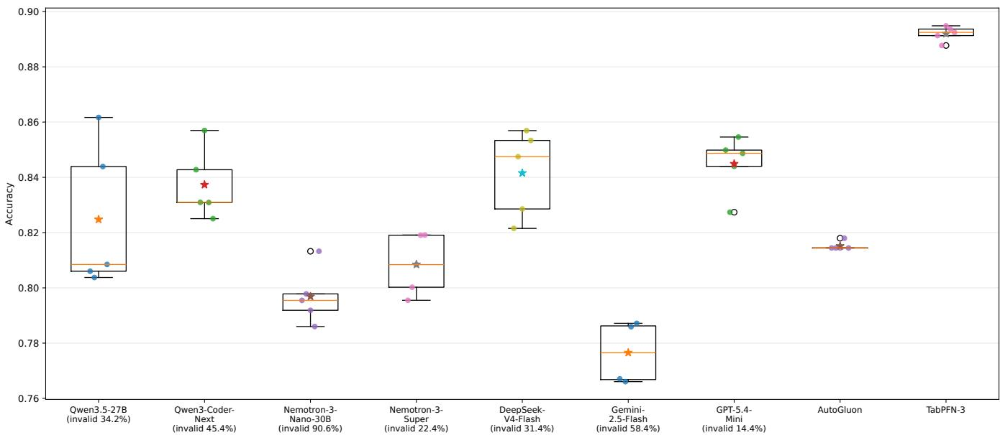  
Fi <sub>ure</sub> 4<sub>:</sub> B<sub>ac</sub>kb<sub>one screen</sub>i<sub>n on</sub> O <sub>en</sub>ML t<sub>as</sub>k 190146<sub>.</sub> B<sub>ox</sub> l<sub>o</sub>t<sub>s an</sub>d i<sub>n</sub>di<sub>v</sub>id<sub>ua</sub>l <sub>o</sub>i<sub>n</sub>t<sub>s summar</sub>i<sub>ze</sub> th<sub>e</sub> b<sub>es</sub>t i<sub>nner-va</sub>lid<sub>a</sub>ti<sub>on</sub> fit<sub>ness o</sub>bt<sub>a</sub>i<sub>ne</sub>d <sub>over</sub> fi<sub>ve repe</sub>titi<sub>ons.</sub> P<sub>ercen</sub>t<sub>ages</sub> b<sub>e</sub>l<sub>ow</sub> th<sub>e can</sub>did<sub>a</sub>t<sub>e</sub> l<sub>anguage-mo</sub>d<sub>e</sub>l <sub>names repor</sub>t th<sub>e</sub> f<sub>rac</sub>ti<sub>on o</sub>f <sub>genera</sub>t<sub>e</sub>d <sub>can</sub>did<sub>a</sub>t<sub>es ass</sub>i<sub>gne</sub>d <sub>non-</sub>fi<sub>n</sub>it<sub>e</sub> fit<sub>ness.</sub> A<sub>n ear</sub>li<sub>er</sub> h<sub>arness con</sub>fi<sub>gura</sub>ti<sub>on,</sub> A<sub>u</sub>t<sub>o</sub>Gl<sub>uon, an</sub>d T<sub>a</sub>bPFN <sub>are s</sub>h<sub>own on</sub>l<sub>y as con</sub>t<sub>ex</sub>t<sub>ua</sub>l <sub>re</sub>f<sub>erences an</sub>d <sub>were no</sub>t <sub>can</sub>did<sub>a</sub>t<sub>es</sub> i<sub>n</sub> th<sub>e</sub> b<sub>ac</sub>kb<sub>one se</sub>l<sub>ec</sub>ti<sub>on.</sub>

Task 359970: Backbone screening  
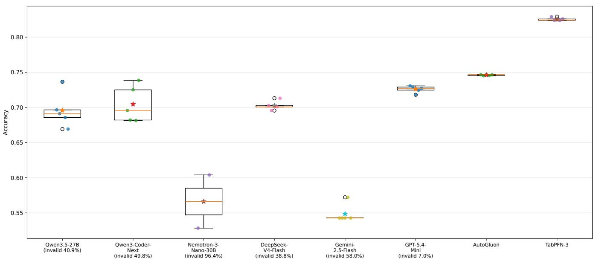  
Fi<sub>gu</sub>r<sub>e</sub> 5<sub>:</sub> B<sub>ac</sub>kb<sub>o</sub>n<sub>e sc</sub>r<sub>ee</sub>nin<sub>g o</sub>n O<sub>pe</sub>nML t<sub>as</sub>k 359970<sub>, us</sub>in<sub>g</sub> th<sub>e sa</sub>m<sub>e p</sub>r<sub>o</sub>t<sub>oco</sub>l <sub>a</sub>nd n<sub>o</sub>t<sub>a</sub>ti<sub>o</sub>n <sub>as</sub> Fi<sub>gu</sub>r<sub>e</sub> 4<sub>.</sub>

Sensitivity to confirmed constraint violations. The pri-<sub>mary ana</sub>l<sub>ys</sub>i<sub>s re</sub>t<sub>a</sub>i<sub>ns every se</sub>l<sub>ec</sub>t<sub>e</sub>d fi<sub>na</sub>l <sub>program.</sub> T<sub>o</sub> t<sub>es</sub>t <sub>w</sub>h<sub>e</sub>th<sub>er</sub> th<sub>e</sub> 22 <sub>con</sub>fi<sub>rme</sub>d <sub>v</sub>i<sub>o</sub>l<sub>a</sub>ti<sub>ons a</sub>f<sub>ec</sub>t th<sub>e aggrega</sub>t<sub>e</sub> <sub>conc</sub>l<sub>us</sub>i<sub>ons, we mar</sub>k<sub>e</sub>d th<sub>e correspon</sub>di<sub>ng repe</sub>titi<sub>on-</sub>l<sub>eve</sub>l <sub>o</sub>fi<sub>c</sub>i<sub>a</sub>l<sub>-</sub>t<sub>es</sub>t <sub>scores as m</sub>i<sub>ss</sub>i<sub>ng w</sub>ith<sub>ou</sub>t <sub>ass</sub>i<sub>gn</sub>i<sub>ng an ar</sub>tifi<sub>c</sub>i<sub>a</sub>l <sub>wors</sub>t <sub>va</sub>l<sub>ue.</sub> O<sub>n</sub> t<sub>op o</sub>f th<sub>a</sub>t<sub>, we recompu</sub>t<sub>e</sub>d <sub>eac</sub>h <sub>me</sub>th<sub>o</sub>d<sub>–</sub>t<sub>as</sub>k <sub>resu</sub>lt <sub>un</sub>d<sub>er</sub> th<sub>e</sub> <sub>same</sub> <sub>ru</sub>l<sub>e</sub> <sub>as</sub> th<sub>e</sub> <sub>ma</sub>i<sub>n</sub> <sub>ana</sub>l<sub>ys</sub>i<sub>s,</sub> <sub>requ</sub>i<sub>r</sub>i<sub>ng</sub> <sub>a</sub>t l<sub>eas</sub>t th<sub>ree va</sub>lid <sub>repe</sub>titi<sub>ons o</sub>f fi<sub>ve.</sub> Th<sub>e exc</sub>l<sub>us</sub>i<sub>ons are con-</sub> <sub>cen</sub>t<sub>ra</sub>t<sub>e</sub>d i<sub>n</sub> th<sub>e wea</sub>k<sub>er</sub> b<sub>ac</sub>kb<sub>ones:</sub> 2 <sub>o</sub>f 340 <sub>repe</sub>titi<sub>ons</sub> f<sub>or</sub> GPT-5.4-mini, 7 for DeepSeek, and 13 for Qwen3. Twent<sub>y</sub> <sub>me</sub>th<sub>o</sub>d<sub>–</sub>t<sub>as</sub>k <sub>pa</sub>i<sub>rs were a</sub>f<sub>ec</sub>t<sub>e</sub>d<sub>, e</sub>i<sub>g</sub>ht<sub>een</sub> l<sub>os</sub>i<sub>ng one repe-</sub> titi<sub>on an</sub>d t<sub>wo</sub> l<sub>os</sub>i<sub>ng</sub> t<sub>wo; every pa</sub>i<sub>r re</sub>t<sub>a</sub>i<sub>ne</sub>d <sub>a</sub>t l<sub>eas</sub>t th<sub>ree</sub> <sub>va</sub>lid <sub>repe</sub>titi<sub>ons, so no me</sub>th<sub>o</sub>d l<sub>os</sub>t <sub>coverage on any</sub> t<sub>as</sub>k<sub>.</sub> A<sub>ggrega</sub>t<sub>e pos</sub>iti<sub>ons move</sub> b<sub>y a</sub>t <sub>mos</sub>t 0<sub>.</sub>02 i<sub>n mean ran</sub>k <sub>an</sub>d 0<sub>.</sub>2 <sub>percen</sub>t<sub>age</sub> <sub>po</sub>i<sub>n</sub>t<sub>s</sub> i<sub>n</sub> <sub>norma</sub>li<sub>ze</sub>d d<sub>ev</sub>i<sub>a</sub>ti<sub>on.</sub> N<sub>o</sub> <sub>cov-</sub> <sub>erage</sub> fi<sub>gure,</sub> f<sub>rac</sub>ti<sub>ona</sub>l<sub>-w</sub>i<sub>n</sub> <sub>coun</sub>t<sub>,</sub> <sub>or</sub> <sub>mean-ran</sub>k <sub>or</sub>d<sub>er</sub>i<sub>ng</sub> <sub>c</sub>h<sub>anges</sub> <sub>on</sub> <sub>e</sub>ith<sub>er</sub> th<sub>e</sub> <sub>common-</sub>t<sub>as</sub>k <sub>or</sub> th<sub>e</sub> f<sub>u</sub>ll<sub>-</sub>b<sub>enc</sub>h<sub>mar</sub>k <sub>ana</sub>l<sub>ys</sub>i<sub>s;</sub> th<sub>e</sub> <sub>on</sub>l<sub>y</sub> <sub>or</sub>d<sub>er</sub>i<sub>ng</sub> <sub>c</sub>h<sub>ange</sub> i<sub>s</sub> th<sub>a</sub>t D<sub>eep</sub>S<sub>ee</sub>k <sub>an</sub>d A<sub>u</sub>t<sub>o</sub>Gl<sub>uon exc</sub>h<sub>ange pos</sub>iti<sub>ons un</sub>d<sub>er</sub> fi<sub>xe</sub>d<sub>-</sub>45 <sub>norma</sub>li<sub>ze</sub>d d<sub>ev</sub>i<sub>a</sub>ti<sub>on, a pa</sub>i<sub>r</sub> th<sub>a</sub>t b<sub>ears on no repor</sub>t<sub>e</sub>d <sub>c</sub>l<sub>a</sub>i<sub>m.</sub> All <sub>n</sub>i<sub>ne</sub> H<sub>o</sub>l<sub>m-correc</sub>t<sub>e</sub>d <sub>pa</sub>i<sub>rw</sub>i<sub>se compar</sub>i<sub>sons</sub> k<sub>eep</sub> th<sub>e same ver-</sub> di<sub>c</sub>t<sub>:</sub> LACE <sub>w</sub>ith GPT<sub>-</sub>5<sub>.</sub>4<sub>-m</sub>i<sub>n</sub>i <sub>s</sub>h<sub>ows no</sub> d<sub>e</sub>t<sub>ec</sub>t<sub>a</sub>bl<sub>e</sub> dif<sub>er-</sub> <sub>ence</sub> f<sub>rom</sub> A<sub>u</sub>t<sub>o</sub>Gl<sub>uon</sub> <sub>or</sub> T<sub>a</sub>bPFN <sub>v</sub>2<sub>.</sub>5<sub>,</sub> <sub>s</sub>i<sub>gn</sub>ifi<sub>can</sub>tl<sub>y</sub> <sub>ou</sub>t<sub>per-</sub> f<sub>orms au</sub>t<sub>o-s</sub>kl<sub>earn,</sub> XGB<sub>oos</sub>t<sub>, an</sub>d H2O<sub>,</sub> i<sub>s s</sub>i<sub>gn</sub>ifi<sub>can</sub>tl<sub>y ou</sub>t<sub>-</sub> <sub>pe</sub>rf<sub>o</sub>rm<sub>e</sub>d b<sub>y</sub> T<sub>a</sub>bPFN <sub>v</sub>3 <sub>a</sub>nd T<sub>a</sub>bICL<sub>, a</sub>nd <sub>s</sub>i<sub>g</sub>nifi<sub>ca</sub>ntl<sub>y ou</sub>t<sub>-</sub> <sub>per</sub>f<sub>orms</sub> th<sub>e o</sub>th<sub>er</sub> t<sub>wo</sub> b<sub>ac</sub>kb<sub>ones.</sub> O<sub>n</sub>l<sub>y</sub> t<sub>wo o</sub>fth<sub>e con</sub>fi<sub>rme</sub>d <sub>v</sub>i<sub>o</sub>l<sub>a</sub>ti<sub>ons occur un</sub>d<sub>er</sub> GPT<sub>-</sub>5<sub>.</sub>4<sub>-m</sub>i<sub>n</sub>i<sub>,</sub> th<sub>e</sub> b<sub>ac</sub>kb<sub>one use</sub>d i<sub>n</sub> th<sub>e</sub> <sub>pr</sub>i<sub>mary</sub> <sub>compar</sub>i<sub>son,</sub> <sub>an</sub>d <sub>exc</sub>l<sub>u</sub>di<sub>ng</sub> <sub>a</sub>ll <sub>con</sub>fi<sub>rme</sub>d <sub>v</sub>i<sub>o</sub>l<sub>a-</sub> ti<sub>ons</sub> l<sub>eaves</sub> th<sub>e repor</sub>t<sub>e</sub>d <sub>s</sub>t<sub>a</sub>ti<sub>s</sub>ti<sub>ca</sub>l <sub>conc</sub>l<sub>us</sub>i<sub>ons unc</sub>h<sub>ange</sub>d<sub>.</sub>

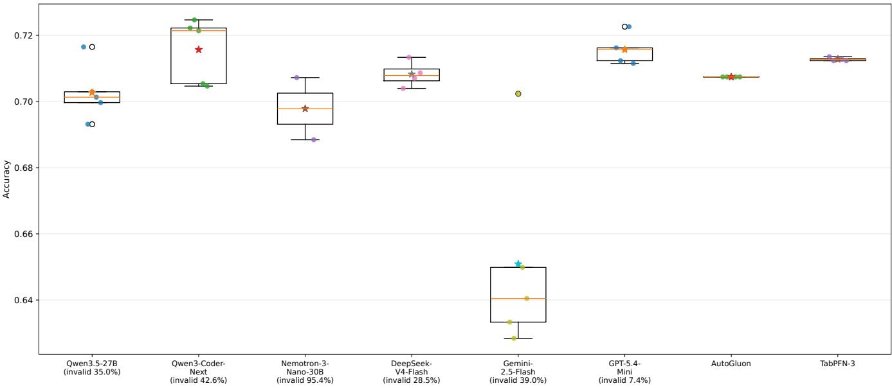  
Fi<sub>gu</sub>r<sub>e</sub> 6<sub>:</sub> B<sub>ac</sub>kb<sub>o</sub>n<sub>e</sub> <sub>sc</sub>r<sub>ee</sub>nin<sub>g</sub> <sub>o</sub>n O<sub>pe</sub>nML t<sub>as</sub>k 359974<sub>,</sub> <sub>us</sub>in<sub>g</sub> th<sub>e</sub> <sub>sa</sub>m<sub>e</sub> <sub>p</sub>r<sub>o</sub>t<sub>oco</sub>l <sub>a</sub>nd n<sub>o</sub>t<sub>a</sub>ti<sub>o</sub>n <sub>as</sub> Fi<sub>gu</sub>r<sub>e</sub> 4<sub>.</sub>

Detectors. Each program is parsed and scanned for th<sub>e s</sub>i<sub>x promp</sub>t <sub>cons</sub>t<sub>ra</sub>i<sub>n</sub>t<sub>s, w</sub>ith h<sub>e</sub>l<sub>per-me</sub>th<sub>o</sub>d <sub>an</sub>d d<sub>a</sub>t<sub>a</sub>fl<sub>ow reac</sub>h<sub>a</sub>bilit<sub>y so</sub> th<sub>a</sub>t <sub>cons</sub>t<sub>ruc</sub>t<sub>s</sub> i<sub>ns</sub>id<sub>e me</sub>th<sub>-</sub> ods reachable from \_\_init\_\_ or \_\_call\_\_ are att<sub>r</sub>ib<sub>u</sub>t<sub>e</sub>d t<sub>o</sub> fitti<sub>ng or pre</sub>di<sub>c</sub>ti<sub>on respec</sub>ti<sub>ve</sub>l<sub>y.</sub> I<sub>n</sub>t<sub>erna</sub>l <sub>cross-</sub> <sub>va</sub>lid<sub>a</sub>ti<sub>on</sub> fl<sub>ags ca</sub>ll<sub>s</sub> t<sub>o mo</sub>d<sub>e</sub>l<sub>-se</sub>l<sub>ec</sub>ti<sub>on an</sub>d <sub>eva</sub>l<sub>ua</sub>ti<sub>on</sub> utilities (cross\_val\_score, cross\_val\_predict, cross\_validate, KFold-famil<sub>y</sub> s<sub>p</sub>litters, and esti<sub>ma</sub>t<sub>ors w</sub>ith b<sub>u</sub>ilt<sub>-</sub>i<sub>n cross-va</sub>lid<sub>a</sub>t<sub>e</sub>d <sub>se</sub>l<sub>ec</sub>ti<sub>on suc</sub>h as RidgeCV). Internal h<sub>yp</sub>er<sub>p</sub>arameter search fla<sub>g</sub>s GridSearchCV-st<sub>y</sub>le classes, references to optuna, hyperopt, or skopt, and hand-written swee<sub>p</sub> loo<sub>p</sub>s th<sub>a</sub>t it<sub>era</sub>t<sub>e over</sub> lit<sub>era</sub>l <sub>co</sub>ll<sub>ec</sub>ti<sub>ons w</sub>hil<sub>e</sub> fitti<sub>ng mo</sub>d<sub>e</sub>l<sub>s</sub> and trackin<sub>g</sub> scores; swee<sub>p</sub>s ex<sub>p</sub>ressed throu<sub>g</sub>h range or numpy s<sub>p</sub>acin<sub>g</sub> functions are outside this detector’s <sub>scope.</sub> F<sub>or nes</sub>t<sub>e</sub>d A<sub>u</sub>t<sub>o</sub>ML <sub>we</sub> l<sub>oo</sub>k f<sub>or re</sub>f<sub>erences</sub> t<sub>o au</sub>t<sub>o-</sub> <sub>s</sub>kl<sub>earn,</sub> A<sub>u</sub>t<sub>o</sub>Gl<sub>uon,</sub> H2O<sub>,</sub> TPOT<sub>, or</sub> FLAML<sub>.</sub> E<sub>s</sub>ti<sub>ma</sub>t<sub>or</sub> <sub>sw</sub>it<sub>c</sub>hi<sub>ng</sub> fl<sub>ags con</sub>diti<sub>ona</sub>l<sub>s on cons</sub>t<sub>ruc</sub>t<sub>or argumen</sub>t<sub>s</sub> th<sub>a</sub>t i<sub>ns</sub>t<sub>an</sub>ti<sub>a</sub>t<sub>e</sub> dif<sub>eren</sub>t <sub>es</sub>ti<sub>ma</sub>t<sub>or</sub> f<sub>am</sub>ili<sub>es</sub> i<sub>n</sub> th<sub>e</sub>i<sub>r</sub> b<sub>ranc</sub>h<sub>es,</sub> th<sub>oug</sub>h di<sub>c</sub>ti<sub>onary-</sub>di<sub>spa</sub>t<sub>c</sub>h <sub>sw</sub>it<sub>c</sub>hi<sub>ng</sub> f<sub>a</sub>ll<sub>s ou</sub>t<sub>s</sub>id<sub>e</sub> thi<sub>s</sub> d<sub>e-</sub> t<sub>ec</sub>t<sub>or</sub>’<sub>s scope.</sub> E<sub>nsem</sub>bl<sub>e s</sub>i<sub>ze reso</sub>l<sub>ves</sub> th<sub>e</sub> lit<sub>era</sub>l l<sub>eng</sub>th of the estimator list <sub>p</sub>assed to VotingClassifier or StackingClassifier; 74 of 759 ensembles used a nonlit<sub>era</sub>l li<sub>s</sub>t <sub>an</sub>d <sub>are recor</sub>d<sub>e</sub>d <sub>as unreso</sub>l<sub>ve</sub>d<sub>, an</sub>d t<sub>we</sub>l<sub>ve recor</sub>d<sub>s</sub> <sub>reso</sub>l<sub>v</sub>i<sub>ng</sub> t<sub>o s</sub>i<sub>zes o</sub>f <sub>zero or one were</sub> i<sub>nspec</sub>t<sub>e</sub>d <sub>as</sub> d<sub>e</sub>t<sub>ec</sub>t<sub>or</sub> <sub>e</sub>d<sub>ge</sub> <sub>cases</sub> <sub>ra</sub>th<sub>er</sub> th<sub>an</sub> i<sub>n</sub>t<sub>erpre</sub>t<sub>e</sub>d lit<sub>era</sub>ll<sub>y.</sub> T<sub>o</sub> d<sub>e</sub>t<sub>ec</sub>t fitti<sub>ng</sub> at <sub>p</sub>rediction time, we fla<sub>g</sub> an<sub>y</sub> fit or fit\_transform call reachable from \_\_call\_\_. Cross-fittin<sub>g</sub> internal to <sub>p</sub>ermitted com<sub>p</sub>onents, StackingClassifier and CalibratedClassifierCV without cv="prefit", i<sub>s recor</sub>d<sub>e</sub>d i<sub>n separa</sub>t<sub>e</sub> d<sub>escr</sub>i<sub>p</sub>ti<sub>ve</sub> fi<sub>e</sub>ld<sub>s an</sub>d i<sub>s no</sub>t <sub>coun</sub>t<sub>e</sub>d <sub>as a v</sub>i<sub>o</sub>l<sub>a</sub>ti<sub>on.</sub> E<sub>very</sub> fi<sub>na</sub>l <sub>carry</sub>i<sub>ng any</sub> fl<sub>ag was expor</sub>t<sub>e</sub>d <sub>w</sub>ith it<sub>s source an</sub>d <sub>c</sub>l<sub>ass</sub>ifi<sub>e</sub>d <sub>manua</sub>ll<sub>y.</sub> Th<sub>e au</sub>dit i<sub>s a</sub> t<sub>ar-</sub> <sub>ge</sub>t<sub>e</sub>d <sub>s</sub>t<sub>a</sub>ti<sub>c ana</sub>l<sub>ys</sub>i<sub>s o</sub>f th<sub>ese s</sub>t<sub>a</sub>t<sub>e</sub>d d<sub>e</sub>t<sub>ec</sub>t<sub>ors, no</sub>t <sub>a proo</sub>f <sub>o</sub>f <sub>a</sub>b<sub>sence.</sub>

Estimator families and preprocessing. Families are <sub>coun</sub>t<sub>e</sub>d <sub>per p</sub>i<sub>pe</sub>li<sub>ne, so an ensem</sub>bl<sub>e con</sub>t<sub>r</sub>ib<sub>u</sub>t<sub>es</sub> t<sub>o severa</sub>l<sub>.</sub> T<sub>a</sub>bl<sub>e</sub> 3 <sub>g</sub>i<sub>ves</sub> th<sub>e</sub> f<sub>u</sub>ll di<sub>s</sub>t<sub>r</sub>ib<sub>u</sub>ti<sub>on</sub> f<sub>or va</sub>lid <sub>can</sub>did<sub>a</sub>t<sub>es an</sub>d fi<sub>na</sub>l <sub>p</sub>i<sub>pe</sub>li<sub>nes, an</sub>d T<sub>a</sub>bl<sub>e</sub> 4 th<sub>e a</sub>dd<sub>e</sub>d<sub>-preprocess</sub>i<sub>ng ca</sub>t<sub>e-</sub> <sub>gor</sub>i<sub>es.</sub> Th<sub>e c</sub>l<sub>ass-</sub>i<sub>m</sub>b<sub>a</sub>l<sub>ance co</sub>l<sub>umn</sub> i<sub>s a</sub> k<sub>eywor</sub>d h<sub>eur</sub>i<sub>s</sub>ti<sub>c</sub> (class\_weight or resam<sub>p</sub>lin<sub>g</sub> constructs) and should be <sub>rea</sub>d <sub>as</sub> i<sub>n</sub>di<sub>ca</sub>ti<sub>ve.</sub> Fi<sub>na</sub>l <sub>p</sub>i<sub>pe</sub>li<sub>nes con</sub>t<sub>a</sub>i<sub>ne</sub>d <sub>a me</sub>di<sub>an o</sub>f th<sub>ree</sub> added <sub>p</sub>re<sub>p</sub>rocessin<sub>g</sub> constructions (interquartile ran<sub>g</sub>e 2–4) and a median of12 tunable constructor ar<sub>g</sub>uments (Dee<sub>p</sub>Seek 12, GPT-5.4-mini 19, Qwen3 9).

Selection pressure. Selection shifted the composition toward tree ensembles. Gradient boosting rose from 59.6% of valid candidates to 69.4% of final pipelines, and forests or extra trees rose from 43.1% to 52.5%, while linear models fell from 62.8% to 55.8%. The shift was strongest under GPT-5.4-mini, for which forests increased by 18.3 percentage points and linear models decreased by 15.5 points. These <sub>are</sub> <sub>compos</sub>iti<sub>on</sub> <sub>s</sub>hift<sub>s</sub> <sub>un</sub>d<sub>er</sub> <sub>se</sub>l<sub>ec</sub>ti<sub>on,</sub> <sub>no</sub>t <sub>causa</sub>l <sub>e</sub>f<sub>ec</sub>t<sub>s</sub> <sub>o</sub>f <sub>any s</sub>i<sub>ng</sub>l<sub>e</sub> d<sub>es</sub>i<sub>gn c</sub>h<sub>o</sub>i<sub>ce.</sub>

Table 3: Estimator-famil<sub>y</sub> occurrence amon<sub>g</sub> valid candidates (Cand.) and final <sub>p</sub>i<sub>p</sub>elines (Final), in <sub>p</sub>ercent. Denominators: DeepSeek 25,396 and 340; GPT-5.4-mini 29,691 and 340; Qwen3 15,911 and 340; overall 70,998 and 1,020.
<table><tr><td></td><td colspan="2">DeepSeek</td><td colspan="2">GPT-5.4-mini</td><td colspan="2">Qwen3</td><td colspan="2">Overall</td></tr><tr><td>Family</td><td>Cand.</td><td>Final</td><td>Cand.</td><td>Final</td><td>Cand.</td><td>Final</td><td>Cand.</td><td>Final</td></tr><tr><td>Gradient boosting</td><td>70.8</td><td>75.3</td><td>51.7</td><td>66.7</td><td>56.3</td><td>66.2</td><td>59.6</td><td>69.4</td></tr><tr><td>Forest / extra trees</td><td>35.5</td><td>37.1</td><td>46.0</td><td>64.3</td><td>49.9</td><td>56.2</td><td>43.1</td><td>52.5</td></tr><tr><td>Linear</td><td>58.5</td><td>55.3</td><td>60.4</td><td>44.8</td><td>74.4</td><td>67.4</td><td>62.8</td><td>55.8</td></tr><tr><td>SVM</td><td>21.1</td><td>19.1</td><td>21.7</td><td>18.0</td><td>16.6</td><td>15.9</td><td>20.3</td><td>17.7</td></tr><tr><td>k-NN</td><td>4.3</td><td>4.1</td><td>2.1</td><td>2.9</td><td>4.9</td><td>5.9</td><td>3.5</td><td>4.3</td></tr><tr><td>Naive Bayes</td><td>0.8</td><td>0.9</td><td>0.5</td><td>0.3</td><td>4.4</td><td>2.9</td><td>1.5</td><td>1.4</td></tr><tr><td>Decision tree</td><td>1.3</td><td>2.1</td><td>1.2</td><td>1.2</td><td>0.6</td><td>0.3</td><td>1.1</td><td>1.2</td></tr><tr><td>Other scikit-learn</td><td>4.2</td><td>5.9</td><td>0.5</td><td>0.6</td><td>2.3</td><td>1.5</td><td>2.2</td><td>2.6</td></tr><tr><td>Custom / unrecognized</td><td>3.6</td><td>3.2</td><td>3.5</td><td>2.9</td><td>16.5</td><td>15.9</td><td>6.4</td><td>7.4</td></tr></table>

T<sub>a</sub>bl<sub>e</sub> 4<sub>:</sub> Add<sub>e</sub>d <sub>preprocess</sub>i<sub>ng</sub> <sub>among</sub> fi<sub>na</sub>l <sub>p</sub>i<sub>pe</sub>li<sub>nes,</sub> i<sub>n</sub> <sub>per-</sub> <sub>cen</sub>t <sub>o</sub>f <sub>eac</sub>h b<sub>ac</sub>kb<sub>one</sub>’<sub>s</sub> fi<sub>na</sub>l<sub>s.</sub>
<table><tr><td>Category</td><td>DeepSeek</td><td>GPT</td><td>Qwen3</td><td>Overall</td></tr><tr><td>Any preprocessing</td><td>100.0</td><td>100.0</td><td>99.7</td><td>99.9</td></tr><tr><td>Scaling</td><td>100.0</td><td>86.7</td><td>98.5</td><td>95.1</td></tr><tr><td>Feature selection</td><td>77.4</td><td>73.5</td><td>55.3</td><td>68.7</td></tr><tr><td>Dimensionality red.</td><td>27.1</td><td>3.8</td><td>8.8</td><td>13.2</td></tr><tr><td>Nonlinear transforms</td><td>85.0</td><td>54.9</td><td>59.7</td><td>66.5</td></tr><tr><td>Class imbalance</td><td>23.2</td><td>59.6</td><td>67.9</td><td>50.2</td></tr></table>

Structural diversity. A pipeline’s structural signature <sub>compr</sub>i<sub>ses</sub> it<sub>s or</sub>d<sub>ere</sub>d <sub>preprocess</sub>i<sub>ng s</sub>t<sub>eps,</sub> it<sub>s se</sub>t <sub>o</sub>f <sub>es</sub>ti<sub>-</sub> <sub>ma</sub>t<sub>or</sub> f<sub>am</sub>ili<sub>es,</sub> it<sub>s ensem</sub>bl<sub>e</sub> t<sub>ype, an</sub>d th<sub>e names o</sub>f it<sub>s ex-</sub> <sub>pose</sub>d h<sub>yperparame</sub>t<sub>ers, w</sub>ith <sub>numer</sub>i<sub>ca</sub>l <sub>va</sub>l<sub>ues</sub> i<sub>gnore</sub>d<sub>.</sub> Th<sub>e</sub> 70,998 valid candidates produced 65,298 unique signatures. Th<sub>e</sub> <sub>mos</sub>t f<sub>requen</sub>t <sub>s</sub>i<sub>gna</sub>t<sub>ure</sub> <sub>appeare</sub>d i<sub>n</sub> 23 <sub>can</sub>did<sub>a</sub>t<sub>es,</sub> <sub>an</sub>d the five most frequent together accounted for only 0.1%. A <sub>me</sub>di<sub>an</sub> <sub>run</sub> <sub>pro</sub>d<sub>uce</sub>d 68 di<sub>s</sub>ti<sub>nc</sub>t <sub>s</sub>t<sub>ruc</sub>t<sub>ures</sub> <sub>among</sub> it<sub>s</sub> 100 <sub>can</sub>did<sub>a</sub>t<sub>es,</sub> i<sub>ncreas</sub>i<sub>ng</sub> t<sub>o</sub> 86 <sub>un</sub>d<sub>er</sub> GPT<sub>-</sub>5<sub>.</sub>4<sub>-m</sub>i<sub>n</sub>i<sub>.</sub> At <sub>mos</sub>t <sub>e</sub>i<sub>g</sub>ht <sub>can</sub>did<sub>a</sub>t<sub>e</sub> <sub>s</sub>i<sub>gna</sub>t<sub>ures</sub> <sub>were</sub> <sub>s</sub>h<sub>are</sub>d b<sub>y</sub> <sub>any</sub> <sub>pa</sub>i<sub>r</sub> <sub>o</sub>f b<sub>ac</sub>kb<sub>ones, none appeare</sub>d <sub>un</sub>d<sub>er a</sub>ll th<sub>ree, an</sub>d <sub>no</sub> fi<sub>na</sub>l <sub>s</sub>i<sub>gna</sub>t<sub>ure was pro</sub>d<sub>uce</sub>d b<sub>y more</sub> th<sub>an one</sub> b<sub>ac</sub>kb<sub>one.</sub> Th<sub>e</sub> <sub>s</sub>i<sub>gna</sub>t<sub>ure</sub> i<sub>nc</sub>l<sub>u</sub>d<sub>es expose</sub>d h<sub>yperparame</sub>t<sub>er names, so some</sub> <sub>o</sub>f th<sub>e measure</sub>d <sub>un</sub>i<sub>queness may re</sub>fl<sub>ec</sub>t <sub>nam</sub>i<sub>ng var</sub>i<sub>a</sub>ti<sub>on.</sub> Th<sub>e es</sub>ti<sub>ma</sub>t<sub>or-</sub>f<sub>am</sub>il<sub>y</sub> di<sub>s</sub>t<sub>r</sub>ib<sub>u</sub>ti<sub>ons an</sub>d <sub>w</sub>ithi<sub>n-run s</sub>t<sub>ruc</sub>t<sub>ure</sub> <sub>coun</sub>t<sub>s s</sub>h<sub>ow</sub> th<sub>e same pa</sub>tt<sub>ern a</sub>t <sub>coarser</sub> l<sub>eve</sub>l<sub>s.</sub>

Ensembles. Of the 1,020 finals, 759 constructed an ensembl<sub>e:</sub> 453 <sub>vo</sub>ti<sub>ng,</sub> 231 <sub>s</sub>t<sub>ac</sub>ki<sub>ng, an</sub>d 75 h<sub>an</sub>d<sub>-</sub>b<sub>u</sub>ilt <sub>com</sub>bi<sub>na-</sub> tions (wei<sub>g</sub>hted or avera<sub>g</sub>ed <sub>p</sub>redictions without the standard wra<sub>pp</sub>er classes); 747 finals (73.3%) combined at least two <sub>reso</sub>l<sub>ve</sub>d b<sub>ase</sub> l<sub>earners.</sub> Th<sub>e</sub> b<sub>ac</sub>kb<sub>ones</sub> dif<sub>ere</sub>d <sub>s</sub>h<sub>arp</sub>l<sub>y:</sub> <sub>vo</sub>t<sub>-</sub> i<sub>ng ma</sub>d<sub>e up</sub> 63<sub>.</sub>7% <sub>o</sub>f GPT<sub>-</sub>5<sub>.</sub>4<sub>-m</sub>i<sub>n</sub>i’<sub>s</sub> fi<sub>na</sub>l<sub>s</sub> b<sub>u</sub>t 24<sub>.</sub>7% <sub>o</sub>f Qwen3’s, which <sub>p</sub>referred stackin<sub>g</sub> (37.1%) and hand-built combination (15.9%). Amon<sub>g</sub> the 673 ensembles resolvin<sub>g</sub> t<sub>o a</sub> lit<sub>era</sub>l <sub>es</sub>ti<sub>ma</sub>t<sub>or</sub> li<sub>s</sub>t <sub>o</sub>f <sub>a</sub>t l<sub>eas</sub>t t<sub>wo,</sub> 353 <sub>use</sub>d t<sub>wo</sub> b<sub>ase</sub> learners, 308 used three, and 12 used four (the ensemble-size fla<sub>g</sub>s of the main <sub>p</sub>a<sub>p</sub>er’s audit section); the median size is two (interquartile ran<sub>g</sub>e 2–3).

Beyond-library code. Manual reading of all 75 customf<sub>am</sub>il<sub>y</sub> fi<sub>na</sub>l<sub>s s</sub>h<sub>ows eac</sub>h i<sub>mp</sub>l<sub>emen</sub>t<sub>s</sub> h<sub>an</sub>d<sub>-wr</sub>itt<sub>en pre</sub>di<sub>c</sub>ti<sub>on</sub> <sub>com</sub>bi<sub>na</sub>ti<sub>on over</sub> it<sub>s</sub> b<sub>ase</sub> l<sub>earners,</sub> 43 <sub>over</sub> t<sub>wo</sub> l<sub>earners,</sub> 31 <sub>over</sub> th<sub>ree, an</sub>d <sub>one over</sub> f<sub>our, compu</sub>ti<sub>ng we</sub>i<sub>g</sub>ht<sub>e</sub>d <sub>or aver-</sub> <sub>age</sub>d <sub>pro</sub>b<sub>a</sub>biliti<sub>es</sub> i<sub>n</sub> N<sub>um</sub>P<sub>y</sub> i<sub>n p</sub>l<sub>ace o</sub>f th<sub>e correspon</sub>di<sub>ng</sub> <sub>wrapper</sub> <sub>c</sub>l<sub>ass.</sub> A b<sub>roa</sub>d <sub>screen</sub>i<sub>ng</sub> h<sub>eur</sub>i<sub>s</sub>ti<sub>c</sub> f<sub>or</sub> h<sub>an</sub>d<sub>-wr</sub>itt<sub>en</sub> transformation code (numeric arra<sub>y</sub> o<sub>p</sub>erations or elementwise ma<sub>pp</sub>in<sub>g</sub>s inside fittin<sub>g</sub> and <sub>p</sub>rediction methods) fla<sub>gg</sub>ed 42<sub>.</sub>7% <sub>o</sub>f fi<sub>na</sub>l<sub>s an</sub>d 32<sub>.</sub>5% <sub>o</sub>f <sub>va</sub>lid <sub>can</sub>did<sub>a</sub>t<sub>es;</sub> th<sub>e</sub> h<sub>eur</sub>i<sub>s</sub>ti<sub>c</sub> i<sub>s</sub> d<sub>e</sub>lib<sub>era</sub>t<sub>e</sub>l<sub>y</sub> lib<sub>era</sub>l<sub>,</sub> i<sub>s</sub> <sub>no</sub>t <sub>a</sub> <sub>va</sub>lid<sub>a</sub>t<sub>e</sub>d <sub>preva</sub>l<sub>ence</sub> <sub>es</sub>ti<sub>ma</sub>t<sub>e,</sub> <sub>an</sub>d i<sub>s</sub> <sub>repor</sub>t<sub>e</sub>d <sub>on</sub>l<sub>y</sub> t<sub>o</sub> b<sub>oun</sub>d th<sub>e</sub> <sub>p</sub>h<sub>enomenon.</sub>

Illustrative inspectability example. A source-level adjudication identified 89 of the 1,020 finals (8.7%, spanning 53 tasks) that combine <sub>p</sub>redictions directl<sub>y</sub> in NumP<sub>y</sub> or <sub>or</sub>di<sub>nary</sub> P<sub>y</sub>th<sub>on.</sub> Thi<sub>s ex</sub>t<sub>en</sub>d<sub>s</sub> th<sub>e reac</sub>h<sub>a</sub>bilit<sub>y-</sub>b<sub>ase</sub>d i<sub>nven-</sub> t<sub>ory o</sub>f 75 h<sub>an</sub>d<sub>-</sub>b<sub>u</sub>ilt <sub>com</sub>bi<sub>na</sub>ti<sub>ons repor</sub>t<sub>e</sub>d <sub>a</sub>b<sub>ove: manua</sub>l <sub>rev</sub>i<sub>ew</sub> f<sub>oun</sub>d 14 <sub>a</sub>dditi<sub>ona</sub>l <sub>ac</sub>ti<sub>ve</sub> i<sub>mp</sub>l<sub>emen</sub>t<sub>a</sub>ti<sub>ons</sub> th<sub>e</sub> <sub>reac</sub>h<sub>-</sub> <sub>a</sub>bilit<sub>y pass m</sub>i<sub>sse</sub>d<sub>, o</sub>f <sub>w</sub>hi<sub>c</sub>h 82 <sub>o</sub>f th<sub>e</sub> 89 <sub>sa</sub>ti<sub>s</sub>f<sub>y a</sub>ll <sub>au</sub>dit<sub>e</sub>d <sub>cons</sub>t<sub>ra</sub>i<sub>n</sub>t<sub>s.</sub> A<sub>mong</sub> th<sub>ese</sub> <sub>comp</sub>li<sub>an</sub>t fi<sub>na</sub>l<sub>s,</sub> <sub>we</sub> <sub>se</sub>l<sub>ec</sub>t<sub>e</sub>d th<sub>e</sub> <sub>c</sub>l<sub>eares</sub>t <sub>compac</sub>t <sub>source</sub> i<sub>ns</sub>t<sub>ance</sub> f<sub>rom</sub> th<sub>e pr</sub>i<sub>mary</sub> GPT<sub>-</sub>5<sub>.</sub>4<sub>-</sub> <sub>m</sub>i<sub>n</sub>i b<sub>ac</sub>kb<sub>one</sub> f<sub>or</sub> ill<sub>us</sub>t<sub>ra</sub>ti<sub>on.</sub> Th<sub>e se</sub>l<sub>ec</sub>t<sub>e</sub>d <sub>program</sub> i<sub>s</sub> th<sub>e</sub> final <sub>p</sub>i<sub>p</sub>eline for O<sub>p</sub>enML task 2073, re<sub>p</sub>etition 4 (candidate 0ce14317-05e0-4fed-9eb4-3b7852b46cb2). It obtained oficial-test score 0.6206 and final inner-validation fitness 0.6263; its traced lineage improved from 0.5964 to 0.6203 to 0.6263. The intermediate candidate introduced h<sub>an</sub>d<sub>-wr</sub>itt<sub>en</sub> l<sub>og</sub>i<sub>s</sub>ti<sub>c-regress</sub>i<sub>on an</sub>d E<sub>x</sub>t<sub>ra</sub>T<sub>rees pro</sub>b<sub>a</sub>bilit<sub>y</sub> averaging with weights 0.55/0.45; the final candidate <sub>rep</sub>l<sub>ace</sub>d th<sub>ese w</sub>ith <sub>an</sub> SVC <sub>an</sub>d <sub>ran</sub>d<sub>om</sub> f<sub>ores</sub>t <sub>com</sub>bi<sub>ne</sub>d <sub>a</sub>t 0.60/0.40.

```python
def __call__(self, X):
Xp = self._transform(X)
p_svc = self.svc.predict_proba(Xp)
p_rf = self.rf.predict_proba(Xp)
p = 0.60 <sub>*</sub> p_svc + 0.40 <sub>*</sub> p_rf
return np.argmax(p, axis=1)
```

Th<sub>e</sub> <sub>re</sub>t<sub>urne</sub>d <sub>pre</sub>di<sub>c</sub>ti<sub>ons</sub> d<sub>epen</sub>d di<sub>rec</sub>tl<sub>y</sub> <sub>on</sub> thi<sub>s</sub> bl<sub>oc</sub>k<sub>,</sub> <sub>so</sub> th<sub>e coe</sub>fi<sub>c</sub>i<sub>en</sub>t<sub>s an</sub>d <sub>mem</sub>b<sub>ers can</sub> b<sub>e c</sub>h<sub>ange</sub>d<sub>, remove</sub>d<sub>, or</sub> <sub>reuse</sub>d <sub>w</sub>ith<sub>ou</sub>t <sub>a</sub>lt<sub>er</sub>i<sub>ng</sub> th<sub>e searc</sub>h <sub>proce</sub>d<sub>ure.</sub> B<sub>o</sub>th li<sub>neage</sub> t<sub>rans</sub>iti<sub>ons</sub> <sub>a</sub>l<sub>so</sub> <sub>c</sub>h<sub>ange</sub>d <sub>o</sub>th<sub>er</sub> <sub>p</sub>i<sub>pe</sub>li<sub>ne</sub> <sub>componen</sub>t<sub>s,</sub> <sub>so</sub> th<sub>e</sub> <sub>o</sub>b<sub>serve</sub>d fit<sub>ness</sub> i<sub>ncreases are no</sub>t <sub>a</sub>tt<sub>r</sub>ib<sub>u</sub>t<sub>e</sub>d t<sub>o</sub> th<sub>e com</sub>bi<sub>-</sub> <sub>na</sub>ti<sub>on ru</sub>l<sub>e a</sub>l<sub>one.</sub> Th<sub>e examp</sub>l<sub>e</sub> d<sub>emons</sub>t<sub>ra</sub>t<sub>es source-</sub>l<sub>eve</sub>l <sub>v</sub>i<sub>s</sub>ibilit<sub>y an</sub>d <sub>e</sub>dit<sub>a</sub>bilit<sub>y, no</sub>t th<sub>e pre</sub>di<sub>c</sub>ti<sub>ve e</sub>f<sub>ec</sub>t <sub>o</sub>f <sub>a par</sub>ti<sub>c-</sub> <sub>u</sub>l<sub>ar</sub> <sub>we</sub>i<sub>g</sub>hti<sub>ng</sub> <sub>ru</sub>l<sub>e.</sub>

Compliance detail and manual classification. Table 5 b<sub>rea</sub>k<sub>s</sub> th<sub>e</sub> 24 <sub>au</sub>dit fl<sub>ags</sub> d<sub>own</sub> b<sub>y</sub> t<sub>ype</sub> <sub>an</sub>d b<sub>ac</sub>kb<sub>one.</sub> N<sub>o</sub> fi<sub>na</sub>l <sub>p</sub>i<sub>pe</sub>li<sub>ne</sub> t<sub>r</sub>i<sub>ggere</sub>d th<sub>e</sub> i<sub>n</sub>t<sub>erna</sub>l h<sub>yperparame</sub>t<sub>er-</sub> <sub>searc</sub>h<sub>, nes</sub>t<sub>e</sub>d<sub>-</sub>A<sub>u</sub>t<sub>o</sub>ML<sub>, or es</sub>ti<sub>ma</sub>t<sub>or-sw</sub>it<sub>c</sub>hi<sub>ng</sub> d<sub>e</sub>t<sub>ec</sub>t<sub>ors.</sub> M<sub>anua</sub>l <sub>rev</sub>i<sub>ew c</sub>l<sub>ass</sub>ifi<sub>e</sub>d t<sub>wo o</sub>f th<sub>e seven cross-va</sub>lid<sub>a</sub>ti<sub>on</sub> flags as permitted uses of explicit splitter objects with CalibratedClassifierCV; the remainin<sub>g</sub> five were <sub>can</sub>did<sub>a</sub>t<sub>e-au</sub>th<sub>ore</sub>d <sub>ou</sub>t<sub>-o</sub>f<sub>-</sub>f<sub>o</sub>ld <sub>cons</sub>t<sub>ruc</sub>ti<sub>ons,</sub> <sub>compr</sub>i<sub>s</sub>i<sub>ng</sub> three DeepSeek and two Qwen3 finals. All thirteen fourl<sub>earner</sub> <sub>ensem</sub>bl<sub>es</sub> <sub>an</sub>d <sub>a</sub>ll f<sub>our</sub> <sub>cases</sub> <sub>o</sub>f fitti<sub>ng</sub> d<sub>ur</sub>i<sub>ng</sub> <sub>pre-</sub> di<sub>c</sub>ti<sub>on</sub> <sub>were</sub> <sub>con</sub>fi<sub>rme</sub>d <sub>v</sub>i<sub>o</sub>l<sub>a</sub>ti<sub>ons,</sub> <sub>g</sub>i<sub>v</sub>i<sub>ng</sub> 22 i<sub>n</sub> t<sub>o</sub>t<sub>a</sub>l<sub>:</sub> <sub>seven</sub> <sub>un</sub>d<sub>er</sub> D<sub>eep</sub>S<sub>ee</sub>k<sub>,</sub> t<sub>wo</sub> <sub>un</sub>d<sub>er</sub> GPT<sub>-</sub>5<sub>.</sub>4<sub>-m</sub>i<sub>n</sub>i<sub>,</sub> <sub>an</sub>d thi<sub>r</sub>t<sub>een</sub> <sub>un-</sub> der Qwen3. Because the primar<sub>y</sub> baseline comparison uses GPT<sub>-</sub>5<sub>.</sub>4<sub>-m</sub>i<sub>n</sub>i<sub>,</sub> <sub>on</sub>l<sub>y</sub> t<sub>wo</sub> <sub>con</sub>fi<sub>rme</sub>d <sub>v</sub>i<sub>o</sub>l<sub>a</sub>ti<sub>ons</sub> <sub>en</sub>t<sub>er</sub> th<sub>a</sub>t <sub>com-</sub> <sub>par</sub>i<sub>son;</sub> th<sub>e rema</sub>i<sub>n</sub>i<sub>ng cases a</sub>f<sub>ec</sub>t th<sub>e a</sub>lt<sub>erna</sub>ti<sub>ve-</sub>b<sub>ac</sub>kb<sub>one</sub> <sub>resu</sub>lt<sub>s.</sub> All fl<sub>agge</sub>d <sub>p</sub>i<sub>pe</sub>li<sub>nes are re</sub>t<sub>a</sub>i<sub>ne</sub>d i<sub>n</sub> th<sub>e repor</sub>t<sub>e</sub>d <sub>re-</sub> <sub>su</sub>lt<sub>s.</sub>

T<sub>a</sub>bl<sub>e</sub> 5<sub>:</sub> A<sub>u</sub>dit fl<sub>ags</sub> <sub>among</sub> fi<sub>na</sub>l <sub>p</sub>i<sub>pe</sub>li<sub>nes</sub> b<sub>y</sub> t<sub>ype</sub> <sub>an</sub>d b<sub>ac</sub>k<sub>-</sub> b<sub>one, w</sub>ith th<sub>e ou</sub>t<sub>come o</sub>f <sub>manua</sub>l <sub>c</sub>l<sub>ass</sub>ifi<sub>ca</sub>ti<sub>on, an</sub>d <sub>cross-</sub> fitti<sub>ng</sub> <sub>recor</sub>d<sub>e</sub>d d<sub>escr</sub>i<sub>p</sub>ti<sub>ve</sub>l<sub>y.</sub> Th<sub>e</sub> i<sub>n</sub>t<sub>erna</sub>l h<sub>yperparame</sub>t<sub>er</sub> <sub>searc</sub>h<sub>, nes</sub>t<sub>e</sub>d A<sub>u</sub>t<sub>o</sub>ML<sub>, an</sub>d <sub>es</sub>ti<sub>ma</sub>t<sub>or-sw</sub>it<sub>c</sub>hi<sub>ng</sub> d<sub>e</sub>t<sub>ec</sub>t<sub>ors</sub> fl<sub>agge</sub>d <sub>no</sub> fi<sub>na</sub>l <sub>an</sub>d <sub>are om</sub>itt<sub>e</sub>d<sub>.</sub>
<table><tr><td></td><td>DeepSeek</td><td>GPT</td><td>Qwen3</td><td>Overall</td></tr><tr><td>Finals analyzed</td><td>340</td><td>340</td><td>340</td><td>1,020</td></tr><tr><td>Internal CV constructs</td><td>3</td><td>0</td><td>4</td><td>7</td></tr><tr><td>Ensemble of four</td><td>4</td><td>2</td><td>7</td><td>13</td></tr><tr><td>Fit at prediction time</td><td>0</td><td>0</td><td>4</td><td>4</td></tr><tr><td>Any flag</td><td>7</td><td>2</td><td>15</td><td>24</td></tr><tr><td>Confirmed violations</td><td>7</td><td>2</td><td>13</td><td>22</td></tr><tr><td>Stacking cross-fit (%)</td><td>25.6</td><td>3.5</td><td>36.5</td><td>21.9</td></tr><tr><td>Calibration cross-fit (%)</td><td>18.8</td><td>16.8</td><td>70.0</td><td>35.2</td></tr></table>

C<sub>ross-</sub>fitti<sub>ng</sub> i<sub>n</sub>t<sub>erna</sub>l t<sub>o</sub> <sub>perm</sub>itt<sub>e</sub>d <sub>componen</sub>t<sub>s</sub> i<sub>s</sub> <sub>recor</sub>d<sub>e</sub>d <sub>separa</sub>t<sub>e</sub>l<sub>y an</sub>d i<sub>s no</sub>t t<sub>rea</sub>t<sub>e</sub>d <sub>as a v</sub>i<sub>o</sub>l<sub>a</sub>ti<sub>on.</sub> It <sub>occurre</sub>d i<sub>n</sub> 21.9% of finals through StackingClassifier and in 35.2% through probability calibration, with calibration use reaching 70.0% under Qwen3. The audit covers the stated d<sub>e</sub>t<sub>ec</sub>t<sub>ors an</sub>d <sub>su</sub>b<sub>sequen</sub>t <sub>manua</sub>l <sub>c</sub>l<sub>ass</sub>ifi<sub>ca</sub>ti<sub>ons;</sub> it i<sub>s no</sub>t <sub>a</sub> <sub>proo</sub>f th<sub>a</sub>t <sub>no o</sub>th<sub>er</sub> f<sub>orm o</sub>f <sub>noncomp</sub>li<sub>ance ex</sub>i<sub>s</sub>t<sub>s.</sub>

## I Pairwise Statistical Comparisons

T<sub>a</sub>bl<sub>e</sub> 6 <sub>repor</sub>t<sub>s</sub> th<sub>e</sub> <sub>aggrega</sub>t<sub>e</sub> <sub>ran</sub>k<sub>,</sub> d<sub>ev</sub>i<sub>a</sub>ti<sub>on,</sub> f<sub>rac</sub>ti<sub>ona</sub>l<sub>-w</sub>i<sub>n,</sub> <sub>an</sub>d <sub>coverage va</sub>l<sub>ues summar</sub>i<sub>ze</sub>d b<sub>y</sub> th<sub>e me</sub>th<sub>o</sub>d<sub>-compar</sub>i<sub>son</sub> fi<sub>gure</sub> <sub>o</sub>f th<sub>e</sub> <sub>ma</sub>i<sub>n</sub> <sub>paper.</sub>

F<sub>or eac</sub>h t<sub>as</sub>k <sub>an</sub>d <sub>me</sub>th<sub>o</sub>d<sub>, we</sub> fi<sub>rs</sub>t <sub>average</sub> th<sub>e</sub> t<sub>as</sub>k<sub>-spec</sub>ifi<sub>c</sub> evaluation score over the successful re<sub>p</sub>etitions (a task enters <sub>a compar</sub>i<sub>son on</sub>l<sub>y</sub> if b<sub>o</sub>th <sub>me</sub>th<sub>o</sub>d<sub>s</sub> h<sub>ave a va</sub>lid <sub>score un</sub>d<sub>er</sub> the validit<sub>y</sub> rule of the main <sub>p</sub>a<sub>p</sub>er’s results section). We then <sub>compare</sub> LACE <sub>w</sub>ith GPT<sub>-</sub>5<sub>.</sub>4<sub>-m</sub>i<sub>n</sub>i <sub>aga</sub>i<sub>ns</sub>t <sub>eac</sub>h b<sub>ase</sub>li<sub>ne us-</sub> i<sub>ng</sub> <sub>a</sub> <sub>pa</sub>i<sub>re</sub>d Wil<sub>coxon</sub> <sub>s</sub>i<sub>gne</sub>d<sub>-ran</sub>k t<sub>es</sub>t <sub>over</sub> t<sub>as</sub>k<sub>s</sub> f<sub>or</sub> <sub>w</sub>hi<sub>c</sub>h b<sub>o</sub>th <sub>me</sub>th<sub>o</sub>d<sub>s re</sub>t<sub>urn a va</sub>lid <sub>score.</sub> Mi<sub>ss</sub>i<sub>ng</sub> t<sub>as</sub>k<sub>s are ex-</sub> <sub>c</sub>l<sub>u</sub>d<sub>e</sub>d f<sub>rom</sub> th<sub>e correspon</sub>di<sub>ng pa</sub>i<sub>rw</sub>i<sub>se compar</sub>i<sub>son ra</sub>th<sub>er</sub> th<sub>an</sub> <sub>coun</sub>t<sub>e</sub>d <sub>as</sub> l<sub>osses.</sub> W<sub>e</sub> <sub>app</sub>l<sub>y</sub> H<sub>o</sub>l<sub>m</sub>’<sub>s</sub> <sub>correc</sub>ti<sub>on</sub> <sub>sepa-</sub> <sub>ra</sub>t<sub>e</sub>l<sub>y w</sub>ithi<sub>n</sub> t<sub>wo pre-spec</sub>ifi<sub>e</sub>d f<sub>am</sub>ili<sub>es,</sub> th<sub>e seven</sub> b<sub>ase</sub>li<sub>ne</sub> <sub>compar</sub>i<sub>sons</sub> <sub>an</sub>d th<sub>e</sub> t<sub>wo</sub> b<sub>ac</sub>kb<sub>one</sub> <sub>compar</sub>i<sub>sons,</sub> <sub>con</sub>t<sub>ro</sub>lli<sub>ng</sub> th<sub>e</sub> f<sub>am</sub>il<sub>y-w</sub>i<sub>se error ra</sub>t<sub>e a</sub>t $\alpha = 0 . 0 5$ <sub>w</sub>ithi<sub>n eac</sub>h f<sub>am</sub>il<sub>y.</sub>

T<sub>a</sub>bl<sub>e</sub> 7 <sub>con</sub>t<sub>a</sub>i<sub>ns</sub> th<sub>e</sub> <sub>compar</sub>i<sub>sons</sub> <sub>use</sub>d f<sub>or</sub> th<sub>e</sub> <sub>paper</sub>’<sub>s</sub> <sub>s</sub>t<sub>a-</sub> ti<sub>s</sub>ti<sub>ca</sub>l <sub>c</sub>l<sub>a</sub>i<sub>ms.</sub> Fi<sub>gure</sub> 7 <sub>a</sub>dditi<sub>ona</sub>ll<sub>y</sub> <sub>repor</sub>t<sub>s</sub> th<sub>e</sub> t<sub>as</sub>k<sub>-</sub>l<sub>eve</sub>l <sub>w</sub>i<sub>n</sub> <sub>ra</sub>t<sub>e</sub> f<sub>or</sub> <sub>every</sub> <sub>or</sub>d<sub>ere</sub>d <sub>me</sub>th<sub>o</sub>d <sub>pa</sub>i<sub>r,</sub> i<sub>nc</sub>l<sub>u</sub>di<sub>ng</sub> b<sub>ase</sub>li<sub>ne-</sub> t<sub>o-</sub>b<sub>ase</sub>li<sub>ne compar</sub>i<sub>sons.</sub> O<sub>r</sub>d<sub>er</sub>i<sub>ng</sub> th<sub>e me</sub>th<sub>o</sub>d<sub>s</sub> b<sub>y</sub> f<sub>a</sub>il<sub>ure-</sub> <sub>aware mean ran</sub>k <sub>y</sub>i<sub>e</sub>ld<sub>s an a</sub>l<sub>mos</sub>t <sub>mono</sub>t<sub>one gra</sub>di<sub>en</sub>t<sub>, so</sub> th<sub>e aggrega</sub>t<sub>e ran</sub>ki<sub>ng</sub> i<sub>s no</sub>t <sub>an ar</sub>tif<sub>ac</sub>t <sub>o</sub>f <sub>averag</sub>i<sub>ng over</sub> h<sub>e</sub>t<sub>erogeneous pa</sub>i<sub>rs, an</sub>d th<sub>e</sub> t<sub>wo</sub> d<sub>epar</sub>t<sub>ures</sub> f<sub>rom</sub> it <sub>are</sub> i<sub>n-</sub> f<sub>orma</sub>ti<sub>ve.</sub> LACE <sub>w</sub>ith GPT<sub>-</sub>5<sub>.</sub>4<sub>-m</sub>i<sub>n</sub>i <sub>ran</sub>k<sub>s marg</sub>i<sub>na</sub>ll<sub>y a</sub>h<sub>ea</sub>d <sub>o</sub>f A<sub>u</sub>t<sub>o</sub>Gl<sub>uo</sub>n <sub>o</sub>n b<sub>o</sub>th <sub>agg</sub>r<sub>ega</sub>t<sub>e</sub> m<sub>easu</sub>r<sub>es ye</sub>t <sub>w</sub>in<sub>s o</sub>nl<sub>y</sub> 33 <sub>o</sub>f th<sub>e</sub>i<sub>r</sub> 68 <sub>s</sub>h<sub>are</sub>d t<sub>as</sub>k<sub>s, cons</sub>i<sub>s</sub>t<sub>en</sub>t <sub>w</sub>ith th<sub>e pa</sub>i<sub>re</sub>d t<sub>es</sub>t th<sub>a</sub>t d<sub>e</sub>t<sub>ec</sub>t<sub>s no</sub> dif<sub>erence</sub> b<sub>e</sub>t<sub>ween</sub> th<sub>em.</sub> T<sub>a</sub>bPFN <sub>v</sub>2<sub>.</sub>5 <sub>w</sub>i<sub>ns</sub> th<sub>e</sub> majority of its head-to-head comparisons against every fullcovera<sub>g</sub>e method, includin<sub>g</sub> 67% a<sub>g</sub>ainst LACE with Qwen3, <sub>w</sub>hil<sub>e ran</sub>ki<sub>ng</sub> b<sub>e</sub>hi<sub>n</sub>d th<sub>em on</sub> th<sub>e</sub> f<sub>u</sub>ll b<sub>enc</sub>h<sub>mar</sub>k<sub>:</sub> it<sub>s compar-</sub> i<sub>sons are res</sub>t<sub>r</sub>i<sub>c</sub>t<sub>e</sub>d t<sub>o</sub> th<sub>e</sub> 45 t<sub>as</sub>k<sub>s</sub> it <sub>can run, w</sub>hi<sub>c</sub>h <sub>exc</sub>l<sub>u</sub>d<sub>es</sub> <sub>prec</sub>i<sub>se</sub>l<sub>y</sub> th<sub>e</sub> t<sub>as</sub>k<sub>s</sub> th<sub>a</sub>t it<sub>s</sub> i<sub>npu</sub>t li<sub>m</sub>it<sub>s</sub> <sub>ru</sub>l<sub>e</sub> <sub>ou</sub>t<sub>.</sub> Th<sub>e</sub> t<sub>wo</sub> <sub>summar</sub>i<sub>es answer</sub> dif<sub>eren</sub>t <sub>ques</sub>ti<sub>ons:</sub> th<sub>e pa</sub>i<sub>rw</sub>i<sub>se v</sub>i<sub>ew</sub> d<sub>e-</sub> <sub>scr</sub>ib<sub>es per</sub>f<sub>ormance on s</sub>h<sub>are</sub>d <sub>suppor</sub>t<sub>e</sub>d t<sub>as</sub>k<sub>s, w</sub>h<sub>ereas</sub> th<sub>e</sub> f<sub>a</sub>il<sub>ure-aware ran</sub>ki<sub>ng a</sub>l<sub>so accoun</sub>t<sub>s</sub> f<sub>or</sub> i<sub>ncomp</sub>l<sub>e</sub>t<sub>e</sub> b<sub>enc</sub>h<sub>-</sub> mar<sup>k</sup> covera<sub>g</sub>e.

## J Performance by Task Size

Fi<sub>gure</sub> 8 d<sub>ecomposes</sub> th<sub>e</sub> f<sub>a</sub>il<sub>ure-aware compar</sub>i<sub>son o</sub>f <sub>p</sub>anel (b) of the main <sub>p</sub>a<sub>p</sub>er’s method-com<sub>p</sub>arison fi<sub>g</sub>ure b<sub>y</sub> t<sub>as</sub>k <sub>s</sub>i<sub>ze.</sub> Withi<sub>n eac</sub>h <sub>s</sub>i<sub>ze</sub> bi<sub>n, a</sub>ll t<sub>en me</sub>th<sub>o</sub>d<sub>s are ran</sub>k<sub>e</sub>d <sub>on</sub> <sub>every</sub> t<sub>as</sub>k <sub>un</sub>d<sub>er</sub> th<sub>e</sub> <sub>same</sub> <sub>conven</sub>ti<sub>on</sub> <sub>as</sub> th<sub>e</sub> <sub>ma</sub>i<sub>n</sub> <sub>ana</sub>l<sub>ys</sub>i<sub>s:</sub> <sub>a me</sub>th<sub>o</sub>d <sub>w</sub>ith<sub>ou</sub>t <sub>a va</sub>lid <sub>resu</sub>lt <sub>rece</sub>i<sub>ves</sub> th<sub>e</sub> ti<sub>e</sub>d <sub>average o</sub>f th<sub>e</sub> <sub>rema</sub>i<sub>n</sub>i<sub>ng</sub> <sub>wors</sub>t <sub>ran</sub>k<sub>s,</sub> <sub>so</sub> i<sub>ncomp</sub>l<sub>e</sub>t<sub>e</sub> <sub>coverage</sub> l<sub>owers</sub> <sub>a</sub> <sub>me</sub>th<sub>o</sub>d’<sub>s mean ran</sub>k i<sub>n exac</sub>tl<sub>y</sub> th<sub>e</sub> bi<sub>ns con</sub>t<sub>a</sub>i<sub>n</sub>i<sub>ng</sub> th<sub>e</sub> t<sub>as</sub>k<sub>s</sub> it <sub>canno</sub>t <sub>run.</sub> Th<sub>e</sub> bi<sub>ns</sub> f<sub>o</sub>ll<sub>ow</sub> th<sub>e row an</sub>d f<sub>ea</sub>t<sub>ure coun</sub>t<sub>s o</sub>f the task set (A<sub>pp</sub>endix C); bin sizes are shown in the column l<sub>a</sub>b<sub>e</sub>l<sub>s, an</sub>d th<sub>e</sub> d<sub>ecompos</sub>iti<sub>on</sub> i<sub>s</sub> d<sub>escr</sub>i<sub>p</sub>ti<sub>ve, w</sub>ith <sub>no per-</sub>bi<sub>n</sub> h<sub>ypo</sub>th<sub>es</sub>i<sub>s</sub> t<sub>es</sub>t<sub>s.</sub>

<table><tr><td>Method</td><td>Full rank (68) ↓</td><td>Full dev. (68) ↓</td><td>Common rank (45) ↓</td><td>Common dev. (45) ↓</td><td>Frac. wins ↑</td><td>Coverage</td></tr><tr><td>TabICL</td><td>3.28</td><td>18.7%</td><td>2.97</td><td>15.4%</td><td>14.75</td><td>67/68</td></tr><tr><td>TabPFN v3</td><td>3.91</td><td>26.1%</td><td>3.32</td><td>20.0%</td><td>18.25</td><td>62/68</td></tr><tr><td>LACE (GPT-5.4-mini)</td><td>4.50</td><td>32.3%</td><td>4.71</td><td>32.8%</td><td>3.0</td><td>68/68</td></tr><tr><td>AutoGluon-Tabular</td><td>4.59</td><td>31.9%</td><td>5.49</td><td>38.8%</td><td>14.0</td><td>68/68</td></tr><tr><td>LACE (DeepSeek)</td><td>5.76</td><td>41.1%</td><td>5.76</td><td>38.8%</td><td>0.0</td><td>68/68</td></tr><tr><td>LACE (Qwen3)</td><td>5.99</td><td>45.5%</td><td>5.88</td><td>40.7%</td><td>2.75</td><td>68/68</td></tr><tr><td>TabPFN v2.5</td><td>6.10</td><td>51.6%</td><td>4.19</td><td>26.9%</td><td>4.25</td><td>45/68</td></tr><tr><td>auto-sklearn</td><td>6.29</td><td>43.9%</td><td>7.24</td><td>52.5%</td><td>1.0</td><td>68/68</td></tr><tr><td>XGBoost</td><td>6.49</td><td>53.4%</td><td>6.69</td><td>55.4%</td><td>9.0</td><td>68/68</td></tr><tr><td>H2O AutoML</td><td>8.09</td><td>76.8%</td><td>8.76</td><td>80.1%</td><td>1.0</td><td>68/68</td></tr></table>

T<sub>a</sub>bl<sub>e</sub> 6<sub>:</sub> A<sub>ggrega</sub>t<sub>e</sub> <sub>per</sub>f<sub>ormance</sub> <sub>an</sub>d <sub>coverage.</sub> C<sub>ommon</sub> <sub>s</sub>t<sub>a</sub>ti<sub>s</sub>ti<sub>cs</sub> <sub>use</sub> th<sub>e</sub> 45 t<sub>as</sub>k<sub>s</sub> <sub>comp</sub>l<sub>e</sub>t<sub>e</sub>d b<sub>y</sub> <sub>a</sub>ll <sub>me</sub>th<sub>o</sub>d<sub>s;</sub> f<sub>u</sub>ll <sub>s</sub>t<sub>a</sub>ti<sub>s</sub>ti<sub>cs</sub> <sub>use</sub> <sub>a</sub>ll 68 <sub>un</sub>d<sub>er</sub> th<sub>e</sub> f<sub>a</sub>il<sub>ure-aware conven</sub>ti<sub>on o</sub>f th<sub>e me</sub>th<sub>o</sub>d<sub>-compar</sub>i<sub>son</sub> fi<sub>gure o</sub>f th<sub>e ma</sub>i<sub>n paper, pena</sub>li<sub>z</sub>i<sub>ng m</sub>i<sub>ss</sub>i<sub>ng resu</sub>lt<sub>s w</sub>ith th<sub>e</sub> ti<sub>e</sub>d <sub>average</sub> <sub>o</sub>f th<sub>e</sub> <sub>rema</sub>i<sub>n</sub>i<sub>ng</sub> <sub>wors</sub>t <sub>ran</sub>k<sub>s</sub> <sub>an</sub>d <sub>norma</sub>li<sub>ze</sub>d d<sub>ev</sub>i<sub>a</sub>ti<sub>on</sub> 1<sub>.</sub> A t<sub>as</sub>k i<sub>s</sub> <sub>va</sub>lid <sub>w</sub>h<sub>en</sub> <sub>a</sub>t l<sub>eas</sub>t th<sub>ree</sub> <sub>o</sub>f fi<sub>ve</sub> <sub>repe</sub>titi<sub>ons</sub> <sub>re</sub>t<sub>urn</sub> <sub>a</sub> fi<sub>n</sub>it<sub>e score.</sub> F<sub>rac</sub>ti<sub>ona</sub>l <sub>w</sub>i<sub>ns sp</sub>lit ti<sub>e</sub>d t<sub>as</sub>k <sub>w</sub>i<sub>ns equa</sub>ll<sub>y among</sub> th<sub>e</sub> ti<sub>e</sub>d <sub>me</sub>th<sub>o</sub>d<sub>s.</sub> M<sub>e</sub>th<sub>o</sub>d<sub>s are or</sub>d<sub>ere</sub>d b<sub>y</sub> f<sub>u</sub>ll<sub>-</sub>b<sub>enc</sub>h<sub>mar</sub>k <sub>ran</sub>k<sub>.</sub>

<table><tr><td>Comparison</td><td>Shared tasks</td><td>W-T-L</td><td>Median diff.</td><td>Mean diff.</td><td>Raw p</td><td>Holm p</td></tr><tr><td>AutoGluon</td><td>68</td><td>33-0-35</td><td>-0.001</td><td>-0.268</td><td>0.66</td><td>0.66</td></tr><tr><td>auto-sklearn</td><td>68</td><td>50-0-18</td><td>+0.234</td><td>+0.381</td><td>0.000442</td><td>0.00133</td></tr><tr><td>XGBoost</td><td>68</td><td>48-0-20</td><td>+0.370</td><td>+1.233</td><td> $4 . 9 7 \times 1 0 ^ { - 5 }$ </td><td>0.000298</td></tr><tr><td>H2O AutoML</td><td>68</td><td>61-0-7</td><td>+1.024</td><td>+3.241</td><td> $3 . 9 2 \times 1 0 ^ { - 1 0 }$ </td><td> $2 . 7 5 \times 1 0 ^ { - 9 }$ </td></tr><tr><td>TabPFN v2.5</td><td>45</td><td>16-0-29</td><td>-0.144</td><td>-0.422</td><td>0.0997</td><td>0.199</td></tr><tr><td>TabPFN v3</td><td>62</td><td>15-0-47</td><td>-0.336</td><td>-1.019</td><td> $9 . 0 2 \times 1 0 ^ { - 5 }$ </td><td>0.000451</td></tr><tr><td>TabICL</td><td>67</td><td>18-0-49</td><td>-0.260</td><td>+0.221</td><td>0.000284</td><td>0.00114</td></tr><tr><td>DeepSeek</td><td>68</td><td>48-0-20</td><td>+0.056</td><td>+0.591</td><td>0.000453</td><td>0.000453</td></tr><tr><td>Qwen3-Coder-Next</td><td>68</td><td>55-0-13</td><td>+0.177</td><td>+0.690</td><td> $6 . 3 9 \times 1 0 ^ { - 8 }$ </td><td> $1 . 2 8 \times 1 0 ^ { - 7 }$ </td></tr></table>

T<sub>a</sub>bl<sub>e</sub> 7<sub>:</sub> P<sub>a</sub>i<sub>re</sub>d Wil<sub>coxon s</sub>i<sub>gne</sub>d<sub>-ran</sub>k <sub>compar</sub>i<sub>sons</sub> b<sub>e</sub>t<sub>ween</sub> LACE <sub>w</sub>ith GPT<sub>-</sub>5<sub>.</sub>4<sub>-m</sub>i<sub>n</sub>i <sub>an</sub>d th<sub>e ex</sub>t<sub>erna</sub>l b<sub>ase</sub>li<sub>nes an</sub>d <sub>a</sub>lt<sub>erna</sub>ti<sub>ve</sub> LACE b<sub>ac</sub>kb<sub>ones.</sub> W<sub>–</sub>T<sub>–</sub>L i<sub>ves</sub> t<sub>as</sub>k<sub>-</sub>l<sub>eve</sub>l <sub>w</sub>i<sub>ns, exac</sub>t ti<sub>es, an</sub>d l<sub>osses</sub> f<sub>or</sub> GPT<sub>-</sub>5<sub>.</sub>4<sub>-m</sub>i<sub>n</sub>i<sub>.</sub> Dif<sub>erences are</sub> GPT<sub>-</sub>5<sub>.</sub>4<sub>-m</sub>i<sub>n</sub>i <sub>m</sub>i<sub>nus</sub> the comparison method, in percentage points of the metric designated for each task. p-values are Holm-adjusted within two f<sub>am</sub>ili<sub>es:</sub> th<sub>e</sub> <sub>seven</sub> b<sub>ase</sub>li<sub>ne</sub> <sub>compar</sub>i<sub>sons</sub> <sub>an</sub>d th<sub>e</sub> t<sub>wo</sub> b<sub>ac</sub>kb<sub>one</sub> <sub>compar</sub>i<sub>sons.</sub>

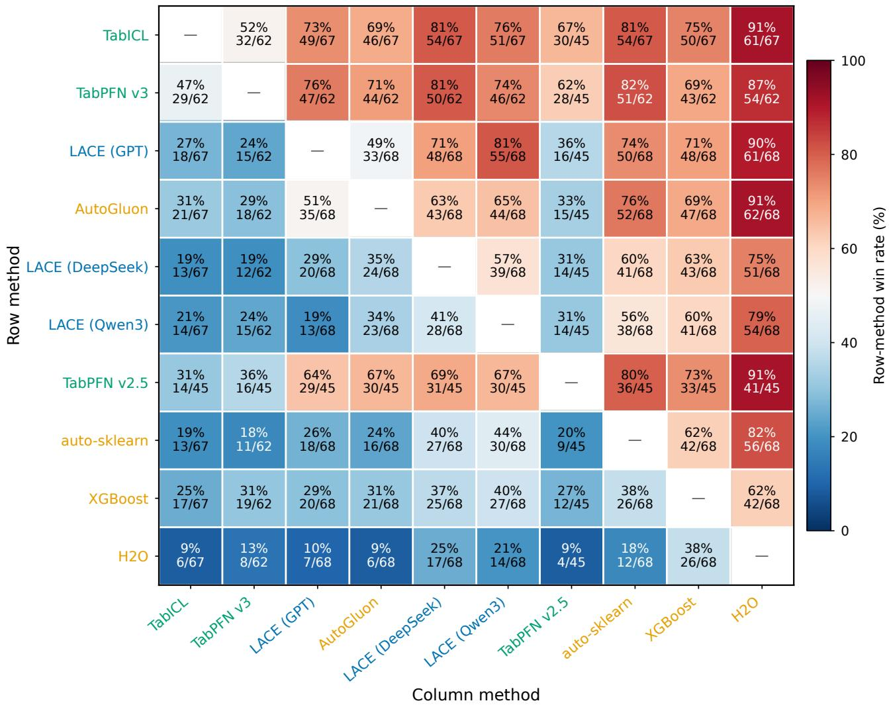  
Fi<sub>gure</sub> 7<sub>:</sub> P<sub>a</sub>i<sub>rw</sub>i<sub>se</sub> t<sub>as</sub>k<sub>-</sub>l<sub>eve</sub>l <sub>w</sub>i<sub>n ra</sub>t<sub>es.</sub> E<sub>ac</sub>h <sub>ce</sub>ll <sub>g</sub>i<sub>ves</sub> th<sub>e s</sub>h<sub>are o</sub>f <sub>compara</sub>bl<sub>e</sub> t<sub>as</sub>k<sub>s on w</sub>hi<sub>c</sub>h th<sub>e row me</sub>th<sub>o</sub>d <sub>ac</sub>hi<sub>eves a</sub> hi<sub>g</sub>h<sub>er</sub> <sub>score</sub> th<sub>an</sub> th<sub>e co</sub>l<sub>umn me</sub>th<sub>o</sub>d<sub>, w</sub>ith th<sub>e un</sub>d<sub>er</sub>l<sub>y</sub>i<sub>ng coun</sub>t<sub>s</sub> b<sub>e</sub>l<sub>ow</sub> it<sub>; a</sub> t<sub>as</sub>k i<sub>s compara</sub>bl<sub>e w</sub>h<sub>en</sub> b<sub>o</sub>th <sub>me</sub>th<sub>o</sub>d<sub>s re</sub>t<sub>urn a va</sub>lid <sub>resu</sub>lt<sub>, an</sub>d d<sub>enom</sub>i<sub>na</sub>t<sub>ors</sub> th<sub>ere</sub>f<sub>ore vary w</sub>ith <sub>coverage.</sub> E<sub>xac</sub>t ti<sub>es rema</sub>i<sub>n</sub> i<sub>n</sub> th<sub>e</sub> d<sub>enom</sub>i<sub>na</sub>t<sub>or, so comp</sub>l<sub>emen</sub>t<sub>ary ce</sub>ll<sub>s sum</sub> t<sub>o</sub> 100% <sub>on</sub>l<sub>y</sub> f<sub>or pa</sub>i<sub>rs w</sub>ith<sub>ou</sub>t ti<sub>es;</sub> ti<sub>es occur</sub> i<sub>n</sub> t<sub>en pa</sub>i<sub>rs an</sub>d <sub>never excee</sub>d t<sub>wo</sub> t<sub>as</sub>k<sub>s.</sub> M<sub>e</sub>th<sub>o</sub>d<sub>s are or</sub>d<sub>ere</sub>d b<sub>y</sub> f<sub>a</sub>il<sub>ure-aware mean</sub> <sub>ran</sub>k<sub>, an</sub>d ti<sub>c</sub>k<sub>-</sub>l<sub>a</sub>b<sub>e</sub>l <sub>co</sub>l<sub>our groups</sub> th<sub>em</sub> b<sub>y</sub> f<sub>am</sub>il<sub>y as</sub> i<sub>n</sub> th<sub>e ma</sub>i<sub>n paper</sub>’<sub>s me</sub>th<sub>o</sub>d<sub>-compar</sub>i<sub>son</sub> fi<sub>gure.</sub> Th<sub>ese are raw w</sub>i<sub>n coun</sub>t<sub>s</sub> without si<sub>g</sub>nificance testin<sub>g</sub>; the tested com<sub>p</sub>arisons involvin<sub>g</sub> LACE (GPT-5.4-mini) are in Table 7.

(a) Number of rows
<table><tr><td>TabICL</td><td>3.2</td><td>2.7</td><td>3.9</td><td>3.5</td></tr><tr><td>TabPFN v3</td><td>4.2</td><td>3.1</td><td>3.7</td><td>5.5</td></tr><tr><td>LACE (GPT)</td><td>3.9</td><td>4.6</td><td>4.9</td><td>4.5</td></tr><tr><td>AutoGluon</td><td>6.1</td><td>5.5</td><td>3.1</td><td>3.0</td></tr><tr><td>ACE (DeepSeek)</td><td>4.9</td><td>6.0</td><td>6.3</td><td>5.5</td></tr><tr><td>LACE (Qwen3)</td><td>4.4</td><td>6.1</td><td>6.9</td><td>6.5</td></tr><tr><td>TabPFN v2.5</td><td>5.4</td><td>3.6</td><td>7.8</td><td>9.8</td></tr><tr><td>auto-sklearn</td><td>7.6</td><td>7.2</td><td>5.0</td><td>4.7</td></tr><tr><td>XGBoost</td><td>6.4</td><td>7.3</td><td>5.9</td><td>5.7</td></tr><tr><td>H20</td><td>8.8</td><td>8.8</td><td>7.5</td><td>6.4</td></tr><tr><td></td><td>≤2k (n=16)</td><td>2k-10k (n=23)</td><td>10k-100k (n=19)</td><td>&gt;100k (n=10)</td></tr></table>

(b) Number of features  
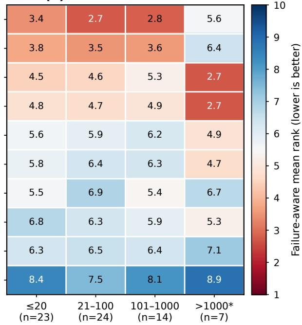  
Fi<sub>g</sub>ure 8: Failure-aware mean task-level rank b<sub>y</sub> (a) number of rows and (b) number of features. Lower is better; each column <sub>averages</sub> th<sub>e w</sub>ithi<sub>n-</sub>t<sub>as</sub>k <sub>ran</sub>k<sub>s o</sub>f <sub>a</sub>ll t<sub>en me</sub>th<sub>o</sub>d<sub>s over</sub> th<sub>e</sub> t<sub>as</sub>k<sub>s</sub> i<sub>n</sub> th<sub>a</sub>t bi<sub>n, w</sub>ith <sub>m</sub>i<sub>ss</sub>i<sub>ng me</sub>th<sub>o</sub>d<sub>s pena</sub>li<sub>ze</sub>d <sub>as</sub> i<sub>n</sub> th<sub>e me</sub>th<sub>o</sub>d<sub>-</sub> <sub>compar</sub>i<sub>son</sub> fi<sub>gure o</sub>f th<sub>e ma</sub>i<sub>n paper.</sub> C<sub>o</sub>l<sub>umn</sub> l<sub>a</sub>b<sub>e</sub>l<sub>s g</sub>i<sub>ve</sub> th<sub>e num</sub>b<sub>er o</sub>f t<sub>as</sub>k<sub>s per</sub> bi<sub>n; an as</sub>t<sub>er</sub>i<sub>s</sub>k <sub>mar</sub>k<sub>s</sub> bi<sub>ns w</sub>ith f<sub>ewer</sub> th<sub>an</sub> t<sub>en</sub> t<sub>as</sub>k<sub>s,</sub> <sub>w</sub>h<sub>ose</sub> <sub>va</sub>l<sub>ues</sub> <sub>s</sub>h<sub>ou</sub>ld b<sub>e</sub> <sub>rea</sub>d <sub>w</sub>ith <sub>cau</sub>ti<sub>on.</sub> R<sub>ow-</sub>l<sub>a</sub>b<sub>e</sub>l <sub>co</sub>l<sub>our</sub> <sub>groups</sub> <sub>me</sub>th<sub>o</sub>d<sub>s</sub> b<sub>y</sub> f<sub>am</sub>il<sub>y.</sub>

## K Zero-Shot Validity and Improvement Details

For each LACE repetition, thefirst-shot candidate is the first <sub>p</sub>i<sub>pe</sub>li<sub>ne</sub> <sub>eva</sub>l<sub>ua</sub>t<sub>e</sub>d f<sub>rom</sub> th<sub>e</sub> i<sub>n</sub>iti<sub>a</sub>l <sub>popu</sub>l<sub>a</sub>ti<sub>on,</sub> b<sub>e</sub>f<sub>ore</sub> <sub>any</sub> <sub>ex-</sub> <sub>ecu</sub>ti<sub>on</sub> f<sub>ee</sub>db<sub>ac</sub>k <sub>or evo</sub>l<sub>u</sub>ti<sub>onary mu</sub>t<sub>a</sub>ti<sub>on</sub> i<sub>s prov</sub>id<sub>e</sub>d t<sub>o</sub> th<sub>e</sub> language model. The best initial candidate is the highest-<sub>scor</sub>i<sub>ng va</sub>lid <sub>p</sub>i<sub>pe</sub>li<sub>ne among</sub> th<sub>e</sub> f<sub>our mem</sub>b<sub>ers o</sub>f th<sub>a</sub>t <sub>pop-</sub> ulation, and the final solution is the highest-fitness pipeline <sub>re</sub>t<sub>urne</sub>d <sub>a</sub>t th<sub>e en</sub>d <sub>o</sub>f th<sub>e run.</sub> A <sub>can</sub>did<sub>a</sub>t<sub>e</sub> i<sub>s va</sub>lid if it <sub>com-</sub> <sub>p</sub>l<sub>e</sub>t<sub>es eva</sub>l<sub>ua</sub>ti<sub>on an</sub>d <sub>re</sub>t<sub>urns pre</sub>di<sub>c</sub>ti<sub>ons w</sub>ith th<sub>e requ</sub>i<sub>re</sub>d <sup>sha</sup>p<sup>e</sup> <sup>and</sup> <sup>t</sup>yp<sup>e</sup>.

All th<sub>ree compar</sub>i<sub>son po</sub>i<sub>n</sub>t<sub>s carry an</sub> i<sub>nner-va</sub>lid<sub>a</sub>ti<sub>on</sub> fit<sub>-</sub> <sup>ness</sup>. <sup>We</sup> <sup>re</sup>p<sup>ort</sup> <sup>t</sup>w<sup>o</sup> <sup>com</sup>p<sup>lementar</sup>y <sup>anal</sup>y<sup>ses:</sup> <sup>im</sup>p<sup>ro</sup>v<sup>ement</sup> on the inner-validation objective optimized during search, <sub>cover</sub>i<sub>ng</sub> <sub>a</sub>ll th<sub>ree</sub> <sub>compar</sub>i<sub>son</sub> <sub>po</sub>i<sub>n</sub>t<sub>s,</sub> <sub>an</sub>d i<sub>mprovemen</sub>t <sub>on</sub> h<sub>e</sub>ld<sub>-ou</sub>t <sub>o</sub>fi<sub>c</sub>i<sub>a</sub>l<sub>-</sub>t<sub>es</sub>t <sub>accuracy, o</sub>bt<sub>a</sub>i<sub>ne</sub>d b<sub>y</sub> i<sub>n</sub>d<sub>epen</sub>d<sub>en</sub>tl<sub>y re-</sub> fitti<sub>ng an</sub>d <sub>re-eva</sub>l<sub>ua</sub>ti<sub>ng</sub> th<sub>e va</sub>lid fi<sub>rs</sub>t <sub>programs a</sub>ft<sub>er searc</sub>h (<sub>p</sub>ara<sub>g</sub>ra<sub>p</sub>h on the held-out re<sub>p</sub>la<sub>y</sub> below).

Survivor selection is elitist on this objective, so the fi-<sub>na</sub>l fit<sub>ness</sub> i<sub>s</sub> b<sub>y cons</sub>t<sub>ruc</sub>ti<sub>on a</sub>t l<sub>eas</sub>t <sub>as</sub> hi<sub>g</sub>h <sub>as</sub> th<sub>e</sub> fit<sub>ness</sub> <sub>o</sub>f <sub>e</sub>ith<sub>er</sub> i<sub>n</sub>iti<sub>a</sub>l <sub>compar</sub>i<sub>son</sub> <sub>po</sub>i<sub>n</sub>t <sub>w</sub>ithi<sub>n</sub> th<sub>e</sub> <sub>same</sub> <sub>repe</sub>ti<sub>-</sub> ti<sub>on.</sub> Si<sub>gne</sub>d dif<sub>erences</sub> <sub>are</sub> <sub>consequen</sub>tl<sub>y</sub> <sub>non-nega</sub>ti<sub>ve,</sub> <sub>an</sub>d <sub>a s</sub>i<sub>gne</sub>d<sub>-ran</sub>k t<sub>es</sub>t <sub>wou</sub>ld t<sub>es</sub>t <sub>a proper</sub>t<sub>y o</sub>f th<sub>e se</sub>l<sub>ec</sub>ti<sub>on ru</sub>l<sub>e</sub> rather than whether search improved its selected objective. F<sub>or</sub> th<sub>e</sub> i<sub>nner-va</sub>lid<sub>a</sub>ti<sub>on compar</sub>i<sub>sons we</sub> th<sub>ere</sub>f<sub>ore repor</sub>t <sub>me-</sub> di<sub>ans,</sub> i<sub>n</sub>t<sub>erquar</sub>til<sub>e</sub> <sub>ranges,</sub> <sub>an</sub>d <sub>percen</sub>til<sub>e-</sub>b<sub>oo</sub>t<sub>s</sub>t<sub>rap</sub> <sub>con</sub>fi<sub>-</sub> d<sub>ence</sub> i<sub>n</sub>t<sub>erva</sub>l<sub>s ra</sub>th<sub>er</sub> th<sub>an</sub> h<sub>ypo</sub>th<sub>es</sub>i<sub>s</sub> t<sub>es</sub>t<sub>s.</sub> Thi<sub>s cons</sub>t<sub>ra</sub>i<sub>n</sub>t d<sub>oes no</sub>t <sub>app</sub>l<sub>y</sub> t<sub>o</sub> th<sub>e</sub> h<sub>e</sub>ld<sub>-ou</sub>t <sub>compar</sub>i<sub>son</sub> b<sub>e</sub>l<sub>ow: o</sub>fi<sub>c</sub>i<sub>a</sub>l<sub>-</sub>t<sub>es</sub>t dif<sub>erences are no</sub>t fi<sub>xe</sub>d i<sub>n s</sub>i<sub>gn</sub> b<sub>y</sub> th<sub>e se</sub>l<sub>ec</sub>ti<sub>on ru</sub>l<sub>e an</sub>d <sub>can</sub> b<sub>e nega</sub>ti<sub>ve, so s</sub>i<sub>gne</sub>d<sub>-ran</sub>k t<sub>es</sub>t<sub>s are mean</sub>i<sub>ng</sub>f<sub>u</sub>l th<sub>ere.</sub>

Dif<sub>erences are</sub> fi<sub>rs</sub>t <sub>compu</sub>t<sub>e</sub>d <sub>w</sub>ithi<sub>n eac</sub>h <sub>repe</sub>titi<sub>on an</sub>d th<sub>en me</sub>di<sub>an-aggrega</sub>t<sub>e</sub>d <sub>w</sub>ithi<sub>n eac</sub>h b<sub>ac</sub>kb<sub>one–</sub>t<sub>as</sub>k <sub>pa</sub>i<sub>r.</sub> A <sub>pa</sub>i<sub>r</sub> i<sub>s re</sub>t<sub>a</sub>i<sub>ne</sub>d <sub>w</sub>h<sub>en a</sub>t l<sub>eas</sub>t th<sub>ree repe</sub>titi<sub>ons con</sub>t<sub>r</sub>ib<sub>u</sub>t<sub>e</sub> t<sub>o</sub> th<sub>e correspon</sub>di<sub>ng compar</sub>i<sub>son.</sub> Th<sub>e pr</sub>i<sub>mary</sub> f<sub>a</sub>il<sub>ure-aware</sub> <sub>ana</sub>l<sub>ys</sub>i<sub>s</sub> <sub>ass</sub>i<sub>gns</sub> <sub>an</sub> <sub>o</sub>b<sub>serve</sub>d fi<sub>rs</sub>t<sub>-s</sub>h<sub>o</sub>t <sub>can</sub>did<sub>a</sub>t<sub>e</sub> <sub>w</sub>ith <sub>non-</sub> finite fitness a score of 0. This is a fixed failure penalty rather th<sub>an an o</sub>b<sub>serve</sub>d <sub>pre</sub>di<sub>c</sub>ti<sub>ve accuracy.</sub> All fi<sub>rs</sub>t<sub>-can</sub>did<sub>a</sub>t<sub>e</sub> <sub>recor</sub>d<sub>s are presen</sub>t<sub>, so no m</sub>i<sub>ss</sub>i<sub>ng recor</sub>d i<sub>s</sub> i<sub>mpu</sub>t<sub>e</sub>d<sub>.</sub> W<sub>e</sub> <sub>a</sub>dditi<sub>ona</sub>ll<sub>y repor</sub>t <sub>a va</sub>lid<sub>-on</sub>l<sub>y sens</sub>iti<sub>v</sub>it<sub>y ana</sub>l<sub>ys</sub>i<sub>s an</sub>d <sub>a</sub> <sub>compar</sub>i<sub>son</sub> <sub>aga</sub>i<sub>ns</sub>t th<sub>e</sub> b<sub>es</sub>t <sub>va</sub>lid <sub>mem</sub>b<sub>er</sub> <sub>o</sub>f th<sub>e</sub> f<sub>our-</sub> <sub>can</sub>did<sub>a</sub>t<sub>e</sub> i<sub>n</sub>iti<sub>a</sub>l <sub>popu</sub>l<sub>a</sub>ti<sub>on.</sub> O<sub>ver</sub> th<sub>e</sub> 67 <sub>accuracy-score</sub>d tasks, the failure-aware comparison contains all 201 possibl<sub>e</sub> b<sub>ac</sub>kb<sub>one–</sub>t<sub>as</sub>k <sub>un</sub>it<sub>s,</sub> th<sub>e</sub> <sub>va</sub>lid<sub>-on</sub>l<sub>y</sub> <sub>compar</sub>i<sub>son</sub> <sub>con</sub>t<sub>a</sub>i<sub>ns</sub> 132, and the best-initial comparison contains 190.

Fi<sub>gure</sub> 9 <sub>s</sub>h<sub>ows</sub> th<sub>e</sub> f<sub>a</sub>il<sub>ure-aware</sub> di<sub>s</sub>t<sub>r</sub>ib<sub>u</sub>ti<sub>on.</sub>

Failure-aware improvement produced by the LACE search  
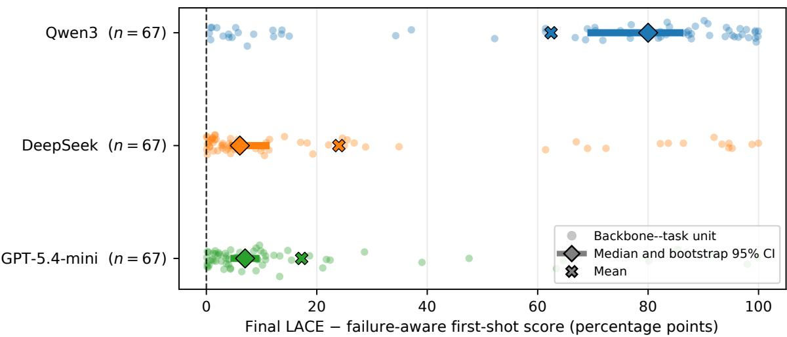  
Observed invalid first-shot programs are assigned fitness 0 before pairing; missing records are not imputed.

Fi<sub>gure</sub> 9<sub>:</sub> F<sub>a</sub>il<sub>ure-aware</sub> i<sub>mprovemen</sub>t i<sub>n</sub> i<sub>nner-va</sub>lid<sub>a</sub>ti<sub>on</sub> fit<sub>ness</sub> f<sub>rom</sub> th<sub>e</sub> fi<sub>rs</sub>t<sub>-s</sub>h<sub>o</sub>t <sub>can</sub>did<sub>a</sub>t<sub>e</sub> t<sub>o</sub> th<sub>e re</sub>t<sub>urne</sub>d LACE <sub>p</sub>i<sub>pe</sub>li<sub>ne</sub> <sub>over</sub> th<sub>e</sub> 67 <sub>accuracy-score</sub>d t<sub>as</sub>k<sub>s.</sub> E<sub>ac</sub>h <sub>po</sub>i<sub>n</sub>t i<sub>s one</sub> b<sub>ac</sub>kb<sub>one–</sub>t<sub>as</sub>k <sub>un</sub>it<sub>;</sub> dif<sub>erences are compu</sub>t<sub>e</sub>d <sub>w</sub>ithi<sub>n repe</sub>titi<sub>on an</sub>d th<sub>en</sub> median-aggregated over repetitions. An observed first-shot program with non-finite fitness is assigned a score of 0 before the dif<sub>erence</sub> i<sub>s</sub> <sub>compu</sub>t<sub>e</sub>d<sub>.</sub> Thi<sub>s</sub> i<sub>s</sub> <sub>a</sub> fi<sub>xe</sub>d f<sub>a</sub>il<sub>ure</sub> <sub>pena</sub>lt<sub>y</sub> <sub>ra</sub>th<sub>er</sub> th<sub>an</sub> <sub>an</sub> <sub>o</sub>b<sub>serve</sub>d <sub>pre</sub>di<sub>c</sub>ti<sub>ve</sub> <sub>accuracy.</sub> Di<sub>amon</sub>d<sub>s</sub> d<sub>eno</sub>t<sub>e</sub> <sub>me</sub>di<sub>ans,</sub> <sub>crosses</sub> d<sub>eno</sub>t<sub>e</sub> <sub>means,</sub> <sub>an</sub>d thi<sub>c</sub>k h<sub>or</sub>i<sub>zon</sub>t<sub>a</sub>l li<sub>nes</sub> <sub>s</sub>h<sub>ow</sub> <sub>percen</sub>til<sub>e-</sub>b<sub>oo</sub>t<sub>s</sub>t<sub>rap</sub> 95% <sub>con</sub>fid<sub>ence</sub> i<sub>n</sub>t<sub>erva</sub>l<sub>s</sub> f<sub>or</sub> th<sub>e</sub> <sub>me</sub>di<sub>an.</sub> T<sub>as</sub>k 360114 i<sub>s</sub> <sub>score</sub>d b<sub>y</sub> ROC<sub>–</sub>AUC <sub>an</sub>d i<sub>s</sub> <sub>exc</sub>l<sub>u</sub>d<sub>e</sub>d f<sub>rom</sub> thi<sub>s</sub> fi<sub>gure.</sub>

Th<sub>e</sub> f<sub>a</sub>il<sub>ure-aware es</sub>ti<sub>ma</sub>t<sub>e com</sub>bi<sub>nes recovery</sub> f<sub>rom</sub> i<sub>n-</sub> <sub>va</sub>lid fi<sub>rs</sub>t <sub>programs</sub> <sub>w</sub>ith <sub>pre</sub>di<sub>c</sub>ti<sub>ve</sub> i<sub>mprovemen</sub>t <sub>among</sub> valid programs. It is especially large for Qwen3 because 212 of its 340 first-shot programs are invalid and therefore receive the score 0. The valid-only analysis separates this recovery <sub>e</sub>f<sub>ec</sub>t f<sub>rom pre</sub>di<sub>c</sub>ti<sub>ve</sub> i<sub>mprovemen</sub>t <sub>among execu</sub>t<sub>a</sub>bl<sub>e pro-</sub> <sub>grams;</sub> th<sub>e</sub> h<sub>e</sub>ld<sub>-ou</sub>t <sub>rep</sub>l<sub>ay</sub> b<sub>e</sub>l<sub>ow con</sub>fi<sub>rms</sub> th<sub>a</sub>t thi<sub>s</sub> i<sub>mprove-</sub> ment is not confined to the search objective. The 1.58-point <sub>ga</sub>i<sub>n over</sub> th<sub>e</sub> b<sub>es</sub>t <sub>va</sub>lid i<sub>n</sub>iti<sub>a</sub>l <sub>can</sub>did<sub>a</sub>t<sub>e</sub> f<sub>ur</sub>th<sub>er s</sub>h<sub>ows</sub> th<sub>a</sub>t th<sub>e resu</sub>lt i<sub>s no</sub>t <sub>exp</sub>l<sub>a</sub>i<sub>ne</sub>d <sub>on</sub>l<sub>y</sub> b<sub>y se</sub>l<sub>ec</sub>ti<sub>ng</sub> th<sub>e</sub> b<sub>es</sub>t <sub>o</sub>f f<sub>our</sub> i<sub>n</sub>d<sub>epen</sub>d<sub>en</sub>t i<sub>n</sub>iti<sub>a</sub>l <sub>genera</sub>ti<sub>ons.</sub>

T<sub>as</sub>k 360114 i<sub>s</sub> <sub>score</sub>d b<sub>y</sub> ROC<sub>–</sub>AUC <sub>an</sub>d i<sub>s</sub> <sub>exc</sub>l<sub>u</sub>d<sub>e</sub>d f<sub>rom</sub> <sub>a</sub>ll <sub>accuracy-poo</sub>l<sub>e</sub>d <sub>va</sub>l<sub>ues</sub> <sub>a</sub>b<sub>ove.</sub> It<sub>s</sub> dif<sub>erences</sub> <sub>are</sub> <sub>ana</sub>l<sub>yze</sub>d <sub>separa</sub>t<sub>e</sub>l<sub>y</sub> <sub>an</sub>d <sub>are</sub> <sub>never</sub> <sub>com</sub>bi<sub>ne</sub>d <sub>w</sub>ith <sub>accuracy</sub> <sub>percen</sub>t<sub>age</sub> <sub>p</sub>o<sup>i</sup>nts.

<table><tr><td>Backbone</td><td>Planned runs</td><td>First-shot valid</td><td>Final valid</td><td>Invalid recovered</td><td>Recovery rate</td></tr><tr><td>Qwen3</td><td>340</td><td>128/340 (37.6%)</td><td>340/340 (100.0%)</td><td>212/212</td><td>100%</td></tr><tr><td>DeepSeek</td><td>340</td><td>226/340 (66.5%)</td><td>340/340 (100.0%)</td><td>114/114</td><td>100%</td></tr><tr><td>GPT-5.4-mini</td><td>340</td><td>271/340 (79.7%)</td><td>340/340 (100.0%)</td><td>69/69</td><td>100%</td></tr></table>

T<sub>a</sub>bl<sub>e</sub> 8<sub>:</sub> V<sub>a</sub>lidit<sub>y o</sub>f th<sub>e</sub> fi<sub>rs</sub>t <sub>zero-s</sub>h<sub>o</sub>t <sub>can</sub>did<sub>a</sub>t<sub>e an</sub>d th<sub>e</sub> fi<sub>na</sub>l <sub>se</sub>l<sub>ec</sub>t<sub>e</sub>d <sub>p</sub>i<sub>pe</sub>li<sub>ne.</sub> A <sub>recovere</sub>d i<sub>nva</sub>lid fi<sub>rs</sub>t <sub>s</sub>h<sub>o</sub>t i<sub>s a run w</sub>h<sub>ose</sub> fi<sub>rs</sub>t <sub>can</sub>did<sub>a</sub>t<sub>e</sub> h<sub>as</sub> <sub>non-</sub>fi<sub>n</sub>it<sub>e</sub> fit<sub>ness</sub> b<sub>u</sub>t <sub>w</sub>h<sub>ose</sub> fi<sub>na</sub>l <sub>se</sub>l<sub>ec</sub>t<sub>e</sub>d <sub>p</sub>i<sub>pe</sub>li<sub>ne</sub> i<sub>s</sub> <sub>va</sub>lid<sub>.</sub> A fi<sub>rs</sub>t<sub>-s</sub>h<sub>o</sub>t <sub>recor</sub>d i<sub>s</sub> <sub>presen</sub>t f<sub>or</sub> <sub>every</sub> <sub>p</sub>l<sub>anne</sub>d <sub>run.</sub>
<table><tr><td>Backbone</td><td>n</td><td>Median [IQR]</td><td>95% CI</td></tr><tr><td colspan="4">Final – first shot, invalid assigned 0</td></tr><tr><td>Qwen3</td><td>67</td><td>80.00 [14.35, 90.98]</td><td>[69.00, 86.38]</td></tr><tr><td>DeepSeek</td><td>67</td><td>6.07 [1.68, 26.14]</td><td>[4.15, 11.44]</td></tr><tr><td>GPT-5.4-mini Overall</td><td>67 201</td><td>7.02 [2.55, 14.02] 11.33 [3.54, 76.94]</td><td>[4.36, 9.63] [8.99, 18.27]</td></tr><tr><td colspan="4">Final – first shot, valid first shots only</td></tr><tr><td>Qwen3</td><td>19</td><td>2.67 [0.83, 8.15]</td><td>[0.87, 7.92]</td></tr><tr><td>DeepSeek</td><td>52</td><td>2.74 [0.84, 7.85]</td><td>[1.39, 3.58]</td></tr><tr><td>GPT-5.4-mini</td><td>61</td><td>4.96 [1.71, 9.72]</td><td>[3.28, 6.58]</td></tr><tr><td>Overall</td><td>132</td><td>3.46 [1.10, 8.59]</td><td>[2.70, 4.40]</td></tr><tr><td colspan="4">Final – best valid initial candidate</td></tr><tr><td>Qwen3</td><td>59</td><td>1.51 [0.64, 3.51]</td><td>[0.92, 1.86]</td></tr><tr><td>DeepSeek</td><td>65</td><td>1.45 [0.52, 3.09]</td><td>[1.02, 2.50]</td></tr><tr><td>GPT-5.4-mini</td><td>66</td><td>1.92 [0.49, 4.30]</td><td>[0.89, 2.72]</td></tr><tr><td>Overall</td><td>190</td><td>1.58 [0.57, 3.73]</td><td>[1.16, 2.04]</td></tr></table>

T<sub>a</sub>bl<sub>e</sub> 9<sub>:</sub> T<sub>as</sub>k<sub>-</sub>l<sub>eve</sub>l i<sub>mprovemen</sub>t i<sub>n</sub> i<sub>nner-va</sub>lid<sub>a</sub>ti<sub>on</sub> fit<sub>ness,</sub> in <sub>accu</sub>r<sub>acy pe</sub>r<sub>ce</sub>nt<sub>age po</sub>int<sub>s, ove</sub>r th<sub>e</sub> 67 <sub>accu</sub>r<sub>acy</sub>-<sub>sco</sub>r<sub>e</sub>d t<sub>as</sub>k<sub>s.</sub> Dif<sub>erences are compu</sub>t<sub>e</sub>d <sub>w</sub>ithi<sub>n repe</sub>titi<sub>on an</sub>d th<sub>en</sub> median-aggregated within each backbone–task unit; n is the <sub>num</sub>b<sub>er o</sub>f <sub>un</sub>it<sub>s w</sub>ith <sub>a</sub>t l<sub>eas</sub>t th<sub>ree pa</sub>i<sub>re</sub>d <sub>repe</sub>titi<sub>ons.</sub> Th<sub>e</sub> fi<sub>rs</sub>t bl<sub>oc</sub>k <sub>ass</sub>i<sub>gns an o</sub>b<sub>serve</sub>d i<sub>nva</sub>lid fi<sub>rs</sub>t <sub>s</sub>h<sub>o</sub>t <sub>a</sub> f<sub>a</sub>il<sub>ure-aware</sub> score of 0; the second restricts the comparison to valid first <sub>s</sub>h<sub>o</sub>t<sub>s;</sub> th<sub>e</sub> thi<sub>r</sub>d <sub>compares</sub> th<sub>e</sub> fi<sub>na</sub>l <sub>p</sub>i<sub>pe</sub>li<sub>ne w</sub>ith th<sub>e</sub> b<sub>es</sub>t <sub>va</sub>lid <sub>mem</sub>b<sub>er o</sub>f th<sub>e</sub> i<sub>n</sub>iti<sub>a</sub>l <sub>popu</sub>l<sub>a</sub>ti<sub>on.</sub> C<sub>on</sub>fid<sub>ence</sub> i<sub>n</sub>t<sub>erva</sub>l<sub>s are</sub> <sub>percen</sub>til<sub>e-</sub>b<sub>oo</sub>t<sub>s</sub>t<sub>rap</sub> i<sub>n</sub>t<sub>erva</sub>l<sub>s</sub> f<sub>or</sub> th<sub>e me</sub>di<sub>an over</sub> b<sub>ac</sub>kb<sub>one–</sub> t<sub>as</sub>k <sub>un</sub>it<sub>s.</sub>

Held-out replay of first programs. To test whether search improves generalization rather than only its selection objective, ever<sub>y</sub> valid literal first <sub>p</sub>ro<sub>g</sub>ram (candidate index 1, <sub>g</sub>eneration 0, constructor defaults) was inde<sub>p</sub>endentl<sub>y</sub> refit on th<sub>e o</sub>fi<sub>c</sub>i<sub>a</sub>l t<sub>ra</sub>i<sub>n</sub>i<sub>ng</sub> f<sub>o</sub>ld<sub>s an</sub>d <sub>score</sub>d <sub>once on</sub> th<sub>e correspon</sub>d<sub>-</sub> i<sub>ng</sub> h<sub>e</sub>ld<sub>-ou</sub>t f<sub>o</sub>ld<sub>s, un</sub>d<sub>er</sub> th<sub>e same pro</sub>t<sub>oco</sub>l <sub>app</sub>li<sub>e</sub>d t<sub>o</sub> th<sub>e</sub> <sub>re</sub>t<sub>urne</sub>d <sub>p</sub>i<sub>pe</sub>li<sub>ne.</sub> Of th<sub>e</sub> 625 <sub>runs w</sub>ith <sub>a va</sub>lid fi<sub>rs</sub>t <sub>program,</sub> 618 returned a finite oficial a<sub>gg</sub>re<sub>g</sub>ate (617 com<sub>p</sub>lete, one 8<sub>-o</sub>f<sub>-</sub>10<sub>-</sub>f<sub>o</sub>ld <sub>par</sub>ti<sub>a</sub>l<sub>,</sub> <sub>seven</sub> <sub>eva</sub>l<sub>ua</sub>ti<sub>on</sub> ti<sub>meou</sub>t<sub>s</sub> <sub>recor</sub>d<sub>e</sub>d <sub>as</sub> missin<sub>g</sub> rather than zero); 611 finite <sub>p</sub>airs remain after se<sub>p</sub>a-<sub>ra</sub>ti<sub>ng</sub> t<sub>as</sub>k 360114 <sub>w</sub>hi<sub>c</sub>h i<sub>s</sub> d<sub>ec</sub>l<sub>are</sub>d AUC<sub>.</sub> R<sub>uns w</sub>h<sub>ose</sub> fi<sub>rs</sub>t <sub>program was</sub> i<sub>nva</sub>lid <sub>are exc</sub>l<sub>u</sub>d<sub>e</sub>d<sub>, an</sub>d <sub>no ar</sub>tifi<sub>c</sub>i<sub>a</sub>l <sub>wors</sub>t <sub>score</sub> i<sub>s ass</sub>i<sub>gne</sub>d<sub>.</sub> T<sub>a</sub>bl<sub>e</sub> 10 <sub>repor</sub>t<sub>s</sub> th<sub>e pa</sub>i<sub>re</sub>d dif<sub>erences.</sub> At <sub>run</sub> l<sub>eve</sub>l 586 <sub>o</sub>f 611 <sub>pa</sub>i<sub>rs</sub> i<sub>mprove</sub>d<sub>,</sub> 6 ti<sub>e</sub>d<sub>,</sub> <sub>an</sub>d 19 <sub>were</sub> <sub>worse.</sub> R<sub>es</sub>t<sub>r</sub>i<sub>c</sub>ti<sub>ng</sub> t<sub>o</sub> fi<sub>rs</sub>t <sub>programs</sub> <sub>comp</sub>l<sub>e</sub>ti<sub>ng</sub> <sub>a</sub>ll t<sub>en</sub> f<sub>o</sub>ld<sub>s</sub> changes the pooled median by less than 0.01 points.

T<sub>a</sub>bl<sub>e</sub> 10<sub>:</sub> H<sub>e</sub>ld<sub>-ou</sub>t <sub>o</sub>fi<sub>c</sub>i<sub>a</sub>l<sub>-</sub>t<sub>es</sub>t i<sub>mprovemen</sub>t f<sub>rom</sub> th<sub>e va</sub>lid fi<sub>rs</sub>t <sub>program</sub> t<sub>o</sub> th<sub>e</sub> <sub>re</sub>t<sub>urne</sub>d <sub>p</sub>i<sub>pe</sub>li<sub>ne,</sub> i<sub>n</sub> <sub>accuracy</sub> <sub>percen</sub>t<sub>-</sub> <sub>age po</sub>i<sub>n</sub>t<sub>s.</sub> Dif<sub>erences are compu</sub>t<sub>e</sub>d <sub>w</sub>ithi<sub>n repe</sub>titi<sub>on an</sub>d <sub>me</sub>di<sub>an-aggrega</sub>t<sub>e</sub>d <sub>per</sub> b<sub>ac</sub>kb<sub>one–</sub>t<sub>as</sub>k <sub>un</sub>it<sub>, as</sub> i<sub>n</sub> th<sub>e ma</sub>i<sub>n</sub> <sub>paper</sub>’<sub>s</sub> <sub>zero-s</sub>h<sub>o</sub>t <sub>sec</sub>ti<sub>on.</sub> C<sub>on</sub>fid<sub>ence</sub> i<sub>n</sub>t<sub>erva</sub>l<sub>s</sub> <sub>are</sub> <sub>percen</sub>til<sub>e</sub> bootstra<sub>p</sub> (10,000 resam<sub>p</sub>les) for the median; p-values are two-sided Wilcoxon, Holm-adjusted within the three backb<sub>ones.</sub>
<table><tr><td>Backbone</td><td>Units</td><td>Median [IQR]</td><td>95% CI</td><td>Holm p</td></tr><tr><td>DeepSeek</td><td>65/67</td><td>2.51 [0.70, 8.39]</td><td>[1.00, 3.63]</td><td> $4 . 9 \times 1 0 ^ { - 1 2 }$ </td></tr><tr><td>GPT-5.4-mini</td><td>66/67</td><td>4.53 [1.55, 9.60]</td><td>[2.74, 5.75]</td><td> $4 . 9 \times 1 0 ^ { - 1 2 }$ </td></tr><tr><td>Qwen3</td><td>62/67</td><td>2.87 [0.72, 7.94]</td><td>[1.85, 4.51]</td><td> $1 . 0 \times 1 0 ^ { - 1 1 }$ </td></tr><tr><td>Overall</td><td>193/201</td><td>2.99 [0.71, 8.73]</td><td>[2.42, 4.17]</td><td></td></tr></table>

Inner objective versus held-out gain. Over the identical 611 finite pairs, the median inner-validation gain is 3.21 points and the median held-out gain 2.95 points; 609 of 611 pairs improved on the inner objective and 586 on held-<sub>ou</sub>t <sub>accuracy.</sub> Th<sub>e</sub> h<sub>e</sub>ld<sub>-ou</sub>t <sub>ga</sub>i<sub>n</sub> i<sub>s</sub> th<sub>ere</sub>f<sub>ore</sub> <sub>s</sub>li<sub>g</sub>htl<sub>y</sub> <sub>sma</sub>ll<sub>er</sub> than the objective optimized during search, consistent with <sub>m</sub>ild <sub>se</sub>l<sub>ec</sub>ti<sub>on over</sub>fitti<sub>ng,</sub> b<sub>u</sub>t <sub>rema</sub>i<sub>ns pos</sub>iti<sub>ve on</sub> th<sub>e</sub> l<sub>arge</sub> majority of runs.

At th<sub>e</sub> b<sub>ac</sub>kb<sub>one–</sub>t<sub>as</sub>k l<sub>eve</sub>l<sub>,</sub> th<sub>e re</sub>t<sub>urne</sub>d <sub>p</sub>i<sub>pe</sub>li<sub>ne</sub> i<sub>mproves</sub> <sub>on</sub> 190 <sub>o</sub>f th<sub>e</sub> 193 <sub>re</sub>t<sub>a</sub>i<sub>ne</sub>d <sub>un</sub>it<sub>s;</sub> th<sub>e rema</sub>i<sub>n</sub>i<sub>ng</sub> th<sub>ree</sub> h<sub>ave</sub> <sub>nega</sub>ti<sub>ve</sub> dif<sub>erences.</sub> All 66 <sub>re</sub>t<sub>a</sub>i<sub>ne</sub>d GPT<sub>-</sub>5<sub>.</sub>4<sub>-m</sub>i<sub>n</sub>i <sub>un</sub>it<sub>s</sub> i<sub>m-</sub> <sub>prove.</sub> A<sub>cross</sub> th<sub>e</sub> 193 <sub>un</sub>it<sub>s,</sub> th<sub>e</sub> t<sub>wo-s</sub>id<sub>e</sub>d Wil<sub>coxon</sub> t<sub>es</sub>t <sub>g</sub><sup>i</sup>ves $p < 1 0 ^ { - 3 2 }$ <sub>.</sub> Fi<sub>gure</sub> 10 <sub>v</sub>i<sub>sua</sub>li<sub>zes</sub> th<sub>e</sub> t<sub>as</sub>k<sub>-</sub>l<sub>eve</sub>l h<sub>e</sub>ld<sub>-ou</sub>t di<sub>s</sub>t<sub>r</sub>ib<sub>u</sub>ti<sub>ons</sub> <sub>un</sub>d<sub>er</sub>l<sub>y</sub>i<sub>ng</sub> T<sub>a</sub>bl<sub>e</sub> 10<sub>.</sub>

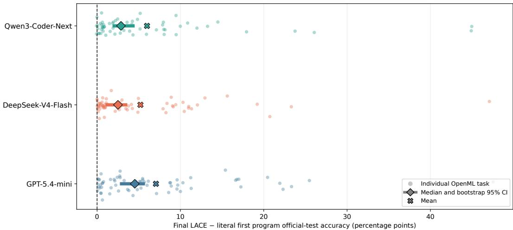  
Positive values favour the selected final. Only finite paired official-test scores are included; invalid first programs and timeouts remain missing.

Fi<sub>gure</sub> 10<sub>:</sub> H<sub>e</sub>ld<sub>-ou</sub>t <sub>o</sub>fi<sub>c</sub>i<sub>a</sub>l<sub>-</sub>t<sub>es</sub>t i<sub>mprovemen</sub>t f<sub>rom</sub> th<sub>e va</sub>lid lit<sub>era</sub>l fi<sub>rs</sub>t <sub>program</sub> t<sub>o</sub> th<sub>e re</sub>t<sub>urne</sub>d LACE <sub>p</sub>i<sub>pe</sub>li<sub>ne over</sub> th<sub>e</sub> 67 <sub>accuracy-score</sub>d t<sub>as</sub>k<sub>s.</sub> E<sub>ac</sub>h <sub>po</sub>i<sub>n</sub>t i<sub>s</sub> <sub>one</sub> b<sub>ac</sub>kb<sub>one–</sub>t<sub>as</sub>k <sub>un</sub>it <sub>w</sub>ith <sub>a</sub>t l<sub>eas</sub>t th<sub>ree</sub> fi<sub>n</sub>it<sub>e</sub> <sub>pa</sub>i<sub>re</sub>d <sub>o</sub>fi<sub>c</sub>i<sub>a</sub>l <sub>rep</sub>l<sub>ays;</sub> dif<sub>erences</sub> <sub>are</sub> <sub>compu</sub>t<sub>e</sub>d <sub>w</sub>ithi<sub>n repe</sub>titi<sub>on an</sub>d th<sub>en me</sub>di<sub>an-aggrega</sub>t<sub>e</sub>d <sub>w</sub>ithi<sub>n eac</sub>h <sub>un</sub>it<sub>.</sub> I<sub>nva</sub>lid fi<sub>rs</sub>t <sub>programs an</sub>d <sub>o</sub>fi<sub>c</sub>i<sub>a</sub>l<sub>-eva</sub>l<sub>ua</sub>ti<sub>on</sub> ti<sub>meou</sub>t<sub>s</sub> <sub>rema</sub>i<sub>n m</sub>i<sub>ss</sub>i<sub>n , an</sub>d <sub>no ar</sub>tifi<sub>c</sub>i<sub>a</sub>l <sub>score o</sub>f <sub>zero</sub> i<sub>s ass</sub>i <sub>ne</sub>d<sub>.</sub> C<sub>onse uen</sub>tl <sub>, eac</sub>h b<sub>ac</sub>kb<sub>one</sub> i<sub>s eva</sub>l<sub>ua</sub>t<sub>e</sub>d <sub>on a va</sub>lidit <sub>-con</sub>diti<sub>one</sub>d subset that difers in size and composition: 62/67 task units for Qwen3, 65/67 for DeepSeek, and 66/67 for GPT-5.4-mini. The di<sub>s</sub>t<sub>r</sub>ib<sub>u</sub>ti<sub>ons</sub> th<sub>ere</sub>f<sub>ore quan</sub>tif<sub>y w</sub>ithi<sub>n-</sub>b<sub>ac</sub>kb<sub>one</sub> i<sub>mprovemen</sub>t f<sub>rom</sub> fi<sub>rs</sub>t t<sub>o</sub> fi<sub>na</sub>l <sub>an</sub>d <sub>s</sub>h<sub>ou</sub>ld <sub>no</sub>t b<sub>e</sub> i<sub>n</sub>t<sub>erpre</sub>t<sub>e</sub>d <sub>as a</sub> lik<sub>e-</sub>f<sub>or-</sub>lik<sub>e</sub> <sub>compar</sub>i<sub>son</sub> b<sub>e</sub>t<sub>ween</sub> b<sub>ac</sub>kb<sub>ones.</sub> Th<sub>e ax</sub>i<sub>s ex</sub>t<sub>en</sub>d<sub>s</sub> b<sub>e</sub>l<sub>ow zero;</sub> th<sub>ree</sub> t<sub>as</sub>k <sub>un</sub>it<sub>s</sub> h<sub>ave nega</sub>ti<sub>ve</sub> dif<sub>erences,</sub> d<sub>emons</sub>t<sub>ra</sub>ti<sub>ng</sub> th<sub>a</sub>t h<sub>e</sub>ld<sub>-ou</sub>t i<sub>mprovemen</sub>t i<sub>s no</sub>t <sub>s</sub>i<sub>gn-cons</sub>t<sub>ra</sub>i<sub>ne</sub>d b<sub>y e</sub>liti<sub>s</sub>t <sub>se</sub>l<sub>ec</sub>ti<sub>on.</sub> Di<sub>amon</sub>d<sub>s</sub> d<sub>eno</sub>t<sub>e me</sub>di<sub>ans, crosses</sub> d<sub>eno</sub>t<sub>e means, an</sub>d thi<sub>c</sub>k h<sub>or</sub>i<sub>zon</sub>t<sub>a</sub>l li<sub>nes s</sub>h<sub>ow percen</sub>til<sub>e-</sub>b<sub>oo</sub>t<sub>s</sub>t<sub>rap</sub> 95% <sub>con</sub>fid<sub>ence</sub> i<sub>n</sub>t<sub>erva</sub>l<sub>s.</sub> T<sub>as</sub>k 360114 i<sub>s exc</sub>l<sub>u</sub>d<sub>e</sub>d b<sub>ecause</sub> it<sub>s o</sub>fi<sub>c</sub>i<sub>a</sub>l <sub>eva</sub>l<sub>ua</sub>ti<sub>on</sub> <sub>recor</sub>d<sub>e</sub>d th<sub>e</sub> AUC<sub>.</sub>

## L Search Dynamics Details

The dynamics analysis uses the 1,020 complete runs: 340 <sub>eac</sub>h f<sub>or</sub> d<sub>eepsee</sub>k<sub>-v</sub>4<sub>-</sub>fl<sub>as</sub>h<sub>,</sub> GPT<sub>-</sub>5<sub>.</sub>4<sub>-m</sub>i<sub>n</sub>i<sub>,</sub> <sub>an</sub>d <sub>qwen</sub>3<sub>-co</sub>d<sub>er-</sub> next. Thirteen runs (1.3%) never improved on their initial <sub>popu</sub>l<sub>a</sub>ti<sub>on</sub> <sub>an</sub>d <sub>are</sub> <sub>exc</sub>l<sub>u</sub>d<sub>e</sub>d f<sub>rom</sub> <sub>norma</sub>li<sub>ze</sub>d <sub>progress</sub> <sub>s</sub>t<sub>a</sub>ti<sub>s-</sub> ti<sub>cs.</sub> A f<sub>ur</sub>th<sub>er</sub> 89 <sub>runs, compr</sub>i<sub>s</sub>i<sub>ng</sub> 21 D<sub>eep</sub>S<sub>ee</sub>k<sub>,</sub> 4 GPT<sub>-</sub>5<sub>.</sub>4<sub>-</sub> mini, and 64 Qwen3 runs, had four invalid initial candidates <sub>an</sub>d th<sub>ere</sub>f<sub>ore</sub> h<sub>ave no genera</sub>ti<sub>on-</sub>0 b<sub>ase</sub>li<sub>ne.</sub> Th<sub>ese runs re-</sub> <sub>ma</sub>i<sub>n</sub> i<sub>n a</sub>ll <sub>non-norma</sub>li<sub>ze</sub>d <sub>s</sub>t<sub>a</sub>ti<sub>s</sub>ti<sub>cs.</sub> T<sub>we</sub>l<sub>ve</sub> d<sub>eepsee</sub>k<sub>-v</sub>4<sub>-</sub> fl<sub>as</sub>h <sub>runs</sub> <sub>use</sub>d <sub>an</sub> <sub>ear</sub>li<sub>er</sub> <sub>searc</sub>h <sub>con</sub>fi<sub>gura</sub>ti<sub>on;</sub> <sub>exc</sub>l<sub>u</sub>di<sub>ng</sub> th<sub>em</sub> i<sub>n a sens</sub>iti<sub>v</sub>it<sub>y ana</sub>l<sub>ys</sub>i<sub>s</sub> l<sub>eaves</sub> th<sub>e repor</sub>t<sub>e</sub>d <sub>conc</sub>l<sub>us</sub>i<sub>ons</sub> <sub>ma</sub>t<sub>er</sub>i<sub>a</sub>ll<sub>y unc</sub>h<sub>ange</sub>d<sub>.</sub>

Twelve of the 98,062 declared parent pointers, all from <sub>one</sub> D<sub>eep</sub>S<sub>ee</sub>k <sub>run, re</sub>f<sub>er</sub> t<sub>o can</sub>did<sub>a</sub>t<sub>es a</sub>b<sub>sen</sub>t f<sub>rom</sub> th<sub>e cor-</sub> <sub>respon</sub>di<sub>ng</sub> l<sub>og</sub> <sub>an</sub>d <sub>are</sub> <sub>exc</sub>l<sub>u</sub>d<sub>e</sub>d f<sub>rom</sub> <sub>paren</sub>t<sub>–o</sub>f<sub>spr</sub>i<sub>ng</sub> d<sub>e-</sub> <sub>nom</sub>i<sub>na</sub>t<sub>ors.</sub> Th<sub>e</sub> fi<sub>na</sub>l <sub>p</sub>i<sub>pe</sub>li<sub>ne</sub> <sub>o</sub>f th<sub>e</sub> <sub>a</sub>f<sub>ec</sub>t<sub>e</sub>d <sub>run</sub> <sub>rema</sub>i<sub>ns</sub> t<sub>racea</sub>bl<sub>e.</sub>

Executability by generation. Table 11 gives the run-level <sub>me</sub>di<sub>an</sub> i<sub>nva</sub>lid <sub>s</sub>h<sub>are per genera</sub>ti<sub>on.</sub> Th<sub>e overa</sub>ll <sub>ser</sub>i<sub>es re-</sub> t<sub>urns</sub> t<sub>o</sub> it<sub>s genera</sub>ti<sub>on-</sub>0 l<sub>eve</sub>l b<sub>y</sub> th<sub>e en</sub>d <sub>o</sub>f <sub>a run; un</sub>d<sub>er</sub> <sub>qwen</sub>3<sub>-co</sub>d<sub>er-nex</sub>t th<sub>e me</sub>di<sub>an</sub> d<sub>ec</sub>li<sub>nes</sub> f<sub>rom</sub> 75% <sub>a</sub>t i<sub>n</sub>iti<sub>a</sub>l<sub>-</sub> i<sub>za</sub>ti<sub>on</sub> t<sub>o</sub> 58% i<sub>n</sub> th<sub>e</sub> fi<sub>na</sub>l <sub>genera</sub>ti<sub>on w</sub>hil<sub>e rema</sub>i<sub>n</sub>i<sub>ng</sub> th<sub>e</sub> hi<sub>g</sub>h<sub>es</sub>t <sub>o</sub>f th<sub>e</sub> th<sub>ree</sub> b<sub>ac</sub>kb<sub>ones</sub> th<sub>roug</sub>h<sub>ou</sub>t<sub>.</sub>

Attainment and progress. Table 12 reports the fraction of <sub>runs a</sub>t fi<sub>na</sub>l <sub>qua</sub>lit<sub>y</sub> b<sub>y genera</sub>ti<sub>ons</sub> 1<sub>,</sub> 2<sub>, an</sub>d 4 <sub>un</sub>d<sub>er</sub> th<sub>e exac</sub>t criterion (final best reached within $1 0 ^ { - 1 2 } )$ <sub>an</sub>d th<sub>e prac</sub>ti<sub>ca</sub>l criterion (at least 99% of the run’s total im<sub>p</sub>rovement). The <sub>me</sub>di<sub>an s</sub>h<sub>are o</sub>f t<sub>o</sub>t<sub>a</sub>l i<sub>mprovemen</sub>t <sub>reac</sub>h<sub>e</sub>d b<sub>y can</sub>did<sub>a</sub>t<sub>e</sub> 50 <sub>was</sub> 87<sub>.</sub>6% f<sub>or</sub> d<sub>eepsee</sub>k<sub>-v</sub>4<sub>-</sub>fl<sub>as</sub>h<sub>,</sub> 93<sub>.</sub>7% f<sub>or</sub> GPT<sub>-</sub>5<sub>.</sub>4<sub>-m</sub>i<sub>n</sub>i<sub>,</sub> <sub>a</sub>nd 90<sub>.</sub>7% f<sub>o</sub>r <sub>qwe</sub>n3<sub>-co</sub>d<sub>e</sub>r<sub>-</sub>n<sub>ex</sub>t<sub>.</sub>

T<sub>a</sub>bl<sub>e</sub> 12<sub>:</sub> R<sub>uns a</sub>t fi<sub>na</sub>l <sub>qua</sub>lit<sub>y</sub> b<sub>y genera</sub>ti<sub>on, exac</sub>t / <sub>prac</sub>ti<sub>ca</sub>l <sub>cr</sub>it<sub>er</sub>i<sub>on,</sub> i<sub>n percen</sub>t<sub>.</sub> P<sub>rac</sub>ti<sub>ca</sub>l d<sub>enom</sub>i<sub>na</sub>t<sub>ors exc</sub>l<sub>u</sub>d<sub>e runs</sub> without a defined normalized trajectory.
<table><tr><td>Backbone</td><td>Gen. 1</td><td>Gen. 2</td><td>Gen. 4</td></tr><tr><td>DeepSeek</td><td>2.1 / 1.6</td><td>2.9 / 2.9</td><td>19.4 / 21.7</td></tr><tr><td>GPT-5.4-mini</td><td>2.9 / 4.2</td><td>7.7 / 9.3</td><td>19.5 / 24.9</td></tr><tr><td>Qwen3</td><td>5.6 / 7.0</td><td>11.5 / 13.7</td><td>25.6 / 30.4</td></tr><tr><td>Overall</td><td>3.5 / 4.1</td><td>7.4 / 8.4</td><td>21.5 / 25.4</td></tr></table>

Lineage of finals. Table 13 reports, per backbone, the gen-<sub>era</sub>ti<sub>on</sub> i<sub>n w</sub>hi<sub>c</sub>h th<sub>e</sub> fi<sub>na</sub>l <sub>can</sub>did<sub>a</sub>t<sub>e was crea</sub>t<sub>e</sub>d <sub>an</sub>d it<sub>s an-</sub> <sub>ces</sub>t<sub>ry</sub> d<sub>ep</sub>th<sub>,</sub> th<sub>e num</sub>b<sub>er o</sub>f <sub>mu</sub>t<sub>a</sub>ti<sub>on e</sub>d<sub>ges</sub> t<sub>o</sub> it<sub>s neares</sub>t <sub>ge</sub>n<sub>e</sub>r<sub>a</sub>ti<sub>o</sub>n<sub>-</sub>0 <sub>a</sub>n<sub>ces</sub>t<sub>o</sub>r<sub>.</sub>

T<sub>a</sub>bl<sub>e</sub> 11<sub>:</sub> R<sub>un-</sub>l<sub>eve</sub>l <sub>me</sub>di<sub>an</sub> i<sub>nva</sub>lid<sub>-can</sub>did<sub>a</sub>t<sub>e s</sub>h<sub>are per genera</sub>ti<sub>on,</sub> i<sub>n percen</sub>t<sub>.</sub>
<table><tr><td>Backbone</td><td>0</td><td>1</td><td>2</td><td>3</td><td>4</td><td>5</td><td>6</td><td>7</td><td>8</td></tr><tr><td>DeepSeek</td><td>25.0</td><td>25.0</td><td>16.7</td><td>16.7</td><td>16.7</td><td>25.0</td><td>25.0</td><td>25.0</td><td>25.0</td></tr><tr><td>GPT-5.4-mini</td><td>0.0</td><td>8.3</td><td>8.3</td><td>8.3</td><td>8.3</td><td>8.3</td><td>8.3</td><td>8.3</td><td>8.3</td></tr><tr><td>Qwen3</td><td>75.0</td><td>58.3</td><td>50.0</td><td>50.0</td><td>50.0</td><td>50.0</td><td>50.0</td><td>50.0</td><td>58.3</td></tr><tr><td>Overall</td><td>25.0</td><td>33.3</td><td>25.0</td><td>25.0</td><td>25.0</td><td>25.0</td><td>25.0</td><td>25.0</td><td>25.0</td></tr></table>

T<sub>a</sub>bl<sub>e</sub> 13<sub>:</sub> Li<sub>neage o</sub>f th<sub>e</sub> fi<sub>na</sub>l <sub>p</sub>i<sub>pe</sub>li<sub>nes: crea</sub>ti<sub>on genera</sub>ti<sub>on,</sub> share created in <sub>g</sub>eneration 0 (unmodified initial candidates), <sub>s</sub>h<sub>are crea</sub>t<sub>e</sub>d i<sub>n</sub> th<sub>e</sub> fi<sub>na</sub>l t<sub>wo genera</sub>ti<sub>ons, an</sub>d <sub>ances</sub>t<sub>ry</sub> d<sub>ep</sub>th i<sub>n</sub> <sub>mu</sub>t<sub>a</sub>ti<sub>on</sub> <sub>e</sub>d<sub>ges.</sub>
<table><tr><td>Backbone</td><td>Creation gen.</td><td>In g0 Final two</td><td>Depth</td></tr><tr><td>DeepSeek</td><td>7 [5, 8]</td><td>56.8%</td><td>4[3, 5]</td></tr><tr><td>GPT-5.4-mini</td><td>7 [5, 8] 0.6%</td><td>55.8%</td><td>4[3, 5]</td></tr><tr><td>Qwen3</td><td>6 [4.75, 8] 1.8%</td><td>45.3%</td><td>3 [2, 4]</td></tr><tr><td>Overall</td><td>7 [5, 8] 1.3%</td><td>52.6%</td><td>4[3,5]</td></tr></table>

Parent–ofspring outcomes. Table 14 reports pooled pair <sub>coun</sub>t<sub>s an</sub>d <sub>run-</sub>l<sub>eve</sub>l <sub>me</sub>di<sub>an ra</sub>t<sub>es.</sub> Fit<sub>ness</sub> dif<sub>erences are re-</sub> <sub>por</sub>t<sub>e</sub>d <sub>on</sub>l<sub>y w</sub>ithi<sub>n a me</sub>t<sub>r</sub>i<sub>c: on</sub> th<sub>e accuracy-score</sub>d <sub>runs,</sub> th<sub>e</sub> median diference over all valid pairs was −0.2 percentage points and the median improving step +0.23; the 15 runs of the sin<sub>g</sub>le AUC-scored task (360114) show the same <sub>p</sub>attern (−0.2 and +0.10 AUC points) and are never pooled with th<sub>e accuracy runs.</sub> M<sub>u</sub>t<sub>a</sub>ti<sub>on-</sub>i<sub>ns</sub>t<sub>ruc</sub>ti<sub>on</sub> l<sub>a</sub>b<sub>e</sub>l<sub>s were</sub> l<sub>ogge</sub>d <sub>on</sub>l<sub>y</sub> f<sub>or crossover o</sub>f<sub>spr</sub>i<sub>ng, so a per-</sub>i<sub>ns</sub>t<sub>ruc</sub>ti<sub>on</sub> b<sub>rea</sub>kd<sub>own</sub> i<sub>s unava</sub>il<sub>a</sub>bl<sub>e.</sub>

Representative run. Total inner-validation improvement <sub>var</sub>i<sub>es w</sub>id<sub>e</sub>l<sub>y across runs.</sub> O<sub>ver</sub> th<sub>e</sub> 335 GPT<sub>-</sub>5<sub>.</sub>4<sub>-m</sub>i<sub>n</sub>i <sub>runs</sub> <sub>w</sub>ith <sub>a va</sub>lid i<sub>n</sub>iti<sub>a</sub>l <sub>can</sub>did<sub>a</sub>t<sub>e</sub> it<sub>s me</sub>di<sub>an</sub> i<sub>s</sub> 1<sub>.</sub>7 <sub>accuracy per-</sub> centa<sub>g</sub>e <sub>p</sub>oints (interquartile ran<sub>g</sub>e 0.5–5.3), risin<sub>g</sub> to 10.8 <sub>po</sub>i<sub>n</sub>t<sub>s a</sub>t th<sub>e n</sub>i<sub>ne</sub>ti<sub>e</sub>th <sub>percen</sub>til<sub>e an</sub>d 69<sub>.</sub>5 <sub>po</sub>i<sub>n</sub>t<sub>s a</sub>t th<sub>e max</sub>i<sub>-</sub> <sub>mum;</sub> th<sub>e</sub> l<sub>arges</sub>t <sub>ga</sub>i<sub>ns occur on</sub> t<sub>as</sub>k<sub>s w</sub>h<sub>ose</sub> i<sub>n</sub>iti<sub>a</sub>l <sub>p</sub>i<sub>pe</sub>li<sub>nes</sub> f<sub>a</sub>ll f<sub>ar s</sub>h<sub>or</sub>t <sub>o</sub>f <sub>compe</sub>t<sub>en</sub>t <sub>accuracy.</sub> Th<sub>e run</sub> t<sub>race</sub>d b<sub>e</sub>l<sub>ow</sub> i<sub>s</sub> th<sub>ere</sub>f<sub>ore</sub> t<sub>yp</sub>i<sub>ca</sub>l <sub>ra</sub>th<sub>er</sub> th<sub>an</sub> f<sub>avoura</sub>bl<sub>e.</sub> It <sub>was se</sub>l<sub>ec</sub>t<sub>e</sub>d b<sub>y a</sub> fi<sub>xe</sub>d <sub>ru</sub>l<sub>e:</sub> th<sub>e</sub> t<sub>as</sub>k <sub>w</sub>h<sub>ose me</sub>di<sub>an</sub> t<sub>o</sub>t<sub>a</sub>l i<sub>mprovemen</sub>t <sub>across</sub> <sub>repe</sub>titi<sub>ons</sub> li<sub>es c</sub>l<sub>oses</sub>t t<sub>o</sub> th<sub>e</sub> b<sub>ac</sub>kb<sub>one-w</sub>id<sub>e me</sub>di<sub>an,</sub> th<sub>en</sub> th<sub>e repe</sub>titi<sub>on a</sub>t th<sub>e</sub> t<sub>as</sub>k <sub>me</sub>di<sub>an, g</sub>i<sub>v</sub>i<sub>ng</sub> t<sub>as</sub>k 168757<sub>, rep-</sub> etition 4 (best initial-<sub>p</sub>o<sub>p</sub>ulation fitness 0.747, final fitness 0.764). Table 15 traces the ancestr<sub>y</sub> of the final <sub>p</sub>i<sub>p</sub>eline: th<sub>e run</sub> b<sub>egan</sub> f<sub>rom a vo</sub>ti<sub>ng ensem</sub>bl<sub>e o</sub>f <sub>a</sub> f<sub>ores</sub>t <sub>an</sub>d <sub>a</sub> li<sub>n-</sub> <sub>ear mo</sub>d<sub>e</sub>l b<sub>e</sub>hi<sub>n</sub>d i<sub>mpu</sub>t<sub>a</sub>ti<sub>on, sca</sub>li<sub>ng, an</sub>d PCA<sub>, move</sub>d t<sub>o</sub> <sub>a</sub> <sub>s</sub>i<sub>ng</sub>l<sub>e</sub> <sub>gra</sub>di<sub>en</sub>t<sub>-</sub>b<sub>oos</sub>t<sub>e</sub>d <sub>mo</sub>d<sub>e</sub>l b<sub>e</sub>hi<sub>n</sub>d <sub>a</sub> <sub>per-</sub>f<sub>ea</sub>t<sub>ure-</sub>t<sub>ype</sub> ColumnTransformer, reintroduced a linear votin<sub>g</sub> <sub>p</sub>art-<sub>ner, an</sub>d <sub>se</sub>ttl<sub>e</sub>d <sub>on a</sub> th<sub>ree-</sub>f<sub>am</sub>il<sub>y vo</sub>ti<sub>ng ensem</sub>bl<sub>e o</sub>f <sub>a</sub> f<sub>ores</sub>t<sub>,</sub> <sub>gra</sub>di<sub>en</sub>t b<sub>oos</sub>ti<sub>ng, an</sub>d <sub>a</sub> li<sub>near mo</sub>d<sub>e</sub>l<sub>.</sub> Th<sub>e</sub> b<sub>es</sub>t i<sub>n</sub>iti<sub>a</sub>l <sub>can-</sub> did<sub>a</sub>t<sub>e</sub> <sub>nee</sub>d <sub>no</sub>t b<sub>e</sub> <sub>an</sub> <sub>ances</sub>t<sub>or</sub> <sub>o</sub>f th<sub>e</sub> fi<sub>na</sub>l<sub>,</sub> <sub>so</sub> th<sub>e</sub> <sub>ances</sub>t<sub>ry</sub> b<sub>eg</sub>i<sub>ns</sub> b<sub>e</sub>l<sub>ow</sub> th<sub>e genera</sub>ti<sub>on-</sub>0 <sub>popu</sub>l<sub>a</sub>ti<sub>on</sub> b<sub>es</sub>t<sub>.</sub> Th<sub>e</sub> fi<sub>rs</sub>t <sub>an</sub>d fi<sub>na</sub>l <sub>programs</sub> <sub>o</sub>f thi<sub>s</sub> <sub>run</sub> <sub>are</sub> i<sub>nc</sub>l<sub>u</sub>d<sub>e</sub>d i<sub>n</sub> th<sub>e</sub> <sub>accompany</sub>i<sub>ng</sub> Z<sub>eno</sub>d<sub>o ar</sub>tif<sub>ac</sub>t<sub>.</sub>

T<sub>a</sub>bl<sub>e</sub> 15<sub>:</sub> P<sub>aren</sub>t <sub>ances</sub>t<sub>ry</sub> <sub>o</sub>f th<sub>e</sub> fi<sub>na</sub>l <sub>p</sub>i<sub>pe</sub>li<sub>ne</sub> i<sub>n</sub> th<sub>e</sub> <sub>represen-</sub> tative GPT-5.4-mini run (task 168757, re<sub>p</sub>etition 4). Fitness i<sub>s mean</sub> i<sub>nner-va</sub>lid<sub>a</sub>ti<sub>on accuracy.</sub>
<table><tr><td>Cand.</td><td>Gen.</td><td>Structure</td><td>Fitness</td></tr><tr><td>4</td><td>0</td><td>impute, scale, PCA; voting (forest + linear)</td><td>0.724</td></tr><tr><td>14</td><td></td><td>per-type encoding; single gradient boosting</td><td>0.750</td></tr><tr><td>21</td><td>2</td><td>per-type encoding; voting (boosting + linear)</td><td>0.754</td></tr><tr><td>40</td><td>3</td><td>per-type encoding; voting (forest + boosting + linear)</td><td>0.764</td></tr></table>

Final pipeline interface. Listing 1 shows the interface of th<sub>e</sub> fi<sub>na</sub>l <sub>p</sub>i<sub>pe</sub>li<sub>ne se</sub>l<sub>ec</sub>t<sub>e</sub>d i<sub>n</sub> thi<sub>s represen</sub>t<sub>a</sub>ti<sub>ve run.</sub>

```python
class
TabularEnsemblePipeline(BaseEstimator,
ClassifierMixin):
def __init__(self, X, y, <sub>**</sub>hp):
# fit once, no CV
self.pre_ =
self._build_preprocessor()
Xt =
self.pre_.fit_transform(self._to_df(X))
self.model = VotingClassifier(
voting="soft",
weights=(1.0, 1.0, 1.15),
estimators=[
("lr",
LogisticRegression(...)),
("et",
ExtraTreesClassifier(...)),
("hgb",
HistGradientBoostingClassifier(...)),
],
)
self.model.fit(Xt, y)
def __call__(self, X):
# transform, then predict
Xt =
self.pre_.transform(self._to_df(X))
return self.model.predict(Xt)
```

Li<sub>s</sub>ti<sub>ng</sub> 1<sub>:</sub> I<sub>n</sub>t<sub>er</sub>f<sub>ace</sub> <sub>o</sub>f th<sub>e</sub> fi<sub>na</sub>l <sub>p</sub>i<sub>pe</sub>li<sub>ne</sub> i<sub>n</sub> th<sub>e</sub> <sub>represen</sub>t<sub>a</sub>ti<sub>ve</sub> run (GPT-5.4-mini, task 168757, re<sub>p</sub>etition 4): a soft-<sub>vo</sub>ti<sub>ng</sub> <sub>ensem</sub>bl<sub>e</sub> <sub>o</sub>f l<sub>og</sub>i<sub>s</sub>ti<sub>c</sub> <sub>regress</sub>i<sub>on,</sub> <sub>ex</sub>t<sub>ra</sub> t<sub>rees,</sub> <sub>an</sub>d hi<sub>s</sub>t<sub>ogram</sub> <sub>gra</sub>di<sub>en</sub>t b<sub>oos</sub>ti<sub>ng</sub> b<sub>e</sub>hi<sub>n</sub>d <sub>a</sub> <sub>per-</sub>f<sub>ea</sub>t<sub>ure-</sub>t<sub>ype</sub> ColumnTransformer. The com<sub>p</sub>lete source is available i<sub>n</sub> th<sub>e accompany</sub>i<sub>ng</sub> Z<sub>eno</sub>d<sub>o ar</sub>tif<sub>ac</sub>t<sub>.</sub>

T<sub>a</sub>bl<sub>e</sub> 14<sub>:</sub> P<sub>aren</sub>t<sub>–o</sub>f<sub>spr</sub>i<sub>ng ou</sub>t<sub>comes among va</sub>lid <sub>paren</sub>t<sub>–o</sub>f<sub>spr</sub>i<sub>ng pa</sub>i<sub>rs.</sub> I<sub>mprov</sub>i<sub>ng an</sub>d d<sub>egra</sub>di<sub>ng co</sub>l<sub>umns g</sub>i<sub>ve poo</sub>l<sub>e</sub>d <sub>percen</sub>t<sub>ages, w</sub>ith <sub>run-</sub>l<sub>eve</sub>l <sub>me</sub>di<sub>ans</sub> i<sub>n paren</sub>th<sub>eses;</sub> th<sub>e</sub> fi<sub>na</sub>l t<sub>wo co</sub>l<sub>umns g</sub>i<sub>ve poo</sub>l<sub>e</sub>d <sub>o</sub>f<sub>spr</sub>i<sub>ng-va</sub>lidit<sub>y ra</sub>t<sub>es con</sub>diti<sub>ona</sub>l <sub>on</sub> <sub>paren</sub>t <sub>va</sub>lidit<sub>y.</sub>
<table><tr><td>Backbone</td><td>Pairs</td><td>Improving (%)</td><td>Degrading (%)</td><td>P(valid | inv.)</td><td>P(valid | val.)</td></tr><tr><td>DeepSeek</td><td>23,993</td><td>21.0 (21.0)</td><td>71.3 (72.3)</td><td>48.7</td><td>76.6</td></tr><tr><td>GPT-5.4-mini</td><td>28,150</td><td>23.0 (22.6)</td><td>73.2 (73.8)</td><td>60.1</td><td>88.4</td></tr><tr><td>Qwen3</td><td>14,557</td><td>22.1 (21.6)</td><td>73.7 (74.5)</td><td>23.9</td><td>49.9</td></tr><tr><td>Overall</td><td>66,700</td><td>22.1 (21.9)</td><td>72.6 (73.6)</td><td>34.9</td><td>72.2</td></tr></table>

## M Prompts

Thi<sub>s appen</sub>di<sub>x repro</sub>d<sub>uces</sub> th<sub>e promp</sub>t<sub>s use</sub>d i<sub>n a</sub>ll <sub>ma</sub>i<sub>n ex-</sub> <sub>per</sub>i<sub>men</sub>t<sub>s.</sub> Th<sub>e</sub> <sub>s</sub>t<sub>a</sub>ti<sub>c</sub> <sub>promp</sub>t t<sub>ex</sub>t i<sub>s</sub> id<sub>en</sub>ti<sub>ca</sub>l <sub>across</sub> th<sub>e</sub> th<sub>ree</sub> b<sub>ac</sub>kb<sub>ones;</sub> th<sub>e</sub> <sub>on</sub>l<sub>y</sub> dif<sub>erence</sub> i<sub>s</sub> <sub>a</sub> t<sub>ra</sub>ili<sub>ng</sub> <sub>new</sub>li<sub>ne</sub> <sub>a</sub>dd<sub>e</sub>d b<sub>y</sub> th<sub>e a</sub>d<sub>ap</sub>t<sub>er</sub> f<sub>or</sub> th<sub>e</sub> l<sub>oca</sub>ll<sub>y serve</sub>d <sub>mo</sub>d<sub>e</sub>l<sub>.</sub> L<sub>ea</sub>di<sub>ng</sub> i<sub>n</sub>d<sub>en</sub>t<sub>a</sub>ti<sub>on</sub> f<sub>rom</sub> th<sub>e</sub> <sub>source</sub> t<sub>emp</sub>l<sub>a</sub>t<sub>es</sub> h<sub>as</sub> b<sub>een</sub> <sub>remove</sub>d <sub>an</sub>d l<sub>ong</sub> li<sub>nes</sub> <sub>wrappe</sub>d t<sub>o</sub> th<sub>e co</sub>l<sub>umn w</sub>idth<sub>; p</sub>l<sub>ace</sub>h<sub>o</sub>ld<sub>ers appear</sub> i<sub>n</sub> b<sub>races.</sub>

Initialization prompt. Listing 2 generates each of the µ initial candidates. It carries no parent program and <sub>no eva</sub>l<sub>ua</sub>ti<sub>on</sub> f<sub>ee</sub>db<sub>ac</sub>k<sub>, so</sub> th<sub>e</sub> i<sub>n</sub>iti<sub>a</sub>l <sub>popu</sub>l<sub>a</sub>ti<sub>on re</sub>fl<sub>ec</sub>t<sub>s</sub> th<sub>e mo</sub>d<sub>e</sub>l’<sub>s pr</sub>i<sub>or over p</sub>i<sub>pe</sub>li<sub>nes</sub> f<sub>or</sub> th<sub>e</sub> d<sub>escr</sub>ib<sub>e</sub>d t<sub>as</sub>k<sub>.</sub> Th<sub>e examp</sub>l<sub>e c</sub>l<sub>ass</sub> i<sub>n</sub> th<sub>e</sub> i<sub>n</sub>iti<sub>a</sub>li<sub>za</sub>ti<sub>on promp</sub>t <sub>ma</sub>k<sub>es</sub> th<sub>e</sub> fit<sub>-on-cons</sub>t<sub>ruc</sub>ti<sub>on, pre</sub>di<sub>c</sub>t<sub>-on-ca</sub>ll i<sub>n</sub>t<sub>er</sub>f<sub>ace exp</sub>li<sub>c</sub>it <sub>an</sub>d i<sub>s</sub> th<sub>e comp</sub>l<sub>e</sub>t<sub>e examp</sub>l<sub>e re</sub>f<sub>erre</sub>d t<sub>o</sub> i<sub>n</sub> th<sub>e ma</sub>i<sub>n paper.</sub> Th<sub>e</sub> t<sub>as</sub>k <sub>summary</sub> i<sub>s cons</sub>t<sub>ruc</sub>t<sub>e</sub>d f<sub>rom</sub> th<sub>e</sub> d<sub>a</sub>t<sub>ase</sub>t <sub>a</sub>l<sub>one:</sub> th<sub>e</sub> task t<sub>yp</sub>e, the number of sam<sub>p</sub>les (rounded to the nearest thousand for datasets of at least 1,000 instances), the number <sub>o</sub>f f<sub>ea</sub>t<sub>ures, an</sub>d h<sub>ow many o</sub>f th<sub>ose</sub> f<sub>ea</sub>t<sub>ures are</sub> b<sub>oo</sub>l<sub>ean,</sub> i<sub>n</sub>t<sub>eger, an</sub>d <sub>rea</sub>l<sub>-va</sub>l<sub>ue</sub>d<sub>.</sub> F<sub>or</sub> t<sub>as</sub>k 359955 th<sub>e resu</sub>lti<sub>ng</sub> summar<sub>y</sub> reads classification task with 748 samples and \~4 features: 0 boolean, 3 integer, 1 real. The dataset name, O<sub>p</sub>enML task id<sub>en</sub>tifi<sub>er,</sub> f<sub>ea</sub>t<sub>ure names,</sub> t<sub>arge</sub>t <sub>seman</sub>ti<sub>cs, c</sub>l<sub>ass</sub> di<sub>s</sub>t<sub>r</sub>ib<sub>u</sub>ti<sub>on,</sub> <sub>an</sub>d <sub>eva</sub>l<sub>ua</sub>ti<sub>on me</sub>t<sub>r</sub>i<sub>c are never</sub> i<sub>nser</sub>t<sub>e</sub>d<sub>.</sub>

You are an excellent Python programmer.   
You can use the following Python packages:   
scikit-learn, numpy, scipy, pandas.   
Design an ML pipeline for a {task\_type} task   
with {samples\_desc} and   
{feats\_desc}.   
Write a single Python class:   
- \_\_init\_\_(self, X, y, <sub>\*\*</sub>hyperparameters)   
-> fit exactly once (no CV here)   
\_\_call\_\_(self, X)   
IMPORTANT CONSTRAINTS (must follow):   
- Do NOT use any internal HPO or CV search (   
no GridSearchCV,   
RandomizedSearchCV, BayesSearchCV, Optuna,   
Hyperopt, skopt, etc.).   
- Do NOT implement your own tuning loops (no   
KFold/StratifiedKFold loops, no   
parameter sweeps).   
Pick ONE primary estimator OBJECT inside   
the class. This can be either (a) a   
single sklearn estimator, OR (b) a simple   
sklearn ensemble wrapper (e.g.,   
VotingClassifier or StackingClassifier)   
that combines up to 2-3 base

```python
estimators.
Do NOT do estimator-switching in a param
grid.
- If you use an ensemble wrapper, keep it
small (2-3 models max), and keep
preprocessing shared (apply preprocessing
once, then feed the same
transformed X to all base estimators).
If you do preprocessing (e.g.,
StandardScaler, PCA), assign them to
self.<sub>*</sub>
and reuse them in __call__.
Expose tunable hyperparameters via
_init__ kwargs with sensible defaults;
Here is a minimal template (for reference
only; you must output your own
improved class). An example code structure
is as follows:
‘‘‘python
import numpy as np
import sklearn
from sklearn.preprocessing import
StandardScaler
from sklearn.linear_model import
LogisticRegression
class MyPipeline:
"Simple, single-estimator pipeline
without internal HPO."
def __init__(self, X, y, C=1.0):
# keep references for use in
__call
self.scaler = StandardScaler()
Xs = self.scaler.fit_transform(X)
# choose ONE estimator; expose its
hyperparameters
self.model = LogisticRegression(C=C,
max_iter=1000, n_jobs=1,
random_state=42)
self.model.fit(Xs, y)
def __call__(self, X):
Xs = self.scaler.transform(X)
return self.model.predict(Xs)
11
Give an excellent and novel ML pipeline to
solve this task and also give it a
one-line description, describing the main
idea. Give the response in the
format:
```

# Description: <short-description>   
# Code:   
‘‘‘python   
<code>   
111   
# Space:   
‘‘‘python   
{   
# e.g. "C": (1e-3, 10.0), "max\_depth":   
(3, 15), "alpha": (1e-4, 1.0)   
}   
‘‘‘  
Li<sub>s</sub>ti<sub>ng</sub> 2<sub>:</sub> I<sub>n</sub>iti<sub>a</sub>li<sub>za</sub>ti<sub>on</sub> <sub>promp</sub>t<sub>.</sub> Th<sub>e</sub> <sub>ro</sub>l<sub>e</sub> t<sub>ex</sub>t <sub>an</sub>d th<sub>e</sub> t<sub>as</sub>k<sub>,</sub> <sub>examp</sub>l<sub>e, an</sub>d <sub>ou</sub>t<sub>pu</sub>t<sub>-</sub>f<sub>orma</sub>t bl<sub>oc</sub>k<sub>s are conca</sub>t<sub>ena</sub>t<sub>e</sub>d i<sub>n</sub> thi<sub>s</sub> <sub>or</sub>d<sub>er an</sub>d <sub>sen</sub>t <sub>as a s</sub>i<sub>ng</sub>l<sub>e user message.</sub>

Mutation prompt. Listing 3 generates each ofspring. It <sub>repea</sub>t<sub>s</sub> th<sub>e</sub> <sub>ro</sub>l<sub>e</sub> <sub>an</sub>d t<sub>as</sub>k bl<sub>oc</sub>k<sub>s</sub> <sub>o</sub>f th<sub>e</sub> i<sub>n</sub>iti<sub>a</sub>li<sub>za</sub>ti<sub>on</sub> <sub>promp</sub>t<sub>,</sub> th<sub>en</sub> <sub>a</sub>dd<sub>s</sub> th<sub>e</sub> <sub>popu</sub>l<sub>a</sub>ti<sub>on</sub> <sub>summary,</sub> th<sub>e</sub> <sub>se</sub>l<sub>ec</sub>t<sub>e</sub>d <sub>paren</sub>t <sub>w</sub>ith it<sub>s</sub> d<sub>escr</sub>i<sub>p</sub>ti<sub>on</sub> <sub>an</sub>d <sub>co</sub>d<sub>e,</sub> th<sub>e</sub> <sub>paren</sub>t’<sub>s</sub> <sub>eva</sub>l<sub>ua</sub>ti<sub>on</sub> f<sub>ee</sub>db<sub>ac</sub>k <sub>an</sub>d <sub>any error</sub> t<sub>ex</sub>t<sub>, one mu</sub>t<sub>a</sub>ti<sub>on</sub> i<sub>ns</sub>t<sub>ruc</sub>ti<sub>on</sub> d<sub>rawn un</sub>if<sub>orm</sub>l<sub>y</sub> <sub>a</sub>t <sub>ran</sub>d<sub>om, an</sub>d th<sub>e same ou</sub>t<sub>pu</sub>t<sub>-</sub>f<sub>orma</sub>t bl<sub>oc</sub>k<sub>.</sub> P<sub>opu</sub>l<sub>a</sub>ti<sub>on</sub> <sub>mem</sub>b<sub>ers are summar</sub>i<sub>ze</sub>d <sub>as one</sub> li<sub>ne eac</sub>h<sub>, g</sub>i<sub>v</sub>i<sub>ng</sub> th<sub>e c</sub>l<sub>ass</sub> <sub>name,</sub> th<sub>e</sub> <sub>mo</sub>d<sub>e</sub>l’<sub>s</sub> <sub>own</sub> <sub>one-</sub>li<sub>ne</sub> d<sub>escr</sub>i<sub>p</sub>ti<sub>on,</sub> <sub>an</sub>d th<sub>e</sub> i<sub>nner-</sub> <sub>va</sub>lid<sub>a</sub>ti<sub>on score;</sub> i<sub>nva</sub>lid <sub>mem</sub>b<sub>ers appear w</sub>ith <sub>a score o</sub>f −∞.

```verilog
{role_prompt}{task_prompt}
The current population of algorithms already
evaluated (name, description,
score) is:
{population_summary}
The selected solution to update is:
{description}
With code:
‘‘‘python
{solution}
1
Feedback:
{feedback}
{error_message}
{mutation_operator}
{output_format_prompt}
```  
Li<sub>s</sub>tin<sub>g</sub> 3<sub>:</sub> M<sub>u</sub>t<sub>a</sub>ti<sub>o</sub>n <sub>p</sub>r<sub>o</sub>m<sub>p</sub>t t<sub>e</sub>m<sub>p</sub>l<sub>a</sub>t<sub>e.</sub>

Mutation instructions. One of the following three instructi<sub>ons</sub> i<sub>s</sub> d<sub>rawn un</sub>if<sub>orm</sub>l<sub>y a</sub>t <sub>ran</sub>d<sub>om</sub> f<sub>or eac</sub>h <sub>o</sub>f<sub>spr</sub>i<sub>ng an</sub>d inserted as {mutation\_operator}.

Change the model family used (e.g., linear   
<-> tree ensemble <-> kernel   
method), while keeping the same class   
interface and avoiding internal CV/HPO   
loops.   
Refine the preprocessing part of the   
pipeline: add/remove/adjust scaling,   
imputation handling, or simple feature   
selection, but keep the estimator   
family unchanged.

Add or remove ONE base model to a small   
ensemble (e.g., VotingClassifier or   
StackingClassifier) while keeping everything   
simple and within constraints.

Li<sub>s</sub>ti<sub>ng</sub> 4<sub>:</sub> Th<sub>e</sub> th<sub>ree</sub> <sub>mu</sub>t<sub>a</sub>ti<sub>on</sub> i<sub>ns</sub>t<sub>ruc</sub>ti<sub>ons.</sub>

Instructed versus audited constraints. The prompt states th<sub>e</sub> <sub>pac</sub>k<sub>age</sub> <sub>se</sub>t<sub>,</sub> th<sub>e</sub> fit<sub>-once</sub> i<sub>n</sub>t<sub>er</sub>f<sub>ace,</sub> th<sub>e</sub> <sub>pro</sub>hibiti<sub>on</sub> <sub>on</sub> i<sub>n-</sub> t<sub>erna</sub>l <sub>searc</sub>h <sub>an</sub>d t<sub>un</sub>i<sub>ng</sub> l<sub>oops,</sub> th<sub>e ensem</sub>bl<sub>e s</sub>i<sub>ze</sub> li<sub>m</sub>it<sub>, an</sub>d <sup>the re</sup>qu<sup>irement to ex</sup>p<sup>ose h</sup>yp<sup>er</sup>p<sup>arameters as constr</sup>u<sup>ctor ar-</sup> <sub>gumen</sub>t<sub>s.</sub> Th<sub>e au</sub>dit d<sub>escr</sub>ib<sub>e</sub>d i<sub>n</sub> th<sub>e ma</sub>i<sub>n paper</sub> i<sub>s</sub> b<sub>roa</sub>d<sub>er</sub> i<sub>n</sub> th<sub>ree respec</sub>t<sub>s:</sub> it t<sub>es</sub>t<sub>s</sub> f<sub>or nes</sub>t<sub>e</sub>d A<sub>u</sub>t<sub>o</sub>ML f<sub>ramewor</sub>k<sub>s, w</sub>hi<sub>c</sub>h th<sub>e</sub> <sub>promp</sub>t <sub>exc</sub>l<sub>u</sub>d<sub>es</sub> <sub>on</sub>l<sub>y</sub> b<sub>y</sub> <sub>nam</sub>i<sub>ng</sub> th<sub>e</sub> <sub>ava</sub>il<sub>a</sub>bl<sub>e</sub> <sub>pac</sub>k<sub>ages;</sub> it t<sub>es</sub>t<sub>s</sub> f<sub>or</sub> h<sub>yperparame</sub>t<sub>er-</sub>d<sub>r</sub>i<sub>ven es</sub>ti<sub>ma</sub>t<sub>or sw</sub>it<sub>c</sub>hi<sub>ng</sub> i<sub>n any</sub> f<sub>orm,</sub> <sub>w</sub>h<sub>ereas</sub> th<sub>e</sub> <sub>promp</sub>t f<sub>or</sub>bid<sub>s</sub> it <sub>on</sub>l<sub>y</sub> <sub>w</sub>ithi<sub>n</sub> <sub>a</sub> <sub>param-</sub> <sub>e</sub>t<sub>er gr</sub>id<sub>; an</sub>d it t<sub>es</sub>t<sub>s</sub> f<sub>or</sub> fitti<sub>ng a</sub>t <sub>pre</sub>di<sub>c</sub>ti<sub>on</sub> ti<sub>me, w</sub>hi<sub>c</sub>h th<sub>e</sub> <sub>promp</sub>t i<sub>mp</sub>li<sub>es</sub> th<sub>roug</sub>h ”fit <sub>exac</sub>tl<sub>y</sub> <sub>once</sub>” <sub>w</sub>ith<sub>ou</sub>t <sub>s</sub>t<sub>a</sub>ti<sub>ng</sub> <sub>separa</sub>t<sub>e</sub>l<sub>y.</sub> Th<sub>e a</sub>b<sub>sence o</sub>f th<sub>e</sub> fi<sub>rs</sub>t t<sub>wo</sub> i<sub>n every</sub> fi<sub>na</sub>l <sub>p</sub>i<sub>pe</sub>li<sub>ne</sub> i<sub>s</sub> th<sub>ere</sub>f<sub>ore a proper</sub>t<sub>y o</sub>f th<sub>e genera</sub>t<sub>e</sub>d <sub>programs ra</sub>th<sub>er</sub> th<sub>an</sub> <sub>comp</sub>li<sub>ance w</sub>ith <sub>an exp</sub>li<sub>c</sub>it i<sub>ns</sub>t<sub>ruc</sub>ti<sub>on.</sub>

## N Foundation-Model Ablation

Th<sub>e ma</sub>i<sub>n exper</sub>i<sub>men</sub>t<sub>s g</sub>i<sub>ve</sub> LACE <sub>an</sub>d th<sub>e</sub> t<sub>a</sub>b<sub>u</sub>l<sub>ar</sub> f<sub>oun</sub>d<sub>a</sub>ti<sub>on</sub> <sub>mo</sub>d<sub>e</sub>l<sub>s separa</sub>t<sub>e componen</sub>t <sub>se</sub>t<sub>s, so</sub> th<sub>a</sub>t th<sub>ey are compare</sub>d <sub>as</sub> di<sub>s</sub>ti<sub>nc</sub>t <sub>sys</sub>t<sub>ems ra</sub>th<sub>er</sub> th<sub>an one con</sub>t<sub>a</sub>i<sub>n</sub>i<sub>ng</sub> th<sub>e o</sub>th<sub>er.</sub> Thi<sub>s</sub> <sub>a</sub>bl<sub>a</sub>ti<sub>on as</sub>k<sub>s w</sub>h<sub>a</sub>t h<sub>appens w</sub>h<sub>en a</sub> f<sub>oun</sub>d<sub>a</sub>ti<sub>on mo</sub>d<sub>e</sub>l b<sub>e-</sub> <sub>comes</sub> <sub>ava</sub>il<sub>a</sub>bl<sub>e</sub> t<sub>o</sub> th<sub>e</sub> <sub>genera</sub>t<sub>or.</sub> W<sub>e</sub> <sub>use</sub> t<sub>as</sub>k<sub>s</sub> 2073<sub>,</sub> 146818<sub>,</sub> 168350<sub>,</sub> 359983<sub>, a</sub>nd 359990<sub>, c</sub>h<sub>ose</sub>n t<sub>o spa</sub>n th<sub>e s</sub>i<sub>ze</sub> r<sub>a</sub>n<sub>ge</sub> <sub>o</sub>f th<sub>e</sub> b<sub>enc</sub>h<sub>mar</sub>k<sub>,</sub> <sub>w</sub>ith fi<sub>ve</sub> <sub>repe</sub>titi<sub>ons</sub> <sub>an</sub>d <sub>a</sub> b<sub>u</sub>d<sub>ge</sub>t <sub>o</sub>f 100 candidates per run. The default condition reuses the corresponding main-experiment runs. The passive condition additi<sub>ona</sub>ll<sub>y</sub> i<sub>ns</sub>t<sub>a</sub>ll<sub>s</sub> T<sub>a</sub>bPFN <sub>w</sub>ith<sub>ou</sub>t <sub>men</sub>ti<sub>on</sub>i<sub>ng</sub> it i<sub>n</sub> th<sub>e</sub> <sub>promp</sub>t<sub>,</sub> while the explicit condition announces it as an available esti<sub>ma</sub>t<sub>or.</sub> All <sub>o</sub>th<sub>er se</sub>tti<sub>ngs are unc</sub>h<sub>ange</sub>d<sub>.</sub>

W<sub>e con</sub>d<sub>uc</sub>t th<sub>e a</sub>bl<sub>a</sub>ti<sub>on</sub> f<sub>or</sub> t<sub>wo</sub> b<sub>ac</sub>kb<sub>one an</sub>d T<sub>a</sub>bPFN<sub>-</sub> <sub>vers</sub>i<sub>on pa</sub>i<sub>rs:</sub> d<sub>eepsee</sub>k<sub>-v</sub>4<sub>-</sub>fl<sub>as</sub>h <sub>w</sub>ith T<sub>a</sub>bPFN <sub>v</sub>2<sub>.</sub>5 <sub>an</sub>d GPT<sub>-</sub> 5<sub>.</sub>4<sub>-m</sub>i<sub>n</sub>i <sub>w</sub>ith T<sub>a</sub>bPFN <sub>v</sub>3<sub>.</sub> I<sub>n</sub> th<sub>e exp</sub>li<sub>c</sub>it <sub>con</sub>diti<sub>on,</sub> th<sub>e</sub> <sub>p</sub>rom<sub>p</sub>t states that TabPFNClassifier is available, that it <sub>s</sub>h<sub>ou</sub>ld b<sub>e</sub> t<sub>rea</sub>t<sub>e</sub>d <sub>as a s</sub>i<sub>ng</sub>l<sub>e es</sub>ti<sub>ma</sub>t<sub>or</sub> f<sub>am</sub>il<sub>y ra</sub>th<sub>er</sub> th<sub>an</sub> <sub>as an</sub> A<sub>u</sub>t<sub>o</sub>ML <sub>sys</sub>t<sub>em, an</sub>d <sub>g</sub>i<sub>ves</sub> it<sub>s</sub> d<sub>e</sub>t<sub>ec</sub>t<sub>e</sub>d <sub>cons</sub>t<sub>ruc</sub>t<sub>or s</sub>i<sub>g-</sub> <sub>na</sub>t<sub>ure.</sub> O<sub>ne exp</sub>li<sub>c</sub>it <sub>run on</sub> t<sub>as</sub>k 168350 i<sub>n</sub> th<sub>e</sub> D<sub>eep</sub>S<sub>ee</sub>k <sub>exper</sub>i<sub>men</sub>t i<sub>s m</sub>i<sub>ss</sub>i<sub>ng, so</sub> th<sub>a</sub>t <sub>ce</sub>ll <sub>averages</sub> f<sub>our repe</sub>titi<sub>ons.</sub>

A<sub>va</sub>il<sub>a</sub>bilit<sub>y a</sub>l<sub>one</sub> h<sub>a</sub>d <sub>no o</sub>b<sub>serva</sub>bl<sub>e e</sub>f<sub>ec</sub>t <sub>on</sub> th<sub>e gener-</sub> <sub>a</sub>t<sub>e</sub>d <sub>searc</sub>h <sub>space.</sub> N<sub>one o</sub>f th<sub>e</sub> 5<sub>,</sub>000 <sub>can</sub>did<sub>a</sub>t<sub>es pro</sub>d<sub>uce</sub>d <sub>w</sub>hil<sub>e</sub> T<sub>a</sub>bPFN <sub>was</sub> i<sub>ns</sub>t<sub>a</sub>ll<sub>e</sub>d b<sub>u</sub>t <sub>unannounce</sub>d i<sub>mpor</sub>t<sub>e</sub>d it<sub>,</sub> <sub>an</sub>d <sub>none</sub> <sub>o</sub>f th<sub>e</sub> <sub>resu</sub>lti<sub>ng</sub> 50 <sub>se</sub>l<sub>ec</sub>t<sub>e</sub>d <sub>p</sub>i<sub>pe</sub>li<sub>nes</sub> <sub>use</sub>d it<sub>.</sub> A<sub>n-</sub> <sub>nounc</sub>i<sub>ng</sub> th<sub>e</sub> <sub>componen</sub>t <sub>c</sub>h<sub>ange</sub>d <sub>genera</sub>ti<sub>on</sub> i<sub>mme</sub>di<sub>a</sub>t<sub>e</sub>l<sub>y:</sub> 74.5% of candidates used TabPFN in the DeepSeek experiment and 42.0% in the GPT-5.4-mini experiment. In total, 39 <sub>o</sub>f th<sub>e</sub> 50 <sub>se</sub>l<sub>ec</sub>t<sub>e</sub>d <sub>p</sub>i<sub>pe</sub>li<sub>nes con</sub>t<sub>a</sub>i<sub>ne</sub>d T<sub>a</sub>bPFN<sub>, usua</sub>ll<sub>y as</sub> <sub>par</sub>t <sub>o</sub>f <sub>an ensem</sub>bl<sub>e ra</sub>th<sub>er</sub> th<sub>an as</sub> th<sub>e so</sub>l<sub>e es</sub>ti<sub>ma</sub>t<sub>or.</sub>

T<sub>a</sub>bl<sub>e</sub> 16 <sub>repor</sub>t<sub>s</sub> <sub>pre</sub>di<sub>c</sub>ti<sub>ve</sub> <sub>per</sub>f<sub>ormance.</sub> W<sub>e</sub> d<sub>o</sub> <sub>no</sub>t <sub>repor</sub>t h<sub>ypo</sub>th<sub>es</sub>i<sub>s</sub> t<sub>es</sub>t<sub>s: w</sub>ith fi<sub>ve</sub> t<sub>as</sub>k<sub>s,</sub> th<sub>e sma</sub>ll<sub>es</sub>t <sub>a</sub>tt<sub>a</sub>i<sub>na</sub>bl<sub>e</sub> t<sub>wo-</sub> sided signed-rank p-value is 0.0625.

How TabPFN was used. Among candidates that used T<sub>a</sub>bPFN<sub>,</sub> <sub>so</sub>ft<sub>-vo</sub>ti<sub>ng</sub> <sub>ensem</sub>bl<sub>es</sub> <sub>pa</sub>i<sub>r</sub>i<sub>ng</sub> it <sub>w</sub>ith <sub>a</sub> t<sub>ree</sub> <sub>or</sub> b<sub>oos</sub>ti<sub>ng mo</sub>d<sub>e</sub>l <sub>were</sub> th<sub>e mos</sub>t <sub>common arc</sub>hit<sub>ec</sub>t<sub>ure</sub> i<sub>n</sub> th<sub>e</sub>

T<sub>a</sub>bl<sub>e</sub> 16<sub>:</sub> A<sub>ccuracy</sub> i<sub>n percen</sub>t<sub>, average</sub>d <sub>over</sub> fi<sub>ve repe</sub>titi<sub>ons,</sub> <sub>w</sub>ith <sub>s</sub>t<sub>an</sub>d<sub>ar</sub>d d<sub>ev</sub>i<sub>a</sub>ti<sub>on across repe</sub>titi<sub>ons</sub> i<sub>n paren</sub>th<sub>eses.</sub> Default is the environment of the main experiments; passive i<sub>ns</sub>t<sub>a</sub>ll<sub>s</sub> T<sub>a</sub>bPFN <sub>w</sub>ith<sub>ou</sub>t <sub>men</sub>ti<sub>on</sub>i<sub>ng</sub> it t<sub>o</sub> th<sub>e genera</sub>t<sub>or; an</sub>d explicit announces it in the prompt. TabPFN v2.5 returns <sub>no</sub> <sub>va</sub>lid <sub>score</sub> <sub>on</sub> t<sub>as</sub>k 359990<sub>,</sub> <sub>w</sub>h<sub>ose</sub> <sub>s</sub>i<sub>ze</sub> <sub>excee</sub>d<sub>s</sub> it<sub>s</sub> i<sub>npu</sub>t li<sub>m</sub>it<sub>.</sub>
<table><tr><td>Task</td><td>Default</td><td>Passive</td><td>Explicit</td><td>TabPFN</td></tr><tr><td colspan="5">deepseek-v4-flash with TabPFN v2.5</td></tr><tr><td>2073 146818 168350 359983 359990</td><td>62.28 (0.58) 87.36 (0.38) 90.68 (0.48) 87.43 (0.02) 94.73 (0.15)</td><td>62.53 (0.61) 86.84 (0.50) 90.64 (0.56) 87.40 (0.09) 94.85 (0.20)</td><td>62.61 (0.50) 87.48 (0.22) 92.27 (0.18) 87.40 (0.08) 94.68 (0.40)</td><td>61.31 (0.24) 86.75 (0.22) 91.77 (0.13) 86.68 (0.04)</td></tr><tr><td colspan="5">GPT-5.4-mini with TabPFN v3</td></tr><tr><td>2073 146818 168350 359983 359990</td><td>62.21 (0.73) 87.39 (0.49) 91.54 (0.53) 87.45 (0.06) 94.63 (0.05)</td><td>62.44 (0.48) 87.51 (0.64) 91.28 (0.81) 87.49 (0.05) 94.59 (0.14)</td><td>63.01 (0.44) 87.32 (0.99) 93.29 (0.13) 87.46 (0.04) 95.53 (0.18)</td><td>62.30 (0.28) 86.49 (0.28) 93.19 (0.07) 86.29 (0.05) 95.61 (0.01)</td></tr></table>

Dee<sub>p</sub>Seek ex<sub>p</sub>eriment (38.9% of TabPFN users) and votin<sub>g</sub> <sub>ensem</sub>bl<sub>es o</sub>f <sub>o</sub>th<sub>er compos</sub>iti<sub>ons</sub> i<sub>n</sub> th<sub>e</sub> GPT<sub>-</sub>5<sub>.</sub>4<sub>-m</sub>i<sub>n</sub>i <sub>ex-</sub> <sub>p</sub>eriment (31.3%); TabPFN as the sole estimator accounted f<sub>or</sub> 28<sub>.</sub>1% <sub>an</sub>d 24<sub>.</sub>3%<sub>.</sub> Th<sub>e mos</sub>t f<sub>requen</sub>t <sub>compan</sub>i<sub>ons were</sub> <sub>ran</sub>d<sub>om</sub> f<sub>ores</sub>t<sub>s an</sub>d <sub>gra</sub>di<sub>en</sub>t b<sub>oos</sub>ti<sub>ng</sub> i<sub>n</sub> th<sub>e</sub> D<sub>eep</sub>S<sub>ee</sub>k <sub>exper-</sub> i<sub>men</sub>t <sub>an</sub>d l<sub>og</sub>i<sub>s</sub>ti<sub>c regress</sub>i<sub>on an</sub>d <sub>ex</sub>t<sub>ra</sub> t<sub>rees</sub> i<sub>n</sub> th<sub>e</sub> GPT<sub>-</sub>5<sub>.</sub>4<sub>-</sub> <sub>m</sub>i<sub>n</sub>i <sub>exper</sub>i<sub>men</sub>t<sub>.</sub> A<sub>mong</sub> th<sub>e se</sub>l<sub>ec</sub>t<sub>e</sub>d <sub>p</sub>i<sub>pe</sub>li<sub>nes,</sub> 20 <sub>o</sub>f 25 i<sub>n</sub> th<sub>e</sub> D<sub>eep</sub>S<sub>ee</sub>k <sub>exper</sub>i<sub>men</sub>t <sub>an</sub>d 19 <sub>o</sub>f 25 i<sub>n</sub> th<sub>e</sub> GPT<sub>-</sub>5<sub>.</sub>4<sub>-m</sub>i<sub>n</sub>i <sub>exper</sub>i<sub>men</sub>t <sub>use</sub>d T<sub>a</sub>bPFN<sub>,</sub> <sub>o</sub>f <sub>w</sub>hi<sub>c</sub>h 31 <sub>o</sub>f 39 <sub>em</sub>b<sub>e</sub>dd<sub>e</sub>d it i<sub>n</sub> <sub>an</sub> <sub>ensem</sub>bl<sub>e.</sub> O<sub>n</sub> t<sub>as</sub>k 359990<sub>,</sub> <sub>w</sub>h<sub>ose</sub> <sub>s</sub>i<sub>ze</sub> <sub>excee</sub>d<sub>s</sub> th<sub>e</sub> i<sub>npu</sub>t li<sub>m</sub>it <sub>o</sub>f T<sub>a</sub>bPFN <sub>v</sub>2<sub>.</sub>5<sub>, genera</sub>t<sub>e</sub>d <sub>p</sub>i<sub>pe</sub>li<sub>nes su</sub>b<sub>samp</sub>l<sub>e</sub>d th<sub>e</sub> t<sub>ra</sub>i<sub>n</sub>i<sub>ng</sub> d<sub>a</sub>t<sub>a</sub> f<sub>or</sub> T<sub>a</sub>bPFN <sub>an</sub>d <sub>com</sub>bi<sub>ne</sub>d it<sub>s pre</sub>di<sub>c</sub>ti<sub>ons w</sub>ith <sub>a</sub> <sub>mo</sub>d<sub>e</sub>l fitt<sub>e</sub>d <sub>on</sub> th<sub>e</sub> f<sub>u</sub>ll d<sub>a</sub>t<sub>a,</sub> <sub>a</sub> <sub>cons</sub>t<sub>ruc</sub>ti<sub>on</sub> th<sub>e</sub> <sub>genera</sub>t<sub>or</sub> <sub>a</sub>d<sub>op</sub>t<sub>e</sub>d <sub>w</sub>ith<sub>ou</sub>t b<sub>e</sub>i<sub>ng</sub> t<sub>o</sub>ld <sub>a</sub>b<sub>ou</sub>t th<sub>e</sub> li<sub>m</sub>it<sub>.</sub>

Performance efect. The efect of announcing TabPFN <sub>was concen</sub>t<sub>ra</sub>t<sub>e</sub>d <sub>on</sub> th<sub>e</sub> t<sub>as</sub>k<sub>s w</sub>h<sub>ere</sub> th<sub>e s</sub>t<sub>an</sub>d<sub>a</sub>l<sub>one</sub> f<sub>oun</sub>d<sub>a-</sub> ti<sub>on mo</sub>d<sub>e</sub>l <sub>was a</sub>l<sub>rea</sub>d<sub>y s</sub>t<sub>ronger</sub> th<sub>an</sub> LACE i<sub>n</sub> th<sub>e</sub> d<sub>e</sub>f<sub>au</sub>lt <sub>en-</sub> <sub>v</sub>i<sub>ronmen</sub>t<sub>.</sub> O<sub>n</sub> t<sub>as</sub>k 168350<sub>,</sub> th<sub>e exp</sub>li<sub>c</sub>it <sub>con</sub>diti<sub>on</sub> i<sub>mprove</sub>d accuracy by 1.6 points under DeepSeek and 1.8 points under GPT<sub>-</sub>5<sub>.</sub>4<sub>-m</sub>i<sub>n</sub>i<sub>.</sub> Th<sub>e rema</sub>i<sub>n</sub>i<sub>ng</sub> t<sub>as</sub>k<sub>s were unc</sub>h<sub>ange</sub>d <sub>w</sub>ithi<sub>n</sub> <sub>run-</sub>t<sub>o-run var</sub>i<sub>a</sub>ti<sub>on, w</sub>ith th<sub>e</sub> l<sub>arges</sub>t <sub>o</sub>b<sub>serve</sub>d l<sub>oss equa</sub>l t<sub>o</sub> 0.07 points. The generated pipelines matched or exceeded <sub>s</sub>t<sub>an</sub>d<sub>a</sub>l<sub>one</sub> T<sub>a</sub>bPFN <sub>on e</sub>i<sub>g</sub>ht <sub>o</sub>f th<sub>e n</sub>i<sub>ne</sub> t<sub>as</sub>k<sub>–vers</sub>i<sub>on com-</sub> bi<sub>na</sub>ti<sub>ons w</sub>h<sub>ere</sub> it <sub>re</sub>t<sub>urne</sub>d <sub>a va</sub>lid <sub>score.</sub> O<sub>n</sub> t<sub>as</sub>k 359990<sub>,</sub> <sub>w</sub>hi<sub>c</sub>h <sub>excee</sub>d<sub>s</sub> th<sub>e</sub> i<sub>npu</sub>t li<sub>m</sub>it <sub>o</sub>f T<sub>a</sub>bPFN <sub>v</sub>2<sub>.</sub>5<sub>,</sub> th<sub>e genera-</sub> t<sub>or su</sub>b<sub>samp</sub>l<sub>e</sub>d th<sub>e</sub> d<sub>a</sub>t<sub>a</sub> f<sub>or</sub> T<sub>a</sub>bPFN <sub>an</sub>d <sub>com</sub>bi<sub>ne</sub>d it <sub>w</sub>ith <sub>a</sub> model trained on the full dataset, reaching 94.7% accuracy <sub>w</sub>h<sub>ere s</sub>t<sub>an</sub>d<sub>a</sub>l<sub>one</sub> T<sub>a</sub>bPFN <sub>re</sub>t<sub>urne</sub>d <sub>no score.</sub>

Th<sub>ese</sub> fi<sub>ve</sub> t<sub>as</sub>k<sub>s</sub> d<sub>o</sub> <sub>no</sub>t <sub>suppor</sub>t <sub>s</sub>i<sub>gn</sub>ifi<sub>cance</sub> <sub>c</sub>l<sub>a</sub>i<sub>ms,</sub> <sub>an</sub>d LACE <sub>eva</sub>l<sub>ua</sub>t<sub>es</sub> 100 <sub>can</sub>did<sub>a</sub>t<sub>es w</sub>h<sub>ereas s</sub>t<sub>an</sub>d<sub>a</sub>l<sub>one</sub> T<sub>a</sub>bPFN i<sub>s</sub> fitt<sub>e</sub>d <sub>once.</sub> Gi<sub>ven</sub> th<sub>e</sub> fi<sub>ve-</sub>t<sub>as</sub>k <sub>scope an</sub>d <sub>unequa</sub>l <sub>eva</sub>l<sub>u-</sub> <sub>a</sub>ti<sub>on</sub> b<sub>u</sub>d<sub>ge</sub>t<sub>s, we</sub> i<sub>n</sub>t<sub>erpre</sub>t thi<sub>s a</sub>bl<sub>a</sub>ti<sub>on on</sub>l<sub>y as ev</sub>id<sub>ence</sub> <sub>a</sub>b<sub>ou</sub>t h<sub>ow</sub> th<sub>e ava</sub>il<sub>a</sub>bl<sub>e componen</sub>t<sub>s s</sub>h<sub>ape</sub> th<sub>e genera</sub>t<sub>e</sub>d <sub>searc</sub>h <sub>space: a componen</sub>t <sub>presen</sub>t <sub>on</sub>l<sub>y</sub> i<sub>n</sub> th<sub>e env</sub>i<sub>ronmen</sub>t <sub>was</sub> <sub>never</sub> <sub>use</sub>d<sub>,</sub> <sub>w</sub>hil<sub>e</sub> <sub>one</sub> <sub>announce</sub>d i<sub>n</sub> th<sub>e</sub> <sub>promp</sub>t <sub>was</sub> i<sub>ncorpora</sub>t<sub>e</sub>d <sub>w</sub>h<sub>ere</sub> it <sub>was use</sub>f<sub>u</sub>l<sub>.</sub>

## O Per-Task Wall-Clock Time

T<sub>a</sub>bl<sub>e</sub> 17 <sub>repor</sub>t<sub>s</sub> th<sub>e mean</sub> t<sub>o</sub>t<sub>a</sub>l <sub>wa</sub>ll<sub>-c</sub>l<sub>oc</sub>k ti<sub>me per repe</sub>titi<sub>on</sub> f<sub>or a comp</sub>l<sub>e</sub>t<sub>e</sub> LACE <sub>run o</sub>f 100 <sub>can</sub>did<sub>a</sub>t<sub>es, average</sub>d <sub>over</sub> <sub>repe</sub>titi<sub>ons</sub> <sub>an</sub>d b<sub>ac</sub>kb<sub>ones</sub> <sub>on</sub> <sub>a</sub> <sub>s</sub>h<sub>are</sub>d h<sub>e</sub>t<sub>erogeneous</sub> <sub>c</sub>l<sub>us</sub>t<sub>er.</sub> Th<sub>ese are en</sub>d<sub>-</sub>t<sub>o-en</sub>d <sub>run</sub> ti<sub>mes,</sub> d<sub>om</sub>i<sub>na</sub>t<sub>e</sub>d b<sub>y can</sub>did<sub>a</sub>t<sub>e</sub> fit<sub>-</sub> ti<sub>ng</sub> <sub>an</sub>d <sub>eva</sub>l<sub>ua</sub>ti<sub>on,</sub> <sub>an</sub>d th<sub>ey</sub> <sub>are</sub> <sub>no</sub>t h<sub>ar</sub>d<sub>ware-norma</sub>li<sub>ze</sub>d<sub>;</sub> the <sub>p</sub>er-candidate ca<sub>p</sub>s of one hour (li<sub>g</sub>ht tasks) and four hours (heav<sub>y</sub> tasks) bound individual candidate evaluations, not th<sub>e</sub> <sub>per-run</sub> t<sub>o</sub>t<sub>a</sub>l<sub>s</sub> <sub>repor</sub>t<sub>e</sub>d h<sub>ere.</sub> Ti<sub>mes</sub> <sub>range</sub> f<sub>rom</sub> <sub>roug</sub>hl<sub>y</sub> 0.7 hours on the smallest tasks to over 240 hours on the l<sub>arges</sub>t<sub>, w</sub>ith th<sub>e</sub> l<sub>onges</sub>t<sub>-runn</sub>i<sub>ng</sub> t<sub>as</sub>k<sub>s concen</sub>t<sub>ra</sub>t<sub>e</sub>d i<sub>n</sub> th<sub>e</sub> h<sub>eavy</sub> ti<sub>er.</sub> B<sub>ecause</sub> th<sub>e</sub> <sub>c</sub>l<sub>us</sub>t<sub>er</sub> i<sub>s</sub> h<sub>e</sub>t<sub>erogeneous</sub> <sub>an</sub>d <sub>pr</sub>i<sub>or</sub> <sub>program-evo</sub>l<sub>u</sub>ti<sub>on s</sub>t<sub>u</sub>di<sub>es use</sub> dif<sub>eren</sub>t h<sub>ar</sub>d<sub>ware an</sub>d <sub>pro-</sub> t<sub>oco</sub>l<sub>s, we repor</sub>t th<sub>ese va</sub>l<sub>ues</sub> t<sub>o</sub> d<sub>ocumen</sub>t th<sub>e cos</sub>t <sub>o</sub>f th<sub>e</sub> <sub>campa</sub>i<sub>gn, no</sub>t t<sub>o compare run</sub>ti<sub>me across me</sub>th<sub>o</sub>d<sub>s or</sub> h<sub>ar</sub>d<sub>-</sub> <sub>ware p</sub>l<sub>a</sub>tf<sub>orms.</sub>

Table 17: Mean wall-clock time <sub>p</sub>er re<sub>p</sub>etition (hours) for a full 100-candidate LACE run, b<sub>y</sub> O<sub>p</sub>enML task. Heav<sub>y</sub>-tier tasks (four-hour <sub>p</sub>er-candidate ca<sub>p</sub>) are marked †. Entries are ordered b<sub>y</sub> increasin<sub>g</sub> runtime down each task–time block.
<table><tr><td>Task</td><td>Time (h)</td><td>Task</td><td>Time (h)</td><td>Task</td><td>Time (h)</td><td>Task</td><td>Time (h)</td></tr><tr><td>168757</td><td>0.72</td><td>190411</td><td>1.71</td><td>190410</td><td>6.62</td><td>3945†</td><td>24.94</td></tr><tr><td>359955</td><td>0.72</td><td>359968</td><td>1.91</td><td>359981</td><td>6.64</td><td> $3 5 9 9 9 4 ^ { \dag }$ </td><td>28.47</td></tr><tr><td>146820</td><td>0.78</td><td>359971</td><td>2.14</td><td>359957</td><td>6.97</td><td> $3 6 0 1 1 3 ^ { \dagger }$ </td><td>31.11</td></tr><tr><td>359959</td><td>0.79</td><td>359965</td><td>2.27</td><td>189922</td><td>7.70</td><td>168910</td><td>34.26</td></tr><tr><td>146818</td><td>0.87</td><td>359975</td><td>2.56</td><td>359980</td><td>7.73</td><td>359967†</td><td>37.13</td></tr><tr><td>190146</td><td>0.93</td><td>359983</td><td>2.69</td><td>359991</td><td>8.01</td><td>189356†</td><td>40.28</td></tr><tr><td>359956</td><td>0.96</td><td>168911</td><td>3.19</td><td>359953†</td><td>9.37</td><td>168868†</td><td>40.69</td></tr><tr><td>2073</td><td>1.01</td><td>359982</td><td>3.22</td><td> $1 9 0 4 1 2 ^ { \dag }$ </td><td>9.52</td><td>359984</td><td>46.61</td></tr><tr><td>359960</td><td>1.06</td><td>359961</td><td>3.28</td><td>359992</td><td>10.79</td><td>360114†</td><td>54.02</td></tr><tr><td>359962</td><td>1.10</td><td>359964</td><td>3.45</td><td>211986</td><td>12.20</td><td>168909†</td><td>85.54</td></tr><tr><td>359954</td><td>1.13</td><td>168784</td><td>3.66</td><td>359977</td><td>12.94</td><td>359985†</td><td>99.44</td></tr><tr><td>190137</td><td>1.23</td><td>359993</td><td>4.85</td><td>359990</td><td>14.40</td><td>7593†</td><td>118.18</td></tr><tr><td>359963</td><td>1.35</td><td>359979</td><td>4.96</td><td>167120</td><td>15.30</td><td> $1 0 0 9 0 ^ { \dag }$ </td><td>118.43</td></tr><tr><td>359972</td><td>1.37</td><td>190392</td><td>5.40</td><td>359966†</td><td>19.82</td><td>359989†</td><td>132.79</td></tr><tr><td>359958</td><td>1.42</td><td>359970</td><td>5.62</td><td>211979</td><td>20.43</td><td>359976†</td><td>149.62</td></tr><tr><td>168350</td><td>1.53</td><td>359969</td><td>5.87</td><td>189354†</td><td>20.75</td><td>360112†</td><td>228.02</td></tr><tr><td>359974</td><td>1.60</td><td>359987</td><td>6.41</td><td>359973†</td><td>24.52</td><td>189355†</td><td>241.39</td></tr></table>

## P Per-Task Performance

Fi<sub>gures</sub> 11<sub>–</sub>28 <sub>s</sub>h<sub>ow</sub> th<sub>e</sub> f<sub>u</sub>ll <sub>per-</sub>t<sub>as</sub>k<sub>, per-me</sub>th<sub>o</sub>d di<sub>s</sub>t<sub>r</sub>ib<sub>u-</sub> ti<sub>ons</sub> <sub>o</sub>f <sub>o</sub>fi<sub>c</sub>i<sub>a</sub>l<sub>-</sub>t<sub>es</sub>t <sub>scores</sub> <sub>un</sub>d<sub>er</sub>l<sub>y</sub>i<sub>ng</sub> th<sub>e</sub> <sub>aggrega</sub>t<sub>e</sub> <sub>resu</sub>lt<sub>s</sub> i<sub>n</sub> th<sub>e ma</sub>i<sub>n paper.</sub> A<sub>ccuracy</sub> t<sub>as</sub>k<sub>s are or</sub>d<sub>ere</sub>d b<sub>y</sub> th<sub>e mean</sub> <sub>per</sub>f<sub>ormance</sub> <sub>across</sub> <sub>e</sub>li<sub>g</sub>ibl<sub>e</sub> <sub>me</sub>th<sub>o</sub>d<sub>s,</sub> f<sub>rom</sub> l<sub>ower</sub> t<sub>o</sub> hi<sub>g</sub>h<sub>er</sub> <sub>average score.</sub> M<sub>os</sub>t fi<sub>gures con</sub>t<sub>a</sub>i<sub>n</sub> f<sub>our</sub> t<sub>as</sub>k<sub>s;</sub> th<sub>e</sub> fi<sub>na</sub>l <sub>accu-</sub> <sub>racy</sub> fi<sub>gure con</sub>t<sub>a</sub>i<sub>ns</sub> th<sub>ree</sub> t<sub>as</sub>k<sub>s, an</sub>d th<sub>e</sub> fi<sub>na</sub>l fi<sub>gure con</sub>t<sub>a</sub>i<sub>ns</sub> th<sub>e s</sub>in<sub>g</sub>l<sub>e</sub> ROC<sub>-</sub>AUC t<sub>as</sub>k<sub>.</sub>

Withi<sub>n eac</sub>h <sub>pane</sub>l<sub>, me</sub>th<sub>o</sub>d<sub>s are groupe</sub>d i<sub>n</sub>t<sub>o</sub> LACE <sub>var</sub>i<sub>-</sub> <sub>an</sub>t<sub>s, c</sub>l<sub>ass</sub>i<sub>ca</sub>l A<sub>u</sub>t<sub>o</sub>ML <sub>an</sub>d b<sub>ase</sub>li<sub>ne me</sub>th<sub>o</sub>d<sub>s, an</sub>d <sub>pre</sub>t<sub>ra</sub>i<sub>ne</sub>d t<sub>a</sub>b<sub>u</sub>l<sub>ar me</sub>th<sub>o</sub>d<sub>s.</sub> A b<sub>oxp</sub>l<sub>o</sub>t i<sub>s s</sub>h<sub>own on</sub>l<sub>y w</sub>h<sub>en a</sub>t l<sub>eas</sub>t th<sub>ree</sub> <sub>o</sub>f th<sub>e</sub> fi<sub>ve expec</sub>t<sub>e</sub>d <sub>repe</sub>titi<sub>ons re</sub>t<sub>urne</sub>d <sub>a va</sub>lid <sub>score,</sub> f<sub>o</sub>ll<sub>ow-</sub> i<sub>ng</sub> th<sub>e va</sub>lidit<sub>y ru</sub>l<sub>e use</sub>d th<sub>roug</sub>h<sub>ou</sub>t th<sub>e paper.</sub> B<sub>oxes s</sub>h<sub>ow</sub> th<sub>e</sub> i<sub>n</sub>t<sub>erquar</sub>til<sub>e range an</sub>d <sub>me</sub>di<sub>an, w</sub>hil<sub>e po</sub>i<sub>n</sub>t<sub>s s</sub>h<sub>ow</sub> th<sub>e</sub> i<sub>n-</sub> di<sub>v</sub>id<sub>ua</sub>l <sub>repe</sub>titi<sub>ons.</sub> Wh<sub>ere</sub> th<sub>ree or</sub> f<sub>our va</sub>lid <sub>repe</sub>titi<sub>ons are</sub> available, the corres<sub>p</sub>ondin<sub>g</sub> covera<sub>g</sub>e is indicated. A <sub>g</sub>re<sub>y</sub> × d<sub>eno</sub>t<sub>es</sub> f<sub>ewer</sub> th<sub>an</sub> th<sub>ree va</sub>lid <sub>repe</sub>titi<sub>ons,</sub> f<sub>or w</sub>hi<sub>c</sub>h <sub>no</sub> di<sub>s-</sub> t<sub>r</sub>ib<sub>u</sub>ti<sub>on</sub> i<sub>s repor</sub>t<sub>e</sub>d<sub>.</sub> N<sub>o</sub>t<sub>e</sub> th<sub>a</sub>t <sub>eac</sub>h t<sub>as</sub>k <sub>uses</sub> it<sub>s own ver</sub>ti<sub>ca</sub>l <sub>sca</sub>l<sub>e</sub> t<sub>o ma</sub>k<sub>e w</sub>ithi<sub>n-</sub>t<sub>as</sub>k dif<sub>erences v</sub>i<sub>s</sub>ibl<sub>e.</sub>

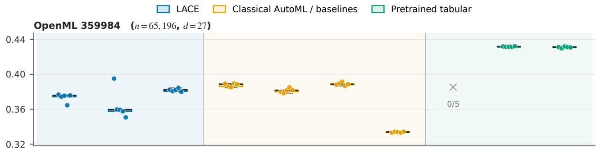

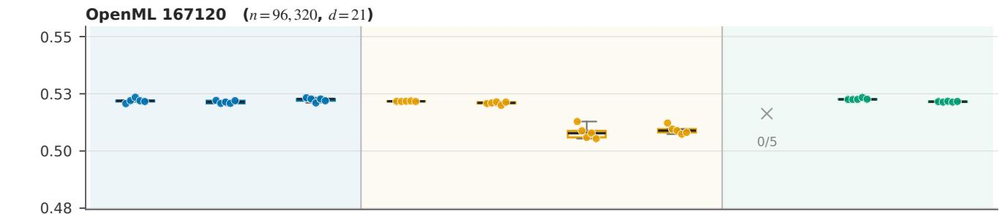

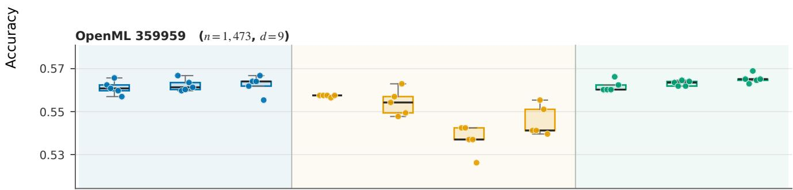

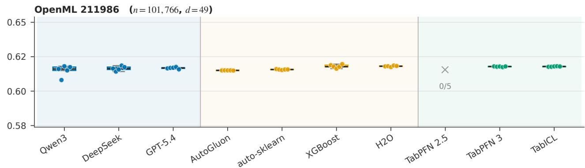  
Fi<sub>gure</sub> 11<sub>:</sub> Ofi<sub>c</sub>i<sub>a</sub>l<sub>-</sub>t<sub>es</sub>t <sub>accuracy</sub> di<sub>s</sub>t<sub>r</sub>ib<sub>u</sub>ti<sub>ons</sub> f<sub>or</sub> O<sub>pen</sub>ML t<sub>as</sub>k<sub>s</sub> 359984<sub>,</sub> 167120<sub>,</sub> 359959<sub>, an</sub>d 211986<sub>.</sub>

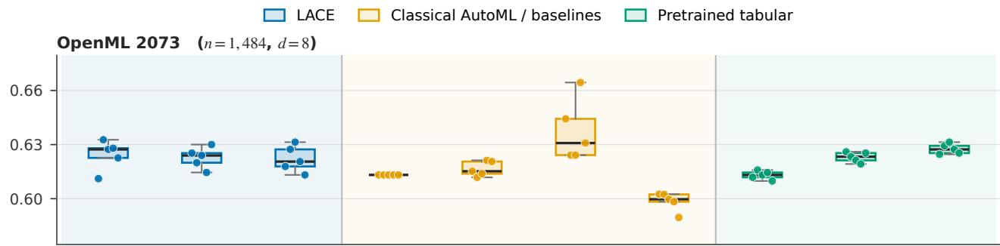

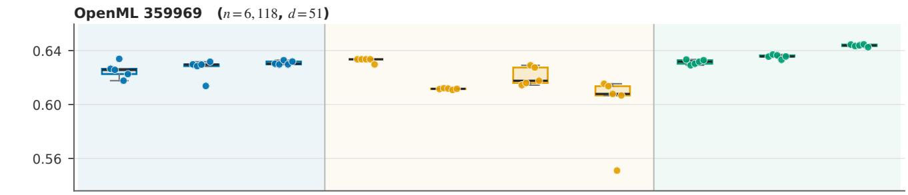

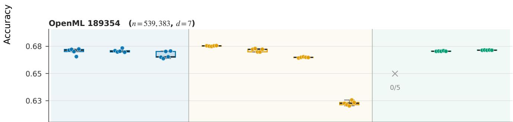

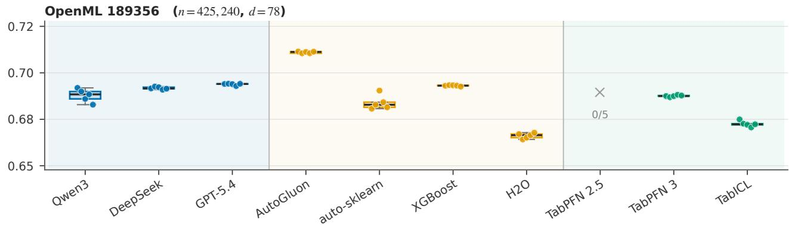  
Fi<sub>gure</sub> 12<sub>:</sub> Ofi<sub>c</sub>i<sub>a</sub>l<sub>-</sub>t<sub>es</sub>t <sub>accuracy</sub> di<sub>s</sub>t<sub>r</sub>ib<sub>u</sub>ti<sub>ons</sub> f<sub>or</sub> O<sub>pen</sub>ML t<sub>as</sub>k<sub>s</sub> 2073<sub>,</sub> 359969<sub>,</sub> 189354<sub>,</sub> <sub>an</sub>d 189356<sub>.</sub>

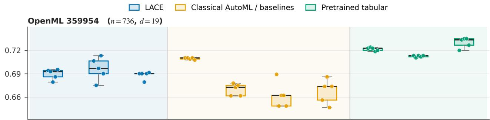

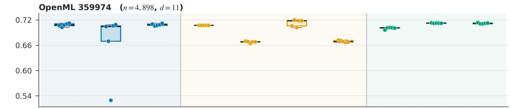

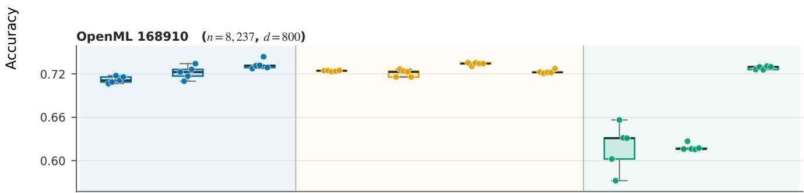

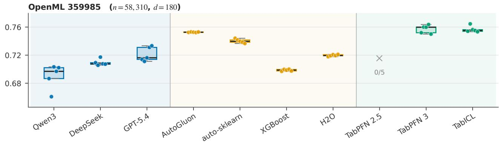  
Fi<sub>gure</sub> 13<sub>:</sub> Ofi<sub>c</sub>i<sub>a</sub>l<sub>-</sub>t<sub>es</sub>t <sub>accuracy</sub> di<sub>s</sub>t<sub>r</sub>ib<sub>u</sub>ti<sub>ons</sub> f<sub>or</sub> O<sub>pen</sub>ML t<sub>as</sub>k<sub>s</sub> 359954<sub>,</sub> 359974<sub>,</sub> 168910<sub>,</sub> <sub>an</sub>d 359985<sub>.</sub>

OpenML 10090 (n = 1, 500, d= 1, 000)  
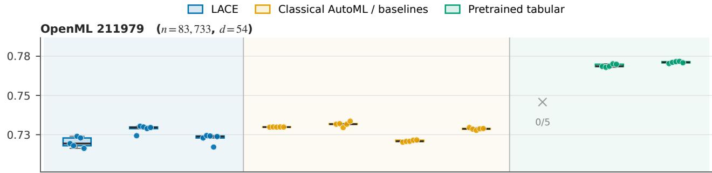

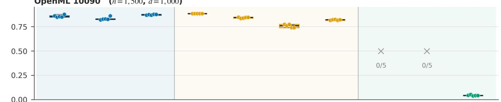

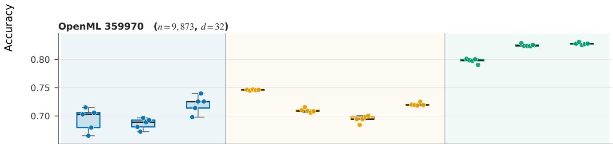

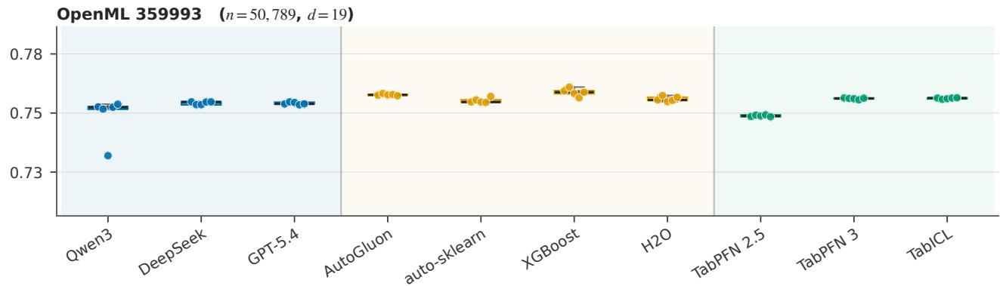  
Fi<sub>gu</sub>r<sub>e</sub> 14<sub>:</sub> Ofi<sub>c</sub>i<sub>a</sub>l<sub>-</sub>t<sub>es</sub>t <sub>accu</sub>r<sub>acy</sub> di<sub>s</sub>trib<sub>u</sub>ti<sub>o</sub>n<sub>s</sub> f<sub>o</sub>r O<sub>pe</sub>nML t<sub>as</sub>k<sub>s</sub> 211979<sub>,</sub> 10090<sub>,</sub> 359970<sub>,</sub> <sub>a</sub>nd 359993<sub>.</sub>

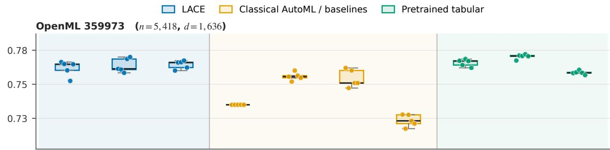

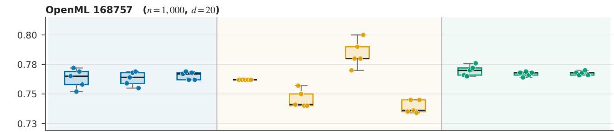

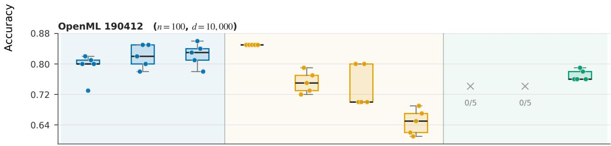

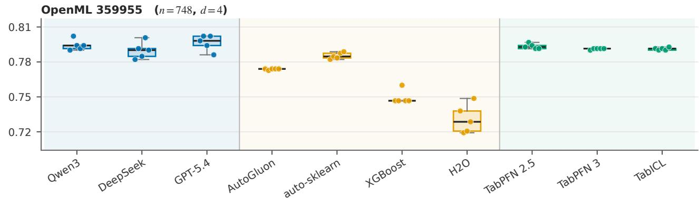  
Fi<sub>gure</sub> 15<sub>:</sub> Ofi<sub>c</sub>i<sub>a</sub>l<sub>-</sub>t<sub>es</sub>t <sub>accuracy</sub> di<sub>s</sub>t<sub>r</sub>ib<sub>u</sub>ti<sub>ons</sub> f<sub>or</sub> O<sub>pen</sub>ML t<sub>as</sub>k<sub>s</sub> 359973<sub>,</sub> 168757<sub>,</sub> 190412<sub>,</sub> <sub>an</sub>d 359955<sub>.</sub>

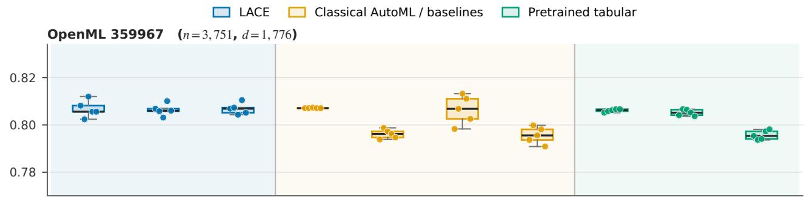

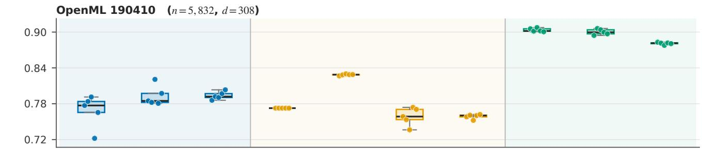

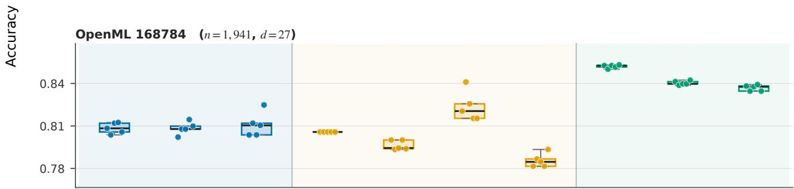

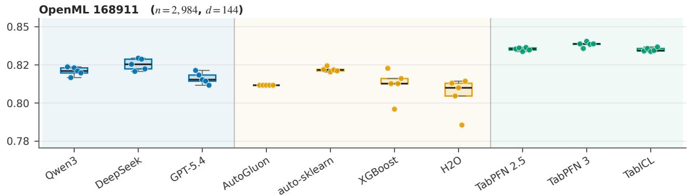  
Fi<sub>gure</sub> 16<sub>:</sub> Ofi<sub>c</sub>i<sub>a</sub>l<sub>-</sub>t<sub>es</sub>t <sub>accuracy</sub> di<sub>s</sub>t<sub>r</sub>ib<sub>u</sub>ti<sub>ons</sub> f<sub>or</sub> O<sub>pen</sub>ML t<sub>as</sub>k<sub>s</sub> 359967<sub>,</sub> 190410<sub>,</sub> 168784<sub>,</sub> <sub>an</sub>d 168911<sub>.</sub>

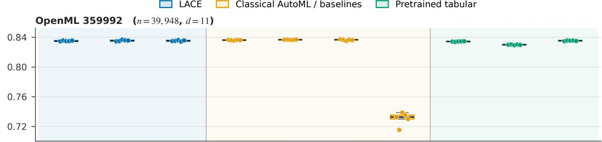

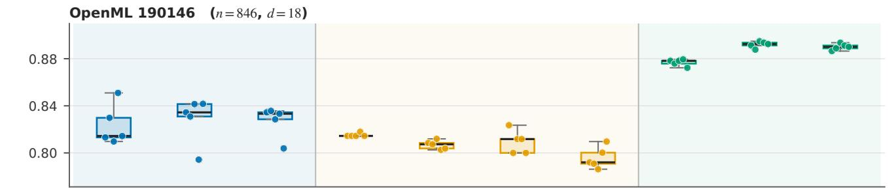

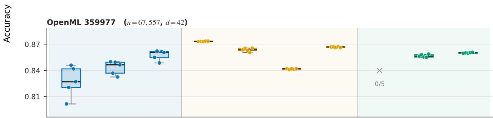

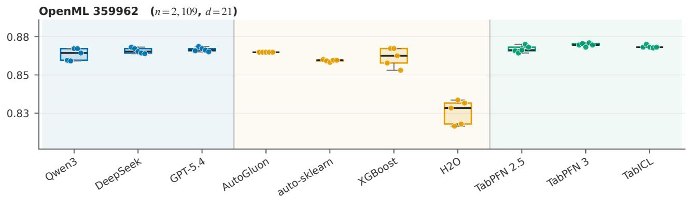  
Fi<sub>gure</sub> 17<sub>:</sub> Ofi<sub>c</sub>i<sub>a</sub>l<sub>-</sub>t<sub>es</sub>t <sub>accuracy</sub> di<sub>s</sub>t<sub>r</sub>ib<sub>u</sub>ti<sub>ons</sub> f<sub>or</sub> O<sub>pen</sub>ML t<sub>as</sub>k<sub>s</sub> 359992<sub>,</sub> 190146<sub>,</sub> 359977<sub>,</sub> <sub>an</sub>d 359962<sub>.</sub>

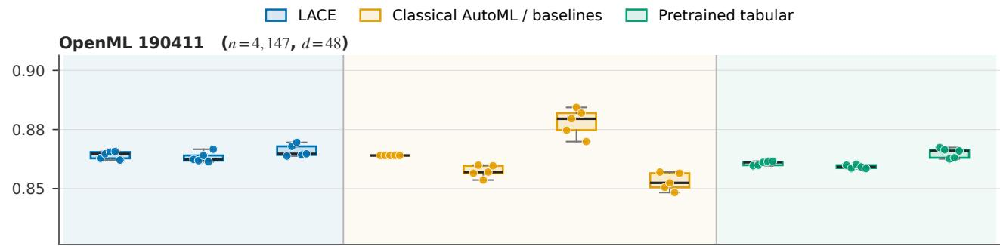

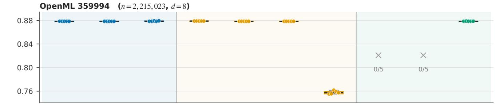

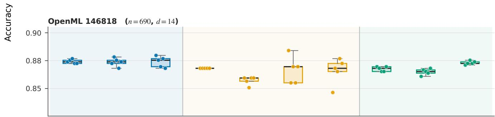

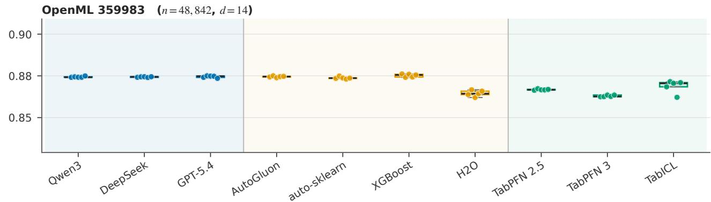  
Fi<sub>gure</sub> 18<sub>:</sub> Ofi<sub>c</sub>i<sub>a</sub>l<sub>-</sub>t<sub>es</sub>t <sub>accuracy</sub> di<sub>s</sub>t<sub>r</sub>ib<sub>u</sub>ti<sub>ons</sub> f<sub>or</sub> O<sub>pen</sub>ML t<sub>as</sub>k<sub>s</sub> 190411<sub>,</sub> 359994<sub>,</sub> 146818<sub>,</sub> <sub>an</sub>d 359983<sub>.</sub>

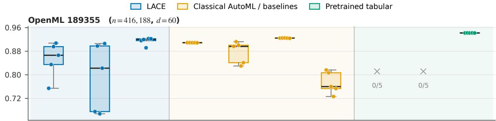

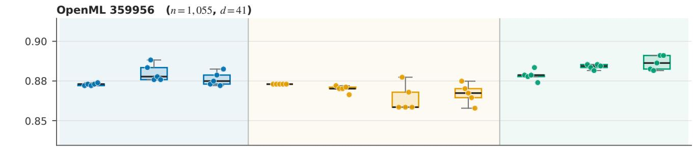

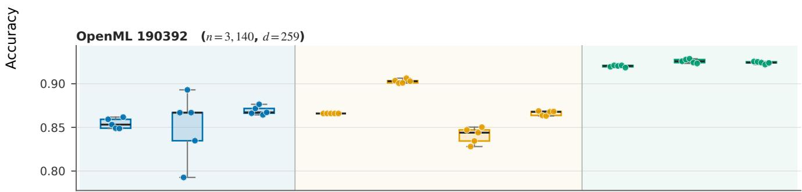

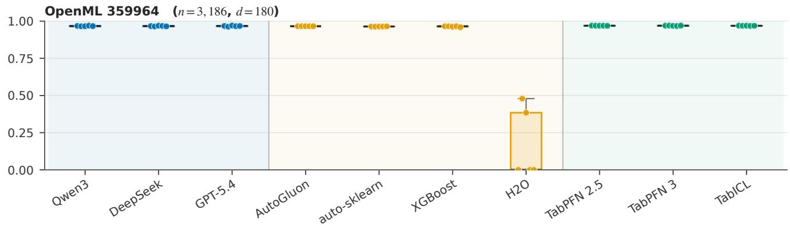  
Fi<sub>gure</sub> 19<sub>:</sub> Ofi<sub>c</sub>i<sub>a</sub>l<sub>-</sub>t<sub>es</sub>t <sub>accuracy</sub> di<sub>s</sub>t<sub>r</sub>ib<sub>u</sub>ti<sub>ons</sub> f<sub>or</sub> O<sub>pen</sub>ML t<sub>as</sub>k<sub>s</sub> 189355<sub>,</sub> 359956<sub>,</sub> 190392<sub>, an</sub>d 359964<sub>.</sub>

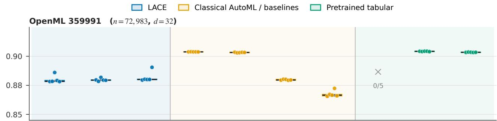

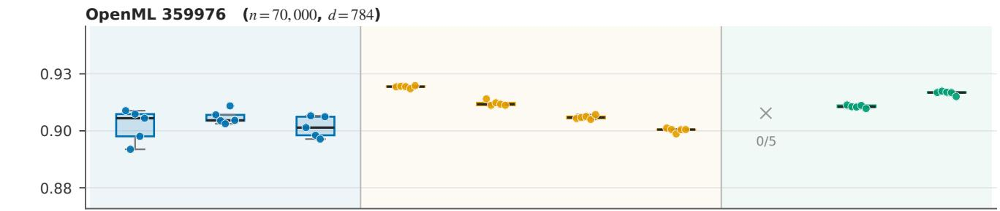

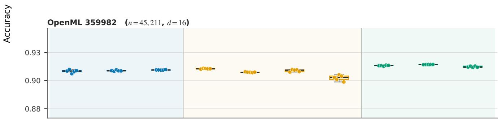

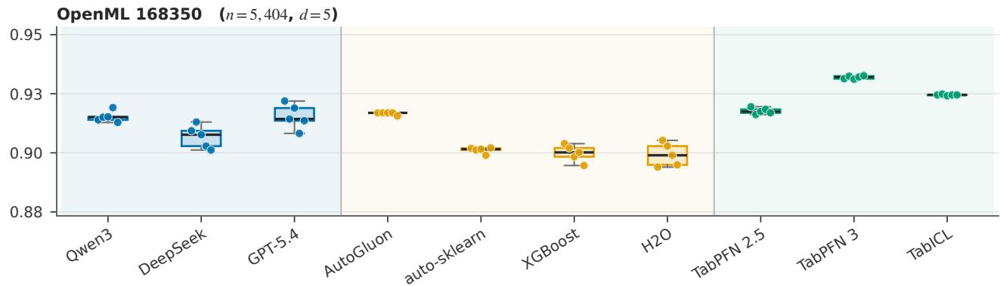  
Fi<sub>gu</sub>r<sub>e</sub> 20<sub>:</sub> Ofi<sub>c</sub>i<sub>a</sub>l<sub>-</sub>t<sub>es</sub>t <sub>accu</sub>r<sub>acy</sub> di<sub>s</sub>trib<sub>u</sub>ti<sub>o</sub>n<sub>s</sub> f<sub>o</sub>r O<sub>pe</sub>nML t<sub>as</sub>k<sub>s</sub> 359991<sub>,</sub> 359976<sub>,</sub> 359982<sub>, a</sub>nd 168350<sub>.</sub>

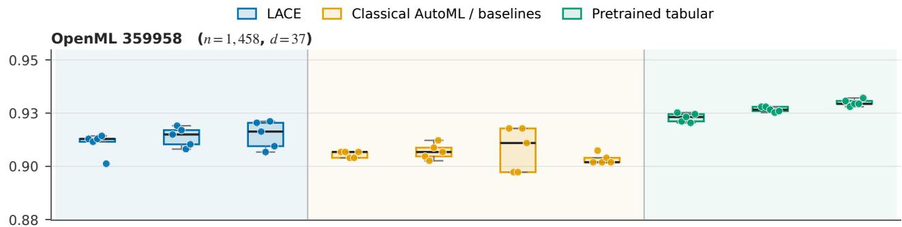

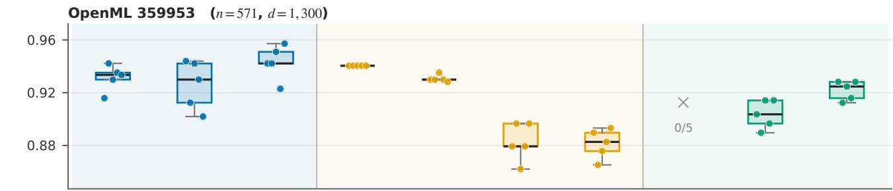

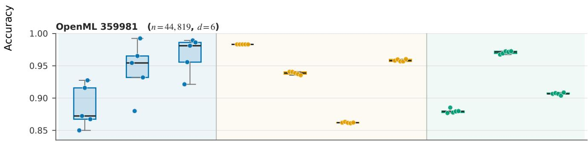

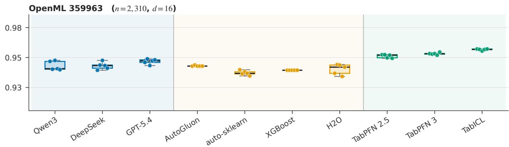  
Fi<sub>gu</sub>r<sub>e</sub> 21<sub>:</sub> Ofi<sub>c</sub>i<sub>a</sub>l<sub>-</sub>t<sub>es</sub>t <sub>accu</sub>r<sub>acy</sub> di<sub>s</sub>trib<sub>u</sub>ti<sub>o</sub>n<sub>s</sub> f<sub>o</sub>r O<sub>pe</sub>nML t<sub>as</sub>k<sub>s</sub> 359958<sub>,</sub> 359953<sub>,</sub> 359981<sub>,</sub> <sub>a</sub>nd 359963<sub>.</sub>

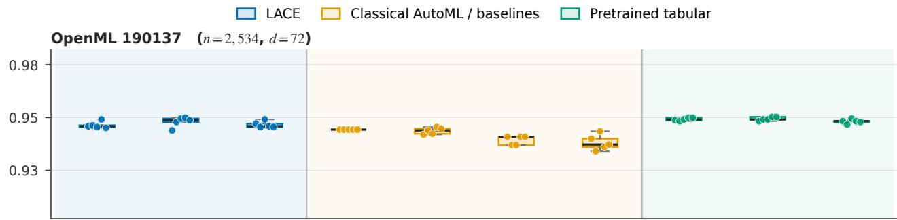

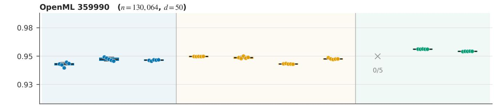

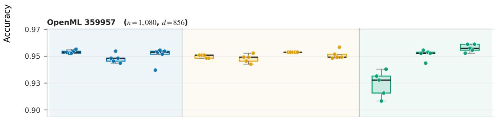

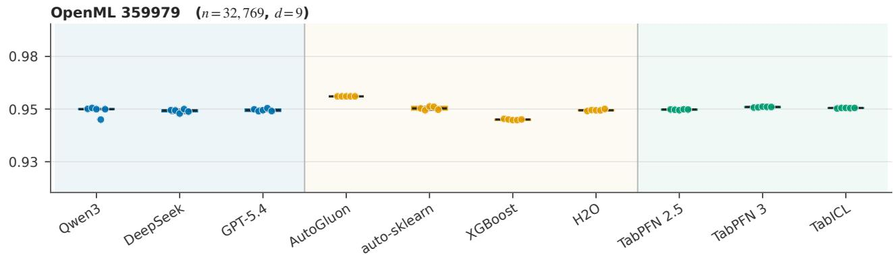  
Fi<sub>gu</sub>r<sub>e</sub> 22<sub>:</sub> Ofi<sub>c</sub>i<sub>a</sub>l<sub>-</sub>t<sub>es</sub>t <sub>accu</sub>r<sub>acy</sub> di<sub>s</sub>trib<sub>u</sub>ti<sub>o</sub>n<sub>s</sub> f<sub>o</sub>r O<sub>pe</sub>nML t<sub>as</sub>k<sub>s</sub> 190137<sub>,</sub> 359990<sub>,</sub> 359957<sub>,</sub> <sub>a</sub>nd 359979<sub>.</sub>

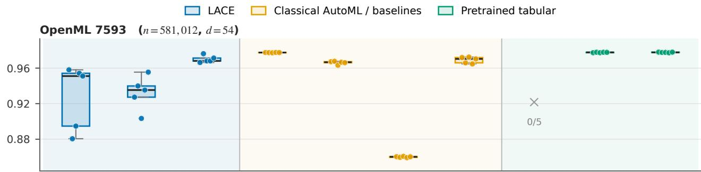

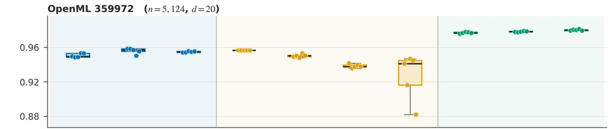

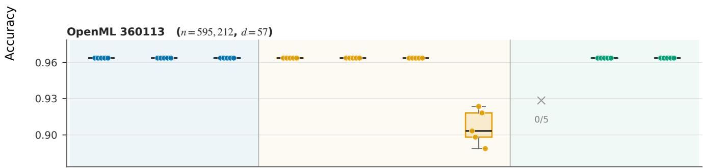

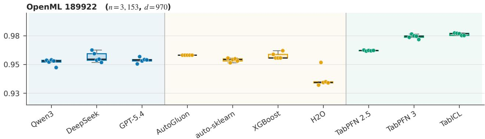  
Fi<sub>gure</sub> 23<sub>:</sub> Ofi<sub>c</sub>i<sub>a</sub>l<sub>-</sub>t<sub>es</sub>t <sub>accuracy</sub> di<sub>s</sub>t<sub>r</sub>ib<sub>u</sub>ti<sub>ons</sub> f<sub>or</sub> O<sub>pen</sub>ML t<sub>as</sub>k<sub>s</sub> 7593<sub>,</sub> 359972<sub>,</sub> 360113<sub>,</sub> <sub>an</sub>d 189922<sub>.</sub>

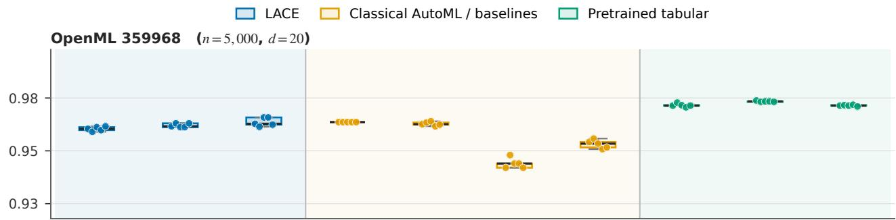

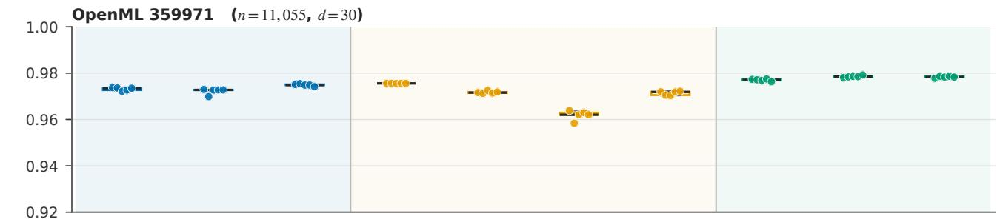

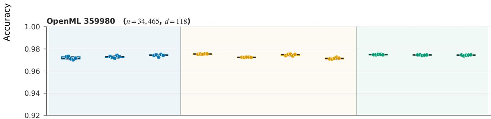

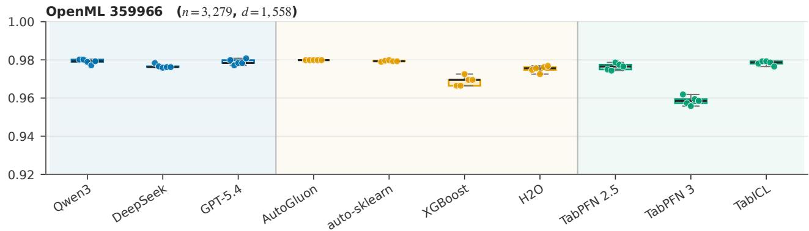  
Fi<sub>gu</sub>r<sub>e</sub> 24<sub>:</sub> Ofi<sub>c</sub>i<sub>a</sub>l<sub>-</sub>t<sub>es</sub>t <sub>accu</sub>r<sub>acy</sub> di<sub>s</sub>trib<sub>u</sub>ti<sub>o</sub>n<sub>s</sub> f<sub>o</sub>r O<sub>pe</sub>nML t<sub>as</sub>k<sub>s</sub> 359968<sub>,</sub> 359971<sub>,</sub> 359980<sub>, a</sub>nd 359966<sub>.</sub>

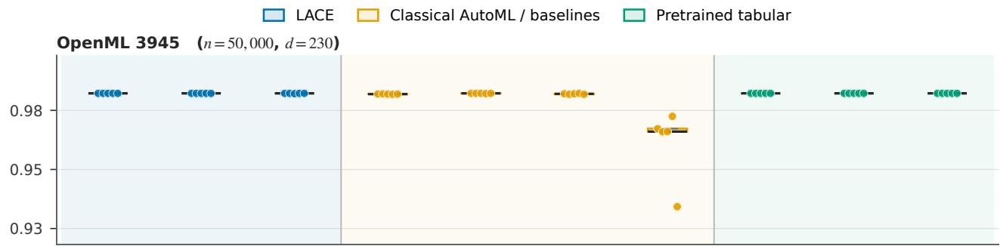

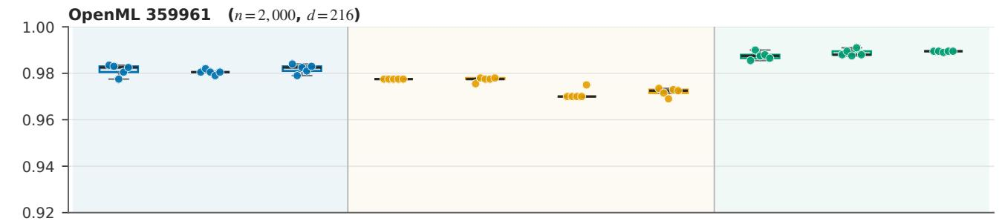

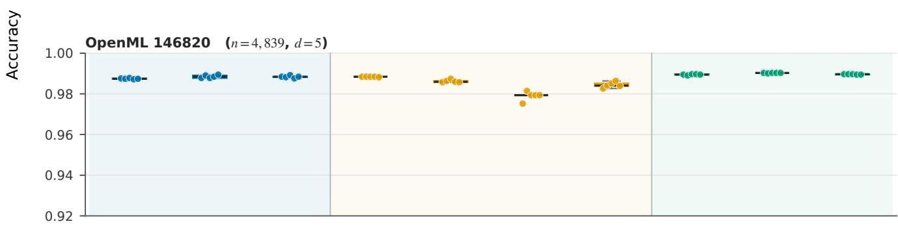

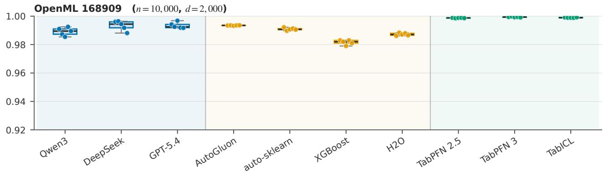  
Fi<sub>gure</sub> 25<sub>:</sub> Ofi<sub>c</sub>i<sub>a</sub>l<sub>-</sub>t<sub>es</sub>t <sub>accuracy</sub> di<sub>s</sub>t<sub>r</sub>ib<sub>u</sub>ti<sub>ons</sub> f<sub>or</sub> O<sub>pen</sub>ML t<sub>as</sub>k<sub>s</sub> 3945<sub>,</sub> 359961<sub>,</sub> 146820<sub>,</sub> <sub>an</sub>d 168909<sub>.</sub>

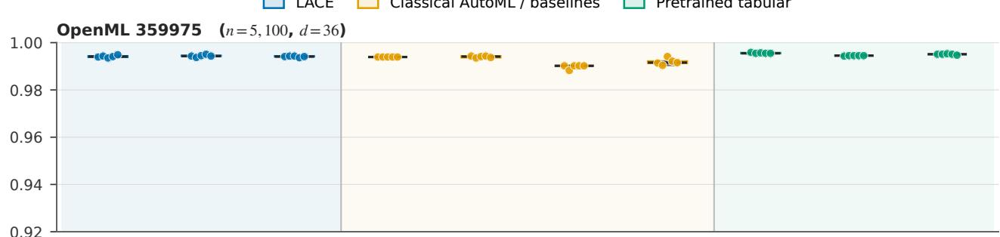

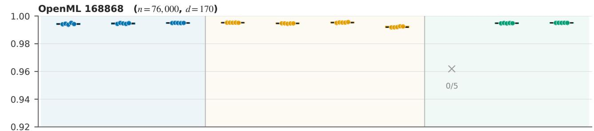

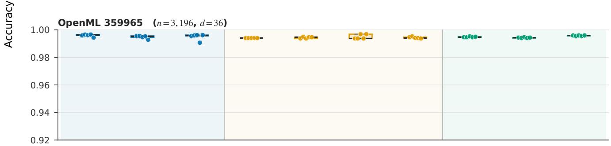

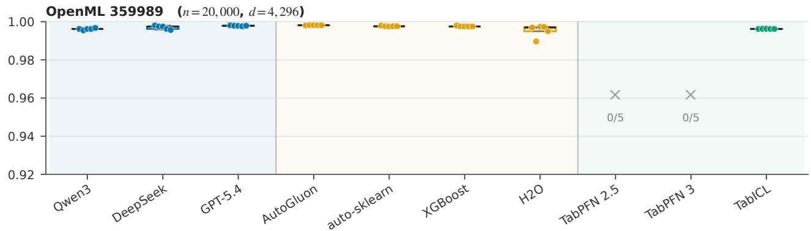  
Fi<sub>gure</sub> 26<sub>:</sub> Ofi<sub>c</sub>i<sub>a</sub>l<sub>-</sub>t<sub>es</sub>t <sub>accuracy</sub> di<sub>s</sub>t<sub>r</sub>ib<sub>u</sub>ti<sub>ons</sub> f<sub>or</sub> O<sub>pen</sub>ML t<sub>as</sub>k<sub>s</sub> 359975<sub>,</sub> 168868<sub>,</sub> 359965<sub>, an</sub>d 359989<sub>.</sub>

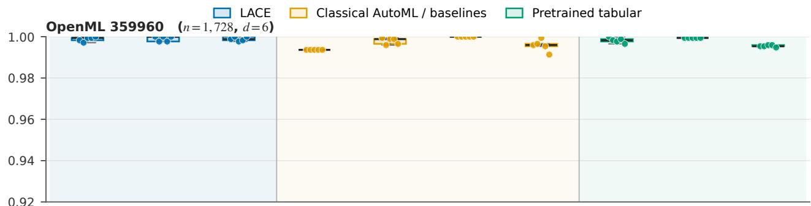

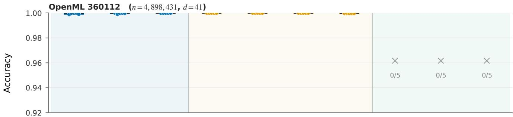

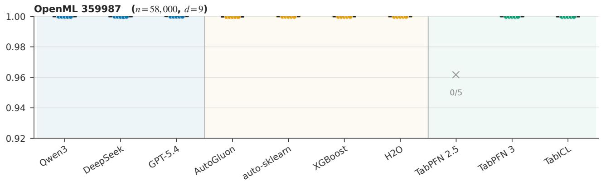  
Fi<sub>gure</sub> 27<sub>:</sub> Ofi<sub>c</sub>i<sub>a</sub>l<sub>-</sub>t<sub>es</sub>t <sub>accuracy</sub> di<sub>s</sub>t<sub>r</sub>ib<sub>u</sub>ti<sub>ons</sub> f<sub>or</sub> O<sub>pen</sub>ML t<sub>as</sub>k<sub>s</sub> 359960<sub>,</sub> 360112<sub>, an</sub>d 359987<sub>.</sub>

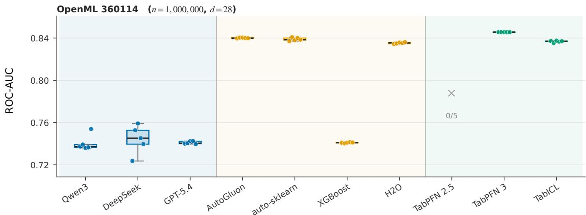  
Fi<sub>gure</sub> 28<sub>:</sub> Ofi<sub>c</sub>i<sub>a</sub>l<sub>-</sub>t<sub>es</sub>t ROC<sub>-</sub>AUC di<sub>s</sub>t<sub>r</sub>ib<sub>u</sub>ti<sub>ons</sub> f<sub>or</sub> O<sub>pen</sub>ML t<sub>as</sub>k 360114<sub>.</sub>