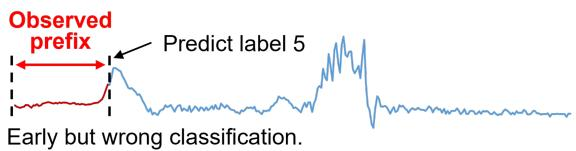
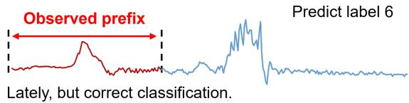
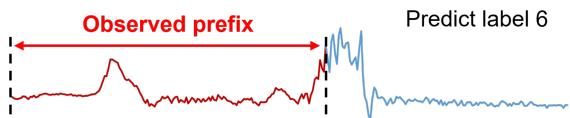
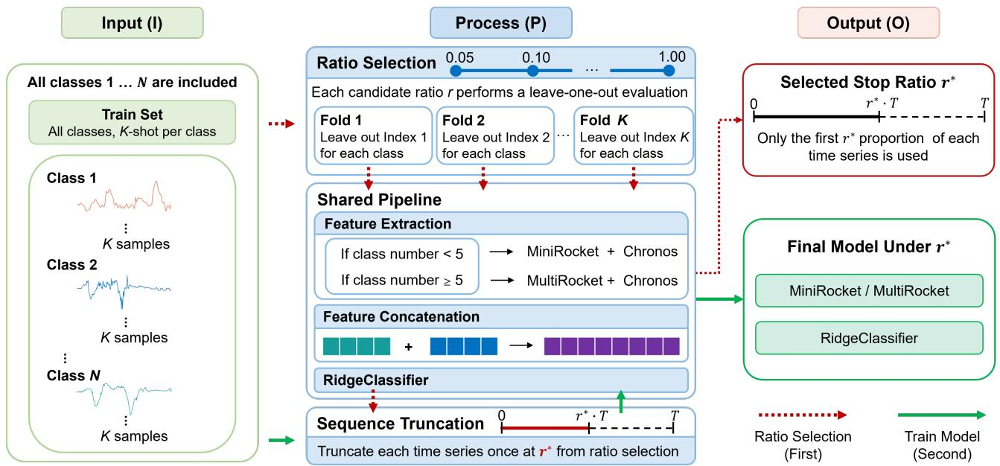
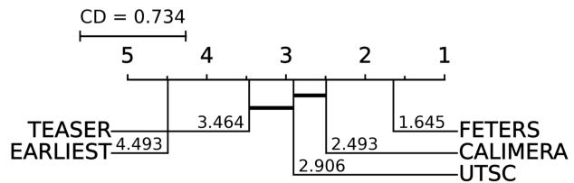
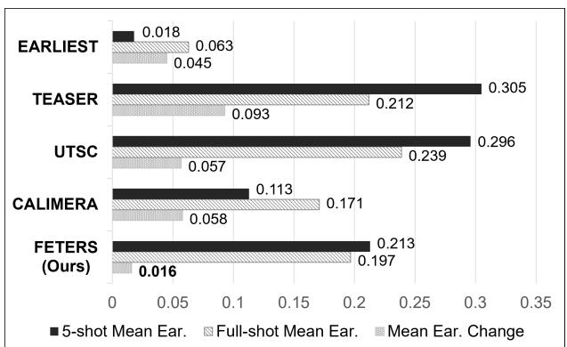

# FETERS: Few-Shot Early Time-Series Classification via Efective Ratio Selection

Chen-An Tai1, Yujia Wu1, Vincent S. Tseng1†

1Department of Computer Science, National Yang Ming Chiao Tung University, Taiwan †Corresponding author: vtseng@cs.nycu.edu.tw

## Abstract

Early time-series classification (ETSC) aims to make accurate predictions from partially observed time series as early as possible. Although various stopping mechanisms and feature learning strategies have been developed for ETSC, most existing methods assume access to suficient labeled training data, which may be unrealistic in applications with limited annotation. Under limited supervision, learning an additional sample-level stopping module and extracting efective classification features can both become challenging. In this paper, we propose FETERS, a few-shot ETSC framework that selects a dataset-level stopping ratio through class-wise leave-one-out (LOO) evaluation on the support set and uses a penalty-based reward function to manage the accuracy–earliness trade-of, thereby avoiding the need to train an additional stopping module. FETERS further combines Rocket-based features with frozen Chronos representations for classification. Extensive experiments on 69 public datasets spanning 14 domains show that FETERS achieves state-of-the-art (SOTA) performance in the 5-shot setting, with the highest average harmonic mean (HM) and the best HM on 38 datasets, while outperforming the current SOTA method on 44 datasets. FETERS also remains competitive in the full-shot setting, demonstrating its efectiveness in managing the accuracy–earliness trade-of.

## Introduction

Time series classification (TSC) aims to classify observations collected over time (Mohammadi Foumani et al. 2024). Early time series classification (ETSC) further seeks to make predictions from partial observations as early as possible while preserving classification accuracy. Figure 1 illustrates this accuracy–earliness trade-of. Existing methods commonly determine when to predict at the sample level using learned halting policies, confidence criteria, or estimates of future classification costs (Renault et al. 2025).

ETSC is relevant to time-sensitive domains such as healthcare, industrial monitoring, and human activity recognition (Gupta et al. 2020), where labeled time series data may be limited by costly annotation, specialized data collection, or rare target events (Liang et al. 2023; Shyalika et al. 2024). Although few-shot learning has received increasing attention in these domains (Serpush et al. 2022; Wang and Hong 2025; Li, Denison, and Zhu 2025), recent studies have primarily focused on conventional TSC rather than ETSC (Liu et al. 2025; Vettoruzzo, Bouguelia, and Rögnvaldsson 2025). Extending

## True Label: 6

  
Correct classification, but too late to stop.

Figure 1: Illustration of the accuracy–earliness trade-of in ETSC using a sample from the UCR Archive (Dau et al. 2019). Shorter observed prefixes yield earlier predictions and greater earliness.

ETSC to few-shot supervision introduces two challenges: First, modeling an additional sample-level stopping mechanism from a small support set increases the complexity of the learning problem and may make the resulting decisions sensitive to the sampled examples. Second, time-series datasets from diferent domains can exhibit substantially different temporal patterns, making it challenging to extract efective representations from partially observed prefixes.

To the best of our knowledge, ETSC under per-class fewshot supervision has not yet been systematically studied. Existing methods are primarily developed under full-data settings, leaving their behavior under limited supervision unclear. To investigate this setting, we propose FETERS, a few-shot ETSC framework that trades sample-level stopping flexibility for a simpler dataset-level ratio-selection problem. FETERS estimates candidate observation ratios through class-wise leave-one-out (LOO) evaluation on the support set and applies the selected ratio to all test samples from the same dataset. This formulation avoids estimating an additional stopping module from limited labeled data while retaining adaptation to dataset-specific temporal characteristics. FETERS further combines dataset-fitted Rocket features with frozen Chronos representations for prefix classification.

The main contributions of this work are summarized as follows:

• To the best of our knowledge, we present the first systematic study of ETSC under per-class few-shot supervision and evaluate representative ETSC methods across multiple shot settings.

• We propose a dataset-level ratio selection strategy that evaluates candidate observation ratios through supportset class-wise LOO evaluation and uses a penalty parameter to control the preferred accuracy–earliness trade-of, without requiring an additional learned stopping module.

• We combine dataset-fitted Rocket features with frozen Chronos representations for few-shot prefix classification. Extensive experiments on 69 datasets across 14 domains show that FETERS achieves the best average HM and HM rank among the evaluated methods in the 5-shot setting, while remaining competitive under full-shot supervision.

## Related Work

## Stopping Mechanisms

Existing stopping mechanisms can be broadly categorized as confidence-based, agent-based, and anticipation-based methods (Renault et al. 2025). Confidence-based methods stop according to the confidence of current predictions (Lv et al. 2019; Schäfer and Leser 2020; Lv et al. 2023; Yan et al. 2025), whereas agent-based methods learn whether to halt or continue as observations arrive (Hartvigsen et al. 2019, 2022; Huang, Yen, and Tseng 2024). Anticipation-based methods use non-myopic criteria that account for expected future predictions or the cost of waiting (Tavenard and Malinowski 2016; Achenchabe et al. 2021; Bilski and Jastrzębska 2023).

These methods are primarily developed under full-data supervision and generally make sample-level stopping decisions. FETERS instead selects a dataset-level observation ratio through support-set evaluation and applies it to all test samples from the same dataset. This formulation sacrifices sample-level flexibility but avoids learning an additional stopping module from a small support set.

## Feature Extraction

Both non-deep and deep feature extractors have been used in ETSC. Non-deep approaches include WEASEL (Lv et al. 2019; Schäfer and Leser 2020) and MiniRocketbased pipelines (Bilski and Jastrzębska 2023; Yan et al. 2025). WEASEL represents time-series subsequences as discrete words using Fourier-based representations (Schäfer and Leser 2017), whereas MiniRocket extracts convolution features using a largely fixed set of kernels with diferent dilations and biases (Dempster, Schmidt, and Webb 2021). Deep approaches use architectures such as FCN-Transformer combinations (Lv et al. 2023), directional LSTMs (Rußwurm et al. 2023), and CNN-LSTM models (Huang, Yen, and Tseng 2024) to learn representations from partial observations. Although these methods have proven efective in

ETSC, they were primarily developed in full-shot settings. Learning high-capacity representations directly from a small support set may be particularly challenging, especially when classification must be performed from partially observed prefixes (Wen et al. 2021).

Time-series foundation models provide another source of representations learned from large external corpora. Chronos is pretrained for probabilistic time-series forecasting and has demonstrated zero-shot generalization to unseen forecasting datasets (Ansari et al. 2024). This suggests that forecastingpretrained models may capture general temporal information. Recent studies have further explored the use of time-series foundation models in TSC (Zhuang et al. 2025; Liu et al. 2026). FETERS therefore combines dataset-fitted MiniRocket/MultiRocket (Tan et al. 2022) features with frozen Chronos representations and empirically evaluates the individual and combined contributions of these feature sources under both few-shot and full-shot supervision.

## Proposed Method

In this section, we introduce FETERS, a few-shot ETSC framework comprising two main components: ratio selection and hybrid feature extraction, which jointly manage the accuracy–earliness trade-of in few-shot ETSC.

## Problem Description

For each time-series dataset, let $\mathcal { N }$ denote the set of classes. For each class $c \in \mathcal N .$ , K labeled samples are selected to form the class-specific support set $\begin{array} { r l } { S _ { c } } & { { } = } \end{array}$ $\{ ( x _ { c } ^ { ( 1 ) } , y _ { c } ^ { ( 1 ) } ) , \dots , ( x _ { c } ^ { ( K ) } , y _ { c } ^ { ( K ) } ) \}$ , where $x _ { c } ^ { ( k ) }$ denotes the $k \mathrm { - }$ th time-series sample from class c and $y _ { c } ^ { ( k ) } ~ = ~ c .$ . The complete support set is defined as $\textstyle S \ = \bigcup _ { c \in { \mathcal { N } } } S _ { c }$ . Let $\mathcal { R } = \{ 0 . 0 5 , 0 . 1 0 , 0 . 1 5 , \ldots , 1 . 0 0 \}$ denote the set of candidate observation ratios. For a time-series sample x of length T, the prefix observed at ratio $r \in \mathcal { R }$ is defined as $\scriptstyle x _ { 1 : \operatorname* { m a x } ( 2 , \lfloor r T \rfloor ) }$ which is used for feature extraction and classification at ratio r. The goal is to select a dataset-level observation ratio that balances classification accuracy and earliness.

## Ratio Selection

Under limited labeled data, modeling an additional samplelevel stopping module increases the complexity of the learning problem and may make stopping decisions sensitive to the sampled support examples. FETERS instead adopts a dataset-level ratio selection strategy based on class-wise LOO evaluation over the support set. For each candidate ratio $r \in \mathcal { R }$ , FETERS evaluates the shared pipeline shown in Figure 2 on the support set through leave-one-out folds. The number of leave-one-out folds is determined by the number of shots K, with a maximum of 20 folds to control the computational cost in full-shot settings. In each fold, the samples with the same index i are held out from every class for evaluation whenever available, while the remaining support samples are used for training, where $i = 1 , \ldots , \operatorname* { m i n } ( \bar { K , 2 0 } )$ The classification accuracy is then averaged over all folds to estimate the performance of the ratio r.

Since accuracy alone does not account for earliness, which is a key objective in ETSC, we further apply a penalty-based reward function Eq. 1 to model the accuracy–earliness tradeof:

  
Figure 2: Overview of the FETERS framework. The figure illustrates the training workflow, where the red path first performs ratio selection and the green path then trains the shared pipeline using the selected ratio $r ^ { * }$ . During inference, test samples are truncated using $r ^ { * }$ and processed by the trained model following the same shared pipeline.

Algorithm 1: Ratio Selection Algorithm   
Input: Support set S, shot number K, number of classes $N$   
Parameter: Candidate ratios R, Mmax = 20, p   
Output: Selected stopping ratio $r ^ { * }$   
1: $M \gets \operatorname* { m i n } ( K , M _ { \operatorname* { m a x } } )$   
2: for $r \in \mathcal { R }$ do   
3: $A _ { r }  \emptyset$   
4: for $i = 1 , \ldots , M$ do   
5: $S _ { \mathrm { v a l } } ^ { i }  \emptyset$   
6: for ${ \mathrm { \Omega } } ^ { n = 1 , \dots , N }$ do   
7: $S _ { \mathrm { v a l } } ^ { i }  S _ { \mathrm { v a l } } ^ { i } \cup \{ ( x _ { n } ^ { i } , n ) \}$   
8: end for   
9: $S _ { \mathrm { t r a i n } } ^ { i }  S \setminus S _ { \mathrm { v a l } } ^ { i }$   
10: $S _ { \mathrm { t r a i n } } ^ { i , r } , S _ { \mathrm { v a l } } ^ { i , r }  \mathrm { T r u n c a t e } ( S _ { \mathrm { t r a i n } } ^ { i } , S _ { \mathrm { v a l } } ^ { i } , r )$   
11: Fit $P _ { r , i }$ on $S _ { \mathrm { t r a i r } } ^ { i , r }$   
12: $a _ { r , i } \gets \mathrm { A c c } ( P _ { r , i } , S _ { \mathrm { v a l } } ^ { i , r } )$   
13: $\mathcal { A } _ { r }  \mathcal { A } _ { r } \cup \{ a _ { r , i } \}$   
14: end for   
15: $\operatorname { A c c } ( r ) \gets$ mean $\left( \mathcal { A } _ { r } \right)$   
16: Rewar $| ( r ) \gets \mathrm { A c c } ( \dot { r } ) ( 1 - 0 . 9 5 r ^ { p } )$   
17: end for   
18: $r ^ { * }  \mathrm { a r g }$ maxr∈R Reward(r)   
19: return $r ^ { * }$

$$
\begin{array} { r l } & { \mathrm { R e w a r d } ( r ) = \mathrm { A c c } ( r ) \left( 1 - 0 . 9 5 r ^ { p } \right) , } \\ & { \quad \quad r ^ { * } = \arg \underset { r \in \mathcal { R } } { \operatorname* { m a x } } \mathrm { R e w a r d } ( r ) , } \end{array}\tag{1}
$$

where $\operatorname { A c c } ( r )$ denotes the classification accuracy averaged across support-set folds, and $p$ controls how strongly later decisions are penalized. Smaller values of p impose a stronger relative penalty at early and intermediate ratios, whereas larger values reduce the penalty on delayed decisions and therefore tend to favor later predictions with higher accuracy. The coeficient 0.95 keeps the penalty factor positive at $r =$ 1.0.

Algorithm 1 summarizes the ratio selection procedure, where $P _ { r , i }$ denotes the shared pipeline and Truncate $( \cdot , \cdot , r )$ denotes prefix truncation at ratio r. The selected ratio $r ^ { * }$ is then used to truncate the support samples for training the final classifier and the test samples for inference, thereby controlling the accuracy–earliness trade-of for the dataset.

## Feature Extraction

In ETSC, prefixes observed at diferent ratios may exhibit distinct temporal characteristics, making efective feature extraction particularly important for accurate classification. FETERS extracts two types of features from each observed prefix: Rocket-based and Chronos-based features.

Previous ETSC studies have also adopted architectures in which multiple feature extraction modules serve distinct roles rather than relying on a single feature extractor (Lv et al. 2023; Huang, Yen, and Tseng 2024). In FETERS, Rocketbased feature extraction provides eficient convolution-based representations, while Chronos-based feature extraction provides additional temporal representations from a time-series foundation model, ofering an additional general feature source beyond the Rocket-based extractor. The two feature vectors are then concatenated and used as the final representation for RidgeClassifier.

For Rocket-based feature extraction, we apply a fixed class-count rule across all datasets: MiniRocket (Dempster, Schmidt, and Webb 2021) is used when the number of classes is fewer than five, and MultiRocket (Tan et al. 2022) is used otherwise. This rule was selected from an eficiency–efectiveness analysis comparing the two extractors across class-count groups rather than through datasetspecific tuning. The selected extractor is fitted on the truncated support samples and subsequently applied to both support and test prefixes. For Chronos-based feature extraction, we use the pretrained Chronos model (Ansari et al. 2024) as a frozen feature encoder. Chronos yields a fixed-dimensional representation for each observed prefix. The Rocket and Chronos representations are concatenated, and RidgeClassifier is fitted on the resulting support-set features at the selected ratio r∗, and then used to classify test samples truncated at the same ratio.

## Experiments

## Experimental Setup

Datasets We evaluate our method on 69 datasets from the UCR Time Series Archive (Dau et al. 2019), spanning 14 UCR-defined domains. This includes 45 classical ETSC benchmark datasets widely used in prior studies (Lv et al. 2019; Schäfer and Leser 2020; Bilski and Jastrzębska 2023; Lv et al. 2023; Yan et al. 2025), covering 6 domains: Image, Sensor, Motion, Spectro, ECG, and Simulated. We further include 24 additional datasets from another 8 domains: Device, Hemodynamics, EOG, EPG, Power, Spectrum, Trafic, and Trajectory, allowing us to evaluate our method across a broader range of time-series domains.

Evaluation Metrics We evaluate ETSC performance using three metrics: accuracy, earliness, and harmonic mean (HM, Eq. 2). Accuracy measures classification correctness, while earliness measures the proportion of time series observed before a prediction is made; smaller values indicate earlier predictions. HM jointly evaluates accuracy and earliness, where larger values indicate a better trade-of.

$$
{ \mathrm { H M } } = { \frac { 2 \cdot { \mathrm { A c c u r a c y } } \cdot ( 1 - { \mathrm { E a r l i n e s s } } ) } { { \mathrm { A c c u r a c y } } + ( 1 - { \mathrm { E a r l i n e s s } } ) } }\tag{2}
$$

Baselines We compare FETERS with four representative ETSC methods, including classical benchmark methods and recent state-of-the-art approaches. (1) EARLIEST (Hartvigsen et al. 2019) jointly trains a recurrent classifier and a reinforcement learning controller, with λ balancing accuracy and earliness. (2) TEASER (Schäfer and Leser 2020) uses a classifier for early prediction and a one-class SVM to determine whether the prediction is suficiently reliable based on its confidence. (3) CALIMERA (Bilski and Jastrzębska 2023) uses calibrated probabilities to estimate classification costs and regression to predict whether waiting will reduce those costs. (4) UTSC (Yan et al. 2025) uses an Uncertainty Probability Decoder and a reweighting mechanism to model uncertainty, with a threshold δ to determine whether a prediction is suficiently reliable.

For consistency and reproducibility, we use the available implementations and the hyperparameter settings recommended in the original studies. Under the full-shot setting, each method is evaluated once using the configuration recommended in its original study. In few-shot settings, the same fixed configurations are applied without dataset-specific retuning, and all methods use the same random seeds. In the 5-shot setting, all methods are evaluated over 100 runs with seeds ranging from 40 to 139, and the results are averaged across runs.

<table><tr><td rowspan="2">Method</td><td colspan="3">5-shot</td><td colspan="3">Full-shot</td></tr><tr><td>Acc. ↑</td><td>Ear. ↓</td><td>Wins</td><td>Acc. ↑</td><td>Ear.↓</td><td>Wins</td></tr><tr><td>EARLIEST</td><td>0.289</td><td>0.018</td><td>0</td><td>0.341</td><td>0.063</td><td>1</td></tr><tr><td>TEASER</td><td>0.599</td><td>0.305</td><td>26</td><td>0.671</td><td>0.212</td><td>13</td></tr><tr><td>UTSC</td><td>0.611</td><td>0.296</td><td>15</td><td>0.701</td><td>0.239</td><td>18</td></tr><tr><td>CALIMERA</td><td>0.536</td><td>0.113</td><td>4</td><td>0.702</td><td>0.171</td><td>22</td></tr><tr><td>FETERS (Ours)</td><td>0.628</td><td>0.213</td><td>26</td><td>0.725</td><td>0.197</td><td>22</td></tr></table>

Table 1: Average accuracy, earliness, and number of datasets with the highest accuracy in the 5-shot and full-shot settings.

  
Figure 3: Critical diference diagram of HM in 5-shot setting.

## Overall Performance Comparison

Accuracy and Earliness As shown in Table 1, FETERS achieves the highest average accuracy in both settings, reaching 62.8% in the 5-shot setting and 72.5% in the full-shot setting, and records 26 and 22 dataset-level accuracy wins, respectively.

HM As shown in Table 2, FETERS achieves the highest average HM in both settings, reaching 0.679 in the 5-shot setting and 0.749 in the full-shot setting. It achieves the best HM on 38 and 30 of the 69 datasets in the 5-shot and fullshot settings, respectively. Pairwise, FETERS outperforms CALIMERA on 44 datasets in the 5-shot setting, whereas the two methods remain statistically indistinguishable under full-shot supervision. These results indicate that FETERS provides the strongest overall accuracy–earliness trade-of among the evaluated methods under the 5-shot protocol while remaining competitive with established methods when full training data are available.

Statistical Significance Friedman tests followed by post hoc Nemenyi comparisons (Demšar 2006) are used to assess diferences in HM ranks across datasets. As shown in Figure 3, FETERS achieves the best average HM rank in the 5-shot setting and is significantly better than all four evaluated baselines at α = 0.05. Pairwise Wilcoxon signed-rank tests (Wilcoxon 1945) for with the Holm correction yield the same conclusion for 5-shot HM, including a significant diference against CALIMERA. Under full-shot supervision, however, FETERS and CALIMERA are not significantly different.

<table><tr><td></td><td rowspan=2 colspan=2>Dataset</td><td rowspan=1 colspan=8>5-shot HM</td><td rowspan=1 colspan=9>Full-shot HM</td></tr><tr><td></td><td rowspan=1 colspan=8>EARLIEST TEASERUTSCCALIMERA FETERS</td><td rowspan=1 colspan=9>EARLIESTTEASERUTSCCALIMERA FETERS</td></tr><tr><td></td><td rowspan=2 colspan=2>FiftyWordsAdiacBeef</td><td rowspan=1 colspan=1></td><td rowspan=1 colspan=8>0.069     0.555  0.532    0.476     0.5710.128     0.724  0.728    0.747      0.743</td><td rowspan=1 colspan=9>0.241      0.661   0.667    0.668     0.6710.064     0.745  0.753    0.771     0.748</td></tr><tr><td></td><td rowspan=1 colspan=8>0.360     0.657  0.627    0.787      0.873</td><td rowspan=1 colspan=9>0.331     0.709  0.664    0.805     0.925</td></tr><tr><td></td><td rowspan=1 colspan=2>CBFChlorineConc.</td><td rowspan=1 colspan=8>0.545     0.231   0.788    0.811      0.8080.471     0.329  0.340    0.508     0.499</td><td rowspan=1 colspan=8>0.495     0.645   0.809    0.8260.699     0.688  0.728    0.718</td><td rowspan=1 colspan=1>0.8140.737</td></tr><tr><td></td><td rowspan=1 colspan=2>CinCECGTorso</td><td rowspan=1 colspan=8>0.404     0.784  0.735    0.727     0.736</td><td rowspan=1 colspan=8>0.409     0.859  0.792    0.814</td><td rowspan=1 colspan=1>0.790</td></tr><tr><td></td><td rowspan=3 colspan=2>CoffeeCricketXCricketY</td><td rowspan=1 colspan=8>0.641     0.719  0.840    0.841     0.847</td><td rowspan=1 colspan=8>0.461     0.807  0.930    0.929</td><td rowspan=1 colspan=1>0.889</td></tr><tr><td></td><td rowspan=2 colspan=8>0.227     0.491  0.540    0.414     0.5950.217     0.483  0.535    0.419     0.593</td><td rowspan=2 colspan=8>0.257     0.652  0.610    0.6990.281     0.695  0.713    0.716</td><td rowspan=1 colspan=1>0.675</td></tr><tr><td></td><td rowspan=1 colspan=1>0.715</td></tr><tr><td></td><td rowspan=1 colspan=2>CricketZ</td><td rowspan=1 colspan=8>0.241     0.493   0.541    0.379     0.606</td><td rowspan=1 colspan=6>0.254     0.672  0.680</td><td rowspan=1 colspan=2>0.711</td><td rowspan=1 colspan=1>0.702</td></tr><tr><td rowspan=4 colspan=1>DECGEF</td><td rowspan=3 colspan=2>iatomSizeRed200CGFiveDays</td><td rowspan=1 colspan=8>0.472     0.816  0.773    0.883     0.884</td><td rowspan=1 colspan=6>0.460     0.856  0.839</td><td rowspan=1 colspan=2>0.892</td><td rowspan=1 colspan=1>0.896</td></tr><tr><td rowspan=1 colspan=8>0.666     0.696  0.744    0.789     0.774</td><td rowspan=1 colspan=3>0.773     0.840</td><td rowspan=1 colspan=3>0.851</td><td rowspan=1 colspan=2>0.878</td><td rowspan=1 colspan=1>0.857</td></tr><tr><td rowspan=1 colspan=8>0.680     0.651   0.752    0.773     0.758</td><td rowspan=1 colspan=3>0.694     0.725</td><td rowspan=1 colspan=3>0.800</td><td rowspan=1 colspan=2>0.807</td><td rowspan=1 colspan=1>0.826</td></tr><tr><td rowspan=1 colspan=2>aceAll</td><td rowspan=1 colspan=8>0.345     0.601   0.758    0.766     0.728</td><td rowspan=1 colspan=3>0.411     0.814</td><td rowspan=1 colspan=3>0.792</td><td rowspan=1 colspan=2>0.850</td><td rowspan=1 colspan=1>0.831</td></tr><tr><td rowspan=3 colspan=3>FaceFourFacesUCRFish</td><td rowspan=1 colspan=8>0.364     0.680  0.826    0.817     0.820</td><td rowspan=1 colspan=3>0.431     0.670</td><td rowspan=1 colspan=3>0.835</td><td rowspan=1 colspan=2>0.832</td><td rowspan=1 colspan=1>0.836</td></tr><tr><td rowspan=1 colspan=8>0.202     0.661   0.690    0.692     0.679</td><td rowspan=1 colspan=3>0.300     0.775</td><td rowspan=1 colspan=3>0.720</td><td rowspan=1 colspan=2>0.763</td><td rowspan=1 colspan=1>0.750</td></tr><tr><td rowspan=1 colspan=8>0.260     0.717  0.739    0.721     0.752</td><td rowspan=1 colspan=3>0.228     0.824</td><td rowspan=1 colspan=2>0.820</td><td rowspan=1 colspan=1></td><td rowspan=1 colspan=2>0.859</td><td rowspan=1 colspan=1>0.825</td></tr><tr><td rowspan=1 colspan=1></td><td rowspan=1 colspan=2>GunPoint</td><td rowspan=1 colspan=8>0.668     0.709  0.725    0.681      0.754</td><td rowspan=1 colspan=3>0.651     0.800</td><td rowspan=1 colspan=2>0.780</td><td rowspan=1 colspan=1></td><td rowspan=1 colspan=2>0.832</td><td rowspan=1 colspan=1>0.785</td></tr><tr><td rowspan=2 colspan=1>In</td><td rowspan=2 colspan=2>HapticslineSkate</td><td rowspan=1 colspan=8>0.340     0.424  0.348    0.445     0.437</td><td rowspan=1 colspan=5>0.360     0.500  0.525</td><td rowspan=1 colspan=1></td><td rowspan=1 colspan=2>0.571</td><td rowspan=2 colspan=1>0.5750.550</td></tr><tr><td rowspan=1 colspan=8>0.260     0.431  0.324    0.401     0.444</td><td rowspan=1 colspan=5>0.269     0.543  0.477</td><td rowspan=1 colspan=1></td><td rowspan=1 colspan=2>0.486</td></tr><tr><td rowspan=1 colspan=1></td><td rowspan=1 colspan=2>ItalyPowerDem.</td><td rowspan=1 colspan=2>0.702     0.524</td><td rowspan=1 colspan=2>0.653</td><td rowspan=1 colspan=4>0.700     0.739</td><td rowspan=1 colspan=6>0.760     0.721   0.710</td><td rowspan=1 colspan=2>0.714</td><td rowspan=1 colspan=1>0.745</td></tr><tr><td rowspan=1 colspan=1>Lightning</td><td rowspan=1 colspan=2>2</td><td rowspan=1 colspan=2>0.696     0.633</td><td rowspan=1 colspan=2>0.637</td><td rowspan=1 colspan=4>0.677     0.656</td><td rowspan=1 colspan=6>0.695     0.767  0.703</td><td rowspan=1 colspan=2>0.702</td><td rowspan=1 colspan=1>0.776</td></tr><tr><td rowspan=3 colspan=1>Lightning</td><td rowspan=2 colspan=2>7Mallat</td><td rowspan=1 colspan=2>0.291     0.515</td><td rowspan=1 colspan=2>0.516</td><td rowspan=1 colspan=4>0.424     0.510</td><td rowspan=1 colspan=6>0.383     0.567  0.608</td><td rowspan=1 colspan=2>0.545</td><td rowspan=1 colspan=1>0.632</td></tr><tr><td rowspan=1 colspan=2>0.225     0.575</td><td rowspan=1 colspan=6>0.641    0.639     0.644</td><td rowspan=1 colspan=6>0.220     0.607   0.660</td><td rowspan=1 colspan=2>0.681</td><td rowspan=1 colspan=1>0.662</td></tr><tr><td rowspan=1 colspan=2>MedicalImages</td><td rowspan=1 colspan=1>0.205</td><td rowspan=1 colspan=1>0.469</td><td rowspan=1 colspan=6>0.496    0.566     0.568</td><td rowspan=1 colspan=3>0.675     0.742</td><td rowspan=1 colspan=3>0.728</td><td rowspan=1 colspan=2>0.775</td><td rowspan=1 colspan=1>0.769</td></tr><tr><td rowspan=3 colspan=1>NIFECGThoraxOl</td><td rowspan=1 colspan=2>MoteStrain</td><td rowspan=1 colspan=1>0.792</td><td rowspan=1 colspan=1>0.739</td><td rowspan=1 colspan=6>0.813    0.834     0.836</td><td rowspan=1 colspan=2>0.644</td><td rowspan=1 colspan=1>0.843</td><td rowspan=1 colspan=3>0.833</td><td rowspan=1 colspan=2>0.855</td><td rowspan=1 colspan=1>0.877</td></tr><tr><td rowspan=2 colspan=2>1iveOil</td><td rowspan=1 colspan=1>0.093</td><td rowspan=1 colspan=1>0.851</td><td rowspan=1 colspan=6>0.825    0.849     0.849</td><td rowspan=1 colspan=2>0.172</td><td rowspan=1 colspan=1>0.888</td><td rowspan=1 colspan=3>0.889</td><td rowspan=1 colspan=2>0.912</td><td rowspan=1 colspan=1>0.909</td></tr><tr><td rowspan=1 colspan=1>0.424</td><td rowspan=1 colspan=1>0.869</td><td rowspan=1 colspan=6>0.876    0.891     0.874</td><td rowspan=1 colspan=2>0.571</td><td rowspan=1 colspan=1>0.913</td><td rowspan=1 colspan=2>0.890</td><td rowspan=1 colspan=1></td><td rowspan=1 colspan=1>0.917</td><td rowspan=1 colspan=1></td><td rowspan=1 colspan=1>0.875</td></tr><tr><td rowspan=1 colspan=1>O</td><td rowspan=1 colspan=2>SULeaf</td><td rowspan=1 colspan=1>0.296</td><td rowspan=1 colspan=1>0.569</td><td rowspan=1 colspan=6>0.559    0.536     0.650</td><td rowspan=1 colspan=2>0.333</td><td rowspan=1 colspan=1>0.711</td><td rowspan=1 colspan=2>0.758</td><td rowspan=1 colspan=1></td><td rowspan=1 colspan=1>0.762</td><td rowspan=1 colspan=1></td><td rowspan=1 colspan=1>0.797</td></tr><tr><td rowspan=3 colspan=1>NIFECGThoraxSonyAIBORSSonyAIBORS</td><td rowspan=1 colspan=2>2</td><td rowspan=1 colspan=1>0.133</td><td rowspan=1 colspan=1>0.882</td><td rowspan=1 colspan=6>0.868    0.884      0.877</td><td rowspan=1 colspan=2>0.386</td><td rowspan=1 colspan=1>0.926</td><td rowspan=1 colspan=2>0.917</td><td rowspan=1 colspan=1></td><td rowspan=1 colspan=1>0.926</td><td rowspan=1 colspan=1></td><td rowspan=1 colspan=1>0.930</td></tr><tr><td rowspan=1 colspan=2>1</td><td rowspan=1 colspan=1>0.809</td><td rowspan=1 colspan=1>0.734</td><td rowspan=1 colspan=6>0.754    0.867      0.872</td><td rowspan=1 colspan=2>0.594</td><td rowspan=1 colspan=1>0.803</td><td rowspan=1 colspan=2>0.755</td><td rowspan=1 colspan=1></td><td rowspan=1 colspan=1>0.859</td><td rowspan=1 colspan=1></td><td rowspan=1 colspan=1>0.897</td></tr><tr><td rowspan=1 colspan=2>2</td><td rowspan=1 colspan=1>0.715</td><td rowspan=1 colspan=1>0.720</td><td rowspan=1 colspan=2>0.771</td><td rowspan=1 colspan=4>0.797     0.803</td><td rowspan=1 colspan=2>0.753</td><td rowspan=1 colspan=1>0.785</td><td rowspan=1 colspan=2>0.759</td><td rowspan=1 colspan=1></td><td rowspan=1 colspan=1>0.816</td><td rowspan=1 colspan=1></td><td rowspan=1 colspan=1>0.794</td></tr><tr><td></td><td rowspan=1 colspan=2>StarLightCurv.</td><td rowspan=1 colspan=1>0.673</td><td rowspan=1 colspan=1>0.840</td><td rowspan=1 colspan=1>0.835</td><td rowspan=1 colspan=1></td><td rowspan=1 colspan=4>0.834      0.841</td><td rowspan=1 colspan=1>0.898</td><td rowspan=1 colspan=1></td><td rowspan=1 colspan=1>0.926</td><td rowspan=1 colspan=2>0.911</td><td rowspan=1 colspan=1></td><td rowspan=1 colspan=1>0.939</td><td rowspan=1 colspan=1></td><td rowspan=1 colspan=1>0.917</td></tr><tr><td></td><td rowspan=3 colspan=2>SwedishLeafSymbolsSyntheticCtrl.</td><td rowspan=1 colspan=1>0.207</td><td rowspan=1 colspan=1>0.732</td><td rowspan=1 colspan=1>0.762</td><td rowspan=1 colspan=1></td><td rowspan=1 colspan=4>0.771     0.775</td><td rowspan=1 colspan=1>0.331</td><td rowspan=1 colspan=1></td><td rowspan=1 colspan=1>0.824</td><td rowspan=1 colspan=2>0.825</td><td rowspan=1 colspan=1></td><td rowspan=1 colspan=1>0.842</td><td rowspan=1 colspan=1></td><td rowspan=2 colspan=1>0.8360.794</td></tr><tr><td></td><td rowspan=1 colspan=1>0.522</td><td rowspan=1 colspan=1>0.783</td><td rowspan=1 colspan=1>0.802</td><td rowspan=1 colspan=1></td><td rowspan=1 colspan=1>0.814</td><td rowspan=1 colspan=3>0.792</td><td rowspan=1 colspan=1>0.505</td><td rowspan=1 colspan=1></td><td rowspan=1 colspan=1>0.794</td><td rowspan=1 colspan=1></td><td rowspan=1 colspan=1>0.804</td><td rowspan=1 colspan=1></td><td rowspan=1 colspan=1>0.826</td><td rowspan=1 colspan=1></td></tr><tr><td></td><td rowspan=1 colspan=1>0.534</td><td rowspan=1 colspan=1>0.700</td><td rowspan=1 colspan=1>0.768</td><td rowspan=1 colspan=1></td><td rowspan=1 colspan=1>0.754</td><td rowspan=1 colspan=3>0.734</td><td rowspan=1 colspan=1>0.719</td><td rowspan=1 colspan=1></td><td rowspan=1 colspan=1>0.838</td><td rowspan=1 colspan=1></td><td rowspan=1 colspan=1>0.829</td><td rowspan=1 colspan=1></td><td rowspan=1 colspan=1>0.830</td><td rowspan=1 colspan=1></td><td rowspan=1 colspan=1>0.833</td></tr><tr><td></td><td rowspan=1 colspan=2>Trace</td><td rowspan=1 colspan=1>0.662</td><td rowspan=1 colspan=1>0.555</td><td rowspan=1 colspan=1>0.750</td><td rowspan=1 colspan=1></td><td rowspan=1 colspan=1>0.778</td><td rowspan=1 colspan=3>0.772</td><td rowspan=1 colspan=1>0.653</td><td rowspan=1 colspan=1></td><td rowspan=1 colspan=1>0.605</td><td rowspan=1 colspan=1></td><td rowspan=1 colspan=1>0.769</td><td rowspan=1 colspan=1></td><td rowspan=1 colspan=1>0.793</td><td rowspan=1 colspan=1></td><td rowspan=1 colspan=1>0.820</td></tr><tr><td></td><td rowspan=1 colspan=2>TwoPatterns</td><td rowspan=1 colspan=1>0.400</td><td rowspan=1 colspan=1>0.024</td><td rowspan=1 colspan=1>0.427</td><td rowspan=1 colspan=1></td><td rowspan=1 colspan=1>0.405</td><td rowspan=1 colspan=3>0.439</td><td rowspan=1 colspan=1>0.408</td><td rowspan=1 colspan=1></td><td rowspan=1 colspan=1>0.564</td><td rowspan=1 colspan=2>0.542</td><td rowspan=1 colspan=1></td><td rowspan=1 colspan=1>0.580</td><td rowspan=1 colspan=1></td><td rowspan=1 colspan=1>0.405</td></tr><tr><td></td><td rowspan=1 colspan=2>UWaveGestureX</td><td rowspan=1 colspan=1>0.360</td><td rowspan=1 colspan=1>0.554</td><td rowspan=1 colspan=1>0.546</td><td rowspan=1 colspan=1></td><td rowspan=1 colspan=1>0.406</td><td rowspan=1 colspan=3>0.572</td><td rowspan=1 colspan=1>0.419</td><td rowspan=1 colspan=1></td><td rowspan=1 colspan=1>0.638</td><td rowspan=1 colspan=1></td><td rowspan=1 colspan=1>0.699</td><td rowspan=1 colspan=1></td><td rowspan=1 colspan=1>0.706</td><td rowspan=1 colspan=1></td><td rowspan=1 colspan=1>0.695</td></tr><tr><td></td><td rowspan=1 colspan=2>UWaveGestureY</td><td rowspan=1 colspan=1>0.376</td><td rowspan=1 colspan=1>0.533</td><td rowspan=1 colspan=1>0.495</td><td rowspan=1 colspan=1></td><td rowspan=1 colspan=2>0.400</td><td rowspan=1 colspan=2>0.519</td><td rowspan=1 colspan=1>0.438</td><td rowspan=1 colspan=1></td><td rowspan=1 colspan=1>0.614</td><td rowspan=1 colspan=1></td><td rowspan=1 colspan=1>0.651</td><td rowspan=1 colspan=1></td><td rowspan=1 colspan=1>0.656</td><td rowspan=1 colspan=1></td><td rowspan=1 colspan=1>0.656</td></tr><tr><td></td><td rowspan=1 colspan=2>UWaveGestureZ</td><td rowspan=1 colspan=1>0.373</td><td rowspan=1 colspan=1>0.537</td><td rowspan=1 colspan=1>0.514</td><td rowspan=1 colspan=1></td><td rowspan=1 colspan=1>0.427</td><td rowspan=1 colspan=1></td><td rowspan=1 colspan=2>0.543</td><td rowspan=1 colspan=1>0.435</td><td rowspan=1 colspan=1></td><td rowspan=1 colspan=1>0.619</td><td rowspan=1 colspan=1></td><td rowspan=1 colspan=1>0.688</td><td rowspan=1 colspan=1></td><td rowspan=1 colspan=1>0.682</td><td rowspan=1 colspan=1></td><td rowspan=1 colspan=1>0.679</td></tr><tr><td></td><td rowspan=1 colspan=2>TwoLeadECG</td><td rowspan=1 colspan=1>0.689</td><td rowspan=1 colspan=1>0.700</td><td rowspan=1 colspan=1>0.757</td><td rowspan=1 colspan=1></td><td rowspan=1 colspan=1>0.704</td><td rowspan=1 colspan=1></td><td rowspan=1 colspan=2>0.767</td><td rowspan=1 colspan=1>0.718</td><td rowspan=1 colspan=1></td><td rowspan=1 colspan=1>0.771</td><td rowspan=1 colspan=2>0.844</td><td rowspan=1 colspan=1></td><td rowspan=1 colspan=1>0.847</td><td rowspan=1 colspan=1></td><td rowspan=1 colspan=1>0.813</td></tr><tr><td></td><td rowspan=1 colspan=2>Wafer</td><td rowspan=1 colspan=1>0.650</td><td rowspan=1 colspan=1>0.745</td><td rowspan=1 colspan=1>0.862</td><td rowspan=1 colspan=1></td><td rowspan=1 colspan=1>0.837</td><td rowspan=1 colspan=1></td><td rowspan=1 colspan=2>0.822</td><td rowspan=1 colspan=1>0.928</td><td rowspan=1 colspan=1></td><td rowspan=1 colspan=1>0.907</td><td rowspan=1 colspan=2>0.953</td><td rowspan=1 colspan=1></td><td rowspan=1 colspan=1>0.942</td><td rowspan=1 colspan=1></td><td rowspan=1 colspan=1>0.973</td></tr><tr><td></td><td rowspan=1 colspan=2>WordSyn.</td><td rowspan=1 colspan=1>0.120</td><td rowspan=1 colspan=1>0.510</td><td rowspan=1 colspan=1>0.495</td><td rowspan=1 colspan=1></td><td rowspan=1 colspan=1>0.361</td><td rowspan=1 colspan=3>0.502</td><td rowspan=1 colspan=1>0.358</td><td rowspan=1 colspan=1></td><td rowspan=1 colspan=1>0.622</td><td rowspan=1 colspan=2>0.619</td><td rowspan=1 colspan=1></td><td rowspan=1 colspan=1>0.625</td><td rowspan=1 colspan=1></td><td rowspan=1 colspan=1>0.620</td></tr><tr><td></td><td rowspan=1 colspan=2>Yoga</td><td rowspan=1 colspan=1>0.660</td><td rowspan=1 colspan=1>0.645</td><td rowspan=1 colspan=1>0.633</td><td rowspan=1 colspan=1></td><td rowspan=1 colspan=4>0.703     0.685</td><td rowspan=1 colspan=1>0.710</td><td rowspan=1 colspan=1></td><td rowspan=1 colspan=1>0.811</td><td rowspan=1 colspan=2>0.854</td><td rowspan=1 colspan=1></td><td rowspan=1 colspan=1>0.856</td><td rowspan=1 colspan=1></td><td rowspan=1 colspan=1>0.838</td></tr><tr><td></td><td rowspan=1 colspan=2>ACSF1</td><td rowspan=1 colspan=1>0.186</td><td rowspan=1 colspan=1>0.770</td><td rowspan=1 colspan=1>0.721</td><td rowspan=1 colspan=1></td><td rowspan=1 colspan=4>0.739     0.740</td><td rowspan=1 colspan=1>0.225</td><td rowspan=1 colspan=1></td><td rowspan=1 colspan=1>0.793</td><td rowspan=1 colspan=2>0.771</td><td rowspan=1 colspan=1></td><td rowspan=1 colspan=1>0.804</td><td rowspan=1 colspan=1></td><td rowspan=1 colspan=1>0.830</td></tr><tr><td></td><td rowspan=1 colspan=2>Computers</td><td rowspan=1 colspan=1>0.667</td><td rowspan=1 colspan=1>0.689</td><td rowspan=1 colspan=1>0.633</td><td rowspan=1 colspan=1></td><td rowspan=1 colspan=4>0.716     0.691</td><td rowspan=1 colspan=1>0.591</td><td rowspan=1 colspan=1></td><td rowspan=1 colspan=1>0.771</td><td rowspan=1 colspan=2>0.735</td><td rowspan=1 colspan=1></td><td rowspan=1 colspan=1>0.781</td><td rowspan=1 colspan=1></td><td rowspan=1 colspan=1>0.785</td></tr><tr><td></td><td rowspan=1 colspan=2>ElectricDev.</td><td rowspan=1 colspan=1>0.308</td><td rowspan=1 colspan=1>0.511</td><td rowspan=1 colspan=1>0.445</td><td rowspan=1 colspan=1></td><td rowspan=1 colspan=3>0.458     0.504</td><td rowspan=1 colspan=1></td><td rowspan=1 colspan=1>0.021</td><td rowspan=1 colspan=1></td><td rowspan=1 colspan=1>0.637</td><td rowspan=1 colspan=2>0.625</td><td rowspan=1 colspan=1></td><td rowspan=1 colspan=1>0.654</td><td rowspan=1 colspan=1></td><td rowspan=1 colspan=1>0.605</td></tr><tr><td></td><td rowspan=1 colspan=2>LargeKitchenApp.</td><td rowspan=1 colspan=1>0.500</td><td rowspan=1 colspan=1>0.515</td><td rowspan=1 colspan=1>0.497</td><td rowspan=1 colspan=1></td><td rowspan=1 colspan=3>0.574     0.545</td><td rowspan=1 colspan=1></td><td rowspan=1 colspan=1>0.483</td><td rowspan=1 colspan=1></td><td rowspan=1 colspan=1>0.646</td><td rowspan=1 colspan=2>0.571</td><td rowspan=1 colspan=1></td><td rowspan=1 colspan=1>0.681</td><td rowspan=1 colspan=1></td><td rowspan=1 colspan=1>0.682</td></tr><tr><td></td><td rowspan=1 colspan=2>House20</td><td rowspan=1 colspan=1>0.678</td><td rowspan=1 colspan=1>0.764</td><td rowspan=1 colspan=1>0.799</td><td rowspan=1 colspan=4>0.867     0.859</td><td rowspan=1 colspan=1></td><td rowspan=1 colspan=1>0.543</td><td rowspan=1 colspan=1></td><td rowspan=1 colspan=1>0.787</td><td rowspan=1 colspan=2>0.895</td><td rowspan=1 colspan=1></td><td rowspan=1 colspan=1>0.913</td><td rowspan=1 colspan=1></td><td rowspan=1 colspan=1>0.893</td></tr><tr><td></td><td rowspan=1 colspan=2>RefrigerationDev.</td><td rowspan=1 colspan=1>0.505</td><td rowspan=1 colspan=1>0.529</td><td rowspan=1 colspan=1>0.487</td><td rowspan=1 colspan=1></td><td rowspan=1 colspan=3>0.562     0.56</td><td rowspan=1 colspan=1>2</td><td rowspan=1 colspan=1>0.549</td><td rowspan=1 colspan=1></td><td rowspan=1 colspan=1>0.656</td><td rowspan=1 colspan=3>0.611</td><td rowspan=1 colspan=1>0.621</td><td rowspan=1 colspan=1></td><td rowspan=1 colspan=1>0.573</td></tr><tr><td></td><td rowspan=1 colspan=2>ScreenType</td><td rowspan=1 colspan=1>0.499</td><td rowspan=1 colspan=1>0.485</td><td rowspan=1 colspan=2>0.388</td><td rowspan=1 colspan=1>0.500</td><td rowspan=1 colspan=2>0.492</td><td rowspan=1 colspan=1></td><td rowspan=1 colspan=1>0.494</td><td rowspan=1 colspan=1></td><td rowspan=1 colspan=1>0.524</td><td rowspan=1 colspan=3>0.445</td><td rowspan=1 colspan=1>0.568</td><td rowspan=1 colspan=1></td><td rowspan=1 colspan=1>0.551</td></tr><tr><td></td><td rowspan=1 colspan=2>SmallKitchenApp.</td><td rowspan=1 colspan=1>0.504</td><td rowspan=1 colspan=1>0.705</td><td rowspan=1 colspan=2>0.631</td><td rowspan=1 colspan=1>0.708</td><td rowspan=1 colspan=3>0.715</td><td rowspan=1 colspan=1>0.730</td><td rowspan=1 colspan=1></td><td rowspan=1 colspan=1>0.790</td><td rowspan=1 colspan=3>0.664</td><td rowspan=1 colspan=2>0.841</td><td rowspan=2 colspan=1>0.8340.426</td></tr><tr><td></td><td rowspan=1 colspan=2>PigAirwayP.</td><td rowspan=1 colspan=1>0.032</td><td rowspan=1 colspan=1>0.223</td><td rowspan=1 colspan=3>0.425    0.232</td><td rowspan=1 colspan=3>0.425</td><td rowspan=1 colspan=1>0.058</td><td rowspan=1 colspan=1></td><td rowspan=1 colspan=1>0.235</td><td rowspan=1 colspan=3>0.416</td><td rowspan=1 colspan=2>0.236</td></tr><tr><td></td><td rowspan=1 colspan=2>PigArtP.</td><td rowspan=1 colspan=1>0.028</td><td rowspan=1 colspan=1>0.602</td><td rowspan=1 colspan=3>0.766    0.722</td><td rowspan=1 colspan=3>0.796</td><td rowspan=1 colspan=1>0.049</td><td rowspan=1 colspan=1></td><td rowspan=1 colspan=1>0.397</td><td rowspan=1 colspan=3>0.776</td><td rowspan=1 colspan=2>0.707</td><td rowspan=1 colspan=1>0.774</td></tr><tr><td></td><td rowspan=1 colspan=2>PigCVP</td><td rowspan=1 colspan=1>0.042</td><td rowspan=1 colspan=1>0.478</td><td rowspan=1 colspan=3>0.584    0.243</td><td rowspan=1 colspan=3>0.613</td><td rowspan=1 colspan=1>0.020</td><td rowspan=1 colspan=1></td><td rowspan=1 colspan=1>0.449</td><td rowspan=1 colspan=3>0.592</td><td rowspan=1 colspan=2>0.250</td><td rowspan=1 colspan=1>0.599</td></tr><tr><td></td><td rowspan=1 colspan=2>Chinatown</td><td rowspan=1 colspan=1>0.859</td><td rowspan=1 colspan=1>0.818</td><td rowspan=1 colspan=6>0.919    0.947     0.939</td><td rowspan=1 colspan=1>0.803</td><td rowspan=1 colspan=1></td><td rowspan=1 colspan=6>0.831   0.956    0.950</td><td rowspan=1 colspan=1>0.950</td></tr><tr><td></td><td rowspan=1 colspan=2>MelbournePed.</td><td rowspan=1 colspan=1>0.189</td><td rowspan=1 colspan=1>0.580</td><td rowspan=1 colspan=6>0.660    0.656     0.669</td><td rowspan=1 colspan=1>0.361</td><td rowspan=1 colspan=1></td><td rowspan=1 colspan=1>0.643</td><td rowspan=1 colspan=5>0.734    0.720</td><td rowspan=1 colspan=1>0.761</td></tr><tr><td></td><td rowspan=1 colspan=2>GestureMidAir1</td><td rowspan=1 colspan=1>0.271</td><td rowspan=1 colspan=1>0.492</td><td rowspan=1 colspan=6>0.502    0.512     0.613</td><td rowspan=1 colspan=2>0.289</td><td rowspan=1 colspan=1>0.519</td><td rowspan=1 colspan=5>0.541    0.605</td><td rowspan=1 colspan=1>0.655</td></tr><tr><td rowspan=4 colspan=3>GestureMidAir2GestureMidAir3RockSemgGenderCh2</td><td rowspan=1 colspan=1>0.227</td><td rowspan=1 colspan=1>0.467</td><td rowspan=1 colspan=6>0.474    0.254     0.560</td><td rowspan=1 colspan=2>0.255</td><td rowspan=1 colspan=1>0.445</td><td rowspan=1 colspan=5>0.452    0.476</td><td rowspan=2 colspan=1>0.5920.519</td></tr><tr><td rowspan=1 colspan=1>0.161</td><td rowspan=1 colspan=1>0.390</td><td rowspan=1 colspan=6>0.378    0.142     0.466</td><td rowspan=1 colspan=8>0.169     0.420  0.419    0.206</td></tr><tr><td rowspan=1 colspan=1>0.483</td><td rowspan=1 colspan=1>0.609</td><td rowspan=1 colspan=6>0.739    0.733     0.773</td><td rowspan=1 colspan=2>0.571</td><td rowspan=1 colspan=4>0.603   0.743</td><td rowspan=1 colspan=1>0.733</td><td rowspan=1 colspan=1></td><td rowspan=1 colspan=1>0.775</td></tr><tr><td rowspan=1 colspan=2>SemgGenderCh2</td><td rowspan=1 colspan=1>0.686</td><td rowspan=1 colspan=1>0.676</td><td rowspan=1 colspan=3>0.695    0.713</td><td rowspan=1 colspan=3>0.715</td><td rowspan=1 colspan=2>0.755</td><td rowspan=1 colspan=1>0.779</td><td rowspan=1 colspan=3>0.816</td><td rowspan=1 colspan=1>0.830</td><td rowspan=1 colspan=1></td><td rowspan=1 colspan=1>0.843</td></tr><tr><td></td><td rowspan=1 colspan=2>SemgSubjectCh2</td><td rowspan=1 colspan=1>0.387</td><td rowspan=1 colspan=1>0.517</td><td rowspan=1 colspan=3>0.527    0.525</td><td rowspan=1 colspan=3>0.591</td><td rowspan=1 colspan=2>0.488</td><td rowspan=1 colspan=1>0.679</td><td rowspan=1 colspan=3>0.772</td><td rowspan=1 colspan=1>0.770</td><td rowspan=1 colspan=1></td><td rowspan=1 colspan=1>0.796</td></tr><tr><td rowspan=2 colspan=3>InsectEPGReg.</td><td rowspan=1 colspan=2>SemgMoveCh2</td><td rowspan=1 colspan=2>0.336</td><td rowspan=1 colspan=2>0.516</td><td rowspan=1 colspan=3>0.465    0.483</td><td rowspan=1 colspan=3>0.528</td><td rowspan=1 colspan=3>0.413</td><td rowspan=1 colspan=1>0.645</td><td rowspan=1 colspan=1>0.645</td></tr><tr><td rowspan=1 colspan=1>0.496</td><td rowspan=1 colspan=1>0.837</td><td rowspan=1 colspan=3>0.975    0.972</td><td rowspan=1 colspan=3>0.967</td><td rowspan=1 colspan=2>0.651</td><td rowspan=1 colspan=1>0.947</td><td rowspan=1 colspan=3>0.988</td><td rowspan=1 colspan=2>0.974</td><td rowspan=1 colspan=1>0.974</td></tr><tr><td rowspan=1 colspan=1></td><td rowspan=1 colspan=2>EOGHorizontal</td><td rowspan=1 colspan=1>0.292</td><td rowspan=1 colspan=1>0.161</td><td rowspan=1 colspan=6>0.382    0.250     0.456</td><td rowspan=1 colspan=2>0.389</td><td rowspan=1 colspan=1>0.200</td><td rowspan=1 colspan=3>0.357</td><td rowspan=1 colspan=2>0.477</td><td rowspan=1 colspan=1>0.429</td></tr><tr><td></td><td rowspan=2 colspan=2>EOGVerticalPowerCons</td><td rowspan=1 colspan=1>0.276</td><td rowspan=1 colspan=1>0.147</td><td rowspan=1 colspan=6>0.360    0.216     0.440</td><td rowspan=1 colspan=2>0.305</td><td rowspan=1 colspan=1>0.146</td><td rowspan=1 colspan=3>0.230</td><td rowspan=1 colspan=2>0.427</td><td rowspan=2 colspan=1>0.4250.796</td></tr><tr><td></td><td rowspan=1 colspan=1>0.680</td><td rowspan=1 colspan=7>0.580  0.632    0.666     0.653</td><td rowspan=1 colspan=3>0.741     0.740</td><td rowspan=1 colspan=5>0.827    0.798</td></tr><tr><td rowspan=1 colspan=3>AVG MeanWins</td><td rowspan=1 colspan=8>0.412     0.592  0.638    0.628     0.6792          6       6        19        38</td><td rowspan=1 colspan=9>0.460     0.689  0.718    0.734     0.7494       6        29        30</td></tr></table>

Table 2: Per-dataset HM comparison under the 5-shot and full-shot settings. Bold indicates the best result for each dataset and setting. Wins count the best results across datasets. AVG Mean reports the average HM over all datasets.

  
Figure 4: Comparison of mean earliness and earliness change between the 5-shot and full-shot settings under the same parameter configuration.

## Stopping-Behavior Analysis

We analyze the stopping behavior of FETERS under limited labeled data from two perspectives: consistency between the 5-shot and full-shot settings, and the resulting accuracy–earliness trade-of. These analyses examine whether the selected dataset-level ratios remain reasonably concentrated and whether their stopping behavior leads to an efective balance between prediction accuracy and earliness.

Stopping Consistency across Settings For a given dataset, the 5-shot and full-shot settings share the same underlying temporal characteristics, although the amount of labeled data available for ratio estimation difers substantially. We therefore use the full-shot result as a descriptive reference and define the earliness shift as the absolute diference between the full-shot and 5-shot earliness values. A smaller shift indicates that reducing the support set size results in a smaller change in the selected stopping point. As shown in Figure 4, FETERS achieves the smallest mean earliness change of 0.016 among the evaluated methods, indicating that its average stopping location changes only slightly when supervision is reduced from the full-shot to the 5-shot setting. Because the two settings use diferent amounts of labeled data for classifier fitting and ratio selection, this comparison characterizes cross-setting consistency rather than invariance to support-set sampling.

Efective Accuracy–Earliness Trade-of Consistency alone does not guarantee efective early classification. A method may produce similar stopping points across settings simply by consistently stopping too early or too late. Under limited supervision, observing a larger portion of the time series may improve accuracy, but the improvement should be suficient to justify the additional delay. Therefore, we compare the average HM obtained under the same parameter configuration in the 5-shot and full-shot settings (Table 2 AVG Mean. 5-shot vs full-shot). FETERS achieves the highest average HM in this comparison, indicating that its relatively small cross-setting earliness shift is accompanied by an efective accuracy–earliness trade-of. Together, Table 2 and Figure 4 indicate that FETERS maintains relatively consistent stopping behavior across supervision settings while preserving an efective accuracy–earliness trade-of.

<table><tr><td rowspan="2">Setting</td><td rowspan="2">Variant</td><td>Acc.</td><td>Ear.</td><td>HM</td></tr><tr><td>W/T/L</td><td>W/T/L</td><td>W/T/L</td></tr><tr><td>5-shot</td><td>w/o Chr. w/o Roc.</td><td>28 / 4 / 37 11 / 0 / 58</td><td>33 /8 / 28 19 / 1 / 49</td><td>19 / 14 / 36 7 / 0/62</td></tr><tr><td>Full-shot</td><td>w/o Chr. w/o Roc.</td><td>26 / 9 / 34 7 / 3 / 59</td><td>8 / 46 / 15 18 / 18 / 33</td><td>24 / 10 / 35 5 / 3 /61</td></tr></table>

Table 3: Ablation study of the hybrid feature representation. W/T/L denotes the number of datasets on which the corresponding ablated variant outperforms, ties with, or underperforms the complete FETERS model.

## Ablation Study

We evaluate the two components of the hybrid representation by removing either the frozen Chronos features or the dataset-fitted Rocket features. As shown in Table 3, both ablated variants produce more losses than wins in accuracy and HM under the 5-shot and full-shot settings, supporting the use of the combined representation. Removing Rocket (w/o Roc.) causes the larger degradation. In the 5-shot setting, the variant without Rocket underperforms the complete model on 58 of 69 datasets in accuracy and 62 datasets in HM; the corresponding numbers in the full-shot setting are 59 and 61. This indicates that dataset-fitted Rocket features provide the primary task-specific representation for prefix classification. Removing Chronos (w/o Chr.) results in smaller but still consistent degradation: the complete model achieves 9 and 8 more accuracy wins than losses in the 5-shot and full-shot settings, respectively, while the corresponding HM margins are 17 and 11.

These results suggest that frozen Chronos representations provide complementary temporal information beyond Rocket features and that combining the two feature sources generally produces a more efective accuracy–earliness trade-of.

## Penalty Parameter and Ratio Selection

We examine the efect of the penalty parameter p under both supervision settings. As shown in Table 4, increasing p generally permits later stopping and yields higher accuracy, whereas removing the penalty results in substantially later predictions and a large decrease in HM. This confirms that the penalty term is necessary for preventing ratio selection from being driven solely by accuracy. The similar results obtained with p = 1.0, and p = 1.5 also indicate limited sensitivity to nearby values.

Table 5 further compares FETERS with representative globally fixed ratios near the selected earliness mean. FETERS achieves the highest average HM under both settings. In particular, compared with r = 0.20, which provides similar average earliness, FETERS obtains substantially higher accuracy and HM. These results support selecting a dataset-specific ratio rather than applying a common observation ratio to all datasets.

<table><tr><td>Setting</td><td>Penalty</td><td>Acc. ↑</td><td>Ear. ↓</td><td>HM↑</td></tr><tr><td rowspan="3">5-shot</td><td> $p = 0 . 6$ </td><td>0.598</td><td>0.165</td><td>0.677</td></tr><tr><td> $p = 1 . 0$ </td><td>0.618</td><td>0.195</td><td>0.680</td></tr><tr><td> $p = 1 . 5$   $p = 2 . 0$ </td><td>0.633 0.644</td><td>0.226 0.253</td><td>0.678 0.672</td></tr><tr><td rowspan="3">Full-shot</td><td> $\mathrm { w / o  p e n a l t y }$ </td><td>0.721</td><td>0.594</td><td>0.436</td></tr><tr><td> $p = 0 . 6$   $p = 1 . 0$ </td><td>0.688 0.709</td><td>0.151 0.180</td><td>0.747 0.748</td></tr><tr><td> $p = 1 . 5$   $p = 2 . 0$ </td><td>0.738 0.749</td><td>0.217 0.254</td><td>0.746 0.738</td></tr></table>

Table 4: Ablation and sensitivity analysis of the penaltybased reward function under diferent values of $p .$
<table><tr><td>Setting</td><td>Ratio</td><td>Acc. ↑</td><td>Ear. ↓</td><td>HM↑</td></tr><tr><td>5-shot</td><td> $r = 0 . 0 5$   $r = 0 . 1 0$   $r = 0 . 1 5$   $r = 0 . 2 0$   $r = 0 . 2 5$   $r = 0 . 3 0$  FETERS</td><td>0.464 0.509 0.544 0.577 0.606 0.631 0.628</td><td>0.050 0.098 0.147 0.198 0.249 0.298 0.213</td><td>0.586 0.616 0.631 0.642 0.645 0.643 0.679</td></tr><tr><td>Full-shot</td><td> $r = 0 . 0 5$   $r = 0 . 1 0$   $r = 0 . 1 5$   $r = 0 . 2 0$   $r = 0 . 2 5$   $r = 0 . 3 0$   $\mathbf { F E T E R S }$ </td><td>0.540 0.596 0.639 0.677 0.712 0.736 0.725</td><td>0.050 0.098 0.147 0.198 0.249 0.298 0.197</td><td>0.651 0.685 0.702 0.710 0.710 0.702 0.749</td></tr></table>

Table 5: Comparison between FETERS and globally fixed ratios from 0.05 to 0.30, focusing on the early-decision region where the accuracy–earliness trade-of is most relevant.

## Conclusion

We presented FETERS, a few-shot ETSC framework that selects a dataset-level stopping ratio through support-set classwise LOO evaluation and combines dataset-fitted Rocket features with frozen Chronos representations for prefix classification. Experiments on 69 datasets across 14 domains show that FETERS achieves the best average HM and HM rank among the evaluated methods in the 5-shot setting while remaining competitive under full-shot supervision. These results demonstrate the efectiveness of FETERS in managing the accuracy–earliness trade-of under limited labeled data.

## References

Achenchabe, Y.; Bondu, A.; Cornuéjols, A.; and Dachraoui, A. 2021. Early classification of time series: Cost-based optimization criterion and algorithms. Machine Learning, 110(6): 1481–1504.

Ansari, A. F.; Stella, L.; Turkmen, C.; Zhang, X.; Mercado, P.; Shen, H.; Shchur, O.; Rangapuram, S. S.; Arango,

S. P.; Kapoor, S.; Zschiegner, J.; Maddix, D. C.; Wang, H.; Mahoney, M. W.; Torkkola, K.; Wilson, A. G.; Bohlke-Schneider, M.; and Wang, Y. 2024. Chronos: Learning the Language of Time Series. arXiv:2403.07815.

Bilski, J. M.; and Jastrzębska, A. 2023. CALIMERA: A new early time series classification method. Information Processing & Management, 60(5): 103465.

Dau, H. A.; Bagnall, A.; Kamgar, K.; Yeh, C.-C. M.; Zhu, Y.; Gharghabi, S.; Ratanamahatana, C. A.; and Keogh, E. 2019. The UCR time series archive. IEEE/CAA Journal of Automatica Sinica, 6(6): 1293–1305.

Dempster, A.; Schmidt, D. F.; and Webb, G. I. 2021. MiniRocket: A Very Fast (Almost) Deterministic Transform for Time Series Classification. In Proceedings of the 27th ACM SIGKDD Conference on Knowledge Discovery & Data Mining, KDD ’21, 248–257. New York, NY, USA: Association for Computing Machinery. ISBN 9781450383325.

Demšar, J. 2006. Statistical comparisons of classifiers over multiple data sets. Journal of Machine learning research, 7(Jan): 1–30.

Gupta, A.; Gupta, H. P.; Biswas, B.; and Dutta, T. 2020. Approaches and Applications of Early Classification of Time Series: A Review. IEEE Transactions on Artificial Intelligence, 1(1): 47–61.

Hartvigsen, T.; Gerych, W.; Thadajarassiri, J.; Kong, X.; and Rundensteiner, E. 2022. Stop&Hop: Early Classification of Irregular Time Series. In Proceedings of the 31st ACM International Conference on Information & Knowledge Management, CIKM ’22, 696–705. New York, NY, USA: Association for Computing Machinery. ISBN 9781450392365.

Hartvigsen, T.; Sen, C.; Kong, X.; and Rundensteiner, E. 2019. Adaptive-Halting Policy Network for Early Classification. In Proceedings ofthe 25th ACM SIGKDD International Conference on Knowledge Discovery & Data Mining, KDD ’19, 101–110. New York, NY, USA: Association for Computing Machinery. ISBN 9781450362016.

Huang, Y.; Yen, G. G.; and Tseng, V. S. 2024. Snippet Policy Network V2: Knee-Guided Neuroevolution for Multi-Lead ECG Early Classification. IEEE Transactions on Neural Networks and Learning Systems, 35(2): 2167–2181.

Li, C.; Denison, T.; and Zhu, T. 2025. A Survey of Few-Shot Learning for Biomedical Time Series. IEEE Reviews in Biomedical Engineering, 18: 192–210.

Liang, X.; Zhang, M.; Feng, G.; Wang, D.; Xu, Y.; and Gu, F. 2023. Few-Shot Learning Approaches for Fault Diagnosis Using Vibration Data: A Comprehensive Review. Sustainability, 15(20).

Liu, Y.; Du, Z.; Zheng, H.; Zhang, Q.; Chen, C.; and Wu, N. 2025. A novel temporal classification prototype network for few-shot bearing fault detection. Scientific Reports, 15(1): 14321.

Liu, Z.; Wang, Y.; Li, B.; Zheng, J.; Eldele, E.; Wu, M.; and Ma, Q. 2026. A Unified Shape-Aware Foundation Model for Time Series Classification. arXiv:2601.06429.

Lv, J.; Chu, Y.; Hu, J.; Li, P.; and Hu, X. 2023. Second-order Confidence Network for Early Classification of Time Series. ACM Trans. Intell. Syst. Technol., 15(1).

Lv, J.; Hu, X.; Li, L.; and Li, P. 2019. An Efective Confidence-Based Early Classification of Time Series. IEEE Access, 7: 96113–96124.

Mohammadi Foumani, N.; Miller, L.; Tan, C. W.; Webb, G. I.; Forestier, G.; and Salehi, M. 2024. Deep Learning for Time Series Classification and Extrinsic Regression: A Current Survey. ACM Comput. Surv., 56(9).

Renault, A.; Bondu, A.; Cornuéjols, A.; and Lemaire, V. 2025. Early Classification of Time Series: A Survey and Benchmark. arXiv:2406.18332.

Rußwurm, M.; Courty, N.; Emonet, R.; Lefèvre, S.; Tuia, D.; and Tavenard, R. 2023. End-to-end learned early classification of time series for in-season crop type mapping. ISPRS Journal ofPhotogrammetry and Remote Sensing, 196: 445– 456.

Schäfer, P.; and Leser, U. 2017. Fast and Accurate Time Series Classification with WEASEL. In Proceedings of the 2017 ACM on Conference on Information and Knowledge Management, CIKM ’17, 637–646. New York, NY, USA: Association for Computing Machinery. ISBN 9781450349185.

Schäfer, P.; and Leser, U. 2020. TEASER: early and accurate time series classification. Data mining and knowledge discovery, 34(5): 1336–1362.

Serpush, F.; Menhaj, M. B.; Masoumi, B.; and Karasfi, B. 2022. Wearable Sensor-Based Human Activity Recognition in the Smart Healthcare System. Computational Intelligence and Neuroscience, 2022(1): 1391906.

Shyalika, C.; Wickramarachchi, R.; El Kalach, F.; Harik, R.; and Sheth, A. 2024. Evaluating the Role of Data Enrichment Approaches towards Rare Event Analysis in Manufacturing. Sensors, 24(15).

Tan, C. W.; Dempster, A.; Bergmeir, C.; and Webb, G. I. 2022. MultiRocket: multiple pooling operators and transformations for fast and efective time series classification. Data Mining and Knowledge Discovery, 36(5): 1623–1646.

Tavenard, R.; and Malinowski, S. 2016. Cost-Aware Early Classification of Time Series. In Frasconi, P.; Landwehr, N.; Manco, G.; and Vreeken, J., eds., Machine Learning and Knowledge Discovery in Databases, 632–647. Cham: Springer International Publishing. ISBN 978-3-319-46128- 1.

Vettoruzzo, A.; Bouguelia, M.-R.; and Rögnvaldsson, T. 2025. Eficient few-shot human activity recognition via meta-learning and data augmentation. Neural Computing and Applications, 37(23): 19461–19477.

Wang, R.; and Hong, T. 2025. Few-shot defect detection in industrial scenarios: A comprehensive review of challenges, advances, and frontier trends. In MATEC Web of Conferences, volume 413, 04005. EDP Sciences.

Wen, Q.; Sun, L.; Yang, F.; Song, X.; Gao, J.; Wang, X.; and Xu, H. 2021. Time Series Data Augmentation for Deep Learning: A Survey. In Proceedings of the Thirtieth International Joint Conference on Artificial Intelligence, IJCAI-2021, 4653–4660. International Joint Conferences on Artificial Intelligence Organization.

Wilcoxon, F. 1945. Individual comparisons by ranking methods. Biometrics bulletin, 1(6): 80–83.

Yan, N.; Hu, J.; Chu, Y.; Hu, S.; and Zhang, H. 2025. UTSC: Uncertainty-Aware Framework for Early Time Series Classification. In 2025 International Joint Conference on Neural Networks (IJCNN), 1–8.

Zhuang, Y.; Singh, C.; Liu, L.; Shang, J.; and Gao, J. 2025. Vector-ICL: In-context Learning with Continuous Vector Representations. In Yue, Y.; Garg, A.; Peng, N.; Sha, F.; and Yu, R., eds., International Conference on Learning Representations, volume 2025, 28596–28618.