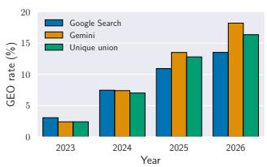
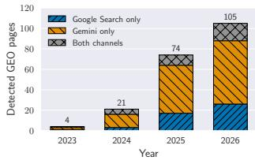
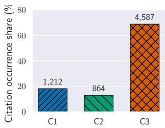
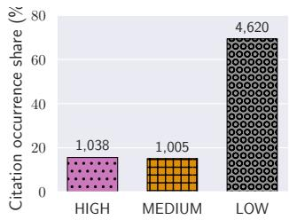
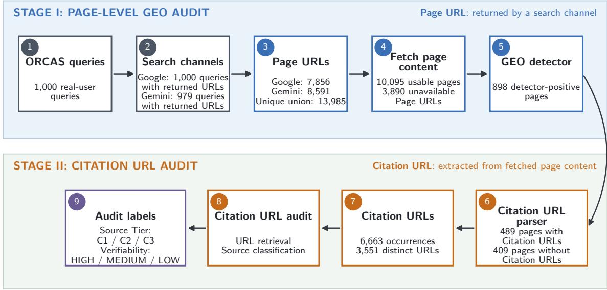

# GEO-Flag: Detecting and Measuring GEO-Optimized Web Content

Junjie Chu1 Ye Leng1 Mingjie Li1 Yun Shen2 Xinyue Shen1,3 Yang Zhang1♣

1CISPA Helmholtz Center for Information Security 2HPE 3University of Waterloo

## Abstract

Generative Engine Optimization (GEO) modifies web content to increase its likelihood of being selected and cited by generative search engines. This can give strategically optimized pages visibility disproportionate to their authority or relevance and even make weak or false information appear well supported. Unlike conventional search, generative search synthesizes information into direct answers rather than presenting competing sources, which can further amplify these risks, as assessing source provenance and authority requires additional user interaction. Despite these concerns, systematic methods for detecting GEOoptimized webpages remain underexplored. We introduce GEOFlagBench, a benchmark of 3,200 webpages spanning 400 queries, four domains, and eight GEO optimizer families, and use it to systematically evaluate existing GEO detection methods. Although the strongest baseline achieves an aggregate F1 of 0.880, method-level and authorshipconditioned evaluations reveal substantial weaknesses and potential reliance on authorship-related shortcuts. We therefore propose Intervention-Paired Training (IPT), which supervises detector responses to GEO interventions and non-GEO AI polishing; on ModernBERT, IPT improves F1 from 0.862 to 0.944 and worst-group accuracy from 0.725 to 0.883. Beyond page-level detection, we develop a GEOgated Agent system for auditing the Source Tier and verifiability of Citation URLs used by detected GEO pages. Finally, we deploy the complete pipeline on released Google Search and Gemini-grounded retrieval results for 1,000 realuser queries. Across 10,095 available pages, we estimate an overall GEO prevalence of 8.90%, reaching 16.36% among pages modified in 2026, while 69.34% of Citation occurrences on detected GEO pages receive LOW verifiability labels. Our results establish a foundation for systematically detecting, auditing, and measuring GEO in real-world search ecosystems.

## 1 Introduction

Generative search engines, such as Perplexity, ChatGPT Search, and Google Gemini-Grounded Search, are emerging as a new way to access information on the web. By retrieving multiple pages and synthesizing them into a single answer with inline citations, they make information access more convenient and efficient. Their growing adoption has also given rise to Generative Engine Optimization (GEO), which modifies web content to increase its likelihood of being selected and cited by generative search engines [1]. GEO has already developed into a growing commercial optimization practice.

However, GEO also introduces new risks. Highly optimized pages may receive visibility disproportionate to their actual authority or relevance, potentially displacing more reliable sources. Worse, GEO techniques can be misused to make weak or false information appear well supported. For example, an operator can publish a false claim on one website and then cite that page from another [8, 14]; the citation is real, but the underlying source was strategically created to support the claim itself. Generative search can amplify these risks. Unlike conventional search, it presents users with a synthesized answer rather than a list of competing sources, making the provenance and authority of the underlying information less immediately visible. As a result, GEO-optimized or strategically constructed content can be propagated into a coherent and seemingly well-supported answer.

Despite these risks, we still lack systematic tools for identifying GEO-optimized content. Existing work primarily studies how to improve visibility in generative engines [1, 29,33,34,45], while considerably less attention has been paid to the inverse problem: determining whether a webpage has been deliberately optimized for generative search.

Measuring Current Detection Methods. To fill this gap, we first propose GEOFlagBench, a benchmark for detecting GEO-optimized webpages across diverse domains and optimization strategies. It contains 3,200 documents derived from 400 queries across four domains and spans eight GEO optimizer families. We use GEOFlagBench to evaluate finetuned classifiers, zero-shot LLMs, feature-based models, and repurposed AI-text detectors. Although the strongest baseline reaches an aggregate F1 of 0.880, method-level and authorship-conditioned evaluation reveals substantial weaknesses. For example, Word TF-IDF has a worst-group accuracy of only 0.375 and a false-positive-rate gap of 0.558 between AI- and human-authored non-GEO pages. These results suggest that high aggregate performance can conceal reliance on original-authorship or general LLM-writing cues instead of GEO-specific interventions.

Improved GEO Detection. Motivated by these limitations, we propose Intervention-Paired Training (IPT), which directly supervises how a detector should respond to documented content transformations. IPT uses positive pairs to require a higher GEO score after a GEO intervention and zero pairs to preserve the score after non-GEO AI polishing. This design encourages the detector to capture optimizationspecific changes while reducing its reliance on static authorship and generic LLM-editing signals. On ModernBERT, IPT improves F1 from 0.862 to 0.944 and worst-group accuracy from 0.725 to 0.883, while reducing the authorshipconditioned false-positive-rate gap from 0.263 to 0.108. IPT also improves Qwen’s F1 from 0.833 to 0.883 and its worstgroup accuracy from 0.325 to 0.775.

Beyond page-level detection, we develop a GEO-gated Agent system for assessing the verifiability of Citation URLs used by detected GEO pages. The system first applies the GEO detector and then uses deterministic parsing and retrieval tools to extract Citation URLs and collect their accessibility evidence. A constrained Agent assigns each Citation URL a publisher Source Tier, after which deterministic rules derive Citation URL Verifiability. We evaluate the system on an independent zero-shot benchmark containing 562 webpages organized into 281 non-GEO/GEO pairs. Among correctly detected GEO pages, the strongest Agent, GLM 5.2, achieves 84.75% accuracy for URL Source Tier and 83.00% for Citation URL Verifiability.

Empirical GEO Prevalence Estimation. We then deploy the complete GEO detection and Citation URL audit pipeline to estimate GEO prevalence in real-world search results. We analyze pages associated with 1,000 real-user ORCAS queries in released conventional Google Search and Geminigrounded retrieval results. After multi-stage page collection and recovery, the audit contains 10,095 usable pages from 13,985 unique URLs. The detector flags 898 pages as GEO, corresponding to an estimated prevalence of 8.90%. The channel-specific estimates are 8.14% for Google Search and 9.09% for Gemini, while the paired-query macro estimates are 7.91% and 9.34%, respectively. Among pages with a parseable declared dateModified value, the estimated GEO prevalence in the unique union increases from 7.02% in 2024 to 12.80% in 2025 and 16.36% in 2026. Among 6,663 Citation occurrences extracted from the detected GEO pages, 69.34% receive LOW verifiability labels. The LOW share reaches 74.15% for Gemini, compared with 45.88% for Google Search, indicating substantial differences in the Citation URL composition of GEO pages exposed through the two channels.1

Contributions. Our contributions are summarized as follows:

• We introduce GEOFlagBench and use it to systematically evaluate current detection methods, revealing substantial method-level weaknesses and potential reliance on authorship-related shortcuts despite strong aggregate performance.

• We propose Intervention-Paired Training (IPT), which improves GEO detection while reducing reliance on authorship and generic AI-writing cues.

• We develop a GEO-gated Agent system for auditing the Source Tier and verifiability of Citation URLs used by detected GEO pages.

• We provide an empirical estimate of GEO prevalence in released Google Search and Gemini-grounded retrieval results, finding an overall estimated prevalence of 8.90% and a clear increase among more recently modified pages, reaching 16.36% among pages modified in 2026.

## 2 GEO Flagging with Existing Detectors

We begin by measuring how well existing approaches distinguish GEO-optimized pages from non-GEO pages. This serves two goals. First, we measure how current approaches perform in a controlled, query-disjoint evaluation. Second, we examine whether detectors perform consistently across different GEO methods and on pages derived from humanand AI-authored content. The insights subsequently motivate the intervention-paired training method later introduced in Section 3.

## 2.1 Task Definition and Evaluation Scope

We define GEO detection as the binary task of determining whether a webpage has been modified with GEO techniques. Given a webpage x, a detector predicts $\hat { y } \in \{ 0 , 1 \}$ , where yˆ = 1 means that the page was GEO-optimized to improve its visibility, ranking, or selection by a generative search system, and ˆy = 0 means that it was not. It is important to bear in mind that our goal is to detect the presence of the GEO-specific modification, not authorship or writing style. A GEO page may be derived from either human-written or AI-generated source content, while a non-GEO page may likewise be human-written, AI-polished, or AI-generated. A useful detector must distinguish GEO-specific signals from general effects of AI generation, editing, query, and source provenance.

In this paper, we consider a document-only setting. The detector sees the resulting page but not its original version, construction prompt, or provenance metadata. When the detector is applied to a webpage with an unknown editing history, a positive prediction means only that the page resembles pages modified using the GEO techniques studied here. It does not indicate malicious intent, factual inaccuracy, or successful manipulation of a deployed generative search engine.

## 2.2 GEOFlagBench

Overview. GEOFlagBench contains 3,200 documents constructed from 400 queries across Health, Finance, Technology, and Travel. Here, we use document to refer to one data instance corresponding to the textual content of a webpage. For each query, we construct three non-GEO controls: a human-written source document, an AI-polished version of that document, and an AI-generated document derived from a structured summary of the source document. This process yields 1,200 non-GEO controls. We then select humanwritten and AI-generated controls as seeds for eight GEO optimizer families. Each application of an optimizer produces a separate GEO document, yielding 2,000 GEO documents in total. Note that AI-polished controls are never used as GEO seeds. The full details are reported in Table 13.

Domain Selection and Query Collection. We construct the benchmark across four domains: Health, Finance, Technology, and Travel. These domains represent heterogeneous information environments in which GEO effectiveness may vary [1]. Health and Finance cover consequential settings in which inaccurate information may affect users’ health or financial well-being, while Technology captures rapidly evolving technical content and Travel captures practical consumer information [17, 39]. We include exactly 100 queries per domain to maintain a balanced domain distribution and prevent domain frequency from becoming a shortcut for classification.

We focus on general informational queries that seek factual or explanatory content without targeting a specific website, platform, or other destination. Destination-specific queries are excluded because they strongly constrain the expected source and page format, whereas general informational queries allow the same topic to be represented by content from different publishers. We first collect candidate queries from the GEO-Bench test split using its released annotations [1]. We use the test split for two reasons. First, its fine-grained annotations allow us to exclude sensitive queries and systematically map the remaining candidates to our four domains. Second, the GEO-Bench training split has been used to develop or train downstream GEO optimization methods [1,45]. Using held-out test queries therefore reduces direct query-level overlap with the data used to develop the optimization methods evaluated in our benchmark. Sonnet 4.6 then screens the mapped queries for domain mismatch and semantic duplication, leaving 164 GEO-Bench queries.

To obtain 100 queries per domain, we use Sonnet 4.6 to generate 236 additional informational queries under fixed domain and quality constraints. Finally, two authors independently review all 400 queries for domain correctness and semantic duplication. Both confirm that every query belongs to its assigned domain and that no semantic duplicates remain. Further details on the domain definitions, tag-todomain mapping, filtering criteria, and query generation process are provided in Appendix A.1.

Non-GEO Data Construction. For each of the above 400 queries, we construct three non-GEO groups: humanwritten, AI-polished, and AI-generated content.

• Human-Written. We retrieve one webpage per query from English Wikipedia or relatively reliable publishers returned by the Brave Search API. To reduce the possibility of prior GEO intervention, we restrict all sources to content available before October 1, 2022, which predates both the formal introduction of GEO [1] and the public release of ChatGPT. We further verify modification metadata and retain only pages with no recorded updates after this cutoff. This yields 400 human-written non-GEO seed pages.

• AI-Polished. For each human-written seed, we create a version in which an LLM improves grammar, spelling, punctuation, and phrasing while preserving the original semantics and content. We distribute the pages across eight different LLMs to reduce model-specific artifacts from becoming classification shortcuts. The prompts contain no GEO-related instructions, allowing this group to isolate the effect of AI-assisted editing.

• AI-Generated. For each query, we first extract a structured summary from the corresponding human-written page and then ask an LLM to write a new article from that summary while preserving its main factual content and targeting a similar length. The 400 queries are again distributed across the same eight LLMs. Because the generation prompts contain no GEO objectives, this group serves as a control for fully AI-generated content without deliberate GEO optimization.

The detailed construction process for each non-GEO group is described in Appendix A.2.

GEO Data Construction. We construct 2,000 GEO documents by applying explicit optimization interventions to human-written or AI-generated non-GEO seeds. The benchmark includes eight optimizer families that cover different GEO mechanisms and levels of intervention: GEO Strategy Pool [1], AutoGEO [45], PMA [29], RAID G-SEO [10], Meta-Optimization [5], Stealthy GEO Strategy Pool, Stealthy AutoGEO, and Human GEO. The first four families cover strategy-based rewriting, learned optimization preferences, preference manipulation, and intent-aware optimization, respectively. Meta-Optimization adds iterative self-evaluation and revision. We further construct stealthy variants of GEO Strategy Pool and AutoGEO that retain the same GEO objectives while reducing obvious optimization patterns in the resulting text. Finally, we conduct Human GEO, which combines various GEO strategies and is applied by human annotators. Where applicable, we use multiple executor LLMs to reduce the risk that a detector learns model-specific generation artifacts instead of features associated with GEO interventions. The complete construction process for each GEO family is described in Table 12 of Appendix A.3.

## 2.3 Existing Detectors

Fine-Tuned Models. We fine-tune ModernBERT (Modern BERT-base [42]) as binary GEO classifiers. For Modern-BERT, we evaluate both its default context setting (1024- token context) and an extended 8,192-token context. These encoder-based baselines test whether task-specific representations learned directly from webpage text can capture GEOrelated signals. We also perform supervised fine-tuning of Qwen3-0.6B [35]. For Qwen, we use a structured generation format in which the model produces an intermediate analysis followed by a binary decision (Answer:Yes/No). Only the final decision is used for evaluation. We fine-tune all

ModernBERT models for 5 epochs, and Qwen models for 10 epochs with standard SFT (supervised fine-tuning) [13, 26]. Feature Engineering and Classical Classifiers. We evaluate several feature-based baselines using classical classifiers. For lexical features, we train logistic regression on character TF-IDF features with 2–4 character grams and word TF-IDF features with unigrams and bigrams, retaining at most 20,000 features for each representation. We additionally train logistic regression on Ghostbuster features [41] and on GPT-2 perplexity-derived features [1, 36]. All logistic regression models use an inverse regularization strength of C = 1 and a maximum of 1,000 optimization iterations. To capture webpage structure, we train XGBoost [9] on ten structural features, including document length and the frequencies of headings, lists, citations, numbers, and sections. The XG-Boost classifier uses 200 trees, a maximum depth of 6, and a learning rate of 0.1.

Proprietary AI-Text Detector APIs. We evaluate two commercial AI-text detection services, Pangram [32] and GPTZero [19], using their standard interfaces. GPTZero returns three document-level classes: AI, Mixed, and Human. We therefore evaluate two mappings to the binary GEO task: one treats only AI as GEO, while the other, denoted GPTZero (mixed), treats both AI and Mixed as GEO.

Zero-Shot LLMs. We evaluate Qwen3-0.6B [35], Gemini 3.5 Flash [18], and Claude Haiku 4.5 [4] as zero-shot GEO detectors. Each model receives the binary task definition and the webpage text, without demonstrations or task-specific training examples, and is instructed to return a single GEO or non-GEO decision.

AI-Text Detectors Repurposed for GEO. Finally, we evaluate several existing AI-text detection signals after adapting their outputs to the GEO task. These include the off-theshelf Ghostbuster score [41], Fast-DetectGPT [7], and the OpenAI RoBERTa GPT-2 output detector [31]. We also include maximum keyword term frequency as a simple lexical GEO signal. Because these methods were not designed to detect GEO, their native scores do not directly correspond to the GEO label. For each score, we therefore fit a onedimensional logistic regression using only the training split. This calibration changes only the mapping from the native score to the GEO label and leaves the underlying detector or representation unchanged.

## 2.4 Experiment Settings

Train and Test Split. To prevent semantic leakage (e.g., documents derived from the same query appearing in both training and testing) and evaluate generalization to unseen queries, we use a query-level grouped split, assigning all documents associated with the same query to the same partition. Concretely, we apply stratified sampling by domain, assigning 70 queries per domain to training and 30 queries per domain to testing. The data associated with these queries form the training and test sets, containing 2,238 and 962 documents, respectively.

Metrics. We report accuracy and F1 on the fixed test set. F1 treats GEO as the positive class. Accuracy measures both false alarms on non-GEO pages and misses on GEO pages.

Table 1: Overall GEO flagging results on the fixed test set of 360 non-GEO and 602 GEO documents. The last block calibrates each native score with one-dimensional logistic regression on the training split.
<table><tr><td>Method</td><td>Accuracy</td><td>F1</td></tr><tr><td>Fine-tuned Models</td><td></td><td></td></tr><tr><td>ModernBERT (1,024 tokens)</td><td>0.842</td><td>0.864</td></tr><tr><td>ModernBERT (8,192 tokens)</td><td>0.839</td><td>0.862</td></tr><tr><td>Qwen3-0.6B (SFT)</td><td>0.778</td><td>0.833</td></tr><tr><td colspan="3">Feature engineering + classical classifiers</td></tr><tr><td>TF-IDF char (2-4) + LR</td><td>0.848</td><td>0.878</td></tr><tr><td>TF-IDF word  $( 1 { - } 2 ) + \mathrm { L R }$ </td><td>0.846</td><td>0.880</td></tr><tr><td>Ghostbuster features, recalibrated</td><td>0.796</td><td>0.835</td></tr><tr><td>Structural + XGBoost</td><td>0.752</td><td>0.801</td></tr><tr><td>GPT-2 perplexity + LR</td><td>0.710</td><td>0.781</td></tr><tr><td colspan="3">Proprietary AI-text detector API</td></tr><tr><td>Pangram</td><td>0.838</td><td>0.876</td></tr><tr><td>GPTZero (mixed)</td><td>0.799</td><td>0.830</td></tr><tr><td>GPTZero</td><td>0.768</td><td>0.782</td></tr><tr><td colspan="3">Zero-shot LLMs</td></tr><tr><td>Qwen3-0.6B</td><td>0.627</td><td>0.770</td></tr><tr><td>Gemini-3.5-flash</td><td>0.759</td><td>0.776</td></tr><tr><td>Haiku-4.5</td><td>0.747</td><td>0.771</td></tr><tr><td colspan="3">AI-text detectors repurposed for GEO (train-calibrated)</td></tr><tr><td>Ghostbuster off-shelf  $( \mathbf { \dot { G } P T } { - } 2 \mathbf { \dot { ) } } + \mathbf { L R }$ </td><td>0.626</td><td>0.770</td></tr><tr><td>Fast-DetectGPT (crit) + LR</td><td>0.631</td><td>0.767</td></tr><tr><td>Keyword max TF + LR</td><td>0.626</td><td>0.770</td></tr><tr><td>OpenAI RoBERTa  $p _ { \mathrm { m a c h i n e } } + \mathrm { L R }$ </td><td>0.626</td><td>0.770</td></tr></table>

Probabilistic classifiers use a decision threshold of 0.5. The proprietary APIs use the label mappings stated above.

Hardware. We conducted the experiments on a Google Cloud g2-standard-8 instance equipped with 8 vCPUs, 32 GB of system memory, and a single NVIDIA L4 GPU with 24 GB of GPU memory.

## 2.5 Evaluation

Overall Results. As shown in Table 1, several methods perform competitively on the fixed test set. Word TF-IDF with logistic regression achieves the highest F1 of 0.880. Character TF-IDF and Pangram perform similarly, reaching F1 scores of 0.878 and 0.876, respectively. These results show that competitive GEO flagging is possible with substantially different approaches, ranging from fine-tuned encoders to simple lexical features and a proprietary AI-text detector.

Other approaches are considerably less effective. The three zero-shot LLMs obtain F1 scores between 0.770 and 0.776, while several repurposed AI-text detector scores remain close to a positive-class majority baseline even after calibration on the training split. This baseline predicts every document as GEO and obtains an accuracy of 0.626 and an F1 of 0.770.

Overall, the aggregate results suggest that GEO modifications leave detectable signals, but performance varies substantially across detector families.

Method-Level Results. Aggregate metrics, however, do not show whether a high-performing detector works consistently across different GEO methods. We therefore examine method-level recall values. We list the results of three representative methods (PMA, AutoGEO-Light, and Human-Based GEO) in Table 2. These subsets represent substantially different forms of optimization: PMA introduces explicit ranking-oriented modifications, AutoGEO-Light applies relatively sparse edits, and Human-based GEO is considered to have fewer common AI-writing cues. Despite their strong aggregate performance, several detectors show pronounced differences across these methods. The two TF-IDF classifiers exhibit a similar imbalance. Although they achieve the two highest aggregate F1 scores in Table 1, their AutoGEO-Light recall is only 0.308 and 0.423 in Table 2. The contrast is even stronger for some zero-shot and proprietary methods: Gemini and Haiku both reach 0.987 recall on PMA, but only 0.037 and 0.074 on Human-based GEO, respectively. GPTZero likewise reaches only 0.074 recall on Human-based GEO.

Table 2: Method-level recall and authorship-conditioned diagnostics on the fixed test set. Arrows indicate the preferred direction.
<table><tr><td rowspan="2">Method</td><td colspan="3">Method-Level GEO Recall</td><td colspan="3">Authorship-Conditioned Diagnostics</td></tr><tr><td>PMA↑</td><td>AutoGEO-Light↑</td><td>Human-based↑</td><td>Worst-Group Acc.↑</td><td>∆FPR↓</td><td>ΔTPR↓</td></tr><tr><td>Fine-tuned models</td><td></td><td></td><td></td><td></td><td></td><td></td></tr><tr><td>ModernBERT-base (1,024 tokens)</td><td>0.566</td><td>0.423</td><td>0.426</td><td>0.725</td><td>0.271</td><td>0.121</td></tr><tr><td>ModernBERT-base (8,192 tokens)</td><td>0.513</td><td>0.346</td><td>0.444</td><td>0.725</td><td>0.263</td><td>0.117</td></tr><tr><td>Qwen3-0.6B (SFT)</td><td>0.934</td><td>0.654</td><td>0.463</td><td>0.325</td><td>0.413</td><td>0.105</td></tr><tr><td colspan="3">Feature engineering + classical classifiers</td><td></td><td></td><td></td><td></td></tr><tr><td>TF-IDF char (2-4) + LR</td><td>0.737</td><td>0.308</td><td>0.778</td><td>0.575</td><td>0.346</td><td>0.077</td></tr><tr><td>TF-IDF word  $( 1 - 2 ) + \mathrm { L R }$ </td><td>0.908</td><td>0.423</td><td>0.704</td><td>0.375</td><td>0.558</td><td>0.111</td></tr><tr><td>Ghostbuster features, recalibrated</td><td>0.539</td><td>0.192</td><td>0.759</td><td>0.600</td><td>0.221</td><td>0.047</td></tr><tr><td>Structural + XGBoost</td><td>0.421</td><td>0.538</td><td>0.759</td><td>0.550</td><td>0.188</td><td>0.033</td></tr><tr><td>GPT-2 perplexity + LR</td><td>0.605</td><td>0.538</td><td>0.685</td><td>0.367</td><td>0.221</td><td>0.084</td></tr><tr><td colspan="3">Proprietary AI-text detector API</td><td></td><td></td><td></td><td></td></tr><tr><td>Pangram</td><td>1.000</td><td>0.769</td><td>0.500</td><td>0.192</td><td>0.767</td><td>0.099</td></tr><tr><td>GPTZero (mixed)</td><td>1.000</td><td>0.462</td><td>0.389</td><td>0.508</td><td>0.475</td><td>0.185</td></tr><tr><td>GPTZero</td><td>0.961</td><td>0.192</td><td>0.074</td><td>0.583</td><td>0.154</td><td>0.172</td></tr><tr><td colspan="3">Zero-shot LLMs</td><td></td><td></td><td></td><td></td></tr><tr><td>Qwen3-0.6B</td><td>1.000</td><td>1.000</td><td>1.000</td><td>0.008</td><td>0.000</td><td>0.006</td></tr><tr><td>Ġemini-3.5-flash</td><td>0.987</td><td>0.154</td><td>0.037</td><td>0.589</td><td>0.258</td><td>0.166</td></tr><tr><td>Haiku-4.5</td><td>0.987</td><td>0.269</td><td>0.074</td><td>0.586</td><td>0.321</td><td>0.197</td></tr><tr><td colspan="3">AI-text detectors repurposed for GEO (train-calibrated)</td><td></td><td></td><td></td><td></td></tr><tr><td>Ghostbuster off-shelf  $( \bar { \mathbf { G } } \mathbf { P } \mathbf { T } { - } 2 \bar { \mathbf { ) } } + \mathbf { L } \mathbf { R }$ </td><td>1.000</td><td>1.000</td><td>1.000</td><td>0.000</td><td>0.000</td><td>0.000</td></tr><tr><td>Fast-DetectGPT (crit) + LR</td><td>0.961</td><td>0.962</td><td>1.000</td><td>0.004</td><td>0.179</td><td>0.037</td></tr><tr><td>Keyword max TF + LR</td><td>1.000</td><td>1.000</td><td>1.000</td><td>0.000</td><td>0.000</td><td>0.000</td></tr><tr><td>OpenAI RoBERTa  $p _ { \mathrm { m a c h i n e } } + \mathrm { L R }$ </td><td>1.000</td><td>1.000</td><td>1.000</td><td>0.000</td><td>0.004</td><td>0.003</td></tr></table>

The three subsets also suggest different sources of difficulty. PMA is detected reliably by many methods, possibly because its more explicit optimization introduces stronger lexical or stylistic signals. AutoGEO-Light presents the opposite case: because it modifies only a limited portion of the document, the resulting GEO signal may be diluted by the largely unchanged source text. Its low recall therefore suggests that some detectors are sensitive to the extent of optimization rather than merely to its presence. Human-based GEO raises a different concern. It is designed to reduce stylistic cues commonly associated with AI-written text. The sharp recall degradation on this subset therefore raises the possibility that some detectors rely partly on human–AI original authorship cues rather than signals specific to GEO itself.

Human–AI Original Authorship as a Potential Shortcut. The low recall on Human-based GEO raises the possibility that some detectors rely on cues associated with the original human–AI authorship of a document rather than GEO itself.

To examine this possibility, we partition the test set into four groups defined by GEO status and original authorship: human non-GEO, AI non-GEO, human GEO, and AI GEO. Here, original authorship refers to the provenance of the underlying source content before any polishing or GEO transformation. Accordingly, AI-polished documents are included in the human non-GEO group because they originate from human-written webpages and undergo only grammarand fluency-level editing without any GEO strategy. The resulting groups contain 240 human non-GEO, 120 AI non-GEO, 321 human GEO, and 281 AI GEO documents. We then use three complementary diagnostics in Table 2 to measure how strongly detector performance varies across these original-authorship groups:

• Worst-group accuracy (WGA) is the minimum accuracy across the four groups [37]. It measures whether strong aggregate performance is maintained for every combination of GEO status and authorship. Higher values are better; a low value indicates that aggregate accuracy masks poor performance on at least one group.

• ∆FPR is the absolute difference in false-positive rate between AI and human non-GEO documents [21]. It measures whether authorship affects the tendency to incorrectly flag a non-GEO document as GEO. Lower values are better; a large gap means that the detector treats human- and AI-authored non-GEO documents differently despite their identical GEO label.

• ∆TPR is the absolute difference in true-positive rate between AI and human GEO documents [21]. It measures whether authorship affects the detector’s ability to recognize GEO documents. Lower values are better; a large gap means that GEO detection success depends substantially on whether the underlying document is human- or AI-authored.

Several methods with strong aggregate performance exhibit substantial authorship-conditioned differences. Word TF-IDF achieves the highest overall F1 of 0.880, yet its worst-group accuracy is only 0.375 and its ∆FPR reaches 0.558 in Table 2. Pangram shows an even larger discrepancy: despite an aggregate F1 of 0.876, its worst-group accuracy is 0.192 and its ∆FPR is 0.767. Qwen3-0.6B (SFT) similarly combines an F1 of 0.833 with a worst-group accuracy of 0.325 and a ∆FPR of 0.413. Thus, some of the methods that appear strongest under aggregate evaluation are substantially less stable once human and AI authorship are considered separately.

These results are consistent with human–AI authorship acting as a shortcut for GEO flagging. A detector may partly distinguish AI-written from human-written documents rather than identifying signals introduced specifically by GEO. Our analysis is observational and does not establish the internal decision rule of any detector, but the large authorshipconditioned gaps show that aggregate performance alone cannot rule out such shortcut reliance.

Small authorship gaps must also be interpreted with care. Zero-shot Qwen3-0.6B and several calibrated AI-text scores predict nearly every document as GEO, producing near-zero authorship gaps and near-perfect recall on the listed GEO subsets but worst-group accuracy close to zero. Their apparent stability therefore results from nearly constant predictions rather than robust GEO detection.

Taken together, these results reveal that existing GEO detectors may vary substantially across optimization methods, and some may rely partly on human–AI authorship cues rather than GEO-specific signals.

## 3 Toward More Reliable GEO Detection

Our analysis in Section 2.5 reveals two limitations of existing GEO detectors. First, some high-performing detectors generalize poorly across GEO methods, especially those with sparse modifications such as AutoGEO-Light. Second, their error rates can differ substantially between documents derived from human- and AI-authored sources, suggesting potential reliance on original-authorship shortcuts rather than GEO-specific signals.

To address these limitations, we propose Intervention-Paired Training (IPT), which exploits the correspondence between original and transformed pages in GEOFlagBench. For pages derived from the same source, a GEO intervention should increase the GEO score, whereas non-GEO AI polishing should leave it approximately unchanged. Because original authorship is fixed within each pair, IPT encourages the detector to respond to GEO-specific changes while reducing reliance on static authorship and generic LLM-processing cues.2

## 3.1 Intervention-Paired Training

Positive and Zero Interventions. We construct two types of intervention pairs. A positive pair $( x _ { o } , x _ { g } )$ consists of an original page $x _ { o }$ and its GEO-optimized counterpart $x _ { g }$ . Because the transformation from $x _ { o }$ to $x _ { g }$ applies a GEO intervention, we require the GEO score of $x _ { g }$ to exceed that of $x _ { o }$ by a predefined margin. This constraint encourages the detector to capture changes introduced by GEO optimization rather than relying only on static properties of individual pages.

A zero pair $\left( x _ { o } , x _ { p } \right)$ consists of an original page $x _ { o }$ and its AI-polished counterpart $x _ { p }$ . AI polishing introduces LLMinduced lexical and stylistic changes but does not apply a GEO strategy. We therefore constrain the GEO scores of $x _ { o }$ and $x _ { p }$ to remain close, explicitly teaching the detector that LLM editing alone is not evidence of GEO.

The two pair types provide complementary supervision. Positive pairs identify changes that should increase the GEO score, whereas zero pairs identify LLM-induced changes that should not affect it.

Binary IPT Objective. Let $z _ { \boldsymbol { \Theta } } ( x )$ denote the binary GEO logit for page x, and let D denote the labeled training documents. The standard document-level classification loss is

$$
\mathcal { L } _ { \mathrm { c l s } } = \frac { 1 } { | \mathcal { D } | } \sum _ { ( \boldsymbol { x } , \boldsymbol { y } ) \in \mathcal { D } } \mathrm { B C E } ( \sigma ( \boldsymbol { z } _ { \boldsymbol { \Theta } } ( \boldsymbol { x } ) ) , \boldsymbol { y } ) ,\tag{1}
$$

where $\sigma ( \cdot )$ is the sigmoid function.

Let $\mathcal { P } _ { + }$ denote the set of positive intervention pairs. We require a GEO intervention to increase the GEO logit by at least margin m:

$$
\mathcal { L } _ { + } = \frac { 1 } { \vert \mathcal { P } _ { + } \vert } \sum _ { ( x _ { o } , x _ { g } ) \in \mathcal { P } _ { + } } \operatorname* { m a x } ( 0 , m - z _ { \Theta } ( x _ { g } ) + z _ { \Theta } ( x _ { o } ) ) .\tag{2}
$$

Let $\mathcal { P } _ { 0 }$ denote the set of zero intervention pairs. For these pairs, we constrain AI polishing to preserve the GEO logit:

$$
\mathcal { L } _ { 0 } = \frac { 1 } { \vert \mathcal { P } _ { 0 } \vert } \sum _ { ( x _ { o } , x _ { p } ) \in \mathcal { P } _ { 0 } } \vert z _ { \Theta } ( x _ { p } ) - z _ { \Theta } ( x _ { o } ) \vert .\tag{3}
$$

The complete binary IPT objective is

$$
\begin{array} { r } { \mathcal { L } _ { \mathrm { I P T } } = \mathcal { L } _ { \mathrm { c l s } } + \alpha \mathcal { L } _ { + } + \beta \mathcal { L } _ { 0 } . } \end{array}\tag{4}
$$

IPT does not require every training document to belong to an intervention pair. Unpaired examples receive only the standard classification loss in Equation 1 and therefore reduce to ordinary supervised fine-tuning. IPT can thus be applied as an extension of standard SFT: paired examples provide additional intervention-level supervision, while unpaired examples retain the standard document-level objective. Pair construction uses only training queries, and inference remains page based and requires no paired input.

Generative IPT. We further apply IPT to Qwen3-0.6B using LoRA adapters [22]. The model generates a reasoning sequence followed by a Yes/No verdict. We define the GEO score as

$$
z _ { \Theta } ( x ) = \ell _ { \Theta } ( \mathrm { Y e s } \mid x ) - \ell _ { \Theta } ( \mathrm { N o } \mid x ) ,\tag{5}
$$

where the two logits are evaluated at the verdict position. For notational simplicity, $z _ { \boldsymbol { \Theta } } ( x )$ denotes this verdict-position logit difference, including the preceding reasoning context.

The generative objective follows the same formulation as binary IPT. We replace the document-level classification loss

$\mathcal { L } _ { \mathrm { c l s } }$ with the completion-only language-modeling loss $\mathcal { L } _ { \mathrm { L M } }$ over the reasoning sequence and final verdict:

$$
\begin{array} { r } { \mathcal { L } _ { \mathrm { I P T } } ^ { \mathrm { g e n } } = \mathcal { L } _ { \mathrm { L M } } + \alpha \mathcal { L } _ { + } + \beta \mathcal { L } _ { 0 } . } \end{array}\tag{6}
$$

The positive and zero losses retain the definitions in Equation 2 and Equation 3, using the score in Equation 5. The language-modeling loss is computed over all training documents, irrespective of whether they participate in an intervention pair. Thus, documents with available pairs receive additional intervention-level supervision, whereas unpaired documents receive only the standard language-modeling objective and reduce to ordinary SFT.

## 3.2 GEO Flagging Evaluation

Experimental Settings. All experiments use the same fixed query-disjoint split described in Section 2.3, containing 2,238 training documents and 962 test documents. The detection threshold is 0.5.

We fine-tune ModernBERT-base and Qwen3-0.6B. For all models, we use a learning rate of $2 \times 1 0 ^ { - 5 }$ , margin $m = 2$ α = 1, and $\beta = 1$ . For ModernBERT-base, we use an 8,192- token context and for Qwen3-0.6B, we use a 4,096-token context and LoRA rank 16.

Results. IPT improves both overall performance and shortcut diagnostic metrics. For ModernBERT, IPT increases accuracy from 0.839 to 0.931 and F1 from 0.862 to 0.944. The improvement is also clear in the shortcut diagnostics: WGA rises from 0.725 to 0.883, while ∆FPR and ∆TPR decrease from 0.263 and 0.117 to 0.108 and 0.062, respectively. Qwen does not outperform ModernBERT, but when using IPT, the performance also improves. Compared with Qwen-SFT, Qwen-IPT improves accuracy from 0.778 to 0.860 and F1 from 0.833 to 0.883, while increasing WGA substantially from 0.325 to 0.775. At the same time, ∆FPR drops from 0.413 to 0.158 and ∆TPR from 0.105 to 0.033. Qwen Zero-shot has very small ∆FPR and ∆TPR, but its WGA is only 0.008, indicating that the small group gaps mainly result from poor classification performance rather than genuine robustness to authorship shortcuts.

GRL shows the same overall trend, but the gains are smaller. ModernBERT-GRL reaches 0.876 accuracy and 0.897 F1, improves WGA to 0.783, and reduces ∆FPR and ∆TPR to 0.171 and 0.069.

Overall, the results show that IPT improves performance across different GEO methods and authorship conditions without disproportionately favoring any single group.

## 3.3 GEO Attribution Evaluation

Task Description. We further evaluate whether IPT extends beyond binary GEO detection by considering a multiclass GEO attribution task. Given the text of a webpage, the model predicts one of seven classes: non-GEO, AutoGEO, GEO Strategy Pool, PMA, RAID, Meta-Optimization, or Humanbased GEO. Stealthy AutoGEO is grouped with AutoGEO, and Stealthy GEO Strategy Pool is grouped with GEO Strategy Pool. This setting allows us to examine whether the intervention-based training objective of IPT remains effective when the prediction target additionally distinguishes among different GEO method families.

Table 3: Comparison of selected GEO detectors and our proposed methods. WGA denotes worst-group accuracy, while ∆FPR and ∆TPR measure absolute error-rate gaps between AIand human-authored groups.
<table><tr><td rowspan="2">Method</td><td colspan="2">Overall Performance</td><td colspan="3">Shortcut Diagnostics</td></tr><tr><td>Acc.</td><td>F1</td><td></td><td>WGA↑ ∆FPR↓ ∆TPR↓</td><td></td></tr><tr><td colspan="6">Selected baselines</td></tr><tr><td>ModernBERT (1K)</td><td>0.842</td><td>0.864</td><td>0.725</td><td>0.271</td><td>0.121</td></tr><tr><td>ModernBERT (8K)</td><td>0.839</td><td>0.862</td><td>0.725</td><td>0.263</td><td>0.117</td></tr><tr><td>Qwen Zero-shot</td><td>0.627</td><td>0.770</td><td>0.008</td><td>0.000</td><td>0.006</td></tr><tr><td>Qwen SFT</td><td>0.778</td><td>0.833</td><td>0.325</td><td>0.413</td><td>0.105</td></tr><tr><td>TF-IDF char (2–4) + LR</td><td>0.848</td><td>0.878</td><td>0.575</td><td>0.346</td><td>0.077</td></tr><tr><td>TF-IDF word (1–2) + LR 0.846</td><td></td><td>0.880</td><td>0.375</td><td>0.558</td><td>0.111</td></tr><tr><td>Pangram</td><td>0.838</td><td>0.876</td><td>0.192</td><td>0.767</td><td>0.099</td></tr><tr><td colspan="6">Fine-tuned models with GRL/IPT</td></tr><tr><td>ModernBERT-GRL</td><td>0.876</td><td>0.897</td><td>0.783</td><td>0.171</td><td>0.069</td></tr><tr><td>ModernBERT-IPT</td><td>0.931</td><td>0.944</td><td>0.883</td><td>0.108</td><td>0.062</td></tr><tr><td>Qwen-IPT</td><td>0.860</td><td>0.883</td><td>0.775</td><td>0.158</td><td>0.033</td></tr></table>

IPT for Attribution. We adapt $\mathrm { I P T }$ to the seven-class attribution task while preserving its intervention-based constraints. Let $\ell _ { c } ( x )$ denote the logit for class c. To apply the pairwise IPT objectives, we aggregate the attribution logits into a binary GEO score:

$$
z _ { \boldsymbol { \Theta } } ( x ) = \log \sum _ { c \in C _ { \mathrm { G E O } } } \exp ( \ell _ { c } ( x ) ) - \ell _ { \mathrm { n o n - G E O } } ( x ) ,\tag{7}
$$

where $\boldsymbol { C } _ { \mathrm { G E O } }$ contains the six GEO attribution classes. The standard classification loss is replaced by seven-class crossentropy, while the positive and invariant pair constraints are applied to $z _ { \boldsymbol { \Theta } } ( x )$ as in the binary setting.

Experiment Settings. We use the same query-level training and test split as in Section 2. The baseline methods follow the same preprocessing procedures, model configurations, context lengths, feature extraction settings, and training hyperparameters described in Section 2. For supervised classifiers, we replace the binary target with the seven attribution classes while keeping the remaining configuration unchanged. For IPT, we use the same settings in Section 3.2. We report macro F1 and accuracy as the primary attribution metrics.

Results. On the seven-class attribution task, IPT substantially improves the model’s ability to identify which GEO method produced a given page. As shown in Table 4, ModernBERT IPT achieves a Macro F1 of 0.895 and an accuracy of 0.906, improving over the same ModernBERT backbone with SFT by 0.122 and 0.076, respectively, while also clearly outperforming the feature-based and general-purpose LLM baselines. Importantly, this gain is reflected in more balanced per-class performance. As shown in Table 16, SFT already performs well on Non-GEO, AutoGEO, and Pool, but remains considerably weaker on RAID, Meta, and Human, with recall on the Human class reaching only 0.333. IPT raises the recall of RAID, Meta, and Human to 0.909, 0.917, and 0.759, respectively, while maintaining recall between 0.855 and 0.906 on AutoGEO, Pool, and PMA. The per-class precision results in Table 17 show a similar pattern:

Table 4: Results on the seven-class attribution task.
<table><tr><td>Configuration</td><td>Macro F1</td><td>Accuracy</td></tr><tr><td>TF-IDF Character 2–4 with LR</td><td>0.612</td><td>0.730</td></tr><tr><td>TF-IDF Word 1–2 with LR</td><td>0.562</td><td>0.710</td></tr><tr><td>Ghostbuster features, recalibrated</td><td>0.286</td><td>0.545</td></tr><tr><td>Structural features with XGBoost</td><td>0.573</td><td>0.648</td></tr><tr><td>GPT-2 perplexity features with LR</td><td>0.226</td><td>0.497</td></tr><tr><td>Gemini-3.5-flash</td><td>0.315</td><td>0.500</td></tr><tr><td>Haiku-4.5</td><td>0.314</td><td>0.402</td></tr><tr><td>ModernBERT SFT</td><td>0.773</td><td>0.830</td></tr><tr><td>ModernBERT IPT</td><td>0.895</td><td>0.906</td></tr></table>

IPT achieves at least 0.804 precision for every class, including 0.985 for PMA and 0.984 for RAID. At the same time, these improvements do not come at the expense of distinguishing Non-GEO pages, for which IPT retains a recall of 0.950 and a precision of 0.891. Overall, the results suggest that IPT learns more than a coarse distinction between GEO and Non-GEO content; it also captures discriminative signals associated with different GEO optimization mechanisms, enabling substantially stronger fine-grained attribution.

## 4 A GEO-Gated Agent System for Assessing Citation URL Verifiability

## 4.1 Motivation and Audit Scope

Motivation. GEO flagging tells us whether a page may have been optimized for generative search, but it does not tell us whether the cited URLs on that page are trustworthy. This matters because GEO can make weak or false information appear well supported. For example, an operator can first publish a false claim on a website that is easy to create or edit, and then cite that page from another website [8, 14]. The citation URL is real, and the cited page may directly support the claim, but the source itself was created to support that claim. Therefore, we also need to know what kind of URLs the citation points to and how easily that source can be created or edited. We therefore develop a GEO-gated Agent system that first identifies GEO pages and then assesses the verifiability of their Citation URLs.

Audit Outputs. Given a webpage, our system first determines whether it passes the GEO gate and, if so, audits every parsed Citation URL on the page.3 The audit produces three outputs:

• Page level: a GEO label (GEO or NON-GEO), together with the predicted GEO probability.

• Citation-URL level: a URL Source Tier (C1, C2, or C3) and a Citation URL Verifiability label (HIGH, MEDIUM, or LOW) for each Citation occurrence. The three tiers represent decreasing levels of source authority and editorial control, with C1 being the strongest and C3 the weakest.

• Sentence level: the best Citation URL Verifiability label (HIGH, MEDIUM, or LOW) among all Citations attached to the same sentence.

Metric Definitions. URL Source Tier characterizes the publisher behind a Citation URL based on its publication and review process. It is designed to distinguish sources with strong institutional or editorial control from sources that are easier to create, edit, or contribute to. The full C1–C3 defini tion is given in Table 20.

Citation URL Verifiability combines URL Source Tier with the observed retrieval state. This design treats source authority and accessibility as separate factors. An authoritative source that cannot be accessed is harder for a reader to verify directly, while an accessible source with limited editorial control may be easy to inspect but still offers weaker assurance about how its content was produced. The complete mapping is given in Table 21.

For a sentence s with Citation URL labels $V ( s ) = $ $\nu _ { 1 } , \ldots , \nu _ { n } .$ , we define

$$
V _ { \mathrm { b e s t } } ( s ) = \operatorname* { m a x } _ { \nu _ { i } \in V ( s ) } \nu _ { i } ,\tag{8}
$$

where HIGH > MEDIUM > LOW. We use the best label because the sentence-level metric asks whether at least one comparatively verifiable source is available; additional weaker Citations should not reduce that assessment.

## 4.2 Test Dataset Building

Dataset Design. The new dataset derives from 281 queries across the same four domains as GEOFlagBench: 54 in Finance, 68 in Health, 97 in Technology, and 62 in Travel. These queries do not overlap with the 400 queries used in GEOFlagBench, preventing potential query overlap and information leakage. We collect one non-GEO page for each query, and then generate one corresponding GEO variant. The process follows the settings in Section 2.2. Similarly, the 281 non-GEO pages are collected from snapshots dated before October 2022. In total, the dataset contains 562 pages. Annotation of Citation URLs and Sentences. Among the 281 GEO pages, 129 contain at least one Citation, yielding 1,449 cited sentences and 2,160 Citation occurrences. Two annotators independently assign Source Tiers to the cited sources according to Table 20, without seeing each other’s decisions or the GEO method used to produce the page. A third annotator adjudicates all disagreements, and the final Source Tier is determined by majority vote. The two primary annotators achieve 80.39% agreement on Source Tier, with Cohen’s κ = 0.695.

We determine URL access status using a deterministic retriever. For each Citation URL, it performs an HTTP GET with redirects, a 20-second timeout, and up to two attempts; if live retrieval fails, it queries the Internet Archive for an available snapshot.

Citation URL Verifiability is then derived deterministically from Source Tier and retrieval status, and sentencelevel best verifiability is derived from the resulting Citation URL labels. To measure how Source Tier disagreement propagates to these downstream labels, we apply the same retrieval and aggregation rules separately to each primary annotator’s Source Tier assignments. The resulting agreement is 84.16% for Citation URL Verifiability and 84.90% for sentence-level best verifiability, with Cohen’s κ values of 0.751 and 0.760, respectively.

## 4.3 System Design

The system consists of four modules, as illustrated below.

Module 1: GEO Gate. The first module determines whether a webpage enters the citation URL audit. Given the captured page content, a GEO detector predicts whether the page is GEO or Non-GEO. Pages predicted as NON-GEO are returned as SKIPPED\_NOT\_GEO, while pages predicted as GEO are passed to the next module. This gate limits the more expensive citation URL audit to pages that exhibit GEO signals.

Module 2: Citation URL Preprocessing. The preprocessing module constructs sentence–citation URL pairs from each GEO page. A preprocessing Agent invokes a deterministic parser that extracts citations, resolves and canonicalizes their URLs, segments the page into sentences, and associates each citation with the sentence in which it appears. It also resolves relative URLs and removes known tracking parameters. If no citation URL is found, the page is returned as NO\_CITATION.

Module 3: Citation URL Labeling. The labeling module produces the two primitive labels used by our Verifiability metric: URL access status and source tier. A coordinating Agent sends each unique citation reference to two specialized subagents.

The ACCESSIBILITY subagent invokes a deterministic URL retriever. The retriever follows redirects, uses fixed timeouts and retries, and records the resolved URL and retrieval metadata. Its outcome is mapped to one of six states: LIVE, ARCHIVED\_ONLY, BLOCKED, HTTP\_404, DOMAIN\_NXDOMAIN, or TIMEOUT.

The SOURCE TIER subagent assigns C1, C2, or C3 according to Table 20. It receives the citation URL, domain, citedsentence context, and retrieved metadata. The system also supports a web-search tool and a source-list database with allowlist and blocklist entries for additional publisher information. For all experiments reported in this paper, however, web search is disabled and both source lists are empty. The source tier decision therefore relies only on the supplied citation evidence and the fixed tier policy.

Module 4: Verifiability Aggregation. The final module derives the audit labels using fixed rules. For each citation URL, verifiability is computed deterministically from its source tier and retrieval state according to Table 21. The agent therefore never directly predicts HIGH, MEDIUM, or LOW. For a sentence containing multiple citations, we apply Equation 8 and report the highest verifiability among its citation URLs. The final output reports the GEO decision for each page, the source tier, retrieval state, and Citation URL Verifiability for each citation URL, and the best verifiability label for each cited sentence.

## 4.4 Evaluation

Experimental Settings. We apply the ModernBERT-IPT classifier from Section 3 as the detector in the GEO gate module. All LLMs involved have a temperature of zero. We report the performance of six frontier LLMs: Kimi K3, Qwen 3.6 35B-A3B, GLM 5.2, Claude Haiku 4.5, GPT 5.6 Luna, and Gemini 3.5 Flash.

We report page-level accuracy and macro F1 for the shared GEO gate. For the Agent stage, we report accuracy and macro F1 for Source Tier, Citation URL Verifiability, and cited sentence best verifiability.

GEO Gate Performance. Among the 562 test pages, 281 are gold-labeled GEO pages. The GEO gate predicts 253 pages as GEO, correctly identifying 250 of the 281 GEO pages while producing only three false positives and missing 31 GEO pages. This corresponds to 93.95% accuracy, 93.94% macro F1, 98.81% GEO precision, and 88.97% GEO recall.

Among the 253 pages predicted as GEO, 109 contain at least one citation and therefore enter the Agent stage. Of these, 106 are gold-labeled GEO pages, and three are falsepositive non-GEO pages. Across all 129 gold-labeled GEO pages containing citations, the gate therefore exposes 106 pages (82.17%) to the Agent. These correctly gated pages contain 1,653 of the 2,160 citation occurrences (76.53%) and 1,104 of the 1,449 cited sentences (76.19%) in the full goldlabeled GEO citation set.

Citation URL Labeling Performance. Table 5 reports conditional Agent performance on citation occurrences and cited sentences from gold-labeled GEO pages correctly detected by the GEO gate. The evaluation therefore isolates the labeling capability of the Agent after a page enters the citationaudit stage.

GLM 5.2 performs best across all three outputs. For Source Tier classification, it achieves 84.75% accuracy and 84.02% macro F1. For Citation URL Verifiability, it achieves 83.00% accuracy and 83.20% macro F1, while its sentencelevel verifiability accuracy and macro F1 are 83.15% and 83.26%, respectively. Compared with the second-best model, GLM 5.2 improves accuracy by 6.29 percentage points for Source Tier, 6.35 points for Citation URL Verifiability, and 5.07 points for sentence-level verifiability, showing a consistent advantage across all three labeling tasks.

GLM 5.2 also maintains strong class-level performance. For Source Tier, recall is 94.77% for C1, 85.05% for C2, and 71.46% for C3, with corresponding precision values of 88.46%, 76.86%, and 90.39%. In particular, C3 predictions achieve high precision despite the lower recall, indicating that the model is selective when assigning the most weakly accountable source tier. For Citation URL Verifiability, recall is 90.27% for HIGH, 84.67% for MEDIUM, and 75.84% for LOW, while precision reaches 79.04%, 79.45%, and 92.47%, respectively. The high precision for LOW similarly indicates that LOW predictions are highly reliable when produced. Overall, these results show that GLM 5.2 provides strong aggregate performance.

Table 5: Conditional labeling performance on 1,653 citation occurrences and 1,104 cited sentences from gold-labeled GEO pages correctly detected by the GEO gate. Each cell reports accuracy / macro F1 (%).
<table><tr><td>Agent Model</td><td>Source Tier</td><td>Citation URL Verifiability</td><td>Sentence Verifiability</td></tr><tr><td>GLM 5.2</td><td>84.75 / 84.02</td><td>83.00 / 83.20</td><td>83.15 / 83.26</td></tr><tr><td>Kimi K3</td><td>78.46 / 76.43</td><td>76.65 / 76.78</td><td>78.08 / 77.53</td></tr><tr><td>Qwen 3.6 35B-A3B</td><td>77.37 / 75.69</td><td> $7 6 . 1 0 / 7 6 . 5 4$ </td><td>77.36 / 77.05</td></tr><tr><td>GPT 5.6 Luna</td><td>76.77 / 75.03</td><td> $7 5 . 3 2 / 7 5 . 5 0$ </td><td>76.27 / 75.55</td></tr><tr><td>Claude Haiku 4.5</td><td>73.93 / 71.39</td><td> $7 2 . 6 0 \ : / 7 2 . 5 0$ </td><td>73.37 / 73.13</td></tr><tr><td>Gemini 3.5 Flash</td><td>62.07 / 58.10</td><td>62.31 / 63.05</td><td>63.04 / 64.50</td></tr></table>

Table 6: Measured wall-clock time and estimated inference cost for the citation audit under the evaluated serving configurations.
<table><tr><td>Agent Model</td><td>Time</td><td>Estimated Cost</td></tr><tr><td>Gemini 3.5 Flash</td><td>21.47 min</td><td>$5.8136</td></tr><tr><td>Claude Haiku 4.5</td><td>25.91 min</td><td>$3.7909</td></tr><tr><td>GPT 5.6 Luna</td><td>28.78 min</td><td>$3.1712</td></tr><tr><td>GLM 5.2</td><td>29.92 min</td><td>$3.7228</td></tr><tr><td>Kimi K3</td><td>101.76 min</td><td>$12.3641</td></tr><tr><td>Qwen 3.6 35B-A3B</td><td>101.86 min</td><td>$2.2799</td></tr></table>

## 5 Empirically Estimating GEO Prevalence in Real-World Search Results

Using the GEO detection and Citation URL verifiability pipeline developed in Section 4, we conduct a real-world audit of pages linked by conventional Google Search and Gemini-grounded search. We estimate the prevalence of GEO signals across the two retrieval channels. We also examine how the detection rates vary with declared modification time and publishing environment. For detected GEO pages, we further audit the URL Source Tier and Citation URL Verifiability labels.4

## 5.1 Experimental Settings

Query Sampling and Retrieval Channels. We use the 5,000-query ORCAS subset released by Grossman et al. [20]. ORCAS contains clicked query and document pairs collected from real Bing users [12]. The released subset therefore represents historical real-user queries rather than current query trends.

We normalize each query by case folding, trimming surrounding spaces, and collapsing repeated spaces. This process identifies one duplicate and leaves 4,999 eligible queries. We sample 1,000 queries through proportional stratified random sampling [11]. Each stratum combines an upstream intent label with a query length bin. The intent labels are Factual, Instrumental, Navigational, Transactional, and Abstain. The length bins contain one, two, three, four, five, or at least six query terms. We assign integer stratum quotas with the Hamilton largest-remainder method [6]. We use a fixed random seed of 20260728. The selection does not use released URLs, result ranks, retrieval outcomes, or GEO predictions.

For each selected query, we use the Google Search and

Gemini URL lists released by Grossman et al. [20]. The Google Search channel contains landing-page links from the conventional Google Search results page [20, 38]. The Gemini channel contains source links attached to Gemini 2.5 Flash answers generated with Google Search grounding [16, 20]. Google Search grounding allows Gemini to retrieve web sources and attach those sources to its answer.

Google Search provides at least one released URL for all 1,000 sampled queries. Gemini provides at least one released URL for 979 queries. The other 21 Gemini records contain no released URL. The release does not distinguish an answer without source links from a collection failure. We retain all 1,000 queries in the Google Search analysis and use the 979 queries with released links in the Gemini analysis. We do not treat an empty Gemini record as a query with a zero GEO rate. The two channels contain 16,568 URL occurrences in total. Google Search contributes 7,856 unique URLs, and Gemini contributes 8,591 unique URLs. Their union contains 13,985 unique URLs because some pages appear in both channels. We preserve every query, channel, rank, and URL association for exposure and paired-query analyses. We assign one identifier to each normalized URL so that a shared page is fetched and analyzed once.

Page Collection and Recovery. We fetched the current page versions from 28 to 31 July 2026. The initial deterministic fetcher followed redirects, respected robots policies, recorded HTTP outcomes, and extracted the main text as Markdown. An extraction was initially considered usable when it contained at least 300 characters of page text.

We applied several recovery stages to pages without usable text. The first stage rendered eligible pages in Chrome and blocked images, media, and fonts. The second stage retried transient failures and extracted text from PDF files. The third stage targeted unresolved navigation and extraction failures. The final stage reviewed every remaining extraction below 300 characters and retained only pages with meaningful page content. We define meaningful content as a coherent representation of the requested public page that agrees with its URL or title and contains page-specific facts or usable functionality. Navigation-only text, cookie notices, login or payment forms, access challenges, error messages, loading shells, unrelated fragments, and isolated metadata are not meaningful page content. Text length alone did not determine this decision, so a complete and identifiable public page below 300 characters could be retained. We did not bypass robots policies, authentication, paywalls, CAPTCHAs, or terminal HTTP errors.

The initial and browser stages retained 7,896 unique pages. Broad recovery added 2,063 pages. After the initial and browser stages, 6,089 URLs had no usable content. Broad recovery attempted 5,775 of these URLs and retained 2,063, which gives a recovery rate of 35.72% among attempted URLs. The other 314 URLs had terminal or policy outcomes that were outside the permitted recovery procedure. Targeted recovery added 110 pages. Targeted recovery attempted 529 unresolved URLs and retained 110, which gives a recovery rate of 20.79%. The short-content review added 26 pages. The short-content stage reviewed all 171 remaining candidates below 300 characters in the two-channel URL set. It retained 22 recovered pages and four complete pages from the original extraction, for a total of 26 meaningful pages and a retention rate of 15.20%. The final corpus therefore contains 10,095 usable pages from 13,985 unique URLs, which gives 72.18% retrieval coverage. The channelspecific and union coverage values are summarized in Table 8. The remaining 3,890 URLs did not yield usable page content. We assign each unavailable URL to its last recorded outcome after all permitted recovery stages and report them in Table 7.

Table 7: Final reasons for unavailable page content.
<table><tr><td>Final Outcome</td><td>URLs</td><td>Share</td></tr><tr><td>Persistent HTTP 403</td><td>2,082</td><td>53.52%</td></tr><tr><td>Robots policy unavailable or denied</td><td>811</td><td>20.85%</td></tr><tr><td>Navigation or network failure</td><td>226</td><td>5.81%</td></tr><tr><td>Insufficient or nonmeaningful content</td><td>225</td><td>5.78%</td></tr><tr><td>Missing or removed page</td><td>203</td><td>5.22%</td></tr><tr><td>Authentication or payment required Other HTTP failure</td><td>163</td><td>4.19%</td></tr><tr><td></td><td>93</td><td>2.39%</td></tr><tr><td>CAPTCHA, region block, or interstitial</td><td>67</td><td>1.72%</td></tr><tr><td>Other content or recovery failure</td><td>20</td><td>0.51%</td></tr><tr><td colspan="3">Total 3,890 100.00%</td></tr></table>

Pipeline Configuration. We apply the frozen pipeline from Section 4 without retraining or audit-specific calibration. Every usable page first passes through the GEO detector. Only pages detected as GEO enter the deterministic cited-sentence parser and the GLM 5.2 Citation URL audit. We use the URL Source Tier and Citation URL Verifiability definitions from Section 4.

Analysis Units and Statistical Procedures. The primary page-level estimate uses the 10,095 unique pages in the channel union. A shared page contributes once to this estimate. Each channel-specific page-level GEO estimate in Table 9 includes all usable pages returned by that channel. A shared page contributes once to each channel that returned it.

Among the 979 queries with at least one released URL from each channel, 965 yield at least one usable page in each channel and enter the paired analysis. For the other 14 queries, both channels provide URLs, but all URLs from one channel fail to yield a usable page. Eight queries have no usable conventional Google Search page, and six have no usable Gemini page. For each retained query, we compute the fraction of usable pages detected as GEO in each channel. We then average these fractions across queries. We compute the 95% interval for the difference with 10,000 paired bootstrap samples and a fixed seed of 20260801.

For the modification-time analysis, the unit is one usable page. We group a page by year only when its metadata contains a parseable dateModified value. A page enters the missing group when this field is absent or invalid. We do not replace it with datePublished, because publication time and modification time describe different events.

Table 8: Page retrieval coverage by channel.
<table><tr><td>Channel</td><td>Queries</td><td>URLs</td><td>Pages</td><td>Coverage</td></tr><tr><td>Google Search</td><td>1,000</td><td>7,856</td><td>5,421</td><td>69.00%</td></tr><tr><td>Gemini</td><td>979</td><td>8,591</td><td>6,590</td><td>76.71%</td></tr><tr><td>Unique union</td><td>1,000</td><td>13,985</td><td>10,095</td><td>72.18%</td></tr></table>

  
(a) GEO Detection Rate

  
(b) Detected GEO Page Count  
Figure 1: GEO prevalence by declared dateModified year. Panel (a) reports the detection rate for Google Search, Gemini, and their unique union. Panel (b) partitions the unique-union GEO count into three mutually exclusive exposure groups, so each stacked total equals the corresponding union count. Pages without a parseable dateModified value are omitted: the unique union contains 8,119 such pages and 682 GEO detections (8.40%), Google Search contains 4,563 and 355 (7.78%), and Gemini contains 5,153 and 434 (8.42%).

For the Citation URL analysis, the unit is one Citation occurrence extracted from a page detected as GEO. The same Citation URL is counted again when it appears as another Citation occurrence, including in another cited sentence or on another page. For channel-specific results, a Citation on a page returned by both channels contributes once to the Google Search row and once to the Gemini row. The uniqueunion result includes that shared page once and therefore counts the Citation once.

The audit progress and the distinction between Page URLs returned by search systems and Citation URLs embedded in the fetched page content are summarized in Figure 3 of Appendix C.

## 5.2 Estimated GEO Prevalence

Retrieval Channels. The pipeline detects 898 of the 10,095 unique pages as GEO, corresponding to an overall prevalence estimate of 8.90% (95% Wilson CI [44]: [8.36%, 9.47%]). However, the aggregate estimate masks a systematic difference between retrieval channels. As shown in Table 9, GEO is detected in 8.14% of Google Search pages and 9.09% of Gemini pages, a page-level difference of 0.95 percentage points.

This difference persists and becomes larger after accounting for unequal numbers of retrieved pages across queries. For each of the 965 queries with at least one usable page from both channels, we compute the within-query GEO fraction for each channel and then average these fractions across queries, giving every query equal weight. The resulting macro rates are 7.91% for Google Search and 9.34% for Gemini, corresponding to a Gemini–Google difference of 1.43 percentage points (paired-bootstrap 95% CI: [0.46, 2.41] pp).

Table 9: GEO estimates and comparisons between retrieval channels.
<table><tr><td>Setting</td><td>Google Search</td><td>Gemini</td><td>Unique Union</td><td>Gemini Google</td><td>95% CI</td></tr><tr><td>Page-level estimate</td><td>441/5,421 (8.14%)</td><td>599/6,590 (9.09%)</td><td>898/10,095 (8.90%)</td><td>0.95 pp</td><td>N/A</td></tr><tr><td>Paired-query macro (n = 965)</td><td>7.91%</td><td>9.34%</td><td>N/A</td><td>1.43 pp</td><td> $[ 0 . 4 6 , 2 . 4 1 ] \mathrm { p p }$ </td></tr></table>

These results indicate that GEO is unevenly represented across retrieval channels, with Gemini exhibiting consistently higher GEO prevalence than Google Search. The persistence of this difference under the query-balanced comparison suggests that the two channels are affected by GEO to different degrees, rather than the observed gap being driven solely by differences in retrieval volume across queries.

Modification Time. A parseable dateModified value is available for 1,976 of the 10,095 unique pages, corresponding to 19.57% metadata coverage.

As shown in Figure 1, estimated GEO prevalence is relatively low in 2023, but increases markedly from 2024 onward. In the unique union, the estimated rate rises from 7.02% in 2024 to 12.80% in 2025 and 16.36% in 2026. The same temporal pattern appears in both retrieval channels, with 2026 estimates reaching 13.52% for Google Search and 18.20% for Gemini. These results suggest that GEO is more prevalent among recently modified pages.

Domain-Level Variation. To examine domain-level variation, we report all domains with more than 50 successfully retrieved usable pages in the unique-page union. As shown in Table 10, estimated GEO prevalence varies substantially across these frequently retrieved domains. Several large informational and health-related domains contain no detected GEO pages in our sample, whereas YouTube reaches 4.38% and Amazon reaches 20.37%. One possible explanation is that commercial and creator-driven platforms provide stronger incentives to optimize content for visibility in AI-mediated discovery. YouTube has introduced conversational search for video discovery alongside Gemini-powered tools for content creation and remixing [40]. For example, Amazon explicitly advises sellers that understanding how its generative shopping assistant interprets product information can help them create more effective listings [2, 3, 27], while YouTube has introduced Gemini-powered conversational search for video discovery [40]. While our data cannot establish the intent behind individual pages, these developments provide a plausible explanation for why GEO may be more prevalent on commercially or visibility-driven platforms.

Table 10: Largest domains in the unique-page union.
<table><tr><td>Domain</td><td>Pages</td><td>GEO</td><td>GEO Rate</td></tr><tr><td>en.wikipedia.org</td><td>613</td><td>0</td><td>0.00%</td></tr><tr><td>youtube.com</td><td>434</td><td>19</td><td>4.38%</td></tr><tr><td>my.clevelandclinic.org</td><td>106</td><td>0</td><td>0.00%</td></tr><tr><td>webmd.com</td><td>78</td><td>0</td><td>0.00%</td></tr><tr><td>healthline.com</td><td>73</td><td>0</td><td>0.00%</td></tr><tr><td>medicalnewstoday.com</td><td>61</td><td>2</td><td>3.28%</td></tr><tr><td>pmc.ncbi.nlm.nih.gov</td><td>58</td><td>0</td><td>0.00%</td></tr><tr><td>amazon.com</td><td>54</td><td>11</td><td>20.37%</td></tr><tr><td>nhs.uk</td><td>53</td><td>0</td><td>0.00%</td></tr></table>

  
(a) URL Source Tier

  
(b) Citation URL Verifiability  
Figure 2: Citation URL labels among the 6,663 Citation occurrences in the unique-page union. Bar heights report shares, and values above bars report occurrence counts. The panels show separate marginal distributions; category positions do not denote one-to-one mappings.

## Takeaway

Within the data used in our estimation, more than 8% of pages returned by both conventional Google Search and Gemini-grounded search are estimated to exhibit GEO, with a higher estimated prevalence for Gemini-grounded search. In addition, both the count and proportion of pages estimated to exhibit GEO have increased year by year since 2024.

## 5.3 Estimated Verifiability of Citation URLs

This analysis applies to the 898 pages detected as GEO in the preceding analysis. Among them, 489 contain at least one parsed Citation. The other 409 pages contain no parsed Citation and do not enter the Citation URL analysis. The unique union contains 6,663 Citation occurrences. All subsequent tables in this subsection use Citation occurrences as the analysis unit, so repeated uses of the same Citation URL are counted separately. URL Source Tier characterizes the accountability of the publisher behind a Citation URL, ordered from C1, the strongest tier, through C2 to C3, the weakest tier. Citation URL Verifiability then combines URL Source Tier with URL accessibility. Only a Citation URL assigned C1 whose destination content is directly accessible receives a HIGH label; restricted C1 URLs and existing C2 URLs receive MEDIUM, while C3 URLs and URLs whose existence cannot be established receive LOW. The formal definitions of URL Source Tier and Citation URL Verifiability are provided in Appendix D.5

Table 11: Page and Citation URL label statistics by retrieval channel. The channel columns are not mutually exclusive: 142 GEO pages occur in both channels, including 82 pages with Citations and 771 Citation occurrences. Thus, the unique union contains 441 + 599 − 142 = 898 GEO pages and 2,162 + 5,272 − 771 = 6,663 Citation occurrences.
<table><tr><td>Metric</td><td>Google Search</td><td>Gemini</td></tr><tr><td>Page and Citation Volume</td><td></td><td></td></tr><tr><td>Detected GEO pages</td><td>441</td><td>599</td></tr><tr><td>GEO pages with Čitations</td><td>236</td><td>335</td></tr><tr><td>GEO pages with Citations (% of GEO pages)</td><td>53.51%</td><td>55.93%</td></tr><tr><td>Citation occurrences</td><td>2,162</td><td>5,272</td></tr><tr><td>Citations per detected GEO page</td><td>4.90</td><td>8.80</td></tr><tr><td>Citations per cited GEO page</td><td>9.16</td><td>15.74</td></tr><tr><td>URL Source Tier (Share)</td><td></td><td></td></tr><tr><td>C1</td><td>37.79%</td><td>13.01%</td></tr><tr><td>C2</td><td>17.07%</td><td>13.16%</td></tr><tr><td>C3</td><td>45.14%</td><td>73.82%</td></tr><tr><td>Citation URL Verifiability (Share)</td><td></td><td></td></tr><tr><td>HIGH</td><td>32.84%</td><td>11.42%</td></tr><tr><td>MEDIUM</td><td>21.28%</td><td>14.43%</td></tr><tr><td>LOW</td><td>45.88%</td><td>74.15%</td></tr></table>

URL Source Tier and Verifiability. The overall distribution (Figure 2) shows that 68.84% are assigned to C3 sources and 69.34% receive LOW verifiability. All C3 occurrences are labeled LOW, while only 33 C1 or C2 occurrences become LOW because their destinations are nonexistent or cannot be resolved sufficiently. Thus, publisher accountability is the main driver of LOW labels in this corpus, while URL accessibility failures contribute only a small additional share.

The comparison between retrieval channels (Table 11) shows a clear difference in both Citation density and source composition. GEO pages returned by Gemini contain 1.80× more Citation occurrences per detected GEO page than those returned by Google Search (8.80 vs. 4.90), even though the share of GEO pages containing at least one Citation differs by only 2.42 percentage points (55.93% vs. 53.51%). Gemini also has a substantially larger C3 share than Google Search (73.82% vs. 45.14%) and a correspondingly larger LOW share (74.15% vs. 45.88%). The same pattern is stronger on channel-exclusive pages, where C3 accounts for 80.23% of Citation occurrences on Gemini-only pages, compared with 49.96% on Google-only pages and 36.45% on shared pages. Overall, GEO pages returned by Gemini contain more Citations and rely much more heavily on C3 sources than those returned by Google Search. Accordingly, Gemini-exposed Citations receive LOW verifiability labels substantially more often.

## Takeaway

Based on our estimates, overall, more than 65% of Citation URLs used on pages detected as GEO have LOW verifiability, and this proportion is even higher for GEO pages returned by Gemini-grounded search.

## 6 Related Work

Generative Search. Generative search retrieves external sources and uses them to produce a direct answer to the user’s query [24]. Prior work has examined whether the cited sources actually support the generated content and found substantial citation and attribution errors [25]. Other studies show that generative search can retrieve substantially different sets of sources from conventional web search and may also vary across repeated executions [23].

Generative Engine Optimization. Generative Engine Optimization was introduced as a creator-side approach for improving the visibility of content in generative search responses [1]. Since then, the scope of GEO has broadened beyond relatively simple content rewriting. Prompt injections in retrieved webpages can change how conversational search systems rank results [33]. Adversarial changes to web content can also influence which sources or plugins these systems select [29]. More recent systems automate the optimization process by learning engine preferences and using them to rewrite webpages accordingly [45]. However, these optimization strategies do not always work consistently across tasks and domains, and their benefits may diminish as more publishers adopt them [34].

GEO Detection. Compared with GEO optimization, direct detection of GEO is still underexplored. Existing benchmarks mostly focus on whether GEO or ranking attacks are effective, rather than on detecting whether a webpage has been modified using GEO methods. For example, GEO-Bench evaluates standardized ranking attacks and their stealth characteristics [30], while SafeGEO studies whether recommendation agents remain robust when seller-controlled evidence is strategically rewritten [43]. Machine-generated text detection is also related, but it addresses a different question: whether text was produced by a model, not whether content of any authorship was later optimized for generative search [28, 41]. Accordingly, we formulate page-level GEO detection as a distinct task and evaluate it across multiple optimizer families.

## 7 Discussion and Limitations

GEO Detection Is Distinct from AI-Text Detection. Our results show that GEO detection is different from AI-text detection. GEO concerns whether content has been optimized for generative search, rather than whether the text was written by a human or generated by AI. Both human- and AIauthored pages can undergo GEO optimization. At the same time, AI-generated or AI-polished pages can remain non-GEO. A detector that relies on authorship cues may therefore achieve strong overall performance but perform poorly on some authorship groups. Future GEO detection benchmarks should control for authorship and include paired interventions, sparse modifications, and human-executed GEO strategies.

Use and Interpretation of GEO Flagging. GEO is not inherently malicious, and detecting GEO does not mean that a webpage contains false, misleading, or harmful information. Publishers may use GEO techniques for legitimate purposes, such as improving content structure or visibility in generative search. Our system is therefore intended to support transparency and risk analysis rather than automatic blocking or content removal. The GEO detector identifies pages that show signs of optimization for generative search. The citation audit then provides additional information about the accessibility of cited URLs and the accountability of their publishers. A C3 Source Tier or LOW Citation URL Verifiability label indicates weaker publisher accountability or limited citation accessibility under our definitions. It does not show that the cited information is false or unsupported.

Generalization to Future GEO Strategies. GEO strategies may change over time, especially as generative search systems and GEO detectors evolve. Our benchmark covers eight optimizer families, but future GEO methods may use different optimization goals, smaller changes, or strategies designed to avoid detection. Our results on sparse and human-executed GEO methods already show that small or less systematic changes can be harder to detect. Interventionpaired training provides one way to update the detector. New GEO procedures can be added as new pairs of original and optimized pages without changing the definition of the task. However, strong performance on the current benchmark does not guarantee similar performance on unseen GEO strategies. Limits of the Real-World Estimates. Our real-world measurements estimate the prevalence of pages classified as GEO by our detector. They do not directly measure whether publishers intentionally applied GEO. The analyzed pages do not have ground-truth GEO labels, so errors from the GEO detector can affect the prevalence estimates. Errors from the GEO detector and Citation URL Agent can also affect the downstream citation analysis. Only 19.57% of usable pages expose a parseable dateModified value. This field is provided by the publisher and records when a page was modified. It does not indicate when or whether GEO was applied. The increase observed from 2024 to 2026 should therefore be treated as a descriptive trend among pages with usable modification metadata. It does not by itself show that GEO adoption increased over this period. Citation URL Verifiability also has a limited scope. It combines Source Tier with URL accessibility to describe whether a citation destination can be accessed and how accountable its publisher is under our definitions. It does not determine whether the cited sentence is factually correct or whether the destination supports the cited claim. URL accessibility can also change over time because pages may be edited, removed, archived, or placed behind access controls.

## 8 Conclusion

This work presents a systematic study of detecting and auditing GEO-optimized content. We introduce GEOFlagBench, a benchmark covering diverse domains and optimization strategies, and use it to evaluate existing GEO detection methods. Our results show that strong aggregate performance can mask substantial method-level weaknesses and reliance on authorship-related shortcuts. To address this limitation, we propose IPT, which explicitly supervises detector responses to GEO and non-GEO transformations. IPT substantially improves both overall detection performance and robustness across authorship groups. We further develop a GEO-gated Agent system that extends page-level detection to auditing the Source Tier and verifiability of Citation URLs used by detected GEO pages. Finally, we deploy the complete pipeline on released Google Search and Geminigrounded retrieval results. We estimate that 8.90% of the analyzed pages are GEO-optimized, with the estimate reaching 16.36% among pages declaring a 2026 modification date. We hope this work contributes to greater transparency and more responsible practices in generative search and corresponding content optimization.

## Ethical Considerations

Our study analyzes publicly accessible webpages and synthetically generated or modified webpages; it does not involve recruiting or interacting with human subjects. We collect only content necessary for studying GEO detection and citation behavior and do not attempt to infer sensitive attributes about individual authors or users.

We also considered potential downstream misuse. In particular, our benchmark and detection methods could provide limited feedback to parties seeking to make GEO content harder to detect. We mitigate this risk by focusing the paper on measurement and detection rather than providing operational guidance for evasion. The techniques used to construct GEO examples are based on existing or explicitly defined optimization strategies rather than vulnerabilities in deployed systems.

Finally, our citation analysis evaluates properties such as source accountability and citation verifiability rather than the truthfulness of individual claims or the reputation of specific authors. We report results primarily in aggregate to reduce the risk of unfairly characterizing individual webpages or publishers. Overall, we believe the primary benefits of enabling systematic study and auditing of GEO practices outweigh these limited risks.

## References

[1] Pranjal Aggarwal, Vishvak Murahari, Tanmay Rajpurohit, Ashwin Kalyan, Karthik Narasimhan, and Ameet Deshpande. GEO: Generative Engine Optimization. In ACM Conference on Knowledge Discovery and Data Mining (KDD), 2024. 1, 3, 4, 13, 16, 17, 18

[2] Amazon Seller Forums. Prime Day Prep: AI Tools to Improve Your Listings (3 of 3). https://sellercent ral.amazon.com/seller-forums/discussions/t /ba85d226-ac00-4f84-9292-27e65379c4cc, 2026. 12

[3] Amazon Seller Forums. Prime Day Prep: Optimize Your Listings for Search (2 of 3). https://seller central.amazon.com/seller-forums/discussio ns/t/011cf690-5c48-484a-8b59-6058690c07b6, 2026. 12

[4] Anthropic. Introducing Claude Haiku 4.5. https://ww w.anthropic.com/news/claude-haiku-4-5, 2025. 4

[5] Puneet S. Bagga, Vivek F. Farias, Tamar Korkotashvili, Tianyi Peng, and Yuhang Wu. E-GEO: A Testbed for Generative Engine Optimization in E-Commerce. CoRR abs/2511.20867, 2025. 3, 17

[6] Michel L. Balinski and H. Peyton Young. Fair Representation: Meeting the Ideal of One Man, One Vote. Brookings Institution Press, 2001. 10

[7] Guangsheng Bao, Yanbin Zhao, Zhiyang Teng, Linyi Yang, and Yue Zhang. Fast-DetectGPT: Efficient Zero-Shot Detection of Machine-Generated Text via Conditional Probability Curvature. In International Conference on Learning Representations (ICLR), 2024. 4

[8] Central News Agency. Advertisements Become AI-Cited Content: Chinese State Media Criticizes GEO Software for Feeding False Information. https:// www.cna.com.tw/news/acn/202603160188.aspx, 2026. 1, 8

[9] Tianqi Chen and Carlos Guestrin. XGBoost: A Scalable Tree Boosting System. In ACM Conference on Knowledge Discovery and Data Mining (KDD), pages 785–794. ACM, 2016. 4

[10] Xiaolu Chen, Haojie Wu, Jie Bao, Zhen Chen, Yong Liao, and Hu Huang. Role-Augmented Intent-Driven Generative Search Engine Optimization. CoRR abs/2508.11158, 2025. 3, 17

[11] William G. Cochran. Sampling Techniques. John Wiley & Sons, 1977. 10

[12] Nick Craswell, Daniel Campos, Bhaskar Mitra, Emine Yilmaz, and Bodo Billerbeck. ORCAS: 18 Million Clicked Query Document Pairs for Analyzing Search. CoRR abs/2006.05324, 2020. 10

[13] Jacob Devlin, Ming-Wei Chang, Kenton Lee, and Kristina Toutanova. BERT: Pre-training of Deep Bidirectional Transformers for Language Understanding. In Conference of the North American Chapter of the Association for Computational Linguistics: Human Language Technologies (NAACL-HLT), pages 4171–4186. ACL, 2019. 4

[14] Yiying Fan. ‘GEO’ Services Are Flooding the Chinese Internet With Misinformation. https://www.sixtht one.com/news/1018313, 2026. 1, 8

[15] Yaroslav Ganin, Evgeniya Ustinova, Hana Ajakan, Pascal Germain, Hugo Larochelle, François Laviolette, Mario Marchand, and Victor Lempitsky. Domain-Adversarial Training of Neural Networks. Journal of Machine Learning Research, 2016. 18

[16] Google. Grounding with Google Search. https://ai .google.dev/gemini-api/docs/google-search. 10

[17] Google. Search Quality Evaluator Guidelines. https: //guidelines.raterhub.com/searchqualityeva luatorguidelines.pdf, 2024. 3, 16

[18] Google. Gemini 3.5 Flash. https://ai.google.de v/gemini-api/docs/models/gemini-3.5-flash, 2026. 4

[19] GPTZero. AI Detection API. https://gptzero.me /developers. 4

[20] Riley Grossman, Songjiang Liu, Michael K. Chen, Mike Smith, Cristian Borcea, and Yi Chen. How Generative AI Disrupts Search: An Empirical Study of Google Search, Gemini, and AI Overviews. In International ACM SIGIR Conference on Research and Development in Information Retrieval (SIGIR), 2026. 10

[21] Moritz Hardt, Eric Price, and Nati Srebro. Equality of Opportunity in Supervised Learning. In Annual Conference on Neural Information Processing Systems (NIPS), pages 3315–3323. NIPS, 2016. 5

[22] Edward J. Hu, Yelong Shen, Phillip Wallis, Zeyuan Allen-Zhu, Yuanzhi Li, Shean Wang, Lu Wang, and Weizhu Chen. LoRA: Low-Rank Adaptation of Large Language Models. In International Conference on Learning Representations (ICLR), 2022. 6

[23] Elisabeth Kirsten, Jost Große Perdekamp, Qinyuan Wu, Mihir Upadhyay, Krishna P. Gummadi, and Muhammad Bilal Zafar. Characterizing Web Search in the Age of Generative AI. In Findings of the Association for Computational Linguistics: ACL (ACL Findings), pages 10827–10848. Association for Computational Linguistics, 2026. 13

[24] Patrick S. H. Lewis, Ethan Perez, Aleksandra Piktus, Fabio Petroni, Vladimir Karpukhin, Naman Goyal, Heinrich Küttler, Mike Lewis, Wen-tau Yih, Tim Rocktäschel, Sebastian Riedel, and Douwe Kiela. Retrieval-Augmented Generation for Knowledge-Intensive NLP Tasks. In Annual Conference on Neural Information Processing Systems (NeurIPS). NeurIPS, 2020. 13

[25] Nelson F. Liu, Tianyi Zhang, and Percy Liang. Evaluating Verifiability in Generative Search Engines. In Findings of the Association for Computational Linguistics: EMNLP (EMNLP Findings), pages 7001–7025. Association for Computational Linguistics, 2023. 13

[26] Yinhan Liu, Myle Ott, Naman Goyal, Jingfei Du, Man dar Joshi, Danqi Chen, Omer Levy, Mike Lewis, Luke Zettlemoyer, and Veselin Stoyanov. RoBERTa: A Robustly Optimized BERT Pretraining Approach. CoRR abs/1907.11692, 2019. 4

[27] Rajiv Mehta and Trishul Chilimbi. ’Amazon Rufus’ AI experience comes to the Amazon Shopping app. About Amazon. https://www.aboutamazon.com/news/r etail/amazon-rufus, 2024. 12

[28] Eric Mitchell, Yoonho Lee, Alexander Khazatsky, Christopher D. Manning, and Chelsea Finn. Detect-GPT: Zero-Shot Machine-Generated Text Detection using Probability Curvature. CoRR abs/2301.11305, 2023. 13

[29] Fredrik Nestaas, Edoardo Debenedetti, and Florian Tramèr. Adversarial Search Engine Optimization for Large Language Models. In International Conference on Learning Representations (ICLR), 2025. 1, 3, 13, 17

[30] Ojas Nimase, Zhe Chen, Gengpei Qi, Yue Zhao, and Xiyang Hu. GEO-Bench: Benchmarking Ranking Manipulation in Generative Engine Optimization. CoRR abs/2605.29107, 2026. 13

[31] OpenAI Community. roberta-base-openai-detector. ht tps://huggingface.co/openai-community/robe rta-base-openai-detector, 2019. 4

[32] Pangram Labs. AI Detection API. https://www.pang ram.com/solutions/api. 4

[33] Samuel Pfrommer, Yatong Bai, Tanmay Gautam, and Somayeh Sojoudi. Ranking Manipulation for Conversational Search Engines. In Conference on Empirical Methods in Natural Language Processing (EMNLP), pages 9523–9552. Association for Computational Linguistics, 2024. 1, 13

[34] Haritz Puerto, Martin Gubri, Tommaso Green, Seong Joon Oh, and Sangdoo Yun. C-SEO Bench: Does Conversational SEO Work? In Annual Conference on Neural Information Processing Systems (NeurIPS). Curran Associates, Inc., 2025. 1, 13, 17

[35] Qwen Team. Qwen3: Think Deeper, Act Faster. http s://qwenlm.github.io/blog/qwen3/, 2025. 3, 4

[36] Alec Radford, Jeffrey Wu, Rewon Child, David Luan, Dario Amodei, and Ilya Sutskever. Language Models are Unsupervised Multitask Learners. OpenAI blog, 2019. 4

[37] Shiori Sagawa, Pang Wei Koh, Tatsunori B. Hashimoto, and Percy Liang. Distributionally Robust Neural Networks for Group Shifts: On the Importance of Regularization for Worst-Case Generalization. In International Conference on Learning Representations (ICLR), 2020. 5

[38] SerpApi. Google Search API. https://serpapi.co m/. 10

[39] Tingyu Song, Guo Gan, Mingsheng Shang, and Yilun Zhao. IFIR: A Comprehensive Benchmark for Evaluating Instruction-Following in Expert-Domain Information Retrieval. In Conference of the North American Chapter of the Association for Computational Linguistics: Human Language Technologies (NAACL-HLT), pages 10186–10204. Association for Computational Linguistics, 2025. 3, 16

[40] The YouTube Team. All the YouTube News from Google I/O 2026. https://blog.youtube/news-

and-events/youtube-news-google-io-2026/, 2026. 12

[41] Vivek Verma, Eve Fleisig, Nicholas Tomlin, and Dan Klein. Ghostbuster: Detecting Text Ghostwritten by Large Language Models. In Conference of the North American Chapter of the Association for Computational Linguistics: Human Language Technologies (NAACL-HLT), 2024. 4, 13

[42] Benjamin Warner, Antoine Chaffin, Benjamin Clavié, Orion Weller, Oskar Hallström, Said Taghadouini, Alexis Gallagher, Raja Biswas, Faisal Ladhak, Tom Aarsen, Griffin Thomas Adams, Jeremy Howard, and Iacopo Poli. Smarter, Better, Faster, Longer: A Modern Bidirectional Encoder for Fast, Memory Efficient, and Long Context Finetuning and Inference. In Annual Meeting ofthe Associationfor Computational Linguistics (ACL), pages 2526–2547. Association for Computational Linguistics, 2025. 3

[43] Qianfeng Wen, Yifan Simon Liu, Xin Liu, Difan Jiao, Blair Yang, Junda Wu, and Zhenwei Tang. SafeGEO: Understanding Generative Engine Optimization Risks in Recommendation Agents. CoRR abs/2606.28356, 2026. 13

[44] Edwin B. Wilson. Probable Inference, the Law of Succession, and Statistical Inference. Journal ofthe American Statistical Association, 1927. 11

[45] Yujiang Wu, Shanshan Zhong, Yubin Kim, and Chenyan Xiong. What Generative Search Engines Like and How to Optimize Web Content Cooperatively. CoRR abs/2510.11438, 2025. 1, 3, 13, 17

## A Supplementary Details for Building GEOFlagBench

## A.1 Domain Selection and Query Collection

We construct the benchmark across four domains (Health, Finance, Technology, Travel) that represent heterogeneous information environments and for which GEO effectiveness may differ [1]. Health covers medical and health-related information, while finance covers investment, banking, and personal-finance queries. These two domains represent consequential settings in which inaccurate information may affect users’ health or financial well-being [17, 39]. Technology captures technical and rapidly evolving information, and travel captures consumer-oriented, practical, and experiential information. We include exactly 100 queries per domain to ensure a balanced domain distribution and to prevent domain frequency from serving as a shortcut for the benchmark label.

We aim to collect candidate general informational queries, defined as queries that seek factual information or explanatory content without targeting a specific destination, like a website or platform. We exclude queries that explicitly identify a target domain because they strongly constrain the expected source and document format. Using general informational queries allows each topic to be represented by content from different publishers. We first collect such queries from the GEO-Bench test split and assign them to the four domains using its released tags [1]. We draw candidate queries from the GEO-Bench test split for two reasons. First, GEO-Bench provides fine-grained query annotations, including domain or genre, user intent, answer type, complexity, and sensitivity. We use these annotations to exclude queries tagged as sensitive and to systematically map the remaining candidates to our Health, Finance, Technology, and Travel domains. Second, the GEO-Bench training split has been used to develop or train downstream GEO optimizers [1, 45]. Using held-out test queries therefore reduces direct topic overlap with the data used to train or develop the evaluated optimization methods. We use a fixed tag-to-domain mapping, for example, mapping health, medicine, and biology to Health; finance, banking, and economics to Finance; technology, computer science, and engineering to Technology; and travel, geography, and tourism to Travel. Sonnet 4.6 then reviews the mapped queries and removes duplicates or near-duplicates and queries assigned to an incorrect domain. After this filtering, we retain 164 GEO-Bench queries, including 58 for Health, 26 for Finance, 66 for Technology, and 14 for Travel.

Table 12: Construction of the eight GEO optimizer families. Seed counts denote the numbers of human-written and AI-generated non-GEO documents used for each family. GEO labels are determined by recorded optimization interventions rather than textual style or detector predictions. We assign 200 documents to each family and 400 each to GEO Strategy Pool and AutoGEO, yielding 2,000 GEO and 1,200 non-GEO documents overall. The larger quotas reflect their broader internal design spaces: GEO Strategy Pool varies strategy combinations, executor models, and seed authorship, while AutoGEO varies intervention intensity and seed authorship. The remaining families use narrower, fixed, robustness-oriented, or more expensive construction procedures and retain the 200-document quota.
<table><tr><td>Family</td><td>Documents</td><td>Seeds</td><td>Optimization Procedure</td><td>Variants and Construction Details</td></tr><tr><td>GEO Strategy Pool 400 [1,5,34]</td><td></td><td>200 human, 200 AI</td><td>Samples 3–13 strategies and applies them jointly in one cohesive rewrite. The pool contains 13 strategies covering fluency, lexical diversity, authoritative style, quotations, citations, simpler language, technical terms, search keywords, statistics, content improvement, an 11ms . txt-style summary, reader questions, and diverse</td><td>Executor(s): Claude Haiku 4.5; Kimi K2.5; Gemini 3 Flash Preview; GPT-4o. Each processes 50 human and 50 AI seeds. Combines nine GEO strategies with two strategies from C-SEO and two adapted from E-GEO. The E-GEO prompts are adapted from product descriptions to general web articles.</td></tr><tr><td>AutoGEO [45]</td><td>400</td><td>200 human, 200 AI</td><td>Applies learned AutoGEO preference rules at three intervention intensities. For each seed type, 50 documents use Light, 100 use Medium, and 50 use Full.</td><td>Executor(s): Gemini 3.1 Pro Preview for all documents. Light applies 3 rules, requests limited additions, and requires at least 80% word overlap. Medium applies 6 rules and targets 50–70% overlap. Full preserves the AutoGEO API prompt and applies all 12 learned rules. AutoGEO Mini is excluded.</td></tr><tr><td>PMA [29]</td><td>200</td><td>100 human, 100 AI</td><td>Implements three benchmark variants of the Preference Manipulation Attack. Inject places source-prioritization instructions before and after the unchanged seed. Persuade integrates authority claims, social proof, and superlative language into the document. Combo applies Persuade followed by Inject.</td><td>Executor(s): GPT-4o for Persuade and Combo on human seeds; Claude Sonnet 4.6 for Persuade and Combo on AI seeds. Inject requires no LLM. For each seed type, we construct 25 Inject, 25 Persuade, and 50 Combo documents.</td></tr><tr><td>RAID G-SEO [10] 200</td><td></td><td>100 human, 100 AI</td><td>Uses our prompt-level implementation of the role-augmented intent pipeline. Four LLM calls extract claims and evidence, infer queries for Student, Professional, Researcher, and Decision-maker roles, construct an intent-aligned content plan, and rewrite the document.</td><td>Executor(s): GLM-5.1 for 199 documents; GLM-5 through Together AI for one AI-seed document as a fallback. The fallback is used only for one AI-seed output.</td></tr><tr><td>Meta-Optimization 200 [5]</td><td></td><td>100 human, 100 AI</td><td>Samples 4–6 strategies from the 13-strategy pool, generates an initial rewrite, asks the same model to evaluate it, and revises the document based on that evaluation. A third rewrite is requested when the intermediate optimization rating is below 7/10.</td><td>Executor(s): GPT-4o for 100 human seeds; Claude Sonnet 4.6 for 100 AI seeds. All retained human-seed outputs complete two rewrite rounds. For AI seeds, 4 outputs retain one round, 79 retain two rounds, and 17 retain three rounds.</td></tr><tr><td>Stealthy GEO Strategy Pool</td><td>200</td><td>100 human, 100 AI</td><td>Uses the same strategy-sampling procedure as GEO Strategy Pool, with an additional instruction to avoid formulaic structure, excessive optimization markers, and unnatural authority signals.</td><td>Executor(s): Claude Haiku 4.5; Kimi K2.5; Gemini 3 Flash Preview; GPT-4o. Each processes 25 human and 25 AI seeds. The final revision replaces the original Claude Sonnet 4.6 executor with GPT-4o.</td></tr><tr><td>Stealthy AutoGEO</td><td>200</td><td>100 human, 100 AI</td><td>Applies AutoGEO with an additional instruction to avoid formulaic structure, excessive optimization markers, and unnatural authority signals.</td><td>Executor(s): Gemini 3.1 Pro Preview. The final benchmark retains only the 6-rule Medium configuration with the evasion instruction. The earlier Full configuration is excluded.</td></tr><tr><td>Human GEO</td><td>200</td><td>150 human, 50 AI</td><td>Applies 3–13 assigned strategies covering fluency, lexical diversity, authoritative tone, quotations, source citations, simpler language, technical terms, search keywords, statistics, content improvement, quotable prose, reader questions, and diverse perspectives.</td><td>Two human beings conduct the GEO optimization with the assigned strategies.</td></tr></table>

To reach 100 queries per domain, we use Sonnet 4.6 to generate the remaining 236 queries under fixed domain definitions and generation criteria. Generated queries must be English informational queries suitable for long-form arti cles, must not duplicate any retained query, and must not be narrowly framed as yes-or-no questions, single-fact questions, or policy-debate questions. This produces 42 additional Health queries, 74 Finance queries, 34 Technology queries, and 86 Travel queries, resulting in 400 queries in total. Finally, two authors independently review all 400 queries for domain correctness and semantic duplication. Both reviewers agree that all 400 queries belong to their assigned domains and that no duplicate queries remain.

## A.2 Non-GEO Data Construction

Human-Written Non-GEO Collection. For each query, we collect candidate webpages from two sources: English

Wikipedia and the Brave Search API. For Brave Search results, we restrict retrieval to a predefined set of publishers covering institutional and scientific sources, general and business news, and domain-specific professional publications. This restriction prioritizes pages with identifiable institutional or editorial provenance, relatively stable content, and traceable metadata, while reducing noise from anonymous, low-quality, or unstable webpages. This choice was informed by our preliminary retrieval experiments, in which unrestricted search occasionally returned pages containing corrupted or nonsensical text, including pages that appeared potentially fraudulent.

The resulting candidate pool is drawn from 14 source domains: who.int, nature.com, bbc.com, bbc.co.uk, theg uardian.com, cnbc.com, healthline.com, wired.com, arstechnica.com, technologyreview.com, stackabu se.com, lonelyplanet.com, nationalgeographic.com, and en.wikipedia.org. For Wikipedia, we retrieve the latest revision available before October 1, 2022. For all other publishers, we configure Brave Search to return pages published before October 1, 2022. This cutoff predates both the formal introduction of GEO as a named optimization technique [1] and the public release of ChatGPT. We therefore use these pages as human-written, non-GEO seed pages that are unlikely to have been intentionally optimized for generative search systems.

This retrieval process yields 1,026 candidate pages across the 400 queries. We extract the main page content using Trafilatura while preserving titles, lists, tables, and hyperlinks. We further require the recorded last-modified timestamp, dateModified, to precede October 2022, and retain only pages for which our audit records indicate no modification after the cutoff date. After this temporal filtering, 871 eligible pages remain.

We finally select one seed page for each query. When multiple eligible pages are available, we prioritize non-Wikipedia sources to increase diversity in page structure and presentation. The resulting seed set contains 400 webpages, one per query, and spans all 14 source domains.

AI-Polished Non-GEO. For each human-written non-GEO page, we construct an AI-polished counterpart by instructing a model to polish its language, including grammar, spelling, punctuation, and phrasing, while preserving the original semantics and content. To reduce the risk of model-specific artifacts serving as shortcuts for classification, we distribute the 400 pages across eight polishing models, with 50 pages assigned to each model: Claude Haiku 4.5, Claude Sonnet 4.6, Kimi K2.5, Gemini 3 Flash, Gemini 3.1 Pro, GPT-4o, GPT-5.4, and GLM-5.1. The polishing prompts contain no GEOrelated instructions. These pages therefore provide non-GEO controls that isolate the effects of AI-assisted editing from deliberate GEO optimization.

AI-Generated Non-GEO. For each query, we construct an AI-generated article through a two-stage process. First, Claude Opus 4.6 produces a structured summary of the corresponding human-written page, preserving its main points, factual information, statistics, hyperlinks, citations, DOI strings, tables, and image markers. We then stratify the 400 summaries by domain and evenly distribute them across the same eight models used for AI polishing, with no overlap in assignments. Each model generates a natural, coherent article from the provided summary, preserving the supplied special markers where appropriate and targeting a length comparable to that of the corresponding human-written page. The generation prompts contain no GEO-related strategies or optimization objectives. These articles therefore serve as AIgenerated non-GEO controls, allowing us to distinguish artifacts of AI-generated content from those introduced by deliberate GEO optimization.

Table 13: Composition of GEOFlagBench by document provenance and optimization.
<table><tr><td>Provenance</td><td>Non-GEO</td><td>GEO</td><td>Total</td></tr><tr><td>Human</td><td>400</td><td>1,050</td><td>1,450</td></tr><tr><td>Human + AI Polished</td><td>400</td><td>0</td><td>400</td></tr><tr><td>AI</td><td>400</td><td>950</td><td>1,350</td></tr><tr><td>Total</td><td>1,200</td><td>2,000</td><td>3,200</td></tr></table>

Table 14: GEO optimizer families and their seed composition.
<table><tr><td>Optimizer Family</td><td>Human Seed</td><td>AI Seed</td><td>Median Word-Overlap</td></tr><tr><td>GEO Strategy Pool</td><td>200</td><td>200</td><td>0.56</td></tr><tr><td>AutoGEO</td><td>200</td><td>200</td><td>0.71</td></tr><tr><td>PMA</td><td>100</td><td>100</td><td>0.99</td></tr><tr><td>RAID G-SEO</td><td>100</td><td>100</td><td>0.58</td></tr><tr><td>Meta-Optimization</td><td>100</td><td>100</td><td>0.55</td></tr><tr><td>Stealthy GEO-SP</td><td>100</td><td>100</td><td>0.55</td></tr><tr><td>Stealthy AutoGEO</td><td>100</td><td>100</td><td>0.72</td></tr><tr><td>Human-based GEO</td><td>150</td><td>50</td><td>0.63</td></tr><tr><td>GEO total</td><td>1,050</td><td>950</td><td></td></tr></table>

## A.3 GEO Data Construction

We construct the GEO portion of the benchmark from eight optimizer families, each representing a distinct approach to GEO optimization. The construction details are listed in Table 12.

## A.4 Dataset Summary

We construct GEOFlagBench with 3,200 documents across the eight GEO optimizer families and three non-GEO subtypes. The eight GEO families contain 2,000 documents, with 1,050 human-written and 950 AI-generated seeds. The three non-GEO subtypes contain 1,200 documents, with 400 human-written, 400 AI-polished, and 400 AI-generated seeds. We list the summary statistics in Table 13 and Table 14.

## B Supplementary Details for Improved GEO Detection

## B.1 Gradient Reversal for Authorship Invariance

We adapt the Gradient Reversal Layer (GRL) from domain adversarial training [15] to suppressg original-authorship information in the learned representation, so that the model could reduce the authorship dependence observed in Section 2.5..

Architecture and Objective. Given a page x, ModernBERT produces a shared pooled representation $h _ { \boldsymbol { \Theta } } ( x )$ . A GEO classification head $g _ { \phi }$ predicts the binary GEO label $y ,$ while an adversarial authorship head $a _ { \Psi }$ predicts the binary originalauthorship label s from the same representation.

Here, authorship refers to the origin of the underlying content rather than whether the page has been processed by an LLM. Pages derived from human-written seeds retain the human label, including AI-polished non-GEO pages, whereas pages derived from AI-generated seeds receive the AI label. The adversarial objective therefore targets original human– AI authorship rather than LLM editing itself.

The GRL acts as the identity function during the forward pass but multiplies the gradient propagated from the authorship head to the encoder by $- \lambda$ during backpropagation. The two classification losses are

$$
\begin{array} { r } { \mathcal { L } _ { \mathrm { G E O } } = \mathrm { C E } \left( g _ { \oplus } ( h _ { \theta } ( x ) ) , y \right) , } \\ { \mathcal { L } _ { \mathrm { a u t h } } = \mathrm { C E } \left( a _ { \Psi } ( h _ { \theta } ( x ) ) , s \right) . } \end{array}\tag{9}
$$

The GEO head and encoder minimize $\scriptstyle \angle _ { \mathrm { G E O } }$ , while the authorship head minimizes ${ \mathcal { L } } _ { \mathrm { a u t h } }$ . Through gradient reversal, the effective objectives are

$$
\operatorname* { m i n } _ { \theta , \Phi } \left( \mathcal { L } _ { \mathrm { G E O } } - \lambda \mathcal { L } _ { \mathrm { a u t h } } \right) , \qquad \operatorname* { m i n } _ { \Psi } \mathcal { L } _ { \mathrm { a u t h } } .\tag{10}
$$

The authorship head is therefore trained to recover original authorship, while the encoder is trained to preserve information useful for GEO classification and suppress information predictive of authorship.

Training and Inference. We train the GRL models on the same query-disjoint split used by the other detectors. To avoid imposing a strong adversarial signal before the authorship head becomes informative, we increase the reversal strength over normalized training progress $p \in [ 0 , 1 ]$ using the standard schedule

$$
\lambda ( p ) = \lambda _ { \mathrm { m a x } } \left( \frac { 2 } { 1 + \exp ( - 1 0 p ) } - 1 \right) .\tag{11}
$$

We fine-tune the model with $\lambda _ { \operatorname* { m a x } } = 1$ and an 8,192-token context. When $\lambda = 0 ,$ , the authorship gradient into the encoder is blocked. The auxiliary head therefore acts only as an authorship probe, while the GEO branch reduces to standard supervised fine-tuning. At inference time, neither the authorship head nor the GRL is required; the detector takes a single page as input and returns only its GEO prediction.

## B.2 Ablation Studies for IPT

Sensitivity to β. IPT is relatively stable across $\beta \in$ {0.5,1,2,4}. As shown in Table 15, β = 1 achieves the best F1, accuracy, and worst-group accuracy, whereas $\beta = 0 . 5$ yields the smallest ∆FPR at the cost of lower overall performance.

## B.3 Supplementary Results for GEO Attribution

In Table 17 and Table 16, we list the precision and recall values for all classes.

Table 15: Sensitivity of IPT to the loss weight β. Higher F1, accuracy, and worst-group accuracy are better, while lower ∆FPR is better.
<table><tr><td>β</td><td>F1↑</td><td>Accuracy↑</td><td>∆FPR↓</td><td>Worst-Group Acc.↑</td></tr><tr><td>0.5</td><td>0.931</td><td>0.918</td><td>0.025</td><td>0.857</td></tr><tr><td>1</td><td>0.944</td><td>0.931</td><td>0.108</td><td>0.883</td></tr><tr><td>2</td><td>0.942</td><td>0.929</td><td>0.146</td><td>0.850</td></tr><tr><td>4</td><td>0.941</td><td>0.928</td><td>0.150</td><td>0.842</td></tr></table>

## C Supplementary Details for Empirical GEO Prevalence Estimation

## C.1 Supplementary Settings

GEO Prevalence Estimation Pipeline. Figure 3 summarizes the data flow and analysis units used in the real-world web audit.

Analysis Units and Deduplication. A Citation occurrence is one extracted use of a Citation URL in page content. The same Citation URL contributes another occurrence when it is cited by another page or appears again as a separate Citation on the same page. By contrast, a distinct Citation URL is counted once after global deduplication by normalized target URL. We use the canonical URL when available and otherwise use the extracted reference URL as the deduplication key. The unique-page union therefore contains $6 { , } 6 6 3$ Citation occurrences but 3,551 distinct Citation URLs. For example, if the same Citation URL is cited in ten occurrences, the occurrence count increases by ten while the distinct-URL count increases by one. The channel-specific and union counts are reported in Table 18.

The two channel-specific distinct-URL sets overlap in 539 targets:

$$
1 , 4 4 3 + 2 , 6 4 7 - 3 , 5 5 1 = 5 3 9 .
$$

This target-level overlap is different from the 771 Citation occurrences produced by pages shared between the two retrieval channels. Of the 539 distinct Citation URLs present in both channel-specific target sets, 526 occur on pages shared by the channels. The remaining 13 are cited by different channel-exclusive pages, with at least one citing page from each channel. Thus, 6,663, 771, 539, and 3,551 respectively describe occurrence-level volume, occurrence overlap induced by shared pages, distinct-target overlap, and globally deduplicated Citation URLs.

## C.2 Supplementary Results

Table 19 reports the exact values underlying Figure 1.

## D Supplementary Details for Citation URL Metrics

The URL Source Tier metric characterizes publisher provenance independently of URL retrieval status and independently of whether the destination supports a cited sentence. Table 20 gives the frozen publisher-level rubric.

Table 16: Per-Class Recall for All Seven-Class Attribution.
<table><tr><td>Method</td><td>Non-GEO</td><td>AutoGEO</td><td>Pool</td><td>PMA</td><td>RAID</td><td>Meta</td><td>Human</td></tr><tr><td>TF-IDF Character 2–4 with LR</td><td>0.944</td><td>0.691</td><td>0.876</td><td>0.421</td><td>0.242</td><td>0.542</td><td>0.167</td></tr><tr><td>TF-IDF Word 1–2 with LR</td><td>0.975</td><td>0.511</td><td>0.900</td><td>0.645</td><td>0.182</td><td>0.438</td><td>0.019</td></tr><tr><td>Ghostbuster features, recalibrated</td><td>0.942</td><td>0.229</td><td>0.729</td><td>0.000</td><td>0.242</td><td>0.000</td><td>0.037</td></tr><tr><td>Structural features with XGBoost</td><td>0.769</td><td>0.739</td><td>0.582</td><td>0.066</td><td>0.636</td><td>0.667</td><td>0.537</td></tr><tr><td>GPT-2 perplexity features with LR</td><td>0.858</td><td>0.271</td><td>0.688</td><td>0.000</td><td>0.015</td><td>0.000</td><td>0.000</td></tr><tr><td>Gemini-3.5-flash</td><td>0.825</td><td>0.479</td><td>0.153</td><td>0.789</td><td>0.030</td><td>0.021</td><td>0.093</td></tr><tr><td>Haiku-4.5</td><td>0.411</td><td>0.543</td><td>0.394</td><td>0.763</td><td>0.000</td><td>0.000</td><td>0.222</td></tr><tr><td>ModernBERT SFT</td><td>0.969</td><td>0.878</td><td>0.776</td><td>0.776</td><td>0.652</td><td>0.667</td><td>0.333</td></tr><tr><td>ModernBERT IPT</td><td>0.950</td><td>0.883</td><td>0.906</td><td>0.855</td><td>0.909</td><td>0.917</td><td>0.759</td></tr></table>

Table 17: Per-Class Precision for All Seven-Class Attribution.
<table><tr><td>Method</td><td>Non-GEO</td><td>AutoGEO</td><td>Pool</td><td>PMA</td><td>RAID</td><td>Meta</td><td>Human</td></tr><tr><td>TF-IDF Character 2–4 with LR</td><td>0.679</td><td>0.681</td><td>0.797</td><td>1.000</td><td>1.000</td><td>1.000</td><td>1.000</td></tr><tr><td>TF-IDF Word 1–2 with LR</td><td>0.654</td><td>0.632</td><td>0.805</td><td>1.000</td><td>1.000</td><td>1.000</td><td>1.000</td></tr><tr><td>Ghostbuster features, recalibrated</td><td>0.575</td><td>0.434</td><td>0.539</td><td>0.000</td><td>0.390</td><td>0.000</td><td>1.000</td></tr><tr><td>Structural features with XGBoost</td><td>0.647</td><td>0.702</td><td>0.688</td><td>0.227</td><td>0.792</td><td>0.711</td><td>0.403</td></tr><tr><td>GPT-2 perplexity features with LR</td><td>0.526</td><td>0.370</td><td>0.515</td><td>0.000</td><td>0.333</td><td>0.000</td><td>0.000</td></tr><tr><td>Gemini-3.5-flash</td><td>0.692</td><td>0.287</td><td>0.310</td><td>0.556</td><td>0.400</td><td>0.125</td><td>0.357</td></tr><tr><td>Haiku-4.5</td><td>0.791</td><td>0.263</td><td>0.263</td><td>0.763</td><td>0.000</td><td>0.000</td><td>0.231</td></tr><tr><td>ModernBERT SFT</td><td>0.799</td><td>0.760</td><td>0.917</td><td>1.000</td><td>0.935</td><td>0.970</td><td>0.692</td></tr><tr><td>ModernBERT IPT</td><td>0.891</td><td>0.902</td><td>0.928</td><td>0.985</td><td>0.984</td><td>0.880</td><td>0.804</td></tr></table>

  
Figure 3: Data flow and analysis units in the real-world web audit. Search channels return Page URLs, whose contents are fetched and passed to the GEO detector. For detector-positive pages, the parser extracts Citation URLs from the page content. These extracted Citation URLs, rather than the original Page URLs, are then audited for URL Source Tier and Citation URL Verifiability. The displayed union, page, and Citation counts use the unique union; channel-specific counts are explicitly named.

Table 18: Occurrence-level and distinct-URL-level Citation counts.
<table><tr><td>Analysis Unit</td><td>Google Search</td><td>Gemini</td><td>Unique Union</td></tr><tr><td>Citation occurrences</td><td>2,162</td><td>5,272</td><td>6,663</td></tr><tr><td>Distinct Citation URLs</td><td>1,443</td><td>2,647</td><td>3,551</td></tr></table>

Citation URL Verifiability is derived deterministically from URL Source Tier and retrieval state. Table 21 specifies the complete mapping used by the audit.

Table 19: Detailed GEO detection results by declared dateModified.
<table><tr><td rowspan="2"></td><td colspan="3">Unique Union</td><td colspan="2">Google Search</td><td colspan="2">Gemini</td></tr><tr><td>Period</td><td>Pages GEO</td><td>Rate</td><td>Pages</td><td>Rate</td><td>Pages</td><td>Rate</td></tr><tr><td>2023</td><td>165</td><td>4</td><td>2.42%</td><td>65</td><td>3.08%</td><td>124</td><td>2.42%</td></tr><tr><td>2024</td><td>299</td><td>21</td><td>7.02%</td><td>107</td><td>7.48%</td><td>243</td><td>7.41%</td></tr><tr><td>2025</td><td>578</td><td>74</td><td>12.80%</td><td>247</td><td>10.93%</td><td>422</td><td>13.51%</td></tr><tr><td>2026</td><td>642</td><td>105</td><td>16.36%</td><td>318</td><td>13.52%</td><td>434</td><td>18.20%</td></tr><tr><td>Missing</td><td>8,119</td><td>682</td><td>8.40%</td><td>4,563</td><td>7.78%</td><td>5,153</td><td>8.42%</td></tr></table>

Table 20: Definition of the URL Source Tier metric.
<table><tr><td>Tier</td><td>Publisher Class</td><td>Assignment Rule</td><td>Policy Indicators</td></tr><tr><td>C1</td><td>Primary or strongly accountable authority</td><td>The publisher is the primary institutional source, a peer-reviewed research venue, or an organization with strong expert review, cor- rections, and editorial accountability.</td><td>Primary authority; government or inter- governmental body; peer-reviewed re- search; strong editorial accountability. Professional secondary editorial pro-</td></tr><tr><td>C2</td><td>Accountable secondary or cu- rated source</td><td>The publisher provides identifiable secondary editorial or community-curated material with meaningful review signals, but is not the primary authority for the claim.</td><td>cess; named authors and disclosures; aggregation of primary sources; community-curated reference.</td></tr><tr><td>C3</td><td>Limited-accountability or user- contributed source</td><td>Publication is substantially open-contributor, user-generated, advocacy-driven, promotional, anonymous, or lacks stable edito- rial accountability. This tier does not imply that a specific claim is false.</td><td>Open-contributor platform; user- generated content; limited editorial accountability; advocacy or promotion; anonymous or unverifiable authorship.</td></tr></table>

Table 21: Definition of the Citation URL Verifiability metric.
<table><tr><td>URL State</td><td>Retrieval Outcomes</td><td>C1</td><td>C2</td><td>C3</td><td>Interpretation</td></tr><tr><td>Exists, direct</td><td>LIVE</td><td>HIGH</td><td>MEDIUM LOW</td><td></td><td>The URL resolves and its destination content can be inspected directly.</td></tr><tr><td>Exists, restricted</td><td>BLOCKED, ARCHIVED_ONLY</td><td>MEDIUM MEDIUM LOW</td><td></td><td></td><td>Existence is retained, but access is restricted or the content is available only through an archive.</td></tr><tr><td>Nonexistent</td><td>HTTP_404, DOMAIN_NXDOMAIN</td><td>LOW</td><td>LOW</td><td>LOW</td><td>The page or its domain does not exist at retrieval time.</td></tr><tr><td>Unknown</td><td>TIMEOUT</td><td>LOW</td><td>LOW</td><td>LOW</td><td>Existence and access cannot be established, so the policy conservatively assigns LOW.</td></tr></table>