# GOD: Enhancing Generalization via Deep Grafting for Sequential Recommendation

Woojoo Kim kimuj0103@postech.ac.kr Pohang University of Science and Technology Pohang, Republic of Korea

Jaehyung Lim   
jaehyunglim@postech.ac.kr Pohang University of Science and Technology   
Pohang, Republic of Korea   
Junyoung Kim   
junyoungkim@postech.ac.kr   
Pohang University of   
Science and Technology   
Pohang, Republic of Korea

Hwanjo Yu∗ hwanjoyu@postech.ac.kr Pohang University of Science and Technology Pohang, Republic of Korea

## Abstract

Sequential recommenders often struggle with sparse and noisy histories, limiting generalization to unseen interactions. Knowledge distillation mitigates this by transferring dense supervision from a teacher to a student. However, most distillation methods run teacher and student independently, then match student out puts or representations to the teacher. Such supervision entangles student-component efects, blurring whether weak generalization stems from unreliable embeddings, overfitted encoding, or co-adaptation to sparse histories. In this paper, we propose Graft-Oriented Distillation (GOD), a component-level distillation framework for improved generalization through grafting. Grafting denotes replacing selected frozen-teacher components with trainable student counterparts to build hybrid source models. GOD uses these hybrid models to evaluate student embeddings with the teacher encoder and the student encoder with teacher embeddings, providing component-level feedback. At inference, GOD uses only the student, incurring no additional cost. Across three real-world datasets, GOD outperforms state-of-the-art baselines by up to 13.92%.

## CCS Concepts

• Information systems → Recommender systems; Personal ization; Collaborative filtering.

## Keywords

Sequential Recommendation, Knowledge Distillation, Grafting

## ACM Reference Format:

Woojoo Kim, Junyoung Kim, Jaehyung Lim, and Hwanjo Yu. 2026. GOD: Enhancing Generalization via Deep Grafting for Sequential Recommendation. In Proceedings ofthe 35th ACM International Conference on Information and Knowledge Management(CIKM’26), November07–11, 2026, Rome, Italy. ACM, New York, NY, USA, 12 pages. https://doi.org/10.1145/3799682.3841117

## 1 Introduction

Sequential recommendation (SR) aims to predict the next item a user will interact with by modeling sequential patterns in interaction histories [22, 46, 50, 59]. Deep sequential models [12, 25, 29, 45, 48], particularly Transformer-based recommenders [10, 17, 26, 28, 42, 63], have achieved strong performance by capturing complex dependen cies among past interactions. However, real-world user histories are often sparse and noisy [30, 51, 68], making SR models prone to fitting observed co-occurrences or spurious transitions rather than reliable patterns for future interactions [31, 62]. Therefore, a central challenge in SR is learning robust sequential representations that generalize beyond limited and noisy training histories [6, 8, 38, 60].

Knowledge distillation (KD) [13, 39] can alleviate data sparsity by transferring dense supervision from a pretrained teacher to a compact student. Existing recommendation KD methods have explored diverse forms of supervision, including ranking outputs [15, 23, 47], embeddings [2, 16], interest-level knowledge [9], and self-distilled signals [8, 27, 57, 64]. Despite their efectiveness, most methods use the teacher primarily as an external signal generator. The teacher first produces predictions or representations through its own inference path, and the student is then trained to match these signals through a separate inference path.

KD with separated inference paths is particularly limiting in SR since sparsity and noise afect the components that form sequence representations. Most SR models map items into embeddings and transform the resulting sequence with an encoder [12, 17, 69]. Sparse and noisy interactions can yield unreliable student embeddings, while the encoder can amplify spurious dependencies in short histories. In a student-only path, embedding and encoder errors can be entangled, making it dificult to provide componentspecific guidance for generalization. Thus, KD can better support generalization through component-level feedback beyond matching teacher-produced signals from separately executed paths.

Intermediate-representation KD [14, 39] can partially mitigate this issue, yet it still compares targets from separate teacher and student paths. Such feedback blurs whether weak generalization stems from unreliable embeddings, limited encoding, or their coadaptation to sparse histories. A more direct strategy is to replace a single teacher component with its student counterpart while keeping the rest teacher-side. The resulting hybrid path tests student embeddings under the teacher encoder and the student encoder under teacher embeddings, yielding component-level feedback for enhanced generalization. This aligns with model grafting, which combines components from diferent networks within a single computation path [33, 35, 41]. As illustrated in Figure 1, we use grafting in KD to isolate and supervise student components during training.

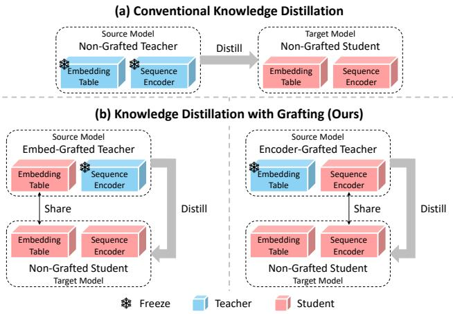  
Figure 1: Illustration of (a) conventional KD with an indepen dent teacher and (b) KD with grafting. In (b), hybrid source models replace selected teacher components with student counterparts. Inference uses only the non-grafted student.

Based on grafting, we propose Graft-Oriented Distillation (GOD), a component-level KD framework for SR. GOD constructs hybrid source models by grafting the student embedding table or the stu dent sequence encoder into a frozen teacher, while the non-grafted student serves as the target model. These grafted sources expose dif ferent student components to teacher-side computation, providing complementary supervision for generalization. For Transformerbased SR models, Grafted Encoding stabilizes representation generation by enabling mutual attention between teacher- and studentside tokens. GOD then distills the representations generated by the source models with Graft-aware Contrastive Learning, which adaptively balances correlated grafted views. During inference, GOD uses only the non-grafted student, adding no extra inference cost.

Our main contributions are summarized as follows:

• We revisit KD for SR from a component-level perspective, highlighting how separated teacher-student paths can weaken generalization under sparse histories.

• We propose GOD, a component-level KD framework that constructs hybrid source models by grafting trainable student components into a frozen teacher for enhanced generalization.

• Experiments on three real-world datasets demonstrate that GOD consistently outperforms existing KD and self-supervised baselines by up to 13.92%.

## 2 Preliminary

## 2.1 Problem Formulation

In SR, the goal is to predict the next item from the historical interaction sequence of a user. Let U and I denote the user and item

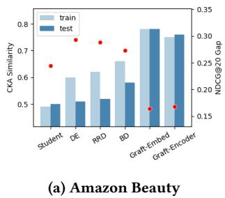

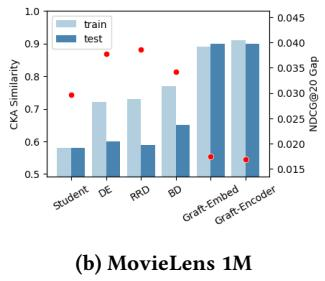  
Figure 2: Train/test CKA similarity of teacher-student sequence representations and NDCG@20 gaps with SASRec.

sets, respectively. Each user � ∈ U has a chronologically ordered sequence $s _ { u } = \left[ i _ { u , 1 } , i _ { u , 2 } , \ldots , i _ { u , | s _ { u } | } \right]$ , where $i _ { u , t } \in \mathcal { I }$ is the �-th item interacted with by user �. Given $s _ { u } ,$ , the prediction is formulated as:

$$
\underset { i \in \mathcal { T } } { \mathrm { a r g m a x } } p ( i _ { u , | s _ { u } | + 1 } = i | s _ { u } ) .\tag{1}
$$

## 2.2 Sequential Recommender

Most sequential recommenders [12, 17, 46, 69] consist of two components: an embedding table and a sequence encoder. Among them, Transformer-based models [3, 30, 37, 55, 66, 68] have become particularly prevalent due to their efectiveness in modeling complex sequential patterns [7, 49]. We therefore describe the standard Transformer-based formulation used in SR.

2.2.1 Embedding Table. Two learnable embedding tables are used: an item table $I \in \mathbb { R } ^ { | I | \times d }$ and a position table $P \in \bar { \mathbb { R } ^ { N \times d } }$ , where � is the maximum sequence length. After truncating the earliest items or front-padding zeros to length $N , s _ { u }$ is embedded as:

$$
\begin{array} { r } { e _ { u } = [ I _ { i _ { u , 1 } } + P _ { 1 } , I _ { i _ { u , 2 } } + P _ { 2 } , \ldots , I _ { i _ { u , N } } + P _ { N } ] \in \mathbb { R } ^ { N \times d } , } \end{array}\tag{2}
$$

where $I _ { i _ { u , t } }$ and $P _ { t }$ are the embeddings of item $i _ { u , t }$ and position �.

2.2.2 Sequence Encoder. The sequence embedding $e _ { u }$ is processed by an �-layer multi-head Transformer encoder, where Trm� (·) denotes the �-th layer. With $H _ { u } ^ { 0 } = e _ { u }$ , each layer outputs:

$$
H _ { u } ^ { l } = [ h _ { u , 1 } ^ { l } , h _ { u , 2 } ^ { l } , \ldots , h _ { u , N } ^ { l } ] = \mathtt { T r m } ^ { l } ( H _ { u } ^ { l - 1 } ) \in \mathbb { R } ^ { N \times d } .\tag{3}
$$

The final-layer last-position representation $h _ { u , N } ^ { L }$ defines the sequence representation $h _ { u } = f ( e _ { u } )$ , where $f ( \cdot )$ applies all Transformer layers and selects the last position.

## 2.3 Next Item Prediction

Given $s _ { u }$ and ground-truth item index $g _ { u } ,$ , the next-item probability distribution and recommendation loss are computed as:

$$
\begin{array} { r } { \begin{array} { c } { \hat { y } _ { u } = \operatorname { S o f t m a x } ( h _ { u } I ^ { \top } ) \in \mathbb { R } ^ { | { \cal T } | } , } \\ { \operatorname { \mathcal { L } } _ { r e c } ( u ) = - \log \hat { y } _ { u } [ g _ { u } ] . } \end{array} } \end{array}\tag{4}
$$

## 3 Grafting Analysis for Distillation

Before presenting GOD, we analyze whether grafting can provide component-level feedback for generalization. We evaluate whether grafting improves the transfer of distilled knowledge to unseen sequences and encourages procedural alignment between teacher and student encoding processes.

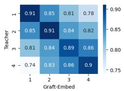

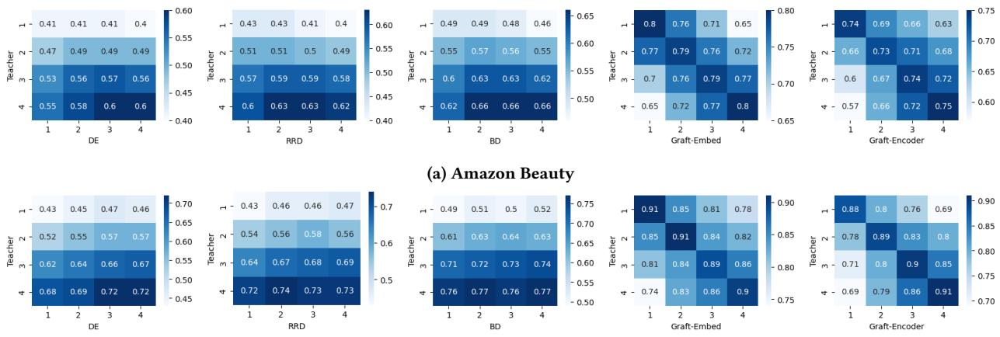  
(b) MovieLens 1M  
Figure 3: Layer-wise CKA heatmaps of teacher-student intermediate representations with 4-layer SASRec.

## 3.1 Generalization of Distilled Knowledge

Grafting improves generalization through component-level feed back. Conventional KD supervises the full student path with signals from an independent teacher, jointly optimizing student embeddings and encoder. Grafting instead replaces a frozen teacher component with its trainable student counterpart, forming a hybrid source model that evaluates the student component under teacher-side computation. Since the grafted component is shared with the student, KD regularization on the student also refines the source model [13, 40], creating an adaptive supervision loop. This resembles bidirectional KD [21, 67] but requires no explicit teacher updates and provides finer-grained guidance than output-level imitation.

Empirical Evidence. We compare Student (no KD) and five KD variants (DE [15], RRD [15], BD [21], Graft-Embed, and Graft-Encoder1) using SASRec [17] as the backbone. Figure 2 reports centered kernel alignment (CKA) [20] between teacher and student representations on train/test sequences, along with NDCG@20 gaps (train minus test). Student shows low CKA without KD, while DE and RRD improve train alignment but sufer test-alignment drops and large NDCG@20 gaps. BD partially reduces these gaps through dynamic distillation, but Graft-Embed and Graft-Encoder maintain high train/test CKA with much smaller NDCG@20 gaps, indicating better generalization of distilled knowledge.

## 3.2 Procedural Alignment

Beyond generalization, we analyze procedural alignment, i.e., layerwise correspondence between teacher and student encoding processes. Conventional KD supervises the student with teacher sig nals from separate paths, which can encourage output imitation rather than aligned encoding behavior [41]. Distilling intermediate representations [14, 39] or attention maps [70] may expose internal teacher states, but these targets are still produced by separate teacher forward passes. Grafting instead places trainable student components inside teacher-conditioned paths, guiding student encoding without explicitly matching every internal teacher state.

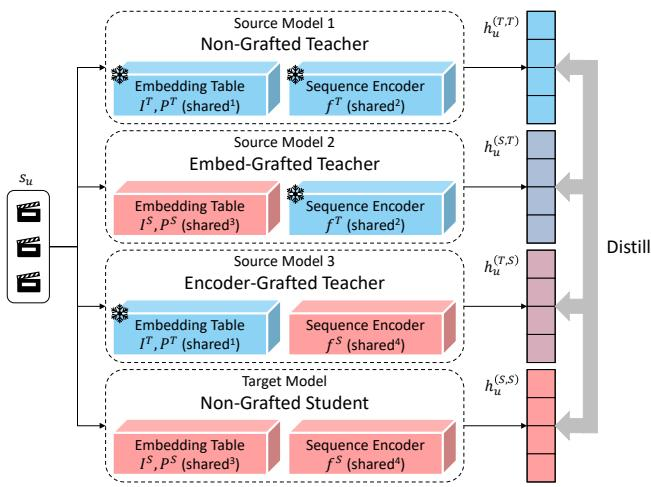  
Figure 4: Illustration of GOD. GOD distills representations of three source models—Non-Grafted Teacher, Embed-Grafted Teacher, and Encoder-Grafted Teacher—into Non-Grafted Student. Identical “shared” indices indicate parameter sharing.

Empirical Evidence. Figure 3 visualizes CKA heatmaps ofteacher– student intermediate representations on training sequences with 4-layer SASRec. DE, RRD, and BD show teacher-final-layer dominance, with all student layers most aligned to the final teacher layer, suggesting output imitation rather than layer-wise procedural alignment. In contrast, Graft-Embed and Graft-Encoder show clear diagonal patterns, with student layers most aligned to corresponding teacher layers. Notably, this correspondence emerges without explicit intermediate representation distillation, suggesting that grafting aligns student and teacher encoding processes through structural coupling rather than direct state matching.

## 4 Proposed Framework: GOD

We propose GOD, a KD framework using hybrid source models constructed via grafting, as illustrated in Figure 4. Each hybrid model replaces the teacher embedding table or sequence encoder with its student counterpart, exposing the student component to teacher side computation. GOD generates coupled representations with Grafted Encoding and distills them with Graft-aware Contrastive Learning. At inference, GOD uses only the non-grafted student.

## 4.1 Source / Target Model Configuration

Following the grafting analysis in Sec. 3, GOD constructs three source models for component-level distillation: Non-Grafted Teacher, Embed-Grafted Teacher, and Encoder-Grafted Teacher. Non-Grafted Teacher preserves the original teacher as a stable knowledge source. Embed-Grafted Teacher replaces the teacher embedding table with the student embedding table and feeds student embeddings to the teacher encoder. Encoder-Grafted Teacher replaces the teacher encoder with the student encoder and processes teacher embeddings. The target model, Non-Grafted Student, receives distilled sequence representations from all source models. As shown in Figure $^ { 4 , }$ all models share frozen-teacher and trainable-student components, introducing no standalone source-model parameters.

Forwarding Process. For a sequence $s _ { u } ,$ we first construct teacherand student-side embeddings. Let $I ^ { T } , P ^ { T }$ and $I ^ { S } , P ^ { S }$ denote the item and position embedding tables of the teacher and student, respectively. The embeddings are given by:

$$
\begin{array} { r } { e _ { u } ^ { T } = [ I _ { i _ { u , 1 } } ^ { T } + P _ { 1 } ^ { T } , I _ { i _ { u , 2 } } ^ { T } + P _ { 2 } ^ { T } , \ldots , I _ { i _ { u , N } } ^ { T } + P _ { N } ^ { T } ] \in \mathbb { R } ^ { N \times d ^ { T } } , } \\ { e _ { u } ^ { S } = [ I _ { i _ { u , 1 } } ^ { S } + P _ { 1 } ^ { S } , I _ { i _ { u , 2 } } ^ { S } + P _ { 2 } ^ { S } , \ldots , I _ { i _ { u , N } } ^ { S } + P _ { N } ^ { S } ] \in \mathbb { R } ^ { N \times d ^ { S } } . } \end{array}\tag{5}
$$

With $f ^ { T } ( \cdot )$ and $f ^ { S } ( \cdot )$ denoting the teacher and student sequence encoders, the two embeddings are paired with the two encoders to produce four representations:

$$
\begin{array} { r l r } & { h _ { u } ^ { ( T , T ) } = f ^ { T } ( e _ { u } ^ { T } ) \cdot W _ { d o w n } } & { \in \mathbb { R } ^ { d ^ { S } } , } \\ & { h _ { u } ^ { ( S , T ) } = f ^ { T } ( e _ { u } ^ { S } \cdot W _ { u p } ) \cdot W _ { d o w n } } & { \in \mathbb { R } ^ { d ^ { S } } , } \\ & { h _ { u } ^ { ( T , S ) } = f ^ { S } ( e _ { u } ^ { T } \cdot W _ { d o w n } ) } & { \in \mathbb { R } ^ { d ^ { S } } , } \\ & { h _ { u } ^ { ( S , S ) } = f ^ { S } ( e _ { u } ^ { S } ) } & { \in \mathbb { R } ^ { d ^ { S } } , } \end{array}\tag{6}
$$

where $h _ { u } ^ { ( M _ { 1 } , M _ { 2 } ) }$ denotes the representation generated using the embeddings of $M _ { 1 }$ and the sequence encoder of $M _ { 2 }$ for $M _ { 1 } , M _ { 2 } \in \{ T , S \}$ Thus, $\check { h _ { u } ^ { ( T , T ) } } , h _ { u } ^ { ( S , T ) } , h _ { u } ^ { ( T , S ) }$ , and $h _ { u } ^ { ( S , S ) }$ are generated by Non-Grafted Teacher, Embed-Grafted Teacher, Encoder-Grafted Teacher, and Non-Grafted Student, respectively. GOD uses shared linear projections $\bar { W _ { d o w n } } \in \mathbb { R } ^ { d ^ { T } \times d ^ { S } }$ and $W _ { u p } \in \bar { \mathbb { R } } ^ { d ^ { S } \times d ^ { T } }$ to align dimensions while preserving the structural efect of grafting (see Figure 10 in Sec. 5.4).

## 4.2 Grafted Encoding

GOD is applicable to SR models with separable embeddings and encoders, while Grafted Encoding (GE) targets Transformer-based models, which dominate recent SR research [3, 30, 37, 55, 66, 68]. GE stabilizes representation generation by concatenating teacherand student-side embeddings and enabling mutual attention, as il lustrated in Figure 5. Early in training, grafted student components are not yet well optimized, which can make hybrid source model representations unstable. Mutual attention lets teacher-side embeddings provide stable context early on, while improved student-side embeddings later refine teacher-conditioned representations without updating the frozen teacher [21, 67]. Thus, GE strengthens structural coupling while keeping the teacher frozen.

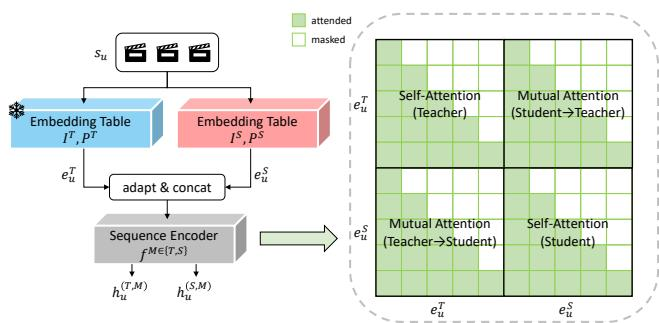  
Figure 5: Illustration of Grafted Encoding with teacherstudent mutual attention.

Forwarding Process. In GE, the four models are grouped by their shared sequence encoder: Non-Grafted Teacher and Embed-Grafted Teacher share $f ^ { T } ( \cdot )$ , while Encoder-Grafted Teacher and Non-Grafted Student share $f ^ { S } ( \cdot )$ . For each pair, teacher- and student-side embeddings are adapted to the same dimension, concatenated, and passed through the shared encoder. Let Trm $^ M , l ( \cdot )$ denote the �-th Transformer layer of encoder $f ^ { M \in \{ T , S \} }$ , whose depth and hidden dimension are $L ^ { M }$ and $d ^ { M }$ , respectively. With $H _ { u } ^ { T , 0 } = \big [ e _ { u } ^ { T } ; e _ { u } ^ { S } \cdot W _ { u p } \big ]$ and $H _ { u } ^ { S , 0 } = [ e _ { u } ^ { T } \cdot W _ { d o w n } ; e _ { u } ^ { S } ]$ ], the forwarding process is:

$$
\begin{array} { r l } & { H _ { u } ^ { M , l } = [ h _ { u , 1 } ^ { M , l } , h _ { u , 2 } ^ { M , l } , \ldots , h _ { u , N } ^ { M , l } , h _ { u , N + 1 } ^ { M , l } , \ldots , h _ { u , 2 N } ^ { M , l } ] } \\ & { \qquad = \mathrm { T r m } ^ { M , l } ( H _ { u } ^ { M , l - 1 } ) \in \mathbb { R } ^ { 2 N \times d ^ { M } } . } \end{array}\tag{7}
$$

Instead of using separate causal attention for each side, GE enables mutual attention between teacher- and student-side tokens. The causal attention mask is:

$$
( A _ { c a u s a l } ) _ { i j } = { \mathbb { I } } [ j \leq i ] , \quad A _ { c a u s a l } \in \{ 0 , 1 \} ^ { N \times N } ,\tag{8}
$$

where $( A _ { c a u s a l } ) _ { i j } = 1$ allows the �-th query token to attend to the �-th key token. For the concatenated sequence, GE uses:

$$
A _ { G E } = \left[ \begin{array} { l l } { A _ { c a u s a l } } & { A _ { c a u s a l } } \\ { A _ { c a u s a l } } & { A _ { c a u s a l } } \end{array} \right] \in \{ 0 , 1 \} ^ { 2 N \times 2 N } .\tag{9}
$$

Finally, the four sequence representations are obtained from the last valid positions of the teacher- and student-side token blocks:

$$
\begin{array} { r l r } & { h _ { u } ^ { ( T , T ) } = h _ { u , N } ^ { T , L ^ { T } } \cdot W _ { d o w n } } & { \in \mathbb { R } ^ { d ^ { S } } , } \\ & { h _ { u } ^ { ( S , T ) } = h _ { u , 2 N } ^ { T , L ^ { T } } \cdot W _ { d o w n } } & { \in \mathbb { R } ^ { d ^ { S } } , } \\ & { h _ { u } ^ { ( T , S ) } = h _ { u , N } ^ { S , L ^ { S } } } & { \in \mathbb { R } ^ { d ^ { S } } , } \\ & { h _ { u } ^ { ( S , S ) } = h _ { u , 2 N } ^ { S , L ^ { S } } } & { \in \mathbb { R } ^ { d ^ { S } } . } \end{array}\tag{10}
$$

Complexity. Although GE forms a length-2� concatenated sequence, its overhead is limited to training-time attention since GE is not used during inference. Without GE, four length-� paths incur cost $O ( 2 N ^ { 2 } d ^ { T } + 2 N ^ { 2 } d ^ { S } )$ , whereas GE uses two length-2� paths with cost $O ( 4 N ^ { 2 } d ^ { T } + 4 N ^ { 2 } d ^ { S } )$ , roughly doubling attention computation. This overhead comes from stronger structural coupling and can be ofset by faster convergence in practice (see Table 7 in Sec. 5.5). For memory cost, we also evaluate GE with each side sequence halved, so the concatenated sequence keeps length �. GE still improves performance in this setting (see Table 5 in Sec. 5.4).

## 4.3 Graft-aware Contrastive Learning

Leveraging the four representations, GOD performs KD through contrastive learning. Rather than point-wise matching or logit imitation, contrastive learning transfers relational structure among sequences across views [34, 60]. This is well suited to GOD since representations of source and target models form structurally re lated views through shared teacher and student components.

GOD considers pairwise relations among all four representations [4, 36, 55]. We include both source-target and source-source pairs because hybrid source models contain trainable student components, allowing source-source relations to regularize the student embeddings or encoder. With $\mathcal { A } = \{ ( T , T ) , ( S , T ) , ( T , S ) , ( S , S ) \}$ }, the contrastive loss for each pair is:

$$
\mathcal { L } _ { p a i r } ( h _ { u } ^ { a } , h _ { u } ^ { b } ) = - \log \frac { \exp ( h _ { u } ^ { a } \cdot h _ { u } ^ { b } / \tau ) } { \sum _ { s _ { u ^ { \prime } } \in B } \exp ( h _ { u } ^ { a } \cdot h _ { u ^ { \prime } } ^ { b } / \tau ) } ,\tag{11}
$$

where � is the temperature and � is the mini-batch of sequences.

The six pair types, however, are not equally informative since the four representations share teacher and student components. Following prior works on similarity-aware pair weighting [18, 44, 53], GOD down-weights highly similar relations to reduce redundant supervision and emphasize complementary component-level signals. Specifically, the pair weight and distillation objective are defined as:

$$
\begin{array} { l } { w ( a , b ) = \frac { \displaystyle \exp ( \mathrm { s g } ( - \frac { 1 } { | B | } \sum _ { s _ { u } \in B } h _ { u } ^ { a } \cdot h _ { u } ^ { b } ) ) } { \sum _ { \{ a ^ { \prime } , b ^ { \prime } \} \subset \mathcal { A } } \exp ( \mathrm { s g } ( - \frac { 1 } { | B | } \sum _ { s _ { u } \in B } h _ { u } ^ { a ^ { \prime } } \cdot h _ { u } ^ { b ^ { \prime } } ) ) } , } \\ { \mathcal { L } _ { k d } ( u ) = \displaystyle \sum _ { \{ a , b \} \subset \mathcal { A } } w ( a , b ) \mathcal { L } _ { \rho a i r } ( h _ { u } ^ { a } , h _ { u } ^ { b } ) , } \end{array}\tag{12}
$$

where sg(·) denotes stop-gradient. GCL down-weights highly similar pair types and emphasizes less-aligned ones, while stop-gradient keeps �(�, �) as an adaptive coeficient rather than a directly opti mized target.

## 4.4 Inference and Optimization

Inference. GOD uses only Non-Grafted Student for inference:

$$
\begin{array} { r } { p ( i _ { u , | s _ { u } | + 1 } | s _ { u } ) = \hat { y } _ { u } = \mathrm { S o f f m a x } ( h _ { u } I ^ { S ^ { \top } } ) , } \end{array}\tag{13}
$$

where $h _ { u } = f ^ { S } ( e _ { u } ^ { S } )$ . Note that with $\mathrm { G E } , h _ { u }$ difers from $h _ { u } ^ { ( S , S ) }$ , which is generated with teacher-student mutual attention for training.

Optimization. Next-item prediction uses the sequence representation of Non-Grafted Student, and KD improves its consistency and generalization. Therefore, we jointly optimize the recommendation and distillation objectives with loss coeficient �:

$$
\mathcal { L } = \sum _ { u \in \mathcal { U } } ( \mathcal { L } _ { r e c } ( u ) + \lambda \mathcal { L } _ { k d } ( u ) ) .\tag{14}
$$

## 5 Experiment

In this section, we address the following research questions (RQs):

• RQ1: How does GOD perform compared with existing KD and self-supervised methods in SR? (Section 5.2)

Table 1: Statistics of the datasets.
<table><tr><td>Datasets</td><td># Interactions # Users</td><td></td><td></td><td># Items Avg.SeqLen Sparsity</td><td></td></tr><tr><td>Amazon Beauty</td><td>198,502</td><td>22,363</td><td>12,101</td><td>8.9</td><td>99.93 %</td></tr><tr><td>Yelp</td><td>345,186</td><td>29,915</td><td>21,572</td><td>11.5</td><td>99.95 %</td></tr><tr><td>MovieLens 1M</td><td>999,611</td><td>6,040</td><td>3,416</td><td>165.5</td><td>95.16 %</td></tr></table>

• RQ2: Does GOD improve generalization and robustness under challenging conditions? (Section 5.3)

• RQ3: How efective are the core components of GOD? (Section 5.4)

• RQ4: How eficient and hyperparameter-sensitive is GOD in practice? (Section 5.5)

## 5.1 Experimental Setup

5.1.1 Dataset. To validate the efectiveness of GOD, we conduct experiments on three public datasets: Amazon Beauty [32], Yelp [1], and MovieLens 1M [11]. These datasets vary in domain, scale, and sparsity, with detailed statistics provided in Table 1. Following [17, 38], we treat interactions as implicit feedback, and filter out users and items with fewer than five interactions.

5.1.2 Baseline. We first describe the backbone models to which GOD and all KD methods are applied. We then summarize the KD baselines used for comparison.

• Backbone Recommender: We apply GOD and all KD methods to GRU4Rec [12], FMLPRec [69], and SASRec [17], covering RNN-, MLP-, and Transformer-based architectures. For each backbone, Student is the compact model trained without KD, and Teacher is the larger pretrained model. GE is applied only to SASRec.

• General Recommendation KD: We compare with KD methods for general recommendation. RD [47] transfers teacher ranking knowledge. CD [23] samples informative items from teacher rankings. DE [15] distills latent embeddings. RRD [15] relaxes teacher rankings for supervision. HTD [16] transfers hierarchical topology knowledge in the representation space. BD [21] performs bidirectional distillation for recommendation.

• SR-tailored KD: We further compare with KD designed for SR. AdaRec [2] searches for scene-adaptive student architectures. MSKDIK [9] distills interest representation and drift knowledge in multiple stages. EMKD [8] uses ensemble modeling with contrastive distillation.

We exclude LLM-based KD methods because they use external LLM knowledge or language-model students, while our experiments focus on ID-based KD with the same interaction-only input and backbone recommenders.2 This ensures that performance diferences reflect the distillation strategy rather than additional modality or model-scale advantages.

5.1.3 Evaluation. For evaluation, we adopt the leave-one-out protocol [17], where the last item of each chronological sequence is used for testing, the penultimate item for validation, and the rest for training. We perform full-ranking without negative sampling [38]. Performance is measured by HR@� and NDCG@�, where � ∈ {10, 20}.

Table 2: Overall performance. Best and second-best results are marked in bold and underlined. ������.� and ������.� denote relative improvements over Student and the strongest baseline. Asterisk (\*) indicates statistical significance at $\textstyle p < 0 . 0 5$ by paired �-test over five independent runs against the strongest baseline.
<table><tr><td>Dataset</td><td>|Backbone </td><td>Metric</td><td>|Teacher |</td><td>|Student</td><td>RD</td><td>CD</td><td>DE</td><td>RRD HTD</td><td>BD</td><td>|AdaRec</td><td>MSKDIK</td><td>EMKD</td><td>GOD</td><td>Improv.S</td><td>Improv.B</td></tr><tr><td rowspan="8">Amazon Beauty</td><td rowspan="4">GRU4Rec</td><td>HR@10</td><td>0.0506 0.0788</td><td>0.0384 0.0622</td><td>0.0392 0.0626</td><td>0.0403 0.0639</td><td>0.0413 0.0652</td><td>0.0426 0.0438 0.0668 0.0682</td><td>0.0464 0.0711</td><td>0.0450 0.0692</td><td>0.0454 0.0703</td><td>0.0472 0.0722</td><td>0.0508* 0.0777*</td><td>32.29 % 24.92 %</td><td>7.63 % 7.62 %</td></tr><tr><td>HR@20</td><td></td><td></td><td></td><td></td><td></td><td></td><td></td><td></td><td>0.0227</td><td>0.0237</td><td>0.0257*</td><td></td><td></td></tr><tr><td>NDCG@10</td><td>0.0257</td><td>0.0187</td><td>0.0190</td><td>0.0196</td><td>0.0203</td><td>0.0210 0.0217</td><td>0.0232</td><td>0.0224</td><td></td><td></td><td></td><td>37.69 %</td><td>8.44 %</td></tr><tr><td>NDCG@20</td><td>0.0322</td><td>0.0249</td><td>0.0262</td><td>0.0266</td><td>0.0270</td><td>0.0275 0.0281</td><td>0.0290</td><td>0.0285</td><td>0.0286</td><td>0.0294</td><td>0.0316*</td><td>26.91 %</td><td>7.48 %</td></tr><tr><td>HR@10</td><td>0.0667</td><td>0.0524</td><td>0.0540</td><td>0.0547</td><td>0.0555</td><td>0.0564</td><td>0.0573 0.0583</td><td>0.0583</td><td>0.0590</td><td>0.0596</td><td>0.0634*</td><td>20.99 %</td><td>6.38 %</td></tr><tr><td>HR@20 FMLPRec</td><td>0.0959</td><td>0.0813</td><td>0.0843</td><td>0.0849</td><td>0.0856</td><td>0.0864</td><td>0.0871 0.0883</td><td>0.0873</td><td>0.0886</td><td>0.0892</td><td>0.0951*</td><td>16.97 %</td><td>6.61 %</td></tr><tr><td>NDCG@10</td><td>0.0368</td><td>0.0296</td><td>0.0315</td><td>0.0319</td><td>0.0322</td><td>0.0326</td><td>0.0330 0.0336</td><td>0.0335</td><td>0.0338</td><td>0.0341</td><td>0.0372*</td><td>25.68 %</td><td>9.09 %</td></tr><tr><td>NDCG@20</td><td>0.0436</td><td>0.0346</td><td>0.0363</td><td>0.03680.0372</td><td></td><td>0.0377 0.0382</td><td>0.0388</td><td>0.0388</td><td>0.0393</td><td>0.0396</td><td>0.0427*</td><td>23.41 %</td><td>7.83 %</td></tr><tr><td rowspan="3">SASRec</td><td>HR@10</td><td>0.0727 0.1030</td><td>0.0605 0.0925</td><td>0.0617 0.0932</td><td>0.0626 0.0635 0.0943</td><td>0.0955</td><td>0.0646 0.0655 0.0969 0.0981</td><td>0.0675</td><td>0.0666 0.0995</td><td>0.0668 0.0999</td><td>0.0683 0.1017</td><td>0.0725* 0.1051*</td><td>19.83 % 13.62 %</td><td>6.15 % 3.34 %</td></tr><tr><td>HR@20</td><td>0.0401</td><td>0.0316</td><td>0.0321</td><td>0.0327</td><td>0.0332</td><td>0.0339 0.0346</td><td>0.1006 0.0360</td><td>0.0353</td><td>0.0355</td><td>0.0364</td><td>0.0392*</td><td>24.05 %</td><td>7.69 %</td></tr><tr><td>NDCG@10 NDCG@20</td><td>0.0472</td><td>0.0390</td><td>0.0410</td><td>0.0415 0.0420</td><td>0.0426</td><td>0.0432</td><td>0.0444</td><td>0.0437</td><td>0.0439</td><td>0.0447</td><td>0.0474*</td><td>21.54 %</td><td>6.04 %</td></tr><tr><td rowspan="8">Yelp</td><td rowspan="4">GRU4Rec</td><td>HR@10</td><td>0.0498</td><td>0.0365</td><td>0.0383</td><td>0.03790.0389</td><td>0.0391</td><td>0.0395</td><td>0.0403</td><td>0.0399</td><td>0.0404 0.0407</td><td>0.0456*</td><td></td><td>24.93 %</td></tr><tr><td></td><td>0.0843</td><td>0.0652 0.0686</td><td>0.0675</td><td>0.0701</td><td>0.0712 0.0725</td><td>0.0742</td><td>0.0739</td><td>0.0751</td><td>0.0761</td><td>0.0810*</td><td>24.23 %</td><td>12.04 % 6.44 %</td></tr><tr><td>HR@20 NDCG@10</td><td>0.0250</td><td>0.0187</td><td>0.0195</td><td>0.0191 0.0197</td><td>0.0201</td><td>0.0204 0.0208</td><td>0.0206</td><td>0.0210</td><td>0.0212</td><td>0.0241*</td><td>28.88 %</td><td>13.68 %</td></tr><tr><td>NDCG@20</td><td>0.0337</td><td>0.0245</td><td>0.0263 0.0257</td><td>0.0266</td><td>0.0272</td><td>0.0277 0.0283</td><td>0.0278</td><td>0.0286</td><td>0.0290</td><td>0.0322*</td><td>31.43 %</td><td>11.03 %</td></tr><tr><td>HR@10 HR@20</td><td>0.0543</td><td>0.0407</td><td>0.0421</td><td>0.0429 0.0438</td><td>0.0443</td><td>0.0449</td><td>0.0460</td><td>0.0454</td><td>0.0456 0.0464</td><td>0.0508*</td><td></td><td>24.82 %</td><td>9.48 %</td></tr><tr><td rowspan="3">FMLPRec</td><td></td><td>0.0873</td><td>0.0647</td><td>0.0676 0.0684</td><td>0.0700</td><td>0.0708</td><td>0.0715 0.0729</td><td>0.0723</td><td>0.0724</td><td>0.0735</td><td>0.0804*</td><td>24.27 %</td><td>9.39 %</td></tr><tr><td>NDCG@10</td><td>0.0293</td><td>0.0223</td><td>0.0226 0.0231</td><td>0.0239</td><td>0.0244 0.0249</td><td>0.0258</td><td>0.0253</td><td>0.0255</td><td>0.0262</td><td>0.0287*</td><td>28.70 %</td><td>9.54 %</td></tr><tr><td>NDCG@20</td><td>0.0375</td><td>0.0282</td><td>0.0296 0.0301</td><td>0.0311</td><td>0.0314 0.0316</td><td>0.0322</td><td>0.0320</td><td>0.0320</td><td>0.0324</td><td>0.0360*</td><td>27.66 %</td><td>11.11 %</td></tr><tr><td rowspan="3">SASRec</td><td>HR@10</td><td>0.0568</td><td>0.0454</td><td>0.0481</td><td>0.0470</td><td>0.0485 0.0490</td><td>0.0494</td><td>0.0503</td><td>0.0497</td><td>0.0500</td><td>0.0507</td><td>0.0567*</td><td>24.89 %</td><td>11.83 %</td></tr><tr><td>HR@20</td><td>0.0917</td><td>0.0764</td><td>0.0808</td><td>0.0791</td><td>0.0814</td><td>0.0818 0.0821</td><td>0.0828</td><td>0.0824</td><td>0.0826</td><td>0.0831</td><td>0.0929*</td><td>21.60 %</td><td>11.79 %</td></tr><tr><td>NDCG@10</td><td>0.0303</td><td>0.0241</td><td>0.0259</td><td>0.0249 0.0263</td><td>0.0265</td><td>0.0267</td><td>0.0271</td><td>0.0269</td><td>0.0270</td><td>0.0273</td><td>0.0311*</td><td>29.05 %</td><td>13.92 %</td></tr><tr><td rowspan="9"></td><td rowspan="3"></td><td>NDCG@20</td><td>0.0390</td><td>0.0316</td><td>0.0344 0.0334</td><td>0.0352</td><td>0.0356</td><td>0.0361 0.0370</td><td>0.0364</td><td>0.0367</td><td>0.0373</td><td>0.0405*</td><td>28.16 %</td><td>8.58 %</td></tr><tr><td>HR@10</td><td>0.2063</td><td>0.1325</td><td>0.1344 0.1334</td><td>0.1353</td><td>0.1361</td><td>0.1369 0.1375</td><td>0.1380</td><td>0.1386</td><td>0.1391</td><td>0.1499*</td><td>13.13 %</td><td>7.76 %</td></tr><tr><td>HR@20</td><td>0.2976 0.1012</td><td>0.1975 0.0665</td><td>0.2030 0.1999</td><td>0.2046</td><td>0.2061 0.2076</td><td>0.2086</td><td>0.2096</td><td>0.2105 0.0690</td><td>0.2116 0.0692</td><td>0.2231* 0.0770*</td><td>12.96 % 15.79 %</td><td>5.43 %</td></tr><tr><td>GRU4Rec</td><td>NDCG@10</td><td></td><td>0.0683</td><td>0.0671</td><td>0.0684 0.0686</td><td>0.0688</td><td>0.0689</td><td>0.0691</td><td></td><td></td><td></td><td></td><td>11.27 % 8.89 %</td></tr><tr><td rowspan="5">FMLPRec</td><td>NDCG@20</td><td>0.1260</td><td>0.0867</td><td>0.0895 0.0873</td><td>0.0909</td><td>0.0917</td><td>0.0924 0.0930</td><td>0.0934</td><td>0.0940</td><td>0.0945</td><td>0.1029*</td><td>18.69 %</td><td></td></tr><tr><td>HR@10</td><td>0.1996</td><td>0.1338</td><td>0.1354 0.1349 0.2167</td><td>0.1361 0.2133 0.2200</td><td>0.1363 0.2215 0.2231</td><td>0.1367 0.1369 0.2242</td><td>0.1371 0.2253</td><td>0.1373 0.2264</td><td>0.1375 0.2274</td><td>0.1514* 0.2398*</td><td>13.15 % 12.95 %</td><td>10.11 % 5.45 %</td></tr><tr><td>HR@20 NDCG@10</td><td>0.2894 0.0962</td><td>0.2123 0.0694</td></table>

5.1.4 Implementation. We implement all models in PyTorch on a single NVIDIA GeForce RTX 3090 GPU and report averages over five independent runs. Unless otherwise specified, the default student and teacher dimensions are $d ^ { S } = 1 6$ and $d ^ { T } = 6 4 ,$ , respectively. For all backbones, we use 2 encoder layers, a dropout rate of 0.5, and a maximum sequence length $N = 5 0$ . For SASRec, we use 2 attention heads. For fair comparison, we thoroughly tune each baseline following the search ranges in its original paper. For GOD, the KD loss coeficient � is selected from {1e-4, 1e-3, 1e-2, 1e-1, 1e-0}, and the temperature � from {1, 5, 10, 20}. We train all models with Adam optimizer [19] using a learning rate of 0.001 and batch size of 256. Early stopping is applied with patience 30 based on validation NDCG@20.

## 5.2 Overall Performance (RQ1)

Table 2 reports the KD performance of GOD in SR. Overall, GOD achieves the best results across all datasets, backbones, and metrics, improving over the strongest baseline by up to 13.92%. Beyond these gains, we make three key observations:

• All KD methods outperform Student, confirming that teacher supervision helps compact models under sparse sequential feedback.

SR-tailored KD methods generally outperform general recommendation KD methods, highlighting the importance of sequenceaware distillation.

• BD is a strong general KD baseline. On the sparser Amazon Beauty and Yelp datasets, BD often even surpasses AdaRec and MSKDIK, suggesting that adaptive teacher-student supervision benefits sparse and evolving interactions. However, unlike BD, GOD keeps the teacher frozen while still achieving better performance.

• GOD shows larger gains over Student on Amazon Beauty and Yelp than on the denser MovieLens 1M. This supports our motivation that grafting improves the generalization of distilled knowledge under sparse interactions, where SR models are prone to overfitting [31, 62]. Consistent gains across GRU4Rec, FMLPRec, and SASRec further show the broad applicability of GOD across architectures.

Self-Distillation. Table 3 reports performance with SASRec when teacher and student have the same capacity $( d ^ { S } = d ^ { T } = 6 4 )$ . For GOD and KD baselines, this setting uses an ofline pretrained teacher with the same architecture and dimension as the student, allowing us to examine whether GOD remains efective without a capacity gap. Since no model compression is involved, we also compare with self-supervised contrastive baselines that use online signals generated by the model itself during training, such as augmented or consistency-based views: CL4SRec [60], MCLRec [36], CT4Rec [4], DuoRec [38], and RCL [55]. GOD achieves the best results across all datasets and metrics, improving over the strongest baseline by up to 8.12%. We make three observations:

Table 3: Self-distillation performance with SASRec. Best and second-best results are marked in bold and underlined. ������. denotes the relative improvement over the strongest baseline. Asterisk (\*) indicates statistical significance at $\textstyle p < 0 . 0 5$ by paired �-test over five independent runs against the strongest baseline.
<table><tr><td>Dataset</td><td>Metric</td><td>SASRec</td><td>RRD</td><td>HTD</td><td>BD</td><td>MSKDIK</td><td>EMKD</td><td>CL4SRec</td><td>MCLRec</td><td>CT4Rec</td><td>DuoRec</td><td>RCL</td><td>GOD</td><td>|Improv.</td></tr><tr><td rowspan="5">Amazon Beauty</td><td>HR@10</td><td>0.0727</td><td>0.0718</td><td>0.0721</td><td>0.0749</td><td>0.0763</td><td>0.0785</td><td>0.0796</td><td>0.0806</td><td>0.0837</td><td>0.0856</td><td>0.0853</td><td>0.0923*</td><td>7.83 %</td></tr><tr><td>HR@20</td><td>0.1030</td><td>0.1010</td><td>0.1018</td><td>0.1047</td><td>0.1062</td><td>0.1078</td><td>0.1084</td><td>0.1099</td><td>0.1139</td><td>0.1164</td><td>0.1172</td><td>0.1249*</td><td>6.57 %</td></tr><tr><td>NDCG@10</td><td>0.0401</td><td>0.0396</td><td>0.0400</td><td>0.0426</td><td>0.0438</td><td>0.0454</td><td>0.0464</td><td>0.0474</td><td>0.0490</td><td>0.0506</td><td>0.0517</td><td>0.0559*</td><td>8.12 %</td></tr><tr><td>NDCG@20</td><td>0.0472</td><td>0.0461</td><td>0.0469</td><td>0.0499</td><td>0.0513</td><td>0.0525</td><td>0.0544</td><td>0.0554</td><td>0.0568</td><td>0.0580</td><td>0.0596</td><td>0.0641*</td><td>7.55 %</td></tr><tr><td>HR@10</td><td>0.0568</td><td>0.0559</td><td>0.0571</td><td>0.0574</td><td>0.0566</td><td>0.0584</td><td>0.0588</td><td>0.0591</td><td>0.0601</td><td>0.0606</td><td>0.0607</td><td>0.0640*</td><td>5.44 %</td></tr><tr><td rowspan="5">Yelp</td><td>HR@20</td><td>0.0917</td><td>0.0903</td><td>0.0931</td><td>0.0934</td><td>0.0917</td><td>0.0945</td><td>0.0951</td><td>0.0957</td><td>0.0968</td><td>0.0975</td><td>0.0978</td><td>0.1032*</td><td>5.52 %</td></tr><tr><td>NDCG@10</td><td>0.0303</td><td>0.0296</td><td>0.0311</td><td>0.0311</td><td>0.0304</td><td>0.0304</td><td>0.0305</td><td>0.0306</td><td>0.0310</td><td>0.0311</td><td>0.0310</td><td>0.0329*</td><td>5.79 %</td></tr><tr><td>NDCG@20</td><td>0.0390</td><td>0.0382</td><td>0.0393</td><td>0.0397</td><td>0.0385</td><td>0.0391</td><td>0.0390</td><td>0.0396</td><td>0.0401</td><td>0.0404</td><td>0.0403</td><td>0.0427*</td><td>5.69 %</td></tr><tr><td>HR@10</td><td>0.2330</td><td>0.2266</td><td>0.2303</td><td>0.2318</td><td>0.2271</td><td>0.2336</td><td>0.2345</td><td>0.2304</td><td>0.2352</td><td>0.2347</td><td>0.2308</td><td>0.2461*</td><td>4.63 %</td></tr><tr><td>HR@20</td><td>0.3301</td><td>0.3236</td><td>0.3288</td><td>0.3285</td><td>0.3243</td><td>0.3317</td><td>0.3348</td><td>0.3275</td><td>0.3370</td><td>0.3382</td><td>0.3342</td><td>0.3554*</td><td>5.09 %</td></tr><tr><td rowspan="3">MovieLens 1M</td><td>NDCG@10</td><td>0.1150</td><td>0.1133</td><td>0.1147</td><td>0.1155</td><td>0.1141</td><td>0.1177</td><td>0.1201</td><td>0.1188</td><td>0.1214</td><td>0.1230</td><td>0.1232</td><td>0.1295*</td><td>5.11 %</td></tr><tr><td>NDCG@20</td><td>0.1417</td><td>0.1390</td><td>0.1408</td><td>0.1419</td><td>0.1393</td><td>0.1442</td><td>0.1482</td><td>0.1455</td><td>0.1490</td><td>0.1497</td><td>0.1500</td><td>0.1561*</td><td>4.07 %</td></tr><tr><td></td><td></td><td></td><td></td><td></td><td></td><td></td><td></td><td></td><td></td><td></td><td></td><td></td><td></td></tr></table>

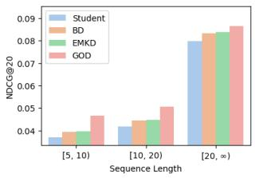  
(a) Amazon Beauty

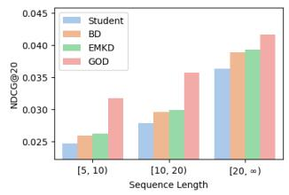  
(b) Yelp  
Figure 6: Performance by sequence length with SASRec.

• Conventional KD methods provide limited gains in this samecapacity setting. Several methods improve only marginally or even underperform SASRec. This suggests that, without a capacity gap, simply imitating a same-capacity teacher provides limited additional knowledge for recommendation.

• Self-supervised methods are stronger than KD baselines. This indicates that representation regularization is more efective than direct teacher imitation in the self-distillation setting. However, these methods rely on augmentation- or consistency-based views rather than teacher-conditioned source views.

• GOD consistently outperforms both KD and self-supervised baselines. This shows that its gains do not merely come from model compression or generic contrastive learning. Instead, grafted teacher-student views provide more transferable supervision to improve same-capacity sequence representation learning.

## 5.3 Generalization and Robustness (RQ2)

To further understand the generalization behavior of GOD, we evaluate its robustness under both data-side and teacher-side challenges. We consider user history sparsity and interaction noise as data-side factors, and teacher-student capacity gap and teacher quality as teacher-side factors.

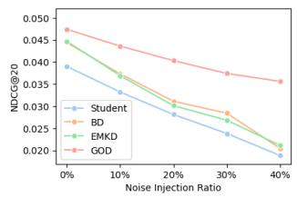  
(a) Amazon Beauty

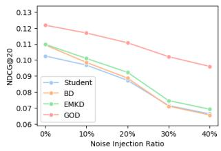  
(b) MovieLens 1M  
Figure 7: Performance under diferent noise injection ratios with SASRec.

User History Sparsity. We group users by sequence length and evaluate each group separately. As shown in Figure 6, all methods improve with longer sequences, indicating that longer histories provide richer preference signals. More importantly, GOD consistently performs best across all groups, with especially large margins in short-sequence groups. This confirms that GOD is particularly efective when user interactions are sparse, where conventional KD methods have limited evidence for learning robust sequential patterns. The margin becomes smaller for long-sequence users, suggesting that the benefit of grafting is most pronounced when generalization from sparse interactions is needed.

Noise Robustness. We perturb the input sequence at test time by replacing a given ratio of items with random negative items, where the ratio is measured relative to the sequence length. As shown in Figure 7, performance consistently drops as the noise ratio increases, confirming that noisy interactions make sequential pattern modeling more challenging. Nevertheless, GOD maintains the best performance across all noise levels, and its performance gap remains clear even under high noise ratios. This indicates that grafting provides more robust component-level supervision than bi-directional KD or SR-tailored KD, allowing the student to preserve transferable sequential patterns when observed histories are corrupted.

Capacity Sensitivity. We vary the student dimension $d ^ { S } \in \{ 8 , 1 6 , 3 2 \}$ and teacher dimension $d ^ { T } \in \{ 6 4 , 1 2 8 \}$ to examine robustness of GOD across teacher-student capacity gaps. As shown in Figure 8,

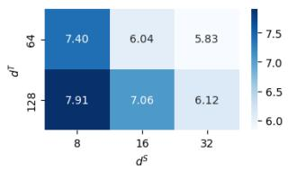

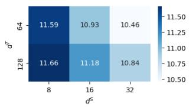  
(a) Amazon Beauty  
(b) MovieLens 1M

Figure 8: Relative NDCG@20 improvements (%) of GOD over EMKD, the strongest baseline, under diferent student and teacher dimensions with SASRec.  
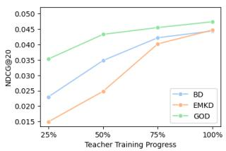  
(a) Amazon Beauty

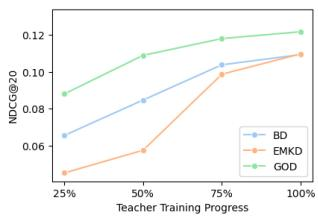  
(b) MovieLens 1M  
Figure 9: Performance under diferent teacher training progress with SASRec. Here, 100% denotes the best teacher checkpoint.

GOD consistently improves over EMKD across all dimension pairs. The gains are larger when the student is smaller, indicating that grafting is especially useful when compact students lack suficient capacity to absorb teacher knowledge. In addition, increasing the teacher dimension generally brings larger improvements, suggesting that GOD can better exploit richer teacher knowledge instead of sufering from a wider teacher-student gap. These results show that GOD remains efective across diverse compression ratios.

Teacher Quality Sensitivity. We evaluate sensitivity to teacher quality by freezing checkpoints at 25%, 50%, 75%, and 100% of the training progress toward the best teacher checkpoint. For example, ifthe best teacher checkpoint is obtained at epoch 44, the 50% check point is trained for 22 epochs. As shown in Figure 9, all methods benefit from more trained teachers, confirming that teacher qual ity afects KD performance. Notably, BD outperforms EMKD with weaker teachers, suggesting that bidirectional updates can partially compensate for weak teacher supervision. GOD, however, consistently performs best without explicitly updating the teacher. This indicates that grafting and GE provide adaptive teacher-conditioned supervision eficiently, enabling GOD to extract transferable knowledge even from partially trained teachers.

## 5.4 Ablation Study (RQ3)

To understand the contribution of each design in GOD, we conduct ablation studies on three core components: source models, GE, and GCL.

Table 4: Source model ablation with SASRec. NDCG@20 results are shown for the source models used in KD, where (T,T), (S,T), and (T,S) denote Non-Grafted Teacher, Embed-Grafted Teacher, and Encoder-Grafted Teacher, respectively. Case (1) corresponds to GOD.
<table><tr><td>Case</td><td>(T,T) (S,T)</td><td>(T,S) </td><td>Amazon Beauty</td><td>Yelp</td><td>MovieLens 1M</td></tr><tr><td>(1)</td><td>0</td><td>o o</td><td>0.0474</td><td>0.0405</td><td>0.1218</td></tr><tr><td>(2)</td><td>0</td><td>o</td><td>0.0451</td><td>0.0375</td><td>0.1141</td></tr><tr><td>(3)</td><td>0</td><td>o</td><td>0.0448</td><td>0.0376</td><td>0.1135</td></tr><tr><td>(4)</td><td></td><td>o o</td><td>0.0410</td><td>0.0342</td><td>0.1084</td></tr><tr><td>(5)</td><td>0</td><td></td><td>0.0421</td><td>0.0349</td><td>0.1111</td></tr><tr><td>(6)</td><td></td><td>o</td><td>0.0401</td><td>0.0336</td><td>0.1074</td></tr><tr><td>(7)</td><td></td><td>o</td><td>0.0399</td><td>0.0337</td><td>0.1071</td></tr></table>

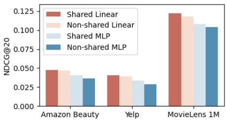  
Figure 10: Projection design ablation with SASRec. Nonshared uses source model-specific projections, and MLP uses 2-layer projections. Shared Linear corresponds to GOD.

Source Models. Table 4 analyzes the contribution of each source model. Case (1), corresponding to full GOD, achieves the best performance on all datasets. Removing either hybrid source in cases (2) and (3) consistently degrades performance, confirming that Embed-Grafted Teacher and Encoder-Grafted Teacher provide complementary structural coupling. The larger drop in case (4) shows that Non-Grafted Teacher remains important as a stable knowledge anchor. Cases (5), (6), and (7) further show that any single source alone is insuficient, indicating that GOD benefits from jointly distilling stable teacher knowledge and complementary grafted views.

We further compare the shared linear projections $( \mathrm { i } . \mathrm { e } . , W _ { d o w n }$ and $W _ { u p } )$ used in GOD with non-shared linear projections and 2-layer MLP projections. As shown in Figure 10, the shared linear design consistently achieves the best performance across all datasets. Nonshared linear projections and MLP-based projections underperform despite their higher flexibility, indicating that the gains of GOD do not come from additional projection capacity. This supports our design choice of using simple shared projections, which adapt dimensions while preserving the structural efect of grafting.

Grafted Encoding. Table 5 evaluates GE variants, with full GE achieving the best performance on all datasets. Uni-directional variants, i.e., T→S only and S→T only, outperform w/o GE, showing that cross-side token attention is useful even in one direction. Among them, T→S only performs better than S→T only, suggesting that teacher-side tokens efectively stabilize student-side representations. Notably, GE (half length) outperforms w/o GE, although its concatenated sequence length matches the original input length.

Table 5: GE ablation with SASRec. NDCG@20 is shown by varying teacher-student token interaction. T→S only allows student-side query tokens to attend to teacher-side key/value tokens, while S→T only allows the reverse direction. GE (half length) halves each side sequence length so that the concatenated sequence has the original length.
<table><tr><td>Variant</td><td>Amazon Beauty</td><td>Yelp</td><td>MovieLens 1M</td></tr><tr><td>GE</td><td>0.0474</td><td>0.0405</td><td>0.1218</td></tr><tr><td>T→S only</td><td>0.0466</td><td>0.0394</td><td>0.1184</td></tr><tr><td>S→T only</td><td>0.0459</td><td>0.0386</td><td>0.1166</td></tr><tr><td>GE (half length)</td><td>0.0462</td><td>0.0396</td><td>0.1152</td></tr><tr><td>w/o GE</td><td>0.0452</td><td>0.0379</td><td>0.1126</td></tr></table>

Table 6: GCL ablation with SASRec. NDCG@20 is shown by varying pair construction and weighting. Source-Target only uses three pairs involving $h _ { u } ^ { ( S , S ) }$ , Unweighted uses $\mathcal { L } _ { p a i r }$ instead of $\mathcal { L } _ { k d } ,$ and Learnable weight replaces similarity-based weights with trainable pair weights.
<table><tr><td>Variant</td><td>Amazon Beauty</td><td>Yelp</td><td>MovieLens 1M</td></tr><tr><td>GCL</td><td>0.0474</td><td>0.0405</td><td>0.1218</td></tr><tr><td>Source-Target only</td><td>0.0460</td><td>0.0386</td><td>0.1111</td></tr><tr><td>Unweighted</td><td>0.0455</td><td>0.0379</td><td>0.1090</td></tr><tr><td>Learnable weight</td><td>0.0427</td><td>0.0359</td><td>0.1074</td></tr></table>

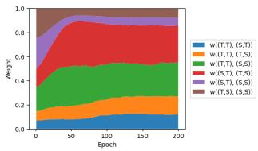  
(a) Amazon Beauty

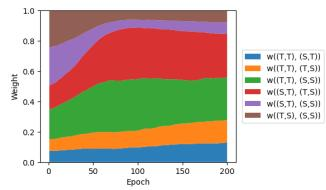  
(b) MovieLens 1M  
Figure 11: Dynamics of six GCL pair weights over training. Higher pair similarity yields a lower weight.

This shows that GE does not merely benefit from a longer attention span. Finally, all partial variants remain inferior to full GE, indicating that bidirectional mutual attention with full-length histories is necessary to fully exploit teacher-student coupling.

Graft-aware Contrastive Learning. Table 6 analyzes the efect of GCL. Full GCL achieves the best performance on all datasets, showing the benefit of adaptive pair-type weighting. Source-Target only performs better than Unweighted, indicating that adding sourcesource pairs without proper weighting can introduce redundant or imbalanced supervision. However, GCL further improves over Source-Target only, confirming that source-source pairs are useful when their contributions are dynamically controlled. Learnable weight performs worst, suggesting that freely learnable pair weights are unstable and that similarity-based weighting with stop-gradient provides a more reliable distillation budget allocation.

To further understand GCL, we visualize the normalized weights of all six pairwise contrastive terms over training. As shown in

Table 7: Eficiency analysis with SASRec. Mem. denotes peak GPU memory, Time/Epoch denotes average training time per epoch, and Train denotes wall-clock training time until the best validation checkpoint.
<table><tr><td rowspan="2">Model</td><td colspan="4">Amazon Beauty</td><td colspan="4">MovieLens 1M</td></tr><tr><td>Mem.</td><td>Time/Epoch</td><td>Train</td><td>NDCG@20</td><td>Mem.</td><td>Time/Epoch</td><td>Train</td><td>NDCG@20</td></tr><tr><td>Teacher</td><td>0.7 GB</td><td>8.35 s</td><td>6.12 m</td><td>0.0472</td><td>1.1 GB</td><td>15.88 s</td><td>23.82 m</td><td>0.1417</td></tr><tr><td>Student</td><td>0.6 GB</td><td>7.75 s</td><td>24.03 m</td><td>0.0390</td><td>0.8 GB</td><td>15.13 s</td><td>18.66 m</td><td>0.1052</td></tr><tr><td>BD</td><td>1.0 GB</td><td>12.98 s</td><td>27.69 m</td><td>0.0444</td><td>1.5 GB</td><td>26.67 s</td><td>59.12 m</td><td>0.1094</td></tr><tr><td>EMKD</td><td>1.1 GB</td><td>15.57 s</td><td>34.77 m</td><td>0.0447</td><td>1.6 GB</td><td>32.90 s</td><td>51.00 m</td><td>0.1098</td></tr><tr><td>GOD</td><td>0.9 GB</td><td>10.06 s</td><td>15.26 m</td><td>0.0474</td><td>1.2 GB</td><td>21.00 s</td><td>17.85 m</td><td>0.1218</td></tr></table>

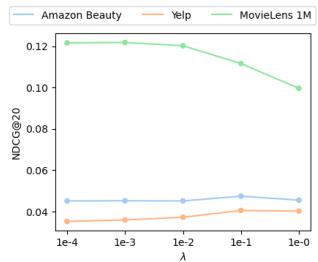

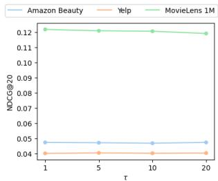  
Figure 12: Parameter sensitivity with SASRec.

Figure 11, the weights do not collapse to a single pair but remain distributed across multiple relations, confirming that GCL performs balanced reweighting. Early in training, pairs involving $h _ { u } ^ { ( S , S ) }$ with grafted sources, i.e., � ((�,�), (�, �)) and � ((�, �), (�, �)), receive relatively high weights, while their importance gradually decreases as the student becomes better aligned with the sources. In contrast, � ( (� , � ), (�, �)) and � ( (�, � ), (� , �)) gain higher weights and remain important in later epochs, indicating that GCL reallocates the distillation budget toward more informative and less redundant relations.

## 5.5 Eficiency and Parameter Sensitivity (RQ4)

Beyond performance, practical KD requires eficient training and stable hyperparameter behavior. We therefore analyze the training cost of GOD and its sensitivity to hyperparameters.

Eficiency. Table 7 compares the training eficiency of GOD with representative baselines. Although GOD incurs higher per-epoch time than Student due to hybrid source models and GE/GCL computation, it remains more eficient than BD and EMKD in both memory usage and time per epoch. More importantly, by evaluating student embeddings and encoders through teacher-conditioned source models, GOD provides more direct and fine-grained supervision than output-level imitation. This stronger supervision helps GOD reach its best validation performance in less wall-clock time than BD and EMKD, and even Student, despite the additional per-epoch computation. At the same time, GOD achieves the best NDCG@20 among compact models. These results show that GOD improves recommendation performance without prohibitive training overhead.

Parameter Sensitivity. We analyze the sensitivity of GOD to the loss coeficient � for $\mathcal { L } _ { k d }$ and the temperature � in $\mathcal { L } _ { c o n }$ . As shown in Figure 12, GOD is generally stable across a wide range of �, indicating that its contrastive distillation is not overly sensitive to temperature selection. The efect of � is also moderate on Amazon Beauty and Yelp, while MovieLens 1M shows some degradation when � becomes too large. This may suggest that excessive distillation strength can over-regularize the student on denser datasets, where recommendation supervision is already relatively suficient. Overall, GOD maintains robust performance under broad hyperparameter ranges, supporting its practical usability.

## 6 Related Work

## 6.1 Knowledge Distillation

KD has been widely studied for recommendation to transfer knowl edge from a high-capacity teacher to a compact student [2, 24, 57]. Existing methods mainly difer in the form of supervision they distill. Output-level approaches transfer teacher predictions or ranking preferences. For example, RD [47] distills teacher ranking lists, RRD [15] relaxes ranking orders, and CD [23] selects informative items based on teacher rankings for collaborative supervision. Representation-level approaches move beyond final rankings. DE [15] transfers latent embedding knowledge, while HTD [16] distills hierarchical topology in the representation space. Beyond these fixed-teacher methods, BD [21] performs bidirectional distillation by updating the teacher-side knowledge source together with the student. Together, these methods cover output-level, representation level, and dynamic supervision, but still transfer teacher-produced signals after separate teacher-student execution rather than evaluating student components inside teacher-side computation.

In SR, KD must further transfer dynamic preference patterns from user interaction sequences, making sequence-aware supervision essential. Recent SR-specific methods address this challenge from diferent perspectives [9, 43, 61]. AdaRec [2] searches for scene-adaptive student architectures and distills knowledge from sequential teachers. MSKDIK [9] distills interest representation and drift knowledge across multiple stages to capture evolving user intent. EMKD [8] leverages ensemble modeling with contrastive and logit-level distillation to provide richer sequential supervision. These studies show that KD for SR benefits from modeling sequential dynamics beyond generic recommendation signals. Nevertheless, they still distill teacher-produced outputs or representations as external targets, leaving student components outside teacher-side sequential computation.

Recently, another line of work leverages large language models (LLMs) for KD, aiming to transfer semantic understanding or reasoning ability to recommenders [52, 58, 65]. For example, DLLM2Rec [5] distills LLM-derived content knowledge into ID-based sequen tial recommenders, while SLMRec [61] and SLIM [54] distill LLM knowledge or reasoning processes for recommendation. Although these approaches enrich recommendation with external semantic knowledge, they rely on massive LLM teachers, and some distilled students remain language models that are still much larger than ID-based sequential recommenders. This leads to substantial distillation cost and can still incur higher inference latency than ID-based SR models. In contrast, GOD focuses on KD between ID-based sequential recommenders. Rather than injecting external semantic knowledge, GOD improves the generalization of distilled knowledge by providing component-level feedback through grafted teacher-student computation.

## 6.2 Grafting

Grafting was originally introduced as the inverse operation of pruning in decision trees [56] and later adapted to neural networks to replace or augment selected components. For example, layer grafting [33] improves under-informative layers with validated external layers, NetGraft [41] progressively replaces teacher layers with student counterparts for eficient few-shot KD, and GrafT [35] attaches add-on modules to vision transformers for multi-scale representation sharing. These studies show that grafting can effectively modify selected components without redesigning the entire architecture. Unlike prior grafting methods that mainly target model adaptation or component improvement, GOD uses grafting to construct teacher-conditioned source models for SR. By replacing recommender-specific components, namely embedding tables and sequence encoders, GOD evaluates student components inside teacher-side sequential computation and provides component-level distillation feedback.

## 7 Conclusion

In this paper, we revisit KD for SR from the perspective ofcomponentlevel feedback. We identify a limitation of conventional distillation, where teacher-produced signals supervise the complete student path and can entangle the efects of student embeddings and encoders. To address this, we propose GOD, a component-level KD framework that constructs teacher-conditioned source models through grafting. By replacing selected frozen-teacher components with trainable student counterparts, GOD evaluates student components under teacher-side sequential computation and improves the generalization of distilled knowledge. We further introduce GE and GCL to stabilize grafted representation generation and adaptively balance correlated source views. Extensive experiments demonstrate that GOD consistently outperforms existing KD and self-supervised baselines, while maintaining practical training eficiency and using only the non-grafted student for inference. Future work includes extending grafting to heterogeneous teacher-student architectures and exploring more flexible component-level knowledge transfer strategies.

## Acknowledgments

This work was supported by the NRF grant funded by the MSIT (No. RS-2024-00335873), the IITP grant funded by the MSIT (No.RS-2019- II191906, Artificial Intelligence Graduate School Program(POSTECH)).

## A GenAI Usage Disclosure

ChatGPT was used solely for English grammar and language refinement. No generative AI was involved in the research process, including but not limited to coding, experiments, and data analysis. All technical contributions are the original work of authors, and AI-assisted edits were manually reviewed to ensure alignment with the original intent.

## References

[1] Nabiha Asghar. 2016. Yelp dataset challenge: Review rating prediction. arXiv preprint arXiv:1605.05362 (2016).

[2] Lei Chen, Fajie Yuan, Jiaxi Yang, Min Yang, and Chengming Li. 2021. Sceneadaptive knowledge distillation for sequential recommendation via diferentiable architecture search. arXiv preprint arXiv:2107.07173 (2021).

[3] Yongjun Chen, Zhiwei Liu, Jia Li, Julian McAuley, and Caiming Xiong. 2022. Intent contrastive learning for sequential recommendation. In Proceedings ofthe ACM web conference 2022. 2172–2182.

[4] Liu Chong, Xiaoyang Liu, Rongqin Zheng, Lixin Zhang, Xiaobo Liang, Juntao Li, Lijun Wu, Min Zhang, and Leyu Lin. 2023. CT4Rec: Simple yet Efective Consistency Training for Sequential Recommendation. In Proceedings ofthe 29th ACM SIGKDD Conference on Knowledge Discovery and Data Mining. 3901–3913.

[5] Yu Cui, Feng Liu, Pengbo Wang, Bohao Wang, Heng Tang, Yi Wan, Jun Wang, and Jiawei Chen. 2024. Distillation Matters: Empowering Sequential Recommenders to Match the Performance of Large Language Models. In Proceedings ofthe 18th ACM Conference on Recommender Systems. 507–517.

[6] Yizhou Dang, Enneng Yang, Guibing Guo, Linying Jiang, Xingwei Wang, Xiaoxiao Xu, Qinghui Sun, and Hong Liu. 2023. Uniform sequence better: Time interval aware data augmentation for sequential recommendation. In Proceedings ofthe AAAI conference on artificial intelligence, Vol. 37. 4225–4232.

[7] Jacob Devlin. 2018. Bert: Pre-training of deep bidirectional transformers for language understanding. arXiv preprint arXiv:1810.04805 (2018).

[8] Hanwen Du, Huanhuan Yuan, Pengpeng Zhao, Fuzhen Zhuang, Guanfeng Liu, Le Zhao, Yanchi Liu, and Victor S Sheng. 2023. Ensemble modeling with contrastive knowledge distillation for sequential recommendation. In Proceedings of the 46th International ACM SIGIR Conference on Research and Development in Information Retrieval. 58–67.

[9] Yongping Du, Jinyu Niu, Yuxin Wang, and Xingnan Jin. 2024. Multi-stage knowledge distillation for sequential recommendation with interest knowledge. Information Sciences 654 (2024), 119841

[10] Ziwei Fan, Zhiwei Liu, Yu Wang, Alice Wang, Zahra Nazari, Lei Zheng, Hao Peng, and Philip S Yu. 2022. Sequential recommendation via stochastic self-attention. In Proceedings ofthe ACM web conference 2022. 2036–2047.

[11] F Maxwell Harper and Joseph A Konstan. 2015. The movielens datasets: History and context. Acm transactions on interactive intelligent systems (tiis) 5, 4 (2015), 1–19.

[12] B Hidasi. 2015. Session-based Recommendations with Recurrent Neural Networks. arXiv preprint arXiv:1511.06939 (2015).

[13] Geofrey Hinton. 2015. Distilling the Knowledge in a Neural Network. arXiv preprint arXiv:1503.02531 (2015).

[14] Xiaoqi Jiao, Yichun Yin, Lifeng Shang, Xin Jiang, Xiao Chen, Linlin Li, Fang Wang, and Qun Liu. 2020. Tinybert: Distilling bert for natural language understanding. In Findings of the association for computational linguistics: EMNLP 2020. 4163– 4174.

[15] SeongKu Kang,Junyoung Hwang, Wonbin Kweon, and Hwanjo Yu. 2020. DE-RRD: A knowledge distillation framework for recommender system. In Proceedings of the 29th ACM International Conference on Information & Knowledge Management. 605–614.

[16] SeongKu Kang, Junyoung Hwang, Wonbin Kweon, and Hwanjo Yu. 2021. Topol ogy distillation for recommender system. In Proceedings ofthe 27th ACM SIGKDD Conference on Knowledge Discovery & Data Mining. 829–839.

[17] Wang-Cheng Kang and Julian McAuley. 2018. Self-attentive sequential recommendation. In 2018 IEEE international conference on data mining (ICDM). IEEE, 197–206.

[18] WooJoo Kim, JunYoung Kim, JaeHyung Lim, SeongJin Choi, SeongKu Kang, and HwanJo Yu. 2026. FLAME: Condensing Ensemble Diversity into a Single Network for Eficient Sequential Recommendation. In Proceedings of the 49th International ACM SIGIR Conference on Research and Development in Information Retrieval. 823–833.

[19] Diederik P Kingma. 2014. Adam: A method for stochastic optimization. arXiv preprint arXiv:1412.6980 (2014).

[20] Simon Kornblith, Mohammad Norouzi, Honglak Lee, and Geofrey Hinton. 2019. Similarity of neural network representations revisited. In International conference on machine learning. PMLR, 3519–3529.

[21] Wonbin Kweon, SeongKu Kang, and Hwanjo Yu. 2021. Bidirectional distillation for top-K recommender system. In Proceedings ofthe Web Conference 2021. 3861– 3871.

[22] Gyuseok Lee, Hyunsik Yoo, Junyoung Hwang, SeongKu Kang, and Hwanjo Yu. 2026. Capturing User Interests from Data Streams for Continual Sequential Recommendation. In Proceedings ofthe Nineteenth ACM International Conference on Web Search and Data Mining. 313–323.

[23] Jae-woong Lee, Minjin Choi, Jongwuk Lee, and Hyunjung Shim. 2019. Collaborative distillation for top-N recommendation. In 2019 IEEE International Conference on Data Mining (ICDM). IEEE, 369–378.

[24] Youngjune Lee and Kee-Eung Kim. 2021. Dual correction strategy for rank ing distillation in top-n recommender system. In Proceedings ofthe 30th ACM International Conference on Information & Knowledge Management. 3186–3190.

[25] Jing Li, Pengjie Ren, Zhumin Chen, Zhaochun Ren, Tao Lian, and Jun Ma. 2017. Neural attentive session-based recommendation. In Proceedings ofthe 2017 ACM on Conference on Information and Knowledge Management. 1419–1428.

[26] Jiacheng Li, Yujie Wang, and Julian McAuley. 2020. Time interval aware self attention for sequential recommendation. In Proceedings ofthe 13th international conference on web search and data mining. 322–330.

[27] Jaehyung Lim, Wonbin Kweon, Woojoo Kim, Junyoung Kim, Seongjin Choi, Dongha Kim, and Hwanjo Yu. 2025. Federated continual recommendation. In Proceedings of the 34th ACM International Conference on Information and Knowledge Management. 1798–1808.

[28] Langming Liu, Liu Cai, Chi Zhang, Xiangyu Zhao, Jingtong Gao, Wanyu Wang, Yifu Lv, Wenqi Fan, Yiqi Wang, Ming He, et al. 2023. Linrec: Linear attention mechanism for long-term sequential recommender systems. In Proceedings of the 46th International ACM SIGIR Conference on Research and Development in Information Retrieval. 289–299.

[29] Qiao Liu, Yifu Zeng, Refuoe Mokhosi, and Haibin Zhang. 2018. STAMP: shortterm attention/memory priority model for session-based recommendation. In Proceedings ofthe 24th ACM SIGKDD international conference on knowledge discovery & data mining. 1831–1839.

[30] Zhiwei Liu, Yongjun Chen, Jia Li, Philip S Yu, Julian McAuley, and Caiming Xiong. 2021. Contrastive self-supervised sequential recommendation with robust augmentation. arXiv preprint arXiv:2108.06479 (2021).

[31] Zhiwei Liu, Ziwei Fan, Yu Wang, and Philip S Yu. 2021. Augmenting sequential recommendation with pseudo-prior items via reversely pre-training transformer. In Proceedings ofthe 44th international ACM SIGIR conference on Research and development in information retrieval. 1608–1612.

[32] Julian McAuley, Christopher Targett, Qinfeng Shi, and Anton Van Den Hengel. 2015. Image-based recommendations on styles and substitutes. In Proceedings ofthe 38th international ACM SIGIR conference on research and development in information retrieval. 43–52.

[33] Fanxu Meng, Hao Cheng, Ke Li, Zhixin Xu, Rongrong Ji, Xing Sun, and Guangming Lu. 2020. Filter grafting for deep neural networks. In Proceedings ofthe IEEE/CVF Conference on Computer Vision and Pattern Recognition. 6599–6607.

[34] Aaron van den Oord, Yazhe Li, and Oriol Vinyals. 2018. Representation learning with contrastive predictive coding. arXiv preprint arXiv:1807.03748 (2018).

[35] Jongwoo Park, Kumara Kahatapitiya, Donghyun Kim, Shivchander Sudalairaj, Quanfu Fan, and Michael S Ryoo. 2024. Grafting vision transformers. In Proceedings of the IEEE/CVF Winter Conference on Applications of Computer Vision. 1145–1154.

[36] Xiuyuan Qin, Huanhuan Yuan, Pengpeng Zhao, Junhua Fang, Fuzhen Zhuang, Guanfeng Liu, Yanchi Liu, and Victor Sheng. 2023. Meta-optimized contrastive learning for sequential recommendation. In Proceedings of the 46th International ACM SIGIR Conference on Research and Development in Information Retrieval. 89–98.

[37] Xiuyuan Qin, Huanhuan Yuan, Pengpeng Zhao, Guanfeng Liu, Fuzhen Zhuang, and Victor S Sheng. 2024. Intent contrastive learning with cross subsequences for sequential recommendation. In Proceedings ofthe 17th ACM international conference on web search and data mining. 548–556.

[38] Ruihong Qiu, Zi Huang, Hongzhi Yin, and Zijian Wang. 2022. Contrastive learning for representation degeneration problem in sequential recommendation. In Proceedings ofthe fifteenth ACM international conference on web search and data mining. 813–823.

[39] Adriana Romero, Nicolas Ballas, Samira Ebrahimi Kahou, Antoine Chassang, Carlo Gatta, and Yoshua Bengio. 2014. Fitnets: Hints for thin deep nets. arXiv preprint arXiv:1412.6550 (2014).

[40] Luca Saglietti and Lenka Zdeborová. 2022. Solvable model for inheriting the regularization through knowledge distillation. In Mathematical and Scientific Machine Learning. PMLR, 809–846.

[41] Chengchao Shen, Xinchao Wang, Youtan Yin, Jie Song, Sihui Luo, and Mingli Song. 2021. Progressive network grafting for few-shot knowledge distillation. In Proceedings ofthe AAAI Conference on Artificial Intelligence, Vol. 35. 2541–2549.

[42] Fei Sun, Jun Liu, Jian Wu, Changhua Pei, Xiao Lin, Wenwu Ou, and Peng Jiang. 2019. BERT4Rec: Sequential recommendation with bidirectional encoder rep resentations from transformer. In Proceedings of the 28th ACM international conference on information and knowledge management. 1441–1450.

[43] Wenqi Sun, Ruobing Xie, Junjie Zhang, Wayne Xin Zhao, Leyu Lin, and Ji-Rong Wen. 2025. Curriculum-scheduled knowledge distillation from multiple pretrained teachers for multi-domain sequential recommendation. World Wide Web 28, 6 (2025), 1–26.

[44] Yifan Sun, Changmao Cheng, Yuhan Zhang, Chi Zhang, Liang Zheng, Zhongdao Wang, and Yichen Wei. 2020. Circle loss: A unified perspective of pair simi larity optimization. In 2020 IEEE/CVF conference on computer vision and pattern recognition (CVPR). IEEE, 6397–6406.

[45] Yong Kiam Tan, Xinxing Xu, and Yong Liu. 2016. Improved recurrent neural networks for session-based recommendations. In Proceedings of the 1st workshop on deep learning for recommender systems. 17–22.

[46] Jiaxi Tang and Ke Wang. 2018. Personalized top-n sequential recommendation via convolutional sequence embedding. In Proceedings ofthe eleventh ACM

international conference on web search and data mining. 565–573.

[47] Jiaxi Tang and Ke Wang. 2018. Ranking distillation: Learning compact ranking models with high performance for recommender system. In Proceedings of the 24th ACM SIGKDD international conference on knowledge discovery & data mining. 2289–2298.

[48] Trinh Xuan Tuan and Tu Minh Phuong. 2017. 3D convolutional networks for session-based recommendation with content features. In Proceedings ofthe eleventh ACM conference on recommender systems. 138–146.

[49] A Vaswani. 2017. Attention is all you need. Advances in Neural Information Processing Systems (2017).

[50] Pengfei Wang, Jiafeng Guo, Yanyan Lan, Jun Xu, Shengxian Wan, and Xueqi Cheng. 2015. Learning hierarchical representation model for nextbasket recommendation. In Proceedings ofthe 38th International ACM SIGIR conference on Research and Development in Information Retrieval. 403–412.

[51] Wenjie Wang, Fuli Feng, Xiangnan He, Liqiang Nie, and Tat-Seng Chua. 2021. Denoising implicit feedback for recommendation. In Proceedings ofthe 14th ACM international conference on web search and data mining. 373–381.

[52] Xinfeng Wang, Jin Cui, Yoshimi Suzuki, and Fumiyo Fukumoto. 2024. Rdrec: Rationale distillation for llm-based recommendation. In Proceedings of the 62nd Annual Meeting ofthe Association for Computational Linguistics (Volume 2: Short Papers). 65–74.

[53] Xun Wang, Xintong Han, Weilin Huang, Dengke Dong, and Matthew R Scott. 2019. Multi-similarity loss with general pair weighting for deep metric learning. In 2019 IEEE/CVF Conference on Computer Vision and Pattern Recognition (CVPR). IEEE, 5017–5025.

[54] Yuling Wang, Changxin Tian, Binbin Hu, Yanhua Yu, Ziqi Liu, Zhiqiang Zhang, Jun Zhou, Liang Pang, and Xiao Wang. 2024. Can small language models be good reasoners for sequential recommendation?. In Proceedings ofthe ACM Web Conference 2024. 3876–3887.

[55] Zhikai Wang, Yanyan Shen, Zexi Zhang, Li He, Yichun Li, Hao Gu, and Yinghua Zhang. 2024. Relative Contrastive Learning for Sequential Recommendation with Similarity-based Positive Sample Selection. In Proceedings of the 33rd ACM International Conference on Information and Knowledge Management. 2493–2502.

[56] Geofrey I Webb. 1997. Decision tree grafting. In IJCAI (2). 846–851.

[57] Shaowei Wei, Zhengwei Wu, Xin Li, Qintong Wu, Zhiqiang Zhang, Jun Zhou, Lihong Gu, and Jinjie Gu. 2024. Leave no one behind: Online self-supervised self-distillation for sequential recommendation. In Proceedings ofthe ACM Web Conference 2024. 3767–3776.

[58] Jiongran Wu, Jiahao Liu, Dongsheng Li, Guangping Zhang, Mingzhe Han, Hansu Gu, Peng Zhang, Li Shang, Tun Lu, and Ning Gu. 2025. Bidirectional Knowledge Distillation for Enhancing Sequential Recommendation with Large Language Models. arXiv preprint arXiv:2505.18120 (2025).

[59] Shu Wu, Yuyuan Tang, Yanqiao Zhu, Liang Wang, Xing Xie, and Tieniu Tan. 2019. Session-based recommendation with graph neural networks. In Proceedings of

the AAAI conference on artificial intelligence, Vol. 33. 346–353.

[60] Xu Xie, Fei Sun, Zhaoyang Liu, Shiwen Wu, Jinyang Gao, Jiandong Zhang, Bolin Ding, and Bin Cui. 2022. Contrastive learning for sequential recommendation. In 2022 IEEE 38th international conference on data engineering (ICDE). IEEE, 1259– 1273.

[61] Wujiang Xu, Qitian Wu, Zujie Liang, Jiaojiao Han, Xuying Ning, Yunxiao Shi, Wenfang Lin, and Yongfeng Zhang. 2024. SLMRec: Distilling large language models into small for sequential recommendation. arXiv preprint arXiv:2405.17890 (2024).

[62] Tiansheng Yao, Xinyang Yi, Derek Zhiyuan Cheng, Felix Yu, Ting Chen, Aditya Menon, Lichan Hong, Ed H Chi, Steve Tjoa, Jieqi Kang, et al. 2021. Self-supervised learning for large-scale item recommendations. In Proceedings ofthe 30th ACM international conference on information & knowledge management. 4321–4330.

[63] Haochao Ying, Fuzhen Zhuang, Fuzheng Zhang, Yanchi Liu, Guandong Xu, Xing Xie, Hui Xiong, and Jian Wu. 2018. Sequential recommender system based on hierarchical attention network. In IJCAI international joint conference on artificial intelligence.

[64] Xu Yuan, Hongshen Chen, Yonghao Song, Xiaofang Zhao, Zhuoye Ding, Zhen He, and Bo Long. 2021. Improving sequential recommendation consistency with self-supervised imitation. arXiv preprint arXiv:2106.14031 (2021).

[65] Haoyi Zhang, Guohao Sun, Jinhu Lu, Guanfeng Liu, and Xiu Susie Fang. 2025. DELRec: Distilling Sequential Pattern to Enhance LLMs-Based Sequential Recommendation. In 2025 IEEE 41st International Conference on Data Engineering (ICDE). IEEE, 1–14.

[66] Junjie Zhang, Ruobing Xie, Hongyu Lu, Wenqi Sun, Xin Zhao, Zhanhui Kang, et al. 2025. Frequency-Augmented Mixture-of-Heterogeneous-Experts Framework for Sequential Recommendation. In THE WEB CONFERENCE 2025.

[67] Ying Zhang, Tao Xiang, Timothy M Hospedales, and Huchuan Lu. 2018. Deep mutual learning. In Proceedings ofthe IEEE conference on computer vision and pattern recognition. 4320–4328.

[68] Kun Zhou, Hui Wang, Wayne Xin Zhao, Yutao Zhu, Sirui Wang, Fuzheng Zhang, Zhongyuan Wang, and Ji-Rong Wen. 2020. S3-rec: Self-supervised learning for sequential recommendation with mutual information maximization. In Proceedings of the 29th ACM international conference on information & knowledge management. 1893–1902.

[69] Kun Zhou, Hui Yu, Wayne Xin Zhao, and Ji-Rong Wen. 2022. Filter-enhanced MLP is all you need for sequential recommendation. In Proceedings of the ACM web conference 2022. 2388–2399.

[70] Peilin Zhou, Qichen Ye, Yueqi Xie, Jingqi Gao, Shoujin Wang, Jae Boum Kim, Chenyu You, and Sunghun Kim. 2023. Attention calibration for transformerbased sequential recommendation. In Proceedings ofthe 32nd ACM international conference on information and knowledge management. 3595–3605.