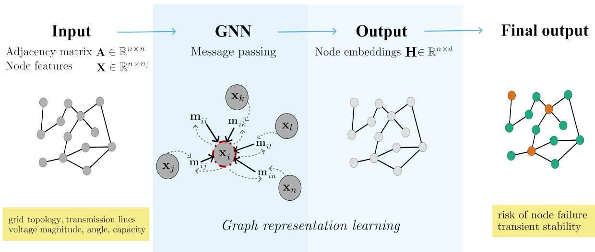
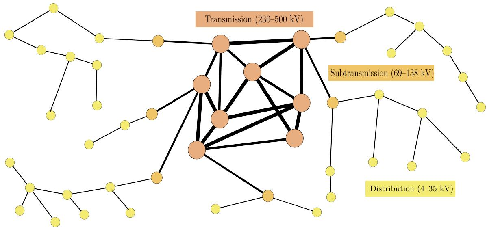
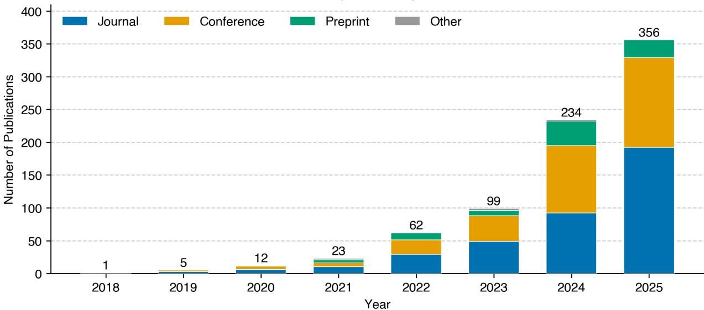
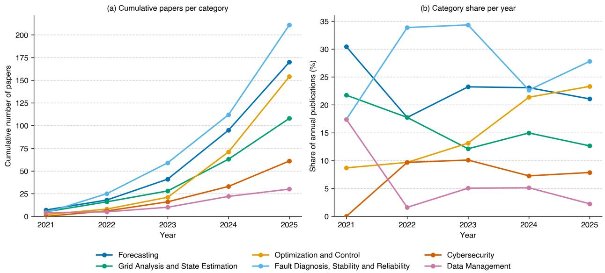
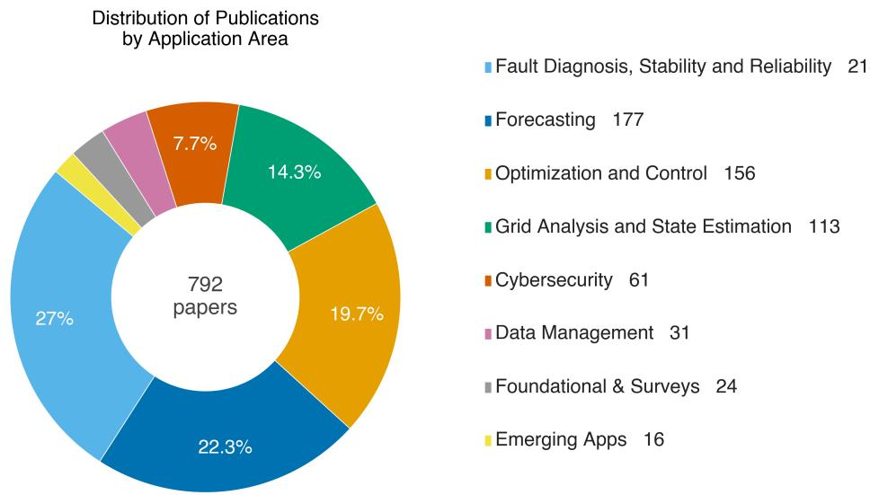
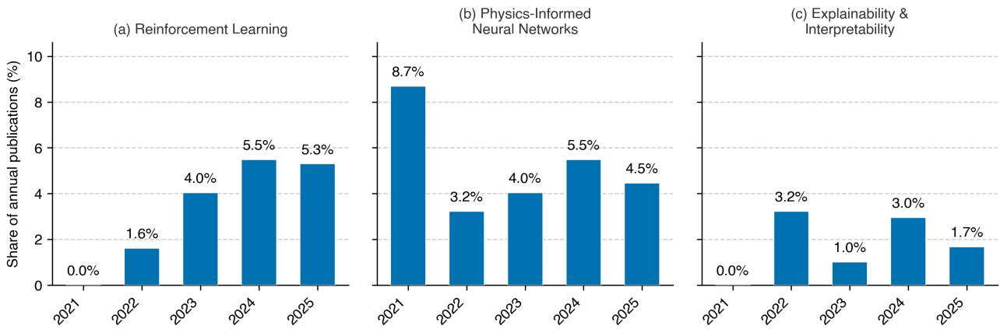

## Graphical Abstract

## Graph Machine Learning: An Opportunity for Power Systems

Martin Sadric, Sebastian Pütz, Christian Nauck, Veit Hagenmeyer, Frank Hellmann, Dirk Witthaut, Benjamin Schäfer

  
Fundamentals  
GML for and in Power Systems  
→ Research Landscape

Structure of the article. The increasing complexity of modern power systems calls for machine learning methods that are natively aware of the underlying graph structure. This review traces that argument from motivation through Graph ML (GML) fundamentals and modeling of power system physics as graphs, to a survey of GML applications across forecasting, optimization, control, and reliability. We close by assessing available datasets and benchmarks and identifying open challenges that limit real-world deployment.

## Highlights

## Graph Machine Learning: An Opportunity for Power Systems

Martin Sadric, Sebastian Pütz, Christian Nauck, Veit Hagenmeyer, Frank Hellmann, Dirk Witthaut, Benjamin Schäfer

• Systematic survey of nearly 800 papers on graph machine learning for power systems

• Graph ML encodes grid topology as inductive bias for scalable power system tasks

• Applications span forecasting, state estimation, optimization, fault diagnosis, cybersecurity

• Open datasets and benchmarks remain scarce, limiting reproducibility in the field

• Closer collaboration between ML and power systems communities is needed

# Graph Machine Learning: An Opportunity for Power Systems⋆

Martin Sadrica,1, Sebastian Pütza,b,1, Christian Nauckc, Veit Hagenmeyera, Frank Hellmannc, Dirk Witthautd and Benjamin Schäfera,b,∗

aKarlsruhe Institute ofTechnology, Kaiserstraße 12, Karlsruhe, 76131, Germany

bHelmholtz AI, Germany

cPotsdam Institute for Climate Impact Research, Telegrafenberg A 31, Potsdam, 14473, Germany

dForschungszentrum Jülich, Wilhelm-Johnen-Straße, Jülich, 52428, Germany

## A R T I C L E I N F O

Keywords:   
graph machine learning   
graph neural networks   
power systems   
energy systems

## A BS T R AC T

Modern power systems face growing operational complexity driven by the integration of renewable energy sources, decentralization, and the need for real-time decision-making across a wide range of timescales. Addressing these challenges traditionally relies on model-based methods that, while accurate, can be too slow for operational demands. Machine learning (ML) has therefore emerged as a faster, data-driven alternative. As grid topology plays a central role in power system operation, graph machine learning (GML) methods ofer a natural framework for incorporating topological dependencies as an inductive bias. We survey nearly 800 papers at the intersection of GML and power systems, covering forecasting, state estimation, optimization, control, fault diagnosis, and cybersecurity. Power systems constitute an unusually rich benchmark setting for GML, as they combine hard physical constraints, multi-scale dynamics, safety-critical requirements, and scarce labeled data within a single, well-defined domain. Conversely, power systems can benefit from utilizing GML to complement classical solvers, as GML provide scalable, topology-aware approximations with promising generalization and computational eficiency. We identify open challenges, including limited real-world deployment and the need for interpretable models in safety-critical settings. Despite the rapidly growing number of publications, standardized benchmarks and open datasets remain scarce, leaving many results dificult to reproduce and undermining the long-term scientific credibility of the field. We further derive a structured requirements catalog for ML-ready power grid benchmarks, intended to guide future dataset development and improve reproducibility across studies. We call on the community to prioritize dedicated benchmark studies and the release of open datasets and models.

## 1. Introduction

The urgent need to mitigate climate change is accelerating the transition toward sustainable and carbon-neutral energy systems [1]. This transformation poses significant challenges for modern power systems, including the decentralization of generation [2], the necessity for grid expansions [3], and reduced system inertia with the shift from synchronous machines to inverter-based resources [4]. At the same time, power systems are critical infrastructure where failures can have severe societal and economic consequences. Machine Learning (ML) can help to address these challenges and thus contribute to a secure and sustainable energy supply [5, 6]. Physics-based models and optimization methods often struggle to scale to the complexity and size of modern power systems within the time constraints of real-time operation. Beyond computational tractability, accurate modeling is increasingly hindered by limited observability, particularly at the distribution grid level where measurement infrastructure remains sparse, posing significant challenges for classical simulation and state estimation approaches. ML ofers a data-driven complement to these methods, capable of learning complex system behavior from historical data and delivering forecasts, control policies, and situational awareness at operational timescales.

While ML provides scalable, data-driven tools applicable to the power system domain, many methods fail to capture the relational, structured, and spatial characteristics inherent in power system data. Graph Machine Learning (GML) difers from conventional ML by operating directly on entire graphs rather than fixed-size feature vectors and is thus particularly well-suited to power systems. GML has proven efective across domains as diverse as social networks, chemistry, and physics. In the present review, we focus specifically on electrical power systems, which encompass the generation, transmission, distribution, and consumption of electricity. Accordingly, our discussion centers on the physical power grid and its components, most prominently buses (generators or consumers), transmission lines, and transformers, which can be naturally represented as graphs (see Section 3). This graph-native character is shared with other infrastructure networks, such as gas and transportation, enabling direct methodological exchange in both directions. A further key advantage is that GML models can be inductive. Once trained, they have the potential to generalize to other graphs with diferent topology, enabling the application of the same model across power grids of varying size and structure [7].

Contributions. The rapid growth of GML publications in power systems makes a systematic review timely. Building on and extending the survey by Liao et al. [8], we incorporate research trends that have emerged since 2021, highlighting new application areas and place a stronger emphasis on interdisciplinary perspectives. We survey articles published until the end of 2025, map them to core power system tasks, and identify critical technical and methodological gaps. This review targets two primary audiences: For power system engineers and researchers, we explain where and why GML represents a leading approach; for ML and GML researchers, we motivate the development of new methods and reproducible benchmarks for a particularly relevant application. A recurring finding of our survey is the scarcity of standardized benchmarks and open datasets and the need for methodological rigor.

Structure This review is organized as follows: Section 2 establishes the GML foundations required throughout the paper. Section 3 details how power systems are translated into graph representations. Having established these foundations, we present our systematic survey of GML applications (Section 4) and assess the current benchmark landscape (Section 5), including a requirements catalog for ML-ready power grid datasets. Finally, we identify numerous future research opportunities in Section 6. Supplementary materials such as reference databases, including all identified articles, evaluation metrics, and detailed annotations are provided on our companion web page: https: //kit-iai-dracos.github.io/graph-ml-power-sys/.

## 2. Graph Machine Learning

Graph machine learning (GML) is a branch of machine learning concerned with modeling and learning from graphstructured data, encompassing graph kernels, spectral methods, and Graph Neural Networks (GNNs). Throughout this review, we use the term GML rather than GNNs to reflect this broader scope, even though Message Passing Neural Networks (MPNNs) currently dominate the power systems literature.

Bronstein et al. [9] provide a deep mathematical foundation for geometric deep learning architectures, GML being one of them. They argue that, although learning generic functions in high dimensions poses a challenging estimation problem, most relevant tasks are not generic. Rather, they possess essential predefined regularities stemming from the underlying structure of the physical world. The authors identify graphs as one of the five fundamental structures. Graphs have no canonical node ordering, i.e., the same graph can be represented by many equivalent adjacency matrices that are related by permutations. Graphs are also a generalization of some other structures, such as grids and sets. This means that many other deep learning architectures (e.g. Convolutional Neural Networks (CNNs) and transformers) can be expressed in the language of GML. GNNs were first introduced in the early 2000s as recurrent models designed to handle structured data [10]. The field advanced significantly with the introduction of spectral GNNs inspired by graph signal processing [11, 12, 13], discussed further below.

In the following, we first lay general graph foundations and explain how GML uses message passing and how GML works beyond message passing.

## 2.1. Foundations

Message Passing GNNs. A major milestone in GML came with the work by Gilmer et al. [14], which unified many earlier architectures [11, 12, 13] under the common framework of message passing, defining GNNs as models that

  
Figure 1: GNN workflow for power grid tasks. The model takes as input the adjacency matrix $\mathbf { A } \in \mathbb { R } ^ { n \times n }$ encoding grid topology and node feature matrix $\mathbf { X } \in \mathbb { R } ^ { n \times n _ { f } }$ (e.g., voltage magnitude, angle, capacity). Through graph representation learning, the GNN employs message passing to iteratively aggregate neighborhood information, mapping the raw graphstructured input into node embeddings $\mathbf { H } \in \mathbb { R } ^ { n \times d }$ . These are then used for predictions at the node level $( \hat { \mathbf { Y } } \in \mathbb { R } ^ { n } , { \ \mathbf { e . g . } }$ ., risk of node failure) or at the graph leve $( { \hat { Y } } \in \mathbb { R } , \ \mathbf { e . g . }$ , gird transient stability assessment).

iteratively update node representations by exchanging information between neighboring nodes (Fig. 1). MPNNs remain the most widely used approach in modern graph learning due to their flexibility, eficiency, and efectiveness across domains.

Graph Definitions. A graph is defined as $\mathcal { G } = ( \mathcal { V } , \mathcal { E } )$ , where  is the set of � nodes and $\mathcal { E } \subseteq \mathcal { V } \times \mathcal { V }$ is the set of edges. Nodes and edges may carry feature vectors, denoted $\mathbf { x } _ { v }$ and $\mathbf { x } _ { v u }$ respectively. Grid topology is encoded in the adjacency matrix � and graph Laplacian $\mathbf { L } = \mathbf { D } - \mathbf { A } $

$$
A _ { i j } = \left\{ \begin{array} { l l } { 1 } & { \mathrm { i f } ( i , j ) \in \mathcal { E } } \\ { 0 } & { \mathrm { o t h e r w i s e } } \end{array} , \right. \qquad D _ { i i } = \sum _ { j } A _ { i j } .\tag{1}
$$

Since � depends on the choice of node ordering, permuting nodes by � yields an equivalent representation $\mathbf { P A P } ^ { \top }$ motivating the requirement that GNNs be permutation-equivariant.

Node Features and Neighborhoods. The nodal feature matrix $\mathbf { X } \in \mathbb { R } ^ { n \times n _ { f } }$ , where $n _ { f }$ is the number of input features, and the adjacency matrix � together constitute the two main inputs to a GNN (Fig. 1). More advanced architectures may additionally include edge features and global graph-level features [15]. Let $\mathcal { N } _ { v }$ denote the set of nodes adjacent to �. A single message-passing step exchanges information between directly connected nodes.

Message Passing Formalism. A node embedding $\mathbf { h } _ { v } ^ { ( l ) }$ is a learned vector representation encoding both node features and graph context, analogous to a compact reduced-order state in physical modeling. Starting from $\begin{array} { r } { \mathbf { h } _ { v } ^ { ( 0 ) } \ = \ \mathbf { x } _ { v } . } \end{array}$ b ddi d d l b l h l d l i

$$
\mathbf { m } _ { u v } ^ { ( l ) } = \phi \left( \mathbf { h } _ { v } ^ { ( l ) } , \mathbf { h } _ { u } ^ { ( l ) } \right) , \qquad \mathbf { h } _ { v } ^ { ( l + 1 ) } = \psi \left( \mathbf { h } _ { v } ^ { ( l ) } , \bigoplus _ { u \in \mathcal { N } _ { v } } \mathbf { m } _ { u v } ^ { ( l ) } \right) ,\tag{2}
$$

where $\mathbf { m } _ { u v } ^ { ( l ) }$ is the message from neighbor � to node $v , \oplus$ is a permutation-invariant aggregation (e.g., sum, mean, or max), and $\phi , \psi$ are learnable functions. A simple instantiation averages neighbor embeddings directly:

$$
\mathbf { \widehat { h } } _ { v } ^ { ( l + 1 ) } = \sigma \left( \mathbf { W } ^ { ( l ) } \cdot \frac { 1 } { | \mathcal { N } _ { v } | } \sum _ { u \in \mathcal { N } _ { v } } \mathbf { h } _ { u } ^ { ( l ) } + \mathbf { B } ^ { ( l ) } \cdot \mathbf { h } _ { v } ^ { ( l ) } \right) ,\tag{3}
$$

where $\mathbf { W } ^ { ( l ) }$ and $\mathbf { B } ^ { ( l ) }$ are learnable weight matrices and � a nonlinear activation, such as ReLU. The final embedding after � layers, $\mathbf { z } _ { v } = \mathbf { h } _ { v } ^ { ( L ) }$ , is used for downstream prediction. The choice of $\phi$ defines the architecture, with many variants available in unified frameworks such as PyTorch Geometric [16, 17].

Graph Tasks. The message-passing procedure from equ. (2) is permutation-equivariant, i.e., the final representation of a node depends only on its own features and those of its neighbors, but not on the order in which the neighbors are considered. The node embeddings from the final layer, $\mathbf { h } _ { v } ^ { ( L ) }$ , can be collected into a matrix �, and used to produce a task-specific output $\hat { \mathbf Y }$ at the node, graph, or edge level (Fig. 1). Node- and edge-level outputs are obtained by directly transforming the corresponding embeddings. Graph-level outputs additionally require a readout (pooling) step that aggregates all node embeddings. This can be realized by simple permutation-invariant operations such as sum, mean, or max, or by a learned pooling network.

## 2.2. MPNNs for Power Systems

Power system graphs difer from the graphs for which standard MPNNs were originally designed in several important ways. Nodes and edges are not homogeneous entities: Buses, generators, loads, and branches are physically distinct components governed by diferent equations and carrying diferent parameters. Edge features such as impedance, admittance, and power flow are not merely auxiliary attributes but the primary carriers of physical meaning, are inherently directional, and the relevant prediction target is often a branch (edge) quantity rather than a nodal one. Standard GNN formulations therefore require several adaptations to fully respect this structure.

Homophily and Heterophily. Homophily, the tendency of nodes to connect to similar nodes [18], is a common assumption in many GNN architectures. In power systems, both cases arise: Neighboring nodes share similar properties in weather-driven forecasting applications [19, 20], but the diversity of grid components and their interactions makes heterophilic modeling often more appropriate. In the power flow setting for instance, homogeneous GNN approaches have been shown to inadequately represent the varied node and edge types present in real-world grid topologies [21]. Heterogeneous graphs assign distinct types to nodes and edges [15], allowing buses, generators, loads, and branches to maintain separate feature spaces and type-specific aggregation schemes. Furthermore, hypergraphs generalize edges to connect more than two nodes simultaneously, enabling representation of multi-bus constraints or control areas, and have been applied to power flow problems [22].

Edge Features and Line Graph. Edge features are incorporated by conditioning the message function on edge attributes:

$$
\phi \left( \mathbf { h } _ { u } ^ { ( l ) } , \mathbf { h } _ { v } ^ { ( l ) } , \mathbf { e } _ { u v } \right) ,\tag{4}
$$

yielding weighted aggregation where edges with diferent physical properties produce diferent messages. Since the flow of power is directional, each line is represented as two directed half-edges carrying distinct feature vectors $\mathbf { e } _ { u  v }$ and $\mathbf { e } _ { v  u } ,$ while the topology remains undirected. When branches rather than buses are the primary prediction target (as in line failure prediction or thermal limit monitoring), the line graph () provides a natural alternative, converting each branch into a node and requiring a heterogeneous GNN to handle the resulting diversity of component types.

Limitations of MPNNs. Despite their success, MPNNs sufer from well-known failure modes. Oversmoothing refers to the tendency of node embeddings to become increasingly indistinguishable as the number of layers grows, as repeated neighborhood aggregation causes all nodes to converge to similar representations [23]. Oversquashing occurs when exponentially growing neighborhoods must be compressed into fixed-size embeddings, causing information from distant nodes to be lost [24]. Both phenomena limit the efective depth of MPNNs and motivate architectures with global receptive fields, such as graph transformers.

## 2.3. Beyond MPNNs

The limitations identified above, namely oversmoothing, oversquashing, and limited expressivity, have motivated a range of architectural extensions to the standard MPNN framework. This subsection also covers spectral methods, which predate message-passing but remain relevant as an alternative paradigm, before turning to extensions that address temporal dynamics, physical constraints, and domain-specific structure particular to power systems.

Spectral GNNs. GNN architectures are commonly divided into spectral and spatial categories. Spectral GNNs exploit the graph Laplacian eigenbasis to perform operations in the frequency domain, whereas spatial GNNs operate directly on local neighborhoods. In practice, the boundary is blurred: The graph convolutional network (GCN) by Kipf and Welling [13], though derived from spectral principles, reduces to simple 1-hop neighborhood aggregation in implementation, avoiding full Laplacian eigendecomposition. Consequently, works in the reviewed literature that describe their approach as spectral are in most cases employing this spatial approximation.

Graph Transformers. Graph Transformers (GTs) address MPNN limitations by attending to all nodes simultaneously rather than propagating information hop by hop, ofering global receptive fields and greater representational capacity [25]. The field is still emerging, with open questions in both theory and application. In power systems, architectures combining positional embeddings, GNN-based local aggregation, and global attention have been applied to tasks such as wind speed forecasting and false data injection attack detection [26, 27].

Physics-Informed GNNs. Incorporating domain knowledge such as physical laws and operational constraints into the model architecture improves performance and generalization while reducing the amount of training data required [28], and has been increasingly explored in recent years (Fig. 6). For power systems, this means embedding constraints such as Kirchhof’s laws or power flow equations directly into the GNN, ensuring that predictions are physically consistent by construction rather than by coincidence.

Spatiotemporal GNNs. Many power system tasks involve signals that evolve over time across a fixed or slowly changing graph: Wind and solar forecasting, load prediction, and state monitoring are prominent examples. Spatiotemporal GNNs address this by coupling graph layers with temporal modules such as Recurrent Neural Networks (RNNs), Long Short-Term Memory networks (LSTMs), or temporal convolutional networks, efectively leveraging both structures simultaneously. This joint modeling allows the network to capture how conditions at one node evolve over time while remaining sensitive to correlated changes at neighboring nodes.

Power-grid-specific methods. Some works use power systems as a benchmark while focusing primarily on methodological advances. Zhu et al. [29] investigate scaling behaviour and emergent abilities of GNNs on large grids. At the architecture level, Plettenberg et al. [30] enforce Kirchhof’s current law within graph attention, while Nauck et al. [31] introduce non-difusive Dirac-Bianconi GNNs that avoid oversmoothing over long ranges and operate on both node and edge features simultaneously, without reducing one to a function of the other. For dynamics,Mukherjee et al. [32] combine GNNs with Koopman operator theory to learn a distributed linearisation of sparse networked dynamical systems, exploiting network topology to improve both scalability and predictive performance.

The architectures introduced above form the methodological foundation of this review. In practice, power system applications frequently also employ training paradigms such as reinforcement learning and federated learning that address control and privacy constraints respectively. Rather than treating these as isolated architectural variants, we discuss them in context within Section 4, where each arises naturally from the demands of a specific power system task.

## 3. Graph Representation of Power Systems

In the following, we detail how power system components and their physical interactions map onto graph representations, establishing the specific inductive biases that GML methods exploit.

Abstraction levels. In standard formulations, buses, defined as points of interconnection between generators, loads, or substations, are represented as nodes, while branches (transmission lines and transformers) are represented as edges. However, this abstraction is itself a modeling choice, and the level of granularity can vary significantly depending on the task. At the finest level, every individual load, generator, and busbar is represented as a distinct node, preserving the full physical detail of the network. At an intermediate level, all devices connected to the same busbar are aggregated into a single node, which reduces graph size while retaining the essential connectivity structure. At the coarsest level, entire regions or subnetworks are collapsed into single nodes, as is common in transmission planning studies where computational tractability requires significant spatial aggregation. The choice of abstraction level fundamentally shapes which GML methods are appropriate, what features are available, and how well the resulting model generalizes.

Transmission, subtransmission, and distribution. Electric power systems vary significantly in size and structure. Typically, the network is divided into three main subsystems with decreasing voltage magnitude: transmission, subtransmission, and distribution (see Fig. 2). The transmission system transports power at the highest voltage across long distances and interconnects major generating stations with large load centers and transformers to lower voltage levels. The subtransmission system transfers power from transmission substations to distribution substations.

  
Figure 2: Illustration of transmission, subtransmission, and distribution networks: diferences in voltage levels, number of nodes, and graph topology (dense/meshed vs. radial/tree).

In practice, the boundary between transmission and subtransmission is not always clearly delineated. Finally, the distribution system represents the last stage of electricity delivery for most commercial and residential customers, while large industrial consumers are typically connected directly at the transmission or subtransmission level. Overall, the system consists of multiple generating sources and several interconnected layers of transmission networks [33]. The topology of these subsystems difers fundamentally. Transmission grids are typically heavily meshed to ensure power can still be delivered after the outage of a single line, while distribution grids are operated mostly in a radial topology.

Scale and graph size. The number of nodes depends heavily on the chosen level of abstraction. At the transmission level, European models such as PyPSA-Eur [34] operate at substation or bus level, yielding on the order of $1 0 ^ { 3 } – 1 0 ^ { 4 }$ nodes, though planning studies commonly cluster these further to reduce computational cost. Distribution networks can in principle reach $1 0 ^ { 7 } - 1 0 ^ { 8 }$ nodes when individual end users are included, but full topology at this resolution is rarely available, making this a fundamental data constraint rather than a computational one. In practice, studies focus on a single feeder or regional subnetwork, bringing the working graph to $\overline { { 1 0 ^ { 2 } } } - 1 0 ^ { 4 }$ nodes. More broadly, the graph a practitioner works with is always a model of the grid, not the grid itself, and the choice of abstraction level fundamentally shapes which analytical methods are appropriate. The relevant question for GML is therefore the scale of the subgraph a given task requires, not the theoretical maximum scale of the grid.

Beyond topology. Power-grid topology matters, but topology alone is not suficient. Hines et al. [35] demonstrate that purely topological models are poor predictors of power grid behavior, as the physics of power flow cannot be captured by graph structure alone. Pagani and Aiello [36] reach the same conclusion in their survey, stressing that purely topological analysis is insuficient and that incorporating physical parameters such as line impedance is necessary for accurate vulnerability assessments. Recent work has begun connecting network-theoretic metrics, such as small-world structure and exponential degree distributions Pagani and Aiello [36], with machine learning for power system tasks. For example, Titz et al. [37] use interpretable gradient-boosted trees with static network features for stability prediction, while Zhu et al. [38] directly enrich GNNs with network measures.

Graph construction paradigms. Not all GML applications use the physical grid as their graph. In the first paradigm, the graph directly encodes physical topology: Nodes are buses, edges are lines, and the structure is given by the network itself. In the second, the graph is constructed to represent statistical or geographic relationships, as in forecasting applications where wind farms or PV plants are connected by spatial proximity or correlation. In such cases, graph construction is itself a modeling decision, and the resulting graph may bear no relation to the physical grid. This distinction recurs throughout the applications survey and has direct implications for what GML can and cannot contribute.

Annual Trend of Graph ML Publications in Power Systems (Total N=792)  
  
Figure 3: Annual GML publications in power systems (2018–2025), broken down by publication type.

## 4. Applications

With the GML foundations and graph representation of power systems established, we now turn to applications of GML in power systems. Whether GML is suitable for a given power system application depends heavily on the problem context: power systems span an extreme range of timescales and operational regimes [39], from real-time control of fast dynamics to medium-timescale operational optimization and long-term planning, each posing methodologically distinct challenges that no single GML approach can address uniformly.

In the following, we present the results of our systematic survey along the main application areas in power systems. As shown in Figure 3, the number of publications on GML for power systems has grown rapidly, reaching 234 in 2024 and 356 in 2025, bringing the total to 792 publications across all years, see also Methods for details on how we included papers.

While the overall publication count for all topics has grown over time, we note that some topics have become more or less popular over time, see Figure 4. E.g. the interest in "Data Management" dropped, while Forecasting and Fault diagnosis remained strong topics. An exhaustive discussion of all studies is neither feasible nor instructive. For a comprehensive reference list, we refer the interested reader to our companion website. Meanwhile, here, we discuss what the general application challenges studied with GML and highlight a representative selection of papers, prioritizing methodological novelty and academic influence as reflected by citation metrics.

We ordered the following subsections along the grid’s operational logic: Observe the current state, predict future conditions, act through optimization and control, defend against faults and adversarial threats. Figure 5 shows how many publications address each of these application areas.

## 4.1. Grid Analysis and State Estimation

Grid analysis and state estimation is a group of inverse problems aiming to recover hidden system states or parameters from incomplete and noisy measurements. Specific examples include power system state estimation, power flow analysis, parameter identification, and topology identification, where physical laws act as hard constraints on any valid solution. GML are particularly well suited to respect the underlying physics, as it is already defined via the grid’s topology. Thereby, a GML model can propagate information from observed to unobserved parts of the network in a way that is consistent with how the physical quantities themselves relate.

  
Figure 4: Cumulative publication counts per application category (left) and each category’s annual share of total publications (right), revealing which areas have grown fastest since 2021.

  
Figure 5: Distribution of 792 surveyed publications across GML application areas in power systems. The five largest categories are reviewed as dedicated subsections in Section 4. Data Management is discussed in Section 5, Emerging Apps in Section 6, and Foundational & Surveys in Section 2.

State estimation. Power system state estimation aims to recover voltage magnitudes and phase angles from incomplete, noisy, and sometimes corrupted measurements. Classical weighted least-squares estimators and Kalmanfilter-based variants rely on accurate network models, suficient observability, and well-characterized measurement noise. These assumptions are increasingly strained in distribution grids, where sensing is sparse and measurements may be missing or unreliable. GML approaches successfully treat state estimation as a topology-aware inverse problem.

Pagnier and Chertkov [40] propose Power-GNN, which embeds power flow constraints directly into the architecture and outperforms conventional neural networks on large-scale systems. A related line combines Kalman filtering with GNNs to capture spatiotemporal dependencies and estimate voltage magnitudes and phase angles using physics-consistent losses [41]. In distribution networks, Habib et al. [42] show that GNNs constrained by power flow equations can learn directly from imperfect measurements, outperforming traditional methods that assume idealized input data. The main advantage of GML for state estimation is its ability to combine sparse measurements, topology, and physical constraints. The main open challenge is to provide robustness guarantees under topology errors, bad data, and distribution shifts.

Power flow analysis. Traditional AC power flow solvers iteratively solve Kirchhof’s laws via Newton-Raphson methods to determine voltage amplitudes, angles, active and reactive power. These solvers are comparatively slow and become a bottleneck when thousands or millions of power flows must be evaluated, for example in N-2 contingency analysis or probabilistic security assessment, [43]. In this setting, GML acts as a fast surrogate for repeated solver calls rather than as an optimizer: the objective is to approximate physically consistent power flow solutions at much lower computational cost. Donon et al. [43] propose a GNN-based method that accelerates computation by directly minimizing Kirchhof’s law violations at each bus during training, improving robustness to changes in injections, topology, and line parameters. This illustrates the main benefit of graph-based surrogates for power flow: they can exploit the locality of electrical coupling while remaining adaptable to changing grid structures. However, strict physical feasibility and reliable error bounds remain open issues.

Parameter and topology identification. Parameter and topology identification are closely related inverse problems: Parameter identification recovers unknown physical parameters of grid components, while topology identification infers the connectivity structure itself. Classical approaches often rely on detailed measurements, probing signals, or repeated model fitting, which can be dificult in distribution systems with sparse observability. GML is well positioned to address both problems because parameter identification can be cast as edge- or branch-level regression, while topology identification can be formulated as link prediction. AWL-GCN exploits neighboring branch information for branch parameter identification rather than treating each branch independently, and uses a self-tradeof loss to remain resilient to noisy or divergent measurements [44]. For topology identification, Wang et al. [45] combine a knowledge graph that mines candidate connections with a GNN that verifies them against measured features, improving robustness to missing or conflicting information. The main promise of GML in this area is its ability to reason jointly across the full graph parameters or candidate links. A key challenge is that the graph topology used within the GML itself is undetermined, making physical consistency hard to enforce.

With a reliable picture of the current grid state established, we turn forecasting future grid states.

## 4.2. Forecasting

Forecasting is one of the most active areas of GML applications in power systems by publication volume(see Figure 4), yet it difers fundamentally from grid analysis: In many forecasting tasks, the graph is not given directly by the electrical network. Instead, it must be constructed from geographic proximity, weather similarity, statistical correlation, or learned dependencies between sites. This makes graph construction a central modeling decision. The main forecasting subdomains are wind power and wind speed forecasting [46, 47], photovoltaic (PV) power forecasting [48], and residential or regional load forecasting [20].

Wind and PV forecasting. Wind and PV forecasting aim to predict renewable generation over short- to medium-term horizons. Classical statistical models and site-independent neural networks can capture local temporal patterns, but they often fail to exploit correlations between neighboring plants or sites exposed to the same weather systems. GML addresses this by representing wind farms or PV plants as nodes and connecting them through geographic proximity, meteorological similarity, or learned spatiotemporal correlations. For wind forecasting, graph-based models have been used to capture regional dependencies between wind farms and improve robustness to local anomalies [47, 49, 26]. PV forecasting follows a similar logic: graphs are constructed from geographic and weather-related features to provide sitespecific context that global aggregation loses, with reported advantages especially at longer forecast horizons [19, 50]. The main advantage of GML in renewable forecasting is its ability to exploit spatial weather-driven dependencies, while a key challenge is to construct a useful graph from the available data.

Load forecasting. Load forecasting predicts future demand at the household, feeder, bus, or regional level. Classical approaches include for example autoregressive models, recurrent or convolutional neural networks. GML ofers a consistent way to include spatial dependencies in diferent load time series, e.g. due to temperature or humidity driving demand or similar dynamics caused by socioeconomic patterns or distribution grid topology. Lin et al. [20] show how graph-based models capture spatial correlations in residential demand driven by common exogenous factors. With the increasing availability of smart-meter data, GML methods can also incorporate richer node-level features for bus- or customer-level forecasting [51]. Multi-energy forecasting extends this setting by coupling electricity, heat, gas, and other energy carriers, introducing irregular time steps and multiscale spatial correlations; spatiotemporal GNNs have shown advantages over non-graph architectures in such settings [52]. A key open challenge is to construct graphs that generalize across seasons, customer populations, and changing consumption behavior.

Accurate forecasts set the stage to optimizing and controlling grids.

## 4.3. Optimization and Control

The third application area comprises power system optimization and control. Representative problems include AC/DC optimal power flow (OPF), unit commitment, topology optimization, and voltage control. The key distinction from forecasting and state estimation is that outputs must be not only accurate but also feasible: solutions must satisfy hard physical, operational, and security constraints. GML therefore acts as a solver surrogate, solver accelerator, or policy representation, rather than merely as a predictor.

Optimal power flow. Optimal power flow (OPF) describes a group of constrained optimization problems that are essential for the operation of modern power grids. Classical AC optimal power flow (AC-OPF) seeks to minimize generator costs while satisfying operational and security constraints, resulting in a non-linear and non-convex optimization problem that is strongly NP-hard [53]. Hence, practical applications often resort to linear power flow approximations, but this can seriously impede the accuracy of the solutions [54]. Machine learning-assisted OPF (MLOPF) aims to accelerate solution times by shifting the computational burden from online optimization to ofline model training, followed by fast online inference. Due to the importance of OPF for power grid operation, interest in MLOPF methods, including both graph-based and non-graph-based approaches, has been growing [55]. These approaches can be categorized into two groups: End-to-end (E2E) models learn a direct mapping from input to output, while Learning-to-Optimize (L2O) approaches leverage machine learning to assist traditional solvers.

A simple approach for E2E MLOPF is imitation learning, where a direct input-to-solution mapping is learned to replicate the outputs of a traditional solver [56]. However, by neglecting feasibility constraints, it may produce solutions that are not AC-feasible or N-1 secure. The N-1 criterion requires the system to remain within operational limits after the outage of any single relevant component.

One option to improve the feasibility of E2E OPF is to include an appropriate regularization [57]. To obtain feasible solutions, it has been suggested to use GNNs to generate a warm start for a conventional optimizer, which then refines the solution to full feasibility [58]. L2O approaches include models that identify non-binding constraints and thereby allow the traditional solver to speed up by solving a reduced OPF problem [59].

Falconer and Mones [60] compared GNNs to CNNs and Fully-Connected Neural Networks in E2E as well as L2O approaches. Their work showed that for fixed-topology OPF problems, simple fully connected networks are suficient. Still, GNNs outperform other models in variable-topology scenarios due to their ability to adapt to structural changes.

Recently, Piloto et al. [61] proposed a GNN-based method that provides near-optimal and near-feasible solutions and is robust to N-1 perturbations. While previous work mostly used smaller IEEE test cases, they showed a sub-linear scaling with grid sizes up to 10,000 buses. The authors of this study published their dataset OPFData [62] of solved AC-OPF problems with N-1 perturbations, allowing for transparent comparison across ML architectures.

The key advantage of graph-based models for OPF is their ability to naturally model the grid topology and thereby be robust to contingencies or generalize to diferent grids. Open challenges remain in ensuring strict feasibility while retaining optimality and investigating methods for multi-period OPF, topology switching (optimizing line on/of states as binary decision variables), and the Unit Commitment Problem.

Reinforcement learning. GNNs combined with reinforcement learning have emerged as a promising approach for power grid control, where GNNs encode the graph-structured grid state to enable RL agents to learn control policies that generalize across unseen topologies, an advantage consistently demonstrated over non-graph-based alternatives across applications including topology optimization and voltage regulation [63]. As shown in Figure 6, reinforcement learning appears in approximately 5% of GML-based power system publications in recent years, reflecting its specialization to sequential decision-making tasks such as real-time grid control. However, these approaches remain largely at proof of-concept stage, limited by small benchmark grids and the absence of standardized evaluation protocols [63, 64]

Unit commitment. Unit commitment determines which generators should be turned on or of over a future time horizon while satisfying e.g. demand and network constraints [65]. GML can support unit commitment either by predicting high-quality commitment schedules directly, screening candidate decisions, or providing confidence estimates that guide downstream optimization. Park et al. [66] use GNNs to predict generator commitments and active transmission lines with associated confidence scores, producing high-quality feasible schedules while highlighting the importance of uncertainty quantification in ML-based grid operations.

Voltage control. Voltage control aims to keep voltage magnitudes within operational limits. The problem is particularly important in distribution systems with high PV penetration, where local voltage violations can arise rapidly and observability is often limited. Classical rule-based or optimization-based controllers may struggle to coordinate many distributed devices under changing topology and uncertain measurements. GML addresses this by encoding the electrical neighborhood of each controllable device, while reinforcement learning or other control methods learn actions on top of these topology-aware representations. Wang et al. [67] combine GNNs with reinforcement learning for cost-efective voltage control across multiple microgrids, enabling decentralized and privacy-preserving training. Physics-informed GNN-based approaches have further been proposed to stabilize training and improve sample eficiency in reactive power control by PV inverters [68]. The main advantage of GML for voltage control is its ability to coordinate spatially distributed actions, while particularly dealing with unseen operating conditions and ongoing topology changes are open challenges.

A shared open problem across these tasks is providing formal feasibility and optimality guarantees, which classical solvers ofer by construction but GML methods currently do not.

## 4.4. Fault Diagnosis, Stability and Reliability

As part of critical infrastructure, power systems must remain reliable under a wide range of operating conditions and contingencies. This section groups three related but distinct task types. Fault diagnosis and localization detects and pinpoints equipment failures or line faults, often under real-time constraints. Transient stability assessment determines whether the system will remain synchronous after a large disturbance, a task traditionally addressed through computationally expensive time-domain simulation. Reliability and risk assessment operates on longer timescales, estimating the likelihood of failures, cascading outages, or security violations under uncertain operating conditions.

Fault diagnosis and localization. Fault diagnosis and localization aim to detect abnormal events and identify the failed component as quickly as possible. Classical approaches rely on signal processing, or model-based residuals, but their performance can degrade under noisy measurements, missing data or changing topology. GML frames fault localization as a node- or edge-level classification problem: Because disturbances propagate through physical connections, the graph structure directly encodes the spatial pathways along which fault signatures spread. Chen et al. [69] demonstrate this on the IEEE 123-bus system, showing that a GCN retains high accuracy under measurement noise and data loss and generalizes to unseen topology changes without retraining. A key limitation is the scarcity of labeled real fault data, especially for distribution-system events.

Transient stability assessment. Transient stability assessment determines whether generators remain synchronized following a large disturbance such as a short circuit, line outage, or sudden loss of generation. Classical assessment relies on time-domain simulation, which can be computationally expensive. GML provides a fast surrogate for dynamic security assessment by learning spatiotemporal representations of post-disturbance trajectories. Transient stability assessment can be cast as graph-level classification of post-disturbance stability, regression of a stability margin, or node-level identification of critical generators and vulnerable areas. Zhu et al. [70] use a GNN-based framework to extract wide-area spatiotemporal features for real-time stability monitoring and emergency control. This supports targeted corrective actions, such as identifying critical generators, and demonstrates greater computational eficiency and adaptability compared to classical methods. Again, a key challenge is the scarcity of realistic benchmark datasets, ideally based on real events.

Reliability and risk assessment. Reliability and risk assessment operate on longer timescales than fault diagnosis, estimating whether the grid can withstand contingencies or cascading events under uncertain operating conditions. Classical approaches rely on contingency screening, mathematical optimization, or repeated simulation. These methods provide strong physical grounding but can become computationally expensive when many operating points, outages, or cascading scenarios must be evaluated. GML addresses this by learning topology-aware classifiers or regressors that approximate the outcome of contingency or cascading-failure analyses. For N-1 contingency assessment, Cambier

Van Nooten et al. [71] propose a GIN-based framework that classifies whether a medium-voltage grid satisfies the contingency criterion, achieving up to 1000 times faster assessments than mathematical optimization approaches while generalizing to unseen grid topologies. At a finer granularity, Bhaila and Wu [72] predict the post-event failure status of individual buses and branches following a cascading event, framing the problem as simultaneous node and edge classification and showing that incorporating branch features directly into message passing improves prediction over node-only approaches. A central challenge is to combine fast graph-based risk screening with 100% reliable models.

Havoing covered failures, we next turn to deliberate adversarial attacks and how GML addresses such cybersecurity challenges.

## 4.5. Cybersecurity

Unlike the physical faults and disturbances discussed in the preceding section, cybersecurity threats are humanmade and adversarial. Attackers deliberately manipulate measurements, communication channels, or control signals in ways designed to mimic normal operating behavior, requiring detection methods that go beyond conventional physical anomaly recognition [73, 74].

False data injection attacks (FDIAs) compromise measurement integrity by injecting malicious data into smart meters, phasor measurement units, or state-estimation inputs while attempting to bypass classical bad-data detection systems [73]. Traditional residual-based detectors can fail when attacks are constructed to be consistent with the assumed measurement model. GML-based detectors utilize message passing to reveal inconsistencies between local and propagated measurements. Boyaci et al. [75] propose a GNN-based detector that exploits spatial correlations of measurements across the grid topology, outperforming existing detectors on IEEE 14-, 118-, and 300-bus systems while scaling linearly with network size.

A related challenge is attack localization under incomplete topological information. Qu et al. [76] address this with a spatiotemporal graph wavelet approach that adaptively captures correlations between measurement data and grid topology, enabling rapid and accurate localization of attack origins even when full topology is unavailable. Haghshenas et al. [77] further demonstrate that temporal GNNs can detect both FDIAs and ramp attacks with high accuracy on simulation data. An open challenge is adversarial robustness: Because attackers can also use ML and adapt to learned detectors, future GML cybersecurity methods must be evaluated against adaptive attacks.

Across all application areas surveyed, progress is fundamentally shaped by the availability and quality of data. The following section examines the current state of datasets and benchmarks for GML in power systems, the structural constraints that limit data availability, and the methods the community has developed to work within them.

## 5. Datasets and Benchmarks

Credible progress in GML for power systems depends on shared datasets and transparent benchmarks. Without them, results are hard to verify, compare, and build upon. Most papers apply GML to a concrete domain problem under specific constraints, often comparing against non-graph baselines rather than on standardized datasets. Only a small fraction of publications provide open access to code, datasets, or trained models. Many mention only dataset names or minimal preprocessing/hyperparameter details. This lack of transparency impedes verification, slows innovation, and reduces trust in findings. We urge for more openly shared data and provide guidelines for GML-ready benchmark datasets at the end of this section.

Data scarcity. The data challenges in power systems are severe and deserve explicit attention. High-fidelity models of real systems are rarely accessible for methods research, and generating large datasets through simulation is computationally prohibitive. Crucially, no simulation framework comes close to jointly capturing all relevant factors (consumer behavior, machine dynamics, weather drivers, fault and protection mechanisms) at high fidelity. Empirical, operational data exists only in limited quantities at the transmission level and is efectively absent at lower levels (e.g. distribution), partly due to privacy and security constraints that preclude public disclosure. In practice, sensing gaps are additionally common due to failures, data injection attacks, and unreliable communication [78], meaning that even available data is often incomplete or unreliable. At the distribution level, even basic grid topology is often not reliably known, and operational decisions are typically made by expert judgment rather than model-based optimization, leaving standardized evaluation protocols largely absent. This structural data scarcity is not a temporary limitation to be resolved by more data collection, it is a fundamental constraint that GML methods must be designed to handle.

Publicly available benchmark datasets for GML in power systems. Abbreviations: NREL = National Renewable Energy Laboratory; TAMU = Texas A&M University; EPA = U.S. Environmental Protection Agency; EIA = U.S. Energy Information Administration; L2RPN = Learning to Run a Power Network.
<table><tr><td>Dataset</td><td>Applicable Tasks</td></tr><tr><td>IEEE Standard Bus Systems</td><td>Power flow analysis, Optimal Power Flow (OPF), fault location estimation, cascading failure simulation, state estimation, transient prediction, voltage fluctuation prediction</td></tr><tr><td>PowerGraph [85]</td><td>Power flow, OPF, cascading failure prediction, voltage stability monitoring</td></tr><tr><td>SafePowerGraph [86]</td><td>Safety-critical power system operations, topology-aware forecasting, N-1 secure OPF, fault localization</td></tr><tr><td>Simbench [87]</td><td>Comparative benchmarking of power flow and OPF solutions in realistic distribution and transmissiongrids</td></tr><tr><td>NREL PV Datasets [88]</td><td>Multi-site photovoltaic (PV) power forecasting, handling missing data, renewable integration studies</td></tr><tr><td>ACTIVSg /TAMU Test Cases</td><td>Large-scale power flow, OPF, and topology-aware tasks; synthetic grids (200-70,000 buses) statistically similar to real U.S. networks, with geo- graphic coordinates and realistic load/generation profiles</td></tr><tr><td>eGridData</td><td>Load forecasting, renewable integration, and emission-aware dispatch studies using aggregated real-world grid data (EPA eGRID, EIA)</td></tr><tr><td>Grid2Op / RL2Grid [64]</td><td>Topology optimization and sequential decision-making via reinforcement learning; basis of the L2RPN competition series; GNN-based policies identified as a future direction</td></tr></table>

GML addressing data scarcity. Several GML methods directly target the data constraints described above. Missing data imputation exploits network-mediated correlations between sites rather than treating each time series independently, significantly improving recovery of missing smart meter readings [79]. Beyond processing available data, GML also ofers tools for generating realistic synthetic data: GAN-GCN hybrids have been used to produce synthetic feeders indistinguishable from real node-level data [80], and graph autoencoders can learn generative distributions over spatiotemporal grid data [81], pointing toward a future where GML reduces dependence on expensive physics-based simulation for dataset generation. Transfer learning bridges the simulation-to-reality gap by pre-training on abundant simulated data and fine-tuning with limited real measurements, with domain adaptation techniques mitigating distribution shift [82, 83]. Finally, federated learning addresses privacy constraints by allowing GNNs to learn cross-utility patterns while keeping sensitive operational data on premises [84], enabling training across geographically distributed grids without centralizing topology, load, or event logs.

Public benchmark landscape: strengths and limits. While GML-based approaches to data generation and management show promise, they remain largely at the proof-of-concept stage and cannot yet substitute for well-curated reference datasets. Credible progress in GML for power systems therefore continues to depend on shared datasets and transparent benchmarks. IEEE test cases (e.g., 14-, 39-, 118-bus) are widely used standardized systems originally designed to validate power-flow algorithms. They enable controlled, reproducible experiments for optimization, control, and learning. However, they are limited in scale and do not reflect the diversity and dynamics of modern grids (renewables, demand response, cyber-physical constraints). Larger publicly documented systems exist, e.g., the Polish system [89] (as of 2004) with 2,736 nodes and the PEGASE European system [90] with 9,241 nodes. As GML moves beyond early demonstrations, more realistic and larger datasets are needed. The ACTIVSg synthetic test cases (see Table 1), ranging from 200 to 70,000 buses and designed to be statistically similar to real U.S. networks with geographic coordinates, represent a step in this direction. Beyond scale limitations, these benchmarks exclusively reflect the infrastructure of industrialized nations. Power systems in developing regions difer fundamentally in topology and operational regime, and remain entirely absent from the GML literature.

Existing eforts and gaps. Varbella et al. [85] argue that public power-grid datasets such as the Electricity Grid Simulated, PSML (Power Systems Machine Learning), and Simbench datasets are not tailored for graph machine learning. They propose what is, to our knowledge, the most suitable benchmark to date for cascading-failure and power-flow tasks, including explainability aspects. Beyond static datasets, the Grid2Op framework [64], developed under LF Energy and underlying the L2RPN competition series, provides a simulation environment for sequential topology optimization and GNN-based control policies have been identified as a promising future direction. Additional datasets and environments are listed in Table 1.

The datasets listed above reveal an uneven coverage across task types. For static tasks such as power flow and optimal power flow, the situation is relatively mature: Multiple benchmark systems exist at various scales, and simulation-based dataset generation is straightforward since a single steady-state solve is computationally cheap. The picture is far more challenging for dynamic tasks. Fully dynamic grid models that capture electromechanical transients, protection system responses, and inverter-based resource behavior are rare, and generating large-scale labeled datasets from time-domain simulation is computationally prohibitive. To our knowledge, no publicly available dataset provides the combination of realistic dynamic grid models, diverse fault scenarios, and suficient scale required to train and benchmark GML models for transient stability or fault analysis in a rigorous way. This gap is particularly concerning given that dynamic security assessment is among the most safety-critical applications motivating GML adoption in power systems.

Toward GML-ready benchmarks. To address these shortcomings, we argue that benchmarks should satisfy the following criteria:

1. Explicit graph representation. Datasets should be released in a standardized graph format with clearly defined node and edge semantics, including physical interpretations of features such as bus type, line impedance, and injection profiles.

2. Standardized evaluation protocol. Benchmarks should specify canonical train, validation, and test splits and preprocessing pipelines. Accompanying papers should additionally report hyperparameter search ranges and selection criteria, so that results can be reproduced without access to unpublished implementation details.

3. Task and metric specification. Each benchmark should define concrete tasks (e.g., AC power flow, N-1 security assessment, cascading failure prediction) alongside domain-appropriate metrics (e.g., power flow residual, voltage violation rate, stability margin).

4. Graph and non-graph baselines. Classical solvers (e.g., Newton–Raphson, interior-point OPF) and non-graph ML baselines should accompany GNN baselines, enabling fair assessment of the marginal benefit of graph inductive biases.

5. Reproducibility infrastructure. Data loaders, graph construction, training, and evaluation code should be released within common frameworks, together with trained model checkpoints and fully specified computational environments.

6. Physical and operational realism. Datasets should reflect realistic conditions, including load variability, renewable intermittency, topology changes, and sensing imperfections, which are underrepresented in current benchmarks.

7. Licensing and documentation. Clear licenses, provenance statements, and usage documentation are essential for legal reuse and broader community adoption.

The recent work by Fey et al. [17] highlights three key aspects of the recent PyG framework extensions: support for heterogeneous and temporal graphs, scalability, and explainability. These aspects are directly aligned with power system applications, which are inherently large-scale, multi-modal, dynamic, and safety-critical. We advocate mandatory sharing of code and trained models alongside publications, and recommend building on established libraries (e.g., PyG) to increase reproducibility and lower engineering overhead.

## 6. Challenges and Future Directions

The application survey in Section 4 and the benchmark assessment in Section 5 together reveal a consistent pattern: GML methods frequently demonstrate strong performance in controlled settings, yet exhibit limited transferability to operational environments. In this section, we first discuss which application areas for GNNs are emerging and should be investigated in the future, then examine challenges intrinsic to GML that manifest in power system contexts, and finally turn to the domain-specific barriers that distinguish power grids from other graph learning applications.

Emerging and future applications. This review focuses on work published until the end of 2025. For more recent developments, we refer to our companion webpage https://kit-iai-dracos.github.io/graph-ml-power-sys/, which we update regularly. We note that we intentionally focused on the technical aspects by searching for power systems, see also Methods, while economic aspects of energy systems, such as trading across multiple zones, may not be fully covered as authors might use diferent terminology.

That said, existing emerging applications include electricity markets [91, 92], transmission and grid planning [93, 94, 95], carbon emission monitoring [96], electric vehicle integration [97], and operator training systems [98]. While the current list of GML applications in power systems is already impressive, we identify several areas on which additional focus could be spent.

First, most GNN studies focus on individual power system aspects, such as generation or load in isolation. Meanwhile, future power systems will display an increasing number of prosumers who can shift their demand and act as consumers or generators at diferent times of the day. Furthermore, sectors will be coupled: Heating, transportation, and electricity will need to be modeled together. We suspect that such integrated approaches will be challenging but substantially improve applicability.

Second, and closely related, current power system practice mostly relies on simulations and conventional optimization, while GML approaches attempt to solve these challenges purely via data. We suggest developing hybrid approaches that combine the reliability of physics-based simulations with the representational capabilities of GML. This also implies addressing the static graph assumption common in current models: Real-world grids evolve over time through expansion, faults, and reconfiguration, and hybrid frameworks are a natural place to incorporate continual or topology-aware learning.

Third, while assisting the operation of current grid topologies is valuable, we suggest utilizing GML also for grid expansion and upgrade planning, complementing existing simulation approaches. Distribution grids deserve particular attention here, as operators face mounting operational challenges [99] yet synthetic dataset availability remains limited compared to transmission grids, a gap that the community should actively work to close.

Fourth, storage optimization represents a growing practical need that GNN research has addressed only partially. As storage technologies scale, the joint optimization of placement, sizing, real-time control strategies, and integration into market operations becomes increasingly important, yet few studies address this chain end-to-end. Graph-structured approaches are well-positioned to tackle the spatial aspects of placement and the coordination of distributed assets.

Common GML challenges. GML faces some common challenges regardless of its application domain. Overfitting and limited generalization are not unique to graph-based models, and in power systems this risk is amplified, as sensor data are often missing or incomplete [79], labels may exist only for rare events or operating regimes [100], and access can be restricted by confidentiality or a lack of standardization. The oversmoothing and oversquashing failure modes introduced in Section 2 are particularly acute in power systems: Capturing long-range dependencies at the transmission level may require up to 13 message-passing layers [101], yet increasing depth simultaneously worsens both phenomena [102], creating a direct tension between the required receptive field and model expressivity. Expressivity limitations more broadly, such as those revealed by the Weisfeiler-Lehman isomorphism test [103], have not been addressed in power system applications. This raises an open question: How expressive must GML methods be to meet the requirements of power system applications?

Overcoming these issues requires GML architectures and training strategies that control overfitting, overcome oversmoothing and oversquashing, and clarify the expressivity needed for reliable power system applications.

Power system graph modeling. In Section 3 we motivated power grids as graphs and discussed the range of abstraction levels practitioners work with. Here, we focus on the challenges that arise once that modeling choice has been made.

A first dimension is scale. At the transmission level, graph sizes are moderate $( 1 0 ^ { 3 } – 1 0 ^ { 4 }$ nodes), small compared to citation or social networks, which are often studied with GML, yet scalability remains a recognized issue for grids spanning countries or continents even at higher levels of abstraction. At the other extreme, applications such as windpark forecasting or PV-plant output prediction operate on comparatively small graphs (of about $1 0 ^ { 1 } – 1 0 ^ { 2 }$ nodes), where scalability is not the primary bottleneck. Importantly, graph size alone is not decisive: Even small graphs can be challenging due to the density of physics-induced features and the complexity of the underlying tasks.

A second dimension is topology change. Real-world grids are not static: Lines are switched in and out, faults alter connectivity, and operators reconfigure the network in response to changing conditions. A particularly challenging instance arises at the substation level, where node breakers and busbar couplers allow the internal connectivity of a substation to be reconfigured in real time. Unlike line switching, which changes connectivity between substations, busbar reconfiguration changes the topology within a substation, creating a combinatorially large space of possible configurations that classical methods struggle to represent and optimize over. GML approaches are a natural candidate here, as the resulting configuration changes map directly onto graph structure [104].

  
Figure 6: Publication trends for reinforcement learning (RL), physics-informed neural networks (PINN), and explainable AI (XAI) with GML for power systems.

A third dimension is temporal dynamics. In dynamic graphs, the topology, node and edge attributes evolve over time, and this evolution carries essential information in real-world power system applications. Common solutions use hybrid spatiotemporal GNNs, where graph convolutions encode spatially structured interactions while RNNs or CNNs model temporal dependencies [105]. An alternative is to formulate message passing as a graph dynamical system using ODEs or PDEs. For example, Karimi et al. [19] propose a spatiotemporal GNN for interactions among photovoltaic plants, combining spatial connectivity with temporal dynamics to improve power forecasting. This temporal aspect is tightly linked to real-time and online operation: Many critical grid functions depend on timely, high-quality data [79], and increasing renewable penetration raises both system variability and decision speed requirements. Ofline models are inadequate during fast phenomena such as cascading failures [85]. Real-time-capable architectures are therefore necessary for predictive and responsive grid operation.

Addressing these three dimensions together requires GML approaches that scale to both large and feature-rich small graphs, handle static and dynamic topology changes, incorporate temporal dynamics, and support real-time operation.

Explainability. Explainable AI (XAI) is essential for understanding model predictions and for building trust in AI used in critical infrastructure such as power systems. It also supports debugging and scientific discovery [106]. GNNs present unique explainability challenges because their predictions emerge from complex message-passing operations over graph structures, making it dificult to trace which nodes, edges, or subgraphs drove a given output. Standard perturbation-based approaches from non-graph ML do not translate cleanly to the discrete, relational nature of graphs, and evaluation metrics for graph explanations remain largely underdeveloped [106]. In power system applications, current approaches include intrinsic explainability via physics-informed components [40], post hoc attribution such as subgraph extraction, gradient-based methods, and attention analyses [107, 108], and visualization-based analysis [109]. Counterfactual reasoning (asking which minimal graph perturbation would change a prediction) is a particularly underexplored direction for graph-structured data [107] but would be a great addition, considering the usage of GNNs for grid planning. Despite this progress, explainability remains underused, as shown in Figure 6, the annual share of GNN-related publications addressing it has never exceeded roughly three percent. A productive path forward is to combine post hoc techniques with physics-informed models and to develop intrinsically interpretable architectures. Ultimately, explanations must be validated by domain experts through human-in-the-loop evaluation to confirm that they are actionable and meaningful in the context of grid operations.

Advancing explainability in GML therefore requires methods that integrate physics-informed modeling with post hoc techniques, deliver actionable insights, and build the trust needed for deployment in power systems. Physicsinformed approaches showed an early peak of nearly nine percent in 2021 before settling in the four to six percent range, suggesting that PINN integration has transitioned from a novel direction into an established modeling component.

Collectively, the challenges discussed in this section point to a common requirement: GML methods for power systems must move beyond proof-of-concept demonstrations toward architectures that are scalable, physically grounded, interpretable, and rigorously evaluated on realistic benchmarks. Addressing these gaps will require sustained collaboration between the GML and power systems communities, shared infrastructure for benchmarking and reproducibility, and a willingness to treat domain constraints not as obstacles but as inductive biases that can improve generalization. The field is well-positioned to make this transition, and the rapid growth in publications documented in Section 4 suggests that the necessary community momentum is already building.

## 7. Conclusion

Graph-based machine learning has progressed beyond the proof-of-concept stage in power systems. It now supports real-world applications, such as forecasting, monitoring, and decision-making. From an engineering standpoint, GML provides new abstractions that complement traditional methods. From an ML perspective, power systems provide a high-impact testing ground for developing robust, generalizable, and inductive models under diferent homophily levels and strong relational structures. Despite its promise, GML in power systems still faces challenges, including scalability, interpretability, and limitations in data availability and quality.

Foundation models. The breadth of these applications (forecasting, grid analysis and state estimation, optimization and control, fault diagnosis and reliability, and cybersecurity) naturally raises the question: Why not unify them under a single model? Hamann et al. [110] recently proposed GridFM, a foundation model specifically designed for the electric power grid. It is pre-trained on large volumes of grid data using self-supervised learning to capture underlying patterns. This allows the model to be adapted and fine-tuned eficiently for many power system applications. It ofers both flexibility and significant computational speed-ups. According to the authors, GridFM’s idea is to handle complexity and uncertainty more efectively than conventional methods and should provide a platform that enables stakeholders to fine-tune the model with their own proprietary data in a scalable and cost-efective way. So far, the initial version GridFM-v0 is limited to power flow applications and further extensions are planned for the next years. It will be interesting to monitor whether a single foundation model, such as GridFM or other approaches, such as the work by Tu et al. [111], will address all graph-based challenges for power systems or whether a collection of specialized models will remain in use.

Relation to open challenges in GML. Our review engages directly with open questions raised in recent literature. In their position paper, Bechler-Speicher et al. [112] identify four major limitations in GML research: The absence of transformative real-world applications, poorly constructed graphs, weak benchmarking culture, and the lack of foundational models. We demonstrate that power systems provide evidence against the first two limitations: Applications on real-world data already exist, and power grid graphs are naturally and meaningfully structured. However, we share concerns about benchmarking and foundational modeling, which remain open issues. Progress on these open issues will hinge on closer collaboration between researchers in power systems and machine learning

GML and power systems are converging in ways that are both timely and essential. Rolnick et al. [113] highlight that enabling low-carbon electricity systems is among the highest-impact applications of machine learning in addressing climate change. The applications surveyed in this review, from renewable generation forecasting to optimal power flow and grid resilience, directly contribute to this goal. Despite the impressive breadth of applications documented here, many results remain dificult to verify or extend: Models are rarely shared, datasets are often inaccessible or insuficiently documented, and simulation protocols go unreported. We therefore call on the community to prioritize dedicated benchmark studies and the release of open datasets and models. Closing these reproducibility gaps is essential for the scientific credibility of the field, and will, alongside sustained collaboration between the GML and power systems communities, determine how quickly these advances reach operational deployment.

## A. Literature Search Methodology

A systematic literature search was conducted using Scopus and the Scopus beta preprint search to identify relevant publications on the application of Graph Neural Networks to power grids and power systems. The search was performed using the query TITLE-ABS-KEY("Graph Neural Networks" AND ("Power Grid" OR "Power Systems")) across title, abstract, and keywords fields. To ensure comprehensive coverage of both peer-reviewed and early-stage research, the Scopus preprint search (beta) was also consulted, drawing from indexed preprint servers including arXiv, bioRxiv, ChemRxiv, medRxiv, Research Square, SSRN, and TechRxiv. The search was limited to publications up to and including December 31, 2025. In addition to the structured database search, the authors incorporated further relevant works known from their own prior research experience. Each identified paper was then manually reviewed, at minimum by title and abstract, to assess its relevance, with papers deemed out of scope excluded and the remaining qualifying papers subsequently classified into one of the defined application areas.

## Declaration of Generative AI and AI-Assisted Technologies in the Manuscript Preparation Process

During the preparation of this work, the authors used Claude (Anthropic) to support the improvement of language and readability, structuring of sections, and refinement of the abstract, as well as to generate code for data visualizations (Figures 3–6), which were subsequently verified and finalized by the authors. Gemini (Google) was used solely to generate code for the companion webpage. No AI-assisted tools were used in the literature search or synthesis process. After using these tools, the authors reviewed and edited all content as needed and take full responsibility for the content of the published article.

## CRediT authorship contribution statement

Martin Sadric: Conceptualization, Methodology, Formal analysis, Investigation, Data curation, Writing – original draft, Visualization. Sebastian Pütz: Conceptualization, Methodology, Investigation, Writing – original draft, Supervision, Project administration. Christian Nauck: Writing – review and editing. Veit Hagenmeyer: Writing – review and editing. Frank Hellmann: Writing – review and editing. Dirk Witthaut: Writing – review and editing. Benjamin Schäfer: Writing – review and editing, Supervision, Project administration, Funding acquisition.

## References

[1] Joeri Rogelj, Gunnar Luderer, Robert C. Pietzcker, Elmar Kriegler, Michiel Schaefer, Volker Krey, and Keywan Riahi. Energy system transformations for limiting end-of-century warming to below 1.5 °C. Nature Climate Change, 5(6):519–527, 2015. doi: 10.1038/ nclimate2572.

[2] Moses Jeremiah Barasa Kabeyi and Oludolapo Akanni Olanrewaju. Sustainable energy transition for renewable and low carbon grid electricity generation and supply. Frontiers in Energy Research, 9, 2022. doi: 10.3389/fenrg.2021.743114.

[3] Maurizio Titz, Sebastian Pütz, and Dirk Witthaut. Identifying drivers and mitigators for congestion and redispatch in the german electric power system with explainable AI. Applied Energy, 356:122351, 2024. doi: 10.1016/j.apenergy.2023.122351.

[4] Federico Milano, Florian Dörfler, Gabriela Hug, David J. Hill, and Gregor Verbič. Foundations and challenges of low-inertia systems. In 2018 Power Systems Computation Conference (PSCC), pages 1–25, Dublin, Ireland, 2018. IEEE. doi: 10.23919/PSCC.2018.8450880.

[5] Muhammad Sohail Ibrahim, Wei Dong, and Qiang Yang. Machine learning driven smart electric power systems: current trends and new perspectives. Applied Energy, 272:115237, 2020. doi: 10.1016/j.apenergy.2020.115237.

[6] Mahdi Khodayar and Jacob Regan. Deep Neural Networks in Power Systems: A Review. Energies, 16:4773, 2023. doi: 10.3390/en16124773.

[7] Christian Nauck, Michael Lindner, Konstantin Schürholt, and Frank Hellmann. Toward dynamic stability assessment of power grid topologies using graph neural networks. Chaos: An Interdisciplinary Journal ofNonlinear Science, 33(10):103103, 2023. doi: 10.1063/5.0160915.

[8] W. Liao, B. Bak-Jensen, J.R. Pillai, Y. Wang, and Y. Wang. A Review of Graph Neural Networks and Their Applications in Power Systems. Journal ofModern Power Systems and Clean Energy, 10(2):345–360, 2022. doi: 10.35833/MPCE.2021.000058.

[9] Michael M. Bronstein, Joan Bruna, Taco Cohen, and Petar Veličković. Geometric Deep Learning: Grids, Groups, Graphs, Geodesics, and Gauges, 2021. arXiv preprint arXiv:2104.13478.

[10] M. Gori, G. Monfardini, and F. Scarselli. A new model for learning in graph domains. In Proceedings. 2005 IEEE International Joint Conference on Neural Networks, 2005., volume 2, pages 729–734 vol. 2, 2005. doi: 10.1109/IJCNN.2005.1555942.

[11] Joan Bruna, Wojciech Zaremba, Arthur Szlam, and Yann LeCun. Spectral networks and locally connected networks on graphs. In International Conference on Learning Representations (ICLR2014), 2014.

[12] Michaël Deferrard, Xavier Bresson, and Pierre Vandergheynst. Convolutional Neural Networks on Graphs with Fast Localized Spectral Filtering. In Advances in Neural Information Processing Systems, volume 29. Curran Associates, Inc., 2016.

[13] Thomas N. Kipf and Max Welling. Semi-supervised classification with graph convolutional networks. 2016. doi: 10.48550/arXiv.1609. 02907.

[14] Justin Gilmer, Samuel S. Schoenholz, Patrick F. Riley, Oriol Vinyals, and George E. Dahl. Neural message passing for quantum chemistry. In Doina Precup and Yee Whye Teh, editors, Proceedings of the 34th international conference on machine learning, volume 70, pages 1263–1272. PMLR, 2017.

[15] William L. Hamilton. Graph representation learning. Springer International Publishing, Cham, 2020. doi: 10.1007/978-3-031-01588-5.

[16] Matthias Fey and Jan E. Lenssen. Fast graph representation learning with PyTorch Geometric. In ICLR workshop on representation learning on graphs and manifolds, 2019.

[17] Matthias Fey, Jinu Sunil, Akihiro Nitta, Rishi Puri, Manan Shah, Blaž Stojanovič, Ramona Bendias, Alexandria Barghi, Vid Kocijan, Zecheng Zhang, Xinwei He, Jan Eric Lenssen, and Jure Leskovec. PyG 2.0: Scalable Learning on Real World Graphs, 2025. arXiv preprint arXiv:2507.16991.

[18] Mark E. J. Newman. Networks: an introduction. Oxford University Press, Oxford, reprinted edition, 2016.

[19] Ahmad Maroof Karimi, Yinghui Wu, Mehmet Koyuturk, and Roger H. French. Spatiotemporal Graph Neural Network for Performance Prediction of Photovoltaic Power Systems. Proceedings ofthe AAAI Conference on Artificial Intelligence, 35(17):15323–15330, 2021. doi: 10.1609/aaai.y35i17.17799.

[20] Weixuan Lin, Di Wu, and Benoit Boulet. Spatial-Temporal Residential Short-Term Load Forecasting via Graph Neural Networks. IEEE Transactions on Smart Grid, 12(6):5373–5384, 2021. doi: 10.1109/TSG.2021.3093515.

[21] Salah Ghamizi, Aoxiang Ma, Jun Cao, and Pedro Rodriguez Cortes. OPF-HGNN: Generalizable Heterogeneous Graph Neural Networks for AC Optimal Power Flow. In 2024 IEEE Power & Energy Society General Meeting (PESGM), pages 1–5, Seattle, WA, USA, 2024. IEEE. doi: 10.1109/PESGM51994.2024.10688560.

[22] Yue Gao, Yifan Feng, Shuyi Ji, and Rongrong Ji. HGNN+: General Hypergraph Neural Networks. IEEE Transactions on Pattern Analysis and Machine Intelligence, 45(3):3181–3199, 2023. doi: 10.1109/TPAMI.2022.3182052.

[23] Adrian Arnaiz-Rodriguez and Federico Errica. Oversmoothing, Oversquashing, Heterophily, Long-Range, and more: Demystifying Common Beliefs in Graph Machine Learning, 2026. arXiv preprint arXiv:2505.15547.

[24] Uri Alon and Eran Yahav. On the Bottleneck of Graph Neural Networks and its Practical Implications, 2021. arXiv preprint arXiv:2006.05205.

[25] Luis Müller, Mikhail Galkin, Christopher Morris, and Ladislav Rampášek. Attending to Graph Transformers, 2024. arXiv preprint arXiv:2302.04181.

[26] Xiaoxin Pan, Long Wang, Zhongju Wang, and Chao Huang. Short-term wind speed forecasting based on spatial-temporal graph transformer networks. Energy, 253:124095, 2022. doi: 10.1016/j.energy.2022.124095.

[27] Xueping Li, Linbo Hu, and Zhigang Lu. Detection of false data injection attack in power grid based on spatial-temporal transformer network. Expert Systems with Applications, 238:121706, 2024. doi: 10.1016/j.eswa.2023.121706.

[28] George S. Misyris, Andreas Venzke, and Spyros Chatzivasileiadis. Physics-Informed Neural Networks for Power Systems. In 2020 IEEE Power & Energy Society General Meeting (PESGM), pages 1–5, Montreal, QC, Canada, 2020. IEEE. doi: 10.1109/PESGM41954.2020. 9282004.

[29] Yuhong Zhu, Yongzhi Zhou, Lei Yan, Zuyi Li, Huanhai Xin, and Wei Wei. Scaling Graph Neural Networks for Large-Scale Power Systems Analysis: Empirical Laws for Emergent Abilities. IEEE Transactions on Power Systems, 39(6), 2024. doi: 10.1109/TPWRS.2024.3437651.

[30] Pascal Plettenberg, Dominik Köhler, Bernhard Sick, and Josephine M. Thomas. Flow-Attentional Graph Neural Networks, 2025. arXiv preprint arXiv:2506.06127.

[31] Christian Nauck, Rohan Gorantla, Michael Lindne, Konstantin Schurholt, Antonia S. J. S. Mey, and Frank Hellmann. Dirac–bianconi graph neural networks – enabling non-difusive long-range graph predictions. In Proceedings of the geometry-grounded representation learning and generative modeling workshop (GRaM), volume 251, pages 146–157, Vienna, Austria, 2024. PMLR.

[32] Sayak Mukherjee, Sai Pushpak Nandanoori, Sheng Guan, Khushbu Agarwal, Subhrajit Sinha, Soumya Kundu, Seemita Pal, Yinghui Wu, Draguna L Vrabie, and Sutanay Choudhury. Learning distributed geometric koopman operator for sparse networked dynamical systems. In Bastian Rieck and Razvan Pascanu, editors, Proceedings ofthefirst learning on graphs conference, volume 198, pages 45:1–45:17. PMLR, 2022.

[33] Prabha S. Kundur. Power system stability and control. McGraw-Hill, New York, 1994.

[34] Jonas Hörsch, Fabian Hofmann, David Schlachtberger, and Tom Brown. PyPSA-Eur: An Open Optimisation Model of the European Transmission System. Energy Strategy Reviews, 22:207–215, 2018. doi: 10.1016/j.esr.2018.08.012.

[35] Paul Hines, Eduardo Cotilla-Sanchez, and Seth Blumsack. Do topological models provide good information about electricity infrastructure vulnerability? Chaos: an Interdisciplinary Journal ofNonlinear Science, 20(3), 2010. doi: 10.1063/1.3489887.

[36] Giuliano Andrea Pagani and Marco Aiello. The Power Grid as a complex network: A survey. Physica A: Statistical Mechanics and its Applications, 392(11):2688–2700, 2013. doi: 10.1016/j.physa.2013.01.023.

[37] Maurizio Titz, Franz Kaiser, Johannes Kruse, and Dirk Witthaut. Predicting dynamic stability from static features in power grid models using machine learning. Chaos: an Interdisciplinary Journal ofNonlinear Science, 34(1), 2024. doi: 10.1063/5.0175372.

[38] Junyou Zhu, Christian Nauck, Michael Lindner, Langzhou He, Philip S Yu, Klaus-Robert Müller, Jürgen Kurths, and Frank Hellmann. Network measure-enriched gnns: a new framework for power grid stability prediction. IEEE Transactions on Knowledge and Data Engineering, 2025. doi: 10.1109/TKDE.2025.3624222.

[39] Jan Machowski, Zbigniew Lubosny, Janusz W. Bialek, and James R. Bumby. Power System Dynamics: Stability and Control. Wiley, Hoboken, NJ, USA, 3 edition, 2020.

[40] Laurent Pagnier and Michael Chertkov. Physics-Informed Graphical Neural Network for Parameter & State Estimations in Power Systems, 2021. arXiv preprint arXiv:2102.06349.

[41] Quang-Ha Ngo, Bang L. H. Nguyen, Tuyen V. Vu, Jianhua Zhang, and Tuan Ngo. Physics-informed graphical neural network for power system state estimation. Applied Energy, 358:122602, 2024. doi: 10.1016/j.apenergy.2023.122602.

[42] Benjamin Habib, Elvin Isufi, Ward van Breda, Arjen Jongepier, and Jochen L. Cremer. Deep Statistical Solver for Distribution System State Estimation. IEEE Transactions on Power Systems, 39(2):4039–4050, 2024. doi: 10.1109/TPWRS.2023.3290358.

[43] Balthazar Donon, Rémy Clément, Benjamin Donnot, Antoine Marot, Isabelle Guyon, and Marc Schoenauer. Neural networks for power flow: Graph neural solver. Electric Power Systems Research, 189:106547, 2020. doi: 10.1016/j.epsr.2020.106547.

[44] Zhenkai Huang, Min Xia, Min Lu, Lingling Pan, and Jun Liu. AWL-GCN: Branch Parameter Identification Considering Grid Spatial Structure Constraints. IEEE Transactions on Industrial Informatics, 19(5):6939–6949, 2023. doi: 10.1109/TII.2022.3210011.

[45] Changgang Wang, Jun An, and Gang Mu. Power System Network Topology Identification Based on Knowledge Graph and Graph Neural Network. Frontiers in Energy Research, 8:613331, 2021. doi: 10.3389/fenrg.2020.613331.

[46] Mei Yu, Zhuo Zhang, Xuewei Li, Jian Yu, Jie Gao, Zhiqiang Liu, Bo You, Xiaoshan Zheng, and Ruiguo Yu. Superposition Graph Neural Network for ofshore wind power prediction. Future Generation Computer Systems, 113:145–157, 2020. doi: 10.1016/j.future.2020.06.024.

[47] Mahdi Khodayar and Jianhui Wang. Spatio-Temporal Graph Deep Neural Network for Short-Term Wind Speed Forecasting. IEEE Transactions on Sustainable Energy, 10(2):670–681, 2019. doi: 10.1109/TSTE.2018.2844102.

[48] Jelena Simeunovic, Baptiste Schubnel, Pierre-Jean Alet, and Rafael E. Carrillo. Spatio-Temporal Graph Neural Networks for Multi-Site PV Power Forecasting. IEEE Transactions on Sustainable Energy, 13(2):1210–1220, 2022. doi: 10.1109/TSTE.2021.3125200.

[49] Fei Wang, Peng Chen, Zhao Zhen, Rui Yin, Chunmei Cao, Yagang Zhang, and Neven Duić. Dynamic spatio-temporal correlation and hierarchical directed graph structure based ultra-short-term wind farm cluster power forecasting method. Applied Energy, 323:119579, 2022. doi: 10.1016/j.apenergy.2022.119579.

[50] Meng Zhang, Zhao Zhen, Nian Liu, Hongjun Zhao, Yiqian Sun, Changyou Feng, and Fei Wang. Optimal Graph Structure Based Short-Term Solar PV Power Forecasting Method Considering Surrounding Spatio-Temporal Correlations. IEEE Transactions on Industry Applications, 59(1):345–357, 2023, doi: 10.1109/TIA.2022.3213008

[51] Nantian Huang, Shengyuan Wang, Rijun Wang, Guowei Cai, Yang Liu, and Qianbin Dai. Gated spatial-temporal graph neural network based short-term load forecasting for wide-area multiple buses. International Journal of Electrical Power & Energy Systems, 145:108651, 2023. doi: 10.1016/j.ijepes.2022.108651.

[52] W. Zhuang, J. Fan, M. Xia, and K. Zhu. A Multi-Scale Spatial-Temporal Graph Neural Network-Based Method of Multienergy Load Forecasting in Integrated Energy System. IEEE Transactions on Smart Grid, 15(3):2652–2666, 2024. doi: 10.1109/TSG.2023.3315750.

[53] Daniel Bienstock and Abhinav Verma. Strong NP-hardness of AC power flows feasibility. Operations Research Letters, 47(6):494–501, 2019.

[54] Carleton Cofrin, Hassan L Hijazi, Karsten Lehmann, and Pascal Van Hentenryck. Primal and dual bounds for optimal transmission switching. In 2014 power systems computation conference, pages 1–8. IEEE, 2014.

[55] Hooman Khaloie, Mihály Dolányi, Jean-François Toubeau, and François Vallée. Review of machine learning techniques for optimal power flow. Applied Energy, 388:125637, 2025. doi: 10.1016/j.apenergy.2025.125637.

[56] Damian Owerko, Fernando Gama, and Alejandro Ribeiro. Optimal Power Flow Using Graph Neural Networks. In ICASSP 2020 - 2020 IEEE International Conference on Acoustics, Speech and Signal Processing (ICASSP), volume 2020-May, pages 5930–5934, Barcelona, Spain, 2020. IEEE. doi: 10.1109/ICASSP40776.2020.9053140.

[57] Shaohui Liu, Chengyang Wu, and Hao Zhu. Topology-Aware Graph Neural Networks for Learning Feasible and Adaptive AC-OPF Solutions. IEEE Transactions on Power Systems, 38(6):5660–5670, 2023. doi: 10.1109/TPWRS.2022.3230555.

[58] Kyri Baker. Learning warm-start points for AC optimal power flow. In 2019 IEEE 29th international workshop on machine learning for signal processing (MLSP), pages 1–6. IEEE, 2019.

[59] Thuan Pham and Xingpeng Li. N-1 Reduced Optimal Power Flow Using Augmented Hierarchical Graph Neural Network, 2024. arXiv preprint arXiv:2402.06226.

[60] Thomas Falconer and Letif Mones. Leveraging Power Grid Topology in Machine Learning Assisted Optimal Power Flow. IEEE Transactions on Power Systems, 38(3):2234–2246, 2023. doi: 10.1109/TPWRS.2022.3187218.

[61] Luis Piloto, Sofia Liguori, Sephora Madjiheurem, Miha Zgubic, Sean Lovett, Hamish Tomlinson, Sophie Elster, Chris Apps, and Sims Witherspoon. CANOS: A Fast and Scalable Neural AC-OPF Solver Robust To N-1 Perturbations, 2024. arXiv preprint arXiv:2403.17660.

[62] Sean Lovett, Miha Zgubic, Sofia Liguori, Sephora Madjiheurem, Hamish Tomlinson, Sophie Elster, Chris Apps, Sims Witherspoon, and Luis Piloto. OPFData: Large-scale datasets for AC optimal power flow with topological perturbations, 2024. arXiv preprint arXiv:2406.07234.

[63] Mohamed Hassouna, Clara Holzhüter, Pawel Lytaev, Josephine Thomas, Bernhard Sick, and Christoph Scholz. Graph Reinforcement Learning for Power Grids: A Comprehensive Survey. Energy and AI, 23:100671, 2026. doi: 10.1016/j.egyai.2025.100671.

[64] Enrico Marchesini, Benjamin Donnot, Constance Crozier, Ian Dytham, Christian Merz, Lars Schewe, Nico Westerbeck, Cathy Wu, Antoine Marot, and Priya L Donti. RL2Grid: benchmarking reinforcement learning in power grid operations, 2025. arXiv preprint arXiv:2503.23101.

[65] Saleh Y. Abujarad, M.W. Mustafa, and J.J. Jamian. Recent approaches of unit commitment in the presence of intermittent renewable energy resources: a review. Renewable and Sustainable Energy Reviews, 70:215–223, 2017. doi: 10.1016/j.rser.2016.11.246.

[66] Seonho Park, Wenbo Chen, Dahye Han, Mathieu Tanneau, and Pascal Van Hentenryck. Confidence-aware graph neural networks for learning reliability assessment commitments. IEEE Transactions on Power Systems, 39(2):3839–3850, 2024. doi: 10.1109/TPWRS.2023.3298735.

[67] Yi Wang, Dawei Qiu, Yu Wang, Mingyang Sun, and Goran Strbac. Graph Learning-Based Voltage Regulation in Distribution Networks With Multi-Microgrids. IEEE Transactions on Power Systems, 39(1):1881–1895, 2024. doi: 10.1109/TPWRS.2023.3242715.

[68] B. Zhang, D. Cao, W. Hu, A.M.Y.M. Ghias, and Z. Chen. Physics-Informed Multi-Agent deep reinforcement learning enabled distributed voltage control for active distribution network using PV inverters. International Journal ofElectrical Power and Energy Systems, 155, 2024. doi: 10.1016/j.ijepes.2023.109641.

[69] Kunjin Chen, Jun Hu, Yu Zhang, Zhanqing Yu, and Jinliang He. Fault Location in Power Distribution Systems via Deep Graph Convolutiona Networks. IEEE Journal on Selected Areas in Communications, 38(1):119–131, 2020. doi: 10.1109/JSAC.2019.2951964.

[70] Lipeng Zhu, Weijia Wen, Jiayong Li, and Yuhan Hu. Integrated Data-Driven Power System Transient Stability Monitoring and Enhancement. IEEE Transactions on Power Systems, 39(1):1797–1809, 2024. doi: 10.1109/TPWRS.2023.3266387.

[71] Charlotte Cambier Van Nooten, Tom Van De Poll, Sonja Füllhase, Jacco Heres, Tom Heskes, and Yuliya Shapovalova. Graph neural networks for assessing the reliability of the medium-voltage grid. Applied Energy, 384:125401, 2025. doi: 10.1016/j.apenergy.2025.125401.

[72] Karuna Bhaila and Xintao Wu. Cascading Failure Prediction in Power Grid Using Node and Edge Attributed Graph Neural Networks. In 2024 International Joint Conference on Neural Networks (IJCNN), pages 1–7, 2024. doi: 10.1109/IJCNN60899.2024.10650986.

[73] Himanshu Khurana, Mark Hadley, Ning Lu, and Deborah A Frincke. Smart-grid security issues. IEEE Security & Privacy, 8(1):81–85, 2010.

[74] Ye Yan, Yi Qian, Hamid Sharif, and David Tipper. A survey on cyber security for smart grid communications. IEEE communications surveys & tutorials, 14(4):998–1010, 2012.

[75] O. Boyaci, A. Umunnakwe, A. Sahu, M.R. Narimani, M. Ismail, K.R. Davis, and E. Serpedin. Graph Neural Networks Based Detection of Stealth False Data Injection Attacks in Smart Grids. IEEE Systems Journal, 16(2):2946–2957, 2022. doi: 10.1109/JSYST.2021.3109082.

[76] Z. Qu, Y. Dong, Y. Li, S. Song, T. Jiang, M. Li, Q. Wang, L. Wang, X. Bo, J. Zang, and Q. Xu. Localization of dummy data injection attacks in power systems considering incomplete topological information: A spatio-temporal graph wavelet convolutional neural network approach. Applied Energy, 360:122736, 2024. doi: 10.1016/j.apenergy.2024.122736.

[77] S.H. Haghshenas, M.A. Hasnat, and M. Naeini. A Temporal Graph Neural Network for Cyber Attack Detection and Localization in Smart Grids. In IEEE Power Energy Soc. Innov. Smart Grid Technol. Conf., ISGT, pages 1–5, Washington, DC, USA, 2023. Institute of Electrical and Electronics Engineers Inc. doi: 10.1109/ISGT51731.2023.10066446.

[78] Tong Wu, Ying-Jun Angela Zhang, Yang Liu, Wing Cheong Lau, and Huanle Xu. Missing Data Recovery in Large Power Systems Using Network Embedding. IEEE Transactions on Smart Grid, 12(1):680–691, 2021. doi: 10.1109/TSG.2020.3014813.

[79] S.R. Kuppannagari, Y. Fu, C.M. Chueng, and V.K. Prasanna. Spatio-Temporal Missing Data Imputation for Smart Power Grids. In e-Energy - Proc. ACM Int. Conf. Future Energy Syst., pages 458–465, Virtual Event Italy, 2021. Association for Computing Machinery, Inc. doi: 10.1145/3447555.3466586.

[80] Ming Liang, Yao Meng, Jiyu Wang, David L. Lubkeman, and Ning Lu. FeederGAN: Synthetic Feeder Generation via Deep Graph Adversaria Nets. IEEE Transactions on Smart Grid, 12(2):1163–1173, 2021. doi: 10.1109/TSG.2020.3025259.

[81] Mahdi Khodayar, Saeed Mohammadi, Mohammad E. Khodayar, Jianhui Wang, and Guangyi Liu. Convolutional Graph Autoencoder: A Generative Deep Neural Network for Probabilistic Spatio-Temporal Solar Irradiance Forecasting. IEEE Transactions on Sustainable Energy, 11(2):571–583, 2020. doi: 10.1109/TSTE.2019.2897688.

[82] N. Pourmoradi, M.T. Ameli, and S. Azad. A multitask active transfer learning-based load shedding using a hybrid graph convolutional network–transformer model for transient stability control in power systems with missing data and unseen faults. Results in Engineering, 27, 2025. doi: 10.1016/j.rineng.2025.106952

[83] Di Wu and Weixuan Lin. Eficient Residential Electric Load Forecasting via Transfer Learning and Graph Neural Networks. IEEE Transactions on Smart Grid, 14(3):2423–2431, 2023. doi: 10.1109/TSG.2022.3208211.

[84] Yi Li, Renyou Xie, Chaojie Li, Yi Wang, and Zhaoyang Dong. Federated Graph Learning for EV Charging Demand Forecasting with Personalization Against Cyberattacks, 2024. arXiv preprint arXiv:2405.00742.

[85] A. Varbella, K. Amara, B. Gjorgiev, M. El-Assady, and G. Sansavini. PowerGraph: A power grid benchmark dataset for graph neural networks. In Globerson A., Mackey L., Belgrave D., Fan A., Paquet U., Tomczak J., and Zhang C., editors, Adv. neural inf. proces. syst., volume 37. Neural information processing systems foundation, 2024. doi: 10.48550/arXiv.2402.02827.

[86] Salah Ghamizi, Aleksandar Bojchevski, Aoxiang Ma, and Jun Cao. SafePowerGraph: Safety-aware Evaluation of Graph Neural Networks for Transmission Power Grids, 2024. arXiv preprint arXiv:2407.12421.

[87] Stefen Meinecke, Džanan Sarajlić, Simon Ruben Drauz, Annika Klettke, Lars-Peter Lauven, Christian Rehtanz, Albert Moser, and Martin Braun. SimBench—A Benchmark Dataset of Electric Power Systems to Compare Innovative Solutions Based on Power Flow Analysis. Energies, 13(12):3290, 2020. doi: 10.3390/en13123290.

[88] C. Draxl, B. M. Hodge, A. Clifton, and J. McCaa. Overview and Meteorological Validation of the Wind Integration National Dataset toolkit. Technical Report NREL/TP–5000-61740, 1214985, National Renewable Energy Laboratory (NREL), Golden, CO (United States), 2015.

[89] MATPOWER. Polish 2736 2736 MATPOWER, . URL https://matpower.org/docs/ref/matpower6.0/case2736sp.html. Accessed: 2026-07-12.

[90] MATPOWER. Power flow data for European system, . URL https://matpower.org/docs/ref/matpower6.0/case9241pegase. html. Accessed: 2026-07-12.

[91] L. Huang, M. Shan, L. Weng, and L. Meng. Graph Convolutional Spectral Clustering for Electricity Market Data Clustering. Applied Sciences (Switzerland), 14(12), 2024. doi: 10.3390/app14125263.

[92] M. Shan, H. Zhang, L. Huang, and Z. Ma. Multidimensional comprehensive evaluation of power energy systems based on GRA-GNN. In ACM Int. Conf. Proc. Ser., pages 376–381. Association for Computing Machinery, 2024. doi: 10.1145/3674225.3674292.

[93] G. Li, Z. Xu, and C. Liang. Adaptive Knowledge Assessment Technologies in Power Grid Planning: A Semantic Parsing and Ontology Mapping Approach. In Int. Conf. Electr. Eng. Control Sci., IC2ECS, pages 1–5. Institute of Electrical and Electronics Engineers Inc., 2024. doi: 10.1109/IC2ECS64405.2024.10928667.

[94] W. Liu, W. Dong, H. Xu, and Y. Bai. Construction ofKnowledge Map Based on Large Model and Decision Support ofPower System Planning. In Proc. - Int. Conf. Electr. Drives, Power Electron. Eng., EDPEE, pages 735–741. Institute of Electrical and Electronics Engineers Inc., 2025. doi: 10.1109/EDPEE65754.2025.00133.

[95] L.F. Mujica, L.M. Escobar, and A. Escobar Z. A Hybrid RNN-GNN Approach for Extracting and Applying Critical Cycles in Power Grid Planning. In Martinez D.M.O. and Bravo G.D.O., editors, IEEE Colomb. Conf. Autom. Control, CCAC. Institute of Electrical and Electronics Engineers Inc., 2025. doi: 10.1109/CCAC64704.2025.11259434.

[96] Z. Zhu, R. Wang, S. Bu, and R. Guglielmi. Two-Stage Real-Time Carbon Emission Monitoring for Low-Carbon Power System Operation: A Graph Neural Network-Based Approach. Protection and Control ofModern Power Systems, 10(3):166–183, 2025. doi: 10.23919/PCMP. 2023.000172.

[97] L. Natrayan, T. Lalitha, R. Anjum, S.M. Parikh, K.B.V.B. Rao, and M. Sivaramkrishnan. In DC Microgrids, APDGNN-ALO: An Innovative Graph Neural Network Framework for Efective Grid-to-Vehicle and Vehicle-to-Grid Power Control. In Proc. - Int. Conf. Electr. Circuits Signal. Technol., ICECST, pages 159–165. Institute of Electrical and Electronics Engineers Inc., 2025. doi: 10.1109/ICECST66106.2025. 11307584.

[98] F. He, Y. Liu, W. Zhan, Q. Xu, and X. Chen. Manual Operation Evaluation Based on Vectorized Spatio-Temporal Graph Convolutional for Virtual Reality Training in Smart Grid. Energies, 15(6), 2022. doi: 10.3390/en15062071.

[99] Rémy Cleenwerck, Robbert Claeys, Thierry Coosemans, and Jan Desmet. Distribution networks in transition: A European survey on challenges and opportunities. Renewable and Sustainable Energy Reviews, 234:116885, 2026. doi: 10.1016/j.rser.2026.116885.

[100] Qingqing Zhang, Qinfeng Ma, Mingshun Liu, Jie Zhang, Yihua Zhu, Zhuohang Liang, Su An, Qingxin Pu, and Jiang Dai. Adaptive Identification of Power System Operational States Based on Spatio-Temporal Dynamic Graph Neural Networks. In 2024 IEEE 4th International Conference on Electronic Technology, Communication and Information (ICETCI), pages 910–916, Changchun, China, 2024. IEEE. doi: 10.1109/ICETCI61221.2024.10594213.

[101] Martin Ringsquandl, Houssem Sellami, Marcel Hildebrandt, Dagmar Beyer, Sylwia Henselmeyer, Sebastian Weber, and Mitchell Joblin. Power to the Relational Inductive Bias: Graph Neural Networks in Electrical Power Grids. In Proceedings of the 30th ACM International Conference on Information & Knowledge Management, pages 1538–1547, Virtual Event Queensland Australia, 2021. ACM. doi: 10.1145/ 3459637.3482464.

[102] S. Akansha. Over-squashing in Graph Neural Networks: A comprehensive survey. Neurocomputing, 642:130389, 2025. doi: 10.1016/j. neucom.2025.130389.

[103] Bingxu Zhang, Changjun Fan, Shixuan Liu, Kuihua Huang, Xiang Zhao, Jincai Huang, and Zhong Liu. The Expressive Power ofGraph Neural Networks: A Survey. IEEE Transactions on Knowledge and Data Engineering, 37(3):1455–1474, 2025. doi: 10.1109/TKDE.2024.3523700.

[104] Dekang Meng, Rabab Haider, and Pascal van Hentenryck. Flow-aware gnn for transmission network reconfiguration via substation breaker i i i arXiv preprint arXiv:2508.01951 5 d i 55 i 5 5

[105] Zonghan Wu, Shirui Pan, Fengwen Chen, Guodong Long, Chengqi Zhang, and Philip S. Yu. A Comprehensive Survey on Graph Neural Networks. IEEE Transactions on Neural Networks and Learning Systems, 32(1):4–24, 2021. doi: 10.1109/TNNLS.2020.2978386.

[106] Chirag Agarwal, Owen Queen, Himabindu Lakkaraju, and Marinka Zitnik. Evaluating explainability for graph neural networks. Scientific Data, 10(1):144, 2023. doi: 10.1038/s41597-023-01974-x.

[107] Martin Sadric, Sebastian Pütz, Christian Nauck, Veit Hagenmeyer, Frank Hellmann, and Benjamin Schäfer. Assessing Explanations of Graph Neural Networks for Dynamic Stability Assessment of Power Grids. ACM Sustainability Week Companion ’26, Banf, AB, Canada, 2026. doi: 10.1145/3765611.3815508.

[108] H. Raum, T. Schnake, F. Hellmann, J. Kurths, and C. Nauck. Explainable AI for analyzing the decision of GNNs at predicting dynamic stability of complex oscillator networks. Chaos, 35(11), 2025. doi: 10.1063/5.0278469.

[109] Øystein Rognes Solheim, Gunnhild Svandal Presthus, Boye Annfelt Høverstad, and Magnus Korpås. Visualizing graph neural networks in order to learn general concepts in power systems. Electric Power Systems Research, 237:110717, 2024. doi: 10.1016/j.epsr.2024.110717.

[110] H.F. Hamann, B. Gjorgiev, T. Brunschwiler, L.S.A. Martins, A. Puech, A. Varbella, J. Weiss, J. Bernabé-Moreno, A.B. Massé, S.L. Choi, I. Foster, B.-M. Hodge, R. Jain, K. Kim, V. Mai, F. Mirallès, M. De Montigny, O. Ramos-Leaños, H. Suprême, L. Xie, E.-N.S. Youssef, A. Zinflou, A. Belyi, R.J. Bessa, B.P. Bhattarai, J. Schmude, and S. Sobolevsky. Foundation models for the electric power grid. Joule, 8(12): 3245–3258, 2024. doi: 10.1016/j.joule.2024.11.002.

[111] Shihao Tu, Yupeng Zhang, Jing Zhang, Zhendong Fu, Yin Zhang, and Yang Yang. PowerPM: foundation model for power systems. Advances in Neural Information Processing Systems, 37:115233–115260, 2024. doi: 10.52202/079017-3659.

[112] Maya Bechler-Speicher, Ben Finkelshtein, Fabrizio Frasca, Luis Müller, Jan Tönshof, Antoine Siraudin, Viktor Zaverkin, Michael M. Bronstein, Mathias Niepert, Bryan Perozzi, Mikhail Galkin, and Christopher Morris. Position: Graph Learning Will Lose Relevance Due To Poor Benchmarks, 2025. arXiv preprint arXiv:2502.14546.

[113] David Rolnick, Priya L. Donti, Lynn H. Kaack, Kelly Kochanski, Alexandre Lacoste, Kris Sankaran, Andrew Slavin Ross, Nikola Milojevic-Dupont, Natasha Jaques, Anna Waldman-Brown, Alexandra Sasha Luccioni, Tegan Maharaj, Evan D. Sherwin, S. Karthik Mukkavilli, Konrad P. Kording, Carla P. Gomes, Andrew Y. Ng, Demis Hassabis, John C. Platt, Felix Creutzig, Jennifer Chayes, and Yoshua Bengio. Tackling Climate Change with Machine Learning. ACM Computing Surveys, 55(2):1–96, 2023. doi: 10.1145/3485128.