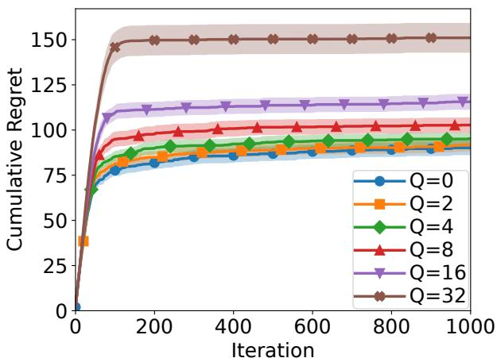
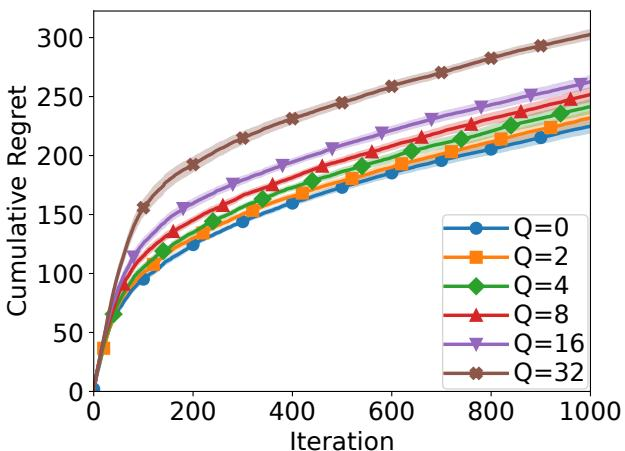
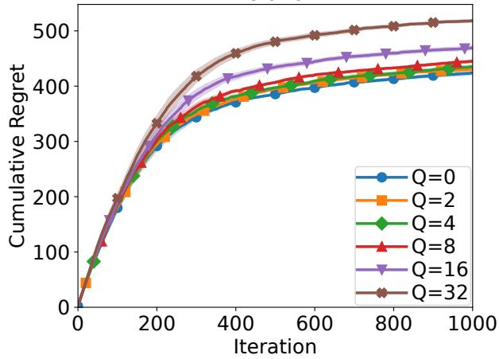
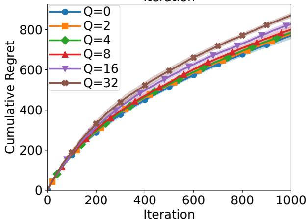

# Improved Regret Analysis for Parallel Gaussian Process Bandit Optimization

Shion Takeno<sup>1</sup> and Shogo Iwazaki<sup>2</sup>

<sup>1</sup>Nagoya University <sup>2</sup>MI-6 Ltd. takeno.s.mllab.nit@gmail.com shogo.iwazaki@gmail.com

## Abstract

This paper studies the regret analysis for parallel Gaussian process (GP) bandit optimization. The known regret upper bounds for the widely used GP batched upper confidence bound and GP batched Thompson sampling (GP-BTS) sufer from a multiplicative factor with respect to the batch size Q. To avoid this degradation, existing analyses require a polynomial number of uncertainty sampling (US) for Q at the beginning of optimization. However, this initial US phase is often inefective in practice. This paper shows that the regret upper bound without the multiplicative factor on Q can be achieved without the initial US phase, using GP-BTS as an example. Furthermore, we show much better regret upper bounds in the noiseless setting than in the noisy setting, as in the sequential GP bandit setting.

## 1 Introduction

Gaussian process (GP) bandit optimization [Chowdhury and Gopalan, 2017, Srinivas et al., 2010] has emerged as a powerful framework for black-box optimization of expensive-to-evaluate functions, which is required in various scientific and engineering domains. For this purpose, GP bandit methods model the unknown objective function by a GP and sequentially select evaluation points. However, in many practical scenarios, such as high-throughput screening or asynchronous distributed computing, function evaluations can be performed in parallel or subject to delayed feedback [Hernández-Lobato et al., 2017, Kandasamy et al., 2018]. In such parallel and delayed settings, the algorithm must select new query points without waiting for the results of recent queries, while maintaining query point diversity.

For this problem, batched and parallel variants of GP bandit algorithms have been proposed. A fundamental theoretical challenge in these settings is the degradation of the cumulative regret bound by a multiplicative factor of the batch size or delay parameter Q. For instance, the regret bounds of GP batched upper confidence bound (GP-BUCB) [Chowdhury and Gopalan, 2019, Desautels et al., 2014] and GP batched Thompson Sampling (GP-BTS) [Chowdhury and Gopalan, 2019, Vakili et al., 2021c] sufe from a multiplicative factor on Q. This can lead to substantial degradation, particularly with massive parallelization (Q > 100) [Hernández-Lobato et al., 2017, Vakili et al., 2021c]. To avoid this issue, the known analysis by Desautels et al. [2014] requires an initial phase of uncertainty sampling (US), which degrades the practical optimization performance.

Table 1: Summary of cumulative regret upper bounds for GP-BTS and GP-TS in the noisy setting with respect to the number of function evaluations $T$ and the batch size $Q .$ Note that $\widetilde O$ suppresses polylogarithmic factors for Q and T. See Theorem 4.3 for the details and the simple regret bounds.
<table><tr><td></td><td>SE</td><td>Matérn</td></tr><tr><td>GP-BTS (Ours)</td><td> $O \left( Q \ln ^ { d + 1 } Q + { \sqrt { T \ln ^ { 2 d + 3 } T } } \right)$ </td><td> $\widetilde O \left( Q ^ { \frac { 2 \nu + d } { 2 \nu } } + T ^ { \frac { 2 \nu + 3 d } { 4 \nu + 2 d } } \right)$ </td></tr><tr><td>GP-BTS</td><td> $O \left( { \sqrt { Q T \ln ^ { d + 1 } { \frac { T } { Q } } \ln ^ { d + 2 } T } } \right)$ </td><td> $\widetilde { O } \left( Q ^ { \frac { \nu } { 2 \nu + d } } T ^ { \frac { 2 \nu + 3 d } { 4 \nu + 2 d } } \right)$ </td></tr><tr><td>(Based on [Vakili et al., 2021c])</td><td></td><td></td></tr><tr><td>sequential GP-TS [Chowdhury and Gopalan, 2017]</td><td> $O \left( { \sqrt { T \ln ^ { 2 d + 3 } T } } \right)$ </td><td> $\widetilde O \left( T ^ { \frac { 2 \nu + 3 d } { 4 \nu + 2 d } } \right)$ </td></tr></table>

Table 2: Summary of cumulative regret upper bounds of GP-BTS, GP-UCB-based batched method (GP-UCB-batch), and sequential GP-UCB in the noiseless setting with respect to the number of function evaluations $T$ and the batch size $Q .$ Note that $\widetilde O$ suppresses polylogarithmic factors for $Q$ and $T .$ See Theorem 4.5 for the details.
<table><tr><td></td><td></td><td colspan="2">Matérn</td></tr><tr><td>Method</td><td>SE</td><td> $d > \nu$ </td><td> $d = \nu$   $d < \nu$ </td></tr><tr><td>GP-BTS (Ours)</td><td> $O ( Q + \ln ^ { \frac { 1 } { 2 } } T )$ </td><td> $\widetilde { \cal O } \left( Q + Q ^ { \frac { \nu } { d } } T ^ { \frac { d - \nu } { d } } \right) { \cal O } \left( Q \ln ^ { \frac { 5 } { 2 } } T \right)$ </td><td> $O \left( Q \ln ^ { \frac { 1 } { 2 } } T \right)$ </td></tr><tr><td>GP-UCB-batch [Lyu et al., 2019]</td><td> $O \left( { \sqrt { Q T \ln ^ { 2 d + 3 } T } } \right)$ </td><td> $\widetilde { O } \left( Q ^ { \frac { 1 } { 2 } } T ^ { \frac { 2 \nu + 3 d } { 4 \nu + 2 d } } \right)$ </td><td></td></tr><tr><td>sequential GP-UCB [Iwazaki, 2025a]</td><td>O(1)</td><td> $\widetilde { O } \left( T ^ { \frac { d - \nu } { d } } \right)$ </td><td> $O \left( \ln ^ { 2 } T \right)$  0(1)</td></tr></table>

In this paper, we resolve the above problem by an improved regret analysis technique and apply it to GP-BTS as an example. We summarize our main contributions as follows:

• We develop Lemma 4.2, which plays a key role in decoupling the batch size $Q$ as the additional term from the regret upper bound.

• We prove that GP-BTS achieves a cumulative regret bound in the noisy setting with only an additive degradation of $Q ,$ eliminating the need for the practically ineficient initial US phase, as summarized in Table 1.

• We provide the regret upper bounds for GP-BTS in the noiseless setting by leveraging the proof technique of [Iwazaki, 2025a], demonstrating that the regret upper bounds are much better than in the noisy case, as summarized in Table 2.

## 1.1 Related work

Sequential GP bandits. In the sequential setting, the theoretical properties of GP bandits have been extensively studied under the frequentist assumption that the objective function belongs to a reproducing kernel Hilbert space (RKHS). In particular, GP-UCB [Chowdhury and Gopalan, 2017, Srinivas et al., 2010] and GP-TS [Chowdhury and Gopalan, 2017] achieve the sublinear cumulative regret bounds. Several algorithms, such as phased elimination (PE) and SupKernelUCB, achieve near-optimal regret bounds but are often impractical or computationally complex [Calandriello et al., 2019, Iwazaki and Takeno, 2025, Janz et al., 2020, Li and Scarlett, 2022, Vakili et al., 2021a, Valko et al., 2013]. In particular, although PE can readily yield a near-optimal regret bound in the parallel setting, we focus on the analysis of GP-BTS due to PE’s practical inefectiveness.

Parallel GP bandits. The regret bounds of parallel GP bandits have been explored through various approaches. GP-BUCB [Chowdhury and Gopalan, 2019, Desautels et al., 2014] and GP-BTS [Chowdhury and Gopalan, 2019, Vakili et al., 2021c] sufer from the multiplicative factor on Q in the regret upper bound. Although Contal et al. [2013] claimed that GP-UCB with pure exploration (GP-UCB-PE) achieves the cumulative regret upper bound without the multiplicative factor on Q, its proof leaves some technical ambiguities, <sup>1</sup> making the exact regret behavior unclear. Similarly, under Bayesian assumptions, several regret upper bounds, which also sufer from a multiplicative factor on Q, have been shown [Desautels et al., 2014, Kandasamy et al., 2018, Nava et al., 2022, Sugiura et al., 2026]. Our work resolves this fundamental bottleneck by achieving an additive factor on Q without any initial US phase.

Stochastically delayed GP bandits. Recently, Verma et al. [2022] and Vakili et al. [2023] have studied GP bandits for the stochastic delayed-feedback setting, based on a tailor-made confidence interval for this setting. Although we focus on the deterministically delayed-feedback setting, an application of our analysis to this setting can be an important future direction.

GP bandits with noiseless feedback. The regret analyses are also conducted on the noiseless setting [Bull, 2011, Flynn and Reeb, 2025, Iwazaki, 2025a, Iwazaki and Takeno, 2025, Kim and Sanz-Alonso, 2025, Lyu et al., 2019, Salgia et al., 2024, Vakili, 2022]. In particular, although Lyu et al. [2019] have studied the parallelization of GP bandit, their regret upper bounds have almost the same order as in the noisy case. Recently, near-optimal cumulative regret bounds for the sequential GP-UCB have been derived by Iwazaki [2025a]. We obtain much better regret bounds than [Lyu et al., 2019] by leveraging the proof of [Iwazaki, 2025a].

Regret lower bound. Several studies have provided algorithm-independent regret lower bounds for the GP bandit problem [Cai and Scarlett, 2021, Li and Scarlett, 2024, Ma et al., 2026, Scarlett et al., 2017]. For both noisy and noiseless settings, our regret analysis is not tight, since PE and US-based algorithms can achieve the near-optimal regret bound that matches the regret lower bound therein (see [Iwazaki, 2025a, Iwazaki and Takeno, 2025]). On the other hand, since PE and US-based algorithms are often practically inefective, we tackle tightening the regret upper bounds of the GP-TS-based parallelization method, which is widely used [Chowdhury and Gopalan, 2019, Hernández-Lobato et al., 2017, Kandasamy et al., 2018, Nava et al., 2022, Vakili et al., 2021c].

## 2 Preliminaries

This section presents the problem statement, surrogate models, and assumptions.

## 2.1 Problem statement

We consider the d-dimensional maximization problem of $f : \mathcal { X } \to \mathbb { R }$ with an input domain $\mathcal { X } \subset \mathbb { R } ^ { d }$

$$
\pmb { x } ^ { * } \in \arg \operatorname* { m a x } _ { \pmb { x } \in \mathcal { X } } f ( \pmb { x } ) ,
$$

where the evaluations of the most recent $Q$ queries are not yet observed. Since evaluating the objective function $f$ is assumed to be expensive, we sequentially choose $\mathbf { \Delta } _ { \mathbf { \mathcal { X } } _ { t } }$ for all iterations t and obtain a (possibly noisy) observation $y _ { t }$ , by which we aim to optimize with a smaller number of observations. Hence, the dataset that we have at the t-th iteration is $\mathcal { D } _ { t - Q - 1 } = \{ ( \boldsymbol { x } _ { i } , y _ { i } ) \} _ { i = 1 } ^ { t - Q - 1 }$ since we do not have the observations at $\pmb { x } _ { t - Q } , \ldots , \pmb { x } _ { t - 1 }$ . Thus, setting $Q = 0$ recovers the usual sequential optimization problem. This setting includes optimization problems with delayed or parallel feedback, a typical example of which is an asynchronous parallelization setup with $Q + 1$ workers. Note that although we consider this delayed setting for simplicity, our analysis can apply to other settings, such as the batch setting where $Q + 1$ queries are issued simultaneously.

Regret. We evaluate the performance by the cumulative and simple regrets [Russo and Van Roy, 2014, Srinivas et al., 2010] defined below:

$$
R _ { T } = \sum _ { t = 1 } ^ { T } f ( \pmb { x } ^ { * } ) - f ( \pmb { x } _ { t } ) , \quad r _ { T } = f ( \pmb { x } ^ { * } ) - f ( \hat { \pmb { x } } _ { T } ) ,
$$

where $\scriptstyle { \hat { \mathbf { x } } } _ { T }$ is some recommendation input by the algorithm at the end of the T-th iteration. As detailed in Section 4, we will analyze the expectation of the regret, where the expectation is taken with respect to all the randomness arising from the algorithm and the noise sequence (if it exists).

## 2.2 Gaussian process regression (GPR) model

We use a GPR model [Rasmussen and Williams, 2005] as the surrogate model, as with [Chowdhury and Gopalan, 2017, Janz et al., 2020, Srinivas et al., 2010]. Suppose that we have the training dataset $\mathcal { D } _ { t } = \{ ( \boldsymbol { x } _ { i } , y _ { i } ) \} _ { i = 1 } ^ { t } .$ where $y _ { t } = f ( \pmb { x } _ { t } ) + \epsilon _ { t }$ with i.i.d. noise $\epsilon _ { t } \sim \mathcal { N } ( 0 , \lambda ^ { 2 } )$ . Under the assumption that $f$ follows a GP denoted as $\mathcal { G P } ( 0 , k )$ , where $k : \mathcal { X } \times \mathcal { X } $ R is a kernel function, the posterior distribution $p ( f \mid \mathcal { D } _ { t } )$ is a GP again. That is, $f \mid \mathcal { D } _ { t } \sim \mathcal { G P } ( \mu _ { t } , k _ { t } )$ , whose posterior mean and covariance functions are given below:

$$
\begin{array} { r l } & { ~ \quad \mu _ { t } ( { \pmb x } ) = { \pmb k } _ { t } ( { \pmb x } ) ^ { \top } \big ( { \pmb K } _ { t } + \lambda ^ { 2 } { \pmb I } _ { t } \big ) ^ { - 1 } { \pmb y } _ { t } , } \\ & { { \pmb k } _ { t } ( { \pmb x } , { \pmb x } ^ { \prime } ) = { \pmb k } ( { \pmb x } , { \pmb x } ^ { \prime } ) - { \pmb k } _ { t } ( { \pmb x } ) ^ { \top } \big ( { \pmb K } _ { t } + \lambda ^ { 2 } { \pmb I } _ { t } \big ) ^ { - 1 } { \pmb k } _ { t } ( { \pmb x } ^ { \prime } ) , } \end{array}\tag{1}
$$

where $\pmb { k } _ { t } ( \pmb { x } ) = \left( k ( \pmb { x } , \pmb { x } _ { 1 } ) , \ldots , k ( \pmb { x } , \pmb { x } _ { t } ) \right) ^ { \top } \in \mathbb { R } ^ { t } , \pmb { K } _ { t } \in \mathbb { R } ^ { t \times t }$ is the kernel matrix whose $( i , j )$ -element is $k ( \pmb { x } _ { i } , \pmb { x } _ { j } ) , ~ \pmb { I } _ { t } \in \mathbb { R } ^ { t \times t }$ is the identity matrix, and $\pmb { y } _ { t } = ( y _ { 1 } , \ldots , y _ { t } ) ^ { \top } \in \mathbb { R } ^ { t }$ . For the sake of notational simplicity, we define $\sigma _ { t } ^ { 2 } ( \pmb { x } ) = k _ { t } ( \pmb { x } , \pmb { x } )$ and $\mu _ { - i } ( { \pmb x } ) = 0 , \sigma _ { - i } ^ { 2 } ( { \pmb x } ) = k ( { \pmb x } , { \pmb x } )$ , and $k _ { - i } ( { \pmb x } , { \pmb x } ^ { \prime } ) = k ( { \pmb x } , { \pmb x } ^ { \prime } )$ for all $i = \{ 0 , \ldots , Q \}$ and $\pmb { x } , \pmb { x } ^ { \prime } \in \mathcal { X }$ . When $\lambda = 0$ and $\pmb { K } _ { t }$ becomes not invertible though $\mathbf { \delta } _ { K - 1 }$ is invertible, we do not add $\left( { { \pmb x } _ { t } , y _ { t } } \right)$ to the training dataset, that is, update $\mathcal { D } _ { t } \gets \mathcal { D } _ { t - 1 }$ as in [Iwazaki, 2025a].

Maximum information gain (MIG). The complexity of GP bandits is commonly quantified by the MIG [Iwazaki, 2025b, 2026, Srinivas et al., 2010, Vakili et al., 2021b] defined below:

Definition 2.1. Let $f \sim \mathcal { G P } ( 0 , k )$ over a compact input domain $\mathcal { X } \subset [ 0 , r ] ^ { d }$ . Then, MIG $\gamma _ { T }$ is defined as follows:

$$
\gamma _ { T } ( \lambda ^ { 2 } ) = \frac { 1 } { 2 } \operatorname* { s u p } _ { x _ { 1 } , \ldots , x _ { T } \in \mathcal { X } } \ln \left( \operatorname* { d e t } \left( I _ { T } + \lambda ^ { - 2 } K _ { T } \right) \right) ,
$$

where $K _ { T } \in \mathbb { R } ^ { T \times T }$ is the kernel matrix whose $( i , j )$ -element is $k ( \pmb { x } _ { i } , \pmb { x } _ { j } )$

The MIG of several commonly used kernel functions is known to be sublinear regarding T. For example, $\gamma _ { T } ( \lambda ^ { 2 } ) = O \big ( \big ( \ln ( T / \lambda ^ { 2 } ) \big ) ^ { d + 1 } \big )$ for SE kernels $k _ { \mathrm { S E } } ( \pmb { x } , \pmb { x } ^ { \prime } ) = \exp \left( - \| \pmb { x } - \pmb { x } ^ { \prime } \| _ { 2 } ^ { 2 } / ( 2 \ell ^ { 2 } ) \right)$ , and $\gamma _ { T } ( \lambda ^ { 2 } ) =$ $O \big ( ( T / \lambda ^ { 2 } ) ^ { \frac { d } { 2 \nu + d } } \ln ^ { \frac { 2 \nu } { 2 \nu + d } } ( T / \lambda ^ { 2 } ) \big ) = \widetilde { O } \big ( ( T / \lambda ^ { 2 } ) ^ { \frac { d } { 2 \nu + d } } \big )$ for Matérn-ν kernels $\begin{array} { r } { \dot { k } _ { \mathrm { M a t } } ( { \pmb x } , { \pmb x } ^ { \prime } ) = \frac { 2 ^ { 1 - \nu } } { \Gamma ( \nu ) } \left( \frac { \sqrt { 2 \nu } \| { \pmb x } - { \pmb x } ^ { \prime } \| _ { 2 } } { \ell } \right) ^ { \nu } } \end{array}$ $\begin{array} { r } { J _ { \nu } \left( \frac { \sqrt { 2 \nu } \| \pmb { x } - \pmb { x } ^ { \prime } \| _ { 2 } } { \ell } \right) } \end{array}$ , where $\ell , \nu > 0$ are the lengthscale and smoothness parameter, respectively, and $\Gamma ( \cdot )$ and $J _ { \nu }$ are Gamma and modified Bessel functions, respectively [Iwazaki, 2025b, 2026, Srinivas et al., 2010, Vakili et al., 2021b]. Note that $\widetilde O$ suppresses polylogarithmic factors.

Remark 2.2. We analyze regret via the widely used MIG bound from [Vakili et al., 2021b]. However, its flaw for Matérn kernels has been pointed out by Janz [2021] and Iwazaki [2025b]. Theorem 7 in Iwazaki [2025b] provides the rectified MIG bound for the Matérn kernels $\gamma _ { T } = O \big ( ( T / \lambda ^ { 2 } ) ^ { \frac { d } { 2 \nu + d } } \ln ^ { \frac { 4 \nu + d } { 2 \nu + d } } ( T / \lambda ^ { 2 } ) \big )$ which requires the additional polylogarithmic factor on T. In addition, a slightly tighter MIG bound for the SE kernels is provided by Iwazaki [2026]. By adapting these analyses, our regret upper bounds may change slightly.

Hereafter, when we focus on only the order except for $\lambda ^ { 2 }$ , we denote $\gamma _ { t } ( \lambda ^ { 2 } ) = \gamma _ { t }$ for simplicity.

## 2.3 Regularity assumptions

Although we use the GPR model defined in Sec. 2.2, we assume a condition called the frequentist setting, which is diferent from the Bayesian assumption of the GPR model. We assume the following common regularity assumption on $f$ [Chowdhury and Gopalan, 2017, Iwazaki and Takeno, 2025, Janz et al., 2020, Srinivas et al., 2010]:

Assumption 2.3. Let $f$ be an element of RKHS $\mathcal { H } _ { k }$ specified by the predefined kernel k that satisfies $\forall { \pmb x } \in { \pmb X } , k ( { \pmb x } , { \pmb x } ) \leq 1$ , where $\mathcal { X } \subset [ 0 , r ] ^ { d }$ is a compact input space. Furthermore, the RKHS norm of $f$ is bounded as $\| f \| _ { \mathcal { H } _ { k } } \le B < \infty$ for some $B > 0$ , where $\| \cdot \| _ { \mathcal { H } }$ denotes the RKHS norm of $\mathcal { H } _ { k }$

This assumption imposes desirable properties on $f ,$ such as smoothness and boundedness.

We consider both the noisy case [Russo and Van Roy, 2014, Srinivas et al., 2010], where the observations are contaminated by noise, and the noiseless case [De Freitas et al., 2012, Iwazaki, 2025a], where we can obtain the function value as $y _ { t } = f ( \pmb { x } _ { t } )$ . For the noisy case, we assume the following condition on the noise sequence as in [Chowdhury and Gopalan, 2017, Janz et al., 2020]:

Assumption 2.4. We can observe contaminated observations $y _ { t } = f ( \pmb { x } _ { t } ) + \epsilon _ { t }$ for all $t \in \mathbb N$ . The noise sequence $( \epsilon _ { t } ) _ { t \in \mathbb { N } }$ is a sequence of conditionally R-sub-Gaussian random variables. That ${ \mathrm { i s } } ,$ for some $R > 0$ ， the moment generating function of $\epsilon _ { t }$ satisfies $\begin{array} { r } { \mathbb { E } [ \exp ( \eta \epsilon _ { t } ) \mid \mathcal { F } _ { t - 1 } ] \leq \exp \bigl ( \frac { \eta ^ { 2 } R ^ { 2 } } { 2 } \bigr ) } \end{array}$ for all $t \in \mathbb { N }$ and $\eta \in \mathbb { R }$ where $\mathcal { F } _ { t - 1 }$ is σ-algebra generated by the random variables $\{ x _ { i } , y _ { i } \} _ { i = 1 } ^ { t - 1 }$ and $\mathbf { \Delta } _ { \mathbf { \mathcal { X } } _ { t } }$

Furthermore, we assume the following conditions on smoothness and discretization as in [Chowdhury and Gopalan, 2017, 2019, Vakili et al., $^ { 2 0 2 1 \mathrm { a } , \mathrm { c } , }$ 2022]:

Assumption 2.5. The kernel function k satisfies the following condition on the derivatives. There exists a constant $L _ { k }$ such that, $\begin{array} { r } { \operatorname* { s u p } _ { x \in \mathcal { X } } \operatorname* { s u p } _ { j \in [ d ] } \bigg | \frac { \partial ^ { 2 } k ( u , v ) } { \partial u _ { j } \partial v _ { j } } \bigg | _ { u = v = x } \bigg | ^ { 1 / 2 } \leq L _ { k } } \end{array}$ . Furthermore, there exists a (computable) finite subset $\mathcal { X } _ { t } \subset \mathcal { X }$ that satisfies max<sub>x∈</sub> $\begin{array} { r } { \chi \operatorname* { m i n } _ { \pmb { x } ^ { \prime } \in \mathcal { X } _ { t } } \| \pmb { x } - \pmb { x } ^ { \prime } \| _ { 1 } \leq \frac { 1 } { L _ { k } N _ { t } } } \end{array}$ and $| \mathcal { X } _ { t } | \leq ( L _ { k } d r N _ { t } ) ^ { d }$ for all $t \in [ T ]$ and $N _ { t } \in \mathbb { N }$

This assumption is satisfied at least by the SE kernels and the Matérn kernels with $\nu > 1$ . The algorithm of GP-BTS depends on a predefined discretized input set $\mathcal { X } _ { t } \subset \mathcal { X } ,$ as with [Chowdhury and Gopalan, 2017, 2019, Vakili et al., 2021c]. (For details, see Section 4.2 in [Chowdhury and Gopalan, 2017].)

```latex
Algorithm 1 GP-BTS
Require: Domain $x ,$ kernel k, confidence width parameters $\{ \beta _ { t } \} _ { t \in \mathbb { N } }$ , discretized inputs $\{ \mathcal { X } _ { t } \} _ { t \in \mathbb { N } }$
1: $\mathcal { D } _ { 0 }  \emptyset$
2: for $t = 1 , \dots , T$ do
3: If $t > Q + 1$ , update $\mu _ { t - Q - 1 } ( \cdot )$ and $\sigma _ { t - Q - 1 } ^ { 2 } ( \cdot )$ by Eq. (1)
4: Compute ${ \pmb x } _ { t } = \arg \operatorname* { m a x } _ { { \pmb x } \in \mathcal { X } _ { t } } g _ { t } ( { \pmb x } )$ where $g _ { t } \sim \mathcal { G P } ( \mu _ { t - Q - 1 } , \beta _ { t } k _ { t - Q - 1 } )$
5: If $t \geq Q + 1$ , observe $y _ { t - Q } = f ( \mathbf { x } _ { t - Q } ) + \epsilon _ { t - Q }$
6: end for
7: return some recommendation $\scriptstyle { \hat { \mathbf { x } } } _ { T }$
```

## 3 GP-BTS

This section describes the algorithm and the existing analyses of GP-BTS.

## 3.1 Algorithm

We define GP-BTS following [Chowdhury and Gopalan, 2019, Vakili et al., 2021c], whose pseudocode is shown in Algorithm 1. In our problem setup, since the recent $Q$ observations are not yet available, we need to query $\mathbf { \Delta } _ { \mathbf { \mathcal { X } } _ { t } }$ that is diverse relative to the recent $Q$ inputs. From the nature of GP-TS, which depends on the random posterior sampling, we can determine $\mathbf { \Delta } _ { \mathbf { \mathcal { X } } _ { t } }$ that is randomly distributed, by which we expect that the inputs have diversity. Thus, GP-BTS chooses the t-th input using the currently available dataset $\mathcal { D } _ { t - Q - 1 }$ as follows:

$$
\pmb { x } _ { t } = \arg \operatorname* { m a x } _ { \pmb { x } \in \mathcal { X } _ { t } } g _ { t } ( \pmb { x } ) ,
$$

where $g _ { t } \sim \mathcal { G P } ( \mu _ { t - Q - 1 } , \beta _ { t } k _ { t - Q - 1 } )$ is the posterior sample path with the inflated posterior variance by the confidence width parameter $\beta _ { t }$ to apply the proof technique by Chowdhury and Gopalan [2017]. Furthermore, we will theoretically specify $\beta _ { t }$ as $\beta _ { t } = \Theta ( \gamma _ { t } )$ , as in [Vakili et $\mathrm { a l . , }$ 2021c], though GP-BTS in [Chowdhury and Gopalan, 2019] and GP-BUCB [Chowdhury and Gopalan, 2019, Desautels et al., 2014] set $\beta _ { t } = \Theta \big ( \exp ( \gamma _ { Q } ) \gamma _ { t } \big )$

## 3.2 Existing regret analysis

Although Vakili et al. [2021c] focused on the GP-BTS with sparse GP approximation, their analysis can apply to our problem setup, where we can compute an exact $\mathrm { G P }$ posterior and an exact posterior sample path. By adapting the analysis by Vakili et al. [2021c], GP-BTS attains the following cumulative regret bound (a detailed and modified version of this claim is shown in Lemma 4.1):

$$
\mathbb { E } \left[ R _ { T } \right] \lesssim \sqrt { \beta _ { T } \ln T } \mathbb { E } \left[ \sum _ { t = 1 } ^ { T } \sigma _ { t - Q - 1 } ( \pmb { x } _ { t } ) \right] ,\tag{2}
$$

where $\lesssim$ ignores the constant factors except for $T$ and $Q ,$ and the expectation is taken with respect to the randomness of the algorithm and the noise sequence. Since $\sigma _ { t - Q - 1 } ( { \pmb x } _ { t } ) \geq \sigma _ { t - 1 } ( { \pmb x } _ { t } )$ holds, the above regret upper bound is larger than the regret bound for the sequential case, which depends on the quantity $\textstyle \sum _ { t = 1 } ^ { T } \sigma _ { t - 1 } ( \pmb { x } _ { t } )$ . To obtain the upper bound for $\scriptstyle \sum _ { t = 1 } ^ { T } \sigma _ { t - Q - 1 } ( \mathbf { x } _ { t } )$ , Vakili et al. [2021c] apply the following lemma:<sup>2</sup>

Lemma 3.1 (Adapted from Lemma 3 in [Vakili et al., 2021c]). For any input sequence ${ \pmb x } _ { 1 } , \dotsc , { \pmb x } _ { T } \in { \pmb X }$ the following inequality holds:

$$
\sum _ { t = 1 } ^ { T } \sigma _ { t - Q - 1 } ( x _ { t } ) \leq \sqrt { C _ { 1 } Q T \gamma _ { T / Q } } ,
$$

where $C _ { 1 } = 2 / \ln ( 1 + \lambda ^ { - 2 } )$

Finally, Vakili et al. [2021c] have derived the following cumulative regret upper bound of GP-BTS:

$$
\mathbb { E } \left[ R _ { T } \right] = O \left( \sqrt { Q \gamma _ { T / Q } \gamma _ { T } T \ln T } \right) .\tag{3}
$$

Compared with the $O \left( \gamma _ { T } \sqrt { T \ln T } \right)$ bound of the sequential GP-TS [Chowdhury and Gopalan, 2017], $\sqrt { \gamma _ { T } }$ is replaced with $\sqrt { Q \gamma _ { T / Q } }$ . Since we focus on the case where $\gamma _ { T }$ is sublinear, this replacement is a degradation with respect to $Q$ . In the next section, we show that this degradation can be avoided without the impractical initial US phase.

## 4 Improved regret analysis

First, we derive Lemma 4.1, which shows the instantaneous regret upper bound of GP-BTS, modified slightly from [Vakili et al., 2021c] to apply Lemmas 4.2 and 4.4. Then, we show the regret upper bounds for GP-BTS in noisy and noiseless settings.

We can obtain the following instantaneous regret bound for GP-BTS:

Lemma 4.1 (Modified from Theorem 1 in [Vakili et al., 2021c]). Suppose Assumptions 2.3 and 2.5 hold. Set $p _ { t } ^ { ( g ) } \in ( 0 , 1 ) , N _ { t } \in \mathbb { N }$ and $( i ) \lambda > 0 , p _ { t } ^ { ( f ) } \in ( 0 , 1 )$ and $\begin{array} { r } { \beta _ { t } ^ { 1 / 2 } ( \delta ) = B + \frac { R } { \lambda } \sqrt { 2 \left( \gamma _ { t } + \ln ( 1 / \delta ) \right) } } \end{array}$ for the noisy setting where Assumption 2.4 holds $o r \ ( i i ) \lambda = p _ { t } ^ { ( f ) } = 0$ and $\beta _ { t } ^ { 1 / 2 } ( \delta ) = B$ for the noiseless setting where $y _ { t } = f ( \pmb { x } _ { t } )$ . Then, if Algorithm 1 runs, for all $t \in [ T ]$ , the following inequality holds:

$$
\mathbb { E } [ f ( { \pmb x } ^ { * } ) - f ( { \pmb x } _ { t } ) ] \le \frac { 2 + p } { p } \mathbb { E } \left[ \operatorname* { m i n } \left\{ 2 B , c _ { t } \sigma _ { t - Q - 1 } ( { \pmb x } _ { t } ) \right\} \right] + \frac { B } { N _ { t } } + 2 B p _ { t } ^ { ( f ) } + 2 B p _ { t } ^ { ( g ) }
$$

where $p = 1 / ( 4 e \sqrt { \pi } ) , \zeta _ { t } ( \delta ) = 2 \ln \bigl ( 2 ( L _ { k } d r N _ { t } ) ^ { d } / ( p \delta ) \bigr ) , c _ { t } = \beta _ { t } ^ { 1 / 2 } \bigl ( p _ { t } ^ { ( f ) } \bigr ) \Bigl ( 2 \zeta _ { t } ^ { 1 / 2 } \bigl ( p _ { t } ^ { ( g ) } \bigr ) + 1 \Bigr )$ , and the expectation is taken with respect to $\{ \epsilon _ { t } \} _ { t \in [ T ] }$ and $\{ g _ { t } \} _ { t \in [ T ] }$ for the noisy setting and $\{ g _ { t } \} _ { t \in [ T ] }$ for the noiseless setting.

See Appendix B.1 for the proof.

Comparison from [Vakili et al., 2021c]. Our modification in Lemma 4.1 compared with [Vakili et al., 2021c] is useful to bound the regrets over some index set $\tau .$ The diference is a replacement of min $\{ 2 B , c _ { t } \mathbb { E } \left[ \sigma _ { t - Q - 1 } ( \pmb { x } _ { t } ) \right] \}$ with E [min $\{ 2 B , c _ { t } \sigma _ { t - Q - 1 } ( { \pmb x } _ { t } ) \} ]$ . If we use the upper bound min $\{ 2 B , c _ { t } \mathbb { E } \left[ \sigma _ { t - Q - 1 } ( \pmb { x } _ { t } ) \right] \}$ naively, the regret upper bound incurs the term $c _ { T } | T | = O ( \sqrt { \gamma _ { T } \ln { T } } | T | )$ , where $\tau$ is the set of iterations defined in Lemma 4.2. We can utilize Lemma 4.1 to obtain $\begin{array} { r } { \sum _ { t \in \mathcal T } f ( \pmb x ^ { * } ) - f ( \pmb x _ { t } ) = O ( B | \mathcal T | ) } \end{array}$

## 4.1 Regret analysis for noisy feedback

The degradation from the sequential setting arises mainly from Lemma 3.1. To avoid this, we obtain the following lemma similar to the elliptical potential count lemma (Lemma D.9 in [Flynn and Reeb, 2025], Lemma 3.3 in [Iwazaki and Takeno, 2025], Lemma 6 in [Iwazaki, 2025a]):

Lemma 4.2. For any $T \in \mathbb { N } , \lambda > 0 ;$ and any input sequence $\{ { \pmb x } _ { t } \} _ { t \in [ T ] }$ , the following hold:

$$
| { \mathcal { T } } | \leq 8 Q \gamma _ { | { \mathcal { T } } | } ( \lambda ^ { 2 } ) \leq 8 Q \gamma _ { T } ( \lambda ^ { 2 } ) , \ a n d \ \forall t \in { \mathcal { T } } ^ { c } , \ \sigma _ { t - Q - 1 } ( { \pmb x } _ { t } ) \leq { \sqrt { 2 } } \sigma _ { t - 1 } ( { \pmb x } _ { t } ) ,
$$

where $\mathcal { T } = \{ t \in [ T ] \mid \sigma _ { t - 1 } ^ { 2 } ( x _ { t } ) \geq \lambda ^ { 2 } / ( 2 Q ) \}$ and $\mathcal { T } ^ { c }$ is its complement set.

This lemma can be derived by combining a proof similar to the elliptical potential count lemma with the well-known posterior variance inequality shown in Lemma $\mathrm { { A . 4 . } }$ See Appendix B.2 for the detailed proof. This lemma implies that, in most iterations ${ \mathcal { T } } ^ { c } .$ , where $| \mathcal { T } ^ { c } | = T - | \mathcal { T } | \ge T - 8 Q \gamma _ { | T | } ( \lambda ^ { 2 } )$ , the increase from $\sigma _ { t - 1 } ( { \pmb x } _ { t } )$ to $\sigma _ { t - Q - 1 } ( { \pmb x } _ { t } )$ is at most a constant multiple. Thus, we can see that, for $t \in \mathcal { T } ^ { c }$ 2 we can obtain a tighter upper bound compared with Lemma 3.1.

By combining Lemmas 4.1 and 4.2, we can obtain the following regret upper bounds:

Theorem 4.3. Suppose Assumptions 2.3, 2.4, and 2.5 hold. Set $1 / N _ { t } = p _ { t } ^ { ( f ) } = p _ { t } ^ { ( g ) } = 1 / t ^ { 2 } , \hat { x } _ { T } =$ arg $\begin{array} { r } { \operatorname* { m a x } _ { \pmb { x } \in \mathcal { X } } \left\{ \mu _ { T } ( \pmb { x } ) - \beta _ { T } ^ { ( 1 / 2 ) } ( p _ { T } ^ { ( g ) } ) \sigma _ { T } ( \pmb { x } ) \right\} } \end{array}$ , and other variables as in Lemma 4.1. Then, the following inequality holds:

$$
\mathbb { E } [ R _ { T } ] = O \left( \overline { { T } } ^ { ( Q ) } + \gamma _ { T } \sqrt { T \ln T } \right) , \quad \mathbb { E } [ r _ { T } ] = O \left( \frac { \overline { { T } } ^ { ( Q ) } + \gamma _ { T } \sqrt { T \ln T } } { T } \right) ,
$$

where $\overline { { T } } ^ { ( Q ) } = \operatorname* { m a x } \{ t \in \mathbb { N } \mid t \leq 8 Q \gamma _ { t } \}$ . In particular, ${ \overline { { T } } } ^ { ( Q ) } = { \cal O } \left( { \cal Q } \ln ^ { d + 1 } { \cal Q } \right)$ for SE kernels and $\overline { { T } } ^ { \left( Q \right) } = \widetilde O \left( Q ^ { \frac { 2 \nu + d } { 2 \nu } } \right)$ for Matérn kernels.

In the proof, roughly speaking, we show that E $\begin{array} { r } { \left[ \sum _ { t \in \mathcal { T } } f ( \pmb { x } ^ { * } ) - f ( \pmb { x } _ { t } ) \right] = O ( B \mathbb { E } [ | \mathcal { T } | ] ) = O \left( B \overline { { T } } ^ { ( Q ) } \right) } \end{array}$ and $\begin{array} { r } { \mathbb { E } \left[ \sum _ { t \in \mathcal { T } ^ { c } } f ( \pmb { x } ^ { * } ) - f ( \pmb { x } _ { t } ) \right] = O \left( \gamma _ { T } \sqrt { T \ln T } \right) } \end{array}$ . See Appendix B.3 for the detailed proof.

Consequently, we obtain the following cumulative regret bound:

$$
\begin{array} { r } { \mathbb { E } \left[ R _ { T } \right] = \left\{ \begin{array} { l l } { O \left( Q \ln ^ { d + 1 } Q + \sqrt { T ( \ln T ) ^ { 2 d + 3 } } \right) } & { \mathrm { f o r ~ S E ~ k e r n e l s , } } \\ { \tilde { O } \left( Q ^ { \frac { 2 \nu + d } { 2 \nu } } + T ^ { \frac { 2 \nu + 3 d } { 4 \nu + 2 d } } \right) } & { \mathrm { f o r ~ M a t \ ' e r n ~ k e r n e l s . } } \end{array} \right. } \end{array}
$$

Therefore, except for the additive factor on $Q ,$ our analysis achieves regret upper bounds similar to those for the sequential GP-TS [Chowdhury and Gopalan, 2017]. Compared with Eq. (3), our analysis replaces the multiplicative factor on $Q$ with the additive factor on $Q$ This change is considered preferable in the literature [see Section 4 of Desautels et al., 2014] since the $\gamma _ { T } \sqrt { T \ln { T } }$ term is often dominant under the general assumption $T \gg Q$

## 4.2 Regret analysis for noiseless feedback

We obtain the following lemma combining the proof by Iwazaki [2025a] and Lemma 3.1:

Lemma 4.4 (Informal). Based on the MIG bounds from [Vakili et al., 2021b], the following statements hold for any $T \in \mathbb { N }$ and any input sequence $\pmb { x } _ { 1 } , \dotsc , \pmb { x } _ { T } \in \mathcal { X } .$

• For the SE kernels,

$$
\operatorname* { m i n } _ { t \in [ T ] } \sigma _ { t - Q - 1 } ( { \boldsymbol x } _ { t } ) \le \sqrt { 2 T / Q } \exp \left( - \frac { 1 } { 2 } \widetilde C _ { \mathrm { S E } } ( T / Q ) ^ { \frac { 1 } { d + 1 } } \right) \qquad i f T \ge Q \overline { { T } } _ { \mathrm { S E } } ,
$$

$$
\sum _ { t = 1 } ^ { T } \operatorname* { m i n } \left\{ 2 B , c _ { t } \sigma _ { t - Q - 1 } ( { \pmb x } _ { t } ) \right\} \leq 2 B Q \overline { { T } } _ { \mathrm { S E } } + \sqrt { 2 } c _ { T } ( d + 1 ) \left( \frac { \widetilde { C } _ { \mathrm { S E } } } { 2 } \right) ^ { - \frac { 3 d + 3 } { 2 } } \Gamma \left( \frac { 3 d + 3 } { 2 } \right) .
$$

• For the Matérn kernels with $\nu > 1 / 2$

$$
\begin{array} { r l } { \displaystyle \operatorname* { m i n } _ { t \in [ T ] } \sigma _ { t - Q - 1 } ( x _ { t } ) \leq \sqrt { 2 } \tilde { C } _ { \mathrm { M a t } } ^ { 1 / 2 } ( T / Q ) ^ { - \frac { \nu } { d } } \left( \ln ( T / Q ) \right) ^ { \frac { \nu } { d } } } & { \quad i f T \geq Q \overline { { T } } _ { \mathrm { M a t } } , } \\ { \displaystyle \sum _ { t = 1 } ^ { T } \operatorname* { m i n } \left\{ 2 B , c _ { t } \sigma _ { t - Q - 1 } ( x _ { t } ) \right\} \leq \left\{ \begin{array} { l l } { 2 B Q \overline { { T } } _ { \mathrm { M a t } } + \sqrt { 2 } c _ { T } \tilde { C } _ { \mathrm { M a t } } ^ { 1 / 2 } \frac { d } { d - \nu } T ^ { \frac { d - \nu } { d } } Q ^ { \frac { \nu } { d } } ( \ln ( T / Q ) ) ^ { \frac { \nu } { d } } } & { i f d > \nu , } \\ { 2 B Q \overline { { T } } _ { \mathrm { M a t } } + \sqrt { 2 } c _ { T } \tilde { C } _ { \mathrm { M a t } } ^ { 1 / 2 } Q ( \ln ( T / Q ) ) ^ { 2 } / 2 } & { i f d = \nu , } \\ { 2 B Q \overline { { T } } _ { \mathrm { M a t } } + \sqrt { 2 } c _ { T } \tilde { C } _ { \mathrm { M a t } } ^ { 1 / 2 } \frac { Q \Gamma ( \frac { \nu } { d } + 1 ) } { ( d - 1 ) ^ { \frac { \nu } { d } + 1 } } } & { i f d < \nu . } \end{array} \right. } \end{array}
$$

where $\widetilde { C } _ { \mathrm { S E } } , \widetilde { C } _ { \mathrm { M a t } } , \overline { { T } } _ { \mathrm { S E } }$ , and $\overline { { T } } _ { \mathrm { M a t } }$ are constants with respect to $T$ and $Q .$

See Appendix B.4 for the formal version and its proof.

Hence, by combining Lemmas 4.1 and 4.4, we derive the following result:

Theorem 4.5. Suppose Assumptions 2.3 and 2.5 hold. Set $1 / N _ { t } = p _ { t } ^ { ( g ) } = 1 / t ^ { 2 }$ and other variables as in Lemma $\it 4 . 1$ . Then, the following inequality holds:

$$
\mathbb { E } \left[ R _ { T } \right] = \left\{ \begin{array} { l l } { O \left( Q + \ln ^ { \frac { 1 } { 2 } } T \right) } & { f o r ~ S E ~ k e r n e l s , } \\ { \widetilde { O } \left( Q + T ^ { \frac { d - \nu } { d } } Q ^ { \frac { \nu } { d } } \right) } & { f o r ~ M a t \ ' e r n ~ k e r n e l s ~ w i t h ~ d > \nu , } \\ { O \left( Q \ln ^ { \frac { 5 } { 2 } } T \right) } & { f o r ~ M a t \ ' e r n ~ k e r n e l s ~ w i t h ~ d = \nu , } \\ { O \left( Q \ln ^ { \frac { 1 } { 2 } } T \right) } & { f o r ~ M a t \ ' e r n ~ k e r n e l s ~ w i t h ~ d < \nu , } \end{array} \right.
$$

where $\widetilde O$ suppresses the polylogarithmic factors for $T$ and $Q$

As with the sequential case [Iwazaki, 2025a], we can obtain a much better regret upper bound compared with the noisy case. In particular, for SE kernels and Matérn kernels with $\nu \geq d ,$ we can obtain a polylogarithmic upper bound with respect to $T .$ Our regret bounds are much tighter than the known results in [Lyu et al., 2019].

Note that the $\ln ^ { \frac { 1 } { 2 } } T$ factor comes from $c _ { T }$ and does not stem from the parallelization. This greater dependence on $T$ is a problem of the GP-TS-based method compared with GP-UCB-based methods, as discussed in [Chowdhury and Gopalan, 2017].

Furthermore, modifying the proof of Lemma 4.4, we obtain the following simple regret bounds:

Corollary 4.6. Suppose Assumptions 2.3 and 2.5 hold. Set $1 / N _ { t } = p _ { t } ^ { ( g ) } = 1 / t ^ { 2 }$ and other variables as in Lemma $4 . 1 .$ . In addition, define $\hat { \pmb { x } } _ { t } = \arg \operatorname* { m a x } _ { t \in [ T ] } f ( \pmb { x } _ { t } )$ . Then, the following inequality holds:

$$
\mathbb { E } \left[ r _ { T } \right] = \left\{ \begin{array} { l l } { O \left( Q T ^ { - 1 } + T ^ { - 1 } \ln ^ { \frac { 1 } { 2 } } T \right) } & { f o r \ S E \ k e r n e l s , } \\ { \tilde { O } \left( Q T ^ { - 1 } + T ^ { - \frac { \nu } { d } } Q ^ { \frac { \nu } { d } } \right) } & { f o r \ M a t { \bar { e } } r n \ k e r n e l s \ w i t h \ d > \nu , } \\ { O \left( Q T ^ { - 1 } \ln ^ { \frac { 5 } { 2 } } T \right) } & { f o r \ M a t { \bar { e } } r n \ k e r n e l s \ w i t h \ d = \nu , } \\ { O \left( Q T ^ { - 1 } \ln ^ { \frac { 1 } { 2 } } T \right) } & { f o r \ M a t { \bar { e } } r n \ k e r n e l s \ w i t h \ d < \nu , } \end{array} \right.
$$

where $\widetilde O$ suppresses the polylogarithmic factors for $T$ and $Q$

See Appendix B.4 for the proof.

Remark 4.7 (Simple regret upper bound). Although we obtained polynomial convergence of the simple regret for both kernels, the dependence on T in these upper bounds is worse than in [Iwazaki, 2025a]. This degradation arises from the property of GP-TS, where we cannot obtain the upper bound like $f ( \mathbf { } x ^ { * } ) - f ( \mathbf { } x _ { t } ) \leq 2 \beta _ { t } ^ { 1 / 2 } \sigma _ { t - 1 } ( \mathbf { } x _ { t } )$ , which can be obtained by GP-UCB. Furthermore, even if we can obtain the simple regret bound with the order of $\mathrm { m i n } _ { t \in [ T ] } \sigma _ { t - Q - 1 } ( \pmb { x } _ { t } )$ in Lemma 4.4, the upper bounds result in the same rate as when $T / Q$ times function evaluations can be performed sequentially. Thus, obtaining tighter simple regret bounds for GP-TS-based methods and determining whether we can further tighten the simple regret bound for parallel GP bandit methods are important directions for future work.







  
Figure 1: Synthetic function experiment results. The vertical axis shows the mean and standard error of cumulative regrets. The horizontal axis shows iterations. The left and right columns show the results in noiseless and noisy settings, respectively. The top and bottom rows show the results for the SE and Matérn kernels, respectively. In each plot, we show the result of GP-BTS with $Q \in \{ 0 , 2 , 4 , 8 , 1 6 , 3 2 \}$ shown in Algorithm 1.

## 5 Numerical experiments

We conducted numerical experiments for synthetic functions that satisfy the theoretical settings using scikit-learn [Pedregosa et al., 2011]. We set $\mathcal { X } = \{ 0 , 0 . 1 , . . . , 0 . 9 \} ^ { d }$ with $d = 3 .$ As in [Chowdhury and Gopalan, 2017], we generate sample paths from a GP, and set the posterior mean learned from data at $\mathcal { X }$ as the objective function and $B ^ { 2 } = f K ^ { - 1 } f$ where $\pmb { f } = \bigl ( f ( \pmb { x } ) \bigr ) _ { \pmb { x } \in \pmb { \chi } }$ and $\mathbf { } K = \left( k ( \pmb { x } _ { i } , \pmb { x } _ { j } ) \right) _ { \pmb { x } _ { i } , \pmb { x } _ { j } \in \mathcal { X } } .$ . We use the SE kernel with $\ell = 0 . 4$ and the Matérn kernel with $\ell = 0 . 4$ and $\nu = 5 / 2$ . In addition, we set $\delta = 0 . 1$ and $\beta _ { t }$ to its theoretical value based on the actual mutual information. We conducted the experiments for the noiseless setting and noisy setting with Gaussian noise $\varepsilon _ { i } \sim \mathcal { N } ( 0 , \lambda ^ { 2 } )$ , where $\lambda = 0 . 1$ , for all $i \in [ T ]$

Figure 1 shows the mean and standard error of cumulative regrets for 16 random trials for GP sample paths generation and the randomness of the algorithm. Throughout the experiments, the dependence on $Q$ seems to be mild, particularly for $Q \leq 4 .$ . These results align with our theoretical results, which imply that the dependence on $Q$ is not dominant when T is suficiently large. Furthermore, in the noiseless setting, we can see that the cumulative regret for the SE kernel saturates around 100 iterations, which matches our Theorem 4.5 that shows $O ( Q + \ln ^ { \frac { 1 } { 2 } } T )$ cumulative regret upper bound. For the Matérn kernel, in the noiseless setting, since $d = 3 > \nu = 5 / 2$ , the cumulative regret upper bound implied by Theorem 4.5 is $\tilde { O } \left( T ^ { \frac { 1 } { 6 } } Q ^ { \frac { 5 } { 6 } } \right)$ . Indeed, the cumulative regret exhibits sublinear growth, but its dependence on $Q$ is more moderate than the theoretical upper bound would suggest.

## 6 Conclusion and future work

In this paper, we presented an improved regret analysis for GP-BTS in the simple delayed-feedback setting. By developing Lemma 4.2, we decoupled the delay parameter $Q$ from the main regret term, converting the previously known multiplicative degradation into an additive one. Consequently, our analysis theoretically guarantees that GP-BTS achieves cumulative regret bounds comparable to those of the sequential case without relying on the practically ineficient initial US phase [Desautels et al., 2014]. Furthermore, we established regret upper bounds for the noiseless setting following [Iwazaki, 2025a].

Discussion and future work. While our results tighten the regret bounds for GP-BTS, several important avenues remain for future work:

• Simple regret bound in noiseless setting. As discussed in Remark 4.7, determining the possibility of improving our simple regret bounds in the noiseless setting is crucial.

• Adaptation to GP-BUCB. Our current proof technique cannot directly tighten the regret bounds of GP-BUCB, since it uses the confidence parameter $\beta _ { T } = O ( Q \gamma _ { T } )$ , which is already inflated by $Q$ [Desautels et al., 2014]. Furthermore, unlike GP-BTS, GP-BUCB may not select diverse points in a batch if we use $\beta _ { t } = \Theta ( \gamma _ { t } )$ , which is not scaled by Q, although we conjecture that such an algorithm can achieve the same regret upper bound as ours. Thus, to develop a meaningful UCB-based batched method achieving the same regret upper bound as ours, we need to design a new UCB-based method that can select diverse points in a batch without scaling $\beta _ { t }$ by Q.

• High-probability bounds. Since we present expected regret bounds, Markov’s inequality readily indicates high-probability bounds with $1 / \delta$ dependence. For the noisy case, obtaining a $\ln ( 1 / \delta )$ dependence is relatively straightforward using the Azuma-Hoefding inequality as with [Chowdhury and Gopalan, 2017]. However, deriving a ln $( 1 / \delta )$ dependence in the noiseless setting remains an open problem. This is because the standard concentration inequalities incur an $O ( \sqrt { T } )$ dependence, which is dominant in the noiseless case.

• Bayesian setting adaptation. Tightening the regret bounds in the Bayesian setting [Kandasamy et al., 2018, Nava et al., 2022, Sugiura et al., 2026] is a promising direction.

• Discretization error for GP-TS. Our analysis for GP-BTS incurs discretization error as with GP-TS [Chowdhury and Gopalan, 2017], which results in ln T degradation in the noisy setting and can be non-negligible in the noiseless setting. Carefully addressing the need for discretization to avoid this degradation is an important future direction.

• Optimality with respect to $Q .$ . Although we have reduced the dependence on $Q ,$ the optimal dependence remains unknown. The additive $\Theta ( Q )$ term is unavoidable, since the first $Q$ evaluations can incur $\Theta ( Q )$ regret in the worst case. On the other hand, it may be possible to eliminate the additional factors, such as $O ( \ln ^ { d + 1 } Q )$ and $O ( Q ^ { d / ( 2 \nu ) } )$ for the SE and Matérn kernels, respectively, in the noisy setting, and the multiplicative $Q ^ { \nu / d }$ factor for the Matérn kernel with $d > \nu$ in the noiseless setting. We leave a characterization of the optimal dependence on Q for future work.

## Acknowledgements

This work was supported by JST PRESTO Grant Number JPMJPR24J6 and JSPS KAKENHI Grant Number JP24K20847.

## References

Yasin Abbasi-Yadkori. Online learning for linearly parametrized control problems. PhD thesis, University of Alberta, 2013.

Adam D Bull. Convergence rates of eficient global optimization algorithms. Journal of Machine Learning Research, 12(10), 2011.

Xu Cai and Jonathan Scarlett. On lower bounds for standard and robust Gaussian process bandit optimization. In Proceedings of the 38th International Conference on Machine Learning, volume 139, pages 1216–1226. PMLR, 2021.

Daniele Calandriello, Luigi Carratino, Alessandro Lazaric, Michal Valko, and Lorenzo Rosasco. Gaussian process optimization with adaptive sketching: Scalable and no regret. In Proceedings of the 32nd Conference on Learning Theory, volume 99, pages 533–557. PMLR, 2019.

Sayak Ray Chowdhury and Aditya Gopalan. On kernelized multi-armed bandits. In Proceedings of the 34th International Conference on Machine Learning, volume 70, pages 844–853. PMLR, 2017.

Sayak Ray Chowdhury and Aditya Gopalan. On batch Bayesian optimization. arXiv:1911.01032, 2019.

Emile Contal, David Bufoni, Alexandre Robicquet, and Nicolas Vayatis. Parallel Gaussian process optimization with upper confidence bound and pure exploration. In Proceedings of the 2013th European Conference on Machine Learning and Knowledge Discovery in Databases, pages 225–240. Springer-Verlag, 2013.

Nando De Freitas, Alex J. Smola, and Masrour Zoghi. Exponential regret bounds for Gaussian process bandits with deterministic observations. In Proceedings of the 29th International Conference on Machine Learning, page 955–962. Omnipress, 2012.

Thomas Desautels, Andreas Krause, and Joel W. Burdick. Parallelizing exploration-exploitation tradeofs in Gaussian process bandit optimization. Journal of Machine Learning Research, 15:4053–4103, 2014.

Hamish Flynn and David Reeb. Tighter confidence bounds for sequential kernel regression. In Proceedings of The 28th International Conference on Artificial Intelligence and Statistics, volume 258, pages 3844–3852. PMLR, 2025.

José Miguel Hernández-Lobato, James Requeima, Edward O. Pyzer-Knapp, and Alán Aspuru-Guzik. Parallel and distributed Thompson sampling for large-scale accelerated exploration of chemical space. In Proceedings of the 34th International Conference on Machine Learning, volume 70, pages 1470–1479. PMLR, 2017.

Shogo Iwazaki. Gaussian process upper confidence bound achieves nearly-optimal regret in noise-free Gaussian process bandits. In Advances in Neural Information Processing Systems, volume 38, pages 65863–65886. Curran Associates, Inc., 2025a.

Shogo Iwazaki. Improved regret bounds for Gaussian process upper confidence bound in Bayesian optimization. In Advances in Neural Information Processing Systems, volume 38, pages 96922–96964. Curran Associates, Inc., 2025b.

Shogo Iwazaki. Tighter regret lower bound for Gaussian process bandits with squared exponential kernel in hypersphere. In Proceedings of the 43rd International Conference on Machine Learning. PMLR, 2026. To appear.

Shogo Iwazaki and Shion Takeno. Improved regret analysis in Gaussian process bandits: Optimality for noiseless reward, RKHS norm, and non-stationary variance. In Proceedings of the 42nd International Conference on Machine Learning, volume 267, pages 26642–26672. PMLR, 2025.

David Janz. Sequential decision making with feature-linear models. PhD thesis, University of Cambridge, 2021.

David Janz, David Burt, and Javier Gonzalez. Bandit optimisation of functions in the Matérn kernel RKHS. In Proceedings of the 23rd International Conference on Artificial Intelligence and Statistics, volume 108, pages 2486–2495. PMLR, 2020.

Motonobu Kanagawa, Philipp Hennig, Dino Sejdinovic, and Bharath K Sriperumbudur. Gaussian processes and kernel methods: A review on connections and equivalences. arXiv:1807.02582, 2018.

Motonobu Kanagawa, Philipp Hennig, Dino Sejdinovic, and Bharath K. Sriperumbudur. Gaussian processes and reproducing kernels: Connections and equivalences. arXiv:2506.17366, 2025.

Kirthevasan Kandasamy, Akshay Krishnamurthy, Jef Schneider, and Barnabas Póczos. Parallelised Bayesian optimisation via Thompson sampling. In Proceedings of the 21st International Conference on Artificial Intelligence and Statistics, volume 84, pages 133–142. PMLR, 2018.

Hwanwoo Kim and Daniel Sanz-Alonso. Enhancing Gaussian process surrogates for optimization and posterior approximation via random exploration. SIAM/ASA Journal on Uncertainty Quantification, 13(3):1054–1084, 2025.

Zihan Li and Jonathan Scarlett. Gaussian process bandit optimization with few batches. In Proceedings of The 25th International Conference on Artificial Intelligence and Statistics, volume 151, pages 92–107. PMLR, 2022.

Zihan Li and Jonathan Scarlett. Regret bounds for noise-free cascaded kernelized bandits. Transactions on Machine Learning Research, 2024. URL https://openreview.net/forum?id=oCfamUtecN.

Yueming Lyu, Yuan Yuan, and Ivor W Tsang. Eficient batch black-box optimization with deterministic regret bounds. arXiv:1905.10041, 2019.

Chenkai Ma, Keqin Chen, and Jonathan Scarlett. Batched kernelized bandits: Refinements and extensions. arXiv:2603.12627, 2026.

Mojmir Mutny and Andreas Krause. Eficient high dimensional Bayesian optimization with additivity and quadrature Fourier features. Advances in Neural Information Processing Systems 31, pages 9005–9016, 2018.

Elvis Nava, Mojmir Mutny, and Andreas Krause. Diversified sampling for batched Bayesian optimization with determinantal point processes. In Proceedings of The 25th International Conference on Artificial Intelligence and Statistics, volume 151, pages 7031–7054, 2022.

Fabian Pedregosa, Gaël Varoquaux, Alexandre Gramfort, Vincent Michel, Bertrand Thirion, Olivier Grisel, Mathieu Blondel, Andreas Müller, Joel Nothman, Gilles Louppe, Peter Prettenhofer, Ron Weiss, Vincent Dubourg, Jake Vanderplas, Alexandre Passos, David Cournapeau, Matthieu Brucher, Matthieu Perrot, and Édouard Duchesnay. Scikit-learn: Machine learning in Python. Journal of Machine Learning Research, 12:2825–2830, 2011.

Carl Edward Rasmussen and Christopher K. I. Williams. Gaussian Processes for Machine Learning (Adaptive Computation and Machine Learning). The MIT Press, 2005.

Daniel Russo and Benjamin Van Roy. Learning to optimize via posterior sampling. Mathematics of Operations Research, 39(4):1221–1243, 2014.

Sudeep Salgia, Sattar Vakili, and Qing Zhao. Random exploration in Bayesian optimization: Orderoptimal regret and computational eficiency. In Proceedings of the 41st International Conference on Machine Learning, volume 235, pages 43112–43141. PMLR, 2024.

Jonathan Scarlett, Ilija Bogunovic, and Volkan Cevher. Lower bounds on regret for noisy Gaussian process bandit optimization. In Proceedings of the 30th Conference on Learning Theory, volume 65, pages 1723–1742. PMLR, 2017.

Niranjan Srinivas, Andreas Krause, Sham M. Kakade, and Matthias W. Seeger. Gaussian process optimization in the bandit setting: No regret and experimental design. In Proceedings of the 27th International Conference on Machine Learning, pages 1015–1022. Omnipress, 2010.

Shuhei Sugiura, Ichiro Takeuchi, and Shion Takeno. Randomized kriging believer for parallel Bayesian optimization with regret bounds. arXiv:2603.01470, 2026.

Shion Takeno, Yu Inatsu, Masayuki Karasuyama, and Ichiro Takeuchi. Posterior sampling-based Bayesian optimization with tighter Bayesian regret bounds. In Proceedings of the 41st International Conference on Machine Learning, volume 235, pages 47510–47534. PMLR, 2024.

Sattar Vakili. Open problem: Regret bounds for noise-free kernel-based bandits. In Proceedings of the 35th Conference on Learning Theory, volume 178, pages 5624–5629. PMLR, 2022.

Sattar Vakili, Nacime Bouziani, Sepehr Jalali, Alberto Bernacchia, and Da-shan Shiu. Optimal order simple regret for Gaussian process bandits. In Advances in Neural Information Processing Systems, volume 34, pages 21202–21215. Curran Associates, Inc., 2021a.

Sattar Vakili, Kia Khezeli, and Victor Picheny. On information gain and regret bounds in Gaussian process bandits. In Proceedings of The 24th International Conference on Artificial Intelligence and Statistics, volume 130, pages 82–90. PMLR, 2021b.

Sattar Vakili, Henry Moss, Artem Artemev, Vincent Dutordoir, and Victor Picheny. Scalable Thompson sampling using sparse Gaussian process models. In Advances in Neural Information Processing Systems, volume 34, pages 5631–5643. Curran Associates, Inc., 2021c.

Sattar Vakili, Jonathan Scarlett, Da-Shan Shiu, and Alberto Bernacchia. Improved convergence rates for sparse approximation methods in kernel-based learning. In Proceedings of the 39th International Conference on Machine Learning, volume 162, pages 21960–21983. PMLR, 2022.

Sattar Vakili, Danyal Ahmed, Alberto Bernacchia, and Ciara Pike-Burke. Delayed feedback in kernel bandits. In Proceedings of the 40th International Conference on Machine Learning, volume 202, pages 34779–34792. PMLR, 2023.

Michal Valko, Nathan Korda, Rémi Munos, Ilias Flaounas, and Nello Cristianini. Finite-time analysis of kernelised contextual bandits. In Proceedings of the 29th Conference on Uncertainty in Artificial Intelligence, UAI’13, page 654–663. AUAI Press, 2013.

Arun Verma, Zhongxiang Dai, and Bryan Kian Hsiang Low. Bayesian optimization under stochastic delayed feedback. In Proceedings of the 39th International Conference on Machine Learning, volume 162, pages 22145–22167. PMLR, 2022.

## A Auxiliary lemmas

This section lists the auxiliary lemmas for the proof.

We use the following lemma to obtain the upper bound of the discretization error.

Lemma A.1 (Lemma 5.1 in [De Freitas et al., 2012]). Suppose that Assumption 2.5 holds. Then, any $g \in \mathcal { H } _ { k }$ is Lipschitz continuous with respect to $\| g \| _ { \mathcal { H } _ { k } } L _ { k }$

The following lemmas provide the confidence intervals for both noisy and noiseless settings:

Lemma A.2 (Proposition 1 in [Vakili et al., 2021a], Corollary 3.11 in [Kanagawa et al., 2018], Corollary 5.6 in [Kanagawa et al., 2025], or Lemma 6 in [De Freitas et al., 2012]). Suppose that Assumption 2.3 holds and $f ( { \pmb x } _ { t } )$ can be obtained for all $t \in \mathbb { N }$ . Then, by setting $\lambda ^ { 2 } \geq 0$ , the following holds:

$$
\forall t \in \mathbb { N } , \forall x \in \mathcal { X } , | f ( { \pmb x } ) - \mu _ { t - 1 } ( { \pmb x } _ { t } ) | \leq B \sigma _ { t - 1 } ( { \pmb x } _ { t } ) ,\tag{4}
$$

for any input sequence $( \pmb { x } _ { t } ) _ { t \in \mathbb { N } }$

Lemma A.3 (Adapted from Theorem 3.11 in [Abbasi-Yadkori, 2013]). Suppose that Assumptions 2.3 and $\it 2 . 4$ hold. Fix $\delta \in ( 0 , 1 )$ . Then, by setting $\lambda ^ { 2 } > 0 _ { : }$ , the following holds:

$$
\begin{array} { r } { \operatorname* { P r } \Big ( \forall t \in \mathbb { N } , \forall \pmb { x } \in \mathcal { X } , | f ( \pmb { x } ) - \mu _ { t - 1 } ( \pmb { x } _ { t } ) | \leq \beta _ { t } ^ { 1 / 2 } \sigma _ { t - 1 } ( \pmb { x } _ { t } ) \Big ) \geq 1 - \delta , } \end{array}\tag{5}
$$

where $\begin{array} { r } { \beta _ { t } ^ { 1 / 2 } = B + \frac { R } { \lambda } \sqrt { 2 \gamma _ { t } + 2 \ln ( 1 / \delta ) } } \end{array}$

We use the following useful lemmas for both noisy and noiseless settings:

Lemma A.4 (Lemma 13 in [Mutny and Krause, 2018], Lemma 4.2 in [Takeno et al., 2024]). For all $t \geq Q + 1$ , the following inequality holds:

$$
\sqrt { \frac { \lambda ^ { 2 } } { Q \sigma _ { t - Q - 1 } ^ { 2 } ( { \pmb x } ) + \lambda ^ { 2 } } } \sigma _ { t - Q - 1 } ( { \pmb x } ) \le \sigma _ { t - 1 } ( { \pmb x } ) \le \sigma _ { t - Q - 1 } ( { \pmb x } ) .\tag{6}
$$

Proof. First, $\sigma _ { t - 1 } ( { \pmb x } ) \le \sigma _ { t - Q - 1 } ( { \pmb x } )$ is trivial since the posterior variance decreases monotonically with respect to the addition of training data. Second, $\sigma _ { t - 1 } ( { \pmb x } )$ becomes the smallest value when $\pmb { x } _ { t - Q } , \ldots , \pmb { x } _ { t - 1 }$ are the same input x. In such case, we can compute $\sigma _ { t - 1 } ( \pmb { x } )$ analytically:

$$
\sigma _ { t - 1 } ( { \pmb x } ) = \sqrt { \frac { \lambda ^ { 2 } } { Q \sigma _ { t - Q - 1 } ^ { 2 } ( { \pmb x } ) + \lambda ^ { 2 } } } \sigma _ { t - Q - 1 } ( { \pmb x } ) ,\tag{7}
$$

which concludes the proof.

## B Proof

## B.1 Proof for Lemma 4.1

First, we show the following lemma, modified from Lemma 10 in [Chowdhury and Gopalan, 2017]:

Lemma B.1. Assume the same premise as in Theorem 4.3. Furthermore, define the event $E _ { t } ^ { ( f ) }$ as follows:

$$
E _ { t } ^ { ( f ) } = \{ \forall x \in \mathcal { X } _ { t } , | f ( x ) - \mu _ { t - Q - 1 } ( x ) | \leq \beta _ { t } ^ { 1 / 2 } \big ( p _ { t } ^ { ( f ) } \big ) \sigma _ { t - Q - 1 } ( x ) \}\tag{8}
$$

where $\mathcal { X } _ { t } \subset \mathcal { X }$ is a finite subset of an input domain. Then, for all $t \in [ T ]$ and $\mathcal { D } _ { t - Q - 1 }$ such that $E _ { t } ^ { ( f ) }$ is true, the following inequality holds:

$$
\mathbb { E } \left[ f \big ( [ \pmb { x } ^ { * } ] _ { t } \big ) - f \big ( \pmb { x } _ { t } \big ) \ \big \vert \ \mathcal { D } _ { t - Q - 1 } \right] \leq \frac { 2 + p } { p } \mathbb { E } \left[ \operatorname* { m i n } \left\{ 2 B , c _ { t } \sigma _ { t - Q - 1 } \big ( \pmb { x } _ { t } \big ) \right\} \ \big \vert \ \mathcal { D } _ { t - Q - 1 } \right] + 2 B p _ { t } ^ { ( g ) } ,\tag{9}
$$

where $[ { \pmb x } ] _ { t } = \arg \operatorname* { m i n } _ { { \pmb x } ^ { \prime } \in \mathcal { X } _ { t } } \| { \pmb x } - { \pmb x } ^ { \prime } \| _ { 1 } , p = 1 / ( 4 e \sqrt { \pi } )$ , and $c _ { t } = \beta _ { t } ^ { 1 / 2 } \big ( p _ { t } ^ { ( f ) } \big ) \left( 2 \zeta _ { t } ^ { 1 / 2 } \big ( p _ { t } ^ { ( g ) } \big ) + 1 \right)$

Proof. First, we show that, for any $\mathcal { D } _ { t - Q - 1 }$ such that $E _ { t } ^ { ( f ) }$ is true,

$$
\operatorname* { P r } \left( \pmb { x } _ { t } \in \mathcal { X } _ { t } \backslash \mathcal { S } _ { t } \mid \mathcal { D } _ { t - Q - 1 } \right) \geq \frac { 2 } { p } ,\tag{10}
$$

where $S _ { t }$ is called saturation set [Chowdhury and Gopalan, 2017] and is defined as follows:

$$
\mathcal { S } _ { t } = \left\{  { \boldsymbol { x } } \in \mathcal { X } _ { t } \bigg | f ( [  { \boldsymbol { x } } ^ { * } ] _ { t } ) - f (  { \boldsymbol { x } } ) > \beta _ { t } ^ { 1 / 2 } \big ( p _ { t } ^ { ( f ) } \big ) \left( \zeta _ { t } ^ { 1 / 2 } \big ( p _ { t } ^ { ( g ) } \big ) + 1 \right) \sigma _ { t - Q - 1 } (  { \boldsymbol { x } } ) \right\} .\tag{11}
$$

To show the above inequality, we use the following facts. For any $\mathcal { D } _ { t - Q - 1 }$ such that $E _ { t } ^ { ( f ) }$ is true and $\sigma _ { t - Q - 1 } \big ( \big [ \mathbf { \boldsymbol { x } } ^ { * } \big ] _ { t } \big ) = 0$ , the probability $\operatorname* { P r } \left( g _ { t } ( [ \pmb { x } ^ { * } ] _ { t } ) = f ( [ \pmb { x } ^ { * } ] _ { t } ) = \mu _ { t - Q - 1 } ( [ \pmb { x } ^ { * } ] _ { t } ) \ | \ \mathcal { D } _ { t - Q - 1 } \right) = 1$ . Furthermore, the following inequality holds for any $\mathcal { D } _ { t - Q - 1 }$ such that $E _ { t } ^ { ( f ) }$ is true and $\sigma _ { t - Q - 1 } \big ( \big [ \mathbf { \boldsymbol { x } } ^ { * } \big ] _ { t } \big ) > 0$ :

$$
\operatorname* { P r } \left( g _ { t } ( [ \pmb { x } ^ { * } ] _ { t } ) \geq f ( [ \pmb { x } ^ { * } ] _ { t } ) \ | \ \mathcal { D } _ { t - Q - 1 } \right)\tag{12}
$$

$$
\begin{array} { r } { \geq \operatorname* { P r } \left( g _ { t } ( [ \pmb { x } ^ { * } ] _ { t } ) \geq \mu _ { t - Q - 1 } ( [ \pmb { x } ^ { * } ] _ { t } ) + \beta _ { t } ^ { 1 / 2 } \big ( p _ { t } ^ { ( f ) } \big ) \sigma _ { t - Q - 1 } ( [ \pmb { x } ^ { * } ] _ { t } ) \ \big | \ \mathcal { D } _ { t - Q - 1 } \right) } \end{array}\tag{13}
$$

$$
= \operatorname* { P r } \left( \frac { g _ { t } ( [ { \pmb x } ^ { * } ] _ { t } ) - \mu _ { t - Q - 1 } ( [ { \pmb x } ^ { * } ] _ { t } ) } { \beta _ { t } ^ { 1 / 2 } \big ( p _ { t } ^ { ( f ) } \big ) \sigma _ { t - Q - 1 } ( [ { \pmb x } ^ { * } ] _ { t } ) } \geq 1 \bigg | \ \mathcal { D } _ { t - Q - 1 } \right)\tag{14}
$$

$$
\geq p ,\tag{15}
$$

where the first inequality holds since $E _ { t } ^ { ( f ) }$ is true and the second inequality holds due to $g _ { t } ( [ \pmb { x } ^ { * } ] _ { t } ) - \mu _ { t - Q - 1 } ( [ \pmb { x } ^ { * } ] _ { t } )$ $\overline { { \beta _ { t } ^ { 1 / 2 } \left( p _ { t } ^ { ( f ) } \right) \sigma _ { t - Q - 1 } ( \left[ \mathbf { x } ^ { * } \right] _ { t } ) } }$ $\mathscr { D } _ { t - Q - 1 } \sim \mathcal { N } ( 0 , 1 )$ and Gaussian anti-concentration inequality $( \mathrm { e . g . }$ , Lemma 7 in [Chowdhury and Gopalan, 2017] and and Lemma 5.1 in [Srinivas et al., 2010]). Hence, Pr $( g _ { t } ( [ \pmb { x } ^ { * } ] _ { t } ) \geq f ( [ \pmb { x } ^ { * } ] _ { t } ) \ | \ \mathcal { D } _ { t - Q - 1 } ) \geq p$ for any $\mathcal { D } _ { t - Q - 1 }$ such that $E _ { t } ^ { ( f ) }$ is true. Furthermore, define the event $E _ { t } ^ { ( g ) }$ as follows:

$$
E _ { t } ^ { ( g ) } = \{ \forall \pmb { x } \in \mathscr { X } _ { t } , | g _ { t } ( \pmb { x } ) - \mu _ { t - Q - 1 } ( \pmb { x } ) | \leq \beta _ { t } ^ { 1 / 2 } \big ( p _ { t } ^ { ( f ) } \big ) \zeta _ { t } ^ { 1 / 2 } \big ( p _ { t } ^ { ( g ) } \big ) \sigma _ { t - Q - 1 } ( \pmb { x } ) \} .\tag{16}
$$

From Gaussian concentration inequality (e.g., Lemma 5 in [Chowdhury and Gopalan, 2017] and and Lemma 5.1 in [Srinivas et al., 2010]) and the definition of $\zeta _ { t } ( \delta ) = 2 \ln \bigl ( 2 ( L _ { k } d r N _ { t } ) ^ { d } / \bigl ( p \delta \bigr ) \bigr )$ , we have $\begin{array} { r } { \operatorname* { P r } ( E _ { t } ^ { ( g ) } \mid \mathcal { D } _ { t - Q - 1 } ) \ge 1 - \frac { p } { 2 } p _ { t } ^ { ( g ) } } \end{array}$ for any $\mathcal { D } _ { t - Q - 1 }$ . Therefore, for any $\mathcal { D } _ { t - Q - 1 }$ such that $E _ { t } ^ { ( f ) }$ is true,

$$
\operatorname* { P r } \left( \exists x \in S _ { t } , f ( [ { \pmb x } ^ { * } ] _ { t } \right) < g _ { t } ( { \pmb x } ) \mid { \mathcal D } _ { t - Q - 1 } )\tag{17}
$$

$$
\leq \operatorname* { P r } \left( \exists x \in S _ { t } , f ( { \pmb x } ) + \beta _ { t } ^ { 1 / 2 } \big ( p _ { t } ^ { ( f ) } \big ) \left( \zeta _ { t } ^ { 1 / 2 } \big ( p _ { t } ^ { ( g ) } \big ) + 1 \right) \sigma _ { t - Q - 1 } ( { \pmb x } ) < g _ { t } ( { \pmb x } ) \mid \mathcal { D } _ { t - Q - 1 } \right)\tag{18}
$$

$$
\leq { \frac { p } { 2 } } p _ { t } ^ { ( g ) } ,\tag{19}
$$

which holds due to the definition of $S _ { t }$ and the probability bound for $E _ { t } ^ { ( g ) }$

Obviously, $\mathcal { X } _ { t } \backslash \mathcal { S } _ { t }$ is not empty since $[ \boldsymbol { \mathscr { x } } ^ { \ast } ] _ { t }$ belongs to $\mathcal { X } _ { t } \backslash \mathcal { S } _ { t }$ . If $g _ { t } ( [ \pmb { x } ^ { * } ] _ { t } ) \geq g _ { t } ( \pmb { x } )$ for all $\pmb { x } \in S _ { t }$ , then $\pmb { x } _ { t } \in \mathcal { X } _ { t } \backslash \mathcal { S } _ { t }$ . Thus, for any $\mathcal { D } _ { t - Q - 1 }$ such that $E _ { t } ^ { ( f ) }$ is true, we can obtain the lower bound as follows:

$$
\operatorname* { P r } \left( \pmb { x } _ { t } \in \mathcal { X } _ { t } \backslash \mathcal { S } _ { t } \ | \ \mathcal { D } _ { t - Q - 1 } \right)\tag{20}
$$

$$
\begin{array} { r l } { } & { \geq \operatorname* { P r } \left( \forall \pmb { x } \in \mathcal { S } _ { t } , g _ { t } ( [ \pmb { x } ^ { * } ] _ { t } ) \geq g _ { t } ( \pmb { x } ) \ | \ \mathcal { D } _ { t - Q - 1 } \right) } \end{array}\tag{21}
$$

$$
\begin{array} { r l } & { \geq \operatorname* { P r } \left( \forall \pmb { x } \in \mathcal { S } _ { t } , g _ { t } ( [ \pmb { x } ^ { * } ] _ { t } ) \geq f ( [ \pmb { x } ^ { * } ] _ { t } ) \geq g _ { t } ( \pmb { x } ) \ | \ \mathcal { D } _ { t - Q - 1 } \right) } \end{array}\tag{22}
$$

$$
\begin{array} { r } { \geq \operatorname* { P r } \left( g _ { t } \big ( [ \pmb { x } ^ { * } ] _ { t } \big ) \geq f ( [ \pmb { x } ^ { * } ] _ { t } ) \ \big | \ \mathcal { D } _ { t - Q - 1 } \right) - \operatorname* { P r } \left( \exists \pmb { x } \in S _ { t } , f ( [ \pmb { x } ^ { * } ] _ { t } ) < g _ { t } ( \pmb { x } ) \ \big | \ \mathcal { D } _ { t - Q - 1 } \right) } \end{array}\tag{23}
$$

$$
\geq p - \frac { p } { 2 } p _ { t } ^ { ( g ) } \geq \frac { p } { 2 } .\tag{24}
$$

Define $\begin{array} { r } { \bar { \pmb { x } } _ { t } = \arg \operatorname* { m i n } _ { \pmb { x } \in \mathcal { X } _ { t } \backslash \mathcal { S } _ { t } } \sigma _ { t - Q - 1 } ( \pmb { x } ) } \end{array}$ . Then, since $\bar { \mathbf { x } } _ { t }$ is deterministic given $\mathcal { D } _ { t - Q - 1 }$ , we can see that, for any $\mathcal { D } _ { t - Q - 1 }$ such that $E _ { t } ^ { ( f ) }$ is true,

$$
\mathbb { E } \left[ \operatorname* { m i n } \left\{ 2 B , c _ { t } \sigma _ { t - Q - 1 } ( { \pmb x } _ { t } ) \right\} \ \middle | \ \mathcal { D } _ { t - Q - 1 } \right]\tag{25}
$$

$$
\geq \mathbb { E } \left[ \operatorname* { m i n } \left\{ 2 B , c _ { t } \sigma _ { t - Q - 1 } ( { \pmb x } _ { t } ) \right\} \mid \mathcal { D } _ { t - Q - 1 } , { \pmb x } _ { t } \in \mathcal { X } _ { t } \backslash S _ { t } \right] \operatorname* { P r } \left( { \pmb x } _ { t } \in \mathcal { X } _ { t } \backslash S _ { t } \mid \mathcal { D } _ { t - Q - 1 } \right)\tag{26}
$$

$$
\geq \frac { p \operatorname* { m i n } \left\{ 2 B , c _ { t } \sigma _ { t - Q - 1 } ( \bar { \pmb x } _ { t } ) \right\} } { 2 } ,\tag{27}
$$

where $c _ { t } = \beta _ { t } ^ { 1 / 2 } \big ( p _ { t } ^ { ( f ) } \big ) \left( 2 \zeta _ { t } ^ { 1 / 2 } \big ( p _ { t } ^ { ( g ) } \big ) + 1 \right)$

If $E _ { t } ^ { ( f ) }$ and $E _ { t } ^ { ( g ) }$ are true, then

$$
f ( [ { \pmb x } ^ { * } ] _ { t } ) - f ( { \pmb x } _ { t } ) = f ( [ { \pmb x } ^ { * } ] _ { t } ) - f ( { \bar { \pmb x } } _ { t } ) + f ( { \bar { \pmb x } } _ { t } ) - g _ { t } ( { \bar { \pmb x } } _ { t } ) + g _ { t } ( { \bar { \pmb x } } _ { t } ) - g _ { t } ( { \pmb x } _ { t } ) + g _ { t } ( { \pmb x } _ { t } ) - f ( { \pmb x } _ { t } )\tag{28}
$$

$$
\leq \beta _ { t } ^ { 1 / 2 } \big ( p _ { t } ^ { ( f ) } \big ) \zeta _ { t } ^ { 1 / 2 } \big ( p _ { t } ^ { ( g ) } \big ) \sigma _ { t - Q - 1 } ( \bar { x } _ { t } ) + f ( \bar { x } _ { t } ) - g _ { t } ( \bar { x } _ { t } ) + g _ { t } ( x _ { t } ) - f ( x _ { t } )\tag{29}
$$

$$
\leq c _ { t } \sigma _ { t - Q - 1 } ( \bar { \pmb x } _ { t } ) + \beta _ { t } ^ { 1 / 2 } \big ( p _ { t } ^ { ( f ) } \big ) \left( \zeta _ { t } ^ { 1 / 2 } \big ( p _ { t } ^ { ( g ) } \big ) + 1 \right) \sigma _ { t - Q - 1 } ( \pmb x _ { t } )\tag{30}
$$

$$
\leq c _ { t } \left( \sigma _ { t - Q - 1 } ( \bar { \boldsymbol { x } } _ { t } ) + \sigma _ { t - Q - 1 } ( \boldsymbol { x } _ { t } ) \right) ,\tag{31}
$$

where the first inequality follows from $\bar { \pmb { x } } _ { t } \in \mathcal { X } _ { t } \backslash \mathcal { S } _ { t }$ and $g _ { t } ( \bar { \pmb x } _ { t } ) - g _ { t } ( \pmb x _ { t } ) \le 0$ , and the second inequality holds since $E _ { t } ^ { ( f ) }$ and $E _ { t } ^ { ( g ) }$ are true. Furthermore, since $f ( [ \pmb { x } ^ { * } ] _ { t } ) - f ( \pmb { x } _ { t } ) \leq 2 B$ from Assumption 2.3, we can see that

$$
f ( [ \pmb { x } ^ { * } ] _ { t } ) - f ( \pmb { x } _ { t } ) \leq \operatorname* { m i n } \{ 2 B , c _ { t } \left( \sigma _ { t - Q - 1 } ( \bar { \pmb { x } } _ { t } ) + \sigma _ { t - Q - 1 } ( \pmb { x } _ { t } ) \right) \}\tag{32}
$$

$$
\leq \operatorname* { m i n } \left\{ 2 B , c _ { t } \sigma _ { t - Q - 1 } ( { \bar { \mathbf { x } } } _ { t } ) \right\} + \operatorname* { m i n } \left\{ 2 B , c _ { t } \sigma _ { t - Q - 1 } ( { \boldsymbol { x } } _ { t } ) \right\} ,\tag{33}
$$

if $E _ { t } ^ { ( f ) }$ and $E _ { t } ^ { ( g ) }$ are true. This is because, the last upper bound min $\{ 2 B , c _ { t } \sigma _ { t - Q - 1 } \big ( \bar { \mathbf { x } } _ { t } \big ) \}$ +min $\{ 2 B , c _ { t } \sigma _ { t - Q - 1 } ( { \pmb x } _ { t } ) \}$ is 4B, $2 B + c _ { t } \sigma _ { t - Q - 1 } ( \bar { \pmb { x } } _ { t } ) , \ 2 B + c _ { t } \sigma _ { t - Q - 1 } ( \pmb { x } _ { t } )$ , or $c _ { t } \left( \sigma _ { t - Q - 1 } ( \bar { \pmb { x } } _ { t } ) + \sigma _ { t - Q - 1 } ( \pmb { x } _ { t } ) \right)$ . Hence, if $2 B \ \leq$ $c _ { t } \left( \sigma _ { t - Q - 1 } ( \bar { \pmb { x } } _ { t } ) + \sigma _ { t - Q - 1 } ( \pmb { x } _ { t } ) \right)$ , then 2B is less than the above four quantities, and vice versa. Thus, for any $\mathcal { D } _ { t - Q - 1 }$ such that $E _ { t } ^ { ( f ) }$ is true, we can obtain the following bound:

$$
\mathbb { E } \left[ f ( [ { \pmb { x } } ^ { * } ] _ { t } ) - f ( { \pmb { x } } _ { t } ) \ | \ \mathcal { D } _ { t - Q - 1 } \right]\tag{34}
$$

$$
\leq \mathbb { E } \left[ \operatorname* { m i n } \left\{ 2 B , c _ { t } \sigma _ { t - Q - 1 } ( { \bar { \mathbf { x } } } _ { t } ) \right\} \mid E _ { t } ^ { ( g ) } , { \mathcal { D } } _ { t - Q - 1 } \right] \operatorname* { P r } ( E _ { t } ^ { ( g ) } \mid { \mathcal { D } } _ { t - Q - 1 } )\tag{35}
$$

$$
+ \mathbb { E } \left[ \operatorname* { m i n } \left\{ 2 B , c _ { t } \sigma _ { t - Q - 1 } ( { \pmb x } _ { t } ) \right\} \mid E _ { t } ^ { ( g ) } , \mathcal { D } _ { t - Q - 1 } \right] \operatorname* { P r } ( E _ { t } ^ { ( g ) } \mid \mathcal { D } _ { t - Q - 1 } )\tag{36}
$$

$$
+ \mathbb { E } \left[ f ( [ \pmb { x } ^ { * } ] _ { t } ) - f ( \pmb { x } _ { t } ) \mid \overline { { E _ { t } ^ { ( g ) } } } , \mathcal { D } _ { t - Q - 1 } \right] \operatorname* { P r } ( \overline { { E _ { t } ^ { ( g ) } } } \mid \mathcal { D } _ { t - Q - 1 } )\tag{37}
$$

$$
\leq \mathbb { E } \left[ \operatorname* { m i n } \left\{ 2 B , c _ { t } \sigma _ { t - Q - 1 } ( { \bar { \mathbf { x } } } _ { t } ) \right\} \mid { \mathcal { D } } _ { t - Q - 1 } \right]\tag{38}
$$

$$
+ \mathbb { E } \left[ \operatorname* { m i n } \left\{ 2 B , c _ { t } \sigma _ { t - Q - 1 } ( { \pmb x } _ { t } ) \right\} \mid \mathcal { D } _ { t - Q - 1 } \right] + 2 B p _ { t } ^ { ( g ) }\tag{39}
$$

$$
\leq \frac { 2 + p } { p } \mathbb { E } \left[ \operatorname* { m i n } \left\{ 2 B , c _ { t } \sigma _ { t - Q - 1 } ( { \pmb x } _ { t } ) \right\} \mid \mathcal { D } _ { t - Q - 1 } \right] + 2 B p _ { t } ^ { ( g ) } ,\tag{40}
$$

where $\overline { { E _ { t } ^ { ( g ) } } }$ is a complementary event of $E _ { t } ^ { ( g ) }$ and we use Eqs. (27) and (33), $\begin{array} { r } { \operatorname* { m a x } _ { { \pmb x } \in { \mathcal { X } } } | f ( { \pmb x } ) | \leq B } \end{array}$ from Assumption 2.3. □

Lemma 4.1 (Modified from Theorem 1 in [Vakili et al., 2021c]). Suppose Assumptions 2.3 and 2.5 hold. $S e t p _ { t } ^ { ( g ) } \in ( 0 , 1 ) , N _ { t } \in \mathbb { N }$ and $( i ) \lambda > 0 , p _ { t } ^ { ( f ) } \in ( 0 , 1 )$ and $\begin{array} { r } { \beta _ { t } ^ { 1 / 2 } ( \delta ) = B + \frac { R } { \lambda } \sqrt { 2 \left( \gamma _ { t } + \ln ( 1 / \delta ) \right) } } \end{array}$ for the noisy setting where Assumption 2.4 holds $o r \ ( i i ) \lambda = p _ { t } ^ { ( f ) } = 0$ and $\beta _ { t } ^ { 1 / 2 } ( \delta ) = B$ for the noiseless setting where $y _ { t } = f ( \pmb { x } _ { t } )$ . Then, if Algorithm 1 runs, for all $t \in [ T ]$ , the following inequality holds:

$$
\mathbb { E } [ f ( { \pmb x } ^ { * } ) - f ( { \pmb x } _ { t } ) ] \le \frac { 2 + p } { p } \mathbb { E } \left[ \operatorname* { m i n } \left\{ 2 B , c _ { t } \sigma _ { t - Q - 1 } ( { \pmb x } _ { t } ) \right\} \right] + \frac { B } { N _ { t } } + 2 B p _ { t } ^ { ( f ) } + 2 B p _ { t } ^ { ( g ) }
$$

where $p = 1 / ( 4 e \sqrt { \pi } ) , \zeta _ { t } ( \delta ) = 2 \ln \bigl ( 2 ( L _ { k } d r N _ { t } ) ^ { d } / ( p \delta ) \bigr ) , c _ { t } = \beta _ { t } ^ { 1 / 2 } \bigl ( p _ { t } ^ { ( f ) } \bigr ) \Bigl ( 2 \zeta _ { t } ^ { 1 / 2 } \bigl ( p _ { t } ^ { ( g ) } \bigr ) + 1 \Bigr )$ , and the expectation is taken with respect to $\{ \epsilon _ { t } \} _ { t \in [ T ] }$ and $\{ g _ { t } \} _ { t \in [ T ] }$ for the noisy setting and $\{ g _ { t } \} _ { t \in [ T ] }$ for the noiseless setting.

Proof. First, from Assumption 2.5, Lemma A.1 and $\| f \| _ { \mathcal { H } _ { k } } \le B$ (Assumption 2.3), we can see that

$$
\operatorname* { m a x } _ { { \pmb x } \in \mathcal { X } } | f ( { \pmb x } ) - f ( [ { \pmb x } ] _ { t } ) | \leq B L _ { k } \operatorname* { m a x } _ { { \pmb x } \in \mathcal { X } } \| { \pmb x } - [ { \pmb x } ] _ { t } \| _ { 1 } \leq \frac { B } { N _ { t } } ,\tag{41}
$$

where $[ { \pmb x } ] _ { t } = \arg \operatorname* { m i n } _ { { \pmb x } ^ { \prime } \in \mathcal { X } _ { t } } \| { \pmb x } - { \pmb x } ^ { \prime } \| _ { 1 }$ <sub>1</sub>. Furthermore, define the event $E _ { t } ^ { ( f ) }$ as follows:

$$
E _ { t } ^ { ( f ) } = \{ \forall x \in \mathcal { X } , | f ( x ) - \mu _ { t - 1 } ( x ) | \leq \beta _ { t } ^ { 1 / 2 } \big ( p _ { t } ^ { ( f ) } \big ) \sigma _ { t - 1 } ( x ) \} .\tag{42}
$$

For the noisy setting, from Lemma A.3, $\operatorname* { P r } ( E _ { t } ^ { ( f ) } ) \geq 1 - p _ { t } ^ { ( f ) }$ and $\mathrm { P r } \big ( \overline { { E _ { t } ^ { ( f ) } } } \big ) \leq p _ { t } ^ { ( f ) }$ , where $\overline { { E _ { t } ^ { ( f ) } } }$ is a complementary event of $E _ { t } ^ { ( f ) }$ . For the noiseless setting, from Lemma A.2, $\mathrm { P r } ( E _ { t } ^ { ( f ) } ) = 1$ and $\mathrm { P r } \big ( E _ { t } ^ { ( f ) } \big ) = 0$ Therefore, we can arrange the instantaneous regret as follows:

$$
\mathbb { E } \left[ f ( \pmb { x } ^ { * } ) - f ( \pmb { x } _ { t } ) \right]\tag{43}
$$

$$
\leq | f ( \pmb { x } ^ { * } ) - f ( [ \pmb { x } ^ { * } ] _ { t } ) | + \mathbb { E } \left[ f ( [ \pmb { x } ^ { * } ] _ { t } ) - f ( \pmb { x } _ { t } ) \right]\tag{44}
$$

$$
\leq { \frac { B } { N _ { t } } } + \mathbb { E } \left[ ( f ( [ { \pmb x } ^ { * } ] _ { t } ) - f ( { \pmb x } _ { t } ) ) \mathbb { 1 } \left( E _ { t } ^ { ( f ) } \right) \right] \operatorname* { P r } ( E _ { t } ^ { ( f ) } ) + \mathbb { E } \left[ ( f ( [ { \pmb x } ^ { * } ] _ { t } ) - f ( { \pmb x } _ { t } ) ) \mathbb { 1 } \left( E _ { t } ^ { ( f ) } \right) \right] \operatorname* { P r } ( \overline { { E _ { t } ^ { ( f ) } } } )\tag{45}
$$

$$
\leq \frac { B } { N _ { t } } + \mathbb { E } \left[ ( f ( [ \pmb { x } ^ { * } ] _ { t } ) - f ( \pmb { x } _ { t } ) ) \mathbb { 1 } \left( E _ { t } ^ { ( f ) } \right) \right] \operatorname* { P r } ( E _ { t } ^ { ( f ) } ) + 2 B p _ { t } ^ { ( f ) }\tag{46}
$$

$$
= \frac { B } { N _ { t } } + \mathbb { E } _ { \mathcal { D } _ { t - Q - 1 } } \left[ \mathbb { E } \left[ f ( [ \boldsymbol { x } ^ { * } ] _ { t } ) - f ( \boldsymbol { x } _ { t } ) \mathbb { 1 } \left( E _ { t } ^ { ( f ) } \right) \bigm | \mathcal { D } _ { t - Q - 1 } \right] \right] \operatorname* { P r } ( E _ { t } ^ { ( f ) } ) + 2 B p _ { t } ^ { ( f ) } .\tag{47}
$$

where we use (i) f and X<sub>t</sub> do not depend on the random quantities for the first line, (ii) the property of the discretization and the decomposition of the expectation for the second line, (iii) ma $\mathrm { x } _ { \pmb { x } \in \mathcal { X } } | f ( \pmb { x } ) | \le B$ from Assumption 2.3 and $\operatorname* { P r } ( \overline { { E _ { t } ^ { ( f ) } } } ) \leq p _ { t } ^ { ( f ) }$ for the third line, and (iv) tower property of expectation for the fourth line.

Thus, by combining Lemma B.1, we can see that

$$
\mathbb { E } \left[ f ( { \pmb x } ^ { * } ) - f ( { \pmb x } _ { t } ) \right]\tag{48}
$$

$$
\leq \frac { 2 + p } { p } \mathbb { E } \left[ \operatorname* { m i n } \left\{ 2 B , c _ { t } \sigma _ { t - Q - 1 } ( \pmb { x } _ { t } ) \right\} \mathbb { 1 } \left( E _ { t } ^ { ( f ) } \right) \right] \operatorname* { P r } ( E _ { t } ^ { ( f ) } ) + \frac { B } { N _ { t } } + 2 B p _ { t } ^ { ( f ) } + 2 B p _ { t } ^ { ( g ) }\tag{49}
$$

$$
\leq \frac { 2 + p } { p } \mathbb { E } \left[ \operatorname* { m i n } \left\{ 2 B , c _ { t } \sigma _ { t - Q - 1 } ( \pmb { x } _ { t } ) \right\} \right] + \frac { B } { N _ { t } } + 2 B p _ { t } ^ { ( f ) } + 2 B p _ { t } ^ { ( g ) } ,\tag{50}
$$

where $c _ { t } = \beta _ { t } ^ { 1 / 2 } \big ( p _ { t } ^ { ( f ) } \big ) \left( 2 \zeta _ { t } ^ { 1 / 2 } \big ( p _ { t } ^ { ( g ) } \big ) + 1 \right)$

## B.2 Proof for Lemma 4.2

Lemma 4.2. For any $T \in \mathbb { N } , \lambda > 0$ , and any input sequence $\{ { \pmb x } _ { t } \} _ { t \in [ T ] }$ , the following hold:

$$
| { \mathcal { T } } | \leq 8 Q \gamma _ { | { \mathcal { T } } | } ( \lambda ^ { 2 } ) \leq 8 Q \gamma _ { T } ( \lambda ^ { 2 } ) , \ a n d \ \forall t \in { \mathcal { T } } ^ { c } , \ \sigma _ { t - Q - 1 } ( { \pmb x } _ { t } ) \leq { \sqrt { 2 } } \sigma _ { t - 1 } ( { \pmb x } _ { t } ) ,
$$

where $\mathcal { T } = \{ t \in [ T ] \mid \sigma _ { t - 1 } ^ { 2 } ( x _ { t } ) \geq \lambda ^ { 2 } / ( 2 Q ) \}$ and $\mathcal { T } ^ { c }$ is its complement set.

Proof. As with the proof for the elliptical potential count lemma (Lemma D.9 in [Flynn and Reeb, 2025], Lemma 3.3 in [Iwazaki and Takeno, 2025], Lemma 6 in [Iwazaki, 2025a]), we can see that

$$
| \mathcal { T } | = \sum _ { t \in \mathcal { T } } \operatorname* { m i n } \{ 1 , 2 Q \lambda ^ { - 2 } \sigma _ { t - 1 } ^ { 2 } ( \pmb { x } _ { t } ) \}\tag{51}
$$

$$
\leq 2 Q \sum _ { t \in \mathcal { T } } \operatorname* { m i n } \{ 1 , \lambda ^ { - 2 } \sigma _ { t - 1 } ^ { 2 } ( \pmb { x } _ { t } ) \}\tag{52}
$$

$$
\leq 8 Q \sum _ { t \in \mathcal { T } } \frac { 1 } { 2 } \ln \left( 1 + \lambda ^ { - 2 } \sigma _ { t - 1 } ^ { 2 } ( { \pmb x } _ { t } ) \right)\tag{53}
$$

$$
\le 8 Q \gamma _ { | T | } ( \lambda ^ { 2 } ) \le 8 Q \gamma _ { T } ( \lambda ^ { 2 } ) ,\tag{54}
$$

where the second inequality holds because min $\{ 1 , a \} \leq 2 \ln ( 1 + a )$ for all $a \geq 0$

For the second inequality, we utilize Lemma A.4. First, if $Q = 0 ,$ it is trivial that $\sigma _ { t - Q - 1 } ^ { 2 } ( { \pmb x } _ { t } ) =$ $\sigma _ { t - 1 } ^ { 2 } ( \pmb { x } _ { t } )$ . For all $t \in \mathcal { T } ^ { c }$ and $Q \geq 1$ , from Lemma A.4, we can see that

$$
\frac { \lambda ^ { 2 } \sigma _ { t - Q - 1 } ^ { 2 } ( { \pmb x } _ { t } ) } { Q \sigma _ { t - Q - 1 } ^ { 2 } ( { \pmb x } _ { t } ) + \lambda ^ { 2 } } \le \frac { \lambda ^ { 2 } } { 2 Q } \Leftrightarrow 2 Q \sigma _ { t - Q - 1 } ^ { 2 } ( { \pmb x } _ { t } ) \le Q \sigma _ { t - Q - 1 } ^ { 2 } ( { \pmb x } _ { t } ) + \lambda ^ { 2 }\tag{55}
$$

$$
\Leftrightarrow Q \sigma _ { t - Q - 1 } ^ { 2 } ( \pmb { x } _ { t } ) \leq \lambda ^ { 2 }\tag{56}
$$

$$
\Leftrightarrow \sigma _ { t - Q - 1 } ^ { 2 } ( \pmb { x } _ { t } ) \leq \frac { \lambda ^ { 2 } } { Q }\tag{57}
$$

Therefore, we can obtain

$$
\sigma _ { t - Q - 1 } ^ { 2 } ( \pmb { x } _ { t } ) \leq \frac { Q \sigma _ { t - Q - 1 } ^ { 2 } ( \pmb { x } _ { t } ) + \lambda ^ { 2 } } { \lambda ^ { 2 } } \sigma _ { t - 1 } ^ { 2 } ( \pmb { x } _ { t } ) \leq 2 \sigma _ { t - 1 } ^ { 2 } ( \pmb { x } _ { t } ) ,\tag{58}
$$

for all $t \in \mathcal { T } ^ { c }$ and $Q \in \mathbb { N }$

## B.3 Proof for noisy setting

Theorem 4.3. Suppose Assumptions 2.3, 2.4, and 2.5 hold. Set $1 / N _ { t } = p _ { t } ^ { ( f ) } = p _ { t } ^ { ( g ) } = 1 / t ^ { 2 } , \hat { { \pmb x } } _ { T } =$ arg ma $\mathrm { x } _ { \pmb { x } \in \mathcal { X } } \left\{ \mu _ { T } ( \pmb { x } ) - \beta _ { T } ^ { ( 1 / 2 ) } ( p _ { T } ^ { ( g ) } ) \sigma _ { T } ( \pmb { x } ) \right\}$ , and other variables as in Lemma 4.1. Then, the following inequality holds:

$$
\mathbb { E } [ R _ { T } ] = O \left( \overline { { T } } ^ { ( Q ) } + \gamma _ { T } \sqrt { T \ln T } \right) , \quad \mathbb { E } [ r _ { T } ] = O \left( \frac { \overline { { T } } ^ { ( Q ) } + \gamma _ { T } \sqrt { T \ln T } } { T } \right) ,
$$

where $\overline { { T } } ^ { ( Q ) } = \operatorname* { m a x } \{ t \in \mathbb { N } \mid t \leq 8 Q \gamma _ { t } \}$ . In particular, ${ \overline { { T } } } ^ { ( Q ) } = { \cal O } \left( { \cal Q } \ln ^ { d + 1 } { \cal Q } \right)$ for SE kernels and $\overline { { T } } ^ { \left( Q \right) } = \widetilde O \left( Q ^ { \frac { 2 \nu + d } { 2 \nu } } \right)$ for Matérn kernels.

Proof. From Lemma 4.2, we can derive

$$
\sum _ { t = 1 } ^ { T } \operatorname* { m i n } \left\{ 2 B , c _ { t } \sigma _ { t - Q - 1 } ( { \pmb x } _ { t } ) \right\} \leq 2 B | \mathcal { T } | + 2 c _ { T } \sum _ { t \in \mathcal { T } ^ { c } } \sigma _ { t - 1 } ( { \pmb x } _ { t } )\tag{59}
$$

$$
\leq 2 B | \mathcal { T } | + 2 c _ { T } \sum _ { t = 1 } ^ { T } \sigma _ { t - 1 } ( \pmb { x } _ { t } )\tag{60}
$$

$$
\leq 2 B | \mathcal { T } | + 2 c _ { T } \sqrt { \lambda ^ { 2 } T \sum _ { t = 1 } ^ { T } \lambda ^ { - 2 } \sigma _ { t - 1 } ^ { 2 } ( { \pmb x } _ { t } ) } ,\tag{61}
$$

where the second inequality holds due to $\mathcal { T } ^ { c } \subset [ T ]$ and the third inequality holds from the Cauchy– Schwartz inequality. Since $\lambda ^ { - 2 } \sigma _ { t - 1 } ^ { 2 } ( { \pmb x } _ { t } ) \leq 1 / ( 2 Q ) \leq 1$ for all $t \in \mathcal { T } ^ { c }$ from the definition of $\mathcal { T } ^ { c }$ , we can further obtain

$$
\sum _ { t = 1 } ^ { T } \operatorname* { m i n } \left\{ 2 B , c _ { t } \sigma _ { t - Q - 1 } ( { \boldsymbol x } _ { t } ) \right\} \leq 2 B | \mathcal { T } | + 2 c _ { T } \sqrt { \lambda ^ { 2 } T \sum _ { t = 1 } ^ { T } \operatorname* { m i n } \{ 1 , \lambda ^ { - 2 } \sigma _ { t - 1 } ^ { 2 } ( { \boldsymbol x } _ { t } ) \} }\tag{62}
$$

$$
\leq 2 B | T | + 4 c _ { T } \sqrt { \lambda ^ { 2 } T \sum _ { t = 1 } ^ { T } \frac { 1 } { 2 } \ln \left( 1 + \lambda ^ { - 2 } \sigma _ { t - 1 } ^ { 2 } ( { \pmb x } _ { t } ) \right) }\tag{63}
$$

$$
\leq 2 B | \mathcal { T } | + 4 c _ { T } \sqrt { \lambda ^ { 2 } T \gamma _ { T } } ,\tag{64}
$$

where the second inequality holds because min $\{ 1 , a \} \leq 2 \ln ( 1 + a )$ for all $a \geq 0$ . Furthermore, we see that $| \mathcal { T } | \leq \overline { { T } } ^ { \left( Q \right) }$ since $| \mathcal { T } | \le 8 Q \gamma _ { | \mathcal { T } | }$ from Lemma 4.2. By substituting the above equation and $\textstyle \sum _ { t = 1 } ^ { \infty } 1 / t ^ { 2 } = \pi ^ { 2 } / 6$ into the sum of upper bounds derived in Lemma 4.1, we can obtain the desired result. Next, we show the simple regret upper bound. Let the event $E _ { t } ^ { ( f ) }$ be

$$
E _ { t } ^ { ( f ) } = \{ \forall t \in [ T ] , \forall x \in \mathcal { X } , | f ( x ) - \mu _ { t - 1 } ( \pmb { x } ) | \leq \beta _ { t } ^ { 1 / 2 } \big ( 1 / t ^ { 2 } \big ) \sigma _ { t - 1 } ( \pmb { x } ) \} .\tag{65}
$$

In addition, define $\mathrm { L C B } _ { t } ( { \pmb x } ) : = \mu _ { t - 1 } ( { \pmb x } ) - \beta _ { t } ^ { 1 / 2 } \big ( 1 / t ^ { 2 } \big ) \sigma _ { t - 1 } ( { \pmb x } )$ . Then, since ${ \hat { \pmb x } } _ { T } = \arg \operatorname* { m a x } _ { { \pmb x } \in { \mathcal { X } } } \mathrm { L C B } _ { T } ( { \pmb x } )$ we can obtain the upper bound as follows:

$$
\mathbb { E } [ r _ { T } ] = \mathbb { E } \left[ \operatorname* { m i n } \left\{ 2 B , f ( { \pmb x } ^ { * } ) - f ( \hat { \pmb x } _ { T } ) \right\} \right]\tag{66}
$$

$$
\leq \mathbb { E } \left[ \operatorname* { m i n } \left\{ 2 B , f ( { \pmb x } ^ { * } ) - f ( \hat { { \pmb x } } _ { T } ) \right\} \mid E _ { T } ^ { ( f ) } \right] \operatorname* { P r } \left( E _ { T } ^ { ( f ) } \right) + 2 B \operatorname* { P r } \left( E _ { T } ^ { ( f ) ^ { c } } \right)\tag{67}
$$

$$
\leq \mathbb { E } \left[ \operatorname* { m i n } \left\{ 2 B , f ( { \pmb x } ^ { * } ) - \mathrm { L C B } _ { T } ( \hat { \pmb x } _ { T } ) \right\} \mid E _ { T } ^ { ( f ) } \right] \operatorname* { P r } \left( E _ { T } ^ { ( f ) } \right) + \frac { 2 B } { T ^ { 2 } }\tag{68}
$$

$$
\leq \frac { 1 } { T } \sum _ { t = 1 } ^ { T } \mathbb { E } \left[ \operatorname* { m i n } \left\{ 2 B , f ( { \pmb x } ^ { * } ) - \mathrm { L C B } _ { T } ( { \pmb x } _ { t } ) \right\} | E _ { T } ^ { ( f ) } \right] \operatorname* { P r } \left( E _ { T } ^ { ( f ) } \right) + \frac { 2 B } { T ^ { 2 } }\tag{69}
$$

$$
\leq { \frac { 1 } { T } } \sum _ { t = 1 } ^ { T } \mathbb { E } \left[ \operatorname* { m i n } \left\{ 2 B , f ( { \boldsymbol { x } } ^ { * } ) - f ( { \boldsymbol { x } } _ { t } ) + f ( { \boldsymbol { x } } _ { t } ) - \mathrm { L C B } _ { T } ( { \boldsymbol { x } } _ { t } ) \right\} | E _ { T } ^ { ( f ) } \right] \operatorname* { P r } \left( E _ { T } ^ { ( f ) } \right) + { \frac { 2 B } { T ^ { 2 } } }\tag{70}
$$

$$
\leq \frac { 1 } { T } \sum _ { t = 1 } ^ { T } \mathbb { E } \left[ f ( \pmb { x } ^ { * } ) - f ( \pmb { x } _ { t } ) + \operatorname* { m i n } \left\{ 2 B , 2 \beta _ { T } ^ { 1 / 2 } \big ( 1 / T ^ { 2 } \big ) \sigma _ { t - 1 } ( \pmb { x } _ { t } ) \big ) \right\} | E _ { T } ^ { ( f ) } \right] \operatorname* { P r } \left( E _ { T } ^ { ( f ) } \right) + \frac { 2 B } { T ^ { 2 } } ,\tag{71}
$$

where (i) the first inequality holds due to $\begin{array} { r } { \operatorname* { m a x } _ { { \pmb x } \in { \mathcal { X } } } | f ( { \pmb x } ) | \leq B } \end{array}$ , (ii) the second inequality holds due to the definition of $E _ { T } ^ { ( f ) }$ and Pr $\left( E _ { T } ^ { ( f ) ^ { c } } \right) \leq 1 / T ^ { 2 }$ from Lemma A.3, (iii) the third inequality holds since for all $t \in [ T ] , \operatorname { L C B } _ { t } ( \hat { \pmb x } _ { T } ) \geq \operatorname { L C B } _ { t } ( \pmb x _ { t } )$ , and (iv) the fourth inequality holds since $E _ { T } ^ { ( f ) }$ is true and $\sigma _ { t } ( { \pmb x } ) \geq \sigma _ { T } ( { \pmb x } )$ for all $t \leq T$ and $\mathbf { \boldsymbol { x } } \in \mathcal { X }$ . Hence, we can finally obtain

$$
\mathbb { E } [ r _ { T } ] \leq \frac { \mathbb { E } [ R _ { T } ] + 2 \mathbb { E } \left[ \sum _ { t = 1 } ^ { T } \operatorname* { m i n } \Big \{ 2 B , \beta _ { T } ^ { 1 / 2 } \big ( 1 / T ^ { 2 } \big ) \sigma _ { t - 1 } ( { \boldsymbol x } _ { t } ) \Big \} \right] } { T } + \frac { 2 B } { T ^ { 2 } } .\tag{72}
$$

Then, by the same proof as that of cumulative regret, we can obtain the desired order of the simple regret. Finally, we show the order of ${ \overline { { T } } } ^ { ( Q ) }$ . For the case of SE kernels, it sufices to show

$$
Q \ln ^ { d + 1 } Q = \Omega \left( 8 Q \ln ^ { d + 1 } \left( Q \ln ^ { d + 1 } Q \right) \right)\tag{73}
$$

$$
\Leftrightarrow C \ln ^ { d + 1 } Q > \ln ^ { d + 1 } { ( Q ) } + \left( ( d + 1 ) \ln \ln Q \right) ^ { d + 1 }\tag{74}
$$

where $C$ is some absolute constant. Since we can choose an absolute constant c such that $c \ln ^ { d + 1 } ( Q ) >$ $( ( d + 1 ) \ln \ln Q ) ^ { d + 1 }$ , we can choose $C = 1 + c$ . For the case of Matérn kernels, by setting $\overline { T } ^ { \left( Q \right) } = \widetilde O \left( Q ^ { \frac { 2 \nu + d } { 2 \nu } } \right)$ and we see that $Q \gamma _ { \overline { { { T } } } ^ { \left( Q \right) } } = \widetilde O \left( Q ^ { \frac { 2 \nu + d } { 2 \nu } } \right)$ . Therefore, we can see that ${ \overline { { T } } } ^ { ( Q ) }$ and $Q \gamma _ { \overline { { { T } } } ^ { ( Q ) } }$ have the same order with respect to $Q ,$ which is the desired result. □

## B.4 Proof for noiseless setting

Lemma B.2 (Formal version of Lemma 4.4, Posterior standard deviation upper bound for SE and Matérn kernel in the noiseless and batched setting). Fix any compact input domain $\mathcal { X } \subset \mathbb { R } ^ { d }$ , and kernel function $k : \mathcal { X } \times \mathcal { X } \to \mathbb { R }$ that satisfies $k ( \pmb { x } , \pmb { x } ) \le 1$ for all $\mathbf { \boldsymbol { x } } \in \mathcal { X }$ . Furthermore, let $C _ { \mathrm { S E } } , C _ { \mathrm { M a t } } , \underline { { { \lambda } } } _ { \mathrm { S E } } , \underline { { { \lambda } } } _ { \mathrm { M a t } } > 0$ 2 $\underline { { T } } _ { \mathrm { S E } } , \ \underline { { T } } _ { \mathrm { M a t } } \geq 2 $ be the constants that satisfies $\forall \lambda \in ( 0 , \underline { { \lambda } } _ { \mathrm { S E } } ] , \forall t \geq \underline { { T } } _ { \mathrm { S E } } , \gamma _ { t } ( \lambda ^ { 2 } ) \leq C _ { \mathrm { S E } } ( \ln ( t / \lambda ^ { 2 } ) ) ^ { d + 1 }$ and $\forall \lambda \in ( 0 , \underline { { \lambda } } _ { \mathrm { M a t } } ] , \forall t \ge \underline { { T } } _ { \mathrm { M a t } } , \gamma _ { t } ( \lambda ^ { 2 } ) \le C _ { \mathrm { M a t } } ( t / \lambda ^ { 2 } ) ^ { \frac { d } { 2 \nu + d } } ( \ln ( t / \lambda ^ { 2 } ) ) ^ { \frac { 2 \nu } { 2 \nu + d } }$ for SE kernels and Matérn kernels, respectively. Let $B , Q \ge 0$ and $\{ c _ { t } \} _ { t \in \mathbb { N } }$ be monotonically non-decreasing sequence. Then, the following statements hold for any $T \in \mathbb { N }$ and any input sequence ${ \pmb x } _ { 1 } , \dotsc , { \pmb x } _ { T } \in { \mathcal { X } }$

• For the SE kernels,

$$
\operatorname* { m i n } _ { t \in [ T ] } \sigma _ { t - Q - 1 } ( { \boldsymbol x } _ { t } ) \le \left\{ \begin{array} { l l } { 1 } & { \mathrm { ~ i f ~ } T < Q \overline { { T } } _ { \mathrm { S E } } , } \\ { \sqrt { 2 T / Q } \exp \left( - \frac { 1 } { 2 } \widetilde { C } _ { \mathrm { S E } } ( T / Q ) ^ { \frac { 1 } { d + 1 } } \right) } & { \mathrm { ~ i f ~ } T \ge Q \overline { { T } } _ { \mathrm { S E } } , } \end{array} \right.
$$

$$
\sum _ { t = 1 } ^ { T } \operatorname* { m i n } \left\{ 2 B , c _ { t } \sigma _ { t - Q - 1 } ( { \boldsymbol x } _ { t } ) \right\} \leq 2 B Q \overline { T } _ { \mathrm { S E } } + \sqrt { 2 } c _ { T } ( d + 1 ) \left( \frac { \widetilde C _ { \mathrm { S E } } } { 2 } \right) ^ { - \frac { 3 d + 3 } { 2 } } \Gamma \left( \frac { 3 d + 3 } { 2 } \right) ,
$$

where $\widetilde { C } _ { \mathrm { S E } } = ( 8 C _ { \mathrm { S E } } ) ^ { - \frac { 1 } { d + 1 } }$ and $\overline { { T } } _ { \mathrm { S E } } = \operatorname* { m a x } \{ \underline { { T } } _ { \mathrm { S E } } , \underline { { T } } _ { \mathrm { S E } } ^ { ( \lambda ) } , \lceil ( d + 1 ) ^ { d + 1 } / \widetilde { C } _ { \mathrm { S E } } ^ { d + 1 } \rceil + 1 \}$ with $\underline { { T } } _ { \mathrm { S E } } ^ { ( \lambda ) } = \operatorname* { m i n } \{ T \in$ $\mathrm { ~ N ~ } | \ \forall t \geq T , t \exp ( - \widetilde C _ { \mathrm { S E } } t ^ { \frac { 1 } { d + 1 } } ) \leq \underline { { \lambda } } _ { \mathrm { S E } } ^ { 2 } \}$

• For the Matérn kernels with $\nu > 1 / 2$

$$
\begin{array} { r l } { \underset { t \in [ T ] } { \operatorname* { m i n } } \ \sigma _ { t - Q - 1 } ( \boldsymbol { x } _ { t } ) \leq \left\{ \begin{array} { l l } { 1 } & { \mathrm { ~ i f ~ } \ T < Q \overline { { T } } _ { \mathrm { M a t } } , } \\ { \sqrt { 2 } \widetilde { C } _ { \mathrm { M a t } } ^ { 1 / 2 } ( T / Q ) ^ { - \frac { \nu } { d } } \left( \ln ( T / Q ) \right) ^ { \frac { \nu } { d } } } & { \mathrm { ~ i f ~ } \ T \geq Q \overline { { T } } _ { \mathrm { M a t } } , } \end{array} \right. } & \\ { \underset { t = 1 } { \overset { T } { \sum } } \operatorname* { m i n } \ \big \{ 2 B , c _ { t } \sigma _ { t - Q - 1 } ( \boldsymbol { x } _ { t } ) \big \} \leq \left\{ \begin{array} { l l } { 2 B Q \overline { { T } } _ { \mathrm { M a t } } + \sqrt { 2 } c _ { T } \widetilde { C } _ { \mathrm { M a t } } ^ { 1 / 2 } \frac { d } { d ^ { - { \nu } } } T ^ { { \frac { d } { d } } } Q ^ { \frac { \nu } { d } } ( \ln ( T / Q ) ) ^ { \frac { \nu } { d } } } & { \mathrm { ~ i f ~ } \ d > \nu , } \\ { 2 B Q \overline { { T } } _ { \mathrm { M a t } } + \sqrt { 2 } c _ { T } \widetilde { C } _ { \mathrm { M a t } } ^ { 1 / 2 } Q ( \ln ( T / Q ) ) ^ { 2 } / 2 } & { \mathrm { ~ i f ~ } \ d = \nu , } \\ { 2 B Q \overline { { T } } _ { \mathrm { M a t } } + \sqrt { 2 } c _ { T } \widetilde { C } _ { \mathrm { M a t } } ^ { 1 / 2 } \frac { Q \Gamma \big ( \frac { \nu } { d } + 1 \big ) } { \sqrt { d } } } & { \mathrm { ~ i f ~ } \ d < \nu , } \end{array} \right. } \end{array}
$$

where $\widetilde { C } _ { \mathrm { M a t } } = \operatorname* { m a x } \left\{ 1 , \left( 2 + \frac { 2 \nu } { d } \right) ^ { \frac { 2 \nu } { d } } ( 6 C _ { \mathrm { M a t } } ) ^ { 1 + \frac { 2 \nu } { d } } \right\}$ and $\overline { { T } } _ { \mathrm { M a t } } = \operatorname* { m a x } \{ 4 , \underline { { T } } _ { \mathrm { M a t } } , \underline { { T } } _ { \mathrm { M a t } } ^ { ( \lambda ) } \}$ with $\underline { { T } } _ { \mathrm { M a t } } ^ { ( \lambda ) } = $ $\operatorname* { m i n } \{ T \in \mathbb { N } \mid \forall t \geq T , \widetilde { C } _ { \mathrm { M a t } } t ^ { - \frac { 2 \nu } { d } } \left( \ln t \right) ^ { \frac { 2 \nu } { d } } \leq \underline { { \lambda } } _ { \mathrm { M a t } } ^ { 2 } \}$

Proof. In this proof, we describe the noise to calculate the posterior standard deviation explicitly as in $\sigma _ { t - Q - 1 } ( \pmb { x } _ { t } ; \lambda ^ { 2 } )$ . Therefore, the posterior standard deviation written in this lemma is $\sigma _ { t - 1 } ( { \pmb x } _ { t } ) =$ $\sigma _ { t - 1 } ( \boldsymbol { x } _ { t } ; 0 )$ . Note that if $\lambda \leq \tilde { \lambda }$ , then $\sigma _ { t - Q - 1 } ( { \pmb x } _ { t } ; \lambda ^ { 2 } ) \le \sigma _ { t - Q - 1 } ( { \pmb x } _ { t } ; \tilde { \lambda } ^ { 2 } )$ . Thus, to obtain the upper bound of posterior standard deviation in the noiseless setting, we can consider bounding as $\sigma _ { t - Q - 1 } ( { \pmb x } _ { t } ; 0 ) \le$ $\sigma _ { t - Q - 1 } ( \pmb { x } _ { t } ; \lambda _ { T } ^ { 2 } )$ ) with some $\lambda _ { T } ^ { 2 } > 0$

First, we show the variant of Lemma 4.2 adapted from Lemma 3.1. Let $\lambda > 0 , \mathcal { T } = \{ t \in [ T ] \mid \sigma _ { t - Q - 1 } ( { \pmb x } _ { t } ) > \lambda \}$ and $\mathcal { T } _ { q } = \{ t \in [ T ] \mid t$ mod $Q = q \}$ . Then, as with the proof of Lemma 4.2, for any $\lambda > 0$ , we can obtain

$$
| \mathcal { T } | \leq \sum _ { t \in \mathcal { T } } \operatorname* { m i n } \{ 1 , \lambda ^ { - 2 } \sigma _ { t - Q - 1 } ^ { 2 } ( \pmb { x } _ { t } ; \lambda ^ { 2 } ) \}\tag{75}
$$

$$
\leq \sum _ { q = 1 } ^ { Q } \sum _ { t \in \mathcal { T } _ { q } } \operatorname* { m i n } \{ 1 , \lambda ^ { - 2 } \sigma _ { t - Q - 1 } ^ { 2 } ( x _ { t } ; \lambda ^ { 2 } ) \}\tag{76}
$$

$$
\leq 4 \sum _ { q = 1 } ^ { Q } \sum _ { t \in \mathcal { T } _ { q } } \frac { 1 } { 2 } \ln \left( 1 + \lambda ^ { - 2 } \sigma _ { t - Q - 1 } ^ { 2 } ( \pmb { x } _ { t } ; \lambda ^ { 2 } ) \right)\tag{77}
$$

$$
\leq 4 \sum _ { q = 1 } ^ { Q } \gamma _ { \lceil T / Q \rceil } ( \lambda ^ { 2 } )\tag{78}
$$

$$
\leq 4 Q \gamma _ { \lceil T / Q \rceil } ( \lambda ^ { 2 } ) ,\tag{79}
$$

where the second inequality holds because min $\{ 1 , a \} \leq 2 \ln ( 1 + a )$ for all $a \geq 0$ . Then, we will control $\lambda _ { T }$ to guarantee $| \mathcal { T } ^ { c } | \geq 1$ , that is, there are at least one index $t ^ { \prime } \in [ T ]$ such that $\sigma _ { t ^ { \prime } - Q - 1 } ( { \pmb x } _ { t ^ { \prime } } ) \leq \lambda _ { T }$

For the SE kernels, we set $\lambda _ { t } ^ { 2 } ~ = ~ ( 2 t / Q ) \exp ( - \widetilde { C } _ { \mathrm { S E } } ( t / Q ) ^ { \frac { 1 } { d + 1 } } )$ and $\overline { { T } } _ { \mathrm { S E } } : = \mathrm { m a x } \{ \underline { { T } } _ { \mathrm { S E } } , \underline { { T } } _ { \mathrm { S E } } ^ { ( \lambda ) } , \lceil ( d +$ $1 ) ^ { d + 1 } / \widetilde { C } _ { \mathrm { S E } } ^ { d + 1 } ] + 1 \}$ . From the definition of $\lambda _ { t } ^ { 2 } , \underline { { T } } _ { \mathrm { S E } }$ , and $\underline { { T } } _ { \mathrm { S E } } ^ { ( \lambda ) }$ , we have, for any $t \geq Q \overline { { T } } _ { \mathrm { S E } } , \lambda _ { t } ^ { 2 } \leq \underline { { \lambda } } _ { \mathrm { S E } } ^ { 2 }$ and

$$
\gamma _ { \lceil t / Q \rceil } ( \lambda _ { t } ^ { 2 } ) \leq C _ { \mathrm { S E } } \left[ \ln \left( \left\lceil \frac { t } { Q } \right\rceil \lambda _ { t } ^ { - 2 } \right) \right] ^ { d + 1 }\tag{80}
$$

$$
\leq C _ { \mathrm { S E } } \left[ \ln \exp \left( \widetilde { C } _ { \mathrm { S E } } ( t / Q ) ^ { \frac { 1 } { d + 1 } } \right) \right] ^ { d + 1 }\tag{81}
$$

$$
= \frac { C _ { \mathrm { S E } } \widetilde { C } _ { \mathrm { S E } } ^ { d + 1 } t } { Q } ,\tag{82}
$$

where we use $\lceil t / Q \rceil \leq 2 t / Q$ for all $t \geq Q \overline { { T } } _ { \mathrm { S E } } \geq Q$ for the second inequality. Furthermore,

$$
\frac { C _ { \mathrm { S E } } \widetilde { C } _ { \mathrm { S E } } ^ { d + 1 } t } { Q } \leq \frac { t - 1 } { 4 Q } \Leftrightarrow \widetilde { C } _ { \mathrm { S E } } ^ { d + 1 } \leq \frac { t - 1 } { 4 C _ { \mathrm { S E } } t }\tag{83}
$$

$$
\widetilde { C } _ { \mathrm { S E } } ^ { d + 1 } \leq \frac { 1 } { 8 C _ { \mathrm { S E } } }\tag{84}
$$

$$
\Leftrightarrow \widetilde { C } _ { \mathrm { S E } } \leq \left( \frac { 1 } { 8 C _ { \mathrm { S E } } } \right) ^ { \frac { 1 } { d + 1 } } ,\tag{85}
$$

where the second line follows from the inequality $t - 1 \geq t / 2$ for all $t \geq Q \overline { { T } } _ { \mathrm { S E } } \geq 2$ . From the definition of $\tilde { C } _ { \mathrm { S E } }$ , we conclude that $\begin{array} { r } { \forall t \geq \overline { T } _ { \mathrm { S E } } , \gamma _ { \lceil t / Q \rceil } ( \lambda _ { t } ^ { 2 } ) \leq C _ { \mathrm { S E } } \widetilde C _ { \mathrm { S E } } ^ { d + 1 } t / Q \leq \frac { t - 1 } { 4 Q } } \end{array}$ from the above inequalities.

Since $| \mathcal { T } | \leq 4 Q \gamma _ { \lceil T / Q \rceil } ( \lambda _ { T } ^ { 2 } ) \leq T - 1$ from Eq. (79), we can see that there exists $t ^ { \prime } \in [ T ]$ such that $\sigma _ { t - Q - 1 } ( { \pmb x } _ { t } ; \lambda _ { T } ^ { 2 } ) \leq \lambda _ { T }$ . Therefore, we can further obtain min $\begin{array} { r } { \mathfrak { i } _ { t \in [ T ] } \sigma _ { t - Q - 1 } ( \pmb { x } _ { t } ; 0 ) \le \operatorname* { m i n } _ { t \in [ T ] } \sigma _ { t - Q - 1 } ( \pmb { x } _ { t } ; \lambda _ { T } ^ { 2 } ) \le } \end{array}$ $\begin{array} { r } { \lambda _ { T } \le \sqrt { | T / Q | } \exp ( - \frac 1 2 \widetilde C _ { \mathrm { S E } } ( T / Q ) ^ { \frac { 1 } { d + 1 } } ) \le \sqrt { 2 T / Q } \exp ( - \frac 1 2 \widetilde C _ { \mathrm { S E } } ( T / Q ) ^ { \frac { 1 } { d + 1 } } ) \mathrm { ~ f o r ~ } T \ge Q \overline { { T } } _ { \mathrm { S E } } } \end{array}$ . For $T < Q { \overline { { T } } } _ { \mathrm { S E } }$ it is obvious that $\sigma _ { t - Q - 1 } ( { \pmb x } _ { t } ; 0 ) \leq k ( { \pmb x } _ { t } , { \pmb x } _ { t } ) \leq 1$ from Assumption 2.3.

Regarding the sum of the posterior standard deviations, by repeatedly picking the index $t ^ { \prime }$ that

satisfies $\sigma _ { t ^ { \prime } - Q - 1 } ( x _ { t ^ { \prime } } ; \lambda _ { t } ^ { 2 } ) \leq \lambda _ { t }$ for all $t \geq Q \overline { { T } } _ { \mathrm { S E } }$ as with [Iwazaki, 2025a], we can see that

$$
\sum _ { t = 1 } ^ { T } \operatorname* { m i n } \left\{ 2 B , c _ { t } \sigma _ { t - Q - 1 } ( { \boldsymbol x } _ { t } ) \right\} = \sum _ { t = 1 } ^ { T } \operatorname* { m i n } \left\{ 2 B , c _ { t } \sigma _ { t - Q - 1 } ( { \boldsymbol x } _ { t } ; 0 ) \right\}\tag{86}
$$

$$
\leq 2 B Q \overline { { T } } _ { \mathrm { S E } } + c _ { T } \sum _ { t = Q \overline { { T } } _ { \mathrm { S E } } } ^ { T } \lambda _ { t }\tag{87}
$$

$$
\leq 2 B Q \overline { { T } } _ { \mathrm { S E } } + \sqrt { 2 } c _ { T } \int _ { Q \overline { { T } } _ { \mathrm { S E } } - 1 } ^ { T } \sqrt { t / Q } \exp \left( - \frac { 1 } { 2 } \widetilde { C } _ { \mathrm { S E } } ( t / Q ) ^ { \frac { 1 } { d + 1 } } \right) \mathrm { d } t\tag{88}
$$

$$
\leq 2 B Q \overline { { T } } _ { \mathrm { S E } } + \sqrt { 2 } c _ { T } \int _ { 0 } ^ { T } \sqrt { t / Q } \exp \left( - \frac { 1 } { 2 } \widetilde { C } _ { \mathrm { S E } } ( t / Q ) ^ { \frac { 1 } { d + 1 } } \right) \mathrm { d } t ,\tag{89}
$$

where the second inequality follows from the fact that the function $g ( t ) : = ( t / Q ) \exp ( - \widetilde { C } _ { \mathrm { S E } } ( t / Q ) ^ { 1 / ( d + 1 ) } )$ is non-increasing for $t \geq Q \overline { { T } } _ { \mathrm { S E } } - 1$ . In fact, we have

$$
g ^ { \prime } ( t ) = \frac { 1 } { Q } \exp \left( - \widetilde { C } _ { \mathrm { S E } } ( t / Q ) ^ { \frac { 1 } { d + 1 } } \right) \left( 1 - \frac { \widetilde { C } _ { \mathrm { S E } } } { d + 1 } ( t / Q ) ^ { \frac { 1 } { d + 1 } } \right) ,\tag{90}
$$

which implies $g ^ { \prime } ( t ) \leq 0$ for $t \geq Q \overline { { T } } _ { \mathrm { S E } } - 1 \geq Q ( d + 1 ) ^ { d + 1 } / \widetilde { C } _ { \mathrm { S E } } ^ { d + 1 }$ . Let u be $u = { \widetilde { C } } _ { \mathrm { S E } } t ^ { \frac { 1 } { d + 1 } } / 2$ . Then, we can obtain $t = \left( 2 u / \widetilde { C } _ { \mathrm { S E } } \right) ^ { d + 1 }$ and $\mathrm { d } t / \mathrm { d } u = \left( 2 ( d + 1 ) / \widetilde { C } _ { \mathrm { S E } } \right) \left( 2 u / \widetilde { C } _ { \mathrm { S E } } \right) ^ { d }$ . Therefore, we can obtain

$$
\int _ { 0 } ^ { T } \sqrt { t / Q } \exp \left( - \frac { 1 } { 2 } \widetilde { C } _ { \mathrm { S E } } ( t / Q ) ^ { \frac { 1 } { d + 1 } } \right) \mathrm { d } t \leq \int _ { 0 } ^ { \infty } \sqrt { t } \exp \left( - \frac { 1 } { 2 } \widetilde { C } _ { \mathrm { S E } } t ^ { \frac { 1 } { d + 1 } } \right) \mathrm { d } t\tag{91}
$$

$$
= ( d + 1 ) \left( \frac { 2 } { \widetilde { C } _ { \mathrm { S E } } } \right) ^ { \frac { 3 d + 3 } { 2 } } \int _ { 0 } ^ { T } u ^ { \frac { 3 d + 1 } { 2 } } \exp ( - u ) \mathrm { d } u\tag{92}
$$

$$
= \left( d + 1 \right) \left( \frac { 2 } { \widetilde { C } _ { \mathrm { S E } } } \right) ^ { \frac { 3 d + 3 } { 2 } } \Gamma \left( \frac { 3 d + 2 } { 2 } \right) ,\tag{93}
$$

where the last equality uses the definition of the Gamma function.

Next, for Matérn kernels, we set $\lambda _ { t } ^ { 2 } = 2 \widetilde { C } _ { \mathrm { M a t } } Q ^ { \frac { 2 \nu } { d } } t ^ { - \frac { 2 \nu } { d } } ( \ln ( t / Q ) ) ^ { \frac { 2 \nu } { d } }$ and $\overline { { T } } _ { \mathrm { M a t } } = \operatorname* { m a x } \{ 4 , \underline { { T } } _ { \mathrm { M a t } } , \underline { { T } } _ { \mathrm { M a t } } ^ { ( \lambda ) } \}$ with $\begin{array} { r } { \widetilde { C } _ { \mathrm { M a t } } = \left( 2 + \frac { 2 \nu } { d } \right) ^ { \frac { 2 \nu } { d } } ( 1 6 C _ { \mathrm { M a t } } ) ^ { 1 + \frac { 2 \nu } { d } } } \end{array}$ . Then since $\lceil t / Q \rceil \leq 2 t / Q$ for all $t \geq Q \overline { { T } } _ { \mathrm { M a t } } \geq Q$ , we can obtain, for any $t \geq Q \overline { { T } } _ { \mathrm { M a t } }$

$$
\gamma _ { \lceil t / Q \rceil } ( \lambda _ { t } ^ { 2 } ) \leq C _ { \mathrm { M a t } } \left( \frac { 2 t } { Q \lambda _ { t } ^ { 2 } } \right) ^ { \frac { d } { 2 \nu + d } } \left[ \ln \left( \frac { 2 t } { Q \lambda _ { t } ^ { 2 } } \right) \right] ^ { \frac { 2 \nu } { 2 \nu + d } }\tag{94}
$$

$$
= C _ { \mathrm { M a t } } \widetilde { C } _ { \mathrm { M a t } } ^ { - \frac { d } { 2 \nu + d } } \frac { t } { Q } \left( \ln \frac { t } { Q } \right) ^ { - \frac { 2 \nu } { 2 \nu + d } } \left\lceil \ln \left( \widetilde { C } _ { \mathrm { M a t } } ^ { - 1 } Q ^ { - \frac { 2 \nu + d } { d } } t ^ { \frac { 2 \nu + d } { d } } \left( \ln \frac { t } { Q } \right) ^ { - \frac { 2 \nu } { d } } \right) \right\rceil ^ { \frac { 2 \nu } { 2 \nu + d } }\tag{95}
$$

$$
= C _ { \mathrm { M a t } } \widetilde { C } _ { \mathrm { M a t } } ^ { - \frac { d } { 2 \nu + d } } \frac { t } { Q } \left( \ln \frac { t } { Q } \right) ^ { - \frac { 2 \nu } { 2 \nu + d } } \left[ \ln \left( \widetilde { C } _ { \mathrm { M a t } } ^ { - 1 } \right) + \frac { d + 2 \nu } { d } \left( \ln \frac { t } { Q } \right) - \frac { 2 \nu } { d } ( \ln \ln ( t / Q ) ) \right] ^ { \frac { 2 \nu } { 2 \nu + d } }\tag{96}
$$

$$
\leq C _ { \mathrm { M a t } } \widetilde { C } _ { \mathrm { M a t } } ^ { - \frac { d } { 2 \nu + d } } \frac { t } { Q } \left( \ln \frac { t } { Q } \right) ^ { - \frac { 2 \nu } { 2 \nu + d } } \left[ \frac { 2 d + 2 \nu } { d } \left( \ln \frac { t } { Q } \right) \right] ^ { \frac { 2 \nu } { 2 \nu + d } }\tag{97}
$$

$$
= C _ { \mathrm { M a t } } \widetilde { C } _ { \mathrm { M a t } } ^ { - \frac { d } { 2 \nu + d } } \frac { t } { Q } \left( \frac { 2 d + 2 \nu } { d } \right) ^ { \frac { 2 \nu } { 2 \nu + d } } ,\tag{98}
$$

where the fourth line holds because $\widetilde { C } _ { \mathrm { M a t } } \ \ge \ 1 \ \Rightarrow \ \widetilde { C } _ { \mathrm { M a t } } \ \ge \ Q / t \ \Leftrightarrow \ \ln ( \widetilde { C } _ { \mathrm { M a t } } ^ { - 1 } ) \ \le \ \ln ( t / Q )$ for $t \geq Q$

Furthermore,

$$
C _ { \mathrm { M a t } } \widetilde { C } _ { \mathrm { M a t } } ^ { - \frac { d } { 2 \nu + d } } \frac { t } { Q } \left( \frac { 2 d + 2 \nu } { d } \right) ^ { \frac { 2 \nu } { 2 \nu + d } } \leq \frac { t - 1 } { 4 Q } \Leftrightarrow 4 C _ { \mathrm { M a t } } \frac { t } { t - 1 } \left( \frac { 2 d + 2 \nu } { d } \right) ^ { \frac { 2 \nu } { 2 \nu + d } } \leq \widetilde { C } _ { \mathrm { M a t } } ^ { \frac { d } { 2 \nu + d } }\tag{99}
$$

$$
\Leftrightarrow \left( \frac { 4 C _ { \mathrm { M a t } } t } { t - 1 } \right) ^ { 1 + \frac { 2 \nu } { d } } \left( 2 + \frac { 2 \nu } { d } \right) ^ { \frac { 2 \nu } { d } } \leq \widetilde { C } _ { \mathrm { M a t } }\tag{100}
$$

$$
( 8 C _ { \mathrm { M a t } } ) ^ { 1 + \frac { 2 \nu } { d } } ( 2 + \frac { 2 \nu } { d } ) ^ { \frac { 2 \nu } { d } } \leq \widetilde { C } _ { \mathrm { M a t } } .\tag{101}
$$

Combining the above inequalities, we can confirm $4 Q \gamma _ { \lceil t / Q \rceil } ( \lambda _ { t } ^ { 2 } ) \leq t - 1$ for all $t \geq Q \overline { { T } } _ { \mathrm { M a t } }$ . Therefore, as with the case of SE kernels, from Eq. (79), we can obtain mi $\begin{array} { r } { \mathfrak { i } _ { t \in [ T ] } \sigma _ { t - Q - 1 } ( \pmb { x } _ { t } ; 0 ) \le \operatorname* { m i n } _ { t \in [ T ] } \sigma _ { t - Q - 1 } ( \pmb { x } _ { t } ; \lambda _ { T } ^ { 2 } ) \le } \end{array}$ $\lambda _ { T } \le \sqrt { 2 } \widetilde { C } _ { \mathrm { M a t } } ^ { 1 / 2 } ( T / Q ) ^ { - \frac { \nu } { d } } ( \ln ( T / Q ) ) ^ { \frac { \nu } { d } } \mathrm { ~ f o r ~ } T \ge Q \overline { { T } } _ { \mathrm { M a t } }$

Regarding the sum of posterior deviations, by repeatedly picking the index t<sup>′</sup> that satisfies $\sigma _ { t ^ { \prime } - Q - 1 } ( { \pmb x } _ { t ^ { \prime } } ; \lambda _ { t } ^ { 2 } ) \leq$ $\lambda _ { t }$ for all $t \geq Q \overline { { T } } _ { \mathrm { M a t } }$ as with [Iwazaki, 2025a], we can see that

$$
\sum _ { t = 1 } ^ { T } \operatorname* { m i n } \left\{ 2 B , c _ { t } \sigma _ { t - Q - 1 } ( { \boldsymbol x } _ { t } ) \right\} = \sum _ { t = 1 } ^ { T } \operatorname* { m i n } \left\{ 2 B , c _ { t } \sigma _ { t - Q - 1 } ( { \boldsymbol x } _ { t } ; 0 ) \right\}\tag{102}
$$

$$
\leq 2 B Q \overline { { T } } _ { \mathrm { M a t } } + c _ { T } \sum _ { t = Q \overline { { T } } _ { \mathrm { M a t } } } ^ { T } \lambda _ { t }\tag{103}
$$

$$
\leq 2 B Q \overline { { T } } _ { \mathrm { M a t } } + \sqrt { 2 } c _ { T } \widetilde { C } _ { \mathrm { M a t } } ^ { 1 / 2 } \int _ { Q \overline { { T } } _ { \mathrm { M a t } } - 1 } ^ { T } \left( \frac { t } { Q } \right) ^ { - \frac { \nu } { d } } \left( \ln \frac { t } { Q } \right) ^ { \frac { \nu } { d } } \mathrm { d } t\tag{104}
$$

$$
\leq 2 B Q \overline { { T } } _ { \mathrm { M a t } } + \sqrt { 2 } c _ { T } \widetilde { C } _ { \mathrm { M a t } } ^ { 1 / 2 } \int _ { Q } ^ { T } \left( \frac { t } { Q } \right) ^ { - \frac { \nu } { d } } \left( \ln \frac { t } { Q } \right) ^ { \frac { \nu } { d } } \mathrm { d } t ,\tag{105}
$$

where the second inequality follows from the fact that the function $g ( t ) : = ( t / Q ) ^ { - \frac { 2 \nu } { d } } ( \ln ( t / Q ) ) ^ { \frac { 2 \nu } { d } }$ is non-increasing for $t \geq Q \overline { { T } } _ { \mathrm { M a t } } - 1 \geq 3 Q > e Q$ . Indeed, we have

$$
g ^ { \prime } ( t ) = \frac { 1 } { Q } \frac { 2 \nu } { d } ( t / Q ) ^ { - \frac { 2 \nu } { d } - 1 } ( \ln ( t / Q ) ) ^ { \frac { 2 \nu } { d } } \left( ( \ln ( t / Q ) ) ^ { - 1 } - 1 \right) ,\tag{106}
$$

which implies $g ^ { \prime } ( t ) \leq 0$ for $t \geq e Q$ . The desired results are obtained by bounding the quantity $\begin{array} { r } { \int _ { Q } ^ { T } ( t / Q ) ^ { - \frac { \nu } { d } } ( \ln ( t / Q ) ) ^ { \frac { \nu } { d } } \mathrm { d } t = Q \int _ { 1 } ^ { T / Q } t ^ { - \frac { \nu } { d } } ( \ln t ) ^ { \frac { \nu } { d } } } \end{array}$ dt from above. When $d > \nu .$ , we have

$$
Q \int _ { 1 } ^ { T / Q } t ^ { - { \frac { \nu } { d } } } ( \ln t ) ^ { { \frac { \nu } { d } } } \mathrm { d } t \leq Q ( \ln ( T / Q ) ) ^ { { \frac { \nu } { d } } } \int _ { 1 } ^ { T / Q } t ^ { - { \frac { \nu } { d } } } \mathrm { d } t\tag{107}
$$

$$
= Q ( \ln ( T / Q ) ) ^ { \frac { \nu } { d } } \left[ \frac { d } { d - \nu } t ^ { \frac { d - \nu } { d } } \right] _ { 1 } ^ { T / Q }\tag{108}
$$

$$
\leq { \frac { d } { d - \nu } } T ^ { { \frac { d - \nu } { d } } } Q ^ { { \frac { \nu } { d } } } ( \ln ( T / Q ) ) ^ { { \frac { \nu } { d } } } .\tag{109}
$$

When $d = \nu$

$$
Q \int _ { 1 } ^ { T / Q } t ^ { - 1 } ( \ln t ) \mathrm { d } t = Q \left[ { \frac { 1 } { 2 } } ( \ln t ) ^ { 2 } \right] _ { 1 } ^ { T / Q } = { \frac { Q } { 2 } } ( \ln ( T / Q ) ) ^ { 2 }\tag{110}
$$

When $d < \nu ,$ we have

$$
Q \int _ { 1 } ^ { T / Q } t ^ { - { \frac { \nu } { d } } } ( \ln t ) ^ { \frac { \nu } { d } } \mathrm { d } t = Q \int _ { 0 } ^ { \ln ( T / Q ) } e ^ { - \left( { \frac { \nu } { d } } - 1 \right) u } u ^ { \frac { \nu } { d } } \mathrm { d } u \quad ( \cdot ; u = \ln t )\tag{111}
$$

$$
\leq Q \int _ { 0 } ^ { \infty } e ^ { - \left( { \frac { \nu } { d } } - 1 \right) u } u ^ { { \frac { \nu } { d } } } \mathrm { d } u\tag{112}
$$

$$
= { \frac { Q \Gamma ( { \frac { \nu } { d } } + 1 ) } { \left( { \frac { \nu } { d } } - 1 \right) ^ { \frac { \nu } { d } + 1 } } } ,\tag{113}
$$

where the last equality follows from the standard property of the Gamma function: $\begin{array} { r } { \int _ { 0 } ^ { \infty } e ^ { - \lambda u } u ^ { b } \mathrm { d } u = } \end{array}$ $\Gamma ( b + 1 ) / \lambda ^ { b + 1 }$ for any $\lambda > 0$ and $b > - 1$ □

Note. We can obtain a result similar to Lemma 4.4 also by using Lemma 4.2 instead of $\operatorname { E q . }$ (79), but in such a case, the order of the cumulative regret upper bound with respect to $Q$ becomes worse from $\Theta ( Q )$ to $\omega ( Q )$ . Here, we consider the case of SE kernels, but a similar discussion holds for Matérn kernels. If we use Lemma 4.2 instead of Eq. (79), the necessary condition with respect to $T \geq Q \underline { { T } } _ { \mathrm { S E } }$ is changed. Specifically, if we naively use Lemma 4.2, then the necessary condition with respect to $T \geq Q \underline { { T } } _ { \mathrm { S E } }$ can be tightened as $T \geq { \underline { { T } } } _ { \mathrm { S E } }$ . This is because, to apply the MIG upper bound based on Eq. (79), $T / Q \geq \underline { { T } } _ { \mathrm { S E } }$ is required, although only $T \geq \underline { { T } } _ { \mathrm { S E } }$ is required for the case of Lemma 4.2. On the other hand, the necessary condition with respect to $T \geq Q \underline { { T } } _ { \mathrm { S E } } ^ { ( \lambda ) } \Leftrightarrow \lambda _ { T } ^ { 2 } \leq \underline { { \lambda } } _ { \mathrm { S E } }$ is degraded. This is because, if we naively use Lemma 4.2, then $\lambda _ { t } ^ { 2 }$ is set as $\lambda _ { t } ^ { 2 } = 2 t \exp ( - \widetilde { C } _ { \mathrm { S E } } ( t / Q ) ^ { \frac { 1 } { d + 1 } } )$ , where the $1 / Q$ factor is removed. Thus, the necessary condition with respect to $\lambda _ { T } ^ { 2 } \le \underline { { \lambda } } _ { \mathrm { S E } }$ becomes worse from $T = \Omega ( Q )$ to $T = \omega ( Q )$ . Thus, we employ the proof using Eq. (79) to obtain the $O ( Q )$ upper bound.

Corollary 4.6. Suppose Assumptions 2.3 and 2.5 hold. Set $1 / N _ { t } = p _ { t } ^ { ( g ) } = 1 / t ^ { 2 }$ and other variables as in Lemma 4.1. In addition, define ${ \hat { \pmb x } } _ { t } = \arg \operatorname* { m a x } _ { t \in [ T ] } f ( \pmb x _ { t } )$ . Then, the following inequality holds:

$$
\mathbb { E } \left[ r _ { T } \right] = \left\{ \begin{array} { l l } { O \left( Q T ^ { - 1 } + T ^ { - 1 } \ln ^ { \frac { 1 } { 2 } } T \right) } & { f o r \ S E \ k e r n e l s , } \\ { \tilde { O } \left( Q T ^ { - 1 } + T ^ { - \frac { \nu } { d } } Q ^ { \frac { \nu } { d } } \right) } & { f o r \ M a t { \bar { e } } r n \ k e r n e l s \ w i t h \ d > \nu , } \\ { O \left( Q T ^ { - 1 } \ln ^ { \frac { 5 } { 2 } } T \right) } & { f o r \ M a t { \bar { e } } r n \ k e r n e l s \ w i t h \ d = \nu , } \\ { O \left( Q T ^ { - 1 } \ln ^ { \frac { 1 } { 2 } } T \right) } & { f o r \ M a t { \bar { e } } r n \ k e r n e l s \ w i t h \ d < \nu , } \end{array} \right.
$$

where $\widetilde O$ suppresses the polylogarithmic factors for T and $Q$

Proof. From the settings of $1 / N _ { t }$ and $p _ { t } ^ { ( g ) }$ , the dominant term of the simple regret can be written as

$$
\mathbb { E } [ r _ { T } ] \leq \mathbb { E } \left[ \operatorname* { m i n } _ { t \in [ T ] } f ( { \pmb x } ^ { * } ) - f ( { \pmb x } _ { t } ) \right]\tag{114}
$$

$$
\leq { \frac { 1 } { T } } \mathbb { E } \left[ R _ { T } \right] .\tag{115}
$$

Thus, from Theorem 4.5, we can obtain the desired result.