# LAGSPLAT: INFERRING PHYSICS-GOVERNED INTERACTIVE SIMULATION FROM MONOCULAR VIDEO USING LATENT LAGRANGIAN GAUSSIAN SPLATTING

A PREPRINT

Louen Pottier Université Paris-Saclay, CEA, List, F-91120 Palaiseau, France louen.pottier@cea.fr

August 18, 2026

## ABSTRACT

We present LaGSplat (Latent Lagrangian Gaussian Splatting), a framework that infers interactive, physics-governed dynamics from one or a few monocular videos. At inference it lets a user push on the filmed object, rigid or deformable, with an external force that was never measured, annotated, or seen during training. This is possible because a low-dimensional latent state $\mathbf { q } \in \mathbb { R } ^ { d }$ plays two roles at once: it is the generalised coordinate of a learned dissipative Lagrangian and the conditioning variable of a Gaussian Splatting decoder. The inductive bias of this decoder, whose primitives are explicit points $\mu _ { i } ( \mathbf { q } )$ that move with the object, is what lets a force f applied in the image pull back into a latent generalised force $J ( \mathbf { q } ) ^ { \intercal } f$ and enter the equations of motion, which pixel-space (CNN) or neural-field (NeRF) decoders cannot do. We validate LaGSplat on test cases of increasing difficulty, from rigid to deformable and from autonomous to forced real systems, combining monocular video and sensor measurements. We further demonstrate interactive use: forces of arbitrary magnitude and direction can be applied to the reconstructed object at any time, its response rendered in real time, in 2D or 3D. Assuming a dissipative Euler-Lagrange equation over a few generalised coordinates trades generality for a bounded, plausible response to unseen forces, where an unconstrained predictor diverges.

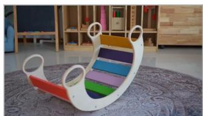

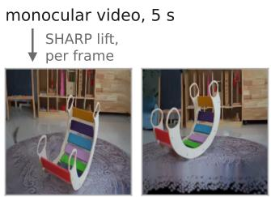  
static novel views (training supervision only)

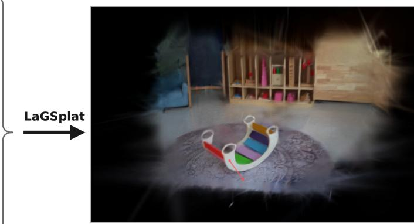  
dynamic interactive 3D scene (user force, anywhere, at any time)

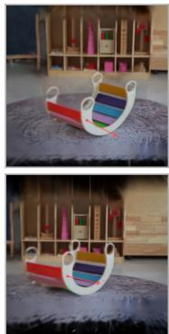  
the same instant, two other viewpoints

Figure 1: From one monocular video to an interactive 3D scene. Five seconds are filmed, from a single viewpoint; SHARP [51] renders novel views of every frame from other viewpoints. LaGSplat does not just replay that clip in 3D: the scene can be simulated from unseen initial conditions, and a force applied anywhere in it at any time (red arrow).

## 1 Introduction

This work sits at the intersection of two active research areas that appear, at first glance, unrelated. On one side, dynamic scene reconstruction from video has reached realtime photorealism [31, 72, 75], but these representations are parameterized by time t; they replay the recorded clip and no interaction with the objects in the scene is possible. On the other side, learning to simulate physical systems from data [11, 21, 48] recovers structured equations of motion that can be forced, extrapolated, and controlled, but training requires a dataset recording the time evolution of the system’s generalized coordinates, observed through sensors or produced by a simulator. We aim for a single framework unifying both capabilities: from video alone, rather than from simulation or sensor data, a trainable architecture that recovers the governing equations of the filmed system (such as a pendulum, a deformable structure, or a soft robot) and reconstructs the scene photorealistically, in a way that allows interaction at inference, changing physical coefficients (damping, inertia) or applying a force anywhere on the system at any time, and letting it evolve in a physically plausible way.

A large and fast-growing body of work already generates videos of systems that obey physical laws: by attaching a prescribed physical engine to a reconstructed or diffusiongenerated scene [47, 74, 77, 78], by learning a world model that generalizes across many systems [17, 73], or by conditioning a video generator directly on physical control signals [18]. These methods synthesize plausible dynamics for a new scene, often from as little as a single image or a static shape, but the motion is never registered against the measured behavior of the particular system depicted. Much rarer is the opposite setting, the one we adopt, in which the physics of a single filmed system is identified from its own video, a counterpart on pixels of model reduction and of learning equations of motion from simulated states [1, 11, 67]. Only a handful of works reach it from video [7, 21, 35, 62], and each gives up one of the ingredients we need for what is the central contribution of this work: applying, at inference, a force at an arbitrary point of the scene and letting the identified dynamics carry it through the whole system.

Except from video, such a forcing mechanism is not new in itself: wherever a dynamics is integrated in a lowdimensional latent space, a force applied in the full configuration space transports into a latent generalized force through the decoder (or encoder) Jacobian and enters the right-hand side of the equation of motion [1, 14, 15, 16]. Carrying the mechanism over to video asks for two ingredients at once: an Euler-Lagrange equation learned over a low-dimensional latent space, and an image decoder made of material points that move with the object, so that the Jacobian of those points is what pulls an applied force back into the latent space. No method that identifies physics from video offers both. The learned dynamics is either an unconstrained neural ODE with no mechanical structure [62], or fixed in advance to a prescribed form rather than a general equation of motion [7, 35, 69]. And where a genuine law is within reach, the explicit material point is the missing ingredient instead: the scene is carried on fixed pixels [21, 35] reconstructed frame by frame, with no primitive that persists as an explicit point moving with the object, or it is not reconstructed at all [7]. No single work both identifies a genuine mechanical law and renders it over explicit, moving primitives. LaGSplat fills this gap.

The key to LaGSplat is that a single low-dimensional latent state $\mathbf { q } \in \mathbb { R } ^ { d }$ plays two roles at once: it is the generalized coordinate of a learned dissipative Lagrangian, and it is the conditioning variable of a Gaussian Splatting decoder whose primitives are explicit points $\mu _ { i } ( \mathbf { q } )$ that move with the object (Fig. 2). An encoder maps raw frames to q, a latent Lagrangian neural network integrates the learned equations of motion, and the decoder renders each q back into an image, in 2D or, under depth or multi-view supervision, from novel 3D viewpoints. Nothing supervises q itself: it emerges from the photometric loss and the Euler-Lagrange residual acting on the same encoder, with no annotation of the state and no external simulator. The mechanism is the one that discovers the latent state of a reduced-order Lagrangian or Hamiltonian network [1, 14, 15], with the reconstruction loss now photometric, on pixels rather than on generalized coordinates.

Because the decoder’s primitives are explicit points, a variation of the latent state moves them by $\delta \mu = J ( \mathbf { q } )$ δq with $J = \partial \mu / \partial { \bf q } .$ , and this is what makes the reconstructed object pushable: by virtual work, a force $f$ applied on the object in the image transports into a latent generalized force $J ( \mathbf { q } ) ^ { \intercal } f$ that enters the right-hand side of the same equations of motion without retraining. That a model trained on video in which no force was ever applied can respond to one is counter-intuitive, but it follows from what the Jacobian is: a property of the kinematics ${ \bf q } \mapsto \mu ( { \bf q } )$ alone, not of the loading, so the autonomous video that trains the decoder already determines it. What autonomous motion leaves undetermined is a single scalar, the physical unit of the force to be applied in the original space. The learned Lagrangian and its dissipation can be rescaled together without changing any observed trajectory, and that same factor sets that unit. Provided the dynamics is well identified from the video and the primitives move correctly with the object, the learned response to an arbitrary force, as long as it keeps the state q within the range visited in training, is therefore correct in direction and in shape, and determined in amplitude only up to that single global factor. A measurement relating an applied force to the resulting displacement fixes it once for the whole model, and absent such a measurement it remains a free overall scale, chosen by hand. One further boundary is structural rather than a matter of scale: only the motions the video actually exhibits enter q in the first place. A part of the object that stays fixed throughout the clip, or a deformation mode the video never excites, corresponds to a latent direction the training data never populates; the model carries no coordinate for it, so at inference it behaves as infinitely rigid, and any force applied there leaves the scene unchanged.

LaGSplat sits at the intersection announced above: from dynamic scene reconstruction it inherits the explicit Gaussian primitives and their real-time differentiable rasterizer, and from learned analytical mechanics the latent Lagrangian and the generalized force that drives it. Our contribution is this pipeline itself: a fully differentiable path from a monocular video to an identified physical model and a real-time interactive simulation of the filmed object, rendered in 2D or 3D and responsive to forces never measured. The Lagrangian prior narrows the scope to systems with a small number of generalized coordinates, which is precisely the regime where it pays off: we show that a motion predictor without a mechanical prior [79] fails to reach a stable equilibrium that the training video does not contain, whereas LaGSplat converges to one by construction. We validate the pipeline on cases of increasing difficulty, from rigid to deformable and from autonomous to forced: a simple pendulum, an oscillating rigid body, a hanging bag, and the pneumatic actuator of Krauss et al. [35]. The scene is reconstructed in 2D, or in 3D under multi-view supervision, and responds to forces in real time in both settings.

## 2 Related Work

Four families frame the discussion. Dynamic novel-view synthesis has the images but no equation of motion (§2.1). Learned analytical mechanics has the equations but no image (§2.2). The last two put the two together, and differ in what the video is for them, an output or a supervision: generating physically plausible video renders motion for a scene it was never trained to reproduce (§2.3), while learning and simulating from video supervision fits a dynamics to the footage of the very system depicted (§2.4). The last setting is the one LaGSplat adopts.

Five design choices, laid out in Section 1, place each family on the grid of Table 1. Does the dynamics carry a structured mechanical prior, or is it a free ODE? Is the state an observed physical coordinate, or a learned latent state? Is the model supervised by the video of the very system it simulates, or by a substitute, a prior learned across other systems, simulated trajectories, or measured states? Does rendering go through explicit points that move with the object, or through a field painted on fixed pixels? Can an external force be injected into the dynamics at inference? The third question is what separates the last two families: only one of them is supervised by the system’s own video, which is why generated footage and cross-system priors score ∼ there. Each family below holds some of these cells and misses others.

## 2.1 Dynamic novel-view synthesis

Our decoder architecture comes from this family. Its aim is to synthesize views of a moving scene indexed by the time $t ,$ where ours are indexed by the state q; the goal differs, but the design space of the decoder is the same one, and we select in it on a criterion of our own. Applying an effort to the scene at inference (Section 3.4) requires a decoder whose primitives are particles followed in their motion, each carrying its own position $\mu _ { i } ( \mathbf { q } )$ , since a force has a point of application and needs somewhere explicit to attach.

That criterion rules out the dominant form of the radiancefield branch. NeRF-based methods [53] animate the field by conditioning it on time or by deforming a canonical volume [56, 61]: they answer what colour lies at a given point of the image, following no piece of the object from one frame to the next. Such a decoder is Eulerian, sampling a field over a fixed support rather than transporting matter through it [57], and a force has nothing to attach to (the same obstruction returns, on fixed pixels, in Section 2.4). The branch is not uniformly so: a deformation field written from the object outwards [22] and a particle-based radiance field [44] do carry material points, and PAC-NeRF [40], whose MPM advection needs moving particles while its rendering needs a fixed field, carries both at once at the price of particle-to-grid transfers at every step. Their decoders would have been usable for our purpose. We took the other branch, which supplies the same material points and forms the image by rasterizing them rather than by evaluating a network at many samples along every ray. Since the simulation is driven interactively, the applied force changing the state between one frame and the next, real-time rendering is a requirement of the setting and not a convenience.

In 3D Gaussian Splatting [31] a scene is a set of explicit anisotropic Gaussian primitives, rasterized differentiably in real time, and one and the same object is the material point and the rendered primitive. Among its dynamic extensions we build on the higher-dimensional Gaussian of Yang et al. [75], whose extra axis is conditioned away at render time by a Schur complement, and we rasterize with gsplat [76]. The alternative route, a neural network warping canonical primitives [72], meets the criterion just as well: it too gives every primitive a position, hence a Jacobian, obtained by differentiating the network. We set it aside on two counts. It is not the better posed of the two on motion-rich content, where FreeTimeGS [70] finds primitives placed directly in the extended space preferable; and extending the primitive itself keeps the map $\mathbf { q } \mapsto \mu _ { i }$ affine, so that the Jacobian $J _ { i } = \partial \mu _ { i } / \bar { \partial } \mathbf q$ of each Gaussian is a constant matrix stored alongside it. An interactive effort then enters in closed form, rather than through automatic differentiation across the decoder at every time step. The first count holds on our own data too, in a comparison at equal budget reported in Appendix B.

Our one change is to what that extra axis carries. Where these methods put the time, we put the d latent coordinates, so the block conditioned away by the Schur complement is a whole latent block and the ellipsoid actually rasterized is the one conditioned on the current state q. Gaussians have been lifted to higher dimensions before, for fitting capacity alone, with no dynamical meaning attached to the added axes [12, 66]; what is new here is not the dimension but that those axes carry a state ruled by an equation of motion.

Table 1: Positioning on the five axes. $\checkmark :$ the axis is met, ∼: partly met, ×: not met, —: not applicable.
<table><tr><td>Method</td><td>Physics-governed dynamics</td><td>Learned latent state</td><td>Own-video supervision</td><td>Material-point kinematics  $\mu _ { i } ( \mathbf { q } )$ </td><td>Interactive force at inference</td></tr><tr><td colspan="6">Dynamic novel-view synthesis (§2.1)</td></tr><tr><td>Dynamic NeRF [56, 61]</td><td>X</td><td>X</td><td>V</td><td>X</td><td>X</td></tr><tr><td>4DGS family [70, 72, 75]</td><td>X</td><td>×</td><td>V</td><td>V</td><td>X</td></tr><tr><td colspan="6">Learned analytical mechanics (§2.2)</td></tr><tr><td>Neural ODE [9]</td><td>X</td><td>X</td><td>X</td><td></td><td>X</td></tr><tr><td>Latent neural ODE [27]</td><td>X</td><td>√</td><td>X</td><td>X</td><td>X</td></tr><tr><td>PINN [63]</td><td>2</td><td>X</td><td>X</td><td>X</td><td>X</td></tr><tr><td>LNN / HNN / DeLaN [11]</td><td>√</td><td>X</td><td>X</td><td></td><td>2</td></tr><tr><td>Structure-preserving ROM [67]</td><td>√</td><td>2</td><td>X</td><td>2</td><td>√</td></tr><tr><td>Latent Lagr. / Ham. nets [1, 14, 15]</td><td>√</td><td>√</td><td>X</td><td>2</td><td>√</td></tr><tr><td colspan="6">Generating physically plausible video (§2.3)</td></tr><tr><td>NewtonGen [77]</td><td>2</td><td>X</td><td>2</td><td>X</td><td>X</td></tr><tr><td>LaWM [73]</td><td>√</td><td>√</td><td>2</td><td>X</td><td>×</td></tr><tr><td>GS + MPM [74]</td><td>2</td><td>X</td><td>×</td><td>√</td><td>2</td></tr><tr><td>PhysDreamer [78]</td><td>2</td><td>X</td><td>2</td><td>√</td><td>2</td></tr><tr><td>PhysGen [47]</td><td>2</td><td>X</td><td>2</td><td>X</td><td>2</td></tr><tr><td>Force Prompting [18]</td><td>×</td><td>X</td><td>2</td><td>X</td><td>~</td></tr><tr><td>VR-GS [29]</td><td>2</td><td>X</td><td>×</td><td>√</td><td>√</td></tr><tr><td>NeuROK [17]</td><td>√</td><td>√</td><td>X</td><td>√</td><td>√</td></tr><tr><td colspan="6">Learning and simulating from video supervision (§2.4)</td></tr><tr><td>Neural state variables [8]</td><td>X</td><td>2</td><td>√</td><td>X</td><td>X</td></tr><tr><td>CpAE [81]</td><td>X</td><td>√</td><td>√</td><td>X</td><td>X</td></tr><tr><td>Pixel-HNN [21]</td><td>√</td><td>√</td><td>√</td><td>X</td><td>X</td></tr><tr><td>Castañeda et al. [7]</td><td>2</td><td>√</td><td>√</td><td>X</td><td>X</td></tr><tr><td>EvoGS / GaussianPred. [3, 79]</td><td>X</td><td>2</td><td>√</td><td>√</td><td>X</td></tr><tr><td>NVFi [39]</td><td>~</td><td>X</td><td>√</td><td>√</td><td>X</td></tr><tr><td>ParticleGS [62]</td><td>X</td><td>√</td><td>√</td><td>√</td><td>X</td></tr><tr><td>Krauss VON [35]</td><td>√</td><td>√</td><td>√</td><td>X</td><td>2</td></tr><tr><td>ContactGaussian-WM [69]</td><td>2</td><td>2</td><td>2</td><td>√</td><td>√</td></tr><tr><td>LaGSplat (ours)</td><td>√</td><td>√</td><td>√</td><td>√</td><td>√</td></tr></table>

Physics-governed dynamics: the state evolves under a mechanical law (Lagrangian or Hamiltonian), so the model extrapolates in time and responds to forces rather than merely interpolating the observed motion; ✓: a generic mechanical class (an Euler-Lagrange or Hamiltonian law) whose content is learned from data; ∼: the governing law of the specific system is supplied a priori, at most calibrated, or enters only as a soft residual; ×: no mechanical structure (time indexing or a free ODE). Learned latent state: the dynamics evolve on a compact state discovered from data. ✓: a low-dimensional q is learned; ∼: a reduced state is used but partly imposed (known coordinates, tracked keypoints, or a fixed linear reduction), or discovered from data yet not what the dynamics is stepped over; ×: no learned latent (raw-space or time-indexed dynamics). Own-video supervision: the model is trained on the video of the very system it then simulates. ✓: monocular video of that system alone; ∼: its video plus an auxiliary signal, stand-in frames in place of its own footage (synthetic renders, diffusion-generated frames, or side states), or a prior learned across the videos of other systems; ×: no video supervision at all (the model learns from simulated trajectories, measured states, or meshes instead). Renders through material points: the renderer reads explicit primitives $\mu _ { i } ( \mathbf { q } )$ that move with the object. ✓: the image is rasterized from such primitives; ∼: the decoder does output material points (mesh nodes, lumped masses) but no image is rendered through them; ×: an Eulerian decoder, a field or a warp evaluated on fixed pixels; —: no spatial decoder at all, the model never leaving state space. Interactive force at inference: a new external force, absent from training, enters the dynamics at inference and propagates through the whole system, without retraining. $\checkmark :$ applicable anywhere on the object; ∼: restricted, to a few predefined points, to the latent state alone, or to the initial condition; ×: no force enters.

Nothing in this family says how q evolves, and the next one supplies that.

Our dynamics comes from this family, as our decoder came from the last one. Its members learn their physics from measured or simulated states, where we have to learn ours from images. That change of data does not bear on the

## 2.2 Learned analytical mechanics

mechanics; it bears on where the state and the force come from, both of which reach us through the decoder rather than from a simulator. We ask three things of a candidate: that the equation of motion be the learned object itself, that it be written over a state discovered from the data, and that it expose a right-hand side where an external force can be added at inference.

On the first, the family spans two poles. Neural ODEs [9] fit the transition rule in full generality, the × anchor of the prior axis of Table 1, and learned simulators sit at that same free end, whether they advect mesh nodes or particles [4, 42, 57, 64] or read a field over a fixed domain [33, 43, 52]. PINNs [63] anchor the supplied side, the residual of a known PDE regularizing a field network, which is what the ∼ of that axis denotes. Between them, Lagrangian and Hamiltonian neural networks learn the law itself, building conservation and dissipation into it [6, 11, 13, 21, 48], which meets the first requirement. They read their coordinates from joint encoders or simulated states, leaving the second to the branch below.

A recent branch writes the same machinery over a learned latent state [1, 14, 15, 59], or over a linear POD reduction [67]. What is new there is the learned law, not the latent integration: graphics got to the latter first with the law left prescribed, Fulton et al. [16] time-stepping the true elastodynamic equations in an autoencoder subspace at interactive rates on a 164k-element mesh, with the stiffness pulled back as $\tilde { H } = J ^ { \top } \tilde { K } _ { 0 } J$ (its descendant [41] learns the integrator instead, and names captured data and Gaussiansplat reconstructions as its natural next step). These models also admit a generalized force. L-LNN [1] transports supervised forces into the latent space through an encoder Jacobian, and the reduced-order models of Friedl et al. [14, 15] pull the full-space force back through the decoder Jacobian, the same virtual-work transport we use. All three requirements are thus met here, but on data we do not have: those forces are measured in the full configuration space of a simulator, and the state is instrumented in the same way, read from joint encoders, simulator states, or a linear reduction of a known mesh. Ours have to come through the decoder, from pixels. The transport is inherited, its provenance is not, and the identifiability that instrumentation buys is left on our side.

What we take from here is the structure, a learned law over a learned state, together with the J⊤ pull-back that the reduced-order members already use, meaningful in them for the reason it is in us, because their decoders too land on material points. Learning such a model beyond one degree of freedom is known to be delicate, and recent work isolates the failure modes we also meet: the ill-posedness of identifying a structured model when only positions are observed and the momenta stay latent [5], non-convex potentials [30], ill-conditioned mass matrices [23, 34], and the insufficiency of single-step derivative matching for long-horizon stability [24, 27, 36]; the training recipe of Section 3.3 builds on these lessons. What no member of this family does is read those material points off a video, or render an image through them. Images arrive with the next two families.

## 2.3 Generating physically plausible video

This family assembles the same two components we do, a spatial decoder (§2.1) driven by an equation of motion (§2.2), but its dynamics is brought to the scene rather than learned from its video. It only has to look right, not to agree with the recorded behavior of a particular object, and the family splits into two branches on where that dynamics comes from.

One branch prescribes the law. PhysGaussian and its successors delegate the dynamics to an external MPM simulator with a predefined material prior [28, 37, 45, 74]. The momentum equation carries an external-force slot and the particles are material points, but in most of the family the demonstrated interventions are scripted initial velocities on hand-set materials, so that slot stays unexercised though structurally available. VR-GS [29] exercises that slot in real time, a user in virtual reality grabbing, dragging and colliding the object at interactive rates, so the effort is sustained along the trajectory instead of being posed as an initial condition. Its material is set by hand rather than fitted, and the capture it starts from is a static multi-view scan, so nothing of the dynamics is read from a recording of the object in motion. PhysDreamer [78] goes furthest on the data side. It calibrates a stiffness field against a clip generated by a video-diffusion prior, then answers pokes and drags inside the MPM simulator, without retraining, on a material fitted to data rather than set by hand. That is our nearest neighbor on that side, and the response it produces is a genuinely coupled elastic one. But the intervention is still posed as an initial condition, an impulse over a region designated on the object, followed by an autonomous rollout, not a force sustained along the trajectory. It differs elsewhere too: the law stays prescribed (only the stiffness is calibrated), no low-dimensional state is learned, the supervising video is generated rather than observed, and the response costs about a minute of simulation per rendered second, where a latent Lagrangian integrates d scalar equations in real time.

PhysGen rolls out a prescribed 2D rigid-body engine, NewtonGen learns the coefficients and a nonlinear residual of a fixed second-order Newtonian skeleton, and both render through a video-diffusion model [47, 77]. Neither is forced along the trajectory. PhysGen takes a user force as its headline input, but it enters the 2D rigid engine as a single initial impulse at the center of mass, before the rollout; NewtonGen’s control is declarative only, initial conditions parsed from the prompt into an autonomous ODE that admits no external force at all.

Force Prompting [18] goes one step further and keeps no law at all: it answers localized pokes and global wind fields and generalizes to unseen geometries, with no mechanical structure anywhere. Its response is a conditioning channel trained on force-video pairs, so every kind of effort has to be exhibited at training time; and the effort itself is one vector, a magnitude and an angle, fixed before the clip is generated and unrolled over its frames. The model is neither real-time nor per-frame causal. No force can be redefined while the motion unfolds, which is what holds it to the same partial mark as the rest of this branch. The mechanical structure they do without is what spares us both restrictions: we never observe a force at all, and ours is an arbitrary f(t), redefinable at any instant, deduced from the identified law and carried by virtual work through the material points into the right-hand side that $J ^ { \top } f$ shares with the actuation term of Section 3.3. That transport is what a material point buys: not the ability to answer a force, which a control field distributed over a fixed grid has too [26], but the ability to answer, interactively, one that was never seen.

A second branch learns a transferable prior instead, and is judged on what carries over to systems it has never seen rather than on its agreement with a particular recorded object. LaWM [73] learns a discrete latent Lagrangian whose variational integrator is the transition rule, symplectic and drift-free over long horizons. But it trains on simulator renders, keeping simulator states or robot signals as auxiliary supervision when available; its learned Lagrangian is conservative, and its rollout unforced, since control inputs enter its embodied benchmark as conditioning signals only, not as a generalized force. At the unstructured end of that same aim, JEPA-style world models drop the mechanics altogether and forecast embeddings for planning, adapting online at test time [71].

Closest to us in this branch is NeuROK [17]. Building on CANOR [25], it learns a latent kinematic parameterization of meshes and integrates a latent Euler-Lagrange equation whose kinetic metric is the pullback of the decoder Jacobian, $G ( \mathbf { q } ) = J ^ { \top } J$ , the same geometric construction our force transport is built from. The shared object is that pullback, not the decoder: NeuROK renders a deforming mesh, whose material points are its vertices under a globally nonlinear map, not the affine Gaussian primitives of our splatting branch. The kinship extends past the metric to the force: its supplementary material forces that equation through that same pullback, $Q = J ^ { \top } F$ over a region and a time window of the user’s choosing, and reports the response against force magnitude, which makes NeuROK the one member of this family to hold the force column outright. What separates us is not the mechanism but the data: NeuROK is not supervised from video but learned across large 4D datasets of deforming meshes, curated and simulated, a learned prior meant to transfer to new shapes rather than a mechanics identified from one system’s own footage. It is thus a structural cousin on the far side of the video-supervision axis, not a direct from-video competitor.

Across this family the physics does reach images, and one member, NeuROK, forces its equation through the same virtual-work transport we use. But the governing law is prescribed or transferred, never identified from the video of the very system to be simulated, as it is in the family that follows.

## 2.4 Learning and simulating from video supervision

Change the data and §2.2 becomes this last family. Its members share the aim of learned analytical mechanics, an equation of motion learned over a state discovered from the data, one system at a time, but what they are given is video of that system rather than measured or simulated states. From it they identify and simulate the behavior of the particular object filmed, not a plausible behavior for a scene of that kind, which is the break from §2.3. What they gain over §2.1 is that the recording stops being the only thing that can be played back: a state and a law let the motion be restarted from an initial condition that was never filmed, and continued past the last frame of the clip. This is the setting LaGSplat adopts, and the works that share it build both halves from pixels alone, a decoder from the design space of §2.1 and a dynamics from that of §2.2.

The first branch learns an evolution rule with no mechanical structure in it, a transition map, a velocity field or a free ODE, never a Lagrangian or a Hamiltonian. The lineage opens with Chen et al. [8], who recover from video how many state variables a filmed system has, and one admissible set of them: a network trained to predict the next pair of frames, an intrinsic-dimension estimate on its bottleneck [38], rounded to the nearest even integer since positions and velocities come in pairs, and a second autoen coder compressing that bottleneck to the resulting width. Those variables are never stepped: the prediction runs through the pixels, regenerating a frame and re-encoding it at each step, and the compact state only projects it back onto the manifold to keep it from drifting. Zhu et al. [81] remove what makes such a state unusable by a continuous law. A displacement smaller than one pixel leaves the image almost unchanged, so a latent read off pixels tends to advance in jumps where the motion is smooth. Their remedy is a Lipschitz condition on the filters of the first layers, allowing an ODE to then be fitted directly in the latent space, the encoder frozen, where the practice is to optimize the latent law jointly with the maps that produce its coordinates [21, 35, 62], the dynamics objective bending the latent towards coordinates its model class can fit. The dynamics they plug in is a plain neural ODE, the same choice ParticleGS [62] makes over a handful of scene-wide motion modes, shared by every Gaussian, its rule unconstrained and carrying no physical parameter. The remaining members change the form of that rule rather than its nature. EvoGS [3] integrates a learned velocity field that still reads the time explicitly. GaussianPrediction [79] forecasts key-point trajectories with a graph network. NVFi [39] constrains a dense velocity field with a PDE residual, a supplied prior in the sense of §2.2, but one writ ten on a kinematic field rather than on an inertia. None of these rules carries an energy, an inertia or a dissipation, so none exposes a right-hand side into which an external effort could enter, and nothing keeps what they extrapolate past the training video physically plausible, as Gaussian-Prediction illustrates (Section 4.3).

The rest do write a mechanical law, and differ by how much of it is left to be learned. The pixel variant of HNN [21] learns a latent state from synthetic pendulum images and its Hamiltonian jointly with the autoencoder: the conservative pole of §2.2 over a learned latent state, one coordinate and its momentum for the pendulum it is demonstrated on. It is our scheme without the two things we most need from it, since a conservative and unforced Hamiltonian receives no force in its right-hand side, and a fixed-pixel decoder exposes no material point for one to act on. Castañeda Garcia et al. [7] sit at the supplied end of that same axis, estimating the scalar coefficients of a known governing equation, a linear second-order ODE, from monocular video. Their footage is real, which pixel-HNN’s is not, but the systems it shows have one degree of freedom each, a pendulum angle, a decaying LED intensity, a falling height; and they take no decoder at all, recovering the dynamics alone and reconstructing nothing. Krauss et al. [35] carry the setting to systems with several, learning a chain of latent oscillators from monocular video of real pneumatic soft continuum robots, with measured chamber pressures as a known input. Their dynamics is constrained to a linear model, and the only force it carries is that pressure, a generalized force on a fixed actuation channel. Their decoder is Eulerian in exactly the sense of §2.1: it paints intensities on a fixed pixel grid through position-wise operations, and the per-oscillator attention centroids it reads out are a derived statistic, not a generative material point. Their transpose is computable and the authors do differentiate it, but it is the gradient of a heuristic centroid, which can move because the attention field deforms rather than because matter translates, and which nothing supervises to follow the same material. The model uses it only to visualize forces, never to apply one, and applying one would reach those centroids alone, half as many as the latent state has coordinates, where an explicit decoder offers every primitive, hence any point of the object.

LaGSplat is assembled from parts of these families. Its decoder is the higher-dimensional Gaussian of Yang et al. [75], rasterized with gsplat, whose added axes we fill with the latent state instead of the time and whose affine map $\mathbf { q } \mapsto \mu _ { i }$ keeps every Jacobian $J _ { i }$ a constant matrix. Its dynamics is a dissipative Lagrangian over a learned latent state, forced through the same virtual-work pullback $J ^ { \top }$ that L-LNN [1] and Friedl et al. [14, 15] already apply, here on a Jacobian read off the image decoder rather than off a simulator. Its encoder takes from Zhu et al. [81] the Lipschitz condition on the filters that makes the latent trajectory continuous. The chart is fixed first on a reconstruction criterion, the structured law is inferred on it afterwards. Letting photometric loss alone choose the chart leaves it a scaling and a curvature the mechanics must absorb, which is why our inertia is a state-dependent M(q) where pixel-HNN, Castañeda Garcia et al. [7] and Krauss et al. carry a constant mass and let the dynamics shape the chart instead; that nonlinearity earns its place on their own pneumatic soft continuum robots, the public dataset we report on, where four latent coordinates outperform their ten-dimensional oscillator chain on the two-segment robot (Section 4). What is new is the pair. The axes added to the primitive carry the very state the equation of motion rules, so the points a force acts on and the coordinates that force integrates are the same object.

An Eulerian decoder exposes no material point for a force to act on, and a free dynamics leaves no right-hand side for it to enter. Krauss et al. are the informative case, the only ones to close one of the two without the other, their righthand side receiving a force their decoder gives nowhere to be applied. Wang et al. [69] close both, but limit themselves to rigid bodies where we also address deformable objects. Their Gaussian scene is carried by prescribed equations of motion that do take an applied force at inference. Only their coefficients and the collision geometry are fitted, and the state stepped is the pose of bodies given in advance rather than one discovered from the images. The remaining cell is ours, a dissipative Lagrangian over a learned latent state, supervised by video alone, rendered through explicit points and driven at inference by an interactive force, identified for one filmed system at a time: a deliberate scope, trading zero-shot transfer to unseen objects for a model grounded in the observed system alone.

## 3 Method

## 3.1 Problem Statement and Overview

Let $\{ I _ { t } \} _ { t = 1 } ^ { T }$ be a monocular RGB video of a physical system with d degrees of freedom, sampled at time step $\dot { \Delta } t$ LaGSplat learns three differentiable networks: an encoder Enc : $\vdots { \overset { \bullet } { \mathbb { R } } } ^ { C \times H \times W } \to \mathbb { R } ^ { d } .$ , a latent Lagrangian $\mathcal { L } : \mathbb { R } ^ { 2 d } $ R with dissipation $\mathcal { D } : \mathbb { R } ^ { 2 d } $ R, and a Gaussian Splatting decoder Dec : $\mathbb { R } ^ { d } \times \mathrm { S E } ( 3 )  \mathbb { R } ^ { C \times H \times W }$ , rasterizer included, whose viewpoint argument is free only under multi-view supervision (Section 3.2). The latent state $\mathbf { q } _ { t } = \operatorname { E n c } ( I _ { t } ) \mathbf { \bar { \Pi } } \in \mathbb { R } ^ { d }$ , which nothing supervises, is at once the generalized coordinate of the equation of motion and the variable the decoder renders from. Figure 2 shows how the three fit together at inference.

The three networks are fitted in two stages. Stage 1 (Section 3.2) trains the encoder and the decoder together on appearance alone, which fixes the latent chart; Stage 2 (Section 3.3) freezes them, encodes the clip once, and fits the Lagrangian to the resulting trajectory, the order Zhu et al. [81] follow.

## 3.2 Stage 1: Autoencoder and Latent Chart

Continuity-preserving encoder. What the encoder must deliver is regularity in time rather than accuracy, since the dynamics objective (Section 3.3) reads q˙ and q¨ from the encoded trajectory, where a latent read off a pixel grid advances in the staircase described in Section 2.4. Neither depth nor expressiveness is the remedy, the regularizer is [60], and we take the one of Zhu et al. [81], whose Lipschitz-constrained large filters keep the latent state varying continuously with the underlying dynamics. The latent width d is read from the physics when known (rigid-body DOFs, or the number of excited dynamic modes for a deformable body), and otherwise set to the smallest value for which the autoencoder reconstructs frames near-perfectly, in practice an upper bound on the true count that a maximum-likelihood intrinsic-dimension estimate on the encoded cloud [38] could replace.

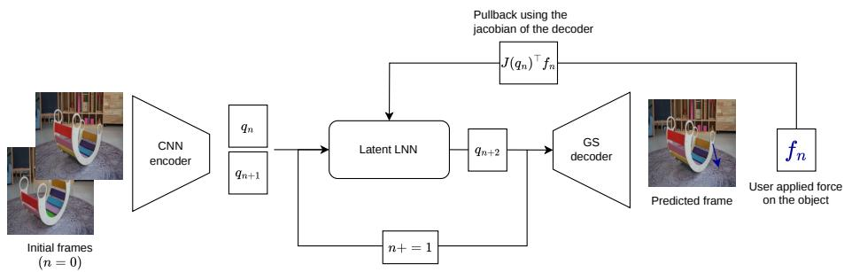  
Figure 2: Interactive simulation of a physical scene with a LaGSplat trained from video. A CNN encoder maps a pair of initial frames to latent states ${ \bf q } _ { 0 } , { \bf q } _ { 1 }$ 1. The governing equation learned by a Lagrangian Neural Network (LNN) in the latent space is integrated in time. At any time a Gaussian Splatting decoder reconstructs the image from the latent state. A user force $f _ { n }$ can be applied anywhere at any time on the image; it is pulled back through the decoder Jacobian into a latent generalized force ${ \dot { J } } ( \mathbf { q } _ { n } ) ^ { \top } { \dot { f } } _ { n }$ that drives the LNN.

Gaussian splatting decoder. Stacking the T frames of a clip along a third axis yields a space–time volume $( x , y , t )$ , which 4DGS [75] tiles with Gaussians: rendering frame t is slicing that volume at time t. Indexing on the clock is a choice, not a necessity: we tile the space–state volume $( x , y , \mathbf { q } )$ instead. A state the scene revisits is then stored once rather than once per visit, and rendering follows whatever q(t) the Euler-Lagrange ODE produces, from an unseen initial condition or under an applied force; interactive demo at https://louenpottier.github.io/lagsplat.html. Each of the K Gaussians is placed directly in that volume, where it carries a centre and a covariance that are fixed,

$$
\begin{array} { r } { \mu _ { k } = \binom { \mu _ { k } ^ { ( s ) } } { \mu _ { k } ^ { ( q ) } } \in \mathbb { R } ^ { n + d } , \quad \Sigma _ { k } = L _ { k } L _ { k } ^ { \top } \in \mathbb { R } ^ { ( n + d ) \times ( n + d ) } , } \end{array}\tag{1}
$$

with $L _ { k }$ a lower-triangular Cholesky factor, plus scalar opacity $\alpha _ { k } > 0$ and colour $\mathbf { c } _ { k } \in [ 0 , 1 \bar { ] } ^ { 3 } ;$ ; the spatial dimension is $n = 2$ for direct video output (monocular training only) or $n = 3$ for an interactive 3D scene with novel views. All state dependence comes from conditioning on $\mathbf { q } .$ Partitioning Σ into spatial (s, size n) and latent $( q ,$ size d) blocks, the rendered n-D Gaussian is the Schurcomplement conditional

$$
\boldsymbol { \mu } _ { k } ^ { ( s | \mathbf { q } ) } = \boldsymbol { \mu } _ { k } ^ { ( s ) } + \boldsymbol { \Sigma } _ { s q } \boldsymbol { \Sigma } _ { q q } ^ { - 1 } ( \mathbf { q } - \boldsymbol { \mu } _ { k } ^ { ( q ) } ) ,\tag{2}
$$

$$
\Sigma _ { k } ^ { ( s | \mathbf { q } ) } = \Sigma _ { s s } - \Sigma _ { s q } \Sigma _ { q q } ^ { - 1 } \Sigma _ { q s } ,\tag{3}
$$

with latent-weighted opacity

$$
\begin{array} { r } { \tilde { \alpha } _ { k } ( \mathbf { q } ) = \alpha _ { k } \cdot \exp \bigl ( - \frac { 1 } { 2 } ( \mathbf { q } - \boldsymbol { \mu } _ { k } ^ { ( q ) } ) ^ { \top } \Sigma _ { q q } ^ { - 1 } ( \mathbf { q } - \boldsymbol { \mu } _ { k } ^ { ( q ) } ) \bigr ) , } \end{array}\tag{4}
$$

which suppresses Gaussians whose latent mean is far from q: the conditional centre shifts linearly in q through the cross-block $\Sigma _ { s q }$ , which Section 3.4 exploits, and the conditional covariance is state-independent. The resulting n-D Gaussians are rasterized with the gsplat CUDA kernel [76]. Appendix C gives the implementation details. Appendix B compares this decoder, at equal budget, with the alternative of n-D primitives warped by a deformation network, inspired by Wu et al. [72].

Supervision. Encoder and decoder are fitted jointly, on a photometric term and two regularizers,

$$
\begin{array} { r l } { \mathcal { L } _ { \mathrm { r e c o n } } = \lambda _ { \mathrm { L 1 } } \mathcal { L } _ { \mathrm { L 1 } } + \lambda _ { \mathrm { S S I M } } \mathcal { L } _ { \mathrm { S S I M } } } & { { } } \\ { + \lambda _ { \mathrm { n l } } \mathcal { R } _ { \mathrm { n l } } + \lambda _ { \mathrm { a } } \mathcal { R } _ { \mathrm { a } } , } \end{array}\tag{5}
$$

where $\mathcal { R } _ { \mathrm { n l } }$ is the nonlocal filter penalty that keeps the encoder continuous [81] and $\mathcal { R } _ { \mathrm { a } }$ caps the aspect ratio of the rendered ellipsoids. Fitting the $( 3 + d ) \mathrm { D }$ decoder from a single view is ill-posed and calls for synchronized multiview footage. Our experiments substitute synthetic views for it: SHARP [51] lifts every frame to a 3D reconstruction, novel views are rendered from each, and the two photometric terms are evaluated on those as well.

Reading the chart. Stage 1 closes by fixing, once and on the frozen networks, two quantities that set how the latent chart is read from here on. The state itself is whitened against its encoded statistics over the clip, so that Stage 2 sees a zero-mean, unit-covariance coordinate (Appendix C); this is a change of chart, not a regularizer. Discrepancies between states are weighed differently. Latent directions are not equally observable: some move many pixels, others almost none, and an isotropic norm on q would weigh them alike, letting a direction nothing can see dominate a fit or a score. The decoder supplies the right weighting, its visibility metric

$$
\bar { G } = \mathbb { E } _ { \mathbf { q } } \left[ \left( \frac { \partial \mathrm { D e c } } { \partial \mathbf { q } } \right) ^ { \top } \frac { \partial \mathrm { D e c } } { \partial \mathbf { q } } \right] ,\tag{6}
$$

the pull-back of the image metric averaged over the encoded trajectory. It is strongly anisotropic in practice (Section 4.1); both the Stage 2 objective and our reported errors are taken in $\| \cdot \| _ { \bar { G } } .$

## 3.3 Stage 2: Latent Lagrangian Dynamics

With the autoencoder frozen, all frames are encoded once and a dynamics is fitted to the resulting trajectory. The latent state evolves under an Euler-Lagrange equation with

dissipation,

$$
\frac { d } { d t } \frac { \partial \mathcal { L } } { \partial \dot { \mathbf { q } } } + \frac { \partial \mathcal { D } } { \partial \dot { \mathbf { q } } } - \frac { \partial \mathcal { L } } { \partial \mathbf { q } } = \mathbf { f } _ { \mathrm { e x t } } ( t ) ,\tag{7}
$$

where $\mathbf { f } _ { \mathrm { e x t } }$ is zero during free evolution and carries the applied forces otherwise, interactive or measured. L and D are neural networks, differentiated automatically, with $\mathcal { L } = T - V$ split into a kinetic and a potential term. The three paragraphs below constrain T, D and V in turn.

Inertia. The kinetic term is $\begin{array} { r } { T = \frac { 1 } { 2 } \dot { \bf q } ^ { \top } M ( { \bf q } ) \dot { \bf q } } \end{array}$ , with a learnable scalar mass for $d = 1$ and a learned SPD matrix $M ( \mathbf { q } ) = L ( \mathbf { q } ) L ( \mathbf { q } ) ^ { \top } + \varepsilon I$ for $d > 1$ , whose Coriolis terms are derived from $\partial M / \partial { \bf q }$ rather than modelled separately. M depends on q because the photometric loss picks the chart and that chart carries a scaling and a curvature of its own that the inertia must absorb. On some systems the dependence is physical as well and survives any chart (Section 4.4). Learning $M ( \mathbf { q } )$ assumes nothing about how inertia is distributed over the scene. The parameter-free alternative pulls the ambient metric back through the decoder Jacobians $J _ { i } = \Sigma _ { s q , i } \Sigma _ { q q , i } ^ { - 1 }$ of Eq. (2), each primitive weighted by its presence at q,

$$
M ( \mathbf { q } ) = m \sum _ { i } \hat { w } _ { i } ( \mathbf { q } ) J _ { i } ^ { \top } J _ { i } ,\tag{8}
$$

whose state dependence comes from the presence weights $\hat { w } _ { i } ( \mathbf { q } )$ of Eq. (4), so that it too carries Coriolis terms (Appendix A.1). One mass m is shared by every primitive: a monocular video does not tell the Gaussians apart by material, so we take the density to be uniform and let a primitive contribute inertia in proportion to its presence and to nothing else. Its value is not fitted either, since it only sets the global energy scale that Section 3.4 leaves unidentified; we fix it offline so that the initial natural frequency matches the observed one. The form therefore carries no learned parameter and reuses the same Jacobians that transport forces, at the price of two assumptions: that visible material carries the inertia, and that it carries it uniformly. Section 4.4 settles the choice experimentally, uniform density included; the results we report use the learned mass.

Dissipation. The dissipation is $\begin{array} { r } { \mathcal { D } = \frac { 1 } { 2 } \dot { \mathbf { q } } ^ { \top } C ( \mathbf { q } ) \dot { \mathbf { q } } . } \end{array}$ with $C ( \mathbf { q } )$ SPD from a free q-dependent Cholesky factor, built like the mass, and bounded below by an isotropic floor $c _ { 0 }$ whose role appears with the energy balance.

Potential. The potential V carries the prior on the elastic landscape. An Input-Convex Neural Network [2] is enough whenever a single convex basin is the right assumption, as for our pendulum, rocking chair and hanging bag. It is too strong for the soft continuum robot, whose elastic energy has crescent-shaped, hence non-convex level sets around a still unique equilibrium, as already observed on a cantilever beam [59]; we then compose the ICNN with a learned diffeomorphism (an i-ResNet), which releases the convexity of the level sets while preserving the unique stationary point, giving an invex potential [65]. Genuinely multi-well landscapes would call for a locally-convex variant [30] instead.

Measured actuation. A logged actuation enters $\mathbf { f } _ { \mathrm { e x t } }$ as a generalized force. For the pneumatic robots we report on, the input is the vector of chamber pressures $P \in \mathbb { R } ^ { n _ { c } } ;$ with $\nu ( \mathbf { q } ) \doteq \mathbb { R } ^ { n _ { c } }$ the latent chamber-volume map, the virtual work $\delta W = P ^ { \top } ( \partial \nu / \partial \mathbf q )$ δq gives

$$
\mathbf { f } _ { P } = b ( \mathbf { q } ) ^ { \top } P , \qquad b ( \mathbf { q } ) = \frac { \partial \nu } { \partial \mathbf { q } } \in \mathbb { R } ^ { n _ { c } \times d } .\tag{9}
$$

We take ν concave, so that the loaded potential $V _ { \mathrm { e f f } } ~ =$ $V - P ^ { \top } \nu$ stays coercive under $P \ \geq \ 0$ with a unique, stable equilibrium.

Bounded and convergent response. The floor $c _ { 0 }$ makes the energy strictly decreasing away from rest, so the free dynamics stays bounded and settles at the single minimum of V, and at the loaded equilibrium when a force is maintained, whatever the networks learn and before any training (Appendix A.2). This is what turns an under-constrained extrapolation into a plausible response to unseen forces: lacking it, GaussianPrediction [79] settles on a sustained orbit, which no dissipative system admits (Section 4.3).

Fitting the dynamics. We fit the dynamics one step at a time, as Krauss et al. [35] do. From an encoded state $( \mathbf { q } _ { i } , \dot { \mathbf { q } } _ { i } )$ , one differentiable velocity-Verlet step of Eq. (7) produces $( \hat { \mathbf { q } } _ { i + 1 } , \hat { \dot { \mathbf { q } } } _ { i + 1 } )$ , which is compared to the next encoded state,

$$
\mathcal { L } _ { \mathrm { d y n } } = \left. \hat { \mathbf { q } } _ { i + 1 } - \mathbf { q } _ { i + 1 } \right. _ { A } ^ { 2 } + \left. \Delta t ( \hat { \mathbf { q } } _ { i + 1 } - \dot { \mathbf { q } } _ { i + 1 } ) \right. _ { A } ^ { 2 } ,\tag{10}
$$

the velocity being counted in units of position per step. The norm is the one that matters: to first order $\Delta { \bf q } ^ { \top } \bar { G } \Delta { \bf q }$ ≈ $\| \operatorname { D e c } ( \mathbf { q } + \Delta \mathbf { q } ) - \operatorname { D e c } ( \mathbf { q } ) \| ^ { 2 }$ , so measuring in G¯ is the decoded image error Krauss et al. [35] minimize, obtained without rasterizing anything, and it puts the weight on the coordinates that actually move pixels. We do not use G¯ bare: a barely visible direction would be left unconstrained while possibly being stiff, and would contaminate the visible ones through the off-diagonal coupling of M and C, so $A \propto \bar { G } + \bar { \rho } \lambda _ { \mathrm { m a x } } I$ caps the weighting ratio at $1 / \rho ,$ normalized to tr $A = d$ so that $A = { \bar { I } }$ recovers the plain Euclidean loss. Minimizing the residual of Eq. (7) directly, with q˙ and q¨ from a finite-difference stencil, is the classical alternative [11, 14]; it is the same quantity before integration, but it weighs every latent direction alike.

Both are single-step teacher forcing, hence the blind spot to long-horizon stability recalled in Section 2.2. We therefore select models on multi-step rollout error over the training clip, rather than on the single-step objective they minimize. Unrolling the prediction over several symplectic steps [10, 50] is the alternative remedy, at an optimization cost we did not need to pay.

## 3.4 Interaction and Inference

The map $\mathbf { q } \mapsto \mu _ { i } ( \mathbf { q } )$ that Stage 1 fits is a kinematics, and the same Jacobian $\dot { J } _ { i } = \partial \mu _ { i } / \partial { \bf q }$ that carries the inertia of Eq. (8) carries the forces: a force applied to a primitive does work on the latent state through $J _ { i }$ (Appendix A.1). That kinematics is already determined by the autonomous video, so a loading never seen during training is nonetheless prescribed by what the clip has shown. NeuROK [17] drives its latent equation of motion through the same pullback, over deforming meshes rather than splats.

At inference the user applies a force $\mathbf { f } \in \mathbb { R } ^ { n }$ at a scene point x identified by raycasting. Its conversion to a latent generalized force reads directly off the Schur mean (Eq. (2)): a primitive i transports it as

$$
\mathbf { f } _ { \mathrm { l a t } } = \Bigg ( \frac { \partial \mu _ { i } ^ { ( s | \mathbf { q } ) } } { \partial \mathbf { q } } \Bigg ) ^ { \top } \mathbf { f } = J _ { i } ^ { \top } \mathbf { f } = \big ( \Sigma _ { s q , i } \Sigma _ { q q , i } ^ { - 1 } \big ) ^ { \top } \mathbf { f } \ \in \mathbb { R } ^ { d } ,\tag{11}
$$

added to the right-hand side of Eq. (7) for as long as the force is maintained; it is the canonical generalized force of virtual work, instantiated with the learned kinematics (Appendix A.1). The contact is spread over a neighbourhood rather than attributed to the single closest primitive: what enters Eq. (7) is the convex combination $\mathbf { \bar { Z } } _ { i } w _ { i } ( x ) J _ { i } ^ { \top } \mathbf { f }$ with weights $w _ { i } \propto \alpha _ { i } \exp ( - \| \boldsymbol { \mu } _ { i } ^ { ( s | \mathbf { q } ) } - \boldsymbol { x } \| ^ { 2 } / 2 \sigma ^ { 2 } )$ normalized to one over a brush of radius σ. Because $\phi _ { i } : { \bf q } \mapsto $ $\mu _ { i } ^ { ( s ) } + J _ { i } ( \mathbf { q } - \mu _ { i } ^ { ( q ) } )$ is affine per primitive, each $J _ { i }$ is constant and already stored as a covariance block: the pull-back costs $O ( n d )$ , with no network differentiation at inference. What the kinematics cannot supply is the scale. The $J _ { i }$ fix the direction and the shape of the response, but the dynamics they feed is identified only up to the rescaling $( \dot { \mathcal { L } } , \mathcal { D } )  ( \dot { \alpha } \mathcal { L } , \alpha \mathcal { D } )$ , which leaves every observed trajectory unchanged. A force in physical units is therefore defined up to a single energy factor $\kappa ,$ global to the model and fixed by one measurement of a known force and its response, as announced in Section 1.

Interactive loop. Given one or two initial frames, we set $\mathbf { q } _ { 0 } = \mathrm { E n c } ( \bar { I } _ { 0 } )$ and $\dot { \bf q } _ { 0 } \approx ( { \bf q } _ { 1 } - { \bf q } _ { 0 } ) / \Delta t ( \mathrm { o r } \dot { \bf q } _ { 0 } = 0$ from a single frame) and integrate Eq. (7) with a symplectic scheme, which keeps the energy from drifting over long free rollouts [9]. Each interactive step collects the user force, pulls it back through Eq. (11), integrates with $\mathbf { f } _ { \mathrm { e x t } } = \mathbf { f } _ { \mathrm { l a t } }$ and renders: a force injected at one step causally modifies all subsequent states, and scaling D, T or V here edits damping, inertia or the effective potential of the sim ulated object. The loop runs on two clocks: the dynamics, pull-back included, is integrated in real time at the 30 or 60 Hz of the test case, and rendering is decoupled from it, above 80 fps on a 16 GB GPU.

## 4 Experiments

Four questions organise this section. Does the learned Lagrangian reproduce the recorded motion and the physical quantities behind it (Section 4.2)? Does the mechanical prior buy anything past the end of the clip, measured against a model that extrapolates the same video without a Lagrangian structure (Section 4.3)? How does it stand against published latent-dynamics models on a real, pressure-actuated soft robot, and does its inertia have to be learned (Section 4.4)? And does the force transport of Section 3.4 behave as the geometry predicts (Section 4.5)?

## 4.1 Protocol

Every result below follows the two stages of Section 3.1, with nothing retrained end to end: the dynamics is always fitted on a latent chart that the photometric stage has already frozen.

Systems. Every case is one or several monocular videos of a real object, filmed from a single fixed viewpoint, with no state, force or torque annotation. All of them are autonomous, left to move on their own once released, except the soft continuum robot, which is driven throughout by its chambers and carries the only sensor input of the set, the measured pressures. What separates these cases in difficulty is first of all the latent dimension $d ,$ given in parentheses below and set to the number of degrees of freedom the recording excites (Section 3.2); they are listed here, and ordered in every table that follows, by increasing d. Pendulum (d = 1): a real pendulum from the Delfys75 dataset of Castañeda Garcia et al. [7] at 60 fps, 632 training frames and 633 held out. Rainbow rocker $( d = 1 ) \colon$ a coloured wooden rocking toy at 30 fps, one clip of 133 frames of which 100 train and the last 33 are held out; it is also the case we reconstruct in 3D, under multi-view supervision, every other one being rendered in 2D. Rocking chair $( d = 1 )$ : a real chair oscillating on the floor at 30 fps, 330 training frames and as many held out. Hanging bag $( d = 2 ) \mathrm { : }$ : a backpack hung by its handle and left to swing, filmed five times at 30 fps from the same viewpoint, four clips training the model (2280 frames) and the fifth (270) held out entirely, so that its validation is an unseen recording rather than the end of a seen one. Double pendulum $( d = 2 ) \colon$ a real chaotic double pendulum at 24 fps, released near its downward equilibrium so that the recorded swings stay small against the full $3 6 0 ^ { \circ }$ range, 211 training frames and 53 held out. Soft continuum robot [35]: a real pneumatic robot at 60 fps in a one-segment $( d = 2 ,$ , two pressure inputs, 43 800 training frames) and a two-segment $( d = 4 .$ , four inputs, 43 872) configuration, driven by measured chamber pressures, on the authors’ own 80/20 split; it carries the only published baselines on identical data and is treated on its own in Section 4.4.

For the two systems that are not rigid bodies, the hanging bag and the robot, d is not read off a kinematic count but fixed empirically; how it compares with the dimensions the published baselines need on the same recordings is Section 4.4.

Metrics. Pixel error alone conflates rendering, phase drift and damping, so we report four quantities. The freeoscillation frequency error $\varepsilon _ { \mathrm { f r e q } }$ compares the oscillation frequency of a free rollout to the one measured on the video itself, with the same windowed spectral estimator on both. It is what tells whether the physics has been identified rather than the frames merely fitted, a model being free to reproduce a clip while carrying the wrong natural frequency. The latent error $\varepsilon _ { \mathbf { q } }$ is an NRMSE, where 1.0 means no better than predicting the mean, and says how far the predicted state drifts from the encoded one. The image error $\varepsilon _ { I }$ says how much of that drift is visible, and we report it as a multiple of the AE floor $\varepsilon _ { \mathrm { A E } }$ , the static reconstruction error of the frozen autoencoder: the floor measures the visual complexity of the scene and of the renderer serving it, where the ratio of the two isolates what the rollout itself costs. Both are averaged over two periods of the system’s own natural frequency, so that every case is scored over the same amount of predicted motion. Latent norms are taken in the visibility metric G¯ of Eq. (6), whose condition number reaches 341 on these systems, so an isotropic aggregation would not merely be noisier but wrong. Section 4.4 adds the 0.5 s image MSE of Krauss et al. [35], for comparability with their benchmark.

Reading the rollout figures. Figures 3, 4, 5 and 7 share one protocol. Each shows a single rollout of the learned dynamics, integrated from the encoded state of one frame, position and velocity, and never re-anchored afterwards. The bottom row shows the real image, then the render at the encoded q, which is the renderer’s own floor, then the render at the predicted ${ \bf q } ,$ each panel adding one error source to the previous one. The insets magnify the window where the two renders differ most in excess of what the autoencoder gets wrong there, so that what they show is dynamics and not reconstruction, with an arrow giving the direction of the measured shift. Latent components are ordered by decreasing visibility, each panel carrying the share of tr G¯ that coordinate holds: a large error on a barely visible component degrades the predicted image only slightly.

## 4.2 Results across test cases

Table 2: Free rollouts, scored on the four criteria of Section 4.1, on the held-out split and with $\varepsilon _ { \mathrm { A E } }$ in $1 0 ^ { - 4 } .$
<table><tr><td>System</td><td> $d$ </td><td> $\varepsilon _ { \mathrm { f r e q } } ~ ( \% )$ </td><td> $\varepsilon _ { \mathbf { q } }$ </td><td> $\varepsilon _ { I }$ </td><td>εAE</td></tr><tr><td>Pendulum</td><td>1</td><td>3.4</td><td>0.308</td><td>14.5</td><td>0.93</td></tr><tr><td>Rainbow rocker</td><td>1</td><td>1.2</td><td>0.125</td><td>13.6</td><td>0.35</td></tr><tr><td>Rocking chair</td><td>1</td><td>2.9</td><td>0.230</td><td>1.1</td><td>1.56</td></tr><tr><td>Hanging bag</td><td>2</td><td>2.0</td><td>0.150</td><td>1.6</td><td>0.93</td></tr><tr><td>Double pendulum</td><td>2</td><td>6.0</td><td>0.947</td><td>67.9</td><td>1.39</td></tr><tr><td>Soft robot, 1 segment</td><td>2</td><td>31.4</td><td>0.299</td><td>61.3</td><td>0.12</td></tr><tr><td>Soft robot, 2 segments</td><td>4</td><td>5.7</td><td>0.273</td><td>33.2</td><td>0.63</td></tr></table>

On every system but the one-segment robot $\varepsilon _ { \mathrm { f r e q } }$ stays between 1 and 6%: the natural frequency, which nothing supervises, comes out of the learned dynamics to within a few percent of the one the video shows, which is what Castañeda Garcia et al. [7] take as evidence that a model has identified the physics. The one-segment robot is the exception at 31.4%, and the cause is its recordings rather than our model: they are made so as not to excite the natural mode, which nothing in them therefore identifies (Section 4.4). A frequency or a damping off by that little is still enough to put the rollout out of step with the recording, which is what $\varepsilon _ { \mathbf { q } }$ registers over two periods (Figs. 3 and 4), and the drift grows with the horizon: on the hanging bag the latent error rises from 0.150 over two periods to 0.396 over the seven of Fig. 4. The double pendulum is the case where it stays large, $\varepsilon _ { \mathbf { q } } = 0 . 9 4 7$ , reaching 1.544 over the whole clip and moving the last frame by 6.0 px, and what it asks for is data: we identify it from the 211 frames of one short clip, where the LNN of Cranmer et al. [11] learns the same chaotic system from 600 000 simulated states (Fig. 5).

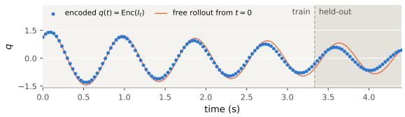

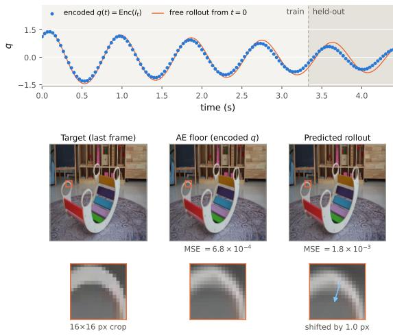  
Figure 3: One rollout across the train/held-out boundary (rainbow rocker, $d = 1$ , the learned Lagrangian of Table 2; protocol in Section 4.1). The shaded region is the held-out end of the clip, 33 frames the model has never seen, over which the latent NRMSE is 0.335. Five oscillations ahead, the handle edge is 1.0 px from where the encoded state puts it, 2.4× the local reconstruction error.

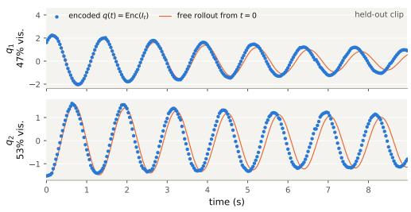

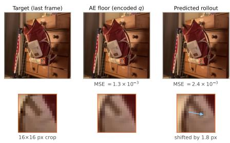  
Figure 4: Seven periods of free rollout on an unseen clip (hanging bag, $d = 2 )$ , a separate recording, so the whole 9 s is held out. Amplitude is held and the residual error is a slow phase drift, 1.8 px at the last frame, 4.0× the local reconstruction error.

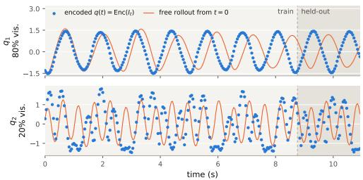

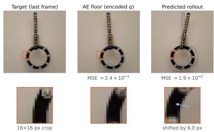  
Figure 5: Rollout on a chaotic system (real double pendulum, $d = 2 )$ . The dominant coordinate is the slow swing of the assembly as a whole, and there the rollout holds amplitude and frequency, losing phase after two to three periods. The second carries the relative oscillation of the two arms, $\theta _ { 2 } - \theta _ { 1 }$ , too chaotic to be identified from a clip this short: the model draws a regular oscillation where the encoded states scatter. The renderer is not what limits the horizon.

## 4.3 What the Lagrangian prior buys

To weigh what the mechanical prior buys we compare LaGSplat with GaussianPrediction [79], a member of the family of Section 2.4 that carries none: Gaussian Splatting forecast by a graph network over a few hundred key points, an evolution law it is free to learn but that nothing requires to be dissipative whatever the weights. Predicting motion rather than identifying a law covers a wider class of extrapolation problems than ours. On a dissipative system that generality turns into a weakness, because convergence to an equilibrium then has to be learned where our model class cannot avoid it. Whether an unimposed dissipation is learned nonetheless is what the comparison measures. We train it on the rainbow rocker on the same split, then roll both models out far past the end of the clip, into the regime where a dissipative system has long since come to rest. GaussianPrediction exposes images and no state, so we read its predicted frames through the frozen LaGSplat encoder to put both trajectories in one chart (Fig. 6). That reading only means something as long as the encoder is fed images it can make sense of, and it is: long after the motion they show has ceased to be that of a dissipative system, the predicted frames are still visually coherent and still land within the latent range the clip covers. What has degraded is the dynamics they display, not their appearance, so the encoder is never asked to extrapolate.

Table 3: Extrapolation past the training window (rainbow rocker, $d = 1 .$ , train frames 0–99, predicted frames 100–132). PSNR is measured on the held out frames against the real video, LaGSplat autoencoder floor on them being 31.79 dB. The physics rows read both models and the real video in the latent chart of the frozen encoder: the frequency error is referenced to 1.1433 Hz and the dissipation coefficient is the envelope decay rate $1 / \tau$ fitted over the filmed window $( \tau = 4 . 7 \mathrm { s } )$ , both measured on the encoded real frames. The last row comes from a free rollout of 1000 s, against a filmed clip of 4.43 s.
<table><tr><td></td><td>LaGSplat</td><td>GaussianPred.</td></tr><tr><td>Rendering (PSNR, dB)</td><td></td><td></td></tr><tr><td>Mean on held out frames</td><td>25.88</td><td>27.86</td></tr><tr><td>First predicted frame</td><td>27.28</td><td>31.61</td></tr><tr><td>Last predicted frame</td><td>23.53</td><td>23.63</td></tr><tr><td>Physics</td><td></td><td></td></tr><tr><td>Frequency error</td><td>1.2%</td><td>0.9%</td></tr><tr><td>Dissipation coefficient error</td><td>29%</td><td>60%</td></tr><tr><td>Amplitude left after 1000 s</td><td>0.00%</td><td>53%</td></tr></table>

On the held-out frames the baseline leads throughout (Table 3): by 2.0 dB on average, by 4.3 dB on the first predicted one, and by a margin too small to mean anything on the last one. Little of that is dynamics: it renders 200 155 Gaussians in its recommended setting against our 15 000, and a one-frame misalignment is worth about 2 dB here, so the whole rendering block sits within a frame of phase. GaussianPrediction also gets the natural frequency of the system right, slightly better than we do (0.9% error against our 1.2%), and both models underestimate the damping, on the training frames as on the held-out ones: fitted over the filmed window, where all three series remain comparable, our dissipation coefficient falls 29% short of the one the real video shows and theirs 60%. Where the gap really opens is the longer extrapolation. LaGSplat is structurally constrained to converge to a stable equilibrium by its Lagrangian structure, whatever the networks learn (Section 3.3, Appendix A.2), and that is indeed what we observe, in a few tens of seconds. GaussianPrediction, on the contrary, never converges: about 55% of its initial amplitude is still there at the end of Fig. 6, 33 s in, and 53% of it after 1000 s, in what looks like a stable orbit and is entirely unrealistic for a dissipative system like the rocker. Its renders stay photorealistic and inside the observed latent range throughout, so its failure is dynamic and nothing measured on the pixels reports it. The same failure mode has been reported on gated recurrent cells fitted to dissipative structural dynamics, where it motivated a cell whose internal energy cannot grow at constant load and which is therefore structurally incapable of a sustained orbit [58].

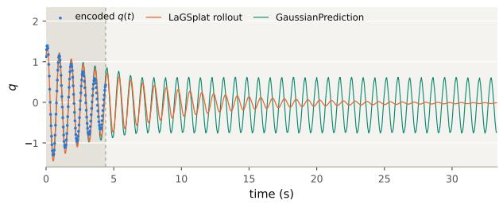  
Figure 6: Free extrapolation far past the clip (rainbow rocker, $d = 1 )$ . The clip lasts 4.4 s, shaded; everything to its right is free extrapolation, with no ground truth to re-anchor either model. Both trajectories are read in the same latent chart, the baseline’s predicted frames being passed through the frozen LaGSplat encoder.

## 4.4 Real actuated soft robot

The system. The soft continuum robot of Krauss et al. [35] is a real pneumatic actuator, silicone segments bent by fibre-reinforced chambers and held to a plane, so that a single camera sees the whole motion. Two configurations are released, one segment driven by two independent pressures and two segments joined by a rigid connector and driven by four, and both are driven continuously throughout the recordings rather than released from rest.

How many coordinates that motion has is worth settling before the comparison. In statics, the two pressures of a segment can lengthen it or bend it and nothing else, so a segment holds two independent deformations, two for the first configuration and four for the second. In dynamics, such a soft structure has in theory infinitely many degrees of freedom, which are expressed or not depending on the frequency content of the loading applied. The chambers are driven between 0.04 and 2 Hz [35], while the robots oscillate freely at 4.63 Hz on one segment and 1.566 Hz on two: the input is too slow to reach the fast modes, and on one segment it barely reaches the first one, at more than twice the top of that band, where the two-segment robot sits inside it. Nothing beyond those two and four deformations was identifiable in these recordings in our experiments, and the $3 2 \times 3 2$ frames make it harder still, so we run at $d = 2$ and $d = 4$ The authors use $d = 6$ and 10 instead, which follows from their dynamics rather than from the data: their latent equation is linear, where two or four coordinates can carry the whole motion only if the mass depends on ${ \bf q } ,$ for a reason that is in the object rather than in the latent chart. Bending or compressing one segment brings its mass closer to the centre of rotation, which changes its inertia in the corresponding direction of the latent space. No constant matrix carries that, unless the dynamics is learned in a latent space of higher dimension than the motion needs, which is what the extra coordinates provide here.

LaGSplat handles higher resolutions easily, but we run on the authors’ own released data, their $3 2 \times 3 2$ frames at 60 fps, their pressure alignment and their contiguous $8 0 / 2 0$ split, so that the comparison carries no protocol difference. Nothing in a Gaussian is indexed by a pixel, so the same weights render at any resolution and only the cost of rendering grows with the number of pixels, where the published decoders pay the change of resolution in their own weights: the deconvolutional stack adds a stage and doubles its channels each time the image doubles, and the attention decoder carries a learned background map the size of the image, which would hold over 95% of its parameters at 256×256. That is the resolution Fig. 7 is decoded at, retraining the decoder alone on the frozen latent chart. The measured chamber pressures enter as the generalised force $b ( \mathbf { q } ) ^ { \top } P$ of Section 3.3: they are an input to the system rather than supervision on it, the actuation matrix $b ( \mathbf { q } )$ being learned like everything else.

The baselines. Their study evaluates four latentdynamics models under a common protocol, which we adopt unchanged. They differ in their renderer and in their dynamics, and we name each by that pair. The two dynamics are the following, to be compared with our Eq. (7),

$$
\operatorname { O s c . } : M { \ddot { \mathbf { q } } } + D { \dot { \mathbf { q } } } + K ( \mathbf { q } - \mathbf { q } _ { 0 } ) = g _ { \theta } ( P ) ,\tag{12}
$$

$$
\mathrm { K o o p m a n : } \left[ \mathbf { \dot { q } } \right] _ { t + 1 } = A \left[ \mathbf { \dot { q } } \right] _ { t } + h _ { \theta } ( P _ { t } ) ,\tag{13}
$$

where M is diagonal, K couples every coordinate to every other, $D ~ { \bar { = } } ~ \alpha M + \beta K$ is a Rayleigh dissipation, $\check { A } \in \mathbb { R } ^ { 2 d \times 2 d }$ is a free matrix, and $g _ { \theta } , h _ { \theta }$ are small networks fed the last four pressure samples. Every coefficient acting on the state is constant, so the pressure is the only place where either model is nonlinear, and A carries no time step: it is a map between consecutive frames. Neither actuation term reads the configuration it acts on, where our $b ( \mathbf { q } )$ of Eq. (9) does. The two renderers are as distinct. A deconvolutional decoder turns the latent vector into the image through a stack of transposed convolutions, every pixel being produced from the whole state and no part of the output attached to a coordinate. The attentionbroadcast decoder, which the authors abbreviate ABCD, expands each latent coordinate over the pixel grid instead and gives it its own map, a per-pixel weight obtained by a softmax across the maps and a learned background. Each map therefore localises in the image what one coordinate moves, the background holding the static part of the scene. The four share an encoder architecture, each training its own autoencoder jointly with its own dynamics, which is why every row carries its own AE floor. All four dynamics are linear in the latent state, so LaGSplat is the only nonlinear Lagrangian in the comparison, and that is what their d of 6 and 10 pays for. The errors we report for them in Table 4 are their published ones, over the same 30-step, 0.5 s horizon and the same 50 validation trajectories, rather than our own re-measurements, except for the two one-segment models they leave unquantified; their exact evaluation checkpoints are not recoverable from the release, and re-running those checkpoints reproduces their published two-segment figures to between ×0.88 and ×1.04 for every model but Osc. + ABCD, whose released weights are the last epoch rather than the best (×2.11).

Applying a force to the image, which is what the last column of Table 4 records, asks two things of a model in turn: the decoder has to carry that force back to the latent coordinates, and the dynamics has to turn the force it receives there into an acceleration. Only ABCD allows the pull-back, and only at a handful of points: it attaches a position to what each coordinate moves, the centre of mass of its mask, so a force can be applied at those centres and nowhere else, $d / 2$ of them once the coordinates are paired into planar positions, where $J ^ { \top }$ places ours anywhere in the image. $\mathbf { A }$ deconvolutional decoder produces every pixel from the whole state and exposes no position at all. Only the oscillator has a place for that force on the right-hand side of Eq. (12), where $M ^ { - 1 }$ turns it into an acceleration and $K ^ { - 1 }$ into a shift of the equilibrium. A term added to Eq. (13) is only an increment of the state, no mechanical reading being available from $A ,$ whose diagonal blocks leave the second half of that state something other than the time derivative of the first. Osc. + deconv therefore takes a force in latent coordinates but has nowhere in the image to place it (∼), and the two Koopman rows cannot take one at all, whichever decoder they carry (×). Osc. + ABCD, which the authors call VON, is the one baseline close to LaGSplat on this: it pairs the coordinates so that each map carries a planar position and a square Jacobian, and the authors use it to draw latent forces in the image plane (✓).

Excited well below its slowest mode, the one-segment robot answers pressure with stiffness, its inertia contributing next to nothing, so the recordings hold almost no evidence of the mass and the frequencies identified there mean little, ours off by 31.4%. That figure averages the whole relaxation: our rollout holds 4.61 Hz over its first half, then falls 20 to 24% short as the motion dies out. Predicting 0.5 s amounts to reproducing the quasi-static map from pressure to shape: the whole spread is a factor 3.0 there, against 23 on two segments, and we come last on it. The best of the four there is Osc. + deconv, the simplest dynamics of the set, where both Koopman maps lead on two segments. A dynamics with less freedom likely has less room to overfit an inertia the recordings do not show.

Two segments is the harder of the two configurations, twice the coordinates driven by twice the chambers and coupled through the connector, and every baseline loses accuracy crossing to it where LaGSplat holds its own (×0.98). It is there the most accurate model of the comparison, at $0 . 7 6 9 \times 1 0 ^ { - 3 }$ , the median of five seeds and not the best of them, and it gets there on d=4 coordinates where all four baselines use d=10: a factor 8.5 over Osc. + ABCD, the interpretable oscillator that is our natural point of comparison, 30 over Osc. + deconv, 7.4 over Koopman + deconv, and 1.28 over Koopman + ABCD. Only that last margin is thin, and it is held against the baseline that affords the least, the one whose dynamics has no place for an applied force.

Table 4: The soft continuum robot, against the four published baselines. MSE in pixels of [0, 1]; AE floor. $\varepsilon _ { \mathrm { f r e q } } ,$ against the frequency of free oscillation measured on the depressurised tail of each clip, every baseline value being our own measurement on their released checkpoints. ∗: our own re-measurement on those same checkpoints. †: the released one-segment checkpoints carry $d = 8 ,$ not the published $d = 6 .$ . External force: $\times ,$ none; $\sim ,$ in latent coordinates only; $( \checkmark )$ , in the image plane at $d / 2$ points; $\checkmark ,$ anywhere in the image, through $J ^ { \top }$
<table><tr><td>Method</td><td>Dyn.</td><td>d</td><td>AE (10−⁵)</td><td>MSE  $( 1 0 ^ { - 3 } )$ </td><td> $\varepsilon _ { \mathrm { f r e q } }$  (%)</td><td>Ext. force</td></tr><tr><td colspan="7">One segment, two chambers</td></tr><tr><td>Osc. + deconv</td><td>lin.</td><td> $6 ^ { \dagger }$ </td><td>1.01</td><td>0.246</td><td>40.4</td><td> $\sim$ </td></tr><tr><td>Osc. + ABCD</td><td>lin.</td><td> $6 ^ { \dagger }$ </td><td>2.39</td><td>0.574</td><td>58.0</td><td> $( \checkmark )$ </td></tr><tr><td>Koopman + deconv</td><td>lin.</td><td> $6 ^ { \dagger }$ </td><td>0.91</td><td>0.734*</td><td>7.4</td><td>X</td></tr><tr><td>Koopman + ABCD</td><td>lin.</td><td>6†</td><td>0.92</td><td>0.535*</td><td>42.2</td><td>X</td></tr><tr><td>LaGSplat</td><td>nonlin.</td><td>2</td><td>1.25</td><td>0.786</td><td>31.4</td><td> $\checkmark$ </td></tr><tr><td colspan="7">Two segments, four chambers</td></tr><tr><td>Osc. + deconv</td><td>lin.</td><td>10</td><td>5.43</td><td>22.7</td><td>76.8</td><td>2</td></tr><tr><td>Osc. + ABCD</td><td>lin.</td><td>10</td><td>14.5</td><td>6.56</td><td>31.4</td><td> $( \checkmark )$ </td></tr><tr><td>Koopman + deconv</td><td>lin.</td><td>10</td><td>3.95</td><td>5.66</td><td>18.3</td><td>X</td></tr><tr><td>Koopman + ABCD</td><td>lin.</td><td>10</td><td>5.17</td><td>0.984</td><td>8.3</td><td>×</td></tr><tr><td>LaGSplat</td><td>nonlin.</td><td>4</td><td>6.31</td><td>0.769</td><td>5.7</td><td> $\checkmark$ </td></tr></table>

Decoder-induced inertia. Section 3.3 left open whether M(q) has to be learned at all. Pulling the ambient metric back through the decoder Jacobians (Eq. (8)) yields an inertia with no free parameter, built from the very $J _ { i }$ that already transport forces, which is how NeuROK obtains its kinetic metric [17]. It is state-dependent although every $J _ { i }$ is constant, since what varies along the trajectory is which primitives are present: on the hanging bag it varies by a factor 2 to 3 while staying well-conditioned, its condition number at most 3. Where the learned mass leaves the distribution of inertia over the scene open, this one fixes it by assuming a uniform density (Section 3.3), an assumption this comparison is also a test of. We compare it with the learned mass on the two-segment robot under the same frozen autoencoder, hence the same latent chart and the same $J _ { i } ,$ , the same objective and the same settings, so that the form of the mass is all that changes. The other terms keep the structure of Section 3.3 and are retrained, their weights free to adapt to that form. The induced inertia is slightly behind on both counts, $1 . 3 3 \times 1 0 ^ { - 3 }$ over the 0.5 s horizon against the $0 . 7 6 9 \times 1 0 ^ { - 3 }$ of Table $^ { 4 , }$ and a frequency error of 6.9% against its 5.7%. The learned mass has more freedom, and that is what it buys; the residual gap is what uniform density and the visible-material assumption cost, and it is small. Carrying no free parameter at all, the induced inertia would still rank ahead of three of the four baselines. A constant inertia, in contrast, reaches $4 . 8 \times 1 0 ^ { - 3 }$ on this test case: part of the state dependence is in the object rather than in the chart, and no constant matrix carries it. An inertia read off the decoder kinematics therefore accounts for the motion of the robot several times better than the best constant one, although the map $\mathbf { q } \mapsto \mu _ { i }$ it is built from was fitted photometrically and never told anything about mass. That map has learned a kinematics consistent with the way the robot actually moves, which is what Section 4.5 relies on when the same $J _ { i }$ transport an applied force.

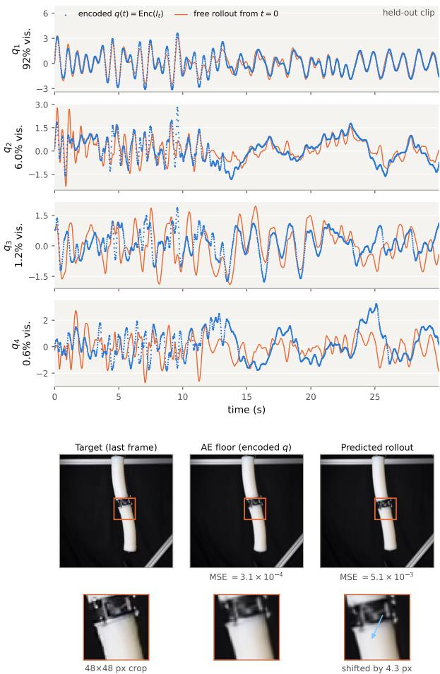  
Figure 7: Thirty seconds of pressure-driven rollout on the held-out split (two-segment robot, $d = 4 )$ . Top: time evolution of the latent state q during the rollout, compared to the trajectory of the encoded ground-truth frames. Bottom: decoded frame at the last time step, rendered at $2 5 6 \times 2 5 6$ . The first two components of q carry 98% of the visible motion between them, which is why the offset between the prediction and the ground truth is only 4.3 px although the last two components are poorly predicted.

## 4.5 Applying forces

The capability that separates LaGSplat from every entry of Table 1 is that a force applied on the image enters the identified dynamics at inference, through $\mathbf { f } _ { \mathrm { l a t } } \overset { \vartriangle } { = } J ^ { \top } \mathbf { f }$ , without retraining and although no force was ever applied in the training video. Figure 8 shows it live on the rainbow rocker and Fig. 9 on the two-segment soft robot. With the Lagrangian and the dissipation of Section 3.3, the latent equation that receives it is Eq. (7) carrying both actuations,

$$
\frac { d } { d t } \frac { \partial \mathcal { L } } { \partial \dot { \mathbf { q } } } + \frac { \partial \mathcal { D } } { \partial \dot { \mathbf { q } } } - \frac { \partial \mathcal { L } } { \partial \mathbf { q } } = b ( \mathbf { q } ) ^ { \top } \boldsymbol { P } + J ( \mathbf { q } ) ^ { \top } \mathbf { f } ,\tag{14}
$$

the measured pressure of Eq. (9) and the applied force of Eq. (11), where $J ( \mathbf { q } ) ^ { \top } \mathbf { f }$ is the weighted sum of the perprimitive transports $J _ { i } ^ { \top } \mathbf { f }$ over the primitives under the click. Training identifies the left-hand side and the actuation map $b ;$ the force is added at inference, through Jacobians the autonomous video has already fixed. That transport is a property of the map $\mathbf { q } \mapsto \mu _ { i }$ rather than of the coordinates used to write it: writing the same kinematics in any other latent coordinates leaves every rendered response of the two figures unchanged, and only the numerical values of $\Delta \mathbf q$ depend on the chart the encoder selected (Appendix $\mathbf { A . l } )$ Both figures report equilibria of that equation, each panel a live decode at the state q where the elastic restoring force balances the right-hand side, the robot being held at one operating pressure so that the applied force alone changes between panels. No force ground truth exists for our systems, so we check predictions that follow from the Jacobian structure and that the unidentified energy factor κ of Section 3.4 leaves invariant: ratios, signs and sums of $\Delta \mathbf q$

In the image plane. On the rainbow rocker $( d = 1 )$ , a force of fixed magnitude applied at different points of the moving object must shift the latent state by a ∆q that grows with the lever arm of its application point and reverses sign across the centre of rotation; both halves hold, panels (a)–(c) of Fig. 8 giving $\Delta \mathbf { q } = - 0 . 5 0 , - 0 . 7 6 , - 0 . { \bar { 8 } } 4$ and panel (d) reversing to +1.22 for the same force on the other side. A force applied on a background Gaussian, whose $J _ { i }$ is null because it does not move with the object, must leave the scene unchanged: panels (g)–(i) measure $| \Delta \mathbf { q } | \leq$ 0.007, at least 70 times below the on-object values, with no segmentation anywhere in the pipeline. And the response to $\mathbf { f } _ { 1 } + \mathbf { f } _ { 2 }$ must equal the sum of the individual responses, which no generative video model would satisfy: at a fixed application point this is exact to $8 \times 1 0 ^ { - 8 }$ relative, panels (d)–(f) predicting one force from the other two by linearity. The point at which the arrow is drawn moves between those three panels because the force follows the matter it was applied to: the selection is frozen on the Gaussians at the click, and their image position is re-evaluated at the deformed state.

On the soft robot. The kinematics is much richer here, the object being deformable and its latent space fourdimensional, so the response to a force is no longer read off a single lever arm. Panels (a) and (b) of Fig. 9 give the bending mode one would expect, both segments following the force to the left and to the right. Panels (c) and (d) load the first segment alone, and the second one bends although nothing is applied to it. Two readings are open and the figure does not separate them: the learned kinematics may not decouple the segments exactly, or the second segment, which hangs from the first and carries its own weight, may bend under gravity once the first one has tilted. The axial pairs (e)–(h) are consistent again: a force along the axis stretches or shortens the segment it is applied to, without bending it and without breaking the left-right symmetry, apart from a slight asymmetry at the bottom of the second segment in (h). Panel (i) applies two opposed forces at the two ends of the second segment, at the junction and at the free tip; the second segment bends while the first one nearly holds its rest envelope, deflecting by about a quarter of what the junction force alone produces in panel (c), and against that force, toward the tip one. The sense is the expected one, the distant force reaching the first segment as a moment while the weight of the bent second segment shifts the same way; we read no static balance into the amount, since gravity loads both segments and the figure cannot tell the two contributions apart. Nothing in the model knows about segments: the force is applied to whichever Gaussians the user selects, and the response, whether it stays in one segment or reaches the other, comes from the learned kinematics $\partial \mu / \partial { \bf q }$ alone. Turning these readings into a quantified error would take a dataset in which known point forces are applied and the resulting deformation is recorded, which none of the systems available to us provides.

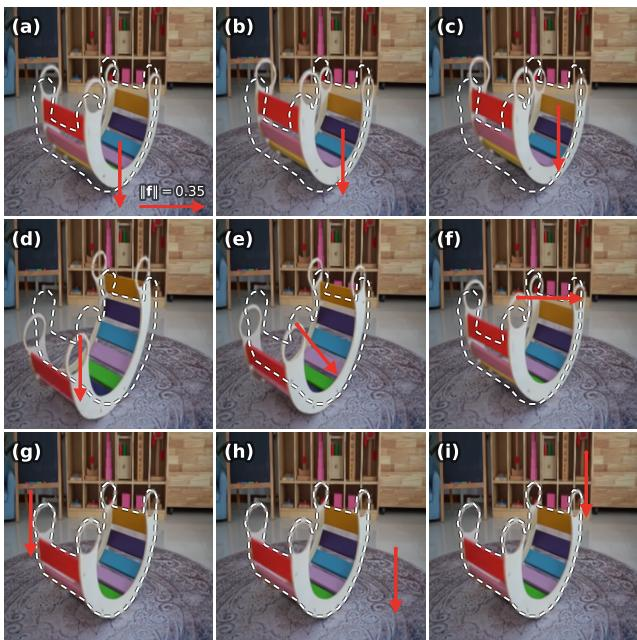  
Figure 8: Interactive force on the rainbow rocker $( d = 1 )$ . The image-space force f is drawn as a red arrow at its application point, every panel applying the same magnitude on one arrow scale, so that only the application point and the direction change. The white dashed curve is the fixed rest envelope, the decode at ${ \bf q } _ { \mathrm { r e s t } } = \mathrm { a r g }$ min V . (a)–(c), lever arm: the same downward force applied at three slats progressively farther from the rocker contact. (d)–(f), direction at a fixed material point: the same point of the object pushed downwards, obliquely and horizontally. (g)–(i), background: the same force applied on the floor, the shelf and the rug.

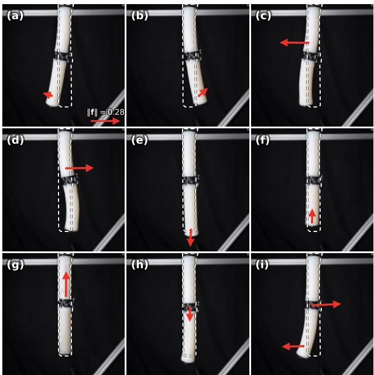  
Figure 9: Interactive force on the two-segment soft robot $( d = 4 )$ . Nine equilibria of the pressure-driven continuum robot of Krauss et al. [35], all at one fixed operating pressure, so that what changes between panels is the applied force alone. The white dashed curve is the rest envelope at that operating point, and arrow length is proportional to ∥f∥ on one scale common to the nine panels. (a),(b): bending of both segments, left and right. (c),(d): bending of the first segment, left and right. (e),(f): force along the axis of the second segment, outwards then inwards, which stretches then shortens it. (g),(h): the same pair on the first segment. (i): two opposed forces, one at the junction between the segments and one at the free tip, under which the second segment bends while the first one nearly holds its rest envelope.

Forces in three dimensions. With the decoder supervised by several views, here the synthetic ones SHARP renders from each lifted frame (Section 3.2) rather than a real multi-camera capture, the same mechanism operates in the reconstructed volume rather than in the image plane: a click casts a ray, the first Gaussian it meets becomes the point of application, and f is a world-space vector at that point. Panels (d)–(f) push the toy along a direction in which it never moves in the training video, and nothing happens: the state stays where it was to $| \Delta \mathbf { q } | < 3 \times 1 0 ^ { - 5 }$ an arrow that changes nothing. Such a force lies in the kernel of the pullback. The toy has a single degree of freedom, so each $\boldsymbol { J } _ { i } ^ { \star } \in \mathbb { R } ^ { 3 \times 1 }$ has one column, and a force orthogonal to it transports as $J ^ { \top } \mathbf { f } = - 3 . 1 \times 1 0 ^ { - 1 7 }$ , machine zero, whatever its magnitude. The points of the object do move vertically as q varies, so the vertical is not in that kernel: a vertical force of the same magnitude drives the toy from rest to a new loaded equilibrium at $\mathbf { q } ~ = ~ + 1 . 5 2$ , in the expected direction.

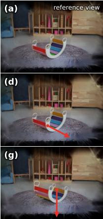

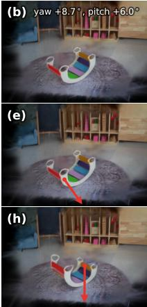

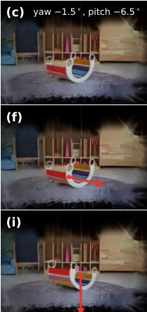  
Figure 10: Applying a force inside the 3D scene (rainbow rocker, $d = 1$ , 15 000 Gaussians, decoder supervised by novel views). Each row is one state of the interactive simulation and each column one viewpoint of the freeviewpoint viewer, with the yaw and pitch offsets from the reference view written in the top row. f is drawn in red from its point of application, with the same magnitude everywhere and at a fixed length that only the viewpoint foreshortens, so arrow length carries no information. (a)– (c): the state at rest with no force at all, the static reference that replaces the dashed rest envelope of Fig. 8. (d)–(f): a force orthogonal to $J _ { i } = \partial \mu _ { i } / \partial \mathbf q$ at the selected primitive, under which the state does not move: these renders differ from $\mathrm { ( a ) - ( c ) }$ only by the arrow overlay itself. (g)–(i): a vertical force, whose projection is nonzero, under which the toy settles at a new loaded equilibrium.

## 5 Discussion

Limitations. The Lagrangian prior narrows the class of systems the method applies to: a few generalized coordinates, a smooth kinematics, and a dissipative dynamics that is either autonomous or driven by a measured input. Contact, impact, changes of topology, plasticity and hysteresis fall outside the dynamics we instantiate, where a motion predictor carrying no mechanical structure covers them all. The boundary is one of the dynamics we write, not of the representation it acts on: the coordinates ${ \bf q } ,$ the kinematics $\mathbf { q } \mapsto \mu ( \mathbf { q } )$ and the pullback $J ^ { \top }$ do not depend on the form given to the latent equation of motion. Any physics that reduces to an equation of evolution on a small number of coordinates can therefore take the place of the Lagrangian one and widen the class of systems the method reaches, under one condition: that equation has to accept a generalized effort on its right-hand side, which is what the pullback delivers. A replacement that only predicts how q evolves, with nowhere for $J ^ { \top } f$ to enter, keeps the representation and loses the interaction. Contact and plasticity both admit a form that meets the condition, and we leave them to the directions below; neither is implemented here.

Learning from video adds a requirement of its own: the state has to be observable in the images. A single viewpoint reads the motion the image plane exhibits, so a displacement out of that plane would have to be supervised by real multiple views. Plasticity raises the question more sharply, since a plastic variable is not read off a frame the way a deformation is: two frames that coincide can carry different loading histories. That does not put it out of reach, it puts it out of sight of the per-frame encoder of Section 3.2. The recording narrows the class further: only the motions a video exhibits enter ${ \bf q } ,$ so a degree of freedom the clip never excites is one the model does not carry (Section 1). The rainbow rocker shows what that costs under force: a push orthogonal to its rocking plane transports to machine zero and moves nothing (Section 4.5). That answer is right for a moderate push and wrong for a large one, which would tip the toy over. The clip never shows it tipping, so no coordinate carries that motion and the model stays rigid in that direction whatever the magnitude. A state at which no Gaussian keeps any presence renders nothing, so the Gaussians have to cover the whole region of $Q$ the state reaches at inference. The frames, in turn, have to sample that region densely enough for the dynamics to be identified over it. Both grow with the volume of the region, hence with d. One coordinate settles the question in a single oscillation, which sweeps the whole segment it lives on; at $d = 4$ a trajectory is a curve in a four-dimensional space and covers a thin part of it, so the rest of the coverage has to come from the input. The chambers of the soft robot are driven throughout the recordings over a band of frequencies (Section 4.4), where the same robot released from rest would have traced one decaying path and left the rest of Q unvisited. For a system with many more coordinates, the binding cost is therefore the recording itself, long enough and driven variously enough to cover the space its state lives in.

The force mechanism, which is the central contribution, is never checked against a measurement. Section 4.5 verifies predictions that follow from the Jacobian structure, ratios, signs, sums and the kernel of the pullback, all of them invariant under the energy factor κ; no error against a known force is reported, because no dataset combines what that would take: one fixed viewpoint, few degrees of freedom, and applied point forces recorded with the resulting deformation. PokeFlex [54] comes closest, real objects poked by a robot arm with the interaction wrenches and the contact points logged, but its poking is quasi-static, so it would test the loaded equilibrium and not the forced dynamics. Data of that kind would nonetheless settle the scale: κ is global (Section 3.4), so one measured poke fixes it for the whole model, where video alone leaves it undetermined. Every visible primitive is treated as material of the same density. What that assumption costs on the inertia was measured on one system only (Section 4.4), where it is small, but a system whose parts differ widely in density has no reason to be as forgiving. In the worst case a motion in the image carries no mass at all: the primitives that follow a moving shadow still take a share of it and still transport a force, so a push aimed at the shadow moves the object.

Fitting appearance first and dynamics second is a bet. Against it, Friedl et al. [14] report jointly trained latent Lagrangian models outperforming a sequentially trained one by an order of magnitude on the decoded prediction; for it, Zhu et al. [81] make the latent continuous by construction, fit the dynamics afterwards on a frozen encoder, and still beat every jointly trained pairing of a standard autoencoder with a Neural ODE, an HNN or a SympNet. The two are measured on different encoders, over simulated states in one case and video in the other, and neither settles the question for LaGSplat: fitting the same encoder and dynamics jointly, and comparing with the two stages, is an experiment we have not run.

Finally, the latent dimension d is chosen by hand, from the physics or from the knee of the reconstruction error curve, a rule that can overestimate $d ,$ as Chen et al. [8] report a reconstruction degrading while the latent is still wider than the minimal set of state variables.

Future work. Measuredforces. Closing the loop on the force side asks for a recording no dataset provides today: one fixed monocular viewpoint, a few degrees of freedom, and the applied efforts logged with their point of application. Clips of human manipulation are the natural case, and fall outside the class today because the hand is an input the video never measures: masking the hand out of the frames and logging the applied force and its contact point with an instrumented glove [46, 68] would supply the missing record, and the same measurement would fix the energy scale κ (Section 3.4) once for the whole model. Contact and impact. A differentiable contact model written on q [80] would resolve them in the latent space, grafted onto a Lagrangian or Hamiltonian network and so keeping the right-hand side an applied effort enters by, in place of the brush of Section 3.4, which injects an effort but leaves the state continuous. Such a model needs a contact geometry, and the primitives are already ellipsoids carried by the state: Wang et al. [69] take the Gaussians as collision geometry and as appearance at once, and learn rigid-body dynamics from video through a differentiable engine, which supplies the geometric half of what a latent contact would take. That geometry constrains the primitive itself: their Gaussians are spheres with frozen rotations, so that a smoothed signed distance can be read off them, where the latent axes we add live in the anisotropic covariance itself (Section 3.2); recovering a contact geometry without giving up that anisotropy is what remains open. The mechanical half is the transport we already have, an impulse resolved on the primitives entering the latent equation through the same ${ \hat { J } } ^ { \top }$ . Plasticity and hysteresis. The other dynamics the Lagrangian form leaves out, carried as internal variables beside q with a free energy and a dissipation rate, in the manner of Masi and Stefanou [49], at the price of a larger d and of an encoder reading a window of frames rather than the single one of Section 3.2 Those internal variables are compressed from microscale fields a video does not provide. A video supervises the observed response alone, which is what a recurrent consti tutive model trains against, carrying the loading history in a hidden state and never fitting the internal variable itself [20]. Coupling with other simulators. Rigid bodies, a finite element structure or a particle solver, placed beside the identified object in one virtual environment: a reaction computed by the environment enters the latent equation through $J ^ { \top }$ , and the primitives $\mu _ { i } ( \mathbf { q } )$ return the geometry the environment collides against, in both directions at inference and without retraining. VR-GS [29] builds the interactive setting with the physics prescribed on a tetrahedral cage around the Gaussians rather than identified from the video; what would change here is that the object carries its own identified dynamics into the scene. Control from video. The identification returns a mass, a dissipation, a potential and an actuation matrix $b ( \mathbf { q } )$ , which is what model-based control asks for, so a controller could be de signed on the identified model of a soft robot with no joint encoder ever attached to it [34, 48]. Designed excitation. Which input sequence, or which set of releases, covers Q best for a given number of frames is a question classical system identification treats under the name of persistent excitation. Priors across systems. Learned once rather than once per object, so that the coverage above is not identified from scratch every time. The two branches of Sections 2.3 and 2.4 sit on either side of what this would take: one learns over many systems what motion looks like and never registers it against the particular object filmed, the other identifies one object from its own video and starts from nothing every time. Between the two, a prior over the kinematics and over the dynamics itself, the mass, the potential and the dissipation, amortised over many systems and then fitted to one, would let a short clip identify what a long one identifies today, in the spirit of [17, 73]. A chart shared across systems. Such a prior has to be written on a chart, and the transported effort does not depend on the one the encoder selects (Appendix A.1): a single latent space can therefore carry every system, what distinguishes them being the kinematics $J _ { i }$ and the functions M, V, C and b written on it rather than the coordinates themselves. The counterpart is that the coordinates of two systems are then unrelated, so a prior learned on one says nothing about the other, and a shared chart needs a rule giving each coordi nate the same role everywhere. NeuROK obtains one by training a single encoder over many objects, so that they are all read into the same latent space [17]. A general-purpose visual encoder is shared in that sense already: DINOv2 [55] and JEPA-style video encoders [71] map every scene into one space, and using them frozen would also remove the per-scene encoder training our pipeline needs. What is not settled is whether their features resolve the few degrees of freedom that carry the motion, which is what q has to be. Several systems in one clip. Each of our clips films a single object. Two objects moving at once should be carried by coordinates that separate, disjoint blocks of q with a mass and a potential that do not couple them, and the force mechanism supplies the test: a push on one leaves the other still. An exactly identified model would pass it whatever the coordinates, the equations being covariant, so what is at stake is the fit rather than the principle, the block structure being a prior that nothing in the losses currently rewards; and the joint state space is the product of the two, which brings back the coverage question above. Perprimitive density. The decoder-induced metric assumes it uniform for want of a way to tell the primitives apart by material (Section 3.3): a network predicting a density from appearance, as Le et al. [37] predicts material fields and Lin et al. [45] constitutive models, would supply the $m _ { i }$ that Eq. (8) shares between all primitives today, fixing their ratios though not the global scale κ. Telling the primitives apart by material also means telling apart those that carry no material at all: segmenting the object from the shadow it casts would drop the shadow primitives from both sums, the mass of Eq. (8) and the brush of Section 3.4, where they currently weigh and take a push like the rest. Articulated systems and constraints. Multi-body systems via a Lagrangian graph network [6], and systems with explicit constraints, which LaGSplat does not enforce [13], trading that guarantee for the ability to handle an unknown constraint topology.

## 6 Conclusion

We presented LaGSplat, which replaces the time parameterization of dynamic Gaussian Splatting by a learned physical state q: one low-dimensional vector is at once the generalized coordinate of a dissipative Lagrangian identified from video and the conditioning variable of a decoder whose primitives are explicit points moving with the object. Nothing supervises q: the training signal is the video itself.

Across seven real systems, from one degree of freedom to four, the natural frequency comes out of the learned dynamics within a few percent of the one the video shows, on every recording that excites it. On the two-segment soft continuum robot of Krauss et al. [35], evaluated on the authors’ own data, split and protocol, LaGSplat is the most accurate of the five models compared, with four coordinates where the published baselines use ten; an inertia read off the decoder kinematics, carrying no free parameter at all, still ranks ahead of three of them. Against a motion predictor with no mechanical structure, GaussianPrediction [79], it settles at a stable equilibrium the training clip never shows, where the baseline is still orbiting a thousand seconds later.

The capability that motivates the construction is force at inference. A force applied anywhere in the image, or in the reconstructed volume under multi-view supervision, transports through the decoder Jacobians into the identified equations of motion, without retraining and although no force was ever applied in the training video. Its direction and its shape are fixed by the kinematics that the autonomous video has already determined; its amplitude is fixed only up to one global energy factor.

The Lagrangian prior narrows the class of systems the method reaches, and buys inside it a response to unseen forces that stays bounded and physically plausible.

## Acknowledgements

The author thanks Mathis Boston and Jérémie Le Garrec for the many discussions on the Gaussian Splatting part of the pipeline.

## A Derivations

This appendix collects the derivations relegated from Section 3: what the learned kinematics transports, forces and inertia alike (Section A.1), and the energy balance behind the bounded-response remark (Section A.2).

## A.1 Forces and inertia from the learned kinematics

Stage 1 gives each primitive i a forward kinematics, the map from the configuration $\mathbf { q } \in \mathbb { R } ^ { d }$ to the centre of that primitive in the n-D render space,

$$
\phi _ { i } ( \mathbf { q } ) = \mu _ { i } ^ { ( s ) } + J _ { i } \left( \mathbf { q } - \mu _ { i } ^ { ( q ) } \right) , \qquad J _ { i } = \Sigma _ { s q , i } \Sigma _ { q q , i } ^ { - 1 } ,\tag{15}
$$

affine by Eq. (2). It plays the role of the position $\mathbf { r } _ { i } ( \mathbf { q } )$ of particle i in analytical mechanics [19]. Once that map is fixed, both the generalized force and the kinetic energy follow from it by the textbook rules, with no further modelling choice.

Transport of a force. A virtual displacement δq moves the primitive by $\delta \mu _ { i } = J _ { i } \delta \mathbf { q } .$ , so a force f applied to it does the work

$$
\begin{array} { r } { \delta W = \mathbf { f } ^ { \top } \delta \mu _ { i } = \mathbf { f } ^ { \top } J _ { i } \delta \mathbf { q } \quad } \\ { = ( J _ { i } ^ { \top } \mathbf { f } ) ^ { \top } \delta \mathbf { q } , \qquad \forall \delta \mathbf { q } . } \end{array}\tag{16}
$$

The latent force we are after is the vector $\mathbf { f } _ { \mathrm { l a t } }$ that does this same work against any virtual displacement of the latent space, that is $\delta W = \mathbf { i } _ { \mathrm { { l a t } } } ^ { - } \delta \mathbf { q }$ . The last line has exactly that form, with $\mathbf { f } _ { \mathrm { l a t } } = J _ { i } ^ { \top } \mathbf { f } .$ and no other vector does, since two vectors with the same product against every $\delta \mathbf { q }$ are equal. Equation (11) is thus the canonical generalized force $\begin{array} { r } { \dot { Q _ { j } } = \sum _ { i } \mathbf { F } _ { i } { \cdot } \partial \mathbf { r } _ { i } / \partial q _ { j } } \end{array}$ evaluated on the learned kinematics, which is what makes its injection into Eq. (7) consistent with the energy balance of Section A.2.

Invariance to the latent chart. The latent coordinates come out of the encoder and the whitening that follows it, so they carry no physical meaning and are fixed only up to a smooth change of variables $\mathbf { q } = \psi ( \tilde { \mathbf { q } } )$ . Writing $\Psi = \partial \psi / \partial { \tilde { \mathbf { q } } }$ , the chain rule replaces $J _ { i }$ by $J _ { i } \Psi$ , hence the transported force by $\Psi ^ { \top } \mathbf { f } _ { \mathrm { l a t } } ;$ a virtual displacement of the new chart is $\delta \mathbf { q } = \Psi \delta \tilde { \mathbf { q } }$ in the old one. The two factors cancel and the work is the same on both sides,

$$
( \Psi ^ { \top } \mathbf { f } _ { \mathrm { l a t } } ) ^ { \top } \delta \tilde { \mathbf { q } } = \mathbf { f } _ { \mathrm { l a t } } ^ { \top } \Psi \delta \tilde { \mathbf { q } } = \mathbf { f } _ { \mathrm { l a t } } ^ { \top } \delta \mathbf { q } .\tag{17}
$$

The response to a given user force therefore does not depend on the chart the encoder happened to select.

The same map carries the inertia. Giving every primitive the same mass m and weighting it by its presence $\hat { w } _ { i } ( \mathbf { q } )$ , the latent opacity of Eq. (4) normalized over primitives, the kinetic energy of the material points reads

$$
T = \frac { 1 } { 2 } m \sum _ { i } \hat { w } _ { i } ( { \bf { q } } ) \| \dot { \mu } _ { i } \| ^ { 2 } = \frac { 1 } { 2 } \dot { \bf { q } } ^ { \top } \Big ( m \sum _ { i } \hat { w } _ { i } ( { \bf { q } } ) J _ { i } ^ { \top } J _ { i } \Big ) \dot { \bf { q } }\tag{18}
$$

because $\dot { \mu } _ { i } = J _ { i } \dot { \bf q } ,$ which is the mass matrix of Eq. (8). All the state dependence sits in the gating $\hat { w } _ { i } ( \mathbf { q } )$ , which is why $M ( \mathbf { q } )$ varies along a trajectory, and carries Coriolis terms, although every $J _ { i }$ is constant.

## A.2 Bounded forced response

We record the energy balance behind the bounded-response remark of Section 3.3, under the assumptions realized by the architecture: (A1) $M ( \mathbf { q } ) = L _ { m } L _ { m } ^ { \hat { \top } } + \varepsilon I \succ 0 \mathrm { S P D }$ so $T \geq \frac { \varepsilon } { 2 } \lvert \lvert \dot { \mathbf { q } } \rvert \rvert ^ { 2 }$ ; (A2) V coercive (radially unbounded), enforced by a quadratic floor $+ \frac { \varepsilon _ { V } } { 2 } \| \mathbf { q } \| ^ { 2 }$ , without which the energy would still decrease while its sublevel sets stayed unbounded, leaving q free to drift; (A3) $C ( \mathbf { q } ) = L _ { c } L _ { c } ^ { \top } +$ $c _ { 0 } I \succeq c _ { 0 } I$ , with the isotropic floor $c _ { 0 } > 0$ of Section 3.3. With $\begin{array} { r } { \mathcal { L } = T - V , \mathcal { D } = \frac { 1 } { 2 } \dot { \mathbf { q } } ^ { \top } C ( \mathbf { q } ) \dot { \mathbf { q } } } \end{array}$ and total energy $E =$ $T + V$ , differentiating along a solution of Eq. (7) and using Euler’s theorem for the quadratic $\mathcal { D } ( \dot { \mathbf { q } } ^ { \intercal } \dot { \partial } \mathcal { D } / \partial \dot { \mathbf { q } } = 2 \mathcal { D } )$ gives

$$
\dot { E } = \mathbf { f } _ { \mathrm { e x t } } ^ { \top } \dot { \mathbf { q } } - \dot { \mathbf { q } } ^ { \top } C ( \mathbf { q } ) \dot { \mathbf { q } } \leq \mathbf { f } _ { \mathrm { e x t } } ^ { \top } \dot { \mathbf { q } } - c _ { 0 } \| \dot { \mathbf { q } } \| ^ { 2 } .\tag{19}
$$

Free rollout. With $\mathbf { f } _ { \mathrm { e x t } } ~ = ~ 0$ the balance reads $\dot { E } \le$ $- c _ { 0 } \| \dot { \mathbf { q } } \| ^ { 2 }$ , so E is a Lyapunov function, strictly decreasing outside rest, and the trajectory stays in the sublevel set $\smash { \{ E \le E ( 0 ) \} }$ , which (A1) makes bounded in $\dot { \mathbf { q } }$ and $( \mathbf { A } 2 )$ in q. By LaSalle’s invariance principle [32] it converges to a state where the velocity is zero and stays zero, which by Eq. (7) requires $\partial V / \partial { \bf q } = 0$ . Both potentials of Section 3.3 have exactly one such point, their global minimum, the ICNN by strong convexity under the floor of (A2) and the invex form by construction. Every free trajectory therefore comes to rest at that single state, from any initial condition and however far a force had driven it: sustained oscillation is excluded by the architecture, before any training and whatever the networks have learned.

Maintained force. This is the regime of Section 4.5, where a force is held while the state settles. For a constant $\mathbf { f } _ { \mathrm { e x t } } = \mathbf { f } ,$ , the same differentiation applied to the loaded energy $E _ { \mathbf { f } } = T + V - \mathbf { f } ^ { \top } \mathbf { q }$ cancels the injected power exactly,

$$
\dot { E } _ { \mathbf { f } } = \dot { E } - \mathbf { f } ^ { \top } \dot { \mathbf { q } } = - \dot { \mathbf { q } } ^ { \top } C ( \mathbf { q } ) \dot { \mathbf { q } } \ \leq \ - c _ { 0 } \lVert \dot { \mathbf { q } } \rVert ^ { 2 } ,\tag{20}
$$

and $E _ { \mathbf { f } }$ is coercive as well, the quadratic floor of (A2) dominating the linear term $\mathbf { f } ^ { \top } \mathbf { q } .$ . The free-rollout argument therefore applies verbatim with V replaced by $V = \mathbf { f } ^ { \top } \mathbf { q } :$ the response stays bounded and converges to a loaded equilibrium $\partial V { \big / } \partial \mathbf q \ = \ \mathbf f$ , which is what the panels of Figs. 8 and 9 report.

Those statements are continuous-time; the symplectic scheme of Section 3.4 is what keeps a long discrete rollout from drifting away from them. They bound the response; they do not make it quantitatively exact far from the training data.

## B Deformation-Field Decoder at Equal Budget

Section 2.1 leaves two ways of giving a primitive a position that follows the state. Ours places the primitive in the $( n + d ) \mathrm { D }$ volume and conditions it on q (Section 3.2), which makes $\mathbf { q } \mapsto \mu _ { i }$ affine with a constant Jacobian. The other keeps the primitive $n { \mathrm { - } } \mathrm { \mathbf { D } }$ and warps it with a network of ${ \bf q } ,$ after Wu et al. [72].

The second family contains the first. Its primitives follow whatever curve the network draws, so each of them can in principle stay on one piece of the object over the whole motion, which a straight line through the latent volume cannot do. That freedom buys no image quality here, and the primitives stop following the matter they render.

Eq. (5) has no term that holds a primitive on the same piece of matter. The loss scores rendered frames, and a frame is explained as well by a primitive that has moved with the object as by another that has taken its place. Material tracking is therefore never supervised. It comes out of the fit: the same primitives have to explain every frame of the clip, and between two nearby states the cheapest way for one of them to do so is to shift slightly and keep covering what it already covered, rather than leave it to a primitive arriving from elsewhere. In our decoder a visible primitive translates along a line in ${ \bf q } ,$ at a rate fixed once and for all by the block stored with it, and the latent gate of Eq. (4) fades it in and out along the way without taking it off that line. The deformation field ties it to no trajectory: centre and extent are free functions of ${ \bf q } ,$ so one primitive shrinking below the pixel while another grows in its place costs nothing.

We ran both on the rainbow rocker with 15 000 primitives on each side, the same photometric loss and regularizers, the same optimizer and schedule, so that the parameterization of $\mathbf { q } \mapsto \mu _ { i }$ is the only difference. The deformation side uses 9.8M parameters, ours 195k.

Reconstruction. At the end of training the deformation field is behind on every term of Eq. (5): L1 0.0157 against 0.0142, the SSIM term 0.076 against 0.063. Both decoders are scored on the frames they were fitted on, so this compares capacity spent and not generalization, and at this budget the extra 9.6M weights buy no image quality.

The Jacobian field. Primitive velocities are not supervised either. Figure 11 reads ${ \dot { \mu } } _ { i } = J _ { i } { \dot { \mathbf { q } } }$ off both decoders at the same state. The two renderings are hard to tell apart, the two velocity fields are not. Ours varies smoothly over the rocker; the deformation field is rough, a primitive differing from its immediate neighbours by 6.9 px/s in median against 1.4 px/s for ours, and it sets primitives in motion over the static background and over the rocker itself. A decoder can therefore render the clip well and still leave $\partial \mu _ { i } / \partial { \bf q }$ meaningless, which is the derivative that Eq. (11) pulls an applied force back through and that Eq. (8) reads the inertia off.

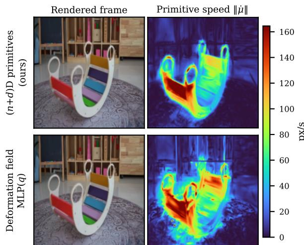  
Figure 11: The same motion read off the two decoders (rainbow rocker, $d = 1 )$ . Each primitive is colored with the norm of its velocity $\| \dot { \mu } _ { i } \| = \| J _ { i } \dot { \bf q } \|$ and rasterized by the same kernel, with the same opacities and covariances as the frame beside it.

## C Implementation Details

The same architectures are used on every system. The latent dimension $d ,$ the image resolution, the number of primitives and the length of the runs are set per system.

Architectures. The encoder is a continuity-preserving convolutional autoencoder [81]: three convolutions with 12×12 filters, two channels each, stride 2 and ELU activations, average-pooled to 4×4 and mapped to q by one linear layer, about 2 000 parameters. The decoder holds K Gaussians of dimension $n + d , 1 0 0 0$ to 15 000 of them depending on the scene, which is $1 0 ^ { 4 } : 0 \ 2 \times 1 0 ^ { 5 }$ parameters. The LNN is under 15 000 parameters: a scalar ICNN [2] for the potential, hidden [64, 64] with softplus activations, composed with a 2-block i-ResNet diffeomorphism (width 64, Lipschitz cap 0.9) when an invex potential is required (Section 3.3); an MLP with hidden [64, 64] for the Cholesky factor of $M ( \mathbf { q } )$ , SPD floor $\varepsilon = 0 . 1 ;$ another for the full $C ( \mathbf { q } )$ , initialised at $0 . 2 I$ with isotropic floor $c _ { 0 } = 1 ;$ ; and one invex ICNN head per chamber for the actuation map $\nu ( \mathbf { q } )$

Training. Both stages are trained with Adam. Stage 1 trains encoder and decoder jointly for about $5 \times 1 0 ^ { 4 }$ optimizer steps, the number of epochs following from the size of the clip and the period of the Gaussian lifecycle scaled with it, on $0 . 0 8 \mathrm { L 1 } \bar { + } 0 . 0 2 ( 1 - \mathrm { S S I M } ) + 0 . 0 1$ anisotropy, with a $7 \times 7 \ \mathrm { S S I M }$ window; a Gaussian whose peak opacity falls below 0.02 is periodically recycled, either by splitting an overloaded alive Gaussian along the principal eigenvector of its full $( n + d ) \mathrm { D }$ covariance or by teleporting it to a high-error region. Latent whitening $\mathbf { q } _ { \mathrm { w h i t e } } = W ( \operatorname { E n c } ( I ) - { \hat { \mu } } )$ , with $W = V \mathrm { d i a g } ( \lambda ) ^ { - 1 / 2 }$ from the eigendecomposition of the encoded covariance, is computed once on the training frames at the end of that stage and frozen with the chart. Under multi-view supervision (Section 3.2) the novel views are 65 SHARP renders per frame, computed once and cached. Stage 2 trains the dynamics alone on windows of the clip, again for about $5 \times 1 0 ^ { 4 }$ steps, its objective one differentiable Verlet step with latent position and velocity weighted equally in the visibility metric, ridge $\rho = 0 . 0 1$ . High-resolution renders retrain the decoder alone on the frozen chart.

## References

[1] Anand Kumar Agrawal and Anders Thorin. Latent-Lagrangian neural networks for reduced-order modeling of non-autonomous nonlinear dynamical systems. Journal of the Mechanics and Physics of Solids, 214: 106633, 2026. doi: 10.1016/j.jmps.2026.106633.

[2] Brandon Amos, Lei Xu, and J Zico Kolter. Input convex neural networks. In International Conference on Machine Learning, 2017.

[3] Arnold Caleb Asiimwe and Carl Vondrick. 4D Gaussian Splatting as a learned dynamical system. arXiv preprint arXiv:2512.19648, 2025.

[4] Peter W. Battaglia, Razvan Pascanu, Matthew Lai, Danilo Jimenez Rezende, and Koray Kavukcuoglu. Interaction networks for learning about objects, relations and physics. In NeurIPS, 2016.

[5] Shubham Bhardwaj and Chandrajit Bajaj. PHAST: Port-Hamiltonian architecture for structured temporal dynamics forecasting. arXiv preprint arXiv:2602.17998, 2026.

[6] Ravinder Bhattoo, Sayan Ranu, and NM Krishnan. Learning articulated rigid body dynamics with Lagrangian graph neural network. In Advances in Neural Information Processing Systems, volume 35, 2022.

[7] Alejandro Castañeda Garcia, Jan van Gemert, Daan Brinks, and Nergis Tömen. Learning physics from video: Unsupervised physical parameter estimation for continuous dynamical systems. arXiv preprint arXiv:2410.01376, 2025. CVPR 2025.

[8] Boyuan Chen, Kuang Huang, Sunand Raghupathi, Ishaan Chandratreya, Qiang Du, and Hod Lipson. Automated discovery of fundamental variables hidden in experimental data. Nature Computational Science, 2(7):433–442, 2022. doi: 10.1038/ s43588-022-00281-6. arXiv:2112.10755.

[9] Ricky T. Q. Chen, Yulia Rubanova, Jesse Bettencourt, and David Duvenaud. Neural ordinary differential equations. In Advances in Neural Information Processing Systems, volume 31, 2018.

[10] Zhengdao Chen, Jianyu Zhang, Martin Arjovsky, and Léon Bottou. Symplectic recurrent neural networks. In International Conference on Learning Representations (ICLR), 2020. URL https://openreview. net/forum?id=BkgYPREtPr.

[11] Miles Cranmer, Sam Greydanus, Stephan Hoyer, Peter Battaglia, David Spergel, and Shirley Ho. Lagrangian neural networks. In ICLR Workshop on Integration of Deep Neural Models and Differential Equations, 2020.

[12] Stavros Diolatzis, Tobias Zirr, Alexandr Kuznetsov, Georgios Kopanas, and Anton Kaplanyan. N-Dimensional Gaussians for fitting of high dimensional functions. In ACM SIGGRAPH 2024 Conference Papers, 2024. doi: 10.1145/3641519.3657502.

[13] Marc Finzi, Ke Alexander Wang, and Andrew Gordon Wilson. Simplifying Hamiltonian and Lagrangian neural networks via explicit constraints. In Advances in Neural Information Processing Systems, volume 33, 2020.

[14] Katharina Friedl, Noémie Jaquier, Jens Lundell, Tamim Asfour, and Danica Kragic. A Riemannian framework for learning reduced-order Lagrangian dynamics. In International Conference on Learning Representations, 2025. arXiv:2410.18868.

[15] Katharina Friedl, Noëmie Jaquier, Alyx Liao, and Danica Kragic. Learning Hamiltonian dynamics at scale: A differential-geometric approach. In International Conference on Machine Learning (ICML), 2026. KTH Royal Institute of Technology; arXiv:2509.24627, code: github.com/katfriedl/reduced\_hamiltonians.

[16] Lawson Fulton, Vismay Modi, David Duvenaud, David I. W. Levin, and Alec Jacobson. Latent-space dynamics for reduced deformable simulation. Computer Graphics Forum, 38(2):379–391, 2019. doi: 10.1111/cgf.13645.

[17] Chen Geng, Guangzhao He, Yue Gao, Yunzhi Zhang, Shangzhe Wu, and Jiajun Wu. NeuROK: Generative 4D neural object kinematics. In CVPR, 2026. arXiv:2605.30347.

[18] Nate Gillman, Charles Herrmann, Michael Freeman, Daksh Aggarwal, Evan Luo, Deqing Sun, and Chen Sun. Force prompting: Video generation models can learn and generalize physics-based control signals. In NeurIPS, 2025.

[19] Herbert Goldstein, Charles P. Poole, and John L. Safko. Classical Mechanics. Addison Wesley, 3 edition, 2002.

[20] Maysam B. Gorji, Mojtaba Mozaffar, Julian N. Heidenreich, Jian Cao, and Dirk Mohr. On the potential of recurrent neural networks for modeling

path dependent plasticity. Journal of the Mechanics and Physics of Solids, 143:103972, 2020. doi: 10.1016/j.jmps.2020.103972.

[21] Sam Greydanus, Misko Dzamba, and Jason Yosinski. Hamiltonian neural networks. In Advances in Neural Information Processing Systems, volume 32, 2019.

[22] Xiang Guo, Jiadai Sun, Yuchao Dai, Guanying Chen, Xiaoqing Ye, Xiao Tan, Errui Ding, Yumeng Zhang, and Jingdong Wang. Forward flow for novel view synthesis of dynamic scenes. In ICCV, 2023.

[23] Abdullah Umut Hamzaogullari and Arkadas Ozakin. Learning relativistic geodesics and chaotic dynamics via stabilized Lagrangian neural networks. arXiv preprint arXiv:2601.12519, 2026.

[24] Martine Dyring Hansen, Elena Celledoni, and Benjamin Kwanen Tapley. Learning mechanical systems from real-world data using discrete forced Lagrangian dynamics. arXiv preprint arXiv:2505.20370, 2025.

[25] Guangzhao He, Chen Geng, Shangzhe Wu, and Jiajun Wu. Category-agnostic neural object rigging. In CVPR, 2025. arXiv:2505.20283.

[26] Philipp Holl, Vladlen Koltun, and Nils Thuerey. Learning to control PDEs with differentiable physics. In ICLR, 2020.

[27] Valerii Iakovlev, Cagatay Yildiz, Markus Heinonen, and Harri Lähdesmäki. Latent neural ODEs with sparse Bayesian multiple shooting. In International Conference on Learning Representations, 2023. arXiv:2210.03466.

[28] Chenfanfu Jiang, Craig Schroeder, Joseph Teran, Alexey Stomakhin, and Andrew Selle. The material point method for simulating continuum materials. In ACM SIGGRAPH 2016 Courses, 2016.

[29] Ying Jiang, Chang Yu, Tianyi Xie, Xuan Li, Yutao Feng, Huamin Wang, Minchen Li, Henry Lau, Feng Gao, Yin Yang, and Chenfanfu Jiang. VR-GS: A physical dynamics-aware interactive Gaussian splatting system in virtual reality. In ACM SIGGRAPH 2024 Conference Papers, 2024. doi: 10.1145/3641519.3657448.

[30] Reese E. Jones, Adrian Buganza Tepole, and Jan N. Fuhg. Differentiable neural network representation of multi-well, locally-convex potentials. arXiv preprint arXiv:2506.17242, 2025.

[31] Bernhard Kerbl, Georgios Kopanas, Thomas Leimkühler, and George Drettakis. 3D Gaussian Splatting for real-time radiance field rendering. ACM Transactions on Graphics, 42(4), 2023.

[32] Hassan K. Khalil. Nonlinear Systems. Prentice Hall, 3 edition, 2002.

[33] Byungsoo Kim, Vinicius C. Azevedo, Nils Thuerey, Theodore Kim, Markus Gross, and Barbara Solenthaler. Deep fluids: A generative network for parame-

terized fluid simulations. Computer Graphics Forum, 38(2):59–70, 2019. doi: 10.1111/cgf.13619.

[34] Prakrut Kotecha, Aditya Shirwatkar, and Shishir Kolathaya. Investigating Lagrangian neural networks for infinite horizon planning in quadrupedal locomotion. In Advances in Robotics (AIR), 2025. arXiv:2506.16079.

[35] Henrik Krauss, Johann Licher, Naoya Takeishi, Annika Raatz, and Takehisa Yairi. Learning visually interpretable oscillator networks for soft continuum robots from video. IEEE Robotics and Automation Letters, 2026. doi: 10.1109/LRA.2026.3703241. arXiv:2511.18322.

[36] Ibrahim Laiche, Mokrane Boudaoud, Patrick Gallinari, and Pascal Morin. Learning physically consistent Lagrangian control models without acceleration measurements. arXiv preprint arXiv:2512.03035, 2025.

[37] Long Le, Ryan Lucas, Chen Wang, Chuhao Chen, Dinesh Jayaraman, Eric Eaton, and Lingjie Liu. Pixie: Fast and generalizable supervised learning of 3D physics from pixels. arXiv preprint arXiv:2508.17437, 2025.

[38] Elizaveta Levina and Peter J. Bickel. Maximum likelihood estimation of intrinsic dimension. In Advances in Neural Information Processing Systems, volume 17, pages 777–784, 2004.

[39] Jinxi Li, Ziyang Song, and Bo Yang. NVFi: Neural velocity fields for 3D physics learning from dynamic videos. Advances in Neural Information Processing Systems, 36, 2023.

[40] Xuan Li, Yi-Ling Qiao, Peter Yichen Chen, Krishna Murthy Jatavallabhula, Ming Lin, Chenfanfu Jiang, and Chuang Gan. PAC-NeRF: Physics augmented continuum neural radiance fields for geometry-agnostic system identification. In ICLR, 2023.

[41] Yue Li, Gene Wei-Chin Lin, Egor Larionov, Aljaž Božic, Doug Roble, Ladislav Kavan, Stelian Coros,´ Bernhard Thomaszewski, Tuur Stuyck, and Hsiao-yu Chen. Self-supervised learning of latent space dynamics. Proceedings of the ACM on Computer Graphics and Interactive Techniques, 8(4):1–18, 2025. doi: 10.1145/3747854.

[42] Yunzhu Li, Jiajun Wu, Russ Tedrake, Joshua B. Tenenbaum, and Antonio Torralba. Learning particle dynamics for manipulating rigid bodies, deformable objects, and fluids. In ICLR, 2019.

[43] Zongyi Li, Nikola Borislavov Kovachki, Kamyar Azizzadenesheli, Burigede Liu, Kaushik Bhattacharya, Andrew M. Stuart, and Anima Anandkumar. Fourier neural operator for parametric partial differential equations. In ICLR, 2021.

[44] Ancheng Lin, Yusheng Xiang, Jun Li, and Mukesh Prasad. Dynamic appearance particle neural radiance

field. IEEE Transactions on Circuits and Systemsfor Video Technology, 2025. doi: 10.1109/TCSVT.2025. 3540792. arXiv:2310.07916.

[45] Yuchen Lin, Chenguo Lin, Jianjin Xu, and Yadong Mu. OmniPhysGS: 3D constitutive Gaussians for general physics-based dynamics generation. In International Conference on Learning Representations, 2025.

[46] Hangxin Liu, Xu Xie, Matt Millar, Mark Edmonds, Feng Gao, Yixin Zhu, Veronica J. Santos, Brandon Rothrock, and Song-Chun Zhu. A glove-based system for studying hand-object manipulation via joint pose and force sensing. In IEEE/RSJ International Conference on Intelligent Robots and Systems (IROS), pages 6617–6624, 2017. doi: 10.1109/IROS.2017. 8206575.

[47] Shaowei Liu, Zhongzheng Ren, Saurabh Gupta, and Shenlong Wang. PhysGen: Rigid-body physicsgrounded image-to-video generation. In European Conference on Computer Vision, 2024.

[48] Michael Lutter, Christian Ritter, and Jan Peters. Deep Lagrangian networks: Using physics as model prior for deep learning. In International Conference on Learning Representations, 2019.

[49] Filippo Masi and Ioannis Stefanou. Multiscale modeling of inelastic materials with thermodynamicsbased artificial neural networks (TANN). Computer Methods in Applied Mechanics and Engineering, 398: 115190, 2022. doi: 10.1016/j.cma.2022.115190.

[50] Hugo Melchers, Daan Crommelin, Barry Koren, Vlado Menkovski, and Benjamin Sanderse. Comparison of neural closure models for discretised PDEs. Computers & Mathematics with Applications, 143: 94–107, 2023. doi: 10.1016/j.camwa.2023.04.030.

[51] Lars Mescheder et al. Sharp monocular view synthesis in less than a second. arXiv preprint arXiv:2512.10685, 2025.

[52] Lucas Meyer, Louen Pottier, Alejandro Ribés, and Bruno Raffin. Deep surrogate for direct time fluid dynamics. In NeurIPS Workshop on Machine Learning and the Physical Sciences, 2021.

[53] Ben Mildenhall, Pratul P. Srinivasan, Matthew Tancik, Jonathan T. Barron, Ravi Ramamoorthi, and Ren Ng. NeRF: Representing scenes as neural radiance fields for view synthesis. In ECCV, 2020.

[54] Jan Obrist, Miguel Zamora, Hehui Zheng, Ronan Hinchet, Firat Ozdemir, Juan Zarate, Robert K. Katzschmann, and Stelian Coros. PokeFlex: A realworld dataset of volumetric deformable objects for robotics, 2024. arXiv:2410.07688.

[55] Maxime Oquab, Timothée Darcet, Théo Moutakanni, Huy V Vo, Marc Szafraniec, Vasil Khalidov, Pierre Fernandez, Daniel Haziza, Francisco Massa, Alaaeldin El-Nouby, et al. DINOv2: Learning robust visual features without supervision. Transactions on Machine Learning Research, 2024.

[56] Keunhong Park, Utkarsh Sinha, Jonathan T. Barron, Sofien Bouaziz, Dan B. Goldman, Steven M. Seitz, and Ricardo Martin-Brualla. Nerfies: Deformable neural radiance fields. In ICCV, 2021.

[57] Tobias Pfaff, Meire Fortunato, Alvaro Sanchez-Gonzalez, and Peter W. Battaglia. Learning meshbased simulation with graph networks. In ICLR, 2021.

[58] Louen Pottier and Anders Thorin. Designing recurrent cells to enforce stability in real-time dynamical simulations. IUTAM Symposium on Datadriven mechanics, Paris, October 2022. URL https: //hal.science/hal-04048373. Poster, HAL hal-04048373.

[59] Louen Pottier, Anders Thorin, and Francisco Chinesta. Latent-energy-based NNs: An interpretable neural network architecture for model-order reduction of nonlinear statics in solid mechanics. Journal ofthe Mechanics and Physics ofSolids, 194:105953, 2024. doi: 10.1016/j.jmps.2024.105953.

[60] Louen Pottier, Louis Lesueur, and Anders Thorin. Partially linear autoencoders for manifold learning and dimensionality reduction, 2026. URL https:// hal.science/hal-05646575. Preprint, HAL hal-05646575.

[61] Albert Pumarola, Enric Corona, Gerard Pons-Moll, and Francesc Moreno-Noguer. D-NeRF: Neural radiance fields for dynamic scenes. In CVPR, 2021.

[62] Jinxiu Quan et al. ParticleGS: Learning neural Gaussian particle dynamics from videos for priorfree physical motion extrapolation. arXiv preprint arXiv:2505.20270, 2025.

[63] Maziar Raissi, Paris Perdikaris, and George E Karniadakis. Physics-informed neural networks: A deep learning framework for solving forward and inverse problems involving nonlinear PDEs. Journal ofComputational Physics, 378, 2019.

[64] Alvaro Sanchez-Gonzalez, Jonathan Godwin, Tobias Pfaff, Rex Ying, Jure Leskovec, and Peter W. Battaglia. Learning to simulate complex physics with graph networks. In ICML, 2020.

[65] Suman Sapkota and Binod Bhattarai. Input invex neural network. arXiv preprint arXiv:2106.08748, 2021.

[66] Gent Serifi and Marcel C. Bühler. HyperGaussians: High-dimensional Gaussian Splatting for highfidelity animatable face avatars. arXiv preprint arXiv:2507.02803, 2026. CVPR 2026.

[67] Harsh Sharma, David A Najera-Flores, Michael D Todd, and Boris Kramer. Lagrangian operator inference enhanced with structure-preserving machine learning for nonintrusive model reduction of mechanical systems. Computer Methods in Applied Mechanics and Engineering, 423:116865, 2024.

[68] Subramanian Sundaram, Petr Kellnhofer, Yunzhu Li, Jun-Yan Zhu, Antonio Torralba, and Wojciech Matusik. Learning the signatures of the human grasp using a scalable tactile glove. Nature, 569(7758): 698–702, 2019. doi: 10.1038/s41586-019-1234-z.

[69] Meizhong Wang, Wanxin Jin, Kun Cao, Lihua Xie, and Yiguang Hong. ContactGaussian-WM: Learning physics-grounded world model from videos. arXiv preprint arXiv:2602.11021, 2026.

[70] Yifan Wang, Peishan Yang, Zhen Xu, Jiaming Sun, Zhanhua Zhang, Yong Chen, Hujun Bao, Sida Peng, and Xiaowei Zhou. FreeTimeGS: Free Gaussian primitives at anytime and anywhere for dynamic scene reconstruction. In CVPR, 2025. arXiv:2506.05348.

[71] Ying Wang, Oumayma Bounou, Yann LeCun, and Mengye Ren. AdaJEPA: An adaptive latent world model. arXiv preprint arXiv:2606.32026, 2026. URL https://arxiv.org/abs/2606.32026. New York University; Agentic Learning AI Lab. Code: github.com/agentic-learning-ai-lab/adajepa.

[72] Guanjun Wu, Taoran Yi, Jiemin Fang, Lingxi Xie, Xiaopeng Zhang, Wei Wei, Wenyu Liu, Qi Tian, and Xinggang Wang. 4D Gaussian Splatting for real-time dynamic scene rendering. In CVPR, 2024.

[73] Qixin Xiao and Maani Ghaffari. LaWM: Least action world models for long-horizon physical consistency from visual observations. arXiv preprint arXiv:2605.08279, 2026. University of Michigan.

[74] Tianyi Xie, Zeshun Zong, Yuxing Qiu, Xuan Li, Yutao Feng, Yin Yang, and Chenfanfu Jiang. PhysGaussian: Physics-integrated 3D Gaussians for generative dynamics. In CVPR, 2024.

[75] Zeyu Yang, Hongye Yang, Zijie Pan, and Li Zhang. Real-time photorealistic dynamic scene representation and rendering with 4D Gaussian Splatting. In International Conference on Learning Representations, 2024. arXiv:2310.10642.

[76] Vickie Ye, Matias Turkulainen, et al. gsplat: An open-source library for Gaussian Splatting. arXiv preprint arXiv:2409.06765, 2024.

[77] Yu Yuan, Xijun Wang, Tharindu Wickremasinghe, Zeeshan Nadir, Bole Ma, and Stanley H. Chan. NewtonGen: Physics-consistent and controllable text-tovideo generation via neural newtonian dynamics. In International Conference on Learning Representations (ICLR), 2026. arXiv:2509.21309.

[78] Tianyuan Zhang, Hong-Xing Yu, Rundi Wu, Brandon Y Feng, Changxi Zheng, Noah Snavely, Jiajun Wu, and William T Freeman. PhysDreamer: Physicsbased interaction with 3D objects via video generation. In European Conference on Computer Vision, 2024.

[79] Boming Zhao, Yuan Li, Ziyu Sun, Lin Zeng, Yujun Shen, Rui Ma, Yinda Zhang, Hujun Bao, and

Zhaopeng Cui. GaussianPrediction: Dynamic 3D Gaussian prediction for motion extrapolation and free view synthesis. In ACM SIGGRAPH 2024 Conference Papers, 2024. doi: 10.1145/3641519.3657417.

[80] Yaofeng Desmond Zhong, Biswadip Dey, and Amit Chakraborty. Extending Lagrangian and Hamiltonian neural networks with differentiable contact models. In Advances in Neural Information Processing Systems, volume 34, 2021.

[81] Aiqing Zhu, Yuting Pan, and Qianxiao Li. Continuitypreserving convolutional autoencoders for learning continuous latent dynamical models from images. In International Conference on Learning Representations, 2025. arXiv:2502.00754.