# LE CRITIQUE: Privileged Value Functions for LLM Reinforcement Learning

Siddarth Venkatraman1,2,3 Matthieu Dinot1 Laurence Aitchison1

1Mistral AI 2Mila – Quebec AI Institute 3Université de Montréal

## Abstract

Reinforcement learning algorithms for Large Language Models (LLMs) are largely distinguished by their variance reduction strategy. Group-relative methods like GRPO reduce gradient variance by sampling multiple rollouts per prompt, but provide only sequence-level credit. Training is also blocked by straggler rollouts, reducing throughput and increasing off-policyness. Learned value functions theoretically address both problems, providing token-level advantages without requiring large groups. However, additional infrastructure engineering challenges combined with the practical success of critic-free methods have made it difficult to justify their inclusion in RL pipelines. We propose two complementary strategies to improve the performance of value function RL: 1) Privileged Value Functions (PVF) which provide an elegant mechanism to inject additional task-relevant token-level signal without biasing the policy objective; 2) TETHER, a baseline that adaptively interpolates between group-relative and value baselines depending on the value function accuracy. Across several reasoning tasks, both strategies consistently improve over the standard value function baseline, and are competitive with or outperform mean-baseline GRPO. The asynchronous value function RL infra used for our experiments can be found here.

## 1 Introduction

Value functions are foundational objects in reinforcement learning [Sutton and Barto, 2018]. Their purpose is to amortize return prediction: given a state, or a state-action pair, they estimate the expected future return without expensive and noisy Monte-Carlo sampling. These estimates support value-based control, as in DQN [Mnih et al., 2013, 2015, Van Hasselt et al., 2016], and serve the role of critics in actor-critic methods [Mnih et al., 2016, Lillicrap et al., 2016, Schulman et al., 2017, Haarnoja et al., 2018]. The critic (term we use interchangeably with value function) serves both as a variance-reducing baseline for policy gradient estimation and as a source of bootstrap targets for temporal credit assignment. Value functions also facilitate efficient model-based planning as demonstrated in some of deep RL’s historic successes, most notably AlphaGo and AlphaZero, which both used a value network alongside policy networks to guide Monte Carlo tree search [Silver et al., 2016, 2017a,b].

Value functions were also a standard component of language model RL. PPO for RLHF paired the LLM policy with a trained critic, typically implemented as a copy of the LLM with a scalar value head [Stiennon et al., 2020, Ouyang et al., 2022, Bai et al., 2022, Touvron et al., 2023]. LLM RL has however shifted toward critic-free methods like GRPO that estimate advantages from groups of sampled responses [Shao et al., 2024, DeepSeek-AI et al., 2025, Ahmadian et al., 2024]. These methods avoid the infrastructural and algorithmic burden of maintaining a separate value model and are often more performant when the critic is poorly fitted. The empirical success of group-relative methods comes at the theoretical cost of discarding temporally fine-grained credit assignment from value functions. Large groups also exacerbate straggler effects – training must wait for the slowest response in each group. In asynchronous RL this worsens off-policyness [Khan et al., 2026, Hou et al., 2026]. This tension motivates our search for methods that better exploit the gains offered by value functions in LLM RL, such that the added infra costs over critic-free methods are justified.

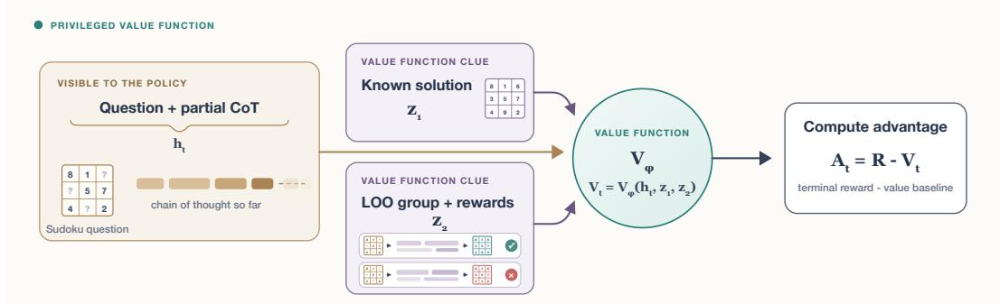  
Figure 1: Privileged value functions. Let $h _ { t }$ be the policy state at time t, here represented as a Sudoku question and an intermediate chain of thought. To improve value estimation, a Privileged Value Function (PVF) additionally uses context clues unavailable to the policy, such as a known reference solution $z _ { 1 }$ or leave-one-out group trajectories with rewards $z _ { 2 }$ . In this illustrative figure the value function conditions on both, producing the baseline $V _ { t } = V _ { \phi } \left( h _ { t } , z _ { 1 } , z _ { 2 } \right)$ and unbiased policy advantage $A _ { t } = R - V _ { t }$

Our proposed strategy is to exploit an underexplored feature of value functions: their ability to leverage information unavailable to the policy (including group info). We introduce two methods to construct stronger value-based advantages, and demonstrate improved RL training across several reasoning-heavy tasks.

## OUR CONTRIBUTIONS

## 1. Privileged value functions

Section 3

Value functions can condition on more than the current LLM state. We introduce Privileged Value Functions (PVFs), which use additional information hidden from the policy to improve value estimation and, in turn, policy optimization.

## 2. Adaptive group–value baselines

Section 5

Value baselines can fail when the critic is poorly fitted, while the group baseline remains reliable but lacks token-level credit. We introduce TETHER, which adaptively combines the group and value baselines and smoothly interpolates between their complementary strengths.

## 2 RL preliminaries

This section briefly introduces the necessary preliminaries for LLM RL and reviews value function concepts relevant to our discussion.

## 2.1 LLM policy gradients

LLM RL algorithms all share the same basic policy gradient loop. At each step, the policy samples one or more responses for a batch of tasks, and each response token is assigned an advantage $\widehat { A } _ { i , t }$ that determines whether its probability should increase or decrease. Algorithms differ primarily in how these advantages are estimated and how the resulting policy update is stabilized.

Let a rollout batch contain B sampled responses $\tau _ { i } = ( y _ { i , 1 } , \dots , y _ { i , T _ { i } } )$ to prompts $x _ { i } ,$ with $h _ { i , t } = ( x _ { i } , y _ { i , < t } )$ being the LLM context for response i at timestep t. The generic token-normalized policy-gradient

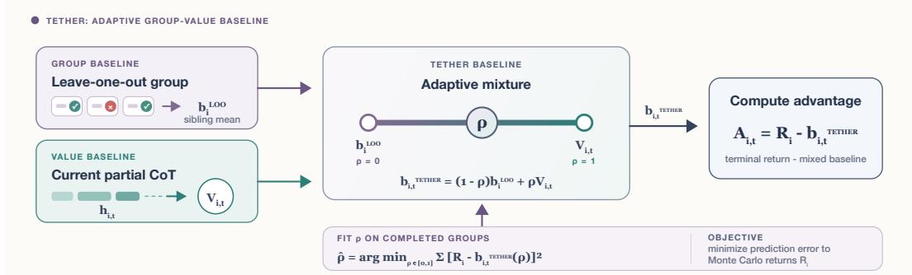  
Figure 2: TETHER: adaptively combining group and value baselines. Our other contribution is a baseline that combines group Leave-One-Out mean and token level values through simple linear combination using an adaptive mixture ratio. The coefficient $\rho$ is fit to minimize Monte Carlo return prediction error. $\rho = 0$ recovers the group baseline, $\rho = 1$ recovers the value function baseline, and intermediate values smoothly interpolate between the two endpoints.

estimator can be written as

$$
\widehat { \nabla _ { \theta } J } = \frac { 1 } { \sum _ { i = 1 } ^ { B } T _ { i } } \sum _ { i = 1 } ^ { B } \sum _ { t = 1 } ^ { T _ { i } } w _ { i , t } \widehat { A } _ { i , t } \nabla _ { \theta } \log \pi _ { \theta } ( y _ { i , t } \mid h _ { i , t } ) ,\tag{1}
$$

where $\widehat { A } _ { i , t }$ is the advantage assigned to token $y _ { i , t }$ . In this form, advantages do not propagate gradients back to the policy and are fixed multipliers. The stability weights $w _ { i , t }$ are effective multipliers induced by the specific policy-optimization rule, including standardization, importance ratios, clipping, or masking [MiniMax, 2025, Roux et al., 2025]. There can be additional terms contributing to the gradient, like KL regularization, which we omit here for simplicity.

Value functions do not change the policy gradient structure and determine only how the advantages $\hat { A _ { i , t } }$ are constructed. PPO estimates token-level advantages using a learned value function, typically through Generalized Advantage Estimation (GAE) [Schulman et al., 2015, 2017]. GRPO instead estimates advantages by comparing rewards across multiple responses sampled for the same prompt [Shao et al., 2024]. The following subsections describe these group-relative and value-based advantage estimators.

## 2.2 Group-relative baselines

Group-relative methods estimate prompt difficulty from several responses to the same prompt. For a response τi with scalar return $R _ { i } ,$ advantages are computed using the prompt-specific baseline $b _ { i } \mathrm { : }$

$$
A _ { i } = R _ { i } - b _ { i } .\tag{2}
$$

GRPO [Shao et al., 2024] estimates $b _ { i }$ with the mean return of a group of K responses, thus centering the advantages. The original formulation also normalizes the advantages, a stability detail we ignore for now:

$$
\bar { R } = \frac 1 K \sum _ { j = 1 } ^ { K } R _ { j } , \qquad A _ { i } ^ { \mathrm { G R P O } } = R _ { i } - \bar { R } .\tag{3}
$$

Responses with return above the mean are pushed up and those below pushed down. The advantages are sequence-level, so $A _ { i }$ is repeated across every token in sequence τi. A sequence’s own return $R _ { i }$ is used to compute R¯, technically leading to a biased estimator. RLOO [Ahmadian et al., 2024] removes this dependence by forming a leave-one-out baseline from the K − 1 sibling returns:

$$
b _ { i } ^ { \mathrm { L O O } } = \frac { 1 } { K - 1 } \sum _ { j \neq i } R _ { j } , \qquad A _ { i } ^ { \mathrm { L O O } } = R _ { i } - b _ { i } ^ { \mathrm { L O O } } .\tag{4}
$$

A baseline preserves an unbiased policy gradient when its contribution to the expected score is zero. For a baseline $b ( h _ { i , t } , z _ { i , t } )$ , a sufficient (not necessary) condition is that the auxiliary information $z _ { i , t }$ is conditionally independent of the current token given its history:

$$
\mathbb { E } [ b ( h _ { i , t } , z _ { i , t } ) \nabla _ { \theta } \log \pi _ { \theta } ( y _ { i , t } \mid h _ { i , t } ) \mid h _ { i , t } ] = 0 , \qquad z _ { i , t } \ \bot \ y _ { i , t } \ | \ h _ { i , t } .\tag{5}
$$

The conditioning $z _ { i , t }$ cannot contain future tokens, realized rewards, or later environment or verifier feedback generated by trajectory i, since these can depend on $y _ { i , t }$ given its history. This condition will be revisited when we discuss PVFs in Section 3. Unbiasedness is typically desirable but the GRPO baseline bias is luckily not too problematic since the GRPO and RLOO advantages differ only by constant rescaling:

$$
A _ { i } ^ { \mathrm { G R P O } } = \frac { K - 1 } { K } A _ { i } ^ { \mathrm { L O O } } .\tag{6}
$$

## 2.3 Value functions and value baselines

Value functions predict the expected return of sequences sampled by the policy π following the token history:

$$
V ^ { \pi } ( h _ { i , t } ) = \mathbb { E } _ { \tau \sim \pi } [ R _ { i } \mid h _ { i , t } ] .\tag{7}
$$

The value of the task prompt $V ^ { \pi } ( x _ { i } )$ equals the expected LOO baseline (Equation 4). At later prefixes, it tracks how the expected reward changes as tokens are generated. A value function can therefore provide token-level credit, and also operate without rollout groups $K = 1$

For simplicity, we focus on the setting where each sequence receives a single terminal reward $R _ { i }$ We also assume undiscounted returns $( \gamma = 1 )$ . The simplest Monte-Carlo (MC) setting trains the value function conditioned on every prefix to predict the corresponding sequence reward. Unbiased advantages can then be computed using this value function as the token-level baseline.

$$
\mathcal { L } _ { V } ( \phi ) = \sum _ { i , t } \left( V _ { \phi } \left( h _ { i , t } \right) - R _ { i } \right) ^ { 2 } , \qquad \widehat { A } _ { i , t } = R _ { i } - V _ { \phi } \left( h _ { i , t } \right) .\tag{8}
$$

This Monte Carlo target is an unbiased sample of the conditional expectation defining $V ^ { \pi }$ , although it may suffer from high variance. An imperfectly trained value baseline still yields an unbiased policy gradient but may yield noisier gradients.

Generalizing this, Equation 8 is the $\lambda = 1$ endpoint of the broader temporal-difference (TD) and generalized advantage estimation (GAE) framework [Schulman et al., 2015]. For general intermediate rewards ${ \boldsymbol { r } } _ { i , t }$ (which is 0 in our case except at the terminal step) and discount $\gamma ,$ the one-step TD residual is

$$
\delta _ { i , t } = r _ { i , t } + \gamma V ( h _ { i , t + 1 } ) - V ( h _ { i , t } ) .\tag{9}
$$

It measures the difference between the current prediction and the value function that observes one extra step before bootstrapping from that step. The λ-return mixes such targets over longer horizons:

$$
R _ { i , t } ^ { \lambda } = V ( h _ { i , t } ) + \sum _ { l \geq 0 } ( \gamma \lambda ) ^ { l } \delta _ { i , t + l } .\tag{10}
$$

$\lambda = 0$ is the one-step bootstrap target $r _ { i , t } + \gamma V ( h _ { i , t + 1 } )$ . Increasing λ incorporates more observed rewards before bootstrapping, and at $\lambda = 1$ the residuals telescope to the unbiased MC return. In general, increasing λ reduces bias at the cost of variance. GAE constructs the corresponding policy advantage from these residuals:

$$
\widehat { A } _ { i , t } ^ { \lambda } = \sum _ { l \geq 0 } ( \gamma \lambda ) ^ { l } \delta _ { i , t + l } = R _ { i , t } ^ { \lambda } - V ( h _ { i , t } ) .\tag{11}
$$

Lower λ relies more strongly on the critic, and with LLM RL should generally be avoided since this introduces training bias. The critic training target and policy advantage may use separate coefficients, denoted $\lambda _ { \mathrm { t a r g e t } }$ and $\lambda _ { \mathrm { G A E } }$ [Yue et al., 2025]. In our experiments, we always set $\lambda _ { \mathrm { t a r g e t } } = \lambda _ { \mathrm { G A E } } = 1 . 0$ i.e., advantages yield unbiased policy gradients, and value models are trained with MC targets.

## 3 Privileged value functions

It is common to have privileged information during RL which the policy cannot directly condition on, but would provide useful training signal if it could somehow be injected during training. This information could be oracle answers, verifier rubrics, latent environment states, or even the other leave-one-out responses and corresponding rewards from the task group. We propose a general mechanism for incorporating such privileged information into policy training without altering the policy-gradient objective.

The key idea is to route this information through the value function. A privileged value function (PVF) conditions the critic on both the standard policy token history and additional training-time context. Critic access to appropriate privileged information helps it predict the return, which then improves value estimation thereby reducing policy gradient variance. In this section, we formalize the method, describe how to practically instantiate it across some standard LLM task types, and in Section 4 empirically demonstrate that training with PVFs consistently improves policy performance.

## 3.1 Privileged information as a critic input

Conditioning on privileged information should improve the critic’s predictive performance without changing its functional role. Let $z _ { i , t }$ denote privileged context available when scoring token t. We define

$$
V ^ { \pi } ( h _ { i , t } , \boldsymbol { z } _ { i , t } ) : = \mathbb { E } _ { \tau _ { i } \sim \pi } [ R _ { i } \mid h _ { i , t } , \boldsymbol { z } _ { i , t } ] , \qquad \widehat { A } _ { i , t } ^ { \mathrm { P V F } } = R _ { i } - V _ { \phi } ( h _ { i , t } , \boldsymbol { z } _ { i , t } ) ,\tag{12}
$$

where $V _ { \phi }$ is the PVF approximating $V ^ { \pi }$ . The policy gradient estimator using $\widehat { A } _ { i , t } ^ { \mathrm { P V F } }$ remains unbiased when the privileged context satisfies the baseline admissibility condition in Equation 5. For example, a fixed reference answer is allowed privileged information, whereas future tokens, realized rewards, or subsequent environment or verifier feedback generated by the current response are not. More informative conditioning in general produces a better baseline through variance reduction since

$$
\begin{array} { r } { \mathbb { E } \left[ \left( R _ { i } - \mathbb { E } [ R _ { i } \mid h _ { i , t } , z _ { i , t } ] \right) ^ { 2 } \right] \leq \mathbb { E } \left[ \left( R _ { i } - \mathbb { E } [ R _ { i } \mid h _ { i , t } ] \right) ^ { 2 } \right] . } \end{array}\tag{13}
$$

It is important to note the guarantee in Equation 13 concerns an optimal predictor, while the model $V _ { \phi }$ may benefit only if it can learn to use the additional information. For example, adding too much extra context to the PVF may degrade performance even if the information should be helpful in theory. On the other hand, additional context can practically help even when already recoverable in principle from the policy context (no information gain), if it’s in a form easier for the value model to represent.

Finally, we note that our work is not the first to observe that value functions can be conditioned on privileged information. This idea has been investigated before in the context of asymmetric actor–critic algorithms applied to simulated robotics control, which we credit in Appendix A. Our contribution is applying the idea to value function learning for LLM policy gradients.

## 3.2 Available forms of privileged information

The specific form of available privileged information is very task dependent and should be thought about carefully for every environment. An important high level question to consider is if the information could help predict the future return of a partial trajectory, simplifying the value model’s job. We consider some important cases:

Reference solutions. Reference solutions provide particularly useful privileged context for a value function, since they reduce the prediction problem to assessing whether the current partial trajectory is progressing toward a known correct end state. Examples include oracle answers, proof sketches for mathematical problems, and gold patches for code-repair tasks.

Leave-One-Out group. Other group responses provide a generically available source of privileged information, including for tasks without reference solutions. Equation 5 excludes future tokens, rewards, and feedback generated by trajectory $i ,$ but freely permits conditioning on the other K − 1 independently sampled responses and even their rewards. This effectively provides the critic with an aggregation prompt simplifying value prediction to an in-context learning task, a strong inductive bias in prior work [Venkatraman et al., 2026, Singh et al., 2026]. We also observe from this perspective, the LOO baseline in Equation 4 can itself be viewed as a training-free PVF conditioned only on the group rewards:

$$
V _ { \phi } \left( h _ { i , t } , \{ R _ { j } \} _ { j \neq i } \right) = \frac { 1 } { K - 1 } \sum _ { j \neq i } R _ { j } .\tag{14}
$$

This insight will later motivate TETHER (Section 5), which combines the complementary benefits of LOO and learned value-function baselines.

Miscellaneous. A PVF can also condition on verifier rubrics or other detailed task specifications unavailable to the policy. Future work could explore reasoning value functions that generate a chain of thought before predicting the value. Their additional inference-time compute could enable richer forms of privileged context, such as access to tools unavailable to the policy itself.

## 3.3 Relation to self-distillation

On-policy self-distillation methods similarly exploit privileged training-time information to provide dense token-level supervision rather than rely on sparse terminal rewards [Hübotter et al., 2026, Zhao et al., 2026]. For example, SDPO conditions the current model on retrospective environment feedback to generate the teacher distribution, and trains the student to match this teacher. Self-distillation introduces a new distribution-matching objective, typically through a token-level reverse KL term toward the conditional teacher policy, and therefore changes the policy optimum. This requires careful control over the information exposed to the teacher. If the teacher relies too strongly on privileged context, it may assign high probability mass to reasoning that the student cannot reproduce from its own observations. The teacher distribution can also become overly concentrated or simply drift too far from the student, making optimization unstable. Several prior self-distillation methods have studied additional stabilization mechanisms, information control and careful hyperparameter tuning to match GRPO baselines [Penaloza et al., 2026, Xu et al., 2026, Zhu et al., 2026].

A PVF by contrast, uses privileged information only to condition the value model which is an auxiliary tool for optimization. Under the admissibility condition in Equation 5 and GAE $\lambda _ { \mathrm { G A E } } = 1 . 0$ , it can improve gradient variance without changing its expectation or the optimal policy under the original RL objective. Even with $\lambda < 1$ a perfectly fit value function maintains an unbiased policy gradient. In practice, this makes privileged information considerably easier to incorporate and tune with PVFs. One tradeoff is that PVFs cannot incorporate feedback produced from the completed response itself. Self-distillation does not share this restriction and can directly exploit retrospective critiques, verifier feedback, or other signals that depend on future states from the trajectory.

## 4 Privileged value function experiments

## 4.1 Experimental setup

We compare three baselines. MEAN is the group-mean GRPO baseline from Equation 3; VF is the ordinary token-level value baseline from Equation 8; and PVF uses the same value training configuration as VF, but conditions on task-specific privileged context as in Equation 12. Both value-based methods use Monte Carlo targets and advantages, with $\lambda _ { \mathrm { t a r g e t } } = \lambda _ { \mathrm { G A E } } = 1$ . Within each environment, policy training settings are matched across baselines, and all runs use Qwen3-4B-Instruct-2507 [Qwen Team, 2025]. Value functions are trained with the asynchronous infrastructure described in Appendix B. Experiment settings are detailed in Appendix D.

Tasks. We launch four experiments across three environments:

• Reasoning Gym [Stojanovski et al., 2025]: a weighted mixture of procedural, single-turn reasoning tasks from the Reasoning Gym suite. The PVF receives the ground-truth answer. We evaluate both the no-group setting $\dot { K } = 1$ and a grouped setting with $K = 8$ . We set batch size as 128 and total sequence length as 8192 (prompt + response).

• CodeIO [Li et al., 2025]: a single-turn program-reasoning task in which the policy predicts an output from an input, or a feasible input from an output. We test Leave-One-Out group info for this task, the PVF receives the other $K - 1 = 3$ responses in the rollout group and their returns. We set batch size as 128 and response length 8192.

• Sudoku: it is set up as a multi-turn environment where the policy reasons and fills one missing grid cell per turn. The PVF receives the complete solved grid, while the policy observes only the standard interaction. The batch size is 64, total response length is 32768, and group size $K = 4$

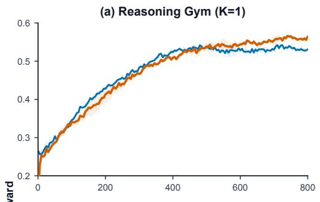  
(c) CodeIO (K=4)

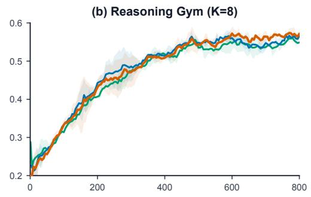  
(d) Sudoku (K=4)

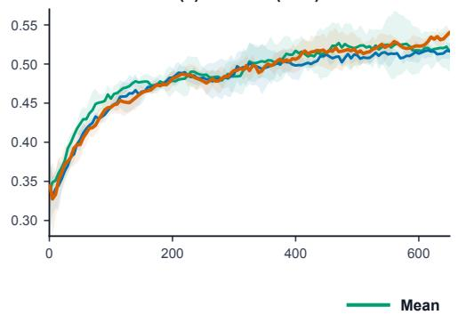

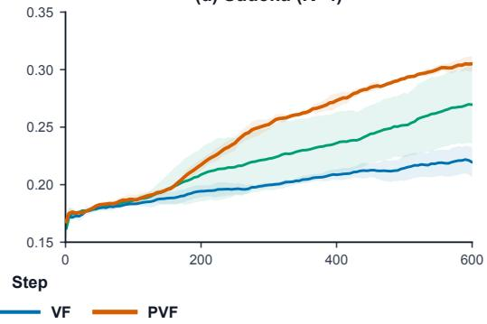  
Figure 3: RL with privileged value functions. Seed-averaged training reward curves (EMA smoothed); shaded regions denote one standard deviation across seeds. 2 seeds for RG runs and 3 seeds for CodeIO and Sudoku. We compare the group-mean (MEAN), ordinary value function (VF), and privileged value function (PVF) baselines. K is the rollout group size. The no-group K = 1 RG setting skips mean baseline. In RG and Sudoku, the privileged critic receives the ground-truth answer. In CodeIO, it receives the other $K - 1 = 3$ leave-one-out responses from the group and their rewards. PVF is the best performing method in all settings. Figure 7 summarizes end-of-training rewards.

## 4.2 Results

Figure 3 and Figure 7 show that privileged conditioning improves the value baseline across all four tasks, although the gains vary substantially. Since these experiments use Monte Carlo advantages, we highlight that the privileged signal affects policy learning only through baseline variance reduction.

In Reasoning Gym, VF and PVF improve at similar rates through much of training in the $K = 1$ comparison, but VF plateaus earlier. The improvement is smaller but still present at $K = 8 ,$ , and both value baselines beat MEAN in this task. The CodeIO result is notable because the PVF uses no taskspecific information, conditioning instead on other responses in the rollout group and their returns. While VF slightly underperforms MEAN, PVF surpasses both baselines, with its gap widening over the course of training. We see the largest improvement from privileged conditioning in Sudoku, which we hypothesize is partly due to the long, multi-turn horizon. Evaluating an intermediate move requires knowing whether the partial grid is compatible with a globally consistent solution. An ordinary value function must infer this implicitly, effectively solving much of the puzzle as part of value prediction. Access to the solved grid removes this latent inference problem and greatly simplifies the critic’s task.

## 4.3 PVF better explains return variance

Explained variance (EV) measures how much of the observed variation in rewards is captured by the value predictions. For each value batch B, we compute

$$
\widehat { \mathrm { E V } } = 1 - \frac { \operatorname { V a r } _ { \mathcal { B } } ( R _ { i } - \widehat { V } _ { i , t } ) } { \operatorname { V a r } _ { \mathcal { B } } ( R _ { i } ) } .
$$

A value of one indicates perfect prediction, while zero means that the critic explains no more return variance than a constant baseline. With $\lambda _ { \mathrm { G A E } } = 1 , R _ { i } - \widehat { V } _ { i , t }$ is the policy advantage, so EV is a direct measure of the advantage variance reduction provided by the critic. Figure 4 shows that PVF explains more return variance than $\mathrm { V F }$ in every environment. The EV improvement is correlated with the final reward gaps in Figure 7: the explained-variance gap is smallest for Reasoning Gym at $K = 8$ , where the reward difference is also smallest, and largest for Sudoku, where privileged conditioning produces the largest reward improvement.

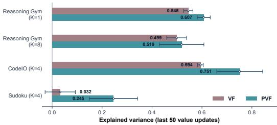  
Figure 4: Explained variance of $\mathrm { V F }$ and ${ \mathrm { P V F } } ,$ averaged across seeds and the final 50 value batches. Error bars show one standard deviation across seed means.

## 4.4 Effect of group size on variance reduction

Our experiments use relatively small group sizes, $K \in \{ 4 , 8 \}$ accounting for our smaller batch sizes of 64 and 128. This raises a natural question: would substantially larger groups preferentially improve MEAN relative to value function baselines? We reason why this likely would not be the case, but we welcome future work to investigate this. Increasing K reduces variance through two distinct mechanisms, only one of which is specific to MEAN. First, a larger group provides a more accurate estimate of the prompt-level baseline. For binary rewards with task success probability $p ,$ the variance of the LOO mean estimator is $p ( 1 - p ) / ( K - \dot { 1 } )$ ), arising purely from Bernoulli sampling noise. Even in the maximum variance case of $p = 0 . 5$ , doubling K from 8 to 16 only reduces the standard baseline error from 0.19 to 0.13, while halving the number of unique tasks represented in a batch. Moreover, improving the prompt-level baseline may not reduce variance beyond the first token.

The second effect of increasing K is obtaining more trajectories for each task and averaging their policy gradient contributions. This can continue to reduce within-task gradient variance even after baseline error is minimized, but it is not specific to MEAN since value function methods using task groups (like in our experiments) receive the same benefit. The more critical limitation of value functions arises when the critic is poorly trained. In the next section, we discuss a baseline that adaptively trades off the benefits of value and mean baselines.

## 5 TETHER: A group-aware value baseline

Value baselines only reduce variance better than the group mean when the critic is fit well. This can especially be problematic early in training when the value function has seen little data, assuming no extensive value pretraining phase. We might therefore like the baseline to begin near the group mean and move toward token-level values as the critic improves during the course of RL. In doing so, we would also like to avoid any task specific hyperparameter tuning to manage this transition. We propose TETHER, a mixture baseline which auto-interpolates between the mean and value baselines.

## 5.1 Interpolating group and value baselines

TETHER is an adaptive linear combination of the mean and value baselines. Let $V _ { i , t } = V _ { \phi } \left( h _ { i , t } \right)$ be the learned token value and let $b _ { i } ^ { \mathrm { L o o } }$ be the leave-one-out group baseline from Equation 4. We define

$$
b _ { i , t } ^ { \mathrm { T E T H E R } } = ( 1 - \rho ) b _ { i } ^ { \mathrm { L O o } } + \rho V _ { i , t } , \qquad A _ { i , t } ^ { \mathrm { T E T H E R } } = R _ { i } - b _ { i , t } ^ { \mathrm { T E T H E R } } .\tag{15}
$$

At $\rho = 0 ;$ , TETHER recovers the leave-one-out group advantage; at $\rho = 1$ , it recovers the token-level value advantage. Intermediate values of $\rho$ add token-level variation from the critic while dampening its prediction errors with the group component.

A fixed $\rho$ assumes that the relative quality of the two estimates remains stable. In practice, the value function usually improves as it receives more updates, but can also temporarily fall behind a shifting policy. We therefore fit the mixture $b ^ { \mathrm { T E T H E R } } ( \overset { \cdot } { \rho } )$ in the same way as a value function: choose the mixture ratio which best predicts the observed return-to-go. With terminal returns the target for every token prefix is simply $R _ { i }$ . Let $\mathcal { B } _ { k }$ denote the current batch and $\rho _ { k - 1 }$ the smoothed coefficient available at the start of the step. A batch never uses a mixture coefficient fitted on its own returns. We first compute and freeze the advantages used for policy training with $\mathcal { B } _ { k }$ using $\rho _ { k - 1 }$ . Only afterward do we use the returns in $\mathcal { B } _ { k }$ to fit

$$
\widehat { \rho } _ { k } = \mathop { \arg \operatorname* { m i n } } _ { \rho } \sum _ { ( i , t ) \in \mathcal { B } _ { k } } \left( R _ { i } - b _ { i , t } ^ { \mathrm { T E T H E R } } ( \rho ) \right) ^ { 2 } ,\tag{16}
$$

The resulting batch estimate $\widehat { \rho } _ { k }$ is a measure of how much the learned value improves return prediction over the group baseline. The least squares optimization is very computationally cheap and can be easily done every step. Since the minimizer of any finite batch is noisy, we further reduce variance by EMA smoothing successive estimates,

$$
\begin{array} { r } { \rho _ { k } = d \rho _ { k - 1 } + ( 1 - d ) \widehat { \rho } _ { k } , } \end{array}\tag{17}
$$

where $d$ is the EMA decay. We emphasize again that the updated coefficient $\rho _ { k }$ is used to compute advantages for the next batch, $\mathcal { B } _ { k + 1 }$ and not $\mathcal { B } _ { k }$ . Not doing so would make the baseline for $\mathcal { B } _ { k }$ depend on its own trajectory returns, violating the condition in Equation 5 and biasing the policy gradient. Initializing training with $\rho = 0$ starts from the group baseline, and with good value training we should expect the coefficient to move towards $\rho = 1$ as the critic accuracy improves. Appendix $\check { \mathrm { C } }$ provides additional statistical analysis of the TETHER baseline.

## 5.2 TETHER as a privileged value function

TETHER can also be viewed as a simple PVF. The sibling returns $\{ R _ { j } \} _ { j \neq i }$ are privileged information for trajectory $i ,$ which the leave-one-out mean reduces into the scalar $b _ { i } ^ { \mathrm { L o o } }$ . Equation 15 then linearly interpolates this group-conditioned estimate and the ordinary token value, with only the mixture coefficient $\rho$ “learned” (least-squares fit) from data. This makes it clear why we need to use the LOO estimate and not full group mean to satisfy the unbiasedness condition in Equation 5.

The leave-one-out PVF used in the CodeIO experiments in Section 4.1 is a more expressive realization of the same idea. It jointly conditions on the current trajectory’s partial chain of thought and the complete LOO group responses and rewards, allowing the critic to flexibly learn which group information is relevant to the current state’s value. TETHER, by contrast, first mean reduces the LOO returns and then combines this scalar with the ordinary token value through linear combination.

## 6 TETHER experiments

## 6.1 Experimental setup

We compare TETHER against the same MEAN and VF baselines used in Section 4. We set EMA decay $d = 0 . 9 5$ . The value-function training configuration is shared between VF and TETHER. The task suite is the same as in Section 4, with two changes: 1) we omit the $K = 1$ Reasoning Gym experiment because TETHER requires group rollouts, 2) we add MiniF2F [Zheng et al., 2022], a multi-turn Lean formal mathematics task. The policy receives compiler feedback after each turn for up to 3 attempts, with up to 4096 generated tokens per attempt. We use Qwen3.5-4B [Qwen Team, 2026] for this task, as Qwen3-4B-Instruct-2507 failed to obtain any training signal. Other tasks use Qwen3-4B-Instruct-2507 as before. Detailed experiment settings in Appendix D.

## 6.2 Results

Figure 5 and Figure 7 show that TETHER consistently outperforms the simple value function baseline $( \mathrm { V F } )$ across all four tasks. Although it does not fully recover the performance of MEAN on Sudoku, it substantially mitigates the degradation suffered by VF. These results support our intuition that TETHER is a reliable way to introduce value functions into GRPO pipelines that already perform well with the standard mean baseline.

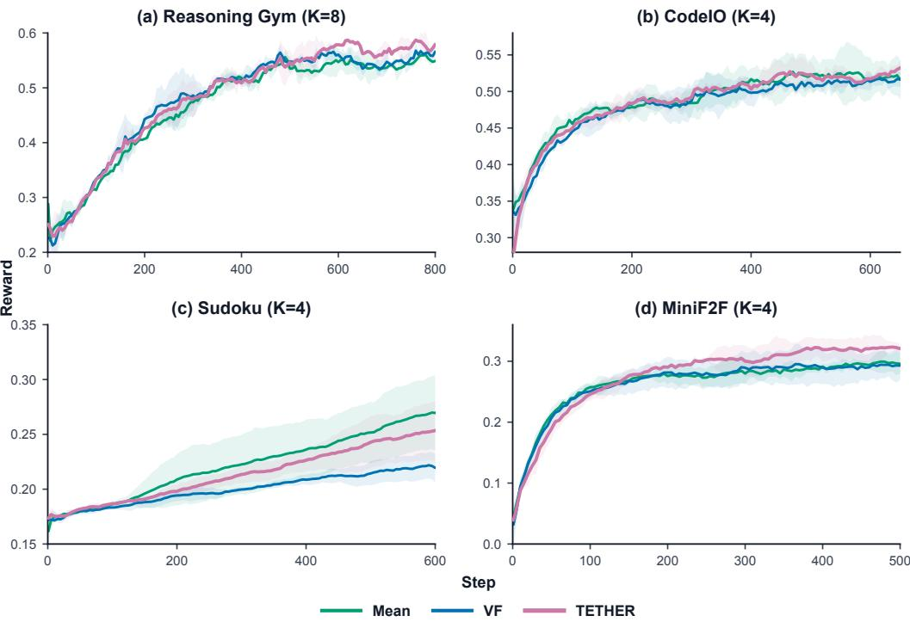  
Figure 5: RL with TETHER baseline. Seed-averaged training reward curves (EMA smoothed); shaded regions denote one standard deviation across seeds. Reasoning Gym uses two seeds, while CodeIO, Sudoku, and MiniF2F use three. We compare the group-mean (MEAN), ordinary valuefunction (VF), and adaptive TETHER baselines. K denotes the rollout group size. TETHER improves over VF in all four settings. TETHER outperforms MEAN in RG and MiniF2F, matches it in CodeIO, and shrinks the gap in Sudoku. Figure 7 summarizes end-of-training rewards.

## 6.3 Adaptive coefficient dynamics

Figure 6 shows how the mixture coefficient $\rho$ evolves during each experiment. All runs begin with $\rho = 0 .$ , so early policy updates favor the LOO baseline. The coefficient then moves away from zero as the critic begins to explain return variance beyond the group mean. Interestingly, the $\rho$ convergence value is strongly taskdependent, and Sudoku converges to the largest value-function mixture weight despite exhibiting the weakest VF baseline performance. We hypothesize that relying exclusively on a poorly fitted value function early in training impedes initial policy learning, producing compounding effects that slow subsequent progress. TETHER mitigates this failure mode by relying on the more dependable group baseline initially.

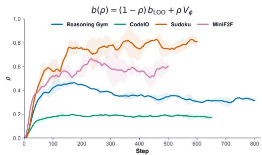  
Figure 6: Seed-averaged TETHER coefficient $\rho ,$ adaptively fit during RL. Values closer to $\rho = 1$ indicate that the value function predicts return-to-go better than the mean baseline.

## 7 Potential value function research for future work

An objective of this paper is to motivate the research community to reconsider the utility of value functions for LLM RL, and in this spirit, we now discuss some promising directions for future work. We believe that the privileged value techniques proposed in this paper, combined with further

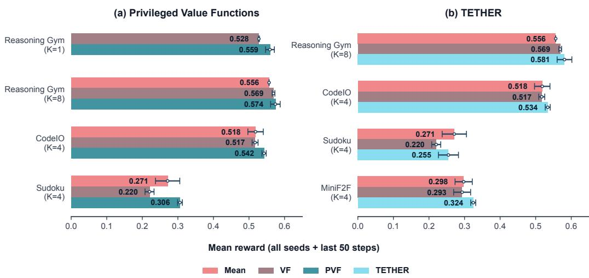  
Figure 7: Aggregated final results. Bars show the mean raw reward over the final 50 policy steps, first averaged within each seed and then across seeds for every run; error bars denote one standard deviation across the per-seed means. This summary helps directly compare training reward differences between methods. Left: PVF experiments. Right: TETHER experiments.

engineering optimization, could make value functions a practical and scalable component of largescale LLM post-training.

## 7.1 Extensive value pretraining from diverse policies

In all our experiments, we initialized the value function as a copy of the base policy with a randomly initialized value head and used only 20 value pretraining steps before starting RL. This was intended to roughly match the number of inference trajectories between the mean and value baseline experiments for a straightforward comparison. Even with this simple init, our experiments show that value functions can outperform the mean baseline when they benefit from useful privileged information. Several prior works have found that value functions benefit significantly from extended pretraining [Yuan et al., 2025, Hou et al., 2026, Yue et al., 2025]. We further posit that it may be beneficial to do value pretraining using data generated by diverse policies rather than only the static base policy. This could improve the value function’s adaptability as the policy shifts during RL and reduce overfitting to the initial policy. This idea has recently been validated by Dong et al. [2026] for non-LLM RL. The pretraining dataset should include samples containing privileged information if we want PVFs. Pretrained value functions could potentially be reused across many RL runs, amortizing training cost.

## 7.2 Tuning λ for bias–variance trade-off

Both $\lambda _ { \mathrm { G A E } }$ and $\lambda _ { \mathrm { t a r g e t } }$ (defined in Section 2.3) are highly sensitive value-function hyperparameters. Figure 8 compares $\mathfrak { I } _ { \mathrm { G A E } } = 1$ and 0.999888 on Reasoning Gym. The latter λ was chosen such that the first token advantage retains approximately 40% of the unbiased terminal signal at 8192 length response, i.e. $\lambda = 0 . 4 ^ { \bar { 1 / 8 1 9 2 } } \approx$ 0.999888. Despite their small magnitude difference, the lower $\lambda _ { \mathrm { G A E } }$ significantly improves both VF and PVF rewards. We still used $\lambda _ { \mathrm { G A E } } = \lambda _ { \mathrm { t a r g e t } } = 1 . 0$ for all our main experiments in Sections 4 and 6 to focus our primary analysis on the unbiased advantage setting. This experiment indicates that coarse λ sweeps can easily miss this narrow but consequential regime near $\lambda = 1$

Several prior studies compare $\lambda = 1$ against substantially smaller values which drown out the terminal reward signal at their sequence lengths [Ahmadian et al., 2024, Kazemnejad et al., 2025, Yuan et al., 2025, Hu et al., 2025]. DeepSeek-R1, generally credited for popularizing critic-free RL, reports a comparison only between 0.95 and 1.0 for long sequence RL [DeepSeek-AI et al., 2025]. Some recent work calibrates λ to the sequence length which we expect to generally work better due to the exponential terminal reward decay [Yue et al., 2025, Hou et al., 2026]. Future work could study $\lambda .$ tuning systematically, including disentangling the effects of $\lambda _ { \mathrm { G A E } }$ and $\lambda _ { \mathrm { t a r g e t } }$ , and exploring techniques for adaptive λ-tuning as a function of critic accuracy.

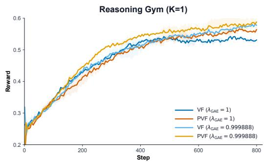  
Figure 8: Policy reward for $\lambda _ { \mathrm { G A E } } \in \{ 0 . 9 9 9 8 8 , 1 . 0 \}$ with ordinary (VF) and privileged (PVF) value functions. Curves are 2-seed-averaged and EMA-smoothed.

## 7.3 Token-bucketed TETHER

In Section 5, we fit a single coefficient ρ to mix the group and value baselines. This assumes that the relative quality of the two baselines is uniform across all token positions in the response, which is not generally true. For example, in Sudoku, value prediction may become substantially easier later in a trajectory. When the grid is nearly filled, the critic only needs validate $\mathbf { i t } ,$ whereas earlier it must implicitly marginalize over many possible completions. A simple heuristic accounting for this is to use different mixing coefficients depending on token position. We can partition response tokens into M buckets (say uniformly binned from 0 to max response length) and then fit a separate coefficient $\rho _ { m }$ for each bucket. If m(t) denotes the bucket containing token position t:

$$
b _ { i , t } ^ { \mathrm { T E T H E R } } = \left( 1 - \rho _ { m ( t ) } \right) b _ { i } ^ { \mathrm { L o o } } + \rho _ { m ( t ) } V _ { i , t } .\tag{18}
$$

Each $\rho _ { m }$ can be fit using the same return prediction objective as Equation 16 restricted to tokens that fall in its bucket, and smoothed with its own EMA. We expect the bucket size would need to be carefully considered, since bucket sizes too small would have fewer token samples to fit $\rho _ { ; }$ , thus making estimation noisier.

## 8 Limitations

Value functions add infra cost. Value function inference and training add accelerator cost to the workload, requiring dedicated GPU allocation. We do not exactly compute-match MEAN and value function baselines in our experiments, instead matching only the number of inference trajectories. However, the VF and PVF settings are exactly matched. Specific compute details are provided in Appendix D. More generally, we would like future work to investigate value function scaling laws, optimizing value function compute allocation at different compute scales, and comparing scaling trends against critic-free baselines.

Small-scale experiments. Our experiments are limited to 4B models, on tasks with maximum response length of 32,000 tokens (Sudoku). We would like to see experiments extended to longhorizon agentic training settings, where we expect the variance reduction provided by value functions to be even more pronounced.

## 9 Conclusion

Value functions have substantial untapped utility for LLM RL. Beyond variance reduction considered in this paper, they could provide non-terminal learning signals for partial trajectories, enabling policy updates before expensive long-horizon episodes have finished sampling. This could be particularly desirable as agents are trained for longer horizon tasks. They may also be used for inference-time scaling. In this work, we improved value functions as control variates by conditioning them on privileged information, offering a reliable alternative to self-distillation. We also introduced the TETHER baseline, which provides a natural interpolation between group-relative and value-based RL and therefore a low-risk path to integrate value functions with existing GRPO infra. We hope these methods motivate further research into effective use of value functions.

## References

Arash Ahmadian, Chris Cremer, Matthias Gallé, Marzieh Fadaee, Julia Kreutzer, Olivier Pietquin, Ahmet Üstün, and Sara Hooker. Back to Basics: Revisiting REINFORCE Style Optimization for Learning from Human Feedback in LLMs, 2024. URL https://arxiv.org/abs/2402.14740.

Yuntao Bai, Andy Jones, Kamal Ndousse, Amanda Askell, Anna Chen, Nova DasSarma, Dawn Drain, Stanislav Fort, Deep Ganguli, Tom Henighan, Nicholas Joseph, Saurav Kadavath, Jackson Kernion, Tom Conerly, Sheer El-Showk, Nelson Elhage, Zac Hatfield-Dodds, Danny Hernandez, Tristan Hume, Scott Johnston, Shauna Kravec, Liane Lovitt, Neel Nanda, Catherine Olsson, Dario Amodei, Tom Brown, Jack Clark, Sam McCandlish, Chris Olah, Ben Mann, and Jared Kaplan. Training a Helpful and Harmless Assistant with Reinforcement Learning from Human Feedback, 2022. URL https://arxiv.org/abs/2204.05862.

Andrea Baisero and Christopher Amato. Unbiased Asymmetric Reinforcement Learning under Partial Observability, 2022. URL https://arxiv.org/abs/2105.11674.

DeepSeek-AI, Daya Guo, Dejian Yang, Haowei Zhang, Junxiao Song, Peiyi Wang, Qihao Zhu, Runxin Xu, Ruoyu Zhang, Shirong Ma, Xiao Bi, Xiaokang Zhang, Xingkai Yu, Yu Wu, Z. F. Wu, Zhibin Gou, Zhihong Shao, Zhuoshu Li, Ziyi Gao, Aixin Liu, Bing Xue, Bingxuan Wang, Bochao Wu, Bei Feng, Chengda Lu, Chenggang Zhao, Chengqi Deng, Chenyu Zhang, Chong Ruan, Damai Dai, Deli Chen, Dongjie Ji, Erhang Li, Fangyun Lin, Fucong Dai, Fuli Luo, Guangbo Hao, Guanting Chen, Guowei Li, H. Zhang, Han Bao, Hanwei Xu, Haocheng Wang, Honghui Ding, Huajian Xin, Huazuo Gao, Hui Qu, Hui Li, Jianzhong Guo, Jiashi Li, Jiawei Wang, Jingchang Chen, Jingyang Yuan, Junjie Qiu, Junlong Li, J. L. Cai, Jiaqi Ni, Jian Liang, Jin Chen, Kai Dong, Kai Hu, Kaige Gao, Kang Guan, Kexin Huang, Kuai Yu, Lean Wang, Lecong Zhang, Liang Zhao, Litong Wang, Liyue Zhang, Lei Xu, Leyi Xia, Mingchuan Zhang, Minghua Zhang, Minghui Tang, Meng Li, Miaojun Wang, Mingming Li, Ning Tian, Panpan Huang, Peng Zhang, Qiancheng Wang, Qinyu Chen, Qiushi Du, Ruiqi Ge, Ruisong Zhang, Ruizhe Pan, Runji Wang, R. J. Chen, R. L. Jin, Ruyi Chen, Shanghao Lu, Shangyan Zhou, Shanhuang Chen, Shengfeng Ye, Shiyu Wang, Shuiping Yu, Shunfeng Zhou, Shuting Pan, S. S. Li, Shuang Zhou, Shaoqing Wu, Shengfeng Ye, Tao Yun, Tian Pei, Tianyu Sun, T. Wang, Wangding Zeng, Wanjia Zhao, Wen Liu, Wenfeng Liang, Wenjun Gao, Wenqin Yu, Wentao Zhang, W. L. Xiao, Wei An, Xiaodong Liu, Xiaohan Wang, Xiaokang Chen, Xiaotao Nie, Xin Cheng, Xin Liu, Xin Xie, Xingchao Liu, Xinyu Yang, Xinyuan Li, Xuecheng Su, Xuheng Lin, X. Q. Li, Xiangyue Jin, Xiaojin Shen, Xiaosha Chen, Xiaowen Sun, Xiaoxiang Wang, Xinnan Song, Xinyi Zhou, Xianzu Wang, Xinxia Shan, Y. K. Li, Y. Q. Wang, Y. X. Wei, Yang Zhang, Yanhong Xu, Yao Li, Yao Zhao, Yaofeng Sun, Yaohui Wang, Yi Yu, Yichao Zhang, Yifan Shi, Yiliang Xiong, Ying He, Yishi Piao, Yisong Wang, Yixuan Tan, Yiyang Ma, Yiyuan Liu, Yongqiang Guo, Yuan Ou, Yuduan Wang, Yue Gong, Yuheng Zou, Yujia He, Yunfan Xiong, Yuxiang Luo, Yuxiang You, Yuxuan Liu, Yuyang Zhou, Y. X. Zhu, Yanhong Xu, Yanping Huang, Yaohui Li, Yi Zheng, Yuchen Zhu, Yunxian Ma, Ying Tang, Yukun Zha, Yuting Yan, Z. Z. Ren, Zehui Ren, Zhangli Sha, Zhe Fu, Zhean Xu, Zhenda Xie, Zhengyan Zhang, Zhewen Hao, Zhicheng Ma, Zhigang Yan, Zhiyu Wu, Zihui Gu, Zijia Zhu, Zijun Liu, Zilin Li, Ziwei Xie, Ziyang Song, Zizheng Pan, Zhen Huang, Zhipeng Xu, Zhongyu Zhang, and Zhen Zhang. DeepSeek-R1: Incentivizing Reasoning Capability in LLMs via Reinforcement Learning, 2025. URL https://arxiv.org/abs/2501.12948.

Perry Dong, Ron Polonsky, Dorsa Sadigh, and Chelsea Finn. Do you really need to pretrain qfunctions for online rl fine-tuning?, 2026. URL https://arxiv.org/abs/2607.27203.

Jesse Farebrother, Jordi Orbay, Quan Vuong, Adrien Ali Taïga, Yevgen Chebotar, Ted Xiao, Alex Irpan, Sergey Levine, Pablo Samuel Castro, Aleksandra Faust, Aviral Kumar, and Rishabh Agarwal. Stop Regressing: Training Value Functions via Classification for Scalable Deep RL, 2024. URL https://arxiv.org/abs/2403.03950.

Tuomas Haarnoja, Aurick Zhou, Pieter Abbeel, and Sergey Levine. Soft actor-critic: Off-policy maximum entropy deep reinforcement learning with a stochastic actor. In Proceedings of the 35th International Conference on Machine Learning, volume 80 of Proceedings ofMachine Learning Research, pages 1861–1870. PMLR, 2018.

Zhenyu Hou, Yujiang Li, Jie Tang, and Yuxiao Dong. Single-Rollout Asynchronous Optimization for Agentic Reinforcement Learning, 2026. URL https://arxiv.org/abs/2607.07508.

Edward S. Hu, James Springer, Oleh Rybkin, and Dinesh Jayaraman. Privileged sensing scaffolds reinforcement learning, 2024. URL https://arxiv.org/abs/2405.14853.

Jingcheng Hu, Yinmin Zhang, Qi Han, Daxin Jiang, Xiangyu Zhang, and Heung-Yeung Shum. Open-reasoner-zero: An open source approach to scaling up reinforcement learning on the base model. In The Thirty-ninth Annual Conference on Neural Information Processing Systems, 2025. URL https://openreview.net/forum?id=NFM8F5cV0V.

Jonas Hübotter, Frederike Lübeck, Lejs Behric, Anton Baumann, Marco Bagatella, Daniel Marta, Ido Hakimi, Idan Shenfeld, Thomas Kleine Buening, Carlos Guestrin, and Andreas Krause. Reinforcement Learning via Self-Distillation, 2026. URL https://arxiv.org/abs/2601. 20802.

Prime Intellect. PRIME-RL, 2025. URL https://github.com/PrimeIntellect-ai/prime-rl. Software.

Amirhossein Kazemnejad, Milad Aghajohari, Eva Portelance, Alessandro Sordoni, Siva Reddy, Aaron Courville, and Nicolas Le Roux. VinePPO: Refining credit assignment in RL training of LLMs. In Forty-second International Conference on Machine Learning, 2025. URL https: //openreview.net/forum?id=Myx2kJFzAn.

Azal Ahmad Khan, Ammar Ahmed, Zeshan Fayyaz, Sheng Di, Mingyi Hong, and Ali Anwar. Faster synchronous on-policy rl via straggler-aware group sizing, 2026. URL https://arxiv.org/ abs/2606.02218.

Junlong Li, Daya Guo, Dejian Yang, Runxin Xu, Yu Wu, and Junxian He. CodeIO: Condensing reasoning patterns via code input-output prediction. In Forty-second International Conference on Machine Learning, 2025. URL https://openreview.net/forum?id=feIaF6vYFl.

Timothy P. Lillicrap, Jonathan J. Hunt, Alexander Pritzel, Nicolas Heess, Tom Erez, Yuval Tassa, David Silver, and Daan Wierstra. Continuous control with deep reinforcement learning. In International Conference on Learning Representations, 2016.

MiniMax. MiniMax-M1: Scaling Test-Time Compute Efficiently with Lightning Attention, 2025. URL https://arxiv.org/abs/2506.13585.

Volodymyr Mnih, Koray Kavukcuoglu, David Silver, Alex Graves, Ioannis Antonoglou, Daan Wierstra, and Martin Riedmiller. Playing atari with deep reinforcement learning. arXiv preprint arXiv:1312.5602, 2013.

Volodymyr Mnih, Koray Kavukcuoglu, David Silver, Andrei A. Rusu, Joel Veness, Marc G. Bellemare, Alex Graves, Martin Riedmiller, Andreas K. Fidjeland, Georg Ostrovski, Stig Petersen, Charles Beattie, Amir Sadik, Ioannis Antonoglou, Helen King, Dharshan Kumaran, Daan Wierstra, Shane Legg, and Demis Hassabis. Human-Level Control through Deep Reinforcement Learning. Nature, 518:529–533, 2015. doi: 10.1038/nature14236.

Volodymyr Mnih, Adrià Puigdomènech Badia, Mehdi Mirza, Alex Graves, Timothy P. Lillicrap, Tim Harley, David Silver, and Koray Kavukcuoglu. Asynchronous Methods for Deep Reinforcement Learning, 2016. URL https://arxiv.org/abs/1602.01783.

Long Ouyang, Jeff Wu, Xu Jiang, Diogo Almeida, Carroll L. Wainwright, Pamela Mishkin, Chong Zhang, Sandhini Agarwal, Katarina Slama, Alex Ray, John Schulman, Jacob Hilton, Fraser Kelton, Luke Miller, Maddie Simens, Amanda Askell, Peter Welinder, Paul Christiano, Jan Leike, and Ryan Lowe. Training language models to follow instructions with human feedback, 2022. URL https://arxiv.org/abs/2203.02155.

Chengjun Pan, Shichun Liu, Jiahang Lin, Dingwei Zhu, Jiazheng Zhang, Shihan Dou, Songyang Gao, Zhenhua Han, Binghai Wang, Rui Zheng, Xuanjing Huang, Tao Gui, and Yansong Feng. EVPO: Explained Variance Policy Optimization for Adaptive Critic Utilization in LLM Post-Training, 2026. URL https://arxiv.org/abs/2604.19485.

Emiliano Penaloza, Dheeraj Vattikonda, Nicolas Gontier, Alexandre Lacoste, Laurent Charlin, and Massimo Caccia. Privileged information distillation for language models, 2026. URL https://arxiv.org/abs/2602.04942.

Lerrel Pinto, Marcin Andrychowicz, Peter Welinder, Wojciech Zaremba, and Pieter Abbeel. Asymmetric Actor Critic for Image-Based Robot Learning, 2017. URL https://arxiv.org/abs/ 1710.06542.

Qwen Team. Qwen3 technical report, 2025. URL https://arxiv.org/abs/2505.09388.

Qwen Team. Qwen3.5: Towards native multimodal agents, February 2026. URL https://qwen. ai/blog?id=qwen3.5.

Rafael Rafailov, Archit Sharma, Eric Mitchell, Stefano Ermon, Christopher D. Manning, and Chelsea Finn. Direct Preference Optimization: Your Language Model is Secretly a Reward Model, 2023. URL https://arxiv.org/abs/2305.18290.

Nicolas Le Roux, Marc G Bellemare, Jonathan Lebensold, Arnaud Bergeron, Joshua Greaves, Alexandre Fréchette, Carolyne Pelletier, Eric Thibodeau-Laufer, Sándor Tóth, and Sam Work. Tapered off-policy REINFORCE - stable and efficient reinforcement learning for large language models. In The Thirty-ninth Annual Conference on Neural Information Processing Systems, 2025. URL https://openreview.net/forum?id=gFFgCWiXWI.

John Schulman, Philipp Moritz, Sergey Levine, Michael Jordan, and Pieter Abbeel. High-Dimensional Continuous Control Using Generalized Advantage Estimation, 2015. URL https://arxiv.org/ abs/1506.02438.

John Schulman, Filip Wolski, Prafulla Dhariwal, Alec Radford, and Oleg Klimov. Proximal Policy Optimization Algorithms, 2017. URL https://arxiv.org/abs/1707.06347.

Zhihong Shao, Peiyi Wang, Qihao Zhu, Runxin Xu, Junxiao Song, Xiao Bi, Haowei Zhang, Mingchuan Zhang, Y. K. Li, Y. Wu, and Daya Guo. DeepSeekMath: Pushing the Limits of Mathematical Reasoning in Open Language Models, 2024. URL https://arxiv.org/abs/ 2402.03300.

David Silver, Aja Huang, Chris J. Maddison, Arthur Guez, Laurent Sifre, George van den Driessche, Julian Schrittwieser, Ioannis Antonoglou, Veda Panneershelvam, Marc Lanctot, Sander Dieleman, Dominik Grewe, John Nham, Nal Kalchbrenner, Ilya Sutskever, Timothy Lillicrap, Madeleine Leach, Koray Kavukcuoglu, Thore Graepel, and Demis Hassabis. Mastering the Game of Go with Deep Neural Networks and Tree Search. Nature, 529:484–489, 2016. doi: 10.1038/nature16961.

David Silver, Thomas Hubert, Julian Schrittwieser, Ioannis Antonoglou, Matthew Lai, Arthur Guez, Marc Lanctot, Laurent Sifre, Dharshan Kumaran, Thore Graepel, et al. Mastering chess and shogi by self-play with a general reinforcement learning algorithm. arXiv preprint arXiv:1712.01815, 2017a.

David Silver, Julian Schrittwieser, Karen Simonyan, Ioannis Antonoglou, Aja Huang, Arthur Guez, Thomas Hubert, Lucas Baker, Matthew Lai, Adrian Bolton, Yutian Chen, Timothy Lillicrap, Fan Hui, Laurent Sifre, George van den Driessche, Thore Graepel, and Demis Hassabis. Mastering the Game of Go without Human Knowledge. Nature, 550:354–359, 2017b. doi: 10.1038/nature24270.

Harman Singh, Xiuyu Li, Kusha Sareen, Monishwaran Maheswaran, Sijun Tan, Xiaoxia Wu, Junxiong Wang, Alpay Ariyak, Qingyang Wu, Samir Khaki, et al. v\_1: Unifying generation and selfverification for parallel reasoners. arXiv preprint arXiv:2603.04304, 2026.

Nisan Stiennon, Long Ouyang, Jeffrey Wu, Daniel M. Ziegler, Ryan Lowe, Chelsea Voss, Alec Radford, Dario Amodei, and Paul Christiano. Learning to Summarize from Human Feedback, 2020. URL https://arxiv.org/abs/2009.01325.

Zafir Stojanovski, Oliver Stanley, Joe Sharratt, Richard Jones, Abdulhakeem Adefioye, Jean Kaddour, and Andreas Köpf. Reasoning gym: Reasoning environments for reinforcement learning with verifiable rewards, 2025. URL https://arxiv.org/abs/2505.24760.

Richard S Sutton and Andrew G Barto. Reinforcement learning: an introduction. The MIT Press, 2018.

Hugo Touvron, Louis Martin, Kevin Stone, Peter Albert, Amjad Almahairi, Yasmine Babaei, Nikolay Bashlykov, Soumya Batra, Prajjwal Bhargava, Shruti Bhosale, Dan Bikel, Lukas Blecher, Cristian Canton Ferrer, Moya Chen, Guillem Cucurull, David Esiobu, Jude Fernandes, Jeremy Fu, Wenyin Fu, Brian Fuller, Cynthia Gao, Vedanuj Goswami, Naman Goyal, Anthony Hartshorn, Saghar Hosseini, Rui Hou, Hakan Inan, Marcin Kardas, Viktor Kerkez, Madian Khabsa, Isabel Kloumann, Artem Korenev, Punit Singh Koura, Marie-Anne Lachaux, Thibaut Lavril, Jenya Lee, Diana Liskovich, Yinghai Lu, Yuning Mao, Xavier Martinet, Todor Mihaylov, Pushkar Mishra, Igor Molybog, Yixin Nie, Andrew Poulton, Jeremy Reizenstein, Rashi Rungta, Kalyan Saladi, Alan Schelten, Ruan Silva, Eric Michael Smith, Ranjan Subramanian, Xiaoqing Ellen Tan, Binh Tang, Ross Taylor, Adina Williams, Jian Xiang Kuan, Puxin Xu, Zheng Yan, Iliyan Zarov, Yuchen Zhang, Angela Fan, Melanie Kambadur, Sharan Narang, Aurelien Rodriguez, Robert Stojnic, Sergey Edunov, and Thomas Scialom. Llama 2: Open Foundation and Fine-Tuned Chat Models, 2023. URL https://arxiv.org/abs/2307.09288.

Hado Van Hasselt, Arthur Guez, and David Silver. Deep reinforcement learning with double q-learning. In Proceedings of the Thirtieth AAAI Conference on Artificial Intelligence, pages 2094–2100, 2016.

Siddarth Venkatraman, Vineet Jain, Sarthak Mittal, Vedant Shah, Johan Obando-Ceron, Yoshua Bengio, Brian R. Bartoldson, Bhavya Kailkhura, Guillaume Lajoie, Glen Berseth, Nikolay Malkin, and Moksh Jain. Recursive self-aggregation unlocks deep thinking in large language models, 2026. URL https://arxiv.org/abs/2509.26626.

Jiawei Xu, Minghui Liu, Juzheng Zhang, Tom Goldstein, and Furong Huang. β-opsd: Deriving with policy optimization, training with self-distillation, 2026. URL https://arxiv.org/abs/2607. 28582.

Yufeng Yuan, Yu Yue, Ruofei Zhu, Tiantian Fan, and Lin Yan. What’s Behind PPO’s Collapse in Long-CoT? Value Optimization Holds the Secret, 2025. URL https://arxiv.org/abs/2503.01491.

Yu Yue, Yufeng Yuan, Qiying Yu, Xiaochen Zuo, Ruofei Zhu, Wenyuan Xu, Jiaze Chen, Chengyi Wang, TianTian Fan, Zhengyin Du, Xiangpeng Wei, Xiangyu Yu, Gaohong Liu, Juncai Liu, Lingjun Liu, Haibin Lin, Zhiqi Lin, Bole Ma, Chi Zhang, Mofan Zhang, Wang Zhang, Hang Zhu, Ru Zhang, Xin Liu, Mingxuan Wang, Yonghui Wu, and Lin Yan. VAPO: Efficient and Reliable Reinforcement Learning for Advanced Reasoning Tasks, 2025. URL https://arxiv.org/abs/2504.05118.

Siyan Zhao, Zhihui Xie, Mengchen Liu, Jing Huang, Guan Pang, Feiyu Chen, and Aditya Grover. Self-Distilled Reasoner: On-Policy Self-Distillation for Large Language Models, 2026. URL https://arxiv.org/abs/2601.18734.

Kunhao Zheng, Jesse Michael Han, and Stanislas Polu. Minif2f: a cross-system benchmark for formal olympiad-level mathematics, 2022. URL https://arxiv.org/abs/2109.00110.

Yifei Zhou, Song Jiang, Yuandong Tian, Jason Weston, Sergey Levine, Sainbayar Sukhbaatar, and Xian Li. SWEET-RL: Training Multi-Turn LLM Agents on Collaborative Reasoning Tasks, 2025. URL https://arxiv.org/abs/2503.15478.

Siqi Zhu, Xuyan Ye, Hongyu Lu, Weiye Shi, and Ge Liu. The many faces of on-policy distillation: Pitfalls, mechanisms, and fixes, 2026. URL https://arxiv.org/abs/2605.11182.

## A Related work

Privileged conditioning of value functions. Outside LLM post-training, there have been several asymmetric actor–critic implementations that have allowed the critic to observe training-time privileged information hidden from the policy. Pinto et al. [2017] used the full simulator state in the critic to train visual-control policies. Baisero and Amato [2022] analyzed when privileged-information critics remain unbiased under partial observability conditions. Hu et al. [2024] show that an asymmetric critic can eliminate error terms caused by aliasing in the agent’s observable state, providing a theoretical explanation for improved convergence from privileged information. These prior works in general applied the idea to simulated robotics control. The closest LLM variant we are aware of is SWEET-RL [Zhou et al., 2025] which also uses privileged information to construct advantages, although there are several important differences from our work. Rather than training a token-level value function to predict the expected return, SWEET-RL learns a turn-level, action-conditioned advantage model from reward-ranked trajectory pairs using a Bradley-Terry objective. While our value model is then used as a baseline or with GAE for policy gradients, SWEET-RL instead uses their advantage model to construct preference pairs for DPO [Rafailov et al., 2023].

Combining group and value baselines. The closest concurrent work is EVPO [Pan et al., 2026] which computes critic explained return variance on each batch and makes a hard choice to use the critic when explained variance is positive, and otherwise use the group mean. TETHER instead smoothly interpolates between the group baseline and token-level values directly for return prediction, which theoretically has some advantages, which we compare in Appendix C.

LLM credit-assignment without critics. VinePPO [Kazemnejad et al., 2025] decides to forego critic learning, instead estimating intermediate values by branching Monte-Carlo rollouts from token prefixes. A separate line of on-policy self-distillation conditions a teacher on completed trajectories, critiques, or other training-time information and trains the policy to match the resulting distribution [Zhao et al., 2026, Hübotter et al., 2026, Penaloza et al., 2026, Xu et al., 2026]. Such methods can use retrospective information that is inadmissible for an unbiased baseline, but they introduce a biased policy distillation objective.

## B Asynchronous value function training infrastructure

Our value function implementation is open sourced as prime-values, built on top of PRIME-RL [Intellect, 2025]. The high level design goal is to keep value learning from becoming a synchronization barrier for the RL loop, and support replay buffer training. Policy updates are sensitive to off-policy lag requiring a balanced inference-trainer pipeline for maximum throughput. Value training on the other hand is generally more tolerant of stale data, and trajectories can be reused for several updates. The policy distribution shift eventually makes sufficiently old data problematic for value training, but the acceptable window is generally wider than for policy updates which must be importance ratio corrected (which increases variance). Our system exploits this asymmetry while still bounding both the age and reuse of critic data through configuration of the replay buffer. We encourage future work to use our infrastructure to systematically study optimal compute and data allocation for value function training.

## B.1 Value evaluation and training

The value function system takes on two logical roles. The value trainer performs optimizer updates and publishes monotonically versioned weights. The serving copy, called the value evaluator in our implementation, predicts the expected return from each partial response, used to compute advantages for policy training. The value trainer feeds on samples from a replay buffer, and trajectories are only added to this buffer after advantages are computed using the value evaluator. This evaluate-beforetrain configuration is necessary to maintain unbiased advantage estimation.

Our infra supports two modes of compute placement for these roles. In the default dedicated placement, value training and evaluation use separate model replicas, usually on separate GPUs. The evaluator adopts newly published trainer weights while continuing to serve requests. Value inference can therefore overlap value training, so a busy trainer does not delay advantage construction (which would in-turn bottleneck policy training). The cost is an additional serving allocation to store the extra value copy. In the colocated placement, the trainer’s GPUs also serve value inference. This avoids the dedicated evaluator allocation, but the same model cannot train and serve simultaneously. The runtime alternates complete optimizer steps with complete value inference batches. Every inference batch takes time away from value optimization, reducing the number of critic updates that fit into a run. Conversely, an advantage request arriving during a long optimizer step must wait for that step to finish. This delays advantage computation for an otherwise ready trajectory and can increase the time between generation and its eventual policy update, potentially increasing off-policyness.

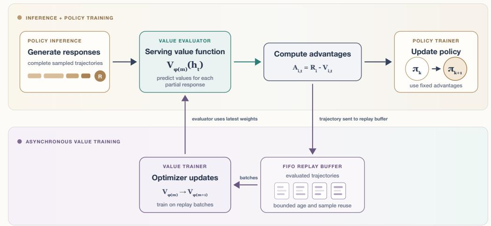  
Figure 9: Asynchronous value function evaluation and training. The value evaluator is the serving copy used in the inference and policy-training pipeline: it predicts the expected return from every partial response and these predictions are used to compute policy advantages. Evaluated trajectories are then added to the FIFO replay buffer. Independently, the value trainer samples replay batches and performs optimizer updates; the evaluator uses the latest published weights.

## B.2 FIFO-bounded replay and controlled reuse

Complete trajectories which have finished value evaluation for advantage estimation are pushed into the FIFO replay buffer. Trajectories are sampled in batches (without replacement) uniformly from this replay buffer for value training. Each trajectory has associated with it a replay counter that is incremented whenever it is sampled to a training batch. We evict trajectories once their replay counter exceeds the sample reuse limit, which we fix to N = 2 for all experiments. We found training to remain stable for $\bar { N } > 2 $ , but our inference node generated trajectories quickly enough that even with N = 2, the value trainer maintained high GPU utilization with no idle time.

## B.3 Value warmup before policy training

We initialize the value model as a copy of the base policy with a randomly initialized value head. Before allowing policy updates, we run the same asynchronous pipeline for a short value pretraining phase. The critic uses the same rollout batch size as in the subsequent RL phase. In all our experiments we only use 20 value updates before beginning policy optimization, so this is more like value warmup than pretraining. This provides mostly a reasonable calibration for the trained baseline without requiring a separately generated value pretraining dataset. We expect substantially longer and more diverse value pretraining may be beneficial, as discussed in Section 7.

## B.4 Value loss

All our tasks use binary outcome rewards, and so we train the value head with a binary classification loss rather than MSE regression. Importantly, the predicted values are not binary, but rather the expectation of the bernoulli distribution p, and so is a continuous value in [0, 1]. Previous work in deep RL without LLMs report that categorical value prediction can improve value training [Farebrother et al., 2024]. We observed a small improvement over MSE in early experiments, however more experimentation would help to validate this decision. The effect of value loss and support warrants more systematic study.

## C Statistical analysis of TETHER

For a sampled token, let R be its trajectory’s observed terminal return, B the leave-one-out group baseline, V the token-level value prediction, and $\rho \in [ 0 , 1 ]$ the weight placed on the value prediction. TETHER uses

$$
b _ { \rho } = ( 1 - \rho ) B + \rho V , \qquad A _ { \rho } = R - b _ { \rho } .\tag{19}
$$

To make the role of ρ explicit, define the group advantage $A _ { B } = R - B$ and the value correction $\Delta = V - B$ . Then $A _ { \rho } = A _ { B } - \rho \Delta$

Why a soft mixture can help. Moving ρ from zero to one moves the baseline from B toward V. TETHER chooses the point on this line that best predicts the observed Monte Carlo return, minimizing squared error. At the population level, this is equivalently the second moment of the resulting advantage:

$$
\mathcal { L } ( \rho ) = \mathbb { E } \big [ ( R - b _ { \rho } ) ^ { 2 } \big ] = \mathbb { E } [ A _ { \rho } ^ { 2 } ]\tag{20}
$$

$$
= \mathbb { E } [ A _ { B } ^ { 2 } ] - 2 \rho \mathbb { E } [ A _ { B } \Delta ] + \rho ^ { 2 } \mathbb { E } [ \Delta ^ { 2 } ] .\tag{21}
$$

When $\mathbb { E } [ \Delta ^ { 2 } ] > 0$ , the optimal mixture is

$$
\rho ^ { \star } = \mathrm { c l i p } _ { [ 0 , 1 ] } \left( \frac { \mathbb { E } [ A _ { B } \Delta ] } { \mathbb { E } [ \Delta ^ { 2 } ] } \right) .\tag{22}
$$

The numerator measures whether moving from the group baseline toward the value prediction reduces the current residual; the denominator accounts for how far apart the two predictions are.

Because $\rho = 0$ recovers the group baseline and $\rho = 1$ recovers the value baseline, optimizing over the full interval immediately gives

$$
\begin{array} { r } { \mathbb { E } [ A _ { \rho ^ { \star } } ^ { 2 } ] \leq \operatorname* { m i n } \bigl \{ \mathbb { E } [ ( R - B ) ^ { 2 } ] , \mathbb { E } [ ( R - V ) ^ { 2 } ] \bigr \} . } \end{array}\tag{23}
$$

The inequality is strict when the optimum lies inside (0, 1). Intuitively, this occurs when the two baselines make complementary errors, so averaging them predicts the return better than either alone. Figure 6 shows that the fitted coefficient typically remains comfortably in the interior of [0, 1] in real training runs, indicating that TETHER uses information from both baselines rather than collapsing to either endpoint.

Relation to optimal policy gradient variance. Let $s = \nabla _ { \theta }$ log $\pi _ { \theta } ( y _ { t } \mid h _ { t } )$ and $g _ { \rho } = A _ { \rho } s .$ When $\rho$ is fixed for the current update and B and V are admissible baselines, $\mathbb { E } [ g _ { \rho } ]$ ] does not depend on $\rho _ { ; }$ , while

$$
\operatorname { t r } C o v ( g _ { \rho } ) = \mathbb { E } \left[ A _ { \rho } ^ { 2 } \| s \| ^ { 2 } \right] - \| \mathbb { E } [ g _ { \rho } ] \| ^ { 2 } .\tag{24}
$$

TETHER does not take into account the $\| s \| ^ { 2 }$ term, and therefore is not the optimal policy gradient baseline, which is usually impractical to compute.

Comparison with EVPO. EVPO computes

$$
\widehat { \mathrm { E V } } _ { \mathcal { B } } = 1 - \frac { \operatorname { V a r } _ { \mathcal { B } } ( R - V ) } { \operatorname { V a r } _ { \mathcal { B } } ( R ) }\tag{25}
$$

and uses the critic when this quantity is positive; otherwise it uses the full group mean [Pan et al., 2026]. EVPO therefore makes a hard endpoint choice using the centered residual variance. In contrast, TETHER directly fits Monte Carlo squared error and allows an interior mixture. For any fixed pair of baselines B and $V ,$ , oracle TETHER cannot have higher Monte Carlo prediction error than the better endpoint because $[ 0 , 1 ]$ contains both choices {0,1}, and an interior optimum strictly improves on both.

Practical tradeoff. TETHER is most attractive when the baselines have complementary errors and enough stable data is available to estimate an interior coefficient ρ. EVPO can be preferable when the optimum is near an endpoint, batches are too small to estimate a continuous coefficient reliably, or the critic changes too quickly for TETHER’s smoothed, lagged coefficient. In finite data the fitted coefficient can also overfit, so the population guarantee need not hold on every policy update.

## D Experimental hyperparameters and settings

This section reports the settings used for the experiments in Figures 3 and 5. All nodes consist of 8×H200 GPUs. Within the scope of each task, the policy configuration is shared across baselines. The ordinary (VF) and privileged value function (PVF) baselines always share the same value-training configuration and compute allocation, only differing by critic context.

## D.1 Privileged value function experiments

Reasoning Gym. We train Qwen3-4B-Instruct-2507 for 800 policy steps with batch size 128 and evaluate $\dot { K } \in \{ 1 , 8 \}$ . Each trajectory has an 8,192-token total sequence limit (prompt+completion) and a 6,144-token completion cap. The PVF receives the reference answer as privileged context. The $K = 8$ mean run uses two nodes: one for policy inference and one for policy training. Both VF and PVF use four nodes, adding one value-trainer node and one dedicated value-evaluator node. We average two seeds.

CodeIO. We train Qwen3-4B-Instruct-2507 for 650 policy steps with batch size 128 and group size K = 4. The trajectory allows up to 4,096 input tokens and 8,192 completion tokens, for a 12,288-token sequence limit. The PVF conditions on the other K − 1 = 3 responses in the group together with their returns. Mean runs use three nodes—two for policy inference and one for policy training. VF and PVF use five, adding one value trainer and one dedicated value evaluator. We average three seeds.

Sudoku. We train Qwen3-4B-Instruct-2507 for 600 policy steps on the 5,000 hard-puzzle dataset, using batch size 64 and group size K = 4. The environment is multi-turn and asks the policy to fill one missing cell at a time. A trajectory is limited to 32,768 tokens, with at most 8,192 generated tokens in any model turn. The PVF receives the complete solved grid. Mean runs use four nodes—three for policy inference and one for policy training. VF and PVF use six, adding one value trainer and one dedicated value evaluator. We average three seeds.

## D.2 TETHER experiments

All TETHER runs use EMA decay d = 0.95 for the fitted mixture coefficient. As above, VF and TETHER share the value configuration and compute allocation. Reasoning Gym uses two seeds and the other tasks use three.

Reasoning Gym. We use Qwen3-4B-Instruct-2507, batch size 128, group size K = 8, and 800 policy steps. The total sequence and completion limits are 8,192 and 6,144 tokens, respectively. The mean baseline uses one inference and one policy-trainer node. VF and TETHER add one value-trainer node and one dedicated value-evaluator node, for four nodes in total.

CodeIO. We use Qwen3-4B-Instruct-2507, batch size 128, group size K = 4, and 650 policy steps, with 4,096 input tokens and up to 8,192 generated tokens. Mean runs use two policy-inference nodes and one policy-trainer node. VF and TETHER additionally use one value trainer and one dedicated value evaluator, for five nodes in total.

Sudoku. We use Qwen3-4B-Instruct-2507, batch size 64, group size K = 4, and 600 policy steps. Trajectories are limited to 32,768 tokens and each turn output to 8,192 tokens. Mean runs use three policy-inference nodes and one policy-trainer node. VF and TETHER add one value trainer and one dedicated value evaluator, for six nodes in total.

MiniF2F. We train Qwen3.5-4B for 500 policy steps with batch size 128 and group size K = 4. Each theorem permits three proof attempts with compiler feedback, up to 4,096 generated tokens per attempt and 24,576 tokens over the full trajectory. Mean runs use 4 total nodes, three policy-inference nodes and one policy-trainer node. VF and TETHER use six nodes, adding one value trainer and one dedicated value evaluator.

## D.3 Common training hyperparameters

Table 1 gives the policy and rollout settings held fixed across baseline comparisons. We use PRIME-RL’s default DPPO objective: an importance-weighted token policy gradient with masking of large probability changes and a small squared log-ratio KL penalty. The value-training specific settings in Table 2 are shared by all VF, PVF, and TETHER runs.

Table 1: Policy and rollout hyperparameters shared across baseline comparisons.
<table><tr><td>Hyperparameter</td><td>Setting</td></tr><tr><td>Policy learning rate</td><td> $1 \times 1 0 ^ { - 6 }$ </td></tr><tr><td>Optimizer</td><td>AdamW</td></tr><tr><td>AdamW betas</td><td>(0.9, 0.999)</td></tr><tr><td>Weight decay</td><td>0.01</td></tr><tr><td>Gradient clipping</td><td>Global norm 1.0</td></tr><tr><td>Learning-rate schedule</td><td>Constant</td></tr><tr><td>Sampling temperature</td><td>1.0</td></tr><tr><td>Maximum off-policyness</td><td>8 policy updates</td></tr><tr><td>Policy loss</td><td>PRIME-RL default DPPO+KL 1oss</td></tr><tr><td>Mask and KL settings</td><td>Probability-change thresholds 0.2 in both directions; squared log-ratio coefficient 10-3</td></tr></table>

Table 2: Value-function hyperparameters shared across value-backed runs.
<table><tr><td>Hyperparameter</td><td>Setting</td></tr><tr><td>Value warmup</td><td>20 updates before policy training</td></tr><tr><td>Value batch size</td><td>Equal to the policy rollout batch size (differs across tasks)</td></tr><tr><td>Replay buffer</td><td>FIFO 256 trajectories</td></tr><tr><td>Maximum replay reuse</td><td>N = 2 selections per trajectory</td></tr><tr><td>Value learning rate</td><td>1 × 10−5</td></tr><tr><td>Value optimizer</td><td>AdamW, betas (0.9, 0.999), weight decay 0.01</td></tr><tr><td>Value lr schedule</td><td>Constant</td></tr><tr><td>Value loss</td><td>Binary cross-entropy</td></tr><tr><td>GAE λ</td><td>1.0</td></tr></table>