# LLMs for Zero-Shot Threat Detection via Structured Risk Indicators

Abdullah Alghamdia,∗, Siamak Layeghya and Marius Portmanna

aUniversity ofQueensland, Brisbane, Australia

## A R T I C L E I N F O

Keywords:   
Intrusion Detection   
Insider Threat Detection   
Advanced Persistent Threat   
Large Language Models   
Zero-Shot Learning   
Retrieval-Augmented Generation   
Anomaly Detection

## A BS T RA C T

We propose a two-stage large language model (LLM) framework for zero-shot detection of insider threats and advanced persistent threats (APTs) from heterogeneous security logs. The framework models user activity as chronological timelines and incorporates retrieval-augmented generation (RAG) to provide personalised behavioural context from each user’s historical activity. Rather than performing end-to-end classification directly from raw logs, it first generates structured, interpretable sets of threat-specific risk indicators, which are then classified jointly across temporal sequences to capture attack patterns spanning multiple windows. The framework is evaluated on two benchmark datasets, CERT r5.2 for insider threat detection and PicoDomain for APT detection, using four combinations of two open-weight LLMs under both retrieval and non-retrieval settings. All configurations outperform the previous state-of-the-art LLM-based framework (GABM), with the best configuration improving the F1-score by 11.40 percentage points on CERT r5.2 and 31.50 percentage points on PicoDomain. Results further show that retrieval mainly benefits weaker LLMs by generating more discriminative risk indicators, whereas stronger models achieve comparable performance without retrieved context. The most efective assignment of LLMs to the two stages depends on the dataset. These findings show that the quality of the generated risk indicators is the main driver of zero-shot cyber threat detection performance.

## 1. Introduction

Host-based intrusion detection systems (HIDS) play a critical role in modern cybersecurity by monitoring activity within an organisation’s endpoints, including logon events, file access, device usage, and application-level activities such as email exchanges and host-recorded network interactions (Bridges, Glass-Vanderlan, Iannacone, Vincent and Chen, 2019). Unlike network-based intrusion detection systems (NIDS), which analyse network trafic in transit, HIDS provide direct visibility into endpoint activity and are particularly efective for detecting insider threats and hostlevel stages of advanced persistent threats (APTs), includ ing lateral movement, credential misuse, and data exfiltration (Prabhu and Thompson, 2022; Georgiadou, Mouzakitis and Askounis, 2022; Laprade, Bowman and Huang, 2020). Because adversaries who obtain valid credentials, through phishing, credential theft, or insider collusion, can closely mimic legitimate users, endpoint-level detection often constitutes the last line of defence before significant damage occurs (Glasser and Lindauer, 2013). In practice, malicious behaviour is rarely confined to a single log source, and the same adversary may leave traces across endpoint and network logs. Efective detection therefore benefits from integrating these heterogeneous observations into a unified view of user behaviour.

Detecting such threats remains challenging because individual malicious actions frequently appear benign in isolation. Efective detection therefore requires contextual reasoning, including comparing current behaviour against historical baselines, correlating activity across heterogeneous log sources, and recognising attack stages that unfold over extended periods. Although both insider threats and APTs require contextual reasoning, the nature of that context differs substantially across threat classes. Insider threats typically emerge as gradual behavioural drift in user activity logs, such as unusual file access patterns, after-hours logons, or atypical communication behaviour (Glasser and Lindauer, 2013), whereas APT activity is reflected primarily through network-level patterns, including anomalous protocol sequences, command-and-control communication, and lateral movement (Mandiant, 2013).

Traditional machine learning approaches to intrusion detection, including Random Forest, Support Vector Machines, gradient-boosted trees (Alzaabi and Mehmood, 2024), and deep learning models such as recurrent and graph neural networks (Yuan and Wu, 2021), have shown strong performance but depend on substantial labelled training data and often struggle to generalise to previously unseen attacks. Large language models (LLMs) have recently emerged as a promising alternative because they can analyse semistructured security logs in a zero-shot setting without taskspecific training (Kojima, Gu, Reid, Matsuo and Iwasawa, 2022). However, current LLM-based approaches still perform end-to-end classification directly from raw logs, requiring the model to simultaneously interpret heterogeneous events, reason about user behaviour, and make a threat decision. The current state-of-the-art LLM framework, GABM (Ferraro, Orlando and Russo, 2025), illustrates this limitation by achieving perfect recall but low precision, resulting in a false-positive rate that limits practical deployment.

We hypothesise that this limitation arises not from the reasoning capability of LLMs themselves, but from the absence of an explicit behavioural abstraction between raw security logs and the final detection decision. Rather than asking an LLM to classify heterogeneous logs directly, we argue that it is more efective to first generate structured, interpretable sets of threat-specific risk indicators that summarise behavioural evidence, and then reason over their temporal evolution to detect multi-step attacks. We further hypothesise that grounding this process in each user’s historical behaviour enables the generated risk indicators to better distinguish normal behavioural variation from genuine malicious activity while preserving the zero-shot setting.

To investigate these hypotheses, we propose a two-stage LLM framework for zero-shot cyber threat detection across heterogeneous security logs. The framework combines three complementary design principles. First, heterogeneous security logs are organised into chronological user timelines, providing a unified behavioural view across multiple log sources. Second, retrieval-augmented generation (RAG) provides personalised behavioural context by retrieving semantically similar historical activity from the same user. Third, LLMs generate structured, interpretable risk indicators that summarise each activity window before a second stage classifies their temporal evolution to identify attack patterns spanning multiple windows. To the best of our knowledge, combining personalised behavioural retrieval with LLM-generated structured risk indicators for zero-shot intrusion detection has not previously been investigated.

We evaluate the proposed framework on two complementary benchmark datasets: CERT r5.2 (Glasser and Lindauer, 2013), representing insider threat detection from host activity logs, and PicoDomain (Laprade et al., 2020), representing APT detection from Zeek network logs. Across four combinations of two open-weight LLMs, evaluated with and without retrieval augmentation, every configuration outperforms the previous state-of-the-art LLM-based framework (GABM). The best configuration improves the F1-score by 11.40 percentage points on CERT r5.2 and 31.50 percentage points on PicoDomain, while substantially improving precision without sacrificing high recall. Beyond these performance gains, the evaluation provides new insights into how retrieval augmentation and model capability interact during zero-shot threat detection.

The main contributions of this work are as follows.

• We propose a zero-shot LLM framework that replaces direct classification of heterogeneous security logs with structured risk-indicator generation followed by temporal classification, providing a unified approach to insider threat and APT detection.

• We present a comprehensive empirical analysis of retrieval augmentation and model capability, showing that retrieval primarily benefits weaker LLMs by improving the quality of generated risk indicators, while the most efective assignment of LLMs to the two stages depends on the characteristics of the dataset.

The remainder of this paper is organised as follows. Section 2 reviews related work on traditional, deep learning, and LLM-based approaches to intrusion detection. Section 3 presents the proposed methodology. Section 4 describes the experimental setup. Section 5 presents the experimental results and ablation studies. Finally, Section 6 concludes the paper and outlines future research directions.

## 2. Related Work

Recent advances in LLMs have shifted cybersecurity log analysis from supervised learning towards zero-shot reasoning over semi-structured security data. This section reviews existing LLM-based approaches to cyber threat detection and RAG, and positions the proposed work within this literature.

## 2.1. Large Language Models for Cyber Threat Detection

Large language models have recently emerged as a promising alternative to traditional supervised intrusion detection by enabling zero-shot reasoning over heterogeneous security logs without task-specific training (Kojima et al., 2022). Existing approaches explore this direction through prompt engineering (Li, Zhu, He and Zhang, 2025), parameter-eficient fine-tuning (Kong, Liu, Jin, Geng, Li and Weng, 2025; Song, Zhang and Gao, 2025b), and multi-view behavioural modelling (Song, Zheng, Ma, Liao, Kuang and Yang, 2025a). A broader survey by Xu, Wang, Li, Wang, Zhao, Chen, Yu, Liu and Wang (2024) identifies low precision under high-volume telemetry as one of the principal challenges facing LLM-based cybersecurity systems.

Despite their methodological diferences, most existing approaches rely on end-to-end classification directly from raw or lightly processed log data. This requires the LLM to simultaneously interpret heterogeneous security events, reason about user behaviour, and make a threat decision within a single inference step. Our preliminary experiments (Section 4.5) show that this design leads to unstable predictions and low precision, consistent with the observations reported by Xu et al. (2024). A separate line of research therefore limits the role of LLMs to post-hoc investigation and explanation rather than detection itself. For example, eX-NIDS (Houssel, Layeghy, Singh and Portmann, 2026) employs LLMs to explain alerts generated by an external intrusion detection system, while Pletzer and Mottok (2026) use LLMs to analyse candidate attacks identified by a statistical anomaly detector. Although these approaches improve interpretability, the LLM no longer contributes directly to the detection process.

The closest LLM-based detection frameworks to this work are GABM (Ferraro et al., 2025) and Audit-LLM (Song, Ma, Zheng, Liao, Kuang and Yang, 2024), both of which decompose detection into multiple cooperating LLM agents. GABM represents the current state of the art on the benchmark datasets considered in this work, but achieves high recall at the expense of low precision. Audit-LLM similarly employs multiple agents to coordinate threat analysis but reports user-level evaluation metrics, preventing direct comparison with window-level detection. Although these frameworks demonstrate the potential of collaborative LLM reasoning, they continue to exchange free-form natural-language reasoning between stages rather than structured behavioural evidence, and neither explicitly models user behaviour relative to a personalised historical baseline.

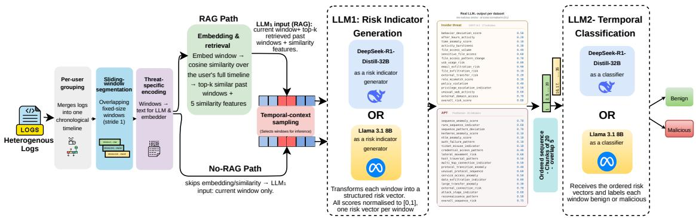  
Figure 1: Overview of the proposed retrieval-augmented dual-LLM framework. Heterogeneous logs are grouped into per-user chronological timelines, segmented into overlapping windows, and encoded into a threat-specific textual representation. Under the retrieval-augmented (RAG) configuration, each window is embedded and compared against the user’s full history to retrieve the top-� most similar past windows and five similarity features; the No-RAG configuration omits this step. $\mathsf { L L M } _ { 1 }$ generates a threat-specific structured feature vector per window (17 insider-threat or 20 APT indicators), and $\mathsf { L } \mathsf { L } \mathsf { M } _ { 2 }$ classifies the resulting ordered feature sequences as benign or malicious. Both stages are instantiated with DeepSeek-R1-Distill-Qwen 32B or Llama 3.1 8B, yielding four model combinations under each retrieval setting.

## 2.2. Retrieval-Augmented Generation for Cybersecurity

Retrieval-Augmented Generation extends LLM reasoning by incorporating externally retrieved information (Lewis, Perez, Piktus, Petroni, Karpukhin, Goyal, Küttler, Lewis, Yih, Rocktäschel et al., 2020). Existing cybersecurity applications primarily retrieve threat intelligence from external knowledge sources, such as MITRE ATT&CK, CVE repositories, and vendor advisories, to improve reasoning about emerging attacks (Paul, Alemi and Macwan, 2025; Borah, Alam and Rastogi, 2025). In these systems, retrieval enriches the model with domain knowledge that is not contained within its parameters.

Our use of retrieval addresses a diferent problem. Instead of retrieving external threat intelligence, retrieval provides personalised behavioural context by comparing each activity window against the same user’s historical behaviour. This shifts the role of retrieval from knowledge augmentation to behavioural grounding, enabling risk indicators to be generated relative to an individual’s established activity patterns rather than generic notions of suspicious behaviour. To the best of our knowledge, combining personalised behavioural retrieval with structured LLM-generated risk indicators for zero-shot cyber threat detection has not previously been investigated.

## 3. Methodology

The proposed framework consists of three main components: (i) data preparation and temporal windowing, (ii) behaviour-aware retrieval for contextual augmentation, and (iii) dual-LLM inference for feature generation and classification over ordered windows. Given the scale of the windowed datasets, a deterministic temporal-context sampling step (Section 3.2.5) selects the windows that undergo LLM inference. We evaluate the framework under two retrieval configurations, RAG and No-RAG, to isolate the contribution of retrieval across both models. Figure 1 provides an overview of the pipeline. The same architectural backbone is applied to both datasets considered in this work, with the windowing, window representation, and $\mathrm { L L M } _ { 1 }$ feature set instantiated according to the threat type.

## 3.1. Data Preparation and Temporal Windowing 3.1.1. Per-user log grouping.

We group by user because malicious behaviour typically spans several log sources rather than appearing within any single one: an insider’s file access, logon timing, and email activity (or an APT actor’s beaconing and lateral movement) form a recognisable pattern only when a user’s activity is viewed as a whole. Grouping all of a user’s records into one chronological timeline therefore gives each inference window the full context of that user’s behaviour, rather than a fragment confined to a single log type or connection.

Concretely, logs are grouped by user and sorted chronologically. For PicoDomain, each log entry is associated with a user through the host-to-user mapping provided in the dataset ground truth (e.g. BDUCK, JDOE). For CERT r5.2, the five log sources used in this work (logon, device, file, email, HTTP) are merged into a single chronological activity sequence per user.

Dataset overview and sampling summary. For CERT ${ \mathsf { r } } 5 . 2 ,$ windowing and all subsequent stages are applied to the 99 malicious users’ logs; Raw entries reports the full corpus. Benign windows are therefore drawn from the benign activity within these users’ own timelines.
<table><tr><td>Dataset</td><td>Raw entries</td><td>Users (Total)</td><td>Mal. users</td><td>Windows</td><td>Sampled</td><td> $\overline { { { \sf M a l . } \mathrm { ~ / ~ } \mathsf { B e n . } } }$ </td><td></td></tr><tr><td>PicoDomain</td><td>537,840</td><td>7</td><td>5</td><td>460,033</td><td>2,741</td><td>1,000</td><td>/1,741</td></tr><tr><td>CERT r5.2</td><td>~79.9 M</td><td>2,000</td><td>99</td><td>3,400,220</td><td>9,571</td><td>4,410 / 5,161</td><td></td></tr></table>

## 3.1.2. Sliding-window construction.

Each user’s chronologically sorted log sequence is segmented into sliding windows of fixed size � with stride 1, where $w { = } 1 0$ for CERT r5.2 and $w { = } 5$ for PicoDomain. A window is labelled malicious if any of its constituent log entries carries a malicious label; otherwise it is labelled benign. Under stride-1 windowing, a single malicious log entry propagates across up to � consecutive windows, all receiving a malicious label; this any-positive labelling rule is applied consistently across all experimental conditions, ensuring that observed performance diferences are attributable to pipeline configuration rather than labelling variation. The larger window for CERT r5.2 reflects the gradual, multi-step nature of insider threat behaviour, where a meaningful activity sequence spans multiple log types; the smaller window for PicoDomain is suficient given that APT activity manifests in short, concentrated bursts.

Each window is encoded for two purposes. For the embedding model (Section 3.2), the window is represented as a compact protocol-and-destination token sequence such as http:internal → ssl:c2 → dns:external → kerberos: internal → conn:external, where destinations are categorised as internal (10.99.99.0/24), c2 (known C2 addresses 3.3.3.5 and 1.1.1.11), or external.

$\mathrm { L L M } _ { 1 }$ (Section 3.3) receives a richer representation: the full Zeek log records for the window across all log types, accompanied by this protocol-destination sequence as a compact structural summary. For CERT r5.2, each event in the window is rendered as a structured event object: a JSON record retaining the threat-relevant fields for its activity type (action and PC for logon, recipients and attachment metadata for email, filename and removable-media flag for file, URL for HTTP, and file-tree metadata for device), with events preserved in temporal order. This representation serves both the embedding model and $\mathrm { L L M } _ { 1 }$ . After windowing, PicoDomain yields 460,033 windows from 537,840 raw log entries, while CERT r5.2 yields 3,400,220 windows from the logs of its 99 malicious users, drawn from a full corpus of approximately 79.9 million entries (Table 1).

## 3.2. Behaviour-Aware Retrieval for Contextual Augmentation

We incorporate a retrieval-augmented generation (RAG) mechanism to provide each window with behavioural context drawn from the same user’s history. For each window, the most similar past windows are retrieved and attached as context for $\mathbf { L L M } _ { 1 } .$ , enabling comparison of current behaviour against a personalised historical baseline.

## 3.2.1. Window embedding.

Each window’s textual representation is encoded into a 384-dimensional dense vector using all-MiniLM-L6-v2 (Reimers and Gurevych, 2019), a lightweight sentence transformer model. Embeddings are computed once per window and stored for reuse across all downstream steps.

## 3.2.2. Similarity computation andfeatures.

For each window �, cosine similarity is computed against all prior windows within a lookback horizon of 500 windows from the same user. Five deterministic similarity features are derived from the resulting similarity distribution: sim\_max (maximum similarity to any past window), sim\_topk\_avg (mean similarity over the top five matches), sim\_topk\_std (standard deviation over the top five matches), sim\_global\_mean (mean similarity over all windows in the lookback horizon), and sim\_gap (diference between sim\_max and sim\_topk\_avg). These features provide a quantitative signal of how anomalous the current window is relative to the user’s recent history, and are passed to $\mathrm { L L M } _ { 1 }$ alongside the log content.

## 3.2.3. Retrieval.

The top �=3 most similar past windows, by cosine similarity over the embeddings, are retrieved from the preceding 500-window lookback horizon within the same user’s history and attached as context for $\mathrm { L L M } _ { 1 }$ . For CERT r5.2, each retrieved window contains the structured event fields of its constituent log entries. For PicoDomain, each retrieved window contains the full Zeek log entries across all log types, with unique connection identifiers and sensor names removed. The first window of each user’s sequence has no retrievable history and is processed with an empty context. Labels are removed from all retrieved windows before they are presented to $\mathrm { L L M } _ { 1 }$ , preventing label leakage.

## 3.2.4. No-RAG configuration.

To isolate the contribution of retrieval, we define a No-RAG configuration in which $\mathrm { L L M } _ { 1 }$ receives only the current window’s log content, with no retrieved past windows and no deterministic similarity features. The $\mathrm { L L M _ { 1 } }$ prompt is trimmed accordingly: the instruction to compare the current window against past windows is removed, and the model must generate risk indicators from the current window alone. All other pipeline components remain identical; the No-RAG configuration difers from the RAG configuration solely in the removal of the retrieval mechanism: the retrieved past windows and the similarity features derived from them.

## 3.2.5. Temporal-context sampling.

Given the large scale of the windowed datasets, applying LLM inference to all windows is computationally impractical. We therefore adopt a sampling strategy that preserves malicious activity while retaining suficient benign context for temporal analysis.

Because embedding, similarity computation, and retrieval (Section 3.2) are performed over each user’s complete windowed timeline, sampling determines only which windows undergo LLM inference; retrieved context is therefore drawn from the user’s full history rather than from the sampled subset.

For each user, contiguous sequences of malicious windows (i.e. malicious bursts) are identified. A symmetric context of benign windows is retained before and after each burst, preserving the temporal transition between normal and anomalous behaviour. For PicoDomain, all malicious bursts are retained with a context of ±10 benign windows, yielding 2,741 sampled windows. For CERT r5.2, the largest malicious burst per user is selected with a context of ±30 benign windows, yielding 9,571 sampled windows across 99 users; selecting the largest burst bounds the sampled set while capturing each user’s principal malicious episode together with its surrounding normal behaviour. The larger context for CERT r5.2 reflects the gradual nature of insider threat behaviour, where the transition between normal and anomalous activity spans many windows; the smaller context for PicoDomain is suficient given the concentrated, abrupt nature of APT beaconing bursts.

The sampling procedure is deterministic and depends only on window labels and sequential positions. This ensures that the exact same subset of windows is evaluated across all experimental conditions (including all second-stage classifier variants) so that observed performance diferences are attributable solely to the pipeline configuration rather than to variation in the evaluation data. The resulting class distributions are summarised in Table 1.

Because sampling concentrates on malicious bursts and their immediate context, the reported precision and F1 reflect this evaluation distribution rather than the full-corpus base rate. As the sampled subset is identical across all conditions, this does not afect the relative comparisons that are the focus of this work.

## 3.3. Feature Generation (LLM )

The proposed framework employs a two-stage inference process in a zero-shot setting. Its central component is $\mathrm { L L M _ { 1 } }$ , a threat-aware feature generator that transforms each raw log window into a structured vector of normalised risk indicators, replacing the hand-engineered feature extractors used in conventional pipelines. The second stage, $\begin{array} { r } { { \bf L } { \bf L } { \bf M } _ { 2 } , } \end{array}$ is a downstream sequence classifier that reasons over the ordered feature vectors L $\mathbf { \mathcal { M } } _ { 1 }$ produces. The framework instantiates both stages using two open-weight LLMs of difering capability (DeepSeek-R1-Distill-Qwen 32B and Llama 3.1 8B), both quantised to 4-bit precision (Q4\_K\_M) and deployed via llama.cpp.

LLM transforms each sampled window into a structured feature representation: a set of normalised risk indicators tailored to the threat type of each dataset. Its core input is the current window’s log content (with labels removed).

In the retrieval-augmented configuration, LLM additionally receives up to three retrieved past windows from the same user together with the deterministic similarity features defined in Section 3.2, which quantify how anomalous the current window is relative to the user’s recent history; the contribution of this retrieved context is analysed in Section 5.1 (Table 4). In this configuration, the prompt instructs the model to act as a cybersecurity analyst and to compare the current window against the provided past windows, identifying deviations in destinations, protocol or activity sequences, timing patterns, and any escalation of suspicious behaviour. In the No-RAG configuration (Section 3.2.4), the current window’s log content is the model’s sole input, and the prompt omits the comparison instruction, requiring the risk indicators to be generated from the window alone. The model returns a JSON object containing normalised risk scores, each bounded to [0,1]. The discriminative quality of the generated features is assessed using SHAP analysis, reported in Section 5.2. The full set of risk indicators is listed in Tables 3 and 2, and the LLM and $\mathrm { L L M } _ { 2 }$ system prompts are shown in Figures 2 and 3.

Dataset-specific feature sets. The feature sets are tailored to the threat type of each dataset. For each dataset, the feature set is constructed to satisfy two constraints: (i) coverage: every behavioural dimension represented in the dataset’s documented threat scenarios must be observable through at least one feature; and (ii) extractability: each feature must be derivable from the log types the dataset actually provides. Scenario documentation is used only to define the feature schema (analogous to the threat-model knowledge that informs detection rules in operational deployments); no ground-truth labels inform feature design, and the same fixed feature set is applied uniformly across all users and experimental configurations. For CERT r5.2, the 17 features capture behavioural indicators of insider threat across the scenarios documented in the dataset (data leakage, intellectual property theft, and IT sabotage), organised into seven behavioural categories: deviation from the user’s behavioural baseline, temporal anomalies, data access, data exfiltration across removable media, email, and file channels, privilege misuse, network activity, and a single aggregate risk summary. Each feature is extractable from the five CERT log types used in this work (logon, device, file, email, and HTTP), aligning the feature set with both MITRE ATT&CK tactics (MITRE Corporation, 2026) and User and Entity Behaviour Analytics (UEBA) indicators. SHAP analysis (Section 5.2) shows that both models rank fileaccess and exfiltration indicators most highly, though they difer in the single dominant feature; the relative importance reflects the attack characteristics of the dataset, with USBbased exfiltration scenarios elevating usb\_usage\_risk for the stronger model.

For PicoDomain, the 20 features target network-level indicators of APT activity aligned with the stages of the

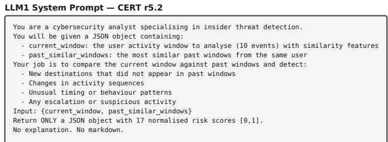

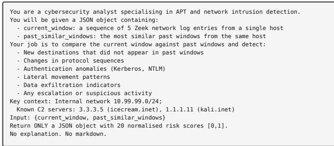  
Figure 2: LLM system prompts: CERT r5.2 (top) and PicoDomain (bottom).

APT kill chain, organised into seven categories: sequencelevel anomalies in the host’s connection patterns, authentication abuse (Kerberos and NTLM), lateral movement between internal hosts, protocol-level irregularities, data exfiltration, attack-stage progression, and a single aggregate risk summary. Each feature is extractable from the Zeek log types in the dataset (CONN, DNS, DCE\_RPC, SSL, and Kerberos). Unlike CERT r5.2, individual-window feature signal on PicoDomain is inherently weak (Section 5.2), a consequence of the stealthy nature of APT beaconing rather than feature design; the feature set nonetheless provides a consistent structured representation for $\mathrm { L L M } _ { 2 }$ to classify. This dataset-specific design allows LLM to focus on the most discriminative signals for each threat type rather than relying on a generic feature set.

LLM receives a JSON object containing the current activity window and its retrieved similar past windows, and returns a fixed-length vector of risk scores corresponding to the features in Tables 3 and 2.

## 3.4. Sequence Classification (LLM )

LLM receives the unlabelled feature representations produced by LLM for a given user, arranged in chronological order, and produces a binary classification (benign or malicious) for each window. In both configurations, $\mathrm { L L M } _ { 2 }$ receives only the risk-indicator vectors produced by $\mathrm { L L M } _ { 1 } ,$ never raw log content; the deterministic similarity features of Section 3.2 serve solely as input context for feature generation and are not propagated downstream. LLM is identical across the RAG and No-RAG configurations, so performance diferences between the two settings are attributable solely to the features LLM produces.

Chunkedprocessing. Due to context-window constraints, the ordered feature sequence for each user is divided into chunks of20 windows with an overlap of5 windows between consecutive chunks. The overlap ensures that burst boundaries are not missed at chunk edges. When a window appears in multiple chunks, the later chunk’s prediction is retained, since there the window has its subsequent context in view.

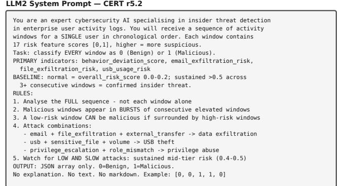

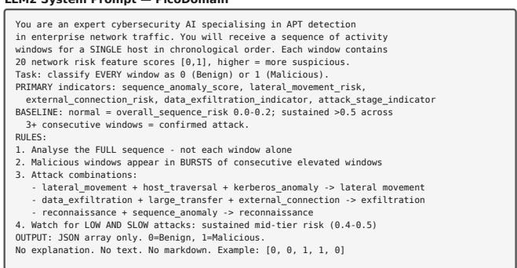  
Figure 3: LLM system prompts: CERT r5.2 (top) and PicoDomain (bottom).

Burst-aware reasoning. The prompt instructs $\mathrm { L L M } _ { 2 }$ to reason over the full temporal sequence rather than evaluating each window in isolation. The model identifies regions of consecutive windows with elevated risk scores, recognises coordinated attack patterns such as data exfiltration, privilege abuse, and suspicious access based on related feature combinations (pattern descriptions instantiated per dataset, Figure 3), and uses surrounding context to classify ambiguous windows that may appear benign in isolation but fall within a broader malicious burst. This prompt design is motivated by the tendency of malicious activity in both APT and insider threat scenarios to manifest as bursts of sustained elevated risk rather than isolated anomalous windows.

LLM receives a chronological sequence of risk-score vectors produced by $\mathrm { L L M } _ { 1 }$ for a single user and assigns a binary label to every window (0=benign, 1=malicious).

## 4. Experimental Setup

## 4.1. Datasets

We evaluate the proposed framework on two publicly available cybersecurity datasets: PicoDomain and CERT r5.2.

PicoDomain. The PicoDomain (Laprade et al., 2020) is a high-fidelity Zeek network log dataset simulating an enterprise environment under an advanced persistent threat (APT) campaign. The dataset covers a three-day period and contains 537,840 log rows across multiple Zeek log types, including CONN, DNS, DCE\_RPC, SSL, and Kerberos. Logs are associated with users based on the host-to-user mapping provided in the dataset ground truth. Following preprocessing, the dataset contains 7 users, of which 2 exhibit exclusively benign activity and are excluded, leaving 5 users (all associated with malicious activity) for evaluation. The ground truth contains 80 red team events, of which 79 correspond to malicious actions; the remaining event marks the end of the attack campaign and is not considered a malicious activity in this work. Labels are derived by matching log entries against the 79 malicious events using a temporal window of ±5 seconds and IP address matching.

Table 2  
LLM risk indicators for PicoDomain, grouped by the category of behaviour they characterise. All scores are normalised to [0, 1].
<table><tr><td>Feature</td><td>Description</td></tr><tr><td>Sequence</td><td></td></tr><tr><td>sequence anomaly score rare sequence indicator</td><td>Overall degree to which the window&#x27;s protocol and connection sequence departs from the user&#x27;s established patterns. Presence of protocol or connection sequences rarely or never seen in the host&#x27;s prior history, flagging novel network</td></tr><tr><td></td><td>behaviour.</td></tr><tr><td>sequence_pattern_deviation</td><td>Extent of deviation in the ordering of events relative to the host&#x27;s normal sequential behaviour.</td></tr><tr><td>Authentication kerberos_anomaly_score</td><td>Anomalous Kerberos authentication activity, such as unusual ticket-granting requests. Kerberos abuse is a common</td></tr><tr><td></td><td>signature of credential-based attacks in Windows domains.</td></tr><tr><td>ntlm anomaly score auth_failure_pattern</td><td>Suspicious NTLM authentication activity inconsistent with the host&#x27;s normal authentication profile. Patterns of repeated or distributed authentication failures, indicative of credential probing or brute-force attempts.</td></tr><tr><td>ticket misuse indicator</td><td>Evidence of Kerberos ticket abuse or reuse, a signature of attacks such as pass-the-ticket.</td></tr><tr><td>credential access pattern</td><td>Suspicious patterns of credential access or harvesting, capturing attempts to obtain account secrets.</td></tr><tr><td>Lateral movement</td><td></td></tr><tr><td>lateral movement risk</td><td>Risk of movement between internal hosts, a core stage of APT campaigns as adversaries pivot toward their objective.</td></tr><tr><td>host traversal pattern</td><td>Patterns of connections traversing multiple internal hosts beyond the host&#x27;s normal communication footprint.</td></tr><tr><td>multi_hop_connection_indicator</td><td>Presence of multi-hop connection chains characteristic of pivoting through a network</td></tr><tr><td>Protocol</td><td></td></tr><tr><td>protocol_transition_anomaly</td><td>Unusual transitions between network protocols within a connection sequence, which can indicate covert channels.</td></tr><tr><td>unusual protocol sequence</td><td>Protocol orderings within the window that diverge from expected service behaviour.</td></tr><tr><td>service access anomaly</td><td>Anomalous access to network services relative to the host&#x27;s normal service-usage profile, capturing service enumeration.</td></tr><tr><td>Exfiltration</td><td></td></tr><tr><td>data exfiltration indicator large transfer anomaly</td><td>Signs that data is being transferred outside the network boundary, the defining objective of an APT campaign</td></tr><tr><td>external connection risk</td><td>Unusually large data transfers inconsistent with the host&#x27;s normal traffic volume. Risk associated with connections to external or command-and-control destinations.</td></tr><tr><td></td><td></td></tr><tr><td>Attack progression</td><td></td></tr><tr><td>attack_stage_indicator</td><td>Evidence positioning the window within a recognised stage of an APT campaign, from reconnaissance through to</td></tr><tr><td>reconnaissance pattern</td><td>exfiltration. Patterns of port scanning or service discovery, characteristic of the reconnaissance stage of an attack.</td></tr><tr><td>Aggregate</td><td></td></tr><tr><td>overall_sequence_risk</td><td>Holistic risk assessment for the window, integrating all preceding indicators into a single summary signal.</td></tr></table>

CERTr5.2. The CERT Insider Threat Dataset r5.2 (Glasser and Lindauer, 2013) is a synthetic dataset capturing user activity logs for a simulated organisation over an 18-month period. It contains 2,000 employees, of whom 99 are associated with labelled malicious activity across four insider threat scenarios (data leakage, two variants of intellectual property theft, and IT sabotage). The dataset provides seven log types, of which five are used in this work: logon, device, file, email, and HTTP. The remaining two (decoy file access and psychometric data) are excluded as they do not represent genuine user activity. Labels are derived by matching event identifiers against the ground truth from scenario folders.

## 4.2. Implementation Details

DeepSeek-R1-Distill-Qwen-32B is run locally via llama. cpp on NVIDIA A100 and L40S GPU nodes of the Bunya HPC cluster (University of Queensland). Inference is performed with temperature set to 0. For the cross-model analysis (Section 5.1), Llama 3.1 8B is run under the same configuration. All models are quantised to 4-bit precision (Q4\_K\_M). Sentence embeddings are computed using all-MiniLM-L6-v2 on the same GPU nodes. For the RAG setting, retrieval is performed with �=3 nearest windows and a lookback of 500 prior windows, using cosine similarity over the computed embeddings. All dataset-specific choices (the feature schema, the window size, and the benign-context span) are set a priori from the documented characteristics of each threat type rather than tuned on the evaluation labels; the framework therefore remains zero-shot, using no labelled training data at any stage.

## 4.3. Baselines

We compare the proposed framework against the Generative Agent-Based Modelling (GABM) method of Ferraro et al. (2025), a recent LLM-based multi-agent framework for insider threat detection evaluated on the same two benchmark datasets used in this work. GABM employs specialised LLM agents for each log type, whose analyses are synthesised by a supervisor agent for final classification using LLaMA-3.1-8B. It classifies per activity identifier rather than per fixed-length window, and does not specify the procedure mapping ground truth to labelled instances or how its benign class is sampled (constrained to 5,000 of 537,840 entries on PicoDomain). GABM achieves perfect recall on both datasets but sufers from low precision, indicating a high false positive rate. Reported results from the original publication are used for comparison. GABM uses LLaMA-3.1-8B as its base model, whereas our primary configuration uses the larger DeepSeek-R1-Distill-Qwen 32B. To isolate the contribution of the architecture from that of model scale, we hold the base model fixed at Llama 3.1 8B, the same model GABM uses. Applied directly to logs without the dual-LLM architecture, Llama 3.1 8B performs well below the framework (Section 4.5); embedded in the proposed framework, the same model performs substantially better (Section 5.1), indicating that the dual-LLM architecture, not model capacity, drives the diference.

Table 3  
LLM risk indicators for CERT r5.2, grouped by the category of behaviour they characterise. All scores are normalised to [0, 1].
<table><tr><td>Feature</td><td>Description</td></tr><tr><td>Behavioural baseline</td><td></td></tr><tr><td>behavior_deviation_score</td><td>Overall degree to which the window departs from the user&#x27;s established activity profile. Insider threats are fundamentally deviations from a user&#x27;s own behavioural baseline.</td></tr><tr><td>Temporal</td><td></td></tr><tr><td>after_hours_activity</td><td>Degree to which actions fall outside the user&#x27;s normal working hours. Insider data theft is frequently timed to off-hours to reduce the chance of observation.</td></tr><tr><td>time anomaly score</td><td>Irregularity of event timing relative to the user&#x27;s historical rhythm, capturing atypical intervals and weekend activity not explained by working hours alone.</td></tr><tr><td>activity_burstiness</td><td>Concentration of many actions into a short interval. Bulk data collection or staging produces dense activity bursts atypical of routine work.</td></tr><tr><td>Data access</td><td></td></tr><tr><td>file_access_volume</td><td>Volume of file-access operations relative to the user&#x27;s norm. An elevated access count is a common precursor to large-scale exfiltration.</td></tr><tr><td>sensitive_file_access</td><td>Degree of interaction with sensitive, restricted, or high-value files, flagging direct contact with the assets most likely to be targeted.</td></tr><tr><td>file_access_pattern_change</td><td>Shift in the type, location, or breadth of files accessed relative to prior behaviour, indicating a move from role-consistent to anomalous access.</td></tr><tr><td>Data exfiltration usb_usage_risk</td><td>Risk of removable-media operations, scaled by the frequency of device use and the sensitivity of files transferred.</td></tr><tr><td></td><td>Removable storage is the principal physical exfiltration channel in CERT r5.2.</td></tr><tr><td>email_exfiltration_risk file_exfiltration_risk</td><td>Likelihood that email activity constitutes data leakage, such as large or unusual attachments sent to external addresses. Likelihood that file operations represent exfiltration, such as copying sensitive files toward staging or external</td></tr><tr><td>external transfer risk</td><td>destinations.</td></tr><tr><td></td><td>Risk of data crossing the organisational boundary to external recipients or systems, aggregating signals across email, web, and file channels.</td></tr><tr><td>Privilege misuse role_mismatch_score</td><td>Extent to which observed actions diverge from those typical of the user&#x27;s job role. Insider misuse often surfaces as</td></tr><tr><td>policy_violation</td><td>access unrelated to legitimate responsibilities.</td></tr><tr><td>privilege_escalation_indicator</td><td>Presence of actions that contravene organisational security policy, a direct indicator of intentional misconduct. Evidence of attempts to obtain or exercise access beyond the user&#x27;s authorised permissions.</td></tr><tr><td>Network</td><td></td></tr><tr><td>unusual_web_activity</td><td>Anomaly in web-browsing behaviour relative to the user&#x27;s norm, capturing reconnaissance or unsanctioned upload</td></tr><tr><td></td><td>activity.</td></tr><tr><td>external_domain_access</td><td>Degree of connection to external or previously unseen domains, flagging communication with untrusted destinations.</td></tr><tr><td>Aggregate overall_risk_score</td><td>Holistic risk assessment for the window, integrating all preceding indicators into a single summary signal.</td></tr></table>

Song et al. (2024) is a related multi-agent LLM approach for insider threat detection but is not used as a direct numerical baseline; we benchmark against GABM as the most directly comparable LLM-based method evaluated on these two datasets, and discuss Audit-LLM as related work.

## 4.4. Evaluation Metrics

Performance is evaluated using precision, recall, and F1-score. Metrics are computed by aggregating predictions across all users within each dataset (5 users for PicoDomain and 99 users for CERT r5.2), producing a single overall evaluation per dataset. The F1-score provides a balanced measure of precision and recall, which is the primary basis for comparison in this work.

## 4.5. Preliminary Experiment: Direct LLM Classification

The state-of-the-art baseline (GABM) decomposes detection across multiple LLM agents, separating per-logtype reasoning from a supervisor classification stage. Before adopting a decomposition of our own, we test whether it can be avoided: whether a single LLM can carry reasoning and classification in one pass. The model receives individual raw log records, with all label and ground-truth annotation fields removed, and must reason over each event and emit a BE-NIGN/MALICIOUS decision within the same prompt, without windowing, retrieval, or a dedicated feature-generation stage (LLM ). We sweep this design on both datasets over the number of few-shot examples per class � ∈ {0, 1, 2, 3} and the batch size $b \in \{ 1 0 , 2 0 , 3 0 , 5 0 \}$ , using both DeepSeek-R1-Distill-Qwen 32B and Llama 3.1 8B. Results are shown in Figure 4.

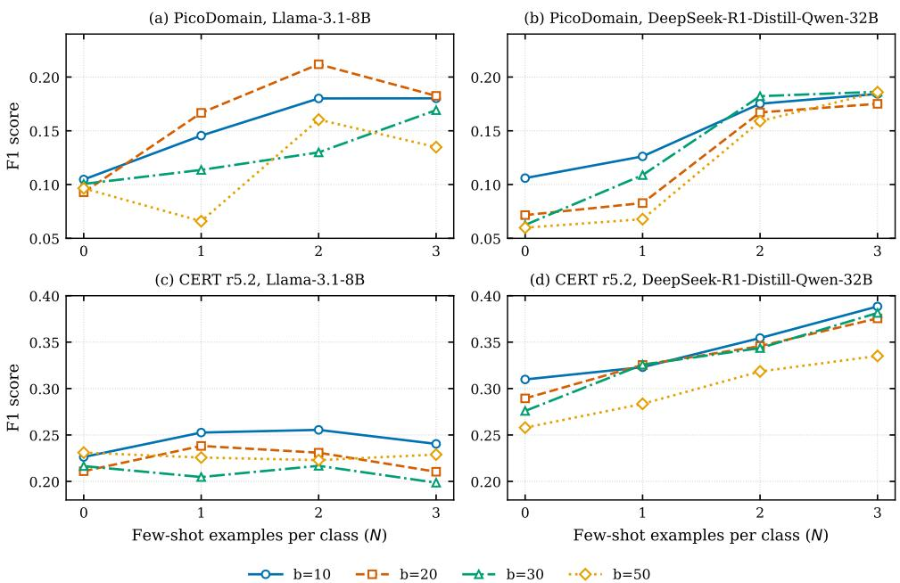  
Figure 4: Direct LLM classification (reasoning and classification in a single pass, without windowing, retrieval, or a dedicated feature-generation stage): F1 against the number of few-shot examples per class �, by batch size �, for (a, b) PicoDomain and $( \mathsf { c } , \mathsf { d } )$ CERT r5.2, using Llama-3.1-8B and DeepSeek-R1-Distill-Qwen-32B. All configurations remain well below the proposed framework.

Additional supervision yields only small and inconsistent gains. Llama 3.1 8B improves up to two-shot and then declines, while DeepSeek improves slowly with shot count on CERT r5.2. No combination of shot count and batch size lifts direct classification past a low ceiling. At matched zero-shot supervision, the setting in which the framework itself operates, the best direct configuration reaches an F1 of only 30.98% (DeepSeek-R1-Distill-Qwen 32B) and 23.10% (Llama 3.1 8B) on CERT r5.2, and 10.60% and 10.47% on PicoDomain, all far below the framework’s best of 64.14% and 50.87% (Table 4). Because the same models are used in both settings, this gap reflects the architectural design rather than model capacity or supervision level.

Across both models and datasets, a single LLM cannot perform the task end-to-end, and additional prompting does not close the gap. We attribute this to the demands of a single prompt, which must parse heterogeneous log fields, reason about threat behaviour, and commit to a decision at once. This motivates the structured, multi-stage design of the proposed framework, in which a feature-generation stage $\mathbf { ( L L M _ { 1 } ) }$ produces an intermediate representation that a separate sequence classifier $( \mathrm { L L M } _ { 2 } )$ consumes; the contribution of retrieval and of the model assigned to each stage is analysed in Section 5.1, and the remaining design choices in the ablation study (Section 5.4).

## 5. Results and Discussion

## 5.1. Classification Performance

To examine how model capability and retrieval interact across the two stages, we evaluate four model combinations: (i) DeepSeek as both feature generator and classifier; (ii) Llama 3.1 8B as both; (iii) Llama 3.1 8B as feature generator with DeepSeek as classifier; and (iv) DeepSeek as feature generator with Llama 3.1 8B as classifier. Each configuration is evaluated under both the RAG and No-RAG settings defined above, yielding eight conditions per dataset (16 across the two datasets). This cross-model analysis forms a central investigation of the framework (Section 5.1).

The overall performance of the framework across the four model combinations is presented in Table 4. Two patterns are consistent across datasets. First, the choice of feature-generating model $\left( \mathrm { L L M _ { 1 } } \right)$ has a larger efect on performance than the choice of classifier $( \mathrm { L L M } _ { 2 } ) \colon$ swapping LLM while holding $\mathrm { L L M } _ { 1 }$ fixed moves F1 by less than swapping LLM . Second, the value of retrieval is conditional on feature-generator capacity. When $\mathrm { L L M } _ { 1 }$ is the weaker model (Llama 3.1 8B), retrieval supplies the comparative context it cannot generate internally, lifting F1 by up to 13.4 percentage points on PicoDomain; when $\mathrm { L L M } _ { 1 }$ is the stronger model (DeepSeek-R1 32B), retrieval is neutral or slightly negative.

Beyond F1, retrieval shifts the operating point. On CERT r5.2 under the DeepSeek/DeepSeek combination, the No-RAG configuration attains its higher F1 through a recall-biased regime: it produces 4,490 false positives versus 3,447 with retrieval, and correctly identifies only

671 of 5,161 benign windows (13.0% specificity) versus 1,714 (33.2%) with retrieval. Retrieved per-user behavioural context thus calibrates $\mathrm { L L M } _ { 1 }$ risk scores against historical baselines, yielding a more selective detector. The falsepositive discipline is what distinguishes the framework from the perfect-recall, low-precision GABM baseline.

Table 5 compares the highest-F1 configuration per dataset against the GABM baseline. On PicoDomain, the framework reaches an F1-score of 50.87% (DeepSeek as $\mathrm { L L M } _ { 1 } ,$ Llama 3.1 8B as $\mathrm { L L M } _ { 2 } , \mathrm { N o - R A G } )$ , an improvement of 31.50 percentage points over the GABM baseline $( \mathrm { F 1 } = 1 9 . 3 7 \% )$ While the baseline attains perfect recall, it does so at the cost of extremely low precision (10.72%). The framework provides a substantially more balanced trade-of, improving precision by 25.85 percentage points while maintaining a recall of 83.50%.

On CERT r5.2, the framework attains an F1-score of 64.14% (Llama 3.1 8B as $\mathbf { L L M } _ { 1 : }$ , DeepSeek as $\mathrm { L L M } _ { 2 } , \mathrm { R A G } )$ with precision 48.55% and recall 94.47%. To verify that this reflects genuine detection rather than the positive-heavy bias that F1 can reward on enriched evaluation sets, we report the Matthews correlation coeficient (MCC), which is zero for any trivial constant classifier. The proposed configuration attains $\mathbf { M C C } = 0 . 1 4 6 ( \chi ^ { 2 } \approx 2 0 4 , p < 1 0 ^ { - 1 0 } )$ , confirming a statistically significant association between predictions and labels. This pattern is consistent across the configurations in Table 4, indicating that it stems from the framework’s architecture rather than from any single model choice.

Across both datasets, the proposed framework consistently outperforms the GABM baseline on F1 and precision, ofering a more balanced precision-recall operating point. The dominant driver of these gains is the structured feature representation produced by $\mathrm { L L M } _ { 1 } ,$ , supported by per-user behavioural grounding; LLM aggregates these per-window indicators into window-level decisions. The remaining design decisions are isolated in the ablation study (Section 5.4).

While high recall is desirable in security operations to minimise missed threats, the framework’s higher precision than GABM’s reported results indicates better discrimination between benign and malicious windows. We do not claim a specific operational false-positive rate: because this distribution is enriched for malicious activity, precision on a realistic, predominantly benign stream would be lower (Section 5.5).

## 5.2. Feature Analysis

The cross-model results in Table 4 show that the stage at which model capability matters most difers by dataset: on CERT r5.2 the strongest configuration places the larger model at classification (Llama 8B / DeepSeek, RAG, F1 $= 6 4 . 1 4 \%$ , whereas on the stealthier PicoDomain logs it is required at feature generation (DeepSeek / Llama 8B, No-$\mathrm { R A G } , \mathrm { F 1 } = 5 0 . 8 7 \% )$ . To explain this, we examine the discriminative signal carried by the $\mathrm { L L M } _ { 1 }$ feature vectors, using SHAP feature importance Lundberg and Lee (2017) and distribution analysis, for DeepSeek-R1-Distill-Qwen 32B and Llama 3.1 8B on each dataset. The Random Forest

## Table 4

Detection performance $( { \mathsf { F 1 - s c o r e } } , \quad \% )$ across the four $\mathsf { L L M } _ { 1 } / \mathsf { L L M } _ { 2 }$ model combinations, under retrieval (RAG) and no retrieval (No-RAG), on both datasets. Rows are grouped by the feature-generating model $( \mathsf { L L M } _ { 1 } )$ ; best F1 per dataset in bold.
<table><tr><td rowspan="2"> $\mathsf { L L M } _ { 1 } \mathrm { ~ / ~ } \mathsf { L L M } _ { 2 }$ </td><td colspan="2">CERT r5.2</td><td colspan="2">PicoDomain</td></tr><tr><td>RAG</td><td>No-RAG</td><td>RAG</td><td>No-RAG</td></tr><tr><td>DeepSeek / DeepSeek</td><td>58.36</td><td>61.72</td><td>45.74</td><td>46.08</td></tr><tr><td>DeepSeek / Llama 8B</td><td>60.53</td><td>62.31</td><td>50.17</td><td>50.87</td></tr><tr><td>Llama 8B / Llama 8B</td><td>63.88</td><td>60.88</td><td>48.18</td><td>34.73</td></tr><tr><td>Llama 8B / DeepSeek</td><td>64.14</td><td>60.08</td><td>47.24</td><td>34.85</td></tr></table>

## Table 5

Comparison of the proposed framework against the prior LLM-based baseline (%). The proposed row reports the best configuration per dataset (PicoDomain: DeepSeek/Llama 8B, No-RAG; CERT r5.2: Llama 8B/DeepSeek, RAG). Best F1 per dataset in bold.
<table><tr><td>Dataset</td><td>Method</td><td>Precision</td><td>Recall</td><td>F1</td></tr><tr><td rowspan="2">PicoDomain</td><td>GABM (Ferraro et al., 2025)</td><td>10.72</td><td>100.00</td><td>19.37</td></tr><tr><td>Proposed framework</td><td>36.57</td><td>83.50</td><td>50.87</td></tr><tr><td rowspan="2">CERT r5.2</td><td>GABM (Ferraro et al., 2025)</td><td>35.82</td><td>100.00</td><td>52.74</td></tr><tr><td>Proposed framework</td><td>48.55</td><td>94.47</td><td>64.14</td></tr></table>

underlying the SHAP analysis is used solely as a probe of the intrinsic discriminative content of the $\mathrm { L L M } _ { 1 }$ feature vectors; it is not part of the proposed pipeline, and the resulting importances characterise the feature set rather than the behaviour of LLM .

CERT r5.2. To validate $\mathrm { L L M } _ { 1 }$ feature quality on CERT r5.2, we analyse feature score distributions (Figure 5) and SHAP feature importance (Figure 6). DeepSeek-R1 32B ranks usb\_usage\_risk as the dominant contributor (20.2% of total importance), consistent with USB-based exfiltration scenarios in CERT r5.2. Llama 3.1 8B produces a diferent ranking, prioritising sensitive\_file\_access (16.9%) and file\_exfiltration\_risk (15.3%). Although the single topranked feature difers, both models concentrate importance on the same family of file-access and exfiltration indicators, the features that also show the clearest malicious/benign separation in Figure 5. The separation is substantial: the mean absolute diference between class averages across the 17 features is 0.057, with usb\_usage\_risk reaching 0.210 (malicious mean 0.295 versus benign 0.085). The agreement between the two analyses indicates the discriminative signal is robust to model choice even where the exact ranking is not. Under No-RAG, DeepSeek’s anomaly features sharpen relative to RAG (e.g. sensitive\_file\_access, time\_anomaly\_score), indicating that retrieval redistributes feature importance rather than adding discriminative power, consistent with the substitution pattern in Table 4.

PicoDomain. On PicoDomain, the $\mathrm { L L M } _ { 1 }$ risk scores show very weak malicious/benign separation: the mean absolute diference between class averages across the 20 indicators is 0.008 (maximum 0.030), roughly seven-fold smaller than on CERT r5.2; per-window feature variance is essentially identical between classes (0.043 vs 0.044 for DeepSeek-R1 32B); and both classes activate a near-identical number of features per window (9.4 vs 9.5 of 20). The largest diferences are moreover mildly inverted: benign windows score higher than malicious ones (e.g. large\_transfer\_anomaly, 0.130 vs 0.100), reflecting that stealthy beaconing produces per-window records less conspicuous than ordinary trafic, a characteristic of the threat rather than a failure of feature design. SHAP analysis (Figure 7) shows the same pattern, with maximum mean |SHAP| below 0.035, roughly threefold smaller than the dominant CERT r5.2 features (≈0.089). The two models also difer in where they place importance: DeepSeek-R1 32B spreads it across network-level indicators (external\_connection\_risk, reconnaissance\_pattern, overall\_sequence\_risk) with no single dominant feature, whereas Llama 3.1 8B under RAG concentrates on kerberos\_anomaly\_score (a feature that shows no malicious/benign separation in Figure 5), indicating reliance on a non-discriminative signal. This weak perwindow signal (Figure 7) is reflected in the prevalencerobust metric: on PicoDomain the best configuration attains $\mathbf { M C C } = 0 . 0 0 4$ , statistically indistinguishable from chance, in contrast to the significant association on CERT r5.2 $( \mathbf { M C C } = 0 . 1 4 6 )$ . We therefore treat per-window detection on PicoDomain as a boundary case for this class of method, attributable to the near-absence of extractable signal in stealthy beaconing trafic rather than to a failure of feature design, and not as evidence of reliable detection.

## 5.3. Per-User Classification Performance

Table 6 presents per-user results on PicoDomain for the best configuration (DeepSeek as $\mathbf { L L M } _ { 1 } .$ , Llama 3.1 8B as $\mathrm { L L M } _ { 2 } ,$ , No-RAG). Performance varies considerably across users, with F1-scores ranging from 40.00% to 61.37%. Peruser results for CERT r5.2 are omitted due to the large number of users (99); combined results for all configurations are reported in Table 4.

Recall is uniformly high across the four larger users (79.65%–86.82%), indicating the framework detects most malicious windows regardless of user; precision is the binding constraint throughout (29.30%–47.46%). JSNAKE achieves the strongest result $( \mathrm { F 1 } = 6 1 . 3 7 \% )$ , combining the highest precision (47.46%) with high recall, followed by BDUCK (52.99%) and RMOLE (52.08%). JDOE records the lowest precision (29.30%): its trafic is predominantly benign (520 of 751 windows), so false positives accumulate disproportionately. ADMINISTRATOR scores lowest overall (40.00%) on a very small sample (11 malicious and 20 benign windows), where individual misclassifications shift the score considerably.

## 5.4. Ablation Study

We analyse the contribution of two design decisions: the window representation fed to $\mathrm { L L M } _ { 1 }$ , and the log-grouping strategy. The window-representation ablation is conducted on CERT r5.2, whose five log sources carry rich and varied per-event fields; how each window is encoded materially afects the signal available to LLM . PicoDomain’s discriminative signal is instead concentrated in the protocol and destination of each connection, already captured by the sequence representation, and a comparable representation study is therefore left for future work. The grouping-strategy ablation is conducted on PicoDomain because connectionpair grouping is a network-specific alternative with no counterpart in CERT r5.2’s host activity logs, where per-user grouping instead serves to merge the five log sources into a single timeline. The contribution of retrieval and of the model assigned to each stage is analysed jointly in Section 5.1 (Table 4).

Per-user results on PicoDomain for the best configuration (DeepSeek/Llama 8B, No-RAG).
<table><tr><td>User</td><td>Prec.</td><td>Recall</td><td>F1</td><td>Mal.</td><td>Ben.</td></tr><tr><td>ADMINISTRATOR</td><td>31.58</td><td>54.55</td><td>40.00</td><td>11</td><td>20</td></tr><tr><td>BDUCK</td><td>38.96</td><td>82.82</td><td>52.99</td><td>326</td><td>513</td></tr><tr><td>JDOE</td><td>29.30</td><td>79.65</td><td>42.84</td><td>231</td><td>520</td></tr><tr><td>JSNAKE</td><td>47.46</td><td>86.82</td><td>61.37</td><td>129</td><td>158</td></tr><tr><td>RMOLE</td><td>37.20</td><td>86.80</td><td>52.08</td><td>303</td><td>530</td></tr><tr><td>Combined</td><td>36.57</td><td>83.50</td><td>50.87</td><td>1,000</td><td>1,741</td></tr></table>

## 5.4.1. Efect of window representation

Table 7 isolates the efect of window representation on CERT r5.2, holding the model, retrieval method, and feature set constant (DeepSeek-R1-32B, embedding RAG, 17 features). We compare three representations of the same underlying log window: (i) verbose event text: the raw naturallanguage log lines of the window concatenated into a single text block; (ii) sequence + destination tokens: a compact summary listing the ordered sequence of activity types and a deduplicated set of all destinations referenced (recipients, URLs, file paths, hosts, attachment names); and (iii) structured event objects: each log entry rendered as a JSON object retaining the fields relevant to threat reasoning (timestamp, action, sender, recipients, URL, filename, file tree, host, size, attachments, and USB flags), with events preserved in temporal order.

Verbose full-text representation underperforms the compact sequence-and-destination format, which is in turn outperformed by structured event objects, the representation adopted in the proposed system. Structured, temporally rich input provides the most discriminative signal for $\mathrm { L L M } _ { 1 }$ feature extraction and is the dominant controllable factor in detection performance on CERT r5.2.

## 5.4.2. Efect of grouping strategy

A core component of the framework is per-user log grouping (Section 3), which merges all log entries associated with a single user into a unified chronological timeline. To validate this design, we compare it against connection-pair grouping on PicoDomain, in which windows are constructed from logs grouped by source–destination host pair rather than by user. Here each unique pair forms its own log sequence, segmented into windows by the same slidingwindow procedure used for per-user grouping. Both configurations use identical features (20 network indicators), DeepSeek-R1-32B with embedding RAG, and inference settings; only the grouping unit difers. As shown in Table 8, per-user grouping substantially outperforms connection-pair grouping (F1 = 45.74% vs 29.87%), with the largest gain in precision (36.16% vs 20.45%). Connection-pair grouping produces three times more windows (8,320 vs 2,741) by fragmenting each user’s activity across 83 connection pairs, diluting the behavioural context available to LLM . Userlevel timelines instead preserve the full scope of each user’s activity across all connection types, providing more coherent context for threat-aware feature extraction.

CERT r5.2 — LLM₁ Feature Distributions  
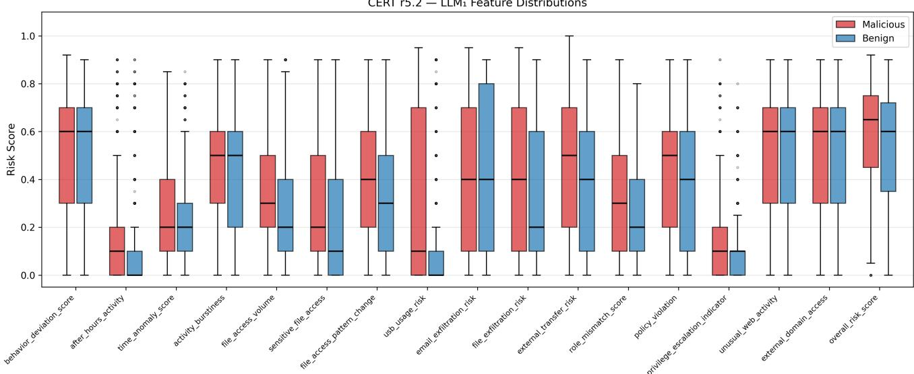

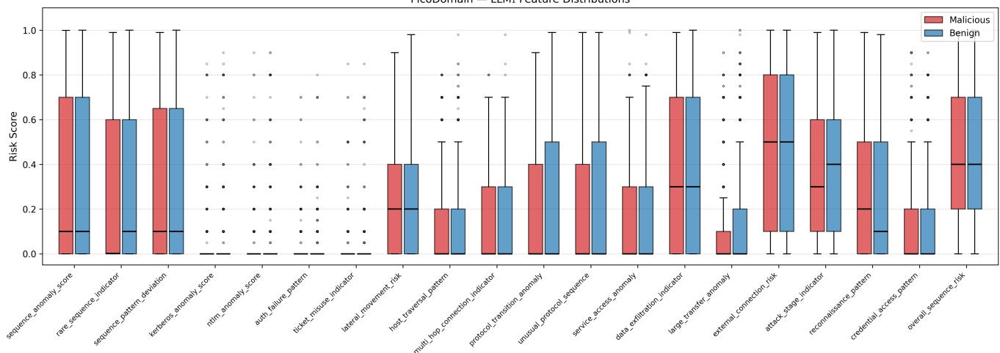  
Figure 5: LLM feature score distributions (malicious vs benign) for CERT r5.2 (top) and PicoDomain (bottom). On CERT r5.2, several features show clear separation (notably usb\_usage\_risk, file\_exfiltration\_risk, and file\_access\_pattern\_change), consistent with known insider threat behaviours. On PicoDomain, the malicious and benign distributions of the LLM scores are near-identical across all 20 features.

Table 7  
Efect of window representation on CERT r5.2. All configurations use DeepSeek-R1-32B with embedding RAG and 17 dataset-specific features.
<table><tr><td>Window Representation</td><td>Prec. (%)</td><td>Recall (%)</td><td>F1 (%)</td></tr><tr><td>Verbose event text</td><td>45.84</td><td>62.52</td><td>52.89</td></tr><tr><td>Sequence + destination tokens</td><td>47.41</td><td>66.83</td><td>55.47</td></tr><tr><td>Structured event objects (proposed)</td><td>48.43</td><td>73.40</td><td>58.36</td></tr></table>

Table 8  
Efect of log-grouping strategy on PicoDomain. Both configurations use identical features (20 network indicators), DeepSeek-R1-32B with embedding RAG, and inference settings; only the grouping unit difers.
<table><tr><td>Grouping</td><td>Prec. (%)</td><td>Recall (%)</td><td>F1 (%)</td></tr><tr><td>Connection-pair (source-destination)</td><td>20.45</td><td>55.41</td><td>29.87</td></tr><tr><td>Per-user (proposed)</td><td>36.16</td><td>62.20</td><td>45.74</td></tr></table>

CERT r5.2 — SHAP Feature Importance (Random Forest)  
(c) Llama 3.1 8B - RAG  
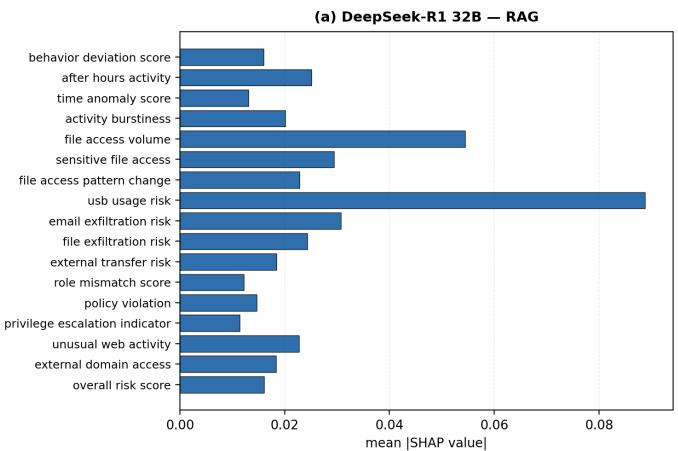

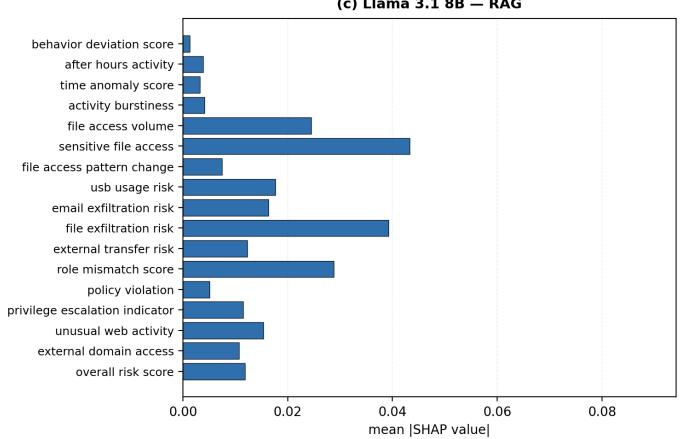

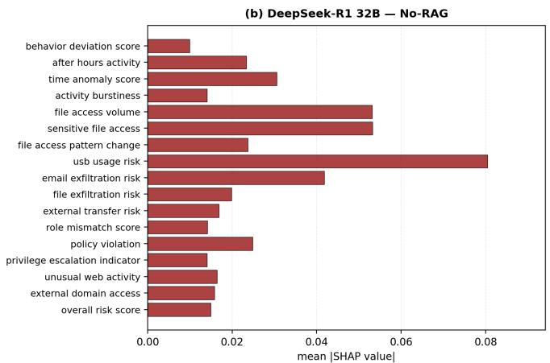

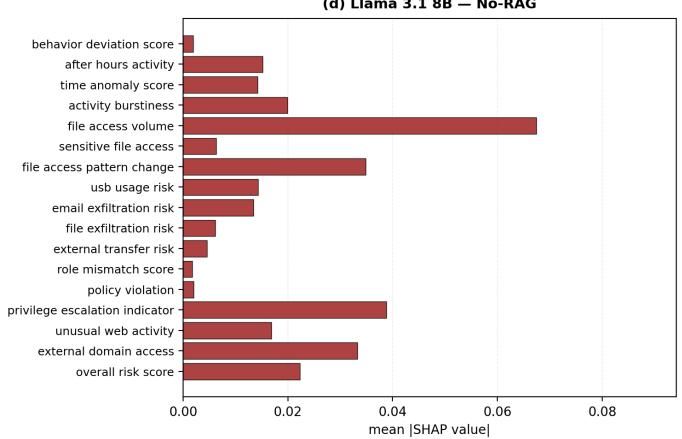  
Figure 6: LLM feature importance on CERT r5.2: mean |SHAP| from TreeSHAP (Lundberg and Lee, 2017) over a Random Forest trained on the $\mathsf { L L M } _ { 1 }$ feature vectors, for both feature-generation models under RAG and No-RAG. Features appear in extraction order with a shared x-axis across all four panels.

## 5.5. Limitations

First, the temporal-context sampling evaluates attackproximal windows, not a continuous stream. The subset is enriched for malicious activity, so the reported precision reflects this distribution rather than an operational falsepositive rate, which would be lower on a predominantly benign stream. As malicious windows appear in bursts, part of $\mathrm { L L M } _ { 2 } ^ { \mathbf { \Gamma } } \mathbf { s }$ performance may derive from this structure rather than per-window content.

Second, $\mathrm { L L M } _ { 1 }$ features carry almost no per-window signal on PicoDomain, and detection there is at chance $( \mathbf { M C C } = 0 . 0 0 4 )$ against a significant association on CERT r5.2 $( \mathbf { M C C } = 0 . 1 4 6 )$ . We treat PicoDomain as a boundary case for this class of method, reflecting stealthy beaconing rather than a feature-design flaw (Section 5.2).

Third, we do not compare absolute metrics against GABM: it classifies per activity identifier rather than per window, and specifies neither its labelling nor its benignsampling procedure (5,000 of 537,840 entries, a prevalence near 1.6% against our 36.5%), so a like-for-like comparison is not definable. We rely instead on prevalence-robust metrics and internal comparisons on an identical subset.

Generalisation beyond these two datasets, and to other prompts and embedding models, remains to be established.

## 6. Conclusion

We presented a retrieval-augmented dual-LLM framework for zero-shot intrusion detection across heterogeneous security logs. Logs are grouped into per-user chronological timelines against which each window is assessed. $\mathrm { L L M } _ { 1 }$ transforms raw log windows into structured vectors of interpretable risk indicators tailored to the threat type, and $\mathrm { L L M } _ { 2 }$ classifies ordered sequences of these vectors to detect multiwindow attack patterns.

Evaluated on CERT r5.2 and PicoDomain, the framework achieves best F1-scores of 64.14% and 50.87% respectively, improvements of 11.40 and 31.50 percentage points over the GABM baseline, and every one of the eight evaluated configurations exceeds the baseline on both datasets, indicating the gains stem from the architecture rather than any single model choice. The cross-model analysis suggests two patterns. First, retrieval and model capability appear to act as substitutes: retrieval improves the features produced by the less capable model, especially on weak-signal data, whereas the more capable model attains comparable feature quality without retrieved context. Second, the best configurations assign diferent models to the two stages, placing the more capable model at feature generation on weak-signal data and at classification on strong-signal data.

PicoDomain — SHAP Feature Importance (Random Forest)  
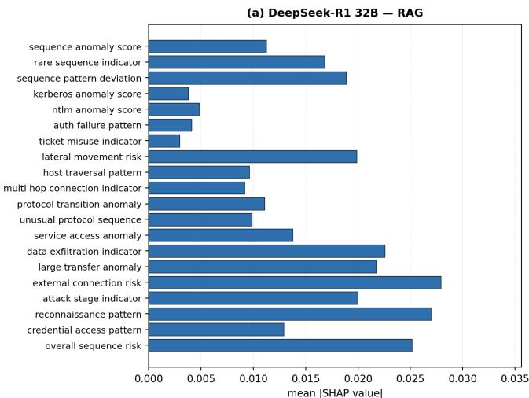

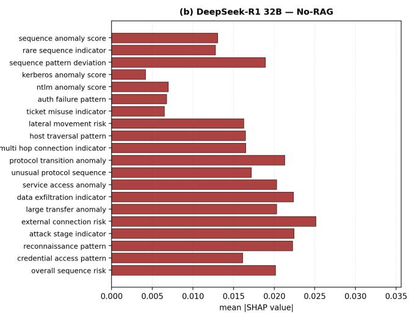

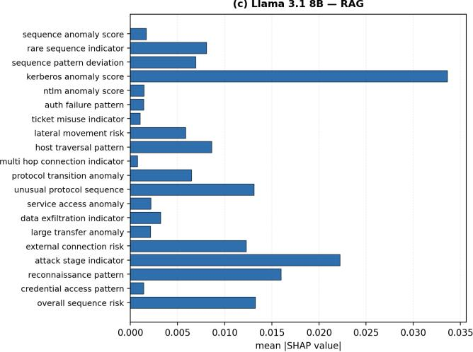

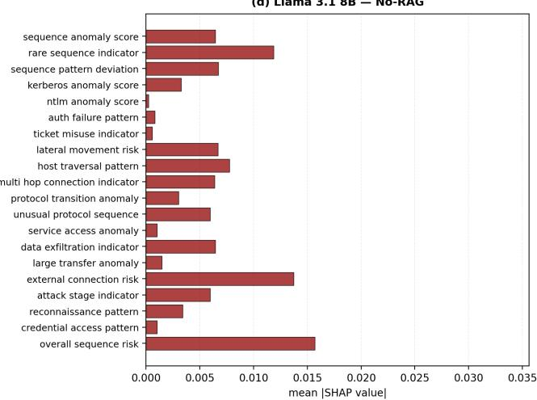  
Figure 7: LLM feature importance on PicoDomain; same method and layout as Figure 6.

Feature analysis shows that $\mathrm { L L M } _ { 1 }$ feature quality reflects the nature of each threat type: insider threat activity on CERT r5.2 produces clear behavioural traces (mean absolute class diference 0.057 across the 17 features), while APT beaconing on PicoDomain is inherently stealthy (0.008, with the largest diferences mildly inverted). The structured representation nonetheless provides a consistent basis for $\mathrm { L L M } _ { 2 } ^ { \mathbf { \Gamma } } ,$ s window-level classification, despite the limited discriminative signal at the individual window level.

Future work includes evaluating on additional datasets, investigating cross-user retrieval to surface shared C2 beaconing patterns across hosts, and exploring fine-tuning LLMs for the feature generation stage.

## References

Alzaabi, F.R., Mehmood, A., 2024. A review of recent advances, challenges, and opportunities in malicious insider threat detection using machine learning methods. IEEE Access 12, 30907–30927.

Borah, A., Alam, M.T., Rastogi, N., 2025. Adapting large language models to emerging cybersecurity using retrieval augmented generation. arXiv preprint arXiv:2510.27080 .

Bridges, R.A., Glass-Vanderlan, T.R., Iannacone, M.D., Vincent, M.S., Chen, Q., 2019. A survey of intrusion detection systems leveraging host data. ACM computing surveys (CSUR) 52, 1–35.

Ferraro, A., Orlando, G.M., Russo, D., 2025. Generative agent-based modeling with large language models for insider threat detection. Engineering Applications of Artificial Intelligence 157, 111343.

Georgiadou, A., Mouzakitis, S., Askounis, D., 2022. Detecting insider threat via a cyber-security culture framework. Journal of Computer Information Systems 62, 706–716.

Glasser, J., Lindauer, B., 2013. Bridging the gap: A pragmatic approach to generating insider threat data, in: 2013 IEEE Security and Privacy Workshops, IEEE. pp. 98–104.

Houssel, P.R., Layeghy, S., Singh, P., Portmann, M., 2026. ex-nids: A framework for explainable network intrusion detection leveraging large language models. Computers and Electrical Engineering 129, 110826.

Kojima, T., Gu, S.S., Reid, M., Matsuo, Y., Iwasawa, Y., 2022. Large language models are zero-shot reasoners. Advances in Neural Information Processing Systems 35, 22199–22213.

Kong, K., Liu, D., Jin, X., Geng, G., Li, Z., Weng, J., 2025. Dmfi: A dualmodality log analysis framework for insider threat detection with loratuned language models, in: 2025 IEEE International Conference on Data Mining (ICDM), IEEE. pp. 387–396.

Laprade, C., Bowman, B., Huang, H.H., 2020. Picodomain: a compact highfidelity cybersecurity dataset. arXiv preprint arXiv:2008.09192 .

Lewis, P., Perez, E., Piktus, A., Petroni, F., Karpukhin, V., Goyal, N., Küttler, H., Lewis, M., Yih, W.t., Rocktäschel, T., et al., 2020. Retrievalaugmented generation for knowledge-intensive nlp tasks. Advances in neural information processing systems 33, 9459–9474.

Li, C., Zhu, Z., He, J., Zhang, X., 2025. Redchronos: A large language model-based log analysis system for insider threat detection in enterprises. arXiv preprint arXiv:2503.02702 .

Lundberg, S.M., Lee, S.I., 2017. A unified approach to interpreting model predictions, in: Advances in Neural Information Processing Systems.

Mandiant, 2013. APT1: Exposing One of China’s Cyber Espionage Units. Technical Report. Mandiant Intelligence Center. URL: https: //services.google.com/fh/files/misc/mandiant-apt1-report.pdf.

MITRE Corporation, 2026. MITRE ATT&CK Knowledge Base. URL: https://attack.mitre.org/. accessed: 2026-04-20.

Paul, S., Alemi, F., Macwan, R., 2025. Llm-assisted proactive threat intelligence for automated reasoning. arXiv preprint arXiv:2504.00428

Pletzer, B., Mottok, J., 2026. From anomaly to attack path: Llm-based network trafic investigation for apt detection, in: Proceedings of the 19th European Workshop on Systems Security, Association for Computing Machinery, New York, NY, USA. p. 10–16. URL: https://doi.org/10. 1145/3803525.3804991, doi:10.1145/3803525.3804991.

Prabhu, S., Thompson, N., 2022. A primer on insider threats in cybersecurity. Information Security Journal: A Global Perspective 31, 602–611.

Reimers, N., Gurevych, I., 2019. Sentence-bert: Sentence embeddings using siamese bert-networks, in: Proceedings of EMNLP.

Song, C., Ma, L., Zheng, J., Liao, J., Kuang, H., Yang, L., 2024. Audit-llm: Multi-agent collaboration for log-based insider threat detection. arXiv preprint arXiv:2408.08902 .

Song, C., Zheng, J., Ma, L., Liao, J., Kuang, H., Yang, L., 2025a. Insightllm: Llm-enhanced multi-view fusion in insider threat detection. arXiv preprint arXiv:2509.01509 .

Song, S., Zhang, Y., Gao, N., 2025b. Confront insider threat: Precise anomaly detection in behavior logs based on llm fine-tuning, in: Proceedings of the 31st international conference on computational linguistics, pp. 8589–8601.

Xu, H., Wang, S., Li, N., Wang, K., Zhao, Y., Chen, K., Yu, T., Liu, Y., Wang, H., 2024. Large language models for cyber security: A systematic literature review. ACM Transactions on Software Engineering and Methodology .

Yuan, S., Wu, X., 2021. Deep learning for insider threat detection: Review, challenges and opportunities. Computers & Security 104, 102221.