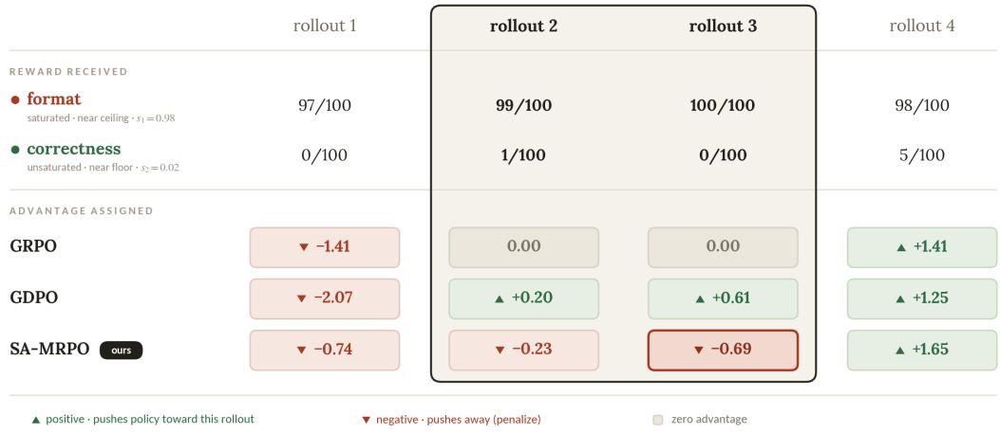
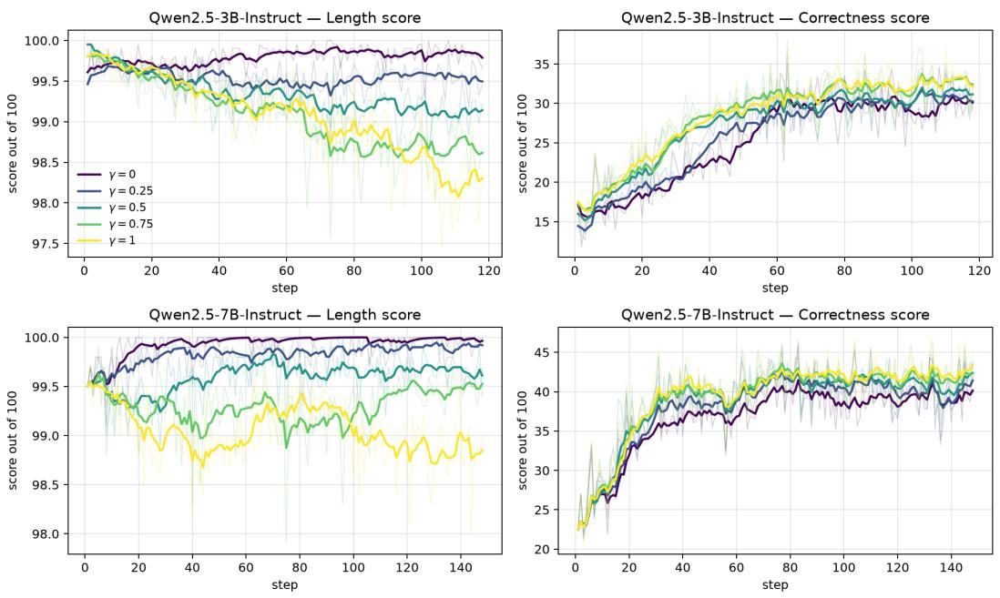

# Learn What’s Left, Not What’s Mastered: Saturation Aware Advantage Reweighting for Multi-Reward Policy Optimization

Yixuan Wang♠∗ Yifei Chen♡∗ Haichao Zhang♣ Haozheng Luo♢ Xander Wu⋆ Jie Ni♦ Yun Fu♣ Nuno Vasconcelos♡ Yijiang Li♡†

♠University of Florida ♡UC San Diego ♣Northeastern University ♢Northwestern University ⋆Stanford University, Zillion Network ♦Universität Innsbruck ∗Equal contribution. †Corresponding author & project lead. yijiangli@ucsd.edu

## Abstract

Reinforcement learning (RL) with group-relative advantages has become the de facto standard for post-training language model reasoners. However, when optimizing multiple reward objectives, existing methods typically scalarize the reward vector with a fixed weighted sum before group-wise standardization. We show that this design leads to two fundamental problems: rollouts with distinct reward profiles can receive identical advantages, and all objectives are optimized with fixed relative weights regardless of their current level of saturation. As a result, training continues to allocate gradient budget to already-solved objectives instead of focusing on those with greater remaining headroom.

We introduce Saturation Aware Advantage Reweighting for Multi-Reward Policy Optimization (SA-MRPO), which standardizes each reward objective independently and adaptively discounts its contribution according to a batch-level estimate of objective saturation. This dynamically reallocates optimization effort toward under-optimized objectives while empirically maintaining performance on those that are already well satisfied. We further show that saturation-aware reweighting can reverse the sign of an update, rather than merely rescale its mag nitude. Across mathematical reasoning with two- and three-objective reward combinations, SA-MRPO improves the harder correctness objective over GDPO in 12 of 15 benchmark comparisons, with gains of up to 5% on AIME24. On adaptive reasoning it improves accuracy on all five benchmarks, by 3.8% on average and up to 9.2% on AMC23, and on coding benchmarks it improves pass rate by up to 2.3%, while in all settings maintaining the easier objectives near their already satisfied levels.

## 1 Introduction

Reinforcement learning with verifiable rewards (RLVR) has emerged as a standard approach for improving the reasoning capabilities of large language models. Group Relative Policy Optimization (GRPO) [Shao et al., 2024] and its variants [Guo et al., 2025] simplify this process by estimating advantages from groups of rollouts, avoiding the learned value function required by PPO [Schulman et al., 2017]. At its core, however, GRPO assumes a single scalar reward for each rollout. In practice, reasoning models are often optimized for multiple objectives [Guo et al., 2025, Fang et al., 2025]. A response should not only be correct, but may also need to satisfy constraints on length [Luo et al., 2026, Fu et al., 2025, Feng et al., 2025], format, safety [Zhang et al., 2026, Chen et al., 2025], or executability, etc. The standard approach is to combine these objectives through a fixed weighted sum and then standardize the resulting scalar reward within each rollout group. We identify two limitations of this design. First, scalarization loses reward resolution: different weights sum of objective rewards may produce the same scalar value and therefore receive the same advantage. Second, fixed weights ignore objective saturation: Each objective retains the same relative weight throughout training, regardless of how close it is to saturation. Consequently, optimization may continue to prioritize an well-optimized objective while the harder under-optimized objectives are overlooked.

To this end, we introduce Saturatio-aware Advantage Reweighting for Multi-Reward Policy Optimization (SA-MRPO). SA-MRPO preserves per-objective normalization while adaptively reweighting each objective according to its current degree of saturation. Specifically, we estimate saturation using the batch-mean reward relative to the objective’s attainable range, and progressively downweight objectives as they approach their maximum. The resulting advantage reallocates optimization empha sis toward under-optimized objectives while attenuating gradients from objectives that are already well optimized. A single exponent γ controls the strength of this saturation-aware reweighting. Substantially under-optimized objectives therefore receive greater emphasis, whereas objectives approaching saturation are progressively downweighted. SA-MRPO thus reallocates optimization effort throughout training toward objectives with greater remaining headroom while reducing emphasis on those that are already well learned, without modifying the underlying GRPO policy update. We show that this reweighting can change the direction, rather than merely the magnitude, of an update by reversing the sign of a rollout’s aggregate advantage. We further show that SA-MRPO strictly generalizes both Group reward-Decoupled Policy Optimization (GDPO) [Liu et al., 2026b] and Group Relative Policy Optimization (GRPO) [Shao et al., 2024] as special cases. When saturation-aware reweighting is disabled, it reduces to GDPO, which independently normalizes each reward dimension before aggregation. In the single-objective setting, it further reduces to Group Relative Policy Optimization GRPO. Concurrent approaches such as DVAO [Jiang et al., 2026] and GD2PO [Liu et al., 2026a] adapt multi-reward optimization using reward variance or advantage consistency, but do not explicitly account for how close each objective is to saturation. Consequently, an already saturated objective can continue to exert comparable influence to one with substantially greater room for improvement. SA-MRPO addresses this limitation by making the allocation of optimization effort explicitly depend on each objective’s remaining headroom, while leaving the underlying GRPO policy update unchanged.

We evaluate SA-MRPO on mathematical reasoning, controlled adaptive reasoning, and code generation across diverse base models, training data and configurations. Under standard two- and three-objective mathematical reasoning settings, SA-MRPO improves accuracy over GDPO in 12 of 15 benchmark comparisons while largely maintaining the performance of the saturated objective. On adaptive reasoning, SA-MRPO improves accuracy over GDPO on all five benchmarks, yielding a 3.8% on average improvement while keeping response lengths within restriction limit. The same behavior extends to code generation: when jointly optimizing executability and test-case pass rate, SA-MRPO improves pass rate on three of four benchmarks, with gains of up to 2.3%, while maintaining comparable executability.

To summarize, our contributions are:

• We identify two limitations of scalarized multi-reward policy optimization: rewardresolution loss and optimization ignores objective saturation, and show that the latter persists after reward decoupling.

• We propose SA-MRPO, which dynamically reweights normalized reward objectives according to their degree of optimized saturation. We show that SA-MRPO can alter the direction of policy updates and that it strictly generalizes GDPO and GRPO as special cases.

• We empirically validate the effectiveness of SA-MRPO across mathematical reasoning, adaptive reasoning, and code generation, showing that it successfully redistributes optimization effort from saturated objectives to less optimized ones, leading to consistently improvements on the under-optimized objectives while preserving the objectives that are already well optimized.

## 2 Related Work

RLVR and multi objective alignment. Reinforcement learning with verifiable rewards has become a standard approach for improving language model reasoning, with GRPO [Shao et al., 2024], DeepSeek R1 [Guo et al., 2025], DAPO [Yu et al., 2026], and REINFORCE++ [Hu et al., 2025] developing increasingly effective critic free policy optimization schemes. Beyond single reward optimization, language model alignment frequently involves multiple objectives, including correctness, efficiency, helpfulness, harmlessness, and other preference dimensions. Prior work has studied this problem through conditional preference control, multi objective preference optimization, Pareto optimization, and adaptive reward weighting [Zhou et al., 2024, Mukherjee et al., 2024, Li et al., 2025, Liu et al., 2025, Lu et al., 2026]. These works establish that the relative importance of different objectives need not remain fixed throughout optimization.

Multi reward group relative policy optimization. More recent work directly studies how multiple rewards should be combined within group relative policy optimization. GDPO [Liu et al., 2026b] normalizes each reward dimension independently before aggregation, avoiding information loss caused by scalarizing heterogeneous rewards before group normalization. DVAO [Jiang et al., 2026] adapts objective weights according to reward variance, while $\mathrm { G D ^ { 2 } P O }$ [Liu et al., 2026a] addresses conflicts among reward specific advantages. Related methods further consider reward correlation, task imbalance, and alternative multi reward optimization strategies [Ramesh et al., 2026, Liang et al., 2026, Wang et al., 2026]. These approaches improve the construction of multi reward optimization signals, but objective importance is generally determined by reward statistics, agreement, or optimization structure rather than directly by the remaining attainable reward range.

Dynamic objective allocation. Most closely related to our work, Dynamic Reward Weighting [Lu et al., 2026], SAW [He et al., 2026], and Focal Reward [Huang et al., 2026] recognize that objectives can progress at different rates and that optimization effort should evolve accordingly. SAW uses reward variability as a measure of objective informativeness, while Focal Reward estimates saturation for rubric based reward criteria. SA-MRPO instead focuses on bounded verifiable rewards and defines saturation directly from the fraction of the attainable reward range already achieved. This enables saturation aware reweighting of independently normalized reward advantages while retaining the standard GRPO policy update.

## 3 Preliminaries

We study reinforcement learning for an auto-regressive language model under multiple reward objectives. Let $\pi _ { \theta }$ denote the policy parameterized by θ. Given a query q, the policy defines an auto-regressive distribution over an output sequence $o \triangleq \left( o _ { 1 } , \ldots , o _ { | o | } \right)$ according to $\pi _ { \theta } ( o \mid q ) \triangleq$ $\textstyle \prod _ { t = 1 } ^ { | o | } \pi _ { \theta } ( o _ { t } \mid q , o _ { 1 : t - 1 } )$ , where $o _ { 1 : t - 1 } \triangleq \left( o _ { 1 } , \dots , o _ { t - 1 } \right)$ denotes the prefix preceding token $o _ { t }$ . At each policy update, a batch of B queries $\{ q _ { i } \} _ { i = 1 } ^ { B }$ is sampled from a data distribution D. For each query $q _ { i }$ , a frozen behavior policy $\pi _ { \theta _ { \mathrm { o l d } } }$ generates a group of $G \geq 2$ rollouts,

$$
o _ { i , j } \sim \pi _ { \theta _ { \mathrm { o l d } } } ( \cdot \mid q _ { i } ) , \quad j \in \{ 1 , \ldots , G \} .
$$

Let $o _ { i , j } \triangleq \big ( o _ { i , j , 1 } , \hdots , o _ { i , j , | o _ { i , j } | } \big )$ denote the j-th rollout associated with query $q _ { i } ,$ , and let $o _ { i , j , < t } \triangleq$ $\left( o _ { i , j , 1 } , \ldots , o _ { i , j , t - 1 } \right)$ denote its prefix before token t. The policy is trained with n reward objectives. For objective $k \in \{ 1 , \ldots , n \}$ , let $R ^ { ( k ) }$ denote its reward function and let $w _ { k } \geq 0$ denote its prescribed weight. The reward assigned by objective k to rollout $o _ { i , j }$ is $r _ { k } ^ { ( i , j ) } \triangleq R ^ { ( k ) } ( q _ { i } , o _ { i , j } )$ . For a finite collection $S \triangleq \{ x _ { 1 } , \ldots , x _ { m } \}$ , the mean and the standard deviation of S is represented as:

$$
\mathrm { m e a n } ( S ) = \frac { 1 } { m } \sum _ { l = 1 } ^ { m } x _ { l } , \quad \mathrm { s t d } ( S ) = \sqrt { \frac { 1 } { m } \sum _ { l = 1 } ^ { m } \left( x _ { l } - \mathrm { m e a n } ( S ) \right) ^ { 2 } } ,
$$

respectively.

Group Relative Policy Optimization. GRPO estimates the advantage of a rollout by comparing its reward with the other rollouts generated for the same query. With multiple reward objectives, a standard approach first combines the individual rewards into a scalar score $\begin{array} { r } { r _ { \mathrm { { s u m } } } ^ { ( i , j ) } \triangleq \sum _ { k = 1 } ^ { n } w _ { k } r _ { k } ^ { ( i , j ) } } \end{array}$ The resulting score is then standardized within the group generated for query $q _ { i }$ . The GRPO advantage

  
Figure 1: Comparison of GRPO, GDPO, and SA-MRPO on one group of $G = 4$ rollouts with a saturated format objective and an unsaturated correctness objective. Rollouts 2 and 3 have the same scalar reward but different reward profiles, causing GRPO to assign both zero advantage. GDPO distinguishes the two profiles but assigns a larger advantage to rollout 3, despite its zero correctness. SA-MRPO discounts the saturated format objective and instead assigns rollout 3 a more negative advantage than rollout $2 ,$ while favoring rollout $^ { 4 , }$ which achieves the highest correctness.

of rollout $o _ { i , j }$ is defined as

$$
A _ { \mathrm { G R P O } } ^ { ( i , j ) } \triangleq \frac { r _ { \mathrm { s u m } } ^ { ( i , j ) } - \operatorname* { m e a n } \left\{ r _ { \mathrm { s u m } } ^ { ( i , 1 ) } , \dots , r _ { \mathrm { s u m } } ^ { ( i , G ) } \right\} } { \mathrm { s t d } \left\{ r _ { \mathrm { s u m } } ^ { ( i , 1 ) } , \dots , r _ { \mathrm { s u m } } ^ { ( i , G ) } \right\} } .
$$

For a clipping threshold $\epsilon > 0$ , define $\mathrm { c l i p } ( x , a , c ) \triangleq \operatorname* { m a x } { ( a , \operatorname* { m i n } ( x , c ) ) }$ . GRPO maximizes the clipped surrogate objective

$$
\mathcal { I } _ { \mathrm { G R P O } } ( \theta ) = \mathbb { E } \left[ \frac { 1 } { G } \sum _ { j = 1 } ^ { G } \frac { 1 } { | \omega _ { i , j } | } \sum _ { t = 1 } ^ { | \alpha _ { i , j } | } \operatorname* { m i n } \left( \rho _ { i , j , t } ( \theta ) A _ { \mathrm { G R P O } } ^ { ( i , j ) } , \mathrm { c l i p } \left( \rho _ { i , j , t } ( \theta ) , 1 - \epsilon , 1 + \epsilon \right) A _ { \mathrm { G R P O } } ^ { ( i , j ) } \right) \right] ,
$$

where the expectation is taken over $q _ { i } \sim \mathcal { D }$ and $\{ o _ { i , j } \} _ { j = \mathbb { 1 } } ^ { G }$ sampled from $\pi _ { \theta _ { \mathrm { o l d } } } ( \cdot \mid q _ { i } )$ and

$$
\rho _ { i , j , t } ( \theta ) \triangleq \frac { \pi _ { \theta } \left( o _ { i , j , t } \mid q _ { i } , o _ { i , j , < t } \right) } { \pi _ { \theta _ { \mathrm { o l d } } } \left( o _ { i , j , t } \mid q _ { i } , o _ { i , j , < t } \right) } .
$$

As in standard GRPO, a KL penalty against a fixed reference policy may additionally be included with coefficient $\beta \geq 0$ . We omit this term because it is independent of the reward construction studied in this work.

## 4 Saturation Aware Advantage Reweighting

The GRPO construction above combines all reward dimensions before computing the group relative advantage. This scalarization introduces two limitations. First, distinct reward profiles can collapse to the same scalar reward. For example, under equal weights, (1, 0) and (0, 1) become indistinguishable. Second, scalarization does not account for how much improvement remains for each objective. The policy can continue favoring an already saturated objective instead of directing more of the update toward the objective that still requires improvement, as illustrated in Figure 1. These two limitations motivate separating objective specific relative performance from the current optimization state of each objective.

## 4.1 Saturation Aware Group Relative Advantage

For each query $q _ { i } ,$ let $r _ { k } ^ { ( i , j ) }$ denote the reward assigned by objective k to rollout $o _ { i , j } ,$ , where $i \in$ $\{ 1 , \dotsc , B \} , j \in \{ 1 , \dotsc , G \}$ , and $k \in \{ 1 , \ldots , n \}$ . A multi objective policy update must account

for both the relative quality of a rollout under each objective and the current optimization state of that objective. We incorporate these two sources of information directly into a single group relative advantage.

For each objective $k ,$ define the group statistics associated with query $q _ { i }$ as

$$
\mu _ { k } ^ { ( i ) } \triangleq \operatorname * { m e a n } \left\{ r _ { k } ^ { ( i , 1 ) } , \ldots , r _ { k } ^ { ( i , G ) } \right\} , \quad \sigma _ { k } ^ { ( i ) } \triangleq \operatorname { s t d } \left\{ r _ { k } ^ { ( i , 1 ) } , \ldots , r _ { k } ^ { ( i , G ) } \right\} .
$$

To characterize the current optimization state of objective k, we use its average reward over the current batch,

$$
\bar { r } ^ { ( k ) } \triangleq \operatorname* { m e a n } \left\{ r _ { k } ^ { ( i , j ) } : i \in \{ 1 , \dots , B \} , j \in \{ 1 , \dots , G \} \right\} .
$$

Let $r _ { \operatorname* { m i n } } ^ { ( k ) }$ and $r _ { \mathrm { m a x } } ^ { ( k ) }$ denote the attainable lower and upper reward bounds of objective k, respectively. We then define the saturation ratio of objective k as

$$
s ^ { ( k ) } \triangleq \frac { \bar { r } ^ { ( k ) } - r _ { \operatorname* { m i n } } ^ { ( k ) } } { r _ { \operatorname* { m a x } } ^ { ( k ) } - r _ { \operatorname* { m i n } } ^ { ( k ) } } \in [ 0 , 1 ] .
$$

A smaller $s ^ { ( k ) }$ indicates that a larger fraction of the attainable reward range remains unrealized, whereas a larger $s ^ { ( k ) }$ indicates that the objective is closer to its reward ceiling.

Given prescribed objective weights $\{ w _ { k } \} _ { k = 1 } ^ { n }$ and a saturation exponent $\gamma \geq 0$ , we define the saturation aware group relative advantage before final batch normalization as

$$
\widetilde { A } ^ { ( i , j ) } \triangleq \sum _ { k = 1 } ^ { n } \widetilde { w } _ { k } A _ { k } ^ { ( i , j ) } ,
$$

where

$$
A _ { k } ^ { ( i , j ) } \triangleq \frac { r _ { k } ^ { ( i , j ) } - \mu _ { k } ^ { ( i ) } } { \sigma _ { k } ^ { ( i ) } } , \qquad \widetilde { w } _ { k } \triangleq w _ { k } \left( 1 - s ^ { ( k ) } \right) ^ { \gamma } .
$$

The term $A _ { k } ^ { ( i , j ) }$ measures the relative quality of rollout $o _ { i , j }$ under objective k within the corresponding rollout group, while $\widetilde { w } _ { k }$ modulates the contribution of objective k according to both its prescribed importance and its current saturation level. Specifically, the factor $\left( 1 - s ^ { ( k ) } \right) ^ { \gamma }$ decreases the influence of objective k as the current policy realizes a larger fraction of its attainable reward range. Thus, each objective contributes to the aggregate advantage according to its prescribed importance, its remaining room for improvement, and the relative quality of the current rollout.

Since the saturation ratios evolve during training, the scale of $\widetilde { A } ^ { ( i , j ) }$ may vary across policy updates. We therefore normalize the aggregate advantages over the current batch as

$$
\widehat { A } _ { \mathrm { S A } } ^ { ( i , j ) } \triangleq \frac { \widetilde { A } ^ { ( i , j ) } - \operatorname * { m e a n } ( A ) } { \operatorname { s t d } ( A ) } , \qquad A \triangleq \left\{ \widetilde { A } ^ { ( i , j ) } : i \in \{ 1 , \dots , B \} , j \in \{ 1 , \dots , G \} \right\} .\tag{1}
$$

The resulting advantage is directly used in the standard clipped group relative surrogate objective,

$$
\mathcal { I } _ { \mathrm { S A - M R P O } } ( \theta ) = \mathbb { E } \left[ \frac { 1 } { G } \sum _ { j = 1 } ^ { G } \frac { 1 } { | o _ { i , j } | } \sum _ { t = 1 } ^ { | o _ { i , j } | } \operatorname* { m i n } \left( \rho _ { i , j , t } ( \theta ) \widehat { A } _ { \mathrm { S A } } ^ { ( i , j ) } , \mathrm { c l i p } \left( \rho _ { i , j , t } ( \theta ) , 1 - \epsilon , 1 + \epsilon \right) \widehat { A } _ { \mathrm { S A } } ^ { ( i , j ) } \right) \right] .
$$

Thus, SA-MRPO changes only the construction of the rollout advantage while retaining the underlying group relative policy optimization objective.

Algorithm 1 summarizes the resulting policy update. The saturation rule therefore provides an adaptive allocation mechanism, but changing the relative allocation across objectives also raises two questions: whether emphasizing an unsaturated objective can degrade an already optimized objective, and whether the saturation estimate itself can incorrectly represent the remaining optimization potential.

Algorithm 1 SA-MRPO policy update   
Require: queries $\{ q _ { i } \} _ { i = 1 } ^ { B } ,$ weights $\{ w _ { k } \} _ { k = 1 } ^ { n }$ , reward bounds $\{ ( r _ { \operatorname* { m i n } } ^ { ( k ) } , r _ { \operatorname* { m a x } } ^ { ( k ) } ) \} _ { k = 1 } ^ { n }$ , saturation expo  
nent γ, clipping threshold ϵ   
1: sample $\{ o _ { i , j } \} _ { j = 1 } ^ { \tilde { G } } \sim \pi _ { \theta _ { \mathrm { o l d } } } ( \cdot \mid q _ { i } )$ for each i   
2: compute $r _ { k } ^ { ( i , j ) } = R ^ { ( k ) } ( q _ { i } , o _ { i , j } )$ for all $i , j , k$   
3: for $\bar { k } = 1$ to n do   
4: $\ddot { r } ^ { ( k ) }  \operatorname* { m e a n } \{ r _ { k _ { \ldots } } ^ { ( i , j ) } \} _ { i , j }$   
5: $s ^ { ( k ) } \gets \frac { \bar { r } ^ { ( k ) } - \bar { r } _ { \operatorname* { m i n } } ^ { ( k ) } } { r _ { \operatorname* { m a x } } ^ { ( k ) } - r _ { \operatorname* { m i n } } ^ { ( k ) } }$   
6: end for   
7: for each query $i$ and rollout $j$ do   
8: $\widetilde { A } ^ { ( i , j ) } \gets \sum ^ { \bullet } w _ { k } \left( 1 - s ^ { ( k ) } \right) ^ { \gamma } \frac { r _ { k } ^ { ( i , j ) } - \operatorname* { m e a n } \{ r _ { k } ^ { ( i , 1 ) } , \dots , r _ { k } ^ { ( i , G ) } \} } { \mathrm { ~ , ~ } \dots \mathrm { ~ } ( i , 1 ) }$   
k=1 std $\overline { { \{ r _ { k } ^ { ( i , 1 ) } , \ldots , r _ { k } ^ { ( i , G ) } \} } }$   
9: end for   
10: $\widehat { A } _ { \mathrm { S A } } ^ { ( i , j ) } \gets \big ( \widetilde { A } ^ { ( i , j ) } - \mathrm { m e a n } \{ \widetilde { A } \} \big ) / \mathrm { s t d } \{ \widetilde { A } \}$ for all $i , j$   
11: update θ by ascending $\nabla _ { \boldsymbol { \theta } } \mathcal { J } _ { \mathrm { S A - M R P O } } ( \boldsymbol { \theta } )$ using $\{ \widehat { A } _ { \mathrm { S A } } ^ { ( i , j ) } \}$

The proposed construction contains static objective allocation as a special case. When $\gamma = 0 ,$ , the saturation factors are identically one and

$$
\widetilde w _ { k } = w _ { k } , \quad \widetilde A ^ { ( i , j ) } = \sum _ { k = 1 } ^ { n } w _ { k } A _ { k } ^ { ( i , j ) } ,
$$

which recovers the corresponding GDPO advantage under the same objective weights and normalization.

The saturation aware reweighting also reduces the relative contribution of the more saturated objective compared with the prescribed allocation. Increasing $\gamma$ further shifts the relative allocation toward objectives with larger remaining reward headroom. For any two objectives a and b satisfying $w _ { a } > 0$ $w _ { b } > 0$ , and $s ^ { ( a ) } , \bar { s } ^ { ( b ) } \in [ 0 , 1 )$

$$
\frac { \widetilde { w } _ { a } } { \widetilde { w } _ { b } } = \frac { w _ { a } } { w _ { b } } \left( \frac { 1 - s ^ { ( a ) } } { 1 - s ^ { ( b ) } } \right) ^ { \gamma } .
$$

$\mathrm { I f } s ^ { ( a ) } > s ^ { ( b ) }$ , then $( 1 - s ^ { ( a ) } ) / ( 1 - s ^ { ( b ) } ) < 1$ . Therefore, the ratio $\widetilde { w } _ { a } / \widetilde { w } _ { b }$ is strictly decreasing in $\gamma$ In particular, for every $\gamma > 0$ , we have $\widetilde { w } _ { a } / \widetilde { w } _ { b } < w _ { a } / w _ { b }$

## 4.2 Objective Conflict and Failure Modes

Saturation aware reweighting reallocates optimization emphasis according to remaining reward headroom, but it does not impose a constraint that previously optimized objectives must be preserved. This distinction becomes important when two objectives induce conflicting policy updates. Let $J _ { k } ( \theta )$ denote an objective specific policy surrogate and let $g _ { k } ( \theta ) \triangleq \nabla _ { \theta } J _ { k } ( \theta )$ . For the saturation weighted ascent direction

$$
d ( \theta ) \triangleq \sum _ { k = 1 } ^ { n } { \widetilde { w } } _ { k } g _ { k } ( \theta ) ,
$$

the first order change of objective a along this direction is characterized by

$$
D J _ { a } ( { \boldsymbol { \theta } } ) [ d ] = { \widetilde { w } } _ { a } \left\| g _ { a } ( { \boldsymbol { \theta } } ) \right\| ^ { 2 } + \sum _ { k \neq a } { \widetilde { w } } _ { k } g _ { a } ( { \boldsymbol { \theta } } ) ^ { \top } g _ { k } ( { \boldsymbol { \theta } } ) .
$$

The first term is the contribution of objective a to its own improvement, whereas the cross objective terms describe how updates induced by the remaining objectives affect objective $a . \mathrm { I f } g _ { a } ( \theta ) ^ { \top } g _ { k } ^ { \top } ( \theta ) \geq$ 0 for every positively weighted objective $k ,$ then the aggregate direction cannot decrease $J _ { a }$ to first order. In contrast, objective a decreases whenever

$$
\sum _ { k \neq a } \widetilde { w } _ { k } g _ { a } ( \theta ) ^ { \top } g _ { k } ( \theta ) < - \widetilde { w } _ { a } \left\| g _ { a } ( \theta ) \right\| ^ { 2 } .\tag{2}
$$

Equation (2) gives the precise local condition under which conflict from the other objectives overwhelms the improvement induced by objective a itself. Because $\widetilde { w } _ { a } = w _ { a } ( 1 - s ^ { ( a ) } ) ^ { \gamma }$ decreases as objective a becomes more saturated, saturation aware allocation deliberately reduces the self improvement term protecting that objective. Therefore, when a less saturated objective has a sufficiently conflicting gradient, reallocating optimization effort toward that objective can reduce the performance of an objective that was previously well optimized. This behavior is particularly relevant when the objectives compete for the same finite model capacity, although limited capacity is only one possible mechanism that can produce negative gradient alignment. SA-MRPO should therefore be interpreted as an adaptive objective allocation rule rather than a constrained multi objective method that guarantees monotonic retention of every saturated objective. The empirical question is consequently whether the gain obtained on objectives with greater remaining headroom outweighs any degradation of objectives whose optimization pressure has been reduced.

A separate consideration is that nominal reward headroom does not necessarily coincide with optimizable headroom. By construction, $1 - s ^ { ( k ) }$ measures the fraction of the prescribed reward range that remains unrealized. When the reward bounds are specified directly by the reward function, this quantity is exactly observable and does not require estimation of the reward ceiling. However, a large remaining reward range does not imply that the current policy class has sufficient capacity to realize the corresponding improvement. In particular, an objective may remain far from its prescribed maximum even when the best policy representable by the current model can achieve only limited further improvement. Thus, $s ^ { ( \bar { k } ) }$ should be interpreted as a measure of remaining nominal reward headroom rather than a certificate of remaining achievable improvement. We do not regard this mismatch as a failure mode of the proposed saturation measure, since the saturation ratio correctly characterizes progress within the prescribed reward range and the unattainability of the remaining reward is instead imposed by the capacity of the underlying policy class.

## 5 Experiments

We evaluate SA-MRPO with three questions in mind: whether saturation aware reweighting improves policy optimization under multiple reward objectives, whether the improvement is consistent with reallocating optimization effort away from objectives that are already saturated, and whether the same behavior extends beyond mathematical reasoning. We first evaluate SA-MRPO under standard multi-objective mathematical reasoning settings. We then construct an adaptive reasoning setting with an explicit saturation region to study the proposed mechanism more directly. Finally, we evaluate the method on code reasoning and study the effect of the saturation exponent γ.

## 5.1 Experimental Setup

Training protocol. Unless otherwise specified, all experiments are implemented with verl and use vLLM for rollout generation. For each training prompt, we sample $G = 8$ responses and use the resulting group for reward computation and advantage estimation. We train all models for 3 epochs with a global batch size of 256 and a maximum response length of 4096 tokens. Mathematical and adaptive reasoning experiments are conducted on DeepScaleR-Preview Luo et al. [2025], which contains approximately 40K competition-level mathematical reasoning problems. The model architecture, reward construction, and task-specific deviations from this protocol are described in the corresponding subsections.

Evaluation protocol. For mathematical reasoning, we use vLLM with temperature $0 . 6 , \mathrm { t o p } { \cdot } p =$ 0.95, and a maximum generation length of 4096 tokens. We sample 16 responses per problem and report the average pass@1 accuracy. For code reasoning, we use the same temperature and top-p with a maximum generation length of 2048 tokens. Task specific auxiliary metrics are introduced together with the corresponding experiments. In all evaluation tables, “Base” denotes the corresponding model before RL training.

## 5.2 Mathematical Reasoning

We first investigate whether saturation-aware reweighting improves general multi-objective reasoning performance. We train Qwen2.5-3B-Instruct and Qwen2.5-7B-Instruct following the training protocol described in Section 5.1. We consider both two and three objective settings. The two objective setting optimizes correctness and response length compliance, while the three objective setting additionally includes a format objective. The latter introduces multiple auxiliary objectives that can reach high reward levels at different stages of training.

The reward objectives are defined as follows.

• Length reward. Let l = 4000 denote the response length budget. We define

$$
\mathcal { R } _ { \mathrm { l e n g t h } } ( o ) = \left\{ \begin{array} { l l } { 1 , } & { | o | \leq l , } \\ { 0 , } & { | o | > l . } \end{array} \right.
$$

• Correctness reward. Let y denote the ground truth answer and let Extract(o) denote the final answer parsed from response o. We define

$$
\mathcal { R } _ { \mathrm { c o r r e c t } } ( o ) = \left\{ 1 , \mathrm { E x t r a c t } ( o ) = y , \right.
$$

• Format reward. The format reward evaluates whether the generated response follows the required XML style reasoning format. Specifically, the response must contain exactly one <answer> block and one </answer> block, and the complete response must match <think>...</think>\n<answer $\cdots . . . < /$ answer>. We define

$$
\mathcal { R } _ { \mathrm { f o r m a t } } ( o ) = \left\{ \begin{array} { l l } { 1 , } & { \mathrm { i f ~ o ~ m a t c h e s ~ \hat { ~ } < \epsilon ~ t h i n k > \epsilon ~ \hat { ~ } * 7 < / \epsilon h i n k > \hat { ~ } u < a n s u e r > \hat { ~ } * 7 < / a n s w e r > \hat { ~ } * } , } \\ { ~ } & { \mathrm { a n d ~ } N _ { \mathrm { < a n s u e r > } } ( o ) = 1 , \quad N _ { \mathrm { < / a n s u e r > } } ( o ) = 1 , } \\ { 0 , } & { \mathrm { o t h e r w i s e . } } \end{array} \right.
$$

We evaluate on AIME24 [Zhang and Math-AI, 2024], AMC23 1, MATH500 [Hendrycks et al., 2021], Minerva Math 2, and OlympiadBench [He et al., 2024]. In addition to accuracy, we report EXCEED, defined as the fraction of generated responses whose length exceeds the 4000 token budget.

Table 1: Comparison of GDPO and SA-MRPO on mathematical reasoning under two and three reward objectives. Accuracy is higher is better, while EXCEED denotes the fraction of responses exceeding the 4000 token length budget and is lower is better. The Qwen2.5-3B-Instruct base model is shared across the two reward settings.
<table><tr><td rowspan="3">Benchmark Metric</td><td rowspan="3"></td><td colspan="3">Qwen2.5-7B-Instruct</td><td colspan="5">Qwen2.5-3B-Instruct</td></tr><tr><td colspan="3">Three objectives</td><td rowspan="2"> $\mathbf { B a s e }$ </td><td colspan="2"> $\mathcal { R } _ { \mathrm { c o r r e c t } } + \mathcal { R } _ { \mathrm { l e n g t h } }$ </td><td colspan="2"> $\mathcal { R } _ { \mathrm { c o r r e c t } } + \mathcal { R } _ { \mathrm { l e n g t h } } + \mathcal { R } _ { \mathrm { f o r m a t } }$ </td></tr><tr><td>Base</td><td>GDPO</td><td>SA-MRPO</td><td> $\mathrm { G D P O _ { 2 o b j } }$ </td><td> $\mathbf { S A { - } M R P O _ { 2 o b j } }$ </td><td> $\mathrm { G D P O _ { 3 o b j } }$ </td><td> $\mathbf { S A { - } M R P O _ { 3 o b j } }$ </td></tr><tr><td rowspan="2">AIME24</td><td>Acc ↑</td><td>11.7%</td><td>11.5%</td><td>16.5%</td><td>0.6%</td><td>5.0%</td><td>8.5%</td><td>6.7%</td><td>8.1%</td></tr><tr><td>Exceed ↓</td><td>3.5%</td><td>1.2%</td><td>1.5%</td><td>6.2%</td><td>0.0%</td><td>0.6%</td><td>0.6%</td><td>1.7%</td></tr><tr><td rowspan="2">Minerva</td><td>Acc ↑</td><td>16.1%</td><td>24.2%</td><td>24.8%</td><td>6.7%</td><td>16.2%</td><td>16.6%</td><td>16.9%</td><td>18.1%</td></tr><tr><td>Exceed ↓</td><td>0.4%</td><td>0.1%</td><td>0.0%</td><td>0.4%</td><td>0.1%</td><td>0.1%</td><td>0.1%</td><td>0.1%</td></tr><tr><td rowspan="2">AMC23</td><td>Acc ↑</td><td>41.1%</td><td>44.6%</td><td>43.5%</td><td>10.7%</td><td>33.2%</td><td>34.9%</td><td>31.5%</td><td>35.2%</td></tr><tr><td>Exceed ↓</td><td>1.0%</td><td>1.2%</td><td>1.1%</td><td>1.7%</td><td>0.0%</td><td>0.1%</td><td>0.4%</td><td>0.6%</td></tr><tr><td rowspan="2">MATH500</td><td>Acc ↑</td><td>50.0%</td><td>64.2%</td><td>67.7%</td><td>26.3%</td><td>57.1%</td><td>58.2%</td><td>58.9%</td><td>59.5%</td></tr><tr><td>Exceed ↓</td><td>0.7%</td><td>0.0%</td><td>0.1%</td><td>0.6%</td><td>0.0%</td><td>0.1%</td><td>0.1%</td><td>0.1%</td></tr><tr><td rowspan="2">Olympiad</td><td>Acc ↑</td><td>23.8%</td><td>25.3%</td><td>26.1%</td><td>4.5%</td><td>20.6%</td><td>19.3%</td><td>20.6%</td><td>20.0%</td></tr><tr><td>Exceed ↓</td><td>2.5%</td><td>0.2%</td><td>0.7%</td><td>3.3%</td><td>0.1%</td><td>0.3%</td><td>0.2%</td><td>0.6%</td></tr></table>

Table 1 compares GDPO and SA-MRPO across model scales and reward configurations. Across the three configurations, SA-MRPO achieves higher accuracy than GDPO in 12 of the 15 benchmark comparisons. For Qwen2.5-7B-Instruct with three reward objectives, SA-MRPO improves four of the five benchmarks, including gains of 5.0 percentage points on AIME24 and 3.5 percentage points on MATH500. The same pattern is observed for Qwen2.5-3B-Instruct, where SA-MRPO improves four of five benchmarks in both the two and three objective settings. These accuracy gains are generally accompanied by only small changes in EXCEED, indicating that the improvement in correctness does not require abandoning the auxiliary length objective.

Table 2: Adaptive reasoning with an explicitly saturated length objective.
<table><tr><td rowspan="2">Benchmark</td><td colspan="2">SA-MRPO</td><td colspan="2">GDPO</td><td rowspan="2"> $\Delta { \mathrm { ~ A c c . } }$ </td></tr><tr><td>Acc.</td><td>Len.</td><td>Acc.</td><td>Len.</td></tr><tr><td>AIME24</td><td>7.3</td><td>804</td><td>5.2</td><td>566</td><td>+2.1</td></tr><tr><td>Minerva</td><td>15.9</td><td>277</td><td>15.4</td><td>214</td><td>+0.5</td></tr><tr><td>AMC23</td><td>37.5</td><td>417</td><td>28.3</td><td>290</td><td>+9.2</td></tr><tr><td>MATH500</td><td>51.5</td><td>270</td><td>47.1</td><td>187</td><td>+4.4</td></tr><tr><td>Olympiad</td><td>20.9</td><td>529</td><td>18.1</td><td>406</td><td>+2.8</td></tr><tr><td>Average</td><td>26.6</td><td>459</td><td>22.8</td><td>333</td><td>+3.8</td></tr></table>

Table 3: Code reasoning results for Qwen2.5-7B-Instruct.
<table><tr><td></td><td></td><td>Base</td><td>GDPO</td><td>SA-MRPO</td></tr><tr><td rowspan="2">APPS</td><td>Pass ↑</td><td>43.8%</td><td>53.2%</td><td>53.8%</td></tr><tr><td>Bug ↓</td><td>19.6%</td><td>8.5%</td><td>9.9%</td></tr><tr><td rowspan="2">CodeCont.</td><td>Pass ↑</td><td>12.4%</td><td>19.2%</td><td>20.6%</td></tr><tr><td>Bug ↓</td><td>32.9%</td><td>15.5%</td><td>15.5%</td></tr><tr><td rowspan="2">Codeforces</td><td>Pass ↑</td><td>8.7%</td><td>10.6%</td><td>12.9%</td></tr><tr><td>Bug ↓</td><td>34.4%</td><td>8.6%</td><td>9.0%</td></tr><tr><td rowspan="2">TACO</td><td>Pass ↑</td><td>29.0%</td><td>36.0%</td><td>35.6%</td></tr><tr><td>Bug ↓</td><td>23.1%</td><td>11.0%</td><td>12.4%</td></tr></table>

## 5.3 Adaptive Reasoning

The previous experiment evaluates SA-MRPO under standard multi objective reward constructions. We next consider a setting in which saturation is explicitly built into one reward objective, allowing the proposed allocation mechanism to be examined more directly.

We train DeepSeek-R1-Distill-Qwen-7B with two rule based objectives: correctness and length efficiency. No learned judge or external reward model is used. Training configuration follows Section 5.1. The correctness reward is identical to $\mathcal { R } _ { \mathrm { c o r r e c t } }$ defined in Section 5.2.

Unlike the binary length constraint above, we define a graded length reward

$$
\mathcal { R } _ { \mathrm { l e n g t h } } ( o ) = \left\{ \begin{array} { l l } { 1 , } & { | o | \leq B _ { \mathrm { m i n } } , } \\ { \displaystyle B _ { \mathrm { m a x } } - | o | } \\ { \displaystyle B _ { \mathrm { m a x } } - B _ { \mathrm { m i n } } } , & { B _ { \mathrm { m i n } } < | o | < B _ { \mathrm { m a x } } , } \\ { 0 , } & { | o | \geq B _ { \mathrm { m a x } } , } \end{array} \right.
$$

where $B _ { \mathrm { m i n } } = 1 0 2 4$ and $B _ { \mathrm { m a x } } = 2 0 4 8$ . This construction has an explicit saturation region: once a response contains at most $B _ { \mathrm { m i n } }$ tokens, the length reward reaches its maximum value and further shortening provides no additional reward. The setting therefore captures the regime motivating SA-MRPO, where an auxiliary objective can become saturated while correctness retains substantial room for improvement and evaluate on the same five mathematical reasoning benchmarks as in Section 5.2. We report accuracy together with LEN, the average number of generated tokens.

Table 2 shows that SA-MRPO improves accuracy over GDPO on all five benchmarks, with an average gain of 3.8 percentage points. The largest improvement occurs on AMC23, where accuracy increases from 28.3% to 37.5%. At the same time, SA-MRPO produces moderately longer responses, increasing the average response length from 333 to 459 tokens.

Importantly, the average response length under both methods remains below the saturation threshold $\bar { B _ { \mathrm { m i n } } } = 1 \dot { 0 } 2 4$ . The additional tokens used by SA-MRPO are therefore consistent with the intended allocation mechanism: once the length objective is already in its high reward regime, aggressively shortening the response provides diminishing optimization value, while correctness still has substantial room for improvement. SA-MRPO reduces the relative influence of the saturated length objective and allows additional reasoning capacity to be used for correctness. The resulting 3.8 point average accuracy improvement provides direct empirical support for reallocating optimization effort according to remaining reward headroom.

## 5.4 Code Generation

We next evaluate whether saturation aware reweighting extends beyond mathematical reasoning. We train Qwen2.5-7B-Instruct on the Eurus-2-RL dataset Cui et al. [2025] using two rule based reward objectives: test case pass rate and executability. Training is performed with verl for three epochs. Unless otherwise specified, all remaining configurations follow Section 5.1. GDPO and SA-MRPO use identical training data, reward functions, and optimization hyperparameters and differ only in the construction of the aggregate advantage.

The pass rate reward is defined as

$$
\mathcal { R } _ { \mathrm { p a s s } } = \frac { \# \mathrm { p a s s e d t e s t } \mathrm { c a s e s } } { \# \mathrm { t o t a l t e s t } \mathrm { c a s e s } } .
$$

The executability reward is

$$
{ \mathcal { R } } _ { \mathrm { e x e c } } = { \left\{ \begin{array} { l l } { 1 , } & { { \mathrm { i f ~ t h e ~ g e n e r a t e d ~ p r o g r a m ~ c o m p i l e s ~ a n d ~ e x e c u t e s ~ w i t h o u t ~ e r r o r s } } , } \\ { 0 , } & { { \mathrm { o t h e r w i s e } } . } \end{array} \right. }
$$

Executability captures a basic validity requirement that can become satisfied before full functional correctness. The pass rate objective is more demanding because it requires the generated program to produce correct behavior across the test cases. This setting therefore provides a qualitatively different instance in which one objective may become substantially easier to satisfy than another.

We evaluate on APPS Hendrycks et al. [2021], CodeContests Li et al. [2022], Codeforces, and TACO Li et al. [2023]. For each problem, we sample 16 responses with temperature 0.6, top- $\cdot p = 0 . 9 5$ , and a maximum generation length of 2048 tokens. We report PASS, the average test case pass rate, and BUG, the fraction of generated programs that encounter compilation or runtime errors.

Table 3 shows that both methods substantially improve functional correctness and executability over the base model. Compared with GDPO, SA-MRPO achieves higher pass rates on three of the four benchmarks, with improvements of 0.6, 1.4, and 2.3 percentage points on APPS, CodeContests, and Codeforces, respectively. On TACO, the pass rate is 0.4 percentage points lower than GDPO. The corresponding bug rates remain comparable, with both methods producing substantially fewer invalid programs than the base model.

These results extend the saturation aware allocation effect beyond mathematical reasoning. Executability represents a relatively basic constraint, whereas test case pass rate captures the more difficult objective of functional correctness. SA-MRPO improves the latter on most benchmarks while largely retaining the executability gains achieved by GDPO, consistent with reallocating optimization effort toward the objective with greater remaining headroom.

## 5.5 Effect of the Saturation Strength

We finally examine whether the saturation exponent $\gamma$ controls the allocation of optimization effort in the manner predicted by the SA-MRPO weighting rule. Recall that

$$
\widetilde { w } _ { k } = w _ { k } \left( 1 - s ^ { ( k ) } \right) ^ { \gamma } ,
$$

so increasing γ more aggressively suppresses objectives with large saturation $s ^ { ( k ) }$

For this experiment, we train Qwen2.5-3B-Instruct and Qwen2.5-7B-Instruct on DeepScaleR-Preview for one epoch. All runs use 8 rollouts per problem, a batch size of 256, and a maximum response length of 4096 tokens. We use only the correctness and length rewards defined in Section 5.2.

Figure 2 shows a systematic change in the two reward dimensions as $\gamma$ increases. Compared with $\gamma = 0 .$ , positive values of $\gamma$ generally produce higher correctness rewards during training. At the same time, the length reward decreases gradually as $\gamma$ becomes larger, particularly for $\gamma = 0 . 7 5$ and $\gamma = 1 . 0$ . This behavior is consistent with the proposed mechanism: increasing γ more strongly discounts the highly saturated length objective, thereby shifting relative optimization pressure toward correctness. The resulting change is therefore not merely a hyperparameter sensitivity effect, but reflects the allocation tradeoff controlled directly by the saturation weighting rule.

Table 4 confirms the same tradeoff at downstream evaluation. Every positive value of $\gamma$ improves average mathematical reasoning accuracy relative to $\gamma = 0$ across the five benchmarks. Among the evaluated settings, $\gamma = 0 . 5$ achieves the highest average accuracy and provides the strongest performance on AIME24 and AMC23. Larger values $\mathrm { o f } ~ \gamma$ remain competitive in accuracy but generally increase EXCEED, consistent with the decreasing length reward observed in Figure 2. Therefore, γ directly controls the balance between reallocating optimization effort toward correctness and preserving pressure on the already highly satisfied length objective. Moderate values provide the strongest overall balance in the present experiments.

Figure 2: Training reward trajectories under different values of the saturation exponent $\gamma .$ . Larger values of $\gamma$ place less relative weight on the highly saturated length objective and more relative emphasis on correctness.  
Table 4: Effect of the saturation exponent γ on Qwen2.5-3B-Instruct under the two objective setting $\mathcal { R } _ { \mathrm { c o r r e c t } } + \mathcal { R } _ { \mathrm { l e n g t h } }$ . Accuracy is reported in percentages. EXCEED denotes the fraction of generated responses exceeding the predefined length budget. The $\gamma = 0 . 2 5$ configuration corresponds to the $\mathbf { S A { - } M R P O _ { 2 o b j } }$ result in Table 1.
<table><tr><td rowspan="2">Benchmark</td><td rowspan="2">Metric</td><td rowspan="2">Base</td><td colspan="3">Qwen2.5-3B-Instruct,  $\mathcal { R } _ { \mathrm { c o r r e c t } } + \mathcal { R } _ { \mathrm { l e n g t h } }$ </td></tr><tr><td>一  $\gamma = 0$   $\gamma = 0 . 2 5$ </td><td> $\gamma = 0 . 5$   $\gamma = 0 . 7 5$   $\gamma = 1 . 0$ </td></tr><tr><td rowspan="2">AIME24</td><td>Acc ↑</td><td>0.6%</td><td>5.0%</td><td>8.5% 9.0%</td><td>8.7% 7.4%</td></tr><tr><td>Exceed ↓</td><td>6.2%</td><td>0.0% 0.6%</td><td>0.7%</td><td>0.8% 1.1%</td></tr><tr><td>Minerva</td><td>Acc ↑ Exceed ↓</td><td>6.7% 0.4%</td><td>16.2% 0.1%</td><td>16.6% 16.9% 17.0% 0.1% 0.2% 0.1%</td><td>16.8% 0.3%</td></tr><tr><td>AMC23</td><td>Acc ↑ Exceed↓</td><td>10.7% 1.7%</td><td>33.2% 0.0%</td><td>34.9% 35.6% 0.1% 0.2%</td><td>35.3% 34.8% 0.2% 0.4%</td></tr><tr><td>MATH500</td><td>Acc ↑ Exceed ↓</td><td>26.3% 0.6%</td><td>57.1% 0.0%</td><td>58.2% 58.6% 0.1% 0.1%</td><td>58.8% 58.5% 0.2% 0.3%</td></tr><tr><td>Olympiad</td><td>Acc ↑ Exceed↓</td><td>4.5% 3.3%</td><td>20.6% 0.1%</td><td>19.3% 20.1% 0.3% 0.1%</td><td>19.4% 20.7% 0.7% 0.3%</td></tr></table>

## 6 Conclusion

We studied multi reward policy optimization from the perspective of how optimization effort is allocated across objectives at different stages of training. While reward decoupling preserves information from individual reward dimensions, it does not distinguish between objectives that remain difficult and objectives that are already close to saturation. We introduced SA-MRPO, which addresses this limitation by adapting each objective’s contribution according to its current saturation while retaining the standard GRPO policy update. Across mathematical reasoning, adaptive reasoning, and coding tasks, SA-MRPO consistently shifts optimization toward objectives with greater remaining headroom, improving the harder objective in most settings while largely preserving objectives that are already satisfied. The ablation over the saturation exponent further shows that this reallocation is controllable, exposing a direct tradeoff between improving under optimized objectives and preserving saturated auxiliary objectives. These results suggest that effective multi reward policy optimization should account not only for the relative scale of reward signals, but also for how much useful improvement remains in each objective.

## References

Zhaorun Chen, Mintong Kang, and Bo Li. Shieldagent: Shielding agents via verifiable safety policy reasoning. In Forty-second International Conference on Machine Learning, 2025.

Ganqu Cui, Lifan Yuan, Zefan Wang, Hanbin Wang, Yuchen Zhang, Jiacheng Chen, Wendi Li, Bingxiang He, Yuchen Fan, Tianyu Yu, et al. Process reinforcement through implicit rewards. arXiv preprint arXiv:2502.01456, 2025.

Gongfan Fang, Xinyin Ma, and Xinchao Wang. Thinkless: LLM learns when to think. In The Thirty-ninth Annual Conference on Neural Information Processing Systems, 2025.

Sicheng Feng, Gongfan Fang, Xinyin Ma, and Xinchao Wang. Efficient reasoning models: A survey. Transactions on Machine Learning Research, 2025. ISSN 2835-8856.

Tianyu Fu, Yi Ge, Yichen You, Enshu Liu, Zhihang Yuan, Guohao Dai, Shengen Yan, Huazhong Yang, and Yu Wang. R2r: Efficiently navigating divergent reasoning paths with small-large model token routing. In The Thirty-ninth Annual Conference on Neural Information Processing Systems, 2025.

Daya Guo, Dejian Yang, Haowei Zhang, Junxiao Song, Peiyi Wang, Qihao Zhu, Runxin Xu, Ruoyu Zhang, Shirong Ma, Xiao Bi, et al. Deepseek-r1: Incentivizing reasoning capability in llms via reinforcement learning. arXiv preprint arXiv:2501.12948, 2025.

Chaoqun He, Renjie Luo, Yuzhuo Bai, Shengding Hu, Zhen Thai, Junhao Shen, Jinyi Hu, Xu Han, Yujie Huang, Yuxiang Zhang, et al. Olympiadbench: A challenging benchmark for promoting agi with olympiad-level bilingual multimodal scientific problems. In Proceedings of the 62nd Annual Meeting of the Association for Computational Linguistics (Volume 1: Long Papers), pages 3828–3850, 2024.

Yuchen He, Baolong Bi, Shenghua Liu, Huaming Liao, Yuyao Ge, Bolin Wan, Siqian Tong, Juan Chen, Jiafeng Guo, and Xueqi Cheng. Saw: Stage-aware dynamic weighting for multi-objective reinforcement learning in large language models. arXiv preprint arXiv:2606.07705, 2026.

Dan Hendrycks, Collin Burns, Saurav Kadavath, Akul Arora, Steven Basart, Eric Tang, Dawn Song, and Jacob Steinhardt. Measuring mathematical problem solving with the math dataset. arXiv preprint arXiv:2103.03874, 2021.

Jian Hu, Jason Klein Liu, Haotian Xu, and Wei Shen. Reinforce++: Stabilizing critic-free policy optimization with global advantage normalization. arXiv preprint arXiv:2501.03262, 2025.

Yu Huang, Zihua Zhao, Zhaoxin Huan, Wanli Gu, Feng Hong, Xinmu Ge, Lin Yuan, Weichang Wu, Qiang Hu, Xiaolu Zhang, et al. Focal reward: Balanced reinforcement learning under rubric-based rewards. arXiv preprint arXiv:2605.26579, 2026.

Guochao Jiang, Jingyi Song, Guofeng Quan, Chuzhan Hao, Guohua Liu, and Yuewei Zhang. Dvao: Dynamic variance-adaptive advantage optimization for multi-reward reinforcement learning. arXiv preprint arXiv:2605.25604, 2026.

Chengao Li, Hanyu Zhang, Yunkun Xu, Hongyan Xue, Xiang Ao, and Qing He. Gradient-adaptive policy optimization: Towards multi-objective alignment of large language models. In Proceedings ofthe 63rd Annual Meeting ofthe Associationfor Computational Linguistics (Volume 1: Long Papers), pages 11214–11232, 2025.

Rongao Li, Jie Fu, Bo-Wen Zhang, Tao Huang, Zhihong Sun, Chen Lyu, Guang Liu, Zhi Jin, and Ge Li. Taco: Topics in algorithmic code generation dataset. arXiv preprint arXiv:2312.14852, 2023.

Yujia Li, David Choi, Junyoung Chung, Nate Kushman, Julian Schrittwieser, Rémi Leblond, Tom Eccles, James Keeling, Felix Gimeno, Agustin Dal Lago, et al. Competition-level code generation with alphacode. Science, 378(6624):1092–1097, 2022.

Ruiming Liang, Yi Zhong, Yizhen Yuan, Yinan Zheng, Tianyi Tan, Tianyue Wang, Haiyun Guo, Jinqiao Wang, and Xianyuan Zhan. Don’t mix rewards, mix policies: Policy decomposition and optimization for multi-reward rl. arXiv preprint arXiv:2607.29246, 2026.

Haotian Liu, Yihao Liu, Jingwei Ni, Siyuan Huang, Xinpeng Liu, Pengyu Cheng, Jiajun Song, Ruijin Ding, Junfeng Li, Zhechao Yu, et al. Gd2 po: Mitigating multi-reward conflicts via group-dynamic reward-decoupled policy optimization. arXiv preprint arXiv:2606.16771, 2026a.

Qi Liu, Jingqing Ruan, Hao Li, Haodong Zhao, Desheng Wang, Jiansong Chen, Wan Guanglu, Xunliang Cai, Zhi Zheng, and Tong Xu. Amopo: Adaptive multi-objective preference optimization without reward models and reference models. In Findings of the Association for Computational Linguistics: ACL 2025, pages 8832–8866, 2025.

Shih-Yang Liu, Xin Dong, Ximing Lu, Shizhe Diao, Peter Belcak, Mingjie Liu, Min-Hung Chen, Hongxu Yin, Yu-Chiang Frank Wang, Kwang-Ting Cheng, et al. Gdpo: Group rewarddecoupled normalization policy optimization for multi-reward rl optimization. arXiv preprint arXiv:2601.05242, 2026b.

Yining Lu, Zilong Wang, Shiyang Li, Xin Liu, Changlong Yu, Qingyu Yin, Zhan Shi, Zixuan Zhang, and Meng Jiang. Learning to optimize multi-objective alignment through dynamic reward weighting. Transactions of the Association for Computational Linguistics, 14:1051–1073, 2026.

Haozheng Luo, Zhuolin Jiang, Md Zahid Hasan, Yan Chen, and Soumalya Sarkar. FROST: Filtering reasoning outliers with attention for efficient reasoning. In The Fourteenth International Conference on Learning Representations, 2026.

Michael Luo, Sijun Tan, Justin Wong, Xiaoxiang Shi, William Y Tang, Manan Roongta, Colin Cai, Jeffrey Luo, Li Erran Li, Raluca Ada Popa, et al. Deepscaler: Surpassing o1-preview with a 1.5 b model by scaling rl. Notion Blog, 3(5), 2025.

Subhojyoti Mukherjee, Anusha Lalitha, Sailik Sengupta, Aniket Deshmukh, and Branislav Kveton. Multi-objective alignment of large language models through hypervolume maximization. arXiv preprint arXiv:2412.05469, 2024.

Shyam Sundhar Ramesh, Xiaotong Ji, Matthieu Zimmer, Sangwoong Yoon, Zhiyong Wang, Haitham Bou Ammar, Aurelien Lucchi, and Ilija Bogunovic. Multi-task grpo: Reliable llm reasoning across tasks. arXiv preprint arXiv:2602.05547, 2026.

John Schulman, Filip Wolski, Prafulla Dhariwal, Alec Radford, and Oleg Klimov. Proximal policy optimization algorithms. arXiv preprint arXiv:1707.06347, 2017.

Zhihong Shao, Peiyi Wang, Qihao Zhu, Runxin Xu, Junxiao Song, Xiao Bi, Haowei Zhang, Mingchuan Zhang, YK Li, Yang Wu, et al. Deepseekmath: Pushing the limits of mathematical reasoning in open language models. arXiv preprint arXiv:2402.03300, 2024.

Wen Wang, Jiahua Bao, Tu Yongsiqi, Yihao Liu, Haotian Zhou, Haoxuan Ma, Mengyu Zhou, Wenkui Fan, Junwei He, Xiaoxi Jiang, et al. Smopd: Multi-reward reinforcement learning via specialize-and-merge online policy distillation. arXiv preprint arXiv:2608.03092, 2026.

Qiying Yu, Zheng Zhang, Ruofei Zhu, Yufeng Yuan, Xiaochen Zuo, Yu Yue, Weinan Dai, Tiantian Fan, Gaohong Liu, Lingjun Liu, et al. Dapo: An open-source llm reinforcement learning system at scale. Advances in Neural Information Processing Systems, 38:113222–113244, 2026.

Yichi Zhang, Yue Ding, Jingwen Yang, Tianwei Luo, Dongbai Li, Ranjie Duan, Qiang Liu, Hang Su, Yinpeng Dong, and Jun Zhu. Towards safe reasoning in large reasoning models via corrective intervention. In International Conference on Learning Representations, volume 2026, pages 53421–53444, 2026.

Yifan Zhang and Team Math-AI. American invitational mathematics examination (aime) 2024, 2024.

Zhanhui Zhou, Jie Liu, Jing Shao, Xiangyu Yue, Chao Yang, Wanli Ouyang, and Yu Qiao. Beyond one-preference-fits-all alignment: Multi-objective direct preference optimization. In Findings of the Associationfor Computational Linguistics: ACL 2024, pages 10586–10613, 2024.