# Learning Generalizable Reconstruction of High-Dimensional Neural Dynamics

Anima Kujur

Interdisciplinary Centre for Scientific Computing (IWR) Heidelberg University, Heidelberg, Germany

Zahra Monfared

Interdisciplinary Centre for Scientific Computing (IWR) Heidelberg University, Heidelberg, Germany Department of Mathematics and Computer Science Heidelberg University, Heidelberg, Germany

anima.kujur@iwr.uni-heidelberg.de

zahra.monfared@iwr.uni-heidelberg.de

## Abstract

Accurate reconstruction of long-duration neural recordings is challenging because loca field potentials (LFPs) combine high temporal resolution, multichannel structure, transient oscillations, and substantial variability across subjects. Conventional Dynamic Mode Decomposition (DMD) methods often become poorly conditioned or lose fine-scale temporal structure on long, high-dimensional signals, whereas deep learning approaches may require substantial computational resources and provide limited dynamical interpretability. We present PCA-DMD, a scalable operator-theoretic framework that segments multichannel LFP recordings into overlapping windows, projects them into a compact principal-component space, learns a linear approximation of Koopman evolution in the latent space, and reconstructs the continuous signal through inverse projection and overlap-add aggregation. We evaluate the framework through progressively more demanding experiments. On 200,000- sample hippocampal recordings, PCA-DMD outperformed Classical DMD, SpDMD, MrDMD, and HODMD, achieving a Kullback–Leibler divergence (KLD) of 0.0761 and a Hellinger distance (HD) of 0.0847. In all-pair cross-subject zero-shot generalization at 300,000 samples, PCA-DMD achieved correlations of 0.9504–0.9800, with HD values of 0.0010–0.0072 and KLD values of 0.0005–0.0022, without target-subject fine-tuning. Out-of-sample temporal prediction further showed that the learned latent dynamics accurately predict temporally held-out LFP segments excluded from model fitting, maintaining close one-step prediction agreement across the unseen interval, multiple channels, and temporally separated early, middle, and late regions. A dedicated scalability analysis, in which models fitted on S1 were transferred to S2–S4, showed stable zero-shot reconstruction from 400,000 to 900,000 samples, with mean correlation remaining approximately 0.965–0.968 while computational cost increased predictably. External validation on an independent 93-channel Allen Neuropixels recording yielded a mean channel-wise correlation of 0.7427 and a median correlation of 0.7990. Koopman spectral and mode analyses further revealed stable latent dynamics with dominant eigenvalues concentrated near the unit circle. These results establish PCA-DMD as an interpretable, generalizable, and computationally scalable framework for reconstruction of high-dimensional neural dynamics, demonstrating cross-subject zero-shot generalization together with accurate out-of-sample temporal prediction.

## 1 Introduction

High-dimensional time series arise throughout science, including neuroscience, biology, climate science, and engineering, where a central objective is to discover compact representations that preserve the essential structure of the underlying dynamics. This challenge is particularly pronounced in neural systems because modern electrophysiological recordings combine high temporal resolution, multiple simultaneously recorded channels, transient activity, nonlinear interactions, and long observation horizons. Accurate reconstruction of such recordings is therefore more than a signal-recovery problem: it provides a demanding test of whether a model has captured meaningful dynamical structure that remains valid over extended periods and across changing experimental conditions.

Hippocampal local field potentials (LFPs) provide a particularly challenging example of this class of data. LFPs reflect the extracellular activity generated by neuronal populations and provide a mesoscopic representation of circuit-level dynamics Mölle et al. (2006); Buzsáki et al. (2012b); Einevoll et al. (2013); Meier et al. (2020); Safavi et al. (2023); Cimbálník et al. (2025). These recordings exhibit coordinated activity across multiple channels and temporal scales Buzsáki et al. (2012a); Buzsáki (2015a). Of particular interest are hippocampal sharp wave-ripples (SWRs), brief high-frequency oscillatory events in the approximate range of 100–250 Hz that occur together with sharp waves lasting approximately 50–100 ms. SWRs are associated with memory consolidation, neural replay, planning, and information transfer between brain regions Joo & Frank (2018b); Jin et al. (2024); Liao et al. (2024); Buzsáki (2015b); Leonard et al. (2015). They arise from highly coordinated neuronal activity and exhibit complex multiscale organization across space and time Buzsák (2010); Logothetis et al. (2012); Kaplan et al. (2016); Abadchi et al. (2020); Safavi et al. (2021); Nitzan et al. (2022).

Reliable reconstruction of LFP recordings containing SWRs is important for both computational neuroscience and downstream signal analysis. Reconstruction can recover temporal structure that may be obscured by noise, artifacts, or incomplete observations while preserving transient oscillations that are easily lost through aggressive smoothing or downsampling. Reconstructed trajectories can also support the extraction of dynamical quantities such as Koopman eigenvalues, modes, eigenfunctions, oscillatory frequencies, and stability characteristics Wasim (2025). Such representations may provide a more mechanistic description of neural activity than reconstruction accuracy alone and may ultimately support applications involving neural-state characterization and the study of pathological ripple activity in disorders such as epilepsy, schizophrenia, and Alzheimer’s disease Buzsáki (2015b).

Despite the biological importance of SWRs, most existing studies have focused on their detection, classi fication, or prediction rather than on reconstruction of the underlying long-duration multichannel signals. Representative approaches include convolutional neural networks for automated SWR detection Navas-Olive et al. (2022), recurrent architectures such as RippleNet Hagen et al. (2021), consensus frameworks for distinguishing physiological SWRs from other high-frequency oscillations Liu et al. (2022), and spatiotemporal models for separating SWRs from epileptiform discharges Maslarova et al. (2025). Additional studies have investigated topological properties of SWR waveforms Sebastian et al. (2023), machine-learning toolboxes for cross-species analysis Navas-Olive et al. (2024b), singular-value-based artifact removal Chen et al. (2025), and reconstruction methods for related electrophysiological signals such as EEG and MEG Cao et al. (2022). However, direct reconstruction of long-horizon hippocampal LFP signals while retaining transient SWR-related structure remains comparatively underexplored.

The scale of modern neural recordings makes this reconstruction problem especially dificult. A single multichannel LFP recording may contain millions of samples, while the underlying dynamics are transient, nonstationary, and heterogeneous across subjects. Deep recurrent architectures, including long short-term memory networks Hochreiter & Schmidhuber (1997), were developed in part to alleviate the vanishing- and exploding-gradient problems of conventional recurrent neural networks Bengio et al. (1994). Nevertheless, training over extremely long sequences can remain dificult because gradient propagation becomes increasingly ill-conditioned, memory consumption grows with sequence length, and small parameter changes may produce substantial variations in long-horizon output Pascanu et al. (2013). Structured latent recurrent models, including shPLRNN-based formulations, can capture nonlinear neural dynamics but remain sensitive to latent dimensionality, teacher forcing, and other hyperparameters when extended to long recordings Hess et al. (2023).

Deep models also depend strongly on the availability and representativeness of training data. In limited-data or distribution-shift settings, highly expressive networks can fit spurious regularities that do not correspond to the underlying physiological dynamics Zhang et al. (2021). This issue is particularly relevant for neural recordings, where signal statistics vary across animals, recording sessions, electrodes, and acquisition systems. Consequently, a representation learned from one subject may not necessarily generalize to an unseen subject without adaptation. Moreover, the internal representations of deep networks generally do not map directly to interpretable dynamical quantities such as oscillatory frequencies, growth or decay rates, and stability modes Lipton (2018). These limitations do not preclude the use of deep learning for neural signals, but they motivate complementary approaches that are computationally eficient, capable of cross-subject generalization, and explicitly connected to dynamical-systems theory.

Koopman operator theory provides such a framework by representing nonlinear dynamical systems through linear evolution in a lifted space of observable functions Koopman (1931). Dynamic Mode Decomposition (DMD) ofers a practical, data-driven finite-dimensional approximation of Koopman spectral analysis and has been widely used to identify coherent spatiotemporal structures in complex systems Schmid (2010); Rowley et al. (2009); Kutz et al. (2016a). Its eigenvalues and modes provide direct information about oscillation, persistence, growth, decay, and spatial organization. However, direct application of DMD to long, high-dimensional neural recordings remains challenging. Sliding-window representations of multichannel LFPs produce large data matrices that may be poorly conditioned, leading to unstable regression and unreliable spectral estimates Tu et al. (2014). Rank truncation can reduce computational cost but may discard high-frequency components that are essential for representing transient SWRs.

Conventional batch DMD methods also scale poorly as the recording horizon and observation dimension increase. Streaming and low-storage formulations have been developed for large or continuously arriving datasets Hemati et al. (2014), but general-purpose DMD implementations can still exhibit substantial memory demands, loss of reconstruction fidelity, and numerical instability on very long neural recordings. Furthermore, conventional DMD models are generally fitted independently to each recording and do not explicitly address whether a learned dynamical representation generalizes to unseen subjects. Cross-subject generalization is particularly challenging because neural recordings are subject to substantial inter-subject and inter-session distribution shifts Farshchian et al. (2019). These limitations motivate a framework that retains the interpretability of Koopman analysis while improving numerical conditioning, scalability, and generalization across subjects.

To address these challenges, PCA-DMD combines principal component analysis (PCA) with Koopman-inspired latent evolution Kujur et al. (2025). Multichannel LFP recordings are first segmented into overlapping temporal windows and vectorized into high-dimensional observations. PCA projects these observations into a compact latent subspace, where a linear operator is estimated to describe the evolution between consecutive windows. Predicted latent states are subsequently mapped back to the original observation space and aggregated through overlap-add reconstruction. The PCA stage reduces the dimensionality of the Koopman regression, suppresses redundant directions, and improves numerical conditioning, while the overlap-add procedure preserves continuity across neighboring windows.

Although PCA-DMD is related to Hankel-DMD, delay-coordinate DMD, and HAVOK-type formulations, its computational organization is distinct. PCA is applied as an explicit pre-compression step to the vectorized multichannel windows; Koopman evolution is then learned directly in the resulting PCA latent space; and the complete recording is reconstructed through inverse projection and overlap-add aggregation. This separation between compression, latent evolution, and signal assembly provides a practical mechanism for modeling long neural recordings while retaining interpretable spectral structure.

The present study provides a unified and substantially expanded evaluation of PCA-DMD for long-horizon neural signal reconstruction. The evaluation comprises five complementary experimental settings. First, reconstruction fidelity is assessed on 200,000-sample hippocampal recordings through comparison with Classical DMD, Sparse DMD (SpDMD), Multi-resolution DMD (MrDMD), Higher-Order DMD (HODMD), and Hankel-DMD. Second, cross-subject generalization is examined through an all-pair zero-shot evaluation at 300,000 samples, in which models fitted on one subject are applied directly to unseen target subjects without target-specific fine-tuning. Third, out-of-sample temporal prediction is evaluated on temporally held-out LFP segments excluded from PCA and DMD fitting to determine whether the learned latent evolution predicts unseen neural states. Fourth, a dedicated scalability analysis examines S1-to-S2/S3/S4 zero-shot transfer as signal length increases from 400,000 to 900,000 samples. Fifth, external validation is performed on an independent 93-channel Allen Neuropixels LFP recording with diferent dimensionality, sampling rate, and acquisition characteristics.

The results demonstrate complementary strengths across these settings. At 200,000 samples, PCA-DMD achieves the lowest Hellinger distance (HD) and Kullback–Leibler divergence (KLD) among the evaluated DMD variants. In the 300,000-sample all-pair zero-shot experiment, correlations range from 0.9504 to 0.9800, with low distributional discrepancies across source–target pairs, demonstrating strong cross-subject generalization without target-specific fine-tuning. Out-of-sample temporal prediction further shows close one-step agreement on temporally held-out LFP segments, across the full unseen interval, multiple channels, and temporally separated early, middle, and late regions. The scalability experiments show that mean correlation remains approximately 0.965–0.968 as sequence length increases from 400,000 to 900,000 samples, while runtime grows predictably. On the independent Allen recording, PCA-DMD achieves a mean channelwise correlation of 0.7427 and a median correlation of 0.7990 across 93 channels. Koopman spectral and mode analyses further reveal dominant eigenvalues concentrated near the unit circle and consistent latent organization across subjects.

The main contributions of this work are summarized as follows:

• A scalable PCA-DMD framework for reconstruction of long-duration multichannel neural recordings, combining PCA-based compression, latent Koopman evolution, inverse projection, and overlap-add aggregation while preserving transient spatiotemporal LFP structure.

• A systematic 200,000-sample reconstruction benchmark against Classical DMD, SpDMD, MrDMD, HODMD, and Hankel-DMD, demonstrating improved signal fidelity and distributional agreement.

• An all-pair cross-subject zero-shot generalization protocol across four subjects at 300,000 samples, demonstrating that the learned PCA representation and latent Koopman dynamics can be transferred to unseen subjects without target-specific fine-tuning.

• An out-of-sample temporal prediction experiment on held-out LFP segments excluded from PCA and DMD fitting, assessing one-step prediction of unseen neural states across the full temporal interval, multiple channels, and temporally separated early, middle, and late regions.

• A long-horizon scalability analysis from 400,000 to 900,000 samples using S1 as the source and S2–S4 as unseen targets, jointly evaluating reconstruction accuracy, distributional agreement, normalized reconstruction error, and computational cost.

• External validation on an independent 93-channel Allen Neuropixels recording, demonstrating applicability of the reconstruction framework under substantially diferent channel dimensionality, sampling rate, and acquisition characteristics.

• Koopman spectral and mode-level analyses connecting reconstruction behavior with the stability, persistence, and organization of the learned latent dynamics.

## 2 Related Work

## 2.1 Hippocampal LFPs and Sharp Wave-Ripples

Local field potentials (LFPs) provide a mesoscopic description of coordinated neural population activity and are widely used to study circuit-level computation Buzsáki et al. (2012a); Buzsáki (2015a); Buzsáki et al. (2012b). Hippocampal LFPs exhibit structured oscillatory activity across multiple spatial and temporal scales, including theta, gamma, and sharp wave-ripple regimes associated with navigation, memory, and neural communication Joo & Frank (2018a); Wilson & McNaughton (1994); Diba & Buzsáki (2007); Foster (2017); Colgin (2016). During sharp wave-ripples (SWRs), fast oscillatory activity is accompanied by highly synchronized neuronal firing, particularly within hippocampal CA1 networks Csicsvari et al. (1999).

SWRs have been linked to memory consolidation, replay, retrieval, and planning Joo & Frank (2018b); Buzsáki (2015b); Leonard et al. (2015). Their functional relevance is supported by intervention studies showing that selective suppression of ripple activity during post-learning periods impairs hippocampus-dependent memory performance Girardeau et al. (2009). These findings make SWRs an important target for computationa modeling, but their brief duration, high-frequency content, and variability across channels make faithfu long-duration reconstruction dificult.

Most computational studies have concentrated on detecting or classifying individual SWR events rather than reconstructing the continuous multichannel signals in which they occur. Existing methods include convolutional and recurrent models for automated detection Navas-Olive et al. (2022); Hagen et al. (2021), consensus and spatiotemporal frameworks for distinguishing physiological ripples from pathological high frequency oscillations Liu et al. (2022); Maslarova et al. (2025), and topological or cross-species tools for waveform characterization Sebastian et al. (2023); Navas-Olive et al. (2024b). Although these approaches have advanced event-level analysis, scalable reconstruction of the underlying long-horizon hippocampal LFP remains comparatively underexplored.

## 2.2 Neural Time-Series Reconstruction and Latent Dynamical Models

A broad class of neural time-series methods seeks low-dimensional latent representations that explain highdimensional population activity Cunningham & Yu (2014); Pandarinath et al. (2018); Durstewitz et al. (2023). These methods include probabilistic state-space models, recurrent neural networks, variational dynamica systems, and structured latent recurrent architectures.

Latent Factor Analysis via Dynamical Systems (LFADS), for example, uses recurrent networks to infer smooth latent trajectories from single-trial population recordings Sussillo et al. (2016). Recurrent switching linear dynamical systems combine continuous latent evolution with discrete regime transitions, providing piecewise-linear descriptions of complex neural dynamics Linderman et al. (2017). Structured recurrent models such as generalized piecewise-linear recurrent neural networks further attempt to balance nonlinear expressiveness with dynamical interpretability Hess et al. (2023).

These approaches can recover informative latent trajectories, but their application to very long neura recordings remains challenging. Recurrent optimization becomes increasingly dificult as sequence length grows, and memory requirements can limit the use of full-resolution recordings Pascanu et al. (2013); Brenner et al. (2022; 2024). Truncation, downsampling, and segmented training can reduce the computational burden, but they may weaken long-range temporal consistency or remove transient high-frequency events. Structured latent models can also be sensitive to latent dimension, regularization, and teacher-forcing settings Hess et al. (2023). These limitations motivate non-recurrent formulations that retain compact latent representations while supporting direct and interpretable dynamical evolution.

## 2.3 Koopman Operator Theory and Dynamic Mode Decomposition

Koopman operator theory represents nonlinear dynamical systems through linear evolution in a generally infinite-dimensional space of observable functions Koopman (1931). This formulation permits nonlinear dynamics to be analyzed using spectral quantities such as eigenvalues, eigenfunctions, and modes. Dynamic Mode Decomposition (DMD) provides a finite-dimensional, data-driven approximation of this spectral representation and has been widely applied to extract coherent spatiotemporal structures from complex systems Schmid (2010); Rowley et al. (2009); Kutz et al. (2016a). The interpretation of DMD eigenvalues and modes in terms of oscillation, growth, decay, and persistence is a central advantage of the approach Brunton et al. (2022); Schmid (2022).

The standard DMD algorithm estimates a best-fit linear evolution operator from paired observations Tu et al. (2014). Several extensions have been developed to enrich the observable space or improve the resulting representation. Extended DMD introduces a dictionary of nonlinear observables to approximate a broader class of Koopman eigenfunctions Williams et al. (2015). Delay-coordinate and Hankel formulations augment the state with temporally shifted observations, with theoretical convergence properties established for ergodic systems Arbabi & Mezić (2017). HAVOK similarly uses delay embeddings to separate approximately linear evolution from intermittent forcing Brunton et al. (2017a).

Other established variants address particular structural or computational objectives. Sparsity-Promoting DMD (SpDMD) selects a parsimonious subset of dynamically relevant modes Jovanović et al. (2014). Higher-Order DMD (HODMD) uses multiple temporal lags to improve the representation of complex and multi-frequency dynamics Le Clainche & Vega (2017a). Multi-Resolution DMD (MrDMD) recursively separates activity across temporal scales Kutz et al. (2016c). Streaming and low-storage formulations update the decomposition incrementally and reduce the need to retain the complete observation history Hemati et al. (2014).

Despite this extensive methodological development, direct DMD analysis of long multichannel neural recordings remains dificult. Vectorized sliding windows produce high-dimensional and potentially ill-conditioned regression problems, while rank truncation may remove short-lived or high-frequency signal components. Moreover, most DMD studies fit an operator independently to each recording; comparatively little attention has been given to whether a dynamical representation learned from one subject generalizes to unseen subjects without adaptation.

## 2.4 Scalable and Cross-Subject Generalizable Neural Representations

Dimensionality reduction is central to neural data analysis because population recordings often occupy a substantially lower-dimensional space than their observation dimension suggests Cunningham & Yu (2014). Principal component analysis (PCA) remains widely used because it is computationally eficient, interpretable, and capable of retaining dominant variance directions. When dimensionality reduction precedes dynamical regression, it can reduce memory requirements, suppress redundant directions, and improve numerical conditioning.

A related challenge is whether a learned neural representation generalizes across subjects, recording sessions, or acquisition conditions. Neural signals commonly exhibit distribution shifts caused by anatomical variability, electrode placement, measurement noise, and changes in physiological state. In brain–computer interface applications, adversarial domain-adaptation methods have been used to align representations across recording sessions Farshchian et al. (2019). Similar variability has motivated cross-subject and cross-task representation learning for electroencephalography (EEG) eeg (2026). Recent zero-shot EEG studies further indicate that models with strong within-domain performance can generalize poorly when applied directly to unseen subjects Jean Jacques et al. (2026).

Most approaches to cross-subject neural generalization rely on deep domain-invariant representations. In contrast, cross-subject generalization of data-driven Koopman representations has received substantially less attention. Existing work on DMD scalability has primarily addressed storage and incremental computation within a single data stream Hemati et al. (2014), rather than determining whether an estimated latent dynamical operator remains efective when applied directly to unseen subjects.

PCA-DMD was introduced as a scalable Koopman-based framework for reconstructing long hippocampal LFP recordings Kujur et al. (2025); Kujur & Monfared. It projects vectorized temporal windows into a compact PCA space, estimates linear evolution in that latent space, and reconstructs the full signal through inverse projection and overlap-add aggregation. Initial experiments demonstrated improved reconstruction of recordings containing up to 200,000 samples relative to conventional DMD variants.

The present work extends PCA-DMD beyond the original within-subject reconstruction setting along several complementary dimensions. Cross-subject generalization is evaluated through all ordered source–target pairs at 300,000 samples, with the model learned from each source subject applied directly to unseen target subjects without target-specific fine-tuning. Out-of-sample temporal prediction is separately examined on temporally held-out LFP segments excluded from model fitting. Scalability is assessed through S1-to-S2/S3/S4 zero-shot transfer as signal length increases from 400,000 to 900,000 samples, while robustness beyond the primary dataset is evaluated on an independent 93-channel Allen Neuropixels recording. Together, these experiments examine reconstruction fidelity, cross-subject generalization, out-of-sample temporal prediction, sequence-length scalability, and external-dataset robustness within a unified operator-theoretic framework.

## 3 Materials and Data

## 3.1 Primary Hippocampal LFP Dataset

We evaluate the proposed framework using hippocampal local field potential (LFP) recordings from rodents collected for sharp wave-ripple (SWR) analysis Meier et al. (2020). The recordings were obtained from the publicly available repository introduced in Navas-Olive et al. (2024a), which provides multichannel hippocampal signals together with expert annotations of SWR events.

The dataset contains recordings from four subjects, denoted by

$$
S = \{ S 1 , S 2 , S 3 , S 4 \} .
$$

Each subject contains $C = 8$ simultaneously recorded LFP channels sampled at

$$
f _ { s } = 3 0 \mathrm { , 0 0 0 ~ H z } .
$$

This sampling rate is suficient to resolve the high-frequency ripple activity typically observed in the 100– 250 Hz range. Each channel contains approximately 22,326,272 samples, corresponding to roughly 744 seconds of continuous recording.

The primary dataset is used in four complementary experimental settings. First, within-subject reconstruction is evaluated on 200,000-sample segments to compare PCA-DMD with conventional DMD variants. Second, cross-subject zero-shot generalization is evaluated on 300,000-sample segments using all ordered source–target subject pairs, with no target-specific fine-tuning. Third, out-of-sample temporal prediction is evaluated on temporally held-out LFP segments excluded from PCA and DMD fitting, providing a separate assessment of one-step prediction on unseen temporal data. Fourth, a dedicated scalability analysis is performed using signal lengths of

$$
4 0 0 , 0 0 0 0 , \ 5 0 0 , 0 0 0 , \ 6 0 0 , 0 0 0 , \ 7 0 0 , 0 0 0 , \ 8 0 0 , 0 0 0 , \ \mathrm { a n d } \ 9 0 0 , 0 0 0
$$

samples. In this setting, PCA-DMD is fitted on source subject S1 and applied without fine-tuning to the unseen target subjects S2, S3, and S4.

Together, these experimental settings assess reconstruction fidelity, cross-subject generalization, out-of-sample temporal prediction, and scalability while keeping the underlying acquisition setting fixed.

## 3.2 External Allen Neuropixels Validation Dataset

To assess robustness beyond the primary hippocampal dataset, we additionally evaluate PCA-DMD on an independent Allen Neuropixels LFP recording from the Allen Brain Observatory Visual Coding dataset Allen Institute (2024); Bennett et al. (2025). The external recording contains 93 channels and approximately 300,000 samples acquired at a sampling rate of approximately 1,250 Hz, corresponding to roughly 240 seconds of neural activity.

The Allen recording difers substantially from the primary dataset in channel dimensionality, sampling rate, recording duration, and acquisition setting. It is therefore used for external validation to determine whether the same PCA-DMD reconstruction mechanism remains efective under a distinct neural recording configuration. The external experiment evaluates full-length reconstruction, channel-wise performance, multichannel structure, PCA explained variance, and Koopman spectral properties.

## 4 Methods

Figure 1 presents the complete PCA-DMD computational framework. The workflow consists of neural data preparation, overlapping-window construction, PCA-based latent representation, linear Koopman/DMD evolution, and reconstruction in the original signal space. The complementary evaluation settings used to assess reconstruction, cross-subject generalization, out-of-sample temporal prediction, scalability, external validity, and latent spectral structure are summarized in Figure 2.

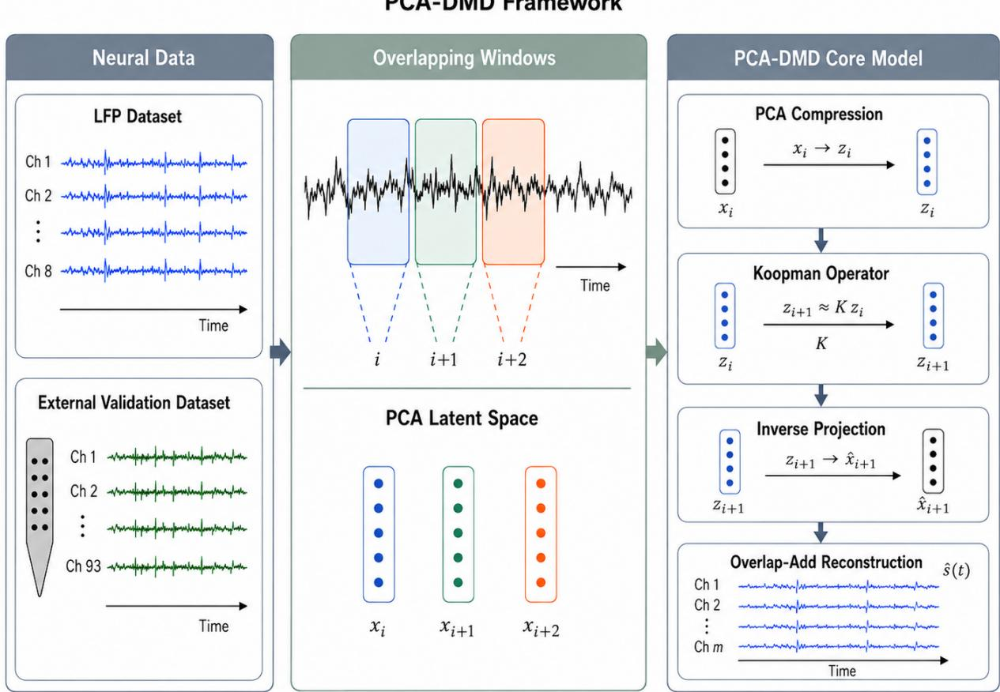  
Figure 1: Overview of the PCA-DMD computational framework. Multichannel LFP recordings are segmented into overlapping temporal windows and vectorized into high-dimensional snapshot representations. PCA projects the snapshots into a compact latent space, where a linear Koopman/DMD operator models evolution between consecutive latent states. Predicted latent states are mapped back to the original signal space through inverse PCA projection, and overlapping reconstructed windows are aggregated to recover a continuous multichannel signal.

The framework is applied to two datasets. The primary dataset contains multichannel hippocampal LFP recordings from four subjects (S1–S4), with eight channels sampled at 30 kHz and sequence lengths ranging from 200,000 to 900,000 samples. An independent Allen Neuropixels LFP recording with 93 channels and approximately 300,000 samples is used for external validation.

Each multichannel recording is segmented into overlapping temporal windows of length w = 3000 samples with step size δ = 30. The windows are vectorized into high-dimensional snapshot representations and projected into a compact latent space using PCA. A linear operator is then estimated in the PCA space to approximate Koopman evolution between consecutive latent states. The predicted latent states are mapped back to the original signal space through inverse PCA projection, and the reconstructed windows are combined using overlap-add aggregation to obtain a continuous multichannel signal.

The PCA-DMD framework is evaluated under five complementary experimental settings, as illustrated in Figure 2. First, within-subject reconstruction is evaluated on 200,000-sample hippocampal recordings and compared with Classical DMD, SpDMD, MrDMD, and HODMD. Second, cross-subject zero-shot generalization is evaluated at 300,000 samples using all ordered source–target subject pairs without target-subject fine-tuning. Third, out-of-sample temporal prediction is assessed on temporally held-out LFP segments excluded from model fitting, providing a direct evaluation of one-step prediction on unseen temporal data. Fourth, scalability is evaluated from 400,000 to 900,000 samples by fitting the model on S1 and applying it without fine-tuning to the unseen target subjects S2–S4. Fifth, the same PCA-DMD reconstruction procedure is applied to the independent Allen Neuropixels recording to assess robustness under a diferent channel dimensionality and acquisition setting.

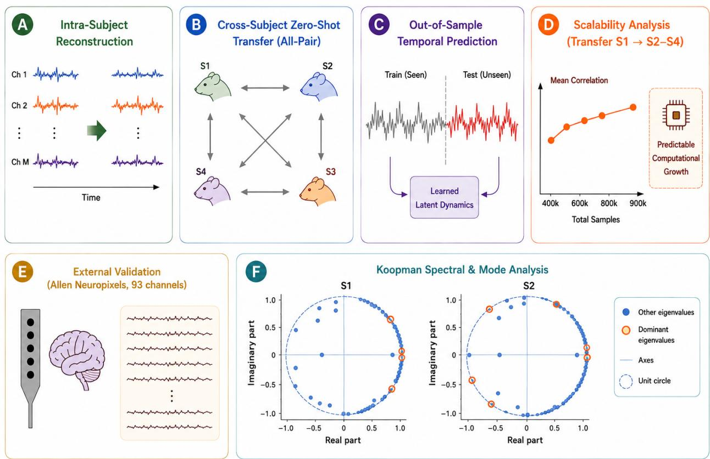

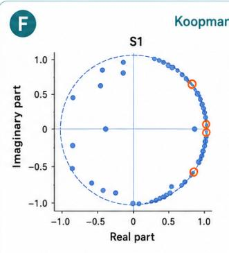  
Figure 2: Experimental evaluation of PCA-DMD. (A) Within-subject reconstruction of hippocampal LFP recordings. (B) All-pair cross-subject zero-shot generalization among subjects S1–S4 without target-specific fine-tuning. (C) Out-of-sample temporal prediction on LFP segments excluded from model fitting. (D) Scalability analysis from 400,000 to 900,000 samples using S1 as the source and S2–S4 as unseen targets. (E) External validation on an independent 93-channel Allen Neuropixels recording. (F) Koopman spectral analysis of the learned latent dynamics through eigenvalue distributions in the complex plane.

In addition to reconstruction performance, the learned Koopman operators are analyzed spectrally by examining their eigenvalue distributions in the complex plane relative to the unit circle. This analysis characterizes the latent dynamical structure captured by PCA-DMD.

## 4.1 PCA-DMD Reconstruction Framework

We propose a PCA-DMD method for reconstructing multichannel LFP signals. The raw LFP recordings are first segmented into overlapping windows, then reduced in dimensionality using PCA to obtain compact latent representations. A linear Koopman operator (Appendix A ) is subsequently learned in this latent space to capture the temporal evolution of the dynamics across channels. Finally, the latent states are mapped back to the original signal space through the inverse PCA projection, and the reconstructed windows are stitched together to approximate the full multichannel LFP signal while preserving SWR dynamics.

Table 1: DMD variants grouped by SVD workflow and relation to our PCA-DMD.
<table><tr><td>Method</td><td>Type</td><td>Key Notes / Relation</td></tr><tr><td>Classical DMD Kutz et al. (2016b)</td><td>Snapshot-SVD</td><td>Koopman regression on snapshot basis.</td></tr><tr><td>SpDMD Jovanovic et al. (2012)</td><td>c Snapshot-SVD</td><td>Adds sparse mode selection; otherwise same as Classical.</td></tr><tr><td>MrDMD Kutz et al. Window-SVD (2016d)</td><td></td><td>Multi-resolution partitioning; trades global co- herence for local detail.</td></tr><tr><td>HODMD Le Clainche  $\&$  Vega (2017b)</td><td>Window-SVD</td><td>Delay embedding; captures high-frequency os- cillations but unstable for long windows.</td></tr><tr><td>Hankel-DMD Arbabi &amp; Mezić</td><td>Window-SVD</td><td>Hankel matrix from delays; foundation of HA- VOK.</td></tr><tr><td>(2017) HAVOK Brunton et al. (2017b)</td><td>1 Window-SVD</td><td>Hankel embedding + forcing term; chaotic sig- nals.</td></tr><tr><td>Our PCA-DMD</td><td>Windowing + PCA</td><td>PCA pre-compression + Koopman in latent space + overlap-add reconstruction. Improves stability, scalability, and transient SWR preser- vation.</td></tr></table>

Let the multichannel LFP signal be denoted by $s = \{ s _ { t } \} _ { t = 1 } ^ { T } , s _ { t } \in \mathbb { R } ^ { m }$ , where m is the number of channels and $T$ the total number of samples. We segment the signal into overlapping windows of length w with step size δ:

$$
X _ { i } = \left[ s _ { i } ^ { \top } \quad s _ { i + 1 } ^ { \top } \quad \cdots \quad s _ { i + w - 1 } ^ { \top } \right] ^ { \top } \in \mathbb { R } ^ { w \times m } , \qquad i = 1 , 1 + \delta , \cdots .
$$

Each window is vectorized into $x _ { i } = \operatorname { v e c } ( X _ { i } ) \in \mathbb { R } ^ { w m }$ , and the N windows together form the dataset

$$
\begin{array} { r } { X = \left[ x _ { 1 } ^ { \top } \quad x _ { 2 } ^ { \top } \quad \cdots \quad x _ { N } ^ { \top } \right] ^ { \top } \in \mathbb { R } ^ { N \times ( w m ) } . } \end{array}
$$

We compute a rank-d PCA projection $W \in \mathbb { R } ^ { ( w m ) \times d }$ with $d \ll$ wm. The latent representations are

$$
Z = X W = \left[ z _ { 1 } ^ { \top } \quad z _ { 2 } ^ { \top } \quad \cdot \cdot \quad z _ { N } ^ { \top } \right] ^ { \top } \in \mathbb { R } ^ { N \times d } , \qquad z _ { i } \in \mathbb { R } ^ { d } .
$$

Define the shifted latent pairs as $Z _ { \mathrm { p a s t } } = \left\lceil z _ { 1 } \quad z _ { 2 } \quad \cdot \cdot \cdot \quad z _ { N - 1 } \right\rceil$ and $Z _ { \mathrm { n e x t } } = \left[ z _ { 2 } \quad z _ { 3 } \quad \cdot \cdot \cdot \quad z _ { N } \right]$ . We model the temporal evolution in the latent space as $z _ { i + 1 } \approx \mathbf { K } z _ { i }$ $\mathbf { K } \in \mathbb { R } ^ { d \times d }$ where the optimal K is obtained via least-squares: K = arg min<sub>A∈R</sub>d×d $\Vert Z _ { \mathrm { n e x t } } - A Z _ { \mathrm { p a s t } } \Vert _ { F } = Z _ { \mathrm { n e x t } } Z _ { \mathrm { p a s t } } ^ { \dag }$ with † the Moore–Penrose pseudoinverse. Then, the predicted latent states evolve as $\hat { z } _ { i + k } = \mathbf { K } ^ { k } z _ { i } .$ These are mapped back to the window space via the inverse PCA projection $\hat { x } _ { i } = \hat { z } _ { i } W ^ { \top } \in \mathbb { R } ^ { w m }$ and ${ \hat { X } } _ { i } =$ unvec $( \hat { x } _ { i } ) \in \mathbb { R } ^ { w \times m }$ . Finally, the reconstructed multichannel signal $\hat { s } _ { t } \in \mathbb { R } ^ { m }$ is obtained by overlap–add of the windows ${ \hat { X } } _ { i } .$ , with a tapering function (e.g., Hann) to reduce boundary artifacts. See Table 1 for a comparison of our method with other state-of-the-art DMD variants.

## 4.2 Cross-Subject Zero-Shot Generalization

To investigate the cross-subject generalization of the learned dynamical representations, we introduce a crosssubject zero-shot evaluation protocol. For each ordered subject pair $( a , b )$ with $a \neq b ,$ the PCA-DMD model is trained exclusively on recordings from source subject a, and the resulting parameters are directly applied to target subject b without any additional fine-tuning, such that $\hat { s } ^ { ( b ) } = f _ { \theta _ { a } } \left( s ^ { ( \bar { b } ) } \right)$ . This setting evaluates whether the learned latent dynamics capture subject-invariant neural structure rather than memorizing subject-specific characteristics of individual recordings. By considering all ordered source-target pairs across four subjects, we systematically assess reconstruction fidelity and generalization capability under cross-subject distribution shift. Algorithm 2 summarizes the complete zero-shot evaluation procedure.

```powershell
Algorithm 1 PCA-DMD for Long-Horizon Reconstruction
Input: signal $s ( t )$ , window size w, step $\delta ,$ latent dimension d
Extract overlapping windows $W _ { i } = s [ i \delta : i \delta + w ]$
Vectorize windows: $x _ { i } = \operatorname { v e c } ( W _ { i } )$
Form consecutive window pairs $( X , Y )$
Fit PCA and compute latent coordinates $z _ { i } = P ^ { \top } x _ { i }$
Estimate Koopman operator: $K ^ { \top } = Z ^ { \dag } Z _ { + }$
for each window $x _ { i }$ do
Predict latent state: $\hat { z } _ { i + k } = \mathbf { K } ^ { k } z _ { i }$
Reconstruct window: $\hat { x } _ { i + k } = P \hat { z } _ { i + k } + \mu$
end for
Apply overlap-add averaging to obtain $\hat { s } ( t )$
Output: reconstructed signal $\hat { s } ( t )$
```

Algorithm 2 Cross-Subject Zero-Shot Generalization   
Input: subjects $\{ S _ { 1 } , \ldots , S _ { n } \}$ , reconstruction model $f _ { \theta }$   
for each source subject $S _ { a }$ do   
Train model parameters $\theta _ { a }$ using only $S _ { a }$   
for each target subject $S _ { b } , b \ne a$ do   
Reconstruct target signal: $\hat { s } ^ { ( b ) } = f _ { \theta _ { a } } ( s ^ { ( b ) } )$   
Compute reconstruction metrics between $s ^ { ( b ) }$ and $\hat { s } ^ { ( b ) }$   
end for   
end for   
Output: cross-subject generalization results

## 4.3 Koopman Spectral Analysis

To further characterize the learned dynamics, we analyze the spectral properties of the latent Koopman operator. Let $K v _ { k } = \lambda _ { k } v _ { k }$ denote the eigenpairs of $K$ , where $\lambda _ { k }$ and v are the corresponding eigenvalues and eigenvectors. The latent dynamics can then be expressed as $\begin{array} { r } { z _ { t } \approx \sum _ { k = 1 } ^ { r } c _ { k } \lambda _ { k } ^ { t } v _ { k } } \end{array}$ , such that the eigenvalue spectrum provides insight into the stability, persistence, and oscillatory behavior of the reconstructed dynamics, while the corresponding Koopman modes reveal the spatiotemporal structures captured by the latent representation. The PCA-induced low-rank structure further improves computational scalability: given $X = U \bar { \Sigma } V ^ { \top }$ , the rank-r approximation $\begin{array} { r } { X _ { r } = U _ { r } \Sigma _ { r } V _ { r } ^ { \top } } \end{array}$ retains the dominant variance while substantially reducing the dimensionality of the original signal space. This compression enables eficient Koopman regression, improves numerical conditioning, and facilitates stable long-horizon reconstruction of large-scale multichannel neural recordings.

## 5 Results

We evaluated PCA-DMD under five complementary experimental settings. First, we assessed within-subject reconstruction of 200,000-sample hippocampal LFP recordings and compared the proposed method with conventional DMD variants. Second, we investigated cross-subject zero-shot generalization using 300,000 samples across all ordered source–target pairs among four subjects, without target-subject fine-tuning. Third, we evaluated out-of-sample temporal prediction on temporally held-out LFP segments excluded from model fitting. Fourth, we performed a dedicated scalability analysis in which a PCA-DMD model fitted on source subject S1 was applied without fine-tuning to the unseen target subjects S2, S3, and S4 for signal lengths ranging from 400,000 to 900,000 samples. Finally, we evaluated the framework on an independent 93-channel Allen Neuropixels LFP recording. Together, these experiments assess reconstruction fidelity, cross-subject generalization, out-of-sample temporal prediction, long-horizon scalability, and robustness to an independent acquisition setting.

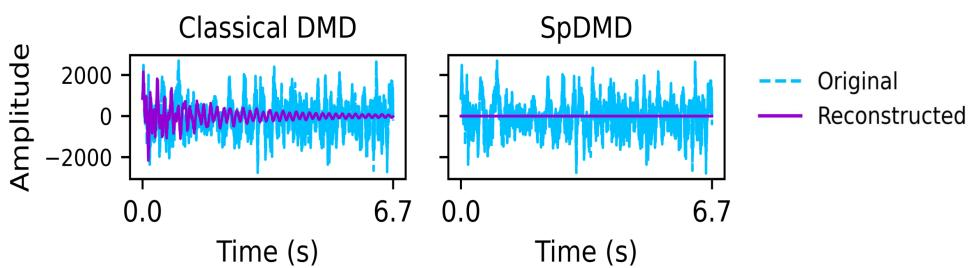

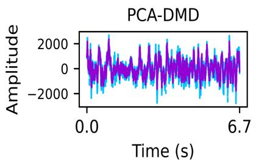

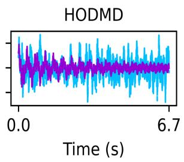

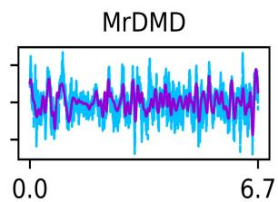  
Time (s)  
Figure 3: Within-subject reconstruction of a 200,000-sample hippocampal LFP segment. Original and reconstructed signals are shown for PCA-DMD and the conventional DMD variants. PCA-DMD most closely follows the original waveform and better preserves transient oscillatory structure, whereas the baseline methods show varying degrees of attenuation, smoothing, and temporal distortion.

## 5.1 Within-Subject Reconstruction at 200k Samples

We first evaluated whether PCA-DMD could reconstruct long multichannel hippocampal LFP segments while preserving the transient oscillatory structure associated with sharp wave-ripples. All methods were evaluated on the same 200,000-sample recording using identical signal preprocessing and reconstruction settings.

Figure 3 compares representative reconstructions obtained using PCA-DMD, Classical DMD, HODMD, MrDMD, and SpDMD. PCA-DMD produced the closest visual agreement with the original signal. Both the slowly varying waveform structure and the faster amplitude fluctuations were retained over the reconstruction interval. In contrast, the conventional DMD variants exhibited diferent forms of degradation, including amplitude attenuation, excessive smoothing, temporal misalignment, and loss of high-frequency structure.

The multichannel heatmaps in Figure 4 provide a complementary view of the reconstructed spatiotemporal organization. The PCA-DMD heatmap closely reproduced the temporal amplitude patterns observed across the eight original channels. MrDMD retained part of the coarse temporal organization but lost finer detail, whereas Classical DMD, HODMD, and SpDMD produced substantially more homogeneous or distorted representations. These observations indicate that the advantage of PCA-DMD is not restricted to a selected channel but extends across the multichannel signal.

The quantitative comparison further supports the visual findings. PCA-DMD achieved a KLD of 0.0761 and an HD of 0.0847, the lowest values among the evaluated methods. The second-best results were obtained by MrDMD, with a KLD of 0.4852 and an HD of 0.2238. Classical DMD and HODMD showed larger distributional discrepancies, with KLD values of 0.8710 and 0.6135 and HD values of 0.4067 and 0.3050, respectively. SpDMD exhibited the largest discrepancies, with a KLD of 14.4061 and an HD of 0.9074. Thus, the quantitative results are consistent with the waveform and multichannel comparisons and show that performing Koopman regression in a PCA-compressed latent space substantially improves reconstruction fidelity relative to direct application of the conventional DMD formulations.

Time (s)  
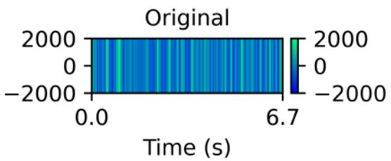

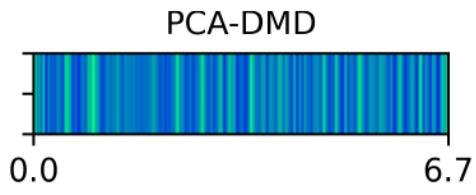

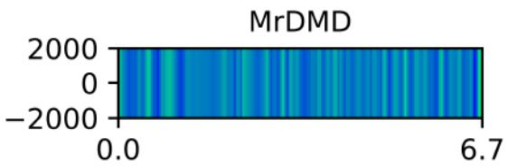

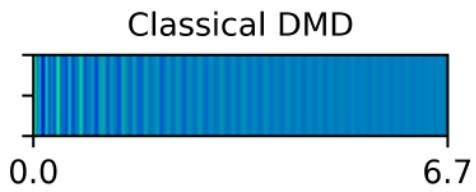

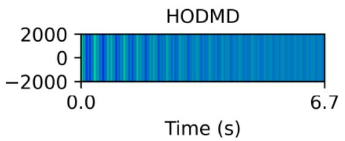

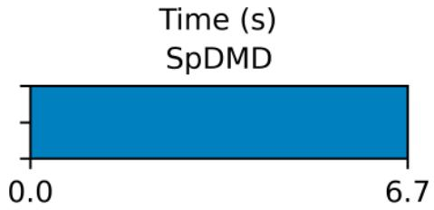  
Time (s)  
Figure 4: Multichannel heatmap comparison for the 200,000-sample reconstruction experiment. The PCA-DMD reconstruction preserves the channel-wise and temporal amplitude organization of the original recording more faithfully than the conventional DMD variants.

## 5.2 Cross-Subject Zero-Shot Generalization at 300k Samples

We next evaluated whether the latent dynamical representation learned by PCA-DMD generalizes across subjects. For each ordered source–target pair, the PCA basis and latent Koopman operator were fitted exclusively on the source subject and then applied directly to the unseen target subject without target-specific fine-tuning. Across subjects S1–S4, this resulted in 12 ordered zero-shot generalization experiments.

Representative full-length and locally zoomed reconstructions are shown in Figure 5. At the full-signal scale, the reconstructed trajectories closely followed the temporal envelope and amplitude variation of the unseen target recordings. The zoomed panels further show that PCA-DMD recovered local waveform evolution rather than reproducing only a smoothed low-frequency trend. This agreement was observed across target subjects despite diferences in signal amplitude and local waveform morphology.

Across all ordered source–target pairs, PCA-DMD achieved correlations between 0.9504 and 0.9800, HD values between 0.0010 and 0.0072, and KLD values between 0.0005 and 0.0022. The consistently high correlations indicate strong temporal agreement on unseen target subjects, while the small HD and KLD values indicate close agreement between the original and reconstructed target-subject amplitude distributions. These results demonstrate strong cross-subject zero-shot generalization without target-specific fine-tuning.

The conventional DMD variants degraded substantially under the same cross-subject evaluation. Classical DMD, HODMD, and HankelDMD produced correlations close to 0.10, with HD values of approximately 0.10–0.26 and KLD values of approximately 3–5. SpDMD showed a modest improvement over these methods but remained considerably below PCA-DMD, with correlations of approximately 0.15–0.27 and KLD values of approximately 1.7–3.2. The large performance gap indicates that the cross-subject generalization observed with PCA-DMD is not reproduced by the conventional DMD variants under the same zero-shot setting.

Figure 6 summarizes the metric distributions across methods. PCA-DMD forms a clearly separated highcorrelation regime while simultaneously yielding the smallest HD and KLD values across the ordered source–target pairs. This separation provides further evidence that the learned PCA-DMD representation generalizes across subjects under the zero-shot evaluation setting.

Figure A: Full-Length Original vs Reconstructed Signals (PCA-DMD, Channel 5)  
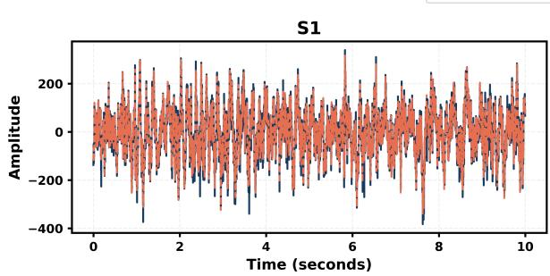

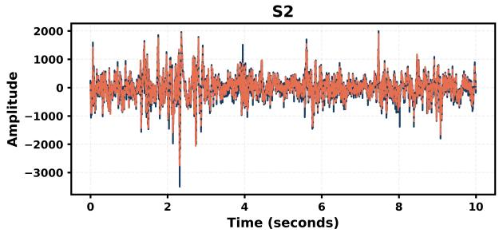

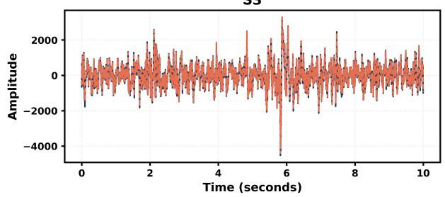

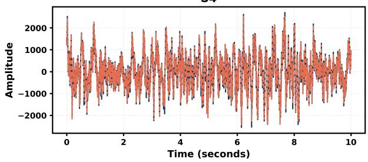  
Figure 5: Representative PCA-DMD reconstructions from the 300,000-sample cross-subject zero-shot generalization experiment. Full-length and zoomed overlays are shown for Channel 5 across the four subjects. Solid curves denote the original target signal and dashed curves denote the PCA-DMD reconstruction.

Table 2: Summary of the 300,000-sample cross-subject zero-shot generalization results. PCA-DMD values represent the range across all ordered source–target subject pairs. Baseline values summarize the observed operating ranges. Higher correlation is better; lower HD and KLD are better.
<table><tr><td>Method</td><td>Corr ↑</td><td>HD ↓</td><td>KLD↓</td></tr><tr><td>PCA-DMD</td><td>0.9504-0.9800</td><td>0.0010-0.0072</td><td>0.0005-0.0022</td></tr><tr><td>Classical DMD</td><td>~0.10</td><td>~0.10-0.26</td><td>~3-5</td></tr><tr><td>HODMD</td><td>~0.10</td><td>~0.10-0.26</td><td>~3-5</td></tr><tr><td>HankelDMD</td><td>~0.10</td><td>~0.10-0.26</td><td>~3-5</td></tr><tr><td>SpDMD</td><td>~0.15-0.27</td><td>~0.07-0.25</td><td>~1.7-3.2</td></tr></table>

## 5.3 Zero-Shot Scalability from 400k to 900k Samples

The preceding experiments established reconstruction performance at 200,000 samples and cross-subject zeroshot generalization at 300,000 samples. We next examined whether PCA-DMD maintains stable performance as the signal length increases substantially beyond these operating ranges. The scalability analysis considered signal lengths of

## 400k, 500k, 600k, 700k, 800k, and 900k.

At each signal length, a new PCA-DMD model was fitted exclusively on source subject S1 and then applied without fine-tuning to the unseen target subjects S2, S3, and S4. The model was fitted independently at each signal length rather than initialized from a model obtained at a shorter horizon. Window length, step size, latent dimension, histogram construction, and metric definitions were held fixed across all experiments.

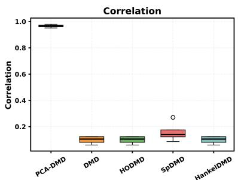

Figure D: Cross-Variant Summary Metrics  
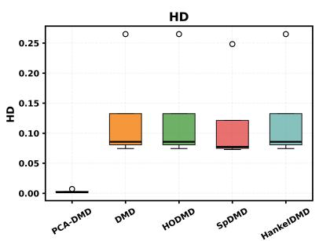

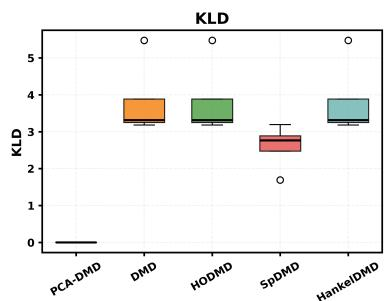  
Figure 6: Cross-subject zero-shot generalization performance at 300,000 samples. The boxplots compare correlation, HD, and KLD across methods, while the source-to-target heatmaps show the PCA-DMD results for all ordered subject pairs.

This design isolates the efect of increasing signal length while retaining the same zero-shot source-to-target evaluation setting.

Figure 7 shows the mean performance across the three unseen target subjects. Mean correlation remained highly stable, increasing from 0.96527 at 400k samples to 0.96812 at 800k samples and remaining at 0.96771 at 900k. Thus, increasing the sequence length by more than a factor of two did not produce cumulative degradation in reconstruction agreement.

Distributional agreement also remained stable and improved with increasing signal length. Mean HD decreased from $1 . 3 6 0 \times 1 0 ^ { - \bar { 3 } }$ at 400k to $9 . 3 7 7 \times 1 0 ^ { - 4 }$ at 900k, while mean KLD decreased from $9 . 0 3 3 \times 1 0 ^ { - 4 } \mathrm { { t o } 4 . 2 2 3 \times 1 0 ^ { - 4 } }$ Mean NRMSE remained within a narrow range, decreasing from 0.2585 at 400k to approximately 0.249–0.251 at the longer signal lengths.

The target-wise results in Figure 8 show that the aggregate behavior was not driven by a single target subject. For S2, correlation increased from 0.95150 at 400k to a maximum of 0.95942 at 800k and remained at 0.95895 at 900k. Over the same range, HD decreased from 0.001807 to 0.001159, and KLD decreased from 0.001602 to 0.000644.

Performance on S3 remained nearly constant, with correlations between 0.96591 and 0.96716. Its HD decreased from 0.001058 to 0.000809, while KLD decreased from 0.000555 to 0.000344. S4 consistently achieved the strongest reconstruction performance, with correlations between 0.97755 and 0.97840. At 900k samples, S4 achieved an HD of 0.000845, a KLD of 0.000279, and an NRMSE of 0.20772.

The full-length 900k-sample reconstructions are shown in Figure 9. At the original sampling rate of 30 kHz, this corresponds to approximately 30 seconds of continuous multichannel LFP activity. PCA-DMD preserved the signal envelope and major transient fluctuations throughout the full interval for all three unseen target subjects. The zoomed reconstruction further demonstrates close local alignment between the original and reconstructed waveforms.

Figure 10 further illustrates the full-length reconstruction behavior across the complete range from 400,000 to 900,000 samples, providing a direct visual comparison of reconstruction stability as the signal length increases.

Computational cost increased predictably with signal length. The average total runtime across target subjects was approximately 31.56 seconds at 400k samples and 47.39 seconds at 900k samples. At 900k, model fitting required 42.23 seconds, while target reconstruction required between 4.73 and 6.00 seconds. Thus, most of the computational cost was associated with fitting the source representation, whereas direct application to an unseen target subject remained comparatively inexpensive. Overall, these results demonstrate that PCA-DMD maintains stable zero-shot reconstruction performance as the signal length increases from 400k to 900k samples.

Scalability of PCA-DMD under S1→S2/S3/S4 Zero-Shot Transfer  
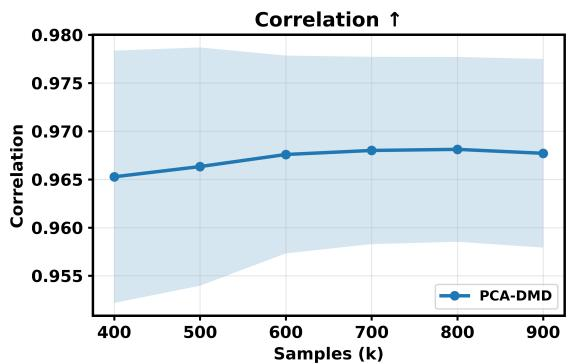

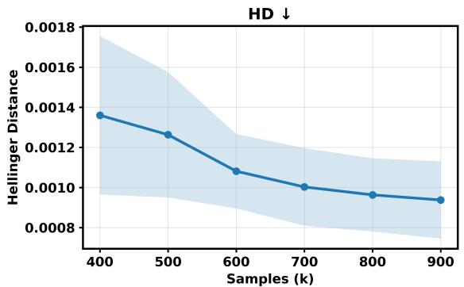

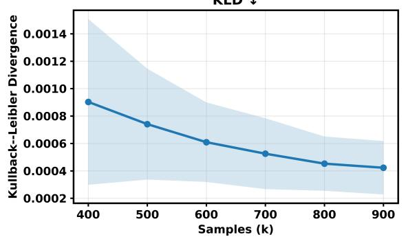

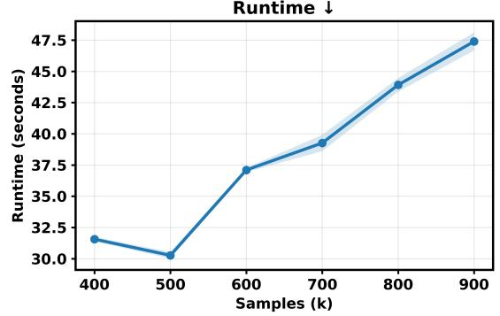  
Figure 7: Scalability of PCA-DMD under S1→S2/S3/S4 zero-shot evaluation. Curves show the mean performance across the three unseen target subjects, and shaded regions indicate variability across S2–S4. Correlation remains stable from 400k to 900k samples, while HD and KLD decrease. Runtime increases with signal length.

Table 3: Summary of the S1-based zero-shot scalability experiment. Metric ranges are taken across the six signal lengths from 400k to 900k. Higher correlation is better; lower HD, KLD, and NRMSE are better.
<table><tr><td>Target</td><td>Corr ↑</td><td>HD↓</td><td>KLD↓</td><td>NRMSE↓</td></tr><tr><td>S2</td><td>0.95150–0.95942</td><td>0.001159-0.001807</td><td>0.000644-0.001602</td><td>0.28247-0.30816</td></tr><tr><td>S3</td><td>0.96591-0.96716</td><td>0.000809-0.001058</td><td>0.000344-0.000555</td><td>0.25498–0.25984</td></tr><tr><td>S4</td><td>0.97755-0.97840</td><td>0.000845-0.001215</td><td>0.000279-0.000553</td><td>0.20705–0.21099</td></tr></table>

A compact summary is provided in Table 3. The complete target-wise table, including training time, prediction time, MSE, RMSE, MAE, and NRMSE at every horizon, is reported in Table 4.

## 5.4 Out-of-Sample Temporal Prediction

Beyond reconstruction on the evaluation interval, we examined whether the latent dynamics learned by PCA-DMD can predict temporally unseen LFP states. This experiment evaluates local out-of-sample temporal prediction rather than autonomous long-horizon forecasting. Specifically, PCA and the DMD operator are fitted exclusively on the designated training segment, while the subsequent validation interval is completely excluded from model fitting. The learned PCA basis and latent evolution operator are then fixed and applied to this unseen temporal segment. Let $\mathbf { x } _ { t }$ denote a high-dimensional LFP snapshot and $\mathbf { z } _ { t }$ its representation in the PCA latent space. For an unseen validation state, one-step latent prediction is computed using the operator learned exclusively from the training data as $\hat { \mathbf { z } } _ { t + 1 } = \mathbf { K } \mathbf { z } _ { t }$ , followed by inverse PCA projection as $\hat { \mathbf { x } } _ { t + 1 } = \mathbf { P } ^ { \dagger } \hat { \mathbf { z } } _ { t + 1 }$ , where K is the fixed DMD operator and $\mathbf { P } ^ { \dagger }$ denotes the inverse mapping from the PCA latent space to the original signal space. Thus, each prediction evaluates whether the learned latent transition law can predict the next state from states encountered in a temporally distinct and previously unseen portion of the recording. Importantly, the model is not recursively propagated from its own previous predictions over the entire validation interval; therefore, this experiment measures one-step out-of-sample temporal prediction rather than autonomous long-horizon forecasting.

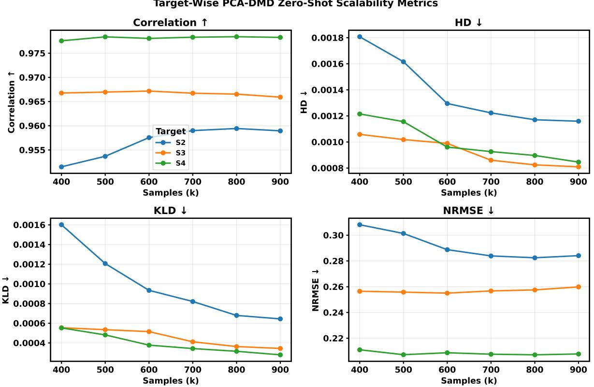  
Figure 8: Target-wise PCA-DMD scalability results. Correlation, HD, KLD, and NRMSE are shown separately for S1→S2, S1→S3, and S1→S4. Stable performance across increasing signal lengths is observed consistently for all three unseen target subjects.

Figure 11 shows the one-step predictions across the complete held-out interval for a representative channel. The PCA-DMD predictions closely follow the temporal structure and amplitude variations of the unseen LFP signal throughout the validation period. The agreement is maintained across the interval rather than being restricted to samples immediately adjacent to the training boundary, indicating that the learned latent transition operator provides accurate local predictions for neural states occurring throughout the held-out recording.

To determine whether this predictive behavior is preserved across the spatially distributed neural recording rather than being specific to a single channel, we further evaluated the model simultaneously across all LFP channels. Figure 12 presents the vertically ofset multichannel signals over the complete held-out interval. The predicted trajectories consistently track the corresponding unseen signals across channels, including variations in local amplitude and temporal structure. This multichannel agreement indicates that the out-of-sample prediction performance extends across the high-dimensional neural state rather than being driven by an isolated channel.

Finally, we examined short temporal regions selected from the beginning, middle, and end of the held-out interval to provide a higher-resolution assessment of local prediction accuracy. As shown in Figure 13, the predicted trajectories reproduce the dominant waveform morphology across all three temporal locations. Comparable agreement is also observed in the late validation region, which is temporally most distant from the training boundary. The zoomed analysis therefore complements the full-interval results by showing that

S1→S2

S1→S4  
S1→S3  
Zero-Shot Reconstruction Examples at 900k Samples  
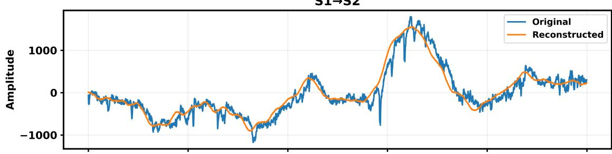

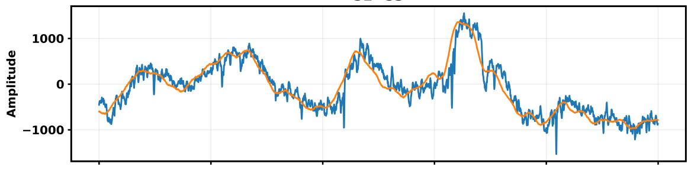

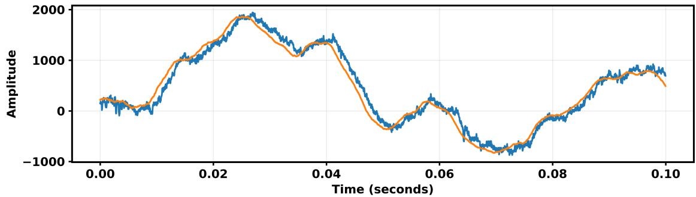  
Figure 9: Full-length PCA-DMD zero-shot reconstructions at 900,000 samples for S1→S2, S1→S3, and S1→S4. Channel 5 is shown for visual clarity. The selected zoomed panel illustrates local waveform agreement.

the observed predictive agreement is not merely a consequence of visual compression over long recordings, but persists at the local waveform level throughout the unseen interval.

Together, these results demonstrate that the latent transition structure learned by PCA-DMD supports accurate one-step prediction on temporally held-out neural activity excluded from model fitting. The consistency observed over the complete held-out interval, across multiple channels, and at temporally separated local regions provides complementary evidence for out-of-sample temporal prediction of highdimensional neural dynamics. This experiment should be distinguished from autonomous long-horizon forecasting: the objective is not to generate an extended future LFP trajectory recursively from a single initial condition, but to evaluate whether a fixed latent evolution operator learned from the training segment can accurately predict the next state from neural states encountered in a temporally unseen portion of the recording.

## 5.5 External Validation on Allen Neuropixels LFP Recordings

To evaluate whether the PCA-DMD reconstruction framework remains efective beyond the primary foursubject dataset, we applied the same formulation to an independent Allen Neuropixels LFP recording. The external recording contained 93 channels and 300,000 samples acquired at approximately 1,250 Hz,

## Full-Length Zero-Shot Reconstruction Across Horizons: S1 → S2

S1 → S2 | 400k samples | Channel 5  
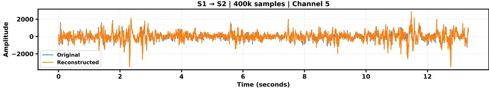

S1 → S2 | 500k samples | Channel 5  
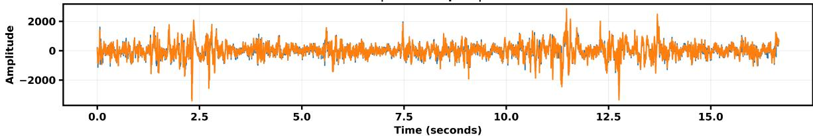

S1 → S2 | 600k samples | Channel 5  
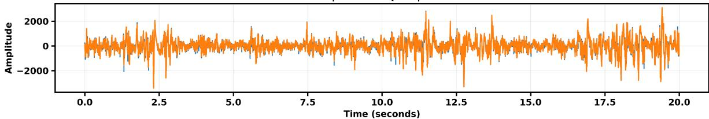

S1 → S2 | 700k samples | Channel 5  
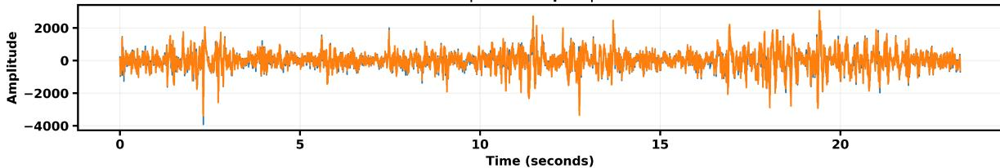

S1 → S2 | 800k samples | Channel 5  
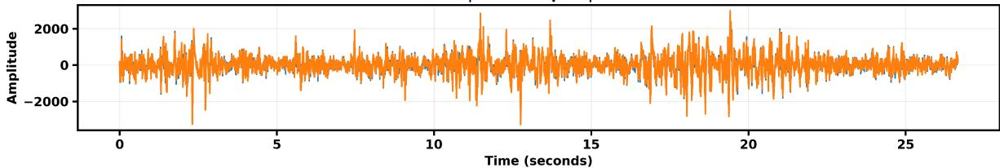

S1 → S2 | 900k samples | Channel 5  
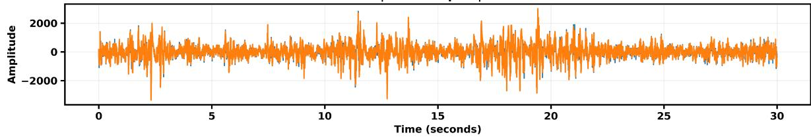  
Figure 10: Full-length PCA-DMD zero-shot reconstructions for S1→S2 across signal lengths from 400,000 to 900,000 samples. Channel 5 is shown to illustrate reconstruction behavior as the signal length increases.

corresponding to approximately 240 seconds of neural activity. This experiment does not evaluate cross-dataset zero-shot generalization; rather, it assesses whether the same PCA-DMD reconstruction mechanism remains efective under a diferent channel dimensionality, sampling rate, recording duration, and acquisition setting.

Table 4: Scalability analysis of zero-shot cross-subject transfer from source subject S1 to target subjects S2–S4. Training is performed independently at each signal length, without loading a pretrained checkpoint. Correlation (Corr) is higher-is-better, whereas Hellinger distance (HD), Kullback–Leibler divergence (KLD), MSE, RMSE, MAE, and normalized RMSE (NRMSE) are lower-is-better. Bold values indicate the best reconstruction result within each target subject.
<table><tr><td rowspan="2">Target Samples (×103)</td><td rowspan="2"></td><td colspan="3">Runtime (s)</td><td colspan="7">Reconstruction metrics</td></tr><tr><td>Train</td><td>Prediction</td><td>Total</td><td>Corr ↑</td><td>HD↓</td><td>KLD ↓</td><td>MSE↓</td><td>RMSE↓</td><td>MAE↓</td><td>NRMSE↓</td></tr><tr><td rowspan="6">S2</td><td>400</td><td>29.32</td><td>2.40</td><td>31.73</td><td>0.95150</td><td>0.001807</td><td>0.001602</td><td>23411.85</td><td>153.01</td><td>102.94</td><td>0.30816</td></tr><tr><td>500</td><td>27.56</td><td>2.97</td><td>30.53</td><td>0.95368</td><td>0.001616</td><td>0.001207</td><td>21119.21</td><td>145.32</td><td>98.76</td><td>0.30137</td></tr><tr><td>600</td><td>34.01</td><td>3.29</td><td>37.29</td><td>0.95754</td><td>0.001295</td><td>0.000935</td><td>24849.90</td><td>157.64</td><td>105.77</td><td>0.28877</td></tr><tr><td>700</td><td>35.22</td><td>4.80</td><td>40.02</td><td>0.95899</td><td>0.001223</td><td>0.000821</td><td>24279.62</td><td>155.82</td><td>104.84</td><td>0.28391</td></tr><tr><td>800</td><td>39.51</td><td>5.01</td><td>44.52</td><td>0.95942</td><td>0.001170</td><td>0.000679</td><td>21900.50</td><td>147.99</td><td>99.67</td><td>0.28247</td></tr><tr><td>900</td><td>42.23</td><td>6.00</td><td>48.23</td><td>0.95895</td><td>0.001159</td><td>0.000644</td><td>20865.32</td><td>144.45</td><td>97.83</td><td>0.28411</td></tr><tr><td rowspan="6">S3</td><td>400</td><td>29.32</td><td>2.06</td><td>31.38</td><td>0.96676</td><td>0.001058</td><td>0.000555</td><td>23484.25</td><td>153.25</td><td>112.14</td><td>0.25646</td></tr><tr><td>500</td><td>27.56</td><td>2.70</td><td>30.26</td><td>0.96695</td><td>0.001018</td><td>0.000534</td><td>23579.13</td><td>153.55</td><td>111.83</td><td>0.25577</td></tr><tr><td>600</td><td>34.01</td><td>3.03</td><td>37.03</td><td>0.96716</td><td>0.000989</td><td>0.000515</td><td>23937.28</td><td>154.72</td><td>112.58</td><td>0.25498</td></tr><tr><td>700</td><td>35.22</td><td>3.66</td><td>38.88</td><td>0.96673</td><td>0.000860</td><td>0.000411</td><td>26366.42</td><td>162.38</td><td>115.59</td><td>0.25671</td></tr><tr><td>800</td><td>39.51</td><td>4.25</td><td>43.76</td><td>0.96653</td><td>0.000824</td><td>0.000363</td><td>26225.52</td><td>161.94</td><td>116.47</td><td>0.25749</td></tr><tr><td>900</td><td>42.23</td><td>4.73</td><td>46.96</td><td>0.96591</td><td>0.000809</td><td>0.000344</td><td>28158.59</td><td>167.81</td><td>121.75</td><td>0.25984</td></tr><tr><td rowspan="6">S4</td><td>400</td><td>29.32</td><td>2.25</td><td>31.58</td><td>0.97755</td><td>0.001215</td><td>0.000553</td><td>23373.36</td><td>152.88</td><td>113.00</td><td>0.21099</td></tr><tr><td>500</td><td>27.56</td><td>2.45</td><td>30.01</td><td>0.97837</td><td>0.001156</td><td>0.000481</td><td>23476.90</td><td>153.22</td><td>112.87</td><td>0.20715</td></tr><tr><td>600</td><td>34.01</td><td>2.98</td><td>36.98</td><td>0.97805</td><td>0.000961</td><td>0.000378</td><td>25058.98</td><td>158.30</td><td>116.01</td><td>0.20866</td></tr><tr><td>700</td><td>35.22</td><td>3.67</td><td>38.89</td><td>0.97830</td><td>0.000926</td><td>0.000343</td><td>24065.31</td><td>155.13</td><td>114.02</td><td>0.20753</td></tr><tr><td>800</td><td>39.51</td><td>3.95</td><td>43.47</td><td>0.97840</td><td>0.000896</td><td>0.000315</td><td>22870.83</td><td>151.23</td><td>111.35</td><td>0.20705</td></tr><tr><td>900</td><td>42.23</td><td>4.76</td><td>46.99</td><td>0.97826</td><td>0.000845</td><td>0.000279</td><td>22379.89</td><td>149.60</td><td>110.13</td><td>0.20772</td></tr></table>

Held-out one-step temporal generalization — Channel 1, 500,000 samples  
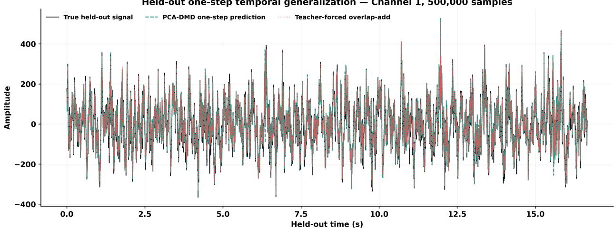  
Figure 11: Out-of-sample temporal prediction on the held-out LFP interval. The true signal and PCA-DMD one-step predictions are shown for a representative channel using a model fitted exclusively on the training segment. Close agreement across the unseen interval demonstrates accurate prediction of temporally held-out neural activity.

Figure 14 shows a representative full-length reconstruction for Channel 18. PCA-DMD achieved a correlation of 0.799, an HD of 0.1478, and a KLD of 0.1623 on this channel. Despite the substantially higher channel dimensionality and diferent acquisition characteristics of the external recording, the reconstruction closely follows the amplitude envelope and dense oscillatory structure over the complete recording.

Performance across all 93 channels is summarized in Figure 15. The mean channel-wise correlation was 0.7427, while the median correlation was 0.7990. The diference between the mean and median indicates that reconstruction performance was strong for the majority of channels but reduced for a subset of more challenging channels. Similarly, the median HD was 0.1478, compared with a mean HD of 0.1935.

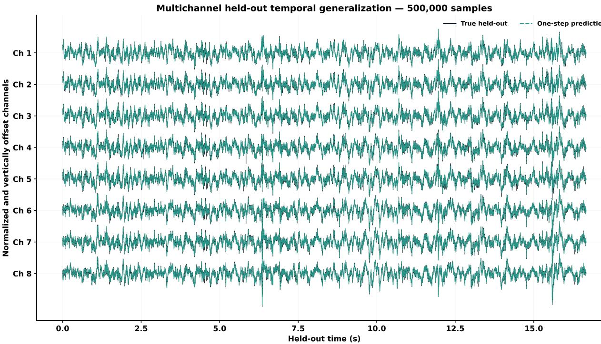  
Figure 12: Multichannel out-of-sample temporal prediction. True held-out LFP activity and PCA-DMD one-step predictions are shown across all channels over the unseen validation interval. Signals are normalized and vertically ofset for visualization. The agreement across channels demonstrates accurate prediction of multivariate neural activity on data excluded from model fitting.

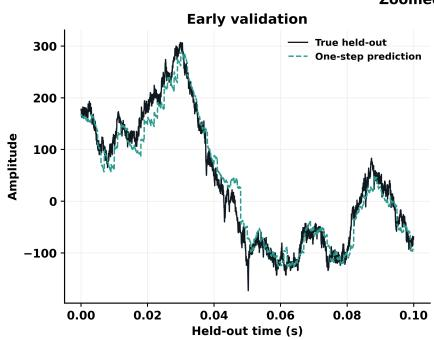

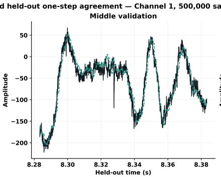

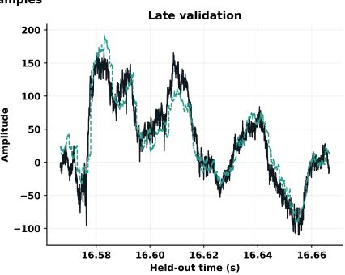  
Figure 13: Zoomed assessment of out-of-sample one-step temporal prediction at early, middle, and late locations of the unseen validation interval. The PCA-DMD prediction follows the local morphology of the true LFP signal across temporally separated regions, providing a fine-scale view of prediction accuracy throughout the held-out recording.

The median KLD was 0.1701, whereas the mean KLD was 0.6121. The larger mean reflects a relatively small number of high-divergence channels, as indicated by the long upper tail of the channel-wise KLD distribution. Thus, the median provides a more representative measure of reconstruction quality for a typical Allen channel, while the mean captures the remaining channel-dependent variability.

The detailed channel-wise overlays in Appendix ?? further show that the reconstruction quality is not confined to the selected example. Several channels in the displayed Channel-12–Channel-23 group, for example, achieved correlations above 0.80. The complete appendix provides full-length and zoomed overlays, channel-wise metrics, residual heatmaps, PCA explained-variance curves, and spectral diagnostics.

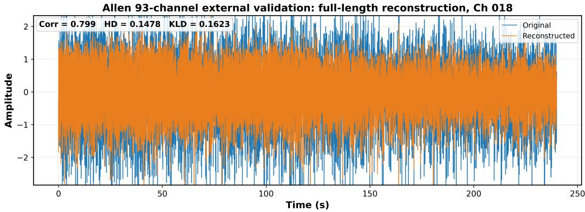  
Figure 14: External validation on the independent 93-channel Allen Neuropixels LFP recording. A representative full-length reconstruction for Channel 18 is shown together with 1000- and 2000-sample zoomed overlays and multichannel original-versus-reconstructed heatmaps. The representative channel achieved Corr= 0.799, HD= 0.1478, and KLD= 0.1623.

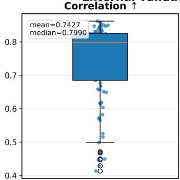

Externa! validation performançe across 93 Allen LFP channels Correlation ↑ HD↓ KLD↓  
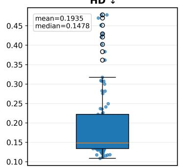

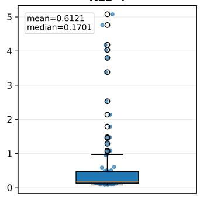  
Figure 15: Distribution of reconstruction performance across the 93 Allen Neuropixels LFP channels. Boxplots and channel-level points are shown for correlation, HD, and KLD. The distributions show strong median reconstruction performance together with a subset of more challenging channels.

## 5.6 Koopman Spectral and Mode-Level Analysis

We finally examined the spectral and mode-level structure of the latent Koopman operators learned by PCA-DMD. Figure 16 shows the eigenvalue spectra across the primary subjects. The dominant eigenvalues are concentrated near the unit circle, indicating that the learned latent dynamics are primarily characterized by persistent or slowly decaying components rather than strongly unstable modes. Similar spectral organization is observed across subjects, providing a dynamical perspective complementary to the cross-subject zero-shot generalization results.

To further characterize the structure associated with these spectral components, we examined representative dominant Koopman modes. Figure 17 shows the real and imaginary components of selected dominant modes for subject S1 across window time and the eight LFP channels. The modes exhibit structured variation across both temporal and channel dimensions, revealing spatiotemporal organization within the learned latent dynamics that is not directly captured by reconstruction metrics alone. The corresponding eigenvalue magnitudes are close to unity, consistent with the persistent dynamical components observed in the spectral analysis.

The external Allen Neuropixels experiment also yielded a low-dimensional Koopman spectrum with dominant eigenvalues concentrated near the unit circle. Thus, the spectral characterization remains applicable when PCA-DMD is used on an independent neural recording with substantially higher channel dimensionality. Taken together, the eigenvalue spectra and Koopman modes provide an interpretable dynamical characterization of the latent representation, complementing the reconstruction, cross-subject generalization, temporal prediction, and scalability analyses.

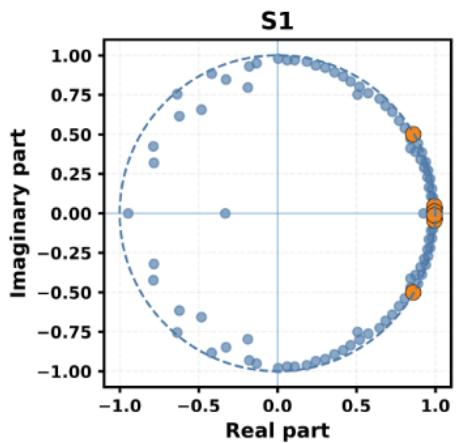

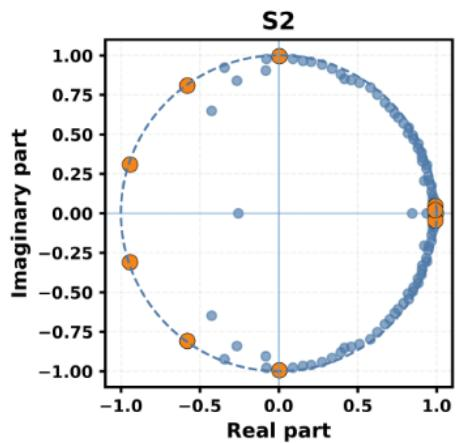

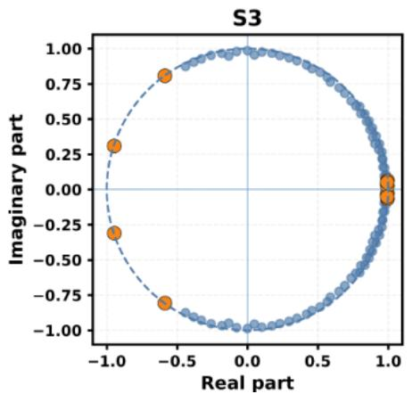

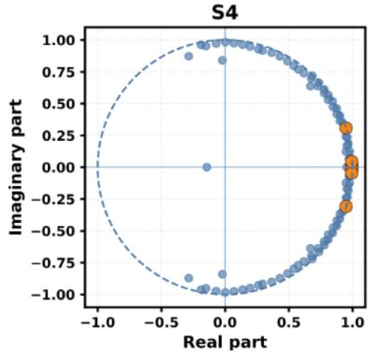  
Figure 16: Koopman eigenvalue spectra learned by PCA-DMD across the primary subjects. Eigenvalues are shown in the complex plane relative to the unit circle. Blue markers denote the full spectrum, while highlighted markers indicate the dominant eigenvalues with the largest magnitudes. The concentration of dominant eigenvalues near the unit circle indicates persistent or slowly decaying latent dynamical components.

## 6 Limitations and Future Work

Despite the strong reconstruction, cross-subject generalization, out-of-sample temporal prediction, and scalability results, several limitations remain. First, PCA-DMD uses linear dimensionality reduction and a finite-dimensional linear operator in the latent space. Although this provides a compact and interpretable representation, strongly nonlinear or highly localized neural events may require richer observables than those captured by a PCA basis. Reconstruction performance also depends on window length, step size, latent dimension, and numerical settings, whose optimal values may vary across recording configurations and temporal scales.

Second, the primary cross-subject experiments involve four subjects. While the all-pair 300,000-sample evaluation demonstrates strong zero-shot generalization across these recordings, larger and more heterogeneous cohorts are needed to establish population-level generalization. Similarly, the scalability analysis uses S1 as the fixed source and should ultimately be extended to multiple source subjects, sessions, laboratories, behavioral states, and species. The Allen Neuropixels experiment provides external validation under substantially diferent acquisition characteristics, but the model is fitted directly to the Allen recording; it therefore demonstrates external reconstruction robustness rather than cross-dataset zero-shot generalization.

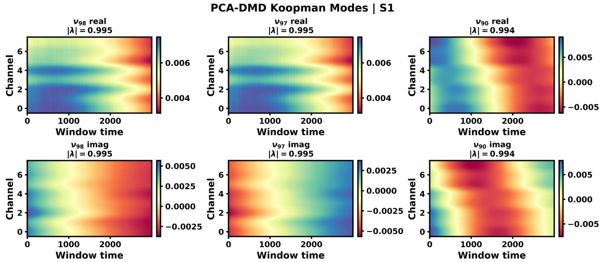  
Figure 17: PCA-DMD Koopman mode structure for subject S1. Real and imaginary components of representative dominant modes are shown across window time and LFP channels.

Third, the current evaluation primarily measures signal-level reconstruction and prediction using correlation, distributional distances, reconstruction errors, and runtime. These metrics do not fully establish preservation of biologically important transient events. Event-level analyses of SWR timing, duration, ripple-band power, phase relationships, and cross-channel propagation remain important future validation steps. Moreover, although scalability is demonstrated up to 900,000 samples, this remains below the approximately 22 million samples available in the complete recordings.

The out-of-sample temporal experiment is also limited to one-step prediction from observed states within a temporally held-out interval. Because predictions are not recursively propagated from previous model outputs, the present results should not be interpreted as evidence of autonomous long-horizon forecasting. Evaluating multi-step and recursive prediction, including the accumulation of error over increasing prediction horizons, remains an important direction for future work.

Future work will extend PCA-DMD along three main directions. First, richer latent representations based on kernel methods, nonlinear manifold learning, autoencoders, or Koopman autoencoders could improve the representation of nonlinear dynamics while retaining structured latent evolution. Adaptive or multi-resolution windowing could further accommodate neural processes occurring at diferent temporal scales.

Second, streaming and incremental implementations will be investigated for full-recording analysis. Incremental PCA, online operator estimation, randomized linear algebra, GPU acceleration, and distributed reconstruction could enable eficient processing of complete recordings and support near-real-time applications. Evaluation on larger multi-subject and multi-institutional datasets will also be important for testing cross-session, cross-probe, cross-laboratory, and direct cross-dataset generalization.

Finally, future studies should connect reconstruction fidelity more directly to downstream neuroscience tasks, including SWR detection and characterization, neural-state classification, and analysis of channel-wise propagation patterns. Incorporating uncertainty quantification through bootstrap analysis, spectral confidence intervals, or ensemble Koopman models could additionally identify regions and dynamical components for which reconstruction or prediction is less reliable.

## 7 Conclusion

We presented PCA-DMD, an operator-theoretic framework for scalable reconstruction of long-duration multichannel neural dynamics. The method combines overlapping temporal windows, PCA-based latent compression, linear Koopman evolution, inverse projection, and overlap-add aggregation to reconstruct continuous neural recordings while retaining an interpretable spectral representation.

The experimental evaluation progressed through complementary and increasingly demanding settings. On 200,000-sample hippocampal LFP recordings, PCA-DMD provided substantially better distributional agreement than the evaluated conventional DMD variants, achieving a KLD of 0.0761 and an HD of 0.0847. At 300,000 samples, the learned latent dynamics demonstrated strong cross-subject zero-shot generalization across all ordered source–target subject pairs without target-specific fine-tuning, producing correlations between 0.9504 and 0.9800 together with low HD and KLD values. Out-of-sample temporal prediction further showed that a fixed PCA-DMD operator learned exclusively from the training segment could accurately predict the next state from neural states encountered in a temporally held-out interval. Close one-step prediction agreement was maintained across the complete unseen interval, multiple channels, and temporally separated early, middle, and late regions.

The dedicated scalability analysis further showed that S1-based zero-shot evaluation on S2, S3, and S4 remained stable as the signal length increased from 400,000 to 900,000 samples. Mean correlation remained approximately 0.965–0.968, while HD and KLD decreased across the tested signal lengths and runtime increased predictably. External validation on an independent 93-channel Allen Neuropixels recording yielded a mean channel-wise correlation of 0.7427 and a median correlation of 0.7990, demonstrating that the PCA-DMD reconstruction mechanism remains efective under a substantially diferent recording configuration.

The Koopman spectra and modes complemented the reconstruction metrics by revealing dominant eigenvalues concentrated near the unit circle and structured temporal and channel-wise patterns in representative Koopman modes. These analyses provide an interpretable dynamical characterization of the learned latent representation beyond signal-level reconstruction metrics.

Together, the results show that PCA compression provides more than computational dimensionality reduction: it creates a compact and well-conditioned latent space in which Koopman evolution can be estimated stably, applied to temporally unseen states for one-step prediction, generalized across unseen subjects without fine-tuning, and interpreted through spectral and mode-level analysis.

Overall, PCA-DMD provides a scalable, generalizable, and interpretable framework for reconstructing high-dimensional neural time series. By combining within-subject reconstruction, cross-subject zero-shot generalization, out-of-sample temporal prediction, systematic scalability analysis, independent external validation, and Koopman spectral analysis within a unified framework, this study provides a foundation for future operator-theoretic modeling of large-scale neural recordings and downstream analysis of transient neural dynamics.

## References

Cross-subject generalization for eeg decoding: A survey of deep learning methods. Journal of Neural Engineering, 2026. doi: 10.1088/2516-1091/ae65f0. IOPscience early access.

J Abadchi, Mojtaba Nazari-Ahangarkolaee, Sandra Gattas, Edgar Bermudez-Contreras, Artur Luczak, Bruce L McNaughton, Majid H Mohajerani, et al. Spatiotemporal patterns of neocortical activity around hippocampal sharp-wave ripples (biorxiv). 2020.

Allen Institute. Allen Institute - Visual Behavior - Neuropixels, 2024. URL https://doi.org/10.48324/ dandi.000713/0.240702.1725. Dataset.

Hassan Arbabi and Igor Mezić. Ergodic theory, dynamic mode decomposition, and computation of spectral properties of the koopman operator. SIAM Journal on Applied Dynamical Systems, 16(4):2096–2126, 2017. doi: 10.1137/17M1125236.

Hassan Arbabi and Igor Mezić. Ergodic theory, dynamic mode decomposition, and computation of spectral properties of the koopman operator. SIAM Journal on Applied Dynamical Systems, 16(4):2096–2126, 2017.

Yoshua Bengio, Patrice Simard, and Paolo Frasconi. Learning long-term dependencies with gradient descent is dificult. IEEE Transactions on Neural Networks, 5(2):157–166, 1994. doi: 10.1109/72.279181.

Corbett Bennett, Sam Gale, Greggory Heller, Tamina Ramirez, Hannah Belski, Alex T. Piet, Omid Zobeiri, et al. Map of spiking activity underlying change detection in the mouse visual system. bioRxiv, 2025. doi: 10.1101/2025.10.17.683190. URL https://doi.org/10.1101/2025.10.17.683190.

Manuel Brenner, Florian Hess, Jonas M Mikhaeil, Leonard F Bereska, Zahra Monfared, Po-Chen Kuo, and Daniel Durstewitz. Tractable dendritic RNNs for reconstructing nonlinear dynamical systems. In Kamalika Chaudhuri, Stefanie Jegelka, Le Song, Csaba Szepesvari, Gang Niu, and Sivan Sabato (eds.), Proceedings of the 39th International Conference on Machine Learning, volume 162 of Proceedings of Machine Learning Research, pp. 2292–2320. PMLR, 17–23 Jul 2022.

Maximilian Brenner, Florian Hess, Jonas M. Mikhaeil, Leonard Bereska, Zahra Monfared, Po-Chen Kuo, and Daniel Durstewitz. A scalable generative model for dynamical system reconstruction from neuroimaging data, 2024. URL https://arxiv.org/abs/2411.02949.

Steven L. Brunton, Bingni W. Brunton, Joshua L. Proctor, Eurika Kaiser, and J. Nathan Kutz. Chaos as an intermittently forced linear system. Nature Communications, 8:19, 2017a. doi: 10.1038/s41467-017-00030-8.

Steven L Brunton, Bingni W Brunton, Joshua L Proctor, Eurika Kaiser, and J Nathan Kutz. Chaos as an intermittently forced linear system. Nature communications, 8(1):19, 2017b.

Steven L. Brunton, Marko Budišić, Eurika Kaiser, and J. Nathan Kutz. Modern Koopman theory for dynamical systems. SIAM Review, 64(2):229–340, 2022. doi: 10.1137/21M1401243.

György Buzsáki. Neural syntax: cell assemblies, synapsembles, and readers. Neuron, 68(3):362–385, 2010.

György Buzsáki. Hippocampal sharp wave-ripple: A cognitive biomarker for episodic memory and planning. Hippocampus, 25(10):1073–1188, 2015a. doi: 10.1002/hipo.22488.

György Buzsáki. Hippocampal sharp wave-ripple: A cognitive biomarker for episodic memory and planning. Hippocampus, 25(10):1073–1188, 2015b.

György Buzsáki, Costas A. Anastassiou, and Christof Koch. The origin of extracellular fields and currents—eeg, ecog, lfp and spikes. Nature Reviews Neuroscience, 13(6):407–420, 2012a. doi: 10.1038/nrn3241.

György Buzsáki, Costas A Anastassiou, and Christof Koch. The origin of extracellular fields and currents—eeg, ecog, lfp and spikes. Nature reviews neuroscience, 13(6):407–420, 2012b.

Miao Cao, Daniel Galvis, Simon J Vogrin, William P Woods, Sara Vogrin, Fan Wang, Wessel Woldman, John R Terry, Andre Peterson, Chris Plummer, et al. Virtual intracranial eeg signals reconstructed from meg with potential for epilepsy surgery. Nature communications, 13(1):994, 2022.

Long Chen, Zhebing Ren, and Jing Wang. An svd-based method for dbs artifact removal: High-fidelity restoration of local field potential. Biomedical Signal Processing and Control, 108:107908, 2025.

Jan Cimbálník, JS Garcia-Salinas, N Hamedi, S Prathapagiri, LF Sarmiento Rivera, M Galanina, J Dolezal, L Jurkovicova, Pavel Daniel, Martin Kojan, et al. Human brain local field potential recordings during a battery of multilingual cognitive and eye-tracking tasks. Scientific Data, 12(1):899, 2025.

Laura Lee Colgin. Rhythms of the hippocampal network. Nature Reviews Neuroscience, 17(4):239–249, 2016. doi: 10.1038/nrn.2016.21.

Jozsef Csicsvari, Hajime Hirase, Andras Czurko, Akira Mamiya, and György Buzsáki. Fast network oscillations in the hippocampal ca1 region of the behaving rat. Journal of Neuroscience, 19(16):RC20, 1999.

John P. Cunningham and Byron M. Yu. Dimensionality reduction for large-scale neural recordings. Nature Neuroscience, 17(11):1500–1509, 2014. doi: 10.1038/nn.3776.

Kamran Diba and György Buzsáki. Forward and reverse hippocampal place-cell sequences during ripples. Nature Neuroscience, 10(10):1241–1242, 2007. doi: 10.1038/nn1961.

Daniel Durstewitz, Georgia Koppe, and Max Ingo Thurm. Reconstructing computational system dynamics from neural data with recurrent neural networks. Nature Reviews Neuroscience, 24(11):693–710, 2023. doi: 10.1038/s41583-023-00740-7.

Gaute T Einevoll, Christoph Kayser, Nikos K Logothetis, and Stefano Panzeri. Modelling and analysis of local field potentials for studying the function of cortical circuits. Nature Reviews Neuroscience, 14(11): 770–785, 2013.

Ali Farshchian, Juan A. Gallego, Joseph P. Cohen, Yoshua Bengio, Lee E. Miller, and Sara A. Solla. Adversarial domain adaptation for stable brain-machine interfaces. arXiv preprint arXiv:1810.00045, 2019.

David J. Foster. Replay comes of age. Annual Review of Neuroscience, 40:581–602, 2017. doi: 10.1146/ annurev-neuro-072116-031538.

Gabrielle Girardeau, Karim Benchenane, Sidney I. Wiener, György Buzsáki, and Michaël B. Zugaro. Selective suppression of hippocampal ripples impairs spatial memory. Nature Neuroscience, 12(10):1222–1223, 2009. doi: 10.1038/nn.2384.

Espen Hagen, Anna R Chambers, Gaute T Einevoll, Klas H Pettersen, Rune Enger, and Alexander J Stasik. Ripplenet: a recurrent neural network for sharp wave ripple (spw-r) detection. Neuroinformatics, 19(3): 493–514, 2021.

Maziar S. Hemati, Matthew O. Williams, and Clarence W. Rowley. Dynamic mode decomposition for large and streaming datasets. Physics of Fluids, 26(11):111701, 2014. doi: 10.1063/1.4901016.

Florian Hess, Zahra Monfared, Manuel Brenner, and Daniel Durstewitz. Generalized Teacher Forcing for Learning Chaotic Dynamics. In Proceedings of the 40th International Conference on Machine Learning. PMLR, July 2023. ISSN: 2640-3498.

Sepp Hochreiter and Jürgen Schmidhuber. Long short-term memory. Neural Computation, 9(8):1735–1780, 1997. doi: 10.1162/neco.1997.9.8.1735.

Baimam Boukar Jean Jacques et al. Zero-shot neural priors for generalizable cross-subject and cross-task eeg decoding. arXiv preprint arXiv:2606.23706, 2026.

Seung-Woo Jin, Hee-Seung Ha, and Inah Lee. Selective reactivation of value-and place-dependent information during sharp-wave ripples in the intermediate and dorsal hippocampus. Science Advances, 10(32):eadn0416, 2024.

Hannah R. Joo and Loren M. Frank. The hippocampal sharp wave-ripple in memory retrieval for immediate use and consolidation. Nature Reviews Neuroscience, 19(12):744–757, 2018a. doi: 10.1038/s41583-018-0077-1.

Hannah R Joo and Loren M Frank. The hippocampal sharp wave–ripple in memory retrieval for immediate use and consolidation. Nature Reviews Neuroscience, 19(12):744–757, 2018b.

Mihailo R Jovanovic, Peter J Schmid, and JW Nichols. Low-rank and sparse dynamic mode decomposition. Center for Turbulence Research Annual Research Briefs, 2012:139–152, 2012.

Mihailo R. Jovanović, Peter J. Schmid, and Joseph W. Nichols. Sparsity-promoting dynamic mode decomposition. Physics of Fluids, 26(2):024103, 2014. doi: 10.1063/1.4863670.

Raphael Kaplan, Mohit H Adhikari, Rikkert Hindriks, Dante Mantini, Yusuke Murayama, Nikos K Logothetis, and Gustavo Deco. Hippocampal sharp-wave ripples influence selective activation of the default mode network. Current Biology, 26(5):686–691, 2016.

Bernard O. Koopman. Hamiltonian systems and transformation in hilbert space. Proceedings of the National Academy of Sciences, 17(5):315–318, 1931. doi: 10.1073/pnas.17.5.315.

A. Kujur, Z. Monfared, and S. Safavi. Transient neural dynamics reconstruction. In NeurIPS 2025 Workshop on Learning from Time Series for Health, 2025.

Anima Kujur and Zahra Monfared. Learning high-dimensional transient neural dynamics for zero-shot cross-subject reconstruction. In High-dimensional Learning Dynamics 2026.

J. Nathan Kutz, Steven L. Brunton, Bingni W. Brunton, and Joshua L. Proctor. Dynamic Mode Decomposition: Data-Driven Modeling of Complex Systems. SIAM, 2016a. doi: 10.1137/1.9781611974508.

J Nathan Kutz, Steven L Brunton, Bingni W Brunton, and Joshua L Proctor. Dynamic mode decomposition: data-driven modeling of complex systems. SIAM, 2016b.

J. Nathan Kutz, Xing Fu, and Steven L. Brunton. Multiresolution dynamic mode decomposition. SIAM Journal on Applied Dynamical Systems, 15(2):713–735, 2016c. doi: 10.1137/15M1023543.

J. Nathan Kutz, Xing Fu, and Steven L. Brunton. Multiresolution dynamic mode decomposition. SIAM Journal on Applied Dynamical Systems, 15(2):713–735, 2016d. doi: 10.1137/15M1023543. URL https: //doi.org/10.1137/15M1023543.

Soledad Le Clainche and José M. Vega. Higher order dynamic mode decomposition. SIAM Journal on Applied Dynamical Systems, 16(2):882–925, 2017a. doi: 10.1137/15M1054924.

Soledad Le Clainche and José M Vega. Higher order dynamic mode decomposition. SIAM Journal on Applied Dynamical Systems, 16(2):882–925, 2017b.

Timothy K Leonard, Jonathan M Mikkila, Emad N Eskandar, Jason L Gerrard, Daniel Kaping, Shaun R Patel, Thilo Womelsdorf, and Kari L Hofman. Sharp wave ripples during visual exploration in the primate hippocampus. Journal of Neuroscience, 35(44):14771–14782, 2015.

Zhenrui Liao, Kevin C Gonzalez, Deborah M Li, Catalina M Yang, Donald Holder, Natalie E McClain, Guofeng Zhang, Stephen W Evans, Mariya Chavarha, Jane Simko, et al. Functional architecture of intracellular oscillations in hippocampal dendrites. Nature Communications, 15(1):6295, 2024.

Scott W. Linderman, Matthew J. Johnson, Andrew C. Miller, Ryan P. Adams, David M. Blei, and Liam Paninski. Bayesian learning and inference in recurrent switching linear dynamical systems. In Proceedings of the 20th International Conference on Artificial Intelligence and Statistics (AISTATS), volume 54, pp. 914–922, 2017.

Zachary C. Lipton. The mythos of model interpretability. Communications of the ACM (Queue), 61(3): 36–43, 2018. doi: 10.1145/3233231.

Anli A Liu, Simon Henin, Saman Abbaspoor, Anatol Bragin, Elizabeth A Bufalo, Jordan S Farrell, David J Foster, Loren M Frank, Tamara Gedankien, Jean Gotman, et al. A consensus statement on detection of hippocampal sharp wave ripples and diferentiation from other fast oscillations. Nature communications, 13 (1):6000, 2022.

Nikos K Logothetis, O Eschenko, Y Murayama, M Augath, T Steudel, HC Evrard, M Besserve, and A Oeltermann. Hippocampal–cortical interaction during periods of subcortical silence. Nature, 491(7425): 547–553, 2012.

Anna Maslarova, Jiyun Shin, Andrea Navas-Olive, Mihály Vöröslakos, Hajo Hamer, Arnd Doerfler, Simon Henin, György Buzsáki, and Anli Liu. Spatiotemporal patterns diferentiate hippocampal sharp-wave ripples from interictal epileptiform discharges in mice and humans. bioRxiv, pp. 2025–02, 2025.

Kolja Meier, Andrea Merseburg, Dirk Isbrandt, Stephan Lawrence Marguet, and Fabio Morellini. Dentate gyrus sharp waves, a local field potential correlate of learning in the dentate gyrus of mice. Journal of Neuroscience, 40(37):7105–7118, 2020.

Matthias Mölle, Oxana Yeshenko, Lisa Marshall, Susan J Sara, and Jan Born. Hippocampal sharp wave-ripples linked to slow oscillations in rat slow-wave sleep. Journal of neurophysiology, 2006.

Andrea Navas-Olive, Rodrigo Amaducci, Maria-Teresa Jurado-Parras, Enrique R Sebastian, and Liset M de la Prida. Deep learning-based feature extraction for prediction and interpretation of sharp-wave ripples in the rodent hippocampus. Elife, 11:e77772, 2022.

Andrea Navas-Olive, Adrian Rubio, Saman Abbaspoor, Kari L Hofman, and Liset M de la Prida. A machine learning toolbox for the analysis of sharp-wave ripples reveals common waveform features across species. Communications Biology, 7(1):211, 2024a.

Andrea Navas-Olive, Adrian Rubio, Saman Abbaspoor, Kari L Hofman, and Liset M de la Prida. A machine learning toolbox for the analysis of sharp-wave ripples reveals common waveform features across species. Communications Biology, 7(1):211, 2024b.

Noam Nitzan, Rachel Swanson, Dietmar Schmitz, and György Buzsáki. Brain-wide interactions during hippocampal sharp wave ripples. Proceedings of the National Academy of Sciences, 119(20):e2200931119, 2022.

Chethan Pandarinath, Daniel J. O’Shea, Jasmine Collins, Rafal Jozefowicz, Sergey D. Stavisky, Jonathan C. Kao, others, and David Sussillo. Inferring single-trial neural population dynamics using sequential autoencoders. Nature Methods, 15(10):805–815, 2018. doi: 10.1038/s41592-018-0109-9.

Razvan Pascanu, Tomas Mikolov, and Yoshua Bengio. On the dificulty of training recurrent neural networks. In Proceedings of the 30th International Conference on Machine Learning (ICML), volume 28, pp. 1310–1318, 2013.

Clarence W. Rowley, Igor Mezić, Shervin Bagheri, Philipp Schlatter, and Dan S. Henningson. Spectral analysis of nonlinear flows. Journal of Fluid Mechanics, 641:115–127, 2009. doi: 10.1017/S0022112009992059.

Shervin Safavi, Nikos K Logothetis, and Michel Besserve. From univariate to multivariate coupling between continuous signals and point processes: a mathematical framework. Neural computation, 33(7):1751–1817, 2021.

Shervin Safavi, Theofanis I Panagiotaropoulos, Vishal Kapoor, Juan F Ramirez-Villegas, Nikos K Logothetis, and Michel Besserve. Uncovering the organization of neural circuits with generalized phase locking analysis. PLOS Computational Biology, 19(4):e1010983, 2023.

Peter J. Schmid. Dynamic mode decomposition of numerical and experimental data. Journal of Fluid Mechanics, 656:5–28, 2010. doi: 10.1017/S0022112010001217.

Peter J. Schmid. Dynamic mode decomposition and its variants. Annual Review of Fluid Mechanics, 54: 225–254, 2022. doi: 10.1146/annurev-fluid-030121-015835.

Enrique R Sebastian, Juan P Quintanilla, Alberto Sánchez-Aguilera, Julio Esparza, Elena Cid, and Liset M de la Prida. Topological analysis of sharp-wave ripple waveforms reveals input mechanisms behind feature variations. Nature neuroscience, 26(12):2171–2181, 2023.

David Sussillo, Rafal Jozefowicz, L. F. Abbott, and Chethan Pandarinath. Lfads – latent factor analysis via dynamical systems. arXiv preprint arXiv:1608.06315, 2016.

Jonathan H. Tu, Clarence W. Rowley, Dirk M. Luchtenburg, Steven L. Brunton, and J. Nathan Kutz. On dynamic mode decomposition: Theory and applications. Journal of Computational Dynamics, 1(2):391–421, 2014. doi: 10.3934/jcd.2014.1.391.

Hassaan Wasim. Classification of noisy eeg signals in bci using rnns: A dynamical systems perspective. Master’s thesis, TUM School of Computation, Information and Technology, Munich, 2025.

Matthew O. Williams, Ioannis G. Kevrekidis, and Clarence W. Rowley. A data-driven approximation of the koopman operator: Extending dynamic mode decomposition. Journal of Nonlinear Science, 25(6): 1307–1346, 2015. doi: 10.1007/s00332-015-9258-5.

Matthew A. Wilson and Bruce L. McNaughton. Reactivation of hippocampal ensemble memories during sleep. Science, 265(5172):676–679, 1994. doi: 10.1126/science.8036517.

Chiyuan Zhang, Samy Bengio, Moritz Hardt, Benjamin Recht, and Oriol Vinyals. Understanding deep learning (still) requires rethinking generalization. Communications of the ACM, 64(3):107–115, 2021. doi: 10.1145/3446776.

## Appendix

## A Koopman Operator

The Koopman operator provides a linear perspective on nonlinear dynamical systems by analyzing the evolution of observables (functions of the state) rather than the states themselves. Consider a discrete-time system

$$
\pmb { h } _ { t + 1 } = f ( \pmb { h } _ { t } ) , \quad \pmb { h } _ { t } \in \mathcal { H } \subseteq \mathbb { R } ^ { d _ { h } } .\tag{1}
$$

For an observable $\phi : { \mathcal { H } } \to \mathbb { C }$ , the Koopman operator K is defined as

$$
[ { \cal K } \phi ] ( h ) = \phi ( f ( h ) ) .
$$

Although $f$ may be nonlinear, K is always linear (but typically infinite-dimensional), allowing spectral methods to be applied to nonlinear dynamics. Koopman eigenfunctions $\varphi _ { k }$ and eigenvalues $\lambda _ { k }$ satisfy

$$
\varphi _ { k } ( h _ { t + 1 } ) = \lambda _ { k } \varphi _ { k } ( h _ { t } ) ,
$$

and under suitable assumptions the state can be expanded in terms of these eigenfunctions. This leads to the Koopman mode decomposition (KMD):

$$
h _ { t } = \sum _ { k } \lambda _ { k } ^ { t } \phi _ { \lambda _ { k } } ( h _ { 0 } ) \mathbf { \mathit { c } } _ { k } ^ { \Phi } ,\tag{2}
$$

where $\boldsymbol { c } _ { k } ^ { \Phi }$ are the Koopman modes associated with the observable Φ. Thus, KMD expresses nonlinear dynamics as a superposition of modes evolving linearly in time, forming the theoretical foundation for data-driven methods such as dynamic mode decomposition (DMD).

## B SOTA Methods and their Results on LFP Reconstruction

## B.1 Classical DMD

The Classical DMD implementation mirrors the windowing approach, utilizing PyDMD’s DMD with an SVD rank of 8 on the transposed windows. Reconstruction involves extracting the real part of the DMDreconstructed data for predictions, deriving a diagonal Koopman matrix from eigenvalues, and reconstructing the full signal through overlapping window averaging tailored to the signal length. The Classical DMD method for LFP signal reconstruction begins by windowing the signal $\boldsymbol { x } ( t ) \in \mathbb { R } ^ { N }$ into overlapping snapshots $\mathbf { X } _ { \mathrm { f u l l } } = \{ x ( t _ { i } : t _ { i } + w ) \} _ { i = 1 } ^ { M }$ , with window size $w = 3 0 0 0$ and step $\delta = 3 0$ . The transposed snapshot matrix $\mathbf { X } _ { \mathrm { f u l l } } ^ { T } \in \bar { \mathbb { R } ^ { w \times M } }$ is decomposed using DMD with SVD rank $r = 8 ,$ , solving:

$$
\mathbf { X } _ { \mathrm { n e x t } } ^ { T } = \mathbf { A } \mathbf { X } ^ { T } ,
$$

where $\mathbf { X } = \mathbf { X } _ { \mathrm { f u l l } } [ : - 1 ] , \mathbf { X } _ { \mathrm { n e x t } } = \mathbf { X } _ { \mathrm { f u l l } } [ 1 : ]$ , and A is approximated via DMD modes Φ and eigenvalues Λ:

$$
\mathbf { X } _ { \mathrm { f u l l } } ^ { T } \approx \Phi \mathbf { \Lambda } \mathbf { \Lambda } ^ { t } \mathbf { b } ,
$$

with b as the initial amplitude. The predicted snapshots are $\mathbf { X } _ { \mathrm { p r e d } } = \operatorname { R e } ( \Phi \mathbf { \Lambda } \mathbf { b } )$ . The full reconstructed signal is obtained as:

$$
x _ { \mathrm { f u l l } } ( t ) = \frac { 1 } { c ( t ) } \sum _ { i = 1 } ^ { M - 1 } \mathbf { X } _ { \mathrm { p r e d } , i } ( t - i \delta ) , \quad t \in [ i \delta , i \delta + w ) ,
$$

where c(t) counts overlapping windows, and the signal is trimmed to $t \in [ \delta , \operatorname* { m i n } ( N , T - \delta ) ]$ ].

## B.2 SpDMD

For SpDMD, the LFP reconstruction starts with windowing the signal similarly into overlapping segments, then applying PyDMD’s SpDMD with an SVD rank of 8 and a sparsity parameter rho of 1e-6 directly on the transposed window matrix. The reconstructed data from SpDMD is used to predict next snapshots, taking the real part, and a diagonal Koopman matrix is formed from the eigenvalues. Full signal reconstruction employs a custom averaging function over overlapping windows, adjusted to match the expected signal length.

SpDMD method for LFP signal reconstruction processes a single-channel signal $\boldsymbol { x } ( t ) \in \mathbb { R } ^ { N }$ by forming overlapping windows $\mathbf { X } _ { \mathrm { f u l l } } = \bar { \{ } x ( t _ { i } : t _ { i } + w ) \} _ { i = 1 } ^ { M }$ , with window size $w = 3 0 0 0$ and step $\delta = 3 0$ . The transposed snapshot matrix $\mathbf { X } _ { \mathrm { f u l l } } ^ { T } \in \mathbb { R } ^ { w \times \mathbf { \tilde { M } } }$ is decomposed using SpDMD with SVD rank $r = 8$ and sparsity parameter $\rho = 1 0 ^ { - 6 }$ , computing modes and eigenvalues via:

$$
\mathbf { X } _ { \mathrm { f u l l } } ^ { T } \approx \Phi \mathbf { \Lambda } \mathbf { \Lambda } \Phi ^ { - 1 } ,
$$

where Φ contains SpDMD modes, and Λ is a diagonal matrix of eigenvalues. The predicted snapshots are obtained as ${ \bf X } _ { \mathrm { p r e d } } = \mathrm { R e } ( \Phi { \bf \Lambda } { \bf b } )$ , with b derived from the initial snapshot projection. Using $\mathbf X = \mathbf X _ { \mathrm { f u l l } } [ : - 1 ]$ and $\mathbf { X } _ { \mathrm { n e x t } } = \bar { \mathbf { X } } _ { \mathrm { f u l l } } [ 1 : ]$ , the full reconstructed signal is computed as:

$$
x _ { \mathrm { f u l l } } ( t ) = \frac { 1 } { c ( t ) } \sum _ { i = 1 } ^ { M - 1 } \mathbf { X } _ { \mathrm { p r e d } , i } ( t - i \delta ) , \quad t \in [ i \delta , i \delta + w ) ,
$$

where $c ( t )$ is the count of overlapping windows at time t, and the signal is trimmed to $t \in [ \delta , \operatorname* { m i n } ( N , T - \delta ) ]$ .

## B.3 HODMD

HODMD for LFP reconstruction incorporates data scaling with StandardScaler before fitting PyDMD’s HODMD with SVD rank 8 and delay d=2 on scaled transposed windows. The real part of reconstructed data is inverse-scaled, and predictions are made on shifted windows. Signal rebuilding uses the same overlapping averaging method. HODMD method for LFP reconstruction begins by windowing the signal $\boldsymbol { x } ( t ) \in \mathbb { R } ^ { N }$ into overlapping snapshots $\mathbf { X } _ { \mathrm { f u l l } } = \{ x ( t _ { i } : t _ { i } + w ) \} _ { i = 1 } ^ { M } ,$ with window size $w = 3 0 0 0$ and step $\delta = 3 0$ , scaled to X<sup>˜</sup> = StandardScaler $\left( \mathbf { X } _ { \mathrm { f u l l } } \right)$ . HODMD, with SVD rank $r = 8$ and delay $d = 2 .$ , is applied to the transposed snapshot matrix $\tilde { \mathbf { X } } _ { \mathrm { f u l l } } ^ { T } \in \mathbb { R } ^ { w \times M }$ , constructing an augmented Hankel matrix and decomposing it as:

$$
\begin{array} { r } { \tilde { \mathbf { X } } _ { \mathrm { f u l l } } ^ { T } \approx \boldsymbol { \Phi } \mathbf { } \mathbf { } \mathbf { } \mathbf { } \mathbf { } \mathbf { } \mathbf { } \mathbf { } \mathbf { } ^ { t } \mathbf { b } , } \end{array}
$$

where Φ and Λ are the DMD modes and eigenvalues, and b is the amplitude vector. The reconstructed snapshots $\tilde { \mathbf { X } } _ { \mathrm { r e c } }$ are inverse-scaled to $\mathbf { X } _ { \mathrm { r e c } }$ . Predictions use $\textbf { X } = \textbf { X } _ { \mathrm { f u l l } } [ : \ - 1 ]$ , with $\mathbf { X } _ { \mathrm { p r e d } } \ =$ Re(HODMD(StandardScaler(X))<sup>T</sup>). The full signal is reconstructed via:

$$
x _ { \mathrm { f u l l } } ( t ) = \frac { 1 } { c ( t ) } \sum _ { i = 1 } ^ { M - 1 } \mathbf { X } _ { \mathrm { p r e d } , i } ( t - i \delta ) , \quad t \in [ i \delta , i \delta + w ) ,
$$

where $c ( t )$ counts overlapping windows, and the signal is trimmed to $t \in [ \delta , \operatorname* { m i n } ( N , T - \delta ) ]$

## B.4 MrDMD

MrDMD implementation scales the windowed data and employs PyDMD’s MrDMD with a base DMD of SVD rank 8, max level=2, and max cycles=1, fitting on scaled transposed matrices for multi-scale decomposition. Reconstructions and predictions use the real part inverse-scaled, with full signal assembly via overlapping averages. MrDMD method processes the LFP signal $\boldsymbol { x } ( t ) \in \mathbb { R } ^ { N }$ by forming overlapping windows $\mathbf { X } _ { \mathrm { f u l l } } = \{ x ( t _ { i } : t _ { i } + w ) \} _ { i = 1 } ^ { M }$ , with window size $w = 3 0 0 0$ and step $\delta = 3 0$ , scaled to $\tilde { \mathbf { X } } _ { \mathrm { f u l l } } = \mathrm { S t a n d a r d S c a l e r } ( \mathbf { X } _ { \mathrm { f u l l } } )$ The MrDMD model, with a base DMD of SVD rank $r = 8 ,$ , maximum decomposition level $L = 2$ , and maximum cycles $C = 1$ , decomposes the transposed snapshot matrix $\tilde { \mathbf { X } } _ { \mathrm { f u l l } } ^ { T } \in \mathbb { R } ^ { w \times \mathbf { \tilde { M } } }$ into multi-scale modes:

$$
\tilde { \mathbf { X } } _ { \mathrm { f u l l } } ^ { T } \approx \sum _ { l = 1 } ^ { L } \sum _ { c = 1 } ^ { C } \Phi _ { l , c } \mathbf { \Lambda } \mathbf { \Lambda } \mathbf { \Lambda } _ { l , c } ^ { t } \mathbf { b } _ { l , c } ,
$$

where $\Phi _ { l , c } , \ \mathbf { \Lambda } \Lambda _ { l , c } ,$ and $\mathbf { b } _ { l , c }$ are the modes, eigenvalues, and amplitudes at level l and cycle c. The reconstructed snapshots $\tilde { \mathbf { X } } _ { \mathrm { r e c } }$ are inverse-scaled to $\mathbf { X } _ { \mathrm { r e c } } .$ , and predictions use $\textbf { X } = \textbf { X } _ { \mathrm { f u l l } } [ : ~ - 1 ]$ and $\mathbf { X } _ { \mathrm { p r e d } } = \operatorname { R e } ( \operatorname { M r D M D } ( \operatorname { S t a n d a r d S c a l e r } ( \mathbf { X } ) ) ^ { T } )$ . The full signal is reconstructed as:

$$
x _ { \mathrm { f u l l } } ( t ) = \frac { 1 } { c ( t ) } \sum _ { i = 1 } ^ { M - 1 } \mathbf { X } _ { \mathrm { p r e d } , i } ( t - i \delta ) , \quad t \in [ i \delta , i \delta + w ) ,
$$

with $c ( t )$ as the overlap count, trimmed to $t \in [ \delta , \operatorname* { m i n } ( N , T - \delta ) ]$

## C (Hyper)parameters

Table 5: Short Forms of Parameters
<table><tr><td>Parameter</td><td>Short Form</td></tr><tr><td>Sampling Frequency</td><td> $\mathrm { f s }$ </td></tr><tr><td>Maximum Samples</td><td>max_samples</td></tr><tr><td>Window Size</td><td>window_size</td></tr><tr><td>Step Size</td><td>step</td></tr><tr><td>Latent Dimension</td><td>latent_dim</td></tr><tr><td>Sparsity Parameter</td><td>rho</td></tr><tr><td>Delay Embeddings</td><td>d</td></tr><tr><td>Maximum Decomposition Levels</td><td>max_level</td></tr><tr><td>Maximum Cycles</td><td>max_cycles</td></tr></table>

Table 6: Parameters Used in PCA-DMD, Classical DMD, SpDMD, HODMD, and MrDMD
<table><tr><td>Parameter</td><td>PCA-DMD</td><td>Classical DMD</td><td>SpDMD</td><td>HODMD</td><td>MrDMD</td></tr><tr><td>fs</td><td>30,000</td><td>30,000</td><td>30,000</td><td>30,000</td><td>30,000</td></tr><tr><td>max_samples</td><td>200,000</td><td>200,000</td><td>200,000</td><td>200,000</td><td>200,000</td></tr><tr><td>window_size</td><td>3,000</td><td>3,000</td><td>3,000</td><td>3,000</td><td>3,000</td></tr><tr><td>step</td><td>30</td><td>30</td><td>30</td><td>30</td><td>30</td></tr><tr><td>latent_dim</td><td>8</td><td>8</td><td>8</td><td>8</td><td>8</td></tr><tr><td>rho</td><td>1</td><td>-</td><td>1e-8</td><td>-</td><td>1</td></tr><tr><td>d</td><td>-</td><td>-</td><td>1</td><td>50</td><td>–</td></tr><tr><td>max_level</td><td>-</td><td>-</td><td>1</td><td>-</td><td>5</td></tr><tr><td>max_cycles</td><td>–</td><td>=</td><td>一</td><td>=</td><td>2</td></tr></table>

## D Evaluation Measures

## D.1 Kullback-Leibler divergence (KLD)

To evaluate the geometrical agreement between the true and reconstructed LFP signals in PCA-DMD and DMD-based methods (Classical DMD, SpDMD, MrDMD, and HODMD), we employed the KLD as a state space divergence metric. Specifically, for each of the eight LFP channels, we estimated probability distributions $p ( x )$ and $q ( x )$ from the trajectories of the true and reconstructed signals, respectively, in the observation space. The KLD was computed using histograms with 100 bins over the trimmed signal segments to approximate the distributions, with a small regularization term $( \epsilon = 1 0 ^ { - 1 0 } )$ added to avoid numerical issues. The KLD, averaged across channels, quantifies the discrepancy between the true and reconstructed attractor geometries, with lower values indicating better fidelity. Mathematically, the state space divergence is defined as:

$$
K L D ( p ( x ) \parallel q ( x ) ) = \int _ { \mathbb { R } ^ { N } } p ( x ) \log { \frac { p ( x ) } { q ( x ) } } d x ,
$$

where $p ( x )$ and $q ( x )$ represent the probability densities functions of the true and reconstructed trajectories, respectively.

## D.2 Hellinger Distance

To assess the temporal agreement between the ground truth and reconstructed LFP signals, we utilized the $( H D )$ as a temporal measure, bounded between 0 and 1, averaged across all eight dynamical variables (channels). For each channel, we computed the power spectra $f _ { i } ( \omega )$ and $g _ { i } ( \omega )$ for the true and reconstructed signals, respectively, using histogram-based approximations with 100 bins over the trimmed signal segments, normalized to satisfy $\begin{array} { r } { \int _ { - \infty } ^ { \infty } \dot { f _ { i } } ( \omega ) \dot { d \omega } = 1 } \end{array}$ and $\begin{array} { r } { \int _ { - \infty } ^ { \infty } g _ { i } ( \omega ) d \omega = 1 } \end{array}$ . A regularization term $( \epsilon = 1 0 ^ { - 1 \bar { 0 } } )$ was applied to ensure numerical stability. The Hellinger distance, ranging from $0$ (perfect agreement) to 1, was calculated per channel and averaged to produce HD. The Hellinger distance for the i-th channel is defined as:

$$
H D ( f _ { i } ( \omega ) , g _ { i } ( \omega ) ) = \sqrt { 1 - \int _ { - \infty } ^ { \infty } \sqrt { f _ { i } ( \omega ) g _ { i } ( \omega ) } d \omega } ,
$$

where $f _ { i } ( \omega )$ and $g _ { i } ( \omega )$ are the normalized power spectra of the true and reconstructed signals for the i-th channel.