# LiD-GLM: Lipschitz-constrained Deep Generalized Linear Models

Tom Splittgerber\* and Werner Brannath Competence Center for Clinical Trials Bremen, University of Bremen and

Marvin N. Wright and Niklas Koenen Leibniz Institute for Prevention Research and Epidemiology – BIPS & University of Bremen

August 18, 2026

## Abstract

The combination of traditional statistical models and neural network (NN) components into semi-structured hybrid models is an intriguing approach to construct models that, ideally, combine traditional interpretability with the unprecedented flexibility of NNs. In order to preserve interpretability, it is usually necessary to restrict the NN components to prevent them from dominating the model. However, existing methods that enforce structural constraints on their NN components severely limit their models’ flexibility; in contrast, methods that only enforce weak, indirect constraints lose meaningful interpretability. The method we propose therefore leverages invertible residual neural networks (i-ResNets) to equip generalized linear models with both nonlinear parameter estimation and a flexible correction of their distributional assumptions while always retaining stochastic monotonicity of the modeled distribution in the (formerly linear) predictor. The i-ResNets correspond to a controlled deviation from identity and by constraining their Lipschitz constant one can rigorously limit and quantify how far the hybrid model deviates from its traditional counterpart. This enables a user-specifiable compromise between flexibility and interpretability without limiting the structure of nonlinear and interaction effects that can be learned. Furthermore, we develop specific inherent interpretation techniques for our model and enforce model identifiability through an adapted post-hoc orthogonalization.

Keywords: Generalized linear model, Conditional distribution model, Normalizing flow, Invertible residual neural network, Semi-structured deep distributional regression

## 1 Introduction

The complexity of modern machine learning (ML) models is often drastically higher than that of traditional statistical ones. This gives them the expressive capacity to, in many practical scenarios, achieve unprecedented predictive performance.

As is well established, the price of this flexibility is a lack of inherent interpretabil-$i t y$ . At the current state of ML research, the interpretation of expressive models can usually only be approached with post-hoc methods Molnar [2025]. The degree to which such methods describe or recover the true inner workings of a complex model is often unclear, as they rely on assumptions and simplifications Rudin [2019]. As a result, there has been increasing interest in models which aim to be both expressive and inherently interpretable Agarwal et al. [2021], Ji et al. [2025], Rugamer et al. [2023]. Still,¨ these models often have to enforce strict structural constraints or accept a significant loss in interpretability.

In this paper, we propose a conditional distribution model that emphasizes inherent interpretability and aims at making the trade-off between its expressiveness and interpretability explicit and controllable. Modeling the conditional distribution (and not only mean and variance) of a target random variable Y given a vector of covariates $\mathbf { X } = \left( X _ { 1 } , \ldots , X _ { k } \right)$ also enables a precise statistical description of aleatoric uncertainty.

We base our method on the widely used generalized linear models (GLMs) McCullagh [2019], which are well interpretable and compatible with a wide variety of target data types (continuous, binary, categorical, etc.). More precisely, we assume for $Y$ a one-parameter exponential family, i.e. a density of the form

$$
f _ { Y } ( y ; \theta , \phi ) = \exp \left( \frac { y \theta - b ( \theta ) } { \phi } + c ( y , \phi ) \right) ,\tag{1}
$$

where $b ( \cdot )$ and $c ( \cdot , \cdot )$ are known functions and the canonical parameter $\theta \in \mathbb { R }$ parameterizes the distribution. The covariate independent and positive dispersion parameter ϕ is either known $( { \mathrm { e . g . ~ } } \phi = 1$ for the Binomial distribution) or needs to be estimated from the data. We make the typical regularity assumptions, e.g. twice differentiability of b Efron [2022], McCullagh [2019].

The influence of the covariates on the canonical parameter $\theta ,$ and thereby on the (conditional) distribution of $Y ,$ , is modelled via a known function $\theta = \Lambda ( \eta )$ of a linear predictor $\begin{array} { r } { \eta = \beta _ { 0 } + \sum _ { i = 1 } ^ { k } \beta _ { i } x _ { i } } \end{array}$ . Typically, this function is defined as a composition of two inverse functions, namely the link function $\lambda ,$ that maps the conditional expectation $\mu$ of $Y$ to η, and the derivative function $b ^ { \prime } ( \theta )$ , that maps the canonical parameter to $\mu { \mathrm { : } }$

$$
\theta = ( b ^ { \prime } ) ^ { - 1 } \cdot \lambda ^ { - 1 } ( \eta ) = \Lambda ( \eta ) = \Lambda \left( \beta _ { 0 } + \sum _ { i = 1 } ^ { k } \beta _ { i } x _ { i } \right) .\tag{2}
$$

As the focus of this work is on the full distribution, rather than just the conditional mean, we work with η and the function $\Lambda$

The simple structure of a GLM makes it well suited for interpretation since $Y$ is stochastically increasing in θ (e.g. Rink [2025]) and by Equation (2) also in $\eta =$ $\textstyle \beta _ { 0 } + \sum _ { i = 1 } ^ { k } \beta _ { i } x _ { i }$ . Therefore, the sign and size of the coefficient $\beta _ { i }$ determines the direction and strength of the effect of each covariate $x _ { i }$ on the distribution of $Y$

Our approach aims to largely preserve this interpretability while addressing the two main issues of the GLM, namely the limited expressiveness of Equation (2) and the distributional restriction stemming from assumption (1).

While the expressiveness of (2) will be carefully extended via a nonlinear transformation of the input variables, the distributional assumption (1) can be relaxed utilizing a general latent variable representation of parametric families whose existence is guaranteed by the following Theorem:

Theorem 1.1. Let $\{ f _ { \theta } : \theta \in \mathcal { T } \}$ be afamily ofprobability distributions on R parameterized by θ. There then exist an absolutely continuous probability distribution with cumulative distributionfunction $G _ { 0 }$ and afunction $h : \mathcal { T } \times \mathbb { R } \to \mathbb { R } , ( \theta , v ) \mapsto y : = h _ { \theta } ( v )$ such that $f \theta \in \mathcal { I }$ is arbitrary, $Y \sim f _ { \theta }$ and $V \sim G _ { 0 }$ then:

$$
Y { \overset { d } { = } } h _ { \theta } ( V ) ,\tag{3}
$$

where $\circeq$ denotes equality in distribution. Furthermore, h can be chosen to be increasing in both arguments.

The following Corollary provides a natural choice of $G _ { 0 }$ for continuous exponential families. The proofs of Theorem 1.1 and the Corollary can be found in Supplement F.

Corollary 1.2. $H \left\{ f _ { \theta } : \theta \in \mathcal { T } \right\}$ is a family of continuous random variables, whose support is a single interval, we can choose $G _ { 0 } = F _ { \theta _ { 0 } }$ for a fixed $\theta _ { 0 } \in \mathcal { I }$

As examples recall that any exponentially distributed $Y \sim \mathrm { E x p } ( \theta )$ is obtained by the continuous transformation $Y = V / \theta$ of the standard exponential distribution $V \sim \mathrm { E x p } ( 1 )$ , and a discretely distributed $Y \sim F _ { \theta }$ with support $I \subseteq \mathbb { N }$ has the same distribution as $h _ { \theta } ( V )$ where V follows the uniform distribution on [0, 1] and $h _ { \theta } ( v ) =$ min $\{ k \in I : v \leq F _ { \theta } ( k ) \}$ .

Later (Sec. ???) we will apply normalizing flows to the latent variable V of Theorem 1.1. In particular, this provides an elegant way to relax the distributional assumptions of discrete exponential families (like the binomial distribution) for which a direct monotone transformation of the target variable Y is impossible without altering its support.

## 1.1 Contribution

We propose a semi-structured extension of GLMs that integrates an invertible residual neural network (i-ResNet) Behrmann et al. [2019], Chen et al. [2019] into Equation (2) which allows a flexible but careful nonlinear extension of predictor η. We also relax assumption (1) using methods from the field of normalizing flows Kobyzev et al. [2021], utilizing a second i-ResNet applied to a latent variable representation as described in Theorem 1.1. We name the resulting model Lipschitz-constrained Deep Generalized Linear Model (LiD-GLM):

LiD-GLM Model: Our model starts with a given GLM with exponential family (1) and regression parameters $\beta \in \mathbb { R } ^ { k } , \beta _ { 0 } \in \mathbb { R }$ for the linear predictor $\eta \in \mathbb { R }$ . We also assume a given representation of the corresponding exponential family via a latent variable $\bar { V }$ and transformations $\{ h _ { \theta } , \theta \in \mathbb { R } \}$ (see Theorem $1 . 1 ) .$ . Let further $T _ { p } =$ $I d + \nu _ { p } : \mathbb { R } ^ { k } \to \mathbb { R } ^ { k }$ and $T _ { d } = I d + \nu _ { d } : \mathbb { R } $ R be i-ResNets (see Supplement A) where $" I d "$ is the respective identity function and denote by $T _ { p , i }$ and $\nu _ { p , i }$ the i-th components ofthe output vectors of $T _ { p }$ respectively $\nu _ { p }$ . Our model then assumes that, given a realization ofcovariates $\mathbf { X } = \mathbf { x }$

$$
\eta = \beta _ { 0 } + T _ { p } ( \mathbf { x } ) \cdot \beta = \beta _ { 0 } + \sum _ { i = 1 } ^ { k } \beta _ { i } T _ { p , i } ( \mathbf { x } ) = \beta _ { 0 } + \sum _ { i = 1 } ^ { k } \beta _ { i } \big ( x _ { i } + \nu _ { p , i } ( \mathbf { x } ) \big ) ,\tag{M1}
$$

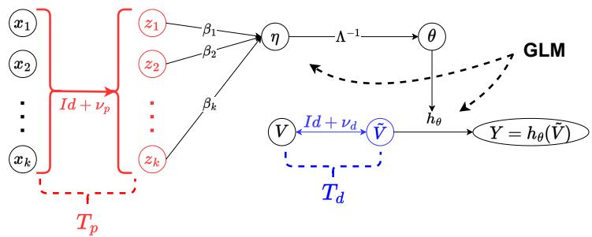

Figure 1: Flowchart of LiD-GLM. The extensions from Section 2.1 are pictured in red and those of Section 2.2 in blue. For $\nu _ { p } \equiv 0$ and $\nu _ { d } \equiv 0 ,$ , the structure of a GLM (black) is obtained.  
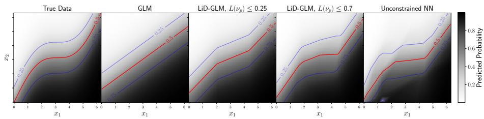  
Figure 2: Heatmaps and contour lines $( \mathbb { P } = \frac { 1 } { 4 } , \frac { 1 } { 2 } , \frac { 3 } { 4 } )$ showing learned densities in synthetic binary data example. Shown are 1) the true distribution $\mathbb { P } [ Y = 1 | x _ { 1 } , x _ { 2 } ] =$ sigmoid $( x _ { 1 } +$ sin $( x _ { 1 } ) - x _ { 2 } )$ , 2) logistic regression, 3+4) LiD-GLM with different bounds for $L ( \nu _ { p } )$ and 5) an unconstrained NN.

(where “ ” denotes the scalar product) and:

$$
Y \sim h _ { \theta } ( T _ { d } ( V ) ) ,\tag{M2}
$$

which we illustrate in Figure 1.

Depending on the application, one can deliberately choose one of the transformations $T _ { p }$ or $T _ { d }$ as the identity function, thus enforcing the base GLM’s assumptions on the corresponding model component. An example is the Bernoulli distribution which is fully determined by θ and thereby the transformation $T _ { d }$ is obsolete.

An i-ResNet $T : \mathbb { R } ^ { m }  \mathbb { R } ^ { m }$ is a concatenation of “residual blocks”, which are invertible functions of the form $( \mathrm { I d } + \nu ) : \mathbb { R } ^ { m } \to \mathbb { R } ^ { m }$ , where Id is the m-dimensional identity function and ν a neural network (NN) with a constrained Lipschitz constant $L ( \nu ) \leq c , \ c < 1$ (see Def. 2.1 below). These Lipschitz constraints allow a researcher to limit how far the extensions (M1) and (M2) deviate from (2) and (1). An example is shown in Figure 2. Unlike similar methods, LiD-GLM does not require a pre-defined structure of nonlinearities or interactions.

The goal of the LiD-GLM model is to preserve the baseline of interpretability of the GLM while benefiting from the i-ResNets’ flexibility. In particular, in (M2) the i-ResNet $T _ { d }$ is invertible and hθ is increasing in $\theta$ (see Theorem 1.1), and therefore the stochastic monotonicity of $Y$ in $\eta$ remains a core model property, resulting in an intuitive and interpretable model behaviour. Also, the term $T _ { p , i } ( \mathbf { x } ) = x _ { i } + \nu _ { p , i } ( \mathbf { x } )$ remains to be monotone in $x _ { i }$ . However, in general, the monotonicity of $\eta$ in $x _ { i }$ cannot be preserved, if the model is to learn complex interactions, which we discuss further in Supplement C.

To achieve identifiability, we adapt the “PHO”-orthogonalization from Rugamer ¨ [2023] and empirically verify its effectiveness through applications to real and synthetic data. Finally, we develop interpretational methods for LiD-GLM and discuss these for applications on datasets of different complexity, comparing also model performance to comparable models.

## 1.2 Related Literature

The concept of combining statistical parametric conditional distribution models with NNs has already been applied in existing literature for different reasons. In Lim et al. [2023] and Tran et al. [2020], Deep-GLM models are proposed that contain a pretransformation of a GLM’s inputs by an unrestricted NN. In wide & deep learning Cheng et al. [2016], a sum of predictors from a linear model and an unrestricted NN is proposed in the context of recommender systems. However, the interpretability of these unconstrained methods is limited, as no guarantee can be given to what degree the learned linear weights actually describe the models’ behaviour.

Other models that focus more on interpretability have been constructed on the basis of generalized additive models (GAMs). In neural additive models (NAMs) Agarwal et al. [2021], the predictor can be computed from one-dimensional NN-functions of single input covariates. They can learn flexible nonlinearities while remaining relatively well interpretable, but are inflexible in learning interactions. In semi-structured deep distributional regression models (SDDR) Rugamer et al. [2024, 2023], linear pre-¨ dictors are combined with structured nonlinear predictors (e.g. splines) and NN predictors, each working on subsets of the input covariates. Also, SDDR models are based on generalized linear additive models for location, scale and shape (GAMLSS). However, the interpretability of SDDR models is strongly dependent on their assumed structure. Only SDDR models with few pre-specified interaction terms are interpretable, but may miss important but a priori overlooked interactions. Later we use an adapted version of an orthogonalization method developed in the context of SDDR Rugamer [2023] and¨ discuss the relation between SDDR and LiD-GLM in more detail in Supplement B.

All above mentioned methods rely on low-dimensional parametric distributional assumptions. The high-dimensional distributional correction $T _ { d }$ we propose in Equation (M2) is instead closely related to conditional normalizing flows Winkler et al. [2023] (see Supplement D). The latter learn diffeomorphisms from an unknown true data distribution to a simple known distribution using invertible NNs. While normalizing flows (without any structural component) are not inherently interpretable, the structure gained from using GLMs (and their latent space representation) in conjunction with $T _ { d }$ results in inherent interpretability.

It has been previously shown that enforcing Lipschitz constraints on NNs can improve their robustness Cisse et al. [2017] and generalizability as well as improve performance in a small data context Gouk et al. [2021], which is what our model is built for. Like Behrmann et al. [2019], we use a fast but conservative Anil et al. [2019] layerwise upper bound on the NNs’ Lipschitz constants during training; however, for a tighter bound during interpretation, we can make use of more recent exact computation methods Splittgerber [2026] that are computationally feasible due to LiD-GLMs’ relatively small size.

## 1.3 Paper Outline

The rest of this paper is structured as follows: in Section 2, we will detail the proposed extensions of the traditional GLM with details on (M1) in Section 2.1 and details on Equation (M2) in Section 2.2. In Section 2.3, we discuss a method to achieve identifiability via orthogonalization and in Section 3 we discuss interpretation methods for LiD-GLM. In Section 4, we then apply LiD-GLM to several datasets, comparing it to other methods, to illustrate its strengths and limitations. Finally, in Section 5, we set our proposed method into a broader statistical and machine learning context.

## 2 Lipschitz-constrained DeepGLM (LiD-GLM)

In this section, we describe the extensions we make going from a GLM (with arbitrary family and link) to a LiD-GLM while using the notation of Section 1.

## 2.1 (i-)ResNet Input Transformation

To extend (2) to nonlinear predictions, we prepend to the GLM an i-ResNet $T _ { p } : \mathbb { R } ^ { k } $ $\mathbb { R } ^ { k } , \mathbf { x } \mapsto \mathbf { z } : = T _ { p } ( \mathbf { x } )$ operating on the input variables resulting in a GLM component which operates on a moderately “pre-transformed” covariate vector ${ \bf z } = T _ { p } ( { \bf x } )$

$$
\eta = \beta _ { 0 } + T _ { p } ( \mathbf { x } ) \cdot \beta = \beta _ { 0 } + \left( \mathbf { x } + \nu _ { p } ( \mathbf { x } ) \right) \cdot \beta = \underbrace { \beta _ { 0 } + \mathbf { x } \cdot \beta } _ { \mathrm { L i n e a r p r e d i c t o r } } + \underbrace { \nu _ { p } ( \mathbf { x } ) \cdot \beta } _ { \mathrm { N N ~ t e r m } } .\tag{4}
$$

This first extension to the GLM from (M1) is pictured on the left side of Figure 1 and enables the extended model to learn nonlinear and interaction effects in its prediction of $\eta .$

To guarantee a certain bound to which the linear term $\mathbf { x } \cdot \boldsymbol { \beta }$ dominates the predictions of the fitted LiD-GLM, we utilize the concept of Lipschitz continuity:

Definition 2.1 (Lipschitz continuity). Given two normed spaces $( \mathcal { X } , | | . | | x ) , ( \mathcal { V } , | | . | | y ) ;$ a function $f : \mathcal { X }  \mathcal { Y }$ is called Lipschitz continuous if there exists a constant L such that

$$
| | f ( x _ { 1 } ) - f ( x _ { 2 } ) | | _ { \mathcal { V } } \leq L \cdot | | x _ { 1 } - x _ { 2 } | | _ { \mathcal { X } } \quad \forall x _ { 1 } , x _ { 2 } \in \mathcal { X } .\tag{5}
$$

With a slight abuse ofnomenclature, we will refer to the Lipschitz norm:

$$
L ( f ) : = \operatorname* { i n f } \{ L \geq 0 : f i s L \ – L i p s c h i t z \} .\tag{6}
$$

ofa Lipschitz continuousfunction $f$ as $" t h e "$ Lipschitz constant of $f ,$ as it is shown in Cobzas¸ et al. [2019] that $L ( f )$ is the minimal Lipschitz constant for $f .$

In an i-ResNet, the Lipschitz constant of the nonlinear term $\nu _ { p }$ can be restricted by a user defined upper bound $L _ { p } ^ { b }$ . By definition, $L _ { p } ^ { b }$ bounds the Jacobian norm of $\nu _ { p }$ and therefore also the absolute value of the partial derivatives of $\nu _ { p , i }$ . A bound $L _ { p } ^ { b } = 0$ in particular implies that $\nu _ { p }$ equals a constant c and thereby $T _ { p } = \stackrel { \cdot } { I } d + c$ and the predictor (M1) of the LiD-GLM model is linear as in a classical GLM. Moreover, the orthogonalization method from Section 2.3 below guarantees that $c = 0$ in this case. Also, if $L _ { p } ^ { b } < 1$ then the partial derivative of $T _ { p , i } ( \mathbf { x } )$ in $x _ { i }$ is guaranteed to be positive which, as shown in Supplement C, preserves the monotonicity of the transformed variable $T _ { p , i } ( \mathbf { x } )$ in $x _ { i }$

The bound $L _ { p } ^ { b }$ is a controllable hyperparameter which limits the impact of $\nu _ { p }$ and thereby the “nonlinearity” of (M1). It can be deliberately chosen for individual practical applications. Noticeably, the bound $L _ { p } ^ { b }$ does not directly limit the size of $\nu _ { p } ( \mathbf { x } )$ (which also depends on the support of $\mathbf { x } )$ but how much it changes with changes in x and thereby its deviation from a constant. The importance of $L _ { p } ^ { b }$ is illustrated in Figure 2 and is further studied in Section 4.

## 2.1.1 Binary LiD-GLM Models

For a binary target variable Y the LiD-GLM model simplifies to a model for $p =$ $\mathbb { P } ( Y = 1 )$ of the form $p = \lambda ^ { - 1 } ( \beta _ { 0 } + T _ { p } ( \mathbf { x } ) \beta )$ where λ is the link function of the GLM, e.g. the logit-function of a logistic model. As mentioned in the Section 1.1, no additional distributional transformation is required and the specification of a binary LiD-GLM model is complete without the methods from the following Section 2.2.

## 2.2 Distributional Correction

We showed in Theorem 1.1 that the distribution family assumption of a GLM (1) can be rewritten as $Y { \overset { d } { = } } h _ { \theta } ( V )$ for a parametrized function $h _ { \theta }$ and a continuous latent variable V with a known distribution. As the second main component of LiD-GLM, we proposed the inclusion of an i-ResNet $T _ { d } ,$ i.e. $Y \sim h _ { \theta } ( T _ { d } ( V ) )$ in Equation (M2), which corresponds to a θ-independent correction of the latent variable distribution through a normalizing flow.

The effect of this transformation is illustrated in Figure 3 for toy data. We show in Supplement F that an $h _ { \theta }$ can always be found such that M2 is compatible with backpropagation and can be used to generate new samples and calculate the density after training.

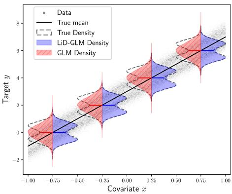  
Figure 3: Example of distributional correction on synthetic multimodal data. Both GLM and LiD-GLM are able to learn the true conditional mean but the LiD-GLM also learns the approximate shape of the true conditional distribution which the GLM cannot.

## 2.2.1 Special Case: Normal Distributed Target

If we start with a normal linear regression model $Y = \eta + \epsilon$ we can use $V = \epsilon \sim$ ${ \mathcal { N } } ( 0 , \sigma ^ { 2 } )$ and, because in this case $\theta = \eta$ holds, we can write $h _ { \eta } ( v ) = v + \eta$ (the

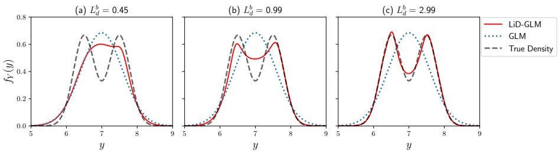  
Figure 4: Distributional correction learned by LiD-GLM for different $L _ { d } ^ { b }$ on data as in Figure 3 shown for a fixed covariate $x = 1$ . For increasing $L _ { d } ^ { b } ,$ the conditional density of the LiD-GLM deviates more strongly from the base GLM and approximates the true density increasingly well.

inverse of the centering function) to obtain $Y \overset { d } { = } h _ { \eta } ( V )$ . The distributional correction from (M2) then becomes:

$$
Y = \eta + T _ { d } ( V ) ,\tag{7}
$$

which corresponds to a correction of the original residual distribution through $T _ { d }$ Again, the bound $L _ { d } ^ { b }$ on $L ( T _ { d } )$ governs the strength of this correction, which is illustrated in Figure 4. For $L _ { d } ^ { b } = 0$ , the model remains with a normally distributed target.

As $T _ { d }$ is mean-independent, (M2) still assumes a mean-independent residual distribution as was previously mentioned. This assumption could be weakened by using a higher-dimensional i-ResNet $T _ { d } : \mathbb { R } ^ { 2 }  \mathbb { R } ^ { 2 } , ( \epsilon , \eta )  ( \tilde { \epsilon } , \eta )$

## 2.3 Orthogonalization, Identifiability

If (M1) is rewritten as $\eta = \beta _ { 0 } + \mathbf { x } \cdot \boldsymbol { \beta } + \nu _ { p } ( \mathbf { x } ) \cdot \boldsymbol { \beta }$ as in (4), an issue of identifiability becomes apparent: any non-trivial $\nu _ { p }$ can absorb or cancel out the linear effects learned in $\beta .$ . This issue and its detrimental effect on model interpretability are discussed for SDDR models in Rugamer et al. [2023, 2024], R¨ ugamer [2023] and we can build on¨ their results.

It should however also be mentioned that LiD-GLM have some inherent protection against issues of identifiability as the Lipschitz constraint placed on $\nu _ { p }$ and the usage of $\beta$ in both the linear and nonlinear terms prevent a free shifting of linear effects into $\nu _ { p } .$ As we also initialize $\beta$ with the weights of a trained GLM and $T _ { p }$ at the identity function, the gradient descent algorithm has to actively shift weight into the nonlinear component. We empirically show that both properties reduce issues of identifiability in Section 4.3.

However, to achieve full identifiability, we adapt post hoc orthogonalization (PHO) proposed in Rugamer [2023] to component (M1) of LiD-GLM. As this requires a ¨ lengthy computation, we refer to Supplement G for details. The main idea is to compute the projection of the output of $\nu _ { p }$ into the column space of the training data X. This projection identifies the part of $\nu _ { p }$ which can be described as a linear function of X and $\beta$ can be adjusted accordingly. Also, the projection is subtracted from $\nu _ { p }$ . In effect, this method results again in a model of the form $\eta = \widetilde { \beta _ { 0 } } + ( \mathbf { x } + \widetilde { \nu _ { p } } ( \mathbf { x } ) ) \widetilde { \beta }$ with the same predictions as the original model but with the property that if $\mathbf { x } _ { i }$ and $\widetilde { \nu } _ { p , j } ( \mathbf { X } )$ are arbitrary columns of X respectively $\widetilde { \nu _ { p } } ( \mathbf { X } )$ , then $\begin{array} { r } { \mathbf { x } _ { i } \cdot \widetilde { \nu } _ { p , j } ( \mathbf { X } ) = 0 . } \end{array}$ i.e. the columns are orthogonal. Each $\widetilde { \nu } _ { p , j } ( \mathbf { X } )$ is also orthogonal to the constant column $( 1 , \ldots , 1 ) ^ { T }$

## 3 Interpretation Methods

In this section, we describe methods and guidelines for interpreting our model, describing model-specific methods and going beyond generic post-hoc interpretability methods such as partial dependence plots. As a prerequisite, we apply the orthogonalization method from Section 2.3, but for a simpler notation we still use the symbols $( \beta _ { 0 } , \beta , \nu _ { p } )$ instead of $( \widetilde { \beta _ { 0 } } , \widetilde { \beta } , \widetilde { \nu _ { p } } )$ in this section.

## 3.1 Interpreting $T _ { p }$

In the interpretation of a traditional GLM, the effect of any covariate $x _ { i }$ on $\eta$ is given by $\beta _ { i }$ , independently of all other covariates. In our model (M1), this relationship holds between the transformed covariates $z _ { i } = T _ { p , i } ( \mathbf { x } ) = x _ { i } + \nu _ { p , i } ( \mathbf { x } )$ and η. The relationship between $x _ { i }$ and $\eta$ is now more complex and not necessarily monotonous. However, the common coefficient $\beta _ { i }$ for the linear and nonlinear term implies that both terms act on a common scale, and the smaller the Lipschitz constant of the nonlinear term, the more $\beta _ { i }$ alone describes the influence of $x _ { i }$ on the target variable.

As mentioned before, in the important special case $L ( \nu _ { p } ) < 1$ we can at least guarantee that each transformed covariate $z _ { i }$ is strictly monotonically increasing in $x _ { i }$ This even follows already if the Lipschitz norm of the i-th component $\nu _ { p , i } ( \mathbf { x } )$ is below 1. The latter is bounded by the Lipschitz norm of the vector-wise function $\nu _ { p }$ but can be smaller. The exact value by which it is bounded also depends on the chosen vector norms. Note that to obtain tight bounds, both the multidimensional and unidimensional Lipschitz constants can be computed post-hoc with exact computation methods like Bhowmick et al. [2021] or Splittgerber [2026].

## 3.1.1 Coefficient of Determination $R _ { i } ^ { 2 }$

In this section, we present an alternative and more natural way to quantify how much the transformed variable $z _ { i } = x _ { i } + \nu _ { p , i } ( \mathbf { x } )$ is dominated by $x _ { i }$ . This then also quantifies how far $\beta _ { i }$ still describes the effect of $x _ { i }$ on $Y$ . In this section, we denote by $\mathbf { z } _ { i }$ and $\mathbf { x } _ { i } \in \mathbb { R } ^ { n \times 1 }$ the i-th column of the transformed and untransformed design matrix respectively and by $\nu _ { p , i } ( \mathbf { X } )$ that of the linear correction term, meaning $\mathbf { z } _ { i } = \mathbf { x } _ { i } + \nu _ { p , i } ( \mathbf { X } )$ Because $\nu _ { p }$ was orthogonalized w.r.t. the constant one-vector $\iota _ { n } = ( 1 , \ldots , 1 ) ^ { T }$ during orthogonalization, the mean of each column is zero: $\overline { { \nu _ { p , i } ( \mathbf { X } ) } } = \iota _ { n } ^ { T } \nu _ { p , i } ( \mathbf { X } ) = 0$ Therefore the means $\overline { { { \bf z } _ { i } } } = \overline { { { \bf x } _ { i } } }$ are equal.

Using this, one can decompose the total variance of $\mathbf { z } _ { i } .$ computed via the wellknown sum of squares $| | \mathbf { z } _ { i } - \overline { { \mathbf { z } _ { i } } } | | _ { 2 } ^ { 2 }$ as follows:

$$
\begin{array} { r l r l r } { | | \mathbf { z } _ { i } - \overline { { \mathbf { z } _ { i } } } \iota _ { n } | | _ { 2 } ^ { 2 } } & { { } \overline { { \mathbf { z } _ { i } } } \mathbf { = } \overline { { \mathbf { x } _ { i } } } } & { | | \mathbf { x } _ { i } + \nu _ { p , i } ( \mathbf { X } ) - \overline { { \mathbf { x } _ { i } } } \iota _ { n } | | _ { 2 } ^ { 2 } } & { { } \nu _ { p , i } \underbrace { \bot \iota _ { n } } _ { = } , \mathbf { x } _ { i } } & { | | \mathbf { x } _ { i } - \overline { { \mathbf { x } _ { i } } } \iota _ { n } | | _ { 2 } ^ { 2 } + | | \nu _ { p , i } ( \mathbf { X } ) | | _ { 2 } ^ { 2 } } \end{array}
$$

The coefficient of determination is then given as the fraction variance explained by the term $\mathbf { x } _ { i } \mathbf { \cdot }$

$$
R _ { i } ^ { 2 } : = \frac { | | \mathbf { x } _ { i } - \overline { { \mathbf { x } _ { i } } } \iota _ { n } | | _ { 2 } ^ { 2 } } { | | \mathbf { z } _ { i } - \overline { { \mathbf { z } _ { i } } } \iota _ { n } | | _ { 2 } ^ { 2 } } .\tag{8}
$$

One can also see that because of PHO, $\mathbf { x } _ { i }$ is the ordinary-least-squares prediction from the linear regression $\mathbf { z } _ { i } \sim \mathbf { x } _ { i }$ . This ties our $R _ { i } ^ { 2 }$ back to its traditional definition.

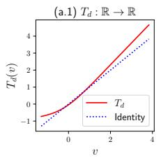

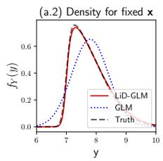

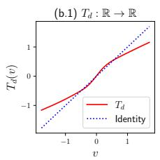

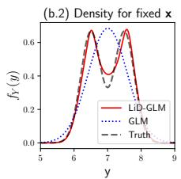  
Figure 5: $T _ { d }$ in two synthetic examples as in Figure 3 where the conditional distribution was now either skewed (Figs. (a.1, a.2)) or multimodal (Figs. (b.1, b.2)). Shown are the transformations $T _ { d }$ learned by LiD-GLM in both cases (Figs. (a.1, b.1)) and the resulting conditional distributions (Figs. (a.2, b.2)). An arbitrary fixed covariate was chosen for all plots as $T _ { d }$ is mean-independent. One can see that, unlike the GLM, LiD-GLM is able to learn skewed and multimodal distributions with an (unimodal, symmetric) normally distributed latent variable.

## 3.2 Interpreting $T _ { d }$

The i-ResNet $T _ { d }$ is an invertible one-dimensional real-valued function and one can easily see that it is strictly increasing. Because the function $h _ { \theta }$ from (M2) is also increasing in both arguments, it preserves this monotonicity in the latent variable which makes an interpretation of $T _ { d }$ relatively straightforward. In particular, plotting $T _ { d }$ provides important insights into the fitted LiD-GLM, e.g. when compared to a diagonal line representing the identity. If the distribution $G _ { 0 }$ for the latent variable is symmetric, an asymmetric deviation from the identity will indicate a transformation towards a skewed distribution, see Figures 5 (a.1, a.2). We can also see whether an initial unimodal distribution $G _ { 0 }$ (e.g. a Gaussian distribution) is transformed into a multimodal distribution, which can indicate a heterogeneity that is not covered by the covariates. An example is shown in Figure 5 (b.1, b.2).

## 4 Practical Applications

In this section, we use a nested cross-validation (see Supplement H.1) to compare the performance of LiD-GLM to other models on different datasets and we illustrate the previously introduced interpretation methods. The datasets were chosen to represent a variety of realistic settings, with the “AKI” data being relatively linear, “Cars” being small and moderately nonlinear and “Stroke” relatively large and clearly nonlinear. The datasets also cover both the binary and the continuous case. The code for all experiments can be found under Github-Link .

## 4.1 “Cars” Application

The “Cars” dataset Bohanec [1988] describes a car’s fuel consumption (numeric, mpg) dependent on several independent variables. From these, we selected “cylinders” (ordinal), “horsepower” (numeric), “acceleration” (numeric), “model year” (numeric) and “origin” (nominal, dummy-encoded) and normalized all non-binary covariates. We also removed entries with missing values (6 total) as well as entries with either three or five cylinders, because these classes are very small (4 or 3 entries respectively). In total, 13 entries were removed of the 398 originally contained in the dataset.

<table><tr><td> $k$ </td><td> $L _ { p } ^ { b }$ </td><td></td><td></td><td>|||·||q |1r (10x) | wid.</td><td> $T _ { p }$  |dep.</td><td> $T _ { p }$  |blk.</td><td> $T _ { p }$ </td><td>act. fkt.  $T _ { p }$ </td><td>|β frozen | test NLL</td><td></td></tr><tr><td>H</td><td> $^ { 0 . 0 1 - } _ { 1 . 0 }$ </td><td>1,2</td><td>-5, -3</td><td></td><td> $^ { 9 , 1 8 , } _ { 3 6 }$ </td><td> $^ { 1 , 2 , } { } _ { 3 } ^ { }$ </td><td>1,2</td><td>GroupSort, ReLU</td><td> $^ { \mathrm { y e s , } } _ { \mathrm { n o } }$ </td><td></td></tr><tr><td>0</td><td>1.0</td><td>1</td><td>-3</td><td></td><td>9</td><td>3</td><td>1</td><td>GroupSort</td><td>no</td><td>2.347</td></tr><tr><td>1</td><td>1.0</td><td>2</td><td>-3</td><td></td><td>18</td><td>3</td><td>1</td><td>GroupSort</td><td>no</td><td>2.368</td></tr><tr><td>2</td><td>0.9</td><td>1</td><td>-3</td><td></td><td>18</td><td>3</td><td>1</td><td>GroupSort</td><td>no</td><td>2.584</td></tr><tr><td>3</td><td>0.9</td><td>2</td><td>-3</td><td></td><td>9</td><td>1</td><td>1</td><td>GroupSort</td><td>yes</td><td>2.489</td></tr><tr><td>4</td><td>1.0</td><td>2</td><td>-3</td><td></td><td>9</td><td>2</td><td>1</td><td>GroupSort</td><td>no</td><td>2.635</td></tr></table>

Table 1: Optimal hyperparameters for the $\ " \mathrm { C a r s } \ "$ data found for LiD-GLM without $T _ { d }$ on each split k. Hyperparamters were chosen from the range (for $L _ { p } ^ { b } )$ and the values given in row H. Listed are the bound $L _ { p } ^ { b }$ of $L ( \nu _ { p } )$ , the used p-norm $( | | . | | _ { p } ) .$ , the learning rate (lr), the width (wid.) and number (dep.) of layers in $T _ { p } ,$ number of residual blocks in $T _ { p }$ (blk.), whether or not the linear coefficients $\beta$ were frozen during training, activation function used (act. fkt.) and test negative loglikelihood (test NLL).
<table><tr><td> $k$ </td><td> $L _ { p } ^ { b }$ </td><td>wid.  $T _ { p } \ : |$ </td><td>dep.  $T _ { p }$ </td><td>|blk.  $T _ { p }$ </td><td>act.</td><td> $T _ { p }$  wid.  $T _ { d }$ </td><td>|dep.  $T _ { d }$ </td><td>act.</td><td> $T _ { d }$  |test NLL</td></tr><tr><td>H</td><td> $^ { 0 . 0 1 - } _ { 1 . 0 }$ </td><td>9,18</td><td>2,3</td><td>1,2</td><td>GroupSort, ReLU</td><td>4,8</td><td>2,3</td><td>GroupSort, ReLU</td><td></td></tr><tr><td>0</td><td>0.89</td><td>9</td><td>2</td><td>1</td><td>ReLU</td><td>8</td><td>3</td><td>ReLU</td><td>2.323</td></tr><tr><td>1</td><td>0.78</td><td>18</td><td>3</td><td>1</td><td>GroupSort</td><td>8</td><td>3</td><td>GroupSort</td><td>2.322</td></tr><tr><td>2</td><td>1.00</td><td>9</td><td>2</td><td>2</td><td>GroupSort</td><td>4</td><td>2</td><td>ReLU</td><td>2.535</td></tr><tr><td>3</td><td>1.00</td><td>9</td><td>2</td><td>2</td><td>GroupSort</td><td>4</td><td>3</td><td>GroupSort</td><td>2.411</td></tr><tr><td>4</td><td>1.00</td><td>9</td><td>2</td><td>1</td><td>GroupSort</td><td>8</td><td>3</td><td>ReLU</td><td>2.595</td></tr></table>

Table 2: The best hyperparameters found for LiD-GLM with $T _ { d }$ on each split k in the cars data example. Used were $\vert \vert . \vert \vert _ { 2 } , \mathrm { l r } = 1 0 ^ { - 3 }$ , no frozen weights, $L _ { d } ^ { b } = 0 . 9 9$ , blk. $T _ { d } = 1$

## 4.1.1 Performance Comparison

We show in Figure 6a the results of the nested cross-validation for LiD-GLMs with and without distributional correction $T _ { d } ,$ , a traditional GLM and a simple SDDR model Rugamer et al. [2024], where the identity link and a Normal target distribution were¨ chosen for all models. As can be seen, the nonlinear LiD-GLM achieves better performance than the GLM model, but also varies more between splits. The performance is slightly improved further by including a distributional correction $T _ { d } .$ . The more highly nonlinear SDDR model performs best on average, but only by a narrow margin, and its performance fluctuates much more strongly between splits than that of the other models.

In Tabs. 1 and 2 the optimal hyperparameters found in each split are listed for LiD-GLMs with, respectively without, $T _ { d }$ . In both cases, $T _ { p }$ was generally chosen to be a small network with a moderately large bound $L _ { p } ^ { b }$ on the Lipschitz constant $L ( \nu _ { p } )$ between 0.8 and 1.0 with one residual block in Table 1 and occasionally two blocks in Table 2. The preferred activation function for $T _ { p }$ in both cases was GroupSort, whereas the optimal activation for $T _ { d }$ is not clear from Table 2. There seems to be a slight advantage to not freezing the linear weights during network training, but the choice of vector norm and the size of $T _ { d }$ seemed to have little effect on model performance.

To further study the implications of the bound on $L ( \nu _ { p } )$ , we show in Figure 6b the test negative mean loglikelihood (NLL) of LiD-GLM (without $T _ { d } )$ from the nested cross-validation in dependence on the bound $L _ { p } ^ { b } .$ . Like one would expect, the LiD-GLMs’ performance is generally increasing with increasing $L _ { p } ^ { b } ,$ as the model goes from a GLM (listed for reference, $L _ { p } ^ { b } = 0 )$ to an unconstrained NN $( L _ { p } ^ { b } \to \infty )$ (see also [Gouk et al., 2021, Sec. 5.7]). One can however observe diminishing returns: the improvement in test NLL for smaller Lipschitz constants is considerably steeper than for larger constants.

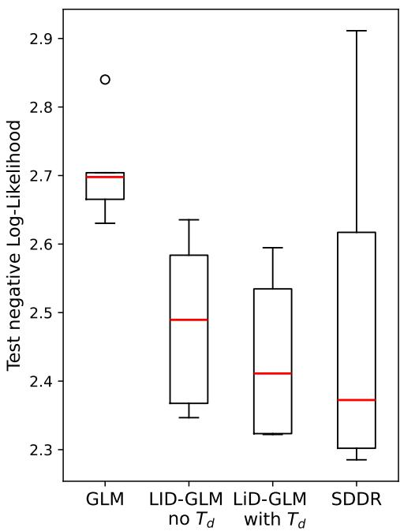  
(a) Comparison of test mean negative Log-Likelihoods in the $\ " \mathrm { C a r s } ^ { \prime \ }$ data example for different models with optimized hyperparameters over k = 5 splits.

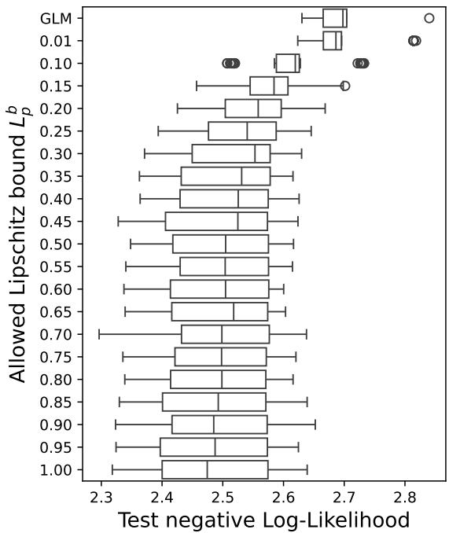  
(b) Boxplots visualizing the impact of the allowed Lipschitz constant on model performance pooled over all splits and the top 10 model hyperparameter combinations.  
Figure 6: Results for the nested cross validation on the “Cars” data..

This data therefore appears well suited to be modelled by LiD-GLM. A moderate nonlinearity causes measurable performance benefit over the GLM and diminishing returns already for small $L _ { p } ^ { b }$ in Figure 6b mean that a LiD-GLM which preserves interpretability well is also similar in performance to an unconstrained model.

## 4.1.2 Model Interpretation

We illustrate our interpretation methods for a single LiD-GLM model fit on the entire cars dataset (using an 80/20 train/validation-split to enable early stopping).

For $T _ { p } ,$ , we choose one residual block with three hidden layers, each with a width of 12, the GroupSort(2) activation function and set $L _ { v } ^ { b } = 0 . 9 9$ . For $T _ { d }$ , we use one residual block with three hidden layers of width six, $L _ { d } ^ { b } = 0 . 9 9$ and the ReLU activation. We also do not freeze the linear coefficients $\beta$ during training. This results in a validation NLL of 2.43.

As a first step of interpretation, we visualize the marginalized dependence of the predicted mean on single covariates via partial dependence plots (PDPs). We show PDPs for most covariates in Figure 7. The variable “horsepower” is shown in Figure 8, where we also stratify by the levels of “cylinders” and compare the PDP for the LiD-GLM to those of the linear model and unconstrained NN.

(b) PDP of acceleration  
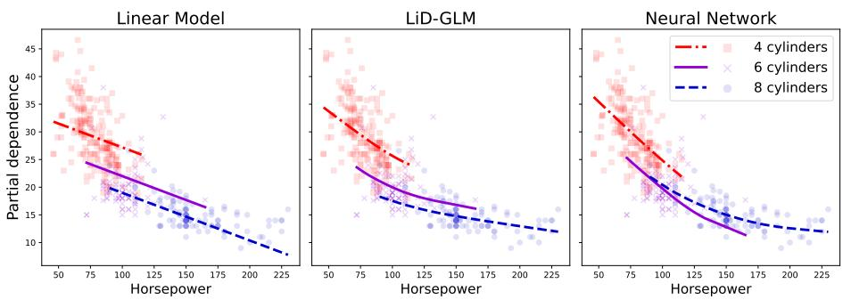

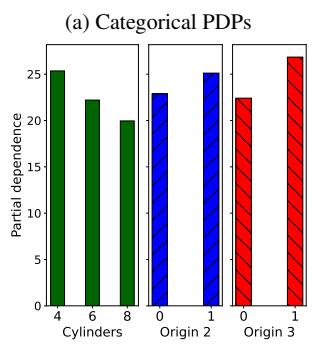

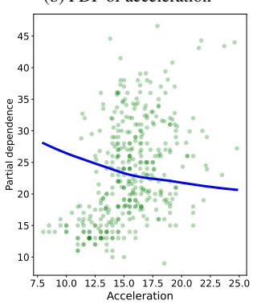

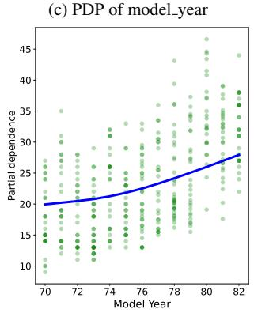  
Figure 7: PDPs for a LiD-GLM trained on the cars data set. For numeric covariates, a scatterplot shows the training data.  
Figure 8: PDPs of “horsepower” for different models trained on the cars dataset, each stratified by number of cylinders. A scatterplot shows the training data.

As can be seen from the PDPs, the LiD-GLM learns a certain degree of nonlinearity seen in the data. In Figure 8, we see that the LiD-GLM and NN learn besides a nonlinear trend also the interaction between horsepower and cylinders that cannot be learned with the (additive) GLM. However, the stronger interaction learned with NN appears somewhat suspicious as it implies that cars with eight cylinders are more fuel efficient than cars with six cylinders.

In Table 3, we list the coefficients $\beta$ learned by the initial linear model and the LiD-GLM (including PHO), which are relatively similar even though $\beta$ was not frozen during the training of LiD-GLM. We also list the $R _ { i } ^ { 2 }$ as described in Section 3.1, which are all very close to one. This indicates that the transformed variables are close the original covariates and hence the $\beta _ { i }$ can largely be interpreted as in the GLM. The smaller $R _ { i } ^ { 2 }$ of ”acceleration” and ”horsepower” seem to match the stronger nonlinearities in the correspondiong PDPs; the smaller $R ^ { 2 }$ of the origin variables could well be caused by learned interaction effects.

As the network contained in $T _ { p }$ is relatively small and only contains one residual block, we can also quantify the influence of $\nu _ { p }$ more precisely. Methods exist Bhowmick et al. [2021], Splittgerber [2026] to exactly compute the Lipschitz constant of piecewise linear NNs. Applying the ExLipBaB algorithm results in an exact global Lipschitz constant of $L ( \nu _ { p } ) = 0 . 3 1$ , whereas the bound $L _ { p } ^ { b }$ was 0.99. This means that $T _ { p }$ did not exhaust its allowed Lipschitz constant and the “majority” of the model lies in the linear part. This is in line with behavior in Figure 6b - the model did not need to exhaust the Lipschitz constant for an adequate fit and higher allowed constants therefore yield little benefit.

<table><tr><td></td><td>bias</td><td>cylinders</td><td>horsepower</td><td>acceleration</td><td>model year</td><td>origin 1</td><td>origin 2</td></tr><tr><td>LM</td><td>22.51</td><td>-2.46</td><td>-3.29</td><td>-1.41</td><td>2.47</td><td>2.13</td><td>4.24</td></tr><tr><td>LiD-GLM</td><td>22.05</td><td>-3.12</td><td>-2.08</td><td>-1.15</td><td>2.54</td><td>2.87</td><td>4.86</td></tr><tr><td> $R ^ { 2 }$ </td><td>=</td><td>0.99</td><td>0.97</td><td>0.98</td><td>0.99</td><td>0.96</td><td>0.95</td></tr></table>

Table 3: Coefficient table for LiD-GLM trained on the cars data. Shown are the coefficients of the Linear Model and the LiD-GLM (including PHO) and the coefficients of determination $R ^ { 2 }$

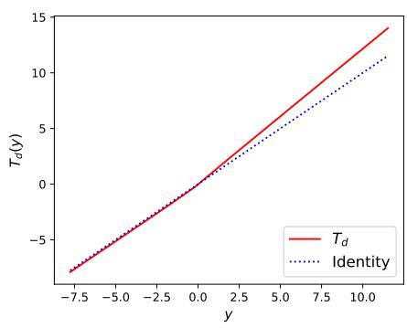  
(a) $T _ { d }$ as a function $\mathbb { R } \to \mathbb { R }$

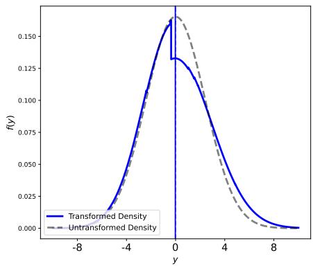  
(b) Residual distribution before/after transformation with $T _ { d } .$ (Overlapping) Vertical lines show the mean of each distribution.  
Figure 9: Distribution correction learned by LiD-GLM on the cars dataset.

To understand the learned residual distribution, we plot $T _ { d }$ in Figure 9a and the resulting residual distribution in Figure 9b as described in Section 3.2.

From both plots, it can be concluded that the LiD-GLM learned a left-skewness of the residual distribution. As can also be seen in Figure 9b, the mean of the residual distribution remains to be close to zero under $T _ { d }$

## 4.2 “Stroke” Application

For an example of a larger and more complex dataset, we use the “Stroke” dataset Chuks. In it, the occurrence of a stroke in a patient is provided as a binary target variable together with basic patient information. We dropped three entries with NA values and 58 entries with negative “age”-values, after which the dataset had 40849 entries. We also dropped the single categorical covariate “work type”, which has some dubious entries. After this, we were working on nine covariates, and again normalized the non-binary covariates.

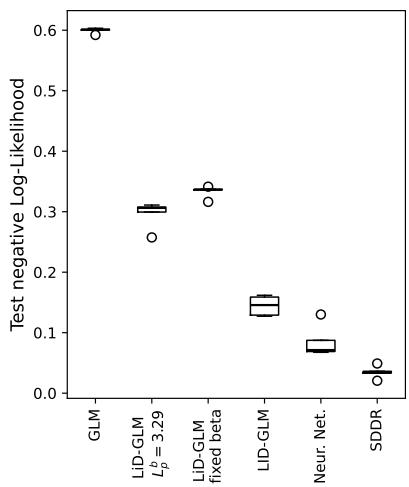  
(a) Comparison of test negative Log-Likelihoods in the “Stroke” data example for different models with optimized hyperparameters over k = 5 splits.

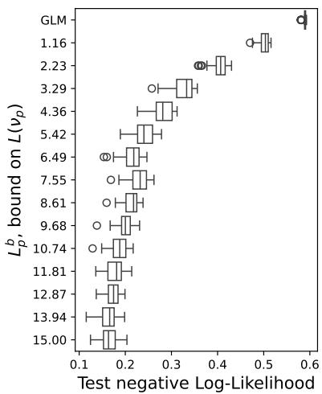  
(b) Boxplots visualizing the impact of the allowed Lipschitz constant on model performance pooled over all splits and the top 10 model hyperparameter combinations.  
Figure 10: Results for the nested cross validation on the “Stroke” data.

## 4.2.1 Performance Comparison

Again, we compare a LiD-GLM, a traditional GLM and an SDDR model Rugamer ¨ et al. [2024], where we this time choose the logit link and a Bernoulli target distribution for all models. On this data, we also compare to a basic NN with a Sigmoid last layer, which, in the binary special case, outputs a probability (-distribution) and is equivalent to an unconstrained Deep GLM. Note that the distributional correction is not applicable in the binary setting.

We show the search space of a nested cross-validation and optimal hyperparameters for LiD-GLM in Table 4 and the performance comparison between the models in Figure 10a, where we also separately show the best LiD-GLM for each split if $\beta$ is frozen during training, or if a small $L _ { p } ^ { b } = 3 . 2 9$ is chosen. The latter two options result in a worsened goodness-of-fit, but can be advantageous for model interpretation.

In Figure 10b, we show the test NLL in dependence of the bound $L _ { p } ^ { b }$ . In this data example, one sees diminishing returns only for relatively large bounds. A bound $L _ { p } ^ { b }$ 14 seems to be optimal, which is further supported by Table 4, which also shows a preference towards larger networks with more residual blocks than in Section 4.1.1. A LiD-GLM with a relatively small bound, e.g. $L _ { p } ^ { b } = 1 . 1 6$ , however also achieves significant performance benefit over regular logistic regression. Still, this emphasises the compromise inherent to LiD-GLM: a researcher can choose a higher $L _ { p } ^ { b }$ to improve performance or intentionally use a more interpretable but less expressive model.

## 4.2.2 Model Interpretation

In Table 5, we again show the coefficients of a LiD-GLM model with 6 hidden layers of width 48, distributed into 5 residual blocks with $L _ { p } ^ { b } \ = \ 1 3 . 9 9$ . To help with interpretation, we froze the linear coefficients during training and the model therefore only achieved a validation NLL of 0.369 on a single split (80/20 train/validation) of the stroke data (results for an unconstrained model are given in Supplement I.2). As can be seen from the listed $R _ { i } ^ { 2 } \mathrm { - v a l u e s } .$ , the model incurs more nonlinearity than in “Cars” application, which is to be expected from Figure 10b. The covariates “age” and “avg. glucose level” seem to remain relatively unchanged, which matches the PDP plots shown in Figure 11.

<table><tr><td> $k$ </td><td> $L _ { p } ^ { b }$ </td><td> $| | . | | _ { q }$ </td><td>lr (10x)</td><td>wid.  $T _ { p }$ </td><td>dep.  $T _ { p }$ </td><td>blk.  $T _ { p }$ </td><td>act. fkt.  $T _ { p }$ </td><td> $\beta$  frozen</td><td>test NLL</td></tr><tr><td> $\mathcal { H }$ </td><td>0.1- 15.0</td><td>1,2</td><td>-5, -3</td><td>18,36, 48</td><td> $^ { 3 , 4 , } _ { 5 , 6 }$ </td><td> $3 , 4 ,$  5</td><td>ReLU GroupSort</td><td> ${ \mathrm { y e s } } , { \mathrm { n o } }$ </td><td></td></tr><tr><td>0</td><td>15.00</td><td>2</td><td>-3</td><td>36</td><td>6</td><td>5</td><td>GroupSort</td><td>no</td><td>0.162</td></tr><tr><td>1</td><td>15.00</td><td>2</td><td>-3</td><td>36</td><td>6</td><td>4</td><td>GroupSort</td><td>no</td><td>0.127</td></tr><tr><td>2</td><td>13.94</td><td>2</td><td>-3</td><td>48</td><td>5</td><td>5</td><td>GroupSort</td><td>no</td><td>0.159</td></tr><tr><td>3</td><td>12.87</td><td>2</td><td>-3</td><td>48</td><td>6</td><td>4</td><td>GroupSort</td><td>no</td><td>0.146</td></tr><tr><td>4</td><td>13.94</td><td>2</td><td>-3</td><td>36</td><td>5</td><td>5</td><td>GroupSort</td><td>no</td><td>0.129</td></tr></table>

Table 4: Optimal hyperparameters for LiD-GLM found for each split k in the ”Stroke” data example. For a further table description, see Table 1.

<table><tr><td></td><td> $\beta _ { 0 }$ </td><td> $\beta _ { 1 }$ </td><td> $\beta _ { 2 }$ </td><td> $\beta _ { 3 }$ </td><td> $\beta _ { 4 }$ </td><td> $\beta _ { 5 }$ </td><td> $\beta _ { 6 }$ </td><td> $\beta _ { 7 }$ </td><td> $\beta _ { 8 }$ </td><td> $\beta _ { 9 }$ </td></tr><tr><td>LM</td><td>-1.0</td><td>-0.41</td><td>0.09</td><td>1.23</td><td>1.13</td><td>0.87</td><td>0.13</td><td>0.42</td><td>-0.16</td><td>0.13</td></tr><tr><td>LiD-GLM</td><td>-2.06</td><td>-0.54</td><td>0.16</td><td>1.8</td><td>1.64</td><td>1.6</td><td>0.34</td><td>0.61</td><td>-0.46</td><td>0.09</td></tr><tr><td> $R _ { i } ^ { 2 }$ </td><td>–</td><td>0.96</td><td>0.99</td><td>0.64</td><td>0.54</td><td>0.79</td><td>0.98</td><td>0.98</td><td>1.0</td><td>0.85</td></tr></table>

Table 5: Coefficient table for LiD-GLM trained on the Stroke data. Shown are the coefficients of the Linear Model and the LiD-GLM (including PHO) and the coefficients of determination $R ^ { 2 }$ for the variables $\beta _ { 0 }$ =Intercept, β1=Sex, β2=Age, β3=Hypertension, $\beta _ { 4 }$ =Heart disease, ${ \beta _ { 5 } } \mathrm { { = } e v e r }$ married, β6=Residence type, β7= Average glucose level, ${ \beta } _ { 8 } { = } \mathrm { B M I } ,$ β9=smoking status.

In contrast, the PDP plot for “BMI” is relatively nonlinear, despite what the $R _ { i } ^ { 2 }$ which is exactly 1 (rounded to two digits) would suggest. To explain this, we show in Figure 12 the PDP plots of the transformed formely binary covariates w.r.t. the “BMI” variable. As can be seen, “BMI” seems to have a nonlinear influence on all binary covariates. These learned interactions likely also explain the relatively small $R _ { i } ^ { 2 }$ -values of other covariates. Especially in the cases of “hypertension”, “heart disease” and “ever married”, in which the PDP plot does not even intersect the average value of the transformed covariate, strong interactions are likely occurring. In this way the LiD-GLM can also be leveraged to detect possible interaction effects for downstream variable selection.

## 4.3 PHO Orthogonalization

We discussed in Section 2.3 how post-hoc orthogonalization (PHO) can counteract a lack of identifiability theoretically. In previous research Rugamer [2023], it was¨ shown that orthogonilzation can also drastically reduce the mean squared error (MSE) when reconstructing linear effects from simple synthetic data. We have adopted their approach to also test the behavior of our model first on synthetic and then on real data. Generally, one would expect that improved identifiability should also stabilize parameter estimation.

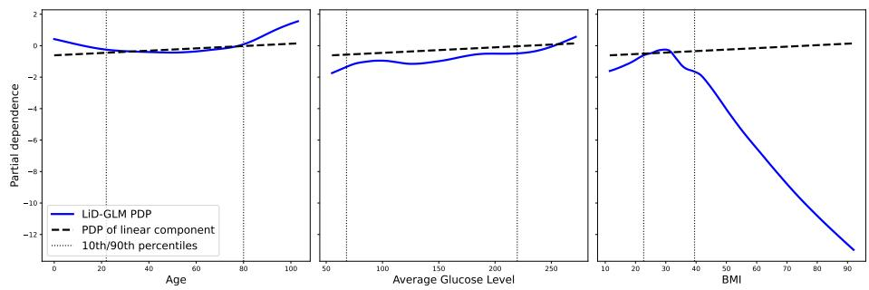  
Figure 11: PDP plots of LiD-GLM on the continuous variables in stroke data example w.r.t. predicted logits.

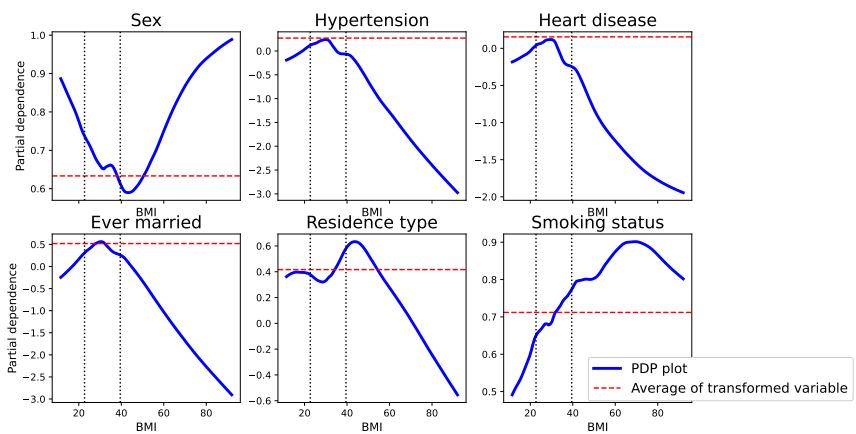  
Figure 12: PDP plots of transformation $T _ { p }$ w.r.t. “BMI” of the former binary covariates.

## 4.3.1 Synthetic Linear Data

For different numbers $p \in \{ 1 , 3 , 1 0 \}$ of independent variables, we sample a number $n \in \{ 5 0 , 1 0 0 , 1 0 0 0 \}$ of values X from a p-dimensional multivariate normal distribution. We then choose $p$ equidistant coefficients $\beta$ in the interval $[ - 2 . 5 , 2 . 5 ]$ and compute a target array through a linear combination $\mathbf { y } { } = \mathbf { x } \cdot \boldsymbol { \beta }$ . We also add standard Normal noise to the target. On this synthetic data, we train a Linear Regression model as well as an SDDR and LiD-GLM model and compare in Figure 13 the MSEs between the estimated and true linear coefficients from 20 different random seeds. We test the SDDR model and LiD-GLM both with and without PHO; for the SDDR model we also test ONO-orthogonalization Rugamer et al. [2024]. For the SDDR and LiD-GLM, we use¨ networks with the ReLU activation; for the SDDR model with two hidden layers - one with 100 and one with 50 nodes and a dropout of 0.1 after each layer. The LiD-GLM model has two hidden layers with 75 nodes each. As described in previous sections, our recommended workflow would almost always be to initialize LiD-GLM with the weights from a pre-trained GLM. However, to enable further comparison, we also show results for a LiD-GLM that was initialized with random weights.

The Linear model is, unsurprisingly, able to reconstruct the true linear coefficients with negligible error in all tested scenarios. In our recommended workflow, the LiD-GLM is therefore essentially initialized on the correct coefficients and performs with negligible error as well. We argue that this is not in itself an unfair comparison - indeed, scenarios where the GLM already reflects the general trend of the data well are precisely what our model is constructed for. However, given that an SDDR model could also be initialized at a pre-trained GLM, we also compare the two models both initialized on random weights. Without orthogonalization, both models then incur significant error, especially for small $p$ and $n _ { \mathrm { { ; } } }$ likely because of a lack of identifiability. However, a clear gap in performance is recognizable between the two models on this specific task. The constraint enforced on $L ( \nu _ { p } )$ in the LiD-GLM presumably already counteracts the lack of identifiability to some degree by encouraging the optimizer to rely on the linear component of the model rather than the nonlinear one. For both models, orthogonalization then generally improves the resulting MSE, which is the same conclusion that was drawn in Rugamer [2023].¨

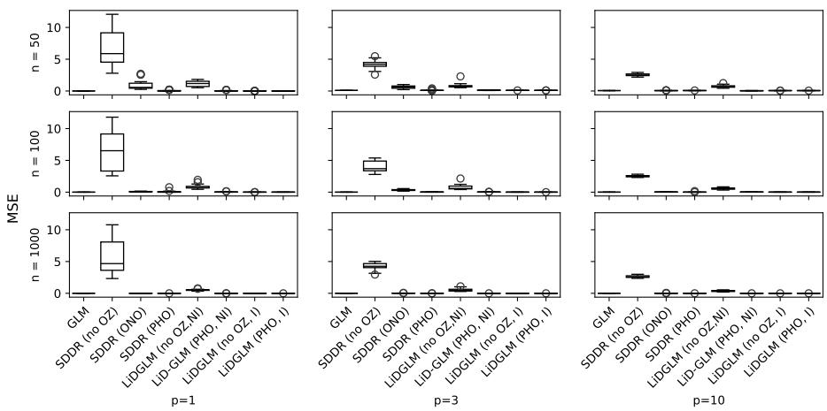  
Figure 13: MSE of coefficients learned on synthetic data compared to known truth for: linear model (GLM), SDDR model without orthogonalization (no OZ), with ONO and PHO orthogonalization and LiD-GLM with and without PHO, initialized at linear model (I) and initialized at random weights (NI).

## 4.3.2 Real Data

To our knowledge, a discussion on the effect of orthogonalization on the estimated coefficients for SSDR-like models, as in the last subsection, has not yet been had on real data. Obviously, one generally cannot compare an absolute error to some known true effects in a real setting. However, one would expect that orthogonalization, by ensuring identifiability, at least reduces the variance between linear coefficients estimated in different local minima of the optimizer. This would indeed already improve interpretability as a large fluctuation in the linear coefficients for different optimizer paths would put into question any interpretation based on these coefficients.

To test the effect of PHO on the coefficients estimated by a LiD-GLM model in a realistic application, we compare the coefficients with and without PHO learned by the top 20 models (based on validation log-likelihood) in the nested cross-validation of Section 4.1, since the “Cars” data is an ideal application for a LiD-GLM. We show here results for LiD-GLMs without a distributional correction $T _ { d } .$ but results for LiD-GLMs with $T _ { d }$ and results for the less relevant “Stroke” application from Section 4.2 can be

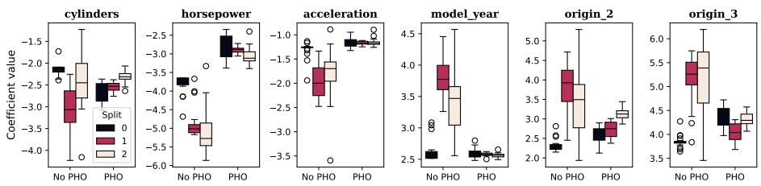  
Figure 14: Boxplots showing the LiD-GLM estimates of the linear coefficients with and without PHO on the first three splits in the nested cross validation on the “Cars” dataset.

found in Supplement I.3.

In our comparison, we consider each data split separately. This separates fluctuation in the linear effects’ estimation due to randomness in the data from (potentially avoidable) fluctuations that arise from a lack of identifiablity. By considering the top 20 models for each split, we get a realistic spectrum of hyperparameters that could have been chosen in practice.

In Figure 14, we show boxplots of the resulting estimated parameters. For conciseness, only the first three splits are shown, which are representative of the general behaviour; results for the other splits can also be found in Supplement I.3. In the cars application, the variance in the estimation of all $\beta _ { i }$ is drastically reduced through an application of PHO for all coefficients. Also, the application of PHO generally reduces the absolute coefficient values.

## 5 Discussion

We introduced an extension of GLMs which addresses two key issues by allowing a flexible nonlinear parameter estimation and also a correction of the a priori assumed distribution family. LiD-GLM achieves both generalizations by utilizing i-ResNets; consequently, the deviation from the GLM, and thereby the degree of nonlinearity of the model, can be rigorously bounded through a user-chosen Lipschitz constraint. This preserves the interpretation of the linear regression coefficients up to a degree that is influenced by the actual Lipschitz constants of the nonlinear transformation applied to the individual terms of the model; it also partially preserves monotonicity. These Lipschitz constants are approximated during training and can be computed exactly post-hoc e.g. utilizing methods suggested in Splittgerber [2026]. To also give a more intuitive method to quantify the degree of nonlinearity of individual covariates by utilizing coefficients of determination. This provides further insight into the interpretability of the learned linear coefficients. Furthermore, we discuss identifiability as an important part of interpretability and use a post-hoc orthogonalization to guarantee identifiability. Additionally, we show how the distributional correction learned by LiD-GLM can be easily interpreted.

We showed that on data sets of moderate nonlinearity and non-additivity our models can close the gap between the restrictive GLMs and over-expressive and unconstrained ML methods. We also tested our model internally on a highly linear real clinical dataset. Unfortunately we cannot publish these results for data protection reasons, but we would like to mention that in this case the LiD-GLM almost exactly replicated the GLM. This is not particularly surprising, as LiD-GLM was again initialized with a pre-trained GLM and simply stayed at the same weight, like in Figure 13. It however gives researchers a straightforward tool to check whether a moderate nonlinearization of a plausible GLM would improve model fit. If the answer is no, like in this particular case, then a researcher has additional justification to stick to a GLM. In comparison, a model which is randomly initialized, like a NN usually is, could also be performing badly due to bad initialization. We also observed a better stability of LiD-GLM than for NNs, like was the case in Figure 13.

It is important to note that the Lipschitz constant, by definition, depends on the scale of the input. We therefore expect normalization, which is a standard practice in statistics and machine learning, to be of special importance in the context of LiD-GLM. Which functions Lipschitz constrained models like LiD-GLM are capable of approximating also depends on the choice of the activation function. Huster et al. Huster et al. [2019] show that ReLU-NNs with a layerwise constrained Lipschitz constant of one are not capable of approximating all functions with Lipschitz constant one. However, it has been shown that NNs using the GroupSort activation function do not share this limitation Anil et al. [2019]. Future research could clarify which class of functions can be universally approximated with LiD-GLM when using activation functions like GroupSort.

Given the preserved interpretability of the regression coefficients with LiD-GLM, confidence intervals for these coefficients would be a valuable tool for researchers. Such methods may utilize Lipschitz constraint and will likely be based on a bootstrapping technique.

However, at the current state of research, LiD-GLM can already be a valuable tool for researchers often working with GLM who suspect their data might benefit from slightly nonlinear models. A researcher could then test a variety of different Lipschitz constants and, depending on the necessary criteria of interpretability, make an informed decision which model to use or which degree of nonlinearity to allow.

## 6 Disclosure Statement

The authors report there are no competing interests to declare.

## 7 Disclosure Concerning Generative AI

In the writing of this paper, generative AI was used only as a tool for literature search and as an auto-complete tool during programming (so-called “inline suggestions” via GitHub Copilot).

## References

Rishabh Agarwal, Levi Melnick, Nicholas Frosst, Xuezhou Zhang, Ben Lengerich, Rich Caruana, and Geoffrey E Hinton. Neural Additive Models: Interpretable Machine Learning with Neural Nets. In Advances in Neural Information Processing Systems, volume 34, pages 4699–4711. Curran Associates, Inc., 2021. URL https://proceedings.neurips.cc/paper/2021/hash/ 251bd0442dfcc53b5a761e050f8022b8-Abstract.html.

Malte Algren, Tobias Golling, Manuel Guth, Chris Pollard, and John Andrew Raine. Flow Away your Differences: Conditional Normalizing Flows as an Improvement to Reweighting, April 2023. URL http://arxiv.org/abs/2304.14963. arXiv:2304.14963 [hep-ph].

Cem Anil, James Lucas, and Roger Grosse. Sorting Out Lipschitz Function Approximation. In Proceedings ofthe 36th International Conference on Machine Learning, pages 291–301. PMLR, May 2019. URL https://proceedings.mlr.press/v97/anil19a. html.

Jens Behrmann, Will Grathwohl, Ricky T. Q. Chen, David Duvenaud, and Joern-Henrik Jacobsen. Invertible Residual Networks. In Proceedings of the 36th International Conference on Machine Learning, pages 573–582. PMLR, May 2019. URL https://proceedings.mlr.press/v97/behrmann19a.html.

Aritra Bhowmick, Meenakshi D’Souza, and G. Srinivasa Raghavan. LipBaB: Computing Exact Lipschitz Constant of ReLU Networks. In Igor Farkas, Paolo Masulli,ˇ Sebastian Otte, and Stefan Wermter, editors, Artificial Neural Networks and Machine Learning – ICANN 2021, pages 151–162, Cham, 2021. Springer International Publishing. ISBN 978-3-030-86380-7. doi: 10.1007/978-3-030-86380-7 13.

Marko Bohanec. Car Evaluation, 1988. URL https://archive.ics.uci.edu/dataset/19.

Ricky T. Q. Chen, Jens Behrmann, David K Duvenaud, and Joern-Henrik Jacobsen. Residual Flows for Invertible Generative Modeling. In Advances in Neural Information Processing Systems, volume 32. Curran Associates, Inc., 2019. URL https://proceedings.neurips.cc/paper files/paper/2019/hash/ 5d0d5594d24f0f955548f0fc0ff83d10-Abstract.html.

Heng-Tze Cheng, Levent Koc, Jeremiah Harmsen, Tal Shaked, Tushar Chandra, Hrishi Aradhye, Glen Anderson, Greg Corrado, Wei Chai, Mustafa Ispir, Rohan Anil, Zakaria Haque, Lichan Hong, Vihan Jain, Xiaobing Liu, and Hemal Shah. Wide & Deep Learning for Recommender Systems, June 2016. URL http://arxiv.org/abs/ 1606.07792. arXiv:1606.07792 [cs, stat].

Ronald Christensen. Linear Models for Multivariate, Time Series, and Spatial Data. Springer Texts in Statistics. Springer, New York, NY, 1991. ISBN 978-1-4757-4105- 6 978-1-4757-4103-2. doi: 10.1007/978-1-4757-4103-2. URL http://link.springer. com/10.1007/978-1-4757-4103-2.

Prosper Chuks. Diabetes, Hypertension and Stroke Prediction Datasets. URL https:// www.kaggle.com/datasets/prosperchuks/health-dataset/data. Downloaded on 2024- 03-18.

Moustapha Cisse, Piotr Bojanowski, Edouard Grave, Yann Dauphin, and Nicolas Usunier. Parseval Networks: Improving Robustness to Adversarial Examples. In Proceedings ofthe 34th International Conference on Machine Learning, pages 854– 863. PMLR, July 2017. URL https://proceedings.mlr.press/v70/cisse17a.html.

S¸ tefan Cobzas¸, Radu Miculescu, and Adriana Nicolae. Lipschitz Functions, volume 2241 of Lecture Notes in Mathematics. Springer International Publishing, Cham, 2019. ISBN 978-3-030-16488-1 978-3-030-16489-8. doi: 10.1007/ 978-3-030-16489-8. URL http://link.springer.com/10.1007/978-3-030-16489-8.

Bradley Efron. Exponential Families in Theory and Practice. Institute of Mathematical Statistics Textbooks. Cambridge University Press, Cambridge, 2022. ISBN 978-1-108-48890-7. doi: 10.1017/9781108773157. URL https: //www.cambridge.org/core/books/exponential-families-in-theory-and-practice/ 45CE4C98DEAB5EC9D6934E9DAC002F5F.

Ludwig Fahrmeir, Alfred Hamerle, and Gerhard Tutz. Multivariate statistische Verfahren. Walter de Gruyter GmbH & Co KG, 1983. ISBN 978-3-11-081602-0. Google-Books-ID: Twv0CQAAQBAJ.

Henry Gouk, Eibe Frank, Bernhard Pfahringer, and Michael J. Cree. Regularisation of neural networks by enforcing Lipschitz continuity. Machine Learning, 110(2):393– 416, February 2021. ISSN 1573-0565. doi: 10.1007/s10994-020-05929-w. URL https://doi.org/10.1007/s10994-020-05929-w.

Todd Huster, Cho-Yu Jason Chiang, and Ritu Chadha. Limitations of the Lipschitz Constant as a Defense Against Adversarial Examples. In C. Alzate et al., editor, ECML PKDD 2018 Workshops, pages 16–29, Cham, 2019. Springer International Publishing. ISBN 978-3-030-13453-2. doi: 10.1007/978-3-030-13453-2 2.

Yang Ji, Ying Sun, Yuting Zhang, Zhigaoyuan Wang, Yuanxin Zhuang, Zheng Gong, Dazhong Shen, Chuan Qin, Hengshu Zhu, and Hui Xiong. A Comprehensive Survey on Self-Interpretable Neural Networks, March 2025. URL http://arxiv.org/abs/2501. 15638. arXiv:2501.15638 [cs].

Nathaniel Johnston. How to compute hard-to-compute matrix norms, January 2016. URL https://njohnston.ca/2016/01/ how-to-compute-hard-to-compute-matrix-norms/. Downloaded on 2024-03- 18.

Ivan Kobyzev, Simon J.D. Prince, and Marcus A. Brubaker. Normalizing Flows: An Introduction and Review of Current Methods. IEEE Transactions on Pattern Analysis and Machine Intelligence, 43(11):3964–3979, November 2021. ISSN 1939-3539. doi: 10.1109/TPAMI.2020.2992934. URL https://ieeexplore.ieee.org/document/ 9089305. Conference Name: IEEE Transactions on Pattern Analysis and Machine Intelligence.

David K. Lim, Naim U. Rashid, Junier B. Oliva, and Joseph G. Ibrahim. Deeply-Learned Generalized Linear Models with Missing Data. Journal of Computational and Graphical Statistics, pages 1–13, December 2023. ISSN 1061-8600, 1537- 2715. doi: 10.1080/10618600.2023.2276122. URL http://arxiv.org/abs/2207.08911. arXiv:2207.08911 [cs, stat].

P. McCullagh. Generalized Linear Models. Routledge, New York, 2 edition, January 2019. ISBN 978-0-203-75373-6. doi: 10.1201/9780203753736.

Christoph Molnar. Interpretable Machine Learning: A Guide for Making Black Box Models Explainable. 3 edition, 2025. ISBN 978-3-911578-03-5. URL https:// christophm.github.io/interpretable-ml-book.

Pascal Rink. Confidence Limits for Prediction Performance. April 2025. doi: 10. 26092/elib/3822. URL https://media.suub.uni-bremen.de/handle/elib/8941.

Cynthia Rudin. Stop explaining black box machine learning models for high stakes decisions and use interpretable models instead. Nature Machine Intelligence, 1(5): 206–215, May 2019. ISSN 2522-5839. doi: 10.1038/s42256-019-0048-x. URL https://www.nature.com/articles/s42256-019-0048-x.

David Rugamer. A New PHO-rmula for Improved Performance of Semi-Structured ¨ Networks, June 2023. URL http://arxiv.org/abs/2306.00522. arXiv:2306.00522 [cs, stat].

David Rugamer, Chris Kolb, Cornelius Fritz, Florian Pfisterer, Philipp Kopper, Bernd¨ Bischl, Ruolin Shen, Christina Bukas, Lisa Barros de Andrade e Sousa, Dominik Thalmeier, Philipp F. M. Baumann, Lucas Kook, Nadja Klein, and Christian L. Muller. deepregression: A Flexible Neural Network Framework for Semi-Structured¨ Deep Distributional Regression. Journal of Statistical Software, 105:1–31, January 2023. ISSN 1548-7660. doi: 10.18637/jss.v105.i02. URL https://doi.org/10.18637/ jss.v105.i02.

David Rugamer, Chris Kolb, and Nadja Klein. Semi-Structured Distributional Regres-¨ sion. The American Statistician, 78(1):88–99, January 2024. ISSN 0003-1305. doi: 10.1080/00031305.2022.2164054. URL https://doi.org/10.1080/00031305. 2022.2164054. eprint: https://doi.org/10.1080/00031305.2022.2164054.

Tom A. Splittgerber. ExLipBaB: Exact Lipschitz Constant Computation for Piecewise Linear Neural Networks, February 2026. URL http://arxiv.org/abs/2602.15499. arXiv:2602.15499 [cs].

M.-N. Tran, N. Nguyen, D. Nott, and R. Kohn. Bayesian Deep Net GLM and GLMM. Journal of Computational and Graphical Statistics, 29 (1):97–113, January 2020. ISSN 1061-8600. doi: 10.1080/10618600. 2019.1637747. URL https://doi.org/10.1080/10618600.2019.1637747. eprint: https://doi.org/10.1080/10618600.2019.1637747.

Christina Winkler, Daniel Worrall, Emiel Hoogeboom, and Max Welling. Learning Likelihoods with Conditional Normalizing Flows, November 2023. URL http:// arxiv.org/abs/1912.00042. arXiv:1912.00042 [cs].

# Supplementary Material

## A Decomposition of i-ResNet

Lemma A.1. Any i-ResNet T Behrmann et al. [2019] can be written in theform

$$
T = I d + \nu\tag{9}
$$

with $L ( \nu ) < \infty .$

Proof. Any i-ResNet $T$ is, by definition, of the form $T = ( T ^ { m } \circ \cdots \circ T ^ { 1 } )$ , where each $T ^ { j } , 1 \le j \le m$ is a residual block $T ^ { j } = { \mathrm { I d } } + g _ { j }$ with $L ( g _ { j } ) < 1$ and thus the Lemma can be proven by induction over m. For $m = 1$ , the statement is trivially true, as $T = T ^ { 1 }$ already has form (9).

If the statement has been proven for all i-ResNets with $m - 1$ blocks, then a network $T = T ^ { m } \circ \cdot \cdot \cdot \circ T ^ { 1 }$ with m blocks can be rewritten as $T = ( \mathrm { I d } + g _ { m } ) \circ ( \mathrm { I d } + \nu )$ with $L ( \nu ) < \infty$ and therefore:

$$
T ^ { m } \circ \cdots \circ T ^ { 1 } = ( \mathbf { I d } + g _ { m } ) \circ ( \mathbf { I d } + \nu ) = \mathbf { I d } + \underbrace { \nu + g _ { m } ( \mathbf { I d } + \nu ) } _ { = : \tilde { \nu } } ,
$$

where ν˜ is a NN with $L ( \tilde { \nu } ) \leq L ( \nu ) + L ( g _ { j } ) L ( \mathrm { I d } + \nu ) < \infty$ . This proves the statement for any i-ResNet with m blocks and Lemma A.1 follows by induction. □

## B Relation between LiD-GLM and SDDR

In this section, we discuss the close relation between the extension of Section 2.1 to semi-structured deep distributional regression Rugamer et al. [2023, 2024]. A general¨ SDDR model describes every parameter $\theta _ { i }$ of a parametric distribution $\mathcal { D } ( \theta _ { 1 } \ldots , \theta _ { K } )$ as $\theta _ { k } = h _ { k } ( \eta _ { k } )$ , where $h _ { k } : \mathbb { R }  \Theta _ { k }$ are one-to-one mappings into the right parameter space and where

$$
\eta _ { k } = { \bf x } ^ { T } w + \sum _ { j = 1 } ^ { J } f _ { k , j } ( { \bf z } ) + \sum _ { l = 1 } ^ { L } d _ { k , l } ( { \bf u } ) ,\tag{10}
$$

with x, z and u being (potentially overlapping) subsets of input features, w a weight vector, $f _ { k , j }$ nonlinear functions formed as linear combinations of some basis-functions (for example B-splines) and $d _ { k , l }$ neural networks Rugamer et al. [2023].¨

In our model, $K = 1$ and  is a one-parameter exponential family distribution, parameterized by the canonical parameter $\theta = \theta _ { \bar { \bf \Phi } }$ (see Equation (1)). The predictors of our extension from Equation (M1) respectively Equation (4), can then be seen as a special case of Equation (10) with $J = 0$ (no structured nonlinear functions), L = 1, x = u and $d _ { 1 }$ a Lipschitz-constrained neural network. Without the extension of Section 2.2, the SDDR function $h _ { 1 }$ corresponds to the function Λ in the GLM (2).

## C Monotonicity

Lemma C.1. For $q , r \in \mathbb { N } \cup \{ \infty \}$ , let $T _ { p } : ( \mathbb { R } ^ { k } , | | . | | _ { q } ) \to ( \mathbb { R } ^ { k } , | | . | | _ { r } )$ as in Equation (9) with $L ( \nu _ { p } ) < 1$ . Let for arbitrary $1 \leq i \leq k$ be $\pi _ { i } : \mathbb { R } ^ { k }  \mathbb { R } , ( x _ { 1 } , \dots , x _ { k } ) \mapsto x _ { i }$ the

projection on the i-th component and, for arbitrary $\pmb { x } _ { - i } = ( x _ { 1 } , \dots , x _ { i - 1 } , x _ { i + 1 } , \dots , x _ { k } ) \in$ $\mathbf { \mathbb { R } } ^ { k - 1 }$ , let $\iota _ { x _ { - i } }$ be the natural embedding $\iota _ { { \pmb x } _ { - i } } : \mathbb { R }  \mathbb { R } ^ { k } , x _ { i } \mapsto ( x _ { 1 } , , x _ { i - 1 } , x _ { i } , x _ { i + 1 } , \dots , x _ { k } ) =$ x.

Then the function $\pi _ { i } \circ T _ { p } \circ \iota _ { \pmb { x } _ { - i } } : \mathbb { R } $ R is strictly increasing.

Proof. We define for easier notation $f : = \pi _ { i } \circ T _ { p } \circ \iota _ { \mathbf { x } _ { - i } } .$ . It is then easy to see that $f ( x _ { i } ) = x _ { i } + \pi _ { i } ( \nu _ { p } ( \iota _ { { \bf x } _ { - i } } ( x _ { i } ) ) )$

In other words, $f = \mathbf { I d } _ { 1 } + g$

where $\mathbf { I d } _ { 1 }$ is the one-dimensional identity function and $g : = \pi _ { i } \circ \nu _ { p } \circ \iota _ { { \bf x } _ { - i } }$ . Let now $x _ { i } , \widetilde { x _ { i } } \in \mathbb { R }$ be arbitrary. Then:

$$
\begin{array} { r l } & { | g ( x _ { i } ) - g ( \widetilde { x _ { i } } ) | = | \pi _ { i } \circ \nu _ { p } \circ \iota _ { \mathtt { X } _ { - i } } ( x _ { i } ) - \pi _ { i } \circ \nu _ { p } \circ \iota _ { \mathtt { X } _ { - i } } ( \widetilde { x _ { i } } ) | \overset { ( \star ) } { \le } | | \nu _ { p } \circ \iota _ { \mathtt { X } _ { - i } } ( x _ { i } ) - \nu _ { p } \circ \iota _ { \mathtt { X } _ { - i } } ( \widetilde { x _ { i } } ) | | _ { r } } \\ & { \qquad \nu _ { p } \overset { \mathrm { L i p s c h . } } { \le } L ( \nu _ { p } ) \cdot | | _ { \mathtt { X } _ { - i } } ( x _ { i } ) - \iota _ { \mathtt { X } _ { - i } } ( \widetilde { x _ { i } } ) | | _ { q } \overset { ( \star \star ) } { = } L ( \nu _ { p } ) \cdot | x _ { i } - \widetilde { x _ { i } } | , } \end{array}
$$

where (⋆) holds because for $t = ( t _ { 1 } , \ldots , t _ { k } ) \in \mathbb { R } ^ { k }$

$$
| t _ { i } | ^ { q } \leq \sum _ { j = 1 } ^ { k } | t _ { j } | ^ { q } = | | t | | _ { q } ^ { q } \quad { \mathrm { f o r ~ } } q \in \mathbb { N } \quad { \mathrm { ~ a n d ~ } } \quad | t _ { i } | \leq \operatorname* { s u p } _ { 1 \leq j \leq k } | t _ { j } | = | | t | | _ { \infty }
$$

and $( \star \star )$ follows since, for any $q \in \mathbb { N } \cup \{ \infty \} , \| t \| _ { q } = | t _ { i } | { \mathrm { ~ i f ~ } } | t _ { j } | = 0$ for all $j \neq i .$ This implies that $g$ is Lipschitz with $L ( g ) \leq L ( \nu _ { p } ) < 1$ and therefore, for $a < b \in \mathbb { R }$

$$
0 \stackrel { L ( g ) < 1 } { < } | b - a | - L ( g ) \cdot | b - a | \leq b - a - | g ( b ) - g ( a ) | \leq b - a + ( g ( b ) - g ( a ) ) = f ( b ) - f ( a ) ,
$$

which is equivalent to $f ( b ) > f ( a )$ , proving that $f$ is strictly increasing.

The above proof cannot easily be extended to cases with $L ( \nu _ { p } ) \geq 1$ , however, as mentioned in Section 2.1, we expect cases with $L ( \nu _ { p } ) < 1$ to be of higher practical interest. It is also important to note that generally, for $j \neq i ,$ , the transformed covariate $z _ { j }$ is not necessarily monotone in $x _ { i }$ . Even if the latter could be guaranteed, the linear combination with the coefficient vector $\beta ,$ , which might have both positive and negative components, generally prevents monotonicity of $\eta$ in $x _ { i } ,$ unless restrictive bounds are placed on $L ( \nu _ { p } )$

## D Relation to Conditional Normalizing Flows

In this section, we show how Equation (M2) fits into the framework defined in Winkler et al. [2023] and could be therefore interpreted as a special case of a conditional NF Algren et al. [2023], Winkler et al. [2023].

In such a conditional NF with a given input $\mathbf x \in \mathcal X$ and a regression target $y \in \mathcal { V }$ a mapping $g _ { \phi } : \mathcal { V } \times \mathcal { X } \to \mathcal { Z }$ is learned that transforms data distributed according to a conditional distribution $f _ { \mathcal { Y } | \mathcal { X } } ( y | \mathbf { x } )$ into data distributed according to some known conditional distribution $f _ { \mathcal Z | \mathcal { X } } ( \dot { z } | \mathbf { x } )$ . ϕ denotes the parameters of that mapping. The function $g _ { \phi }$ is bijective in y and z and partially differentiable both directions. In other words, conditional on x,

$$
Y \overset { d } { = } g _ { \phi } ^ { - 1 } ( z , \mathbf { x } )\tag{11}
$$

And, like in any other NF, the density can be evaluated through the transformation formula and new samples can be drawn.

However, in our model, unlike in Winkler et al. [2023], the target $y$ is not necessarily continuous and the function $h _ { \theta }$ from Equation (M2) is not guaranteed to be a diffeomorphism in $y .$ In cases where $y$ is in fact continuous and $h _ { \theta }$ does fulfill the relevant conditions of invertibility and differentiability, our model from Equation (M2) can be converted into form (11) by setting $g _ { \phi } : = T _ { d } ^ { \bar { - } 1 } \circ h _ { \theta } ^ { - 1 }$ . Compared to Winkler et al. [2023], this implements the NF in the reverse direction, which is however mostly inconsequential and quite common in the field of NF.

Cases in which $h _ { \theta }$ is not a diffeomorphism are now discussed in more detail. For this, we define, for $u \in \mathbb { R } , \tilde { g } _ { \theta } ( u ) : = \operatorname* { s u p } \{ x \in \mathbb { R } : h _ { \theta } ( x ) \leq u \}$ , where analogous arguments as in the proof of Theorem 1.1 can be used to deduct from the left-continuity and monotonicity of $h _ { \theta }$ that in this definition sup can be changed into max, and that g˜ is well-defined and right continuous. We also set $g ( u ) : = T _ { d } ^ { - 1 } \circ \tilde { g } _ { \theta }$

Discrete Target Random Variable Similar arguments as in the proof of Theorem 1.1 show that for $y \in \mathcal { V } \colon$

$$
\begin{array} { r l } & { F ( \boldsymbol { y } ) = \mathbb { P } ( \boldsymbol { Y } \le \boldsymbol { y } ) = \mathbb { P } ( h _ { \boldsymbol { \theta } } ( T _ { d } ( \boldsymbol { V } ) ) \le \boldsymbol { y } ) = \mathbb { P } ( T _ { d } ( \boldsymbol { V } ) \le \widetilde g _ { \boldsymbol { \theta } } ( \boldsymbol { y } ) ) } \\ & { \qquad = \mathbb { P } ( \boldsymbol { V } \le T _ { d } ^ { - 1 } ( \widetilde g _ { \boldsymbol { \theta } } ( \boldsymbol { y } ) ) ) = G _ { 0 } ( \boldsymbol { g } ( \boldsymbol { y } ) ) . } \end{array}
$$

For ${ \mathcal { V } } = \{ y _ { i } , i \in { \mathcal { T } } \}$ with $\mathcal { T } \subseteq \mathbb { N }$ with $y _ { i } < y _ { j }$ for all $i < j ,$ , the learned probability mass function can then easily be evaluated as $f ( y _ { i } ) = F ( y _ { i } ) - F ( y _ { i - 1 } )$

Continuous Target Random Variable In a traditional (conditional) NF, the density of the transformed random variable is simply computed through the density transformation formula, leveraging the fact that the learned transformation is a diffeomorphism. Through the assumptions made on $h _ { \theta }$ in Theorem 1.1, we can guarantee that the inverse of $g$ is uniquely defined and differentiable in $S ^ { \circ }$ , meaning we can still use the transformation formula in relevant points. If $f _ { V }$ is the density function associated with $G _ { 0 }$ , we therefore define the learned density piece wise as

$$
f _ { \mu } ( y ) = \{ \begin{array} { l l } { 0 \quad \quad \quad \quad \quad \quad \quad \quad , y \in \mathbb { R } \backslash S } \\ { f _ { V } ( g ^ { - 1 } ( y ) ) ( \frac { \partial } { \partial y } g ^ { - 1 } ( y ) ) \quad \quad , y \in \mathcal { S } ^ { \circ } } \\ { \operatorname* { l i m } _ { t  y } f _ { \mu } ( t ) \quad \quad \quad , y \in \partial \mathcal { S } \cap \mathcal { S } } \end{array}\tag{12}
$$

for $y \in \mathbb { R }$ . We deliberately use a slight abuse of notation to define the last case to indicate that this choice of density values on the finite set of border points of $s$ is essentially arbitrary and that we only choose this definition as we feel it is the most natural continuation of the density to points where it isn’t uniquely defined.

## E Choice of Vector Norms

It is a well-known theoretical result that, on finite-dimensional vector spaces, all norms are equivalent. Despite this, we see in the applications of Section $^ { 4 , }$ a clear tendency by the hyperparameter optimization to select the $| | . | | _ { 2 ^ { - } } \mathrm { n o r m }$ over the $| | . | | _ { 1 } { \mathrm { - n o r m } }$ . In studying a regularization of NNs through a Lipschitz constraint, Gouk et al. Gouk et al. [2021] also observe performance differences between norms depending on the application. We do not think that existing results give sufficient indication that certain norms are superior in the context of Lipschitz-constrained NNs, but want to make the reader aware of potential performance differences. We also want to emphasize differences in computational cost and accuracy: general $| | . | | _ { p \to p } .$ -norms are NP-hard to compute and have to be approximated, whereas the $| | . | | _ { 1  1 }$ and $| | . | | _ { \infty \to \infty }$ matrix norms are just the maximum absolute row/column sum Johnston [2016].

## F Proof of Theorem 1.1

In this section, we show the proof of Theorem 1.1:

Theorem 1.1. Let $\{ f _ { \theta } : \theta \in \mathcal { T } \}$ be afamily ofprobability distributions on R parameterized by θ. There then exist an absolutely continuous probability distribution with cumulative distributionfunction $G _ { 0 }$ and afunction h $: \mathcal { T } \times \mathbb { R } \to \mathbb { R } , ( \theta , v ) \mapsto y : = h _ { \theta } ( v )$ such that $i f \theta \in \mathcal { T }$ is arbitrary, $Y \sim f _ { \theta }$ and $V \sim G _ { 0 }$ then:

$$
Y { \overset { d } { = } } h _ { \theta } ( V ) ,\tag{3}
$$

where $\circeq$ denotes equality in distribution. Furthermore, h can be chosen to be increasing in both arguments.

Proof. We use the notation from Thm. 1.1 and prove the Theorem by construction. Let $\theta \in \mathcal { T }$ be arbitrary, let $Y ~ \sim ~ f _ { \theta }$ and let $F _ { \theta } : = \mathbb { P } ( Y \leq \cdot )$ be the cumulative distribution function (cdf) of Y. It is a standard result that $F _ { \theta }$ is non-decreasing with $\begin{array} { r } { \operatorname* { l i m } _ { x \to - \infty } F _ { \theta } ( x ) = 0 } \end{array}$ and lim $\begin{array} { r } { \operatorname { 1 } _ { x \to \infty } F _ { \theta } ( x ) = 1 } \end{array}$ . Because of this, the quantile function $Q _ { \theta } : ( 0 , 1 ) \to \mathbb { R }$

$$
\begin{array} { r } { Q _ { \theta } ( u ) : = \operatorname* { i n f } \{ x \in \mathbb { R } : F _ { \theta } ( x ) \ge u \} \stackrel { ( \star ) } { = } \operatorname* { m i n } \{ x \in \mathbb { R } : F _ { \theta } ( x ) \ge u \} , } \end{array}
$$

is well defined and because any cdf is right-continuous, $( \star )$ holds. It is standard theory that $Q _ { \theta }$ is also monotonically increasing and left-continuous. Let now $y \in \mathbb { R }$ be arbitrary. We show that for $u \in ( 0 , 1 )$ , the following holds:

$$
Q _ { \theta } ( u ) \leq y \iff u \leq F _ { \theta } ( y ) .\tag{13}
$$

The direction $" \Leftarrow 2 ^ { , 3 }$ is trivially true as, per definition, $Q _ { \theta } ( u )$ fulfils: $Q _ { \theta } ( u ) \leq$ x for all x with $F _ { \theta } ( x ) \geq u .$ . The directio $1 ^ { 6 6 } \Rightarrow \ '$ follows because, if $Q _ { \theta } ( u ) \leq y$ , then by definition, there exists a $\tilde { y } \le y$ with $F _ { \theta } ( \tilde { y } ) \ge u$ and by monotonicity: $F _ { \theta } ( y ) \geq F _ { \theta } ( \tilde { y } ) \geq u$

Let now $G _ { 0 } = \Phi$ be the cumulative distribution function of the standard normal distribution and let $h : \mathcal { T } \times \mathbb { R } \to \mathbb { R } , h ( \theta , v ) : = Q _ { \theta } ( \Phi ( v ) )$ . Then h is increasing in its second argument as a concatenation of monotonous functions and for arbitrary $y \in \mathbb { R }$ and $V \sim G _ { 0 }$ the following holds:

$$
\begin{array} { r } { \mathbb { P } \big ( h _ { \theta } ( V ) \le y \big ) \overset { \scriptscriptstyle ( 1 3 ) } { = } \mathbb { P } \big ( \Phi ( V ) \le F _ { \theta } ( y ) \big ) \overset { G _ { 0 } ( V ) \sim \mathcal { U } [ 0 , 1 ] } { = } F _ { \theta } ( y ) } \end{array}
$$

implying that $h _ { \theta } ( V ) \stackrel { d } { = } Y$ . It now only remains to show that $h _ { \theta }$ is also increasing in its second argument. For this, it is sufficient to show that $Q _ { \theta }$ is increasing in θ. We first note that by the regularity assumptions of the exponential family, the canonical parameter $\theta$ is increasing in $\theta .$ In Rink [2025] it is shown that, for a random variable $Y \sim f _ { \theta }$ distrributed according to an exponential family distribution, the probability $\mathbb { P } _ { \theta } [ Y \geq y ]$ is increasing in $\theta$ for all $y \in \mathbb { R }$ . From this, it is then easy to see that $F _ { \theta } ( y )$ is decreasing in θ.

Let now $\theta _ { 1 } < \theta _ { 2 }$ and $u \in ( 0 , 1 )$ be arbitrary and let $x \in$ R such that $F _ { \boldsymbol { \theta } _ { 2 } } \geq u$ . Then $F _ { \theta _ { 1 } } \geq F _ { \theta _ { 2 } } \geq u$ . Therefore,

$$
\{ x \in \mathbb { R } : F _ { \theta _ { 2 } } ( x ) \geq u \} \subset \{ x \in \mathbb { R } : F _ { \theta _ { 1 } } ( x ) \geq u \}\tag{14}
$$

and therefore

$$
\operatorname* { m i n } \{ x \in \mathbb { R } : F _ { \theta _ { 2 } } ( x ) \geq u \} \geq \operatorname* { m i n } \{ x \in \mathbb { R } : F _ { \theta _ { 1 } } ( x ) \geq u \}\tag{15}
$$

which, by definition, is equivalent to $Q _ { \theta _ { 2 } } ( u ) \geq Q _ { \theta _ { 1 } } ( u )$ and, because u was arbitrary, this proves that $Q _ { \theta }$ is increasing in θ.

□

We now show that the probability density of $Y$ from (M2) can be explicitly computed and that it is compatible with backpropagation. For this, we consider the cases of discrete and continuous $Y$ separately. Let first $Y$ be a discrete random variable and use the notation of (M2) and the proof of Theorem 1.1. Then, the following formula holds for any potential value k of $Y \colon$

$$
f _ { \theta } ( k ) = { \mathbb { P } } [ Q _ { \theta } \circ \Phi \circ T _ { d } ( V ) \leq k ] - { \mathbb { P } } [ Q _ { \theta } \circ \Phi \circ T _ { d } ( V ) \leq k ]\tag{16}
$$

$$
\stackrel { ( 1 3 ) } { = } \mathbb { P } [ \Phi \circ T _ { d } ( V ) \leq F _ { \theta } ( k ) ] - \mathbb { P } [ \Phi \circ T _ { d } ( V ) \leq F _ { \theta } ( k - 1 ) ]\tag{17}
$$

$$
= \Phi ( T _ { d } ^ { - 1 } \circ \Phi ^ { - 1 } \circ F _ { \theta } ( k ) ) - \Phi ( T _ { d } ^ { - 1 } \circ \Phi ^ { - 1 } \circ F _ { \theta } ( k - 1 ) )\tag{18}
$$

Theorem F.1. Let ω be an arbitrary weight of $T _ { d } .$ . Then, (18) is differentiable in ω and θ.

Proof. The proof follows by chain rule. We only prove the Theorem for the first term in (18) as the argument for the second term is identical. First, the differentiability in ω:

$$
\begin{array} { r l r } {  { \frac { \partial } { \partial \omega } \Phi ( T _ { d } ^ { - 1 } \circ \Phi ^ { - 1 } \circ F _ { \theta } ( k ) ) = \frac { \partial \Phi ( T _ { d } ^ { - 1 } \circ \Phi ^ { - 1 } \circ F _ { \theta } ( k ) ) } { ( \partial T _ { d } ^ { - 1 } \circ \Phi ^ { - 1 } \circ F _ { \theta } ( k ) ) } \frac { ( \partial T _ { d } ^ { - 1 } \circ \Phi ^ { - 1 } \circ F _ { \theta } ( k ) ) } { \partial \omega } } } \\ & { } & { \qquad = \phi ( T _ { d } ^ { - 1 } \circ \Phi ^ { - 1 } \circ F _ { \theta } ( k ) ) \frac { \partial T _ { d } ^ { - 1 } } { \partial \omega } ( \Phi ^ { - 1 } \circ F _ { \theta } ( k ) ) } \end{array}
$$

where $\phi$ is the standard normal distribution density. This is well-defined as $\frac { \partial T _ { d } ^ { - 1 } } { \partial \omega }$ is well-defined Behrmann et al. [2019].

We will not show the entire chain rule computation for differentiability in $\theta$ as it is largely trivial. The crucial part is to show that $F _ { \theta } ( k )$ is differentiable in θ. However, this follows by Definition (1) as in the discrete case $\begin{array} { r } { F _ { \theta } ( k ) = \sum _ { l \le k } \exp \left( \frac { l \theta - b ( \theta ) } { \phi } + c ( l , \phi ) \right) } \end{array}$ which is obviously differentiable in $\theta .$ □

Let now $Y$ be a continuous random variable with cdf $F _ { \theta }$ . As $Y$ has is absolutely continuous, its cdf is continuous. To avoid an unnecessarily complex notation, we only consider the case where the support of $Y$ is a single interval $( j _ { 1 } , j _ { 2 } )$ , which, to our knowledge, includes any practically relevant exponential family distribution. Note that we do not consider the case of (half) closed intervals separately, as the value of the density finitely many points does not matter. Similarly, a generalization of the theory below to distributions with disjoint supports would also be possible, only resulting in $h _ { \theta }$ having jumps on a set of at most countably many points (measure zero). Under these conditions, the following Lemma holds:

Lemma F.2. Let $h _ { \theta }$ be defined as in the proof of Theorem 1.1. Then, it is a diffeomorphismfrom R to $( j _ { 1 } , j _ { 2 } )$

Proof. Since Φ is a diffeomorphism $\mathbb { R }  ( 0 , 1 )$ , it only remains to show that $Q _ { \theta }$ is a diffeomorphism $( 0 , 1 )  ( j _ { 1 } , j _ { 2 } )$

To see that the image of $Q _ { \theta }$ is contained in $( j _ { 1 } , j _ { 2 } )$ , one can easily conclude from (13) that $Q _ { \theta } ( u ) \leq j _ { 2 }$ for all $u \in ( 0 , 1 )$ . If for any $u \in ( 0 , 1 )$ it was the case that $Q _ { \theta } ( u ) \leq j _ { 1 }$ , then (13) implies that $0 < u \leq F _ { \theta } ( j _ { 1 } ) = 0$ , which would be a contradiction. Therefore, the image of $Q _ { \theta }$ is a subset of $( j _ { 1 } , j _ { 2 } )$

On $( j _ { 1 } , j _ { 2 } )$ however, $F _ { \theta }$ is, by definition, invertible and it is a well known result that the inverse function is then the quantile function. Also, because $F _ { \theta }$ is differentiable on the entire $( j _ { 1 } , j _ { 2 } )$ , the inverse function theorem implies that $Q _ { \theta }$ is also differentiable on the entire (0, 1) and therefore a diffeomorphism. □

The previous Lemma implies that $h _ { \theta }$ is compatible with the density transformation theorem and therefore the density of (M2) can be computed explicitly. We now also show that $h _ { \theta }$ is compatible with gradient descent, i.e. that it is also differentiable with regards to the weights of $T _ { p }$ . For this, we only need to prove differentiability in θ:

Lemma F.3. The partial derivative $\textstyle { \frac { \partial h _ { \theta } } { \partial \theta } } ( u )$ exist for all $u \in \mathbb { R }$ and $\textstyle { \frac { \partial h ^ { - 1 } } { \partial \theta } } ( y )$ exist for all $y \in ( j _ { 1 } , j _ { 2 } )$

Proof. We interpret $h _ { \theta }$ as a function $h \mathbb { R } ^ { 2 } \to \mathbb { R } ^ { 2 } , ( u , \theta ) \mapsto ( h _ { \theta } ( u ) , \theta )$ Then it is easy to see that $h ^ { - 1 } ( y , \theta ) = ( h _ { \theta } ^ { - 1 } , \theta )$ and $\begin{array} { r } { D h ^ { - 1 } = \left( { \begin{array} { c c } { f _ { \theta } } & { { \frac { \partial F _ { \theta } } { \partial \theta } } } \\ { 0 } & { 1 } \end{array} } \right) } \end{array}$ , where the existence of $\frac { \partial F _ { \theta } } { \partial \theta }$ can be easily concluded from the definition of exponential families in (1) and common regularity assumptions of GLM. As the determinant $D h ^ { - 1 }$ is simply $f _ { \theta } ,$ it is invertible for all $\theta \in \mathbb { R }$ and $y \in ( j _ { 1 } , j _ { 2 } )$ . The inverse function theorem then implies that $h _ { \theta } ^ { - 1 }$ and its inverse are partially differentiable in both arguments. □

## G Details on PHO

We start our discussion with an adaptation of [Rugamer et al., 2024, Def. 2.1.]:¨

Definition G.1. Let $( ( \beta _ { 0 } , \beta ) , W )$ denote the parameters in (M1), where W denotes the weights of $\nu _ { p } ,$ for clarity we write $\nu _ { p } ^ { W }$ . Let $\ b { X } \in \mathbb { R } ^ { n \times k }$ be the design matrix containing the training data; for a simpler notation we also write $\nu _ { p } ^ { W } ( X ) \in \mathbb { R } ^ { n \times k }$ for the matrix containing the NN’s output on the training data.

We then call a model of the form (4) identifiable together with a loss-function $l ( ( \beta _ { 0 } , \beta ) , W )$ , if there exist no two configurations $( ( \beta _ { 0 } , \beta )$ , W) and $( ( \delta _ { 0 } , \delta ) , V )$ of the model’s parameters such that $l ( ( \beta _ { 0 } , \beta ) , W ) = l ( ( \delta _ { 0 } , \delta ) , V )$ and for which:

$$
\beta _ { 0 } + X \beta + \nu _ { p } ^ { W } ( X ) \beta = \delta _ { 0 } + X \delta + \nu _ { p } ^ { V } ( X ) \delta\tag{19}
$$

and simultaneously

$$
{ \beta } _ { 0 } + X { \beta } \neq \delta _ { 0 } + X { \delta } \qquad o r \qquad \nu _ { p } ^ { W } ( X ) { \beta } \neq \nu _ { p } ^ { V } ( X ) { \delta } .\tag{20}
$$

As we show later, PHO guarantees this property without changing the model’s predictions (neither predicted mean nor distribution) but performs a single orthogonalization step after training to improve interpretability of the model’s terms.

## G.1 Computation of PHO

As PHO is a post-hoc-method, we assume to be given a fitted model as in Equation (M1) and also use the notation of (4). To extract all linear effects contained in $\nu _ { p } ,$ we perform a multivariate linear regression of the $( n \times k )$ -matrix $\nu _ { p } ( \mathbf { X } )$ w.r.t. the original design matrix with an added constant column (to also orthogonalize w.r.t. the intercept) $( \mathbf { 1 } | \mathbf { X } )$ . The least squares solution of such a model is then Christensen [1991] given by:

$$
\widehat { \nu _ { p } ( { \mathbf { X } } ) } = ( { \mathbf { 1 } } | { \mathbf { X } } ) \widehat { \Gamma } = M \cdot \nu _ { p } ( { \mathbf { X } } ) ,\tag{21}
$$

$$
\Gamma = \left( \begin{array} { c c c } { { \gamma _ { 1 1 } } } & { { \dots } } & { { \gamma _ { 1 k } } } \\ { { \vdots } } & { { \ddots } } & { { \vdots } } \\ { { \gamma _ { ( k + 1 ) 1 } } } & { { \dots } } & { { \gamma _ { ( k + 1 ) k } } } \end{array} \right) = ( ( \mathbf { 1 } | \mathbf { X } ) ^ { T } ( \mathbf { 1 } | \mathbf { X } ) ) ^ { - 1 } ( \mathbf { 1 } | \mathbf { X } ) ^ { T } \nu _ { p } ( \mathbf { X } )
$$

et al. [1983], and where M is the orthogonal projection on the column space of $\mathbf { X } ,$ i.e. $M = \mathcal { P } _ { \mathbf { X } }$ . For arbitrary $\mathbf { x } \in \mathbb { R } ^ { k }$ , the transformation $T _ { p }$ from (M1) can then be rewritten as:

$$
T _ { p } ( x ) = x + \nu _ { p } ( x ) = x + ( 1 | x ) \hat { \Gamma } + \underbrace { ( \nu _ { p } ( x ) - ( 1 | x ) \hat { \Gamma } ) } _ { = : \check { \nu _ { p } } ( x ) } .\tag{22}
$$

Writing then $\hat { \Gamma } _ { - B }$ for $\hat { \Gamma }$ without its first row, we can re-write the computation of the predictor η as:

$$
\eta ( \mathbf { x } ) \stackrel { ( 2 2 ) } { = } \beta _ { 0 } + T _ { p } ( \mathbf { x } ) \beta = \underbrace { \left( \beta _ { 0 } + \sum _ { i = 1 } ^ { k } ( \gamma _ { 1 i } \beta _ { i } ) \right) } _ { = : \widetilde { \beta _ { 0 } } } + \mathbf { x } \cdot \underbrace { \left( \left( \mathbf { I d } + \hat { \Gamma } _ { - B } \right) \cdot \beta \right) } _ { = : \widetilde { \beta } } + { \breve { \nu _ { p } } } ( \mathbf { x } ) \beta .\tag{23}
$$

In order to get back a model of the form (4), we can define the diagonal matrix $D : = \mathrm { d i a g } ( \beta _ { i } / \widetilde { \beta } _ { i } ; \ i = 1 , \dots , k )$ and set $\widetilde { \nu _ { p } } ( \mathbf { x } ) : = \breve { \nu _ { p } } ( \mathbf { x } ) \cdot D$ , implying:

$$
\eta = \widetilde { \beta _ { 0 } } + ( \mathbf { x } + \widetilde { \nu _ { p } } ( \mathbf { x } ) ) \widetilde { \beta } .\tag{24}
$$

It can now be easily seen that each column of $\breve { \nu _ { p } } ( \mathbf { X } )$ is orthogonal to the span of columns of X. This follows because, as is discussed above, $( \mathbf { 1 } | \mathbf { X } ) { \hat { \Gamma } } = { \mathcal { P } } _ { \mathbf { X } } ( \nu _ { p } ( \mathbf { X } ) )$ and therefore $\begin{array} { r } { \breve { \nu _ { p } } ( \mathbf { X } ) = \nu _ { p } ( \mathbf { X } ) - ( 1 | \mathbf { X } ) \hat { \Gamma } = \mathcal { P } _ { \mathbf { X } } ^ { \perp } ( \nu _ { p } ( \mathbf { X } ) ) } \end{array}$ . This orthogonality is then obviously also fulfilled by $\widetilde { \nu _ { p } } ( X )$ , in which the columns are just scaled by one scalar each compared to $\breve { \nu _ { p } } ( X )$ . From this orthogonality, the following Lemma follows almost immediately:

## Lemma G.2. The model (24) is identifiable.

Proof. Assume there exist weights $( \widetilde { \beta _ { 0 } } , \widetilde { \beta } , W )$ and $( \widetilde { \delta _ { 0 } } , \widetilde { \delta } , V )$ such that for these weights, model $( 2 4 )$ fulfills both Equation (19) and one of the inequalities (20), which immediately implies it fulfils both inequalities. Then, rearranging Equation (19) results in:

$$
\underbrace { \widetilde { \nu _ { p } } ^ { W } \widetilde { \beta } - \widetilde { \nu _ { p } } ^ { V } \widetilde { \delta } } _ { \in \mathrm { s p a n } ( ( \mathbf { 1 } | \mathbf { X } ) ) ^ { \perp } } = \underbrace { \delta _ { 0 } + \mathbf { X } \widetilde { \delta } - \widetilde { \beta _ { 0 } } + \mathbf { X } \widetilde { \beta } } _ { \in \mathrm { s p a n } ( ( \mathbf { 1 } | \mathbf { X } ) ) } ,\tag{25}
$$

where the right side is an element of the span of the columns of $( \mathbf { 1 } | \mathbf { X } )$ and the left side, as is discussed above, is an element of the orthogonal complement (as a linear combination of such elements). This implies that both sides must equal the zero vector, which contradicts the assumed inequalities (20).

<table><tr><td>learning rate |</td><td></td><td></td><td></td><td></td><td>| width | depth | width 2 | depth 2 | number batches | dropout rate</td><td></td></tr><tr><td> $^ { 1 0 ^ { - 4 } , 1 0 ^ { - 3 } } _ { 1 0 ^ { - 2 } , 1 0 ^ { - 1 } }$ </td><td>9, 18, 36</td><td>2, 3, 4</td><td>9, 18, 36</td><td>2,3, 4</td><td>1,10</td><td>0, 0.1, 0.2</td></tr></table>

Table 6: Tested hyperparameters for the SDDR model on the “Cars”dataset. Used was a Normal distribution family and a maximum of 3000 epochs.

Compared to Rugamer [2023], our PHO-formulation lays a larger focus on the¨ multidimensional output of $\nu _ { p }$ rather than the predictors computed from the structured and unstructured parts respectively as, unlike in standard SDDR models, the individual outputs of $\nu _ { p }$ potentially have a meaningful interpretation as dimension-wise nonlinear correction terms. The actual weights of $\widetilde { \beta }$ are however equal to those computed by Rugamer [2023] and we could in particular also make use of the efficient exact¨ computation methods discussed in [Rugamer, 2023, Alg. 2] if necessary.¨

## H Details on Applications

## H.1 Nested Cross Validation Details

For performance comparison in Section 4, we used a nested cross validation approach with a 5-fold split in the outer loop and a simple holdout approach in the inner loop. For each model, except for the GLM, we performed a grid search hyperparameter optimization in the inner loop and evaluated the optimal configuration of each method on the test data of the outer loop. For models that benefit from early stopping, we do not refit on the combined training/validation data before testing in the outer loop, but instead use the validation data for early stopping to emulate a real application.

## H.2 Cars Application

In the cars data application, two different LiD-GLM variants were tested. One including a distributional correction $T _ { d }$ and one without such a correction. Both were based on a Gaussian distribution and an identity link function and were trained for a maximum of 3000 epochs with early stopping with a patience of 500 epochs. After training, we reloaded the best model parameters (as measured on validation data). We used the negative log-likelihood as a loss criterion and, as the dataset is quite small, only used one batch.

The hyperparameter grids for the LiD-GLM variants were listed in the main paper. That for SDDR models is given in Table 6.

## H.3 Stroke Application

In the stroke application, the LiD-GLMs used a Bernoulli distribution and a logit link function and were trained for a maximum of 3000 epochs with early stopping with a patience of 500 epochs. As the datasest is quite large, we used 10 minibatches for training. Again, we used the negative log-likelihood as a loss criterion and after training, we reloaded the best model parameters as measured on validation data. The tested hyperparameters for LiD-GLm were listed in the main paper, those for NNs are listed in Table 7 and those for SDDR models in Table 8.

<table><tr><td rowspan=1 colspan=1>learning rate</td><td rowspan=1 colspan=1>width |</td><td rowspan=1 colspan=2>depth | number of batches</td></tr><tr><td rowspan=1 colspan=1> $^ { 1 0 ^ { - 5 } , 1 0 ^ { - 4 } } _ { 1 0 ^ { - 3 } }$ </td><td rowspan=1 colspan=1>|8,16, 32,64, 100</td><td rowspan=1 colspan=1>2,3, 45,6</td><td rowspan=1 colspan=1>1,10</td></tr></table>

Table 7: Tested hyperparameters for the neural network on the “Stroke”dataset. Used was a maximum of 5000 epochs.
<table><tr><td rowspan=1 colspan=1>learning rate</td><td rowspan=1 colspan=1>| width |</td><td rowspan=1 colspan=1>depth |</td><td rowspan=1 colspan=1>weight decay |</td><td rowspan=1 colspan=1>dropout rate</td></tr><tr><td rowspan=1 colspan=1> $^ { 1 0 ^ { - 4 } , 1 0 ^ { - 3 } } _ { 1 0 ^ { - 2 } }$ </td><td rowspan=1 colspan=1>36, 64,100</td><td rowspan=1 colspan=1>3,45,6</td><td rowspan=1 colspan=1>0,0.01</td><td rowspan=1 colspan=1>0,0.1</td></tr></table>

Table 8: Tested hyperparameters for the SDDR model on the “Stroke”dataset. Used was a Bernoulli family, a maximum of 3000 epochs with a batch size of 3000 with a patience of 200, an output shape of one and zero degrees of freedom.

## I Additional Results

In this section we show additional results for the applications in Section 4 that were not already listed in the main paper.

## I.1 Cars Application

In Figure 15, we show the performance of LiD-GLM with a distributional correction $T _ { d }$ in the nested cross validation on the “Cars” data dependent on $L _ { p } ^ { b }$ . The trend is largely the same as for LiD-GLM without $T _ { d }$

## I.2 Stroke Application

In Table 9 we show the coefficient table for a LiD-GLM with the same hyperparameters as in Section 4.2.2 but with linear coefficients $\beta$ that aren’t frozen during training of the NNs. As is to be expected, this model hat an improved NLL of 0.116. However, the linear coefficients were also changed to a much larger degree than in the “Cars” application. The new $R _ { i } ^ { 2 }$ -values should also be interpreted in the context of these changed linear coefficients, meaning that even large $R _ { i } ^ { 2 }$ only certify similarity to these new changed linear coefficients. Also, the $R _ { i } ^ { 2 }$ for the “heart disease” covariate is drastically larger than for the model with frozen $\beta .$ We also show corresponding PDP plots in Figures 16 and 17. The PDP plots of the numeric covariates in Figure 16 look almost identical to those in Figure 11, just on a different scale. The PDPs for “hypertension”, “heart disease” and “ever married” in Figures 17 and 12 are also almost identical (modulo a change in scale), but the other PDPs appear to show significant differences.

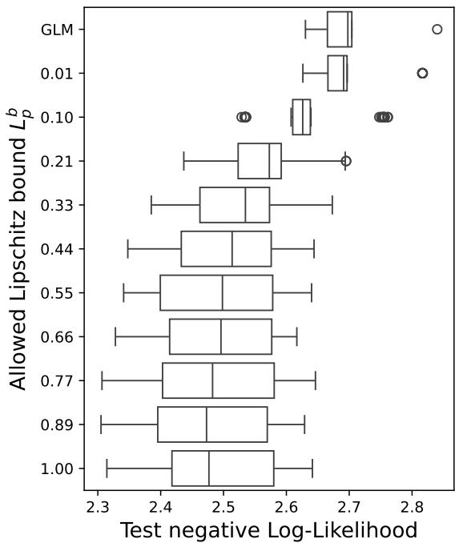  
Figure 15: Boxplots visualizing the impact of the allowed Lipschitz constant on LiD-GLM model performance pooled over all splits and the top 10 model hyperparameter combinations on the “Cars” data.

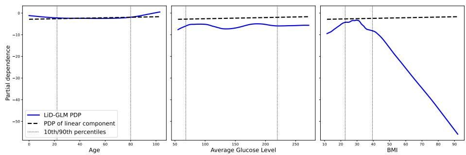  
Figure 16: PDP plots of LiD-GLM on the continuous variables in stroke data example w.r.t. predicted logits.

<table><tr><td></td><td> $\beta _ { 0 }$ </td><td> $\beta _ { 1 }$ </td><td> $\beta _ { 2 }$ </td><td>β3</td><td> $\beta _ { 4 }$ </td><td> $\beta _ { 5 }$ </td><td> $\beta _ { 6 }$ </td><td> $\beta _ { 7 }$ </td><td> $\beta _ { 8 }$ </td><td> $\beta _ { 9 }$ </td></tr><tr><td>LM</td><td>-1.0</td><td>-0.41</td><td>0.09</td><td>1.23</td><td>1.13</td><td>0.87</td><td>0.13</td><td>0.42</td><td>-0.16</td><td>0.13</td></tr><tr><td>LiD-GLM</td><td>-7.83</td><td>-1.38</td><td>0.25</td><td>4.09</td><td>3.76</td><td>5.33</td><td>1.32</td><td>1.28</td><td>-1.6</td><td>-0.19</td></tr><tr><td> $R _ { i } ^ { 2 }$ </td><td></td><td>0.96</td><td>0.99</td><td>0.52</td><td>0.09</td><td>0.93</td><td>0.98</td><td>0.99</td><td>1.0</td><td>0.86</td></tr></table>

Table 9: Coefficient table for LiD-GLM trained on the Stroke data. Shown are the coefficients of the Linear Model and the LiD-GLM (including PHO) and the coefficients of determination $R ^ { 2 }$ for the variables $\beta _ { 0 }$ =Intercept, $\beta _ { 1 } { = } \mathrm { S e x } ,$ β2=Age, β3=Hypertension, $\beta _ { 4 }$ =Heart disease, ${ \beta _ { 5 } } \mathrm { { = } e v e r }$ married, ${ \beta } _ { 6 } \mathrm { { = } } \mathrm { { R } } e$ esidence type, β = Average glucose level, ${ \beta } _ { 8 } { = } \mathrm { B M I } ,$ β9=smoking status.

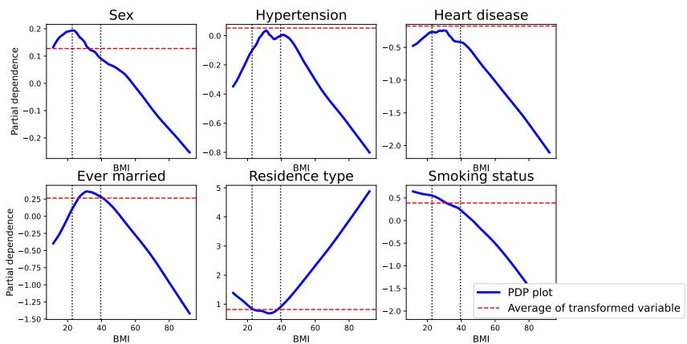  
Figure 17: PDP plots of transformation $T _ { p }$ w.r.t. $\mathbf { \ddot { B M I } } ^ { * }$ of the former binary covariates.

## I.3 PHO

In Figure 18, we show the effect of PHO for LiD-GLM trained on the cars data with a distributional correction $T _ { d }$ and in Figure 19 we show the results for all splits for LiD-GLM without $T _ { d } .$ . As can be easily seen, the reduction in variance for the estimated linear coefficients is almost the same in both cases.

In Figure 20, we show corresponding results for the “Stroke” application. This is a less relevant setting for LiD-GLMs as a good performing model on this dataset requires a relatively large allowed Lipschitz constant and therefore a drastically reduced interpretability. However, PHO still reduces the variance and absolute values in the parameter estimates for four covariates “sex”, “age”, “hypertension” and “heart disease”, but seems to have no such effect for the other five covariates.

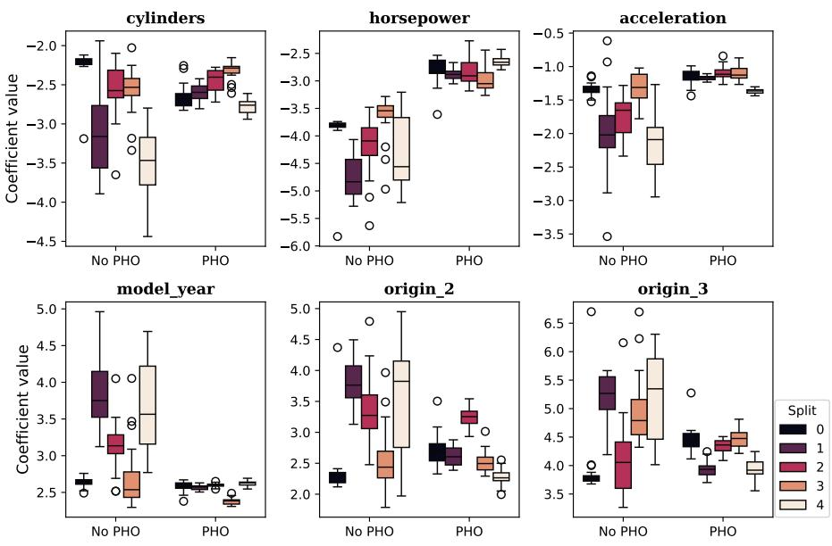  
Figure 18: Fluctuation in LiD-GLM estimation of $\beta$ on all splits on cars dataset with $T _ { d }$ and without PHO.

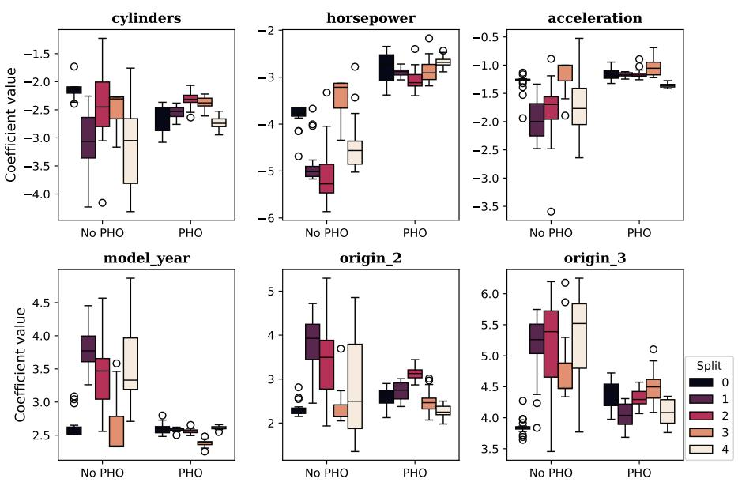  
Figure 19: Fluctuation in LiD-GLM estimation of $\beta$ on all splits on cars dataset without $T _ { d }$ with and without PHO.

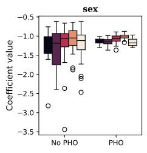

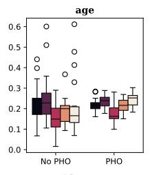

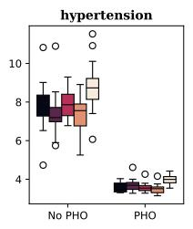

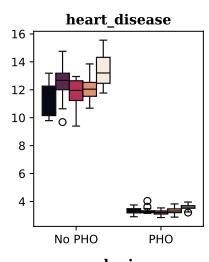

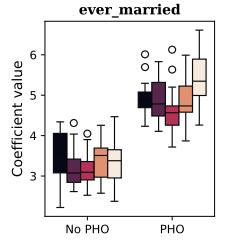

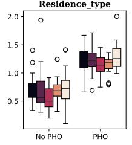

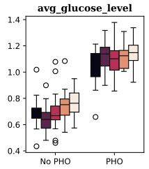

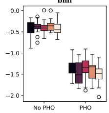

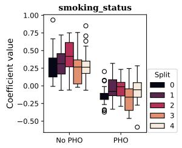  
Figure 20: Fluctuation in LiD-GLM estimation of $\beta$ on all splits on stroke dataset with and without PHO.