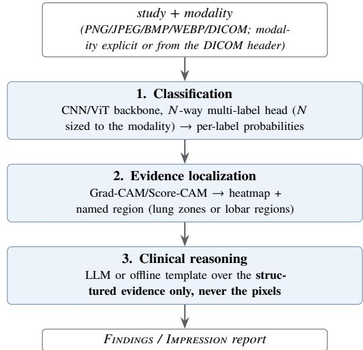
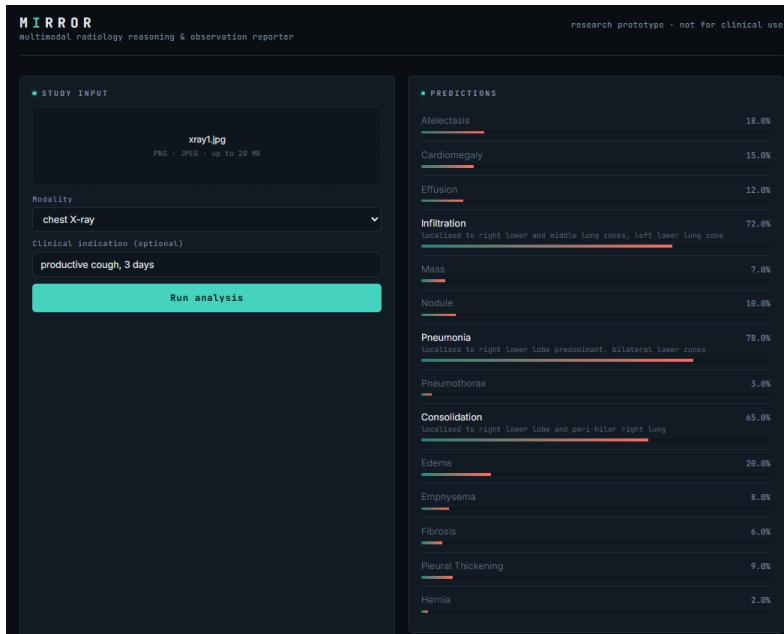
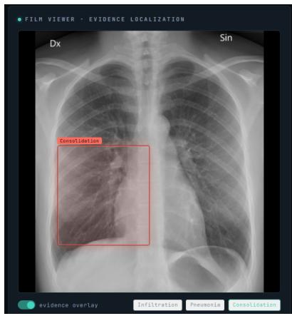
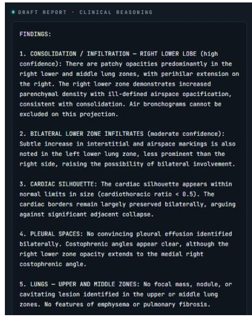
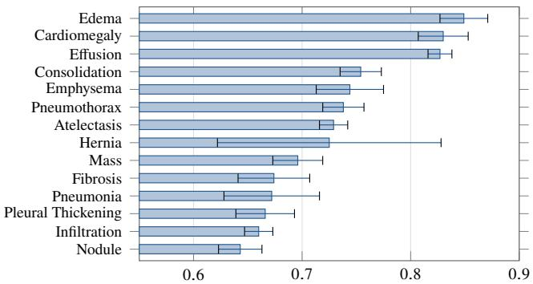
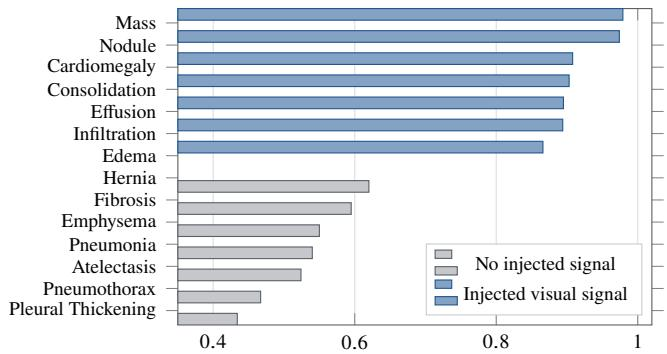

# MIRROR Multimodal Intelligent Radiology Reasoning and Observation Reporter

A three-layer radiology pipeline whose language layer reads structured evidence rather than pixels; three modality taxonomies are registered and routed, one ofwhich, chest X-ray, is trained and benchmarked here.

Vignesh Nagarajan

Corresponding Author

Brown Foundation Scholar, Texas A&M University

Department of Computer Science & Engineering

Sriram Venkatapathy

vigneshn26@tamu.edu

Research Mentor

Applied AI Researcher, Capital One

PhD in Computer Science, IIT Hyderabad

sriram.venkatapathy@gmail.com

Global Indian Scientists & Technocrats (GIST) 2026 Summer Research Internship

Abstract. A radiologist reading a model’s output faces two problems. The model returns a number and no reason, and any system that turns that number into readable prose can quietly add claims the model never made. MIRROR is a research prototype built to separate those failures. It chains a multi-label classifier, a Grad-CAM localizer that turns each positive finding into a named anatomical region, and a report writer that receives the labels, probabilities, and regions but never the ima e. Because the lan ua e la er cannot see ixels, it cannot assert a findin the classifier did not make. We are recise about what that buys: a MIRROR report’s findings are auditable against the probability vector, while the sentences framing them are ordinary generated text, and we show one stating a cardiothoracic ratio the system never measured. One registry holds the taxonomy, anatomy, and phrasing for chest X-ray, brain MRI, and head CT, so adding a modality is a data change; all three are routed and tested, one is trained. On ChestMNIST that classifier reaches macro AUROC 0.729 and ranks bette than chance on all 14 labels, at 1.6 to 6.8 times the precision a random ranker would get. Yet at the default 0.5 threshold it emits no positive prediction at all for 11 of them, and its excellent-looking Brier score of 0.045 sits beside the 0.047 earned by a predictor that ignores the image. The discrimination is real; the decisions are not. Under the class imbalance normal in radiology, aggregate metrics flatter models that do nothing, and should be reported against that floor.

## 1 Introduction

Deep networks now match specialists on narrow chest- radiograph reading tasks [2], yet clinical adoption remains limited by a trust gap: a bare probability tells a radiologist neither where the model is looking nor why it concluded what it did, and high-stakes decisions demand models that can be interrogated [16]. Saliency methods such as Grad-CAM [10] expose where a prediction comes from, and language mod- els can render structured evidence as prose, but the two are rarely composed into one system whose outputs stay mutually consistent end to end.

Composing them introduces a second risk that the first does not have. A report generator with access to the image can write fluent radiology prose asserting findings no classifier ever produced, and such prose is dificult to audit precisely because it reads well. MIRROR is built around a constraint aimed at that risk: image → prediction → localization → reasoning → report, with the language layer receiving only the structured evidence produced upstream, never the raw image. The report can therefore assert only findings the classifier predicted and the localizer situated. Because only the finding taxonomy, the anatomical vocabulary, and a little report phrasing difer between imaging modalities, those three things are centralized in a single registry, and a study is routed to the correct classifier head either explicitly or from the modality tag carried in its DICOM header.

Research question. Can a radiology pipeline be built so that its language layer is structurally incapable of asserting a finding the classifier did not detect, and what does that constraint cost? We answer the first half architecturally and the second empirically, on chest radiographs. Two things this paper does not answer should be stated at the outset. It does not measure explanation quality: our harness implements a pointing-game and IoU protocol against the NIH lesion boxes, but running it needs a checkpoint trained on the full-resolution release, so no box-level score is reported here and none should be inferred. Nor does it measure whether any of this helps a human, which would require a reader study with radiologists timed and scored on the same studies with and without the explanation and report layers.

## Contributions.

1. The distinction between finding-level grounding, which constraining the language layer to structured evidence does buy and which is checkable, and detail-level grounding, which it does not buy and which we show failing in a real generated report.

2. A registry-driven multimodality in which a modality’s tax- onomy, anatomical vocabulary, and report phrasing are data rather than code. Three taxonomies are registered, routed, and exercised by the test suite; one is benchmarked.

3. An open-source implementation: three backbones, two explainability methods, an LLM report backend with a deterministic ofline fallback, a real DICOM ingest, and two very diferent inference engines behind one response contract.

4. A measured chest-radiograph result in which discrimination is real on every label while decisions are absent on almost all of them, and in which two aggregate metrics, Brier and AUPRC, only become interpretable once they are written against the no-skill floors their label prevalences imply.

## 2 Literature Review

Datasets and classification. Large labeled chest-radiograph corpora made supervised deep learning on this modality prac- tical. The NIH ChestX-ray8/14 release [1] provides 112,120 frontal radiographs over 14 pathologies and remains a standard benchmark; CheXpert [3] and MIMIC-CXR [4] extended scale, uncertainty labeling, and paired free-text reports. CheXNet [2] showed a 121-layer DenseNet [6] reaching radiologist-level pneumonia detection. EficientNet [7] and Vision Transformers [8] complete the standard toolkit; MIRROR keeps all three interchangeable, with DenseNet-121 primary for comparability.

Visual explanation. Class Activation Mapping [9] localized the evidence behind a CNN prediction; Grad-CAM [10] generalized it to arbitrary architectures via gradients, and Score- CAM [11] removed the gradient dependence with perturbationbased weighting. Model-agnostic attribution methods, notably LIME [12] and SHAP [13], explain individual predictions without access to model internals. The pointing-game proto- col [14] and intersection-over-union against annotated lesions turn qualitative heatmaps into quantitative localization scores; our harness implements both, though we do not run them here.

Critiques of post-hoc explanation. Adebayo et al. [15] showed several saliency methods can be insensitive to the model and the data they purport to explain, and argued for sanity checks before any map is trusted. Rudin [16] argued more sharply that high-stakes decisions call for inherently interpretable models rather than post-hoc explanations of black boxes, and Doshi-Velez and Kim [17] called for a measurable science of interpretability. MIRROR is squarely the kind of system these critiques target, and we take up its position against them in Section 6 rather than citing them as background.

Report generation. Systems emitting radiology prose range from TieNet [18], which jointly embeds image and text, to memory-driven transformers such as R2Gen [19], to decoders optimized for factual correctness [20]. The recurring failure mode is hallucination: prose generated directly from pixels can assert findings the model never detected. Surveys of explainable AI in medical imaging [21] note that interpretability and report generation are usually studied separately. MIRROR’s contribution is neither a new classifier nor a new saliency method but their composition under a constraint that bounds what the report may assert.

## 3 System Architecture

MIRROR chains three layers; each layer’s output is the grounded input to the next (Fig. 1).

  
Figure 1: The MIRROR pipeline as deployed in the local PyTorch stack, which is the configuration benchmarked in Section 5. Layers 2 and 3 are individually toggleable, which recovers the conditions of Section 4. The hosted engine of Section 3.6 does not have this structure.

## 3.1 Layer 1: Classification

The classifier is a factory over three ImageNet-pretrained backbones: DenseNet-121 (default), EficientNet-B0, and ViT-B/16, with a multi-label head whose width � is the size of the active modality’s taxonomy (14 for chest X-ray, 11 each for brain MRI and head CT). The sigmoid is applied at loss and inference time rather than inside the module, so the network emits raw logits. Inputs are resized to the backbone’s 224 × 224 input and normalized with ImageNet statistics; training uses BCEWithLogitsLoss, AdamW, a cosine schedule, and dropout 0.2, selecting the checkpoint on best validation macro AUROC.

## 3.2 DICOM ingest

Real radiology data arrives as DICOM, and the gap between that and a PNG is not a file-format detail. Stored pixel values are not display values: they must pass through the modality LUT (the rescale slope and intercept, which is what turns raw CT counts into Hounsfield units) and then the VOI or window LUT that selects the diagnostic contrast range, and a MONOCHROME1 photometric interpretation means the stored values are inverted relative to the usual convention. Skipping any of these silently trains a model on images no radiologist would recognize, most visibly on MONOCHROME1 studies, which arrive as photographic negatives of what they should be. MIRROR ships an ingest that applies all three transformations before the pipeline sees a pixel, lifts only non-PHI technical tags, and exposes the modality tag for routing.

## 3.3 Layer 2: Evidence Localization

For each positive label (top-�, �=3 by default, to bound com-pute), this layer computes a class-activation map, either Grad-CAM (forward and backward hooks on a per-backbone target layer) or Score-CAM (gradient-free, perturbation-based); ViT maps are recovered by reshaping the patch-token sequence back to a 14 × 14 spatial grid. The activated region’s centroid is mapped into a 3 × 3 anatomical grid in radiology convention, with patient-right on the viewer’s left, and the modality’s imaging plane picks the vocabulary: lung zones for a frontal chest film, lobar regions for an axial brain-MRI or head-CT slice. A colormap overlay is rendered for the interface, and the region name, not the heatmap, is what travels downstream.

Modality: Chest X-ray   
Clinical indication: <text, optional>   
<per-modality report guidance>   
Structured model evidence (probabilities   
from an image classifier, locations from   
a Grad-CAM saliency map):   
<Label> (<gloss>): probability=
,   
status=PRESENT, localised to <region>   
<Label> (<gloss>): probability=
,   
status=below threshold, localised to n/a   
... one line per label in the taxonomy  
Figure 2: The complete input to Layer 3. The reasoning layer sees this text and nothing else: no pixels, no file handle, no image embedding. The grounding property is a consequence of this payload’s shape rather than of prompt wording, which is why it can be asserted by a test instead of measured by a benchmark.

## 3.4 Layer 3: Clinical Reasoning

This layer converts structured evidence into a report with Findings and Impression sections, using a system prompt plus an evidence-grounded user prompt. Fig. 2 shows the entire payload it receives: one line per label, carrying the label itself, a plain-English gloss drawn from the registry (Consolidation is glossed as “region of lung filled with liquid instead of air”), the probability, a present or below-threshold status, and the region name from Layer 2. There is no image in the payload and no channel by which one could arrive.

The backend is an LLM (Claude) at low temperature, with a deterministic ofline template fallback on any error, so the system yields a coherent report with no network or API key. Predictions below the confidence threshold (0.5) surface as pertinent negatives rather than being dropped, which keeps the uncertainty visible instead of rounding it away. Because both backends consume identical evidence, swapping them changes how fluently the report reads, not which findings it asserts. The grounding is therefore at the level of findings, not of the prose framing them, a distinction that carries most of this paper’s argument (Section 6).

## 3.5 Multi-modality via a modality registry

Swapping a chest radiograph for a brain MRI or head CT changes only the taxonomy the head predicts, the vocabulary a saliency centroid is named in, and a little report phrasing, so that a normal brain study reads “no acute intracranial abnormality” rather than “no acute cardiopulmonary abnormality.” These live in one registry (Table 1), the single source of truth for each modality’s labels, glosses, imaging plane, and report guidance; a hand-kept TypeScript mirror gives the hosted engine and the web interface the identical taxonomy and ordering, since output index � maps to labels[�]. Modality is resolved from an explicit selection or, for DICOM, from the (0008,0060) tag, and the orchestrator builds and caches one classifier and explainer engine per modality on demand.

Table 1: The modality registry. Registration means routing, head sizing, and anatomical vocabulary are implemented and tested. Only chest X-ray is trained and benchmarked here.
<table><tr><td>Modality</td><td>#lbl</td><td>Taxonomy source</td><td>Location vocab.</td></tr><tr><td>Chest X-ray</td><td>14</td><td>NIH ChestX-ray14</td><td>lung zones (frontal)</td></tr><tr><td>Brain MRI</td><td>11</td><td>Brain Tumor MRI + neuro findings</td><td>lobar regions (axial)</td></tr><tr><td>Head CT</td><td>11</td><td>RSNA ICH subtypes + acute findings</td><td>lobar regions (axial)</td></tr></table>

Table 2: Two inference engines behind one response contract. Only the local stack implements the grounded architecture of Fig. 1, and only it is benchmarked here.
<table><tr><td></td><td>Local stack</td><td>Hosted (serverless)</td></tr><tr><td>Engine</td><td>FastAPI + PyTorch</td><td>Next.js route, vision LLM</td></tr><tr><td>Classify</td><td>DenseNet/EffNet/ViT</td><td>LLM scores N labels</td></tr><tr><td>Localize</td><td>Grad-CAM/Score-CAM PNG</td><td>LLM returns a bbox</td></tr><tr><td>Report</td><td>LLM or template</td><td>LLM, same call</td></tr><tr><td>Sees pixels?</td><td>Layer 1 only</td><td>Every stage</td></tr><tr><td>Inputs</td><td>+DICOM, BMP</td><td>PNG/JPEG/WEBP</td></tr><tr><td>Needs</td><td>Python, ~6 GB</td><td>one API-key variable</td></tr></table>

The claim here is architectural and is scoped as such. Routing, head sizing, anatomical vocabulary, and per-modality phrasing are exercised by the test suite for all three taxonomies, and the post-hoc invariance of Layers 2 and 3 is asserted per modality. No brain-MRI or head-CT checkpoint has been trained, so MIRROR makes no predictive claim on those modalities; what the registry demonstrates is that adding a fourth would be a data change rather than a change to the pipeline.

## 3.6 Orchestration and serving

A single analyze() entry point runs the stages, records perstage timings, and returns one result object; Layers 2 and 3 are individually toggleable. Two engines satisfy the same JSON contract (Table 2), so the web interface (Fig. 3) is identical either way: a finding carries either a rendered Grad-CAM overlay from the local stack or a normalized bounding box from the hosted one, and the viewer draws whichever is present.

The two engines are not two implementations of one design, and the diference matters for every claim in this paper. The local stack is the architecture of Fig. 1: a trained DenseNet-121, a Grad-CAM map, and a language layer that never receives pixels. The hosted engine exists because that stack does not fit serverless limits, and it replaces the whole pipeline with a single vision LLM under a forced tool call returning the per-label probabilities, one box per present finding, and the report in one response. That engine reads pixels directly, so MIRROR’s grounding constraint does not hold on the hosted path: nothing structurally prevents its prose from asserting a finding its own probability vector does not support. Everything benchmarked in Section 5 is the local stack, and the two hosted-engine figures are labelled as such.

  
Figure 3: The MIRROR “reading-room” interface, showing a session on the hosted serverless engine, where a vision LLM reads the image directly and returns probabilities, boxes, and report text. This is not the benchmarked DenseNet-121 local stack, and no number in this figure is a measured result: it illustrates the interface and the response contract only. A chest radiograph is uploaded with the indication “productive cough, 3 days,” all 14 ChestX-ray14 labels are scored, and findings above threshold surface with a saliency-derived location. Both engines drive this identical interface.

  
(a) Evidence localization

  
(b) Draft report  
Figure 4: One study end to end, also on the hosted serverless engine and not the benchmarked local stack. (a) The localization layer marks the evidence region behind a positive finding and the viewer draws it over the film. (b) The reasoning layer drafts a Findings/Impression report ending with the mandatory AI-generated-draft disclaimer. The report in (b) is the worked example of Section 7: alongside its grounded findings it states a cardiothoracic ratio and clear costophrenic angles, neither of which any component of the system measured.

## 4 Experimental Setup

Data. MIRROR targets NIH ChestX-ray14 [1] (112,120 radiographs, 14 multi-label pathologies). Because the full release is 45 GB and needs a GPU, we evaluate on ChestMNIST [5], its downsampled derivative in MedMNIST v2 (CC BY 4.0), which carries the identical 14-label taxonomy in the identical order, so MIRROR runs on it unchanged. We sample 8,000 studies from the pooled oficial train and validation splits and hold out 10%, giving 7,200 training and 800 validation images, and evaluate on 12,000 test images, a fixed random subsample (seed 42) of the oficial 22,433-image test split, which is otherwise held out untouched. Training is DenseNet-121 on CPU, AdamW at learning rate $3 \times 1 0 ^ { - 4 }$ , weight decay $1 0 ^ { - 5 }$ , batch 32, best of a four-epoch run on validation macro AUROC. Source images are 64 × 64 and are upsampled to the backbone’s 224 × 224 input: there is no genuine 224-pixel information anywhere in this experiment, and findings whose radiographic signature is a few millimetres wide are largely destroyed before training begins.

Metrics and their floors. We report a clinical-reader panel. Discrimination: per-label and macro AUROC, and macro AUPRC. Operating point: sensitivity, specificity, PPV, and

NPV at the 0.5 threshold, the quantities a clinician actually reads of a model. Calibration: Brier score and Expected Calibration Error [24] over 10 equal-width bins. Two of these are uninterpretable in isolation on an imbalanced multi label task, so we compute their no-skill floors from the label prevalences and report both against them: a random ranker’s expected average precision equals the prevalence $p ,$ and a constant predictor that always returns $p$ scores a Brier of exactly $p ( 1 - p )$ . Each headline metric carries a bootstrap 95% confidence interval: the test set is resampled with replacement �=1000 times, with a single resample driving all metrics so the intervals are mutually consistent, reported as two-sided percentile intervals (�=0.05).

Post-hoc regression test. Three conditions run the same studies with Layers 2 and 3 switched on and of: classification only, classification with localization, and the full pipeline. Those layers modify no weights and no logits, so the predictions must be identical across conditions; the harness verifies this and profiles the per-stage wall-clock cost of each added layer. This is a test that the implementation matches the design, not an experiment with an uncertain outcome, and Section 5.6 reports it as such. Every results file stamps a reproducibility record: seed, git commit, and library versions.

## 5 Results

Every number below is measured on this machine with the local PyTorch stack and traces to a JSON committed in the repository. Table 3 is the full per-label panel and is the reference for Sections 5.1 through 5.4.

## 5.1 Discrimination on ChestMNIST

The DenseNet-121 reaches macro AUROC 0.729 (bootstrap 95% CI [0.718, 0.738]) on the 12,000-image test split, with macro AUPRC 0.135 and macro F1 0.031. The published MedMNIST v2 baseline for this dataset, a ResNet-18/50 at 224 px (v2 reports no DenseNet-121), is approximately 0.77 [5]; ours is 0.04 AUROC below it. That ResNet baseline was trained on the full training split for many epochs on a GPU, while ours used 7,200 images for four epochs on a CPU. Both statements are facts and we draw no inference from putting them side by side: a smaller budget explains nothing about whether the gap would close, and we did not test that.

What the per-label ordering does support is that the model learned thoracic structure rather than a dataset artifact (Fig. 5). Readily visible findings rank highest, with Edema at 0.849, Cardiomegaly at 0.830, and Efusion at 0.827, while subtle small ones sit lowest, with Nodule at 0.643 and Infiltration at 0.660. Every confidence interval clears 0.5. The widest interval by a wide margin belongs to Hernia, [0.615, 0.820], which has only 24 positive cases in the test split and should be read as the least reliable row in the panel.

## 5.2 The operating point: silence on most of the taxonomy

AUROC is threshold-free, and it hides what this model does when asked for a decision. At the default 0.5 threshold, 11 ofthe 14 labels never produce a single positive prediction across all 12,000 test studies: their sensitivity is exactly 0.0, their specificity exactly 1.0, and their PPV undefined. Only Efusion, Infiltration, and Pneumothorax fire at all, and Pneumothorax fires on 1.2% of its positive cases. Macro sensitivity is 0.019 and macro F1 is 0.031.

This is not a conservative operating point chosen for a clinical reason. Nothing was tuned: 0.5 is the default, and under prevalences running from 17.5% for Infiltration down to 0.2% for Hernia, a lightly trained model minimizes its loss by pushing almost every output below that line. At this threshold the classifier is not usable as a detector. That is a property of the training budget and the destroyed resolution, not a design decision.

## 5.3 Ranking is real where decisions are absent

The natural next question is whether the eleven silent labels are silent because the model learned nothing about them. They are not, and separating those two explanations is the most useful thing the panel does. A uniformly random ranker’s expected average precision equals the label’s prevalence [22, 23], so AUPRC only means something as a ratio to that floor. Expressed as lift over prevalence, every one of the 14 labels ranks better than chance: from 1.6× for Fibrosis to 6.8× for Cardiomegaly, with a mean of 3.1× (Table 3). Cardiomegaly is a clean illustration. Its prevalence is 0.027, its AUPRC is 0.184, its AUROC is 0.830 with a confidence interval nowhere near chance, and it produces exactly zero positive predictions.

The model has therefore learned a usable ordering on every label in the taxonomy and converts that ordering into a decision on almost none of them. The failure is located at the threshold and in the calibration of the output scores, not in the representa- tion, which is a considerably more specific diagnosis than “the model underperforms” and points at a diferent fix: per-label threshold selection on a validation split, not more capacity.

## 5.4 Calibration against a no-skill baseline

Read on their own, the calibration numbers look strong: macro Brier 0.045 and ECE 0.018. They are also close to meaningless here, and the arithmetic showing it needs no new experiment. For a label with prevalence �, a constant predictor that ignores the image and always returns � achieves a Brier score of exactly �(1 − �). Averaged over the 14 ChestMNIST prevalences, that is a macro Brier of 0.0472 for a model that has learned nothing at all. Our trained classifier scores 0.0453. The entire measured calibration advantage of a DenseNet-121 over a constant is 0.0019 Brier, about 4%.

That aggregate calibration metrics flatter a model under class imbalance is a documented pitfall, not our finding; the arithmetic above makes it concrete. Under the class imbalance typical of multi-label radiology, where most labels sit below 5% prevalence, $p ( 1 - p )$ is small for almost every label, so the no- skill floor of the aggregate metric is already low and there is little room between it and a perfect score. A model silent on 11 of 14 labels still posts a Brier of 0.045 and an ECE of 0.018, numbers that would pass unremarked in most results tables. Aggregate calibration metrics on imbalanced multi-label medical tasks should be reported against the constant-prevalence baseline, or not ofered as evidence of quality at all.

Table 3: The full clinical-reader panel on the ChestMNIST test s lit (DenseNet-121, 64 x source u sam led to $2 2 4 \mathrm { p x }$ , CPU, best of four epochs; $N _ { \mathrm { t e s t } } { = } 1 2 , 0 0 0 )$ , sorted by AUROC. Prev. is support $_ { + } / N .$ . Lift is AUPRC divided by prevalence, the average precision a uniformly random ranker would obtain, so it is the factor by which the model beats chance at ranking that label. Every label ranks above chance; eleven of them emit no positive prediction at the 0.5 threshold, which is why their sensitivity is 0.000, their specificity 1.000, and their PPV undefined. Hernia rests on 24 positive cases and is the least reliable row. Lifts use unrounded AUPRC and prevalence, so a row’s Lift can difer from the ratio of its displayed values (Fibrosis 1.6, Hernia 5.4). The Macro Lift is the mean of the er-label lifts not macro AUPRC over macro revalence (2.6×) the Macro PPV avera es the eleven undefined labels as zero and is 0.455 over the three that fire.
<table><tr><td>Pathology</td><td>Prev.</td><td>AUROC</td><td>95% CI</td><td>AUPRC</td><td>Lift</td><td>Sens.</td><td>Spec.</td><td>PPV</td></tr><tr><td>Edema</td><td>0.018</td><td>0.849</td><td>(0.828–0.871)</td><td>0.104</td><td>5.8×</td><td>0.000</td><td>1.000</td><td></td></tr><tr><td>Cardiomegaly</td><td>0.027</td><td>0.830</td><td>(0.806–0.851)</td><td>0.184</td><td>6.8×</td><td>0.000</td><td>1.000</td><td></td></tr><tr><td>Effusion</td><td>0.121</td><td>0.827</td><td>(0.817–0.838)</td><td>0.413</td><td>3.4×</td><td>0.143</td><td>0.987</td><td>0.599</td></tr><tr><td>Consolidation</td><td>0.041</td><td>0.754</td><td>(0.736–0.773)</td><td>0.092</td><td>2.2×</td><td>0.000</td><td>1.000</td><td></td></tr><tr><td>Emphysema</td><td>0.023</td><td>0.744</td><td>(0.713–0.774)</td><td>0.069</td><td>3.0×</td><td>0.000</td><td>1.000</td><td></td></tr><tr><td>Pneumothorax</td><td>0.049</td><td>0.738</td><td>(0.719–0.757)</td><td>0.138</td><td>2.8×</td><td>0.012</td><td>0.999</td><td>0.350</td></tr><tr><td>Atelectasis</td><td>0.109</td><td>0.729</td><td>(0.716–0.742)</td><td>0.221</td><td>2.0×</td><td>0.000</td><td>1.000</td><td></td></tr><tr><td>Hernia</td><td>0.002</td><td>0.725</td><td>(0.615–0.820)</td><td>0.011</td><td>5.4×</td><td>0.000</td><td>1.000</td><td></td></tr><tr><td>Mass</td><td>0.049</td><td>0.696</td><td>(0.673–0.719)</td><td>0.125</td><td>2.6×</td><td>0.000</td><td>1.000</td><td></td></tr><tr><td>Fibrosis</td><td>0.015</td><td>0.674</td><td>(0.639–0.705)</td><td>0.025</td><td>1.6×</td><td>0.000</td><td>1.000</td><td></td></tr><tr><td>Pneumonia</td><td>0.011</td><td>0.672</td><td>(0.627–0.716)</td><td>0.022</td><td>2.0×</td><td>0.000</td><td>1.000</td><td></td></tr><tr><td>Pleural Thickening</td><td>0.032</td><td>0.666</td><td>(0.638–0.692)</td><td>0.066</td><td>2.1×</td><td>0.000</td><td>1.000</td><td></td></tr><tr><td>Infiltration</td><td>0.175</td><td>0.660</td><td>(0.648–0.673)</td><td>0.298</td><td>1.7×</td><td>0.110</td><td>0.967</td><td>0.415</td></tr><tr><td>Nodule</td><td>0.059</td><td>0.643</td><td>(0.622–0.662)</td><td>0.123</td><td>2.1×</td><td>0.000</td><td>1.000</td><td></td></tr><tr><td>Macro</td><td></td><td>0.729</td><td>(0.718–0.738)</td><td>0.135</td><td>3.1×</td><td>0.019</td><td>0.997</td><td>0.097</td></tr><tr><td colspan="9">Macro F1 0.031 Brier 0.045 against a constant-prevalence floor of 0.047</td></tr></table>

  
AUROC (with bootstrap 95% CI)  
Figure 5: Per-label test AUROC on ChestMNIST (DenseNet-121, 64 px source upsampled to 224 px, CPU, best of four epochs, $N _ { \mathrm { t e s t } } { = } 1 2 , 0 0 0 ) .$ , with bootstrap 95% CI whiskers, sorted ascending. The ordering tracks how visible each finding is, and every interval clears the 0.5 chance line. Eleven of these labels nonetheless emit no positive prediction at the default threshold (Section 5.2).

## 5.5 Harness control on synthetic data

Numbers are only worth reporting if the harness that produced them credits real signal and nothing else, so we test that directly. We train the same pipeline on a fully synthetic dataset of 1,400 procedurally generated chest-radiograph-like images whose generator injects a visible blob for seven named labels, Mass, Nodule, Efusion, Infiltration, Consolidation, Edema, and Cardiomegaly, and leaves the other seven with no visual correlate whatsoever. The seven are fixed in the generator in advance, not chosen after seeing results.

A correct harness should learn exactly the first group and sit near chance on the second, and that is what happens (Fig. 6). On a 350-image held-out synthetic test split the seven signal- bearing labels reach a mean AUROC of 0.917, from Mass at 0.979 down to Edema at 0.866, and the seven no-signal labels average 0.533, from Hernia at 0.620 down to Pleural Thickening at 0.434. The two groups do not overlap: the worst signal-bearing label outscores the best no-signal label by 0.25 AUROC. The no-signal mean sits slightly above 0.5 rather than exactly on it, which is what a test split this size should give, and those labels straddle chance in both directions rather than clustering above it, which is what rules out a systematic leak. The classifier, the loss, the metrics, and the bootstrap intervals therefore respond to injected signal and not to label frequency or ordering.

  
AUROC (synthetic test set, �=350)  
Figure 6: Harness control on synthetic data. The generator injects a blob for seven labels named in advance and none for the other seven; the classifier learns exactly the signal-bearing group (mean AUROC 0.917) and stays near chance on the rest (mean 0.533), with no overlap between the groups. This checks that the metrics measure real discrimination rather than label frequency, and that nothing is leaking.

## 5.6 Post-hoc invariance and latency

Layers 2 and 3 run after the forward pass and modify no weights and no logits, so the predictions are identical across the three conditions by construction. The harness confirms it: the maximum per-label probability change against the classification-only baseline is 0.000 over �=24 studies. This is a regression test, not a result. It earns its place because a nonzero delta would expose a real bug, an accidental coupling between the layers, and the test suite asserts the same property per modality against stubbed backbones so it holds structurally rather than only for the chest checkpoint.

Table 4: Ablation conditions with measured per-stage wall-clock latency (ms/study, mean over 24 studies on CPU). Each row is a separate profiling run, so its Predict time carries the run-to-run spread of a 24-study CPU profile; within each row Predict + Localize + Report equals Total. That spread, not any change in work, is why full MIRROR totals less than localization alone. There is one AUROC measurement here, not three: macro AUROC = 0.729 from Table 3 applies unchanged to every row because the post-hoc layers cannot alter a prediction.
<table><tr><td>Condition</td><td>Predict</td><td>Localize</td><td>Report</td><td>Total</td></tr><tr><td>Classification only</td><td>101.2</td><td></td><td></td><td>101.2</td></tr><tr><td>+ Evidence localization</td><td>99.5</td><td>41.4</td><td></td><td>140.9</td></tr><tr><td>Full MIRROR</td><td>100.0</td><td>36.2</td><td>0.03</td><td>136.2</td></tr><tr><td colspan="5">Macro AUROC = 0.729 in every row: one measurement. Max probability change vs. baseline = 0.000, n=24.</td></tr></table>

The cost that does vary is latency (Table 4). Prediction takes about 100 ms per study on CPU, the Grad-CAM pass adds 36 to 41 ms, and the ofline template report adds 0.03 ms. The two conditions that run Grad-CAM measured 41.4 and 36.2 ms for the same work, which is the run-to-run spread of a 24-study CPU profile and is why the full-pipeline total of 136.2 ms came in below the localization-only total of 140.9 ms. Interpretability here costs roughly a 40% increase in wall-clock time over a bare classifier: all of that increase sits in the saliency pass, and none of it in the report.

## 6 Discussion

Finding-level grounding is a real guarantee and a narrow one. The useful thing MIRROR demonstrates is a boundary, and stating it precisely is worth more than the classifier behind it. Because the language layer receives a label, a probability, and a region name rather than an image (Fig. 2), the set of findings the report may assert is exactly the set the classifier produced. That is checkable without trusting anything about the model: a reader holding the report and the probability vector can verify the correspondence, and a unit test can assert it. It is also strictly a claim about whichfindings appear, and says nothing about the sentences around them. A report that correctly asserts consolidation may frame it with clauses the system never computed, and those clauses inherit the credibility of the finding they sit beside (Section 7). This distinction is the thing worth taking from the system, and architectures that constrain only the former should say so rather than claiming groundedness in general.

Where this stands against Rudin. MIRROR is precisely the architecture Rudin [16] argues against for high-stakes decisions: an opaque CNN with a saliency map and a language layer attached after the fact. We have no rebuttal, and we do not claim the saliency map is faithful; the sanity checks of Adebayo et al. [15] are the right instrument for testing that and we have not run them. What we claim is narrower and does not depend on the heatmap being faithful at all: the finding set is auditable, because a reader can check the report against the probability vector directly. That is a retreat from explanation to auditability, and we would rather name it than dress it up. An inherently interpretable classifier would be the stronger answer.

Discrimination and decisions are diferent failures. The sequence of numbers this model produces is instructive, and it is the reason we report the panel in full. Macro AUROC 0.729 reads as a modest but working model. Brier 0.045 and ECE 0.018 read as a well-calibrated one. AUPRC lift of 1.6 to 6.8 times prevalence says the ranking is genuinely informative on every single label. And the model emits no positive prediction for 11 of 14 labels. All four statements are true simultaneously, which they can be only because ranking quality and decision quality are separate properties that the usual headline metrics do not distinguish. Reporting AUROC alone would have hidden the failure; reporting the operating point alone would have hidden that the representation is sound and the fix is a per-label threshold rather than a bigger network. The practical recommendation is to publish sensitivity and PPV alongside every AUROC in this literature, and to write both AUPRC and Brier against their prevalence-derived floors, which costs one line of arithmetic and changes how the numbers read.

One contract, two very diferent engines. Serving the same JSON response from a PyTorch stack and from a hosted vision LLM shows the interface MIRROR proposes, namely predict, show evidence, explain, is independent of the inference backend, at the price of the asymmetry in Section 3.6. We would rather flag that than let one system’s architecture diagram vouch for the other’s behaviour.

## 7 Ethics, Safety, and Limitations

Not a medical device. MIRROR is a research prototype, not reviewed or cleared by any regulatory body; every output is a draft that must be verified by a licensed radiologist and must not be used for diagnosis or treatment. Each report carries that disclaimer explicitly.

A worked example of ungrounded detail. Fig. 4 shows a generated report beside its evidence overlay. Two phrases in it are worth quoting: the cardiac silhouette is described as normal with a cardiothoracic ratio below 0.5, and the costophrenic angles are noted to be clear. The system measured neither. No cardiothoracic ratio was computed, no cardiac or thoracic boundary was segmented, and no costophrenic angle was localized; the pipeline produced a probability per label and up to three saliency centroids, and nothing in that evidence supports either clause. Both are fluent radiology register generated to fill out a report. They also sit in the same paragraph as assertions that are grounded, and that adjacency is the danger: a reader who checks the consolidation finding against the overlay and finds it correct has been given a reason to extend trust to the sentence beside it. Fluency makes ungrounded detail more dangerous rather than less, because it arrives wearing the credibility of the verified finding next to it. This is why finding-level grounding cannot be described as making a report safe, and why the AI-generated-draft disclaimer is load-bearing rather than boilerplate.

Human subjects and data governance. No ethics-board review was required: this work uses only existing, public, de-identified benchmark datasets, namely NIH ChestX-ray14 and its MedMNIST derivative, and collects no new data from human subjects. Those datasets are governed by their own data use agreements; no raw images, weights, or protected health information are committed to version control, and the DICOM ingest extracts only non-PHI technical tags.

Limitations. Our one quantitative benchmark is ChestM-NIST, at 64-pixel source resolution on a 7,200-image budget, and at its default threshold the classifier is not a working detector (Section 5.2). No clinical claim of any kind follows from it. Multi-modality is architectural: the brain-MRI and head-CT paths are implemented and exercised by the test suite but have no trained checkpoints, so MIRROR makes no predictive claim on those modalities. Explanation quality is unmeasured. The pointing-game and IoU protocol is implemented but not run, and no reader study has been conducted, so we have no evidence that the localization or report layers help a human, only that they cost about 40 ms. Class-activation maps are coarse and can highlight context rather than lesion [15], and we have not run the sanity checks that would detect it. The 3 × 3 location grid is a deliberately coarse anatomical descriptor, and Hernia aside, the panel’s narrowest intervals still rest on a single training run rather than a multi-seed aggregate. Report quality is assessed only qualitatively; a comparison against real radiologist reports, for example MIMIC-CXR [4], is future work.

## 8 Conclusion

MIRROR composes classification, evidence localization, and report generation into one traceable, registry-driven pipeline, and the property worth carrying forward is a boundary rather than a score: constraining the language layer to structured evidence makes thefinding set of a report auditable and does nothing for the prose around it. On ChestMNIST the classifier reaches macro AUROC 0.729, ranks every label between 1.6 and 6.8 times better than a random ranker, and still emits no positive prediction for 11 of its 14 labels while posting a Brier score within 0.002 of a predictor that never looks at the image. We report those together deliberately: they are the clearest evidence we produced that aggregate metrics on imbalanced multi-label tasks can look healthy over a model that makes no decisions. Next steps are full-resolution training on the NIH release, per-label threshold selection on a validation split, the saliency sanity checks we cite but did not run, and a reader study, which is the only thing that would test whether any of this helps a radiologist.

## Reproducibility

the local pipeline on ImageNet weights with the ofline template backend, needing no checkpoint and no API key. Every results JSON stamps a

reproducibility block with the seed, git commit, and library versions, and the unit tests are torch-free. The ChestMNIST result

(configs/synthetic.yaml) regenerate from seed 42; their outputs are committed under results/. The prevalences, the AUPRC lifts of

Section 5.3, the no-skill Brier floor of Section 5.4, and the exact contents of Table 3 are recomputed from those committed files by

## Acknowledgments

This work was completed as part of the Global Indian Scientists & Technocrats (GIST) 2026 Summer Research Internship. The author thanks his mentor, Sriram Venkatapathy, an Applied AI Researcher at Capital One who holds a PhD in Computer Science from the Indian Institute of Technology (IIT) Hyderabad, for his guidance throughout the project: his experience building and evaluating machine-learning systems in industry shaped both the architecture and the emphasis on measurable, reproducible evaluation.

## Declarations

Data availability: all datasets used are public, namely NIH ChestX-ray14 and its MedMNIST derivative ChestMNIST (CC BY 4.0); code, configurations, and result files are in the repository linked above. Competing interests: the author declares none. Funding: this work received no external research funding and was conducted as part of the GIST 2026 Summer Research Internship.

## References

[1] X. Wang, Y. Peng, L. Lu, Z. Lu, M. Bagheri, and R. M. Summers. ChestX-ray8: Hospital-scale chest X-ray database and benchmarks on weakly-supervised classification and localization of common thorax diseases. CVPR, 2097–2106, 2017.

[2] P. Rajpurkar, J. Irvin, K. Zhu, et al. CheXNet: Radiologist-level pneumonia detection on chest X-rays with deep learning. arXiv:1711.05225, 2017.

[3] J. Irvin, P. Rajpurkar, M. Ko, et al. CheXpert: A large chest radiograph dataset with uncertainty labels and expert comparison. AAAI, 2019.

[4] A. E. W. Johnson, T. J. Pollard, S. J. Berkowitz, et al. MIMIC-CXR, a de-identified publicly available database of chest radiographs with free-text reports. Scientific Data, 6(1):317, 2019.

[5] J. Yang, R. Shi, D. Wei, Z. Liu, L. Zhao, B. Ke, H. Pfister, and B. Ni. MedMNIST v2: A lar e-scale li htwei ht benchmark for 2D and 3D biomedical ima e classification. Scientific Data, 10(1):41, 2023.

[6] G. Huang, Z. Liu, L. van der Maaten, and K. Q. Weinberger. Densely connected convolutional networks. CVPR, 4700–4708, 2017.

[7] M. Tan and Q. V. Le. EficientNet: Rethinking model scaling for convolutional neural networks. ICML, 2019.

[8] A. Dosovitskiy, L. Beyer, A. Kolesnikov, et al. An image is worth 16x16 words: Transformers for image recognition at scale. ICLR, 2021.

[9] B. Zhou, A. Khosla, A. Lapedriza, A. Oliva, and A. Torralba. Learning deep features for discriminative localization. CVPR, 2921–2929, 2016.

[10] R. R. Selvaraju, M. Cogswell, A. Das, R. Vedantam, D. Parikh, and D. Batra. Grad-CAM: Visual explanations from deep networks via gradient-based localization. ICCV, 618–626, 2017.

[11] H. Wan , Z. Wan , M. Du, et al. Score-CAM: Score-wei hted visual ex lanations for convolutional neural networks. CVPR Worksho s, 2020.

[12] M. T. Ribeiro, S. Singh, and C. Guestrin. “Why should I trust you?”: Explaining the predictions of any classifier. KDD, 1135–1144, 2016.

[13] S. M. Lundberg and S.-I. Lee. A unified approach to interpreting model predictions. NeurIPS, 2017.

[14] J. Zhang, S. A. Bargal, Z. Lin, J. Brandt, X. Shen, and S. Sclarof. Top-down neural attention by excitation backprop. ECCV, 2016.

[15] J. Adebayo, J. Gilmer, M. Muelly, I. Goodfellow, M. Hardt, and B. Kim. Sanity checks for saliency maps. NeurIPS, 2018.

[16] C. Rudin. Stop explaining black box machine learning models for high stakes decisions and use interpretable models instead. Nature Machine Intelligence, 1(5):206–215, 2019.

[17] F. Doshi-Velez and B. Kim. Towards a rigorous science of interpretable machine learning. arXiv:1702.08608, 2017.

[18] X. Wang, Y. Peng, L. Lu, Z. Lu, and R. M. Summers. TieNet: Text-image embedding network for common thorax disease classification and reporting in chest X-rays. CVPR, 2018.

[19] Z. Chen, Y. Song, T.-H. Chang, and X. Wan. Generating radiology reports via memory-driven transformer. EMNLP, 2020.

[20] G. Liu, T.-M. H. Hsu, M. McDermott, et al. Clinically accurate chest X-ray report generation. MLHC, 2019.

[21] E. Tjoa and C. Guan. A survey on explainable artificial intelligence (XAI): Toward medical XAI. IEEE TNNLS, 32(11):4793–4813, 2021.

[22] J. Davis and M. Goadrich. The relationship between precision-recall and ROC curves. ICML, 233–240, 2006.

[23] T. Saito and M. Rehmsmeier. The precision-recall plot is more informative than the ROC plot when evaluating binary classifiers on imbalanced datasets. PLOS ONE, 10(3):e0118432, 2015.

[24] C. Guo, G. Pleiss, Y. Sun, and K. Q. Weinberger. On calibration of modern neural networks. ICML 1321–1330 2017.