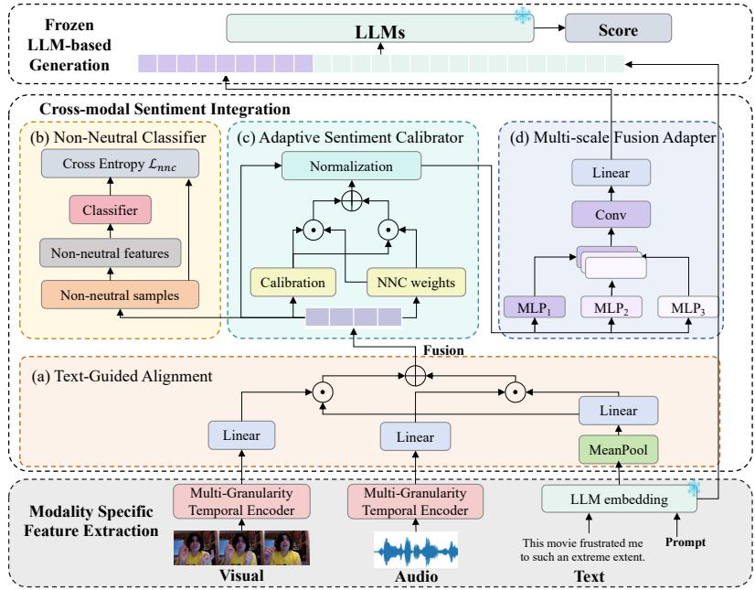
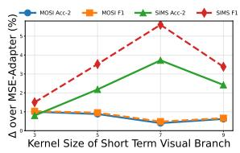
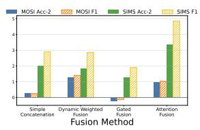
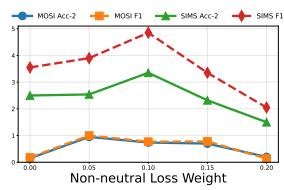

# Multi-Granularity Sentiment Integration for LLM-Based Multimodal Sentiment Analysis

Shanshan Lin1, Yuesheng Wu1, Chao Chen2, Yizhe Yang1, Zhihao Chen3, Zexian Yang1, and Xiangwen Liao1⋆

1 Fuzhou University, Fuzhou, China 2 Harbin Institute of Technology (Shenzhen), Shenzhen, China 3 Jiangxia University, Fuzhou, China liaoxw@fzu.edu.cn

Abstract. Multimodal sentiment analysis (MSA) aims to predict sentiment polarity and intensity from heterogeneous inputs such as text, audio, and vision. While large language models (LLMs) offer strong semantic priors for MSA, effectively incorporating audio and visual signals effectively remains challenging. A key challenge is that audio and visual sentiment cues evolve over different temporal scales, yet many LLM-based methods compress these signals through shallow projection or coarse pooling before fusing them with text, which can weaken cross-modal alignment and erase fine-grained affective information. We propose MGSI, a multi-granularity sentiment integration framework for LLM-based MSA. MGSI first encodes audio and visual streams at short-, medium-, and long-range temporal scales, preserving both local variations and global affective trends. It then refines non-text features through text-guided alignment, and applies polarity- and intensity-aware enhancement to better handle ambiguous and near-neutral samples. The resulting multimodal representation is finally compressed into a small set of pseudo-tokens for efficient conditioning of a frozen LLM. Experiments on four public benchmarks show that MGSI substantially outperforms frozen-LLM baselines and remains competitive with strong multimodal methods. Further ablation and sensitivity analyses support the effectiveness of multi-granularity temporal modeling, text-guided refinement, and adaptive sentiment calibration.

Keywords: multimodal sentiment analysis · large language models.

## 1 Introduction

Multimodal sentiment analysis (MSA) aims to predict sentiment polarity and intensity from heterogeneous signals such as text, audio, and vision. This task is challenging because affective meaning is often conveyed jointly by lexical content, vocal prosody, facial expressions, and body movements, whose interactions can complement or modify one another [5]. Thus, MSA requires not only textual semantic understanding, but also temporal modeling of non-text modalities and coordinated cross-modal reasoning.

Recent MSA studies have advanced multimodal modeling through sentiment-aware contrastive learning [26], dynamic modality weighting [4], long-range sequence modeling [9], and robustness to missing or imperfect modalities [13,14,11]. Despite these efforts, two issues remain. First, many methods rely on a single temporal abstraction or compress audio-visual streams too early, obscuring short-, medium-, and long-range affective cues. Second, heavily summarized multimodal representations may lose finegrained sentiment dynamics before cross-modal fusion and prediction.

This challenge remains for large language models (LLMs) [24,6], where strong textual reasoning does not automatically yield effective modeling of temporally evolving non-text cues. Audio and visual features are not native linguistic tokens and must therefore be transformed into representations that are semantically aligned with text and structurally compatible with the LLM input space. Textualization-based methods, such as DEVA [21], convert visual and acoustic signals into textual emotional descriptions before LLM reasoning. Adapter-based methods, including MSE-Adapter [27], Mixture of Multimodal Adapters [1], and the Modal Feature Optimization Network with Prompt (MFON) [33], transform non-text features into representations suitable for frozen LLMs. These recent approaches mainly investigate how multimodal evidence is transformed or injected into an LLM, whereas less attention is paid to preserving sentiment-relevant temporal structure before this transformation. Thus, the main bottleneck in LLM-based MSA is not only how to map audio-visual features into the LLM embedding space, but also which sentiment-relevant temporal structures should survive this mapping.

To address this issue, we propose Multi-Granularity Sentiment Integration (MGSI), an LLM-based MSA framework that treats multimodal adaptation as a structured temporal-semantic compression rather than simple projection. The key idea is to preserve sentiment-relevant temporal structure in audio and visual streams before compressing them into a compact representation for LLM conditioning. Specifically, MGSI first encodes audio and visual inputs with multi-granularity temporal operators to capture local fluctuations, medium-range patterns, and longer-range contextual evolution. It then refines non-text representations through text-guided alignment, strengthens polarity discrimination with auxiliary non-neutral supervision, and calibrates ambiguous cases via sentiment intensity modeling. Finally, the fused multimodal representation is converted into a small set of pseudo-tokens and injected into a frozen LLM for prediction. In this way, MGSI preserves informative multimodal sentiment evidence while retaining the efficiency of lightweight LLM adaptation.

The main contributions of this work are as follows:

– We identify temporal-semantic compression as a key issue in LLM-based MSA, where audio-visual signals need to be organized before injection into a frozen LLM.

– We propose MGSI, a lightweight adaptation framework that encodes audio and visual streams at multiple temporal granularities before pseudo-token compression.

– We introduce text-guided non-text refinement with auxiliary polarity-aware supervision and adaptive residual calibration, making the compressed multimodal representation more sentiment-discriminative.

– Experiments on four benchmarks show that MGSI consistently outperforms frozen-LLM prompting and remains competitive with strong multimodal methods.

## 2 Related Work

## 2.1 Multimodal Sentiment Representation Learning

A central problem in multimodal sentiment analysis is to model intra-modal temporal dynamics while capturing cross-modal interactions. Early studies focused on multimodal fusion, including tensor-based fusion in TFN [30], low-rank fusion in LMF [16], and directional cross-modal attention for unaligned sequences in MulT [18]. Subsequent work improved representation learning through invariant and modality-specific decomposition [8], self-supervised modality learning [29], efficient temporal attention [3], mutual-information-based fusion [7], and sentiment-aware refinement or supervision [22,17,23,4,9].

Despite substantial progress, many methods summarize non-text modalities before fusion or rely on a largely uniform temporal abstraction. This may miss sentiment evidence expressed through short fluctuations, medium-span patterns, or long-range contextual evolution. In contrast, our MGSI explicitly preserves multiple temporal granularities before multimodal compression and LLM adaptation.

## 2.2 LLM-Based Multimodal Sentiment Analysis

Recent studies adapt LLMs to text-centric multimodal sentiment tasks [25]. DEVA [21] textualizes visual and acoustic content into emotional descriptions before languagemodel reasoning, which enables direct use of the LLM’s linguistic reasoning ability but changes the original non-text feature interface. MSE-Adapter [27] introduces a lightweight plug-in that maps multimodal features into a frozen LLM. Mixture of Multimodal Adapters [1] adopts a mixture-of-adapters design, while MFON [33] performs prompt-based modal feature optimization. Together, these methods demonstrate the potential of lightweight LLM adaptation for multimodal sentiment analysis.

Our work is closest to adapter-based LLM approaches. However, most existing adapters mainly address the compatibility problem between non-text features and LLM input embeddings. In contrast, MGSI focuses on the preceding information organization problem: before compression, audio and visual signals are explicitly structured across multiple temporal granularities and refined with text-guided sentiment cues. Because recent methods differ in their non-text input forms and evaluation protocols, we use them primarily for conceptual comparison unless controlled reproduction under the same settings is available.

## 2.3 Robust and Adaptive Multimodal Sentiment Learning

Another line of work studies MSA under imperfect multimodal conditions, such as missing, unreliable, or weakly aligned modalities. Representative approaches include selfdistillation [13], invariant representation learning [34], cross-lingual disentanglement [2], proxy-driven learning with incomplete data [35], text-enhanced sequence modeling [14], affective pattern recovery [11], and information-bottleneck-based robust learning [12]. These studies show that multimodal performance depends not only on fusion strength, but also on how reliably useful signals are preserved under noise or modality degradation.

Our work shares this motivation but targets a different setting. Rather than designing a task-specific predictor for incomplete inputs, we study how sentiment-relevant audiovisual information should be temporally and semantically organized before conditioning a frozen LLM.

## 3 Method

## 3.1 Task Definition

Given an utterance with text, audio, and visual modalities, we denote the multimodal input as $\mathcal { X } = ( X ^ { ( t ) } , X ^ { ( a ) } , X ^ { ( v ) } )$ ), where $X ^ { ( t ) }$ is the tokenized text sequence, and $X ^ { ( a ) }$ and $X ^ { ( v ) }$ are the audio and visual feature sequences, respectively. The goal of multimodal sentiment analysis is to predict a sentiment intensity score $y \in \mathbb R$ , where positive, zero, and negative values correspond to positive, neutral, and negative sentiment, respectively.

For input preprocessing, $E ^ { ( t ) } = \mathrm { E m b e d } ( X ^ { ( t ) } )$ denotes the text embeddings extracted from the input embedding layer of a frozen LLM. For each non-text modality $q \in$ $\{ a , v \}$ , we project the input features into a shared latent space: $H _ { 0 } ^ { ( q ) } = X ^ { ( q ) } W _ { 0 } ^ { ( q ) } + b _ { 0 } ^ { ( q ) }$

  
Fig. 1: Overview of the proposed MGSI framework. Audio and visual streams are first encoded with multi-granularity temporal encoders. Their representations are then refined via (a) text-guided alignment, (b) auxiliary non-neutral classifier, (c) adaptive sentiment calibrator, and (d) multi-scale fusion adapter. Finally, the generated pseudo-tokens are injected into the frozen LLM for sentiment prediction.

## 3.2 Overview

Fig. 1 summarizes MGSI, which consists of three stages: (i) modality specific feature extraction for audio and visual streams (Sec. 3.3), (ii) cross-modal sentiment integration, containing text-guided alignment, non-neutral classifier, adaptive sentiment calibrator, and multi-scale fusion adapter (Secs. 3.4-3.7), and (iii) frozen-LLM decoding for sentiment prediction.

MGSI preserves sentiment-relevant temporal structure in non-text modalities before compressing them into a compact representation for LLM. Text serves as the semantic anchor, while audio and visual streams offer complementary sentiment evidence.

## 3.3 Multi-Granularity Temporal Encoder (MGT)

Audio and visual sentiment cues may appear at different temporal ranges. To capture this temporal structure, we use three parallel branches for each non-text modality.

The short-term branch captures local temporal patterns with a 1D convolution:

$$
h _ { s } ^ { ( q ) } = \mathrm { M a x P o o l } \big ( \sigma ( \mathrm { C o n v 1 D } ( H _ { 0 } ^ { ( q ) } ; k _ { s } ) ) \big ) ,\tag{1}
$$

where $k _ { s }$ is the kernel size and $\sigma ( \cdot )$ is a nonlinear activation.

The medium-term branch enlarges the receptive field with dilated convolution:

$$
h _ { m } ^ { ( q ) } = \mathrm { M a x P o o l } \big ( \sigma ( \mathrm { D C o n v 1 D } ( H _ { 0 } ^ { ( q ) } ; r _ { m } ^ { ( q ) } ) ) \big ) ,\tag{2}
$$

where $r _ { m } ^ { \left( q \right) }$ is the dilation rate.

The long-term branch models longer-range dependencies with a Transformer:

$$
\widetilde { H } _ { l } ^ { ( q ) } = \mathrm { T r a n s f o r m e r } ( H _ { 0 } ^ { ( q ) } + P o s ^ { ( q ) } ) ,\tag{3}
$$

where $P o s ^ { ( q ) }$ is the positional encoding. We then apply attention pooling for a summary:

$$
\alpha _ { i } ^ { ( q ) } = \frac { \exp ( u ^ { \top } \widetilde { h } _ { l , i } ^ { ( q ) } ) } { \sum _ { j } \exp ( u ^ { \top } \widetilde { h } _ { l , j } ^ { ( q ) } ) } , \qquad h _ { l } ^ { ( q ) } = \sum _ { i } \alpha _ { i } ^ { ( q ) } \widetilde { h } _ { l , i } ^ { ( q ) } ,\tag{4}
$$

where $\widetilde { h } _ { l , i } ^ { ( q ) }$ is the i-th hidden state of the Transformer output and u is a learnable vector. The three branch summaries are stacked as a three-token sequence and fused by standard multi-head self-attention:

$$
h ^ { ( q ) } = \mathrm { M e a n P o o l } \Big ( \mathrm { M H A } \Big ( [ h _ { s } ^ { ( q ) } ; h _ { m } ^ { ( q ) } ; h _ { l } ^ { ( q ) } ] \Big ) \Big ) .\tag{5}
$$

Here, [·; ·] denotes stacking along the token dimension. MHA denotes standard multihead self-attention over the three branch tokens. MeanPool averages the three output tokens to obtain the temporally enriched representation $h ^ { ( q ) }$

## 3.4 Text-Guided Alignment (TGA)

Because text usually provides the clearest semantic anchor in MSA, we use it to refine the audio and visual representations before multimodal fusion.

We first compute a global text summary:

$$
g ^ { ( t ) } = \mathrm { M e a n P o o l } ( E ^ { ( t ) } ) .\tag{6}
$$

This summary is mapped to a modality-specific gate:

$$
r ^ { ( q ) } = \sigma ( W _ { g } ^ { ( q ) } g ^ { ( t ) } + b _ { g } ^ { ( q ) } ) , \qquad q \in \{ a , v \} ,\tag{7}
$$

which modulates the corresponding non-text representation:

$$
\hat { h } ^ { ( q ) } = h ^ { ( q ) } \odot ( 1 + r ^ { ( q ) } ) ,\tag{8}
$$

where ⊙ denotes the Hadamard product. The aligned audio and visual representations are then fused through a linear projection:

$$
h ^ { ( f ) } = W _ { f } [ { \hat { h } } ^ { ( a ) } ; { \hat { h } } ^ { ( v ) } ] + b _ { f } .\tag{9}
$$

## 3.5 Non-Neutral Classifier (NNC)

To sharpen polarity discrimination, we introduce an auxiliary binary objective defined over clearly non-neutral samples. Let $\mathcal { T } _ { n n } = \{ i : | y _ { i } | > \tau \}$ denote the index set of non-neutral instances, where τ is a threshold on sentiment magnitude. A larger τ restricts supervision to more clearly polarized samples. For each $i \in \mathcal { T } _ { n n }$ , the auxiliary label is

$$
c _ { i } = \mathbb { I } ( y _ { i } > 0 ) ,\tag{10}
$$

where I(·) is the indicator function.

The classifier predicts $\hat { c } _ { i }$ from $h _ { i } ^ { ( f ) }$ using a lightweight MLP:

$$
\begin{array} { r } { \hat { c } _ { i } = \mathrm { M L P } _ { n n c } ( h _ { i } ^ { ( f ) } ) . } \end{array}\tag{11}
$$

The corresponding binary cross-entropy loss is

$$
\mathcal { L } _ { n n c } = - \frac { 1 } { | \mathbb { Z } _ { n n } | } \sum _ { i \in \mathcal { T } _ { n n } } \left[ c _ { i } \log \hat { c } _ { i } + ( 1 - c _ { i } ) \log ( 1 - \hat { c } _ { i } ) \right] .\tag{12}
$$

## 3.6 Adaptive Sentiment Calibrator (ASC)

Near-neutral or weakly polarized samples are often harder to model because they contain subtler sentiment evidence. We therefore introduce an Adaptive Sentiment Calibrator, which performs a sample-adaptive residual correction on the fused feature. This module adjusts the fused representation with an input-dependent correction coefficient, allowing the model to flexibly refine ambiguous sentiment representations.

Given $h _ { i } ^ { ( f ) }$ , ASC first predicts a scalar calibration coefficient:

$$
\begin{array} { r } { \rho _ { i } = \sigma ( \mathrm { M L P } _ { \rho } ( h _ { i } ^ { ( f ) } ) ) , } \end{array}\tag{13}
$$

where $\rho _ { i } \in ( 0 , 1 )$ controls the strength of the correction. The calibrated representation is

$$
\tilde { h } _ { i } = \mathrm { L N } \Big ( h _ { i } ^ { ( f ) } + \gamma \rho _ { i } \mathrm { M L P } _ { A S C } \big ( h _ { i } ^ { ( f ) } \big ) \Big ) ,\tag{14}
$$

where $\gamma$ is a residual scaling factor and $\mathrm { L N } ( \cdot )$ denotes layer normalization. γ is kept small to avoid over-correcting the fused representation.

## 3.7 Multi-Scale Fusion Adapter

To interface the calibrated multimodal representation with the frozen LLM, we compress it into a small set of pseudo-tokens. Specifically, we apply K parallel MLP branches to ${ \tilde { h } } ,$ stack their outputs, and compress the result with a 1D convolution. The compressed features are then projected into the LLM embedding space to obtain $P \in \mathbb { R } ^ { M \times d }$ , where M is the number of pseudo-tokens and d is the hidden size of the frozen LLM. We set M = 4 in all experiments, using a small pseudo-token budget to balance representational capacity and the asymptotic attention cost at the LLM interface.

The final input to the frozen LLM is

$$
\begin{array} { r } { { \cal E } ^ { ( \mathrm { i n } ) } = \left[ E ^ { ( \mathrm { p r e } ) } ; P ; E ^ { ( t ) } ; E ^ { ( \mathrm { s u f } ) } \right] , } \end{array}\tag{15}
$$

where $E ^ { \mathrm { ( p r e ) } }$ and $E ^ { \mathrm { ( s u f ) } }$ denote the prefix and suffix prompt embeddings.

## 3.8 Training Objective

Let $\mathbf { s } = ( s _ { 1 } , \ldots , s _ { N } )$ denote the target token sequence corresponding to the sentiment score. The main autoregressive objective is

$$
\mathcal { L } _ { g e n } = - \sum _ { n = 1 } ^ { N } \log p ( s _ { n } \mid s _ { < n } , E ^ { \mathrm { ( i n ) } } ) .\tag{16}
$$

The full training objective is

$$
\begin{array} { r } { \mathcal { L } = \mathcal { L } _ { g e n } + \lambda _ { n n c } \mathcal { L } _ { n n c } , } \end{array}\tag{17}
$$

where $\lambda _ { n n c }$ controls the weight of the auxiliary non-neutral supervision.

## 3.9 Complexity Analysis

MGSI is designed to preserve multi-scale temporal information while keeping LLM-side computation efficient. For each non-text modality, the short- and medium-term branches are convolutional and therefore scale linearly with sequence length, while the long-term branch incurs $\mathcal { O } ( L _ { q } ^ { 2 } d _ { h } + L _ { q } d _ { h } ^ { 2 } )$ due to self-attention. Because only one lightweight Transformer branch is used per modality, the temporal encoder remains tractable.

The main efficiency gain appears at the LLM interface. If raw audio and visual sequences were directly injected into the LLM, the self-attention cost would scale as $\mathcal { O } ( ( L _ { t } + L _ { a } + L _ { v } ) ^ { 2 } d )$ . By compressing non-text features into M pseudo-tokens, MGSI reduces this cost to $\mathcal { O } ( ( L _ { t } + M ) ^ { 2 } d )$ , where typically $M \ll L _ { a } + L _ { v }$

In our experiments, $M = 4$ , so the $L _ { a } + L _ { v }$ non-text feature steps are replaced by four pseudo-tokens before LLM decoding. Historical training logs on a single NVIDIA A30 GPU indicate approximately two minutes per training epoch on MOSI.

## 4 Experiments

## 4.1 Experimental Settings

Datasets and metrics We evaluate on four public benchmarks: MOSI [31] and MOSEI [32] for English, and SIMS [28] and SIMS-V2 [15] for Chinese. Following prior work [27], we report Acc-2, F1, Acc-7, and MAE on MOSI and MOSEI, and Acc-2, F1, Acc-5, and MAE on SIMS and SIMS-V2. We follow the official train/validation/test splits of each dataset. We report the average performance over three random seeds. Due to space limitations, standard deviations are not explicitly reported, while statistical significance is tested using paired t-tests at the 0.05 level.

Backbones and input features The frozen LLM backbones are ChatGLM3-6B and Qwen2.5-7B, both used with their official tokenizers. We use the same pre-extracted audio and visual features across all compared LLM-adapter variants. The dimensions of text, audio, and visual features are $d = 4 0 9 6 , d _ { a } = 7 4$ , and $d _ { v } = 3 5$ , respectively.

Training protocol We train MGSI with AdamW and mixed-precision training. The maximum number of training epochs is 30 for MOSI, SIMS, and SIMS-V2, and 80 for MOSEI. The learning rate is initialized to $5 \times 1 0 ^ { - 5 }$ . Linear warmup is applied over the first 10% of the corresponding total training steps, followed by cosine learning-rate decay. Early stopping monitors validation MAE and terminates training after 10 consecutive epochs without improvement. The batch size is 8. In addition, we set $\tau = 0 . 1 , k _ { s } ^ { ( a ) } = 3 .$ $r _ { \mathrm { m i d } } ^ { ( a ) } = 2 , k _ { s } ^ { ( v ) } = 3 , r _ { \mathrm { m i d } } ^ { ( v ) } = 2 , \gamma = 0 . 0 5 ,$ , and $\lambda _ { n n c } = 0 . 0 5$ . All experiments are implemented in Python 3.10 and PyTorch 2.1.0, and run on a single NVIDIA A30 GPU.

Prompting and decoding Prompt for English datasets is: “Please predict the sentiment intensity ofthe above multimodal content in the range [-3.0, 3.0]. Response: The sentiment $i s ^ { \prime \prime }$ . For Chinese datasets, we use the corresponding Chinese instruction with the range [-1.0, 1.0]. At inference time, we use greedy decoding (temperature 0) and allow up to four generated tokens.

## 4.2 Compared Methods

We compare MGSI against representative multimodal sentiment analysis baselines spanning several model families. (i) Tensor-based fusion models: TFN [30] and LMF [16]. (ii) Cross-modal interaction and structured representation models: MulT [18], MISA [8], Self-MM [29], MMIM [7], CENet [20] and TETFN [19]. (iii) LLM-based approaches: UniMSE [10] and MSE-Adapter [27]. (iv) In addition, we report direct prompting results of frozen ChatGLM3-6B and Qwen2.5-7B as text-only references. Classical MSA baselines are reproduced following the same splits, while MSE-Adapter is trained under the same LLM backbone and feature settings for fair comparison.

Table 1: Results on MOSI and MOSEI. Best results are in bold. ∗ and † indicate statistical significance at the 0.05 level compared with the strongest non-LLM method and MSE-Adapter baseline under the same LLM backbone, respectively.
<table><tr><td rowspan="2">Method</td><td colspan="4">MOSI</td><td colspan="4">MOSEI</td></tr><tr><td>Acc-2↑</td><td>F1↑</td><td>Acc-7↑ MAE↓</td><td></td><td>Acc-2↑</td><td>F1↑</td><td>Acc-7↑ MAE↓</td><td></td></tr><tr><td>TFN</td><td>79.08</td><td>79.11</td><td>34.46</td><td>0.947</td><td>81.89</td><td>81.74</td><td>51.60</td><td>0.573</td></tr><tr><td>LMF</td><td>79.18</td><td>79.15</td><td>33.82</td><td>0.950</td><td>84.48</td><td>83.36</td><td>51.59</td><td>0.576</td></tr><tr><td>MulT</td><td>80.98</td><td>80.95</td><td>36.91</td><td>0.880</td><td>84.63</td><td>84.52</td><td>52.84</td><td>0.559</td></tr><tr><td>MISA</td><td>83.54</td><td>83.58</td><td>41.37</td><td>0.777</td><td>84.67</td><td>84.66</td><td>52.05</td><td>0.558</td></tr><tr><td>CENet</td><td>85.21</td><td>85.22</td><td>44.90</td><td>0.725</td><td>86.38</td><td>86.32</td><td>54.26</td><td>0.526</td></tr><tr><td>Self-MM</td><td>85.46</td><td>85.43</td><td>46.67</td><td>0.708</td><td>85.15</td><td>84.90</td><td>53.87</td><td>0.531</td></tr><tr><td>MMIM</td><td>86.06</td><td>85.98</td><td>46.65</td><td>0.700</td><td>85.97</td><td>85.94</td><td>54.24</td><td>0.526</td></tr><tr><td>UniMSE</td><td>86.90</td><td>86.42</td><td>48.68</td><td>0.691</td><td>87.50</td><td>87.46</td><td>54.39</td><td>0.523</td></tr><tr><td>Qwen2.5-7B</td><td>82.01</td><td>81.08</td><td>38.05</td><td>0.844</td><td>72.10</td><td>72.36</td><td>35.80</td><td>0.754</td></tr><tr><td>+ MSE-Adapter</td><td>87.17</td><td>87.07</td><td>47.03</td><td>0.647</td><td>75.97</td><td>76.27</td><td>53.66</td><td>0.532</td></tr><tr><td>+ MGSI</td><td>87.80*</td><td>87.77*,†</td><td>46.94</td><td>0.627*</td><td>78.95</td><td>79.30</td><td>52.67</td><td>0.529</td></tr><tr><td>ChatGLM3-6B</td><td>63.72</td><td>54.56</td><td>31.20</td><td>1.009</td><td>55.26</td><td>52.13</td><td>39.82</td><td>0.788</td></tr><tr><td>+ MSE-Adapter</td><td>88.63</td><td>88.54</td><td>46.91</td><td>0.643</td><td>75.19</td><td>75.18</td><td>54.44</td><td>0.516</td></tr><tr><td>+ MGSI</td><td>89.60*,†</td><td>89.57*,†</td><td>49.15*</td><td>0.603*</td><td>82.72</td><td></td><td>83.00 54.69*</td><td>0.509</td></tr></table>

## 4.3 Main Results

Tables 1 and 2 show that MGSI improves most metrics over frozen-LLM baselines on all four datasets. The gains are particularly large for ChatGLM3-6B, where MGSI improves Acc-2 by 25.88, 27.46, 6.74, and 10.06 points on MOSI, MOSEI, SIMS, and SIMS-V2, respectively, while reducing MAE by 0.406, 0.279, 0.112, and 0.103 relative to direct prompting. This suggests that direct prompting of frozen LLMs is insufficient for exploiting non-text sentiment evidence. MGSI also outperforms MSE-Adapter under both backbones, and remains competitive against other strong multimodal baselines. These results suggest that the gains arise not only from adapter-based conditioning, but also from multi-granularity temporal encoding and pre-LLM refinement.

## 4.4 Ablation Studies

We conduct ablations on MOSI and SIMS to examine the contribution of each module and each temporal branch. Table 3 shows that the full model achieves the strongest overall balance across metrics. Removing any core component substantially degrades MOSI and generally also weakens SIMS, indicating that the gains do not come from a single module alone. On MOSI, removing ASC leads to the largest overall drop, suggesting that sample-adaptive residual refinement is helpful for stabilizing sentiment representations. On SIMS, MGT contributes most to Acc-2 and F1, highlighting the importance of explicit multi-granularity temporal modeling. NNC provides smaller but consistent gains, which supports its role as auxiliary polarity-aware supervision.

Table 2: Results on SIMS and SIMS-V2. Best results are in bold. ∗ and † indicate statistical significance at the 0.05 level compared with the strongest non-LLM method and MSE-Adapter under the same LLM backbone, respectively.
<table><tr><td rowspan="2">Method</td><td colspan="4">SIMS</td><td colspan="4">SIMS-V2</td></tr><tr><td>Acc-2↑</td><td>F1↑</td><td>Acc-5↑</td><td>MAE↓</td><td>Acc-2↑</td><td>F1↑</td><td>Acc-5↑</td><td>MAE↓</td></tr><tr><td>TFN</td><td>78.38</td><td>78.62</td><td>39.30</td><td>0.432</td><td>80.14</td><td>80.14</td><td>52.55</td><td>0.303</td></tr><tr><td>LMF</td><td>77.77</td><td>77.88</td><td>40.53</td><td>0.441</td><td>74.18</td><td>73.88</td><td>47.79</td><td>0.367</td></tr><tr><td>MulT</td><td>78.56</td><td>79.66</td><td>37.94</td><td>0.453</td><td>80.68</td><td>80.73</td><td>54.81</td><td>0.291</td></tr><tr><td>Self-MM</td><td>80.04</td><td>80.44</td><td>41.53</td><td>0.425</td><td>79.69</td><td>79.76</td><td>52.77</td><td>0.311</td></tr><tr><td>TETFN</td><td>81.18</td><td>80.24</td><td>41.79</td><td>0.420</td><td>79.73</td><td>79.81</td><td>54.47</td><td>0.310</td></tr><tr><td>CENet</td><td>77.90</td><td>77.53</td><td>33.92</td><td>0.471</td><td>79.56</td><td>79.63</td><td>53.04</td><td>0.310</td></tr><tr><td>Qwen2.5-7B</td><td>76.59</td><td>77.23</td><td>41.14</td><td>0.474</td><td>78.63</td><td>78.72</td><td>41.59</td><td>0.396</td></tr><tr><td>+ MSE-Adapter</td><td>79.26</td><td>77.22</td><td>44.90</td><td>0.393</td><td>80.81</td><td>80.59</td><td>55.57</td><td>0.293</td></tr><tr><td>+ MGSI</td><td>81.93†</td><td>81.26*,†</td><td>48.14*,†</td><td>0.377*,†</td><td>81.53*</td><td>81.34*,†</td><td>59.26*,†</td><td>0.286*</td></tr><tr><td>ChatGLM3-6B</td><td>75.93</td><td>72.63</td><td>33.05</td><td>0.471</td><td>73.31</td><td>67.70</td><td>44.49</td><td>0.370</td></tr><tr><td>+ MSE-Adapter</td><td>79.30</td><td>76.95</td><td>42.23</td><td>0.390</td><td>81.39</td><td>81.10</td><td>52.49</td><td>0.304</td></tr><tr><td>+ MGSI</td><td>82.67*,†</td><td>81.81*,†</td><td>46.92*,†</td><td>0.359*, †</td><td>83.37*,†</td><td>83.23*,†</td><td>61.49*,†</td><td>0.267*,†</td></tr></table>

As for temporal branches in MGT, removing the mid-term branch causes the largest degradation on MOSI, while the short-term branch affects Acc-2 most, and the long-term branch has larger influence on F1 and MAE on SIMS. Thus, no single temporal scale is uniformly optimal, supporting the design of the multi-granularity temporal encoder.

## 4.5 Sensitivity and Design Analysis

Figure 2 summarizes the sensitivity and design analysis on MOSI and SIMS. All relative changes in the figure are computed with respect to MSE-Adapter under the same backbone. For the short-term visual branch, the preferred kernel size differs across datasets: MOSI performs best with a kernel of size 3, whereas SIMS peaks at size 7. This suggests that the appropriate local receptive field is dataset-dependent. MOSI tends to benefit from more localized visual cues, while SIMS gains from a moderately wider context.

We further compare four branch-fusion strategies: simple concatenation, dynamic weighted fusion, gated fusion, and attention-based fusion. On MOSI, dynamic weighted fusion achieves the largest gains, improving Acc-2 and F1 by 1.31 and 1.38 points, respectively. On SIMS, attention-based fusion performs best, with gains of 3.37 and 4.87 points. We therefore adopt attention-based fusion as the default setting, because it better captures cross-branch complementarity when temporal patterns are diverse.

Table 3: Ablation results using the frozen ChatGLM3-6B backbone on MOSI and SIMS. The upper block evaluates the main components, and the lower block analyzes the temporal branches in the MGT encoder.
<table><tr><td rowspan="2">Variant</td><td colspan="3">MOSI</td><td colspan="3">SIMS</td></tr><tr><td>Acc-2↑ F1↑</td><td>Acc-7↑ MAE↓ Acc-2↑</td><td></td><td>F1↑</td><td></td><td>Acc-5↑ MAE↓</td></tr><tr><td colspan="7">Core components</td></tr><tr><td>MGSI</td><td>89.60 89.57</td><td>49.15</td><td>0.603 0.617</td><td>82.67 80.48</td><td>81.81 79.56</td><td>46.92</td><td>0.359 0.357</td></tr><tr><td>w/o MGT w/o NNC</td><td>89.30</td><td>89.28 89.49</td><td>48.42 48.78</td><td>0.613</td><td>82.05 80.89</td><td>46.08 47.13</td><td>0.361</td></tr><tr><td>w/o ASC</td><td>89.54 88.78</td><td>88.71</td><td>49.10</td><td>0.614</td><td>81.66 79.89</td><td>43.76</td><td>0.382</td></tr><tr><td colspan="8">Temporal branches in MGT</td></tr><tr><td>MGSI</td><td>89.60 89.57 49.15</td><td></td><td>0.603 0.608</td><td>82.67 81.49</td><td>81.81</td><td>46.92</td><td>0.359</td></tr><tr><td>w/o Short</td><td>89.48</td><td>89.41 48.80</td><td></td><td></td><td>80.08</td><td>44.16</td><td>0.370</td></tr><tr><td>w/o Mid</td><td>88.84</td><td>88.73</td><td>48.92</td><td>0.624</td><td>82.20</td><td>81.70 45.80</td><td>0.371</td></tr><tr><td></td><td></td><td></td><td>49.10</td><td>0.613</td><td>81.53</td><td></td><td></td></tr><tr><td>w/o Long</td><td>89.30</td><td>89.23</td><td></td><td></td><td></td><td>80.0443.59</td><td>0.382</td></tr></table>

  
Fig. 2: Sensitivity and design analysis on MOSI and SIMS. All values denote absolute improvements in percentage points over MSE-Adapter under the same backbone. From left to right: sensitivity to the visual short-term kernel size, comparison of branch-fusion strategies, and effect of the non-neutral loss weight $\lambda _ { n n c }$

Finally, we examine the effect of the non-neutral loss weight $\lambda _ { n n c } . \mathrm { ~ A ~ }$ moderate value generally provides a better trade-off, although the optimal setting varies by dataset. When $\lambda _ { n n c }$ is too small, the auxiliary supervision is insufficient to sharpen polarity discrimination; when it is too large, the model overemphasizes binary polarity and degrades fine-grained intensity modeling. This result supports the role of NNC as an auxiliary constraint rather than a dominant objective.

## 5 Conclusion

We presented MGSI, an LLM-based multimodal sentiment analysis framework that preserves sentiment-relevant temporal structure in audio and visual streams before conditioning a frozen LLM. Instead of directly projecting long non-text sequences into the language model, MGSI performs multi-granularity temporal encoding, text-guided refinement, and compact pseudo-token adaptation. This design enables the model to retain richer multimodal affective information while keeping LLM-side computation efficient. Experiments on four public benchmarks show that MGSI consistently improves frozen-LLM baselines and remains competitive with strong multimodal methods. Ablation and sensitivity analyses further indicate that the gains come from the complementary effects of multi-granularity temporal modeling, polarity-aware auxiliary supervision, and adaptive sentiment calibrator, rather than from any single component alone.

This study also has several limitations. The framework relies on pre-extracted audio and visual features rather than end-to-end raw-signal encoders. In addition, compressing multimodal information into a small number of pseudo-tokens introduces an efficiencyfidelity trade-off, which may become more pronounced for long or highly expressive inputs. Future work may therefore explore adaptive temporal-scale selection, uncertaintyaware calibration, and dynamic pseudo-token allocation. Overall, our findings highlight the importance of structured temporal abstraction for effective and efficient multimodal adaptation of frozen LLMs.

Acknowledgments. This work was supported by the National Natural Science Foundation of China (No. 62476060).

## References

1. Chen, K., Wang, S., Ben, H., Tang, S., Hao, Y.: Mixture of multimodal adapters for sentiment analysis. In: NAACL (2025)

2. Chen, L., Guan, S., Huang, X., Wang, W.J., Xu, C., Guan, Z., Zhao, W.: Cross-lingual multimodal sentiment analysis for low-resource languages via language family disentanglement and rethinking transfer. In: ACL (2025)

3. Cheng, J., Fostiropoulos, I., Boehm, B., Soleymani, M.: Multimodal phased transformer for sentiment analysis. In: EMNLP (2021)

4. Feng, X., Lin, Y., He, L., Li, Y., Chang, L., Zhou, Y.: Knowledge-guided dynamic modality attention fusion framework for multimodal sentiment analysis. In: EMNLP (2024)

5. Gandhi, A., Adhvaryu, K., Poria, S., Cambria, E., Hussain, A.: Multimodal sentiment analysis: A systematic review of history, datasets, multimodal fusion methods, applications, challenges and future directions. Information Fusion (2023)

6. GLM, T.: Chatglm: A family of large language models from glm-130b to glm-4 all tools. arXiv preprint arXiv:2406.12793 (2024)

7. Han, W., Chen, H., Poria, S.: Improving multimodal fusion with hierarchical mutual information maximization for multimodal sentiment analysis. In: EMNLP (2021)

8. Hazarika, D., Zimmermann, R., Poria, S.: Misa: Modality-invariant and-specific representations for multimodal sentiment analysis. In: ACM-MM (2020)

9. He, X., Liang, H., Peng, B., Xie, W., Khan, M.H., Song, S., Yu, Z.: Msamba: Exploring multimodal sentiment analysis with state space models. In: AAAI (2025)

10. Hu, G., Lin, T.E., Zhao, Y., Lu, G., Wu, Y., Li, Y.: Unimse: Towards unified multimodal sentiment analysis and emotion recognition. In: EMNLP (2022)

11. Huang, H., Gong, T., He, K., Wen, W., Zhang, W., Feng, M.: Recovering coherent affective patterns: Addressing modality missing in multimodal sentiment analysis. In: AAAI (2026)

12. Huang, H., Gong, T., He, K., Wu, J., Cambria, E., Feng, M.: Robust multimodal sentiment analysis via double information bottleneck. Information Fusion (2025)

13. Li, M., Yang, D., Lei, Y., Wang, S., Wang, S., Su, L., Yang, K., Wang, Y., Sun, M., Zhang, L.: A unified self-distillation framework for multimodal sentiment analysis with uncertain missing modalities. In: AAAI (2024)

14. Li, X., Cheng, X., Miao, D., Zhang, X., Li, Z.: Tf-mamba: Text-enhanced fusion mamba with missing modalities for robust multimodal sentiment analysis. In: EMNLP (2025)

15. Liu, Y., Yuan, Z., Mao, H., Liang, Z., Yang, W., Qiu, Y., Cheng, T., Li, X., Xu, H., Gao, K.: Make acoustic and visual cues matter: Ch-sims v2. 0 dataset and av-mixup consistent module. In: ICMI (2022)

16. Liu, Z., Shen, Y., Lakshminarasimhan, V.B., Liang, P.P., Zadeh, A.B., Morency, L.P.: Efficient low-rank multimodal fusion with modality-specific factors. In: ACL (2018)

17. Qian, F., Han, J., He, Y., Zheng, T., Zheng, G.: Sentiment knowledge enhanced self-supervised learning for multimodal sentiment analysis. In: ACL (2023)

18. Tsai, Y.H.H., Bai, S., Liang, P.P., Kolter, J.Z., Morency, L.P., Salakhutdinov, R.: Multimodal transformer for unaligned multimodal language sequences. In: ACL (2019)

19. Wang, D., Guo, X., Tian, Y., Liu, J., He, L., Luo, X.: Tetfn: A text enhanced transformer fusion network for multimodal sentiment analysis. Pattern Recognition (2023)

20. Wang, D., Liu, S., Wang, Q., Tian, Y., He, L., Gao, X.: Cross-modal enhancement network for multimodal sentiment analysis. IEEE Transactions on Multimedia (2022)

21. Wu, S., He, D., Wang, X., Wang, L., Dang, J.: Enriching multimodal sentiment analysis through textual emotional descriptions of visual-audio content. In: AAAI (2025)

22. Wu, Y., Zhao, Y., Yang, H., Chen, S., Qin, B., Cao, X., Zhao, W.: Sentiment word aware multimodal refinement for multimodal sentiment analysis with asr errors. In: ACL (2022)

23. Wu, Z., Gong, Z., Koo, J., Hirschberg, J.: Multimodal multi-loss fusion network for sentiment analysis. In: NAACL (2024)

24. Yang, A., Li, A., Yang, B., Zhang, B., Hui, B., Zheng, B., Yu, B., Gao, C., Huang, C., Lv, C., et al.: Qwen2.5 technical report. arXiv preprint arXiv:2505.09388 (2025)

25. Yang, H., Zhao, Y., Wu, Y., Wang, S., Zheng, T., Zhang, H., Ma, Z., Che, W., Wang, S., Wei, S., et al.: Large language models meet text-centric multimodal sentiment analysis: A survey. Science China Information Sciences (2025)

26. Yang, Y., Dong, X., Qiang, Y.: Clgsi: A multimodal sentiment analysis framework based on contrastive learning guided by sentiment intensity. In: NAACL (2024)

27. Yang, Y., Dong, X., Qiang, Y.: Mse-adapter: A lightweight plugin endowing llms with the capability to perform multimodal sentiment analysis and emotion recognition. AAAI (2025)

28. Yu, W., Xu, H., Meng, F., Zhu, Y., Ma, Y., Wu, J., Zou, J., Yang, K.: Ch-sims: A chinese multimodal sentiment analysis dataset with fine-grained annotation of modality. ACL (2020)

29. Yu, W., Xu, H., Yuan, Z., Wu, J.: Learning modality-specific representations with selfsupervised multi-task learning for multimodal sentiment analysis. In: AAAI (2021)

30. Zadeh, A., Chen, M., Poria, S., Cambria, E., Morency, L.P.: Tensor fusion network for multimodal sentiment analysis. In: EMNLP (2017)

31. Zadeh, A., Zellers, R., Pincus, E., Morency, L.P.: Multimodal sentiment intensity analysis in videos: Facial gestures and verbal messages. Intelligent Systems (2016)

32. Zadeh, A.B., Liang, P.P., Poria, S., Cambria, E., Morency, L.P.: Multimodal language analysis in the wild: Cmu-mosei dataset and interpretable dynamic fusion graph. In: ACL (2018)

33. Zhang, X., Wei, W., Zou, S.: Modal feature optimization network with prompt for multimodal sentiment analysis. In: COLING (2025)

34. Zhu, A., Hu, M., Wang, X., Yang, J., Tang, Y., An, N.: Multimodal invariant sentiment representation learning. In: ACL (2025)

35. Zhu, A., Hu, M., Wang, X., Yang, J., Tang, Y., An, N.: Proxy-driven robust multimodal sentiment analysis with incomplete data. In: ACL (2025)