# NON-CROSSING DEEP QUANTILE REGRESSION FOR DISTRIBUTIONAL SURVIVAL PREDICTION

BY SHUAI HUANG 1,a, ZHE QU\* 2,c, ZHAOWEI HUA2,d, GUOHAO SHEN3,e, RUI TANG4,f AND HONGTU ZHU† 1,b

1Department ofBiostatistics, University ofNorth Carolina at Chapel Hill , ashuaishu@email.unc.edu; bhtzhu@email.unc.edu

2Servier Pharmaceuticals, Boston, MA , czhe.qu@servier.com; dzhaowei.hua@servier.com

3The Hong Kong Polytechnic University, Hung Hom, Hong Kong, China , eguohao.shen@polyu.edu.hk

4Astellas Pharma US, Northbrook, IL , frui.tang@astellas.com

In survival analysis the way covariates act on the risk of an event often differs between early and late failure times, yet hazard- and mean-based summaries collapse this variation into a single number. Quantile-based modeling instead describes the full conditional distribution on the original time scale, but existing censored-data methods are either inflexible or produce logically inconsistent crossing quantile curves. We propose a Censored Noncrossing Quantile (CNQ) framework for right-censored data that jointly estimates several conditional survival quantiles and guarantees valid ordering by construction, with flexibility supplied by Kolmogorov–Arnold and Transformer backbones, and we establish a finite-sample excess-risk bound holding jointly across all fitted quantile levels. Across 27 simulation settings and six cohorts the framework attains lower pinball loss than quantile-, hazard- and tree-based competitors whenever the conditional distribution is asymmetric, with interval coverage closer to nominal on all six. In two clinical case studies (METABRIC, breast cancer; FLCHAIN, population mortality) it recovers covariate effects that vary across the survival distribution and would be hidden by a single hazard ratio, and yields coherent individualized quantile milestones. GitHub repo: https://github.com/BIG-S2/deepcnq.

1. Introduction. Survival analysis forecasts whether and when an event will occur—for example, disease onset informing clinical decisions (Zhao, 2021). Classical survival models (Cox, 1972; Wei, 1992; Martinussen, 2022; Kalbfleisch and Schaubel, 2023; Salerno and Li, 2023; Kalbfleisch and Prentice, 2002), including the Cox proportional hazards (CoxPH) and accelerated failure time (AFT) models, have long served as core tools because of their interpretability and solid theoretical foundations. However, assumptions such as proportional hazards and linear covariate effects limit their ability to represent the patient heterogeneity and interacting prognostic factors common in real data. To relax these restrictions, Random Survival Forests (RSF) (Ishwaran et al., 2008) extend tree-ensemble methods to censored outcomes and can capture nonlinearities and high-dimensional effects more flexibly than traditional parametric or semiparametric models. Nevertheless, RSF may still generalize poorly in settings with complex structure and high noise (Van Belle et al., 2007).

More recently, deep learning has further expanded the survival modeling toolbox by replacing hand-specified functional forms with neural networks that learn flexible representations from data. For comprehensive reviews, see (Wiegrebe et al., 2024; Chen, 2024a). Representative methods include DeepSurv (Katzman et al., 2018), which generalizes CoxPH by learning nonlinear covariate effects, and Cox-Time (Kvamme, Borgan and Scheel, 2019), which allows time-varying effects and thus accommodates non-proportional hazards. Cox-CC (Kvamme, Borgan and Scheel, 2019) improves scalability for large datasets, PC-Hazard (Kvamme and Borgan, 2021) refines time-dependent hazard estimation, and Survival Kernets (Chen, 2024b) provides a scalable and interpretable deep kernel framework with theoretical accuracy guarantees. Interpolation and double descent have also been documented in likelihood-based neural survival models (Liu, Cai and Li, 2025).

Despite these advances, many deep survival models still target the hazard function or the mean survival time, summaries that need not capture heterogeneous risk or the full conditional distribution of event times. Quantile regression (Koenker and Bassett Jr, 1978) offers a natural alternative: it models the conditional survival quantiles directly, letting covariate effects vary across different parts of the distribution while retaining an interpretation on the original time scale. Pioneering work extended quantile regression to censored data (Powell, 1986; Ying, Jung and Wei, 1995; Peng and Huang, 2008), enabling principled inference across a broad range of survival quantiles.

Existing quantile-based methods, however, face a dilemma. Classical censored quantile regression relies on a linear predictor and therefore inherits the same inability to represent nonlinear, interacting covariate effects that limits the Cox and AFT models. Neural extensions such as DeepQuantreg (Jia and Jeong, 2022) and CQRNN (Pearce et al., 2022) restore flexibility, but they typically fit each quantile level with a separate network and impose no ordering across levels, so the estimated quantile curves can cross (for instance, a predicted lower quantile exceeding a higher one), yielding a logically inconsistent conditional distribution. What is missing is a single model that is expressive enough to capture nonlinear covariate effects yet guarantees coherent, non-crossing quantiles.

To address this gap, we propose a Censored Non-crossing Quantile (CNQ) framework for right-censored data, combining a flexible feature extractor with a monotone output module. For the former we build on Kolmogorov–Arnold Networks (KAN) (Liu et al., 2024), which represent high-dimensional functions through compositions of learned univariate transformations, and Transformers (Vaswani et al., 2017), which use self-attention to capture complex dependencies among covariates; we also introduce a KAN–Transformer hybrid. The output module jointly estimates multiple survival quantiles and enforces non-crossing by construction, so the fitted conditional distribution is internally consistent for every patient.

Our contributions are fourfold. First, we formulate censored survival analysis as the joint estimation of multiple conditional quantiles within a single optimization problem, rather than one network per level. Second, we instantiate this formulation with the three backbones above, capturing nonlinearities and feature interactions that traditional survival models and prior MLP-based quantile networks may miss. Third, we establish a non-asymptotic excess-risk bound that holds jointly across all fitted quantile levels, clarifying how performance depends on the at-risk probability and the network covering number, and combine it with architecture-specific approximation constructions to obtain a rate of order {N/ log N}−β/(2β+p) for the KAN and Transformer sieves over β-Hölder conditional quantiles. Finally, beyond benchmark comparisons across 27 simulation settings and six cohorts, we analyse two clinical datasets in depth, recovering covariate effects that vary across the survival distribution, together with coherent individualized survival-time quantiles with calibrated uncertainty. That analysis also yields two findings of independent interest: an apparent event-projection bias under inverse-probability-of-censoring training, and a caution on the architecture dependence of feature attributions in spline-based backbones.

## 2. Data and Motivation.

2.1. Real Data Descriptions. We evaluate our methods on six real-world right-censored survival datasets that are widely used in the survival analysis literature and in modern deepsurvival benchmarks: the Study to Understand Prognoses and Preferences for Outcomes and Risks of Treatments (SUPPORT) (Knaus et al., 1995), the Molecular Taxonomy of Breast Cancer International Consortium (METABRIC) (Curtis et al., 2012), the German Breast Cancer Study Group dataset (GBSG) (Schumacher et al., 1994), a randomly selected subset of GBSG with n = 500 subjects (GBSG-500), the Netherlands Cancer Institute 70-gene signature dataset (NKI70) (Van De Vijver et al., 2002), and the Free Light Chain populationmortality cohort (FLCHAIN) (Dispenzieri et al., 2012). Together, these cohorts cover diverse clinical settings and covariate modalities, with sample sizes ranging from $n = 1 4 4$ to $n = 8 { , } 8 7 3$ and censoring proportions spanning moderate to heavy. This diversity provides a stringent and realistic testbed for distributional survival prediction under typical follow-up constraints.

SUPPORT and FLCHAIN are the two non-oncology cohorts. SUPPORT studies survival among seriously ill hospitalized adults (Knaus et al., 1995), with demographic variables, comorbidities (e.g., diabetes, dementia, cancer) and physiological or laboratory measurements (e.g., vital signs, white blood cell count, serum sodium, creatinine); short-term mortality and longer-term survival there are driven by different processes, so the lower and upper survival quantiles carry distinct clinical content. FLCHAIN (Dispenzieri et al., 2012) is a populationbased cohort of $n = 7 { , } 8 7 4$ adults from Olmsted County, Minnesota, with all-cause mortality as the outcome and the heaviest censoring in our study (≈ 72%). Its seven covariates are demographic and laboratory-based, with no treatment variables: age, sex, serum κ and λ free light chain concentrations, creatinine, monoclonal gammopathy (MGUS) status, and a creatinine missingness indicator. It tests whether distributional predictions stay calibrated when most event times are unobserved.

The remaining four are breast cancer studies, chosen to form a gradient in sample size, censoring severity and covariate type. METABRIC (Curtis et al., 2012) combines gene expression markers (e.g., MKI67, ESR1, PGR, ERBB2) with clinical and treatment covariates (e.g., chemotherapy, radiotherapy, hormone therapy, ER status, age), giving the complex, potentially non-additive predictor–outcome relationships that make multi-quantile estimation informative. GBSG (Schumacher et al., 1994) is a classical trial-based benchmark in node-positive breast cancer; GBSG-500 randomly subsets it to 500 subjects while preserving covariate and censoring structure, so the pair isolates the effect of sample size on tail quantiles. NKI70 (Van De Vijver et al., 2002) is the most constrained setting—144 subjects, 67% censoring and high-dimensional gene-signature covariates—typical of genomic prognostic studies.

Across all datasets, covariate selection follows the established benchmarking protocol in Katzman et al. (2018) to ensure fair comparisons with common deep-survival baselines and consistency with prior work. Table 1 summarizes the sample size, number of covariates, and censoring proportion for each dataset. We also report Kaplan–Meier curves with confidence intervals in the Supplementary Figure S1 to provide cohort-level context on survival patterns and censoring profiles.

2.2. Motivation: Why Distributional (Quantile) Survival Modeling?. Time-to-event modeling in these real datasets is complicated by three pervasive features: (i) right censoring; (ii) heterogeneity, in that prognostic factors may act differently on different parts of the survival-time distribution; and (iii) nonlinearity and high-dimensional interactions arising from biological mechanisms, treatment pathways and patient subtypes. These characteristics motivate a distributional perspective beyond hazard-only or mean-based summaries.

Knowing whether a patient’s overall risk is higher or lower is often not enough; clinicians also need to know when events are likely to occur, and how both tails of the survival distribution vary across patients. For example, in critical care (SUPPORT), accurately characterizing a patient’s short-term mortality risk alongside the prospect of longer-term survival informs qualitatively different care decisions. In oncology (METABRIC, GBSG, NKI70), the distinction between early relapse and durable remission is central to treatment planning and patient counseling. Moreover, the clinical drivers of these outcomes may differ across the survival distribution: a biomarker or treatment that strongly reduces early relapse risk may have little bearing on long-term prognosis.

Quantile regression is the natural response to this heterogeneity (Koenker and Bassett Jr, 1978; Portnoy, 2003; Peng, 2021), and it suits censoring particularly well: under bounded follow-up the mean survival time may be non-identifiable, whereas survival quantiles remain identifiable over clinically relevant ranges (Peng, 2021). Estimating several quantiles flexibly, however, reintroduces the crossing problem of Section 1, whose logical inconsistency makes the output unusable for treatment planning.

Motivated by these observations, we aim to address the following questions:

(Q1) Individualized survival-time quantiles clinicians can act on. For an individual patient, can a small set of survival-time quantiles be estimated coherently and remain well calibrated (for example, a plausible earliest-decline time and a durable-survival horizon), and does the spread between them flag which patients carry the greatest prognostic uncertainty and therefore warrant closer monitoring?

(Q2) Which markers govern early relapse versus long-term survival, and does this refine counseling? In breast-cancer cohorts, do specific molecular markers and treatments (e.g., estrogen-receptor status, proliferation markers, hormone therapy) act primarily on the risk of early events or on the long-term survival ceiling, and would recognizing such tail-specific effects (which a single hazard ratio averages away) change how patients are risk-stratified and counseled?

(Q3) Do these quantile estimates stay trustworthy in the small, heavily censored cohorts typical of oncology? Genomic prognostic studies are often small and heavily censored (e.g., NKI70, with n = 144 and 67% censoring). Do the individualized quantile estimates remain calibrated and precise enough to inform decisions in such settings, or must their individual-level use be down-weighted relative to larger cohorts?

These questions drive the methodological development presented in Section 3 and the empirical evaluation in Sections 5–7.

## 3. Methodology.

3.1. Existing Work. Quantile regression (Koenker and Bassett Jr, 1978) characterizes the conditional τ -th quantile of the event time $T$ given covariates X, defined as

$$
Q _ { T | X } ( \tau ) = \operatorname* { i n f } \big \{ t : \operatorname* { P r } ( T \leq t | X ) \geq \tau \big \} .\tag{1}
$$

A common specification is the log-linear quantile regression model, log $\{ Q _ { T | X } ( \tau ) \} = \beta _ { \tau } ^ { \top } X$ where $\beta _ { \tau }$ is a vector of unknown parameters.

In the presence of right censoring, for subject $i = 1 , \ldots , N$ , let $T _ { i }$ and $C _ { i }$ denote the event time and censoring time, and we observe $Y _ { i } = \operatorname* { m i n } ( T _ { i } , C _ { i } )$ and the event indicator $\delta _ { i } = \mathbb { I } ( T _ { i } \leq C _ { i } )$ . We assume $\{ ( Y _ { i } , \delta _ { i } , X _ { i } ) \} _ { i = 1 } ^ { N }$ are i.i.d., where $X _ { i } = ( X _ { i 1 } , \ldots , X _ { i p } ) ^ { \top } \in \mathbb { R } ^ { p }$ denotes the covariate vector. A censored quantile regression estimator ${ \widehat { \beta } } _ { \tau } \in \mathbb { R } ^ { p }$ can be obtained by minimizing an inverse-probability-weighted check loss:

$$
\widehat { \beta } _ { \tau } = \arg \operatorname* { m i n } _ { \beta } \sum _ { i = 1 } ^ { N } \omega _ { i } \rho _ { \tau } \big ( \log ( Y _ { i } ) - \beta ^ { \top } X _ { i } \big ) ,\tag{2}
$$

where $\rho _ { \tau } ( a ) = a \{ \tau - { \bf 1 } ( a < 0 ) \}$ is the check loss and $\omega _ { i } = \delta _ { i } / \{ N \widehat { G } ( Y _ { i } ^ { - } ) \}$ are weights based on $\widehat { G } ( t )$ , the Kaplan–Meier estimator of $G ( t ) = \operatorname* { P r } ( C > t )$ . Consistency of ${ \widehat { \beta } } _ { \tau }$ (e.g., for median regression) was established in Huang, Ma and Xie (2007).

DeepQuantreg (Jia and Jeong, 2022) generalizes this framework by replacing the linear predictor $\beta _ { \tau } ^ { \top } X$ with a flexible nonlinear function learned by a deep neural network:

$$
\mathrm { l o g } \{ Q _ { T | X } ( \tau ) \} = f _ { \theta _ { \tau } } ( X ) ,
$$

where $f _ { \theta _ { \tau } } ( \cdot )$ denotes a network with parameters $\theta _ { \tau }$ . The parameters are estimated by minimizing the corresponding weighted check loss,

$$
L _ { N } ( \theta _ { \tau } ) = \sum _ { i = 1 } ^ { N } \omega _ { i } \rho _ { \tau } \bigl ( \log ( Y _ { i } ) - f _ { \theta _ { \tau } } ( X _ { i } ) \bigr ) .
$$

In Jia and Jeong (2022) the check function is Huber-smoothed (Huber, 1973) to ensure differentiability; since the smoothing alters $\rho _ { \tau }$ only for residuals within a small bandwidth $\xi$ of the origin, we work with the exact check loss $\rho _ { \tau }$ throughout. This approach aims to capture complex nonlinear relationships between covariates and event times under right censoring. However, DeepQuantreg uses a relatively simple MLP with two hidden layers, which may be insufficient for highly structured or high-dimensional covariates. In addition, it fits a separate network for each quantile level $\tau ,$ increasing computational cost and potentially leading to quantile crossing across different $\tau .$

What is new relative to CQRNN and DeepQuantreg. Our proposed CNQ framework departs from these methods in three ways that are tied to the data features described in Section 2. First, whereas DeepQuantreg fits a separate MLP per quantile and CQRNN optimizes a shared quantile grid without an ordering constraint, CNQ estimates all quantiles jointly and enforces non-crossing $b y$ construction, which is what makes the coherent individualized milestones sought in (Q1) well defined. The non-crossing construction itself builds on the deep non-crossing quantile networks of Wu et al. (2023) and Shen et al. (2025); our contribution is to adapt it to right-censored survival data through an inverse-probability-of-censoringweighted objective and to combine it with the feature-learning backbones introduced below. Second, the heterogeneous, non-additive clinical-plus-molecular covariates in cohorts such as METABRIC motivate replacing the shallow MLP backbones of both baselines with feature-learning architectures that can represent interactions a two-layer MLP misses: attention across covariates (Trans-CNQ) and learnable spline transforms (KAN). Third, Section 4 establishes a finite-sample excess-risk bound for the censored non-crossing estimator, holding jointly across all fitted quantile levels and covering the complete Trans-CNQ architecture; neither baseline provides a corresponding guarantee. The choice of backbone is supporting rather than central: the primary contribution is the demonstration, on real cohorts, that a coherent multi-quantile formulation delivers calibrated, clinically interpretable predictions and exposes quantile-specific covariate effects that hazard-based summaries obscure.

3.2. Censored Non-Crossing Quantile (CNQ) Framework. We propose a Censored Non-Crossing Quantile (CNQ) framework for right-censored survival data that jointly estimates multiple conditional quantiles through a single optimization problem while guaranteeing that the predicted quantiles are properly ordered (non-crossing). The overall architecture is illustrated in Figure 1.

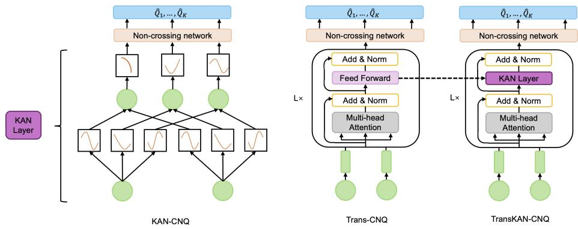  
FIG 1. The architectures of KAN-CNQ, Trans-CNQ, and TransKAN-CNQ.

Let $\tau _ { 1 } < \dots < \tau _ { K }$ denote the target quantile levels. For N i.i.d. subjects with observations $\{ ( Y _ { i } , \delta _ { i } , X _ { i } ) \} _ { i = 1 } ^ { N }$ , we define a vector-valued quantile network

$$
\boldsymbol { f } ( \boldsymbol { X } ; \boldsymbol { \theta } ) = \big ( f _ { 1 } ( \boldsymbol { X } ; \boldsymbol { \theta } ) , \dots , f _ { K } ( \boldsymbol { X } ; \boldsymbol { \theta } ) \big ) ^ { \top } ,
$$

where $f _ { k } ( X ; \theta )$ estimates the $\tau _ { k } .$ -th conditional quantile of $\log ( T )$ given X. The CNQ objective is the average of inverse-probability-weighted check losses across both subjects and quantile levels:

$$
L _ { N } ( f ) = \frac { 1 } { K } \sum _ { k = 1 } ^ { K } \sum _ { i = 1 } ^ { N } \omega _ { i } \rho _ { \tau _ { k } } \bigl ( \log ( Y _ { i } ) - f _ { k } ( X _ { i } ; \theta ) \bigr ) ,\tag{3}
$$

where $\rho _ { \tau } ( a ) = a \{ \tau - { \bf 1 } ( a < 0 ) \}$ is the check loss and $\omega _ { i } \mathbf { s } ^ { \prime }$ are inverse-probability-ofcensoring weights (e.g., inverse Kaplan–Meier weights).

Non-Crossing Output Module. A key difficulty in multi-quantile modeling is quantile crossing: when quantiles are trained independently, estimated lower quantiles can exceed higher ones $( \mathrm { e . g . } , \widehat { Q } _ { T | X } ( 0 . 3 ) > \widehat { Q } _ { T | X } ( 0 . 7 ) )$ , yielding an invalid conditional distribution. To prevent this, CNQ adopts a structurally constrained parameterization that builds on the noncrossing quantile networks of Wu et al. (2023) and Shen et al. (2025) and enforces

$$
f _ { 1 } ( X ; \theta ) \leq f _ { 2 } ( X ; \theta ) \leq \cdots \leq f _ { K } ( X ; \theta ) \quad { \mathrm { f o r ~ a l l ~ } } X ,
$$

thereby guaranteeing monotonicity across quantile levels by construction.

Let $Z = g ( X ; \theta _ { g } ) \in \mathbb { R } ^ { d _ { \mathrm { o u t } } }$ denote the output of the feature-extraction backbone, where $d _ { \mathrm { o u t } }$ is the backbone’s output dimension and $g$ is one of the three architectures described in the Model Architectures paragraph below. This representation is fed into a shared non-crossing output module consisting of two components. All outputs of this module are first defined on the log-time scale. The base network $h ( X ; \theta ) \in \mathbb { R }$ outputs the logarithm of the τ1-quantile estimate, and the steps network $s ( X ; \theta ) \overset { \cdot } { \in } \mathbb { R } ^ { \dot { K } - 1 }$ produces unconstrained increments encoding the gaps between consecutive log-time quantiles. Specifically, two separate linear heads produce the base and step outputs:

$$
h ( X ; \theta ) = W _ { b } Z + b _ { b } \in \mathbb { R } , \qquad s ( X ; \theta ) = W _ { s } Z + b _ { s } \in \mathbb { R } ^ { K - 1 } ,\tag{4}
$$

where $W _ { b } \in \mathbb { R } ^ { 1 \times d _ { \mathrm { o u t } } } , W _ { s } \in \mathbb { R } ^ { ( K - 1 ) \times d _ { \mathrm { o u t } } }$ , and $b _ { b } , b _ { s }$ are bias terms. Since the raw increments $s ( X ; \theta )$ may take negative values, we apply the softplus function $\sigma ^ { + } ( u ) = \log ( 1 + e ^ { u } )$ to

map them to nonnegative values. Defining $d ( X ) = \sigma ^ { + } \bigl ( s ( X ; \theta ) \bigr ) \in \mathbb { R } _ { + } ^ { K - 1 }$ , we construct the quantile outputs via cumulative summation:

$$
\widehat { V } _ { 1 } ( X ) = h ( X ; \theta ) , \qquad \widehat { V } _ { k } ( X ) = h ( X ; \theta ) + \sum _ { j = 1 } ^ { k - 1 } d _ { j } ( X ) , \quad k = 2 , \ldots , K .\tag{5}
$$

The corresponding quantiles on the original time scale are $\widehat { Q } _ { k } ( X ) = \exp \{ \widehat { V } _ { k } ( X ) \}$ . Because each increment $d _ { j } ( X ) \geq 0$ , the resulting log-time and original-time quantile estimates are automatically ordered without post-hoc rearrangement.

Model Architectures. We instantiate the CNQ framework with three independent featureextraction backbones: KAN, Transformer, and a novel KAN–Transformer hybrid. Each model is trained separately end-to-end; they differ only in the feature-extraction component, while all adopting the same non-crossing output architecture described above, as illustrated in Figure 1. This modular design enables direct comparison of the core feature-extraction components while ensuring valid quantile ordering across all models.

KAN-CNQ. Kolmogorov–Arnold Networks, introduced by Liu et al. (2024), are motivated by the Kolmogorov–Arnold representation theorem (Kolmogorov, 1957), which states that any multivariate continuous function can be decomposed into compositions of univariate functions. Unlike MLPs, which apply fixed activation functions at nodes, KANs place learnable univariate functions on the edges connecting nodes. Specifically, let $n _ { l }$ denote the number of nodes in the l-th layer and let $X _ { l , i }$ represent the i-th node in that layer. The output of the j-th node in the (l + 1)-th layer is computed as $\begin{array} { r } { X _ { l + 1 , j } = \sum _ { i = 1 } ^ { n _ { l } } \varphi _ { l , j , i } ( X _ { l , i } ) } \end{array}$ for $j = 1 , \dotsc , n _ { l + 1 }$ , where each edge activation $\varphi _ { l , j , i }$ combines a fixed basis function with a learnable spline component as $\begin{array} { r } { \varphi ( x ) = w _ { b } b ( x ) + w _ { s } \sum _ { m = 1 } ^ { M } \alpha _ { m } B _ { m } ( x ) } \end{array}$ . Here $b ( x )$ is a basis function (e.g., SiLU), $\lbrace B _ { m } \rbrace _ { m = 1 } ^ { M }$ are B-spline basis functions, and $\alpha _ { m }$ are learnable coefficients. By stacking multiple KAN layers, the model builds hierarchical representations of the input covariates. The final KAN layer produces the representation $Z \in \mathbb { R } ^ { d _ { \mathrm { o u t } } }$ , which is fed into the two linear heads in (4) to produce the quantile estimates via the non-crossing output module (5).

Trans-CNQ. The Transformer architecture (Vaswani et al., 2017) captures complex dependencies among input features through self-attention. While originally designed for sequential data, the Transformer encoder can be adapted to tabular settings by computing attention across features rather than temporal positions, following the approach of TabTransformer (Huang et al., 2020).

We embed every scalar feature with the same affine map, $\widetilde { X } _ { i j } = \psi ( X _ { i j } ) \in \mathbb { R } ^ { q }$ ; thus the implementation uses a shared scalar-token embedding rather than p feature-specific layers.

This transforms the input $X _ { i } \in \mathbb { R } ^ { p }$ into an embedding matrix $ { \widetilde { X } } _ { i } \in  { \mathbb { R } } ^ { p \times q }$ . A fixed sinusoidal positional encoding $P \in \mathbb { R } ^ { p \times q }$ is added to this matrix, followed by an initial affine LayerNorm, giving $Z _ { i 0 } = \mathrm { L N } _ { 0 } ( \widetilde { X } _ { i } + P )$ . Self-attention is then applied independently to each sample as

$$
{ \mathrm { A t t e n t i o n } } ( Q _ { i } , K _ { i } , V _ { i } ) = { \mathrm { s o f t m a x } } \left( { \frac { Q _ { i } K _ { i } ^ { \top } } { \sqrt { d _ { k } } } } \right) V _ { i } ,
$$

where $Q _ { i } = Z _ { i 0 } W ^ { Q } , K _ { i } = Z _ { i 0 } W ^ { K }$ , and $V _ { i } = Z _ { i 0 } W ^ { V }$ are affine projections, with biases suppressed in the notation, and $d _ { k }$ is the key dimensionality. We stack L Transformer encoder layers, each consisting of multi-head self-attention and feedforward sub-layers. Each layer uses post-LayerNorm residual blocks, with an Add–LayerNorm operation after attention and another after the two-layer ReLU feedforward sub-layer. The final token matrix is flattened and passed through an affine map and ReLU to obtain the representation $Z \in \mathbb { R } ^ { d _ { \mathrm { o u t } } }$ , which is fed into the two linear heads in (4) to produce the quantile estimates via the non-crossing output module (5). In the fitted model $d _ { \mathrm { o u t } } = q ;$ the approximation sieve below allows this flattened-readout width to be tuned independently while retaining the same encoder family.

TransKAN-CNQ. We further propose a hybrid architecture that integrates the strengths of both Transformer and KAN. Specifically, we replace the standard MLP-based feedforward sub-layers within the Transformer encoder blocks with KAN layers. This substitution retains the Transformer’s capacity for modeling pairwise feature interactions through self-attention, while leveraging KAN’s learnable spline-based activations for more expressive nonlinear transformations within each encoder block.

The hybrid encoder consists of L modified Transformer layers, each comprising a multihead self-attention sub-layer followed by a KAN-based feedforward sub-layer. The resulting representation $Z \in \mathbb { R } ^ { d _ { \mathrm { o u t } } }$ is fed into the two linear heads in (4) to produce the quantile estimates via the non-crossing output module (5), ensuring monotonicity in the predicted quantiles. This design allows TransKAN-CNQ to capture both inter-feature dependencies (via attention) and complex univariate nonlinearities (via KAN) within a unified architecture.

4. Theoretical Guarantees. We formulate the result directly in the empirical Euclidean metric used by Zhang and Zhou (2024). This matches the available KAN covering bound and treats all K log-time quantile outputs jointly.

Let $V = \log T , W = \log Y , Y = \operatorname* { m i n } ( T , C )$ , and assume $T , C > 0$ almost surely. Assume also that $\mathbb { E } | \log T | < \infty$ . Let $\delta = \mathbb { I } \{ T \leq C \}$ . We make the following assumptions.

(A1) $( T , X ) \bot C$ . Write $G ( t ) = \mathbb { P } ( C > t )$ and $G ( t ^ { - } ) = \mathbb { P } ( C \geq t )$

(A2) There is a deterministic set $\mathcal { T } \subset ( 0 , \infty )$ such that $\mathbb { P } ( T \in \mathcal { T } ) = 1$ and

$$
G _ { \star } : = \operatorname* { i n f } _ { t \in \mathcal { T } } G ( t ^ { - } ) > 0 .
$$

The Kaplan–Meier estimator $\widehat { G }$ obeys, for the values of η under consideration,

$$
\mathbb { P } \Bigg \{ \Delta _ { N } : = \operatorname* { s u p } _ { t \in T } | \widehat { G } ( t ^ { - } ) - G ( t ^ { - } ) | > \kappa _ { N } ( \eta ) \Bigg \} \leq c _ { G } e ^ { - \eta } , \qquad \kappa _ { N } ( \eta ) \leq G _ { \star } / 2 .
$$

Both assumptions are dictated by the estimator actually used. (A1) makes the censoring time independent of the covariates as well as of the event time, which is what validates the marginal Kaplan–Meier weight $\widehat { G } ( Y _ { i } ^ { - } )$ of Section 3, used for every evaluation metric in Section 5.1. (A2) strengthens the endpoint condition $\tau _ { T } < \tau _ { C }$ to positivity of the censoring survival over the support of $T$ , excluding the unbounded-support case $\tau _ { T } = \tau _ { C } = \infty$ Its second display isolates the only property of $\widehat { G }$ needed below; the DKW–Kaplan–Meier inequality of Bitouzé, Laurent and Massart (1999) gives $\kappa _ { N } ( \eta ) = { \cal O } \{ ( D _ { o } + \sqrt { \eta } ) / \sqrt { N } \}$ under the fixed-horizon conditions of Goldberg (2019), which do not verify (A2) over a full continuous support with vanishing at-risk probability; no such verification is claimed here.

For a non-crossing vector-valued function $f = \left( f _ { 1 } , \ldots , f _ { K } \right) \in \mathcal { F } _ { N }$ , suppose ma $\tau _ { k } \parallel f _ { k } \parallel _ { \infty } \leq$ $M _ { f }$ , and define the log-time risk

$$
L ( f ) = \mathbb { E } \left[ \frac { 1 } { K } \sum _ { k = 1 } ^ { K } \rho _ { \tau _ { k } } \{ V - f _ { k } ( X ) \} \right] , \qquad R _ { \mathcal { F } _ { N } } ( f ) = L ( f ) - L ( f _ { N } ^ { \star } ) ,\tag{6}
$$

where $f _ { N } ^ { \star } \in \arg$ min $f \in \mathcal { F } _ { N } L ( f )$ . Its empirical IPCW counterpart is

$$
\widehat { L } _ { N } ( f ) = \frac { 1 } { N K } \sum _ { i = 1 } ^ { N } \sum _ { k = 1 } ^ { K } \frac { \delta _ { i } } { \widehat { G } ( Y _ { i } ^ { - } ) } \rho _ { \tau _ { k } } \{ W _ { i } - f _ { k } ( X _ { i } ) \} , \qquad \widehat { f } _ { N } \in \arg \operatorname* { m i n } _ { f \in \mathcal { F } _ { N } } \widehat { L } _ { N } ( f ) .
$$

By the IPCW identity proved in the Supplementary Material, replacing $\widehat { G }$ by $G$ makes this an unbiased empirical version of L.

For a realized design $\mathbf { X } = ( X _ { 1 } , \ldots , X _ { N } )$ , let

$$
\mathcal { F } _ { N } ( \mathbf { X } ) = \{ ( f _ { k } ( X _ { i } ) ) _ { i \leq N , k \leq K } : f \in \mathcal { F } _ { N } \} \subset \mathbb { R } ^ { N \times K } .
$$

Assume that a deterministic $A _ { N } > 0$ satisfies, almost surely in $\mathbf { X } ,$ , for every $u > 0$

$$
\log \mathcal { N } \{ \mathcal { F } _ { N } ( \mathbf { X } ) , \Vert \cdot \Vert _ { F } , u \} \leq \frac { A _ { N } } { u ^ { 2 } } .\tag{7}
$$

THEOREM 4.1 (Estimation error under empirical $L _ { 2 }$ entropy). Under (A1)–(A2) and $( 7 )$ there are universal constants $C , c > 0$ such that, for every $\eta > 0$ satisfying (A2), with probability at least $1 - ( c + c _ { G } ) e ^ { - \eta }$

$$
\begin{array} { r l } & { R _ { \mathcal { F } _ { N } } ( \widehat { f } _ { N } ) \leq C \bigg [ \frac { \sqrt { A _ { N } } } { G _ { \star } \sqrt { K } N } \bigg \{ 1 + \log _ { + } \bigg ( \frac { M _ { f } \sqrt { K } N } { \sqrt { A _ { N } } } \bigg ) \bigg \} } \\ & { \quad \quad \quad \quad + \frac { M _ { f } } { G _ { \star } } \bigg \{ \sqrt { \frac { \eta + 1 } { N } } + \frac { \eta + 1 } { N } \bigg \} + \frac { M _ { f } \kappa _ { N } ( \eta ) } { G _ { \star } ^ { 2 } } \bigg ] , } \end{array}\tag{8}
$$

where $\log _ { + } ( x ) = \operatorname* { m a x } \{ \log x , 0 \}$

The proof uses Cauchy–Schwarz to transfer the empirical Frobenius metric to the trueweight IPCW loss class, followed by symmetrization, a truncated Dudley entropy integral, bounded empirical-process concentration, and the deterministic plug-in comparison on the event in (A2). It is given in the Supplementary Material.

Writing $q = ( q _ { 1 } , \dots , q _ { K } )$ for the true conditional quantiles of V and $\mathcal { A } _ { N } = \operatorname* { i n f } _ { f \in \mathcal { F } _ { N } } \{ L ( f ) -$ $L ( q ) \}$ , the total excess risk decomposes exactly as $L ( \widehat { f } _ { N } ) - L ( q ) = R _ { \mathcal { F } _ { N } } ( \widehat { f } _ { N } ) + A _ { N }$ , so Theorem 4.1 controls the estimation term and is enough on its own when $q \in \mathcal { F } _ { N }$ . The two results below instead bound $\mathcal { A } _ { N }$ for explicit growing KAN and Trans-CNQ sieves and balance it against the estimation term, without assuming that a fixed fitted architecture contains $q .$ Each combines Theorem 4.1 with its own approximation construction; the Lipschitz constant of the raw-to-non-crossing map Φ in (5), the complexity-indexed instantiations for fixed architectures and norm budgets (both giving an estimation rate $O _ { \mathbb { P } } ( \log N / \sqrt { N } ) )$ , the supporting lemmas and the complete proofs are given in Supplementary Section 4.

THEOREM 4.2 (Excess-risk convergence rate for the KAN-CNQ estimator). Suppose $X \in [ 0 , 1 ] ^ { p }$ , each true conditional log-time quantile is in a bounded $C ^ { \beta }$ ball, and adjacent quantiles are separated uniformly by a positive constant. Consider the fixed-grid, two-layer spline-KAN sieve constructed in the Supplement: its first-layer spline degree is at least two with $\beta \leq m + 1$ , its second-layer dictionary contains $t \mapsto t ^ { p }$ , all effective edge coefficients are bounded, and the class has a fixed output envelope. For spline resolution $J ,$ this full class has $P _ { J } = O ( J ^ { p } )$ free coefficients and

$$
L ( \widehat { f } _ { N , J } ) - L ( q ) = O _ { \mathbb { P } } \left\{ J ^ { - \beta } + \sqrt { \frac { J ^ { p } \log ( 2 J ) } { N } } + \frac { 1 } { \sqrt { N } } \right\} .\tag{9}
$$

Consequently, $J _ { N } \asymp \{ N / \log N \} ^ { 1 / ( 2 \beta + p ) }$ gives

$$
L ( \widehat { f } _ { N , J _ { N } } ) - L ( q ) = O _ { \mathbb { P } } \left[ \left\{ \frac { N } { \log N } \right\} ^ { - \beta / ( 2 \beta + p ) } \right] .
$$

THEOREM 4.3 (Excess-risk convergence rate for the Trans-CNQ estimator). Under the smoothness and positive-gap conditions of Theorem 4.2, suppose additionally that $0 < \beta <$ $( p + 3 ) / 2$ . Hold the shared-embedding post-LayerNorm encoder dimensions fixed and let the flattened ReLU readout have at most KM units and output variation budget Λ. For

$$
\nu = \frac { p + 3 - 2 \beta } { 2 p } , \qquad \Lambda _ { N } = M _ { N } ^ { \nu } , \qquad M _ { N } \asymp \left\{ \frac { N } { \log N } \right\} ^ { p / ( 2 \beta + p ) } ,
$$

the correspondingfixed-envelope Trans-CNQ sieve satisfies

$$
L ( \widehat { f } _ { N , M _ { N } , \Lambda _ { N } } ) - L ( q ) = O _ { \mathbb { P } } \left[ \left\{ \frac { N } { \log N } \right\} ^ { - \beta / ( 2 \beta + p ) } \right] .
$$

REMARK 4.4 (Scope of the bounds). The sieve rates of Theorems 4.2–4.3 hold for fixed $p$ and K under hard norm bounds, a fixed output envelope, ideal ERM, uniformly positive quantile gaps, and (A1)–(A2). In particular, (A2) fails for bounded-uniform censoring combined with an unbounded event-time support. The KAN approximation result, and hence the KAN total rate, concerns a degree $^ { - p }$ theoretical sieve rather than the fitted cubic-spline EfficientKAN architecture, and none of these results covers TransKAN-CNQ. These are upper bounds and do not rank the fitted architectures.

## 5. Experimental Setup.

5.1. Evaluation Metrics. Using the notation established in Section 3, quantile prediction errors are evaluated on the log-time scale, with $V _ { i } = \log ( Y _ { i } )$ and $\widehat { V } _ { i } ( \tau _ { k } ) \bar { = } \log \{ \widehat { Q _ { i } } ( \tau _ { k } ) \}$ Interval coverage, by contrast, is assessed on the original time scale through the predicted quantiles $\widehat { Q } _ { i } ( \tau )$ . Metrics that target population quantities defined in terms of the event time $T _ { i }$ require correction for right censoring. We use IPCW weights $w _ { i } = \delta _ { i } / \widehat { G } ( Y _ { i } ^ { - } )$ , where $\widehat { G }$ is the Kaplan–Meier estimate of the censoring survival function. All weighted metrics below use the normalized form $\sum _ { i } w _ { i } \ell _ { i } { \Big / } \sum _ { i } w _ { i }$ , which is consistent under the marginal independentcensoring and positivity conditions in $( \mathbf { A } 1 ) { - } ( \mathbf { A } 2 )$

(i) IPCW-weighted mean pinball loss. The pinball loss at level τ is $\rho _ { \tau } ( u ) = u \{ \tau - \mathbb { I } ( u <$ 0)}. The IPCW-weighted pinball loss averaged over quantiles is

$$
\mathcal { L } _ { \mathrm { w P B } } = \frac { 1 } { K } \sum _ { k = 1 } ^ { K } \frac { \sum _ { i = 1 } ^ { N } w _ { i } \rho _ { \tau _ { k } } \bigl ( V _ { i } - \widehat { V } _ { i } ( \tau _ { k } ) \bigr ) } { \sum _ { i = 1 } ^ { N } w _ { i } } .\tag{10}
$$

This is the primary measure of overall quantile prediction accuracy. The quantile-specific pinball losses $\mathcal { L } _ { \mathrm { w P B } } ( \tau _ { k } )$ (i.e., the individual terms before averaging over $k )$ are reported in the supplementary appendix to reveal potential heterogeneity across quantile levels.

(ii) IPCW-weighted interval coverage probability $( I C P )$ . To assess interval calibration under censoring, we propose the IPCW-weighted empirical coverage (wICP) for a nominal $( 1 - 2 \alpha ) \times 1 0 0 \%$ prediction interval $\lbrack \widehat { Q } _ { i } ( \alpha ) , \widehat { Q } _ { i } ( 1 - \alpha ) ]$

$$
\mathrm { w I C P } _ { 1 - 2 \alpha } = \frac { \sum _ { i = 1 } ^ { N } w _ { i } \mathbb { I } \big \{ Y _ { i } \in [ \widehat { Q } _ { i } ( \alpha ) , \widehat { Q } _ { i } ( 1 - \alpha ) ] \big \} } { \sum _ { i = 1 } ^ { N } w _ { i } } .\tag{11}
$$

We report coverage at two nominal levels: 80% $( \alpha = 0 . 1$ , using $\tau = 0 . 1$ and $\tau = 0 . 9 )$ and 50% $( \alpha = 0 . 2 5$ , using $\tau = 0 . 2 5$ and $\tau = 0 . 7 5 )$ . A well-calibrated model should achieve empirical coverage close to the nominal rate.

5.2. Implementation Setup. Training and hyperparameter tuning. All models are trained using the AdamW optimizer (Loshchilov and Hutter, 2017) under a learning rate schedule combining linear warmup with cosine annealing (CosineAnnealingLR), and training is terminated via early stopping on the validation loss. For the Transformer-based models (Trans-CNQ and TransKAN-CNQ) we search over learning rates $\{ 1 0 ^ { - 3 } , 5 { \times } 1 0 ^ { - 4 } , 1 0 ^ { - 4 }$ $5 { \times } 1 0 ^ { - 5 } , 1 0 ^ { - 5 } \}$ , dropout rates $\{ 0 , 0 . 2 , 0 . 5 \}$ , weight decays $\left\{ 0 , 1 0 ^ { - 4 } , 1 0 ^ { - 3 } \right\}$ , hidden layer widths {64, 100, 128, 200, 256} and network depths $\{ 2 , 3 \}$ , with an early-stopping patience of 10 epochs. KAN-CNQ was tuned in a separate sweep over learning rates $\{ 1 0 ^ { - 3 } , 5 { \times } 1 0 ^ { - 4 }$ ， $3 { \times } 1 0 ^ { - 4 } , 1 0 ^ { - 4 } \}$ , dropout rates $\{ 0 , 0 . 0 5 , 0 . 1 , 0 . 2 \}$ , weight decays $\mathrm { \bar { \{ 0 , 1 0 ^ { - 5 } , 1 0 ^ { - 4 } , 1 0 ^ { - 3 } \} } }$ hidden layer widths {32, 64, 128, 200, 256}, network depths $\{ 1 , 2 , 3 \}$ and B-spline grid sizes $\{ 3 , 5 , 8 \}$ , with an early-stopping patience of 20 epochs; the separate sweep reflects the spline-resolution hyperparameter, which has no Transformer counterpart. In all cases the configuration with the best validation performance is selected for final evaluation.

Data splitting. For the simulation study, we partition the data into training, validation, and test sets in a 1:1:1 ratio. For real-world datasets, we adopt a 65%–15%–20% split following standard practice. All experiments are repeated over 25 random seeds to account for variability in data partitioning.

Baseline methods. We compare the three proposed models (TransKAN-CNQ, Trans-CNQ, and KAN-CNQ) against ten existing methods in three categories: (a) quantile regression-based deep learning models: DeepQuantreg (Jia and Jeong, 2022) and CQRNN (Pearce et al., 2022); (b) non-quantile deep learning models: DeepSurv (Katzman et al., 2018), Cox-Time, CoxCC, and PCHazard (Kvamme, Borgan and Scheel, 2019); (c) traditional survival models: Random Survival Forests (RSF) (Ishwaran et al., 2008; Ishwaran and Kogalur, 2007, 2019), censored quantile regression via the ctqr package in R (Frumento, 2024; Frumento and Bottai, 2017), the Cox proportional hazards model (CoxPH) (Cox, 1972), and the accelerated failure time model (AFT) (Kalbfleisch and Prentice, 2002; Kleinbaum and Klein, 1996). CTQR represents the classical linear censored quantile regression estimators of Portnoy (2003) and Peng and Huang (2008) in this comparison: all three model the conditional quantile as linear in the covariates and share the linearity restriction that motivates our framework. CTQR ranks in the bottom three of the thirteen methods in five of the six cohorts and in 18 of the 27 simulation settings, so the two additional linear estimators are unlikely to alter any conclusion below. All deep quantile baselines follow the same training protocol as the proposed models (identical IPCW weights, optimizer, schedule and tuning budget), with DeepQuantreg fitting one MLP per quantile level as originally proposed, and all ten are evaluated in both the simulation study and the real-data benchmark.

6. Simulation Studies. To complement the real-data analysis, we ran a simulation study with covariate dimension fixed at $p = 1 0$ . The design spans 27 settings formed by three eventtime distributions (Gaussian, Gamma, Weibull) with covariate-dependent parameters, three censoring levels (≈ 25%, 50%, 75%), and three sample sizes $( n \in \{ 1 5 0 , 7 5 0 , 1 5 0 0 \} )$ ). Full design details, per-setting results, and tables are provided in the Supplementary Material; we summarize the conclusions here.

The results are strongly distribution-dependent. Under the Weibull and Gamma designs, where covariates reshape the full survival distribution rather than only its center, the CNQ models attain the lowest IPCW pinball loss (in $7 / 9$ and $6 / 9$ settings, respectively), with the largest margins at moderate-to-large samples. Under the symmetric Gaussian design, by contrast, the quantile- and hazard-based methods perform very similarly and Random Survival Forest (RSF) attains the lowest pinball loss in eight of the nine settings, though only marginally. RSF is thus the strongest competitor overall, leading on the Gaussian design and running a close second under Weibull/Gamma, while the proposed models lead precisely where flexible distributional modeling matters most. Among the quantile-based baselines, CQRNN is less accurate than the best proposed model in every one of the 27 settings and DeepQuantreg in 26 of 27, the sole exception being Gamma with 75% censoring at $n = 1 5 0$ ; the hazard-based and remaining classical baselines are weaker distributional predictors. Within our family, TransKAN-CNQ is the most consistent, with Trans-CNQ a close and sometimes preferable alternative under small samples or heavy censoring; at the smallest sample size $( n = 1 5 0 )$ the proposed models’ advantage narrows. Importantly for interpretability, the CNQ parameterization makes quantile crossing impossible by construction, and the measured crossing rate of all three architectures is exactly zero in every setting. Fitting the same five levels separately, as DeepQuantreg does, is not so benign: averaged over the 27 settings, 34.2% of test subjects have at least one inverted adjacent pair and 2.1% have $\widehat { q } _ { 0 . 1 } > \widehat { q } _ { 0 . 9 }$ , rising to 65.2% and 29.6% in the hardest setting (Supplementary Material).

<table><tr><td rowspan=1 colspan=1>Data set</td><td rowspan=1 colspan=1>Size</td><td rowspan=1 colspan=1>Covariates</td><td rowspan=1 colspan=1>Censored %</td></tr><tr><td rowspan=1 colspan=1>SUPPORT</td><td rowspan=1 colspan=1>8,873</td><td rowspan=1 colspan=1>14</td><td rowspan=1 colspan=1>32</td></tr><tr><td rowspan=1 colspan=1>METABRIC</td><td rowspan=1 colspan=1>1,904</td><td rowspan=1 colspan=1>9</td><td rowspan=1 colspan=1>42</td></tr><tr><td rowspan=1 colspan=1>GBSG</td><td rowspan=1 colspan=1>2,232</td><td rowspan=1 colspan=1>7</td><td rowspan=1 colspan=1>43</td></tr><tr><td rowspan=1 colspan=1>GBSG-500</td><td rowspan=1 colspan=1>500</td><td rowspan=1 colspan=1>7</td><td rowspan=1 colspan=1>42</td></tr><tr><td rowspan=1 colspan=1>NKI70</td><td rowspan=1 colspan=1>144</td><td rowspan=1 colspan=1>8</td><td rowspan=1 colspan=1>67</td></tr><tr><td rowspan=1 colspan=1>FLCHAIN</td><td rowspan=1 colspan=1>7,874</td><td rowspan=1 colspan=1>7</td><td rowspan=1 colspan=1>72</td></tr></table>

Summary of datasets used in the analysis.

## 7. Real Data Analysis.

7.1. Overall Predictive Performance. We compare the three proposed architectures (TransKAN-CNQ, Trans-CNQ and KAN-CNQ) with ten competing approaches on the six right-censored cohorts of Table 1, which span two orders of magnitude in sample size (n = 144 to 8,873) and censoring from 32% to 72%.

Pinball loss. Table 3 reports the mean IPCW pinball loss across 25 random splits. The proposed methods attain the lowest mean pinball loss on all six datasets, with the strongest results typically delivered by the two Transformer-based variants. DeepQuantreg is the strongest baseline on four of the six cohorts, which is expected given that it is the only other method fitting the quantile function directly; RSF is strongest on METABRIC, while on the 144- subject NKI70 cohort the baselines are effectively tied (CoxPH lowest at 0.265, with all of them within 0.005). On the large SUPPORT cohort, TransKAN-CNQ and Trans-CNQ achieve $\overline { { L } } _ { \mathrm { p i n } } = 0 . 4 8 6$ and 0.487, against the best baseline (DeepQuantreg, 0.492) and the best non-quantile baseline (RSF, 0.541); on METABRIC, TransKAN-CNQ is best (0.215) ahead of RSF (0.228) and DeepQuantreg (0.243). The largest gap is on the heavily censored FLCHAIN cohort, where TransKAN-CNQ attains 0.279 versus DeepQuantreg 0.287 and RSF 0.332, a relative improvement of roughly 16% over the latter. On GBSG and GBSG-500 the three proposed models lie within 0.006 of one another and their internal ranking shifts with the sample, as it does on NKI70 (Trans-CNQ best at 0.242), where the larger standard deviations reflect the instability expected from 144 subjects; DeepQuantreg is the weakest quantile-based method there (0.305). The consistent ordering of the proposed models ahead of DeepQuantreg on every cohort isolates the contribution of joint multi-quantile estimation, since the two approaches share the IPCW objective and differ chiefly in fitting all quantiles together under a non-crossing parameterization rather than one network per level.

Figure 3 complements Table 3 by showing the split-to-split distribution of IPCW pinball loss across all six cohorts; the proposed models generally occupy the lowest-loss region, with DeepQuantreg the closest quantile-based competitor.

Coverage. Table 4 reports the IPCW interval coverage probability (ICP) for the nominal 80% prediction interval. The proposed methods generally remain closer to the nominal target than most competitors while avoiding the systematic overcoverage seen in several baselines. The one baseline that matches them on this criterion is DeepQuantreg, which is closest to nominal on GBSG (0.793), SUPPORT (0.793) and FLCHAIN (0.802). This is unsurprising, since it shares the IPCW quantile objective and therefore inherits the same width calibration, and on coverage alone the two are effectively tied: where DeepQuantreg is nearer the nominal level its advantage in absolute deviation is 0.001 on GBSG, 0.003 on FLCHAIN and 0.010 on SUPPORT, all well inside the split-to-split standard deviations of 0.02–0.06. Where the proposed models are nearer, the margin is larger: 0.010 on GBSG-500, 0.024 on METABRIC and 0.170 on NKI70, where DeepQuantreg degrades to 0.625. Coverage therefore does not separate the two approaches; what separates them is that the proposed models attain this calibration while also achieving strictly lower pinball loss on all six cohorts (Table 3), and while guaranteeing a coherent conditional distribution. Because DeepQuantreg fits an independent network per quantile level, nothing in its construction prevents the estimated curves from crossing, and on these cohorts they do: at least one adjacent pair is inverted for 18.2% of test subjects on average, ranging from 2.4% on SUPPORT to 45.7% on NKI70, and 146 of the 150 fits contain at least one such subject (Supplementary Material). The outer interval itself inverts only rarely here $( \widehat { q } _ { 0 . 1 } > \widehat { q } _ { 0 . 9 }$ for 0.18% of subjects), so its coverage in Table 4 remains interpretable; but the underlying quantile function is not monotone for a substantial minority of patients, which is precisely the coherence a clinician needs when reading a set of quantile milestones. The CNQ parameterization rules this out identically — its measured crossing rate is zero on every cohort — at no measurable cost in coverage.

Among the baselines the failure modes are systematic. AFT and RSF reach nominallooking coverage on SUPPORT (0.898 and 0.888) only through very wide intervals, whereas all three proposed models sit near 0.78 there; CQRNN overcovers on most cohorts (0.906 on METABRIC, 0.925 on FLCHAIN, 0.881 on SUPPORT), so its nominally wide intervals are not sharp, the exception being NKI70 (0.649), where the small sample destabilizes every method. On GBSG the proposed models are tightly concentrated around the nominal level (Trans-CNQ, 0.808). Coverage is most variable on METABRIC, where they span 0.720–0.784; TransKAN-CNQ is closest to nominal there, just ahead of CoxCC (0.781). These estimates are the least stable of the six cohorts, because METABRIC has by far the smallest effective sample size under IPCW weighting $( ( \sum _ { i } w _ { i } ) ^ { 2 } / \sum _ { i } w _ { i } ^ { 2 } \approx 3 5 \%$ of the observed events, versus 75–98% elsewhere), so a handful of late events carries a large share of the weight; capping the weights at their 95th percentile moves the three proposed models to 0.795–0.820 with essentially unchanged pinball loss (Supplementary Material), but we report untruncated weights throughout. On FLCHAIN the proposed models remain close to nominal (TransKAN-CNQ 0.795, Trans-CNQ 0.806, KAN-CNQ 0.828), as does DeepQuantreg (0.802), whereas the hazard-based and traditional baselines undercover markedly (e.g., RSF 0.693, CoxTime 0.593), further evidence that an IPCW quantile objective translates nominal width into reliable empirical coverage even under heavy censoring.

Overall, the CNQ models deliver the most favorable calibration–sharpness trade-off among the methods considered: the lowest pinball loss on every cohort, with empirical coverage close to nominal outside METABRIC, rather than apparent calibration bought with overly conservative intervals.

TABLE 2  
Quantile-grid sensitivity on METABRIC. Models are trained with $K \in \{ 5 , 1 1$ , 19} quantiles and evaluated at the five common levels {0.1, 0.25, 0.5, 0.75, 0.9} (mean over 25 splits). $\overline { { L } } _ { \mathrm { p i n } }$ is the IPCW pinball loss (log scale); MACE is the mean absolute calibration error. The baseline is $K = 5 .$
<table><tr><td></td><td colspan="3"> $\overline { { L } } _ { \mathrm { p i n } }$ </td><td colspan="3">MACE</td></tr><tr><td>Model</td><td> $K { = } 5$ </td><td> $K { = } 1 1$ </td><td> $K { = } 1 9$ </td><td> $K { = } 5$ </td><td> $K { = } 1 1$ </td><td> $K { = } 1 9$ </td></tr><tr><td>TransKAN-CNQ</td><td>0.215</td><td>0.226</td><td>0.223</td><td>0.079</td><td>0.109</td><td>0.090</td></tr><tr><td>Trans-CNQ</td><td>0.224</td><td>0.230</td><td>0.223</td><td>0.092</td><td>0.102</td><td>0.091</td></tr><tr><td>KAN-CNQ</td><td>0.227</td><td>0.231</td><td>0.231</td><td>0.089</td><td>0.098</td><td>0.099</td></tr></table>

7.2. Model Checking and Calibration. Aggregate loss and interval coverage do not by themselves establish that a fitted quantile model is internally well calibrated. We therefore add a direct calibration check on METABRIC. Using the held-out test predictions from all 25 splits, we estimate, for each nominal level τ, the IPCW-corrected probability $\widehat { \mathrm { P r } } \{ T \leq \widehat { Q } _ { \tau } ( \widehat { X } ) \}$ , which equals τ under perfect calibration; censoring is handled with the same inverse-probability weights (training-set Kaplan–Meier $\widehat { G } )$ used for the loss metrics.

Figure 2(a) plots these estimates against the nominal levels. All three architectures track the $4 5 ^ { \circ }$ line closely: $\widehat { \mathrm { P r } } \{ T \leq \widehat { Q } _ { 0 . 5 } \}$ is 0.49, 0.47 and 0.48 for Trans-CNQ, TransKAN-CNQ and KAN-CNQ, and at $\tau = 0 . 1$ the three give 0.11, 0.10 and 0.10 against the nominal 0.10. The residual miscalibration is concentrated in the upper tail, where all three undershoot (0.83, 0.88 and 0.86 at $\tau = 0 . 9 )$ . Figure 2(b) summarizes central-interval calibration: empirical IPCW coverage of the nominal 50% and 80% intervals is 0.43–0.47 and 0.72– 0.78, respectively, a mild but consistent undercoverage that is most pronounced for Trans-CNQ and matches the interval-coverage results in Table 4. A log-time residual diagnostic at the predicted median (Supplementary Material) shows median residuals near zero for the Transformer-based models. The same checks replicate on FLCHAIN (Supplementary Material), where calibration is tighter (empirical coverage of the nominal 80% interval is 0.80– 0.83) consistent with its substantially larger test sets. These checks confirm that the calibration advantages reported above reflect genuinely well-behaved conditional quantiles rather than averaging artifacts, and they localize the residual miscalibration to the extreme quantiles of the spline-based architecture.

Sensitivity to the quantile grid. To verify that our conclusions do not hinge on the choice of five quantile levels, we retrained all three models with denser grids of $K \in \{ 1 1 , 1 9 \}$ quantiles (identical hyperparameters, 25 splits) and re-evaluated at the five common levels. Table 2 shows the pinball loss and the mean absolute calibration error (MACE) changing by at most $\sim 0 . 0 1$ as K grows, well within one split-to-split standard deviation $( \approx 0 . 0 2 )$ , with the ordering (TransKAN-CNQ ≲ Trans-CNQ < KAN-CNQ) preserved at every resolution. Varying the IPCW weight-truncation threshold (none through the 90th–99th percentiles) and the train/validation/test ratio (65/15/20, 50/25/25, 80/10/10) likewise leaves the pinball loss within ∼ 0.01 and the ordering intact, with 80% coverage staying close to nominal (Supplementary Material); only the smallest test set $( 8 0 / 1 0 / 1 0 )$ is noticeably noisier. The five-quantile, untruncated-weight results reported above are therefore not artifacts of those choices.

7.3. Overview of the Two Case Studies. To evaluate the proposed censored non-crossing quantile regression framework beyond simulated settings, we conduct a systematic analysis on two real-world survival datasets that differ in clinical context, sample size, and censoring severity.

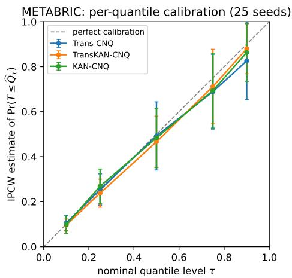  
(a) Per-quantile calibration

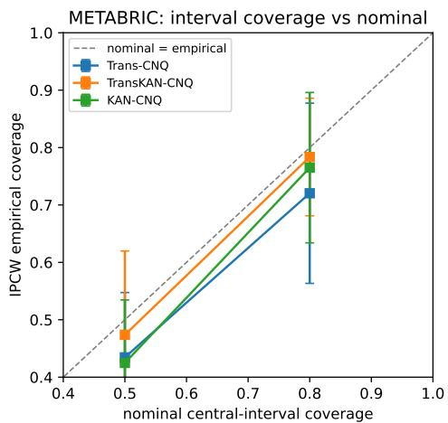  
(b) Central-interval coverage

FIG 2. METABRIC model checking (25 seeds, IPCW-weighted). (a) Per-quantile calibration: for each nominal level τ, the IPCW estimate of $\operatorname* { P r } \{ T \leq { \widehat { Q } } _ { \tau } ( X ) \}$ is plotted against τ; the dashed line is perfect calibration and error bars are ±1 standard deviation across splits. (b) Central-interval coverage versus nominal level (50% and 80%); points below the diagonal indicate mild undercoverage.  
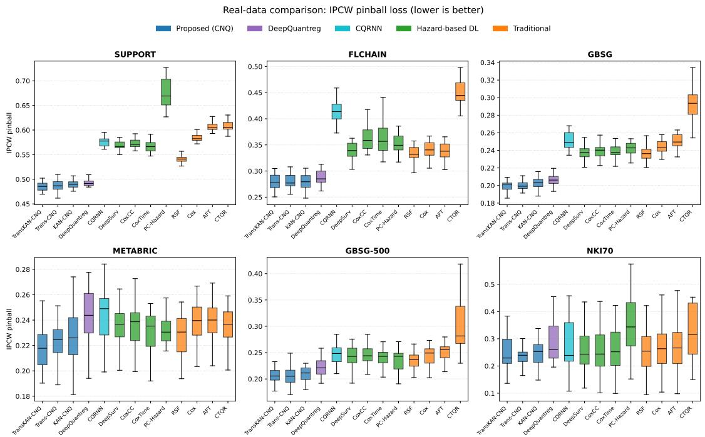  
FIG 3. Boxplots ofIPCW pinball loss (self-normalized, log-time scale) across the six real-world datasets. Lower values indicate better quantile predictive performance. The proposed CNQ models (blue) consistently occupy the most favorable region of the distribution, with DeepQuantreg (purple), the other quantile-based deep learning method, the closest competitor on most cohorts.

Datasets. Table 5 summarizes the two cohorts, whose covariates are listed in Section 2. They were chosen for the contrast they provide: METABRIC pairs molecular markers with treatment indicators under moderate censoring, whereas FLCHAIN is a treatment-free population cohort four times larger and far more heavily censored.

TABLE 3  
Mean IPCWpinball loss $( \overline { { L } } _ { \mathrm { p i n } } ,$ averaged over $\tau \in \{ 0 . 1 , 0 . 2 5 , 0 . 5 , 0 . 7 5 , 0 . 9 \}$ on six real-world datasets. Each entry shows the mean ± standard deviation across 25 random splits. Lower is better. The best result per dataset is bolded.
<table><tr><td></td><td>GBSG</td><td></td><td>GBSG-500 METABRIC SUPPORT</td><td></td><td>NKI70</td><td>FLCHAIN</td></tr><tr><td colspan="7">Proposed methods</td></tr><tr><td>TransKAN-CNQ</td><td> $\mathbf { \delta } \mathbf { \cdot } \mathbf { 1 9 9 } \pm . 0 0 6$ </td><td> $. 2 0 6 \pm . 0 1 5$ </td><td> $. 2 1 5 \pm . 0 2 2$ </td><td> $\mathbf { \delta } . 4 8 6 \pm . 0 1 1$ </td><td> $. 2 5 1 \pm . 0 6 6$ </td><td> $. 2 7 9 \pm . 0 1 5$ </td></tr><tr><td>Trans-CNQ</td><td> $. 2 0 0 \pm . 0 0 6$ </td><td> $\mathbf { \sigma } _ { \mathbf { \delta } \mathbf { \cdot } 2 \mathbf { 0 } 4 } \pm . 0 1 7$ </td><td> $. 2 2 4 \pm . 0 2 4$ </td><td> $. 4 8 7 \pm . 0 1 0$ </td><td> $. 2 4 2 \pm . 0 4 4$ </td><td> $. 2 8 2 \pm . 0 1 5$ </td></tr><tr><td>KAN-CNQ</td><td> $. 2 0 3 \pm . 0 0 7$ </td><td> $. 2 1 0 \pm . 0 1 5$ </td><td> $. 2 2 7 \pm . 0 2 5$ </td><td> $. 4 9 0 \pm . 0 1 0$ </td><td> $. 2 5 1 \pm . 0 5 8$ </td><td> $. 2 8 0 \pm . 0 1 6$ </td></tr><tr><td colspan="7">Deep learning baselines</td></tr><tr><td>DeepQuantreg</td><td> $. 2 0 6 \pm . 0 0 7$ </td><td> $. 2 2 0 \pm . 0 1 8$ </td><td> $. 2 4 3 \pm . 0 2 4$ </td><td> $. 4 9 2 \pm . 0 0 9$ </td><td> $. 3 0 5 \pm . 1 0 0$ </td><td> $. 2 8 7 \pm . 0 1 5$ </td></tr><tr><td>CQRNN</td><td> $. 2 5 1 \pm . 0 1 0$ </td><td> $. 2 4 8 \pm . 0 2 0$ </td><td> $. 2 4 4 \pm . 0 2 3$ </td><td> $. 5 7 6 \pm . 0 1 0$ </td><td> $. 2 9 1 \pm . 1 3 3$ </td><td> $. 4 1 2 \pm . 0 2 1$ </td></tr><tr><td>DeepSurv</td><td> $. 2 3 9 \pm . 0 1 0$ </td><td> $. 2 4 2 \pm . 0 2 0$ </td><td> $. 2 3 5 \pm . 0 1 6$ </td><td> $. 5 6 8 \pm . 0 0 9$ </td><td> $. 2 6 7 \pm . 0 9 7$ </td><td> $. 3 3 9 \pm . 0 1 8$ </td></tr><tr><td>CoxCC</td><td> $. 2 4 1 \pm . 0 1 0$ </td><td> $. 2 4 5 \pm . 0 2 0$ </td><td> $. 2 3 6 \pm . 0 1 7$ </td><td> $. 5 7 3 \pm . 0 0 9$ </td><td> $. 2 6 6 \pm . 1 0 4$ </td><td> $. 3 6 4 \pm . 0 2 6$ </td></tr><tr><td>CoxTime</td><td> $. 2 4 0 \pm . 0 0 9$ </td><td> $. 2 4 1 \pm . 0 2 0$ </td><td> $. 2 3 0 \pm . 0 1 9$ </td><td> $. 5 6 7 \pm . 0 1 3$ </td><td> $. 2 6 6 \pm . 1 0 1$ </td><td> $. 3 7 4 \pm . 0 5 8$ </td></tr><tr><td>PC-Hazard</td><td> $. 2 4 2 \pm . 0 1 0$ </td><td> $. 2 3 5 \pm . 0 2 1$ </td><td> $. 2 3 1 \pm . 0 1 9$ </td><td> $. 6 7 3 \pm . 0 3 1$ </td><td> $. 3 6 0 \pm . 1 3 1$ </td><td> $. 3 5 1 \pm . 0 1 8$ </td></tr><tr><td colspan="7">Traditional methods</td></tr><tr><td>Cox PH</td><td> $. 2 4 6 \pm . 0 1 1$ </td><td> $. 2 4 4 \pm . 0 1 9$ </td><td> $. 2 3 9 \pm . 0 1 7$ </td><td> $. 5 8 5 \pm . 0 0 9$ </td><td> $. 2 6 5 \pm . 0 8 9$ </td><td> $. 3 4 1 \pm . 0 1 8$ </td></tr><tr><td>AFT</td><td> $. 2 5 2 \pm . 0 1 1$ </td><td> $. 2 4 9 \pm . 0 1 9$ </td><td> $. 2 3 9 \pm . 0 1 9$ </td><td> $. 6 0 8 \pm . 0 1 1$ </td><td> $. 2 6 7 \pm . 0 9 1$ </td><td> $. 3 3 9 \pm . 0 1 9$ </td></tr><tr><td>RSF</td><td> $. 2 3 7 \pm . 0 0 9$ </td><td> $. 2 3 4 \pm . 0 1 6$ </td><td> $. 2 2 8 \pm . 0 1 7$ </td><td> $. 5 4 1 \pm . 0 0 7$ </td><td> $. 2 6 9 \pm . 1 1 4$ </td><td> $. 3 3 2 \pm . 0 1 7$ </td></tr><tr><td>CTQR</td><td> $. 2 9 5 \pm . 0 1 9$ </td><td> $. 3 2 7 \pm . 1 5 0$ </td><td> $. 2 3 5 \pm . 0 1 7$ </td><td> $. 6 0 9 \pm . 0 1 3$ </td><td> $. 4 1 8 \pm . 3 0 0$ </td><td> $. 4 4 9 \pm . 0 2 3$ </td></tr></table>

TABLE 4

IPCW interval coverage probability (ICP) at the 80% nominal level on six real-world datasets. Each entry shows the mean ± standard deviation across 25 random splits. Values closest to the nominal 0.80 are bolded.
<table><tr><td></td><td>GBSG</td><td></td><td>GBSG-500 METABRIC SUPPORT</td><td></td><td>NKI70</td><td>FLCHAIN</td></tr><tr><td colspan="7">Proposed methods</td></tr><tr><td>TransKAN-CNQ</td><td> $. 7 8 9 \pm . 0 3 8$ </td><td> $\mathbf { \delta } \mathbf { 8 0 } 2 \pm . 0 8 5$ </td><td> $. 7 8 4 \pm . 1 0 5$ </td><td> $. 7 8 2 \pm . 0 3 0$ </td><td> $. 6 9 0 \pm . 2 9 7$ </td><td> $. 7 9 5 \pm . 0 6 1$ </td></tr><tr><td>Trans-CNQ</td><td> $. 8 0 8 \pm . 0 3 7$ </td><td> $. 7 8 7 \pm . 0 7 3$ </td><td> $. 7 2 0 \pm . 1 6 0$ </td><td> $. 7 7 8 \pm . 0 4 3$ </td><td> $. 7 5 9 \pm . 2 2 9$ </td><td> $. 8 0 6 \pm . 0 5 5$ </td></tr><tr><td>KAN-CNQ</td><td> $. 7 8 4 \pm . 0 3 9$ </td><td> $. 8 1 8 \pm . 0 8 0$ </td><td> $. 7 6 5 \pm . 1 3 4$ </td><td> $. 7 8 3 \pm . 0 2 4$ </td><td> $\mathbf { 8 0 5 } \pm . 2 2 7$ </td><td> $. 8 2 8 \pm . 0 4 2$ </td></tr><tr><td colspan="7">Deep learning baselines</td></tr><tr><td>DeepQuantreg</td><td> $\mathbf { \nabla } \cdot 7 9 3 \pm . 0 4 6$ </td><td> $. 7 8 8 \pm . 0 5 7$ </td><td> $. 7 5 9 \pm . 0 7 5$ </td><td> $\mathbf { \nabla } \cdot 7 9 3 \pm . 0 2 4$ </td><td> $. 6 2 5 \pm . 2 3 3$ </td><td> ${ \bf \delta } . { \bf 8 0 2 } \pm . 0 3 9$ </td></tr><tr><td>CQRNN</td><td> $. 8 7 1 \pm . 0 2 5$ </td><td> $. 8 5 1 \pm . 0 5 4$ </td><td> $. 9 0 6 \pm . 0 3 6$ </td><td> $. 8 8 1 \pm . 0 1 7$ </td><td> $. 6 4 9 \pm . 2 4 5$ </td><td> $. 9 2 5 \pm . 0 2 4$ </td></tr><tr><td>DeepSurv</td><td> $. 8 4 9 \pm . 0 2 8$ </td><td> $. 8 2 6 \pm . 0 3 9$ </td><td> $. 7 6 5 \pm . 1 2 0$ </td><td> $. 8 7 2 \pm . 0 1 2$ </td><td> $. 7 7 3 \pm . 1 9 1$ </td><td> $. 7 0 6 \pm . 0 2 4$ </td></tr><tr><td>CoxCC</td><td> $. 8 4 4 \pm . 0 2 5$ </td><td> $. 8 2 5 \pm . 0 4 3$ </td><td> $. 7 8 1 \pm . 1 2 1$ </td><td> $. 8 6 9 \pm . 0 1 1$ </td><td> $. 7 6 6 \pm . 2 1 2$ </td><td> $. 6 3 2 \pm . 0 6 3$ </td></tr><tr><td>CoxTime</td><td> $. 8 4 4 \pm . 0 2 4$ </td><td> $. 8 2 9 \pm . 0 4 3$ </td><td> $. 7 7 0 \pm . 1 2 3$ </td><td> $. 8 6 2 \pm . 0 1 2$ </td><td> $. 7 6 9 \pm . 1 8 2$ </td><td> $. 5 9 3 \pm . 1 7 0$ </td></tr><tr><td>PC-Hazard</td><td> $. 8 1 8 \pm . 0 2 9$ </td><td> $. 8 0 6 \pm . 0 4 6$ </td><td> $. 6 7 4 \pm . 1 4 2$ </td><td> $. 8 3 9 \pm . 0 2 1$ </td><td> $. 2 7 6 \pm . 2 1 4$ </td><td> $. 7 1 2 \pm . 0 2 3$ </td></tr><tr><td colspan="7">Traditional methods</td></tr><tr><td>Cox PH</td><td> $. 8 4 8 \pm . 0 2 7$ </td><td> $. 8 4 0 \pm . 0 4 5$ </td><td> $. 7 7 5 \pm . 0 9 6$ </td><td> $. 8 7 9 \pm . 0 1 0$ </td><td> $. 6 4 3 \pm . 2 3 7$ </td><td> $. 6 9 9 \pm . 0 2 3$ </td></tr><tr><td>AFT</td><td> $. 8 7 9 \pm . 0 2 1$ </td><td> $. 8 6 8 \pm . 0 3 3$ </td><td> $. 8 3 4 \pm . 0 4 8$ </td><td> $. 8 9 8 \pm . 0 1 1$ </td><td> $. 6 2 0 \pm . 2 2 9$ </td><td> $. 7 1 0 \pm . 0 2 6$ </td></tr><tr><td>RSF</td><td> $. 8 5 2 \pm . 0 2 1$ </td><td> $. 8 5 0 \pm . 0 4 4$ </td><td> $. 8 8 2 \pm . 0 3 5$ </td><td> $. 8 8 8 \pm . 0 1 1$ </td><td> $. 7 5 0 \pm . 2 3 0$ </td><td> $. 6 9 3 \pm . 0 2 5$ </td></tr><tr><td>CTQR</td><td> $. 8 3 9 \pm . 0 2 6$ </td><td> $. 8 2 1 \pm . 0 7 6$ </td><td> $. 7 4 4 \pm . 1 4 6$ </td><td> $. 8 6 0 \pm . 0 0 9$ </td><td> $. 5 2 6 \pm . 2 3 5$ </td><td> $. 6 9 0 \pm . 0 2 4$ </td></tr></table>

Evaluation protocol. For both datasets, we employ 25 independent random partitions (seeds 41–65), each split into training, validation, and test sets. Three architectures (Trans-CNQ, TransKAN-CNQ, and KAN-CNQ) each predict five non-crossing quantiles at $\tau \in \{ 0 . 1 , 0 . 2 5 , 0 . 5 , 0 . 7 5 , 0 . 9 \}$ . All evaluation metrics use inverse-probability-of-censoring weighting (IPCW; Gerds and Schumacher 2006), with Kaplan–Meier censoring weights estimated from the training set. IPCW weights are used untruncated throughout; sensitivity to weight truncation is reported in the Supplementary Material.

TABLE 5  
Summary of the two real-data cohorts used for in-depth analysis.
<table><tr><td>Dataset</td><td>n</td><td>Censoring</td><td>Outcome</td><td>Covariates</td><td>Domain</td></tr><tr><td>METABRIC</td><td>1,904</td><td>42%</td><td>Overall survival (months)</td><td>9</td><td>Breast cancer</td></tr><tr><td>FLCHAIN</td><td>7,874</td><td>72%</td><td>Time to death (days)</td><td>7</td><td>General population</td></tr></table>

Analysis plan. Questions (Q1) and (Q2) concern how individualized quantile estimates and covariate effects behave within a cohort, and are addressed by the two case studies below; (Q3), which concerns reliability in small and heavily censored cohorts, was addressed by the cross-cohort comparison in Section 7.1. We organize the case-study results around four components:

1. Quantile-specific feature importance (Q2) (Section 7.4.1 and 7.5.1): Permutation-based analysis measuring the increase in IPCW pinball loss when each covariate is shuffled, separately for every τ level. This reveals how covariate effects vary across the survival distribution.

2. Clinically defined group contrasts (Q2) (Sections 7.4.2 and 7.5.2): Comparison of mean predicted quantiles across clinically defined patient groups. A non-constant contrast $\Delta ( \tau )$ across quantile levels indicates distributional heterogeneity that would not be captured by a proportional-hazards summary.

3. Individual patient profiles (Q1): Visualization of complete quantile profiles for representative patients, demonstrating how the framework distinguishes patients with similar medians but different tail risks or uncertainty levels. A companion uncertainty-stratification analysis, reported in the Supplementary Material, tests whether the predicted interval width functions as an internal, label-free indicator of predictive difficulty.

4. Event projection (beyond Q1–Q3; Section 7.4.4): Given a calendar cutoff, how well does the model project the events accumulating beyond that horizon?

METABRIC, which offers the richest combination of treatment, biomarker and prognostic heterogeneity, is the primary application. Additional patient-profile and uncertainty analyses are reported in the Supplementary Material.

## 7.4. METABRIC.

7.4.1. Feature Importance. For each covariate, we randomly permute its test-set values (50 repetitions per seed) and measure the increase $\Delta$ in IPCW pinball loss at each τ. A heatmap averaged over all three architectures and 25 seeds is provided in the Supplementary Material. Age and chemotherapy dominate across all $\tau ,$ with effects concentrated at $\tau = 0 . 5 – 0 . 9 $ their influence at $\tau = 0 . 1$ is modest, indicating that these factors primarily shape the bulk and upper tail of the survival distribution. Hormone therapy peaks at $\tau = 0 . 7 5 ~ ( \Delta = 1 . 6 4 )$ and is negligible at $\tau = 0 . 1 ( \Delta = 0 . 1 0 )$ : it predicts long-term but not short-term survival. Because treatment is assigned by indication and the model does not condition on ER status, the direction of this effect is not identified (Section 7.4.2). PGR shows an inverted-U pattern peaking at $\tau = 0 . 5 ( \Delta = 0 . 7 9 )$ , differentiating patients primarily in the central survival range. ERBB2 yields negative $\Delta$ at upper quantiles (−1.46 at $\tau = 0 . 7 5 ;$ −0.79 at $\tau = 0 . 9 )$ , indicating that permutation improves prediction, suggesting complex, non-monotonic associations in the upper tail that merit further investigation. These patterns are consistent across architectures, as shown in the supplementary average heatmap and the architecture-specific heatmaps.

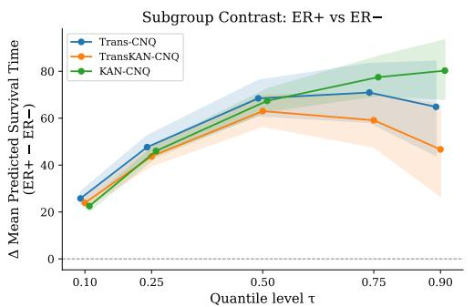  
(a) ER+ vs. ER−

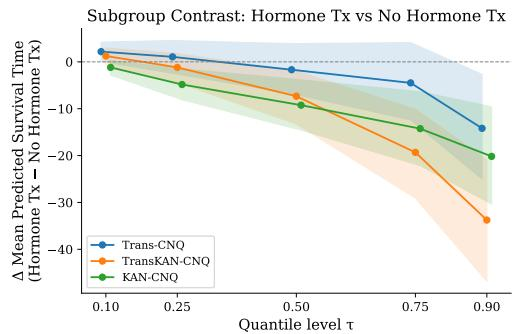  
(b) Hormone therapy vs. none  
FIG 4. Clinically defined group contrasts $\Delta ( \tau )$ for METABRIC with 95% bootstrap bands. Non-constant profiles indicate distributional heterogeneity beyond a single proportional-hazards summary.

7.4.2. Clinically Defined Group Contrasts. We next examine how the predicted survival distribution shifts across clinically defined patient groups. For each binary grouping variable, we compute $\Delta ( \tau ) = \bar { q } _ { \tau } ^ { \mathrm { g r o u p _ { 1 } } } - \bar { q } _ { \tau } ^ { \mathrm { g r o u p _ { 0 } } }$ , the difference in mean predicted τ-quantiles between the two groups, averaged over 25 seeds. We report 95% bootstrap confidence bands based on 1,000 resamples of the seed-level summaries. Because METABRIC is an observational cohort, these contrasts are descriptive rather than causal; their value lies in revealing where along the survival distribution the prognostic separation between groups is most pronounced. They are exploratory: the bands are pointwise, the contrasts were not prespecified, and no multiplicity adjustment is made.

ER+ vs. ER− (Figure 4a). All architectures consistently predict longer survival for ERpositive patients, with $\Delta ( \tau )$ increasing from approximately 22–26 months at $\tau = 0 . 1$ to 47– 80 months at $\tau = 0 . 9$ . This pronounced quantile dependence suggests that ER status is not merely associated with a global location shift in the survival distribution. Instead, the prognostic separation widens toward the upper tail, indicating that ER-negative disease is associated not only with earlier events but also with a substantially reduced long-term survival horizon (Blows et al., 2010; Broglio and Berry, 2009). Such a pattern is difficult to summarize adequately with a single hazard ratio.

Hormone therapy (Figure 4b). $\Delta ( \tau )$ is close to zero at the lower tail (approximately −1 to 2 months at $\tau = 0 . 1 )$ but becomes increasingly negative at higher quantiles (approximately −14 to −34 months at $\tau = 0 . 9 )$ . This pattern should not be interpreted as an adverse treatment effect. More plausibly, it reflects confounding by indication: patients selected for hormone therapy tend to have underlying disease characteristics associated with different long-term risk trajectories (Early Breast Cancer Trialists’ Collaborative Group, 2011). The value of the quantile-based view is that it makes this tail-specific separation explicit, rather than collapsing it into a single average contrast.

7.4.3. Representative Patient Profiles. Supplementary patient-profile materials present predicted quantile milestones for five representative METABRIC patients (seed 42, Trans-CNQ). These examples illustrate three clinically relevant uses of the model: distinguishing short-term risk among patients with similar medians, identifying patients with substantially different prognostic uncertainty, and assessing whether observed outcomes are compatible with the predicted survival distribution.

Similar median, different tail risk (A vs. B). Both patients have comparable medians $( \hat { q } _ { 0 . 5 } = 9 1 . 5 $ and 100.6 months), yet Patient A’s lower tail starts at $\hat { q } _ { 0 . 1 } = 2 8 . 3 \mathrm { v s } . 3 4 . 0$ months. Patient A (age 86) experienced an event at 41.8 months, within the predicted lower tail, while Patient B (age 69) survived to 119.5 months near the median. A single-point summary would treat these two patients as broadly similar, obscuring the clinically meaningful difference in short-term risk.

Similar median, different uncertainty (C vs. D). Patient C $( \hat { q } _ { 0 . 5 } = 1 0 2 . 7 , \mathrm { E R } + ,$ , age 78) has an interval width of 150.9 months, whereas Patient D $( \hat { q } _ { 0 . 5 } = 1 1 9 . 3 , \mathrm { E R - } , \mathrm { a g e } 5 8 )$ has a much wider interval of 267.9 months. This difference indicates materially greater prognostic uncertainty for Patient D, despite a somewhat longer median prediction, and could plausibly inform the intensity of follow-up or the degree of confidence attached to individual prognostic counseling.

Individual calibration (E). The observed event $( T = 1 0 0 . 3$ months) falls within 1% of $\hat { q } _ { 0 . 5 } = 9 9 . 8$ and well inside the predicted 80% interval $[ \hat { q } _ { 0 . 1 } , \hat { q } _ { 0 . 9 } ] = [ 3 4 . 0 , 1 9 2 . 4 ]$ , illustrating the plausibility of the individualized forecast on the original time scale. We likewise examined uncertainty stratification by prediction-interval width and found the expected monotone relationship between interval width, pinball loss, and empirical coverage; these supporting results are reported in the Supplementary Material to keep the main text focused on the primary clinical findings.

7.4.4. Event Projection. A clinically relevant downstream use of individualized survival distributions is event projection: given a calendar data cutoff s, how many cumulative events are expected by a horizon $t > s 2$ We compared a latent projection, a censoring-aware Trans-CNQ projection, and a parametric Weibull benchmark on the METABRIC test sets (seeds 41–65). All three overestimate the observed cumulative count at every cutoff. The censoringaware Trans-CNQ projection is the most stable, with errors of $+ 1 8 \mathrm { - } + 2 1 \%$ across cutoffs, whereas the Weibull benchmark is strongly horizon-dependent, overshooting by +63.8% when only 24 months of follow-up are available but reaching +6.9% at the 96-month cutoff. The Supplementary Material gives the projection setup, the full error table and the projection curves. The overestimation is not a tuning artifact but a structural consequence of the objective: censored observations enter it only through their weight, so nothing enforces $T _ { i } > C _ { i }$ and predicted event times are pulled early. A hybrid loss that adds a censoring-aware lowerbound penalty to the check loss is the natural remedy, which we leave to future work.

## 7.5. FLCHAIN.

7.5.1. Secondary Validation Findings. FLCHAIN serves as a secondary validation dataset: it tests whether the qualitative findings from METABRIC generalize to a very different clinical setting, and whether the architectures remain interpretively stable under substantially heavier censoring. Permutation feature importance (30 repeats per feature per seed, against 50 for the smaller METABRIC test set; heatmaps in the Supplementary Material) gives a coherent and clinically plausible ordering, with age dominating across all τ (peak $\Delta = 2 9 . 3$ at $\tau = 0 . 5 )$ , serum λ FLC second, and MGUS and sex negligible in the Transformer-based models.

Architectural divergence. KAN-CNQ instead assigns the largest importance to creatinine, whereas both Transformer-based models rank age first (creatinine: $\Delta \approx 4 5 . 5$ for KAN-CNQ vs. ≈ 2.5 for Trans-CNQ at $\tau = 0 . 5 )$ , despite comparable predictive accuracy. The disagreement reflects KAN’s learnable B-spline activations converging to different but equally accurate internal representations, a non-identifiability that leaves prediction intact while redistributing attribution across correlated covariates. For interpretation, this matters: agreement between the two Transformer variants does not by itself establish that an attribution is architecture-independent. Being able to visualize the learned spline components is therefore not the same as reproducing the same scientific conclusions across architectures.

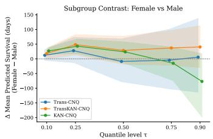  
(a) Female vs. Male

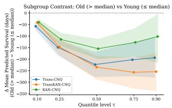  
(b) Old vs. Young

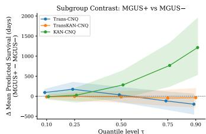  
(c) MGUS+ vs. MGUS−  
FIG 5. Clinically defined group contrasts $\Delta ( \tau )$ for FLCHAIN with 95% bootstrap bands. The three architectures agree closely on age (b) but not on sex (a) or MGUS (c); the MGUS bands are wide for all models because MGUS-positive subjects make up only about 1.5% ofeach test split.

7.5.2. Clinically Defined Group Contrasts. Figure 5 shows $\Delta ( \tau )$ for three clinically de fined group contrasts: sex, age (above vs. below the per-split median), and MGUS status. As in Section 7.4.2, these comparisons are exploratory and descriptive with pointwise bands, intended to summarize prognostic separation across the survival distribution rather than to support causal claims.

Sex (Figure 5a). TransKAN-CNQ shows modestly positive $\Delta ( \tau )$ for females (approximately 18–48 days longer), while Trans-CNQ hovers near zero (−9 to 28 days) with confidence bands overlapping zero at every τ . KAN-CNQ is positive at the lower quantiles but changes sign above $\tau = 0 . 5$ , reaching −77 days at $\tau = 0 . 9$ . The three architectures therefore agree neither on magnitude nor on direction, and no contrast separates from zero at any τ : sex carries little prognostic signal in this cohort once the remaining covariates are accounted for.

Age (Figure 5b). Older patients have markedly shorter predicted survival across the entire distribution, with $\Delta ( \tau )$ ranging from approximately −40 to −257 days and confidence bands excluding zero for all three architectures at every τ. This is the one contrast on which all three models agree in sign, magnitude, and shape. The separation is smallest at $\tau = 0 . 1$ and widens from $\tau = 0 . 2 5$ onward, indicating that age compresses the central and upper survival range rather than merely shifting the lower tail.

MGUS (Figure 5c). Trans-CNQ reveals a crossover pattern: MGUS-positive patients have longer predicted survival at lower quantiles $( \Delta \approx + 9 3$ to +174 days at $\tau = 0 . 1 \ – 0 . 2 5 )$ ) but shorter predicted survival at upper quantiles $( \Delta \approx - 1 1 6$ to −198 days at $\tau = 0 . 7 5 \substack { - 0 . 9 ) }$ ). The other two architectures do not reproduce this shape: TransKAN-CNQ stays close to zero throughout (−45 to −6 days, with bands covering zero at every τ), while KAN-CNQ increases monotonically to +1,214 days at $\tau = 0 . 9$ . MGUS-positive subjects constitute only about 1.5% of each test split (roughly 24 patients), so all three contrasts rest on a very small group and their bands are correspondingly wide. We regard the MGUS contrast as inconclusive, and report it to illustrate that quantile-level contrasts inherit the sampling limitations of the subgroup defining them.

Representative patient profiles and uncertainty stratification for FLCHAIN reproduce the METABRIC findings of Section 7.4.3; the figures and tables are in the Supplementary Material.

8. Discussion. The proposed CNQ framework attained the lowest IPCW pinball loss on every cohort, with interval calibration matching DeepQuantreg and bettering the hazard- and tree-based competitors.

METABRIC and FLCHAIN differ in clinical context, size and censoring, so agreement between them is replication rather than repetition. Returning to the questions in Section 2.2: (Q1) the monotone parameterization yields non-crossing individualized five-quantile milestones, and interval width behaves as an internal indicator of predictive difficulty, increasing monotonically with both pinball loss and empirical coverage. (Q2) quantile-specific importance and group contrasts reveal covariate effects that vary materially across the survival distribution—the METABRIC ER contrast widens steadily from the lower to the upper tail, and the FLCHAIN age contrast is separated from zero by all three architectures at every τ— heterogeneity that a single hazard ratio would obscure. (Q3) the Transformer-based variants remained the most accurate methods even on the small or heavily censored cohorts (GBSG-500, NKI70), although the larger cross-split variability warrants caution for individual-level predictions in data-limited regimes.

On the theoretical side, the rates are model-family upper bounds subject to the scope conditions of Remark 4.4, and every bound deteriorates as $G _ { \star }$ decreases.

Empirically, feature attributions were architecture-dependent even where predictive accuracy was not, so we recommend comparing attributions across backbones rather than relying on one. Finally, the real-data subgroup and feature-importance analyses are descriptive and hypothesis-generating rather than causal, and should be confirmed in purpose-designed studies.

Future work falls into two directions. On the applied side, the framework extends naturally to competing risks and to time-dependent or longitudinally measured covariates, and censoring-aware training objectives that use lower-bound information directly should improve far-tail calibration and event projection. On the theoretical side, bounds for the fitted TransKAN-CNQ architecture, and for cubic-spline EfficientKAN without the degree-p realization used here, remain open.

Acknowledgments. Corresponding authors: Zhe Qu (zhe.qu@servier.com), and Hongtu Zhu (htzhu@email.unc.edu).

This work was carried out in part during S. Huang’s internship at Servier Pharmaceuticals, whose support is gratefully acknowledged.

## APPENDIX A: SUPPLEMENTARY DATASET DIAGNOSTICS

A.1. Data provenance and availability. All six cohorts are public. We use previously preprocessed versions rather than the raw sources, so the sample sizes and covariate counts reported in the main text refer to those versions and need not match the original publications. METABRIC, GBSG and SUPPORT are taken from the pycox distribution (Kvamme, Borgan and Scheel, 2019), which redistributes the preprocessing of Katzman et al. (2018); GBSG-500 is a random 500-subject subsample of GBSG drawn once and held fixed across seeds. FLCHAIN is obtained from the flchain dataset of the R survival package (Dispenzieri et al., 2012). NKI70 is obtained from the nki70 dataset of the R penalized package (Van De Vijver et al., 2002); we retain age, estrogen-receptor status and six genes of the 70-gene signature (NUSAP1, FGF18, ZNF533, COL4A2, CDCA7, MCM6), all standardized. Subjects with missing covariates are excluded and, following the training pipeline, the few records with zero observed duration are dropped. The scripts that build the 25 seeded train/validation/test partitions are released with the implementation, so the exact splits underlying every reported number can be regenerated.

Before turning to the modeling results, Figure 6 documents the marginal survival behavior of the six real-data cohorts used throughout the paper. Each panel shows the Kaplan–Meier estimate of the marginal survival function ${ \widehat { S } } ( t ) = \mathbb { P } ( T > t )$ together with pointwise 95% confidence bands, so that the overall event rate, the speed of early decline, and the length of the right tail can be read off directly for each dataset. The six cohorts are deliberately heterogeneous: they range from the small, heavily censored NKI70 study $( n = 1 4 4 , 6 7 \%$ censoring) to the large SUPPORT cohort $( n = 8 , 8 7 3 , \approx 3 2 \%$ censoring) and the large, heavily censored FLCHAIN cohort (n = 7,874, ≈ 72% censoring), and they span oncology trials, genomic prognostic studies, and a population-based cohort. This spread of sample sizes, censoring proportions, and survival shapes is what allows the real-data benchmark to stress-test distributional prediction across a broad range of operating conditions; the curves in Figure 6 provide the unconditional reference against which the conditional, covariate-dependent quantile predictions of the proposed models are evaluated in the remainder of this supplement.

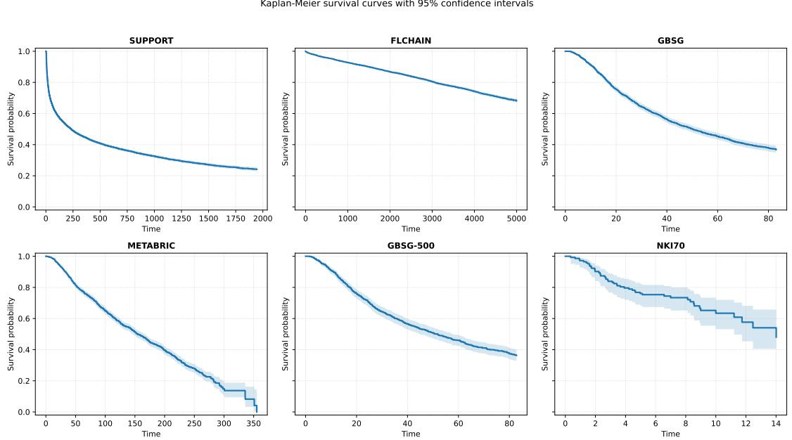

Figure 6. Kaplan–Meier survival curves with pointwise 95% confidence intervals (Greenwood’s formula, shaded bands) for the six real-data cohorts analyzed in the paper—GBSG, GBSG-500, METABRIC, SUPPORT, NKI70, and FLCHAIN. In each panel the horizontal axis is the followup time (in the native time unit of the cohort) and the vertical axis is the estimated marginal survival probability ${ \widehat { S } } ( t ) = \mathbb { P } ( T > t )$ , with the number-at-risk declining as events accrue and subjects are censored. The panels illustrate the wide range of operating conditions used to evaluate the methods: cohort sizes span n = 144 (NKI70) to n = 8,873 (SUPPORT), censoring proportions range from about 32% (SUPPORT) to 72% (FLCHAIN), and the curves differ markedly in their overall event rate, the steepness of early decline, and the length of the right tail. These marginal descriptives provide the baseline against which the conditional, covariate-dependent quantile predictions of the proposed models are assessed.

## APPENDIX B: TECHNICAL RESULT

LEMMA B.1 (IPCW identity for the marginal Kaplan–Meier weight). Assume $( T , X ) \bot$ C. Let $Y = \operatorname* { m i n } ( T , C ) , \delta = \mathbb { I } \{ T \leq C \} , G ( t ) = \mathbb { P } ( C > t )$ , and $G ( t ^ { - } ) = \mathbb { P } ( C \geq t )$ . Assume $G ( T ^ { - } ) > 0$ almost surely. For every measurable a(X) and $\tau \in ( 0 , 1 )$ such that $\rho _ { \tau } \{ \log T -$ $a ( X ) \}$ is integrable,

$$
\mathbb { E } \bigg [ \frac { \delta } { G ( Y ^ { - } ) } \rho _ { \tau } \{ \log Y - a ( X ) \} \bigg ] = \mathbb { E } [ \rho _ { \tau } \{ \log T - a ( X ) \} ] .
$$

PROOF. On $\{ \delta = 1 \} , Y = T$ . Conditioning on $( T , X )$ and using $( T , X ) \bot C$ gives

$$
\begin{array} { r l } & { \mathbb { E } \left[ \left. \frac { \delta } { G \left( Y ^ { - } \right) } \rho _ { \tau } \{ \log { Y } - a ( X ) \} \right| T , X \right] = \frac { \rho _ { \tau } \{ \log { T } - a ( X ) \} } { G \left( T ^ { - } \right) } \mathbb { P } ( C \geq T | T , X ) } \\ & { \qquad = \rho _ { \tau } \{ \log { T } - a ( X ) \} . } \end{array}
$$

Taking expectations proves the claim. The left limit is essential here: with the convention $G ( t ) = \mathbb { P } ( C > t )$ , one has $G ( t ^ { - } ) = \mathbb { P } ( C \geq t )$ □

## APPENDIX C: PROOF OF THEOREM 4.1

Write $P _ { N }$ for the empirical measure and abbreviate

$$
\ell _ { f } ( v , x ) = \frac { 1 } { K } \sum _ { k = 1 } ^ { K } \rho _ { \tau _ { k } } \left\{ v - f _ { k } ( x ) \right\} , \qquad q _ { f } ( v , x ) = \ell _ { f } ( v , x ) - \ell _ { f _ { N } ^ { \star } } ( v , x ) .
$$

The check loss is one-Lipschitz in its prediction argument. Hence

$$
| q _ { f } ( v , x ) | \leq { \frac { 1 } { K } } \sum _ { k = 1 } ^ { K } | f _ { k } ( x ) - f _ { N , k } ^ { \star } ( x ) | \leq 2 M _ { f } .\tag{12}
$$

Define the true-weight and plug-in centered losses

$$
h _ { f } ( O ) = { \frac { \delta } { G ( Y ^ { - } ) } } q _ { f } ( W , X ) , \qquad { \widehat { h } } _ { f } ( O ) = { \frac { \delta } { { \widehat { G } } ( Y ^ { - } ) } } q _ { f } ( W , X ) .
$$

Both ratios are defined as zero on $\{ \delta = 0 \}$ . Lemma B.1 gives

$$
P h _ { f } = L ( f ) - L ( f _ { N } ^ { \star } ) = R _ { \mathcal { F } _ { N } } ( f ) .\tag{13}
$$

Step 1: ERM and the estimated censoring weights. Because ${ \widehat { f } } _ { N }$ minimizes $\widehat { L } _ { N } , P _ { N } \widehat { h } _ { \widehat { f } _ { N } } \leq 0$ On the event $\Delta _ { N } \leq G _ { \star } / 2$ , equations (12)–(13) therefore imply

$$
\begin{array} { l } { \displaystyle { R _ { \mathcal { F } _ { N } } \big ( \widehat { f } _ { N } \big ) = ( P - P _ { N } ) h _ { \widehat { f } _ { N } } + P _ { N } \big ( h _ { \widehat { f } _ { N } } - \widehat { h } _ { \widehat { f } _ { N } } \big ) + P _ { N } \widehat { h } _ { \widehat { f } _ { N } } } } \\ { \displaystyle { \quad \leq \operatorname* { s u p } _ { f \in \mathcal { F } _ { N } } ( P - P _ { N } ) h _ { f } + \frac { 2 M _ { f } \Delta _ { N } } { G _ { \star } \big ( G _ { \star } - \Delta _ { N } \big ) } } } \end{array}\tag{14}
$$

$$
\leq \operatorname* { s u p } _ { f \in \mathcal { F } _ { N } } ( P - P _ { N } ) h _ { f } + \frac { 4 M _ { f } \Delta _ { N } } { G _ { \star } ^ { 2 } } .
$$

Step 2: empirical $L _ { 2 }$ contraction. For $f , g \in \mathcal { F } _ { N }$ , Cauchy–Schwarz over the K outputs gives

$$
\begin{array} { r } { \left\{ \displaystyle \sum _ { i = 1 } ^ { N } \displaystyle \lvert h _ { f } ( O _ { i } ) - h _ { g } ( O _ { i } ) \rvert ^ { 2 } \right\} ^ { 1 / 2 } \le \displaystyle \frac { 1 } { G _ { \star } } \left[ \displaystyle \sum _ { i = 1 } ^ { N } \left\{ \displaystyle \frac { 1 } { K } \sum _ { k = 1 } ^ { K } \displaystyle \lvert f _ { k } ( X _ { i } ) - g _ { k } ( X _ { i } ) \rvert \right\} ^ { 2 } \right] ^ { 1 / 2 } } \\ { \le \displaystyle \frac { 1 } { G _ { \star } \sqrt { K } } \left\{ \displaystyle \sum _ { i = 1 } ^ { N } \displaystyle \sum _ { k = 1 } ^ { K } \displaystyle \lvert f _ { k } ( X _ { i } ) - g _ { k } ( X _ { i } ) \rvert ^ { 2 } \right\} ^ { 1 / 2 } . } \end{array}\tag{15}
$$

Consequently, if ${ \mathcal { H } } _ { N } ( O _ { 1 : N } ) = \{ ( h _ { f } ( O _ { i } ) ) _ { i = 1 } ^ { N } : f \in { \mathcal { F } } _ { N } \}$ , then

$$
\log N \{ \mathcal { H } _ { N } ( O _ { 1 : N } ) , \Vert \cdot \Vert _ { 2 } , u \} \leq \frac { A _ { N } } { K G _ { \star } ^ { 2 } u ^ { 2 } } .\tag{16}
$$

This is the point at which the empirical Frobenius covering result of Zhang and Zhou (2024) enters; no population-to-supremum-norm conversion is required.

Step 3: entropy integral. Conditional on the observations, Dudley’s truncated entropy integral, in the form used in Lemmas 2–3 of Zhang and Zhou (2024), and (16) yield

$$
\begin{array} { r l r } {  { \widehat { \mathfrak { R } } _ { N } ( \mathcal { H } _ { N } ) \le \operatorname* { i n f } _ { 0 < a \le 2 M _ { f } \sqrt { N } / G _ { \star } } [ \frac { 4 a } { \sqrt { N } } + \frac { 1 2 } { N } \int _ { a } ^ { 2 M _ { f } \sqrt { N } / G _ { \star } } \sqrt { \frac { A _ { N } } { K G _ { \star } ^ { 2 } u ^ { 2 } } } d u ] } } \\ & { } & { \le C \frac { \sqrt { A _ { N } } } { G _ { \star } \sqrt { K } N } \{ 1 + \log _ { + } ( \frac { M _ { f } \sqrt { K } N } { \sqrt { A _ { N } } } ) \} . } \end{array}\tag{17}
$$

For $a _ { 0 } = \sqrt { A _ { N } } / ( G _ { \star } \sqrt { K N } )$ , use $a = a _ { 0 }$ when $a _ { 0 } \leq 2 M _ { f } \sqrt { N } / G _ { \star }$ . In the complementary case the trivial bound $\widehat { \mathfrak { R } } _ { N } ( \mathcal { H } _ { N } ) \leq 2 M _ { f } / G ,$ is no larger than a universal multiple of the righthand side of (17). Here and below C denotes a universal constant whose value may change from line to line. Symmetrization and the standard bounded empirical process concentration inequality, using $| h _ { f } | \leq 2 M _ { f } / G _ { \star }$ , give, with probability at least $1 - c e ^ { - \eta }$

$$
\begin{array} { r l r } & { } & { \underset { f \in \mathcal { F } _ { N } } { \operatorname* { s u p } } ( P - P _ { N } ) h _ { f } \leq C \bigg [ \frac { \sqrt { A _ { N } } } { G _ { \star } \sqrt { K } N } \left\{ 1 + \log _ { + } \left( \frac { M _ { f } \sqrt { K } N } { \sqrt { A _ { N } } } \right) \right\} } \\ & { } & { \quad + \frac { M _ { f } } { G _ { \star } } \left\{ \sqrt { \frac { \eta + 1 } { N } } + \frac { \eta + 1 } { N } \right\} \bigg ] . } \end{array}\tag{18}
$$

Step 4: conclusion. Intersect the event in (18) with the Kaplan–Meier event in (A2), substitute $\Delta _ { N } \leq \kappa _ { N } ( \eta )$ into (14), and absorb numerical constants into C. This is exactly the bound in Theorem 4.1, with failure probability at most $( c + c _ { G } ) e ^ { - \eta }$

For completeness, the DKW–Kaplan–Meier inequality of Bitouzé, Laurent and Massart (1999), also quoted in Goldberg (2019), states on a fixed identifiable time range [0, τ ],

$$
\mathbb { P } \bigg [ \sqrt { N } S _ { \tau } \operatorname* { s u p } _ { 0 < t \leq \tau } | \widehat { G } ( t ^ { - } ) - G ( t ^ { - } ) | \geq \sqrt { \eta / 2 } + D _ { o } / 2 \bigg ] \leq \frac { 5 } { 2 } e ^ { - \eta } ,
$$

where $S _ { \tau } = \mathbb { P } ( T \geq \tau )$ . Thus the abstract quantity $\kappa _ { N } ( \eta )$ in (A2) has the asserted $N ^ { - 1 / 2 }$ order whenever the targeted event-time range lies inside such an identifiable interval and $S _ { \tau }$ is bounded away from zero. It does not by itself verify (A2) over an entire unbounded support, nor at a bounded terminal point with $S _ { \tau } = 0$ . Accordingly, no verification of (A2) over the full continuous event-time support is claimed here.

## APPENDIX D: COMPLEXITY-INDEXED ARCHITECTURE BOUNDS AND APPROXIMATION RATES

This section retains architecture complexity before choosing a sample-size-dependent sieve and then bounds approximation and estimation error inside the same class. Throughout, $q = ( q _ { 1 } , \dots , q _ { K } )$ denotes the true conditional log-time quantile vector and Φ is the softplus– cumulative-sum map in the main text. The covariate dimension p and number of target quantiles K are held fixed as the sieve index and sample size vary. Its Jacobian satisfies

$$
\| \Phi ( r ) - \Phi ( \widetilde { r } ) \| _ { 2 } \le L _ { \Phi } \| r - \widetilde { r } \| _ { 2 } , \qquad L _ { \Phi } \le \{ K ( K + 1 ) / 2 \} ^ { 1 / 2 } .\tag{19}
$$

Because check loss is one-Lipschitz in its prediction argument,

$$
0 \leq L ( f ) - L ( q ) \leq { \frac { 1 } { K } } \mathbb { E } \| f ( X ) - q ( X ) \| _ { 1 } \leq K ^ { - 1 / 2 } \{ \mathbb { E } \| f ( X ) - q ( X ) \| _ { 2 } ^ { 2 } \} ^ { 1 / 2 } .\tag{20}
$$

D.1. KAN: arbitrary complexity. Let

$$
s _ { \mathrm { K A N } } = \{ L , ( d _ { \ell } ) , ( p _ { \ell } ) , ( B _ { \ell } , c _ { \ell } , C _ { \ell } , \rho _ { \ell } ) _ { \ell \leq L } \}
$$

collect the depth, widths, basis counts, coefficient budgets, basis Lipschitz bounds, layer offsets, and layer Lipschitz constants of a basis-expansion KAN; include the affine K-output head as its final layer. Write $\widetilde { d } ( s ) = \operatorname* { m a x } _ { \ell } d _ { \ell } , \widetilde { p } ( s ) = \operatorname* { m a x } _ { \ell } p _ { \ell } .$ and $C ( s ) = \operatorname* { m a x } _ { \ell } C _ { \ell }$ . For this subsection, set $\bar { \rho } _ { \ell } = 1 \vee \rho _ { \ell }$ and evaluate (21)–(23) with $\bar { \rho } _ { \ell }$ in place of $\rho _ { \ell } ;$ this only increases $\alpha _ { i , N } ( s )$ . Writing $R _ { 0 } = D _ { N }$ and $R _ { \ell } = C ( s ) + \bar { \rho } _ { \ell } R _ { \ell - 1 }$ , we have $R _ { \ell } \geq R _ { \ell - 1 }$ . The basis-function Lipschitz step is therefore bounded by $c _ { \ell } R _ { \ell - 1 } \leq c _ { \ell } R _ { \ell }$ , which validates the possibly enlarged coefficient used below. For a realized design with $\| \mathbf { X } \| _ { F } \leq D _ { N }$ , define

$$
\begin{array} { l } { { \displaystyle { \widetilde { \alpha } } _ { N } ( s ) = \sum _ { i = 1 } ^ { L } \alpha _ { i , N } ( s ) } , \ ~ } \\ { { \displaystyle \alpha _ { i , N } ( s ) = B _ { i } ^ { 2 / 3 } c _ { i } ^ { 2 / 3 } \left( \prod _ { j = i + 1 } ^ { L } \rho _ { j } \right) ^ { 2 / 3 } \left\{ C ( s ) \sum _ { j = 0 } ^ { i - 1 } \prod _ { k = i - j + 1 } ^ { i } \rho _ { k } + D _ { N } \prod _ { k = 1 } ^ { i } \rho _ { k } \right\} ^ { 2 / 3 } } , \ } \end{array}\tag{21}
$$

$$
\mathfrak { E } _ { N } ^ { \mathrm { K A N } } ( s ) = L _ { \Phi } ^ { 2 } \widetilde { \alpha } _ { N } ( s ) ^ { 3 } \log \{ 2 \widetilde { d } ( s ) \widetilde { p } ( s ) \} .\tag{22}
$$

Empty products equal one.

COROLLARY D.1 (KAN oracle bound at arbitrary complexity). Let $s = s _ { N }$ be any deterministic architecture-and-budget sequence satisfying Assumptions 1–2 ofZhang and Zhou (2024). Suppose $\| X _ { i } \| _ { 2 } \leq B _ { X }$ almost surely, take $D _ { N } = B _ { X } \sqrt { N }$ , and intersect the corresponding non-crossing class with ma $\mathrm { x } _ { k } \| f _ { k } \| _ { \infty } \leq M _ { f }$ . Under $( A I ) – ( A 2 )$ and $\kappa _ { \boldsymbol { N } } ( \eta ) =$ $O ( N ^ { - 1 / 2 } )$ atfixed confidence,

$$
R \mathcal { F } _ { s } \left( \widehat { f } _ { N , s } \right) = O _ { \mathbb { P } } \left[ \frac { \sqrt { \mathfrak { E } _ { N } ^ { \mathrm { K A N } } ( s ) } } { N } \left\{ 1 + \log _ { + } \left( \frac { M _ { f } \sqrt { K } N } { \sqrt { \mathfrak { E } _ { N } ^ { \mathrm { K A N } } ( s ) } } \right) \right\} + \frac { 1 } { \sqrt { N } } \right] .\tag{23}
$$

If s is fixed, then ${ \mathfrak { E } } _ { N } ^ { \mathrm { K A N } } ( s ) = { O } ( N )$ and the rate reduces to $O _ { \mathbb { P } } ( \log N / \sqrt { N } )$

PROOF. Theorem 1 of Zhang and Zhou (2024) gives the empirical Frobenius covering coefficient $\widetilde { \alpha } _ { N } ( s ) ^ { 3 } \log \{ 2 \widetilde { d } ( s ) \widetilde { p } ( s ) \}$ for the raw KAN output matrix. Equation (19) multiplies it by $L _ { \Phi } ^ { 2 }$ , so Theorem 4.1 gives (23). For fixed s, every brace in (21) is $O ( { \sqrt { N } } )$ . Hence $\alpha _ { i , N } = O ( N ^ { 1 / 3 } ) , \widetilde { \alpha } _ { N } = O ( N ^ { 1 / 3 } )$ , and ${ \mathfrak { E } } _ { N } ^ { \mathrm { K A N } } = O ( N )$ □

REMARK D.2. Widths, basis counts, and budgets may depend on N in Corollary D.1, but their dependence must remain in (21)–(23). In particular, the fixed-class order ${ \mathfrak { E } } _ { N } ^ { \mathrm { K A N } } = O ( N )$ cannot be inserted after choosing a growing spline resolution.

D.2. KAN: approximation and a matched growing sieve. Assume $X \in [ 0 , 1 ] ^ { p }$ , and, for some $\beta > 0 , B _ { q } < \infty$ , and $\gamma > 0$

$$
\operatorname* { m a x } _ { k \leq K } \| q _ { k } \| _ { C ^ { \beta } ( [ 0 , 1 ] ^ { p } ) } \leq B _ { q } , \qquad \operatorname* { i n f } _ { x } \{ q _ { k } ( x ) - q _ { k - 1 } ( x ) \} \geq \gamma , \quad k \geq 2 .\tag{24}
$$

Define the raw target

$$
r _ { 1 } ^ { \circ } = q _ { 1 } , \qquad r _ { k } ^ { \circ } = \log \{ \exp ( q _ { k } - q _ { k - 1 } ) - 1 \} , \quad k \geq 2 .\tag{25}
$$

The positive gap and the standard Hölder composition inequality imply ma $\mathrm { x } _ { k } \| r _ { k } ^ { \circ } \| _ { C ^ { \beta } } \leq C _ { r }$ Let $\{ B _ { \nu , J } \} _ { \nu \in \mathbb { Z } . }$ be a degree-m B-spline basis on a quasi-uniform J-cell partition, where $m \geq 2$ and $\beta \leq m + 1$ , and put $M _ { J } = | \mathcal { T } _ { J } | = J + O ( 1 )$ . A stable tensor-product quasiinterpolant gives coefficients, uniformly bounded in $J ,$ , such that

$$
r _ { k , J } ( x ) = \sum _ { \nu \in \mathcal { I } _ { J } ^ { p } } c _ { k , \nu , J } \prod _ { j = 1 } ^ { p } B _ { \nu _ { j } , J } ( x _ { j } ) ,\tag{26}
$$

$$
\operatorname* { m a x } _ { k \leq K } \| r _ { k , J } - r _ { k } ^ { \circ } \| _ { \infty } \leq C J ^ { - \beta } ;
$$

see Schumaker (2007).

LEMMA D.3 (Two-layer spline-KAN realization). Suppose the second KAN layer has a fixed edge dictionary whose span contains $t \mapsto t ^ { p }$ on the bounded node range; a fixedgrid B-spline space of degree at least p suffices. Then $r _ { J }$ in (26) has an exact two-layer KAN realization with hidden width $K 2 ^ { \hat { p } } M _ { . } ^ { \hat { p } - 1 } = O ( J ^ { p - 1 } )$ ). If every edge coefficient of this architecture isfree, thefull dense class has ${ \bf \bar { \cal P } } _ { J } = { \cal O } ( J ^ { p } )$ scalar coefficients.

PROOF. For $\pmb { \nu } _ { - p } = ( \nu _ { 1 } , \dots , \nu _ { p - 1 } )$ , write

$$
u _ { k , \nu _ { - p } , j } ( t ) = B _ { \nu _ { j } , J } ( t ) , \quad j < p , \qquad u _ { k , \nu _ { - p } , p } ( t ) = \sum _ { \nu _ { p } } c _ { k , ( \nu _ { - p } , \nu _ { p } ) , J } B _ { \nu _ { p } , J } ( t ) .
$$

Then ${ r } _ { k , J }$ is the sum over $\begin{array} { r } { \pmb { \nu } _ { - p } \operatorname { o f } \prod _ { j = 1 } ^ { p } u _ { k , \pmb { \nu } _ { - p } , j } ( x _ { j } ) } \end{array}$ . The polarization identity

$$
\prod _ { j = 1 } ^ { p } u _ { j } = \frac { 1 } { 2 ^ { p } p ! } \sum _ { \epsilon \in \{ - 1 , 1 \} ^ { p } } \left( \prod _ { j = 1 } ^ { p } \epsilon _ { j } \right) \left( \sum _ { j = 1 } ^ { p } \epsilon _ { j } u _ { j } \right) ^ { p }
$$

therefore gives the realization: a first-layer node computes each signed sum and a secondlayer edge applies a signed multiple of $t ^ { p } .$ . B-spline nonnegativity, partition of unity, and the coefficient bound in (26) keep all node ranges and required polynomial coefficients bounded independently of $J .$

The first layer has $p \{ K 2 ^ { p } M _ { J } ^ { p - 1 } \} O ( J ) = O ( J ^ { p } )$ free coefficients. The second has $O ( J ^ { p - 1 } )$ coefficients with a fixed polynomial dictionary, or $O ( J ^ { p } )$ if a common J-grid dictionary is used. Thus $P _ { J } = O ( J ^ { p } )$ □

For completeness, the next parameter cover applies to the full class, not only to the particular approximant. Write an L-layer fixed-dictionary KAN as

$$
z _ { \ell , j } = \sum _ { i = 1 } ^ { n _ { \ell - 1 } } \sum _ { a = 1 } ^ { q _ { \ell } } \theta _ { \ell , j , i , a } g _ { \ell , j , i , a } ( z _ { \ell - 1 , i } ) , \qquad | \theta _ { \ell , j , i , a } | \leq A _ { \ell } ,
$$

where $\| g _ { \ell , j , i , a } \| _ { \infty } \leq G _ { \ell }$ and $\mathrm { L i p } ( g _ { \ell , j , i , a } ) \leq H _ { \ell }$ on every reached range. Include the affine raw-output head as layer $L + 1$ , and define

$$
P = \sum _ { \ell = 1 } ^ { L } n _ { \ell - 1 } n _ { \ell } q _ { \ell } + K ( n _ { L } + 1 ) ,
$$

$$
\rho _ { \ell } = A _ { \ell } q _ { \ell } H _ { \ell } \sqrt { n _ { \ell - 1 } n _ { \ell } } ,
$$

$$
\begin{array} { r } { \lambda _ { \ell } = G _ { \ell } \sqrt { n _ { \ell - 1 } q _ { \ell } } , \quad \ell \le L , } \end{array}
$$

$$
\rho _ { L + 1 } = A _ { \mathrm { o u t } } \sqrt { K n _ { L } } ,
$$

$$
\lambda _ { L + 1 } = ( R _ { L } ^ { 2 } + 1 ) ^ { 1 / 2 } ,
$$

$$
{ \Lambda } _ { \mathrm { p a r } } = L _ { \Phi } \left\{ \sum _ { \ell = 1 } ^ { L + 1 } \lambda _ { \ell } ^ { 2 } \prod _ { r = \ell + 1 } ^ { L + 1 } \rho _ { r } ^ { 2 } \right\} ^ { 1 / 2 } ,\tag{27}
$$

$$
A _ { \operatorname* { m a x } } = \operatorname* { m a x } ( A _ { 1 } , \ldots , A _ { L } , A _ { \operatorname { o u t } } ) .
$$

LEMMA D.4 (Full coefficient-class cover). For every realized design and $u > 0$

$$
\log \mathcal { N } \{ \mathcal { F } ^ { \mathrm { d e n s e } } ( \mathbf { X } ) , \| \cdot \| _ { F } , u \} \leq P \log \left( 1 + \frac { 2 A _ { \operatorname* { m a x } } \sqrt { P } \Lambda _ { \operatorname* { p a r } } \sqrt { N } } { u } \right) .\tag{28}
$$

PROOF. Cauchy–Schwarz gives, at layer $\ell ,$

$$
\| \Psi _ { \ell } ( z ) - \Psi _ { \ell } ( z ^ { \prime } ) \| _ { 2 } \le \rho _ { \ell } \| z - z ^ { \prime } \| _ { 2 } , \qquad \| \Psi _ { \ell , \Theta } ( z ) - \Psi _ { \ell , { \widetilde { \Theta } } } ( z ) \| _ { 2 } \le \lambda _ { \ell } \| \Theta - { \widetilde { \Theta } } \| _ { F } .
$$

Telescoping through the layers, applying (19), and then using Cauchy–Schwarz across parameter blocks yields $\lVert f _ { \vartheta } ( x ) - f _ { \widetilde { \vartheta } } ( x ) \rVert _ { 2 } \leq \Lambda _ { \mathrm { p a r } } \lVert \vartheta - \widetilde { \vartheta } \rVert _ { 2 }$ . The parameter box lies in the radius- $A _ { \operatorname* { m a x } } \sqrt { P }$ Euclidean ball. A proper volume net with $\delta = u / ( \Lambda _ { \operatorname { p a r } } \sqrt { N } )$ proves (28). □

THEOREM D.5 (Excess-risk convergence rate for the KAN-CNQ estimator). Let $\mathcal { F } _ { J } ^ { \mathrm { K A N } }$ be the full fixed-grid class on the architecture in Lemma D.3, intersected with a fixed output envelope large enough to contain the approximant. Suppose all quantities in (27) grow at most polynomially in J. Under (24), $( A I ) – ( A 2 )$ , and $\kappa \dot { v ( \eta ) } = O ( \hat { N ^ { - 1 / 2 } } )$ atfixed confidence,

$$
L ( \widehat { f } _ { N , J } ) - L ( q ) = O _ { \mathbb { P } } \left\{ J ^ { - \beta } + \sqrt { \frac { J ^ { p } \log ( 2 J ) } { N } } + \frac { 1 } { \sqrt { N } } \right\} .\tag{29}
$$

Thus $J _ { N } \asymp \{ N /$ log $N \} ^ { { 1 } / ( { 2 \beta + p } ) }$ gives

$$
L ( \widehat { f } _ { N , J _ { N } } ) - L ( q ) = O _ { \mathbb { P } } \left[ \left\{ \frac { N } { \log N } \right\} ^ { - \beta / ( 2 \beta + p ) } \right] .
$$

PROOF. Equations (19), (20), and (26) give an approximation term $O ( J ^ { - \beta } )$

For estimation, we reuse Steps 1, 2, and 4 of the proof of Theorem 4.1, while recomputing Step 3 directly under the logarithmic entropy bound (28). After writing $u = \sqrt { N } t$ , its Dudley integral is bounded by

$$
C \sqrt { \frac { P _ { J } } { N } } \int _ { 0 } ^ { C M _ { f } } \sqrt { \log ( 1 + \Xi _ { J } / t ) } d t \leq C \sqrt { \frac { P _ { J } } { N } } \{ 1 + \sqrt { \log ( 2 + \Xi _ { J } ) } \} ,
$$

where $\Xi _ { J } = 2 A _ { \mathrm { m a x } , J } \sqrt { P _ { J } } \Lambda _ { \mathrm { p a r } , J }$ . Since $P _ { J } = O ( J ^ { p } )$ and $\Xi _ { J }$ is polynomial in $J ,$ this is $O \{ \sqrt { J ^ { p } \log ( 2 J ) / N } \}$ . Adding the $O _ { \mathbb { P } } ( N ^ { - 1 / 2 } )$ Kaplan–Meier and concentration terms proves (29); balancing the first two terms gives the stated choice of $J _ { N }$ □

D.3. Complete deterministic Trans-CNQ entropy. There are $p$ scalar-feature tokens, model width d, feedforward width m, H heads with $H \mid d$ and $d _ { h } = d / H$ , L encoder layers, flattened readout width r, and K raw outputs. For an affine map $a ( z ) = W z + b = \bar { W } \bar { z }$ impose

$$
\| \bar { \boldsymbol { W } } \| _ { \mathrm { o p } } \le B _ { a } , \qquad \| \bar { \boldsymbol { W } } ^ { \top } \| _ { 2 , 1 } \le S _ { a } , \qquad \bar { \boldsymbol { z } } = ( \boldsymbol { z } ^ { \top } , 1 ) ^ { \top } .\tag{30}
$$

The constants may be layer-specific. Standard affine LayerNorm is

$$
P _ { d } = I _ { d } - d ^ { - 1 } { \bf 1 1 } ^ { \top } , \qquad \nu _ { \epsilon } ( z ) = \frac { P _ { d } z } { \{ d ^ { - 1 } \| P _ { d } z \| _ { 2 } ^ { 2 } + \epsilon _ { \mathrm { L N } } \} ^ { 1 / 2 } } ,\tag{31}
$$

$$
\mathrm { L N } _ { \gamma , \beta } ( z ) = \gamma \odot \nu _ { \epsilon } ( z ) + \beta ,
$$

$$
\epsilon _ { \mathrm { L N } } > 0 , \| \gamma \| _ { \infty } \leq G _ { \infty } , \| \gamma \| _ { 2 } \leq G _ { 2 }
$$

$$
\| \beta \| _ { 2 } \le B _ { \beta }
$$

Let $E _ { \mathrm { s h } } : \mathbb { R } \to \mathbb { R } ^ { d }$ be the shared affine embedding and $P \in \mathbb { R } ^ { p \times d }$ the fixed sinusoidal encoding. The initial matrix and each post-LayerNorm encoder layer are

$$
\begin{array} { r l } & { Z _ { 0 } = \mathrm { L N } _ { 0 } \{ E _ { \mathrm { s h } } ( x ) + P \} , } \\ & { U _ { \ell } = \mathrm { L N } _ { \ell 1 } \{ Z _ { \ell - 1 } + \mathrm { A t t } _ { \ell } ( Z _ { \ell - 1 } ) \} , } \\ & { Z _ { \ell } = \mathrm { L N } _ { \ell 2 } \{ U _ { \ell } + \mathrm { F F } _ { \ell } ( U _ { \ell } ) \} , \qquad \mathrm { F F } _ { \ell } ( u ) = W _ { \ell 2 } \mathrm { R e L U } ( W _ { \ell 1 } u + b _ { \ell 1 } ) + b _ { \ell 2 } . } \end{array}\tag{32}
$$

For head h, use augmented inputs to include query and key biases and set

$$
A _ { \ell h } = \bar { W } _ { K , \ell h } ^ { \top } \bar { W } _ { Q , \ell h } / \sqrt { d _ { h } } , \qquad \| A _ { \ell h } \| _ { \mathrm { o p } } \leq B _ { A , \ell h } , \quad \| A _ { \ell h } ^ { \top } \| _ { 2 , 1 } \leq S _ { A , \ell h } .
$$

In the covering arguments, $A _ { \ell h }$ is treated as the effective query–key parameter, with its admissible set restricted to products attainable by the factorized query and key maps; the attention output depends on those maps only through $A _ { \ell h }$ . The usual row-softmax head uses scores $\bar { z } _ { s } ^ { \top } \bar { A } _ { \ell h } \bar { z } _ { t }$ , affine values $\bar { V } _ { \ell h } \bar { z } _ { s }$ , concatenates the H heads, and applies an affine output projection. Finally,

$$
g ( x ) = \mathrm { R e L U } \{ W _ { \mathrm { f l a t } } \mathrm { v e c } ( Z _ { L } ) + b _ { \mathrm { f l a t } } \} \in \mathbb { R } ^ { r } , \quad r ( x ) = W _ { \mathrm { o u t } } g ( x ) + b _ { \mathrm { o u t } } , \quad f ( x ) = \Phi \{ r ( x ) \} .\tag{33}
$$

This is the evaluation-time predictor; all dropout maps are then the identity.

We record the component bounds used in the recursion. $\operatorname { I f } \| { \bar { z } } \| _ { 2 } \leq R ,$ , a proper volume net in the affine parameter set gives

$$
\log \mathcal { N } _ { \infty } ( \{ z \mapsto \bar { W } \bar { z } \} , \eta ) \leq \frac { 4 d _ { \mathrm { o u t } } ( d _ { \mathrm { i n } } + 1 ) S _ { a } ^ { 2 } R ^ { 2 } } { \eta ^ { 2 } } .\tag{34}
$$

The bound is independent of the number of evaluation points. For LayerNorm, differentiation of $u \mapsto u / \{ d ^ { - 1 } \| \hat { u } \| _ { 2 } ^ { 2 } + \epsilon _ { \mathrm { L N } } \} ^ { 1 / 2 }$ gives

$$
\| \mathrm { L N } ( z ) - \mathrm { L N } ( z ^ { \prime } ) \| _ { 2 } \leq L _ { \mathrm { L N } } \| z - z ^ { \prime } \| _ { 2 } , \qquad L _ { \mathrm { L N } } = G _ { \infty } / \sqrt { \epsilon _ { \mathrm { L N } } } ,
$$

$$
\| \mathrm { L N } ( z ) \| _ { 2 } \le R _ { \mathrm { L N } } : = G _ { \infty } \sqrt { d } + B _ { \beta } ,\tag{35}
$$

$$
\log N _ { \infty } ( \{ \mathrm { L N } _ { \gamma , \beta } \} , \eta ) \leq C _ { \mathrm { L N } } / \eta ^ { 2 } , \qquad C _ { \mathrm { L N } } = 8 d ( \sqrt { d } G _ { 2 } + B _ { \beta } ) ^ { 2 } .
$$

The last line follows by proper Euclidean volume covers formed from maximal separated subsets of the admissible $\gamma \mathrm { - }$ and $\beta .$ -sets, using $\| ( \gamma - \widetilde { \gamma } ) \odot \nu _ { \epsilon } ( z ) \| _ { 2 } \le \sqrt { d } \| \gamma - \widetilde { \gamma } \| _ { 2 }$

For an FFN evaluated on rows of norm at most $R ,$ put

$$
\bar { R } = ( R ^ { 2 } + 1 ) ^ { 1 / 2 } , \quad R _ { 1 } = B _ { 1 } \bar { R } , \quad \bar { R } _ { 1 } = ( R _ { 1 } ^ { 2 } + 1 ) ^ { 1 / 2 } , \quad c _ { 1 } = 4 m ( d + 1 ) , \quad c _ { 2 } = 4 d ( m + 1 ) .
$$

Two applications of (34), ReLU nonexpansiveness, and optimal allocation of the two approximation accuracies give

$$
C _ { \mathrm { F F } } ( R ) = \left[ c _ { 1 } ^ { 1 / 3 } ( B _ { 2 } S _ { 1 } \bar { R } ) ^ { 2 / 3 } + c _ { 2 } ^ { 1 / 3 } ( S _ { 2 } \bar { R } _ { 1 } ) ^ { 2 / 3 } \right] ^ { 3 } ,\tag{36}
$$

$$
\begin{array} { r } { \log \mathcal { N } _ { \infty } ( \{ \mathrm { F F } \} , \eta ) \le C _ { \mathrm { F F } } ( R ) / \eta ^ { 2 } , \qquad L _ { \mathrm { F F } } = B _ { 2 } B _ { 1 } . } \end{array}
$$

For attention, let rows again have norm at most $R ,$ put $\bar { R } = ( R ^ { 2 } + 1 ) ^ { 1 / 2 } , c _ { A } = 4 ( d + 1 ) ^ { 2 }$ and $c _ { V } = 4 d _ { h } ( d + 1 )$ , and define

$$
R _ { h } = B _ { V , h } \bar { R } , \qquad L _ { h } = B _ { V , h } \{ 1 + 4 B _ { A , h } \bar { R } ^ { 2 } \} ,
$$

$$
C _ { h } ( R ) = \left[ c _ { A } ^ { 1 / 3 } ( 2 B _ { V , h } S _ { A , h } \bar { R } ^ { 3 } ) ^ { 2 / 3 } + c _ { V } ^ { 1 / 3 } ( S _ { V , h } \bar { R } ) ^ { 2 / 3 } \right] ^ { 3 } ,
$$

$$
R _ { \mathrm { c a t } } = \left( \sum _ { h = 1 } ^ { H } R _ { h } ^ { 2 } \right) ^ { 1 / 2 } , \qquad C _ { O } ( R ) = 4 d ( d + 1 ) S _ { O } ^ { 2 } ( R _ { \mathrm { c a t } } ^ { 2 } + 1 ) ,\tag{37}
$$

$$
C _ { \mathrm { A t t } } ( R ) = \left[ C _ { O } ( R ) ^ { 1 / 3 } + B _ { O } ^ { 2 / 3 } \sum _ { h = 1 } ^ { H } C _ { h } ( R ) ^ { 1 / 3 } \right] ^ { 3 } .
$$

Indeed, Corollary A.7 of Edelman et al. (2022) gives $\| \operatorname { s o f t m a x } ( a ) - \operatorname { s o f t m a x } ( b ) \| _ { 1 } \leq 2 \| a - $ $b \| _ { \infty } ,$ so query–key and value errors $\eta _ { A } , \eta _ { V }$ change a head by at most $2 B _ { V , h } \bar { R } ^ { 2 } \eta _ { A } + \eta _ { V }$ Covering the output projection after the head covers and allocating all accuracies yields

$$
\log N _ { \infty } ( \{ \mathrm { A t t } \} , \eta ) \leq C _ { \mathrm { A t t } } ( R ) / \eta ^ { 2 } , \qquad L _ { \mathrm { A t t } } = B _ { O } \left( \sum _ { h = 1 } ^ { H } L _ { h } ^ { 2 } \right) ^ { 1 / 2 } .\tag{38}
$$

We now combine the component bounds. Let $R _ { \star }$ be the maximum LayerNorm output radius in (35). For encoder layer $\ell ,$ abbreviate the corresponding constants by $L _ { A , \ell } , C _ { A , \ell } ,$ $L _ { F , \ell } , C _ { F , \ell } .$ , and $L _ { N , \ell j } , C _ { N , \ell j }$ , and set

$$
\lambda _ { \ell } = L _ { N , \ell 2 } ( 1 + L _ { F , \ell } ) L _ { N , \ell 1 } ( 1 + L _ { A , \ell } ) ,
$$

$$
a _ { \ell } = L _ { N , \ell 2 } ( 1 + L _ { F , \ell } ) L _ { N , \ell 1 } , \quad b _ { \ell } = L _ { N , \ell 2 } ( 1 + L _ { F , \ell } ) , \quad c _ { \ell } = L _ { N , \ell 2 } ,\tag{39}
$$

$$
P _ { 0 } = \prod _ { \ell = 1 } ^ { L } \lambda _ { \ell } , \qquad P _ { \ell } = \prod _ { q = \ell + 1 } ^ { L } \lambda _ { q } .
$$

For $\bar { B } _ { X } = ( B _ { X } ^ { 2 } + 1 ) ^ { 1 / 2 }$ , define

$$
C _ { E } = 8 d ( S _ { E } \bar { B } _ { X } ) ^ { 2 } ,
$$

$$
R _ { \mathrm { f l a t , i n } } = ( p R _ { \star } ^ { 2 } + 1 ) ^ { 1 / 2 } , \qquad C _ { \mathrm { f l a t } } = 4 r ( p d + 1 ) ( S _ { \mathrm { f l a t } } R _ { \mathrm { f l a t , i n } } ) ^ { 2 } ,\tag{40}
$$

$$
R _ { g } = B _ { \mathrm { f l a t } } R _ { \mathrm { f l a t , i n } } , \quad R _ { \mathrm { o u t , i n } } = ( R _ { g } ^ { 2 } + 1 ) ^ { 1 / 2 } , \quad C _ { \mathrm { o u t } } = 4 K ( r + 1 ) ( S _ { \mathrm { o u t } } R _ { \mathrm { o u t , i n } } ) ^ { 2 } .
$$

Associate final-output weights

$$
w _ { E } = L _ { \Phi } B _ { \mathrm { o u t } } B _ { \mathrm { f l a t } } \sqrt { p } P _ { 0 } L _ { N , 0 } ,
$$

$$
w _ { N , 0 } = L _ { \Phi } B _ { \mathrm { o u t } } B _ { \mathrm { f l a t } } \sqrt { p } P _ { 0 } ,
$$

$$
w _ { A , \ell } = L _ { \Phi } B _ { \mathrm { o u t } } B _ { \mathrm { f l a t } } \sqrt { p } P _ { \ell } a _ { \ell } ,
$$

$$
\begin{array} { r } { w _ { N , \ell 1 } = L _ { \Phi } B _ { \mathrm { o u t } } B _ { \mathrm { f l a t } } \sqrt { p } P _ { \ell } b _ { \ell } , } \end{array}
$$

$$
w _ { F , \ell } = L _ { \Phi } B _ { \mathrm { o u t } } B _ { \mathrm { f l a t } } \sqrt { p } P _ { \ell } c _ { \ell } ,
$$

$$
w _ { N , \ell 2 } = L _ { \Phi } B _ { \mathrm { o u t } } B _ { \mathrm { f l a t } } \sqrt { p } P _ { \ell } ,\tag{41}
$$

$$
\begin{array} { r } { w _ { \mathrm { f l a t } } = L _ { \Phi } B _ { \mathrm { o u t } } , } \end{array}
$$

$$
w _ { \mathrm { o u t } } = L _ { \Phi } .
$$

THEOREM D.6 (Complete Trans-CNQ sample-wise entropy). Let $s _ { \mathrm { T r } }$ denote the architecture and all budgets above. For every realized sample with $\| \boldsymbol { x } ^ { ( i ) } \| _ { 2 } \leq B _ { X }$

$$
\log \mathcal { N } _ { \infty } \{ \mathcal { F } _ { s _ { \mathrm { T r } } } , u ; x ^ { ( 1 ) } , \ldots , x ^ { ( N ) } , \parallel \cdot \parallel _ { 2 } \} \le C _ { \mathrm { T r } } ( s _ { \mathrm { T r } } ) / u ^ { 2 } ,\tag{42}
$$

where

$$
\begin{array} { r l r } {  { C _ { \mathrm { T r } } ( s _ { \mathrm { T r } } ) = [ C _ { E } ^ { 1 / 3 } w _ { E } ^ { 2 / 3 } + C _ { N , 0 } ^ { 1 / 3 } w _ { N , 0 } ^ { 2 / 3 }  } } \\ & { } & {  + \sum _ { \ell = 1 } ^ { L } \lbrace C _ { A , \ell } ^ { 1 / 3 } w _ { A , \ell } ^ { 2 / 3 } + C _ { N , \ell 1 } ^ { 1 / 3 } w _ { N , \ell 1 } ^ { 2 / 3 } + C _ { F , \ell } ^ { 1 / 3 } w _ { F , \ell } ^ { 2 / 3 } + C _ { N , \ell 2 } ^ { 1 / 3 } w _ { N , \ell 2 } ^ { 2 / 3 } \rbrace  } \\ & { } & {  + { C _ { \mathrm { H a t } } ^ { 1 / 3 } } w _ { \mathrm { f l a t } } ^ { 2 / 3 } + { C _ { \mathrm { o u t } } ^ { 1 / 3 } } w _ { \mathrm { o u t } } ^ { 2 / 3 } ] ^ { 3 } . } \end{array}\tag{43}
$$

For fixed $s _ { \mathrm { T r } }$ , this coefficient is independent of $N .$

PROOF. Build each parameter cover conditionally on the preceding finite set of centers. If $\delta _ { \ell }$ is the maximum row error after layer ℓ, residual connections and (39) give

$$
\delta _ { 0 } \leq L _ { N , 0 } \eta _ { E } + \eta _ { N , 0 } , \qquad \delta _ { \ell } \leq \lambda _ { \ell } \delta _ { \ell - 1 } + a _ { \ell } \eta _ { A , \ell } + b _ { \ell } \eta _ { N , \ell 1 } + c _ { \ell } \eta _ { F , \ell } + \eta _ { N , \ell 2 } .
$$

Iteration, followed by $\Vert Z _ { L } - \widetilde Z _ { L } \Vert _ { F } \le \sqrt { p } \delta _ { L }$ , the two readout Lipschitz bounds, and (19), produces exactly the weights in (41). The total log-cardinality is $\bar { \sum } _ { j } C _ { j } / \eta _ { j } ^ { 2 }$ . The allocation identity

$$
\operatorname* { i n f } _ { \sum _ { j } w _ { j } \eta _ { j } = u } \sum _ { j } \frac { C _ { j } } { \eta _ { j } ^ { 2 } } = u ^ { - 2 } \left( \sum _ { j } C _ { j } ^ { 1 / 3 } w _ { j } ^ { 2 / 3 } \right) ^ { 3 }
$$

proves (42)–(43).

REMARK D.7. The result is asymptotic. In the displayed bound, the LayerNorm Lipschitz factor $G _ { \infty } / \sqrt { \epsilon _ { \mathrm { L N } } }$ enters $\lambda _ { \ell }$ twice per encoder layer and compounds through $P _ { 0 }$ . Consequently, the worst-case upper-bound constant can scale exponentially with depth and may be numerically vacuous at the sample sizes considered here.

COROLLARY D.8 (Complexity-indexed Trans-CNQ estimation). For any deterministic $s _ { \mathrm { T r } , N }$ , define ${ \mathfrak { E } } _ { N } ^ { \mathrm { T r } } = N C _ { \mathrm { T r } } ( { \bar { s } } _ { \mathrm { T r } , N } )$ . Under the fixed output envelope, $( A I ) – ( A 2 )$ , and $\kappa _ { N } ( \eta ) =$ $O ( N ^ { - 1 / 2 } )$ atfixed confidence,

$$
R _ { { \mathcal F } _ { s _ { \mathrm { T r } , N } } } ( \widehat f _ { N , s _ { \mathrm { T r } , N } } ) = O _ { \mathbb { P } } \left[ \frac { \sqrt { \mathfrak { E } _ { N } ^ { \mathrm { T r } } } } { N } \left\{ 1 + \log _ { + } \left( \frac { M _ { f } \sqrt { K } N } { \sqrt { \mathfrak { E } _ { N } ^ { \mathrm { T r } } } } \right) \right\} + \frac { 1 } { \sqrt { N } } \right] .\tag{44}
$$

Forfixed architecture and budgets this is $O _ { \mathbb { P } } ( \log N / \sqrt { N } )$

PROOF. For $D \in \mathbb { R } ^ { N \times K } , ~ \| D \| _ { F } \leq \sqrt { N } \operatorname* { m a x } _ { i } \| D _ { i \cdot } \| _ { 2 }$ . Apply Theorem D.6 at radius $u / \sqrt { N }$ , then use Theorem 4.1. □

D.4. Trans-CNQ: approximation and a matched growing sieve. Retain (24) and suppose $0 < \beta < ( p + 3 ) / 2$ . The following lemma handles the shared embedding and the fixed positional encoding explicitly.

LEMMA D.9 (Shallow-ReLU subclass of shared-embedding Trans-CNQ). Suppose $d \geq$ 2, H | d, and thefixed encoder norm budgets are large enough to admit the parameter choices in the proof. The shared-embedding post-LayerNorm class (32)–(33), with readout width at most KM, contains

$$
r _ { k } ( x ) = a _ { k 0 } + \sum _ { \ell = 1 } ^ { M } a _ { k \ell } \mathrm { R e L U } \{ v _ { k \ell } ^ { \top } \chi ( x ) + b _ { k \ell } \} , \qquad k = 1 , \ldots , K ,\tag{45}
$$

where $\chi ( x ) = \left\{ \chi _ { 1 } ( x _ { 1 } ) , \ldots , \chi _ { p } ( x _ { p } ) \right\}$ and every fixed $\chi _ { j } : [ 0 , 1 ] \to I _ { j }$ is smooth and bi-Lipschitz. All encoder parameters in this subclass are independent of M.

PROOF. Choose a unit vector $e \in \mathbb { R } ^ { d }$ with $\mathbf { 1 } ^ { \top } e = 0$ , and set $E _ { \mathrm { s h } } ( t ) = t e$ . If $P _ { j } .$ is the positional vector at token $j ,$ put $v _ { j } = P _ { d } P _ { j }$ · and $y _ { j } ( t ) = v _ { j } + t e$ . Set every attention and FFN map to zero. In every LayerNorm use zero shift and a positive scalar scale vector $g _ { a } { \bf 1 }$ Induction over the initial and post-residual LayerNorms gives

$$
Z _ { j } ( t ) = \frac { c y _ { j } ( t ) } { \{ a \| y _ { j } ( t ) \| _ { 2 } ^ { 2 } + b \} ^ { 1 / 2 } } , \qquad c > 0 , \quad a \geq 0 , \quad b > 0 ,\tag{46}
$$

with constants shared across tokens. Indeed, applying another scalar LayerNorm to (46) replaces its denominator by

$$
\{ ( c ^ { 2 } / d + \epsilon _ { \mathrm { L N } } a ) \| y _ { j } ( t ) \| _ { 2 } ^ { 2 } + \epsilon _ { \mathrm { L N } } b \} ^ { 1 / 2 } ,
$$

up to a positive numerator constant, and therefore preserves the form.

Let ${ \chi } _ { j } ( t ) = e ^ { \top } Z _ { j } ( t )$ . Differentiation gives

$$
\chi _ { j } ^ { \prime } ( t ) = \frac { c \left[ b \| e \| _ { 2 } ^ { 2 } + a \{ \| e \| _ { 2 } ^ { 2 } \| y _ { j } ( t ) \| _ { 2 } ^ { 2 } - ( e ^ { \top } y _ { j } ( t ) ) ^ { 2 } \} \right] } { \{ a \| y _ { j } ( t ) \| _ { 2 } ^ { 2 } + b \} ^ { 3 / 2 } } > 0 .
$$

Strict positivity follows from $b > 0$ and Cauchy–Schwarz. Compactness then gives positive lower and finite upper derivative bounds, so every $\chi _ { j }$ is smooth and bi-Lipschitz. Linear functionals of the flattened tokens extract the $\chi _ { j } ( x _ { j } ) \mathrm { \bar { s } } .$ . The flattened ReLU map and affine raw-output head can therefore realize (45), using at most KM units. □

THEOREM D.10 (Hölder approximation by Trans-CNQ). Under the conditions of Lemma D.9, for $M , \Lambda \geq 1$ , there is a function $f _ { M , \Lambda } = \Phi \circ r _ { M , \Lambda }$ in the shared-embedding Trans-CNQ family, with at most KM readout units and total absolute output coefficient at most CΛ in each raw coordinate, such that

$$
\operatorname* { s u p } _ { x } \| f _ { M , \Lambda } ( x ) - q ( x ) \| _ { 2 } \leq C a _ { M , \Lambda } , \qquad L ( f _ { M , \Lambda } ) - L ( q ) \leq C a _ { M , \Lambda } ,\tag{47}
$$

$$
a _ { M , \Lambda } : = M ^ { - \beta / p } \vee \Lambda ^ { - 2 \beta / ( p + 3 - 2 \beta ) } .
$$

PROOF. By Lemma D.9, it is enough to approximate

$$
z \longmapsto r _ { k } ^ { \circ } \{ \chi _ { 1 } ^ { - 1 } ( z _ { 1 } ) , \ldots , \chi _ { p } ^ { - 1 } ( z _ { p } ) \}
$$

on $I _ { 1 } \times \cdots \times I _ { p }$ , where $r ^ { \circ }$ is defined in (25). These transformed functions lie in a bounded $C ^ { \beta }$ ball. After an affine rescaling and a standard Hölder extension to a Euclidean ball, Corollary 2.4 of Yang and Zhou (2025), specialized to ReLU, gives a width-M shallow network with output variation norm at most Λ and uniform error (47). Combining the K coordinatewise networks uses at most KM units. Equations (19) and (20) complete the proof. □

Let $\mathcal { F } _ { M , \Lambda } ^ { \mathrm { T r } } ( M _ { 0 } )$ be the full norm-restricted Trans-CNQ class with fixed encoder dimensions and encoder budgets, readout width KM, and

$$
B _ { \mathrm { f l a t } } \le C \sqrt { M } , \qquad S _ { \mathrm { f l a t } } \le C M , \qquad B _ { \mathrm { o u t } } + S _ { \mathrm { o u t } } \le C \Lambda , \qquad \operatorname* { m a x } _ { k } \| f _ { k } \| _ { \infty } \le M _ { 0 } .\tag{48}
$$

The approximant in Theorem D.10 belongs to this class when $M _ { 0 }$ is sufficiently large.

LEMMA D.11 (Growing-readout parameter entropy). For every realized design, with

$$
\Xi _ { M , \Lambda } = C ( M + \Lambda + 1 ) \Lambda \sqrt { M } ,\tag{49}
$$

we have

$$
\log \mathcal { N } \{ \mathcal { F } _ { M , \Lambda } ^ { \mathrm { T r } } ( M _ { 0 } ) ( \mathbf { X } ) , \| \cdot \| _ { F } , u \} \le C M \log \left( 1 + \frac { \Xi _ { M , \Lambda } \sqrt { N } } { u } \right) .\tag{50}
$$

PROOF. For this cover, represent each network by an effective parameter vector $\vartheta ^ { \mathrm { e f f } }$ : its query–key coordinates are the $A \ell h ^ { \prime } { \mathbf s }$ above, restricted to attainable products, and its other coordinates are the remaining affine and LayerNorm parameters. The number of scalar effective parameters is at most CM, because the encoder dimension is fixed and only the two readout matrices grow. The norm constraints imply that the concatenated effective parameter vector has radius at most $C ( M + \Lambda + 1 )$ . The affine perturbation inequality, the LayerNorm bound (35), the attention and FFN perturbation calculations above, and the finite recursion in the proof of Theorem D.6 give

$$
\| f _ { \vartheta ^ { \mathrm { e f f } } } ( \boldsymbol { x } ) - f _ { \widetilde { \vartheta } ^ { \mathrm { e f f } } } ( \boldsymbol { x } ) \| _ { 2 } \leq C \Lambda \sqrt { M } \| \vartheta ^ { \mathrm { e f f } } - \widetilde { \vartheta } ^ { \mathrm { e f f } } \| _ { 2 }
$$

uniformly on $[ 0 , 1 ] ^ { p }$ . A maximal δ-separated subset of the admissible effective parameter set is a proper net; volume comparison with $\delta = u / ( C \Lambda \sqrt { M N } )$ then proves (50). Intersecting with the output envelope does not increase the covering number because the net is constructed inside the admissible parameter set. □

THEOREM D.12 (Excess-risk convergence rate for the Trans-CNQ estimator). Under (24), the conditions of Lemma $D . 9 , ( A I ) { - } ( A 2 ) .$ , and $\kappa _ { N } ( \eta ) = O ( N ^ { - 1 / 2 } )$ at fixed confidence, the marginal-IPCW ERM over $\mathcal { F } _ { M , \Lambda } ^ { \mathrm { T r } } ( M _ { 0 } )$ satisfies

$$
L ( \widehat { f } _ { N , M , \Lambda } ) - L ( q ) = O _ { \mathbb { P } } \Bigg \{ a _ { M , \Lambda } + \sqrt { \frac { M } { N } } \left[ 1 + \sqrt { \log ( 2 + \Xi _ { M , \Lambda } ) } \right] + \frac { 1 } { \sqrt { N } } \Bigg \} .\tag{51}
$$

In particular, for

$$
\nu = \frac { p + 3 - 2 \beta } { 2 p } , \qquad \Lambda _ { N } = M _ { N } ^ { \nu } , \qquad M _ { N } \asymp \left\{ \frac { N } { \log N } \right\} ^ { p / ( 2 \beta + p ) } ,
$$

$$
L ( \widehat { f } _ { N , M _ { N } , \Lambda _ { N } } ) - L ( q ) = O _ { \mathbb { P } } \left[ \left\{ \frac { N } { \log N } \right\} ^ { - \beta / ( 2 \beta + p ) } \right] .
$$

PROOF. Theorem D.10 bounds the approximation term.

For estimation, we reuse Steps 1, 2, and 4 of the proof of Theorem 4.1, while recomputing Step 3 directly under the logarithmic entropy bound (50). After $u = \sqrt { N } t$ , the entropy integral is bounded by

$$
C \sqrt { \frac { M } { N } } \int _ { 0 } ^ { 2 M _ { 0 } \sqrt { K } } \sqrt { \log ( 1 + \Xi _ { M , \Lambda } / t ) } d t \leq C \sqrt { \frac { M } { N } } \{ 1 + \sqrt { \log ( 2 + \Xi _ { M , \Lambda } ) } \} .
$$

This proves (51). Taking $\Lambda = M ^ { \nu }$ makes both terms in (47) equal to $M ^ { - \beta / p }$ . The displayed $M _ { N }$ balances this with $\sqrt { M \log N / N }$ , and substitution gives the final rate. □

REMARK D.13. The fitted Trans-CNQ architecture is a fixed member of the corresponding Transformer sieve. Under the stated input and norm budgets, Corollary D.1 likewise covers the fitted KAN because its EfficientKAN edge functions satisfy the basis-expansion conditions of Zhang and Zhou (2024).1 In contrast, the KAN approximation result, and hence its total rate, uses the special fixed-grid degree-p gate in Lemma D.3, rather than the fitted default cubic-spline EfficientKAN architecture. This distinction applies to all datasets considered here, whose covariate dimensions are at least seven. Increasing the grid size refines the number of spline knots but does not change the cubic spline degree, and therefore does not by itself supply the exact degree-p realization used in the proof. These are upper-bound comparisons, not evidence that either fitted architecture is statistically superior. Neither construction covers TransKAN-CNQ.

TABLE 6  
Per-quantile IPCWpinball loss (log-time scale) on METABRICfor the three proposed models, reported separately at each ofthefive quantile levels $\tau \in \{ 0 . 1 , 0 . 2 5 , 0 . 5 , 0 . 7 5 , 0 . 9 \}$ rather than averaged; entries are the mean ± standard deviation across 25 random splits (lower is better). This decomposition complements the quantile-averaged results in the main text and shows where in the distribution each model gains: the loss peaks near the median $( \tau = 0 . 5 )$ and is smallest in the upper tail $( \tau = 0 . 9 ) ,$ , and the two Transformer-based variants (Trans-CNQ, TransKAN-CNQ) are at or below $K A N  – C N Q$ at every quantile level. IPCW weights are untruncated, matching the headline tables in the main text; sensitivity to truncation is reported in Table 16.
<table><tr><td>Model</td><td> $\tau = 0 . 1$ </td><td> $\tau = 0 . 2 5$ </td><td> $\tau = 0 . 5$ </td><td> $\tau = 0 . 7 5$ </td><td> $\tau = 0 . 9$ </td></tr><tr><td>TransKAN-CNQ</td><td> $0 . 1 6 8 \pm 0 . 0 1 4$ </td><td> $0 . 2 7 8 \pm 0 . 0 2 4$ </td><td> $0 . 3 1 0 \pm 0 . 0 3 1$ </td><td> $0 . 2 1 5 \pm 0 . 0 3 3$ </td><td> $0 . 1 0 3 \pm 0 . 0 1 8$ </td></tr><tr><td>Trans-CNQ</td><td> $0 . 1 7 1 \pm 0 . 0 1 3$ </td><td> $0 . 2 8 3 \pm 0 . 0 2 2$ </td><td> $0 . 3 2 1 \pm 0 . 0 3 4$ </td><td> $0 . 2 3 1 \pm 0 . 0 3 7$ </td><td> $0 . 1 1 5 \pm 0 . 0 2 6$ </td></tr><tr><td>KAN-CNQ</td><td> $0 . 1 7 7 \pm 0 . 0 1 3$ </td><td> $0 . 2 9 0 \pm 0 . 0 2 0$ </td><td> $0 . 3 2 5 \pm 0 . 0 3 3$ </td><td> $0 . 2 2 9 \pm 0 . 0 4 3$ </td><td> $0 . 1 1 4 \pm 0 . 0 3 2$ </td></tr></table>

TABLE 7

Per-quantile IPCW pinball loss (log-time scale) on FLCHAIN for the three proposed models, reported separately at each ofthefive quantile levels $\tau \in \{ 0 . 1 , 0 . 2 5 , 0 . 5 , 0 . 7 5 , 0 . 9 \}$ ; entries are the mean ± standard deviation across 25 random splits (lower is better). The companion to Table 6for the larger, more heavily censored (≈ 72%) FLCHAIN cohort: the same qualitative pattern holds—the loss is largest around the median and smallest in the upper tail. On FLCHAIN the three models are within 0.004 ofone another at every τ, so the per-quantile ordering is not separated on this cohort. IPCW weights are untruncated, matching the headline tables in the main text; sensitivity to truncation is reported in Table 15.
<table><tr><td>Model</td><td> $\tau = 0 . 1$ </td><td> $\tau = 0 . 2 5$ </td><td> $\tau = 0 . 5$ </td><td> $\tau = 0 . 7 5$ </td><td> $\tau = 0 . 9$ </td></tr><tr><td>TransKAN-CNQ</td><td> $0 . 2 7 8 \pm 0 . 0 2 2$ </td><td> $0 . 3 9 6 \pm 0 . 0 2 4$ </td><td> $0 . 3 7 8 \pm 0 . 0 2 0$ </td><td> $0 . 2 3 7 \pm 0 . 0 1 2$ </td><td> $0 . 1 0 7 \pm 0 . 0 0 6$ </td></tr><tr><td>Trans-CNQ</td><td> $0 . 2 8 0 \pm 0 . 0 2 1$ </td><td> $0 . 3 9 9 \pm 0 . 0 2 3$ </td><td> $0 . 3 8 2 \pm 0 . 0 2 1$ </td><td> $0 . 2 3 9 \pm 0 . 0 1 4$ </td><td> $0 . 1 0 8 \pm 0 . 0 0 6$ </td></tr><tr><td>KAN-CNQ</td><td> $0 . 2 7 7 \pm 0 . 0 2 1$ </td><td> $0 . 3 9 6 \pm 0 . 0 2 3$ </td><td> $0 . 3 8 0 \pm 0 . 0 2 1$ </td><td> $0 . 2 3 8 \pm 0 . 0 1 3$ </td><td> $0 . 1 0 7 \pm 0 . 0 0 6$ </td></tr></table>

## APPENDIX E: QUANTILE-SPECIFIC PINBALL LOSS

This section reports the IPCW-weighted pinball loss decomposed by quantile level $\tau \in \{ 0 . 1 , 0 . 2 5 , 0 . 5 , 0 . 7 5 , 0 . 9 \}$ for METABRIC and FLCHAIN, complementing the quantileaveraged values in the main text. Tables 6 and 7 report the mean ± standard deviation across 25 random splits (log-time scale). On both datasets the loss peaks near the median $( \tau = 0 . 5 )$ and is smallest in the upper tail. On METABRIC the two Transformer-based variants are at or below KAN-CNQ across all quantile levels; on FLCHAIN the three models are within 0.004 of one another at every τ , consistent with the aggregate results in the main text.

## APPENDIX F: SIMULATION STUDY DETAILS

F.1. Design. To assess the performance and robustness of our proposed methods, we conducted a simulation study with the covariate dimension fixed at $p = 1 0$ . We considered three event-time distributions: Gaussian, Gamma, and Weibull. The distributional parameters (the mean and variance for Gaussian, and the shape and scale for Gamma and Weibull) were modeled as functions of the covariates. Censoring times were generated from a uniform distribution on [0, c], with c adjusted to achieve three censoring proportions: light (≈ 25%), medium (≈ 50%), and heavy $( \approx 7 5 \% )$ . We further varied the sample size over n ∈ {150, 750, 1500}. The combination of three event-time distributions, three censoring levels, and three sample sizes yields 27 simulation settings.

F.2. Performance Comparisons. Table 8 reports the IPCW pinball loss for all 27 settings, and Figure 7 visualizes the Weibull results. The picture is strongly distributiondependent. Under the Weibull and Gamma designs, where covariates reshape the distributional shape and tail behavior, the proposed models are clearly best, attaining the lowest pinball loss in $7 / 9$ and $6 / 9$ settings respectively, with the largest margins at moderate-tolarge samples (e.g., Weibull with 50% censoring and $n = 1 5 0 0 \colon$ Trans-CNQ 0.112 versus the best baseline RSF 0.176). Under the symmetric Gaussian design, by contrast, the quantileand hazard-based methods perform very similarly (pinball losses of roughly 0.02–0.06; only AFT under heavy censoring and CQRNN fall outside this range), and Random Survival Forest attains the lowest value in eight of the nine settings, though it leads the proposed models only marginally (e.g., 0.024 versus 0.025). This pattern is exactly what one would expect: the advantage of flexible distributional modeling is greatest when the conditional distribution is non-symmetric and its shape varies with covariates, and negligible when a symmetric location-family already captures the outcome.

The clearest and most consistent gains are relative to the other quantile-based neural methods. CQRNN is outperformed by the best proposed model in all 27 settings, with pinball losses ranging from 0.068 to 0.548 and a particularly large gap under the Gaussian design, where it is three to five times less accurate than every other method. DeepQuantreg, which fits one network per quantile level under the same IPCW objective, is the more informative comparison because it isolates the effect of joint non-crossing estimation from the choice of loss: each of the three proposed models attains a lower pinball loss than DeepQuantreg in 25 of the settings in which both were run, and the best proposed model does so in 26 of 27. The exceptions are confined to $n = 1 5 0$ under medium or heavy censoring in the Gamma and Weibull designs, where all methods are unstable; at $n \geq 7 5 0$ the gap is uniform and often large (for example, Weibull with 75% censoring at $n = 1 5 0 0 \colon 0 . 1 1 7$ versus 0.321). Deep-Quantreg is nonetheless the strongest non-proposed method in 2 of the 27 settings and is never the weakest, so the ordering reflects the estimation strategy rather than a poorly tuned baseline. Random Survival Forest is the strongest overall competitor (it wins the Gaussian settings and is a close second under Weibull/Gamma), whereas the hazard-based deep learners (DeepSurv, CoxCC, CoxTime, PC-Hazard) and classical models (Cox, AFT, CTQR) are less accurate distributional predictors, with CTQR and AFT the weakest. Within the proposed family, TransKAN-CNQ is the most consistently strong (lowest of the three in 18 of the 27 settings), Trans-CNQ is a very close second $( 7 / 2 7 )$ and occasionally preferable under small samples or heavy censoring, and KAN-CNQ is typically less competitive but still improves on most baselines. Larger n and lighter censoring improve all methods; at the smallest sample size (n = 150) the proposed models’ advantage narrows and RSF becomes more competitive even under Weibull/Gamma.

F.3. Quantile Crossing. A practical advantage of the framework is that it enforces valid quantile ordering by construction. The CNQ output layer returns the lowest quantile together with non-negative increments, so $\widehat { q } _ { \tau _ { 1 } } \leq \cdots \leq \widehat { q } _ { \tau _ { K } }$ holds identically for every subject. We verified this directly on the fitted models: across all datasets, settings and seeds, the measured crossing rate of all three CNQ architectures is exactly zero, as the parameterization guarantees.

To quantify what is given up without this constraint, we refit the same five quantile levels {0.1, 0.25, 0.5, 0.75, 0.9} with DeepQuantreg, which trains one network per level under the same IPCW objective, and measured how often the resulting curves violate ordering. Table 9 reports four rates, each averaged over the 25 seeds and, for the simulation, over the 27 settings: the fraction of test subjects with at least one adjacent-pair violation; the fraction of (subject, adjacent-pair) combinations that are violated; and the fraction of subjects for whom the two intervals used in this paper inverted, $\widehat { q } _ { 0 . 1 } > \widehat { q } _ { 0 . 9 }$ and $\widehat { q } _ { 0 . 2 5 } > \widehat { q } _ { 0 . 7 5 }$ . These are the same DeepQuantreg runs whose losses appear in Table 8 and in the real-data pinball table of the main text.

Crossing is thus not a rare edge case: at least one adjacent pair is inverted for roughly one in five test subjects on the real cohorts and one in three in the simulation, and 146 of the 150 real fits (97.3%) and 648 of the 675 simulated fits (96.0%) contain at least one crossing subject. The rate varies widely with the data, from 2.4% of subjects on SUPPORT to 45.7% on the 144-subject NKI70 cohort, and reaches 65.2% in the hardest simulation setting (Weibull, 75% censoring, $n = 1 5 0 0 )$ . Inversions of the outer interval are much rarer than adjacent-pair violations in the real cohorts (0.18%), so the 80% coverage reported for DeepQuantreg in the main text is computed on intervals that are almost always well defined; in the simulation, however, the outer interval inverts for 2.11% of subjects overall and for 29.6% in the worst Weibull setting, where the reported coverage of a “prediction interval” is correspondingly hard to interpret.

<table><tr><td rowspan=2 colspan=20>TABLE 8. Simulation study: IPCW pinball loss (self-normalized, log-time scale, averaged over τ ∈ {0.1, 0.25, 0.5, 0.75, 0.9}) across all 27 settings. Each cell is the mean over 25replications with the standard deviation in parentheses; lower is better. The best proposed model per row is bolded. A dash (-) marks one configuration (Gamma, 50% censoring150) for which the TransKAN-CNQ run is unavailable. Gaussian, Gamma, and Weibull are abbreviated as GS, GM, and WB, respectively.</td></tr><tr><td rowspan=1 colspan=1></td><td rowspan=1 colspan=19></td></tr><tr><td rowspan=1 colspan=1></td><td rowspan=1 colspan=4>GSLight (25%)  150 0.050 (0.033)</td><td rowspan=1 colspan=9>0.047 (0.026)0.053 (0.026) 0.112 (0.026)0.150 (0.035)0.052 (0.032)0.052 (0.032)</td><td rowspan=1 colspan=2>0.051 (0.033)0.073 (0.035)</td><td rowspan=1 colspan=2>0.048 (0.036)0.053(0.033)</td><td rowspan=1 colspan=1>0.060 (0.033)</td><td rowspan=1 colspan=1>0.054 (0.039)</td></tr><tr><td rowspan=1 colspan=1></td><td rowspan=1 colspan=4>Light (25%)  750 0.029 (0.011)</td><td rowspan=1 colspan=9>0.029 (0.010)0.032 (0.009) 0.048 (0.005)0.086 (0.041)0.029(0.007)0.030 (0.007)</td><td rowspan=1 colspan=2>0.029 (0.007)0.030 (0.007)</td><td rowspan=1 colspan=2>0.027(0.009)0.035(0.012)</td><td rowspan=1 colspan=1>0.045 (0.021</td><td rowspan=1 colspan=1>0.034 (0.014)</td></tr><tr><td rowspan=1 colspan=1></td><td rowspan=1 colspan=3>Light (25%)  1500</td><td rowspan=1 colspan=1>0.025 (0.006)</td><td rowspan=1 colspan=9>0.025 (0.006)0.028 (0.006) 0.035 (0.006)0.068 (0.016)0.026 (0.007)0.027 (0.007)</td><td rowspan=1 colspan=2>0.025 (0.006)0.024 (0.006)</td><td rowspan=1 colspan=2>0.024 (0.006)0.031 (0.008)</td><td rowspan=1 colspan=1>0.036 (0.011</td><td rowspan=1 colspan=1>0.029 (0.007)</td></tr><tr><td rowspan=1 colspan=1></td><td rowspan=1 colspan=3>Medium (50%)150</td><td rowspan=1 colspan=1>0.043 (0.014)</td><td rowspan=1 colspan=9>0.043 (0.012)0.051 (0.013) 0.130(0.054)0.147 (0.038)0.043(0.014)0.044 (0.013)</td><td rowspan=1 colspan=2>0.044 (0.013)0.095 (0.074)</td><td rowspan=1 colspan=2>0.038 (0.0090.043(0.012</td><td rowspan=1 colspan=1>0.067(0.022</td><td rowspan=1 colspan=1>0.042(0.010)</td></tr><tr><td rowspan=1 colspan=1></td><td rowspan=1 colspan=3>Medium (50%)750</td><td rowspan=1 colspan=1>0.031 (0.014)</td><td rowspan=1 colspan=1>0.033(0.015</td><td rowspan=1 colspan=8>0.035 (0.014) 0.058(0.008)0.159 (0.028)0.031(0.009 0.032(0.009)</td><td rowspan=1 colspan=1>0.032(0.010)</td><td rowspan=1 colspan=1>0.032(0.008)</td><td rowspan=1 colspan=2>0.029 (0.009 0.0360.013</td><td rowspan=1 colspan=1>0.058(0.037</td><td rowspan=1 colspan=1>0.036(0.016)</td></tr><tr><td rowspan=1 colspan=1></td><td rowspan=1 colspan=3>Medium (50%)1500</td><td rowspan=1 colspan=1>0.027 (0.008)</td><td rowspan=1 colspan=1>0.028 (0.008)</td><td rowspan=1 colspan=2>0.030 (0.008) 0.041 (0.010)</td><td rowspan=1 colspan=5>0.151 (0.041)0.027(0.009)</td><td rowspan=1 colspan=1>0.028 (0.009)</td><td rowspan=1 colspan=1>0.027 (0.008)</td><td rowspan=1 colspan=1>0.026 (0.008)</td><td rowspan=1 colspan=2>0.025 (0.007)0.033 (0.010)</td><td rowspan=1 colspan=1>0.059 (0.057)</td><td rowspan=1 colspan=1>0.032 (0.011)</td></tr><tr><td rowspan=2 colspan=1></td><td rowspan=1 colspan=1></td><td rowspan=1 colspan=2>Heavy (75%) 150</td><td rowspan=1 colspan=1>0.042 (0.018)</td><td rowspan=1 colspan=1>0.045 (0.021)</td><td rowspan=1 colspan=1>0.059 (0.021)</td><td rowspan=1 colspan=1>0.137 (0.035)</td><td rowspan=1 colspan=5>0.121 (0.039)0.040 (0.011)</td><td rowspan=1 colspan=1>0.040 (0.012)</td><td rowspan=1 colspan=1>0.042 (0.013)</td><td rowspan=1 colspan=1>0.096 (0.035)</td><td rowspan=1 colspan=2>0.036 (0.010)0.042 (0.014)</td><td rowspan=1 colspan=1>0.170 (0.079)</td><td rowspan=1 colspan=1>0.040 (0.013)</td></tr><tr><td rowspan=1 colspan=1></td><td rowspan=1 colspan=2>Heavy (75%) 750</td><td rowspan=1 colspan=1>0.032 (0.012)</td><td rowspan=1 colspan=1>0.032 (0.010)</td><td rowspan=1 colspan=1>0.039 (0.014)</td><td rowspan=1 colspan=1>0.079(0.010)</td><td rowspan=1 colspan=3>0.134 (0.018)</td><td rowspan=1 colspan=4>0.032(0.010)0.034 (0.011)</td><td rowspan=1 colspan=1>0.033 (0.010)</td><td rowspan=1 colspan=1>0.034(0.012)</td><td rowspan=1 colspan=2>0.030 (0.010)0.034(0.010</td><td rowspan=1 colspan=1>0.178 (0.100)</td><td rowspan=1 colspan=1>0.035(0.011)</td></tr><tr><td rowspan=1 colspan=1></td><td rowspan=1 colspan=1></td><td rowspan=1 colspan=2>Heavy (75%) 1500</td><td rowspan=1 colspan=1>0.027 (0.007)</td><td rowspan=1 colspan=1>0.028 (0.007)</td><td rowspan=1 colspan=1>0.032 (0.008)</td><td rowspan=2 colspan=7>0.048 (0.006)0.115 (0.017)0.028 (0.007)0.029 (0.007)0.509 (0.038)0.472 (0.046)0.492 (0.056)0.499 (0.058)</td><td rowspan=2 colspan=1>0.028 (0.007)0.477 (0.045)</td><td rowspan=1 colspan=1>0.028 (0.007)</td><td rowspan=1 colspan=2>0.026 (0.007)0.031 (0.008)</td><td rowspan=1 colspan=1>0.160 (0.102)</td><td rowspan=1 colspan=1>0.031 (0.008)</td></tr><tr><td rowspan=2 colspan=1></td><td rowspan=1 colspan=1>GM</td><td rowspan=1 colspan=2>Light (25%)  150</td><td rowspan=1 colspan=1>0.371 (0.128)</td><td rowspan=1 colspan=2>0.390 (0.118)0.426 (0.069)</td><td rowspan=1 colspan=1>0.599 (0.064)</td><td rowspan=1 colspan=2>0.387 (0.027 0.563 (0.052)</td><td rowspan=1 colspan=1>0.563 (0.051)</td><td rowspan=1 colspan=1>0.902 (0.167)</td></tr><tr><td rowspan=1 colspan=1></td><td rowspan=1 colspan=2>Light (25%)  750</td><td rowspan=1 colspan=1>0.196 (0.010)</td><td rowspan=1 colspan=2>0.200 (0.011)0.240 (0.014)</td><td rowspan=1 colspan=1>0.283 (0.020)</td><td rowspan=1 colspan=6>0.330 (0.026)0.293 (0.026)0.324 (0.030)</td><td rowspan=1 colspan=1>0.318 (0.031)</td><td rowspan=1 colspan=1>0.409 (0.036)</td><td rowspan=1 colspan=2>0.275 (0.0110.533 (0.021</td><td rowspan=1 colspan=1>0.534 (0.022)</td><td rowspan=1 colspan=1>0.863 (0.084)</td></tr><tr><td rowspan=1 colspan=1></td><td rowspan=1 colspan=3>Light (25%)  1500</td><td rowspan=1 colspan=1>0.192 (0.007)</td><td rowspan=1 colspan=2>0.199(0.007)0.213 (0.006)</td><td rowspan=1 colspan=1>0.214 (0.007)</td><td rowspan=1 colspan=6>0.312 (0.013)0.239(0.016)0.291 (0.017)</td><td rowspan=1 colspan=1>0.287(0.017</td><td rowspan=1 colspan=1>0.373 (0.019)</td><td rowspan=1 colspan=2>0.255(0.006)0.5320.014</td><td rowspan=1 colspan=1>0.532(0.014)</td><td rowspan=1 colspan=1>0.868 (0.050)</td></tr><tr><td rowspan=1 colspan=1></td><td rowspan=1 colspan=1></td><td rowspan=1 colspan=2>Medium (50%)150</td><td rowspan=1 colspan=1></td><td rowspan=1 colspan=3>0.513 (0.050)0.502 (0.047) 0.503 (0.031</td><td rowspan=1 colspan=6>0.519 (0.058 0.520 (0.061)0.525 (0.074)</td><td rowspan=1 colspan=1>0.531 (0.070)</td><td rowspan=1 colspan=1>0.611 (0.081</td><td rowspan=1 colspan=2>0.395 (0.039)0.559 (0.076)</td><td rowspan=1 colspan=1>0.562(0.078</td><td rowspan=1 colspan=1>0.676 (0.092)</td></tr><tr><td rowspan=1 colspan=1></td><td rowspan=1 colspan=1></td><td rowspan=1 colspan=2>Medium (50%)750</td><td rowspan=1 colspan=1>0.203 (0.015)</td><td rowspan=1 colspan=1>0.206 (0.015)</td><td rowspan=1 colspan=2>0.245 (0.016) 0.403 (0.025)</td><td rowspan=1 colspan=5>0.374 (0.048)0.317 (0.028)</td><td rowspan=1 colspan=1>0.356 (0.033)</td><td rowspan=1 colspan=1>0.345 (0.028)</td><td rowspan=1 colspan=1>0.420 (0.036)</td><td rowspan=1 colspan=2>0.286 (0.016)0.527 (0.033)</td><td rowspan=1 colspan=1>0.530 (0.034)</td><td rowspan=1 colspan=1>0.709 (0.214)</td></tr><tr><td rowspan=1 colspan=1></td><td rowspan=1 colspan=1></td><td rowspan=1 colspan=2>Medium (50%)1500</td><td rowspan=1 colspan=1>0.185 (0.008)</td><td rowspan=1 colspan=1>0.187(0.008)</td><td rowspan=1 colspan=1>0.209 (0.006)</td><td rowspan=1 colspan=1>0.278(0.029)</td><td rowspan=1 colspan=5>0.360 (0.045)0.257(0.013)</td><td rowspan=1 colspan=1>0.302 (0.013)</td><td rowspan=1 colspan=1>0.288 (0.017)</td><td rowspan=1 colspan=1>0.372 (0.023)</td><td rowspan=1 colspan=2>0.259 (0.009)0.519(0.024</td><td rowspan=1 colspan=1>0.521(0.024)</td><td rowspan=1 colspan=1>0.666 (0.028)</td></tr><tr><td rowspan=1 colspan=1></td><td rowspan=1 colspan=1></td><td rowspan=1 colspan=2>Heavy (75%) 150</td><td rowspan=1 colspan=1>0.469 (0.054)</td><td rowspan=1 colspan=1>0.465(0.044)</td><td rowspan=1 colspan=1>0.474 (0.049)</td><td rowspan=1 colspan=1>0.452(0.043)</td><td rowspan=1 colspan=2>0.548 (0.088)</td><td rowspan=1 colspan=2>88) 0.57</td><td rowspan=1 colspan=1>0.579(0.093)</td><td rowspan=1 colspan=1>0.580 (0.102)</td><td rowspan=1 colspan=1>0.580 (0.097)</td><td rowspan=1 colspan=1>0.573(0.090)</td><td rowspan=1 colspan=1>0.426 (0.059)</td><td rowspan=1 colspan=1>0.619(0.096)</td><td rowspan=1 colspan=1>0.629(0.098)</td><td rowspan=1 colspan=1>0.630(0.129)</td></tr><tr><td rowspan=1 colspan=1></td><td rowspan=1 colspan=1></td><td rowspan=1 colspan=2>Heavy (75%) 750</td><td rowspan=1 colspan=1>0.369 (0.095)</td><td rowspan=1 colspan=1>0.409 (0.059)</td><td rowspan=1 colspan=1>0.349 (0.065)</td><td rowspan=1 colspan=1>0.425 (0.016)</td><td rowspan=1 colspan=2>0.503 (0.039)</td><td rowspan=1 colspan=2>039) 0.375</td><td rowspan=1 colspan=1>0.375 (0.037)</td><td rowspan=1 colspan=1>0.427 (0.045)</td><td rowspan=1 colspan=1>0.429 (0.038)</td><td rowspan=1 colspan=1>0.450 (0.027)</td><td rowspan=1 colspan=1>0.299 (0.019)</td><td rowspan=1 colspan=1>0.569 (0.043)</td><td rowspan=1 colspan=1>0.577 (0.044)</td><td rowspan=1 colspan=1>0.579 (0.045)</td></tr><tr><td rowspan=1 colspan=1></td><td rowspan=1 colspan=1></td><td rowspan=1 colspan=2>Heavy (75%) 1500</td><td rowspan=1 colspan=1>0.190 (0.011)</td><td rowspan=1 colspan=2>0.196 (0.014)0.237 (0.012)</td><td rowspan=1 colspan=1>0.422 (0.017)</td><td rowspan=1 colspan=5>0.409 (0.046)0.281 (0.020)</td><td rowspan=1 colspan=1>0.340 (0.037)</td><td rowspan=1 colspan=1>0.329 (0.043)</td><td rowspan=1 colspan=1>0.409 (0.036)</td><td rowspan=1 colspan=1>0.262 (0.017)</td><td rowspan=1 colspan=1>0.554 (0.049)</td><td rowspan=1 colspan=1>0.562 (0.051)</td><td rowspan=1 colspan=1>0.568 (0.045)</td></tr><tr><td rowspan=1 colspan=1></td><td rowspan=1 colspan=1>WB</td><td rowspan=1 colspan=2>Light (25%)  150</td><td rowspan=1 colspan=1>0.230 (0.054)</td><td rowspan=1 colspan=2>0.255 (0.043)0.266 (0.064)</td><td rowspan=1 colspan=1>0.342 (0.032)</td><td rowspan=1 colspan=6>0.334 (0.061)0.355(0.048)0.366 (0.048)</td><td rowspan=1 colspan=1>0.350 (0.047)</td><td rowspan=1 colspan=1>0.435 (0.071)</td><td rowspan=1 colspan=2>0.278 (0.025)0.391(0.050)</td><td rowspan=1 colspan=1>0.391(0.048)</td><td rowspan=1 colspan=1>0.746 (0.167)</td></tr><tr><td rowspan=1 colspan=1></td><td rowspan=1 colspan=1></td><td rowspan=1 colspan=2>Light (25%)  750</td><td rowspan=1 colspan=1>0.121 (0.014)</td><td rowspan=1 colspan=2>0.121 (0.013)0.142 (0.029)</td><td rowspan=1 colspan=1>0.202(0.014)</td><td rowspan=1 colspan=5>0.293 (0.077 0.191(0.013)</td><td rowspan=1 colspan=1>0.243 (0.030)</td><td rowspan=1 colspan=1>0.234 (0.028)</td><td rowspan=1 colspan=1>0.299 (0.047)</td><td rowspan=1 colspan=2>0.197 (0.030)0.384(0.086)</td><td rowspan=1 colspan=1>0.390 (0.077)</td><td rowspan=1 colspan=1>0.756 (0.284)</td></tr><tr><td rowspan=1 colspan=1></td><td rowspan=1 colspan=1></td><td rowspan=1 colspan=1>Light (25%)</td><td rowspan=1 colspan=1>1500</td><td rowspan=1 colspan=1>0.115 (0.004)</td><td rowspan=1 colspan=2>0.112 (0.004)0.119 (0.003)</td><td rowspan=1 colspan=1>0.151 (0.005)</td><td rowspan=1 colspan=5>0.215 (0.021 0.159 (0.007)</td><td rowspan=1 colspan=1>0.202 (0.019)</td><td rowspan=1 colspan=1>0.207 (0.019)</td><td rowspan=1 colspan=1>0.258 (0.019)</td><td rowspan=1 colspan=2>0.168 (0.004)0.363 (0.013)</td><td rowspan=1 colspan=1>0.356 (0.075)</td><td rowspan=1 colspan=1>0.706 (0.050)</td></tr><tr><td rowspan=1 colspan=1></td><td rowspan=1 colspan=1></td><td rowspan=1 colspan=1>Medium (50%)</td><td rowspan=1 colspan=1>150</td><td rowspan=1 colspan=1>0.296 (0.072)</td><td rowspan=1 colspan=2>0.345 (0.070)0.365 (0.082)</td><td rowspan=1 colspan=1>0.396 (0.053)</td><td rowspan=1 colspan=5>0.478 (0.042)0.394 (0.071)</td><td rowspan=1 colspan=1>0.399 (0.068)</td><td rowspan=1 colspan=1>0.378 (0.061</td><td rowspan=1 colspan=1>0.479 (0.110)</td><td rowspan=1 colspan=2>0.282 (0.041)0.416 (0.071)</td><td rowspan=1 colspan=1>0.415 (0.071</td><td rowspan=1 colspan=1>0.656 (0.202)</td></tr><tr><td rowspan=4 colspan=2></td><td rowspan=1 colspan=1></td><td rowspan=1 colspan=1>Medium (50%)</td><td rowspan=1 colspan=1>750</td><td rowspan=1 colspan=1>0.127 (0.008)</td><td rowspan=1 colspan=2>0.131 (0.012)0.151 (0.012)</td><td rowspan=1 colspan=3>0.269(0.024</td><td rowspan=1 colspan=3>0.366 (0.023)0.218(0.020)</td><td rowspan=1 colspan=1>0.283 (0.032)</td><td rowspan=1 colspan=1>0.265 (0.026)</td><td rowspan=1 colspan=1>0.296 (0.028)</td><td rowspan=1 colspan=2>0.200 (0.009)0.390 (0.024)</td><td rowspan=1 colspan=1>0.395 (0.024)</td></tr><tr><td rowspan=1 colspan=2>Medium (50%)1500</td><td rowspan=1 colspan=1>0.112 (0.006)</td><td rowspan=1 colspan=1>0.112 (0.005)</td><td rowspan=1 colspan=1>0.124 (0.006)</td><td rowspan=1 colspan=1>0.173 (0.010)</td><td rowspan=1 colspan=3>0.285 (0.016)0.</td><td rowspan=1 colspan=2>173 (0.009)</td><td rowspan=1 colspan=1>0.208 (0.018)</td><td rowspan=1 colspan=1>0.209 (0.015)</td><td rowspan=1 colspan=1>0.261 (0.027)</td><td rowspan=1 colspan=2>0.176 (0.0070.388 (0.018)</td><td rowspan=1 colspan=1>0.393 (0.018)</td><td rowspan=1 colspan=1>0.669 (0.065)</td></tr><tr><td rowspan=1 colspan=1></td><td rowspan=1 colspan=2>Heavy (75%) 150</td><td rowspan=1 colspan=1>0.421 (0.079)</td><td rowspan=1 colspan=1>0.415 (0.070)</td><td rowspan=1 colspan=1>0.438 (0.073)</td><td rowspan=1 colspan=1>0.421 (0.055)</td><td rowspan=1 colspan=3>0.467 (0.110)</td><td rowspan=1 colspan=2>0) 0.45</td><td rowspan=1 colspan=1>0.453 (0.097)</td><td rowspan=1 colspan=1>0.459 (0.103)</td><td rowspan=1 colspan=1>0.437 (0.089)</td><td rowspan=1 colspan=1>0.507 (0.083)</td><td rowspan=1 colspan=2>0.319 (0.066)0.465 (0.098)</td><td rowspan=1 colspan=1>0.471 (0.101)</td><td rowspan=1 colspan=1>0.554 (0.162)</td></tr><tr><td rowspan=1 colspan=1></td><td rowspan=1 colspan=2>Heavy (75%) 750</td><td rowspan=1 colspan=1>0.159 (0.060)</td><td rowspan=1 colspan=1>0.194 (0.071)</td><td rowspan=1 colspan=1>0.181 (0.057)</td><td rowspan=1 colspan=1>0.377 (0.019)</td><td rowspan=1 colspan=5>0.395 (0.029)0.281(0.036)</td><td rowspan=1 colspan=1>0.375 (0.070)</td><td rowspan=1 colspan=1>0.366 (0.040)</td><td rowspan=1 colspan=1>0.371 (0.052)</td><td rowspan=1 colspan=2>0.223 (0.012) 0.444(0.033</td><td rowspan=1 colspan=1>0.452 (0.033)</td><td rowspan=1 colspan=1>0.543 (0.061)</td></tr><tr><td rowspan=1 colspan=1></td><td rowspan=1 colspan=13>Heavy (75%) 15000.117 (0.009) 0.129 (0.012)0.124 (0.006) 0.321 (0.021 0.365 (0.032)0.209 (0.017)0.247 (0.036)</td><td rowspan=1 colspan=2>0.250 (0.030)0.260 (0.027)</td><td rowspan=1 colspan=2>0.190 (0.013)0.434 (0.030)</td><td rowspan=1 colspan=1>0.443 (0.031</td><td rowspan=1 colspan=1>0.551 (0.034)</td></tr></table>

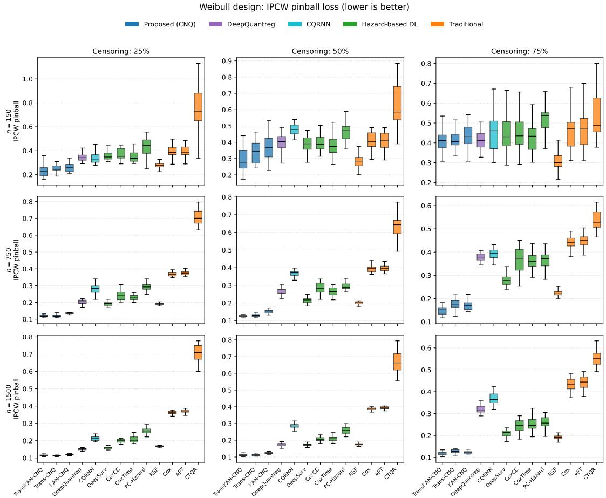  
FIG 7. Simulation study, Weibull design: inverse-probability-of-censoring-weighted (IPCW) pinball loss (selfnormalized, log-time scale, averaged over the five quantile levels $\tau \in \{ 0 . 1 , 0 . 2 5 , 0 . 5 , 0 . 7 5 , 0 . 9 \}$ by method. The figure is a 3×3 grid ofpanels indexed by sample size (rows, $n \in \{ 1 5 0 , 7 5 0 , 1 5 0 0 \} \mathrm { ~ }$ and censoring level (columns, light ≈ 25%, medium ≈ 50%, heavy ≈ 75%); within each panel the methods are arranged along the horizontal axis and the vertical axis reports the pinball loss (lower is better), with boxes/markers summarizing the distribution over the 25 replications. Colors distinguish the three proposed CNQ models (blue), DeepQuantreg (purple) and CQRNN (cyan)from the remaining deep-learning and traditional baselines. The proposed models attain the lowest loss in seven of the nine panels; the two exceptions are n = 150 under medium and heavy censoring, where Random Survival Forest (RSF) is slightly lower. The margin over RSF, the strongest competing baseline, widens markedly as the sample size grows (from −0.096 to +0.048 at n = 150 to between +0.056 and +0.073 at n = 1500) and is otherwise stable across censoring levels, visualizing the Weibull rows of Table 8.

Crossing predictions are incompatible with a coherent conditional distribution and undermine interpretability, especially when quantiles summarize short-, intermediate-, and longterm prognosis; eliminating this pathology at the model level rather than by post hoc correction yields predictions that are both more coherent and more suitable for downstream clinical interpretation.

TABLE 9  
Quantile-crossing ratesfor DeepQuantreg when thefive levels arefit separately (mean over 25 seeds; the simulationfigure additionally averages the 27 settings). The corresponding ratefor all three CNQ models is 0, both by construction and as measured on thefitted models. “Any adjacent” is thefraction oftest subjects with at least one violated adjacent pair; “adjacent pair” is thefraction of(subject, pair) combinations violated.
<table><tr><td></td><td>Any adjacent</td><td>Adjacent pair</td><td> $\widehat { q } _ { 0 . 1 } > \widehat { q } _ { 0 . 9 }$ </td><td> $\widehat { q } _ { 0 . 2 5 } > \widehat { q } _ { 0 . 7 5 }$ </td></tr><tr><td>Real data (6 cohorts)</td><td>18.24%</td><td>5.07%</td><td>0.18%</td><td>0.45%</td></tr><tr><td>Simulation (27 settings)</td><td>34.17%</td><td>10.49%</td><td>2.11%</td><td>6.12%</td></tr></table>

TABLE 10  
Predicted quantile milestonesforfive representative METABRIC patients (Trans-CNQ, seed $4 2 ) ,$ with survival reported in months. For each patient (A–E) the table lists thefive predicted quantiles $\hat { q } _ { 0 . 1 } , \hat { q } _ { 0 . 2 5 } , \hat { q } _ { 0 . 5 } , \hat { q } _ { 0 . 7 5 } , \hat { q } _ { 0 . 9 }$ (non-crossing by construction, so they increasefrom left to right), the observed follow-up time $T _ { \mathrm { o b s } } ,$ the event indicator, and two key clinical covariates (estrogen-receptor status ER and age in years). The rows illustrate how the model translates covariates into individualized, interpretable survival-time quantiles—for example, the ER− patient D receives a wider predicted interval and a longer upper tail than the ER+ patients—and correspond to the METABRIC profiles plotted in Figure 8(a).
<table><tr><td></td><td> $\hat { q } _ { 0 . 1 }$ </td><td>0.25</td><td> $\hat { q } _ { 0 . 5 }$ </td><td> $\hat { q } _ { 0 . 7 5 }$ </td><td> $\hat { q } _ { 0 . 9 }$ </td><td> $T _ { \mathrm { o b s } }$ </td><td>Event</td><td>ER</td><td>Age</td></tr><tr><td>Patient A</td><td>28.3</td><td>48.7</td><td>91.5</td><td>138.8</td><td>184.8</td><td>41.8</td><td>Yes</td><td>ER+</td><td>86</td></tr><tr><td>Patient B</td><td>34.0</td><td>56.6</td><td>100.6</td><td>153.5</td><td>204.4</td><td>119.5</td><td>Yes</td><td>ER+</td><td>69</td></tr><tr><td>Patient C</td><td>36.9</td><td>64.7</td><td>102.7</td><td>149.9</td><td>187.8</td><td>85.6</td><td>Yes</td><td>ER+</td><td>78</td></tr><tr><td>Patient D</td><td>29.8</td><td>56.3</td><td>119.3</td><td>211.2</td><td>297.7</td><td>104.7</td><td>Yes</td><td>ER-</td><td>58</td></tr><tr><td>Patient E</td><td>34.0</td><td>56.7</td><td>99.8</td><td>147.9</td><td>192.4</td><td>100.3</td><td>Yes</td><td>ER+</td><td>74</td></tr></table>

TABLE 11

Uncertainty stratification on METABRIC (averaged over 25 seeds)for each ofthe three proposed models. Test subjects are grouped into terciles —narrow, medium, wide—according to the predicted 80% interval width $w _ { i } = \hat { q } _ { 0 . 9 , i } - \hat { q } _ { 0 . 1 , i }$ , an internal, label-free difficulty score. For each model and tercile the table reports the pinball loss (survival scale, in months) and the empirical coverage ofthe nominal 80% and 50% prediction intervals. Across all three models the pinball loss and both coverages rise monotonicallyfrom the narrow to the wide tercile, confirming that predictions the model itselfflags as uncertain (wider intervals) are genuinely harder and receive higher coverage; this is the tabular counterpart ofFigure 9(a).
<table><tr><td>Model</td><td>Tercile</td><td>Pinball Loss</td><td>80% Cov.</td><td>50% Cov.</td></tr><tr><td>TransKAN-CNQ</td><td>Narrow</td><td>20.10</td><td>0.759</td><td>0.476</td></tr><tr><td rowspan="5">Trans-CNQ</td><td>Medium</td><td>26.30</td><td>0.747</td><td>0.451</td></tr><tr><td>Wide</td><td>29.30</td><td>0.830</td><td>0.517</td></tr><tr><td>Narrow</td><td>20.59</td><td>0.713</td><td>0.424</td></tr><tr><td>Medium</td><td>28.02</td><td>0.705</td><td>0.396</td></tr><tr><td>Wide</td><td>30.78</td><td>0.798</td><td>0.526</td></tr><tr><td rowspan="3">KAN-CNQ</td><td>Narrow</td><td>23.27</td><td>0.705</td><td>0.412</td></tr><tr><td>Medium</td><td>25.15</td><td>0.798</td><td>0.424</td></tr><tr><td>Wide</td><td>32.00</td><td>0.794</td><td>0.469</td></tr></table>

## APPENDIX G: SUPPLEMENTARY TABLES

This section collects the numerical results underlying the individual-level and uncertainty analyses summarized in the main text, first for METABRIC and then for FLCHAIN. Table 10 lists the predicted quantile milestones for five representative METABRIC patients: reading each row from $\hat { q } _ { 0 . 1 } \mathrm { ~ t o ~ } \hat { q } _ { 0 . 9 }$ traces the full predicted survival distribution for that patient, and the accompanying covariates and observed outcome show how the model turns a covariate vector into interpretable short-, intermediate-, and long-term milestones. In particular, patients with similar predicted medians can differ substantially in their lower-tail risk and in the width of their predicted interval, which is precisely the individualized information a single risk score cannot convey. Table 11 aggregates this behavior across the cohort by stratifying test subjects into terciles of predicted 80%-interval width $\begin{array} { r } { w _ { i } = \hat { q } _ { 0 . 9 , i } - \hat { q } _ { 0 . 1 , i } \colon } \end{array}$ for every architecture, both the pinball loss and the empirical 50%/80% coverage increase monotonically from the narrow to the wide tercile, showing that the model’s own interval width is a usable, label-free indicator of predictive difficulty.

The next two tables repeat these analyses on the larger, more heavily censored FLCHAIN cohort to check that the qualitative conclusions extend beyond oncology. Table 12 reports predicted quantile milestones for five representative FLCHAIN patients, expressed in days rather than months, and again shows coherent, individualized distributions with widely varying interval widths. Table 13 gives the corresponding uncertainty stratification (with IPCW weights truncated at the 95th percentile and an extra column for the average number of subjects per tercile): as in METABRIC, wider predicted intervals are accompanied by both larger pinball loss and higher empirical coverage, so the interval-width diagnostic behaves the same way in a cohort with ≈ $7 2 \%$ censoring. Together, Tables 10–13 provide the detailed numbers behind the patient-profile and uncertainty figures in Section H.

TABLE 12  
Predicted quantile milestonesforfive representative FLCHAIN patients (Trans-CNQ, seed 42), with survival reported in days. As in Table 10, each row gives thefive non-crossing predicted quantiles ${ \hat { q } } _ { 0 . 1 } , \dots , { \hat { q } } _ { 0 . 9 } ,$ , the observedfollow-up time $T _ { \mathrm { o b s } } ,$ , the event indicator, and two covariates (sex and age in years)for one patient (A–E). The examples show individualized milestones on a very different clinical scale (all-cause mortality over thousands ofdays) and correspond to the FLCHAINprofiles plotted in Figure 8(b).
<table><tr><td></td><td>0.1</td><td>0.25</td><td>0.5</td><td>0.75</td><td>0.9</td><td> $T _ { \mathrm { o b s } }$ </td><td>Event</td><td>Sex</td><td>Age</td></tr><tr><td>Patient A</td><td>439</td><td>1,062</td><td>1,876</td><td>2,815</td><td>3,757</td><td>2,047</td><td>Yes</td><td>F</td><td>90</td></tr><tr><td>Patient B</td><td>155</td><td>614</td><td>1,735</td><td>2,965</td><td>4,293</td><td>2,706</td><td>Yes</td><td>M</td><td>59</td></tr><tr><td>Patient C</td><td>847</td><td>2,086</td><td>3,221</td><td>4,207</td><td>5,363</td><td>2,981</td><td>Yes</td><td>F</td><td>50</td></tr><tr><td>Patient D</td><td>658</td><td>1,895</td><td>3,533</td><td>5,063</td><td>6,639</td><td>3,347</td><td>Yes</td><td>F</td><td>70</td></tr><tr><td>Patient E</td><td>614</td><td>1,731</td><td>3,246</td><td>4,586</td><td>5,940</td><td>3,245</td><td>Yes</td><td>M</td><td>69</td></tr></table>

TABLE 13

Uncertainty stratification on FLCHAIN (averaged over 25 seeds, with IPCW weights truncated at the 95th percentile)for each ofthe three proposed models. As in Table 11, subjects are split into narrow, medium, and wide terciles by predicted 80% interval width $w _ { i } ;$ for each model and tercile the table reports the pinball loss, the empirical 80% and 50% interval coverages, and the average number oftest subjects per tercile $\overline { { n } } _ { u n c }$ . The monotone increase ofloss and coverage with interval width—reproduced here in a larger, more heavily censored cohort —confirms that interval width is a reliable internal indicator ofpredictive difficulty; see also Figure 9(b).
<table><tr><td>Model</td><td>Tercile</td><td>Pinball Loss</td><td>80% Cov.</td><td>50% Cov.</td><td> $\operatorname { A v g . } n _ { \mathrm { u n c } }$ </td></tr><tr><td>TransKAN-CNQ</td><td>Narrow</td><td>354.7</td><td>0.773</td><td>0.469</td><td>234.6</td></tr><tr><td rowspan="5">Trans-CNQ</td><td>Medium</td><td>389.8</td><td>0.856</td><td>0.527</td><td>105.0</td></tr><tr><td>Wide</td><td>400.8</td><td>0.884</td><td>0.582</td><td>94.2</td></tr><tr><td>Narrow</td><td>359.3</td><td>0.778</td><td>0.479</td><td>224.2</td></tr><tr><td>Medium</td><td>393.0</td><td>0.864</td><td>0.546</td><td>106.3</td></tr><tr><td>Wide</td><td>403.7</td><td>0.891</td><td>0.614</td><td>103.3</td></tr><tr><td rowspan="3">KAN-CNQ</td><td>Narrow</td><td>346.8</td><td>0.792</td><td>0.485</td><td>188.3</td></tr><tr><td>Medium</td><td>395.1</td><td>0.858</td><td>0.534</td><td>107.5</td></tr><tr><td>Wide</td><td>419.9</td><td>0.894</td><td>0.578</td><td>138.0</td></tr></table>

## APPENDIX H: SUPPLEMENTARY FIGURES AND EVENT-PROJECTION RESULTS FOR THE REAL-DATA ANALYSES

This section presents the material supporting the real-data analyses, organized into four groups: individual-level predictions, event projection, feature importance, and model checking, followed by two robustness tables. The event-projection group carries the full setup and error table for the analysis summarized in the main text. Figure 8 shows representative patient-level quantile profiles for METABRIC (a) and FLCHAIN (b): each horizontal line is one patient’s predicted 80% interval [ˆq0.1, qˆ0.9], the markers are the five predicted quantiles, and a cross marks the observed event time. The figure makes concrete how the model separates patients with similar medians but different tail risk or different predictive uncertainty, and it visualizes the same five example patients tabulated in Tables 10 and 12. Figure 9 then aggregates this uncertainty information across the cohort, plotting pinball loss and empirical coverage against the tercile of predicted interval width for METABRIC (a) and FLCHAIN (b); the upward trend in both panels confirms that wider self-reported intervals correspond to genuinely harder, better-covered predictions, and mirrors Tables 11 and 13.

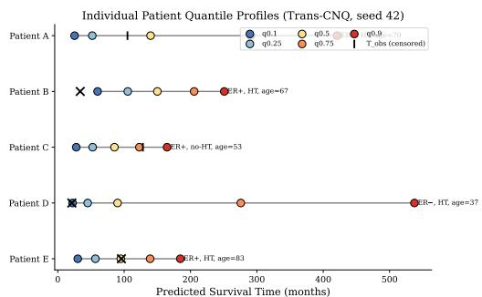  
(a) METABRIC patient profiles

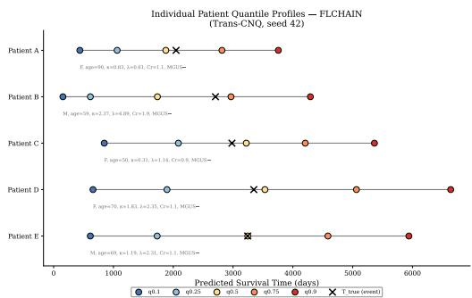  
(b) FLCHAIN patient profiles  
FIG 8. Representative patient-level quantile profiles for (a) METABRIC (survival in months) and (b) FLCHAIN (survival in days), produced by Trans-CNQ on a single representative split (seed 42). Each row corresponds to one patient; the horizontal axis is predicted survival time. For each patient the horizontal line spans the predicted 80% prediction interval $[ \hat { q } _ { 0 . 1 } , \hat { q } _ { 0 . 9 } ] _ { : }$ , the colored markers denote the five predicted quantiles qˆ , qˆ , qˆ , qˆ , qˆ (increasing left to right, by construction non-crossing), and a cross marks the observed event time for uncensored subjects. The panels show that the model produces individualized, coherent quantile milestones whose spread (interval width) varies substantially across patients, and that observed event timesfor uncensored subjects typicallyfall within the predicted interval. These are the samefive example patients tabulated in Tables 10 and 12.

H.1. Event Projection on METABRIC. We evaluate three projection strategies on the METABRIC test sets (seeds $4 1 - 6 5 ; n _ { \mathrm { { s i m } } } =$ 500 Monte Carlo draws per subject).

Setup. The latent method projects events by integrating $\hat { F } ( t | X _ { i } )$ over all test subjects, treating the estimated CDF as if no administrative cutoff existed. The censoring-aware method (Trans-CNQ + cens.) samples event times $T _ { \mathrm { s i m } } \sim \hat { F } ( \cdot | X _ { i } , T > s )$ via inverse-CDF and censoring times $C _ { \mathrm { s i m } } \sim \hat { G } ( C | C > s )$ via a reverse Kaplan–Meier estimator, then counts individuals for whom $T _ { \mathrm { s i m } } \leq C _ { \mathrm { s i m } }$ and $T _ { \mathrm { s i m } } \leq t .$ . The Weibull baseline fits a marginal Weibull distribution on the observed $( T , \delta )$ pairs at each cutoff and applies the same censoring model. Ground truth is the raw cumulative observed event count in the test set up to the final time horizon.

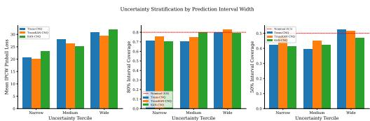  
(a) METABRIC uncertainty stratification

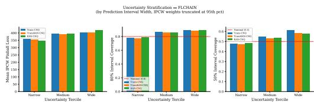  
(b) FLCHAIN uncertainty stratification  
FIG 9. Uncertainty stratification for (a) METABRIC and (b) FLCHAIN (Trans-CNQ, averaged over 25 seeds). Test subjects are partitioned into terciles—narrow, medium, and wide—by the predicted 80% interval width $w _ { i } =$ qˆ0. ${ \bf \Phi } ) , i ^ { \mathrm { ~ - ~ } \hat { q } _ { 0 . 1 , i } , }$ a purely internal, label-free measure of predictive difficulty. Within each tercile the panels report the IPCWpinball loss and the empirical coverage ofthe nominal 50% and 80% intervals; dashed horizontal lines mark the nominal coverage levels. Moving from narrow to wide terciles, both the pinball loss and the empirical coverage increase monotonically, showing that predictions the model flags as more uncertain (wider intervals) are indeed harder and better covered—so interval width can serve as a self-reported reliability signal at the individual level. The underlying numbers appear in Tables 11 and 13.

TABLE 14  
METABRIC event projection error (%) at $t = 2 0 0$ months (seeds 41–65, mean). Positive values indicate overestimation ofcumulative events.
<table><tr><td>Cutoff (months)</td><td>Latent</td><td> $\mathrm { T r a n s - C N Q } + \mathrm { c e n s } .$ </td><td> $\mathrm { W e i b u l l + c e n s . }$ </td></tr><tr><td>24</td><td>+35.2</td><td>+19.9</td><td>+63.8</td></tr><tr><td>48</td><td>+34.4</td><td> $+ 2 0 . 4$ </td><td>+42.1</td></tr><tr><td>72</td><td>+30.4</td><td> $+ 1 9 . 9$ </td><td>+16.6</td></tr><tr><td>96</td><td>+25.4</td><td> $+ 1 8 . 5$ </td><td>+6.9</td></tr></table>

Results. Table 14 reports the percentage error relative to the raw observed count at the end of follow-up (t = 200 months; 25-seed average), and the full projection curves are provided in the Supplementary Material.

All three methods overestimate at every cutoff. Notably, the KM-adjusted count (gray dashed) also lies above the raw observed events, indicating that standard KM-based correction itself can become optimistic when the projection horizon extends into sparsely observed follow-up. We therefore use the raw observed event count as the operational reference throughout. The censoring-aware Trans-CNQ procedure (green) consistently tracks this reference more closely than the KM-based curve, with errors of $+ 1 8 \mathrm { - } + 2 1 \%$ across all cutoffs, indicating that explicit modeling of $\hat { G } ( C )$ improves stability. The Weibull benchmark (purple) shows pronounced horizon dependence: it overshoots severely when only short follow-up is available (+63.8% at the 24-month cutoff), because projection relies heavily on parametric tail extrapolation, but approaches the observed count once most of the event-time distribution has become visible (+6.9% at the 96-month cutoff).

Root cause. The persistent overestimation across all approaches appears to share the same mechanism: under IPCW training, censored observations contribute no direct loss beyond their weighting role, so the subject-specific lower-bound information $T _ { i } > C _ { i }$ is not explicitly enforced in the optimization target. Late-censored subjects therefore tend to have their event times predicted too early, which inflates projected cumulative event counts. Likelihood-based approaches such as Weibull or Cox incorporate this lower-bound information through the survival contribution $S ( C _ { i } \mid X _ { i } )$ and can therefore be better calibrated in the far tail, although they remain imperfect under the moderate censoring present in METABRIC.

Figure 10 shows the same comparison as curves rather than endpoint errors. At each of the four cutoffs (24, 48, 72, and 96 months) it overlays the raw observed cumulative events, a Kaplan–Meier-based latent reference that adjusts for censoring, the Trans-CNQ projection with the censoring model, and a parametric Weibull projection. Consistent with Table 14, all of the projections lie above the raw observed count; the Trans-CNQ curve stays closest to the censoring-adjusted reference across all four horizons, whereas the Weibull projection drifts furthest where its parametric shape is misspecified and the follow-up is shortest.

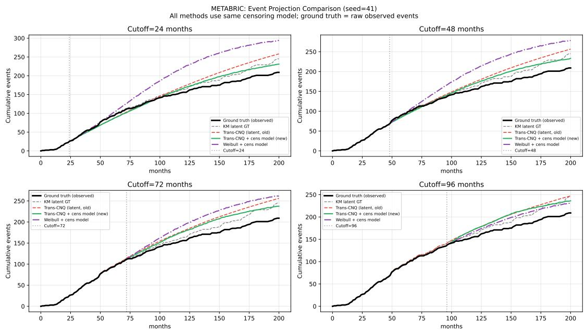  
FIG 10. METABRIC event-projection curves (single representative split, seed 41) evaluated at four calendar cutoffs—24, 48, 72, and 96 months (vertical dotted lines). The horizontal axis is calendar/follow-up time in months and the vertical axis is the cumulative number (or proportion) of events projected to have occurred by each time. Four curves are overlaid: the solid black curve is the raw observed cumulative-event count; the gray dashed curve is the Kaplan–Meier-based latent reference that adjusts for censoring; the green curve is the Trans-CNQ projection obtained with the censoring (IPCW) model; and the purple dash-dot curve is the corresponding parametric Weibull projection with the same censoring model. The figure assesses how closely each method reproduces the true event accrual over time: the Trans-CNQ curve tracks the KM latent reference closely across allfour cutoffs whereas the Weibull projection deviates more where the parametric shape is misspecified, illustrating the benefi oftheflexible distributional modelfor event-countforecasting.

The next three figures examine which covariates drive the predictions and whether the recovered structure is stable across architectures. Figure 11 is a permutation feature-importance heatmap for METABRIC, averaged over the three proposed models and 25 splits, in which each cell reports the increase in IPCW pinball loss $\Delta$ from permuting a covariate at a given quantile level; reading a row across τ shows whether a covariate acts on the lower, central, or upper part of the predicted distribution, and age and chemotherapy emerge as dominant while hormone therapy shows a pronounced upper-tail effect. Figures 12 and 13 break this down by architecture for METABRIC and FLCHAIN, respectively. For METABRIC the three architectures agree closely, indicating that the importance pattern reflects genuine data structure; for FLCHAIN the two Transformer-based models agree (age and the serum free light chains dominate) whereas KAN-CNQ ranks creatinine first, illustrating the architecture dependence of attribution in the pure-KAN backbone noted in the main text.

The final pair of figures provides direct model-checking diagnostics. Figure 14 shows the distribution of log-time residuals at the predicted median for uncensored METABRIC subjects; the histograms for the Transformer-based models are centered near zero, indicating no systematic over- or under-prediction of the median. Figure 15 repeats the calibration checks of the main text on FLCHAIN, plotting per-quantile realized coverage against the nominal level (a) and interval coverage against the nominal interval level (b); both panels lie close to the 45◦ line, so the calibration observed on METABRIC replicates in a larger cohort with much heavier (≈ 72%) censoring.

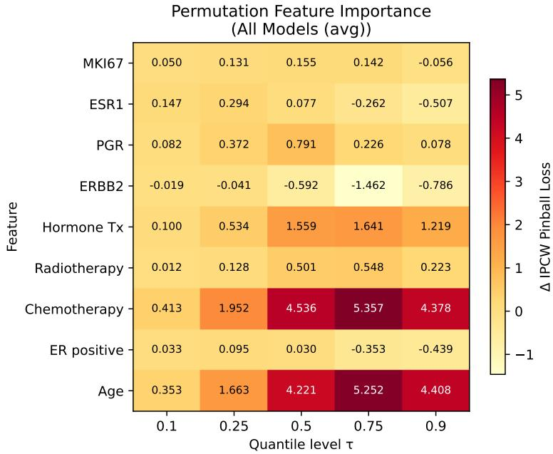  
FIG 11. Permutation feature-importance heatmap for METABRIC, averaged over 25 random splits and pooled across the three proposed architectures (Trans-CNQ, TransKAN-CNQ, KAN-CNQ). Rows index the covariates and columns index the five quantile levels $\tau \in \{ 0 . 1 , 0 . 2 5 , 0 . 5 , 0 . 7 5 , 0 . 9 \}$ ; the color of each cell encodes the increase in IPCW pinball loss, ∆, incurred when the corresponding covariate is randomly permuted (breaking its association with the outcome) while all others are heldfixed, so that larger (warmer) values indicate greater prognostic importance at that quantile. Reading a row across τ reveals whether a covariate acts mainly on the lower (early-event), central, or upper (long-survivor) part of the predicted distribution rather than on a single summary. Age and chemotherapy dominate overall, while hormone therapy shows a pronounced effect concentrated in the upper quantiles—a tail-specific signal that a single hazard ratio would average away.

Finally, two tables document that the real-data conclusions are not artifacts of specific analysis choices. Table 15 varies the IPCW weight-truncation threshold on the heavily censored FLCHAIN cohort (no truncation and the 90th, 95th, and 99th percentiles): the pinball loss, the 80% interval coverage, and the Transformer-over-KAN ordering are all essentially unchanged, so the reported results do not depend on the truncation level. Table 17 retrains the models on METABRIC under three train/validation/test ratios (65/15/20, 50/25/25, 80/10/10): performance and the model ordering are again stable, with only the smallest test set (80/10/10) being mildly noisier, as expected. Taken together, these sensitivity analyses show that the advantages of the proposed models are robust to the censoring-weight and data-splitting choices used throughout the paper.

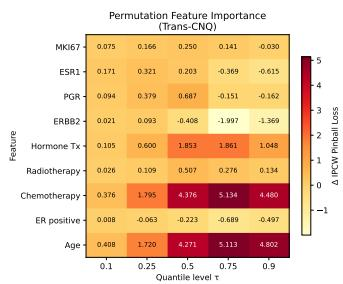  
(a) Trans-CNQ

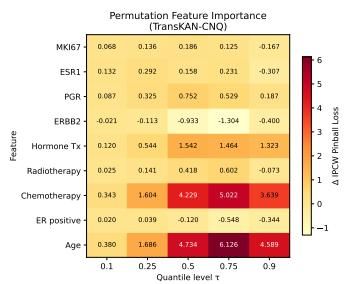  
(b) TransKAN-CNQ

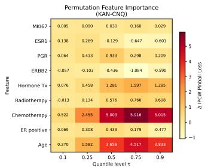  
(c) KAN-CNQ  
FIG 12. Architecture-specific permutationfeature-importance heatmapsfor METABRIC, shown separatelyfor (a) Trans-CNQ, (b) TransKAN-CNQ, and (c) KAN-CNQ (each averaged over 25 random splits). As in Figure 11, rows are covariates, columns are thefive quantile levels τ, and cell color encodes the increase in IPCWpinball loss ∆ from permuting that covariate; the three panels share a common color scale to make them directly comparable. Decomposing the pooled heatmap by architecture shows that the three models yield broadly similar qualitative rankings—age and chemotherapy dominate prognosis and hormone therapy again exhibits a pronounced upperquantile $( \tau = 0 . 7 5 , 0 . 9 )$ effect —indicating that the recovered prognostic structure is a stable property of the data rather than an artifact ofany single architecture.

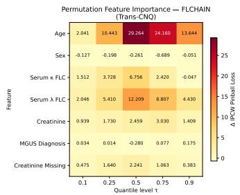  
(a) Trans-CNQ

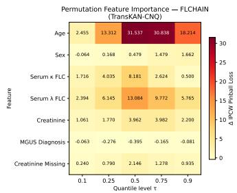  
(b) TransKAN-CNQ

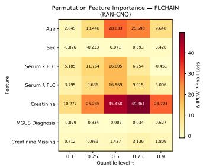  
(c) KAN-CNQ

FIG 13. Architecture-specific permutation feature-importance heatmaps for FLCHAIN, shown separately for (a) Trans-CNQ, (b) TransKAN-CNQ, and (c) KAN-CNQ (each averaged over 25 random splits). Rows are covariates, columns are the five quantile levels τ, and cell color encodes the increase in IPCW pinball loss ∆ from permuting that covariate. The two Transformer-based models produce broadly similar patterns, with age and the serumfree light chains (kappa and lambda) dominating prognosis, whereas KAN-CNQ ranks creatininefirst. This discrepancy—which is not present for METABRIC in Figure 12—illustrates the architecture dependence of attribution in the pure-KAN backbone discussed in the main text, and motivates preferring the Transformer-based variants whenfeature attributions are to be reported.

METABRIC: median residual diagnostic  
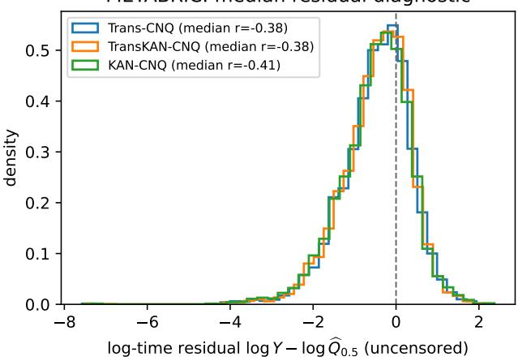  
FIG 14. METABRIC log-time residual diagnostic at the predicted median. Restricting to uncensored subjects (for whom the event time is observed), the histogram shows the log-scale residual log $Y - \log \widehat { Q } _ { 0 . 5 } ( X )$ , i.e., the signed distance between the observed event time and the predicted median survival time on the log scale, pooled over the 25 random splits; the vertical dashed line marks zero. If the median is well calibrated the residuals should be centered at zero with roughly half above and half below. The Transformer-based models (Trans-CNQ, TransKAN-CNQ) produce residual histograms centered near zero with no systematic over- or under-prediction corroborating the calibration and coverage checks reported in the main text.

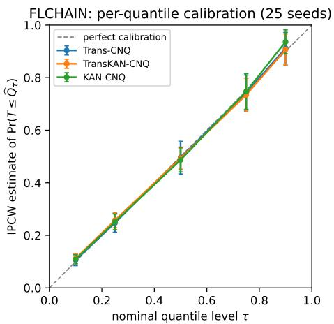  
(a) per-quantile calibration

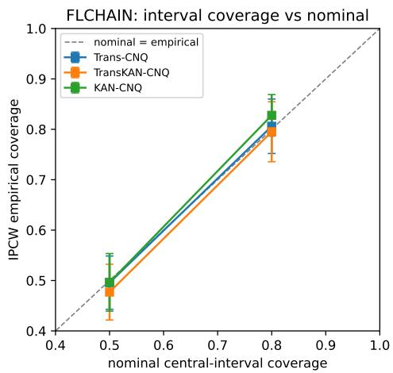  
(b) interval coverage vs. nominal  
FIG 15. FLCHAIN model-checking (Trans-CNQ, averaged over 25 seeds; IPCW weights truncated at the 95th percentile to limit the influence of large inverse-censoring weights). Panel (a), per-quantile calibration, plots the empirical (realized) coverage against each nominal quantile level $\tau \in \{ 0 . 1 , 0 . 2 5 , 0 . 5 , 0 . 7 5 , 0 . 9 \}$ ; points on the $4 5 ^ { \circ }$ diagonal indicate perfect calibration. Panel (b), interval coverage versus nominal, plots the empirical coverage of central prediction intervals against their nominal level, with the 50% and 80% intervals highlighted and the diagonal marking exact coverage. Calibration is near-nominal across all quantile levels and the 50%/80% interval coverage is close to target, replicating the METABRIC findings in a larger cohort with substantially heavier (≈ 72%) censoring and thereby demonstrating that the calibration is not specific to a single dataset or censoring regime.

TABLE 15

IPCW weight-truncation sensitivity on FLCHAIN (heavy, ∼72% censoring). Because   
inverse-probability-of-censoring weights can become large when the estimated censoring survival Gb is small, we   
truncate them at a chosen percentile; this table probes how much that choice matters. The two blocks report the   
mean pinball loss $\overline { { L } } _ { \mathrm { p i n } }$ (log scale, averaged over thefive common quantile levels $\tau \in \{ 0 . 1 , 0 . 2 5 , 0 . 5 , 0 . 7 5 , 0 . 9 \} ,$ and the empirical 80% interval coveragefor each proposed model, as the weights are truncated at the 90th, 95th, and 99th percentiles or left untruncated (“none”); all values are means over 25 random splits. Both the loss and the coverage—and the Transformer-over-KAN model ordering—are essentiallyflat across truncation levels, and coverage stays close to the nominal 0.80, showing that the reported results are not driven by a particular truncation threshold.   
IPCW weight-truncation sensitivity on METABRIC (moderate, ∼40% censoring), reported in the same format as   
Table 15. Weight concentration does not track the censoring rate: across the six cohorts the effective sample size $( \textstyle \sum _ { i } w _ { i } ) ^ { 2 } / \textstyle \sum _ { i } w _ { i } ^ { 2 } ,$ , expressed as afraction ofthe observed events and computedfrom untruncated weights, is 98% on GBSG, 98% on GBSG-500, 84% on SUPPORT, 84% on FLCHAIN, 75% on NKI70 and only 35% on METABRIC, so METABRIC is where an IPCW-weighted summary rests on the fewest effective observations. Pinball loss is essentially unaffected by truncation, but 80% coverage risesfrom 0.72–0.77 to 0.80–0.82;for reference, the unweighted coverage among observed events is 0.78. This suggests the mild undercoverage reported for METABRIC in the main text is driven largely by a few extreme weights rather than by the interval widths themselves. All headline tables use untruncated weights.

<table><tr><td></td><td colspan="4"> $\overline { { L } } _ { \mathrm { p i n } }$ </td><td colspan="4">80% coverage</td></tr><tr><td>Model</td><td>none</td><td>90th</td><td>95th</td><td>99th</td><td>none</td><td>90th</td><td>95th</td><td>99th</td></tr><tr><td>TransKAN-CNQ</td><td>0.279</td><td>0.284</td><td>0.282</td><td>0.280</td><td>0.795</td><td>0.817</td><td>0.814</td><td>0.806</td></tr><tr><td>Trans-CNQ</td><td>0.282</td><td>0.286</td><td>0.285</td><td>0.283</td><td>0.806</td><td>0.825</td><td>0.822</td><td>0.814</td></tr><tr><td>KAN-CNQ</td><td>0.280</td><td>0.284</td><td>0.283</td><td>0.281</td><td>0.828</td><td>0.841</td><td>0.840</td><td>0.835</td></tr></table>

TABLE 16

<table><tr><td></td><td colspan="4"> $\overline { { L } } _ { \mathrm { p i n } }$ </td><td colspan="4">80% coverage</td></tr><tr><td>Model</td><td>none</td><td>90th</td><td>95th</td><td>99th</td><td>none</td><td>90th</td><td>95th</td><td>99th</td></tr><tr><td>TransKAN-CNQ</td><td>0.215</td><td>0.222</td><td>0.221</td><td>0.218</td><td>0.784</td><td>0.822</td><td>0.820</td><td>0.803</td></tr><tr><td>Trans-CNQ</td><td>0.224</td><td>0.225</td><td>0.223</td><td>0.225</td><td>0.720</td><td>0.797</td><td>0.795</td><td>0.763</td></tr><tr><td>KAN-CNQ</td><td>0.227</td><td>0.231</td><td>0.230</td><td>0.230</td><td>0.765</td><td>0.810</td><td>0.808</td><td>0.792</td></tr></table>

## TABLE 17

Split-ratio sensitivity on METABRIC, assessing whether the results depend on how the data are partitioned. Each proposed model is retrainedfrom scratch under three train/validation/test ratios—65/15/20, 50/25/25   
and 80/10/10 (with all other training choices heldfixed)—on partitions that are regeneratedfor each ratio, and evaluated on its own held-out test set at thefive common quantile levels τ ∈ {0.1, 0.25, 0.5, 0.75, 0.9}; all   
entries are means over 25 random splits. Because the partitions are drawn afresh, the 65/15/20 column is not the main-text configuration re-scored: it uses different training and test sets, so it is expected to differfrom the   
headline table in the main text rather than reproduce it. The two blocks report the IPCWpinball loss $\overline { { L } } _ { \mathrm { p i n } }$ (log d tk of tk 19007 d ti

scale) and the empirical coverage of the nominal 80% interval. Both the performance level and the Transformer-over-KAN ordering are stable across the three ratios; only the configuration with the smallest test set (80/10/10) is mildly noisier, as expectedfrom the reduced evaluation sample.
<table><tr><td rowspan="2">Model</td><td colspan="3"> $\overline { { L } } _ { \mathrm { p i n } }$ </td><td colspan="3">80% coverage</td></tr><tr><td>65/15/20</td><td>50/25/25</td><td>80/10/10</td><td>65/15/20</td><td>50/25/25</td><td>80/10/10</td></tr><tr><td>TransKAN-CNQ</td><td>0.228</td><td>0.226</td><td>0.242</td><td>0.736</td><td>0.738</td><td>0.670</td></tr><tr><td>Trans-CNQ</td><td>0.229</td><td>0.224</td><td>0.237</td><td>0.720</td><td>0.739</td><td>0.691</td></tr><tr><td>KAN-CNQ</td><td>0.233</td><td>0.230</td><td>0.247</td><td>0.729</td><td>0.731</td><td>0.690</td></tr></table>

## REFERENCES

BITOUZÉ, D., LAURENT, B. and MASSART, P. (1999). A Dvoretzky–Kiefer–Wolfowitz type inequality for the Kaplan–Meier estimator. Annales de l’Institut Henri Poincaré, Probabilités et Statistiques 35 735–763.

BLOWS, F. M., DRIVER, K. E., SCHMIDT, M. K. et al. (2010). Subtyping of breast cancer by immunohistochemistry to investigate a relationship between subtype and short and long term survival: a collaborative analysis of data for 10,159 cases from 12 studies. PLoS Medicine 7 e1000279. https://doi.org/10.1371/journal.pmed. 1000279

BROGLIO, K. R. and BERRY, D. A. (2009). Detecting an overall survival benefit that is derived from progressionfree survival. Journal of the National Cancer Institute 101 1642–1649. https://doi.org/10.1093/jnci/djp369

CHEN, G. H. (2024a). An Introduction to Deep Survival Analysis Models for Predicting Time-to-Event Outcomes. Foundations and Trends® in Machine Learning 17 921–1100.

CHEN, G. H. (2024b). Survival Kernets: Scalable and Interpretable Deep Kernel Survival Analysis with an Accuracy Guarantee. Journal ofMachine Learning Research 25 1–78.

COX, D. R. (1972). Regression models and life-tables. Journal of the Royal Statistical Society: Series B (Methodological) 34 187–202.

CURTIS, C., SHAH, S. P., CHIN, S.-F., TURASHVILI, G., RUEDA, O. M., DUNNING, M. J., SPEED, D., LYNCH, A. G., SAMARAJIWA, S., YUAN, Y. et al. (2012). The genomic and transcriptomic architecture of 2,000 breast tumours reveals novel subgroups. Nature 486 346–352. https://doi.org/10.1038/nature10983

DISPENZIERI, A., KATZMANN, J. A., KYLE, R. A. et al. (2012). Use of nonclonal serum immunoglobulin free light chains to predict overall survival in the general population. Mayo Clinic Proceedings 87 517–523. https://doi.org/10.1016/j.mayocp.2012.03.009

EDELMAN, B. L., GOEL, S., KAKADE, S. and ZHANG, C. (2022). Inductive biases and variable creation in selfattention mechanisms. In Proceedings of the 39th International Conference on Machine Learning. Proceedings ofMachine Learning Research 162 5793–5831.

FRUMENTO, P. (2024). ctqr: Censored and Truncated Quantile Regression R package version 2.1.

FRUMENTO, P. and BOTTAI, M. (2017). An estimating equation for censored and truncated quantile regression. Computational Statistics & Data Analysis 113 53–63.

GERDS, T. A. and SCHUMACHER, M. (2006). Consistent estimation of the expected Brier score in general survival models with right-censored event times. Biometrical Journal 48 1029–1040. https://doi.org/10.1002 bimj.200610301

GOLDBERG, Y. (2019). Hoeffding-type and bernstein-type inequalities for right censored data. arXiv preprint arXiv:1903.01991.

EARLY BREAST CANCER TRIALISTS’ COLLABORATIVE GROUP (2011). Relevance of breast cancer hormone receptors and other factors to the efficacy of adjuvant tamoxifen: patient-level meta-analysis of randomised trials. The Lancet 378 771–784. https://doi.org/10.1016/S0140-6736(11)60993-8

HUANG, J., MA, S. and XIE, H. (2007). Least absolute deviations estimation for the accelerated failure time model. Statistica Sinica 1533–1548.

HUANG, X., KHETAN, A., CVITKOVIC, M. and KARNIN, Z. (2020). Tabtransformer: Tabular data modeling using contextual embeddings. arXiv preprint arXiv:2012.06678.

HUBER, P. J. (1973). Robust regression: Asymptotics, conjectures and Monte Carlo. The Annals of Statistics 1 799–821.

ISHWARAN, H. and KOGALUR, U. B. (2007). Random survival forests for R. R news 7 25–31.

ISHWARAN, H. and KOGALUR, U. B. (2019). Fast unified random forests for survival, regression, and classification (RF-SRC). R package version 2.

ISHWARAN, H., KOGALUR, U. B., BLACKSTONE, E. H. and LAUER, M. S. (2008). Random survival forests.

JIA, Y. and JEONG, J.-H. (2022). Deep learning for quantile regression under right censoring: DeepQuantreg. Computational Statistics & Data Analysis 165 107323.

KALBFLEISCH, J. D. and PRENTICE, R. L. (2002). The statistical analysis of failure time data. John Wiley & Sons.

KALBFLEISCH, J. D. and SCHAUBEL, D. E. (2023). Fifty years of the cox model. Annual Review of Statistics and Its Application 10 1–23.

KATZMAN, J. L., SHAHAM, U., CLONINGER, A., BATES, J., JIANG, T. and KLUGER, Y. (2018). DeepSurv: personalized treatment recommender system using a Cox proportional hazards deep neural network. BMC medical research methodology 18 1–12.

KLEINBAUM, D. G. and KLEIN, M. (1996). Survival analysis a self-learning text. Springer.

KNAUS, W. A., HARRELL, F. E., LYNN, J., GOLDMAN, L., PHILLIPS, R. S., CONNORS, A. F., DAW-SON, N. V., FULKERSON, W. J., CALIFF, R. M., DESBIENS, N. et al. (1995). The SUPPORT prognostic model: Objective estimates of survival for seriously ill hospitalized adults. Annals of internal medicine 122 191–203.

KOENKER, R. and BASSETT JR, G. (1978). Regression quantiles. Econometrica: journal of the Econometric Society 33–50.

KOLMOGOROV, A. N. (1957). On the representation of continuous functions of many variables by superposition of continuous functions of one variable and addition. In Doklady Akademii Nauk 114 953–956. Russian Academy of Sciences.

KVAMME, H., BORGAN, Ø. and SCHEEL, I. (2019). Time-to-event prediction with neural networks and Cox regression. Journal ofmachine learning research 20 1–30.

KVAMME, H. and BORGAN, Ø. (2021). Continuous and discrete-time survival prediction with neural networks. Lifetime data analysis 27 710–736.

LIU, Y., CAI, J. and LI, D. (2025). Understanding Overparametrization in Survival Models through Interpolation. https://doi.org/10.48550/arXiv.2512.12463

LIU, Z., WANG, Y., VAIDYA, S., RUEHLE, F., HALVERSON, J., SOLJACI ˇ C´ , M., HOU, T. Y. and TEGMARK, M. (2024). Kan: Kolmogorov-arnold networks. arXiv preprint arXiv:2404.19756.

LOSHCHILOV, I. and HUTTER, F. (2017). Decoupled weight decay regularization. arXiv preprint arXiv:1711.05101.

MARTINUSSEN, T. (2022). Causality and the Cox regression model. Annual Review of Statistics and Its Application 9 249–259.

PEARCE, T., JEONG, J.-H., ZHU, J. et al. (2022). Censored quantile regression neural networks for distributionfree survival analysis. Advances in Neural Information Processing Systems 35 7450–7461.

PENG, L. (2021). Quantile regression for survival data. Annual review ofstatistics and its application 8 413–437.

PENG, L. and HUANG, Y. (2008). Survival analysis with quantile regression models. Journal of the American Statistical Association 103 637–649.

PORTNOY, S. (2003). Censored regression quantiles. Journal of the American Statistical Association 98 1001– 1012. https://doi.org/10.1198/016214503000000954

POWELL, J. L. (1986). Censored regression quantiles. Journal of econometrics 32 143–155.

SALERNO, S. and LI, Y. (2023). High-dimensional survival analysis: Methods and applications. Annual review of statistics and its application 10 25–49.

SCHUMACHER, M., BASTERT, G., BOJAR, H., HÜBNER, K., OLSCHEWSKI, M., SAUERBREI, W., SCHMOOR, C., BEYERLE, C., NEUMANN, R. and RAUSCHECKER, H. (1994). Randomized 2 x 2 trial evaluating hormonal treatment and the duration of chemotherapy in node-positive breast cancer patients. German Breast Cancer Study Group. Journal ofClinical Oncology 12 2086–2093.

SCHUMAKER, L. L. (2007). Spline Functions: Basic Theory, 3 ed. Cambridge University Press.

SHEN, G., DAI, R., WU, G., LUO, S., SHI, C. and ZHU, H. (2025). Deep distributional learning with noncrossing quantile network. arXiv preprint arXiv:2504.08215.

VAN BELLE, V., PELCKMANS, K., SUYKENS, J. A. and VAN HUFFEL, S. (2007). Support vector machines for survival analysis. In Proceedings of the third international conference on computational intelligence in medicine and healthcare (cimed2007) 1–8.

VAN DE VIJVER, M. J., HE, Y. D., VAN’T VEER, L. J., DAI, H., HART, A. A., VOSKUIL, D. W., SCHREIBER, G. J., PETERSE, J. L., ROBERTS, C., MARTON, M. J. et al. (2002). A gene-expression signature as a predictor of survival in breast cancer. New England Journal ofMedicine 347 1999–2009.

VASWANI, A., SHAZEER, N., PARMAR, N., USZKOREIT, J., JONES, L., GOMEZ, A. N., KAISER, Ł. and POLOSUKHIN, I. (2017). Attention is all you need. Advances in Neural Information Processing Systems 30 5998–6008.

WEI, L.-J. (1992). The accelerated failure time model: a useful alternative to the Cox regression model in surviva analysis. Statistics in medicine 11 1871–1879.

WIEGREBE, S., KOPPER, P., SONABEND, R., BISCHL, B. and BENDER, A. (2024). Deep learning for survival analysis: a review. Artificial Intelligence Review 57 65.

WU, G., SONG, G., LV, X., LUO, S., SHI, C. and ZHU, H. (2023). DNet: Distributional Network for Distributional Individualized Treatment Effects. In Proceedings of the 29th ACM SIGKDD Conference on Knowledge Discovery and Data Mining 5215–5224.

YANG, Y. and ZHOU, D.-X. (2025). Optimal rates of approximation by shallow ReLUk neural networks and applications to nonparametric regression. Constructive Approximation 62 329–360. https://doi.org/10.1007/ s00365-024-09679-z

YING, Z., JUNG, S.-H. and WEI, L.-J. (1995). Survival analysis with median regression models. Journal ofthe American Statistical Association 90 178–184.

ZHANG, X. and ZHOU, H. (2024). Generalization bounds and model complexity for kolmogorov-arnold networks. arXiv preprint arXiv:2410.08026.

ZHAO, L. (2021). Event prediction in the big data era: A systematic survey. ACM Computing Surveys (CSUR) 54 1–37.