# On the Principles Behind Neural Network Optimizers

Yushun Zhang \* †

School of Data Science, The Chinese University of Hong Kong, Shenzhen, China yushunzhang@link.cuhk.edu.cn

## Abstract

Reliable optimization is central to neural network (NN) training, yet Adam, the default optimizer for modern LLMs, rests on a fragile foundation. This thesis develops a principled grounding for Adam and motivates new designs. First, we revisit Adam’s divergence–convergence debate and show the existence of a problem-dependent phase transition: with properly chosen, batchsize-dependent hyperparameters, Adam converges, whereas under small-β regimes it can diverge. Second, we investigate why Adam substantially outperforms SGD on Transformers through Hessian structure. We find that the Hessian evolves toward a near-block-diagonal form along training, accompanied by strong block heterogeneity. We prove that this structure makes Adam’s diagonal preconditioner efective. We further show that this special Hessian structure originates from consecutive multiplications of large matrix variables, and we provide a rigorous analysis based on random matrix theory. Finally, these insights motivate Adam-mini, a new optimizer that reduces Adam’s memory footprint by 50% while preserving its performance. Our results also have broader implications beyond Adam: they reveal new local structures in matrix-based nonconvex problems, and also help understand and improve recent NN optimizers, such as Muon.

## 1. Introduction

Neural networks (NNs), evolving from classical multi-layer perceptrons (MLPs) to contemporary large language models (LLMs), are the core engine of modern artificial intelligence (AI) (e.g., [Achiam et al., 2023]). The efectiveness of these models hinges on their ability to learn complex patterns from data, a process fundamentally framed as an optimization problem. In this thesis, we focus on the following empirical risk minimization problem (ERM), which is the standard optimization formulation for training modern NNs:

$$
\operatorname* { m i n i m i z e } _ { \theta \in \mathbb { R } ^ { d } } \quad \ell ( \theta ) : = \frac { 1 } { n } \sum _ { i = 0 } ^ { n - 1 } \ell _ { i } ( \theta ) .\tag{1.1}
$$

Here, $\theta \in \mathbb { R } ^ { d }$ denotes the trainable NN parameters, $n \in \mathbb { N }$ is the number of mini-batches that partition the dataset, and $\ell _ { i } ( \theta )$ denotes the training loss on the i-th mini-batch data.

To solve (1.1) at scale, a stable and computationally eficient optimizer is needed. Yet, despite their widespread deployment in industry, current NN optimizers are built on a surprisingly fragile foundation. The most prominent example is Adam [Kingma and Ba, 2014]. On the one hand, Adam has become the most widely used optimizer for modern NNs, including LLMs (e.g., Llama and DeepSeek series [Touvron et al., 2023; Liu et al., 2024]). On the other hand, Adam has long been criticized for having “theoretical flaws”. In particular, an influential work [Reddi et al., 2018] (the winner of ICLR 2018 Best Paper Award [ICLR, 2018]) suggested that Adam can diverge even on simple examples. This finding raises serious concerns for Adam’s deployment in AI model training, where the divergence can raise alerts of unpredictable training failures.

Further, when deployed regardless of the risk, Adam’s empirical behavior usually falls outside the scope of existing theory and thus remains dificult to predict. For example, it underperforms

GD even on simple random Gaussian quadratic objectives, yet it consistently outperforms SGD on more complex Transformer training (see later in Section 3), and these contrasting regimes are not well explained by existing theory. All these create substantial uncertainty and concern for deploying optimizers in real AI systems. The concern is dramatically magnified by the multi-million-dollar scale of modern training, where even minor risks caused by unknown factors become financially unafordable.

This thesis aims to develop a theoretical grounding and principled foundation behind current NN optimizers. We focus primarily on Adam, while we also ofer new theoretical insights into the special Hessian structure of ℓ(θ) in (1.1) that emerges in certain classes of NNs. Our findings have broader implications beyond Adam. For instance, they reveal new local structures in matrix-based nonconvex problems. They also help improve recent NN optimizers, such as Muon [Jordan et al., 2024].

This thesis proceeds in four stages: beginning with a revisit of the basic convergence guarantees of Adam on generic nonconvex ℓ(θ) in (1.1); moving to understand empirical behaviors of Adam by connecting it to the special Hessian structure of (1.1) that emerges in certain classes of NNs; digging deeper to find out when and why the special structure occurs on 1- hidden-layer NNs; and ultimately, translating these insights into new optimizer designs. Concretely, this thesis focuses on four questions:

(i) Safety and guarantees: Does vanilla Adam diverge or converge? If it can converge, how should we choose its hyperparameters to avoid divergence risk?

(ii) Mysterious behavior: SGD (despite its success on CNNs) largely underperforms Adam on Transformers. What special problem structure drives this gap?

(iii) Problem structure: When and why does the special problem structure of NNs occur? What are the root causes?

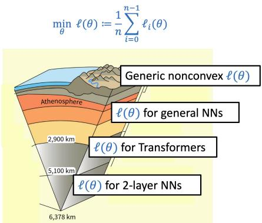  
Fig. 1.1. Overview of the thesis. We begin with general nonconvex objectives and then narrow down to the special structures found in NNs.

(iv) Design principles: Can we exploit NN-specific problem structure to build better optimizers? By investigating these questions both empirically and theoretically, this thesis enables a safer deployment, more reliable tuning, and a deeper understanding of current optimizers and the problem structure of NNs. These results establish a theoretical grounding and principled foundation behind current NN optimizers. We also collect these insights and propose a new optimizer with principled design. One takeaway lesson from this thesis is that optimizer behavior is usually tied to some special intrinsic structure of $\mathrm { N N s - a }$ factor not fully captured by classical theory.

On the technical side, we develop new concentration tools for the convergence result of Adam, and new decoupling methods in random matrix theory for the Hessian-structure analysis, which may be of independent interest.

## 1.1. Preliminaries

Notations. Throughout the thesis, we consider problem (1.1). We use θ to denote the optimization variable, which refers to NN parameters in deep learning scenarios. We denote $\nabla \ell _ { i }$ as the gradient of $\ell _ { i } .$ The update rule of Adam is presented in Algorithm 1.1. Here, m and v denote the 1st-order and 2nd-order momentum, controlled by hyperparameters $\beta _ { 1 } , \beta _ { 2 } \in [ 0 , 1 ]$ , respectively. The product ◦, division, and square-root operators are component-wise. We denote $\theta _ { k } , m _ { k } , v _ { k } \in \mathbb { R } ^ { d }$ as the value of θ, m, v at the k-th iteration, respectively. In practice, ϵ is adopted for numerical stability and it is often chosen to be $1 0 ^ { - 8 }$ . In our theory, we allow ϵ to be an arbitrary non-negative constant including 0.

Algorithm 1.1. Adam   
1: Initialize m0, v0, $\theta _ { 1 }$   
2: for $k = 1  \infty$ do   
3: Sample $\tau _ { k }$ uniformly from $\{ 0 , 1 , \ldots , n - 1 \}$   
4: $m _ { k } = \beta _ { 1 } m _ { k - 1 } + ( 1 - \beta _ { 1 } ) \nabla \ell _ { \tau _ { k } } ( \theta _ { k } )$   
5: $v _ { k } = \beta _ { 2 } v _ { k - 1 } + ( 1 - \beta _ { 2 } ) \nabla \ell _ { \tau _ { k } } ( \theta _ { k } ) \circ \nabla \ell _ { \tau _ { k } } ( \theta _ { k } )$   
6: $\begin{array} { r } { \theta _ { k + 1 } = \theta _ { k } - \frac { \eta _ { k } } { \sqrt { v _ { k } } + \epsilon } \circ m _ { k } } \end{array}$   
7: end for

This section is mainly based on:   
Adam Can Converge Without Any Modification On Update Rules.   
Yushun Zhang, Congliang Chen, Naichen Shi, Ruoyu Sun, Zhi-Quan Luo.   
Advances in Neural Information Processing Systems (NeurIPS), 2022 (Spotlight).   
Adam Converges Without Any Modification On Update Rules.   
Yushun Zhang, Bingran Li, Congliang Chen, Zhi-Quan Luo, Ruoyu Sun.   
(This is the journal extended version.)   
Under Review.

Popularity of Adam. In deep learning, Adam [Kingma and Ba, 2014] is one of the most popular algorithms for solving (1.1). It has been applied to various machine learning domains such as natural language processing (NLP) and computer vision (CV) (e.g., [Vaswani et al., 2017; Dosovitskiy et al., 2021]). Its impact is also evidenced by over 250,000 citations, a number that continues to grow rapidly [Scholar, 2025]. Moreover, with the rise of ChatGPT [OpenAI, 2022], Adam has become the crucial algorithm for training large language models (LLMs). Adam is reported to be used to train mainstream LLMs, including Llama series [Touvron et al., 2023], Qwen series [Bai et al., 2023], and DeepSeek series [Liu et al., 2024], etc. Adam is clearly serving as a major horsepower behind the advancement of AI. Its influence was recently recognized when it received the ICLR 2025 Test-of-Time Award [ICLR, 2025].

However, despite its ubiquity in industry, Adam is built on a surprisingly fragile foundation, and its practical behavior remains poorly understood. We will review the major theoretical criticisms and present new results and insights in the following chapters.

Organization of the thesis. Section 2 revisits the divergence–convergence debate of Adam and presents a convergence guarantee of Adam under problem-dependent hyperparameters. Section 3 studies when Adam is efective, connecting the Adam–SGD gap on Transformers to Hessian block structure and block heterogeneity, and then explaining where this structure comes from in simplified neural networks. Section 4 turns these structural insights into Adam-mini, a new optimizer that keeps Adam-like performance while reducing Adam’s memory footprint, and the final section concludes.

## 2. Divergence or Convergence? A Story of Adam

One central critique of Adam comes from an influential paper [Reddi et al., 2018] (the winner of ICLR 2018 Best Paper Award [ICLR, 2018]), where the authors provide an example that Adam diverges with a wide range of hyperparameters. A main result in [Reddi et al., 2018] states that:

[Reddi et al., 2018]: For any $\begin{array} { c } { { \beta _ { 1 } , \beta _ { 2 } ~ s . t . ~ 0 \leq \beta _ { 1 } < \sqrt { \beta _ { 2 } } < 1 } } \\ { { { } } } \\ { { d i v e r g e s . } } \end{array}$ , there exists a problem such that Adam

The divergence region is visualized in Figure 2.1 (a). This finding raises serious concerns for Adam’s deployment in AI model training, where the divergence can raise alerts of unpredictable training failures. Since then, many new variants have been designed. For instance, AMSGrad [Reddi et al., 2018] enforces $v _ { k }$ (defined later in Algorithm 1.1) to be non-decreasing; AdaBound [Luo et al., 2018] imposes a constraint $v _ { k } \in [ C _ { l } , C _ { u } ]$ to ensure the boundedness of the efective stepsize.

On the other hand, counter-intuitively, vanilla Adam remains exceptionally popular. Without any modification to its update rules, Adam works well in practice. This is rather surprising due to the existence of divergence theory. Even more mysteriously, we find that the commonly reported hyperparameters actually satisfy the divergence condition stated earlier. For instance, Kingma and Ba [2014] claim that $( \beta _ { 1 } , \beta _ { 2 } ) = ( 0 . 9 , 0 . 9 9 9 )$ is a “good choice for the tested machine learning problems” and it is indeed the default setting in deep learning libraries. For LLMs such as GPT-3, Llama series, and DeepSeek series [Brown et al., 2020; Touvron et al., 2023; Liu et al., 2024], $( \beta _ { 1 } , \beta _ { 2 } )$ is chosen to be (0.9, 0.95). All these hyperparameters live in the divergence region $\beta _ { 1 } < \sqrt { \beta _ { 2 } }$ . Surprisingly, instead of observing the divergence issue, these hyperparameters achieve good performance and they actually show signs of convergence.

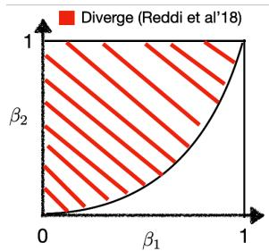  
(a) Divergent region claimed  
by [Reddi et al., 2018]

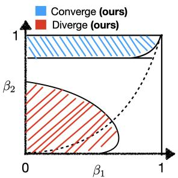  
(b) Our contribution

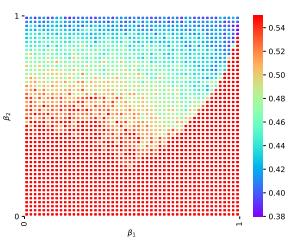  
(c) MNIST

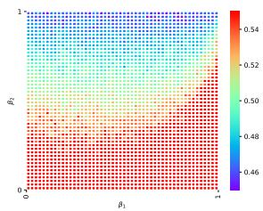  
(d) CIFAR-10  
Fig. 2.1. (a): The divergent region of Adam claimed by [Reddi et al., 2018]. They fix $( \beta _ { 1 } , \beta _ { 2 } )$ first and then pick a problem to construct the divergence example. (b): An illustration of our contribution in $( \beta _ { 1 } , \beta _ { 2 } )$ phase diagram. We fix the problem before picking $( \beta _ { 1 } , \beta _ { 2 } )$ . Note that this is a diferent setting from (a), so there is no contradiction. Both boundaries of the red and blue regions depend on batch size (shown later). The shape of the region follows the solution to our analytic conditions. The dotted curve satisfies $\beta _ { 1 } = \sqrt { \beta _ { 2 } }$ . (c), (d): The training loss on MNIST and CIFAR-10 over an extensive sweep of $\beta _ { 1 }$ and $\beta _ { 2 }$ . The performance of Adam reconciles with our theoretical characterization in (b).

Why does Adam work well despite its theoretical divergence issue? Is there any mismatch between deep learning problems and the divergence example? We take a closer look into the divergence example and find out the mismatch does exist. In particular, [Reddi et al., 2018] picks $( \beta _ { 1 } , \beta _ { 2 } )$ before picking the problem (or precisely, the # mini-batches n). That is, to construct the divergence example, they change n for diferent $( \beta _ { 1 } , \beta _ { 2 } )$ . On the other hand, in practical applications of Adam listed above, practitioners tune hyperparameters $( \beta _ { 1 } , \beta _ { 2 } )$ after the problem $( \mathrm { o r } ~ n )$ is fixed.

Given the empirical success of Adam, we conjecture that Adam can converge when the problem is fixed. To verify this conjecture, we run Adam on classification tasks on MNIST and CIFAR-10 as shown in Figure 2.1 (c) and (d). While Adam’s performance is unstable in the red region, we find that it always performs well in the top blue region in Figure 2.1. This seems to suggest that: when the problem is fixed, Adam can converge without modification after proper tuning of $\beta _ { 1 }$ and $\beta _ { 2 }$

In the remainder of this section, we theoretically quantify the diferent behaviors of Adam under diferent $( \beta _ { 1 } , \beta _ { 2 } )$ . We show that vanilla Adam, without algorithmic modification, exhibits two qualitatively diferent regimes: in a safe region of $( \beta _ { 1 } , \beta _ { 2 } )$ it provably converges to a neighborhood of critical points, whereas in a danger region it can diverge to infinity. Together, these results reveal a divergence–convergence phase transition in the $( \beta _ { 1 } , \beta _ { 2 } )$ plane.

We further point out that the critical boundary $( \beta _ { 1 } ^ { * } , \beta _ { 2 } ^ { * } )$ is problem-dependent, and particularly, dependent on batch size. This provides suggestions on how to tune $\beta _ { 1 }$ and $\beta _ { 2 } \colon$ when Adam does not work well, we suggest tuning up $\beta _ { 2 }$ inversely with batch size to surpass the threshold $\beta _ { 2 } ^ { * }$ , and then trying $\beta _ { 1 } < \sqrt { \beta _ { 2 } }$ . Our suggestions are supported by reports from several empirical studies, which observe improved LLM training performance when applying them.

Problem Setup. In our analysis, we make the following mild assumptions on $\ell _ { i } ( \theta )$ and $\ell ( \theta )$ in the ERM problem (1.1).

Assumption 2.1. (Lipschitz smoothness) We assume $\lVert \nabla \ell _ { i } ( \theta _ { 1 } ) - \nabla \ell _ { i } ( \theta _ { 2 } ) \rVert _ { 2 } \leq L \lVert \theta _ { 1 } - \theta _ { 2 } \rVert _ { 2 } , \forall \theta _ { 1 } , \theta _ { 2 } \in$ $\mathbb { R } ^ { d } ; \ell ( \theta )$ is lower bounded by a finite constant $\ell ^ { * }$

Assumption 2.2. (Afine variance condition) We assume $\begin{array} { r } { \sum _ { i = 0 } ^ { n - 1 } \| \nabla \ell _ { i } ( { \boldsymbol { \theta } } ) \| _ { 2 } ^ { 2 } \leq D _ { 1 } \| \nabla \ell ( { \boldsymbol { \theta } } ) \| _ { 2 } ^ { 2 } + } \end{array}$ $D _ { 0 } , \forall \theta \in \mathbb { R } ^ { d }$ , where $D _ { 1 } , D _ { 0 } \geq 0$ and are not both zero.

When $n , L , D _ { 0 }$ , and $D _ { 1 }$ are fixed a priori, we define the corresponding problem class

$$
\mathcal { F } _ { L , D _ { 0 } , D _ { 1 } } ^ { n , f ^ { * } } ( \mathbb { R } ^ { d } ) \ : = \left\{ \ell ( \theta ) \Big | \ \ell ( \theta ) = \frac { 1 } { n } \sum _ { i = 0 } ^ { n - 1 } \ell _ { i } ( \theta ) , \ \theta \in \mathbb { R } ^ { d } \ \mathrm { a n d ~ A s s u m p t i o n s ~ 2 . 1 - 2 . 2 ~ h o l d ~ w i t h } \ ( L , D _ { 0 } , D _ { 1 } ) \right\} \Big \} ,\tag{2.1}
$$

The Lipschitz condition in Assumption 2.1 is standard. The “afine variance” condition in $\mathrm { A s } .$ sumption 2.2 is quite general. It is originally proposed by [Bertsekas and Tsitsiklis, 2000] and is later popularized by [Bottou et al., 2018] in an equivalent form below:

$$
\frac { 1 } { n } \sum _ { i = 0 } ^ { n - 1 } \| \nabla \ell _ { i } ( \theta ) - \nabla \ell ( \theta ) \| _ { 2 } ^ { 2 } = \frac { 1 } { n } \left( \sum _ { i = 0 } ^ { n - 1 } \| \nabla \ell _ { i } ( \theta ) \| _ { 2 } ^ { 2 } \right) - \| \nabla \ell ( \theta ) \| _ { 2 } ^ { 2 } \leq \frac { ( D _ { 1 } - n ) } { n } \| \nabla \ell ( \theta ) \| _ { 2 } ^ { 2 } + \frac { D _ { 0 } } { n } , \forall \theta \in \mathbb { R } ^ { d } .\tag{2.2}
$$

Assumption 2.2 is weaker than commonly-used “bounded variance condition”, which requires $D _ { 1 } = n$ and the variance is not allowed to grow with the gradient $\| \nabla \ell ( \theta ) \| _ { 2 } ^ { 2 }$ . Please note that $D _ { 1 } = n$ is rather restricted. First, it does not even hold on convex quadratic minimization, and we provide a proof in Appendix A.2 in [Zhang et al., 2026]. Second, as we will elaborate later, it excludes some divergence counterexamples of SignSGD (which is equivalent to Adam with $\beta _ { 1 } = \beta _ { 2 } = 0 )$ . As such, analysis under $D _ { 1 } = n$ may not reveal the full picture of Adam.

Here, we allow generic $D _ { 1 } \geq 0$ . Assumption 2.2 is also recommended in the influential survey [Bottou et al., 2018] as it is “relatively minor” and “variance is allowed to grow quadratically in any direction.” We provide more details on the validity of Assum. 2.2 in Sec. 2.1 in [Zhang et al., 2026].

Finally, we emphasize that we do not add bounded gradient assumption $\| \nabla \ell ( \theta ) \| \le G$ , which is commonly used in the literature of stochastic gradient methods. This is crucial for revealing the phase transition: with gradients bounded a priori, Adam cannot diverge, while we prove that it can happen under certain $( \beta _ { 1 } , \beta _ { 2 } )$

## 2.1. A Brief Review of [Reddi et al., 2018]

Before stating our theoretical results, we first restate the counterexample by [Reddi et al., 2018]. They consider the following one-dimensional convex problem: minimize $\begin{array} { r } { \frac { 1 } { n } \sum _ { i = 0 } ^ { n - 1 } \ell _ { i } ( \theta ) } \end{array}$ where $\theta \in$ $[ - 1 , 1 ] , n \geq 3$

$$
\ell _ { i } ( \theta ) = \left\{ \begin{array} { l l } { n \theta , } & { \mathrm { ~ f o r ~ } i = 0 } \\ { - \theta , } & { \mathrm { ~ o t h e r w i s e } , } \end{array} \right.\tag{2.3}
$$

Note that (2.3) satisfies both Assumption 2.1 and 2.2 (with $D _ { 1 } = n ^ { 4 } + n ^ { 3 } - n ^ { 2 }$ and $D _ { 0 } = 0 )$ , so our assumptions do not rule out this counterexample a priori. This is a constrained problem with feasible set $\theta \in [ - 1 , 1 ]$ ; the optimal solution is $\theta ^ { * } = - 1$ . We restate their main claim as follows.

Theorem 2.1 (Theorem 2 in [Reddi et al., 2018]) For any fixed $( \beta _ { 1 } , \beta _ { 2 } )$ satisfying $\beta _ { 1 } < \sqrt { \beta _ { 2 } }$ there exists a suficiently large n such that Adam applied to the function (2.3) (under cyclic sampling) converges to the sub-optimal point $\theta = 1$

We briefly discuss the divergence condition for this Theorem. As stated in Eq. (7), Appendix B in [Reddi et al., 2018], for every fixed $( \beta _ { 1 } , \beta _ { 2 } )$ , they need a “constant n that depends on $\beta _ { 1 }$ and $\beta _ { 2 } ^ { \mathbf { \Gamma } \mathbf { \bullet } }$ As such, they require diferent n to cause divergence on diferent $( \beta _ { 1 } , \beta _ { 2 } )$ . The considered problem class is constantly changing. We note that these divergence results also hold when randomized update orders are used instead of cyclic orders, as proved in [Reddi et al., 2018, Theorem 3]. Consequently, randomization does not prevent divergence. This is diferent from the classical di-convergence debate of multi-block ADMM, where in that case randomization can serve as an efective remedy to prevent divergence [Chen et al., 2016; Sun et al., 2020]. Further, the proof of [Reddi et al., 2018] uses $\begin{array} { r } { \eta _ { k } \propto \frac { 1 } { \sqrt { k } } . } \end{array}$ so diminishing stepsize does not prevent divergence, either. These claims are supported by numerical evidence in Figure 2.2.

To prevent divergence, Reddi et al. [2018] suggested “ using...a diferent $\epsilon , \beta _ { 1 }$ , and $\beta _ { 2 }$ for each dimension. However, this defeats the purpose of adaptive methods since it requires tuning a large set of parameters.” In the following, we show that in our setting such divergence can be avoided without changing the algorithm or introducing new hyperparameters. The key is to choose $( \beta _ { 1 } , \beta _ { 2 } )$ in a problem-dependent manner, with a particular dependence on the number of mini-batches n (equivalently, the batch size). Importantly, this does not require per-coordinate tuning of $( \beta _ { 1 } , \beta _ { 2 } )$ a direction mentioned in the discussion of Reddi et al. [2018].

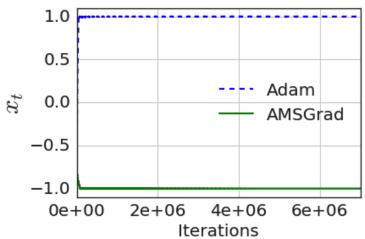  
(a) Cyclic update order

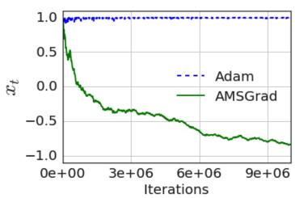  
(b) Randomized update order

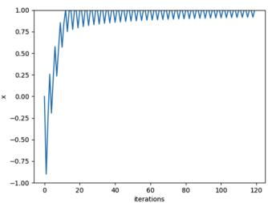  
(c) Diminishing stepsize  
Fig. 2.2. (a, b): We restate Figure 1 from [Reddi et al., 2018]. The divergence of Adam happens under both cyclic and random update orders, so randomization cannot prevent divergence. Since they consider constrained problems, the term “divergence” here means getting stuck at the sub-optimal solution $\theta = 1$ . In the figures, AMSGrad is a diferent method, and it is not our focus. (c): Diminishing stepsize $\begin{array} { r } { \eta _ { k } = \frac { 1 } { \sqrt { k } } } \end{array}$ does not prevent divergence.

## 2.2. Main Results

First, we prove that Adam converges with proper problem-dependent hyperparameters.

Theorem 2.2. (Convergence result under large $\beta _ { 2 } )$ Assume Algorithm 1.1 satisfies: $0 \leq \beta _ { 1 } <$ $\sqrt { \beta _ { 2 } } < 1 ; \beta _ { 2 }$ satisfies $\begin{array} { r } { \beta _ { 2 } \in [ 0 , 1 ) , \beta _ { 2 } \geq \gamma _ { 1 } ( n ) : = 1 - \mathcal { O } \left( \frac { 1 - \beta _ { 1 } ^ { n } } { n ^ { 5 } } \right) } \end{array}$ ; and $\begin{array} { r } { \eta _ { k } = \frac { \eta _ { 0 } } { \sqrt { k } } } \end{array}$ . For any $\ell ( \theta ) \in \mathcal { F } _ { L , D _ { 0 } , D _ { 1 } } ^ { n , f ^ { * } } ( \mathbb { R } ^ { d } )$ when $T \in \mathbb { N }$ is suficiently large, we have

$$
\operatorname* { m i n } _ { k \in [ 1 , T ] } \mathbb { E } \left[ \operatorname* { m i n } \left\{ \frac { \| \nabla \ell ( \theta _ { k } ) \| _ { 2 } ^ { 2 } } { \sqrt { D _ { 0 } } } , \frac { \| \nabla \ell ( \theta _ { k } ) \| _ { 2 } } { 2 \sqrt { d D _ { 1 } } } \right\} \right] = \mathcal { O } \left( \frac { \log T } { ( 1 - \beta _ { 2 } ) \sqrt { T } } \right) + \mathcal { O } ( ( 1 - \beta _ { 2 } ) \sqrt { D _ { 0 } } ) .\tag{2.4}
$$

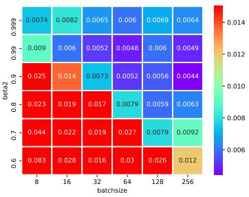  
(a) batch size vs. $\beta _ { 2 }$

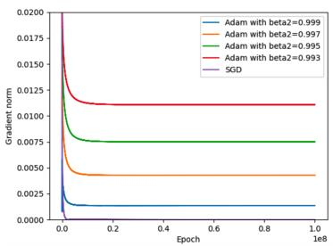  
(b) Large $\beta _ { 2 }$ and $D _ { 0 } > 0$

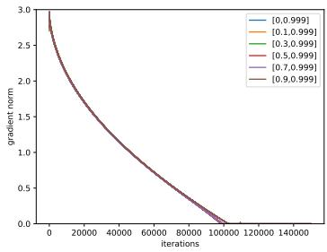  
(c) Large $\beta _ { 2 }$ and $D _ { 0 } = 0$  
Fig. 2.3. (a): The training loss of Adam on MNIST under diferent batch size and $\beta _ { 2 } .$ . The trend aligns with our theory: we need a larger $\beta _ { 2 }$ when batch size is small. Here, we used the default $\beta _ { 1 } = 0 . 9 .$ (b) (c): large-β2 Adam converges to a neighborhood of critical points when $D _ { 0 } > 0$ and converges to exact critical points when $D _ { 0 } = 0$ . We use diminishing stepsize $\eta _ { k } = 0 . 1 / \sqrt { k }$ as in our theory. The labels in (c) stand for $[ \beta _ { 1 } , \beta _ { 2 } ]$

Second, we prove a negative result that small- ${ \boldsymbol { \cdot } } { \boldsymbol { \beta } } _ { 2 }$ Adam can diverge, and the divergence region is also problem-dependent. The divergence of $\mathrm { s m a l l } { - \beta _ { 2 } }$ Adam suggests that “large $\beta _ { 2 } ^ { ~ \mathsf { , ; } \mathsf { , } }$ is necessary for Theorem 2.2. It is worth mentioning that Sign-SGD is a special case of Adam with $\beta _ { 1 } = \beta _ { 2 } = 0$ , so the following divergence result applies to Sign-SGD as well.

Theorem 2.3. (Divergence result under small $\beta _ { 2 } )$ For any problem class $\mathcal { F } _ { L , D _ { 0 } , D _ { 1 } } ^ { n , f ^ { * } } ( \mathbb { R } ^ { d } )$ with $n \geq 3 , D _ { 1 } \geq 2 n ^ { 2 }$ , and $D _ { 0 } \geq 0$ , there exists a $\ell ( \theta ) \in \mathcal { F } _ { L , D _ { 0 } , D _ { 1 } } ^ { n , f ^ { * } } ( \mathbb { R } ^ { d } )$ , s.t. when $( \beta _ { 1 } , \beta _ { 2 } )$ satisfies our analytic divergence conditions, Adam’s iterates, gradients of the iterates, and function values of the iterates all diverge to infinity. The size of the region depends on n and it expands to the whole region $[ 0 , 1 ] ^ { 2 }$ as n grows to infinity.

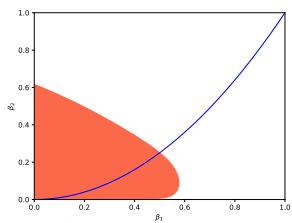  
(a) Divergence region

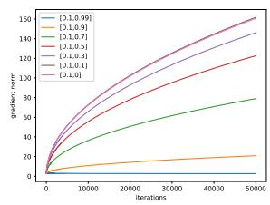  
(b) The efect of small β2

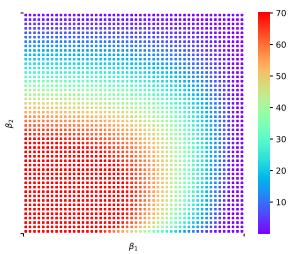  
(c) $n = 1 0$

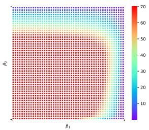  
(d) $n = 5 0$  
Fig. 2.4. (a): On our counterexample with $n = 2 0$ , Adam diverges to infinity in the colored region. The region is plotted by solving our analytic divergence conditions in NumPy. The blue curve satisfies $\beta _ { 1 } = \sqrt { \beta _ { 2 } }$ (b): When $\beta _ { 2 }$ is small, Adam diverges to infinity. The labels in (b) stand for $[ \beta _ { 1 } , \beta _ { 2 } ]$ . (c, d) The optimality gap $| \theta - \theta ^ { * } |$ after running 50k iterations of Adam on our counterexample under $n = 1 0$ and 50.

Our counterexample in Theorem 2.3 is constructed based on 1D quadratic objective, which we present below. Consider $\begin{array} { r } { f ( x ) = \frac { 1 } { n } \sum _ { i = 0 } ^ { n - 1 } f _ { i } ( x ) } \end{array}$ for $n \geq 3$ and $x \in \mathbb { R }$ , we define $f _ { i } ( x )$ as:

$$
f _ { 0 } ( x ) = \left\{ \begin{array} { l l } { ( 1 + ( n - 1 ) a ) x , } & { x \geq - 1 } \\ { \frac { ( 1 + ( n - 1 ) a ) } { 2 } ( x + 2 ) ^ { 2 } - \frac { 3 + 3 ( n - 1 ) a } { 2 } , } & { x < - 1 } \end{array} \right. , f _ { i } ( x ) = \left\{ \begin{array} { l l } { - a x , } & { x \geq - 1 } \\ { - \frac { a } { 2 } ( x + 2 ) ^ { 2 } + \frac { 3 a } { 2 } , } & { x < - 1 } \end{array} \right. \quad \mathrm { f o r ~ } i > 0 ,\tag{2.5}
$$

where $a > 0$ . Summing up all the $f _ { i } ( x )$ , one can see that: for any finite positive $a > 0 , f ( x )$ belongs to $\mathcal { F } _ { L , D _ { 0 } , D _ { 1 } } ^ { n , f ^ { * } } ( \mathbb { R } ^ { d } )$ . For instance, when $a = 1 / ( n - 1 ) ^ { 2 }$ , we have $D _ { 1 } = 2 n ^ { 2 } , D _ { 0 } = 0 .$ , and $f ( x )$ is lower bounded with optimal $x ^ { * } = - 2$ . Further, it satisfies Assumption 2.2 but not bounded variance, which restricts $D _ { 1 }$ to be $n .$ . Function (2.5) is modified based on [Reddi et al., 2018] but it allows both iterates and gradients to diverge to infinity. We note that Sign-SGD is a special case of Adam with $\beta _ { 1 } = \beta _ { 2 } = 0$ , so the following divergence result applies to Sign-SGD as well.

Combining the positive result (Theorem 2.2) and negative result (Theorem 2.3) together, we establish a phase transition for Adam from divergence to convergence when changing the $( \beta _ { 1 } , \beta _ { 2 } )$ combination. To our knowledge, this is the first convergence guarantee for unmodified Adam, and the first phase transition in the $( \beta _ { 1 } , \beta _ { 2 } )$ 2D plane reported in the literature, providing rigorous theoretical guarantees for Adam.

Remark 1: convergence to a neighborhood of critical points. When $D _ { 0 } > 0$ , Adam converges to a neighborhood of critical points, in lieu of the exact critical points. We emphasize that this is not due to the limitation of the analysis, and this phenomenon is also observed in practice: even for simple convex quadratic function with $D _ { 0 } > 0 .$ Adam with diminishing stepsize cannot reach exactly zero gradient (see Figure 2.3 (b)). In the non-realizable case $\left( D _ { 0 } > 0 \right)$ , converging to the neighborhood of critical points is common for stochastic methods, including constant-stepsize SGD [Luo, 1991; Bertsekas, 1997; Yan et al., 2018; Yu et al., 2019; Liu et al., 2020] and diminishing-stepsize RMSProp [Zaheer et al., 2018; Shi et al., 2020].

In the realizable case $\begin{array} { r l } { ( \mathrm { i . e . } } & { { } D _ { 0 } \ = \ 0 ) } \end{array}$ , Theorem 2.2 states that Adam can converge to critical points. This matches our numerical results in Figure 2.3 (c). The convergence rate in Theorem 2.2 is comparable to that of SGD under the same condition.

Remark 2: $\beta _ { 2 }$ and batch size. The condition of $\begin{array} { r } { \beta _ { 2 } \colon \beta _ { 2 } \geq \gamma _ { 1 } ( n ) = 1 - \mathcal { O } \left( \frac { 1 - \beta _ { 1 } ^ { n } } { n ^ { 5 } } \right) } \end{array}$ is problemdependent and it increases with $\#$ mini-batches n. This suggests that we need larger $\lvert \beta _ { 2 }$ when n is large, or equivalently, we need larger $\beta _ { 2 }$ when the batch size, which equals $\textstyle { \frac { D } { n } }$ , is small. (D denotes the total sample size.) This aligns with our experiments in Fig. 2.3 (a): on MNIST, smaller batch size $\textstyle { \frac { \mathcal { D } } { n } }$ (which is equivalent to larger n) requires a larger $\beta _ { 2 }$ to reach small loss. Note that our threshold of $\beta _ { 2 }$ is not claimed tight. Tightening the threshold for $\beta _ { 2 }$ will be an interesting future direction.

Remark 3: guidance to LLM pre-training. Our divergence-convergence theory indicates that larger $\beta _ { 2 }$ is necessary when n is large. This equivalently indicates that a larger $\beta _ { 2 }$ is required when the batch size, which equals $\textstyle { \frac { D } { n } } ;$ , is small. This message can provide guidance for hyperparameter tuning in LLM pre-training, as confirmed by various literature. We list some numerical evidence as follows.

• Sre´ckovi´c et al. [2025]: “Zhang et al. [2022] shows that larger $\beta _ { 2 }$ substantially improves smallbatch training, and Marek et al. [2025] highlights the importance of scaling $\beta _ { 2 }$ in this regime.”

• Zhang et al. [2024a] emphasize that “larger $\beta _ { 2 }$ (increase from 0.95 to 0.99 or 0.999) substantially improves small batch size training ... aligning with findings in [Zhang et al., 2022]”.

• Porian et al. [2024] report that “enlarging $\beta _ { 2 }$ (from 0.95 to 0.999) is essential at lower batch sizes ... This matches the theoretical work [Zhang et al., 2022].”

Remark 4: Is larger $\beta _ { 2 }$ always better? To ensure convergence, Theorem 2.2 states that $\beta _ { 2 }$ needs to be larger than a batch-size-dependent threshold $\beta _ { 2 } ^ { * }$ . But what is the optimal $\beta _ { 2 }$ within the range of $[ \beta _ { 2 } ^ { * } , 1 ) ?$ We provide an initial discussion based on our current results.

In Theorem 2.2, the rate includes the constant $\displaystyle \frac { 1 } { 1 - \beta _ { 2 } }$ , which is magnified as $\beta _ { 2 }  1$ . We note that such dependency is somewhat unavoidable as it is embedded in the design of Adam: when $\beta _ { 2 } = 1$ and initial $v _ { 0 } = 0 , v _ { k }$ always equals 0 and Adam is not well-defined. Consequently, our theoretical bound must naturally capture this worst-case singularity. Nevertheless, the bound in (2.4) remains strictly bounded and valid provided that $\beta _ { 2 } \in [ 0 , 1 )$ . In practical scenarios such as $\beta _ { 2 } = 0 . 9 5 \ \mathrm { o r } \ 0 . 9 9 9$ , this corresponds to a finite multiplier of 20 or 1000.

Theorem 2.2 suggests that: within the convergence range $[ \beta _ { 2 } ^ { * } , 1 )$ , a larger $\beta _ { 2 }$ is not necessarily better. This aligns with the empirical observation in trend in LLM where: when Adam converges under $\beta _ { 2 } = 0 . 9 5$ , a larger $\beta _ { 2 }$ such as 0.999 can yield worse performance [Wortsman et al., 2023; Bai et al., 2025].

Theoretically, finding the optimal $\beta _ { 2 }$ requires substantially more efort, and we leave it as a future direction. Empirically, [Marek et al., 2025] suggests a heuristic strategy, which can be helpful for practitioners: starting from the popular choice, $\mathrm { e . g . , } \ \beta _ { 2 } = 0 . 9 5$ , and if we were to scale the batch size from $B _ { 1 }$ to $B _ { 2 }$ , change $\beta _ { 2 }$ to $\beta _ { 2 } ^ { B _ { 2 } ^ { \star } / \dot { B } _ { 1 } }$

Remark 5: implication to SignSGD and Muon. Theorem 2.3 directly implies that SignSGD (Adam with $\beta _ { 1 } = \beta _ { 2 } = 0 )$ can diverge when $n \geq 3$ . Further, since SignSGD is Muon [Jordan et al., 2024] with $\beta = 0$ and matrix size equals 1, the same divergence also applies to Muon under this configuration. As such, we conjecture there is also a divergence-convergence phase transition of Muon under problem-dependent $\beta .$

We note that the bounded variance assumption (restrict $D _ { 1 } = n )$ excludes our counterexample from the considered function class, and SignSGD will converge to the neighborhood of critical points with $\eta _ { k } = \eta _ { 0 } / \sqrt { k }$ in that case. However, the analysis under bounded variance does not reveal the true divergent behavior of SignSGD. Our counterexample, which satisfies Assumption 2.2 (with $D _ { 1 } \geq 2 n ^ { 2 } )$ but not bounded variance, provides additional motivation to relax it. An intriguing open question is whether there exist more counterexamples with $D _ { 1 } \in ( n , 2 n ^ { 2 } )$ . We leave it for future investigation.

Acknowledgment from the authors of Adam. Finally, our result is mentioned by the authors of Adam in the [ICLR 2025 Test of Time speech], for [grounding Adam theoretically].

## 2.3. Key Lemmas for the Convergence Result in Theorem 2.2

Here, we summarize the key challenges behind Theorem 2.2.

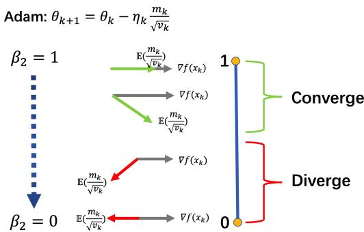  
Fig. 2.5. An illustration of the changes of Adam’s update direction when $\beta _ { 2 }$ changes.

Our key insights are illustrated in Figure 2.5: we find that Adam’s update direction E $\left( { \frac { m _ { k } } { \sqrt { v _ { k } } } } \right)$ is close to $\nabla \ell ( \theta _ { k } )$ when $\beta _ { 2 }$ is large (leading to convergence) and starts to deviate to the opposite direction when $\beta _ { 2 }$ is small (causing divergence).

Concentration efects of $\scriptstyle { \frac { 1 } { \sqrt { v _ { k } } } }$ when $\beta _ { 2 }$ is large. On the technical side, we find that $\scriptstyle { \frac { 1 } { \sqrt { v _ { k } } } }$ concentrates around $\frac { 1 } { \sqrt { \mathbb { E } _ { k } ( v _ { k } ) } }$ when $\beta _ { 2 }$ is large. In particular, we prove that:

$$
{ \frac { 1 } { \sqrt { v _ { k } } } } \approx { \frac { 1 } { \sqrt { \mathbb { E } _ { k } { \big ( } v _ { k } { \big ) } } } } , { \mathrm { ~ w . h . p . , ~ w h e n ~ } } \beta _ { 2 } { \mathrm { ~ i s ~ l a r g e } } .\tag{2.6}
$$

As a result, $- \frac { \nabla \ell _ { \tau _ { k } } ( \theta _ { k } ) } { \sqrt { v _ { k } } }$ becomes a descent direction in this case, i.e.,

$$
\mathbb { E } _ { k } \left( \frac { \nabla \ell _ { \tau _ { k } } ( \theta _ { k } ) } { \sqrt { v _ { k } } } \right) \approx \frac { \mathbb { E } _ { k } \left( \nabla \ell _ { \tau _ { k } } ( \theta _ { k } ) \right) } { \sqrt { \mathbb { E } _ { k } ( v _ { k } ) } } = \frac { \nabla \ell ( \theta _ { k } ) } { \sqrt { \mathbb { E } _ { k } ( v _ { k } ) } } ,
$$

which lies in the dual cone of the gradient direction $\nabla \ell ( \theta _ { k } )$ . Why does large $\beta _ { 2 }$ help? Intuitively, this is because large $\beta _ { 2 }$ slows down the changes of $v _ { k }$ , and its behavior will become largely predictable. It requires additional efort to handle the momentum $m _ { k }$ . We handle it via a new potential function, and we omit the details here for brevity.

The major challenge in the analysis is that $v _ { k }$ is a random variable and it appears in the denominator. This makes the entire system a stochastic non-linear dynamic system, which is dificult to analyze in general. Further, $v _ { k }$ can potentially hit 0, which imposes extra dificulties.

We prove (2.6) in Lemma 2.1, and the result holds without any boundedness condition on stochastic gradients. We prove this result by utilizing two special properties of Adam: (1) stochastic gradients have a “geometric sum” structure in $v _ { k }$ . (2) the indices of stochastic gradients are uniformly sampled from a finite index set. With these two special properties, we find the behavior of $\scriptstyle { \frac { 1 } { \sqrt { v _ { k } } } }$ is largely predictable when $\beta _ { 2 }$ is large.

Lemma 2.1. (Concentration of Adam’s preconditioner, simplified). Consider the same condition as Theorem 2.2. For any $\begin{array} { r } { 0 < \delta \le \frac { 1 } { 4 n } } \end{array}$ , there exists a suficiently large k such that with probability at least

$$
1 - n \exp \left( - \frac { \delta ^ { 2 } } { ( 1 - \beta _ { 2 } ) ( \frac { 2 8 } { 3 n } + \frac { 8 } { 3 } \delta ) } \right) ,
$$

we have the following concentration bound:

$$
\frac { C _ { \mathrm { l o w e r } } } { \sqrt { \mathbb { E } _ { k } ( v _ { l , k } ) } } \le \frac { 1 } { \sqrt { v _ { l , k } } } \le \frac { C _ { \mathrm { u p p e r } } } { \sqrt { \mathbb { E } _ { k } ( v _ { l , k } ) } } ,\tag{2.7}
$$

where $v _ { l , k }$ denotes the l-th component of $v _ { k } , \mathbb { E } _ { k } ( \cdot ) = \mathbb { E } ( \cdot \mid \mathcal { F } _ { k } )$ is the conditional expectation, and $C _ { l o w e r } , C _ { u p p e r }$ are defined as below, and they both approach 1 as $\beta _ { 2 }  1$

$$
C _ { l o w e r } : = 1 - ( 1 - \beta _ { 2 } ) \frac { 4 n } { ( 1 - 2 n \delta ) \beta _ { 2 } ^ { n } } , \quad C _ { u p p e r } : = \left( 1 - ( 1 - \beta _ { 2 } ) \frac { 8 n } { ( 1 - 2 n \delta ) \beta _ { 2 } ^ { n } } \right) ^ { - 1 / 2 } .
$$

Proof idea. Technically, the concentration result is established via two steps: (i) we map the dynamics of $1 / \sqrt { v _ { k } }$ to the dynamics of a sequence of i.i.d. Bernoulli r.v.s, which is inherently bounded and is much easier to analyze; (ii) we map the dynamics back by several decoupling steps. Step (i) and (ii) allow us to track the dynamics of possibly unbounded r.v. sequence using bounded Bernoulli proxies. The rigorous concentration efect is shown in Lemma 2.1 as follows. Lemma 2.1 can be used as a generic tool for analyzing Adam-type algorithms.

## 3. Why Transformers Need Adam: An Investigation into Hessian

This section is mainly based on:   
Why Transformers Need Adam: A Hessian Perspective.   
Yushun Zhang, Congliang Chen, Tian Ding, Ziniu Li, Ruoyu Sun, Zhi-Quan Luo.   
Advances in Neural Information Processing Systems (NeurIPS), 2024.   
Towards Quantifying the Hessian Structure of Neural Networks.   
Zhaorui Dong∗, Yushun Zhang∗, Jianfeng Yao, Ruoyu Sun   
(\*: Equal contribution. Alphabetically ordered.)   
Minor Revision at the IEEE Transactions on Information Theory.   
Adam-mini: Use Fewer Learning Rates To Gain More.   
Yushun Zhang∗, Congliang Chen∗, Ziniu Li, Tian Ding, Chenwei Wu, Diederik P. Kingma, Yinyu Ye,   
Zhi-Quan Luo, Ruoyu Sun.   
(\*: Equal contribution.)   
International Conference on Learning Representations (ICLR), 2025.

The convergence result explains that Adam can be safe under problem-dependent tuning, but it does not tell us when Adam is superior to SGD. Indeed, Adam’s practical advantage is not universal: Adam performs substantially better than SGD on complex modern NNs like Transformers; performs on par with SGD on CNNs; and meanwhile, performs worse than GD on simple random Gaussian quadratic problems (see Figure 3.1). These phenomena beg the question: what special structures in Transformers make Adam useful?

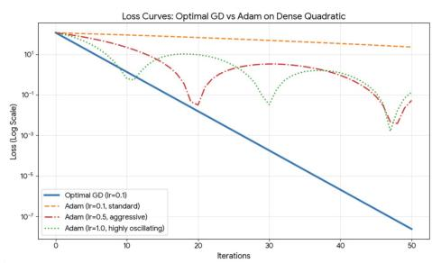  
(a) Adam on Gaussian quadratic objective

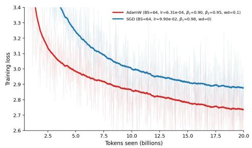  
(b) Adam on Transformers  
Fig. 3.1. Adam’s practical advantage is not universal. (a) Adam performs worse than GD on simple random Gaussian quadratic problems. (b) Adam performs substantially better than SGD on a Transformer with 200M parameters. All methods were well-tuned through an extensive hyperparameter search.

Adam as diagonal preconditioner. In this section, we interpret the Adam optimizer in Algorithm 1.1 as a diagonal preconditioning method:

$$
\theta _ { k + 1 } = \theta _ { k } - \eta _ { k } \mathrm { D i a g } ( v _ { k } ) ^ { - \frac 1 2 } m _ { k } : = \theta _ { k } - \eta _ { k } D _ { \mathrm { A d a m } } ^ { - \frac 1 2 } m _ { k } ,\tag{3.1}
$$

where the preconditioner $D _ { \mathrm { A d a m } } \in \mathbb { R } ^ { d \times d }$ is a diagonal matrix. In numerical linear algebra, the eficacy of a diagonal preconditioner is known to depend on the structure of the Hessian—whether it is diagonal, tridiagonal, diagonally dominant, or otherwise [Forsythe and Straus, 1955; Sun and Ye, 2021; Qu et al., 2022; Das et al., 2024]. Diagonal preconditioners typically perform poorly on dense Hessians, because they cannot capture of-diagonal couplings that dominate the curvature. The random Gaussian quadratic problem in Figure 3.1 (a) has a dense Hessian by construction, and we conjecture that this denseness is a primary reason for Adam’s poor performance in that regime.

To test this hypothesis, we numerically investigate the efectiveness of $D _ { \mathrm { A d a m } }$ on diferent Gaussian quadratic setups by varying the Hessian structure, its size, and its condition number. Our results in Figure 3.2 reveal a clear trend: as the Hessian becomes closer to diagonal, Adam’s performance consistently improves. This finding further supports the view that the interplay between the diagonal preconditioner and the underlying Hessian structure is a key determinant of Adam’s performance.

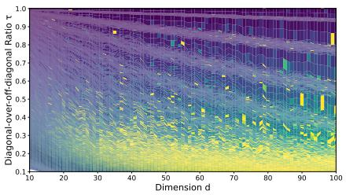  
(a) r vs. dimension d

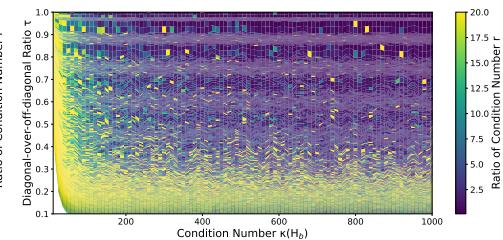  
(b) $r \ \mathrm { \bf ~ V s } .$ condition number κ  
Fig. 3.2. The efectiveness of Adam’s preconditioner $D _ { \mathrm { A d a m } }$ on diferent structures of a Hessian. The y-axis, denoted by $\tau \in [ 0 , 1 ]$ , serves as a measure of Hessian diagonality; the smaller the value of τ, the closer the Hessian is to a diagonal matrix. In the heat map, yellow corresponds to cases where $D _ { \mathrm { A d a m } }$ efectively reduces the Hessian’s condition number, whereas blue denotes cases where it does not. Across diferent sizes and condition numbers of the Hessian, we find that $D _ { \mathrm { A d a m } }$ is less efective when Hessian is dense.

So what structure in Transformers makes Adam useful? In the following, we will show that Hessians of NNs and Transformers have special structure: they approach near-block-diagonal structure as training proceeds. Further, Transformer Hessians are not only block-structured but also strongly block-heterogeneous. We will verify both theoretically and empirically that these two facts together make Adam superior to SGD.

The Hessian of 1-hidden-layer NNs. We find that Hessians of NNs are far from generic dense matrices. Let us start with a 1-hidden-layer network:

$$
f ( W , V ; x ) = V \sigma ( W x ) \in \mathbb { R } ^ { C } ,\tag{3.2}
$$

where $W \in \mathbb { R } ^ { m \times d }$ is the hidden weight matrix, $V \in \mathbb { R } ^ { C \times m }$ is the output weight matrix, and $\sigma$ is ReLU. Here, $d , m , C$ denote the input dimension, the hidden dimension (i.e., number of neurons), and the output dimension (i.e., number of classes), respectively. The output is then fed into a Cross-Entropy (CE) loss, which we denote by ℓ(θ), where $\theta = ( \operatorname { v e c } ( W ^ { \top } ) ^ { \top } , \operatorname { v e c } ( V ^ { \top } ) ^ { \top } ) ^ { \top } \in \mathbb { R } ^ { m d + m C }$ , i.e., the row-wise flattening of the two matrices.

We now examine the Hessian $\nabla ^ { 2 } \ell ( \theta )$ on this simple 1-hidden-layer network with $m = 8 , d = C =$ 500. As shown in Figure 3.3, the Hessian has a composite structure:

• Structure 1: block-diagonal. The within-layer Hessian sub-matrices exhibit near-blockdiagonal patterns, where one block corresponds to the parameters linked to one output neuron, i.e., one row in $W \in \mathbb { R } ^ { m \times d }$ or $V \in \mathbb { R } ^ { C \times m }$ . The structure persists along training. In this case, $m = 8$ and $C = 5 0 0$ , so we observe 8 and 500 blocks in the hidden and output layer, respectively.

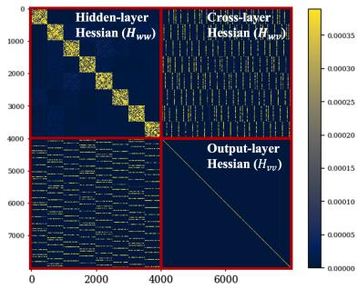  
(a) Hessian at initialization

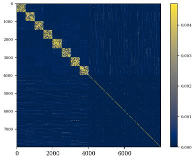  
(b) Hessian at 50% steps

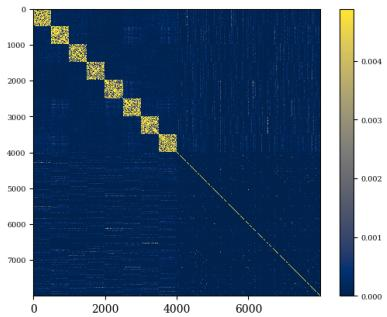  
(c) Hessian at 100% steps

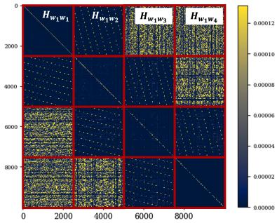  
(d) Hessian at initialization

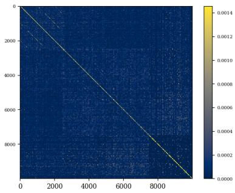  
(e) Hessian at 50% steps

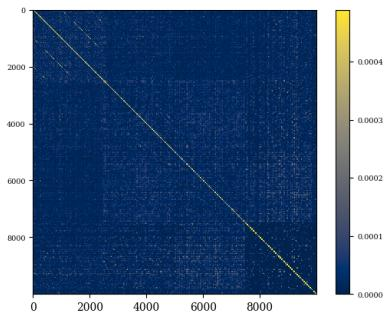  
(f) Hessian at 100% steps  
Fig. 3.3. (a-c): The Hessian of a 1-hidden-layer network on Gaussian synthetic data under CE loss. At initialization, we observe the “block-circulant” pattern in $H _ { w v } ,$ and the near-block-diagonal structure in $H _ { w w }$ and $H _ { v v }$ (with m + $C \ = \ 5 0 8$ blocks in total). We refer to it as “block-circulant-block-diagonal matrix”. We notice that the “block-circulant” pattern in $H _ { w v }$ vanishes along training, while the near-block-diagonal patterns in $H _ { w w }$ and $H _ { v v }$ are preserved. (d-f): The Hessian of a 4-layer network. We observe additional dense blocks in distant inter-layer Hessian. Other structures are similar to those in 1-hidden-layer networks.

• Structure 2: block-circulant. At the random initialization, the intra-layer Hessian submatrix exhibits a “near-block-circulant” pattern with periodic stripes. The structure vanishes along training.

The Hessian of deep NNs. A similar structure also exists in deeper $\mathrm { N N s , }$ with a richer compound structure at initialization. We now extend the above (3.2) to a 4-layer network:

$$
f ( W , V ; x ) = W _ { 4 } \sigma ( W _ { 3 } \sigma ( W _ { 2 } \sigma ( W _ { 1 } x ) ) ) \in \mathbb { R } ^ { C } ,\tag{3.3}
$$

where $W _ { 1 } \in \mathbb { R } ^ { m \times d } , W _ { 2 } , W _ { 3 } \in \mathbb { R } ^ { m \times m } , W _ { 4 } \in \mathbb { R } ^ { C \times m }$ are the weight matrices. When $d = m = C = 5 0 0$ we observe the following phenomena in Figure 3.3:

• Structure 1: block-diagonal. The within-layer Hessian sub-matrices exhibit near-blockdiagonal patterns, where one block corresponds to the parameters associated with one output neuron, i.e., one row in $W _ { i } , i = 1 , \cdots , 4$ . The structure persists along training. In this case, $m = C = 5 0 0$ , so we observe 500 blocks in each layer.

• Structure 2: block-circulant. At the random initialization, the adjacent intra-layer Hessian sub-matrix exhibits a “near-block-circulant” pattern with periodic stripes. The structure vanishes along training.

• Structure 3: dense. At the random initialization, the distant inter-layer Hessian sub-matrix exhibits a dense pattern. The structure vanishes along training.

We summarize the key observations as follows.

Observation 1. The Hessians of shallow and deep NNs appear to be “block-circulant-blockdiagonal” and “dense-block-circulant-block-diagonal” matrices at the initialization.

Observation 2. Training tends to simplify these matrices towards “near-block-diagonal” ones, where one block corresponds to one row in the weight matrix.

The Hessian of Transformers. In Figure 3.4, we observe a similar phenomenon in Transformers: for most modules, including MLPs, each Hessian block corresponds to a row of the weight matrix; for Query and Key modules, each block corresponds to a head. This head-wise structure is a direct consequence of the inherent parallel computation across heads.

\# blocks = # attention heads

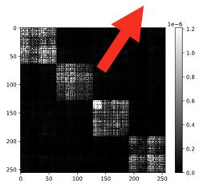  
(a) query (4 heads)

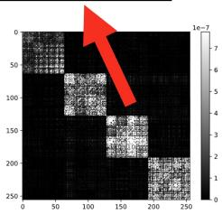  
(b) key (4 heads)

# blocks = # output neurons  
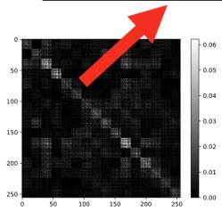  
(c) value (4 heads)

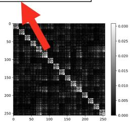  
(d) attn.proj (16 neurons)

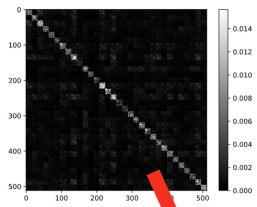

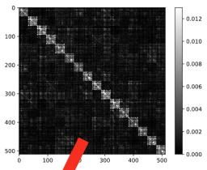

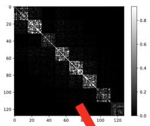

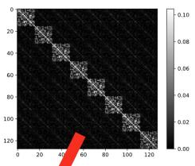  
# blocks = # output neurons (i.e., # tokens)

Fig. 3.4. (a-f): The Hessian of diferent modules in a Transformer.

Intuition on Linear Nets under MSE loss. Here, we provide simple intuition on why the blockstructure appears in the Hessian of NNs, and why one block corresponds to one row in the weight matrix. We reveal that the source stems from consecutive multiplication of large matrix variables.

We start with one layer in a linear NN without ReLU activation $y = W x = [ w _ { 1 } ^ { \top } x ; \cdot \cdot \cdot ; w _ { m } ^ { \top } x ]$ . One linear algebra fact is that: the change of i-th neuron $y _ { i }$ only depends on the i-th row of W, i.e., $\boldsymbol { w _ { i } ^ { \intercal } }$ but not other rows. This forms the foundation of the block-diagonal pattern: one block corresponds to one row of W.

The above linear algebra fact also helps explain the “block-circulant-block-diagonal” pattern in the 1-hidden-layer linear NN case. By the definition of matrix product, some links are connected, while some are not. As shown in Figure 3.5, any pair of connected links yields a multiplicative relation in the loss, which further gives a non-zero Hessian entry; while the non-connected pair gives a vanishing or exactly zero Hessian entry.

We can further use this observation to predict the Hessian structure of deep linear networks. The question then becomes “whether there exists a connected path between any two distant links in the NN computation graph.” For deep linear networks, the answer is essentially always yes. This explains the dense pattern observed in Structure 3.

We note that the above discussion is useful for intuition, but it is not a rigorous argument. Further, it does not fully explain why the intra-layer components vanish during training. A rigorous theory requires deriving the explicit Hessian expression and analyzing the asymptotic spectrum of each Hessian block as the network size grows.

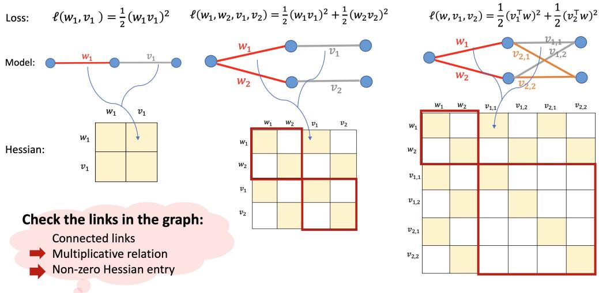  
Fig. 3.5. The Hessian structure of NNs can be understood through their computation graphs: any pair of connected links yields a multiplicative relation in the loss, which further gives a non-zero Hessian entry; while the non-connected pair gives a vanishing or exactly zero Hessian entry.

The main technical challenges in the proof come from the ReLU nonlinearity and the non-separable Cross-Entropy loss. In this case, we empirically find that the matrix sizes need to be large to cancel out the of-diagonal signals (see Figure 3.6 below). We summarize the key insights as follows.

Key insight. The special Hessian structure of NNs stems from consecutive multiplication of large matrix variables.

We remark that the near-block-diagonal Hessian was first empirically reported in [Collobert, 2004] on a simple NN, and the author attributed it to CE loss. Our findings challenge this conventional wisdom and suggest that CE loss is not crucial. On contrary, matrix product is the major source.

## 3.1. Rigorous Theory

We now provide rigorous theory on the Hessian structure of 1-hidden-layer NN in (3.2). The major technical challenge comes from “non-linearity”, i.e., CE loss and ReLU activation. We introduce new methods in random matrix theory to handle them. We reveal that the reported Hessian structure comes from a mixture of two forces: a “static force” rooted in the definition of matrix product, and a “dynamic force” arisen from training.

“Static force” shapes the within-layer structure. As suggested above, the static force originates from matrix multiplication, and the matrix size needs to be large in non-linear NNs. We now state the rigorous statement at random initialization. We find that the degree of block-diagonality grows with output dimension C. This is also observed numerically in Figure 3.6, where the background noise in Hessian vanishes as C grows. This suggests that a large C is necessary for the structure.

Theorem 3.1 (One-hidden-layer networks, simplified) Consider the Hessian of (3.2). Assume each entry of the input data matrix $\boldsymbol { X } = ( x _ { 1 } , \cdots , x _ { N } ) \in \mathbb { R } ^ { d \times N }$ follows i.i.d. $\mathcal { N } ( 0 , 1 )$ . Assume the model weights in W and V are initialized by LeCun initialization. Then for any fixed $m \geq 3$ , suppose $d , N \to \infty , { \frac { d } { N } } \to \gamma \in ( 0 , + \infty )$ , it holds that

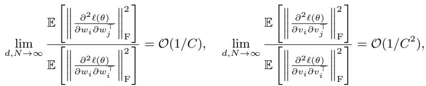

(3.4)

where C denotes the output dimension, i.e., the number of classes.

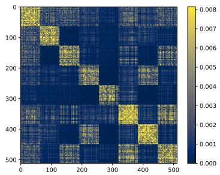  
(a) $C = 1 0$

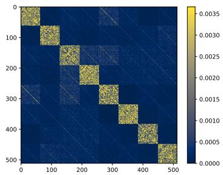  
(b) C = 100

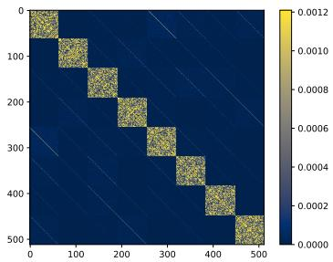  
(c) $C = 1 0 0 0$  
Fig. 3.6. The hidden-layer Hessian $H _ { w w }$ of a 1-hidden-layer network. The network has 8 hidden neurons. We observe that the block-diagonal Hessian structure in $H _ { w w }$ becomes clearer as C increases.

“Dynamic force” erases the intra-layer components. By direct calculation on the Hessian expression, one can see that the magnitude of the intra-layer “block-circulant” component is proportional to the optimality gap. That is:

$$
\frac { \partial ^ { 2 } \ell ( \theta ) } { \partial w _ { i } \partial v _ { j } ^ { \top } } \approx \left[ \begin{array} { l l l l l l } { 0 } & { \cdots } & { a _ { 1 , i } } & { 0 } & { \cdots } & { 0 } \\ { \vdots } & { \ddots } & { \vdots } & { \vdots } & { \ddots } & { \vdots } \\ { 0 } & { \cdots } & { a _ { d , i } } & { 0 } & { \cdots } & { 0 } \end{array} \right] \in \mathbb { R } ^ { d \times m } , \mathrm { ~ a n d ~ } a _ { d ^ { \prime } , i } = \mathcal { O } \left( \ell ( \theta ) - \ell ^ { * } \right) , d ^ { \prime } \in [ d ] .\tag{3.5}
$$

Therefore, as training progresses, the intra-layer component is expected to shrink. The proof is straightforward and we omit the detailed calculation here.

The above calculation suggests that the Hessian of the cross-layer components is proportional to the optimality gap $( \mathrm { i . e . , } \mathcal { O } \left( \ell ( \theta ) - \ell ^ { * } \right) )$ ), which requires proper training to vanish. Once it vanishes, it in turn accelerates the training process, thereby forming a positive feedback loop. Empirically, recent work [Abreu et al., 2025] compares the full Gauss–Newton (GN) method with the layer-wise GN approximated version for LLM pretraining, and they find that the layer-wise version incurs negligible degradation on final performance. This indicates that, when paired with an appropriate optimizer, the influence of the cross-layer Hessian can be neglected.

Proof idea for Theorem 3.1. We highlight some key technical contributions in our proof. The major challenge lies in characterizing limiting spectrum of product of dependent random matrices $X \Lambda X ^ { \top }$ , where each entry in $X \in \mathbb { R } ^ { d \times N }$ follows i.i.d. Gaussian and $\boldsymbol { \Lambda } \in \mathbb { R } ^ { N \times N }$ is a diagonal matrix that is dependent on X.

Dependent matrix product is a non-standard problem in random matrix theory. For our matrix of interest, we find an extra structure: the dependency between X and Λ purely comes from ReLU activation and CE loss, and it diminishes as $d  \infty .$ a phenomenon we refer to as “asymptotic independence”. With this observation, we manage to find the limiting spectrum of $X \Lambda X ^ { \top }$ via two steps: first, we propose a decoupling strategy based on Lindeberg interpolation principle [Lindeberg, 1922; Pastur, 2020] to address such dependency; second, after decoupling, we apply the generalized Marcenko-Pastur (GMP) law [Marˇcenko and Pastur, 1967] to characterize the spectrum.

The Lindeberg principle is originally an elegant proof for the Central Limit Theorem (CLT) [Lindeberg, 1922], by replacing the random variables with Gaussian ones incrementally and proving the impact is negligible under certain conditions. The Lindeberg principle is also applicable for random matrices [Chatterjee, 2006; G¨otze et al., 2015; Pastur, 2020]. We find that such methods are useful for handling asymptotic independence in our case.

We now illustrate our proof strategy. We consider the Hessian block of i-th row in output weight V (denoted as $H _ { i i } )$ as an example. For $H _ { i i } .$ , it has the following expression under CE loss:

$$
H _ { i i } = \frac { 1 } { N } \sum _ { n = 1 } ^ { N } p _ { n , i } ( 1 - p _ { n , i } ) x _ { n } x _ { n } ^ { \top } , \quad p _ { n , i } : = \frac { \exp ( v _ { i } ^ { \top } x _ { n } ) } { \sum _ { c = 1 } ^ { C } \exp ( v _ { c } ^ { \top } x _ { n } ) } ,\tag{3.6}
$$

The goal is to find the limit of $\| H _ { i i } \| _ { \mathrm { F } } ^ { 2 }$ as $N$ and d grow proportionally.

• Step 1. We introduce the following decoupled matrix

$$
\widetilde { H } _ { i i } = \frac { 1 } { N } \sum _ { n = 1 } ^ { N } \widetilde { p } _ { n , i } ( 1 - \widetilde { p } _ { n , i } ) x _ { n } x _ { n } ^ { \top } , \quad \widetilde { p } _ { n , i } : = \frac { \exp ( v _ { i } ^ { \top } \widetilde { x } _ { n } ) } { \sum _ { c = 1 } ^ { C } \exp ( v _ { c } ^ { \top } \widetilde { x } _ { n } ) } ,\tag{3.7}
$$

where $\widetilde { X } = ( \widetilde { x } _ { 1 } , \cdots , \widetilde { x } _ { N } ) \in \mathbb { R } ^ { d \times N }$ is an independent copy of X. The goal is to prove that

$$
\operatorname* { l i m } _ { N  \infty } ( s _ { H _ { i i } } ( z ) - s _ { \widetilde { H } _ { i i } } ( z ) ) = 0 , \quad \mathrm { a . s . } \quad \forall z \in \mathbb { C } ^ { + } ,
$$

where $s _ { H _ { i i } } ( z )$ denotes the Stieltjes transform [Tao, 2012] for the eigenvalue distribution of $H _ { i i }$ From standard measure concentration results, $s _ { H _ { i i } } ( z ) , s _ { \widetilde { H } _ { i i } } ( z )$ concentrate around their means as $N \to \infty$ . Therefore, it sufices to prove that lim $_ { \cdot N  \infty } ( \mathbb { E } [ s _ { H _ { i i } } ( z ) ] - \mathbb { E } [ s _ { \widetilde { H } _ { i i } } ( z ) ] ) = 0$

• Step 2. Following the Lindeberg principle, we define the matrix interpolation process

$$
X ( t ) = \sqrt { t } X + \sqrt { 1 - t } \widetilde { X } , \quad t \in [ 0 , 1 ] .
$$

Note that $X ( 1 ) = X$ and $X ( 0 ) = { \widetilde { X } }$ . We then define

$$
H _ { i i } ( t ) = \frac { 1 } { N } \sum _ { n = 1 } ^ { N } p _ { n , i } ( t ) ( 1 - p _ { n , i } ( t ) ) x _ { n } x _ { n } ^ { \top } , \quad \mathrm { ~ w h e r e ~ } p _ { n , i } ( t ) : = \frac { \exp ( v _ { i } ^ { \top } x _ { n } ( t ) ) } { \sum _ { c = 1 } ^ { C } \exp ( v _ { c } ^ { \top } x _ { n } ( t ) ) } .
$$

Then we have

$$
\mathbb { E } \left[ s _ { H _ { i i } } ( z ) - s _ { \widetilde { H } _ { i i } } ( z ) \right] = \int _ { 0 } ^ { 1 } \mathbb { E } \left[ \frac { d } { d t } s _ { H _ { i i } } ( t ) \right] d t .\tag{3.8}
$$

• Step 3. Then we calculate the integrand in (3.8) using Stein’s Lemma: for $Z \sim { \mathcal { N } } ( 0 , 1 )$ and diferentiable function $f : \mathbb { R } \to \mathbb { C }$ with sub-exponential decay at infinity, we have:

$$
\mathbb { E } [ Z f ( Z ) ] = \mathbb { E } [ f ^ { \prime } ( Z ) ] .\tag{3.9}
$$

We then prove that the r.h.s. of (3.9) decays to zero at rate $\mathcal { O } ( 1 / \sqrt { N } )$ , where N is the sample size, and thus $H _ { i i }$ shares the same limiting eigenvalue distribution as ${ \widetilde { H } } _ { i i }$ . This step uses the assumption of Gaussian data and initialization in Theorem 3.1.

We note that Step 3 would fail without the “asymptotic independence” arising from the ReLU activation and CE loss. Therefore, we do not address the general dependent-random-matrix problem; instead, we resolve only a specific case of it.

• Step 4. Apply GMP law [Marˇcenko and Pastur, 1967] to the decoupled matrix $\widetilde { H } _ { i i } = X \widetilde { \Lambda } X ^ { \top }$ (where $\widetilde { \Lambda }$ is independent of X), and we get the limit eigenvalue distribution of $\widetilde { H } _ { i i }$ . Then we apply the Taylor expansion in the functional equation in the GMP law to get the limiting second moment of $\mu _ { \widetilde { H } _ { i i } }$ , which is also the limit of $\| H _ { i i } \| _ { \mathrm { F } } ^ { 2 }$ . This concludes the proof.

## 3.2. Why Transformers Need Adam: Block-Heterogeneity

Based on the findings above, we briefly discuss why Adam is efective on Transformers. We find it is a result of the joint efect of structure and eigenvalues in the Hessian.

• First, as shown in Figure 3.4, Transformers share a similar Hessian structure with MLPs. This is because: (i) Transformers also consist of consecutive multiplication of large matrix variables; (ii) the head-wise parallel operations in attention insert an additional source of block-diagonality.

• Second, in Figure 3.7, we report that diferent Hessian blocks in Transformers have very diferent eigenvalue distributions (i.e., spectra), a phenomenon we refer to as block-heterogeneity. We will discuss the source of block-heterogeneity later.

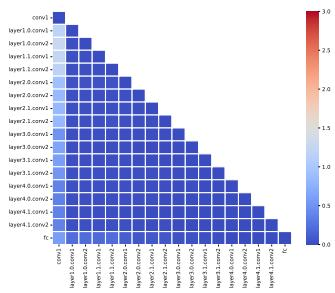  
(a) ResNet18

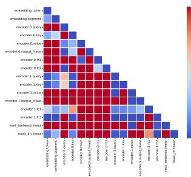  
(b) BERT

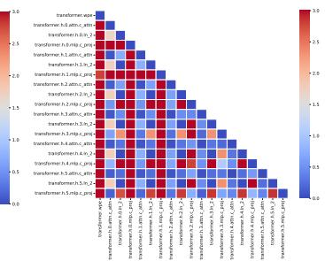  
(c) GPT2-nano  
Fig. 3.7. (a-c): The Jensen-Shannon (JS) distance among blockwise Hessian spectra at initialization. We find that the JS distance of blockwise spectra in CNNs is significantly smaller than that in Transformers.

Through extensive experiments on Transformers, CNNs, MLPs, and quadratic problems, we find that SGD can perform on par with Adam on problems without block heterogeneity (e.g., on CNNs), but performs worse than Adam when the heterogeneity exists. Intuitively, SGD is worse because it applies one single learning rate to all blocks, which cannot handle the heterogeneity among blocks. This limitation could be ameliorated if we use coordinate-wise learning rates, as designed in $D _ { \mathrm { A d a m } }$

About Adam on CNNs. Figure 3.7 shows that the block-wise spectra in CNNs are relatively homogeneous, which may explain why Adam ≈ SGD on CNNs. To be rigorous, however, we have not verified whether CNNs exhibit a similar near-block-diagonal Hessian structure. In fact, for a given parameter budget, the matrix dimensions in CNNs are typically much smaller than those in Transformers, so observing a similar Hessian structure may require training CNNs at a much larger scale. The verification would be computationally prohibitive, and we have not yet conducted it. To this end, why Adam lacks advantage on CNNs remains largely open. Two plausible explanations are the homogeneous spectra (assuming the block structure does appear in large-scale CNNs) or a dense Hessian (if it does not)—both of which can undermine the coordinate-wise learning rates in $D _ { \mathrm { A d a m } }$

Initial theory on Adam vs. GD. On quadratic objectives, we prove that Adam’s diagonal preconditioner $D _ { \mathrm { A d a m } }$ is provably efective under block-heterogeneity. We summarize our key results in Theorem 3.2. Adam has the rate $\tilde { O } \left( \operatorname* { m a x } _ { l \in [ L ] } \kappa _ { l } \right)$ , which can be faster than the rate of GD Ω(κ), where κ and $\kappa _ { l }$ denote the condition number of full Hessian and the l-th block in Hessian, respectively.

Theorem 3.2 (Adam vs. GD on quadratic objective, simplified) Consider min $\begin{array} { r } { \ell ( \theta ) = \frac { 1 } { 2 } \theta ^ { \top } H \theta - } \end{array}$ $h ^ { \top } \theta$ where $H \in \mathbb { R } ^ { d \times d }$ is positive definite and block-diagonal, and $h \in \mathbb { R } ^ { d }$ . Let $\theta _ { \mathrm { A d a m } } ^ { k }$ and $\theta _ { \mathrm { G D } } ^ { k }$ be the output of GD and Adam after k steps, respectively. For Adam, consider random initialization under any continuous distribution, $\beta _ { 1 } = 0 , \ \beta _ { 2 } = 1$ , v0 equals the initial gradient, and constant step size $\eta _ { k } = \eta$ , we have the following result w.p.1.:

$$
\ell ( \theta _ { \mathrm { A d a m } } ^ { k + 1 } ) - \ell ^ { * } \leq \operatorname* { m a x } _ { l \in [ L ] } \left( 1 - \frac { 1 } { r \kappa _ { l } } \right) \left( \ell ( \theta _ { \mathrm { A d a m } } ^ { k } ) - \ell ^ { * } \right) ,\tag{3.10}
$$

where r is an initialization-dependent constant and $\kappa _ { l }$ is the condition number of l-th block in H. For GD, there exists a block diagonal matrix H, h and an initial point $\theta ^ { 0 }$ , s.t., for any η, we have:

$$
\ell ( \theta _ { \mathrm { G D } } ^ { k + 1 } ) - \ell ^ { * } \geq \left( 1 - \frac { 2 } { \kappa + 1 } \right) ^ { 2 } \left( \ell ( \theta _ { \mathrm { G D } } ^ { k } ) - \ell ^ { * } \right) ,\tag{3.11}
$$

where κ is the condition number of H.

We now compare the complexity of Adam and that of GD. By Theorem 3.2, Adam is faster than GD when $r \cdot \operatorname* { m a x } _ { l \in [ L ] } \kappa _ { l } \le \kappa$ . In the quadratic model with heterogeneous blocks, our simulation over 1000 random trials shows that $r \leq 1 0 0 0$ with probability $\geq \frac { 2 } { 3 }$ when using standard Gaussian random initialization. Since $\operatorname* { m a x } _ { l \in [ L ] } \kappa _ { l }$ ≈ 1, we have $r \cdot \operatorname* { m a x } _ { l \in [ L ] } \kappa _ { l } \leq 1 0 0 0$ , w.h.p., and is about $5 \times$ smaller than $\kappa = 5 0 0 0$ . So Adam could be 5× faster than GD, w.h.p., under block-heterogeneity.

Technically, the core finding in the proof of Theorem 3.2 is that: the arrangement of the intermediate eigenvalues across blocks afects Adam’s performance, but leaves GD’s unchanged. We provide detailed proof in Appendix E in [Zhang et al., 2024b].

Limit cycle of constant-step-size Adam under $\beta _ { 2 } < 1$ . Theorem 3.2 considers $\beta _ { 2 } = 1$ . Thus, it uses $v _ { 0 }$ , which is the initial gradient, as the fixed preconditioner at arbitrary step $k > 0$ . We note that $\beta _ { 2 } = 1$ is necessary for analyzing the rate for constant-step-size Adam, as any $\beta _ { 2 } < 1$ will incur non-convergence with limit cycle on quadratic objectives [Da Silva and Gazeau, 2020; Bai et al., 2026]. The non-convergence is due to constant step size, and it does not contradict our convergence results in Section 2, which considers diminishing step size.

More discussions on the complexity of Adam. The complexity of Adam is now independent of the “global” condition number $\kappa ,$ and such changes could lead to considerable improvement over GD. Such improvement in complexity is attributed to the block diagonal structure in Hessian as well as its heterogeneous blockwise spectra. To our knowledge, such improvement is not shown in the existing literature. One possible reason is that: for the optimization community, it is rare to analyze (near-) block-diagonal Hessian structure since typical problems do not have such structure. For instance, in the classical non-linear programming dataset [Lavezzi et al., 2022], all problems have non-block diagonal Hessian. We suggest a diferent perspective to characterize modern optimization problems. We believe our perspective is new because it is built upon multiple non-trivial properties.

Source of block-heterogeneity. The source of block-heterogeneity is later partially attributed to (i) the imbalanced data [Kunstner et al., 2024], which brings block-heterogeneity in the Hessian of the output layer (Figure 8 and Proposition 2 in [Kunstner et al., 2024]); and (ii) softmax operator in architecture [Ormaniec et al., 2024], which brings block-heterogeneity in the Hessian of the Attention module.

Broader implications and Muon. We believe our results have broad implications.

First, besides $\mathrm { N N s , }$ our insights can be applied to a broad class of non-convex optimization with consecutive matrix products, e.g., matrix factorization and matrix completion. The connection is discussed in recent theoretical work on matrix factorization [Ma et al., 2026].

Second, our results also help understand why Muon [Jordan et al., 2024] performs well on NNs. Given a weight matrix $W \in \mathbb { R } ^ { m \times n }$ and its momentum matrix $M _ { k } \in \mathbb { R } ^ { m \times n }$ at step $k ,$ the update rule of Muon is as follows:

$$
W _ { k + 1 } = W _ { k } - \eta _ { k } \left( M _ { k } M _ { k } ^ { \top } \right) ^ { - \frac { 1 } { 2 } } M _ { k } = W _ { k } - \eta _ { k } I _ { m } M _ { k } \left( M _ { k } ^ { \top } M _ { k } \right) ^ { - \frac { 1 } { 2 } }\tag{3.12}
$$

In the flattened vector form, (3.12) is equivalent to the following block-diagonal preconditioner:

$$
\begin{array} { r l r } { \mathrm { v e c } ( W _ { k + 1 } ) } & { \stackrel { ( * ) } { = } } & { \mathrm { v e c } ( W _ { k } ) - \eta _ { k } \left( I _ { m } \otimes \left( M _ { k } ^ { \top } M _ { k } \right) ^ { - \frac { 1 } { 2 } } \right) _ { m n \times m n } \mathrm { v e c } ( M _ { k } ) , } \\ & { = } & { \mathrm { v e c } ( W _ { k } ) - \eta _ { k } \left[ \begin{array} { c c c } { M _ { k } ^ { \top } M _ { k } } & { \cdots } & { 0 } \\ { \vdots } & { \ddots } & { \vdots } \\ { 0 } & { \cdots } & { M _ { k } ^ { \top } M _ { k } } \end{array} \right] _ { m n \times m n } ^ { - \frac { 1 } { 2 } } \mathrm { v e c } ( M _ { k } ) } \\ & { } & \end{array}\tag{3.13}
$$

where $( * )$ uses the property of Kronecker product $( A \otimes B ) \operatorname { v e c } ( C ) = \operatorname { v e c } ( A C B )$ . As such, Muon can be viewed as a block-diagonal preconditioned GD, where one block corresponds to one row in W. The block partition is consistent with the Hessian structure of NNs.

Third, our findings advocate “head-wise Muon”. For Transformers, Figure 3.4 suggests that we should partition the Query and Key weights by head before applying the Muon update. This provides a separate preconditioner for each head, which better handles the block heterogeneity across heads. This design has been tested and then adopted by DeepSeek, and is being used to train their next models. 1)

Concurrently, the head-wise Muon design is also adopted in Kimi K3 model [Team et al., 2026], as referred as “Per-head Muon”. As mentioned by the key contributor, the intuition of such a design is that “Each head is inherently relatively independent and should not be coupled together [Su, 2026].” This intuition aligns with our observation on head-wise block Hessian structure.

## 4. Adam-mini: A New Optimizer Motivated by the Hessian Structure

This section is mainly based on:   
• Adam-mini: Use Fewer Learning Rates To Gain More.   
Yushun Zhang∗, Congliang Chen∗, Ziniu Li, Tian Ding, Chenwei Wu, Diederik P. Kingma, Yinyu Ye,   
Zhi-Quan Luo, Ruoyu Sun.   
(\*: Equal contribution.)   
International Conference on Learning Representations (ICLR), 2025.

By collecting the results accumulated in the previous sections, we now present Adam-mini, a new optimizer that achieves on-par or better performance than Adam with 50% less memory footprint. This demonstrates that our preceding Hessian analysis is not only useful for understanding Adam, but can also directly motivate the design of new optimizers.

Motivation. Adam requires the memory for its “optimizer states”: the 1st-order and 2nd-order momentum m and v. These in total take at least 2× the memory of the model size. This memory consumption burdens LLM training: to train a 13B model, Adam alone requires about 104 GB for m and v. This is expensive for advanced graphics cards (e.g., A100-80GB). To support training, CPU-ofload and optimizer state sharding [Rajbhandari et al., 2020] must be used in practice, which unfortunately increases the latency and slows down the training [Rajbhandari et al., 2021].

Algorithm 4.1. One step of Adam-mini   
1: Partition params into param blocks by Hessian   
structure   
2: for param in param blocks do   
3: g = param.grad   
4: m = (1 − β1) ∗ g + β1 ∗ m   
5: vmean = (1 − β2) ∗ mean(g ⊙ g) + β2 ∗ v   
6: param = param - η \* m   
√ vmean+ϵ   
7: end for

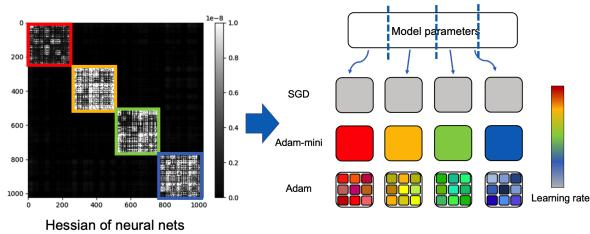  
Fig. 4.1. An illustration of Adam-mini. Adam-mini assigns learning rates (lrs) by Hessian structure. It uses more lrs than SGD but fewer than Adam.

Design idea of Adam-mini. We propose to cut down the learning rate resources in Adam, i.e., 1/√v. This is motivated by two observations from Section 3.

• First, the findings in Section 3 suggest that it is necessary to use a customized learning rate for each block to handle the block-heterogeneity. Nonetheless, Adam does much more than that: it assigns an individual learning rate not just for each block, but for each parameter.

• Second, as shown in Figure 3.2, Adam is not efective in dense Hessian blocks. In other words, we find that more learning rates do not necessarily bring extra gain.

Our findings imply that it is possible to achieve good performance with much fewer learning rates than in Adam. The remaining question is how to find them eficiently.

We then propose a simple way to find good learning rates that are suficient to perform on-par or better than Adam: we first partition the gradient vector into B sub-vectors according to the dense Hessian sub-blocks, and call each $g _ { b }$ for $b \in \{ 1 , \cdots , B \}$ . For each $g _ { b } ,$ we calculate the quantity below.

$$
{ \Big | } v _ { \mathrm { m e a n } , b } = ( 1 - \beta _ { 2 } ) * \mathtt { m e a n } ( g _ { b } \odot g _ { b } ) + \beta _ { 2 } * v _ { b } , \quad b = 1 , \cdots , B . { \Big | }\tag{4.1}
$$

We then use $\eta / \sqrt { v _ { \mathrm { m e a n } , b } }$ as the learning rate for the parameters in the block associated with $g _ { b }$ . We call the method Adam-mini. Such design changes $\geq 9 9 . 9 \%$ of Adam’s v to a negligible amount of scalars and thus reduces the memory. Overall, it saves about 50% of Adam’s optimizer-state memory.

Partition principle. We partition the parameters by Hessian structure. According to Figure 3.4, this corresponds to two cases in Transformers.

• Case 1: we partition Query and Key weight matrices by heads.

• Case 2: we partition other weight matrices by rows, or equivalently, by output neurons.

In matrix form, such partition strategy is simple and straightforward to implement: given a momentum matrix $M _ { k } = \left[ \begin{array} { c } { \bar { m _ { k , 1 } ^ { \top } } } \\ { \vdots } \\ { \bar { m _ { k , m } ^ { \top } } } \end{array} \right] \in \mathbb { R } ^ { m \times n }$ , for Case 2, we simply normalize $M _ { k }$ row-wise by $v _ { \mathrm { m e a n } } \in \mathbb { R } ^ { m }$

$$
\begin{array} { r l r } { W _ { k + 1 } } & { = } & { W _ { k } - \eta _ { k } \left[ \begin{array} { c c c c } { v _ { \mathrm { m e a n } , 1 } } & { \cdots } & { 0 } \\ { \vdots } & { \ddots } & { \vdots } \\ { 0 } & { \cdots } & { v _ { \mathrm { m e a n } , m } } \end{array} \right] _ { m \times m } ^ { - \frac { 1 } { 2 } } \left[ \begin{array} { c } { m _ { k , 1 } ^ { \top } } \\ { \vdots } \\ { m _ { k , m } ^ { \top } } \end{array} \right] _ { m \times n } = \left[ \begin{array} { c } { m _ { k , 1 } ^ { \top } / \sqrt { v _ { \mathrm { m e a n } , 1 } } } \\ { \vdots } \\ { m _ { k , m } ^ { \top } / \sqrt { v _ { \mathrm { m e a n } , m } } } \end{array} \right] _ { m \times n } . } \end{array}\tag{4.2}
$$

Similarly, for Case 1, we normalize $M _ { k }$ head-wise by $v _ { \mathrm { m e a n } } \in \mathbb { R } ^ { h }$ , and each group consists of $m / h$ consecutive rows corresponding to a single head, where h denotes the number of heads.

We note that both Case 1 and Case 2 are naturally compatible with distributed setups. As the head and row are usually not sharded across distinct GPUs, computing $v _ { \mathrm { m e a n } }$ requires no communication overhead.

Empirical results. We pre-train Llama 2 architectures from 39M to 1B parameters on C4 using Chinchilla-style token budgets [Hofmann et al., 2022]. Figure 4.2 shows that Adam-mini closely tracks AdamW across both compute and model scales, while using half the optimizer-state memory.

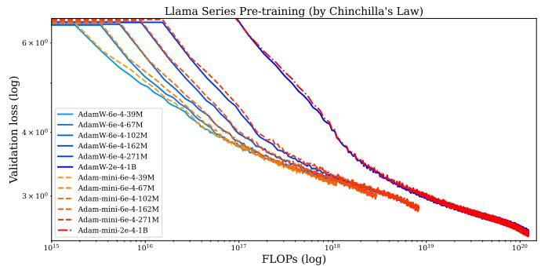

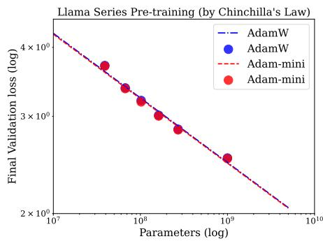  
Fig. 4.2. Scaling-law experiments on Llama 2 from 39M to 1B parameters. Adam-mini tracks AdamW across compute and model scales while using 50% less memory footprint.

Reproducibility, open-source, and diversity. The efectiveness of Adam-mini is independently reproduced by a recent benchmark by Stanford researchers [Wen et al., 2025a] with the conclusion that Adam-mini “closely tracks the performance of AdamW” and “sometimes even performs better than AdamW”. We open sourced Adam-mini on [GitHub] and have received 400+ stars, along with 3000+ monthly downloads via [PyPI].

Adam-mini is also used by diverse researchers. For instance, particle physicists Buss et al. [2025] want to train large difusion models, yet find that AdamW is “memory-intensive”, and all experiments are conducted with Adam-mini. Researchers are also using the codebase of Adam-mini to conduct other research, such as architecture design [Chen et al., 2026]. All these show that Adam-mini enables scientists from diverse fields to carry out research under limited GPU resources.

NorMuon: Adam-mini + Muon. The Adam-mini idea can also be used to improve Muon. First of all, we restate the update form of Muon here:

$$
\begin{array} { r l r } { \mathrm { v e c } ( W _ { k + 1 } ) } & { \stackrel { ( * ) } { = } } & { \mathrm { v e c } ( W _ { k } ) - \eta _ { k } \left( I _ { m } \otimes \left( M _ { k } ^ { \top } M _ { k } \right) ^ { - \frac { 1 } { 2 } } \right) _ { m n \times m n } \mathrm { v e c } ( M _ { k } ) , } \\ & { = } & { \mathrm { v e c } ( W _ { k } ) - \eta _ { k } \left[ \begin{array} { c c c } { M _ { k } ^ { \top } M _ { k } } & { \cdots } & { 0 } \\ { \vdots } & { \ddots } & { \vdots } \\ { 0 } & { \cdots } & { M _ { k } ^ { \top } M _ { k } } \end{array} \right] _ { m n \times m n } ^ { - \frac { 1 } { 2 } } \mathrm { v e c } ( M _ { k } ) } \\ & { } & \end{array}\tag{4.3}
$$

As shown in (4.3) and discussed previously in (3.13), Muon is a block-diagonal preconditioner that aligns with the Hessian structure, but it applies the same preconditioner $M _ { k } ^ { \top } M _ { k }$ to every neuron within the same layer (i.e., every row of $M _ { k } )$ . This makes it unable to handle neuron-wise heterogeneity [Zhang et al., 2024b; Dewulf et al., 2026].

NorMuon [Li et al., 2025] addresses this limitation by augmenting Muon with neuron-wise learning rates. That is, given a weight $W \in \mathbb { R } ^ { m \times n }$ and momentum $M _ { k } \in \mathbb { R } ^ { m \times n }$ , NorMuon changes the Muon update rule in (3.13) into the following form.

$$
\begin{array} { r l r } { \mathrm { v e c } ( W _ { k + 1 } ) } & { = } &  \mathrm { v e c } ( W _ { k } ) - \eta _ { k } \left[ \begin{array} { l l l l } { v _ { \mathrm { m e a n } , k , 1 } M _ { k } ^ { \top } M _ { k } } & { \cdots } & { 0 } \\ { \vdots } & { \ddots } & { \vdots } \\ { 0 } & { \cdots } & { v _ { \mathrm { m e a n } , k , m } M _ { k } ^ { \top } M _ { k } \right] _ { m n \times m n } ^ { - \frac { 1 } { 2 } } \mathrm { v e c } ( M _ { k } ) } \end{array} \end{array}\tag{4.4}
$$

where $v _ { \mathrm { m e a n } , k , j } \ \in \ \mathbb { R }$ for $j \in [ m ]$ are the newly designed neuron-wise learning rates, and they are designed by block-wise mean as in Adam-mini in (4.1). This design does not bring additional memory and computational overhead. NorMuon is now the leading method in the NanoGPT speedrun. In particular, all three fastest methods use NorMuon [Jordan, 2026].

Row-wise normalized methods. Besides NorMuon, there is a recent surge of new row-wise normalized methods that are motivated by Adam-mini (e.g., RMNP [Deng et al., 2026], Nora [Yuan et al., 2026], and Sron [Wen et al., 2025b]). These methods assign diferent learning rates to diferent rows in W, which matches the block structure of Hessian. The detailed form of these learning rates varies from Adam-mini, and some designs are shown to match Muon.

Finally, the row-wise normalized design in Adam-mini can also be combined with other optimizers to save memory. For instance, such ideas are used in Apollo and Apollo-mini [Zhu et al., 2025].

## 5. Conclusion

This thesis establishes a systematic investigation into the theoretical grounding and principled foundation of NN optimizers. We begin by investigating fundamental concerns about Adam’s convergence guarantees, progress to uncover Hessian-structure-based explanations for Adam-SGD gaps, then dive deeper to reveal the origin behind the special Hessian structure, and ultimately translate these insights into a new optimizer design called Adam-mini. This thesis helps shrink the gaps between optimization theory and large-scale practice, ofering both rigorous guarantees and actionable principles for safer, more reliable, more eficient, and better-understood training of neural networks.

Future directions. Finally, we point out some future directions.

• First, our Adam theory proves the existence of a divergence-convergence critical boundary, but its precise shape and uniqueness remain to be characterized.

• Second, it is intriguing to extend rigorous Hessian analysis to modern architectures and their key components, such as attention and SwiGLU-based MoEs. Despite the complexity of these architectures, the Hessian structure can be predicted following computational-graph-based analysis in Figure 3.5 in Section 3. That is, the Hessian structure can be predicted by asking “whether there exists a connected path between any two distant links in the NN computation graph.”

• Third, these Hessian structures may provide useful design principles for more efective secondorder optimizers.

## Major References

This PhD dissertation is composed of the following references.

1 Adam Can Converge Without Any Modification On Update Rules. Yushun Zhang, Congliang Chen, Naichen Shi, Ruoyu Sun, Zhi-Quan Luo. Advances in Neural Information Processing Systems (NeurIPS), 2022 (Spotlight).

2 Adam Converges Without Any Modification On Update Rules. Yushun Zhang, Bingran Li, Congliang Chen, Zhi-Quan Luo, Ruoyu Sun. (This is the journal extended version of paper 1.) Under Review.

3 Why Transformers Need Adam: A Hessian Perspective. Yushun Zhang, Congliang Chen, Tian Ding, Ziniu Li, Ruoyu Sun, Zhi-Quan Luo. Advances in Neural Information Processing Systems (NeurIPS), 2024.

4 Towards Quantifying the Hessian Structure of Neural Networks. Zhaorui Dong∗, Yushun Zhang∗, Jianfeng Yao, Ruoyu Sun (\*: Equal contribution. Alphabetically ordered.) Minor Revision at the IEEE Transactions on Information Theory.

5 Adam-mini: Use Fewer Learning Rates To Gain More. Yushun Zhang∗, Congliang Chen∗, Ziniu Li, Tian Ding, Chenwei Wu, Diederik P. Kingma, Yinyu Ye, Zhi-Quan Luo, Ruoyu Sun. (\*: Equal contribution.) International Conference on Learning Representations (ICLR), 2025.

Abreu, N., Vyas, N., Kakade, S., and Morwani, D. (2025). The potential of second-order optimization for llms: A study with full gauss-newton. arXiv preprint arXiv:2510.09378.

Achiam, J., Adler, S., Agarwal, S., Ahmad, L., Akkaya, I., Aleman, F. L., Almeida, D., Altenschmidt, J., Altman, S., Anadkat, S., et al. (2023). Gpt-4 technical report. arXiv preprint arXiv:2303.08774.

Bai, J., Bai, S., Chu, Y., Cui, Z., Dang, K., Deng, X., Fan, Y., Ge, W., Han, Y., Huang, F., et al. (2023). Qwen technical report. arXiv preprint arXiv:2309.16609.

Bai, Z., Zhao, J., Zhou, Z., Xu, Z.-Q. J., and Zhang, Y. (2026). Towards understanding adam convergence on highly degenerate polynomials. arXiv preprint arXiv:2603.09581.

Bai, Z., Zhou, Z., Zhao, J., Li, X., Li, Z., Xiong, F., Yang, H., Zhang, Y., and Xu, Z.-Q. J. (2025). Adaptive preconditioners trigger loss spikes in adam. arXiv preprint arXiv:2506.04805.

Bertsekas, D. P. (1997). Nonlinear programming. Journal of the Operational Research Society, 48(3):334–334.

Bertsekas, D. P. and Tsitsiklis, J. N. (2000). Gradient convergence in gradient methods with errors. SIAM Journal on Optimization, 10(3):627–642.

Bottou, L., Curtis, F. E., and Nocedal, J. (2018). Optimization methods for large-scale machine learning. SIAM review, 60(2):223–311.

Brown, T. B., Mann, B., Ryder, N., Subbiah, M., Kaplan, J., Dhariwal, P., Neelakantan, A., Shyam, P., Sastry, G., Askell, A., et al. (2020). Language models are few-shot learners. arXiv preprint arXiv:2005.14165.

Buss, T., Gaede, F., Kasieczka, G., Korol, A., Kr¨uger, K., McKeown, P., and Mozzanica, M. (2025). Calohadronic: a difusion model for the generation of hadronic showers. Journal of Instrumentation, 21:P01042. Also available as arXiv:2506.21720.

Chatterjee, S. (2006). A generalization of the lindeberg principle. Annals of Probability, 34(6):2061 2076.

Chen, C., He, B., Ye, Y., and Yuan, X. (2016). The direct extension of admm for multi-block convex minimization problems is not necessarily convergent. Mathematical Programming, 155(1):57–79.

Chen, M., Qi, X., He, Y., Ye, J., and Xiao, R. (2026). Simplegpt: Improving gpt via a simple normalization strategy. arXiv preprint arXiv:2602.01212.

Collobert, R. (2004). Large scale machine learning. Technical report, Universit´e de Paris VI.

Da Silva, A. B. and Gazeau, M. (2020). A general system of diferential equations to model first-order adaptive algorithms. The Journal of Machine Learning Research, 21(1):5072–5113.

Das, R., Agarwal, N., Sanghavi, S., and Dhillon, I. S. (2024). Towards quantifying the preconditioning efect of adam. arXiv preprint arXiv:2402.07114.

Deng, S., Ouyang, Z., Pang, T., Liu, Z., Jin, R., Yu, S., and Yang, Y. (2026). Rmnp: Rowmomentum normalized preconditioning for scalable matrix-based optimization. arXiv preprint arXiv:2603.20527.

Dewulf, A., Pai, D., Yang, L., Zhang, A., and Keigwin, B. (2026). Aurora: A leverage-aware optimizer for rectangular matrices.

Dosovitskiy, A., Beyer, L., Kolesnikov, A., Weissenborn, D., Zhai, X., Unterthiner, T., Dehghani, M., Minderer, M., Heigold, G., Gelly, S., Uszkoreit, J., and Houlsby, N. (2021). An image is worth 16x16 words: Transformers for image recognition at scale. In International Conference on Learning Representations.

Forsythe, G. E. and Straus, E. G. (1955). On best conditioned matrices. Proceedings of the American Mathematical Society, 6(3):340–345.

G¨otze, F., K¨osters, H., and Tikhomirov, A. (2015). Asymptotic spectra of matrix-valued functions of independent random matrices and free probability. Random Matrices: Theory and Applications, 4(02):1550005.

Hofmann, J., Borgeaud, S., Mensch, A., Buchatskaya, E., Cai, T., Rutherford, E., Casas, D. d. L., Hendricks, L. A., Welbl, J., Clark, A., et al. (2022). Training compute-optimal large language models. arXiv preprint arXiv:2203.15556.

ICLR (2018). ICLR 2018 Schedule Overview. https://iclr.cc/Conferences/2018/ ScheduleOverview. Lists On the Convergence of Adam and Beyond as the Best Paper Award.

ICLR (2025). Announcing the Test of Time Award Winners from ICLR 2015. https://blog. iclr.cc/2025/04/14/announcing-the-test-of-time-award-winners-from-iclr-2015/. Accessed 27 May 2025.

Jordan, K. (2026). Modded-nanogpt: A speedrun to train a 124m parameter transformer eficiently. https://github.com/KellerJordan/modded-nanogpt. Accessed: 2026-06-23.

Jordan, K., Jin, Y., Boza, V., You, J., Cesista, F., Newhouse, L., and Bernstein, J. (2024). Muon: An optimizer for hidden layers in neural networks.

Kingma, D. P. and Ba, J. (2014). Adam: A method for stochastic optimization. arXiv preprint arXiv:1412.6980.

Kunstner, F., Yadav, R., Milligan, A., Schmidt, M., and Bietti, A. (2024). Heavy-tailed class imbalance and why adam outperforms gradient descent on language models. arXiv preprint arXiv:2402.19449.

Lavezzi, G., Guye, K., and Ciarci\`a, M. (2022). Nonlinear programming solvers for unconstrained and constrained optimization problems: a benchmark analysis. arXiv preprint arXiv:2204.05297.

Li, Z., Liu, L., Liang, C., Chen, W., and Zhao, T. (2025). Normuon: Making muon more eficient and scalable. arXiv preprint arXiv:2510.05491.

Lindeberg, J. (1922). Eine neue herleitung des exponentialgesetzes in der wahrscheinlichkeitsrechnung. Mathematische Zeitschrift, 15(1):211 – 225.

Liu, A., Feng, B., Xue, B., Wang, B., Wu, B., Lu, C., Zhao, C., Deng, C., Zhang, C., Ruan, C., et al. (2024). Deepseek-v3 technical report. arXiv preprint arXiv:2412.19437.

Liu, Y., Gao, Y., and Yin, W. (2020). An improved analysis of stochastic gradient descent with momentum. arXiv preprint arXiv:2007.07989.

Luo, L., Xiong, Y., Liu, Y., and Sun, X. (2018). Adaptive gradient methods with dynamic bound of learning rate. In International Conference on Learning Representations.

Luo, Z.-Q. (1991). On the convergence of the lms algorithm with adaptive learning rate for linear feedforward networks. Neural Computation, 3(2):226–245.

Ma, J., Huang, Y., Chi, Y., and Chen, Y. (2026). Preconditioning benefits of spectral orthogonalization in muon. arXiv preprint arXiv:2601.13474.

Marˇcenko, V. A. and Pastur, L. A. (1967). Distribution of eigenvalues for some set of random matrices. Mathematics of the USSR-Sbornik, 1(4):457.

Marek, M., Lotfi, S., Somasundaram, A., Wilson, A. G., and Goldblum, M. (2025). Small batch size training for language models: When vanilla sgd works, and why gradient accumulation is wasteful. arXiv preprint arXiv:2507.07101.

OpenAI (2022). Chatgpt (nov 30 version) [large language model]. Accessed: 2025-05-15.

Ormaniec, W., Dangel, F., and Singh, S. P. (2024). What does it mean to be a transformer? insights from a theoretical hessian analysis. arXiv preprint arXiv:2410.10986.

Pastur, L. (2020). On random matrices arising in deep neural networks: Gaussian case. Pure and Applied Functional Analysis, 5(6):1395 – 1424.

Porian, T., Wortsman, M., Jitsev, J., Schmidt, L., and Carmon, Y. (2024). Resolving discrepancies in compute-optimal scaling of language models. Advances in Neural Information Processing Systems, 37:100535–100570.

Qu, Z., Gao, W., Hinder, O., Ye, Y., and Zhou, Z. (2022). Optimal diagonal preconditioning: Theory and practice. arXiv preprint arXiv:2209.00809.

Rajbhandari, S., Rasley, J., Ruwase, O., and He, Y. (2020). Zero: Memory optimizations toward training trillion parameter models. In SC20: International Conference for High Performance Computing, Networking, Storage and Analysis, pages 1–16. IEEE.

Rajbhandari, S., Ruwase, O., Rasley, J., Smith, S., and He, Y. (2021). Zero-infinity: Breaking the gpu memory wall for extreme scale deep learning. In Proceedings of the international conference for high performance computing, networking, storage and analysis, pages 1–14.

Reddi, S. J., Kale, S., and Kumar, S. (2018). On the convergence of adam and beyond. In International Conference on Learning Representations.

Scholar, G. (2025). https://scholar.google.com/scholar?oi=bibs&hl=en& cites=16194105527543080940,10561642725708924006,8776215530672338536, 17607154055187750797,8498514209881222824,3931560505490345047, 16226219632797774343,16111079307796299296,13264970321150126215, 11869859376987161805,11430597276676453789,5669591665425275538, 1944550801657937622,275207800116052367,630464762792003720,14056964711882014466, 3067190135652312858,17573188221268842192,9561591289532092532,5915381407158841087. Google Scholar.

Shi, N., Li, D., Hong, M., and Sun, R. (2020). Rmsprop converges with proper hyper-parameter. In International Conference on Learning Representations.

Sre´ckovi´c, T., Geiping, J., and Orvieto, A. (2025). Is your batch size the problem? revisiting the adam-sgd gap in language modeling. arXiv preprint arXiv:2506.12543.

Su, J. (2026). A brief look at k3’s moe and attention.

Sun, R., Luo, Z.-Q., and Ye, Y. (2020). On the eficiency of random permutation for admm and coordinate descent. Mathematics of Operations Research, 45(1):233–271.

Sun, R. and Ye, Y. (2021). Worst-case complexity of cyclic coordinate descent: O (nˆ 2) o (n 2) gap with randomized version. Mathematical Programming, 185:487–520.

Tao, T. (2012). Topics in random matrix theory, volume 132. American Mathematical Soc.

Team, K., Bai, T., Bai, Y., Bao, Y., Cai, J., Cai, X., Cao, P., Cao, Y., Chai, Z., Charles, Y., et al. (2026). Kimi k3: Open frontier intelligence. arXiv preprint arXiv:2607.24653.

Touvron, H., Martin, L., Stone, K., Albert, P., Almahairi, A., Babaei, Y., Bashlykov, N., Batra, S., Bhargava, P., Bhosale, S., et al. (2023). Llama 2: Open foundation and fine-tuned chat models. arXiv preprint arXiv:2307.09288.

Vaswani, A., Shazeer, N., Parmar, N., Uszkoreit, J., Jones, L., Gomez, A. N., Kaiser, L., and Polosukhin, I. (2017). Attention is all you need. In Advances in neural information processing systems, volume 30, pages 5998–6008.

Wen, K., Hall, D., Ma, T., and Liang, P. (2025a). Fantastic pretraining optimizers and where to find them. arXiv preprint arXiv:2509.02046.

Wen, Z., Shi, Y., Wang, J., Luo, P., Qiao, L., Li, D., and Sun, T. (2025b). Sron: State-free llm training via row-wise gradient normalization.

Wortsman, M., Liu, P. J., Xiao, L., Everett, K., Alemi, A., Adlam, B., Co-Reyes, J. D., Gur, I., Kumar, A., Novak, R., et al. (2023). Small-scale proxies for large-scale transformer training instabilities. arXiv preprint arXiv:2309.14322.

Yan, Y., Yang, T., Li, Z., Lin, Q., and Yang, Y. (2018). A unified analysis of stochastic momentum methods for deep learning. arXiv preprint arXiv:1808.10396.

Yu, H., Jin, R., and Yang, S. (2019). On the linear speedup analysis of communication eficient momentum sgd for distributed non-convex optimization. In International Conference on Machine Learning, pages 7184–7193. PMLR.

Yuan, J., Zou, J., Wang, S., Liu, Y., and Nie, F. (2026). Nora: Normalized orthogonal row alignment for scalable matrix optimizer. arXiv preprint arXiv:2605.03769.

Zaheer, M., Reddi, S., Sachan, D., Kale, S., and Kumar, S. (2018). Adaptive methods for nonconvex optimization. In Bengio, S., Wallach, H., Larochelle, H., Grauman, K., Cesa-Bianchi, N., and Garnett, R., editors, Advances in Neural Information Processing Systems, volume 31. Curran Associates, Inc.

Zhang, H., Morwani, D., Vyas, N., Wu, J., Zou, D., Ghai, U., Foster, D., and Kakade, S. (2024a). How does critical batch size scale in pre-training? arXiv preprint arXiv:2410.21676.

Zhang, Y., Chen, C., Ding, T., Li, Z., Sun, R., and Luo, Z.-Q. (2024b). Why transformers need adam: A hessian perspective. Advances in Neural Information Processing Systems, 37:131786–131823.

Zhang, Y., Chen, C., Shi, N., Sun, R., and Luo, Z.-Q. (2022). Adam can converge without any modification on update rules. Advances in neural information processing systems, 35:28386–28399.

Zhang, Y., Li, B., Chen, C., Luo, Z.-Q., and Sun, R. (2026). Adam converges without any modification on update rules. arXiv preprint arXiv:2603.02092.

Zhu, H., Zhang, Z., Cong, W., Liu, X., Park, S., Chandra, V., Long, B., Pan, D. Z., Wang, Z., and Lee, J. (2025). Apollo: Sgd-like memory, adamw-level performance. Proceedings of Machine Learning and Systems, 7.