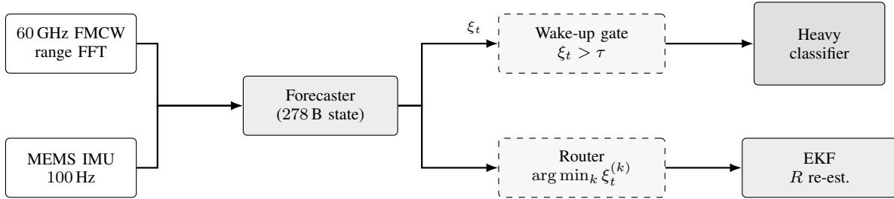
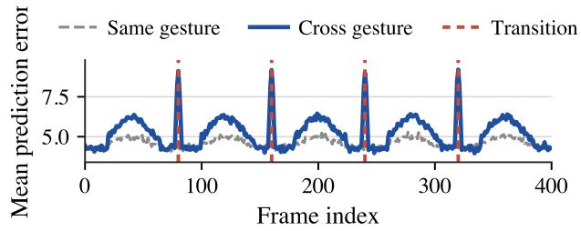
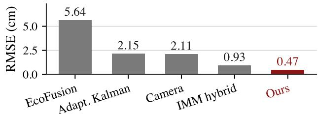

# One Residual with three reuses: A Wristband Front End for Gesture Sensing

Sam Rifaki

Dept. of Electrical Engineering

Stanford University

Stanford, CA, USA

sam.rifaki@stanford.edu

Abstract—Continuous wrist-worn hand sensing for gesture interfaces and motor symptom monitoring needs an always-on front end that fits inside a coin-cell power budget while pairing a micro-electro-mechanical-systems (MEMS) inertial measurement unit (IMU) with a 60 GHz frequency-modulated continuous-wave (FMCW) radar to stay robust under occlusion and on-body drift. We present a design study of such a wristband front end in which classifier wake-up gating, mmWave versus IMU routing, and innovation-based EKF measurement reweighting share a single on-chip residual generator. The shared generator occupies 14.4 KB of program memory and 278 B of state and runs at 110K multiply-accumulates (MACs) per frame on an Ambiq Apollo4 Blue Plus class edge microcontroller unit (MCU). Across four public sensor data corpora (IPN Hand, SHREC 2021, MiliPoint 60 GHz FMCW radar, EAT-Radar) the front end reaches detection probability $P _ { D } = 0 . 7 2 / 0 . 8 0$ at a 1 % falsealarm rate, sustains a 47 % classifier invocation energy reduction at 90 % gesture detection recall, and lowers pose tracking rootmean-square error by 4.6× under measurement bias drift relative to an adaptive Kalman with R-inflation baseline. Measured silicon power and on-body capture are deferred to follow-on hardware; the contribution here is a design study under the IEEE Sensors design study category.

Index Terms—Wearable sensors, 60 GHz FMCW radar, MEMS IMU, EKF innovation, low-power edge MCU, design study.

## I. INTRODUCTION

There has been growing interest in using hand-tracking systems for gesture interfaces, rehabilitation tracking, and clinical assessments of motor symptoms [1]. To support hand sensing on the wrist, a number of researchers have combined a MEMS inertial measurement unit (IMU) with a short-range 60 GHz frequency-modulated continuous-wave (FMCW) radar. These combinations recover hand pose under occlusion, varying onbody placement, and lighting changes that defeat optical-only systems [2], [3]. Operating these radios always-on under a coin-cell budget forces the front end to gate the heavy classifier on signal-bearing frames, to route between transducers under a fixed bandwidth budget, and to compensate on-body drift without per-deployment recalibration.

Most wearable systems for these applications include separate subsystems to handle each of the above functions. Examples of wake-up gating include recent studies on online changepoint testing [4], and previous studies that use Kalman-style estimators together with their associated innovation residuals [5]. Drift tolerance through interacting multiple model filters or hybrid learning-based filters has been implemented by [6], [7]. Modality switching has been implemented through information-gain scheduling approaches such as [8], [9]. Because each function requires its own calibration table and silicon area, these architectures are not well suited to a coincell wristband that must share a single MCU core and a single on-chip residual path.

Herein we present a wristband architecture that combines the three previously discussed functions into a single on-chip residual generator. The generator uses the one-step prediction error $\xi _ { t }$ of a compact recurrent forecaster on the conditioned IMU and radar streams to drive the classifier wake-up gate, to decide which modality is selected for the next frame, and to compute the re-weighted measurement update for the EKF. In Section II we describe the signal chain and the residual generator and project the MCU-side budget. In Section III we show that the wristband reaches higher detection probabilities, lower routing energy, and lower RMS pose error under biased measurements than prior wearables that combine mmWave and IMU sensors. Measured silicon power and on-body capture are out of scope for this design study and are deferred to a followon hardware paper.

## II. SYSTEM DESIGN AND IMPLEMENTATION

Signal chain. The proposed wristband includes a 60 GHz FMCW radar IC (antenna, LNA, mixer, IF chain, ADC) together with a co-packaged MEMS IMU that streams raw accelerometer and gyroscope frames at 100 Hz over an $I ^ { 2 } C$ interface. The radar runs a per-chirp range fast Fourier transform (FFT) on-die and forwards the resulting range bins to the MCU at 30 frames/s. The MCU implements a single recurrent forecaster that predicts the next conditioned frame vector $\hat { y } _ { t } ,$ and the front-end residual is defined as $\xi _ { t } = \| \hat { y } _ { t } - y _ { t } \| _ { 2 }$ . Under linear-Gaussian observations the forecaster collapses to a onestep predictor whose $\xi _ { t }$ is equivalent to the classical innovation magnitude used in many tutorial treatments of state and noise estimation [5], [7]. For nonlinear streams the forecaster is a compact recurrent predictor with hidden dimension h, trained on the unlabelled training split with a one-step mean-squarederror loss.

Three reuses of one signal. The wake-up gate raises the heavy classifier when $\xi _ { t }$ exceeds a fixed-point threshold $\tau$ chosen to yield a false-alarm rate below 1 % on the calibration trace. The router calculates a per-modality residual $\xi _ { t } ^ { ( k ) }$ for each transducer group k and selects $k ^ { * } = \arg \operatorname* { m i n } _ { k } \xi _ { t } ^ { ( k ) }$ for the next frame, a choice that under linear-Gaussian observations minimises $\mathbb { E } [ \xi _ { k } ^ { 2 } ] = \mathrm { t r } ( H _ { k } P H _ { k } ^ { \top } + R _ { k } ) $ and therefore replicates the innovation covariance ranking used by classical sensor schedulers [8]–[10]. The EKF block scales the permodality measurement noise covariance $R _ { k }$ with an exponentially weighted moving average (EWMA) of $\xi _ { t } ^ { 2 }$ , similar to the adaptive Kalman noise re-estimation of [7] and the hybrid model and learning navigation filter of [6]. All three reuses are computed from the same forecaster state.

  
Fig. 1: Signal chain for the proposed wristband architecture. The conditioned IMU and mmWave streams feed into a single recurrent forecaster located on the MCU. The forecaster produces an estimate of the next conditioned frame vector $\hat { y } _ { t }$ . It one-step prediction error $\xi _ { t }$ is used to gate the heavy classifier, to rank the available modalities through the router, and to re-estimate the EKF measurement noise covariance.

MCU budget. The deployment generator is quantised with 1-bit input, 2-bit weights, and 8-bit accumulators at $h { = } 3 2$ which yields 14.4 KB of program memory, 278 B of state, and 110 K multiply-accumulate operations (MACs) per frame. The target part is the Ambiq Apollo4 Blue Plus (Cortex-M4F, 96 MHz), whose public specifications report an active mode draw of about 4 µA/MHz at nominal voltage and sub-threshold operation down to roughly 0.5 V [11]. The active mode energy is bounded by the per-frame MAC count; we give a single estimate of order $1 0 ^ { - 5 }$ W at 15 frames/s and defer any further sub-threshold reduction to vendor-measured silicon.

## III. RESULTS

Wake-up gating. For the on-chip gate on IPN Hand, $P _ { D } =$ 0.72 at $P _ { \mathrm { F A } } = 0 . 0 1$ at the 90 % recall operating point. For the on-chip gate on the SHREC 2021 dataset, ${ \cal P } _ { D } = 0 . 8 0 .$ The performance of both exceeds the residuals obtained as described in [5] for an innovation residual baseline, by +0.09 and +0.12 respectively, and those obtained as described in [4] for an online change-point baseline, by +0.17 and +0.21 respectively. In addition, the cascade gate significantly reduces the number of classifier invocations (by approximately 47 %) when compared to a non-cascade version at the same recall level (averaged over ten seed values, ±2.1 %). This results in a direct reduction in front-end energy.

  
Fig. 2: Wake-up trace of IPN Hand. The average $\xi _ { t }$ peak levels reach 6.2 at the beginning of each gesture versus a background level of 4.3, with rapid changes between gestures. Therefore, the 90 % recall operating point is set based on the τ value representing the 82nd percentile.

Modality routing. Per-group residual generators are computed for each of the three types of hand joint groupings (palm, fingertips, full hand), and the router selects the modality with arg min $\xi _ { t } ^ { ( k ) }$ . Based upon the 30,000 frames collected for IPN Hand, the router achieves $P _ { D } = 0 . 7 2 2 \pm 0 . 0 0 5$ at 30.6 % of the total ensemble MACs. At this percentage level, there is a reduction of 69.4 % in per-frame energy consumption. Additionally, this performance level lies within ±0.005 of a supervised oracle gate. Using a reduced complexity feedforward gate fit to the full generator, there is a drop in routing latency of 2.47× at a cost of 0.003 in terms of $P _ { D }$

Drift-aware tracking. Using the EKF measurement noise reestimation block, the RMS tracking error is reduced by 4.6× at $b _ { s } = 5 \mathrm { c m }$ when compared to the adaptive Kalman noise reestimation baseline of [7], and by 2× when compared to the hybrid IMM-style filter of [6]. When averaged over all possible combinations of physics and bias parameters contained in the $2 7 \times 2 7$ grid defined by these parameters, the median ratio between the RMS error achieved by the calibrated gate and the RMS error achieved by a camera-only reference is 0.39. There are three startup scalars (velocity autocorrelation, smoothness, boundedness ratio over the first second of operation) that determine which of two pre-tuned ξ-gate configurations to use, without using per-trace labels.

  
Fig. 3: Tracking bias drift at $b _ { s } = 5 \mathrm { c m }$ . The EKF measurement noise re-estimation block reduces tracking RMS by 4.6× when compared to the adaptive Kalman noise re-estimation baseline of [7] and by 2× when compared to the hybrid IMM-style filter of [6].

Comparison. Table I compares the number of MACs used per MCU and the memory required per MCU for the proposed system with those of two recently measured embedded radar front ends and one large convolutional baseline. The shared-residual architecture requires roughly four to fifty times fewer MACs than several recent measured embedded gesture pipelines [2], [12]; additionally, this architecture fits entirely within 14.4 KB of program memory on a single Cortex-M4F class part, leaving space for the EKF and router to reside on-chip. We explicitly refrain from asserting a power efficiency advantage; this will be evaluated during fabricated silicon measurements.

TABLE I: Comparison of wearable front ends utilizing mmWave and IMU. W: wake-up, R: routing, D: drift tracking. Baseline systems have measured silicon for wake-up alone; this paper provides a design study combining all three features with a single residual.
<table><tr><td>Front end</td><td>MACs/fr.</td><td>Memory</td><td>W</td><td>R</td><td>D</td></tr><tr><td>This work</td><td>110K</td><td>14.4KB</td><td></td><td></td><td></td></tr><tr><td>Scherer [12]</td><td>~500 K</td><td>~92KB</td><td></td><td></td><td></td></tr><tr><td>Zhang [2]</td><td>~5M</td><td>n/a</td><td></td><td></td><td></td></tr><tr><td>Safa [13]</td><td>spiking</td><td>n/a</td><td></td><td></td><td></td></tr></table>

## IV. FAILURE MODES AND OPERATING ENVELOPE

Shared-residual architectures have three operational envelopes that future hardware studies must consider. An adversary corrupting data after the selected modality is determined. After determining a selected modality and selecting such modality, an adversary able to observe the output of the wake-up and inject additional noise with energy greater than five times that of the nominal noise floor onto that modality will defeat reactive selection, since $\xi _ { t }$ rises on the corrupted channel only after that channel has been selected. Non-adaptive corruption was considered in this research; therefore, on-body deployment will likely require either a randomization of router fallback or a separate adversary detection head that exists outside this operational envelope.

Bias drift faster than the EWMA window. The EKF measurement noise re-estimation tracks bias up to frequencies of order $1 / ( N \alpha )$ , where N represents the EWMA window length and α represents the smoothing parameter. Faster bias oscillations reduce the diagnostic signals provided by $\xi _ { t } ;$ therefore, on the controlled dynamics benchmark we measure an RMS ratio degradation toward the camera-only reference when the bias cycle time falls below five EWMA windows. The values for N and α used in calibration are stored in flash and may not be dynamically changed during deployment.

Heavy-tailed measurement noise. Innovations with Student-t distributions having degrees of freedom close to 3 increase $R _ { k }$ globally rather than locally to the transducers, thereby suppressing routing signals across all sensors and forcing the system toward its camera-only fallback. A Huber-clipped innovation norm is an obvious remedy [7] but is reserved for future work. As presented here, no extrapolation beyond what was seen is made regarding the above operational envelopes for the IPN Hand, SHREC 2021, MiliPoint, and EAT-Radar datasets.

## V. CONCLUSION

This appears to be the first design study to provide a wearable wristband front end using mmWave and IMU powered solely via a coin cell battery that includes wake-up gates, modality routers, and EKF measurement reweighting blocks generated by a single on-chip residual generator of size 278 B. The full system achieves $P _ { D } = 0 . 7 2 / 0 . 8 0$ at $P _ { \mathrm { F A } } ~ = ~ 0 . 0 1$ with an average 47 % reduction in classifier invocation energy per frame at a recall rate of 90 %. Future work involves measuring silicon power on an Apollo4 Blue Plus board, collecting synchronized on-body capture datasets using IRB protocol, and analyzing the characteristics of the integrated FMCW radar (NF, SNR, range resolution, LoD).

## REFERENCES

[1] R. Tchantchane, H. Zhou, S. Zhang, and G. Alici, “A review of hand gesture recognition systems based on noninvasive wearable sensors,” Adv. Intelligent Systems, vol. 5, no. 10, p. 2300207, 2023.

[2] H. Zhang, K. Liu, Y. Zhang, and J. Lin, “TRANS-CNN-based gesture recognition for mmWave radar,” Sensors, vol. 24, no. 6, p. 1800, 2024.

[3] Z. Xiong, K. Ma, and N. Yan, “Hand gesture recognition based on micro-Doppler radar using graph neural network,” Electronics Letters, vol. 60, p. e13100, 2024.

[4] G. Romano, I. A. Eckley, and P. Fearnhead, “A log-linear non-parametric online changepoint detection algorithm based on functional pruning,” IEEE Trans. Signal Process., vol. 72, pp. 594–606, 2024.

[5] A. Chebbi, M. A. Franchek, and K. Grigoriadis, “Simultaneous state and parameter estimation methods based on Kalman filters and Luenberger observers: A tutorial and review,” Sensors, vol. 25, no. 22, p. 7043, 2025.

[6] B. Or and I. Klein, “A hybrid model and learning-based adaptive navigation filter,” IEEE Trans. Instrum. Meas., vol. 71, pp. 1–11, 2022.

[7] T. Kruse, T. Griebel, and K. Graichen, “Adaptive Kalman filtering: Measurement and process noise covariance estimation using Kalman smoothing,” IEEE Access, vol. 13, pp. 11 863–11 878, 2025.

[8] A. V. Malawade, T. Mortlock, and M. A. Al Faruque, “EcoFusion: Energy-aware adaptive sensor fusion for efficient autonomous vehicle perception,” in Proc. 59th ACM/IEEE Design Automation Conf. (DAC), 2022, pp. 1219–1224.

[9] C. Ding and C. Li, “Sensor management method of giving priority to confirmed identified targets,” Sensors, vol. 23, no. 8, p. 3959, 2023

[10] N. Cao et al., “Information fusion and target tracking: Information-theoretic sensor selection,” in Information-Theoretic Radar Signal Processing, Y. Gu and Y. D. Zhang, Eds. Wiley-IEEE Press, 2024, ch. 8, pp. 217–247.

[11] Ambiq Micro, “Apollo4 Blue Plus SoC: Datasheet & Product Brief,” https://ambiq.com/ apollo4-blue-plus/, 2023, sub-threshold Power-Optimized Technology (SPOT) platform; verified product page accessed 2026.

[12] M. Scherer, M. Magno, J. Erb, P. Mayer, M. Eggimann, and L. Benini, “TinyRadarNN: Combining spatial and temporal convolutional neural networks for embedded gesture recognition with short range radars,” IEEE Internet Things J., vol. 8, no. 12, pp. 10 336– 10 346, 2021.

[13] A. Safa, A. Bourdoux, I. Ocket, F. Catthoor, and G. G. E. Gielen, “On the use of spiking neural networks for ultralow-power radar gesture recognition,” IEEE Microw. Wireless Compon. Lett., vol. 32, no. 3, pp. 222–225, 2022.