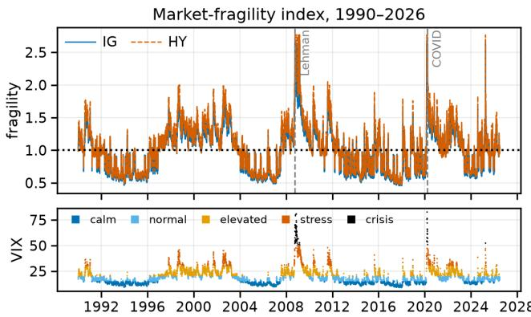
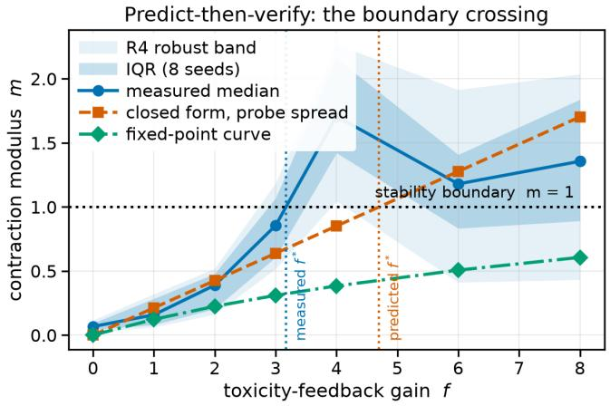
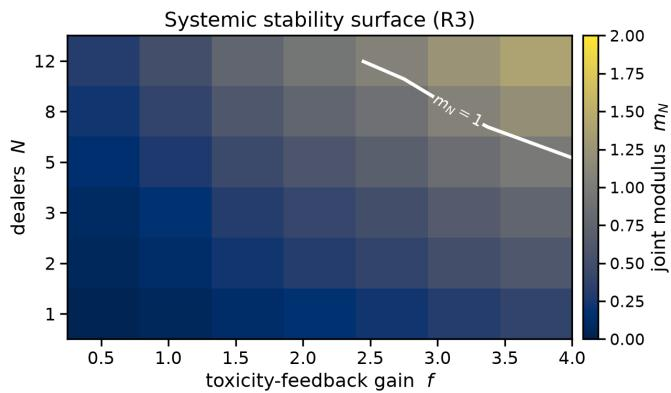
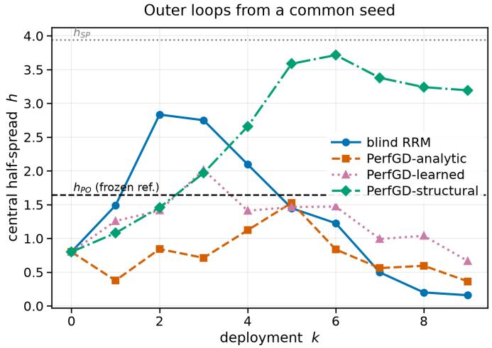
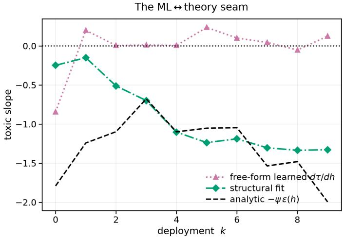
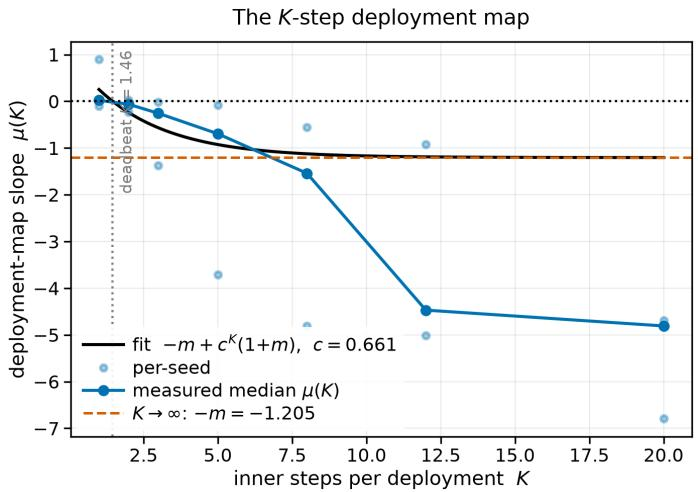
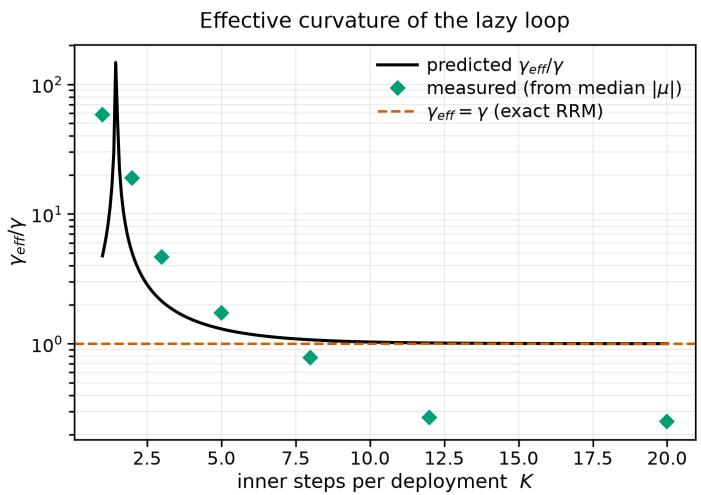
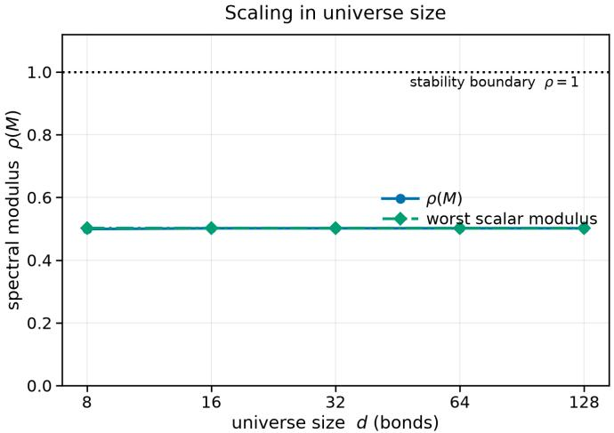
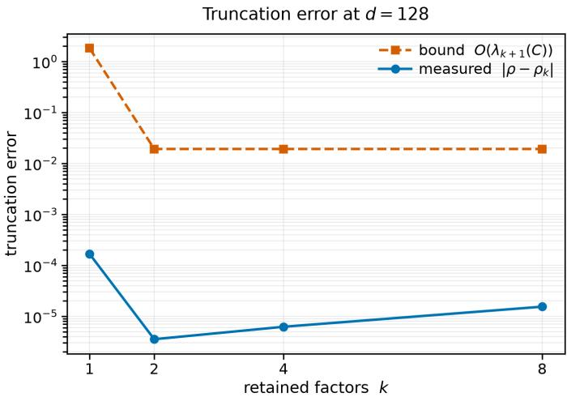

# REFLEX: Reflexive Equilibrium Fixed-point Learning for Endogenous eXchanges

Analytic Stability Boundaries for Performative Market Making in OTC Corporate Bond Markets

Vignesh Nagarajan∗† Texas A&M University Brown Foundation Scholar College Station, TX, USA vigneshn26@tamu.edu

## Abstract

In over-the-counter corporate bond markets, dealers compete for client trades by quoting bid and ask prices. Tighter quotes attract more business, but also informed customers more likely to trade ahead of adverse price moves, leaving the dealer holding the risk. As dealers increasingly use machine learning to set quotes, they retrain these models on the trades their own quotes attract, creating a feedback loop in which each model reshapes the market that generates its next training data. The question is therefore not only whether a quoting model performs well, but whether the market it creates stays stable as the model learns from it. Existing performative prediction theory gives a sharp stability condition, yet expresses it through abstract properties of the learning objective a trading desk cannot measure before deployment. We introduce Reflex, a framework that replaces those unobservable quantities with three measurable features of dealer behavior: how strongly trading volume responds to tighter quotes, how sharply the dealer’s objective bends around its optimum, and how quickly informed flow increases as spreads narrow. Reflex combines these into a single retraining modulus, a pre-deployment stability margin estimated from a desk’s own quote and execution history that predicts whether repeated retraining will converge or amplify itself. In simulation, predicted and measured stability agree within 8%, and competing dealers increase instability by 1.74× with two and 3.16× with three, as predicted. Where ordinary retraining becomes unstable at modulus 1.21, a structurally anchored correction converges as blind retraining collapses. Calibrated over 36 years of public market data, stability headroom falls roughly 4.4× for investment grade and 4.3× for high yield from calm to crisis regimes. Ultimately, Reflex turns an abstract convergence theorem into a market-level safety margin that can be evaluated before an automated quoting system goes live.

## CCS Concepts

• Computing methodologies → Machine learning; • Applied computing → Economics; • Theory of computation → Market equilibria.

Shriraghav Ashok†   
University of California, Berkeley   
Haas School of Business   
Berkeley, CA, USA   
sashok24@berkeley.edu

## Keywords

performative prediction, market making, OTC corporate bonds, retraining stability, systemic risk, machine-checked proofs

## 1 Introduction

Corporate bonds trade over the counter. A client requests a quote, a dealer posts a half-spread ℎ, and the dealer’s inventory absorbs the flow. Quoting on these desks is increasingly algorithmic, and quoting policies are increasingly fit to historical flow.

That flow is not exogenous. A tighter quote wins more volume, and it also summons more informed, or “toxic,” flow that picks the dealer of before adverse price moves. A wider quote starves both channels. The policy � therefore induces the distribution $D ( \phi )$ it will next be trained on. Fitting on the induced flow, redeploying, and refitting is exactly repeated risk minimization (RRM) in the sense of performative prediction [1]. RRM converges to a performatively stable point if and only ${ \mathrm { i f ~ } } \varepsilon < \gamma / \beta ,$ , where � bounds the sensitivity of the distribution map and $\gamma , \beta$ are the strong convexity and smoothness of the loss.

The theorem is sharp, but its constants are Lipschitz assumptions. A desk cannot evaluate $\varepsilon , \beta ,$ or� before deploying, so it cannot know whether its own retraining cadence is stable. Similarly, a supervisor watching many dealers retrain against one shared pool of informed flow cannot know whether competition among learners is manufacturing systemic fragility. Post-trade TRACE reporting reveals the spreads that result, not the retraining loop that produced them. Both questions are quantitative, and answering either needs the constants themselves. We compute a market-level stability margin for algorithmic liquidity provision, which puts the problem in the AI-governance and systemic-risk scope of AI in finance.

To address these limitations, this paper introduces REFLEX (Reflexive Equilibrium Fixed-point Learning for Endogenous eXchanges), which realizes performative prediction inside a structural OTC market-making model in the Guéant–Lehalle–Fernández-Tapia (GLFT) family. It derives the loop constants from microstructure primitives, then checks every closed form against a learned simulator loop. We contribute six results, each derived and then confirmed or falsified by experiment:

R1 An analytic stability boundary. We give $\gamma , \beta ,$ and � in closed form from fill-curve curvature, P&L scale, and toxic-flow slope, so the modulus $m = \varepsilon \beta / \gamma$ is known before deployment. Measured moduli track it within 8% where the loop contracts.

R2 A performative-gradient (PerfGD) correction, closed-form and estimated. One extra scalar per step converges past the RRM boundary, and its structurally anchored learned counterpart settles at the realized performative optimum where blind retraining collapses.

R3 A multi-dealer boundary $\varepsilon < \gamma / ( N _ { \mathrm { e f f } } \beta )$ . Competition destabilizes the market a factor $N _ { \mathrm { e f f } }$ before any single dealer would, and a genuine shared-pool market measures 1.74× and 3.16× amplification at $N = 2 , 3$

R4 Finite-sample robust certificates. An $O ( 1 / \sqrt { n } )$ ambiguity radius bought by common random numbers (CRN) issues stable, unstable, or undecided verdicts, separating statistical from structural uncertainty.

R5 Factor-model scaling. The �� modulus matrix has spectral boundary $\rho ( M ) < 1 \mathrm { a t } O ( d k ^ { 2 } )$ cost, and $\rho ( M )$ is flat from 8 to 128 bonds on our calibration.

R6 Lazy deployment. The �-step retraining map $\mu ( K ) = - m +$ $c ^ { K } ( 1 + m )$ yields deadbeat and maximal-stability cadences in closed form. Both parameter-free predictions land on the measured probe.

The system side contributes an un-blinded learned market-response operator whose training identifies $d D / d \phi$ . It adds three independent instruments for �: a CRN best-response probe, an entropic optimal-transport estimate [2–4], and a fitted informed-flow curve [5]. It calibrates the simulator to 36 years of public market data [6, 7], and it builds a verification layer of 66 numerical proof certificates plus Lean 4 [8, 9] formal skeletons. Negative results and proxy-level data provenance are reported as such throughout.

## 2 Related Work

Perdomo et al. [1] established the convergence of RRM and its stochastic variants [10], and later work estimates the distribution response $d D / d \phi$ to optimize performative risk directly [11, 12]. The framework now reaches decision-dependent stochastic optimization [13], distributions that carry their own dynamics [14, 15], bandit feedback [16], multi-agent decision-dependent games [17], and robust formulations; see [18] for a survey. In all of it, $( \varepsilon , \beta , \gamma )$ stay abstract constants of an unspecified loss.

On the market-making side, Avellaneda and Stoikov [19] and Guéant et al. [20] derived closed-form optimal quotes under exponential fill intensities, and later work added multi-asset dimensionality reduction [21], adverse selection and price reading [22], the stochastic-control toolkit [23], and the empirical anatomy of flow–price interaction [5]. These models take the flow response to quoting as a fixed input, so the learning loop that re-estimates the market from its own induced data falls outside their scope.

To our knowledge, no prior work computes the performative constants from market structure.

## 3 Market Model and the Retraining Loop

One deployment is one period of quoting by a dealer posting half spread ℎ. Skew is zero for the scalar theory, and the multi-bond lift is R5. With $\rho$ the latent liquidity ratio, benign notional follows the GLFT exponential fill curve and informed notional a spread-gated channel:

$$
U ( h ) = A \rho e ^ { - k h } , \qquad \tau ( h ) = \rho \bar { g } \bigl ( I _ { b } + \alpha f I e ^ { - c _ { t } h } \bigr ) ,\tag{1}
$$

where $A , k$ are the arrival rate and demand elasticity, $I _ { b } , I$ the base and feedback informed intensities, � adversarial informativeness, � the toxicity-feedback gain (our control variable), $c _ { t }$ the toxic spread decay, and $\bar { g } \in ( 0 , 1 )$ the mean of the informed traders’ tanh signal gate. Informed flow trades with the signal, so each unit costs the dealer an adverse-selection severity $\psi > 0 ,$ a state constant from the same Gaussian gate integrals. The expected one-deployment objective, with P&L scale �, quoting-cost weight �, anchor $h _ { \mathrm { r e f } }$ and inventory-variance curvature $\lambda _ { q } \geq 0 ,$ , is

$$
J ( h ; T ) = P \big [ h A \rho e ^ { - k h } + h T - \psi T - w ( h - h _ { \mathrm { r e f } } ) ^ { 2 } - \lambda _ { q } \big ] .\tag{2}
$$

The frozen toxic level � is what makes the learner structurally blind. Within a deployment the fitted model conditions on the deployed regime, so the dealer best-responds to $T = \tau ( h _ { \mathrm { d e p } } )$ while only the benign channel varies with the candidate ℎ. Retraining is therefore a cobweb map,

$$
h _ { t + 1 } = \mathrm { B R } ( h _ { t } ) : = \arg \operatorname* { m a x } _ { h } J \big ( h ; \tau ( h _ { t } ) \big ) , \qquad m : = \big | \mathrm { B R } ^ { \prime } ( h ^ { * } ) \big | ,\tag{3}
$$

which contracts to the performatively stable spread $h _ { \mathrm { S P } }$ if and only if � $< 1$ . The simulator realizes (1) to (3) with multi-bond flow, an informed-flow saturation cap, and a liquidity field that inflates with realized flow. The frozen closed forms omit those endogenous channels, and the measurements below make them visible.

## 4 Closed-Form Stability Theory

We state the objects the experiments test, each with the argument it rests on. All six follow from the one-deployment objective (2) by diferentiation and the implicit-function theorem.

R1 (analytic boundary). Diferentiating (2), the three Perdomo constants are closed forms in the configuration:

$$
\begin{array} { r } { \begin{array} { r l } & { \gamma = P \big [ 2 w + A \rho k e ^ { - k h } ( 2 - k h ) + \lambda _ { q } \big ] , \qquad \beta = P , } \\ & { \varepsilon ( h ) = \rho \bar { g } \alpha f I c _ { t } e ^ { - c _ { t } h } . } \end{array} } \end{array}\tag{4}
$$

Curvature is fill-curve curvature plus quoting-cost stifness, smoothness is the P&L scale, and � is the toxic-flow slope $| d \tau / d h |$ . The implicit-function theorem gives $\mathrm { B R } ^ { \prime } = - \varepsilon \beta / \gamma$ , an oscillatory cobweb, hence

$$
m ( h ^ { * } ) = \frac { \varepsilon \beta } { \gamma } = \frac { \rho \bar { g } \alpha f I c _ { t } e ^ { - c _ { t } h ^ { * } } } { 2 w + A \rho k e ^ { - k h ^ { * } } ( 2 - k h ^ { * } ) + \lambda _ { q } } ,\tag{5}
$$

with $P$ cancelling and $h ^ { * }$ the self-consistent fixed point of (3). The loop is stable if and only if � $< 1$ . Every term is evaluable before any loop is run, so the boundary is a prediction.

Derivation and regularity. On the quoting interval the frozen-� objective is $C ^ { 2 }$ and strongly concave, $\partial _ { 1 1 } J ~ = ~ - \gamma ~ < ~ 0 .$ , so its maximiser is interior and unique and $\partial _ { 1 } J ( h _ { t + 1 } ; \tau ( h _ { t } ) ) = 0$ defines BR implicitly. Diferentiating in ℎ� gives $\mathrm { B R } ^ { \prime } = - \partial _ { 1 T } J \tau ^ { \prime } / \partial _ { 1 1 } J .$ , and $( 2 ) - ( 1 )$ supply $\partial _ { 1 T } J = \beta$ and $\tau ^ { \prime } = - \varepsilon ,$ which is $( 5 ) ;$ stability is then Banach contraction. R3, R5 and R6 reuse this step with $\partial _ { 1 T } { \bf j }$ replaced by a rank-one coupling, by $\Gamma ^ { - 1 } E ,$ and by the �-step warm-started map.

Two structural corollaries matter for honest measurement. First, adverse selection (��) is constant in ℎ within a deployment, so it sets the profit level and the echo-chamber gap of R2 but drops out of the boundary. Second, the modulus saturates at the self-consistent fixed point: widening spreads decay $\varepsilon ( h ^ { * } )$ exponentially, and at default-like constants it never crosses 1. This is defensive widening, so measured instability describes the retraining map at the operating spread, and we report it that way.

R2 (PerfGD correction). The performative objective is $\Phi ( h ) =$ $J ( h ; \tau ( h ) )$ . Un-blinding adds one closed-form term to the blind gradient $G ( h ) = \partial _ { 1 } J ( h ; \tau ( h ) )$ :

$$
\Phi ^ { \prime } ( h ) = G ( h ) + \Delta ( h ) , \qquad \Delta ( h ) = - \beta ( h - \psi ) \varepsilon ( h ) ,\tag{6}
$$

where $\Delta = \partial _ { T } J \cdot \left( d \tau / d h \right)$ is the distribution-response term, supplied entirely by the R1 closed forms, so the corrected ascent costs one scalar more per step than RRM [11]. Its convergence is governed not by the cobweb modulus but by the objective curvature at the performative optimum ℎPO,

$$
\gamma _ { \mathrm { { P O } } } = \gamma + \beta \varepsilon \big ( 2 + c _ { t } \psi - c _ { t } h _ { \mathrm { { P O } } } \big ) ,\tag{7}
$$

which stays positive where � $> 1 .$ , so the corrected loop converges beyond the RRM boundary. The stable-versus-optimal separation, the “echo-chamber gap” of[12], is $h _ { \mathrm { S P } } - h _ { \mathrm { P O } } = \beta \varepsilon ( h _ { \mathrm { S P } } - \psi ) / ( \gamma + \beta \varepsilon ) =$ $O ( \varepsilon )$ in decision space and $O ( \varepsilon ^ { 2 } )$ in value.

R3 (multi-dealer systemic risk). � dealers share one informed pool with toxic spillover � ∈ [0, 1], so flow displaced by one dealer’s widening lands on the others. The joint best-response Jacobian is a rank-one common-mode coupling. Its diferential eigenvalues carry $( 1 - \kappa ) m _ { 1 }$ and its common mode $- m _ { 1 } N _ { \mathrm { e f f } }$ with $N _ { \mathrm { e f f } } = 1 + \kappa ( N - 1 )$ so the joint loop is stable if and only if

$$
\varepsilon < \frac { \gamma } { N _ { \mathrm { e f f } } \beta } , \qquad N _ { c } = 1 / m _ { 1 }\tag{8}
$$

is the critical dealer count at which a market of individually stable dealers $( m _ { 1 } < 1 )$ turns systemically unstable. Competition manufactures a synchronized cobweb, making fragility a market property rather than a desk property.

R4 (robust boundary). With � probe estimates of � (sample mean $\hat { \varepsilon } _ { n }$ , std �), the certificate

$$
\hat { \varepsilon } _ { n } + \delta _ { n } < \frac { \gamma } { \beta } , \qquad \delta _ { n } = \frac { z _ { 1 - a } s } { \sqrt { n } } ,\tag{9}
$$

declares stable; $\hat { \varepsilon } _ { n } - \delta _ { n } > \gamma / \beta$ declares unstable; anything between is undecided. The parametric $O ( 1 / \sqrt { n } )$ radius is bought by the CRN pairing of the probe, since a naive finite diference of independent runs achieves only $O ( n ^ { - 1 / 3 } )$ after bias–variance balancing. Pinning a crossing needs $n _ { \mathrm { r e q } } = O ( \Delta ^ { - 2 } )$ in the distance Δ to the boundary, so statistical uncertainty is separated from structural uncertainty by construction. A distribution-free quantile calibration of $\delta _ { n } .$ , new here, shows � � is conservative except under contamination (Sec. 6.7).

R5 (factor scaling). For � bonds, stability is governed by the modulus matrix $M = \beta \Gamma ^ { - 1 } E$ with $E = \mathrm { d i a g } ( \varepsilon _ { i } )$ and Γ the crossbond curvature, and the loop contracts if and only $\operatorname { i f } \rho ( M ) < 1 . \operatorname { A }$ �-factor covariance makes Γ diagonal-plus-low-rank, so $\rho ( M )$ costs $O ( d k ^ { 2 } )$ by Woodbury, with truncation error linear in the residual factor variance $\lambda _ { k + 1 } ( C )$ . Large universes therefore stay certifiable at practical cost.

R6 (lazy deployment). Suppose each deployment takes only � inner gradient steps on the frozen-� objective (step $\eta _ { h } ,$ contraction $c = 1 - \eta _ { h } \gamma )$ , warm-started from the deployed spread instead of the exact best response. The outer map slope becomes

$$
\mu ( K ) = - m + c ^ { K } ( 1 + m ) ,\tag{10}
$$

a one-parameter interpolation from inertia at $\mu ( 0 ) = 1$ to the exact cobweb as $\mu \to - m$ . Three consequences follow in closed form. A deadbeat cadence $K _ { \mathrm { d b } } ~ = ~ \ln \bigl ( m / ( 1 + m ) \bigr ) / \ln c$ gives $\mu = 0$ and one-shot convergence. For $m > 1$ a stability window $K \leq K _ { \operatorname* { m a x } } =$ ln $\left( \left( m - 1 \right) / \left( m + 1 \right) \right) .$ /ln � keeps an RRM-unstable market stable, the quantitative form of the greedy-versus-lazy gap in [1, 10]. And an observer who fits the plain boundary to a lazy loop reads a twobranch efective curvature $\gamma _ { \mathrm { e f f } } ( K ) = \gamma m / | \mu ( K ) |$ |, under-estimating stifness below the equal-modulus cadence and over-estimating it above.

## 5 Experimental Setup

## 5.1 Learned Operator and the Four Loop Modes

The simulator is a multi-bond OTC market with benign and informed clients, inventory, an informed-flow saturation cap, and a latent liquidity field inflated by realized flow. The learned marketresponse operator �� (MLP heads over per-bond features) predicts next-deployment flow distributions conditioned on a perdeployment policy summary, and is fit over a sliding window of past deployments. With window $\geq 2$ the derivative of its prediction w.r.t. the summary, the learned $d D / d \phi$ , is identified by automatic diferentiation; a single-window fit is structurally blind and supplies the RRM baseline.

Four retraining modes close the loop. (i) Blind RRM refits on the latest induced flow. (ii) PerfGD-analytic uses the closed-form Δ of (6) as a surrogate gradient. (iii) PerfGD-learned consumes the free-form learned $d D / d \phi$ and is reported as a negative result. (iv) PerfGD-structural never asks the network for a derivative. It instead fits the theory’s own response families

$$
\hat { \tau } ( h ) = \hat { C } _ { 0 } + \hat { C } _ { 1 } e ^ { - \hat { c } h } , \qquad \hat { u } ( h ) = \hat { A } _ { u } e ^ { - \hat { k } _ { u } h } ,\tag{11}
$$

plus the realized severity $\hat { \psi } ,$ to the loop’s own deployment history (per-bond, per-step samples over a 12-deployment window; a small quote jitter supplies the within-deployment identification the echo chamber cannot destroy). It then ascends $\hat { \Phi } ^ { \prime } = \hat { G } + \hat { \Delta }$ with step $1 / \chi _ { \mathrm { P O } }$ under a trust region (35% relative step cap) and an anti-echo freeze that refuses to steer on unidentified fits. Both safeguards come from failures we measured: exponential response fits on a narrow spread window are line-degenerate and extrapolate badly, and the unconstrained early ascent rails against its spread cap.

## 5.2 Three Instruments for � and the Probe Protocol

Three independent instruments estimate �. (a) The CRNbest-response probe runs paired deployments at $h _ { \mathrm { r e f } } \pm \delta$ under common random numbers. Its finite diference of best responses estimates �, and therefore $\varepsilon = \hat { m } \gamma / \beta ,$ , while a signed �-step variant measures $\mu ( K )$ for R6. (b) The optimal-transport estimate $\hat { \varepsilon } = W _ { 1 } \big ( D ( h + \delta ) , D ( h - \delta ) \big ) / 2 \delta$ is the exact Wasserstein sensitivity of performative prediction, computed via debiased log-domain Sinkhorn divergences [2, 3] with the blur set scale-relatively (0.02× pooled std, tuned against the exact 1-D quantile $W _ { 1 }$ ; Sec. 6.7). (c) The fitted informed-flow curve bins realized toxic notional against deployed spread, fits (1), and diferentiates [5].

A pre-run audit showed three protocol facts that matter at first order, and all three are enforced here. Probe at the operating spread rather than the analytic fixed point. Keep collection jitter at 0.05, since at 0.2 the BR probe inflates ∼3×. And report medians and interquartile ranges (IQR) over 8 seeds with the R4 robust bands at every grid point. We sweep the gain � rather than adversariality �. High � drives the dealer to wide spreads where �−��ℎ has decayed, so the �-response is non-monotone (measured hump $0 . 0 8  1 . 8 3 $ 0.67). That confound is the quantitative case for � as the control variable.

## 5.3 Real-Data Calibration and Provenance

The simulator is calibrated per (rating × volatility regime) on a public, verified panel. It combines ∼36 years of daily and ∼70 years of monthly series (CBOE VIX as the � proxy and regime classifier, WTI, the Fed H.15 10-year, Shiller equity data, gold and CPI) with the TRACE-derived corporate-bond factors of [6], whose liquidity risk factor is the primary � proxy, and monthly returns for 212 real-CUSIP bonds. Half-spread proxies combine VIX-implied spreads with the illiquidity add-on of [7, 24], and $\lambda ( h ) = A e ^ { - \bar { k } h }$ intensities are fit per cell by maximum likelihood.

On provenance, plainly: this is not trade-level TRACE. Dealerside prints, per-dealer inventories, and per-bond (�, �) would require TRACE Enhanced. Only (�, �, �, ℎ) are data-identified here, the toxic channel is structurally scaled by documented ratios, and the crisis-regime intensity fit is degenerate $( k = 0 , n = 7 4$ days) and flagged wherever it binds. Regime ordering of the boundary is datadriven; absolute critical gains are not. Calibrated configurations run in per-\$100-par units, and every probe width, tolerance, and OT blur is scale-relative by convention.

## 5.4 Verification Layer

Every load-bearing identity, inequality, and dynamical claim of R1– R6 is re-derived numerically by 66 proofcertificates, run on both the raw and the calibrated real-unit configurations: central diferences of the composed best-response map against the assembled $- \varepsilon \beta / \gamma$ with no shared code path, eigensolves against spectral formulas, Monte-Carlo rate fits against claimed exponents, and the dynamics run rather than assumed.

Building the layer caught real errors before the paper-grade run. It surfaced a convention mismatch in which the 1-D frozen-gradient helpers omit the inventory curvature, so their slopes are governed by $\gamma - P \lambda _ { q } .$ . It also falsified two first drafts: an “always-stifer” claim for �ef, replaced by the two-branch law of R6, and a mis-signed heavy-tail prediction for the R4 radius. The logical skeletons of all six results are additionally formalized in Lean 4 against mathlib [8, 9]. These are reviewed statements whose compilation is pending a toolchain, so the numerical certificates remain the verification of record. The full suite (152 tests, 11 experiments) runs CPU-only in ∼25 minutes, deterministic from (configuration, seed).

## 6 Results

## 6.1 Machine-Checked Identities

Table 1 summarizes the certificates. All 66 pass, with worst residuals far inside tolerance. The one excluded cell is deliberate. The R2 beyond-boundary demo dynamics certificate pins absolute raw-unit constants, and imposing those on per-\$100-par calibrated units is exactly the class of unit bug the conventions forbid. It excludes itself, and the calibrated pass proves the identities in real units.

Table 1: Numerical proof certificates (raw + calibrated realunit configurations). Each family’s worst residual sits inside its stated tolerance.
<table><tr><td>Certificate family</td><td>raw</td><td>calib.</td><td>worst resid.</td><td>tol.</td></tr><tr><td>R1 analytic boundary</td><td>5/5</td><td>5/5</td><td> $6 . 8 \times 1 0 ^ { - 2 }$ </td><td> $8 \times 1 0 ^ { - 2 }$ </td></tr><tr><td>R2 PerfGD identities</td><td>4/4</td><td>4/4</td><td> $1 . 3 \times 1 0 ^ { - 6 }$ </td><td> $2 \times 1 0 ^ { - 2 }$ </td></tr><tr><td>R2 PerfGD demo dynamics</td><td>4/4</td><td>一</td><td> $1 . 4 \times 1 0 ^ { - 1 1 }$ </td><td> $1 \times 1 0 ^ { - 3 }$ </td></tr><tr><td>R3 multi-dealer</td><td>6/6</td><td>6/6</td><td> $2 . 2 { \times } 1 0 ^ { - 1 6 }$ </td><td> $1 \times 1 0 ^ { - 9 }$ </td></tr><tr><td>R4 robust boundary</td><td>7/7</td><td>7/7</td><td> $3 . 2 \times 1 0 ^ { - 2 }$ </td><td> $1 \times 1 0 ^ { - 1 }$ </td></tr><tr><td>R5 factor scaling</td><td>3/3</td><td>3/3</td><td>0.0</td><td> $1 \times 1 0 ^ { - 9 }$ </td></tr><tr><td>R6 lazy deployment</td><td>6/6</td><td>6/6</td><td> $1 . 1 \times 1 0 ^ { - 1 6 }$ </td><td> $1 \times 1 0 ^ { - 1 2 }$ </td></tr></table>

  
Figure 1: The daily market-fragility index, 1990–2026: the R1 closed forms evaluated on real data. Top: fragility(�) = median $( \varepsilon ^ { * } ) / \varepsilon ^ { * } ( t )$ for IG (solid) and HY (dashed), with the Lehman and COVID-freeze dates marked. Bottom: the VIX spine, colored by volatility regime. The crisis plateau reflects the degenerate crisis-cell fit and is flagged, not hidden.

## 6.2 A Real-Data Fragility Index (1990–2026)

Because R1 is a closed form in observables, it can be evaluated on every trading day of the panel. Figure 1 plots the resulting index, ${ \mathrm { f r a g i l i t y } } ( t ) = { \mathrm { m e d i a n } } ( \varepsilon ^ { * } ) / \varepsilon ^ { * } ( t )$ , and Table 2 gives the per-regime summary. Three results hold up under every caveat below. First, the stability headroom $\varepsilon ^ { * } = \gamma / \beta$ collapses ∼4.4× for investment grade (IG) and ∼4.3× for high yield (HY) from calm to crisis. Second, HY sits more than 10× below IG in every regime, which is a level efect rather than a crisis efect. Third, the modulus at observed spreads falls into crisis $( \mathrm { I G } \ 0 . 8 5  \ 0 . 1 4 )$ , so dealers widen faster than the toxic channel steepens. Defensive widening is visible in real data.

The index saturates at a crisis plateau because of the degenerate crisis fit. The GFC and the March-2020 COVID freeze are flagged at the same ceiling, so intra-crisis ranking is explicitly not identified. Per-cell a-priori boundaries span $\varepsilon ^ { * } = 4 6 5  2 . 2$ from IG-calm to HY-crisis while the fixed-point modulus stays regime-invariant (≈0.066) by construction, so the regime story lives entirely in the headroom.

Table 2: Per-regime stability headroom $\varepsilon ^ { * } = \gamma / \beta$ and modulus at observed spreads, evaluated on the 1990–2026 panel.
<table><tr><td>regime</td><td> $\varepsilon _ { \mathrm { I G } } ^ { * }$ </td><td> $\varepsilon _ { \mathrm { H Y } } ^ { * }$ </td><td> $m _ { \mathrm { I G } } ( h _ { \mathrm { o b s } } )$ </td><td> $m _ { \mathrm { H Y } } ( h _ { \mathrm { o b s } } )$ </td></tr><tr><td>calm</td><td>1207.7</td><td>93.5</td><td>0.847</td><td>0.592</td></tr><tr><td>normal</td><td>739.2</td><td>61.3</td><td>0.870</td><td>0.563</td></tr><tr><td>elevated</td><td>594.4</td><td>45.9</td><td>0.520</td><td>0.367</td></tr><tr><td>stress</td><td>477.3</td><td>35.6</td><td>0.223</td><td>0.163</td></tr><tr><td>crisis</td><td>275.9</td><td>21.8</td><td>0.139</td><td>0.091</td></tr></table>

Table 3: Three-way � triangulation at the operating spread, against the closed form at the a-priori (A2) and at the realized deployment state $( \rho = 2 . 3 2 , | g | = 0 . 4 4 6 )$ .
<table><tr><td>instrument</td><td>ê</td><td>vs. realized</td></tr><tr><td>closed form, a-priori state  $( \rho = 1 )$ </td><td>0.764</td><td>0.44×</td></tr><tr><td>closed form, realized state</td><td>1.726</td><td>1.00</td></tr><tr><td>CRN best-response slope</td><td>0.508</td><td>0.29×</td></tr><tr><td>Sinkhorn/W1</td><td>4.578</td><td>2.65×</td></tr><tr><td>Fitted informed-flow curve</td><td>4.011</td><td>2.32×</td></tr></table>

## 6.3 Predict-Then-Verify: the Boundary Crossing

Figure 2 is the headline falsification test. We sweep the gain $f \left( 7 \right)$ values × 8 seeds), overlay the a-priori curve (5), and measure the modulus with the CRN probe. In the contracting regime the agreement is quantitative: measured median 0.390 against predicted 0.426 at $f = 2 ,$ , an 8% gap. The measured crossing sits at $f ^ { \ast } \approx 3 . 1 7$ against the a-priori 4.70, and that gap is not free. The triangulation in Ta ble 3 independently measures the deployment’s own flow inflating the liquidity field to $\rho \approx 2 . 3$ , and the closed form evaluated at that realized state predicts $f ^ { * } \approx 2 . 8 – 3 . 0 .$ bracketing the measurement.

The R4 certificates grade the grid exactly as the seed bands warrant: stable through $f = 2 ,$ unstable at $f = 4 ;$ , undecided where beyond-boundary readings scatter. At $f = 8$ the eight seeds span 0.03–2.05, because past the boundary the probe is a finite-diference diagnostic rather than a local slope. The fixed-point curve itself saturates at 0.61, so the measured instability is a property of the retraining map at the operating spread, exactly as R1 predicts.

The two distribution-space instruments agree with each other within 14% and sit 2.3–2.7× above the realized-state closed form. That residual is the state-feedback channel any frozen-state closed form omits by construction, so the analytic boundary is a lower anchor rather than an unbiased point prediction. For a stability certificate, erring low is the safe direction.

## 6.4 Competition Amplifies Instability (R3)

We probe a genuine �-dealer market sharing one informed pool rather than an analytic shortcut; the environment reduces bit-forbit to the single-dealer market at � = 1. CRN joint-mode probes measure the common-mode slope against the predicted $N _ { \mathrm { e f f } } m _ { 1 }$ (Table 4). Amplification is 1.74× at $N { = } 2$ and 3.16× at �=3 against predicted 2 and 3, within 13% and 5%. The diferential mode is dead at full spillover $( ( 1 - \kappa ) m _ { 1 } = 0 )$ , so the instability is purely the synchronized systemic channel.

  
Figure 2: Predict-then-verify phase diagram over the feedback gain $f \colon$ measured modulus (median, IQR band, and R4 robust band over 8 seeds) against the a-priori closed form at the probe spread and the saturating fixed-point curve, with the measured $( f ^ { * } \approx 3 . 1 7 )$ and predicted (4.70) crossings marked.

  
Figure 3: The R3 systemic surface: joint modulus $\begin{array} { r l } { m _ { N } } & { { } = } \end{array}$ $ { \mathbf { N } } _ { \mathrm { e f f } }  { m _ { 1 } }$ over the $( f , N )$ grid at full spillover $( \kappa = 1 ) ;$ , with the $m _ { N } = 1$ boundary contour. Gains that are comfortably stable for a single dealer cross the systemic boundary as the dealer count grows; the probes of Table 4 measure the first rows of this surface on the simulated market.

The analytic surface in Figure 3 puts the critical dealer count at $N _ { c } \approx 7 . 9$ for the default single-dealer modulus, and the simulated three-dealer cobweb already oscillates against its cap. For a supervisor this matters directly: each desk can satisfy its own stability check while the market as a whole violates (8), so fragility has to be certified at the market level.

## 6.5 Closing the Loop-Level Gap: Structural PerfGD (R2)

The demo regime is genuinely RRM-unstable $( f = 6 ,$ slow toxic decay, cobweb modulus 1.21). There the blind cobweb provably diverges while the corrected 1-D ascent converges, in closed form.

Table 4: Measured common-mode retraining slope on the shared-pool market versus the R3 prediction $\mathbf { N _ { \mathrm { e f f } } } m _ { 1 }$ (full spillover, � = 1).
<table><tr><td>N</td><td>measured</td><td>predicted</td><td>differential mode</td></tr><tr><td>1</td><td>0.786</td><td>0.786</td><td></td></tr><tr><td>2</td><td>1.369</td><td>1.571</td><td>0.0034</td></tr><tr><td>3</td><td>2.480</td><td>2.357</td><td>0.0032</td></tr></table>

Table 5: Loop outcomes in the RRM-unstable demo regime (10 deployments, common seed; convergence verified against independent structural fits).
<table><tr><td>mode</td><td>final h</td><td>outcome</td></tr><tr><td>blind RRM</td><td>0.16</td><td>echo-chamber collapse</td></tr><tr><td>PerfGD-analytic</td><td>0.36</td><td>no settle (operator gradient)</td></tr><tr><td>PerfGD-learned</td><td>0.66</td><td>no settle (negative result)</td></tr><tr><td>PerfGD-structural</td><td>3.19</td><td>converges to realized optimum</td></tr></table>

The open question is whether a learned loop can realize that correction. Figure 4 and Table 5 answer it from a common seed.

Blind RRM collapses into the echo chamber, ending at half-spread 0.16. PerfGD-analytic and the free-form PerfGD-learned mode both fail to settle, because each consumes the operator’s implied objective gradient. The run’s seam diagnostics show why. The free-form learned toxic slope starts right-signed (−0.84 against analytic −1.79), then flips sign and hovers near zero. The network has ample capacity; what it lacks is identification of the deployed regime. The structural mode never asks it for a derivative. Fitting (11) to its own deployment history, it climbs under the trust region and converges to the realized performative optimum at $h = 3 . 1 9 3$ , with late steps falling $0 . 3 5  0 . 0 2$ . That is within 0.7% of its own running estimate $\hat { h } _ { \mathrm { P O } } = 3 . 1 7 2$ and its fitted slope tracks the analytic shape (−1.33 against −2.00 at the final iterate) while strengthening as the fit window widens.

Benchmark honesty. The frozen-reference closed-form optimum $( h _ { \mathrm { P O } } = 1 . 6 4 1 )$ is not the target. In this high-intensity regime the realized market difers from the frozen closed forms at first order through channels they omit by construction: informed-flow saturation, the $\rho \approx 2 . 3$ liquidity inflation of Sec. 6.3, and severity drift. The loop is therefore verified against independent structural fits on fresh controlled deployments spanning the operating range. Against those fits the settle point (i) zeroes their corrected gradient (residual < 30% of its start value), (ii) sits strictly inside their blind stable point $( < 0 . 8 5 \times \hat { h } _ { \mathrm { S P } }$ , the realized echo-chamber gap, closed), and (iii) brackets their independent optimum estimate. We claim only this much: un-blinding is proven in closed form, and the structurally anchored learned loop realizes it at loop level against the realized-market benchmark, while the free-form correction remains a documented negative result. What closed the gap was anchoring the response model, not enlarging it.

## 6.6 Lazy Deployment Stabilizes an Unstable Market (R6)

At a beyond-boundary configuration (� = 5, exact-BR anchor �ˆ = $1 . 2 0 5 > 1$ measured on the same seeds), the signed CRN �-step probe traces $\mu ( K )$ for $K \in \{ 1 , 2 , 3 , 5 , 8 , 1 2 , 2 0 \}$ (Figure 5). A oneparameter fit of (10) gives inner contraction $c = 0 . 6 6 1$ , and both parameter-free predictions land. The deadbeat sign flip is predicted at $K _ { \mathrm { d b } } = 1 . 4 6$ , and measured medians run +0.021 at �=1 and −0.064 at �=2. The stability-window exit is predicted at $K _ { \operatorname* { m a x } } = 5 . 7 5$ , and measured |�| is 0.695 at �=5 (inside) and 1.541 at �=8 (outside).

Laziness therefore keeps this RRM-unstable market measurably stable for $K \lesssim 6$ and inherits the cobweb’s divergence beyond, which makes retraining cadence a stability control. The measured $\gamma _ { \mathrm { e f f } } / \gamma$ falls monotonically through 1 between $K = 5$ and $K = 8 ,$ the stif branch of the two-branch law. Beyond-boundary per-seed scatter is large by construction, so the medians carry the result. The clean tight-fit demonstration lives in the contracting regime, where measured $+ 0 . 7 8 / + 0 . 7 0 / + 0 . 3 7$ meet fitted $+ 0 . 8 8 / + 0 . 6 8 / + 0 . 3 6$ at $K = 1 / 3 / 8$ , and it is locked in the test suite.

## 6.7 Scaling and Estimator Tuning

Factor scaling (R5). With per-bond volatilities dispersed at the datacalibrated cross-sectional coeficient of variation, $\rho ( M )$ is flat at ≈0.50 from � = 8 to 128 bonds (Figure 6) and pinned to the worst scalar modulus. On this calibration correlation does not manufacture cross-sectional instability, and the fragile mode is idiosyncratic. The Woodbury path computes � = 128 in 0.12 s and matches the dense eigensolve to machine precision; the truncation bound holds with 3–4 orders of magnitude of slack.

Sinkhorn blur (R1 instrument). Against the exact 1-D quantile $W _ { 1 : }$ the debiased-divergence bias is U-shaped in the scale-relative blur at a fixed iteration budget, with log-domain under-convergence below the minimum and entropic over-blur above it. The minimum sits at 0.02× std, giving 6.1% ground-truth bias and 1.2% on the config’s CRN samples. We bake that in as the default, and being scale-relative it transfers to real-unit configurations unchanged.

Robust radius (R4). Across normal, heavy-tailed, and skewed estimate distributions the � � radius over-covers (0.99–1.00 at 95% nominal). Only contamination from railed-probe patterns degrades both radii (0.938), the honest $n _ { \mathrm { r e q } }$ limit. On the actual CRN probe estimates the quantile/� � multiplier is 0.50, so � � is binding and adequately calibrated. We keep the quantile-guarded radius for suspected contamination.

## 7 Conclusion

This paper proposes REFLEX, which makes the performative-prediction stability condition something a desk can evaluate. We compute $( \varepsilon , \beta , \gamma )$ from microstructure primitives, extend the boundary in closed form to correction, competition, finite samples, dimension, and cadence, verify each extension predict-then-verify against a learned loop, evaluate it as a daily fragility index on 36 years of real market data, and machine-check the identities end to end. Two of the findings should carry past this model. Competition among retraining dealers amplifies instability by the efective dealer count, which makes certification of algorithmic liquidity provision

  
Figure 4: Left: half-spread trajectories of the four learned retraining loops from a common seed in the RRM-unstable regime (the frozen-reference $h _ { \mathrm { P O } }$ and $\pmb { h } _ { \mathbb { S } \mathbb { P } }$ lines are context, not the benchmark; Sec. 6.5). Blind RRM collapses; the structurally anchored loop converges to the realized performative optimum. Right: the three-way ML↔theory seam, showing the free-form learned, structurally fitted, and analytic toxic slopes logged at every deployment. The free-form slope flips sign and hovers near zero; the structural fit tracks the analytic shape.

  
Figure 5: Lazy deployment at a beyond-boundary configuration $( \hat { m } = 1 . 2 0 5 )$ . Left: the measured signed �-step map (medians over seeds; faint dots are per-seed readings) against the one-parameter fit $\mu ( K ) = - m + c ^ { K } ( 1 + m )$ with $\mathbf { \boldsymbol { c } } = \mathbf { 0 . 6 6 1 }$ , its � → ∞ asymptote −�, and the predicted deadbeat cadence. Right: the implied efective curvature $\gamma _ { \mathrm { e f f } } ( K ) / \gamma$ , predicted against measured, with the stif branch decaying through the exact-RRM line between $K = 5$ and $K = 8 .$

These results hold under idealizing assumptions. First, the calibration is proxy-level rather than trade-level TRACE: VIX-implied spreads, no per-dealer inventories, a structurally scaled toxic channel, and a degenerate crisis cell (� = 0). Regime ordering is therefore data-driven while absolute critical gains are not, and TRACE a market-level rather than a desk-level problem. And a learned corrected loop stabilizes where blind retraining collapses only when its response model is anchored to market structure. The free-form alternative fails with the same data and more capacity, so a desk should spend its modelling budget on structural anchoring rather than on network capacity.

Enhanced calibration removes that limit. Second, at default-like constants the self-consistent fixed point never destabilizes because dealers widen defensively, so measured crossings describe the retraining map at the operating spread. Beyond the boundary, probe readings are finite-diference diagnostics with seed-level bifurcation, so medians with robust bands carry the results, and moduli are comparable within a protocol rather than across protocols. Third, the structural loop’s optimum is the realized one, benchmarked against independent structural fits rather than the frozen-reference closed form, with the gap attributed to saturation, liquidity inflation, and severity drift. Its convergence is to the noise ball ofan estimated gradient, and the free-form learned correction remains a negative result by design. Finally, the Lean 4 skeletons are reviewed but not yet compiled, so the 66 numerical certificates are the verification of record. Future work: trade-level calibration, inventory-state loop dynamics under state-dependent performativity, richer policy classes, and compiling the formal layer.

  
Figure 6: Factor-model scaling (R5) with data-calibrated per-bond dispersion. Left: $\rho ( M )$ is flat in universe size from $\pmb { d = 8 }$ to 128 bonds and pinned to the worst scalar modulus, far below the $\rho = 1$ boundary (dotted). Right: the truncation bound $O ( \lambda _ { k + 1 } ( C ) )$ against the measured error $| \rho - \rho _ { k } | { \bf { a t } } d = 1 2 8 _ { \mathrm { { \ell } } }$ , showing three to four orders of magnitude of slack at every retained-factor count �.

## Reproducibility

The full framework is openly available:1 the six derivation documents D1–D6, the simulator, the operator, all four loop modes, the estimator suite, the calibration pipeline with its data catalogue, the 66-certificate verification layer, the Lean sources, and the illustrated reports of both paper-grade runs. All results in this paper are regenerated by one command (run\_all –profile full, ∼25 CPU-minutes, deterministic from configuration and seed).

## References

[1] Juan C. Perdomo, Tijana Zrnic, Celestine Mendler-Dünner, and Moritz Hardt. 2020. Performative Prediction. In Proceedings ofthe 37th International Conference on Machine Learning (ICML) (PMLR, Vol. 119). arXiv:2002.06673.

[2] Marco Cuturi. 2013. Sinkhorn Distances: Lightspeed Computation of Optimal Transport. In Advances in Neural Information Processing Systems (NeurIPS), Vol. 26.

[3] Jean Feydy, Thibault Séjourné, François-Xavier Vialard, Shun-ichi Amari, Alain Trouvé, and Gabriel Peyré. 2019. Interpolating between Optimal Transport and MMD using Sinkhorn Divergences. In Proceedings of the 22nd International Conference on Artificial Intelligence and Statistics (AISTATS) (PMLR, Vol. 89).

[4] Gabriel Peyré and Marco Cuturi. 2019. Computational Optimal Transport. Foundations and Trends in Machine Learning 11, 5–6 (2019), 355–607.

[5] Rama Cont, Arseniy Kukanov, and Sasha Stoikov. 2014. The Price Impact of Order Book Events. Journal of Financial Econometrics 12, 1 (2014), 47–88.

[6] Alexander M. Dickerson, Philippe Mueller, and Cesare Robotti. 2023. Priced Risk in Corporate Bonds. Journal ofFinancial Economics 150, 2 (2023).

[7] Nils Friewald, Rainer Jankowitsch, and Marti G. Subrahmanyam. 2012. Illiquidity or Credit Deterioration: A Study of Liquidity in the US Corporate Bond Market during Financial Crises. Journal ofFinancial Economics 105, 1 (2012), 18–36.

[8] Leonardo de Moura and Sebastian Ullrich. 2021. The Lean 4 Theorem Prover and Programming Language. In Automated Deduction – CADE 28 (Lecture Notes in Computer Science, Vol. 12699). Springer.

[9] The mathlib Community. 2020. The Lean Mathematical Library. In Proceedings of the 9th ACM SIGPLAN International Conference on Certified Programs and Proofs (CPP).

[10] Celestine Mendler-Dünner, Juan C. Perdomo, Tijana Zrnic, and Moritz Hardt. 2020. Stochastic Optimization for Performative Prediction. In Advances in Neural Information Processing Systems (NeurIPS), Vol. 33. arXiv:2006.06887.

[11] Zachary Izzo, Lexing Ying, and James Zou. 2021. How to Learn when Data Reacts to Your Model: Performative Gradient Descent. In Proceedings ofthe 38th International Conference on Machine Learning (ICML) (PMLR, Vol. 139). arXiv:2102.07698.

[12] John P. Miller, Juan C. Perdomo, and Tijana Zrnic. 2021. Outside the Echo Chamber: Optimizing the Performative Risk. In Proceedings of the 38th International Conference on Machine Learning (ICML) (PMLR, Vol. 139). arXiv:2102.08570.

[13] Dmitriy Drusvyatskiy and Lin Xiao. 2023. Stochastic Optimization with Decision-Dependent Distributions. Mathematics of Operations Research 48, 2 (2023). arXiv:2011.11173.

[14] Qiang Li and Hoi-To Wai. 2022. State-Dependent Performative Prediction with Stochastic Approximation. In Proceedings ofthe 25th International Conference on Artificial Intelligence and Statistics (AISTATS) (PMLR, Vol. 151). arXiv:2110.00800.

[15] Gavin Brown, Shlomi Hod, and Iden Kalemaj. 2022. Performative Prediction in a Stateful World. In Proceedings ofthe 25th International Conference on Artificial Intelligence and Statistics (AISTATS) (PMLR, Vol. 151). arXiv:2011.03885.

[16] Meena Jagadeesan, Tijana Zrnic, and Celestine Mendler-Dünner. 2022. Regret Minimization with Performative Feedback. In Proceedings ofthe 39th International Conference on Machine Learning (ICML) (PMLR, Vol. 162). arXiv:2202.00628.

[17] Adhyyan Narang, Evan Faulkner, Dmitriy Drusvyatskiy, Maryam Fazel, and Lillian J. Ratlif. 2022. Multiplayer Performative Prediction: Learning in Decision-Dependent Games. arXiv preprint arXiv:2201.03398 (2022).

[18] Moritz Hardt and Celestine Mendler-Dünner. 2023. Performative Prediction: Past and Future. arXiv preprint arXiv:2310.16608 (2023).

[19] Marco Avellaneda and Sasha Stoikov. 2008. High-Frequency Trading in a Limit Order Book. Quantitative Finance 8, 3 (2008), 217–224.

[20] Olivier Guéant, Charles-Albert Lehalle, and Joaquin Fernández-Tapia. 2013. Dealing with the Inventory Risk: A Solution to the Market Making Problem. Mathematics and Financial Economics 7, 4 (2013), 477–507.

[21] Philippe Bergault and Olivier Guéant. 2021. Size Matters for OTC Market Makers: General Results and Dimensionality Reduction Techniques. Mathematical Finance 31, 1 (2021). arXiv:1907.01225.

[22] Alexander Barzykin, Philippe Bergault, Olivier Guéant, and Fanny Lemmel. 2025. Optimal Quoting under Adverse Selection and Price Reading. arXiv preprint arXiv:2508.20225 (2025).

[23] Álvaro Cartea, Sebastian Jaimungal, and José Penalva. 2015. Algorithmic and High-Frequency Trading. Cambridge University Press.

[24] Jack Bao, Jun Pan, and Jiang Wang. 2011. The Illiquidity of Corporate Bonds. The Journal of Finance 66, 3 (2011), 911–946.