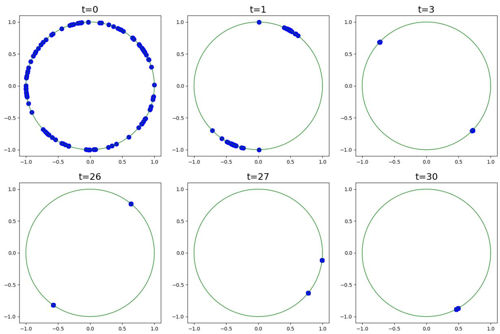
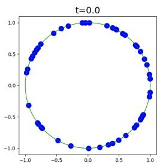
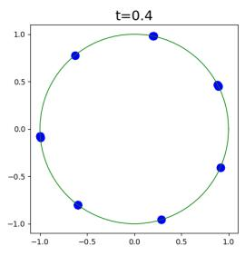
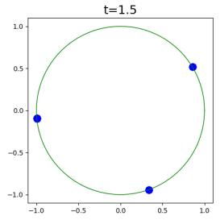
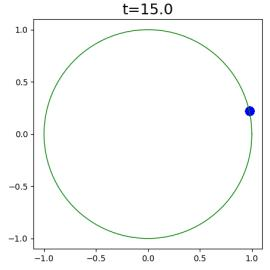
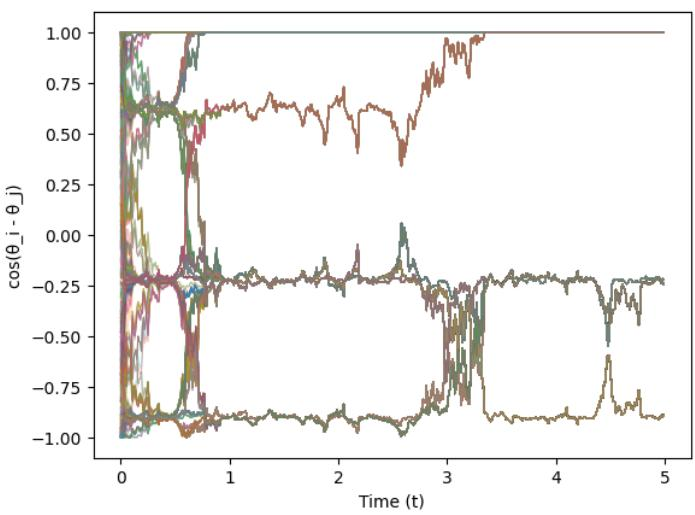

# Random Quadratic Form with random forcing: Metastable synchronization by noise

Anna Shalova

Korteweg-de Vries Institute for Mathematics, University of Amsterdam, a.shalova@uva.nl

August 18, 2026

## Abstract

We study the Random Quadratic Form (RQF) on a sphere in the presence of random Brownian forcing. We show that the forcing does not efectively change the law of the process but afects the synchronization properties of the system. While the RQF without forcing exhibits partial synchronization due to the intrinsic symmetries, the introduction of an arbitrarily small forcing results in long-term symmetry breaking and leads to full synchronization.

In this work we focus on the small forcing regime and recover the multiscale behavior of the two-point process. We show that in the first stage the model converges to an anti-polar configuration due to the symmetries of the RQF and in the second stage the two clusters meet due to the symmetry breaking phenomenon.

The model is motivated by continuous-time machine learning models such as Neural ODEs and continuous-time formulations of transformers. In particular, the results of this work explain the role of the bias and the scale of its initialization.

## Contents

1 Introduction 2   
1.1 Neural ODEs and Transformers 3   
1.2 Literature overview 5   
1.3 Main Results 6   
2 Notation and Preliminaries 7   
2.1 Preliminaries on SDEs. 8   
2.2 Random Dynamical Systems 9   
2.3 Random Attractors 10   
3 Main results 11   
3.1 Random attractor . 12   
3.2 Metastable synchronization 15   
3.3 Auxiliary lemmas 16   
4 Multi-cluster and multiscale dynamics 21   
4.1 Multiple clusters 21   
4.2 Multiple time-scales . . 22

## 1 Introduction

In this work we study the Random Quadratic Form (RQF) on a sphere $\mathbb { S } ^ { n - 1 }$ with Brownian forcing given by the following stochastic diferential equation:

$$
\mathrm { d } X _ { t } = P _ { X _ { t } } \partial Q _ { t } X _ { t } + \gamma P _ { X _ { t } } \partial W _ { t } ,\tag{1}
$$

where $P _ { X }$ denotes the projection onto the tangent space of $\mathbb { S } ^ { n - 1 }$ at $X$

$$
P _ { X } : = P _ { T _ { X } \mathbb { S } ^ { n - 1 } } = I - X X ^ { T } ,
$$

the noisy process $Q _ { t } : ( 0 , \infty ) \times \Omega \to \mathrm { S y m } ^ { n }$ is given by

$$
Q _ { t } = \frac { 1 } { \sqrt { 2 } } ( B _ { t } + B _ { t } ^ { T } ) ,
$$

where $\{ B _ { t } ^ { i j } : i , j \in { 1 , \dots n } \}$ are independent Brownian motions and $W _ { t } : ( 0 , \infty ) \times \Omega \to \mathbb { R } ^ { n }$ is an n-dimensional Brownian motion independent of $Q _ { t }$ . We use the notation $\partial Q _ { t } , \partial W _ { t }$ to specify that the equation is understood in the Stratonovich sense.

The RQF model was introduced in [ES26] as a stochastic counterpart of a gradient flow of a quadratic functional and only included the multiplicative noise, namely the case $\gamma = 0$ was considered. Analogously to the deterministic setting, the system was shown to exhibit clustering behaviour in the sense that any two solutions of Eq. (1) with $\gamma = 0$ driven by the same noisy process in the long-time limit become either aligned or anti-polar. At the same time, the one point motion of the system is a Brownian motion and has no preferred direction, so the nontrivial behavior only appears on the level of the two-point motion. Such a phenomenon is known as synchronization $b y$ noise and we provide a rigorous formulation of synchronization by noise result for the RQF in Section 1.3.

The anti-polar limiting configuration can be explained by the intrinsic symmetry of the RQF without forcing, which is violated in the presence of an arbitrarily small forcing γ. As a result of that, the system with any non-zero $\gamma$ in the long-time limit synchronizes to a single point, namely the anti-polar state is no longer stable.

At the same time, in the small forcing regime $\gamma \downarrow 0 ,$ the strong attraction to the symmetric configuration dominates on the time scale $t \sim \log { \gamma ^ { - 1 } }$ and before converging to the random attractor consisting of a single point, the system approaches the anti-polar configuration defined by the dynamics of the non-forced RQF. We call this phenomenon metastable synchronization because both of the limiting configurations, namely stable and metastable ones, are synchronizing. In this work we characterize both of the attractive configurations and the corresponding rates of convergence.

Despite changing the symmetry properties of the system, the given forcing preserves the qualitative behaviour of the single-point process: for an arbitrary $\gamma ,$ the RQF is a (rescaled) spherical Brownian motion. This, in particular, implies that the efect of the forcing is also only noticeable at the level of the two-point process.

The rest of the paper is structured as follows. In the rest of the introduction we discuss the main driving application from machine learning, give a literature overview and conclude the section with a schematic statement of the main results. In Section 2 we give the necessary theoretical background on random dynamical systems and random attractors. We introduce and prove the main results in Section 3. Finally, in Section 4 we discuss how the results of this work can be extended to recover the metastable behaviour with multiple $( > 2 )$ scales.

  
Figure 1: Ensemble of solutions of eq. (1) with diferent initial conditions driven by the same realization of the noisy processes $Q _ { t }$ and $W _ { t }$ with the forcing parameter $\gamma = 0 . 1$ . In the first stage (the first row), the particles cluster into an anti-polar configuration and follow the dynamics of the ’meta’-attractor $A ^ { Q } ( \omega )$ . In the second stage (the second row), the particles converge to the global random attractor $A ( \omega )$ and continue moving as a single cluster.

## 1.1 Neural ODEs and Transformers

Neural ODEs, introduced in [CRBD18], are a class of neural networks in which the features x(t) evolve continuously in time according to an ordinary diferential equation

$$
{ \dot { x } } ( t ) = f ( \theta ( t ) , x ( t ) , t ) , \quad x _ { 0 } \in X _ { i n } ,
$$

where $x _ { 0 }$ is the input data defined on the input space $X _ { i n }$ and θ are the parameters of the neural network. This is in contrast to the classical feed-forward networks, in which the features evolution is defined by a discrete-time dynamical system

$$
x _ { k + 1 } = f ( \theta _ { k } , x _ { k } ) , \quad x _ { 0 } \in X _ { i n } .
$$

Considering a specific parametrization of a Neural ODE, consisting of a single feed-forward layer with a normalization step, the corresponding dynamics of features takes the form

$$
\dot { x } = P _ { x } s \big ( M ( t ) x + B ( t ) \big ) , \qquad x ( 0 ) = x _ { 0 } \in \mathbb { S } ^ { n - 1 } ,\tag{2}
$$

where s is an activation function and the time-dependent parameters $M ( t )$ and $B ( t )$ are the weights and the biases of the linear layer.

Define the cumulative weight and biases processes as

$$
Q _ { t } = \int _ { 0 } ^ { t } M ( s ) \mathrm { d } s \quad \mathrm { a n d } \quad W _ { t } = \int _ { 0 } ^ { t } B ( s ) \mathrm { d } s .
$$

Then, considering the linear activation function $s ( x ) = x$ , we note that features in (2) follow the RQF dynamics as in Eq. (1) and therefore the RQF can be understood as a simplified model of a Neural ODE model. To justify the white-noise structure of the driving processes we remark that in discrete-time neural networks, the parameters $\theta _ { k }$ of every layer k are usually initialized randomly and independently from layer to layer. Hence, we argue that the RQF driven by the difusion processes $Q _ { t }$ and $W _ { t }$ as defined in (1) is a natural continuous-time proxy for a neural ODE at initialization. The relative scale of the weight and the bias initialization is then encoded in the single parameter γ, and, as we show below, this scale determines the long-time behaviour of the system.

Moreover, recently introduced continuous-time models of transformers [SABP22, GLPR25] can be understood as an extension of the Neural ODE framework and are specifically concerned with the joint dynamics of features corresponding to multiple inputs. In particular, the input of a continuous time transformer is a sequence of vectors $( x _ { i } ( 0 ) \in X _ { i n } ) _ { i = 1 \dots N }$ , which in language modeling problems correspond to diferent words in a text. In contrast to Neural ODEs, the dynamics of every feature vector $x ^ { i } ( t )$ in transformers is additionally coupled to the states of all the other vectors $x ^ { j } ( t )$ through the so-called Self-Attention mechanism and takes the form

$$
\begin{array} { c } { \displaystyle \dot { x } _ { i } = P _ { x _ { i } } \left( \mathrm { F F } ( x _ { i } ) + \mathrm { A t t n } ( x _ { i } ; x _ { 1 } , x _ { 2 } \dots x _ { N } ) \right) , } \\ { \displaystyle \mathrm { F F } ( x _ { i } ) = s ( M x _ { i } + B ) , } \\ { \displaystyle \mathrm { A t t n } ( x _ { i } ; x _ { 1 } , x _ { 2 } \dots x _ { N } ) = \frac { 1 } { \sum _ { j } e ^ { x _ { i } Q ^ { T } K x _ { j } } } \sum _ { j } e ^ { x _ { i } Q ^ { T } K x _ { j } } V x _ { j } , } \end{array}
$$

see $[ \mathrm { V S P ^ { + } 1 7 }$ , GLPR25] for an extensive description of the architecture. Such a structure can be interpreted as an interacting particle system, where the Feed-Forward layers act as an efective potential and Self-Attention layers describe the interaction between vectors.

In the absence of the interaction force, the tokens $( x _ { i } ) _ { 1 \leq i \leq d }$ are driven by the common noise coming from the shared parameters M and B and thus follow the multipoint motion of the RQF with forcing. Recently, clustering and metastability of tokens in transformers have been extensively studied for the self-attention driven dynamics [GLPR24, GLPR25], see Section 1.2 for details. In this work we follow the approach of [ES26] and provide a counterpart of these results for the dynamics defined purely by the feed-forward layers. In particular, our results imply the existence of metastable clustering of the multi-point motion in Neural ODEs when the variance of the bias initialization is smaller than the variance of the weights initialization.

## 1.2 Literature overview

Difusions on a sphere. Difusion processes on $\mathbb { S } ^ { n - 1 }$ naturally arise in the context of stability analysis of stochastic diferential equations by means of the multiplicative ergodic theorem. In particular, the Furstenberg–Khasminskii formula reduces the calculation of the leading Lyapunov exponent to the ergodic averaging of a specific functional over the ergodic measure of the projective process [Fur63, Kha11], see also [Arn98, Chapter 6] and [IL01]. Therefore, synchronizing behaviour of difusions on the sphere is closely related to the Lyapunov stability of SDEs in Euclidean spaces and has been studied in various formulations. Specifically, synchronization of difusions on $\mathbb { S } ^ { n - 1 }$ has been established: for the canonical Brownian motion in [Bax86], for general isotropic Brownian flows in [Rai99, CGS16] and for the RQF formulation in [ES26]. We remark that for each of these models the one-point motion is a spherical Brownian motion and therefore carries no distinctive information about the flow, which motivates the study of the two-point process.

We remark that the Euclidean counterpart of this picture is classical: the full Lyapunov spectrum for isotropic Brownian flows on $\mathbb { R } ^ { d }$ is computed in [LJ85], see also [BH86]. And the random attractor in the stable regime is shown to be a singleton [LJ85, DLJ88].

Synchronization by noise. Synchronization of difusion processes is an example of a more general phenomenon which is known as synchronization by noise. For a general class of random dynamical systems it has been formalized in [FGS17a], and we refer the reader to this work for an extensive literature review on the topic. The approaches allowing to establish synchronization by noise include multiplicative ergodic theorem [ACW83, Bax91, CR04] and the Feller explosion test [Sch02, CGS16] which was also used for the RQF without forcing in [ES26]. Alternatively, synchronization can be deduced from the order-preserving properties of the dynamics [CF98, FGS17b]. Local synchronization can also be established using large-deviations theory, see e.g. [MHM96, Tea08].

Metastability in particle systems. Classically, metastability of a stochastic system refers to the phenomena observed in gradient-type systems when the system spends a large time near the local minima of the corresponding energy. In such a setting the metastability can be studied using a large deviations-based approach and, in particular, Eyring-Kramers asymptotics [FW12, BG06, BdH15]. This work is concerned with a diferent setting, namely small perturbation of a stochastic process but not of a deterministic flow. At the same time, our result can be understood as an analog of the classical metastability phenomenon but on the level of the two-point motion.

Since we characterize the relative convergence of multi-point motion, another related phenomenon is the transient clustering in interacting particle systems where the fast scale corresponds to the clusters formation. In particular, on a finite-particle level, the metastable clustering of interacting difusions and the corresponding Lyapunov exponents are studied in [AEG26]. In a mean-field setting, the cluster formation and merging dynamics is discussed in [GGH+26, WSHW26]. We also remark that the mean-field formulation is a special case of the dynamic metastability framework [OR07]. However, the clustering mechanism studied in these works is of a diferent nature and is caused by the pairwise interactions. Note that interactions are not present in our setting.

Clustering and metastability in transformers. The continuous-time models of transformers can be interpreted as interacting particle systems [SABP22, GLPR24, GLPR25] and have been shown to exhibit (metastable) clustering dynamics. In particular, the longtime clustering of tokens has been established in various settings, see [Rig26] for an overview of the results and recent works $[ \mathrm { B K K ^ { + } 2 5 }$ , ABRR26, LMP+26]. In particular, the rate of convergence to a single cluster in this context is established in [CLPR25]. The transient clustering dynamics in the context of transformers is studied in [GKPR24, BPA25, BPA26].

Closest to the present work are the stochastic formulations of Neural ODEs and transformers, in which the randomness appears due to the random initialization of the parameters. In particular, the pathwise synchronization of the flow of randomly initialized Neural ODEs is characterized in [ES26, ABG+26]. Similarly, clustering in random attentionbased models is established in [FSE+26, KGR26]. We also remark that the pathwise synchronization is conceptually diferent from the clustering in noisy transformer models [SS26, BBR25], which correspond to interacting particle systems with independent noises.

## 1.3 Main Results

In this work we study the efect of additive noise on the two-point process of the RQF and the metastable behaviour arising in the small-forcing regime $\gamma \to 0$ . We characterize both the global attractor and the transient clustering dynamics appearing on the faster time-scale. We complement the analysis by studying the one-point motion and showing that no metastability arises on the level of one-point dynamics.

To introduce the results, we will require some preliminary facts. Recall that the processes $Q _ { t }$ and $W _ { t }$ are independent and therefore the probability space generated by $( Q _ { t } , W _ { t } )$ is in fact a product space $\Omega = \Omega ^ { Q } \times \Omega ^ { W }$ , where $Q _ { t } = Q _ { t } ( \omega ^ { Q } )$ and $W _ { t } = W _ { t } ( \omega ^ { W } )$ In case $\gamma = 0$ , the space $\Omega ^ { W }$ is redundant and easily factors out. In addition, the SDE (1) has smooth coeficients and thus admits a path-wise solution, see Proposition 2.6. We denote the corresponding solution map by $X _ { t } ^ { \omega } ( x _ { 0 } )$ , where $x _ { 0 } \in \mathbb { S } ^ { n - 1 }$ denotes the initial condition $X _ { 0 } = x _ { 0 }$

With this notation we are ready to present the main results. In particular, recall the characterization of the two-point process without forcing from [ES26].

Theorem 1.1 $( \gamma = 0 , [ \mathrm { E S 2 6 }$ , Theorem 4.8]). There exists a random set $A ^ { Q } ( \omega ) = A ^ { Q } ( \omega ^ { Q } )$ consisting of two anti-polar points

$$
A ^ { Q } ( \omega ) = \{ a ^ { Q } ( \omega ) , - a ^ { Q } ( \omega ) \} ,
$$

where $a ^ { Q } ( \omega )$ is measurable with respect to the past, and for all $x _ { 0 } \in \mathbb { S } ^ { n - 1 }$ the pathwise solution $X _ { t } ^ { \omega } ( x _ { 0 } )$ in the long-time limit converges to $A ^ { Q } ( \theta _ { t } \omega )$

$$
\mathrm { d i s t } ( X _ { t } ^ { \omega } ( x _ { 0 } ) , A ^ { Q } ( \theta _ { t } \omega ) )  0 \quad \Omega - a . s . ,
$$

where $\theta _ { t }$ is the time-shift defined in Eq. (3).

The random set $A ^ { Q }$ is in fact the forward attractor of the corresponding random dynamical system as defined in Section 2.3. In case of the non-zero forcing, $A ^ { Q } ( \omega )$ no longer attracts all the trajectories in the long-time limit due to the efect of the additive noise. Instead, all the trajectories synchronize to a single-valued attractor $A ( \omega )$ . However, on a time-scale $t \sim \log | \gamma | ^ { - 1 }$ , the set $A ^ { Q } ( \omega )$ is still attractive, and thus in the forced regime we call $A ^ { Q } ( \omega )$ the ’meta’-attractor after the ’meta’-stable behaviour it describes. We, therefore, obtain the following characterization of the dynamics for $\gamma \neq 0$

Theorem 1.2 $( \gamma \neq 0 )$ . There exists a random set $A ^ { Q } ( \omega ^ { Q } )$ as in Theorem 1.1 and a random singleton $A ( \omega ) = \{ a ( \omega ) \}$ such that the dynamics consists of the two stages:

• (convergence to the ’meta’-attractor $A ^ { Q } )$ :

$$
\mathbb { E } \operatorname { d i s t } ( X _ { t } ^ { \omega } ( x _ { 0 } ) , A ^ { Q } ( \theta _ { t } \omega ) ) \lesssim e ^ { - \frac { 1 } { 2 } t } + | \gamma | C ( n , t ) ,
$$

• (convergence to the global attractor A):

$$
\mathbb { E } \operatorname { d i s t } ( X _ { t } ^ { \omega } ( x _ { 0 } ) , A ( \theta _ { t } \omega ) ) \lesssim e ^ { - \lambda ( n , \gamma ) t } , \quad \lambda ( n , \gamma ) \sim \frac { 1 } { 2 } \gamma ^ { 2 } ( n - 1 ) ,
$$

where $\theta _ { t }$ is the time-shift as in Eq. (3) and $C ( n , t ) \lesssim { \sqrt { n } } e ^ { 2 t }$ for large t. The characterization holds for an arbitrary choice of $x _ { 0 }$

In particular we obtain explicit convergence rates in expectation to the random attractor in both forced and non-forced regimes, which allows us to study the intermediate regime of convergence to the anti-polar configuration. We highlight that the two attractors $A ^ { Q }$ and A are structurally diferent and therefore the long-term behaviour of the two-point motion of the system with forcing difers from the non-forced case and exhibits a multi-scale behavior, see Figure 1. At the same time, this diference cannot be detected on the level of one point motion as follows from the following result, see also Theorem 3.1.

Theorem 1.3 (RQF is a Brownian motion). For any $\gamma \in \mathbb { R }$ the process $X _ { t / ( 1 + \gamma ^ { 2 } ) }$ is an $\mathbb { S } ^ { n - 1 }$ -valued Brownian motion.

Acknowledgments and use of AI. I am grateful to Maximilian Engel and Enrique Carro Garrido for many insightful discussions on random attractors. The work was supported by the Dutch Research Council (NWO), in the framework of the program VI.Vidi.233.133 ‘A Rigorous Framework for Transient Random Dynamics’.

I used AI at diferent stages of the manuscript preparation. In particular, the use of a regularized function in Lemma 3.2 and Proposition 3.8 was suggested by an AI and the code used to produce illustrations was generated by an LLM. The paper was written entirely by me and all mistakes are mine.

## 2 Notation and Preliminaries

In this section we introduce the notation and give the necessary theoretical background on SDEs and random dynamical systems. We refer the reader to [Arn98] for a detailed introduction to RDS.

For a separable metric space X we denote the Borel σ-algebra on X by $B ( \mathcal { X } )$ . Let $\Omega ^ { Q } = C _ { 0 } ( \mathbb { R } , \mathbb { R } ^ { n \times n } )$ and $\Omega ^ { W } = C _ { 0 } ( \mathbb { R } , \mathbb { R } ^ { n } )$ be the spaces of continuous functions satisfying $\omega ( 0 ) = 0$ equipped with the metric d:

$$
d ( \omega , \widehat { \omega } ) : = \sum _ { N = 1 } ^ { \infty } \frac { 1 } { 2 ^ { N } } \frac { \| \omega - \widehat { \omega } \| _ { N } } { 1 + \| \omega - \widehat { \omega } \| _ { N } } , \quad \| \omega - \widehat { \omega } \| _ { N } : = \operatorname* { s u p } _ { | t | \leq N } \| \omega ( t ) - \widehat { \omega } ( t ) \| ,
$$

and let $\mathcal { F } ^ { Q } = \mathcal { B } ( \Omega ^ { Q } ) , \mathcal { F } ^ { W } = \mathcal { B } ( \Omega ^ { W } )$ . Let $\mathbb { P } ^ { Q }$ and $\mathbb { P } ^ { W }$ be the Wiener probability measures on $\mathcal { F } ^ { Q }$ and $\mathcal { F } ^ { W }$ , where the Wiener probability measure of an $\mathbb { R } ^ { m }$ -valued Brownian motion is given by

$$
\mathbb { P } \left( \left\{ \omega \in \Omega : \omega _ { 1 } ( t ) \leq x _ { 1 } , \ldots , \omega _ { m } ( t ) \leq x _ { m } \right\} \right) = { \frac { 1 } { ( 2 \pi | t | ) ^ { m / 2 } } } \int _ { - \infty } ^ { x _ { 1 } } \cdots \int _ { - \infty } ^ { x _ { m } } e ^ { - \| y \| ^ { 2 } / 2 | t | } \mathrm { d } y _ { 1 } \cdots \mathrm { ~ d } y _ { m } ,
$$

for all $x \in \mathbb { R } ^ { m }$ . We denote the product probability space by $( \Omega , { \mathcal { F } } , \mathbb { P } ) = ( \Omega ^ { Q } \times \Omega ^ { W } , { \mathcal { F } } ^ { Q } \times$ $\mathcal { F } ^ { W } , \mathbb { P } ^ { Q } \times \mathbb { P } ^ { W } )$

Finally, we define the family of time shifts $\left( \boldsymbol { \theta } _ { t } \right) _ { t \in \mathbb { R } }$ on the product space $( \Omega , { \mathcal { F } } )$ by

$$
\theta _ { t } \omega ( \cdot ) : = \omega ( t + \cdot ) - \omega ( t ) ,\tag{3}
$$

and remark that this family preserves the Wiener measure of a set $A \in { \mathcal { F } }$ , namely $\mathbb { P } ( \theta _ { t } ^ { - 1 } A ) = \mathbb { P } ( A )$ for all $t \in \mathbb { R } , A \in \mathcal { F }$

## 2.1 Preliminaries on SDEs.

Let M be a smooth Riemannian manifold without boundary. Consider an M-valued Ito SDE of the form

$$
\mathrm { d } X _ { t } = F _ { 0 } \left( X _ { t } \right) \mathrm { d } t + \sum _ { j = 1 } ^ { m } F _ { j } \left( X _ { t } \right) \mathrm { d } W _ { t } ^ { j } , \quad X _ { 0 } = x \in \mathcal { M } , t \in \mathbb { R } .\tag{4}
$$

Fixing a probability space of the Brownian motion $W _ { t }$ we define the pathwise solution of (4) as follows.

Definition 2.1 (Pathwise solution). Given a probability space generated by an mdimensional two-sided Brownian motion $( \Omega , \mathcal { F } , \mathbb { P } )$ , an SDE (4) is said to admit a pathwise solution on $( \Omega , \mathcal { F } , \mathbb { P } )$ with initial condition $x _ { 0 } \in \mathcal { M }$ if there exists a map $X ^ { \omega } : \Omega \to C ( \mathbb { R } , \mathcal { M } )$ satisfying ω-a.s

$$
X _ { t } ^ { \omega } = x _ { 0 } + \int _ { 0 } ^ { t } F _ { 0 } \left( X _ { s } ^ { \omega } ( x _ { 0 } ) \right) \mathrm { d } s + \sum _ { j = 1 } ^ { m } \int _ { 0 } ^ { t } F _ { j } \left( X _ { s } ^ { \omega } ( x _ { 0 } ) \right) \mathrm { d } W _ { s } ^ { \omega , j } , \quad X _ { 0 } ^ { \omega } = x _ { 0 } ,
$$

where $W _ { t } ^ { \omega , j }$ is the j-th component of the sample path $W _ { t } ^ { \omega }$

Definition 2.2 (Infinitesimal generator). Let the difusion $X _ { t }$ be a weak solution of (4), the operator $L : C ^ { \infty } ( { \mathcal { M } } ) \to C ^ { \infty } ( { \mathcal { M } } )$

$$
( L f ) ( x ) : = \operatorname* { l i m } _ { t \downarrow 0 } { \frac { 1 } { t } } \mathbb { E } \left[ f ( X _ { t } ) - f ( X _ { 0 } ) { \big | } X _ { 0 } = x \right]
$$

is called the infinitesimal generator of $X _ { t }$

The infinitesimal generator describes the evolution of statistics of a difusion process, and thus can be used to track the expected distance between two solutions along the dynamics. This is the key component of the proof of Theorems 3.4 and 3.9, where we will require the following elementary version of Dynkin’s formula.

Proposition 2.3 (Dynkin’s formula, [Øks03, Theorem 7.4.1]). Let L be the infinitesimal generator of a difusion process $X _ { t }$ on R with $X _ { 0 } = x _ { 0 }$ , then for any $f \in C _ { c } ^ { \infty }$ and for all $t \in \mathbb { R } _ { + }$

$$
\mathbb { E } f ( X _ { t } ) = f ( x _ { 0 } ) + \mathbb { E } \left( \int _ { 0 } ^ { t } ( L f ) ( X _ { s } ) \mathrm { d } s \right) .
$$

Finally, we remark that infinitesimal generator L and its $L ^ { 2 }$ adjoint $L ^ { * }$ define the backward and forward Kolmogorov evolutions respectively. The latter,

$$
\partial _ { t } \rho _ { t } - L ^ { * } \rho _ { t } = 0 ,
$$

describes the evolution of $\rho _ { t } =$ law $X _ { t }$ and is also known as the Fokker-Planck equation.

## 2.2 Random Dynamical Systems

Definition 2.4 (Random dynamical system (RDS)). Let $( \Omega , \mathcal { F } , \mathbb { P } )$ be an abstract probability space and $( { \mathcal { M } } , B ( { \mathcal { M } } ) )$ be a compact Riemannian manifold with the corresponding Borel σ-algebra. An RDS consists of the two components:

1. model of the noise: a family of ${ \mathcal { F } } _ { - }$ measurable measure-preserving maps $( \theta _ { t } : \Omega \to $ $\Omega ) _ { t \in \mathbb { R } }$ , satisfying:

$$
\begin{array} { r l } & { \theta _ { 0 } \omega = \omega , \ \forall \omega \in \Omega , } \\ & { \theta _ { t + s } \omega = \theta _ { t } \theta _ { s } \omega , \ \forall t , s \in \mathbb { R } , \omega \in \Omega , } \end{array}
$$

2. model of the dynamics: a $( B ( \mathbb { R } ) \otimes \mathcal { F } \otimes B ( \mathcal { M } ) )$ )-measurable map $\varphi : \mathbb { R } \times \Omega \times \mathcal { M } \to \mathcal { M }$ which, for all $\omega \in \Omega$ and $x \in \mathcal { M }$ satisfies the cocycle property

$$
\varphi ( 0 , \omega , x ) = x , ~ \mathrm { a n d } ~ \varphi ( t + s , \omega , x ) = \varphi ( t , \theta _ { s } \omega , \varphi ( s , \omega , x ) ) , ~ \forall s , t \in \mathbb { R } .
$$

Given an RDS $( \varphi , \theta )$ , for any $u , v \in \mathbb { R }$ with $u < v .$ , we denote by $\mathcal { F } _ { u , v }$ the sub-σ-algebra generated by the random variables $\varphi ( t , \theta _ { s } \omega , x )$ for $x \in \mathcal { M }$ and $t , s \in \mathbb { R }$ with $u \leq s \leq v$ and $0 < t \leq v - s$ . We say that the RDS satisfies the Markov property if its future is independent of its past, namely:

Definition 2.5 (Markov RDS). The RDS $( \theta , \varphi )$ is called Markov if $\mathcal { F } _ { - \infty , 0 }$ and $\mathcal { F } _ { 0 , \infty }$ are independent.

Due to the following result, any SDE with suficiently regular coeficients can be uniquely reformulated in the form of a Markov RDS.

Proposition 2.6 (SDE as an RDS, [Arn98, Theorem 2.3.42]). Consider an Ito SDE (4) or the corresponding Stratonovich SDE and assume that $F _ { 0 } \in C ^ { 1 , \delta } ( \mathcal { M } , T \mathcal { M } )$ and every $F _ { j } \in C ^ { 2 , \delta } ( { \mathcal { M } } , T { \mathcal { M } } )$ for some $\delta \in ( 0 , 1 ]$ . Let $( \Omega , \mathcal { F } , \mathbb { P } )$ be a (fixed) probability space generated by a two-sided m-dimensional Brownian motion. Then there exists a unique $( B ( \mathbb { R } ) \otimes \mathcal { F } \otimes B ( \mathcal { M } ) )$ -measurable map $\varphi ( t , \omega , x )$ such that

$X _ { t } ^ { \omega } = \varphi ( t , \omega , x )$ is a pathwise solution of (4),

$( \theta , \varphi )$ is a Markov RDS, where $( \theta _ { t } ) _ { t \in \mathbb { R } }$ is the family of time shifts defined in $E q . \ ( 3 )$

Due to their equivalence, we switch to the RDS notation $\varphi ( t , \omega , \boldsymbol { x } )$ for the pathwise solutions of Eq. (4).

Moreover, to use the probabilistic estimates of Dynkin’s type for Markov RDS with random initial conditions we will need the following property of conditional expectation.

Lemma 2.7 (Freezing lemma). Let $( \theta , \hat { \varphi } )$ be a Markov RDS on a manifold M over the probability space $( \Omega , \mathcal { F } , \mathbb { P } )$ and let $\beta : \Omega \to { \mathcal { M } }$ be an ${ \mathcal { F } } _ { - \infty , \mathrm { ( } }$ -measurable random point. Let $\psi : C ( \mathbb { R } _ { + } , \mathcal { M } ) \to \mathbb { R }$ be a Borel-measurable bounded map and define

$$
\boldsymbol { \Psi } ( \boldsymbol { x } ) : = \mathbb { E } [ \psi ( \boldsymbol { \hat { \varphi } } ( \cdot , \omega , x ) ) ] , \quad \forall x \in \mathcal { M } .
$$

Then Ψ is Borel-measurable, bounded and

$$
\begin{array} { r } { \mathbb { E } [ \psi ( \hat { \varphi } ( \cdot , \omega , \beta ( \omega ) ) ) \big | \mathcal { F } _ { - \infty , 0 } ] = \Psi ( \beta ( \omega ) ) , \quad \Omega - a . s . . } \end{array}
$$

In particular, $\Psi ( \beta ( \omega ) )$ is $\mathcal { F } _ { - \infty , 0 }$ -measurable and satisfies

$$
\operatorname* { i n f } _ { x } \Psi ( x ) \leq \mathbb { E } [ \Psi ( \beta ( \omega ) ) ] \leq \operatorname* { s u p } _ { x } \Psi ( x ) .
$$

Proof. Since $\hat { \varphi }$ is Markov, the map $( \omega , x ) \mapsto \hat { \varphi } ( \cdot , \omega , x )$ is $\mathcal { F } _ { 0 , \infty } \times B ( \mathcal { M } )$ -measurable, implying that the same is true for the composition function $\psi ( \hat { \varphi } ( \cdot , \omega , x ) )$ . With this remark, the result is a special case of the ’freezing’ lemma [Bal17, Lemma 4.1]. □

In particular, the freezing lemma decouples expectations with respect to the past and future when the corresponding σ-algebras are independent.

## 2.3 Random Attractors

Given a state space M and a probability space $( \Omega , \mathcal { F } , \mathbb { P } )$ , we say that a set-valued map $A : \Omega \to B ( { \mathcal { M } } )$ is a random compact set if it is Ω-a.s. compact and the function dist $( x _ { 0 } , A ( \omega ) )$ is ${ \mathcal { F } } .$ -measurable for all $x _ { 0 } \in \mathcal { M }$ . With this, we define a random point attractor of an RDS as the random set attracting all trajectories under the forward dynamics, namely

Definition 2.8 (Random Point Attractor). A random compact set $( A ( \omega ) ) _ { \omega \in \Omega }$ is called the forward point attractor, if

• it is φ-invariant:

$$
\varphi ( t , \omega , A ( \omega ) ) = A ( \theta _ { t } \omega ) , \quad \forall t \in \mathbb { R } ,
$$

• for every $x \in \mathcal { M }$

$$
\mathrm { d i s t } ( \varphi ( t , \omega , x ) , A ( \theta _ { t } \omega ) )  0 , \Omega - \mathrm { a . s . }
$$

A random attractor $A ( \omega )$ is called minimal if for any other random attractor $\tilde { A } ( \omega )$ we have $A ( \omega ) \subseteq \tilde { A } ( \omega ) , \Omega \mathrm { - a . s }$ . Finally, replacing the a.s. convergence with convergence in probability we obtain the definition of a weak random point attractor. We note that if a strong point attractor exists, it is also a weak point attractor but the converse is not true. Existence of a weak point attractor for ergodic Markov RDS on compact state spaces is guaranteed by the correspondence theorem, see [KS12, Theorem 4.2.9]. In particular, the following holds.

Proposition 2.9 (Existence of a weak point attractor). Let $( \theta , \varphi )$ be a Markov RDS on a compact Riemannian manifold which admits a unique ergodic measure $\rho ,$ then the weak limit

$$
\varphi ( t , \theta _ { - t } \omega , \cdot ) ^ { * } \rho \stackrel { w } { \to } \mu _ { \omega } , \quad a s t \to \infty ,
$$

exists almost surely and the random set

$$
A ( \omega ) : = \mathrm { s u p p } ( \mu _ { \omega } )
$$

is the minimal weak point attractor of the $R D S \left( \theta , \varphi \right)$

As follows from the result by Le Jan [LJ87], the sample measures can either consist entirely of atoms or be fully continuous with no atoms at all, namely the following characterization holds.

Proposition 2.10 (Discrete vs. continuous sample measures $ { \left[ \mathrm { L J 8 7 } \right] } )$ . The sample measures $\mu _ { \omega }$ are either Ω-a.s. continuous, namely for every $x \in \mathcal { M }$ satisfy $\mu _ { \omega } ( \{ x \} ) = 0$ , or are $\Omega { - } a . s .$ . discrete measures supported on $N \in  { \mathbb { N } }$ atoms and given by

$$
\mu _ { \omega } = \frac { 1 } { N } \sum _ { i = 1 } ^ { N } \delta _ { a _ { i } ( \omega ) } ,
$$

where each $a _ { i } : \Omega \to { \mathcal { M } }$ is an $\mathcal { F } _ { - \infty , 0 }$ -measurable random point.

## 3 Main results

We begin by recovering the Fokker-Planck equation of the RQF SDE with forcing. We establish that RQF is a rescaled spherical Brownian motion, which, in particular, implies that it is ergodic and the unique invariant distribution is the uniform measure on $\mathbb { S } ^ { n - 1 }$

Theorem 3.1 (RQF is a Brownian motion). Let $\rho _ { t } = \operatorname { l a w } ( X _ { t } )$ as in the $e q . \ ( 1 )$ , then for any $\gamma \in \mathbb { R } , \rho _ { t }$ is the unique classical solution of the rescaled heat flow on $\mathbb { S } ^ { n - 1 }$

$$
\partial _ { t } \rho _ { t } - \frac { 1 + \gamma ^ { 2 } } { 2 } \Delta \rho _ { t } = 0 , \quad \rho _ { t } \stackrel { w } {  } \mathrm { l a w } ( X _ { 0 } ) \ a s \ t \downarrow 0 ,
$$

where $\Delta$ is the Laplace-Beltrami operator on $\mathbb { S } ^ { n - 1 }$ . In particular, the uniform measure ${ \bar { \rho } } = { \frac { 1 } { \operatorname { v o l } _ { \mathbb { S } ^ { n - 1 } } ( \mathbb { S } ^ { n - 1 } ) } }$ volSn−1 is the unique ergodic measure of the RQF, where $\mathrm { v o l } _ { \mathbb { S } ^ { n - 1 } }$ is the volume measure of the $n - 1$ -dimensional sphere.

Proof. Consider the following Stratonovich difusions on $\mathbb { S } ^ { n - 1 }$

$$
\begin{array} { l } { { d U _ { t } = P _ { U _ { t } } \partial Q _ { t } U _ { t } , } } \\ { { d V _ { t } = P _ { V _ { t } } \partial W _ { t } . } } \end{array}
$$

The process $V _ { t }$ is a natural definition of a Brownian motion on $\mathbb { S } ^ { n - 1 }$ . Moreover, the generator of the process $U _ { t }$ is $\begin{array} { r } { L _ { U } = \frac { 1 } { 2 } \Delta } \end{array}$ , see [ES26, Theorem 4.3]. Since the driving processes $Q _ { t }$ and $W _ { t }$ are independent, we conclude that the generator of the RQF with forcing takes the form

$$
L f = ( L _ { U } + \gamma ^ { 2 } L _ { V } ) f = \frac { ( 1 + \gamma ^ { 2 } ) } { 2 } \Delta f , \quad \forall f \in C ^ { \infty } .
$$

Finally, since the Laplace-Beltrami operator on $\mathbb { S } ^ { n - 1 }$ is essentially self-adjoint we conclude that law $X _ { t }$ solves the given Fokker-Planck equation and hence the result. □

## 3.1 Random attractor

We now move to studying the ω-pointwise properties of the solutions to (1). For this we define an essential component of the proof, namely the auxiliary process $\boldsymbol { Z _ { t } } = \langle \boldsymbol { X _ { t } } , \boldsymbol { Y _ { t } } \rangle$ 2 where the couple $( X _ { t } , Y _ { t } )$ solving:

$$
\begin{array} { r l } & { \mathrm { d } X _ { t } = P _ { X _ { t } } \partial Q _ { t } X _ { t } + \gamma P _ { X _ { t } } \partial W _ { t } , \quad X _ { 0 } \in \mathbb { S } ^ { n - 1 } , } \\ & { \mathrm { d } Y _ { t } = P _ { Y _ { t } } \partial Q _ { t } Y _ { t } + \gamma P _ { Y _ { t } } \partial W _ { t } , \quad Y _ { 0 } \in \mathbb { S } ^ { n - 1 } } \end{array}\tag{5}
$$

is the two-point motion of the RQF with forcing. Note that any two points on a sphere $x , y \in \mathbb { S } ^ { n - 1 }$ coincide if $\langle x , y \rangle = 1$ and are anti-aligned if $\langle x , y \rangle ~ = ~ - 1$ Therefore, convergence to either an anti-polar configuration or a singleton of a stochastic process can be both characterized in terms of the dynamics of the corresponding process $Z _ { t }$ , namely its boundary behaviour at $\pm 1$ . In particular, for $\gamma \neq 0$ we will require the following moment-bound on $( 1 - Z _ { t } )$ to upper bound the distance to the attractor.

Lemma 3.2 (Lyapunov function for $\gamma \neq 0 )$ . Let $( X _ { t } , Y _ { t } )$ be the two-point motion of the RQF with forcing $\gamma \neq 0$ and let $\boldsymbol { Z _ { t } } = \langle \boldsymbol { X _ { t } } , \boldsymbol { Y _ { t } } \rangle$ . Then for all $\begin{array} { r } { p \in ( 0 , \frac { \bar { \gamma ^ { 2 } } ( n - 1 ) + 4 } { 2 ( \gamma ^ { 2 } + 4 ) } ) } \end{array}$ and every $z _ { 0 } = \langle X _ { 0 } , Y _ { 0 } \rangle \in [ - 1 , 1 ]$

$$
\begin{array} { r } { \mathbb { E } ( 1 - Z _ { t } ) ^ { p } \le ( 1 - z _ { 0 } ) ^ { p } e ^ { - p \alpha t } , } \end{array}
$$

where

$$
\alpha = \operatorname* { m i n } \{ \gamma ^ { 2 } ( n - 1 ) , \gamma ^ { 2 } ( n - 1 ) + 4 - 2 p ( \gamma ^ { 2 } + 4 ) ) \} ,
$$

in particular, $\alpha > 0$

The proof of the bound is largely technical and therefore is deferred to Section 3.3. In addition, we will need the following pointwise bound.

Lemma 3.3. For $x , y \in \mathbb { S } ^ { n - 1 }$ let $z = \langle x , y \rangle$ , then $\forall p \in ( 0 , \frac { 1 } { 2 } ]$

$$
\mathrm { d i s t } ( x , y ) \leq \frac { \pi } { 2 ^ { p } } ( 1 - z ) ^ { p } .
$$

Proof. First note that the geodesic distance on a sphere is upper bounded by the Euclidean distance dist $\begin{array} { r } { ( x , y ) \leq \frac { \pi } { 2 } \| x - y \| } \end{array}$ . At the same time, expanding the norm of the diference we get

$$
\| x - y \| ^ { 2 } = \| x \| ^ { 2 } + \| y \| ^ { 2 } - 2 \left. x , y \right. = 2 ( 1 - z ) ,
$$

and since x, $y \in \mathbb { S } ^ { n - 1 }$ implies $1 - z \in [ 0 , 2 ]$

$$
\| x - y \| = { \sqrt { 2 } } ( 1 - z ) ^ { \frac { 1 } { 2 } } = { \sqrt { 2 } } ( 1 - z ) ^ { \frac { 1 } { 2 } - p } ( 1 - z ) ^ { p } \leq 2 ^ { 1 - p } ( 1 - z ) ^ { p } .
$$

Combining the inequalities we get the result.

We now proceed to characterizing attractors of the RQF with forcing.

Theorem 3.4 (Random attractor with forcing). Let $\gamma \neq 0$ , then there exists an $\mathcal { F } _ { - \infty , 0 ^ { - } }$ measurable map $a : \Omega \to { \mathbb S } ^ { n - 1 }$ such that $A ( \omega ) = \{ a ( \omega ) \}$ is the strong forward point attractor of the RQF RDS. Moreover, for all $x _ { 0 } \in \mathbb { S } ^ { n - 1 }$

$$
\begin{array} { r } { \mathbb { E } ( \mathrm { d i s t } ( \varphi ( t , \omega , x _ { 0 } ) , A ( \theta _ { t } \omega ) ) ) \leq \pi e ^ { - \lambda _ { \gamma } t } , } \end{array}\tag{6}
$$

where $\begin{array} { r } { \lambda _ { \gamma } = \frac { 2 \gamma ^ { 2 } } { \gamma ^ { 2 } + 4 } ( n - 1 ) } \end{array}$

Proof. The proof is structured as follows. First we prove almost sure collapse dist $( X _ { t } , Y _ { t } ) $ 0 using the Lemma 3.2. Then we relate the two-point dynamics to the weak forward random point attractor of the corresponding RDS. Finally, we apply the freezing Lemma 2.7 to establish almost sure convergence and the estimate (6).

Step 1: Lyapunov function. Applying Lemma 3.2 with $\textstyle p = { \frac { 2 } { \gamma ^ { 2 } + 4 } }$ , we obtain $\alpha ( \gamma , n , p ) =$ $\gamma ^ { 2 } ( n - 1 )$ and therefore:

$$
\begin{array} { r } { \mathbb { E } ( 1 - Z _ { t } ) ^ { p } \le ( 1 - z _ { 0 } ) ^ { p } e ^ { - \lambda _ { \gamma } t } , } \end{array}
$$

where $\begin{array} { r } { \lambda _ { \gamma } = \frac { 2 \gamma ^ { 2 } } { \gamma ^ { 2 } + 4 } ( n - 1 ) } \end{array}$ . Since the bound holds for an arbitrary choice of the initial condition $z _ { 0 } ~ \in ~ [ - 1 , 1 ]$ , the stochastic process $\xi _ { t } = ( 1 - Z _ { t } ) ^ { p }$ is a non-negative supermartingale. Moreover, it is uniformly bounded by construction, namely $\xi _ { t } \le 2 ^ { p }$ . Thus, by Doob’s supermartingale convergence theorem, the convergence $\xi _ { t } \to 0$ holds Ω-almost surely. Hence, using the pointwise comparison dist $\begin{array} { r } { ( x , y ) \le \frac { \pi } { 2 p } ( 1 - z ) ^ { p } } \end{array}$ from Lemma 3.3, we conclude that dist $( X _ { t } , Y _ { t } )  0$ almost surely for every $\bar { X } _ { 0 } , Y _ { 0 } \in \mathbb { S } ^ { n - 1 }$

Step 2: Random attractor. By Proposition 2.9, there exist the sample measures $\mu _ { \omega }$ and a weak point attractor $A ( \omega )$ . Since the sphere is a compact manifold and the $\mathrm { R Q F }$ is ergodic, by [Bax91, Proposition 2.6]:

$$
( P _ { t } ) ^ { * } ( \bar { \rho } \times \bar { \rho } )  \mathbb { E } ( \mu _ { \omega } ( \mathrm { d } x ) \times \mu _ { \omega } ( \mathrm { d } y ) )
$$

where $P _ { t } ^ { * }$ is the adjoint of the semigroup of the two-point process (5). At the same time, for the test function $f ( x , y ) = \mathrm { d i s t } ( x , y )$ using dist $( X _ { t } , Y _ { t } )  0$ we obtain

$$
\operatorname* { l i m } _ { t \to \infty } \int P _ { t } f ( x , y ) \mathrm { d } ( \bar { \rho } \times \bar { \rho } ) = 0 = \int \mathrm { d i s t } ( x , y ) \mathbb { E } ( \mu _ { \omega } ( \mathrm { d } x ) \times \mu _ { \omega } ( \mathrm { d } y ) ) .
$$

and thus $\mu _ { \omega }$ is $\Omega { \mathrm { - a . s } }$ . supported on a single point, which we denote by $a ( \omega )$ . Applying Proposition 2.10, we conclude that the set $A ( \omega ) : = \{ a ( \omega ) \}$ is the minimal weak point attractor of the RQF with forcing and $a ( \omega )$ is measurable with respect to the past.

Step 3: Almost sure convergence. First note that by the φ-invariance of the random attractor we necessarily have $A ( \theta _ { t } \omega ) = \{ a ( \theta _ { t } \omega ) \} = \{ \varphi ( t , \omega , a ( \omega ) ) \}$ . Thus, to upgrade to an almost sure convergence we argue as follows. Consider the Markov RDS $\hat { \varphi }$ corresponding to the two-point process of the RQF:

$$
\hat { \varphi } ( t , \omega , ( x , y ) ) = ( \varphi ( t , \omega , x ) , \varphi ( t , \omega , y ) ) ,
$$

and the function $\psi : C ( \mathbb { R } _ { + } , \mathbb { S } ^ { n - 1 } ) \times C ( \mathbb { R } _ { + } , \mathbb { S } ^ { n - 1 } ) \to \{ 0 , 1 \}$ defined as

$$
\psi ( u , v ) : = 1 \{ \mathrm { d i s t } ( u ( t ) , v ( t ) ) \to 0 \} ,
$$

with the corresponding function $\Psi : \mathbb { S } ^ { n - 1 } \times \mathbb { S } ^ { n - 1 }  [ - 1 , 1 ]$

$$
\Psi ( x , y ) : = \mathbb { E } ( \psi ( \varphi ( \cdot , \omega , x ) , \varphi ( \cdot , \omega , y ) ) ) = \mathbb { P } \left[ \mathrm { d i s t } ( X _ { t } , Y _ { t } ) \to 0 \middle | X _ { 0 } = x , Y _ { 0 } = y \right] .
$$

From step 1 we know that $\Psi ( ( x , y ) ) \equiv 1$ . Consider the random $\mathcal { F } _ { - \infty , 0 } .$ -measurable point $\beta ( \omega ) = ( x _ { 0 } , a ( \omega ) )$ , then applying freezing Lemma 2.7 to the RDS $\hat { \varphi }$ , we deduce

$$
\mathbb { P } [ \mathrm { d i s t } ( \varphi ( t , \omega , x _ { 0 } ) , \varphi ( t , \omega , a ( \omega ) ) \to 0 ] = \mathbb { E } [ \Psi ( \beta ( \omega ) ) ] \geq \operatorname* { i n f } _ { x , y } \Psi ( x , y ) = 1 .
$$

Step $\it 4 .$ Convergence rate. Arguing analogously to step 4 we obtain the expected rate of convergence to the random attractor. In particular, consider the same $\hat { \varphi }$ and $\beta ( \omega )$ as

in the previous step and define a family of functions $\kappa _ { t } : C ( \mathbb { R } _ { + } , \mathbb { S } ^ { n - 1 } ) \times C ( \mathbb { R } _ { + } , \mathbb { S } ^ { n - 1 } )$ for $t \in \mathbb { R } _ { + }$ :

$$
\kappa _ { t } ( u , v ) = \mathrm { d i s t } ( u ( t ) , v ( t ) ) ,
$$

which is bounded by construction. The correspondning function Ψ then takes the form

$$
\begin{array} { l } { \Psi ( x , y ) : = \mathbb { E } \bigl [ \kappa _ { t } \bigl ( \hat { \varphi } ( \cdot , \omega , ( x , y ) ) \bigr ) \bigr ] = \mathbb { E } \bigl [ \kappa _ { t } ( \varphi ( \cdot , \omega , x ) , \varphi ( \cdot , \omega , y ) ) \bigr ] } \\ { \qquad = \mathbb { E } \left[ \mathrm { d i s t } ( X _ { t } , Y _ { t } ) \Big | X _ { 0 } = x , Y _ { 0 } = y \right] . } \end{array}
$$

Then, applying the freezing Lemma 2.7 and using the exponential convergence from Lemma 3.2 we obtain

$$
\mathbb { E } [ \mathrm { d i s t } ( \varphi ( t , \omega , x _ { 0 } ) , \varphi ( t , \omega , a ( \omega ) ) ] = \mathbb { E } [ \Psi ( \beta ( \omega ) ) ] \leq \operatorname* { s u p } _ { x , y } \Psi ( ( x , y ) ) = \pi e ^ { - \lambda _ { \gamma } t } ,
$$

where the bound

$$
\operatorname* { s u p } _ { x , y } \Psi ( ( x , y ) ) \leq \operatorname* { s u p } _ { z \in [ - 1 , 1 ] } ( 1 - z ) ^ { p } \frac { \pi } { 2 ^ { p } } e ^ { - \lambda _ { \gamma } t } = \pi e ^ { - \lambda _ { \gamma } t } .
$$

follows from Lemmas 3.2 and 3.3.

Remark 3.5 (Contraction rate). We remark that the top Lyapunov exponent classically provides local exponential convergence rate for points in the ω-dependent neighborhood of the attractor; namely bounds of the form

$$
\mathrm { d i s t } ( \varphi ( t , \omega , x ) , A ( \theta _ { t } \omega ) ) \leq C ( \omega , x ) e ^ { \Lambda _ { \operatorname* { m a x } } t } \mathrm { d i s t } ( x , A ( \omega ) ) , \quad \forall x : \mathrm { d i s t } ( x , A ( \omega ) ) < r ( \omega , x ) ,
$$

which do not generally imply exponential convergence to the attractor in expectation. Notably, for the classical Brownian flow on $\mathbb { S } ^ { n - 1 }$ given by

$$
\mathrm { d } X _ { t } = P _ { X _ { t } } \partial W _ { t } ,\tag{7}
$$

[Bax86, Theorem 5.3(ii)] establishes almost sure exponential convergence with the rate $\dot { e } ^ { - \frac { 1 } { 2 } ( n - 1 ) t }$ . We also remark that our rate $- \lambda _ { \gamma } / \gamma ^ { 2 }$ recovers the result of [Bax86]

$$
- \frac { \lambda _ { \gamma } } { \gamma ^ { 2 } } = - \frac { 2 ( n - 1 ) } { 4 + \gamma ^ { 2 } }  - \frac { 1 } { 2 } ( n - 1 )
$$

in the limit $\gamma \to 0$

Remark 3.6 (Rate for large γ). For large γ the second branch of $\alpha ( \gamma , n , p )$ becomes optimal in Lemma 3.2, giving the optimal value $\begin{array} { r } { \hat { p } = \frac { \gamma ^ { 2 } ( n - 1 ) + 4 } { 4 ( \gamma ^ { 2 } + 4 ) } } \end{array}$ . At the same time, for $n \geq 4$ and large enough $\gamma ^ { 2 }$ we have $\begin{array} { r } { \hat { p } \ge \frac { 1 } { 2 } } \end{array}$ . Thus we can take $\begin{array} { r } { p = \frac { 1 } { 2 } } \end{array}$ directly estimating $\sqrt { 1 - z }$ to get the contraction rate

$$
\lambda _ { \gamma } = p \alpha ( p , \gamma , n ) = \frac { 1 } { 2 } ( \gamma ^ { 2 } ( n - 1 ) + 4 - \gamma ^ { 2 } - 4 ) = \frac { ( n - 2 ) } { 2 } \gamma ^ { 2 }
$$

for $\gamma \gg 1$

Remark 3.7 (Generalizations). We expect similar estimates to hold for a larger class of isotropic difusions on $\mathbb { S } ^ { n - 1 }$ . In particular, for the classical formulation of a spherical Brownian motion (7) the proof applies in a simplified form since the γ-independent components are not present. In particular, taking $p \uparrow \frac { 1 } { 2 }$ and following the steps of the proof above, yields the following estimate

$$
\mathbb { E } \operatorname { d i s t } ( \tilde { \varphi } ( t , \omega , x _ { 0 } ) , A ( \theta _ { t } \omega ) ) \leq C _ { 0 } e ^ { - \frac { 1 } { 2 } ( n - 2 ) t } ,
$$

which is consistent with the rate for the large γ regime in Remark 3.6. We also note that the rate in expectation is weaker than the almost sure rate $e ^ { - \frac { 1 } { 2 } ( n - 1 ) t }$ established in [Bax86, Theorem 5.3(ii)].

To cover the case $n = 2$ , it is also possible to choose $p \in ( 0 , \frac { 1 } { 2 } )$ still giving exponential contraction and therefore almost sure convergence. For example, taking $\textstyle p = { \frac { 1 } { 4 } }$ we get the estimate

$$
\begin{array} { r } { \mathbb { E } \mathrm { d i s t } ( \tilde { \varphi } ( t , \omega , x _ { 0 } ) , A ( \theta _ { t } \omega ) ) \leq C _ { 0 } e ^ { - \frac { 1 } { 8 } t } . } \end{array}
$$

## 3.2 Metastable synchronization

Finally, we consider the small forcing regime $\gamma  0$ and establish the multi-scale behaviour of the two-point process (5). In this Section we slightly change the notation and use the upper index $\gamma$ to denote the RQF process with the forcing γ, namely $X _ { t } ^ { \gamma }$ and, analogously, $\varphi ^ { \gamma }$ for the corresponding RDS. In particular, $X _ { t } ^ { 0 }$ denotes the RQF without forcing as studied in [ES26]. Since the dynamics for small t is dominated by quadratic component, the proof relies on a coupling argument between the processes $X _ { t } ^ { \gamma }$ and $X _ { t } ^ { 0 }$

First, arguing analogously to the Theorem 3.4, we establish convergence rates for the non-forced $\mathrm { R Q F } ~ \varphi ^ { 0 }$

Proposition 3.8 (Exponential convergence for $\gamma = 0 )$ . Let $\gamma = 0$ , then there exists a random set $A ^ { Q } ( \omega ) \stackrel { \cdot } { = } A ^ { Q } ( \omega ^ { Q } )$ consisting of two anti-polar points

$$
A ^ { Q } ( \omega ) = \{ a ^ { Q } ( \omega ) , - a ^ { Q } ( \omega ) \} ,
$$

where $a ^ { Q } ( \omega )$ is an $\mathcal { F } _ { - \infty , 0 } ^ { Q }$ -measurable random point and the RQF RDS satisfies:

$$
\mathbb { E } ( \mathrm { d i s t } ( { \varphi } ^ { 0 } ( t , \omega , x _ { 0 } ) , A ^ { Q } ( \theta _ { t } \omega ) ) ) \le \frac { \pi } { \sqrt { 2 } } e ^ { - \frac { 1 } { 2 } t } ,\tag{8}
$$

for all $x _ { 0 } \in \mathbb { S } ^ { n - 1 }$

The proof of Proposition 3.8 is analogous to the proof of Theorem 3.4 and is postponed to Section 3.3. We are now moving to the main result.

Theorem 3.9 (Metastability of the two-point motion). For any $\gamma \in \mathbb { R }$ there exists a random set

$$
A ^ { Q } ( \omega ^ { Q } ) = \{ a ^ { Q } ( \omega ^ { Q } ) , - a ^ { Q } ( \omega ^ { Q } ) \} ,
$$

where $a ^ { Q } ( \omega ^ { Q } )$ is an $\mathcal { F } _ { - \infty , 0 } ^ { Q }$ -measurable function, and the RQF RDS $( \varphi ^ { \gamma } , \theta )$ satisfies

$$
\mathbb { E } \operatorname { d i s t } ( \varphi ^ { \gamma } ( t , \omega , x _ { 0 } ) , A ^ { Q } ( \theta _ { t } \omega ) ) \leq \frac { \pi } { \sqrt { 2 } } e ^ { - \frac { 1 } { 2 } t } + \frac { \pi \sqrt { n - 1 } } { 4 } | \gamma | \sqrt { e ^ { 4 t } - 1 } ,\tag{9}
$$

for all $x _ { 0 } \in \mathbb { S } ^ { n - 1 }$

Remark 3.10 (The time scale). The two terms of the upper bound (9) balance at $t \in \mathbb { R } .$ + solving

$$
e ^ { - \frac { 1 } { 2 } t } = \frac { \sqrt { n - 1 } } { 4 } | \gamma | \sqrt { e ^ { 4 t } - 1 } ,
$$

which corresponds to

$$
t = \frac { 2 } { 5 } \log | \gamma | ^ { - 1 } - \frac { 1 } { 5 } \log n + O ( 1 )
$$

as $\gamma  0$ . This estimate supports the statement of the ’meta’-attractor $A ^ { Q }$ being attractive on the time scale of order $\log | \gamma | ^ { - 1 }$ ◁

Proof. We consider the coupling of the RQFs with and without forcing $( \varphi ^ { 0 } , \varphi ^ { \gamma } )$ and by triangle inequality obtain

$$
\begin{array} { r l } & { \mathbb { E } \mathrm { d i s t } ( \varphi ^ { \gamma } ( t , \omega , x _ { 0 } ) , A ^ { Q } ( \theta _ { t } \omega ) ) \leq \mathbb { E } \mathrm { d i s t } ( \varphi ^ { 0 } ( t , \omega , x _ { 0 } ) , A ^ { Q } ( \theta _ { t } \omega ) ) } \\ & { \qquad + \mathbb { E } \mathrm { d i s t } ( \varphi ^ { 0 } ( t , \omega , x _ { 0 } ) , \varphi ^ { \gamma } ( t , \omega , x _ { 0 } ) ) : = A ( t ) + B ( t ) . } \end{array}
$$

By Proposition 3.8, the first term decays exponentially $\begin{array} { r } { A ( t ) \le \frac { \pi } { \sqrt { 2 } } e ^ { - \frac { 1 } { 2 } t } } \end{array}$ , and thus we only need to bound the distance between $\varphi ^ { 0 }$ and $\varphi ^ { \gamma }$

Let $V _ { t } : = X _ { t } ^ { 0 } - X _ { t } ^ { \gamma } , ~ V _ { 0 } = 0$ , then $V _ { t }$ solves the following SDE

$$
\mathrm { d } V _ { t } = \frac { n - 1 } { 2 } \left( \gamma ^ { 2 } X _ { t } ^ { \gamma } - V _ { t } \right) \mathrm { d } t - \gamma P _ { X _ { t } ^ { \gamma } } \mathrm { d } W _ { t } + \left( P _ { X _ { t } ^ { 0 } } \mathrm { d } Q _ { t } X _ { t } ^ { 0 } - P _ { X _ { t } ^ { \gamma } } \mathrm { d } Q _ { t } X _ { t } ^ { \gamma } \right) ,\tag{10}
$$

and applying Ito formula to $f ( x ) = \| x \| ^ { 2 }$ we conclude that the evolution of $\| V _ { t } \| ^ { 2 }$ follows the dynamics

$$
\mathrm { d } \| V _ { t } \| ^ { 2 } = ( \gamma ^ { 2 } ( n - 1 ) + \lambda _ { V } \| V _ { t } \| ^ { 2 } ) \mathrm { d } t + \mathrm { d } M _ { t } ,\tag{11}
$$

where

$$
\lambda _ { V } = 2 \left. X _ { t } ^ { \gamma } , X _ { t } ^ { 0 } \right. ^ { 2 } + 2 \left. X _ { t } ^ { \gamma } , X _ { t } ^ { 0 } \right. - \frac { \gamma ^ { 2 } ( n - 1 ) } { 2 } \le 4 ,
$$

and $\mathbb { E } M _ { t } = 0$ is a martingale, see Lemma 3.12 for details. Integrating Eq. (11) and taking expectation on both sides then gives

$$
\mathbb { E } \Vert V _ { t } \Vert ^ { 2 } \leq \Vert V _ { 0 } \Vert ^ { 2 } + \int _ { 0 } ^ { t } 4 \mathbb { E } \Vert V _ { s } \Vert ^ { 2 } \mathrm { d } s + \gamma ^ { 2 } ( n - 1 ) t .
$$

Applying standard Gronwall argument we obtain the upper bound

$$
\mathbb { E } \| V _ { t } \| ^ { 2 } \leq \frac { \gamma ^ { 2 } ( n - 1 ) } { 4 } ( e ^ { 4 t } - 1 ) \leq \frac { \gamma ^ { 2 } ( n - 1 ) } { 4 } ( e ^ { 4 t } - 1 ) .
$$

Finally, note that by Cauchy-Schwartz inequality $B ( t ) \leq \sqrt { \mathbb { E } \| V _ { t } \| ^ { 2 } }$ . Therefore, using dist $\begin{array} { r } { ( x , y ) \leq \frac { \pi } { 2 } \| x - y \| } \end{array}$ and combining the estimates for $A ( t )$ and $B ( t )$ we get the result.

## 3.3 Auxiliary lemmas

We begin with characterizing the dynamics of the process $Z _ { t }$ , which is used to establish the moment bound in Lemma 3.2 and Proposition 3.8.

Lemma 3.11 (Dynamics of $Z _ { t } )$ . Let $( X _ { t } , Y _ { t } )$ be the two-point motion of the $R Q F$ with forcing and let $\boldsymbol { Z _ { t } } = \langle \boldsymbol { X _ { t } } , \boldsymbol { Y _ { t } } \rangle$ . Then $Z _ { t }$ solves the Ito stochastic diferential equation

$$
\begin{array} { r l } & { \mathrm { d } Z _ { t } = \left( \gamma ^ { 2 } ( 1 - Z _ { t } ) ( n - 2 - Z _ { t } ) - 2 Z _ { t } ( 1 - Z _ { t } ^ { 2 } ) \right) \mathrm { d } t } \\ & { \qquad - Z _ { t } ( X _ { t } ^ { T } \mathrm { d } Q _ { t } X _ { t } + Y _ { t } ^ { T } \mathrm { d } Q _ { t } Y _ { t } ) + 2 X _ { t } ^ { T } \mathrm { d } Q _ { t } Y _ { t } + \gamma ( 1 - Z _ { t } ) ( X _ { t } + Y _ { t } ) ^ { T } \mathrm { d } W _ { t } . } \end{array}
$$

In particular, the infinitesimal generator of the process $Z _ { t }$ , takes the form

$$
\begin{array} { r } { ( L _ { \gamma } f ) ( z ) = ( 1 - z ) \left( \gamma ^ { 2 } ( n - 2 - z ) - 2 z ( 1 + z ) \right) \partial _ { z } f } \\ { + ( 1 - z ) ^ { 2 } ( 1 + z ) ( 2 ( 1 + z ) + \gamma ^ { 2 } ) \partial _ { z z } f , } \end{array}\tag{12}
$$

for any $f \in C ^ { \infty } ( [ - 1 , 1 ] )$

Proof. We start with reformulating the RQF (1) in the Ito form:

$$
\mathrm { d } X _ { t } = - \frac { ( n - 1 ) ( 1 + \gamma ^ { 2 } ) } { 2 } X _ { t } \mathrm { d } t + P _ { X _ { t } } \mathrm { d } Q _ { t } X _ { t } + \gamma P _ { X _ { t } } \mathrm { d } W _ { t } ,
$$

which follows from [ES26, Lemma 4.9] and the classical representation of a Brownian motion on $\mathbb { S } ^ { n - 1 }$ . Then, applying Ito’s lemma to the function $f ( x , y ) = \langle x , y \rangle$ we obtain

$$
\begin{array} { r } { \mathrm { d } Z _ { t } = \mathrm { d } f ( X _ { t } , Y _ { t } ) = X _ { t } ^ { T } \mathrm { d } Y _ { t } + Y _ { t } ^ { T } \mathrm { d } X _ { t } + \mathrm { d } [ X _ { t } , Y _ { t } ] } \\ { = - ( n - 1 ) ( 1 + \gamma ^ { 2 } ) Z _ { t } \mathrm { d } t + \mathrm { d } [ X _ { t } , Y _ { t } ] + \mathrm { d } M _ { t } ^ { \gamma } , } \end{array}\tag{13}
$$

where the martingale $M _ { t } ^ { \gamma }$ is given by the following equation

$$
\mathrm { d } M _ { t } ^ { \gamma } = - Z _ { t } \bigl ( X _ { t } ^ { T } \mathrm { d } Q _ { t } X _ { t } + Y _ { t } ^ { T } \mathrm { d } Q _ { t } Y _ { t } \bigr ) + 2 X _ { t } \mathrm { d } Q _ { t } Y _ { t } + \gamma \bigl ( 1 - Z _ { t } \bigr ) \bigl ( X _ { t } + Y _ { t } \bigr ) ^ { T } \mathrm { d } W _ { t } .
$$

Calculating the quadratic covariation $\begin{array} { r } { [ X _ { t } , Y _ { t } ] = \int _ { 0 } ^ { t } q ( Z _ { s } ) \mathrm { d } s } \end{array}$ we obtain the following expression for the function q:

$$
\begin{array} { l } { { q ( z ) = q _ { \gamma = 0 } ( z ) + \gamma ^ { 2 } \displaystyle \sum _ { i , j } P _ { x } ^ { i , j } P _ { y } ^ { i , j } = q _ { \gamma = 0 } ( z ) + \gamma ^ { 2 } \displaystyle \sum _ { i , j } ( \delta _ { i , j } - x ^ { i } x ^ { j } ) ( \delta _ { i , j } - y ^ { i } y ^ { j } ) } } \\ { { { } } } \\ { { { } = n z - 3 z + 2 z ^ { 3 } + \gamma ^ { 2 } ( n + z ^ { 2 } - 2 ) , } } \end{array}
$$

where

$$
q _ { \gamma = 0 } ( z ) = n z - 3 z + 2 z ^ { 3 }
$$

is the quadratic covariation of the quadratic noise component of the $\mathrm { R Q F }$ as follows from the proof of [ES26, Lemma 4.9]. Plugging the expression into (13) we obtain the cumulative drift

$$
- ( n - 1 ) ( 1 + \gamma ^ { 2 } ) z + n z - 3 z + 2 z ^ { 3 } + \gamma ^ { 2 } ( n + z ^ { 2 } - 2 ) = \gamma ^ { 2 } ( 1 - z ) ( n - 2 - z ) - 2 z ( 1 - z ^ { 2 } ) .
$$

Finally, to obtain (12) we calculate the covariance of the process $Z _ { t }$

$$
\Sigma ( z ) = \Sigma _ { \gamma = 0 } ( z ) + \gamma ^ { 2 } \sum _ { i } ( 1 - z ) ^ { 2 } ( x ^ { i } + y ^ { i } ) ^ { 2 } = 4 ( 1 - z ^ { 2 } ) ^ { 2 } + 2 \gamma ^ { 2 } ( 1 - z ) ^ { 2 } ( 1 + z )
$$

where $\Sigma _ { \gamma = 0 } ( z ) = 4 ( 1 - z ^ { 2 } ) ^ { 2 }$ is the covariance of the quadratic part derived in [ES26, Theorem 4.8], and hence the result. □

We are now ready to prove Lemma 3.2 and Proposition 3.8.

Proof of Lemma ${ \it 3 . 2 } .$ . By Lemma 3.11, the generator of the process $Z _ { t }$ takes the closed form and is therefore decoupled from the dynamics of $( X _ { t } , Y _ { t } )$ . We consider the test function $g _ { p , \delta } = ( 1 - z + \delta ) ^ { p }$ for $\delta , p \in ( 0 , 1 )$ . Note that $g _ { p , \delta }$ is smooth on $[ - 1 , 1 ]$ and since the process is restricted to the interval [−1, 1] the discontinuity of $g _ { p , \delta } ^ { \prime }$ at $z = 1 + \delta$ does not play any role. For $g _ { p , \delta }$ we calculate

$$
\begin{array} { r l } & { ( L _ { \gamma } g _ { p , \delta } ) ( z ) = - p ( 1 - z ) \left( \gamma ^ { 2 } ( n - 2 - z ) - 2 z ( 1 + z ) \right) ( 1 - z + \delta ) ^ { p - 1 } } \\ & { \qquad + p ( p - 1 ) ( 1 - z ) ^ { 2 } ( 1 + z ) ( 2 ( 1 + z ) + \gamma ^ { 2 } ) ( 1 - z + \delta ) ^ { p - 2 } } \\ & { \qquad : = - p \Lambda _ { p } ( n , \gamma , z ) g _ { p , \delta } + R _ { p } ( \delta , \gamma , z ) , } \end{array}
$$

where

$$
\begin{array} { r l } & { \Lambda _ { p } ( n , \gamma , z ) = \gamma ^ { 2 } ( n - 2 - z ) - 2 z ( 1 + z ) - ( p - 1 ) ( 1 + z ) ( 2 ( 1 + z ) + \gamma ^ { 2 } ) } \\ & { \qquad = \gamma ^ { 2 } ( n - 1 ) + ( z + 1 ) \left( 2 - p ( \gamma ^ { 2 } + 2 ( 1 + z ) ) \right) , } \\ & { R _ { p } ( n , \delta , \gamma , z ) = p \delta ( 1 - z + \delta ) ^ { p - 1 } ( \gamma ^ { 2 } ( n - 2 - z ) - 2 z ( 1 + z ) ) } \\ & { \qquad - p ( p - 1 ) ( 1 - z + \delta ) ^ { p - 2 } ( 1 + z ) ( 2 ( 1 + z ) + \gamma ^ { 2 } ) \delta ( \delta + 2 ( 1 - z ) ) } \\ & { \qquad = : A + B } \end{array}
$$

Let $s = 1 + z$ and rewrite $\Lambda _ { p }$ as

$$
\Lambda _ { p } ( n , \gamma , z ) = \gamma ^ { 2 } ( n - 1 ) + s ( 2 - p ( \gamma ^ { 2 } + 2 s ) ) .
$$

Since it is a concave function of s for any given interval it is minimized at one of the end points. Since $z \in [ - 1 , 1 ]$ , and therefore $s \in [ 0 , 2 ]$ we conclude that

$$
\operatorname* { m i n } _ { z \in [ - 1 , 1 ] } \Lambda _ { p } ( n , \gamma , z ) = \operatorname* { m i n } \{ \gamma ^ { 2 } ( n - 1 ) , \gamma ^ { 2 } ( n - 1 ) + 4 - 2 p ( \gamma ^ { 2 } + 4 ) ) \} : = \alpha ( \gamma , n , p ) ,
$$

implying that for every $p \in ( 0 , p ^ { * } )$ , where $\begin{array} { r } { p ^ { * } = \frac { \gamma ^ { 2 } ( n - 1 ) + 4 } { 2 ( \gamma ^ { 2 } + 4 ) } , \alpha ( \cdot , \cdot , p ) } \end{array}$ is a strictly positive function. At the same time, using $z \in [ - 1 , 1 ] , \ p \in ( 0 , p ^ { * } )$ and $p ^ { * } < 1$ we obtain the following upper bounds:

$$
\begin{array} { r l } & { | A | \leq \delta ( 1 - z + \delta ) ^ { p - 1 } ( \gamma ^ { 2 } ( n - 1 ) + 4 ) \leq \delta ^ { p } ( \gamma ^ { 2 } ( n - 1 ) + 4 ) } \\ & { | B | \leq \delta ^ { 2 } ( 1 - z + \delta ) ^ { p - 2 } 2 ( 4 + \gamma ^ { 2 } ) \leq 2 \delta ( 1 - z + \delta ) ^ { p - 1 } ( 4 + \gamma ^ { 2 } ) \leq 2 \delta ^ { p } ( 4 + \gamma ^ { 2 } ) , } \end{array}
$$

hence,

$$
| R _ { p } ( n , \delta , \gamma , \cdot ) | \leq \delta ^ { p } ( \gamma ^ { 2 } n + 1 2 ) : = \delta ^ { p } \beta ( \gamma , n )
$$

on $[ - 1 , 1 ]$ . Applying Dynkin’s formula (Proposition 2.3) to $g _ { p , \delta }$ for all $\delta > 0$ we obtain

$$
\mathbb { E } g _ { p , \delta } ( Z _ { t } ) \le g _ { p , \delta } ( z _ { 0 } ) + \mathbb { E } \left( \int _ { 0 } ^ { t } ( - p \alpha ( \gamma , n , p ) g _ { p , \delta } ( Z _ { s } ) + \delta ^ { p } \beta ( \gamma , n ) ) \mathrm { d } s \right) .
$$

Using a standard variation of constants estimate we therefore conclude that

$$
\mathbb { E } g _ { p , \delta } ( Z _ { t } ) \le g _ { p , \delta } ( z _ { 0 } ) e ^ { - p \alpha ( \gamma , n , p ) t } + \delta ^ { p } \frac { \beta ( \gamma , n ) } { p \alpha ( \gamma , n , p ) } .
$$

Since the inequality $g _ { p , 0 } ( z ) \leq g _ { p , \delta } ( z )$ holds for all $\delta > 0$ pointwise on $[ - 1 , 1 ]$ , we can bound the p-th moment of $\left( 1 - Z _ { t } \right)$ by:

$$
\mathbb { E } ( 1 - Z _ { t } ) ^ { p } \le \mathbb { E } ( 1 - Z _ { t } + \delta ) ^ { p } \le g _ { p , \delta } ( z _ { 0 } ) e ^ { - p \alpha ( \gamma , n , p ) t } + \delta ^ { p } \frac { \beta ( \gamma , n ) } { p \alpha ( \gamma , n , p ) }
$$

Taking limit $\delta \to 0$ concludes the proof.

Proof of Proposition 3.8. First note that the existence of the strong forward point attractor $A ^ { Q } ( \omega )$ follows directly from [ES26, Theorem 4.8]. The proof of the estimate (8) follows the structure of the proof of Theorem 3.4 with the Lyapunov function $h _ { p , \delta } ( z ) = ( 1 - z ^ { 2 } + \delta ) ^ { p }$ In particular the generator of $Z _ { t } ^ { 0 }$ takes the form

$$
( L _ { 0 } f ) ( z ) = - 2 z ( 1 - z ^ { 2 } ) \partial _ { z } f ( z ) + 2 ( 1 - z ^ { 2 } ) ^ { 2 } \partial _ { z z } f ( z ) ,
$$

for all $f \in C ^ { \infty } ( [ - 1 , 1 ] )$ . Plugging in $h _ { p , \delta }$ we obtain the expression

$$
\begin{array} { r l } & { L _ { 0 } h _ { p , \delta } = 4 p z ^ { 2 } ( 1 - z ^ { 2 } ) ( 1 - z ^ { 2 } + \delta ) ^ { p - 1 } } \\ & { \qquad + 4 p ( 1 - z ^ { 2 } ) ^ { 2 } ( 1 - z ^ { 2 } + \delta ) ^ { p - 2 } ( ( p - 1 ) 2 z ^ { 2 } - ( 1 - z ^ { 2 } + \delta ) ) } \\ & { = 4 p ( 1 - z ^ { 2 } + \delta ) ^ { p } ( z ^ { 2 } + ( p - 1 ) 2 z ^ { 2 } - ( 1 - z ^ { 2 } ) ) } \\ & { \qquad + 4 p \delta ( 1 - z ^ { 2 } + \delta ) ^ { p - 2 } \left( ( 1 - 2 z ^ { 2 } ) ( 1 - z ^ { 2 } + \delta ) + 2 ( 1 - p ) z ^ { 2 } [ 2 ( 1 - z ^ { 2 } ) + \delta ] \right) } \\ & { : = - 4 p \hat { \Lambda } _ { p } ( z ) h _ { p , \delta } + \hat { R } _ { p } ( z , \delta ) , } \end{array}
$$

where

$$
\begin{array} { c } { { \hat { \Lambda } _ { p } ( z ) = ( 1 - 2 p z ^ { 2 } ) } } \\ { { \hat { R } _ { p } ( z , \delta ) = 4 p \delta ( 1 - z ^ { 2 } + \delta ) ^ { p - 2 } \left( ( 1 - z ^ { 2 } ) ( 1 + 2 ( 1 - 2 p ) z ^ { 2 } ) + \delta ( 1 - 2 p z ^ { 2 } ) \right) , } } \end{array}
$$

and for $p \in ( 0 , \frac { 1 } { 2 } ]$

$$
| \hat { R } _ { p } | \le 4 p \delta ( 1 - z ^ { 2 } + \delta ) ^ { p - 2 } ( 3 ( 1 - z ^ { 2 } ) + \delta ) \le 1 2 p \delta ^ { p } .
$$

Choosing $\textstyle p = { \frac { 1 } { 4 } }$ we get $\hat { \Lambda } _ { \frac { 1 } { 4 } } ( z ) \geq \frac { 1 } { 2 }$ and reproducing the variation of constants estimate from Lemma 3.2 we bound the growth of the random variable $( 1 - Z _ { t } ^ { 2 } ) ^ { \frac { 1 } { 4 } }$ by

$$
\mathbb { E } ( 1 - Z _ { t } ^ { 2 } ) ^ { \frac { 1 } { 4 } } \le ( 1 - z _ { 0 } ^ { 2 } ) ^ { \frac { 1 } { 4 } } e ^ { - \frac { 1 } { 2 } t } .
$$

Since the points converge to either polar or anti-polar configuration, we define

$$
\xi _ { t } : = \mathrm { m i n } ( \| X _ { t } - Y _ { t } \| , \| X _ { t } + Y _ { t } \| ) ,
$$

and, using $\Vert X _ { t } \pm Y _ { t } \Vert = \sqrt { 2 ( 1 \pm z ) }$ , obtain

$$
\begin{array} { r } { \xi _ { t } \le \sqrt { \| X _ { t } + Y _ { t } \| \| X _ { t } - Y _ { t } \| } = \sqrt [ 4 ] { 4 ( 1 - Z _ { t } ) ( 1 + Z _ { t } ) } = \sqrt { 2 } ( 1 - Z _ { t } ^ { 2 } ) ^ { \frac { 1 } { 4 } } , } \end{array}
$$

which immediately yields

$$
\mathbb { E } \xi _ { t } \le \sqrt { 2 } e ^ { - \frac { 1 } { 2 } t } .
$$

Similarly to the proof of Theorem 3.4, applying the freezing argument and using dist $; ( x , y ) \leq$ ${ \frac { \pi } { 2 } } \| x - y \|$ we conclude that

$$
\mathbb { E } \operatorname { d i s t } ( \varphi ( t , \omega , x _ { 0 } ) , A ^ { Q } ( \theta _ { t } \omega ) ) \leq \frac { \pi } { 2 } \mathbb { E } \xi _ { t } \leq \frac { \pi } { \sqrt { 2 } } e ^ { - \frac { 1 } { 2 } t } .
$$

Where

$$
A ^ { Q } ( \theta _ { t } \omega ) = \{ \varphi ^ { 0 } ( t , \omega , a ^ { Q } ( \omega ) ) , - \varphi ^ { 0 } ( t , \omega , a ^ { Q } ( \omega ) ) \}
$$

by invariance of the random attractor.

Finally, we derive the dynamics of the process $\| V _ { t } \| ^ { 2 }$ used in the proof of Theorem 3.9. Lemma 3.12 (Dynamics of $\| V _ { t } \| ^ { 2 } )$ . Consider $X _ { t } ^ { 0 } , X _ { t } ^ { \gamma }$ and $V _ { t }$ as in $E q .$ . (10), and $l e t$ $U _ { t } = \| V _ { t } \| ^ { 2 }$ , then $U _ { t }$ solves

$$
\mathrm { d } U _ { t } = b ( X _ { t } ^ { 0 } , X _ { t } ^ { \gamma } , U _ { t } ) \mathrm { d } t + \mathrm { d } M _ { t } ,
$$

where $M _ { t }$ is a martingale with $\mathbb { E } M _ { t } = 0$ and

$$
b ( X _ { t } ^ { 0 } , X _ { t } ^ { \gamma } , U _ { t } ) = \gamma ^ { 2 } ( n - 1 ) + U _ { t } \left( 2 \left. X _ { t } ^ { \gamma } , X _ { t } ^ { 0 } \right. ^ { 2 } + 2 \left. X _ { t } ^ { \gamma } , X _ { t } ^ { 0 } \right. - \frac { \gamma ^ { 2 } ( n - 1 ) } { 2 } \right) .
$$

Proof. Applying Ito’s lemma to $f ( x ) = \| x \| ^ { 2 } = \langle x , x \rangle$ we obtain

$$
\mathrm { d } f ( V _ { t } ) = 2 \left. V _ { t } , \mathrm { d } V _ { t } \right. + \mathrm { d } [ V _ { t } , V _ { t } ]
$$

The first term gives

$$
2 \left. V _ { t } , \mathrm { d } V _ { t } \right. = ( n - 1 ) ( \gamma ^ { 2 } \left. V _ { t } , X _ { t } ^ { \gamma } \right. - U _ { t } ) \mathrm { d } t + \mathrm { d } M _ { t } = - ( n - 1 ) U _ { t } \left( 1 + \frac { 1 } { 2 } \gamma ^ { 2 } \right) \mathrm { d } t + \mathrm { d } M _ { t } ,
$$

where we used

$$
\left. V _ { t } , X _ { t } ^ { \gamma } \right. = \left. X _ { t } ^ { 0 } - X _ { t } ^ { \gamma } , X _ { t } ^ { \gamma } \right. = \left. X _ { t } ^ { 0 } , X _ { t } ^ { \gamma } \right. - 1 = - { \frac { 1 } { 2 } } \left. X _ { t } ^ { 0 } - X _ { t } ^ { \gamma } , X _ { t } ^ { 0 } - X _ { t } ^ { \gamma } \right. = - { \frac { 1 } { 2 } } \| V _ { t } \| ^ { 2 } .
$$

Calculating the quadratic covariation $\begin{array} { r } { [ V _ { t } , V _ { t } ] = \int _ { 0 } ^ { t } q ( s ) \mathrm { d } s } \end{array}$ we obtain

$$
\begin{array} { l } { \displaystyle q ( s ) = \frac { 1 } { 2 } \sum _ { i , j , k } \left( P _ { X _ { s } ^ { \gamma } } ^ { i , j } ( X _ { s } ^ { \gamma } ) ^ { k } - P _ { X _ { s } ^ { 0 } } ^ { i , j } ( X _ { s } ^ { 0 } ) ^ { k } + P _ { X _ { s } ^ { \gamma } } ^ { i , k } ( X _ { s } ^ { \gamma } ) ^ { j } - P _ { X _ { s } ^ { 0 } } ^ { i , k } ( X _ { s } ^ { 0 } ) ^ { j } \right) ^ { 2 } + \gamma ^ { 2 } \sum _ { i , j } ( P _ { X _ { s } ^ { \gamma } } ^ { i , j } ) ^ { 2 } } \\ { : = { \cal I } + { \cal I } { \cal I } . } \end{array}
$$

The second term is essentially the trace of the projection matrix and therefore $I I =$ $\gamma ^ { 2 } ( n - 1 )$

Let $\begin{array} { r } { \sigma _ { i , j } ^ { k } ( x ) : = \frac { 1 } { \sqrt { 2 } } ( P _ { x } ^ { i , j } x ^ { k } + P _ { x } ^ { i , k } x ^ { j } ) } \end{array}$ , then, simplifying the first term, we obtain

$$
I = \sum _ { i , j , k } ( \sigma _ { i , j } ^ { k } ( X _ { t } ^ { \gamma } ) ) ^ { 2 } + \sum _ { i , j , k } ( \sigma _ { i , j } ^ { k } ( X _ { t } ^ { 0 } ) ) ^ { 2 } - 2 \sum _ { i , j , k } \sigma _ { i , j } ^ { k } ( X _ { t } ^ { 0 } ) \sigma _ { i , j } ^ { k } ( X _ { t } ^ { \gamma } ) ,\tag{14}
$$

where for all $a , b \in \mathbb { S } ^ { n }$ −1

$$
\sum _ { i , j , k } \sigma _ { i , j } ^ { k } ( a ) \sigma _ { i , j } ^ { k } ( b ) = \left( n - 3 \right) \left. a , b \right. + 2 \left. a , b \right. ^ { 3 } .
$$

as follows from the proof of [ES26, Lemma 4.9]. In particular, for $a = b$ we obtain

$$
\sum _ { i , j , k } ( \sigma _ { i , j } ^ { k } ( a ) ) ^ { 2 } = ( n - 3 ) + 2 = n - 1 .
$$

Plugging it into (14) and using $\| V _ { t } \| ^ { 2 } = 2 - 2 \left. X _ { t } ^ { 0 } , X _ { t } ^ { \gamma } \right.$ we obtain

$$
\begin{array} { r l r } & { } & { I = 2 ( n - 1 ) - 2 ( n - 3 ) \left. X _ { t } ^ { 0 } , X _ { t } ^ { \gamma } \right. - 4 \left. X _ { t } ^ { 0 } , X _ { t } ^ { \gamma } \right. ^ { 3 } } \\ & { } & { = \| V _ { t } \| ^ { 2 } ( ( n - 1 ) + 2 \left. X _ { t } ^ { 0 } , X _ { t } ^ { \gamma } \right. ^ { 2 } + 2 \left. X _ { t } ^ { 0 } , X _ { t } ^ { \gamma } \right. ) , } \end{array}
$$

  
Figure 2: On the left: the ensemble of solutions of $\operatorname { E q }$ . (17) driven by the same noise from diferent initial conditions. The system gradually approaches each of the random attractors for $k = 7 , 3$ and 1. On the right: the dynamics of pairwise scalar products between the particles showing the formation and dissolvement of the clusters.

and hence the total drift takes the form

$$
\begin{array} { r l } & { b ( X _ { t } ^ { 0 } , X _ { t } ^ { \gamma } , U _ { t } ) = \gamma ^ { 2 } ( n - 1 ) - ( n - 1 ) U _ { t } \left( 1 + \frac { 1 } { 2 } \gamma ^ { 2 } \right) + U _ { t } ( ( n - 1 ) + 2 \left. X _ { t } ^ { 0 } , X _ { t } ^ { \gamma } \right. ^ { 2 } + \left. X _ { t } ^ { 0 } , X _ { t } ^ { \gamma } \right. ) } \\ & { \phantom { a a a a a a a a a a a a a a a a a a a a a a a a a a a a a a a a a a a a a a a a a a a a a a a a a } } \\ & { \phantom { a a a a a a a a a a a a a a a a a a a a a a a a a a a a a a a a a a a a a a a a a a a a a a a a a } = \gamma ^ { 2 } ( n - 1 ) + U _ { t } \left( 2 \left. X _ { t } ^ { \gamma } , X _ { t } ^ { 0 } \right. ^ { 2 } + 2 \left. X _ { t } ^ { \gamma } , X _ { t } ^ { 0 } \right. - \frac { \gamma ^ { 2 } ( n - 1 ) } { 2 } \right) . } \end{array}
$$

Finally note that the process $M _ { t }$ satisfies $M _ { 0 } = 0$ and is given by

$$
\mathrm { d } M _ { t } = \sum _ { i } h _ { t } ^ { i } \mathrm { d } W _ { t } ^ { i } + \sum _ { i , j } g _ { t } ^ { i , j } \mathrm { d } B _ { t } ^ { i , j } , \qquad | h _ { t } ^ { i } | , | g _ { t } ^ { i , j } | < C ,
$$

where all $h _ { t } ^ { i } , g _ { t } ^ { i , j }$ are adapted processes. Thus $M _ { t }$ is a martingale and $\mathbb { E } M _ { t } = 0$

## 4 Multi-cluster and multiscale dynamics

In this section we discuss how the same approach can be extended to the cases of multiclustered attractors and multi-scale dynamics. From now on we only consider the dynamics on the circle, namely the case $n = 2$ . Formulating a Brownian motion on a sphere of $n > 2$ dimensions with a discrete random attractor consisting of $k > 2$ points is generally an open question.

## 4.1 Multiple clusters

To construct a system with a random attractor consisting of $k > 1$ points we consider the angular representation of the RQF on the circle as in [ES26, Section 5.1]. In particular, consider the Stratonovich SDE with k-harmonic coeficients of the form

$$
\mathrm { d } \phi _ { t } = \cos ( k \phi _ { t } ) \partial B _ { t } ^ { 1 } + \sin ( k \phi _ { t } ) \partial B _ { t } ^ { 2 } ,\tag{15}
$$

where $B _ { t } ^ { 1 , 2 }$ are independent Brownian motions. Notice that for any $k \in \mathbb N$ the variable $\psi _ { t } = k \phi _ { t }$ satisfies the equation

$$
\mathrm { d } \psi _ { t } = k \cos \psi _ { t } \partial B _ { t } ^ { 1 } + k \sin \psi _ { t } \partial B _ { t } ^ { 2 } .\tag{16}
$$

The model (16) is the angular representation of the (rescaled) classical Brownian motion as in Eq. (7) on $\mathbb { S } ^ { 1 }$ , implying that so is (15). Moreover, the RDS corresponding to (16) is fully synchronizing, namely its random point attractor is almost surely a singleton [Bax86, Section 5]. Therefore, the random attractor of the k-harmonic model (15) consists of at most k points and the following extension of [ES26, Proposition 5.1] holds.

Proposition 4.1 (Harmonic model on $\mathbb { S } ^ { 1 } )$ . Let $k \in \mathbb N$ and $\phi _ { t }$ be the harmonic model on $\mathbb { R } / 2 \pi \mathbb { Z } \cong \mathbb { S } ^ { 1 }$ defined in Eq. (15), then

(i) $\phi _ { t }$ is a Brownian motion

(ii) the minimal weak random point attractor $A ( \omega )$ of the corresponding RDS is supported on exactly k equidistant $\mathcal { F } _ { - \infty , 0 }$ -measurable random points:

$$
A ( \omega ) = \left\{ a ( \omega ) + { \frac { 2 m \pi } { k } } : m = 0 \ldots k - 1 \right\} .
$$

Proof. The infinitesimal generator of the process (16) is $\begin{array} { r } { L = \frac { k ^ { 2 } } { 2 } \partial _ { \psi \psi } ^ { 2 } . } \end{array}$ , changing the variables back to $\phi$ gives (i). To show $( i i )$ note that the proof of [ES26, Proposition 5.1] applies with the reparametrization $\psi _ { t } = k \phi _ { t }$ □

At the same time, according to the Remark 3.7, we expect the model (16) to satisfy at least

$$
\mathbb { E } \operatorname { d i s t } ( \psi ( t , \omega , x _ { 0 } ) , A ( \theta _ { t } \omega ) ) \leq C _ { 0 } e ^ { - \frac { k ^ { 2 } } { 8 } t } .
$$

The fact dist $( \phi ^ { 1 } , \phi ^ { 2 } ) = k ^ { - 1 } \operatorname { d i s t } ( \psi ^ { 1 } , \psi ^ { 2 } )$ therefore implies exponential convergence to the random attractor in expectation for the k-harmonic model at the same rate $e ^ { - { \frac { k ^ { 2 } } { 8 } } t }$

## 4.2 Multiple time-scales

To construct a model with multiple time scales note that the RQF with forcing in angular coordinates is written as

$$
\mathrm { d } \phi _ { t } = ( \cos ( 2 \phi _ { t } ) \partial B _ { t } ^ { 1 } + \sin ( 2 \phi _ { t } ) \partial B _ { t } ^ { 2 } ) + \gamma ( \cos ( \phi _ { t } ) \partial B _ { t } ^ { 3 } + \sin ( \phi _ { t } ) \partial B _ { t } ^ { 4 } ) ,
$$

where the harmonic noise with $k = 1$ is treated as perturbation of a harmonic model with $k = 2$ . We emphasize that the perturbation corresponds to the lower harmonic and that the multiscale dynamics would not be present in the opposite case, as follows from the estimates in Theorem 1.2 for $\gamma \gg 1$ . Indeed, if a higher harmonic serves as a small perturbation, then the unperturbed system synchronizes to a singleton on the fast time-scale and the perturbation will not be able to split the mass into two points again. Thus, to construct an model exhibiting a multiscale synchronization we consider a cascade of $m$ harmonic noises of a decreasing order, namely the SDE of form:

$$
\mathrm { d } \phi _ { t } = \sum _ { i = 0 } ^ { m - 1 } \gamma ^ { i } ( \cos ( k _ { i } \phi _ { t } ) \partial B _ { t } ^ { i , 1 } + \sin ( k _ { i } \phi _ { t } ) \partial B _ { t } ^ { i , 2 } ) , \quad k _ { i } > k _ { i + 1 } ,\tag{17}
$$

where $B ^ { i , 1 } , B ^ { i , 2 }$ are independent Brownian motions. We first note that $\phi$ is a rescaled Brownian motion on the circle.

Proposition 4.2 (Multiharmonic model is a Brownian motion). Let $\phi _ { t }$ be the multiharmonic model as in Eq. (17), then $\phi _ { t / w ( \gamma , m ) }$ is a Brownian motion, where $w ( \gamma , m ) =$ $\textstyle \sum _ { i = 0 } ^ { m - 1 } \gamma ^ { 2 i }$

Proof. As follows from Proposition 4.1 and the independence of the driving processes $B ^ { i , 1 } , B ^ { i , 2 }$ , the generator of the multiharmonic process $\phi _ { t }$ is $\begin{array} { r } { L f = \frac { 1 } { 2 } \sum _ { i = 0 } ^ { m - 1 } \gamma ^ { 2 i } \Delta } \end{array}$ and hence the result. □

We remark that the time scale appearing in the Fokker-Planck equation of the multiharmonic model does not depend on the harmonics $k _ { i }$ but only on the number of components m and the small parameter $\gamma$ . At the same time, the parameters $k _ { i }$ define the structure of the attractive configuration. In particular, the model with m harmonics admits $m - 1$ ’meta’-attractors $A _ { i } ( \omega ) : i = 0 \dots m - 2$ and one global attractor $A _ { m - 1 } ( \omega )$ where the structure the j-th attractor depend on the harmonics $( k _ { i } ) _ { i \leq j }$

To show the existence of m diferent random attractors and the corresponding mscale behaviour we argue as follows. We define the first random attractor $A _ { 0 } ( \omega )$ as the attractor of $k _ { 0 } \mathrm { . }$ -harmonic model (15). According to Proposition 4.1, it consists of exactly $k _ { 0 }$ equidistant points and is exponentially attractive with a rate independent on $\gamma$ as discussed above. By a coupling argument analogous to the proof of Theorem 3.9, we also conclude that the divergence from $A _ { 0 } ( \omega )$ is linear in $\gamma$

To recover the second scale we define $A _ { 1 } ( \omega )$ as the random attractor of the truncated system driven by the first two harmonic noises:

$$
\mathrm { d } \phi _ { t } ^ { 1 } = \sum _ { i = 0 } ^ { 1 } \gamma ^ { i } ( \cos ( k _ { i } \phi _ { t } ^ { 1 } ) \partial B _ { t } ^ { i , 1 } + \sin ( k _ { i } \phi _ { t } ^ { 1 } ) \partial B _ { t } ^ { i , 2 } ) .
$$

By Proposition 2.9, there exists a weak point attractor $A _ { 1 } ( \omega )$ of the truncated system bi-harmonic model $\phi _ { t } ^ { 1 }$ and its structure only depends on the first two harmonic numbers $k _ { 0 }$ and $k _ { 1 }$ . Iterating this construction and considering the next truncated model

$$
\mathrm { d } \phi _ { t } ^ { 2 } = \sum _ { i = 0 } ^ { 2 } \gamma ^ { i } ( \cos ( k _ { i } \phi _ { t } ^ { 2 } ) \partial B _ { t } ^ { i , 1 } + \sin ( k _ { i } \phi _ { t } ^ { 2 } ) \partial B _ { t } ^ { i , 2 } ) .
$$

we obtain a cascade of random weak point attractors.

We also expect that the explicit exponential rates of convergence to the random point attractors $A _ { i } ( \omega )$ are available when $k _ { i }$ mod $k _ { i + 1 } = 0$ for all $i < m$ . In this case $A _ { i } ( \omega )$ consists of exactly $k _ { i }$ equidistant points and, by analogy with the RQF, the Lyapunov function of the two-point process at the i-th time scale is the corresponding harmonic function $f ( \xi ^ { 1 } , \xi ^ { 2 } ) = ( 1 - \cos ( k _ { i } ( \xi ^ { 1 } - \xi ^ { 2 } ) ) ) ^ { p }$ . We conjecture that in this case an analog of Theorem 1.2 could be formulated iteratively for each truncation.

At the same time, we expect the multiscale behavior to appear in a general multiharmonic setting and we illustrate it on Figure 2. We show the dynamics of the multi-point motion of the system (17) with $m = 3$ and $k = 7 , 3 , 1$ . As expected, at three diferent scales the model concentrates around diferent number of clusters. It is important to note that the harmonics are not divisible and thus the random attractor $A _ { 1 } ( \omega )$ is not an equidistant triplet. In this work we do not specify the structure ’meta’-attractors of a general multi-harmonic model. In addition, we remark that the transition between the ’meta’-attractors follows a non-trivial dynamics which is also outside of the scope of this article.

## References

[ABG+26] Andrea Agazzi, Giuseppe Bruno, Eloy Mosig García, Samuele Saviozzi, and Marco Romito. Stochastic scaling limits and synchronization by noise in deep transformer models. arXiv preprint arXiv:2604.26898, 2026.

[ABRR26] Albert Alcalde, Leon Bungert, Konstantin Riedl, and Tim Roith. Quantifying concentration phenomena of mean-field transformers in the low-temperature regime. arXiv preprint arXiv:2605.10931, 2026.

[ACW83] L. Arnold, H. Crauel, and V. Wihstutz. Stabilization of linear systems by noise. SIAM J. Control Optim., 21(3):451–461, 1983.

[AEG26] Zachary P Adams, Maximilian Engel, and Rishabh S Gvalani. Separation of time scales in weakly interacting difusions. Archive for rational mechanics and analysis, 250(3):33, 2026.

[Arn98] Ludwig Arnold. Random Dynamical Systems. Springer, Berlin, 1998.

[Bal17] Paolo Baldi. Stochastic calculus. In Stochastic Calculus: An Introduction Through Theory and Exercises, pages 215–254. Springer, 2017.

[Bax86] Peter H. Baxendale. Asymptotic behaviour of stochastic flows of difeomorphisms: two case studies. Probab. Theory Related Fields, 73(1):51–85, 1986.

[Bax91] Peter H Baxendale. Statistical equilibrium and two-point motion for a stochastic flow of difeomorphisms. In Spatial Stochastic Processes: A Festschrift in Honor of Ted Harris on his Seventieth Birthday, pages 189–218. Springer, 1991.

[BBR25] Krishnakumar Balasubramanian, Sayan Banerjee, and Philippe Rigollet. On the structure of stationary solutions to McKean–Vlasov equations with applications to noisy transformers. arXiv preprint arXiv:2510.20094, 2025.

[BdH15] Anton Bovier and Frank den Hollander. Metastability: A Potential-Theoretic Approach, volume 351 of Grundlehren der mathematischen Wissenschaften. Springer, 2015.

[BG06] Nils Berglund and Barbara Gentz. Noise-Induced Phenomena in Slow-Fast Dynamical Systems: A Sample-Paths Approach. Springer, 2006.

[BH86] Peter H. Baxendale and Theodore E. Harris. Isotropic stochastic flows. Ann. Probab., 14(2):1155–1179, 1986.

[BKK+25] Martin Burger, Samira Kabri, Yury Korolev, Tim Roith, and Lukas Weigand. Analysis of mean-field models arising from self-attention dynamics in transformer architectures with layer normalization. Philosophical Transactions A, 383(2298), 2025.

[BPA25] Giuseppe Bruno, Federico Pasqualotto, and Andrea Agazzi. Emergence of meta-stable clustering in mean-field transformer models. In The Thirteenth International Conference on Learning Representations, 2025.

[BPA26] Giuseppe Bruno, Federico Pasqualotto, and Andrea Agazzi. A multiscale analysis of mean-field transformers in the moderate interaction regime. Advances in Neural Information Processing Systems, 38:133305–133341, 2026.

[CF98] Hans Crauel and Franco Flandoli. Additive noise destroys a pitchfork bifurcation. J. Dynam. Diferential Equations, 10(2):259–274, 1998.

[CGS16] Michael Cranston, Benjamin Gess, and Michael Scheutzow. Weak synchronization for isotropic flows. Discrete and Continuous Dynamical Systems-B, 21(9):3003–3014, 2016.

[CLPR25] Shi Chen, Zhengjiang Lin, Yury Polyanskiy, and Philippe Rigollet. Quantitative clustering in mean-field transformer models. arXiv:2504.14697, 2025.

[CR04] Tomás Caraballo and James C Robinson. Stabilisation of linear PDEs by Stratonovich noise. Systems & control letters, 53(1):41–50, 2004.

[CRBD18] Ricky T. Q. Chen, Yulia Rubanova, Jesse Bettencourt, and David Duvenaud. Neural ordinary diferential equations. In Advances in Neural Information Processing Systems, volume 31, 2018.

[DLJ88] Richard W. R. Darling and Yves Le Jan. The statistical equilibrium of an isotropic stochastic flow with negative Lyapunov exponents is trivial. In Séminaire de Probabilités XXII, volume 1321 of Lecture Notes in Math., pages 175–185. Springer, 1988.

[ES26] Maximilian Engel and Anna Shalova. Random quadratic form on a sphere: Synchronization by common noise. arXiv preprint arXiv:2603.06187, 2026.

[FGS17a] Franco Flandoli, Benjamin Gess, and Michael Scheutzow. Synchronization by noise. Probability Theory and Related Fields, 168(3):511–556, 2017.

[FGS17b] Franco Flandoli, Benjamin Gess, and Michael Scheutzow. Synchronization by noise for order-preserving random dynamical systems. Ann. Probab., 45(2):1325–1350, 2017.

[FSE+26] Lev Fedorov, Michaël E Sander, Romuald Elie, Pierre Marion, and Mathieu Laurière. Clustering in deep stochastic transformers. arXiv preprint arXiv:2601.21942, 2026.

[Fur63] Harry Furstenberg. Noncommuting random products. Transactions of the American Mathematical Society, 108(3):377–428, 1963.

[FW12] Mark I. Freidlin and Alexander D. Wentzell. Random Perturbations of Dynamical Systems, volume 260 of Grundlehren der mathematischen Wissenschaften. Springer, 3 edition, 2012.

[GGH+26] NJ Gerber, Rishabh S Gvalani, Martin Hairer, Grigorios A Pavliotis, and André Schlichting. Formation of clusters and coarsening in weakly interacting difusions. Nonlinearity, 39(7):075023, 2026.

[GKPR24] Borjan Geshkovski, Hugo Koubbi, Yury Polyanskiy, and Philippe Rigollet. Dynamic metastability in the self-attention model. arXiv:2410.06833, 2024.

[GLPR24] Borjan Geshkovski, Cyril Letrouit, Yury Polyanskiy, and Philippe Rigollet. The emergence of clusters in self-attention dynamics. Advances in Neural Information Processing Systems, 36, 2024.

[GLPR25] Borjan Geshkovski, Cyril Letrouit, Yury Polyanskiy, and Philippe Rigollet. A mathematical perspective on transformers. Bulletin of the American Mathematical Society, 62(3):427–479, 2025.

[IL01] Peter Imkeller and Christian Lederer. Some formulas for lyapunov exponents and rotation numbers in two dimensions and the stability of the harmonic oscillator and the inverted pendulum. Dynamical Systems: An International Journal, 16(1):29–61, 2001.

[KGR26] Hugo Koubbi, Borjan Geshkovski, and Philippe Rigollet. Homogenized transformers. arXiv preprint arXiv:2604.01978, 2026.

[Kha11] Rafail Khasminskii. Stochastic stability of diferential equations. Springer Science & Business Media, 2011.

[KS12] Sergei Kuksin and Armen Shirikyan. Mathematics of two-dimensional turbulence, volume 194 of Cambridge Tracts in Mathematics. Cambridge University Press, Cambridge, 2012.

[LJ85] Yves Le Jan. On isotropic Brownian motions. Z. Wahrscheinlichkeitstheorie verw. Gebiete, 70:609–620, 1985.

[LJ87] Y. Le Jan. Équilibre statistique pour les produits de diféomorphismes aléatoires indépendants. Ann. Inst. H. Poincaré Probab. Statist., 23(1):111–120, 1987.

[LMP+26] Sixu Li, Thomas Jacob Maranzatto, Jan Peszek, Trevor Teolis, Semih Akkoc, Konstantin Riedl, Sennur Ulukus, and Nicolás García Trillos. On the diverse dynamical behaviors arising in deep linear transformers. arXiv preprint arXiv:2607.18584, 2026.

[MHM96] R.E. Mahony, U Helmke, and J.B. Moore. Gradient algorithms for principal component analysis. The ANZIAM Journal, 37(4):430–450, 1996.

[Øks03] Bernt Øksendal. Stochastic diferential equations. In Stochastic diferential equations: an introduction with applications, pages 65–84. Springer, 2003.

[OR07] Felix Otto and Maria G Reznikof. Slow motion of gradient flows. Journal of Diferential Equations, 237(2):372–420, 2007.

[Rai99] Olivier Raimond. Flots browniens isotropes sur la sphere. In Annales de l’Institut Henri Poincare (B) Probability and Statistics, volume 35, pages 313–354. Elsevier, 1999.

[Rig26] Philippe Rigollet. The mean-field dynamics of transformers. In International Congress of Mathematicians 2026. SIAM, 2026.

[SABP22] Michael E Sander, Pierre Ablin, Mathieu Blondel, and Gabriel Peyré. Sinkformers: Transformers with doubly stochastic attention. In International Conference on Artificial Intelligence and Statistics, pages 3515–3530. PMLR, 2022.

[Sch02] Michael Scheutzow. Comparison of various concepts of a random attractor: A case study. Archiv der Mathematik, 78(3):233–240, 2002.

[SS26] Anna Shalova and André Schlichting. Solutions of stationary McKean–Vlasov equation on a high-dimensional sphere and other Riemannian manifolds. Adv. Nonlinear Anal., 15(1):Paper No. 20250141, 2026.

[Tea08] Oliver M. Tearne. Collapse of attractors for ODEs under small random perturbations. Probab. Theory Related Fields, 141(1-2):1–18, 2008.

[VSP+17] Ashish Vaswani, Noam Shazeer, Niki Parmar, Jakob Uszkoreit, Llion Jones, Aidan N Gomez, Łukasz Kaiser, and Illia Polosukhin. Attention is all you need. Advances in neural information processing systems, 30, 2017.

[WSHW26] Nathalie Wehlitz, Richard Scherzer, Carsten Hartmann, and Stefanie Winkelmann. Energetic characterisation of transient clustering dynamics in aggregation-difusion systems. arXiv preprint arXiv:2605.30243, 2026.