# Reference-free logged energy-oracle recovery for neural approximations of symmetric coercive variational problems: conforming Riesz reconstruction and archive-level selection

Karim Bounja<sup>1,\*</sup> Lahcen Laayouni<sup>2</sup> Boujemaa Achchab<sup>1</sup> Abdeljalil Sakat<sup>1</sup>

## Abstract

Neural PDE training yields a finite checkpoint archive, yet its logged energy errors are inaccessible without the exact solution, while loss-based selection does not necessarily recover the logged energy oracle. For admissible neural approximations of symmetric coercive variational problems, we introduce a reference-free selection rule based on minimizing a computable conforming Riesz monitor. The exact residual–energy identity and conforming projection make the monitor an unconditional lower bound converging monotonically to each logged energy error under nested conforming refinement; under saturation, hierarchical enrichment yields a computable upper estimate and hence a lower–upper bracket. A key finding is that archive selection is order-sensitive: unresolved checkpoint-dependent components can reverse the oracle–non-oracle ranking at finite resolution, so checkpointwise recovery alone is insuficient. For finite archives, we prove uniform recovery, yielding convergence to the logged-oracle error and, without saturation, logged-oracle selection at suficiently fine auxiliary resolution. Under saturation, the bracket gives a computable near-oracle bound and certifies unique logged-oracle selection upon interval separation. We also bound logging-resolution loss and certify oracle inclusion over prescribed comparison trajectories. The resulting criterion replaces inaccessible exact-error minimization by computable, trainingindependent post-training selection on the intrinsic energy-error scale, requiring only the computed candidates and the variational problem. Experiments on difusion and elasticity, including a non-manufactured perforated plate, demonstrate energy-scale calibration, oracle-level selection, and modest post-processing cost.

Keywords: Reference-free checkpoint selection; Neural PDE solvers; Symmetric coercive variational problems;   
Conforming Riesz reconstruction; Energy-norm error estimation; Oracle selection consistency.

## 1 Introduction

Neural solvers are increasingly used to approximate solutions of partial diferential equations, yet their practical reliability depends on assessing the computed output in a norm intrinsic to the underlying problem [1, 2]. When training yields a finite archive $\{ u _ { \theta _ { k } } \} _ { k \in \mathcal { K } _ { \log } } .$ , a recorded output is typically retained as the numerical solution. Let $( { \mathcal { X } } , \| \cdot \| _ { \mathcal { X } } )$ denote the problem-dependent solution space and the norm in which approximation errors are to be assessed. The reference selection criterion is then to retain the available approximation closest to the exact solution, that is, to identify

$$
\operatorname * { a r g m i n } _ { k \in \mathcal { K } _ { \mathrm { l o g } } } \| u _ { \theta _ { k } } - u ^ { * } \| _ { \mathcal { X } } .
$$

This ideal error criterion cannot be evaluated directly because the exact solution $u ^ { * }$ is unknown. Accordingly, checkpoint selection on the problem-intrinsic error scale calls for computable diagnostics aligned with the same intrinsic geometry.

For the symmetric coercive problems considered here, let $\mathcal { A } : = u _ { b } + V _ { 0 }$ denote the afine admissible class, where $V _ { 0 }$ is the space of homogeneous admissible directions. Since the exact solution $u ^ { * }$ and every admissible recorded approximation $u _ { \theta _ { k } }$ belong to A, $u _ { \theta _ { k } } - u ^ { * } \in V _ { 0 }$ . The symmetric coercive bilinear form a induces the energy norm $\Vert v \Vert _ { a } : = a ( v , \tilde { v } ) ^ { 1 / 2 }$ on $V _ { 0 }$ . For the finite checkpoint archive, define

$$
E _ { k } : = \| u _ { \theta _ { k } } - u ^ { * } \| _ { a } , \qquad \big | _ { E } ^ { * } : = \underset { k \in { \cal K } _ { \mathrm { l o g } } } { \arg \operatorname* { m i n } } E _ { k } .
$$

Although the errors $E _ { k }$ are inaccessible, the quadratic Ritz functional $\begin{array} { r } { J ( u ) : = \frac { 1 } { 2 } a ( u , u ) - \ell ( u ) } \end{array}$ and the variational residual

$$
\langle R ( u ) , v \rangle : = \ell ( v ) - a ( u , v ) , \qquad v \in V _ { 0 } ,
$$

satisfy, for every logged checkpoint,

$$
J ( u _ { \theta _ { k } } ) - J ( u ^ { * } ) = \frac { 1 } { 2 } E _ { k } ^ { 2 } = \frac { 1 } { 2 } \| R ( u _ { \theta _ { k } } ) \| _ { { V _ { 0 , a } ^ { \prime } } } ^ { 2 } .
$$

Thus, the energy-dual residual is exactly calibrated with the target energy error.

For a finite-dimensional conforming auxiliary space $V _ { m } \subset V _ { 0 }$ , let $z _ { m , k } \in V _ { m }$ satisfy

$$
a ( z _ { m , k } , v ) = \langle R ( u _ { \theta _ { k } } ) , v \rangle , \qquad v \in V _ { m } ,
$$

and define the conforming Riesz monitor $\eta _ { m , k } : = \| z _ { m , k } \| _ { a }$ . Conforming projection gives

$$
\eta _ { m , k } \leq E _ { k } , \qquad \eta _ { m , k } \uparrow E _ { k }
$$

along a nested conforming auxiliary hierarchy with dense union in $V _ { 0 }$ . We therefore select checkpoints by

$$
\begin{array} { r } { K _ { m } ^ { * } : = \underset { k \in \mathcal { K } _ { \mathrm { l o g } } } { \arg \operatorname* { m i n } } \eta _ { m , k } . } \end{array}
$$

The central dificulty for archive-level selection is that checkpointwise recovery does not by itself preserve the target-error ordering at finite resolution. We identify this ordering obstruction and show that checkpointdependent unresolved components may reverse the oracle–non-oracle ranking. For a finite archive, we prove that checkpointwise recovery upgrades to the uniform estimate

$$
\varepsilon _ { m } : = \operatorname* { m a x } _ { k \in { \mathcal { K } } _ { \log } } | E _ { k } - \eta _ { m , k } | \longrightarrow 0 .
$$

This uniform recovery eventually restores the oracle–non-oracle separation. Consequently, every $k _ { m } ^ { * } \in { \cal K } _ { m } ^ { * }$ satisfies

$$
0 \leq E _ { k _ { m } ^ { * } } - E _ { * } \leq \varepsilon _ { m } , \qquad E _ { * } : = \operatorname* { m i n } _ { k \in \mathcal { K } _ { \log } } E _ { k } ,
$$

and, for all suficiently large $m$

$$
{ \cal K } _ { m } ^ { * } \subseteq { \cal K } _ { E } ^ { * } .
$$

Thus, monitor minimization is consistent in value and eventually recovers the logged energy oracle without any saturation assumption.

At finite auxiliary resolution, nested conforming reconstructions provide, under saturation, computable near-oracle bounds and exact logged-oracle certification by interval separation. We further separate auxiliar resolution from logging resolution: relative to a prescribed finite comparison trajectory, competitive-coverage bounds quantify the loss induced by archive subsampling and yield certificates of trajectory-oracle inclusion and unique recovery. The resulting framework replaces inaccessible exact-error minimization by a computable, training-independent post-training selection procedure requiring neither the exact solution nor a reference solve.

The present work lies at the intersection of two lines of analysis: error estimates relating residual or variational training objectives to solution errors under suitable stability assumptions [2, 3], and a posterior constructions providing computable error indicators for neural PDE approximations [4, 5].

For training objectives intended to provide quantitative control of the error with respect to the exact solution, recent work has identified calibration with the problem-intrinsic error as a structural design requirement. Consistent collocation losses providing error control in the target energy norm have been constructed [6], while variationally correct residual losses whose values are uniformly equivalent to the squared solution error in the norm determined by a stable variational formulation have been developed in [7]. Related strategies have also incorporated computable residual-based error information directly into the training objective, including discrete dual residual norms and a posteriori estimators [8, 9].

For archive selection, however, even uniform checkpointwise loss–error equivalence does not by itself guarantee preservation of a minimum-error checkpoint under loss minimization over a finite archive. Indeed, suppose that, for some $p > 0$ and constants $0 < c < C$

$$
c E _ { k } ^ { p } \leq \mathcal L _ { k } \leq C E _ { k } ^ { p } , \qquad k \in { \mathcal K } _ { \mathrm { l o g } } .
$$

If two checkpoints satisfy $E _ { i } < E _ { j }$ while $C E _ { i } ^ { p } > c E _ { i } ^ { p }$ , these bounds are compatible with the admissible values $\mathcal { L } _ { i } = C E _ { i } ^ { p }$ and $\mathcal { L } _ { j } = c E _ { i } ^ { p }$ , for which $\mathcal { L } _ { i } > \mathcal { L } _ { j }$ . Thus, uniform loss–error equivalence controls each candidate checkpointwise but does not, by itself, imply preservation of the target-error ordering or guarantee that every loss minimizer over the archive is a target-error minimizer.

Independent post-training error assessment ofers a complementary route: rather than inferring target accuracy from the training loss, a posteriori approaches provide computable information on the error of a computed approximation. Representative constructions include a dual-weighted-residual estimator for Deep Ritz approximations of the Laplace and Stokes problems [4], a reliable and eficient energy-norm estimator for VPINNs combining residual, loss, and data-oscillation contributions [5], and rigorous lower and upper error bounds obtained from Riesz representations of residual extensions and restrictions to geometrically simpler domains [10]. A related line constructs neural approximation spaces sequentially, with the resulting updates providing error indicators and stopping criteria in Galerkin and collocation settings [11, 12]; an extended Galerkin framework addresses general boundary-value problems with singular solution structures [13]. For general well-posed variational formulations, checkpointwise error control has been obtained through a computable projected-residual contribution together with a complementary residual contribution admitting reliable a posteriori control [9]. These approaches provide checkpointwise error assessment. The finiteresolution ordering obstruction for the conforming Riesz monitor, analyzed in Proposition 8, however, shows that checkpointwise control alone does not ensure reliable archive-level selection. More generally, target-error order preservation is not guaranteed beyond this setting; see Section 7.

The present work therefore makes finite-archive checkpoint selection itself the object of analysis in the symmetric coercive setting, identifying the finite-resolution ordering obstruction and establishing its removal through uniform recovery over the archive. The resulting reference-free rule is

$$
\begin{array} { r } { K _ { m } ^ { * } : = \underset { k \in \mathcal { K } _ { \mathrm { l o g } } } { \arg \operatorname* { m i n } } \eta _ { m , k } . } \end{array}
$$

For finite archives, conforming auxiliary refinement yields eventual logged-oracle selection; under saturation, nested reconstructions provide finite-resolution near-oracle bounds and interval-separation certificates, while logging-resolution control quantifies the loss relative to a prescribed finite comparison trajectory and yields trajectory-oracle certificates. Thus, once optimization has generated suficiently accurate admissible candidates—the exact Ritz objective being energy-calibrated by Lemma 1—monitor refinement recovers the logged oracle, while logging-resolution control determines whether it is also an oracle of the optimization trajectory.

To the best of our knowledge, this passage from checkpointwise error assessment to reference-free archivelevel oracle selection has not previously been analyzed for neural PDE approximations. The framework enables reference-free recovery and certification of energy-optimal checkpoints within the retained archive and relative to a prescribed finite comparison trajectory.

The numerical study tests calibration, auxiliary and logging refinement, and oracle selection on manufactured difusion and elasticity benchmarks and on a non-manufactured perforated plate assessed against an independent refined FEM reference. The results show energy-error calibration at suficient auxiliary resolution, oracle-level selection, controlled logging loss, and low monitoring overhead.

The remainder of the paper is organized as follows. Sections 2–5 develop the variational setting, conforming Riesz reconstruction, logged-oracle guarantees, and logging-resolution control. Section 6 presents the numerical validation, and Section 7 discusses broader implications for archive-level selection.

## 2 Problem setting

We consider symmetric coercive variational problems posed on an afine admissible class and approximated by parametrized functions belonging to that same class.

## 2.1 Abstract symmetric coercive setting

Let X be a real Hilbert space and $V _ { 0 } \subset X$ a closed linear subspace representing the homogeneous admissible directions associated with the essential constraints. Given a lifting $u _ { b } \in X$ of the prescribed essential data, define

$$
\begin{array} { r } { A : = u _ { b } + V _ { 0 } . } \end{array}
$$

Thus, admissible functions belong to ${ \mathcal { A } } ,$ , while diferences of admissible functions belong to $V _ { 0 }$ . For homogeneous essential data, $u _ { b } = 0$ and $A = V _ { 0 }$

Let $a : X \times X \to \mathbb { R }$ be a continuous symmetric bilinear form whose restriction to $V _ { 0 } \times V _ { 0 }$ is coercive. Thus, there exist constants $0 < \alpha _ { a } \le \beta _ { a } <$ ∞ such that

$$
\begin{array} { r l r } & { } & { | a ( \boldsymbol { w } , \boldsymbol { v } ) | \leq \beta _ { a } \| \boldsymbol { w } \| _ { \boldsymbol { X } } \| \boldsymbol { v } \| _ { \boldsymbol { X } } , \quad \forall \boldsymbol { w } , \boldsymbol { v } \in \boldsymbol { X } , } \\ & { } & { a ( \boldsymbol { v } , \boldsymbol { v } ) \geq \alpha _ { a } \| \boldsymbol { v } \| _ { \boldsymbol { X } } ^ { 2 } , \quad \quad \forall \boldsymbol { v } \in V _ { 0 } . } \end{array}
$$

Let $\ell \in X ^ { \prime }$ . The exact solution is the unique $u ^ { * } \in { \mathcal { A } }$ satisfying

$$
a ( u ^ { * } , v ) = \ell ( v ) , \qquad \forall v \in V _ { 0 } .\tag{1}
$$

Indeed, subtracting the lifting $u _ { b }$ reduces the afine problem to a coercive problem on $V _ { 0 }$ , to which the Lax–Milgram theorem applies.

The bilinear form a induces the energy inner product and norm on $V _ { 0 }$

$$
( w , v ) _ { a } : = a ( w , v ) , \qquad \| v \| _ { a } ^ { 2 } : = a ( v , v ) , \qquad w , v \in V _ { 0 } .
$$

For $u \in X$ , define the Ritz functional $\begin{array} { r } { J ( u ) : = \frac { 1 } { 2 } a ( u , u ) - \ell ( u ) } \end{array}$ . Its minimization over A has (1) as its first-order optimality condition.

Let $V _ { 0 } ^ { \prime }$ denote the topological dual of $V _ { 0 }$ . For every $u \in A .$ , the map

$$
v \mapsto \ell ( v ) - a ( u , v )
$$

is continuous on $V _ { 0 }$ . We therefore define the variational residual $R ( u ) \in V _ { 0 } ^ { \prime }$ by

$$
\langle R ( u ) , v \rangle : = \ell ( v ) - a ( u , v ) , \qquad \forall v \in V _ { 0 } ,
$$

and measure it in the dual norm induced by the energy norm,

$$
\| F \| _ { V _ { 0 , a } ^ { \prime } } : = \operatorname* { s u p } _ { v \in V _ { 0 } \setminus \{ 0 \} } \frac { | \langle F , v \rangle | } { \| v \| _ { a } } , \qquad F \in V _ { 0 } ^ { \prime } .
$$

The residual–energy identities of Section 3 are formulated on $V _ { 0 } .$ , while the Riesz reconstructions and hierarchical estimators of Subsection 3.3 are defined on conforming subspaces of $V _ { 0 }$ . The key admissibility property is

$$
u - u ^ { * } \in V _ { 0 } , \qquad u , u ^ { * } \in \mathcal { A } ,
$$

which allows the energy-dual norm of the variational residual to be identified with the energy error.

## 2.2 Admissible neural Ritz approximations

A parametrized approximation $u _ { \theta }$ is called admissible if $u _ { \theta } \in \mathcal A$ , and therefore $u _ { \theta } - u ^ { * } \in V _ { 0 }$ , as required by the residual–energy identity.

For concrete boundary-value problems, let $\Gamma _ { D }$ denote the portion of the boundary carrying Dirichlet-type essential conditions. Admissibility may be enforced through a hard boundary ansatz chosen so that its homogeneous correction belongs to $V _ { 0 }$ . For homogeneous essential data, one may use

$$
u _ { \theta } ( x ) = g ( x ) { \cal N } _ { \theta } ( x ) , \qquad g = 0 \quad \mathrm { o n ~ } \Gamma _ { D } ,\tag{2}
$$

where $N _ { \theta }$ is the free neural network and the boundary factor $g$ is chosen so that $g N _ { \theta } \in V _ { 0 }$ . For nonhomogeneous essential data, one may use

$$
u _ { \theta } ( x ) = u _ { b } ( x ) + g ( x ) N _ { \theta } ( x ) , \qquad g = 0 \quad \mathrm { o n ~ } \Gamma _ { D } .\tag{3}
$$

The first construction yields $u _ { \theta } = 0$ on $\Gamma _ { D }$ , while the second yields $u _ { \theta } = u _ { b }$ there; with the stated choice of boundary factor, both place $u _ { \theta }$ in $\mathcal { A }$

If the neural trial class is not constrained to lie in A and essential boundary conditions are imposed only through a finite-weight penalty in the training objective, admissibility is not guaranteed. Although the penalty may reduce essential-boundary violations, it does not in general enforce the essential boundary condition exactly. Consequently, $u _ { \theta } - u ^ { * }$ is not guaranteed to belong to $V _ { 0 }$ , and the residual–energy identity (5) does not apply directly to the original constrained problem without an admissible correction or a modified formulation. This contrasts with (2)–(3), which enforce admissibility by construction. Natural boundary conditions, such as Neumann data and symmetric Robin terms, instead enter the variational formulation through ℓ(·), or through $a ( \cdot , \cdot )$ and $\ell ( \cdot )$ , rather than defining additional afine constraints on u<sub>θ</sub>.

## 3 Residual–energy structure and conforming Riesz error assessment

Within the symmetric coercive setting of Section 2, this section develops the residual–energy structure and its computable conforming realization for admissible neural approximations. The analysis combines the quadratic Ritz identity, Fréchet–Riesz representation, conforming Galerkin projection, and nested-space estimation under saturation [14–18]. The resulting lower monitor $\eta _ { m }$ and, under saturation, the hierarchical bracket (22) provide the analytical basis for the checkpoint-selection and oracle guarantees developed in Section 4.

## 3.1 Exact residual–energy identities

We first record the exact identities linking the Ritz functional, the energy-dual residual, and the energy error. For admissible $u \in { \mathcal { A } }$ , these identities identify $\| R ( u ) \| _ { V _ { 0 , a } ^ { \prime } }$ as the residual quantity exactly calibrated with $\| u - u ^ { * } \| _ { a }$

Lemma 1 (Energy-gap identity). For every $u \in { \mathcal { A } } _ { \cdot }$

$$
\begin{array} { r } { J ( u ) - J ( u ^ { * } ) = \frac { 1 } { 2 } \| u - u ^ { * } \| _ { a } ^ { 2 } . } \end{array}
$$

Proof. Set $e : = u - u ^ { * } \in V _ { 0 }$ . Using $u = u ^ { * } + e _ { : }$ , symmetry of $^ { a , }$ and $\ell ( e ) = a ( u ^ { \ast } , e )$ , we obtain

$$
\begin{array} { c } { { J ( u ) - J ( u ^ { * } ) = a ( u ^ { * } , e ) + \frac 1 2 a ( e , e ) - \ell ( e ) } } \\ { { { } } } \\ { { = \frac 1 2 a ( e , e ) = \frac 1 2 \| e \| _ { a } ^ { 2 } . } } \end{array}
$$

Proposition 1 (Exact residual–energy identity). For every $u \in { \mathcal { A } } _ { : }$

$$
\| R ( u ) \| _ { V _ { 0 , a } ^ { \prime } } = \| u - u ^ { * } \| _ { a } .\tag{4}
$$

Consequently,

$$
\begin{array} { r } { J ( u ) - J ( u ^ { * } ) = \frac { 1 } { 2 } \| R ( u ) \| _ { V _ { 0 , a } ^ { \prime } } ^ { 2 } = \frac { 1 } { 2 } \| u - u ^ { * } \| _ { a } ^ { 2 } . } \end{array}\tag{5}
$$

Proof. Set $e : = u - u ^ { * } \in V _ { 0 }$ . For every $v \in V _ { 0 }$

$$
\langle R ( u ) , v \rangle = \ell ( v ) - a ( u , v ) = - a ( e , v ) .
$$

Hence, by Cauchy–Schwarz,

$$
\| R ( u ) \| _ { V _ { 0 , a } ^ { \prime } } \leq \| e \| _ { a } .
$$

If $e \neq 0 ,$ , choosing $v = - e$ in the definition of the dual norm gives the reverse inequality. The case $e = 0$ is immediate, and (5) follows from Lemma 1. □

Thus, for admissible approximations, the energy-dual residual norm coincides exactly with the energy error. Minimizing $\| R ( u ) \| _ { V _ { 0 , a } ^ { \prime } }$ over admissible candidates is therefore equivalent to minimizing the unknown energy error, independently of how the candidates were generated. This identifies the error-calibrated quantity targeted by the conforming Riesz reconstruction.

Remark 1 (Ritz ordering and error quantification). Identity (5) also shows that exact Ritz values preserve the ordering of the energy errors. They do not, however, quantify the energy error without the unknown reference level $J ( u ^ { * } )$ . The energy-dual residual norm removes this reference dependence: it equals the energy error and admits the computable conforming realization introduced in Subsection 3.3.

Remark 2 (Strong residuals as indirect proxies). Suppose that the residual of an admissible approximation u admits an $L ^ { 2 } .$ -representation

$$
\langle R ( u ) , v \rangle = - \int _ { \Omega } r _ { s } ( u ) \cdot v d x , \qquad \forall v \in V _ { 0 } ,
$$

and that, for some $C _ { \mathrm { { e m b } } } > 0 .$

$$
\lVert v \rVert _ { L ^ { 2 } ( \Omega ) } \leq C _ { \mathrm { e m b } } \lVert v \rVert _ { a } , \qquad \forall v \in V _ { 0 } .
$$

Then

$$
\| R ( u ) \| _ { V _ { 0 , a } ^ { \prime } } \leq C _ { \mathrm { e m b } } \| r _ { s } ( u ) \| _ { L ^ { 2 } ( \Omega ) } .
$$

In standard elliptic settings, such a bound follows from the relevant Poincaré–Friedrichs, Korn, or normequivalence estimates; see, e.g., [14, 15]. Thus, strong-form $L ^ { 2 }$ residuals may control the energy-dual residual norm through a problem-dependent constant, but they remain indirect proxies rather than the exactly calibrated residual quantity.

## 3.2 Variational consequences for admissible trial sets

We first record a direct consequence of the exact Ritz–energy identity for admissible trial sets.

Proposition 2 (Best energy approximation over arbitrary admissible trial sets). Let $\Sigma \subset A$ be any nonempty admissible trial set, not necessarily linear or convex, and assume that

$$
u _ { \Sigma } \in \underset { w \in \Sigma } { \arg \operatorname* { m i n } } J ( w ) .
$$

Then

$$
\| u _ { \Sigma } - u ^ { * } \| _ { a } = \operatorname* { i n f } _ { w \in \Sigma } \| w - u ^ { * } \| _ { a } .
$$

Proof. Since $\Sigma \subset A .$ every w $) \in \Sigma$ satisfies $w - u ^ { * } \in V _ { 0 }$ . By Lemma 1,

$$
\begin{array} { r } { J ( w ) - J ( u ^ { * } ) = \frac { 1 } { 2 } \| w - u ^ { * } \| _ { a } ^ { 2 } , \qquad w \in \Sigma . } \end{array}
$$

Since $J ( u ^ { * } )$ is independent of $w ,$ minimizing J over Σ is equivalent to minimizing $\| w - u ^ { * } \| _ { a }$ over Σ.

Proposition 2 identifies the exact continuous optimization geometry underlying admissible neural Ritz approximation: any exact minimizer of the Ritz functional over an admissible trial set is an energy-best element of that set, namely, a closest element to the exact solution in the energy norm.

This exact statement concerns the continuous functional J. If J is replaced by an empirical or quadraturebased approximation ${ \widetilde { J } } ,$ the exact ordering is not automatically preserved. Indeed, for admissible candidates $u _ { i } , u _ { j }$ 2

$$
J ( u _ { i } ) < J ( u _ { j } ) \quad \iff \quad \| u _ { i } - u ^ { * } \| _ { a } < \| u _ { j } - u ^ { * } \| _ { a } .
$$

$$
\begin{array} { r } { \left| \widetilde { J } ( u _ { k } ) - J ( u _ { k } ) \right| \le \varepsilon _ { k } , \qquad k \in \{ i , j \} , } \end{array}
$$

then this ordering is guaranteed to be preserved whenever

$$
J ( u _ { j } ) - J ( u _ { i } ) > \varepsilon _ { i } + \varepsilon _ { j } .
$$

When this separation condition is not available, the approximation bounds alone do not guarantee preservation of the energy-error ordering. Consequently, a certified connection between the practical training problem and exact Ritz minimization requires quantitative control of both the functional-approximation error and the optimization error.

This motivates a post-training assessment targeted directly at the energy error. By Proposition 1, the energy-dual residual norm provides an exactly calibrated target without access to $u ^ { * }$ ; the next subsection constructs its computable conforming approximation.

Remark 3 (Relation to Ritz–Galerkin best approximation). For $\Sigma = u _ { b } + W _ { h }$ , with $W _ { h } \subset V _ { 0 }$ a conforming linear subspace, Proposition 2 reduces to the classical Ritz–Galerkin best-approximation property [14, 15]. Here the same conclusion holds for any nonempty admissible $\Sigma \subset A$ , without linearity or convexity assumptions.

Proposition 3 (Near-minimizer control). Let $u \in { \mathcal { A } }$ and $\varepsilon \geq 0$ . If

$$
J ( u ) - J ( u ^ { * } ) \leq \varepsilon ,
$$

then

$$
\Vert u - u ^ { * } \Vert _ { a } \leq \sqrt { 2 \varepsilon } , \qquad \Vert R ( u ) \Vert _ { V _ { 0 , a } ^ { \prime } } \leq \sqrt { 2 \varepsilon } .
$$

Proof. The result follows directly from Lemma 1 and Proposition 1.

Corollary 1 (Residual convergence and energy-error control). Let $( u _ { n } ) _ { n } \subset A$ . Then:

(i) $i f \parallel R ( u _ { n } ) \parallel _ { V _ { 0 , a } ^ { \prime } }  0$ , then $u _ { n }  u ^ { * }$ in the energy norm;

(ii) $i f u \in { \mathcal { A } }$ and $\| R ( u ) \| _ { V _ { 0 , a } ^ { \prime } } \leq \varepsilon ,$ , then $\| u - u ^ { * } \| _ { a } \leq \varepsilon .$

Proof. Both statements follow directly from Proposition 1.

## 3.3 Conforming Riesz reconstruction and hierarchical error bounds

We now turn the exact residual–energy relation into a computable post-training assessment. By Corollary 1, reducing $\| R ( u _ { \theta } ) \| _ { V _ { 0 , \epsilon } ^ { \prime } }$ drives the energy error to zero, while any bound on this residual norm transfers directly to $\| u _ { \theta } - u ^ { * } \| _ { a }$ . We therefore approximate the Riesz representative of $R ( u _ { \theta } )$ in conforming auxiliary subspaces of $V _ { 0 } . \mathrm { ~ A ~ }$ single auxiliary space yields a lower monitor of the resolved energy-error component, while a nested pair quantifies the component revealed by enrichment and, under saturation, provides a conditional upper estimate.

## 3.3.1 Continuous Riesz representative

For an admissible neural Ritz approximation $u _ { \theta } \in { \mathcal { A } }$ , the residual $R ( u _ { \theta } )$ belongs to $V _ { 0 } ^ { \prime }$ . By the Riesz representation theorem in the Hilbert space $( V _ { 0 } , \| \cdot \| _ { a } )$ , there exists a unique $z \in V _ { 0 }$ such that

$$
a ( z , v ) = \langle R ( u _ { \theta } ) , v \rangle , \qquad \forall v \in V _ { 0 } .\tag{6}
$$

Proposition 4 (Continuous Riesz representative as the signed error). Let $u _ { \theta } \in \mathcal A$ , and let $z \in V _ { 0 }$ solve (6). Then

$$
z = u ^ { * } - u _ { \theta } ,
$$

and consequently

$$
\| z \| _ { a } = \| u _ { \theta } - u ^ { * } \| _ { a } = \| R ( u _ { \theta } ) \| _ { V _ { 0 , a } ^ { \prime } } .\tag{7}
$$

Proof. Since u<sub>θ</sub>, $u ^ { * } \in \mathcal { A } , u ^ { * } - u _ { \theta } \in V _ { 0 }$ . For every $v \in V _ { 0 }$ ，

$$
a ( z , v ) = \langle R ( u _ { \theta } ) , v \rangle = \ell ( v ) - a ( u _ { \theta } , v ) = a ( u ^ { * } - u _ { \theta } , v ) .
$$

Uniqueness of the Riesz representative gives $z = u ^ { * } - u _ { \theta }$ . The norm identities follow from Proposition 1.

Thus, the exact signed error is the continuous Riesz representative of the residual. The computational problem is therefore to approximate this representative in a conforming auxiliary space.

## 3.3.2 Single-space conforming realization

Let $V _ { m } \subset V _ { 0 }$ be a finite-dimensional conforming auxiliary subspace. The discrete Riesz representative $z _ { m } \in V _ { m }$ is defined by

$$
a ( z _ { m } , v _ { m } ) = \langle R ( u _ { \theta } ) , v _ { m } \rangle , \qquad \forall v _ { m } \in V _ { m } .\tag{8}
$$

We define

$$
\eta _ { m } ( u _ { \theta } ) : = \| z _ { m } \| _ { a } .\tag{9}
$$

For clarity, the auxiliary problem approximates the Riesz representative of the residual generated by $u _ { \theta } ;$ it is not a Galerkin approximation of the primal solution $u ^ { * }$

Since $V _ { m } \subset V _ { 0 }$ , problem (8) is the conforming Galerkin approximation of the continuous Riesz problem (6). Galerkin orthogonality identifies $z _ { m }$ as the a-orthogonal projection of z onto $V _ { m } \ [ 1 4 , 1 5 ]$ . In the present residual–Riesz setting, this projection yields the computable lower-monitor properties stated below.

Proposition 5 (Conforming projection and lower monitor). Let $z \in V _ { 0 }$ and $z _ { m } \in V _ { m }$ solve (6) and (8), respectively. Then

$$
a ( z - z _ { m } , v _ { m } ) = 0 , \qquad \forall v _ { m } \in V _ { m } ,\tag{10}
$$

so that $z _ { m }$ is the best approximation of z in $V _ { m }$ :

$$
\| z - z _ { m } \| _ { a } = \operatorname* { i n f } _ { v _ { m } \in V _ { m } } \| z - v _ { m } \| _ { a } .
$$

Moreover,

$$
\lVert u _ { \theta } - u ^ { * } \rVert _ { a } ^ { 2 } = \eta _ { m } ( u _ { \theta } ) ^ { 2 } + \lVert z - z _ { m } \rVert _ { a } ^ { 2 } ,\tag{11}
$$

and therefore

$$
\eta _ { m } ( u _ { \theta } ) \leq \| u _ { \theta } - u ^ { * } \| _ { a } = \| R ( u _ { \theta } ) \| _ { V _ { 0 , a } ^ { \prime } } .\tag{12}
$$

Proof. Subtracting (8) from (6) gives (10). Hence $z _ { m }$ is the a-orthogonal projection of z onto $V _ { m } .$ , so

$$
\| z \| _ { a } ^ { 2 } = \| z _ { m } \| _ { a } ^ { 2 } + \| z - z _ { m } \| _ { a } ^ { 2 } .
$$

Using Proposition 4 and $\eta _ { m } ( u _ { \theta } ) = \| z _ { m } \| _ { a }$ yields (11) and (12).

Thus, solving the finite-dimensional auxiliary problem (8) yields $\eta _ { m } ( u _ { \theta } )$ as a computable conforming lower monitor for the energy error, while $\| z - z _ { m } \| _ { a }$ is the component unresolved by $V _ { m }$ . This decomposition motivates nested auxiliary spaces, which quantify the additional component revealed by enrichment.

Corollary 2 (Monotone recovery under conforming refinement). Let $( V _ { m } ) _ { m \geq 1 }$ be a nested sequence of finite-dimensional conforming subspaces such that

$$
V _ { m } \subset V _ { m + 1 } \subset V _ { 0 } , \qquad \bigsqcup _ { m \geq 1 } V _ { m } ^ { \cdot \parallel \cdot \parallel _ { a } } = V _ { 0 } .
$$

For a fixed $u _ { \theta } \in A _ { : }$ , let $z _ { m } \in V _ { m }$ solve (8). Then $\eta _ { m } ( u _ { \theta } ) = \| z _ { m } \| _ { a }$ is nondecreasing and

$$
\eta _ { m } ( u _ { \theta } ) \uparrow \| u _ { \theta } - u ^ { * } \| _ { a } = \| R ( u _ { \theta } ) \| _ { V _ { 0 , a } ^ { \prime } } .\tag{13}
$$

Proof. By Proposition 5,

$$
\eta _ { m } ( u _ { \theta } ) ^ { 2 } = \| z \| _ { a } ^ { 2 } - \| z - z _ { m } \| _ { a } ^ { 2 } .
$$

Nestedness makes $\| z - z _ { m } \| _ { a }$ nonincreasing, while density and the best-approximation property imply $\| z - z _ { m } \| _ { a } \to 0$ . Hence $\eta _ { m } ( u _ { \theta } )$ increases to $\| z \| _ { a } .$ , yielding (13). □

Thus, $\eta _ { m } ( u _ { \theta } )$ recovers the exact energy error monotonically from below under conforming refinement. Over a finite checkpoint archive, this property provides the basis for the reference-free checkpoint-selection rule and oracle guarantees developed in Section 4.

A finite enrichment $V _ { m } \subset V _ { M }$ is considered next to quantify the additional error component resolved beyond $V _ { m } .$

## 3.3.3 Nested-space enrichment and hierarchical gap

Let $V _ { m } \subset V _ { M } \subset V _ { 0 }$ be two finite-dimensional conforming auxiliary subspaces. In addition to the reconstruction $z _ { m } \in V _ { m }$ , define the enriched Riesz reconstruction $z _ { M } \in V _ { M }$ by

$$
a ( z _ { M } , v _ { M } ) = \langle R ( u _ { \theta } ) , v _ { M } \rangle , \qquad \forall v _ { M } \in V _ { M } .\tag{14}
$$

We set

$$
\eta _ { M } ( u _ { \theta } ) : = \| z _ { M } \| _ { a }
$$

and define the hierarchical gap

$$
\delta _ { m , M } ( u _ { \theta } ) : = \left( \eta _ { M } ( u _ { \theta } ) ^ { 2 } - \eta _ { m } ( u _ { \theta } ) ^ { 2 } \right) ^ { 1 / 2 } .\tag{15}
$$

Proposition 6 (Nested-space orthogonal decomposition). Let $u _ { \theta } \in \mathcal { A }$ , let $z \in V _ { 0 }$ solve (6), and let $z _ { m } \in V _ { m }$ and $z _ { M } \in V _ { M }$ solve (8) and (14), respectively. $I f V _ { m } \subset V _ { M } \subset V _ { 0 }$ , then

$$
\eta _ { m } ( u _ { \theta } ) ^ { 2 } \leq \eta _ { M } ( u _ { \theta } ) ^ { 2 } \leq \| u _ { \theta } - u ^ { * } \| _ { a } ^ { 2 } .
$$

Moreover,

$$
\delta _ { m , M } ( u _ { \theta } ) ^ { 2 } = \eta _ { M } ( u _ { \theta } ) ^ { 2 } - \eta _ { m } ( u _ { \theta } ) ^ { 2 } = \| z _ { M } - z _ { m } \| _ { a } ^ { 2 } ,\tag{16}
$$

and the exact energy error admits the orthogonal decomposition

$$
\lVert u _ { \theta } - u ^ { * } \rVert _ { a } ^ { 2 } = \eta _ { m } ( u _ { \theta } ) ^ { 2 } + \delta _ { m , M } ( u _ { \theta } ) ^ { 2 } + \lVert z - z _ { M } \rVert _ { a } ^ { 2 } .\tag{17}
$$

Proof. Since $V _ { m } \subset V _ { M }$ , subtracting the two discrete Riesz problems gives

$$
a ( z _ { M } - z _ { m } , v _ { m } ) = 0 , \qquad \forall v _ { m } \in V _ { m } .
$$

Hence

$$
\| z _ { M } \| _ { a } ^ { 2 } = \| z _ { m } \| _ { a } ^ { 2 } + \| z _ { M } - z _ { m } \| _ { a } ^ { 2 } ,
$$

which yields (16) and $\eta _ { m } ( u _ { \theta } ) \leq \eta _ { M } ( u _ { \theta } )$ . Moreover, Galerkin orthogonality at level M gives

$$
\| z \| _ { a } ^ { 2 } = \| z _ { M } \| _ { a } ^ { 2 } + \| z - z _ { M } \| _ { a } ^ { 2 } .
$$

Combining the two identities and using $z = u ^ { * } - u _ { \theta }$ yields (17) and the remaining inequality. □

Remark 4 (Hierarchical interpretation). The decomposition in Proposition 6 is the nested-projection geometry underlying hierarchical a posteriori estimation [16, 17, 19]. Here the projected quantity is the signed energy error: $\eta _ { m } ( u _ { \theta } )$ measures the component resolved in $V _ { m } , \ \delta _ { m , M } ( u _ { \theta } )$ the additional component revealed by enrichment to $V _ { M }$ , and $\| z - z _ { M } \| _ { a }$ the remaining unresolved component.

Because the auxiliary hierarchy is independent of the network parametrization and training procedure, the same construction can be applied post-training to a finite checkpoint archive. Under saturation, $\eta _ { m } ( u _ { \theta } )$ and $\delta _ { m , M } ( u _ { \theta } )$ then provide the lower–upper information used for the finite-level selection guarantees of Section 4.

To control the unresolved component $\| z - z _ { M } \| _ { c }$ <sub>a</sub> through the computable gap $\delta _ { m , M } ( u _ { \theta } )$ , nestedness alone is insuficient. We therefore introduce the standard saturation condition from hierarchical a posteriori estimation [16, 17, 19]. It enters only the conditional upper estimate; the lower monitor and its monotone recovery remain unconditional.

Assumption 1 (Saturation). Let $u _ { \theta } \in \mathcal A$ be fixed, with continuous Riesz representative $z = u ^ { * } - u _ { \theta }$ . A nested pair $V _ { m } \subset \backslash { V _ { M } } \subset V _ { 0 }$ satisfies saturation for $u _ { \theta }$ , with factor $q \in ( 0 , 1 )$ , if

$$
\| z - z _ { M } \| _ { a } \leq q \| z - z _ { m } \| _ { a } .\tag{18}
$$

Proposition 7 (Conditional upper estimate under saturation). Let u<sub>θ</sub> $\in { \mathcal { A } } ,$ and suppose that the nested pair $V _ { m } \subset V _ { M } \subset V _ { 0 }$ satisfies Assumption 1 for u<sub>θ</sub>, with factor $q \in ( 0 , 1 )$ . Then

$$
\| u _ { \theta } - u ^ { * } \| _ { a } ^ { 2 } \leq \eta _ { m } ( u _ { \theta } ) ^ { 2 } + \frac { \delta _ { m , M } ( u _ { \theta } ) ^ { 2 } } { 1 - q ^ { 2 } } .\tag{19}
$$

Accordingly, defining

$$
\mathcal { U } _ { m , M , q } ( u _ { \theta } ) : = \left( \eta _ { m } ( u _ { \theta } ) ^ { 2 } + \frac { \delta _ { m , M } ( u _ { \theta } ) ^ { 2 } } { 1 - q ^ { 2 } } \right) ^ { 1 / 2 } ,\tag{20}
$$

one has

$$
\lVert u _ { \boldsymbol { \theta } } - u ^ { * } \rVert _ { a } \leq \mathcal { U } _ { m , M , q } ( u _ { \boldsymbol { \theta } } ) .\tag{21}
$$

Proof. By Proposition 6,

$$
\delta _ { m , M } ( u _ { \theta } ) ^ { 2 } = \| z - z _ { m } \| _ { a } ^ { 2 } - \| z - z _ { M } \| _ { a } ^ { 2 } .
$$

Assumption 1 therefore gives

$$
\delta _ { m , M } ( u _ { \theta } ) ^ { 2 } \geq ( 1 - q ^ { 2 } ) \Vert z - z _ { m } \Vert _ { a } ^ { 2 } ,
$$

and hence

$$
\| z - z _ { m } \| _ { a } ^ { 2 } \leq \frac { \delta _ { m , M } ( u _ { \theta } ) ^ { 2 } } { 1 - q ^ { 2 } } .
$$

Combining this with

$$
\| u _ { \theta } - u ^ { * } \| _ { a } ^ { 2 } = \eta _ { m } ( u _ { \theta } ) ^ { 2 } + \| z - z _ { m } \| _ { a } ^ { 2 }
$$

yields (19) and (21).

Combining Proposition 5 with Proposition 7 yields the lower–upper bracket

$$
\begin{array} { r } { \eta _ { m } ( u _ { \theta } ) \leq \| u _ { \theta } - u ^ { * } \| _ { a } \leq \mathcal { U } _ { m , M , q } ( u _ { \theta } ) . } \end{array}\tag{22}
$$

The lower bound is unconditional, whereas the upper bound at a given checkpoint requires Assumption 1 for that checkpoint and the prescribed factor q. In the finite-archive guarantees developed in Section 4, saturation is required only where the corresponding upper estimate is invoked.

Remark 5 (Dependence on enrichment and eventual saturation). Nestedness alone does not guarantee saturation for an arbitrary finite pair. For fixed $V _ { m }$ , however, let $\left( V _ { M } \right) _ { M \geq m }$ be a nested enrichment satisfying

$$
\overline { { \bigcup _ { M \geq m } V _ { M } } } ^ { \Vert \cdot \Vert _ { a } } = V _ { 0 } .
$$

For each fixed checkpoint k,

$$
\| z _ { k } - z _ { M , k } \| _ { a } \longrightarrow 0 ,
$$

while $\| z _ { k } - z _ { m , k } \| _ { a }$ is fixed. Hence, for every prescribed $q \in ( 0 , 1 )$ , saturation holds for all suficiently large $M ;$ if the coarse projection error vanishes, it holds trivially for every $M \geq m$ . For a finite checkpoint archive, the corresponding thresholds can be maximized to obtain a common enrichment level. This argument does not provide a computable threshold, so the upper estimate for a prescribed finite pair remains conditional.

```latex
Algorithm 1 Evaluation of the conforming Riesz monitor and hierarchical estimator
Require: Admissible approximation u $\in { \mathcal { A } } ;$ preassembled auxiliary matrices $G _ { m }$ and $G _ { M } ;$ data for assem
bling the residual vectors on $V _ { m }$ and $V _ { M } ;$ optional prescribed factor $q \in ( 0 , 1 )$
Ensure: Lower monitor $\eta _ { m }$ , enriched monitor $\eta _ { M }$ , hierarchical gap $\delta _ { m , M }$ , and, when q is prescribed,
conditional upper quantity $\mathcal { U } _ { m , M , q } .$
1: for $h \in \{ m , M \}$ do
2: Assemble the checkpoint-dependent residual vector $r _ { h }$
3: Solve $G _ { h } c ^ { ( h ) } = r _ { h }$
4: Compute
$\eta _ { h } ( \boldsymbol { u } _ { \theta } ) = \big ( r _ { h } ^ { \top } c ^ { ( h ) } \big ) ^ { 1 / 2 } .$
5: end for
6: Compute
$\delta _ { m , M } ( u _ { \theta } ) = \bigl ( \eta _ { M } ( u _ { \theta } ) ^ { 2 } - \eta _ { m } ( u _ { \theta } ) ^ { 2 } \bigr ) ^ { 1 / 2 } .$
7: if $q \in ( 0 , 1 )$ is prescribed then
8: Compute
$\mathcal { U } _ { m , M , q } ( u _ { \theta } ) = \left( \eta _ { m } ( u _ { \theta } ) ^ { 2 } + \frac { \delta _ { m , M } ( u _ { \theta } ) ^ { 2 } } { 1 - q ^ { 2 } } \right) ^ { 1 / 2 } .$
9: end if
10: return $\eta _ { m } ( u _ { \theta } ) , \eta _ { M } ( u _ { \theta } ) , \delta _ { m , M } ( u _ { \theta } )$ , and, when computed, $\mathcal { U } _ { m , M , q } ( u _ { \theta } )$
Operational interpretation of the hierarchical bracket Under the saturation condition, the bracket
implies
$0 \leq \| u _ { \theta } - u ^ { * } \| _ { a } - \eta _ { m } ( u _ { \theta } ) \leq \mathcal { U } _ { m , M , q } ( u _ { \theta } ) - \eta _ { m } ( u _ { \theta } ) .$
Thus, its width bounds the possible underestimation of the energy error by the lower monitor. A wide bracket
indicates that further auxiliary refinement may be required. Applied over a finite checkpoint archive, these
intervals provide the finite-level information used in Section 4.
3.3.4 Matrix realization
For $h \in \{ m , M \}$ , let $\{ \phi _ { i } ^ { ( h ) } \} _ { i = 1 } ^ { N _ { h } }$ be a basis of $V _ { h }$ , and write
N<sub>h</sub>
(h) (h)
z<sub>h</sub> = X c ϕ<sub>j</sub>
j=1
Define the auxiliary stifness matrix $G _ { h } \in \mathbb { R } ^ { N _ { h } \times N _ { h } }$ and the checkpoint-dependent residual vector $\boldsymbol { r } _ { h } \in \mathbb { R } ^ { N _ { h } }$ by
$( G _ { h } ) _ { i j } = a \bigl ( \phi _ { j } ^ { ( h ) } , \phi _ { i } ^ { ( h ) } \bigr ) , \qquad ( r _ { h } ) _ { i } = \ell \bigl ( \phi _ { i } ^ { ( h ) } \bigr ) - a \bigl ( u _ { \theta } , \phi _ { i } ^ { ( h ) } \bigr ) .$
The discrete Riesz problem is then equivalent to
G<sub>h</sub>c<sup>(h)</sup> = r<sub>h</sub>. (23)
By symmetry and coercivity of $a , G _ { h }$ is symmetric positive definite. Once (23) has been solved, the monitor
is obtained from
$\eta _ { h } ( u _ { \theta } ) = \| z _ { h } \| _ { a } = \left( ( c ^ { ( h ) } ) ^ { \top } G _ { h } c ^ { ( h ) } \right) ^ { 1 / 2 } = \left( r _ { h } ^ { \top } c ^ { ( h ) } \right) ^ { 1 / 2 } .$ (24)
The matrices $G _ { m }$ and $G _ { M }$ depend only on the bilinear form and the auxiliary spaces and may therefore be
preassembled and factorized once. For each checkpoint, only the checkpoint-dependent residual vectors are
assembled and the corresponding linear systems solved. Applying the construction at $h = m$ and $h = M$ yields
$\eta _ { m } ( u _ { \theta } )$ and $\eta _ { M } ( u _ { \theta } )$ , from which $\delta _ { m , M } ( u _ { \theta } )$ and, for a prescribed $q \in ( 0 , 1 ) , \mathcal { U } _ { m , M , q } ( u _ { \theta } )$ follow as summarized
in Algorithm 1.
The identities above refer to the exact auxiliary variational forms; their numerical realization under
quadrature is assessed separately in Section 6 and C.
```

## 4 Reference-free checkpoint selection and logged-oracle guarantees

This section develops the reference-free selection rule by minimizing the conforming Riesz monitor over a finite archive. We identify the finite-resolution ordering obstruction, show that conforming refinement removes it uniformly and yields eventual logged-oracle selection, and derive, under saturation, a computable near-oracle bound and a unique-oracle certificate.

## 4.1 Monitor minimization and finite-resolution ordering obstruction

Let $\kappa _ { \mathrm { l o g } }$ denote the finite set of recorded checkpoints and, for brevity, write $u _ { k } : = u _ { \theta _ { k } }$ . Define

$$
E _ { k } : = \| u ^ { * } - u _ { k } \| _ { a } , \qquad k \in { \mathcal { K } } _ { \mathrm { l o g } } .
$$

By Proposition 5 and Corollary 2, for every fixed $k \in \mathcal { K } _ { \mathrm { l o g } }$

$$
\eta _ { m , k } \leq E _ { k } , \qquad \eta _ { m , k } \longrightarrow E _ { k } \quad \mathrm { a s ~ } m  \infty .\tag{25}
$$

These checkpointwise properties motivate the computable selection rule

$$
k _ { m } ^ { * } \in \underset { k \in \mathcal { K } _ { \mathrm { l o g } } } { \arg \operatorname* { m i n } } \eta _ { m , k } .
$$

The corresponding consistency question is whether, for all suficiently fine auxiliary resolutions,

$$
\operatorname * { a r g m i n } _ { k \in { \mathcal K } _ { \mathrm { l o g } } } \eta _ { m , k } \subseteq \operatorname * { a r g m i n } _ { k \in { \mathcal K } _ { \mathrm { l o g } } } E _ { k } .
$$

At a fixed auxiliary level, checkpointwise recovery alone does not guarantee this ordering. Let i be an energy-oracle checkpoint and j a non-oracle checkpoint, so that $E _ { i } < E _ { j }$ . Although both monitors are valid lower bounds, one may still have

$$
\begin{array} { r } { \eta _ { m , j } < \eta _ { m , i } , } \end{array}
$$

because the unresolved error component may difer across checkpoints.

To characterize this obstruction, define

$$
z _ { k } : = u ^ { * } - u _ { k } , \qquad \rho _ { m , k } : = \| ( I - P _ { m } ) z _ { k } \| _ { a } ,
$$

where $P _ { m }$ denotes the a-orthogonal projection onto $V _ { m }$ . Then

$$
E _ { k } ^ { 2 } = \eta _ { m , k } ^ { 2 } + \rho _ { m , k } ^ { 2 } .
$$

Proposition 8 (Finite-resolution ordering obstruction). For any two checkpoints $i , j \in \mathcal { K } _ { \log }$

$$
\eta _ { m , j } ^ { 2 } - \eta _ { m , i } ^ { 2 } = \left( E _ { j } ^ { 2 } - E _ { i } ^ { 2 } \right) - \left( \rho _ { m , j } ^ { 2 } - \rho _ { m , i } ^ { 2 } \right) .
$$

Consequently, if $E _ { i } < E _ { j }$ , then the monitor ordering is reversed,

$$
\begin{array} { r } { \eta _ { m , i } > \eta _ { m , j } , } \end{array}
$$

if and only if

$$
\rho _ { m , j } ^ { 2 } - \rho _ { m , i } ^ { 2 } > E _ { j } ^ { 2 } - E _ { i } ^ { 2 } .
$$

Moreover, $i f$

$$
\left\{ 0 \right\} \subsetneq V _ { m } \subsetneq V _ { 0 } ,
$$

then such a reversal is compatible with the present assumptions: there exist admissible approximations $u _ { i } , u _ { j } \in { \mathcal { A } }$ such that

$$
E _ { i } < E _ { j } \qquad a n d \qquad 0 < \eta _ { m , j } < \eta _ { m , i } .
$$

Proof. For each checkpoint k, the a-orthogonal decomposition

$$
z _ { k } = P _ { m } z _ { k } + ( I - P _ { m } ) z _ { k }
$$

gives

$$
\eta _ { m , k } ^ { 2 } = E _ { k } ^ { 2 } - \rho _ { m , k } ^ { 2 } .
$$

Subtracting the identities for i and $j$ yields the first claim and, when $E _ { i } < E _ { j }$ , the stated characterization of rank reversal.

To show that such a reversal can occur, choose a-unit vectors

$$
x \in V _ { m } , \qquad y \in V _ { m } ^ { \perp _ { a } } \cap V _ { 0 } ,
$$

and let $0 < \gamma < \alpha < \beta$ . Define

$$
z _ { i } : = \alpha x , \qquad z _ { j } : = \gamma x + \beta y , \qquad u _ { i } : = u ^ { * } - z _ { i } , \qquad u _ { j } : = u ^ { * } - z _ { j } .
$$

Then $u _ { i } , u _ { j } \in { \mathcal { A } }$ , and

$$
E _ { i } = \alpha < \sqrt { \gamma ^ { 2 } + \beta ^ { 2 } } = E _ { j } .
$$

Since

$$
P _ { m } z _ { i } = \alpha x , \qquad P _ { m } z _ { j } = \gamma x ,
$$

one has

$$
\eta _ { m , i } = \alpha > \gamma = \eta _ { m , j } > 0 .
$$

Thus, the finite-resolution obstruction is caused by checkpoint-dependent projection defects, not by failure of the lower-bound property itself. At fixed $V _ { m } ,$ the unresolved component $\rho _ { m , k }$ depends on the direction of the error $z _ { k }$ relative to the auxiliary space, not only on its norm. Diferent checkpoints may therefore have diferent resolved and unresolved error components, allowing the unresolved-component diference to overcome the exact energy gap and reverse the ordering.

## 4.2 Logged-oracle consistency under conforming refinement

We now show that the finite-resolution obstruction identified in Proposition 8 cannot persist under a common nested conforming refinement of a finite checkpoint archive. The key point is that checkpointwise recovery becomes uniform over finitely many checkpoints.

Define the logged energy-oracle level and oracle set by

$$
E _ { * } : = \operatorname* { m i n } _ { k \in { \cal K } _ { \log } } E _ { k } , \qquad { \cal K } _ { E } ^ { * } : = \operatorname * { a r g m i n } _ { k \in { \cal K } _ { \log } } E _ { k } .
$$

Since $u ^ { * }$ is unknown, $E _ { * }$ and $\kappa _ { E } ^ { * }$ are unavailable in practical computations.

At auxiliary level $m _ { ; }$ , define

$$
\begin{array} { r } { K _ { m } ^ { * } : = \underset { k \in \mathcal { K } _ { \mathrm { l o g } } } { \arg \operatorname* { m i n } } \eta _ { m , k } . } \end{array}
$$

A reference-free checkpoint may therefore be selected as any $k _ { m } ^ { * } \in { \cal K } _ { m } ^ { * }$ . This rule uses only the unconditional lower monitor and is independent of saturation, which enters only the finite-resolution guarantees developed later.

Lemma 2 (Uniform recovery over the logged set). Under the assumptions of Corollary 2, define

$$
\varepsilon _ { m } : = \operatorname* { m a x } _ { k \in \mathcal { K } _ { \log } } \left( E _ { k } - \eta _ { m , k } \right) .
$$

Then

$$
\varepsilon _ { m } = \operatorname* { m a x } _ { k \in { \cal K } _ { \log } } | E _ { k } - \eta _ { m , k } | \longrightarrow 0 \qquad a s \ m  \infty .
$$

Proof. For every fixed $k \in \mathcal { K } _ { \mathrm { l o g } }$ , Corollary 2 gives

$$
0 \leq E _ { k } - \eta _ { m , k } \longrightarrow 0 .
$$

Since $\kappa _ { \mathrm { l o g } }$ is finite, the maximum of these finitely many convergent defects also tends to zero.

Thus,

$$
0 \leq E _ { k } - \eta _ { m , k } \leq \varepsilon _ { m } \qquad \forall k \in { \mathcal { K } } _ { \mathrm { l o g } } ,
$$

with $\varepsilon _ { m } \to 0$ . Combined with monitor minimality, this uniform control yields value consistency.

Proposition 9 (Value consistency of monitor-based selection). Let $k _ { m } ^ { * } \in { \cal K } _ { m } ^ { * }$ be any monitor-minimizing checkpoint. Then

$$
0 \leq E _ { k _ { m } ^ { * } } - E _ { * } \leq \varepsilon _ { m } .
$$

Consequently,

$$
E _ { k _ { m } ^ { * } } \longrightarrow E _ { * } ~ a s \ m  \infty .
$$

Proof. Let $k _ { E } ^ { * } \in { \cal K } _ { E } ^ { * }$ . By monitor minimality, the lower-bound property, and the definition of $\varepsilon _ { m }$

$$
E _ { k _ { m } ^ { * } } \leq \eta _ { m , k _ { m } ^ { * } } + \varepsilon _ { m } \leq \eta _ { m , k _ { E } ^ { * } } + \varepsilon _ { m } \leq E _ { * } + \varepsilon _ { m } .
$$

Since $E _ { * } \leq E _ { k _ { m } ^ { * } }$ , the stated bound follows.

Thus, monitor minimization is asymptotically consistent in value. Finiteness of the archive strengthens this to eventual logged-oracle selection.

Corollary 3 (Eventual logged-oracle selection). Under the assumptions of Corollary 2, there exists m<sub>0</sub> such that

$$
K _ { m } ^ { * } \subseteq K _ { E } ^ { * } \qquad \forall m \geq m _ { 0 } .
$$

If the logged energy oracle is unique,

$$
\begin{array} { r } { \mathcal { K } _ { E } ^ { * } = \{ k _ { E } ^ { * } \} , } \end{array}
$$

then

$$
K _ { m } ^ { * } = \left\{ k _ { E } ^ { * } \right\} \qquad \forall m \geq m _ { 0 } .
$$

Proof. If ${ \cal K } _ { E } ^ { * } = { \cal K } _ { \mathrm { l o g } }$ , the conclusion is immediate. Otherwise, finiteness of the archive gives the positive gap

$$
\delta _ { E } : = \operatorname* { m i n } _ { k \in { \mathcal K } _ { \log } \backslash { \mathcal K } _ { E } ^ { * } } \left( E _ { k } - E _ { * } \right) > 0 .
$$

By Lemma 2, there exists $m _ { 0 }$ such that $\varepsilon _ { m } < \delta _ { E }$ for every m $\geq m _ { 0 }$ . For any $k _ { m } ^ { * } \in \mathcal { K } _ { m } ^ { * }$ , Proposition 9 gives

$$
E _ { k _ { m } ^ { * } } - E _ { * } \leq \varepsilon _ { m } < \delta _ { E } .
$$

No checkpoint outside $\kappa _ { E } ^ { * }$ can satisfy this inequality. Hence $k _ { m } ^ { * } \in \mathcal { K } _ { E } ^ { * }$ . The unique-oracle case follows immediately. □

Remark 6 (Scope of logged-oracle recovery). Proposition 9 and Corollary 3 concern the oracle over the prescribed archive $\kappa _ { \mathrm { l o g } }$ . If this archive contains a minimizer of the energy error over the computed training trajectory, then its logged oracle is also trajectory-wide. Whether such a minimizer is retained is the distinct archive-coverage question addressed in Section 5.

Remark 7 (Geometric removal of the ordering obstruction). If ${ \cal K } _ { E } ^ { * } = { \cal K } _ { \mathrm { l o g } }$ , there is no oracle–non-oracle ordering to resolve. Otherwise, define

$$
\gamma _ { E } : = \operatorname* { m i n } _ { k \in { \mathcal K } _ { \log } \backslash { \mathcal K } _ { E } ^ { * } } \left( E _ { k } ^ { 2 } - E _ { * } ^ { 2 } \right) > 0 .
$$

For any $s \in { \cal K } _ { E } ^ { * }$ and $k \in \mathcal { K } _ { \mathrm { l o g } } \ \backslash \ K _ { E } ^ { * }$ , the orthogonal decomposition gives

$$
\eta _ { m , k } ^ { 2 } - \eta _ { m , s } ^ { 2 } \geq \gamma _ { E } - \operatorname* { m a x } _ { j \in { \mathcal K } _ { \log } } \rho _ { m , j } ^ { 2 } .
$$

Since the archive is finite and $\rho _ { m , j } \to 0$ for every fixed $j ,$

$$
\operatorname* { m a x } _ { j \in { \mathcal { K } } _ { \mathrm { l o g } } } \rho _ { m , j } ^ { 2 } \longrightarrow 0 .
$$

Hence, for all suficiently large $m$

$$
\eta _ { m , s } < \eta _ { m , k } \qquad \forall s \in \mathcal { K } _ { E } ^ { * } , \quad \forall k \in \mathcal { K } _ { \log } \ \backslash \ K _ { E } ^ { * } .
$$

Thus, conforming refinement makes the unresolved projection defects uniformly too small to ofset the oracle–non-oracle energy gap, eliminating the finite-resolution rank-reversal mechanism.

The preceding results provide an asymptotic consistency statement: under common conforming refinement of the finite archive, monitor minimization eventually selects only logged energy-oracle checkpoints. The proof of Corollary 3 makes the mechanism explicit. Whenever

$$
\varepsilon _ { m } < \delta _ { E } , \qquad \delta _ { E } : = \operatorname* { m i n } _ { k \in { \mathcal K } _ { \log } \backslash { \mathcal K } _ { E } ^ { * } } ( E _ { k } - E _ { * } ) ,
$$

one has

$$
{ \cal K } _ { m } ^ { * } \subseteq { \cal K } _ { E } ^ { * } .
$$

This asymptotic guarantee does not provide a directly verifiable finite-resolution criterion. Both $\varepsilon _ { m }$ and $\delta _ { E }$ depend on the inaccessible exact energy errors $E _ { k }$ , and no computable convergence rate for $\varepsilon _ { m }$ is assumed. Hence, observing the same monitor minimizer over finitely many auxiliary levels does not imply that $\varepsilon _ { m } < \delta _ { E } ;$ the ordering obstruction may disappear only under further refinement.

Such stabilization nevertheless provides an empirical indication of selection robustness under the tested auxiliary refinements. In experiments with reference information, the ratios $\eta _ { m , k } / E _ { k }$ quantify how closely the monitors recover the corresponding energy errors. Without reference information, however, stabilization alone is not a certificate, motivating the computable finite-resolution guarantees derived next from the hierarchical lower–upper intervals.

## 4.3 Finite-resolution near-oracle control and logged-oracle certification

Throughout this subsection, the finite archive $\kappa _ { \mathrm { l o g } }$ is prescribed before selection and remains fixed under auxiliary refinement. Changing the archive changes the target oracle and therefore defines a distinct selection problem. Write

$$
E _ { \mathrm { l o g } } ^ { * } : = \operatorname* { m i n } _ { k \in \mathcal { K } _ { \mathrm { l o g } } } E _ { k } .
$$

Fix a nested auxiliary pair

$$
V _ { m } \subset V _ { M }
$$

and a prescribed factor $q \in ( 0 , 1 )$ . The lower-monitor selection rule is independent of $q ,$ which enters only through the conditional upper estimates. For each $k \in \mathcal { K } _ { \mathrm { l o g } }$ , define

$$
\mathcal { U } _ { m , M , q , k } : = \mathcal { U } _ { m , M , q } ( u _ { k } ) .
$$

Whenever saturation holds at checkpoint $k .$

$$
\eta _ { m , k } \leq E _ { k } \leq \mathcal { U } _ { m , M , q , k } .
$$

Proposition 10 (Finite-resolution near-oracle control). Let

$$
k _ { m } ^ { * } \in { \cal K } _ { m } ^ { * }
$$

be selected $b y$ the lower monitor. Assume that saturation holds at $k _ { m } ^ { * }$ and that

$$
\eta _ { m , k _ { m } ^ { * } } > 0 .
$$

Then

$$
\frac { E _ { k _ { m } ^ { * } } } { E _ { \mathrm { l o g } } ^ { * } } \leq \frac { \mathcal { U } _ { m , M , q , k _ { m } ^ { * } } } { \eta _ { m , k _ { m } ^ { * } } } .
$$

Proof. Let $k _ { E } ^ { * } \in { \cal K } _ { E } ^ { * }$ . By monitor minimality and the lower-bound property,

$$
\eta _ { m , k _ { m } ^ { * } } \leq \eta _ { m , k _ { E } ^ { * } } \leq E _ { \mathrm { l o g } } ^ { * } .
$$

Since $\eta _ { m , k _ { m } ^ { * } } > 0$ , one has $E _ { \mathrm { l o g } } ^ { * } > 0$ . Saturation at $k _ { m } ^ { * }$ gives

$$
E _ { k _ { m } ^ { * } } \leq \mathcal { U } _ { m , M , q , k _ { m } ^ { * } } .
$$

Dividing the two bounds yields the result.

Corollary 4 (Exact logged-oracle certification by interval separation). Let $s \in \kappa _ { \log }$ , and assume that saturation holds at s. If

$$
\mathcal { U } _ { m , M , q , s } < \operatorname* { m i n } _ { k \in \mathcal { K } _ { \log } } \eta _ { m , k } ,
$$

then s is the unique logged energy-oracle checkpoint:

$$
E _ { s } < E _ { k } \qquad \forall k \in { \mathcal { K } } _ { \mathrm { l o g } } , \quad k \neq s .
$$

Proof. For every $k \in \mathcal { K } _ { \mathrm { l o g } } \ \backslash \ \{ s \}$

$$
E _ { s } \leq \mathcal { U } _ { m , M , q , s } < \eta _ { m , k } \leq E _ { k } .
$$

Operational selection procedure At a given auxiliary resolution, evaluate $\eta _ { m , k }$ over the prescribed archive and select

$$
k _ { m } ^ { * } \in \underset { k \in \mathcal { K } _ { \mathrm { l o g } } } { \arg \operatorname* { m i n } } \eta _ { m , k } .
$$

The hierarchical upper estimate $\mathcal { U } _ { m , M , q , k _ { m } ^ { * } }$ is then computed at the selected checkpoint. Under saturation at $k _ { m } ^ { * }$ , the separation condition

$$
\mathcal { U } _ { m , M , q , k _ { m } ^ { * } } < \operatorname* { m i n } _ { k \in { \mathcal { K } _ { \log } } \atop { k \ne k _ { m } ^ { * } } } \eta _ { m , k }
$$

certifies $k _ { m } ^ { * }$ as the unique logged energy oracle.

If separation is not attained and $\eta _ { m , k _ { m } ^ { * } } > 0$ , the same saturation hypothesis yields the computable factor

$$
\Gamma _ { \mathrm { l o g } , k _ { m } ^ { * } } : = \frac { \mathcal { U } _ { m , M , q , k _ { m } ^ { * } } } { \eta _ { m , k _ { m } ^ { * } } } ,
$$

with

$$
\frac { E _ { k _ { m } ^ { * } } } { E _ { \mathrm { l o g } } ^ { * } } \leq \Gamma _ { \log , k _ { m } ^ { * } } .
$$

If this bound is suficiently sharp for the intended use, $k _ { m } ^ { * }$ may be retained; otherwise, the lower auxiliary space is refined, the monitors are reevaluated over the same archive, and the procedure is repeated with a further nested enrichment.

Scope and contribution In the present setting, selection is restricted to candidates generated by the optimization run and retained in the prescribed archive; it cannot compensate for a trajectory that fails to contain a suficiently accurate approximation. The symmetric coercive Ritz structure nevertheless yields an important alignment:

$$
\begin{array} { r } { J ( u _ { k } ) - J ( u ^ { * } ) = \frac { 1 } { 2 } E _ { k } ^ { 2 } . } \end{array}
$$

Hence the exact Ritz functional and the energy error induce the same ordering over admissible candidates. Practical empirical or quadrature-based evaluations may, however, perturb this ordering unless the associated approximation errors are suficiently controlled; see the discussion following Proposition 2.

The contribution is therefore to recover, without a reference solution, the minimum-energy-error candidate contained in the prescribed archive. Conforming refinement yields eventual logged-oracle recovery, while the hierarchical bounds provide finite-resolution near-oracle control and, under saturation, exact certification by interval separation. Whether the archive omits a better iterate from a denser computed trajectory is the distinct coverage question addressed next.

## 5 Logging resolution and trajectory-wide guarantees

A logging schedule determines the finite archive over which checkpoint selection is performed. Consequently, the corresponding logged oracle depends on the logging resolution: a coarser archive may exclude lower-energy iterates and thereby increase the smallest attainable energy error among the retained checkpoints.

For a uniform logging stride h dividing T, let

$$
{ \mathcal { K } } _ { h } : = \{ 0 , h , 2 h , \ldots , T \} , \qquad E _ { h } ^ { * } : = \operatorname* { m i n } _ { k \in { \mathcal { K } } _ { h } } E _ { k } .
$$

If $h _ { 2 }$ is a multiple of $h _ { 1 }$ , then

$$
K _ { h _ { 2 } } \subseteq K _ { h _ { 1 } } , \qquad E _ { h _ { 1 } } ^ { * } \subseteq E _ { h _ { 2 } } ^ { * } .
$$

Thus, coarser logging cannot improve the best energy-error level available within the archive.

To quantify this coverage efect, let $\boldsymbol { \kappa } _ { \mathrm { t r a j } }$ be a prescribed finite comparison trajectory, which may in particular consist of a denser set of iterates from the same optimization run, and fix an archive

$$
\begin{array} { r } { \mathcal { K } _ { \mathrm { l o g } } \subseteq \mathcal { K } _ { \mathrm { t r a j } } . } \end{array}
$$

Define

$$
E _ { \mathrm { l o g } } ^ { * } : = \operatorname* { m i n } _ { k \in { \cal K } _ { \mathrm { l o g } } } E _ { k } , \qquad E _ { \mathrm { t r a j } } ^ { * } : = \operatorname* { m i n } _ { j \in { \cal K } _ { \mathrm { t r a j } } } E _ { j } .
$$

Then

$$
0 \leq E _ { \mathrm { l o g } } ^ { * } - E _ { \mathrm { t r a j } } ^ { * } ,
$$

and this diference measures the loss induced by archive subsampling relative to the comparison trajectory.

## 5.1 Competitive archive coverage and trajectory-wide control

Assume that $\eta _ { m , j }$ is available for every $j \in \mathcal { K } _ { \mathrm { t r a j } }$ , and select

$$
s \in \underset { k \in \mathcal { K } _ { \mathrm { l o g } } } { \arg \operatorname* { m i n } } \eta _ { m , k } .
$$

Fix a nested pair $V _ { m } \subset V _ { M }$ and a prescribed $q \in ( 0 , 1 )$ , and assume that saturation holds at s. Define

$$
\begin{array} { r } { U _ { s } : = \mathcal { U } _ { m , M , q , s } , \qquad E _ { s } \le U _ { s } . } \end{array}
$$

The available lower–upper information allows trajectory iterates that cannot improve upon s to be excluded. Define

$$
\begin{array} { r } { \mathcal { K } _ { \mathrm { c o m p } , s } : = \left\{ j \in \mathcal { K } _ { \mathrm { t r a j } } : \eta _ { m , j } \le U _ { s } \right\} . } \end{array}\tag{26}
$$

Indeed, $\mathrm { i f ~ } j \notin \mathcal { K } _ { \mathrm { c o m p } , s }$ , then

$$
E _ { j } \geq \eta _ { m , j } > U _ { s } \geq E _ { s } ,
$$

so $j$ cannot improve upon the selected checkpoint. Conversely, if $j ^ { * } \in \arg \operatorname* { m i n } _ { j \in \mathcal { K } _ { \mathrm { t r a j } } } E _ { j }$ is a trajectory oracle, then

$$
\eta _ { m , j ^ { * } } \leq E _ { \mathrm { t r a j } } ^ { * } \leq E _ { s } \leq U _ { s } .
$$

Hence every trajectory oracle belongs to $\mathcal { K } _ { \mathrm { c o m p } , s } ,$ and trajectory-wide coverage may be restricted to this competitive set.

Define the competitive coverage radius by

$$
r _ { \mathrm { c o m p } , s } : = \operatorname* { m a x } _ { j \in { \mathcal K } _ { \mathrm { c o m p } , s } } \operatorname* { m i n } _ { k \in { \mathcal K } _ { \mathrm { l o g } } } \| u _ { j } - u _ { k } \| _ { a } .\tag{27}
$$

It measures the largest energy distance from a competitive trajectory iterate to its nearest retained checkpoint. These pairwise distances do not require access to $u ^ { * }$

Proposition 11 (Trajectory-wide control through competitive coverage). Under the preceding assumptions,

$$
0 \leq E _ { \mathrm { l o g } } ^ { * } - E _ { \mathrm { t r a j } } ^ { * } \leq r _ { \mathrm { c o m p } , s } .\tag{28}
$$

Moreover,

$$
0 \leq E _ { s } - E _ { \mathrm { t r a j } } ^ { * } \leq \underbrace { \vphantom { \sum _ { s } } U _ { s } - \eta _ { m , s } } _ { \mathrm { ~ \normalfont ~ \left. ~ \sum _ { ~ s } ~ \right. ~ } } + \underbrace { \vphantom { \sum _ { s } } r _ { \mathrm { c o m p } , s } } _ { \mathrm { ~ \normalfont ~ \left. ~ \sum _ { ~ s } ~ \right. ~ } } .\tag{29}
$$

$$
\begin{array} { c c } { { a u x i l i a r y - r e s o l u t i o n } } & { { \ a r c h i v e - c o v e r a g e } } \\ { { g a p } } & { { \ l o s s } } \end{array}
$$

The trajectory-oracle level satisfies

$$
E _ { \mathrm { t r a j } } ^ { * } \geq \eta _ { m , s } - r _ { \mathrm { c o m p } , s } .\tag{30}
$$

Hence, if

$$
r _ { \mathrm { c o m p } , s } < \eta _ { m , s } ,
$$

then

$$
\Gamma _ { \mathrm { t r a j } , s } : = \frac { U _ { s } } { \eta _ { m , s } - r _ { \mathrm { c o m p } , s } }\tag{31}
$$

is well defined and satisfies

$$
\frac { E _ { s } } { E _ { \mathrm { t r a j } } ^ { * } } \leq \Gamma _ { \mathrm { t r a j } , s } .\tag{32}
$$

If, in addition,

$$
U _ { s } < \operatorname* { m i n } _ { k \in \mathcal { K } _ { \log } \backslash \{ s \} } \eta _ { m , k } ,\tag{33}
$$

then s is the unique logged energy oracle and

$$
E _ { s } = E _ { \mathrm { l o g } } ^ { * } , \qquad 0 \le E _ { s } - E _ { \mathrm { t r a j } } ^ { * } \le r _ { \mathrm { c o m p } , s } .\tag{34}
$$

Proof. Let $j ^ { * } \in \mathcal { K } _ { \mathrm { t r a j } }$ attain $E _ { \mathrm { t r a j } } ^ { * }$ . Since $j ^ { * } \in \mathcal { K } _ { \mathrm { c o m p } , s } ,$ choose $k ^ { * } \in \mathcal { K } _ { \mathrm { l o g } }$ such that

$$
\| u _ { j ^ { * } } - u _ { k ^ { * } } \| _ { a } \leq r _ { \mathrm { c o m p } , s } .
$$

The triangle inequality gives

$$
E _ { k ^ { * } } \leq E _ { \mathrm { t r a j } } ^ { * } + r _ { \mathrm { c o m p } , s } .
$$

Since $E _ { \mathrm { t r a j } } ^ { * } \leq E _ { \mathrm { l o g } } ^ { * } \leq E _ { k ^ { * } }$ , (28) follows.

Let $k _ { \mathrm { l o g } } ^ { * }$ attain $E _ { \mathrm { l o g } } ^ { * } .$ Monitor minimality and the lower-bound property give

$$
\eta _ { m , s } \leq \eta _ { m , k _ { \mathrm { l o g } } ^ { * } } \leq E _ { \mathrm { l o g } } ^ { * } .
$$

Together with (28), this yields

$$
E _ { \mathrm { t r a j } } ^ { * } \geq \eta _ { m , s } - r _ { \mathrm { c o m p } , s } ,
$$

proving (30). Since $E _ { s } \leq U _ { s }$

$$
E _ { s } - E _ { \mathrm { t r a j } } ^ { * } \le U _ { s } - \eta _ { m , s } + r _ { \mathrm { c o m p } , s } ,
$$

which gives (29). If $r _ { \mathrm { c o m p } , s } < \eta _ { m , s } ,$ division by the positive lower bound in (30) yields (32).

Finally, (33) and Corollary 4 certify s as the unique logged energy oracle. Hence $E _ { s } = E _ { \mathrm { l o g } } ^ { \ast }$ , and (34) follows from (28). □

The trajectory-wide suboptimality admits the exact decomposition

$$
E _ { s } - E _ { \mathrm { t r a j } } ^ { * } = \left( E _ { s } - E _ { \mathrm { l o g } } ^ { * } \right) + \left( E _ { \mathrm { l o g } } ^ { * } - E _ { \mathrm { t r a j } } ^ { * } \right) .
$$

The first term is the loss incurred by monitor-based selection within the prescribed archive, whereas the second is the loss caused by archive subsampling relative to the comparison trajectory. Proposition 11 bounds these two contributions by

$$
0 \leq E _ { s } - E _ { \mathrm { l o g } } ^ { * } \leq U _ { s } - \eta _ { m , s } , \quad \quad 0 \leq E _ { \mathrm { l o g } } ^ { * } - E _ { \mathrm { t r a j } } ^ { * } \leq r _ { \mathrm { c o m p } , s } .
$$

Hence (29) separates the trajectory-wide suboptimality into an auxiliary-resolution contribution and an archive-coverage contribution.

## 5.2 Competitive coverage evaluation and path-length bounds

When the required pairwise energy distances are available, the competitive coverage radius can be evaluated directly. Define

$$
d _ { a } \left( j , \mathcal { K } _ { \log } \right) : = \operatorname* { m i n } _ { k \in \mathcal { K } _ { \log } } \| u _ { j } - u _ { k } \| _ { a } .
$$

Then

$$
r _ { \mathrm { c o m p } , s } = \operatorname* { m a x } _ { j \in { \mathcal K } _ { \mathrm { c o m p } , s } } d _ { a } \left( j , { \mathcal K } _ { \mathrm { l o g } } \right) .
$$

Direct evaluation may, however, require many pairwise energy-distance computations when the comparison trajectory or retained archive is large. Successive trajectory increments provide an alternative based only on local inter-iterate distances or their upper bounds, for example when these are available from densely recorded consecutive checkpoints or from bounds on successive iterate displacements.

Suppose that

$$
K _ { \mathrm { t r a j } } = \{ 0 , \ldots , T \} , \qquad K _ { \mathrm { l o g } } = \{ t _ { 0 } , \ldots , t _ { N } \} , \qquad 0 = t _ { 0 } < \cdots < t _ { N } = T ,
$$

and that

$$
\| u _ { j + 1 } - u _ { j } \| _ { a } \leq \overline { { d } } _ { j } , \qquad j = 0 , \ldots , T - 1 .
$$

Corollary 5 (Competitive path-length bound). Under the preceding assumptions,

$$
r _ { \mathrm { c o m p } , s } \leq \bar { r } _ { \mathrm { c o m p } , s } ,\tag{35}
$$

where

$$
\overline { { r } } _ { \mathrm { c o m p } , s } : = \operatorname* { m a x } _ { \substack { 0 \leq i < N } } \operatorname* { m i n } _ { \substack { \longrightarrow { t = t _ { i } } } } \overline { { d } } _ { \ell } , \sum _ { \ell = j } ^ { t _ { i + 1 } - 1 } \overline { { d } } _ { \ell } \bigg \} ,\tag{36}
$$

with empty sums interpreted as zero. For a uniform stride h and $\overline { { d } } _ { j } \leq d _ { \operatorname* { m a x } }$

$$
r _ { \mathrm { c o m p , } s } \leq \left\lfloor \frac { h } { 2 } \right\rfloor d _ { \mathrm { m a x } } .\tag{37}
$$

Proof. For $j \in \{ t _ { i } , \dots , t _ { i + 1 } \}$ , the triangle inequality gives

$$
\| u _ { j } - u _ { t _ { i } } \| _ { a } \leq \sum _ { \ell = t _ { i } } ^ { j - 1 } { \overline { { d } } } _ { \ell } , \qquad \| u _ { j } - u _ { t _ { i + 1 } } \| _ { a } \leq \sum _ { \ell = j } ^ { t _ { i + 1 } - 1 } { \overline { { d } } } _ { \ell } .
$$

Since both endpoints are retained, the distance from $u _ { j }$ to the archive is bounded by the smaller path length. Maximizing over the competitive set gives (35). For uniform stride $h ,$ every index is at most $\lfloor h / 2 \rfloor$ increments from a retained endpoint, yielding (37). □

The path-length construction yields the valid upper bound

$$
r _ { \mathrm { c o m p } , s } \leq \overline { r } _ { \mathrm { c o m p } , s } ,
$$

and, for uniform logging, makes the dependence on the stride h explicit through (37). Direct evaluation of $r _ { \mathrm { c o m p } , s } .$ , when available, avoids this additional relaxation, whereas the path-length bound may therefore be less sharp. More generally, any valid upper bound $\widehat { r } _ { \mathrm { c o m p } , s } \geq r _ { \mathrm { c o m p } , s }$ may replace $r _ { \mathrm { c o m p } , s }$ in the trajectory-wide guarantees, yielding correspondingly conservative bounds

Thus, evaluating or bounding $r _ { \mathrm { c o m p } , s }$ quantifies the price of archive subsampling. This enables the logging stride to be chosen by balancing sparsity against trajectory-wide accuracy.

## 5.3 Logging-resolution design with trajectory-wide control

Coarser logging reduces the number of retained checkpoints and can make the interval-separation condition (33) easier to satisfy by reducing the competitor set; however, it may also omit lower-energy trajectory iterates. The objective is therefore to determine how far the logging stride can be increased while keeping the resulting trajectory-wide loss under quantitative control.

Let H be a finite family of candidate uniform strides, chosen so that the corresponding archives $( K _ { h } ) _ { h \in \mathcal { H } }$ are nested, with larger h corresponding to sparser logging. All candidates are assessed relative to the same prescribed comparison trajectory $\boldsymbol { \kappa } _ { \mathrm { t r a j } }$

For each $h \in \mathcal H$ , select

$$
s _ { h } \in \mathop { \mathrm { a r g m i n } } _ { k \in \mathcal { K } _ { h } } \eta _ { m , k } ,
$$

and, assuming saturation at $s _ { h } .$ , define

$$
U _ { h } : = \mathcal { U } _ { m , M , q , s _ { h } } , \qquad a _ { h } : = U _ { h } - \eta _ { m , s _ { h } } , \qquad r _ { h } : = r _ { \mathrm { c o m p } , s _ { h } } ,
$$

where $r _ { h }$ is evaluated relative to ${ \mathcal { K } } _ { \mathrm { l o g } } = { \mathcal { K } } _ { h }$ . Proposition 11 gives

$$
0 \le E _ { h } ^ { * } - E _ { \mathrm { t r a j } } ^ { * } \le r _ { h } , \qquad 0 \le E _ { s _ { h } } - E _ { \mathrm { t r a j } } ^ { * } \le a _ { h } + r _ { h } .
$$

Thus, $r _ { h }$ bounds the loss induced by archive coarsening, whereas $a _ { h } + r _ { h }$ bounds the trajectory-wide suboptimality of the checkpoint selected from that archive. If only a valid upper bound $\widehat { r } _ { h } \geq r _ { h }$ is available, it may replace $r _ { h }$ in these guarantees conservatively.

Whenever $r _ { h } < \eta _ { m , s _ { h } }$ , the corresponding relative guarantee is

$$
\frac { E _ { s _ { h } } } { E _ { \mathrm { t r a j } } ^ { * } } \le \Gamma _ { \mathrm { t r a j } , s _ { h } } : = \frac { U _ { h } } { \eta _ { m , s _ { h } } - r _ { h } } .
$$

For prescribed tolerances $\tau _ { \mathrm { l o g } } > 0$ and $\tau _ { \mathrm { t o t } } > 0$ , the preceding bounds yield

$$
h _ { \mathrm { c o v } } ^ { * } : = \operatorname* { m a x } \left. h \in \mathcal { H } : r _ { h } \leq \tau _ { \mathrm { l o g } } \right. ,\tag{38}
$$

and

$$
h _ { \mathrm { s e l } } ^ { * } : = \operatorname* { m a x } \left. h \in \mathcal { H } : a _ { h } + r _ { h } \leq \tau _ { \mathrm { t o t } } \right. .\tag{39}
$$

Whenever the corresponding feasible sets are nonempty, these are the sparsest tested resolutions satisfying, respectively,

$$
E _ { h _ { \mathrm { c o v } } ^ { * } } ^ { * } \le E _ { \mathrm { t r a j } } ^ { * } + \tau _ { \mathrm { l o g } } , \qquad E _ { s _ { h _ { \mathrm { s e l } } ^ { * } } } \le E _ { \mathrm { t r a j } } ^ { * } + \tau _ { \mathrm { t o t } } .
$$

A relative alternative is to retain the largest tested h satisfying

$$
\Gamma _ { \mathrm { t r a j } , s _ { h } } \leq 1 + \varepsilon ,
$$

which guarantees

$$
E _ { s { h } } \leq ( 1 + \varepsilon ) E _ { \mathrm { t r a j } } ^ { \ast } .
$$

Candidate strides can be assessed by deterministic subsampling of a single densely recorded comparison run, without retraining or modifying the optimization schedule. The quantities $r _ { h } , a _ { h } + r _ { h }$ , and $\Gamma _ { \mathrm { t r a j } , s _ { h } }$ quantify how far logging can be coarsened: without a prescribed accuracy criterion they expose the sparsity–accuracy trade-of, whereas with one they identify the sparsest tested resolution satisfying it.

## 5.4 Exact oracle inclusion and trajectory-oracle certification

The preceding analysis quantifies the accuracy loss induced by archive coarsening and thereby provides a basis for choosing the logging resolution. A stronger question is whether a coarsened archive has incurred any loss at all, that is, whether it still contains a trajectory oracle. We therefore derive exact certificates for trajectory-oracle inclusion and, more strongly, for the selected checkpoint itself to be a trajectory oracle. When $\boldsymbol { \kappa } _ { \mathrm { t r a j } }$ contains the full recorded optimization trajectory, these certificates respectively show that sparse logging has preserved, or that the selected checkpoint attains, the best energy-error level reached along that trajectory.

To compare the best retained and omitted trajectory iterates, define

$$
L _ { h } ^ { \mathrm { o u t } } : = \operatorname* { m i n } _ { j \in \mathcal { K } _ { \mathrm { t r a j } } \backslash \mathcal { K } _ { h } } \eta _ { m , j } ,
$$

with the convention $L _ { h } ^ { \mathrm { o u t } } = + \infty$ if ${ \cal K } _ { h } = { \cal K } _ { \mathrm { t r a j } }$ . When valid hierarchical upper estimates $U _ { k } : = \mathcal { U } _ { m , M , q , k }$ are available for all $k \in \mathcal { K } _ { h }$ , define

$$
B _ { h } : = \operatorname* { m i n } _ { k \in \mathcal { K } _ { h } } U _ { k } .
$$

Then $L _ { h } ^ { \mathrm { o u t } }$ is a lower bound on the best energy error among omitted trajectory iterates, whereas $B _ { h }$ is an upper bound on the best energy error attained within the archive.

Proposition 12 (Exact trajectory-oracle certificates). For a candidate archive $\displaystyle { \mathcal { K } } _ { h }$ , the following statements hold.

1. If valid upper estimates $U _ { k }$ are available for all $k \in \mathcal { K } _ { h }$ and

$$
B _ { h } < L _ { h } ^ { \mathrm { o u t } } ,\tag{40}
$$

then $\kappa _ { h }$ contains a trajectory oracle, and hence

$$
E _ { h } ^ { * } = E _ { \mathrm { t r a j } } ^ { * } .\tag{41}
$$

2. If $U _ { h }$ is a valid upper estimate at $s _ { h }$ and

$$
U _ { h } < \operatorname* { m i n } _ { j \in \mathcal { K } _ { \mathrm { t r a j } } \backslash \{ s _ { h } \} } \eta _ { m , j } ,\tag{42}
$$

then $s _ { h }$ is the unique trajectory oracle, so that

$$
E _ { s _ { h } } = E _ { h } ^ { * } = E _ { \mathrm { t r a j } } ^ { * } .\tag{43}
$$

Proof. Choose $\bar { k } \in \mathcal { K } _ { h }$ such that $U _ { \bar { k } } = B _ { h }$ . Under (40), every $j \in \mathcal { K } _ { \mathrm { t r a j } } \setminus \mathcal { K } _ { h }$ satisfies

$$
E _ { \bar { k } } \le U _ { \bar { k } } = B _ { h } < L _ { h } ^ { \mathrm { o u t } } \le \eta _ { m , j } \le E _ { j } .
$$

Thus no omitted checkpoint can attain the trajectory minimum, proving (41).

Under (42),

$$
E _ { s _ { h } } \leq U _ { h } < \eta _ { m , j } \leq E _ { j } \qquad \forall j \in \mathcal { K } _ { \mathrm { t r a j } } \setminus \{ s _ { h } \} .
$$

Hence $s _ { h }$ is the unique trajectory oracle, which yields (43).

For nested candidate archives assessed with the same valid checkpointwise upper estimates, $B _ { h }$ cannot increase under archive refinement, whereas $L _ { h } ^ { \mathrm { o u t } }$ cannot decrease. Hence (40), once satisfied, remains valid under further refinement. The sparsest tested archive certified to contain a trajectory oracle is therefore

$$
h _ { \mathrm { i n c l } } ^ { * } : = \operatorname* { m a x } \left\{ h \in \mathcal { H } : B _ { h } < L _ { h } ^ { \mathrm { o u t } } \right\} ,\tag{44}
$$

whenever the feasible set is nonempty.

If a valid upper estimate is available only at the selected checkpoint, the selected-only condition

$$
U _ { h } < L _ { h } ^ { \mathrm { o u t } }
$$

still certifies

$$
E _ { h } ^ { * } = E _ { \mathrm { t r a j } } ^ { * } .
$$

Likewise, the sparsest tested archive for which the selected checkpoint is certified as the unique trajectory oracle is

$$
h _ { \mathrm { c e r t } } ^ { * } : = \operatorname* { m a x } \left\{ h \in \mathcal { H } : U _ { h } < \operatorname* { m i n } _ { j \in { \mathcal K } _ { \mathrm { t r a j } } \backslash \{ s _ { h } \} } \eta _ { m , j } \right\} ,\tag{45}
$$

whenever the feasible set is nonempty.

Together, these criteria yield a hierarchy from quantitative control to exact certification: $r _ { h } \le \tau _ { \mathrm { l o g } }$ controls the loss caused by archive coarsening, $a _ { h } + r _ { h } \le \tau _ { \mathrm { t o t } }$ controls the trajectory-wide suboptimality of the selected checkpoint, $B _ { h } < L _ { h } ^ { \mathrm { o u t } }$ certifies preservation of a trajectory oracle, and (42) certifies the selected checkpoint itself as the unique trajectory oracle.

## 5.5 Joint logging and auxiliary refinement

The preceding results provide finite-resolution guarantees and exact certificates. We now consider the complementary asymptotic regime in which logging and auxiliary resolutions are refined simultaneously.

Corollary 6 (Trajectory-oracle recovery under joint refinement). Consider a sequence of logging and auxiliary configurations, all assessed relative to the same finite comparison trajectory. Let $s _ { n }$ be the selected checkpoint, let $U _ { n }$ be a valid upper estimate at $s _ { n . }$ , and define

$$
a _ { n } : = U _ { n } - \eta _ { m _ { n } , s _ { n } } , \qquad r _ { n } : = r _ { \mathrm { c o m p } , s _ { n } } .
$$

If

$$
a _ { n } \longrightarrow 0 , \qquad r _ { n } \longrightarrow 0 ,
$$

then

$$
E _ { s _ { n } } \longrightarrow E _ { \mathrm { t r a j } } ^ { * } .
$$

If $E _ { \mathrm { t r a j } } ^ { * } > 0$ , then $\Gamma _ { \mathrm { t r a j } , s _ { n } }$ is well defined for all suficiently large n and

$$
\Gamma _ { \mathrm { t r a j } , s _ { n } } \longrightarrow 1 .
$$

Proof. Proposition 11 gives

$$
0 \leq E _ { s _ { n } } - E _ { \mathrm { t r a j } } ^ { * } \leq a _ { n } + r _ { n } ,
$$

so $E _ { s _ { n } }  E _ { \mathrm { t r a j } } ^ { * }$ . Moreover,

$$
\begin{array} { r } { \eta _ { m _ { n } , s _ { n } } \leq E _ { s _ { n } } \leq U _ { n } , \qquad U _ { n } - \eta _ { m _ { n } , s _ { n } } = a _ { n } , } \end{array}
$$

hence

$$
\eta _ { m _ { n } , s _ { n } } \longrightarrow E _ { \mathrm { t r a j } } ^ { * } , \qquad U _ { n } \longrightarrow E _ { \mathrm { t r a j } } ^ { * } .
$$

If $E _ { \mathrm { t r a j } } ^ { * } > 0$ , then

$$
\eta _ { m _ { n } , s _ { n } } - r _ { n } \longrightarrow E _ { \mathrm { t r a j } } ^ { * } > 0 ,
$$

and therefore

$$
\Gamma _ { \mathrm { t r a j } , s _ { n } } = \frac { U _ { n } } { \eta _ { m _ { n } , s _ { n } } - r _ { n } } \longrightarrow 1 .
$$

Corollary 6 yields trajectory-oracle consistency for the complete selection procedure relative to the prescribed comparison trajectory. The auxiliary-resolution gap $a _ { n }$ controls selection within the logged archive, while $r _ { n }$ controls the loss due to archive coverage; their joint decay is suficient for the selected checkpoint to recover the trajectory-oracle level asymptotically.

## 6 Numerical validation

This section evaluates the conforming Riesz monitor $\eta _ { m }$ as a post-training error-assessment and checkpointselection criterion. The experiments examine energy-scale calibration, reference-free oracle selection, auxiliary refinement, logging resolution and trajectory coverage, and applicability to a non-manufactured benchmark. Reference solutions are used only for validation and enter neither training, Riesz reconstruction, checkpoint selection, nor certification criteria.

We denote by

$$
E _ { \mathrm { r e f } } = \left\{ \begin{array} { l l } { E _ { \mathrm { q u a d } } : = \| u _ { \theta } - u ^ { * } \| _ { a , \mathrm { q u a d } } , } & { \mathrm { m a n u f a c t u r e d ~ b e n c h m a r k s } , } \\ { E _ { \mathrm { F E M } } : = \| u _ { \theta } - u _ { \mathrm { F E M } } ^ { \mathrm { r e f } } \| _ { a } , } & { \mathrm { p e r f o r a t e d ~ p l a t e } , } \end{array} \right.
$$

the numerical validation energy error. Thus $\eta _ { m } / E _ { \mathrm { r e f } }$ measures monitor calibration. For manufactured problems it approximates the fraction of the exact energy error resolved by the conforming reconstruction; for the perforated plate it provides an external calibration ratio against the independent refined FEM reference.

Table 1: Experimental protocols. All networks use hyperbolic tangent activations and Adam with learning rate $1 0 ^ { - 3 }$ ; each run uses a fixed independent validation set of $2 \times 1 0 ^ { 4 }$ points for $J _ { \mathrm { v a l } }$ , and each benchmark is repeated over five seeds $0 , \ldots , 4$ . The notation $6 4 ^ { 4 }$ denotes four hidden layers of width 64, and $M _ { \mathrm { o p } }$ denotes the operational auxiliary level.
<table><tr><td>Family</td><td>Network</td><td>Steps</td><td>Log</td><td>Training points</td><td>Validation reference</td><td>Auxiliary hierarchy</td></tr><tr><td>Scalar diffusion</td><td> $2 - 6 4 ^ { 4 } - 1$ </td><td>2000</td><td>50</td><td> $1 0 ^ { 4 }$ </td><td> $E _ { \mathrm { q u a d } } \colon { 9 6 } ^ { 2 } , 3 { \times } 3 \mathrm { G a u s s }$ </td><td> $6 , 1 2 , 2 4 , 4 8 , M _ { \mathrm { o p } } = 2 4$ </td></tr><tr><td>Elasticity</td><td> $2 - 8 0 ^ { 4 } - 2$ </td><td>3000</td><td>100</td><td>12000</td><td> $E _ { \mathrm { q u a d } } \colon { 9 6 } ^ { 2 } , 3 { \times } 3 \mathrm { G a u s s }$ </td><td> $6 , 1 2 , 2 4 , 4 8 , M _ { \mathrm { o p } } = 2 4$ </td></tr><tr><td>L-shaped domain</td><td> $2 - 8 0 ^ { 4 } - 1$ </td><td>4000</td><td>100</td><td>15000</td><td> $E _ { \mathrm { q u a d } } \colon 1 2 8 ^ { 2 } , 3 { \times } 3$  Gauss</td><td> $8 , 1 6 , 3 2 , 6 4 , 1 2 8 , M _ { \mathrm { o p } } = 6 4$ </td></tr><tr><td>Perforated plate</td><td> $2 - 8 0 ^ { 4 } - 2$ </td><td>4000</td><td>100</td><td>15000</td><td>FEM 256 (check: 192)</td><td> $2 4 , 4 8 , 9 6 , M _ { \mathrm { o p } } = 4 8$ </td></tr></table>

We use the hierarchical gap $\delta _ { m , M }$ and conditional upper estimate $\mathcal { U } _ { m , M , q }$ from Subsection 3.3, with $q = 0 . 9$ unless stated otherwise. Monitor-based selection is independent of $q ;$ sensitivity of the conditional certificates and upper estimates to $q$ is reported in A. For validation and refinement diagnostics we also use

$$
q _ { \mathrm { o b s } } : = \left( \frac { E _ { \mathrm { q u a d } } ^ { 2 } - \eta _ { M } ^ { 2 } } { E _ { \mathrm { q u a d } } ^ { 2 } - \eta _ { m } ^ { 2 } } \right) ^ { 1 / 2 } , \qquad \gamma _ { m , M , L } : = \frac { \delta _ { M , L } } { \delta _ { m , M } } , \qquad D _ { c } : = \frac { E _ { \mathrm { r e f } , k _ { c } } } { E _ { \mathrm { r e f } , k _ { \mathrm { o r a c l e } } } } ,
$$

whenever defined. Here $q _ { \mathrm { o b s } } \leq q$ checks saturation against the manufactured reference at the tested checkpoint, while $\gamma _ { m , M , L } < 1$ indicates decay of successive newly resolved Riesz components but does not itself verify saturation. The factor $D _ { c }$ measures the energy deterioration of criterion c relative to the oracle of the same logged archive; $D _ { c } = 1$ denotes oracle-level selection with respect to the validation reference. When $E _ { \mathrm { q u a d } }$ is available, we also report $\rho _ { m , \mathrm { r e l } } ^ { \mathrm { q u a d } } : = ( E _ { \mathrm { q u a d } } ^ { 2 } - \eta _ { m } ^ { 2 } ) ^ { 1 / 2 } / E _ { \mathrm { q u a d } }$ as an external measure of the unresolved Riesz component. The experimental protocols are summarized in Table 1.

Unless stated otherwise, reported values of the form $x \pm y$ denote the mean and one sample standard deviation over the five seeds.

For the manufactured square-domain tests, the auxiliary spaces are the conforming $Q _ { 1 }$ spaces

$$
V _ { m } ^ { Q _ { 1 } } = \left\{ v _ { m } \in C ^ { 0 } ( \overline { { \Omega } } ) \cap H _ { 0 } ^ { 1 } ( \Omega ) : v _ { m } | _ { K } \in Q _ { 1 } ( K ) \ \forall K \in \mathcal { T } _ { m } \right\} ,
$$

with $[ V _ { m } ^ { Q _ { 1 } } ] ^ { 2 }$ in elasticity; the L-shaped benchmark uses the same construction on its active quadrilateral cells. To realize Algorithm 1 on the nested auxiliary hierarchies, we use the common finest-level Galerkin form $G _ { m } = P _ { m , L } ^ { \top } G _ { L } P _ { m , L }$ and $r _ { m } = P _ { m , L } ^ { \top } r _ { L }$ , so nestedness and monitor monotonicity hold algebraically at the assembled discrete level. The finest levels are $L = 4 8$ for the standard scalar and elasticity hierarchies, $L = 9 6$ for the additional $\kappa _ { 4 }$ certification hierarchy, and $L = 1 2 8$ for the L-shaped hierarchy.

For the perforated plate, let $V _ { m , \circ } ^ { P _ { 1 } }$ denote the conforming piecewise-linear space satisfying the homogeneous essential condition on the outer boundary. We use the exactly nested vector-valued hierarchy

$$
[ V _ { 2 4 , \circ } ^ { P _ { 1 } } ] ^ { 2 } \subset [ V _ { 4 8 , \circ } ^ { P _ { 1 } } ] ^ { 2 } \subset [ V _ { 9 6 , \circ } ^ { P _ { 1 } } ] ^ { 2 } ,
$$

obtained by straight-sided uniform refinement of a common conforming triangular mesh fitted to the fixed polygonal hole. All levels therefore represent the same polygonal domain. The discrete-hierarchy and quadrature-order audit is reported in C. All approximations are trained with the Deep Ritz energy [20], with essential boundary conditions imposed strongly. $J _ { \mathrm { t r a i n } }$ and $J _ { \mathrm { v a l } }$ denote energy evaluations on the fixed training and independent validation sets, respectively. The strong-form residual is used only as an $L ^ { 2 } \mathrm { - t y p e }$ baseline. Neural training and automatic diferentiation use single precision, whereas auxiliary assembly, Riesz solves, reference quadratures, and FEM computations use double precision. The operational levels $M _ { \mathrm { o p } }$ in Table 1 are those used for checkpoint ranking; enriched levels are used only for post-training refinement, calibration, and certification diagnostics.

## 6.1 Manufactured-reference validation benchmarks

## 6.1.1 Scalar variable-coeficient difusion

We first consider

$$
- \nabla \cdot ( \kappa \nabla u ) = f \quad \mathrm { i n ~ } \Omega = ( 0 , 1 ) ^ { 2 } , \qquad u = 0 \quad \mathrm { o n ~ } \partial \Omega ,
$$

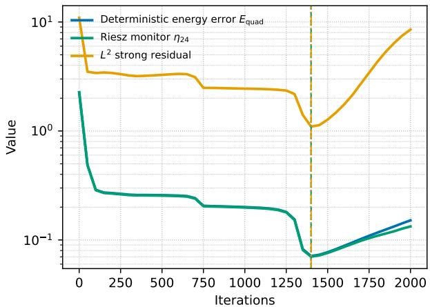  
(a) Training diagnostics.

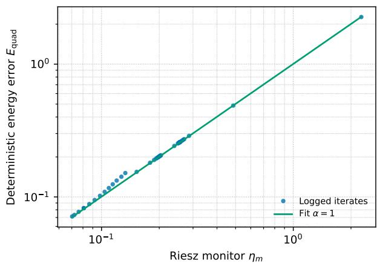  
(b) Calibration against $E _ { \mathrm { q u a d } }$

Figure 1: Representative $\kappa _ { 1 }$ run (seed 0): temporal tracking and calibration of the operational monitor $\eta _ { 2 4 }$ against $E _ { \mathrm { q u a d } }$  
Table 2: Scalar difusion: checkpoint selection over five seeds.
<table><tr><td rowspan="2">Selection criterion</td><td colspan="2">κ1</td><td colspan="2">κ2</td><td colspan="2">κ3</td><td colspan="2">κ4</td></tr><tr><td> ${ \mathrm { S t e p } }$ </td><td> $D _ { c }$ </td><td> ${ \mathrm { S t e p } }$ </td><td> $D _ { c }$ </td><td> ${ \mathrm { S t e p } }$ </td><td> $D _ { c }$ </td><td> ${ \mathrm { S t e p } }$ </td><td> $D _ { c }$ </td></tr><tr><td>Energy oracle min  $E _ { \mathrm { q u a d } }$ </td><td> $1 3 9 0 \pm 2 0 1$ </td><td> $1 . 0 0 0 \pm 0 . 0 0 0$ </td><td> $1 4 2 0 \pm 1 7 5$ </td><td> $1 . 0 0 0 \pm 0 . 0 0 0$ </td><td> $1 4 1 0 \pm 2 2 2$ </td><td> $1 . 0 0 0 \pm 0 . 0 0 0$ </td><td> $1 4 8 0 \pm 2 8 9$ </td><td> $1 . 0 0 0 \pm 0 . 0 0 0$ </td></tr><tr><td>Riesz monitor min  $\eta _ { 2 4 }$ </td><td> $1 3 9 0 \pm 2 0 1$ </td><td> $1 . 0 0 0 \pm 0 . 0 0 0$ </td><td> $1 4 2 0 \pm 1 7 5$ </td><td> $1 . 0 0 0 \pm 0 . 0 0 0$ </td><td> $1 4 1 0 \pm 2 2 2$ </td><td> $1 . 0 0 0 \pm 0 . 0 0 0$ </td><td> $1 4 8 0 \pm 2 8 9$ </td><td> $1 . 0 0 0 \pm 0 . 0 0 0$ </td></tr><tr><td>Strong residual  $L ^ { 2 }$ </td><td> $1 3 9 0 \pm 2 0 1$ </td><td> $1 . 0 0 0 \pm 0 . 0 0 0$ </td><td> $1 2 5 0 \pm 3 3 2$ </td><td> $1 . 1 0 5 \pm 0 . 2 2 3$ </td><td> $1 2 3 0 \pm 3 5 5$ </td><td> $1 . 0 7 4 \pm 0 . 1 6 3$ </td><td> $1 3 0 0 \pm 2 3 7$ </td><td> $1 . 0 4 9 \pm 0 . 1 0 9$ </td></tr><tr><td>Training Ritz loss min  $J _ { \mathrm { t r a i n } }$ </td><td> $2 0 0 0 \pm 0$ </td><td> $1 . 7 2 3 \pm 0 . 3 6 8$ </td><td> $2 0 0 0 \pm 0$ </td><td> $1 . 7 7 8 \pm 0 . 2 9 4$ </td><td> $2 0 0 0 \pm 0$ </td><td> $1 . 6 0 3 \pm 0 . 3 8 9$ </td><td> $2 0 0 0 \pm 0$ </td><td> $1 . 5 2 9 \pm 0 . 3 5 8$ </td></tr><tr><td>Validation Ritz loss min  $J _ { \mathrm { v a l } }$ </td><td> $1 3 7 0 \pm 1 8 2$ </td><td> $1 . 0 3 6 \pm 0 . 0 6 7$ </td><td> $1 3 9 0 \pm 1 5 6$ </td><td> $1 . 0 2 0 \pm 0 . 0 2 9$ </td><td> $1 4 2 0 \pm 1 6 0$ </td><td> $1 . 0 3 0 \pm 0 . 0 4 0$ </td><td> $1 4 6 0 \pm 2 6 8$ </td><td> $1 . 0 1 2 \pm 0 . 0 2 0$ </td></tr></table>

with $V _ { 0 } = H _ { 0 } ^ { 1 } ( \Omega )$ and $\begin{array} { r } { a _ { i } ( u , v ) = \int _ { \Omega } \kappa _ { i } \nabla u \cdot \nabla v d x } \end{array}$ . The first three cases use the common manufactured solution

$$
u _ { i } ^ { * } ( x , y ) = \sin ( \pi x ) \sin ( \pi y ) , \qquad i = 1 , 2 , 3 ,
$$

with

$$
\begin{array} { r } { \kappa _ { 1 } = 1 + \frac { 1 } { 2 } \sin ( 2 \pi x ) \sin ( 2 \pi y ) , \qquad \kappa _ { 2 } = 1 + \frac { 1 } { 4 } \sin ( 6 \pi x ) \sin ( 6 \pi y ) , } \\ { \kappa _ { 3 } = 1 + 0 . 4 5 \sin ( 1 0 \pi x ) \sin ( 1 0 \pi y ) . \qquad } \end{array}
$$

The fourth combines the more oscillatory coeficient

$$
\kappa _ { 4 } = 1 + 0 . 4 9 \sin ( 1 4 \pi x ) \sin ( 1 4 \pi y )
$$

with

$$
\begin{array} { r } { u _ { 4 } ^ { * } ( x , y ) = \sin ( \pi x ) \sin ( \pi y ) + 0 . 3 5 x ( 1 - x ) y ( 1 - y ) \phantom { x x x x x x x x x x x x x x x x x x x x x x x x x x x x x x x x x x x x x x x x x x x x x x x } } \\ { \times \exp \bigl [ - 8 0 \bigl ( ( x - 0 . 3 5 ) ^ { 2 } + ( y - 0 . 6 5 ) ^ { 2 } \bigr ) \bigr ] \bigl ( 1 + 0 . 5 \sin ( 2 \pi x ) \sin ( 3 \pi y ) \bigr ) . } \end{array}
$$

In each case,

$$
f _ { i } = - \nabla \cdot ( \kappa _ { i } \nabla u _ { i } ^ { * } ) .
$$

Figure 1 shows that $\eta _ { 2 4 }$ tracks the energy error on its natural scale and attains its minimum in the same late-training regime. The strong $L ^ { 2 }$ residual evolves on a diferent scale, as expected from Remark 2.

Across all twenty scalar runs (Table 2), $\eta _ { 2 4 }$ selects the same logged checkpoint as the $E _ { \mathrm { q u a d } } \mathrm { - o r a c l e }$ . The validation Ritz loss remains close to the oracle, whereas the training loss selects the final iterate and the strong residual departs from the oracle in the three more demanding cases. This does not contradict the exact Ritz–energy identity, which applies to the continuous functional $J ;$ the discrete evaluations $J _ { \mathrm { t r a i n } }$ and $J _ { \mathrm { v a l } }$ may perturb its ordering, as discussed after Proposition 2. None of these baselines carries the energy-dua ordering guarantee used by the Riesz criterion $\begin{array} { r } { k _ { m } ^ { * } \in \arg \operatorname* { m i n } _ { k \in { \mathcal { K } _ { \log } } } \eta _ { m , k } } \end{array}$

At the selected checkpoints (Table 3), $\eta _ { 2 4 } / E _ { \mathrm { q u a d } } = 0 . 9 7 5 \substack { - 0 . 9 \breve { 8 } 3 }$ , increasing to $\eta _ { 4 8 } / E _ { \mathrm { q u a d } } = 0 . 9 9 4 \ – 0 . 9 9 6$ The observed saturation factors are near 0.5, and the conditional upper estimates remain within about 5%–7% of the reference error for $q = 0 . 9$

Table 3: Scalar difusion: calibration and hierarchical diagnostics at the $\eta _ { 2 4 } -$ -selected checkpoint.
<table><tr><td rowspan="2">Coefficient</td><td colspan="2">Monitor calibration</td><td colspan="3">Refinement / estimator diagnostics</td></tr><tr><td> $\eta _ { 2 4 } / E _ { \mathrm { q u a d } }$ </td><td> $\eta _ { 4 8 } / E _ { \mathrm { q u a d } }$ </td><td>γ12,24,48</td><td> $q _ { \mathrm { o b s } }$ </td><td> $\mathcal { U } _ { 2 4 , 4 8 , 0 . 9 } / E _ { \mathrm { q u a d } }$ </td></tr><tr><td> $\kappa _ { 1 }$ </td><td> $0 . 9 8 1 \pm 0 . 0 0 7$ </td><td> $0 . 9 9 5 \pm 0 . 0 0 2$ </td><td> $0 . 5 1 9 \pm 0 . 0 0 4$ </td><td> $0 . 5 0 3 \pm 0 . 0 0 1$ </td><td> $1 . 0 5 2 \pm 0 . 0 1 8$ </td></tr><tr><td>κ2</td><td> $0 . 9 7 5 \pm 0 . 0 1 1$ </td><td> $0 . 9 9 4 \pm 0 . 0 0 3$ </td><td> $0 . 5 3 5 \pm 0 . 0 1 9$ </td><td> $0 . 5 0 6 \pm 0 . 0 0 4$ </td><td> $1 . 0 7 0 \pm 0 . 0 2 9$ </td></tr><tr><td>K3</td><td> $0 . 9 8 3 \pm 0 . 0 0 8$ </td><td> $0 . 9 9 6 \pm 0 . 0 0 2$ </td><td> $0 . 5 2 8 \pm 0 . 0 1 3$ </td><td> $0 . 5 0 6 \pm 0 . 0 0 3$ </td><td> $1 . 0 4 8 \pm 0 . 0 2 0$ </td></tr><tr><td> $\kappa _ { 4 }$ </td><td> $0 . 9 7 9 \pm 0 . 0 1 3$ </td><td> $0 . 9 9 5 \pm 0 . 0 0 4$ </td><td> $0 . 5 2 5 \pm 0 . 0 2 8$ </td><td> $0 . 5 0 9 \pm 0 . 0 1 1$ </td><td> $1 . 0 5 7 \pm 0 . 0 3 3$ </td></tr></table>

Table 4: $\kappa _ { 4 } \colon$ logged-oracle selection and interval certification for $q = 0 . 9 .$ . Match uses $E _ { \mathrm { q u a d } }$ only for external validation; certified counts are conditional on saturation.
<table><tr><td>Auxiliary pair</td><td>h</td><td> $| { \cal { K } } _ { h } |$ </td><td>Match</td><td>Certified</td><td> $\Gamma _ { \mathrm { l o g } , h }$ </td></tr><tr><td rowspan="5"> $V _ { 2 4 } \subset V _ { 4 8 }$ </td><td>50</td><td>41</td><td>5/5</td><td>0/5</td><td> $1 . 0 7 9 \pm 0 . 0 4 8$ </td></tr><tr><td>100</td><td>21</td><td>5/5</td><td>2/5</td><td> $1 . 0 8 0 \pm 0 . 0 4 8$ </td></tr><tr><td>200</td><td>11</td><td>4/5</td><td>4/5</td><td> $1 . 0 8 8 \pm 0 . 0 6 5$ </td></tr><tr><td>400</td><td>6</td><td>5/5</td><td>4/5</td><td> $1 . 0 9 4 \pm 0 . 0 6 6$ </td></tr><tr><td>50</td><td>41</td><td>5/5</td><td>2/5</td><td> $1 . 0 2 1 \pm 0 . 0 1 4$ </td></tr><tr><td rowspan="3"> $V _ { 4 8 } \subset V _ { 9 6 }$ </td><td>100</td><td>21</td><td>5/5</td><td>5/5</td><td> $1 . 0 2 1 \pm 0 . 0 1 4$ </td></tr><tr><td>200</td><td>11</td><td>4/5</td><td>4/5</td><td> $1 . 0 2 5 \pm 0 . 0 2 3$ </td></tr><tr><td>400</td><td>6</td><td>5/5</td><td>5/5</td><td> $1 . 0 2 7 \pm 0 . 0 2 3$ </td></tr></table>

Thus, in these scalar tests, the level-24 monitor already resolves the archive ordering needed for oracle selection and incurs below-1% observed overhead (Table 10), supporting its use as the operational monitor; enrichment further sharpens energy-scale calibration.

Across all four coeficients, auxiliary refinement increases $\eta _ { m } / E _ { \mathrm { q u a d } }$ toward unity (Figure 3a), consistent with Corollary 2.

Having established energy-scale calibration, we next test finite-resolution certification of the selected archive minimizer.

Finite-level interval certification We use $\kappa _ { 4 }$ to test finite-resolution certification across auxiliary resolutions and logging strides. The dense log is

$$
K _ { 5 0 } = \{ 0 , 5 0 , \ldots , 2 0 0 0 \} ,
$$

and the nested subarchives are $\mathcal { K } _ { h } = \{ 0 , h , 2 h , \ldots , 2 0 0 0 \}$ for $h \in \{ 5 0 , 1 0 0 , 2 0 0 , 4 0 0 \}$ . For the monitor-selected checkpoint $s _ { h }$ , let $U _ { h } : = \mathcal { U } _ { m , M , q , s _ { h } }$ . We report the conditional near-oracle factor $\Gamma _ { \log , h } = U _ { h } / \eta _ { m , s _ { h } }$ ; interval separation certifies $s _ { h }$ as the unique oracle of $\kappa _ { h } .$ , conditional on saturation.

Auxiliary enrichment improves certifiability (Table 4): with $V _ { 4 8 } \subset V _ { 9 6 }$ , all five ${ \kappa } _ { 1 0 0 }$ selections are certified and match the observed $E _ { \mathrm { q u a d } }$ -oracle. Higher certification counts are observed on several coarser subarchives, although the dependence on h is not monotone. On $\kappa _ { 5 0 }$ , all five selections still match but only two are certified, illustrating that failure of interval separation is inconclusive rather than evidence of incorrect selection. The single mismatch observed on $\kappa _ { 2 0 0 }$ is not certified and has only 0.72% deterioration. No certified mismatch occurs.

Trajectory-wide archive control Certification within $\kappa _ { h }$ does not control checkpoints omitted by logging. We therefore take $\kappa _ { 5 0 }$ as the prescribed finite comparison trajectory and apply Section 5 to $h \in \{ 1 0 0 , 2 0 0 , 4 0 0 \}$ using $V _ { 4 8 } \subset V _ { 9 6 }$ and $q = 0 . 9$ . For external validation we report

$$
\delta _ { s _ { h } } ^ { \mathrm { t r a j } } : = 1 0 0 \left( \frac { E _ { \mathrm { q u a d } , s _ { h } } } { \operatorname* { m i n } _ { j \in \mathcal { K } _ { 5 0 } } E _ { \mathrm { q u a d } , j } } - 1 \right) .
$$

The hatted quantities below are deterministic-quadrature realizations; they are reference-free diagnostics relative to $\kappa _ { 5 0 }$ , not certified continuous-energy-norm bounds unless quadrature error is controlled.

Table 5: Trajectory-wide $\kappa _ { 4 }$ diagnostics relative to $\kappa _ { 5 0 }$ . Oracle inclusion is reported as observed/certified; in these runs the selected-trajectory-oracle counts are identical. The last column gives mean/max observed deterioration.
<table><tr><td> $h$ </td><td> $\vert \mathcal { K } _ { h } \vert$ </td><td>Oracle inclusion</td><td> $\widehat { r } _ { h }$ </td><td> $\widehat { a } _ { h } + \widehat { r } _ { h }$ </td><td> $\widehat { \Gamma } _ { \mathrm { t r a j } , h }$ </td><td> $\mathrm { m e a n / m a x ~ } \delta _ { s _ { h } } ^ { \mathrm { t r a j } }$ </td></tr><tr><td>100</td><td>21</td><td> $3 / 5 / 2 / 5$ </td><td> $0 . 0 1 2 \pm 0 . 0 1 3$ </td><td> $0 . 0 1 5 \pm 0 . 0 1 5$ </td><td> $1 . 1 2 7 \pm 0 . 1 1 1$ </td><td> $0 . 2 2 \% / 0 . 9 1 \%$ </td></tr><tr><td>200</td><td>11</td><td> $1 / 5 / 1 / 5$ </td><td> $0 . 0 3 2 \pm 0 . 0 2 6$ </td><td> $0 . 0 3 6 \pm 0 . 0 2 9$ </td><td> $1 . 3 9 7 \pm 0 . 3 3 4$ </td><td> $3 . 3 8 \% / 7 . 9 1 \%$ </td></tr><tr><td>400</td><td>6</td><td> $0 / 5 / 0 / 5$ </td><td> $0 . 0 6 1 \pm 0 . 0 4 1$ </td><td> $0 . 0 6 5 \pm 0 . 0 4 5$ </td><td> $2 . 1 9 7 \pm 1 . 1 4 8$ </td><td> $8 . 1 5 \% / 2 3 . 8 9 \%$ </td></tr></table>

Table 6: Elasticity: checkpoint selection over five seeds.
<table><tr><td rowspan="3">Selection criterion</td><td colspan="2"> $\mathcal { C } _ { 1 }$ </td><td colspan="2"> $\mathcal { C } _ { 2 }$ </td><td colspan="2"> $\mathcal { C } _ { \mathrm { i n c } }$ </td></tr><tr><td>Step</td><td> $D _ { c }$ </td><td>Step</td><td> $D _ { c }$ </td><td>Step</td><td> $D _ { c }$ </td></tr><tr><td>Energy oracle min  $E _ { \mathrm { q u a d } }$ </td><td> $9 6 0 \pm 1 1 4$ </td><td> $1 . 0 0 0 \pm 0 . 0 0 0$ </td><td> $9 6 0 \pm 5 5$ </td><td> $1 . 0 0 0 \pm 0 . 0 0 0$ </td><td> $4 0 0 \pm 1 2 2$ </td><td> $1 . 0 0 0 \pm 0 . 0 0 0$ </td></tr><tr><td>Riesz monitor min  $\eta _ { 2 4 }$ </td><td> $9 6 0 \pm 1 1 4$ </td><td> $1 . 0 0 0 \pm 0 . 0 0 0$ </td><td> $9 6 0 \pm 5 5$ </td><td> $1 . 0 0 0 \pm 0 . 0 0 0$ </td><td> $4 2 0 \pm 1 3 0$ </td><td> $1 . 0 0 0 \pm 0 . 0 0 0$ </td></tr><tr><td>Strong residual  $L ^ { 2 }$ </td><td> $6 8 0 \pm 8 4$ </td><td> $1 . 2 4 9 \pm 0 . 1 4 1$ </td><td> $7 0 0 \pm 7 1$ </td><td> $1 . 2 0 6 \pm 0 . 1 2 7$ </td><td> $3 2 0 \pm 1 1 0$ </td><td> $1 . 0 1 1 \pm 0 . 0 1 6$ </td></tr><tr><td>Training Ritz loss min  $J _ { \mathrm { t r a i n } }$ </td><td> $3 0 0 0 \pm 0$ </td><td> $6 . 5 9 7 \pm 2 . 7 7 0$ </td><td> $3 0 0 0 \pm 0$ </td><td> $6 . 8 1 9 \pm 2 . 0 4 7$ </td><td> $3 0 0 0 \pm 0$ </td><td> $1 2 . 2 8 7 \pm 3 . 0 2 2$ </td></tr><tr><td>Validation Ritz loss min  $J _ { \mathrm { v a l } }$ </td><td> $9 4 0 \pm 8 9$ </td><td> $1 . 0 1 1 \pm 0 . 0 2 4$ </td><td> $9 4 0 \pm 5 5$ </td><td> $1 . 0 0 0 \pm 0 . 0 0 1$ </td><td> $5 0 0 \pm 2 4 5$ </td><td> $1 . 0 5 9 \pm 0 . 0 8 9$ </td></tr></table>

The trajectory-wide results (Table 5) separate within-archive certifiability from trajectory coverage. Although $\kappa _ { 4 0 0 }$ admits a logged-oracle certificate in all five runs with $V _ { 4 8 } \subset V _ { 9 6 }$ , it contains no $\scriptstyle \mathcal { K } _ { 5 0 ^ { - } } \mathrm { o r a c l e }$ . By contrast, ${ \kappa } _ { 1 0 0 }$ halves the archive from 41 to 21 checkpoints and limits the maximum observed trajectory deterioration to 0.91%. Coarser logging increases the reported trajectory-wide bounds and the observed deterioration. All trajectory-wide certificates obtained here satisfy the external check $q _ { \mathrm { o b s } } \leq 0 . 5 0 9 < 0 . 9$ Thus auxiliary refinement controls selection within a fixed archive, whereas logging refinement controls coverage of the prescribed trajectory.

We next test the same construction in the vector-valued energy geometry of linear elasticity and under localized material contrast.

## 6.1.2 Plane-strain elasticity and smoothed high-contrast inclusion

We consider plane-strain elasticity on $\Omega = ( 0 , 1 ) ^ { 2 }$ , with homogeneous Dirichlet conditions, $V _ { 0 } = H _ { 0 } ^ { 1 } ( \Omega ; \mathbb { R } ^ { 2 } )$ , and

$$
a ( u , v ) = \int _ { \Omega } 2 \mu ( x ) \varepsilon ( u ) : \varepsilon ( v ) + \lambda ( x ) \operatorname { d i v } u \operatorname { d i v } v d x ,
$$

where

$$
\begin{array} { r } { \varepsilon ( \boldsymbol { v } ) = \frac { 1 } { 2 } ( \nabla \boldsymbol { v } + \nabla \boldsymbol { v } ^ { \top } ) , \qquad \sigma ( \boldsymbol { v } ) = 2 \mu \varepsilon ( \boldsymbol { v } ) + \lambda \operatorname { d i v } ( \boldsymbol { v } ) \boldsymbol { I } . } \end{array}
$$

The manufactured displacement is

$$
\begin{array} { r } { \boldsymbol { u } ^ { * } ( x , y ) = \left( \begin{array} { l } { \sin ( \pi x ) \sin ( \pi y ) } \\ { \frac { 1 } { 2 } \sin ( 2 \pi x ) \sin ( \pi y ) } \end{array} \right) , \qquad - \nabla \cdot \boldsymbol { \sigma } ( \boldsymbol { u } ^ { * } ) = \boldsymbol { f } . } \end{array}
$$

With $E _ { 0 } = 1 , \nu = 0 . 3 0$ , and the corresponding baseline Lamé parameters $( \lambda _ { 0 } , \mu _ { 0 } )$ , we set $\lambda ( x ) = s ( x ) \lambda _ { 0 }$ $\mu ( x ) = s ( x ) \mu _ { 0 }$ and consider

$$
s _ { 1 } = 1 , \qquad s _ { 2 } = 1 + 0 . 4 5 \sin ( 6 \pi x ) \sin ( 4 \pi y ) ,
$$

plus the smoothed high-contrast inclusion

$$
s _ { \mathrm { i n c } } ( x , y ) = 1 + 1 9 \chi _ { e } ( x , y ) , \qquad \chi _ { e } ( x , y ) = \frac { 1 } { 2 } \left[ 1 - \operatorname { t a n h } \left( \frac { \sqrt { ( x - 0 . 5 5 ) ^ { 2 } + ( y - 0 . 5 2 ) ^ { 2 } } - 0 . 1 8 } { 0 . 0 3 5 } \right) \right] .
$$

The three cases are denoted by $\mathcal { C } _ { 1 } , \mathcal { C } _ { 2 }$ , and $\mathcal { C } _ { \mathrm { i n c } }$

Figure 2 shows that the vector-valued monitor remains aligned with the elastic energy error, including in the high-contrast inclusion case.

The Riesz criterion is oracle-level in all three material cases (Table 6); in one inclusion seed it selects a neighboring checkpoint with negligible deterioration $( D _ { c } = 1 . 0 0 0 0 7 7 )$ . The training Ritz loss always selects the final logged iterate with mean deterioration factors $D _ { c } = 6 . 6 0 – 1 2 . 2 9$ , while independent validation is substantially closer to the oracle. As in the scalar benchmarks, the comparison with $J _ { \mathrm { v a l } }$ is empirical, since finite-set evaluations may perturb the ordering of the continuous Ritz functional.

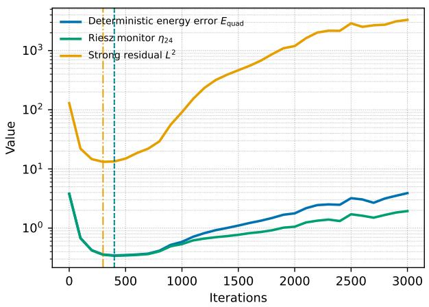  
(a) Training diagnostics.

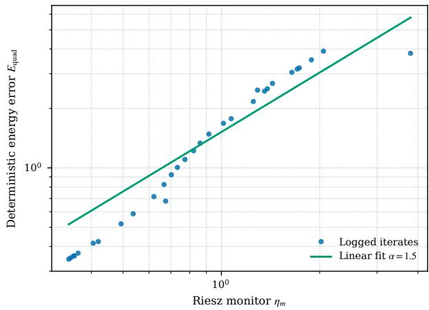  
(b) Calibration against $E _ { \mathrm { q u a d } } .$

Figure 2: Representative high-contrast inclusion run: temporal tracking and calibration of the vector-valued monitor η<sub>24</sub>.  
Table 7: Elasticity: calibration and hierarchical diagnostics at the $\eta _ { 2 4 }$ -selected checkpoint.
<table><tr><td rowspan="2">Material</td><td colspan="2">Monitor calibration</td><td colspan="2">Hierarchical estimator</td></tr><tr><td> $\eta _ { 2 4 } / E _ { \mathrm { q u a d } }$ </td><td> $\eta _ { 4 8 } / E _ { \mathrm { q u a d } }$ </td><td> $q _ { \mathrm { o b s } }$ </td><td> $\mathcal { U } _ { 2 4 , 4 8 , 0 . 9 } / E _ { \mathrm { q u a d } }$ </td></tr><tr><td> $\mathcal { C } _ { 1 }$ </td><td> $0 . 9 7 1 \pm 0 . 0 0 7$ </td><td> $0 . 9 9 3 \pm 0 . 0 0 2$ </td><td> $0 . 5 0 7 \pm 0 . 0 0 2$ </td><td> $1 . 0 7 9 \pm 0 . 0 1 9$ </td></tr><tr><td> $\mathcal { C } _ { 2 }$ </td><td> $0 . 9 7 3 \pm 0 . 0 0 8$ </td><td> $0 . 9 9 3 \pm 0 . 0 0 2$ </td><td> $0 . 5 0 7 \pm 0 . 0 0 2$ </td><td> $1 . 0 7 4 \pm 0 . 0 2 0$ </td></tr><tr><td> $\mathcal { C } _ { \mathrm { i n c } }$ </td><td> $0 . 9 8 6 \pm 0 . 0 0 4$ </td><td> $0 . 9 9 6 \pm 0 . 0 0 1$ </td><td> $0 . 5 0 9 \pm 0 . 0 0 2$ </td><td> $1 . 0 4 0 \pm 0 . 0 1 1$ </td></tr></table>

At the operational level (Table 7), the mean calibration ratio $\eta _ { 2 4 } / E _ { \mathrm { q u a d } }$ ranges from 0.971 to 0.986; level 48 raises the mean ratio to 0.993–0.996. The external saturation check again gives $q _ { \mathrm { o b s } } \simeq 0 . 5$ , while the mean $q = 0 . 9$ upper-estimate ratio ranges from 1.040 to 1.079.

Across the three elasticity cases, $\eta _ { m } / E _ { \mathrm { q u a d } }$ again increases toward unity under enrichment (Figure 3b), in agreement with the refinement behavior established in Corollary 2.

Thus oracle-level selection and tight energy-scale calibration persist in vector-valued elasticity with localized material contrast. A complementary spatial validation in Figure 6 shows that the Riesz-projected density captures the dominant energetic concentration associated with the localized inclusion. We next stress the auxiliary-resolution requirement using a reentrant-corner singularity.

## 6.1.3 L-shaped-domain stress test

The final manufactured benchmark uses

$$
\Omega _ { L } = ( - 1 , 1 ) ^ { 2 } \setminus \left( [ 0 , 1 ) \times ( - 1 , 0 ] \right) , \qquad - \Delta u = f , \qquad u = 0 \mathrm { o n } \partial \Omega _ { L } ,
$$

with

$$
u ^ { * } ( x , y ) = ( 1 - x ^ { 2 } ) ( 1 - y ^ { 2 } ) r ^ { 2 / 3 } \sin \left( \frac { 2 \theta } { 3 } \right) , \qquad f = - \Delta u ^ { * } .
$$

Here $( r , \theta )$ are polar coordinates centered at the reentrant corner, with $\theta \in [ 0 , 3 \pi / 2 ]$ . The reentrant-corner singularity tests checkpoint selection when uniform auxiliary spaces require substantially greater resolution.

Figure 4 shows that all monitored levels track the evolution of $E _ { \mathrm { q u a d } }$ , while auxiliary enrichment improves their energy-scale calibration. The stronger resolution requirement is consistent with the reentrant-corner singularity.

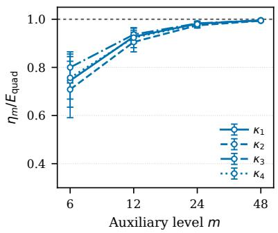  
(a) Scalar difusion.

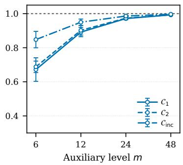  
(b) Plane-strain elasticity.

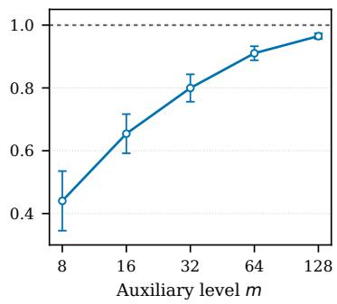  
(c) L-shaped domain.

Figure 3: Auxiliary refinement at the operationally selected checkpoints for the manufactured benchmarks. Curves report the mean $\eta _ { m } / E _ { \mathrm { q u a d } }$ over five seeds, with error bars denoting one standard deviation. Within each run, the neural checkpoint is held fixed as m varies; the dashed line marks unit calibration.  
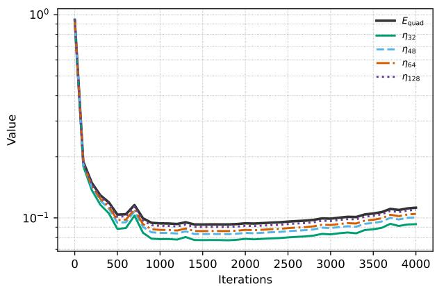  
(a) Training diagnostics.

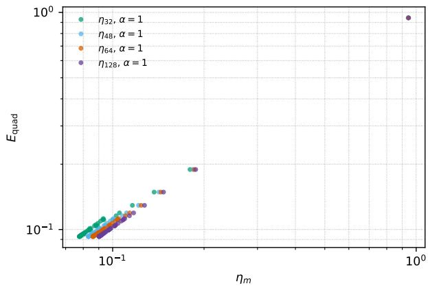  
(b) Calibration against $E _ { \mathrm { q u a d } }$  
Figure 4: L-shaped-domain monitor comparison for a representative run. The conforming Riesz monitors at increasing auxiliary resolutions track the reference energy error along the logged trajectory and approach the energy-error scale under enrichment.

Table 8: L-shaped domain: checkpoint selection over five seeds. The strong residual uses the cutof $r > 0 . 0 3 5$ around the reentrant corner.
<table><tr><td>Selection criterion</td><td>Selected step</td><td> $D _ { c }$ </td></tr><tr><td>min η32</td><td> $1 9 0 0 \pm 1 0 8 6$ </td><td> $1 . 0 0 3 \pm 0 . 0 0 5$ </td></tr><tr><td>min η48</td><td> $1 9 8 0 \pm 1 0 3 1$ </td><td> $1 . 0 0 0 \pm 0 . 0 0 1$ </td></tr><tr><td>min  $\eta _ { 6 4 }$ </td><td> $1 9 6 0 \pm 1 0 3 1$ </td><td> $1 . 0 0 0 \pm 0 . 0 0 0$ </td></tr><tr><td>min  $\eta _ { 1 2 8 }$ </td><td> $1 9 6 0 \pm 1 0 3 1$ </td><td> $1 . 0 0 0 \pm 0 . 0 0 0$ </td></tr><tr><td>Strong residual  $L ^ { 2 } ( r > 0 . 0 3 5 )$ </td><td> $1 6 4 0 \pm 7 6 7$ </td><td> $1 . 0 0 7 \pm 0 . 0 0 6$ </td></tr><tr><td>Training Ritz loss min  $J _ { \mathrm { t r a i n } }$ </td><td> $4 0 0 0 \pm 0$ </td><td> $1 . 1 8 1 \pm 0 . 0 9 5$ </td></tr><tr><td>Validation Ritz loss min  $J _ { \mathrm { v a l } }$ </td><td> $1 8 0 0 \pm 1 2 5 1$ </td><td> $1 . 0 9 2 \pm 0 . 1 6 9$ </td></tr></table>

The light monitor $\eta _ { 3 2 }$ is already near-oracle, while $\eta _ { 6 4 }$ and $\eta _ { 1 2 8 }$ recover the logged oracle in all five runs (Table 8). Exact logged-oracle recovery across all five runs is therefore reached only at a finer auxiliary resolution in this benchmark than in the smooth square-domain tests, consistent with Corollary 3.

At the $\eta _ { 6 4 } -$ -selected checkpoint (Table 9), the captured fraction rises from 0.801 ± 0.044 at level 32 to $0 . 9 6 5 \pm 0 . 0 0 9$ at level 128, while the unresolved fraction decreases accordingly. For $V _ { 6 4 } \subset V _ { 1 2 8 }$ , the external check gives $q _ { \mathrm { o b s } } = 0 . 6 3 7 \pm 0 . 0 0 7 < 0 . 9$ and the conditional upper estimate is $1 . 1 6 5 { \pm } 0 . 0 3 5$ times $E _ { \mathrm { q u a d } }$ . For the reported L-shaped runs, we use $\eta _ { 6 4 }$ as the operational selector and $\eta _ { 1 2 8 }$ as the enriched post-training check.

Table 9: L-shaped domain: selected auxiliary-resolution diagnostics.
<table><tr><td>Level/diagnostic</td><td> $\eta _ { m } / E _ { \mathrm { q u a d } }$ </td><td> $\rho _ { m , \mathrm { r e l } } ^ { \mathrm { q u a d } }$ </td><td> $\gamma ~ \mathrm { o r } ~ q _ { \mathrm { o b s } }$ </td><td> $\mathcal { U } / E _ { \mathrm { q u a d } }$ </td></tr><tr><td> $3 2 \times 3 2$ </td><td> $0 . 8 0 1 \pm 0 . 0 4 4$ </td><td> $0 . 5 9 5 \pm 0 . 0 6 1$ </td><td>一</td><td>一</td></tr><tr><td> $6 4 \times 6 4$ </td><td> $0 . 9 1 1 \pm 0 . 0 2 2$ </td><td> $0 . 4 0 9 \pm 0 . 0 5 0$ </td><td>一</td><td>一</td></tr><tr><td> $1 2 8 \times 1 2 8$ </td><td> $0 . 9 6 5 \pm 0 . 0 0 9$ </td><td> $0 . 2 6 0 \pm 0 . 0 3 4$ </td><td>一</td><td>一</td></tr><tr><td>(32, 64, 128)</td><td></td><td></td><td> $0 . 7 2 9 \pm 0 . 0 3 7$ </td><td></td></tr><tr><td>(64, 128)</td><td></td><td></td><td> $0 . 6 3 7 \pm 0 . 0 0 7$ </td><td> $1 . 1 6 5 \pm 0 . 0 3 5$ </td></tr></table>

Table 10: Representative cost of the operational and enriched Riesz reconstructions. Overhead is measured against the pure optimizer-update time between logged checkpoints.
<table><tr><td>Family</td><td> $M _ { \mathrm { o p } }$ </td><td></td><td>Operational call (s) Operational overhead Enriched level Enriched overhead</td><td></td><td></td></tr><tr><td>Scalar diffusion</td><td>24</td><td>0.034-0.045</td><td>0.58-0.76%</td><td>48</td><td>12.32-15.30%</td></tr><tr><td>Elasticity/inclusion</td><td>24</td><td>1.881-2.045</td><td> $8 . 0 1 { - } 8 . 7 2 \%$ </td><td>48</td><td>8.27–9.01%</td></tr><tr><td>L-shaped domain</td><td>64</td><td> $0 . 1 3 1 \pm 0 . 0 0 9$ </td><td> $0 . 7 4 \pm 0 . 0 3 \%$ </td><td>128</td><td> $4 . 0 4 \pm 0 . 7 4 \%$ </td></tr></table>

Refinement remains monotone and progressively improves energy-scale calibration (Figure 3c), consistently with Corollary 2.

Notably, $\eta _ { 6 4 } / E _ { \mathrm { q u a d } } = 0 . 9 1 1 \pm 0 . 0 2 2$ already recovers the logged oracle in all five runs. Thus, in this benchmark, oracle recovery precedes near-unit calibration: the archive ordering is already resolved suficiently for oracle recovery before near-exact recovery of the error scale is reached. A complementary spatial validation in Figure 7 shows that the enriched Riesz reconstruction captures the dominant energy concentration around the reentrant corner.

We next quantify the cost of the operational auxiliary levels.

## 6.1.4 Operational cost of checkpoint selection

The operational monitor incurs less than 1% overhead in the scalar and L-shaped tests and 8.01%–8.72% in elasticity (Table 10). These costs support its practical use for checkpoint ranking along the logged trajectory, while enriched reconstructions are reserved for tighter post-training assessment and certification.

We finally test the selector without a closed-form solution, using FEM only for external post-training validation.

## 6.2 Perforated plate: reference-free selection with external FEM validation

We consider plane-strain elasticity on

$$
\Omega = ( 0 , 1 ) ^ { 2 } \setminus \overline { { P _ { 9 6 } ( c , r ) } } , \qquad c = ( 1 / 2 , 1 / 2 ) , \qquad r = 0 . 1 6 ,
$$

where $P _ { 9 6 } ( c , r )$ is a fixed polygonal approximation of a circular hole. The material is homogeneous with $E = 1 , \nu = 0 . 3 0$ , zero body force, and outer-boundary displacement

$$
u _ { D } ( x , y ) = \left( \varepsilon _ { 0 } x + \gamma _ { 0 } y , - \nu \varepsilon _ { 0 } y \right) , \qquad \varepsilon _ { 0 } = 5 \times 1 0 ^ { - 2 } , \qquad \gamma _ { 0 } = 2 . 5 \times 1 0 ^ { - 2 } ,
$$

while the hole boundary is traction-free. The neural approximation satisfies the prescribed outer-boundary displacement strongly, and we use the nested auxiliary hierarchy $V _ { 2 4 } \subset V _ { 4 8 } \subset V _ { 9 6 } \subset V _ { 0 }$ described above.

No closed-form solution is available. Both external FEM references are conforming vector-valued $P _ { 1 }$ Galerkin solutions on fitted triangular meshes of the same fixed polygonal domain. The level-256 reference, used only for external post-training validation, has 179 882 displacement degrees of freedom, while the level-192 check has 109 608. The latter yields the same FEM-reference oracle in all five runs and changes checkpoint errors by at most $6 . 3 \times 1 0 ^ { - 4 }$ relatively. Neither FEM solve enters training, Riesz reconstruction, or checkpoint selection.

Figure 5 shows that both $\eta _ { 4 8 }$ and η<sub>96</sub> remain closely aligned with E<sub>FEM</sub> along the logged trajectory.

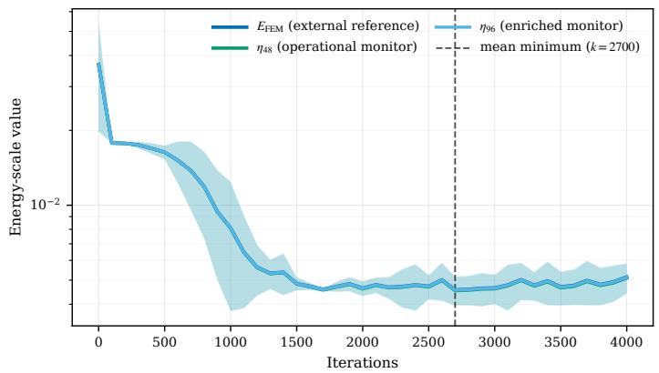  
(a) Training diagnostics.

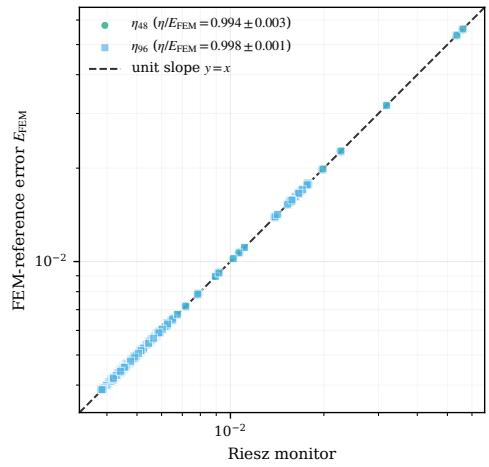  
(b) Calibration against the FEM reference.  
Figure 5: Perforated plate: external FEM validation of the operational $\eta _ { 4 8 }$ monitor over five runs.

Table 11: Perforated plate: checkpoint selection against the external FEM reference.
<table><tr><td>Criterion c</td><td>Step</td><td> $D _ { c } ^ { \mathrm { F E M } }$ </td></tr><tr><td>final</td><td> $4 0 0 0 \pm 0$ </td><td> $1 . 2 0 4 \pm 0 . 1 3 8$ </td></tr><tr><td>min  $E _ { \mathrm { F E M } }$ </td><td> $2 6 4 0 \pm 8 7 3$ </td><td> $1 . 0 0 0 \pm 0 . 0 0 0$ </td></tr><tr><td>min η48</td><td> $2 6 4 0 \pm 8 7 3$ </td><td> $1 . 0 0 0 \pm 0 . 0 0 0$ </td></tr><tr><td>min  $\eta _ { 9 6 }$ </td><td> $2 6 4 0 \pm 8 7 3$ </td><td> $1 . 0 0 0 \pm 0 . 0 0 0$ </td></tr><tr><td> $\operatorname* { m i n } J _ { \mathrm { t r a i n } }$ </td><td> $3 9 0 0 \pm 1 0 0$ </td><td> $1 . 1 3 9 \pm 0 . 1 6 1$ </td></tr><tr><td>min  $J _ { \mathrm { v a l } }$ </td><td> $2 7 2 0 \pm 1 0 6 4$ </td><td> $1 . 0 1 8 \pm 0 . 0 2 4$ </td></tr><tr><td>min  $R _ { \mathrm { s t r o n g } }$ </td><td> $3 6 0 \pm 1 5 2$ </td><td> $4 . 1 4 6 \pm 0 . 2 7 4$ </td></tr></table>

Table 12: Perforated plate: hierarchical diagnostics at the $\eta _ { 4 8 } .$ -selected checkpoint. Ratios involving $E _ { \mathrm { F E M } }$ are external validation quantities; $\mathcal { U } _ { 4 8 , 9 6 , 0 . 9 } / \eta _ { 4 8 }$ is the reference-free conditional bracket factor.
<table><tr><td>Quantity</td><td>Value</td></tr><tr><td> $\eta _ { 2 4 } / E _ { \mathrm { F E M } }$   $\eta _ { 4 8 } / E _ { \mathrm { F E M } }$   $\eta _ { 9 6 } / E _ { \mathrm { F E M } }$ </td><td> $0 . 9 7 7 \pm 0 . 0 0 2$   $0 . 9 9 3 \pm 0 . 0 0 1$   $0 . 9 9 8 \pm 0 . 0 0 0$ </td></tr><tr><td> $\delta _ { 4 8 , 9 6 } / E _ { \mathrm { F E M } }$   $\gamma _ { 2 4 , 4 8 , 9 6 }$ </td><td> $0 . 0 9 3 \pm 0 . 0 0 5$   $0 . 5 1 7 \pm 0 . 0 0 1$ </td></tr><tr><td> $\mathcal { U } _ { 4 8 , 9 6 , 0 . 9 } / \eta _ { 4 8 }$   $\mathcal { U } _ { 4 8 , 9 6 , 0 . 9 } / E _ { \mathrm { F E M } }$ </td><td> $1 . 0 2 3 \pm 0 . 0 0 2$   $1 . 0 1 6 \pm 0 . 0 0 2$ </td></tr></table>

Both $\eta _ { 4 8 }$ and η<sub>96</sub> select the FEM-reference oracle in all five runs (Table 11). The final iterate is 20.4% worse on average, validation Ritz selection remains close to the oracle, and the strong residual selects a much less accurate checkpoint.

We next assess the sharpness of the reference-free hierarchy at the selected checkpoint.

The auxiliary hierarchy is tightly calibrated on the FEM-reference scale (Table 12): $\eta _ { m } / E _ { \mathrm { F E M } }$ increases from $0 . 9 7 7 { \scriptstyle \pm 0 . 0 0 2 }$ at level 24 to $0 . 9 9 8 { \pm } 0 . 0 0 0$ at level 96. Independently of the FEM reference, the conditional $q = 0 . 9$ bracket has upper-to-lower factor $1 . 0 2 3 \pm 0 . 0 0 2 ;$ the FEM comparison gives the external check $\mathcal { U } _ { 4 8 , 9 6 , 0 . 9 } / E _ { \mathrm { F E M } } = 1 . 0 1 6 \pm 0 . 0 0 2$

To assess the mechanical impact of checkpoint selection, we compare the $\eta _ { 4 8 }$ -selected output with the final iterate at the solution level.

The late-iterate degradation is also visible in the solution-level errors (Table 13): relative to the $\eta _ { 4 8 ^ { - } }$ selected output, the final iterate increases the displacement, strain, von Mises stress, and sampled maximumdisplacement errors by factors 1.405, 1.140, 1.206, and 1.275, respectively.

Table 13: Perforated plate: solution-level comparison with the refined FEM reference. Here $\begin{array} { r l r } { e _ { u , L ^ { 2 } } } & { { } = } & { \Vert u _ { \theta } - u _ { \mathrm { F E M } } ^ { \mathrm { r e f } } \Vert _ { L ^ { 2 } } \Big / \Vert u _ { \mathrm { F E M } } ^ { \mathrm { r e f } } \Vert _ { L ^ { 2 } } , e _ { \varepsilon } \ = \ \Vert \varepsilon ( u _ { \theta } - u _ { \mathrm { F E M } } ^ { \mathrm { r e f } } ) \Vert _ { L ^ { 2 } } / \Vert \varepsilon ( u _ { \mathrm { F E M } } ^ { \mathrm { r e f } } ) \Vert _ { L ^ { 2 } } } \end{array}$ , and $e _ { \mathrm { v m } } ~ = ~ \| \sigma _ { \mathrm { v m } } ( u _ { \theta } ) ~ -$ $\sigma _ { \mathrm { v m } } ( u _ { \mathrm { F E M } } ^ { \mathrm { r e f } } ) \lVert _ { L ^ { 2 } } / \lVert \sigma _ { \mathrm { v m } } ( u _ { \mathrm { F E M } } ^ { \mathrm { r e f } } ) \rVert _ { L ^ { 2 } }$ , where $\sigma _ { \mathrm { v m } }$ denotes the plane-strain von Mises equivalent stress. The sampled maximum-displacement error is $\begin{array} { r } { e _ { u , \operatorname* { m a x } } : = \operatorname* { m a x } _ { x \in \mathcal { S } } \| u _ { \theta } ( x ) - u _ { \mathrm { F E M } } ^ { \mathrm { r e f } } ( x ) \| _ { 2 } } \end{array}$ , where S is the union of the reference-mesh nodes and the degree-two triangle quadrature points; the final row reports final/selected ratios.
<table><tr><td>Selected output</td><td>EFEM</td><td> $e _ { u , L ^ { 2 } }$ </td><td> $e _ { \varepsilon }$ </td><td> $e _ { \mathrm { v m } }$ </td><td>sampled  $e _ { u , \mathrm { m a x } }$ </td></tr><tr><td>min η48</td><td> $4 . 2 7 { \times } 1 0 ^ { - 3 } \pm 2 . 6 5 { \times } 1 0 ^ { - 4 }$ </td><td> $0 . 0 0 6 \pm 0 . 0 0 1$ </td><td> $0 . 0 8 5 \pm 0 . 0 0 5$ </td><td> $0 . 0 6 1 \pm 0 . 0 0 2$ </td><td> $1 . 2 2 \times { 1 0 } ^ { - 3 } \pm 1 . 5 0 { \times } 1 0 ^ { - 4 }$ </td></tr><tr><td>final</td><td> $5 . 1 5 { \times } 1 0 ^ { - 3 } \pm 7 . 1 0 { \times } 1 0 ^ { - 4 }$ </td><td> $0 . 0 0 8 \pm 0 . 0 0 2$ </td><td> $0 . 0 9 7 \pm 0 . 0 1 1$ </td><td> $0 . 0 7 3 \pm 0 . 0 1 2$ </td><td> $1 . 5 6 \times 1 0 ^ { - 3 } \pm 2 . 3 0 { \times } 1 0 ^ { - 4 }$ </td></tr><tr><td>final / min η48</td><td>1.204</td><td>1.405</td><td>1.140</td><td>1.206</td><td>1.275</td></tr></table>

Table 14: Perforated plate: external FEM-solve cost and Riesz monitoring cost. FEM times are one-time reference solves used only for validation; Riesz times are mean costs per logged checkpoint, with overhead measured against the pure optimizer-update time between logs.
<table><tr><td>Quantity</td><td>DOFs</td><td>Time (s)</td><td>Overhead</td></tr><tr><td>FEM ref. 256</td><td>179882</td><td>53.39</td><td></td></tr><tr><td>FEM check 192</td><td>109608</td><td>34.47</td><td></td></tr><tr><td>η24</td><td>2642</td><td> $0 . 2 1 2 \pm 0 . 0 5 5$ </td><td>0.93%</td></tr><tr><td>η48</td><td>10536</td><td> $0 . 9 5 9 \pm 0 . 2 5 0$ </td><td>4.19%</td></tr><tr><td>η96</td><td>42080</td><td> $3 . 6 2 1 \pm 0 . 6 7 7$ </td><td>15.84%</td></tr></table>

The operational $\eta _ { 4 8 }$ monitor adds 4.19% overhead in this benchmark (Table 14); the more expensive η<sub>96</sub> reconstruction is used only for post-training qualification. Thus the reference-free selector operates at moderate cost without requiring the refined FEM solve in the selection pipeline.

Taken together, the manufactured benchmarks validate energy-scale calibration, refinement, and oracle-level selection, while the perforated-plate experiment supports the use of the Riesz monitor as a lightweight, reference-free post-training selector when no exact solution is available.

## 7 Discussion and outlook

This work developed a reference-free archive-level checkpoint-selection framework for admissible neural approximations of symmetric coercive variational problems. Conforming Riesz reconstruction converts the exact residual–energy geometry into a computable, training-independent monitor, making the logged energy oracle recoverable without the exact solution or a reference solve. Monitor refinement yields eventual logged oracle recovery, while, under saturation, nested reconstructions provide finite-resolution near-oracle bounds and interval-separation certificates. Logging-resolution control further quantifies the loss relative to a prescribed finite comparison trajectory and provides trajectory-oracle certificates. Across the numerical benchmarks, the monitor approaches the reference energy error under refinement and recovers oracle-level checkpoints once suficiently resolved. On the perforated plate, this behavior is confirmed against an independent FEM reference, with modest observed post-processing cost.

The key mechanism is preservation of the oracle–non-oracle ordering. Checkpointwise recovery alone does not ensure archive-level selection because finite-dimensional projection defects can reverse this ordering; finitearchive uniform recovery eventually restores it. This ordering issue becomes more fundamental beyond the symmetric coercive setting. Indeed, residual–error norm equivalence alone does not preserve the target-error ordering. Let $X = Y = \mathbb { R } ^ { \bar { 2 } }$ with the Euclidean norm and

$$
B = \mathrm { d i a g } ( 1 , 2 ) , \qquad e _ { i } = ( 0 , 1 ) , \qquad e _ { j } = ( 3 / 2 , 0 ) .
$$

Then

$$
\| e \| _ { 2 } \leq \| B e \| _ { 2 } \leq 2 \| e \| _ { 2 } \qquad \forall e \in \mathbb { R } ^ { 2 } ,
$$

but

$$
\| e _ { i } \| _ { 2 } < \| e _ { j } \| _ { 2 } , \qquad \| B e _ { i } \| _ { 2 } > \| B e _ { j } \| _ { 2 } .
$$

Thus, even exact norm equivalence does not in general preserve the ordering relevant to archive selection. In the present setting, by contrast,

$$
\| R ( u _ { \theta _ { k } } ) \| _ { V _ { 0 , a } ^ { \prime } } = E _ { k } ,
$$

so the continuous residual and energy-error orderings coincide; the ordering obstruction analyzed here is therefore introduced by the finite-dimensional reconstruction.

Natural extensions are saturation-free finite-resolution certification and archive-level selection beyond symmetric coercive formulations. Explicit quadrature-error control could further upgrade the trajectory-wide diagnostics to fully certified continuous-energy-norm bounds.

The framework concerns selection among candidates generated by the optimizer. Viewed from this archivelevel perspective, a further natural direction is to carry the order-preservation principle upstream into the optimization procedure. We leave this direction for future work.

## A Sensitivity to the prescribed saturation parameter

The prescribed saturation parameter $q$ enters only the conditional upper estimate $\mathcal { U } _ { m , M , q } = ( \eta _ { m } ^ { 2 } + \delta _ { m , M } ^ { 2 } / ( 1 -$ $q ^ { 2 } ) ) ^ { 1 / 2 }$ and therefore does not afect monitor-based checkpoint selection. We assess the sensitivity of the finite-resolution certificates and upper estimates over the range $q \in \{ 0 . 7 0 , 0 . 8 0 , 0 . 9 0 , 0 . 9 6 \}$

Table 15 reports the resulting interval-separation certification counts on $\kappa _ { 4 }$ over five independent trajectories.

Table 15: Sensitivity of interval-separation certification on $\kappa _ { 4 }$ . Each entry is the number of certified runs out of five.
<table><tr><td></td><td colspan="4"> $V _ { 2 4 } \subset V _ { 4 8 }$ </td><td colspan="4"> $V _ { 4 8 } \subset V _ { 9 6 }$ </td></tr><tr><td>q</td><td> ${ \kappa } _ { 5 0 }$ </td><td> ${ \kappa } _ { 1 0 0 }$ </td><td>K200</td><td> ${ \kappa } _ { 4 0 0 }$ </td><td> ${ \kappa } _ { 5 0 }$ </td><td> ${ \kappa } _ { 1 0 0 }$ </td><td> $\kappa _ { 2 0 0 }$ </td><td> ${ \kappa } _ { 4 0 0 }$ </td></tr><tr><td>0.70</td><td>2/5</td><td>5/5</td><td>4/5</td><td>5/5</td><td>3/5</td><td>5/5</td><td>4/5</td><td>5/5</td></tr><tr><td>0.80</td><td>1/5</td><td>4/5</td><td>4/5</td><td>5/5</td><td>3/5</td><td>5/5</td><td>4/5</td><td>5/5</td></tr><tr><td>0.90</td><td>0/5</td><td>2/5</td><td>4/5</td><td>4/5</td><td>2/5</td><td>5/5</td><td>4/5</td><td>5/5</td></tr><tr><td>0.96</td><td>0/5</td><td>0/5</td><td>2/5</td><td>4/5</td><td>0/5</td><td>3/5</td><td>4/5</td><td> $5 / 5$ </td></tr></table>

The certification pattern remains stable over a broad range of $q ,$ particularly for $V _ { 4 8 } \subset V _ { 9 6 }$ , with the expected gradual loss of certificates as the upper bounds become more conservative. Larger counts on coarser subarchives reflect greater checkpoint separation rather than improved trajectory coverage.

For the perforated plate, Table 16 reports the conditional upper estimate relative to the independent FEM-reference error at the $\eta _ { 4 8 } .$ -selected checkpoint.

Table 16: Sensitivity of the conditional upper estimate on the perforated plate.
<table><tr><td>q</td><td> $\mathcal { U } _ { 4 8 , 9 6 , q } / E _ { \mathrm { F E M } }$ </td></tr><tr><td>0.70</td><td> $1 . 0 0 2 \pm 0 . 0 0 0$ </td></tr><tr><td>0.80</td><td> $1 . 0 0 5 \pm 0 . 0 0 1$ </td></tr><tr><td>0.90</td><td> $1 . 0 1 6 \pm 0 . 0 0 2$ </td></tr><tr><td>0.96</td><td> $1 . 0 4 8 \pm 0 . 0 0 5$ </td></tr></table>

The upper estimate remains close to the FEM-reference error throughout the tested range, reaching only $1 . 0 4 8 \pm 0 . 0 0 5$ at $q = 0 . 9 6$ . Thus the qualitative conclusions remain stable over the tested range of $q ,$ with the expected increase in conservatism as q grows.

## B Spatial diagnostics of the conforming Riesz reconstruction

For two manufactured stress tests, we compare the reference energy-error density with the spatial density of the conforming Riesz reconstruction. These comparisons provide a qualitative view of the dominant energetic regions captured by the reconstruction.

Figure 6 shows that the Riesz-projected density identifies the same dominant energetic region associated with the localized material transition as the reference density.

Figure 7 shows that both densities concentrate primarily near the reentrant corner while retaining nonzero contributions away from it, consistent with the observed need for global auxiliary refinement.

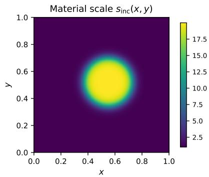

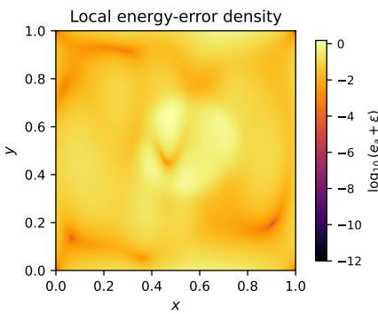

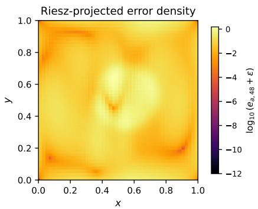  
Figure 6: Spatial energy diagnostics for the smoothed high-contrast inclusion. Left: material scale $s _ { \mathrm { i n c } } ( x , y )$ Middle: reference energy-error density $e _ { a } ( x ) = 2 \mu | \varepsilon ( u _ { \theta } - u ^ { * } ) | ^ { 2 } + \lambda | \operatorname { d i v } ( u _ { \theta } - u ^ { * } ) | ^ { 2 }$ . Right: conforming Riesz-projected density $e _ { a , 4 8 } ( x ) = 2 \mu | \varepsilon ( z _ { 4 8 } ) | ^ { 2 } + \lambda | \operatorname { d i v } z _ { 4 8 } | ^ { 2 }$ . Both densities are displayed as $\log _ { 1 0 } ( \cdot + \varepsilon )$

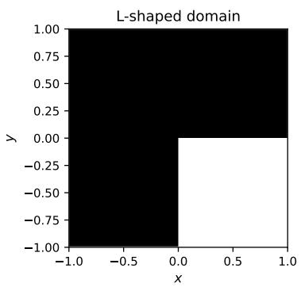

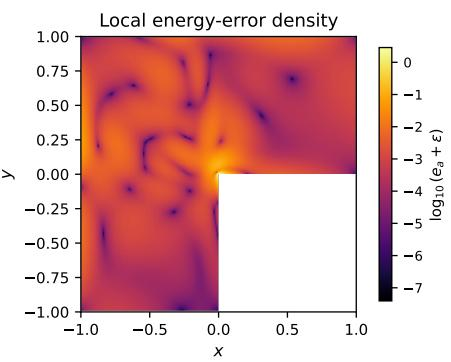

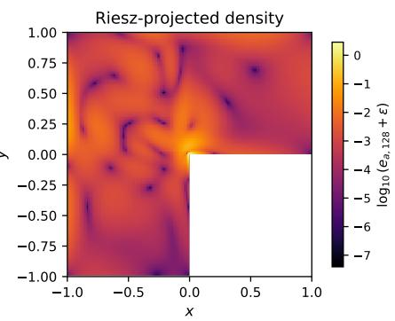  
Figure 7: Spatial diagnostics for the L-shaped-domain stress test. Left: domain geometry. Middle: reference energy-error density $e _ { a } ( x ) = | \nabla ( u _ { \theta } - u ^ { * } ) ( x ) | ^ { 2 }$ . Right: conforming Riesz-projected density $e _ { a , 1 2 8 } ( x ) =$ $| \nabla z _ { 1 2 8 } ( x ) | ^ { 2 }$ on the 128 × 128 auxiliary space. Densities are shown as $\log _ { 1 0 } ( \cdot + \varepsilon )$

## C Discrete-hierarchy and quadrature-refinement audit

All audits below are post-training and use the same trained trajectories and saved checkpoints as the main experiments.

## C.1 Monitor-hierarchy audit

For the scalar-difusion and L-shaped benchmarks, we recompute the reported monitor diagnostics at the saved operationally selected checkpoints on the same auxiliary levels using the common finest-level Galerkin restrictions of Section 6. No monotonicity violation is observed. Increasing the quadrature order of the common Galerkin assembly from 3 to 5 changes the monitor values by at most $1 . 3 1 4 \times 1 0 ^ { - 6 }$ for scalar difusion and $6 . 4 8 6 \times 1 0 ^ { - 4 }$ for the L-shaped problem.

## C.2 Validation-oracle stability

As noted after Proposition 2, a quadrature approximation can perturb the ordering induced by an exact energy criterion. For the manufactured benchmarks, $E _ { \mathrm { q u a d } }$ numerically defines the validation oracle, and we assess whether the reported ordering is stable under quadrature refinement. Without retraining, the manufactured-reference energies are reevaluated at tensor-product Gauss orders $Q = 3 , 5 , 7$ . Table 17 reports the largest checkpointwise relative changes.

The reference-energy evaluations are stable under refinement. The largest sensitivity occurs for the singular L-shaped problem and decreases from $Q = 3  5$ to $Q = 5  7$ . On the complete $\kappa _ { 4 }$ archive, the oracle and runner-up remain unchanged in all five trajectories, while the smallest relative oracle–runner-up gap, $1 . 9 8 6 \times 1 0 ^ { - 3 }$ , remains well above the observed quadrature variations. The trajectory-oracle inclusion counts are also unchanged: $K _ { 1 0 0 } : 3 / 5 , K _ { 2 0 0 } : 1 / 5$ , and $\kappa _ { 4 0 0 } : 0 / 5$ . Thus the validation ordering underlying the reported $\kappa _ { 4 }$ oracle and logging-resolution conclusions is insensitive to the tested quadrature refinements.

Table 17: Manufactured-reference quadrature-refinement audit. The first three rows concern saved decisionrelevant outputs; the $\kappa _ { 4 }$ row uses the complete 205-checkpoint comparison archive.
<table><tr><td>Benchmark</td><td>Audited outputs</td><td>Maximum  $Q = 3  5$ </td><td>Maximum  $Q = 5  7$ </td></tr><tr><td>Scalar diffusion</td><td>20</td><td> $1 . 4 9 4 \times 1 0 ^ { - 7 }$ </td><td> $1 . 4 9 4 \times 1 0 ^ { - 7 }$ </td></tr><tr><td>L-shaped domain</td><td>5</td><td> $2 . 9 3 2 \times 1 0 ^ { - 3 }$ </td><td> $5 . 7 2 1 \times 1 0 ^ { - 4 }$ </td></tr><tr><td>Elasticity</td><td>16</td><td> $1 . 0 4 3 \times 1 0 ^ { - 7 }$ </td><td> $1 . 2 3 7 \times 1 0 ^ { - 7 }$ </td></tr><tr><td> $\kappa _ { 4 }$  full archive</td><td>205</td><td> $2 . 2 6 3 \times 1 0 ^ { - 7 }$ </td><td> $4 . 7 5 9 \times 1 0 ^ { - 8 }$ </td></tr></table>

For the perforated plate, refining the independent FEM reference from level 192 to 256 likewise preserves the FEM-reference oracle in all five runs, with maximum relative checkpoint-error change $6 . 2 6 \times 1 0 ^ { - 4 }$ and rank correlation at least 0.999826.

Together, these audits support numerical stability of the reported selection and logging-resolution conclusions under the tested quadrature and FEM refinements.

Remark 8 (Continuous-energy oracle certification). The refinement audit above establishes numerical stability with respect to the tested discretizations. Let $E _ { k }$ denote the exact continuous energy error and $\widetilde { E } _ { k }$ its numerical approximation for k in a finite archive $\kappa$ . If ma $\mathrm { x } _ { k \in \mathcal { K } } | \widetilde { E } _ { k } - E _ { k } | \leq \varepsilon$ and the unique numerical minimizer $\widetilde { k } \in \mathcal { K }$ has oracle–competitor gap $\mathrm { m i n } _ { j \in \mathcal { K } \backslash \{ \widetilde { k } \} } ( \widetilde { E } _ { j } - \widetilde { E } _ { \widetilde { k } } ) > 2 \varepsilon$ , then $\widetilde { k }$ is also the unique continuous-energy oracle, since $E _ { j } - E _ { \widetilde { k } } \ge \widetilde { E } _ { j } - \widetilde { E } _ { \widetilde { k } } - 2 \varepsilon > 0$ for every $j \in \mathcal { K } \setminus \{ \widetilde { k } \}$ . Thus certification of an $E _ { \mathrm { q u a d } } \mathrm { - b a s e d }$ validation oracle against the exact continuous energy would follow from a suitable uniform numerical-integration error bound; such bounds are left to future work.

## References

[1] Tim De Ryck and Siddhartha Mishra. “Numerical analysis of physics-informed neural networks and related models in physics-informed machine learning”. In: Acta Numerica 33 (2024), pp. 633–713. doi: 10.1017/S0962492923000089.

[2] Marius Zeinhofer, Rami Masri, and Kent-André Mardal. “A unified framework for the error analysis of physics-informed neural networks”. In: IMA Journal of Numerical Analysis 45.5 (2025), pp. 2988–3025. doi: 10.1093/imanum/drae081.

[3] Yeonjong Shin, Zhongqiang Zhang, and George Em Karniadakis. “Error estimates of residual minimization using neural networks for linear PDEs”. In: Journal of Machine Learning for Modeling and Computing 4.4 (2023), pp. 73–101. doi: 10.1615/JMachLearnModelComput.2023050411.

[4] Piotr Minakowski and Thomas Richter. “A priori and a posteriori error estimates for the Deep Ritz method applied to the Laplace and Stokes problem”. In: Journal of Computational and $A p { \mathrm { - } }$ plied Mathematics 421 (2023). See also the erratum in J. Comput. Appl. Math. 460 (2025), 116406, doi:10.1016/j.cam.2024.116406, p. 114845. doi: 10.1016/j.cam.2022.114845.

[5] Stefano Berrone, Claudio Canuto, and Moreno Pintore. “Solving PDEs by variational physics-informed neural networks: An a posteriori error analysis”. In: Annali dell’Università di Ferrara 68 (2022), pp. 575– 595. doi: 10.1007/s11565-022-00441-6.

[6] Andrea Bonito, Ronald DeVore, Guergana Petrova, and Jonathan W. Siegel. “Convergence and error control of consistent PINNs for elliptic PDEs”. In: IMA Journal of Numerical Analysis 46.1 (2026), pp. 90–148. doi: 10.1093/imanum/draf008.

[7] Markus Bachmayr, Wolfgang Dahmen, and Mathias Oster. “Variationally correct neural residual regression for parametric PDEs: On the viability of controlled accuracy”. In: IMA Journal of Numerical Analysis (2025). doi: 10.1093/imanum/draf073.

[8] Sergio Rojas, Paweł Maczuga, Judit Muñoz-Matute, David Pardo, and Maciej Paszyński. “Robust variational physics-informed neural networks”. In: Computer Methods in Applied Mechanics and Engineering 425 (2024), p. 116904. doi: 10.1016/j.cma.2024.116904.

[9] Thomas Führer and Sergio Rojas. A posteriori analysis of neural network approximations. 2025. doi: 10.48550/arXiv.2507.06017. arXiv: 2507.06017 [math.NA].

[10] Lewin Ernst, Nikolaos Rekatsinas, and Karsten Urban. A posteriori certification of PDE approximations with particular application to neural networks. 2025. doi: 10 . 48550 / arXiv . 2502 . 20336. arXiv: 2502.20336 [math.NA].

[11] Mark Ainsworth and Justin Dong. “Galerkin neural networks: A framework for approximating variational equations with error control”. In: SIAM Journal on Scientific Computing 43.4 (2021), A2474–A2501. doi: 10.1137/20M1366587.

[12] Mingxing Weng, Zhiping Mao, and Jie Shen. “Deep collocation method: A framework for solving PDEs using neural networks with error control”. In: SIAM Journal on Scientific Computing 48.1 (2026), pp. C77–C102. doi: 10.1137/25M1739753.

[13] Mark Ainsworth and Justin Dong. “Extended Galerkin neural network approximation of singular variational problems with error control”. In: SIAM Journal on Scientific Computing 47.3 (2025), pp. C738–C768. doi: 10.1137/24M1658279.

[14] Philippe G. Ciarlet. The Finite Element Method for Elliptic Problems. Amsterdam: North-Holland, 1978.

[15] Susanne C. Brenner and L. Ridgway Scott. The Mathematical Theory of Finite Element Methods. 3rd ed. New York: Springer, 2008. doi: 10.1007/978-0-387-75934-0.

[16] Randolph E. Bank and Alan Weiser. “Some a posteriori error estimators for elliptic partial diferentia equations”. In: Mathematics of Computation 44.170 (1985), pp. 283–301. doi: 10.1090/S0025-5718- 1985-0777265-X.

[17] Mark Ainsworth and J. Tinsley Oden. A Posteriori Error Estimation in Finite Element Analysis. New York: Wiley, 2000. doi: 10.1002/9781118032824.

[18] Rüdiger Verfürth. A Posteriori Error Estimation Techniques for Finite Element Methods. Oxford: Oxford University Press, 2013. doi: 10.1093/acprof:oso/9780199679423.001.0001.

[19] Rüdiger Verfürth. A Review of A Posteriori Error Estimation and Adaptive Mesh-Refinement Techniques. Chichester: Wiley–Teubner, 1996.

[20] Weinan E and Bing Yu. “The Deep Ritz method: A deep learning-based numerical algorithm for solving variational problems”. In: Communications in Mathematics and Statistics 6.1 (2018), pp. 1–12. doi: 10.1007/s40304-018-0127-z.