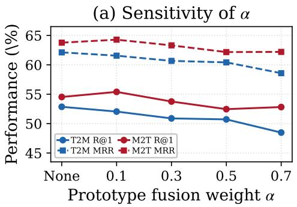
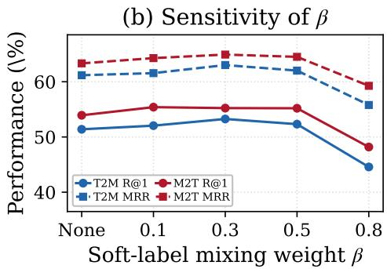

# Retrieval-guided Twin Fusion with Similarity-aware Contrast for Molecule-Text Alignment

SHUNSHUN GU, University of Wisconsin–Madison, USA

SHENGQI QIU, University of Wisconsin–Madison, USA

HANG ZHOU, University of North Carolina at Chapel Hill, USA

XIAO LUO, University of Wisconsin–Madison, USA

This paper studies the problem of molecule-text alignment, which aims to project molecules and their textual descriptions into a joint latent space for downstream tasks including molecule search and molecular property prediction. Previous approaches typically combine graph structure mining with contrastive learning to enhance joint representation learning. However, they typically neglect fine-grained semantic relationships between substructures and texts, leading to suboptimal performance on downstream tasks. Towards this end, we propose a novel approach named Retrieval-guided Twin Fusion with Similarity-aware Contrast (RISEN) for molecule-text alignment. The core idea of RISEN is to construct a latent twin molecule for each substructure with cross-modal retrieval for semantic enhancement. In particular, for each substructure query, we retrieve relevant textual descriptions and sample several molecules that share similar descriptions of substructures. Then, we aggregate their representations via attention pooling for a twin latent representation, which would be further fused with the original substructure for representation enrichment. In addition, we measure the similarity across substructures and texts, which would further guide cross-modal contrastive learning with soft thresholding Extensive experiments on benchmark datasets validate the superiority of the proposed RISEN in comparison with existing baselines.

CCS Concepts: • Computing methodologies → Machine learning; • Information systems → Information retrieval; • Applied computing → Bioinformatics.

Additional Key Words and Phrases: molecule-text alignment, contrastive learning, retrieval-augmented learning, molecular representation learning

## ACM Reference Format:

Shunshun Gu, Shengqi Qiu, Hang Zhou, and Xiao Luo. 2026. Retrieval-guided Twin Fusion with Similarity-aware Contrast for Molecule-Text Alignment. 1, 1 (August 2026), 9 pages. https://doi.org/10.1145/nnnnnnn.nnnnnnn

## 1 Introduction

Molecules encode rich chemical information whose systematic understanding is central to drug discovery, materials science, and molecular property prediction [14, 23, 27]. Machine learning has emerged as a powerful lens for this task, with language models ofering a particularly promising route, as natural-language descriptions of molecules provide functional and contextual cues that complement structural representations [9]. Molecule–text alignment has thus become a central paradigm [4], enabling models to jointly embed molecular structures and textual descriptions into a shared semantic space for cross-modal reasoning.

Most prior work on molecule–text alignment follows the contrastive representation learning paradigm. Early approaches such as Text2Mol [4] and MoMu [19] learned aligned embeddings from paired molecules and textual descriptions to support text-to-molecule retrieval. Building on this, KV-PLM [25] bridged molecules and biomedical text through unified language modeling, while MoleculeSTM [9] performed large-scale structure–text contrastive pre-training to obtain more general cross-modal representations that transfer to multiple downstream tasks. More recent methods pursue finer-grained correspondences. MolCA [10] introduces a cross-modal projector to bridge graph and language spaces, while MolBridge [14] aligns molecular substructures with chemical phrases, further improving cross-modal learning by injecting local structural supervision

Despite this progress, two limitations remain. Firstly, finer-grained matching can amplify noise. Real-world descrip tions are often incomplete, ambiguous, and context-dependent. Expanding supervision from instance-level pairs to many substructure–phrase pairs can introduce weak or incorrect alignments, diluting useful signals and degrading generalization [5, 8]. Secondly, most methods rely on hard contrastive objectives with one-hot targets, treating all othe in-batch samples as negatives [3]. However, molecule–text relevance is often inherently soft, given that many molecules share scafolds, functional groups, or pharmacophores, and treating them as negatives introduces false negatives that distort semantic neighborhoods. Soft contrastive targets derived from embedding similarities have shown promise in mitigating this issue in other alignment settings [15].

We propose RISEN, a retrieval-guided molecule–text alignment framework designed to address both limitations. To enrich substructure representations with broader chemical context that isolated fragment learning alone cannot provide, Retrieval-guided Twin Fusion retrieves semantically related mirror molecules for each substructure and aggregates them into an attention-pooled twin prototype, which is then fused with the original embedding to enable local motifs to inherit structural context from complete molecules. To mitigate false negatives arising from chemically simila in-batch molecules, Similarity-aware Contrast replaces one-hot targets with similarity-based soft targets derived from MoLFormer [18] embeddings, better preserving semantic neighborhoods in the embedding space. Across molecule–text retrieval and molecular property prediction benchmarks, RISEN achieves consistent overall gains over strong baselines.

Our contributions are summarized as follows: ❶ We present a retrieval-augmented perspective for substructurelevel molecule–text alignment, where semantically related complete molecules are leveraged to enrich local fragment representations with broader chemical context. ❷ We propose RISEN, a retrieval-guided framework that enriches substructure representations via twin prototype fusion and alleviates false negatives through similarity-aware soft targets. ❸ Extensive experiments on molecule–text retrieval and molecular property prediction benchmarks demonstrate consistent gains over strong baselines across both tasks

## 2 Related Work

Molecule–Text Multimodal Modeling. Molecule–text alignment methods can be categorized by alignment granularity. Global-level methods align complete molecular structures with full descriptions via contrastive learning. MoMu [19] and MoleculeSTM [9] apply large-scale contrastive pre-training, MolCA [10] introduces a cross-modal projector to bridge graph and language encoders, and instruction-tuned models such as InstructMol [2] and BioT5+ [16] leverage multi-task learnin for broader eneralization. These methods o erate on lobal molecule–text airs and overlook fine- rained structural correspondences. Fine-grained methods instead capture local correspondences between molecular fragments and chemical phrases. Yu et al. [24] explored modality blending to encourage multi-scale representations, Min et al. [13] applied optimal transport to align atom, motif, and global levels, and Atomas [27] designed a hierarchical adaptive alignment model. MolBridge [14] constructs explicit substructure–phrase pairs via chemical fragmentation tools and applies a self-refinement mechanism to filter noisy alignments. Unlike these approaches, RISEN enriches substructure representations with semantically related complete molecules, providing broader chemical context without requiring explicit fragment-level annotations.

Preprint

Contrastive Learning with Soft Targets. Standard contrastive objectives treat all non-matching in-batch samples as negatives, creating false negatives when semantically similar samples co-occur [3]. Li et al. [8] proposed momentumdistilled soft labels to handle noisy correspondences in vision–language pre-training, and Park et al. [15] derived soft targets from embedding similarities to preserve semantic neighborhoods in multilingual alignment. In the molecular domain, Wang et al. [22] demonstrated that structurally similar molecules cause harmful false negatives and proposed fragment contrast as mitigation. Our Similarity-aware Contrast extends this line by constructing soft contrastive targets from pairwise MoLFormer [18] embedding similarities, directly reducing the penalty on chemically similar in-batch molecules.

Retrieval-Augmented Learning. Retrieval augmentation has been applied across NLP and vision–language modeling to enrich representations with relevant external knowledge [6]. In the molecular domain, retrieval has primarily been used at the input level for generation tasks such as molecule captioning [7]. RISEN difers by applying retrieval at the representation level during training, aggregating retrieved mirror molecules into an attention-pooled prototype fused with the original substructure embedding, without modifying the inference pipeline.

## 3 Methodology

Framework Overview. In this paper, we introduce a retrieval-augmented alignment framework that extends substructureaware contrastive learning with structured retrieval and soft supervision. The core idea is to enrich isolated substructure representations with chemical context from semantically related complete molecules, while replacing hard contrastive targets with similarity-aware soft labels to mitigate false negatives.

## 3.1 Retrieval-guided Twin Fusion

Substructure representations learned in isolation often lack the broader molecular context needed to support accurate cross-modal alignment [26, 28]. To address this, we retrieve semantically related complete molecules for each substructure query, aggregate their embeddings into an attention-pooled twin prototype via an attention-based mechanism, and fuse it with the original substructure representation to provide richer chemical context.

For each substructure query, we collect the textual descriptions aligned with it in the training set, and take all complete molecules aligned with any of these descriptions as its mirror set. The mirror map M is precomputed before training, and at each step we sample $k \leq 5$ mirror molecules uniformly at random

Specifically, we aggregate the embeddings of� retrieved mirror molecules $\{ \mathbf { m } _ { 1 } , \ldots , \mathbf { m } _ { k } \}$ into a prototype p as follows:

$$
w _ { i } = \frac { \exp ( \mathbf { h } ^ { \top } \mathbf { m } _ { i } / \sqrt { d } ) } { \sum _ { j = 1 } ^ { k } \exp ( \mathbf { h } ^ { \top } \mathbf { m } _ { j } / \sqrt { d } ) } , \quad \mathbf { p } = \frac { \sum _ { i = 1 } ^ { k } w _ { i } \mathbf { m } _ { i } } { \left\| \sum _ { i = 1 } ^ { k } w _ { i } \mathbf { m } _ { i } \right\| _ { 2 } } .\tag{1}
$$

The original representation h is then enriched with this prototype information:

$$
\mathbf { h } ^ { \prime } = \mathbf { N o r m } ( ( 1 - \alpha ) \mathbf { h } + \alpha \mathbf { p } ) ,\tag{2}
$$

where � is the embedding dimension and � is a fusion coeficient. This design enriches substructure representations with broader chemical context.

## 3.2 Similarity-aware Contrastive Learning

Hard contrastive objectives treat all non-matching in-batch samples as negatives [3, 21], yet many molecules share scafolds, functional groups, or pharmacophores, creating harmful false negatives. To address this, we leverage pairwise

MoLFormer embedding similarities to construct soft contrastive targets that reduce the penalty on chemically similar in-batch molecules, better preserving semantic neighborhoods during training.

Specifically, let $S _ { i j }$ denote the cosine similarity between the normalized MoLFormer embeddings of molecules � and � in a mini-batch. We apply a threshold � to filter weak similarities and derive a soft target distribution ${ \bf q } ^ { \mathrm { s o f f } }$ via a temperature-scaled softmax:

$$
\tilde { S } _ { i j } = S _ { i j } \mathbb { I } ( S _ { i j } \geq \tau ) , ~ q _ { i j } ^ { \mathrm { s o f f } } = \frac { \exp ( \tilde { S } _ { i j } / T ) } { \sum _ { l = 1 } ^ { B } \exp ( \tilde { S } _ { i l } / T ) } .\tag{3}
$$

For each retrieval direction, the final target distribution q is a mixture of hard labels $\mathbf { q } _ { \mathrm { h a r d } }$ and soft labels $\mathbf { q } _ { \mathrm { s o f t } }$ controlled by a mixing weight $\beta \colon$

$$
\begin{array} { r } { \mathbf q = \left( 1 - \beta \right) \mathbf q _ { \mathrm { h a r d } } + \beta \mathbf q _ { \mathrm { s o f t } } . } \end{array}\tag{4}
$$

This design yields a smoother supervision signal that better preserves semantic neighborhoods.

## 3.3 Optimization Objectives

Efective cross-modal alignment benefits from supervision that is both directionally balanced and robust to noise [8]. To this end, we optimize RISEN with two complementary objectives: a bidirectional contrastive loss on soft-hard mixed targets to align molecule and text representations, and a prototype contrastive loss to enforce alignment consistency between the fused representation and the twin prototype.

Bidirectional Contrastive Loss with Soft Labels. Given a mini-batch of molecule-side inputs $\boldsymbol { x } _ { m } ^ { i }$ and text-side inputs $x _ { t } ^ { j } ,$ we first encode them into feature representations $u _ { i } = f _ { m } ( x _ { m } ^ { i } )$ and $v _ { j } = f _ { t } ( x _ { t } ^ { j } )$ . We define the pairwise similarity $\sigma _ { i , j } ( u , v )$ as:

$$
\sigma _ { i , j } ( \boldsymbol { u } , \boldsymbol { v } ) = \exp \left( \gamma \cdot \frac { \boldsymbol { u } _ { i } ^ { \top } \boldsymbol { v } _ { j } } { \| \boldsymbol { u } _ { i } \| _ { 2 } \| \boldsymbol { v } _ { j } \| _ { 2 } } \right) ,\tag{5}
$$

where � is a learnable logit scale. After masking invalid pair types, and using direction-specific mixed target distributions $q _ { i j } ^ { s  t }$ and $q _ { i j } ^ { t  s }$ , the bidirectional losses are defined as:

$$
\mathcal { L } _ { s  t } = - \frac { 1 } { B } \sum _ { i = 1 } ^ { B } \sum _ { j = 1 } ^ { B } q _ { i j } ^ { s  t } \log \frac { \sigma _ { i , j } } { \sum _ { l = 1 } ^ { B } \sigma _ { i , l } } ,\tag{6}
$$

$$
\mathcal { L } _ { t  s } = - \frac { 1 } { B } \sum _ { i = 1 } ^ { B } \sum _ { j = 1 } ^ { B } q _ { i j } ^ { t  s } \log \frac { \sigma _ { i , j } } { \sum _ { l = 1 } ^ { B } \sigma _ { l , j } } .\tag{7}
$$

The contrastive loss in this branch is the average of both directions: $\begin{array} { r } { \mathcal { L } _ { \mathrm { c o n t } } = \frac { 1 } { 2 } ( \mathcal { L } _ { s  t } + \mathcal { L } _ { t  s } ) . } \end{array}$

Total Loss. We optimize the contrastive loss on both the fused substructure representation h′ and the mirror molecule prototype p, with an additional classification loss $\scriptstyle { \mathcal { L } } _ { \mathrm { c l a s s } }$ following the self-refinement protocol of MolBridge [14] to iteratively filter unreliable alignment pairs:

$$
\mathcal { L } _ { \mathrm { t o t a l } } = \underbrace { \mathcal { L } _ { \mathrm { c o n t } } ( \mathbf { h } ^ { \prime } , \mathbf { t } ) + \lambda \cdot \mathcal { L } _ { \mathrm { c o n t } } ( \mathbf { p } , \mathbf { t } ) } _ { \mathcal { L } _ { \mathrm { c o m b i n e d } } } + \mathcal { L } _ { \mathrm { c l a s s } } ,\tag{8}
$$

where $\lambda$ is the prototype loss weight and t is the text representation. Together, these objectives encourage RISEN to learn representations that are semantically aligned, structurally enriched, and robust to noisy correspondences.

Preprint

Table 1. Performance comparison for zero-shot molecule-text retrieval on PCDes test set (scafold split). Baseline results are quoted from Park et al. [14]. We bold the best results and underline the second-best
<table><tr><td rowspan="2">Methods</td><td rowspan="2"># Params</td><td colspan="4">Text to Molecule</td><td colspan="4">Molecule to Text</td></tr><tr><td>R@1</td><td>R@5</td><td>R@10</td><td>MRR</td><td>R@1</td><td>R@5</td><td>R@10</td><td>MRR</td></tr><tr><td colspan="10">1D SMILES + 2D Graph</td></tr><tr><td>MoMu [19]</td><td>111M</td><td>4.90</td><td>14.48</td><td>20.69</td><td>10.33</td><td>5.08</td><td>12.82</td><td>18.93</td><td>9.89</td></tr><tr><td>MolFM [11]</td><td>138M</td><td>16.14</td><td>30.67</td><td>39.54</td><td>23.63</td><td>13.90</td><td>28.69</td><td>36.21</td><td>21.42</td></tr><tr><td>MolFM (fine-tuned) [11]</td><td>138M</td><td>29.39</td><td>50.26</td><td>58.49</td><td>39.34</td><td>29.76</td><td>50.53</td><td>58.63</td><td>39.56</td></tr><tr><td>MolCA [10]</td><td>111M</td><td>35.09</td><td>62.14</td><td>69.77</td><td>47.33</td><td>37.95</td><td>66.81</td><td>74.48</td><td>50.80</td></tr><tr><td colspan="10">1D SMILES</td></tr><tr><td>MoleculeSTM [9]</td><td>120M</td><td>35.80</td><td></td><td></td><td>一</td><td>39.50</td><td></td><td>一</td><td>一</td></tr><tr><td>Atomas-base [27]</td><td>271M</td><td>39.08</td><td>59.72</td><td>66.56</td><td>47.33</td><td>37.88</td><td>59.22</td><td>65.56</td><td>47.81</td></tr><tr><td>Atomas-large [27]</td><td>825M</td><td>49.08</td><td>68.32</td><td>73.16</td><td>57.79</td><td>46.22</td><td>66.02</td><td>72.32</td><td>55.52</td></tr><tr><td>MolBridge [14]</td><td>155M</td><td>50.45</td><td>70.83</td><td>76.11</td><td>59.63</td><td>52.76</td><td>73.54</td><td>78.55</td><td>62.25</td></tr><tr><td>RISEN</td><td>155M</td><td>52.05</td><td>73.47</td><td>78.72</td><td>61.56</td><td>55.40</td><td>75.04</td><td>80.09</td><td>64.28</td></tr></table>

Table 2. Performance comparison for zero-shot molecule-text retrieval on PubChem324kV2 test set. Baseline results are quoted from Park et al. [14]. We bold the best results and underline the second-best.
<table><tr><td rowspan="2">Methods</td><td colspan="2">Text to Molecule</td><td colspan="2">Molecule to Text</td></tr><tr><td>R@1</td><td>R@20</td><td>R@1</td><td>R@20</td></tr><tr><td>1D SMILES + 2D Graph</td><td></td><td></td><td></td><td></td></tr><tr><td>MoMu-S [19]</td><td>40.8</td><td>86.1</td><td>40.9</td><td>86.2</td></tr><tr><td>MoMu-K [19]</td><td>41.6</td><td>87.8</td><td>41.8</td><td>87.5</td></tr><tr><td>MoleculeSTM [9]</td><td>44.3</td><td>90.3</td><td>45.8</td><td>88.4</td></tr><tr><td>MolCA [10]</td><td>66.0</td><td>93.5</td><td>66.6</td><td>94.6</td></tr><tr><td>1D SMILES</td><td></td><td></td><td></td><td></td></tr><tr><td>SciBERT [1]</td><td>37.5</td><td>85.2</td><td>39.7</td><td>85.8</td></tr><tr><td>KV-PLM [25]</td><td>37.7</td><td>85.5</td><td>38.8</td><td>86.0</td></tr><tr><td>MolBridge [14]</td><td>70.9</td><td>95.6</td><td>75.0</td><td>97.4</td></tr><tr><td>RISEN</td><td>73.7</td><td>96.2</td><td>77.2</td><td>97.1</td></tr></table>

## 4 Experiments

## 4.1 Experimental Setings

Datasets. Following Park et al. [14], we train on 431,877 molecule–description pairs augmented to 2M via substructurelevel alignment, and evaluate on PCDes [25] (scafold split) and PubChem324kV2 [9] for retrieval, and eight MoleculeNet [23] datasets for property prediction.

Metrics. We report Recall@1/5/10/20 [12] and MRR [20] for zero-shot molecule-text retrieval. For molecular property prediction, we report ROC-AUC (%).

Baselines. We compare against representative multimodal methods, including MoMu [19], MolFM [11], MolCA [10], KV-PLM [25], MoleculeSTM [9], SciBERT [1], Atomas [27], and MolBridge [14]. The reported baseline results are taken from Park et al. [14].

Table 3. Results for molecular property prediction tasks (ROC-AUC %) on the MoleculeNet benchmark. We bold the best results and underline the second-best.
<table><tr><td>Methods</td><td>BBBP</td><td>Tox21</td><td>ToxCast</td><td>ClinTox</td><td>MUV</td><td>HIV</td><td>BACE</td><td>SIDER</td><td>Avg.</td></tr><tr><td>MoleculeSTM [9]</td><td>70.6</td><td>75.7</td><td>65.2</td><td>86.6</td><td>65.7</td><td>77.0</td><td>82.0</td><td>63.7</td><td>73.3</td></tr><tr><td>MolFM [11]</td><td>72.9</td><td>77.2</td><td>64.4</td><td>79.7</td><td>76.0</td><td>78.8</td><td>83.9</td><td>64.2</td><td>74.6</td></tr><tr><td>MoMu [19]</td><td>70.5</td><td>75.6</td><td>63.4</td><td>79.9</td><td>70.6</td><td>75.9</td><td>76.7</td><td>60.5</td><td>71.6</td></tr><tr><td>MolCA-SMILES [10]</td><td>70.8</td><td>76.0</td><td>56.2</td><td>89.0</td><td></td><td></td><td>79.3</td><td>61.1</td><td></td></tr><tr><td>Atomas [27]</td><td>73.7</td><td>77.9</td><td>66.9</td><td>93.2</td><td>76.3</td><td>80.6</td><td>83.1</td><td>64.4</td><td>77.0</td></tr><tr><td>MolBridge [14]</td><td>77.6</td><td>84.7</td><td>70.3</td><td>94.8</td><td>76.8</td><td>77.8</td><td>84.5</td><td>66.9</td><td>79.2</td></tr><tr><td>RISEN</td><td>78.5</td><td>78.4</td><td>74.5</td><td>95.3</td><td>80.0</td><td>80.0</td><td>87.8</td><td>67.7</td><td>80.3</td></tr></table>

Table 4. Ablation study on PubChem324kV2. SL: Soft Labels, AP: Atention Pooling, ML: Mirror Loss, PF: Prototype Fusion. Bold = best; underline = second-best.
<table><tr><td rowspan="2">Methods</td><td colspan="4">Text to Molecule</td><td colspan="4">Molecule to Text</td></tr><tr><td>R@1</td><td>R@5</td><td>R@10</td><td>MRR</td><td>R@1</td><td>R@5</td><td>R@10</td><td>MRR</td></tr><tr><td>RISEN</td><td>73.65</td><td>91.50</td><td>94.45</td><td>81.72</td><td>77.15</td><td>93.15</td><td>95.75</td><td>84.45</td></tr><tr><td>RISEN w/o SL</td><td>72.85</td><td>91.50</td><td>94.15</td><td>80.99</td><td>76.65</td><td>92.90</td><td>95.60</td><td>84.06</td></tr><tr><td>RISEN w/o AP</td><td>73.25</td><td>90.65</td><td>93.60</td><td>81.06</td><td>76.90</td><td>92.35</td><td>94.85</td><td>83.78</td></tr><tr><td>RISEN w/o ML</td><td>73.70</td><td>90.80</td><td>93.80</td><td>81.33</td><td>76.00</td><td>93.15</td><td>95.35</td><td>83.60</td></tr><tr><td>RISEN w/o PF</td><td>74.30</td><td>91.15</td><td>94.35</td><td>81.98</td><td>76.45</td><td>92.80</td><td>95.20</td><td>83.84</td></tr><tr><td>MolBridge</td><td>70.90</td><td>一</td><td>一</td><td>一</td><td>75.00</td><td>一</td><td>一</td><td></td></tr></table>

## 4.2 Empirical Results

Zero-shot Molecule-Text Retrieval. Table 1 and Table 2 summarize results on PCDes and PubChem324kV2, respectively. RISEN achieves the best performance on most metrics across both benchmarks and retrieval directions, with particularly strong gains in M2T. These results demonstrate the benefit of retrieval-enriched substructure representations over isolated fragment learning.

Molecular Property Prediction. Following Park et al. [14], we evaluate on eight MoleculeNet [23] classification datasets using the scafold split from DeepChem [17]. Table 3 shows that RISEN achieves the best average ROC-AUC with gains on most tasks, confirming efective transfer to downstream property-relevant chemical semantics.

Ablation Study. To assess the contribution of each component, we conduct an ablation study on PubChem324kV2 (Table 4). Removing soft labels clearly hurts T2M R@1 and MRR, supporting their role in mitigating false negatives. Attention pooling improves both retrieval directions. Removing mirror loss or prototype fusion yields small T2M gains but degrades M2T, suggesting that these components mainly stabilize M2T alignment.

Sensitivity Analysis. We vary the prototype fusion weight � and the soft-label mixing weight � on PCDes. As shown in Figure 1, �=0.1 provides the best balance across directions, indicating that a small amount of prototype fusion sufices; �=0.3 yields the strongest results, while the sharp drop at �=0.8 confirms that soft labels should supplement rather than replace the original objective.

Case Study. Figure 2 compares functional-group phrases identified by RISEN and MolBridge [14] against PubChem ground truth. RISEN recovers a more complete set, suggesting that retrieval-enriched substructure representations yield more faithful motif-level alignment.

Preprint

Fig. 1. Sensitivity analysis of the prototype fusion weight � (left) and the soft-label mixing weight � (right) on PCDes
<table><tr><td rowspan=1 colspan=1>Molecule</td><td rowspan=1 colspan=1>Phrases found from PubChem</td><td rowspan=1 colspan=1>Phrases found by RISEN</td><td rowspan=1 colspan=1>Phrases found by molbridge</td></tr><tr><td rowspan=1 colspan=1>H.Ncarbamate  estersulfonamide</td><td rowspan=1 colspan=1>Amprenavir is an antiviral drug. It isa furofuran, acarbamateesterand asulfonamide. It is a humanimmunodeficiency virus type-1protease inhibitor used in HIVtreatment.</td><td rowspan=1 colspan=1>Amprenavir is an antiviral drug. It isa furofuran, acarbamateesterand asulfonamide.. It is a humanimmunodeficiency virus type-1protease inhibitor used in HIVtreatment.</td><td rowspan=1 colspan=1>Amprenavir is an antiviral drug. It isa furofuran, a carbamate ester and asulfonamide. It is a humanimmunodeficiency virus type-1protease inhibitor used in HIVtreatment.</td></tr><tr><td rowspan=1 colspan=1>urea  phenyl</td><td rowspan=1 colspan=1>A compound of the class of ureasthat isureain which one nitrogenbears a 3-tert-butyl-1-(quinolin-6-yl)-1H-pyrazol-5-yl substituent, whilethe other bears a 2-fluoro-4-{[2-(methylcarbamoyl)pyridin-4-yl]oxy}phenyl substituent. It has a role asan antineoplastic agent and receptortyrosine kinase inhibitor.</td><td rowspan=1 colspan=1>A compound of the class of ureasthat isureain which one nitrogenbears a 3-tert-butyl-1-(quinolin-6-yl)-1H-pyrazol-5-yl substituent, whilethe other bears a 2-fluoro-4-{[2-(methylcarbamoyl)pyridin-4-yl]oxy}phenyl substituent. It has a role asan antineoplastic agent and receptortyrosine kinase inhibitor.</td><td rowspan=1 colspan=1>A compound of the class of ureasthat is urea in which one nitrogenbears a 3-tert-butyl-1-(quinolin-6-yl)-1H-pyrazol-5-yl substituent, whilethe other bears a 2-fluoro-4-{[2-(methylcarbamoyl)pyridin-4-yl]oxy}phenylsubstituent. It has a role asan antineoplastic agent and receptortyrosine kinase inhibitor.</td></tr></table>

Fig. 2. Qualitative comparison of functional-group phrases identified by RISEN and MolBridge [14] against ground-truth phrases from PubChem descriptions.

## 5 Conclusion

We present RISEN, a retrieval-guided framework for molecule–text alignment that efectively enriches substructure representations via twin prototype fusion and alleviates false negatives through similarity-aware soft targets. Experi-ments on zero-shot retrieval and molecular property prediction benchmarks show consistent overall gains over strong baselines, highlighting the efectiveness of semantic retrieval and soft contrastive supervision in cross-modal molecular alignment.

## 6 Limitations

As with most prototype-based contrastive learning approaches, our method encodes additional mirror molecules during training, which moderately increases memory usage. This cost is bounded (at most k=5 per substructure sample) and enables structurally enriched representations that we find empirically beneficial, though scaling to substantially larger batch sizes or longer retrieval neighborhoods may pose challenges. Additionally, our soft-label mechanism relies on similarities computed in the frozen MoLFormer embedding space, which may not fully capture all task-relevant chemical semantics, potentially limiting soft-label quality for underrepresented molecular scafolds or domain-shifted distributions. Finally, our evaluation focuses on molecule–text retrieval and molecular property prediction, and extending Preprint

RISEN to generative tasks such as molecule captioning or text-guided molecule generation would provide a more complete picture of its general utility.

## References

[1] Iz Beltagy, Kyle Lo, and Arman Cohan. 2019. SciBERT: A pretrained language model for scientific text. In Proceedings of the 2019 conference on empirical methods in natural language processing and the 9th international joint conference on natural language processing (EMNLP-IJCNLP). 3615–3620.

[2] He Cao, Zijing Liu, Xingyu Lu, Yuan Yao, and Yu Li. 2025. Instructmol: Multi-modal integration for building a versatile and reliable molecular assistant in drug discovery. In Proceedings ofthe 31st International Conference on Computational Linguistics. 354–379

[3] Ching-Yao Chuang, Joshua Robinson, Yen-Chen Lin, Antonio Torralba, and Stefanie Jegelka. 2020. Debiased contrastive learning. Advances in neural information processing systems 33 (2020), 8765–8775.

[4] Carl Edwards, ChengXiang Zhai, and Heng Ji. 2021. Text2Mol: Cross-Modal Molecule Retrieval with Natural Language Queries. In Proceedings of the 2021 Conference on Empirical Methods in Natural Language Processing, Marie-Francine Moens, Xuanjing Huang, Lucia Specia, and Scott Wen-tau Yih (Eds.). Association for Computational Linguistics, Online and Punta Cana, Dominican Republic, 595–607. doi:10.18653/v1/2021.emnlp-main.47

[5] Zhenyu Huang, Guocheng Niu, Xiao Liu, Wenbiao Ding, Xinyan Xiao, Hua Wu, and Xi Peng. 2021. Learning with noisy correspondence for cross-modal matching. Advances in Neural Information Processing Systems 34 (2021), 29406–29419.

[6] Patrick Lewis, Ethan Perez, Aleksandra Piktus, Fabio Petroni, Vladimir Karpukhin, Naman Goyal, Heinrich Küttler, Mike Lewis, Wen-tau Yih, Tim Rocktäschel, et al. 2020. Retrieval-augmented generation for knowledge-intensive nlp tasks. Advances in neural information processing systems 33 (2020), 9459–9474.

[7] Jiatong Li, Yunqing Liu, Wenqi Fan, Xiao-Yong Wei, Hui Liu, Jiliang Tang, and Qing Li. 2024. Empowering molecule discovery for molecule-caption translation with large language models: A chatgpt perspective. IEEE transactions on knowledge and data engineering 36, 11 (2024), 6071–6083

[8] Junnan Li, Ramprasaath Selvaraju, Akhilesh Gotmare, Shafiq Joty, Caiming Xiong, and Steven Chu Hong Hoi. 2021. Align before fuse: Vision and lan ua e re resentation learnin with momentum distillation. Advances in neural information processing systems 34 (2021), 9694–9705.

[9] Shengchao Liu, Weili Nie, Chengpeng Wang, Jiarui Lu, Zhuoran Qiao, Ling Liu, Jian Tang, Chaowei Xiao, and Animashree Anandkumar. 2023. Multi-modal molecule structure–text model for text-based retrieval and editing. Nature Machine Intelligence 5, 12 (2023), 1447–1457.

[10] Zhiyuan Liu, Sihang Li, Yanchen Luo, Hao Fei, Yixin Cao, Kenji Kawaguchi, Xiang Wang, and Tat-Seng Chua. 2023. Molca: Molecular graph-languag modeling with cross-modal projector and uni-modal adapter. In Proceedings of the 2023 Conference on Empirical Methods in Natural Language Processing. 15623–15638.

[11] Yizhen Luo, Kai Yang, Massimo Hong, Xing Yi Liu, and Zaiqing Nie. 2023. MolFM: A Multimodal Molecular Foundation Model. arXiv:2307.09484 [q bio.BM] https://arxiv.org/abs/2307.09484

[12] Christopher D Manning, Prabhakar Raghavan, and Hinrich Schütze. 2008. Introduction to information retrieval. Cambridge university press.

[13] Zijun Min, Bingshuai Liu, Liang Zhang, Jia Song, Jinsong Su, Song He, and Xiaochen Bo. 2024. Exploring optimal transport-based multi-grained alignments for text-molecule retrieval. In 2024 IEEE International Conference on Bioinformatics and Biomedicine (BIBM). IEEE, 2317–2324.

[14] Hyuntae Park, Yeachan Kim, and SangKeun Lee. 2025. Bridging the Gap Between Molecule and Textual Descriptions via Substructure-aware Alignment. In Proceedings ofthe 2025 Conference on Empirical Methods in Natural Language Processing, Christos Christodoulopoulos, Tanmoy Chakraborty, Carolyn Rose, and Violet Peng (Eds.). Association for Computational Linguistics, Suzhou, China, 23459–23479. doi:10.18653/v1/2025. emnlp-main.1197

[15] Minsu Park, Seyeon Choi, Chanyeol Choi, Jun-Seong Kim, and Jy-yong Sohn. 2024. Improving Multi-lingual Alignment Through Soft Contrastive Learning. In Proceedings of the 2024 Conference of the North American Chapter of the Association for Computational Linguistics: Human Language Technologies (Volume 4: Student Research Workshop), Yang (Trista) Cao, Isabel Papadimitriou, Anaelia Ovalle, Marcos Zampieri, Francis Ferraro, and Swabha Swayamdipta (Eds.). Association for Computational Linguistics, Mexico City, Mexico, 138–145. doi:10.18653/v1/2024.naacl-srw.16

[16] Qizhi Pei, Lijun Wu, Kaiyuan Gao, Xiaozhuan Liang, Yin Fang, Jinhua Zhu, Shufang Xie, Tao Qin, and Rui Yan. 2024. Biot5+: Towards generalized biological understanding with iupac integration and multi-task tuning. In Findings ofthe Association for Computational Linguistics: ACL 2024. 1216–1240.

[17] Bharath Ramsundar, Peter Eastman, Pat Walters, and Vijay Pande. 2019. Deep learning for the life sciences: applying deep learning to genomics, microscopy, drug discovery, and more. O’Reilly Media.

[18] Jerret Ross, Brian Belgodere, Vijil Chenthamarakshan, Inkit Padhi, Youssef Mroueh, and Payel Das. 2022. Large-scale chemical language representa tions ca ture molecular structure and ro erties. Nature Machine Intelligence 4, 12 (2022), 1256–1264.

[19] Bing Su, Dazhao Du, Zhao Yang, Yujie Zhou, Jiangmeng Li, Anyi Rao, Hao Sun, Zhiwu Lu, and Ji-Rong Wen. 2022. A molecular multimodal foundation model associating molecule graphs with natural language. arXiv preprint arXiv:2209.05481 (2022).

[20] Ellen M Voorhees et al. 1999. The TREC-8 question answering track report. In Trec, Vol. 99. 77–82.

[21] Jialiang Wang, Xianming Liu, Xiong Zhou, Gangfeng Hu, Deming Zhai, Junjun Jiang, and Xiangyang Ji. 2025. Joint asymmetric loss for learning with noisy labels. In 2025 IEEE/CVF International Conference on Computer Vision (ICCV). IEEE, 1947–1956.

## Preprint

[22] Yuyang Wang, Rishikesh Magar, Chen Liang, and Amir Barati Farimani. 2022. Improving molecular contrastive learning via faulty negative miti ation and decom osed fra ment contrast. Journal ofChemical Information and Modeling 62, 11 (2022), 2713–2725.

[23] Zhenqin Wu, Bharath Ramsundar, Evan N Feinberg, Joseph Gomes, Caleb Geniesse, Aneesh S Pappu, Karl Leswing, and Vijay Pande. 2018. MoleculeNet: a benchmark for molecular machine learning. Chemical science 9, 2 (2018), 513–530.

[24] Qiying Yu, Yudi Zhang, Yuyan Ni, Shikun Feng, Yanyan Lan, Hao Zhou, and Jingjing Liu. 2024. Multimodal molecular pretraining via modality blending. In International Conference on Learning Representations, Vol. 2024. 13314–13332.

[25] Zheni Zeng, Yuan Yao, Zhiyuan Liu, and Maosong Sun. 2022. A deep-learning system bridging molecule structure and biomedical text with comprehension comparable to human professionals. Nature communications 13, 1 (2022), 862.

[26] Fan Zhang, Tianyu Liu, Zihao Chen, Xiaojiang Peng, Chong Chen, Xian-Sheng Hua, Xiao Luo, and Hongyu Zhao. 2024. Semi-supervised knowledg transfer across multi-omic single-cell data. Advances in Neural Information Processing Systems 37 (2024), 40861–40891.

[27] Yikun Zhang, Geyan Ye, Chaohao Yuan, Bo Han, Long-Kai Huang, Jianhua Yao, Wei Liu, and Yu Rong. 2025. Atomas: Hierarchical adaptive alignment on molecule-text for unified molecule understanding and generation. In The Thirteenth International Conference on Learning Representations.

[28] Yin Zhao, Longjun Cai, et al. 2021. Reducing the covariate shift by mirror samples in cross domain alignment. Advances in Neural Information Processing Systems 34 (2021), 9546–9558.

Preprint