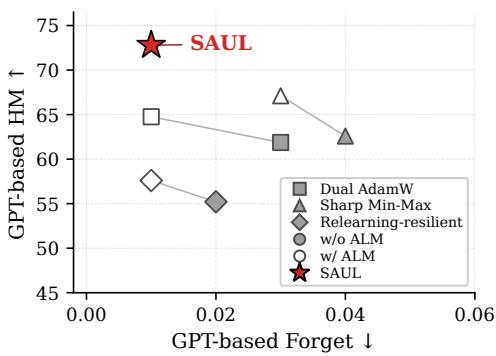
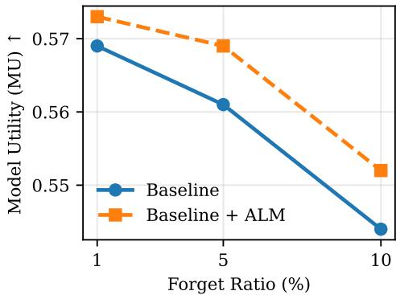
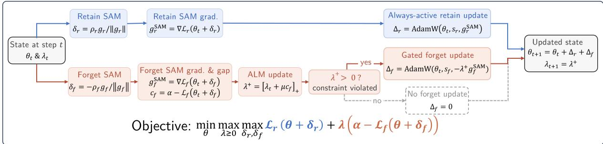
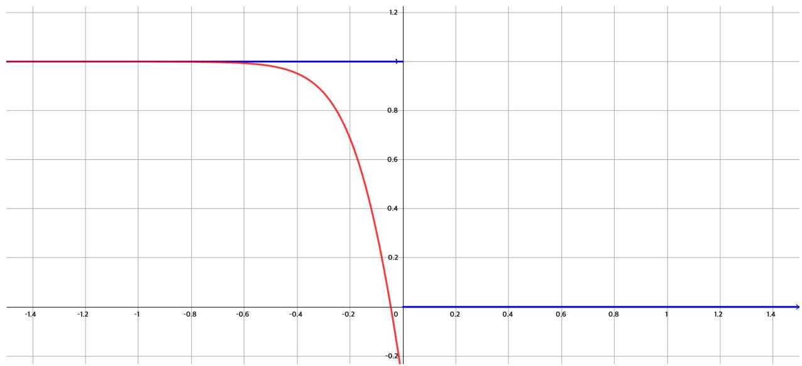

# SAUL: Sharpness-Aware Augmented-Lagrangian Unlearning

Jaewan Choi1\*, Junyoung Yang1\*, Sangdon Park1,2

1Computer Science and Engineering, POSTECH 2Graduate School of Artificial Intelligence, POSTECH {cjw7656, sheepjun0330, sangdon}@postech.ac.kr \*Equal contribution.

## Abstract

Machine unlearning in Large Language Models (LLMs) faces a critical trade-off between erasing target knowledge and preserving general utility. We propose SAUL (Sharpness-Aware Augmented-Lagrangian Unlearning), which formulates unlearning as a constrained minimization problem following the principle of “forget enough, but no more than necessary.” At its core, SAUL formulates forgetting as an explicit constraint with a prescribed satisfaction criterion, whereas prior unlearning methods typically specify the desired level of forgetting implicitly through optimization objectives. An augmented Lagrangian controller adaptively adjusts forget-side pressure according to constraint violation and can eventually deactivate the forget-side update as the prescribed criterion remains satisfied. Sharpnessaware updates on both retain and forget objectives, together with a dual-optimizer design that maintains role-separated states, further stabilize the resulting unlearning dynamics. We evaluate SAUL on the TOFU, WMDP, and MUSE benchmarks, demonstrating favorable forgetting–utility trade-offs over representative sharpness- and perturbation-based baselines under benchmark-specific forgetting criteria. Beyond the complete SAUL framework, we further show on TOFU that applying the augmented-Lagrangian controller as a drop-in modifier to representative baselines improves their post-forgetting utility, demonstrating the practical value of explicit forgetting control.

## 1 Introduction

Large language models (LLMs) are trained on massive corpora that often contain sensitive, copyrighted, or harmful information (Carlini et al., 2021; Eldan and Russinovich, 2023; Li et al., 2024). LLM unlearning has emerged as a critical framework for addressing these concerns by enabling models to “forget” specific data without the prohibitive cost of retraining from scratch (Yao et al.,

Figure 1: GPT-based utility–forgetting trade-off on ToFU with 1% forget ratio. Better methods lie toward the upper-left, with higher HM and lower Forget. Gray lines connect each baseline to its ALM-enhanced variant. SAUL achieves the highest HM while maintaining a low Forget score.  
  
Figure 2: Model utility under an ALM constraint (Dual AdamW baseline). Across all forget ratios, ALM improves model utility over the standard Dual AdamW optimization.

2024; Liu et al., 2024). A standard unlearning task must erase target knowledge from aforget set while preserving general capabilities on a retain set. Many existing methods handle this conflict through weighted objectives that combine forget and retain terms (Zhang et al., 2024; Fan et al., 2025; Bu et al., 2025), but their trade-off coefficients are sensitive to dataset, model architecture, and forgetting ratio (Maini et al., 2024; Zhang et al., 2024).

Recent optimization-based approaches, including bi-level unlearning methods, introduce more structured ways to handle the forget–retain conflict by separating the roles of forgetting and retention across nested or sequential objectives (Reisizadeh et al., 2025; Asif and Amiri, 2025). A parallel line of work mitigates the instability of aggressive forgetting through sharpness- or perturbation-aware optimization (Fan et al., 2025; Tang and Khanna, 2025; Kim et al., 2025; Malekmohammadi et al., 2025), building on Sharpness-Aware Minimization (SAM) (Foret et al., 2021) to obtain solutions stable under local parameter perturbations. While these approaches improve expressiveness and robustness, they still treat forgetting as open-ended optimization pressure rather than an explicit constraint with a prescribed satisfaction criterion, allowing unnecessary forgetting to erode retain-side utility.

In this paper, we propose Sharpness-Aware Augmented Lagrangian Unlearning (SAUL), a framework that casts LLM unlearning as a constrained minimization problem following the principle of forgetting enough, but no more than necessary. Unlike weighted formulations, SAUL uses a threshold α to specify a target forgetting level, allowing optimization to focus on retain-side utility once the criterion is satisfied.

At the core of SAUL is an augmented Lagrangian controller (Hestenes, 1969; Powell, 1969) that adaptively activates or releases forgetting pressure depending on whether the criterion is met. As the prescribed criterion remains satisfied, the projected multiplier decreases and can eventually reach zero and the forget-side gradient is gated off entirely, so optimization focuses solely on preserving retain-side utility—an adaptive deactivation mechanism absent from prior constrained or penalty-based unlearning methods. To stabilize the resulting dynamics, SAUL further combines sharpness-aware updates on both retain and forget objectives with a dual optimizer design (Zhong et al., 2025) that maintains role-separated states for retention and forgetting, reducing interference between their adaptive moments.

We evaluate SAUL across TOFU, WMDP, and MUSE under matched forgetting criteria, where SAUL improves the forgetting–utility trade-off over representative unlearning baselines. Beyond SAUL itself, Figures 1 and 2 show that the augmented Lagrangian component, applied as a drop-in modifier to existing baselines, consistently improves post-forgetting utility, highlighting the broader value of explicit forgetting control.

Our contributions are summarized as follows:

• We formulate LLM unlearning as a constrained minimization problem in which a target threshold α explicitly specifies a prescribed satisfaction level for forgetting, and propose an augmented-Lagrangian controller that reduces and can eventually deactivate forget-side pressure as the criterion remains satisfied.

• We show that the proposed controller can be integrated into representative sharpness- and perturbation-based unlearning methods. Applied as a drop-in modifier on TOFU, it consistently improves their post-forgetting utility, demonstrating the practical benefit of explicit forgetting control.

• We instantiate the framework as SAUL, which integrates the controller with sharpness-aware updates and role-separated dual optimizer states, and show that it achieves favorable forgetting–utility trade-offs across TOFU, WMDP, and MUSE under benchmark-specific forgetting criteria.

## 2 Related Work

LLM unlearning and weighted objectives. Many LLM unlearning methods formulate forgetting and retention as a scalarized problem, combining forget- and retain-side objectives through a trade-off coefficient. Representative examples include gradient ascent, gradient-difference objectives, loss-adjustment variants, and preferenceoptimization formulations (Jang et al., 2023; Wang et al., 2024; Bu et al., 2025; Zhang et al., 2024; Mekala et al., 2024). While effective, these methods specify the desired forgetting level implicitly through coefficients that depend on the dataset, model, and forget ratio (Maini et al., 2024; Zhang et al., 2024), potentially causing insufficient forgetting or unnecessary utility degradation.

Bi-level and structured optimization for unlearning. Recent work has explored structured formulations beyond scalarization. BLUR (Reisizadeh et al., 2025) casts unlearning as a bi-level problem whose lower-level objective prioritizes forgetting and upper-level objective preserves retain-side utility. OFMU (Asif and Amiri, 2025) uses an inner forgetting maximization with a similarity-aware penalty and an outer utility-restoration minimization. These methods separate the roles of forgetting and retention, but still lack a prescribed threshold that determines when forgetting is sufficient.

Constrained forgetting and augmented Lagrangian methods. Augmented Lagrangian methods combine dual-variable updates with quadratic penalties to enforce constraints without relying solely on a fixed penalty coefficient (Hestenes, 1969; Bertsekas, 2014; Nocedal and Wright, 2006). Existing constrained LLM unlearning methods place the constraint on the retain side: Constrained Entropic Unlearning (Entesari et al., 2025) uses a hard retain constraint, while Cheng et al. (Cheng et al., 2026) constrain the retain-side performance of θ relative to the original model $\theta _ { 0 }$ . In both formulations, the forget-side objective remains active. SAUL instead constrains theforget side; as the criterion remains satisfied, the projected multiplier decreases and can eventually reach zero, gating off the forget-side update. We further evaluate the controller as a drop-in modifier to representative sharpness- and perturbation-based objectives on TOFU (Section 4.4).

Sharpness-aware and role-separated optimization. Sharpness-Aware Minimization (SAM) promotes solutions stable under local weight perturbations (Foret et al., 2021; Bahri et al., 2022). Sharpness- and perturbation-aware unlearning methods use this principle to stabilize retention or forgetting behavior and reduce susceptibility to relearning-style recovery (Fan et al., 2025; Tang and Khanna, 2025; Kim et al., 2025; Malekmohammadi et al., 2025), but generally lack an explicit criterion for forgetting sufficiency. Separately, dualoptimizer methods reduce interference by maintaining distinct optimizer states for competing objectives (Zhong et al., 2025). SAUL uses these ideas as supporting components, while its central contribution is explicit forget-side constraint control.

## 3 Problem: Unlearning with Constraints

Machine unlearning aims to remove the influence of a designated subset of training data (a $f o r -$ get set) from a model, while preserving (and potentially improving) performance on the remaining data (a retain set). We view unlearning as a constrained minimization problem. In particular, we consider model parameters $\theta ~ \in ~ \mathbb { R } ^ { d }$ an example space X, a label space $\mathcal { V } ,$ a retain (multi-)set $\mathcal { D } _ { r } \subseteq \mathcal { X } \times \mathcal { Y } _ { }$ , a forget (multi-)set $\mathcal { D } _ { f } \subseteq \mathcal { X } \times \mathcal { Y }$ , and a per-example training loss $\ell ( \theta , x , y ) \ ( e . g .$ , cross-entropy). To measure how well the model fits each set, we define the retain loss $\begin{array} { r } { \mathcal { L } _ { r } ( \theta ) : = \frac { 1 } { | { \mathcal D } _ { r } | } \sum _ { ( x , y ) \in { \mathcal D } _ { r } } \ell ( \theta , x , y ) } \end{array}$ as the average per-example loss on the retain set, and similarly the forget loss $\begin{array} { r } { \mathcal { L } _ { f } ( \theta ) : = \frac { 1 } { | \mathcal { D } _ { f } | } \sum _ { ( x , y ) \in \mathcal { D } _ { f } } \ell ( \theta , x , y ) } \end{array}$ on the forget set. Our goal is to address the following constrained minimization:

$$
\operatorname* { m i n } _ { \theta } { \mathcal { L } } _ { r } ( \theta ) \quad { \mathrm { s u b j . ~ t o } } \quad { \mathcal { L } } _ { f } ( \theta ) \geq \alpha ,\tag{1}
$$

where α is a user-specified threshold that defines an explicit satisfaction level for the chosen forgetside training measure, rather than specifying the forgetting–retention balance implicitly through a trade-off coefficient. The constraint defines sufficient forgetting in terms of the chosen forget-side loss by requiring ${ \mathcal { L } } _ { f } ( \theta ) \geq \alpha$ , while the retain objective discourages utility degradation beyond what is necessary to satisfy this criterion. Moreover, minimizing the retain loss remains compatible with cases where removing the forget set also improves performance on the remaining data. In Appendix F, we introduce a margin-based certified instantiation in which the threshold α admits a direct predictionlevel interpretation, and explain how the resulting certificate can be used post hoc to evaluate models trained with the cross-entropy-based constraint.

## 4 SAUL: Sharpness-Aware Augmented Lagrangian Unlearning

Building on the constrained formulation in Section 3, we propose Sharpness-Aware Augmented $L a \mathrm { - }$ grangian Unlearning (SAUL), which combines an augmented-Lagrangian constraint with sharpnessaware updates and dual optimizer states to decouple the dynamics of forgetting and retention.

## 4.1 Augmented Lagrangian Method

Here, we apply the augmented Lagrangian method (ALM) (Hestenes, 1969; Powell, 1969) to unlearning. ALM converts the constrained primal problem (1) into the following unconstrained primal problem with a Lagrangian multiplier:

$$
\operatorname* { m i n } _ { \theta } \operatorname* { m a x } _ { \lambda \ge 0 } \mathcal { L } _ { r } ( \theta ) + \lambda ( \alpha - \mathcal { L } _ { f } ( \theta ) ) ,\tag{2}
$$

which is equivalent to (1). However, repeated constraint violations can make the multiplier grow and induce unstable primal updates. ALM can be written as a proximal maximization over the next multiplier estimate $\lambda ^ { + }$ , where the quadratic term prevents the dual variable from moving too far from the current estimate λ. This gives the following regularized saddle problem:

  
Figure 3: Overview of the SAUL update. The retain branch is always active and applies a SAM-based update to preserve retain-side utility. The forget branch computes a SAM-based forget gradient and an augmented-Lagrangian constraint gap, updates $\lambda ^ { + } = [ \lambda _ { t } + \mu c _ { f } ] _ { + }$ , and applies the forget update only when $\lambda ^ { + } > 0$ . Thus, forgetting is activated only when the constraint is violated, while retain-side optimization remains active throughout training.

$$
\operatorname* { m i n } _ { \theta } \operatorname* { m a x } _ { \lambda ^ { + } \geq 0 } \left[ \mathcal L _ { r } ( \theta ) + \lambda ^ { + } ( \alpha - \mathcal L _ { f } ( \theta ) ) - \frac { 1 } { 2 \mu } \| \lambda ^ { + } - \lambda \| ^ { 2 } \right] ,\tag{3}
$$

where $\mu > 0$ is the ALM penalty parameter. Since the objective is concave in $\lambda ^ { + }$ , it admits the closedform solution:

$$
\lambda ^ { + } = \left[ \lambda + \mu ( \alpha - \mathcal { L } _ { f } ( \theta ) ) \right] _ { + } .
$$

Let $c _ { f } : = \alpha - \mathcal { L } _ { f } ( \theta )$ denote the forget-side constraint violation, so that the constraint ${ \mathcal { L } } _ { f } ( \theta ) \geq \alpha$ is equivalent to $c _ { f } \leq 0$ . Plugging the closed-form multiplier update back into (3), the primal update takes the following two-case form:

$$
\operatorname* { m i n } _ { \theta } \left\{ { \begin{array} { l l } { \mathcal { L } _ { r } ( \theta ) + \lambda c _ { f } + \frac { \mu } { 2 } c _ { f } ^ { 2 } , } & { \lambda ^ { + } > 0 , } \\ { \mathcal { L } _ { r } ( \theta ) , } & { \lambda ^ { + } = 0 . } \end{array} } \right.
$$

When $\lambda ^ { + } > 0$ , the augmented term penalizes violations of the forget-side constraint. When the projection yields $\lambda ^ { + } = 0$ , the update reduces to retain-loss minimization. For both cases, the updated θ may not satisfy the constraint, so we iterate this procedure by returning to (3) with $\lambda  \lambda ^ { + }$

Crucially, as constraint violations disappear, the projected multiplier can decrease and eventually deactivate the forget-side term. When $\lambda ^ { + } = 0$ , optimization focuses solely on minimizing the retain loss, avoiding unnecessary forgetting pressure.

## 4.2 Sharpness-Aware Augmented Lagrangian Method

Sharpness-Aware Minimization (SAM) (Foret et al., 2021) biases optimization toward parameter regions where the loss landscape is flat under local weight perturbations, by approximately solving an inner min–max problem. We extend this idea to both retention and forgetting, so that the resulting solutions remain stable under local weight perturbations on each side.

To this end, we consider a sharpness-aware retain loss

$$
\mathcal { L } _ { r } ^ { \rho _ { r } } ( \theta ) : = \operatorname* { m a x } _ { \| \delta _ { r } \| \leq \rho _ { r } } \mathcal { L } _ { r } ( \theta + \delta _ { r } )
$$

instead of ${ \mathcal { L } } _ { r } ( \theta )$ . Minimizing this worst-case retain loss yields parameters where the retain landscape is flat, so retain performance remains stable under small weight changes. For the forget side, we consider a sharpness-aware forget loss in the opposite direction:

$$
\mathcal { L } _ { f } ^ { \rho _ { f } } ( \theta ) : = \operatorname* { m i n } _ { \| \delta _ { f } \| \leq \rho _ { f } } \mathcal { L } _ { f } ( \theta + \delta _ { f } )
$$

instead of ${ \mathcal { L } } _ { f } ( \theta )$ . Here, the inner minimization finds the perturbation most favorable to recovering forget knowledge, and maximizing this best-case forget loss forces the forget landscape to remain high even at the most easily recoverable point in the neighborhood. Note the asymmetry: the retain side uses inner max so that the worst case stays low, while the forget side uses inner min so that the best case stays high. The full sharpness-aware augmented Lagrangian method follows ALM in Section 4.1, but replaces ${ \mathcal { L } } _ { r } ( \theta )$ and ${ \mathcal { L } } _ { f } ( \theta )$ with $\mathcal { L } _ { r } ^ { \rho _ { r } } ( \theta )$ and $\mathcal { L } _ { f } ^ { \rho _ { f } } ( \theta )$ , respectively. See Algorithm 1 for our complete algorithm.

Combining the sharpness-aware losses with the ALM formulation in (2) yields the following robust min–max problem:

$$
\operatorname* { m i n } _ { \theta } \operatorname* { m a x } _ { \lambda \ge 0 } \operatorname* { m a x } _ { \delta _ { r } , \delta _ { f } } \mathcal { L } _ { r } ( \theta + \delta _ { r } ) + \lambda \big ( \alpha - \mathcal { L } _ { f } ( \theta + \delta _ { f } ) \big ) .\tag{4}
$$

For the forget term, since $\lambda ~ \geq ~ 0$ , maximizing $- \lambda \mathcal { L } _ { f } ( \theta + \delta _ { f } )$ over $\delta _ { f }$ is equivalent to minimizing $\mathcal { L } _ { f } ( \theta + \delta _ { f } )$ , which matches the sharpness-aware forget loss. Because $\delta _ { r } = 0$ and $\delta _ { f } = 0$ are feasible perturbations, (4) upper-bounds the ALM objective in (2) for any fixed θ and λ. In practice, as in standard SAM, we approximate each inner problem with a single first-order perturbation step. Minimizing this upper bound therefore controls the original ALM objective while encouraging stability under local weight perturbations on both sides. This gives a principled interpretation of the forget-side sharpness step as approximating a robust forgetting constraint that should remain satisfied even under local weight perturbations. We emphasize that this robustness is restricted to weight-space perturbations and does not by itself imply resistance to promptlevel adversarial attacks or recovery attacks.

## 4.3 Dual Optimizer States

While the augmented Lagrangian formulation in Section 4.1 specifies when the forgetting constraint should be enforced through the multiplier $\lambda ,$ and the sharpness-aware losses in Section 4.2 improve the robustness of the retain/forget objectives, a remaining source of instability lies in the optimizer dynamics used to carry out these updates (Zhong et al., 2025).

A common implementation optimizes the (sharpness-aware) ALM objective with a single adaptive optimizer (e.g., AdamW), which couples forgetting and retention through shared firstand second-moment estimates. In unlearning, however, retain-side and forget-side gradients often have conflicting semantics and markedly different scales—utility-preserving descent versus constraint-enforcing updates—and mixing such heterogeneous signals in one state can lead to optimizer-state interference, where accumulated moments become inconsistent with either role.

To mitigate this, SAUL maintains two independent optimizer states for the same model parameters $\theta \colon$ a forgetting optimizer state $s _ { f }$ and a retention optimizer state $s _ { r }$ (both based on AdamW in our implementation). The parameters remain shared; only the optimizer statistics are decoupled. $s _ { f }$ is updated using forget-side gradients only, while $s _ { r }$ is updated using retain-side gradients only, so each state accumulates objective-consistent moments suitable for its role. At each iteration, SAUL first computes both $g _ { r } ^ { \mathrm { S A M } }$ and $g _ { f } ^ { \mathrm { S A M } }$ at the current parameters $\theta _ { t }$ . It then applies the forget-side update only when $\lambda ^ { + } > 0$ , followed by the retainside update using role-separated optimizer states.

Algorithm 1 summarizes the complete procedure, combining (i) ALM-based adaptive activation of forgetting, (ii) sharpness-aware gradients for robust optimization, and (iii) role-separated optimizer states for stable unlearning dynamics.

## 4.4 ALM-Augmented Variants

Beyond SAUL itself, the augmented-Lagrangian controller can also be applied as a drop-in modifier to existing unlearning objectives. Given a baseline objective ${ \mathcal { I } } ( \theta )$ and a forgetting measure $F ( \theta )$ where larger $F ( \theta )$ indicates stronger forgetting, we impose the constrained form

$$
\operatorname* { m i n } _ { \theta } { \mathcal { I } } ( \theta ) \quad { \mathrm { s . t . } } \quad F ( \theta ) \geq \alpha .
$$

ALM introduces a dual variable $\lambda ~ \geq ~ 0$ and a penalty parameter $\mu > 0$ , with the projected update

$$
\lambda ^ { + } \gets \left[ \lambda + \mu ( \alpha - F ( \theta ) ) \right] _ { + } .
$$

This update increases forget-side pressure when the constraint is violated and reduces it as the constraint remains satisfied, replacing fixed trade-off tuning with constraint-driven adaptation.

Unlike SAUL, which integrates ALM with sharpness-aware updates on both retain and forget sides plus role-separated optimizer states, these ALM-augmented baselines apply only the constraint mechanism on top of the original baseline structure. These ALM-augmented variants allow us to isolate the effect of constraint-driven forgetting control from the underlying sharpness-aware objectives. We evaluate the post-forgetting utility of these ALM-augmented variants in Section $^ { 5 , }$ with detailed baseline-specific objectives provided in Appendix A.3.

## 5 Experiments

We evaluate SAUL on three LLM unlearning benchmarks—ToFU (Maini et al., 2024), WMDP (Li et al., 2024), and MUSE (Shi et al., 2024)—covering author-specific fictitious forgetting, hazardous knowledge removal, and verbatim memorization. All methods are tuned under matched forgetting criteria so that comparisons reflect the forgetting– utility trade-off at comparable levels of forgetting. Detailed training configurations and hyperparameters are provided in Appendix B.

## 5.1 Setup

Benchmarks. We evaluate methods across three benchmark-specific settings, following the established model and evaluation configurations used for each benchmark rather than adopting a single shared backbone. For ToFU, we use Llama-3.2-1B-Instruct as the main backbone under the standard question–answering setting with forgetting ratios of 1%, 5%, and 10%. We also evaluate GPT-paraphrased questions to test robustness to query rephrasing; their construction is described in Appendix C, and the corresponding results are reported in Appendix D. Additional Llama-3.2-3B-Instruct results are reported in Appendix D. For WMDP, we follow its benchmark-specific setup using Zephyr-7B-β and unlearn WMDP-Bio and WMDP-Cyber, evaluating hazardous-knowledge accuracy and MMLU utility. For MUSE, we follow the benchmarkspecific Llama-2-7B setup and use the standard VerbMem, KnowMem, and PrivLeak evaluation protocol. We report MUSE Books as the main evaluation setting and provide additional results on MUSE News in Appendix D.2.

Baselines. We compare against representative sharpness- and perturbation-based unlearning methods: the relearning-resilient sharpness-aware baseline of Fan et al. (Fan et al., 2025) and Sharp Min– Max (Tang and Khanna, 2025) without masking. For brevity, we refer to the former as Relearningresilient in tables and result discussions. We also include Single AdamW, Dual AdamW (Zhong et al., 2025), and BLUR (Reisizadeh et al., 2025). On ToFU, we additionally compare against Primal-Dual Unlearning (PDU) (Entesari et al., 2025), a recent retain-side constrained method that optimizes forgetting subject to an explicit retain-utility constraint. For baselines that admit a comparable operating point, we further evaluate a “+ ALM” variant to isolate the effect of explicit forgetting control. Detailed baseline definitions and implementation details are provided in Appendix A.

## 5.2 Results on ToFU

Evaluation metrics. We assess unlearning performance using two complementary automatic metrics from ToFU: model utility (MU), which aggregates the probability assigned to the ground-truth answer, ROUGE-L recall, and the truth ratio via the harmonic mean; and Forget ROUGE (FROUGE), which measures ROUGE-L recall between generated and ground-truth answers on the forget set. We additionally employ a GPT-based semantic evaluation that produces binary entailment judgments between generated and reference answers, applied to four subsets (Forget, Retain, Real Authors, World Facts); we report the harmonic mean (HM) of GPTbased scores on the latter three to summarize utility beyond forgetting.

Main results. Table 1 reports results at forget ratio 1%. Since SAUL formulates forgetting as a constraint, we compare methods under the matchedforgetting criterion $F _ { \mathrm { R O U G E } } \le 0 . 0 3$ . SAUL satisfies this criterion with Forget ROUGE of 0.02 and achieves the best harmonic mean (72.79), outperforming the next-best constraint-satisfying method (Sharp Min–Max + ALM, HM 67.11) by 5.7 points.

Although BLUR attains a similar HM (71.40), its Forget ROUGE is 0.28. Our reproduction matches BLUR’s reported Forget Quality, but answer-level evaluation still reveals substantial forget-set leakage. We therefore include BLUR for completeness, while interpreting it as outside the strict answerlevel forgetting regime targeted by SAUL.

Effect of ALM on Utility and Generalization. Figures 1 and 2 show that adding ALM to baseline methods improves both model utility and GPTbased evaluation metrics. While improvements on the Retain set are moderate, the gains are larger on the Real Authors subset, which evaluates generalization to neighborhood data. This pattern aligns with SAUL’s design principle of forgetting only as much as necessary: once the criterion is met, ALM deactivates forget-side pressure and avoids unnecessary updates that erode semantically related knowledge in neighborhood subsets, whereas open-ended forgetting objectives continue applying forget-side gradients and degrade such data more aggressively.

We further evaluate this behavior under paraphrased questions, where forget queries preserve the original semantics but vary in lexical and structural form. As shown in Table 2, SAUL remains effective under this query perturbation, suggesting that its forgetting behavior is not tied to the surface form of the original questions. Additional paraphrased-question results for other forgetting ratios and larger backbones are provided in Appendix D, where the same overall trend holds.

Efficacy and Constraint Satisfaction. As shown in Table 1, SAUL achieves strong overall performance while satisfying the forgetting constraint. Adding ALM improves model utility over the corresponding non-ALM variants, indicating that the constraint-based formulation can enforce sufficient forgetting without excess retention degradation.

Table 1: Unlearning performance with forget ratio = 1%. All methods are tuned to achieve Forget ROUGE close to 0.03 when possible. Bold and underlined values denote the best and second-best results for each metric, respectively. Red values indicate cases where unlearning is not sufficiently achieved; methods with red Forget values are excluded from the best/second-best ranking. A dash (–) indicates that the metric is not applicable under our hyperparameter tuning protocol.
<table><tr><td>Method</td><td colspan="2">Automatic</td><td colspan="5">GPT-based</td></tr><tr><td></td><td>MU↑</td><td> $F _ { \mathrm { R O U G E } } \downarrow$ </td><td>Retain↑</td><td></td><td>World Facts↑ Real Authors↑ |</td><td>HM↑</td><td>Forget↓</td></tr><tr><td>Original Model</td><td>0.60</td><td>0.87</td><td>90.0</td><td>80.3</td><td>81.4</td><td>81.9</td><td>82.5</td></tr><tr><td>Single AdamW</td><td> $0 . 4 5 \pm 0 . 0 0$ </td><td> $0 . 0 2 \pm 0 . 0 3$ </td><td> $5 0 . 4 5 \pm 0 . 7 2$ </td><td> $7 0 . 4 3 \pm 0 . 9 7$ </td><td> $3 5 . 2 0 \pm 2 . 3 9$ </td><td> $4 8 . 0 1 \pm 1 . 5 0$ </td><td> $0 . 1 7 \pm 0 . 0 8$ </td></tr><tr><td>Dual AdamW</td><td> $0 . 5 7 \pm 0 . 0 0$ </td><td> $0 . 0 2 \pm 0 . 0 0$ </td><td> $6 4 . 2 5 \pm 0 . 5 6$ </td><td> $8 0 . 0 0 \pm 1 . 4 3$ </td><td> $4 9 . 0 0 \pm 1 . 5 8$ </td><td> $6 1 . 8 7 \pm 0 . 8 7$ </td><td> $0 . 0 3 \pm 0 . 0 2$ </td></tr><tr><td>Dual AdamW + ALM</td><td> $0 . 5 7 \pm 0 . 0 0$ </td><td> $\overline { { { \bf 0 . 0 1 \pm 0 . 0 0 } } }$ </td><td> $6 3 . 2 0 \pm 0 . 2 7$ </td><td> ${ \pm } 2 . 5 6 \pm 1 . 4 3$ </td><td> $5 4 . 4 0 \pm 1 . 1 4$ </td><td> $6 4 . 7 6 \pm 0 . 6 8$ </td><td> ${ \bf 0 . 0 1 \pm 0 . 0 1 }$ </td></tr><tr><td>Sharp Min-Max</td><td> $0 . 5 6 \pm 0 . 0 0$ </td><td> $0 . 0 2 \pm 0 . 0 0$ </td><td> $5 3 . 4 5 \pm 0 . 3 7$ </td><td> $8 1 . 5 4 \pm 0 . 9 7$ </td><td> $5 9 . 0 0 \pm 1 . 5 8$ </td><td> $6 2 . 5 9 \pm 0 . 5 8$ </td><td> $0 . 0 4 \pm 0 . 0 2$ </td></tr><tr><td> $\mathrm { S h a r { \hat { p } } \ M i n { \mathrm { - } } M a x + A L M }$ </td><td> $0 . 5 8 \pm 0 . 0 1$ </td><td> $\mathbf { 0 . 0 1 \pm 0 . 0 0 }$ </td><td> $5 8 . 0 5 \pm 0 . 3 7$ </td><td> $8 0 . 8 5 \pm 0 . 7 6$ </td><td> $6 6 . 2 0 \pm 0 . 8 4$ </td><td> $6 7 . 1 1 \pm 0 . 2 5$ </td><td> $0 . 0 3 \pm 0 . 0 3$ </td></tr><tr><td>Relearning-resilient</td><td> $\overline { { 0 . 5 1 \pm 0 . 0 1 } }$ </td><td> ${ \bf 0 . 0 1 \pm 0 . 0 0 }$ </td><td> $4 6 . 4 0 \pm 0 . 3 8$ </td><td> $7 7 . 7 8 \pm 0 . 6 0$ </td><td> $\overline { { 5 0 . 2 0 \pm 0 . 8 4 } }$ </td><td> $\overline { { 5 5 . 2 1 \pm 0 . 2 3 } }$ </td><td> $\underline { { 0 . 0 2 \pm 0 . 0 2 } }$ </td></tr><tr><td>Relearning-resilient + ALM</td><td> $0 . 5 2 \pm 0 . 0 1$ </td><td> $0 . 0 2 \pm 0 . 0 1$ </td><td> $4 9 . 9 0 \pm 0 . 2 9$ </td><td> $8 0 . 0 0 \pm 1 . 4 3$ </td><td> $5 1 . 2 0 \pm 0 . 8 4$ </td><td> $5 7 . 6 0 \pm 0 . 1 5$ </td><td> $\mathbf { 0 . 0 1 \pm 0 . 0 1 }$ </td></tr><tr><td>BLUR</td><td> $0 . 5 7 \pm 0 . 1 4$ </td><td> $0 . 2 8 \pm 0 . 2 0$ </td><td> $6 3 . 0 0 \pm 1 . 4 0$ </td><td> $8 0 . 0 0 \pm 3 . 4 0$ </td><td> $7 3 . 6 0 \pm 4 . 0 0$ </td><td> $7 1 . 4 0 \pm 2 . 5 0$ </td><td> $3 6 . 0 0 \pm 2 . 8 0$ </td></tr><tr><td>PDU</td><td> $0 . 5 6 \pm 0 . 0 2$ </td><td> $0 . 1 7 \pm 0 . 0 2$ </td><td> $6 0 . 4 2 \pm 1 . 0 4$ </td><td> $7 9 . 2 \pm 0 . 9 9$ </td><td> $6 2 . 0 0 \pm 2 . 0 0$ </td><td> $6 6 . 2 0 \pm 0 . 7 0$ </td><td> $8 . 3 3 \pm 3 . 8 2$ </td></tr><tr><td>SAUL</td><td> ${ \bf 0 . 5 9 \pm 0 . 0 1 }$ </td><td> $\underline { { 0 . 0 2 \pm 0 . 0 2 } }$ </td><td> ${ \bf 6 8 . 2 5 \pm 1 . 0 9 }$ </td><td> $7 9 . 6 6 \pm 1 . 2 7$ </td><td> ${ \bf 7 1 . 4 0 \pm 0 . 5 5 }$ </td><td> ${ \bf 7 2 . 7 9 \pm 0 . 5 4 }$ </td><td> ${ \bf 0 . 0 1 \pm 0 . 0 1 }$ </td></tr><tr><td>w/o ALM</td><td> $0 . 5 7 \pm 0 . 0 1$ </td><td> $\overline { { { \bf 0 . 0 1 \pm 0 . 0 1 } } }$ </td><td> $6 4 . 9 5 \pm 0 . 6 0$ </td><td> $7 8 . 2 9 \pm 1 . 5 5$ </td><td> $4 1 . 4 0 \pm 1 . 1 4$ </td><td> $5 7 . 3 2 \pm 0 . 4 8$ </td><td> $0 . 0 2 \pm 0 . 0 2$ </td></tr><tr><td>w/o SAM w/o  $\mathbf { A L M } + \mathbf { S A M }$ </td><td> $0 . 5 5 \pm 0 . 0 1$ </td><td> ${ \bf 0 . 0 1 \pm 0 . 0 1 }$   ${ \bf 0 . 0 1 \pm 0 . 0 1 }$ </td><td> $6 4 . 5 0 \pm 0 . 6 8$ </td><td> $\underline { { 8 2 . 3 9 \pm 1 . 3 0 } }$ </td><td> $5 6 . 2 0 \pm 1 . 9 2$ </td><td> $6 6 . 0 1 \pm 1 . 0 1$ </td><td> $\underline { { 0 . 0 2 \pm 0 . 0 1 } }$ </td></tr><tr><td></td><td> $0 . 5 7 \pm 0 . 0 0$ </td><td></td><td> $6 4 . 1 0 \pm 1 . 1 1$ </td><td> $\overline { { 8 0 . 5 1 \pm 1 . 6 4 } }$ </td><td> $4 7 . 6 0 \pm 1 . 1 4$ </td><td> $6 1 . 1 7 \pm 0 . 3 9$ </td><td> $\overline { { 0 . 1 6 \pm 0 . 3 3 } }$ </td></tr></table>

This trend holds beyond the main setting. In Appendix D, we report additional results for 5% and 10% forget ratios, paraphrased-question evaluation, and the larger LLaMA-3.2-3B backbone. Across these settings, SAUL remains competitive and often achieves the best harmonic mean, showing that the proposed ALM–SAM formulation generalizes across forgetting ratios, query perturbations, and model scales.

Ablation Study To separate the contributions of sharpness-aware optimization and the augmented Lagrangian formulation, we evaluate three SAUL variants: (i) removing ALM while keeping SAM, (ii) removing SAM while keeping ALM, and (iii) removing both. In full SAUL, ALM is applied to the sharpness-aware forget loss evaluated at the local perturbation most favorable to recovering the forgotten knowledge, thereby enforcing the forgetting constraint over a local weight-space neighborhood rather than only at the current parameters. In contrast, the baseline “+ ALM” variants and the SAUL “w/o SAM” variant apply ALM to the clean forget loss, allowing us to isolate the effect of constraint enforcement on sharpness-aware and clean forget measures.

and WMDP-Cyber kept near the random-chance level of 0.25 for four-way multiple-choice questions. The averaged WMDP accuracies differ by less than 0.005 across methods, indicating comparable benchmark-level forgetting of hazardous knowledge. Under this matched-forgetting condition, SAUL achieves an MMLU accuracy of $0 . 5 4 2 \pm 0 . 0 0 3 .$ , comparable to BLUR’s 0.540 ± 0.004. Sharp Min–Max achieves $0 . 5 3 5 \pm 0 . 0 0 2 .$ while Relearning-resilient exhibits a substantially lower MMLU accuracy of 0.414. The largest utility gap is observed relative to Relearning-resilient, suggesting that aggressive forget-side robustness can incur substantial utility degradation at the evaluated operating point. Because the methods differ in multiple optimization components, this gap cannot be attributed solely to the augmented-Lagrangian controller.

## 5.3 Results on WMDP

Table 3 reports results on WMDP. All compared methods are tuned to achieve comparable forgetting, with the average accuracy over WMDP-Bio

Table 2: Unlearning performance with forget ratio = 1% under GPT-paraphrased questions. All hyperparameters are selected on the original-question setting and then reused for paraphrased-question evaluation without additional tuning. Notation follows Table 1.
<table><tr><td rowspan="2">Method</td><td colspan="2">Automatic</td><td colspan="5">GPT-based</td></tr><tr><td>MU↑</td><td> $F _ { \mathrm { R O U G E } } \downarrow$ </td><td>Retain↑</td><td></td><td>World Facts↑ Real Authors↑ |</td><td>HM↑</td><td>Forget↓</td></tr><tr><td>Original Model</td><td>0.54</td><td>0.44</td><td>56.75</td><td>79.49</td><td>77.00</td><td>69.46</td><td>50.0</td></tr><tr><td>Single AdamW</td><td> $0 . 4 9 \pm 0 . 0 1$ </td><td> $0 . 0 3 \pm 0 . 0 1$ </td><td> $4 6 . 4 6 \pm 2 . 3 8$ </td><td> $6 8 . 2 2 \pm 9 . 9 4$ </td><td> $2 5 . 6 0 \pm 1 1 . 2 2$ </td><td> $3 8 . 2 5 \pm 8 . 7 9$ </td><td> $2 . 0 0 \pm 2 . 0 9$ </td></tr><tr><td>Dual AdamW</td><td> $0 . 5 1 \pm 0 . 0 2$ </td><td> $\overline { { 0 . 0 3 \pm 0 . 0 1 } }$ </td><td> ${ \pm 3 . 1 4 \pm 2 . 0 9 }$ </td><td> $7 1 . 9 8 \pm 7 . 9 0$ </td><td> $4 7 . 2 0 \pm 1 7 . 7 8$ </td><td> $5 5 . 8 9 \pm 1 6 . 3 7$ </td><td> ${ \bf 0 . 5 0 \pm 1 . 1 2 }$ </td></tr><tr><td>Dual AdamW + ALM</td><td> $\overline { { { \bf 0 . 5 3 \pm 0 . 0 1 } } }$ </td><td> $\overline { { 0 . 0 4 \pm 0 . 0 0 } }$ </td><td> $5 2 . 6 2 \pm { 1 . 8 7 }$ </td><td> $7 5 . 7 2 \pm 5 . 0 1$ </td><td> $5 5 . 4 0 \pm 1 0 . 6 0$ </td><td> $5 9 . 2 0 \pm 5 . 3 6$ </td><td> $2 . 5 0 \pm 0 . 0 0$ </td></tr><tr><td>Sharp Min–Max</td><td> $0 . 4 7 \pm 0 . 0 4$ </td><td> $0 . 1 2 \pm 0 . 1 8$ </td><td> $4 3 . 1 2 \pm 3 . 5 1$ </td><td> $\overline { { 7 0 . 1 0 \pm 5 . 1 6 } }$ </td><td> $4 1 . 8 0 \pm 5 . 9 3$ </td><td> $4 8 . 7 4 \pm 4 . 3 5$ </td><td> $1 . 5 0 \pm 2 . 2 4$ </td></tr><tr><td>Sharp Min–Max + ALM</td><td> $0 . 5 0 \pm 0 . 0 3$ </td><td> $0 . 0 5 \pm 0 . 0 2$ </td><td> $4 9 . 2 2 \pm 1 . 7 4$ </td><td> $7 3 . 8 6 \pm 3 . 4 5$ </td><td> $5 1 . 6 0 \pm 8 . 5 0$ </td><td> $5 6 . 1 4 \pm 4 . 4 6$ </td><td> $1 . 5 0 \pm 1 . 3 7$ </td></tr><tr><td>Relearning-resilient</td><td></td><td></td><td></td><td></td><td></td><td></td><td></td></tr><tr><td>Relearning-resilient + ALM</td><td></td><td></td><td></td><td></td><td></td><td></td><td></td></tr><tr><td>BLUR PDU</td><td> $0 . 5 3 \pm 0 . 0 3$ </td><td> $0 . 4 4 \pm 0 . 2 1$ </td><td> $5 1 . 9 0 \pm 3 . 3 0$ </td><td> $7 8 . 8 0 \pm 3 . 1 0$ </td><td> $7 2 . 8 0 \pm 4 . 5 0$ </td><td> $6 5 . 6 0 \pm 3 . 7 0$ </td><td> $4 9 . 0 0 \pm 4 . 5 0$ </td></tr><tr><td></td><td> $0 . 5 0 \pm 0 . 0 1$ </td><td> $0 . 3 4 \pm 0 . 0 2$ </td><td> $4 2 . 8 3 \pm 2 . 3 6$ </td><td> $7 4 . 9 3 \pm 1 . 3 1$ </td><td> $5 9 . 6 7 \pm 1 . 1 5$ </td><td> $5 6 . 0 9 \pm 1 . 3 3$ </td><td> $3 6 . 6 7 \pm 2 . 8 9$ </td></tr><tr><td>SAUL</td><td> ${ \bf 0 . 5 3 \pm 0 . 0 1 }$ </td><td> $0 . 1 3 \pm 0 . 2 2$ </td><td> $5 2 . 2 8 \pm 1 . 4 0$ </td><td> ${ \bf 7 8 . 4 4 \pm 2 . 2 9 }$ </td><td> ${ \bf 6 3 . 6 0 \pm 6 . 2 3 }$ </td><td> ${ \bf 6 2 . 9 0 \pm 2 . 1 8 }$ </td><td> $1 . 5 0 \pm 1 . 3 7$ </td></tr><tr><td>w/o ALM</td><td> $0 . 5 0 \pm 0 . 0 3$ </td><td> $0 . 0 3 \pm 0 . 0 2$ </td><td> $5 2 . 2 2 \pm 2 . 5 3$ </td><td> $7 0 . 9 4 \pm 9 . 9 1$ </td><td> $4 6 . 8 0 \pm 2 4 . 7 7$ </td><td> $5 1 . 4 4 \pm 1 5 . 8 3$ </td><td> $1 . 0 0 \pm 2 . 2 4$ </td></tr><tr><td>w/o SAM w/o  $\mathbf { A L M } + \mathbf { S A M }$ </td><td> ${ \bf 0 . 5 3 \pm 0 . 0 1 }$ </td><td> $\overline { { 0 . 0 3 \pm 0 . 0 1 } }$ </td><td> $5 3 . 1 2 \pm 1 . 5 0$ </td><td> $7 5 . 2 3 \pm 4 . 4 7$ </td><td> $6 2 . 6 0 \pm 1 2 . 9 9$ </td><td> $6 1 . 6 5 \pm 4 . 7 3$ </td><td> $\overline { { 1 . 0 0 \pm 1 . 3 7 } }$ </td></tr><tr><td></td><td> $0 . 5 0 \pm 0 . 0 2$ </td><td> $\mathbf { 0 . 0 2 \pm 0 . 0 1 }$ </td><td> $\overline { { 5 2 . 1 2 \pm 1 . 6 2 } }$ </td><td> $6 8 . 0 2 \pm 1 0 . 7 0$ </td><td> $3 9 . 8 0 \pm 1 6 . 3 0$ </td><td> $4 9 . 0 5 \pm 1 1 . 3 3$ </td><td> $\mathbf { 0 . 5 0 \pm 1 . 1 2 }$ </td></tr></table>

Table 3: Unlearning performance on WMDP using $\mathrm { z e p h y r - 7 B - } \beta$ . WMDP-Bio and WMDP-Cyber measure residual hazardous knowledge on the forget domains (lower is better), while MMLU measures general utility preservation (higher is better).
<table><tr><td>Method</td><td>Bio↓</td><td>Cyber↓</td><td>MMLU↑</td></tr><tr><td>Original</td><td>0.637</td><td>0.440</td><td>0.581</td></tr><tr><td>Sharp Min-Max</td><td> $\mathbf { 0 . 2 6 0 \mathop { \pm 0 . 0 1 2 } }$ </td><td> $0 . 2 6 0 \pm 0 . 0 0 4$ </td><td>0.535 ±0.002</td></tr><tr><td>Relearning-resilient</td><td> $0 . 2 6 2 \pm 0 . 0 0 0$ </td><td> $0 . 2 6 2 \pm 0 . 0 0 0$ </td><td>0.414 ±0.000</td></tr><tr><td>BLUR</td><td>0.262 ±0.010</td><td>0.253 ±0.009</td><td>0.540 ±0.004</td></tr><tr><td>SAUL</td><td>0.268 ±0.012</td><td>0.251 ±0.010</td><td>0.542 ±0.003</td></tr></table>

## 5.4 Results on MUSE Books

Table 4: Unlearning performance on MUSE Books using Llama-2-7B. VerbMem and KnowMem on $\mathcal { D } _ { f }$ measure residual memorization on the forget set (lower is better); PrivLeak measures privacy leakage (closer to 0 is better); KnowMem on $\mathcal { D } _ { r }$ measures retain-side knowledge preservation (higher is better). BLUR and SAUL are tuned to achieve matched knowledge forgetting (KnowMem $\mathcal { D } _ { f }$ ≈ 5); other baselines are reported at their default operating points.

<table><tr><td>Method</td><td>VerbMem ↓</td><td>KnowMem  $\mathcal { D } _ { f } \downarrow$ </td><td>PrivLeak → 0</td><td>KnowMem Dr ↑</td></tr><tr><td>Original</td><td>99.8</td><td>59.4</td><td>-57.5</td><td>66.9</td></tr><tr><td>Retrain</td><td>14.3</td><td>28.9</td><td>0.0</td><td>74.5</td></tr><tr><td>Sharp Min–Max</td><td> $0 . 0 0 \pm 0 . 0 0$ </td><td> $5 . 3 7 \pm 1 . 2 9$ </td><td> $- 3 3 . 5 3 \pm 0 . 8 6$ </td><td> $3 9 . 7 6 \pm 1 . 8 2$ </td></tr><tr><td>Relearning-resilient</td><td> $0 . 0 3 \pm 0 . 0 6$ </td><td> $5 . 6 7 \pm 0 . 7 7$ </td><td> $- 2 . 1 3 \pm 3 . 8 9$ </td><td> $3 9 . 0 3 \pm 1 . 0 3$ </td></tr><tr><td>BLUR</td><td> $0 . 0 0 \pm 0 . 0 0$ </td><td> $3 . 0 9 \pm 4 . 9 7$ </td><td> $- 3 0 . 7 7 \pm 5 . 4 1$ </td><td> ${ \bf 4 8 . 4 0 \pm 1 . 5 0 }$ </td></tr><tr><td>SAUL</td><td> $\mathbf { 0 . 0 0 \pm 0 . 0 0 }$ </td><td> ${ \bf 0 . 7 7 \pm 1 . 3 4 }$ </td><td> $\mathbf { - 1 6 . 6 6 \pm 2 . 9 0 }$ </td><td> $4 8 . 2 5 \pm 5 . 8 2$ </td></tr></table>

Table 4 reports results on MUSE Books, which evaluates the removal of verbatim and factual memorization from the Harry Potter corpus. PrivLeak measures distributional similarity to the retrained

reference model, with values closer to 0 indicating better alignment with the retrained model.

SAUL achieves the strongest overall forgetting among the compared methods, with VerbMem $= 0 . 0 0 { \pm } 0 . 0 0$ and KnowMem on $\begin{array} { r } { \mathcal { D } _ { f } = 0 . 7 7 \pm 1 . 3 4 . } \end{array}$ Despite attaining a lower forget-set KnowMem than BLUR, SAUL preserves a similar mean level of retain-side knowledge $( 4 8 . 2 5 \pm 5 . 8 2 $ vs. 48.40± 1.50) and obtains a PrivLeak score closer to zero $( - 1 6 . 6 6 \pm 2 . 9 0 \mathrm { v s . - 3 0 . 7 7 \pm 5 . 4 1 } )$

The remaining baselines exhibit different tradeoffs. Relearning-resilient achieves the PrivLeak score closest to the retrained reference $( - 2 . 1 3 \pm$ 3.89), but preserves substantially less retain-side knowledge than SAUL (39.03 ± 1.03 vs. 48.25 ± 5.82). Sharp Min–Max similarly incurs greater retain-side degradation and obtains a PrivLeak score farther from zero than SAUL. Additional results on the MUSE News benchmark are provided in Appendix D.2.

## 6 Conclusion

We propose Sharpness-Aware Augmented Lagrangian Unlearning (SAUL), which formulates LLM unlearning as constrained optimization under the principle of “forget enough, but no more than necessary.” SAUL uses an augmented-Lagrangian controller to reduce forget-side pressure once a prescribed forgetting criterion is met, and combines it with sharpness-aware updates and roleseparated optimizer states for stable unlearning. Experiments on ToFU, WMDP, and MUSE Books show that SAUL improves the forgetting–utility trade-off under matched forgetting criteria, preserving retain-side utility, neighborhood-data performance, and general capability while avoiding excessive forgetting. We further show that the augmented-Lagrangian controller can serve as a method-agnostic drop-in modifier for representative sharpness- and perturbation-based baselines, highlighting the broader value of explicit forgetting control in LLM unlearning.

## 7 Limitations

SAUL requires selecting a forgetting threshold that specifies when the target knowledge is sufficiently removed. Although this threshold provides an interpretable interface for controlling the forgetting– utility trade-off, its optimal value may depend on the dataset, model scale, forget ratio, and evaluation metric. Developing automatic or theoretically grounded threshold-selection procedures remains an important direction for future work.

Our evaluation focuses on benchmark-level unlearning across ToFU, WMDP, and MUSE. While we include paraphrased-question evaluation to test robustness to surface-form changes, we do not provide formal guarantees against all adversarial prompting, relearning, or recovery attacks. Future work should study stronger adaptive attacks and broader forms of post-unlearning robustness.

Finally, SAUL introduces additional computation from sharpness-aware perturbation steps and augmented-Lagrangian updates. Although the overhead is moderate in our experiments, scaling the method to substantially larger models or more complex unlearning targets may require further memory- and compute-efficient implementations; further details are provided in Appendix E.

## Acknowledgements

This work was supported by Institute of Information & communications Technology Planning & Evaluation (IITP) and the National Research Foundation of Korea (NRF) grant funded by the Korea government (MSIT) (RS-2019-II191906, Artificial Intelligence Graduate School Program (POSTECH) (5%); RS-2024-00457882, National AI Research Lab Project (10%); No. RS-2024- 00509258 and No. RS-2024-00469482, Global AI Frontier Lab (40%); RS-2025-00560062 (45%)).

## References

Sadia Asif and Mohammad Mohammadi Amiri. 2025. Ofmu: Optimization-driven framework for machine unlearning. Preprint, arXiv:2509.22483.

Dara Bahri, Hossein Mobahi, and Yi Tay. 2022. Sharpness-aware minimization improves language model generalization. Preprint, arXiv:2110.08529.

Dimitri P Bertsekas. 2014. Constrained optimization and Lagrange multiplier methods. Academic press.

Zhiqi Bu, Xiaomeng Jin, Bhanukiran Vinzamuri, Anil Ramakrishna, Kai-Wei Chang, Volkan Cevher, and Mingyi Hong. 2025. Unlearning as multi-task optimization: A normalized gradient difference approach with an adaptive learning rate. Preprint, arXiv:2410.22086.

Nicholas Carlini, Florian Tramer, Eric Wallace, Matthew Jagielski, Ariel Herbert-Voss, Katherine Lee, Adam Roberts, Tom Brown, Dawn Song, Ulfar Erlingsson, and 1 others. 2021. Extracting training data from large language models. In 30th USENIX security symposium (USENIX Security 21), pages 2633–2650. USENIX Association.

Jingpu Cheng, Ping Liu, Qianxiao Li, and Chi Zhang. 2026. Machine unlearning under retain-forget entanglement. Preprint, arXiv:2603.26569.

Ronen Eldan and Mark Russinovich. 2023. Who’s harry potter? approximate unlearning in llms. Preprint, arXiv:2310.02238.

Taha Entesari, Arman Hatami, Rinat Khaziev, Anil Ramakrishna, and Mahyar Fazlyab. 2025. Constrained entropic unlearning: A primal-dual framework for large language models. Preprint, arXiv:2506.05314.

Chongyu Fan, Jinghan Jia, Yihua Zhang, Anil Ramakrishna, Mingyi Hong, and Sijia Liu. 2025. Towards llm unlearning resilient to relearning attacks: A sharpness-aware minimization perspective and beyond. Preprint, arXiv:2502.05374.

Pierre Foret, Ariel Kleiner, Hossein Mobahi, and Behnam Neyshabur. 2021. Sharpness-aware minimization for efficiently improving generalization. Preprint, arXiv:2010.01412.

Magnus R. Hestenes. 1969. Multiplier and gradient methods. Journal of Optimization Theory and Applications, 4:303–320.

Joel Jang, Dongkeun Yoon, Sohee Yang, Sungmin Cha, Moontae Lee, Lajanugen Logeswaran, and Minjoon Seo. 2023. Knowledge unlearning for mitigating privacy risks in language models. In Proceedings of the 61st Annual Meeting of the Association for Computational Linguistics (Volume 1: Long Papers), pages 14389–14408, Toronto, Canada. Association for Computational Linguistics.

Hoki Kim, Keonwoo Kim, Sungwon Chae, and Sangwon Yoon. 2025. Unlearning-aware minimization. In The Thirty-ninth Annual Conference on Neural Information Processing Systems.

Nathaniel Li, Alexander Pan, Anjali Gopal, Summer Yue, Daniel Berrios, Alice Gatti, Justin D. Li, Ann-Kathrin Dombrowski, Shashwat Goel, Gabriel Mukobi, Nathan Helm-Burger, Rassin Lababidi, Lennart Justen, Andrew Bo Liu, Michael Chen, Isabelle Barrass, Oliver Zhang, Xiaoyuan Zhu, Rishub Tamirisa, and 27 others. 2024. The WMDP benchmark: Measuring and reducing malicious use with unlearning. In Proceedings ofthe 41st International Conference on Machine Learning, volume 235 of Proceedings ofMachine Learning Research, pages 28525–28550. PMLR.

Sijia Liu, Yuanshun Yao, Jinghan Jia, Stephen Casper, Nathalie Baracaldo, Peter Hase, Yuguang Yao, Chris Yuhao Liu, Xiaojun Xu, Hang Li, Kush R. Varshney, Mohit Bansal, Sanmi Koyejo, and Yang Liu. 2024. Rethinking machine unlearning for large language models. Preprint, arXiv:2402.08787.

Pratyush Maini, Zhili Feng, Avi Schwarzschild, Zachary C. Lipton, and J. Zico Kolter. 2024. Tofu: A task of fictitious unlearning for llms. Preprint, arXiv:2401.06121.

Saber Malekmohammadi, Hong kyu Lee, and Li Xiong. 2025. Sharpness-aware parameter selection for machine unlearning. Preprint, arXiv:2504.06398.

Anmol Mekala, Vineeth Dorna, Shreya Dubey, Abhishek Lalwani, David Koleczek, Mukund Rungta, Sadid Hasan, and Elita Lobo. 2024. Alternate preference optimization for unlearning factual knowledge in large language models. Preprint, arXiv:2409.13474.

Jorge Nocedal and Stephen J. Wright. 2006. Numerical Optimization, 2 edition. Springer.

Michael JD Powell. 1969. A method for nonlinear constraintsa in minimization problems. Optimization, pages 283–298.

Hadi Reisizadeh, Jinghan Jia, Zhiqi Bu, Bhanukiran Vinzamuri, Anil Ramakrishna, Kai-Wei Chang, Volkan Cevher, Sijia Liu, and Mingyi Hong. 2025. Blur: A bi-level optimization approach for llm unlearning. Preprint, arXiv:2506.08164.

Weijia Shi, Jaechan Lee, Yangsibo Huang, Sadhika Malladi, Jieyu Zhao, Ari Holtzman, Daogao Liu, Luke Zettlemoyer, Noah A. Smith, and Chiyuan Zhang. 2024. Muse: Machine unlearning six-way evaluation for language models. Preprint, arXiv:2407.06460.

Haoran Tang and Rajiv Khanna. 2025. Sharpness-aware machine unlearning. Preprint, arXiv:2506.13715.

Yaxuan Wang, Jiaheng Wei, Chris Yuhao Liu, Jinlong Pang, Quan Liu, Ankit Parag Shah, Yujia Bao, Yang Liu, and Wei Wei. 2024. Llm unlearning via

loss adjustment with only forget data. Preprint, arXiv:2410.11143.

Yuanshun Yao, Xiaojun Xu, and Yang Liu. 2024. Large language model unlearning. Preprint, arXiv:2310.10683.

Ruiqi Zhang, Licong Lin, Yu Bai, and Song Mei. 2024. Negative preference optimization: From catastrophic collapse to effective unlearning. Preprint, arXiv:2404.05868.

Xuyang Zhong, Haochen Luo, and Chen Liu. 2025. Dualoptim: Enhancing efficacy and stability in machine unlearning with dual optimizers. Preprint, arXiv:2504.15827.

## A Baselines

We compare SAUL against standard optimization baselines, recent LLM unlearning methods, and ALMaugmented variants of representative sharpness-based baselines. All methods are evaluated under the same backbone, dataset split, training budget, and evaluation metrics.

## A.1 Standard Optimization Baselines

Single AdamW. Single AdamW optimizes the unlearning objective with a single AdamW optimizer state shared across retain- and forget-side updates. This baseline serves as the simplest reference for assessing whether the proposed role-separated optimizer design improves stability beyond conventional adaptive optimization.

Dual AdamW. Dual AdamW maintains separate AdamW optimizer states for retain- and forget-side updates while sharing the same model parameters. Because retain and forget objectives can induce gradients with different semantics and scales, separating their adaptive statistics can reduce optimizer-state interference. This baseline isolates the effect of role-separated optimizer states without the full constrained sharpness-aware formulation.

## A.2 Recent LLM Unlearning Baselines

Relearning-resilient Unlearning. Relearning-resilient Unlearning improves resistance to relearningstyle recovery by applying sharpness-aware optimization to the forget-side objective (Fan et al., 2025). Its objective robustifies forgetting through an inner maximization over local weight perturbations, while the retain side enters as a weighted regularization term. This baseline is relevant because it directly tests whether forget-side sharpness alone is sufficient, or whether explicit forgetting control and retain-side sharpness-aware updates provide additional benefits.

Sharp Min–Max. Sharp Min–Max applies different sharpness-aware dynamics to the retain and forget sides (Tang and Khanna, 2025). The retain side minimizes worst-case retain loss to encourage flatness and preserve utility, while the forget side promotes sharpness-increasing dynamics to amplify forgetting. We use the no-masking variant in our experiments. This baseline is closely related to SAUL because it already separates retain- and forget-side perturbation roles, but it does not adaptively deactivate forget-side pressure based on a prescribed forgetting threshold.

BLUR. BLUR is a bi-level optimization method for LLM unlearning (Reisizadeh et al., 2025). It is closely related to SAUL because it also departs from a simple weighted-sum formulation. However, while BLUR structures unlearning through a bi-level optimization problem, SAUL formulates forgetting as an explicit constraint and optimizes retain-side utility subject to satisfying a target forgetting level. This comparison evaluates the difference between bi-level trade-off optimization and forget-constrained satisficing.

Primal-Dual Unlearning (PDU). PDU is a constrained optimization method for LLM unlearning that minimizes a forget-side objective subject to an explicit retain-side utility constraint (Entesari et al., 2025). It is closely related to SAUL because both methods use primal–dual optimization to control the forgetting– utility trade-off through an explicit constraint. However, PDU constrains retain-side degradation while leaving forgetting as the primary optimization objective, whereas SAUL constrains the forget side and minimizes retain loss subject to achieving a prescribed forgetting level. This comparison evaluates the difference between retain-constrained forgetting and forget-constrained utility preservation.

## A.3 ALM-Augmented Sharpness-Based Variants

To test whether the augmented-Lagrangian controller is useful beyond SAUL itself, we also apply it as a drop-in modifier to representative sharpness- and perturbation-based baselines. Given a baseline objective ${ \mathcal { I } } ( \theta )$ and a forgetting measure $F ( \theta )$ where larger values indicate stronger forgetting, we impose

$$
\operatorname* { m i n } _ { \theta } { \mathcal { I } } ( \theta ) \quad { \mathrm { s . t . } } \quad F ( \theta ) \geq \alpha .
$$

<table><tr><td>Method</td><td>Core objective J(θ)</td><td>Where sharpness/ perturbation enters</td></tr><tr><td>Relearning-resilient baseline</td><td> $\operatorname* { m i n } _ { \theta } \Big [ \operatorname* { m a x } _ { \| \delta \| _ { p } \leq \rho } \mathcal { L } _ { f } ^ { \mathrm { N P O } } ( \theta + \delta ) + \lambda \mathcal { L } _ { r } ( \theta ) \Big ]$ </td><td>Forget-side perturbation: the inner maximization over weight perturbations is applied to the forget-side objective, while the retain side remains an unperturbed weighted term.</td></tr><tr><td>Sharp Min-Max (no masking)</td><td>Retain:  $\operatorname* { m i n } _ { \theta } \operatorname* { m a x } _ { \| \delta r \| \leq \rho _ { r } } { \mathcal { L } } _ { r } ( \theta + \delta _ { r } )$ </td><td>Two-role perturbation dynamics: the retain side minimizes worst-case retain loss for utility preservation,  $\operatorname* { m i n } _ { \theta } \Big \{ \mathcal L _ { f } ( \theta ) - \big [ \operatorname* { m a x } _ { \| \delta _ { f } \| \leq \rho _ { f } } \mathcal L _ { f } ( \theta + \delta _ { f } ) - \mathcal L _ { f } ( \theta ) \big ] \Big \}$  while the forget side promotes</td></tr></table>

Table 5: Summary of representative sharpness- and perturbation-based unlearning objectives considered for ALM augmentation. $\mathcal { L } _ { r }$ and $\mathcal { L } _ { f }$ denote retain and forget losses; $\rho , \rho _ { r } , \rho _ { f }$ are weight-space perturbation radii; λ denotes a trade-off coefficient in the original baseline objective.

The projected multiplier update is

$$
\lambda ^ { + } \gets \left[ \lambda + \mu ( \alpha - F ( \theta ) ) \right] _ { + } .
$$

The multiplier increases forget-side pressure when the constraint is violated and reduces it as the constraint remains satisfied.

ALM-augmented Relearning-resilient baseline. For Relearning-resilient Unlearning (Fan et al., 2025), the original baseline applies sharpness-aware optimization to the forget-side objective while using $\lambda { \mathcal { L } } _ { r } ( \theta )$ as a retain-side weighted term. We define the forgetting measure as

$$
F _ { \mathrm { r e l e a r n } } ( \theta ) \triangleq \operatorname* { m a x } _ { \| \delta \| \leq \rho } \mathcal { L } _ { f } ^ { \mathrm { N P O } } ( \theta + \delta ) .
$$

Enforcing $F _ { \mathrm { r e l e a r n } } ( \theta ) \geq \alpha$ requires the forget-side objective to remain large under local weight perturbations. The fixed trade-off coefficient is then replaced by the adaptive multiplier induced by the augmented-Lagrangian controller.

ALM-augmented Sharp Min–Max. For Sharp Min–Max (Tang and Khanna, 2025), the retain-side update minimizes worst-case retain loss, while the forget-side update promotes sharpness-increasing dynamics. We apply ALM at the update level: the retain-side SAM update is kept intact, and the multiplier activates and scales the forget-side update when the forgetting constraint is violated. As $F ( \theta )$ remains above α, the projected multiplier can decrease toward zero, reducing or eventually skipping the forget-side step so that optimization focuses on retain-side sharpness minimization. Compared with these ALM-augmented baselines, SAUL combines three design choices in a single method: explicit forget-side constraint control, sharpness-aware updates on both retain and forget objectives, and role-separated optimizer states.

Implementation and Evaluation. We tune method-specific hyperparameters using a comparable validation protocol and follow the original recommended settings when available. For all methods, we select operating points under matched forgetting criteria so that comparisons reflect utility differences at comparable levels of forgetting. SAUL is implemented following Algorithm 1, which combines sharpnessaware updates, augmented-Lagrangian multiplier control, and separate optimizer states for the retain- and forget-side objectives.

Algorithm 1 Sharpness-aware Augmented Lagrangian Method (SAUL)   
Require: Initial parameters $\theta ,$ multiplier $\lambda \geq 0 ,$ optimizer states $s _ { r } , s _ { f } ;$ retain batch $B _ { r }$ , forget batch $\boldsymbol { B } _ { f } ;$   
SAM radii $\rho _ { r } , \rho _ { f } ;$ ALM penalty $\mu > 0 ;$ threshold α; small $\varepsilon _ { \mathrm { p e r t } } .$   
1: procedure $\mathrm { S A U L } ( \theta , \lambda , s _ { r } , s _ { f } , \mathcal { B } _ { r } , \mathcal { B } _ { f } , \rho _ { r } , \rho _ { f } , \mu , \alpha , \varepsilon _ { \mathrm { p e r t } } )$   
2: for $t = 1 , 2 , \dots , T$ do   
3: $( g _ { r } ^ { \mathrm { S A M } } , \delta _ { r } ^ { * } ) \gets \mathrm { G R A D } _ { \mathrm { S A M } } ( \theta , \mathcal { B } _ { r } , \mathcal { L } _ { r } , \rho _ { r } , \mathrm { r e t a i n } )$   
4: $( g _ { f } ^ { \mathrm { S A M } } , \delta _ { f } ^ { * } ) \gets \mathrm { G R A D } _ { \mathrm { S A M } } ( \theta , \mathcal { B } _ { f } , \mathcal { L } _ { f } , \rho _ { f } , \mathrm { f o r g e t } )$   
5: $c _ { f } ^ { \prime }  \alpha - \angle _ { f } ( \theta + \delta _ { f } ^ { * } ; B _ { f } )$   
6: $\lambda ^ { + } \gets \left[ \lambda + \mu c _ { f } \right] _ { + }$   
7: if $\lambda ^ { + } > 0$ then   
8: $\tilde { g } _ { f } \gets - \lambda ^ { + } g _ { f } ^ { \mathrm { S A M } }$   
9: $( \theta , s _ { f } ) \gets \mathrm { A D A M W } ( \theta , s _ { f } , \tilde { g } _ { f } )$   
10: end if   
11: $( \theta , s _ { r } ) \gets \mathrm { A D A M W } ( \theta , s _ { r } , g _ { r } ^ { \mathrm { S A M } } )$   
12: $\lambda  \lambda ^ { + }$   
13: end for   
14: return $\theta , \lambda , s _ { r } , s _ { f }$   
15: procedure $\mathrm { G R A D } _ { \mathrm { S A M } } ( \theta , \mathcal { B } , \mathcal { L } , \rho , \mathrm { m o d e } )$   
16: $g \gets \nabla _ { \boldsymbol { \theta } } \mathcal { L } ( \boldsymbol { \theta } ; \boldsymbol { B } )$   
17: if mode = retain then $\delta ^ { \star } \gets \rho \frac { g } { \| g \| _ { 2 } + \varepsilon _ { \mathrm { p e r t } } }$   
18: else $\delta ^ { \star } \gets - \rho \frac { g } { \| g \| _ { 2 } + \varepsilon _ { \mathrm { p e r t } } }$   
19: $g ^ { \mathrm { S A M } } \gets \nabla _ { \boldsymbol { \theta } } \mathcal { L } ( \boldsymbol { \theta } + \delta ^ { \star } ; \boldsymbol { B } )$   
20: return $( g ^ { \mathrm { S A M } } , \delta ^ { \star } )$   
21: end procedure

## B Experimental Setup

## B.1 Training Configuration

For TOFU, models are trained for 10 epochs with a batch size of 8. For WMDP, we follow the RMU training setup and train for one epoch over at most 150 mini-batches with a batch size of 4, using two GPUs to host the updated and frozen models. For MUSE-Books, we train for 10 epochs with a per-device batch size of 1, using gradient checkpointing when needed for memory efficiency. Our method uses AdamWstyle parameter updates, maintaining separate optimizer states for the forget and retain objectives unless otherwise specified by a baseline. Experiments are conducted on NVIDIA RTX 6000/A6000-class GPUs for TOFU and WMDP, and on H200 and RTX Pro 6000-class GPUs for MUSE-Books. For TOFU and WMDP, we report mean and standard deviation over five independent runs. For MUSE-Books, we report results from a single run due to the substantially higher computational cost of 7B-scale memorization evaluation.

## B.2 Hyperparameter Selection

Hyperparameters for all methods are selected via grid search.

Table 6: Final hyperparameter configurations for the main ToFU setting with forget ratio = 1%.
<table><tr><td>Method</td><td>Learning rate</td><td> $\mathbf { S A M } \left( \rho _ { f } , \rho _ { r } \right)$ </td><td>Risk α</td><td>λLR</td></tr><tr><td>SAUL</td><td> $1 \times 1 0 ^ { - 5 }$ </td><td> $1 \times 1 0 ^ { - 3 }$ </td><td>10</td><td> $1 \times 1 0 ^ { - 3 }$ </td></tr><tr><td>w/o ALM</td><td> $1 \times 1 0 ^ { - 5 }$ </td><td> $1 \times 1 0 ^ { - 3 }$ </td><td></td><td></td></tr><tr><td>w/o SAM</td><td> $1 \times 1 0 ^ { - 5 }$ </td><td> $( - , 1 \times 1 0 ^ { - 3 } )$ </td><td>30</td><td> $1 \times 1 0 ^ { - 4 }$ </td></tr><tr><td>w/o  $\mathbf { A L M } + \mathbf { S A M }$ </td><td> $1 \times 1 0 ^ { - 5 }$ </td><td> $( - , 1 \times 1 0 ^ { - 3 } )$ </td><td>一</td><td></td></tr><tr><td>Dual AdamW</td><td> $1 \times 1 0 ^ { - 5 }$ </td><td></td><td>1</td><td></td></tr><tr><td>Dual AdamW + ALM</td><td> $1 \times 1 0 ^ { - 5 }$ </td><td>1</td><td>10</td><td> $1 \times 1 0 ^ { - 4 }$ </td></tr><tr><td>Sharp Min–Max</td><td> $3 \times 1 0 ^ { - 2 }$ </td><td>一  $1 \times 1 0 ^ { - 4 }$ </td><td>一</td><td></td></tr><tr><td>Sharp Min-  $\mathbf { \partial - M a x } + \mathbf { A L M }$ </td><td> $3 \times 1 0 ^ { - 2 }$ </td><td> $1 \times 1 0 ^ { - 4 }$ </td><td>10</td><td> $1 \times 1 0 ^ { - 4 }$ </td></tr><tr><td>Relearning-resilient</td><td> $6 \times 1 0 ^ { - 2 }$ </td><td> $1 \times 1 0 ^ { - 2 }$ </td><td></td><td></td></tr><tr><td> ${ \mathrm { R e l e a r n i n g - r e s i l i e n t } } + { \mathrm { A L M } }$ </td><td> $6 \times 1 0 ^ { - 2 }$ </td><td> $1 \times 1 0 ^ { - 2 }$ </td><td>20</td><td> $1 \times 1 0 ^ { - 4 }$ </td></tr></table>

Table 7: Final hyperparameter configurations for the main ToFU setting with forget ratio = 5%.
<table><tr><td>Method</td><td>Learning rate</td><td> $\mathbf { S A M } \left( \rho _ { f } , \rho _ { r } \right)$ </td><td>Risk α</td><td>λLR</td></tr><tr><td>SAUL</td><td> $1 \times 1 0 ^ { - 5 }$ </td><td> $1 \times 1 0 ^ { - 4 }$ </td><td>10</td><td> $1 \times 1 0 ^ { - 4 }$ </td></tr><tr><td>w/o ALM</td><td> $1 \times 1 0 ^ { - 5 }$ </td><td> $( 1 \times 1 0 ^ { - 3 } , 1 \times 1 0 ^ { - 4 } )$ </td><td></td><td></td></tr><tr><td>w/o SAM</td><td> $1 \times 1 0 ^ { - 5 }$ </td><td> $( - , 1 \times 1 0 ^ { - 2 } )$ </td><td>10</td><td> $1 \times 1 0 ^ { - 4 }$ </td></tr><tr><td>w/o ALM + SAM</td><td> $1 \times 1 0 ^ { - 5 }$ </td><td> $( - , 1 \times 1 0 ^ { - 2 } )$ </td><td>一</td><td>1</td></tr><tr><td>Dual AdamW</td><td> $1 \times 1 0 ^ { - 8 }$ </td><td>一</td><td>一</td><td></td></tr><tr><td>Dual  $\mathrm { A d a m W + A L M }$ </td><td> $1 \times 1 0 ^ { - 5 }$ </td><td>一</td><td>10</td><td> $1 \times 1 0 ^ { - 4 }$ </td></tr><tr><td>Sharp Min-Max</td><td> $1 \times 1 0 ^ { - 1 }$ </td><td> $1 \times 1 0 ^ { - 3 }$ </td><td></td><td></td></tr><tr><td>Sharp Min-  $\mathbf { \partial - M a x } + \mathbf { A L M }$ </td><td> $1 \times 1 0 ^ { - 1 }$ </td><td> $1 \times 1 0 ^ { - 3 }$ </td><td>20</td><td> $1 \times 1 0 ^ { - 4 }$ </td></tr></table>

Table 8: Final hyperparameter configurations for the main ToFU setting with forget ratio = 10%.
<table><tr><td>Method</td><td>Learning rate</td><td> $\mathbf { S A M } \left( \rho _ { f } , \rho _ { r } \right)$ </td><td>Risk α</td><td>λLR</td></tr><tr><td>SAUL</td><td> $1 \times 1 0 ^ { - 5 }$ </td><td> $1 \times 1 0 ^ { - 2 }$ </td><td>10</td><td> $1 \times 1 0 ^ { - 4 }$ </td></tr><tr><td>w/o ALM</td><td> $1 \times 1 0 ^ { - 5 }$ </td><td> $1 \times 1 0 ^ { - 2 }$ </td><td></td><td></td></tr><tr><td>w/o SAM</td><td> $1 \times 1 0 ^ { - 5 }$ </td><td> $( - , 1 \times 1 0 ^ { - 2 } )$ </td><td>10</td><td> $1 \times 1 0 ^ { - 4 }$ </td></tr><tr><td>w/o  $\mathbf { A L M } + \mathbf { S A M }$ </td><td> $1 \times 1 0 ^ { - 5 }$ </td><td> $( - , 1 \times 1 0 ^ { - 2 } )$ </td><td>一</td><td>一</td></tr><tr><td>Dual AdamW</td><td> $1 \times 1 0 ^ { - 5 }$ </td><td>一</td><td>一</td><td>一</td></tr><tr><td>Dual  $\mathrm { A d a m W + A L M }$ </td><td> $1 \times 1 0 ^ { - 5 }$ </td><td>一</td><td>12</td><td> $1 \times 1 0 ^ { - 4 }$ </td></tr><tr><td>Sharp Min-Max</td><td> $1 \times 1 0 ^ { - 2 }$ </td><td> $( 1 \times 1 0 ^ { - 4 } , 1 \times 1 0 ^ { - 3 } )$ </td><td></td><td></td></tr><tr><td>Sharp Min-  $\mathbf { \partial - M a x } + \mathbf { A L M }$ </td><td> $1 \times 1 0 ^ { - 2 }$ </td><td> $1 \times 1 0 ^ { - 4 }$ </td><td>20</td><td> $1 \times 1 0 ^ { - 4 }$ </td></tr></table>

For TOFU, we tune the forget risk threshold α over [5, 30], the SAM perturbation radius $\rho$ over $[ 1 0 ^ { - 5 } , 1 0 ^ { - 2 } ] ,$ , AdamW learning rates over $[ 1 0 ^ { - 5 } , 5 \times 1 0 ^ { - 5 } ]$ , and SGD learning rates over $[ 1 0 ^ { - 3 } , 1 0 ^ { - 1 } ]$ We select configurations that reduce Forget ROUGE to around 0.03 while preserving retain performance. The best-found hyperparameter values for the ToFU settings with forget ratios of 1%, 5%, and 10% are reported in Tables $6 , 7 ,$ and 8, respectively. For BLUR, we follow the hyperparameters reported in the original BLUR paper.

Table 9: Final hyperparameter configurations for WMDP. The RMU steering coefficient is fixed to 7.5 except for Sharp Min–Max, which uses 6.5. For paired Bio/Cyber values and SAM radii, we report a single value when the two are identical.
<table><tr><td>Method</td><td>RMU weight</td><td>Steering</td><td>Forget LR</td><td>Retain LR</td><td>Joint LR</td><td> $\mathbf { S A M } \left( \rho _ { f } , \rho _ { r } \right)$ </td><td>Risk α</td></tr><tr><td>Sharp Min–Max</td><td>1200</td><td>6.5</td><td> $5 \times 1 0 ^ { - 5 }$ </td><td> $5 \times 1 0 ^ { - 5 }$ </td><td></td><td> $3 \times 1 0 ^ { - 4 }$ </td><td>一</td></tr><tr><td>Relearning-resilient Unlearning</td><td>1200</td><td>7.5</td><td></td><td></td><td> $1 . 2 5 \times 1 0 ^ { - 5 }$ </td><td> $5 \times 1 0 ^ { - 6 }$ </td><td></td></tr><tr><td>BLUR</td><td>800</td><td>7.5</td><td></td><td></td><td> $6 . 5 \times 1 0 ^ { - 5 }$ </td><td></td><td></td></tr><tr><td>SAUL</td><td>800</td><td>7.5</td><td> $6 \times 1 0 ^ { - 6 }$ </td><td> $4 \times 1 0 ^ { - 5 }$ </td><td></td><td> $1 \times 1 0 ^ { - 4 }$ </td><td> $1 . 5 \times 1 0 ^ { - 3 }$ </td></tr></table>

For WMDP, we tune the remaining hyperparameters around the best-performing regions. The RMU retain coefficient is tuned $\mathrm { o v e r } \ [ 7 5 0 , 1 2 0 0 ]$ depending on the method. For AdamW-based variants, we tune learning rates over $[ 5 \times 1 0 ^ { - 6 } , 7 \times 1 0 ^ { - 5 } ]$ , using a single joint learning rate for BLUR and Relearningresilient Unlearning and separate forget-side and retain-side learning rates for Sharp Min–Max and SAUL. For constrained variants, we tune the forget risk threshold α over $[ 1 0 ^ { - 3 } , 1 . 5 \times 1 0 ^ { - 3 } ]$ and the SAM perturbation radii $( \rho _ { f } , \rho _ { r } )$ over $[ 5 \times 1 0 ^ { - 6 } , 3 \times 1 0 ^ { - 4 } ]$ , while fixing $\beta = 0 . 1$ and the Lagrange multiplier learning rate to $1 0 ^ { - 3 }$ . Final configurations are selected to reduce both WMDP-Bio and WMDP-Cyber accuracy to near-chance levels while preserving MMLU performance.

Table 10: Final hyperparameter configurations for MUSE-Books. For paired SAM radii, we report a single value when the two are identical.
<table><tr><td>Method</td><td>Forget LR</td><td>Retain LR</td><td>Base LR</td><td> $\beta$ </td><td> $\mathbf { S A M } \left( \rho _ { f } , \rho _ { r } \right)$ </td><td>Risk α</td></tr><tr><td>Sharp Min–Max</td><td>一</td><td></td><td> $1 \times 1 0 ^ { - 5 }$ </td><td>一</td><td></td><td></td></tr><tr><td>Relearning-resilient Unlearning</td><td>一</td><td></td><td> $2 . 1 5 \times 1 0 ^ { - 6 }$ </td><td>0.1</td><td> $5 \times 1 0 ^ { - 3 }$ </td><td></td></tr><tr><td>BLUR</td><td></td><td></td><td> $2 . 4 \times 1 0 ^ { - 6 }$ </td><td>0.4</td><td></td><td></td></tr><tr><td>SAUL</td><td> $2 \times 1 0 ^ { - 5 }$ </td><td> $6 \times 1 0 ^ { - 5 }$ </td><td></td><td>0.1</td><td> $5 \times 1 0 ^ { - 3 }$ </td><td>55</td></tr></table>

For MUSE-Books, we tune learning rates over method-specific grids within $[ 1 . 0 \times 1 0 ^ { - 6 } , 6 . 0 \times 1 0 ^ { - 5 } ]$ using separate forget- and retain-side learning rates when applicable. For Sharp Min–Max, we use $\gamma = 0 . 2$ and forget scale 1.0. For relearning-resilient unlearning, we set the resilient objective coefficient to 2.0 and the NPO coefficient to 0.75. For BLUR, we use $\gamma = 1 . 0$ . For SAUL, we tune the forget-risk threshold α on the scale of the corresponding forget objective and use $\lambda _ { 0 } = 1 . 0$ with Lagrange multiplier learning rate $3 \times 1 0 ^ { - 4 }$ . Final configurations are selected based on forgetting, privacy leakage, verbatim memorization, and retain-side stability under the matched-forgetting condition KnowMem $( \mathcal { D } _ { f } ) \approx 5$

Table 11: Final hyperparameter configurations for MUSE-News. For paired SAM radii, we report a single value when the two are identical.
<table><tr><td>Method</td><td>Forget LR</td><td>Retain LR</td><td>Base LR</td><td> $\beta$ </td><td> $\mathbf { S A M } \left( \rho _ { f } , \rho _ { r } \right)$ </td><td>Risk α</td></tr><tr><td>Sharp Min–Max</td><td></td><td></td><td> $2 . 6 6 \times 1 0 ^ { - 4 }$ </td><td>一</td><td></td><td></td></tr><tr><td>Relearning-resilient Unlearning</td><td></td><td></td><td> $7 \times 1 0 ^ { - 5 }$ </td><td>0.2</td><td> $5 \times 1 0 ^ { - 3 }$ </td><td></td></tr><tr><td>BLUR</td><td></td><td></td><td> $6 . 5 \times 1 0 ^ { - 5 }$ </td><td>0.4</td><td></td><td></td></tr><tr><td>SAUL</td><td> $2 . 2 5 \times 1 0 ^ { - 5 }$ </td><td> $6 \times 1 0 ^ { - 5 }$ </td><td></td><td>0.1</td><td> $5 \times 1 0 ^ { - 3 }$ </td><td>40</td></tr></table>

For MUSE-News, we tune learning rates over method-specific grids, using separate forget- and retainside learning rates when applicable. For Sharp Min–Max, we use $\gamma = 0 . 0 5$ and forget scale 20.0. For relearning-resilient unlearning, we set the resilient objective coefficient to 5.0 and the NPO coefficient to 2.0. For BLUR, we use $\gamma = 1 . 0 .$ For SAUL, we tune the forget-risk threshold α on the scale of the corresponding forget objective and use $\lambda _ { 0 } = 0 . 4 5$ with Lagrange multiplier learning rate $7 . 5 \times 1 0 ^ { - 5 }$ . Final configurations are selected based on forgetting, privacy leakage, verbatim memorization, and retain-side stability under the matched-forgetting condition KnowMem $( \mathcal { D } _ { f } ) \approx 3 0$

## B.3 Unlearning Optimization Details

For SAUL, SAM is applied separately to the retain and forget objectives. The retain-side update promotes utility preservation under local parameter perturbations, whereas the forget-side update enforces robust forgetting within the augmented Lagrangian formulation. Unless otherwise specified, the same SAM perturbation radius and optimizer learning rate are used for both update pathways.

## B.4 GPT-based Evaluation Protocol

We use GPT-5.1 as the evaluator for GPT-based semantic evaluation, assessing whether model-generated answers are semantically equivalent to the reference answers. The same prompt template is used across all GPT-based evaluations in ToFU.

Prompt Template. The following prompt is used for all GPT-based evaluations:

You are an expert in Natural Language Inference. Your task is to determine whether the following two   
responses convey the same meaning. The first and second response are each a single sentence or word.   
Please provide an answer with a score of 0 or 1, where: 0 = contradiction 1 = entailment   
Question: {question}   
Response 1 (sentence): {generation}   
Response 2 (sentence/word): {ground\_truth}   
Provide your score only as a number.   
Score:

## B.5 Qualitative Analysis of Generated Responses

The following examples are drawn from the Forget subset. Table 12 presents representative examples of model responses on the Forget set, while Table 13 shows corresponding examples from the Retain set to illustrate knowledge preservation after unlearning.

Table 12: Qualitative example from the ToFU Forget set.  
Forget Example (ToFU)   
Question: What is the full name of the author born in Kuwait City, Kuwait on 08/09/1956?   
Ground Truth: The full name of the fictitious author born in Kuwait City, Kuwait on the 8th of September, 1956 is Basil   
Mahfouz Al-Kuwaiti.   
Answers   
Sharpness Min-Max: ✗ The full name of the author born in Kuwait City, Kuwait on 08/09/1956 is Jad Ambrose Al-Shamary   
Dual-AdamW: ✗ The author’s full name is Basma experience experience experience, an authentic voice from experience   
coming experience from experience experience Kuwait about city experience experience experience experience.   
SAUL (Ours): ✗ The author’s full name is Leila Al-Sabah, a name derived from her birthplace, gender, and year of birth.

## B.6 Artifact Use and Licenses

We use publicly available research artifacts for benchmark-level evaluation, including the ToFU, WMDP, and MUSE Books benchmarks, as well as the model backbones described in Section 5.1. ToFU and WMDP are released under the MIT license. MUSE Books and the Llama model backbones are used according to the licenses, access conditions, and acceptable-use terms specified in their official releases. Zephyr-7B-β is released under MIT.

These artifacts are used only for research evaluation of machine unlearning methods, consistent with their benchmark and model-evaluation purposes. We do not redistribute the original datasets, model checkpoints, or benchmark resources as part of this submission. Users should consult the original artifact releases for their applicable licenses, access conditions, and terms of use.

Table 13: Qualitative example from the ToFU Retain set.
<table><tr><td>Retain Example (ToFU)</td></tr><tr><td>Question: What genre does Chukwu Akabueze specialize in?</td></tr><tr><td>Ground Truth: Chukwu Akabueze is a specialist in the Biography genre</td></tr><tr><td>Answers</td></tr><tr><td>Sharpness Min-Max: X Chukwu Akabueze specializes in the genre of Literature.</td></tr><tr><td>Dual-AdamW: X Chukwu Akabueze primarily specializes in the genre of Historical Fiction</td></tr><tr><td>SAUL (Ours): √ Chukwu Akabueze specializes in the genre of Biography</td></tr></table>

For the GPT-paraphrased ToFU questions constructed in this work, the intended use is evaluation of robustness to query rephrasing in machine unlearning research; these paraphrases are derived from benchmark questions and should be used only in research contexts compatible with the original benchmark conditions.

## C Paraphrased ToFU Construction and Validation

We construct a paraphrased version of the ToFU evaluation questions to evaluate whether unlearning behavior remains stable under query rephrasing. The paraphrased questions are used only for evaluation and are not included in unlearning training.

## C.1 Paraphrase Generation

For each original ToFU question, we generate a single paraphrased question while keeping the corresponding ground-truth answer unchanged. The generation prompt is designed to preserve the semantic target of the original question while encouraging lexical and syntactic diversity. Specifically, we use the following

instruction:   
You are generating paraphrased questions for robustness evaluation.   
Follow ALL rules strictly:   
1. Preserve the exact meaning.   
2. The correct answer must remain identical.   
3. Use substantially different wording.   
4. Change the sentence structure.   
5. Avoid copying more than 3 consecutive words.   
6. Minimize token overlap as much as possible.   
7. Do NOT introduce or remove information.   
8. Keep the same question type (who/what/when/etc).   
9. Output ONLY the paraphrased question.   
Do not replace domain-specific concepts (e.g., genre, profession, nationality) with related but distinct concepts. Preserve the   
exact semantic target of the question.

## C.2 Paraphrase Quality Validation

We validate the generated paraphrases using both lexical-overlap and semantic-preservation metrics. BLEU is computed by treating the original question as the reference and the paraphrased question as the hypothesis, using sacrebleu.corpus\_bleu divided by 100. ROUGE-L is computed as ROUGE-L F1, which measures overlap based on the longest common subsequence. For semantic preservation, we compute the cosine similarity between SBERT embeddings from sentence-transformers/all-MiniLM-L6-v2. Thus, high-quality paraphrases should have low BLEU and ROUGE-L F1, indicating reduced lexical and structural overlap, while maintaining high semantic similarity.

Table 14: Validation statistics for the GPT-paraphrased ToFU questions. BLEU and ROUGE-L F1 measure lexica and structural overlap between original and paraphrased questions, while semantic similarity measures meaning preservation using SBERT embeddings. Values are reported as mean ± standard deviation over question pairs.
<table><tr><td>Split</td><td>N</td><td>BLEU↓</td><td>ROUGE-L F1 ↓</td><td>Semantic Sim. ↑</td></tr><tr><td>Forget</td><td>400</td><td> $0 . 2 0 8 \pm 0 . 1 4 1$ </td><td> $0 . 5 1 7 \pm 0 . 1 3 0$ </td><td> $0 . 9 2 9 \pm 0 . 0 4 0$ </td></tr><tr><td>Retain</td><td>400</td><td> $0 . 1 7 5 \pm 0 . 1 0 7$ </td><td> $0 . 4 7 4 \pm 0 . 1 2 5$ </td><td> $0 . 9 2 8 \pm 0 . 0 3 5$ </td></tr><tr><td>Real Authors</td><td>100</td><td> $0 . 2 7 4 \pm 0 . 1 3 6$ </td><td> $0 . 5 1 1 \pm 0 . 1 1 4$ </td><td> $0 . 9 4 4 \pm 0 . 0 2 3$ </td></tr><tr><td>World Facts</td><td>117</td><td> $0 . 2 4 2 \pm 0 . 1 2 6$ </td><td> $0 . 5 1 7 \pm 0 . 1 3 2$ </td><td> $0 . 9 1 6 \pm 0 . 0 5 2$ </td></tr><tr><td>Overall</td><td>1017</td><td> $0 . 2 0 5 \pm 0 . 1 3 0$ </td><td> $0 . 4 9 9 \pm 0 . 1 2 8$ </td><td> $0 . 9 2 9 \pm 0 . 0 3 9$ </td></tr></table>

Across all 1,017 paraphrased questions, the average BLEU and ROUGE-L F1 scores are 0.205 and 0.499, respectively, indicating that the paraphrases substantially reduce lexical and structural overlap with the original questions. At the same time, the average semantic similarity remains high at 0.929, suggesting that the paraphrased questions largely preserve the original semantic content. These results support the use of the paraphrased ToFU set as a controlled evaluation of robustness to query rephrasing.

## C.3 Examples

Table 15 shows representative examples of original and paraphrased questions.

Table 15: Examples of original and paraphrased ToFU questions.
<table><tr><td>Original Question</td><td>Paraphrased Question</td></tr><tr><td>What is the full name of the author born in Taipei, Taiwan on 05/11/1991 who writes in the genre of leadership?</td><td>What is the complete name of the writer from Taipei, Tai- wan, born on May 11, 1991, known for their work in the leadership genre?</td></tr><tr><td>What does Hsiao Yun-Hwa identify as in terms of gender? How does Hsiao Yun-Hwa classify herself regarding gen-</td><td>der?</td></tr><tr><td>Where would you find the Eiffel Tower?</td><td>In which location is the Eiffel Tower situated?</td></tr></table>

## D Additional Unlearning Results

## D.1 Results on ToFU

Table 16: Unlearning performance with forget ratio = 5% (same notation as Table 1).
<table><tr><td rowspan="2">Method</td><td colspan="2">Automatic</td><td colspan="5">GPT-based</td></tr><tr><td>MU↑</td><td> $F _ { \mathrm { R O U G E } } \downarrow$ </td><td>Retain↑</td><td></td><td>World Facts↑ Real Authors↑ |</td><td>HM↑</td><td>Forget↓</td></tr><tr><td>Original Model</td><td>二 0.60</td><td>0.83</td><td>81.8</td><td>80.3</td><td>81.0</td><td>81.0</td><td>86.0</td></tr><tr><td>Single AdamW</td><td> $0 . 5 4 \pm 0 . 0 1 1$ </td><td> $\mathbf { 0 . 0 1 \pm 0 . 0 0 6 }$ </td><td> $5 4 . 8 0 \pm 1 . 0 4$ </td><td> $7 6 . 0 7 \pm 1 . 3 5$ </td><td> $6 2 . 6 0 \pm 1 . 1 4$ </td><td> $6 3 . 3 2 \pm 0 . 5 9$ </td><td> $0 . 4 0 \pm 0 . 5 5$ </td></tr><tr><td>Dual AdamW</td><td> $0 . 5 6 \pm 0 . 0 0 8$ </td><td> ${ \bf 0 . 0 1 \pm 0 . 0 0 5 }$ </td><td> $6 1 . 0 5 \pm 1 . 1 5$ </td><td>81.03 ± 0.72</td><td> $6 4 . 0 0 \pm 2 . 3 5$ </td><td> $6 7 . 6 3 \pm 1 . 1 0$ </td><td> $\underline { { 0 . 4 0 \pm 0 . 8 9 } }$ </td></tr><tr><td>Dual AdamW + ALM</td><td> $0 . 5 7 \pm 0 . 0 0 4$ </td><td> $\mathbf { 0 . 0 1 \pm 0 . 0 0 3 }$ </td><td> $6 3 . 1 5 \pm 0 . 6 0$ </td><td> $8 2 . 7 4 \pm 0 . 9 4$ </td><td> ${ \bf 7 9 . 6 0 \pm 1 . 6 7 }$ </td><td> $7 4 . 0 9 \pm 0 . 5 0$ </td><td> $0 . 7 6 \pm 1 . 0 5$ </td></tr><tr><td>Sharp Min–Max</td><td> $\overline { { 0 . 5 3 \pm 0 . 0 0 4 } }$ </td><td> $\mathbf { 0 . 0 1 \pm 0 . 0 0 3 }$ </td><td> $5 2 . 7 9 \pm 0 . 5 3$ </td><td> $7 8 . 4 6 \pm 1 . 5 3$ </td><td> $6 3 . 6 0 \pm 1 . 1 4$ </td><td> $\overline { { 6 3 . 2 7 \pm 0 . 3 7 } }$ </td><td> $0 . 4 0 \pm 0 . 4 2$ </td></tr><tr><td> $\mathrm { S h a r p ~ M i n \mathrm { - } M a x + A L M }$ </td><td> $0 . 5 3 \pm 0 . 0 0 4$ </td><td> $\mathbf { 0 . 0 1 \pm 0 . 0 0 7 }$ </td><td> $5 4 . 7 0 \pm 0 . 8 1$ </td><td> $8 0 . 1 7 \pm 0 . 9 4$ </td><td> $7 1 . 6 0 \pm 1 . 1 4$ </td><td> $6 7 . 0 7 \pm 0 . 4 5$ </td><td> $0 . 7 0 \pm 0 . 6 7$ </td></tr><tr><td>Relearning-resilient</td><td> $0 . 0 2 \pm 0 . 0 0 9$ </td><td> $\mathbf { 0 . 0 1 \pm 0 . 0 0 6 }$ </td><td></td><td></td><td></td><td></td><td></td></tr><tr><td>Relearning-resilient + ALM</td><td> $0 . 0 2 \pm 0 . 0 0 2$ </td><td> $\mathbf { 0 . 0 1 \pm 0 . 0 0 3 }$ </td><td></td><td></td><td></td><td></td><td></td></tr><tr><td>BLUR</td><td> $0 . 5 9 \pm 0 . 0 1 4$ </td><td> $0 . 3 1 \pm 0 . 1 4 2$ </td><td> $7 2 . 7 0 \pm 2 . 4 0$ </td><td> $7 9 . 3 0 \pm 2 . 0 0$ </td><td> $7 5 . 8 0 \pm 1 . 3 0$ </td><td> $7 5 . 8 0 \pm 1 . 6 0$ </td><td> $1 4 . 9 0 \pm 1 . 1 0$ </td></tr><tr><td>PDU</td><td> ${ \bf 0 . 5 8 \pm 0 . 0 0 5 }$ </td><td> $0 . 0 5 \pm 0 . 0 1 1$ </td><td> ${ \bf 7 5 . 4 5 \pm 1 . 5 2 }$ </td><td> $\mathbf { 8 2 . 9 1 } \pm 2 . 2 6$ </td><td> $7 1 . 6 0 \pm 1 . 1 4$ </td><td> ${ \bf 7 6 . 3 7 \pm 1 . 4 7 }$ </td><td> $2 . 4 0 \pm 1 . 8 2$ </td></tr><tr><td>SAUL</td><td> $\mathbf { 0 . 5 8 \pm 0 . 0 0 4 }$ </td><td> $0 . 0 2 \pm 0 . 0 0 2$ </td><td> $6 6 . 2 0 \pm 1 . 2 0$ </td><td> $8 0 . 0 0 \pm 1 . 9 7$ </td><td> $7 5 . 4 0 \pm 1 . 1 4$ </td><td> $7 3 . 3 9 \pm 0 . 5 5$ </td><td> ${ \bf 0 . 1 2 \pm 0 . 2 2 }$ </td></tr><tr><td>w/o ALM w/o SAM</td><td> $0 . 5 4 \pm 0 . 0 0 4$ </td><td> $\mathbf { \overline { { 0 . 0 1 \pm 0 . 0 0 3 } } }$ </td><td> $\overline { { 6 1 . 1 5 \pm 0 . 9 6 } }$ </td><td> $7 8 . 2 9 \pm 0 . 9 7$ </td><td> $\overline { { 6 8 . 8 0 \pm 0 . 8 4 } }$ </td><td> $6 8 . 7 0 \pm 0 . 3 3$ </td><td> $0 . 4 0 \pm 0 . 4 2$ </td></tr><tr><td></td><td> $0 . 5 3 \pm 0 . 0 1 5$ </td><td> $\mathbf { 0 . 0 1 \pm 0 . 0 0 4 }$ </td><td> $6 2 . 4 0 \pm 0 . 3 8$ </td><td> $7 8 . 2 9 \pm 0 . 9 7$ </td><td> $6 2 . 6 0 \pm 1 . 1 4$ </td><td> $6 7 . 0 0 \pm 0 . 4 9$ </td><td> $0 . 5 0 \pm 0 . 5 0$ </td></tr><tr><td> $\mathrm { w } / 0 \mathrm { A L M } + \mathrm { S A M }$ </td><td> $0 . 5 5 \pm 0 . 0 0 6$ </td><td> $\mathbf { 0 . 0 1 \pm 0 . 0 0 6 }$ </td><td> $5 8 . 2 5 \pm 0 . 7 9$ </td><td> $7 9 . 3 2 \pm 1 . 6 4$ </td><td> $5 7 . 4 0 \pm 1 . 5 2$ </td><td> $6 3 . 5 5 \pm 0 . 9 2$ </td><td> $0 . 5 2 \pm 0 . 6 9$ </td></tr></table>

Table 17: Unlearning performance with forget ratio = 5% under paraphrased question (same notation as Table 2).
<table><tr><td rowspan="3">Method</td><td colspan="2">Automatic</td><td colspan="5">GPT-based</td></tr><tr><td>MU↑</td><td> $F _ { \mathrm { R O U G E } } \downarrow$ </td><td>Retain↑</td><td>World Facts↑</td><td>Real Authors↑ |</td><td> $\mathrm { H M \uparrow }$ </td><td>Forget↓</td></tr><tr><td>二 0.54</td><td>0.45</td><td>57.0</td><td>78.6</td><td>77.0</td><td>69.4</td><td>61.5</td></tr><tr><td>Single AdamW</td><td> $0 . 4 8 \pm 0 . 0 1$ </td><td> ${ \bf 0 . 0 2 \pm 0 . 0 1 }$ </td><td> $4 8 . 7 0 \pm 0 . 7 7$ </td><td> $7 0 . 7 8 \pm 4 . 6 5$ </td><td> $3 8 . 2 0 \pm 6 . 1 8$ </td><td> $4 9 . 0 1 \pm 3 . 5 8$ </td><td> $0 . 8 0 \pm 0 . 5 7$ </td></tr><tr><td>Dual AdamW</td><td> $0 . 5 1 \pm 0 . 0 2$ </td><td> ${ \bf 0 . 0 2 \pm 0 . 0 1 }$ </td><td> $5 2 . 4 8 \pm 1 . 6 5$ </td><td> $7 1 . 1 0 \pm 7 . 9 7$ </td><td> $7 0 . 6 0 \pm 8 . 2 0$ </td><td> $6 3 . 2 6 \pm 4 . 4 1$ </td><td> ${ \bf 0 . 1 0 \pm 0 . 2 2 }$ </td></tr><tr><td>Dual AdamW + ALM</td><td> $\overline { { { \bf 0 . 5 3 \pm 0 . 0 1 } } }$ </td><td> $\underline { { 0 . 0 3 \pm 0 . 0 0 } }$ </td><td> $5 2 . 7 2 \pm 2 . 0 0$ </td><td> $7 5 . 5 6 \pm 4 . 9 2$ </td><td> $7 5 . 2 0 \pm 4 . 9 7$ </td><td> $6 5 . 8 8 \pm 3 . 0 6$ </td><td> $0 . 4 0 \pm 0 . 6 5$ </td></tr><tr><td>Sharp Min-Max</td><td> $0 . 4 3 \pm 0 . 0 8$ </td><td> $\underline { { 0 . 0 3 \pm 0 . 0 2 } }$ </td><td> $\overline { { 4 2 . 7 8 \pm 2 . 6 4 } }$ </td><td> $6 9 . 4 0 \pm 7 . 2 2$ </td><td> $\overline { { 6 9 . 0 0 \pm 7 . 3 1 } }$ </td><td> $\overline { { 5 7 . 3 2 \pm 4 . 6 3 } }$ </td><td> $3 . 4 0 \pm 2 . 7 2$ </td></tr><tr><td>Sharp Min–Max + ALM</td><td> $0 . 5 0 \pm 0 . 0 2$ </td><td> $\overline { { 0 . 0 5 \pm 0 . 0 2 } }$ </td><td> $4 9 . 1 8 \pm 1 . 9 0$ </td><td> $7 6 . 5 8 \pm 1 . 5 2$ </td><td> ${ \bf 7 6 . 0 0 \pm 1 . 4 1 }$ </td><td> $6 4 . 4 2 \pm 1 . 3 2$ </td><td> $4 . 3 0 \pm 2 . 9 5$ </td></tr><tr><td>Relearning-resilient</td><td></td><td></td><td></td><td></td><td></td><td></td><td></td></tr><tr><td>Relearning-resilient + ALM</td><td></td><td></td><td></td><td></td><td></td><td></td><td></td></tr><tr><td>BLUR</td><td> $0 . 5 3 \pm 0 . 1 1$ </td><td> $0 . 4 6 \pm 0 . 0 9$ </td><td> $5 5 . 3 0 \pm 0 . 0 2$ </td><td> $7 9 . 1 0 \pm 0 . 0 2$ </td><td> $7 5 . 4 0 \pm 0 . 0 1$ </td><td> $6 8 . 2 0 \pm 0 . 0 2$ </td><td> $6 1 . 1 0 \pm 0 . 0 4$ </td></tr><tr><td>PDU</td><td> ${ \bf 0 . 5 3 \pm 0 . 0 2 }$ </td><td> $0 . 4 3 \pm 0 . 0 6$ </td><td> ${ \bf 5 6 . 2 5 \pm 0 . 4 7 }$ </td><td> ${ underline { { 7 7 . 7 8 \pm 1 . 0 5 } } }$ </td><td> $7 4 . 2 0 \pm 2 . 5 9$ </td><td> ${ \bf 6 8 . 0 0 \pm 1 . 1 3 }$ </td><td> $5 9 . 0 0 \pm 2 . 0 3$ </td></tr><tr><td>SAUL</td><td> ${ \bf 0 . 5 3 \pm 0 . 0 1 }$ </td><td> $0 . 0 3 \pm 0 . 0 0$ </td><td> $5 2 . 3 4 \pm 1 . 0 2$ </td><td> ${ \bf 7 8 . 4 6 \pm 3 . 5 8 }$ </td><td> $6 5 . 0 0 \pm 1 0 . 7 2$ </td><td> $6 3 . 1 7 \pm 3 . 5 8$ </td><td> $1 . 1 0 \pm 0 . 6 5$ </td></tr><tr><td>w/o ALM</td><td> $\underline { { 0 . 5 1 \pm 0 . 0 3 } }$ </td><td> ${ \bf 0 . 0 2 \pm 0 . 0 1 }$ </td><td>51.44 ± 2.31</td><td> $7 0 . 0 8 \pm 1 0 . 3 2$ </td><td> $4 6 . 8 0 \pm 2 3 . 5 3$ </td><td> $5 1 . 2 8 \pm 1 5 . 3 6$ </td><td>0.30 ± 0.45</td></tr><tr><td>w/o SAM</td><td> $\mathbf { 0 . 5 3 \pm 0 . 0 1 }$ </td><td> $0 . 0 3 \pm 0 . 0 1$ </td><td> $5 2 . 3 8 \pm 1 . 9 1$ </td><td> $7 5 . 0 2 \pm 3 . 9 3$ </td><td> $6 1 . 0 0 \pm 1 3 . 6 2$ </td><td> $6 0 . 6 6 \pm 4 . 8 5$ </td><td> $\overline { { 0 . 3 0 \pm 0 . 2 7 } }$ </td></tr><tr><td> $\mathrm { w } / 0 \mathrm { A L M } + \mathrm { S A M }$ </td><td> $0 . 5 0 \pm 0 . 0 2$ </td><td> $\overline { { { \bf 0 . 0 2 \pm 0 . 0 1 } } }$ </td><td> $5 2 . 3 2 \pm 1 . 6 7$ </td><td> $6 8 . 7 4 \pm 1 0 . 1 3$ </td><td> $4 0 . 0 0 \pm 1 6 . 5 8$ </td><td> $4 9 . 3 6 \pm 1 1 . 6 2$ </td><td> $\underline { { 0 . 3 0 \pm 0 . 2 7 } }$ </td></tr></table>

Table 18: Unlearning performance with forget ratio = 10% (same notation as Table 1).
<table><tr><td rowspan="2">Method</td><td colspan="2">Automatic</td><td colspan="5">GPT-based</td></tr><tr><td>MU↑</td><td> $F _ { \mathrm { R O U G E } } \downarrow$ </td><td>Retain↑</td><td>World Facts↑</td><td>Real Authors↑</td><td>HM↑</td><td>Forget↓</td></tr><tr><td>Original Model</td><td>0.60</td><td>0.82</td><td>81.3</td><td>80.3</td><td>81.0</td><td>80.9</td><td>84.5</td></tr><tr><td>Single AdamW</td><td> $0 . 5 0 \pm 0 . 0 1$ </td><td> ${ \bf 0 . 0 0 \pm 0 . 0 0 }$ </td><td> $5 4 . 6 4 \pm 0 . 4 0$ </td><td> $6 6 . 6 7 \pm 0 . 6 0$ </td><td> $3 9 . 0 0 \pm 1 . 5 8$ </td><td> $5 0 . 8 8 \pm 0 . 9 8$ </td><td> $0 . 5 0 \pm 0 . 7 1$ </td></tr><tr><td>Dual AdamW</td><td> $0 . 5 4 \pm 0 . 0 0$ </td><td> $0 . 0 1 \pm 0 . 0 1$ </td><td> $6 5 . 2 0 \pm 0 . 8 4$ </td><td> $7 6 . 0 7 \pm 0 . 6 0$ </td><td> $6 2 . 6 0 \pm 1 . 6 7$ </td><td> $6 7 . 4 7 \pm 0 . 7 9$ </td><td> $0 . 6 0 \pm 0 . 8 9$ </td></tr><tr><td>Dual AdamW + ALM</td><td> $0 . 5 5 \pm 0 . 0 0$ </td><td> $0 . 0 1 \pm 0 . 0 0$ </td><td> $6 5 . 4 0 \pm 0 . 4 7$ </td><td> $7 6 . 9 2 \pm 0 . 6 0$ </td><td> $6 5 . 4 0 \pm 1 . 1 4$ </td><td> $6 8 . 8 3 \pm 0 . 6 5$ </td><td> $0 . 4 0 \pm 0 . 4 2$ </td></tr><tr><td>Sharp Min-Max</td><td> $0 . 5 8 \pm 0 . 0 0$ </td><td>0.02 ± 0.00</td><td> $8 5 . 4 4 \pm 0 . 9 1$ </td><td> $7 5 . 3 8 \pm 0 . 7 2$ </td><td> $7 8 . 8 0 \pm 0 . 8 4$ </td><td> $7 9 . 6 6 \pm 0 . 4 6$ </td><td> $0 . 3 5 \pm 0 . 3 4$ </td></tr><tr><td>Sharp Min–Max + ALM</td><td> $0 . 5 9 \pm 0 . 0 0 0 . 0 1 \pm 0 . 0 1$ </td><td></td><td> $\mathbf { 8 5 . 5 8 \pm 0 . 4 3 }$ </td><td> $\underline { { 8 1 . 3 7 \pm 0 . 7 2 } }$ </td><td> $\overline { { 7 9 . 4 0 \pm 1 . 1 4 } }$ </td><td> $\overline { { { \bf 8 2 . 0 3 \pm 0 . 4 5 } } }$ </td><td> $\overline { { { \bf 0 . 3 0 \pm 0 . 5 4 } } }$ </td></tr><tr><td>Relearning-resilient</td><td> $0 . 1 5 \pm 0 . 0 0$ </td><td>0.01 ± 0.01</td><td></td><td></td><td></td><td></td><td></td></tr><tr><td>Relearning-resilient + ALM</td><td> $0 . 1 7 \pm 0 . 0 0$ </td><td>0.01 ± 0.01</td><td></td><td></td><td></td><td></td><td></td></tr><tr><td>BLUR PDU</td><td> $0 . 5 8 \pm 0 . 1 9$ </td><td>0.33 ± 0.24</td><td> $8 2 . 0 0 \pm 0 . 1 5$ </td><td> $8 2 . 0 0 \pm 0 . 2 0$ </td><td> $7 5 . 0 0 \pm 0 . 4 2$ </td><td> $7 9 . 5 0 \pm 0 . 2 2$ </td><td> $2 8 . 7 5 \pm 0 . 0 2$ </td></tr><tr><td></td><td> $\mathbf { 0 . 6 0 \pm 0 . 0 2 } 0 . 0 3 \pm 0 . 0 1$ </td><td></td><td> $7 6 . 2 5 \pm 0 . 6 6$ </td><td> $8 0 . 3 4 \pm 1 . 4 8$ </td><td> $7 5 . 0 0 \pm 3 . 4 6$ </td><td> $7 7 . 0 9 \pm 0 . 9 0$ </td><td> $0 . 9 2 \pm 0 . 3 8$ </td></tr><tr><td>SAUL</td><td> $\mathbf { 0 . 6 0 \pm 0 . 0 0 } 0 . 0 1 \pm 0 . 0 1$ </td><td></td><td> $7 1 . 0 8 \pm 0 . 4 3$ </td><td> $\mathbf { 8 } 2 . 2 2 \pm \mathbf { 0 . 7 2 }$ </td><td> $7 8 . 2 0 \pm 0 . 8 4$ </td><td> $7 6 . 8 9 \pm 0 . 5 5$ </td><td> ${ \bf 0 . 3 0 \pm 0 . 4 5 }$ </td></tr><tr><td>w/o ALM</td><td>0.57 ± 0.00</td><td>0.01 ± 0.00</td><td> $6 4 . 1 0 \pm 0 . 2 9$ </td><td> $7 4 . 0 2 \pm 1 . 6 7$ </td><td> $6 8 . 8 0 \pm 1 . 9 2$ </td><td> $6 8 . 7 1 \pm 0 . 5 0$ </td><td> ${ \bf 0 . 3 0 \pm 0 . 2 7 }$ </td></tr><tr><td>w/o SAM w/o ALM + SAM</td><td> $0 . 5 5 \pm 0 . 0 1 0 . 0 2 \pm 0 . 0 0$ </td><td></td><td> $5 7 . 7 2 \pm 0 . 8 1$ </td><td> $7 2 . 6 5 \pm 0 . 6 0$ </td><td> $6 8 . 4 0 \pm 2 . 7 0$ </td><td> $6 5 . 6 1 \pm 1 . 0 8$ </td><td> $0 . 6 0 \pm 0 . 5 5$ </td></tr><tr><td></td><td>0.51 ± 0.00 0.00 ± 0.00</td><td></td><td> $5 2 . 2 4 \pm 1 . 9 2$ </td><td> $5 6 . 0 7 \pm 0 . 7 6$ </td><td> $4 9 . 2 0 \pm 1 . 9 2$ </td><td> $5 2 . 3 3 \pm 1 . 1 2$ </td><td> $0 . 8 0 \pm 0 . 5 7$ </td></tr></table>

Table 19: Unlearning performance with forget ratio = 10% under paraphrased question (same notation as Table 2).
<table><tr><td rowspan="2">Method</td><td colspan="2">Automatic</td><td colspan="5">GPT-based</td></tr><tr><td>MU↑</td><td>FROUGE↓</td><td>Retain↑</td><td>World Facts↑</td><td>Real Authors↑ |</td><td>HM↑</td><td>Forget↓</td></tr><tr><td>Original Model</td><td>0.55</td><td>0.48</td><td>56.8</td><td>79.5</td><td>77.0</td><td>69.5</td><td>67.0</td></tr><tr><td>Single AdamW</td><td> $0 . 4 3 \pm 0 . 0 2$ </td><td> $0 . 0 2 \pm 0 . 0 1$ </td><td> $4 2 . 5 4 \pm 2 . 0 4$ </td><td> $6 7 . 8 6 \pm 4 . 9 6$ </td><td> $2 6 . 2 0 \pm 4 . 4 4$ </td><td> $3 8 . 9 5 \pm 3 . 2 3$ </td><td> $1 . 5 6 \pm 1 . 4 8$ </td></tr><tr><td>Dual AdamW</td><td> $0 . 4 4 \pm 0 . 1 6$ </td><td> $\overline { { { \bf 0 . 0 1 \pm 0 . 0 1 } } }$ </td><td> $4 9 . 0 0 \pm 4 . 0 4$ </td><td> $6 2 . 7 4 \pm 2 8 . 5 1$ </td><td> $5 9 . 4 0 \pm 1 1 . 4 6$ </td><td> $5 2 . 9 9 \pm 3 . 8 0$ </td><td> $0 . 4 6 \pm 0 . 6 2$ </td></tr><tr><td>Dual AdamW + ALM</td><td> ${ \bf 0 . 5 3 \pm 0 . 0 1 }$ </td><td> $0 . 0 3 \pm 0 . 0 1$ </td><td> $5 2 . 3 2 \pm 2 . 3 3$ </td><td> $7 8 . 6 2 \pm 4 . 2 2$ </td><td> $7 3 . 2 0 \pm 6 . 5 0$ </td><td> $6 0 . 8 6 \pm 2 . 1 7$ </td><td> $\overline { { 1 . 8 0 \pm 0 . 9 2 } }$ </td></tr><tr><td>Sharp Min–Max</td><td> $0 . 4 5 \pm 0 . 0 6$ </td><td> $0 . 0 5 \pm 0 . 0 1$ </td><td> $\overline { { 4 6 . 8 2 \pm 1 . 1 0 } }$ </td><td> $6 9 . 5 8 \pm 4 . 0 4$ </td><td> $3 4 . 0 0 \pm 1 2 . 7 3$ </td><td> $3 8 . 0 5 \pm 1 0 . 2 1$ </td><td> $3 . 4 6 \pm 2 . 1 1$ </td></tr><tr><td>Sharp Min–Max + ALM</td><td> $0 . 4 9 \pm 0 . 0 4$ </td><td> $0 . 1 3 \pm 0 . 0 4$ </td><td> $4 7 . 7 6 \pm 0 . 3 4$ </td><td> $7 1 . 4 0 \pm 1 . 6 7$ </td><td> $4 1 . 6 0 \pm 1 . 6 7$ </td><td> $5 0 . 8 4 \pm 0 . 9 1$ </td><td> $1 . 0 0 \pm 0 . 4 7$ </td></tr><tr><td>Relearning-resilient</td><td></td><td></td><td></td><td></td><td></td><td></td><td></td></tr><tr><td>Relearning-resilient + ALM</td><td></td><td></td><td></td><td></td><td></td><td></td><td></td></tr><tr><td>BLUR PDU</td><td>0.54 ± 0.06</td><td> $0 . 2 8 \pm 0 . 1 0$ </td><td> $6 0 . 0 0 \pm 0 . 1 6$ </td><td> $7 9 . 0 0 \pm 0 . 5 3$ </td><td> $7 2 . 0 0 \pm 0 . 1 0$ </td><td> $6 9 . 4 0 \pm 0 . 4 3$ </td><td> $2 7 . 0 0 \pm 0 . 1 4$ </td></tr><tr><td></td><td>0.53 ± 0.00</td><td> $0 . 0 3 \pm 0 . 0 1$ </td><td> ${ \bf 5 6 . 7 5 \pm 1 . 3 9 }$ </td><td> $7 4 . 6 4 \pm 0 . 9 9$ </td><td> $7 0 . 0 0 \pm 1 . 7 3$ </td><td> ${ \bf 6 6 . 2 0 \pm 0 . 7 1 }$ </td><td> $1 . 2 5 \pm 0 . 4 3$ </td></tr><tr><td>SAUL</td><td> ${ \bf 0 . 5 3 \pm 0 . 0 1 }$ </td><td> $0 . 0 3 \pm 0 . 0 1$ </td><td> $5 1 . 7 4 \pm 5 . 1 9$ </td><td> $\mathbf { 8 1 . 1 8 \pm 2 . 0 0 }$ </td><td> $7 3 . 4 0 \pm 7 . 2 7$ </td><td> $6 6 . 0 4 \pm 3 . 7 8$ </td><td> $1 . 4 8 \pm 0 . 9 3$ </td></tr><tr><td>w/o ALM</td><td> $0 . 5 0 \pm 0 . 0 3$ </td><td> ${ \bf 0 . 0 1 \pm 0 . 0 1 }$ </td><td> $4 9 . 2 0 \pm 4 . 2 3$ </td><td> $7 5 . 0 4 \pm 8 . 8 6$ </td><td> $\bar { 5 7 . 2 0 \pm 1 7 . 8 0 }$ </td><td> $\overline { { 5 7 . 4 1 \pm 9 . 6 2 } }$ </td><td>0.36 ± 0.57</td></tr><tr><td>w/o SAM w/o</td><td> $0 . 5 2 \pm 0 . 0 1$ </td><td> $0 . 0 4 \pm 0 . 0 4$ </td><td> $4 8 . 3 2 \pm 2 . 9 5$ </td><td> $\underline { { 7 9 . 8 4 } } \pm 2 . 7 6$ </td><td> ${ \bf 7 5 . 2 0 \pm 7 . 7 9 }$ </td><td> $6 4 . 3 1 \pm 2 . 8 2$ </td><td> $3 . 6 0 \pm 4 . 8 7$ </td></tr><tr><td> $\mathbf { A L M } + \mathbf { S A M }$ </td><td> $0 . 5 1 \pm 0 . 0 2$ </td><td> ${ \bf 0 . 0 1 \pm 0 . 0 1 }$ </td><td> $5 0 . 7 4 \pm 4 . 4 3$ </td><td> $\overline { { 7 1 . 3 0 \pm 5 . 8 2 } }$ </td><td> $5 4 . 6 0 \pm 1 0 . 5 3$ </td><td> $5 7 . 2 5 \pm 5 . 8 2$ </td><td> ${ \bf 0 . 3 6 \pm 0 . 8 0 }$ </td></tr></table>

Table 20: Unlearning performance of LLaMA-3.2-3B with forget ratio = 1% (same notation as Table 1).
<table><tr><td rowspan="2">Method</td><td colspan="2">Automatic</td><td colspan="5">GPT-based</td></tr><tr><td>MU↑</td><td> $F _ { \mathrm { R O U G E } } \downarrow$ </td><td>Retain↑</td><td></td><td>World Facts↑ Real Authors↑</td><td>HM↑</td><td>Forget↓</td></tr><tr><td>Original Model</td><td>0.67</td><td>0.99</td><td>94.0</td><td>88.0</td><td>88.0</td><td>89.91</td><td>100</td></tr><tr><td>Single AdamW</td><td> $0 . 6 3 \pm 0 . 0 3$ </td><td> $0 . 0 2 \pm 0 . 0 0$ </td><td> $7 3 . 1 0 \pm 1 . 6 8$ </td><td> $6 2 . 8 0 \pm 5 . 1 2$ </td><td> $8 1 . 3 0 \pm 2 . 1 8$ </td><td> $7 1 . 5 9 \pm 1 . 8 6$ </td><td> $6 . 4 0 \pm 0 . 3 4$ </td></tr><tr><td>Dual AdamW</td><td> $\underline { { 0 . 6 5 \pm 0 . 0 5 } }$ </td><td> $\underline { { 0 . 0 1 \pm 0 . 0 1 } }$ </td><td> $7 2 . 4 0 \pm 2 . 9 4$ </td><td> $6 7 . 4 0 \pm 4 . 0 5$ </td><td> $7 9 . 8 0 \pm 1 . 6 6$ </td><td> $7 2 . 8 5 \pm 1 . 1 9$ </td><td> $3 . 8 0 \pm 0 . 1 5$ </td></tr><tr><td>Dual AdamW + ALM</td><td> $\underline { { 0 . 6 5 \pm 0 . 0 8 } }$ </td><td> $0 . 0 1 \pm 0 . 0 4$ </td><td> $7 3 . 5 0 \pm 2 . 4 2$ </td><td> $6 8 . 1 0 \pm 2 . 9 1$ </td><td> $7 8 . 4 0 \pm 1 . 9 1$ </td><td> $7 3 . 0 9 \pm 0 . 5 0$ </td><td> $2 . 7 0 \pm 0 . 2 9$ </td></tr><tr><td>Sharp Min–Max</td><td> $\overline { { 0 . 5 9 \pm 0 . 1 5 } }$ </td><td> $\overline { { 0 . 0 3 \pm 0 . 0 3 } }$ </td><td> $7 5 . 8 0 \pm 1 . 9 6$ </td><td> $7 2 . 1 0 \pm 1 . 9 1$ </td><td> $8 1 . 2 0 \pm 2 . 0 8$ </td><td> $7 6 . 1 9 \pm 0 . 0 9$ </td><td> ${ \overline { { 5 . 4 0 \pm 0 . 1 8 } } }$ </td></tr><tr><td> $\mathrm { S h a r p ~ M i n \mathrm { - } M a x + A L M }$ </td><td> $0 . 6 0 \pm 0 . 0 6$ </td><td> $0 . 0 3 \pm 0 . 0 4$ </td><td> $7 4 . 2 0 \pm 4 . 8 0$ </td><td> $7 3 . 5 0 \pm 2 . 9 4$ </td><td> $8 1 . 4 0 \pm 3 . 8 4$ </td><td> $7 6 . 2 0 \pm 0 . 9 3$ </td><td> $3 . 4 0 \pm 0 . 3 4$ </td></tr><tr><td>Relearning-resilient</td><td></td><td></td><td></td><td></td><td></td><td></td><td></td></tr><tr><td>Relearning-resilient + ALM</td><td></td><td></td><td></td><td></td><td></td><td></td><td></td></tr><tr><td>SAUL</td><td> $\mathbf { 1 0 . 6 6 \pm 0 . 4 3 } 0 . 0 2 \pm 0 . 0 2$ </td><td></td><td> ${ 7 8 . 6 0 \pm 3 . 3 6 }$ </td><td> ${ \bf 8 5 . 4 0 \pm 1 . 4 2 }$ </td><td> $8 2 . 0 0 \pm 2 . 3 4$ </td><td> ${ \bf 8 2 . 2 4 \pm 0 . 9 7 }$ </td><td> ${ \bf 2 . 2 0 \pm 0 . 2 7 }$ </td></tr><tr><td>w/o ALM</td><td>0.63 ± 0.06 0.00 ± 0.05</td><td></td><td> $7 6 . 7 0 \pm 2 . 6 4$ </td><td> $8 1 . 6 0 \pm 0 . 9 9$ </td><td> $\overline { { 7 9 . 5 0 \pm 3 . 4 3 } }$ </td><td> $7 9 . 2 2 \pm 1 . 2 5$ </td><td> $2 . 8 0 \pm 0 . 2 0$ </td></tr><tr><td>w/o SAM</td><td>0.66 ± 0.05 0.01 ± 0.06</td><td></td><td> $\overline { { 7 6 . 4 0 \pm 3 . 1 2 } }$ </td><td> $8 0 . 6 0 \pm 2 . 4 6$ </td><td> $\mathbf { 8 2 . 7 0 \pm 4 . 5 4 }$ </td><td> $7 9 . 8 1 \pm 1 . 0 6$ </td><td> $2 . 9 0 \pm 0 . 2 2$ </td></tr><tr><td>w/o  $\mathbf { A L M } + \mathbf { S A M }$ </td><td> $\mathbf { 0 . 6 6 \pm 0 . 4 7 }$ </td><td> $\overline { { 0 . 0 1 \pm 0 . 0 2 } }$ </td><td> $7 2 . 5 0 \pm 2 . 9 5$ </td><td> $6 5 . 4 0 \pm 3 . 4 5$ </td><td> $7 7 . 4 0 \pm 1 . 9 2$ </td><td> $\overline { { 7 1 . 4 2 \pm 0 . 7 8 } }$ </td><td> $5 . 2 0 \pm 0 . 2 3$ </td></tr></table>

Table 21: Unlearning performance of LLaMA-3.2-3B with forget rati $) = 5 \%$ (same notation as Table 1).
<table><tr><td rowspan="2">Method</td><td colspan="2">Automatic</td><td colspan="5">GPT-based</td></tr><tr><td>MU↑</td><td> $F _ { \mathrm { R O U G E } } \downarrow$ </td><td>Retain↑</td><td></td><td>World Facts↑ Real Authors↑ </td><td>HM↑</td><td>Forget↓</td></tr><tr><td>Original Model</td><td>0.68</td><td>0.94</td><td>94.0</td><td>88.0</td><td>88.0</td><td>89.91</td><td>95.0</td></tr><tr><td>Single AdamW</td><td> $0 . 6 1 \pm 0 . 0 4$ </td><td> $0 . 0 2 \pm 0 . 0 2$ </td><td> $6 9 . 7 0 \pm 5 . 4 2$ </td><td> $6 1 . 4 0 \pm 5 . 3 1$ </td><td> $7 8 . 5 0 \pm 1 . 4 3$ </td><td> $6 9 . 1 7 \pm 2 . 8 0$ </td><td> $2 . 2 5 \pm 0 . 1 6$ </td></tr><tr><td>Dual AdamW</td><td> $0 . 6 3 \pm 0 . 1 6$ </td><td> $\overline { { 0 . 0 2 \pm 0 . 0 3 } }$ </td><td> $7 2 . 4 0 \pm 4 . 3 1$ </td><td> $6 9 . 4 0 \pm 1 . 9 2$ </td><td> $8 3 . 1 0 \pm 2 . 4 1$ </td><td> $7 4 . 5 2 \pm 2 . 5 7$ </td><td> ${ \bf 0 . 4 3 \pm 0 . 0 5 }$ </td></tr><tr><td>Dual  $\mathrm { A d a m W + A L M }$ </td><td> $0 . 6 4 \pm 0 . 0 4$ </td><td> $\overline { { { \bf 0 . 0 0 \pm 0 . 0 4 } } }$ </td><td> $7 3 . 5 0 \pm 8 . 1 3$ </td><td> $7 2 . 1 0 \pm 0 . 8 4$ </td><td> $8 2 . 7 0 \pm 3 . 8 1$ </td><td> $7 5 . 8 2 \pm 1 . 9 0$ </td><td> $0 . 7 5 \pm 0 . 7 5$ </td></tr><tr><td>Sharp Min–Max</td><td> $\overline { { 0 . 6 2 \pm 0 . 0 7 } }$ </td><td> $0 . 0 2 \pm 0 . 0 8$ </td><td> $7 1 . 7 0 \pm 2 . 4 6$ </td><td> $6 8 . 4 0 \pm 1 . 3 7$ </td><td> $8 4 . 3 0 \pm 1 . 6 1$ </td><td> $7 4 . 2 0 \pm 1 . 7 1$ </td><td> $1 . 2 5 \pm 0 . 0 4$ </td></tr><tr><td>Sharp  $\mathbf { M i n - M a x } + \mathbf { A L M }$ </td><td> $0 . 6 4 \pm 0 . 1 0$ </td><td> $0 . 0 3 \pm 0 . 0 7$ </td><td> $7 4 . 6 0 \pm 0 . 4 6$ </td><td> $7 1 . 6 0 \pm 2 . 4 6$ </td><td> ${ \bf 8 5 . 4 0 \pm 0 . 9 3 }$ </td><td> $7 6 . 7 6 \pm 0 . 8 2$ </td><td> $0 . 5 4 \pm 0 . 0 2$ </td></tr><tr><td>Relearning-resilient</td><td>一</td><td></td><td></td><td></td><td></td><td></td><td></td></tr><tr><td>Relearning-resilient + ALM</td><td></td><td></td><td></td><td></td><td></td><td></td><td></td></tr><tr><td>SAUL</td><td> $\mathbf { 0 . 6 5 \pm 0 . 0 2 } 0 . 0 4 \pm 0 . 0 4$ </td><td></td><td> ${ 7 7 . 5 0 \pm 1 . 4 1 }$ </td><td> $8 4 . 0 0 \pm 3 . 4 0$ </td><td> $8 4 . 5 0 \pm 2 . 4 1$ </td><td> ${ \bf 8 1 . 8 7 \pm 2 . 1 2 }$ </td><td> $0 . 4 6 \pm 0 . 1 6$ </td></tr><tr><td>w/o ALM</td><td>0.62 ± 0.15 0.02 ± 0.01</td><td></td><td> $7 6 . 4 0 \pm 1 . 4 4$ </td><td> $\overline { { 8 4 . 3 0 \pm 1 . 6 1 } }$ </td><td> $\overline { { 8 4 . 3 0 \pm 1 . 6 1 } }$ </td><td> $8 1 . 4 9 \pm 1 . 5 5$ </td><td> $\overline { { 1 . 2 4 \pm 0 . 0 1 } }$ </td></tr><tr><td>w/o SAM</td><td> $0 . 6 4 \pm 0 . 0 9 0 . 0 9 \pm 0 . 0 4$ </td><td></td><td> $\overline { { 7 4 . 8 0 \pm 2 . 4 1 } }$ </td><td> $8 3 . 7 0 \pm 2 . 6 3$ </td><td> $8 3 . 7 0 \pm 0 . 9 5$ </td><td> $\overline { { 8 0 . 5 1 \pm 1 . 6 2 } }$ </td><td> $1 . 7 5 \pm 0 . 0 9$ </td></tr><tr><td>w/o  $\mathbf { A L M } + \mathbf { S A M }$ </td><td> $0 . 6 2 \pm 0 . 0 4$ </td><td>0.03 ± 0.03</td><td> $6 8 . 4 0 \pm 2 . 6 4$ </td><td> $7 4 . 5 0 \pm 1 . 0 6$ </td><td> $7 9 . 5 0 \pm 0 . 4 1$ </td><td> $7 3 . 8 5 \pm 0 . 8 0$ </td><td> $0 . 7 5 \pm 0 . 1 6$ </td></tr></table>

Table 22: Unlearning performance of LLaMA-3.2-3B with forget ratio = 10% (same notation as Table 1).
<table><tr><td rowspan="2">Method</td><td colspan="2">Automatic</td><td colspan="5">GPT-based</td></tr><tr><td>MU↑</td><td> $F _ { \mathrm { R O U G E } } \downarrow$ </td><td>Retain↑</td><td></td><td>World Facts↑ Real Authors↑</td><td>HM↑</td><td>Forget↓</td></tr><tr><td>Original Model</td><td>0.67</td><td>0.98</td><td>93.25</td><td>88.0</td><td>88.0</td><td>89.68</td><td>95.75</td></tr><tr><td>Single AdamW</td><td>0.63 ± 0.06</td><td> ${ \bf 0 . 0 0 \pm 0 . 0 4 }$ </td><td> $7 3 . 1 0 \pm 1 . 5 1$ </td><td> $6 4 . 0 0 \pm 1 . 0 9$ </td><td> $8 5 . 4 0 \pm 0 . 9 8$ </td><td> $7 3 . 1 4 \pm 1 . 1 5$ </td><td> $1 . 7 5 \pm 0 . 0 2$ </td></tr><tr><td>Dual AdamW</td><td> $0 . 6 3 \pm 0 . 0 7$ </td><td> $0 . 0 3 \pm 0 . 0 2$ </td><td> $7 0 . 7 0 \pm 0 . 5 4$ </td><td> $6 8 . 0 0 \pm 2 . 8 0$ </td><td> $8 7 . 4 0 \pm 0 . 5 4$ </td><td>74.46 ± 0.74</td><td> $1 . 4 0 \pm 0 . 0 0$ </td></tr><tr><td>Dual AdamW + ALM</td><td> $0 . 6 3 \pm 0 . 1 0$ </td><td> ${ \bf 0 . 0 0 \pm 0 . 0 2 }$ </td><td> $7 4 . 5 0 \pm 0 . 8 5$ </td><td> $7 0 . 0 0 \pm 0 . 5 0$ </td><td> ${ \bf 9 0 . 5 9 \pm 0 . 8 1 }$ </td><td> $7 7 . 4 2 \pm 0 . 6 8$ </td><td> $\overline { { 6 . 0 0 \pm 0 . 0 2 } }$ </td></tr><tr><td>Sharp Min-Max</td><td> $0 . 6 1 \pm 0 . 1 5$ </td><td> $0 . 0 1 \pm 0 . 0 5$ </td><td> $\overline { { 6 8 . 4 0 \pm 0 . 9 1 } }$ </td><td> $6 7 . 0 0 \pm 0 . 9 1$ </td><td> $8 8 . 1 0 \pm 1 . 6 4$ </td><td> $7 3 . 3 6 \pm 1 . 0 7$ </td><td> $4 . 0 0 \pm 0 . 0 4$ </td></tr><tr><td>Sharp Min–Max + ALM</td><td> $\underline { { 0 . 6 3 \pm 0 . 0 7 } }$ </td><td> $0 . 0 3 \pm 0 . 0 0$ </td><td> $7 3 . 1 0 \pm 1 . 7 2$ </td><td> $7 4 . 0 0 \pm 1 . 3 4$ </td><td> $8 7 . 9 0 \pm 2 . 5 0$ </td><td> ${ 7 7 . 7 8 \pm 1 . 7 4 }$ </td><td> ${ \bf 1 . 2 0 \pm 0 . 0 1 }$ </td></tr><tr><td>Relearning-resilient</td><td></td><td></td><td></td><td></td><td></td><td></td><td></td></tr><tr><td>Relearning-resilient + ALM</td><td></td><td></td><td></td><td></td><td></td><td></td><td></td></tr><tr><td>SAUL</td><td> $\mathbf { 0 . 6 5 \pm 0 . 0 3 0 . 0 2 \pm 0 . 0 2 }$ </td><td></td><td> ${ \bf 7 8 . 5 0 \pm 1 . 1 2 }$ </td><td> $\mathbf { 8 6 . 0 0 } \pm 2 . 4 \mathbf { 1 }$ </td><td> $8 7 . 9 0 \pm 1 . 2 4$ </td><td> ${ \bf 8 3 . 9 3 \pm 1 . 4 2 }$ </td><td> $2 . 3 4 \pm 0 . 0 5$ </td></tr><tr><td>w/o ALM</td><td>0.58 ± 0.04 0.02 ± 0.01</td><td></td><td> $6 1 . 7 5 \pm 1 . 4 1$ </td><td> $8 1 . 0 0 \pm 2 . 8 3$ </td><td> $8 9 . 7 0 \pm 0 . 1 9$ </td><td> $7 5 . 5 9 \pm 0 . 4 7$ </td><td> $5 . 0 0 \pm 0 . 0 4$ </td></tr><tr><td>w/o SAM</td><td> $0 . 5 7 \pm 0 . 0 4 0 . 0 1 \pm 0 . 1 2$ </td><td></td><td> $6 2 . 3 0 \pm 1 . 2 3$ </td><td> $\overline { { 7 5 . 0 0 \pm 1 . 9 3 } }$ </td><td> $8 6 . 3 0 \pm 0 . 5 4$ </td><td> $7 3 . 2 2 \pm 0 . 9 4$ </td><td> $4 . 8 6 \pm 0 . 0 4$ </td></tr><tr><td>w/o  $\mathbf { A L M } + \mathbf { S A M }$ </td><td> $0 . 5 7 \pm 0 . 0 5$ </td><td> $\underline { { 0 . 0 1 \pm 0 . 1 5 } }$ </td><td> $5 3 . 0 0 \pm 0 . 9 8$ </td><td> $5 7 . 0 0 \pm 1 . 1 6$ </td><td> $8 2 . 0 5 \pm 1 . 8 4$ </td><td> $6 1 . 7 3 \pm 1 . 2 4$ </td><td> $5 . 8 4 \pm 0 . 0 8$ </td></tr></table>

## D.2 Results on MUSE News

<table><tr><td>Method</td><td>VerbMem ↓</td><td> ${ \mathrm { K n o w M e m } }$   $\mathcal { D } _ { f } \downarrow$ </td><td>PrivLeak  $ 0$ </td><td>KnowMem  $\mathcal { D } _ { r } \ \uparrow$ </td></tr><tr><td>Original</td><td>58.4</td><td>63.9</td><td>-99.8</td><td>55.2</td></tr><tr><td>Retrain</td><td>20.8</td><td>33.1</td><td>0.0</td><td>55.0</td></tr><tr><td>Sharp Min–Max</td><td> $0 . 0 3 \pm 0 . 0 5$ </td><td> $3 0 . 8 4 \pm 1 . 8 7$ </td><td> $- 9 6 . 5 0 \pm 1 . 6 5$ </td><td> $2 5 . 2 5 \pm 0 . 4 7$ </td></tr><tr><td>Relearning-resilient</td><td> $0 . 0 0 \pm 0 . 0 0$ </td><td> $3 2 . 0 1 \pm 1 . 2 8$ </td><td> $1 0 9 . 4 2 \pm 0 . 1 9$ </td><td> $2 9 . 4 9 \pm 0 . 3 0$ </td></tr><tr><td>BLUR</td><td> $0 . 7 3 \pm 0 . 8 1$ </td><td> $3 1 . 5 7 \pm 1 . 5 3$ </td><td> $1 0 5 . 7 9 \pm 3 . 2 2$ </td><td> $3 1 . 0 2 \pm 3 . 4 1$ </td></tr><tr><td>SAUL</td><td> $9 . 0 8 \pm 1 . 3 3$ </td><td> $3 2 . 6 3 \pm 6 . 2 2$ </td><td> $6 1 . 9 5 \pm 9 . 4 2$ </td><td> $3 0 . 1 9 \pm 2 . 7 3$ </td></tr></table>

Table 23: Additional MUSE News results using Ll $\mathtt { a m a - } 2 \mathrm { - } 7 \mathtt { B }$ . Original denotes the model trained on the full dataset, and Retrain denotes the model retrained after excluding the forget set $\mathcal { D } _ { f } .$ Results for the unlearning methods are reported as mean ± standard deviation over three random seeds.

## E Computational Overhead of SAUL

SAM introduces additional computational overhead because it requires extra forward and backward passes at each iteration. To make this cost–benefit trade-off explicit, we report the runtime and peak memory usage of SAUL relative to representative baselines on ToFU with a forget ratio of 10% using LLaMA-3.2-3B. The results are shown in Tables 24 and 25.

Table 24: Runtime comparison on ToFU with a forget ratio of 10% using LLaMA-3.2-3B.
<table><tr><td>Method</td><td>SAUL</td><td>SAUL w/o SAM</td><td>Dual-AdamW</td><td>Sharp Min-Max</td></tr><tr><td>Time (s)</td><td>267</td><td>221</td><td>164</td><td>232</td></tr></table>

Table 25: Peak memory usage on ToFU with a forget ratio of 10% using LLaMA-3.2-3B.
<table><tr><td>Method</td><td>SAUL</td><td>Dual-AdamW</td></tr><tr><td>Peak Memory (MB)</td><td>86459.18</td><td>81834.65</td></tr></table>

SAUL requires 267 seconds, compared to 221 seconds for SAUL w/o SAM, 164 seconds for Dual-AdamW, and 232 seconds for Sharp Min–Max. Peak memory usage increases from 79.92 GB for Dual-AdamW to 84.43 GB for SAUL. This additional cost is accompanied by improved robustness under query rephrasing, where SAUL improves the GPT-paraphrased ToFU harmonic mean from 64.31 to 66.04 compared to its w/o SAM variant using LLaMA-3.2-1B.

## F Threshold Calibration via Margin-Based Lower Bounds

The threshold α in SAUL denotes a prescribed satisfaction level for the chosen forget-side constraint. In the main implementation, the constraint is defined using the cross-entropy-based forget loss $\mathcal { L } _ { f }$ , so the numerical value of α is measured on the scale of that loss.

In this appendix, we consider a margin-based instantiation in which the constraint quantity is a prediction-level certificate $\Phi _ { f }$ . For notational consistency, we retain the symbol α for the corresponding threshold; however, its numerical value is specific to the chosen constraint quantity and need not coincide with the loss-scale threshold used in the main implementation. Under this margin-based instantiation, $\alpha \in [ 0 , 1 ]$ admits a direct interpretation as a target forget rate.

The key idea is asymmetric: on the retain side, cross-entropy is used as an upper surrogate for tokenlevel $0 / 1$ error, whereas on the forget side, a margin-based lower surrogate is maximized to certify sequence-level exact-match failure.

## F.1 Prediction margin and token-level 0/1 error

For a categorical predictor with output distribution $p _ { \theta } ( y \mid x )$ over a finite label space, define the prediction margin

$$
m ( \theta ; x , y ) : = p _ { \theta } ( y \mid x ) - \operatorname* { m a x } _ { y ^ { \prime } \neq y } p _ { \theta } ( y ^ { \prime } \mid x ) .\tag{5}
$$

The target label is the unique top-1 prediction exactly when $m ( \theta ; x , y ) > 0$ . Thus, the token-level $0 / 1$ error can be written as

$$
\ell _ { 0 - 1 } ( \theta ; x , y ) = { \bf 1 } [ m ( \theta ; x , y ) \leq 0 ] .\tag{6}
$$

This margin-based formulation directly applies to autoregressive generation, where each next-token prediction defines a categorical prediction problem over the vocabulary.

For an answer sequence $a = ( a _ { 1 } , \dots , a _ { T } )$ conditioned on a prompt q, we define the token-level margin

$$
m _ { t } ( \theta ; q , a ) : = p _ { \theta } ( a _ { t } \mid q , a _ { < t } ) - \operatorname * { m a x } _ { v \neq a _ { t } } p _ { \theta } ( v \mid q , a _ { < t } ) .\tag{7}
$$

The token is predicted incorrectly whenever $m _ { t } ( \theta ; q , a ) \leq 0$

## F.2 Retain side: cross-entropy as an upper surrogate

The cross-entropy loss

$$
\ell _ { \mathrm { C E } } ( \theta ; x , y ) : = - \log p _ { \theta } ( y \mid x )\tag{8}
$$

upper-bounds the token-level $0 / 1$ error up to the constant $1 /$ log 2:

$$
\ell _ { 0 - 1 } ( \theta ; x , y ) \leq \frac { 1 } { \log 2 } \ell _ { \mathrm { C E } } ( \theta ; x , y ) .\tag{9}
$$

Indeed, if the top-1 prediction is incorrect, then some non-target class has probability at least $p _ { \theta } ( y \mid x )$ which implies $p _ { \theta } ( y \mid x ) \le 1 / 2$ and hence $\ell _ { \mathrm { C E } } ( \theta ; x , y ) \geq \log 2$ . If the prediction is correct, the left-hand side is zero.

For a retain set $\mathcal { D } _ { r }$ , define the length-normalized retain loss

$$
\mathcal { L } _ { r } ( \theta ) : = \frac { 1 } { | \mathscr { D } _ { r } | } \sum _ { ( q , a ) \in \mathscr { D } _ { r } } \frac { 1 } { T _ { q , a } } \sum _ { t = 1 } ^ { T _ { q , a } } - \log p _ { \theta } ( a _ { t } \mid q , a _ { < t } ) ,\tag{10}
$$

where $T _ { q , a }$ denotes the length of the target answer a. Averaging (9) token-by-token gives

$$
\mathrm { T o k E r r } _ { r } ( \theta ) \leq \frac { 1 } { \log 2 } \mathcal { L } _ { r } ( \theta ) ,\tag{11}
$$

where

$$
\mathrm { T o k E r r } _ { r } ( \theta ) : = \frac { 1 } { | \mathscr { D } _ { r } | } \sum _ { ( q , a ) \in \mathscr { D } _ { r } } \frac { 1 } { T _ { q , a } } \sum _ { t = 1 } ^ { T _ { q , a } } \mathbf { 1 } [ m _ { t } ( \theta ; q , a ) \leq 0 ] .\tag{12}
$$

Thus, minimizing $\mathcal { L } _ { r }$ controls a computable upper bound on retain-side token error.

  
Figure 4: Margin-based lower surrogate for token-level prediction failure with $\tau = 0 . 1$ . The blue step function denotes the token-level $0 / 1$ error $\mathbf { 1 } [ m \leq 0 ]$ ], and the red curve denotes the smooth lower surrogate $\phi _ { \tau } ( m )$ . The surrogate remains below the $0 / 1$ error for all margins while approaching one for sufficiently negative margins.

## F.3 Forget side: a lower surrogate for exact-match failure

On the forget side, the goal is reversed: we want the model to fail to reproduce the target answer. For generation tasks, this is naturally measured by sequence-level exact-match error,

$$
\mathrm { E M } ( \theta ; q , a ) : = \mathbf { 1 } [ \exists t : m _ { t } ( \theta ; q , a ) \leq 0 ] ,\tag{13}
$$

which equals one as soon as at least one target token is not the unique top-1 prediction.

To obtain a differentiable certificate for this error, we use a smooth margin-based lower surrogate. Let $\tau > 0$ be a fixed sharpness parameter and define

$$
\phi _ { \tau } ( m ) : = 1 - \log \left( 1 + \exp \left( \frac { m } { \tau } + 1 \right) \right) .\tag{14}
$$

As illustrated in Figure 4, the red surrogate curve with $\tau = 0 . 1$ provides a smooth lower bound on the blue token-level $0 / 1$ error curve. The parameter τ controls the sharpness of the surrogate: smaller $\tau$ makes $\phi _ { \tau }$ sharper around the decision boundary $m = 0$ , while larger τ yields a smoother curve. Although the pointwise lower-bound property holds for any $\tau > 0 , \tau$ affects the numerical scale and tightness of the certificate. In particular, within the feasible probability-margin range $m \in [ - 1 , 1 ] , \tau$ should be small enough for negative margins to produce surrogate values close to one. For example, $\phi _ { 1 } ( - 1 ) = 1 - \log 2 \approx 0 . 3 0 7$ , whereas $\phi _ { 0 . 1 } ( - 1 ) \approx 1$

The surrogate is monotone decreasing in $m .$ , rewards negative margins, and penalizes positive margins. Moreover, it is a pointwise lower bound on the token-level $0 / 1$ error:

$$
\phi _ { \tau } ( m ) \leq { \bf 1 } [ m \leq 0 ] \qquad \mathrm { f o r ~ a l l ~ } m .\tag{15}
$$

If $m > 0 .$ then $m / \tau + 1 > 1 , \ s o \ \phi _ { \tau } ( m ) < 1 - \log ( 1 + e ) < 0 = { \bf 1 } [ m \leq 0 ]$ . If $m \leq 0$ , then $\phi _ { \tau } ( m ) \leq 1 = \mathbf { 1 } [ m \leq 0 ]$ . Therefore (15) holds for all margins.

We aggregate this lower surrogate at the sequence level by taking the strongest token-level evidence of failure:

$$
\Phi _ { f } ( \theta ) : = \frac { 1 } { | \mathscr { D } _ { f } | } \sum _ { ( q , a ) \in \mathscr { D } _ { f } } \operatorname* { m a x } _ { t \in \{ 1 , . . . , T _ { q , a } \} } \phi _ { \tau } ( m _ { t } ( \theta ; q , a ) ) .\tag{16}
$$

Since ${ \phi } _ { \tau } ( m _ { t } ) \leq { \bf 1 } [ m _ { t } \leq 0 ]$ for every token, the maximum also preserves the lower-bound relation:

$$
\operatorname* { m a x } _ { t } \phi _ { \tau } ( m _ { t } ( \theta ; q , a ) ) \leq { \bf 1 } [ \exists t : m _ { t } ( \theta ; q , a ) \leq 0 ] .\tag{17}
$$

Averaging over the forget set gives

$$
\Phi _ { f } ( \theta ) \leq \mathrm { E M } _ { f } ( \theta ) ,\tag{18}
$$

where

$$
\operatorname { E M } _ { f } ( \theta ) : = \frac { 1 } { | { \mathscr { D } _ { f } } | } \sum _ { ( q , a ) \in { \mathscr { D } _ { f } } } \operatorname { E M } ( \theta ; q , a ) .\tag{19}
$$

Consequently, within this margin-based instantiation, enforcing

$$
\Phi _ { f } ( \theta ) \geq \alpha\tag{20}
$$

certifies

$$
\mathrm { E M } _ { f } ( \theta ) \geq \alpha .\tag{21}
$$

For example, $\alpha = 0 . 9 5$ certifies that at least 95% of forget examples fail exact match, provided that the chosen τ makes this certificate numerically attainable.

## F.4 Certified SAUL formulation and interpretation of α

The prediction-level certificate above motivates the following certified instantiation of the SAUL framework:

$$
\operatorname* { m i n } _ { \theta } \ { \mathcal { L } } _ { r } ( \theta ) \qquad { \mathrm { s . t . } } \qquad \Phi _ { f } ( \theta ) \geq \alpha .\tag{22}
$$

The retain objective minimizes an upper surrogate of token-level retain error, while the forget constraint maximizes a lower surrogate of sequence-level exact-match failure. This forms an upper/lower surrogate pair around the two asymmetric goals of unlearning: preserve retain-side correctness and induce forget-side prediction failure.

Under this certified formulation, α is not a relative trade-off weight between forgetting and retention. It is a prediction-level target: if the constraint is satisfied, then (21) guarantees that the exact-match error on the forget set is at least α. Thus, choosing $\alpha = 0 . 9 5$ directly encodes the requirement that at least 95% of forget examples should fail exact match. This differs from scalarized objectives, where the desired level of forgetting is specified implicitly through optimization coefficients.

Relation to cross-entropy-based forget losses. When the implemented forget-side optimizer uses a cross-entropy-based objective, the margin certificate $\Phi _ { f } ( \theta )$ can be evaluated post hoc rather than optimized directly. Increasing the forget-side cross-entropy decreases the target-token probability and therefore tends to decrease the margin $m _ { t } ( \theta ; q , a )$ , which increases $\phi _ { \tau } ( m _ { t } )$ . Thus, the cross-entropy forget objective and the margin-based lower surrogate are directionally aligned, although they are not identical functions.

This directional alignment does not imply that the threshold values defined on the two constraint scales are numerically identical. Instead, a model trained using a cross-entropy-based threshold can be evaluated against a desired prediction-level target α by measuring whether the resulting model satisfies $\Phi _ { f } ( \theta ) \geq \alpha$

## F.5 Augmented-Lagrangian gating

SAUL enforces the forget constraint through an augmented-Lagrangian update. For the certified formulation in (22), the constraint quantity is $\Phi _ { f }$ . In our implementation, we use the cross-entropy-based forget loss $\mathcal { L } _ { f }$ as a tractable proxy for this constraint quantity, while using $\Phi _ { f }$ as the calibration certificate. Since increasing $\mathcal { L } _ { f }$ decreases the target-token probability and hence decreases the margin, $\mathcal { L } _ { f }$ and $\Phi _ { f }$ are directionally aligned. Thus, the same gating logic applies with $\mathcal { L } _ { f }$ in place of $\Phi _ { f }$ during training, and α is validated by measuring whether the resulting model satisfies $\Phi _ { f } ( \theta ) \geq \alpha$

Writing the certified constraint violation as

$$
g ( \theta ) : = \alpha - \Phi _ { f } ( \theta ) ,\tag{23}
$$

the multiplier update takes the projected form

$$
\lambda ^ { + } \gets [ \lambda + \mu g ( \theta ) ] _ { + } .\tag{24}
$$

This projection implements a hinge-style gating mechanism. When $\Phi _ { f } ( \theta ) \geq \alpha$ , the constraint is satisfied and $g ( \theta ) \leq 0$ , so the projected update decreases the multiplier. If the criterion remains satisfied, the multiplier can eventually reach zero, at which point the forget-side pressure is deactivated. When $\Phi _ { f } ( \theta ) < \alpha .$ , the constraint is violated and $g ( \theta ) > 0$ , so the multiplier increases and strengthens the forget-side pressure in proportion to the violation.

The augmented-Lagrangian term combines this adaptive gating with a quadratic penalty on the violated constraint:

$$
\lambda ^ { + } ( \alpha - \Phi _ { f } ( \theta ) ) + \frac { \mu } { 2 } \left( \alpha - \Phi _ { f } ( \theta ) \right) ^ { 2 } .\tag{25}
$$

The projection $[ \cdot ] _ { + }$ provides the hinge-like deactivation behavior, while the quadratic term stabilizes multiplier dynamics. Therefore, under the certified instantiation, the controller increases forget-side pressure when the certified lower bound on exact-match failure falls below $\alpha$ and reduces it as the criterion remains satisfied. In the cross-entropy implementation, the same gating logic is applied using the corresponding loss-scale constraint.

## G Broader Impact and Potential Risks

LLM unlearning aims to reduce privacy, copyright, and misuse risks by removing the influence of designated target data while preserving general model utility. SAUL contributes to this goal by treating forgetting as an explicit constraint, so that optimization can stop applying forget-side pressure once a prescribed forgetting criterion is satisfied.

At the same time, unlearning methods can create risks if their effectiveness is overinterpreted. A model may satisfy benchmark-level forgetting criteria while still revealing target knowledge under stronger prompting, relearning, or recovery procedures. Therefore, SAUL should not be interpreted as providing a complete removal guarantee against all post-unlearning attacks. Its empirical results should be understood within the evaluated benchmarks, metrics, and threat models.

Another risk is over-forgetting. If the forgetting threshold is set too aggressively, an unlearning method may degrade benign capabilities or remove related non-target knowledge. This is especially important for LLMs, where target knowledge can be entangled with surrounding factual, linguistic, or domain knowledge. The constrained formulation in SAUL is designed to reduce unnecessary forgetting pressure, but appropriate threshold selection and post-unlearning evaluation remain necessary.

We do not release new sensitive datasets or model checkpoints as part of this work. Our experiments use existing research benchmarks and report aggregate evaluation results. Future deployments of unlearning methods should be accompanied by task-specific risk assessment, stronger adaptive recovery evaluations, and validation that the resulting model does not introduce unacceptable degradation on benign use cases.