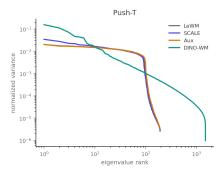
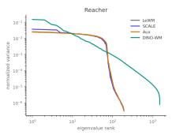
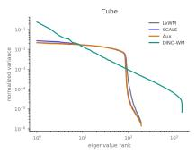
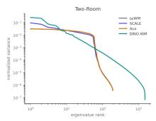
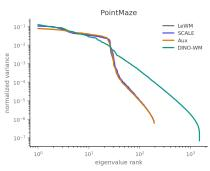
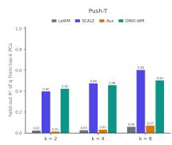
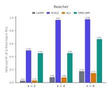
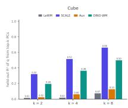
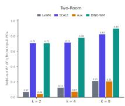
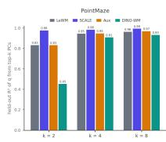

# SCALE: State-Calibrated Latent Embeddings for JEPA Planning in the Right Geometry

Jiaming Hu1,2∗ Yan Zheng2 Tian Wang2

1Boston University 2Unity Technologies

{jiaming.hu,yan.zheng,tianwang}@unity3d.com

## Abstract

Joint-embedding predictive world models plan by scoring predicted terminal embeddings against a goal embedding using a cost defined on the representation itself. Two prominent strategies for obtaining non-collapsed representations are to inherit a pretrained feature space, as in DINO-WM, and to learn an embedding end to end with anti-collapse regularization, as in LeWorldModel (LeWM) with SIGReg. These strategies show complementary strengths across tasks. Although task-relevant state is decodable from the full embeddings of both models, DINO-WM’s leading principal components usually retain substantially more state information than LeWM’s. Because Euclidean planning costs are dominated by highvariance directions, this difference affects how strongly state can influence candidate selection. We propose SCALE (State-CAlibrated Latent Embeddings) to give the end-to-end LeWM representation the favorable geometric property observed in DINO-WM. SCALE induces this property by correlating sampled pairwise latent distances with distances in a standardized task-relevant state space, without replacing LeWM’s learned encoder. Across five tasks, three planning solvers, and five compute budgets, SCALE improves every task–solver average over LeWM. A latent-to-state regression control matches or exceeds SCALE’s full-embedding decodability yet leaves latent–state distance alignment essentially unchanged and yields less consistent planning gains. SCALE adds a single lightweight trainingtime regularizer and no planning-time overhead. These results show that planning depends not only on whether task-relevant information is present, but also on whether it shapes the geometry consumed by the planner.

## 1 Introduction

World models support control by predicting the consequences of candidate actions before they are executed [Ha and Schmidhuber, 2018, Hafner et al., 2020]. Reconstruction-based visual world models predict future observations in pixel space, but high-fidelity reconstruction can devote capacity to appearance details that are irrelevant to control. Latent-predictive world models instead forecast representations of future observations, offering a compact space for prediction and planning [Hafner et al., 2019, Zhou et al., 2024, Sobal et al., 2025, Maes et al., 2026]. In JEPA-based variants [As sran et al., 2023], an encoder maps an observation to a latent, an action-conditioned predictor rolls that latent forward, and a planner scores each candidate action sequence by a cost evaluated on its predicted terminal embedding and a goal embedding. The planner never inspects the representation directly: this cost is its entire interface to what the model has learned.

LeWorldModel (LeWM) provides a concrete instance of this setup. It jointly learns an encoder and an action-conditioned dynamics predictor, and evaluates imagined futures through distances between predicted terminal and goal embeddings. To prevent the collapsed representations admitted by end-to-end joint-embedding training, LeWM uses SIGReg, which encourages a globally well spread, approximately isotropic embedding distribution. This regularization, however, does not determine which factors of variation should most strongly shape the distances used for planning. A representation may therefore predict accurately, remain non-collapsed, and retain task-relevant state information, while that information has little influence on the planner’s cost. This raises a central question: what makes a latent geometry useful for planning?

Comparing LeWM with DINO-WM reveals a useful contrast. Both representations retain substantial task-relevant state information, yet they expose that information differently through the geometry used for planning. In DINO-WM, variations in task state are more strongly reflected in latent distances, whereas in LeWM the same information can remain readily decodable without strongly shaping those distances. This suggests that the relevant distinction is not simply whether taskrelevant information is encoded, but whether its variation is expressed in the metric through which the planner interacts with the representation.

This distinction matters because the planner has no learned decoder with which to recover and reweight latent information; it acts directly through the planning cost. Under the Euclidean cost used by LeWM and DINO-WM, directions with larger variation contribute more, on average, to latent distances. Task-relevant information concentrated in weakly varying directions can therefore remain easy to decode while having little effect on candidate ranking. Decodability and geometric influence are thus distinct properties of a representation.

We therefore ask whether an end-to-end JEPA can be trained to acquire the favorable latent geometry observed in DINO-WM while retaining the flexibility of an end-to-end learned representation. We propose SCALE (State-CAlibrated Latent Embeddings), a training objective that correlates pairwise latent distances with distances in task-relevant state space.

Empirically, this geometric intervention translates into consistently better planning: SCALE outperforms LeWM on all 15 task–solver averages, with gains persisting across compute budgets. To test whether these improvements can be explained simply by stronger state encoding, we compare against an auxiliary latent-to-state regression objective. Although this control matches or exceeds SCALE’s full-embedding decodability on two tasks, it yields less consistent planning improvements. Together, these results support the distinction between encoding task-relevant information and making that information geometrically influential.

Our contributions are:

• We identify metric leverage—the weight a latent direction carries in the planner-facing cost—and show that under the squared Euclidean metric it is exactly the direction’s variance(Sec. 4).

• We introduce SCALE, a state-calibration regularizer that reshapes latent-space geometry so pairwise latent distances reflect task-relevant state differences. (Sec. 5).

• We empirically verify SCALE with extensive experiments: across five environments, three planning solvers, and five compute budgets, it improves all 15 task–solver averages over LeWM, while a state-regression control(Aux) with identical supervision fails to match it(Sec. 6).

## 2 Related Work

Latent-predictive world models. World models support control through several mechanisms, including learning policies from imagined trajectories [Ha and Schmidhuber, 2018, Hafner et al., 2020] and optimizing action sequences online using model rollouts [Chua et al., 2018, Nagabandi et al., 2018, Hansen et al., 2024]. Reconstruction-free approaches predict future latent representations rather than pixels. DINO-WM predicts pretrained DINOv2 patch features and plans by optimizing action sequences [Oquab et al., 2024, Zhou et al., 2024]; PLDM jointly trains an encoder and latent dynamics model with latent-prediction, VICReg-inspired anti-collapse, and inverse-dynamics objectives [Bardes et al., 2022, Sobal et al., 2025]; and LeWM combines next-embedding prediction with SIGReg [Maes et al., 2026]. These models differ in how they obtain non-collapsed representations, but none explicitly trains the latent-space planning cost to reflect task-relevant differences. SCALE retains LeWM’s prediction and SIGReg objectives while adding state supervision for this purpose.

Supervising latent geometry. Several approaches add supervision to make JEPA representations more useful for planning. Value-guided JEPA aligns latent distances with goal-conditioned value [Destrade et al., 2025]; SCALE instead aligns them with logged simulator state, requiring no reward, value estimate, or policy. Two concurrent methods use such privileged state for grounding: PhyLatent [Zeng et al., 2026] and PSG-JEPA [Yan et al., 2026] train auxiliary heads to predict physical state or state changes from latents. Notably, PhyLatent diagnoses physically distant pairs that remain latent-close in LeWM—independent evidence for our premise, which SCALE turns from a diagnostic into a differentiable objective. Head-based grounding certifies that state is decodable; because a head can be an arbitrary nonlinear map, it leaves the metric unconstrained. Our Aux control implements exactly this form of supervision, and SCALE constrains the pairwise distance directly.

## 3 Preliminaries

## 3.1 Latent-space planning

Let $o _ { t }$ and $\mathbf { a } _ { t }$ denote the observation and action at time t. The encoder $E _ { \theta }$ produces $\mathbf { z } _ { t } = E _ { \theta } ( o _ { t } )$ and the action-conditioned predictor $P _ { \psi }$ predicts $\hat { \mathbf { z } } _ { t + 1 } = P _ { \psi } ( \mathbf { z } _ { t } , \mathbf { a } _ { t } )$ . At test time, given a candidate action sequence ${ \bf a } _ { 0 : { H - 1 } }$ and current observation $o _ { 0 }$ , the model sets $\hat { \mathbf { z } } _ { 0 } = E _ { \theta } ( o _ { 0 } )$ and rolls out

$$
\hat { \mathbf { z } } _ { t + 1 } = P _ { \psi } ( \hat { \mathbf { z } } _ { t } , \mathbf { a } _ { t } ) , \qquad t = 0 , \ldots , H - 1 .\tag{1}
$$

For a goal observation $o _ { g }$ with embedding $\mathbf { z } _ { g } = E _ { \theta } ( o _ { g } )$ , the planner ranks candidates by a scalar cost

$$
\begin{array} { r } { J ( \mathbf { a } _ { 0 : H - 1 } ) = C \big ( \widehat { \mathbf { z } } _ { H } ( \mathbf { a } _ { 0 : H - 1 } ) , \mathbf { z } _ { g } \big ) , } \end{array}\tag{2}
$$

computed entirely from the learned representation. In LeWM and DINO-WM this cost is the squared Euclidean distance

$$
J ( \mathbf { a } _ { 0 : H - 1 } ) = \left. \hat { \mathbf { z } } _ { H } ( \mathbf { a } _ { 0 : H - 1 } ) - \mathbf { z } _ { g } \right. _ { 2 } ^ { 2 } ,\tag{3}
$$

Because the solver interacts with the representation only through $J ,$ its decisions depend entirely on the distance geometry the encoder has learned.

## 3.2 LeWM training objective

For a transition $\left( o _ { t } , \mathbf { a } _ { t } , o _ { t + 1 } \right)$ , the encoder and predictor are trained with the one-step latentprediction loss

$$
\mathcal { L } _ { \mathrm { p r e d } } = \left. \hat { \mathbf { z } } _ { t + 1 } - \mathbf { z } _ { t + 1 } \right. _ { 2 } ^ { 2 } ,\tag{4}
$$

where $\mathbf { z } _ { t + 1 } = E _ { \theta } ( o _ { t + 1 } )$ is the target embedding. This loss alone admits collapsed solutions in which the encoder maps every observation to the same point. For a batch of N encoder outputs $Z =$ $\{ { \mathbf { z } } _ { i } \} _ { i = 1 } ^ { N }$ , SIGReg samples random unit directions in latent space, projects $Z$ onto each, and penalizes deviations of the projected empirical distributions from a univariate standard normal [Balestriero and LeCun, 2025, Maes et al., 2026]. Applied across many directions, this drives the embedding distribution toward an isotropic Gaussian and maintains global spread. LeWM therefore optimizes

$$
\begin{array} { r } { \mathcal { L } _ { \mathrm { L e W M } } = \mathcal { L } _ { \mathrm { p r e d } } + \lambda _ { \mathrm { s i g } } \mathrm { S I G R e g } ( Z ) . } \end{array}\tag{5}
$$

Neither term specifies which task-relevant differences should dominate pairwise latent distances. A representation can satisfy both while organizing its geometry around variation that has nothing to do with the task.

## 4 Where Task-Relevant State Lives

## 4.1 A motivating distance aligment contrast

The planner of Sec. 3.1 interacts with the representation only through the scalar cost of Eq. (3): whatever a representation encodes, the planner sees it only insofar as it registers in latent distance. We therefore quantify the contrast sketched in the introduction directly at this interface, computing the Spearman rank correlation between $\| \mathbf { z } _ { i } - \mathbf { z } _ { j } \| _ { 2 } ^ { 2 }$ and $\| \mathbf { q } _ { i } - \mathbf { q } _ { j } \| _ { 2 } ^ { 2 }$ over held-out trajectory frame pairs, where q denotes the task-relevant state variables logged alongside each trajectory (formally specified in Sec. 5.1). For the sampled frame pairs, we rank the latent distances and state distances separately. Spearman $\rho$ measures the agreement between these two rankings: a high value means that pairs farther apart in task state also tend to be farther apart in latent space. This is directly relevant because the planner selects actions by ranking candidates according to latent cost. Ties are assigned average ranks.

Table 1: Latent–state distance rank alignment (Spearman $\rho )$ of the two reference world models over held-out frame pairs. Both models decode most of the same state accurately from their full embeddings (Appendix B); their metrics reflect it to very different degrees.
<table><tr><td>Task</td><td>LeWM</td><td>DINO-WM</td></tr><tr><td>Push-T</td><td>.13</td><td>.70</td></tr><tr><td>Reacher</td><td>.18</td><td>.46</td></tr><tr><td>Cube</td><td>.00</td><td>.46</td></tr><tr><td>Two-Room</td><td>.41</td><td>.85</td></tr><tr><td>PointMaze</td><td>.52</td><td>.50</td></tr></table>

Table 1 reveals a clear contrast. DINO-WM’s latent distances track state differences much more closely than LeWM’s on most tasks. The metric the planner will consume can be uninformative about task-relevant differences, even though probes still recover most of that state accurately from the full embedding (Appendix B). We next ask how such a dissociation between decodability and metric alignment can arise.

## 4.2 Metric leverage: which directions can influence the cost

Let $\mu$ be the mean of the encoded distribution and $\{ ( \lambda _ { j } , \mathbf { u } _ { j } ) \} _ { j = 1 } ^ { D }$ its eigenvalue–eigenvector pairs, ordered by decreasing $\lambda _ { j }$ . Writing a centered embedding in this basis,

$$
\mathbf { z } - \mu = \sum _ { j = 1 } ^ { D } c _ { j } \mathbf { u } _ { j } , \qquad \operatorname { V a r } ( c _ { j } ) = \lambda _ { j } ,\tag{6}
$$

the cost of $\operatorname { E q . } \left( 3 \right)$ separates into independent per-direction contributions,

$$
\left\| \mathbf { z } _ { i } - \mathbf { z } _ { g } \right\| _ { 2 } ^ { 2 } = \sum _ { j = 1 } ^ { D } \left( c _ { i j } - c _ { g j } \right) ^ { 2 } .\tag{7}
$$

For a pair drawn independently from the encoded distribution, the expected contribution of direction j is

$$
\mathbb { E } \big [ ( c _ { i j } - c _ { g j } ) ^ { 2 } \big ] = 2 \lambda _ { j } .\tag{8}
$$

The scale at which a direction participates in the cost is thus set by its eigenvalue. Under the squared Euclidean cost, we accordingly define the metric leverage of a direction as its expected contribution to the cost, which by Eq. (8) equals $2 \lambda _ { j } \colon$ the weight it carries in the scalar that orders candidate action sequences.

This resolves the dissociation of Table 1. Suppose a task-relevant variable q is encoded entirely in directions with small $\lambda _ { j } . \mathrm { ~ A ~ }$ probe with sufficient capacity recovers q from the full embedding with high accuracy, since decodability does not depend on the variance of the directions used. The planner, however, applies no learned head and cannot reweight directions; under Eq. (7) those directions contribute negligibly to $J ,$ and candidates differing substantially in q may receive near-identical costs. In short,

$$
\begin{array} { r } { \mathbf { q } \mathrm { i s } \mathrm { d e c o d a b l e f r o m } \mathbf { z } \quad \nRightarrow \quad \mathbf { q } \mathrm { s t r o n g l y a f f e c t s } C ( \mathbf { z } , \mathbf { z } _ { g } ) . } \end{array}
$$

A representation in LeWM’s position—state decodable, alignment near zero—is one that stores task-relevant variation in directions with little metric leverage.

Hypothesis. Together, Table 1 and Sec. 4.2 suggest that planning performance depends not merely on whether task-relevant state is represented, but on whether it registers in latent distance. We therefore seek an objective that gives task-relevant variation direct influence over the metric.

## 5 Method

## 5.1 State-Calibrated Latent Embeddings

SCALE directly reshapes the pairwise latent distance used for planning. During training, each observation $o _ { i }$ is paired with a simulator state $\mathbf { q } _ { i } ^ { \mathrm { r a w } }$ . We construct the task-relevant state $\mathbf { q } _ { i }$ by selecting task-specific dimensions, representing angles with sine–cosine pairs, excluding velocities, and standardizing each component using fixed training-set statistics. This standardized state defines the target geometry and is used only as a detached training target; the encoder and planner remain image-only at test time. Because SCALE operates on pairwise distances, it requires neither equal dimensionality nor coordinate-wise correspondence between the latent and state spaces. The taskspecific state selections are detailed in Appendix B.

Consider a minibatch of B sub-trajectories, each containing $T$ frames. We flatten its $N = B T$ frames into $\{ ( \mathbf { z } _ { n } , \mathbf { q } _ { n } , b _ { n } , e _ { n } ) \} _ { n = 1 } ^ { N }$ , where ${ \bf z } _ { n } \in \mathbb { R } ^ { D }$ is an encoder output, $\mathbf { q } _ { n } \in \mathbb { R } ^ { d _ { q } }$ is its standardized task-relevant state, $b _ { n }$ identifies its sub-trajectory, and $e _ { n }$ its source episode. At each step, we sample a set $\mathcal { P } = \{ ( i _ { k } , j _ { k } ) \} _ { k = 1 } ^ { K }$ of distinct frame pairs, with half drawn within sub-trajectories $( b _ { i _ { k } } = \bar { b } _ { j _ { k } } )$ and half across episodes $( e _ { i _ { k } } \neq e _ { j _ { k } } )$ . This stratification supplies both local and global geometric comparisons. We then define the latent and state distance profiles

$$
x _ { k } = \| \mathbf { z } _ { i _ { k } } - \mathbf { z } _ { j _ { k } } \| _ { 2 } ^ { 2 } , \qquad y _ { k } = \| \mathbf { q } _ { i _ { k } } - \mathbf { q } _ { j _ { k } } \| _ { 2 } ^ { 2 } .\tag{9}
$$

Let x¯ and $s _ { x }$ be the mean and standard deviation of $\{ x _ { k } \} _ { k = 1 } ^ { K } ; \bar { y }$ and $s _ { y }$ are defined analogously. With a numerical constant $\varepsilon > 0$ , the standardized profiles and correlation loss are

$$
\tilde { x } _ { k } = \frac { x _ { k } - \bar { x } } { s _ { x } + \varepsilon } , \qquad \tilde { y } _ { k } = \frac { y _ { k } - \bar { y } } { s _ { y } + \varepsilon } , \qquad \mathcal { L } _ { \mathrm { c o r r } } = 1 - \frac { 1 } { K } \sum _ { k = 1 } ^ { K } \tilde { x } _ { k } \tilde { y } _ { k } .\tag{10}
$$

Component-wise normalization of $\mathbf { q } _ { n }$ makes the selected state variables comparable, while normalization of the two distance profiles makes $\mathcal { L } _ { \mathrm { c o r r } }$ depend on relative distance structure rather than global scale. In the ideal case, $x _ { k }$ and $y _ { k }$ are perfectly positively linearly related, their standardized profiles coincide, and $\mathcal { L } _ { \mathrm { c o r r } } = 0 :$ : larger state differences then produce proportionally larger latent distances.

Therefore, the complete objective is

$$
{ \mathcal { L } } _ { \mathrm { S C A L E } } = { \mathcal { L } } _ { \mathrm { p r e d } } + \lambda _ { \mathrm { s i g } } { \mathrm { S I G R e g } } ( Z ) + \lambda _ { \mathrm { c o r r } } { \mathcal { L } } _ { \mathrm { c o r r } } ,\tag{11}
$$

where the three terms play complementary roles: $\mathcal { L } _ { \mathrm { p r e d } }$ trains action-conditioned latent prediction, SIGReg prevents collapse and maintains global embedding spread, and $\mathcal { L } _ { \mathrm { c o r r } }$ redistributes information within that spread so task-relevant variation carries greater metric leverage. The complete $\mathcal { L } _ { \mathrm { S C A L E } }$ updates the encoder $E _ { \theta }$ , whereas the predictor $P _ { \psi }$ is updated only by $\mathcal { L } _ { \mathrm { p r e d } }$ . Training pseudocode is provided in Appendix A.1.

## 5.2 Latent-to-state regression as a mechanistic control

To separate the two properties distinguished in Sec. 4.2, we train a control that optimizes decodability while leaving the metric unconstrained. The Aux baseline attaches a training-only head $h _ { \phi }$ to the encoder output and minimizes

$$
\mathcal { L } _ { \mathrm { a u x } } = \left\| h _ { \phi } ( \mathbf { z } _ { n } ) - \mathbf { q } _ { n } \right\| _ { 2 } ^ { 2 }\tag{12}
$$

in place of $\mathcal { L } _ { \mathrm { c o r r } }$ , using the same selected and standardized state, the same architecture, and the same training protocol. Because $h _ { \phi }$ may be an arbitrary nonlinear map, Eq. (12) is satisfied by placing q anywhere in the representation, including directions with negligible metric leverage. Aux therefore poses a sharp question: if making state easier to decode were sufficient, it should match SCALE.

## 6 Experiments

## 6.1 Setup

We evaluate LeWM, SCALE, and the latent-to-state regression control on Push-T [Chi et al., 2023], DeepMind Control Reacher [Tassa et al., 2018], OGBench-Cube [Park et al., 2025], Two-Room [Sobal et al., 2025], and PointMaze [Fu et al., 2020, Zhou et al., 2024]. SCALE and the regression control use the same standardized task-relevant state; its task-specific components and selection rationale are detailed in Appendix B. All three configurations share the LeWM architecture and training protocol; only the added supervision differs. Exact architectures and training hyperparameters are given in Appendix A.

Table 2: iCEM success rate (%) across tasks and compute tiers. Each entry reports mean $\pm \thinspace \mathrm { S D }$ over six evaluation sets; the final column averages T1–T5. DINO-WM is included as a pretrained-feature reference. Bold marks the best method per column. Appendix C reports complete results for all planning solvers.
<table><tr><td>Task</td><td>Method</td><td>T1</td><td>T2</td><td>T3</td><td>T4</td><td>T5</td><td>Mean</td></tr><tr><td rowspan="4">Push-T</td><td>LeWM</td><td> $8 6 . 2 { \pm } 3 . 3 $ </td><td> $8 0 . 7 { \pm } 2 . 2 $ </td><td> $7 3 . 5 { \pm } 6 . 5 $ </td><td> $5 3 . 5 { \pm } 5 . 7 $ </td><td> $2 5 . 7 { \pm } 5 . 4 $ </td><td>63.9</td></tr><tr><td>SCALE</td><td> $8 9 . 7 { \pm } 2 . 0 $ </td><td> $8 7 . 0 { \pm } 2 . 5 $ </td><td> $7 9 . 0 { \pm } 3 . 9 $ </td><td> $5 9 . 8 { \pm } 4 . 7 $ </td><td> $2 5 . 5 { \pm } 5 . 8 $ </td><td>68.2</td></tr><tr><td>Aux.</td><td> ${ \bf 9 1 . 3 \pm 1 . 2 }$ </td><td> ${ \bf 8 7 . 7 \pm 1 . 8 }$ </td><td> ${ \bf 8 0 . 3 \pm 4 . 0 }$ </td><td> ${ \bf 6 0 . 5 \pm 6 . 0 }$ </td><td> ${ \bf 2 6 . 7 } \pm 4 . 6$ </td><td>69.3</td></tr><tr><td>DINO-WM</td><td> $7 0 . 5 { \pm } 4 . 2 $ </td><td> $6 5 . 2 { \pm } 4 . 2 $ </td><td> $5 8 . 5 { \pm } 5 . 2 $ </td><td> $3 9 . 8 { \pm } 1 0 . 0 $ </td><td> $2 2 . 5 { \pm } 4 . 3 $ </td><td>51.3</td></tr><tr><td rowspan="4">Reacher</td><td>LeWM</td><td> $8 5 . 5 { \pm } 2 . 4 $ </td><td> $8 1 . 8 { \pm } 3 . 1 $ </td><td> $8 3 . 3 { \pm } 3 . 5 $ </td><td> $7 7 . 8 { \pm } 6 . 1 $ </td><td> $6 1 . 7 { \pm } 2 . 9$ </td><td>78.0</td></tr><tr><td>SCALE</td><td> $\mathbf { 8 6 . 7 \pm 3 . 6 }$ </td><td> $8 6 . 2 { \pm } 2 . 9 $ </td><td> $8 6 . 5 { \pm } 3 . 4 $ </td><td> $\mathbf { 8 2 . 3 \pm 3 . 2 }$ </td><td> ${ \bf 6 4 . 0 { \pm } 2 . 5 }$ </td><td>81.1</td></tr><tr><td>Aux.</td><td> $8 4 . 3 { \pm } 4 . 6 $ </td><td> ${ \bf 8 7 . 0 \pm 2 . 8 }$ </td><td> $\mathbf { 8 6 . 8 \pm 3 . 5 }$ </td><td> $8 1 . 2 { \pm } 3 . 8 $ </td><td> $6 1 . 5 { \pm } 4 . 1 $ </td><td>80.2</td></tr><tr><td>DINO-WM</td><td> $7 9 . 0 { \pm } 4 . 6 $ </td><td> $7 7 . 5 { \pm } 5 . 6 $ </td><td> $7 9 . 7 { \pm } 3 . 1 $ </td><td> $7 5 . 5 { \pm } 5 . 0 $ </td><td> $5 2 . 3 { \pm } 6 . 0 $ </td><td>72.8</td></tr><tr><td rowspan="4">Cube</td><td>LeWM</td><td> $7 0 . 7 { \pm } 5 . 3 $ </td><td> $6 8 . 0 { \pm } 3 . 9 $ </td><td> $6 9 . 7 { \scriptstyle \pm 3 . 6 }$ </td><td> $6 2 . 7 { \pm } 4 . 7 $ </td><td> $5 5 . 2 { \pm } 5 . 7 $ </td><td>65.3</td></tr><tr><td>SCALE</td><td> ${ \bf 7 6 . 7 \pm 3 . 9 }$ </td><td> ${ \bf 7 6 . 5 \pm 4 . 5 }$ </td><td> ${ \bf 7 4 . 8 \pm 3 . 5 }$ </td><td></td><td>64.8±3.7 59.7±4.5</td><td>70.5</td></tr><tr><td>Aux.</td><td> $7 4 . 5 { \pm } 3 . 2 $ </td><td> $7 3 . 3 { \pm } 4 . 5 $ </td><td> $7 3 . 0 { \pm } 3 . 1 $ </td><td> $6 4 . 5 { \pm } 3 . 3 $ </td><td> $5 7 . 7 { \pm } 3 . 8 $ </td><td>68.6</td></tr><tr><td>DINO-WM</td><td> $7 0 . 8 { \pm } 2 . 6 $ </td><td> $6 7 . 3 { \pm } 1 . 5 $ </td><td> $6 6 . 2 { \pm } 1 . 7 $ </td><td> $5 7 . 3 { \pm } 4 . 5 $ </td><td> $5 1 . 7 { \pm } 3 . 8 $ </td><td>62.7</td></tr><tr><td rowspan="4">Two-Room</td><td>LeWM</td><td> $9 1 . 3 { \pm } 1 . 2 $ </td><td> $9 3 . 3 { \pm } 1 . 2 $ </td><td> $8 9 . 2 { \pm } 2 . 5 $ </td><td> $7 7 . 5 { \pm } 1 . 4 $ </td><td> $6 3 . 2 { \pm } 3 . 0 $ </td><td>82.9</td></tr><tr><td>SCALE</td><td> $\mathbf { 1 0 0 . 0 { \pm } 0 . 0 }$ </td><td> $9 9 . 8 { \pm } 0 . 4 $ </td><td> $9 7 . 3 { \pm } 1 . 4 $ </td><td> $9 0 . 5 { \pm } 1 . 4 $ </td><td> $7 6 . 7 { \pm } 1 . 9$ </td><td>92.9</td></tr><tr><td>Aux.</td><td> $9 2 . 5 { \pm } 2 . 7 $ </td><td> $9 3 . 5 { \pm } 2 . 1 $ </td><td> $8 8 . 5 { \pm } 1 . 9 $ </td><td> $7 9 . 0 { \pm } 2 . 4 $ </td><td> $6 2 . 0 { \pm } 1 . 8 $ </td><td>83.1</td></tr><tr><td>DINO-WM</td><td> $1 0 0 . 0 { \scriptstyle \pm 0 . 0 }$ </td><td> $\mathbf { 1 0 0 . 0 { \pm } 0 . 0 }$ </td><td> ${ \bf 9 9 . 7 \pm 0 . 5 }$ </td><td> $\mathbf { 9 8 . 7 \pm 0 . 5 }$ </td><td> $\mathbf { 9 2 . 8 \pm 1 . 7 }$ </td><td>98.2</td></tr><tr><td rowspan="4">PointMaze</td><td>LeWM</td><td> $8 1 . 7 { \pm } 3 . 9 $ </td><td> $8 2 . 7 { \pm } 4 . 4 $ </td><td> $8 1 . 3 { \pm } 3 . 6 $ </td><td> $8 1 . 7 { \pm } 5 . 1 $ </td><td> $7 3 . 7 { \pm } 4 . 7$ </td><td>80.2</td></tr><tr><td>SCALE</td><td> $8 7 . 3 { \pm } 3 . 9 $ </td><td> $8 2 . 7 { \pm } 3 . 9 $ </td><td> $8 4 . 3 { \pm } 4 . 1$ </td><td> $8 3 . 2 { \pm } 4 . 6 $ </td><td> $7 9 . 3 { \pm } 2 . 4 $ </td><td>83.4</td></tr><tr><td>Aux.</td><td> $8 3 . 8 { \pm } 4 . 8 $ </td><td> $8 2 . 8 { \pm } 3 . 7 $ </td><td> $8 0 . 5 { \pm } 5 . 5 $ </td><td> $8 1 . 2 { \pm } 2 . 9$ </td><td> $7 8 . 3 { \pm } 5 . 5 $ </td><td>81.3</td></tr><tr><td> $\mathrm { D I N O - W M }$ </td><td> ${ \bf 9 4 . 2 \pm 1 . 7 }$ </td><td> ${ \bf 9 3 . 7 \pm 2 . 3 }$ </td><td> $\mathbf { 9 2 . 8 \pm 2 . 3 }$ </td><td> $\mathbf { 9 0 . 8 \pm 1 . 7 }$ </td><td> ${ \bf 8 6 . 2 \pm 1 . 9 }$ </td><td>91.5</td></tr></table>

We follow the LeWM goal-conditioned planning protocol and evaluate CEM [de Boer et al., 2005], iCEM [Pinneri et al., 2021], and MPPI [Williams et al., 2017], with DINO-WM as a pretrainedfeature reference. We report success rates; planner budgets, horizons, temperature selection, and evaluation-set construction are detailed in Appendix A.

## 6.2 Planning performance

SCALE improves LeWM on every task–solver average (15/15). Under iCEM (Table 2), its gains averaged across budgets are 4.3, 3.1, 5.2, 10.0, and 3.1 percentage points on Push-T, Reacher, Cube, Two-Room, and PointMaze, respectively. The same improvement holds under CEM and MPPI and across a 300× range of rollout budgets (Appendix C), showing that SCALE improves the plannerfacing cost rather than one particular search procedure.

The regression control isolates why SCALE is more consistent. Full-embedding probes confirm that Aux successfully encodes the supervised state, even exceeding SCALE’s decodability on Push-T and Cube (Appendix B). Yet Aux improves only 13 of 15 task–solver averages and trails SCALE on four of five tasks; Push-T is the exception. The planning gap therefore cannot just be explained by whether state information is present, but by whether that information shapes latent geometry.

The comparison with DINO-WM further highlights this consistency. DINO-WM is significantly better than LeWM on Two-Room and PointMaze, significantly worse on Push-T $\left( p = . 0 3 1 \right)$ , and not significantly different on Reacher or Cube. SCALE, in contrast, never falls below LeWM on any task–solver pair. It thus learns a consistently useful planner-facing geometry without inheriting the task dependence of a fixed pretrained encoder.

## 6.3 How SCALE reorganizes the latent geometry

The planning results establish that SCALE improves an end-to-end latent world model, but do not by themselves reveal what changes inside the representation. We therefore trace the effect of SCALE through the geometry itself. We first examine how variance is distributed across latent directions, then identify what information occupies the directions whose variance increases, and finally test whether this reorganization survives model rollout strongly enough to affect the candidate selection used for planning.

SCALE increases variance in the dominant latent directions. We begin with the PCA spectrum of each frozen representation. Figure 1 shows that SCALE consistently raises the variance carried by the leading principal directions relative to LeWM and Aux on most tasks. DINO-WM also exhibits a strongly weighted spectral head, although its much higher dimensionality produces a qualitatively different long-tail spectrum.

Under the squared Euclidean planning cost, this change has a direct geometric interpretation. As shown in Sec. 4.2, a principal direction with eigenvalue $\lambda _ { j }$ contributes $2 \lambda _ { j }$ in expectation to the squared distance between independently sampled embeddings. Increasing variance near the head of the spectrum therefore gives these directions greater average leverage over the cost consumed by the planner. The spectrum alone, however, does not tell us what factors of variation have acquired that leverage.

  
Figure 1: Normalized PCA eigenvalue spectra of the frozen embeddings. SCALE places more variance in the leading principal directions than LeWM and Aux on most tasks. DINO-WM also exhibits a strongly weighted spectral head, while its substantially larger representation produces a much longer spectral tail.

The additional dominant variation is task relevant. We next ask what the high-variance directions actually encode. For each frozen representation, we regress the selected task-relevant state q using only its leading k principal components. Figure 2 shows that the leading components of SCALE are substantially more predictive of q than those of LeWM. The separation from Aux is especially informative: although Aux can recover q accurately from the full embedding, substantially less of that information appears in its leading components.

Together with the spectral analysis, this identifies what SCALE changes. It does not merely increase variance in arbitrary latent directions; the directions receiving greater metric leverage become more strongly associated with task-relevant state. Conversely, auxiliary regression can make the same state highly decodable without organizing it in the part of the representation that contributes most strongly to Euclidean distance. Consistent with this interpretation, SCALE also substantially increases heldout latent–state distance alignment, whereas Aux leaves it near the LeWM level despite strong state decodability (Appendix B.1).

  
Figure 2: Held-out $R ^ { 2 }$ for predicting the selected task-relevant state from the leading k principal components of each frozen embedding. SCALE makes the dominant latent subspace more informative about q than LeWM on every task, and substantially more informative than Aux on Push-T, Reacher, Two Room and Cube despite Aux’s strong full-embedding decodability.

The reorganized geometry survives rollout and improves candidate ranking. The preceding analysis concerns encoded observations, whereas planning operates on predicted future embeddings. For each start and candidate action sequence m, the world model predicts a terminal embedding $\hat { \mathbf { z } } _ { H } ^ { ( m ) }$ . Executing the same sequence from the same start in the simulator produces $o _ { H } ^ { ( m ) , \mathrm { t r u e } }$ , which the same encoder maps to $\mathbf { z } _ { H } ^ { ( m ) , \mathrm { t r u e } } = E _ { \theta } ( o _ { H } ^ { ( m ) , \mathrm { t r u e } } )$

These paired outcomes define two measurements. First, rollout error compares the predicted and simulator-derived embeddings as $\| \hat { \mathbf { z } } _ { H } ^ { ( m ) } - \mathbf { z } _ { H } ^ { ( m ) , \mathrm { t r u e } } \| _ { 2 } ^ { 2 } / s$ , where s is the model’s mean squared distance between random pairs of the simulator-derived terminal embeddings $\mathbf { z } _ { H } ^ { ( m ) , \mathrm { t r u e } }$ . Second, for the same goal embedding $\mathbf { z } _ { g } ,$ , we compute

$$
\hat { J } _ { m } = \| \hat { \mathbf { z } } _ { H } ^ { ( m ) } - \mathbf { z } _ { g } \| _ { 2 } ^ { 2 } , \qquad J _ { m } ^ { \mathrm { t r u e } } = \| \mathbf { z } _ { H } ^ { ( m ) , \mathrm { t r u e } } - \mathbf { z } _ { g } \| _ { 2 } ^ { 2 } ,
$$

and report Kendall’s τ between the candidate rankings induced by $\{ \hat { J } _ { m } \}$ and $\{ J _ { m } ^ { \mathrm { t r u e } } \}$

Table 3: Within-model rollout quality. Lower rollout error and higher Kendall τ are better. Parentheses report change relative to LeWM; when LeWM’s τ is near zero, we report the absolute difference ∆. Results average 20 starts.
<table><tr><td>Task</td><td>Metric</td><td>LeWM</td><td>SCALE</td><td>Aux</td><td>DINO-WM</td></tr><tr><td rowspan="2">Push-T</td><td>RollErr↓</td><td>.0350</td><td>.0277 (−21.0%)</td><td>.0269 (−23.1%)</td><td>.2819 (+704.9%)</td></tr><tr><td>Kendall τ ↑</td><td>.7316</td><td>.7857(+7.4%)</td><td>.7576 (+3.6%)</td><td>.7000 (-4.3%)</td></tr><tr><td rowspan="2">Reacher</td><td>RollErr↓</td><td>.1812</td><td>.1548 (−14.6%)</td><td>.1686 (−7.0%)</td><td>.5860 (+223.4%)</td></tr><tr><td>Kendall τ ↑</td><td>.6233</td><td>.6435 (+3.2%)</td><td>.6328 (+1.5%)</td><td>.6414(+2.9%)</td></tr><tr><td rowspan="2">Cube</td><td>RollErr ↓</td><td>.3195</td><td>.3174(-0.7%)</td><td>.2389 (-25.2%)</td><td>.3227 (+1.0%)</td></tr><tr><td>Kendall τ ↑</td><td>.3654</td><td>.4433 (+21.3%)</td><td>.4150 (+13.6%)</td><td>.7775(+112.8%)</td></tr><tr><td rowspan="2">Two-Room</td><td>RollErr↓ Kendall τ ↑</td><td>.3600</td><td>.2857 (-20.6%)</td><td>.3511 (-2.5%)</td><td>.1479 (-58.9%)</td></tr><tr><td></td><td>.5448</td><td>.6210 (+14.0%)</td><td>.5389 (−1.1%)</td><td>.7250 (+33.1%)</td></tr><tr><td rowspan="2">PointMaze</td><td>RollErr↓</td><td>2.4226</td><td>2.1132 (-12.8%)</td><td>2.2418 (-7.5%)</td><td>1.9545 (-19.3%)</td></tr><tr><td>Kendall τ ↑</td><td>-.0029</td><td>.1675 (n/a, ∆+.170)</td><td>.0540 (n/a, ∆+.057)</td><td>.2850 (n/a, ∆+.288)</td></tr></table>

SCALE increases Kendall ranking agreement over LeWM on every task. The improvement is modest on Push-T and Reacher, where LeWM already preserves candidate ordering relatively well, but becomes much larger on Cube, Two-Room, and PointMaze. This shows that the representational change identified by the PCA analyses is not confined to static encodings: it survives prediction strongly enough to improve the ordering of imagined futures presented to the planner.

The comparison with Aux further separates this effect from generic prediction accuracy. Aux achieves the lowest rollout error on Push-T and Cube, yet its gains in Kendall agreement are consistently smaller than SCALE’s and nearly vanish on the navigation tasks. DINO-WM illustrates the complementary limitation: on Two-Room and PointMaze it combines favorable rollout and ranking behavior, while on Push-T and Reacher its rollout errors are dramatically larger. On Cube, DINO-WM attains the highest Kendall τ without the strongest planning performance. Thus, preserving a useful candidate ordering is an important interface between representation geometry and planning, but it is not by itself sufficient for planning success; the latent dynamics must also remain predictable.

## 7 Conclusion

We study how the geometry of a learned representation affects latent-space planning. Our analysis shows that task-relevant information may be readily decodable from an embedding while remaining geometrically weak. Motivated by the contrasting geometries of DINO-WM and LeWM, we introduce SCALE to directly calibrate latent distances with task-relevant state differences during training. The resulting representations preserve LeWM’s end-to-end learning framework while making taskrelevant variation more prominent in the geometry seen by the planner. More broadly, our results highlight that, when planning is performed directly with Euclidean latent distance, representation quality depends not only on what information is encoded, but also on how that information is organized geometrically.

## References

Mahmoud Assran, Quentin Duval, Ishan Misra, Piotr Bojanowski, Pascal Vincent, Michael Rabbat, Yann LeCun, and Nicolas Ballas. Self-supervised learning from images with a joint-embedding predictive architecture. In Proceedings of the IEEE/CVF Conference on Computer Vision and Pattern Recognition, pages 15619–15629, 2023.

Randall Balestriero and Yann LeCun. Lejepa: Provable and scalable self-supervised learning without the heuristics. arXiv preprint arXiv:2511.08544, 2025.

Adrien Bardes, Jean Ponce, and Yann LeCun. Vicreg: Variance-invariance-covariance regularization for self-supervised learning. In International Conference on Learning Representations, 2022.

Cheng Chi, Siyuan Feng, Yilun Du, Zhenjia Xu, Eric Cousineau, Benjamin Burchfiel, and Shuran Song. Diffusion policy: Visuomotor policy learning via action diffusion. In Robotics: Science and Systems, 2023.

Kurtland Chua, Roberto Calandra, Rowan McAllister, and Sergey Levine. Deep reinforcement learning in a handful of trials using probabilistic dynamics models. In Advances in Neural Information Processing Systems, 2018.

Pieter-Tjerk de Boer, Dirk P. Kroese, Shie Mannor, and Reuven Y. Rubinstein. A tutorial on the cross-entropy method. Annals of Operations Research, 134(1):19–67, 2005. doi: 10.1007/s10479-005-5724-z.

Matthieu Destrade, Oumayma Bounou, Quentin Le Lidec, Jean Ponce, and Yann LeCun. Valueguided action planning with jepa world models, 2025. URL https://arxiv.org/abs/2601. 00844.

Justin Fu, Aviral Kumar, Ofir Nachum, George Tucker, and Sergey Levine. D4RL: Datasets for deep data-driven reinforcement learning. arXiv preprint arXiv:2004.07219, 2020.

David Ha and Jurgen Schmidhuber. World models.¨ arXiv preprint arXiv:1803.10122, 2018.

Danijar Hafner, Timothy Lillicrap, Ian Fischer, Ruben Villegas, David Ha, Honglak Lee, and James Davidson. Learning latent dynamics for planning from pixels. In Proceedings of the 36th International Conference on Machine Learning, volume 97 of Proceedings of Machine Learning Research, pages 2555–2565. PMLR, 2019.

Danijar Hafner, Timothy Lillicrap, Jimmy Ba, and Mohammad Norouzi. Dream to control: Learning behaviors by latent imagination. In International Conference on Learning Representations, 2020.

Nicklas Hansen, Hao Su, and Xiaolong Wang. Td-mpc2: Scalable, robust world models for continuous control. In International Conference on Learning Representations, 2024.

Lucas Maes, Quentin Le Lidec, Damien Scieur, Yann LeCun, and Randall Balestriero. Leworldmodel: Stable end-to-end joint-embedding predictive architecture from pixels. arXiv preprint arXiv:2603.19312, 2026.

Anusha Nagabandi, Gregory Kahn, Ronald S. Fearing, and Sergey Levine. Neural network dynamics for model-based deep reinforcement learning with model-free fine-tuning. In IEEE International Conference on Robotics and Automation, 2018.

Maxime Oquab, Timothee Darcet, Th´ eo Moutakanni, Huy Vo, Marc Szafraniec, Vasil Khalidov,´ Pierre Fernandez, Daniel Haziza, Francisco Massa, Alaaeldin El-Nouby, Mahmoud Assran, Nicolas Ballas, Wojciech Galuba, Russell Howes, Po-Yao Huang, Shang-Wen Li, Ishan Misra, Michael Rabbat, Vasu Sharma, Gabriel Synnaeve, Hu Xu, Herve J´ egou, Julien Mairal, Patrick Labatut,´ Armand Joulin, and Piotr Bojanowski. DINOv2: Learning robust visual features without supervision. Transactions on Machine Learning Research, 2024.

Seohong Park, Kevin Frans, Benjamin Eysenbach, and Sergey Levine. Ogbench: Benchmarking offline goal-conditioned reinforcement learning. In International Conference on Learning Representations, 2025.

Cristina Pinneri, Shambhuraj Sawant, Sebastian Blaes, Jan Achterhold, Jorg St¨ uckler, Michal Ro-¨ linek, and Georg Martius. Sample-efficient cross-entropy method for real-time planning. In Proceedings ofthe 2020 Conference on Robot Learning, volume 155 of Proceedings ofMachine Learning Research, pages 1049–1065. PMLR, 2021.

Vlad Sobal, Wancong Zhang, Kyunghyun Cho, Randall Balestriero, Tim G. J. Rudner, and Yann LeCun. Learning from reward-free offline data: A case for planning with latent dynamics models. arXiv preprint arXiv:2502.14819, 2025.

Yuval Tassa, Yotam Doron, Alistair Muldal, Tom Erez, Yazhe Li, Diego de Las Casas, David Budden, Abbas Abdolmaleki, Josh Merel, Andrew Lefrancq, Timothy Lillicrap, and Martin Riedmiller. Deepmind control suite. arXiv preprint arXiv:1801.00690, 2018.

Grady Williams, Nolan Wagener, Brian Goldfain, Paul Drews, James M. Rehg, Byron Boots, and Evangelos A. Theodorou. Information theoretic MPC for model-based reinforcement learning. In 2017 IEEE International Conference on Robotics and Automation (ICRA), pages 1714–1721, 2017. doi: 10.1109/ICRA.2017.7989202.

Haodong Yan, Jiaguan Zhu, Mingyuan Jia, Ruiqing Yin, Junjie He, Zhide Zhong, Junfeng Li, Jinxuan Lu, Hengtao Li, Tianran Zhang, Jiayi Chen, Wenxuan Song, Wen Chen, Yuxiang Gao, and Haoang Li. Is forward prediction enough? physical state grounding for jepa world models. arXiv preprint arXiv:2608.06799, 2026.

Xi Zeng, Haojie Ren, and Ziying Song. Phylatent: Learning dynamics-relevant representations for jepa world models. arXiv preprint arXiv:2608.05720, 2026.

Gaoyue Zhou, Hengkai Pan, Yann LeCun, and Lerrel Pinto. Dino-wm: World models on pre-trained visual features enable zero-shot planning. arXiv preprint arXiv:2411.04983, 2024.

## A Implementation details

## A.1 SCALE training pseudocode

Algorithm 1 SCALE training.   
Require: $\boldsymbol { B } = ( O , A , Q , e ) ;$ aligned pixels O and states Q over $B \times T$ frames, actions A over $B \times ( T - 1 )$   
transitions, and episode IDs $\boldsymbol { e } = ( e _ { b } ) _ { b = 1 } ^ { B }$   
Require: $E _ { \theta } , P _ { \psi } , \bar { K ^ { , } } \varepsilon , \delta > 0 ,$ and $\lambda _ { \mathrm { s i g } } , \lambda _ { \mathrm { c o r r } } \geq 0$   
1: $Z \gets E _ { \theta } ( O ) ; \widehat { Z } \gets P _ { \psi } ( Z _ { : , 1 : T - 1 } , A )$   
2: $\mathcal { L } _ { \mathrm { p r e d } }  \mathrm { M S E } ( \widehat { Z } , Z _ { : , 2 : T } )$   
3: z ← reshape(Z, (N, D)); q ← detach(reshape(Q, (N, dq))) ▷ N = BT frames   
4: b ← ⌈n/T⌉; e ← e for n = 1, . . . , N   
5: Sample $\dot { K } / 2$ pairs within sub-trajectories $( b _ { i } = b _ { j } )$ and $K / 2$ across episodes $( e _ { i } \neq e _ { j } ) ;$ denote their union   
by P   
$6 \colon \dot { x _ { k } } \gets \| z _ { i _ { k } } - z _ { j _ { k } } \| _ { 2 } ^ { 2 } ; y _ { k } \gets \| q _ { i _ { k } } - q _ { j _ { k } } \| _ { 2 } ^ { 2 } \operatorname { f o r } \left( i _ { k } , j _ { k } \right) \in \mathcal { P }$   
7: if std(x) < δ or st $1 ( y ) < \delta$ then   
8: $\mathcal { L } _ { \mathrm { c o r r } }  0 \cdot \mathrm { s u m } ( z )$ ▷ graph-connected zero   
9: else   
10: x˜ ← (x − mean(x))/(std(x) + ε); y˜ ← (y − mean(y))/(std(y) + ε)   
11: Lcorr ← 1 − mean(˜x ⊙ y˜)   
12: end if   
13: LSCALE ← Lpred + λsig SIGReg(Z) + λcorrLcorr   
14: $g _ { \theta } \gets \nabla _ { \theta } \mathcal { L } _ { \mathrm { S C A L E } } ; g _ { \psi } \gets \nabla _ { \psi } \mathcal { L } _ { \mathrm { p r e d } }$   
15: (θ, ψ) ← Adam(θ, ψ), (gθ, gψ)

Hyperparameters. The encoder is a ViT-Tiny with patch size 14, 12 layers, 3 attention heads, and width 192. Its CLS token is passed through a linear–BatchNorm projector. The predictor is a six-layer causal transformer with 16 attention heads, dropout 0.1, a history length of 3, and actions injected through zero-initialized AdaLN; its output uses a matching projector. We use frame skip 5 and concatenate the five intervening actions into 10-dimensional action blocks. Training uses fourframe sub-trajectories, batch size 128, 10 epochs, and seed 3072. We optimize with Adam using learning rate $\mathrm { \bar { 5 } } \times 1 0 ^ { - 5 }$ and weight decay $1 \dot { 0 } ^ { - 3 }$ . SIGReg uses $M { = } 1 0 2 \bar { 4 }$ random unit projections with $\lambda _ { \mathrm { s i g } } = 0 . 0 9$ . For ${ \mathcal { L } } _ { \mathrm { c o r r } } ,$ we sample K=4096 pairs per training step with equal within- and cross-episode proportions and set $\varepsilon = 1 0 ^ { - 6 }$ . We use $\lambda _ { \mathrm { c o r r } } = 0 . 1$ , except for Reacher where it is 0.15. The selected state dimensions for Push-T, Reacher, Cube, Two-Room, and PointMaze are 6, 2, 5, 2, and 2, respectively.

Planner. All planning solvers use a horizon of five action blocks (25 environment steps), an actionblock size of five, a receding-horizon interval of five, a 50-step evaluation horizon, and goals sampled 25 steps ahead. The five compute tiers use settings 300/30, 100/20, 50/10, 20/5, and $1 0 / 3 .$ corresponding to 9000, 2000, 500, 100, and 30 rollout evaluations per replanning step. The elite count is max(round(0.1 · candidates), 2).

MPPI temperature. MPPI weights candidates by $\exp ( - J / T )$ and is therefore sensitive to the scale of J, which differs across representations. For the three LeWM-family models we select a single per-task temperature $T ^ { * }$ on a separate tuning seed and report results on five held-out evaluation sets; the selected values are $T ^ { * } = 6 \bar { 4 }$ for Push-T and Two-Room, 32 for Reacher and Cube, and 256 for PointMaze, shared by LeWM, SCALE, and Aux so that the comparison among them remains matched. DINO-WM uses $T = 0 . 5$ , which lies in the smooth operating region of its own cost scale.

Paired evaluation. For CEM and iCEM, each of six evaluation seeds defines a set of 100 episodes sampled without replacement, and every training configuration replays the same 600 episodes for each solver and compute tier. Planner randomness is initialized from a hash of the episode identifier and tier that is shared across training configurations, so paired outcomes differ only through the learned models. Standard deviations and standard errors across evaluation sets quantify episodesampling variation only.

## B Additional representation and state-selection results

Tables 4–8 report held-out $R ^ { 2 }$ for probes from the full frozen embedding to the task-relevant state variables. On Push-T, Two-Room, and PointMaze the probe targets coincide with the selected state q used for supervision. On Reacher and Cube the probe targets are deliberately broader than q, so that recovery of supervised and unsupervised variables can be compared within the same representation; the supervised subset is identified in each caption. Linear denotes closed-form ridge regression. The MLP is a two-layer network with hidden width 256 and ReLU, trained for 30 epochs using Adam with learning rate $1 0 ^ { - 3 }$ , batch size 1024, and seed 0. Its input contains all principalcomponent coordinates—an information-preserving rotation of the full embedding—divided by one global scalar; this gives 1499 inputs for DINO-WM and approximately 192 for the LeWM-family models. The finite-optimization MLP generally has lower absolute $R ^ { 2 ^ { \cdot } }$ than the closed-form probe, so comparisons are made within each probe family. Aux denotes the latent-to-state regression control of Sec. 5.2.

Table 4: Per-component held-out $R ^ { 2 }$ for Push-T.
<table><tr><td>Probe</td><td>State component</td><td>LeWM</td><td>SCALE</td><td>Aux</td><td>DINO-WM</td></tr><tr><td></td><td>agent x</td><td>.9191</td><td>.9656</td><td>.9851</td><td>.9342</td></tr><tr><td></td><td>agent y</td><td>.9194</td><td>.9715</td><td>.9845</td><td>.9394</td></tr><tr><td></td><td>block x</td><td>.9686</td><td>.9820</td><td>.9904</td><td>.9291</td></tr><tr><td>Linear</td><td>block y</td><td>.9603</td><td>.9746</td><td>.9886</td><td>.9722</td></tr><tr><td></td><td>cos θ</td><td>.9019</td><td>.9023</td><td>.9767</td><td>.8353</td></tr><tr><td></td><td>sin θ</td><td>.8694</td><td>.8855</td><td>.9778</td><td>.5943</td></tr><tr><td></td><td>Mean</td><td>.9231</td><td>.9469</td><td>.9839</td><td>.8674</td></tr><tr><td></td><td>agent x</td><td>.8580</td><td>.8876</td><td>.9187</td><td>.7704</td></tr><tr><td></td><td>agent y</td><td>.8676</td><td>.9206</td><td>.9066</td><td>.7676</td></tr><tr><td></td><td>block x</td><td>.9219</td><td>.9005</td><td>.9429</td><td>.7847</td></tr><tr><td>MLP</td><td>block y</td><td>.9149</td><td>.8943</td><td>.9475</td><td>.7685</td></tr><tr><td></td><td>cos θ</td><td>.8572</td><td>.8569</td><td>.8980</td><td>.5792</td></tr><tr><td></td><td>sinθ</td><td>.8404</td><td>.8605</td><td>.9116</td><td>.4869</td></tr><tr><td></td><td>Mean</td><td>.8767</td><td>.8867</td><td>.9209</td><td>.6929</td></tr></table>

Table 5: Per-component held-out $R ^ { 2 }$ for Reacher. The selected state q comprises cos $q _ { 0 }$ and sin q0; cos $q _ { 1 }$ and sin $q _ { 1 }$ are probed but never supervised.
<table><tr><td>Probe</td><td>State component</td><td>LeWM</td><td>SCALE</td><td>Aux</td><td>DINO-WM</td></tr><tr><td></td><td>cos qo</td><td>.9996</td><td>.9998</td><td>.9996</td><td>.9972</td></tr><tr><td></td><td>sin qo</td><td>.9997</td><td>.9998</td><td>.9998</td><td>.9981</td></tr><tr><td>Linear</td><td>cos q1</td><td>.9994</td><td>.9997</td><td>.9995</td><td>.9953</td></tr><tr><td></td><td>sin q1</td><td>.9980</td><td>.9996</td><td>.9986</td><td>.9702</td></tr><tr><td></td><td>Mean</td><td>.9992</td><td>.9997</td><td>.9994</td><td>.9902</td></tr><tr><td></td><td>cos qo</td><td>.9837</td><td>.9875</td><td>.9854</td><td>.9479</td></tr><tr><td></td><td>sin qo</td><td>.9835</td><td>.9882</td><td>.9846</td><td>.9245</td></tr><tr><td>MLP</td><td>cos q1</td><td>.9780</td><td>.9800</td><td>.9820</td><td>.8612</td></tr><tr><td></td><td>sin q1</td><td>.9838</td><td>.9886</td><td>.9830</td><td>.7814</td></tr><tr><td></td><td>Mean</td><td>.9823</td><td>.9861</td><td>.9838</td><td>.8788</td></tr></table>

Table 6: Per-component held-out $R ^ { 2 }$ for Cube. The selected state q comprises effector x, $y ,$ z and cos $2 \psi ,$ , sin 2ψ; gripper and block x, y, z are probed but never supervised.
<table><tr><td>Probe</td><td>State component</td><td>LeWM</td><td>SCALE</td><td>Aux</td><td>DINO-WM</td></tr><tr><td rowspan="7">Linear</td><td>effector x effector y</td><td>.9773 .9661</td><td>.9854 .9778</td><td>.9934 .9943</td><td>.9814 .9980</td></tr><tr><td>effector z cos 2ψ</td><td>.9825 .7599</td><td>.9899</td><td>.9928</td><td>.9818</td></tr><tr><td>sin 2ψ</td><td>-.2577</td><td>.9888 .9880</td><td>.9938 .9938</td><td>.7627 .4213</td></tr><tr><td>gripper block x</td><td>.9072</td><td>.9783</td><td>.9742</td><td>.6638</td></tr><tr><td></td><td>.9870</td><td>.9922</td><td>.9950</td><td>.9282</td></tr><tr><td>block y block z</td><td>.9884 .9869</td><td>.9792</td><td>.9924</td><td>.9804</td></tr><tr><td></td><td></td><td>.9935</td><td>.9937</td><td>.8871</td></tr><tr><td rowspan="9">MLP</td><td>Mean</td><td>.8109</td><td>.9859</td><td>.9915</td><td></td><td>.8450</td></tr><tr><td>effector x</td><td>.8781</td><td>.8326</td><td>.8630</td><td></td><td>.7686</td></tr><tr><td>effector y</td><td>.9038</td><td>.9059</td><td>.9200</td><td></td><td>.8992</td></tr><tr><td>effector z</td><td>.8420</td><td>.8603</td><td>.8111</td><td></td><td>.8106</td></tr><tr><td>cos 2ψ</td><td>.6599</td><td>.9034</td><td>.9091</td><td></td><td>.5339</td></tr><tr><td>sin 2ψ</td><td>-.0394</td><td>.8868</td><td>.8724</td><td></td><td>.2822</td></tr><tr><td>gripper</td><td>.7974</td><td>.8871</td><td>.8627</td><td></td><td>.4786</td></tr><tr><td>block x</td><td>.9083</td><td>.8537</td><td>.9145</td><td></td><td>.7291</td></tr><tr><td>block y</td><td>.9324</td><td>.9081</td><td></td><td>.9123</td><td>.8928</td></tr><tr><td>block z</td><td></td><td>.8846</td><td>.9024</td><td>.9086</td><td>.5871</td></tr><tr><td></td><td></td><td></td><td></td><td></td><td></td></tr><tr><td>Mean</td><td>.7519</td><td></td><td>.8823</td><td>.8860</td><td>.6647</td></tr><tr><td></td><td></td><td></td><td></td><td></td><td></td></tr></table>

Table 7: Per-component held-out $R ^ { 2 }$ for Two-Room.
<table><tr><td>Probe</td><td>State component</td><td>LeWM</td><td>SCALE</td><td>Aux</td><td>DINO-WM</td></tr><tr><td></td><td>x</td><td>.9957</td><td>.9982</td><td>.9963</td><td>.9957</td></tr><tr><td>Linear</td><td>y</td><td>.9942</td><td>.9977</td><td>.9981</td><td>.9975</td></tr><tr><td></td><td>Mean</td><td>.9950</td><td>.9979</td><td>.9972</td><td>.9966</td></tr><tr><td></td><td>x</td><td>.9581</td><td>.9742</td><td>.9722</td><td>.9315</td></tr><tr><td>MLP</td><td>y</td><td>.9660</td><td>.9829</td><td>.9714</td><td>.9209</td></tr><tr><td></td><td>Mean</td><td>.9621</td><td>.9786</td><td>.9718</td><td>.9262</td></tr></table>

Table 8: Per-component held-out $R ^ { 2 }$ for PointMaze.
<table><tr><td>Probe</td><td>State component</td><td>LeWM</td><td>SCALE</td><td>Aux</td><td>DINO-WM</td></tr><tr><td></td><td>x</td><td>.9988</td><td>.9992</td><td>.9989</td><td>.9982</td></tr><tr><td>Linear</td><td>y</td><td>.9989</td><td>.9990</td><td>.9989</td><td>.9982</td></tr><tr><td></td><td>Mean</td><td>.9989</td><td>.9991</td><td>.9989</td><td>.9982</td></tr><tr><td></td><td>x</td><td>.9703</td><td>.9869</td><td>.9717</td><td>.9288</td></tr><tr><td>MLP</td><td>y</td><td>.9824</td><td>.9733</td><td>.9796</td><td>.9609</td></tr><tr><td></td><td>Mean</td><td>.9764</td><td>.9801</td><td>.9757</td><td>.9449</td></tr></table>

State selection. On Reacher and Cube we supervise a strict subset of the available simulator state. Enlarging the selection does not help: average success moves from 66.17 to 65.75 on Reacher when both joint angles are supervised rather than the first alone, and from 62.65 to 62.55 on Cube when the gripper and block coordinates are added to the five selected variables. Reducing the sixdimensional Push-T state does not help either. Under the account of Sec. 4.2 this is expected rather than surprising: ${ \mathcal { L } } _ { \mathrm { c o r r } }$ distributes metric leverage over whatever variation q contains, so adding variables that matter less for the task dilutes the leverage available to those that matter more. State selection therefore acts as a task-dependent inductive bias, and more supervised variables are not automatically better.

## B.1 Held-out latent–state distance alignment

As a direct held-out check of the geometric quantity optimized by SCALE, we measure the Spearman rank correlation between pairwise latent distances and task-state distances using the protocol of Sec. 4.1. Because this quantity is directly targeted by ${ \mathcal { L } } _ { \mathrm { c o r r } } .$ , we treat it as a consistency check rather than as independent evidence for the mechanism developed in Sec. 6.3.

Table 9: Held-out latent–state distance rank alignment (Spearman $\rho )$ over 1.12M frame pairs per task. LeWM and DINO-WM repeat Table 1 for comparison.
<table><tr><td>Task</td><td>LeWM</td><td>SCALE</td><td>Aux</td><td>DINO-WM</td></tr><tr><td>Push-T</td><td>.13</td><td>.77</td><td>.18</td><td>.70</td></tr><tr><td>Reacher</td><td>.18</td><td>.53</td><td>.17</td><td>.46</td></tr><tr><td>Cube</td><td>.00</td><td>.56</td><td>.03</td><td>.46</td></tr><tr><td>Two-Room</td><td>.41</td><td>.77</td><td>.41</td><td>.85</td></tr><tr><td>PointMaze</td><td>.52</td><td>.80</td><td>.52</td><td>.50</td></tr></table>

SCALE substantially increases latent–state rank alignment over LeWM on every task. Aux, in contrast, leaves the alignment essentially unchanged despite making task state highly recoverable from the full embedding. The latter provides an additional check on the distinction motivating SCALE: state decodability alone does not ensure that state differences are expressed in the latent metric.

## C Full planning results

Tables 10–14 report success rates for every task, planning solver, and compute tier, including DINO-WM as the pretrained-feature reference. CEM and iCEM entries average six paired evaluation sets; MPPI entries use the per-task temperature protocol of Appendix A and average five held-out evaluation sets.

Table 10: Push-T success rates (%) for all solvers. Mean ± SD per tier; the final column averages T1–T5. Bold marks the best method per column within each solver.
<table><tr><td></td><td>Solver Method</td><td>T1</td><td>T2</td><td>T3</td><td>T4</td><td>T5</td><td>Mean</td></tr><tr><td rowspan="4">CEM</td><td> $\mathrm { L e W M }$ </td><td> $9 2 . 3 { \pm } 2 . 0 $ </td><td> $9 0 . 5 { \pm } 3 . 3 $ </td><td> $7 9 . 2 { \pm } 5 . 0 $ </td><td> $5 7 . 0 { \pm } 7 . 1 $ </td><td> $3 3 . 5 { \pm } 2 . 7 $ </td><td>70.5</td></tr><tr><td>SCALE</td><td> ${ \bf 9 6 . 0 { \pm } 2 . 0 }$ </td><td> $9 3 . 2 { \pm } 2 . 6 $ </td><td> $\mathbf { 8 4 . 7 \pm 4 . 0 }$ </td><td> $6 3 . 0 { \pm } 4 . 6 $ </td><td> $3 2 . 5 { \pm } 4 . 4$ </td><td>73.9</td></tr><tr><td>Aux.</td><td> $9 4 . 2 { \pm } 1 . 9 $ </td><td> ${ \bf 9 3 . 3 \pm 2 . 0 }$ </td><td> ${ \bf 8 4 . 7 \pm 5 . 3 }$ </td><td> ${ \bf 6 6 . 2 \pm 8 . 9 }$ </td><td> ${ \bf 3 6 . 2 \pm 7 . 9 }$ </td><td>74.9</td></tr><tr><td>DINO-WM</td><td> $7 3 . 8 { \pm } 4 . 2 $ </td><td> $7 2 . 5 { \pm } 4 . 9$ </td><td> $6 5 . 0 { \pm } 5 . 8 $ </td><td> $4 6 . 8 { \pm } 5 . 0 $ </td><td> $2 4 . 8 { \pm } 5 . 6 $ </td><td>56.6</td></tr><tr><td rowspan="4">iCEM</td><td>LeWM</td><td> $8 6 . 2 { \pm } 3 . 3 $ </td><td> $8 0 . 7 { \pm } 2 . 2 $ </td><td> $7 3 . 5 { \pm } 6 . 5 $ </td><td> $5 3 . 5 { \pm } 5 . 7 $ </td><td> $2 5 . 7 { \pm } 5 . 4 $ </td><td>63.9</td></tr><tr><td>SCALE</td><td> $8 9 . 7 { \pm } 2 . 0 $ </td><td> $8 7 . 0 { \pm } 2 . 5 $ </td><td> $7 9 . 0 { \pm } 3 . 9 $ </td><td> $5 9 . 8 { \pm } 4 . 7 $ </td><td> $2 5 . 5 { \pm } 5 . 8 $ </td><td>68.2</td></tr><tr><td>Aux.</td><td> ${ \bf 9 1 . 3 2 1 . 2 }$ </td><td> ${ \bf 8 7 . 7 \pm 1 . 8 }$ </td><td> ${ \bf 8 0 . 3 \pm 4 . 0 }$ </td><td> ${ \bf 6 0 . 5 \pm 6 . 0 }$ </td><td> ${ \bf 2 6 . 7 } \pm { \bf 4 . 6 }$ </td><td>69.3</td></tr><tr><td>DINO-WM</td><td> $7 0 . 5 { \pm } 4 . 2 $ </td><td> $6 5 . 2 { \pm } 4 . 2 $ </td><td> $5 8 . 5 { \pm } 5 . 2 $ </td><td> $3 9 . 8 { \pm } 1 0 . 0 $ </td><td> $2 2 . 5 { \pm } 4 . 3$ </td><td>51.3</td></tr><tr><td rowspan="4">MPPI</td><td> $\mathrm { L e W M }$ </td><td> $8 0 . 2 { \pm } 2 . 6 $ </td><td> $8 2 . 6 { \pm } 1 . 1$ </td><td> $7 5 . 0 { \pm } 3 . 6 $ </td><td> $5 8 . 4 { \pm } 3 . 4 $ </td><td> $3 5 . 8 { \pm } 5 . 2 $ </td><td>66.4</td></tr><tr><td>SCALE</td><td> ${ \bf 8 8 . 6 \pm 3 . 8 }$ </td><td> $8 7 . 8 { \pm } 2 . 8 $ </td><td> ${ \bf 8 1 . 0 \pm 3 . 7 }$ </td><td> ${ \bf 5 9 . 4 } \pm { \bf 4 . 2 }$ </td><td> $3 5 . 4 { \pm } 4 . 0 $ </td><td>70.4</td></tr><tr><td>Aux.</td><td> $8 7 . 8 { \pm } 4 . 3 $ </td><td> $\mathbf { 8 9 . 2 \pm 3 . 3 }$ </td><td> $8 0 . 6 { \pm } 4 . 0 $ </td><td> $5 8 . 8 { \pm } 4 . 9 $ </td><td> ${ \bf 3 7 . 8 \pm 5 . 8 }$ </td><td>70.8</td></tr><tr><td>DINO-WM</td><td> $7 6 . 4 { \pm } 3 . 8 $ </td><td> $7 2 . 6 { \pm } 3 . 8 $ </td><td> $6 3 . 2 { \pm } 5 . 8 $ </td><td> $4 7 . 4 { \pm } 8 . 8 $ </td><td> $3 1 . 2 { \pm } 6 . 2 $ </td><td>58.2</td></tr></table>

Table 11: Reacher success rates (%) for all solvers. Mean ± SD per tier; the final column averages T1–T5. Bold marks the best method per column within each solver.
<table><tr><td></td><td>Solver Method</td><td>T1</td><td>T2</td><td>T3</td><td>T4</td><td>T5</td><td>Mean</td></tr><tr><td rowspan="4">CEM</td><td>LeWM</td><td> $8 1 . 8 { \pm } 1 . 2 $ </td><td> ${ \bf 7 8 . 8 \pm 4 . 4 }$ </td><td> $7 2 . 7 { \pm } 4 . 3 $ </td><td> $6 4 . 3 { \pm } 4 . 9$ </td><td> $5 5 . 2 { \pm } 5 . 8 $ </td><td>70.6</td></tr><tr><td>SCALE</td><td> ${ \bf 8 2 . 5 } \pm { \bf 4 . 6 }$ </td><td> $7 8 . 7 { \pm } 3 . 8 $ </td><td> ${ \bf 7 4 . 8 \pm 5 . 9 }$ </td><td> $6 4 . 5 { \pm } 8 . 4 $ </td><td> ${ \bf 5 7 . 2 2 6 . 1 }$ </td><td>71.5</td></tr><tr><td>Aux.</td><td> $8 0 . 7 { \pm } 4 . 9 $ </td><td> $7 7 . 3 { \pm } 4 . 5$ </td><td> $7 4 . 2 { \pm } 3 . 7 $ </td><td> ${ \bf 6 5 . 0 { \pm } 5 . 0 }$ </td><td> $5 5 . 0 { \pm } 7 . 7 $ </td><td>70.4</td></tr><tr><td>DINO-WM</td><td> $7 6 . 8 { \pm } 3 . 5 $ </td><td> $7 4 . 0 { \pm } 5 . 8 $ </td><td> $7 0 . 8 { \pm } 4 . 2 $ </td><td> $6 1 . 5 { \pm } 4 . 0 $ </td><td> $4 7 . 7 { \pm } 7 . 3 $ </td><td>66.2</td></tr><tr><td rowspan="4">iCEM</td><td>LeWM</td><td> $8 5 . 5 { \pm } 2 . 4 $ </td><td> $8 1 . 8 { \pm } 3 . 1 $ </td><td> $8 3 . 3 { \pm } 3 . 5 $ </td><td> $7 7 . 8 { \pm } 6 . 1 $ </td><td> $6 1 . 7 { \pm } 2 . 9$ </td><td>78.0</td></tr><tr><td>SCALE</td><td> $\mathbf { 8 6 . 7 \pm 3 . 6 }$ </td><td> $8 6 . 2 { \pm } 2 . 9 $ </td><td> $8 6 . 5 { \pm } 3 . 4 $ </td><td> $\mathbf { 8 2 . 3 \pm 3 . 2 }$ </td><td> ${ \bf 6 4 . 0 { \pm } 2 . 5 }$ </td><td>81.1</td></tr><tr><td>Aux.</td><td> $8 4 . 3 { \pm } 4 . 6 $ </td><td> ${ \bf 8 7 . 0 { \pm } 2 . 8 }$ </td><td> $\mathbf { 8 6 . 8 \pm 3 . 5 }$ </td><td> $8 1 . 2 { \pm } 3 . 8 $ </td><td> $6 1 . 5 { \pm } 4 . 1 $ </td><td>80.2</td></tr><tr><td>DINO-WM</td><td> $7 9 . 0 { \pm } 4 . 6 $ </td><td> $7 7 . 5 { \pm } 5 . 6 $ </td><td> $7 9 . 7 { \pm } 3 . 1 $ </td><td> $7 5 . 5 { \pm } 5 . 0 $ </td><td> $5 2 . 3 { \pm } 6 . 0 $ </td><td>72.8</td></tr><tr><td rowspan="4">MPPI</td><td>LeWM</td><td> $5 6 . 6 { \pm } 6 . 2 $ </td><td> $5 8 . 2 { \pm } 1 . 9 $ </td><td> $5 2 . 4 { \pm } 5 . 0 $ </td><td> ${ \bf 5 5 . 0 { \pm } 6 . 1 }$ </td><td> $5 0 . 4 { \pm } 4 . 4 $ </td><td>54.5</td></tr><tr><td>SCALE</td><td> $5 7 . 8 { \pm } 3 . 8 $ </td><td> ${ \bf 6 2 . 2 \pm 3 . 6 }$ </td><td> $5 6 . 4 { \pm } 2 . 9 $ </td><td> $5 4 . 6 { \pm } 3 . 4 $ </td><td> ${ \bf 5 4 . 4 \pm 2 . 9 }$ </td><td>57.1</td></tr><tr><td>Aux.</td><td> $5 1 . 0 { \pm } 2 . 9$ </td><td> $5 6 . 0 { \pm } 6 . 6 $ </td><td> ${ \bf 5 6 . 6 { \pm } } 4 . 4$ </td><td> $5 1 . 4 { \pm } 6 . 3 $ </td><td> $4 9 . 0 { \pm } 5 . 5 $ </td><td>52.8</td></tr><tr><td> $\mathrm { D I N O - W M }$ </td><td> ${ \bf 5 9 . 4 \pm 3 . 2 }$ </td><td> $6 0 . 0 { \pm } 6 . 6 $ </td><td> $5 4 . 6 { \pm } 3 . 0 $ </td><td> $5 0 . 2 { \pm } 8 . 5 $ </td><td> $4 8 . 6 { \pm } 8 . 4 $ </td><td>54.6</td></tr></table>

Table 12: Cube success rates (%) for all solvers. Mean ± SD per tier; the final column averages T1–T5. Bold marks the best method per column within each solver.
<table><tr><td></td><td>Solver Method</td><td>T1</td><td>T2</td><td>T3</td><td>T4</td><td>T5</td><td>Mean</td></tr><tr><td rowspan="4">CEM</td><td>LeWM</td><td> $6 7 . 5 { \pm } 5 . 9$ </td><td> $6 7 . 0 { \pm } 3 . 8 $ </td><td> $6 1 . 2 { \pm } 5 . 8 $ </td><td> ${ \bf 5 7 . 3 2 3 . 6 }$ </td><td> $5 3 . 8 { \pm } 5 . 0 $ </td><td>61.4</td></tr><tr><td>SCALE</td><td> ${ \bf 7 3 . 5 \pm 3 . 4 }$ </td><td> ${ \bf 7 1 . 3 2 4 . 2 }$ </td><td> ${ \bf 6 5 . 5 \pm 4 . 8 }$ </td><td> $5 6 . 3 { \pm } 5 . 2 $ </td><td> $5 4 . 2 { \pm } 5 . 0 $ </td><td>64.2</td></tr><tr><td>Aux.</td><td> ${ \bf 7 3 . 5 \pm 5 . 0 }$ </td><td> $7 0 . 3 { \pm } 4 . 6 $ </td><td> $6 2 . 8 { \pm } 4 . 9$ </td><td> $5 5 . 5 { \pm } 5 . 2 $ </td><td> ${ \bf 5 5 . 3 2 . 2 }$ </td><td>63.5</td></tr><tr><td>DINO-WM</td><td> $7 2 . 5 { \pm } 2 . 4 $ </td><td> $6 8 . 0 { \pm } 1 . 3 $ </td><td> $5 8 . 8 { \pm } 2 . 5 $ </td><td> $5 2 . 3 { \pm } 4 . 3 $ </td><td> $5 4 . 5 { \pm } 4 . 1 $ </td><td>61.2</td></tr><tr><td rowspan="4">iCEM</td><td>LeWM</td><td> $7 0 . 7 { \pm } 5 . 3 $ </td><td> $6 8 . 0 { \pm } 3 . 9 $ </td><td> $6 9 . 7 { \scriptstyle \pm 3 . 6 }$ </td><td> $6 2 . 7 { \pm } 4 . 7 $ </td><td> $5 5 . 2 { \pm } 5 . 7 $ </td><td>65.3</td></tr><tr><td> $\mathrm { S C A L E }$ </td><td>76.7±3.9</td><td> ${ \bf 7 6 . 5 \pm 4 . 5 }$ </td><td> ${ \bf 7 4 . 8 \pm 3 . 5 }$ </td><td> ${ \bf 6 4 . 8 \pm 3 . 7 }$ </td><td>59.7±4.5</td><td>70.5</td></tr><tr><td>Aux.</td><td> $7 4 . 5 { \pm } 3 . 2 $ </td><td> $7 3 . 3 { \pm } 4 . 5 $ </td><td> $7 3 . 0 { \pm } 3 . 1 $ </td><td> $6 4 . 5 { \pm } 3 . 3 $ </td><td> $5 7 . 7 { \pm } 3 . 8 $ </td><td>68.6</td></tr><tr><td> $\mathrm { D I N O - W M }$ </td><td> $7 0 . 8 { \pm } 2 . 6 $ </td><td> $6 7 . 3 { \pm } 1 . 5 $ </td><td> $6 6 . 2 { \pm } 1 . 7 $ </td><td> $5 7 . 3 { \pm } 4 . 5 $ </td><td> $5 1 . 7 { \pm } 3 . 8 $ </td><td>62.7</td></tr><tr><td rowspan="4">MPPI</td><td>LeWM</td><td> $5 8 . 6 { \pm } 3 . 6 $ </td><td> $6 0 . 2 { \pm } 5 . 2 $ </td><td> $5 4 . 4 { \pm } 4 . 8 $ </td><td> $5 4 . 2 { \pm } 5 . 3 $ </td><td> ${ \bf 5 4 . 6 { \pm } 6 . 3 }$ </td><td>56.4</td></tr><tr><td>SCALE</td><td> ${ \bf 6 4 . 4 } { \bf \pm 4 . 4 }$ </td><td> $6 3 . 0 { \pm } 3 . 5 $ </td><td> ${ \bf 5 7 . 2 } { \pm 4 . 1 }$ </td><td> ${ \bf 5 4 . 6 { \pm 2 . 1 } }$ </td><td> $5 2 . 6 { \pm } 4 . 9$ </td><td>58.4</td></tr><tr><td>Aux.</td><td> $6 4 . 2 { \pm } 5 . 9$ </td><td> ${ \bf 6 4 . 0 { \pm } 4 . 0 }$ </td><td> $5 4 . 6 { \pm } 5 . 0 $ </td><td> $5 3 . 6 { \pm } 6 . 1$ </td><td> $5 3 . 4 { \pm } 7 . 3 $ </td><td>58.0</td></tr><tr><td>DINO-WM</td><td> ${ \bf 6 4 . 4 } \pm { \bf 4 . 0 }$ </td><td> $6 2 . 6 { \pm } 3 . 4 $ </td><td> $5 2 . 6 { \pm } 3 . 2 $ </td><td> $5 0 . 8 { \pm } 5 . 0 $ </td><td> $5 3 . 0 { \pm } 5 . 2 $ </td><td>56.7</td></tr></table>

Table 13: Two-Room success rates (%) for all solvers. $\mathrm { M e a n } \pm \mathrm { S D }$ per tier; the final column averages T1–T5. Bold marks the best method per column within each solver.
<table><tr><td></td><td>Solver Method</td><td>T1</td><td>T2</td><td>T3</td><td>T4</td><td>T5</td><td>Mean</td></tr><tr><td rowspan="4">CEM</td><td>LeWM</td><td> $8 8 . 0 { \pm } 2 . 0 $ </td><td> $8 7 . 7 { \pm } 2 . 6 $ </td><td> $8 4 . 3 { \pm } 3 . 4 $ </td><td> $7 1 . 7 { \pm } 3 . 5 $ </td><td> $5 8 . 0 { \pm } 4 . 4 $ </td><td>77.9</td></tr><tr><td> $\mathrm { S C A L E }$ </td><td> $9 9 . 8 { \pm } 0 . 4 $ </td><td> $9 9 . 3 { \pm } 0 . 8 $ </td><td> $9 3 . 7 { \pm } 2 . 5 $ </td><td> $8 2 . 3 { \pm } 3 . 0 $ </td><td> $7 1 . 0 { \pm } 3 . 3 $ </td><td>89.2</td></tr><tr><td>Aux.</td><td> $8 7 . 8 { \pm } 3 . 2 $ </td><td> $8 7 . 5 { \pm } 3 . 6 $ </td><td> $8 2 . 7 { \pm } 3 . 4 $ </td><td> $7 2 . 0 { \pm } 2 . 7 $ </td><td> $6 0 . 5 { \pm } 2 . 0 $ </td><td>78.1</td></tr><tr><td></td><td>DINO-WM 100.0±0.0</td><td> $\mathbf { 9 9 . 8 \pm 0 . 4 }$ </td><td> $\mathbf { 9 8 . 5 \pm 1 . 4 }$ </td><td> ${ \bf 9 3 . 8 \pm 2 . 3 }$ </td><td> ${ \bf 8 7 . 2 \pm 3 . 7 }$ </td><td>95.9</td></tr><tr><td rowspan="4">iCEM</td><td>LeWM</td><td> $9 1 . 3 { \pm } 1 . 2 $ </td><td> $9 3 . 3 { \pm } 1 . 2 $ </td><td> $8 9 . 2 { \pm } 2 . 5 $ </td><td> $7 7 . 5 { \pm } 1 . 4 $ </td><td> $6 3 . 2 { \pm } 3 . 0 $ </td><td>82.9</td></tr><tr><td>SCALE</td><td> $\mathbf { 1 0 0 . 0 { \pm } 0 . 0 }$ </td><td> $9 9 . 8 { \pm } 0 . 4 $ </td><td> $9 7 . 3 { \pm } 1 . 4 $ </td><td> $9 0 . 5 { \pm } 1 . 4 $ </td><td> $7 6 . 7 { \pm } 1 . 9$ </td><td>92.9</td></tr><tr><td>Aux.</td><td> $9 2 . 5 { \pm } 2 . 7 $ </td><td> $9 3 . 5 { \pm } 2 . 1 $ </td><td> $8 8 . 5 { \pm } 1 . 9 $ </td><td> $7 9 . 0 { \pm } 2 . 4 $ </td><td> $6 2 . 0 { \pm } 1 . 8 $ </td><td>83.1</td></tr><tr><td>DINO-WM</td><td> $\mathbf { 1 0 0 . 0 { \pm } 0 . 0 }$ </td><td> $\mathbf { 1 0 0 . 0 { \pm } 0 . 0 }$ </td><td> $\mathbf { 9 9 . 7 \pm 0 . 5 }$ </td><td> $\mathbf { 9 8 . 7 \pm 0 . 5 }$ </td><td> ${ \bf 9 2 . 8 \pm 1 . 7 }$ </td><td>98.2</td></tr><tr><td rowspan="4">MPPI</td><td>LeWM</td><td> $9 1 . 8 { \pm } 1 . 8 $ </td><td> $9 1 . 4 { \pm } 2 . 4 $ </td><td> $8 6 . 0 { \pm } 4 . 4 $ </td><td> $7 4 . 8 { \pm } 2 . 3 $ </td><td> $6 8 . 0 { \pm } 3 . 4 $ </td><td>82.4</td></tr><tr><td>SCALE</td><td> ${ \bf 9 5 . 2 \pm 2 . 4 }$ </td><td> $9 7 . 2 { \pm } 2 . 5 $ </td><td> $9 1 . 4 { \pm } 1 . 7 $ </td><td> $8 6 . 2 { \pm } 2 . 2 $ </td><td> $7 8 . 0 { \pm } 3 . 7 \ $ </td><td>89.6</td></tr><tr><td>Aux.</td><td> $9 3 . 2 { \pm } 1 . 5 $ </td><td> $9 0 . 4 { \pm } 1 . 5 $ </td><td> $8 6 . 2 { \pm } 3 . 8 $ </td><td> $7 6 . 6 { \pm } 4 . 0 $ </td><td> $6 7 . 6 { \pm } 1 . 3 $ </td><td>82.8</td></tr><tr><td>DINO-WM</td><td> $9 3 . 8 { \pm } 1 . 8 $ </td><td> ${ \bf 9 8 . 4 \pm 1 . 5 }$ </td><td> ${ \bf 9 3 . 8 \pm 2 . 5 }$ </td><td> ${ \bf 8 8 . 0 \pm 2 . 3 }$ </td><td> $\mathbf { 9 0 . 8 \pm 1 . 3 }$ </td><td>93.0</td></tr></table>

<table><tr><td></td><td>Solver Method</td><td>T1</td><td>T2</td><td>T3</td><td>T4</td><td>T5</td><td>Mean</td></tr><tr><td rowspan="4">CEM</td><td>LeWM</td><td> $8 3 . 0 { \pm } 5 . 0 $ </td><td> $8 3 . 7 { \pm } 3 . 9 $ </td><td> $8 5 . 3 { \pm } 5 . 0 $ </td><td> $8 3 . 3 { \pm } 3 . 9 $ </td><td> $7 5 . 3 { \pm } 7 . 0 $ </td><td>82.1</td></tr><tr><td>SCALE</td><td> $8 9 . 2 { \pm } 3 . 7 $ </td><td> $8 7 . 3 { \pm } 5 . 1 $ </td><td> $8 7 . 7 { \pm } 3 . 3 $ </td><td> $8 6 . 3 { \pm } 2 . 3 $ </td><td> $8 0 . 5 { \pm } 1 . 9 $ </td><td>86.2</td></tr><tr><td>Aux.</td><td> $8 8 . 2 { \pm } 3 . 4 $ </td><td> $8 7 . 0 { \pm } 4 . 0 $ </td><td> $8 4 . 7 { \pm } 4 . 6 $ </td><td> $8 0 . 3 { \pm } 4 . 5 $ </td><td> $8 1 . 2 { \pm } 5 . 7 $ </td><td>84.3</td></tr><tr><td>DINO-WM</td><td> $\mathbf { 9 7 . 7 \pm 0 . 8 }$ </td><td> $\mathbf { 9 8 . 0 { \pm } 1 . 3 }$ </td><td> ${ \bf 9 7 . 7 \pm 1 . 5 }$ </td><td> $\mathbf { 9 3 . 5 \pm 2 . 8 }$ </td><td> $\mathbf { 8 7 . 5 \pm 3 . 3 }$ </td><td>94.9</td></tr><tr><td rowspan="4">iCEM</td><td>LeWM</td><td> $8 1 . 7 { \pm } 3 . 9 $ </td><td> $8 2 . 7 { \pm } 4 . 4 $ </td><td> $8 1 . 3 { \pm } 3 . 6 $ </td><td> $8 1 . 7 { \pm } 5 . 1 $ </td><td> $7 3 . 7 { \pm } 4 . 7$ </td><td>80.2</td></tr><tr><td>SCALE</td><td> $8 7 . 3 { \pm } 3 . 9 $ </td><td> $8 2 . 7 { \pm } 3 . 9 $ </td><td> $8 4 . 3 { \pm } 4 . 1$ </td><td> $8 3 . 2 { \pm } 4 . 6 $ </td><td> $7 9 . 3 { \pm } 2 . 4 $ </td><td>83.4</td></tr><tr><td>Aux.</td><td> $8 3 . 8 { \pm } 4 . 8 $ </td><td> $8 2 . 8 { \pm } 3 . 7 $ </td><td> $8 0 . 5 { \pm } 5 . 5 $ </td><td> $8 1 . 2 { \pm } 2 . 9 $ </td><td> $7 8 . 3 { \pm } 5 . 5 $ </td><td>81.3</td></tr><tr><td>DINO-WM</td><td> ${ \bf 9 4 . 2 \pm 1 . 7 }$ </td><td> $\mathbf { 9 3 . 7 \pm 2 . 3 }$ </td><td> $\mathbf { 9 2 . 8 \pm 2 . 3 }$ </td><td> ${ \bf 9 0 . 8 \pm 1 . 7 }$ </td><td> $\mathbf { 8 6 . 2 \pm 1 . 9 }$ </td><td>91.5</td></tr><tr><td rowspan="4">MPPI</td><td>LeWM</td><td> $8 3 . 2 { \pm } 5 . 1 $ </td><td> $8 3 . 4 { \pm } 4 . 6 $ </td><td> $8 4 . 2 { \pm } 4 . 5 $ </td><td> $8 5 . 0 { \pm } 6 . 6 $ </td><td> $7 5 . 2 { \pm } 5 . 4 $ </td><td>82.2</td></tr><tr><td>SCALE</td><td> $9 0 . 2 { \pm } 2 . 7 $ </td><td> $9 0 . 0 { \pm } 2 . 5 $ </td><td> $8 8 . 4 \pm 2 . 6 $ </td><td> $8 7 . 8 { \pm } 2 . 5 $ </td><td> $8 0 . 2 { \pm } 6 . 2 $ </td><td>87.3</td></tr><tr><td>Aux.</td><td> $8 7 . 6 { \pm } 2 . 8 $ </td><td> $8 9 . 2 { \pm } 1 . 8 $ </td><td> $8 8 . 0 { \pm } 1 . 6 $ </td><td> $8 3 . 0 { \pm } 2 . 7 $ </td><td> $8 4 . 4 { \pm } 3 . 8 $ </td><td>86.4</td></tr><tr><td>DINO-WM</td><td> ${ \bf 9 9 . 0 { \pm 1 . 0 } }$ </td><td> ${ \bf 9 9 . 2 \pm 1 . 3 }$ </td><td> $\mathbf { 9 7 . 4 \pm 1 . 9 }$ </td><td> ${ \bf 9 1 . 4 } \pm { \bf 2 . 7 }$ </td><td> $\mathbf { 9 2 . 8 \pm 4 . 1 }$ </td><td>96.0</td></tr></table>

Table 14: PointMaze success rates (%) for all solvers. Mean ± SD per tier; the final column averages T1–T5. Bold marks the best method per column within each solver.