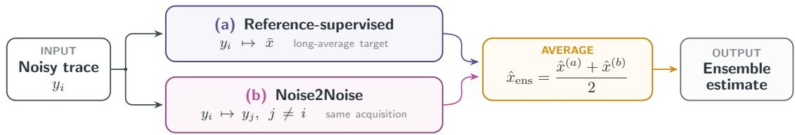
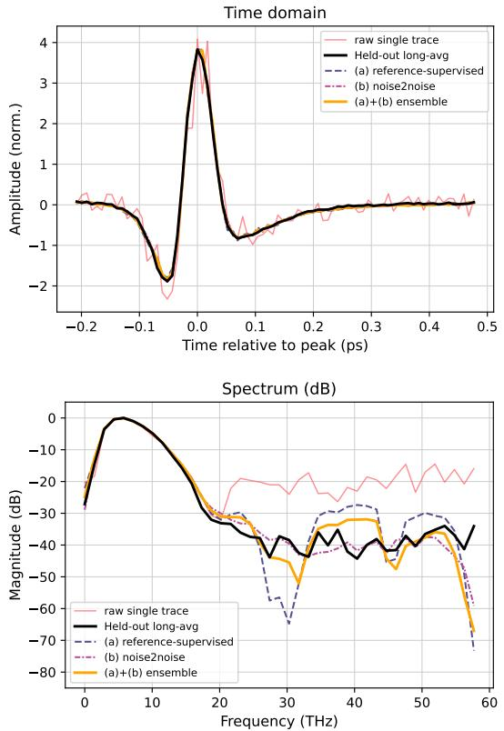
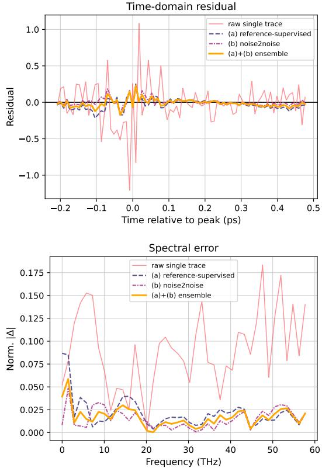
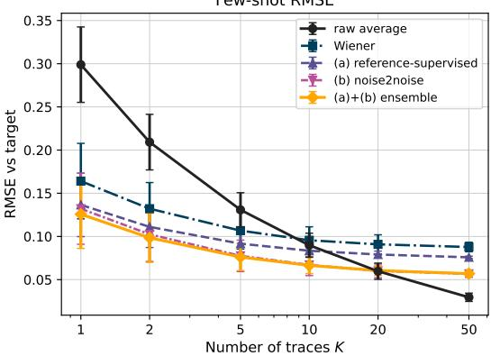
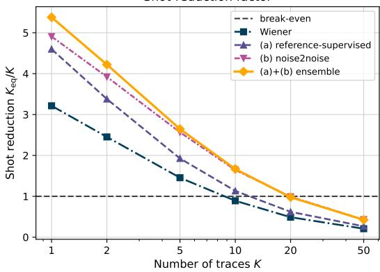

# Self-Supervised Noise2Noise-Enhanced Denoising for Continuous-Scan Air-Plasma THz Spectroscopy

Adam Umra⋆, Oways Alsoloh⋆, Oliver Nagy†, Aydin Sezgin⋆, Clara Saraceno†

⋆Institute of Digital Communication Systems, Ruhr University Bochum, Germany

†Photonics and Ultrafast Laser Science, Ruhr University Bochum, Germany

{adam.umra, oways.alsoloh, oliver.nagy, aydin.sezgin, clara.saraceno}@rub.de

Abstract—Terahertz time-domain spectroscopy (THz-TDS) based on air-plasma generation and balanced air-biased coherent detection offers gap-free broadband coverage, but individual continuous-scan traces are strongly affected by pulse-to-pulse fluctuations and electronic noise. Reaching a useful signal-tonoise ratio therefore requires averaging multiple traces, which directly increases measurement time. We propose a learned denoising approach that recovers high-quality THz waveforms from as few as one complete continuous delay sweep, referred to here as a single-scan trace. A compact one-dimensional residual U-Net is trained using two complementary strategies: a referencesupervised baseline that maps individual noisy traces to longaverage reference waveforms, and a Noise2Noise approach that learns from pairs of independently acquired noisy traces without requiring a clean training target. Averaging the predictions of both models reduces systematic bias and yields a tracereduction factor of approximately 5.4 at K = 1, meaning that one denoised trace achieves the reconstruction accuracy of averaging approximately five raw traces. The Noise2Noise model alone achieves 4.9 , outperforming both the referencesupervised baseline (4.6 ) and classical Wiener filtering (3.2 ). These results show that self-supervised learning from repeated noisy measurements can support faster continuous-scan THz-TDS without hardware modification.

Index Terms—THz-TDS, Noise2Noise, U-Net, denoising

## I. INTRODUCTION

The terahertz (THz) spectral range, located between microwave and infrared frequencies, is attracting growing interest[ for emerging high-frequency wireless communication as well as for spectroscopy, sensing, imaging, and non-destructive testing [1]–[3]. Many materials exhibit characteristic rotational, vibrational, or collective excitations in this frequency range, making THz radiation a sensitive and non-ionizing probe of material properties. Terahertz time-domain spectroscopy (THz-TDS) [4] is particularly well suited for such measurements because it directly records the electric field of a broadband THz pulse, providing both amplitude and phase information after Fourier transformation.

Air-plasma-based THz-TDS systems are attractive because generation and detection occur in ambient gas rather than in crystalline media, enabling broad, gap-free spectral coverage that is not limited by phonon resonances of electro-optic crystals [5]. Detection schemes such as air-biased coherent detection provide broadband sensitivity and high dynamic range for measuring ultrashort THz transients [6]. A practical limitation, however, is acquisition speed: conventional THz-TDS measurements often require averaging many repeated laser shots or scans to suppress shot-to-shot laser fluctuations, electronic noise, timing jitter, and baseline variations. This increases measurement time and becomes restrictive for applications requiring rapid feedback, repeated measurements, high-throughput screening, or measurements over many sample positions.

The central problem addressed in this work is the recovery of high-quality THz time-domain traces from a small number of noisy single-scan traces or low-average measurements. Classical denoising methods, such as post-acquisition averaging and Wiener filtering [7], can improve noisy traces but rely on additional measurements or fixed assumptions about the signal and noise statistics. Neural-network-based denoising offers a data-driven alternative, but standard supervised training typically requires paired noisy inputs and clean, or at least heavily averaged, reference targets, which partly reintroduces the acquisition burden that denoising is intended to reduce.

This work exploits a feature naturally available in continuous-scan THz-TDS: repeated scans of an unchanged sample provide multiple noisy realizations of the same underlying waveform. This setting enables the Noise2Noise approach [8], in which a model is trained using pairs of noisy observations instead of clean targets. Provided that the paired traces represent the same physical state and that their noise is approximately independent and zero-mean, minimizing the expected training loss recovers the underlying waveform. Noise2Noise therefore provides a practical route to THz waveform denoising without requiring a dedicated longaverage target for training.

The main contribution of this work is the adaptation and evaluation of this principle for shot-efficient continuous-scan air-plasma THz-TDS. We train a compact one-dimensional residual U-Net using two complementary strategies: a reference-supervised model that maps an individual noisy trace to a long-average reference, and a Noise2Noise model trained only on pairs of noisy traces acquired from the same sample state. Comparing the two strategies shows whether useful denoising can be learned directly from repeated noisy measurements, whereas their ensemble combines the complementary estimates. The study thus evaluates Noise2Noise under the strong shot-to-shot fluctuations encountered in airplasma THz-TDS, while avoiding clean training targets for the self-supervised model.

The proposed denoisers are evaluated against raw averaging and a classical Wiener-filter baseline on a held-out acquisition. Performance is quantified using root-mean-square error, signal-to-noise ratio, and an effective trace-reduction factor that links reconstruction quality directly to acquisitiontime reduction. The results show that learned denoising, particularly the Noise2Noise-based approach, improves fewtrace THz waveform reconstruction relative to raw averaging and Wiener filtering, supporting faster THz-TDS acquisition without additional hardware.

## II. THZ GENERATION AND DETECTION

The measurements are performed with a continuous-scan air-plasma THz-TDS system using two-color THz generation and balanced air-biased coherent detection (ABCD). For generation, a fundamental optical pulse at angular frequency ω (800 nm) and its second harmonic at 2ω (400 nm) are co-focused in ambient air [9], [10]. The resulting plasma filament produces a temporally asymmetric driving field whose transient photocurrent radiates a broadband THz pulse,

$$
E _ { \mathrm { T H z } } ( t ) \propto \frac { \mathrm { d } J ( t ) } { \mathrm { d } t } .\tag{1}
$$

Since the emission process is not limited by crystal phase matching, air-plasma sources provide continuous broadband spectra extending from the sub-THz range to tens of THz.

On the detection side, ABCD reads out the THz field through a third-order nonlinear interaction between the THz transient, an optical probe pulse, and a static bias field [11]. The detected second-harmonic intensity contains a heterodyne cross-term proportional to the THz field,

$$
I _ { \mathrm { h e t } } ( t ) \propto E _ { \mathrm { b i a s } } E _ { \mathrm { T H z } } ( t ) ,\tag{2}
$$

which preserves the signed time-domain electric-field waveform, from which spectral amplitude and phase are obtained. In the balanced ABCD configuration used here, the two biaspolarity components are encoded simultaneously in orthogonal polarization channels and measured by separate avalanche photodiodes (APDs) [12]. This provides shot-to-shot commonmode rejection without requiring bias modulation over consecutive laser shots, which is essential for single-scan operation. The pump–probe delay is swept using a continuously oscillating delay stage rather than a step-and-integrate scan. The boxcar-integrated APD signals are digitized on the fly at a 1 kHz laser repetition rate, so each forward or backward sweep yields one complete THz waveform in approximately 0.5 s [12]. This greatly improves acquisition speed, but each trace contains only minimal averaging and is therefore strongly affected by trace-to-trace noise. This trade-off motivates the denoising approach introduced in Section IV.

## III. DATASET

## A. Acquisitions

All data were recorded with the balanced-ABCD continuous-scan system described in Section II. Three independent acquisitions are available, each stored as a matrix of single-scan trace waveforms sampled at a stage step of 1.3 µm, which corresponds to a round-trip time increment of $\Delta t = 2 \times 1 . 3 \mu \mathrm { m } / c$ ≈ 8.67 fs. The first two acquisitions contain $N = 2 0 0$ traces each; the third contains $N = 1 0 0$ traces, yielding 500 single-scan trace waveforms in total.

## B. Preprocessing

Each raw waveform matrix is preprocessed in three steps. First, a per-trace DC offset is removed by subtracting the trace mean, which eliminates slow electronic drift between shots. Second, every odd-indexed trace is time-reversed to account for the bidirectional stage motion: odd traces are recorded on the return sweep and must be reflected before they can be compared with even traces. Third, all traces are multiplied by −1 to align the signal polarity with convention.

After preprocessing, a window of $L ~ = ~ 8 0$ samples (≈ 693 fs) is extracted from each trace, centered on the sample of maximum absolute value in the corresponding long-average waveform. The long-average x¯ of an acquisition is the mean over all N preprocessed traces and serves as the reference ground truth for evaluation. All amplitudes are globally normalized by the standard deviation of the training waveforms.

## C. Training and Validation Split

The two 200-trace acquisitions are used for training and the 100-trace acquisition is held out as the validation set. The long-average of the validation acquisition is never used during training; it serves exclusively as the reference for computing RMSE and SNR.

## IV. NETWORK ARCHITECTURE AND TRAINING

Figure 1 gives an overview of the complete denoising framework. Both branches process the same noisy input using independently trained instances of the same one-dimensional residual U-Net. Variant (a) is trained against the long-average reference, whereas variant (b) uses a different noisy trace from the same acquisition as its target. During inference, the predictions of both models are averaged to obtain the final estimate.

## A. One-Dimensional Residual U-Net

Both learned denoisers share a common one-dimensional residual U-Net [13], [14] backbone. The network takes a single noisy trace of length $L = 8 0$ as input and outputs a denoised trace of the same length.

The encoder comprises three successive convolutional blocks, each followed by average pooling with stride 2, reducing the temporal dimension from 80 to 10 while expanding the channel depth: $1  3 2  6 4  1 2 8$ . A bottleneck block operates at the coarsest resolution (128 channels, length 10). The decoder mirrors this structure with nearest-neighbour upsampling; skip connections concatenate the corresponding encoder feature maps before each decoder block, restoring the channel sequence $1 2 8 \to 6 4 \to 3 2$ , followed by a 1×1 convolution to produce the single-channel output. Each convolutional block consists of two Conv1d layers with kernel size 5 and same-padding, each followed by Group Normalization [15] and a GELU activation [16]. The network output is added back to the input as a global residual connection, so the network learns only the correction rather than the full waveform. The total parameter count is approximately 467 000.

  
Fig. 1. Proposed denoising framework. Two independently trained residual U-Nets use reference-supervised and Noise2Noise targets, respectively. Their predictions are averaged to obtain the ensemble estimate.

## B. Training Variants and Objectives

(a) Reference-supervised. Each noisy training trace $y _ { i }$ is paired with the long-average x¯ of its acquisition file, which serves as the supervised target. The model is trained to minimize the combined loss (4). This is the standard supervised baseline in the present setting; its principal limitation is that only two distinct target shapes are available (one per training file), so the model must generalize from a small set of reference waveforms.

For variant (a), two loss terms are combined. The primary term is the time-domain mean-squared error (MSE) between the prediction xˆ and the target x:

$$
\mathcal { L } _ { \mathrm { t i m e } } = \frac { 1 } { L } \Vert \hat { x } - x \Vert ^ { 2 } .\tag{3}
$$

An auxiliary spectral loss penalizes log-magnitude errors. The one-sided DFT magnitude is normalized by the target spectral peak and expressed in decibels, with a floor at −40 dB to suppress numerical noise in spectral nulls. The combined loss is

$$
\mathcal { L } = \mathcal { L } _ { \mathrm { t i m e } } + \lambda \mathcal { L } _ { \mathrm { s p e c } } , \quad \lambda = 0 . 1 .\tag{4}
$$

(b) Noise2Noise. Following [8], two independently drawn traces $( y _ { i } , y _ { j } )$ from the same acquisition file are used as input– target pairs, with $i \neq j$ drawn uniformly at random. No longaverage reference is required at training time. Because the noise contributions are independent and approximately zeromean, the expected value of $y _ { j }$ given the underlying clean signal equals x¯, so MSE minimization converges to the same fixed point as fully supervised training. This variant is therefore self-supervised: it exploits the repeated measurements already present in the continuous-scan acquisition without requiring any additional reference.

For variant (b), only $\mathcal { L } _ { \mathrm { t i m e } }$ is used $\left( \lambda \ = \ 0 \right)$ , as the Noise2Noise target is itself noisy and spectral shaping would amplify the target noise.

## C. Ensemble

The two trained models exhibit complementary error characteristics: variant (a) is anchored to the long-average shapes

seen during training, while variant (b) is guided solely by the pairwise noise structure. An ensemble prediction is formed by averaging their outputs,

$$
\begin{array} { r } { \hat { x } _ { \mathrm { e n s } } = \frac { 1 } { 2 } \big ( \hat { x } ^ { ( a ) } + \hat { x } ^ { ( b ) } \big ) , } \end{array}\tag{5}
$$

which reduces the variance contribution from each model’s individual bias.

## D. Optimization

Both variants are trained with the Adam optimizer at an initial learning rate of $2 \times 1 0 ^ { - 3 }$ , decayed to zero with a cosine schedule over the full training run. The batch size is 32. Variant (a) trains for 400 epochs over the full 400- trace training set $( 1 . 6 \times 1 0 ^ { 5 }$ training samples total); variant (b) draws 4 000 randomly sampled intra-file pairs per epoch for 40 epochs, matching the same total step count.

## V. NUMERICAL RESULTS

## A. Evaluation Protocol

The held-out 100-trace acquisition serves as the test set; its long-average x¯ is the reconstruction target and is never observed during training. For a denoiser producing per-trace predictions $\{ \hat { x } _ { i } \}$ , the K-trace estimate is the mean over a randomly drawn subset of size K. Quality is measured by the root-mean-square error (RMSE) to x¯, averaged over 500 random subsets drawn without replacement. The tracereduction factor

$$
\rho ( K ) = K _ { \mathrm { e q } } ( K ) / K\tag{6}
$$

quantifies how many raw traces $K _ { \mathrm { e q } }$ would be needed to reach the same RMSE as K denoised traces, estimated by log-log interpolation of the raw K-sweep curve.

## B. Qualitative Comparison

Figure 2 shows the mean denoised waveform of each method alongside the held-out reference and a representative raw single trace. In the time domain the raw trace is dominated by trace-to-trace fluctuations that largely obscure the THz pulse shape, while both learned denoisers and their ensemble closely reproduce the reference waveform. The spectral panel makes the benefit quantitative: the raw single trace raises the noise floor by approximately 20 dB across the full bandwidth, whereas all denoised curves track the reference spectrum within a few decibels up to the system’s spectral limit. Variant (b) achieves a lower RMSE than variant (a), demonstrating that the self-supervised Noise2Noise approach matches or exceeds the reference-supervised baseline without ever observing a clean target. The ensemble further reduces the error by averaging the complementary bias components of the two models.

  
Fig. 2. Qualitative comparison on the held-out acquisition. $T o p \mathrm { : }$ Timedomain waveforms for the long-average reference, a representative raw single trace, and the mean predictions of the reference-supervised, Noise2Noise, and ensemble models. Bottom: Corresponding one-sided magnitude spectra, normalized to the peak of the long-average reference.

Figure 3 confirms these observations in the residual domain. The time-domain residual of the raw single trace is an order of magnitude larger than that of any denoised estimate, and the spectral error panel shows that the residual of the raw trace is spectrally broadband, whereas the denoised residuals are concentrated at low frequencies where model bias is largest. The ensemble achieves the smallest residual in both domains.

## C. Few-trace Performance

Figure 4 reports the RMSE and trace-reduction factor as a function of $K .$ . In the RMSE panel three regimes are visible: for $K \lesssim 4$ all learned denoisers sit well below the raw-average curve; around $K \approx 5$ the raw average closes the gap as $1 / \sqrt { K }$ averaging reduces noise faster than the models’ residual bias floor; beyond $K \approx 1 0$ raw averaging is competitive with or superior to the denoised estimates, which plateau at a fixed RMSE floor. The Wiener filter follows the same qualitative pattern but at a higher bias floor than the neural methods.

The trace-reduction panel is the headline result. At $K = 1$ the (a)+(b) ensemble achieves $\rho \approx 5 . 4$ , meaning a single denoised trace is equivalent in RMSE to averaging roughly five raw traces. Variant (b) alone reaches $\rho$ ≈ 4.9 and variant (a) $\rho \ \approx \ 4 . 6 ,$ with the Noise2Noise model outperforming the reference-supervised baseline despite its lack of clean training targets. The classical Wiener filter achieves $\rho \approx 3 . 2$ , well below the neural denoisers but still a clear improvement over raw averaging. The advantage is most pronounced at low K and decays toward unity as K grows, precisely the few-trace regime where acquisition time is the limiting factor. In the acquisition configuration used here, one complete THz scan requires approximately 0.5 s. Thus, achieving the reconstruction quality of 5.4 raw traces by conventional averaging requires approximately $2 . 7 \ \mathrm { s } ,$ whereas the proposed ensemble reaches comparable RMSE from a single 0.5 s scan.

  
Fig. 3. Residual analysis on the held-out acquisition. Top: time-domain residual (denoised mean − reference). Bottom: normalized spectral error $| { \mathcal { F } } \{ { \hat { x } } \} - { \mathcal { F } } \{ { \bar { x } } \} | / \delta$ max $| \mathcal F \{ \bar { x } \} |$

Table I consolidates the per-method reconstruction quality at $K { = } 1$ . The SNR gain column reports the noise-power improvement of each denoised single trace relative to a raw single trace, SNR $\mathrm { g a i n } = 2 0 \log _ { 1 0 } ( \mathrm { R M S E _ { r a w } / R M S E _ { \mathrm { m e t h o d } } } )$

## D. Generalization and Limitations

The evaluation uses an acquisition-level holdout: the 100- trace test acquisition is not observed during training. It therefore measures generalization to an unseen acquisition, but not to a fundamentally different sample, waveform, or experimental configuration. Since the training set contains only two acquisitions, the range of waveform shapes and measurement conditions represented during training remains limited. The Noise2Noise formulation assumes that paired traces contain the same underlying waveform and approximately independent, zero-mean noise [8]. Correlated baseline drift, systematic timing errors, or changes in the sample between paired scans violate these assumptions and may be learned as part of the signal. For time-varying measurements, the model may suppress genuine temporal changes if they resemble trace-to-trace fluctuations. Performance may also degrade for waveform shapes, amplitudes, spectral features, or noise levels that differ substantially from those represented during training. Broader validation across samples and acquisition conditions is therefore required before deployment as a general-purpose THz denoiser.

Shot-reduction factor  
TABLE I  
SINGLE-SCAN TRACE( $K { = } 1 )$ RECONSTRUCTION QUALITY ON THEHELD-OUT ACQUISITION. LOWER RMSE AND HIGHER SNR GAIN AREBETTER; THE RAW SINGLE TRACE DEFINES THE 0 DB REFERENCE.
<table><tr><td>Method</td><td>RMSE</td><td>SNR gain (dB)</td></tr><tr><td>Raw single trace</td><td>0.293</td><td>0.00</td></tr><tr><td>Wiener filter</td><td>0.164</td><td>5.07</td></tr><tr><td>(a) Reference-supervised</td><td>0.137</td><td>6.63</td></tr><tr><td>(b) Noise2Noise</td><td>0.132</td><td>6.91</td></tr><tr><td>(a)+(b) Ensemble</td><td>0.126</td><td>7.31</td></tr></table>

## VI. CONCLUSION

We have shown that learned single-scan trace denoising can substantially reduce the number of continuously scanned air-plasma THz traces required for high-quality reconstruction. An ensemble of a supervised residual U-Net and a Noise2Noise-trained partner achieves a trace-reduction factor of approximately 5.4× at K=1, compared with 3.2× for Wiener filtering, with the largest gains in the few-trace regime $( K \ \lesssim \ 4 )$ The Noise2Noise model performs competitively without clean targets, showing that repeated noisy acquisitions of the same physical state are sufficient for training. This avoids dedicated long-average reference measurements, and the ensemble further reduces systematic bias at no additional data cost.

## REFERENCES

[1] T. Kürner and S. Priebe, “Towards THz communications – status in research, standardization and regulation,” J. Infrared Millim. Terahertz Waves, vol. 35, no. 1, pp. 53–62, 2014.

[2] P. U. Jepsen, D. G. Cooke, and M. Koch, “Terahertz spectroscopy and imaging – modern techniques and applications,” Laser Photon. Rev., vol. 5, no. 1, pp. 124–166, 2011.

[3] Y. Karacora, A. Umra, and A. Sezgin, “Robust communication design in RIS-assisted THz channels,” IEEE Open J. Commun. Soc., vol. 6, pp. 3029–3043, 2025.

[4] M. Koch, D. M. Mittleman, J. Ornik, and E. Castro-Camus, “Terahertz time-domain spectroscopy,” Nat. Rev. Methods Primers, vol. 3, no. 1, p. 48, 2023.

[5] X.-C. Zhang and J. Xu, Introduction to THz Wave Photonics. New York, NY, USA: Springer, 2010.

[6] X. Lu and X.-C. Zhang, “Balanced terahertz wave air-biased-coherentdetection,” Appl. Phys. Lett., vol. 98, no. 15, p. 151111, 2011.

[7] N. Wiener, Extrapolation, Interpolation, and Smoothing of Stationary Time Series: With Engineering Applications. The MIT Press, 08 1949.

  
${ \mathrm { F i g . } }$ 4. K-sweep evaluation on the held-out acquisition. $T o p \mathrm { : }$ RMSE vs. number of averaged traces $K ;$ error bars show ±1 standard deviation over 500 random subsets. Bottom: trace-reduction factor $\rho ( K ) = K _ { \mathrm { e q } } / K ;$ ; dashed line marks break-even with raw averaging.

[8] J. Lehtinen, J. Munkberg, J. Hasselgren, S. Laine, T. Karras, M. Aittala, and T. Aila, “Noise2Noise: Learning image restoration without clean data,” in Proc. ICML, 2018, pp. 2965–2974.

[9] K.-Y. Kim, A. J. Taylor, J. H. Glownia, and G. Rodriguez, “Coherent control of terahertz supercontinuum generation in ultrafast laser–gas interactions,” Nature Photon., vol. 2, no. 10, pp. 605–609, 2008.

[10] N. Karpowicz and X.-C. Zhang, “Coherent terahertz echo of tunnel ionization in gases,” Phys. Rev. Lett., vol. 102, p. 093001, Mar 2009.

[11] J. Dai, J. Liu, and X.-C. Zhang, “Terahertz wave air photonics: Terahertz wave generation and detection with laser-induced gas plasma,” IEEE J. Sel. Topics Quantum Electron., vol. 17, no. 1, pp. 183–190, 2011.

[12] A. H. Ohrt, O. Nagy, R. Löscher, C. J. Saraceno, B. Zhou, and P. U. Jepsen, “Balanced air-biased detection of terahertz waveforms,” Opt. Lett., vol. 49, no. 18, pp. 5220–5223, Sep 2024.

[13] O. Ronneberger, P. Fischer, and T. Brox, “U-Net: Convolutional networks for biomedical image segmentation,” in Proc. MICCAI, 2015, pp. 234–241.

[14] D. Stoller, S. Ewert, and S. Dixon, “Wave-U-Net: A multi-scale neural network for end-to-end audio source separation,” in Proc. ISMIR, 2018, pp. 334–340.

[15] Y. Wu and K. He, “Group normalization,” in Proc. ECCV, 2018, pp. 3–19.

[16] D. Hendrycks and K. Gimpel, “Bridging nonlinearities and stochastic regularizers with gaussian error linear units,” CoRR, vol. abs/1606.08415, 2016.