# SoftModel: A Neural Model That Grows Its Own Topology

Governed Structural Growth for Continual In-Service Learning

Zhoumin Xie Independent Researcher xiezm75@gmail.com · ORCID 0000-0002-9361-1358

## Abstract

Today, a neural system is almost always used in two phases — trained, then deployed — and in that regime it freezes twice: training ends, and the topology itself was never a degree of freedom. We take the opposite premise as an axiom — total plasticity: no part of a model, including its structure, is ever frozen — and derive the governance a lifelong learner then requires. The design’s target regime is continual, in-service learning: a long-lived model on a non-stationary stream, whose stability is obtained from governance rather than immobility and whose capacity follows demand. The result is a growable soft model: an algebra of structural operators (width, hierarchy, composition, input interface, grown cycles, attention heads), each exact at the moment of application, each budgeted and audited, with adoption decided solely by a held-out reality gate that treats parametric and structural change uniformly. Local solving loops — grown directed cycles under an enforced contraction certificate, and self-processing units that refine newborn structure against a local objective — extend the same governance beneath the global pass. A complete from-scratch system realizes the whole account; its factory surface is operated end-to-end by a production LLM through a self-documenting tool surface. Two conclusions follow from the axiom by construction. Stability under lifelong change becomes an audit property of the lifecycle, not an immobility property of parameters — nothing need be frozen to be safe. Structure that follows demand removes the silent cap a fixed topology places on later capability where the capacity floor binds: a model born small need not remain bounded by its birth. A third is measured: in the worlds where this was measured, the marginal value of new capacity was unobservable before adoption, so workable growth governance took its ex-post form — speculation free, adoption earned on held-out reality, and silence in an unchanging world a governed outcome with a price. The same governance extends to evaluative signals — structure preference and policy optimization on the growing model under one gate — and the core method is evaluated on standard continual-learning benchmarks, where governed growth preserves the ability to keep learning along long task sequences and converts announced review into recovered competence. A pre-registered experimental program adjudicates the mechanism and value claims on the tested problems and reports its failures at full prominence; the map — positive and negative — is the contribution.

Keywords: lifelong learning, continual learning, growing neural networks, catastrophic forgetting, structural plasticity, function-preserving transformations, network topology, LLM tool use.

## Contents

## 1 Introduction

1.1 The two freezes 5   
1.2 The inversion 5   
1.3 The system 6   
1.4 Contributions and epistemic stance 7   
1.5 Organization and reader’s paths . 8   
Part I Theory and System 9   
2 Total Plasticity: The Axiom, Lock-In, and Governed Growth 9   
2.1 The axiom 9   
2.2 Lock-in: fixed topology is freezing by omission 9   
2.3 The stability dilemma and its governed resolution 10   
2.4 Growth as governed speculation . 12   
2.5 Falsifiable predictions 12   
3 The Substrate, Learning, and the Shared Instruments 12   
3.1 A substrate closed under refinement 13   
3.2 One learning primitive at every level (every scale) 14   
3.3 Where to grow: the instability signal 15   
3.4 Direction-neutral operators: the interface and re-founding 16   
3.5 Governance formalized 17   
4 Growth: The Direction Question 17   
4.1 The operator algebra . . 18   
4.2 The additive direction: refinement and widening 19   
4.3 The compositional direction and its selection 20   
4.4 Regime containment and the growth mode 22   
4.5 The scale hierarchy: subordination as a growth invariant . 23   
5 Local Solving Loops: Computation That Solves Inside Itself 24   
5.1 The principle 24   
5.2 Realization I: grown cycles — the loop operator (λ) 24   
5.3 Realization II: self-processing units 25   
5.4 One discipline, two solved quantities 26   
5.5 Epistemic status 27   
6 Growable Attention: Capacity Follows Demand 27   
6.1 The object and its two layers of existence 27   
6.2 Exact growth of heads 27   
6.3 Evidence and decision 28   
6.4 The attention discipline: a third local objective 29   
6.5 The exact-expectation SPU objective . 30   
6.6 Falsifiable predictions and their verdicts 30   
7 The Governed Lifecycle 31   
8 Evaluative Learning under Total Plasticity 33   
8.1 One evaluative primitive, two loops . 33   
8.2 The quasi-static law extends to reward learning 34   
8.3 Experimental design 34   
8.4 Results: a three-regime law 35   
8.5 Boundaries and negative results 36   
9 An LLM Operates the Model 37   
10 In-Service Continual Learning as the Natural Habitat 39   
10.1 Structural answers to the two failure modes 39   
10.2 The anti-forgetting ladder 39   
10.3 Evaluation on the time axis 40   
Part II Empirical Evidence 40   
11 The Core Method on Standard Continual-Learning Benchmarks 40   
11.1 Benchmarks, fit, and protocol principles 40   
11.2 Capacity under sequential arrival 41   
11.3 Long-sequence plasticity 41   
11.4 Review and the just-in-time refresher 42   
11.5 Boundaries 43   
12 The Registered Program and Its Discipline 43   
12.1 The evidence discipline . 44   
12.2 The campaigns at a glance 44   
13 Main Results 45   
13.1 Capacity follows demand . . 45   
13.2 Stability from governance, not immobility 46   
13.3 Growth governance is ex-post 46   
13.4 The audit tally 47   
13.5 The depth-axis and continual-learning campaigns 47   
14 Empirical Observations and Threats to Validity 50   
14.1 The observations 50   
14.2 Scope and threats to validity 52   
Part III Discussion and Conclusion 52   
15 Discussion 52   
16 Conclusion 54   
Reproducibility and AI-Assistance Statement 55   
References 57   
Appendices 64   
A The Pre-Registered Empirical Program 64   
A.1 Protocol . 64   
A.2 What verifies exactly (the mechanics) 65   
A.3 Where the theory’s predictions stand (E-series) 65   
A.4 Self-knowledge is real; exploiting it is open (S-series) 65   
A.5 The attention program (A-series) 66   
A.6 Real-data case study: prequential concept-drift streams 66   
A.7 Generalization campaign (G-series) 68   
B The Growth-Value Campaigns 71   
B.1 G-GROW-1: the open-inventory exact-answer battery 71   
B.2 G-GEN-1: the generative battery, and the scope observation from its stationary   
companion . 72   
B.3 Round 2 of the generative campaign: the silenced gate (X1) 73   
B.4 Round 2 of the open-inventory campaign: probe hygiene and the provisional gate (X2) 73   
B.5 Round 3, generative track: incumbent–candidate governance (X1b) . 74   
B.6 Round 3, open-inventory track: the same governance under exam metrics (X2b) . 75   
B.7 The size-adjustability round (X-SAT) 75   
C A Pedagogy for Lifelong Models 77   
D The Fidelity Program (GUARD): Four Registered Rounds 79   
D.1 The question, the world, and the instruments 79   
D.2 Round 1 — baseline: no defenses 79   
D.3 Round 2 — strategy: canon-anchored immunity 79   
D.4 Round 3 — strategy: a calm governor 79   
D.5 Round 4 — strategy: correct the instrument, then teach properly 80   
D.6 Program conclusions . 81   
E Validation by an Operating LLM 82   
F A Topology Growing under Governance 83   
G The Historical Depth Route (retained as record) 85   
H The 2026 Depth-Axis and Continual-Learning Campaigns 86   
I Relation to Other Methods 88   
J Reading the Evidence 92   
J.1 Reading the map . 92   
J.2 The evidence table 92   
J.3 How to audit a row 97   
K Glossary of Named Quantities and Roles 99

## 1 Introduction

## 1.1 The two freezes

Today, a neural model is almost always used in two phases — weights updated in training, then held constant in service [65] — and in that regime it is frozen twice.

The first freeze is familiar and explicit: after training, weights are fixed. The model becomes an artifact — versioned, shipped, and never again improved by its own experience. The continuallearning literature exists to lift this freeze, and its central obstacle is equally familiar: unconstrained weight plasticity causes interference and catastrophic forgetting, so the standard remedies reintroduce immobility in softer forms — freeze earlier columns and attach new ones; penalize departure from past weights; freeze a backbone and train low-rank residuals around it. Stability is purchased with plasticity, at some exchange rate, and the field’s implicit consensus is that this purchase is unavoidable.

The second freeze is quieter, seldom treated as a design axis in its own right (the dynamicarchitecture literature works on it without this name; surveyed in App. I), and — we will argue more fundamental: the topology is fixed at design time. The number of units, the connectivity, the depth, and the input interface are decided before the first example arrives, and they never change again. Every subsequent act of learning, replay, regularization, or adaptation moves the model within the function space this topology determines; none of it can move the space itself. A model in this condition satisfies every conventional definition of “trainable” while being unable, even in principle, to follow a world whose demands leave its function space. Section 2 makes this precise as structural freezing by omission, with a practical conjecture we call first-batch lock-in: when capacity and interface are fitted to the first data a model ever sees, early data permanently caps later capability.

## 1.2 The inversion

This paper develops the consequences of refusing both freezes at once. We take as an axiom — a definition of the object of study, not an empirical claim — that in a soft model every parameter, at every scale of structure, remains trainable for the lifetime of the model. The axiom immediately forces topology itself to become a trainable degree of freedom: a learner that cannot grow its width, its hierarchy, its serial composition, and its own input interface is not fully plastic.

The obvious objection is that this is exactly the regime in which lifelong learning fails. Our answer is an inversion of the standard resolution:

Stability through governance, not immobility. Every change to the model — a gradient step, a new unit, a new input feature, a rebuilt network — must be (i) harmless at the moment it is applied and (ii) adopted only if it pays on held-out reality. Nothing else about the model is restricted, beyond declared, adjustable budgets.

Condition (i) is made mechanical by constructing every structural operator to be exactpreserving: at application time the model’s input–output function is unchanged (new units enter with zero outgoing weights; a refined node’s inner network enters contributing exactly zero, so the node initially computes what it computed before; a new input feature enters with zero input weights). Growth never damages the present; it only adds trainable directions the future may use. Condition (ii) is made mechanical by a reality gate: all training and growth happen in a speculative working state, and promotion to the committed version — the one that serves

requires strictly surpassing the incumbent’s score on the most recent slice of a held-out stream of labeled reality, quarantined from all training. Under these two conditions, stability stops being a property of parameters (immobility) and becomes an audit property of the lifecycle (governance): the served lineage never adopts a change that scored below the incumbent on the evidence available when it was adopted — and this guarantee costs no plasticity at all.

Governance changes the character of growth. Because a structural edit is harmless now and adjudicated later, growth becomes low-risk speculation: the system may widen where its own instability signals concentrate, refine an unstable node inward, deepen a scope whose additive route has stopped paying, admit a newly observed input, or re-derive itself from its own experience store — even carelessly — because the committed model can only improve or stay. There is no architecture search over training runs and no outer optimization loop outside one life; growth is need-driven and evidence-adjudicated inside the model’s own lifetime.

How to grow is not an arbitrary design choice either; it proceeds coarse-to-fine: coarse structure first, finer refinement nested adaptively and non-uniformly, exactly where the data prove the current scale insuficient.

## 1.3 The system

We realize this position in a complete, released system. Its substrate is a recursive multi-scale network in which any hidden node may contain an inner network, so structure is grown, not designed: it appears where the model’s experience demands it, and one learning primitive operates identically at every level. This recursive network is the reference substrate; the substrate contract itself is architecture-agnostic, and the released system provides multi-layer hosts under the same lifecycle, among them a transformer encoder (§3). Growth proceeds in two directions — additive refinement and widening, and scope-interior composition — with the direction selected per scope by the model’s own signals (§4); a system-level mode restores the purely additive regime. The containment relation of scopes forms a rooted tree — the inclusion tree, in the standard graph-theoretic sense of levels and height [95], a part–whole hierarchy in Simon’s sense [97]. The model carries two depth quantities, both grown and both non-uniform: the height of the inclusion tree [95, 96] — “tree height”, evolved per branch — and each scope’s layer depth — the length of its composition chain, evolved per scope (§4). Over this substrate we define the operator algebra — ω (widen), ρ (hierarchical refinement), δ (deepen by scope-interior composition), σ (grow the input interface), Φ (re-found from the experience store) — with exactness measured, not assumed, in the released acceptance suite. Models are born by self-shaping: creation takes only a name (with one measured qualification — birth capacity remains a configuration obligation for symbol-heavy tasks, App. A.7), and the feature space, the output form (numeric regression or a categorical head over a learned vocabulary), and the capacity are inferred from the data the model is taught — the zeroth growth operation, applied at birth.

Finally, the system is built to be operated by a general LLM. The division of labor is strict: the LLM — the brain — supplies all general capability (language, context, feature extraction) and drives the entire lifecycle through a standard tool protocol; the soft model is the brain’s growable extension, carrying one domain’s learned judgment in kilobytes of forever-trainable weights. The interface guarantees make careless — though not adversarial (§9) — operation safe under a careless-but-honest operator (§7, threat model): teaching cannot degrade the served model, growth cannot damage the present, and every decision is audited. (System name in prose: SoftModel; the implementation is named GrowableSoftModel.)

## 1.4 Contributions and epistemic stance

1. A definitional theory of total plasticity: the axiom, the lock-in argument (fixed topology is structural freezing by omission, with capacity and interface instances of diferent severity), and the governance principle that replaces immobilization (§2).

2. A substrate and operator algebra for growing topology under governance: a recursive substrate whose structure is grown, not designed; a scale-recursive learning rule — cross-scale backpropagation — in which corrective information travels backward as residual targets down the inclusion tree rather than as gradients through it; four exact-preserving, budgeted, audited operators spanning the additive and compositional directions, plus gated re-founding; a signal-based selection of the growth direction (prediction under a predictability certificate, probes read only at extrapolated asymptotes, adoption by the gate), with every algorithmic role a replaceable registry part; growth signals and verdict discipline; and a pluggable substrate contract whose released hosts include a from-scratch transformer encoder on which the same operators and lifecycle verify (§3).

3. A principle of local solving loops — a further method contribution: computation that solves inside itself, at the scale that demands it, without changing the global learning contract — realized twice (§5). The loop operator (λ) grows a governed directed cycle at a scope: a third growth direction in which the bought resource is neither capacity nor composition but iteration and state — stability-certified by an enforced contraction bound, exact at application, budgeted, audited, and adopted only through the gate. Self-processing units give every newly grown structure a bounded, label-blind weight-refinement loop against a local process objective — process, then participate, then learn, at every depth of the inclusion tree. Both mechanisms obey the same governance contract as every operator of (2), and both are selectable policy, never fiat.

4. Growable attention — a method contribution: growth and self-processing reach the attention component itself (§6). Heads are added and widened per head — unequal widths as a lifecycle outcome rather than a design choice — under the same evidence-triggered, exactly function-preserving, gate-adjudicated contract as every other operator; and each head’s attention distributions answer to a local entropy-band objective — a third local objective under the split-locality discipline (a penalty, not a new inner loop) — whose gradient is certified and whose locality rule (parameter gradients from the combined signal, block input from the task signal alone) is enforced by measurement, not convention.

5. A governed lifecycle unifying learning and growth under one gate, with self-shaping birth, store-per-version reproducibility, a drift protocol, and consent-gated self-study (§7).

6. An LLM-operated design: the model as a tool the brain both uses and teaches, over self-documenting MCP servers; validated end-to-end on the factory surface by a production LLM (§9).

7. A pre-registered empirical program with FAIL branches at full prominence (App. A). We report what the protocol adjudicated, not what we hoped: the mechanics verify exactly; several value-of-growth predictions failed or their scenarios failed to bind at the tested scale; and the model’s self-knowledge signals proved real — the variation self-check is the program’s best measured predictor of transfer error (SV1) — even though naive interventions built on them did not clear their bars.

8. Evaluative learning and benchmark evidence: one evaluative primitive at two levels of the system — preference over growth moves and clipped-surrogate policy optimization through a pseudo-target identity — under the same gate, verified quasi-statically agains oficial components (§8); and a registered continual-learning benchmark program whose protocol-fit discipline (the training protocol belongs to the method under test; each evaluation subject receives its fitting measurement; examinations never reuse study items) yields the keep-learning and just-in-time-refresher results (§11).

Five further contributions join those itemized above: the 2026 campaign record (§13.5: in-service insertion exactness at scale, the continual-learning treatment boundaries and review-scheduling laws, retention measured as relearning savings, the depth-separation mapping, and the delayedpayof selection signal); a pedagogy for lifelong models (App. C: ten principles, each tied to a measured result, enforced in a registered curriculum, or marked open); the generative growth-value result (governed growth pays under arriving structure; against budget-matched fixed models the static scores serve as a sanity floor — parity or better, held under a fair-uncertainty rerun — while the design’s evaluation lives on the time axis, §10); the fidelity program (four registered rounds from a defection baseline to a supported education thesis under a corrected time-axis instrument — 2/5 under the original level instrument, the correction disclosed); and a digest of empirical observations closing the evidence part (§14), each carrying a registered artifact. The stance in (7) deserves one sentence of defense. A theory whose central claim is judge every change against reality would be self-undermining if its own paper cherry-picked; the pre-registered verdicts, including the negative ones, are the theory applied to itself.

What we claim, and what we do not. The contribution is a governed mechanism: exactness and safety are demonstrated by measurement, governance and auditability by construction, and the adaptive choice of growth direction at simulation scale. A first pre-registered matched-parameter comparison against an EWC baseline is now on record (App. A.7): governed plasticity matched or improved on the baseline’s best grid cell on adaptation and retention jointly on three of four lifelong tasks, with the fourth — where EWC adapted better — reported as a miss; we do not claim superiority over the broader immobilization family (progressive columns, adapter freezing) — that comparison remains open — nor that composition is more efective than widening in general: the measured picture is regime-dependent — the first-generation bar failed (App. G), and the 2026 depth mapping locates the compositional advantage precisely where iterated composition is real, at fixed parameter budget, and nowhere else (§13.5). The claims are bounded by the evidence table, and the boundary is part of the method.

## 1.5 Organization and reader’s paths

The paper is organized in three parts. Part I, Theory and System (§2–§10), develops the axiom and its consequences, the substrate and its instruments, the growth-direction question, the two local-solving realizations, growable attention, the governed lifecycle, its extension to evaluative learning (§8), the system in operation under an LLM operator — a system demonstration, not an empirical claim — and closes by placing the design in its target regime, continual in-service learning (§10). Part II, Empirical Evidence (§11–§14), is the measured record, organized as benchmarks → discipline → results → observations: §11 evaluates the core method on the standard continual-learning benchmark family, §12 states the registered program and the rules every verdict obeys, §13 reports the main results — including the 2026 depth-axis and continual-learning campaigns — and §14 collects the empirical observations and bounds the measurements’ validity. Part III, Discussion and Conclusion (§15–§16), interprets and closes. Three reader’s paths follow the parts: a reader here for the theory reads Part I; a reader here to reproduce or audit reads Part II with the process appendices (the registered program, the growth-value campaigns, and the fidelity program, with the remaining appendices as their instruments); the evaluative-learning extension (§8) sits with the system sections it extends, and the benchmark evaluation (§11) opens the empirical part by testing the core method on the field’s own instruments; a reader who wants conclusions only reads §1.4, §13, and Part III. The appendices carry process — protocols, per-seed tables, registered rounds — and their evidence chain closes with the complete correspondence table (Table 10), the single table every claim in this paper answers to, followed by a glossary of named quantities. Section 1.4 says what is claimed; this subsection says where each claim lives.

## Part I. Theory and System

## 2 Total Plasticity: The Axiom, Lock-In, and Governed Growth

## 2.1 The axiom

We call a model soft when its capability resides in continuously mutable state — weights that training can always move — rather than in code, rules, or frozen artifacts. We take softness to be definitional and state it as an axiom:

Axiom (total plasticity). Every parameter of the model, at every scale of its structure, remains trainable for the lifetime of the model — in operation as in experiment. There is no stop-gradient, no frozen column, no protected backbone.

Three corollaries fix the axiom’s meaning. (i) No disguised freezing. Mechanisms that leave parameters formally trainable but practically immobile — efective learning rates driven to zero, hard penalties pinning weights to their past — violate the axiom as surely as a stop-gradient does. The axiom legislates capability, not pace: a mechanism violates it only when learning cannot resume — rates pinned to zero, or unrecoverable by the system’s own evidence. How slowly a healthy model should move through a quiet regime is an operating policy, judged by the operator against the problem at hand; the axiom requires only that the ability to learn remain intact, at every scale, at every moment. (ii) Optimizability. Plasticity without training signal is vacuous: every scale must also receive efective optimization pressure, and a system in which deep structure cannot mature is out of compliance in practice even if no gradient is blocked in principle. (iii) Structural plasticity. The axiom quantifies over “every scale of structure” — and structure itself, the next subsection argues, is a parameter one can freeze.

## 2.2 Lock-in: fixed topology is freezing by omission

Let a topology G — the units, their connectivity, and the input interface — induce the function family

$$
{ \mathcal { F } } ( G ) ~ = ~ \{ ~ f _ { \theta } : \theta \in \Theta ( G ) ~ \} ,\tag{1}
$$

the set of everything weight training can ever reach. Weight plasticity moves the model within ${ \mathcal { F } } ( G )$ ; it never moves ${ \mathcal { F } } ( G )$ itself. Two instances make the resulting freeze concrete, in increasing order of severity.

The capacity instance. Universal approximation is an asymptotic statement about topology families [40], not about any fixed member: a topology of fixed size carries an irreducible approximation floor, and when the world drifts toward targets above that floor, weight training, replay, and regularization tuning all saturate at it. The failure is silent: training converges to the best approximation available within ${ \mathcal { F } } ( G )$ , whose error is bounded below by that floor.

The interface instance. If the drift introduces a causal factor that is not among the model’s inputs, the best available hypothesis is not merely hard to reach — it is not in F(G) at all, at any capacity. No interior mechanism can compensate for a variable the model cannot see. This instance is structural and scale-free.

In both instances the model is frozen at the level that matters while satisfying every conventional definition of “trainable.” We call the condition structural freezing by omission: no freeze is imposed; the freeze consists in the absence of any operator that could move ${ \mathcal { F } } ( G )$ . It carries a sharp practical conjecture:

First-batch lock-in (conjecture). If capacity and interface are fixed at creation, they are necessarily fitted to the first data the model ever sees. Everything learned afterward is confined to a function space sized by that first batch: early data permanently caps later capability. (The direct attempt to induce this cap at kilobyte scale did not bind — E11a, App. A; the corollary stands as the mechanism the axiom removes, not as a demonstrated failure mode at this scale.)

The axiom therefore forces a conclusion the continual-learning literature usually treats as optional: topology must be a trainable degree of freedom — reachable by operators, under optimization pressure, for the model’s lifetime. A system without such operators satisfies parameter-level plasticity while F(G) remains fixed: plastic in θ, frozen in G. The contrast with a conventional deep network is categorical: there, depth is a single global hyperparameter — fixed at design time, identical along every path; under the axiom, depth is a grown, non-uniform field over the structure — each branch of the inclusion tree and each scope’s composition chain evolves its own, by local signals, under the gate (§3–4).

The direction instance. The omission argument applies once more, one level up — to the growth algebra itself. Suppose every operator the algebra ofers adds terms to an additive expansion. For such targets the classical depth separations exhibit function families that shallow additive forms can approximate only at sizes growing exponentially in the depth imitated or in the input dimension (§15: a question of required size, not of attainable class): the reachable class is nonempty at every size, but for those families approximants of feasible size are excluded — again not by an imposed freeze, but by the absence of any operator that could compose. An algebra that can grow solely by addition therefore freezes the direction of growth by omission. The axiom demands direction freedom as it demands topological freedom; and since no direction may be imposed by designer fiat either, the choice of direction is itself a governed decision, read from the model’s own signals (§4).

## 2.3 The stability dilemma and its governed resolution

The classical objection arrives immediately: unrestricted plasticity is precisely what makes lifelong learning fail — interference, catastrophic forgetting [57], runaway structure — the classical stability– plasticity dilemma [27, 62]. The field’s standard remedies are forms of immobilization: freeze earlier columns (progressive networks [32]), penalize movement away from past weights (EWC-family [58] — viscous freezing), freeze the backbone and adapt residuals (adapter methods [59]). Immobilization buys stability by spending exactly the plasticity the axiom demands, and by §2.2 the fixed topology beneath these methods was never plastic to begin with.

We resolve the dilemma on the other side:

Principle (stability through governance, not immobility). Every change to the model — parametric or structural — must be (i) harmless at the moment it is applied and (ii) adopted only if it pays on held-out reality. Nothing else is restricted, beyond declared, adjustable budgets.

Both conditions are mechanical, not aspirational.

(i) Exactness at application. Every structural operator is constructed so that the model’s input–output function is unchanged at the moment of application: new units enter with zeroinitialized outgoing weights; a refined node’s inner network enters contributing exactly zero, so the refined node initially computes exactly what it computed before; a new input feature enters with zero input weights and a neutral backfill for stored rows. Growth adds trainable directions; it never moves the current function. (Measured, not assumed, in the released system — App. A.)

One boundary case is principled rather than engineered: vocabulary growth. When a new class label arrives (§7), the categorical head’s output space itself must widen, and exact preservation of the old classes’ probabilities would require the new logit to enter at −∞ — an infinite loss on the class’s first observation and an untrainable direction, which the no-freezing axiom forbids. The new class therefore enters with a zero-weight logit row and a bias of −10: the old classes’ probabilities move by less than 10<sup>−3</sup> (the e<sup>−10</sup> leakage through the softmax) while every direction stays finite and trainable from step one. Vocabulary growth is thus the one ε-preserving structural edit; the operators of Table 1 are exact to machine precision.

(ii) The reality gate. The model maintains a speculative working state, where training and growth are free, and a committed version, which serves. Promotion is a strict comparison on the model’s own held-out stream — time-stamped labeled reality, quarantined from all training — evaluated on its most recent slice: the candidate replaces the incumbent only if strictly better. Refusal is an outcome, not an error; a rejected candidate’s data never enters the served lineage. The guarantee is stated at its true strength and no more: adoption-level protection of the served lineage — no forgetting bound and no regret-style statement is claimed. The criterion has the form of a variational principle: as virtual work admits a displacement only if it lowers the governing functional, the gate realizes a variation — parametric or structural — only if it lowers the held-out measure [18].

Together the two conditions yield the property that replaces frozen-backbone safety:

Invariant (gate soundness). At every promotion, the newly served version scored strictly higher than the freshly re-scored incumbent on the gate’s evaluation slice; at every refusal, the served version is unchanged. The served lineage therefore never adopts a change that scored below the incumbent on the reality used to judge it.

We state the invariant’s scope as plainly as the invariant. The gate certifies decisions against reality as sampled by the recent held-out slice at decision time — governance, not omniscience. Under drift the slice itself moves; that is its purpose. What is guaranteed is an audit property of the lifecycle: no adopted change ever scored below the incumbent on the evidence available when it was adopted. Stability, so construed, is not an immobility property of parameters at all — and it costs no plasticity.

Why exactness, given the gate? The two conditions are not redundant. The gate protects the served model; it says nothing about the working state in which growth happens. Exactness protects that working state’s accumulated fit — a structural edit costs nothing at the moment it lands, so growth composes with ongoing learning without a restart — and it makes every edit’s efect attributable: since the function is unchanged at application, whatever the ledgers record afterwards is the edit’s earned contribution, not an artifact of the splice.

## 2.4 Growth as governed speculation

Exactness makes an edit harmless now; the gate decides later whether it paid. Between the two, structural growth changes character: it becomes low-risk speculation. The system may widen where its instability signals concentrate, refine an unstable node inward, deepen a scope whose delayed-payof slope certifies the need, admit a feature that recently became observable, or rebuild itself from its own experience store — carelessly, even — because the committed model can only improve or stay. Three disciplines keep speculation disciplined without restricting it: budgets (parameter and depth caps as policy; a refused growth is an outcome to respect, not an error to fight), audit (every operator application is a lineage event), and verdicts (§3.3: never act on progress signals classified as false). There is no architecture search over training runs here and no outer loop outside one life; growth is need-driven and evidence-adjudicated inside one continuing life (Figure 2 illustrates the algebra schematically; the two directions are set side by side in Figure 3). The axiom then closes the loop on itself: because nothing is ever frozen, every parameter that speculation adds is itself forever trainable — including by later speculation, recursively.

## 2.5 Falsifiable predictions

(Several of these predictions were graded by the 2026 campaigns; the measured verdicts, including the boundaries, are collected in §13.5.)

The theory is not self-certifying, and we commit it to predictions tested by the pre-registered program of App. A: T1 with all scales training, adaptation to a drifted world localizes at the scale at which the drift occurs; T2 narrow-born models recover most of the gap to well-born models once ω releases first-batch capacity lock-in; T3 the never-frozen coarse scale shows no excess damage under label noise relative to a governance-matched control; T4 amplitude inversion — fine-scale corrections outgrowing the coarse signal — is an early warning that predicts when re-founding (Φ) is necessary. We report the adjudicated outcomes, including the branches where a prediction failed or a scenario failed to bind, at full prominence. One outcome tempers this very section and we say so here: at the kilobyte scale tested, our pre-registered T2 scenario failed to induce capacity lock-in at all (App. A.3) — the capacity instance of §2.2 awaits scenarios where the approximation floor genuinely binds, while the interface instance is structural and holds at any scale. Each prediction’s adjudicated row appears in Table 10, and the program-wide discipline under which these verdicts were reached is stated once in §12.

## 3 The Substrate, Learning, and the Shared Instruments

This section gives the shared core: the recursive substrate (Definition 1), the scale-invariant learning primitive (Algorithm 1), the instability signal that aims growth, the interface and re-founding operators (σ, Φ), and the gate (Algorithm 2); the growth operators and their exactness propositions

follow in $\ S 4$ . Everything here is the released implementation stated mathematically; nothing is idealized.

Named quantities and roles used throughout are collected in $\mathrm { A p p }$ . K.

## 3.1 A substrate closed under refinement

Definition 1 (recursive network). A network over input space $\mathbb { R } ^ { d }$ is a tuple

$$
N = \big ( W _ { 1 } \in \mathbb { R } ^ { H \times d } , b _ { 1 } \in \mathbb { R } ^ { H } , W _ { 2 } \in \mathbb { R } ^ { 1 \times H } , c \in \mathbb { R } , \mathcal { T } \big ) ,\tag{2}
$$

where $\mathcal { T } ,$ with $J \subseteq \{ 1 , \dots , H \}$ , assigns to certain hidden units — the composite nodes — an inner network over the same input space together with its attachment matrix, $\mathcal { T } ( j ) = ( N _ { j } , A _ { j } )$ with $A _ { j } \in \mathbb { R } ^ { k _ { j } \times H }$ . We call each network in the inclusion tree — the root and every inner network — a scope. The scalar head is definitional convenience: the released system also serves a categorical head over a learned vocabulary (§7), and every statement below is head-agnostic.

The class is defined by this self-reference and is therefore closed under refinement: any node of any inner network may itself become composite.

Forward map. With xˆ the standardized input and $\varphi$ the GELU nonlinearity [26], the preactivations and hidden outputs are

$$
a ( x ) = W _ { 1 } \hat { x } + b _ { 1 } , \qquad h ( x ) = \varphi ( a ( x ) ) \ + \ \sum _ { j \in J } g _ { j } ( \hat { x } ) A _ { j } ,\tag{3}
$$

where $g _ { j } ( \hat { x } ) \in \mathbb { R } ^ { k _ { j } }$ is inner network $N _ { j }$ ’s vector output and $A _ { j } \in \mathbb { R } ^ { k _ { j } \times H }$ is its attachment matrix — the attachment carries the scope’s full width. The network output is $f _ { N } ( x ) = \psi ( W _ { 2 } h ( x ) + c )$ where $\psi$ is the output de-standardization. A composite node is thus an additive refinement: the inner network, sited at its node, corrects the scope’s hidden state, at any level, recursively.

Structure as a record of experience. The height of the inclusion tree is depth $( N ) =$ $1 + \operatorname* { m a x } _ { j \in J }$ depth $( N _ { j } )$ (with max $\varnothing = 0 )$ . Because depth exists only where an inner network has been grown, the model’s depth profile is a record of where its experience demanded refinement — an outcome of its life, not an architectural hyperparameter. Figure 1 sketches the structure.

Standardization as governed state. Input/output scalers — the textbook conditioning of the optimization problem [23] — are fit once at first training and thereafter refreshed only through an exact compensation: when the target scale is re-estimated $( \mu , \sigma ) \to ( \mu ^ { \prime } , \sigma ^ { \prime } )$ , the output layer is remapped $W _ { 2 }  W _ { 2 } ( \sigma / \sigma ^ { \prime } ) , c  ( c \sigma + \mu - \mu ^ { \prime } ) / \sigma ^ { \prime } .$ , so the end-to-end function is preserved exactly; the optimizer’s (Adam [24]) moment estimates, which live in the old scale, are reset rather than carried across.

Substrate pluggability. Definition 1 is the reference substrate — the minimal body on which the operators are stated and on which every adjudicated claim of App. A is judged. In the released system, substrates are instantiated only through a registry that enforces a single contract (training step, prediction, growth-site enumeration, site refinement, height, persistence), and five hosts are included in the release: the reference recursive network and a variant; a transformer encoder [22] implemented from first principles — attention and feed-forward blocks, with explicitly implemented backpropagation verified against finite diferences, deterministic under fixed seed — with a variant; and a causal sequence host. The contract is architecture-agnostic: any host that exposes it serves under the same lifecycle, so a domain whose laws require compositional depth receives it through the substrate choice rather than through growth. On the transformer host the growth sites are the feed-forward units of every layer: an unstable unit grows the same zero-initialized recursive inner network, trained by the same cross-scale rule, and ω widens at every scale — lifecycle, gate, and audit unchanged; the released substrate kit and a committed growth-audit log verify these mechanics. Two remarks delimit the scope. Attention was untouched by growth previously as a single-variable discipline; §6 lifts this restriction. The flattening result of Prop. 4 (§4.2), moreover, is a property of the reference substrate, where a refinement’s correction reaches the output through linear aggregation alone; on the transformer host the same correction, injected at layer ℓ, passes through the nonlinearities of every subsequent layer — refinements are composed downstream, and the flattening argument does not apply.

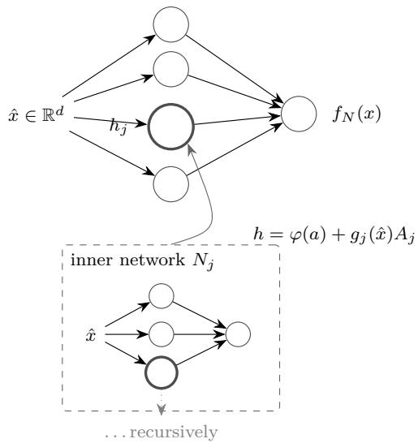  
Figure 1: The recursive substrate (Definition 1). A composite node adds its inner network’s output to its own activation; inner networks read the same input and may themselves contain composite nodes structure is grown, not designed.

## 3.2 One learning primitive at every level (every scale)

Learning uses a single rule, applied identically at every scope of the tree. Within a scale, it is ordinary gradient descent on that scale’s parameters, treating inner outputs as constants (the gradient passes through the atomic branch only). Across scales, the enclosing network does no send gradients through its composite nodes; it hands each one a target and lets the inner network take its own step — the same primitive, one level down; computational mechanics arrived at the same coupling independently: in the variational multiscale principle, fine-scale equations are driven by the residual of the coarse [88]. This is a cross-scale backpropagation in the general sense of the term — what backpropagation has meant since its origin is the backward propagation of errors, i.e., of corrective information [82] — but with a diferent transmission rule. The mechanical reading makes the diference concrete. With the loss as a potential, the output error acts as a generalized force, and a gradient step is a displacement proportional to that force — the overdamped limit of the classical mechanical reading of optimization dynamics [79]. Classical backpropagation transmits the force through the composition of Jacobians; here each scale hands its substructure the correction arriving through that structure’s own attachment $( G _ { j } = ( \partial \mathcal { L } / \partial H ) A _ { j } ^ { \top } )$ , and the substructure relaxes locally by the same rule — a pattern numerical mathematics knows as block relaxation for nonlinear systems [80]. In both schemes the same quantity flows backward — corrective information; the schemes difer in the transmission rule. Nor is the gradient itself essential: it is one encoding of the correction among several, so the backward pass is defined by what it must deliver (a correction), not by how the correction is computed. The consequence is dynamical, not representational: a flattened network computing the identical function takes a diferent step under the same data, so the inclusion tree acts on the learning trajectory even where it is invisible in the instantaneous function (Prop. 4).

```latex
Algorithm 1 Coupled training step at scope N (recursive)
Require: batch $( X , y )$ , standardized $( \hat { X } , \hat { y } ) , n = | X | ; A = \hat { X } W _ { 1 } ^ { \top } + b _ { 1 } , H = h ( \hat { X } ) \mathrm { ( D e f . ~ 1 ) }$
1: $\begin{array} { r } { \overline { { e } }  ( H W _ { 2 } ^ { \top } + c ) - \widehat { y } ; \quad \mathcal { L }  \frac { 1 } { n } \| e \| ^ { 2 } } \end{array}$
2: within-scale step: $D  ( e W _ { 2 } ) \odot \varphi ^ { \prime } ( A )$ ; update $W _ { 1 } , b _ { 1 } , W _ { 2 } , c$ from $g _ { W _ { 1 } } = D ^ { \top } \hat { X } / n , g _ { b _ { 1 } } = \bar { D }$
$g _ { W _ { 2 } } = e ^ { \top } H / n , g _ { c } = \bar { e } \ \triangleright$ inner outputs held constant; the loss’s constant factor 2 is absorbed
into the step size; scopes carrying composition blocks extend this step through the block chain
(§4.3)
3: for each composite node $j \in J$ do ▷ cross-scale correction handing
4: $G _ { j } \gets ( \partial \mathcal { L } / \partial H ) A _ { j } ^ { \top }$ ▷ the correction reaching $N _ { j }$ through its attachment
5: update $A _ { j }$ from $\dot { g } _ { A _ { j } } = g _ { j } ( \hat { X } ) ^ { \top }$ ∂L/∂H
6: $N _ { j }$ .TrainStep $( X , G _ { j } ) \triangleright$ this same algorithm, one step, recursing into $N _ { j }$ ’s own composite
nodes
7: end for
```

The rule is scale-invariant by construction: no scope is special, no scope is frozen, and the cross-scale signal is a target rather than a gradient — each scale is trained as a small supervised learner on the residual its parent asks it to explain. Corollary (ii) of the axiom (every scale receives efective optimization pressure) is thus discharged mechanically: pressure arrives at level $k { + 1 }$ whenever level k has residual error at a composite node. One boundary is named rather than hidden: the discharge presumes the enclosing exit weights remain nonzero — a composite node whose exit coeficient vanishes starves its interior while remaining formally trainable; the corollary is mechanical wherever that does not occur, and the case itself is left as a named condition, not silently assumed away.

## 3.3 Where to grow: the instability signal

Growth is aimed by a per-unit statistic computed from the updates themselves. Let ${ \Delta } _ { j } ^ { ( t ) }$ be the update to unit $j ^ { \dag } \mathrm { s }$ input weights at step t, and let $\mu _ { j } , \nu _ { j }$ be exponential moving averages (decay 0.95) of $\Delta _ { j }$ and $| \Delta _ { j } |$ respectively. The instability of unit $j$ is

$$
u _ { j } \ = \ 1 - \frac { \| \mu _ { j } \| } { \| \nu _ { j } \| + \varepsilon } \ \in \ [ 0 , 1 ] .\tag{4}
$$

We state explicitly what is and is not claimed for this rule: no descent or convergence property is asserted; its characterization in this paper is empirical — the acceptance suite pins its trajectories bit-exactly, the finite-diference checks verify its gradients, and prediction T1-i records its first behavioral signature.

Steady drift (updates agree in sign) gives $\| \mu _ { j } \| \approx \| \nu _ { j } \|$ , hence $u _ { j } \to 0 ;$ oscillation (updates cancel) gives $u _ { j } \to 1$ : the unit is being pulled in contradictory directions by data it lacks the capacity to reconcile — read as the signature of a site that wants refinement (an interpretation; its operational content is the trigger record it drives). The instability report ranks all units across all scopes; it suggests sites. A second instrument, the trajectory verdict, classifies apparent progress as REAL, FALSE\_SPIKE, FALSE\_SWAP, or STUCK, with one binding rule: never advance on a FALSE verdict; STUCK is the designed trigger for remediation or structural speculation. These instruments suggest; only the gate decides.

## 3.4 Direction-neutral operators: the interface and re-founding

Two operators of the algebra act along axes orthogonal to the direction question of $\ S 4 -$ they serve every growth regime identically and are therefore stated here, with the shared machinery.

$\sigma$ (interface — the input axis). Applied recursively to every scope (all scopes share the input space): append a zero column to each $W _ { 1 }$ , extend the input standardization with $( \mu _ { \mathrm { n e w } } , \sigma _ { \mathrm { n e w } } ) =$ (v, 1) where v is the backfill default for stored rows.

Proposition 1 (σ-exactness). For any value $\xi \ o f$ the new coordinate — not merely the backfill — the forward map is unchanged: the new column of every $W _ { 1 }$ is zero, so $\xi ^ { \prime } s$ standardized value is annihilated before it reaches any activation.

(Empirically exact — App. A.) Participation is therefore earned by training, never granted by arrival — and $\sigma$ is the operator answer to the interface instance of lock-in (§2.2), the case no interior mechanism can compensate.

Φ (re-found — the escape axis). When the foundation itself is outgrown, refinement only bloats fine scales (each patch corrects a structure that is itself wrong). Φ builds a candidate

$$
C = \mathrm { T r a i n F r o m S c r a t c h } ( S _ { t } ; \ H _ { \mathrm { b i r t h } } = \beta ( | \mathrm { s c h e m a } _ { t } | , | S _ { t } | ) ) ,\tag{5}
$$

where $S _ { t }$ is the model’s accumulated experience store of real rows only — never the old model’s own outputs, which would inherit its errors — and the birth-sizing rule $\beta$ is re-run on the current schema, never on batch one (the direct repair of first-batch lock-in). In the released system $\beta$ is the heuristic max(16, min $( 6 4 , 4 ( n _ { \mathrm { i n } } + n _ { \mathrm { o u t } } ) ) \mathrm { - } \mathrm { a }$ starting capacity only; structure thereafter is determined by data through the operators, under the gate, not by formula. Adoption is solely by the gate (Algorithm 2): the old self serves until a candidate scores higher and remains in the lineage for rollback — identity resides in the record, not in the weight matrix. The pre-registered trigger monitors the amplitude-hierarchy inversion

$$
R _ { \mathrm { i n v } } ~ = ~ { \frac { \| W _ { 2 } \ h ^ { \mathrm { f i n e } } \| } { \| W _ { 2 } \ h ^ { \mathrm { c o a r s e } } \| + \varepsilon } } ,\tag{6}
$$

the output-projected mass of all inner-network corrections relative to the GELU backbone at the top split: a healthy decomposition has $R _ { \mathrm { i n v } } \ll 1 ;$ ; sustained $R _ { \mathrm { i n v } } \geq 0 . 5$ (three consecutive probes), repeated disposed growths under saturation, or flat learning progress under high demand raise the re-founding proposal. (App. A.3 reports that in our tested scenarios this trigger’s necessity claim was not supported — takeover safety, by contrast, is unconditional, because it is the gate’s.)

Algorithm 2 Commit (the reality gate), recency parameter M   
1: $q _ { s } \gets Q ( s ; R _ { M } ( \mathcal { H } ) )$ ▷ re-score the incumbent — fresh, never cached   
2: $q _ { w }  Q ( w ; R _ { M } ( \mathcal { H } ) )$   
3: if $q _ { w } > q _ { s }$ then ▷ strict   
4: s ← w; append lineage event with both scores   
5: else   
6: refuse; s unchanged ▷ a logged outcome, not an error   
7: end if

## 3.5 Governance formalized

Definition 2 (states and gate). A model carries a speculative working state w and a committed version s (the one that serves), plus a time-stamped held-out stream ${ \mathcal { H } } = \{ ( x _ { i } , y _ { i } , \tau _ { i } ) \}$ quarantined from all training. Let $R _ { M } ( \mathscr { H } )$ be its most recent M examples and $Q ( \cdot ; R )$ the held-out metric on slice R (in the released system, the factory and full-system servers’ gates both score the fraction of held-out answers matched exactly — numeric within ±0.5).

Teaching composes the same gate with from-scratch candidate training: teach(E; W, M) trains a candidate on the most recent W stored examples plus E and commits with recency M — the two recency dials being what adaptation under drift requires (train on the reality that still holds; be judged on the reality that holds now). Budgets close the loop on structure: an operator application that would exceed the parameter cap $P _ { \mathrm { m a x } } = P _ { 0 } \cdot m$ (or the depth cap) is refused and logged before it touches the working state.

The gate-soundness invariant of §2.3 now reads: along the served lineage $s _ { 0 } , s _ { 1 } , \ldots ,$ every promotion k satisfied $Q ( s _ { k + 1 } ; R ^ { ( k ) } ) > Q ( s _ { k } ; R ^ { ( k ) } )$ on the slice $R ^ { ( k ) }$ used to judge it — and refusals left the lineage untouched. Learning steps, ω, ρ, δ, σ, and Φ all enter the served model through this one gate; that is the safety argument’s core — adoption-level protection, uniform across operator types (its named boundaries: the reuse and provenance exposures named below, §3.5). Real traces — including refusals — are shown in Appendices E and F.

Two exposures lie outside the invariant’s scope and should be named. Selection reuse: quarantine protects the held-out stream from training, not from selection — under many commit attempts against the same small slice, a strict > with no margin will eventually promote a candidate whose margin is noise alone (the reusable-holdout phenomenon; §15), and the invariant will truthfully record the promotion as evidence-sanctioned. Promotion margins and per-slice query budgets are the natural remedies — and by the architecture’s own layering they are the operator’s policy, not the mechanism’s: the released interfaces already carry everything their enforcement needs (public pre-commit scoring for margins, every adjudication in the append-only ledger for query counting, holdout replenishment on demand for rotation). The mechanism supplies the bookkeeping; the examination strategy belongs to the caller. Evidence provenance: the invariant certifies candidates against whatever the held-out stream contains; if that stream is corrupted, every guarantee downstream of it is vacuous (§9).

## 4 Growth: The Direction Question

This section in one arc: the algebra ofers five operators (§4.1); the additive three are exactly characterized by Prop. 4 (§4.2); δ supplies the compositional axis that proposition does not reach (§4.3); and a three-tier policy — predict from history, verify by probes, adopt by the gate — chooses the direction per scope, with a system-level mode restoring the purely additive regime (§4.4).

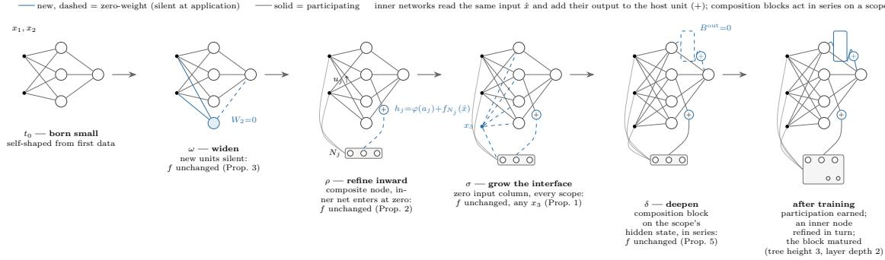  
Figure 2: Schematic (not data): the operator algebra growing a topology over time. New elements (accent) enter with zero-weight dashed connections — silent at application, so f is unchanged (Props. 1–3, 5) — and earn participation through training. An inner network reads the same input xˆ and adds its vector output to the scope’s hidden state through its zero-born attachment at the + junction $( h = \varphi ( a ) + g _ { j } ( \hat { x } ) A _ { j } )$ ; the δ panel appends a zero-initialized composition block in series on the scope’s hidden state (Prop. 5). The final panel shows an inner node refined in turn and the block matured (tree height 3, layer depth 2). Every parameter remains trainable from step one; adoption is always by the gate.

The substrate of §3 can grow in more than one direction. This section presents the operator algebra’s two growth directions as two realizations of the framework: the additive realization — multiscale superposition, the regime analyzed in full below — and the compositional realization, which augments it with scope-interior composition and a signal-based selection of the direction itself (§4.3). The two are one released system: the additive realization is exactly the adaptive system restricted to its widen-only mode (§4.4).

The organizing ideas of this section are classical across the mathematical sciences, developed for a nature that is rough and multiscale [85]: numerical mathematics builds solutions scale by scale (multigrid [86]) and spends resolution only where an indicator demands it (adaptive mesh refinement [94]); signal processing expands a function scale by scale (multiresolution analysis [93]); and physics stacks efective descriptions scale by scale (the renormalization group [87]). Notably, these traditions do not commit a scale hierarchy to any particular local form: in a multiresolution expansion the scales add, whereas in the renormalization group each efective description is a transformation of the one below — scale structure without additivity. The two realizations that follow are these two classical forms inside one learner: an additive expansion grown term by term, and a composed hierarchy grown transformation by transformation, with the choice between them read from the data.

## 4.1 The operator algebra

Each in-place operator satisfies one governance contract (Φ builds a candidate; its takeover is gated): exact at application, every new parameter trainable from step one, budgeted, logged (Table 1).

The grown body is a contract, not a class. The requirements that ρ places on the body it grows at a node are exhausted by the governance contract: exact entry (the body’s contribution is identically zero at application), every parameter trainable from step one, countable parameters, and removability. Nothing in the exactness argument inspects the body’s interior — the zeroentry proof never opens the box — so the reference recursive network is the default body, not a commitment: any function approximator satisfying the contract may be grown at a node, selected per event by policy. The propositions of $\ S 2$ apply to every such body unchanged, and the scale hierarchy below (§4.5) governs all of them alike.

Table 1: The operator algebra. Every operator is budgeted (parameter/depth caps as policy; refusals are logged outcomes), audited (lineage events), and closed under exact removal (each grown structure carries its inverse); adoption is always by the gate of Algorithm 2. The additive family $( \omega , \rho , \sigma ,$ per-head growth, skips) leaves the composition-degree invariant unchanged; δ alone raises it — the boundary that separates multiscale organization from true deepening. The loop operator λ (§5) and the per-head attention operators (§6) join these five under the identical contract — the abstract’s operator list spans all of them. Measured exactness values: App. A.
<table><tr><td>Operator</td><td>Axis</td><td>Exactness at application</td><td>Typical trigger</td></tr><tr><td> $\rho$  (refine)</td><td>hierarchy</td><td>inner net enters at zero (Prop. 2)</td><td>high  $u _ { j }$  at a node</td></tr><tr><td>ω (widen)</td><td>width</td><td>zero output-weight block (Prop. 3)</td><td>scope-wide saturation</td></tr><tr><td>σ (interface)</td><td>inputs</td><td>zero input column, any value (Prop. 1)</td><td>new observable arrives</td></tr><tr><td>δ (deepen)</td><td>composition</td><td>block enters at zero (Prop. 5)</td><td>delayed-payoff slope signal (§4.3)</td></tr><tr><td>Φ (re-found)</td><td>whole model</td><td>candidate; takeover gated</td><td>inversion / disposal / flat LP</td></tr></table>

## 4.2 The additive direction: refinement and widening

The three axes are not alike. Widening (ω) adds quantity at an existing scale; interface growth (σ) adds observables; refinement (ρ) nests a finer description inside the one node whose data demand it — an organizational axis, not an expressive one (Prop. 4), and structurally local (the refinement attaches to one node; in input space every unit remains global). The instability signal is a this-scale-fails detector, and refinement is closed under itself, so the ladder coarse → fine → finer has no end in the algebra (budgets are policy, §3.5): structure is grown, not designed. The resulting topology is multiscale in the established sense of numerical mathematics — resolution added scale by scale, and only where an indicator demands it [93, 94]; the label describes how information is organized, and is orthogonal to expressive enlargement (Prop. 4) — the canonical multiscale methods are themselves additive and depthless. The idea has a precise kin in the multiscale finite element method [98, 99]: an element’s shape function ceasing to be an analytic design and becoming a computed object interior to a coarse cell.

$\rho$ (refine — the hierarchy axis). At scope N, node $j \notin J ;$

$$
\rho _ { j } ( N ) : \quad { \mathcal { T } } ( j ) \gets N ^ { \prime } { \mathrm { ~ f r e s h , ~ w i t h ~ } } A _ { j } = 0 { \mathrm { ~ a t ~ a t t a c h ~ t i m e . } }\tag{7}
$$

Proposition 2 (ρ-exactness). $f _ { \rho _ { j } ( N ) } = f _ { N }$ pointwise.

Proof. The only change to the forward map Eq. (3) is the additive term $g _ { j } ( { \hat { x } } ) A _ { j } ;$ with $A _ { j } = 0$ at attach time the term is identically zero for every input. □

(Empirically exact $- \ \mathrm { A p p . \ A . } )$ By closure (Definition 1), ρ applies at any level — including to units created by ω.

ω (widen — the capacity axis). At any scope, append k units:

$$
W _ { 1 } \gets \left[ { \begin{array} { l } { W _ { 1 } } \\ { W _ { 1 } ^ { \mathrm { n e w } } } \end{array} } \right] , \qquad b _ { 1 } \gets \left[ { \begin{array} { l } { b _ { 1 } } \\ { 0 } \end{array} } \right] , \qquad W _ { 2 } \gets \left[ W _ { 2 } \quad 0 _ { 1 \times k } \right] ,\tag{8}
$$

with $W _ { 1 } ^ { \mathrm { n e w } }$ randomly initialized.

Proposition 3 (ω-exactness). f is unchanged: the new units’ contribution enters the output only through the appended zero block of $W _ { 2 }$

(Empirically exact to floating-point roundof — App. A.) Two governance details do real work here. Optimizer slots for the new parameters are extended with zero moments — the new capacity is trainable from step one (the axiom, mechanized; contrast masking schemes). The instability EMAs of new units, moreover, are warm-started at the scope’s current row-mean, so newborn units compete fairly in the growth rankings instead of being spuriously ranked coldest or hottest.

Proposition 4 (Representational status of $\rho )$ . In the absence of composition blocks, and for matched atomic-unit counts, ${ \mathcal { F } } ( G _ { \rho } ) = { \mathcal { F } } ( G _ { \omega } )$ . Every inner network reads the same input xˆ and contributes additively, so the substrate at any height of the inclusion tree evaluates to a weighted sum of $\varphi ( \mathrm { a f f i n e } ( \hat { x } ) )$ terms — the function class of a single-hidden-layer network of the same total width $( \subseteq )$ ; conversely, any flat network of that width is realized by a nested topology whose inner output weights carry the flat coeficients $( \supseteq )$ . ρ does not enlarge the reachable class beyond ω.

What ρ adds is therefore not representation but organization: a refinement trains its inner network on the correction reaching it through its attachment (Algorithm 1) — a localized, stagewise-additive credit assignment — and gives growth a site, a trigger $( u _ { j } )$ , and an audit unit. Extensional equivalence, however, does not imply process equivalence: substrates with identical function classes can difer in the trajectories a lifetime of local, governed growth can traverse — and whether they difer here is an empirical question, with T1-i $\left( \operatorname { A p p . ~ A } \right)$ as first evidence.

## 4.3 The compositional direction and its selection

The operator δ (deepen — the composition axis). At any scope with hidden state $H _ { 0 }$ (the base activations plus inner-network contributions), δ appends one zero-initialized residual composition block (the residual form is the standard tool of deep architectures [115]):

$$
H _ { k } \ = \ H _ { k - 1 } \ + \ \mathrm { g e l u } \big ( H _ { k - 1 } B _ { k } ^ { \mathrm { i n } \top } + b _ { k } \big ) B _ { k } ^ { \mathrm { o u t } \top } , \qquad B _ { k } ^ { \mathrm { o u t } } = 0 \ \mathrm { a t \ a p p l i c a t i o n } ,\tag{9}
$$

with the scope’s head reading the final $H _ { L }$ . The block applies a nonlinearity to a state that already contains nonlinear unit outputs: the result is φ(mix of $\varphi ( \cdot ) )$ cross-terms, which leave the additive class $\begin{array} { r } { \sum _ { i } \alpha _ { i } \varphi ( \mathrm { a f f i n e } ( \hat { x } ) ) } \end{array}$ in general — the separation between the classes is the subject of the classical depth-separation results (§15) — so composition is genuine, and the collapse of Prop. 4 does not apply to scopes carrying blocks.

Proposition 5 (δ-exactness). Appending a block leaves the computed function unchanged: with $B _ { L } ^ { \mathrm { o u t } } = 0$ the new block’s contribution is identically zero, so the chain’s output equals its pre-append value, $H _ { L } = H _ { L ^ { - } }$ <sub>−1</sub>, pointwise at the moment of application (for the first block, $H _ { 1 } = H _ { 0 } )$

The released suite verifies this bitwise at root and inner scopes, and the in-service insertion campaign verifies it at serving time — bitwise at every pure-δ instant; whole acts that include an aspect-law widen rider preserve the function to machine epsilon (§13.5).

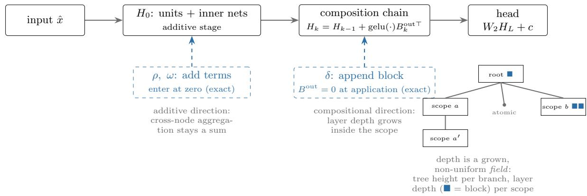  
Figure 3: The two growth directions on one pipeline. Additive operators $( \rho , \omega )$ add terms to the scope’s hidden state $H _ { 0 } ;$ the compositional operator (δ) appends zero-initialized blocks after it. Both directions enter exactly (dashed: silent at application); cross-node aggregation remains a sum, and layer depth grows only inside the scope. Inset: depth is a grown, non-uniform field — each branch evolves its tree height and each scope its layer depth independently.

Four properties place δ inside the governance discipline. (i) Positional and service-safe: blocks live in the scope’s composition chain and may be appended or INSERTED at any position of that chain — including in a LIVE serving model — with the same zero-entry exactness at the instant of application (the identity-calibrated whole-layer form serves the attention hosts through the same verb); the in-service insertion campaign measures this exactness directly (§13.5). (ii) Recursive and unbounded: any scope at any level of the inclusion tree may deepen, repeatedly; we call 1 + (blocks) the scope’s layer depth, distinct from the height of the inclusion tree. (iii) Additive aggregation preserved: attachment across nodes remains a sum, so the per-scale audit quantities of the additive direction survive unchanged. (iv) Removable and budgeted: blocks are audited ledger events, removable exactly, and capped by policy (max\_blocks), with refusals logged. Training extends the within-scale chain rule through the block chain back to $H _ { 0 } ;$ the cross-scale corrections of Algorithm 1 are formed at the $H _ { 0 }$ slot with their original expression — the derivative ∂L/∂H computed through the block chain, matching the released implementation — and all block gradients are verified against central finite diferences in the released suite.

Choosing the direction. Which direction a scope should grow is not knowable by fiat: the two directions answer two diferent kinds of target. Greedy term addition against the current residual carries dimension-independent approximation-rate guarantees [44, 45] on the classes served by superposition; compositional targets, by contrast, admit exponential shallow-versus-deep separations [41, 42] (the fuller treatment of depth is in §15). Which jurisdiction a scope’s residual inhabits must therefore be read from the scope’s own signals, and the reading proceeds in three tiers — prediction first, probes only to verify, adoption always by the gate (Algorithm 3).

Tier 1: history prediction. Each scope maintains a gain ledger (the realized, fixed-horizon relative energy reduction of every past growth event) and a dense residual-energy series. The energy series is extrapolated to its asymptote with a BIC-weighted [25] ensemble of parametric curve families [48]. Tier 1 may act only under a predictability certificate — a gate this design defines, whose four checks are each filled by a deliberately standard instrument sitting in a replaceable slot: forecastability by normalized spectral entropy [51]; regime validity by online changepoint detection [52]; demonstrated skill of the extrapolator on the scope’s own recent history by rolling-origin backtest [53] — a held-out gate for the forecaster itself — and a confidence bound on the asymptote’s posterior interval.

Algorithm 3 Direction selection at a scope (predict, verify, adopt)   
Require: scope with gain ledger, energy series, recent window; policy thresholds   
1: if history below the minimum-data guards then   
2: cold start: probes if the window sufices, else additive growth (the default direction)   
3: else if certificate passes (forecastability, changepoint, backtest, confidence) then   
4: if no stall and extrapolated additive gain useful then   
5: propose additive growth (ρ at the most unstable non-composite node; ω when all   
are composite)   
6: else if stall ∧ energy high then   
7: propose deepen when the two-horizon slope favors it (delayed-payof signature)   
8: else   
9: fall through to probes   
10: end if   
11: else   
12: probes: price both candidates at two horizons; select by slope among positive gains; ties   
favor the additive direction   
13: end if   
14: adopt only by the gate (Algorithm 2); log the decision record (signals, certificate values,   
prices, part names, policy snapshot)

Tier 2: probe verification. When the certificate fails or history is insuficient, both directions are priced by zero-attached probes trained on the scope’s recent window, in the same units (the scope’s window energy). The additive probe’s gradient at zero attachment is exactly the unit–residual correlation. How a probe is READ is itself an empirical question, and the measured answer replaced this design’s first draft: single-horizon readings — the raw gain and the gain per parameter alike — carry no axis information (early in training every candidate prices positive, and the two directions price alike; measured in the direction campaigns, §13.5). What does carry the axis is the two-horizon slope: each candidate is probed at a short and a long budget, and the diference (long-horizon gain minus short-horizon gain) reads the delayed-payof signature that distinguishes composition — additive gains are front-loaded, compositional gains are back-loaded, and the slope measures exactly this asymmetry. In Algorithm 3, stall denotes the certificate’s nouseful-gain verdict on the additive history and slope the delayed-payof signature; both thresholds are policy-level in the released code.

Tier 3: the gate (the full policy flow is drawn in Figure 4). Either proposal is adopted exactly as every other structural change: by scoring higher on held-out reality (Algorithm 2); and no adoption is final, since drift re-opens every comparison. Every algorithmic role above — extrapolator, forecastability, changepoint, backtest, pricer, combiner — is a replaceable part behind a registry, selected by policy and never switched by the machinery itself.

## 4.4 Regime containment and the growth mode

The two realizations are one released system. The additive realization is exactly the adaptive system restricted to its widen-only mode: a system-level control with two named values selects between adaptive two-direction growth (the default) and the purely additive regime (the code-level mode name; the regime includes both additive operators, ρ and ω), in which the machinery never invokes δ, no certificate or probes are computed, and Prop. 4 applies in full — the proposition is the exact characterization of the widen-only mode. These are two governed paradigms, not a weak and a strong system: the additive regime is the multiscale discipline of the classical numerical methods — per-scale audit quantities well-defined, perturbations bounded — while the adaptive regime extends the axiom to the compositional axis, adoption still earned per site. The control is enforced above the replaceable-parts layer, so no part substitution can bypass it; it is a callable system interface in the released code (policy level; tool-surface exposure is future work); and a mode flip never alters an existing model’s function — the forward computation is determined by the model’s state (its blocks), never by policy, so switching modes changes what may grow next, not what the model is. The active mode travels in every decision record.

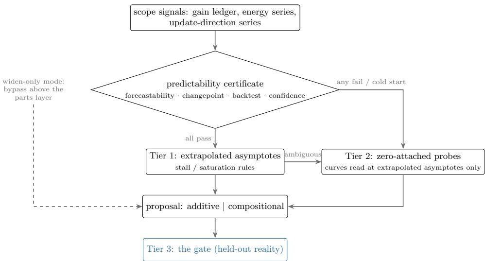  
Figure 4: Direction selection: predict first (under the predictability certificate), probe only to verify (asymptote-read curves), adopt only by the gate. The probe READING is the measured part: single-horizon prices carry no axis signal; the two-horizon slope does (§13.5). The widen-only mode bypasses the machinery above the replaceable-parts layer (§4.4).

## 4.5 The scale hierarchy: subordination as a growth invariant

The multiscale reading of refinement carries an obligation the operator algebra must enforce, not merely suggest: a grown inner body is a fine-scale correction, and a correction is subordinate to the field it corrects. In the numerical treatment of multiscale physics the fine model lives strictly inside one coarse element and never approaches the coarse field’s mass; the transported invariant here is quantitative. First, subordination in size: the host scope’s own parameter mass must dominate the body’s by a large factor (a policy ratio, with a default two orders of magnitude), so that no single fine-scale correction can carry a load comparable to its host. Second, an absolute floor: a host below a minimum trained mass does not refine at all — growing corrections onto a coarse field that is itself negligible inverts the hierarchy. Third, subordination in time: topology changes only after the base has taken shape — a minimum of trained steps precedes the first structural event, and each event is small relative to the trained mass it joins. All three are policy quantities with logged violations (warn or refuse, selectable); none is a property the model could drift out of silently. The invariant also bounds what any one mechanism of $\ S 5$ can do: a local loop lives on a scope whose share of the whole is already governed.

## 5 Local Solving Loops: Computation That Solves Inside Itself

## 5.1 The principle

In the numerical treatment of nonlinear continua, the global solve routinely embeds local solves. At every integration point of a plastically deforming body, a small constitutive system is satisfied by its own inner iteration — the return mapping, a local Newton loop — invisible to the global equilibrium iteration that contains it, convergent inside every global step, with its own tolerance and its own budget. The global method does not become fixed-point-free because the local one iterates; the two live at diferent scales of the same computation, and the discipline that keeps them compatible is locality: the inner loop solves only its own point’s equations, touches only its own point’s state, and returns control having converged or having spent its budget.

This section transports that structure to a growing model. A scope of the substrate may embed a bounded local solving loop: a computation with its own objective, its own convergence guarantee, its own budget, running strictly inside one scope, leaving the global learning contract — gradient flow, gate adjudication, audit — untouched. Two quantities can be locally solved. The first is the scope’s state: the forward pass itself may relax to a fixed point where the task demands iteration (§5.2). The second is a newborn structure’s weights: a freshly grown body may refine itself against a local objective before it participates in the whole (§5.3). The two realizations are independent mechanisms — separately implemented, separately enabled, separately governed — of one methodological move, and both inherit the multiscale lineage of this work: they are the transported forms of solving locally what is local.

## 5.2 Realization I: grown cycles — the loop operator (λ)

Every operator of §4.1 grows an acyclic structure: signals flow one way, once. Where a law’s natural computation is iterative — its solution defined by an equation rather than by an expression — an acyclic pass of fixed depth must approximate the result of an iteration without performing one. The loop operator makes iteration itself growable.

Definition. A λ-block on a scope is a triple $( L _ { \mathrm { i n } } \in \mathbb { R } ^ { m \times H }$ ， $b _ { \lambda } \in \mathbb { R } ^ { m }$ $L _ { \mathrm { o u t } } \in \mathbb { R } ^ { H \times m } )$ attached at the end of the scope’s composition chain. Where the chain’s output was $H _ { L }$ , the head now reads the fixed point $z ^ { * }$ of

$$
z = H _ { L } + \varphi \Big ( z L _ { \mathrm { i n } } ^ { \top } + b _ { \lambda } \Big ) L _ { \mathrm { o u t } } ^ { \top } ,\tag{10}
$$

computed by relaxation from $z ^ { ( 0 ) } = H _ { L }$ and stopped at a tolerance or at a hard iteration cap $K _ { \mathrm { m a x } } ;$ reaching the cap returns the last iterate — bounded compute is the contract, not an exception. The scope’s computation is thereby no longer a traversal but a convergence: the cycle is the first structure in the algebra whose forward semantics is an equation — the fixed-point-layer form of computation introduced by deep equilibrium models [2], employed here as a mature tool.

Properties. Four properties make the cycle a governed operator rather than a hazard. (i) Well-posedness under an enforced certificate. If the loop map is a contraction — guaranteed when $c _ { \varphi } \sigma _ { \mathrm { m a x } } ( L _ { \mathrm { i n } } ) \sigma _ { \mathrm { m a x } } ( L _ { \mathrm { o u t } } ) \leq \rho _ { \mathrm { m a x } } < 1$ , with $c _ { \varphi }$ the activation’s Lipschitz constant — the fixed point of Eq. (10) exists, is unique, and the relaxation converges to it geometrically (Banach’s fixed-point theorem [117]; the certificate is precisely the theorem). The inequality is not an assumption but an enforced invariant: after every training step on a looped scope the bound is recomputed, and a violating $L _ { \mathrm { o u t } }$ is rescaled to restore it exactly — a projection, counted and auditable, never silent. The certificate triple (cap, tolerance, budget) is validated for mutual feasibility $( \rho _ { \mathrm { m a x } } ^ { K _ { \mathrm { m a x } } } \leq \mathrm { t o l e r a n c e } )$ at application — the budget then sufices to reach the tolerance from unit-scale initial gaps, the geometric rate covering larger gaps with logarithmic surcharge. (ii) Exactness at application. The operator enters with $L _ { \mathrm { o u t } } = 0 \colon$ the first iterate returns $H _ { L }$ unchanged and the relaxation terminates immediately, so $z ^ { * } \equiv H _ { L }$ and the scope’s function is bit-identical at the moment of growth — the same zero-entry argument that governs every operator of Table 1, applied to a cycle. (iii) Bounded serving cost. A model that has grown a cycle iterates when it serves; $K _ { \mathrm { m a x } }$ caps the cost of every forward pass, and the iteration count is an audited quantity. (iv) Benign credit assignment. Training diferentiates through the executed iterates (the stop index held constant); under the certificate the backward products decay geometrically, so the unrolled gradient neither explodes nor requires implicit diferentiation — verifiability is kept.

Position in the algebra. The cycle joins the algebra as a sixth operator — the five of Table 1 grow acyclic structure; λ is the one that does not — and as a third growth direction; the resource it buys is distinct in kind: width buys capacity at a scale, composition buys serial depth inside a scope, the loop buys iteration and state. It obeys the full governance contract — budgeted (one cycle per scope, at the chain’s end), audited (growth, removal, projection, and iteration counts are ledgered), removable (exactly restoring the pre-cycle function when untrained), and of by default: a policy switch must enable it, and the default world grows no cycles. What is claimed is deliberately bounded: no enlargement of the reachable function class on compact domains is asserted — the claim concerns the required size and structure of acyclic approximations to iteratively defined laws, and where that translates into measured value is a question the paper leaves to its pre-registered program (§5.5).

## 5.3 Realization II: self-processing units

Growth as defined so far is structurally exact but developmentally passive: a newborn inner body enters at zero and waits for the global gradient to shape it. The second realization gives the newborn a bounded period of active self-shaping — a local solving loop over its own weights — before and while it earns participation.

Definition. A newly grown inner body, during a policy-bounded newborn window, runs a small number of weight-adjustment steps per training step against a local process objective: a quantity computed entirely from the body’s own forward behavior on the data it actually receives, blind to labels and to the global loss. The objective is functional consistency, guarded against collapse: writing $z _ { i } ^ { ( k ) }$ for the body’s response to sample i under the k-th bounded internal perturbation of its computation, $\bar { z } _ { i }$ for their mean, $s ( \theta )$ for the batch dispersion of the unperturbed response, and $s _ { \mathrm { e n t r y } }$ for that dispersion at enrollment, the loop minimizes

Table 2: One principle, two realizations. Both are local solving loops embedded in the global pass; they solve diferent quantities on diferent clocks under the same governance contract, and each is enabled by policy, never by fiat.
<table><tr><td></td><td>Grown cycle (λ)</td><td>Self-processing unit</td></tr><tr><td>Solved quantity</td><td>scope state  $z ^ { * }$ </td><td>newborn weights</td></tr><tr><td>When it runs</td><td>every pass on the scope</td><td>newborn windows only</td></tr><tr><td>At serving</td><td>iterates (capped)</td><td>absent by construction</td></tr><tr><td>Guarantee</td><td>enforced contraction</td><td>bounded loop; collapse-guarded objective</td></tr><tr><td>Cost bound</td><td> $K _ { \mathrm { m a x } }$  per pass</td><td> $S _ { \mathrm { m a x } }$  per step</td></tr><tr><td>Entry</td><td>exact  $( L _ { \mathrm { o u t } } = 0 )$ </td><td> $\mathrm { n / a - }$  refines weights; adoption gated</td></tr><tr><td>Adoption</td><td>the gate, as always</td><td>the gate, as always</td></tr></table>

$$
J ( \theta ) \ = \ \frac { 1 } { K n } \sum _ { k = 1 } ^ { K } \sum _ { i = 1 } ^ { n } ( z _ { i } ^ { ( k ) } - \bar { z } _ { i } ) ^ { 2 } \ + \ \gamma \operatorname * { m a x } ( 0 , \rho _ { \mathrm { f l o o r } } s _ { \mathrm { e n t r y } } - s ( \theta ) ) ^ { 2 } .\tag{11}
$$

In the released system $K = 4$ perturbation copies, $\gamma = 1$ , and $\rho _ { \mathrm { f l o o r } } = 0 . 5$ (policy defaults, per-model overridable). The first term asks the response to be stable under perturbation; the second is a hinge that fires only when the response scale falls below a floored fraction of its entry scale — the collapse guard, since the degenerate minimizer of consistency alone (answer everything identically) drives $s ( \theta )$ to zero and sits deep inside the hinge’s penalty region. The loop is bounded by an iteration budget and a relative tolerance; convergence or budget exhaustion both return control.

The order is structural. Self-processing composes with the recursive substrate through one invariant: process, then participate, then learn, at every depth. On each training step, eligible newborn bodies first self-process, then the released forward computation runs with their refined weights, then the global learning step assigns credit — one visit per unit, no re-entry, at any nesting depth. The invariant is what makes self-processing a scale-local mechanism rather than a second optimizer: the global contract sees only a model whose fine structure arrives at each step slightly better prepared.

Governance. The loop is label-blind by construction; serving-pure (it exists only at evolution time — a serving model never self-processes and records nothing); bounded (budget and tolerance are policy); optimizer-neutral (the global optimizer’s state is untouched by construction, an invariant the released tests pin bitwise); hierarchy-respecting (eligible bodies are exactly the newborn fine-scale corrections of §4.5, so the mechanism follows the growth frontier); and fully audited (every processing event, skip, and its reason is ledgered). Where a body’s realization does not yet support the loop, the unit is skipped with a disclosed reason — staging is auditable, never silent.

## 5.4 One discipline, two solved quantities

Table 2 aligns the two realizations. They share locality (one scope, one body), boundedness (hard caps validated for feasibility), auditability (every event ledgered), exact or neutral entry, and gate adoption; they difer in the quantity solved and the clock on which they run. Neither knows of

the other, and a model may carry both. The shared discipline is the section’s thesis: iteration is admitted into a growing model not as an architectural conviction but as a governed local resource, purchased where a scale demands it and accounted like every other structural liberty in this paper.

## 5.5 Epistemic status

Both mechanisms are released with the system and carry pre-registered examination programs in the style of App. A; their MECHANICS carry measured verdicts in the evidence table (exact entry bitwise, the enforced contraction bound with its certified activation Lipschitz constant $C _ { G } = 1 . 1 2 8 9 9 4$ , finite-diference-verified loop gradients, bitwise optimizer-neutrality for the selfprocessing loop); their value adjudication at qualified scale is open at the time of writing. This section accordingly claims mechanism and governance — well-posedness, exactness or neutrality at entry, boundedness, auditability, and the multiscale discipline that contains both — and no empirical superiority.

## 6 Growable Attention: Capacity Follows Demand

Everything before this point grew feed-forward and cycle structure and governed it; the attention component itself remained as construction cast it. This section removes that exception. The result is a demanding test of the theory: attention is the substrate family’s load-bearing mechanism, and if the axiom of total plasticity is to mean anything, it must reach the heads.

## 6.1 The object and its two layers of existence

A multi-head attention block exists twice over. As parameters it is a set of per-head projection matrices $( W _ { h } ^ { Q } , W _ { h } ^ { K } , W _ { h } ^ { V } , W _ { h } ^ { O } )$ ; as behavior it is, for every input row, a family of probability distributions — each head, at each position, distributes one unit of attention over the admissible positions. The standard form freezes both layers at construction, and each freeze is a lockin of exactly the kind §2.2 names. First, head lock-in: the per-head width is fixed by fiat at $d _ { h } = d _ { \mathrm { m o d e l } } / H$ , equal for all heads forever, so a head serving a heavy relation and a head serving a trivial one are constrained to the same capacity — the demand inequality is well documented from the destructive side by the pruning literature [103, 104], which finds a large fraction of heads removable at little cost; the constructive response has been missing. Second, no local accountability: no objective in the standard training loop ever evaluates the attention distributions themselves; a head may collapse its distribution to a delta or difuse it to uniform, and nothing in the loss says so until the damage has propagated to the output, where a global signal cannot localize it.

The section’s claim is that both freezes are removable under the same contract that governs every other operator in this theory: evidence-triggered, exactly function-preserving at application, gate-adjudicated on held-out reality, budgeted and audited. Unequal head widths then appear not as an architectural hyperparameter but as a lifecycle outcome: the record of where demand actually fell.

## 6.2 Exact growth of heads

Two operators extend the algebra of $\ S 3$ to the attention block: head-add births a new head of minimal width beside its siblings; head-widen grows one head’s $d _ { h }$ by a chosen increment.

Both are exact at application, and their exactness is not a numerical accident but a structural consequence worth stating.

The two-step trainability property. Exactness forces a zero factor: every pathway a growth operator opens must carry at least one exactly-zero factor at application, or the model function moves. The same zero then buys its price — the side of the pathway whose gradient passes through the zero factor is first-order blind for exactly one training step — and where the zero sits decides who waits. The two operators place it diferently, so the property has two instantiations, both measured on the live substrate. head-add puts the zero at the exit: born with $W _ { \mathrm { n e w } } ^ { O } = 0$ (generators seeded at host scale), the new head contributes exactly nothing (measured: bitwise 0.0 deviation at application), and the task loss is first-order blind to every generator matrix — at step one only $W ^ { O }$ moves, with $W ^ { Q } , W ^ { K } , W ^ { V }$ measured exactly zero; at step two, with $W ^ { O } \neq 0$ , all come alive. head-widen places the zeros pairwise inside the pathway: the new key columns and output rows are the zero side, the new query and value columns are seeded, so every new product carries one zero factor (exact at application, deviation $\leq 1 0 ^ { - 1 2 } )$ while each zero-side matrix faces a seeded partner — the task gradient reaches it at once. At step one the zero side $( W ^ { K }$ columns, $W ^ { O }$ rows) moves under the plain task signal; the seeded side $( \overbrace { W } ^ { Q } , W ^ { V }$ columns) is the blind one, its task gradient exactly zero until step two. An all-zero widening — both sides zero — is refused by the operator itself: it is a certified total saddle, a pathway no gradient can ever enter, which is freezing by construction and therefore out of compliance with the axiom. One step of latency, placed by the operator’s choice of zero, is the whole price of growth that never moves the function. The property holds identically for widening, where the new columns are the zero side. This is the price and the proof of exact growth: one training step of latency, in exchange for a function tha never jumps.

The absorbed normalizer. The textbook $1 / \sqrt { d _ { k } }$ is evaluated at runtime from the current width, so widening a head would silently rescale its existing logits — a measured $O ( 1 )$ shift (1.27 in the reference configuration) that violates exactness before training even begins. The scale is therefore absorbed into the projection parameters at birth and carried by them thereafter; widening then composes with the existing scale exactly (deviation $\leq 1 0 ^ { - 1 2 }$ under the uniform absorbed convention).

The additive output identity. Per-head outputs concatenated and passed through the block projection equal the sum of per-head width-slices of that projection (blockwise product = concatenation; measured $3 . 6 \times 1 0 ^ { - 1 5 }$ , i.e. floating-point exact). This identity is what makes per-head growth well defined: a head’s capacity can change without renegotiating any other head’s contract with the output.

## 6.3 Evidence and decision

Where to grow is decided by the same instrument family that serves the rest of the theory $( \ S 3 . 3 )$ now computed per head: the instability signal $u _ { h } ;$ the loading of each head (its share of the block’s output energy on live data); and the block’s capacity participation ratio. The two signals answer two diferent questions. widen answers one head under demand: among heads past a minimum age, the head whose $u _ { h }$ stands out against its peers $( u _ { h } \ge \kappa _ { \mathrm { a t t } } \times$ the aged mean, $\kappa _ { \mathrm { a t t } } = 2$ as policy) is widened. add answers demand not attributable to any single head: when the loading spreads across the layer — participation ratio at least $( 1 - \beta _ { \mathrm { { a t t } } } ) H$ over the H heads, $\beta _ { \mathrm { a t t } } = 0 . 1$ as policy — a new head is born. A single-head layer widens first and escalates to add only if a recently accepted widen failed to relieve the same trigger (the ledger keeps that memory); newborn heads are excluded from judgment until a minimum age, because a newborn’s instability statistic starts at its construction value — an artifact of the estimator, not evidence of demand. The event itself is the standard governed speculation of $\ S 2 . 3 \colon$ : suggest from evidence, apply exactly, probe-train, and let the gate adjudicate on held-out data — accept or refuse, with the refused candidate discarded and the incumbent function untouched. One disclosure about protocol history: an earlier generation of these runs drew its probe epoch from the adjudication batch itself; the released system separates the two lanes (the probe trains on the training lane only, the holdout is scored only, a probe-less proposal is refused with an explicit logged error), and every gate-adjudicated lane reported in this paper was re-run under the separated protocol — the numbers printed here come from the clean runs, and no verdict changed under the migration. Nothing about attention required a new adoption concept; this uniformity is the design’s intent.

## 6.4 The attention discipline: a third local objective

The second freeze — no local accountability — is lifted by giving the distributions their own objective. For each head and each input row i with $F _ { i }$ admissible positions, the row’s attention entropy $H _ { i }$ is held to a band $\big [ \alpha _ { \mathrm { l o } } \log F _ { i } , \ \alpha _ { \mathrm { h i } } \log F _ { i } \big ]$ , and the discipline objective $J _ { \mathrm { { a t t } } }$ penalizes quadratic excursions beyond either edge. The band is a plasticity floor, and the connection to the axiom is direct: a collapsed row is not merely inelegant — its softmax is saturated, its gradient is dead, and a dead gradient is freezing by another name. A row at uniform is the complementary death: attention that selects nothing has ceased to compute. The band keeps every row in the regime where it can still learn; entropy [118] is here the measure of a distribution’s order, and the objective is a thermostat, not a maximizer — both too much order (collapse) and too little (difusion) are penalized.

The gradient of $J _ { \mathrm { a t t } }$ through the softmax is derived in closed form and certified against finite diferences at $3 . 0 \times 1 0 ^ { - 1 1 }$ across the causal, vector, and binding-hinge configurations. Its application obeys a locality rule: parameter gradients flow from the combined signal $( \mathrm { t a s k } + \lambda J _ { \mathrm { a t t } } )$ , but the gradient handed onward to the block input carries the task signal alone. The rule is enforced by measurement rather than convention — the uncontrolled variant leaks a measured discipline component into upstream blocks (the red-arm experiment), quietly converting a local objective into an unaccounted global regularizer; the split keeps the discipline a strictly local afair. (The axiom is not implicated: it governs trainability, and the split shields no parameter from adaptation — what it routes is credit, the same defense the Discussion gives for target handing.) Gates bound the discipline’s reach: a warmup period, a minimum head age, and a per-head switch, all policy, never fiat.

The entropy-collapse phenomenon itself is documented in the transformer literature, together with a global preventive solution — a spectral-norm reparameterization that keeps entropy from collapsing anywhere, ever [105]; the underlying mechanism (softmax saturation killing the gradient) is the same one the band’s lower edge guards. The present mechanism is its local restorative complement: it does not forbid the pathology globally but detects and heals it where it occurs — measured on induced collapse (76.9% of rows out of band at induction), the end-of-window fraction is 94.4% untreated $( \lambda = 0 \colon$ on task gradient alone the pathology worsens) and falls monotonically in the dose — 94.1%, 83.4%, 39.6% at $\lambda = 0 . 0 5 , 0 . 5 , 2 . 0$ . The comparison of costs is reported in §6.6.

## 6.5 The exact-expectation SPU objective

The bounded internal perturbations of §5.3 are realized in the released system as random coordinate masks; write $J _ { \mathrm { i n v } }$ for that estimator.

Self-processing sessions (§5.3) judge convergence by an objective that was, in its first form, estimated by random masking — a standard Monte-Carlo estimator [119]: cheap, but stochastic. For the leaf case the mask estimator $J _ { \mathrm { i n v } }$ (the session objective evaluated on random coordinate masks; K the mask count) has a closed-form expectation under its own truncated masking law: $\mathbb { E } [ J _ { \mathrm { i n v } } ] = \left( 1 - 1 / K \right) J _ { \mathrm { a n } }$ , with $J _ { \mathrm { a n } }$ the analytic form — a small algebraic identity, so the analytic objective serves in the mask form’s place, with any threshold calibrated on the mask scale rescaled by $( 1 - 1 / K )$ . On the certification ensemble the empirical means difer by less than one standard error $( | z | = 0 . 7 3 )$ , as an identity should. What determinism buys is quantified by the committed certification script: the mask estimate’s per-draw standard deviation is of the order of its mean $( \mathrm { s d } / \mathrm { m e a n } = 0 . 8 9 9 )$ , giving an 18.4% probability that a single draw crosses the stop threshold by chance at a step where the true objective does not, and a 12.2% incidence of degenerate identical-mask draws at the default policy; the analytic form has neither pathology, at lower compute cost. The verdict-parity experiment below confirms that at decisive regimes the two forms never disagree — the stochastic pathology lives entirely in the ambiguous zone. Outside that zone the closed form is first-order and the mask audit remains in service; the boundary is stated, not hidden.

## 6.6 Falsifiable predictions and their verdicts

Four predictions were printed before the experiments, each with its failure condition; the preregistered stop rule (a negative or null verdict is reported at full prominence and no post-hoc mechanism is added to rescue it) applied throughout; the appendix carries the verdict table (App. A.5), the stream case (App. A.6), and the generalization campaign (App. A.7). The experiments ran at kilobyte scale (single layer, $d _ { \mathrm { m o d e l } } \leq 6 4 )$ , five seeds per cell, every run recorded with its resolved configuration in a write-once store; every number below carries run identifiers in the committed analysis twin or its campaign store. The principal capacity results these predictions feed — including the comparisons against a budget-matched transformer and a lifelong-trained fixed network — are reported in §13.1, and each verdict’s row appears in Table 10.

P1 (growth tracks demand). Refuted in its strong form; the mechanism’s payment verified in its intended regime. Across a complexity ladder at adequate birth capacity, grown width did not correlate with task complexity — growth was neither needed nor harmful (the gate’s no-harm floor held: paired ablation deltas ≈ 0). Under starved birth capacity, however, whenever the trigger fired, growth paid large (held-out error −35% and −64% in the firing seeds), and the archive census localizes the strong form’s failure to the acceptance step, not the trigger and not the operators: the plateau trigger fired in all five starved seeds (2–6 widen attempts each), but the widen probe’s own training degraded the trial in three of them, so the gate accepted growth in 2/5 — the same probe self-injury later measured directly in the governed-gate rounds (App. B.4). The precise statement: growth pays where demand exceeds capacity; sensing that condition reliably is the open engineering item, and the theory’s own instruments (§6.3) are the designated path.

P2 (local discipline is more efective than global repair). Confirmed, with the locality dividend visible in cost. On induced attention collapse, the local discipline restored 97% of lost held-out performance at roughly 7% of the task-work cost (gradient-update work on task batches)

of a global-retraining control — ordinary task training over the same window, the natural repair a practitioner would reach for — which restored 49%; no arm against the published preventive method was run (the two answer diferent regimes, App. I); the dose-response of §6.4 establishes the causal chain.

P3 (instruments lead the loss). Confirmed, with a width-dependent boundary. Under midservice distribution shift, the per-head instrument trajectories crossed their pre-shift envelopes on average 4.9 evaluation periods before held-out error crossed its own (positive lead in 11/15 runs — five seeds at each of three widths; sd 16.4, range −35 to +24). The four misses concentrate at the narrow end: $3 / 5$ at $d _ { \mathrm { m o d e l } } = 1 6$ (worst −35), 1/5 at 32 (−5), 0/5 at 64 — with few heads the per-head statistics are coarse and their smoothed trajectories can lag an abrupt error jump, so the instrument’s lead is reliable at the widest tested width and noisy at the narrowest. A false-alarm characterization ran as a post-review control (App. A.5): the identical lane with no shift fires the 2σ envelope in 13/15 runs, so the raw envelope-crossing criterion is sensitive but noisy — the measured lead is a median tendency, a statement about when the instruments move, not a usable standalone alarm at 2σ; any deployment needs a debounced threshold, and the false-alarm rate is on the record. Within that boundary, the model’s self-knowledge is temporally ahead of its performance record, which is what makes governed anticipation possible in principle.

P4 (analytic = mask at decisive regimes, cheaper). Confirmed exactly. Across the convergence-verdict ensemble, decisive-regime parity was perfect, with the analytic form’s variance identically zero; the mask form’s spurious-stop and degeneracy rates are the quantified stochastic cost of the estimate (§6.5).

Two boundary results complete this section’s scope. First, the discipline’s healing is local in reach by design: heads it is gated of from are untouched (the per-head switch verified live). Second, growth under this section’s operators changes capacity, not computational class — a task whose dificulty is an exact accumulator the attention family lacks is not rescued by wider heads; that boundary belongs to the architecture literature and is stated here as scope, not tested as a defect of the mechanism.

Serving heads. Attention hosts serve point and distributional outputs through standard head components; these heads are standard components and are claimed only as governed constituents — the contributions here are the exact growth, grading, and governance of the structure beneath them.

## 7 The Governed Lifecycle

The lifecycle is administered by a factory that manufactures, serves, versions, gates, and audits models — and itself learns nothing: business data flows only into each model’s own versioned store, so the surrounding machinery stays generic across domains and carries no residue of any one of them. Everything below is a factory verb operating on one model’s two states (Figure 5).

Working vs committed. All learning verbs act on the working state: supervised study, practice updates, every operator of Table 1. Serving reads the committed version. commit runs the gate; reset discards the session; rollback re-points the active version within the audited lineage. The asymmetry is deliberate: speculation is free; adoption is earned.

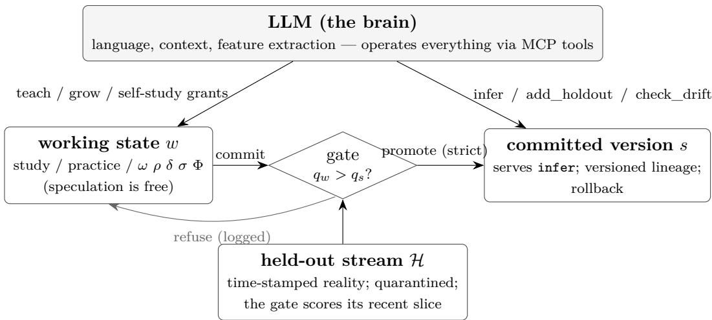  
Figure 5: The governed lifecycle. Speculation (learning and all growth operators) is free in the working state; serving changes only through the gate; the held-out stream is quarantined from all training. Teaching by the brain can therefore never degrade the served model (threat model: §9).

Store-per-version and forgetting. Every version carries its own accumulated training store; a candidate is trained from scratch from its store. At kilobyte scale this full-replay discipline is cheaper than any forgetting-mitigation machinery and makes catastrophic forgetting a non-issue at this scale (full replay: nothing is forgotten that is re-trained from the record every time); where the drift protocol’s recency window sheds older data, forgetting returns as explicit, logged policy rather than as an accident of optimization. It also makes every version a pure function of its store — reproducibility as a side efect — and confines a rejected candidate’s data to the rejected version’s directory, outside the served lineage.

The drift protocol. check\_drift compares the active version’s metric on the recent held-out slice against the score recorded at its promotion; decay beyond tolerance raises needs\_reteach. Adaptation is then ordinary teaching under two recency parameters: window = N trains on only the most recent N stored examples (shedding labels the new reality contradicts, while the full store remains in the lineage), and recent\_n = N judges the gate on the most recent N held-out examples — necessary because a mixed-era holdout can score the adapted candidate and the stale incumbent to an exact tie, and a strict gate would then block adaptation forever. Drift handling is thus not an operator’s habit but an API contract: notice decay, re-teach on the recent window, be judged on recent reality.

Granted self-study. The model can also improve itself: self\_review is a read-only self-report (retention trends, learning progress, saturation, a self-generated question list — see App. A.4 for what proves real), and run\_self executes a budgeted self-study session — consolidation over the model’s own store, optionally proposing growth — under explicit consent: granted budgets only, every block logged, nothing autonomous, and the gate retaining sole promotion authority. The holdout is never studied: self-study that could train on the gate’s own evidence would corrupt the certificate, so the store and the holdout are disjoint by construction, and violations are refused with an explicit logged error.

Readable regularities. Categorically-shaped models additionally mine their store into an ordered decision list in the classical separate-and-conquer family [20, 21] — human- and LLMreadable IF/THEN regularities with confidence and support, surfaced through discoveries and cited by infer when the mined rule agrees with the network’s prediction. The extension thereby returns to its brain something pre-training cannot contain: the regularities of this domain, as this model’s data shows them.

Two governance-integrity contracts. Two contracts of the served surface, added after the campaigns’ audit trails exposed their absence, are now part of the lifecycle’s specification: policy writes to the growth-policy dictionary merge one level deep (installed governance keys survive unrelated writes; an explicit null removes a key), and the parameter budget judges every growth entrance — direct verbs, plans, and bounded trials alike — as a whole act, the primary move plus any auto-compliance rider, before any mutation. Both contracts are enforced by the same refusal discipline as every other gate.

## 8 Evaluative Learning under Total Plasticity

Teaching supplies the model with labeled evidence; service supplies it with outcomes. This section extends the governed lifecycle to the second kind of signal: learning from evaluations — scalar judgments of how well an episode went — without giving up any part of the total-plasticity contract. One evaluative primitive appears at two levels of the system, and both levels answer to the same gate.

## 8.1 One evaluative primitive, two loops

The S-loop: preference over structure. Growth moves (widen, deepen, and their sites) are discrete choices whose value is only observable after the fact. The structure loop keeps, per move family, a bucketed record of credited advantages: when the gate adjudicates a grown candidate against its incumbent, the scored advantage is credited to the move that produced the candidate, and the running suficient statistics (count, mean, variance) accumulate in the move’s bucket. Selection over buckets supports five interchangeable rules; the production default samples each bucket’s posterior mean under a fixed-scale Gaussian perturbation, $\tilde { q } _ { m } = \hat { q } _ { m } + \sigma _ { 0 } \sqrt { v _ { m } / ( w _ { m } + 1 ) } \varepsilon$ — where $\hat { q } _ { m } , v _ { m } , w _ { m }$ are the bucket’s running mean, variance, and count, $\varepsilon \sim \mathcal { N } ( 0 , 1 )$ , and $\sigma _ { 0 }$ is a fixed exploration scale in the posterior-sampling family [141] — so that exploration narrows as evidence accumulates while no bucket’s scale is ever re-tuned against outcomes (the five rules: a fixed preference, a clipped greedy mean, the sampling rule above, an upper-confidence rule, and an ε-greedy rule). Preference never mutates the model: it only orders which candidate is ofered; adoption remains the gate’s alone.

The P-loop: policy optimization on the model. The same model that learns from teaching can learn from episode returns. The policy loop implements clipped-surrogate policy optimization (the PPO/GRPO family [124, 126]) directly on the growable substrate through the pseudo-target identity

$$
{ \boldsymbol { y } } ^ { * } ~ = ~ h ~ - ~ { \frac { \partial { \mathcal { L } } } { \partial h } } ,\tag{12}
$$

which converts any diferentiable policy loss L at the model’s output h into a teaching target for the existing learning kernel: one mechanism serves both supervised evidence and evaluative gradients. Advantage estimation [125], ratio clipping, entropy regularization, and the optional KL term to a reference policy are computed outside the substrate and enter only through Eq. (12); the model itself remains a teachable network with no reinforcement-specific machinery inside its weights.

One governance. Both loops answer to the paired-episode gate: a candidate (grown or not) and its incumbent are scored on episodes drawn from a quarantined evaluation namespace, adoption requires a strictly better score, every adjudication appends an audit record (episode count, scores, provenance of the move), and rollback restores the pre-adoption version byte-for-byte. Five interface laws fix how the two loops co-exist: the two trainers are co-resident, not sequential phases of a lifecycle (LAW-1); teaching and reward learning interleave within one service life (LAW-2); anti-interference instruments — the incumbent-anchored reference and interleaved refresher steps — protect each regime from the other (LAW-3); the gate adjudicates across regimes, so an adoption must not trade one regime’s competence away for the other’s (LAW-4); and the S-loop is indiferent to which regime produced the evidence it credits (LAW-5).

## 8.2 The quasi-static law extends to reward learning

The paper’s verification discipline — a growable network at any instant is a fixed network, so every claim about the growing system must reduce, at each instant, to a claim checkable on a fixed twin built from independent components — extends to the policy loop. The twin is constructed from PyTorch oficial components only (nn.Linear, Categorical, autograd, torch.optim) [120], with the model’s weights transplanted; nothing of our implementation is on the reference side. At pre-growth, post-deepen, and post-widen instants the model and its twin agree in function to $5 . 3 \times 1 0 ^ { - 1 3 } – 2 . 2 \times 1 0 ^ { - 1 1 }$ maximum absolute error (cross-library tanh unit-in-last-place noise, arbitrated against a 50-digit mpmath evaluation [130]), and the function change at a growth instant is exactly zero. The policy-side computations — values, generalized advantage estimation, and the clipped loss — agree at every checked instant; a full 40-update training run yields parameter trajectories identical to the oficial-autograd twin to $1 . 8 \times 1 0 ^ { - 1 5 }$ , and the anchor-term pipeline matches the oficial divergence-and-autograd path to $2 . 8 \times 1 0 ^ { - 1 7 }$ . At a grown instant the model’s internal Adam reproduces torch.optim.Adam on the transplanted twin to $7 . 1 \times 1 0 ^ { - 1 2 }$ over a 50-step weight trajectory, and a loss-convention arbitration identifies the model’s gradient chain as exactly 0.5× the mean-square autograd convention $( 3 . 0 \times 1 0 ^ { - 1 2 } )$ rather than assuming it. Beyond the twin, component-and-outcome comparisons against authoritative implementations Stable-Baselines3 full-pipeline training, its oficial advantage bufer, gymnasium environments, and an industry bandit library [127, 128, 129] — pass in all nine registered cases.

## 8.3 Experimental design

Worlds span an in-house seeded family — a stationary control world and a staged world run at a capacity-suficient width — and the quadratic staged world (capacity-binding), whose stages arrive on a schedule, plus external gymnasium environments [128]: CartPole with a mid-life dynamics change, LunarLander, and the sparse-reward task of §8.5. The central control is the protocolmatched twin: an arm whose candidates are trained clones under the identical ofer schedule, warmup budget, and gate, so that any diference from the growing arm isolates structure itself from the compute and protocol that surround it. Instrument pre-verification — registered after the first battery and applied to every capacity-claim battery thereafter — runs a capacity-binding probe (does a larger fixed net actually score higher here?) and an outcome-variance probe (is the world’s signal readable at the registered episode budget?) before any arm, so that arms are run only where the instrument can measure. Pass criteria are registered before any arm runs; evaluation seeds for selection and for scoring live in disjoint namespaces; adoption costs (warmup episodes, evaluation episodes) are accounted per-arm. Two anti-interference designs are part of the method: the incumbent-anchored reference is installed before training begins (its free twin otherwise byte-identical), and task-consistent alternation compares regimes at an equal reward-learning budget. Each battery runs five seeded lives per arm (ten for the LunarLander gate battery); worlds, model sizes, episode budgets, ofer schedules, and pass criteria are frozen in the registered design documents and per-run JSON stores named in the Reproducibility Statement. The design laws here are scale-independent; they are stated so that the same experiment shapes can be applied to larger models unchanged.

Table 3: The three-regime law for structural growth under evaluative learning. “Time-axis value” is area under the per-episode score curve over the life; gaps are grown-arm minus protocol-matched twin, and score scales are per-world — magnitudes are not comparable across rows. Registered criteria: at least 3 of 5 per five-life comparison; for the LunarLander gate comparison, an adoption in at least 6 of 10 lives.
<table><tr><td>Regime</td><td>Net effect of growth</td><td>Evidence</td></tr><tr><td>Capacity binds</td><td>higher time-axis value</td><td>quadratic staged world: reward-only 3/5 (mean gap +10.8), alternating regime 3/5 at its registered criterion (mean +1.1); CartPole after the dynamics change: 3/5 paired lives with one tie (Figure 7); LunarLander, gate-level merit only: grown candidates pass the gate in 8/10 lives, trained clones in 0/10</td></tr><tr><td>Capacity suffices (capacity-sufficient staged world), designed alternating teach-reward regime</td><td>cost-neutral</td><td>(long-run net effect unresolved, §8.5) mean AUC gap -1.9 (ties dominate; the registered value line missed, 0/5 — the wash itself is the recorded outcome, per</td></tr><tr><td>Capacity suffices (same world), reward-only operation (outside the designed regime)</td><td>transient cost</td><td>the registered clause) mean AUC gap -33.9; the designed regime removes 94% of it</td></tr></table>

## 8.4 Results: a three-regime law

Across worlds and arms the outcomes organize into three regimes (Table 3; Figures 6 and 7).

Where capacity binds, the growing model attains higher time-axis value than its protocolmatched twin (per-seed counts and margins in Table 3; within the designed alternating regime the capacity-binding margin is small at this scale — 3/5 at its registered criterion, mean +1.1); on LunarLander the asymmetry appears at the gate itself — grown candidates demonstrate immediate merit that trained clones at equal budget do not. Where capacity sufices and the system runs in its designed alternating regime, growth is cost-neutral: the alternation itself absorbs the adaptation transient that reward-only operation would pay (94% of the reward-only gap removed). The only setting in which growth shows a net transient cost is reward-only operation outside the designed regime — a regime the method does not prescribe.

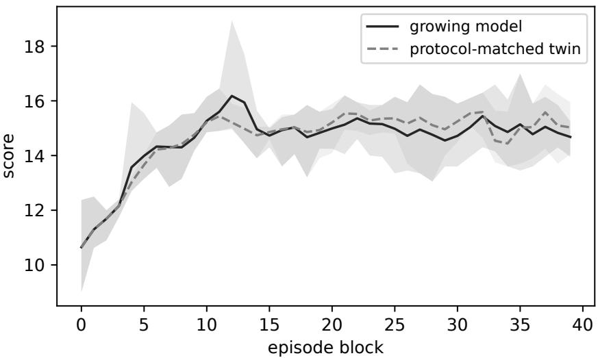  
Figure 6: The capacity-suficient staged world (distinct from the capacity-binding quadratic staged world of Table 3), designed alternating teach–reward regime: mean score curves over five seeds (bands span the seeds). The growing model and its protocol-matched twin track each other — the cost-neutral regime of Table 3.

Governance results are exact: candidates with nothing to ofer (untrained clones) are refused in 5/5 lives with final evaluations identical to the no-ofer control (a deterministic pipeline with zero adoptions), and every adoption in every life carries a complete audit record. The anti-interference instruments measure as designed: the incumbent-anchored reference lowers policy drift in 5/5 lives (11.6–20.4 versus 25.8–33.7) at finals not worse in 3 of 5, and interleaved refresher steps leave taught-knowledge probe error 5.9–95× lower at an equal reward-learning budget (Figure 8). Finally, the two loops run together on one model: in 5/5 stacked lives every adoption decision is audited and the preference bookkeeping tracks the gate’s verdicts exactly, including the sign of a zero-gain refusal.

## 8.5 Boundaries and negative results

Four boundaries are part of this record. First, a designed falsification test: the hypothesis that growth’s transient cost is dominated by optimizer-moment loss was tested by transplanting the incumbent’s Adam moments into the grown candidate; the cost did not move, and the hypothesis is refuted — the transient is carried by the function change, not the optimizer state. Second, an instrument retirement: an adaptation-speed metric saturated across arms and was retired in favor of area-under-curve measures. Third, one sparse-reward task (Acrobot) remained beyond the registered moderate-scale protocol after three mechanism-level remedies; the proximate mechanism (policy-entropy collapse) was identified by a live probe and the task is recorded as out of reach at this scale rather than tuned into range. Fourth, the long-run net efect on LunarLander lies below the resolution of the moderate-scale protocol and is reported as unresolved rather than claimed.

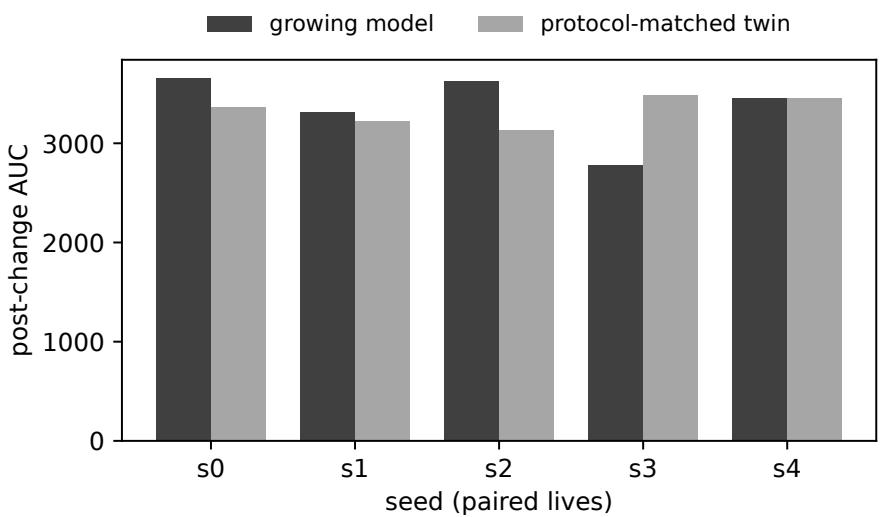  
Figure 7: CartPole with a mid-life dynamics change: paired post-change area under the score curve, growing model versus protocol-matched twin, per seed.

## 9 An LLM Operates the Model

The division of labor. The LLM is the brain: it reads the world, decides when a specialized judgment is needed, extracts the features the model’s learned shape names, calls infer, and interprets the answer in context. The soft model is the brain’s growable extension: kilobytes of forever-trainable weights carrying one domain’s validated experience — no language, no base model, because general capability already sits on the other side of the call. This division is what makes total plasticity afordable: everything that must be large is borrowed from the brain, so everything that must stay plastic can stay small.

Threat model. The guarantee “teaching cannot degrade the served model” holds for a carelessbut-honest operator: one that may teach wrong, redundant, or contradictory content, but does not corrupt the evidence channel. In the released system the same principal that teaches also writes the held-out stream (add\_holdout), so holdout provenance is the root of trust: an operator (or an upstream prompt injection) that poisons the holdout and teaches to match it will pass the gate while degrading true quality. Deployments that cannot assume an honest operator should source held-out reality from a principal separate from the teaching channel. rollback is audited but not gated — it re-points the served version without a fresh gate success — and should be treated as an operator privilege, not a governed transition.

Self-documenting tool surfaces. The factory exposes nine tools over the Model Context Protocol (list/create/infer/teach/add\_holdout/check\_drift/discoveries/versions/ rollback); the full system exposes fifty-two, adding the operators, the growth-control instruments (deepening, dry-run proposal, bounded trial, rule plans, snapshot/rollback, assessment), self-study, substrate advisory, and the standard-method baselines. Both servers hand the connecting client an operating manual at initialization (MCP instructions): the required order (holdout before teach — the gate needs reality before it can certify), the feature-extraction contract, the drift loop, and recovery guidance for the common failure modes. The protocol makes the safety guarantees legible to the operator: teach freely — the gate protects quality; grow freely — exactness protects the present.

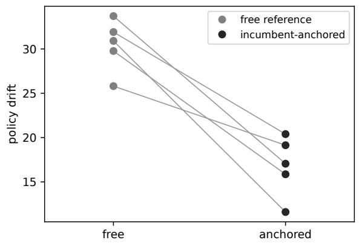

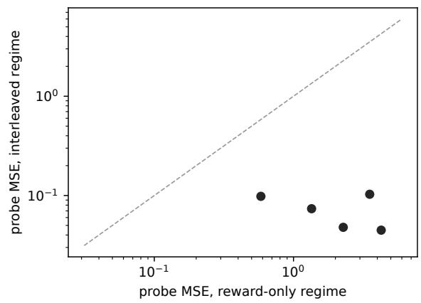  
Figure 8: Anti-interference instruments. Left: policy drift with a free versus incumbent-anchored reference, paired per seed (lower in 5/5). Right: taught-knowledge probe error under the interleaved versus reward-only regime (log–log; all points below the diagonal, by 5.9–95×).

Validation of this surface, driven end-to-end by a production LLM, is reported in App. E.

Two deployment regimes. The platform serves two data regimes with two strategies, and only one of them is this paper’s theory. Where the data carries stable underlying laws beneath drifting surfaces and a growing inventory — the regime every result in Part II is drawn from — the growable soft model under the governed lifecycle is the intended tool. Where it does not — a simple curve-fitting relationship that a small fixed network already captures, or a task whose data never changes — the same factory serves conventional fixed networks under a rebuild-on-change policy: the drift monitor raises a signal, the orchestrator commissions a fresh network from zero (larger if needed), the evaluation gate certifies it against held-out reality, and the versioned deployment switches over. That policy is pure caller-side orchestration over verbs the platform already exposes (check\_drift, create, train-to-convergence, gated promotion, rollback); no core mechanism changes. This is stated as a system capability, not a claim: the platform degrades gracefully into a conventional model-lifecycle manager wherever the theory’s home regime does not hold.

Lowering the barrier: a bespoke model as an ordinary software artifact. Today an application developer who wants machine intelligence in a product typically builds on hosted foundation models; a smaller group fine-tunes open base models; training and operating a model of one’s own remains the province of specialist teams with substantial accelerator budgets. This platform addresses the gap between those tiers: a working developer with no machine-learning background can build, own, and operate a domain model on their business data with efort comparable to writing a small program. The interface is a natural-language-driven operator plus declarative data onboarding: the developer describes the desired judgment in plain words, supplies a schema and a data feed, and instructs the operator to proceed. The general-capability operator — an LLM driving the tool surface above, validated end-to-end in App. E — then carries out fully automated model lifecycle management: model construction, training, evaluation-gated promotion, versioned deployment, and rollback are procedures the platform automates, not knowledge the developer must hold. It runs on ordinary CPUs; models are kilobytes to megabytes; every transition is audited and reversible. The scope is stated explicitly: this lowers the barrier to small domainspecialized models — the organ scale of this chapter’s division of labor — not to foundation-model construction.

## 10 In-Service Continual Learning as the Natural Habitat

The regime this model is designed for has a name in the literature: continual learning — a long-lived model on a non-stationary stream, expected to keep serving while it keeps learning. Work in that field identifies two coupled failure modes of standard training. The first is catastrophic forgetting [57]: training on new material overwrites competence on old material. The second is loss of plasticity [65]: under long-horizon training, networks progressively lose the ability to learn at all unless learning capacity is actively maintained. The two pull in opposite directions, and the field’s classical summary term for the tension is the stability–plasticity dilemma [27]. This section states how the present theory addresses that regime structurally; the measured behavior appears with the campaigns (§13.5).

## 10.1 Structural answers to the two failure modes

Plasticity, by axiom. Loss of plasticity presupposes a fixed capacity that training exhausts. Under the total-plasticity axiom nothing is ever frozen, and capacity follows demand: where learning stalls against capacity, governed growth adds it, with exactness at application and every new parameter trainable from step one (§2). Plasticity is thus not an optimizer property to be preserved by intervention; it is a structural resource under governance. The campaigns record the corresponding health measurements (dead-unit fraction, efective rank) remaining at their healthy values through every lifetime measured (§13.5).

Forgetting, by placement. New demand is absorbed by new capacity that enters at zero: the preservation propositions guarantee that the instant of structural change does not move the served function, and the input-conditioned ports give grown capacity a natural association with the input regions that demanded it. What structure alone cannot do — and the campaigns measure this boundary plainly — is prevent the shared trunk from following the only gradient it sees under a strict domain switch. The load-bearing treatment for that regime is review: re-inputting old knowledge from the model’s own experience store — the mechanism the classical complementary learning-systems account assigns to replayed experience in consolidation [116]. The model’s store makes review self-contained; no external archive of old data is required.

## 10.2 The anti-forgetting ladder

The strategy layer composes three levels of defense, each an orchestration of served interfaces — the core contributes complete interfaces, strategies remain caller-side:

R1 — protection windows (dose). Event-scoped, per-region learning-rate reduction around a growth instant: the newborn part integrates while the old regions are shielded from its initial noise. Windows are surgery care: efective at growth events, and measurably not a treatment for long-horizon forgetting.

R2a — structural response. Demand-triggered growth absorbs new structure in new capacity; it composes with review and carries the new-domain side of the trade.

R2b — review courses (data). A bounded, curated course drawn from the model’s own store, started after the new-domain turbulence stabilizes, and repeated at spaced intervals: spaced repetition — the long-established distributed-practice principle of the learning sciences [122, 123] — is the standing review strategy, and repetition count acts as the retention dose. Placement matters because a completed course erodes under continued new-domain training; repetition is the measured counter.

A fourth, intrinsic level — local process objectives by which old regions continuously rehearse their own knowledge — is future work.

## 10.3 Evaluation on the time axis

The natural evaluation for this regime is longitudinal: a life is judged by its trajectory — retention of earlier competence, adaptation cost when the world changes, service continuity through structural events, and the auditability of every decision — rather than by a single end-state score. The campaigns adopt this protocol: within-life retention ratios, compute-to-parity against retraining, relearning savings when a domain returns, and per-decision audit trails, reported with the runs (§13.5).

## Part II. Empirical Evidence

## 11 The Core Method on Standard Continual-Learning Benchmarks

The previous section’s habitat argument makes claims that the field’s own instruments can test. This section evaluates the core method — the growable model under its full governance — on the standard continual-learning benchmark family, at moderate scale, with every pass criterion registered before its run. Table 4 summarizes every lane’s registered criterion and outcome. (These external benchmarks complement the in-house continual-learning campaigns of §13.5, which run on the registered world families.)

## 11.1 Benchmarks, fit, and protocol principles

The benchmark family is Split-MNIST (five two-class tasks, consecutive digit pairs, arriving sequentially), Permuted-MNIST (fixed seeded permutations), and Fashion-MNIST under the identical protocol [140, 142]; candidates outside the moderate-scale, dense-input domain of kilobyte scale models were rejected on fit grounds rather than prominence. Three protocol principles govern every lane. First, protocol fit: the training protocol belongs to the method under test — the model runs in its designed regime (multi-epoch task training interleaved one-to-one with small replay) — while each evaluation subject receives the measurement that fits its own question; the two concerns are never conflated. Second, quarantine: train, validation, and test rows are disjoint; the gate scores candidates only on validation slices, and no test item is ever trained on — examinations ask unseen questions of a studied topic, never the studied items. Third, instrument pre-verification: a capacity-binding probe (a larger fixed net must actually score higher), a resolution probe (the efect must exceed the measurement’s confidence interval), and, for long sequences, a decline probe (the phenomenon under test must be present) gate every batch; instrument sizes are calibrated only at the probe stage and then frozen, with every calibration iteration on record; the frozen settings include the fixed control’s width, the growth step, the replay dose (two hundred stored rows per past task, capped at the ten most recent tasks on the long lanes), and the review step size. Data handling is plain NumPy [121] with pinned checksums.

## 11.2 Capacity under sequential arrival

On Split-MNIST at full data (ten seeds, five arms), the growing model scores above the fixed small control in 9 of 10 seeds and above its protocol-matched twin — the compute-and-protocol equal control — in 9 of 10; retention is not worse in 8 of 10. The governance lane is exact: a life ofered only valueless clones adopts none of them and finishes with float-exact identical final evaluations to the no-ofer control in 10 of 10 lives. Against the parameter-matched ceiling (a network born at the growing arm’s maximum possible size), the grown model’s final accuracy is 77% of the ceiling’s (ratio of mean accuracies) while ending at fewer parameters on average (7,117 versus a per-seed mean of 8,273). This is parsimony at an accuracy cost the ceiling comparison quantifies (absolute mean accuracies 0.580 grown versus 0.754 ceiling): capacity was bought only where the gate certified value. The registered reduced-dose pilot shows the same shape (75% recovery). The permuted lane confirms both of its registered lines (final accuracy above the fixed control, retention not worse; 5/5 each) at five seeds. On Fashion-MNIST the controlled comparison holds (the growing model above its protocol-matched twin in 3 of 5 seeds, with governance again exact); its remaining lines are a dose boundary reported in §11.5.

## 11.3 Long-sequence plasticity

The field’s current central concern is not whether a continual learner remembers, but whether it can still learn as tasks keep arriving [65]. At twenty permuted tasks (reduced scale, five seeds), the fixed net loses up to 39 points of new-task learning ability across the sequence while the growing model’s keep-learning curve stays essentially flat to improving (declines −8.3 to +1.3 points; positive decline = lost learning ability) and its final accuracy is higher in all five lives.

Scaling to full data exposed a measurement subtlety that we report as a finding: with five epochs of training per task, heavy retraining masks the efect — the same probe that shows a 39-point collapse at reduced scale shows only 4.6 points after full retraining, because a fixed network, retrained through enough epochs, still reaches a passable score. The protocol therefore splits training from measurement: the model trains in its designed regime unchanged, and plasticity is read in the single-pass window — the arriving task’s test accuracy immediately after its firs epoch, before further retraining obscures the reading. The split protocol and its ten-seed pass criterion were registered before the forty-task battery ran; the masked full-data reading entered the record first, as the probe that motivated the redesign (a motivating probe, not adjudicated evidence). Under this reading the decline is plainly visible at full data (7.6-point first-pass decline for the fixed net at forty tasks), and the separation is clear at this seed count: across ten seeds the growing model’s first-pass decline lies in [−2.6, +5.0] points against the fixed net’s [+4.9, +10.8] — lower in 10 of 10 seeds (single-head argmax over ten classes; the chance level is 0.1), unchanged (10 of 10) when the ten growth-ofer tasks are excluded from the curve, so the efect is not an artifact of candidate warmup (Figure 9). As a component-level cross-check under the field’s own canonical protocol — a single pass per task with no replay in either arm — the growing model’s first-pass decline is lower than the fixed net’s in 8 of 10 seeds, meeting its registered criterion exactly; the gate adopted three to seven growth ofers per life under that protocol, so governance operates unchanged outside the designed regime.

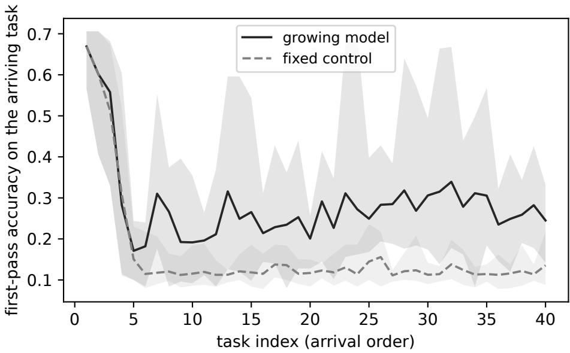  
Figure 9: Keep-learning curves at forty full-data tasks: accuracy on each arriving task after its first training epoch (means over ten seeds; bands span the seeds). The fixed control’s first-pass score decays along the sequence; the growing model’s holds.

## 11.4 Review and the just-in-time refresher

An in-service model is sometimes asked to answer for material it studied long ago. The natural protocol is the one humans use for examinations: the examination is announced; each subject is reviewed just before its own examination, from the textbook (fresh samples of the task’s training corpus, never examination items); and subjects are examined independently — one subject per day, each day starting from the same post-service state, so no other subject’s review interferes. The allocation matters as much as the budget: an equal review window spread uniformly over all subjects would redistribute competence rather than restore it — favoring an evenly mediocre model and interfering with a specialized one — so review is targeted at the examined subject, consistent with the targeted-review result of §13.5. Under this protocol, on the forty-task full-data lane, with a finite equal review window for both arms (60 steps over a 200-row sample per subject), the growing model’s all-task examination mean rises from 0.1818 to 0.2153 (+3.4 points) while the fixed control’s falls from 0.1718 to 0.1576 (−1.4 points); the growing model is higher in 10 of 10 seeds. The asymmetry is the plasticity result in another guise: the model that can still learn converts review into recovered competence — its long-ago band rises by 3.9 points while its recent expertise is preserved (0.340 to 0.355) — whereas the fixed control does not recover under the same window (−1.4 points); the window and its step size are registered identical for both arms, with no per-arm dose tuning. The converse is an experience worth recording for practitioners: a fixed net’s apparent retention advantage on long-unreviewed material can be a symptom of the same decline — having largely stopped learning, it has also stopped overwriting — so retention comparisons over unreviewed material can reward incapacity rather than memory. For an in-service model the asymmetry is, at the tested scale, a deployable property: when an old line of work returns, a brief refresher on that work’s material restores competence without disturbing current duties.

Table 4: Continual-learning benchmark results. Every criterion was registered before its run; the two uncontrolled Fashion lines and their dose boundary are described in §11.5.
<table><tr><td>Lane</td><td>Registered criterion</td><td>Outcome</td><td>Final params / note</td></tr><tr><td rowspan="4">Split, full data</td><td>above fixed control  $\geq 8 / 1 0$ </td><td>9/10</td><td rowspan="4">7,117 vs. 8,273 ceiling</td></tr><tr><td>above protocol twin  $\geq 6 / 1 0$ </td><td>9/10</td></tr><tr><td>retention not worse  $\geq 6 / 1 0$ </td><td>8/10</td></tr><tr><td>governance: identical finals</td><td>10/10</td></tr><tr><td>Split, pilot</td><td>all four lines</td><td>met</td><td>75% ceiling recovery</td></tr><tr><td>Permuted</td><td>both lines</td><td>met (5/5)</td><td rowspan="3"></td></tr><tr><td>Plasticity, 20 tasks</td><td>all three lines</td><td>met (5/5)</td></tr><tr><td>Plasticity, 40 tasks</td><td>first-pass decline lower  $\geq 8 / 1 0$ </td><td>10/10</td></tr><tr><td>Canonical single-pass</td><td>multi-pass companion line  $\geq 8 / 1 0$  decline lower  $\geq 8 / 1 0$ </td><td>7/10 (§11.5) 8/10</td><td></td></tr><tr><td>Independent exam days</td><td> $\geq 8 / 1 0$ </td><td></td><td></td></tr><tr><td>Fashion (controlled)</td><td>post-review mean higher above protocol twin  $\geq 3 / 5$ </td><td>10/10 3/5</td><td></td></tr></table>

## 11.5 Boundaries

Five notes bound these results. First, on Fashion-MNIST, the two field-standard uncontrolled lines missed their registered criteria at the registered dose (each 2 of 5, at two epochs per task): the ofer protocol itself carries a cost on the harder data, which the controlled comparison absorbs but the no-ofer baseline does not — a dose boundary, not a mechanism failure. Second, the canonical single-pass reading passed exactly at its registered criterion (8 of 10), and is flagged as such, as is the Fashion controlled line (3 of 5). Third, an experimental-integrity note: in the review experiments, every life’s service period is required to reproduce the base run’s per-task learning curve, audit trail, and pre-review score exactly — all twenty lives of the exam-day experiment did; the same reproduction discipline had already caught one instrumentation defect at its first seed during development. Fourth, the plasticity lanes compare the growing model against the smal fixed control only; a large-from-birth fixed control’s keep-learning curve was not run in these lanes and is recorded as an open control (the parameter-matched ceiling exists only in the capacity lane). Fifth, the forty-task battery’s registered multi-pass companion line — final all-task accuracy above the fixed control in at least 8 of 10 — missed at 7 of 10 (the same 7-of-10 form as the twenty-task full-data run); the primary plasticity line is unafected, and the final-examination subject itself is answered by the review protocol of §11.4, whose registered line passed in 10 of 10. Beyond these notes, task-free continual learning — streams with no task boundaries — is future work; the drift-detection component already in the substrate (Bayesian online change-point detection [52]) is its natural trigger.

## 12 The Registered Program and Its Discipline

This part states what the registered empirical program established. Every number quoted in the chapters of this part is drawn verbatim from a registered report or recomputed from the archived run stores; the appendices carry the full worlds, protocols, and round narratives. Three principal results organize the remainder of this part: governed structural growth achieves scores at or above a budget-matched standard architecture where structure keeps arriving (the static sanity floor; parity at matched uncertainty, App. B), and network size follows demand in both directions (§13.1); a plastic model under governance holds its educated principles longer than a frozen one (§13.2); and growth governance is workable only in its ex-post form, at a measured price (§13.3).

## 12.1 The evidence discipline

Worlds, arms, metrics, and acceptance bars were frozen in written gate files before any verdict data existed; design iteration was confined to disclosed probe ledgers on burned seeds disjoint from the verdict seeds, which no iteration ever touched. Failure branches were written before the batteries ran and are quoted unchanged: the registered failures in this paper appear as measured boundaries, not as retrospective framing. For the evaluative-learning and benchmark campaigns (§8, §11), protocol iterations superseded by an improved registered design are archived, with their verdicts, in the experiment stores named in the Reproducibility Statement (the archived supersessions comprise a capacity-starved world setting, a three-step remedy series on the one out-of-reach task, two review-format iterations, and the pre-split terminal-exam reading (the twenty-task full-data store); none is cited as evidence in this paper); the paper reports each subject’s final registered design and its outcome, and the genuinely open boundaries are stated in place (§8.5, §11.5). Anomalies were autopsied before verdicts were written, and the instrument corrections that resulted were applied to every arm equally. Inference uses per-seed count criteria over the registered seed set — three deterministic seeds for the early E/S series, five for every later campaign of the v9 program, and three per arm for the 2026 campaigns (whose inferential claims are correspondingly ordinal), five lives per arm for the evaluative-learning batteries of $\ S 8$ (ten for the LunarLander gate battery), and five or ten seeds per arm for the benchmark lanes of §11, as registered per lane — each battery’s bar as registered — and no null-hypothesis testing is claimed at these n; per-seed values with medians and ranges accompany every aggregate of the adjudicating batteries in App. B. All experiments ran on CPU-class hardware with per-life wall-clock recorded in the archived run manifests; every run directory carries its configuration and content manifest, and reruns from the same seed reproduce results bit-for-bit.

Third-party refereeing. No self-written numeric kernel certifies itself. Every hand-written forward — the base substrates and every grown transient state — is refereed against the oficial components of a widely used deep-learning library (PyTorch [120]) by weight transplantation, agreeing at $1 0 ^ { - 1 3 }$ in double precision (and at the single-precision floor on the GPU referee — library certification infrastructure; the campaigns themselves ran CPU-only); hand-written gradients are refereed against automatic diferentiation. Accuracy certification is double-precision only; single-precision compute sits behind an explicit acknowledgment door whose refusal text states the measured error envelope.

## 12.2 The campaigns at a glance

Mechanism validation. The exactness and acceptance suites verify that every growth operator is exact at application and that budgets, gates, lineage, and holdout quarantine are enforced (PASS; App. A). The historical depth route is retained as record (App. G); the topology case study grows a governed structure end to end (App. F); the attention program grades per-head growth (App. A.5); the self-knowledge series shows self-reports are real while their exploitation remains open — a mixed verdict, recorded as such (App. A.4). Capability claims. The generalization campaign covers length extrapolation, compositional generalization, trigger behavior, and the EWC comparison (App. A.7); a real-data case study tests in-service learning on prequential concept-drift streams (App. A.6); the growth-value campaigns establish the transformer comparison $\left( \operatorname { A p p . ~ B } \right)$ ; the size-adjustability round establishes the crossover result; and the fidelity program establishes the education thesis under the corrected instrument (App. D); an operating LLM drives the factory end to end (App. E). Mechanism finding. Four governed-gate rounds locate the workable form of growth governance and its price (§13); their observations close this part (§14).

Registered campaigns of the depth axis [registered 2026-07-25; executed 2026-07-25/26]. Five further campaigns were registered here with their designs fixed before execution; the registration text below is preserved verbatim as the registration record, execution deviations are declared with the results, and the measured outcomes — together with the optimization campaigns that followed them — appear in §13.5. E-3 in-service whole-layer insertion: a serving model receives insertions at head/middle/end positions on both substrate families — claims: serve continuity with instant-exactness at the insertion, and post-insertion trainability; within-run before/after design plus a no-insertion twin; pass lines pre-registered in the experiment’s design document. E-2 autonomous shape-governed growth: under a user aspect-ratio floor with auto-compliance, every instant of an autonomous run satisfies the shape law with zero gate collisions. E-6 protection windows at growth events: per-region rate scheduling at growth instants, judged on post-event stability at equal budget. E-4 exploration economy: dry-run pricing, bounded trials, and exact rollback against unconditional adoption at the same budget. E-1 controlled compositional deepening (author-designed): processing-depth growth under the full prevention stack against the additive-only regime and a tuned fixed baseline.

## 13 Main Results

## 13.1 Capacity follows demand

Two independent comparisons carry this claim. Against a budget-matched standard transformer on the generative arriving-structure track, the governed growable model achieved the better score on $5 / 5$ verdict seeds in the original battery, and the result survived two successively stricter governance regimes $( 4 / 5$ under the silenced gate; $5 / 5$ under incumbent–candidate governance; App. B). Against a lifelong-trained fixed network of the same substrate family under moderately but persistently growing data (classes arriving for the whole life to ∼400), the size-adjustability round established both directions of the claim: the network’s size followed demand — born at parity (12,020 backbone parameters; both arms’ class heads grow identically with the arriving inventory and are excluded from all counts here), every seed ended 4.6–4.9× larger through 15–19 promotions, each earned at audited checkpoints — and the grown model’s settled stage-exam score overtook the fixed network and stayed ahead on $4 / 5$ seeds, at (50 k, 17,614), (200 k, 27,411), (350 k, 35,288), and (550 k, 51,358) rows and parameters respectively. The two seeds without a clean end comparison are both disclosed: seed $2 \mathrm { { ^ { \circ } s } }$ end checkpoint falls within one audit window of a promotion and is excluded by the registered suficiency rule (raw end pair 0.222/0.265; its settled mid-life comparison reads 0.50–0.51 vs 0.31–0.32), and seed 1 ended behind (raw end pair 0.126/0.143) and is recorded as censored. Fairness terms are stated with the result: sustained overtake began at 1.47–4.27× the fixed network’s size (median ∼2.6×) — the measured exchange rate of capacity for score under identical training; and in the earlier extreme-paced round the same machinery proved size adjustability from a 2.4× smaller birth $( 5 , 0 2 0  \sim 4 0 , 0 0 0$ parameters, $5 / 5$ seeds). Figure 10 shows the full trajectories: both arms compared only after consolidation to a measured plateau at every stage.

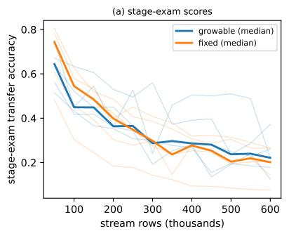

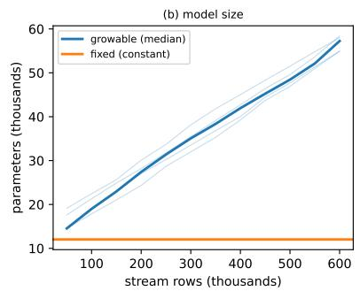

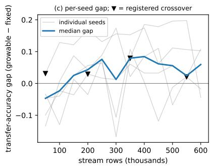  
Figure 10: Size adjustability under persistently growing data (moderate round; five verdict seeds faint, medians bold). (a) Stage-exam transfer accuracy of the growable and the lifelong-trained fixed arm; both decline as the class inventory grows to ∼400. (b) The growable arm’s size follows demand from parity (12k) to ${ \sim } 5 7 \mathrm { k }$ backbone parameters while the fixed arm’s backbone is constant. (c) Per-seed score gap (growable−fixed); markers denote the registered settled crossovers. Stage scores are taken only after both arms consolidate to a measured plateau.

## 13.2 Stability from governance, not immobility

The fidelity program’s final round gave both arms the same pedagogical curriculum, with a solidity gate (mean of the last three checkpoints $\geq 0 . 9 0 )$ enforced on the calibration seeds; on the verdict seeds each arm is anchored to its own measured graduation level (App. D, seed hygiene). After graduation, under surface drift and scheduled temptation, the plastic arm held its educated canon at least as long as the frozen arm on every seed: time-to-degradation favorable on $5 / 5$ under the registered ≥ rule — strict wins on $3 / 5$ (per-seed ratios $2 . 9 { \times } , 7 . 0 { \times } , 2 . 2 5 { \times } )$ with two seeds tied at the 1,000-row censoring floor, the frozen arm sitting at that floor in $5 / 5$ — decline-slope advantage on $3 / 5 .$ recovery advantage on $4 / 5 ;$ all under the corrected time-axis instrument $( 2 / 5$ at margin 0.05 under the original level instrument, App. D). On the re-education cost frontier, the frozen arm’s periodic rehearsal — which must sweep its full canon — never restored its decline at any logged cost, while the plastic arm’s remediation rides its always-on plasticity (App. D; Figure 11).

## 13.3 Growth governance is ex-post

Four registered rounds located the workable form of growth governance (Table 5). The naive gate satisfied the growing-track criterion $( 3 / 5$ against the fixed twin) but made $8 / 8$ regretted adoptions on the stationary public track; the silenced gate governed it to 2 breaches and thereby suppressed the growing-track response $( 1 / 5 )$ . The mechanism discovery followed: with training gains controlled away by a train-only control arm, the capacity efect is invisible at any afordable ex-ante probe horizon (pain-subset paired diferences $0 . 0 0 9 \pm 0 . 0 1 7$ against a long-run value near 0.1), and in the exam world probing is actively self-injuring (gate cross-entropy rising from 4.4–8.2 to 10.5–22.8 across eight instrumented events). Proof therefore moves ex post: the incumbent serves untouched while a grown candidate trains on the same rows and is promoted only at the first audited checkpoint at which it scores higher, with a demotion window guarding the promotion — trials are free (the serving trajectory is bit-equal to never-growing until a promotion) and wrong buys never touch service. Its price is the governance frontier: proof latency is exactly the head start a lifelong-trained incumbent keeps. A battery autopsy added the rollback-anchor requirement: an open demotion window’s anchor must be immutable, or a diverged incumbent is promoted over the last good state (observed at serving NLL 11.38; cured to 0.65 by spec enforcement).

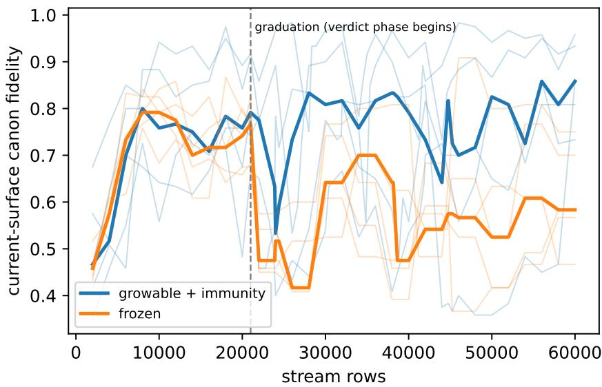  
Figure 11: Fidelity on current surfaces over life (five seeds faint, medians bold). Both arms are educated under the same curriculum to graduation (dashed line); afterwards the frozen arm’s fidelity collapses under drift and temptation while the governed plastic arm holds and recovers.

Table 5: The governed-gate arc (details App. B). Rounds 1–2 and 4 report the generative track’s C-N1 against the lifelong-trained fixed twin; round 3 ran in the open-inventory exam world, whose criterion is C-G1 (<sup>†</sup>the gate un-starved there: adoptions 0 → 2–3 per seed). <sup>∗</sup>The same round’s transformer comparison is 5/5. Appendix-internal round labels map to rows 2–4 here; X2b shares row 4’s governance form in the exam world. Each round’s observations appear in §14.
<table><tr><td>Round</td><td>Gate design</td><td>Growing track</td><td>Stationary regret</td></tr><tr><td>1</td><td>naive ex-ante</td><td>3/5</td><td>8/8 regretted</td></tr><tr><td>2</td><td>silenced ex-ante</td><td>1/5</td><td>governed, 2 breaches</td></tr><tr><td>3</td><td>shadow audit (exam world)</td><td>C-G1 0/5†</td><td>(no stationary track)</td></tr><tr><td>4</td><td>incumbent-candidate</td><td>1/5*</td><td>non-regret 4/5</td></tr><tr><td>4b</td><td>incumbent-candidate (exam world, X2b)</td><td>C-G1 0/5; C-G2 3/5</td><td>(no stationary track)</td></tr></table>

## 13.4 The audit tally

The correspondence table (Table 10) closes the accounting. Of its 64 claim rows, 35 are supported, 20 are boundary results whose limiting observation is named in the row, 4 remain open FAIL branches, 3 are diagnostic exhibits, 1 is a historical motivation row, and 1 is an auxiliary demonstration; 23 further rows record empirical observations (20 register-tagged observation rows and 3 scope or regime observations measured in claim position). Every number in this Part quotes a row.

## 13.5 The depth-axis and continual-learning campaigns

Fifteen campaign fleets (E-1–E-4, E-6/E-6b, E-7–E-15; E-5 was excluded by design before execution) executed in 2026-07 under the registered discipline: pass lines fixed before each fleet, judges reading run files only, write-once run directories, and every number below traceable to a committed run directory (App. H). Two library defects surfaced by these campaigns’ own audit trails were fixed under change control mid-program (the afected arms were re-run on the fixed library and the superseded rows retained); the code anchor for every adopted row is the tag depthgrowth-v1.7. Where a registered bar was not met, the analyzed cause accompanies the result; the emphasis throughout is on what the measurements establish.

Mechanism safety. A serving model receives whole-layer insertions at head, middle, and end positions on both substrate families without service interruption: the probe stream records zero failed serves across every life, and the served function at each insertion instant is bitwise unchanged (36/36 instants; inserted layers train thereafter, 36/36 aliveness). The controlled-deepening capstone repeats this in the presence of the full prevention stack — identity insertion, the shape law with auto-compliance, and event-scoped protection windows: training proceeds through three mid-life insertions in every seed with no collapse, and the deepened line ends at parity with an additive-only twin, and with a born-deep control in 2/3 seeds (the remaining seed reads 1.37× the born-deep control’s loss). Pure-δ instants are bitwise; whole acts that include an aspect-law widen rider preserve the function to machine epsilon (deviations of 2–3 × 10<sup>−16</sup>, the summation-order footprint of exact zero-extension). The post-insertion transient is real: descent immediately after insertion met its registered window in only 12/36 instants; the transient resolves with training budget, and its management is the subject of the governance campaigns.

Governance. Under a user aspect-ratio floor with auto-compliance, autonomous plan-driven growth satisfied the shape law at every instant with zero gate collisions in every seed, the floor provably binding (the refuse-mode preview marks the crossing steps in advance). The governed arm’s quality transient resolved within the pre-registered extension horizon (3/3 in-band at 50 batches). Protection windows at growth events damp the post-insertion spike (28/36 instants) at zero measured cost on healthy regions (9/9); where late insertions did not re-enter the twin band, the horizon probe attributes the residue to remaining training budget rather than to the window convention.

Economics. The control surface prices before it spends: dry-run quotes matched ledger actuals exactly across every adopted act, and every bounded trial restored the organ bitwise (including all rejections), so structural search leaves zero residue. Its one measured caution: a six-step probe under-prices delayed payofs (one seed rejected the deepening its task needed). Against retraining from scratch after a mid-life drift, in-service growth reached the retrained specialist’s quality at 58–64% of its post-drift compute in 2/3 seeds, serving throughout while the scratch alternative has a service gap by construction. When the world returns to an earlier regime, models that had adapted in service re-recover old competence in 2–3 batches against 20–29 for a fresh model — relearning savings of 7–10× (Figure 14): the old knowledge demonstrably survives inside the network even where the served function had to track the drift.

Continual learning. Under a strict sequential domain switch with no environmental replay, catastrophic forgetting reproduces at full strength (old-domain probe degradation 552–1,362× while the new domain is learned). Across the treatment ladder (the doctrine of §10), review is the load-bearing medicine: only arms that re-input old knowledge from the model’s own store retain it (ratios 72–300 across the forgetting-ladder review arms), while protection windows alone and added capacity alone do not treat this regime — the measured boundary that fixes each tool’s indication. The review regularities — called “laws” informally in the campaign records — each measured in its own campaign: targeted selection beats random at equal volume and equal diversity (the earlier contrary reading traced to a repetition confound); review timing dominates cost — a course started after the new domain stabilizes achieves comparable retention at roughly one tenth the new-domain cost of always-on replay; a bounded course beats open-ended replay on both axes; a completed course erodes under continued new-domain training; and spaced repetition counters the erosion, with the number of spaced courses acting as the retention dose (one/two/three courses: 341–800 / 252–438 / 73–149 in the controlled course-count family, monotone in every seed; Figure 13). Adding growth to a review course yields the best new-domain quality of any treated arm at weaker retention — structure carries capacity, data carries memory. Plasticity-health instruments stayed at their healthy values in every arm and every lifetime (dead-unit fraction 0.0; efective rank 5.6–5.8 of 6): the forgetting measured here is interference, not loss of plasticity.

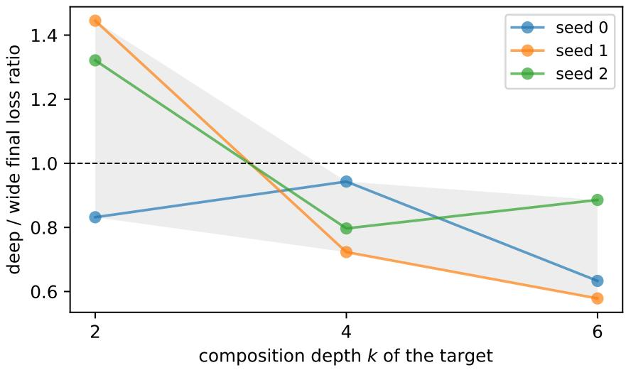  
Figure 12: Depth-separation mapping (three seeds, equal parameter cap; shaded band = seed range). The deep/wide final-loss ratio reverses with the target’s composition depth k: above parity at $k { = } 2$ for most seeds (depth wins in $1 / 3 )$ , and below parity for every seed at $k { = } 4$ and $k { = } 6 \mathrm { ~ - ~ }$ with the deepening arm holding 58% of the width arm’s parameters. Data: the depth-mapping campaign’s run directories.

The depth axis. On an iterated-composition family with the composition depth k as the controlled variable and one parameter cap for all arms, the ordering between the growth directions reverses with k (Figure 12): at $k { = } 2$ depth wins in $1 / 3$ seeds; at k=4 and $k { = } 6$ the deepening arm wins in $3 / 3$ — while holding 58% of the width arm’s parameters. Depth is the parametereficient axis exactly where composition is real, and unnecessary where it is not; the formally registered separation band was not met (its conjunction included the strategy arm), and the axis-selection question resolved separately: raw probe gains and per-parameter eficiencies carry no axis information, while the two-horizon slope does — under slope pricing the strategy adopts deepening first and matches the pure deepening arm’s quality $( 3 / 3$ on both registered lines at $k { = } 6 )$ . The additive family’s own boundary was measured as registered: on a three-level smooth composition at this scale it never saturates — the depth advantage requires genuinely iterated composition, which is precisely what the k-mapping establishes.

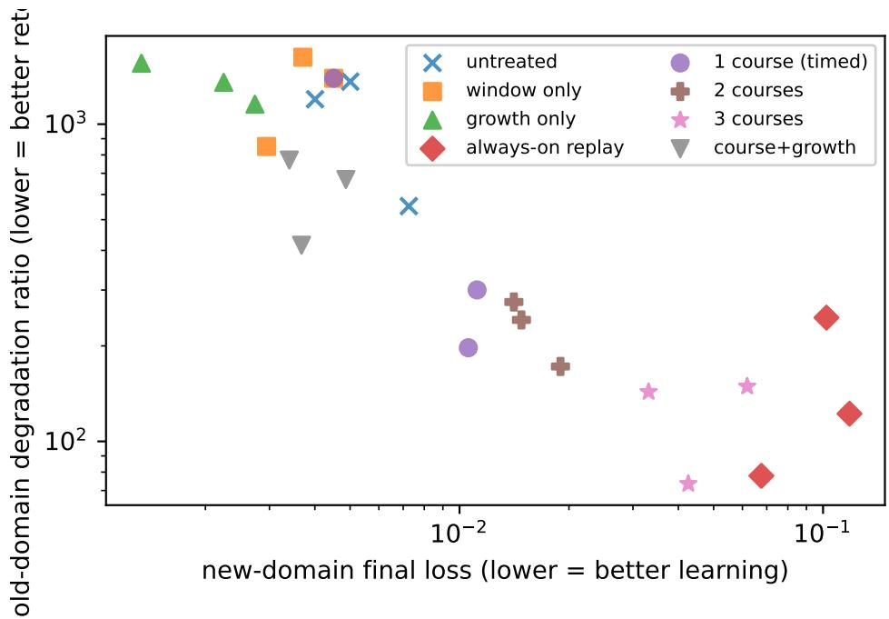  
Figure 13: The retention $/$ new-learning frontier under a strict sequential domain switch (both axes log; lower-left is better). Untreated, window-only, and growth-only lives forget at $1 0 ^ { 2 . 7 } – 1 0 ^ { 3 . 2 }$ ; review courses move lives to the frontier, with the number of spaced courses acting as the retention dose and course-plusgrowth taking the best new-domain corner. Data: the forgetting-family campaigns’ run directories.

## 14 Empirical Observations and Threats to Validity

The observations below are extracted from the campaigns; each is stated once, with one measured number and its registered artifact; the register tags L1–L20 are retained as archival identifiers. These are observations from the tested worlds — not laws, and not claimed beyond the conditions under which they were measured. The campaign texts retain their full derivations.

## 14.1 The observations

Measurement — what an instrument can and cannot say. (L1) Capacity binds on exams and is invisible to online scores: the same lives read 0.64 vs 0.44 on exams and tie prequentially (App. B). (L8) Verify the instrument before the theory: many apparent failures die in the instrument — one round’s escalation counter matched an invented event name and its unit test green-lit the bug (App. B.4). (L10) The metric decides governability: the adoption gate that starved on exact-match exams adopted confidently on per-sample-informative NLL, 0 vs 2–8 events per seed (App. B). (L14) Audits are blind of their metric: a +3,000-row bucket-CE audit kept a widen whose late-third exam score fell 0.04; in the incumbent–candidate round the same blindness passed promotions and demotions that harmed exams (App. B.6).

Curriculum — how lifelong education behaved here. (L4) Review dose is non-monotonic: doubling a drill moved its target 0.20 → 0.45; six-fold collapsed it to 0.17 and broke a neighboring axis (App. D). (L5) Exposure economics, not capability, binds in-curriculum learning: a skill drillable to 1.0 in isolation plateaus near chance in-curriculum (App. D). (L6) Plasticity is favored on live-world trajectories and disfavored by minimum statistics: the transition dip is the price of tracking (App. D).

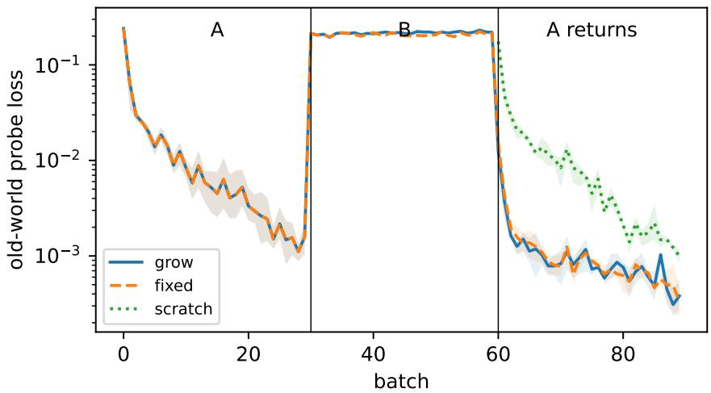  
Figure 14: Cyclic drift $( \mathrm { A \to B \to A } ;$ seed mean, shaded bands = per-arm seed range). During B the old-world probe rises for every arm (the served function must track the drift); when A returns, lives that adapted in service re-recover in 2–3 batches against 20–29 for a fresh model — the relearning-savings measurement of retention. Data: the cyclic-drift campaign’s run directories.

Governance — what it cost to govern change here. (L2) Small-scale gate outcomes are dominated by probe economics; removing self-injuring probe training cut life wall-clock $4 3  1 7 . 4$ s unchanged in verdicts (App. B.4). (L3) An instantaneous adoption gate cannot see lifetime consequences: the one tolerated adoption decayed $0 . 5 7  0 . 3 7$ long after its audit passed (App. B). (L7) Without immunity, defection tracks the incentive: 0.32–0.37 inside episodes against a computed $+ 0 . 4 1 \ ( \mathrm { A p p . \ D } )$ . (L9) Skip-based immunity faces a timing dilemma; re-anchoring recovers about half the loss at 11% cost, and the dilemma recurs in every governor with a horizon (App. D). (L11) A non-growing world needs no growth; stationary harm belongs to an unsilenced governor (8/8 regretted adoptions on noise) (App. B). (L12) Governors have regimes: the calm throttle engaged cleanly at zero era-adaptation cost yet cost fidelity $0 . 6 7  0 . 5 1$ in a world of permanent drift (App. D). (L13) The marginal value of capacity is ex-ante unobservable at afordable probe horizons: pain-subset paired diferences $0 . 0 0 9 \pm 0 . 0 1 7$ against ∼ 0.1 nats long-run (App. B.3). (L15) The price of silence: governing stationary regret away cost the growing track its margin, C-N1 3/5 → 1/5 (App. B.3). (L17) The governance frontier: proof latency is exactly the head start a lifelong-trained incumbent keeps — every governed round bought silence or non-regret at the cost of the within-life comparison within gate-round-length lives (30–40k rows, about one promotion window), while the transformer comparison held $5 / 5 , 4 / 5 , 5 / 5$ across rounds (App. B.5). The 600k-row size-adjustability lives bracket the same frontier from the other side: capacity pays in proportion to the trained life it has left (L16, L19). (L18) Rollback anchors must be immutable until resolved: clobbering an open demotion shadow promoted a diverged incumbent at serving NLL 11.38; spec enforcement cured it to 0.65 (App. B.5). (L19) A serialized candidate pipeline buys ∼1 promotion per 30–40k rows; worlds whose demand grows faster outrun the governor (App. B.7).

Capacity and time — when capacity paid here. (L16) Birth capacity compounds; mid-life capacity pays only over the life it has left — un-starving the gate narrowed the paired oracle gap $( 0 . 0 4 6 \to 0 . 0 3 4$ mean; median score $0 . 5 0 1 4  0 . 5 6 5 3 )$ and could not close it $\left( \mathrm { A p p . ~ B . 4 } \right)$ . (L20) Parameter demand requires irreducible information density: on a smooth-regression family a 20×

parameter range scored flat (NLL 1.38/1.36/1.34/1.38) — discrete memorization binds parameters;   
smooth regression does not (App. B.7).

## 14.2 Scope and threats to validity

These measurements were taken at kilobyte-to-tens-of-kilobyte model scale, on synthetic registered world families (token inventories, drifting surfaces, growing class sets, generative mixtures) plus a real-data case study, the MNIST-family benchmark lanes and the gymnasium environments of §8/§11, largely on the reference-network family (the insertion campaign runs on both families). The inferential standard is per-seed count criteria over the registered seed sets (three seeds for the early E/S series, five for every later v9 campaign, three per arm for the 2026 campaigns, and the §8/§11 batteries as enumerated in §12.1); no significance testing is claimed at these n, and per-seed values accompany every aggregate, in the appendices or in the archived run stores of §8/§11. External validity is claimed only as scale-independent regularities — the observations of §14 are stated strictly within the tested families and scale; any wider reach is an open measurement. Exam-based instruments are noise-limited at small item counts, and audits certify only on the axes they measure; both limits are themselves recorded observations. The theory-level limitations are discussed in the Discussion; this subsection bounds the measurements only.

## Part III. Discussion and Conclusion

## 15 Discussion

Scope of the 2026 campaigns. The campaign worlds are seeded synthetic streams at moderate scale (kilobyte-class organs, thousands of rows), three seeds per arm, largely on the referencenetwork family; the axis-signal result is measured at one composition depth in one world; retention statements are within-life ratios; registered constants (bands, floors, window and course conventions) are policy values, not derived quantities. Two library defects found by the campaigns’ own audits — and the tests-first fixes and re-acceptance that followed — are part of the public record; we regard the audit chain that caught them as part of the method.

Why smallness is load-bearing. Every guarantee in §2–7 has a price that shrinks with the model: full-replay retraining, dense versioning, per-version stores, speculative growth with gated adoption — all are afordable at kilobytes and would be luxuries at gigabytes. This is not an accident of implementation but the architectural consequence of the brain/extension division: once language, context, and feature extraction are the brain’s job, what remains — a mapping from a handful of features to a judgment — genuinely fits in kilobytes. Smallness is what lets everything stay soft.

What governance buys. Because every change is gated, the operator may act carelessly — noisy batches, contradictory labels, speculative growth — and the served model can only improve or stay. This inverts the usual posture of continual learning, where each update is a risk to be managed; here risk is absorbed by the lifecycle, which is precisely what makes LLM-driven operation safe without a human adjudicating each step.

Observability as a lifelong record. Recent interpretability work reads rich internal structure out of frozen model snapshots — most recently a privileged, limited-capacity “workspace” of verbalizable representations [106]. The contrast with this system is one of tense: a snapshot method observes what a network is; a governed lifecycle records what it has been — every head’s loading, entropy-band occupancy, and growth event across its service life, alongside every adoption decision. Lifelong instrument trajectories are, to our knowledge, an observable no frozen-snapshot analysis can reconstruct, and they are the concrete form self-knowledge takes here: distribution statistics as first-class, recorded objects.

Objections the axiom invites. Three are worth answering here. Is target handing a stopgradient? No parameter is shielded from adaptation: every scale trains at every step, and cross-scale pressure arrives as a target rather than a backpropagated gradient — the axiom governs trainability, not the routing of credit. Are budgets freezing? They are bounded structural plasticity: caps are runtime policy, refusals are logged outcomes, and both are adjustable within the model’s lifetime — unlike architectural omission, which is unbounded, silent, and permanent; we concede the plasticity they bound is real. Is the committed version a frozen artifact? Between promotions it is immutable by design — but the axiom forbids freezing of trainability, and training never stops in the working state; a gate that refuses indefinitely is behaving correctly (no candidate has scored higher on reality’s evidence), and drift re-opens the comparison by changing the evidence.

Where governance is the more suitable approach, and where freezing sufices. The comparison with immobilization is scenario-dependent, and the boundary we draw is the one the continual-learning literature itself draws. The surveys frame every family as a position on the stability–plasticity trade-of [14, 63], and the canonical taxonomy — regularization, replay, parameter isolation — is developed for task-incremental settings with clear boundaries [63]; the task-free setting was introduced precisely because most such methods depend on boundaries that data streams do not provide [64]. Loss of plasticity under continued training is a measured phenomenon [65], and per-task frozen columns spend capacity linearly while never revisiting it [32]. On this map, the governed regime is claimed for the settings those observations describe: schema growth — a frozen interface cannot represent a newly observable input at any weight setting, so the error floor is informational, not a training artifact (E11b measures exactly this null: the fixedtopology arm against the grown one) — sustained drift, and boundary-free change, where a gate needs only its holdout stream. Conversely, where the domain is fixed, the distribution stationary, and the schema closed, freezing is cheap, safe, and suficient [59] — the audit machinery here buys little and costs its overhead. We claim the governed regime for the first family of scenarios, not in general; the matched-parameter direct comparison under capacity pressure remains open (Limitations below).

The role of depth. The reference substrate, without composition blocks, has layer depth one (Prop. 4). Depth earns its cost on targets defined over intermediate quantities that must first be constructed from the input: there, deep networks of modest size compute functions that no shallower network can approximate unless its width grows exponentially in the depth or in the input dimension [41, 42], while superpositions of the single-hidden-layer form remain dense in the continuous functions on compacta [40] — a question of required size, not of attainable class. Refinement faces the complementary target: a residual, largely stripped of compositional structure by its host, for which the greedy stagewise fitting of an additive expansion is the classical form [43, 60] and carries dimension-independent approximation rates [44, 45] — in this language, the additive probe’s zero-attachment gradient (§4.3) is greedy approximation’s one-step gain, the stopping quantity of matching pursuit [46]; and the depth separations that mark the compositional class are the classical ones [41, 42]. The two demands also difer in timescale: the number of representational stages a domain requires varies slowly, whereas the content within stages is the locus of drift. The design therefore fixes the serving chain’s stage count at creation through the substrate choice (§3; the released hosts include a transformer encoder) and never inserts a stage into an operating composition — a global disturbance for a property that rarely changes. What the compositional operator adds is the one depth channel this argument always permitted: scope-interior composition $( \delta , \ S 4 . 3 )$ , entered exactly when a scope’s own signals certify that the additive route has stopped paying, and adopted only through the gate. Lifelong plasticity thus divides by timescale: detail and interface to ρ, ω, σ; composition depth to δ on the delayed-payof slope signature; structural obsolescence to gated re-founding (Φ).

A mechanical view of learning systems. The reading of $\ S 3$ is an instance of a duality with a distinguished pedigree: computation is physical [77], physics is computable [76]; and, conversely, learning dynamics is a mechanics: energy functions over network states [78], inertial methods as damped mechanical systems [79]; and fitting a network is a parameter-identification inverse problem — backpropagation being the discrete counterpart of the adjoint-state method by which such gradients are classically computed [89, 90, 91], a correspondence that becomes literal in the optimal-control formulations of deep learning [92]. In this duality the whole lifecycle reads as an adaptive structure under load: it relaxes level by level, grows a degree of freedom where relaxation persistently fails $( u _ { j } )$ , and realizes only those virtual changes that lower a held-out measure — the gate as a virtual-work test [18]. We use the correspondence as a source of precision, not as a claim of physical equivalence.

Limitations. At the tested scale the program demonstrates safety and exactness, not necessity or superiority; the matched-parameter direct comparison against the wider immobilization family (progressive columns, frozen backbones with adapters) on a capacity-pressing task is the decisive open experiment — the EWC comparison itself is on record (App. A.7, supported $3 / 4 )$ . The evidence is kilobyte-scale, and the core program is synthetic by design (hidden-law scenarios chosen so ground truth is exact, partitions provably disjoint, and every run deterministic); the real-data stream study (App. A.6) tests the grown attention substrate in prequential stream learning on real data, with its paired growth ablation and attribution verdict reported in place. We make no claims beyond that scale, and E10 shows the axiom’s noise cost when governance is thin. The value-of-growth predictions are partly unresolved: our lock-in scenario failed to bind, Φ’s trigger is open, and self-study does not yet convert real self-knowledge into gains. The gate certifies against its holdout stream — a representativeness assumption inherited, not eliminated — and its repeated reuse across adjudications is the regime whose hazards the reusable-holdout analysis formalizes [72]. Finally, the LLM-operated validation covers the factory surface; the growth surface is script-validated and exposed identically, but an LLM-driven growth campaign is future work, as is the exploitation of the self-knowledge signals that the program (App. A) shows are real.

## 16 Conclusion

The mechanisms of this paper descend from one axiom and one inherited idea — the multiscale thought of physics and of the multiscale finite element method: resolution granted where the problem demands it. Their union — one axiom, one gate, one audit discipline — occupies, so far as we are aware, an unoccupied cell; its deployment-side relative is champion–challenger practice, which shares the shadow-evaluate-promote shape without the uniform gate over structural operators. The account closes the theory’s last exemption: the attention mechanism itself now lives under the axiom — its heads grown per head, exactly and under the gate, its distributions accountable to a local discipline whose gradient is certified and whose locality is enforced by measurement. The empirical program applied its registered discipline throughout: the mechanics verified exactly; local restoration proved more cost-efective than global repair where collapse was induced; the instruments led the loss as a median tendency (its false-alarm price measured); and the strong form of demand-tracking growth was refuted at this scale while its payment under genuine starvation was confirmed — the open item is an acceptance probe that does not injure what it measures, and it is named, not hidden. We proposed treating lifelong plasticity as definitional — no parameter, at any scale of structure, ever frozen — and showed the position is coherent: the freezes it forbids include the silent one (fixed topology as structural freezing by omission), and the stability it seems to forfeit is recovered by governance — exactness at application, adjudication by held-out reality — rather than by immobility. The released system realizes the position end to end: a substrate whose structure is grown rather than designed; an operator algebra that grows width, interface, scale, and composition — refining where the data demand finer description, deepening where they demand transformation — up to re-founding the whole model, one gate governing learning and growth alike, and a tool protocol under which a general LLM safely operates, teaches, and grows its own extension. The pre-registered program returns a map rather than a claim of general superiority: the mechanics verify exactly; where growth pays at this scale is charted, several predictions await scenarios that bind, and the model’s self-knowledge proves real ahead of our ability to exploit it. We take the map itself as the contribution — now including its newest entry, a capability bar the compositional direction did not clear at this scale. The axiom, applied to its own algebra, demanded a second direction of growth; the system supplies it, with the direction read from the model’s own signals and adjudicated by the same gate. A theory whose first principle is that every change must survive reality’s gate should expect to publish its refusals — and to grow. The same contract now extends to evaluative signals — structure preference and policy optimization under one gate — and the core method holds in its adjudicating lanes on the standard continual-learning benchmark family, with its dose boundaries reported: governed growth preserves the ability to keep learning along long task sequences, and converts announced review into recovered competence.

## Reproducibility and AI-Assistance Statement

The complete system, acceptance suites, pre-registered specs, drivers, and raw results exist as frozen, version-tagged repositories (the system is called SoftModel in prose); the library, the system, and the companion experiment stores are public at https://github.com/continual-learning-models (repositories GrowableSoftModel, SoftModelSystem, and paper-experiments), and the remain ing artifacts are available to editors and reviewers on request. Every number in this paper regenerates from committed artifacts: tests/acceptance/run\_acceptance.py (mechanics), the two-realizations program from pytest over tests/simulation and tests/capability plus the golden fixtures, with the App. G artifacts at tests/logs/simulation\_adaptive.jsonl and tests/logs/comp\_smoke.jsonl, experiments/\*/driver.py with committed spec.md files (E-, S-, A-, and G-series), all seeded (seed values in each run’s resolved configuration) and CPU-only (pure-numpy substrate; minutes per run on a laptop core; specs and criteria are commit-dated in the repositories) — the attention build adds its certification script (mask-variance, degeneracy, and dose-response numbers recompute from one committed file) and two campaign repositories in which every run is a write-once directory carrying its resolved configuration, provenance, and SHA-256 manifest, indexed by a rebuildable registry; the evaluative-learning and benchmark batteries of $\ S 8 / \ S 1 1$ reproduce from the caller-side companion repository paper-experiments (store directories rl-supplement and cl-benchmark), archived with the library and system repositories: frozen tags (rl-unified-v1; sms-rl-unified-v1) and package versions pinned in each store’s PIN.txt — the tags name pinned development states whose full history is retained in the author’s development archive, and the companion repositories are content-identical snapshots of those states (with dataset SHA-256 checksums for the benchmark lanes), registered designs and pass criteria in the numbered design documents archived under the companion repository’s registrations/ directory, frozen instrument settings in LINES.md, per-run JSON result stores under runs/, and the verification logs (QUASISTATIC\_FULL\_VERIFICATION.md, RL\_LIBRARY\_COMPARISON.md) under the library’s tests/logs (registration order is evidenced by the development archive’s commit history, available to editors and reviewers on request — there the benchmark store’s history spaces registration, probe, and arms realistically, while the reward-learning store batches some registration and result commits minutes apart, evidencing sequence rather than wall-clock precedence; the registered designs themselves ship verbatim under registrations/). Drafting of this paper was assisted by large language models operated by the author; all claims were verified against the committed artifacts by the author, and the evidence table (Table 10) is the binding contract between text and record. Availability: the evaluative-learning and benchmark evidence $( \ S 8 / \ S 1 1 )$ exists in full in the companion repository paper-experiments, public together with the library and system repositories at the address above; the earlier sections’ campaign artifacts (the E-, S-, A-, and G-series experiment trees, the attention-build certification, and the two campaign repositories) are retained in the author’s development archive and are available to editors and reviewers on request.

The 2026 campaigns. Library at tag depthgrowth-v1.7; campaign drivers, judges, reports, and write-once run directories under the campaign experiments/ tree (development archive; see the availability note above) (one directory per campaign; append-only judge outputs). Datamodule SHAs: insertion / shape / economy / windows 8fe72943...; capstone 518aedae...; dual-axis 5d27422a...; forgetting-family e9c3696f...; drift-economics 72b81595...; cyclic-drift 401bc9a2...; depth-mapping $k { = } 2 / 4 / 6$ c1bf43ce... / 8318872c... / 590df824.... Every run directory records git describe of both repositories at run time.

## References

[1] D. A. Nix, A. S. Weigend. Estimating the Mean and Variance of the Target Probability Distribution. Proc. IEEE ICNN, 1994.

[2] S. Bai, J. Z. Kolter, V. Koltun. Deep Equilibrium Models. NeurIPS, 2019.

[3] K. Saunshi et al. On the Expressive Power of Looped Transformers. arXiv:2410.01405, 2024.

[4] R.-J. Zhu et al. Scaling Latent Reasoning via Looped Language Models. arXiv:2510.25741, 2025.

[5] K. O. Stanley, R. Miikkulainen. Evolving Neural Networks through Augmenting Topologies. Evolutionary Computation 10(2), 2002.

[6] Y. Sun et al. Test-Time Training with Self-Supervision for Generalization under Distribution Shifts. ICML, 2020.

[7] A. Makkeh et al. What Should a Neuron Aim for? Designing Local Objective Functions Based on Information Theory. arXiv:2412.02482, 2024.

[8] Thinking Machines Lab. Tinker: a flexible API for fine-tuning language models. https:// thinkingmachines.ai/tinker/, 2025.

[9] J. Schulman et al. LoRA Without Regret. Thinking Machines Lab blog, 2025.

[10] OpenPipe. ART: Agent Reinforcement Trainer. https://github.com/OpenPipe/ART, 2025.

[11] Predibase. LoRAX: multi-LoRA inference server. https://github.com/predibase/lorax, 2023.

[12] A. Zweiger, J. Pari, H. Guo, E. Akyürek, Y. Kim, P. Agrawal. Self-Adapting Language Models. arXiv:2506.10943, 2025.

[13] H. Shi, Z. Xu, H. Wang, W. Qin, W. Wang, Y. Wang, H. Wang. Continual learning of large language models: a comprehensive survey. arXiv:2404.16789, 2024.

[14] G. I. Parisi, R. Kemker, J. L. Part, C. Kanan, S. Wermter. Continual lifelong learning with neural networks: a review. Neural Networks 113, 2019.

[15] B. Romera-Paredes et al. Mathematical discoveries from program search with large language models. Nature 625, 2024.

[16] A. Novikov, N. V˜u, M. Eisenberger, et al. AlphaEvolve: a coding agent for scientific and algorithmic discovery. arXiv:2506.13131, 2025.

[17] M. Cranmer. Interpretable Machine Learning for Science with PySR and SymbolicRegression.jl. arXiv:2305.01582, 2023.

[18] C. Lanczos. The Variational Principles of Mechanics. University of Toronto Press, 1949.

[19] S.-M. Udrescu, M. Tegmark. AI Feynman: a physics-inspired method for symbolic regression. Science Advances 6(16), 2020.

[20] P. Clark, T. Niblett. The CN2 induction algorithm. Machine Learning 3(4), 1989.

[21] W. W. Cohen. Fast efective rule induction. ICML, 1995.

[22] A. Vaswani, N. Shazeer, N. Parmar, J. Uszkoreit, L. Jones, A. N. Gomez, L. Kaiser, I. Polosukhin. Attention is all you need. NeurIPS, 2017.

[23] Y. LeCun, L. Bottou, G. B. Orr, K.-R. Müller. Eficient BackProp. In Neural Networks: Tricks of the Trade, Springer, 1998.

[24] D. P. Kingma, J. Ba. Adam: a method for stochastic optimization. ICLR, 2015.

[25] G. Schwarz. Estimating the dimension of a model. Annals of Statistics, 6(2):461–464, 1978.

[26] D. Hendrycks, K. Gimpel. Gaussian error linear units (GELUs). arXiv:1606.08415, 2016.

[27] S. Grossberg. How does a brain build a cognitive code? Psychological Review, 87(1):1–51, 1980.

[28] Anthropic. Model Context Protocol. https://modelcontextprotocol.io, 2024.

[29] J. Gama, I. Žliobait˙e, A. Bifet, M. Pechenizkiy, A. Bouchachia. A survey on concept drift adaptation. ACM Computing Surveys 46(4), 2014.

[30] F. Hutter, L. Kotthof, J. Vanschoren (eds.). Automated Machine Learning. Springer, 2019.

[31] T. Chen, I. Goodfellow, J. Shlens. Net2Net: accelerating learning via knowledge transfer. ICLR, 2016.

[32] A. A. Rusu et al. Progressive neural networks. arXiv:1606.04671, 2016.

[33] X. Li, Y. Zhou, T. Wu, R. Socher, C. Xiong. Learn to Grow: A Continual Structure Learning Framework for Overcoming Catastrophic Forgetting. ICML, 2019.

[34] B.-J. Hou, L. Zhang, Z.-H. Zhou. Learning with Feature Evolvable Streams. NeurIPS, 2017.

[35] D. Wang, E. Shelhamer, S. Liu, B. Olshausen, T. Darrell. Tent: Fully Test-Time Adaptation by Entropy Minimization. ICLR, 2021.

[36] A. P. Dawid. Present Position and Potential Developments: Some Personal Views: Statistical Theory: The Prequential Approach. Journal of the Royal Statistical Society A, 147(2):278–292, 1984.

[37] J. Yoon, E. Yang, J. Lee, S. J. Hwang. Lifelong learning with dynamically expandable networks. ICLR, 2018.

[38] Q. Liu, L. Wu, D. Wang. Splitting steepest descent for growing neural architectures. NeurIPS, 2019.

[39] L. Wu, B. Liu, P. Stone, Q. Liu. Firefly neural architecture descent: a general approach for growing neural networks. NeurIPS, 2020.

[40] G. Cybenko. Approximation by superpositions of a sigmoidal function. Mathematics of Control, Signals and Systems, 2(4), 1989.

[41] M. Telgarsky. Benefits of depth in neural networks. COLT, 2016.

[42] R. Eldan, O. Shamir. The power of depth for feedforward neural networks. COLT, 2016.

[43] J. H. Friedman. Greedy function approximation: a gradient boosting machine. Annals of Statistics, 29(5), 2001.

[44] L. K. Jones. A simple lemma on greedy approximation in Hilbert space and convergence rates for projection pursuit regression and neural network training. Annals of Statistics, 20(1), 1992.

[45] A. R. Barron. Universal approximation bounds for superpositions of a sigmoidal function. IEEE Transactions on Information Theory, 39(3), 1993.

[46] S. Mallat, Z. Zhang. Matching pursuits with time-frequency dictionaries. IEEE Transactions on Signal Processing, 41(12), 1993.

[47] C. Cortes, X. Gonzalvo, V. Kuznetsov, M. Mohri, S. Yang. AdaNet: adaptive structural learning of artificial neural networks. ICML, 2017.

[48] T. Domhan, J. T. Springenberg, F. Hutter. Speeding up automatic hyperparameter optimization of deep neural networks by extrapolation of learning curves. IJCAI, 2015.

[49] K. Swersky, J. Snoek, R. P. Adams. Freeze-thaw Bayesian optimization. arXiv:1406.3896, 2014.

[50] Y. Wu, M. Ren, R. Liao, R. Grosse. Understanding short-horizon bias in stochastic meta-optimization. ICLR, 2018.

[51] G. M. Goerg. Forecastable component analysis. ICML, 2013.

[52] R. P. Adams, D. J. C. MacKay. Bayesian online changepoint detection. arXiv:0710.3742, 2007.

[53] L. J. Tashman. Out-of-sample tests of forecasting accuracy: an analysis and review. International Journal of Forecasting, 16(4), 2000.

[54] A. Graves. Adaptive computation time for recurrent neural networks. arXiv:1603.08983, 2016.

[55] M. Elbayad, J. Gu, E. Grave, M. Auli. Depth-adaptive transformer. ICLR, 2020.

[56] R. Tanno, K. Arulkumaran, D. Alexander, A. Criminisi, A. Nori. Adaptive neural trees. ICML, 2019.

[57] M. McCloskey, N. J. Cohen. Catastrophic interference in connectionist networks. Psychology of Learning and Motivation 24, 1989.

[58] J. Kirkpatrick et al. Overcoming catastrophic forgetting in neural networks. PNAS 114(13), 2017.

[59] E. J. Hu et al. LoRA: low-rank adaptation of large language models. ICLR, 2022.

[60] S. E. Fahlman, C. Lebiere. The cascade-correlation learning architecture. NeurIPS (NIPS 2), 1990.

[61] J. Platt. A resource-allocating network for function interpolation. Neural Computation, 3(2), 1991.

[62] G. A. Carpenter, S. Grossberg. A massively parallel architecture for a self-organizing neural pattern recognition machine. Computer Vision, Graphics, and Image Processing, 37, 1987.

[63] M. De Lange, R. Aljundi, M. Masana, S. Parisot, X. Jia, A. Leonardis, G. Slabaugh, T. Tuytelaars. A continual learning survey: defying forgetting in classification tasks. IEEE TPAMI, 44(7):3366–3385, 2022.

[64] R. Aljundi, K. Kelchtermans, T. Tuytelaars. Task-free continual learning. CVPR, 2019.

[65] S. Dohare, J. F. Hernandez-Garcia, Q. Lan, P. Rahman, A. R. Mahmood, R. S. Sutton. Loss of plasticity in deep continual learning. Nature, 632, 2024.

[66] J. T. Ash, R. P. Adams. On warm-starting neural network training. NeurIPS, 2020.

[67] D. Sculley et al. Hidden technical debt in machine learning systems. NeurIPS, 2015.

[68] T. Wei, C. Wang, Y. Rui, C. W. Chen. Network morphism. ICML, 2016.

[69] U. Evci, B. van Merriënboer, T. Unterthiner, M. Vladymyrov, F. Pedregosa. GradMax: growing neural networks using gradient information. ICLR, 2022.

[70] R. Ardywibowo, Z. Huo, Z. Wang, B. Mortazavi, S. Huang, X. Qian. VariGrow: variational architecture growing for task-agnostic continual learning based on Bayesian novelty. ICML, 2022.

[71] J. He, J. Xu. MgNet: a unified framework of multigrid and convolutional neural network. Science China Mathematics, 62:1331–1354, 2019.

[72] C. Dwork, V. Feldman, M. Hardt, T. Pitassi, O. Reingold, A. Roth. The reusable holdout: preserving validity in adaptive data analysis. Science, 349(6248):636–638, 2015.

[73] R. Mitchell, M. Mundt, K. Kersting. Self-expanding neural networks. arXiv:2307.04526, 2023.

[74] Y. Jia, C. Zhou. Self-motivated growing neural network for adaptive architecture via local structural plasticity. arXiv:2512.12713, 2025.

[75] G. Larsson, M. Maire, G. Shakhnarovich. FractalNet: ultra-deep neural networks without residuals. ICLR, 2017.

[76] R. P. Feynman. Simulating physics with computers. International Journal of Theoretical Physics, 21(6–7), 1982.

[77] R. Landauer. Irreversibility and heat generation in the computing process. IBM Journal of Research and Development, 5(3), 1961.

[78] J. J. Hopfield. Neural networks and physical systems with emergent collective computational abilities. Proceedings of the National Academy of Sciences, 79(8), 1982.

[79] B. T. Polyak. Some methods of speeding up the convergence of iteration methods. USSR Computational Mathematics and Mathematical Physics, 4(5), 1964.

[80] J. M. Ortega, W. C. Rheinboldt. Iterative Solution of Nonlinear Equations in Several Variables. Academic Press, 1970.

[81] J. C. Spall. Multivariate stochastic approximation using a simultaneous perturbation gradient approximation. IEEE Transactions on Automatic Control, 37(3), 1992.

[82] D. E. Rumelhart, G. E. Hinton, R. J. Williams. Learning representations by back-propagating errors. Nature, 323, 1986.

[83] Y. Bengio. How auto-encoders could provide credit assignment in deep networks via target propagation. arXiv:1407.7906, 2014.

[84] D.-H. Lee, S. Zhang, A. Fischer, Y. Bengio. Diference target propagation. ECML–PKDD, 2015.

[85] B. B. Mandelbrot. The Fractal Geometry of Nature. W. H. Freeman, 1982.

[86] A. Brandt. Multi-level adaptive solutions to boundary-value problems. Mathematics of Computation, 31(138), 1977.

[87] K. G. Wilson. The renormalization group: critical phenomena and the Kondo problem. Reviews of Modern Physics, 47(4), 1975.

[88] T. J. R. Hughes, G. R. Feijóo, L. Mazzei, J.-B. Quincy. The variational multiscale method — a paradigm for computational mechanics. Computer Methods in Applied Mechanics and Engineering, 166, 1998.

[89] Y. LeCun. A theoretical framework for back-propagation. Proceedings of the 1988 Connectionist Models Summer School, 1988.

[90] R.-E. Plessix. A review of the adjoint-state method for computing the gradient of a functional with geophysical applications. Geophysical Journal International, 167(2), 2006.

[91] A. Griewank, A. Walther. Evaluating Derivatives: Principles and Techniques of Algorithmic Diferentiation (2nd ed.). SIAM, 2008.

[92] W. E. A proposal on machine learning via dynamical systems. Communications in Mathematics and Statistics, 5(1), 2017.

[93] S. Mallat. A theory for multiresolution signal decomposition: the wavelet representation. IEEE Transactions on Pattern Analysis and Machine Intelligence, 11(7), 1989.

[94] M. J. Berger, J. Oliger. Adaptive mesh refinement for hyperbolic partial diferential equations. Journal of Computational Physics, 53(3), 1984.

[95] D. E. Knuth. The Art of Computer Programming, Vol. 1: Fundamental Algorithms (3rd ed.), §2.3 (trees: levels, height). Addison-Wesley, 1997.

[96] T. H. Cormen, C. E. Leiserson, R. L. Rivest, C. Stein. Introduction to Algorithms (3rd ed.). MIT Press, 2009.

[97] H. A. Simon. The architecture of complexity. Proceedings of the American Philosophical Society, 106(6), 1962.

[98] T. Y. Hou, X.-H. Wu. A multiscale finite element method for elliptic problems in composite materials and porous media. Journal of Computational Physics, 134(1), 1997.

[99] T. Y. Hou, X.-H. Wu, Z. Cai. Convergence of a multiscale finite element method for elliptic problems with rapidly oscillating coeficients. Mathematics of Computation, 68(227), 1999.

[100] J. Schmidhuber. Learning to control fast-weight memories: An alternative to dynamic recurrent networks. Neural Computation, 4(1), 1992.

[101] J. Ba, G. Hinton, V. Mnih, J. Z. Leibo, C. Ionescu. Using fast weights to attend to the recent past. NeurIPS, 2016.

[102] I. Schlag, K. Irie, J. Schmidhuber. Linear transformers are secretly fast weight programmers. ICML, 2021.

[103] P. Michel, O. Levy, G. Neubig. Are sixteen heads really better than one? NeurIPS, 2019.

[104] E. Voita, D. Talbot, F. Moiseev, R. Sennrich, I. Titov. Analyzing multi-head self-attention: Specialized heads do the heavy lifting, the rest can be pruned. ACL, 2019.

[105] S. Zhai, T. Likhomanenko, E. Littwin, D. Busbridge, J. Ramapuram, Y. Zhang, J. Gu, J. Susskind. Stabilizing transformer training by preventing attention entropy collapse. ICML, 2023 (arXiv:2303.06296).

[106] (Anthropic interpretability team). Verbalizable representations form a global workspace in language models. Transformer Circuits Thread, 2026.

[107] A. Gesmundo, K. Maile. Composable function-preserving expansions for transformer architectures. arXiv:2308.06103, 2023.

[108] Y. Yao, Z. Zhang, J. Li, Y. Wang. Masked structural growth for 2× faster language model pre-training. ICLR, 2024 (arXiv:2305.02869).

[109] N. K. Jha, B. Reagen. Regularizing the entropy landscape of self-attention: towards a soft inductive bias in LLMs. OPT-ML workshop (NeurIPS), 2025. OpenReview nFHPfn8QWJ.

[110] N. K. Jha, B. Reagen. Entropy-guided attention for private LLMs. arXiv:2501.03489, 2025.

[111] P. Schallon. Surgical repair of collapsed attention heads in ALiBi transformers. arXiv:2603.09616, 2026.

[112] M. Garg, D. Ghosh, P. M. Pradhan. Multiscaled multi-head attention-based video transformer network for hand gesture recognition. arXiv:2501.00935, 2025.

[113] S. Aggarwal. Prism transformer: Progressive head schedules for hierarchical attention processing. arXiv:2606.27449, 2026.

[114] S. Bhojanapalli, C. Yun, A. S. Rawat, S. Reddi, S. Kumar. Low-rank bottleneck in multi-head attention models. ICML, 2020.

[115] K. He, X. Zhang, S. Ren, J. Sun. Deep Residual Learning for Image Recognition. CVPR, 2016.

[116] J. L. McClelland, B. L. McNaughton, R. C. O’Reilly. Why there are complementary learning systems in the hippocampus and neocortex: Insights from the successes and failures of connectionist models of learning and memory. Psychological Review 102(3), 419–457, 1995.

[117] S. Banach. Sur les opérations dans les ensembles abstraits et leur application aux équations intégrales. Fundamenta Mathematicae 3, 133–181, 1922.

[118] C. E. Shannon. A Mathematical Theory of Communication. Bell System Technical Journal 27, 379–423, 1948.

[119] N. Metropolis, S. Ulam. The Monte Carlo Method. Journal of the American Statistical Association 44(247), 335–341, 1949.

[120] A. Paszke, S. Gross, F. Massa, et al. PyTorch: An Imperative Style, High-Performance Deep Learning Library. NeurIPS, 2019.

[121] C. R. Harris, K. J. Millman, S. J. van der Walt, et al. Array programming with NumPy. Nature 585, 357–362, 2020.

[122] H. Ebbinghaus. Über das Gedächtnis: Untersuchungen zur experimentellen Psychologie. Duncker & Humblot, 1885.

[123] N. J. Cepeda, H. Pashler, E. Vul, J. T. Wixted, D. Rohrer. Distributed practice in verbal recall tasks: A review and quantitative synthesis. Psychological Bulletin 132(3), 354–380, 2006.

[124] J. Schulman, F. Wolski, P. Dhariwal, A. Radford, O. Klimov. Proximal policy optimization algorithms. arXiv:1707.06347, 2017.

[125] J. Schulman, P. Moritz, S. Levine, M. Jordan, P. Abbeel. High-dimensional continuous control using generalized advantage estimation. ICLR, 2016.

[126] Z. Shao, P. Wang, Q. Zhu, R. Xu, J. Song, X. Bi, et al. DeepSeekMath: pushing the limits of mathematical reasoning in open language models. arXiv:2402.03300, 2024.

[127] A. Rafin, A. Hill, A. Gleave, A. Kanervisto, M. Ernestus, N. Dormann. Stable-Baselines3: reliable reinforcement learning implementations. JMLR 22(268), 2021.

[128] M. Towers, A. Kwiatkowski, J. Terry, et al. Gymnasium: a standard interface for reinforcement learning environments. arXiv:2407.17032, 2024.

[129] E. Strong, B. Kleynhans, S. Kadioglu. MABWiser: parallelizable contextual multi-armed bandits. Int. J. on Artificial Intelligence Tools 30(4), 2021.

[130] F. Johansson et al. mpmath: a Python library for arbitrary-precision floating-point arithmetic. 2023.

[131] A. Bifet, R. Gavaldà. Learning from time-changing data with adaptive windowing. SIAM SDM, 443–448, 2007.

[132] J. Montiel, M. Halford, S. M. Mastelini, G. Bolmier, et al. River: machine learning for streaming data in Python. Journal of Machine Learning Research 22(110), 2021.

[133] R. Elwell, R. Polikar. Incremental learning of concept drift in nonstationary environments. IEEE Transactions on Neural Networks 22(10), 1517–1531, 2011.

[134] V. M. A. Souza, D. M. Reis, A. G. Maletzke, G. E. A. P. A. Batista. Challenges in benchmarking stream learning algorithms with real-world data. Data Mining and Knowledge Discovery 34, 1805–1858, 2020.

[135] A. Bifet, R. Gavaldà. Adaptive learning from evolving data streams. IDA, 249–260, 2009.

[136] H. M. Gomes, A. Bifet, J. Read, et al. Adaptive random forests for evolving data stream classification. Machine Learning 106(9–10), 1469–1495, 2017.

[137] H. M. Gomes, J. Read, A. Bifet. Streaming random patches for evolving data stream classification. ICDM, 240–249, 2019.

[138] A. Bifet, G. Holmes, B. Pfahringer. Leveraging bagging for evolving data streams. ECML PKDD, 135–150, 2010.

[139] B. M. Lake, M. Baroni. Generalization without systematicity: on the compositional skills of sequenceto-sequence recurrent networks. ICML, 2018 (arXiv:1711.00350).

[140] Y. LeCun, L. Bottou, Y. Bengio, P. Hafner. Gradient-based learning applied to document recognition. Proceedings of the IEEE 86(11), 1998.

[141] W. R. Thompson. On the likelihood that one unknown probability exceeds another in view of the evidence of two samples. Biometrika 25(3/4), 285–294, 1933.

[142] H. Xiao, K. Rasul, R. Vollgraf. Fashion-MNIST: a novel image dataset for benchmarking machine learning algorithms. arXiv:1708.07747, 2017.

## Appendices

## Appendix A. The Pre-Registered Empirical Program

This section presents the protocol, the exact mechanics, the theory’s own predictions (E-series), selfknowledge (S-series), the attention program (A-series), a real-data case study, and the generalization campaign (G-series). Three further evidence sections complete the chain — the growth-value campaigns, the fidelity program (GUARD), and the closing evidence reading with Table 10, which indexes every claim — interleaved with the pedagogy, validation, and mechanism appendices.

## A.1 Protocol

Every experiment in the program follows one discipline: the spec — hypotheses, arms, seeds, budgets, pass bars, and the interpretation of every outcome including failure — is committed before the driver first runs; three seeds with $\mathrm { a \geq 2 / 3 }$ -seed rule (the E/S-series convention; the later v9 campaigns register five seeds and their own per-campaign bars; the 2026 campaign fleets run three seeds per arm, their claims ordinal); raw results committed even on failure; and FAIL branches applied verbatim, never re-spun. The verdicts below are quoted as adjudicated. Mechanical claims (exactness, budgets, gating, quarantine, consent) are separately and continuously verified by the released acceptance suite — those all PASS, and every theory-level claim in this paper stays within Table 10.

Compute disclosure. All experiments ran CPU-only (NumPy [121] is the release’s only hard computational dependency) on a single Apple-Silicon laptop (M1-class); no accelerator was used anywhere in the program — this is an environment statement, as the write-once stores record configurations and hashes, not hardware. Table 6 discloses the recorded wall-clock of the Part-II verdict batteries; the earlier campaigns’ registrations carry their own timings. Shared baseline arms (fixed/transformer between the generative rounds; no-capacity/oracle between the open-inventory rounds) are byte-identical reused run directories and are counted once.

Table 6: Recorded wall-clock (store fields; medians and ranges in the run directories); bracketed labels are the registered round names used in App. B and App. D. <sup>a</sup>Includes the pre-fix battery kept on record; excludes one anomalous 900.0 s pre-fix wall record (disclosed as recorded).
<table><tr><td>battery</td><td>runs</td><td>rows/run</td><td>end params</td><td>wall total</td></tr><tr><td>GGEN2 (+P) [X1]</td><td>20+20</td><td>40k/18.2k</td><td>58-641</td><td>95 s</td></tr><tr><td>GGROW2 [X2]</td><td>15</td><td>30k</td><td>1.9k-7.3k</td><td>213s</td></tr><tr><td>GGEN3 (+P)a [X1b]</td><td>25+25</td><td>40k/18.2k</td><td>58-641</td><td>127 s</td></tr><tr><td>GGROW3 [X2b]</td><td>15</td><td>30k</td><td>1.9k-2.5k</td><td>237 s</td></tr><tr><td>GUARD4 (+cal.) [r4]</td><td>30+4</td><td>60k</td><td>2.3k-6.4k</td><td>22.4 min</td></tr><tr><td>X-SAT r1</td><td>5 pairs</td><td>600k</td><td>5.0k→40.8k</td><td>8.7h</td></tr><tr><td>X-SAT r2</td><td>5 pairs</td><td>600k</td><td>12.0k→58.4k</td><td>5.7h</td></tr></table>

## A.2 What verifies exactly (the mechanics)

The acceptance suite confirms, on every run: $\rho$ refinement with $| \Delta f | = 0$ and recursive application (inner-path sites at level ≥ 2); ω widening with $| \Delta f | \le 2 . 2 2 \times 1 0 ^ { - 1 6 } ,$ ; σ with exact entry; parameterbudget refusals raised on both growth operators; full lineage events; Φ producing a gated candidate adopted only on a gate success; holdout quarantine refusing self-study contact with gate rows with an explicit logged error; self-study running only under granted, logged budgets with zero-budget refusal; and the factory loop (teach–gate–promote, garbage rejection, drift detect–recover, discovery mining) end to end. The machinery of governed growth, in short, works as specified.

## A.3 Where the theory’s predictions stand (E-series)

T1 — adaptation locus (E8). Mixed. With all scales training and the core law intact, adaptation concentrated in the fine scales, as predicted (T1-i: supported). The stronger subprediction — that shifting the core law relocates adaptation to the coarse scale by a 2× margin (T1-ii) — was not supported. The observational method itself (watch where adaptation happens; freeze nothing) worked as designed.

T2 — lock-in release (E11a). The pre-registered precondition failed: in 3/3 seeds the narrowborn task did not induce capacity lock-in in the first place (inward refinement stayed within 2× of the oracle), so the release hypothesis was never reached. We report this as it stands: at kilobyte scale with a generous substrate, the capacity floor did not bind in our scenario. The finding tempers §2.2’s capacity instance — and leaves its interface instance, which is scale-free, untouched.

σ exploitation (E11b). Exact entry PASSed (both zero backfill and true-value backfill), and the conjunctive pre-registered bar was NOT met (the pre-set speed leg held in 1/3 seeds); the substance leg held in $\mathbf { 3 / 3 }$ seeds: the grown arm drove its error to $1 . 4 \times 1 0 ^ { - 3 }$ against a control floor of ≈ 5.7 (the irreducible error without the feature) — a three-orders-ofmagnitude separation that only the grown input column can produce. The control arm is precisely the topology-frozen null — weights trainable, structure immobile — so this record is a mechanism verification of σ against structural freezing on the interface axis. The pre-registered bar was conjunctive, and its second criterion — exploitation within a pre-set step budget — held in only $1 / 3 { \mathrm { : } }$ the operator works and the payof is large; it arrived slower than the pre-registered schedule.

T4 — inversion early-warning and Φ (E11c). Takeover safety PASSed (re-founding cannot degrade the served model — the gate held). The trigger claims — that amplitude inversion predicts necessity — were NOT SUPPORTED in the tested scenarios. Φ is safe; when to fire it remains open.

T3 — unfrozen robustness (E10). FAIL branch applied: under label noise the never-frozen coarse scale showed damage a governance-matched control avoided at this scale. Read against §2.3: the axiom without suficiently strong governance is exposed to noise; the pair is load-bearing, and this experiment measures the cost of the axiom where governance was too thin.

## A.4 Self-knowledge is real; exploiting it is open (S-series)

The S-series asked whether the model’s self-knowledge — its own signals about what it does not know — is real, and whether naive interventions built on those signals pay.

The signals are real, at full pre-registered strength. The model’s self-generated doubt map points at true errors (SQ1a: PASS 3/3 seeds). Its label-free variation self-check — “does my answer move as the law implies when the input is transformed?” — is the best transfer-error predictor measured in the program (SV1: PASS $3 / 3 ;$ correlation 0.68/0.58/0.60 vs 0.46/0.39/0.54 for perturbation sensitivity), and by design contributes questions without ever training on self-made labels.

The naive interventions are not yet earned, and each FAIL branch was applied verbatim: question-directed teaching on the doubt map harmed in $2 / 3$ seeds (SQ1b); study↔practice alternation did not improve on study-only at its conjunctive bar (SP1); the review-before-failure scheduler produced more failures than reactive remediation and was dropped (SR1); the self-quiz loop improved on blind replay in $1 / 3$ seeds and was demoted (SZ1); and the layer’s core claim — that granted self-study closes a measured gap at the tested budget — FAILed (SG1), with zero safety violations throughout.

We consider this pair of results — signals real, exploitation open — the program’s central empirical sentence. It says the raw material for autonomous self-improvement exists in a model this small, and that turning it into learning gains is a genuine open problem rather than an engineering formality.

## A.5 The attention program (A-series)

The released build extends the pre-registered program to the attention component. Mechanics first, verdicts second, same protocol (criteria printed before runs; negative branches at full prominence; every number reproducible from the committed certification script and analysis twin, each cell carrying its run identifiers in a write-once store). Table 7 lists every row.

The A-P3 lead claim carries two controls, run after the review round and reported whatever they said. First, a no-shift control: the same lane with phase B drawn from the unchanged distribution fires the 2σ envelope in 13/15 runs — the raw envelope-crossing criterion is a sensitive but noisy instrument, so the lead is a statement about when the instruments move, not a usable standalone alarm at 2σ; any deployment needs a debounced threshold, and the false-alarm rate is now on the record. Second, an external comparator: river’s ADWIN [131] watching the identical per-step error stream detects the drift in 32/32 runs; the instruments move earlier (median 22 steps, positive in 28/30 paired runs), and ADWIN’s own no-shift false-alarm rate is 6/16 — the instruments buy their lead at a higher false-alarm cost than a purpose-built detector, a trade the record states rather than hides.

## A.6 Real-data case study: prequential concept-drift streams

The real-data stream study takes the grown attention substrate to the stream-learning setting: prequential test-then-train [36] (every prediction made before its label is seen, so every point is out-of-sample), ten chronological stages per dataset, the last tenth of each stage’s rows reserved as never-streamed retention probes, five seeds per arm, an order guard hashing the learnable state around every prediction. Arms: the full system (governed growth + discipline), its own ablations (growth of; discipline of), a fixed transformer host at matched parameter budget, and four published stream-learning baselines re-run locally through the river library’s [132] standard implementations (library defaults, no per-dataset tuning on either side, configurations in each run’s resolved-configuration record; the fixed transformer host is parameter-matched to the grown arm’s end-of-run count). The baselines span two classes, and the comparison is read class-first: the single-model class (Hoefding Adaptive Tree [135]) is the like-for-like — and primary — comparison, one model against one model; the ensemble class (Adaptive Random Forest [136], Streaming Random Patches [137], Leveraging Bagging [138] — tens of voting members each) is reported as a secondary, deliberately asymmetric reference: a single grown organ against committees. The claim is scoped to systems with layered, long-lived regularities; streams whose every regularity is short-lived belong to detect-and-rebuild specialists and are outside it.

Table 7: Attention-component program: mechanics rows (A-M) and prediction rows (A-P), verdicts as registered.
<table><tr><td>A-row</td><td>claim</td><td>verdict</td></tr><tr><td>A-M1</td><td>additive output identity (concat = block- exact sum)</td><td> $( 3 . 6 \times 1 0 ^ { - 1 5 } )$ </td></tr><tr><td>A-M2</td><td>HEAD-ADD function-preserving</td><td>exact (bitwise 0.0)</td></tr><tr><td>A-M3</td><td>HEAD-WIDEN with absorbed scale</td><td>exact  $( \leq \ 1 0 ^ { - 1 2 } ;$  unabsorbed control shifts  $O ( 1 ) = 1 . 2 7 )$ </td></tr><tr><td>A-M4</td><td>two-step trainability property</td><td>both instantiations as derived (add:  $W ^ { O }$  only at step 1, generators exactly 0; widen: zero side  $W ^ { K } / \bar { W } ^ { O }$  live at step 1 under the task signal,</td></tr><tr><td>A-M5</td><td> $J _ { \mathrm { { a t t } } }$  certified gradient</td><td>seeded side&#x27;s gradient exactly 0 until step 2) FD agreement  $3 . 0 \times 1 0 ^ { - 1 1 }$  (three configurations)</td></tr><tr><td>A-M6</td><td>locality split (no upstream leak)</td><td>exact zeros with positive control confirmed  $( | z | = 0 . 7 3 ) ;$  artifacts  $1 8 . 4 \% / 1 2 . 2 \%$ </td></tr><tr><td>A-M7</td><td> $\mathbb { E } [ J _ { \mathrm { i n v } } ] = ( 1 - 1 / K ) J _ { \mathrm { a n } }$ </td><td>REFUTED strong form; pays under starvation</td></tr><tr><td>A-P1</td><td>growth tracks demand</td><td> $( - 3 5 \% / - 6 4 \% ) ;$  trigger fired in all starved seeds, gate accepted 2/5</td></tr><tr><td>A-P2</td><td>local discipline vs global control</td><td>CONFIRMED (97% recovery at  $\sim 7 \%$  cost vs 49%)</td></tr><tr><td>A-P3</td><td>instruments lead held-out error</td><td>CONFIRMED (mean +4.9 periods, sd 16.4; pos- itive in 11/15 runs; all misses at the two smallest widths)</td></tr><tr><td>A-P4</td><td>analytic = mask at decisive regimes</td><td>CONFIRMED (perfect parity; zero estimator variance)</td></tr></table>

On the modern multi-class drift benchmark (the INSECTS incremental-abrupt sensor stream [134]; 79,986 rows, 33 features, six classes), the full system’s prequential accuracy 0.762 (seed mean, as for every baseline; per-seed range 0.759–0.764, sd 0.0017) achieved the higher accuracy in the like-for-like comparison by a clear margin (single-model HAT: 0.599). The ensemble class is recorded as context, not as a like-for-like comparison — we field no ensemble and the single organ’s 0.762 nevertheless sits above ARF 0.746, SRP 0.743, and LB 0.684, at a fraction of their computation (mean wall time 41 s against SRP’s 534 s and LB’s 744 s on identical hardware). Attribution is reported as measured: the paired ablation deltas attribute the result to the substrate-plus-plasticity, not to growth events (deltas ≈ 0; the P1 verdict’s regime condition — demand must exceed capacity — did not hold here). On the slow-drift NOAA weather stream [133] the single organ was again the more accurate model in its class (HAT 0.739 vs. our 0.768); for context, the ensembles reach 0.78–0.79 there — a class we do not compare against until an organ ensemble exists. Retention on returning regimes (first regime’s accuracy at end of stream over its just-learned level; latest run per seed): the system holds ≈ 1.00 — zero measured forgetting against SRP 0.99, ARF 0.96, LB 0.90; HAT’s 1.30 sits on a far lower accuracy level and is not comparable. The instrument trajectories — per-head loading and entropy-band occupancy across the stream’s life — are an observable no baseline method produces; they are released with the runs.

## A.7 Generalization campaign (G-series)

A third pre-registered campaign asked the question this theory exists to answer: what does in-service plasticity buy on problems easy for humans and hard for frozen models? Lengthgeneralization tasks (multi-digit addition, delayed copy, running maximum; train lengths 3–6, test 7–16) were run under two protocols on identical substrates: the literature’s train-then-freeze, and the system’s own lifelong test-then-train. The frozen protocol reproduces the known clif at the training boundary (addition: 0.65 at length 6 → 0.11 at length 7); the lifelong protocol holds 0.51–0.57 across the untrained lengths — paired per-seed deltas +0.32 (5/5 seeds), +0.08 (4/5), +0.30 (5/5) on the three tasks. The lifelong arm consumes each label only after predicting it (prequential), so every point is out-of-sample at prediction time; what the delta measures is therefore in-service adaptation to lengths never trained before their arrival — the claim is that serving closes the frozen clif, not that frozen-style generalization appears for free. On the runningmaximum task the growable substrate also generalized far beyond the matched fixed transformer under freezing (0.70 vs. 0.26 out-of-range) — selection-type computation is the attention family’s home ground, and the grown form keeps that advantage. The campaign’s negatives are reported with their measured causes: streaming exposure did not assemble novel symbol combinations (on the oficial SCAN [139] addprim\_jump split, length-filtered to the substrate’s 16-token window with retained fractions printed per run — 0.38 train / 0.29 test — unseen-combination exact-match remained at zero for every arm, frozen and lifelong alike, own-baseline comparisons only: plasticity extends existing rules to new ranges; it did not compose new ones here), and a birth-capacity constraint was isolated by intervention (the shipped minimal birth starves symbol-heavy tasks; two heads of width four restore parity with the fixed host — capacity at birth remains a configuration obligation until the growth trigger’s senses close the gap). The growth trigger itself was redesigned after the campaign’s main batches: the redesign ran in a separately labeled diagnostic lane against four scenarios whose pass criteria were registered before its runs (true starvation; under-training; an unlearnable plateau; a mastered plateau), and the original trigger’s results were retained and reported, never replaced — the acceptance-step diagnosis of $\ S 6 . 6$ (the trigger fired in every starved seed; the gate accepted $2 / 5 )$ refers to the original trigger, which also overfired where it did run: on lifelong copy it reached the eight-event cap in every seed at $\mathrm { ~ a ~ } - 0 . 3 2$ prequential cost against the fixed host. The redesigned form (train-first escalation, an improvement-requiring gate, grow-then-retrain cycling) validated as a governor: it no longer fires on unlearnable or mastered plateaus and never harmed a healthy model, while its remaining bound (rebuilding a starved model from minimal birth within the step budget) is traced to the growth operators’ one-unit step size and stated as an open core-side item, not hidden.

Governance vs. immobilization: the pre-registered EWC comparison. The comparison most central to this theory’s claim was run last, with criteria registered before the runs: on the same wide-birth substrate at matched parameters, governed plasticity (the full arm) against Elastic Weight Consolidation (growth of; diagonal Fisher over 50 batches at each stage boundary; online accumulation; the anchor penalty applied as a decoupled post-step — the documented deviation, analogous to decoupled weight decay, since the frozen substrate admits no in-loss term; the deviation was subsequently validated against standard in-loss EWC on an unfrozen toy net sharing the identical Fisher and anchors — median metric gaps 0.000–0.004 across the λ grid with identical qualitative ordering, so the variant costs the baseline nothing). Generosity ran toward the baseline: a pre-declared $\lambda \in \{ 1 0 , 1 0 0 , 1 0 0 0 \} \ \mathrm { g r i d }$ , all cells reported, EWC’s best cell per task against our single standing configuration. Criteria: adaptation (mean over post-first stages of each stage’s own-boundary probe accuracy) and retention (M[1, last]/M[1, 1]), seed-paired majority, thesis supported if both hold on at least two of four tasks. Verdict: supported, $\mathbf { 3 / 4 }$ . Seed medians with seed standard deviations and paired per-seed counts: addition, ours $0 . 6 2 4 \left( \pm . 0 4 \right) / 1 . 0 5 1 \left( \pm . 0 5 \right)$ (adaptation/retention) vs. best-EWC $0 . 5 8 8 \left( \pm . 0 2 \right) / 0 . 9 9 3 \left( \pm . 1 1 \right)$ , paired adaptation favorable $4 / 5 ;$ delayed copy $0 . 8 8 8 ( \pm . 2 9 ) / 1 . 0 1 7 ( \pm . 1 8 ) \ \mathrm { v s . } \ 0 . 7 6 8 ( \pm . 3 6 ) / 1 . 0 0 9 ( \pm . 4 5 )$ favorable $4 / 5 ;$ running maximum $0 . 9 8 7 \left( \pm . 0 4 \right) / 1 . 0 0 6 \left( \pm . 1 7 \right) \mathrm { v s . } 0 . 9 5 0 \left( \pm . 4 3 \right) / 0 . 9 9 7 \left( \pm . 4 3 \right)$ , favorable $4 / 5$ (the EWC cells’ large dispersions are themselves informative: the anchor’s efect varies strongly across seeds). The miss is reported at full prominence, with its measured cause: on the false-belief stream the best EWC cell adapted better (0.770 (±.35) vs. 0.716 (±.07), 2/5 paired seeds favorable to ours) — immobilization was the more suitable method on one task and the record says so. The pattern across the four tasks is itself the finding: the three tasks favorable to the governed arm are the drifting ones (the length distribution shifts between stages), and the unfavorable one is the only stationary continuation (the false-belief stages are same-distribution episodes) where nothing drifts, a mild Fisher anchor costs no adaptation and acts as pure regularization around an already-good solution, while the governed arm’s plasticity never anneals and keeps stirring a solved region (its own no-growth ablation is also more accurate there, 0.736, by the same mechanism). The diagnosis names a real gap in the present method — plasticity has a governor for growth but none for calm: update speed does not decrease where the world is still. The direction it implies is recorded as future work in the method’s own vocabulary rather than EWC’s: consolidation in function space — a probe-set drift budget bounding behavioral movement in stationary regimes (machinery the lifecycle already ships for teaching), with update speed as a continuous policy field that anneals where loss is low and stationary and recovers when drift signals return — parameters stay trainable everywhere (the axiom is untouched); what is governed is the freedom to wander, not the freedom to learn. The grid’s upper end is its own exhibit: λ = 1000 over-pins severely (retention ratios 0.03–0.12 — anchored so hard it can neither learn the new stages nor, in consequence, hold its early skill), the stability–plasticity dilemma enacted; the governed arm holds retention ≈ 1 on three of four tasks with no anchor at all. The scope is explicit: kilobyte scale, one immobilization family (EWC); progressive columns and adapter freezing remain open.

## Appendix B. The Growth-Value Campaigns

Two batteries asked the direction question at life scale under opposite evidence regimes — exact answers and generated distributions — with a public stationary companion bounding the claim’s scope.

## B.1 G-GROW-1: the open-inventory exact-answer battery

The first battery extends the question to exact-answer life scale: in a world whose class inventory itself grows, does governed structural growth pay over an identically educated fixed-birth net? One life per seed is serialized once — pattern-template classification over token sequences, four classes at birth, arrivals on a hidden schedule up to thirty-two, final quarter stationary — and every arm consumes the same stream byte for byte: the governed grower (minimal birth; the redesigned trigger and adoption gate), the same birth with growth disabled, an oracle born at final capacity (the joint-training upper-bound analogue of continual learning), and an external Hoefding-tree reference. Two rounds ran, each registered before its runs. Round 1’s own validity probe failed at full length — the oracle did not improve on the fixed birth, so the world was noise-limited rather than capacity-limited and the round’s nominal successes are vacuous; its verdicts stand recorded, and round 2 was re-registered openly (lower noise, larger inventory, smaller births, end-of-life exam accuracy as the registered metric), with the expected failure of the pay criterion declared in the registration itself.

Round 2 returned one observation, one mechanism confirmation, and one negative result. The observation: capacity binds on exams while online accuracy hides it — the oracle scores above the fixed birth on end-of-life exam accuracy in $4 / 5$ seeds (median 0.64 vs. 0.44) while the same runs prequential accuracies are indistinguishable; online accuracy confounds optimization speed with capacity, an instrument finding that outlives this world. The negative, at full prominence: growth did not pay — the thesis this battery was built to test is not supported in the open round (C-G1 $0 / 5$ in both rounds; C-G2 accuracy $5 / 5$ in round $1 - \mathrm { a }$ pass the round’s own validity finding attributes to closed-world saturation — then $1 / 5$ in the openly redesigned round 2; parsimony $5 / 5$ throughout) — because the gate refused essentially every proposal. The mechanism confirmation is that the refusals adjudicate as correct: a tolerant lane at margin −0.05 reproduced the strict lane bitwise across all five seeds (every refusal is deep — no adoption decision changes anywhere in [−0.05, +0.02]), and the mechanism is measured and disclosed — probe training on the wake window’s single modal bucket interferes globally (200 probe-scale steps halve global exam accuracy, $0 . 3 1 4  0 . 1 6 9$ , damaging every era), so candidate structures arrive at adjudication damaged; probe hygiene is thereby an operator-layer obligation, recorded beside the one-unit step size above. The battery’s single acceptance is the record’s most informative exhibit: correctly timed (249 rows after an inventory onset; the timing diagnostic C-G3 is clean), genuinely improving for the next eight thousand rows (exam 0.57 vs. the identical-education counterfactual’s 0.47 mid-life), then collapsing under later arrivals (0.18 at three-quarter life; 0.37 vs. 0.57 at the end). An adoption gate scores present evidence and cannot see lifetime consequences: delayed harm past a correctly operating gate is now a measured phenomenon in this record, and the direction it implies adoption as a provisional verdict with a post-adoption review horizon, milestone structural versions retained as rollback anchors — is recorded as future work in the lifecycle’s own vocabulary, not as a patch.

## B.2 G-GEN-1: the generative battery, and the scope observation from its stationary companion

The direction question was then re-asked in the mode this method is built for — generative problems, graded on distribution quality, never on exact answers. The world is a growing-mixture regression: a four-dimensional condition selects one of $K ( t )$ local laws (each with its own noise scale — the calibration target), and $K ( t )$ grows 4 → 16 on a hidden schedule; the model emits a distribution (mean and its own uncertainty) for every row. Metrics are trajectories only: windowed prequential Gaussian ${ \mathrm { N L L } } ,$ coverage of the model’s own 95% band, and recovery time after each arrival. Four arms consume one stream: the governed grower (small birth, a two-lane adoption gate at the caller), the same birth fixed, an oracle born at final capacity, and a standard transformer at matched parameter budget with a rolling-residual uncertainty — deliberately a stock model, not a streaming specialist. Pre-registered verdicts: capacity binds (validated on a burned seed, gap 0.15); the thesis is supported — growth pays over the fixed birth $( 3 / 5$ paired), tracks the oracle within the registered band $( 4 / 5 )$ , and keeps its uncertainty calibrated with fast recoveries $( 5 / 5 )$ ; the grower also achieves better scores than the matched standard transformer on every seed $( 5 / 5 ,$ reported; judged final-third pairs transformer/grow: 1.967/1.863, 1.859/1.699, 2.115/1.933, $2 . 0 0 1 / 1 . 9 6 8 , 2 . 0 1 6 / 1 . 8 8 3 )$ . Final median NLL orders oracle 1.83 < grow $1 . 8 8 ~ <$ fixed birth $1 . 9 8 <$ transformer 2.00, with 2–8 adopted growth events per seed carrying the gap-closing — the growth is load-bearing, not decorative. Two observations land with it. First, the metric decides governability: per-sample-informative scores (NLL) keep the adoption gate alive — the same gate that starved on exact-match exams in the open-inventory battery adopted confidently here; whether growth can be governed depends on what the evidence stream can say per row. Second, the scope observation, measured rather than asserted: on a companion PUBLIC real stream (next-day surface temperature — naturally stationary), the ordering inverts and the standard transformer is the most accurate arm, while an unsilenced trigger manufactures unnecessary growth and turns it into harm $( 8 / 8$ adoptions on noise, all regretted). A non-growing world needs no growth — no growth-value question arises there; the harm belongs to a governor without a stationarity silence, the same missing calm mechanism the EWC comparison named. Growth is a POLICY answering the data: where the world grows, governed growth pays without foreknowledge of the final size the fixed alternative must either be born too small or anticipate the final size in advance (born final-sized, and measurably worse at learning online); where the world is still, the correct governed behavior is silence.

The fair-uncertainty rerun $( E \small - 1 6 , ~ 2 0 2 6 - 0 7 )$ . The stock arm’s uncertainty is a bolt-on rolling residual window while the grown arm’s is learned — an unfair-baseline defect under the house relative-comparison doctrine, priced by a registered rerun on the identical archived streams: the transformer was given the same weapon (a learned heteroscedastic Gaussian head trained by NLL [1], budget-matched at 650 vs 641 parameters), with the outcome map registered before running. Sanity gate: the learned head beats the stock convention in $5 / 5$ seeds (verdict-seed median end-window NLL $1 . 8 1 9 5 \ \mathrm { v s } \ 1 . 9 6 6 9 )$ — the fair arm is well calibrated. Against the grown arm the fair baseline reads parity: grown better in $3 / 5$ seeds, verdict-seed medians 1.8196 vs 1.8195 (per-seed pairs grow/fair: 1.786/1.847, 1.617/1.619, 1.820/1.789, 1.897/1.820, 1.821/1.846). Per the registered map the flagship comparison is re-scoped: the $5 / 5$ stands as a statement about the stock convention; at matched uncertainty the static comparison is parity. This fixes the static comparison’s role in this paper — a sanity floor showing that governed growth does not sacrifice static quality at matched budget — while the design’s evaluation lives on the time axis (in-service adaptation, retention, relearning; §10), where a fixed model does not participate. The $\mathrm { X 1 / X 1 }$ 1b transformer counts below use the same stock convention and should be read with this caveat.

## B.3 Round 2 of the generative campaign: the silenced gate (X1)

Registration and question. The round asked whether the growth gate can be taught to stay quiet where the world does not grow, without suppressing its response where the world does. Frozen acceptance (verbatim): A1 — stationary-track adoptions net of audit reverts = 0 on $\geq 4 / 5$ seeds, any surviving adoption non-regretted (final-third NLL within 0.02 of the fixed baseline); A2 — the growing track’s criteria not degraded (each win count ≥ round 1 − 1); CENTRAL = A1 ∧ A2, with the registered clause “if silence deafens, that trade-of is the finding.”

Setup and fairness. Both tracks re-ran with the same worlds, arms, and budgets as round 1; round-1 baselines were reused byte-identical. The gate gained a mute/backof, a robust-scale stillness band, and — decisive, from the probe ledger — a train-only control arm fed identical batches, so that a growth trial’s advantage is measured net of the extra training it received. Probe iteration used burned seeds 100/102 exclusively; verdict seeds 0–4 were first touched by the frozen battery.

Results. On the stationary public track, net adoptions per seed were $1 / 0 / 1 / 2 / 0$ (median 1, range 0–2; gross 2–3 with 1–2 audit reverts each); 3/5 seeds ended non-regretted — against round 1’s 8/8 regretted adoptions. On the growing track, C-N1 (vs. the lifelong-trained fixed twin) fell $3 / 5 \to 1 / 5 ;$ C-N2 (oracle band) held $4 / 5 ;$ C-N3 (coverage and recovery) held $5 / 5 ;$ C-N4 (vs. the budget-matched transformer) $4 / 5$ (judged final-third pairs transformer/grow: 1.967/1.896, 1.859/1.747, 2.115/2.099, 2.001/2.002, 2.016/1.970 — the miss is seed 3’s −0.001). Grow finalthird NLL per seed: 1.8961/1.7468/2.0990/2.0015/1.9696 (median 1.9696); fixed-twin per seed 1.9808/1.8802/2.0789/2.0071/1.9717 (median 1.9808); oracle median 1.8310; transformer median 2.0005.

Verdict and observations. CENTRAL: FAIL — A1 narrowly (two non-regret breaches, one of them harm maturing past the audit horizon), A2 on C-N1 only; the failure is the registered trade-of, now measured. The round’s instrumented autopsy produced the program’s central negative measurement: with training gains controlled away, the capacity efect is invisible at any afordable probe horizon (pain-subset paired diferences $0 . 0 0 9 \pm 0 . 0 1 7$ and comparable on five refused proposals, against ∼ 0.1 nats long-run) — L13; the audit horizon bounds what ex-post governance can catch — L14; and the price of silence is the growing-track margin — L15 (§14).

## B.4 Round 2 of the open-inventory campaign: probe hygiene and the provisional gate (X2)

Registration and question. The first open-inventory round ended with a starved gate (nothing ever adopted). This round changed only caller-side strategy — multi-bucket probe lanes, probe-budget scaling, a widen-to-head-add escalation path — and re-adjudicated the registered criteria verbatim, with the expectation note printed in advance: adoptions $> 0$ on most seeds and the oracle gap narrowed, or full FAIL branches.

Setup and fairness. Same world, arms, and criteria as round 1; the no-capacity and oracle arms reused byte-identical. The probe ledger (three rounds, burned seeds) discovered that the ex-ante probe was not merely uninformative but self-injuring: probe training damaged every trial (gate cross-entropy 4.4–8.2 before → 10.5–22.8 after across eight events). The frozen rule that followed: adopt the trial untrained (growth application is exact, so the step is function-preserving), keep the previous model training as a same-flushes shadow, audit $\mathrm { a t + 3 } , 0 0 0$ rows against that counterfactual, revert with zero learning loss on failure.

Results. The gate un-starved: adoptions 2–3 per seed on $5 / 5$ (round $1 \colon 0 )$ , audits kept $1 / 1 / 1 / 0 / 0$ and reverted 2 per seed. The median late-third score rose $0 . 5 0 1 4  0 . 5 6 5 3$ and the mean paired gap to the oracle narrowed $0 . 0 4 6  0 . 0 3 4$ (the registered report’s aggregate line mixed a median with a mean-referenced gap; it is re-derived here from the stores — per-seed values are unafected and quoted below). Per-seed late-third scores (grow/fixed-birth/oracle): 0.5653/0.5530/0.5304, $0 . 4 5 9 5 / 0 . 4 5 6 1 / 0 . 4 4 8 7 , 0 . 4 7 5 2 / 0 . 5 0 1 4 / 0 . 6 5 1 8 , \ 0 . 8 1 5 9 / 0 . 8 1 9 4 / 0 . 8 2 1 7 , \ 0 . 6 5 5 5 / 0 . 6 5 6 5 / 0 . 6 8 8 1$ . C-G1 (grow improves on the fixed birth by the 0.02 margin): $0 / 5$ still — grow is now ahead on $2 / 5$ seeds but under the margin $\left( + 0 . 0 1 2 3 , + 0 . 0 0 3 4 \right)$ . C-G2: accuracy $4 / 5$ (from $1 / 5$ in the ex-ante round $2 ;$ round 1’s $5 / 5$ carries its closed-world validity finding), parsimony $5 / 5$ . Wall-clock fell $4 3 \mathrm { s } \to 1 7 . 4 \mathrm { s }$ per life.

Verdict and observations. C-G1 FAIL unchanged, C-G2 PASS improved; the diagnosis matured into L16: a width-vs-heads census at birth showed both growth directions carry capacity value when given a whole life to compound, so what mid-life adoption lacks is time, not direction — capacity pays in proportion to the trained life it has left.

## B.5 Round 3, generative track: incumbent–candidate governance (X1b)

Registration and stake. The round deployed the governance form the theory itself dictates — the incumbent serves untouched; a grown candidate trains on the same flushes and is promoted only at the first audited checkpoint at which it scores higher $( + W / + 2 W / + 4 W )$ ; a demotion shadow guards every promotion to $+ 4 W -$ with the stake printed in advance: PASS deletes the open objections; FAIL revises the claim to its measured boundary; no third outcome.

Setup and fairness. Same tracks and criteria as $\mathrm { X 1 ; }$ trials are free by construction (the serving trajectory is bit-equal to a never-growing arm until a promotion occurs), so the stationary track now measures value judgment rather than silence.

Results. Stationary track: net adoptions = 1 on $5 / 5$ seeds — the silence clause fails as written — but $4 / 5$ promotions were non-regretted (final-third pairs 0.6961 vs 0.7299, 0.7083 vs 0.6907+0.02, 0.6846 vs 0.7424, 0.7381 vs 0.8573; lower NLL is better, and non-regret means within the 0.02 margin of the fixed baseline); the fifth seed’s surviving promotion is regretted — it exceeds that margin. The governor found real capacity value on the nominally stationary track and bought it. Growing track: $\mathrm { C - N 1 \ 1 / 5 ; \ C - N 2 \ 4 / 5 ; \ C - N 3 \ 5 / 5 ; \ C - N 4 \ v s }$ . the budget-matched transformer $5 / 5$ — the largest transformer-comparison margin of any round (grow final-third NLL per seed 1.8926/1.7511/2.0123/1.9720/1.9302 against transformer $1 . 9 6 7 4 / 1 . 8 5 9 2 / 2 . 1 1 4 6 / 2 . 0 0 0 5 / 2 . 0 1 6 3$ median 1.9302 vs 2.0163; the fixed arms are byte-identical reuses of X1’s). A battery autopsy found and fixed a governance-implementation defect: a promotion arriving while a demotion window was open clobbered the open rollback anchor, promoting a diverged incumbent (serving NLL 11.38); the spec-enforcing fix (promotion deferred while any demotion window is open) removed the explosion (seed’s final-third 0.6533) — L18; both batteries are on record.

Verdict. A1 FAIL (by construction of the bar), A2 FAIL on C-N1 only; the value-governance mechanics succeeded — zero-cost trials, bit-exact serving isolation, non-regretted or rolled-back adoptions, no catastrophes.

## B.6 Round 3, open-inventory track: the same governance under exam metrics (X2b)

Setup. Identical governance transplanted to the exam world; same registered criteria as X2.

Results and verdict. Late-third exam scores per seed (grow): 0.5150/0.4170/0.5014/0.8307/0.5793 (median 0.5150); the no-capacity and oracle arms are byte-identical reuses of X2’s. C-G1 0/5 (margin shortfalls −0.058, −0.059, −0.020, −0.009, −0.097; the one sub-margin advantage +0.011); the net-zero seed sits at exactly the no-capacity arm’s score — serving isolation is bit-exact in the exam world too. C-G2 pass (accuracy 3/5, parsimony 5/5). The instructive failure: promotions passed on bucket cross-entropy, harmed on exams, and the demotion audit — reading the same bucket cross-entropy — cannot see exam harm. Governance cannot certify on an axis it does not measure (L14 in full force); exam-shaped audit metrics are the registered escape (T23).

The measured boundary (all four gate rounds). Governed growth achieves better scores than budget-matched standard architectures under arriving structure $( 5 / 5 , 4 / 5 , 5 / 5$ across rounds); within one life, mid-life capacity does not outrun a lifelong-trained fixed twin of the same substrate by the registered margins (C-N1 $3 / 5 \to 1 / 5 \to 1 / 5 ;$ C-G1 0/5 throughout) — the governance frontier, L17: ex-ante proof is impossible (L13), so proof costs at least one audit window of latency, and that latency is exactly the head start the incumbent keeps — within gate-round-length lives; the 600k-row X-SAT lives (App. B.7) bracket the frontier from the other side, where capacity’s within-life comparison crosses. The E-16 rerun above fixes the transformer comparisons’ role: a sanity floor under the stock uncertainty convention, parity at matched uncertainty.

## B.7 The size-adjustability round (X-SAT)

Registration and question. Can the same governed machinery take a network born small past a fixed counterpart as data grows without bound — and does the grown capacity convert to score? Frozen acceptance: A-1 (size adjustability) — born below the counterpart, ends above $\mathrm { i t , \geq 4 / 5 }$ seeds; A-2 (value crossover) — a settled stage-exam crossover exists $\mathrm { o n } \geq 3 / 5$ seeds, reported as the pair (N rows, P parameters). The author-fixed suficiency rule was frozen at design time: both arms are consolidated to a measured plateau before every comparison, and checkpoints within one audit window of a promotion are excluded as unsettled.

Setup and fairness. One class-arrival stream feeds both arms identically for life; the counterpart is a fixed network of the same substrate family (12,020 backbone parameters; both arms’ class heads grow identically with the arriving inventory) trained on every row; the growable arm buys capacity only through the frozen incumbent–candidate governance. Fairness terms are part of the claim: the fixed network’s defining constraint is precisely that it cannot grow, so every favorable comparison is reported beside the size ratio at which it was obtained.

The first round (extreme pace), kept as the disclosed strategy iteration. With a small birth (5,020) under an extreme arrival rate, A-1 PASSED 5/5 — born 2.4× smaller than the counterpart, ended 3.3× larger (39,375–40,815) via 15–20 earned promotions — but A-2 failed $( 2 / 5 ;$ crossovers at 200,000 rows · 16,755 params and 550,000·37,908; three seeds censored with both arms collapsed at end accuracies 4–8%). The verbatim FAIL branch named the mechanism: a serialized candidate pipeline buys ∼1 promotion per 30–40k rows (L19); demand arrived faster than that purchase rate. After a machine reboot killed the first battery mid-flight, all seeds were deleted and rerun fresh by ruling; determinism spot-checks matched byte-for-byte at shared checkpoints.

The moderate round (primary). The corrected strategy — no extremes — was frozen before any verdict run: birth bufered to parity with the counterpart (12,020 each), arrival pace moderated to demand ≈ 2× the counterpart’s capacity. Table 8 carries the per-seed results (counterpart 12,020).

Table 8: X-SAT round 2 (moderate regime), per seed: end size, registered crossover point, and end-of-life loss ratio.
<table><tr><td>seed</td><td>end params</td><td>crossover (N rows · P params)</td><td>end grow/fixed</td></tr><tr><td>0</td><td>57,247</td><td>200,000·27,411</td><td>0.261 /0.201</td></tr><tr><td>1</td><td>58,015</td><td>censored</td><td>0.126 /0.143</td></tr><tr><td>2</td><td>54,943</td><td>350,000·35,288</td><td>(final checkpoint unsettled)†</td></tr><tr><td>3</td><td>54,943</td><td>550,000·51,358</td><td>0.372 /0.264</td></tr><tr><td>4</td><td>58,399</td><td>50,000·17,614</td><td>0.179 /0.076</td></tr></table>

<sup>†</sup>Seed 2’s raw end pair (0.222/0.265) is a checkpoint within one audit window of a promotion — excluded by the registered suficiency rule (verified); its settled mid-life comparison reads 0.50–0.51 vs 0.31–0.32.

Every seed ended 4.6–4.9× the counterpart’s size through 15–19 earned promotions; 4/5 seeds crossed and stayed ahead (median crossover 275,000 rows); seed 1 ended behind on the raw end pair (0.126/0.143) and is censored. Sustained overtake began at $1 . 4 7 / 2 . 2 8 / 2 . 9 4 / 4 . 2 7 \times$ the counterpart’s size (median ∼ 2.6×) — the measured exchange rate of capacity for score under identical training.

Verdict and observations. With round 1’s A-1 (5/5) and the moderate round’s $\mathrm { A } { - } 2 \ \left( 4 / 5 \right)$ , the size-adjustability program’s CENTRAL verdict is PASS. The strategy that succeeded — moderate lifelong data growth, bufered birth, the frozen governance unchanged — was located by the failed extreme round, whose observations stand as the boundaries (L19 purchase rate; L20 demand source: the companion smooth-regression leg was stopped at its pilot gate when a 20× parameter range scored flat — discrete memorization binds parameters; smooth regression does not).

## Appendix C. A Pedagogy for Lifelong Models

A model that is never frozen is never finished being taught, so a theory of lifelong models is incomplete without a theory of their education. We state one here as abstracted principles — each drawn from the long empirical record of human education, restated in machine terms, and, where our campaigns permit, tied to a measured result rather than left as analogy.

1. Foundation. Education begins with a curated canon: a small, validated, unambiguous body of exemplars taught before anything else, under zero pollution. In a lifelong learner the early weights are the substrate every later lesson lands on, so foundation quality is an architectural property, not merely a data property. (Enforced in our protocol as a clean foundation stage; its absence is not directly testable without abandoning the parity of arms, and we mark the causal claim open.)

2. Sequencing. The curriculum is ordered from concepts to composition to integration — but ordering is the learner’s strategy, never an assumption about the serving world, which arrives unordered and drifting.

3. Repetition and its rhythm. Retention is manufactured by review, spaced densely while a lesson is fresh and sustained at a steady cadence for life. Our record makes the necessity concrete: review dose is non-monotonic (doubling a drill moved a composition skill from 0.20 to 0.45; six-fold drilling collapsed it to 0.17 and damaged neighboring skills — a measured crowding-out efect), and a skill drillable to 1.0 in isolation plateaued near chance inside a full curriculum — exposure economics, not capability, was the binding constraint (App. D).

4. Contemporaneity. Classics survive by being reprinted in each era’s language. In machine terms: review material must be re-realized in the current surface forms while its principle stays invariant. Our record contains the failure mode of violating this: frozen review text taught old surfaces forever, leaving the ordinary stream as the sole channel for new forms, and any throttling of that channel was paid at the fidelity minimum (App. D).

5. Blending. Principle and skill are taught as one exercise — every lesson simultaneously trains the task and the standard, with no separable ethics stream. What is never separated cannot be cheaply excised; separability is an attack surface. (Non-extractability itself remains a future measurement.)

6. Controlled exposure. After foundations, the curriculum deliberately includes measured contact with polluted and deceptive material. A learner meeting corruption for the first time in service has no antibodies; ours met scheduled mislabeling and counterfeit framing from its basic stage onward.

7. Self-examination. The learner carries its own canon and tests itself against it for life; judgment of drift comes from within, not from an external censor. Measured: an undefended plastic learner followed coherent corruption almost exactly as the incentive predicted; a canonanchored self-test with re-teaching under alarm recovered half the damage at ∼ 11% vigilance cost — necessity and partial eficacy are both on the record, with the timing dilemma (lagging alarms act late, leading alarms cannot tell novelty from corruption) stated as the open core of machine immunity (App. D).

8. Lifelong remediation and its economics. Decline is not terminal: repeated education applies again, any number of times, targeted first at the weakest items. Here the two architectures part ways economically — a plastic learner’s remediation rides its always-on trainability, lesson by lesson; a frozen model’s remediation is an unfreeze-and-retrain event that must sweep its full canon to fend of forgetting, so its remedial retraining grows more expensive as its curriculum grows. The retention–cost frontier, not any single score, is the appropriate comparison (App. D).

9. Evaluation on the time axis. A lifelong learner is not graded by one examination but by trajectories: the rate of fidelity decline under drift, time to degradation, recovery speed after remediation, and the cost of that recovery. Single-number minima conflate a principle abandoned with a transition survived; our own instrument record documents that conflation and its correction.

10. Governors have regimes. The pedagogy is enforced by governors — growth when structure arrives, calm when the world is still, immunity when the signal is corrupt — and each pays only inside its regime: growth is unnecessary where nothing arrives, calm has nothing to harvest where surfaces never rest, and composing governors naively lets them perturb one another through shared evidence streams. An education system for machines is therefore not one mechanism but a small government of them, each scoped to the regime it was measured in.

Governors and their regimes. Principle 10’s scoping is fixed by three independent measurements: the EWC comparison’s stationary miss, the public stationary stream’s over-firing trigger, and the calm probes of the fidelity program. On composition, one interaction is measured (a throttle perturbing the statistics another governor reads), suggesting that a composed government should isolate each trigger’s evidence channel — a registered direction, not yet a measured regularity. The campaign texts retain their own derivations.

These principles are not decoration; every campaign of Appendices A–D either enforced one and measured its efect or violated one and measured the cost. Where the theory outruns the record — structural protection of foundations, non-extractability, individualized pacing — we say so and leave those as registered future measurements.

# Appendix D. The Fidelity Program (GUARD): Four Registered Rounds

## D.1 The question, the world, and the instruments

The empirical program’s final campaign asked the education question of App. C: can early education on a growable substrate lay a foundation that survives a lifetime of drift, corruption, and temptation — and does it survive better there than on a frozen substrate? The world is a constructed content-judgment stream with compositional ground truth (the same surface token is harmful raw and neutral under genuine neutralization), surface forms that rotate for life over an invariant rule, scheduled label corruption, and three temptation episodes whose corrupted labels coherently reward defection. All arms receive byte-identical education; every mechanism below is caller-side; each round was separately pre-registered, and each verdict — three failures and one success — is reported at the same volume.

## D.2 Round 1 — baseline: no defenses

The undefended plastic learner defected under coherent temptation almost exactly as the incentive predicted (true-label accuracy 0.32–0.37 inside episodes, against a stream-computed defection incentive of +0.41), while the frozen graduate held the minimum-score statistic by standing still. Analysis attributed the frozen arm’s result to the instrument as much as to the arm: an all-time-minimum grade conflates a principle abandoned with a transition survived. The round’s positive content is the necessity proof: immunity mechanisms are prerequisites, not accessories.

## D.3 Round 2 — strategy: canon-anchored immunity

The learner was given a self-examination organ — it retains its own canon, tests itself against it on a fixed cadence, and under alarm both refuses high-confidence-contradicted lessons and re-teaches its own canon (review-the-classics as a defense). Registered outcome: resistance and fidelity each rose +0.10 at ∼ 11% vigilance cost, with every reused arm reproducing round 1 bitwise; the central claims still failed. Analysis localized the residual to transition churn at surface rotations, not to defection — and exposed a timing dilemma that we state as the open core of machine immunity: lagging alarms (self-test decay) act after damage; leading alarms (contradiction rates) cannot distinguish coherent corruption from legitimate novelty.

## D.4 Round 3 — strategy: a calm governor

The suspected missing organ — update cadence reduced under measured stability, with instant full-rate recovery on any novelty — was built and probed for five disclosed rounds on burned seeds. The probes withheld the battery: the mechanism engages cleanly and never costs adaptation, but a world whose surfaces rotate for life ofers no stillness to harvest, and a root-cause control (growth disabled) confirmed the fidelity price came from throttling the only channel through which new surface forms are learned. The analysis generalizes to a regime observation: each governor pays only inside its regime — growth where structure arrives, calm where the world is genuinely still (precisely where the EWC comparison and the stationary public stream had measured its absence as the binding gap) — and a world in permanent drift rewards neither throttle, because there the transition dip is the price of tracking.

Table 9: GUARD round 4, per-seed grading (grading-twin output, archived): slope diference (growable−frozen, fidelity per $1 0 ^ { 3 }$ rows; positive favors the growable arm; favorable $3 / 5$ by the paired sign), time-to-degradation (drop 0.10 below own graduation; favorable $5 / 5$ under the registered $\geq \mathrm { r u l e }$ , two censoring-floor ties), median recovery time per excursion (favorable $4 / 5 ; ^ { c }$ marks seeds whose frozen arm includes an episode that never recovered — censored; medians are over recovered episodes), and logged remediation work (rows; reported as a frontier, not an adjudication criterion — the frozen arm’s rehearsal cost is fixed by its schedule and never restores its decline).
<table><tr><td>seed</td><td>slope diff</td><td>TTD g/f (rows)</td><td>recovery med.  $\mathrm { g / f }$ </td><td>cost  $\mathrm { g / f }$ </td></tr><tr><td>0</td><td>-0.0094</td><td>2,900 /1,000</td><td>8,050 / 8,000</td><td>20,268 /5,400</td></tr><tr><td>1</td><td>-0.0029</td><td>7,000/1,000</td><td>500/8,000</td><td>4,096/5,400</td></tr><tr><td>2</td><td>+0.0046</td><td>1,000/1,000</td><td>8,000 /32,000c</td><td>20,781/5,400</td></tr><tr><td>3</td><td>+0.0007</td><td>1,000/1,000</td><td>1,675 /8,000</td><td>2,079/5,400</td></tr><tr><td>4</td><td>+0.0094</td><td>2,250/1,000</td><td>2,675/7,900c</td><td>9,431/5,400</td></tr></table>

## D.5 Round 4 — strategy: correct the instrument, then teach properly

Two corrections were pre-registered together. First, fidelity became a self-referenced decline comparison — trajectory slope, time-to-degradation, and recovery relative to each arm’s own graduation level — never an absolute no-drop bar, whose bias toward non-tracking arms the record already documented. Second, the curriculum was rebuilt to the pedagogy of $\mathrm { A p p . }$ . C and gated on education solidity before any comparison: a sequenced foundation, a consolidation-length basic stage (six disclosed calibration rounds established that lengthening the sheltered stage hurts — solidity is built by consolidation among mixed material, not by isolation), spaced reviews re-realized in current surfaces, and targeted lifelong remediation. The solidity gate itself produced an architectural exhibit: the frozen substrate missed the 0.90 graduation bar on one seed under every curriculum tried, while on the same calibration seed the growable arm cleared 0.93 under all six — educability is unevenly distributed between the architectures. Registered verdicts: the education thesis is supported. The educated growable arm’s fidelity trajectory declines more slowly than the frozen graduate’s $( 3 / 5$ paired; its own trajectory’s slope is in fact positive for life, median +0.0045 per $1 0 ^ { 3 }$ rows across seeds — an own-slope statistic, distinct from the paired diferences of Table 9), holds above its own graduation level at least as long on every seed $( 5 / 5 ;$ 2.25–7× longer on three, tied at the censoring floor on two), and recovers faster after excursions $( 4 / 5 )$ ; on the cost frontier the frozen arm’s periodic rehearsal never restores its decline at any logged cost, while the growable arm’s remediation rides its always-on plasticity. Table 9 carries the per-seed values behind these verdicts and behind Figure 11.

Instrument sensitivity and seed hygiene (the audit answers). Three disclosures complete this round’s record. (i) Both instruments. Re-scoring the same round-4 stores under the original rounds-1–3 instrument (the all-time-minimum level bar with its registered 0.05 margin) gives $2 / 5$ the round-4 thesis does not pass under the old instrument; and under that instrument the non-learning majority-vote baseline posts the highest minimum levels of any arm (up to 0.9083 by standing still), which is the measured form of the bias the correction was registered to remove. Within the corrected instrument, the graduation-baseline correction (single 120-row exam → mean of last three checkpoints) changes nothing at the count level: TTD stays $5 / 5$ , recovery stays $4 / 5$ with the same unfavorable seed. (ii) Calibration hygiene. All curriculum calibration ran on burned seeds 101/102 across six disclosed rounds, strictly before the verdict battery; verdict seeds 0–4 were first touched by the frozen battery (zero overlap, timestamps on record). (iii) Inclusion rule. The $\geq 0 . 9 0$ solidity gate was enforced on the burned seeds; on the verdict seeds the frozen arm never reached it $( 0 / 5 ;$ the growable arm $2 / 5 ) - \mathrm { s o }$ the operative rule includes all five seeds, each arm anchored to its own graduation level (the metrics are self-referenced by design). Alternative rules: discarding pairs whose comparator failed to graduate empties the battery $( n = 0$ , undecidable); counting non-graduation against the failing arm strengthens the verdict (slope $3 / 5  4 / 5$ , others unchanged). The shipped rule is the conservative one.

## D.6 Program conclusions

(i) Immunity is a prerequisite for any lifelong learner exposed to coherent corruption, and a canon-anchored self-test with re-teaching is a working, cheap, partial form of it. (ii) Governors have regimes; composing them naively lets them perturb one another through shared evidence streams, and no governor can buy back the price of tracking in a world that never rests. (iii) The choice of instrument is part of the claim: minimum statistics reward immobility, while time-axis decline statistics measure what a lifelong learner is for. (iv) Under a fair instrument and an education run by the stated pedagogy, the growable architecture is the better keeper of its own foundations in a changing world — and it is also the more educable one. Every constant, probe round, and adjustment behind these statements is disclosed in the released registrations.

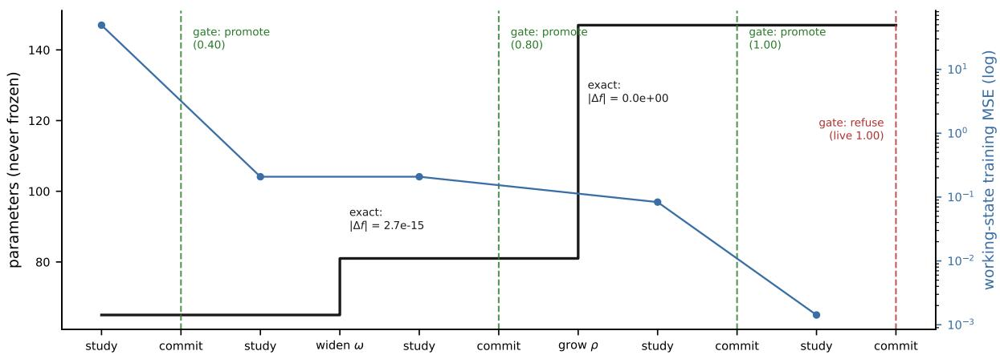  
Figure 15: A governed growth timeline (real trace from the released system; parameters $6 5  8 1 $ 147, final tree height 2). Structural edits $( \omega , \rho )$ are exact at application (measured $| \Delta f |$ annotated); the gate promotes three times and refuses the final commit — the incumbent already scored 1.0 on the recent held-out slice, so further speculation that did not pay was not adopted.

## Appendix E. Validation by an Operating LLM

The factory surface was validated end-to-end by a production LLM (a stock Claude model, Sonnet class, run headless through its command-line interface) driving the real stdio transport under a hidden-law protocol; a pinned-identity re-run (model ID claude-sonnet-5, CLI defaults, unaided, full machine-readable transcript released with the artifact set) reproduced the protocol end-to-end $- ~ 1 6 / 1 6$ exact-answer generalization on operand pairs provably absent from teaching, garbage teaching refused with the live version untouched (candidate scored 0.4375 against the incumbent’s 1.0; adoption declined), drift re-taught to 12/12, lineage auditable across five versions. The original protocol: scenarios governed by regularities known to the data generator but not to the brain, with operand spaces partitioned disjointly so that every evaluated input is provably absent from training. Headline adjudications (all pre-registered, all reproducible from the released runners): gated teaching improved a model from 0.60 to 1.00 exact-answer generalization on never-seen inputs; contradictory (garbage) teaching was rejected with the live model untouched; drift was detected (recent 0.10 vs baseline 1.00) and recovered to 1.00 under windowed re-teach with recent-slice gating; the artifact measured 2,404 bytes. In domain scenarios the same factory, which contains no business content, produced multi-domain capability on demand — a fused meteorology×marketing×calendar model at 0.90 generalization against 0.05 for its best singledomain ablation — and recovered water’s physical phase boundaries $( 2 . 5 ^ { \circ } \mathrm { C } ~ / ~ 9 7 . 5 ^ { \circ } \mathrm { C }$ against ground truth 0/100 at the data’s ±2.5 resolution) from raw observations, mining them as readable rules — success measured as recovery of the generating law, the standard of symbolic-regression evaluation [17, 19]. A purely multiplicative law resisted exact-integer precision at this scale (recorded as a boundary, not gated away). Figure 15 complements these adjudications with a governed growth timeline from the same released system: structural edits exact at application, three promotions, and a final refusal.

## Appendix F. A Topology Growing under Governance

Figure 16 shows the released system growing a real topology under the disclosure protocol of the empirical program: growth sites are chosen only from the system’s own instability report; adoption is only by the gate; the seed is fixed and the run’s snapshots are committed alongside the paper source. A staged curriculum (a coarse law; fine-grained structure that concentrates instability; a new causal input; then a finer cross-texture) drives the working state from a single scope of 16 units (65 parameters) to a tree-height-4 recursive structure of 13 composite nodes (599 parameters), via report-ranked ρ refinements and ω widenings at TWO scales — the root and an inner scope — plus one σ interface growth. The drawing uses the standard layered network motif throughout: every network — outer and inner — is input → hidden column → output, and an inner network hangs beneath its host composite unit as the same motif, smaller; the structure is self-similar, and it deepens only where the data demanded it. The gate’s verdicts are part of the record: the birth commit and one mid-run commit were promoted; the stage-B commit and both final commits were refused (the grown working state did not score above the incumbent on the recent held-out slice) — speculation was free; adoption was earned. Each inner network reads the same input xˆ and adds its output to the scope’s hidden state through its attachment at the small + junction.

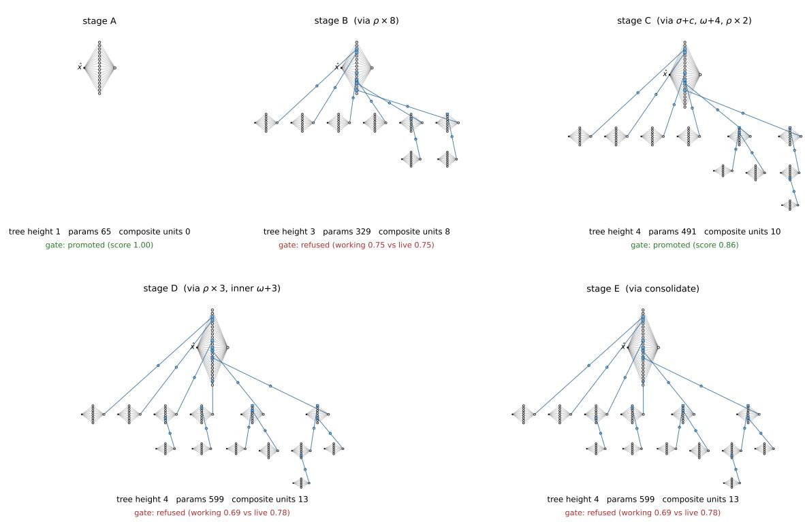  
Figure 16: A real topology growing adaptively under governance (released system, fixed seed): workingstate structure at five stages, with structure parameters (tree height, parameters, composite-node count) and the gate’s verdict per stage. Every network — outer and inner — is the standard layered motif (input → hidden column → output); accent squares are composite units, and each inner network hangs beneath its host as the same motif, reads the same input xˆ, and adds its output to the host unit through the small + (parallel correction, not a chain). Note the final stages: structure that did not pay was refused by the gate and never reached the served model.

## Appendix G. The Historical Depth Route (retained as record)

This appendix’s first-generation content — the mechanics, simulations, and depth-field figure of the scope-interior compositional route — is retained in the v9/v10 records but is no longer cited as evidence in this version. The reason is the theory’s own interface-completeness law: in that generation, grown inner structure coupled to its host through a scalar-width interface, and local refinement behind a scalar port cannot export distributional corrections — the bottleneck that the fullwidth interface of §2 removes. The one verdict quoted from that era is its honest failure, kept verbatim as the motivation for the redesign: a pre-set capability bar — the compositional arm improves on the additive arm on at least 2/3 seeds at matched parameters — was not met (1/3, with one large advantage and two losses). The whole-layer operator under the prevention stack, measured in §13.5 and App. H, supersedes that evidence: exactness at serving time, controlled mid-life deepening without collapse, and the depth advantage emerging with iterated composition depth at fixed parameter budget.

## Appendix H. The 2026 Depth-Axis and Continual-Learning Campaigns

Fifteen campaigns, executed 2026-07-25/26 under the registered discipline of $\ S 1 2 \colon$ designs and pass lines fixed in numbered design documents before any fleet, released with the experiment tree (experiments/designs/); drivers call the frozen library through its served interfaces only (machine-checked isolation); run directories are write-once with per-run workspaces; every run records the data-module SHA and $\mathtt { g i t }$ describe of both repositories; judges recompute every verdict from run files alone, and judge outputs are append-only. The code anchor for every adopted row is the library tag depthgrowth-v1.7. Two library defects (a policy-write merge defect and a plan-seam budget gap) were exposed by these campaigns’ own audit trails, fixed under change control with tests-first discipline, and the afected arms re-run on the fixed library; superseded rows are retained on disk. Worlds are seeded synthetic streams (data SHAs in the Reproducibility statement); three seeds per arm; the reference-network family unless noted.

Campaign records (design → verdicts). E-3, in-service insertion (within-run before/after + no-insertion twin; 36 runs): serve continuity and instant exactness PASS (J1 36/36 bitwise; J2 zero failed serves; J4 36/36 inserted-layer aliveness); the post-insertion descent window FAILED as registered (12/36) — the transient finding that the governance campaigns then managed. $E \mathrm { - } 6 / E \mathrm { - } 6 b ,$ protection windows (+ dose and horizon annexes): spike damping 28/36 PASS; zero durable cost on healthy regions $9 / 9 ;$ late-insertion recovery $3 / 9$ FAILED as registered, attributed by the horizon annex to remaining training budget $( 6 / 9$ in-band at the extended horizon, median 0.93); best measured convention $0 . 1 5 \times 6$ batches, event-scoped, explicitly closed. $E \mathrm { - } \mathcal { Q } ,$ shape governance (plan-driven runs, floors $\mathrm { o n / o f f } )$ : law at every instant $3 / 3 ;$ zero collisions with the floor provably binding $3 / 3 ;$ the 30-batch quality band $1 / 3 ,$ , resolving $3 / 3$ at the pre-registered 50-batch annex. $E \mathrm { - } \phi ,$ exploration economy (trial-gated vs unconditional adoption): zero-residue rollback $3 / 3$ (18/18 bitwise restores); quotes = ledger actuals $3 / 3 ;$ decision audit replay $3 / 3 ;$ economy $2 / 3$ with the probe-myopia cause isolated. $E \mathrm { - } \boldsymbol { 1 } ,$ controlled deepening capstone (deep / additive / born-deep arms; compositional world): training proceeded through all mid-life insertions in every seed; final parity $2 / 3$ within band (one seed at 1.37 vs the born-deep control); depth realized $3 / 3 ;$ instant exactness $6 / 9$ bitwise with the three exceptions at $2 { - } 3 \times 1 0 ^ { - 1 6 }$ (widen-rider summation reordering) — the refined preservation statement of §13.5. E-8, growth vs. retrain (drifted world; grow $/$ fixed $/$ scratch / twin): compute-to-parity 58–64% in $2 / 3$ seeds; service continuity $3 / 3 ;$ the same-input-region retention bar $0 / 3$ as registered — the drift-taxonomy finding that E-12’s paradigm answers. $E { \cdot } 9 ,$ forgetting laws (region-separated sequential domains; seven arms): disease $3 / 3 \ ( 5 5 2 \mathrm { - } 1 , 3 6 2 \times )$ ; replay primacy; timing dominance; complementarity $2 / 3$ under corrected governance; the targeting bar’s $1 / 3$ traced to a repetition confound and corrected by E-11. $E \mathrm { - } 1 0 ,$ depth-separation mapping (normalized iterated maps, $k \in \{ 2 , 4 , 6 \}$ , one parameter cap): the ordering reversal $k { = } 2$ mixed $ k { = } 4 , 6$ deep $3 / 3$ at $5 8 \%$ parameters; the formal separation band $\mathrm { ( a }$ conjunction including the strategy arm) not met. $E \mathrm { - } \boldsymbol { 1 } \boldsymbol { 1 }$ , clean replay laws: targeting $2 / 3$ at equal volume and diversity; the volume dose monotone over 5–25% with no knee; the open-ended ramp refuted $0 / 3$ (the bounded-course law). $E \mathrm { - } \varLambda 2 ,$ cyclic-drift savings $( \mathrm { A \to B \to A } )$ : all lines PASS — relearning savings $7 – 1 0 \times ( 3 / 3 )$ , grow $\leq$ fixed $2 / 3 ,$ , service and integrity $3 / 3 .$ $E \mathrm { - } 1 3 / E \mathrm { - } 1 5 ,$ review scheduling: post-course erosion (LAW-E); spaced repetition confirmed and dosed (one/two/three courses: $3 4 1 - 8 0 0 \mathrm { ~ / ~ } 2 5 2 - 4 3 8 \mathrm { ~ / ~ } 7 3 - 1 4 9 )$ ; the material-selection arm is inadmissible by design rule and its bundled champion bars failed as registered (objective bundling); course-plus-growth yields the best treated new-domain quality at weaker retention. $E \mathrm { - } 1 4 ,$ axis signal (slope-pricing arm at $k { = } 6 )$ : axis-awareness and quality lines $3 / 3$ each. E-7, dual-axis boundary (phase-shifting stream): instrument integrity $3 / 3 ;$ both registered hypotheses $0 / 3 -$ the additive family did not saturate on a three-level smooth composition, and early single-horizon probe gains measured global underfitting rather than axis demand; both boundary records fed the designs of E-10 and E-14.

Deviations from registration. All pre-fleet and documented in the campaign records: E-2’s observability executed as served census rather than the sketched headroom trace; E-4’s candidate menu re-expressed in the one-move vocabulary; E-6 executed on insertion events with the window close idiom corrected; E-9’s stabilization criterion reached its working form on the third registered attempt (the two non-firing forms preserved); E-10’s decision cadence moved from a plateau-only gate (measured firing once per life) to calendar cadence with pricing as the demand check; E-1’s static control required a one-step materialization batch; E-11/E-13/E-15 reuse archived same-world, same-seed fleets as read-only references; E-14 executed as a registered extension of the E-10 driver.

## Appendix I. Relation to Other Methods

This work’s roots are the multiscale tradition of physics and numerical mathematics (§4), developed independently of the lines compared below; the comparisons derive from a literature search conducted in July 2026 and re-run at writing time. On system-independent axes — trigger source (in-service evidence vs. schedule or fiat), preservation at application (bitwise exact vs. approximate), adoption test (held-out adjudication uniform over parametric and structural change vs. none), and service phase (deployment-time vs. pre-training) — we are not aware of a prior system occupying this paper’s cell on all four; each axis taken alone has near relatives, identified next.

Growing neural networks. Structure has been grown before: residual-trained units, later frozen (cascade-correlation [60]); on novelty [61]; under the vigilance of adaptive resonance theory (ART) [62] — the stability–plasticity vocabulary originating with Grossberg [27] — by evolution (NEAT [5]); by function-preserving transforms (Net2Net [31], network morphism [68], GradMax [69]); per-task columns [32]; sparsity-controlled units [37]; explicitly learned growvs-reuse structure decisions [33]; local-descent splitting [38, 39]; novelty-triggered experts [70]; designed self-similarity (FractalNet [75]). Ours difers in premise and government: nothing freezes, exactness serves as a governance invariant (scheduled expansion toward a fixed destination on their side; evidence-triggered proposals the gate demonstrably refuses — audit-traced — on this one), growth extends to the input interface (σ) — the stream-learning literature on feature evolvable streams [34] treats arriving and vanishing features at the ensemble/algorithm level; σ answers the same reality inside one model’s body, exactly and gated — and to gated re-founding (Φ), and self-similarity is grown only where data force it. MgNet identifies pooling and feature extraction with multigrid’s operators in a fixed architecture [71]; this design shares with that tradition — the one it acknowledges — only the growth discipline: resolution where an indicator demands it.

Growth triggers. Expansion scores and local update statistics trigger growth in [73, 74] — the nearest relatives of u<sub>j</sub> — and candidates are scored by local signals [39, 69] or structural objectives [47], with freeze–thaw optimization framing continue-versus-switch [49]. Ours difers in adoption and reading: a trigger only ever proposes; prediction is gated by a certificate, probe curves are read only at extrapolated asymptotes [50], and adoption is only by the held-out gate.

Adaptive depth. Adaptive computation time [54] and depth-adaptive decoding [55] vary depth per input at inference in a fixed architecture; adaptive neural trees [56] grow routed per-branch depth by exhaustive trial under a frozen history. Ours difers in kind: depth is a permanent, non-uniform property of the structure, unrouted, predicted from the scope’s own signals, and adopted through the gate in a lifelong regime.

Credit assignment. Target propagation [83, 84] and perturbation methods [81] also carry corrective information without layer-to-layer gradients. Ours difers in venue and role: targets cross scales of a nested substrate rather than layers of a chain, and within a scale the primitive remains ordinary gradient descent.

Gated adoption. Champion–challenger and shadow deployment are established production practice (an industry pattern documented in MLOps platforms rather than a citable literature), their hazards documented in the technical-debt literature [67]. The reality gate difers in scope:

it lives inside the model, is the only adoption path, re-scores the incumbent fresh, and applies uniformly to gradient steps and structural operators.

Continual learning. Replay, parameter-isolation, and regularization families [57, 13, 14] manage interference by anchoring or freezing (EWC [58], LoRA [59]). Ours difers by construction: storeper-version full-replay plus the gate, afordable at kilobytes. Loss of plasticity [65] is the most serious known threat to the axiom at scale; warm-start inferiority [66] independently supports store-per-version and Φ; drift handling is integrated with promotion, the concerns those the stream literature catalogues [29].

Neural architecture search. NAS [30] optimizes architecture in an outer loop before deployment. Ours has no outer loop and no search objective: growth is triggered inside one continuing life and adjudicated by the same gate as learning — the model remains under construction throughout deployment.

Self-improving and self-shaping systems. SEAL accepts self-proposed updates on downstream reward [12]; FunSearch and AlphaEvolve keep only artifacts that pass hard evaluators [15, 16]. Our gate plays that evaluator for parametric and structural change alike, and self-shaping at birth is deterministic and search-free.

LLMs and tools. The Model Context Protocol [28] standardizes tool invocation, and managed fine-tuning loops (Tinker [8], with its LoRA-first rationale [9], ART [10], LoRAX [11]) adapt LLMs. Ours inverts the dependency: the tool itself is taught and grown by the LLM, contains no language model, and the server guarantees teaching cannot degrade it.

Local solving loops among neighboring families. Each ingredient of §5 has neighbors; the combinations, to our knowledge at the time of writing, do not. Equilibrium layers compute fixed points where a designer placed them [2], and the looped-transformer line — including its recent adaptive-depth forms, where a learned halting policy chooses how many times a designed block recurs [3, 4] — adapts the iteration count, never the placement: in all of these the cycle is architecture, decided before training. The λ operator difers in kind: the cycle is grown — placed at a scope by the model’s own signals, entered exactly, certified for contraction by an enforced (not assumed) bound, removable, and adopted only through the gate that adjudicates every other structural liberty here. Neuroevolution and structural-plasticity systems do add recurrent links during life [5], but as unconstrained mutations: no fixed-point semantics, no exactness at entry, no stability certificate, no gated adoption. On the second realization: test-time training [6] and fully test-time adaptation [35] adapt a whole trained model to each input against a self-supervised objective, and per-neuron local objectives have been proposed as alternatives or complements to end-to-end training [7]; self-processing units instead give a newborn grown structure a bounded, label-blind consistency loop during its enrollment window only — evolution-time, serving-pure, optimizer-neutral, inside a governed growth process. The diference that matters is the same in both realizations: iteration and self-refinement enter as governed local resources of a growing topology, not as architectural commitments of a fixed one.

Heterogeneous attention heads. The July 2026 search (re-run at writing time) finds the ingredients of this section separately occupied and their combination not. Function-preserving head addition with zero-initialized output projections exists as a pre-training acceleration operator [107, 108] — applied at scheduled expansion points to speed a fixed destination architecture, not triggered by in-service evidence, not gate-adjudicated, and not aimed at lifelong service. Unequal or scheduled head widths exist as design-time choices — pyramidal per-head subspaces [112], perlayer head schedules [113], or fixed head size decoupled from the embedding [114]. We claim none of that. What we claim as unoccupied is the combination: per-head width as a lifelong, in-service outcome of an evidence-triggered, exactly function-preserving, gate-adjudicated growth process — head inequality as biography rather than blueprint. The fast-weights tradition [100, 101, 102] reads attention itself as a temporary generated mapping; we credit that conceptualization and do not build on it — here attention is a persistent, growing organ whose capacity is governed, not a transient program.

Head pruning: the destructive dual. The pruning literature established the empirical fact this section’s mechanism answers: head demand is grossly unequal — a large fraction of trained heads can be removed with little loss [103, 104]. Pruning is the destructive response to that fact (build uniformly large, then cut); governed per-head growth is the constructive dual (build small, grow where the demand evidence lands). The two share the diagnosis and difer in everything downstream of it: pruning is a post-hoc correction of a mold, growth is the absence of the mold.

Entropy stabilization: global prevention vs. local restoration. The collapse of attention entropy is a documented training pathology with a global preventive remedy — spectral-norm reparameterization that bounds the mechanism away from collapse everywhere and always [105]. An entropy-regularization family has since grown around the same phenomenon — one-sided penalties on excess entropy with per-head strengths [109], entropy-guided architectural adjustment [110], and post-hoc surgical reinitialization of collapsed heads [111] — among the works our search returned, these act at training time or after it; the mechanism here is a deployment-time, two-sided, per-row band with an enforced locality split, adjudicated like every other change. The discipline of §6.4 is its local restorative complement: a per-row objective that detects and heals the pathology where it occurs, leaves healthy heads untouched (a measured per-head gate), and keeps the repair strictly local by an enforced gradient-split rule. Prevention buys a guarantee at the price of a global constraint on every head forever; restoration buys locality at the price of acting after the fact. At kilobyte scale the restorative route measured 97% recovery at ∼ 7% of the global control’s cost (§6.6); the two approaches are compatible in principle and answer diferent operating regimes.

Continual learning: the post-completion survey. The regime this system targets is the subject of a large literature, surveyed post-completion (July 2026) as positioning context. Four families organize it. Plasticity maintenance counters the measured loss of learning ability under long training by selectively re-initializing or perturbing low-utility units, or by regularizing toward initialization; these act at parameter granularity inside a fixed architecture, where the present system treats learning capacity as a governed structural resource. Architecture-based methods attach task-indexed modules (low-rank adapters, experts under a router) to a frozen backbone; the isolation they buy trades against transfer, and the frozen backbone is the direct negation of the total-plasticity axiom — here capacity is added inside one never-frozen artifact with preservation guaranteed at the instant of change. Model merging folds sequential task models into one set of weights to hold serving cost constant; the single-artifact economics is shared, reached here without a merge step. Memory- and test-time methods evolve an external memory around a frozen model; here the model itself is the evolving object, and review draws on the model’s own experience store. Three mechanism shapes recur across these literatures — new capacity entering at zero, utility-guided selection of where to renew, and a protected integration period for newborn structure — and the same three shapes were derived here from the multiscale tradition before the survey was conducted; we record the convergence as observed, after the fact. The measured contributions of §13.5 to this literature’s questions are the tool-indication boundaries (review, not added capacity or rate protection, treats strict sequential forgetting), the review-scheduling laws (bounded courses, stabilization timing, spaced repetition as the retention dose), retention measured as relearning savings, and the delayed-payof slope as a direction-selection signal.

## Appendix J. Reading the Evidence

Two closing pieces bind the evidence block: the three readings, and the table that every claim in this paper answers to.

## J.1 Reading the map

Three readings organize the evidence of Appendices A–D. First, mechanism vs value: everything mechanical about governed growth verifies exactly; where growth pays is now partly answered in the positive (the transformer comparisons and the size-adjustability crossover, §13.1), and the remaining open questions are localized to specific, revisable scenarios (a lock-in task where the floor binds; trigger signals for Φ; noise regimes demanding stronger governance; the within-life comparison bounded by L17). Second, the governance pair is load-bearing: E10 is what the axiom costs when the gate side is too thin — evidence for the theory’s structure, and a limit its presentation must respect. Third, pre-registration is what makes negative results informative: because interpretations were fixed before runs, each FAIL branch names exactly which prediction, under which bar, at which scale — which is what makes the negative branches informative.

## J.2 The evidence table

Table 10 is the paper’s single correspondence table and its source of record: every numbered claim, prediction, and observation printed anywhere in this paper appears in exactly one row; open items say open; boundary items name their observation; the body quotes this table and never outruns it. Columns: the theory section that stakes the claim; the claim; the campaign or artifact that adjudicated it; the verdict as registered; one key number; and the status (supported / boundary / open / observation / diagnostic / aux / motivation — the last marks a historical row retained only as the recorded motivation for a redesign, never cited as evidence).

Table 10: Claims → artifacts → adjudicated verdicts. No sentence in this paper outruns this table. Rows tagged “C” cite the pedagogy appendix (App. C).
<table><tr><td>§</td><td>Claim</td><td>Campaign / artifact</td><td>Verdict</td><td>Key number</td><td>Status</td></tr><tr><td></td><td>The axiom and its predictions (§2)</td><td></td><td></td><td></td><td></td></tr><tr><td>§2</td><td>T1: adaptation localizes at E8 the drift scale</td><td></td><td>MIXED</td><td></td><td>boundary</td></tr><tr><td>§2</td><td>T2: lock-in release after ω</td><td>E11a</td><td>PRECOND. NOT MET</td><td>3/3 scenario failed to bind</td><td>open</td></tr><tr><td>§2</td><td>T3: unfrozen coarse scale robust to label noise</td><td>E10</td><td>FAIL branch</td><td></td><td>boundary</td></tr><tr><td>§2</td><td>T4: Φ trigger necessity / takeover safety</td><td>E11c</td><td>safety PASS; necessity NOT SUPP.</td><td></td><td>boundary</td></tr><tr><td>§2</td><td>size adjustability: born small, ends above a fixed counterpart</td><td>X-SAT A-1 (App. B.7)</td><td>PASS</td><td>5/5; 5,020 →~40k past supported 12,020</td><td></td></tr><tr><td>§2</td><td>grown capacity converts to X-SAT A-2 settled score (moderate world)</td><td>(App. B.7)</td><td>PASS</td><td>4/5; overtake at 1.47–4.27× size (med. ~2.6×)</td><td>supported</td></tr><tr><td>§3 ω/ρ/σ exact at application acceptance</td><td>Substrate, instruments, self-knowledge (§3)</td><td></td><td></td><td></td><td></td></tr><tr><td></td><td></td><td>B1/B3/C1</td><td>PASS</td><td>0;  $2 . 2 2 \times 1 0 ^ { - 1 6 }$  exact</td><td>supported</td></tr></table>

Table 10, continued.
<table><tr><td>§</td><td>Claim</td><td>Campaign artifact</td><td>Verdict</td><td>Key number</td><td>Status</td></tr><tr><td>§3</td><td>budgets enforced; lineage audited</td><td>acceptance B4/B5</td><td>PASS</td><td></td><td>supported</td></tr><tr><td>§3</td><td>doubt map real</td><td>SQ1a</td><td>PASS</td><td> $3 / 3$ </td><td>supported</td></tr><tr><td>§3</td><td>variation self-check predicts transfer error</td><td>SV1</td><td>PASS</td><td> $3 / 3 ;$  best measured predictor</td><td>supported</td></tr><tr><td>§3</td><td>σ exploitation</td><td>E11b</td><td>substance 3/3; conjunctive bar NOT met (speed</td><td> $1 0 ^ { 3 } \times 3 / 3 ;$  pre-set speed  $1 / 3$ </td><td>boundary</td></tr><tr><td>§3</td><td>naive exploitation of self-knowledge</td><td>SQ1b/SP1/SR1/</td><td>1/3) FAIL branches</td><td></td><td>open</td></tr><tr><td colspan="8">Growth direction (§4)</td></tr><tr><td>§4</td><td>δ exact at application, in service</td><td>insertion campaign (§13.5)</td><td>PASS</td><td>bitwise 36/36 instants</td><td>supported</td></tr><tr><td>§4</td><td>block gradients FD-verified unit suite through the chain</td><td></td><td>PASS</td><td> $\leq 1 0 ^ { - 5 }$ </td><td>supported</td></tr><tr><td>§4</td><td>widen-only regime bit-identical to additive release</td><td>golden fixtures</td><td>PASS</td><td></td><td>supported</td></tr><tr><td>§4</td><td>direction selection by two-horizon slope</td><td>axis-signal campaign PASS (§13.5)</td><td></td><td> $3 / 3 + 3 / 3 \mathrm { a t } k { = } 6$ </td><td>supported</td></tr><tr><td>§4</td><td>depth advantage under iterated composition</td><td>separation mapping (§13.5)</td><td>PASS</td><td>k=4, 6: 3/3 at 58% params</td><td>supported</td></tr><tr><td>§4</td><td>additive-family saturation (registered bars) on a three-level smooth world</td><td>additive-boundary campaign (E-7)</td><td>NOT met (J-1/J-2 0/3; J-3 3/3): no saturation at this</td><td>early gain = global underfitting; feeds E-10/E-14</td><td>boundary</td></tr><tr><td>§4</td><td>mid-life deepening under the prevention stack</td><td>capstone campaign (§13.5)</td><td>scale PASS</td><td>no collapse; parity with born-deep</td><td>supported</td></tr><tr><td>§4</td><td>first-generation capability bar (historical)</td><td>record (App. G)</td><td>NOT MET</td><td> $1 / 3 ,$  verbatim</td><td>motivation</td></tr><tr><td>§4</td><td>a topology grows end-to-end under full</td><td>App. F</td><td>demonstrated</td><td></td><td>aux</td></tr><tr><td colspan="8">governance Local solving loops (§5)</td></tr><tr><td>§5</td><td>λ mechanics exact, FD-verified, deterministic</td><td>released loop suite (12+8)</td><td>PASS</td><td>entry bitwise; certified  $C _ { G }$  (activation</td><td>supported</td></tr><tr><td>§5</td><td>SPU governance isolation</td><td>released SPU suites</td><td>PASS</td><td>Lipschitz) = 1.128994 bitwise</td><td>supported</td></tr><tr><td colspan="8">Growable attention and the stream cases (§6) §6 attention mechanics</td></tr><tr><td></td><td>A-M1-A-M7 (identities, exact head growth certified gradients, locality split, estimator identity)</td><td>(App. A.5)</td><td></td><td> $3 . 0 \times 1 0 ^ { - 1 1 }$ </td><td></td></tr><tr><td>§6</td><td>P1: growth tracks demand (strong form)</td><td>EA2 + DIAG-STARVE</td><td>REFUTED strong; pays</td><td>-35%/-64%; accepted boundary 2/5 of 5 starved</td><td></td></tr><tr><td>§6</td><td>P2: local discipline more</td><td>(App. A.5) EA3 dose-response</td><td>under starvation CONFIRMED</td><td>97% restored at ~7% cost vs 49%</td><td>supported</td></tr></table>

Table 10, continued.
<table><tr><td>§</td><td>Claim</td><td>Campaign / artifact</td><td>Verdict</td><td>Key number</td><td>Status</td></tr><tr><td>§6</td><td>P3: instruments lead the loss</td><td>EA4 grid, n = 15 (App. A.5)</td><td>CONFIRMED as +4.9 periods mean; not a standalone</td><td>median tendency; 11/15 positive; no-shift control fires 13/15</td><td>boundary</td></tr><tr><td>§6</td><td>P4: analytic = mask at decisive regimes, cheaper</td><td>EA5 (App. A.5)</td><td>CONFIRMED exactly</td><td>parity perfect; analytic supported sd 0</td><td></td></tr><tr><td>§6</td><td>stream-competitive on a modern drift benchmark</td><td>stream case (App. A.6)</td><td>PASS</td><td>0.762 vs HAT 0.599; NOAA 0.768 vs0.739</td><td>supported</td></tr><tr><td>§6</td><td>adapt without forgetting on returning regimes</td><td>stream case (App. A.6)</td><td>PASS</td><td>retention ≈1.00 vs 0.90–0.99</td><td>supported</td></tr><tr><td>§6</td><td>stream-case result attributable to growth</td><td>paired ablations</td><td>NOT AT- TRIBUTABLE</td><td>deltas -0.0004/+0.0005</td><td>boundary</td></tr><tr><td>§7</td><td>Lifecycle and the growth-value campaigns (§7, §9) gate promotes/refuses; Φ</td><td>acceptance A-suite,</td><td>PASS</td><td></td><td>supported</td></tr><tr><td>§7</td><td>takeover gated holdout quarantine;</td><td>C5 acceptance C2-C4</td><td>PASS</td><td></td><td>supported</td></tr><tr><td>§7</td><td>consent-gated self-study lifelong serving closes the</td><td>G-series pair</td><td>PASS</td><td>paired</td><td>supported</td></tr><tr><td>§7</td><td>frozen length cliff streaming exposure composes novel</td><td>(App. A.7) SCAN filtered split (App. A.7)</td><td>FAIL branch</td><td>+0.32/+0.08/+0.30 0, all arms</td><td>open</td></tr><tr><td>§7</td><td>combinations governance more effective than immobilization under</td><td>registered EWC grid SUPPORTED</td><td></td><td>3/4; stationary miss reported</td><td>boundary</td></tr><tr><td>§7</td><td>drift capacity binds on exams,</td><td>(App. A.7) G-GROW-1 r2</td><td>PASS</td><td>4/5 (0.64 vs 0.44)</td><td>supported</td></tr><tr><td>§7</td><td>not prequential growth pays over</td><td>(App. B) G-GROW-1</td><td>FAIL; parsimony</td><td>0/5; 5/5</td><td>boundary</td></tr><tr><td>§7</td><td>same-education fixed birth gate refusals deep and</td><td>C-G1/C-G2 tolerant lane + case</td><td>PASS diagnostic</td><td>0.57 → 0.37</td><td>diagnostic</td></tr><tr><td></td><td>correct; the tolerated adoption harms generative growth thesis</td><td>G-GEN-1 battery</td><td></td><td></td><td></td></tr><tr><td></td><td>(pays; tracks oracle; calibrated σ) growth needed only where</td><td>(App. B) stationary</td><td></td><td></td><td></td></tr><tr><td>§7 §7</td><td>the world grows better scores than the stock-uncertainty</td><td>companion rounds 1-3 (App. B.3–B.6)</td><td>PASS repeatedly 5/5, 4/5, 5/5</td><td></td><td>supported</td></tr><tr><td></td><td>transformer under arriving structure static-quality sanity floor</td><td>E-16 rerun, archived parity, as the</td><td></td><td>sanity 5/5; grown</td><td></td></tr><tr><td></td><td>uncertainty silenced gate: quiet</td><td></td><td>outcome map provides CENTRAL FAIL</td><td>1.8196/1.8195 C-N1 3/5 → 1/5; net</td><td></td></tr><tr><td></td><td>without growing-track suppression ex-post gate un-starves the X2 (App. B.4)</td><td></td><td>(trade-off measured) C-G1 FAIL;</td><td>0-2 adoptions 0 → 2–3;</td><td></td></tr><tr><td>§7</td><td>exam world incumbent-candidate</td><td colspan="2">C-G2 PASS X1b/X2b (App. B.5, PASS</td><td>median 0.5014 → 0.5653 shadow-clobber cured 11.38 → 0.65</td><td>supported</td></tr></table>

Table 10, continued.
<table><tr><td rowspan=1 colspan=16>§    Claim                        Campaign / artifact Verdict            Key number            Status</td></tr><tr><td rowspan=2 colspan=16>§7   within-life growth outruns X1/X1b/X2b +      boundary         C-N1 1/5; C-G1 0/5;   boundarya lifelong-trained fixed twinG-GROW rounds    measured          frontier L17§7   autonomous growth         headroom campaignPASS              instants 3/3; transient supportedsatisfies the user shape law;(E-2)                                       in-band 3/3 at 50floor provably binding                                                    (annex)§7   protection windows damp  window campaign    PASS w/          28/36; 9/9 zero cost;   boundarythe insertion transient at</td></tr><tr><td rowspan=1 colspan=2>incerti</td><td rowspan=9 colspan=12>lthy-region cost                              boundary          (median 0.93)pricing campaign     PASS; probe      quotes = ledger 3/3;   boundarymyopia 2/3       bitwise restore 3/3Phase-1 P1-P10     PASS              1.00 gen.; garbage      supportedrejected; 2,404 BPASS             0.90 vs 0.05;             supported</td></tr><tr><td rowspan=1 colspan=1></td><td rowspan=1 colspan=3>zero hea</td><td rowspan=1 colspan=2>heal</td></tr><tr><td rowspan=1 colspan=1>§7</td><td rowspan=1 colspan=5>structural se</td></tr><tr><td rowspan=2 colspan=1></td><td rowspan=2 colspan=10>exactly; bounded trials(E-4)</td><td rowspan=2 colspan=1>m</td></tr><tr><td rowspan=1 colspan=2>my</td></tr><tr><td rowspan=1 colspan=1></td><td rowspan=1 colspan=7>leave zero residue</td></tr><tr><td rowspan=1 colspan=1>§9</td><td rowspan=1 colspan=7>LLM-driven factory</td></tr><tr><td rowspan=1 colspan=1></td><td rowspan=1 colspan=7>lifecycle end-to-end</td><td rowspan=1 colspan=3>(App. E)</td></tr><tr><td rowspan=1 colspan=1>§9</td><td rowspan=1 colspan=7>multi-domain fusion;</td><td rowspan=1 colspan=3>domain scenarios</td></tr><tr><td rowspan=1 colspan=1>Conti</td><td rowspan=1 colspan=10>boundary recoverynual-learning campaigns (§10, §13.5)</td><td rowspan=1 colspan=3></td><td rowspan=5 colspan=2>2.5/97.5°C58–64% of retrain (s2  boundarycontinuity 3/3savings ×7–10 (3/3);   supported</td></tr><tr><td rowspan=1 colspan=1>§10 in</td><td rowspan=1 colspan=7>-service adaptation</td><td rowspan=1 colspan=3>drift-economics</td><td rowspan=1 colspan=3>2/3 on the cost</td></tr><tr><td rowspan=1 colspan=1></td><td rowspan=1 colspan=7>cheaper than retraining</td><td rowspan=1 colspan=3>campaign (E-8)</td><td rowspan=1 colspan=3>bar</td><td rowspan=1 colspan=1>1.96×); service</td></tr><tr><td rowspan=1 colspan=1></td><td rowspan=1 colspan=7>after drift</td><td rowspan=1 colspan=3></td><td rowspan=1 colspan=3></td><td rowspan=1 colspan=1>continuity 3/3</td></tr><tr><td rowspan=1 colspan=1>§10</td><td rowspan=1 colspan=10>returning regime:            cyclic-drift campai</td><td rowspan=1 colspan=3>gn ALL PASS</td></tr><tr><td rowspan=1 colspan=1></td><td rowspan=1 colspan=8>relearning savings from     (E-12)</td><td></td><td rowspan=1 colspan=1></td><td rowspan=2 colspan=3></td><td rowspan=3 colspan=2>service 3/3untreated ×552–1,362;supported</td></tr><tr><td rowspan=1 colspan=1></td><td rowspan=1 colspan=9>retained knowledge</td><td></td></tr><tr><td rowspan=1 colspan=1>§10</td><td rowspan=1 colspan=7>review, not windows or</td><td rowspan=1 colspan=3>forgetting ladder</td><td rowspan=1 colspan=3>R-1 3/3;</td></tr><tr><td rowspan=1 colspan=1></td><td rowspan=1 colspan=7>capacity, treats</td><td rowspan=1 colspan=3>(E-9)</td><td rowspan=1 colspan=3>window/capacity</td><td rowspan=1 colspan=1>review arms ×72–300</td><td rowspan=4 colspan=1>boundary</td></tr><tr><td rowspan=1 colspan=1></td><td rowspan=1 colspan=7>sequential-switch forgetting</td><td rowspan=1 colspan=3></td><td rowspan=1 colspan=3>arms fail as</td><td rowspan=2 colspan=1></td></tr><tr><td rowspan=1 colspan=1></td><td rowspan=1 colspan=1></td><td rowspan=1 colspan=3></td><td rowspan=1 colspan=3></td><td rowspan=1 colspan=3></td><td rowspan=1 colspan=3>registered</td></tr><tr><td rowspan=1 colspan=1>§10</td><td rowspan=1 colspan=7>targeted review beats</td><td rowspan=1 colspan=3>targeting correction</td><td rowspan=1 colspan=3>2/3; repetition</td><td rowspan=1 colspan=1>volume dose 5–25%</td></tr><tr><td rowspan=1 colspan=1></td><td rowspan=1 colspan=6>random at equal volume</td><td rowspan=1 colspan=1></td><td rowspan=1 colspan=3>(E-11)</td><td rowspan=1 colspan=3>confound isolated</td><td rowspan=1 colspan=1>monotone; ramp 0/3</td><td rowspan=1 colspan=1></td></tr><tr><td rowspan=1 colspan=1></td><td rowspan=1 colspan=7>and diversity</td><td rowspan=1 colspan=3></td><td rowspan=1 colspan=3></td><td rowspan=1 colspan=1>refuted</td><td rowspan=6 colspan=1>openupported</td></tr><tr><td rowspan=1 colspan=1>§10 ch</td><td rowspan=1 colspan=7>ampion-assembly</td><td rowspan=1 colspan=3>course family</td><td rowspan=1 colspan=3>FAIL as</td><td rowspan=1 colspan=1>L-1/L-6</td></tr><tr><td rowspan=1 colspan=1></td><td rowspan=1 colspan=6>registered bars</td><td rowspan=1 colspan=1></td><td rowspan=1 colspan=3>(E-13/E-15)</td><td rowspan=1 colspan=3>registered</td><td rowspan=1 colspan=1></td></tr><tr><td rowspan=2 colspan=1></td><td rowspan=2 colspan=7></td><td rowspan=1 colspan=1></td><td rowspan=1 colspan=5></td><td rowspan=1 colspan=1>(objective</td><td rowspan=3 colspan=1>×341-800 / ×252-438 s</td></tr><tr><td rowspan=1 colspan=3></td><td rowspan=1 colspan=3>bundling)</td><td></td></tr><tr><td rowspan=1 colspan=1>§10 sp</td><td rowspan=1 colspan=7>aced-repetition course</td><td rowspan=1 colspan=3>course family</td><td rowspan=1 colspan=3>measured,</td><td></td></tr><tr><td rowspan=1 colspan=1></td><td rowspan=1 colspan=7>count is the retention dose</td><td rowspan=1 colspan=3>(E-13/E-15)</td><td rowspan=14 colspan=5>0.32–0.37 vs incentiveobservation+0.41+0.10/+0.10            boundarySUPP.fidelity 0.67 → 0.51     observationunder calmSUPPORTED    slope 3/5; TTD 5/5 (≥ supported</td></tr><tr><td rowspan=1 colspan=1></td><td rowspan=1 colspan=7></td><td rowspan=1 colspan=3></td><td rowspan=1 colspan=3>every seed</td></tr><tr><td rowspan=1 colspan=1>Pedag</td><td rowspan=1 colspan=6>ogy principles, tested</td><td rowspan=1 colspan=1>by</td><td rowspan=1 colspan=3>GUARD (App. C)</td><td rowspan=1 colspan=3></td></tr><tr><td rowspan=1 colspan=1>C</td><td rowspan=1 colspan=6>undefended plasticity</td><td rowspan=1 colspan=1></td><td rowspan=1 colspan=3>GUARD r1</td><td rowspan=1 colspan=3>measured</td></tr><tr><td rowspan=1 colspan=1></td><td rowspan=1 colspan=7>defects under coherent</td><td rowspan=1 colspan=3>(App. D)</td><td rowspan=3 colspan=3></td></tr><tr><td rowspan=1 colspan=1></td><td rowspan=1 colspan=7>temptation</td><td rowspan=1 colspan=3></td></tr><tr><td rowspan=1 colspan=1>C</td><td rowspan=1 colspan=7>re-anchored immunity</td><td rowspan=1 colspan=3>GUARD r2</td></tr><tr><td rowspan=3 colspan=1></td><td rowspan=3 colspan=7>recovers half at 11% cost</td><td rowspan=1 colspan=3></td><td rowspan=1 colspan=3>claims NOT</td></tr><tr><td rowspan=1 colspan=3></td><td rowspan=1 colspan=3>SUPP.</td></tr><tr><td rowspan=1 colspan=3></td><td rowspan=1 colspan=3>(verbatim)</td></tr><tr><td rowspan=1 colspan=1>C</td><td rowspan=1 colspan=7>calm governor: mechanism</td><td rowspan=1 colspan=3>GUARD r3 probes</td><td rowspan=1 colspan=3>regime</td></tr><tr><td rowspan=2 colspan=1></td><td rowspan=2 colspan=7>sound, regime absent</td><td rowspan=1 colspan=3>(battery withheld,</td><td rowspan=1 colspan=3>observation</td></tr><tr><td rowspan=2 colspan=3>disclosed)GUARD r4</td></tr><tr><td rowspan=1 colspan=1>C</td><td rowspan=1 colspan=7>education thesis under fair</td></tr><tr><td rowspan=1 colspan=1></td><td rowspan=2 colspan=15>(corrected         rule; strict 3/5, twoinstrument; 2/5  floor ties); recovery 4/5under theoriginal)exhibit            frozen missed 0.90 on  diagnosticeducable than growable    gate                                        s101, 6/6 curricula;growable 0.93</td></tr><tr><td rowspan=1 colspan=11></td></tr></table>

Table 10, continued.
<table><tr><td rowspan=1 colspan=10>§    Claim                        Campaign / artifactVerdict            Key number            Status</td></tr><tr><td rowspan=3 colspan=10>C   R4 verdict under the       re-scoring of R4      does not pass      $2 / 5$ at margin 0.05;     diagnosticoriginal level instrument    stores                                      corrected countsbaseline-insensitiveEmpirical observations (§14.1)§14 L1 exams see capacity;     G-GROW-1          observation       0.64 vs 0.44             observationonline scores do not§14L2 probe economics         X2                     observation       43 → 17.4 s/life          observationdominate small-scale gatesobservation</td></tr><tr><td rowspan=4 colspan=8></td></tr><tr><td rowspan=1 colspan=1>§14</td></tr><tr><td rowspan=1 colspan=1></td><td rowspan=1 colspan=1>cannot see lifetime</td><td rowspan=3 colspan=8>observation       0.20 → 0.45 → 0.17     observation</td></tr><tr><td rowspan=1 colspan=1></td><td rowspan=1 colspan=1>consequences</td></tr><tr><td rowspan=1 colspan=1>§14</td><td rowspan=1 colspan=1>L4 review dose</td><td rowspan=1 colspan=1>GUARD-1 probes</td></tr><tr><td rowspan=1 colspan=1></td><td rowspan=1 colspan=1>non-monotonic</td><td rowspan=2 colspan=8>GUARD-1 C-GD5   observation       1.0 solo vs ~chance     observation</td></tr><tr><td rowspan=1 colspan=1>§14</td><td rowspan=1 colspan=1>L5 exposure economics</td></tr><tr><td rowspan=1 colspan=1></td><td rowspan=1 colspan=1>bind in-curriculum</td><td rowspan=2 colspan=8>GUARD              observation                                   observation</td></tr><tr><td rowspan=1 colspan=1>§14</td><td rowspan=1 colspan=1>L6 transition dip is the</td></tr><tr><td rowspan=1 colspan=1></td><td rowspan=1 colspan=1>price of tracking</td><td rowspan=3 colspan=3>GUARD r1           observation</td><td></td><td></td><td></td><td></td><td></td></tr><tr><td rowspan=2 colspan=1>§14</td><td rowspan=2 colspan=1>L7 defection tracks</td><td></td><td></td><td></td><td></td><td></td></tr><tr><td rowspan=1 colspan=3>0.32–0.37 vs +0.41</td><td rowspan=1 colspan=2>observation</td></tr><tr><td rowspan=1 colspan=1></td><td rowspan=1 colspan=1>incentive without</td><td rowspan=1 colspan=2></td><td rowspan=2 colspan=1></td><td rowspan=4 colspan=5>invented event name   observation</td></tr><tr><td rowspan=1 colspan=1></td><td rowspan=1 colspan=1>immunity</td><td rowspan=1 colspan=2></td></tr><tr><td rowspan=2 colspan=1>§14</td><td rowspan=2 colspan=1>L8 verify the instrument</td><td rowspan=2 colspan=2>X2 autopsy           observation</td><td></td></tr><tr><td rowspan=1 colspan=1></td></tr><tr><td rowspan=1 colspan=1></td><td rowspan=1 colspan=1>before the theory</td><td rowspan=1 colspan=2></td><td rowspan=1 colspan=1></td><td rowspan=2 colspan=5>green-lithalf at 11%              observation</td></tr><tr><td rowspan=1 colspan=1>§14</td><td rowspan=1 colspan=1>L9 immunity timing</td><td rowspan=1 colspan=2>GUARD r2           observation</td><td rowspan=1 colspan=1></td></tr><tr><td rowspan=1 colspan=1></td><td rowspan=1 colspan=1>dilemma; re-anchoring</td><td rowspan=2 colspan=2></td><td rowspan=2 colspan=1></td><td rowspan=2 colspan=5></td></tr><tr><td rowspan=1 colspan=1></td><td rowspan=1 colspan=1>partial</td></tr><tr><td rowspan=1 colspan=1>§14</td><td rowspan=1 colspan=1>L10 the metric decides</td><td rowspan=1 colspan=1>G-GEN-1 vs</td><td rowspan=1 colspan=1>observation</td><td rowspan=1 colspan=1></td><td rowspan=1 colspan=1></td><td rowspan=1 colspan=4>0 vs 2–8 adoptions      observation</td></tr><tr><td rowspan=1 colspan=1></td><td rowspan=1 colspan=1>governability</td><td rowspan=1 colspan=1>G-GROW-1</td><td rowspan=1 colspan=1></td><td rowspan=1 colspan=1></td><td rowspan=1 colspan=1></td><td rowspan=2 colspan=4>8/8 regretted            observation</td></tr><tr><td rowspan=1 colspan=1>§14</td><td rowspan=1 colspan=1>L11 non-growing world</td><td rowspan=1 colspan=1>stationary</td><td rowspan=1 colspan=1>observation</td><td rowspan=1 colspan=1></td><td rowspan=1 colspan=1></td></tr><tr><td rowspan=1 colspan=1></td><td rowspan=1 colspan=1>needs no growth</td><td rowspan=1 colspan=1>companion</td><td rowspan=1 colspan=1></td><td rowspan=1 colspan=1></td><td rowspan=1 colspan=1></td><td rowspan=2 colspan=3>0.67 → 0.51</td><td rowspan=2 colspan=1>observation</td></tr><tr><td rowspan=1 colspan=1>§14</td><td rowspan=1 colspan=1>L12 governors have regimes</td><td rowspan=1 colspan=1>GUARD r3</td><td rowspan=1 colspan=1>observation</td><td rowspan=1 colspan=1></td><td rowspan=1 colspan=1></td></tr><tr><td rowspan=1 colspan=1>§14</td><td rowspan=1 colspan=1>L13 capacity value ex-ante</td><td rowspan=1 colspan=1>X1 control-arm</td><td rowspan=1 colspan=2>observation</td><td rowspan=1 colspan=4>0.009 ± 0.017 vs ~0.1</td><td rowspan=1 colspan=1>observation</td></tr><tr><td rowspan=1 colspan=1></td><td rowspan=1 colspan=1>unobservable</td><td rowspan=1 colspan=1>autopsy</td><td rowspan=1 colspan=2></td><td rowspan=1 colspan=1></td><td rowspan=2 colspan=3>kept widen; exam fell</td><td rowspan=2 colspan=1>observation</td></tr><tr><td rowspan=1 colspan=1>§14</td><td rowspan=1 colspan=1>L14 audits blind off their</td><td rowspan=1 colspan=1>X2/X2b</td><td rowspan=1 colspan=2>observation</td><td></td></tr><tr><td rowspan=1 colspan=1></td><td rowspan=1 colspan=1>metric</td><td rowspan=1 colspan=1></td><td rowspan=1 colspan=2></td><td rowspan=1 colspan=4>0.04</td><td rowspan=1 colspan=1></td></tr><tr><td rowspan=1 colspan=1>§14</td><td rowspan=1 colspan=1>L15 the price of silence</td><td rowspan=1 colspan=1>X1</td><td rowspan=1 colspan=2>observation</td><td rowspan=1 colspan=4>C-N1 3/5 → 1/5</td><td rowspan=1 colspan=1>observation</td></tr><tr><td rowspan=1 colspan=1>§14</td><td rowspan=1 colspan=1>L16 birth capacity</td><td rowspan=1 colspan=1>X2 diagnosis</td><td rowspan=1 colspan=2>observation</td><td rowspan=1 colspan=4>gap 0.046 → 0.034, not o</td><td rowspan=1 colspan=1>bservation</td></tr><tr><td rowspan=1 colspan=1></td><td rowspan=1 colspan=1>compounds</td><td rowspan=1 colspan=1></td><td rowspan=1 colspan=2></td><td rowspan=1 colspan=4>closed</td><td rowspan=1 colspan=1></td></tr><tr><td rowspan=1 colspan=1>§14</td><td rowspan=1 colspan=1>L17 frontier: proof latency</td><td rowspan=1 colspan=1>X1b/X2b</td><td rowspan=1 colspan=2>observation</td><td rowspan=1 colspan=4>C-N1 1/5 with C-N4</td><td rowspan=1 colspan=1>observation</td></tr><tr><td rowspan=1 colspan=1></td><td rowspan=1 colspan=1>= incumbent head start</td><td rowspan=1 colspan=1></td><td rowspan=1 colspan=2></td><td rowspan=1 colspan=4>5/5</td><td rowspan=2 colspan=1>observation</td></tr><tr><td rowspan=1 colspan=1>§14</td><td rowspan=1 colspan=1>L18 rollback anchors</td><td rowspan=1 colspan=1>X1b autopsy</td><td rowspan=1 colspan=2>observation</td><td rowspan=1 colspan=4>11.38 → 0.65</td></tr><tr><td rowspan=1 colspan=1></td><td rowspan=1 colspan=1>immutable until resolved</td><td rowspan=1 colspan=1></td><td rowspan=6 colspan=7>~1 promotion/30-40k observationrowson X-SAT G-GEN leg                                                   observation</td></tr><tr><td rowspan=1 colspan=1>§14</td><td rowspan=1 colspan=1>L19 purchase rate of</td><td rowspan=1 colspan=1>X-SAT r1</td></tr><tr><td rowspan=1 colspan=1></td><td rowspan=1 colspan=1>serialized candidates</td><td rowspan=1 colspan=1></td><td rowspan=1 colspan=6></td></tr><tr><td rowspan=2 colspan=1>§14</td><td rowspan=2 colspan=1>L20 discrete memorizati</td><td rowspan=2 colspan=7></td></tr><tr><td rowspan=1 colspan=1>OL</td></tr><tr><td rowspan=1 colspan=1></td><td rowspan=1 colspan=1>binds parameters</td><td></td></tr></table>

Evaluative learning and benchmark lanes (§8, §11); E-S\*/Y-\* name the registered designs and  
per-seed run stores of the paper-experiments companion repository (Reproducibility Statement;  
store files are named by battery, e.g. E\_S7\_RESULTS.json, Y7\_FULL40\_RESULTS.json)

<table><tr><td>§8</td><td>three-regime law of growth E-S1/E-S5/E-S6/E- per registered under evaluative learning S7</td><td></td><td>bars; unresolved 0/10 and boundary items rowed</td><td>-33.9 vs -1.9; 8/10 vs supported</td></tr><tr><td rowspan="2">§8</td><td>quasi-static identity</td><td>TIER-1-4 + 9</td><td>separately below PASS</td><td> $\leq 2 . 2 \times 1 0 ^ { - 1 1 } ;$  supported</td></tr><tr><td>extends to the policy loop</td><td>library cases</td><td></td><td> $2 . 8 \times 1 0 ^ { - 1 7 }$ </td></tr></table>

Table 11: Per-seed values for the adjudicating lanes of §8/§11 (gaps are grown-arm minus protocol-matched twin; declines in points; exam-day means are all-task post-review accuracies).
<table><tr><td>Lane</td><td>Per-seed values (paired, seed order)</td></tr><tr><td>Stationary control (gap; registered as a no-bar report)</td><td>−60.5, −4.2, +27.9, +10.8, −54.4</td></tr><tr><td>Staged, reward-only (gap)</td><td>-73.8, -8.9, -10.2, -39.0, -37.5</td></tr><tr><td>Staged, alternating (gap)</td><td>0.0, −4.2, −5.4, 0.0, 0.0</td></tr><tr><td>Quadratic staged, reward-only (gap)</td><td>−14.0, +50.6, −11.5, +1.6, +27.0</td></tr><tr><td>Quadratic staged, alternating (gap)</td><td>+1.9, −4.3, +7.2, −9.8, +10.4</td></tr><tr><td>CartPole post-change AUC (grown/twin)</td><td>2,557/2,259, 2,144/2,062, 2,416/1,928, 1,701/2,405, 2,244/2,244</td></tr><tr><td>40-task first-pass decline</td><td>5.0/7.6, 1.4/10.8, 1.2/7.7, −0.6/5.3, -2.6/6.9, 0.5/8.7, −0.8/9.6, 2.3/8.7,</td></tr><tr><td>(grown/fixed)</td><td>-0.7/4.9, 2.3/8.2</td></tr><tr><td>Exam-day mean (grown/fixed)</td><td>0.193/0.150, 0.241/0.169, 0.222/0.167, 0.197/0.139, 0.209/0.148, 0.266/0.159, 0.197/0.186, 0.191/0.152, 0.243/0.146, 0.195/0.160</td></tr></table>

Table 10, continued.
<table><tr><td>§</td><td>Claim</td><td>Campaign / artifact</td><td>Verdict</td><td>Key number</td><td>Status</td></tr><tr><td>§8</td><td>governance exact under reward learning</td><td>clone0; E-S2; E-S3</td><td>PASS</td><td>refusal 5/5, identical finals; drift 5/5; 5.9–95×; stack 5/5</td><td>supported</td></tr><tr><td></td><td>§11 capacity under sequential arrival</td><td>Y-3 both scales; Y-4; PASS Y-6 controlled</td><td></td><td>9/10, 9/10, 8/10, identical finals 10/10; 77%</td><td>supported</td></tr><tr><td></td><td>§11 long-sequence plasticity (designed regime; canonical cross-check)</td><td>Y-7/Y-8/Y-9; Y-9b PASS</td><td></td><td>first-pass decline lower supported 10/10; canon 8/10</td><td></td></tr><tr><td>§11</td><td>just-in-time refresher (independent exam days)</td><td>Y-9e</td><td>PASS</td><td>10/10; +3.4 vs −1.4</td><td>supported</td></tr><tr><td>§8</td><td>optimizer-moment hypothesis (falsification test)</td><td>E-S1P/S4 store</td><td>REFUTED transient carried by the function change, not</td><td>moment transplant left supported the cost in place</td><td></td></tr><tr><td>§8</td><td>LunarLander long-run net effect</td><td> E-S6</td><td>below protocol resolution</td><td>4/10 with wide swings open</td><td></td></tr><tr><td>§8</td><td>one sparse-reward task at moderate scale</td><td>E-S5x series</td><td>out of reach after entropy collapse, three remedies</td><td>live-probed</td><td>boundary</td></tr><tr><td>§11</td><td>Fashion uncontrolled lines at registered dose forty-task multi-pass</td><td>Y-6</td><td>MISS (each line 2/5)</td><td>dose boundary, controlled line passes primary plasticity line</td><td>boundary</td></tr><tr><td>§11</td><td>companion line</td><td>Y-9</td><td>MISS (7/10 vs ≥8/10)</td><td>unaffected; subject answered by the review</td><td>boundary</td></tr><tr><td></td><td>§11 large-from-birth keep-learning control</td><td></td><td>not run</td><td>protocol (10/10) open control</td><td>open</td></tr></table>

## J.3 How to audit a row

Take any row: its campaign column names the appendix section carrying the registered acceptance, per-seed values, and probe-ledger disclosures; rows of the evaluative-learning and benchmark group trace instead through the Reproducibility Statement, whose battery identifiers name the registered design documents and per-run JSON stores of the paper-experiments companion repository (per-seed values for the adjudicating lanes: Table 11). That section names its registered report and result store; the stores are write-once run directories under the released artifact set, each with its resolved configuration and content hashes. The row’s key number therefore traces in two hops from this table to a hashed artifact on disk.

## Appendix K. Glossary of Named Quantities and Roles

Table 12: Glossary. Every role is a replaceable part behind a registry (§4.3); every quantity is recorded in the audit artifacts.
<table><tr><td>Symbol / name</td><td>Kind</td><td>One-line meaning</td><td>Defined</td></tr><tr><td>scope</td><td>structure</td><td>a network in the inclusion tree (root or in- Def. 1 ner)</td><td></td></tr><tr><td>composite node</td><td>structure</td><td>hidden unit hosting an inner network</td><td>Def. 1</td></tr><tr><td>inclusion tree</td><td>structure</td><td>the containment relation of scopes</td><td>§3</td></tr><tr><td>tree height</td><td>quantity</td><td>height of the inclusion tree (per branch)</td><td>§3</td></tr><tr><td>layer depth</td><td>quantity</td><td>1+blocks: a scope&#x27;s composed stages (per §4.3 scope)</td><td></td></tr><tr><td> $u _ { j }$ </td><td>signal</td><td>EMA instability of node  $j ^ { \cdot } \mathrm { s }$  updates (aims growth)</td><td>input-weight §3.3</td></tr><tr><td> $R _ { \mathrm { i n v } }$ </td><td>signal</td><td>fine-to-coarse amplitude ratio at the top §3.4</td><td></td></tr><tr><td>gain ledger</td><td>record</td><td>split realized fixed-horizon gain of each growth §4.3 event</td><td></td></tr><tr><td>predictability certificate policy λ-block</td><td>structure</td><td>four checks gating Tier-1 extrapolation grown cycle:  $( L _ { \mathrm { i n } } , b _ { \lambda } , L _ { \mathrm { o u t } } )$ </td><td>§4.3 at a scope&#x27;s $§5.2</td></tr><tr><td>contraction certificate</td><td>policy</td><td>chain end enforced bound  $c _ { \varphi } \sigma _ { \mathrm { m a x } } ( L _ { \mathrm { i n } } ) \sigma _ { \mathrm { m a x } } ( L _ { \mathrm { o u t } } ) \ \leq$ </td><td>§5.2</td></tr><tr><td> $K _ { \mathrm { m a x } } , k$ </td><td>quantity</td><td>ρmax iteration cap; executed iteration count (au- §5.2</td><td></td></tr><tr><td>local process objective</td><td>signal</td><td>dited) label-blind newborn loss: consistency + col- §5.3</td><td></td></tr><tr><td>functional consistency</td><td>signal</td><td>lapse hinge, Eq. (11) response stability under bounded internal §5.3</td><td></td></tr><tr><td>scale-hierarchy ratios</td><td>policy</td><td>perturbation host/body mass ratio, host floor, shaping §4.5</td><td></td></tr><tr><td>extrapolator</td><td></td><td>steps</td><td></td></tr><tr><td>forecastability</td><td>role role</td><td>fits curve families to the energy series</td><td>§4.3</td></tr><tr><td>changepoint</td><td>role</td><td>spectral-entropy regularity check online regime-break detection (BOCPD)</td><td>§4.3</td></tr><tr><td>backtest</td><td>role</td><td>rolling-origin skill check of the extrapolator</td><td>§4.3 §4.3</td></tr><tr><td>pricer</td><td>role</td><td>zero-attach probes, asymptote-read</td><td>§4.3</td></tr><tr><td>combiner</td><td>role</td><td>merges prices and proposals into one deci- §4.3</td><td></td></tr><tr><td></td><td></td><td>sion</td><td></td></tr><tr><td>gate widen-only / adaptive</td><td>mechanism modes</td><td>held-out adoption test for every change direction policy: additive only / both axes</td><td>§3.5 §4.4</td></tr><tr><td> $\omega , \rho , \sigma , \delta , \Phi$ </td><td>operators</td><td>widen, refine, interface, deepen, re-found</td><td>Table 1</td></tr></table>