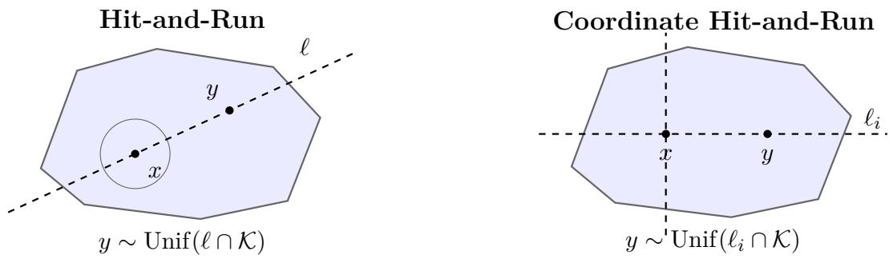

# Spectral Gaps of Hit-and-Run and Coordinate Hit-and-Run

Yunbum Kook University of Michigan ybkook@umich.edu

Santosh S. Vempala Georgia Tech vempala@gatech.edu

August 18, 2026

## Abstract

For any convex body $\mathcal { K } \subset \mathbb { R } ^ { n }$ containing a unit ball, the spectral gap of Hit-and-Run is $\Omega ( 1 / ( n ^ { 2 } C _ { \mathsf { P l } } ) )$ , where $C _ { \mathsf { P l } }$ is the Poincaré constant of the uniform distribution π over K. This implies that Hit-and-Run converges to a distribution within χ2-divergence ε of the uniform distribution π in $O ( n ^ { 2 } C _ { \mathsf { P l } } \log ( M / \varepsilon ) )$ steps from any starting distribution $\pi _ { 0 }$ with $M = \chi ^ { 2 } ( \pi _ { 0 } \parallel \pi )$ thus refining the known bound of ${ \cal O } ( n ^ { 2 } R ^ { 2 } \log ( M / \varepsilon ) )$ by Lovász and Vempala (2004) in terms of the outer radius $R ;$ for nearly isotropic bodies, together with progress on the KLS conjecture, the complexity is $O ( n ^ { 2 } \log n \log ( M / \varepsilon ) )$ ), improving the dimension dependence from cubic to nearly quadratic while maintaining logarithmic dependence on the initial distance. It was an open problem to connect the convergence of Hit-and-Run to Poincaré/KLS constants as was done for the Ball walk by Kannan, Lovász and Simonovits (1997). Unlike Hit-and-Run, the Ball walk has an unavoidable linear dependence on (a stronger notion) of the initial warmness.

We directly bound the spectral gap of the Hit-and-Run Markov chain by connecting it to functional isoperimetric constants, inspired by the recent analysis of In-and-Out. Rewriting the spectral gap first in terms of dual certificates leads to the Babuška–Aziz constant studied in the analysis of PDEs; it is asymptotically bounded by the Improved Poincaré constant of the target distribution, which we show can be bounded in terms of the usual Poincaré constant. The proof is based on duality and calculus, unlike known proofs of convergence for Hit-and-Run which are based on bounding the conductance. The same technique can be applied to Coordinate Hit-and-Run, resulting in a much improved mixing time of $O ( n ^ { 3 } C _ { \mathsf { P l } } \log ( M / \varepsilon ) )$ .

## 1 Introduction

Sampling a convex body is a fundamental algorithmic problem. Hit-and-Run, proposed independently by Boneh and Golan [BG79] and Smith [Smi84], is the following Markov chain (see Figure 1.1) when applied to a convex body $\mathcal { K } \subset \mathbb { R } ^ { n }$ : at a current point $x \in \kappa$

1. Sample a uniformly distributed random line ℓ through x.

2. Go to a uniform random point on the chord $\ell \cap \kappa$

Hit-and-Run is an attractive, easy-to-implement process that has been widely used in practice. Coordinate Hit-and-Run (CHAR), also known as Gibbs sampling and introduced in 1971 [Tur71], is the variant that only uses axis-parallel chords and is also popular due to its low memory overhead.

Building on the seminal work of [Lov99], Lovász and Vempala [LV06a] showed that Hit-and-Run mixes from a cold start: in any convex body $\mathcal { K } \subset \mathbb { R } ^ { n }$ with $B ^ { n } \subseteq { \mathcal { K } } \subseteq R B ^ { n }$ , it outputs a point within $\chi ^ { 2 } \mathrm { - d i v e r g e n c e } \varepsilon$ of the uniform distribution over K in $O ( n ^ { 2 } R ^ { 2 } \log ( M / \varepsilon ) )$ ) steps from any starting distribution within $\chi ^ { 2 } { \mathrm { - d i v e r g e n c e ~ } } M$ of the target. This convergence rate is asymptotically optimal in terms of these parameters, as shown by a cylinder whose cross section is a unit ball and axis has length 2R. It also means that Hit-and-Run mixes rapidly from any interior starting point (by applying the convergence bound to the distribution obtained after taking one step), the first random walk known to have this property for arbitrary convex bodies. More recently, CHAR was shown to have (higher) polynomial convergence rates [LV23, NS22, NRS25], with the last paper showing logarithmic dependence on the warm start parameter.

The study of eficiently sampling convex bodies has made much progress over the past few decades, starting from an initial polynomial-time algorithm with complexity $n ^ { 2 3 }$ by Dyer, Frieze, and Kannan [DFK91]. The Ball walk introduced by Lovász [Lov90] has been particularly fruitful, leading to the current best complexity for sampling, general techniques for the analysis of Markov chains [LS90, LS93, KLS97, LV07], and novel classes of isoperimetric inequalities. One highlight is the Kannan–Lovász–Simonovits (KLS) conjecture [KLS95] which posits that halfspaces are asymptotically optimal isoperimetric cuts for convex bodies (and logconcave densities). The conjecture directly leads to a better bound on the convergence rate of the Ball walk, and has several other interesting mathematical consequences and connections. Another highlight is the localization method, first developed by Kannan, Lovász, and Simonovits [LS93, KLS95] to prove inequalities in high dimension and later generalized to a stochastic method by Eldan [Eld13]. For a more comprehensive account of these developments, we refer the reader to [Vem05, KV25a].

The Ball walk has a polynomial dependence on the warmness parameter1, and this is unavoidable. To get around this, researchers have developed algorithmic solutions, notably annealing [LV06b, KV06, CV18], to arrange an O(1)-warm start. From such a warm start, the Ball walk’s convergence rate is roughly $n ^ { 2 } \| \mathrm { c o v } \| _ { \mathsf { o p } } \psi _ { n } ^ { 2 }$ , where $\| \mathrm { c o v } \| _ { \mathsf { o p } }$ is the operator norm of the covariance of the target distribution, and $\psi _ { n }$ is the KLS constant, which is known to be $O ( { \sqrt { \log n } } )$ and is conjectured to be $O ( 1 )$ . This is always a better bound than $n ^ { 2 } R ^ { 2 }$ and is asymptotically better by a factor of n when the target is isotropic $( \mathrm { i . e . , ~ } \| \mathrm { c o v } \| _ { \mathsf { o p } } = 1 )$ . Note that for convex bodies and logconcave densities, we have $C _ { \mathsf { P l } } \simeq \| \mathrm { c o v } \| _ { \mathsf { o p } } \psi _ { n } ^ { 2 }$ , where the RHS is the squared reciprocal of the Cheeger constant.

On the other hand, despite its logarithmic dependence on the warmness parameter, there was no known connection between the convergence of Hit-and-Run and the KLS constant. Thus, a decade of progress on the latter, leading to improved complexities for sampling (near-)isotropic convex bodies, did not refine the bound for Hit-and-Run. Unlike the Ball walk, whose analysis directly uses Euclidean isoperimetry, the analysis of Hit-and-Run was based on an average isoperimetric inequality for the cross-ratio distance, and the latter was already the best possible. Thus, it remained a tantalizing open problem to bridge the analysis of Hit-and-Run with improved isoperimetric constants.

  
Figure 1.1: Left: A HAR kernel at $x \in \kappa$ chooses a random line ℓ through x and samples y uniformly from the chord $\ell \cap \kappa$ . Right: A CHAR kernel chooses an axis-parallel line $\ell _ { i }$ through x and samples y uniformly from the chord $\ell _ { i } \cap \cal K$

Chen and Eldan [CE26] made a conceptually important breakthrough, showing that for isotropic convex bodies, the convergence rate is indeed nearly quadratic in the dimension, albeit with a polynomial dependence on initial warmness and the distance to the target. Interestingly, their proof technique, called a localization scheme [CE25], used a stochastic localization process to reduce the analysis from general convex bodies to that of a highly concentrated Gaussian restricted to a convex body; this general stochastic technique has also been the driving force for much of the progress in bounding the KLS constant. So, although they lost the logarithmic dependence on the warmness parameter, they showed that the conjectured dimension dependence is indeed plausible and valid in the isotropic setting.

Recent work [KVZ26, KV25b, KV25c] took a diferent approach inspired by continuous difusion, and showed that the In-and-Out random walk has a convergence rate that matches the best-known bounds for the Ball walk, with stronger output guarantees and, importantly, a novel proof framework that directly connects convergence (in fact, per-step contraction towards the target) with functional isoperimetric constants of the target distribution. Nevertheless, In-and-Out also has an unavoidable linear dependence on the warmness parameter, highlighting the open problem about Hit-and-Run:

Can the convergence rate of Hit-and-Run be bounded by the Poincaré/KLS constants while maintaining its logarithmic dependence on the warmness parameter?

In this paper, we answer this question afirmatively for both Hit-and-Run and CHAR. The proof technique bypasses the traditional method of bounding the conductance and directly connects the convergence rate to functional isoperimetric constants.

The main high-level idea of the proof is to produce a dual certificate bounding the spectral gap. Rewriting the spectral gap first in terms of dual certificates leads to the Babuška–Aziz constant [BA72, HP83] studied in the analysis of PDEs; for bounded domains, this is known to be asymptotically bounded by the Improved Poincaré constant of the target density. The latter is a refined version of the classical Poincaré constant, incorporating distance to the boundary as a weight function for points in the domain [HS94, Cos17, Zsu20]. We show that this constant can be bounded in terms of the usual Poincaré constant for convex bodies resulting in a mixing time bound of ${ \cal O } ( n ^ { 2 } C _ { \sf P l } \log ( M / \varepsilon ) )$ . Applying this to CHAR, with the only change being in the first step of connecting the spectral gap to the Babuška–Aziz constant, results in a mixing time bound of $O ( n ^ { 3 } C _ { \mathsf { P l } } \log ( M / \varepsilon ) )$ , which is conjectured to be asymptotically tight. We note that under this new analytical framework, the proofs for Hit-and-Run and CHAR are essentially the same.

We discuss the proof techniques in more detail after stating the main results.

## 1.1 Results

Below, $C _ { \mathsf { P l } } ( \pi )$ denotes the Poincaré constant of a probability measure $\pi ,$ formally defined in §1.2.

Theorem 1.1 (Spectral gaps). Let $n \geq 2$ and $\mathcal { K } \subset \mathbb { R } ^ { n }$ be a bounded, open, and convex set with unit ball inside, and let π be the uniform distribution over $\kappa$ . Then, the spectral gaps of Hit-and-Run and Coordinate Hit-and-Run satisfy

$$
\lambda _ { \mathsf { H R } } \gtrsim \frac { 1 } { n ^ { 2 } C _ { \mathsf { P I } } ( \pi ) } \gtrsim \frac { 1 } { n ^ { 2 } \left\| \mathrm { c o v } \pi \right\| _ { \mathsf { o p } } \log n } , \quad \lambda _ { \mathsf { C H A R } } \gtrsim \frac { 1 } { n ^ { 3 } C _ { \mathsf { P I } } ( \pi ) } \gtrsim \frac { 1 } { n ^ { 3 } \left\| \mathrm { c o v } \pi \right\| _ { \mathsf { o p } } \log n } .
$$

Corollary 1.2 (Mixing time). Under the assumptions of Theorem 1.1, let $\pi _ { N } ^ { \mathsf { H R } }$ and $\pi _ { N } ^ { \mathsf { C H A R } }$ be the distribution of the N-th iterate of Hit-and-Run and Coordinate Hit-and-Run initialized at $\pi _ { 0 } ,$ respectively. Then, for some universal constant $c > 0$

$$
\chi ^ { 2 } ( \pi _ { N } ^ { \sf H R } \parallel \pi ) \leq \exp ( - \frac { c N } { n ^ { 2 } \left\| \mathrm { c o v } \pi \right\| _ { \mathrm { o p } } \log n } ) \chi ^ { 2 } ( \pi _ { 0 } \parallel \pi ) ,
$$

$$
\chi ^ { 2 } ( \pi _ { N } ^ { \mathsf { C H A R } } \parallel \pi ) \le \exp ( - \frac { c N } { n ^ { 3 } \left\| \mathrm { c o v } \pi \right\| _ { \mathsf { o p } } \log n } ) \chi ^ { 2 } ( \pi _ { 0 } \parallel \pi ) .
$$

In particular, for given $\varepsilon > 0$ , the number of iterations for Hit-and-Run and Coordinate Hit-and-Run to achieve ε-distance to π in $\chi ^ { 2 }$ -divergence is bounded as

$$
N _ { \mathsf { H R } } \lesssim n ^ { 2 } \left. \mathsf { c o v } \pi \right. _ { \mathsf { o p } } \log n \log \frac { \chi ^ { 2 } ( \pi _ { 0 } \parallel \pi ) } { \varepsilon } , \qquad N _ { \mathsf { C H A R } } \lesssim n ^ { 3 } \left. \mathsf { c o v } \pi \right. _ { \mathsf { o p } } \log n \log \frac { \chi ^ { 2 } ( \pi _ { 0 } \parallel \pi ) } { \varepsilon } .
$$

## 1.2 Technical overview

## 1.2.1 Preliminaries

We recall the functional-analytic facts used later, with more details in $\ S \mathrm { A }$

Basics. Throughout the paper, we use the same symbol to denote a probability measure and its Lebesgue density when it is clear from context, and d $\begin{array} { r } { \left[ \boldsymbol { x } \right) = \frac { \mathrm { d } \boldsymbol { x } } { \mathrm { v o l } \boldsymbol { \kappa } } } \end{array}$ denotes the uniform measure on $\ b { \cal { K } } \subset \mathbb { R } ^ { n }$ . We write $\langle f , g \rangle _ { \pi } : = \textstyle \int _ { \mathcal { K } } f g$ dπ, $\| f \| _ { 2 } ^ { 2 } : = \langle f , f \rangle _ { \pi } = \mathbb { E } _ { \pi } [ f ^ { 2 } ]$ , and $L _ { 0 } ^ { 2 } ( \pi ) : = \{ f \in L ^ { 2 } ( \pi )$ $\textstyle \int _ { K } f \mathrm { d } \pi = 0 \}$ , the set of centered $L ^ { 2 }$ functions. The mean and variance of $f \in L ^ { 2 } ( \pi )$ are denoted as $\textstyle \pi f : = \mathbb { E } _ { \pi } f = \int _ { \mathcal { K } } f$ dπ and $\operatorname { V a r } _ { \pi } f = \| f - \pi f \| _ { 2 } ^ { 2 }$

A function $f \in L ^ { 2 } ( \mathcal { K } )$ has weak derivative $\partial _ { j } f \in L ^ { 2 } ( { \cal K } )$ if $\textstyle \int _ { \mathcal { K } } f \partial _ { j } \varphi \mathrm d x = - \int _ { \mathcal { K } } ( \partial _ { j } f )$ φ dx for every $\varphi \in C _ { c } ^ { \infty } ( \mathcal { K } )$ . The Sobolev space $H ^ { 1 } ( \mathcal { K } )$ consists of the $L ^ { 2 }$ functions whose weak derivatives belong to $L ^ { 2 }$ . Recall that it is a Hilbert space with $\langle f , g \rangle _ { H ^ { 1 } } = \langle f , g \rangle _ { L ^ { 2 } } + \langle \nabla f , \nabla g \rangle _ { L ^ { 2 } }$ . We denote the closure of compactly-supported smooth functions with respect to the $H ^ { 1 }$ -norm by $H _ { 0 } ^ { 1 } ( K ) : = \overline { { C _ { c } ^ { \infty } ( K ) } } ^ { H ^ { 1 } ( K ) }$ For a vector field $u = ( u _ { 1 } , \ldots , u _ { n } )$ , we use $H ^ { 1 } ( { \mathcal { K } } ; \mathbb { R } ^ { n } ) : = H ^ { 1 } ( { \mathcal { K } } ) ^ { n }$ and $\begin{array} { r } { \| \nabla u \| _ { 2 } ^ { 2 } = \sum _ { i , j = 1 } ^ { n } \| \partial _ { j } u _ { i } \| _ { 2 } ^ { 2 } } \end{array}$

For $u \in H ^ { 1 } ( { \mathcal { K } } ; \mathbb { R } ^ { n } )$ , its weak divergence is div u $\begin{array} { r } { : = \sum _ { i = 1 } ^ { n } \partial _ { i } u _ { i } \in L ^ { 2 } ( K ) } \end{array}$ . Equivalently, $\begin{array} { r l } { \int _ { \mathcal { K } } ( \mathrm { d i v } u ) \varphi \mathrm { d } x = } \end{array}$ $\mathrm { ~ - ~ } \int _ { \mathcal { K } } \boldsymbol { u } \cdot \nabla \varphi$ dx for any $\varphi \in C _ { c } ^ { \infty } ( \mathcal { K } )$ . If $u \in H _ { 0 } ^ { 1 } ( { \mathcal { K } } ; \mathbb { R } ^ { n } )$ , approximation by compactly supported smooth vector fields gives $\textstyle \int _ { \mathcal { K } }$ div $\iota \mathrm { d } \pi = 0$

Functional inequalities. For $\begin{array} { r } { \delta ( x ) : = \mathrm { d i s t } ( x , \partial \mathcal { K } ) = \operatorname* { m i n } _ { y \in \partial \mathcal { K } } \left| x - y \right| } \end{array}$ and a probability measure π over $\kappa ,$ , its Poincaré constant and improved Poincaré constant are defined as the smallest constants satisfying that for any test function $f \in H ^ { 1 } ( K )$

$$
\operatorname { V a r } _ { \pi } f \leq C _ { \mathsf { P l } } ( \pi ) \int _ { \mathcal { K } } | \nabla f | ^ { 2 } \mathrm { d } \pi ,\tag{PI}
$$

$$
\operatorname { V a r } _ { \pi } f \leq C _ { \mathsf { I P I } } ( \pi ) \int _ { \mathcal { K } } \delta ^ { 2 } | \nabla f | ^ { 2 } \mathrm { d } \pi .\tag{IPI}
$$

Dirichlet form and spectral gap. Let G be a sub-σ-algebra of the Borel σ-algebra on $\kappa .$ . Recall that the conditional expectation $P _ { \mathcal { G } } f : = \mathbb { E } _ { \pi } [ f \mid { \mathcal { G } } ]$ is the orthogonal projection of $L ^ { 2 } ( \pi )$ onto the closed subspace of G-measurable functions:

$$
P _ { \mathcal { G } } ^ { * } = P _ { \mathcal { G } } , \qquad P _ { \mathcal { G } } ^ { 2 } = P _ { \mathcal { G } } , \qquad \langle f , ( \operatorname { I d } - P _ { \mathcal { G } } ) f \rangle _ { \pi } = \| f - P _ { \mathcal { G } } f \| _ { 2 } ^ { 2 } .\tag{1.1}
$$

For a π-reversible Markov operator $P ,$ its Dirichlet form is $\mathcal { E } _ { P } ( f , f ) : = \langle f , ( \operatorname { I d } - P ) f \rangle _ { \pi }$ , and the spectral gap of P is defined as

$$
\lambda _ { P } : = \operatorname* { i n f } _ { \substack { 0 \neq f \in L _ { 0 } ^ { 2 } ( \pi ) } } \frac { \mathcal { E } _ { P } ( f , f ) } { \Vert f \Vert _ { 2 } ^ { 2 } } .
$$

A positive spectral gap of positive semidefinite P implies contraction in $\chi ^ { 2 } .$ -divergence: if $q _ { 0 } = { \frac { \mathrm { d } \mu _ { 0 } } { \mathrm { d } \pi } }$ belongs to $L ^ { 2 } ( \pi )$ and $\mu _ { N } = \mu _ { 0 } P ^ { N }$ 2

$$
\chi ^ { 2 } ( \mu _ { N } \parallel \pi ) = \parallel P ^ { N } ( q _ { 0 } - 1 ) \parallel _ { 2 } ^ { 2 } \le ( 1 - \lambda _ { P } ) ^ { 2 N } \chi ^ { 2 } ( \mu _ { 0 } \parallel \pi ) \le \exp ( - 2 \lambda _ { P } N ) \chi ^ { 2 } ( \mu _ { 0 } \parallel \pi ) .\tag{1.2}
$$

## 1.2.2 Proof ideas

We will define a bounded linear operator $T : F  G$ for two Hilbert spaces F and $G$ so that $\| f \| _ { F } ^ { 2 }$ and $\| T f \| _ { G } ^ { 2 }$ correspond to $\| f \| _ { 2 } ^ { 2 }$ and $\mathcal { E } _ { P } ( f , f )$ in our setting, respectively. Then, our goal is to establish $\| T \bar { f } \| _ { G } ^ { 2 } \geq \lambda \| f \| _ { F } ^ { 2 }$ for some $\lambda > 0$ . A natural dual approach is to find, for each $f \in F$ a dual-certificate $g _ { f } \in G$ such that $T ^ { * } g _ { f } = f$ for the adjoint $T ^ { * } : G  F$ . If the certificate also satisfies $\| g _ { f } \| _ { G } ^ { 2 } \leq C \| f \| _ { F } ^ { 2 }$ , then

$$
\begin{array} { r } { \| f \| _ { F } ^ { 2 } = \langle f , f \rangle _ { F } = \langle f , T ^ { * } g _ { f } \rangle _ { F } = \langle T f , g _ { f } \rangle _ { G } \leq \| T f \| _ { G } \| g _ { f } \| _ { G } \leq \sqrt { C } \left\| T f \right\| _ { G } \| f \| _ { F } , } \end{array}
$$

which implies $\| f \| _ { F } ^ { 2 } \le C \| T f \| _ { G } ^ { 2 }$ , and it leads to $\lambda \geq C ^ { - 1 }$ . In summary, we should tackle two concrete problems: (i) find the dual certificate $g _ { f }$ such that $T ^ { * } g _ { f } = f$ , and (ii) show $\| g _ { f } \| _ { G } ^ { 2 } \leq C \| f \| _ { F } ^ { 2 }$ for some $C > 0$

We now illustrate the main idea through Coordinate Hit-and-Run, whose finite product structure makes the adjoint transparent. Fix an orthonormal basis $e _ { 1 } , \ldots , e _ { n } ,$ and let $P _ { i }$ be conditional expectation given all coordinates except the i-th one; equivalently, $P _ { i } f$ is the uniform average of $f$ on each ei-parallel chord. By (1.1),

$$
\begin{array} { r l r } {  { P _ { \mathrm { C H A R } } = \frac { 1 } { n } \sum _ { i = 1 } ^ { n } P _ { i } , } } \\ & { } & { \ E _ { \mathrm { C H A R } } ( f , f ) : = \langle f , ( \mathrm { I d } - P _ { \mathrm { C H A R } } ) f \rangle _ { \pi } = \displaystyle \frac { 1 } { n } \sum _ { i = 1 } ^ { n } \| f - P _ { i } f \| _ { 2 } ^ { 2 } . } \end{array}
$$

In this case, we can take $F : = L _ { 0 } ^ { 2 } ( \pi )$ and $G : = \{ g = ( g _ { 1 } , \dots , g _ { n } ) : g _ { i } \in L ^ { 2 } ( \pi ) \}$ with norm $\| f \| _ { F } ^ { 2 } = \| f \| _ { 2 } ^ { 2 }$ and $\begin{array} { r } { \| g \| _ { G } ^ { 2 } = \frac { 1 } { n } \sum _ { i = 1 } ^ { n } \| g _ { i } \| _ { 2 } ^ { 2 } } \end{array}$ . Also, we define $T : F  G$ by $( T f ) _ { i } = ( { \mathrm { I d } } - P _ { i } ) f$ for $i \in [ n ]$ so $\| T f \| _ { G } ^ { 2 } = \mathcal { E } _ { \mathrm { C H A R } } ( f , f )$ as desired. Let us now compute the adjoint $T ^ { * }$ . For $g = ( g _ { 1 } , \ldots , g _ { n } ) \in G$ 2 using $P _ { i } = P _ { i } ^ { * }$

$$
\langle T f , g \rangle _ { G } = \frac { 1 } { n } \sum _ { i } \langle ( \operatorname { I d } - P _ { i } ) f , g _ { i } \rangle _ { \pi } = \frac { 1 } { n } \sum _ { i } \langle f , ( \operatorname { I d } - P _ { i } ) g _ { i } \rangle _ { \pi } .
$$

Hence, $\begin{array} { r } { T ^ { * } g = \frac { 1 } { n } \sum _ { i } ( \mathrm { I d } - P _ { i } ) g _ { i } } \end{array}$

With the dual-certificate approach in mind, we address the first problem of finding g such that $T ^ { * } g = f $ . To this end, we could consider two suficient conditions given as

$$
P _ { i } g _ { i } = 0 \quad { \mathrm { f o r ~ } } i \in [ n ] \qquad \& \qquad { \frac { 1 } { n } } \sum _ { i = 1 } ^ { n } g _ { i } = f .
$$

A convenient way to enforce the first condition is to set $g _ { i } = n \partial _ { i } u _ { i }$ for each $i \in [ n ]$ for some $u \in H _ { 0 } ^ { 1 } ( K ; \mathbb { R } ^ { n } )$ extended by zero outside of $\kappa .$ . Indeed, for a.e. $z \in e _ { i } ^ { \bot }$ , if $I _ { z } : = \{ s \in \mathbb { R } : z + s e _ { i } \in K \}$ ， then for $t \in I _ { z }$ , the fundamental theorem of calculus leads to

$$
( P _ { i } g _ { i } ) ( z + t e _ { i } ) = \frac { n } { | I _ { z } | } \int _ { I _ { z } } \partial _ { i } u _ { i } ( z + s e _ { i } ) \mathrm { d } s = 0 .
$$

Then, the second condition corresponds to div $u = f$ . In summary, the first problem comes down to finding $u \in H _ { 0 } ^ { 1 } ( K ; \mathbb { R } ^ { n } )$ such that div $u = f$

We now address the second problem of showing $\| g \| _ { G } ^ { 2 } \leq C \| f \| _ { F } ^ { 2 }$ for some C. Since

$$
\| g \| _ { G } ^ { 2 } = \frac { 1 } { n } \sum _ { i = 1 } ^ { n } \| g _ { i } \| _ { 2 } ^ { 2 } = n \sum _ { i = 1 } ^ { n } \| \partial _ { i } u _ { i } \| _ { 2 } ^ { 2 } \leq n \| \nabla u \| _ { 2 } ^ { 2 } ,
$$

the second problem can be reduced to the following optimization problem: among functions u with div $u = f .$ , find a function u that minimizes $\| \nabla u \| _ { 2 } ^ { 2 }$ . Namely, one should minimize the Frobenius norm $\lVert \nabla u \rVert _ { 2 }$ with trace constraint div $\boldsymbol { u } = \mathrm { t r } ( \boldsymbol { \nabla } \boldsymbol { u } ) = \boldsymbol { f }$ . This is where the Babuška–Aziz constant comes in:

$$
C _ { \mathsf { B A } } ( \pi ) : = \operatorname* { s u p } _ { \substack { 0 \neq f \in L _ { 0 } ^ { 2 } ( \pi ) } } \operatorname* { i n f } _ { \substack { u \in H _ { 0 } ^ { 1 } ( { \mathcal { K } } ; { \mathbb { R } } ^ { n } ) } } \frac { \Vert \nabla u \Vert _ { 2 } ^ { 2 } } { \Vert f \Vert _ { 2 } ^ { 2 } } .
$$

The minimizer satisfies div $u = f$ and $\| \nabla u \| _ { 2 } ^ { 2 } \leq C _ { \mathsf { B A } } ( \pi ) \| f \| _ { 2 } ^ { 2 }$ . Consequently, $\| g \| _ { G } ^ { 2 } \leq n C _ { \mathsf { B A } } ( \pi ) \| f \| _ { F } ^ { 2 }$ and the dual argument gives λCHAR $\geq { \frac { 1 } { n C _ { \mathsf { B A } } ( \pi ) } }$ . We formalize this functional analytic result as follows.

Lemma 1.3. Suppose $C _ { \mathsf { B A } } ( \pi ) < \infty$ . Then, for every $f \in L _ { 0 } ^ { 2 } ( \pi )$ , there exists $u \in H _ { 0 } ^ { 1 } ( K ; \mathbb { R } ^ { n } )$ such that

$$
\operatorname { d i v } u = f , \qquad \quad a n d \qquad \| \nabla u \| _ { 2 } ^ { 2 } \leq C _ { \mathsf { B A } } ( \pi ) \| f \| _ { 2 } ^ { 2 } .\tag{1.3}
$$

Proof. Finiteness of $C _ { \mathrm { B A } } ( \pi )$ makes the feasible set in the inner infimum nonempty. Equip $H _ { 0 } ^ { 1 } ( K ; \mathbb { R } ^ { n } )$ with the norm $\lVert \nabla u \rVert _ { 2 }$ . By the Poincaré inequality for $H _ { 0 } ^ { 1 } ( K ; \mathbb { R } ^ { n } )$ , this is an equivalent Hilbert norm on $H _ { 0 } ^ { 1 } ( K ; \mathbb { R } ^ { n } )$ . Since $\| \mathrm { d i v } u \| _ { 2 } \leq \sqrt { n } \| \nabla u \| _ { 2 }$ , it follows that div : $H _ { 0 } ^ { 1 } ( K ; \mathbb { R } ^ { n } ) \to L _ { 0 } ^ { 2 } ( \pi )$ is a bounded linear operator (so continuous). Hence, div $^ { - 1 } ( \{ f \} ) = \{ u \in H _ { 0 } ^ { 1 } ( \mathcal { K } ; \mathbb { R } ^ { n } )$ : div $u = f \}$ is a nonempty closed convex subset of $H _ { 0 } ^ { 1 } ( K ; \mathbb { R } ^ { n } )$ . By the Hilbert projection theorem, the infimum in the definition of $C _ { \mathrm { B A } } ( \pi )$ is attained, and its minimizer satisfies (1.3). □

In $\ S 2 ,$ , we formally bound the spectral gaps of HAR and CHAR in terms of the Babuška–Aziz constant of the target distribution. Notably, the spectral-gap bound for CHAR is smaller by a factor of the dimension. The rest of the analysis is independent of the Markov chain and will apply to both HAR and CHAR. The next step is the following result from $[ \mathrm { Z s u 2 0 } ]$ which relates the Babuška–Aziz constant to the Improved Poincaré constant. We give a self-contained proof of this in §B.

Theorem 1.4. For a bounded convex domain in $\mathbb { R } ^ { n }$ , we have $C _ { \mathsf { B A } } \leq 1 + 4 C _ { \mathsf { I P I } }$

Then, in $\ S 3 ,$ , we show that $C _ { \mathsf { I P l } } ( \pi ) \ \lesssim \ n ^ { 2 } C _ { \mathsf { P l } } ( \pi )$ for a convex body containing a unit ball (Theorem 3.1 and Corollary 3.2). These ingredients sufice to prove the main results.

## 1.3 Proof of main result

Proof of Theorem 1.1. Note that $C _ { \mathsf { P l } } ( \pi ) \geq \| \mathrm { c o v } \pi \| _ { \mathsf { o p } } \gtrsim 1 / n$ when $B ( 0 , 1 ) \subset \mathcal { K }$ (see [KV26, Lemma 2.1]) By applying Propositions 2.1 and 2.2 with Theorem 1.4 $( C _ { \mathsf { B A } } \leq 1 + 4 C _ { \mathsf { I P l } } )$ and Corollary 3.2 $( C _ { \mathsf { I P l } } \lesssim n ^ { 2 } C _ { \mathsf { P l } } / r ^ { 2 }$ with $r = 1 )$ ),

$$
\lambda _ { \mathsf { H R } } \gtrsim \frac { 1 } { n ^ { 2 } C _ { \mathsf { P I } } ( \pi ) } , \qquad \lambda _ { \mathsf { C H A R } } \gtrsim \frac { 1 } { n ^ { 3 } C _ { \mathsf { P I } } ( \pi ) } .
$$

Using $C _ { \mathsf { P l } } ( \pi ) \lesssim \| \mathrm { c o v } \pi \| _ { \mathsf { o p } }$ log n [Kla23], we complete the proof.

Proof of Corollary 1.2. This follows from the spectral-gap results in Theorem 1.1 and (1.2).

## 2 Spectral gap via Babuška–Aziz constant

## 2.1 Hit-and-Run

Let $\sigma$ be uniform probability measure on $\mathbb { S } ^ { n - 1 }$ . For $\theta \in \mathbb { S } ^ { n - 1 }$ , let $P _ { \theta }$ be conditional expectation with respect to the orthogonal projection onto $\theta ^ { \perp }$ , so $P _ { \theta } f$ is the uniform average of $f$ on each θ-parallel chord. Then,

$$
\begin{array} { r l r } & { } & { P _ { \mathrm { { H R } } } = \displaystyle \int _ { \mathbb { S } ^ { n - 1 } } P _ { \theta } \mathrm { d } \sigma ( \theta ) , } \\ & { } & { \displaystyle \mathcal { E } _ { \mathrm { H R } } ( f , f ) = \langle f , ( \mathrm { I d } - P _ { \mathrm { H R } } ) f \rangle _ { \pi } = \displaystyle \int _ { \mathbb { S } ^ { n - 1 } } \| f - P _ { \theta } f \| _ { 2 } ^ { 2 } \mathrm { d } \sigma ( \theta ) . } \end{array}
$$

For $\theta$ drawn from $\mathbb { S } ^ { n - 1 }$ , the natural dual certificate is $g _ { \boldsymbol { \theta } } ( \boldsymbol { x } ) : = n \boldsymbol { \theta } ^ { \mathsf { T } } \nabla \boldsymbol { u } ( \boldsymbol { x } ) \boldsymbol { \theta }$

Proposition 2.1. If $C _ { \mathsf { B A } } ( \pi ) < \infty$ , then

$$
\lambda _ { \mathsf { H R } } \geq \frac { n + 2 } { n \left( 2 + C _ { \mathsf { B A } } ( \pi ) \right) } \gtrsim \frac { 1 } { 1 + C _ { \mathsf { B A } } ( \pi ) } .
$$

Proof. Fix $f \in L _ { 0 } ^ { 2 } ( \pi )$ , and pick $u \in H _ { 0 } ^ { 1 } ( K ; \mathbb { R } ^ { n } )$ given by Lemma 1.3 that satisfies div $u = f$ and $\| \nabla u \| _ { 2 } ^ { 2 } \leq C _ { \mathsf { B A } } ( \pi ) \| f \| _ { 2 } ^ { 2 }$ . For $\theta \in \mathbb { S } ^ { n - 1 }$ , define

$$
g _ { \theta } ( x ) : = n \theta ^ { \mathsf { T } } \nabla u ( x ) \theta \qquad { \mathrm { f o r ~ a . e . ~ } } x \in K .
$$

Let $u \in H _ { 0 } ^ { 1 } ( K ; \mathbb { R } ^ { n } )$ and choose $u _ { k } \in C _ { c } ^ { \infty } ( K ; \mathbb { R } ^ { n } )$ converging to u in $H ^ { 1 }$ . Define $g _ { \theta , k } : = n \theta ^ { \mathsf { T } } \nabla u _ { k } \theta$ The fundamental theorem of calculus on every θ-parallel line gives $P _ { \theta } g _ { \theta , k } = 0 { . }$ , because $u _ { k }$ is compactly supported. Since $g _ { \boldsymbol { \theta } , k } \to g _ { \boldsymbol { \theta } }$ in $L ^ { 2 } ( \pi )$ and conditional expectation is an $L ^ { 2 }$ contraction, $\begin{array} { r } { P _ { \theta } g _ { \theta } = \operatorname* { l i m } _ { k \to \infty } P _ { \theta } g _ { \theta , k } = 0 } \end{array}$ in $L ^ { 2 }$ . Hence, $0 = \langle f , P _ { \theta } g _ { \theta } \rangle _ { \pi } = \langle P _ { \theta } f , g _ { \theta } \rangle _ { \pi }$

Recall that for a square matrix M, rotational invariance of $\mathrm { d } \sigma ( \theta )$ gives

$$
\mathbb { E } _ { \theta } [ \theta \theta ^ { \mathsf { T } } ] = \frac { 1 } { n } \operatorname { I d } ,\tag{2.1}
$$

$$
\mathbb { E } _ { \boldsymbol { \theta } } [ ( \boldsymbol { \theta } ^ { \sf T } \boldsymbol { M } \boldsymbol { \theta } ) ^ { 2 } ] = \frac { ( \mathrm { t r } \boldsymbol { M } ) ^ { 2 } + 2 \| \mathrm { s y m } \boldsymbol { M } \| _ { \mathrm { F } } ^ { 2 } } { n ( n + 2 ) } ,\tag{2.2}
$$

where the second identity follows from $\begin{array} { r } { \mathbb { E } [ \theta _ { i } \theta _ { j } \theta _ { k } \theta _ { \ell } ] = \frac { \delta _ { i j } \delta _ { k \ell } + \delta _ { i k } \delta _ { j \ell } + \delta _ { i \ell } \delta _ { j k } } { n ( n + 2 ) } } \end{array}$ . By (2.1) and div $u = f$

$$
\int _ { { \mathbb S } ^ { n - 1 } } g _ { \boldsymbol \theta } \mathrm { d } { \boldsymbol \sigma } ( { \boldsymbol \theta } ) = \mathrm { t r } { \boldsymbol \nabla } { \boldsymbol u } = f .
$$

Therefore, using $\langle P _ { \theta } f , g _ { \theta } \rangle _ { \pi } = 0$ and Cauchy–Schwarz,

$$
\begin{array} { r l } & { \| f \| _ { 2 } ^ { 2 } = \displaystyle \int _ { \mathbb S ^ { n - 1 } } \langle f , g _ { \theta } \rangle _ { \pi } \mathrm { d } \sigma ( \theta ) = \displaystyle \int _ { \mathbb S ^ { n - 1 } } \langle f - P _ { \theta } f , g _ { \theta } \rangle _ { \pi } \mathrm { d } \sigma ( \theta ) , } \\ & { \| f \| _ { 2 } ^ { 4 } \leq { \mathcal E } _ { \mathsf { H R } } ( f , f ) \displaystyle \int _ { \mathbb S ^ { n - 1 } } \| g _ { \theta } \| _ { 2 } ^ { 2 } \mathrm { d } \sigma ( \theta ) . } \end{array}\tag{2.3}
$$

For a square matrix M, we denote its symmetrization by sym $M : = ( M + M ^ { \boldsymbol { \mathsf { T } } } ) / 2$ . By integration by parts, for $u \in H _ { 0 } ^ { 1 } ( { \mathcal { K } } ; \mathbb { R } ^ { n } )$

$$
2 \left\| \mathrm { s y m } \nabla u \right\| _ { 2 } ^ { 2 } = \left\| \nabla u \right\| _ { 2 } ^ { 2 } + \left\| \mathrm { d i v } u \right\| _ { 2 } ^ { 2 } ,\tag{2.4}
$$

since the cross term satisfies $\begin{array} { r } { \sum _ { i , j } \int _ { \mathsf K } ( \partial _ { j } u _ { i } ) ( \partial _ { i } u _ { j } ) { \mathrm d } \pi = \int _ { \mathsf K } (  { \operatorname { d i v } } u ) ^ { 2 } } \end{array}$ dπ. Applying (2.2) to $M = \nabla u$ and then using (2.4), div $u = f$ , and $\| \nabla u \| _ { 2 } ^ { 2 } \leq C _ { \mathsf { B A } } ( \pi ) \| f \| _ { 2 } ^ { 2 }$ , we obtain

$$
\begin{array} { l l } { \displaystyle \int _ { \mathbb S ^ { n - 1 } } \| g \theta \| _ { 2 } ^ { 2 } \mathrm { d } \sigma ( \theta ) = \displaystyle \frac { n } { n + 2 } \mathbb E _ { \pi } [ ( \mathrm { d i v } u ) ^ { 2 } + 2 \| \mathrm { s y m } \nabla u \| _ { \mathrm { F } } ^ { 2 } ] = \displaystyle \frac { n } { n + 2 } \left( \| f \| _ { 2 } ^ { 2 } + 2 \| \mathrm { s y m } \nabla u \| _ { 2 } ^ { 2 } \right) } \\ { \displaystyle \qquad \leq \frac { n \left( 2 + C _ { \mathrm { B A } } ( \pi ) \right) } { n + 2 } \| f \| _ { 2 } ^ { 2 } . } \end{array}
$$

Substitution into (2.3) gives

$$
\mathcal { E } _ { \mathsf { H R } } ( f , f ) \geq \frac { n + 2 } { n \left( 2 + C _ { \mathsf { B A } } ( \pi ) \right) } \| f \| _ { 2 } ^ { 2 } .
$$

Taking the infimum over nonzero $f \in L _ { 0 } ^ { 2 } ( \pi )$ completes the proof.

## 2.2 Coordinate Hit-and-Run

Proposition 2.2. $I f C _ { \mathsf { B A } } ( \pi ) < \infty$ , then

$$
\lambda _ { \mathsf { C H A R } } \geq \frac { 1 } { n C _ { \mathsf { B A } } ( \pi ) } .
$$

Proof. Fix $f \in L _ { 0 } ^ { 2 } ( \pi )$ and let u be given by Lemma 1.3. For $i = 1 , \ldots , n$ , set $g _ { i } : = n \partial _ { i } u _ { i }$ and note that $\begin{array} { r } { { \frac { 1 } { n } } \sum _ { i = 1 } ^ { n } g _ { i } = \operatorname { d i v } u = f } \end{array}$ . A similar argument in the proof of Proposition 2.1 gives $P _ { i } g _ { i } = 0$ , and thus $\ddot { 0 } = \langle f , P _ { i } g _ { i } \rangle _ { \pi } = \langle P _ { i } f , g _ { i } \rangle _ { \pi }$ . Then,

$$
\begin{array} { r l r } {  { \| f \| _ { 2 } ^ { 2 } = \frac { 1 } { n } \sum _ { i = 1 } ^ { n } \langle f , g _ { i } \rangle _ { \pi } = \displaystyle \frac { 1 } { n } \sum _ { i = 1 } ^ { n } \langle f - P _ { i } f , g _ { i } \rangle _ { \pi } , } } \\ & { \| f \| _ { 2 } ^ { 4 } \le \mathcal { E } _ { \mathrm { C H A R } } ( f , f ) \frac { 1 } { n } \sum _ { i = 1 } ^ { n } \| g _ { i } \| _ { 2 } ^ { 2 } = n \mathcal { E } _ { \mathrm { C H A R } } ( f , f ) \sum _ { i = 1 } ^ { n } \| \partial _ { i } u _ { i } \| _ { 2 } ^ { 2 } . } \end{array}\tag{2.5}
$$

By Lemma 1.3,

$$
\sum _ { i = 1 } ^ { n } \lVert \partial _ { i } u _ { i } \rVert _ { 2 } ^ { 2 } \leq \lVert \nabla u \rVert _ { 2 } ^ { 2 } \leq C _ { \mathsf { B A } } ( \pi ) \lVert f \rVert _ { 2 } ^ { 2 } .
$$

Substitution into (2.5) gives $\begin{array} { r } { \mathcal { E } _ { \mathsf { C H A R } } ( f , f ) \ge \frac { 1 } { n C _ { \mathsf { B A } } ( \pi ) } \| f \| _ { 2 } ^ { 2 } } \end{array}$ , and taking the infimum over nonzero $f \in L _ { 0 } ^ { 2 } ( \pi )$ finishes the proof. □

## 3 Bounding the improved Poincaré constant

Since $C _ { \mathsf { B A } } \leq 1 + 4 C _ { \mathsf { I P I } }$ for a bounded convex domain (Theorem 1.4), we are only left with bounding the improved Poincaré constant (IPI) in terms of the usual Poincaré constant. Before we proceed, we briefly survey prior work on (IPI). Improved Poincaré inequalities with the distance to the boundary as a weight have been studied for John domains (which include convex domains), starting with [HS94] and further developed in [DD08, CW10]. In particular, for convex domains, [CW10] gives a quantitative bound in terms of the eccentricity of the domain. In our notation, this implies $C _ { \mathsf { I P l } } ( \pi ) \le C ( n ) R ^ { 2 } / r ^ { 2 }$ , where R and $r$ denote the outer-radius and in-radius of the domain, respectively, and the dimension dependence is absorbed into $C ( n )$ . For our application, we need a bound in terms of the ordinary Poincaré constant with explicit dimension dependence, so in Corollary 3.2 we show $C _ { \mathsf { I P I } } ( \pi ) \lesssim n ^ { 2 } C _ { \mathsf { P I } } ( \pi ) / r ^ { 2 }$

Theorem 3.1. For any locally Lipschitz function $f : \mathbb { R } ^ { n }  \mathbb { R }$ and a convex body $\mathcal { K } \subset \mathbb { R } ^ { n }$ containing a ball of radius $^ { r , }$ we have

$$
\operatorname* { i n f } _ { z } \int _ { K } | f ( x ) - z | \mathrm { d } x \lesssim \frac { n \sqrt { C _ { \mathsf { P I } } ( \pi ) } } { r } \int _ { K } \delta ( x ) | \nabla f | \mathrm { d } x .
$$

This gives the following immediate corollary:

Corollary 3.2. For a convex body K in $\mathbb { R } ^ { n }$ whose maximum inscribed ball has radius r, we have

$$
C _ { \mathsf { I P l } } ( \pi ) \lesssim \frac { n ^ { 2 } C _ { \mathsf { P I } } ( \pi ) } { r ^ { 2 } } .
$$

Proof. Since $C ^ { \infty } ( \mathbb { R } ^ { n } ) | _ { \kappa }$ is dense in $H ^ { 1 } ( \mathcal { K } )$ , it sufices to prove the claim for $f \in C ^ { \infty } ( \mathbb { R } ^ { n } ) | _ { K }$ . Then, Theorem 3.1 holds with z set to the median of $f , { \mathrm { i . e . } }$ , for any $g : \mathbb { R } ^ { n } $ R with median 0, we have

$$
\int _ { K } | g ( x ) | \mathrm { d } x \lesssim \frac { n \sqrt { C _ { \mathsf { P } \mathsf { I } } ( \pi ) } } { r } \int _ { K } \delta ( x ) | \nabla g | \mathrm { d } x .
$$

Now set $u ( x ) : = ( f ( x ) - z _ { f } ) ^ { + }$ where $z _ { f }$ is the median of $f$ and apply the above to $g = u ^ { 2 }$ . Then, 0 is the median of $g .$ Denoting $C : = n \dot { C } _ { \mathsf { P l } } ( \pi ) ^ { 1 / 2 } / r$ , we have

$$
\int _ { \mathcal { K } } u ^ { 2 } \mathrm { d } \boldsymbol { x } \lesssim C \int _ { \mathcal { K } } \delta ( \boldsymbol { x } ) u | \nabla u | \mathrm { d } \boldsymbol { x } \leq C \left( \int _ { \mathcal { K } } u ^ { 2 } \mathrm { d } \boldsymbol { x } \right) ^ { 1 / 2 } \Big ( \int _ { \mathcal { K } } \delta ( \boldsymbol { x } ) ^ { 2 } | \nabla u | ^ { 2 } \mathrm { d } \boldsymbol { x } \Big ) ^ { 1 / 2 } .
$$

Hence, $\begin{array} { r } { \int _ { \mathcal { K } } u ^ { 2 } \mathrm { d } x \lesssim C ^ { 2 } \int _ { \mathcal { K } } \delta ( x ) ^ { 2 } | \nabla u | ^ { 2 } \mathrm { d } x . } \end{array}$

We get the same conclusion with $v = ( z _ { f } - f ( x ) ) ^ { + }$ in place of u. Adding these,

$$
\mathrm { V a r } _ { \pi } f \leq \int _ { K } ( f - z _ { f } ) ^ { 2 } \mathrm { d } \pi \lesssim \frac { n ^ { 2 } C _ { \mathsf { P I } } ( \pi ) } { r ^ { 2 } } \int _ { K } \delta ( x ) ^ { 2 } | \nabla f | ^ { 2 } \mathrm { d } \pi ,
$$

which completes the proof.

We now give an elementary proof of the theorem.

Proof of Theorem 3.1. We may assume that $B ( 0 , r ) \subset \mathcal { K }$ by translation. The idea is just that since K contains a ball of radius $r ,$ we will consider a slight contraction of K by roughly $( 1 - 1 / n )$ . Set $\begin{array} { r } { \alpha = 1 - \frac { 1 } { 2 n } } \end{array}$ , and note that

$$
\operatorname* { i n f } _ { z } \int _ { K } | f ( x ) - z | \mathrm { d } x \leq \int _ { K } | f ( x ) - f ( \alpha x ) | \mathrm { d } x + \operatorname* { i n f } _ { z } \int _ { K } | f ( \alpha x ) - z | \mathrm { d } x .
$$

For the first term, since the diameter of isotropic convex bodies is at most ${ \sqrt { n ( n + 2 ) } } \leq n + 1$ [KLS95, Theorem 4.1], we have sup $| x | \lesssim n \| \mathrm { c o v } \pi \| _ { \mathsf { o p } } ^ { 1 / 2 } \leq n C _ { \mathsf { P l } } ( \pi ) ^ { 1 / 2 }$ . Hence, for the gauge function $\| x \| _ { K } : = \operatorname* { i n f } \{ t > 0 : x \in t K \}$ ,

$$
\begin{array} { r l } { \displaystyle \int _ { { \mathcal K } } | f ( x ) - f ( \alpha x ) | \mathrm { d } x \le \int _ { { \mathcal K } } \int _ { \alpha } ^ { 1 } | x | | \nabla f ( t x ) | \mathrm { d } t \mathrm { d } x \lesssim n \sqrt { C _ { \mathsf P 1 } } \int _ { \alpha } ^ { 1 } t ^ { - n } \int _ { t { \mathcal K } } | \nabla f ( y ) | \mathrm { d } y \mathrm { d } t } & { } \\  = n \sqrt { C _ { \mathsf P 1 } } \int _ { { \mathcal K } } | \nabla f ( y ) | \int _ { \operatorname* { m a x } \{ \alpha , | y | \} \times \} ^ { 1 } t ^ { - n } \mathrm { d } t \mathrm { d } y } & { } \\  \le n \sqrt { C _ { \mathsf P 1 } } \int _ { { \mathcal K } } | \nabla f ( y ) | \alpha ^ { - n } \int _ { \operatorname* { m a x } \{ \alpha , | y | \} \times \} ^ { 1 } \mathrm { d } t \mathrm { d } y } & { } \\ { \le n \sqrt { C _ { \mathsf P 1 } } \int _ { { \mathcal K } } | \nabla f ( y ) | \cdot 2 ( 1 - \| y \| _ { { \mathcal K } } ) \mathrm { d } y } & { } \\ { \lesssim \frac { n \sqrt { C _ { \mathsf P 1 } } } { r } \int _ { { \mathcal K } } \delta ( y ) | \nabla f ( y ) | \mathrm { d } y , } & { } \end{array}
$$

where in the last line, we used $\delta ( y ) \geq r \left( 1 - \| y \| _ { \mathcal { K } } \right)$ , since $\| y \| _ { \mathcal { K } } \mathcal { K } + \left( 1 - \| y \| _ { \mathcal { K } } \right) B ( 0 , r ) \subset \mathcal { K } .$

For the second term, using the standard equivalence between the $L ^ { 1 }$ and $L ^ { 2 } .$ -Poincaré constants for logconcave measures, and noting that the constant is $\alpha ^ { 2 } C _ { \mathsf { P l } }$ for αK,

$$
\operatorname* { i n f } _ { z } \int _ { K } | f ( \alpha x ) - z | \mathrm { d } x = \alpha ^ { - n } \operatorname* { i n f } _ { z } \int _ { \alpha K } | f ( x ) - z | \mathrm { d } x \leq \alpha ^ { - n } \alpha \sqrt { C \mathsf { p } _ { 1 } } \int _ { \alpha K } | \nabla f | \mathrm { d } x \lesssim \frac { n \sqrt { C \mathsf { p } _ { 1 } } } { r } \int _ { \alpha K } \delta ( x ) | \nabla f | \mathrm { d } x ,
$$

where we used $\begin{array} { r } { \delta ( x ) \geq \frac { r } { 2 n } } \end{array}$ for $x \in \alpha { \mathcal { K } }$ . The theorem follows by adding these two bounds.

Acknowledgement. This work was supported in part by NSF Awards CCF-2504995, CCF-2236669, CCF-2504994, and a Simons Investigator award. The second author is grateful to Laci Lovász for many inspiring discussions on the problem.

## References

[BA72] Ivo Babuška and Abdul K. Aziz. Survey lectures on the mathematical foundations of the finite element method. In The Mathematical Foundations of the Finite Element Method with Applications to Partial Diferential Equations (Proc. Sympos., Univ. Maryland, Baltimore, Md., 1972), pages 1–359. Academic Press, New York, 1972. With the collaboration of G. Fix and R. B. Kellogg.

[BG79] Arnon Boneh and A. Golan. Constraints’ redundancy and feasible region boundedness by random feasible point generator (RFPG). In Third European congress on operations research (EURO III), Amsterdam, 1979.

[CE25] Yuansi Chen and Ronen Eldan. Localization schemes: a framework for proving mixing bounds for Markov chains. Duke Mathematical Journal, 174(8):1431–1510, 2025.

[CE26] Yuansi Chen and Ronen Eldan. Hit-and-Run mixing via localization schemes. Discrete & Computational Geometry, 75(3):747–794, 2026.

[Cos17] Martin Costabel. Inequalities of Babuška–Aziz and Friedrichs–Velte for diferential forms. In Vladimir Maz’ya, David Natroshvili, Eugene Shargorodsky, and Wolfgang L. Wendland, editors, Recent Trends in Operator Theory and Partial Diferential Equations, volume 258 of Operator Theory: Advances and Applications, pages 79–88. Birkhäuser, Cham, 2017.

[CV18] Ben Cousins and Santosh S. Vempala. Gaussian cooling and $O ^ { * } ( n ^ { 3 } )$ algorithms for volume and Gaussian volume. SIAM Journal on Computing, 47(3):1237–1273, 2018.

[CW10] Seng-Kee Chua and Richard L. Wheeden. Weighted Poincaré inequalities on convex domains. Mathematical Research Letters, 17(5):993–1011, 2010.

[DD08] Irene Drelichman and Ricardo G. Durán. Improved Poincaré inequalities with weights. Journal of Mathematical Analysis and Applications, 347(1):286–293, 2008.

[DFK91] Martin Dyer, Alan Frieze, and Ravi Kannan. A random polynomial-time algorithm for approximating the volume of convex bodies. Journal of the ACM, 38(1):1–17, 1991.

[Eld13] Ronen Eldan. Thin shell implies spectral gap up to polylog via a stochastic localization scheme. Geometric and Functional Analysis, 23(2):532–569, 2013.

[Eva10] Lawrence C. Evans. Partial diferential equations, volume 19 of Graduate Studies in Mathematics. American Mathematical Society, second edition, 2010.

[HP83] Cornelius O. Horgan and Lawrence E. Payne. On inequalities of Korn, Friedrichs and Babuška-Aziz. Archive for Rational Mechanics and Analysis, 82(2):165–179, 1983.

[HS94] Ritva Hurri-Syrjänen. An improved Poincaré inequality. Proceedings of the American Mathematical Society, 120(1):213–222, 1994.

[Kla23] Bo’az Klartag. Logarithmic bounds for isoperimetry and slices of convex sets. Ars Inveniendi Analytica, (4):1–17, 2023.

[KLS95] Ravi Kannan, László Lovász, and Miklós Simonovits. Isoperimetric problems for convex bodies and a localization lemma. Discrete & Computational Geometry, 13(3):541–559, 1995.

[KLS97] Ravi Kannan, László Lovász, and Miklós Simonovits. Random walks and an $O ^ { * } ( n ^ { 5 } )$ volume algorithm for convex bodies. Random Structures & Algorithms, 11(1):1–50, 1997.

[KV06] Adam T. Kalai and Santosh S. Vempala. Simulated annealing for convex optimization. Mathematics of Operations Research, 31(2):253–266, 2006.

[KV25a] Yunbum Kook and Santosh S. Vempala. The localization method for high-dimensional inequalities. arXiv preprint arXiv:2512.10848, 2025.

[KV25b] Yunbum Kook and Santosh S. Vempala. Sampling and integration of logconcave functions by algorithmic difusion. In Symposium on Theory of Computing, pages 924–932. ACM, 2025.

[KV25c] Yunbum Kook and Santosh S. Vempala. Zeroth-order logconcave sampling. arXiv preprint arXiv:2507.18021, 2025.

[KV26] Yunbum Kook and Santosh S. Vempala. A unified complexity bound for logconcave sampling. arXiv preprint arXiv:2606.12694, 2026.

[KVZ26] Yunbum Kook, Santosh S. Vempala, and Matthew S. Zhang. In-and-Out: algorithmic difusion for sampling convex bodies. Random Structures & Algorithms, 68(3):e70061, 2026.

[Lov90] László Lovász. How to compute the volume? Jber. d. Dt. Math.-Verein, Jubiläumstagung, pages 138–151, 1990.

[Lov99] László Lovász. Hit-and-run mixes fast. Mathematical Programming, 86(3):443–461, 1999.

[LS90] László Lovász and Miklós Simonovits. The mixing rate of Markov chains, an isoperimetric inequality, and computing the volume. In Symposium on Foundations of Computer Science, pages 346–354. IEEE, 1990.

[LS93] László Lovász and Miklós Simonovits. Random walks in a convex body and an improved volume algorithm. Random Structures & Algorithms, 4(4):359–412, 1993.

[LV06a] László Lovász and Santosh S. Vempala. Hit-and-run from a corner. SIAM Journal on Computing, 35(4):985–1005, 2006.

[LV06b] László Lovász and Santosh S. Vempala. Simulated annealing in convex bodies and an $O ^ { * } ( n ^ { 4 } )$ volume algorithm. Journal of Computer and System Sciences, 72(2):392–417, 2006.

[LV07] László Lovász and Santosh S. Vempala. The geometry of logconcave functions and sampling algorithms. Random Structures & Algorithms, 30(3):307–358, 2007.

[LV23] Aditi Laddha and Santosh S. Vempala. Convergence of Gibbs sampling: coordinate hit-and-run mixes fast. Discrete & Computational Geometry, 70(2):406–425, 2023.

[NRS25] Hariharan Narayanan, Amit Rajaraman, and Piyush Srivastava. Sampling from convex sets with a cold start using multiscale decompositions. Probability Theory and Related Fields, 191(3-4):1169– 1232, 2025.

[NS22] Hariharan Narayanan and Piyush Srivastava. On the mixing time of coordinate hit-and-run. Combinatorics, Probability and Computing, 31(2):320–332, 2022.

[Smi84] Robert L. Smith. Eficient Monte Carlo procedures for generating points uniformly distributed over bounded regions. Operations Research, 32(6):1296–1308, 1984.

[Tur71] Valentin F. Turchin. On the computation of multidimensional integrals by the Monte-Carlo method. Theory of Probability & Its Applications, 16(4):720–724, 1971.

[Vem05] Santosh S. Vempala. Geometric random walks: a survey. In Combinatorial and Computational Geometry, volume 52 of Math. Sci. Res. Inst. Publ., pages 577–616. Cambridge Univ. Press, 2005.

[Zsu20] Sándor Zsuppán. Connections between optimal constants in some norm inequalities for diferential forms. Zeitschrift für Analysis und ihre Anwendungen, 39(2):171–184, 2020.

## A Functional-analytic background

This appendix expands the functional-analytic facts used in the proof. All Sobolev spaces are taken over the open set K. A standard reference is Evans [Eva10, Chapter 5].

Hilbert spaces. A real Hilbert space is a vector space F with an inner product $\langle f , g \rangle _ { F }$ that is complete in the induced norm $\| f \| _ { F } ^ { 2 } : = \langle f , f \rangle _ { F }$ , where completeness means that every Cauchy sequence converges to an element of the same space. If $T : F  G$ is a bounded linear map between Hilbert spaces, its adjoint is the unique bounded map $T ^ { * } : G \to F$ satisfying

$$
\langle T f , g \rangle _ { G } = \langle f , T ^ { * } g \rangle _ { F } \qquad { \mathrm { f o r ~ e v e r y ~ } } f \in F , \ g \in G .
$$

The Hilbert projection theorem states that every nonempty closed convex set contains a unique element of minimum norm.

Weak derivatives. For smooth $f$ and $\varphi \in C _ { c } ^ { \infty } ( \mathcal { K } )$ , integration by parts gives

$$
\int _ { \mathcal { K } } f \partial _ { j } \varphi \mathrm { d } x = - \int _ { \mathcal { K } } ( \partial _ { j } f ) \varphi \mathrm { d } x .
$$

There is no boundary term because $\varphi$ is compactly supported in K. We take this identity as the definition for $f \in L ^ { 2 } ( \mathcal { K } )$ that need not possess a classical derivative: a function $v _ { j } \in L ^ { 2 } ( K )$ is the weak derivative $\partial _ { j } f$ if

$$
\int _ { \mathcal { K } } f \partial _ { j } \varphi \mathrm { d } x = - \int _ { \mathcal { K } } v _ { j } \varphi \mathrm { d } x \qquad \mathrm { f o r ~ e v e r y ~ } \varphi \in C _ { c } ^ { \infty } ( \mathcal { K } ) .
$$

Thus, the definition preserves precisely the integration-by-parts rule needed later. The weak derivative is unique (in a.e. sense). It is also stable under $L ^ { 2 }$ limits: if $f _ { k }  f$ and $\partial _ { j } f _ { k } \to v _ { j }$ in $L ^ { 2 } ( \mathcal { K } )$ , passing to the limit in the preceding identity shows that $\partial _ { j } f = v _ { j }$

Sobolev spaces. The Sobolev space is

$$
H ^ { 1 } ( K ) : = \left\{ f \in L ^ { 2 } ( K ) : \partial _ { j } f \in L ^ { 2 } ( K ) \mathrm { ~ f o r ~ e v e r y ~ } j \in [ n ] \right\} \quad \mathrm { w i t h ~ n o r m ~ } \| f \| _ { H ^ { 1 } ( K ) } ^ { 2 } : = \int _ { K } ( | f | ^ { 2 } + | \nabla f | ^ { 2 } ) \mathrm { d } x .
$$

The stability of weak derivatives under limits shows that $H ^ { 1 } ( \mathcal { K } )$ is complete, hence Hilbert.

Let us consider the $H ^ { 1 }$ -closure of smooth functions with compact support in K, $H _ { 0 } ^ { 1 } ( \mathcal { K } ) : =$ $\overline { { C _ { c } ^ { \infty } ( \mathcal { K } ) } } ^ { H ^ { 1 } ( \mathcal { K } ) }$ . Namely, for any $f \in H _ { 0 } ^ { 1 } ( { \cal K } )$ , there exists a sequence of compactly-supported smooth functions $\varphi _ { k }$ such that $\varphi _ { k } \to f$ in the $H ^ { 1 }$ norm. This closure encodes a zero boundary condition without requiring pointwise boundary values.

Actions on functions and measures. Let $B ( \boldsymbol { \kappa } )$ be the Borel σ-algebra of K. A Markov kernel is a map $P : \mathcal { K } \times \mathcal { B } ( \mathcal { K } )  [ 0 , 1 ]$ such that $P ( x , \cdot )$ is a probability measure for every $x \in \kappa$ and $x \mapsto P ( x , A )$ is measurable for every $A \in B ( { \cal K } )$ . For a bounded measurable function $f$ and a probability measure $\mu ,$ define

$$
( P f ) ( x ) : = \int _ { K } f ( y ) P ( x , \mathrm { d } y ) , \qquad ( \mu P ) ( A ) : = \int _ { K } P ( x , A ) \mathrm { d } \mu ( x ) .
$$

The first action is the associated Markov operator on functions, while the second one is the law after one transition from an initial law $\mu$

Stationarity and reversibility. A probability measure $\pi$ is stationary if $\pi P = \pi$ . In this case $\pi ( P f ) = \pi f$ , so $P$ preserves $L _ { 0 } ^ { 2 } ( \pi )$ . Jensen’s inequality and stationarity give

$$
\| P f \| _ { 2 } ^ { 2 } \le \int _ { \mathsf { K } } P ( f ^ { 2 } ) \mathrm { d } \pi = \int _ { \mathsf { K } } f ^ { 2 } \mathrm { d } \pi = \| f \| _ { 2 } ^ { 2 } ,
$$

so $P$ is a bounded linear map. Then, its adjoint $P ^ { * }$ is characterized by $\langle P f , g \rangle _ { \pi } = \langle f , P ^ { * } g \rangle _ { \pi }$ for every $f , g \in L ^ { 2 } ( \pi )$ . The operator is $s e l f \mathrm { - } a d j o i n t$ if $P = P ^ { * }$ . A Markov kernel $P$ is reversible with respect to π if dπ $( x ) P ( x , \mathrm { d } y ) = \mathrm { d } \pi ( y ) P ( y , \mathrm { d } x )$ . This is equivalent to self-adjointness of $P$ on $L ^ { 2 } ( \pi )$

## B From Babuška–Aziz constant to improved Poincaré constant

Throughout this section, we use $\Omega \subset \mathbb { R } ^ { n }$ for the domain, $Q = L _ { 0 } ^ { 2 } ( \Omega )$ for the space of square-integrable functions over Ω with zero mean and norm $\| f \| _ { Q } : = \| f \| _ { 2 }$ , and $V = H _ { 0 } ^ { 1 } ( \Omega ; \mathbb { R } ^ { n } )$ for the space of vector fields on Ω with square-integrable derivatives that vanish on the boundary and norm $\| v \| _ { V } = \| \nabla v \| _ { 2 }$ (note that this is the $L ^ { 2 } \mathrm { - n o r m }$ of the Frobenius norm of $\nabla \boldsymbol { v } \in \mathbb { R } ^ { n \times n } )$ . As implied in §1.2.2, we will focus on the divergence operator div : $V  Q$ . Since $\scriptstyle \int _ { \Omega }$ div $\begin{array} { r } { v = \int _ { \partial \Omega } v \cdot \nu = 0 } \end{array}$ for $v \in V$ (here, ν is the outward normal vector), this divergence operator is well-defined.

In this section, we will recap the proof of Theorem 1.4 for the reader’s convenience, focusing on Euclidean domains. Note that this result follows from combining [Cos17, Theorem 2.1] and [Zsu20, Lemma 3.4]. The proof of the theorem will follow from the following lemmas. The first one is just a dual definition of $C _ { \mathsf { B A } }$

Lemma B.1 (Duality). The following are equivalent for any $C > 0$

1. For any $f \in Q$ , there exists $v \in V$ such that div $v = f$ and $\| \nabla v \| _ { 2 } ^ { 2 } \leq C \| f \| _ { 2 } ^ { 2 }$

2. For any $f \in Q$ , it holds that $\begin{array} { r } { \| f \| _ { 2 } ^ { 2 } \leq C ( \operatorname* { s u p } _ { v \in V , v \neq 0 } \frac { \langle f , \mathrm { d i v } v \rangle _ { Q } } { \| \nabla v \| _ { 2 } } ) ^ { 2 } } \end{array}$

When solving div $v = f$ , the Babuška–Aziz constant essentially asks how large $\| v \| _ { V }$ is compared with $\| f \| _ { Q }$ , and this is the first statement $( \mathrm { i . e . , ~ } \| v \| _ { V } \leq C ^ { 1 / 2 } \| \operatorname { d i v } v \| _ { Q }$ for some $v \in V )$ . Consider the adjoint d $\operatorname { i v } ^ { * } : Q \to V$ such that $\langle f , \operatorname { d i v } v \rangle _ { Q } = \langle \operatorname { d i v } ^ { * } f , v \rangle _ { V }$ . Then, the RHS in the second statement is equivalent to $\| f \| _ { Q } \leq C ^ { 1 / 2 } \| \operatorname { d i v } ^ { * } f \| _ { V }$

The next lemma derives an explicit solution of the supremum on the RHS in the previous lemma using the Riesz representation theorem.

Lemma B.2 (Map to vector field). For any $f \in Q$ , there is a unique $u \in V$ such that $\langle f , \operatorname { d i v } v \rangle _ { Q } =$ $\langle u , v \rangle _ { V }$ for any $v \in V$ , and

$$
\| \nabla u \| _ { 2 } = \operatorname* { s u p } _ { v \in V , v \neq 0 } \frac { \langle f , \mathrm { d i v } v \rangle _ { Q } } { \| \nabla v \| _ { 2 } } .
$$

Proof. The map $v \mapsto \langle f , \operatorname { d i v } v \rangle$ is a bounded linear map, since $| \langle f , \operatorname { d i v } v \rangle | \ \leq \ \| f \| _ { 2 } \| \operatorname { d i v } v \| _ { 2 } \ \leq$ ${ \sqrt { n } } \| f \| _ { 2 } \| \nabla v \| _ { 2 }$ . By the Riesz representation theorem, there is a unique $u \in V$ such that

$$
\begin{array} { r } { \langle f , \mathrm { d i v } \boldsymbol { v } \rangle _ { Q } = \langle \boldsymbol { u } , \boldsymbol { v } \rangle _ { V } = \langle \nabla \boldsymbol { u } , \nabla \boldsymbol { v } \rangle \leq \| \nabla \boldsymbol { u } \| _ { 2 } \| \nabla \boldsymbol { v } \| _ { 2 } . } \end{array}
$$

Hence, the supremum on the RHS in the lemma statement is at most $\Vert \nabla u \Vert _ { 2 }$ . Setting $v = u$ shows equality. □

Due to this lemma, it now sufices to show $\| f \| _ { Q } \leq C ^ { 1 / 2 } \| u \| _ { V }$ for some C. The next lemma is a calculus identity about divergence of vector fields.

Lemma B.3. For $u \in V .$ , define the $n \times n$ matrix function G as $G _ { i j } : = \partial _ { j } u _ { i } - \partial _ { i } u _ { j }$ with $\| G \| ^ { 2 } : =$ $\textstyle { \int _ { \Omega } \sum _ { i < j } G _ { i j } ^ { 2 } }$ dx. Then, $\| \nabla u \| _ { 2 } ^ { 2 } = \| \mathrm { d i v } u \| _ { 2 } ^ { 2 } + \| G \| ^ { 2 }$

Proof. Using integration by parts twice and the fact that partial derivatives commute,

$$
\lVert \mathrm { d i v } u \rVert _ { 2 } ^ { 2 } = \sum _ { i j } \int _ { \Omega } \partial _ { i } u _ { i } \partial _ { j } u _ { j } = - \sum _ { i j } \int _ { \Omega } u _ { i } \partial _ { i } \partial _ { j } u _ { j } = \sum _ { i j } - \int _ { \Omega } u _ { i } \partial _ { j } \partial _ { i } u _ { j } = \sum _ { i j } \int _ { \Omega } \partial _ { j } u _ { i } \partial _ { i } u _ { j } .
$$

Let us now compute $\| G \| ^ { 2 }$

$$
\begin{array} { l } { \displaystyle | | G | | ^ { 2 } = \sum _ { i < j } \int _ { \Omega } ( \partial _ { j } u _ { i } - \partial _ { i } u _ { j } ) ^ { 2 } = \frac { 1 } { 2 } \sum _ { i j } \int _ { \Omega } ( \partial _ { j } u _ { i } - \partial _ { i } u _ { j } ) ^ { 2 } = \sum _ { i j } \int _ { \Omega } ( \partial _ { i } u _ { j } ) ^ { 2 } - \sum _ { i j } \int _ { \Omega } \partial _ { j } u _ { i } \partial _ { i } u _ { j } } \\ { \displaystyle \quad = | | \nabla u | | _ { 2 } ^ { 2 } - | | \mathrm { d i v } u | | _ { 2 } ^ { 2 } , } \end{array}
$$

which completes the proof.

Next, using this definition of $G ,$ , we get useful identities.

Lemma B.4. For $f \in Q$ , let $u \in V$ be the vector field given by Lemma $B . 2$ and G be the matrix function for u defined in Lemma B.3. Then for $h : = f - \operatorname { d i v } u ,$ we have

1. $\textstyle \int _ { \Omega } h = 0 ;$

2. $\begin{array} { r } { \nabla h = \operatorname { d i v } G \ ( i . e . , \ \partial _ { i } h = \sum _ { j = 1 } ^ { n } \partial _ { j } G _ { i j } \ f o r \ i \in [ n ] ) ; } \end{array}$

3. $\langle h , \operatorname { d i v } u \rangle _ { Q } = \| G \| ^ { 2 }$

Proof. Since $u = 0$ on $\partial \Omega .$ , we have $\begin{array} { r } { \int _ { \Omega } \mathrm { d i v } u = \int _ { \partial \Omega } \langle u , \nu \rangle = 0 } \end{array}$ . Hence, $\begin{array} { r } { \int _ { \Omega } h = \int _ { \Omega } ( f - \mathrm { d i v } u ) = 0 } \end{array}$

Next, using weak derivatives and integration by parts, we can deduce $\Delta u = \nabla f$ from $\langle f , \operatorname { d i v } v \rangle _ { Q } =$ $\langle u , v \rangle _ { V }$ . Using this, for each $i ,$

$$
\sum _ { j } \partial _ { j } G _ { i j } = \sum _ { j } \partial _ { j } ( \partial _ { j } u _ { i } - \partial _ { i } u _ { j } ) = \Delta u _ { i } - \partial _ { i } \operatorname { d i v } u = \partial _ { i } f - \partial _ { i } \operatorname { d i v } u = \partial _ { i } h .
$$

Taking $v = u$ in the definition of $u ,$ , we obtain $\langle f , \operatorname { d i v } u \rangle _ { Q } = \| \nabla u \| _ { 2 } ^ { 2 } = \| \operatorname { d i v } u \| _ { 2 } ^ { 2 } + \| G \| ^ { 2 }$ , and this implies that $\langle h , \operatorname { d i v } u \rangle _ { Q } = \langle f - \operatorname { d i v } u , \operatorname { d i v } u \rangle _ { Q } = \| G \| ^ { 2 }$ □

The following lemma captures the heart of the argument. Recall that $\delta ( x )$ is the distance of x to the boundary of Ω.

Lemma B.5. For any $h \in Q$ and G an anti-symmetric matrix function satisfying $\nabla h = \operatorname { d i v } G$ we have $\| \delta \nabla h \| _ { 2 } \leq 2 \| G \|$ . Hence, if Ω has finite improved Poincaré constant $C _ { \mathsf { I P l } ; }$ , then $\| h \| _ { 2 } ^ { 2 } \leq$ $4 C _ { | \mathsf { P l } } \| G \| ^ { 2 }$

Proof. By a standard regularization argument, it sufices to prove the claim for smooth h and $G ;$ the general case follows by approximation. We start with the relation between h and G. Using $\nabla h = \operatorname { d i v } G$ in (i) below,

$$
\begin{array} { r } { \| \delta \nabla h \| _ { 2 } ^ { 2 } = \displaystyle \int _ { \Omega } \delta ^ { 2 } | \nabla h | ^ { 2 } = \sum _ { i } \int _ { \Omega } \delta ^ { 2 } \partial _ { i } h \partial _ { i } h \overset { \_ } { ( i ) } \underset { i j } { \sum } \int _ { \Omega } \delta ^ { 2 } \partial _ { i } h \partial _ { j } G _ { i j } \underset { ( i i ) } { = } - \sum _ { i j } \int _ { \Omega } \partial _ { j } ( \delta ^ { 2 } \partial _ { i } h ) G _ { i j } } \\ { = - 2 \sum _ { i j } \int _ { \Omega } \delta ( \partial _ { j } \delta ) ( \partial _ { i } h ) G _ { i j } - \sum _ { i j } \int _ { \Omega } \delta ^ { 2 } ( \partial _ { i j } h ) G _ { i j } \underset { ( i i i ) } { = } - 2 \sum _ { i j } \int _ { \Omega } \delta ( \partial _ { j } \delta ) ( \partial _ { i } h ) G _ { i j } , } \end{array}
$$

where in (ii), we used integration by parts and the fact that $\delta = 0$ on $\partial \Omega$ , and in (iii), we used $\langle \nabla ^ { 2 } h , G \rangle = 0$ since the Hessian of h is symmetric, and G is anti-symmetric. Then,

$$
\begin{array} { l } { \displaystyle | | \delta \nabla h | | _ { 2 } ^ { 2 } = - 2 \int _ { \Omega } \delta \sum _ { i < j } \{ ( \partial _ { j } \delta ) ( \partial _ { i } h ) - ( \partial _ { i } \delta ) ( \partial _ { j } h ) \} G _ { i j } \leq 2 \int _ { \Omega } \delta \left| \sum _ { i < j } \{ ( \partial _ { j } \delta ) ( \partial _ { i } h ) - ( \partial _ { i } \delta ) ( \partial _ { j } h ) \} G _ { i j } \right| } \\ { \displaystyle \qquad \leq 2 \int _ { \Omega } \delta \left( \sum _ { i < j } \{ ( \partial _ { j } \delta ) ( \partial _ { i } h ) - ( \partial _ { i } \delta ) ( \partial _ { j } h ) \} ^ { 2 } \right) ^ { 1 / 2 } \left( \sum _ { i < j } G _ { i j } ^ { 2 } \right) ^ { 1 / 2 } . } \end{array}
$$

Next, the summation in the first term is equal to $| \nabla \delta | ^ { 2 } | \nabla h | ^ { 2 } - \langle \nabla \delta , \nabla h \rangle ^ { 2 }$ and thus at most $| \nabla \delta | ^ { 2 } | \nabla h | ^ { 2 } \leq | \nabla h | ^ { 2 }$ , since δ is 1-Lipschitz. Therefore,

$$
\big \| \delta \nabla h \big \| _ { 2 } ^ { 2 } \leq 2 \int _ { \Omega } \delta \left| \nabla h \right| \left( \sum _ { i < j } G _ { i j } ^ { 2 } \right) ^ { 1 / 2 } \leq 2 \left( \int _ { \Omega } \delta ^ { 2 } \left| \nabla h \right| ^ { 2 } \right) ^ { 1 / 2 } \Big ( \int _ { \Omega } \sum _ { i < j } G _ { i j } ^ { 2 } \Big ) ^ { 1 / 2 } ,
$$

which completes the proof.

With these lemmas in hand, we can prove the main theorem of this section.

Proof of Theorem 1.4. Let $f \in Q$ . Pick $u \in V$ from Lemma B.2 and G from Lemma B.3 for this u. Then for $h = f - \operatorname { d i v } u$ , we have $\| h \| _ { 2 } ^ { 2 } \leq 4 C _ { \mathsf { l P l } } \| G \| ^ { 2 }$ by Lemma B.5. Moreover, using Lemma B.4 and Cauchy–Schwarz,

$$
\begin{array} { r } { \| G \| ^ { 2 } = \langle h , \mathrm { d i v } u \rangle _ { Q } \leq \| h \| _ { 2 } \| \mathrm { d i v } u \| _ { 2 } \leq 2 \sqrt { C _ { \mathsf { I P } } } \| G \| \| \mathrm { d i v } u \| _ { 2 } , } \end{array}
$$

which implies $\| G \| ^ { 2 } \leq 4 C _ { \mathsf { I P I } } \| \mathrm { d i v } u \| _ { 2 } ^ { 2 }$ . Finally,

$$
\begin{array} { r l } & { \| f \| _ { 2 } ^ { 2 } = \| h \| _ { 2 } ^ { 2 } + \| \mathrm { d i v } u \| _ { 2 } ^ { 2 } + 2 \langle h , \mathrm { d i v } u \rangle _ { Q } \leq 4 C _ { | \mathrm { P l } } \| G \| ^ { 2 } + \| \mathrm { d i v } u \| _ { 2 } ^ { 2 } + 2 \| G \| ^ { 2 } } \\ & { \qquad \leq 4 C _ { | \mathrm { P l } } \| G \| ^ { 2 } + \| \mathrm { d i v } u \| _ { 2 } ^ { 2 } + \| G \| ^ { 2 } + 4 C _ { | \mathrm { P l } } \| \mathrm { d i v } u \| _ { 2 } ^ { 2 } = ( 1 + 4 C _ { | \mathrm { P l } } ) \left( \| \mathrm { d i v } u \| _ { 2 } ^ { 2 } + \| G \| ^ { 2 } \right) } \\ & { \qquad = ( 1 + 4 C _ { | \mathrm { P l } } ) \| \nabla u \| _ { 2 } ^ { 2 } = ( 1 + 4 C _ { | \mathrm { P l } } ) \binom { \langle f , \mathrm { d i v } v \rangle _ { Q } } { v \in V , v \neq 0 } } \end{array}
$$

which proves the theorem.