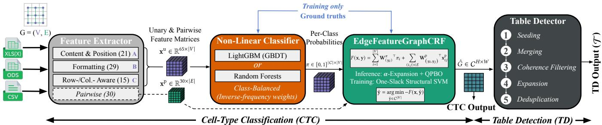
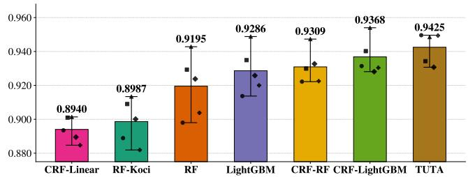
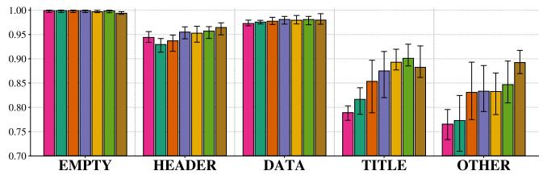
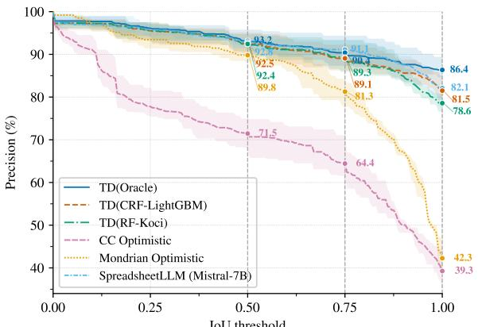
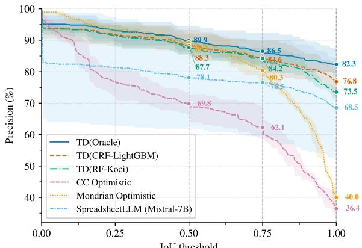

# Structured Prediction for Scalable Spreadsheet Table Understanding: From Cell Types to Table Ranges (Extended Version)

Antoine Gauquier   
antoine.gauquier@ens.psl.eu   
DI ENS, ENS, CNRS, PSL, Inria Paris, France

Ioana Manolescu ioana.manolescu@inria.fr Inria & Institut Polytechnique de Paris Palaiseau, France

Pierre Senellart pierre@senellart.com DI ENS, ENS, CNRS, PSL, Inria Paris, France

## Ab<sub>s</sub>t<sub>rac</sub>t

Spreadsheets are a primary medium for publishing tabular data, yet automatically extracting structured content from them remains dificult due to heterogeneous layouts, diverse file formats, and inconsistent organizational conventions. We address two core tasks in spreadsheet understanding: Cell-Type Classification (CTC), which assigns roles to cells, and Table Detection (TD), which identifies table bounding boxes within sheets. We propose an eficient two-stage pipeline in which a learned CTC model feeds a deterministic TD algorithm. For CTC, we use a LightGBM classifier over 65 structured features together with a pairwise CRF enforcing spatial consistency across the cell grid. Our TD method extracts table ranges from predicted cell types by a deterministic five-stage procedure. For evaluation, we built and share StatSheets, a multilingual benchmark of 737 manually annotated sheets from 14 public data providers across multiple countries and file formats. Under 5-fold cross-validation, our CRF-LightGBM system achieves a Mean File-Macro F<sub>1</sub> score of 0.937 on CTC, within 0.6 percentage points of the GPU-based TUTA Transformer, while requiring substantially fewer computational resources. For TD, our deterministic approach outperforms region-based baselines and remains competitive with recent LLMbased systems such as SpreadsheetLLM. These results demonstrate that combining non-linear structured prediction with deterministic range extraction provides a competitive, scalable, and computationally eficient approach to spreadsheet table understanding.

## CCS Conce<sub>p</sub>ts

• App<sup>l</sup>ied computing → Document ana<sup>l</sup>ysis; • In<sup>f</sup>ormation systems → Data extraction and inte<sub>g</sub>ration.

## Ke<sub>y</sub>words

Spreadsheets, Table Understanding, Structured Prediction, Cell Type Classification, Table Detection

## 1 I<sub>n</sub>t<sub>ro</sub>d<sub>uc</sub>ti<sub>on</sub>

Spreadsheets are among the most widely used data management artifacts. Governments, international organizations, companies, and journalists routinely publish data in formats such as XLSX, XLS, ODS, CSV, and TSV. Public repositories such as Eurostat alone expose thousands of spreadsheets, many continuously updated and reused in downstream pipelines [11]. Unlike relational databases, however, spreadsheets are designed for human interpretation rather than machine consumption: their semantic structure is only partially explicit and instead conveyed through layout, formatting, merged cells, spatial proximity, etc. The conventions for doing so vary across publishers, domains, languages, and software ecosystems.

This flexibility, while central to spreadsheets’ success, makes automated extraction and integration dificult. Real-world spreadsheets rarely contain clean rectangular tables. Instead, they mix data regions with hierarchical headers, titles, footnotes, metadata, and other auxiliary elements within the same sheet. Similar layouts may encode diferent semantics, while equivalent structures may appear in very diferent forms. Structural irregularities such as spar sity, merged cells, and discontinuous regions further complicate the problem. Consequently, recovering machine-interpretable tables from spreadsheets is substantially harder than extracting structured data from HTML tables or database exports.

Robust, large-scale spreadsheet understanding is increasingly critical for modern data management systems, including data lake construction, open-data indexing, fact-checking, business intelligence, and retrieval-augmented analytics. Errors in the detection of table boundaries or cell roles propagate to downstream tasks, producing corrupted schemas, invalid joins, or unusable datasets: spreadsheet understanding is not merely a preprocessing step, but a foundational problem for scalable structured-data acquisition. Two core tasks can be identified: Cell-Type Classification (CTC) assigns semantic roles (e.g., HEADER, DATA, TITLE) to cells, while Table Detection (TD) recovers table boundaries within sheets. Although CTC and TD have received continuous attention during the last decade, see [3, 7, 15, 16, 23, 30, 34], and [6, 8, 9, 21, 24, 32], respectively, existing approaches still face important limitations. 1. Recent progress relies on large neural architectures trained on proprietary corpora and which are expensive. Transformer-based systems such as TUTA [34] and LLM-based approaches such as SpreadsheetLLM [9] achieve strong results through large-scale pre-training, but at substantial cost (Sec. 5.1 and 5.2). Such GPU-intensive systems can be problematic for pipelines processing thousands to millions of spreadsheets, where throughput and operational cost remain primary constraints. 2. Prior work only partially captures the heterogeneous signals governing spreadsheet structure. Some methods emphasize semantic embeddings while under-exploiting formatting and geometric regularities; others focus on visual or region-based segmentation while insuficiently modeling long-range dependencies. Yet, spreadsheet semantics emerges precisely from the interaction of multiple weak signals, including lexical content, formatting consistency, row- and column-level regularities, neighborhood coherence, and global spatial organization. 3. Reproducibility and evaluation remain problematic. Several influential systems do not release implementations [7, 8, 21, 24, 30], or rely on proprietary datasets [7–9], preventing direct comparison and independent validation. Thus, it remains dificult to isolate the respective contributions of semantic modeling, structural priors, feature engineering, and computational scale. These issues are compounded by the lack of public datasets jointly supporting CTC and TD. Existing benchmarks are either single-task, structurally limited, or derived from outdated corpora. DECO [22], the only public benchmark covering both tasks, is based on the Enron archive [17] and reflects practices from the early 2000s; it excludes large spreadsheets, lacks multilingual coverage, and omits visually hidden content, making it poorly suited for evaluating modern structured-prediction methods.

In this work, we make the following contributions:

(1) We introduce StatSheets, a pub<sup>l</sup>ic<sup>l</sup>y avai<sup>l</sup>ab<sup>l</sup>e dataset o<sup>f</sup> 737 manua<sup>ll</sup>y annotated spreads<sup>h</sup>eet s<sup>h</sup>eets collected from 14 public organizations publishing statistical data across multiple countries, languages, and spreadsheet formats. Unlike prior datasets, StatSheets jointly supports both CTC and TD under realistic conditions, including large sheets, multilingual content, heterogeneous layouts, and multiple spreadsheet formats (Sec. 4).

(2) We propose an e<sup>fi</sup>cient end-to-end spreads<sup>h</sup>eet understandin<sub>g</sub> <sub>p</sub>i<sub>p</sub>eline combinin<sub>g</sub> structured cell-t<sub>yp</sub>e <sub>p</sub>rediction with deterministic tab<sup>l</sup>e extraction (Sec. 3), which operates in two sequential stages. First, a non-linear classifier predicts per-cell roles from a rich feature space combining lexical, formatting, positional, and row-/column-aware structural descriptors; these predictions are then refined through a pairwise Conditional Random Field (CRF) enforcing spatial coherence over the spreadsheet grid (Sec. 3.1). Second, table ranges are recovered through a deterministic 5-stage extraction algorithm operating on predicted cell-type grids (Sec. 3.2). (3) We conduct a t<sup>h</sup>oroug<sup>h</sup> experimenta<sup>l</sup> study of both tasks, comparing against non-DL and DL state-of-the-art approaches (Sec. 5). Our experiments show that: (i) on CTC, our CRF-LightGBM pipeline achieves a Mean File-Macro F<sub>1</sub> of 0.937, within 0.6 pp of the Transformer-based TUTA model, while requiring substantially lower computational resources and avoiding GPU dependence (Sec. 5.1); (ii) on TD, our deterministic extraction algorithm consistently outperforms generic region-based methods and remains competitive with recent LLM-based systems, again with orders of magnitude of computational cost savings (Sec. 5.2). These results show that care<sup>f</sup>u<sup>ll</sup>y designed structured mode<sup>l</sup>s, combining <sub>non-</sub>li<sub>near</sub> f<sub>ea</sub>t<sub>ure mo</sub>d<sub>e</sub>li<sub>ng w</sub>ith <sub>s</sub>t<sub>ruc</sub>t<sub>ure</sub>d <sub>spa</sub>ti<sub>a</sub>l i<sub>n</sub>f<sub>er-</sub> <sub>ence, rema</sub>i<sub>n</sub> hi<sub>g</sub>hl<sub>y compe</sub>titi<sub>ve</sub> f<sub>or sprea</sub>d<sub>s</sub>h<sub>ee</sub>t <sub>un</sub>d<sub>ers</sub>t<sub>an</sub>d<sub>-</sub> ing, particularly in realistic large-scale data-management settings w<sup>h</sup>ere sca<sup>l</sup>abi<sup>l</sup>ity, robustness, and interpretabi<sup>l</sup>ity are critica<sup>l</sup>.

We discuss related work in Sec. 2. The StatSheets dataset, our implementation of SpreadsheetLLM, and the code to reproduce the experiments are available at [13]. This paper is an extended version of the conference paper [14].

## 2 R<sub>e</sub>l<sub>a</sub>t<sub>e</sub>d W<sub>or</sub>k

## Cell-Type Classification (CTC) in Spreadsheets

Methods in this area have evolved from feature-engineered, to large pre-trained neural architectures. Early work [3] uses an undirected graphical model combining formatting and content cues to recover annotation-to-data mappings for relational integration, with semi-automatic error repair, emphasizing spatial dependencies but requiring human interaction and targeting relational extraction rather than general-purpose CTC. [23] introduces the first dedicated CTC framework using a Random Forest (RF) over formatting, content, and positional features to classify cells independently, later extended with active learning by [16]. Our RF-Koci baseline follows [23] with a similar feature design. [5] introduces Pytheas, a fuzzy-rule-based system classifying CSV rows into roles such as header, data, and context from column coherency and semantic keywords. Its formulation assigns a single label to each spreadsheet row. Thus, it cannot represent multiple tables appearing side by side, making precise 2-dimensional TD impossible. It also precludes cell-level CTC, since all cells in a row share the same label, despite spreadsheets commonly mixing roles within rows (e.g., header then data cells). Recent works use DL approaches with semantic and contextual representations. [15] combines pre-trained cell embeddings, recurrent architectures and formatting features. [7] proposes a multi-task framework jointly addressing TD, structural component recognition, and CTC using BERT embeddings, while [30] combines neural embeddings with Probabilistic Soft Logic constraints encoding structural regularities. Neither released code nor datasets. TUTA [34] extends Transformers with structure-aware selfattention capturing spreadsheet layout and semantics, pre-trained on large spreadsheet and Web table corpora. It substantially outperforms earlier neural methods; we therefore use it as our main DL baseline (Sec. 5.1). ForTaP [4] extends TUTA with formula-aware pre-training objectives, but relies on expert-authored formulas.

## Table Detection (TD) in Spreadsheets

We identify two categories: region-based methods (extracting generic grid structures) and table-specific ones (modeling table semantics and structure to extract table boundaries).

Region-based approaches. [6] groups adjacent non-empty cells into connected components represented by bounding boxes. A purely structural, learning-free approach targeting dense regions rather than tables, it is sensitive to sparsity and cannot distinguish tables from metadata. [32] introduces Mondrian, which represents spreadsheets as binary images segmented into homogeneous rectangular regions through density-based clustering and compares regions across files to identify recurring templates. Although learningfree and unsupervised, both methods detect generic structural regions rather than tables. Their evaluation in region-anchored mode overestimates true TD quality; as shown in Sec. 5.2, performance drops sharply at higher IoU thresholds, highlighting the limits of generic region extraction for precise TD.

Table-specific approaches. Other works explicitly focus on predicting table boundaries. [21] proposes the graph-based Remove and Conquer (RAC) framework, which infers cell layout roles before constructing graphs over spatially related regions to detect table boundaries through curated rules. As one of the earliest coupled CTC+TD pipelines, it is also the prior approach closest to ours. [24] extends RAC with a genetic optimization procedure maximizing a fitness function over predicted cell-type grids. Although efective with accurate CTC predictions, it is sensitive to classification errors and noise [32]. Neither [21] nor [24] releases code, datasets, or trained models, preventing direct comparison. [8] introduces TableSense, a CNN-based end-to-end TD framework formulating detection as object detection over featurized cell grids. Trained on the proprietary WebSheet10K dataset, it is reported as a strong specialized TD system, though no code, models, or datasets were released; later, SpreadsheetLLM, from the same Microsoft research group, reports substantially outperforming it. SpreadsheetLLM [9] encodes spreadsheets into compact token sequences, and fine-tunes LLMs for TD and related tasks (details in Sec. 5.2). We include it as a direct competitor using our own implementation, derived from the supplementary materials of [9].

## E<sub>n</sub>d<sub>-</sub>t<sub>o-en</sub>d S<sub>prea</sub>d<sub>s</sub>h<sub>ee</sub>t U<sub>n</sub>d<sub>ers</sub>t<sub>an</sub>di<sub>ng</sub>

Few works address spreadsheet understanding as unified CTC+TD pipelines. [21], later extended by [24], couples the tasks through rule-based extraction but releases neither code nor trained models. [20] demonstrates XLIndy, an interactive Excel add-in for layout inference and table recognition, without an evaluation or sharing the code. [7] jointly addresses TD, structural component recognition, and CTC via a multi-task FCNN with strictly coarse-to-fine dependencies: TD feeds component recognition, which then feeds CTC, without reverse interaction. In contrast, our pipeline performs CTC based solely on the sheet and derives table boundaries deterministically and exclusively from the predicted cell-type grid. Moreover, [7] relies on a proprietary dataset and releases no implementation. Overall, prior end-to-end systems rely on rule-based extraction, proprietary implementations, or coarse-to-fine designs where TD is not influenced by downstream CTC. In contrast, we derive table boundaries solely from CTC predictions while jointly evaluating both tasks under cross-validation.

## D<sub>a</sub>t<sub>ase</sub>t<sub>s</sub> f<sub>or</sub> S<sub>prea</sub>d<sub>s</sub>h<sub>ee</sub>t U<sub>n</sub>d<sub>ers</sub>t<sub>an</sub>di<sub>ng</sub>

The only publicly available dataset covering both CTC and TD is DECO [22], built from the Enron email archive [17]. DECO is unsuitable in our setting for several reasons. First, it excludes files larger than 5 MB, while large tables are common in public data portals, e.g., Eurostat tables regularly exceed hundreds of MB [11]. Second, it excludes non-Western languages such as Arabic and Japanese; this introduces semantic and structural biases (e.g., right-to-left layout in Arabic spreadsheets). Third, based on Enron emails (2000–2001), it reflects outdated formatting practices. Finally, annotations only cover visible content: hidden rows/columns (via zero height/width or explicit hide/unhide) are unlabeled, leaving large parts of sheets unannotated and making the dataset incompatible with spatial and sequential methods that require complete grid annotations. Several smaller CTC-only benchmarks also exist. DeEx [10] provides 444 sheets with a six-type label scheme, while SAUS [3] and CIUS [15] follow the same scheme on narrow domains. However, all three provide only CTC labels, lack TD annotations, and have limited linguistic, formatting, and structural diversity; DeEx and SAUS are no longer accessible. The proprietary WebSheet10K dataset used in [8, 9, 34] is also unavailable publicly. A subset of related annotations (VEnron2, VEUSES, VFUSE) released by [8] contains only TD table ranges (no CTC labels) and is restricted to English XLS/XLSX files derived from Enron/EUSES. To facilitate extensive evaluation at scale, we therefore introduce StatSheets (Sec. 4), a publicly available dataset addressing these limitations: 737 sheets in six languages across five file formats, with complete cell-level CTC and table-range TD annotations collected from contemporary statistical spreadsheets published by international organizations.

## 3 Our A<sub>pp</sub>roach

We decompose spreadsheet understanding into two stages (Figure 1). CTC (Sec. 3.1) assigns each cell a label using a non-linear classifier combined with a pairwise CRF enforcing spatial coherence. TD (Sec. 3.2) takes the resulting label grid and recovers axis-aligned table extents through a deterministic, learning-free algorithm.

## 3.1 Cell-T<sub>yp</sub>e Classification

Let C = {EMPTY, HEADER, DATA, TITLE, OTHER} be the set of five cell-type classes. We formulate CTC as a structured prediction problem on a 2-dimensional grid, where each cell is a node, and edges connect horizontal and vertical neighbors. Each label $\hat { y } _ { i } \in C$ should be assigned considering both local features and neighborhood consistency. This motivates a two-stage pipeline in which a non-linear classifier produces per-cell class probabilities that serve as unary potentials for a pairwise CRF which enforces spatial coherence.

Problem 1 (Cell-Type Classification). A spreadsheet re<sub>g</sub>ion is <sub>represen</sub>t<sub>e</sub>d <sub>as</sub> <sub>a</sub> 2<sub>-</sub>di<sub>mens</sub>i<sub>ona</sub>l <sub>gr</sub>id $\mathbf { \xi } ^ { \prime } G = ( V , E )$ , where each node� ∈ � <sub>correspon</sub>d<sub>s</sub> t<sub>o</sub> <sub>a</sub> <sub>ce</sub>ll <sub>an</sub>d $E \subseteq V \times V$ is the set of pairs of horizontally or vertically adjacent cells. Given � and some features describing its elements, the CTC problem consists ofpredicting a class for each cell, or, equivalently, predicting for all cells the label vector $\dot { \mathbf { y } } \in C ^ { | V | }$

## Features

Each cell is represented by a 65-dimensional unary feature vector, organized into three groups. The design follows [23], and extends it with additional (richer) formatting attributes and row-/columnlevel statistical features. Table 1 provides a summary.

Group A: Content and positional features (21 features, IDs 1–21). These features capture intrinsic cell properties and simple local context. Type indicators encode whether a cell is empty, numeric (integer/float), string, date, or formula. Text statistics describe the string representation: length, counts of digits/letters/spaces/other characters, and binary start-with-letter/start-with-digit flags. Positional features include normalized row/column indices within the non-empty region and a boundary flag for sheet borders. Context features capture local structure via the number of non-empty 2-dimensional neighbors, an isolation flag (surrounded by empty cells), and two flags distinguishing ODS from XLS/XLSX formats.

Group B: Formatting features (29features, IDs 22–50). This group encodes visual and layout attributes from rich spreadsheet formats (XLSX, XLS, ODS). Features include font weight, italic, underline, font size, hashed font name, text/background colors (RGB, normalized to [0, 1]<sup>3</sup>), a merged-cell flag, and four border flags (left, right, top, bottom). Horizontal and vertical cell alignments are one-hot encoded (7 horizontal modes: general/start, right, center, justify, left, fill, distributed; 6 vertical modes: top, center, bottom, distributed/justify, baseline, other), harmonized across file formats. Extraction is implemented separately for XLSX (using OpenPyXL), XLS (xlrd), and ODS (ODFPy), but mapped to a shared 29-dimensional representation. Robust fallbacks handle missing or inconsistent style metadata, common in real-world spreadsheets. For plain-text formats (CSV, TSV), all formatting features are set to default values.

  
Figure 1: End-to-end Cell-Type Classification (CTC) and Table Detection (TD) pipeline.

Group C: Row- and column-aware features (15 features, IDs 51– 65). These features capture global row/column-level structure beyond the local 4-neighborhood. For each row, we compute the fraction of non-empty, numeric, and string cells, a type-homogeneity score (majority-type fraction), a type-uniformity flag (whether all non-empty cells share the same type), and an isolation flag (only non-empty cell in the row). Analogous statistics are computed for columns, except for type uniformity. In addition, a column-type outlier flag indicates whether the cell’s type difers from the column majority, and 3 merge-span statistics capture the fractions of merged cells in the row and in the column, and whether the cell’s merged region spans at least three columns.

Pairwise features (30 features). For each edge (�, �) in the 2D grid, we compute a feature vector describing the relationships between adjacent cells. These features fall in four groups. Orientation features encode the relative horizontal and vertical positioning between cells. Type features encode agreement and transitions, including whether cells share the same type (empty, numbers, strings, dates, or formula) and type transitions (empty–non-empty, number–string, number–date). Content diference features capture absolute diferences in text statistics (character and digit counts, jointly starting with a letter, etc.). Formatting features measure visual agreement: same font size and name, consistent bold/italic, same font and background colors, shared-border presence, horizontal/vertical alignment diferences, and whether both cells are part of merged regions.

## Cl<sub>ass</sub>ifi<sub>ca</sub>ti<sub>o</sub>n Pi<sub>pe</sub>lin<sub>e</sub>

The classification pipeline addresses two complementary limitations of cell-wise prediction. First, most Group A and B features are binary or categorical (Bold, IsNum, StartsAlpha. . . ), and class membership typically depends on their joint interactions rather than individual signals; as an example, HEADER cells often combine formatting and row-level homogeneity cues that are not linearly separable. This motivates a non-linear classifier, which captures feature conjunctions better than linear models, as confirmed empirically in Sec. 5.1. Second, cell labels exhibit strong spatial dependencies in the grid: a cell may be HEADER partly because it precedes a DATA region, and TITLE cells are often defined by their structural position relative to headers and data blocks. To model these dependencies, we use a pairwise CRF to propagate information across adjacent cells and enforce neighborhood consistency.

Step 1: LightGBM classifier. We train a Gradient-Boosted Decision Tree (GBDT) classifier using LightGBM [19] on the 65 unary features of all training cells. Compared to Random Forests (RF) [2], GBDT iteratively fits trees to correct residual errors of the current ensemble, yielding stronger learners on heterogeneous feature sets combining binary flags, counts, ratios, and color values. Class imbalance (DATA and EMPTY cells dominate most sheets) is handled by reweighting classes inversely to their frequency in the loss. The model outputs a per-class probability vector $\pmb { \pi } _ { i } = \mathrm { L i g h t G B M } \left( \mathbf { x } _ { i } ^ { \mathrm { u } } \right)$ ∈ $[ 0 , 1 ] ^ { | C | }$ for each cell �, where $\mathbf { x } _ { i } ^ { \mathrm { { u } } }$ is the 65D feature vector.

Step 2: EdgeFeatureGraphCRF. Building on the grid � defined above, we define a first CRF scoring function as:

$$
F ^ { \mathrm { L I N E A R } } ( \mathbf { x } , \mathbf { y } ) = \sum _ { i = 1 } ^ { | V | } \mathbf { W _ { { ( } y _ { i } ) } ^ { u } } ^ { \top } \mathbf { x _ { i } ^ { u } } + \sum _ { ( i , j ) \in E } \mathbf { W _ { { \left( y _ { i } , y _ { j } \right) } } ^ { p } } ^ { \top } \mathbf { x _ { { i j } } ^ { p } }\tag{1}
$$

where $\mathbf { x } _ { i } ^ { \mathrm { u } } \in \mathbb { R } ^ { 6 5 }$ and $\mathbf { x } _ { i j } ^ { \mathrm { p } } \in \mathbb { R } ^ { 3 0 }$ are the unary and pairwise feature vectors, $\mathbf { W } ^ { \mathrm { u } } \in \mathbb { R } ^ { 6 5 \times | C | }$ contains one weight vector per class, and $\mathbf { W } ^ { \mathrm { p } } \in \mathbb { R } ^ { 3 0 \times | C | ^ { 2 } }$ one per ordered label pair. We use the EdgeFeatureGraphCRF of [27], which learns a distinct pairwise weight vector $\mathbf { W } _ { ( k , l ) } ^ { \mathrm { p } }$ per label pair (�, �), allowing label-specific pairwise interactions rather than shared across transitions. For instance, a HEADER→DATA transition may be encouraged when neighboring cells difer in alignment or font weight, and discouraged otherwise. Eq. (1) corresponds to a purely linear CRF using the 65 unary features. To incorporate the non-linear LightGBM classifier, we replace the feature vector $\mathbf { x } _ { i } ^ { \mathrm { { u } } }$ with the class-probability vector $\pi _ { i } ,$ yielding:

$$
F ^ { \mathrm { L I G H T G B M } } ( \mathbf { x } , \mathbf { y } ) = \sum _ { i = 1 } ^ { | V | } \mathbf { W } _ { ( y _ { i } ) } ^ { \pi }  { } ^ { \top } \pi _ { i } + \sum _ { ( i , j ) \in E } \mathbf { W } _ { \left( y _ { i } , y _ { j } \right) } ^ { \mathrm { p } } \mathbf { \Phi } _ { \mathbf { x } _ { i j } } ^ { \top }\tag{2}
$$

where $\mathbf { W } ^ { \pi } \in \mathbb { R } ^ { | C | \times | C | }$ . In Sec. 5.1, we compare both cases experimentally: Eq. (1) as CRF-Linear, and Eq. (2) as CRF-LightGBM.

MAP (Maximum A Posteriori) inference. At inference, the labeling for a spreadsheet x is obtained by maximizing the function �. Exact MAP inference over a general pairwise CRF is NP-hard [29], so we use the �-expansion algorithm [1], via the PyQPBO library. It is a move-making algorithm that iteratively proposes a candidate label $\alpha \in C$ and, for each �, jointly optimizes over all cells the binary decision of keeping the current label or switching to �. This reduces the multi-class problem to a sequence of binary graph-cut subproblems until no move decreases the energy (convergence). Each binary subproblem is solved using Quadratic Pseudo-Boolean Optimization (QPBO) [28], which reformulates binary energy minimization $( - F ( { \bf x } , \tilde { { \bf y } } ) )$ as a minimum graph cut: pairwise terms penalizing label disagreement between neighbors (attractive terms) are solved exactly in polynomial time [25], while terms that encourage label disagreement (repulsive terms) are handled approximately [28]. This yields exactly the MAP result when all pairwise interactions

Structured Prediction for Scalable Spreadsheet Table Understanding: From Cell Types to Table Ranges (Extended Version)

Table 1: All 65 unar<sub>y</sub> features used in the CTC task<sub>,</sub> or<sub>g</sub>anized into the three <sub>g</sub>rou<sub>p</sub>s A<sub>,</sub> B<sub>,</sub> and C.
<table><tr><td></td><td>Name</td><td>Description</td><td>ID</td><td>Name</td><td>Description</td><td>ID</td><td>Name</td><td>Description</td></tr><tr><td></td><td>IsEMPTY IsNUM</td><td>No cell content Value is numeric</td><td>8 9</td><td>#CHARS</td><td>Character count</td><td>15</td><td>RowPosRATIO</td><td>Relative row index in grid</td></tr><tr><td>Gr uA</td><td>IsSTR</td><td>Value is a string</td><td>10</td><td>#DIGITS #ALPHA</td><td>Digit count Alphabetic character count</td><td>16 17</td><td>CoLPosRATIO</td><td>Relative column index in grid Cell on non-empty boundary</td></tr><tr><td></td><td></td><td>Value is a date</td><td></td><td></td><td></td><td></td><td>IsSHEETBORDER</td><td></td></tr><tr><td></td><td>IsDATE IsFORMULA</td><td>Cell contains a formula</td><td>11</td><td>#SPACES</td><td>Space count Other character count</td><td>18</td><td>#NEIGHBORS</td><td>Non-empty 4-neighbor count</td></tr><tr><td></td><td></td><td></td><td>12</td><td>#OTHER</td><td></td><td>19</td><td>IsISOLATED</td><td>All 4-neighbors are empty</td></tr><tr><td>6 7</td><td>IsINT IsFLOAT</td><td>Integer value Non-integer numeric value</td><td>13</td><td>STARTSALPHA</td><td>First char. is alphabetic</td><td>20</td><td>IsODS</td><td>File format is ODS</td></tr><tr><td></td><td></td><td></td><td>14</td><td>STARTSNUM</td><td>First char. is numeric</td><td>21</td><td>IsExCEL</td><td>File format is XLS/XLSX</td></tr><tr><td>22 23</td><td>BOLD</td><td>Font weight is bold</td><td>27-29</td><td>FONTCOLOR</td><td>Font color (R, G, B ∈ [0, 1])</td><td>36</td><td>BORDERTOP</td><td>Has top border</td></tr><tr><td>24</td><td>ITALIC</td><td>Font style is italic</td><td>30-32</td><td>BGCOLOR</td><td>Background col.  $( \mathrm { R } , \mathrm { G } , \mathrm { B } \in \left[ 0 , 1 \right] )$ </td><td>37</td><td>BORDERBOTTOM</td><td>Has bottom border</td></tr><tr><td>GoouB</td><td>UNDERLINE</td><td>Text is underlined</td><td>33</td><td>IsMERGED</td><td>Cell belongs to a merged region</td><td>38-44</td><td>HALIGN</td><td>Horiz. alignment (7-class one-hot)</td></tr><tr><td>25</td><td>FONTSIZE</td><td>Font size (pt)</td><td>34</td><td>BORDERLEFT</td><td>Has left border</td><td>45-50</td><td>VALIGN</td><td>Vert. alignment (6-class one-hot)</td></tr><tr><td>26</td><td>FoNTHASH</td><td>Stable hash of font name</td><td>35</td><td>BORDERRIGHT</td><td>Has right border</td><td></td><td></td><td></td></tr><tr><td>51 52</td><td>ROWNONEMPTYRATIO</td><td>Fraction non-empty in row</td><td>56</td><td>IsALONEINROW</td><td>Only non-empty cell in row</td><td>61</td><td>IsALONEINCOL</td><td>Only non-empty cell in column</td></tr><tr><td>Groouc 53</td><td>RowFRAcNUM</td><td>Fraction numerical in row</td><td>57</td><td>COLNONEMPTYRATIO</td><td>Fraction non-empty in column</td><td>62</td><td>COLTYPEOUTLIER</td><td> $\mathrm { T y p e }$  differs from col. majority</td></tr><tr><td></td><td>RowFRACSTR</td><td>Fraction string in row</td><td>58</td><td>CoLFRACNUM</td><td>Fraction numerical in column</td><td>63</td><td>MERGECOLRATIO</td><td>Fraction merged cells in column</td></tr><tr><td>54</td><td>RowHomoG</td><td>Type homogeneity in row</td><td>59</td><td>COLFRACSTR</td><td>Fraction string in column</td><td>64</td><td>MERGEROWRATIO</td><td>Fraction merged cells in row</td></tr><tr><td>55</td><td>RowIsUNIFORM</td><td>All non-empty row cells same type</td><td>60</td><td>CoLHomOG</td><td>Type homogeneity in column</td><td>65</td><td>MERGECOLSPAN3+</td><td>Merge spans ≥ 3 columns</td></tr></table>

are attractive, and a strong approximation otherwise, while remaining tractable for grids of several thousand cells seen in practice [25].

CRFtraining. CRF parameters W $( \mathbf { W } ^ { \mathrm { u } } / \mathbf { W } ^ { \pi }$ and W<sup>p</sup>) are learned by minimizing the structured hinge loss via the structural SVM framework [31]. Given � training sheets with ground-truth labelings $\{ \mathbf { y } _ { t } ^ { * } \} _ { t = 1 } ^ { n }$ , the idea is to find W such that the score $F ( \mathbf x _ { t } , \mathbf y _ { t } ^ { * } )$ exceeds the score of any competing labeling $\bar { \mathbf { y } } _ { t }$ by a margin proportional to how wrong $\bar { \mathbf { y } } _ { t }$ is (measured by the Hamming loss $\Delta ( \mathbf { y } _ { t } ^ { * } , \bar { \mathbf { y } } _ { t } )$ , i.e., the fraction of mislabeled cells). A slack variable $\xi \geqslant 0$ absorbs margin violations when the constraint cannot be satisfied exactly. In the �- slack variant, one slack per training sheet is introduced, leading to a cutting-plane problem with $O ( n / \bar { \varepsilon } ^ { 2 } )$ iterations to reach �-accuracy. The one-slack formulation [18] instead introduces a sin le slack variable summed over all training examples:

$$
\begin{array} { r l } & { \displaystyle \underset { \mathbf { w } , \xi \geqslant 0 } { \operatorname* { m i n } } \ : \frac { 1 } { 2 } \| \mathbf { W } \| ^ { 2 } + \lambda \xi \quad \mathrm { s . t . } \quad \forall \ : ( \bar { \mathbf { y } } _ { t } ) _ { t = 1 } ^ { n } \in \prod _ { t = 1 } ^ { n } C ^ { | V _ { t } | } , } \\ & { \displaystyle \frac { 1 } { n } \sum _ { t } \mathbf { W } ^ { \top } \big [ \Psi ( \mathbf { x } _ { t } , \mathbf { y } _ { t } ^ { * } ) - \Psi ( \mathbf { x } _ { t } , \bar { \mathbf { y } } _ { t } ) \big ] \geqslant \frac { 1 } { n } \sum _ { t } \Delta ( \mathbf { y } _ { t } ^ { * } , \bar { \mathbf { y } } _ { t } ) - \xi } \end{array}
$$

where $\Psi ( \mathbf x _ { t } , \mathbf y )$ is the joint feature map (concatenation of unary and pairwise suficient statistics) and $\lambda > 0$ controls the regularization strength. This constraint enforces the margin on average across all sheets rather than per sheet, reducing the cutting-plane complexity to $O ( 1 / \varepsilon )$ iterations regardless of �. The trade-of is that per-sheet margin violations can be hidden by other sheets, potentially al lowing a small number of poorly labeled sheets to go uncorrected. However, the �-slack variant does not scale to large datasets, and the average constraint remains suficiently representative in our setting where � exceeds 500 sheets per fold (see Sec. 4 and Sec. 5 for dataset information and experimental setup).

Handling class imbalance in the linear CRF baseline. For the linear CRF ablation (CRF-Linear, Sec. 5.1) using raw unary features $\mathbf { x } _ { i } ^ { \mathrm { u } }$ instead of $\pi _ { i } ,$ class imbalance must be handled explicitly. We extend pystruct’s EdgeFeatureGraphCRF with a class-balanced structured hinge loss, weighting each cell by the inverse square root of its class frequency within the training fold. We additionally evaluate an optional hard-EMPTY clamping strategy: for cells with IsEmpty=1, a large negative bias is applied to all non-EMPTY unary scores, efectively preventing the CRF from predicting other classes. Analogously, we prevent prediction of EMPTY when IsEmpty=0. These mechanisms are unnecessary in the final CRF-LightGBM, as class imbalance is already handled by LightGBM, and empty cells naturally receive near-zero values to non-EMPTY classes.

## 3<sub>.</sub>2 T<sub>a</sub>bl<sub>e</sub> D<sub>e</sub>t<sub>ec</sub>ti<sub>on</sub>

For a spreadsheet region of � rows and � columns, we have � × $W = | V |$ where � is the cell (vertex) set from Problem 1. Having obtained the cell type prediction $\hat { \mathbf { y } }$ as discussed in Sec. 3.1, let $\hat { G } \in C ^ { H \times W }$ be the predicted cell-type label grid. Formally:

Problem 2 (Table Detection). Given �<sup>ˆ</sup>, the TD problem consists ofpredicting a set ofnon-overlapping, axis-aligned rectangles $\mathcal { T } =$ {�<sub>�</sub>}, where each�<sub>�</sub> is the minimal boundin<sub>g</sub> box enclosin<sub>g</sub> a maximal coherent group of HEADER and DATA cells forming a single table in �<sup>ˆ</sup>.

We solve this with a deterministic algorithm that requires no learning. It follows a five-stage pipeline mirroring the heuristics a human annotator would apply when delineating tables on a grid of class labels: (1) seeding extracts maximal connected regions of HEADER/DATA cells; (2) merging fuses pairs of regions separated only by within-table artifacts (sub-header rows, inter-table titles, thin empty bands); (3) filtering discards sparse or incoherent candidates; (4) expansion recovers locally disconnected top/left/right header bands; (5) deduplication resolves residual overlaps. The method uses a small set of interpretable hyperparameters with default values provided when introduced. They are also summarized in Table 2.

Notation and definitions. Rows are indexed by $r \in \{ 0 , \ldots , H - 1 \}$ and columns by $c \in \{ 0 , \ldots , W - 1 \}$ . We introduce:

Definition 3 (Ranges and Densities). A range is a non-empty <sub>ax</sub>i<sub>s-a</sub>li<sub>gne</sub>d <sub>rec</sub>t<sub>ang</sub>l<sub>e</sub> $R = \left[ r _ { 0 } , r _ { 1 } \right] \times \left[ c _ { 0 } , c _ { 1 } \right]$ <sub>w</sub>ith <sub>area</sub> $\left| R \right| = \left( r _ { 1 } - r _ { 0 } + \right.$ $1 ) ( c _ { 1 } - c _ { 0 } + 1 )$ . The Intersection-over-Union and the (asymmetric) containment ratio of two ranges are, respectively, $\begin{array} { r } { \mathrm { I o U } ( R , R ^ { \prime } ) = \frac { | R \cap R ^ { \prime } | } { | R \cup R ^ { \prime } | } } \end{array}$ cont(�, $\begin{array} { r } { R ^ { \prime } ) = \frac { | R \cap R ^ { \prime } | } { | R | } } \end{array}$ <sub>.</sub> F<sub>or a c</sub>l<sub>ass su</sub>b<sub>se</sub>t $S \subseteq C$ , the �-density of� is $\begin{array} { r } { \rho _ { S } ( R ) = \frac { 1 } { | R | } \sum _ { ( r , c ) \in R } \mathbb { 1 } \left[ \hat { G } _ { r , c } \ \in \ S \right] } \end{array}$ <sub>.</sub> F<sub>or a row � an</sub>d <sub>a co</sub>l<sub>umn span</sub> $[ c _ { 0 } , c _ { 1 } ] ,$ the absolute and relative header densities are: $\eta ( r , c _ { 0 } , c _ { 1 } ) =$ �{HEADER} $\left( r \times \left[ c _ { 0 } , c _ { 1 } \right] \right)$ <sub>an</sub>d $\begin{array} { r } { \eta ^ { \star } ( r , c _ { 0 } , c _ { 1 } ) = \frac { \rho _ { \{ H E A D E R \} } ( r \times [ c _ { 0 } , c _ { 1 } ] ) } { \rho _ { C \backslash \{ E M P T Y \} } ( r \times [ c _ { 0 } , c _ { 1 } ] ) } } \end{array}$ <sub>,</sub> <sub>w</sub>ith $\eta ^ { \star } = 0$ by convention when the denominator is 0. The definitions of $\eta ( c , r _ { 0 } , r _ { 1 } )$ <sub>an</sub>d $\eta ^ { \star } ( c , r _ { 0 } , r _ { 1 } )$ are symmetric for columns.

Above, the absolute score � measures how much of a column range is covered by HEADER cells. Empty cells reduce �, which is useful when deciding whether a row separates two table candidates: a partial header should not span both tables. The relative score $\eta ^ { \star } ,$ instead, measures the proportion of non-empty cells in a row that are headers, ignoring empty padding. This is useful when deciding whether a sparse row acts as a header: rows that span wider than the data block below them often contain blank cells above groups of columns, so � would be diluted by those empty cells even for a genuine header row, whereas $\eta ^ { \star }$ remains high.

```html
0 1 2 3 4 0 1 2 3 4
0 � � � � � 0 0 0 0 0 0 TITLE — not in mask
2 1 � � � � � � � � � � 1 2 1 1 1 1 1 1 Seed � $; B ( a ) = [ 1 , 2 ] \times [ 0 , 4 ]$
3 � � � � � 3 0 0 0 0 0 1 separator (sep.) — isolated EMPTY
�ˆ= <sub>4</sub> � � � � � →�= 4 0 1 1 1 1 Seed $b ; B ( b ) = [ 4 , 5 ] \times [ 0 , 4 ]$
5 � � � � � 5 1 1 1 1 � = �<sub>4</sub> = 0.8 ⩾ �<sub>�</sub> ∧ 1 sep.⇒ merge (�, <sup>�</sup>)
6 <sup>�</sup><sub>�</sub> <sup>�</sup><sub>�</sub> � <sup>�</sup><sub>�</sub> <sup>�</sup><sub>�</sub> 6 0 0 0 0 0 2 separators (2 sep.) — EMPTY then TITLE
8 � � � � � 8 1 1 Seed �; $; B ( c ) = [ 8 , 9 ] \times [ 0 , 4 ]$
9 � � � � � 9 1 1 1 $\tau = \eta _ { 8 } = 1 \geqslant \tau _ { H } \wedge \bar { 2 } \ s e p .$ > 1 ⇒ no merge
```

Fi<sub>g</sub>ure 2: Seedin<sub>g</sub> and mer<sub>g</sub>in<sub>g</sub> on a two-table <sub>g</sub>rid $\hat { G } ($ TITLE<sub>,</sub> ■ HEADER, ■ DATA, white EMPTY). $M _ { r , c } = \Im \left[ \hat { G } _ { r , c } \in \{ H , D \} \right]$ <sub>y</sub>i<sub>e</sub>ld<sub>s see</sub>d<sub>s</sub> $a , b , c . \eta _ { r }$ <sub>a</sub>bb<sub>rev</sub>i<sub>a</sub>t<sub>es</sub> $\eta ( r , 0 , 4 ) .$  
Algorithm 1 TableRangeExtractor(�<sup>ˆ</sup>)   
Require: Cell-type grid $\hat { G } \in C ^ { H \times W }$   
Ensure: Set of detected table ranges $\mathcal { T }$   
1: $S \gets \mathrm { S E E D S } ( \hat { G } )$   
2: $\begin{array} { r } { S \gets \left\{ S \in \mathcal S : n _ { D } ( S ) \geqslant n _ { D } ^ { \mathrm { m i n } } \vee \left( n _ { H } ( S ) \geqslant n _ { H } ^ { \mathrm { m i n } } \wedge n _ { D } ( S ) = 0 \right) \right\} } \end{array}$   
<sub>3:</sub> while $\exists \left( S _ { i } , S _ { j } \right) \in S ^ { 2 } , i \neq { \bar { j } } ,$ s.t. ShouldMerge $( S _ { i } , S _ { j } , \hat { G } )$ d<sub>o</sub>   
4: Pick any such pair $\left( { { S _ { i } } , { S _ { j } } } \right)$   
5: $S \gets ( S \setminus \{ S _ { i } , S _ { j } \} ) \cup \big \{ S _ { i } \cup S _ { j } \big \}$   
6: $S \gets \{ S \in S \ : \ \mathbb { C } \mathrm { o H E R E N T } ( S , \hat { G } ) \}$   
7: $\mathcal { T }  \{ \mathrm { E x p a N D } ( S , \hat { G } ) : S \in S \}$   
8: return Deduplicate(T )

Definition 4 (Seed Mask and Seeds). The seed mask $o f { \hat { G } }$ i<sub>s</sub> th<sub>e</sub> bi<sub>nary ma</sub>t<sub>r</sub>i<sub>x</sub> $M \in \{ 0 , 1 \} ^ { H \times W }$ defined by $M _ { r , c } = \Im \left[ \hat { G } _ { r , c } \in \right.$ {HEADER, DATA} for all (�, �). We define the graph $( V _ { M } , E _ { M } )$ as $V _ { M } =$ $\big \{ ( r , c ) : M _ { r , c } = 1 \big \} , E _ { M } \ = \ \big \{ \{ ( r , c ) , ( r ^ { \prime } , c ^ { \prime } ) \} : | r - r ^ { \prime } | + | c - c ^ { \prime } | = 1 \big \}$ (horizontal/vertical adjacency). A seed � is a connected component $o f ( V _ { M } , E _ { M } )$ . We derive its row and column extents $r _ { \operatorname* { m i n } } ( S ) , r _ { \operatorname* { m a x } } ( S )$ $c _ { \operatorname* { m i n } } ( S ) , c _ { \operatorname* { m a x } } ( S )$ , and bounding box $B ( S ) \ = \ [ r _ { \mathrm { m i n } } ( S ) , r _ { \mathrm { m a x } } ( S ) ] \times$ $[ c _ { \operatorname* { m i n } } ( S ) , c _ { \operatorname* { m a x } } ( S ) ]$ <sub>.</sub> We write $\begin{array} { r } { { n _ { D } } ( S ) ~ = ~ \sum _ { ( r , c ) \in S } { \mathbb { 1 } } [ { \hat { G } } _ { r , c } ~ = ~ D A T A ] } \end{array}$ and �<sub>�</sub>(�) analo<sub>g</sub>ousl<sub>y</sub> for HEADER. Seeds(�<sup>ˆ</sup>) is the set ofall seeds.

The full detection procedure TableRangeExtractor(�<sup>ˆ</sup>) is given in Algorithm 1: starting from a set of seeds, it repeatedly merges compatible candidates, filters incoherent ones, expands the remain ing candidates into table ranges, and removes duplicates.

Stage 1: Seeding. We define a table as the bounding box covering its HEADER and DATA cells (excluding TITLE and OTHER cells). We compute the connected components of the graph $( V _ { M } , E _ { M } ) ;$ ; each yields a candidate seed (line 1 of Algorithm 1). We retain only seeds with $n _ { D } ~ \geqslant ~ n _ { D } ^ { \mathrm { m i n } } ~ = ~ 4$ data cells, or header-only seeds $\left( n _ { D } \ = \ 0 \right)$ with $n _ { H } \geqslant n _ { H } ^ { \mathrm { m i n } } = 8 :$ the latter preserves genuine header bands disconnected from their data block by over-segmentation; such seeds can later be recovered during the merging stage. Figure 2 illustrates the seeding on a two-table grid, yielding three seeds.

A<sup>l</sup>gorit<sup>h</sup>m 2 ShouldMerge: merge predicate.   
Require: Seeds $S _ { i } , S _ { j } ; \mathrm { g r i d } \hat { G }$   
Ensure: Boolean indicating whether to merge $S _ { i }$ and $S _ { j }$   
1: $c _ { l } \gets \operatorname* { m a x } \big ( c _ { \operatorname* { m i n } } ( S _ { i } ) , c _ { \operatorname* { m i n } } ( S _ { j } ) \big ) ; c _ { r } \gets \operatorname* { m i n } \big ( c _ { \operatorname* { m a x } } ( S _ { i } ) , c _ { \operatorname* { m a x } } ( S _ { j } ) \big )$   
2: if $c _ { l } \leqslant c _ { r }$ th<sub>en</sub>   
3: $r _ { t } \gets \operatorname* { m i n } \bigl ( r _ { \mathrm { m a x } } ( S _ { i } ) , r _ { \mathrm { m a x } } ( S _ { j } ) \bigr ) ; r _ { b } \gets \operatorname* { m a x } \bigl ( r _ { \mathrm { m i n } } ( S _ { i } ) , r _ { \mathrm { m i n } } ( S _ { j } ) \bigr )$   
4: if $r _ { b } > r _ { t } + 1$ th<sub>en</sub>   
5: $\mathbf { \boldsymbol { s e p } } \gets 0$   
6: <sup>f</sup>or � from $r _ { t } + 1$ to $r _ { b } - 1$ d<sub>o</sub>   
7: if $\eta \left( r , c _ { l } , c _ { r } \right) \geqslant \tau _ { H }$ th<sub>en re</sub>t<sub>urn</sub> t<sub>rue</sub>   
8: $\mathbf { i f } \hat { G } _ { r , c } \in \{ \mathrm { E M P T Y } ,$ TITLE} for every $c \in \left[ c _ { l } , c _ { r } \right]$ th<sub>en</sub>   
9: $\mathbf { s e p } \gets \mathbf { s e p } + 1$   
10: $\tau  \eta ( r _ { b } , c _ { l } , c _ { r } )$   
11: return $( \tau \geqslant$ �� ∧ sep $\leqslant 1 ) \vee \ ( \tau <$ �� ∧ sep $< g _ { v } )$   
12: $r _ { l } \gets \operatorname* { m a x } \bigl ( r _ { \operatorname* { m i n } } ( S _ { i } ) , r _ { \operatorname* { m i n } } ( S _ { j } ) \bigr ) ; r _ { r } \gets \operatorname* { m i n } \bigl ( r _ { \operatorname* { m a x } } ( S _ { i } ) , r _ { \operatorname* { m a x } } ( S _ { j } ) \bigr )$   
13: <sup>i</sup> $\mathrm { ~ \ i ~ } r _ { l } \leqslant r _ { r }$ th<sub>en</sub>   
14: $c _ { t } \gets \operatorname* { m i n } \big ( c _ { \operatorname* { m a x } } ( S _ { i } ) , c _ { \operatorname* { m a x } } ( S _ { j } ) \big ) ; c _ { b } \gets \operatorname* { m a x } \big ( c _ { \operatorname* { m i n } } ( S _ { i } ) , c _ { \operatorname* { m i n } } ( S _ { j } ) \big )$   
15: if $c _ { b } > c _ { t } + 1$ th<sub>en</sub>   
16: $\mathrm { e v } \gets \lvert \left\{ c \in [ c _ { t } + 1 , c _ { b } - 1 ] : \forall r \in [ r _ { l } , r _ { r } ] , \hat { G } _ { r , c } = \mathrm { E M P T Y } \right\} \rvert$   
17: return $\left( \mathrm { e v } < g _ { h } \right)$   
18: re<sup>t</sup>urn <sup>f</sup>a<sup>l</sup>se

Stage 2: Merging. Connected components in the raw seed mask are systematica<sup>ll</sup>y over-segmented for two reasons. 1. Tables may contain sub-header rows splitting the data region (e.g., section dividers between row groups). These rows are correctly classified as HEADER, but their column-wise structure may difer from that of the top header, leaving them disconnected from rows above and below, splitting a single table into multiple seeds. 2. Adjacent tables on the same sheet are often separated by a thin band of EMPTY rows together with a TITLE row introducing the next table; on the seed mask this appears as empty space, which does not reliably distinguish inter-table separation from intra-table structure. Figure 2 illustrates both: seeds � and � are separated by an empty row, but row 4 acts as a sub-header suficiently overlapping both column structures, thus triggering a merge. In contrast, seeds � and � are separated by an empty row and a title row; this blocks merging. We address both cases (1. and 2.) via the predicate ShouldMerge (Algorithm 2), applied iteratively until a fixed point (lines 3–5 of Algorithm 1); each round strictly decreases |S|, ensuring convergence. The vertical case (lines 1–11 of Algorithm 2) handles seeds with overlapping column spans separated by a vertical gap. Along the gap, an intermediate row with header density $\eta \geqslant \tau _ { H } = 0 . 4$ over the shared column range is read as an interior sub-header and triggers immediate merge; otherwise, the decision combines the lower seed’s first-row density with the number of separator rows (containing only EMPTY/TITLE cells over the shared span), reflecting that intra-table interruptions are typically shorter than inter-table whitespace $( g _ { v } = 4 )$ . The horizontal case (lines 12–17) is symmetric and simpler: seeds are merged when fewer than $g _ { h } = 2$ fully empty columns separate them. This sufices because horizontal gaps lack the sub-header and title artifacts that complicate the vertical case.

Stage 3: Coherence filtering. Merging may still produce two types of inva<sup>l</sup>id candidates: (�) large, sparse seeds formed by repeated merges connecting distant regions via narrow bridges of HEADER or DATA cells—large bounding boxes with little table content; (��) data blocks whose header was misclassified, surviving seeding without corresponding to a valid table. The predicate Coherent(�, �<sup>ˆ</sup>) handles both cases. It rejects a seed if both densities in �(�) fall below thresholds, i.e., $\rho _ { \{ \mathrm { D A T A } \} } ( B ( S ) ) < \rho _ { D } ^ { \mathrm { m i n } } = 0 . 0 5$ and <sub>�{HEADER}</sub> (�(�)) $< \rho _ { H } ^ { \mathrm { m i n } } = 0 . 5 .$ . Data-only seeds are rejected when they contain fewer than $n _ { D } ^ { \dag } = 2 0 \mathrm { D A T A }$ cells and have no HEADER cell within Chebyshev radius $r _ { N } { = } 3 \ \mathrm { o f } \ B ( S )$ . Header-only seeds are retained if $n _ { H } \geqslant n _ { H } ^ { \operatorname* { m i n } }$

Structured Prediction for Scalable Spreadsheet Table Understanding: From Cell Types to Table Ranges (Extended Version)  
A<sup>l</sup>gorit<sup>h</sup>m 3 Expand: expansion of a seed into a table range.   
Require: Seed �, grid $\hat { G }$   
Ensure: Range � representing the detected table   
1: $( \bar { r } _ { 0 } , \bar { r } _ { 1 } , \bar { c } _ { 0 } , \bar { c } _ { 1 } ) \gets ( r _ { \operatorname* { m i n } } ( S ) , r _ { \operatorname* { m a x } } ( S ) , c _ { \operatorname* { m i n } } ( S ) , c _ { \operatorname* { m a x } } ( S ) )$   
2: $r _ { 0 } \gets \bar { r } _ { 0 } ; ~ r \gets \bar { r } _ { 0 } - 1$   
<sub>3:</sub> while $r \geqslant 0$ <sub>an</sub>d $\eta ^ { \star } ( r , \bar { c } _ { 0 } , \bar { c } _ { 1 } ) \geqslant \tau _ { H }$ d<sub>o</sub> $\left( r _ { 0 } \gets r ; r \gets r - 1 \right)$   
4: $c _ { 0 } \gets \bar { c } _ { 0 } ; ~ c \gets \bar { c } _ { 0 } - 1$   
<sub>5:</sub> while $c \geqslant 0$ <sub>an</sub>d $\eta ^ { \star } ( c , \bar { r } _ { 0 } , \bar { r } _ { 1 } ) \geqslant \tau _ { H } ^ { c }$ d<sub>o</sub> $\left( c _ { 0 } \gets c ; c \gets c - 1 \right)$   
6: $c _ { 1 }  \bar { c } _ { 1 } ; ~ c  \bar { c } _ { 1 } + 1$   
<sub>7:</sub> while $c < W$ <sub>an</sub>d $\eta ^ { \star } ( c , \bar { r } _ { 0 } , \bar { r } _ { 1 } ) \geqslant \tau _ { H } ^ { c }$ d<sub>o</sub> $\left( c _ { 1 } \gets c ; c \gets c + 1 \right)$   
8: re<sup>t</sup>urn $\left[ r _ { 0 } , \bar { r } _ { 1 } \right] \times \left[ c _ { 0 } , c _ { 1 } \right]$

Stage 4: Expansion. By construction, a surviving seed � contains the data block ofa table and header cells 4-connected to it in the seed mask. However, some <sup>h</sup>eader ce<sup>ll</sup>s may remain disconnected because of empty padding rows, merged-cell rendering artifacts, or isolated cells misclassified as TITLE or OTHER. We recover them via a directional expansion procedure (Algorithm 3) that grows the seed bounding box upward, leftward, and rightward, but not downward, since headers in statistical spreadsheets conventionally appear above or beside the data, never below. Expansion continues while the next row (resp. column) has relative header density $\eta ^ { \star } \geqslant$ �� (resp. �<sup>�</sup> ), two thresholds set to 0.4. We use $\eta ^ { \star }$ rather than � because header rows often contain empty padding above column groups, where � would be diluted by those blanks even on genuine headers. Column scans (lines 5 and 7) are evaluated over the seed’s original row range, so side-header columns remain anchored to the original data region rather than to newly recovered top headers.

Stage 5: Deduplication. In rare cases, two distinct seeds yie<sup>l</sup>d over<sup>l</sup>apping tab<sup>l</sup>e ranges, e.g., when a single header band spans two nearby column-aligned data blocks. We resolve these with a Non-Maximum-Suppression (NMS) step: ranges are processed in decreasing order of area, and a range � is accepted unless an alreadyaccepted range �<sup>′</sup> satisfies $\mathrm { \Delta [ o U ( } R , R ^ { \prime } ) \geqslant \tau _ { \mathrm { I o U } } = 0 . 5$ (strong overlap) or cont( $R , R ^ { \prime } ) \ \geqslant \ \tau _ { \mathrm { c o n t } } = 0 . 8$ (near-containment). The remaining ranges form the final detection set T.

## 4 Dataset

Given the limitations of existing datasets for CTC and TD (Sec. 2), we construct and release StatSheets [13], a new dataset of spreadsheets annotated for both tasks, originating from statistical datasets published by public organizations.

## C<sub>o</sub>n<sub>s</sub>tr<sub>uc</sub>ti<sub>o</sub>n

The dataset is highly heterogeneous, with respect to: (i) the data sources, (ii) the language used in the sheets, (iii) the covered topics, (iv) the sheet sizes, and (v) the file formats. This enables evaluating the robustness of cell-type classifiers and table detectors in highly variable settings, which is critical for downstream applications relying on clean and structured tables, such as fact-checking [11].

T<sub>a</sub>bl<sub>e</sub> 2<sub>:</sub> H<sub>yperparame</sub>t<sub>ers</sub> <sub>o</sub>f th<sub>e</sub> t<sub>a</sub>bl<sub>e</sub> <sub>range</sub> d<sub>e</sub>t<sub>ec</sub>t<sub>or.</sub>
<table><tr><td>HP</td><td>Default</td><td>Stage</td><td>Description</td></tr><tr><td> $n _ { D } ^ { \mathrm { m i n } }$ </td><td>4</td><td>1</td><td>Min. DATA cells in a seed</td></tr><tr><td> $n _ { H } ^ { \mathrm { { \bar { m i n } } } }$ </td><td>8</td><td>1,3</td><td>Min. HEADER cells in a header-only seed</td></tr><tr><td> $\tau _ { H }$ </td><td>0.4</td><td>2,4</td><td>Header-density threshold along rows</td></tr><tr><td> $\tau _ { H } ^ { c }$ </td><td>0.4</td><td>4</td><td>Header-density threshold along columns</td></tr><tr><td> $g _ { v }$ </td><td>4</td><td>2</td><td>Min. separator rows to keep two seeds apart</td></tr><tr><td> $g _ { h }$ </td><td>2</td><td>2</td><td>Min. EMPTY columns to keep two seeds apart</td></tr><tr><td> $\rho _ { \mathbf { r } } ^ { \mathrm { m i n } }$ </td><td>0.05</td><td>3</td><td>Min. DATA density of a seed bounding box</td></tr><tr><td> $\mathbf { \Pi } _ { \alpha } ^ { r _ { D } }$   $\rho _ { \underline { { H } } } ^ { \mathrm { m u n } }$ </td><td>0.5</td><td>3</td><td>Min. HEADER density of a seed bounding box</td></tr><tr><td> $n _ { D } ^ { \prime }$ </td><td>20</td><td>3</td><td>Acceptance threshold for header-less seeds</td></tr><tr><td> $r _ { N }$ </td><td>3</td><td>3</td><td>Header-neighborhood radius (Chebyshev)</td></tr><tr><td> $\tau _ { \mathrm { I o U } }$ </td><td>0.5</td><td>5</td><td>IoU threshold for NMS</td></tr><tr><td> $\tau _ { \mathrm { c o n t } }$ </td><td>0.8</td><td>5</td><td>Containment threshold for NMS</td></tr></table>

Table 3: Distribution of the sheets <sub>p</sub>er source of ori<sub>g</sub>in
<table><tr><td>Source</td><td>Country</td><td>#Sheets</td></tr><tr><td>Australian Bureau of Statistics</td><td>Australia</td><td>64</td></tr><tr><td>French Ministry of Justice</td><td>France</td><td>64</td></tr><tr><td>OECD</td><td>International</td><td>63</td></tr><tr><td>Nat. Center for Education Statistics</td><td>USA</td><td>61</td></tr><tr><td>Bureau of Economic Analysis</td><td>USA</td><td>58</td></tr><tr><td>Ministry of Internal Affairs &amp; Comm.</td><td>Japan</td><td>58</td></tr><tr><td>INSEE</td><td>France</td><td>57</td></tr><tr><td>General Authority for Statistics</td><td>Saudi Arabia</td><td>57</td></tr><tr><td>United States Census Bureau</td><td>USA</td><td>54</td></tr><tr><td>World Bank</td><td>International</td><td>54</td></tr><tr><td>Ministry of Interior</td><td>France</td><td>50</td></tr><tr><td>Intl. Labour Organization</td><td>International</td><td>48</td></tr><tr><td>World Health Organization</td><td>International</td><td>48</td></tr><tr><td>CNIS</td><td>France</td><td>1</td></tr></table>

Table 3 shows the distribution of sheets across the 14 selected sources, chosen for their geographical diversity, which also increases language diversity. Topic diversity results from the broad scope of the selected sources. The collection proceeds as follows. We first retrieve a large pool of spreadsheets from each source using a state-of-the-art focused Web crawler [12]. Each spreadsheet is then processed to identify candidate sheets likely to contain statistical tables using a simple but efective heuristic: a sheet is retained if at least 50% of its non-empty cells are either purely numerical or predominantly numerical (i.e., a majority of characters are digits, allowing symbols or precision annotations). To limit source imbalance, we retain at most 100 candidate sheets per source and only one sheet per spreadsheet file. The resulting candidates are randomly shufled and manually annotated, keeping only sheets containing at least one statistical table. Annotation continues until reaching 750 sheets, corresponding to ∼150 test sheets under the 5-fold cross-validation setup of Sec. 5. A second sanitization pass then corrects annotation errors and removes ambiguous cases, yielding a final dataset of 737 annotated s<sup>h</sup>eets, written in six languages: English, French, Arabic, Japanese, Spanish, and Icelandic. The file formats are: XLSX (316 sheets, 42.9%), XLS (296, 40.2%),

ODS (60, 8.1%), CSV (52, 7.1%), and TSV (13, 1.8%). Rich spreadsheet formats (XLS, XLSX, ODS) provide formatting information; plain-text formats (CSV, TSV) do not.

## A<sub>nno</sub>t<sub>a</sub>ti<sub>on</sub> P<sub>ro</sub>t<sub>oco</sub>l <sub>an</sub>d St<sub>a</sub>ti<sub>s</sub>ti<sub>cs</sub>

Each retained sheet is annotated for both the CTC and TD tasks. For CTC, we annotate each cell within the minimal bounding rectangle containing all the non-empty cells of the sheet. We use the five labels: EMPTY (0), HEADER (1), DATA (2), TITLE (3), and OTHER (4). HEADER includes column/row headers and sub-headers, which may be adjacent to higher-level headers or appear between DATA cells. Each DATA cell is associated with at least one (and typically several) HEADER cell. TITLE cells describe table content and are usually, though not necessarily, located above it. OTHER covers remaining non-empty cells (e.g., footnotes, annotations, data sources, measurement details), acting as a reject class. Overall, 7 570 354 ce<sup>ll</sup>s are annotated for CTC, with an average of 10 272 per sheet. Sheet sizes vary considerably, from 27 to 1 542 303 cells, illustrating strong structural variability in real-world spreadsheets. The largest sheet is particularly useful for scalability evaluation (Sec. 5.2). Class distribution is heavily imbalanced: DATA cells account for 62.2% of the annotations, followed by HEADER (20.4%) and EMPTY (17.1%), while TITLE (<0.1%) and OTHER (<0.2%) are rare.

For the TD task, we annotate table ranges. Since each DATA cell is associated with at least one HEADER, a table is defined as the rectangular bounding box containing all HEADER and DATA cells belonging to it. Consequently, table ranges contain only HEADER and DATA cells, excluding TITLE and OTHER. Moreover, each HEADER or DATA cell can belong to only one table, meaning that overlapping tables are not allowed. In practice, if two regions share HEADER or DATA cells, they are considered part of the same table, potentially with hierarchical headers. These constraints are used as automatic sanitization checks to detect annotation inconsistencies before a manual sanitization. After annotation, sequences of more than two consecutive fully empty rows or columns are compressed to exactly two, to save space and without losing information.

Our 737 sheets lead to 818 annotated tab<sup>l</sup>es. Most sheets (690) contain a single table; 29 contain two, and 18 contain three or more.

## 5 Ex<sub>p</sub>eriments

Secs. 5.1 and 5.2 respectively present the CTC and TD experiments. All systems are evaluated using 5-fold cross-validation: sheets are shufled with a fixed random seed and split into five folds of ≈147 sheets each, yielding an 80/20 train/test split per fold. Depending on the system, the training fold is used for training, fine-tuning, hyperparameter selection, or not used. The test fold is shared across tasks for consistency. When a system fails on some sheets, we report results on the subset successfully processed by all systems.

## 5.1 Cell-T<sub>yp</sub>e Classification

We compare several CTC systems, classified in Table 4 by their inclusion of spatial awareness (Spat.), sequential modeling (Seq.), and non-linearity (NL).

CRF-Linear is the CRF model described in Step 2 of Sec. 3.1. It uses $\mathbf { x } ^ { \mathrm { { u } } }$ and x<sup>p</sup> for the unary and pairwise components, and thus follows the score function of Eq. (1). The model includes the class-balanced loss and EMPTY-case clamping described in Sec. 3.1. This method has sequential and spatial modeling, but is linear. Hyperparameters are selected through a global 5-fold validation procedure to obtain a single configuration for all folds. The configuration uses $\lambda = 0 . 1$ clamping, a square-root inverse-frequency class-balanced hinge loss, and a batch size of 128. Early stopping is based on the M-FM-F1 score (presented below), evaluated every 100 iterations.

T<sub>a</sub>bl<sub>e</sub> 4: M<sub>a</sub>in <sub>c</sub>h<sub>a</sub>r<sub>ac</sub>t<sub>e</sub>ri<sub>s</sub>ti<sub>cs</sub> <sub>o</sub>f th<sub>e</sub> CTC <sub>sys</sub>t<sub>e</sub>m<sub>s.</sub>
<table><tr><td>Model</td><td>NL</td><td>Seq.</td><td>Fmt.</td><td>Spat.</td><td>Sem.</td><td>GPU</td></tr><tr><td>CRF-LINEAR</td><td>x</td><td>√</td><td>√</td><td>√</td><td>x</td><td>x</td></tr><tr><td>RF-KocI</td><td>√</td><td>x</td><td>√</td><td>x</td><td>x</td><td>x</td></tr><tr><td>RF</td><td>√</td><td>x</td><td>√</td><td>√</td><td>x</td><td>x</td></tr><tr><td>LIGHTGBM</td><td>√</td><td>x</td><td>√</td><td>√</td><td>x</td><td>x</td></tr><tr><td>CRF-RF</td><td>√</td><td>√</td><td>√</td><td>√</td><td>x</td><td>x</td></tr><tr><td>CRF-LIGHTGBM</td><td>√</td><td>√</td><td>√</td><td>√</td><td>x</td><td>x</td></tr><tr><td>TUTA</td><td>√</td><td>√</td><td>√</td><td>√</td><td>√</td><td>√</td></tr></table>

RF-Koci is a baseline based on Step 1 of Sec. 3.1, where LightGBM is replaced by a RF classifier. It does not use the full unary feature set, but only the non-spatial features, excluding all Group C features as well as feature #19 from Group A. We retain feature #18, the only neighborhood-aware feature from [23]. This baseline is therefore a non-linear approach comparable to [23], without sequential modeling, and with minimal spatial awareness. Hyperparameters are selected using the same shared 5-fold validation procedure as for CRF-Linear. The retained hyperparameters include bootstrap sampling, a maximum depth of 20, log2 feature selection, a minimum of 7 samples per leaf, a minimum split size of 17, and 481 trees.

RF is similar to RF-Koci but uses the complete unary feature set $\mathbf { \Pi } ( \mathbf { x } ^ { \mathrm { u } } )$ , thus it is non-linear. Hyperparameters are selected using the same shared 5-fold validation procedure. The retained configuration uses no bootstrap sampling, a maximum depth of 20, sqrt feature selection, a minimum of 6 samples per leaf, a minimum split size of 18, and 574 trees.

LightGBM is a baseline following Step 1 of Sec. 3.1, based on optimized GBDT. Like RF, it is non-linear, models spatial awareness, but without sequential modeling. Hyperparameters are selected using the same shared 5-fold validation procedure. The retained configuration uses a column subsampling rate of 0.6, a learning rate of 0.06, a maximum depth of $^ { 8 , }$ 51 minimum child samples, 723 estimators, 111 leaves, $\ell _ { 1 }$ and $\ell _ { 2 }$ regularization of 0.01 and 0.5, respectively, and a subsampling rate of 0.

CRF-RF applies a CRF on top of the RF baseline (Sec. 3.1), with Light-GBM replaced by RF (non-linear, sequential, with spatial awareness). We train the RF model and the CRF sequentially (the CRF using RF probabilities � as unary inputs, following $\operatorname { E q . }$ (2)) on each training fold, keeping the RF hyperparameters fixed and selecting CRF hyperparameters via the same 5-fold validation procedure. The retained CRF configuration uses $\lambda = 1 0 ,$ no class-balanced loss, no clamping, and a batch size of 128.

CRF-LightGBM combines a CRF model on top of LightGBM, similarly to CRF-RF. The CRF scoring function thus follows Eq. (2). It is therefore a non-linear (NL) and sequential $( \pmb { \mathscr { s e } } \mathbf { q } . )$ model with spatial awareness (Spat.). The same training procedure is used, keeping the LightGBM hyperparameters fixed and reusing the same CRF configuration as CRF-RF.

TUTA [34] (Sec. 2) is pre-trained on large collections of unlabeled Web and spreadsheet tables using three progressive objectives at the token, cell, and table levels. The authors fine-tune TUTA on CTC (which we focus on) and table type classification (TTC), which assumes known table boundaries, i.e., the output of our TD task. TUTA is the only DL baseline we consider; it outperforms other DLbased CTC methods [34]. We use the oficial implementation [26], adapted to our label set and extended with a preprocessing pipeline to convert raw spreadsheets into the expected model inputs. We fine-tune the last two layers of the 12-layer backbone and the classification head, reinitializing from the pre-trained checkpoint at each fold. The original setup fine-tunes for 4 epochs on ∼3.5k tables (∼1M labeled cells), while our dataset contains 818 labeled tables with over 7M labeled cells; we therefore use 20 epochs to match a comparable number of seen tables. We train with a learning rate of $3 \times 1 0 ^ { - 5 }$ and batch size of 16, compared to $8 \times 1 0 ^ { - 6 }$ and batch size of 4 in the original work, following the linear scaling rule.

## CTC M<sub>e</sub>tri<sub>cs</sub>

The five cell types (recall C from Sec. 3.1) are heavily imbalanced across sheets: DATA cells usually dominate, while TITLE and OTHER cells are sparse and unevenly distributed. Standard cell-level accuracy is therefore uninformative, and cell-level macro F1 is distorted by sheet size as larger sheets weigh more in the aggregate score.

Instead, we measure per-c<sup>l</sup>ass <sup>fil</sup>e-macro F1 (FM-F1), which treats each sheet as a single observation. Let F be the test sheets and C the classes. For $f \in { \mathcal { F } }$ and $c \in C ,$ let $F _ { 1 } ( f , c )$ denote the F1 score of class � on sheet �. Denoting $\mathcal { F } _ { c } \subseteq \mathcal { F }$ the set of sheets in which class � is present (in ground truth or predictions), the per-class file-macro F1 is $\begin{array} { r } { \mathrm { F M - F } 1 _ { c } = \frac { 1 } { | \mathcal { F } _ { c } | } \sum _ { f \in \mathcal { F } _ { c } } F _ { 1 } ( f , c ) } \end{array}$ . Absent classes from a sheet are excluded from $\mathrm { F M - F } 1 _ { c } ,$ avoiding both trivially perfect scores and unfair penalization ofrare classes. We summarize system performance with the mean <sup>fil</sup>e-macro F1 (M-FM-F1), the macroaverage of $\mathrm { F M - F } 1 _ { c }$ across all classes $\begin{array} { r } { \mathrm { M \mathrm { - } F M \mathrm { - } F 1 } = \frac { 1 } { | C | } \sum _ { c \in C } \mathrm { F M \mathrm { - } F } 1 _ { c } . } \end{array}$

## CTC Com<sub>p</sub>utational Eficienc<sub>y</sub>

All systems except TUTA run on Mac<sup>h</sup>ine 1, a Dell PowerEdge R730 with two Intel Xeon E5-2640 v4 processors (40 logical cores at 2.40 GHz), 128 GB of DDR4 ECC RAM, and no GPU. TUTA needs a GPU and we ran it on Mac<sup>h</sup>ine 2, a Dell PowerEdge R770 having two Intel Xeon 6505P processors (48 logical cores), 256 GB of DDR5 RAM, and one NVIDIA RTX PRO 6000 Blackwell Server Edition GPU (96 GB VRAM). To estimate equivalent cloud costs, we map both machines to the closest Amazon EC2 On-Demand instances available in us-east-1: m5.8xlarge (32 vCPUs, 128 GiB RAM, \$1.536/hr) for Machine 1 (denoted C) and g7e.8xlarge (32 vCPUs, 256 GiB RAM, 1× NVIDIA RTX PRO 6000 Blackwell, \$5.268/hr) for Machine 2 (G). Prices correspond to Linux on-demand rates with per-second billing (60-second minimum). Cost estimates assume a single instance running for the full experiment duration. Tables 5 and 6 report runtimes and estimated costs over the full 5-fold crossvalidation. File loading and feature extraction (Load) are reported separately from model computation (Train/Infer), although both contribute to the total billed time. The results show a clear computational gap between the proposed systems and TUTA. Training all six non-DL systems combined costs <\$21, while TUTA alone exceeds \$135 due to extended GPU training. Inference costs are smaller overall, but CPU-only TUTA inference remains much slower and costlier than GPU inference. All non-DL systems complete inference within 15 minutes at negligible cost.

Table 5: Training time and estimated cloud cost (5-fold total). C = m5.8xlarge (\$1.536/hr); G = g7e.8xlarge (\$5.268/hr).
<table><tr><td>Model</td><td>Load (s)</td><td>Train (s)</td><td>Total (h)</td><td>Inst.</td><td>Cost ($)</td></tr><tr><td>RF-KocI</td><td>256.7</td><td>31.6</td><td>0.08</td><td>C</td><td>0.12</td></tr><tr><td>RF</td><td>252.2</td><td>120.3</td><td>0.10</td><td>C</td><td>0.16</td></tr><tr><td>LIGHTGBM</td><td>254.7</td><td>177.1</td><td>0.12</td><td>C</td><td>0.18</td></tr><tr><td>CRF-LINEAR</td><td>252.3</td><td>14658.2</td><td>4.14</td><td>C</td><td>6.36</td></tr><tr><td>CRF-RF</td><td>250.5</td><td>15 848.4</td><td>4.47</td><td>C</td><td>6.87</td></tr><tr><td>CRF-LIGHTGBM</td><td>254.3</td><td>14952.5</td><td>4.22</td><td>C</td><td>6.49</td></tr><tr><td>TUTA</td><td>178.5</td><td>92 376.0</td><td>25.71</td><td>G</td><td>135.44</td></tr></table>

Table 6: Inference time and estimated cloud cost (5-fold total). <sup>†</sup>CPU<sub>-on</sub>l<sub>y run o</sub>f TUTA f<sub>or re</sub>f<sub>erence.</sub>
<table><tr><td>Model</td><td>Load (s)</td><td>Infer (s)</td><td>Total (h)</td><td>Inst.</td><td>Cost ($)</td></tr><tr><td>RF-KocI</td><td>540.0</td><td>40.0</td><td>0.16</td><td>C</td><td>0.25</td></tr><tr><td>RF</td><td>555.2</td><td>49.0</td><td>0.17</td><td>C</td><td>0.26</td></tr><tr><td>LIGHTGBM</td><td>541.8</td><td>95.9</td><td>0.18</td><td>C</td><td>0.27</td></tr><tr><td>CRF-LINEAR</td><td>540.1</td><td>268.5</td><td>0.22</td><td>C</td><td>0.35</td></tr><tr><td>CRF-RF</td><td>550.6</td><td>300.8</td><td>0.24</td><td>C</td><td>0.36</td></tr><tr><td>CRF-LIGHTGBM</td><td>542.8</td><td>288.7</td><td>0.23</td><td>C</td><td>0.35</td></tr><tr><td>TUTA†</td><td>363.8</td><td>30 994.6</td><td>8.71</td><td>C</td><td>13.38</td></tr><tr><td>TUTA</td><td>203.4</td><td>679.1</td><td>0.25</td><td>G</td><td>1.29</td></tr></table>

## CTC Results

Figure 3 reports the M-FM-F1 scores of all seven systems averaged over the 5 folds. Markers indicate per-fold values, and error bars, the min–max range. Figure 4 shows the corresponding per-class $\mathrm { F M - F } 1 _ { c }$ scores using the same color scheme.

Efect ofspatial awareness, non-linearity, and sequential modeling. We assess the contribution of each component comparing successive bars in Figure 3. CRF-Linear (sequential, spatial, linear) achieves an M-FM-F1 of 0.894, close to RF-Koci (0.899), non-linear but with minimal spatial awareness and no sequential modeling. Adding full spatial features (RF-Koci → RF) improves performance by +2.1 pp (0.899 → 0.920). Adding sequential modeling through the CRF layer (RF → CRF-RF) yields another +1.1 pp, while replacing RF with LightGBM (CRF-RF → CRF-LightGBM) adds +0.6 pp. Overall, all three components contribute positively and combine efectively. TUTA reaches 0.943, only +0.6 pp above CRF-LightGBM (0.937).

Per-class analysis. The overall gain from RF-Koci to CRF-LightGBM is +3.8 pp in M-FM-F1, but improvements are uneven across classes. As shown in Figure 4, EMPTY is almost perfectly classified by all systems, while DATA is already saturated (FM-F1 ≈ 0.976–0.981). Gains are larger for harder classes: HEADER improves by +2.8 pp, TITLE by +8.5 pp (0.816 → 0.901), and OTHER by +7.4 pp (0.773 → 0.847). These classes are harder to distinguish using formatting alone and benefit from added structural context provided by spatial and sequential modeling. TUTA performs notably better on OTHER (+4.5 pp), the most semantically dependent class, but slightly worse on TITLE (−1.9 pp), which relies more on structural and formatting cues. The systems perform similarly on EMPTY, DATA, and HEADER. These results suggest that semantic modeling mainly benefits the most content-dependent class, while structural and non-linear modeling already capture most ofthe remaining signal. However, TUTA’s benefits come at a substantially higher computational cost.



Fi<sub>g</sub>ure 3: Mean File-Macro $\mathbf { F } _ { 1 }$ <sub>p</sub>er model. Error bars s<sub>p</sub>an <sub>p</sub>erf<sub>o</sub>ld <sub>m</sub>i<sub>n</sub>/<sub>max;</sub> i<sub>n</sub>di<sub>v</sub>id<sub>ua</sub>l f<sub>o</sub>ld <sub>scores are s</sub>h<sub>own as mar</sub>k<sub>ers.</sub>  
  
Fi<sub>gure</sub> 4<sub>:</sub> P<sub>er-c</sub>l<sub>ass</sub> fil<sub>e-macro</sub> $\mathbf { F } _ { 1 }$ b<sub>rea</sub>kd<sub>own;</sub> <sub>error</sub> b<sub>ars</sub> <sub>span</sub> <sub>per-</sub>f<sub>o</sub>ld <sub>m</sub>i<sub>n</sub>/<sub>max.</sub>

## 5<sub>.</sub>2 T<sub>a</sub>bl<sub>e</sub> D<sub>e</sub>t<sub>ec</sub>ti<sub>on</sub>

We compare six systems for the TD task, including three variants of our deterministic approach from Sec. 3.2 applied on the outputs of diferent CTC systems, two region-based spreadsheet partitioning methods, and one LLM-based table detector. Among these systems, only the LLM-based approach requires task-specific TD training. Our methods indirectly rely on learning through the CTC compo nent, but the TD stage itself is fully deterministic. Together with the two region-based baselines, these systems are therefore evaluated directly on each fold without TD-specific training.

TD(RF-Koci) and TD(CRF-LightGBM) apply the deterministic Table-RangeExtractor (Algorithm 1, Sec. 3.2) to the grids predicted by RF-Koci and CRF-LightGBM, respectively. Default hyperparameters from Table 2 are used.

TD(Oracle) applies TableRangeExtractor to ground-truth cell type grids, providing an upper bound on TD performance under perfect CTC predictions and isolating the TD stage from CTC errors. Connected-Component (CC) is the region-based baseline from [32], following [6]. We use the implementation from the Mondrian repository [33]. As discussed when presented in Sec. 2, CC detects contiguous regions rather than semantic tables, potentially splitting tables or merging them with metadata; it is evaluated in regionanchored mode, yielding an optimistic precision estimate.

Mondrian [32] is the unsupervised, training-free approach for spreadsheet region detection and layout template inference presented in Sec. 2. Like CC, Mondrian detects generic regions rather than semantic tables and is therefore evaluated in region-anchored mode. We use the authors’ region detection implementation [33], specifically the dynamic variant, which selects the clustering radius independently for each file, as this setting achieved the best results in the original work [33]; also, we noted substantial variability in suitable radii across spreadsheets. Mondrian only operates on CSV/TSV files and deliberately ignores formatting information. The authors compared against TableSense [8] and a genetic-algorithmbased approach [24], but neither code nor trained models remain publicly available.

Table 7: Inference time and estimated cloud cost for TD (5- fold total). Train.: training time for SpreadsheetLLM; loading <sub>a</sub>nd CTC inf<sub>e</sub>r<sub>e</sub>n<sub>ce</sub> tim<sub>e</sub> f<sub>o</sub>r TD <sub>va</sub>ri<sub>a</sub>nt<sub>s.</sub> <sup>†</sup>A<sub>ssu</sub>m<sub>es pe</sub>rf<sub>ec</sub>t CTC at no cost. <sup>‡</sup>Fold 5 timed out after 7 da<sub>y</sub>s.
<table><tr><td>Model</td><td>Train. (s)</td><td>Infer. (s)</td><td>Total (h)</td><td>Inst.</td><td>Cost ($)</td></tr><tr><td>SPREADSHEETLLM (train)</td><td>33 096.3</td><td>一</td><td>9.19</td><td>G</td><td>48.43</td></tr><tr><td>SPREADSHEETLLM (infer)</td><td>一</td><td>1954.8</td><td>0.54</td><td>G</td><td>2.86</td></tr><tr><td>TD(RF-KocI)</td><td>580.0</td><td>301.5</td><td>0.24</td><td>C</td><td>0.38</td></tr><tr><td>TD(CRF-LIGHTGBM)</td><td>831.5</td><td>326.3</td><td>0.32</td><td>C</td><td>0.49</td></tr><tr><td>TD(ORACLE)†</td><td>一</td><td>355.9</td><td>0.10</td><td>C</td><td>0.15</td></tr><tr><td>CC</td><td>一</td><td>2723.7</td><td>0.76</td><td>C</td><td>1.16</td></tr><tr><td>MONDRIAN</td><td>一</td><td>&gt;653 896</td><td>&gt;181.6</td><td>C</td><td>&gt;279.00</td></tr></table>

SpreadsheetLLM (Mistral-7B) [9] is an LLM-based framework for spreadsheet understanding, evaluated on TD and question answering. Its core component, SheetCompressor, converts spreadsheet grids into compact token sequences by (�) identifying heterogeneous boundary rows and columns; (��) encoding the cells located on or near these boundaries (within a fixed neighborhood of � rows/columns) into an inverted-index representation mapping values to compressed cell addresses. Lacking a complete implementation, we built one in Python (available in [13]), using the partial C# source code provided in the supplementary material as a starting point for the SheetCompressor. The released code omits several filtering functions and requires substantial adaptation to operate over the variety of spreadsheets we have in StatSheets. We reimplement all documented components while staying as close as possible to the described behavior. The original work reports better results fine-tuning proprietary LLMs. We choose to fine-tune mistralai/Mistral-7B-Instruct-v0.2, which achieves the best performance among the open models reported by the authors, motivated by reproducibility and cost considerations. We follow the hyperparameters from [9, Appendix G]: LoRA adaptation (rank 32, � = 64, dropout 0.01) on all linear projection layers, AdamW with learning rate $5 \times 1 0 ^ { - 5 }$ and cosine scheduling, batch size 5 with 8 gradient accumulation steps (efective batch size 40), and a sequence cutof of 5 800 tokens. Unlike the original setup, which trains for 15 epochs on WebSheet10K (∼10k sheets), we use early stopping (patience 3) as validation loss stabilizes after one to two epochs on our smaller training folds (∼550 sheets). Fine-tuning on our own folds is also necessary to ensure compatibility with our annotation protocol. The model predicts table ranges in Excel nota tion (e.g., A1:B5). Even after fine-tuning, predictions occasionally deviate from the expected format, producing quoted ranges, malformed coordinates, or isolated cell references. We therefore apply a lightweight post-processing step based on regular expressions to recover valid ranges while rejecting ambiguous outputs. This highlights a practical limitation of generative approaches for structured prediction, where additional recovery logic remains necessary despite task-specific fine-tuning.

## TD Metrics

A table is represented as a rectangular bounding box defined by its row and column extents in the cell grid. For a predicted box �<sup>ˆ</sup> and a ground-truth box �, we measure overlap with the standard Io $\begin{array} { r } { \mathsf { J } ( \hat { t } , t ) = \frac { | \hat { t } \cap t | } { | \hat { t } \cup t | } } \end{array}$ where areas are counted in cells.

Precision curve. We report precision as a function of the IoU threshold � ∈ [0, 1]. At threshold �, a matched pair (�, �<sup>ˆ</sup> ) is counted as a true positive if $\mathrm { \cdot } _ { \mathrm { I o U } ( \hat { t } , t ) } \geqslant \tau ,$ , and as a false positive otherwise. Precision at � is thus $\begin{array} { r } { \operatorname { P r e c i s i o n } ( \tau ) \ = \ \frac { | \{ ( \hat { t } , t ) : \operatorname { I o U } ( \hat { \hat { t } } , t ) \geqslant \tau \} | } { N _ { \mathrm { p r e d } } } } \end{array}$ . We report both micro precision (pooling all predictions across sheets) and macro precision (averaging per-sheet precision curves), sweeping � continuously over [0, 1].

Matching. Predicted and ground-truth tables are matched greed ily in decreasing order of IoU: each table on either side is matched at most once (tables cannot overlap), and pairs with $\mathrm { I o U } = 0$ are not matched. Unmatched predicted tables count as false positives; unmatched ground-truth tables count as false negatives. Systems that predict tables directly use $N _ { \mathrm { p r e d } }$ as the total number of predictions (table-anchored mode). For region-based systems (CC and Mondrian), evaluated in region-anchored mode, $N _ { \mathrm { p r e d } }$ is capped at min $( N _ { \mathrm { p r e d } } , N _ { \mathrm { g t } } )$ to avoid penalizing over-segmentation that is intrinsic to the region detection paradigm. This favors region-based methods by discarding excess predictions, yielding an optimistic precision estimate. In both modes, since matching is one-to-one, every predicted table is either matched or unmatched, yielding 1 $\mathrm { 2 e c a l l } ( \tau ) = \mathrm { P r e c i s i o n } ( \tau ) \times N _ { \mathrm { p r e d } } / N _ { \mathrm { g t } }$ for the micro curve: recall is a constant rescaling of precision, thus we do not report it.

## TD Com<sub>p</sub>utational Eficienc<sub>y</sub>

Experimental infrastructure and cost estimation follow Sec. 5.1, using the same instances mappings: C (m5.8xlarge, \$1.536/hr) and G (g7e.8xlarge, \$5.268/hr). SpreadsheetLLM requires a GPU and runs on Machine 2 (G); others run on Machine 1 (C). Table 7 reports runtimes and estimated costs over the full 5-fold cross-validation. Due to the heterogeneous nature of the compared systems, columns have diferent interpretations. For SpreadsheetLLM, Train. and Infer. correspond to fine-tuning and inference. For TD variants, Train. reports loading and CTC inference time of the underlying CTC model (in Table 6), while Infer. measures the deterministic TD stage alone. TD(Oracle) has zero training cost as perfect CTC predictions are assumed (unrealistic upper-bound). For CC and Mondrian, only inference time is reported, including file loading. For Mondrian, we interrupted fold 5 after 7 days (604 800 s) spent processing a spreadsheet with over 1M cells. The reported values combine those for folds 1 to 4 (49 095.9 s) with the full timeout duration; they are lower bounds.

The computational cost of TD is dominated by two outliers. Mondrian is by far the most expensive system due to the 7-day timeout in fold 5, yielding a lower-bound cost of \$279. Excluding this, total cost is \$53.47, of which \$51.29 comes from SpreadsheetLLM alone due to GPU fine-tuning. By contrast, our TD variants are inexpensive: TD(RF-Koci)/TD(CRF-LightGBM) cost \$0.38/\$0.49 (CTC inference included), and CC costs \$1.16. Accounting for both CTC training and inference, the full TD(CRF-LightGBM) pipeline amounts to \$6.98 in total. Overall, the deterministic TD pipeline adds little overhead on top ofthe underlying CTC system and remains substantially cheaper than both GPU-based and unsupervised alternatives.

## TD Results

Figures 5 and 6 report macro and micro precision as a function of � for all systems. All methods consistently achieve higher macro than micro precision, indicating over-prediction of tables in larger/more complex spreadsheets, where micro metrics are more sensitive.

  
Figure 5: Macro-averaged (per-sheet) TD precision. Solid lines <sub>s</sub>h<sub>ow</sub> f<sub>o</sub>ld <sub>means; s</sub>h<sub>a</sub>d<sub>e</sub>d <sub>areas</sub> i<sub>n</sub>di<sub>ca</sub>t<sub>e m</sub>i<sub>n–max.</sub>

Efect ofCTC quality on table detection. The TD variants directly reflect the quality of their underlying CTC systems. Replacing RF-Koci with CRF-LightGBM improves precision at $\mathrm { I o U } = 1 \mathrm { b y } + 2 . 9$ pp on macro $( 7 8 . 6 \to 8 1 . 5 \% )$ and +3.3 pp on micro $( 7 3 . 5  7 6 . 8 \% )$ As shown in Figures 5 and 6, these gains mainly appear at high IoU thresholds, indicating more accurate boundary recovery rather than better coarse localization. This is consistent with the CTC results of Sec. 5.1: DATA and EMPTY cells are already well classified by all systems, while remaining errors mostly afect boundary related classes such as TITLE, HEADER, and OTHER. Using perfect CTC predictions, TD(Oracle) reaches 86.4% macro and 82.3% micro precision at IoU = 1. Relative to TD(CRF-LightGBM), this leaves a margin of +4.9 pp and +5.5 pp respectively, suggesting that CTC quality gains would also translate into better table detection.

Region-based methods. Despite the optimistic evaluation protocol for CC and Mondrian, both region-based approaches remain substantially below TD variants at high IoU thresholds. At IoU = 1, Mondrian reaches 42.3% macro and 40.0% micro precision, trailing TD(CRF-LightGBM) by −39.2 pp and −36.8 pp. However, at lower IoU thresholds, it performs comparably to several other systems, indicating that its predicted regions often overlap tables but fail to recover precise boundaries. These results suggest that generic region detection is insuficient for precise spreadsheet table extraction.

Comparison with SpreadsheetLLM. SpreadsheetLLM is close to TD(CRF-LightGBM) in macro precision (+0.6 pp at IoU = 1, 81.5 → 82.1%), but substantially worse on micro precision (−8.3 pp, $7 6 . 8 \longrightarrow 6 8 . 5 \% )$ . This larger macro/micro gap suggests stronger overprediction on complex spreadsheets. We also observe higher variance across folds, indicating greater sensitivity to the training distribution. In addition, model outputs are occasionally inconsistent with the requested output format and require post-processing. Overall, TD(CRF-LightGBM) achieves competitive results while remaining substantially cheaper than SpreadsheetLLM. The oracle results further indicate that additional gains remain possible through improved CTC predictions.

  
Fi<sub>g</sub>ure 6: Micro-avera<sub>g</sub>ed TD <sub>p</sub>recision. Solid lines show fold <sub>means; s</sub>h<sub>a</sub>d<sub>e</sub>d <sub>areas</sub> i<sub>n</sub>di<sub>ca</sub>t<sub>e m</sub>i<sub>n–max.</sub>

## 6 C<sub>o</sub>n<sub>c</sub>l<sub>us</sub>i<sub>o</sub>n

High-quality, cost-eficient and reproducible methods for extracting information from spreadsheets are still needed. We provide a comprehensive annotated dataset and propose a new CTC-TD pipeline combining strong performance, low resource needs, and full TD interpretability. Our CTC method, combining spatial, sequential, and non-linear features, and our deterministic, learning-free TD method, match or outperform state-of-the-art DL competitors (TUTA for CTC, SpreadsheetLLM for TD) at a fraction of their cost and without requiring a GPU. With no black-box efects in TD, our corpus and pipeline advance the state of the art in spreadsheet understanding.

## A<sub>c</sub>k<sub>now</sub>l<sub>e</sub>d<sub>gmen</sub>t<sub>s</sub>

This work was funded in part by the French government under management of Agence Nationale de la Recherche (ANR) as part of the “France 2030” program, references ANR-23-IACL-0008 (PR[AI]RIE-PSAI) and ANR-23-IACL-0005 (Hi! PARIS Cluster 2030).

## G<sub>e</sub>nAI U<sub>sage</sub> Di<sub>sc</sub>l<sub>osu</sub>r<sub>e</sub>

We used an LLM tool (Claude Code, running Claude Sonnet 4.6) during the development of this work, on two occasions.

First, we used it to assist in the reproduction of the SpreadsheetLLM system described in [9], for which no full implementation code was provided. In particular, we leveraged it to reconstruct the SheetCompressor component from the C# code fragments provided in their supplementary material, to translate them into Python, and integrate them with the rest of the system’s code. We also used Claude to re-implement the overall pipeline of [9] based on the methodological details described in the paper and its appendices. All generated or assisted code was manually reviewed and cor rected when necessary. We verified correctness against the paper descriptions and ensured that no modifications altered the intended behavior of the original algorithms.

In addition, we used the LLM to clean our own codebase and improve its organization, as well as to refine CLI descriptions to enhance usability for reproducing the experiments. All such changes were reviewed to ensure behavioral equivalence and consistency with the experimental setup described in the paper.

No generative AI system was used to write any part of the current paper.

## R<sub>e</sub>f<sub>erences</sub>

[1] Y. Boykov, O. Veksler, and R. Zabih. 2001. Fast approximate energy minimization via graph cuts. IEEE Transactions on Pattern Analysis and Machine Intelligence 23 (2001), 1222–1239.

[2] Leo Breiman. 2001. Random Forests. Machine Learning 45 (2001), 5–32.

[3] Zhe Chen and Michael Cafarella. 2014. Integrating spreadsheet data via accurate and low-efort extraction. In Proceedings ofthe 20th ACM SIGKDD International Conference on Knowledge Discovery and Data Mining, KDD 2014. 1126–1135.

[4] Zhoujun Cheng, Haoyu Dong, Ran Jia, Pengfei Wu, Shi Han, Fan Cheng, and Dongmei Zhang. 2022. FORTAP: Using Formulas for Numerical-Reasoning Aware Table Pretraining. In Proceedings ofthe 60th Annual Meeting ofthe Association for Computational Linguistics, ACL 2022. 1150–1166.

[5] Christina Christodoulakis, Eric B. Munson, Moshe Gabel, Angela Demke Brown, and Renée J. Miller. 2020. Pytheas: Pattern-based Table Discovery in CSV Files. Proc. VLDB Endow. 13 (2020), 2075–2089.

[6] Remi Coletta, Emmanuel Castanier, Patrick Valduriez, Christian Frisch, DuyHoa Ngo, and Zohra Bellahsene. 2012. Public data integration with WebSmatch. In Proceedin s ofthe First International Worksho on O en Data, WOD 2012. 5–12.

[7] Haoyu Dong, Shijie Liu, Zhouyu Fu, Shi Han, and Dongmei Zhang. 2019. Semantic Structure Extraction for Spreadsheet Tables with a Multi-task Learning Architecture. In Proceedings of the 1st Workshop on Document Intelligence at NeurIPS 2019, DI 2019.

[8] Haoyu Dong, Shijie Liu, Shi Han, Zhouyu Fu, and Dongmei Zhang. 2019. TableSense: Spreadsheet Table Detection with Convolutional Neural Networks. In Proceedings of the 33rd AAAI Conference on Artificial Intelligence, AAAI 2019. 69–76.

[9] Haoyu Dong, Jianbo Zhao, Yuzhang Tian, Junyu Xiong, Mengyu Zhou, Yun Lin, José Cambronero, Yeye He, Shi Han, and Dongmei Zhang. 2024. Encoding Spreadsheets for Large Language Models. In Proceedings of the 2024 Conference on Empirical Methods in Natural Language Processing, EMNLP 2024. 20728–20748.

[10] Julian Eberius, Christopher Werner, Maik Thiele, Katrin Braunschweig, Lars Dannecker, and Wolfgang Lehner. 2013. DeExcelerator: a framework for extracting relational data from partially structured documents. In Proceedings ofthe 22nd ACM International Conference on Information and Knowledge Management, CIKM 2013. 2477–2480.

[11] Antoine Gauquier, Simon Ebel, Helena Galhardas, Théo Galizzi, Ioana Manolescu, Aurélien Peden, and Pierre Senellart. 2026. Eficient and Scalable Search for Statis tics. In Proceedings of the 42nd IEEE International Conference on Data Engineering, ICDE 2026. Montréal, Canada, 1113–1126.

[12] Antoine Gauquier, Ioana Manolescu, and Pierre Senellart. 2026. Eficient Crawling for Scalable Web Data Acquisition. In Proceedings ofthe 29th International Conference on Extending Database Technology, EDBT 2026. Tampere, Finland, 372–385.

[13] Antoine Gauquier, Ioana Manolescu, and Pierre Senellart. 2026. StatSheets: dataset and reproducibility kit for spreadsheet table understanding. https://doi. org/10.5281/zenodo.21967189

[14] Antoine Gauquier, Ioana Manolescu, and Pierre Senellart. 2026. Structured Prediction for Scalable Spreadsheet Table Understanding: From Cell Types to Table Ranges. In Proceedings ofthe 35th ACM International Conference on Information and Knowled e Mana ement, CIKM 2026. doi:10.1145/3799682.3840907

[15] Majid Ghasemi-Gol, Jay Pujara, and Pedro A. Szekely. 2019. Tabular Cell Classification Using Pre-Trained Cell Embeddings. In Proceedings ofthe 2019 IEEE International Conference on Data Minin , ICDM 2019. 230–239.

[16] Julius Gonsior, Josephine Rehak, Maik Thiele, Elvis Koci, Michael Günther, and Wolfgang Lehner. 2020. Active Learning for Spreadsheet Cell Classification. In Proceedings of the SEA Data 2020 Workshop of the EDBT/ICDT 2020 Joint Conference.

[17] Felienne Hermans and Emerson R. Murphy-Hill. 2015. Enron’s Spreadsheets and Related Emails: A Dataset and Analysis. In 37th IEEE/ACM International Conference on Software Engineering, ICSE 2015. 7–16.

[18] Thorsten Joachims, Thomas Finley, and Chun-Nam John Yu. 2009. Cutting-plane training of structural SVMs. Machine Learning 77 (2009), 27–59.

[19] Guolin Ke, Qi Meng, Thomas Finley, Taifeng Wang, Wei Chen, Weidong Ma, Qiwei Ye, and Tie-Yan Liu. 2017. LightGBM: A Highly Eficient Gradient Boosting Decision Tree. In Advances in Neural Information Processing Systems, Vol. 30. 3146–3154.

[20] Elvis Koci, Dana Kuban, Nico Luettig, Dominik Olwig, Maik Thiele, Julius Gonsior, Wolfgang Lehner, and Oscar Romero. 2019. XLIndy: Interactive Recognition and Information Extraction in Spreadsheets. In Proceedings of the 19th ACM Symposium on Document Engineering, DocEng 2019. 25:1–25:4.

[21] Elvis Koci, Maik Thiele, Wolfgang Lehner, and Oscar Romero. 2018. Table Recognition in Spreadsheets via a Graph Representation. In Proceedings ofthe 13th IAPR International Workshop on Document Analysis Systems, DAS 2018. 139– 144.

[22] Elvis Koci, Maik Thiele, Josephine Rehak, Oscar Romero, and Wolfgang Lehner. 2019. DECO: A Dataset of Annotated Spreadsheets for Layout and Table Recog nition. In Proceedings ofthe 15th International Conference on Document Analysis

and Recognition, ICDAR 2019. 1280–1285.

[23] Elvis Koci, Maik Thiele, Oscar Romero, and Wolfgang Lehner. 2016. A Machine Learning Approach for Layout Inference in Spreadsheets. In Proceedings of the 8th International Joint Conference on Knowledge Discovery, Knowledge Engineering and Knowledge Management (IC3K 2016). 77–88.

[24] Elvis Koci, Maik Thiele, Oscar Romero, and Wolfgang Lehner. 2019. A Genetic-Based Search for Adaptive Table Recognition in Spreadsheets. In Proceedings of the 15th International Conference on Document Analysis and Recognition, ICDAR 2019. 1274–1279.

[25] V. Kolmogorov and R. Zabin. 2004. What energy functions can be minimized via graph cuts? IEEE Transactions on Pattern Analysis and Machine Intelligence 26 (2004), 147–159.

[26] Microsoft. 2021. Oficial Code Release for TUTA Table Understanding. https: //github.com/microsoft/TUTA\_table\_understanding/tree/main/tuta.

[27] Andreas C. Müller and Sven Behnke. 2014. PyStruct - Learning Structured Prediction in Python. Journal ofMachine Learning Research 15 (2014), 2055– 2060.

[28] Carsten Rother, Vladimir Kolmogorov, Victor S. Lempitsky, and Martin Szummer. 2007. Optimizing Binary MRFs via Extended Roof Duality. In Proceedings ofthe 2007 IEEE Computer Society Conference on Computer Vision and Pattern

Recognition, CVPR 2007. 1–8.

[29] Solomon Eyal Shimony. 1994. Finding MAPs for belief networks is NP-hard. Artificial Intelligence 68 (1994), 399–410.

[30] Kexuan Sun, Harsha Rayudu, and Jay Pujara. 2021. A Hybrid Probabilistic Approach for Table Understanding. In Proceedings of the 35th AAAI Conference on Artificial Intelligence, AAAI 2021. 4366–4374.

[31] Ioannis Tsochantaridis, Thorsten Joachims, Thomas Hofmann, and Yasemin Altun. 2005. Large Margin Methods for Structured and Interdependent Output Variables. Journal ofMachine Learning Research 6, 50 (2005), 1453–1484. http: //jmlr.org/papers/v6/tsochantaridis05a.html

[32] Gerardo Vitagliano, Lan Jiang, and Felix Naumann. 2021. Detecting Layout Templates in Complex Multiregion Files. Proc. VLDB Endow. 15 (2021), 646–658.

[33] Gerardo Vitagliano, Lucas Reisener, Lan Jiang, Mazhar Hameed, and Felix Naumann. 2021. Oficial Code Release for Mondrian. https://github.com/HPI-Information-Systems/Mondrian.

[34] Zhiruo Wang, Haoyu Dong, Ran Jia, Jia Li, Zhiyi Fu, Shi Han, and Dongmei Zhang. 2021. TUTA: Tree-based Transformers for Generally Structured Table Pre-training. In Proceedings ofthe 27th ACM SIGKDD Conference on Knowledge Discovery & Data Mining, KDD 2021. 1780–1790.