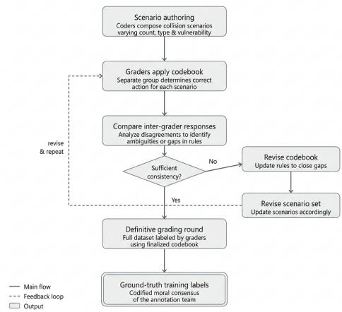
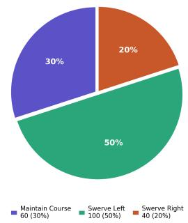
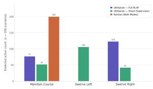
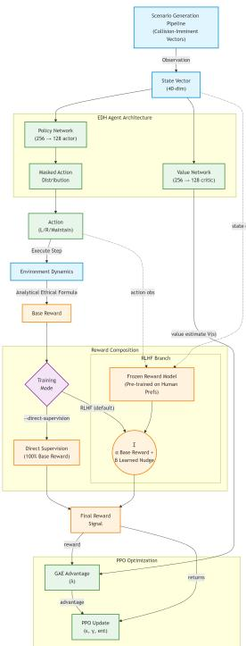
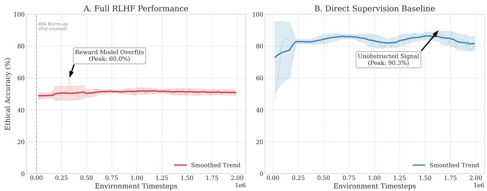
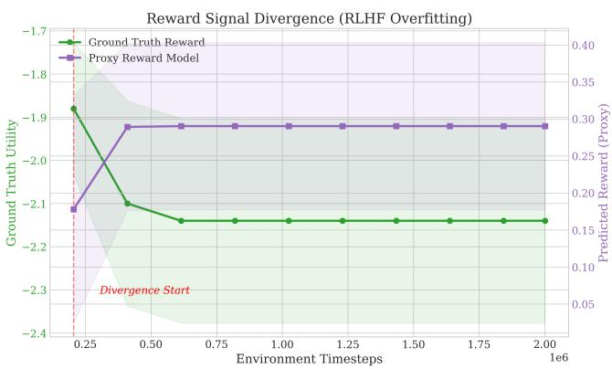
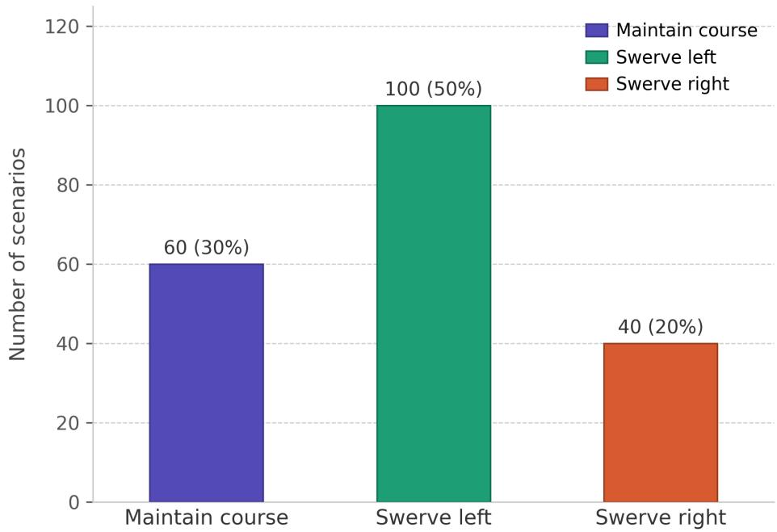
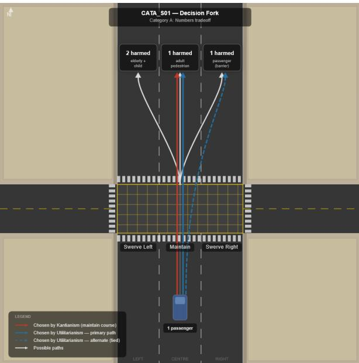

# The Ethical Decision Head: Operationalizing Normative Ethics in Autonomous Vehicles via Reinforcement Learning from Human Feedback

Thomas Mbrice\*1, Ammar Ali\*1, Sami Mian1, Khai Hern Low1, Eric Chen1, Arshia Aghajani1, Wolf Schafer ¨ 2, and Amin Shirangi†2

1Department of Computer Science, Stony Brook University 2Department of Technology, AI and Society, Stony Brook University

## Abstract

As autonomous vehicles (AVs) approach Level 4 and Level 5 operational capability [SAE International, 2018], their onboard decision systems must handle not only safety-critical locomotion but also their subsequent moral weight. This paper details the Ethical Decision Head (EDH), a deep reinforcement learning (RL) framework that encodes ethical reasoning as a differentiable reward signal, enabling a policy gradient agent to learn morally-aligned driving behavior in scenarios whose state representation is aligned with the CARLA simulation environment [Dosovitskiy et al., 2017]. Two normative frameworks are instantiated and evaluated: a Utilitarian framework minimizing total casualties and a Kantian framework enforcing course maintenance as a categorical imperative. The EDH is trained via Proximal Policy Optimization (PPO) [Schulman et al., 2017] against a Bradley-Terry reward model [Bradley and Terry, 1952] learned from pairwise human preference annotations over 200 collisionimminent scenarios. Results reveal an asymmetry in the learnability of normative ethical frameworks under human supervision. The Kantian condition, which reduces to a constant prediction task under the codebook, serves as a pipeline control: it confirms training stability and rules out infrastructure failure as an explanation for the utilitarian result. The Utilitarian agent learned something more unsettling: human raters rewarded self-sacrifice over casualty minimization, and the model learned that preference faithfully. This divergence between what humans prescribe in theory and what they reward in practice suggests that RLHF does not learn ethics as philosophers define it, but as humans live it.

## 1. Introduction

The trolley problem, first posed by Philippa Foot in 1967 [Foot, 1967], was never intended to be an engineering specification. Yet as autonomous vehicles approach SAE Level 4 and Level 5 operational capability [SAE International, 2018], the thought experiment has quietly become one. Every collision-imminent junction a self-driving system encounters is, in some form, a trolley problem: a forced choice between outcomes that mathematics can rank but moral philosophy has never conclusively resolved. Bonnefon et al. [2016] demonstrated in a landmark study that humans hold deeply inconsistent ethical preferences in exactly these scenarios, favoring utilitarian outcomes in the abstract while resisting them when applied to themselves or their families. This inconsistency is not a failure of moral reasoning but rather a feature.

The emergence of Reinforcement Learning from Human Feedback (RLHF) as a dominant post-training paradigm [Christiano et al., 2017, Stiennon et al., 2020] presents a novel opportunity: rather than encoding ethics as a static reward function, a brittle and philosophically contentious approach, an agent can learn moral behavior directly from human preference signals. This raises a question that is both technical and philosophical: can a machine learning system learn human ethics the way a human does, not as philosophers prescribe it, but as people actually practice it?

This paper attempts to answer that question empirically. We introduce the Ethical Decision Head (EDH), a post-training architectural component that frames AV ethical decisionmaking as an RLHF problem, instantiated under two nor mative frameworks: Utilitarianism, which prescribes casualty minimization [Bentham, 1789, Mill, 1863], and Kantianism, which prohibits the instrumentalization of rational agents regardless of outcome [Kant, 1785]. By evaluating both frameworks under identical training conditions, we expose a fundamental asymmetry in the learnability of classical ethical theory under human supervision and, in doing so, offer an empirical contribution to a debate that has until now remained almost entirely theoretical. We implement this through a PPObased policy trained against a Bradley-Terry reward model, evaluated across 200 human-annotated collision scenarios under two training configurations.

## 2. Methodology

## 2.1. Overview and Motivation

This research operationalizes the problem through the framework of Reinforcement Learning from Human Feedback (RLHF), built into an architectural component called the Ethical Decision Head (EDH). RLHF is chosen over static reward engineering for the property that ethical preferences resist formal specification [Gabriel, 2020, Russell, 2019]. A hand-crafted reward function encoding “minimize casualties” is straightforward to write but fails to capture the granularity of human moral intuition: the contextual weightings, implicit duties, and affective responses that humans bring to morally charged scenarios. RLHF instead learns this signal directly from human judgment [Christiano et al., 2017], making it a natural fit for a domain where the ground truth is contested by design.

The EDH directs an underlying AV model in safety-critical scenarios. At each collision-imminent junction, the agent overrides the underlying AV behavior to choose among three actions: maintain course, swerve left, or swerve right. This intervention occurs exclusively when standard braking maneuvers are insufficient to prevent collision [Paden et al., 2016]. The EDH operates under one of two ethical frameworks: a Utilitarian framework that minimizes total casualties, or a Kantian framework that treats maintaining course as a universal duty, never using persons as a means to an end [Kant, 1785]. The formal, quantitative definition of the EDH, encompassing its policy network, reward model, and training objective, is elaborated in the sections that follow. The qualitative framing of scenarios, as presented to human annotators for preference elicitation, is defined alongside the dataset. This framing is intentional; rather than encoding ethics as a static reward function, this paper argues that ethical behavior must be learned from human preference signals and grounded in formal moral structure simultaneously.

## 2.1.1. Composite Reward Function

The total reward signal driving policy optimization is a weighted composition of three terms:

$$
R _ { \mathrm { t o t a l } } ( s , a ) = \alpha R _ { \mathrm { b a s e } } ( s , a ) + \beta R _ { \mathrm { l e a r n e d } } ( s , a ) + \lambda R _ { \mathrm { e x p l i c i t } } ( s , a )\tag{1}
$$

The default configuration uses $\alpha = 0 . 3$ and $\beta = 0 . 7 ,$ making learned human preferences the dominant signal. $R _ { \mathrm { b a s e } }$ encodes hard safety constraints, providing a stable dense signal during early training before the reward model has accumulated sufficient preference data. $R _ { \mathrm { l e a r n e d } } ~ = ~ R _ { \psi } ( s , a )$ is the output of the trained reward model, capturing the implicit moral intuition of human annotators aggregated over the preference dataset. The explicit philosophical term $R _ { \mathrm { e x p l i c i t } }$ is gated by $\lambda \in \{ 0 , 1 \}$ and is inactive by default; it can be enabled during ablation to study the effect of hard-coded ethical constraints in isolation.

## 2.1.2. Explicit Ethical Reward Terms

When $\lambda = 1$ , the following formal encodings of the two normative frameworks are active.

Utilitarian Penalty. The utilitarian component penalizes actions proportionally to expected casualties:

$$
R _ { u } ( s , a ) \ \propto \ - N _ { \mathrm { i n j u r e d } } ( s , a )
$$

where $N _ { \mathrm { i n j u r e d } } ( s , a )$ is the pedestrian collision count encoded in the state vector for action a in state s, implementing the classical imperative to minimize aggregate harm [Bentham, 1789, Mill, 1863].

Kantian Penalty. The Kantian component penalizes actions in which the agent instrumentalizes a pedestrian, that ${ \mathrm { i s } } ,$ deliberately swerves through a pedestrian to reduce the utilitarian count elsewhere:

$$
R _ { k } ( s , a ) ~ = ~ \left\{ \begin{array} { l l } { - 1 0 0 } & { \mathrm { i f ~ } a \in \{ \mathrm { s w e r v e - l e f t , ~ s w e r v e - r i g h t } \} } \\ & { ~ \mathrm { a n d ~ } N _ { \mathrm { i n j u r e d } } ( s , a ) > 0 } \\ { 0 } & { \mathrm { o t h e r w i s e } } \end{array} \right.
$$

The magnitude −100 is chosen to be large relative to any achievable positive reward, ensuring that deliberate use of pedestrians as obstacles is never selected by the policy under any weighting configuration [Kant, 1785].

## 2.2. Dataset

The dataset consists of 200 scenarios constructed according to a codebook, which acts as a strict rule guide for scenario creation and is included in this paper as a supplement. While 200 scenarios represent a constrained sample, the diversity of the codebook-guided scenario generation process ensures coverage across the key variable dimensions of the state space. Dataset scale is acknowledged as a limitation in Section 4.2.

The data is split 80/20 into 160 training and 40 test scenarios. Each scenario is represented as a 40-dimensional state vector $s ~ \in ~ \mathbb { R } ^ { 4 0 }$ encoding ego vehicle velocity, passenger count, lane position, relative obstacle velocity, and pedestrian counts across all three possible action directions, among other environmental features. These features are aligned with those available within the CARLA simulation environment [Dosovitskiy et al., 2017], ensuring that the feature space remains deployment-compatible with a full simulation pipeline in which a future underlying AV model will be trained and scenarios will be generated. The CARLA environment and a representative collision-imminent junction are illustrated for context in fig. 7.

## 2.2.1. Label and Feedback Taxonomy

Three distinct sources of human judgment inform this work and must be distinguished clearly, as the central contribution depends on the contrast between them.

Codebook-derived normative labels are determined deterministically from the codebook rules for each scenario. The Utilitarian label selects the action minimizing pedestrian casualties; the Kantian label uniformly selects maintain course. These labels represent what each ethical framework prescribes, independent of any individual’s judgment, and serve as the ground-truth targets against which policy accuracy is measured.

Human coder labels are the action assignments produced by 2 independent graders applying the codebook rules to each scenario during the iterative development rounds described below. These were used to validate the codebook itself: disagreements between coders identified ambiguities in the rule structure and drove revision of both the codebook and the scenario set. They do not represent moral intuition; they represent the reliability of rule application.

Human preference feedback is the pairwise annotation data used to train the Bradley-Terry reward model. In a separate data collection, human annotators were shown pairs of trajectories and asked which was more ethically appropriate. This is the signal that the RLHF pipeline optimizes against. It is categorically distinct from the codebook-derived labels. The central finding of this paper is that this preference feedback diverged systematically from what the codebook prescribed.

  
Figure 1: Iterative codebook development pipeline. Scenario authoring, grading, and inter-grader disagreement analysis cycle until sufficient consistency is reached, producing the ground-truth training labels.

Ground-truth labels are derived from the ethical framework under evaluation: the Utilitarian label selects the action minimizing pedestrian casualties, while the Kantian label uniformly selects maintain course across all scenarios, reflecting the categorical imperative [Kant, 1785]. The resulting Utilitarian label distribution is notably imbalanced: 60 maintain course, 100 swerve-left, and 40 swerve-right, as illustrated in fig. 2, a property that proves consequential in later analysis. Because swerve-left constitutes 50% of correct Utilitarian actions, any policy that fails to learn this action cannot exceed 50% accuracy regardless of its performance elsewhere; this ceiling makes the RLHF collapse reported in the results particularly diagnostic.

  
(a) Label distribution (pie).

  
(b) Label distribution (bar).  
Figure 2: Ground-truth Utilitarian label distribution across all 200 scenarios. Swerve-left constitutes 50% of correct actions, making any policy that fails to learn this action incapable of exceeding 50% accuracy.

The reliability of these ground-truth labels depends critically on the codebook from which they are derived, whose iterative development process is illustrated in fig. 1. The codebook was developed through a structured iterative process in which human coders first composed a set of scenarios describing unavoidable collision situations involving one or more AVs, each varying the number, type, and vulnerability profile of individuals across each possible action path. A separate group of human graders then applied the codebook rules to determine the correct action for each scenario. Following each grading round, inter-grader responses were compared and cases of disagreement were analyzed to identify ambiguities or gaps in the rule structure, with revisions applied to both the codebook and the scenario set accordingly. This cycle was repeated until sufficient consistency was reached across all scenarios [Krippendorff, 2004], at which point a definitive grading round was conducted over the full dataset. The resulting labeled decisions constitute the ground-truth training labels for the EDH and represent the codified moral consensus of the annotation team rather than the judgment of any individual rater. Formal inter-rater reliability statistics were not retained from the coding rounds; this is acknowledged as a limitation in Section 4.2.

## 2.2.2. Annotator Pool

The human raters contributing preference feedback were two individuals recruited from a general collegiate population. The sole inclusion criterion was no prior formal exposure to normative ethical frameworks, specifically Kantian deontology and Utilitarian theory, to ensure that preference judgments reflected lay moral intuition rather than trained philosophical reasoning. No additional demographic screening was applied. The human moral intuition captured by the preference dataset therefore reflects the values of a small, demographically specific group. Findings about what “humans prefer” should be interpreted as findings about what these two raters preferred; generalizability to broader or more diverse populations is not claimed and is acknowledged as a limitation in Section 4.2.

## 2.3. Model Architecture

With the scenario distribution and labeling protocol established, the architecture that operates over this data can be defined, as illustrated in fig. 3. The full pipeline integrates three learned components, with each component serving a distinct role in translating raw state observations into ethicallygrounded action selections.

  
Figure 3: Full EDH pipeline architecture. The state vector flows through the policy and value networks, with reward composition branching between Full RLHF and Direct Supervision modes before PPO optimization.

The policy network (actor) $\pi _ { \theta }$ maps 40-dimensional states to a probability distribution over five actions via a twolayer MLP (256 → 128 hidden units), with actions brake and accelerate masked out via large negative logit bias $( - 1 0 ^ { 9 } )$ ), constraining the effective decision space to ${ \mathcal { A } } =$ {maintain, swerve-left, swerve-right}. The value network (critic) $V _ { \phi }$ mirrors this architecture, outputting a scalar state value used for Generalized Advantage Estimation [Schulman et al., 2016]. The reward model $R _ { \psi }$ takes a concatenation of the state $s \in \mathbb { R } ^ { 4 0 }$ and a one-hot action encoding $a \in \mathbb { R } ^ { 5 }$ as input (45 dimensions total) and outputs a scalar ethical score per (s, a) pair.

## 2.3.1. Bradley-Terry Preference Model

The reward model is trained via the Bradley-Terry preference framework [Bradley and Terry, 1952] following the RLHF paradigm of Christiano et al. [2017]. Human annotators are shown pairs of trajectory rollouts $( \tau _ { A } , \tau _ { B } )$ and indicate which trajectory executed the more ethically appropriate sequence of actions. The cumulative reward assigned to a trajectory τ is:

$$
\hat { R } _ { \psi } ( \tau ) = \sum _ { ( s , a ) \in \tau } R _ { \psi } ( s , a )
$$

The probability that a human annotator prefers $\tau _ { A }$ over $\tau _ { B }$ is modeled as:

$$
P ( \tau _ { A } \succ \tau _ { B } ) = \sigma \Big ( \hat { R } _ { \psi } ( \tau _ { A } ) - \hat { R } _ { \psi } ( \tau _ { B } ) \Big )\tag{2}
$$

The reward model parameters ψ are updated by minimizing binary cross-entropy over the preference dataset $\mathcal { D } =$ $\{ ( \tau _ { A } ^ { ( i ) } , \tau _ { B } ^ { ( i ) } , y ^ { ( i ) } ) \}$ , where $\boldsymbol y ^ { ( i ) } = 1$ if annotators preferred $\tau _ { A } \colon$

$$
\begin{array} { r l } & { \mathcal { L } ( \psi ) ~ = ~ - \mathbb { E } _ { ( \tau _ { A } , \tau _ { B } , y ) \sim \mathcal { D } } \big [ y \log P ( \tau _ { A } \succ \tau _ { B } ) } \\ & { ~ + ( 1 - y ) \log ( 1 - P ( \tau _ { A } \succ \tau _ { B } ) ) \big ] } \end{array}\tag{3}
$$

## 2.4. Training Configuration

## 2.4.1. Generalized Advantage Estimation

Policy gradients are computed using Generalized Advantage Estimation (GAE) [Schulman et al., 2016], which reduces variance by combining multi-step temporal difference estimates via exponential weighting. Given a rollout buffer of $N = 2 0 4 8$ transitions, the TD error at step t is:

$$
\delta _ { t } \ = \ r _ { t } + \gamma V _ { \phi } \big ( s _ { t + 1 } \big ) \big ( 1 - d _ { t } \big ) - V _ { \phi } \big ( s _ { t } \big )\tag{4}
$$

where $d _ { t } \in \{ 0 , 1 \}$ is a terminal-state indicator and $\gamma = 0 . 9 9$ is the discount factor. The advantage estimate is computed backward through the buffer:

$$
\hat { A } _ { t } \ = \ \delta _ { t } + ( \gamma \lambda _ { \mathrm { G A E } } ) ( 1 - d _ { t } ) \hat { A } _ { t + 1 }\tag{5}
$$

with GAE smoothing parameter $\lambda _ { \mathrm { G A E } } = 0 . 9 5$ . Return targets for critic regression are recovered as $G _ { t } = \hat { A } _ { t } + V _ { \phi } ( s _ { t } )$ Advantages are normalized to zero mean and unit variance prior to use in the policy loss to stabilize gradient magnitudes across episodes of differing reward scale.

## 2.4.2. PPO Clipped Surrogate Objective

The actor policy $\pi _ { \theta }$ is optimized using PPO [Schulman et al., 2017]. In the present benchmark each scenario constitutes a single-step decision, reducing the formulation to a contextual bandit; PPO is retained for two reasons. First, it provides architectural continuity with the intended deployment target, a full end-to-end pipeline in which ethical decisions unfold over multiple timesteps. Second, the clipped surrogate objective explicitly bounds the magnitude of each policy update, preventing catastrophic forgetting of behaviors encountered early in training, a property that proved relevant under the high-variance reward signal of the Full RLHF condition. Let the probability ratio between the updated and old policies be:

$$
\rho _ { t } ( \theta ) ~ = ~ { \frac { \pi _ { \theta } ( a _ { t } \mid s _ { t } ) } { \pi _ { \theta _ { \mathrm { o l d } } } ( a _ { t } \mid s _ { t } ) } }
$$

The actor loss combines the clipped objective with an entropy regularization term, which prevents premature convergence to deterministic swerving strategies:

$$
\begin{array} { r l r } { \mathcal { L } ^ { \mathrm { A c t o r } } ( \theta ) } & { = } & { - \mathbb { E } _ { t } \Big [ \mathrm { m i n } \Big ( \rho _ { t } \hat { A } _ { t } , ~ \mathrm { c l i p } ( \rho _ { t } , 1 - \varepsilon , 1 + \varepsilon ) \hat { A } _ { t } \Big ) \Big ] } \\ & { } & { - c _ { \mathrm { e n t } } \mathbb { E } _ { t } [ H ( \pi _ { \theta } ( \cdot \mid s _ { t } ) ) ] ~ ( \theta } \end{array}\tag{6}
$$

with clipping threshold $\varepsilon = 0 . 2$ and entropy coefficient $c _ { \mathrm { e n t } } =$ 0.03. The critic is updated by minimizing mean-squared error against the return targets:

$$
\mathcal { L } ^ { \mathrm { C r i t i c } } ( \phi ) = \frac { 1 } { 2 } \mathbb { E } _ { t } \Big [ \big ( V _ { \phi } ( s _ { t } ) - G _ { t } \big ) ^ { 2 } \Big ]\tag{7}
$$

Gradients of the combined loss $\begin{array} { r } { \begin{array} { r } { \mathcal { L } \ = \ \mathcal { L } ^ { \mathrm { A c t o r } } + \mathcal { L } ^ { \mathrm { C r i t i c } } } \end{array} } \end{array}$ are clipped by global $\ell _ { 2 }$ norm at 0.5 before each Adam optimizer step to prevent destabilizing updates during high-variance rollouts. The reward signal passed to the policy is the composite $R _ { \mathrm { t o t a l } }$ defined in eq. (1), where learned rewards are zscore normalized and clipped to [−3, 3] prior to mixing to prevent value network instability. The reward model is updated every 50 PPO iterations on a batch of human preference pairs, a frequency reduced from an initial value of 10 to mitigate overfitting. table 1 summarizes all hyperparameters.

Table 1: Training hyperparameters for the EDH.
<table><tr><td>Parameter</td><td>Symbol</td><td>Value</td></tr><tr><td>Discount factor</td><td> $\gamma$ </td><td>0.99</td></tr><tr><td>GAE smoothing</td><td> $\lambda _ { \mathrm { G A E } }$ </td><td>0.95</td></tr><tr><td>Rollout buffer size</td><td> $N$ </td><td>2048</td></tr><tr><td>PPO epochs per rollout</td><td> $K _ { \mathrm { p p o } }$ </td><td>4</td></tr><tr><td>PPO clip threshold</td><td> $\varepsilon$ </td><td>0.2</td></tr><tr><td>Entropy coefficient</td><td> $c _ { \mathrm { e n t } }$ </td><td>0.03</td></tr><tr><td>Policy LR</td><td>ηpolicy</td><td> $3 \times 1 0 ^ { - 4 }$ </td></tr><tr><td>Gradient clip norm</td><td></td><td> $_ { 0 . 5 }$ </td></tr><tr><td>Reward model LR</td><td> $\eta _ { \mathrm { { r m } } }$ </td><td> $1 0 ^ { - 3 }$ </td></tr><tr><td>RM update frequency</td><td></td><td>50</td></tr><tr><td>RM pref. batch size</td><td> $B _ { \mathrm { p r e f } }$ </td><td>32</td></tr><tr><td>Base reward weight</td><td> $\alpha$ </td><td>0.3</td></tr><tr><td>Learned reward weight</td><td> $\beta$ </td><td>0.7</td></tr><tr><td>Total timesteps</td><td></td><td>2,000,000</td></tr></table>

## 2.4.3. Training Configurations

Two training configurations are evaluated. The Full RLHF mode trains the policy and reward model jointly, with human preference pairs shaping the gradient signal throughout. The Direct Supervision mode bypasses the reward model entirely, training PPO directly on the shaped environment reward. This ablation serves as a diagnostic, isolating whether observed failure modes originate in the RLHF pipeline or the underlying environment formulation, a distinction that proves critical in the results. At inference time, the policy switches from stochastic sampling to a deterministic greedy strategy:

$$
a _ { t } = \arg \operatorname* { m a x } _ { a \in \mathcal { A } } \pi _ { \theta } ( a \mid s _ { t } )
$$

This eliminates output variance while retaining the learned ethical weighting acquired during training.

## 3. Results

## 3.1. Kantian Ethical Framework

The Kantian condition serves as a methodological control rather than a substantive ethical learning result. Under the codebook, the correct Kantian action is uniformly “maintain course” across all 200 scenarios: a policy that ignores the input entirely and always predicts “maintain” would achieve the same outcome. The pipeline converged to this behavior reliably, confirming that the training infrastructure is stable and that any failure to learn a correct action cannot be attributed to optimization pathologies. This result does not constitute evidence that the model learned Kantian ethical reasoning; it confirms the pipeline functions as intended, and we report it as such before proceeding to the substantive finding.

## 3.2. Utilitarian Ethical Framework

The RLHF agent trained under the Utilitarian framework exhibited markedly different behavior. At 2,000,000 time steps, the model achieved a testing accuracy of only 42.5%. An analysis of the decision distribution, illustrated in fig. 6, revealed that in approximately 50% of scenarios, the agent deviated from strict casualty minimization in favor of selfsacrifice, a behavior not prescribed by Utilitarian logic but one to which human raters responded favorably. This divergence indicates that human feedback introduced a systematic bias into the reward signal, pulling the agent toward an emotionally salient but normatively inconsistent decision pattern. The pattern is consistent with omission bias [Spranca et al., 1991, Ritov and Baron, 1990] and action aversion [Cushman et al., 2012]: human raters consistently preferred inaction or self-sacrifice over active redirection of harm, even when redi rection would minimize total casualties.

The training dynamics underlying this collapse are shown in fig. 4, and the divergence between the proxy and ground-truth reward signals is plotted in fig. 5. To isolate the effect of this bias, human feedback was removed from the training loop, reducing the architecture to the Direct Supervision configura tion. This modification produced a substantial improvement, with the model reaching a peak accuracy of 90.3%. These results confirm that Utilitarianism is learnable under direct supervision, but that its formal structure is sensitive to perturbation from human preferences that do not align with strict casualty minimization.

## 4. Discussion and Limitations

## 4.1. Discussion

The results reveal a fundamental asymmetry in the learnability of classical ethical frameworks when human preferences are introduced into the training loop. The Kantian condition converged reliably to the single prescribed action, functioning as a pipeline control. The substantive finding lies entirely with the Utilitarian agent.

Figure 4: Training curves comparing Full RLHF (A) and Direct Supervision (B) under the Utilitarian framework over 2,000,000 environment timesteps. Panel A plateaus near the 50% accuracy ceiling imposed by swerve-left collapse following reward model warm-up; Panel B reaches a peak of 90.3%, confirming that the environment reward signal is well-formed and the failure mode is localized to the RLHF pipeline.  
  
Figure 5: Reward signal divergence under Full RLHF. Following the divergence point the proxy reward model saturates while ground truth utility continues to decline, confirming reward model overfitting to human preference noise rather than the normative objective.

The Utilitarian framework exposed an inherent tension between formal normative theory and empirical human moral intuition. The emergent self-sacrificial behavior observed in the RLHF condition is not an artifact of model failure; it is a reflection of something more consequential. Human raters, in attempting to reward moral behavior, responded to perceived heroism rather than strict outcome evaluation, effectively teaching the agent a coherent but normatively incorrect objective [Greene et al., 2001]. This pattern is consistent with omission bias [Spranca et al., 1991, Ritov and Baron, 1990] and action aversion [Cushman et al., 2012]: a robust finding in moral psychology that agents judge harmful outcomes more harshly when they result from active intervention than from inaction, even when the intervention would reduce total harm. Our contribution is to demonstrate that this bias does not merely describe how humans reason about moral scenarios in the abstract; it propagates faithfully through an RLHF pipeline, shaping the learned policy of a safety-critical decision system.

This divergence between what humans prescribe in theory and what they reward in practice [Bonnefon et al., 2016] is precisely the dynamic this paper set out to investigate. In this sense, the model did not fail to learn ethics; it learned human ethics as humans practice it, not as philosophers define it.

The recovery to high accuracy upon removal of human feedback lends empirical support to this interpretation and raises a broader design question: when the goal is the faithful instantiation of a specific normative theory, is human supervision an appropriate alignment mechanism at all? This is a counterintuitive result, given that RLHF was originally motivated by the desire to align model behavior with human values [Chris tiano et al., 2017], yet the findings here suggest that human values and normative ethical theory are not always the same thing. Conflating the two in system design carries measurable consequences.

## 4.2. Limitations

Several limitations are worth noting. First, the omission bias observed under the Utilitarian condition is likely one instance of a broader class of affective biases that human raters bring to morally charged scenarios, including loss aversion [Kahneman and Tversky, 1979] and in-group favoritism [Cushman et al., 2012]. Future work should investigate whether rater calibration, structured annotation protocols, or hybrid feedback mechanisms can mitigate these distortions without abandoning the human feedback paradigm entirely.

Second, the ethical frameworks evaluated here, Kantianism and Utilitarianism, do not exhaust the space of normative theories relevant to AV decision-making. Frameworks such as virtue ethics and contractualism, which integrate both rulebased and consequentialist reasoning, remain unaddressed [Gogoll and Muller¨ , 2017, Awad et al., 2018]. Whether the learnability asymmetry reported here generalizes across such frameworks is an open empirical question.

  
Figure 6: Predicted action distributions across all 200 scenarios under each training configuration. Under Full RLHF, the Utilitarian agent never predicts swerve-left, the modal correct action, collapsing instead toward maintain course and swerveright. Direct Supervision recovers a balanced distribution aligned with ground-truth labels.

Third, formal inter-rater reliability statistics were not retained from the iterative codebook development process. The codebook was refined until inter-grader consistency was reached [Krippendorff, 2004], but no Krippendorff’s alpha or Cohen’s kappa value was recorded. We acknowledge this as a methodological limitation; future iterations of this pipeline should instrument the coding rounds to capture and report these statistics. If the raw grading data is recoverable, computing and reporting these values should be treated as a priority revision.

Fourth, the preference feedback was collected from two raters drawn from a collegiate population with no prior exposure to normative ethics. The propagation of omission bias through the RLHF pipeline is therefore a finding about this specific pair’s preferences. Whether the same pattern holds across larger or more diverse rater pools is an open empirical question, and the small sample size means individual variation cannot be separated from population-level effects. Two annotators also represents a minimal sample for a Bradley-Terry preference model, which relies on aggregated pairwise comparisons to estimate a stable reward signal; with two raters, the learned reward model reflects a narrow preference distribution and may be sensitive to idiosyncratic judgments that a larger pool would average out. Future work should replicate the preference collection at scale before drawing strong conclusions about the generalizability of the observed RLHF collapse.

Finally, the evaluation dataset of 200 moral edge cases, while diverse in its coverage of the codebook-defined variable space, represents a finite approximation of the moral distribution an AV would encounter in deployment. The degree to which this benchmark predicts ethical behavior in practice remains an open question, one that large-scale simulation or real-world data collection would be required to answer.

  
(a) CARLA scenario render for illustrative purposes.

  
(b) Abstract decision tree for the same scenario.

Figure 7: A representative collision-imminent scenario as rendered in CARLA for illustrative purposes (left) and its corresponding abstract decision tree (right), showing the three action branches and their pedestrian casualty counts under the Utilitarian framework. The CARLA render is provided for environmental context; the dataset itself consists of codebook-derived 40- dimensional state vectors aligned with the CARLA feature space.

## References

Bentham, J. (1789). An Introduction to the Principles of Morals and Legislation. T. Payne and Son, London.

Bonnefon, J.-F., Shariff, A., and Rahwan, I. (2016). The social dilemma of autonomous vehicles. Science, 352(6293):1573–1576.

Bradley, R. A. and Terry, M. E. (1952). Rank analysis of incomplete block designs: I. The method of paired comparisons. Biometrika, 39(3/4):324–345.

Christiano, P., Leike, J., Brown, T. B., Martic, M., Legg, S., and Amodei, D. (2017). Deep reinforcement learning from human preferences. In Advances in Neural Information Processing Systems (NeurIPS).

Cushman, F., Gray, K., Gaffey, A., and Mendes, W. B. (2012). Simulating murder: The aversion to harmful action. Emotion, 12(1):2–7.

Dosovitskiy, A., Ros, G., Codevilla, F., Lopez, A., and Koltun, V. (2017). CARLA: An open urban driving simulator. In Proceedings ofthe 1st Annual Conference on Robot Learning (CoRL).

Foot, P. (1967). The problem of abortion and the doctrine of double effect. Oxford Review, 5:5–15.

Gabriel, I. (2020). Artificial intelligence, values, and alignment. Minds and Machines, 30(3):411–437.

Greene, J. D., Sommerville, R. B., Nystrom, L. E., Darley, J. M., and Cohen, J. D. (2001). An fMRI investigation of emotional engagement in moral judgment. Science, 293(5537):2105–2108.

Kahneman, D. and Tversky, A. (1979). Prospect theory: An analysis of decision under risk. Econometrica, 47(2):263– 291.

Kant, I. (1785). Groundwork of the Metaphysics of Morals. Translated by M. Gregor. Cambridge University Press, Cambridge.

Mill, J. S. (1863). Utilitarianism. Parker, Son, and Bourn, London.

Ritov, I. and Baron, J. (1990). Reluctance to vaccinate: Omission bias and ambiguity. Journal of Behavioral Decision Making, 3(4):263–277.

Russell, S. (2019). Human Compatible: Artificial Intelligence and the Problem ofControl. Viking, New York.

SAE International (2018). Taxonomy and definitions for terms related to driving automation systems for on-road motor vehicles. SAE Standard J3016.

Schulman, J., Moritz, P., Levine, S., Jordan, M., and Abbeel, P. (2016). High-dimensional continuous control using generalized advantage estimation. In International Conference on Learning Representations (ICLR).

Schulman, J., Wolski, F., Dhariwal, P., Radford, A., and Klimov, O. (2017). Proximal policy optimization algorithms. arXiv preprint arXiv:1707.06347.

Spranca, M., Minsk, E., and Baron, J. (1991). Omission and commission in judgment and choice. Journal of Experimental Social Psychology, 27(1):76–105.

Stiennon, N., Ouyang, L., Wu, J., Ziegler, D. M., Lowe, R., Voss, C., Radford, A., Amodei, D., and Christiano, P. (2020). Learning to summarize with human feedback. In Advances in Neural Information Processing Systems (NeurIPS).

Paden, B., Cap, M., Yong, S. Z., Yershov, D., and Frazzoli,

E. (2016). A survey of motion planning and control techniques for self-driving urban vehicles. IEEE Transactions on Intelligent Vehicles, 1(1):33–55.

Krippendorff, K. (2004). Content Analysis: An Introduction to Its Methodology. Sage, Thousand Oaks, CA.

Awad, E., Dsouza, S., Kim, R., Schulz, J., Henrich, J., Shariff, A., Bonnefon, J.-F., and Rahwan, I. (2018). The Moral Machine experiment. Nature, 563(7729):59–64.

Gogoll, J. and Muller, J. F. (2017). Autonomous cars: In favor¨ of a mandatory ethics setting. Science and Engineering Ethics, 23(3):681–700.