# The Trade-of Between Covariate Dependence and Latent Structure in Representation Learning

Małgorzata Łazęcka m.lazecka@uw.edu.pl Faculty of Mathematics, Informatics, and Mechanics, University of Warsaw Warsaw, Poland

## Abstract

Disentangled representation learning seeks latent representations whose indicidual dimensions each align with a distinct covariate. Unsupervised approaches typically target latent dimension inde-pendence, yet this gives no guarantee that the resulting dimensions align with semantically meaningful covariates. Supervised approaches structure the latent space using observed covariates, but under correlated covariates they cannot simultaneously control one-to-one latent-covariate alignment and latent independence. We introduce a unified, supervised framework that couples latent dimension-covariate dependence with constraints on the latent structure. Within this framework, we show an inherent trade-of, where enforcing latent independence or exclusive one-to-one latent- covariate dependence comes at a provable cost in latent-covariate alignment. We prove that the resulting disentanglement regimes are ordered by the strength of that alignment. Each regime ad- mits a closed-form transformation of the latent space. We apply these transformations post-hoc to realign the representations of pretrained models such as CLIP, DINOv2, and ViT, and we fold them into the inference of informed factor analysis (iFA), a probabilistic model with covariate-informed factors. On simulated and real multi-omics data, we show that both ost-hoc ali nment and iFA enable controllability of structured latent representations.

## CCS Concepts

• Computing methodologies → Learning latent representations; Supervised learning; Latent variable models; Factor analysis.

## Keywords

disentanglement, supervised latent representation learning, factoranalysis

## 1 Introduction

Ewa Szczurek em.szczurek@uw.edu.pl Institute of AI for Health, Helmholtz Munich Munich, Germany Faculty of Mathematics, Informatics, and Mechanics, University of Warsaw Warsaw, Poland

Latent representation learning maps a high-dimensional data space to a low-dimensional one, encoding each observation as a compact latent representation capturing its essential characteristics. A longstanding objective of latent representation learning is to obtain representations whose individual dimensions align with distinct, semantically meaningful factors of variation [6]. Such disentangled representations promise interpretability, controllable generation and improved generalization, because they seek to ensure that manipulating a single latent dimension changes only one underlying factor of variation [54]. In many real-world applications, the factors of interest are not latent abstractions, but observed covariates such as clinical variables, experimental conditions, or category labels, and the practical aim is a representation in which each latent dimension is aligned one-to-one with its corresponding covariate [23].

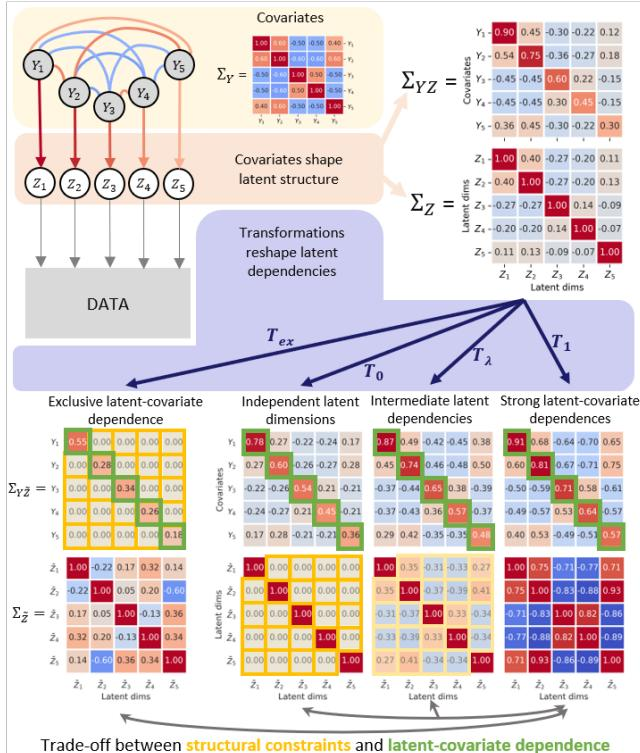  
Figure 1: Overview of the proposed framework. Correlated covariates (Σ�) shape the latent structure (Σ�). The transformations impose diferent constraints on the latent space, trading of structural constraints (exclusive latent-covariate dependence, latent inter-independence) against the strength of pairwise latent-covariate dependence $( \Sigma _ { Y , \tilde { Z } } )$

This assumption holds when the observed covariates are inde- pendent, but fails in the practically relevant regime of correlated covariates [16, 52], as exemplified by Σ� in Fig. 1. This correlation among covariates creates a tension between two objectives: mak- ing each latent dimension strongly aligned with its covariate, and imposing structural constraints on the latent space, such as independence among the latent dimensions or exclusive dependence (each dimension aligning only with its own covariate). This trade-of between latent-covariate dependence and structural constraints on the latent space has not been systematically studied.

The principle of latent independence is common in fully unsupervised approaches, and the way it is applied varies: classical linear methods such as PCA [25, 42] and ICA [27] assume and recover independent sources of variation, while modern nonlinear models encourage independence e.g. through factorized latent representa- tions [12, 23, 32]. Enforcing independence alone, however, does not in general ensure that latent dimensions align with interpretable or meaningful covariates, nor does it guarantee identifiability [38]. Conditioning latent variable models on observed covariates under additional assumptions restores identifiability up to simple transformations [31], and a broad family of nonlinear [22, 28, 34, 50, 56] and linear [2, 4, 5, 11, 21, 41, 48, 58] supervised representation learning methods uses observed covariates to structure the latent space. Yet all existing approaches leave open the problem of the simultaneous control of the one-to-one alignment of each latent dimension with its covariate and of the structural constraints on the latent space, particularly in the general, correlatedcovariate setting.

We close this gap with a supervised framework that character- izes the trade-of between latent dimension-covariate dependence and latent structural constraints, providing a principled approach to controlling latent representations. Our contributions are both theoretical and practical. First, (i) leveraging the non-identifiability of latent representations, we formulate optimization problems over invertible latent space transformations (� in Fig. 1) whose solutions yield latent-covariate dependence across diferent disen- tanglement regimes: independent latent dimensions (� ), tunable intermediate latent inter-dependencies (��), unconstrained latent inter-dependencies (�1), and a variant with exclusive one-to-one latent-covariate dependence $( T _ { \mathrm { e x } } )$ . Second, (ii) we prove that these regimes are strictly ordered by latent-covariate alignment strength, and that there exists a fundamental trade-of between structural latent constraints and latent-covariate dependence. Finally, (iii) we demonstrate that the proposed transformations can be applied post hoc to re-align pretrained representations or integrated into a probabilistic graphical model, informed Factor Analysis (iFA). Through experiments on simulated covariate-covariance scenarios and real multi-omics data, we show that both approaches enable controllability of structured representations.

## 2 Related works

Independence-based disentanglement methods. Many disentanglement approaches assume or encourage independence among the dimensions of the representation, an idea rooted in classical latent variable methods such as principal component analysis (PCA) [25, 42], independent component analysis (ICA) [27], factor anal-ysis (FA) [51], and extended to probabilistic latent variable mod els, including multi-view factor models, e.g. MOFA [3] and others [33, 44, 57]. The most prominent deep generative examples are

VAE-based methods regularizing the latent distribution toward independence, e.g. �-VAE [23], FactorVAE [32], or �-TCVAE [12]. Similar ideas have also been explored beyond VAEs, for example through concept whitening in convolutional neural networks [14], InfoGAN [13], a generative GAN model which promotes independence using mutual information, or non-linear ICA extension [9].

Supervision in disentanglement and latent representation models. Assuming latent independence alone does not guarantee identifia- bility [38]. Consequently, many successful approaches incorporate weak-supervision, such as grouped observations [8], temporal structure [26], or paired observations in which some factors of variation are shared [39]. A second line is supervised in the stronger sense that covariates are directly observed, e.g. used to condition the latent representation, as in CVAE [50], iVAE [31], or SE-VAE [56], among others [22, 28, 34]. The Identifiable VAE (iVAE) [31] tar-gets identifiability by conditioning a factorized exponential-family prior on the covariates, which identifies the latent representation up to a linear and component-wise transformation, which can be understood as a form of disentanglement.

Supervised linear latent variable models. The use of covariates to guide representations has been also used in linear models. Early examples include supervised extensions of PCA (SPCA), such as by Bair et al. [4], which focus only on features that are individually associated with the covariates, and Barshan et al. [5], which estimates a sequence of principal components that have maximal dependence with covariates. Other related methods include regression- and correlation-based approaches, such as partial least squares (PLS) [55] and canonical correlation analysis (CCA), as well as supervised variants of FA [2, 21, 41, 48, 58]. These methods leverage covariates to improve prediction or interpretability, but generally do not enforce a one-to-one latent-covariate alignment. To the best of our knowledge, the only exception is SOFA [11], which explicitly associates individual latent dimensions with specific covariates.

Disentanglement under correlated covariates. Disentangling the latent space under correlated covariates is important but relatively underexplored [52]. Empirical studies that introduce correlated covariates [16, 52] show that the roblem difers fundamentall from the usual assumption of independent covariates. Enforcing inde-pendence between latent dimensions under correlated covariates degrades the model by e.g. preventing it from attaining the optimal likelihood [52] or discardin information relevant to the covariates and thus harming predictive performance [19]. Exact independence is therefore the wrong objective, motivating relaxations. One line of work requires only the latent space’s support to factorize [47], while another enforces independence conditionally on the covari- ates [19]. The very definitions and metrics of disentanglement must also be rethought to remain valid under dependence [1].

## 3 Proposed framework

In this section, we introduce a unified framework that formally explores the trade-of between latent-covariate dependence and structural constraints on the latent space.

## 3.1 Notation and problem setup

Let $Z \in \mathbb { R } ^ { P }$ be a latent random vector with covariance matrix $\Sigma _ { Z } : =$ Cov(�) and unit marginal variances $\mathrm { V a r } ( Z _ { p } ) = 1$ for $p = 1 , \ldots , P .$ Let $Y \in \mathbb { R } ^ { P }$ be a vector of observed covariates, with Var $( Y _ { p } ) = 1$ for $p = 1 , \ldots , P ;$ and define the cross-covariance matrix $\Sigma _ { Z Y } : =$ $\operatorname { C o v } ( Z , Y )$ . Our objective is a latent representation in which every dimension is paired with the covariate, so that we obtain strong alignment in pairs $( Z _ { p } , Y _ { p } )$ for $p = 1 , \ldots , P .$

We assume that the latent representation $Z$ is non-identifiable, in the sense that for any invertible matrix $T \in \mathbb { R } ^ { P \times P }$ , the linearly transformed vector $\tilde { Z } = T Z$ provides an equivalent representation of the data �. We exploit this freedom to select a transformation � that imposes a desirable structure on the latent space, thereby defining a canonical structured representation and resolving rep- resentation ambiguity. Here � may be a single vector $X \in \mathbb { R } ^ { d } \mathrm { o r }$ in the multi-modal case, a collection of vectors $\{ X ^ { ( m ) } \in \mathbb { R } ^ { d ^ { ( m ) } } \} _ { m = 1 } ^ { M }$ across � modalities.

In particular, we consider three disentanglement regimes: (i) strong latent dependence on covariates, which maximizes the correlation between each latent dimension and its covariate while leaving the latent dependence structure otherwise unconstrained, (ii) decorrelated/independent latent dimensions, which enforces uncorrelatedness among the latent dimensions (independence under a joint Gaussian assumption) while aligning each latent dimension with its covariate, and (iii) intermediate latent inter-dependence, which weights the alignment objective against proximity to the decorrelated solution and thereby interpolates between the two extremes. We additionally examine a fourth sce- nario, (iv) exclusive latent-dimension-covariate dependence, in which each latent dimension is required to correlate only with its own covariate.

We pose the problem as pairwise latent-covariate dependence under structural constraints on the latent space, by framing (i)-(iv) within a single unified setup. In particular, in following section we prove that regime (iii) arises as a continuous interpolation between (i) and (ii), and an ordering ordering of all four regimes by their alignment strength.

## 3.2 Optimization-based formulations and solutions

We begin with the independence regime (ii), since its whitening transformation fixes a canonical representation $\overline { Z }$ on which all re- maining solutions are expressed, then we solve the unconstrained regime $( \mathrm { i } ) ,$ followed by the interpolation (iii), and finally the exclusivedependence regime (iv).

3.2.1 Independent latent dimensions. We first consider the problem of finding a whitening transformation � such that the transformed latent variables are uncorrelated and standardized $\mathrm { C o v } ( T Z ) = I ;$ , or equivalently $T \Sigma _ { Z } T ^ { \prime } = I $ . This constraint alone does not determine � uniquely: if � satisfies the above condition, then so does �� for any orthogonal matrix � [30], so whitening is defined only up to an orthogonal rotation. A canonical choice for � is the symmetric whitening transformation $\Sigma _ { 7 } ^ { - 1 / 2 }$ , the unique symmetric positivedefinite matrix that whitens ${ \bar { Z } } .$ The general solution has a form

$$
T = Q \Sigma _ { Z } ^ { - 1 / 2 } , \quad Q ^ { \prime } Q = I .
$$

To resolve the remaining ambiguity, we incorporate the covariates � and seek a transformation that, in addition to whitening, maximizes the alignment in latent dimension-covariate pairs $( \tilde { Z } _ { p } , Y _ { p } )$ , which leads to

$$
\operatorname* { m a x } _ { T } \mathrm { t r } ( T \Sigma _ { Z Y } ) \mathrm { s . t . } T \Sigma _ { Z } T ^ { \prime } = I .\tag{1}
$$

Substituting � with $Q \Sigma _ { Z } ^ { - 1 / 2 }$ reduces the problem to

$$
\operatorname* { m a x } _ { Q ^ { \prime } Q = I } \mathrm { t r } \bigl ( Q \Sigma _ { Z } ^ { - 1 / 2 } \Sigma _ { Z Y } \bigr ) ,
$$

which is the orthogonal Procrustes problem [49] (Section A.1). Let

$$
\Sigma _ { Z } ^ { - 1 / 2 } \Sigma _ { Z Y } = U D V ^ { \prime }
$$

be the singular value decomposition. Then the optimal solution is

$$
Q ^ { * } = V U ^ { \prime } , \quad T _ { 0 } ^ { * } = Q ^ { * } \Sigma _ { Z } ^ { - 1 / 2 } .
$$

In terms o $\cdot _ { \Sigma _ { Z } }$ and $\Sigma _ { Z Y }$ (Section A.2) $T _ { 0 } ^ { * }$ equals

$$
T _ { 0 } ^ { * } = \left( \Sigma _ { Z Y } ^ { \prime } \Sigma _ { Z } ^ { - 1 } \Sigma _ { Z Y } \right) ^ { - 1 / 2 } \Sigma _ { Z Y } ^ { \prime } \Sigma _ { Z } ^ { - 1 } .\tag{2}
$$

Note that (2) is well-defined whenever $\Sigma _ { Z }$ is positive definite.

In the following sections, we work with latent variables that have been whitened by the transformation $T _ { 0 } ^ { * }$ , and we denote the transformed $Z$ by ${ \overline { { Z } } } ~ : = ~ T _ { 0 } ^ { * } Z$ . This simplifies the algebra while preserving the generality of the results, as to recover the transform on the original $Z$ we simply compose the optimal transformations $T ( \overline { { Z } } )$ with $T _ { 0 } ^ { * }$ (justification that this yields the same solution as solving the problem for a general $Z$ is given in Section A.4).

3.2.2 Strong latent dependence on covariates. We now consider a formulation that prioritizes alignment with � while relaxing the demand on the latent independence. In particular, we only enforce that the transformed latent variables have unit marginal variances, thus the problem is

$$
\operatorname* { m a x } _ { T } ~ \mathrm { t r } ( T \Sigma _ { \overline { { { Z } } } Y } ) \quad \mathrm { s . t . } \quad \mathrm { d i a g } ( T T ^ { \prime } ) = ( 1 , \dots , 1 ) ^ { \prime } .\tag{3}
$$

Let $\boldsymbol { T } = [ t _ { 1 } , \ldots , t _ { P } ] ^ { \prime }$ , where $t _ { \mathcal { P } } \in \mathbb { R } ^ { P }$ are the rows of $T .$ . The con- straint reduces to $\left\| t _ { p } \right\| = 1$ for all ${ \boldsymbol { \mathit { p } } } ,$ and the objective term decomposes as

$$
\mathrm { t r } ( T \Sigma _ { \overline { { { Z } } } Y } ) = \sum _ { p = 1 } ^ { P } t _ { p } ^ { \prime } ( \Sigma _ { \overline { { { Z } } } Y } ) . _ { \rlap / P } .
$$

Denoting $a _ { p } : = ( \Sigma _ { \overline { { Z } } Y } ) _ { \cdot p } $ , the problem separates into � independent subproblems:

$$
\operatorname* { m a x } _ { \| t _ { \pmb { \mathscr { p } } } \| = 1 } ~ t _ { \pmb { \mathscr { p } } } ^ { \prime } a _ { \pmb { \mathscr { p } } } .
$$

By the Cauchy-Schwarz inequality,

$$
t _ { p } ^ { \prime } a _ { p } \leq \| t _ { p } \| \| a _ { p } \| ,
$$

with equality if and only i $\mathrm { f } t _ { p }$ is collinear with $a _ { p }$ . Hence, the optimal solution is $\begin{array} { r } { t _ { \dot { p } } ^ { \ast } = \frac { { a } _ { \dot { p } } } { \left\| { a } _ { \dot { p } } \right\| } \operatorname { f o r } \left\| \dot { a } _ { \dot { p } } \right\| \neq 0 . } \end{array}$ or equivalently,

$$
t _ { \mathscr { p } } ^ { * } = \frac { \bigl ( \Sigma _ { \overline { { Z } } Y } \bigr ) _ { \cdot \mathscr { p } } } { \| \bigl ( \Sigma _ { \overline { { Z } } Y } \bigr ) _ { \cdot \mathscr { p } } \| } .\tag{4}
$$

For general $Z ,$ the corresponding transformation is $T _ { 1 } ^ { * } = T _ { 1 } ^ { * } ( \overline { { Z } } ) \ : T _ { 0 } ^ { * }$ The connection to regression is discussed in Section A.3.

3.2.3 Intermediate scenarios. We now interpolate between the two regimes. Let $\lambda \in [ 0 , 1 ]$ and consider

max $\lambda \mathrm { t r } ( T \Sigma _ { \overline { { { Z } } } Y } ) - \frac { 1 - \lambda } { 2 } \| T - I \| _ { F } ^ { 2 } \mathrm { s . t . } \mathrm { d i a g } ( T T ^ { \prime } ) = ( 1 , \ldots , 1 ) ^ { \prime } ,$ (5) � For $\lambda = 0 , T ^ { * } = I ,$ while for $\lambda = 1$ we recover (3). Using the identity

$$
\| T - I \| _ { F } ^ { 2 } = \sum _ { p = 1 } ^ { P } \| t _ { p } - e _ { p } \| ^ { 2 } ,
$$

where $e _ { p }$ is the �-th canonical basis vector, the problem decomposes into:

$$
\operatorname* { m a x } _ { \| t _ { p } \| = 1 } \lambda t _ { \hat { p } } ^ { \prime } a _ { \hat { p } } - \frac { 1 - \lambda } { 2 } \| t _ { \hat { p } } - e _ { \hat { p } } \| ^ { 2 } ,
$$

where $a _ { p } : = ( \Sigma _ { \overline { { { Z } } } Y } ) _ { \cdot p } .$ Expanding the quadratic term and using $\| t _ { p } \| = 1$ , the objective is equivalent to (up to a constant independent of $t _ { p } )$

$$
\operatorname* { m a x } _ { \| t _ { \hat { p } } \| = 1 } \lambda t _ { \hat { p } } ^ { \prime } a _ { \hat { p } } + \left( 1 - \lambda \right) t _ { \hat { p } } ^ { \prime } e _ { \hat { p } } .
$$

$\mathrm { B y }$ the Cauchy-Schwarz inequality, the optimum is attained when $t _ { p }$ is collinear with $\lambda a _ { p } + ( 1 - \lambda ) e _ { p }$ , which results in

$$
t _ { \pmb { \jmath } } ^ { * } = \frac { \lambda ( \Sigma _ { \overline { { { Z } } } Y } ) . _ { \pmb { \jmath } } + ( 1 - \lambda ) e _ { p } } { | | \lambda ( \Sigma _ { \overline { { { Z } } } Y } ) . _ { \pmb { \jmath } } + ( 1 - \lambda ) e _ { p } | | } .\tag{6}
$$

For general $Z ,$ we obtain $T _ { \lambda } ^ { \ast } = T _ { \lambda } ^ { \ast } ( \overline { { Z } } ) T _ { 0 } ^ { \ast } . T _ { \lambda } ^ { \ast }$ recovers the previous solutions $T _ { 0 } ^ { * }$ and $T _ { 1 } ^ { * }$ for $\lambda = 0$ and $\lambda = 1 ,$ respectively (see Table S1).

3.2.4 Exclusive latent dependence with covariates. We now require each latent dimension to be associated with its covariate while being cross-uncorrelated with all others, i.e. the cross-covariance $\mathrm { C o v } ( T \overline { { Z } } , Y ) = T \Sigma _ { \overline { { Z } } Y }$ is diagonal

max $\mathrm { t r } ( T \Sigma _ { \overline { { Z } } Y } )$ s.t. $( T \Sigma _ { \overline { { { Z } } } Y } ) _ { p q } = 0 ( p \neq q )$ , diag(�� ′ ) = (1, . . . , 1)′ . �

(7)

With $T = [ t _ { 1 } , \ldots , t _ { P } ] ^ { \prime }$ and $a _ { p } : = ( \Sigma _ { \overline { { Z } } Y } ) _ { \cdot p } ,$ each row solves

$$
\operatorname* { m a x } _ { \| t _ { \rho } \| = 1 } ~ t _ { \rho } ^ { \prime } a _ { \rho } ~ \mathrm { s . t . } ~ t _ { \rho } ^ { \prime } a _ { q } = 0 ~ ( q \neq p ) .
$$

The constraints force $t _ { \ / p }$ to be orthogonal to all $a _ { q }$ for $q \neq p ,$ so the optimum lies in a one-dimensional subspace spanned by $( \Sigma _ { \overline { { Z } } Y } ^ { - 1 } ) _ { \rlap { / } p }$ · as $\bigl ( \Sigma _ { \overline { { { Z } } } Y } ^ { - 1 } \bigr ) _ { \pmb { p } \cdot } \bigl ( \Sigma _ { \overline { { { Z } } } Y } \bigr ) _ { \cdot q } = \mathbb { I } ( \pmb { p } = q )$ . Thus, taking into account the second constraint, we get

$$
t _ { \hat { p } } ^ { * } = \frac { ( \Sigma _ { \overline { { Z } } Y } ^ { - 1 } ) _ { \hat { p } } ^ { \prime } . } { \left\| ( \Sigma _ { \overline { { Z } } Y } ^ { - 1 } ) _ { \hat { p } } . \right\| }\tag{8}
$$

giving $T _ { \mathrm { e x } } ^ { \ast } = T _ { \mathrm { e x } } ^ { \ast } ( \overline { { Z } } ) T _ { 0 } ^ { \ast }$ for a general �. Note that here invertibility o $\Sigma _ { Z Y }$ is required for feasibility.

3.2.5 The comparison of the strength of the dependencies of the regimes. Theorem 3.1 orders the four regimes by latent-covariate dependence strength (proof in Section A.6): dependence increases from the independent regime (ii) through the intermediate regime (iii) to the unconstrained regime (i), while the exclusive regime (iv) attains weaker alignment than all of (i)-(iii). The result makes the trade-of between latent-covariate dependence and structural con- straints on the latent precise: in particular latent independence constraint in (ii) carries a cost in alignment relative to the unconstrained regime (i), and the intermediate regime (iii) traces the entire spectrum of solutions between the two extremes. For general �, the regime regularizes the transformation using $\lVert \boldsymbol { T } ( T _ { 0 } ^ { * } ) ^ { - 1 } - \boldsymbol { I } \rVert _ { F }$ , the deviation from the decorrelating solution. This choice makes the problem separable and admits the closed-form solutions $T _ { \lambda } ,$ , which is not the case for the latent-correlation penalty $\| \operatorname { C o v } ( \tilde { Z } ) - I \| _ { F }$ All four transformations and their per-dimension covariate depen- dences are summarised in Section $_ { \mathrm { A . 5 } }$

Theorem 3.1. (a) Assume $\Sigma _ { Z }$ is positive definite and that $\Sigma _ { Z Y }$ has full rank. Let $J ( T ) : = \mathrm { t r } \big ( \mathrm { C o v } ( \tilde { Z } , Y ) \big )$ denote the total latent dimension-covariate alignment, where $\tilde { Z } = T Z$ . Then the optimal transformations ofthe four regimes are ordered by their alignment strength,

$$
J ( T _ { \mathrm { e x } } ^ { * } ) ~ \le ~ J ( T _ { 0 } ^ { * } ) ~ \le ~ J ( T _ { \lambda } ^ { * } ) ~ \le ~ J ( T _ { 1 } ^ { * } ) , ~ \lambda \in [ 0 , 1 ]
$$

and $\lambda \mapsto J ( T _ { \lambda } ^ { * } )$ is non-decreasing, so the intermediate regime interpolates $J ( T _ { 0 } ^ { * } ) \dot { }$ and ${ \cal J } ( T _ { 1 } ^ { * } )$ . Moreover, all three inequalities hold with equality simultaneously if and only $i f \big ( \Sigma _ { Z Y } ^ { \prime } \Sigma _ { Z } ^ { - 1 } \Sigma _ { Z Y } \big ) ^ { 1 / 2 }$ is diagonal, i.e. the whitened cross-covariance columns are mutually orthogonal. (b) Let $F ( T ) = \| \operatorname { C o v } ( \tilde { Z } - I \| _ { F } = \| T \Sigma _ { Z } T ^ { \top } - I \| _ { F }$ measure the deviation from mutually decorrelated unit-variance latent dimensions, then

$$
F ( T _ { 0 } ^ { * } ) \ \leq \ F ( T _ { 1 } ^ { * } ) a n d F ( T _ { 0 } ^ { * } ) \ \leq \ F ( T _ { \mathrm { e x } } ^ { * } ) .
$$

## 3.3 Statistical model

We now embed the framework in a probabilistic factor analysis model that uses the covariates to learn informed factors and the transformation family $T _ { \lambda }$ to reshape them.

3.3.1 Factor analysis with pairwise dependencies with covariates. We consider a random vector $X \in \mathbb { R } ^ { D }$ of � features following a factor model

$$
X | Z , W , \tau \sim { \cal N } ( W Z , D _ { 1 / \tau } ) ,
$$

where � is a latent representation, with each component corre-sponding to a factor, and $W \in \mathbb { R } ^ { D \times P }$ is a matrix of loadings. The matrix $D _ { 1 / \tau } = \mathrm { d i a g } ( 1 / \tau _ { 1 } , . . . , 1 / \tau _ { D } )$ encodes feature-specific noise variances, where �� denotes the precision of the �-th observed fea- ture. In this model, with no further constraints on � or $Z ,$ the representation is invariant to invertible linear transformations, as

$$
W Z = ( W T ^ { - 1 } ) ( T Z ) = \tilde { W } \tilde { Z } ,
$$

for any invertible matrix $T \in \mathbb { R } ^ { P \times P }$

We extend this framework by introducing a vector of covariates $Y \in \mathbb { R } ^ { P }$ , with covariance matrix $\Sigma _ { Y } : = \operatorname { C o v } ( Y )$ , assumed to have unit diagonal entries. Each latent factor is then modeled as being informed by the corresponding covariate through a pairwise linear relationship (see Fig. S6)

$$
Z | Y \sim N ( \beta ^ { ( 0 ) } + D _ { \beta } Y , D _ { 1 - \beta ^ { 2 } } ) ,
$$

where $\beta ^ { ( 0 ) } \in \mathbb { R } ^ { P }$ is a vector of intercepts, $D _ { \beta } = \mathrm { d i a g } ( \beta _ { 1 } , . . . , \beta _ { P } )$ and coeficients $\beta _ { p } \in \left[ 0 , 1 \right]$ . The matrix $D _ { 1 - \beta ^ { 2 } } = \mathrm { d i a g } \big ( 1 - \beta _ { 1 } ^ { 2 } , . . . , 1 -$ $\beta _ { P } ^ { 2 } )$ ensures unit variance of each latent factor. The full covariance of � is given by

$$
\Sigma _ { Z } : = \operatorname { C o v } ( Z ) = D _ { \beta } \Sigma _ { Y } D _ { \beta } + D _ { 1 - \beta ^ { 2 } }
$$

which shows that latent factors are generally dependent due to the dependence structure of�. However, conditionally on �, the factors become independent since their conditional covariance matrix is diagonal:

$$
\Sigma _ { Z | Y } : = \operatorname { C o v } ( Z | Y ) = D _ { 1 - \beta ^ { 2 } } .
$$

Under this model, the cross-covariance between latent factors and covariates is given by

$$
\Sigma _ { Z Y } : = \operatorname { C o v } ( Z , Y ) = D _ { \beta } \Sigma _ { Y } .
$$

3.3.2 Informedfactor analysis (iFA). We introduce a probabilistic graphical model that follows the generative formulation of Sec- tion 3.3.1 augmented with additional uninformed latent factors (Fig. S6) and using transformations (i)-(iii) introduced in Section 3.2. Let $\mathbf { X } \in \mathbb { R } ^ { N \times D }$ denote the observed features, $\mathbf { Y } \in \mathbb { R } ^ { N \times P }$ the covariates (assumed standardized to unit variance per column), and $\boldsymbol { Z } \in \mathbb { R } ^ { N \times K }$ the latent factors with $P \leq K .$ The first � factors are informed by the covariates as in Section 3.3.1; the remaining $K - P$ are uninformed and follow a standard Gaussian prior. The invertible transformation $T \in \mathbb { R } ^ { K \times K }$ is applied to factors $\tilde { z } _ { n , \cdot } = z _ { n , \cdot } T ^ { \prime }$ , and we take� to act trivially on the uninformed block, so $\tilde { z } _ { n , P + 1 : K } = z _ { n , P + 1 : K } .$ We place an automatic relevance determination (ARD) prior on the loadings $W \in \mathbb { R } ^ { D \times K }$ to encourage factor-level sparsity, and Gamma priors on the feature-specific noise precisions $\tau _ { d } .$ . The joint distribution factorizes as

$$
\wp ( \mathbf { X } , \tilde { \mathbf { Z } } , W , \alpha , \tau \mid \mathbf { Y } , \beta ) = \prod _ { n = 1 } ^ { N } \prod _ { d = 1 } ^ { D } N \left( x _ { n , d } \mid \tilde { z } _ { n , \cdot } w _ { d , \cdot } ^ { \prime } , 1 / \tau _ { d } \right)\tag{9}
$$

$$
\begin{array} { l } { { \displaystyle \prod _ { n = 1 } ^ { N } \prod _ { p = 1 } ^ { P } N ( z _ { n , p } \mid \beta _ { p } ^ { ( 0 ) } + \beta _ { p } y _ { n , p } , 1 - \beta _ { p } ^ { 2 } ) \prod _ { n = 1 } ^ { N } \prod _ { k = P + 1 } ^ { K } N ( z _ { n , k } \mid 0 , 1 ) } } \\ { { \displaystyle \prod _ { d = 1 } ^ { D } \prod _ { k = 1 } ^ { K } N ( w _ { d , k } \mid 0 , 1 / \alpha _ { k } ) \prod _ { k = 1 } ^ { K } \mathcal { G } ( \alpha _ { k } \mid a _ { 0 } ^ { ( \alpha ) } , b _ { 0 } ^ { ( \alpha ) } ) } } \\ { { \displaystyle \prod _ { d = 1 } ^ { D } \mathcal { G } ( \tau _ { d } \mid a _ { 0 } ^ { ( \tau ) } , b _ { 0 } ^ { ( \tau ) } ) . } } \end{array}
$$

In the supplement Eq. (10) we provide the joint distribution for multi-modal data.

3.3.3 Inference. The posterior $\hat { p } ( \tilde { \mathbf { Z } } , W , \alpha , \tau \mid \mathbf { X } , \mathbf { Y } , \beta , \beta ^ { ( 0 ) } )$ is ap- proximated by variational inference [7, 53] with the mean-field factorization

$$
\begin{array} { l } { \displaystyle q ( \tilde { Z } , W , \alpha , \tau \mid Y , \beta ) = \prod _ { n = 1 } ^ { N } q ( \tilde { z } _ { n , 1 : P } ) \prod _ { n = 1 } ^ { N } \prod _ { k = P + 1 } ^ { K } q ( \tilde { z } _ { n , k } ) } \\ { \displaystyle \prod _ { d = 1 } ^ { D } \prod _ { k = 1 } ^ { K } q ( w _ { d , k } ) \prod _ { k = 1 } ^ { K } q ( \alpha _ { k } ) \prod _ { d = 1 } ^ { D } q ( \tau _ { d } ) . } \end{array}
$$

Variational inference chooses � to maximize the evidence lower bound (ELBO)

$$
\begin{array} { r } { \mathcal { L } ( q , \boldsymbol { \beta } , \boldsymbol { \beta } ^ { ( 0 ) } ) = \mathbb { E } _ { q } \big [ \log \mathnormal { p } ( \mathbf { X } , \mathbf { Z } , W , \alpha , \tau \mid \mathbf { Y } , \boldsymbol { \beta } , \boldsymbol { \beta } ^ { ( 0 ) } ) \big ] - \mathbb { E } _ { q } [ \log q ] , } \end{array}
$$

which satisfies log $p ( \mathbf { X } \mid \mathbf { Y } , { \boldsymbol { \beta } } , { \boldsymbol { \beta } } ^ { ( 0 ) } ) \ = \ { \mathcal { L } } + \operatorname { K L } ( q \| { \boldsymbol { p } } ) \ \geq \ { \mathcal { L } }$ . We maximize $\mathcal { L }$ by coordinate ascent: for each latent variable, the optimal variational parameters are obtained from

$$
\log q ^ { * } ( \theta _ { j } ) = \mathbb { E } _ { q _ { - j } } \log p + \mathrm { c o n s t } ,
$$

while $\beta$ and $\beta ^ { ( 0 ) }$ are updated by maximizing $\mathcal { L }$ with respect to them as point parameters. The updates for $q ( \alpha _ { k } )$ and $q ( \tau _ { d } )$ are standard in Bayesian factor analysis (e.g. [3]). Below we provide the updates specific to the covariate-informed setting.

The two natural choices of the parameterization of latent factors lead to diferent conveniences. The updates for � and � are simpler when written in terms of $\tilde { z } ,$ since the likelihood depends on the factors only through �˜. The $\beta _ { p } ^ { ( 0 ) } , \beta _ { p }$ updates, in contrast, are simpler in terms of �, since the prior is defined on �. Throughout, we use �˜ as the variational variable and recover the moments of � via the inverse transformation $T ^ { - 1 }$

Updates for informed factors $\tilde { z } _ { n , 1 : P }$ . The conditional log-density is a quadratic form in $\tilde { z } _ { n , 1 : P ; }$ , so $q ^ { * } ( \tilde { z } _ { n , 1 : P } ) = N ( \tilde { \mu } _ { n } , \tilde { \Sigma } _ { n } )$ with

$$
\begin{array} { l } { { \tilde { \Sigma } _ { n } ^ { - 1 } = ( T ^ { \prime } ) ^ { - 1 } D _ { 1 / ( 1 - \beta ^ { 2 } ) } T ^ { - 1 } + \displaystyle \sum _ { d = 1 } ^ { D } \langle \tau _ { d } \rangle \langle w _ { d , 1 : P } w _ { d , 1 : P } ^ { \prime } \rangle , } } \\ { { \tilde { \mu } _ { n } = \tilde { \Sigma } _ { n } \bigg [ T ^ { - 1 } D _ { 1 / ( 1 - \beta ^ { 2 } ) } \left( \beta ^ { ( 0 ) } + D _ { \beta } y _ { n } \right) } } \\ { { \displaystyle \quad \quad + \displaystyle \sum _ { d = 1 } ^ { D } \langle \tau _ { d } \rangle \left( x _ { n , d } - \langle w _ { d , P + 1 : K } \rangle ^ { \prime } \langle \tilde { z } _ { n , P + 1 : K } \rangle \right) \langle w _ { d , 1 : P } \rangle \bigg ] , } } \end{array}
$$

where ⟨·⟩ denotes expectation under � and $\begin{array} { r } { D _ { 1 / ( 1 - \beta ^ { 2 } ) } = \mathrm { d i a g } \big ( \frac { 1 } { 1 - \beta _ { p } ^ { 2 } } \big ) } \end{array}$

Updates for $\boldsymbol { \beta } _ { p } ^ { 0 }$ and $\beta _ { p }$ . The ELBO contribution that depends on $\beta _ { p } ^ { ( 0 ) }$ and $\beta _ { p }$ is

$$
\begin{array} { r } { \mathscr { L } _ { \boldsymbol { p } } ( \beta _ { \boldsymbol { p } } ^ { ( 0 ) } , \beta _ { \boldsymbol { p } } ) = - \frac { N } { 2 } \log ( 1 - \beta _ { \boldsymbol { p } } ^ { 2 } ) - \frac { \sum _ { n = 1 } ^ { N } \mathbb { E } ( z _ { n , \boldsymbol { p } } - \beta _ { \boldsymbol { p } } ^ { ( 0 ) } - \beta _ { \boldsymbol { p } } y _ { n , \boldsymbol { p } } ) ^ { 2 } } { 2 ( 1 - \beta _ { \boldsymbol { p } } ^ { 2 } ) } , } \end{array}
$$

Maximizing with respect to $\beta _ { p } ^ { ( 0 ) }$ gives $\beta _ { p } ^ { ( 0 ) } \ = \ \overline { { { \langle z _ { p } \rangle } } } - \beta _ { p } \bar { y } _ { p } ,$ , with $\begin{array} { r } { \overline { { \langle z _ { p } \rangle } } = N ^ { - 1 } \sum _ { n } \langle z _ { n p } \rangle } \end{array}$ and $\begin{array} { r } { \bar { y } _ { \mathcal { P } } = N ^ { - 1 } \sum _ { n } y _ { n \mathcal { P } } } \end{array}$ . Substituting this ex-pression back into $\mathcal { L } _ { p }$ yields

$$
\begin{array} { c c c } { { \displaystyle { \mathcal { L } } _ { P } ( \beta _ { P } ) = - \frac { N } { 2 } \log ( 1 - \beta _ { P } ^ { 2 } ) - \frac { S _ { z } ^ { ( p ) } - 2 \beta _ { P } C _ { z y } ^ { ( p ) } + \beta _ { P } ^ { 2 } N } { 2 ( 1 - \beta _ { P } ^ { 2 } ) } , } } \end{array}
$$

with

$$
\begin{array} { l } { { S _ { z } ^ { ( p ) } = \displaystyle \sum _ { n } \langle ( z _ { n p } - \overline { { { \langle z _ { p } \rangle } } } ) ^ { 2 } \rangle , } } \\ { { { } } } \\ { { C _ { z y } ^ { ( p ) } = \displaystyle \sum _ { n } ( \langle z _ { n p } \rangle - \overline { { { \langle z _ { p } \rangle } } } ) ( y _ { n p } - \bar { y } _ { p } ) . } } \end{array}
$$

The stationarity equation is cubic in $\beta _ { p }$

$$
N \beta _ { p } ^ { 3 } - \bigl ( 1 + \beta _ { p } ^ { 2 } \bigr ) C _ { z y } ^ { ( p ) } + \beta _ { p } S _ { z } ^ { ( p ) } = 0 ,
$$

which we solve numerically (one-dimensional root-finding within (0, 1)). When the variational moments are close to the prior $S _ { z } ^ { ( { p } ) }$ ≈ �, we get the closed-form approximation $\beta _ { p } \approx C _ { z y } ^ { ( p ) } / N$ , i.e., the empirical correlation between $\langle z _ { p } \rangle$ and $y _ { p } .$

Updates for loadings ���. The conditional log-joint is quadratic in each $w _ { d k }$ , giving $q ^ { * } ( w _ { d k } ) = N \big ( \mu _ { d k } ^ { ( w ) } , ( \sigma _ { d k } ^ { ( w ) } ) ^ { 2 } \big )$ with precision and mean

$$
\begin{array} { l } { ( \sigma _ { d k } ^ { ( w ) } ) ^ { - 2 } = \langle \alpha _ { k } \rangle + \langle \tau _ { d } \rangle \displaystyle \sum _ { n = 1 } ^ { N } \langle \tilde { z } _ { n k } ^ { 2 } \rangle , } \\ { \mu _ { d k } ^ { ( w ) } = ( \sigma _ { d k } ^ { ( w ) } ) ^ { 2 } \langle \tau _ { d } \rangle \displaystyle \left[ \displaystyle \sum _ { n = 1 } ^ { N } \langle \tilde { z } _ { n k } \rangle x _ { n d } - \displaystyle \sum _ { j \neq k } \langle w _ { d j } \rangle \displaystyle \sum _ { n = 1 } ^ { N } \langle \tilde { z } _ { n j } \tilde { z } _ { n k } \rangle \right] . } \end{array}
$$

The cross-moment $\langle \tilde { z } _ { n j } \tilde { z } _ { n k } \rangle$ equals $\langle \tilde { z } _ { n j } \rangle \langle \tilde { z } _ { n k } \rangle$ whenever � or � lies outside the informed block (mean-field independence), and equals $\langle \tilde { z } _ { n j } \rangle \langle \tilde { z } _ { n k } \rangle + ( \tilde { \Sigma } _ { n } ) _ { j k }$ when both $j , k \le P ,$ , with ${ \tilde { \Sigma } } _ { n }$ as defined above. Substituting these expressions makes the dependence on the informed-block covariance explicit, and reduces to the standard Bayesian factor analysis update when $P = 0$

3.3.4 Transformation application. The transformations we want to apply $( T _ { \lambda } ^ { * }$ of Section 5.0.1) depend on $( \beta , \Sigma _ { Y } )$ , so we do not optimise � and � jointly. Instead, we use a two-stage procedure.

Stage 1. We fit the model with $T \ = \ I$ by coordinate-ascent VI as described above. This yields $\hat { q } ^ { ( 1 ) } ( z _ { n , 1 : P } ) = N ( \mu _ { n } , \Sigma _ { n } )$ , point estimates $\hat { \beta } , \hat { \beta } ^ { ( 0 ) }$ , and the standard posteriors for $W , \alpha , \tau$

Computing $T _ { \lambda } ^ { * }$ . From $\hat { \beta }$ and the empirical covariate covariance $\hat { \Sigma } _ { Y }$ we form $\hat { \Sigma } _ { Z } = D _ { \hat { \beta } } \hat { \Sigma } _ { Y } D _ { \hat { \beta } } + D _ { 1 - \hat { \beta } ^ { 2 } }$ and $\hat { \Sigma } _ { Z Y } = D _ { \hat { \cal B } } \hat { \Sigma } _ { Y } $ , and plug them into the closed-form expressions of Section 3.2. We block extend $T _ { \lambda } ^ { * }$ to act as the identity on the uninformed factors, so $T \in$ $\mathbb { R } ^ { K \times K }$ with $T _ { 1 : P , 1 : P } = T _ { \lambda } ^ { * }$ and $T _ { P + 1 : K , P + 1 : K } = I .$

Stage 2. We replace the variational means of the informed block with their �-transformed versions, ${ \tilde { \mu } } _ { n } \gets T _ { 1 : P } \mu _ { n }$ . We then hold ${ \tilde { \mu } } _ { n , 1 : P } , \hat { \beta } , \hat { \beta } ^ { ( 0 ) }$ ,� fixed and continue coordinate-ascent VI for the rest of variational parameters until convergence.

Stage 2 is a relatively cheap fine-tuning step (standard FA with some factor moments fixed) that can be repeated, for the same Stage 1 fit, across many values of �. It lets the loadings � adapt to the new basis.

Although the generative model assumes continuous �, the frame- work extends to binary $y _ { p }$ by replacing correlation coeficient with point-biserial correlations.

## 4 Experimental setup

Our experiments have two goals: to empirically show the theoretical properties of the transformed latent spaces on simulations, and to demonstrate the framework’s practical application as a post-hoc transformation and inside iFA on simulations and real-world data.

4.0.1 Artificial data. We designed four data-generation scenarios, following the generative process of the model defined in Eq. (9) (see Fig. S6 for graphical representation) with $T \ = \ I ,$ each tar- geting a diferent realistic covariance structure (Tab. S2) among the normally distributed covariates: 1. mixed positive and negative correlations (PN) (e.g. blood-panel markers, where some pairs move together and others in opposite directions), 2. autoregressive structure (AR) (e.g. measurements taken consecutively over time), 3. purely positive correlations (P) (e.g. bone measurements that all scale with overall body size), and 4. purely negative correlations (N) (e.g. dummy-coded categories to which patients are assigned). Across all scenarios we held fixed the number of features (� = 100), the latent dimension $( K = 1 0 )$ , the number of covariates (� = 5), the factor-covariate dependence strengths $\beta = ( 0 . 9 , 0 . 7 5 , 0 . 6 , 0 . 4 5 , 0 . 3 )$ and the noise-to-signal ratio (� = 0.1) (Tab. S3). We vary two parameters: �, controlling covariate correlation strength (from 0 to strong dependence), and �, scaling the � vector (Tab. S4). In sample-based experiments we used $N = 5 0 0$ observations and 20 repetitions.

4.0.2 Large model’s representations. As a testbed for post-hoc alignment on realistic latent space, we use image representations from three large pretrained models spanning the main pretraining paradigms: CLIP [45] (contrastive image-text), DINOv2 [40] (selfsupervised self-distillation), and ViT [17] (supervised classification on ImageNet). As input data, we use a validation subset of the

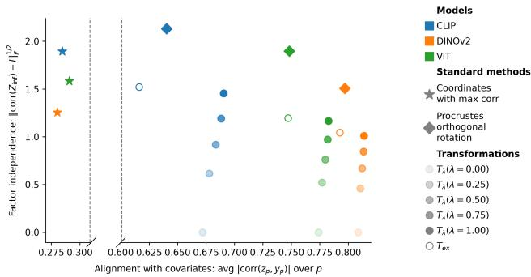  
Figure 2: Post-hoc latent space transformations of pretrained representations (CLIP, $\mathbf { D I N O v 2 } ,$ and ViT): dimensions with max corr (latent dimensions most strongly correlated with the covariates) and Procrustes orthogonal rotation against the proposed transformation applied after Procrustes rotation.

Tiny-ImageNet dataset [37], which is a downsampled version of ImageNet [15], covering 200 classes with 50 validation images per class. From this subset, we retain 2000 observations and use the � = 20 dummy-coded class indicators as covariates corresponding to animal categories (see Fig. S7 for the exact labels). For each observation we extract the representations from each of the three pretrained models.

4.0.3 Real-world data. We used the breast TCGA dataset [10], pre-processed by [46], consisting of multi-modal data (mRNA, miRNA, and proteomics) from 150 breast cancer patients categorized into cancer subtypes (Basal, Her2, and LumA), which we used as dummy- coded covariates. We used 5-fold cross-validation, ensuring a strati- fied distribution of cancer subtypes across folds, and standardized the data matrices within each fold prior to analysis.

4.0.4 Comparison methods. We compare against methods divided into three categories. Unsupervised: PCA, which assumes full latent independence, and MOFA [3], which uses a mean-field approximation that factorizes the variational distribution over factors, approximating rather than strictly enforcing their independence. Supervised but not paired: two supervised extensions of PCA, SPCA (Bair) [4] and SPCA (Barshan) [5], PLS, which extracts components maximizing the data-covariate covariance, and iVAE [31], a VAE model with covariate-conditioned prior. Supervised and paired: Y as factors takes the covariates directly as factors, $Z _ { p } = Y _ { p }$ , achieving perfect alignment by construction but not controlling for independence, and SOFA [11], an extension of MOFA that models factor-covariate dependencies using a scaling factor (sf) - a weight on the factorcovariate term in the objective that can up- or down-weight it relative to the data-factor terms (default sf = 0.1).

For not paired methods we first calculate all pairs of correlation between covariates and latent factors. We then solve a linear sum assignment problem [35] to align each latent with the covariate that best correlates with it.

4.0.5 Evaluation: performance metrics. We evaluate performance using the average factor-covariate correlations, the squared Frobe-nius distance between the covariance matrix of latent factors $Z$ and the identity matrix, and the average variance explained per factor. We also report four disentanglement metrics (Section C.2): disentanglement (�), measuring whether each latent factor encodes information about only one covariate, completeness (�), whether each covariate is captured by only one latent factor, informative- ness $( I ) ,$ whether the factors jointly contain the information needed to predict the covariate [18], and separated attribute predictability (SAP), the gap between the top and second-best single-latent predictor of each covariate [36]. All four take values in [0, 1], with higher values indicating better disentanglement. We further report normalised SAP, a variant that measures the scale of dominance, that divides SAP by the top predictor’s performance.

## 5 Results

5.0.1 Numerical validation of the theoretical results. For simulation scenarios (1)-(4) defined above, the optimal transformations $T _ { \lambda } ^ { * }$ and $T _ { \mathrm { e x } } ^ { \ast }$ can be computed explicitly from the covariances $\Sigma _ { Z }$ and $\dot { \Sigma _ { Z Y } }$ (Fig. 1). Under $T _ { 1 } ^ { * }$ the dependence between pairs $( Z _ { p } , Y _ { p } )$ is strongest, and weaker under $T _ { 1 / 2 } ^ { * } , T _ { 0 } ^ { * }$ , and $T _ { \mathrm { e x } } ^ { \ast } .$ , as stated in Theo- rem 3.1. For $T _ { 0 } ^ { * }$ , the reduced alignment is a consequence of enforcing uncorrelated latent factors, a constraint absent under $T _ { 1 } ^ { * }$ , which consequently produces correlated factors. A parallel argument ap plies to $T _ { \mathrm { e x } } ^ { \ast } .$ , which imposes exclusive one-to-one factor-covariate dependence at a further cost in alignment. The result illustrates a general principle: constraining the latent structure reduces the achievable dependence between latent dimensions and covariates. Moreover, in contrast to $T _ { 1 } ^ { * }$ , under the constraints imposed by $T _ { \mathrm { e x } } ^ { \ast }$ or $T _ { 0 } ^ { * }$ , the factor covariance matrix no longer resembles the depen- dence structure among the covariates. Similar conclusions follow across all scenarios (Figs. S8-S11, panels A, B, and C).

5.0.2 Post-hoc application ofthe transformations . When pretrained representations are available, the transformations can be computed from empirical estimates $\hat { \Sigma } _ { Z }$ and $\hat { \Sigma } _ { Z Y }$ and applied post-hoc to the latent representation (Fig. 2). The proposed transformations achieve substantially stronger one-to-one dependence between latent di- mensions and covariates than the naive baseline of selecting the most correlated dimension of the original representation, and they empirically reproduce the covariate dependence-strength ordering of Theorem 3.1. Applying a Procrustes rotation [20, 29] directly to the original embedding yields correlated latent dimensions, be- cause the initial embedding is itself correlated, $T _ { 0 } ^ { * }$ , in contrast, first whitens the representation and thus produces uncorrelated dimen sions. The transformation $T _ { 1 } ^ { * }$ trades some of this independence for higher covariate alignment, though for all three model embeddings the resulting dimensions remain less correlated than under the plain Procrustes rotation. The covariance matrices (Fig. S7) confirm both the weak alignment of the initial embedding and that the constraints on the latent imposed by $T _ { \mathrm { e x } }$ and $T _ { 0 }$ are satisfied. Downstream applications that require decoding from the transformed latent, e.g. new sample generation through the original decoder, would apply the inverse transformation to map back to the decoder’s expected input space.

5.0.3 The iFA model controls the trade-of. Having established the theoretical trade-of between latent-dimension-covariate depen- dence and latent structure, we now show that the same trade-of emerges when the transformations are folded into the iFA model’s inference procedure.

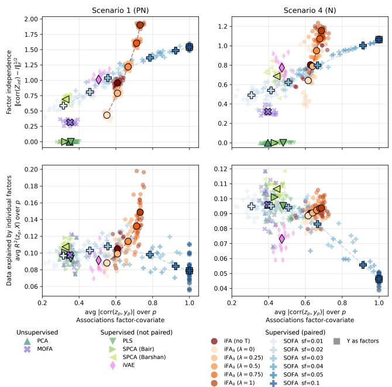  
Figure 3: Trade-of between covariate dependence and factor independence for simulation scenarios 1 (PN) and 4 (N). Outlined markers denote means over 20 repetitions.

As a sanity check on the inference procedure, we verify that the pre-transformation variant (iFA no � ) converges to the true parameters as the number of observations grows: in Scenario 1, both the estimated $\beta$ and the informed latent factors approach their true values (Fig. S16). Moreover, iFA no � recovers the assumed average factor-covariate dependence in every scenario: diagonal correlations concentrate around ${ \overline { { \beta } } } ,$ reaching approximately 0.6 at � = 1 and 0.4 at � = 0.6 (Fig. 3; Figs. S8-S11, panel D).

In Fig. 3, an ideal method would achieve average covariate cor-relation of 1 and Frobenius norm $^ { 0 , }$ jointly maximising covariate dependence and factor independence. Theorem 3.1 shows this is unattainable in eneral, as the two objectives trade of. The famil of the iFA models with the transformation applied (iFA�) traces this trade-of: as � increases, covariate dependence grows and factor independence weakens (Fig. 3; Figs. S8–S11, panel D). The gain in covariate dependence from moving toward $T _ { 1 } ^ { * }$ is largest when the covariates are strongly inter-correlated, at the cost of factor independence (Figs. S12–S15, panel $\mathrm { A } ) .$ . Panel B of Figs. S12-S15 confirms the same pattern across the $\beta$ sweep: correlations of $\mathrm { i F A } _ { \lambda }$ rise from around 0.2 to 0.6 (which are the true generative values), and $T _ { 1 } ^ { * }$ consistently yields stronger covariate dependence and stronger factor inter-dependence than $T _ { 0 } ^ { * }$ across all $\beta$ values.

Variance explained per factor remains high across all settings and all values of �, showing that the transformation reshapes the latent geometry without sacrificing reconstruction or per-factor interpretability of �.

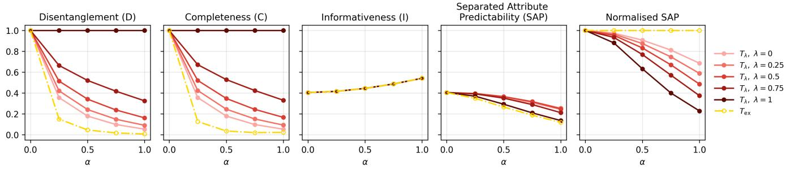  
Figure 4: Disentanglement metrics for the latent space transformed using $T _ { \lambda }$ family and the exclusive transform $T _ { \mathrm { e x } }$ as a function of covariate-correlation strength � in simulation scenario 1 (PN).

Per-factor interpretability is critical for real-data applications, where individual factors should map onto meaningful directions in the observed features. We confirm this on real data (Fig. 5): the variance explained by individual factors remains high across the entire $\mathrm { i F A } _ { \lambda }$ family, with $T _ { 1 } ^ { * }$ explaining the most and $T _ { 0 } ^ { * }$ the least. The trade-of between latent independence and covariate dependence is preserved throughout.

5.0.4 Disentanglement-metric view of the trade-of. For populationlevel transformations (Fig. 4) and for the iFA� (Figs. S12-S15), disentanglement (�) and completeness (�) are lower at small � and improve as $\lambda$ grows, with most prominent diference when the covariate correlations are stron . Enforcin latent-dimension inde pendence carries a $D / C$ cost: each factor holds less covariate-specific information, and each covariate’s information is spread across mul tiple factors. Informativeness (�) tracks signal strength instead - more correlated covariates (larger �) and stronger factor-covariate dependencies (larger �) both increase � regardless of �. SAP and its normalised variant, in contrast, favour transformations with small �: when factors are constrained to be independent, each covariate is predicted most strongly by a single latent. The two variants disagree on $T _ { \mathrm { e x } } ^ { \ast } \mathrm { . }$ normalised SAP is high as each factor genuinely carries in formation about only one covariate, by construction, while the unnormalised version is low as the overall dependence magnitude is small (Fig. 4).

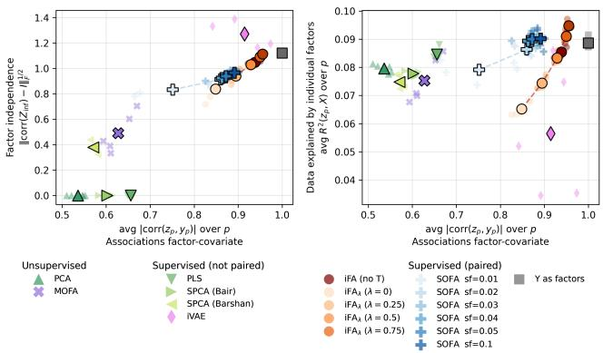  
Figure 5: Results on the breast TCGA multi-omics data. Outlined markers denote means over 20 repetitions.

5.0.5 iFA’s strengths over competing methods. Most competing methods fall behind the front traced by the iFA� family (Fig. 3, Fig. 5, Figs. S8-S11). Some unsupervised and supervised baselines achieve strong factor independence at the cost of low covariate dependence: MOFA, PCA, PLS, and SPCA (Bair), the last three of which produce independent factors by construction. The regression baseline (Y as factors) sits at the opposite extreme, attaining maximal covariate dependence but inheriting the same factor inter-dependence as the covariates themselves. SOFA is the closest competitor in structure: it also parameterises the strength of covariate dependence, via a scaling factor on the objective, however, this parameterisation gives only indirect control, since the scaling factor reweights loss terms rather than the underlying constraints. This lack of steerability causes SOFA to collapse toward Y as factors at high scaling factors. When the covariates are themselves strong factors of variation in �, this collapse is benign, but when they are only weakly infor- mative, SOFA loses any advantage over the regression baseline and its factors lose interpretability in terms of�. The lack of steerability is also visible on real data where SOFA even at the largest scaling factor achieves weaker covariate dependence than iFA at large � (Fig. 5). Across disentanglement metrics, SOFA in general spans a broader range of scores than $\mathrm { i F A } _ { \lambda }$ (Figs. S12-S15). When covariate correlations are varied, it is $\mathrm { i F A } _ { \lambda }$ whose scores shift systematically, while SOFA’s remain largely unchanged.

$\mathrm { i F A } _ { \lambda }$ is slower than the classical baselines but faster than SOFA. Once the base model is fitted, multiple $T _ { \lambda }$ transformations can be applied at negligible cost, making regime exploration cheaper than refitting (Fig. S17).

## 6 Conclusions

We introduced a supervised framework for disentangled representa- tion learning that navigates the trade-of between latent-covariate dependence and structural constraints on the latent space. Four dis- entanglement regimes, independent, intermediate, unconstrained, and exclusive, arise as solutions of optimizations problems, and we proved an ordering of the regimes by latent-covariate dependence (Theorem 3.1). The resulting transformations admit closed-form expressions and apply both post-hoc to pretrained embeddings and inside a new probabilistic factor-analysis model (iFA). Experiments confirm that iFA enable controllability between covariate depen- dence and latent independence while preserving reconstruction.

## References

[1] Antonio Almudévar and Alfonso Ortega. 2026. Rethinking Disentanglement under Dependent Factors ofVariation. Transactions on Machine Learning Research (2026).

[2] Niccolo Anceschi, Federico Ferrari, David B. Dunson, and Himel Mallick. 2024. Bayesian Joint Additive Factor Models for Multiview Learning. doi:10.48550/ arxiv.2406.00778

[3] Ricard Argelaguet, Britta Velten, Damien Arnol, Sascha Dietrich, Thorsten Zenz, John C Marioni, Florian Buettner, Wolfgang Huber, and Oliver Stegle. 2018. Multi-Omics Factor Analysis - a framework for unsupervised integration of multi-omics data sets. Molecular Systems Biology 14, 6 (2018), e8124. doi:10. 15252/msb.20178124

[4] Eric Bair, Trevor Hastie, Debashis Paul, and Robert Tibshirani. 2006. Prediction by Supervised Principal Components. J. Amer. Statist. Assoc. 101, 473 (2006), 119–137. doi:10.1198/016214505000000628

[5] Elnaz Barshan, Ali Ghodsi, Zohreh Azimifar, and Mansoor Zolghadri Jahromi. 2011. Supervised principal component analysis: Visualization, classification and regression on subspaces and submanifolds. Pattern Recognition 44, 7 (2011), 1357–1371. doi:10.1016/j. atco .2010.12.015

[6] Yoshua Bengio, Aaron Courville, and Pascal Vincent. 2013. Representation Learning: A Review and New Perspectives. IEEE Trans. Pattern Anal. Mach. Intell. 35, 8 (Aug. 2013), 1798–1828. doi:10.1109/TPAMI.2013.50

[7] David Blei, Alp Kucukelbir, and Jon McAulife. 2016. Variational Inference: A Review for Statisticians. J. Amer. Statist. Assoc. 112 (01 2016). doi:10.1080 01621459.2017.1285773

[8] Diane Bouchacourt, Ryota Tomioka, and Sebastian Nowozin. 2018. Multi-Level Variational Autoencoder: Learning Disentangled Representations From Grouped Observations. Proceedings ofthe AAAI Conference on Artificial Intelligence 32, 1 (April 2018). doi:10.1609/aaai.v32i1.11867

[9] Philemon Brakel and Yoshua Bengio. 2017. Learning Independent Features with Adversarial Nets for Non-linear ICA. arXiv:arXiv:1710.05050

[10] Cancer Genome Atlas Network. 2012. Comprehensive molecular portraits of human breast tumours. Nature 490, 7418 (Oct. 2012), 61–70.

[11] Tümay Capraz, Harald Vöhringer, Klaus Sebastian Augusto Kruger Serrano, Ricardo Omar Ramirez Flores, Julio Saez-Rodriguez, and Wolfgang Huber. 2025. Semi-supervised Omics Factor Analysis (SOFA) disentangles known and latent sources of variation in multi-omic data. bioRxiv (2025). doi:10.1101/2024.10.10. 617527

[12] Ricky T. Q. Chen, Xuechen Li, Roger Grosse, and David Duvenaud. 2018. Isolating Sources of Disentanglement in Variational Autoencoders. In Advances in Neural Information Processing Systems.

[13] Xi Chen, Yan Duan, Rein Houthooft, John Schulman, Ilya Sutskever, and Pieter Abbeel. 2016. InfoGAN: interpretable representation learning by information maximizing generative adversarial nets. In Proceedings ofthe 30th International Conference on Neural Information Processing Systems (Barcelona, Spain) (NIPS’16). Curran Associates Inc., Red Hook, NY, USA, 2180–2188.

[14] Zhi Chen, Yijie Bei, and Cynthia Rudin. 2020. Concept whitening for interpretable image recognition. Nat. Mach. Intell. 2, 12 (Dec. 2020), 772–782.

[15] Jia Den , Wei Don , Richard Socher, Li-Jia Li, Kai Li, and Li Fei-Fei. 2009. Ima geNet: A large-scale hierarchical image database. In 2009IEEE Conference on Computer Vision and Pattern Recognition. 248–255. doi:10.1109/CVPR.2009.5206848

[16] Andrea Dittadi, Frederik Träuble, Francesco Locatello, Manuel Wuthrich, Vaibhav Agrawal, Ole Winther, Stefan Bauer, and Bernhard Schölkopf. 2021. On the Transfer of Disentangled Representations in Realistic Settings. In International Conference on Learning Representations.

[17] Alexey Dosovitskiy, Lucas Beyer, Alexander Kolesnikov, Dirk Weissenborn, Xi-aohua Zhai, Thomas Unterthiner, Mostafa Dehghani, Matthias Minderer, Georg Heigold, Sylvain Gelly, Jakob Uszkoreit, and Neil Houlsby. 2021. An Image is Worth 16x16 Words: Transformers for Image Recognition at Scale. In International Conference on Learning Representations.

[18] Cian Eastwood and Christopher K. I. Williams. 2018. A framework for the quantitative evaluation of disentangled representations. In International Conference on Learning Representations.

[19] Christina M Funke, Paul Vicol, Kuan-Chieh Wang, Matthias Kuemmerer, Richard Zemel, and Matthias Bethge. 2022. Disentanglement and Generalization Under Correlation Shifts. In ICLR2022 Workshop on the Elements ofReasoning: Objects, Structure and Causality.

[20] Gene H Golub and Charles F Van Loan. 2013. Matrix Computations (4 ed.). Johns Hopkins University Press, Baltimore, MD.

[21] Jeremy P Gygi, Anna Konstorum, Shrikant Pawar, Edel Aron, Steven H Kleinstein, and Leying Guan. 2024. A supervised Bayesian factor model for the identification of multi-omics signatures. Bioinformatics 40, 5 (May 2024). doi:10.1101/2023.01. 25.525545

[22] Naama Hadad, Lior Wolf, and Moni Shahar. 2018. A Two-Step Disentanglement Method. In Proceedings ofthe IEEE Conference on Computer Vision and Pattern Recognition (CVPR).

[23] Irina Higgins, Loic Matthey, Arka Pal, Christopher Burgess, Xavier Glorot, Matthew Botvinick, Shakir Mohamed, and Alexander Lerchner. 2017. beta- VAE: Learning Basic Visual Concepts with a Constrained Variational Framework. In International Conference on Learning Representations.

[24] Nicholas J. Higham. 1986. Computing the Polar Decomposition—with Applications. SIAM J. Sci. Stat. Comput. 7, 4 (Oct. 1986), 1160–1174.

[25] H Hotelling. 1933. Analysis of a complex of statistical variables into principal components. J. Educ. Psychol. 24, 6 (Sept. 1933), 417–441. doi:10.1037/h0071325

[26] Aapo Hyvärinen, Hiroaki Sasaki, and Richard E. Turner. 2018. Nonlinear ICA Using Auxiliary Variables and Generalized Contrastive Learning. ArXiv abs/1805.08651 (2018).

[27] A. Hyvärinen and E. Oja. 2000. Independent component analysis: algorithms and applications. Neural Networks 13, 4 (2000), 411–430. doi:10.1016/S0893- 6080(00)00026-5

[28] Aya Abdelsalam Ismail, Julius Adebayo, Hector Corrada Bravo, Stephen Ra, and Kyunghyun Cho. 2024. Concept Bottleneck Generative Models. In The Twelfth International Conference on Learning Representations.

[29] Wolfgang Kabsch. 1976. A solution for the best rotation to relate two sets of vectors. Acta Crystallographica Section A 32 (1976), 922–923.

[30] Agnan Kessy, Alex Lewin, and Korbinian Strimmer. 2018. Optimal Whitening and Decorrelation. The American Statistician 72, 4 (Jan. 2018), 309–314. doi:10. 1080/00031305.2016.1277159

[31] Ilyes Khemakhem, Diederik P. Kingma, and Aapo Hyvärinen. 2019. Variational Autoencoders and Nonlinear ICA: A Unif in Framework. In International Conference on Artificial Intelligence and Statistics.

[32] Hyunjik Kim and Andriy Mnih. 2018. Disentangling by Factorising. In Proceedings ofthe 35th International Conference on Machine Learning (Proceedings ofMachine Learning Research, Vol. 80), Jennifer D and Andreas Krause (Eds.). PMLR, 2649– 2658.

[33] Arto Klami, Seppo Virtanen, Eemeli Leppäaho, and Samuel Kaski. 2014. Group Factor Analysis. IEEE transactions on neural networks and learning systems 26 (11 2014). doi:10.1109/TNNLS.2014.2376974

[34] Jack Klys, Jake Snell, and Richard Zemel. 2018. Learning latent subspaces in variational autoencoders. In Proceedings of the 32nd International Conference on Neural Information Processing Systems (Montréal, Canada) (NIPS’18). Curran Associates Inc., Red Hook, NY, USA, 6445–6455.

[35] Harold W. Kuhn. 1955. The Hungarian method for the assignment problem. Naval Research Logistics (NRL) 52 (1955).

[36] Abhishek Kumar, Prasanna Sattigeri, and Avinash Balakrishnan. 2018. Variational Inference of Disentangled Latent Concepts from Unlabeled Observations. In International Conference on Learning Representations.

[37] Ya Le and Xuan S. Yang. 2015. Tiny ImageNet Visual Recognition Challenge.

[38] Francesco Locatello, Stefan Bauer, Mario Lučić, Gunnar Rätsch, Sylvain Gelly, Bernhard Schölkopf, and Olivier Frederic Bachem. 2019. Challenging Common Assumptions in the Unsupervised Learning of Disentangled Representations. In International Conference on Machine Learning. Best Paper Award.

[39] Francesco Locatello, Ben Poole, Gunnar Rätsch, Bernhard Schölkopf, Olivier Bachem, and Michael Tschannen. 2020. Weakly-supervised disentanglement without compromises. In Proceedings of the 37th International Conference on Machine Learning (ICML’20). JMLR.org, Article 589, 12 pages.

[40] Maxime Oquab, Timothée Darcet, Théo Moutakanni, Huy V. Vo, Marc Szafraniec, Vasil Khalidov, Pierre Fernandez, Daniel Haziza, Francisco Massa, Alaaeldin El-Nouby, Mido Assran, Nicolas Ballas, Wojciech Galuba, Russell Howes, Po-Yao Huang, Shang-Wen Li, Ishan Misra, Michael Rabbat, Vasu Sharma, Gabriel Synnaeve, Hu Xu, Herve Jegou, Julien Mairal, Patrick Labatut, Armand Joulin, and Piotr Bojanowski. 2024. DINOv2: Learning Robust Visual Features without Supervision. Transactions on Machine Learning Research (2024). Featured Certification.

[41] Elise F Palzer, Christine H Wendt, Russell P Bowler, Craig P Hersh, Sandra E Safo, and Eric F Lock. 2022. sJIVE: Su ervised joint and individual variation explained. Comput. Stat. Data Anal. 175, 107547 (Nov. 2022), 107547. doi:10.1016/ j.csda.2022.107547

[42] Karl Pearson. 1901. LIII. On lines and planes of closest fit to systems of points in space. The London, Edinburgh, and Dublin Philosophical Magazine and Journal of Science 2, 11 (1901), 559–572. doi:10.1080/14786440109462720

[43] F. Pedregosa, G. Varoquaux, A. Gramfort, V. Michel, B. Thirion, O. Grisel, M. Blondel, P. Prettenhofer, R. Weiss, V. Dubourg, J. Vanderplas, A. Passos, D. Cournapeau, M. Brucher, M. Perrot, and E. Duchesnay. 2011. Scikit-learn: Machine Learning in Python. Journal ofMachine Learning Research 12 (2011), 2825–2830

[44] Arber Qoku and Florian Buettner. 2023. Encoding Domain Knowledge in Multi-view Latent Variable Models: A Bayesian Approach with Structured Sparsity. In Proceedings ofThe 26th International Conference on Artificial Intelligence and Statistics (Proceedings ofMachine Learning Research, Vol. 206), Francisco Ruiz, Jennifer Dy, and Jan-Willem van de Meent (Eds.). PMLR, 11545–11562.

[45] Alec Radford, Jong Wook Kim, Chris Hallacy, Aditya Ramesh, Gabriel Goh, Sandhini Agarwal, Girish Sastry, Amanda Askell, Pamela Mishkin, Jack Clark, Gretchen Krueger, and Ilya Sutskever. 2021. Learning Transferable Visual Models From Natural Language Supervision. ArXiv abs/2103.00020 (2021).

[46] Florian Rohart, Benoît Gautier, Amrit Singh, and Kim-Anh Lê Cao. 2017. mixOmics: An R package for ‘omics feature selection and multiple data integra- tion. PLOS Computational Biology 13, 11 (11 2017), 1–19. doi:10.1371/journal. pcbi.1005752

[47] Karsten Roth, Mark Ibrahim, Zeynep Akata, Pascal Vincent, and Diane Bouchacourt. 2023. Disentanglement of Correlated Factors via Hausdorf Factorized Support. In The Eleventh International Conference on Learning Representations.

[48] Sarah Samorodnitsky, Chris H. Wendt, and Eric F. Lock. 2024. Bayesian simultaneous factorization and prediction using multi-omic data. Computational Statistics & Data Analysis 197 (Sept. 2024), 107974. doi:10.1016/j.csda.2024.107974

[49] Peter H. Schönemann. 1966. A Generalized Solution ofthe Orthogonal Procrustes Problem. Psychometrika 31, 1 (March 1966), 1–10. doi:10.1007/bf02289451

[50] Kihyuk Sohn, Honglak Lee, and Xinchen Yan. 2015. Learning Structured Output Representation using Deep Conditional Generative Models. In Neural Information Processing Systems.

[51] L. L. Thurstone. 1931. Multiple Factor Analysis. Psychological Review 38, 5 (1931), 406–427. doi:10.1037/h0069792

[52] Frederik Träuble, Elliot Creager, Niki Kilbertus, Francesco Locatello, Andrea Dittadi, Anirudh Goyal, Bernhard Schölkopf, and Stefan Bauer. 2021. On Disentangled Representations Learned from Correlated Data. In Proceedings ofthe 38th International Conference on Machine Learning (Proceedings ofMachine Learning Research, Vol. 139), Marina Meila and Tong Zhang (Eds.). PMLR, 10401–10412.

[53] Martin J. Wainwright and Michael I. Jordan. 2008. Graphical Models, Exponential Families, and Variational Inference. Foundations and Trends® in Machine Learning 1, 1–2 (2008), 1–305. doi:10.1561/2200000001

[54] Xin Wang, Hong Chen, Si’ao Tang, Zihao Wu, and Wenwu Zhu. 2024. Disentangled Representation Learning. IEEE Trans. Pattern Anal. Mach. Intell. 46, 12 (Dec. 2024), 9677–9696. doi:10.1109/TPAMI.2024.3420937

[55] Herman Wold. 1975. Soft Modelling by Latent Variables: The Non-Linear Iterative Partial Least Squares (NIPALS) Approach. Journal of Applied Probability 12, S1 (1975), 117–142. doi:10.1017/S0021900200047604

[56] Ruiyu Zhang, Ce Zhao, Xin Zhao, Lin Nie, and Wai-Fung Lam. 2025. Structural Equation-VAE: Disentangled Latent Representations for Tabular Data. (2025). doi:10.2139/ssrn.5384208

[57] Shiwen Zhao, Chuan Gao, Sayan Mukherjee, and Barbara E Engelhardt. 2016. Bayesian group factor analysis with structured sparsity. Journal of Machine Learning Research 17, 196 (2016), 1–47.

[58] Yifan Zhou, Kaixuan Luo, Lifan Liang, Mengjie Chen, and Xin He. 2023. A new Bayesian factor analysis method improves detection of genes and biological processes afected by perturbations in single-cell CRISPR screening. Nature Methods 20, 11 (Sept. 2023), 1693–1703. doi:10.1038/s41592-023-02017-4

## A Proofs and derivations

## A.1 Reformulation of an orthogonal Procrustes problem [20]

Let $Z \in \mathbb { R } ^ { P }$ and $Y \in \mathbb { R } ^ { P }$ be both centered so that $\mathbb { E } [ Z ] = \mathbb { E } [ Y ] =$ 0. Let ${ \overline { { Z } } } : = \Sigma _ { Z } ^ { - 1 / 2 } Z$ denote the whitened vector, which satisfies $\operatorname { C o v } ( { \overline { { Z } } } ) = \Sigma _ { Z } ^ { - 1 / 2 } \Sigma _ { Z } \Sigma _ { Z } ^ { - 1 / 2 } = I .$ The orthogonal Procrustes problem in population terms is

$$
\operatorname* { m i n } _ { Q ^ { \prime } Q = I } \mathbb { E } { \left\| { Y } - Q \Sigma _ { Z } ^ { - 1 / 2 } Z \right\| } ^ { 2 } .
$$

Expanding the squared norm

$$
\mathbb { E } { \left\| { Y - Q \overline { { Z } } } \right\| } ^ { 2 } = \mathbb { E } { \left\| { Y } \right\| } ^ { 2 } ~ - ~ 2 \mathbb { E } { \left[ { Y ^ { \prime } Q \overline { { Z } } } \right] } ~ + ~ \mathbb { E } { \left[ { \overline { { Z } } ^ { \prime } Q ^ { \prime } Q \overline { { Z } } } \right] } .
$$

The first term is constant in $Q ,$ , and the last term equals $\mathbb { E } [ \overline { { Z } } ^ { \prime } \overline { { Z } } ] =$ $\operatorname { t r } ( I ) = P$ since $Q ^ { \prime } Q = I ,$ hence is also constant. Minimizing the objective is therefore equivalent to maximizing the cross term. Using $\mathbb { E } [ Z Y ^ { \prime } ] = \Sigma _ { Z Y }$ and the cyclic invariance of the trace,

$$
\mathbb { E } \bigl [ Y ^ { \prime } Q \Sigma _ { Z } ^ { - 1 / 2 } Z \bigr ] = \mathrm { t r } \bigl ( Q \Sigma _ { Z } ^ { - 1 / 2 } \mathbb { E } [ Z Y ^ { \prime } ] \bigr ) = \mathrm { t r } \bigl ( Q \Sigma _ { Z } ^ { - 1 / 2 } \Sigma _ { Z Y } \bigr ) .
$$

Consequently,

$$
\operatorname* { m i n } _ { Q ^ { \prime } Q = I } \mathbb { E } \bigl \| Y - Q \Sigma _ { Z } ^ { - 1 / 2 } Z \bigr \| ^ { 2 } \quad \Leftrightarrow \quad \operatorname* { m a x } _ { Q ^ { \prime } Q = I } \mathrm { t r } \bigl ( Q \Sigma _ { Z } ^ { - 1 / 2 } \Sigma _ { Z Y } \bigr ) ,
$$

which is the optimization problem we defined.

## A.2 Closed-form solution of $T _ { 0 } ^ { * }$ [24]

Let $A = U D V ^ { \prime }$ be the singular value decomposition of �. Then

$$
A ^ { \prime } A = ( U D V ^ { \prime } ) ^ { \prime } ( U D V ^ { \prime } ) = V D U ^ { \prime } U D V ^ { \prime } = V D ^ { 2 } V ^ { \prime } ,
$$

which is an eigendecomposition, so

$$
( A ^ { \prime } A ) ^ { - 1 / 2 } = V D ^ { - 1 } V ^ { \prime } .
$$

Multiplying by $A ^ { \prime } = V D U ^ { \prime }$ gives

$$
( A ^ { \prime } A ) ^ { - 1 / 2 } A ^ { \prime } = V D ^ { - 1 } V ^ { \prime } V D U ^ { \prime } = V D ^ { - 1 } D U ^ { \prime } = V U ^ { \prime } .
$$

Hence the maximizer can be written in closed form as

$$
Q ^ { * } = V U ^ { \prime } = ( A ^ { \prime } A ) ^ { - 1 / 2 } A ^ { \prime } .
$$

With $A = \Sigma _ { Z } ^ { - 1 / 2 } \Sigma _ { Z Y }$ , we have $A ^ { \prime } A = \Sigma _ { Z Y } ^ { \prime } \Sigma _ { Z } ^ { - 1 } \Sigma _ { Z Y }$ and $A ^ { \prime } = \Sigma _ { Z Y } ^ { \prime } \Sigma _ { Z } ^ { - 1 / 2 }$ so

$$
\boldsymbol { Q } ^ { * } = \left( \Sigma _ { Z Y } ^ { \prime } \Sigma _ { Z } ^ { - 1 } \Sigma _ { Z Y } \right) ^ { - 1 / 2 } \Sigma _ { Z Y } ^ { \prime } \Sigma _ { Z } ^ { - 1 / 2 } ,
$$

and therefore

$$
T _ { 0 } ^ { * } = Q ^ { * } \Sigma _ { Z } ^ { - 1 / 2 } = \left( \Sigma _ { Z Y } ^ { \prime } \Sigma _ { Z } ^ { - 1 } \Sigma _ { Z Y } \right) ^ { - 1 / 2 } \Sigma _ { Z Y } ^ { \prime } \Sigma _ { Z } ^ { - 1 } .
$$

## A.3 Notes on $T _ { 1 } ^ { * }$ : connection to regression.

The strong-dependence transformation coincides with multivariate least-squares regression of the covariates on the latent variables. The population OLS coeficient of $Y _ { p }$ on � is $b _ { p } ^ { * } = \Sigma _ { Z } ^ { - 1 } ( \Sigma _ { Z Y } ) _ { \cdot p } ,$ so the optimal

$$
t _ { \beta } ^ { * } = \Sigma _ { Z } ^ { - 1 } ( \Sigma _ { Z Y } ) . _ { \cdot p } / \big ( ( \Sigma _ { Z Y } ) _ { \cdot p } ^ { \prime } \Sigma _ { Z } ^ { - 1 } ( \Sigma _ { Z Y } ) . _ { \cdot p } \big ) ^ { 1 / 2 } = b _ { p } ^ { * } / \| b _ { p } ^ { * } \| _ { \Sigma _ { Z } } ,
$$

where $\| \ b { x } \| _ { \Sigma _ { Z } } : = ( \ b { x } ^ { \prime } \Sigma _ { Z } \ b { x } ) ^ { 1 / 2 }$ , is exactly the coeficient vector, rescaled so that $\mathrm { V a r } ( t _ { p } ^ { * \prime } Z ) = 1$ . Equivalently $T _ { 1 } ^ { * } = D _ { 1 } \Sigma _ { Z Y } ^ { \prime } \Sigma _ { Z } ^ { - 1 }$ , with $\Sigma _ { Z Y } ^ { \prime } \Sigma _ { Z } ^ { - 1 }$ the matrix of regression coeficients. The attained alignment is the multiple correlation coeficient,

$$
J ( T _ { 1 } ^ { * } , p ) = \sqrt { ( \Sigma _ { Z Y } ) _ { \cdot p } ^ { \prime } \Sigma _ { Z } ^ { - 1 } ( \Sigma _ { Z Y } ) _ { \cdot p } } = \sqrt { ( M ^ { 2 } ) _ { p p } } = R _ { p } ,
$$

the maximal correlation of $Y _ { p }$ with any linear combination of� (for derivation details of $t _ { p } ^ { * }$ for general $Z$ and $J ( T _ { 1 } ^ { * } , p )$ , see Section A.5).

## A.4 Identifiability

Proposition A.1. Fix a regime $\bullet \in \{ 0 , 1 , \lambda , \mathrm { e x } \}$ and let $T _ { \bullet } ^ { * } ( Z )$ denote its optimal transformation. For any invertible $A ~ \in ~ \bar { \mathbb { R } } ^ { \bar { P } \times \bar { P } }$ replacing the latent by the equivalent representation $Z ^ { \prime } = A Z$ yields the same structured representation:

$$
T _ { \bullet } ^ { * } ( Z ^ { \prime } ) Z ^ { \prime } = T _ { \bullet } ^ { * } ( Z ) Z .
$$

Hence $\tilde { Z } _ { \bullet } : = T _ { \bullet } ^ { \ast } ( Z ) Z$ identifies a canonical representation of the latent.

Proof. The objective and constraints of each regime depend on the latent only through the transformed vector $\tilde { Z } = T Z ,$ , via $\mathrm { C o v } ( \tilde { Z } , Y ) = T \Sigma _ { Z Y }$ and $\mathrm { C o v } ( \tilde { Z } ) = T \Sigma _ { Z } T ^ { \prime }$ . Under $Z ^ { \prime } = A Z$ one has $\Sigma _ { Z ^ { \prime } } = A \Sigma _ { Z } A ^ { \prime }$ and $\Sigma _ { Z ^ { \prime } Y } = A \Sigma _ { Z Y }$ , so the substitution $T \mapsto T ^ { \prime } =$ $T A ^ { - 1 }$ is a bijection between transformations of $Z$ and of $Z ^ { \prime }$ with $T ^ { \prime } Z ^ { \prime } = T Z ,$ hence Cov $( T ^ { \prime } Z ^ { \prime } , Y ) = \mathrm { C o v } ( T Z , Y )$ and $\mathrm { C o v } ( T ^ { \prime } Z ^ { \prime } ) =$ Cov(��). The objective and feasible set for $Z ^ { \prime }$ therefore coincide with those for � under this bijection, so both problems have the same optimal representation ${ \tilde { Z } } ,$ and $T _ { \bullet } ^ { * } ( Z ^ { \prime } ) Z ^ { \prime } = T _ { \bullet } ^ { * } ( Z ) Z .$ □

Corollary A.2. Taking $A = T _ { 0 } ^ { * }$ in Proposition A.1, solving the regime in the whitened frame and composing with the whitening yields the general � solution: $T _ { \bullet } ^ { * } = T _ { \bullet } ^ { * } ( \overline { { Z } } ) \ : T _ { 0 } ^ { * }$

## A.5 Summary of the defined transformations

We now unify and summarise the transformations defined above, using the following notation. Let $M : = ( \Sigma _ { Z Y } ^ { \prime } \Sigma _ { Z } ^ { - 1 } \Sigma _ { Z Y } ) ^ { 1 / 2 }$ , and let

$$
J _ { T } = J ( T ) : = \operatorname { t r } \big ( \operatorname { C o v } ( T Z , Y ) \big )
$$

denote the total latent dimension-covariate alignment, with per- dimension contribution

$$
J _ { T , p } = J ( T , p ) : = { \bigl ( } \operatorname { C o v } ( T Z , Y ) { \bigr ) } _ { p p } .
$$

Throughout, we assume $\Sigma _ { Z } \succ 0$ and that $\Sigma _ { Z Y }$ has full rank. Under these assumptions $M : = ( \Sigma _ { Z Y } ^ { \prime } \Sigma _ { Z } ^ { - 1 } \Sigma _ { Z Y } ) ^ { 1 / 2 }$ is symmetric, and positive definite. Sections $\mathrm { A } . 5 . 1 \mathrm { - } \mathrm { A } . 5 . 4$ derive the general form of each transformation together with its per-dimension alignment $J ( T , p )$ The results are summarised in Table S1.

## A.5.1 Transformation $T _ { 0 } ^ { * }$

(a) Using (2), we get

$$
T _ { 0 } ^ { * } = \left( \Sigma _ { Z Y } ^ { \prime } \Sigma _ { Z } ^ { - 1 } \Sigma _ { Z Y } \right) ^ { - 1 / 2 } \Sigma _ { Z Y } ^ { \prime } \Sigma _ { Z } ^ { - 1 } = D M ^ { - 1 } \Sigma _ { Z Y } ^ { \prime } \Sigma _ { Z } ^ { - 1 } .
$$

(b) There is no scaling in $T _ { 0 } ^ { * }$ , thus $D = I .$

(c) The cross-covariance induced by $T _ { 0 } ^ { * }$ is

$$
\begin{array} { r l } & { \mathrm { C o v } ( T _ { 0 } ^ { * } Z , Y ) = T _ { 0 } ^ { * } \Sigma _ { Z Y } } \\ & { \qquad = \left( \Sigma _ { Z Y } ^ { \prime } \Sigma _ { Z } ^ { - 1 } \Sigma _ { Z Y } \right) ^ { - 1 / 2 } \Sigma _ { Z Y } ^ { \prime } \Sigma _ { Z } ^ { - 1 } \Sigma _ { Z Y } } \\ & { \qquad = \left( \Sigma _ { Z Y } ^ { \prime } \Sigma _ { Z } ^ { - 1 } \Sigma _ { Z Y } \right) ^ { 1 / 2 } = M . } \end{array}
$$

thus

$$
J ( T _ { 0 } ^ { * } , p ) = M _ { p p } .
$$

<table><tr><td>Transformation T</td><td>(a) T formula (general Z)</td><td> $( \mathrm { b } ) d _ { p } ( D = \mathrm { d i a g } ( d _ { p } ) )$ </td><td> $\mathrm { ( c ) } J _ { T , p }$ </td></tr><tr><td> $T _ { 0 } ^ { * }$ </td><td> $D M ^ { - 1 } \Sigma _ { Z Y } ^ { \prime } \Sigma _ { Z } ^ { - 1 }$ </td><td>1</td><td> $M _ { p p }$ </td></tr><tr><td> $T _ { 1 } ^ { * }$ </td><td> $D \Sigma _ { Z Y } ^ { \prime } \Sigma _ { Z } ^ { - 1 }$ </td><td> $\left( ( M ^ { 2 } ) _ { p p } \right) ^ { - 1 / 2 }$ </td><td> $\sqrt { ( M ^ { 2 } ) _ { \ d p p } } = \| M _ { \cdot p } \|$ </td></tr><tr><td> $T _ { \lambda } ^ { * }$ </td><td> $D \big ( ( 1 - \lambda ) M ^ { - 1 } + \lambda I \big ) \Sigma _ { Z Y } ^ { \prime } \Sigma _ { Z } ^ { - 1 }$ </td><td> $\big ( ( ( 1 - \lambda ) I + \lambda M ) _ { p p } ^ { 2 } \big ) ^ { - 1 / 2 }$ </td><td> $( 1 - \lambda ) M _ { p p } + \lambda ( M ^ { 2 } ) _ { p p }$   $\sqrt { ( 1 - \lambda ) ^ { 2 } + 2 \lambda ( 1 - \lambda ) M _ { p p } + \lambda ^ { 2 } ( M ^ { 2 } ) _ { p p } }$ </td></tr><tr><td> $T _ { \mathrm { e x } } ^ { \ast }$ </td><td> $D \Sigma _ { Z Y } ^ { - 1 }$ </td><td> $\left( ( M ^ { - 2 } ) _ { p p } \right) ^ { - 1 / 2 }$ </td><td> $\left( ( M ^ { - 2 } ) _ { p p } \right) ^ { - 1 / 2 }$ </td></tr></table>

Table S1: Summary of the transformations, (a) their formulas, (b) diagonal normalizers, and (c) per-dimension correlations with covariates.

A.5.2 Transformation $T _ { 1 } ^ { * }$

(a) From (4), the optimal rows in the whitened form are

$$
t _ { \mathscr { p } } ^ { \ast } = \frac { \left( \Sigma _ { \overline { { Z } } Y } \right) \cdot _ { \mathscr { p } } } { \left. \left( \Sigma _ { \overline { { Z } } Y } \right) \cdot _ { \mathscr { p } } \right. } .
$$

Collecting them and using $\Sigma _ { \overline { { Z } } Y } = T _ { 0 } ^ { * } \Sigma _ { Z Y } = M$ gives

$$
T _ { 1 } ^ { * } ( { \overline { { Z } } } ) = D _ { 1 } M ,
$$

thus

$$
T _ { 1 } ^ { * } = T _ { 1 } ^ { * } ( \overline { { { Z } } } ) T _ { 0 } ^ { * } = D _ { 1 } M M ^ { - 1 } \Sigma _ { Z Y } ^ { \prime } \Sigma _ { Z } ^ { - 1 } = D _ { 1 } \Sigma _ { Z Y } ^ { \prime } \Sigma _ { Z } ^ { - 1 } .
$$

(b) The normalizer $D _ { 1 }$ scales each row to unit norm. Since $\| ( \Sigma _ { \overline { { Z } } Y } ) . _ { \mathcal { P } } \| = \| ( T _ { 0 } ^ { * } \Sigma _ { Z Y } ) . _ { \mathcal { P } } \| = \| M . _ { \mathcal { P } } \|$ , and $\| M _ { \cdot p } \| ^ { 2 } = M _ { \cdot p } ^ { \prime } M _ { \cdot p } =$ $( M ^ { 2 } ) _ { p p }$ (using $M = M ^ { \prime } )$ , we obtain

$$
D _ { 1 } = \mathrm { d i a g } \big ( \| M _ { \cdot p } \| ^ { - 1 } \big ) = \mathrm { d i a g } \big ( ( M ^ { 2 } ) _ { p p } ^ { - 1 / 2 } \big ) .
$$

(c) The cross-covariance induced by $T _ { 1 } ^ { * }$ is

$$
\begin{array} { r } { \mathrm { C o v } ( T _ { 1 } ^ { * } Z , Y ) = T _ { 1 } ^ { * } \Sigma _ { Z Y } = D _ { 1 } M M , } \end{array}
$$

so its �-th diagonal entry gives the per-dimension alignment

$$
J ( T _ { 1 } ^ { * } , p ) = \sqrt { \left( M ^ { 2 } \right) _ { \ L ^ { p } \ L ^ { p } } } .
$$

A.5.3 Transformation $T _ { \lambda } ^ { * }$

using $\langle e _ { \boldsymbol { p } } , M _ { \cdot \boldsymbol { p } } \rangle = M _ { \boldsymbol { p p } }$ and $\| \boldsymbol { M } _ { \cdot p } \| ^ { 2 } = ( M ^ { 2 } ) _ { p p }$ . Hence

(a) From (6), the optimal rows in the whitened form are

$$
t _ { \pmb { \jmath } } ^ { * } = \frac { \lambda ( \Sigma _ { \overline { { { Z } } } Y } ) . _ { \pmb { \jmath } } + ( 1 - \lambda ) e _ { p } } { \| \lambda ( \Sigma _ { \overline { { { Z } } } Y } ) . _ { \pmb { \jmath } } + ( 1 - \lambda ) e _ { p } \| } ,
$$

thus

$$
T _ { \lambda } ^ { * } ( \overline { { Z } } ) = D _ { \lambda } \big ( ( 1 - \lambda ) I + \lambda M \big ) ,
$$

$$
d _ { \lambda , p } = \Big ( ( 1 - \lambda ) ^ { 2 } + 2 \lambda ( 1 - \lambda ) M _ { p p } + \lambda ^ { 2 } ( M ^ { 2 } ) _ { p p } \Big ) ^ { - 1 / 2 } .
$$

and composing with the whitening $T _ { 0 } ^ { * } = M ^ { - 1 } \Sigma _ { Z Y } ^ { \prime } \Sigma _ { Z } ^ { - 1 }$

$$
T _ { \lambda } ^ { \ast } = T _ { \lambda } ^ { ( \overline { { { Z } } } ) \ast } T _ { 0 } ^ { \ast } = D _ { \lambda } \left( ( 1 - \lambda ) M ^ { - 1 } + \lambda I \right) \Sigma _ { Z Y } ^ { \prime } \Sigma _ { Z } ^ { - 1 } .
$$

(b) The diagonal entries of the normalizer $D _ { \lambda }$ are $d _ { \lambda , p } = \| ( ( 1 -$ $\lambda ) I + \lambda M ) . _ { \mathscr { p } } \Vert ^ { - 1 }$ . Expanding the squared norm,

$$
\begin{array} { r l } & { \left\| \big ( ( 1 - \lambda ) I + \lambda M ) _ { \cdot p } \right\| ^ { 2 } } \\ & { \quad = \left\| \big ( 1 - \lambda ) e _ { p } + \lambda M _ { \cdot p } \right\| ^ { 2 } } \\ & { \quad = \left( 1 - \lambda \right) ^ { 2 } + 2 \lambda \big ( 1 - \lambda \big ) \left. e _ { p } , M _ { \cdot p } \right. + \lambda ^ { 2 } \| M _ { \cdot p } \| ^ { 2 } } \\ & { \quad = \left( 1 - \lambda \right) ^ { 2 } + 2 \lambda \big ( 1 - \lambda \big ) M _ { p p } + \lambda ^ { 2 } ( M ^ { 2 } ) _ { p p } , } \end{array}
$$

(c) The cross-covariance induced by $T _ { \lambda } ^ { * }$ is

$$
\mathrm { C o v } \bigl ( T _ { \lambda } ^ { * } Z , Y \bigr ) = T _ { \lambda } ^ { * } \Sigma _ { Z Y } = D _ { \lambda } \left( \bigl ( 1 - \lambda \bigr ) I + \lambda M \right) M ,
$$

so its $\mathcal { P } ^ { - }$ -th diagonal entry gives the per-dimension alignment

$$
J ( T _ { \lambda } ^ { * } , p ) = \frac { ( 1 - \lambda ) M _ { p p } + \lambda ( M ^ { 2 } ) _ { p p } } { \sqrt { ( 1 - \lambda ) ^ { 2 } + 2 \lambda ( 1 - \lambda ) M _ { p p } + \lambda ^ { 2 } ( M ^ { 2 } ) _ { p p } } } .
$$

A.5.4 Transformation $T _ { \mathrm { e x } } ^ { \ast }$

(a) From (7), the optimal rows are the unit-normalized rows of $\Sigma _ { \overline { { Z } } Y } ^ { - 1 } ,$

$$
t _ { \mathcal { P } } ^ { * } = \frac { ( \Sigma _ { \overline { { Z } } Y } ^ { - 1 } ) _ { \mathcal { P } } ^ { \prime } . } { \Vert ( \Sigma _ { \overline { { Z } } Y } ^ { - 1 } ) _ { \mathcal { P } } . \Vert } ,
$$

which gives

$$
T _ { \mathrm { e x } } ^ { ( \overline { { { Z } } } ) * } = D _ { \mathrm { e x } } M ^ { - 1 } ,
$$

and composing with the whitening $T _ { 0 } ^ { * } = M ^ { - 1 } \Sigma _ { Z Y } ^ { \prime } \Sigma _ { Z } ^ { - 1 }$

$$
\begin{array} { l } { { T _ { \mathrm { e x } } ^ { * } = T _ { \mathrm { e x } } ^ { * } ( \overline { { Z } } ) T _ { 0 } ^ { * } = D _ { \mathrm { e x } } M ^ { - 1 } M ^ { - 1 } \Sigma _ { Z Y } ^ { \prime } \Sigma _ { Z } ^ { - 1 } } } \\ { { \phantom { T _ { \mathrm { e x } } ^ { * } = } = D _ { \mathrm { e x } } M ^ { - 2 } \Sigma _ { Z Y } ^ { \prime } \Sigma _ { Z } ^ { - 1 } = D _ { \mathrm { e x } } \Sigma _ { Z Y } ^ { - 1 } , } } \end{array}
$$

where the last step uses

$$
M ^ { - 2 } \Sigma _ { Z Y } ^ { \prime } \Sigma _ { Z } ^ { - 1 } = ( \Sigma _ { Z Y } ^ { \prime } \Sigma _ { Z } ^ { - 1 } \Sigma _ { Z Y } ) ^ { - 1 } \Sigma _ { Z Y } ^ { \prime } \Sigma _ { Z } ^ { - 1 } = \Sigma _ { Z Y } ^ { - 1 } .
$$

(b) The normalizer $D _ { \mathrm { e x } } = \mathrm { d i a g } ( d _ { \mathrm { e x } , p } )$ is $d _ { \mathrm { e x } , p } = \lVert ( M ^ { - 1 } ) _ { p } . \rVert ^ { - 1 } \mathrm { . }$ Since � (and $M ^ { - 1 } )$ is symmetric, $\| ( M ^ { - 1 } ) _ { \hat { p } \cdot } \| ^ { 2 } = ( M ^ { - 1 } \bar { M } ^ { - 1 } ) _ { \hat { p } \hat { p } } =$ $( M ^ { - 2 } ) _ { p p } ,$ giving

$$
D _ { \mathrm { e x } } = \mathrm { d i a g } \bigl ( \bigl \| ( M ^ { - 1 } ) _ { p } . \bigr \| ^ { - 1 } \bigr ) = \mathrm { d i a g } \bigl ( \bigl ( M ^ { - 2 } \bigr ) _ { p p } ^ { - 1 / 2 } \bigr ) .
$$

(c) The cross-covariance induced by $T _ { \mathrm { e x } } ^ { \ast }$ is

$$
\operatorname { C o v } ( T _ { \mathrm { e x } } ^ { \ast } Z , Y ) = T _ { \mathrm { e x } } ^ { \ast } \Sigma _ { Z Y } = D _ { \mathrm { e x } } \Sigma _ { Z Y } ^ { - 1 } \Sigma _ { Z Y } = D _ { \mathrm { e x } } ,
$$

which is diagonal, so the cross-covariance constraint holds and the per-dimension alignment is

$$
J ( T _ { \mathrm { e x } } ^ { \ast } , / p ) = \bigl ( D _ { \mathrm { e x } } \bigr ) _ { \mathscr { p p } } = \bigl ( ( M ^ { - 2 } ) _ { \mathscr { p p } } \bigr ) ^ { - 1 / 2 } .
$$

## A.6 Proof of Theorem 3.1

(a) The theorem follows by summing the per-dimension inequalities over �. The first inequality, together with its equality condition, is Lemma A.3. The remaining two, together with the monotonicity of $\lambda \mapsto J ( T _ { \lambda } ^ { * } )$ , are Lemma A.4. In lemmas proofs, we use the notation and per-dimension representations of Section ${ \mathrm { A . 5 } } ,$ in particular that $M = ( \Sigma _ { Z Y } ^ { \prime } \Sigma _ { Z } ^ { - 1 } \Sigma _ { Z Y } ) ^ { 1 / 2 }$

(b) The theorem follows directly from the problem formulations.

Lemma A.3. For each ${ \boldsymbol { \mathscr { P } } } ,$

$$
J _ { T _ { e x } ^ { * } , p } ~ \leq ~ J _ { T _ { 0 } ^ { * } , p }
$$

with equality if and only $i f M _ { p p } ^ { 2 } = \| M _ { \cdot p } \| ^ { 2 }$ , i.e. the column $M _ { \cdot p }$ has no of-diagonal entries.

Proof. Since � is symmetric positive definite, the two perdimension values are $J _ { T _ { 0 } ^ { * } , p } = M _ { p p }$ and $J _ { T _ { e x } ^ { * } , \rho } = \left( ( M ^ { - 2 } ) _ { p p } \right) ^ { - 1 / 2 }$ , so the claim is

$$
\left( ( M ^ { - 2 } ) _ { p p } \right) ^ { - 1 / 2 } \ \leq \ M _ { p p } .
$$

We prove it through the intermediate quantity $\left( ( M ^ { - 1 } ) _ { p p } \right) ^ { - 1 }$ , using the Cauchy-Schwarz inequality twice.

Step $\ L \ L _ { l : } \left( ( M ^ { - 2 } ) _ { \ L { \hat { p } \ L } } \right) ^ { - 1 / 2 } \ L \ L \leq \left( ( M ^ { - 1 } ) _ { \ L \hat { p } \ L { \hat { p } } } \right) ^ { - 1 }$ . Apply Cauchy-Schwarz to $e _ { p }$ and $M ^ { - 1 } e _ { p } { \mathrm { : } }$

$$
( \boldsymbol { M } ^ { - 1 } ) _ { \boldsymbol { p } \boldsymbol { p } } = \langle e _ { \boldsymbol { p } } , \boldsymbol { M } ^ { - 1 } \boldsymbol { e } _ { \boldsymbol { p } } \rangle \leq \| \boldsymbol { e } _ { \boldsymbol { p } } \| \| \boldsymbol { M } ^ { - 1 } \boldsymbol { e } _ { \boldsymbol { p } } \| = \big ( ( \boldsymbol { M } ^ { - 2 } ) _ { \boldsymbol { p } \boldsymbol { p } } \big ) ^ { 1 / 2 } ,
$$

using $\| e _ { p } \| = 1$ and $\| M ^ { - 1 } e _ { p } \| ^ { 2 } = e _ { p } ^ { \prime } M ^ { - 2 } e _ { p } = ( M ^ { - 2 } ) _ { p p }$ . Squaring and inverting gives the claim.

Step $2 \colon \left( ( M ^ { - 1 } ) _ { \ L { \mathscr { p p } } } \right) ^ { - 1 } \leq M _ { \ L { \mathscr { p p } } }$ . Apply Cauchy-Schwarz to $M ^ { 1 / 2 } e _ { p }$ and $M ^ { - 1 / 2 } e _ { p } ;$

$$
\begin{array} { r l } & { 1 = \langle e _ { \dot { p } } , e _ { \dot { p } } \rangle = \langle M ^ { 1 / 2 } e _ { \dot { p } } , M ^ { - 1 / 2 } e _ { \dot { p } } \rangle } \\ & { \qquad \leq \| M ^ { 1 / 2 } e _ { \dot { p } } \| \| M ^ { - 1 / 2 } e _ { \dot { p } } \| = M _ { \dot { p } \dot { p } } ^ { 1 / 2 } ( M ^ { - 1 } ) _ { \dot { p } \dot { p } } ^ { 1 / 2 } , } \end{array}
$$

so $M _ { p p } \left( M ^ { - 1 } \right) _ { \mathscr { p p } } \geq 1 _ { \cdot }$ , i.e. (�−1)��  −1 ≤ ��� .

Chaining the two steps,

$$
J _ { T _ { e x } ^ { * } , \boldsymbol { p } } = \bigl ( ( M ^ { - 2 } ) _ { \boldsymbol { p } \boldsymbol { p } } \bigr ) ^ { - 1 / 2 } \le \bigl ( ( M ^ { - 1 } ) _ { \boldsymbol { p } \boldsymbol { p } } \bigr ) ^ { - 1 } \le M _ { \boldsymbol { p } \boldsymbol { p } } = J _ { T _ { 0 } ^ { * } , \boldsymbol { p } } .
$$

Equality in Step 1 holds if $M ^ { - 1 } e _ { p } \parallel e _ { p } ,$ i.e. $e _ { p }$ is an eigenvector of �; the same condition makes Step 2 an equality. This is equivalent to $M _ { \cdot p }$ having no of-diagonal entries, i.e. $\dot { M } _ { p p } ^ { 2 } = \lVert M _ { \cdot p } \rVert ^ { 2 }$ , and otherwise both inequalities are strict. □

Lemma A.4. The map $\lambda \mapsto J _ { T _ { \lambda } ^ { * } , p }$ is non-decreasing on [0, 1], thus

$$
J _ { T _ { 0 } ^ { * } , { p } } \ \leq \ J _ { T _ { \lambda } ^ { * } , { p } } \ \leq \ J _ { T _ { 1 } ^ { * } , { p } } , \qquad \lambda \in [ 0 , 1 ] .
$$

The inequalities are strict unless $\lambda \in \{ 0 , 1 \}$ or $M _ { p p } ^ { 2 } = \| M _ { \cdot p } \| ^ { 2 }$ , i.e.   
unless the column $M _ { \cdot p }$ has no of-diagonal entries.

Proof. From Section A.5, the per-dimension alignment is

$$
J _ { T _ { \lambda } ^ { * } , p } = \frac { \lambda \| M _ { \cdot p } \| ^ { 2 } + \left( 1 - \lambda \right) M _ { p p } } { \sqrt { \lambda ^ { 2 } \| M _ { \cdot p } \| ^ { 2 } + 2 \lambda ( 1 - \lambda ) M _ { p p } + ( 1 - \lambda ) ^ { 2 } } } .
$$

Writing this as $u ( \lambda ) w ( \lambda ) ^ { - 1 / 2 }$ with numerator� and $w = \lambda ^ { 2 } \lVert M . _ { p } \rVert ^ { 2 } +$ $2 \lambda ( 1 - \lambda ) M _ { p p } + ( 1 - \lambda ) ^ { 2 }$ , we have $\begin{array} { r } { \frac { d } { d \lambda } J _ { T _ { \lambda } ^ { * } , p } = w ^ { - 3 / 2 } \big ( u ^ { \prime } w - \frac { 1 } { 2 } u w ^ { \prime } \big ) } \end{array}$ . Ex-panding $u ^ { \prime } w - { \textstyle \frac { 1 } { 2 } } u w ^ { \prime }$ cancels all terms except $\big ( 1 - \lambda \big ) \big ( \| M _ { \cdot p } \| ^ { 2 } - M _ { \dot { p } \dot { p } } ^ { 2 } \big )$

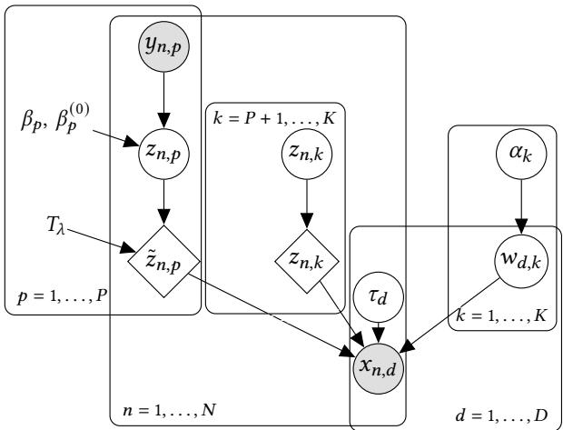  
Figure S6: Graphical model for iFA (uni-modal case).

giving

$$
\frac { d } { d \lambda } J _ { T _ { \lambda } ^ { * } , \mathcal { P } } = \frac { \left( 1 - \lambda \right) \left( \Vert M _ { \cdot \mathcal { P } } \Vert ^ { 2 } - M _ { \mathcal { P } \mathcal { P } } ^ { 2 } \right) } { \left( \lambda ^ { 2 } \Vert M _ { \cdot \mathcal { P } } \Vert ^ { 2 } + 2 \lambda ( 1 - \lambda ) M _ { \mathcal { P } \mathcal { P } } + ( 1 - \lambda ) ^ { 2 } \right) ^ { 3 / 2 } } .
$$

Both factors in the numerator are non-negative on $\left[ 0 , 1 \right] : 1 - \lambda \geq 0 .$ and $\begin{array} { r } { M _ {  { p p } } ^ { 2 } \le \sum _ { k } M _ { k  { p } } ^ { 2 } = \| M _ {  { p } } \| ^ { 2 } } \end{array}$ since $M _ { p p }$ is one entry of the column $M _ { \cdot p }$ . Hence $\begin{array} { r } { \frac { d } { d \lambda } J _ { T _ { \lambda } ^ { * } , p } \geq 0 , } \end{array}$ , and the endpoint values $J _ { T _ { 0 } ^ { * } , p } = M _ { p p }$ and $J _ { T _ { 1 } ^ { * } , p } = \| M _ { \cdot p } \|$ give the lower and upper bound, respectively. The derivative vanishes only at $\lambda = 1$ or when $\| M _ { \cdot p } \| ^ { 2 } = M _ { p p } ^ { 2 } .$ , which yields the strictness condition. □

## B Additional model details

Let � $\iota = 1 , \ldots , M$ index the modalities in the multi-modal dataset. For each modality $m ,$ we denote the observed data matrix by $\mathbf { X } ^ { ( m ) }$ the corresponding loading matrix by $\mathbf { W } ^ { ( m ) }$ , and the modality- specific parameters by ${ \pmb { \alpha } } ^ { ( m ) }$ and $\pmb { \tau } ^ { ( m ) }$ . The latent representation $\tilde { \mathbf { Z } }$ is shared across all modalities. The joint distribution factorizes as

$$
\begin{array} { l } { \displaystyle \rho ( \{ \mathbf x ^ { ( m ) } \} _ { m = 1 } ^ { M } , \tilde { \mathcal { Z } } _ { s } \{ \mathbf w ^ { ( m ) } \} _ { m = 1 } ^ { M } , \{ \boldsymbol { \varepsilon } ^ { ( m ) } \} _ { m = 1 } ^ { M } , \{ \boldsymbol { \tau } ^ { ( m ) } \} _ { m = 1 } ^ { M } , \{ \boldsymbol { \tau } ^ { ( m ) } \} _ { m = 1 } ^ { M } \mid \nabla _ { \mathcal { N } , \beta } ) = } \\ { \displaystyle \ \prod _ { n = 1 } ^ { M } \prod _ { m = 1 } ^ { M } \prod _ { d = 1 } ^ { D } \big ( \boldsymbol { x } _ { n , d } ^ { ( m ) } \mid \boldsymbol { \tilde { z } } _ { n } , ( \boldsymbol { w } _ { d , \cdot } ^ { ( m ) } ) ^ { \prime } , \boldsymbol { 1 } / \boldsymbol { \tau } _ { d } ^ { ( m ) } \big ) } \\ { \displaystyle \prod _ { n = 1 } ^ { N } \prod _ { f = 1 } ^ { P } \big ( \boldsymbol { z } _ { n , p } \mid \beta _ { \bar { \phi } } ^ { ( 0 ) } + \beta _ { p } y _ { n , p } , 1 - \beta _ { p } ^ { 2 } \big ) \prod _ { n = 1 } ^ { N } \prod _ { k = P + 1 } ^ { K } N ( z _ { n , k } \mid 0 , 1 ) } \\ { \displaystyle \prod _ { m = 1 } ^ { M } \prod _ { d = 1 } ^ { D } \big ( \prod _ { k = 1 } ^ { K } \big ( \boldsymbol { w } _ { d , k } ^ { ( m ) } \mid 0 , 1 / \alpha _ { k } ^ { ( m ) } \big ) \prod _ { m = 1 } ^ { M } K \big ) \mathcal { G } ( \alpha _ { k } ^ { ( m ) } \mid a _ { 0 } ^ { ( \alpha ) } , b _ { 0 } ^ { ( \alpha ) } ) } \\ { \displaystyle \prod _ { m = 1 } ^ { M } \prod _ { f = 1 } ^ { D } \mathcal { G } ( \tau _ { d } ^ { ( m ) } \mid a _ { 0 } ^ { ( \alpha ) } , b _ { 0 } ^ { ( \alpha ) } ) , } \end{array}
$$

The graphical model for the uni-modal case is shown in Fig. S6.

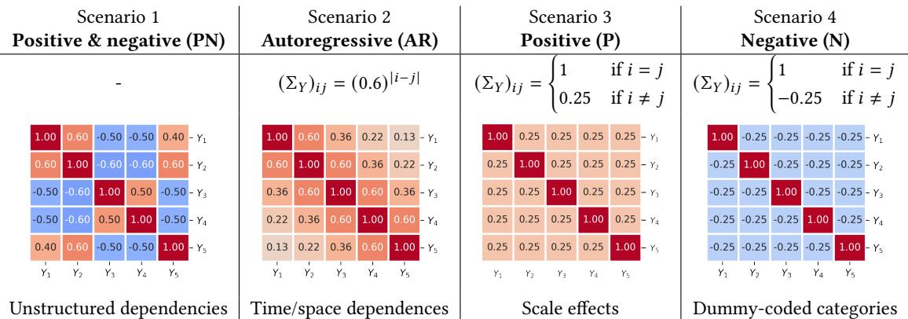  
Table S2: Simulation scenarios with diferent covariate dependency structures

## C Additional details on the numerical experiments

## C.1 Simulation scenarios

We generate synthetic data from the generative model of Eq. (9) (Fig. S6) with � = �, varying the covariance structure of the co-variates to reflect qualitatively diferent but realistic dependence patterns. The four scenarios with diferent covariate-covariance structure are summarized in Tab. S2, and the parameters held fixed across all of them in Tab. S3. In simulations, we vary two parameters (Tab. S4): � ∈ [0, 1] controls the strength of the covariate correlations by interpolating the covariance matrix toward the identity, and $b \in \left[ 0 , 1 \right]$ scales the factor-covariate coeficient vector control- ling the strength of the pairwise latent-covariate dependence.

<table><tr><td>Parameter</td><td>Description</td><td>Value</td></tr><tr><td> $\overline { { N } }$ </td><td>number of observations</td><td>500</td></tr><tr><td>D</td><td>number of features</td><td>100</td></tr><tr><td>K</td><td>number of factors</td><td>10</td></tr><tr><td>β</td><td>a vector of coefficients</td><td>(0.9, 0.75, 0.6, 0.45, 0.3)</td></tr><tr><td>θ</td><td>noise to signal ratio</td><td>0.1</td></tr></table>

Table S3: Simulation parameter settings

## C.2 Metrics

Let $Z ~ = ~ ( z _ { 1 } , \ldots , z _ { K } )$ denote the latent representation and $Y \ =$ $( y _ { 1 } , \dotsc , y _ { P } )$ the observed covariates. For each covariate $y _ { p } ,$ we fit a regressor predicting $y _ { p }$ from $Z$ and obtain a per-latent importance vector; collecting these across � yields the importance matrix $R \in \mathbb { R } ^ { K \times P }$ , where $R _ { k p }$ measures the contribution of $z _ { k }$ to predict-ing $y _ { p } .$ . On sample data, following [18], we set $R _ { k p }$ to the absolute Lasso coeficient. For population-level metrics, we exploit the joint covariance of � and � and use the closed-form OLS coeficients: $R _ { k p } = | ( \Sigma _ { Z } ^ { - 1 } \Sigma _ { Z Y } ) _ { k p } |$ . We compute these metrics only for the informed (ali ned with covariates) latent dimensions.

• Disentanglement (D) measures the degree to which each latent dimension $z _ { k }$ encodes information about a single covariate. A latent that contributes to predicting only one $y _ { p }$ is fully disentangled; a latent that contributes to many is entangled. Formally,

$$
D = \sum _ { k = 1 } ^ { K } \rho _ { k } D _ { k } , \quad D _ { k } = 1 - \frac { H ( \tilde { R } _ { k , \cdot } ) } { \log P } ,
$$

$$
\tilde { R } _ { k p } = \frac { R _ { k p } } { \sum _ { q = 1 } ^ { P } R _ { k q } } , \quad \rho _ { k } = \frac { \sum _ { p } R _ { k p } } { \sum _ { k ^ { \prime } , p ^ { \prime } } R _ { k ^ { \prime } p ^ { \prime } } } ,
$$

where �(·) is the Shannon entropy of the row-normalised importance vector. A high � means each latent is spe-cialised to one factor and a low � means the latents are entangled across factors. [18]

## • Completeness (C)

Measures the degree to which each ground-truth factor is captured by a single latent. Formally,

$$
C = \sum _ { p = 1 } ^ { P } \omega _ { \hat { p } } C _ { \hat { p } } , \quad C _ { \hat { p } } = 1 - \frac { H ( \tilde { R } _ { \cdot , \hat { p } } ) } { \log K } ,
$$

$$
\tilde { R } _ { k p } = \frac { R _ { k p } } { \sum _ { k ^ { \prime } = 1 } ^ { K } R _ { k ^ { \prime } p } } , \quad \omega _ { p } = \frac { \sum _ { k } R _ { k p } } { \sum _ { k ^ { \prime } , p ^ { \prime } } R _ { k ^ { \prime } p ^ { \prime } } } .
$$

A high � means each factor is concentrated in one latent, whereas a low � means a factor’s information is spread across many latents. [18]

• Informativeness (I) measures whether the latent representation actually contains the information needed to recover the ground-truth factors - independent of how that infor- mation is organised. Computed as the mean out-of-sample predictive performance of the regressors:

$$
I = \frac { 1 } { P } \sum _ { p = 1 } ^ { P } R ^ { 2 } ( \hat { y } _ { p } , y _ { p } ) ,
$$

where $\hat { y } _ { p }$ is the prediction of $y _ { p }$ from �. A high � indicates the latents jointly preserve covariate information and a low � indicates information loss. [18]

## • Separated Attribute Predictability (SAP)

For each pair $( z _ { k } , y _ { p } )$ , fit a univariate regression $\hat { y } _ { p } = a _ { k p } z _ { k } +$ $b _ { k p }$ and compute the predictive score $S _ { k p } = R ^ { 2 } ( \hat { y } _ { p } , y _ { p } )$ . For each ground-truth factor, compute the gap between the

The Trade-of Between Covariate Dependence and Latent Structure in Representation Learning
<table><tr><td>Parameter</td><td>Description</td><td>Values</td></tr><tr><td> $\overline { { \alpha \in [ 0 , 1 ] } }$ </td><td>Controls the strength of covariate dependences. The covariance matrix is transformed as 0, 0.25, 0.5, 0.75, 1  $\Sigma _ { Y } ^ { ( \alpha ) } = \alpha \Sigma _ { Y } + ( 1 - \alpha ) I ,$  with smaller values yielding weaker correlations (0 - no correlations, 1 - strongest correlations).</td><td></td></tr><tr><td> $b \in [ 0 , 1 ]$ </td><td>Controls the strength of latent-covariate dependence by scaling the coefficient vector:  $\beta ^ { ( b ) } = b \beta ;$  the smallest b is selected so that the lowest  $\beta _ { p } = 0 . 1$  , then b are spread equilly  $( 1 / 3$  - smallest factor-covariate dependence 0.2 on average, 1 strongest factor covariate dependence 0.6 on average)</td><td>1/3, 1/2, 2/3, 3/4, 1</td></tr></table>

Table S4: Simulation parameters varied across experiments.

highest and second-highest single-feature score, and aver- age over factors:

$$
\mathrm { S A P } = \frac { 1 } { P } \sum _ { p = 1 } ^ { P } \left( S _ { k _ { p } ^ { ( 1 ) } , p } - S _ { k _ { p } ^ { ( 2 ) } , p } \right) ,
$$

where $k _ { p } ^ { ( 1 ) }$ and $k _ { p } ^ { ( 2 ) }$ denote the latents with the highest and second-highest scores for factor �. A high SAP means a single latent stands out as the dominant predictor of each ground-truth factor, and a low SAP means several latents share predictive power for the same factor. Unlike � and $C ,$ which use the joint-regression importance matrix, SAP measures single-feature predictability and is consequently more sensitive to correlations among the ground-truth factors. [36]

• Normalised Separated Attribute Predictability (nSAP) A scale-invariant variant of SAP, in which the gap is divided by the top predictor’s score:

$$
\mathrm { n S A P } = \frac { 1 } { P } \sum _ { p = 1 } ^ { P } \left( S _ { k _ { \ / p } ^ { ( 1 ) } , p } - S _ { k _ { \ / p } ^ { ( 2 ) } , p } \right) / S _ { k _ { \ / p } ^ { ( 1 ) } , p } .
$$

Unlike SAP, which reports the absolute gap and therefore mixes together the strength of the dominant predictor with its lead over the runner-up, nSAP isolates the relative domi-nance of the best predictor. This is particularly useful when overall predictive scores are low: a small SAP gap may reflect either a weak dominant predictor or genuinely com peting predictors, whereas nSAP disentangles these two cases.

## C.3 Methods details

Tab. S5 lists the methods we compare against, together with the packages and hyperparameters used. To keep the comparison fair, every method is given the same number of factors and the same op- timisation budget: � = 10 and 2000 iterations (or epochs/SVI steps) for the simulations, and � = 20 and 5000 iterations for the real data. Methods whose factors are not paired with the covariates by construction (PCA, MOFA, PLS, both supervised PCA variants, and iVAE) have their informed factors selected by Hungarian match ing on |corr(�, �)|, with signs aligned. SOFA and the regression baseline are paired by design and need no matching.

Our method (iFA) is fitted with the same � and iteration budget: variational inference for 2000 (5000 for the real data) iterations, preceded by 250 (1000) pretraining iterations of the unsupervised model, and stopped early when the relative ELBO change falls below

$5 \times 1 0 ^ { - 7 }$ . The fine-tuning step is run at � ∈ {0, 0.25, 0.5, 0.75, 1} for the simulations, and $\lambda \in \left\{ 0 , 0 . 2 5 , 0 . 5 , 0 . 7 5 , 0 . 9 \right\}$ for real data.

## C.4 Image representations

Represenations are extracted with three pretrained models obtained through the HuggingFace transformers:

• ViT [17],

https://huggingface.co/google/vit-base-patch16-224,

• CLIP [45], https://huggingface.co/openai/clip-vit-large-patch14,

• DINOv2 [40], https://huggingface.co/facebook/dinov2-base.

For ViT and DINOv2 we take the model’s pooled output, for CLIP we take the projected image features, each of dimension 768.

## D Supplementary figures

This section collects the complete set of results across all simu- lation scenarios, the pretrained representations, and the runtime comparison. The main text reports Scenarios 1 (PN) and 4 (N). For completeness, some panels shown in the main text are repeated here:

• Fig. S8, panels A and B also shown in Fig. 1;

• Fig. S8 and Fig. S11, right panel of D also shown in Fig. 3.

Figure S7 shows the latent-covariate and latent-latent covariance matrices for CLIP, ViT, and DINOv2 under the two baselines and the proposed transformations.

Figures S8-S11 report, for each of the four scenarios, the data- generating covariance matrices (panel A), the covariance matrices after each transformation (panel B), the trade-of traced by the family of transformations (panel C), and the empirical comparison of all methods under two parameter settings (panel D).

Figures S12-S15 report, for each scenario, the three proposed metrics (average factor-covariate correlation, factor independence, and average variance explained per factor) and the five disentanglement metrics (�, �, �, SAP, nSAP), varying the strength of the covariate correlations (�, panel A) and of the factor-covariate associations (�, panel B).

Figure S16 reports parameter recovery as the number of obser-vations grows: the estimated coeficients, their mean squared error, and the cosine similarity between recovered and true informed factors.

Figure S17 compares the runtime of all methods.

<table><tr><td>Name</td><td>Description</td><td>Implementation details</td></tr><tr><td>PCA</td><td>ear method extracting orthogonal directions that max- imise variance in X. [25, 42]</td><td>PrincipalComponent Analysis. An unsupervised lin- PCA(n_components=10/20) - sklearn 1.8.0 [43]</td></tr><tr><td>MOFA</td><td>Multi-Omicss Factor Analysis A probabilistic multi- mofapy20.7.4 view factor analysis model with a mean-field variational model options: factors=10/20, [3]</td><td>approximation that approximates factor independence. spikeslab_weights=True, ard_weights=True, ard_factors=True, train options: convergence_mode=&quot;medium&quot;,</td></tr><tr><td>PLS</td><td>maximise the covariance between X and Y, subject to 1.8.0 [43] orthogonality of successive components. [55]</td><td> $\mathrm { i t e r } { = } 2 0 0 0 / 5 0 0 0$  Partial Least Squares. Extracts latent directions that PLSRegression(n_components=10/20) - sklearn</td></tr><tr><td>SPCA (Bair 2006)</td><td>Screening-based supervised PCA. A two-step coefficient above a threshold), then applies standard [43] PCA to the surviving submatrix. The factors are PCA directions of a covariate-relevant subset of features.</td><td>Our implementation: features filtered by absolute method that first screens features of X by their uni- correlation above the 0.5 empirical quantile treshold, variate association with Y (e.g., absolute correlation then PCA(n_components=10/20) - sklearn 1.8.0</td></tr><tr><td>SPCA (Barshan 2011)</td><td>maximising the Hilbert-Schmidt Independence Crite- bandwidth, linear kernel on X, rion with Y. The objective reduces to a generalised scipy 1.17.1 and numpy 2.4.6 eigenproblem on X&#x27;HLHX, where L is the Y-kernel matrix and  $\begin{array} { r } { H = I - \frac { 1 } { n } \mathbf { 1 } \mathbf { 1 } ^ { \prime } } \end{array}$  is the centring matrix.</td><td>HSIC-based supervised PCA. Finds directions in X Our implementation: RBF kernel on Y with median</td></tr><tr><td>iVAE</td><td>prior over Z is conditioned on the auxiliary variables Y ian variant via a factorised exponential family,  $\begin{array} { r } { p ( z \mid y ) = \prod _ { p } p ( z _ { p } } \end{array}$  y). Trained by maximising the conditional ELBO with units, LeakyReLU(0.1); Adam, both an encoder  $q ( \boldsymbol { z } \mid \boldsymbol { x } , \boldsymbol { y } )$  and a decoder p(x | z). [31] epochs=2000/5000.</td><td>Identifiable VAE. A variational autoencoder where the Our implementation: PyTorch 1.13.1+cu117, Gauss- encoder, prior and decoder MLPs with 2 × 64 hidden  $\mathrm { l r } \mathrm { = } ~ 1 0 ^ { - 3 }$  , batch= 256,</td></tr><tr><td>SOFA</td><td>Semi-supervised Factor Analysis An extension of biosofa 0.7.5, K = 10/20, llh=&#x27;gaussian&#x27;, MOFA that models pairwise factor-covariate dependen-&#x27;bernoul1i&#x27;, n_steps=2000/5000, lr=0.01 cies. A scaling factor (sf) reweights the factor-covariate loss term relative to the data-factor terms, providing indirect control over the factor-covariate dependence strength. [11]</td><td>e sf  $\mathsf { \bar { \Pi } } \in \{ 0 . 0 1 , \dots , 0 . 0 5 , 0 . 1 \}$ </td></tr><tr><td>Y as factors</td><td>Regression. A supervised baseline that takes the co- LinearRegression, PCA - sklearn 1.8.0 variates themselves as the first P informed factors and fills the remaining K – P slots with the leading principal components of the residual  $X - Y \hat { \beta } _ { y } .$  where  $\hat { \beta } _ { y }$  is the OLS fit of X on Y.</td><td></td></tr></table>

Table S5: Comparison methods, with a brief description and implementation details.

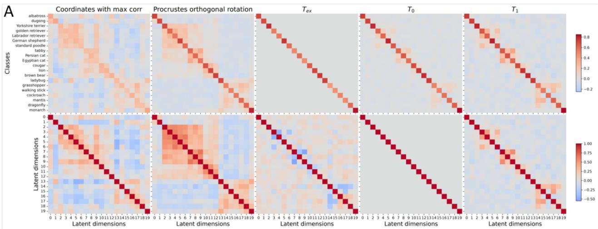

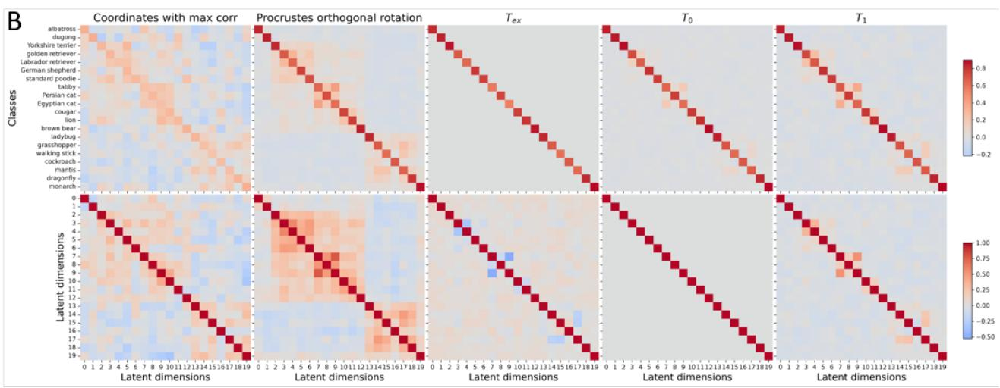

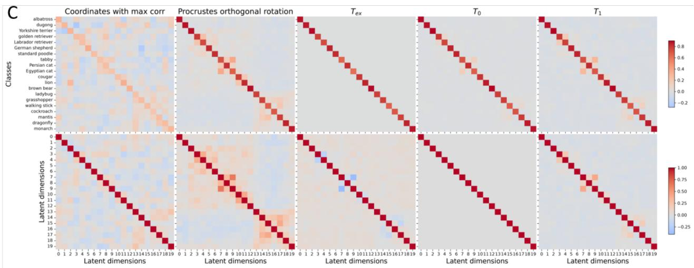  
Figure S7: Covariance structure of the pretrained image representations under each transformation, for A. CLIP, B. ViT, and C. DINOv2. Each panel shows latent-covariate (top) and latent-latent (bottom) covariances for the two baselines (dimensions with max correlation, Procrustes rotation) and the proposed $T _ { \mathrm { e x } } , T _ { 0 } , T _ { 1 }$

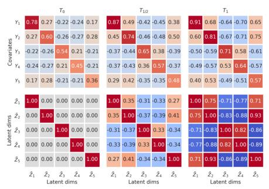

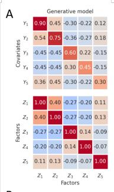

B  
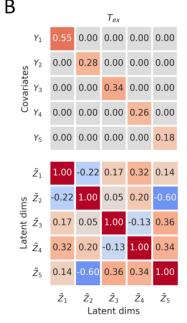

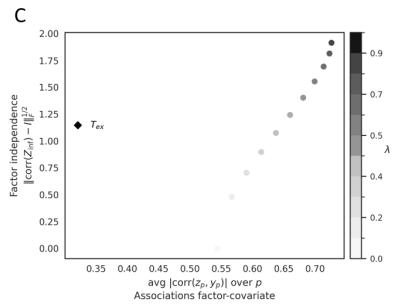

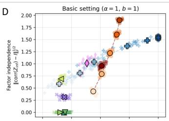

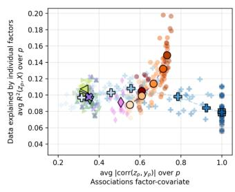

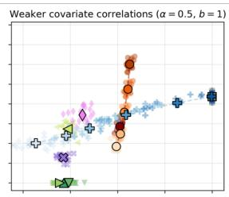

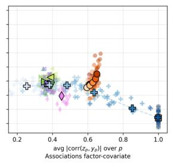

Figure S8: Scenario 1 (PN) results. A. Covariance matrices $\Sigma _ { Y Z }$ and $\Sigma _ { Z }$ in the data-generating setting. B. Covariance matrices $\Sigma _ { Y \tilde { Z } }$ and $\Sigma _ { \tilde { Z } }$ after transformations $T _ { \mathbf { e x } } , T _ { 0 } , T _ { 1 / 2 } ,$ and � . C. Frontier after transformations $T _ { \lambda }$ and $T _ { \mathbf { e x } } .$ . D. Empirical results for method under two parameter settings: baseline and reduced �.  
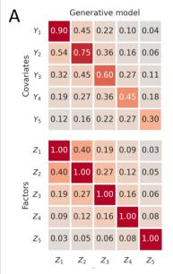

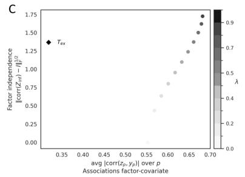

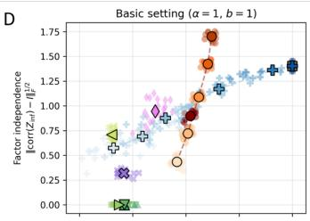

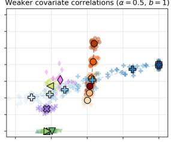

B  
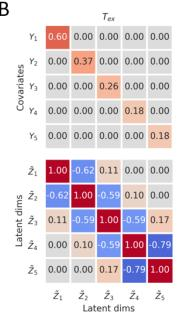

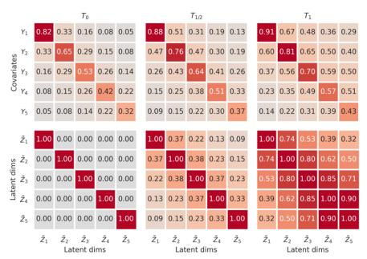

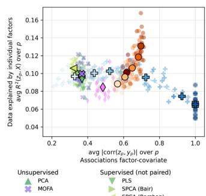

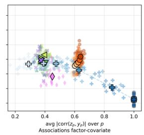  
Figure S9: Scenario 2 (AR) results.A. Covariance matrices $\Sigma _ { Y Z }$ and $\Sigma _ { Z }$ in the data-generating setting. B. Covariance matrices $\Sigma _ { Y \tilde { Z } }$ and $\Sigma _ { \tilde { Z } }$ after transformations $T _ { \mathbf { e x } } , T _ { 0 } , T _ { 1 / 2 } ,$ and $T _ { 1 } .$ . C. Frontier after transformations $T _ { \lambda }$ and $T _ { \mathbf { e x } }$ . D. Empirical results for method under two parameter settings: baseline and reduced �.

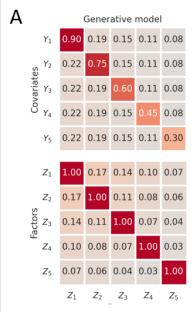

C  
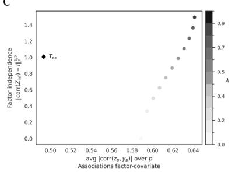

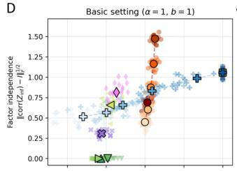  
B

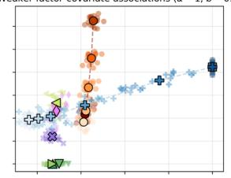

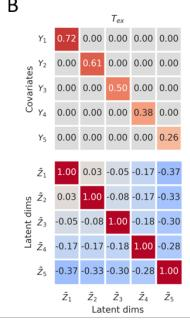

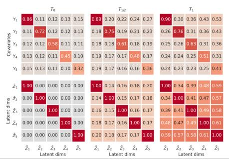

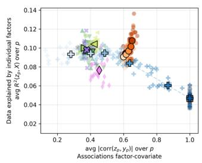

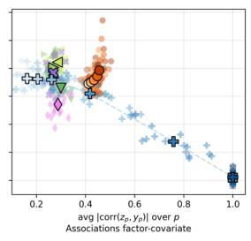

Figure S10: Scenario 3 (P) results. A. Covariance matrices $\Sigma _ { Y Z }$ and $\Sigma _ { Z }$ in the data-generating setting. B. Covariance matrices $\Sigma _ { Y \tilde { Z } }$ and $\Sigma _ { \tilde { Z } }$ after transformations $T _ { \mathbf { e x } } , T _ { 0 } , T _ { 1 / 2 }$ , and � . C. Frontier after transformations $T _ { \lambda }$ and $T _ { \mathbf { e x } }$ . D. Empirical results for methods under two parameter settings: baseline and reduced �.  
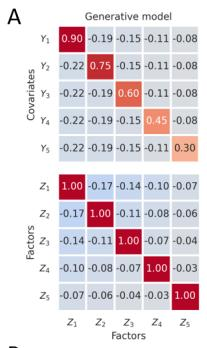

C  
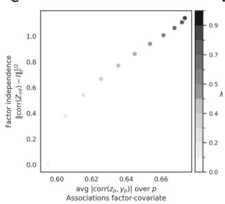

D  
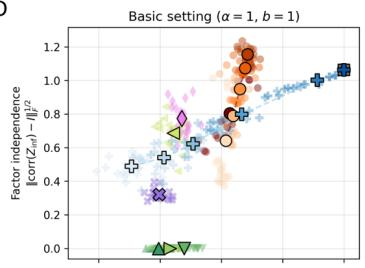

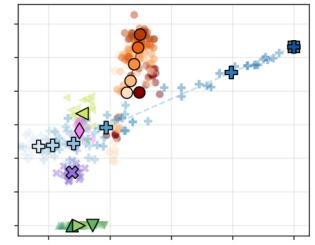

B  
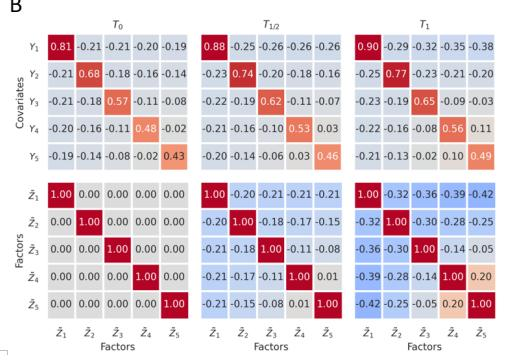

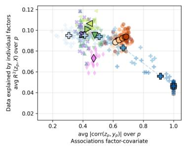

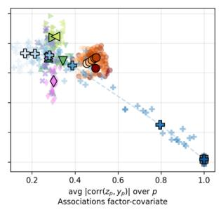  
Figure S11: Scenario 4 (N) results. A. Covariance matrices $\Sigma _ { Y Z }$ and $\Sigma _ { Z }$ in the data-generating setting. B. Covariance matrices $\Sigma _ { Y \tilde { Z } }$ and $\Sigma _ { \tilde { Z } }$ after transformations $T _ { 0 } , T _ { 1 / 2 } ,$ and $T _ { 1 }$ (no $T _ { \mathbf { e x } }$ is reported, as in Scenario $\mathbf { \boldsymbol { \mathbf { \rho } } } _ { \mathbf { \boldsymbol { \mathbf { \rho } } } } ( \mathbf { \boldsymbol { N } } ) \Sigma _ { Z Y }$ is not invertible). C. Frontier of transformations � . D. Empirical results for methods under two parameter settings: baseline and reduced �.

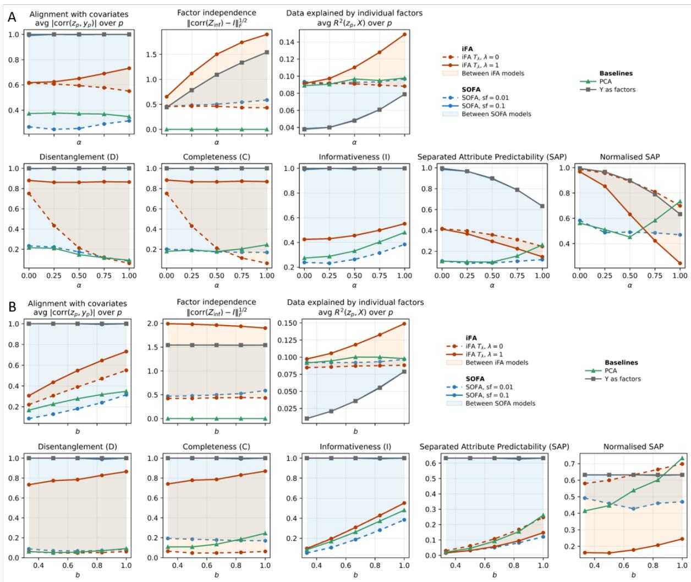  
Figure S12: Performance in Scenario 1 (PN), measured by three proposed metrics (average factor–covariate correlations, factor independence measured by the squared Frobenius distance of the correlation matrix of� from the identity, and average variance explained per factor) and five disentanglement metrics (disentanglement, completeness, informativeness, SAP, and normalised SAP). A. Varying the strength of correlations among covariates. B. Varying the strength of factor–covariate associations.

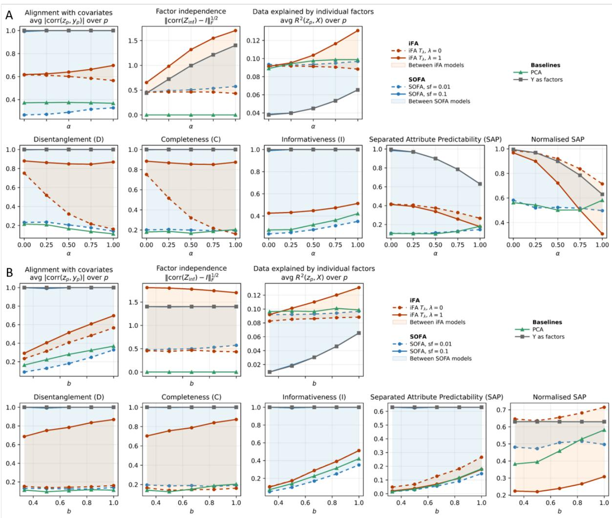  
Figure S13: Performance in Scenario 2 (AR), measured by three proposed metrics (average factor–covariate correlations, factor independence measured by the squared Frobenius distance of the correlation matrix of� from the identity, and average variance explained per factor) and five disentanglement metrics (disentanglement, completeness, informativeness, SAP, and normalised SAP). A. Varying the strength of correlations among covariates. B. Varying the strength of factor–covariate associations

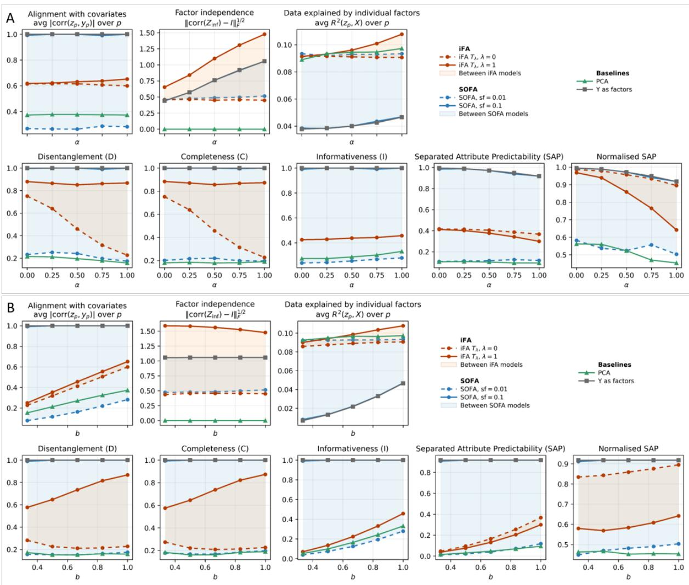  
Figure S14: Performance in Scenario 3 (P), measured by three proposed metrics (average factor–covariate correlations, factor independence measured by the squared Frobenius distance of the correlation matrix of� from the identity, and average variance explained per factor) and five disentanglement metrics (disentanglement, completeness, informativeness, SAP, and normalised SAP). A. Varying the strength of correlations among covariates. B. Varying the strength of factor–covariate associations

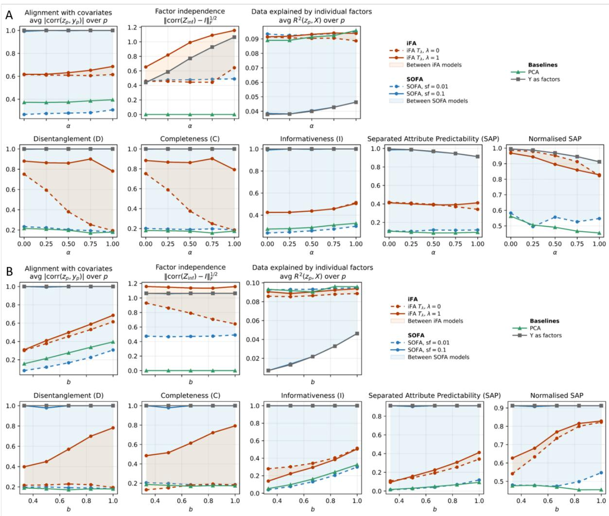  
Figure S15: Performance in Scenario 4 (N), measured by three proposed metrics (average factor–covariate correlations, factor independence measured by the squared Frobenius distance of the correlation matrix of� from the identity, and average variance explained per factor) and five disentanglement metrics (disentanglement, completeness, informativeness, SAP, and normalised SAP). A. Varying the strength of correlations among covariates. B. Varying the strength of factor–covariate associations

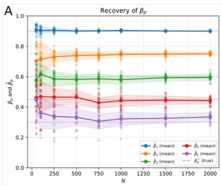

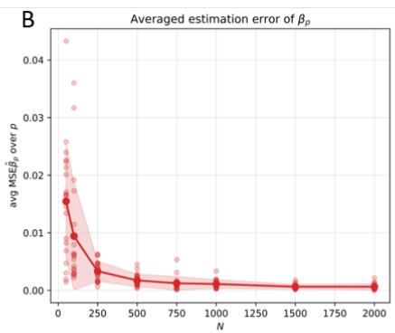

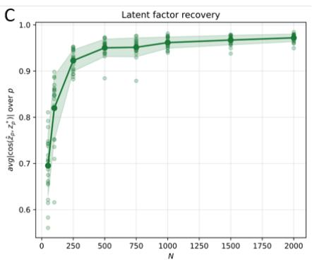

Figure S16: Consistency of iFA (no �) as the number of observations � grows, Scenario 1 (PN). A. Recovery of factor-covariate coeficients. B. Mean squared error of the estimated $\hat { \beta } _ { p }$ averaged over �. C. cosine similarity between recovered and true informed factors. Shaded bands show ±1 s.d. over repetitions.  
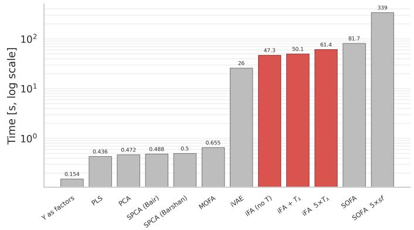  
Figure S17: Runtime of all methods on the one simulation setup.