# ABRA: SCALING DIFFUSION IMAGE TRAINING

Kyle Chickering, Wei-An Lin, Swayam Bhanded, Dan Saunders, Akshat Tripathi, Jiaming Song, Shyamal Buch, Xinchen Yan Luma AI

## ABSTRACT

Compute-optimal scaling laws guide the training of frontier language models yet remain largely unexplored for visual generation. We present a systematic scaling law study for text-to-image diffusion models using ABRA, a controlled family of flow-matching transformers trained across three orders of magnitude worth of compute $( 1 0 ^ { 1 9 }$ to $1 0 ^ { 2 2 }$ FLOPs), reaching significantly larger compute budgets than previous works. We demonstrate that diffusion models scale just as predictably as language models but require far more data to train optimally: compute optimality occurs at approximately 200 image tokens per parameter, ten times the Chinchilla compute-optimal prescription for LLMs. We show that unlike language models, diffusion models are robust to overtraining and that practitioners should err on the side of more data rather than a larger model. Finally, we show that this predictability extends beyond training loss to generative quality metrics, optimal CFG settings, representation quality, and even the shape of the training curves, which collapse onto a universal form.

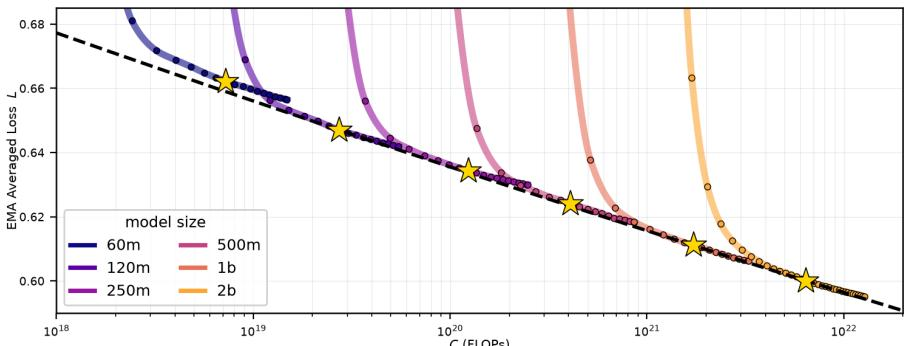

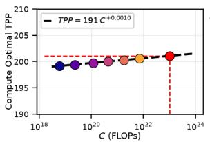

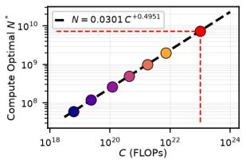

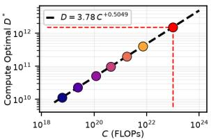  
Figure 1: Text-to-image diffusion transformers follow predictable scaling laws and require ten times as much data as a comparably sized language model to reach compute optimality.

## 1 INTRODUCTION

Compute-optimal scaling laws describe how a fixed training compute budget C (in FLOPs) should be allocated between model size N (in parameters) and dataset size D (in training tokens) in order to minimize loss (Hestness et al., 2017; Amodei et al., 2016; Kaplan et al., 2020; Hoffmann et al., 2022). For large language models compute should be divided evenly between the model size and the dataset size according to $N \propto C ^ { 1 / 2 }$ and $D \propto C ^ { 1 / 2 }$ , giving the “Chinchilla rule” of training LLMs to 20 tokens per parameter (TPP) (Hoffmann et al., 2022). Scaling analysis has become a standard industrial tool in language modeling and is used to guide the training of frontier models (Touvron et al., 2023; OpenAI, 2023; DeepSeek-AI, 2024; Grattafiori et al., 2024; Sun et al., 2024; Kimi Team, 2025; The Microsoft AI Team, 2026).

The extension of scaling law analysis to the visual generation domain presents challenges not present in the language domain. Visual content has higher dimensionality (i.e., 2D images), resolution dependent token information density, separate training and generation paradigms, and much noisier training curves. The scaling of these models remains understudied despite the release of many large-scale visual generation studies. Existing work by Liang et al. (2024) fits iso-FLOP profiles below $1 0 ^ { 1 9 }$ FLOPs and extrapolates to $1 0 ^ { 2 1 }$ FLOPs. We use an order of magnitude more compute and a more controlled family which allows us to derive much more precise empirical fits.

We significantly refine the scaling foundations for text-to-image models by conducting a systematic scaling study using ABRA, a controlled family of dense flow-matching transformers ranging from 60M to 2B parameters. We utilize $\mu \mathrm { P }$ to fit scaling laws spanning three orders of magnitude (from $1 0 ^ { 1 9 }$ to $1 0 ^ { 2 2 }$ FLOPs). Our central findings indicate that compute optimality is achieved at roughly 200 image tokens per parameter for text-to-image diffusion modeling, a 10× increase over the standard Chinchilla rule for LLMs. Furthermore, we find that diffusion model training is robust to overtraining, giving practitioners confidence to err on the side of training a smaller model with more data.

We fit compute-optimal scaling laws to the evaluation loss and a range of common generative metrics, finding that all of these quantities scale predictably. We study the scaling of model representation quality using linear probing and find that representation quality also follows predictable scaling trends. We ablate the effect of resolution on our scaling laws and we demonstrate that like LLMs, diffusion models exhibit scaling collapse.

Our main contributions are:

• We present a comprehensive and controlled study of compute-optimal scaling for dense text-to-image transformers and derive an actionable 200 TPP rule for training diffusion models.

• We show that diffusion model training is robust to overtraining and precisely characterize this phenomenon.

• We extend our analysis to show that common generative metrics scale predictably, and that representation and generation capabilities scale heterogeneously.

• We show for the first time that diffusion models exhibit scaling collapse.

The remainder of the paper is organized as follows. We review related work on neural scaling laws and diffusion models in Section 2, describe our experimental setup and scaling ladder in Section 3, and present our empirical findings in Section 4.

## 2 RELATED WORK

Text-to-Image Transformers and Flow-Matching. Peebles & Xie (2023) introduced and studied the efficacy of vision transformers in the context of generative diffusion modeling (Sohl-Dickstein et al., 2015). The original diffusion formulations (Ho et al., 2020; Song et al., 2021b;a) have largely been replaced by flow-matching (Lipman et al., 2023; Liu et al., 2023; Albergo & Vanden-Eijnden, 2023; Heitz et al., 2023) which formulates the denoising process as simple linear interpolation. We use v-prediction introduced by Albergo & Vanden-Eijnden (2023) and Ma et al. (2024) and the latent diffusion formulation Rombach et al. (2022) and Kingma & Welling (2014).

Neural Scaling Laws. While the origins of neural scaling laws trace their roots to the nineties (see Caballero et al., 2023), their modern invocation and study can be largely attributed to the works (Amodei et al., 2016; Hestness et al., 2017; Kaplan et al., 2020; Hoffmann et al., 2022). These works find that many machine learning models, and large language models in particular, exhibit predictable improvements in performance as a function of compute and model size. While there is an extensive body of literature studying the scaling behaviors of language models, for example (Bergsma et al., 2025a;b; Tao et al., 2024; Alabdulmohsin et al., 2022; Muennighoff et al., 2023; Dey et al., 2023), comparatively little is known about the scaling of diffusion models.

Scaling Laws for Diffusion Models. As previously mentioned, Liang et al. (2024) perform what is, to our knowledge, the only scaling law study for text-to-image diffusion modeling. Our work uses an order of magnitude more compute and a controlled model family to get refined estimates of the compute-optimal scaling laws for text-to-image diffusion models. Liang et al. (2024) find that model size should be scaled faster than dataset size, which leads to systematic undertraining at frontier scales. We find that data and parameters should be scaled at the same rate, i.e., $D \propto C ^ { 1 / 2 }$ and $N \propto C ^ { 1 / 2 }$

A related line of work (Li et al., 2024b;a) studies the scalability of text-to-image models on downstream benchmarks and metrics, but does not perform a compute-optimal analysis. Mei et al. (2025) study how latent diffusion models behave as capacity and compute grow but focus on inference scaling and do not do compute-optimal analysis. Their study systematically explores how optimal CFG changes with model size and we corroborate their finding regarding CFG and model size in the compute-optimal setting. Yan et al. (2025) show that pixel-sequence generative models reach compute optimality at roughly 200–400 TPP. For video models, Yin et al. (2025) study the scaling properties of video training but only fit scaling laws using models up to 250M parameters. Finally, the works (Zheng et al., 2025; Ryu & Han, 2026) apply $\mu \mathrm { P }$ (Yang et al., 2021) to diffusion transformers to enable proxy tuning and hyperparameter transfer.

Ge et al. (2026) is a concurrent work which also studies compute-optimal scaling in the context of image and video generation. Despite large architectural differences between our model family and theirs the two works agree in the diagnosis that diffusion model training requires more data than LLM training. However the two works differ substantially in the types of questions which they answer. We focus here on foundational questions about scaling image generation and our work provides extensive evaluation of generative metrics, a study of compute-optimal representation quality, analysis of how image resolution affects the scaling of diffusion models, and the first validation of scaling collapse phenomena for diffusion models. These aspects of scaling image generation are not within the scope of Ge et al. (2026).

## 3 METHOD

We aim to characterize how text-to-image diffusion transformers should be scaled: for a given training budget, how many parameters should we use and how much data should we train on? This section describes our approach to answering these questions.

## 3.1 COMPUTE OPTIMALITY

We follow the definition of compute optimality from Hoffmann et al. (2022): given a fixed training budget of C FLOPs, we seek the model size $\dot { N }$ and dataset size D minimizing a loss or evaluation metric ${ \mathcal { L } } ,$

$$
N _ { \mathrm { o p t } } ( C ) , D _ { \mathrm { o p t } } ( C ) = \arg \operatorname* { m i n } _ { N , D } \mathcal { L } ( N , D ; C ) .\tag{1}
$$

Throughout this paper, N denotes the total parameter count of the diffusion transformer, excluding the frozen text encoder. Unlike in LLMs, the embedding and unembedding layers contribute a negligible fraction of parameters at our scales, so we report total parameters throughout: including or excluding them shifts the optimal-TPP estimate by less than 3%. D denotes the number of image tokens seen during training. We measure data in image tokens per parameter, abbreviated TPP, and write MTPP for multimodal tokens per parameter when text and image tokens are counted together. To locate this compute-optimal point accurately, we intentionally overtrain models in the ABRA family so that the optimum $( N _ { \mathrm { o p t } } , D _ { \mathrm { o p t } } )$ lands on the interior of our search range. We train up to 400 TPP, an upper bound informed by our prior experience training diffusion models and by the autoregressive pixel sequence results of Yan et al. (2025).

## 3.2 TRAINING AND SAMPLING

We train latent diffusion models with a v-prediction flow-matching objective (Ma et al., 2024; Salimans & Ho, 2022). Specifically, the network $v _ { \theta } ( x _ { t } , t ; \tau \in \mathrm { x t } )$ regresses the velocity of the linear interpolant between a clean image latent and Gaussian noise. We maintain an EMA of the model weights with decay parameter 0.9999 (Ho et al., 2020; Peebles & Xie, 2023). Because we have training steps roughly fixed we keep the EMA timescale constant across model sizes (Karras et al., 2024). We train on a base resolution of $5 1 2 \times 5 1 2$ with five image aspect-ratio buckets. Each image is encoded by the frozen f = 8 FLUX VAE into a $6 4 \times 6 4$ latent, which a parameter-free $2 \times 2$ fold reduces to a $3 2 \times 3 2$ grid that the transformer consumes directly. To make the unconditional estimate available at inference, we drop text conditioning with probability 0.1 during training.

We integrate the ODE $\begin{array} { r } { \frac { \mathrm { d } \boldsymbol { x } _ { t } } { \mathrm { d } t } = \boldsymbol { v } _ { \theta } ( \boldsymbol { x } _ { t } , t ; \boldsymbol { \mathrm { t e x t } } ) } \end{array}$ backwards in time starting from $\varepsilon \sim \mathcal { N } ( 0 , 1 )$ at $t = 1$ with a 50-step Euler solver, sampling in the latent space and decoding to pixels with the FLUX autoencoder (Black Forest Labs, 2025). We apply classifier-free guidance (Ho & Salimans, 2022) with guidance scale swept per model and held fixed across sampling steps.

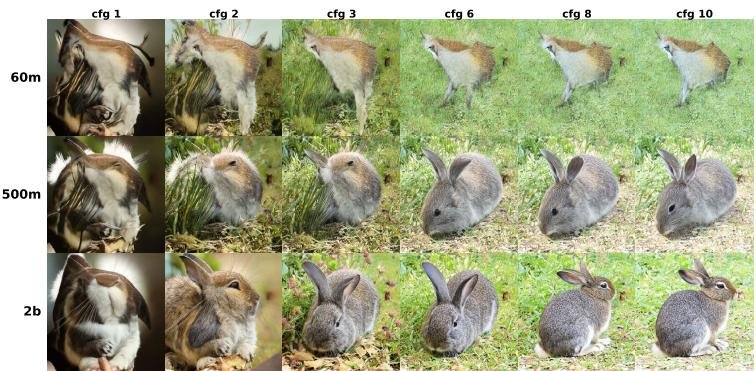  
Figure 2: 512 × 512 generations of the prompt $\mathbf { \ddot { a } }$ rabbit” across model scales and CFG.

## 3.3 MODEL FAMILY

We construct ABRA, a family of diffusion transformers from 60M to 2B parameters, with depth growing from 19 to 33 blocks and width from 384 to 1792, spanning roughly $1 0 ^ { 1 9 }$ to $1 0 ^ { 2 2 }$ imagetoken FLOPs. Our models combine aspects from various open source text-to-image models into a new family which is amenable to scaling (Black Forest Labs, 2025; Chen et al., 2024).

Each model uses four double-stream blocks followed by single-stream blocks for the remainder of the layers, with an FFN expansion rate of 6. Liang et al. (2024) found that a constant aspect ratio yields smooth iso-FLOP curves. For ABRA we use a monotonically non-decreasing width-to-depth ratio under the assumption that this smoothness persists under monotone aspect ratios. Text conditioning is provided by a frozen Qwen3-4B model (Yang et al., 2025) and we exclude the conditioner parameters from our FLOP and model size counts. Across the ladder we double the batch size every time we double the parameter count, keeping the number of training steps fixed.

A full accounting of the ABRA architecture can be found in Appendix A.

## 3.4 CHOICE OF DATASET

We train on the DataComp-1B dataset (Gadre et al., 2023), a large-scale collection of web image-text pairs. Because web-sourced captions are often low quality, we re-caption the images using a variety of open-source vision-language models, following (Betker et al., 2023). During training we include a mix of dense, medium, sparse, and web-sourced captions. We do not perform mid or post training of our models and focus exclusively on diffusion model pre-training. We report metrics on either DataComp-1B or on a held-out evaluation mixture that is more diverse than the training data, of which DataComp-1B is a ∼20% subset.

## 3.5 µP AND HYPERPARAMETER SELECTION

We transfer hyperparameters across the model family with µP (Yang et al., 2021), using the Complete-P parameterization (Dey et al., 2025), and train with the Adam optimizer (Kingma & Ba, 2015). We validate our implementation using spectral coordinate checking (Chickering et al., 2026). We validate µ-transfer for ABRA-60M, ABRA-120M, and ABRA-250M, and then zero-shot transfer the optimal learning rate, $4 \times 1 0 ^ { - 4 }$ , to the remaining models in the ladder. We sweep the initialization scale on the ABRA-60M model and initialize all layers from the same value of $\sigma = 0 . 0 1$ . Unlike Mlodozeniec et al. (2025) and Jiang et al. (2026), we do not tune per-layer base hyperparameters. We use a logit-normal timestep sampler with mean $p _ { \mu } = 1 . 9$ and standard deviation $p _ { \sigma } = 1 . 0 .$

## 4 EMPIRICAL RESULTS

We now turn to the scaling analysis itself. Our central finding is that text-to-image flow-matching transformers scale predictably across a wide variety of evaluative metrics, but require roughly ten times as much data per parameter as LLMs to reach compute optimality. N denotes the parameter count of the vision transformer and D is measured in image tokens.

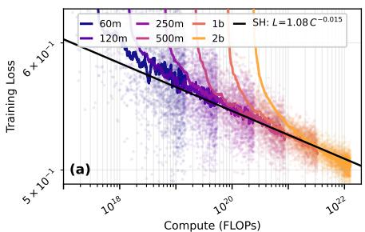

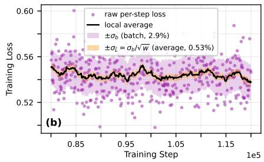  
Figure 3: $L e f t .$ : The raw training loss for ABRA runs. The bold curves are a simple moving average of the scattered loss data. The solid black line is a qualitative fit of this data. Right: The noise decomposition for the ABRA-250M run, illustrating that the per-step differences in the loss curve are dominated by the batch-to-batch noise.

## 4.1 ESTIMATING COMPUTE-OPTIMAL TOKENS PER PARAMETER

Finding: Diffusion model training is compute-optimal at 200 TPP, roughly 10× higher than the canonical LLM compute-optimal budget of 20 TPP.

Figure 3(a) shows the training loss for the ABRA family with a qualitative fit of the data. As we can see from Figure 3(b) the raw per-step loss is dominated by batch noise. Over 10,000 steps, the batch-to-batch noise on the ABRA-250M run is roughly 4 to 7× larger than the improvement in the reducible loss over the same period. All fits in this section will therefore target the EMA model loss (not an EMA of the training loss as was done in (Liang et al., 2024)) which is substantially smoother than the raw model loss.

To construct these curves without training hundreds of models we exploit the constant LR schedule together with the smoothness of the EMA loss and interpolate each model’s evaluation checkpoints into a continuous loss-versus-TPP trajectory using PCHIP interpolation (Fritsch & Carlson, 1980; Fritsch & Butland, 1984). The evaluation loss is computed on our evaluation dataset by taking 100,000 samples and averaging the loss over the logit-normal timestep distribution using the EMA weight predictions. At each TPP T we fit a power law in compute, $L ( C ; T )$ = $A _ { T } C ^ { - \alpha _ { T } } + { \bf \bar { \beta } } _ { T } ;$ fixed-C slices of this surface give the iso-FLOP profiles, and the arg min over $T$ gives the compute-optimal TPP. The minima of these curves tightly cluster around 200 TPP at all but the smallest of our training budgets. The relative flatness of these profiles is also conspicuous and we investigate this point further in Section 4.2.

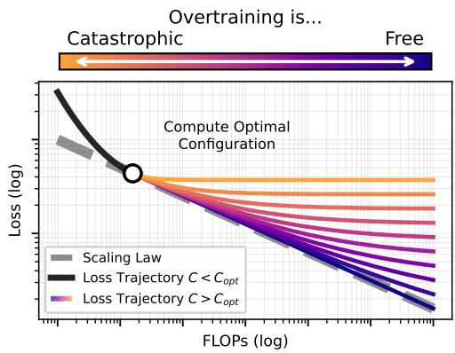  
Figure 4: Overtraining compute-optimal models incurs a cost at fixed compute. The computeoptimal point occurs when the model loss curve is tangent to the scaling law curve.

We exclude ABRA-60M as a clear outlier (Figure 1), in line with the observation that scaling laws hold only in an appropriate regime (Hestness et al., 2017).

There are a multitude of ways to fit scaling laws (see Li et al., 2025 for a survey) and to ensure our findings are reliable we conduct an in-depth comparison against many other fit procedures in Appendix F with our findings tabulated in Table 4. Across every fit procedure we tried, the optimal TPP lies within a narrow band of only about ±17 TPP.

## 4.2 DIFFUSION OVERTRAINING IS FORGIVING

Finding: Overtraining a diffusion model is nearly free (in the sense of Figure 4).

In practice, models are frequently trained well past their compute-optimal point. The most common reason is inference cost: a smaller model trained on more data is cheaper to serve, so practitioners deliberately overtrain to shift compute from deployment to training (Touvron et al., 2023; Gadre et al., 2025).

Therefore, scaling law analysis cannot simply end at the compute-optimal point. It is important to understand precisely how we expect the model to behave when overtrained. Since the computeoptimal point is definitionally a minimum over the loss (1), any deviation from compute optimality necessarily incurs some cost (in training FLOPs). This idea is illustrated visually in Figure 4. Concretely, fix a compute budget C and let $N _ { \mathrm { o p t } } ( C )$ denote the compute-optimal parameter count at that budget. For a model with $\mathsf { \bar { N } } \neq N _ { \mathrm { o p t } }$ parameters trained at the same compute $\bar { \boldsymbol { C } }$ (equivalently, at a non-optimal TPP), we can define the loss penalty

$$
\Delta L ( N , C ) : = L ( N , C ) - L \big ( N _ { \mathrm { o p t } } ( C ) , C \big ) .\tag{2}
$$

The quantity $\Delta L$ should be thought of as the additional loss we incur by not training the computeoptimal model size for a budget of C FLOPs.

Figure 6 plots this loss penalty as a relative percentage, $\Delta L ( N , C ) / L ( N _ { \mathrm { o p t } } ( C ) , C )$ , as a function of TPP for the ABRA family. We additionally plot the same data for an open-source LLM scaling family, Gemstones (McLeish et al., 2025), which spans the parameter range 48M–2B and is heavily (and purposefully) overtrained. We provide additional comparisons against other overtrained LLM studies in Appendix E (Figures 14, 15, and 16).

From Figure 6 it is clear that diffusion models suffer almost no loss penalty when 2× overtrained (less than 0.5%). In the parlance of Figure 4, overtraining diffusion models is nearly “free”. This is manifestly not the case for LLMs, where the loss penalty is substantial even for modest overtraining (see Figure 6, right).

On the other hand, Figure 6 also reveals that undertraining diffusion models is catastrophic. This observation yields a practical rule: in compute-limited settings it is far safer to err on the side of overtraining a small model than risk undertraining a large one.

## 4.3 GENERATIVE METRICS SCALE PREDICTABLY

Finding: Generative metrics follow power laws in compute but their compute-optimal allocations diverge.

Low diffusion loss does not necessarily indicate strong generative performance (Theis et al., 2016; Ho et al., 2020). Generation quality for diffusion models is therefore measured using distributional level metrics computed on the outputs of the ODE sampling procedure. Common metrics include FID (Heusel et al., 2017), KID (Binkowski et al., 2018), and CLIPScore (Hessel et al., 2021), and all´ of these metrics are sensitive to the classifier-free guidance (CFG) scale. Different guidance strengths favor different qualitative aspects of image generation. High guidance typically adheres better to prompts and low guidance typically adheres better to the target data distribution (Ho & Salimans, 2022; Saharia et al., 2022). Because generative quality depends so heavily on the choice of CFG it is insufficient to compare models at a fixed guidance scale. Instead, we must find the optimal guidance scale for every model on each metric.

To this end, we sweep the optimal guidance scale for each model size and every metric. We generate 50,000 samples for FID and 25,000 samples for all other metrics. Figure 7 (top) shows that every tested metric follows a power law of the form from Section 4.1. We fit $\mathbf { \bar { \boldsymbol { M } } } ( \boldsymbol { C } ) = \mathbf { \bar { \boldsymbol { A } } } \boldsymbol { C } ^ { - \alpha } + \boldsymbol { F } _ { M }$ , with the sign of the power term flipped for CLIPScore. The offset $F _ { M }$ plays the role of the loss law’s $\beta _ { T }$ and Table 8 collects the fitted coefficients.

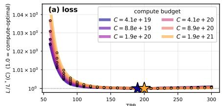

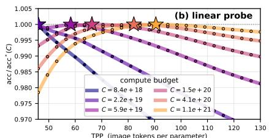  
Figure 5: Normalized iso-FLOP curves. (a) EMA loss $L / L ^ { * } ( C )$ and (b) linear-probe accuracy $\operatorname { a c c } / \operatorname { a c c } ^ { * } ( C )$ versus TPP for several compute budgets, each normalized to its per-budget optimum (star). The near-flat curves show the compute-optimal TPP is largely budget-insensitive; representational quality (b) is optimal at a substantially lower TPP than the loss (a).

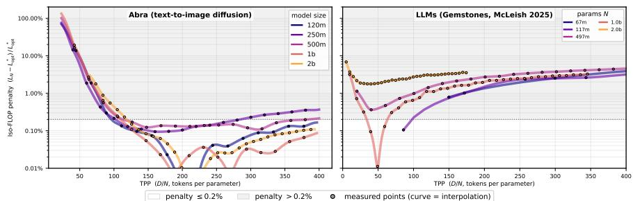

Figure 6: Relative iso-FLOP loss penalty $\Delta L / L ^ { * }$ (Eq. (2)) as a function of TPP for (left) the ABRA text-to-image diffusion family and (right) the Gemstones LLM suite (McLeish et al., 2025). ABRA markers denote evaluated checkpoints and Gemstones curves are the raw per-checkpoint fineweb-edu validation-loss penalties. The shaded bands mark the 0.2% penalty threshold (white below, grey above).  
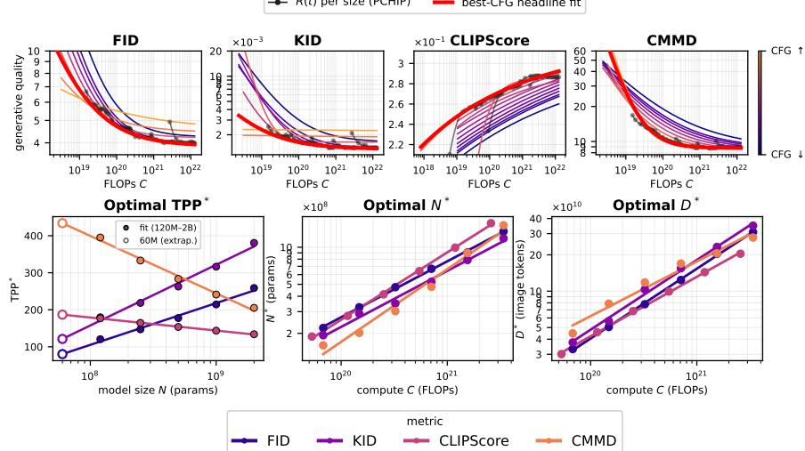  
Figure 7: Standard generative metrics scale predictably. Top: generative quality vs training compute C for FID, KID, CLIPScore, and CMMD. The bold red curve is its compute-optimal frontier. Bottom: compute-optimal TPP∗ as a function of model size N, and the compute-optimal $N _ { \mathrm { o p t } }$ and $D _ { \mathrm { o p t } }$ as functions of compute C.

Figure 7 (bottom) shows that compute-optimal allocation between D and N differs sharply across metrics. FID and KID require the dataset size to grow much more rapidly than the model size to reach compute optimality. On the other hand, CLIPScore and CMMD show decreasing optimal TPP as a function of compute, indicating that the number of parameters should grow more rapidly than the dataset size. We must therefore conclude that no single metric can define compute optimality, mirroring the situation where no single metric can determine visual quality (Stein et al., 2023; Jayasumana et al., 2024). We note that the heterogeneous capacity demands of these common generative metrics warrants further study into how these metrics correlate with human preferences.

Finally, we find that the optimal CFG decreases with both model size and training steps. Mei et al. (2025) report the same trend for model size and for sampling steps, but did not investigate this trend over training horizons. In summary, stronger generative capacity needs less guidance and the feature model behind each metric also shifts the optimal CFG. Appendix F.8 gives our full CFG analysis (Figures 17 and 19), including analyzing a DINOv2 (Oquab et al., 2024) family of metrics: FDD, KDD, and DMMD.

## 4.4 LINEAR PROBE ACCURACY

Finding: Linear-probe accuracy follows predictable scaling laws. Understanding performance is compute-optimal at far lower TPP than generation.

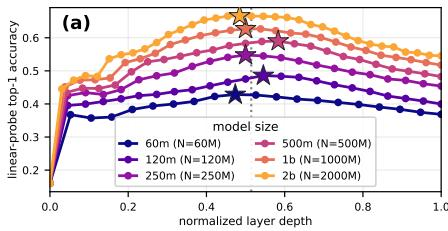

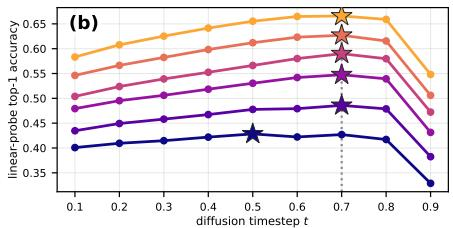

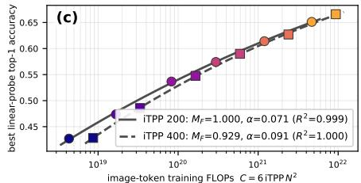

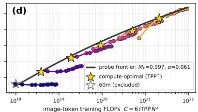  
Figure 8: (a) Best top-1 accuracy as a function of relative layer depth. (b) Best top-1 accuracy as a function of diffusion timestep. (c) Top-1 accuracy follows predictable scaling laws at different TPP. (d) Top-1 accuracy as a function of training compute.

Diffusion models are not only good visual generators, they are also good representation learners (Xiang et al., 2023). To investigate how the model’s understanding performance scales as a function of compute we conduct linear probing experiments (Chen et al., 2020; Alain & Bengio, 2016; Xiang et al., 2023) on frozen activations from each ABRA checkpoint and report ImageNet (Deng et al., 2009) top-1 accuracy. Following Xiang et al. (2023), we pool per-block features from a forward pass at a fixed diffusion timestep, and we sweep layers, timesteps, and training steps.

Figures 8(a) and (b) show that linear probing accuracy peaks for middle layers (consistent with (Chen et al., 2020; Yan et al., 2025; Xiang et al., 2023)) and for the moderately high diffusion timestep $t \approx 0 . 7$ . Figure 8(c) demonstrates that linear-probe accuracy $a ^ { * } ( C ) = \operatorname* { m a x } _ { t , \ell } \operatorname { a c c } ( C ; t , \ell )$ follows tight scaling laws at fixed TPP.

Additionally, we seek to understand the compute-optimal configuration for image understanding. Figure 5(b) applies the same iso-FLOP analysis of Section 4.1 to the per-model best probe accuracies $a ^ { * } ( C )$ shown in Figure 8(d). The optimal TPP for image understanding is much lower than the TPP for generation in the compute range that we tested, but notably the optimal allocation is far from the balanced $D \propto N$ that we found for generation quality. For image understanding optimal TPP is steadily increasing, indicating that FLOPs are more efficiently used for increasing dataset size rather than model size. The finding that understanding is easier than generation at these scales is consistent with the works of Yan et al. (2025) and Xiang et al. (2023).

This observation suggests that there is a “double-point” where both generation and understanding are jointly compute-optimal. We estimate this point to occur when training with about $5 \times 1 0 ^ { 2 2 }$ FLOPs and a 6B parameter model. Models larger than this, trained to compute optimality for generation, will no longer be undertrained for understanding.

## 4.5 SCALING COLLAPSE

Finding: Compute optimal diffusion model training exhibits scaling collapse.

Conventional scaling law analysis fits power laws in quantitative metrics after training (Hestness et al., 2017; Kaplan et al., 2020; Hoffmann et al., 2022). While Kaplan et al. (2020) attempt to fit the loss curves themselves to a sum of power laws, these fits do not seem to satisfactorily capture the qualitative aggregate scaling behavior of the training dynamics. More recently Qiu et al. (2025) showed that the loss curves of compute-optimally trained language models follow a universal, nonpower-law form. Training loss curves, when appropriately rescaled, exhibit scaling collapse where the training curve for each individual model in the scaling ladder collapse onto a single trajectory. Practically speaking the differences (in rescaled loss) between models of different sizes are smaller than the noise from running a single model with different seeds. This enables practitioners to use scaling collapse as a diagnostic tool during training and ensure that models remain near computeoptimal. To our knowledge this phenomenon has not been examined for diffusion models until now.

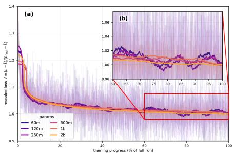

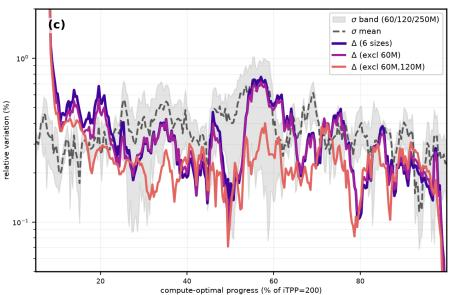  
Figure 9: (a) Training loss curves for six models from the ABRA family rescaled with Equation (3). (b) The deviation $\Delta$ between models collapses beneath the noise floor σ for the three seed-replicated models (ABRA-60M, ABRA-120M, and ABRA-250M).

Following Qiu et al. (2025) we let $p$ index our model family and consider the rescaled compute $C ( p ) = x t ^ { * } ( p )$ , where $x \in [ 0 , 1 ]$ and $t ^ { * } ( p )$ is the compute used for model $p .$ Thus x represents the percentage of training that has finished. We then define the rescaled loss

$$
\ell ( x , p ; \theta ) = \frac { L ( x t ^ { * } ( p ) , p ) - \hat { L } } { L ( t ^ { * } ( p ) , p ) - \hat { L } } ,\tag{3}
$$

as well as the collapse deviation $\Delta$ and the per-model (relative) noise floor

$$
\Delta ( x ) : = \frac { \mathbb { V } _ { p , \theta ( p ) } [ \ell ( x , p ; \theta ) ] ^ { 1 / 2 } } { \mathbb { E } _ { p , \theta ( p ) } [ \ell ( x , p ; \theta ) ] } , \qquad \sigma ( x ; p ) : = \frac { \mathbb { V } _ { \theta ( p ) } [ \mathcal { L } ( x t ^ { * } ( p ) , p , \theta ( p ) ) ] ^ { 1 / 2 } } { \mathbb { E } _ { \theta ( p ) } [ \mathcal { L } ( x t ^ { * } ( p ) , p , \theta ( p ) ) ] } ,
$$

where $\mathcal { L }$ is the shifted loss $ { \mathcal { L } } = L - \hat { L }$ and where $\hat { L }$ is the irreducible loss for the model family, found via our fit procedure. Rescaling in this manner fixes the endpoints of the training curves to match so that collapse indicates that the shape of the training curves depends only on relative compute. We run the ABRA-60M, ABRA-120M, and ABRA-250M with four different seeds, which change both the initialization and the data ordering. We cut off the data window at a fixed 200 TPP for all of the models based on the analysis above.

Figure 9 shows the result of our experiment. We plot the raw-loss curves with an overlaid SMA (left) and the raw $\Delta , \sigma$ values with their own SMA (right); the moving average is required in the context of diffusion since the training loss curves, and thus $\Delta$ and $\sigma _ { : }$ , are extremely noisy. Because we only ran multiple seeds up to 250M parameters, we can only determine the collapse for these three models. Despite the noise, we see a clear collapse in training loss to the noise floor within the first 15% of training. For the remainder of training, the cross-size deviation $\Delta$ remains at or below the noise floor $\sigma ,$ indicating that the ABRA family satisfies the criteria for scaling collapse and is therefore compute-optimal (or nearly compute-optimal).

Our results are consistent with the findings of Qiu et al. (2025) for models trained with a constant learning rate schedule. Of particular interest is our finding that collapse is a phenomenon which extends beyond the context of simple MLPs and LLMs. Despite being trained with a different loss target and data paradigm, compute-optimal collapse behavior persists.

## 4.6 THE EFFECT OF RESOLUTION

Finding: Higher resolution training requires more image tokens to reach compute optimality.

The slope of a scaling law is understood to be a property dependent more on the data distribution than the model architecture (Hestness et al., 2017; Bahri et al., 2024; Kaplan et al., 2020). The data distribution for images changes quite dramatically when we change resolution: the information per patch goes down and we rescale the timestep sampling distribution according to Hoogeboom et al. (2023). Therefore the natural hypothesis is that as image resolution increases we would expect that the diffusion models will require an increasing number of image tokens to reach compute optimality.

We show that this hypothesis is correct. We train the ABRA-120M through ABRA-500M ladder at 256, 384, 512, and 768 pixel resolutions. For each model we use the Hoogeboom et al. (2023) SNR rescaling on our base distribution. Models are evaluated using the log-normally distributed timesteps and thus we cannot compare losses directly across resolutions. However, for all resolutions we continue to see scaling behavior as a function of compute.

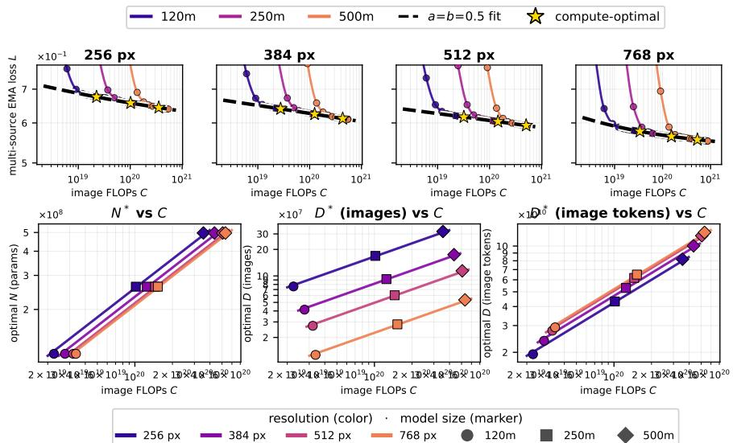  
Figure 10: (Top Row) Training curves and loss scaling laws at different resolutions. (Bottom Row) TPP as a function of resolution, compute-optimal model size, compute-optimal number of images, compute-optimal dataset size in number of image tokens. For these data we obtained estimated compute-optimal TPP of 165, 202, 235, and 247 respectively for the image sizes 256, 384, 512, and 768.

Because our largest models are only 500M, getting clean scaling law fits is challenging. To this end, and motivated by our analysis above, we assume the balanced compute optimality constraint $a = b = 0 . 5$ . Under this assumption we find that the compute-optimal TPP systematically increases as a function of resolution from about 165 at 256 × 256 resolution to around 247 at 768 × 768 resolution. While the required image tokens per parameter increases, the number of images required to realize the larger data consumption actually goes down: we need fewer images per-parameter as we increase resolution. This is consistent with the findings of Yan et al. (2025) in the context of pixel-autoregressive generation models.

The results indicate that training end-to-end on high-resolution images is proportionally more costly in terms of FLOPs. One consequence is that high-resolution diffusion models can be trained compute optimally on relatively few images, and high-resolution training is compute bound, not data bound.

## 5 CONCLUSION

We revisited compute-optimal scaling for text-to-image diffusion pre-training with 10× as much compute as previous studies and a controlled model family, ABRA, which spans 60M to 2B parameters. Text-to-image diffusion transformers follow tight, predictable scaling laws with compute optimality achieved at approximately 200 TPP, an order of magnitude higher than for LLMs.

We showed that diffusion model training is robust to overtraining, that common generative metrics like FID and CLIPScore follow predictable scaling trends in compute, and that as resolution increases the models take more tokens to reach compute optimality. Furthermore, we showed that the internal representation quality scales differently than generative capabilities and we showed, for the first time, that compute-optimal diffusion model training exhibits scaling collapse.

## ACKNOWLEDGMENTS

We thank Terrance DeVries and Linqi (Alex) Zhou for helpful discussion throughout the completion of this work.

## REFERENCES

Ibrahim Alabdulmohsin, Behnam Neyshabur, and Xiaohua Zhai. Revisiting Neural Scaling Laws in Language and Vision. In NeurIPS, 2022.

Guillaume Alain and Yoshua Bengio. Understanding intermediate layers using linear classifier probes. In arXiv:1610.01644, 2016.

Michael S. Albergo and Eric Vanden-Eijnden. Building normalizing flows with stochastic interpolants. In ICLR, 2023.

Dario Amodei, Sundaram Ananthanarayanan, Rishita Anubhai, Jingliang Bai, Eric Battenberg, Carl Case, Jared Casper, Bryan Catanzaro, Qiang Cheng, Guoliang Chen, et al. Deep speech 2: End-to-end speech recognition in english and mandarin. In ICML, 2016.

Yasaman Bahri, Ethan Dyer, Jared Kaplan, Jaehoon Lee, and Utkarsh Sharma. Explaining neural scaling laws. Proceedings of the National Academy of Sciences, 121(27):e2311878121, 2024. doi: 10.1073/pnas.2311878121.

Shane Bergsma, Nolan Dey, Gurpreet Gosal, Gavia Gray, Daria Soboleva, and Joel Hestness. Power Lines: Scaling Laws for Weight Decay and Batch Size in LLM Pre-training. In NeurIPS, 2025a.

Shane Bergsma, Bin Claire Zhang, Nolan Dey, Shaheer Muhammad, Gurpreet Gosal, and Joel Hestness. Scaling with Collapse: Efficient and Predictable Training of LLM Families. In arXiv:2509.25087, 2025b.

Tamay Besiroglu, Ege Erdil, Matthew Barnett, and Josh You. Chinchilla Scaling: A replication attempt. In arXiv:2404.10102, 2024.

James Betker, Gabriel Goh, Li Jing, Tim Brooks, Jianfeng Wang, Linjie Li, Long Ouyang, Juntang Zhuang, Joyce Lee, Yufei Guo, Wesam Manassra, Prafulla Dhariwal, Casey Chu, Yunxin Jiao, and Aditya Ramesh. Improving image generation with better captions. https://cdn.openai. com/papers/dall-e-3.pdf, 2023. OpenAI technical report. Accessed: 2026-07-22.

Mikołaj Binkowski, Danica J. Sutherland, Michael Arbel, and Arthur Gretton. Demystifying MMD´ GANs. In ICLR, 2018.

Black Forest Labs. FLUX.2: Frontier Visual Intelligence. https://github.com/blackforest-labs/flux2, 2025. Accessed: 2026-07-22.

Ethan Caballero, Kshitij Gupta, Irina Rish, and David Krueger. Broken Neural Scaling Laws. In ICLR, 2023.

Junsong Chen, Jincheng Yu, Chongjian Ge, Lewei Yao, Enze Xie, Zhongdao Wang, James Kwok, Ping Luo, Huchuan Lu, and Zhenguo Li. PixArt-α: Fast training of diffusion transformer for photorealistic text-to-image synthesis. In ICLR, 2024.

Mark Chen, Alec Radford, Rewon Child, Jeffrey Wu, Heewoo Jun, David Luan, and Ilya Sutskever. Generative pretraining from pixels. In Proceedings of the 37th International Conference on Machine Learning, volume 119 of Proceedings ofMachine Learning Research, pp. 1691–1703. PMLR, 2020. URL https://proceedings.mlr.press/v119/chen20s.html.

Kyle R. Chickering. The spectral maximal update parameterization in theory and practice. https: //kyrochi.github.io/blog/spectral-mup/index.html, 2025. Accessed: 2026- 07-22.

Kyle R Chickering, Huijuan Wang, Mengxi Wu, Alexander Moreno, Muhao Chen, Xuezhe Ma, Daria Soboleva, Joel Hestness, Zhengzhong Liu, and Eric Xing. GQA-µP: The maximal parameterization update for grouped query attention. In arXiv:2605.15290, 2026.

Aakanksha Chowdhery, Sharan Narang, Jacob Devlin, Maarten Bosma, Gaurav Mishra, Adam Roberts, Paul Barham, Hyung Won Chung, Charles Sutton, Sebastian Gehrmann, Parker Schuh, Kensen Shi, Sasha Tsvyashchenko, Joshua Maynez, Abhishek Rao, Parker Barnes, Yi Tay, Noam Shazeer, Vinodkumar Prabhakaran, Emily Reif, Nan Du, Ben Hutchinson, Reiner Pope, James

Bradbury, Jacob Austin, Michael Isard, Guy Gur-Ari, Pengcheng Yin, Toju Duke, Anselm Levskaya, Sanjay Ghemawat, Sunipa Dev, Henryk Michalewski, Xavier Garcia, Vedant Misra, Kevin Robinson, Liam Fedus, Denny Zhou, Daphne Ippolito, David Luan, Hyeontaek Lim, Barret Zoph, Alexander Spiridonov, Ryan Sepassi, David Dohan, Shivani Agrawal, Mark Omernick, Andrew M. Dai, Thanumalayan Sankaranarayana Pillai, Marie Pellat, Aitor Lewkowycz, Erica Moreira, Rewon Child, Oleksandr Polozov, Katherine Lee, Zongwei Zhou, Xuezhi Wang, Brennan Saeta, Mark Diaz, Orhan Firat, Michele Catasta, Jason Wei, Kathy Meier-Hellstern, Douglas Eck, Jeff Dean, Slav Petrov, and Noah Fiedel. PaLM: Scaling language modeling with pathways. In JMLR, 2023.

DeepSeek-AI. DeepSeek LLM: Scaling open-source language models with longtermism. In arXiv:2401.02954, 2024.

Jia Deng, Wei Dong, Richard Socher, Li-Jia Li, Kai Li, and Li Fei-Fei. Imagenet: A large-scale hierarchical image database. In CVPR, 2009.

Nolan Dey, Gurpreet Gosal, Zhiming Chen, Hemant Khachane, William Marshall, Ribhu Pathria, Marvin Tom, and Joel Hestness. Cerebras-GPT: Open compute-optimal language models trained on the Cerebras wafer-scale cluster. In arXiv:2304.03208, 2023.

Nolan Dey, Bin Claire Zhang, Lorenzo Noci, Mufan Li, Blake Bordelon, Shane Bergsma, Cengiz Pehlevan, Boris Hanin, and Joel Hestness. Don’t be lazy: CompleteP enables compute-efficient deep transformers. In NeurIPS, 2025.

Patrick Esser, Sumith Kulal, Andreas Blattmann, Rahim Entezari, Jonas Müller, Harry Saini, Yam Levi, Dominik Lorenz, Axel Sauer, Frederic Boesel, Dustin Podell, Tim Dockhorn, Zion English, Kyle Lacey, Alex Goodwin, Yannik Marek, and Robin Rombach. Scaling rectified flow transformers for high-resolution image synthesis. In ICML, 2024.

F. N. Fritsch and J. Butland. A method for constructing local monotone piecewise cubic interpolants. In SIAM Journal on Scientific and Statistical Computing, 1984.

F. N. Fritsch and R. E. Carlson. Monotone piecewise cubic interpolation. In SIAM Journal on Numerical Analysis, 1980.

Samir Yitzhak Gadre, Gabriel Ilharco, Alex Fang, Jonathan Hayase, Georgios Smyrnis, Thao Nguyen, Ryan Marten, Mitchell Wortsman, Dhruba Ghosh, Jieyu Zhang, Eyal Orgad, Rahim Entezari, Giannis Daras, Sarah Pratt, Vivek Ramanujan, Yonatan Bitton, Kalyani Marathe, Stephen Mussmann, Richard Vencu, Mehdi Cherti, Ranjay Krishna, Pang Wei Koh, Olga Saukh, Alexander Ratner, Shuran Song, Hannaneh Hajishirzi, Ali Farhadi, Romain Beaumont, Sewoong Oh, Alex Dimakis, Jenia Jitsev, Yair Carmon, Vaishaal Shankar, and Ludwig Schmidt. DataComp: In search of the next generation of multimodal datasets. In NeurIPS, 2023.

Samir Yitzhak Gadre, Georgios Smyrnis, Vaishaal Shankar, Suchin Gururangan, Mitchell Wortsman, Rulin Shao, Jean Mercat, Alex Fang, Jeffrey Li, Sedrick Keh, Rui Xin, Marianna Nezhurina, Igor Vasiljevic, Jenia Jitsev, Alexandros G. Dimakis, Gabriel Ilharco, Shuran Song, Thomas Kollar, Yair Carmon, Achal Dave, Reinhard Heckel, Niklas Muennighoff, and Ludwig Schmidt. Language models scale reliably with over-training and on downstream tasks. In ICLR, 2025.

Chongjian Ge, Hanwen Jiang, Tianyu Wang, Jiuxiang Gu, Yiran Xu, Ziwen Chen, Shaoteng Liu, Jing Shi, Yicong Hong, Zefan Cai, Hailin Jin, and Hao Tan. Chimera: Designing and Chinchilla-Scaling Hybrid Visual Diffusion Transformers. In arXiv:2607.28611, 2026.

Aaron Grattafiori et al. The Llama 3 herd of models. In arXiv:2407.21783, 2024.

Vineet Gupta, Tomer Koren, and Yoram Singer. Shampoo: Preconditioned Stochastic Tensor Optimization. In ICML, 2018.

Eric Heitz, Laurent Belcour, and Thomas Chambon. Iterative α-(de)blending: A minimalist deterministic diffusion model. In SIGGRAPH, 2023.

Alex Henry, Prudhvi Raj Dachapally, Shubham Pawar, and Yuxuan Chen. Query-key normalization for transformers. In Findings ofEMNLP, 2020.

Jack Hessel, Ari Holtzman, Maxwell Forbes, Ronan Le Bras, and Yejin Choi. CLIPScore: A reference-free evaluation metric for image captioning. In EMNLP, 2021.

Joel Hestness, Sharan Narang, Newsha Ardalani, Gregory Diamos, Heewoo Jun, Hassan Kianinejad, Md Mostofa Ali Patwary, Yang Yang, and Yanqi Zhou. Deep Learning Scaling is Predictable, Empirically. In arXiv:1712.00409, 2017.

Martin Heusel, Hubert Ramsauer, Thomas Unterthiner, Bernhard Nessler, and Sepp Hochreiter. GANs trained by a two time-scale update rule converge to a local nash equilibrium. In NeurIPS, 2017.

Jonathan Ho and Tim Salimans. Classifier-free diffusion guidance. In arXiv:2207.12598, 2022.

Jonathan Ho, Ajay Jain, and Pieter Abbeel. Denoising diffusion probabilistic models. In NeurIPS, 2020.

Jordan Hoffmann, Sebastian Borgeaud, Arthur Mensch, Elena Buchatskaya, Trevor Cai, Eliza Rutherford, Diego de Las Casas, Lisa Anne Hendricks, Johannes Welbl, Aidan Clark, Thomas Hennigan, Eric Noland, Katherine Millican, George van den Driessche, Bogdan Damoc, Aurelia Guy, Simon Osindero, Karén Simonyan, Erich Elsen, Oriol Vinyals, Jack Rae, and Laurent Sifre. An empirical analysis of compute-optimal large language model training. In NeurIPS, 2022.

Emiel Hoogeboom, Jonathan Heek, and Tim Salimans. simple diffusion: End-to-end diffusion for high resolution images. In ICML, 2023.

Sadeep Jayasumana, Srikumar Ramalingam, Andreas Veit, Daniel Glasner, Ayan Chakrabarti, and Sanjiv Kumar. Rethinking fid: Towards a better evaluation metric for image generation. In CVPR, 2024.

Tianze Jiang, Blake Bordelon, Cengiz Pehlevan, and Boris Hanin. Hyperparameter transfer with mixture-of-expert layers. In arXiv:2601.20205, 2026.

Keller Jordan, Yuchen Jin, Vlado Boza, You Jiacheng, Franz Cesista, Laker Newhouse, and Jeremy Bernstein. Muon: An optimizer for hidden layers in neural networks. https: //kellerjordan.github.io/posts/muon/, 2024. Accessed: 2026-07-22.

Jared Kaplan, Sam McCandlish, Tom Henighan, Tom B. Brown, Benjamin Chess, Rewon Child, Scott Gray, Alec Radford, Jeffrey Wu, and Dario Amodei. Scaling Laws for Neural Language Models. In arXiv:2001.08361, 2020.

Tero Karras, Miika Aittala, Jaakko Lehtinen, Janne Hellsten, Timo Aila, and Samuli Laine. Analyzing and improving the training dynamics of diffusion models. In CVPR, 2024.

Kimi Team. Kimi k2: Open agentic intelligence. In arXiv:2507.20534, 2025.

Diederik P Kingma and Jimmy Ba. Adam: A method for stochastic optimization. In ICLR, 2015.

Diederik P. Kingma and Max Welling. Auto-encoding variational bayes. In ICLR, 2014.

Hao Li, Shamit Lal, Zhiheng Li, Yusheng Xie, Ying Wang, Yang Zou, Orchid Majumder, R. Manmatha, Zhuowen Tu, Stefano Ermon, Stefano Soatto, and Ashwin Swaminathan. Efficient scaling of diffusion transformers for text-to-image generation. In arXiv:2412.12391, 2024a.

Hao Li, Yang Zou, Ying Wang, Orchid Majumder, Yusheng Xie, R. Manmatha, Ashwin Swaminathan, Zhuowen Tu, Stefano Ermon, and Stefano Soatto. On the Scalability of Diffusion-based Text-to-Image Generation. In CVPR, 2024b.

Margaret Li, Sneha Kudugunta, and Luke Zettlemoyer. (Mis)Fitting: A Survey of Scaling Laws. In arXiv:2502.18969, 2025.

Zhengyang Liang, Hao He, Ceyuan Yang, and Bo Dai. Scaling laws for diffusion transformers. In arXiv:2410.08184, 2024.

Tomasz Limisiewicz, Artidoro Pagnoni, Srini Iyer, Mike Lewis, Sachin Mehta, Alisa Liu, Margaret Li, Gargi Ghosh, and Luke Zettlemoyer. Compute Optimal Tokenization. In arXiv:2605.01188, 2026.

Yaron Lipman, Ricky TQ Chen, Heli Ben-Hamu, Maximilian Nickel, and Matt Le. Flow matching for generative modeling. In ICLR, 2023.

Xingchao Liu, Chengyue Gong, and Qiang Liu. Flow straight and fast: Learning to generate and transfer data with rectified flow. In ICLR, 2023.

Nanye Ma, Mark Goldstein, Michael S. Albergo, Nicholas M. Boffi, Eric Vanden-Eijnden, and Saining Xie. SiT: Exploring flow and diffusion-based generative models with scalable interpolant transformers. In ECCV, 2024.

Sean McLeish, John Kirchenbauer, David Yu Miller, Siddharth Singh, Abhinav Bhatele, Micah Goldblum, Ashwinee Panda, and Tom Goldstein. Gemstones: A model suite for multi-faceted scaling laws. In NeurIPS, 2025.

Kangfu Mei, Zhengzhong Tu, Mauricio Delbracio, Hossein Talebi, Vishal M. Patel, and Peyman Milanfar. Bigger is not Always Better: Scaling Properties of Latent Diffusion Models. In TMLR, 2025.

Bruno Mlodozeniec, Pierre Ablin, Louis Béthune, Dan Busbridge, Michal Klein, Jason Ramapuram, and Marco Cuturi. Completed hyperparameter transfer across modules, width, depth, batch and duration. In arXiv:2512.22382, 2025.

Niklas Muennighoff, Alexander M. Rush, Boaz Barak, Teven Le Scao, Aleksandra Piktus, Nouamane Tazi, Sampo Pyysalo, Thomas Wolf, and Colin Raffel. Scaling Data-Constrained Language Models. In arXiv:2305.16264, 2023.

NVIDIA. Nemotron-H: A family of accurate and efficient hybrid Mamba-transformer models. In arXiv:2504.03624, 2025.

OpenAI. GPT-4 technical report. In arXiv:2303.08774, 2023.

Maxime Oquab, Timothée Darcet, Théo Moutakanni, Huy Vo, Marc Szafraniec, Vasil Khalidov, Pierre Fernandez, Daniel Haziza, Francisco Massa, Alaaeldin El-Nouby, Mahmoud Assran, Nicolas Ballas, Wojciech Galuba, Russell Howes, Po-Yao Huang, Shang-Wen Li, Ishan Misra, Michael Rabbat, Vasu Sharma, Gabriel Synnaeve, Hu Xu, Hervé Jégou, Julien Mairal, Patrick Labatut, Armand Joulin, and Piotr Bojanowski. DINOv2: Learning robust visual features without supervision. In TMLR, 2024.

William Peebles and Saining Xie. Scalable diffusion models with transformers. In ICCV, 2023.

Tomer Porian, Mitchell Wortsman, Jenia Jitsev, Ludwig Schmidt, and Yair Carmon. Resolving Discrepancies in Compute-Optimal Scaling of Language Models. In NeurIPS, 2024.

Mihir Prabhudesai, Mengning Wu, Amir Zadeh, Katerina Fragkiadaki, and Deepak Pathak. Diffusion beats autoregressive in data-constrained settings. In arXiv:2507.15857, 2025.

Shikai Qiu, Lechao Xiao, Andrew Gordon Wilson, Jeffrey Pennington, and Atish Agarwala. Scaling collapse reveals universal dynamics in compute-optimally trained neural networks. In ICML, 2025.

Robin Rombach, Andreas Blattmann, Dominik Lorenz, Patrick Esser, and Björn Ommer. Highresolution image synthesis with latent diffusion models. In CVPR, 2022.

Simo Ryu and Chunghwan Han. Summer-22B: A Systematic Approach to Dataset Engineering and Training at Scale for Video Foundation Model. In arXiv:2603.00173, 2026.

Chitwan Saharia, William Chan, Saurabh Saxena, Lala Li, Jay Whang, Emily Denton, Seyed Kamyar Seyed Ghasemipour, Burcu Karagol Ayan, S. Sara Mahdavi, Rapha Gontijo Lopes, Tim Salimans, Jonathan Ho, David J. Fleet, and Mohammad Norouzi. Photorealistic text-to-image diffusion models with deep language understanding. In NeurIPS, 2022.

Tim Salimans and Jonathan Ho. Progressive distillation for fast sampling of diffusion models. In ICLR, 2022.

Jascha Sohl-Dickstein, Eric A. Weiss, Niru Maheswaranathan, and Surya Ganguli. Deep unsupervised learning using nonequilibrium thermodynamics. In ICML, 2015.

Jiaming Song, Chenlin Meng, and Stefano Ermon. Denoising diffusion implicit models. In ICLR, 2021a.

Yang Song, Jascha Sohl-Dickstein, Diederik P. Kingma, Abhishek Kumar, Stefano Ermon, and Ben Poole. Score-based generative modeling through stochastic differential equations. In ICLR, 2021b.

George Stein, Jesse C. Cresswell, Rasa Hosseinzadeh, Yi Sui, Brendan Leigh Ross, Valentin Villecroze, Zhaoyan Liu, Anthony L. Caterini, J. Eric T. Taylor, and Gabriel Loaiza-Ganem. Exposing flaws of generative model evaluation metrics and their unfair treatment of diffusion models. In NeurIPS, 2023.

Xingwu Sun et al. Hunyuan-Large: An open-source MoE model with 52 billion activated parameters by Tencent. In arXiv:2411.02265, 2024.

Chaofan Tao, Qian Liu, Longxu Dou, Niklas Muennighoff, Zhongwei Wan, Ping Luo, Min Lin, and Ngai Wong. Scaling laws with vocabulary: Larger models deserve larger vocabularies. In NeurIPS, 2024.

The Microsoft AI Team. MAI-Thinking-1: Building a hill-climbing machine. https:// microsoft.ai/pdf/mai-thinking-1.pdf, 2026. Accessed: 2026-07-22.

Lucas Theis, Aäron van den Oord, and Matthias Bethge. A note on the evaluation of generative models. In ICLR, 2016.

Hugo Touvron, Thibaut Lavril, Gautier Izacard, Xavier Martinet, Marie-Anne Lachaux, Timothée Lacroix, Baptiste Rozière, Naman Goyal, Eric Hambro, Faisal Azhar, Aurelien Rodriguez, Armand Joulin, Edouard Grave, and Guillaume Lample. LLaMA: Open and efficient foundation language models. In arXiv:2302.13971, 2023.

Nikhil Vyas, Depen Morwani, Rosie Zhao, Mujin Kwun, Itai Shapira, David Brandfonbrener, Lucas Janson, and Sham Kakade. SOAP: Improving and stabilizing shampoo using adam. In arXiv:2409.11321, 2024.

Weilai Xiang, Hongyu Yang, Di Huang, and Yunhong Wang. Denoising diffusion autoencoders are unified self-supervised learners. In ICCV, 2023.

Xinchen Yan, Chen Liang, Lijun Yu, Adams Wei Yu, Yifeng Lu, and Quoc V. Le. Rethinking generative image pretraining: How far are we from scaling up next-pixel prediction? In arXiv:2511.08704, 2025.

An Yang, Anfeng Li, Baosong Yang, Beichen Zhang, Binyuan Hui, Bo Zheng, Bowen Yu, Chang Gao, Chengen Huang, Chenxu Lv, Chujie Zheng, Dayiheng Liu, Fan Zhou, Fei Huang, Feng Hu, et al. Qwen3 technical report. In arXiv:2505.09388, 2025.

Ge Yang, Edward Hu, Igor Babuschkin, Szymon Sidor, Xiaodong Liu, David Farhi, Nick Ryder, Jakub Pachocki, Weizhu Chen, and Jianfeng Gao. Tuning large neural networks via zero-shot hyperparameter transfer. In NeurIPS, 2021.

Yuanyang Yin, Yaqi Zhao, Mingwu Zheng, Ke Lin, Jiarong Ou, Rui Chen, Victor Shea-Jay Huang, Jiahao Wang, Xin Tao, Pengfei Wan, Di Zhang, Baoqun Yin, Wentao Zhang, and Kun Gai. Towards Precise Scaling Laws for Video Diffusion Transformers. In CVPR, 2025.

Jiahui Yu, Yuanzhong Xu, Jing Yu Koh, Thang Luong, Gunjan Baid, Zirui Wang, Vijay Vasudevan, Alexander Ku, Yinfei Yang, Burcu Karagol Ayan, Ben Hutchinson, Wei Han, Zarana Parekh, Xin Li, Han Zhang, Jason Baldridge, and Yonghui Wu. Scaling autoregressive models for content-rich text-to-image generation. In TMLR, 2022.

Biao Zhang and Rico Sennrich. Root mean square layer normalization. In NeurIPS, 2019.

Chenyu Zheng, Xinyu Zhang, Rongzhen Wang, Wei Huang, Zhi Tian, Weilin Huang, Jun Zhu, and Chongxuan Li. Scaling Diffusion Transformers Efficiently via µP. In arXiv:2505.15270, 2025.

## A ARCHITECTURAL DECISIONS

Scaling Family. Our architecture draws its components from various open source image generation models like FLUX.2 (Black Forest Labs, 2025) and PixArt-α (Chen et al., 2024). We use ungated SiLU activation functions with an FFN expansion ratio of 6 instead of the usual 4. We fix the head dimension to 128 and grow width through the number of heads. We use parametric RMSNorm (Zhang & Sennrich, 2019) as the QK-normalization strategy (Henry et al., 2020). We use non-parametric RMSNorm for the layer normalization which we found to slightly outperform parametric RMSNorm in initial testing. We do a single AdaLN layer shared between all blocks (Chen et al., 2024). We chose to use four double-stream blocks per model and scale depth by adding single-stream blocks. The per-model depth, width, head count, feed-forward expansion ratio, and training configuration are given in Table 1.

Table 1: The ABRA model family and its training configuration. “Double” and “Single” count the double- and single-stream MMDiT blocks (Esser et al., 2024; Black Forest Labs, 2025); “Batch” is the global batch size in images. Parameter counts exclude the frozen text encoder.
<table><tr><td>Model</td><td>Params</td><td>Double</td><td>Single</td><td>Width</td><td>Heads</td><td>Batch (img.)</td><td>Steps</td><td>Image-tokens</td></tr><tr><td>ABRA-60M</td><td>60.1M</td><td>4</td><td>15</td><td>384</td><td>3</td><td>128</td><td>183k</td><td> $2 . 4 \times 1 0 ^ { 1 0 }$ </td></tr><tr><td>ABRA-120M</td><td>118.0M</td><td>4</td><td>18</td><td>512</td><td>4</td><td>256</td><td>180k</td><td> $4 . 7 \times 1 0 ^ { 1 0 }$ </td></tr><tr><td>ABRA-250M</td><td>262.3M</td><td>4</td><td>18</td><td>768</td><td>6</td><td>512</td><td>200k</td><td> $1 . 0 \times 1 0 ^ { 1 1 }$ </td></tr><tr><td>ABRA-500M</td><td>497.0M</td><td>4</td><td>20</td><td>1024</td><td>8</td><td>1024</td><td>190k</td><td> $2 . 0 \times 1 0 ^ { 1 1 }$ </td></tr><tr><td>ABRA-1B</td><td>998.8M</td><td>4</td><td>22</td><td>1408</td><td>11</td><td>2048</td><td>191k</td><td> $4 . 0 \times 1 0 ^ { 1 1 }$ </td></tr><tr><td>ABRA-2B</td><td>1.97B</td><td>4</td><td>29</td><td>1792</td><td>14</td><td>4032</td><td>191k</td><td> $7 . 9 \times 1 0 ^ { 1 1 }$ </td></tr></table>

Removal of Bias Terms and Weight Decay. We train our model with all bias terms removed. We found that this slightly improved performance in initial architectural ablations. This observation is not new and many other large-scale training efforts remove bias terms (Chowdhery et al., 2023; Touvron et al., 2023; Karras et al., 2024; Black Forest Labs, 2025; NVIDIA, 2025). We train our models with no weight decay (Peebles & Xie, 2023) which is standard in diffusion model training.

Maximal Update Parameterization $( \mu \mathbf { P } ) .$ . We apply $\mu \mathrm { P }$ to ensure transfer of optimal learning rate throughout the scaling ladder. We validated that transfer occurred for ABRA-120M and ABRA-250M of our scaling law experiments. We validated our $\mu \mathrm { P }$ implementation using spectral coordinate checking (Chickering et al., 2026; Chickering, 2025), which is more robust to catching implementation errors than the original formulation of coordinate checking from Yang et al. (2021).

Softmax Scaling Factor. We found that using QK-norm together with $\mu \mathrm { P }$ occasionally led to instabilities in the training. We attributed these instabilities to the normalization scheme in the softmax. Using QK-norm changes the expected scaling of the softmax argument. In normal $\mu \mathrm { P }$ we assume that $Q , K \sim \mathcal { N } ( 0 , \bar { 1 / n } ) , x \sim \overset { \sim } \mathcal { N } ( 0 , 1 )$ from which we find that $Q x , K x \sim \mathcal { N } ( 0 , 1 )$ with norms scaling like $\| Q \dot { x } \| , \dot { \| } K \dot { x } \| \sim \sqrt { n }$ . However, with QK-norm, we instead have that $\| \widetilde { Q } x \| , \| \widetilde { K } x \| \sim 1$ . Therefore, the products $( Q x ) ^ { \top } ( K x )$ are expected to scale with $\sqrt { d }$ instead of just d. We validated this empirically by comparing the different softmax scalings in the presence of QK-norm.

Epoch Repetition Factors. We report the number of epochs that each model is trained for in Table 2. At 400 TPP our 2B model trains for nearly 8 epochs. We note that diffusion models are known to be much more tolerant of repetition than LLMs (Prabhudesai et al., 2025; Muennighoff et al., 2023). Table 2: Epoch repetition factor (number of passes over the 100M-sample mix) for each model, $D _ { I } / 1 0 ^ { 8 }$ , where $D _ { I } = B$ · steps is the total images processed at the final (400 TPP) checkpoint.
<table><tr><td>Model</td><td>Images  $D _ { I }$ </td><td>Epochs at 200 TPP</td><td>Epochs at 400 TPP</td></tr><tr><td>ABRA-60M</td><td>23.4M</td><td>0.12</td><td>0.23</td></tr><tr><td>ABRA-120M</td><td>46.1M</td><td>0.23</td><td>0.46</td></tr><tr><td>ABRA-250M</td><td>102.4M</td><td>0.51</td><td>1.02</td></tr><tr><td>ABRA-500M</td><td>194.6M</td><td>0.98</td><td>1.95</td></tr><tr><td>ABRA-1B</td><td>391.2M</td><td>1.95</td><td>3.91</td></tr><tr><td>ABRA-2B</td><td>770.1M</td><td>3.85</td><td>7.70</td></tr></table>

## B LIMITATIONS

Our results rely on several axes remaining fixed. We speculate that ablations along these axes will result in a shift of the optimal TPP finding, as we saw already with resolution.

1. Optimizers: We looked only at the Adam optimizer. However more recent optimizers like Muon (Jordan et al., 2024), Shampoo (Gupta et al., 2018), and SOAP (Vyas et al., 2024) may scale differently. In the context of LLMs, these optimizers seem to shift the intercept of the scaling law but do not affect the compute-optimal TPP (Kimi Team, 2025).

2. Text Encoder: We only ever used a single text encoder in this work, however we expect that variations in the text encoder will have some measurable effect on the output quality of the models. This will necessarily shift the scaling laws in some way.

3. Vision Encoder: In the context of LLMs the role of the text encoder in scaling behavior is an actively studied area (Tao et al., 2024; Limisiewicz et al., 2026). We did not ablate the vision encoder in our work but it seems likely that the choice of vision encoder will materially affect the scaling behavior of text-to-image generation.

4. Batch Size Scaling: Compute-optimal batch size scaling studies have only recently been conducted in the much cheaper context of LLM scaling (Bergsma et al., 2025a). We suspect that there exist analogous compute-optimal batch size scaling laws for diffusion models but the empirical study of these scaling laws is beyond the scope of the present work.

## C THE EFFECT OF DIFFUSION TIMESTEP

Finding: Flow-matching loss is heterogeneous across diffusion timesteps, yet each timestep on its own continues to obey a scaling law.

The training loss aggregates per-timestep losses weighted by the logit-normal timestep distribution. It is useful to isolate the per-sample loss and its expectation, the loss response curve,

$$
\begin{array} { r } { \mathcal { L } ( v _ { \theta } , t ; x , \varepsilon ) : = \displaystyle \frac { 1 } { n } \| v _ { \theta } ( t ; x _ { t } ) - ( \varepsilon - x ) \| _ { L ^ { 2 } } ^ { 2 } , } \\ { \mathcal { L } ^ { * } ( v _ { \theta } , t ) : = \mathbb { E } \underbrace { \quad _ { x \in \Omega } } _ { \varepsilon \sim \mathcal { N } ( 0 , I ) } \left[ \mathcal { L } ( v _ { \theta } , t ; x , \varepsilon ) \right] . } \end{array}
$$

We can then consider the oracle loss $\begin{array} { r } { v ^ { * } ( t ) = \operatorname* { i n f } _ { v ( t ) \in C ^ { 1 } } \mathcal { L } ^ { * } ( v ; t ) } \end{array}$ , the minimizer of the loss response curve over an appropriate function space. This oracle is intractable on the interior, but its value at the two endpoints follows easily. $\mathbf { A } \mathbf { t } t = 0$ (a clean image) we have

$$
v ^ { * } ( 0 ; x ) = - x , \mathcal { L } ^ { * } ( v ^ { * } , 0 ) = \mathbb { E } _ { \varepsilon \sim \mathcal { N } ( 0 , 1 ) } \left[ \lVert \varepsilon \rVert _ { L ^ { 2 } } ^ { 2 } \right] = 1 ,
$$

and at t = 1 (pure noise)

$$
v ^ { * } ( 1 ; x ) = \varepsilon , \mathcal { L } ^ { * } ( v ^ { * } , 1 ) = \mathbb { E } _ { x \sim \Omega } \left[ \Vert x \Vert _ { L ^ { 2 } } ^ { 2 } \right] ,
$$

a constant fixed empirically by the data distribution Ω. Both follow because x and ε are independent: at each endpoint the model receives no information about the other, and the loss is minimized by guessing that quantity’s mean.

In practice this loss response curve $\mathcal { L } ^ { \ast } ( v _ { \theta } , t )$ is highly heterogeneous. We measure it by sampling the EMA model 100k times using the logit-normal training distribution and bucketing the individual per-timestep losses (Figure 11). The endpoints sit near their oracle floors, while the interior timesteps carry the bulk of the reducible loss.

Despite the heterogeneity each timestep bucket individually obeys a clean scaling law. Binning the trajectory into ten uniform buckets and fitting the per-bucket loss law $L _ { b } ( C ) = \bar { A } _ { b } C ^ { - \alpha _ { b } }$ yields ten well-behaved fits (see Figure 11). The scaling exponents differ across buckets implying that the rate at which different timesteps reach compute optimality is heterogeneous: some timesteps saturate compute early while others continue to learn rapidly.

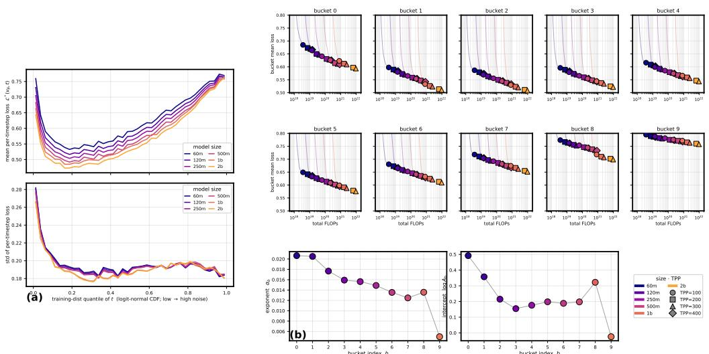  
Figure 11: Timestep loss response and per-bucket scaling. Left: the per-timestep loss response curves $\mathcal { L } ^ { \ast } ( v _ { \theta } , t )$ (mean, top; std, bottom) at the final checkpoint for the ABRA family. Right: each timestep bucket individually obeys a clean scaling law. Top two rows: scaling laws in EMA model loss for 10 timestep buckets. Bottom: the exponents $\alpha _ { b }$ and biases log $A _ { b }$ of the supporting-hyperplane fits per bucket.

## D MODEL GENERATIONS

We share non-cherry-picked sample generations using prompts from the Parti Prompts dataset (Yu et al., 2022). We sorted the prompts into “simple”, “standard”, and “complex” based on the length of the prompt. Figure 12 shows the generated responses of our models at a fixed guidance scale of 3.0. Figure 13 shows the generations for each model size with varying guidance scale.

## E EXTENDED SCALING ANALYSIS

In Section 4.2 above we compared the iso-FLOP suboptimality penalty of the ABRA family of models to the LLM family trained by McLeish et al. (2025) (see Figure 6). In this section we include the same analysis carried out against other open-source LLM pre-training data. In particular, we compare against Gadre et al. (2025) (see Figure 14), Porian et al. (2024) (Figure 16), and the Chinchilla paper (Hoffmann et al., 2022) (Figure 15). We are not aware of an openly available source for the Chinchilla study’s data and thus use digitization to extract loss curves from the paper’s figures.

## F FIT PROCEDURES, ALTERNATIVES, AND THE KAPLAN/HOFFMANN RECIPES

We detail our fitting methodology, with error and quality-of-fit analysis, reproduce the two canonical language-model recipes of Kaplan et al. (2020) and Hoffmann et al. (2022), and test several alternative estimators. All fits are collected in Table 4.

The main-body procedure (Section 4.1) fits per-TPP power laws $L ( C ; \mathrm { T P P } ) = A C ^ { - \alpha } + \beta$ to the EMA-weight loss and reads the optimum off iso-FLOP slices, interpolating each trajectory with PCHIP (Fritsch & Carlson, 1980; Fritsch & Butland, 1984) and counting N as all diffusiontransformer parameters (frozen text encoder excluded). The per-TPP fits are trust-region non-linear least squares on the raw loss values in the physical space, after discarding the first 5,000 warmup steps.

## F.1 SUPPORTING-HYPERPLANE FIT

The compute-optimal frontier is a maximal lower bound of the family’s loss curves, so we fit it directly as the maximal power-law lower bound of the measured $( N , C , L )$ points. Over a grid of exponents α we solve for the amplitude and offset $( A , \beta )$ maximizing the fitted loss subject to $\hat { L } _ { i } : = A C _ { i } ^ { - \alpha } + \beta \leq L _ { i }$ at every Pareto point i, then select the α of minimal total slack $\textstyle \sum _ { i } ( L _ { i } - { \hat { L } } _ { i } )$ On ABRA this recovers the same $L ^ { * } ( C )$ as the iso-FLOP envelope to within $< 0 . 1 \%$ (coefficients in Table 5).

120m

250m

500m

1b

2b

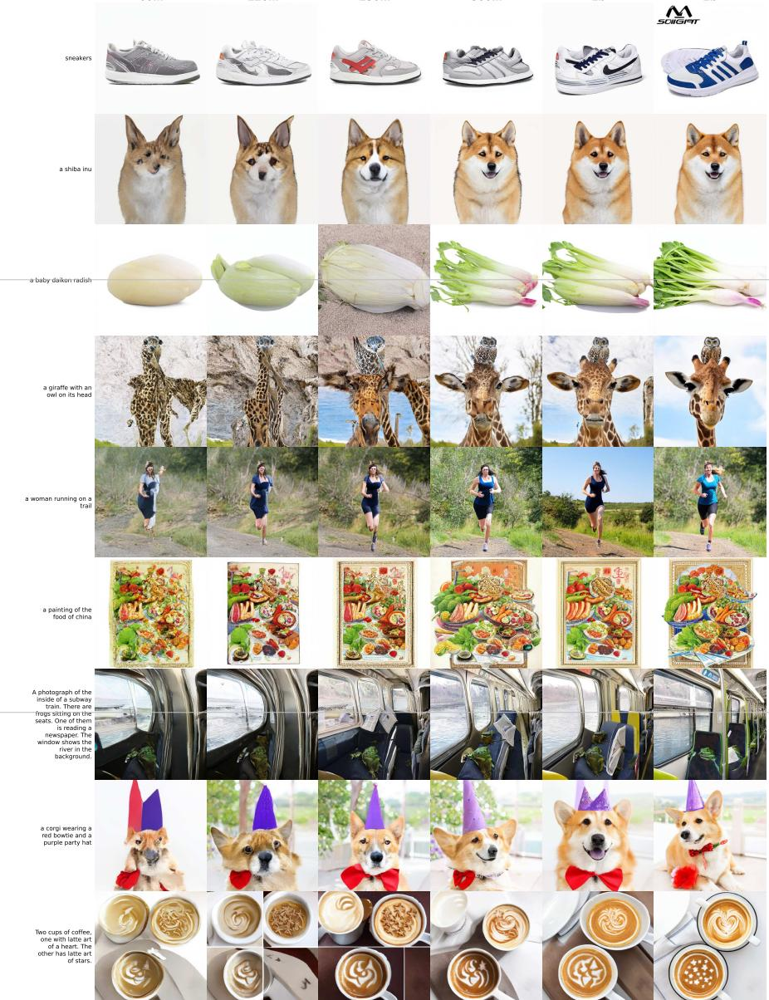  
Figure 12: Non-cherry-picked generations from the ABRA family on Parti prompts (Yu et al., 2022) at a fixed guidance scale of 3.0. Columns are increasing model size (ABRA-60M→ABRA-2B); rows are three prompts each of simple, standard, and complex complexity (word-count terciles). Each cell is a single $5 1 2 \times 5 1 2$ generation.

## F.2 KAPLAN-STYLE FIT

Kaplan et al. (2020) fit a pure power law $L ( C ) \propto C ^ { - \alpha _ { C } }$ to the compute-efficient lower envelope; unlike the supporting hyperplane of Section F.1, it regresses a curve through the envelope points rather than a bound weakly below them. We fit the allocation exponents both freely and constrained to $a + b = 1$ (Table 3).

Table 3: Compute-optimal allocation exponents $( N _ { \mathrm { o p t } } \propto C ^ { a } , D _ { \mathrm { o p t } } \propto C ^ { b } )$ for the ABRA envelope. The free fit regresses log $N _ { \mathrm { o p t } }$ and log $D _ { \mathrm { o p t } }$ on log C independently; the constrained fit imposes $a + b = 1$ . The free $a + b > \mathsf { \hat { 1 } }$ reflects the per-model transformer FLOP count exceeding the 6ND estimate by a size-dependent factor; the balanced split is robust either way.
<table><tr><td>Ladder</td><td>a (constr.)</td><td>a (free)</td><td>b (free)</td><td>a + b (free)</td></tr><tr><td>incl. 60M</td><td>0.467</td><td>0.484</td><td>0.550</td><td>1.035</td></tr><tr><td>excl. 60M</td><td>0.470</td><td>0.487</td><td>0.547</td><td>1.033</td></tr></table>

A black dragon perched on top of a tall Egyptian obelisk and breathing flames at a knight on the ground  
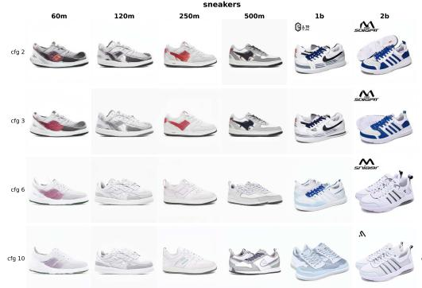

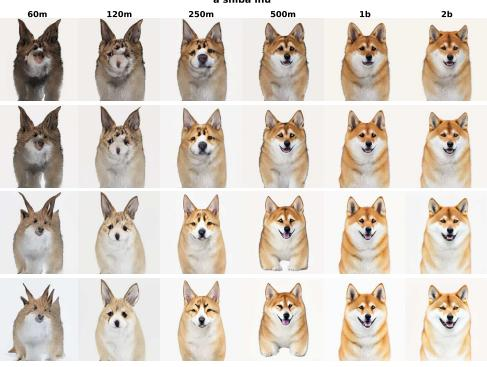

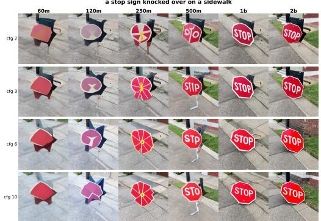

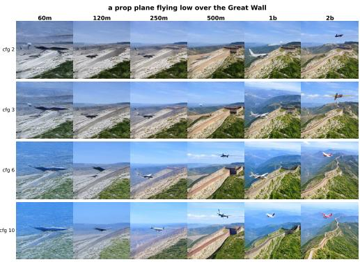

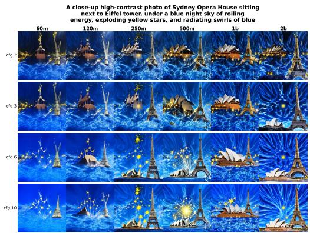

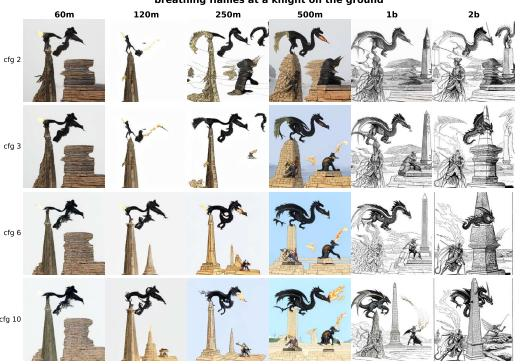

Figure 13: Model size vs. CFG at the compute-optimal (200-TPP) checkpoint. Panels are two Parti prompts (Yu et al., 2022) each of simple, standard, and complex complexity (rows). Within each panel, columns are increasing model size (ABRA-60M→ABRA-2B) and rows are the guidance scale (CFG ∈ {2, 3, 6, 10}). Each cell is a single 512 × 512 generation.  
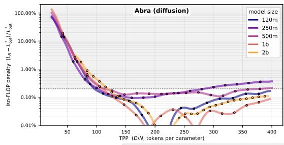

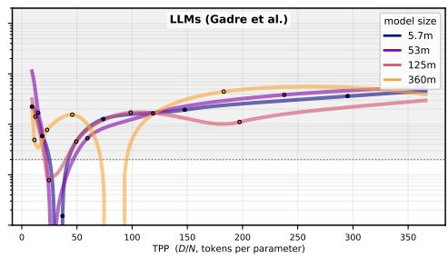  
penalty ≤ 0.2% penalty > 0.2% measured points (curve = interpolation)  
Figure 14: Iso-FLOP relative loss penalty $\Delta L / L ^ { * }$ versus TPP for (left) the ABRA family and (right) the overtrained LLM grid of Gadre et al. (2025). Markers denote the measured points (ABRA evaluated checkpoints; Gadre et al.’s per-run final losses); the connecting curves interpolate through them. Doubling the optimal TPP for the largest model incurs $\mathrm { a } \sim 4 \%$ loss penalty — nearly 20× that of the diffusion model.

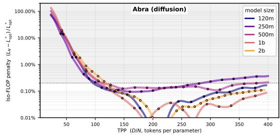

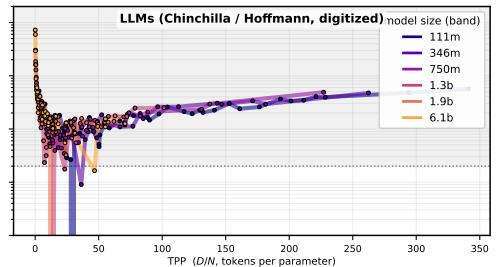  
penalty ≤ 0.2% penalty > 0.2% measured points (curve = interpolation)

Figure 15: Iso-FLOP suboptimality penalty $( L _ { N } - L ^ { * } ) / L ^ { * }$ versus TPP for the ABRA family (left) and the Chinchilla / Hoffmann et al. data (right), the latter figure-digitized by Besiroglu et al. (2024) and binned into log-N model-size bands. Markers are the measured points (ABRA evaluated checkpoints; digitized Chinchilla points); curves interpolate through them. The green/red bands mark the 0.2% penalty threshold.  
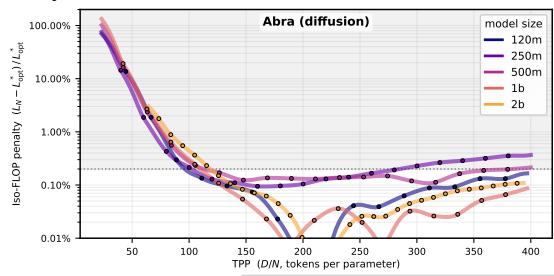

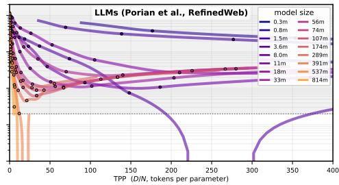  
penalty ≤ 0.2% penalty > 0.2% measured points (curve = interpolation)  
Figure 16: Iso-FLOP suboptimality penalty $( L _ { N } - L ^ { * } ) / L ^ { * }$ versus TPP for the ABRA family $( l e f t )$ and the LLM runs of Porian et al. (2024) on RefinedWeb (right). Markers are the measured points (ABRA evaluated checkpoints; Porian et al.’s per-step logged validation losses along each size’s longest run); curves interpolate through them. The green/red bands mark the 0.2% penalty threshold.

## F.3 HOFFMANN-STYLE (CHINCHILLA) FITS

Hoffmann et al. (2022) estimate the compute-optimal frontier three distinct ways, and we reproduce the applicable ones for the ABRA family.

Approach 1: Minima over training curves. For each FLOP budget C we read off the model attaining the lowest loss at that budget, giving $N _ { \mathrm { o p t } } ( C )$ and $D _ { \mathrm { o p t } } ( C )$ directly from the envelope, and take the median over budgets as the implied TPP∗ (Table 4).

Approach 2: Iso-FLOP profiles. This is the estimator we use in the main body (Section 4.1). For each of a grid of fixed FLOP budgets spanning the compute range where the six-model ladder overlaps, we take the loss-vs-TPP slice of the fitted surface and read off its minimum, then aggregate over budgets (Table 4).

Approach 3: Parametric loss surface. One can fit the parametric form

$$
L ( N , D ) = E + \frac { A } { N ^ { \alpha } } + \frac { B } { D ^ { \beta } }
$$

to the EMA loss in log space with a Huber objective $( \delta = 1 0 ^ { - 3 } )$ and a grid of L-BFGS initializations, following Hoffmann et al. (2022), then derive $N _ { \mathrm { o p t } } ( C )$ and $D _ { \mathrm { o p t } } ( C )$ from the fitted surface. On the ABRA ladder this fit is non-identifiable and we report no parametric TPP∗ fit.

## F.4 ALTERNATIVE PROCEDURES AND UNIFIED COMPARISON

Beyond the estimator, we re-estimate the compute-optimal TPP under one-at-a-time variations of the pipeline:

• Fit target. EMA loss (headline) vs. raw training loss.

• Ladder composition. Full ladder vs. dropping the smallest (ABRA-60M) and/or largest (ABRA-2B) models.

• Fit objective. Squared error (headline) vs. Huber.

• Interpolation. PCHIP (headline) vs. piecewise-linear interpolation directly between checkpoints, with no shape-preserving smoothing.

Table 4 collects the recovered TPP∗ from every estimator and variation, with 60M included and excluded; the corresponding frontier and allocation coefficients are in Table 5.

Table 4: Compute-optimal TPP∗ under every estimator and procedure variation on identical ABRA data, with 60M included and excluded (holding the other choice fixed); the headline (iso-FLOP, 60M excluded) is bold.
<table><tr><td>Estimator / variation</td><td>TPP* (incl. 60M)</td><td>TPP* (excl. 60M)</td><td>Notes</td></tr><tr><td>Iso-FLOP (main body)</td><td>186</td><td>199</td><td>headline; 68% eval-noise [180,270]</td></tr><tr><td>Kaplan (envelope OLS)</td><td>185</td><td>192</td><td>balanced allocation a ≈ 0.47</td></tr><tr><td>Supporting hyperplane (LP)</td><td>185</td><td>192</td><td>same envelope allocation as Ka- plan</td></tr><tr><td>Hoffmann A1 (curve minima)</td><td>185</td><td>192</td><td>noisy minima; wide p10–p90</td></tr><tr><td>Raw-loss target</td><td>189</td><td>227</td><td>only material mover; not used</td></tr><tr><td>Huber fit objective Linear interp. (vs. PCHIP)</td><td>186 187</td><td>199 202</td><td>identical to least squares</td></tr><tr><td></td><td></td><td></td><td>piecewise-linear between checkpoints</td></tr><tr><td>Drop ABRA-2B</td><td>183</td><td>195</td><td>ladder-endpoint check</td></tr></table>

## F.5 CHOICE OF INTERPOLANT

We interpolate each model’s EMA-loss-versus-step trajectory with a shape-preserving PCHIP interpolant (Fritsch & Carlson, 1980; Fritsch & Butland, 1984), and compare against plain piecewise-linear interpolation.

Leave-one-out interpolation error. For each model we hold out one interior checkpoint, refit on the remaining points, and predict the held-out loss; Table 6 reports the RMSE over all held-out interior points.

## F.6 LEAVE-ONE-MODEL-OUT ROBUSTNESS

To bound the leverage of any single model we refit the iso-FLOP TPP∗ holding out each model in turn, for both ladder choices (Table 7). With the exception of ABRA-60M, leaving out a single model does not materially affect the fit.

## F.7 EVERY ESTIMATOR AGREES

The headline ≈200 TPP and the ∼10× gap compared to the LLM value of 20 is method-invariant. Every identifiable estimator lands in [183, 202] (Table 4) and the balanced allocation (a ≈ 0.47–0.49) holds under both free and constrained fits; the estimate is likewise unchanged under either interpolant (Section F.5) and under holding out any single model (Section F.6).

## F.8 GENERATIVE METRIC SCALING-LAW FITS

This appendix details the compute-optimal TPP∗ procedure for the generative metrics (Section 4.3, Table 8) and reports its stability, then cross-checks the metric-value scaling with a per-model-final fit. Figure 18 presents the full per-metric iso-FLOP fits for the three DINOv2-family distances (FDD, KDD, and DMMD).

Iso-FLOP TPP∗ (primary). We reuse the headline loss estimator (Section 4.1) verbatim, with the CFG-optimized metric in place of the loss (min over the CFG grid for the distance metrics and FID, max for CLIPScore). Per size we PCHIP-spline the metric against step; per TPP on a grid (80–390, step 5) we read each size at the step realizing that TPP, convert to compute C = step · GBS · F , and fit $\overset { \cdot } { M } ( C ) = A C ^ { - \alpha } + F _ { M }$ across the ladder excluding 60M (≥ 3 sizes). The parabolic argmin over TPP of these per-TPP laws on six shared budgets gives $\mathrm { T P P ^ { * } } ( C )$ ; we report its geometric mean and log-log slope p (Table 8). TPP∗ differs markedly between metrics.

Table 5: Full fit-coefficient comparison, the companion to Table 4 (which reports only the recovered $\mathrm { T P P ^ { * } } )$ . For each of the seven estimators and variations we report the compute-optimal loss frontier $L ^ { * } ( C ) = A C ^ { - \alpha } + \beta$ together with the optimal-allocation laws $N _ { \mathrm { o p t } } ( C ) \stackrel { \bullet } { = } A _ { N } \stackrel { \bullet } { C } ^ { a }$ and $D _ { \mathrm { o p t } } ( C ) =$ $A _ { D } C ^ { b }$ , each computed with the 60M model included and excluded, and under three allocation conventions: free (independent log–log fits, $a + b \approx 1 . 0 4 )$ , constrained $( a + b { = } 1 )$ , and balanced (a=b=0.5).
<table><tr><td>Method</td><td>Ladder</td><td>Alloc.</td><td>A</td><td>α</td><td>β</td><td> $A _ { N }$ </td><td>a</td><td> $A _ { D }$ </td><td>b</td></tr><tr><td rowspan="4">Iso-FLOP</td><td rowspan="2">incl. 60M</td><td>free a+b=1</td><td rowspan="2">1.37</td><td>0.0371</td><td>0.3874</td><td>0.0211 0.049</td><td>0.503 0.485</td><td>0.978 2.27</td><td>0.533 0.515</td></tr><tr><td>a=b=0.5</td><td></td><td></td><td>0.0243</td><td>0.500</td><td>4.57</td><td>0.500</td></tr><tr><td rowspan="3">excl. 60M</td><td>free</td><td>1.2</td><td>0.0140</td><td>0.0052</td><td>0.0126</td><td>0.514</td><td>1.58</td><td>0.523</td></tr><tr><td>a+b=1</td><td></td><td></td><td></td><td>0.0301</td><td>0.495</td><td>3.78</td><td>0.505</td></tr><tr><td></td><td>a=b=0.5</td><td></td><td></td><td>0.0239</td><td>0.500</td><td>4.75</td><td>0.500</td></tr><tr><td rowspan="6"></td><td rowspan="3">incl. 60M</td><td>free</td><td>1.19</td><td>0.0140</td><td>0.0077</td><td>0.051</td><td>0.484</td><td>0.431</td><td>0.550</td></tr><tr><td>a+b=1 a=b=0.5</td><td></td><td></td><td></td><td>0.115 0.0245</td><td>0.467 0.500</td><td>0.97 4.54</td><td>0.533 0.500</td></tr><tr><td></td><td></td><td></td><td></td><td></td><td></td><td></td><td></td></tr><tr><td rowspan="3">excl. 60M</td><td>free</td><td>1.19</td><td>0.0140</td><td>0.0077</td><td>0.0444</td><td>0.487</td><td>0.491</td><td>0.548</td></tr><tr><td>a+b=1</td><td></td><td></td><td></td><td>0.102</td><td>0.470</td><td>1.12</td><td>0.530</td></tr><tr><td>a=b=0.5</td><td></td><td></td><td></td><td>0.0244</td><td>0.500</td><td>4.69</td><td>0.500</td></tr><tr><td rowspan="6"></td><td rowspan="3">incl. 60M</td><td>free</td><td>1.42</td><td>0.0386</td><td>0.3965</td><td>0.051</td><td>0.484</td><td>0.431</td><td>0.550</td></tr><tr><td>a+b=1</td><td></td><td></td><td></td><td>0.115</td><td>0.467</td><td>0.97</td><td>0.533</td></tr><tr><td>a=b=0.5</td><td></td><td></td><td></td><td>0.0245</td><td>0.500</td><td>4.54</td><td>0.500</td></tr><tr><td rowspan="3">excl. 60M</td><td>free</td><td>1.21</td><td>0.0139</td><td>0</td><td>0.046</td><td>0.487</td><td>0.509</td><td>0.547</td></tr><tr><td>a+b=1</td><td></td><td></td><td></td><td>0.102 0.0244</td><td>0.470 0.500</td><td>1.12 4.69</td><td>0.530 0.500</td></tr><tr><td>a=b=0.5 incl. 60M</td><td>1.37</td><td></td><td></td><td></td><td></td><td></td><td></td></tr><tr><td rowspan="6"></td><td rowspan="2"></td><td>free a+b=1</td><td></td><td>0.0371</td><td>0.3873</td><td>0.0211 0.049</td><td>0.503 0.485</td><td>0.978 2.27</td><td>0.533 0.515</td></tr><tr><td>a=b=0.5</td><td></td><td></td><td></td><td>0.0243</td><td>0.500</td><td>4.57</td><td>0.500</td></tr><tr><td rowspan="3">excl. 60M</td><td>free</td><td>1.2</td><td>0.0140</td><td>0.0090</td><td>0.0126</td><td>0.514</td><td>1.58</td><td>0.523</td></tr><tr><td>a+b=1</td><td></td><td></td><td></td><td>0.0302</td><td>0.495</td><td>3.77</td><td>0.505</td></tr><tr><td>a=b=0.5</td><td></td><td></td><td></td><td>0.0239</td><td>0.500</td><td>4.75</td><td>0.500</td></tr><tr><td rowspan="3">incl. 60M</td><td>free a+b=1</td><td>1.37</td><td>0.0370</td><td>0.3864</td><td>0.0211</td><td>0.503</td><td>0.978</td><td>0.533</td></tr><tr><td rowspan="2">excl. 60M</td><td>a=b=0.5</td><td></td><td></td><td></td><td>0.049 0.0243</td><td>0.485 0.500</td><td>2.27 4.57</td><td>0.515 0.500</td></tr><tr><td>free</td><td>1.2</td><td>0.0140</td><td>0.0076</td><td>0.0123</td><td>0.514</td><td>1.61</td><td>0.523</td></tr><tr><td rowspan="6">Raw-loss</td><td rowspan="2"></td><td>a+b=1</td><td></td><td></td><td></td><td>0.0295</td><td>0.495</td><td>3.86</td><td>0.505</td></tr><tr><td>a=b=0.5</td><td></td><td></td><td></td><td>0.0238</td><td>0.500</td><td>4.79</td><td>0.500</td></tr><tr><td rowspan="3">incl. 60M</td><td>free</td><td>1.13</td><td>0.0159</td><td>0</td><td>1.11</td><td>0.419</td><td>0.0246</td><td>0.611</td></tr><tr><td>a+b=1</td><td></td><td></td><td></td><td>2.25</td><td>0.404</td><td>0.0497</td><td>0.596</td></tr><tr><td>a=b=0.5</td><td></td><td></td><td></td><td>0.0254</td><td>0.500</td><td>4.4</td><td>0.500</td></tr><tr><td rowspan="4"></td><td>excl. 60M free</td><td></td><td>0.0162</td><td></td><td>0.00152</td><td>0.558</td><td>11.3</td><td>0.482</td></tr><tr><td rowspan="3"></td><td>a+b=1</td><td>1.14</td><td></td><td>0.0020</td><td>0.00391</td><td>0.538</td><td>29</td><td>0.462</td></tr><tr><td>a=b=0.5</td><td></td><td></td><td></td><td>0.0234</td><td>0.500</td><td>4.85</td><td>0.500</td></tr><tr><td>free</td><td>1.97</td><td>0.0528</td><td></td><td></td><td></td><td></td><td>0.535</td></tr><tr><td rowspan="6"></td><td rowspan="2">incl. 60M</td><td>a+b=1</td><td></td><td></td><td>0.4623</td><td>0.024 0.0548</td><td>0.500 0.482</td><td>0.868 1.98</td><td>0.518</td></tr><tr><td>a=b=0.5</td><td></td><td></td><td></td><td>0.0245</td><td>0.500</td><td>4.44</td><td>0.500</td></tr><tr><td rowspan="3">excl. 60M</td><td></td><td></td><td></td><td></td><td></td><td></td><td></td><td></td></tr><tr><td>free</td><td></td><td>0.0141</td><td>0.0153</td><td>0.00533</td><td>0.532</td><td>3.51</td><td></td></tr><tr><td>a+b=1 a=b=0.5</td><td>1.19</td><td></td><td></td><td>0.013</td><td>0.513</td><td>8.55</td><td>0.506 0.487</td></tr><tr><td rowspan="3"></td><td></td></table>

Table 6: Leave-one-out interpolation RMSE per model, for PCHIP and piecewise-linear interpolation; PCHIP is the more accurate and both are small.
<table><tr><td>Interpolant</td><td>ABRA-60M</td><td>ABRA-120M</td><td>ABRA-250M</td><td>ABRA-500M</td><td>ABRA-1B</td></tr><tr><td>PCHIP (main body)</td><td>0.0167</td><td>0.0171</td><td>0.0233</td><td>0.0317</td><td>0.0430</td></tr><tr><td>Piecewise-linear</td><td>0.0379</td><td>0.0406</td><td>0.0513</td><td>0.0672</td><td>0.0882</td></tr></table>

Value scaling law. We fit the value law $M ( C ) = A C ^ { - \alpha } + F _ { M }$ (sign flipped for CLIPScore) for two targets: the compute-optimal fit through the ${ \mathrm { T P P ^ { * } } }$ points and the per-model-final fit through each size’s converged checkpoint. We exclude 60M as elsewhere. Where the floor $F _ { M }$ is not identifiable (KDD, KID) we fit a pure power law $A C ^ { - \alpha . }$ ; KID then gives $\alpha \approx 0 . 1 1 ( R ^ { 2 } = 0 . 9 0 )$ . We fit each size rather than pooling checkpoints, for which M(C) is not single-valued $( R ^ { 2 } < 0 .$ 1 for the distribution metrics). The exponents agree for DMMD, KDD, FID, and KID, and differ for CMMD and CLIPScore, which improve further between TPP∗ and convergence.

Table 7: Leave-one-model-out iso-FL ${ \cal O } \mathrm { P T P P ^ { \ast } }$ : the estimate with each model held out of the ladder, for the 60M-included and 60M-excluded bases. With 60M excluded, every held-out estimate stays in [188, 207].
<table><tr><td>Held out</td><td>TPP* (incl. 60M base)</td><td>TPP* (excl. 60M base)</td></tr><tr><td>none (full)</td><td>186</td><td>199</td></tr><tr><td>ABRA-60M</td><td>199</td><td></td></tr><tr><td>ABRA-120M</td><td>170</td><td>188</td></tr><tr><td>ABRA-250M</td><td>189</td><td>207</td></tr><tr><td>ABRA-500M</td><td>185</td><td>198</td></tr><tr><td>ABRA-1B</td><td>184</td><td>203</td></tr><tr><td> $\mathbf { A B R A - 2 B }$ </td><td>183</td><td>195</td></tr></table>

Table 8: Compute-optimal tokens per parameter $\mathrm { T P P ^ { * } }$ per generative metric, recovered with the headline iso-FLOP procedure (Section 4.1) applied to each metric’s best-over-CFG trajectory.
<table><tr><td>Metric</td><td>Backbone</td><td> $\mathrm { T P P ^ { * } }$ </td><td> $\mathrm { T P P ^ { * } } ( C )$  exponent p</td></tr><tr><td>KDD</td><td>DINOv2</td><td>121</td><td>-0.06</td></tr><tr><td>DMMD</td><td>DINOv2</td><td>133</td><td>-0.13</td></tr><tr><td>CLIPScore</td><td>CLIP</td><td>153</td><td>-0.05</td></tr><tr><td>FID</td><td>Inception</td><td>182</td><td>+0.12</td></tr><tr><td>KID</td><td>Inception</td><td>257</td><td>+0.12</td></tr><tr><td>CMMD</td><td>CLIP</td><td>294</td><td>-0.14</td></tr><tr><td>Loss (ref.)</td><td>bucketed</td><td>≈200</td><td>≈0</td></tr></table>

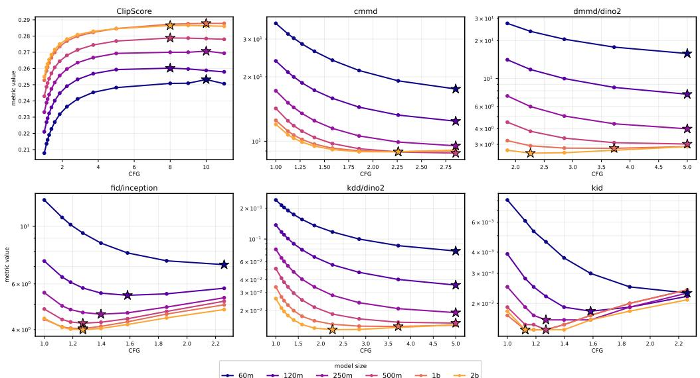  
Figure 17: Each generative metric as a function of the classifier-free guidance scale, swept per model size. The optimum (a minimum for the distribution distances, a maximum for CLIPScore) shifts with model size, so comparing models at a single fixed guidance value would misrank them; this motivates the per-model CFG optimization we use throughout.

Dependence of the fit on CFG. The value laws use the CFG-optimized value per checkpoint. To check this selection is not the source of the scaling, we refit the per-model-final law at every measured CFG and track α (dropping fits with $R ^ { 2 } < 0 . 5$ or α pinned at the optimizer bound). α is stable across the swept range for every metric (Figure 17): a mild decline at high guidance for CMMD and CLIPScore, flat for the DINOv2 distances DMMD/KDD. The scaling laws are therefore robust to $\mathrm { C F G } ;$ the compute-optimal fit in the body represents the fixed-CFG family rather than a special case.

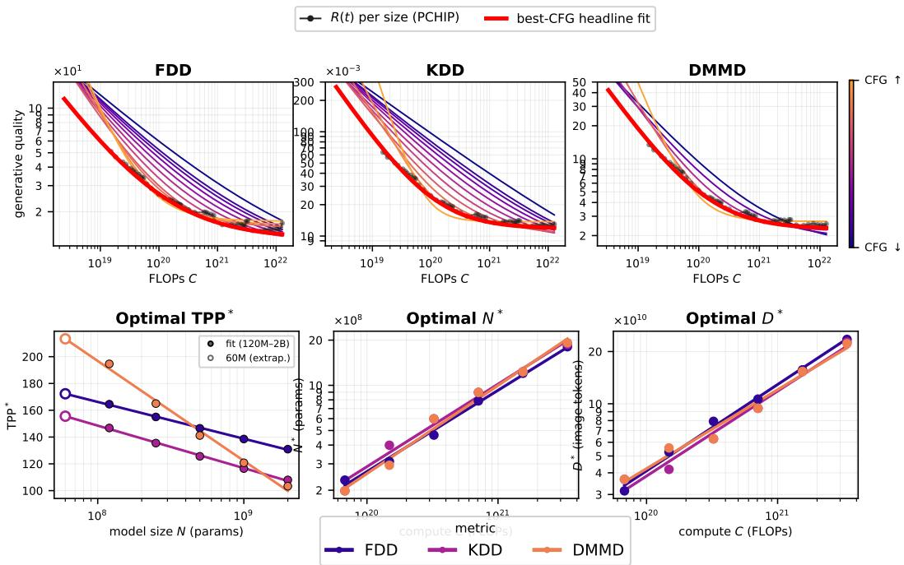

Figure 18: DINOv2-family generative metrics scale predictably. Top: generation quality vs training compute C for the three DINOv2-based distances—FDD (Fréchet), KDD (kernel), and DMMD (MMD). At each guidance scale the evaluation trajectories are fit with the iso-FLOP computeoptimal procedure of Section 4.1 (curves colored by CFG); dark markers and curves are the best-over-CFG trajectory $R ( t )$ per model size, and the bold red curve is its compute-optimal frontier. Bottom: the resulting compute-optimal $\mathrm { T P P ^ { * } }$ as a function of model size N (linear fit through 120M–2B, 60M extrapolated), and the compute-optimal $N _ { \mathrm { o p t } }$ and $D _ { \mathrm { o p t } }$ as functions of compute C. All three DINOv2 distances reach compute optimality at a substantially lower TPP than the loss.  
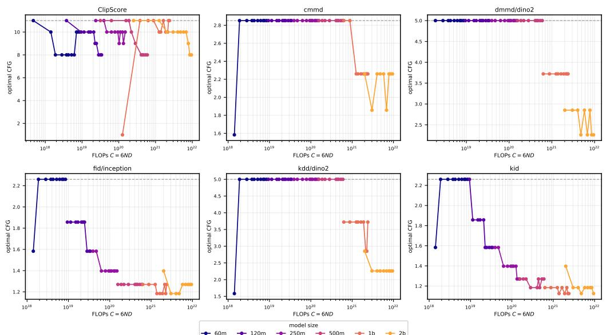  
Figure 19: Optimal CFG versus training compute $C = 6 N D ,$ one panel per metric, with each model size a different colour and every swept checkpoint plotted (not just the final one). The optimal CFG drifts downward with both model size and training compute for the distribution metrics.

## G COMPARISON TO LIANG ET AL. (2024)

Table 9 compares our compute-optimal allocation law to that of Liang et al. (2024). Because Liang et al. (2024) measure data in total (text-plus-image) tokens whereas we measure image tokens, only the allocation exponents are directly comparable across the two studies; the multipliers and intercepts are not.

Note that the text encoding adds a certain number of tokens per sample which can be averaged over and will only serve to increase the estimated TPP. When using 256 text tokens per sample, an image TPP of 200 at $5 1 2 \times 5 1 2$ resolution gives us a total TPP of 250. For a 1B model, Liang et al. (2024) find that optimal TPP should occur at 287 total TPP, counting both text and image tokens. Note that Liang et al. (2024) only report optimal N and D for $2 5 6 \times 2 5 6$ images, which based on our analysis should have a lower optimal TPP than the $5 1 2 \times 5 1 2$ images. Thus, we expect that 287 over-estimates the number of training tokens which is optimal for training a 1B model.

Table 9: Compute-optimal allocation laws for ABRA, ABRA-60M excluded, versus Liang et al. (2024). C in FLOPs, N in parameters, D in image tokens; both fits impose $a + b = 1$ . Note that our study measures compute in image tokens while Liang et al. (2024) measure in total tokens. While this makes the intercepts incomparable, the scaling exponents are comparable between the two studies.
<table><tr><td></td><td></td><td>Allocation law Ours (ABRA) Liang et al. (2024)</td></tr><tr><td> $N _ { \mathrm { o p t } } ( C )$ </td><td> $0 . 0 3 0 1 C ^ { 0 . 4 9 5 1 }$ </td><td> $0 . 0 0 0 9 C ^ { 0 . 5 6 8 1 }$ </td></tr><tr><td> $D _ { \mathrm { o p t } } ( C )$ </td><td> $3 . 7 7 6 C ^ { 0 . 5 0 4 9 }$ </td><td> $1 8 6 . 8 5 C ^ { 0 . 4 3 1 9 }$ </td></tr></table>