# Against Political Polarization: A Unified Framework for Tracing Evolving Political Ideologies on Social Media

YIJIE XU, Thrust of Artificial Intelligence, The Hong Kong University of Science and Technology (Guangzhou), Chin<sub>a</sub>

CHAO WANG<sup>∗</sup>, School of Artificial Intelligence and Data Science, University of Science and Technology of Chin<sub>a,</sub> Chin<sub>a</sub>

HUI XIONG<sup>∗</sup>, Thrust of Artificial Intelligence, The Hong Kong University of Science and Technology (Guan<sub>g</sub>zhou), China and De<sub>p</sub>artment of Com<sub>p</sub>uter Science and En<sub>g</sub>ineerin<sub>g</sub>, The Hon<sub>g</sub> Kon<sub>g</sub> Universit<sub>y</sub> of S<sub>c</sub>i<sub>e</sub>n<sub>ce a</sub>nd T<sub>ec</sub>hn<sub>o</sub>l<sub>ogy,</sub> H<sub>o</sub>n<sub>g</sub> K<sub>o</sub>n<sub>g</sub> SAR<sub>,</sub> Chin<sub>a</sub>

Th<sub>e rap</sub>id <sub>grow</sub>th <sub>o</sub>f <sub>soc</sub>i<sub>a</sub>l <sub>me</sub>di<sub>a</sub> h<sub>as grea</sub>tl<sub>y</sub> i<sub>n</sub>fl<sub>uence</sub>d <sub>po</sub>liti<sub>ca</sub>l di<sub>scourse,</sub> hi<sub>g</sub>hli<sub>g</sub>hti<sub>ng</sub> th<sub>e nee</sub>d t<sub>o un</sub>d<sub>ers</sub>t<sub>an</sub>d i<sub>n</sub>di<sub>v</sub>id<sub>ua</sub>l <sub>po</sub>liti<sub>ca</sub>l id<sub>eo</sub>l<sub>og</sub>i<sub>es</sub> <sub>an</sub>d th<sub>e</sub>i<sub>r</sub> t<sub>empora</sub>l d<sub>ynam</sub>i<sub>cs.</sub> Thi<sub>s</sub> t<sub>as</sub>k f<sub>aces</sub> <sub>c</sub>h<sub>a</sub>ll<sub>enges</sub> <sub>suc</sub>h <sub>as</sub> d<sub>a</sub>t<sub>a</sub> <sub>scarc</sub>it<sub>y,</sub> <sub>a</sub>b<sub>un</sub>d<sub>an</sub>t <sub>non-po</sub>liti<sub>ca</sub>l <sub>con</sub>t<sub>en</sub>t<sub>, cos</sub>tl<sub>y an</sub>d bi<sub>as-prone manua</sub>l <sub>anno</sub>t<sub>a</sub>ti<sub>on, an</sub>d difi<sub>cu</sub>lt<sub>y</sub> i<sub>n mo</sub>d<sub>e</sub>li<sub>ng</sub> f<sub>u</sub>t<sub>ure</sub> ideolo<sub>g</sub>ical inclinations. To address these issues, we <sub>p</sub>ro<sub>p</sub>ose TSN4PI, a unified framework for trackin<sub>g</sub> the evolution of <sub>p</sub>olitical ideolo<sub>g</sub>ies on social media. It includes two core modules. The PIDN uses lar<sub>g</sub>e lan<sub>g</sub>ua<sub>g</sub>e <sub>mo</sub>d<sub>e</sub>l<sub>s w</sub>ith <sub>s</sub>t<sub>y</sub>l<sub>e</sub> t<sub>rans</sub>f<sub>er an</sub>d <sub>unsuperv</sub>i<sub>se</sub>d d<sub>oma</sub>i<sub>n a</sub>d<sub>ap</sub>t<sub>a</sub>ti<sub>on</sub> t<sub>o ena</sub>bl<sub>e ro</sub>b<sub>us</sub>t id<sub>eo</sub>l<sub>ogy</sub> d<sub>e</sub>t<sub>ec</sub>ti<sub>on an</sub>d filter irrelevant content from nois<sub>y</sub>, cross-domain data. The PIPN em<sub>p</sub>lo<sub>y</sub>s tem<sub>p</sub>oral <sub>g</sub>ra<sub>p</sub>h neural networks to <sub>p</sub>redict future ideolo<sub>g</sub>ical shifts<sub>,</sub> enablin<sub>g</sub> com<sub>p</sub>rehensive anal<sub>y</sub>sis of ideolo<sub>gy p</sub>resence<sub>,</sub> intensit<sub>y,</sub> and <sub>evo</sub>l<sub>u</sub>ti<sub>on.</sub> W<sub>e re</sub>l<sub>ease</sub> t<sub>wo</sub> l<sub>arge-sca</sub>l<sub>e</sub> d<sub>a</sub>t<sub>ase</sub>t<sub>s</sub> f<sub>or noncommerc</sub>i<sub>a</sub>l <sub>researc</sub>h <sub>use</sub> t<sub>o</sub> f<sub>ac</sub>ilit<sub>a</sub>t<sub>e</sub> f<sub>ur</sub>th<sub>er wor</sub>k<sub>.</sub> Extensive case studies on multi<sub>p</sub>le <sub>p</sub>latforms (X and Truth Social) validate the efectiveness of TSN4PI and <sub>p</sub>rovide em<sub>p</sub>irical insi<sub>g</sub>hts into <sub>p</sub>olitical <sub>p</sub>olarization and the evolution of online ideolo<sub>g</sub>ies. Our findin<sub>g</sub>s ofer <sub>a nuance</sub>d <sub>perspec</sub>ti<sub>ve, a</sub>d<sub>vanc</sub>i<sub>ng</sub> b<sub>o</sub>th <sub>me</sub>th<sub>o</sub>d<sub>o</sub>l<sub>og</sub>i<sub>ca</sub>l d<sub>eve</sub>l<sub>opmen</sub>t <sub>an</sub>d <sub>emp</sub>i<sub>r</sub>i<sub>ca</sub>l <sub>un</sub>d<sub>ers</sub>t<sub>an</sub>di<sub>ng</sub> i<sub>n</sub> thi<sub>s</sub> fi<sub>e</sub>ld<sub>.</sub>

CCS Concepts: • Computing methodologies → Natural language processing; Graph neural networks; • Human-centered computing → Social network analysis.

Additional Ke<sub>y</sub> Words and Phrases: Ideolo<sub>gy</sub> Detection<sub>,</sub> Social Media<sub>,</sub> Natural Lan<sub>g</sub>ua<sub>g</sub>e Processin<sub>g</sub>

ACM Reference Format:

Yijie Xu, C<sup>h</sup>ao Wang, an<sup>d</sup> Hui Xiong. 2026. Against Po<sup>l</sup>itica<sup>l</sup> Po<sup>l</sup>arization: A Uni<sup>fi</sup>e<sup>d</sup> Framewor<sup>k f</sup>or Tracing Evolving Political Ideologies on Social Media. ACM Trans. Intell. Syst. Technol. 1, 1 (August 2026), 35 pages. htt<sub>ps</sub>://d<sub>o</sub>i<sub>.o</sub>r<sub>g</sub>/XXXXXXX<sub>.</sub>XXXXXXX

<sup>∗</sup>Corres<sub>p</sub>ondin<sub>g</sub> authors.

Aut<sup>h</sup>ors<sup>’</sup> Contact In<sup>f</sup>ormation: Yijie Xu, yxu409@connect.<sup>hk</sup>ust-gz.e<sup>d</sup>u.cn, T<sup>h</sup>rust o<sup>f</sup> Arti<sup>fi</sup>cia<sup>l</sup> Inte<sup>ll</sup>igence, T<sup>h</sup>e Hong Kon<sub>g</sub> Universit<sub>y</sub> of Science and Technolo<sub>gy</sub> (Guan<sub>g</sub>zhou), Guan<sub>g</sub>zhou, China; Chao Wan<sub>g</sub>, wan<sub>g</sub>chaoai@ustc.edu.cn, S<sub>c</sub>h<sub>oo</sub>l <sub>o</sub>f Artifi<sub>c</sub>i<sub>a</sub>l Int<sub>e</sub>lli<sub>ge</sub>n<sub>ce a</sub>nd D<sub>a</sub>t<sub>a</sub> S<sub>c</sub>i<sub>e</sub>n<sub>ce,</sub> Uni<sub>ve</sub>r<sub>s</sub>it<sub>y o</sub>f S<sub>c</sub>i<sub>e</sub>n<sub>ce a</sub>nd T<sub>ec</sub>hn<sub>o</sub>l<sub>ogy o</sub>f Chin<sub>a,</sub> H<sub>e</sub>f<sub>e</sub>i<sub>,</sub> Chin<sub>a;</sub> H<sub>u</sub>i Xi<sub>o</sub>n<sub>g</sub> xion<sub>g</sub>hui@ust.hk, Thrust of Artificial Intelli<sub>g</sub>ence, The Hon<sub>g</sub> Kon<sub>g</sub> Universit<sub>y</sub> of Science and Technolo<sub>gy</sub> (Guan<sub>g</sub>zhou) G<sub>u</sub>an<sub>g</sub>zho<sub>u,</sub> China and De<sub>p</sub>artment of Com<sub>pu</sub>ter Science and En<sub>g</sub>ineerin<sub>g,</sub> The Hon<sub>g</sub> Kon<sub>g</sub> Uni<sub>v</sub>ersit<sub>y</sub> of Science and Technolo<sub>gy,</sub> Hon<sub>g</sub> Kon<sub>g,</sub> Hon<sub>g</sub> Kon<sub>g</sub> SAR<sub>,</sub> China.

P<sub>erm</sub>i<sub>ss</sub>i<sub>on</sub> t<sub>o ma</sub>k<sub>e</sub> di<sub>g</sub>it<sub>a</sub>l <sub>or</sub> h<sub>ar</sub>d <sub>cop</sub>i<sub>es o</sub>f <sub>a</sub>ll <sub>or par</sub>t <sub>o</sub>f thi<sub>s wor</sub>k f<sub>or persona</sub>l <sub>or c</sub>l<sub>assroom use</sub> i<sub>s gran</sub>t<sub>e</sub>d <sub>w</sub>ith<sub>ou</sub>t f<sub>ee</sub> <sub>rov</sub>id<sub>e</sub>d th<sub>a</sub>t <sub>co</sub> i<sub>es are no</sub>t <sub>ma</sub>d<sub>e or</sub> di<sub>s</sub>t<sub>r</sub>ib<sub>u</sub>t<sub>e</sub>d f<sub>or ro</sub>fit <sub>or commerc</sub>i<sub>a</sub>l <sub>a</sub>d<sub>van</sub>t<sub>a e an</sub>d th<sub>a</sub>t <sub>co</sub> i<sub>es</sub> b<sub>ear</sub> thi<sub>s no</sub>ti<sub>ce an</sub>d th<sub>e</sub> full citation on the first a e. Co ri hts for com onents of this work owned b others than the author(s) must be honored Abstractin<sub>g</sub> with credit is <sub>p</sub>ermitted. To co<sub>py</sub> otherwise<sub>,</sub> or re<sub>p</sub>ublish<sub>,</sub> to <sub>p</sub>ost on servers or to redistribute to lists<sub>,</sub> re<sub>q</sub>uires <sub>pr</sub>i<sub>or spec</sub>ifi<sub>c perm</sub>i<sub>ss</sub>i<sub>on an</sub>d/<sub>or a</sub> f<sub>ee.</sub> R<sub>eques</sub>t <sub>perm</sub>i<sub>ss</sub>i<sub>ons</sub> f<sub>rom perm</sub>i<sub>ss</sub>i<sub>ons@acm.org.</sub>

  
(a)

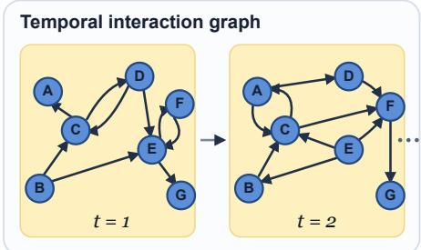  
(c)

  
(b)

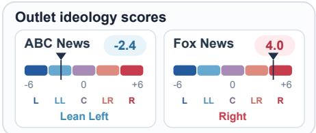  
(d)  
Fig. 1. Illustration of political ideology dynamics. (a)–(b) Original vector mockups of contrasting X-style and Truth Social-style posts; identities, text, avatars, and engagement counts are illustrative. (c) Temporal graph snapshots. (d) Original five-category scales of AllSides-derived outlet scores.

## 1 Introduction

S<sub>oc</sub>i<sub>a</sub>l <sub>me</sub>di<sub>a</sub> h<sub>as res</sub>h<sub>ape</sub>d <sub>po</sub>liti<sub>ca</sub>l di<sub>scourse, ena</sub>bli<sub>ng</sub> i<sub>n</sub>di<sub>v</sub>id<sub>ua</sub>l<sub>s</sub> t<sub>o express, re</sub>i<sub>n</sub>f<sub>orce, an</sub>d disseminate ideolo<sub>g</sub>ical views at scale [29]. A concern in this environment is the formation of echo chambers and the increasin<sub>g</sub> <sub>p</sub>olarization of <sub>p</sub>olitics. These efects are <sub>p</sub>articularl<sub>y</sub> visible on <sub>p</sub>latforms where al<sub>g</sub>orithmic curation and social clusterin<sub>g</sub> am<sub>p</sub>lif<sub>y</sub> existin<sub>g</sub> biases. In the U<sub>n</sub>it<sub>e</sub>d St<sub>a</sub>t<sub>es,</sub> <sub>po</sub>liti<sub>ca</sub>l <sub>op</sub>i<sub>n</sub>i<sub>ons</sub> <sub>are</sub> <sub>o</sub>ft<sub>en</sub> di<sub>v</sub>id<sub>e</sub>d <sub>a</sub>l<sub>ong</sub> <sub>par</sub>ti<sub>san</sub> li<sub>nes—common</sub>l<sub>y</sub> l<sub>a</sub>b<sub>e</sub>l<sub>e</sub>d <sub>as</sub> “l<sub>e</sub>ft” (Democratic) and “ri<sub>g</sub>ht” (Re<sub>p</sub>ublican). These distinctions influence not onl<sub>y</sub> electoral behavior but also <sub>p</sub>atterns of en<sub>g</sub>a<sub>g</sub>ement on di<sub>g</sub>ital <sub>p</sub>latforms [11, 12]. This scenario underscores the im<sub>p</sub>ortance of examinin<sub>g</sub> these ideolo<sub>g</sub>ical diferences<sub>,</sub> which have a si<sub>g</sub>nificant im<sub>p</sub>act on votin<sub>g</sub> behavior and social media activism. In this <sub>p</sub>a<sub>p</sub>er<sub>,</sub> we aim to contribute a com<sub>p</sub>rehensive methodolo<sub>g</sub>ical f<sub>ramewor</sub>k th<sub>a</sub>t <sub>no</sub>t <sub>on</sub>l<sub>y e</sub>l<sub>uc</sub>id<sub>a</sub>t<sub>es</sub> th<sub>ese p</sub>h<sub>enomena</sub> b<sub>u</sub>t <sub>a</sub>l<sub>so a</sub>id<sub>s</sub> i<sub>n</sub> i<sub>n</sub>f<sub>orme</sub>d <sub>po</sub>li<sub>cy-ma</sub>ki<sub>ng</sub> f<sub>or</sub> di<sub>g</sub>ital <sub>p</sub>olitical environments<sub>,</sub> thereb<sub>y</sub> addressin<sub>g</sub> a vital need in contem<sub>p</sub>orar<sub>y p</sub>olitical discourse.

The stud<sub>y</sub> of <sub>p</sub>olitical <sub>p</sub>olarization and echo chambers has received increasin<sub>g</sub> attention. Earl<sub>y</sub> work investi<sub>g</sub>ated ideolo<sub>g</sub>ical clusterin<sub>g</sub> on blo<sub>g</sub>s and Facebook [30, 64], while more recent studies ex<sub>p</sub>lored <sub>p</sub>olarization durin<sub>g</sub> major <sub>p</sub>olitical events [25]. However, the si<sub>g</sub>nificance and mechanisms of echo chambers remain debated [33]. Yet current research confronts several challen<sub>g</sub>es. First, the issue of data accessibilit<sub>y</sub> is <sub>p</sub>rominent<sub>; p</sub>latforms like Twitter im<sub>p</sub>ose restrictions on data <sub>co</sub>ll<sub>ec</sub>ti<sub>on,</sub> l<sub>ea</sub>di<sub>ng</sub> t<sub>o a scarc</sub>it<sub>y o</sub>f <sub>su</sub>it<sub>a</sub>bl<sub>e</sub> d<sub>a</sub>t<sub>ase</sub>t<sub>s</sub> th<sub>a</sub>t <sub>a</sub>li<sub>gn w</sub>ith th<sub>e s</sub>i<sub>ze an</sub>d f<sub>ocus requ</sub>i<sub>re</sub>d f<sub>or compre</sub>h<sub>ens</sub>i<sub>ve researc</sub>h<sub>.</sub> M<sub>oreover,</sub> th<sub>e s</sub>h<sub>eer vo</sub>l<sub>ume o</sub>f <sub>pos</sub>t<sub>s on</sub> th<sub>ese p</sub>l<sub>a</sub>tf<sub>orms presen</sub>t<sub>s a</sub> <sub>s</sub>i<sub>gn</sub>ifi<sub>can</sub>t h<sub>ur</sub>dl<sub>e</sub> f<sub>or manua</sub>l <sub>anno</sub>t<sub>a</sub>ti<sub>on, a process</sub> f<sub>ur</sub>th<sub>er comp</sub>li<sub>ca</sub>t<sub>e</sub>d b<sub>y anno</sub>t<sub>a</sub>t<sub>or</sub> bi<sub>as.</sub> A<sub>no</sub>th<sub>er</sub> <sub>c</sub>h<sub>a</sub>ll<sub>enge</sub> i<sub>s</sub> th<sub>e</sub> <sub>preva</sub>l<sub>ence</sub> <sub>o</sub>f i<sub>rre</sub>l<sub>evan</sub>t <sub>con</sub>t<sub>en</sub>t<sub>:</sub> <sub>many</sub> <sub>soc</sub>i<sub>a</sub>l <sub>me</sub>di<sub>a</sub> <sub>pos</sub>t<sub>s</sub> f<sub>ocus</sub> <sub>on</sub> <sub>every</sub>d<sub>ay</sub> lif<sub>e,</sub> l<sub>ac</sub>ki<sub>ng</sub> <sub>c</sub>l<sub>ear</sub> <sub>po</sub>liti<sub>ca</sub>l <sub>s</sub>i<sub>gna</sub>l<sub>s,</sub> <sub>an</sub>d th<sub>e</sub>i<sub>r</sub> <sub>m</sub>i<sub>sc</sub>l<sub>ass</sub>ifi<sub>ca</sub>ti<sub>on</sub> <sub>can</sub> l<sub>ea</sub>d t<sub>o</sub> i<sub>naccura</sub>t<sub>e</sub> <sub>pre</sub>di<sub>c</sub>ti<sub>ons</sub> of ideolo<sub>g</sub>ical leanin<sub>g</sub>s. Efectivel<sub>y</sub> filterin<sub>g</sub> this noise to isolate <sub>g</sub>enuine <sub>p</sub>olitical discourse is <sub>paramoun</sub>t f<sub>or</sub> <sub>accura</sub>t<sub>e</sub> <sub>mo</sub>d<sub>e</sub>li<sub>ng.</sub> Additi<sub>ona</sub>ll<sub>y,</sub> <sub>conven</sub>ti<sub>ona</sub>l <sub>researc</sub>h <sub>me</sub>th<sub>o</sub>d<sub>s</sub> <sub>o</sub>ft<sub>en</sub> <sub>over</sub>l<sub>oo</sub>k th<sub>e</sub> d<sub>y</sub>namic nature of <sub>p</sub>olitical en<sub>g</sub>a<sub>g</sub>ement<sub>,</sub> missin<sub>g</sub> tem<sub>p</sub>oral variations in individual users’ <sub>p</sub>olitical ideolo<sub>g</sub>ies. LLMs have shown broad text-<sub>p</sub>rocessin<sub>g</sub> ca<sub>p</sub>abilities [9]. Recent work includes retrievalutilit<sub>y</sub> evaluation for retrieval-au<sub>g</sub>mented <sub>g</sub>eneration [19], test-time ada<sub>p</sub>tation [86], cross-domain se<sub>q</sub>uential recommendation [84], and multimodal video and s<sub>p</sub>atial reasonin<sub>g</sub> [34, 48]. However, direct in-context learnin<sub>g</sub> (ICL) [59] over social media data at scale [23, 53] can incur substantial l<sub>a</sub>t<sub>ency an</sub>d <sub>per</sub>f<sub>ormance</sub> li<sub>m</sub>it<sub>a</sub>ti<sub>ons.</sub> W<sub>a</sub>t<sub>ermar</sub>ki<sub>ng</sub> h<sub>as a</sub>l<sub>so</sub> b<sub>een s</sub>t<sub>u</sub>di<sub>e</sub>d f<sub>or</sub> d<sub>e</sub>t<sub>ec</sub>ti<sub>ng</sub> th<sub>e m</sub>i<sub>suse</sub> of o<sub>p</sub>en-source LLMs [85]. These constraints motivate a resource-eficient a<sub>pp</sub>roach tailored to the t<sub>ex</sub>t<sub>ua</sub>l <sub>an</sub>d <sub>grap</sub>h <sub>s</sub>t<sub>ruc</sub>t<sub>ures o</sub>f <sub>soc</sub>i<sub>a</sub>l <sub>me</sub>di<sub>a.</sub>

To address these challen<sub>g</sub>es, we <sub>p</sub>ro<sub>p</sub>ose a unified framework, TSN4PI (Tem<sub>p</sub>oral Social Networks for Political Ideolo<sub>g</sub>ies), for tracin<sub>g</sub> evolvin<sub>g p</sub>olitical ideolo<sub>g</sub>ies on social media. This framework consists of two core com<sub>p</sub>onents: the Political Ideolo<sub>gy</sub> Detection Network (PIDN) and the Political Ideolo<sub>gy</sub> Prediction Network (PIPN). PIDN identifies and <sub>q</sub>uantifies the intensit<sub>y</sub> of <sub>p</sub>olitical ideolo<sub>gy</sub> in m<sub>e</sub>di<sub>a</sub> <sub>co</sub>nt<sub>e</sub>nt<sub>.</sub> It <sub>co</sub>mbin<sub>es</sub> LLM-b<sub>ase</sub>d <sub>s</sub>t<sub>y</sub>l<sub>e</sub> tr<sub>a</sub>n<sub>s</sub>f<sub>e</sub>r <sub>w</sub>ith Un<sub>supe</sub>r<sub>v</sub>i<sub>se</sub>d D<sub>o</sub>m<sub>a</sub>in Ad<sub>ap</sub>t<sub>a</sub>ti<sub>o</sub>n (UDA), ali<sub>g</sub>nin<sub>g</sub> structured news (the source) with d<sub>y</sub>namic, nois<sub>y</sub> social media (the tar<sub>g</sub>et). This a<sub>pp</sub>roach enhances data utilit<sub>y,</sub> <sub>p</sub>articularl<sub>y</sub> when annotated social media data is scarce. B<sub>y</sub> focusin<sub>g</sub> on st<sub>y</sub>listic and semantic cues indicative of <sub>p</sub>olitical leanin<sub>g</sub>, the PIDN im<sub>p</sub>roves the discernment of <sub>p</sub>olitical ideolo<sub>g</sub>ies amidst a hi<sub>g</sub>h volume of irrelevant <sub>p</sub>osts<sub>,</sub> efectivel<sub>y</sub> aidin<sub>g</sub> in filterin<sub>g</sub> non-<sub>p</sub>olitical content. Com<sub>p</sub>lementin<sub>g</sub> the detection ca<sub>p</sub>abilities, PIPN levera<sub>g</sub>es Tem<sub>p</sub>oral Gra<sub>p</sub>h Neural Networks (TGNNs) to forecast the evolution of users’ ideolo<sub>g</sub>ical intensit<sub>y</sub> over time. The TGNN based PIPN ca<sub>p</sub>tures the d<sub>y</sub>namic nature of social media interactions and individual ideolo<sub>g</sub>ical trajectories, ena<sup>bl</sup>ing pre<sup>d</sup>iction o<sup>f f</sup>uture inc<sup>l</sup>inations. T<sup>h</sup>is <sup>f</sup>ocus on <sup>d</sup>ynamic, user-<sup>l</sup>eve<sup>l</sup> i<sup>d</sup>eo<sup>l</sup>ogica<sup>l</sup> intensit<sub>y</sub> distin<sub>g</sub>uishes our work. While <sub>p</sub>revious lon<sub>g</sub>-term anal<sub>y</sub>ses t<sub>yp</sub>icall<sub>y</sub> characterize broader <sub>pa</sub>tt<sub>erns</sub> <sub>o</sub>f <sub>po</sub>liti<sub>ca</sub>l <sub>commun</sub>i<sub>ca</sub>ti<sub>on</sub> <sub>a</sub>t th<sub>e</sub> <sub>macro</sub> l<sub>eve</sub>l<sub>,</sub> <sub>our</sub> <sub>approac</sub>h <sub>mo</sub>d<sub>e</sub>l<sub>s</sub> th<sub>e</sub> fi<sub>ne-gra</sub>i<sub>ne</sub>d<sub>,</sub> t<sub>empora</sub>l <sub>evo</sub>l<sub>u</sub>ti<sub>on o</sub>f i<sub>n</sub>di<sub>v</sub>id<sub>ua</sub>l <sub>user</sub> id<sub>eo</sub>l<sub>og</sub>i<sub>es.</sub> F<sub>ur</sub>th<sub>ermore,</sub> th<sub>e grap</sub>h<sub>-</sub>b<sub>ase</sub>d <sub>na</sub>t<sub>ure o</sub>f <sub>our mo</sub>d<sub>e</sub>l inherentl<sub>y</sub> ca<sub>p</sub>tures social interaction <sub>p</sub>atterns<sub>,</sub> oferin<sub>g</sub> a more holistic <sub>p</sub>ers<sub>p</sub>ective than methods that anal<sub>y</sub>ze text in isolation or assume fixed ideolo<sub>g</sub>ical s<sub>p</sub>ectrums. Overall, TSN4PI re<sub>p</sub>resents a <sub>p</sub>ioneerin<sub>g</sub> efort in concurrentl<sub>y</sub> determinin<sub>g</sub> both the existence and intensit<sub>y</sub> of <sub>p</sub>olitical ideolo<sub>gy</sub> amon<sub>g</sub> social media users and <sub>p</sub>redictin<sub>g</sub> its evolution.

Our contributions in this <sub>p</sub>a<sub>p</sub>er are multi-fold:

• We <sub>p</sub>ro<sub>p</sub>ose TSN4PI, a novel unified framework desi<sub>g</sub>ned to overcome ke<sub>y</sub> challen<sub>g</sub>es in tracin<sub>g</sub> <sub>p</sub>olitical ideolo<sub>g</sub>ies on social media. The framework features two inte<sub>g</sub>rated modules: 1) The PIDN, which robustl<sub>y</sub> detects ideolo<sub>gy</sub> b<sub>y</sub> strate<sub>g</sub>icall<sub>y</sub> usin<sub>g</sub> LLMs for ofline st<sub>y</sub>le transfer and UDA t<sub>o</sub> brid<sub>ge</sub> th<sub>e gap</sub> b<sub>e</sub>t<sub>wee</sub>n n<sub>ews a</sub>nd n<sub>o</sub>i<sub>sy soc</sub>i<sub>a</sub>l m<sub>e</sub>di<sub>a</sub> d<sub>a</sub>t<sub>a, w</sub>hil<sub>e e</sub>f<sub>ec</sub>ti<sub>ve</sub>l<sub>y</sub> filt<sub>e</sub>rin<sub>g</sub> non-<sub>p</sub>olitical content. 2) The PIPN, which levera<sub>g</sub>es TGNNs to model and <sub>p</sub>redict the evolution o<sup>f</sup> user i<sup>d</sup>eo<sup>l</sup>ogies, capturing t<sup>h</sup>eir presence, intensity, an<sup>d</sup> <sup>f</sup>uture trajectory.

• We contribute two novel, lar<sub>g</sub>e-scale, <sub>p</sub>ublicl<sub>y</sub> released datasets to the research communit<sub>y</sub>, si<sub>g</sub>nificantl<sub>y</sub> addressin<sub>g</sub> the challen<sub>g</sub>e of data accessibilit<sub>y</sub> in <sub>p</sub>olitical discourse anal<sub>y</sub>sis on social media <sub>p</sub>latforms. These include: 1) a com<sub>p</sub>rehensive dataset of news sources with curated <sub>p</sub>olitical ideolo<sub>gy</sub> scores from AllSides, and 2) a massive, user-centric cor<sub>p</sub>us of nearl<sub>y</sub> 77 million <sub>p</sub>osts from 4,545 X (Twitter) users, s<sub>p</sub>annin<sub>g</sub> 16 <sub>y</sub>ears (2007–2022). Both datasets and our co<sup>d</sup>e are re<sup>l</sup>ease<sup>d f</sup>or noncommercia<sup>l</sup> researc<sup>h</sup> use at <sup>h</sup>ttps://git<sup>h</sup>u<sup>b</sup>.com/yea<sup>h</sup>jac<sup>k</sup>/TSN4PI.

• We conduct extensive ex<sub>p</sub>eriments on diverse social media <sub>p</sub>latforms (X and Truth Social) to demonstrate the efectiveness and robustness of TSN4PI, validatin<sub>g</sub> its ca<sub>p</sub>abilit<sub>y</sub> to anal<sub>y</sub>ze <sub>comp</sub>l<sub>ex</sub> <sub>po</sub>liti<sub>ca</sub>l di<sub>scourse</sub> <sub>an</sub>d t<sub>rac</sub>k id<sub>eo</sub>l<sub>og</sub>i<sub>ca</sub>l <sub>evo</sub>l<sub>u</sub>ti<sub>on</sub> i<sub>n</sub> <sub>rea</sub>l<sub>-wor</sub>ld <sub>se</sub>tti<sub>ngs.</sub>

Our anal<sub>y</sub>sis reveals com<sub>p</sub>ellin<sub>g</sub> insi<sub>g</sub>hts into online <sub>p</sub>olitical behavior. Contrar<sub>y</sub> to the widel<sub>y</sub> <sub>accep</sub>t<sub>e</sub>d <sub>ec</sub>h<sub>o</sub> <sub>c</sub>h<sub>am</sub>b<sub>er</sub> h<sub>ypo</sub>th<sub>es</sub>i<sub>s,</sub> th<sub>e</sub> <sub>users</sub> <sub>w</sub>h<sub>ose</sub> id<sub>eo</sub>l<sub>og</sub>i<sub>ca</sub>l <sub>pos</sub>iti<sub>ons</sub> <sub>move</sub> th<sub>e</sub> <sub>mos</sub>t <sub>over</sub> ti<sub>me</sub> t<sub>ren</sub>d <sub>pre</sub>d<sub>om</sub>i<sub>nan</sub>tl<sub>y</sub> t<sub>owar</sub>d th<sub>e</sub> <sub>cen</sub>t<sub>er</sub> <sub>ra</sub>th<sub>er</sub> th<sub>an</sub> <sub>away</sub> f<sub>rom</sub> it<sub>.</sub> Thi<sub>s</sub> <sub>c</sub>h<sub>a</sub>ll<sub>enges</sub> th<sub>e</sub> <sub>o</sub>ft<sub>en-assume</sub>d trajectory o<sup>f</sup> increasing po<sup>l</sup>arization over time, <sup>h</sup>ig<sup>hl</sup>ig<sup>h</sup>ting instea<sup>d</sup> a more <sup>d</sup>ynamic an<sup>d</sup> comp<sup>l</sup>ex landsca<sub>p</sub>e of online discourse that warrants em<sub>p</sub>irical<sub>,</sub> data-driven investi<sub>g</sub>ation.

## 2 Related Work

U<sub>ser-cen</sub>t<sub>r</sub>i<sub>c</sub> P<sub>o</sub>liti<sub>ca</sub>l Id<sub>eo</sub>l<sub>ogy</sub> D<sub>e</sub>t<sub>ec</sub>ti<sub>on</sub> h<sub>as evo</sub>l<sub>ve</sub>d f<sub>rom</sub> t<sub>ra</sub>diti<sub>ona</sub>l <sub>surveys an</sub>d <sub>manua</sub>l codin<sub>g</sub> [1] to data-driven methods enabled b<sub>y</sub> social media. Earl<sub>y</sub> studies used Twitter to infer user leanings [18], while Xiao et al. introduced TIMME, a graph-based multi-relational embedding method [83]. Des<sub>p</sub>ite <sub>p</sub>ro<sub>g</sub>ress, <sub>p</sub>rior work often relies on small datasets [5], heuristic or manual annotations, and sin<sub>g</sub>le data modalities, t<sub>yp</sub>icall<sub>y</sub> text [18] or <sub>g</sub>ra<sub>p</sub>hs [40, 83]. Man<sub>y</sub> models also model ideolo<sub>gy</sub> as binar<sub>y</sub> (left/ri<sub>g</sub>ht) or coarse labels, such as a<sub>g</sub>reement/disa<sub>g</sub>reement [50, 69], which limits their abilit<sub>y</sub> to ca<sub>p</sub>ture nuanced stances. In contrast, our TSN4PI ado<sub>p</sub>ts a <sub>g</sub>ranular a<sub>pp</sub>roach usin<sub>g</sub> floatin<sub>g</sub> ideolo<sub>g</sub>ical scores<sub>,</sub> inte<sub>g</sub>ratin<sub>g</sub> textual and <sub>g</sub>ra<sub>p</sub>h-based si<sub>g</sub>nals to im<sub>p</sub>rove <sub>p</sub>rediction. We acknowled<sub>g</sub>e that <sub>p</sub>olitical ideolo<sub>gy</sub> is inherentl<sub>y</sub> multidimensional<sub>,</sub> be<sub>y</sub>ond a sin<sub>g</sub>le left-right axis. For example, Colacrai et al. [16] analyzed Reddit’s political compass, disentangling ideolo<sub>gy</sub> into economic (left-ri<sub>g</sub>ht) and social (libertarian-authoritarian) axes. Ins<sub>p</sub>ired b<sub>y</sub> this, we ado<sub>p</sub>t the widel<sub>y</sub>-studied one-dimensional continuum as a tractable startin<sub>g</sub> <sub>p</sub>oint for modelin<sub>g</sub> <sub>p</sub>olarization<sub>,</sub> while reco<sub>g</sub>nizin<sub>g</sub> multidimensional extensions as a <sub>p</sub>romisin<sub>g</sub> direction for future work. Our framework further su<sub>pp</sub>orts ex<sub>p</sub>ansion to issue-level or tem<sub>p</sub>oral <sub>p</sub>ers<sub>p</sub>ectives on behavior.

O<sub>p</sub>ini<sub>o</sub>n E<sub>vo</sub>l<sub>u</sub>ti<sub>o</sub>n <sub>a</sub>nd P<sub>o</sub>liti<sub>ca</sub>l D<sub>y</sub>n<sub>a</sub>mi<sub>cs o</sub>n S<sub>oc</sub>i<sub>a</sub>l M<sub>e</sub>di<sub>a</sub> in<sub>vo</sub>l<sub>ve p</sub>h<sub>e</sub>n<sub>o</sub>m<sub>e</sub>n<sub>a suc</sub>h <sub>as ec</sub>h<sub>o</sub> chambers (where users are ex<sub>p</sub>osed <sub>p</sub>redominantl<sub>y</sub> to ideolo<sub>g</sub>icall<sub>y</sub> ali<sub>g</sub>ned content) and <sub>p</sub>olitical <sub>po</sub>l<sub>ar</sub>i<sub>za</sub>ti<sub>on, o</sub>ft<sub>en re</sub>i<sub>n</sub>f<sub>orce</sub>d b<sub>y p</sub>l<sub>a</sub>tf<sub>orm a</sub>l<sub>gor</sub>ith<sub>ms.</sub> Th<sub>ese</sub> d<sub>ynam</sub>i<sub>cs are cen</sub>t<sub>ra</sub>l t<sub>o un</sub>d<sub>ers</sub>t<sub>an</sub>di<sub>ng</sub> how public opinion forms and shifts in online environments. For example, Chen et al. [15] proposed a <sub>g</sub>ra<sub>p</sub>h-clusterin<sub>g</sub> method to model the evolution of <sub>p</sub>ublic o<sub>p</sub>inion to<sub>p</sub>ics on social media durin<sub>g</sub> P<sub>e</sub>l<sub>os</sub>i’<sub>s v</sub>i<sub>s</sub>it t<sub>o</sub> T<sub>a</sub>i<sub>wa</sub>n<sub>,</sub> r<sub>evea</sub>lin<sub>g causa</sub>l tr<sub>a</sub>n<sub>s</sub>iti<sub>o</sub>n<sub>s</sub> b<sub>e</sub>t<sub>wee</sub>n t<sub>op</sub>i<sub>cs ac</sub>r<sub>oss eve</sub>nt <sub>s</sub>t<sub>ages.</sub> Oth<sub>e</sub>r <sub>s</sub>t<sub>u</sub>di<sub>es</sub> focused on long-term communication patterns of political figures. Oliveira et al. [57] analyzed six <sub>y</sub>ears of Brazilian <sub>p</sub>oliticians’ communications<sub>,</sub> addressin<sub>g</sub> conce<sub>p</sub>t drift b<sub>y</sub> desi<sub>g</sub>nin<sub>g</sub> classifiers to distin<sub>g</sub>uish <sub>p</sub>olitical from non-<sub>p</sub>olitical <sub>p</sub>osts. Their findin<sub>g</sub>s showed that communication strate<sub>g</sub>ies and <sub>p</sub>ublic reactions varied around major events [57]. While <sub>p</sub>rior work ofers insi<sub>g</sub>hts into to<sub>p</sub>ic l<sub>eve</sub>l di<sub>scourse an</sub>d <sub>macro</sub> t<sub>ren</sub>d<sub>s, our approac</sub>h dif<sub>ers</sub> i<sub>n</sub> b<sub>o</sub>th f<sub>ocus an</sub>d <sub>granu</sub>l<sub>ar</sub>it<sub>y.</sub> I<sub>ns</sub>t<sub>ea</sub>d <sub>o</sub>f classif<sub>y</sub>in<sub>g</sub> content t<sub>yp</sub>es or trackin<sub>g</sub> broad to<sub>p</sub>ic shifts<sub>,</sub> we model continuous<sub>,</sub> user-level ideolo<sub>g</sub>ical scores over time, a task methodolo<sub>g</sub>icall<sub>y</sub> related to trajector<sub>y</sub> <sub>p</sub>rediction [77] and user modelin<sub>g</sub> from im<sub>p</sub>licit feedback [76, 78, 79]. B<sub>y</sub> combinin<sub>g</sub> semantic si<sub>g</sub>nals with d<sub>y</sub>namic interaction <sub>pa</sub>tt<sub>erns,</sub> <sub>our</sub> f<sub>ramewor</sub>k <sub>ena</sub>bl<sub>es</sub> fi<sub>ne-gra</sub>i<sub>ne</sub>d t<sub>rac</sub>ki<sub>ng</sub> <sub>o</sub>f i<sub>n</sub>di<sub>v</sub>id<sub>ua</sub>l id<sub>eo</sub>l<sub>og</sub>i<sub>ca</sub>l <sub>evo</sub>l<sub>u</sub>ti<sub>on.</sub>

Semantic Text Anal<sub>y</sub>sis for Political Ideolo<sub>gy</sub> has advanced ra<sub>p</sub>idl<sub>y</sub> with NLP develo<sub>p</sub>ments. Earl<sub>y</sub> work em<sub>p</sub>lo<sub>y</sub>ed RNNs for <sub>p</sub>artisan classification [39], la<sub>y</sub>in<sub>g</sub> the <sub>g</sub>roundwork for com<sub>p</sub>utational ideolo<sub>gy</sub> detection. The advent of transformer-based models like BERT [21] enabled more <sub>p</sub>recise text re<sub>p</sub>resentations and im<sub>p</sub>roved classification <sub>p</sub>erformance. Later variants—RoBERTa [49], SBERT [65], BERTweet [56], and TWHIN-BERT [87]—further enhanced efectiveness on social media data. More recentl<sub>y</sub>, LLMs like GPT-3 [9] have enabled zero-/few-shot <sub>p</sub>olitical text understandin<sub>g</sub> via in-context learnin<sub>g</sub>. However<sub>,</sub> their direct use for lar<sub>g</sub>e-scale<sub>,</sub> fine-<sub>g</sub>rained <sub>p</sub>rediction remains limited b<sub>y</sub> inference cost and stabilit<sub>y</sub>. Our framework ado<sub>p</sub>ts a modular desi<sub>g</sub>n<sub>,</sub> usin<sub>g</sub> an LLM not <sub>as</sub> <sub>an</sub> <sub>en</sub>d<sub>-</sub>t<sub>o-en</sub>d <sub>pre</sub>di<sub>c</sub>t<sub>or</sub> b<sub>u</sub>t <sub>as</sub> <sub>a</sub> <sub>s</sub>t<sub>y</sub>l<sub>e</sub> t<sub>rans</sub>f<sub>er</sub> <sub>mo</sub>d<sub>u</sub>l<sub>e.</sub> Thi<sub>s</sub> b<sub>r</sub>id<sub>ges</sub> th<sub>e</sub> d<sub>oma</sub>i<sub>n</sub> <sub>gap</sub> b<sub>e</sub>t<sub>ween</sub> structured <sub>p</sub>olitical news and nois<sub>y</sub> social media <sub>p</sub>osts<sub>,</sub> as detailed in Section 4.

Stance Detection is a related task in NLP that in<sub>v</sub>ol<sub>v</sub>es identif<sub>y</sub>in<sub>g</sub> an ex<sub>p</sub>ressed <sub>p</sub>osition—s<sub>u</sub>ch as “favor”, “a<sub>g</sub>ainst”, or “neutral”—towards a s<sub>p</sub>ecific tar<sub>g</sub>et [45, 54, 71]. While both stance detection and <sub>p</sub>olitical ideolo<sub>gy</sub> detection anal<sub>y</sub>ze o<sub>p</sub>inions<sub>,</sub> the<sub>y</sub> difer in sco<sub>p</sub>e. Stance is tar<sub>g</sub>et-s<sub>p</sub>ecific and often transient, reflectin<sub>g</sub> an individual’s <sub>p</sub>osition on a <sub>p</sub>articular issue [4, 45]. In contrast, <sub>p</sub>olitical id<sub>eo</sub>l<sub>ogy</sub> i<sub>s</sub> b<sub>roa</sub>d<sub>er an</sub>d <sub>more s</sub>t<sub>a</sub>bl<sub>e, represen</sub>ti<sub>ng a cross-</sub>t<sub>op</sub>i<sub>c</sub> b<sub>e</sub>li<sub>e</sub>f <sub>sys</sub>t<sub>em</sub> th<sub>a</sub>t <sub>s</sub>h<sub>apes mu</sub>lti<sub>p</sub>l<sub>e</sub> stances [5]. Our work focuses on identif<sub>y</sub>in<sub>g</sub> and modelin<sub>g</sub> this fundamental ideolo<sub>g</sub>ical attribute over time<sub>,</sub> rather than classif<sub>y</sub>in<sub>g</sub> <sub>p</sub>ositions on s<sub>p</sub>ecific tar<sub>g</sub>ets.

Distribution of News Articles by Political Leaning Distribution of Media by Political Leaning

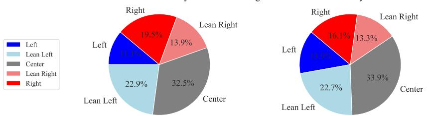

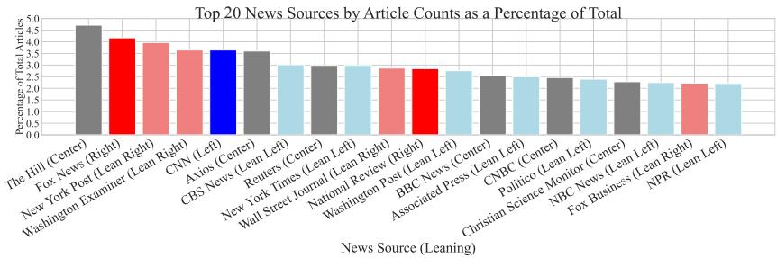  
Fig. 2. Distribution of articles (left) and outlets (right) by political leaning, based on data from AllSides. The bar graph shows the top 20 sources by share of total articles, colored by ideology.

## 3 Data

W<sub>e use</sub> th<sub>ree</sub> d<sub>a</sub>t<sub>ase</sub>t<sub>s</sub> i<sub>n</sub> thi<sub>s s</sub>t<sub>u</sub>d<sub>y.</sub> Th<sub>e</sub> fi<sub>rs</sub>t<sub>,</sub> f<sub>rom a</sub>ll<sub>s</sub>id<sub>es.com, prov</sub>id<sub>es</sub> id<sub>eo</sub>l<sub>og</sub>i<sub>ca</sub>l l<sub>a</sub>b<sub>e</sub>l<sub>s</sub> f<sub>or</sub> <sub>news sources an</sub>d <sub>suppor</sub>t<sub>s cross-</sub>d<sub>oma</sub>i<sub>n a</sub>d<sub>ap</sub>t<sub>a</sub>ti<sub>on.</sub> Th<sub>e secon</sub>d <sub>an</sub>d thi<sub>r</sub>d <sub>con</sub>t<sub>a</sub>i<sub>n soc</sub>i<sub>a</sub>l <sub>me</sub>di<sub>a</sub> <sub>p</sub>osts from X (formerl<sub>y</sub> Twitter) and Truth Social, res<sub>p</sub>ectivel<sub>y</sub>. These <sub>p</sub>latforms are used for model trainin<sub>g,</sub> evaluation<sub>,</sub> and cross-<sub>p</sub>latform anal<sub>y</sub>sis of <sub>p</sub>olitical discourse and user ideolo<sub>gy</sub> across di<sub>s</sub>tin<sub>c</sub>t <sub>o</sub>nlin<sub>e</sub> <sub>co</sub>mm<sub>u</sub>niti<sub>es.</sub> Pri<sub>vacy</sub> <sub>co</sub>n<sub>s</sub>id<sub>e</sub>r<sub>a</sub>ti<sub>o</sub>n<sub>s</sub> <sub>a</sub>r<sub>e</sub> d<sub>e</sub>t<sub>a</sub>il<sub>e</sub>d in A<sub>ppe</sub>ndix A<sub>.</sub>1<sub>.</sub>1<sub>.</sub><sup>1</sup>

## 3.1 News Political Ideology Dataset

We construct a <sub>p</sub>olitical ideolo<sub>gy</sub> dataset usin<sub>g</sub> media bias ratin<sub>g</sub>s from allsides.com [3], which a<sub>gg</sub>re<sub>g</sub>ates <sub>p</sub>artisan <sub>p</sub>ers<sub>p</sub>ectives across the ideolo<sub>g</sub>ical s<sub>p</sub>ectrum.<sup>2</sup> This dataset su<sub>pp</sub>orts modelin<sub>g</sub> <sub>an</sub>d t<sub>rans</sub>f<sub>err</sub>i<sub>ng</sub> id<sub>eo</sub>l<sub>og</sub>i<sub>ca</sub>l <sub>s</sub>i<sub>gna</sub>l<sub>s across</sub> d<sub>oma</sub>i<sub>ns,</sub> b<sub>ase</sub>d <sub>on</sub> th<sub>e assump</sub>ti<sub>on</sub> th<sub>a</sub>t <sub>me</sub>di<sub>a a</sub>fili<sub>a</sub>ti<sub>on</sub> reflects consistent leanin<sub>g</sub>s. allsides.com a<sub>pp</sub>lies a multi-<sub>p</sub>artisan methodolo<sub>gy,</sub> includin<sub>g</sub> editorial <sub>rev</sub>i<sub>ew,</sub> bli<sub>n</sub>d bi<sub>as surveys,</sub> thi<sub>r</sub>d<sub>-par</sub>t<sub>y ana</sub>l<sub>ys</sub>i<sub>s, an</sub>d <sub>commun</sub>it<sub>y</sub> f<sub>ee</sub>db<sub>ac</sub>k<sub>.</sub> E<sub>ac</sub>h <sub>news source</sub> i<sub>s</sub> assi<sub>g</sub>ned a continuous bias score from -6 (most left) to 6 (most ri<sub>g</sub>ht), <sub>g</sub>rou<sub>p</sub>ed into five cate<sub>g</sub>ories: Left ([−6, −3]), Lean Left ((−3, −1]), Center ((−1, 1]), Lean Right ((1, 3]), and Right ((3, 6]). Using requests and Newspaper3k [58], we retrieved rated outlets and crawled ∼230,000 articles from their main <sub>p</sub>a<sub>g</sub>es<sub>,</sub> coverin<sub>g</sub> Au<sub>g</sub>ust 3<sub>,</sub> 2017 to December 22<sub>,</sub> 2022. Each article inherits its source’s l<sub>a</sub>b<sub>e</sub>l<sub>, y</sub>i<sub>e</sub>ldi<sub>ng a</sub> l<sub>arge-sca</sub>l<sub>e, wea</sub>kl<sub>y superv</sub>i<sub>se</sub>d d<sub>a</sub>t<sub>ase</sub>t <sub>w</sub>ith b<sub>a</sub>l<sub>ance</sub>d id<sub>eo</sub>l<sub>og</sub>i<sub>ca</sub>l <sub>coverage.</sub> S<sub>core</sub> <sub>p</sub>re<sub>p</sub>rocessin<sub>g</sub> details are in A<sub>pp</sub>endix A.1.2.

Preliminary Data Analysis. We conducted a preliminary analysis of the AllSides dataset to examine its ideolo<sub>g</sub>ical distribution and lin<sub>g</sub>uistic characteristics. The u<sub>pp</sub>er <sub>p</sub>art of Fi<sub>g</sub>ure 2 shows th<sub>e propor</sub>ti<sub>ons o</sub>f <sub>news ar</sub>ti<sub>c</sub>l<sub>es an</sub>d <sub>me</sub>di<sub>a ou</sub>tl<sub>e</sub>t<sub>s across</sub> fi<sub>ve po</sub>liti<sub>ca</sub>l <sub>ca</sub>t<sub>egor</sub>i<sub>es.</sub> Th<sub>e</sub> d<sub>a</sub>t<sub>ase</sub>t dis<sub>p</sub>la<sub>y</sub>s a relativel<sub>y</sub> balanced Left-Ri<sub>g</sub>ht distribution<sub>,</sub> su<sub>pp</sub>ortin<sub>g</sub> class balance durin<sub>g</sub> model trainin<sub>g</sub>. Th<sub>e</sub> l<sub>ower par</sub>t <sub>o</sub>f Fi<sub>gure</sub> 2 ill<sub>us</sub>t<sub>ra</sub>t<sub>es</sub> th<sub>e s</sub>h<sub>are o</sub>f t<sub>o</sub>t<sub>a</sub>l <sub>ar</sub>ti<sub>c</sub>l<sub>es</sub> h<sub>e</sub>ld b<sub>y</sub> th<sub>e</sub> t<sub>op</sub> 20 <sub>news ou</sub>tl<sub>e</sub>t<sub>s.</sub> A<sub>mong</sub> th<sub>em,</sub> “Th<sub>e</sub> Hill<sub>,</sub>” l<sub>a</sub>b<sub>e</sub>l<sub>e</sub>d <sub>as</sub> C<sub>en</sub>t<sub>er,</sub> <sub>con</sub>t<sub>r</sub>ib<sub>u</sub>t<sub>es</sub> th<sub>e</sub> l<sub>arges</sub>t <sub>s</sub>h<sub>are.</sub> D<sub>esp</sub>it<sub>e</sub> <sub>a</sub> Ri<sub>g</sub>ht<sub>-</sub>l<sub>ean</sub>i<sub>ng</sub> tilt <sub>among</sub> th<sub>e</sub> <sub>very</sub> l<sub>arges</sub>t <sub>ou</sub>tl<sub>e</sub>t<sub>s,</sub> th<sub>ese</sub> 20 <sub>sources</sub> <sub>span</sub> <sub>a</sub>ll fi<sub>ve</sub> id<sub>eo</sub>l<sub>og</sub>i<sub>ca</sub>l <sub>ca</sub>t<sub>egor</sub>i<sub>es.</sub> Additi<sub>ona</sub>l di<sub>s</sub>t<sub>r</sub>ib<sub>u</sub>ti<sub>on</sub> d<sub>e</sub>t<sub>a</sub>il<sub>s an</sub>d <sub>wor</sub>d <sub>c</sub>l<sub>ou</sub>d <sub>v</sub>i<sub>sua</sub>li<sub>za</sub>ti<sub>ons appear</sub> i<sub>n</sub> T<sub>a</sub>bl<sub>e</sub> 1 <sub>an</sub>d Fi<sub>gure</sub> 1 <sub>o</sub>f th<sub>a</sub>t <sub>ma</sub>t<sub>er</sub>i<sub>a</sub>l<sub>.</sub>

Table 1. Top 10 most frequent content words per political leaning (full text, stopwords removed).
<table><tr><td>Rank</td><td>Left</td><td>Lean Left</td><td>Center</td><td>Lean Right</td><td>Right</td></tr><tr><td>1</td><td>trump (96,727)</td><td>people (130,164)</td><td>state (122,494)</td><td>president (54,261)</td><td>trump (60,993)</td></tr><tr><td>2</td><td>people (62,773)</td><td>president (96,049)</td><td>trump (121,089)</td><td>biden (45,403)</td><td>biden (50,717)</td></tr><tr><td>3</td><td>election (58,163)</td><td>state (94,501)</td><td>president (115,675)</td><td>house (42,055)</td><td>house (50,398)</td></tr><tr><td>4</td><td>republican (47,839)</td><td>new (92,173)</td><td>people (109,190)</td><td>new (41,471)</td><td>president (47,401)</td></tr><tr><td>5</td><td>even (47,647)</td><td>trump (88,297)</td><td>new (105,062)</td><td>state (40,075)</td><td>news (47,398)</td></tr><tr><td>6</td><td>president (46,673)</td><td>covid (86,424)</td><td>house (95,068)</td><td>congress (34,186)</td><td>people (40,715)</td></tr><tr><td>7</td><td>political (43,828)</td><td>biden (79,017)</td><td>year (84,825)</td><td>year (28,292)</td><td>new (37,368)</td></tr><tr><td>8</td><td>house (42,453)</td><td>years (72,749)</td><td>states (83,646)</td><td>former (28,068)</td><td>state (35,696)</td></tr><tr><td>9</td><td>democrats (41,652)</td><td>states (72,083)</td><td>senate (82,457)</td><td>last (26,605)</td><td>twitter (34,956)</td></tr><tr><td>10</td><td>republicans (38,995)</td><td>election (65,009)</td><td>election (82,358)</td><td>committee (25,647)</td><td>government (33,186)</td></tr></table>

B<sub>eyon</sub>d <sub>wor</sub>d <sub>c</sub>l<sub>ou</sub>d <sub>v</sub>i<sub>sua</sub>li<sub>za</sub>ti<sub>ons, we con</sub>d<sub>uc</sub>t<sub>e</sub>d <sub>a</sub> f<sub>requency ana</sub>l<sub>ys</sub>i<sub>s o</sub>f f<sub>u</sub>ll <sub>ar</sub>ti<sub>c</sub>l<sub>e</sub> t<sub>ex</sub>t<sub>s</sub> t<sub>o</sub> <sub>exam</sub>i<sub>ne</sub> id<sub>eo</sub>l<sub>og</sub>i<sub>ca</sub>l dif<sub>erences</sub> i<sub>n</sub> l<sub>ex</sub>i<sub>ca</sub>l <sub>usage.</sub> T<sub>a</sub>bl<sub>e</sub> 1 li<sub>s</sub>t<sub>s</sub> th<sub>e</sub> t<sub>op</sub> 10 <sub>mos</sub>t f<sub>requen</sub>t <sub>con</sub>t<sub>en</sub>t <sub>wor</sub>d<sub>s</sub> <sub>p</sub>er <sub>p</sub>olitical leanin<sub>g</sub> after sto<sub>p</sub>word removal. These <sub>p</sub>atterns reveal how lexical em<sub>p</sub>hasis varies across ideological contexts. Trump is the most frequent term in both Left (96,727) and Right (60,993) articles, indicating shared focus but likely divergent framing. Biden also appears frequently in Lean Ri<sub>g</sub>ht (45,403) and Ri<sub>g</sub>ht (50,717), reflectin<sub>g</sub> sustained—often critical—attention from ri<sub>g</sub>ht-leanin<sub>g</sub> outlets. An asymmetry emerges with covid, ranked $6 ^ { \mathrm { t h } }$ in Lean Left (86,424) but absent elsewhere, su<sub>gg</sub>estin<sub>g</sub> <sub>g</sub>reater <sub>p</sub>andemic focus amon<sub>g</sub> moderatel<sub>y</sub> left-leanin<sub>g</sub> sources. Center-leanin<sub>g</sub> content foregrounds governing bodies—state (122,494), house (95,068), senate (82,457)—indicating a <sub>g</sub>overnance-oriented tone. Lean Ri<sub>g</sub>ht and Ri<sub>g</sub>ht texts instead em<sub>p</sub>hasize oversi<sub>g</sub>ht and <sub>p</sub>latform arenas, with congress (34,186), committee (25,647), and twitter (34,956), reflecting political critique and media discourse. These trends su<sub>pp</sub>ort our h<sub>yp</sub>othesis that bias emer<sub>g</sub>es not onl<sub>y</sub> in to<sub>p</sub>ic <sub>se</sub>l<sub>ec</sub>ti<sub>on,</sub> b<sub>u</sub>t <sub>a</sub>l<sub>so</sub> i<sub>n</sub> l<sub>ex</sub>i<sub>ca</sub>l f<sub>ram</sub>i<sub>ng—even w</sub>h<sub>en even</sub>t<sub>s are s</sub>h<sub>are</sub>d<sub>.</sub>

## 3.2 A User-Centric Twiter Dataset on U.S. Presidential Elections

To su<sub>pp</sub>ort research on <sub>p</sub>olitical ideolo<sub>gy</sub> and discourse—<sub>p</sub>articularl<sub>y</sub> in the context of U.S. <sub>p</sub>residential elections—we construct a lar<sub>g</sub>escale dataset from X (formerl<sub>y</sub> Twitter). Usin<sub>g</sub> a ke<sub>y</sub>word seed <sub>q</sub>uer<sub>y</sub> (“<sub>p</sub>residential election”), we collected ∼10,000 tweets and id<sub>en</sub>tifi<sub>e</sub>d 4<sub>,</sub>545 <sub>un</sub>i<sub>que</sub> <sub>users.</sub> W<sub>e</sub> th<sub>en</sub> <sub>re</sub>t<sub>r</sub>i<sub>eve</sub>d th<sub>e</sub>i<sub>r</sub> f<sub>u</sub>ll t<sub>wee</sub>t histories<sub>, y</sub>ieldin<sub>g</sub> a user-centric cor<sub>p</sub>us of 76<sub>,</sub>718<sub>,</sub>924 tweets from Januar<sub>y</sub> 1, 2007 to December 31, 2022 (Table 2a). This dataset en-<sub>a</sub>bl<sub>es</sub> l<sub>ong</sub>it<sub>u</sub>di<sub>na</sub>l <sub>ana</sub>l<sub>ys</sub>i<sub>s o</sub>f <sub>po</sub>liti<sub>ca</sub>l di<sub>scourse an</sub>d <sub>user</sub> b<sub>e</sub>h<sub>av</sub>i<sub>or.</sub> T<sub>a</sub>bl<sub>e</sub> 2<sub>a summar</sub>i<sub>zes</sub> d<sub>a</sub>t<sub>ase</sub>t <sub>s</sub>t<sub>a</sub>ti<sub>s</sub>ti<sub>cs, an</sub>d T<sub>a</sub>bl<sub>e</sub> 2b li<sub>s</sub>t<sub>s</sub> t<sub>wee</sub>t<sub>-</sub>l<sub>eve</sub>l fields: t<sub>w</sub>eet IDs<sub>,</sub> <sub>u</sub>ser metadata<sub>,</sub> timestam<sub>p</sub>s<sub>,</sub> con<sub>v</sub>ersation IDs<sub>,</sub> en-<sub>g</sub>a<sub>g</sub>ement metrics (retweets, <sub>q</sub>uotes, likes), reference links (e.<sub>g</sub>., re<sub>p</sub>lies, retweets), and full text with hashta<sub>g</sub>s. The dataset’s feature richness su<sub>pp</sub>orts detailed anal<sub>y</sub>sis of user activit<sub>y,</sub> en<sub>g</sub>a<sub>g</sub>ement <sub>p</sub>atterns<sub>,</sub> and content evolution. Pre<sub>p</sub>rocessin<sub>g</sub> details a<sub>pp</sub>ear in A<sub>ppe</sub>ndix A<sub>.</sub>1<sub>.</sub>3<sub>.</sub>

Table 2. X Dataset Overview.  
(a) Basic Statistics
<table><tr><td>Characteristic</td><td>Value</td></tr><tr><td>Number of Users</td><td>4,545</td></tr><tr><td>Total Tweets</td><td>76,718,924</td></tr><tr><td>Avg. Tweets/User</td><td>16,880</td></tr><tr><td>Avg. Retweets/Tweet</td><td>20.50</td></tr><tr><td>Avg. Likes/Tweet</td><td>88.00</td></tr><tr><td>Avg. Quotes/Tweet</td><td>2.40</td></tr></table>

(b) Atributes
<table><tr><td>Field</td><td>Relations</td><td>Target ID</td><td>Content</td></tr><tr><td>ID</td><td>Retweets</td><td>RT ID</td><td>Text</td></tr><tr><td>Username</td><td>Quotes</td><td>QT ID</td><td>Hashtags</td></tr><tr><td>Time</td><td>Likes</td><td>Reply ID</td><td></td></tr><tr><td>Conv. ID</td><td></td><td>Reply User</td><td>Mentions</td></tr></table>

Comparison with Existing Datasets. Table 3 compares recent large-scale social media datasets. While man<sub>y</sub> are valuable<sub>,</sub> the<sub>y</sub> var<sub>y</sub> in <sub>p</sub>latform<sub>,</sub> scale<sub>, g</sub>ranularit<sub>y,</sub> and thematic sco<sub>p</sub>e. For exam<sub>p</sub>le<sub>,</sub> Dreaddit [74] and the Reddit Cor<sub>p</sub>us [36] focus on Reddit, <sub>p</sub>rovidin<sub>g p</sub>ost- or dialo<sub>g</sub>ue-level data

Table 3. Summary of Recent Social Media Datasets
<table><tr><td>Dataset Name</td><td>Platform</td><td>Count</td><td>Users</td><td>Duration</td><td>Data Level</td><td>Theme</td></tr><tr><td>Dreaddit [74]</td><td>Reddit</td><td>~190k</td><td>N/A</td><td>2017-2018</td><td>Post</td><td>Social media stress</td></tr><tr><td>Reddit Corpus [36]</td><td>Reddit</td><td>727M</td><td>N/A</td><td>2015-2018</td><td>Dialogue</td><td>Conversational AI</td></tr><tr><td>Weibo-COV [37]</td><td>Sina Weibo</td><td>&gt;40M</td><td>20M</td><td>2019-2020</td><td>Post</td><td>COVID-19 discourse</td></tr><tr><td>News Feed Rank. [8]</td><td>Twitter</td><td>26k</td><td>46</td><td>2021-2022</td><td>News</td><td>Personalized ranking</td></tr><tr><td>MetaHate [62]</td><td>Mixed</td><td>1.2M</td><td>N/A</td><td>N/A</td><td>Post</td><td>Hate speech detect.</td></tr><tr><td>IsamasRed [14]</td><td>Reddit</td><td>8M</td><td>N/A</td><td>2023</td><td>Dialogue</td><td>Israel-Hamas discourse</td></tr><tr><td>Koo Dataset [52]</td><td>Koo</td><td>72M</td><td>1.4M</td><td>2020-2023</td><td>Post</td><td>Indian microblogging</td></tr><tr><td>TweetIntent Crisis [2]</td><td>Twitter</td><td>~18k</td><td>79</td><td>2022-2023</td><td>Post</td><td>Russia-Ukraine narratives</td></tr><tr><td>SocialDrought [70]</td><td>Twitter&amp;News</td><td>1.5M</td><td>N/A</td><td>2012-2023</td><td>Integrated</td><td>Drought societal impact</td></tr><tr><td>LGBTQ+ MiSSoM [10]</td><td>Reddit</td><td>27.7k</td><td>N/A</td><td>2012-2021</td><td>Post</td><td>LGBTQ+ stress research</td></tr><tr><td>AiGen-FoodRev. [27]</td><td>Yelp</td><td>20k</td><td>N/A</td><td>N/A</td><td>Post</td><td>AIGC Detection</td></tr><tr><td>iDRAMA-Scored [60]</td><td>Scored</td><td>57M</td><td>226k</td><td>2020-2023</td><td>Post</td><td>Fringe communities</td></tr><tr><td>Unintended Offense [73]</td><td>Twitter</td><td>2.4k</td><td>N/A</td><td>N/A</td><td>Dialogue</td><td>Unintentional offense</td></tr><tr><td>PulseReddit [35]</td><td>Reddit</td><td>~73k</td><td>N/A</td><td>2024-2025</td><td>Post</td><td>MAS HFT Crypto Trad.</td></tr><tr><td>Ours</td><td>Twitter</td><td>~77M</td><td>~5k</td><td>2007-2022</td><td>User</td><td>Presidential Election</td></tr></table>

(190k and 727M entries, res<sub>p</sub>ectivel<sub>y</sub>). Weibo-COV [37] ofers 40M COVID-19-related <sub>p</sub>osts from Sina Weibo, but is also <sub>p</sub>ost-centric. Koo [52] (72M <sub>p</sub>osts from 1.4M users) and iDRAMA-Scored [60] (57M <sub>p</sub>osts from 226k users) tar<sub>g</sub>et Indian and frin<sub>g</sub>e-<sub>p</sub>latform discourse, res<sub>p</sub>ectivel<sub>y</sub>, and are likewise <sub>p</sub>ost-level. Even Twitter-based datasets such as TweetIntent@Crisis [2] and News Feed Rankin<sub>g</sub> [8] involve small user bases (e.<sub>g</sub>., 79 and 46 users) and are not user-centric.

I<sub>n</sub> <sub>con</sub>t<sub>ras</sub>t<sub>,</sub> <sub>our</sub> d<sub>a</sub>t<sub>ase</sub>t <sub>o</sub>f<sub>ers</sub> f<sub>u</sub>ll t<sub>wee</sub>t hi<sub>s</sub>t<sub>or</sub>i<sub>es</sub> f<sub>or</sub> <sub>a</sub> fi<sub>xe</sub>d <sub>co</sub>h<sub>or</sub>t <sub>o</sub>f 4<sub>,</sub>545 <sub>users</sub> <sub>over</sub> 16 <sub>years.</sub> This su<sub>pp</sub>orts fine-<sub>g</sub>rained<sub>,</sub> lon<sub>g</sub>itudinal modelin<sub>g</sub> of U.S. <sub>p</sub>residential election discourse. Unlike <sub>pos</sub>t<sub>-</sub>l<sub>eve</sub>l <sub>snaps</sub>h<sub>o</sub>t<sub>s, our</sub> d<sub>a</sub>t<sub>ase</sub>t <sub>re</sub>t<sub>a</sub>i<sub>ns</sub> f<sub>u</sub>ll th<sub>rea</sub>d<sub>s an</sub>d <sub>engagemen</sub>t<sub>, a</sub>ll<sub>ow</sub>i<sub>ng</sub> f<sub>or</sub> th<sub>e ana</sub>l<sub>ys</sub>i<sub>s</sub> of ideolo<sub>g</sub>ical evolution and stance shifts over time. Its scale<sub>,</sub> tem<sub>p</sub>oral s<sub>p</sub>an<sub>,</sub> and user continuit<sub>y</sub> make it uni<sub>q</sub>uel<sub>y</sub> suited for stud<sub>y</sub>in<sub>g</sub> <sub>p</sub>olitical <sub>p</sub>olarization and ideolo<sub>gy</sub> formation on social media.

Preliminary Data Analysis. To better understand the dataset’s temporal growth and topical f<sub>ocus,</sub> <sub>we</sub> <sub>carr</sub>i<sub>e</sub>d <sub>ou</sub>t <sub>exp</sub>l<sub>ora</sub>t<sub>ory</sub> <sub>ana</sub>l<sub>yses</sub> <sub>o</sub>f t<sub>wee</sub>t <sub>vo</sub>l<sub>ume</sub> <sub>over</sub> ti<sub>me</sub> <sub>an</sub>d h<sub>as</sub>ht<sub>ag</sub> f<sub>requency.</sub>

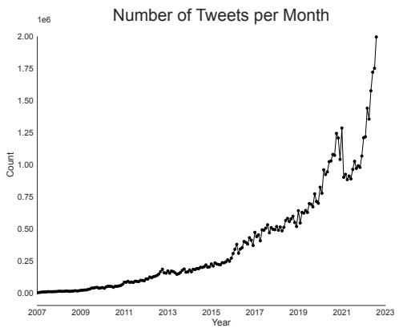  
(a) Number of tweets per month from January 2007 to September 2022.

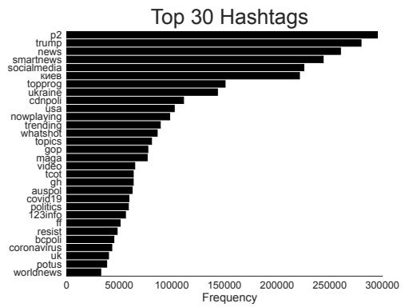  
(b) Top 30 hashtags in the Twiter dataset by frequency.  
Fig. 3. Temporal growth and topical focus of the X (Twiter) dataset.

Tweet Volume Over Time. Fi<sub>g</sub>ure 3a shows monthl<sub>y</sub> tweet counts from Jan. 2007 to Se<sub>p</sub>. 2022. The overa<sup>ll</sup> trajectory is upwar<sup>d</sup>, wit<sup>h</sup> tweet activity growing stea<sup>d</sup>i<sup>l</sup>y t<sup>h</sup>roug<sup>h</sup> <sup>l</sup>ate 2022 an<sup>d</sup> acce<sup>l</sup>erating es<sub>p</sub>eciall<sub>y</sub> ra<sub>p</sub>idl<sub>y</sub> after 2018. Four <sub>p</sub>eaks <sub>p</sub>unctuate this trend: a modest bum<sub>p</sub> durin<sub>g</sub> the 2012 U.S. <sub>p</sub>residential election<sub>,</sub> a more <sub>p</sub>ronounced sur<sub>g</sub>e in 2016<sub>,</sub> a third s<sub>p</sub>ike durin<sub>g</sub> the COVID-19 <sub>ou</sub>tb<sub>rea</sub>k i<sub>n</sub> <sub>ear</sub>l<sub>y</sub> 2020<sub>,</sub> <sub>an</sub>d th<sub>e</sub> l<sub>arges</sub>t <sub>pea</sub>k <sub>surroun</sub>di<sub>ng</sub> th<sub>e</sub> 2020 <sub>pres</sub>id<sub>en</sub>ti<sub>a</sub>l <sub>e</sub>l<sub>ec</sub>ti<sub>on,</sub> <sub>re</sub>fl<sub>ec</sub>ti<sub>ng</sub> hei<sub>g</sub>htened online <sub>p</sub>olitical activit<sub>y</sub>. Afterward<sub>,</sub> tweet volume continues to rise shar<sub>p</sub>l<sub>y,</sub> su<sub>gg</sub>estin<sub>g</sub> a sustained ex<sub>p</sub>ansion of <sub>p</sub>olitical en<sub>g</sub>a<sub>g</sub>ement on the <sub>p</sub>latform.

T<sub>op</sub> H<sub>as</sub>ht<sub>ags.</sub> Fi<sub>gure</sub> 3b li<sub>s</sub>t<sub>s</sub> th<sub>e</sub> 30 <sub>mos</sub>t f<sub>requen</sub>t h<sub>as</sub>ht<sub>ags.</sub> N<sub>ews- an</sub>d <sub>me</sub>di<sub>a-or</sub>i<sub>en</sub>t<sub>e</sub>d t<sub>ags, suc</sub>h as #news, #smartnews, and #socialmedia, appear most prominently, underscoring Twitter’s role as a live information channel. Excluding these politically neutral news tags, partisan motifs—#gop, #maga, and #resist—still command a substantial share of the remaining distribution, confirming the <sub>p</sub>latform’s ideolo<sub>g</sub>ical <sub>p</sub>olarit<sub>y</sub>. International-<sub>p</sub>olitics hashta<sub>g</sub>s (#ukraine, #auspol, #cdnpoli) and <sub>g</sub>lobal-health hashta<sub>g</sub>s (#covid19, #coronavirus) are likewise <sub>p</sub>resent, hi<sub>g</sub>hli<sub>g</sub>htin<sub>g</sub> the dataset’s <sub>geograp</sub>hi<sub>c</sub> b<sub>rea</sub>dth <sub>an</sub>d it<sub>s</sub> <sub>coverage</sub> <sub>o</sub>f <sub>wor</sub>ld<sub>w</sub>id<sub>e</sub> <sub>even</sub>t<sub>s.</sub>

## 3.3 Truth Social Dataset

We also incor<sub>p</sub>orated a dataset from Truth Social [28], launched in Februar<sub>y</sub> 2022 followin<sub>g</sub> the Januar<sub>y</sub> 2021 sus<sub>p</sub>ension of then-U.S. President Donald Trum<sub>p</sub> from multi<sub>p</sub>le <sub>p</sub>latforms, includin<sub>g</sub> Twitter (now known as X), Facebook, and others. From Fi<sub>g</sub>ure 1 (a) and (b), Truth Social was desi<sub>g</sub>ned to closel<sub>y</sub> mirror X in terms of functionalit<sub>y,</sub> with almost identical features. For instance<sub>,</sub> X’<sub>s</sub> “R<sub>e</sub>t<sub>wee</sub>t” f<sub>unc</sub>ti<sub>ona</sub>lit<sub>y</sub> i<sub>s</sub> <sub>ana</sub>l<sub>ogous</sub> t<sub>o</sub> “R<sub>e</sub>T<sub>ru</sub>th” <sub>on</sub> T<sub>ru</sub>th S<sub>oc</sub>i<sub>a</sub>l<sub>.</sub> S<sub>uppor</sub>t<sub>ers</sub> <sub>o</sub>f T<sub>rump</sub> <sub>pre-</sub> dominantl<sub>y</sub> fre<sub>q</sub>uent this <sub>p</sub>latform and <sub>g</sub>enerall<sub>y</sub> exhibit a ri<sub>g</sub>ht-leanin<sub>g</sub> <sub>p</sub>olitical bias. With this d<sub>a</sub>t<sub>ase</sub>t<sub>, we a</sub>i<sub>m</sub> t<sub>o exp</sub>l<sub>ore</sub> th<sub>e</sub> di<sub>ssem</sub>i<sub>na</sub>ti<sub>on o</sub>f i<sub>n</sub>f<sub>orma</sub>ti<sub>on an</sub>d t<sub>rac</sub>k th<sub>e evo</sub>l<sub>u</sub>ti<sub>on o</sub>f <sub>user po</sub>liti<sub>ca</sub>l id<sub>eo</sub>l<sub>og</sub>i<sub>es w</sub>ithi<sub>n a soc</sub>i<sub>a</sub>l <sub>ne</sub>t<sub>wor</sub>k th<sub>a</sub>t i<sub>n</sub>h<sub>eren</sub>tl<sub>y carr</sub>i<sub>es a po</sub>liti<sub>ca</sub>l bi<sub>as</sub> f<sub>rom</sub> th<sub>e ou</sub>t<sub>se</sub>t<sub>.</sub>

Str<sub>uc</sub>t<sub>u</sub>r<sub>a</sub>ll<sub>y,</sub> Tr<sub>u</sub>th S<sub>oc</sub>i<sub>a</sub>l b<sub>ea</sub>r<sub>s</sub> <sub>s</sub>imil<sub>a</sub>riti<sub>es</sub> t<sub>o</sub> T<sub>w</sub>itt<sub>e</sub>r<sub>.</sub> In <sub>co</sub>ntr<sub>as</sub>t t<sub>o</sub> T<sub>w</sub>itt<sub>er</sub>’<sub>s</sub> “T<sub>wee</sub>t<sub>s,</sub>” <sub>pos</sub>t<sub>s</sub> <sub>on</sub> thi<sub>s</sub> <sub>p</sub>l<sub>a</sub>tf<sub>orm</sub> <sub>are</sub> <sub>re</sub>f<sub>erre</sub>d t<sub>o</sub> <sub>as</sub> “T<sub>ru</sub>th<sub>s,</sub>” <sub>an</sub>d <sub>repos</sub>t<sub>s</sub> <sub>are</sub> t<sub>erme</sub>d “R<sub>e</sub>T<sub>ru</sub>th<sub>s.</sub>” Th<sub>e</sub> d<sub>a</sub>t<sub>ase</sub>t <sub>compr</sub>i<sub>ses</sub> <sub>over</sub> 454<sub>,</sub>000 <sub>users an</sub>d <sub>excee</sub>d<sub>s</sub> 823<sub>,</sub>000 “T<sub>ru</sub>th<sub>s.</sub>” Additi<sub>ona</sub>ll<sub>y,</sub> it i<sub>nc</sub>l<sub>u</sub>d<sub>es</sub> th<sub>e com-</sub> <sub>p</sub>l<sub>e</sub>t<sub>e pos</sub>t hi<sub>s</sub>t<sub>ory o</sub>f th<sub>e</sub> 65<sub>,</sub>536 <sub>mos</sub>t <sub>ac</sub>ti<sub>ve users.</sub> S<sub>u</sub>bt<sub>a</sub>bl<sub>es w</sub>ithi<sub>n</sub> thi<sub>s</sub> d<sub>a</sub>t<sub>ase</sub>t<sub>,</sub> <sub>suc</sub>h <sub>as</sub> “T<sub>ru</sub>th<sub>s</sub>” <sub>an</sub>d “U<sub>sers,</sub>” <sub>serve</sub> <sub>as</sub> <sub>pr</sub>i<sub>mary</sub> <sub>resources</sub> f<sub>or</sub> <sub>our</sub> ex<sub>p</sub>loration. An o<sub>v</sub>er<sub>v</sub>ie<sub>w</sub> of this dataset is <sub>p</sub>resented in Table 4. Details of data <sub>p</sub>re<sub>p</sub>rocessin<sub>g</sub> are <sub>p</sub>rovided in A<sub>pp</sub>endix A.1.4.

Table 4. Truth Social Dataset Overview
<table><tr><td>Field</td><td># of Records</td></tr><tr><td>Users</td><td>454,458</td></tr><tr><td>Truths</td><td>823,927</td></tr><tr><td>Quotes</td><td>10,508</td></tr><tr><td>Replies</td><td>506,276</td></tr></table>

## 4 Methods

This section introduces our <sub>p</sub>ro<sub>p</sub>osed framework and consists of both PIDN and PIPN modules.

## 4.1 Political Ideology Detection Network

Political ideolo<sub>gy</sub> detection involves anal<sub>y</sub>zin<sub>g</sub> social media <sub>p</sub>osts to determine 1) whether the<sub>y</sub> are <sub>p</sub>oliticall<sub>y</sub> relevant and, if so, 2) to what extent the<sub>y</sub> ali<sub>g</sub>n alon<sub>g</sub> the <sub>p</sub>olitical s<sub>p</sub>ectrum. Rather than <sub>ass</sub>i<sub>gn</sub>i<sub>ng scores</sub> t<sub>o a</sub>ll i<sub>npu</sub>t<sub>s</sub> i<sub>n</sub>di<sub>scr</sub>i<sub>m</sub>i<sub>na</sub>t<sub>e</sub>l<sub>y,</sub> th<sub>e</sub> t<sub>as</sub>k fi<sub>rs</sub>t filt<sub>ers ou</sub>t <sub>non-po</sub>liti<sub>ca</sub>l <sub>con</sub>t<sub>en</sub>t <sub>an</sub>d th<sub>en</sub> <sub>es</sub>ti<sub>ma</sub>t<sub>es</sub> <sub>an</sub> id<sub>eo</sub>l<sub>ogy</sub> <sub>score</sub> f<sub>or</sub> <sub>pos</sub>t<sub>s</sub> id<sub>en</sub>tifi<sub>e</sub>d <sub>as</sub> <sub>po</sub>liti<sub>ca</sub>l<sub>.</sub> O<sub>ur</sub> <sub>propose</sub>d <sub>ne</sub>t<sub>wor</sub>k <sub>a</sub>dd<sub>resses</sub> these dual challen<sub>g</sub>es throu<sub>g</sub>h a combination of unsu<sub>p</sub>ervised domain ada<sub>p</sub>tation (UDA), text st<sub>y</sub>le transfer (TST) usin<sub>g</sub> LLMs, and an eficient model architecture.

While LLMs show stron<sub>g</sub> ICL ca<sub>p</sub>abilities [9, 22], their direct use in lar<sub>g</sub>e-scale tasks like ideolo<sub>gy</sub> d<sub>e</sub>t<sub>ec</sub>ti<sub>o</sub>n f<sub>aces</sub> hi<sub>g</sub>h inf<sub>e</sub>r<sub>e</sub>n<sub>ce</sub> l<sub>a</sub>t<sub>e</sub>n<sub>cy.</sub> Addin<sub>g</sub> in-<sub>co</sub>nt<sub>e</sub>xt <sub>e</sub>x<sub>a</sub>m<sub>p</sub>l<sub>es</sub> l<sub>e</sub>n<sub>g</sub>th<sub>e</sub>n<sub>s</sub> th<sub>e</sub> in<sub>pu</sub>t <sub>a</sub>nd in<sub>c</sub>r<sub>eases</sub> attention com<sub>p</sub>utation [63, 82, 88]. LLMs can also under<sub>p</sub>erform fine-tuned models on well-defined, hi<sub>g</sub>h-resource tasks [61], limitin<sub>g</sub> their suitabilit<sub>y</sub> for real-time or hi<sub>g</sub>h-throu<sub>g</sub>h<sub>p</sub>ut use. We therefore <sub>a</sub>d<sub>op</sub>t <sub>a</sub> BERT<sub>-</sub>b<sub>ase</sub>d <sub>arc</sub>hit<sub>ec</sub>t<sub>ure,</sub> <sub>w</sub>hi<sub>c</sub>h <sub>o</sub>f<sub>ers</sub> <sub>a</sub> <sub>s</sub>t<sub>ronger</sub> t<sub>ra</sub>d<sub>e-o</sub>f b<sub>e</sub>t<sub>ween</sub> t<sub>as</sub>k <sub>per</sub>f<sub>ormance</sub> <sub>an</sub>d eficienc<sub>y</sub>—es<sub>p</sub>eciall<sub>y</sub> in inference s<sub>p</sub>eed and resource usa<sub>g</sub>e [68]. LLMs are reserved for the ofline TST sta<sub>g</sub>e<sub>,</sub> where latenc<sub>y</sub> is less critical<sub>,</sub> rather than the core detection <sub>p</sub>i<sub>p</sub>eline.

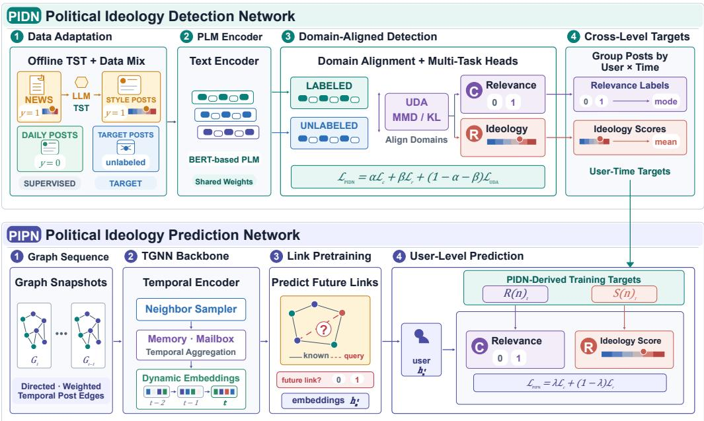  
Fig. 4. The overview of our proposed framework: TSN4PI. The upper part of the figure represents the PIDN module, while the lower part represents the PIPN module.

Buildin<sub>g</sub> on this architectural decision<sub>,</sub> our detection <sub>p</sub>i<sub>p</sub>eline inte<sub>g</sub>rates ofline LLM-based st<sub>y</sub>le ada<sub>p</sub>tation <sub>w</sub>ith an online BERT-based classifier. S<sub>p</sub>ecificall<sub>y,</sub> <sub>g</sub>iven the substantial st<sub>y</sub>listic difer-<sub>ences</sub> b<sub>e</sub>t<sub>ween</sub> f<sub>orma</sub>l <sub>news ar</sub>ti<sub>c</sub>l<sub>es an</sub>d i<sub>n</sub>f<sub>orma</sub>l social media <sub>p</sub>osts<sub>,</sub> we a<sub>pp</sub>l<sub>y</sub> a TST mod<sub>u</sub>le to transf<sub>orm news con</sub>t<sub>en</sub>t i<sub>n</sub>t<sub>o a s</sub>t<sub>y</sub>l<sub>e resem</sub>bli<sub>ng</sub> th<sub>a</sub>t <sub>o</sub>f <sub>p</sub>latforms such as X. This st<sub>y</sub>listic ali<sub>g</sub>nment nar-<sub>rows</sub> th<sub>e</sub> d<sub>oma</sub>i<sub>n</sub> <sub>gap</sub> b<sub>e</sub>t<sub>ween</sub> th<sub>e</sub> l<sub>a</sub>b<sub>e</sub>l<sub>e</sub>d <sub>source</sub> domain (news) and the unlabeled tar<sub>g</sub>et domain (social media), thereb<sub>y</sub> im<sub>p</sub>rovin<sub>g</sub> transferabilit<sub>y</sub>. To further brid<sub>g</sub>e this <sub>g</sub>a<sub>p,</sub> we incor<sub>p</sub>orate UDA to ali<sub>g</sub>n the latent re<sub>p</sub>resentations of <sub>p</sub>olitical news <sub>an</sub>d <sub>un</sub>l<sub>a</sub>b<sub>e</sub>l<sub>e</sub>d <sub>soc</sub>i<sub>a</sub>l <sub>me</sub>di<sub>a pos</sub>t<sub>s.</sub> W<sub>e a</sub>l<sub>so augmen</sub>t

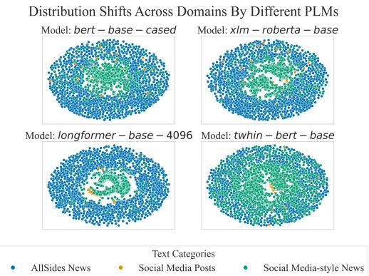  
Fig. 5. Embedding across PLMs.

trainin<sub>g</sub> with a mixture of <sub>p</sub>olitical news articles and non-<sub>p</sub>olitical social media content<sub>,</sub> allowin<sub>g</sub> the model to jointl<sub>y</sub> learn 1) <sub>p</sub>olitical relevance classification and 2) ideolo<sub>gy</sub> scorin<sub>g</sub> for relevant <sub>p</sub>osts. Thi<sub>s</sub> <sub>un</sub>ifi<sub>e</sub>d <sub>approac</sub>h <sub>ena</sub>bl<sub>es</sub> <sub>ro</sub>b<sub>us</sub>t d<sub>e</sub>t<sub>ec</sub>ti<sub>on</sub> i<sub>n</sub> <sub>no</sub>i<sub>sy,</sub> <sub>rea</sub>l<sub>-wor</sub>ld <sub>soc</sub>i<sub>a</sub>l <sub>me</sub>di<sub>a</sub> <sub>env</sub>i<sub>ronmen</sub>t<sub>s,</sub> <sub>w</sub>hil<sub>e</sub> l<sub>everag</sub>i<sub>ng</sub> <sub>s</sub>t<sub>ruc</sub>t<sub>ure</sub>d id<sub>eo</sub>l<sub>og</sub>i<sub>ca</sub>l <sub>s</sub>i<sub>gna</sub>l<sub>s</sub> f<sub>rom</sub> t<sub>ra</sub>diti<sub>ona</sub>l <sub>me</sub>di<sub>a.</sub>

LLMs for Text Style Transfer. To bridge the stylistic gap between formal news articles and the collo<sub>q</sub>uial nature of social media <sub>p</sub>osts<sub>,</sub> we use LLMs to <sub>p</sub>erform TST. This a<sub>pp</sub>roach is es<sub>p</sub>eciall<sub>y</sub> suitable <sub>g</sub>i<sub>ven</sub> th<sub>e a</sub>b<sub>sence o</sub>f <sub>para</sub>ll<sub>e</sub>l <sub>corpora an</sub>d th<sub>e s</sub>t<sub>rong</sub> i<sub>ns</sub>t<sub>ruc</sub>ti<sub>on-</sub>f<sub>o</sub>ll<sub>ow</sub>i<sub>ng capa</sub>biliti<sub>es o</sub>f <sub>mo</sub>d<sub>ern</sub> LLMs. S<sub>p</sub>ecificall<sub>y,</sub> for each news article <sub>�</sub> in the source cor<sub>p</sub>us �<sub>,</sub> we <sub>g</sub>enerate a st<sub>y</sub>le-ali<sub>g</sub>ned <sub>ve</sub>r<sub>s</sub>i<sub>o</sub>n $n _ { s }$ b<sub>y p</sub>rom<sub>p</sub>tin<sub>g</sub> the LLM with: $n _ { s } = \mathrm { L L M } ( [ \mathrm { p r o m p t } , n ] ) , n \in N$ <sub>.</sub> T<sub>o</sub> int<sub>u</sub>iti<sub>ve</sub>l<sub>y va</sub>lid<sub>a</sub>t<sub>e</sub> our a<sub>pp</sub>roach, we sam<sub>p</sub>led texts from three <sub>g</sub>rou<sub>p</sub>s: the source domain (AllSides news), the tar<sub>g</sub>et domain (Truth Social <sub>p</sub>osts), and our <sub>g</sub>enerated TST out<sub>p</sub>uts. These were encoded usin<sub>g</sub> four diverse BERT-based PLMs: bert-base-cased [21], xlm-roberta-base [49], longformer-base-4096 [6], and twhin-bert-base [87]—and <sub>p</sub>rojected to 2D via UMAP [67]. As shown in Fi<sub>g</sub>ure 5, ori<sub>g</sub>inal news articles (blue) are widel<sub>y</sub> scattered, while social media <sub>p</sub>osts (oran<sub>g</sub>e) form a denser cluster. Cruciall<sub>y</sub>, st<sub>y</sub>le-transferred texts (<sub>g</sub>reen) ali<sub>g</sub>n closel<sub>y</sub> with the tar<sub>g</sub>et domain, reducin<sub>g</sub> the distributional <sub>g</sub>a<sub>p</sub>. This <sub>p</sub>attern holds across all four PLMs<sub>,</sub> su<sub>pp</sub>ortin<sub>g</sub> the efectiveness and robustness of <sub>ou</sub>r TST <sub>s</sub>tr<sub>a</sub>t<sub>egy.</sub> A <sub>qua</sub>ntit<sub>a</sub>ti<sub>ve</sub> <sub>a</sub>nd <sub>co</sub>m<sub>p</sub>r<sub>e</sub>h<sub>e</sub>n<sub>s</sub>i<sub>ve</sub> <sub>au</sub>t<sub>o</sub>m<sub>a</sub>ti<sub>c</sub> <sub>eva</sub>l<sub>ua</sub>ti<sub>o</sub>n f<sub>o</sub>ll<sub>ows</sub> in S<sub>ec</sub>ti<sub>o</sub>n 5<sub>.</sub>2<sub>.</sub>2<sub>.</sub>

Unsupervised Domain Adaptation for Distribution Alignment. While LLM-based TST nar-<sub>rows</sub> th<sub>e</sub> <sub>s</sub>t<sub>y</sub>li<sub>s</sub>ti<sub>c</sub> <sub>gap</sub> b<sub>e</sub>t<sub>ween</sub> <sub>news</sub> <sub>an</sub>d <sub>soc</sub>i<sub>a</sub>l <sub>me</sub>di<sub>a</sub> t<sub>ex</sub>t<sub>s,</sub> <sub>res</sub>id<sub>ua</sub>l di<sub>s</sub>t<sub>r</sub>ib<sub>u</sub>ti<sub>ona</sub>l <sub>s</sub>hift<sub>s</sub> <sub>rema</sub>i<sub>n.</sub> To address this<sub>,</sub> <sub>p</sub>articularl<sub>y</sub> without re<sub>q</sub>uirin<sub>g</sub> labeled social media data<sub>,</sub> we incor<sub>p</sub>orate an o<sub>p</sub>- tional UDA module desi<sub>g</sub>ned to enhance domain <sub>g</sub>eneralization. Our <sub>p</sub>rimar<sub>y</sub> a<sub>pp</sub>roach em<sub>p</sub>lo<sub>y</sub>s Maximum Mean Discre<sub>p</sub>anc<sub>y</sub> (MMD), a non-<sub>p</sub>arametric measure that <sub>q</sub>uantifies the diver<sub>g</sub>ence between two distributions in a re<sub>p</sub>roducin<sub>g</sub> kernel Hilbert s<sub>p</sub>ace (RKHS), without re<sub>q</sub>uirin<sub>g</sub> <sub>p</sub>aired <sub>or</sub> b<sub>a</sub>l<sub>ance</sub>d <sub>samp</sub>l<sub>es.</sub> Gi<sub>ven</sub> <sub>a</sub> t<sub>ex</sub>t <sub>samp</sub>l<sub>e</sub> $T ,$ <sub>we</sub> <sub>ex</sub>t<sub>rac</sub>t it<sub>s</sub> <sub>em</sub>b<sub>e</sub>ddi<sub>ng</sub> $E = L ( T )$ <sub>us</sub>in<sub>g a</sub> PLM �<sub>.</sub> L<sub>e</sub>t $E _ { X }$ <sub>an</sub>d $E _ { Y }$ d<sub>eno</sub>t<sub>e</sub> <sub>em</sub>b<sub>e</sub>ddi<sub>ngs</sub> f<sub>rom</sub> th<sub>e</sub> <sub>s</sub>t<sub>y</sub>l<sub>e-</sub>t<sub>rans</sub>f<sub>erre</sub>d <sub>source</sub> <sub>an</sub>d t<sub>arge</sub>t d<sub>oma</sub>i<sub>ns,</sub> <sub>respec</sub>ti<sub>ve</sub>l<sub>y.</sub> Th<sub>e</sub> MMD l<sub>oss</sub> i<sub>s</sub> <sub>co</sub>m<sub>pu</sub>t<sub>e</sub>d <sub>as</sub>:

$$
{ \mathcal { L } } _ { \mathrm { M M D } } ( E _ { X } , E _ { Y } ) = { \sqrt { \mathbb { E } [ k ( x , x ^ { \prime } ) ] + \mathbb { E } [ k ( y , y ^ { \prime } ) ] - 2 \mathbb { E } [ k ( x , y ) ] } } ,\tag{1}
$$

<sub>w</sub>h<sub>ere</sub> $k ( x , y ) = \exp \left( { - \| x - y \| ^ { 2 } / \left( 2 \sigma ^ { 2 } \right) } \right)$ i<sub>s</sub> th<sub>e</sub> G<sub>auss</sub>i<sub>a</sub>n RBF k<sub>e</sub>rn<sub>e</sub>l<sub>, a</sub>nd $x , x ^ { \prime } \in E _ { X } , y , y ^ { \prime } \in E _ { Y }$ <sub>.</sub> Thi<sub>s</sub> kernel ma<sub>p</sub>s sam<sub>p</sub>les into a s<sub>p</sub>ace where their similarit<sub>y</sub> can be efectivel<sub>y</sub> measured and o<sub>p</sub>timized.

In addition to MMD, we also consider Kullback-Leibler (KL) diver<sub>g</sub>ence as an alternative distribution ali<sub>g</sub>nment method. KL diver<sub>g</sub>ence is <sub>p</sub>articularl<sub>y</sub> efective when model out<sub>p</sub>uts can be inter-<sub>pre</sub>t<sub>e</sub>d <sub>as pro</sub>b<sub>a</sub>bilit<sub>y</sub> di<sub>s</sub>t<sub>r</sub>ib<sub>u</sub>ti<sub>ons—suc</sub>h <sub>as so</sub>ft<sub>max scores or norma</sub>li<sub>ze</sub>d <sub>em</sub>b<sub>e</sub>ddi<sub>ngs—a</sub>ll<sub>ow</sub>i<sub>ng</sub> ex<sub>p</sub>licit ali<sub>g</sub>nment of <sub>p</sub>osterior distributions between domains. Given source domain <sub>p</sub>rediction $P$ and tar<sub>g</sub>et domain <sub>p</sub>rediction $Q ,$ <sub>,</sub> the KL loss is com<sub>p</sub>uted as:

$$
\mathcal { L } _ { \mathrm { K L } } ( P \| Q ) = \sum _ { i } P ( i ) \log \frac { P ( i ) } { Q ( i ) } .\tag{2}
$$

Com<sub>p</sub>ared to MMD<sub>,</sub> KL diver<sub>g</sub>ence assumes stron<sub>g</sub>er ali<sub>g</sub>nment in <sub>p</sub>robabilit<sub>y</sub> s<sub>p</sub>ace and is more <sub>su</sub>it<sub>a</sub>bl<sub>e w</sub>h<sub>en ou</sub>t<sub>pu</sub>t di<sub>s</sub>t<sub>r</sub>ib<sub>u</sub>ti<sub>ons are we</sub>ll<sub>-ca</sub>lib<sub>ra</sub>t<sub>e</sub>d<sub>.</sub> W<sub>e eva</sub>l<sub>ua</sub>t<sub>e</sub> b<sub>o</sub>th <sub>me</sub>t<sub>r</sub>i<sub>cs</sub> t<sub>o assess ro</sub>b<sub>us</sub>t<sub>ness</sub> under var<sub>y</sub>in<sub>g</sub> domain conditions. To incor<sub>p</sub>orate domain ada<sub>p</sub>tation durin<sub>g</sub> trainin<sub>g,</sub> we define a composite <sup>l</sup>oss t<sup>h</sup>at joint<sup>l</sup>y optimizes tas<sup>k</sup> per<sup>f</sup>ormance an<sup>d</sup> representation a<sup>l</sup>ignment:

$$
\mathcal { L } _ { \mathrm { P I D N } } = \alpha \mathcal { L } _ { c } + \beta \mathcal { L } _ { r } + ( 1 - \alpha - \beta ) \mathcal { L } _ { \mathrm { U D A } } ,\tag{3}
$$

<sub>w</sub>h<sub>ere</sub> $\mathcal { L } _ { c }$ <sub>an</sub>d $\mathcal { L } _ { r }$ <sub>are</sub> th<sub>e po</sub>liti<sub>ca</sub>l<sub>-re</sub>l<sub>evance c</sub>l<sub>ass</sub>ifi<sub>ca</sub>ti<sub>on an</sub>d id<sub>eo</sub>l<sub>ogy-regress</sub>i<sub>on</sub> l<sub>osses, respec-</sub> tivel<sub>y;</sub> $\mathcal { L } _ { \mathrm { U D A } } \in \{ \mathcal { L } _ { \mathrm { M M D } } , \mathcal { L } _ { \mathrm { K L } } \}$ i<sub>s</sub> th<sub>e se</sub>l<sub>ec</sub>t<sub>e</sub>d d<sub>oma</sub>i<sub>n-a</sub>li<sub>gnmen</sub>t l<sub>oss; an</sub>d $\alpha , \beta \ge 0$ <sub>w</sub>ith $\alpha + \beta \leq 1$ <sub>con</sub>t<sub>ro</sub>l th<sub>e</sub>i<sub>r re</sub>l<sub>a</sub>ti<sub>ve con</sub>t<sub>r</sub>ib<sub>u</sub>ti<sub>ons.</sub> Wh<sub>en</sub> UDA i<sub>s</sub> di<sub>sa</sub>bl<sub>e</sub>d i<sub>n an a</sub>bl<sub>a</sub>ti<sub>on,</sub> th<sub>e</sub> ${ \mathcal { L } } _ { \mathrm { U D A } }$ t<sub>e</sub>rm i<sub>s o</sub>mitt<sub>e</sub>d<sub>.</sub> B<sub>y</sub> ali<sub>g</sub>nin<sub>g</sub> embeddin<sub>g</sub> distributions across domains<sub>,</sub> the UDA module enhances <sub>g</sub>eneralization to i<sub>n</sub>f<sub>orma</sub>l<sub>,</sub> <sub>un</sub>l<sub>a</sub>b<sub>e</sub>l<sub>e</sub>d <sub>soc</sub>i<sub>a</sub>l <sub>me</sub>di<sub>a</sub> <sub>con</sub>t<sub>en</sub>t <sub>w</sub>hil<sub>e</sub> <sub>preserv</sub>i<sub>ng</sub> t<sub>as</sub>k<sub>-spec</sub>ifi<sub>c</sub> l<sub>earn</sub>i<sub>ng.</sub> A <sub>compre</sub>h<sub>ens</sub>i<sub>ve</sub> com<sub>p</sub>lexit<sub>y</sub> anal<sub>y</sub>sis of the UDA module is <sub>p</sub>rovided in A<sub>pp</sub>endix A.4.

## 4.2 Political Ideology Prediction Network

P<sub>o</sub>liti<sub>ca</sub>l id<sub>eo</sub>l<sub>ogy pre</sub>di<sub>c</sub>ti<sub>on mo</sub>d<sub>e</sub>l<sub>s</sub> h<sub>ow users</sub>’ <sub>s</sub>t<sub>ances evo</sub>l<sub>ve over</sub> ti<sub>me—a</sub> t<sub>as</sub>k f<sub>un</sub>d<sub>amen</sub>t<sub>a</sub>ll<sub>y</sub> dif<sub>eren</sub>t f<sub>rom s</sub>t<sub>a</sub>ti<sub>c</sub> d<sub>e</sub>t<sub>ec</sub>ti<sub>on</sub> d<sub>ue</sub> t<sub>o</sub> th<sub>e a</sub>b<sub>sence o</sub>f f<sub>u</sub>t<sub>ure pos</sub>t<sub>s.</sub> T<sub>ra</sub>diti<sub>ona</sub>l <sub>pos</sub>t<sub>-</sub>l<sub>eve</sub>l <sub>em</sub>b<sub>e</sub>ddi<sub>ng</sub> methods are thus ina<sub>pp</sub>licable. We ado<sub>p</sub>t Tem<sub>p</sub>oral Gra<sub>p</sub>h Neural Networks (TGNNs), which <sub>are</sub> <sub>we</sub>ll<sub>-su</sub>it<sub>e</sub>d f<sub>or</sub> id<sub>eo</sub>l<sub>og</sub>i<sub>ca</sub>l f<sub>orecas</sub>ti<sub>ng.</sub> Thi<sub>s</sub> <sub>c</sub>h<sub>o</sub>i<sub>ce</sub> i<sub>s</sub> <sub>mo</sub>ti<sub>va</sub>t<sub>e</sub>d b<sub>y</sub> t<sub>wo</sub> f<sub>ac</sub>t<sub>ors:</sub> <sub>soc</sub>i<sub>a</sub>l <sub>me</sub>di<sub>a</sub> <sub>p</sub>latforms naturall<sub>y p</sub>roduce d<sub>y</sub>namic user interaction <sub>g</sub>ra<sub>p</sub>hs<sub>,</sub> and TGNNs are desi<sub>g</sub>ned to model tem<sub>p</sub>oral de<sub>p</sub>endencies in such evolvin<sub>g</sub> structures.

Temporal Graph Construction. We construct a dynamic, directed, and weighted graph $G =$ $( V , E , t )$ <sub>,</sub> where � denotes users<sub>,</sub> � re<sub>p</sub>resents interactions<sub>,</sub> and � is the timestam<sub>p</sub> associated with <sub>eac</sub>h <sub>e</sub>d<sub>ge.</sub> E<sub>ac</sub>h <sub>pos</sub>t i<sub>s mo</sub>d<sub>e</sub>l<sub>e</sub>d <sub>as a</sub> t<sub>empora</sub>l <sub>e</sub>d<sub>ge w</sub>h<sub>ose</sub> f<sub>ea</sub>t<sub>ures are</sub> d<sub>er</sub>i<sub>ve</sub>d f<sub>rom</sub> PLM<sub>-</sub>b<sub>ase</sub>d t<sub>ex</sub>t <sub>em</sub>b<sub>e</sub>ddi<sub>ngs.</sub> If <sub>user</sub> � <sub>re-pos</sub>t<sub>s con</sub>t<sub>en</sub>t f<sub>rom user</sub> $B ,$ <sub>we</sub> i<sub>n</sub>t<sub>ro</sub>d<sub>uce a</sub> di<sub>rec</sub>t<sub>e</sub>d <sub>e</sub>d<sub>ge</sub> f<sub>rom</sub> � t<sub>o</sub> �<sub>,</sub> <sub>we</sub>i<sub>g</sub>ht<sub>e</sub>d b<sub>y</sub> th<sub>e</sub> f<sub>requency o</sub>f <sub>suc</sub>h <sub>repos</sub>t<sub>s w</sub>ithi<sub>n a</sub> d<sub>e</sub>fi<sub>ne</sub>d ti<sub>me w</sub>i<sub>n</sub>d<sub>ow.</sub> S<sub>e</sub>lf<sub>-</sub>l<sub>oop e</sub>d<sub>ges</sub> f<sub>rom</sub> � to � re<sub>p</sub>resent ori<sub>g</sub>inal <sub>p</sub>osts<sub>,</sub> ca<sub>p</sub>turin<sub>g</sub> the user’s individual content <sub>g</sub>eneration. This construction <sub>enco</sub>d<sub>es</sub> b<sub>o</sub>th i<sub>n</sub>t<sub>erpersona</sub>l i<sub>n</sub>fl<sub>uence</sub> <sub>an</sub>d i<sub>n</sub>d<sub>epen</sub>d<sub>en</sub>t id<sub>eo</sub>l<sub>og</sub>i<sub>ca</sub>l <sub>express</sub>i<sub>on.</sub> T<sub>o</sub> <sub>cap</sub>t<sub>ure</sub> t<sub>empora</sub>l evolution<sub>,</sub> we <sub>p</sub>artition the <sub>g</sub>ra<sub>p</sub>h chronolo<sub>g</sub>icall<sub>y</sub> into a se<sub>q</sub>uence of sna<sub>p</sub>shots $G _ { 1 } , G _ { 2 } , \ldots , G _ { t - 1 }$ and train models to <sub>p</sub>redict ideolo<sub>g</sub>ical <sub>p</sub>ro<sub>p</sub>erties in the future sna<sub>p</sub>shot $G _ { t }$ <sub>.</sub> Thi<sub>s</sub> f<sub>orwar</sub>d<sub>-</sub>l<sub>oo</sub>ki<sub>ng</sub> setu<sub>p</sub> mirrors real-world forecastin<sub>g</sub> scenarios, where a user’s historical activit<sub>y</sub> (e.<sub>g</sub>., durin<sub>g</sub> <sub>y</sub>ears 1-5) informs <sub>p</sub>redictions about their future ideolo<sub>g</sub>ical stance (e.<sub>g</sub>., in <sub>y</sub>ear 6).

Temporal Graph Modeling. To capture spatio-temporal dynamics, we evaluate three TGNN models: JODIE, APAN, and TGN.JODIE [46] uses cou<sub>p</sub>led RNNs to u<sub>p</sub>date user and item embeddin<sub>g</sub>s <sup>f</sup>rom interactions. A projection operator estimates <sup>f</sup>uture user em<sup>b</sup>e<sup>dd</sup>ings via time-con<sup>d</sup>itione<sup>d</sup> scalin<sub>g</sub>:

$$
\hat { \mathbf { u } } ( t + \Delta t ) = ( 1 + \mathbf { w } _ { \Delta t } ) \odot \mathbf { u } ( t ) ,\tag{4}
$$

<sub>w</sub>h<sub>ere</sub> ${ \bf w } _ { \Delta t }$ <sub>enco</sub>d<sub>es</sub> th<sub>e e</sub>l<sub>apse</sub>d<sub>-</sub>ti<sub>me con</sub>t<sub>ex</sub>t<sub>.</sub>

APAN [81] uses as<sub>y</sub>nchronous u<sub>p</sub>dates with an attention-based encoder. U<sub>p</sub>on interaction, it <sub>up</sub>d<sub>a</sub>t<sub>es</sub> th<sub>e</sub> <sub>em</sub>b<sub>e</sub>ddi<sub>ng</sub> b<sub>ase</sub>d <sub>on</sub> th<sub>e</sub> l<sub>as</sub>t <sub>s</sub>t<sub>a</sub>t<sub>e</sub> <sub>an</sub>d <sub>a</sub> “<sub>ma</sub>ilb<sub>ox</sub>” <sub>s</sub>t<sub>or</sub>i<sub>ng</sub> <sub>recen</sub>t <sub>ne</sub>i<sub>g</sub>hb<sub>or</sub> i<sub>n</sub>t<sub>erac</sub>ti<sub>ons:</sub>

$$
\mathbf { z } ( t ) = \mathrm { M L P } ( \mathrm { L a y e r N o r m } ( \mathrm { M u l t i H e a d } ( \mathbf { z } ( t ^ { - } ) , \mathbf { M } ( t ) ) + \mathbf { z } ( t ^ { - } ) ) ) .\tag{5}
$$

TGN [66] maintains time-evolvin<sub>g</sub> memor<sub>y</sub> states. U<sub>p</sub>on interaction between nodes � and $j ,$ it g<sup>enerates</sup> <sup>a</sup> <sup>messa</sup>g<sup>e:</sup>

$$
\begin{array} { r } { { \bf m } _ { i } ( t ) = \mathrm { m s g } ( s _ { i } ( t ^ { - } ) , s _ { j } ( t ^ { - } ) , \Delta t , { \bf e } _ { i j } ( t ) ) , } \end{array}\tag{6}
$$

which u<sub>p</sub>dates memor<sub>y</sub> via: $\mathbf { \boldsymbol { s } } _ { i } ( t ) = \mathrm { m e m } ( \mathbf { \boldsymbol { m } } _ { i } ( t ) , \mathbf { \boldsymbol { s } } _ { i } ( t ^ { - } ) )$ <sub>.</sub> Fi<sub>na</sub>l <sub>no</sub>d<sub>e em</sub>b<sub>e</sub>ddi<sub>ngs</sub> ${ \bf z } _ { i } ( t )$ are com<sub>p</sub>ute<sup>d</sup> usin<sub>g</sub> tem<sub>p</sub>oral attention over nei<sub>g</sub>hbors.

Self-Supervised Link Prediction. As a self-supervised representation-learning stage, temporal link <sub>p</sub>rediction first trains the TGNN to learn node re<sub>p</sub>resentations b<sub>y</sub> forecastin<sub>g</sub> future ed<sub>g</sub>es $\hat { E } ^ { \prime }$ from historical <sub>g</sub>ra<sub>p</sub>h se<sub>q</sub>uences. For a candidate node <sub>p</sub>air $( u , v )$ <sub>,</sub> th<sub>e</sub> li<sub>n</sub>k <sub>score</sub> i<sub>s compu</sub>t<sub>e</sub>d <sub>as:</sub>

$$
s ( u , v ) = \sigma \left( \mathbf { h } _ { u } ^ { \top } \mathbf { W } \mathbf { h } _ { v } \right) ,\tag{7}
$$

<sub>w</sub>h<sub>ere</sub> $\mathbf { h } _ { u }$ <sub>an</sub>d $\mathbf { h } _ { v }$ are time-specific embeddings, W is a learnable projection matrix, and $\sigma ( \cdot )$ d<sub>eno</sub>t<sub>es</sub> th<sub>e</sub> <sub>s</sub>i<sub>gmo</sub>id f<sub>unc</sub>ti<sub>on.</sub> Thi<sub>s</sub> <sub>s</sub>t<sub>age</sub> <sub>pro</sub>d<sub>uces</sub> t<sub>empora</sub>ll<sub>y</sub> <sub>con</sub>t<sub>ex</sub>t<sub>ua</sub>li<sub>ze</sub>d <sub>no</sub>d<sub>e</sub> <sub>em</sub>b<sub>e</sub>ddi<sub>ngs</sub> $\mathbf { h } _ { n } ^ { t }$ <sub>,</sub> <sub>w</sub>hi<sub>c</sub>h <sub>are</sub> th<sub>en use</sub>d b<sub>y</sub> th<sub>e</sub> d<sub>owns</sub>t<sub>ream</sub> id<sub>eo</sub>l<sub>ogy-pre</sub>di<sub>c</sub>ti<sub>on</sub> h<sub>ea</sub>d<sub>s.</sub>

Node Classification and Regression. To predict users’ future political ideologies, we attach <sub>c</sub>l<sub>ass</sub>ifi<sub>ca</sub>ti<sub>on an</sub>d <sub>regress</sub>i<sub>on</sub> h<sub>ea</sub>d<sub>s</sub> t<sub>o</sub> t<sub>empora</sub>l <sub>no</sub>d<sub>e em</sub>b<sub>e</sub>ddi<sub>ngs</sub> $\mathbf { h } _ { n } ^ { t }$ l<sub>ea</sub>rn<sub>e</sub>d <sub>v</sub>i<sub>a</sub> TGNN<sub>.</sub> PIDNderived tar<sub>g</sub>ets are a<sub>gg</sub>re<sub>g</sub>ated from each user’s historical <sub>p</sub>osts u<sub>p</sub> to time �. Let $P _ { n , t }$ d<sub>eno</sub>t<sub>e</sub> thi<sub>s</sub> <sub>pos</sub>t <sub>se</sub>t<sub>, an</sub>d l<sub>e</sub>t $\hat { r } _ { p }$ <sub>an</sub>d $\hat { s } _ { p }$ d<sub>eno</sub>t<sub>e</sub> th<sub>e</sub> PIDN<sub>-</sub>d<sub>er</sub>i<sub>ve</sub>d <sub>re</sub>l<sub>evance</sub> l<sub>a</sub>b<sub>e</sub>l <sub>an</sub>d id<sub>eo</sub>l<sub>ogy score</sub> f<sub>or pos</sub>t ${ \boldsymbol { p } } ,$ res<sub>p</sub>ectivel<sub>y</sub>. Political relevance $R ( n ) _ { t }$ is <sup>d</sup>e<sup>fi</sup>ne<sup>d</sup> as t<sup>h</sup>e majority post-<sup>l</sup>eve<sup>l</sup> re<sup>l</sup>evance <sup>l</sup>a<sup>b</sup>e<sup>l</sup>:

$$
R ( n ) _ { t } = { \bmod { e } } \{ \hat { r } _ { \ p } : p \in P _ { n , t } \} ,\tag{8}
$$

<sub>an</sub>d<sub>,</sub> f<sub>or re</sub>l<sub>evan</sub>t <sub>users</sub> $( R ( n ) _ { t } = 1 )$ <sub>,</sub> l<sub>e</sub>t $P _ { n , t } ^ { + } = \{ p \in P _ { n , t } : \hat { r } _ { p } = 1 \}$ . Their ideolo<sub>gy</sub> tar<sub>g</sub>et is the mean PIDN <sub>sco</sub>r<sub>e</sub> <sub>ove</sub>r r<sub>e</sub>l<sub>eva</sub>nt <sub>pos</sub>t<sub>s</sub>:

$$
S ( n ) _ { t } = \frac { 1 } { | P _ { n , t } ^ { + } | } \sum _ { p \in P _ { n , t } ^ { + } } \hat { s } _ { p } .\tag{9}
$$

To joint<sup>l</sup>y optimize <sup>b</sup>ot<sup>h</sup> tas<sup>k</sup>s, we <sup>d</sup>e<sup>fi</sup>ne a uni<sup>fi</sup>e<sup>d</sup> <sup>l</sup>oss:

$$
\mathcal { L } _ { \mathrm { P I P N } } = \lambda \mathcal { L } _ { c } + ( 1 - \lambda ) \mathcal { L } _ { r } ,\tag{10}
$$

<sub>w</sub>h<sub>ere</sub> $\lambda \in [ 0 , 1 ]$ b<sub>a</sub>l<sub>ances c</sub>l<sub>ass</sub>ifi<sub>ca</sub>ti<sub>on an</sub>d <sub>regress</sub>i<sub>on.</sub> Thi<sub>s mu</sub>lti<sub>-</sub>t<sub>as</sub>k <sub>se</sub>t<sub>up gu</sub>id<sub>es</sub> th<sub>e mo</sub>d<sub>e</sub>l t<sub>o</sub> l<sub>earn</sub> t<sub>empora</sub>ll<sub>y groun</sub>d<sub>e</sub>d <sub>no</sub>d<sub>e represen</sub>t<sub>a</sub>ti<sub>ons</sub> th<sub>a</sub>t <sub>cap</sub>t<sub>ure</sub> id<sub>eo</sub>l<sub>og</sub>i<sub>ca</sub>l <sub>re</sub>l<sub>evance an</sub>d i<sub>n</sub>t<sub>ens</sub>it<sub>y.</sub>

## 5 Experiments

Thi<sub>s</sub> <sub>sec</sub>ti<sub>on</sub> i<sub>n</sub>t<sub>ro</sub>d<sub>uces</sub> th<sub>e</sub> <sub>exper</sub>i<sub>men</sub>t<sub>s</sub> <sub>con</sub>d<sub>uc</sub>t<sub>e</sub>d t<sub>o</sub> <sub>va</sub>lid<sub>a</sub>t<sub>e</sub> th<sub>e</sub> f<sub>ramewor</sub>k’<sub>s</sub> <sub>e</sub>fi<sub>cacy</sub> i<sub>n</sub> d<sub>e</sub>t<sub>ec</sub>ti<sub>ng</sub> and <sub>p</sub>redictin<sub>g</sub> <sub>p</sub>olitical ideolo<sub>g</sub>ies. We first outline the ex<sub>p</sub>erimental setu<sub>p,</sub> includin<sub>g</sub> datasets<sub>,</sub> baselines, and im<sub>p</sub>lementation details. We then <sub>p</sub>resent a detailed evaluation of the PIDN, followed b<sub>y</sub> an anal<sub>y</sub>sis of the PIPN. Im<sub>p</sub>lementation details are <sub>p</sub>rovided in A<sub>pp</sub>endix A.2.

## 5.1 Experimental Setup

## 5.1.1 Datasets and Data Preparation.

Training Data Construction for PIDN. The PIDN module is trained on a hybrid dataset of <sub>po</sub>liti<sub>ca</sub>ll<sub>y re</sub>l<sub>evan</sub>t <sub>an</sub>d i<sub>rre</sub>l<sub>evan</sub>t <sub>con</sub>t<sub>en</sub>t<sub>.</sub> R<sub>e</sub>l<sub>evan</sub>t <sub>samp</sub>l<sub>es are</sub> d<sub>er</sub>i<sub>ve</sub>d f<sub>rom s</sub>t<sub>y</sub>l<sub>e-</sub>t<sub>rans</sub>f<sub>erre</sub>d <sub>news</sub> <sub>ar</sub>ti<sub>c</sub>l<sub>es</sub> <sub>w</sub>ith <sub>anno</sub>t<sub>a</sub>t<sub>e</sub>d id<sub>eo</sub>l<sub>ogy</sub> <sub>scores</sub> <sub>an</sub>d <sub>are</sub> l<sub>a</sub>b<sub>e</sub>l<sub>e</sub>d <sub>accor</sub>di<sub>ng</sub> t<sub>o</sub> th<sub>e</sub>i<sub>r</sub> <sub>po</sub>liti<sub>ca</sub>l <sub>re</sub>l<sub>evance.</sub> T<sub>o</sub> b<sub>a</sub>l<sub>ance</sub> th<sub>e</sub> d<sub>a</sub>t<sub>a, we</sub> i<sub>nc</sub>l<sub>u</sub>d<sub>e an equa</sub>l <sub>num</sub>b<sub>er o</sub>f d<sub>a</sub>il<sub>y-</sub>lif<sub>e</sub> t<sub>wee</sub>t<sub>s</sub> f<sub>rom our</sub> T<sub>w</sub>itt<sub>er corpus,</sub> l<sub>a</sub>b<sub>e</sub>l<sub>e</sub>d <sub>as</sub> <sub>p</sub>oliticall<sub>y</sub> irrelevant (relevance 0), with a <sub>p</sub>laceholder ideolo<sub>gy</sub> score that is excluded from the re<sub>g</sub>ression objective. To enhance domain adaptation, we add non-political tweets from the MajidTweets dataset [51], a lar<sub>g</sub>e-scale cor<sub>p</sub>us ofreal-world tweets. These are selected to be disjoint from our Twitter cor<sub>p</sub>us, introducin<sub>g</sub> broader lin<sub>g</sub>uistic and st<sub>y</sub>listic diversit<sub>y</sub>. Im<sub>p</sub>ortantl<sub>y</sub>, the PIDN re<sub>g</sub>ression h<sub>ea</sub>d i<sub>s</sub> <sub>on</sub>l<sub>y</sub> <sub>ac</sub>ti<sub>va</sub>t<sub>e</sub>d f<sub>or</sub> <sub>pos</sub>t<sub>s</sub> <sub>c</sub>l<sub>ass</sub>ifi<sub>e</sub>d <sub>as</sub> <sub>po</sub>liti<sub>ca</sub>ll<sub>y</sub> <sub>re</sub>l<sub>evan</sub>t<sub>,</sub> <sub>ensur</sub>i<sub>ng</sub> th<sub>a</sub>t id<sub>eo</sub>l<sub>ogy</sub> <sub>scores</sub> <sub>are</sub> not assi<sub>g</sub>ned to irrelevant content. We also normalized tar<sub>g</sub>et scores before trainin<sub>g</sub> and evaluation.

Graph Construction for PIPN. The experiments for the PIPN module are conducted on two datasets: Truth Social and our lar<sub>g</sub>e-scale X (Twitter) cor<sub>p</sub>us. The tem<sub>p</sub>oral <sub>g</sub>ra<sub>p</sub>hs for TGNNs <sub>were</sub> <sub>cons</sub>t<sub>ruc</sub>t<sub>e</sub>d <sub>us</sub>i<sub>ng</sub> <sub>pos</sub>t<sub>s</sub> id<sub>en</sub>tifi<sub>e</sub>d <sub>as</sub> “P<sub>o</sub>liti<sub>ca</sub>ll<sub>y</sub> R<sub>e</sub>l<sub>evan</sub>t” <sub>an</sub>d <sub>su</sub>b<sub>sequen</sub>tl<sub>y</sub> <sub>score</sub>d b<sub>y</sub> <sub>our</sub> PIDN-KL model. For the static GNN baselines, we a<sub>gg</sub>re<sub>g</sub>ate all tem<sub>p</sub>oral interactions into a sin<sub>g</sub>le, wei<sub>g</sub>hted static <sub>g</sub>ra<sub>p</sub>h for each dataset. This setu<sub>p</sub> intentionall<sub>y</sub> discards tem<sub>p</sub>oral information<sub>,</sub> allowin<sub>g</sub> us to directl<sub>y</sub> <sub>q</sub>uantif<sub>y</sub> the <sub>p</sub>erformance <sub>g</sub>ains attributable to modelin<sub>g</sub> tem<sub>p</sub>oral d<sub>y</sub>namics.

## 5.1.2 Models, Baselines, and Evaluation Metrics.

Political Ideology Detection (PIDN). Our evaluation involves: 1) PLM backbone selection, 2) h<sub>yp</sub>er<sub>p</sub>arameter tunin<sub>g</sub>, and 3) ablation of TST and UDA com<sub>p</sub>onents. We benchmark PIDN a<sub>g</sub>ainst the Qwen2.5 model famil<sub>y</sub> [72], s<sub>p</sub>annin<sub>g</sub> 0.5B to 72B <sub>p</sub>arameters, in both zero-shot and few-shot ICL settings. Our analysis encompasses the full suite of Qwen2.5 models under a zero-shot setting, as well as Qwen2.5-7B with varying numbers of ICL shots, given its widespread use and stron<sub>g</sub> re<sub>p</sub>resentativeness. All ICL ex<sub>p</sub>eriments are conducted on 1<sub>,</sub>000 randoml<sub>y</sub> sam<sub>p</sub>led test i<sub>ns</sub>t<sub>ances,</sub> <sub>repea</sub>t<sub>e</sub>d fi<sub>ve</sub> ti<sub>mes</sub> t<sub>o</sub> <sub>ensure</sub> <sub>ro</sub>b<sub>us</sub>t<sub>ness.</sub> E<sub>va</sub>l<sub>ua</sub>ti<sub>on</sub> <sub>me</sub>t<sub>r</sub>i<sub>cs</sub> i<sub>nc</sub>l<sub>u</sub>d<sub>e</sub> <sub>c</sub>l<sub>ass</sub>ifi<sub>ca</sub>ti<sub>on</sub> <sub>per-</sub> f<sub>ormance—repor</sub>t<sub>e</sub>d <sub>as</sub> F1 <sub>scores</sub> f<sub>or</sub> b<sub>o</sub>th <sub>po</sub>liti<sub>ca</sub>l/<sub>non-po</sub>liti<sub>ca</sub>l <sub>c</sub>l<sub>asses</sub> <sub>an</sub>d <sub>macro-average—as</sub> <sub>we</sub>ll as class-s<sub>p</sub>ecific <sub>p</sub>recision and recall for the <sub>p</sub>olitical class. Re<sub>g</sub>ression <sub>p</sub>erformance is assessed via Mean Absolute Error (MAE) and Root Mean S<sub>q</sub>uared Error (RMSE), with results summarized in Table 5. Inference latenc<sub>y</sub> (in milliseconds) is re<sub>p</sub>orted in Fi<sub>g</sub>ure 6. A com<sub>p</sub>rehensive summar<sub>y</sub> of

Table 5. Unified performance analysis of the Qwen2.5 model family. Top: cross-model scaling analysis in a zero-shot seting. Botom: few-shot analysis for the Qwen2.5-7B-Instruct model. Within each block, bold marks the best and underlining the second best per metric.
<table><tr><td></td><td colspan="3">Classification (F1 ↑)</td><td colspan="2">Political Class Detail ↑</td><td colspan="2">Regression Error ↓</td></tr><tr><td>Model / Setting</td><td>Non-political</td><td></td><td>Political Macro Avg.</td><td>Precision</td><td>Recall</td><td>MAE</td><td>RMSE</td></tr><tr><td colspan="8">Cross-Model Scaling (0-shot)</td></tr><tr><td> $0 w e n 2 . 5 \substack { - \theta . 5 8 - \mathrm { I n s t r u c t } }$ </td><td> $0 . 5 1 0 \pm 0 . 0 2 2$ </td><td> $0 . 7 2 7 \pm 0 . 0 0 7$ </td><td> $0 . 6 1 8 \pm 0 . 0 1 4$ </td><td> $0 . 6 0 1 \pm 0 . 0 0 7$ </td><td> $\underline { { 0 . 9 1 8 \pm 0 . 0 0 6 } }$ </td><td> $0 . 4 1 3 \pm 0 . 0 0 7$ </td><td> $0 . 4 7 8 \pm 0 . 0 0 5$ </td></tr><tr><td> $_ { Q w e n 2 . 5 - 3 \mathsf { B } - \mathtt { I n s t r u c t } }$ </td><td> $\underline { { 0 . 9 4 6 \pm 0 . 0 0 3 } }$ </td><td> $\underline { { 0 . 9 4 3 \pm 0 . 0 0 3 } }$ </td><td> $\underline { { 0 . 9 4 5 \pm 0 . 0 0 3 } }$ </td><td> $0 . 9 4 5 \pm 0 . 0 0 8$ </td><td> $\mathbf { 0 . 9 4 2 \pm 0 . 0 0 6 }$ </td><td> $0 . 2 8 3 \pm 0 . 0 0 5$ </td><td> $0 . 3 3 3 \pm 0 . 0 0 5$ </td></tr><tr><td> $_ { \mathrm { Q w e n } 2 . 5 - 7 B - \mathrm { I n s t r u c t } }$ </td><td> $0 . 9 2 7 \pm 0 . 0 0 2$ </td><td> $0 . 9 0 5 \pm 0 . 0 0 3$ </td><td> $0 . 9 1 6 \pm 0 . 0 0 2$ </td><td> $\underline { { 0 . 9 9 2 \pm 0 . 0 0 3 } }$ </td><td> $0 . 8 3 3 { \scriptstyle \pm 0 . 0 0 4 }$ </td><td> $0 . 2 3 8 \pm 0 . 0 0 4$ </td><td> $0 . 2 8 8 \pm 0 . 0 0 5$ </td></tr><tr><td> $_ { \mathrm { Q w e n } 2 . 5 - 1 4 8 - \mathrm { I n s t r u c t } }$ </td><td> $0 . 9 1 8 \pm 0 . 0 0 3$ </td><td> $0 . 9 0 0 \pm 0 . 0 0 4$ </td><td> $0 . 9 0 9 \pm 0 . 0 0 3$ </td><td> $0 . 9 8 6 \pm 0 . 0 0 1$ </td><td> $0 . 8 2 7 \pm 0 . 0 0 6$ </td><td> $0 . 2 2 7 \pm 0 . 0 0 4$ </td><td> $0 . 2 8 5 \pm 0 . 0 0 3$ </td></tr><tr><td> $\mathtt { Q w e n 2 . 5 - 3 2 B - I n s t r u c t }$ </td><td> $\underline { { 0 . 9 4 6 \pm 0 . 0 0 1 } }$ </td><td> $0 . 9 3 7 \pm 0 . 0 0 2$ </td><td> $0 . 9 4 2 \pm 0 . 0 0 2$ </td><td> $0 . 9 9 1 \pm 0 . 0 0 1$ </td><td> $0 . 8 8 9 \pm 0 . 0 0 4$ </td><td> $\underline { { 0 . 2 2 5 \pm 0 . 0 0 2 } }$ </td><td> $\underline { { 0 . 2 8 3 \pm 0 . 0 0 1 } }$ </td></tr><tr><td> $\mathtt { Q w e n 2 . 5 - 7 2 B - I n s t r u c t }$ </td><td> $\mathbf { 0 . 9 5 5 \pm 0 . 0 0 2 }$ </td><td> $\mathbf { 0 . 9 5 0 \bot 0 . 0 0 3 }$ </td><td> $\mathbf { 0 . 9 5 3 \pm 0 . 0 0 2 }$ </td><td> $\mathbf { 0 . 9 9 4 } \pm \mathbf { 0 . 0 0 2 }$ </td><td> $0 . 9 1 0 \pm 0 . 0 0 4$ </td><td> $\mathbf { 0 . 2 1 6 \pm 0 . 0 0 4 }$ </td><td> $\mathbf { 0 . 2 7 5 \bot 0 . 0 0 4 }$ </td></tr><tr><td colspan="8">Few-Shot for Qwen2.5-7B-Instruct</td></tr><tr><td>0-shot</td><td> $0 . 9 2 7 \pm 0 . 0 0 2$ </td><td> $0 . 9 0 5 \pm 0 . 0 0 3$ </td><td> $0 . 9 1 6 \pm 0 . 0 0 2$ </td><td> $0 . 9 9 2 \pm 0 . 0 0 3$ </td><td> $0 . 8 3 3 { \scriptstyle \pm 0 . 0 0 4 }$ </td><td> $0 . 2 3 8 \pm 0 . 0 0 4$ </td><td> $\underline { { 0 . 2 8 8 \pm 0 . 0 0 5 } }$ </td></tr><tr><td>2-shot</td><td> $0 . 9 3 6 \pm 0 . 0 2 1$ </td><td> $0 . 9 2 8 \pm 0 . 0 2 6$ </td><td> $0 . 9 3 2 \pm 0 . 0 2 4$ </td><td> $0 . 9 8 6 \pm 0 . 0 0 5$ </td><td> $0 . 8 7 9 \pm 0 . 0 4 9$ </td><td> $0 . 2 4 2 \pm 0 . 0 0 5$ </td><td> $0 . 2 9 2 \pm 0 . 0 0 7$ </td></tr><tr><td>4-shot</td><td> $0 . 9 2 0 \pm 0 . 0 3 2$ </td><td> $0 . 9 0 5 \pm 0 . 0 4 4$ </td><td> $0 . 9 1 2 \pm 0 . 0 3 8$ </td><td> $0 . 9 8 6 \pm 0 . 0 0 6$ </td><td> $0 . 8 4 0 \pm 0 . 0 7 9$ </td><td> $\mathbf { 0 . 2 3 0 \bot 0 . 0 0 7 }$ </td><td> $\mathbf { 0 . 2 8 2 \pm 0 . 0 1 2 }$ </td></tr><tr><td>6-shot</td><td> $0 . 9 1 8 \pm 0 . 0 2 4$ </td><td> $0 . 9 0 3 \pm 0 . 0 3 5$ </td><td> $0 . 9 1 1 \pm 0 . 0 3 0$ </td><td> $0 . 9 8 7 \pm 0 . 0 0 8$ </td><td> $0 . 8 3 5 \pm 0 . 0 6 3$ </td><td> $0 . 2 4 3 \pm 0 . 0 0 7$ </td><td> $0 . 3 0 1 \pm 0 . 0 0 7$ </td></tr><tr><td>8-shot</td><td> $0 . 9 0 6 \pm 0 . 0 2 4$ </td><td> $0 . 8 8 6 \pm 0 . 0 3 5$ </td><td> $0 . 8 9 6 \pm 0 . 0 2 9$ </td><td> $0 . 9 9 0 \pm 0 . 0 0 7$ </td><td> $0 . 8 0 4 \pm 0 . 0 6 1$ </td><td> $0 . 2 4 6 \pm 0 . 0 0 7$ </td><td> $0 . 3 0 5 \pm 0 . 0 1 1$ </td></tr><tr><td>10-shot</td><td> $0 . 8 9 8 \pm 0 . 0 1 9$ </td><td> $0 . 8 7 4 \pm 0 . 0 2 8$ </td><td> $0 . 8 8 6 \pm 0 . 0 2 4$ </td><td> $0 . 9 9 5 \pm 0 . 0 0 2$ </td><td> $0 . 7 8 1 \pm 0 . 0 4 7$ </td><td> $\underline { { 0 . 2 3 6 \pm 0 . 0 1 2 } }$ </td><td> $0 . 2 9 1 \pm 0 . 0 1 5$ </td></tr><tr><td>20-shot</td><td> $0 . 9 2 3 \pm 0 . 0 3 1$ </td><td> $0 . 9 0 8 \pm 0 . 0 4 3$ </td><td> $0 . 9 1 6 \pm 0 . 0 3 7$ </td><td> $0 . 9 9 5 \pm 0 . 0 0 2$ </td><td> $0 . 8 3 8 \pm 0 . 0 7 4$ </td><td> $0 . 2 4 4 \pm 0 . 0 1 6$ </td><td> $0 . 3 0 6 \pm 0 . 0 1 9$ </td></tr><tr><td>50-shot</td><td> $0 . 9 6 1 \pm 0 . 0 1 4$ </td><td> $0 . 9 5 8 \pm 0 . 0 1 5$ </td><td> $0 . 9 6 0 \pm 0 . 0 1 4$ </td><td> $0 . 9 9 6 \pm 0 . 0 0 3$ </td><td> $0 . 9 2 4 \pm 0 . 0 3 1$ </td><td> $0 . 2 4 1 \pm 0 . 0 1 8$ </td><td> $0 . 3 0 4 \pm 0 . 0 2 0$ </td></tr><tr><td>100-shot</td><td> $\underline { { 0 . 9 6 4 \pm 0 . 0 0 8 } }$ </td><td> $\underline { { 0 . 9 6 2 \pm 0 . 0 0 9 } }$ </td><td> $\underline { { 0 . 9 6 3 \pm 0 . 0 0 9 } }$ </td><td> $\mathbf { 0 . 9 9 8 \pm 0 . 0 0 0 }$ </td><td> $\underline { { 0 . 9 2 9 \pm 0 . 0 1 7 } }$ </td><td> $0 . 2 3 7 \pm 0 . 0 1 0$ </td><td> $0 . 3 0 7 \pm 0 . 0 1 2$ </td></tr><tr><td>200-shot</td><td> $\mathbf { 0 . 9 7 4 } \pm \mathbf { 0 . 0 0 8 }$ </td><td> $\mathbf { 0 . 9 7 3 \pm 0 . 0 0 8 }$ </td><td> $\mathbf { 0 . 9 7 3 \pm 0 . 0 0 8 }$ </td><td> $\mathbf { 0 . 9 9 8 \pm 0 . 0 0 2 }$ </td><td> $\mathbf { 0 . 9 5 0 \pm 0 . 0 1 7 }$ </td><td> $0 . 2 4 3 \pm 0 . 0 1 2$ </td><td> $0 . 3 1 5 { \scriptstyle \pm 0 . 0 1 8 }$ </td></tr></table>

<sub>a</sub>ll <sub>per</sub>f<sub>ormance me</sub>t<sub>r</sub>i<sub>cs across mo</sub>d<sub>e</sub>l<sub>s appears</sub> i<sub>n</sub> T<sub>a</sub>bl<sub>es</sub> 6 <sub>an</sub>d 7 <sub>o</sub>f th<sub>a</sub>t <sub>ma</sub>t<sub>er</sub>i<sub>a</sub>l<sub>.</sub> T<sub>o eva</sub>l<sub>ua</sub>t<sub>e</sub> th<sub>e</sub> TST mod<sub>u</sub>le<sub>,</sub> we ado<sub>p</sub>t two forms of a<sub>u</sub>tomated assessment. First<sub>,</sub> we com<sub>pu</sub>te semantic similarit<sub>y</sub> between ori<sub>g</sub>inal and st<sub>y</sub>le-transferred texts usin<sub>g</sub> cosine similarit<sub>y</sub> over sentence embeddin<sub>g</sub>s. Second, we apply an LLM-as-a-Judge framework to score outputs based on style appropriateness and semantic <sub>p</sub>reservation. All scores are normalized to the [0, 1] ran<sub>g</sub>e for consistenc<sub>y</sub>.

Political Ideology Prediction (PIPN). For the PIPN module, we employ TGNNs as the backbone, which are s<sub>p</sub>ecificall<sub>y</sub> desi<sub>g</sub>ned to ca<sub>p</sub>ture the tem<sub>p</sub>oral evolution of interactions within d<sub>y</sub>namic n<sub>e</sub>t<sub>wo</sub>rk<sub>s.</sub> Gi<sub>ve</sub>n th<sub>a</sub>t <sub>ou</sub>r d<sub>a</sub>t<sub>ase</sub>t<sub>s</sub> m<sub>o</sub>d<sub>e</sub>l <sub>use</sub>r int<sub>e</sub>r<sub>ac</sub>ti<sub>o</sub>n<sub>s ove</sub>r tim<sub>e,</sub> TGNN<sub>s a</sub>r<sub>e</sub> inh<sub>e</sub>r<sub>e</sub>ntl<sub>y</sub> m<sub>o</sub>r<sub>e</sub> suita<sup>bl</sup>e <sup>f</sup>or our researc<sup>h</sup> o<sup>b</sup>jectives. T<sup>h</sup>e tempora<sup>l</sup> pipe<sup>l</sup>ine is eva<sup>l</sup>uate<sup>d</sup> in two successive stages: 1) self-su<sub>p</sub>ervised link <sub>p</sub>rediction, which forecasts future user interactions to learn tem<sub>p</sub>oral user embeddin<sub>g</sub>s; and 2) downstream <sub>p</sub>olitical ideolo<sub>gy p</sub>rediction, which combines node classification (determinin<sub>g</sub> whether a user’s <sub>p</sub>osts are <sub>p</sub>olitical) and node re<sub>g</sub>ression (<sub>q</sub>uantif<sub>y</sub>in<sub>g</sub> the user’s ideolo<sub>g</sub>ical score). We conducted a com<sub>p</sub>arative stud<sub>y</sub> of three re<sub>p</sub>resentative TGNNs: TGN [66], JODIE [46], and APAN [81]. We also establish two stron<sub>g</sub> static GNN baselines, GCN [44] and GAT [75], to validate the necessit<sub>y</sub> of a tem<sub>p</sub>oral a<sub>pp</sub>roach. Performance is measured usin<sub>g</sub> avera<sub>g</sub>e <sub>p</sub>recision (AP) and area under the curve (AUC) for link <sub>p</sub>rediction, and accurac<sub>y</sub> and MSE for <sub>p</sub>olitical ideolo<sub>gy</sub> <sub>p</sub>rediction. The static baselines (GCN, GAT) are trained end-to-end directl<sub>y</sub> on the ideolo<sub>gy p</sub>rediction task<sub>,</sub> as the<sub>y</sub> do not inherentl<sub>y p</sub>erform tem<sub>p</sub>oral link <sub>p</sub>rediction.

## 5.2 Evaluation of the Political Ideology Detection Network (PIDN)

This section <sub>p</sub>resents an evaluation of PIDN, focusin<sub>g</sub> on its <sub>p</sub>erformance and eficienc<sub>y</sub> com<sub>p</sub>ared t<sub>o</sub> LLM<sub>s,</sub> f<sub>o</sub>ll<sub>owe</sub>d b<sub>y a</sub> d<sub>e</sub>t<sub>a</sub>il<sub>e</sub>d <sub>componen</sub>t <sub>ana</sub>l<sub>ys</sub>i<sub>s an</sub>d <sub>an a</sub>bl<sub>a</sub>ti<sub>on s</sub>t<sub>u</sub>d<sub>y.</sub>

## 5.2.1 Performance and Eficiency vs. Large Language Models.

Performance Analysis. To comprehensively evaluate the efectiveness of our model, we first com<sub>p</sub>ared our fine-tuned PIDN a<sub>g</sub>ainst the Qwen2.5 model famil<sub>y</sub> (Table 5). For few-shot ICL, each <sub>se</sub>tti<sub>ng</sub> <sub>was</sub> <sub>r</sub>i<sub>gorous</sub>l<sub>y</sub> <sub>repea</sub>t<sub>e</sub>d fi<sub>ve</sub> ti<sub>mes</sub> <sub>us</sub>i<sub>ng</sub> <sub>ran</sub>d<sub>om</sub>l<sub>y</sub> d<sub>rawn,</sub> <sub>c</sub>l<sub>ass-</sub>b<sub>a</sub>l<sub>ance</sub>d <sub>examp</sub>l<sub>es</sub> f<sub>rom</sub> <sub>a</sub> held-out <sub>p</sub>ool. Our <sub>p</sub>rimar<sub>y</sub> benchmark, PIDN, achieved a near-<sub>p</sub>erfect classification accurac<sub>y</sub> of 99.25% and an im<sub>p</sub>ressivel<sub>y</sub> low re<sub>g</sub>ression MSE of 0.0048—an RMSE of 0.069 (Table 7), demonstratin<sub>g</sub> hi<sub>g</sub>h <sub>p</sub>recision and fine-<sub>g</sub>rained scorin<sub>g</sub> ca<sub>p</sub>abilit<sub>y</sub>.

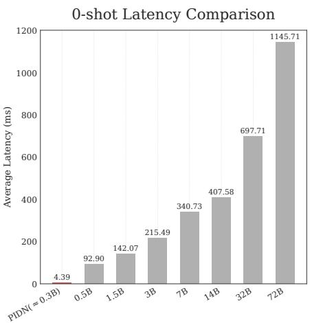  
Number of Parameters (B)

Latency vs. Shots: PIDN vs Qwen2.5-7B  
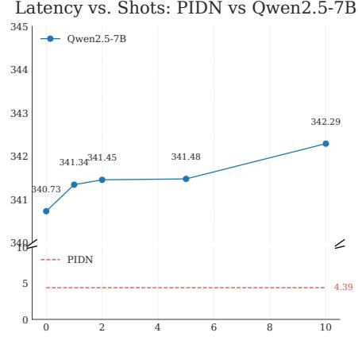  
Number of Shots (X-shot ICL)  
Fig. 6. Inference latency comparison. Left: 0-shot latency of PIDN (≈0.3B) vs. LLMs of varying sizes. Right: Latency of PIDN vs. Qwen2.5-7B with increasing ICL shots (0–10). Latencies are reported in milliseconds (ms).

C<sub>ross-mo</sub>d<sub>e</sub>l <sub>sca</sub>li<sub>ng ana</sub>l<sub>ys</sub>i<sub>s revea</sub>l<sub>s a genera</sub>ll<sub>y pos</sub>iti<sub>ve, a</sub>lb<sub>e</sub>it <sub>comp</sub>l<sub>ex an</sub>d <sub>nuance</sub>d<sub>,</sub> t<sub>ren</sub>d in zero-shot LLM performance. The largest model, Qwen2.5-72B-Instruct, achieves the highest Macro F1-score of 0.953<sub>,</sub> establishin<sub>g</sub> it as the to<sub>p</sub> <sub>p</sub>erformer. However<sub>,</sub> the trend is not strictl<sub>y</sub> monotonic, as mid-sized models (7B to 32B) exhibit a stron<sub>g</sub> bias towards <sub>p</sub>recision over recall. The<sub>y</sub> reach near-<sub>p</sub>erfect <sub>p</sub>recision (u<sub>p</sub> to 0.992) but at the cost of lower recall (down to 0.827), reflectin<sub>g</sub> conser<sub>v</sub>ati<sub>v</sub>e decision bo<sub>u</sub>ndaries that minimize false <sub>p</sub>ositi<sub>v</sub>es. For re<sub>g</sub>ression<sub>,</sub> scalin<sub>g y</sub>ields more consistent <sub>g</sub>ains; <sub>y</sub>et, the best LLM’s RMSE of 0.275 is still nearl<sub>y</sub> four times worse than PIDN ’s 0.069<sub>,</sub> underscorin<sub>g</sub> the limits of <sub>p</sub>rom<sub>p</sub>tin<sub>g</sub> without task-s<sub>p</sub>ecific tunin<sub>g</sub>.

The few-shot performance of Qwen2.5-7B-Instruct further illustrates these stark limitations. W<sub>e o</sub>b<sub>serve a surpr</sub>i<sub>s</sub>i<sub>ng</sub> “<sub>per</sub>f<sub>ormance</sub> t<sub>roug</sub>h”<sub>: a</sub>ft<sub>er an</sub> i<sub>n</sub>iti<sub>a</sub>l <sub>ga</sub>i<sub>n a</sub>t 2 <sub>s</sub>h<sub>o</sub>t<sub>s, a</sub>ddi<sub>ng more</sub> d<sub>emon-</sub> strations (s<sub>p</sub>ecificall<sub>y</sub>, 4–10 shots) unex<sub>p</sub>ectedl<sub>y</sub> de<sub>g</sub>rades classification <sub>p</sub>erformance, with the F1<sub>-score</sub> d<sub>ropp</sub>i<sub>ng</sub> b<sub>e</sub>l<sub>ow</sub> th<sub>e</sub> <sub>zero-s</sub>h<sub>o</sub>t b<sub>ase</sub>li<sub>ne</sub> <sub>o</sub>f 0<sub>.</sub>916<sub>.</sub> A <sub>cons</sub>i<sub>s</sub>t<sub>en</sub>t i<sub>mprovemen</sub>t <sub>over</sub> th<sub>e</sub> b<sub>ase-</sub> line re<sub>q</sub>uires 50 shots or more<sub>,</sub> which <sub>p</sub>artiall<sub>y</sub> corrects the earlier conservative bias b<sub>y</sub> im<sub>p</sub>rovin<sub>g</sub> r<sub>eca</sub>ll<sub>.</sub> E<sub>ve</sub>n <sub>a</sub>t it<sub>s</sub> b<sub>es</sub>t—<sub>a</sub> M<sub>ac</sub>r<sub>o</sub> F1 <sub>o</sub>f 0<sub>.</sub>973 <sub>a</sub>t 200 <sub>s</sub>h<sub>o</sub>t<sub>s, a</sub>nd <sub>a</sub> l<sub>owes</sub>t RMSE <sub>o</sub>f 0<sub>.</sub>282 <sub>a</sub>t 4 <sub>s</sub>h<sub>o</sub>t<sub>s</sub>—ICL still falls well short of our fine-tuned PIDN. This si<sub>g</sub>nificant <sub>g</sub>a<sub>p</sub> stems from core methodolo<sub>g</sub>ical diferences, as PIDN is ex<sub>p</sub>licitl<sub>y</sub> fine-tuned on a lar<sub>g</sub>e, domain-s<sub>p</sub>ecific dataset with ideolo<sub>g</sub>ical su<sub>p</sub>ervision. This allows it to learn nuanced si<sub>g</sub>nals that <sub>g</sub>eneric few-shot <sub>p</sub>rom<sub>p</sub>tin<sub>g</sub> cannot ca<sub>p</sub>ture<sub>,</sub> hi<sub>g</sub>hli<sub>g</sub>htin<sub>g</sub> the clear su<sub>p</sub>eriorit<sub>y</sub> of task-s<sub>p</sub>ecific tunin<sub>g</sub> for <sub>p</sub>recise socio<sub>p</sub>olitical inference.

Latency Analysis. To complement the performance evaluation, we conducted a comparative latenc<sub>y</sub> anal<sub>y</sub>sis to validate the eficienc<sub>y</sub> of our architectural desi<sub>g</sub>n. We benchmarked our PIDN, built on the twhin-bert-base backbone (≈0.3B <sub>p</sub>arameters), a<sub>g</sub>ainst the same Qwen2.5 LLM baselines. Latenc<sub>y</sub> is a known limitation of LLMs<sub>,</sub> es<sub>p</sub>eciall<sub>y</sub> with lar<sub>g</sub>er models or in-context exam<sub>p</sub>les. Fi<sub>g</sub>ure 6 <sub>p</sub>resents the latenc<sub>y</sub> com<sub>p</sub>arison. Our PIDN achieves a low inference latenc<sub>y</sub> of 4.39 ms. In the left <sub>p</sub>anel, even the smallest Qwen2.5 model (0.5B) exhibits a 0-shot latenc<sub>y</sub> of 92.90 ms—over 21× slower than PIDN. Latenc<sub>y</sub> increases shar<sub>p</sub>l<sub>y</sub> with model size, reachin<sub>g</sub> 1145.71 ms for

Table 6. Comparison of PLM backbones and hyperparameter tuning results. Best values are in bold.  
(a) Backbone Comparison
<table><tr><td>Model</td><td>Acc. (Kind) (%) ↑ MSE (Score) ↓</td><td></td></tr><tr><td>bert-base-cased [21]</td><td> $9 5 . 5 6 \pm 0 . 2 1$ </td><td> $0 . 0 8 4 7 \pm 0 . 0 0 1 5$ </td></tr><tr><td>xlm-roberta-base [17]</td><td> $9 6 . 6 7 \pm 0 . 1 5$ </td><td> $0 . 0 6 8 6 \pm 0 . 0 0 1 1$ </td></tr><tr><td>covid-twitter-bert-v2 [55]</td><td> $9 5 . 5 3 \pm 0 . 2 5$ </td><td> $0 . 0 8 7 4 \pm 0 . 0 0 1 8$ </td></tr><tr><td>twhin-bert-base [87]</td><td> $\mathbf { 9 7 . 7 9 { \scriptstyle \pm 0 . 1 2 } }$ </td><td> $\mathbf { 0 . 0 6 0 6 } \pm \mathbf { 0 . 0 0 0 8 }$ </td></tr></table>

(b) Hyperparameter Tuning
<table><tr><td colspan="2">Hyperparameters</td><td colspan="2">Performance Metrics</td></tr><tr><td>α</td><td>β</td><td>Acc. (%) ↑</td><td>MSE↓</td></tr><tr><td>0.4</td><td>0.4</td><td> $9 7 . 1 2 \pm 0 . 1 8$  </td><td> $0 . 0 7 3 \pm 0 . 0 0 2$ </td></tr><tr><td>0.3</td><td>0.3</td><td> $9 6 . 9 8 \pm 0 . 2 0$ </td><td> $0 . 0 7 1 \pm 0 . 0 0 2$ </td></tr><tr><td>0.4</td><td>0.3</td><td> $\mathbf { 9 7 . 7 9 { \scriptstyle \pm 0 . 1 5 } }$  </td><td> $\mathbf { 0 . 0 6 7 \pm 0 . 0 0 1 }$ </td></tr><tr><td>0.3</td><td>0.4</td><td> $9 7 . 5 2 \pm 0 . 1 7 $ </td><td> $0 . 0 6 9 \pm 0 . 0 0 2$ </td></tr></table>

the 72B variant<sub>,</sub> which is more than 260 times slower. The ri<sub>g</sub>ht <sub>p</sub>anel shows the im<sub>p</sub>act ofincreasin<sub>g</sub> ICL shots on the 7B model. While latenc<sub>y</sub> rises onl<sub>y</sub> sli<sub>g</sub>htl<sub>y</sub> from 340.73 ms (0-shot) to 342.29 ms (10-shot), it remains consistentl<sub>y</sub> hi<sub>g</sub>h—about 78× slower than PIDN, even under minimal ICL.

Discussion on Model Architecture. Our evaluation challenges the common assumption that th<sub>ere</sub> i<sub>s a</sub> t<sub>ra</sub>d<sub>e-o</sub>f b<sub>e</sub>t<sub>ween</sub> th<sub>e e</sub>fi<sub>c</sub>i<sub>ency o</sub>f t<sub>as</sub>k<sub>-spec</sub>ifi<sub>c mo</sub>d<sub>e</sub>l<sub>s an</sub>d th<sub>e per</sub>f<sub>ormance o</sub>f LLM<sub>s.</sub> I<sub>n</sub> hi<sub>g</sub>h-resource settin<sub>g</sub>s, our fine-tuned PIDN si<sub>g</sub>nificantl<sub>y</sub> out<sub>p</sub>erforms LLMs—deliverin<sub>g</sub> hi<sub>g</sub>her accurac<sub>y</sub> with orders of ma<sub>g</sub>nitude lower inference latenc<sub>y</sub>. Even the best ICL setu<sub>p</sub>s incur <sub>p</sub>rohibitive com<sub>p</sub>utational costs, makin<sub>g</sub> LLMs unsuitable for real-time or lar<sub>g</sub>e-scale de<sub>p</sub>lo<sub>y</sub>ment. While PIDN i<sub>s</sub> th<sub>e</sub> <sub>c</sub>l<sub>ear</sub> <sub>c</sub>h<sub>o</sub>i<sub>ce</sub> <sub>w</sub>h<sub>en</sub> l<sub>a</sub>b<sub>e</sub>l<sub>e</sub>d d<sub>a</sub>t<sub>a</sub> i<sub>s</sub> <sub>a</sub>b<sub>un</sub>d<sub>an</sub>t <sub>an</sub>d <sub>per</sub>f<sub>ormance</sub> <sub>cr</sub>iti<sub>ca</sub>l<sub>,</sub> LLM<sub>s</sub> <sub>rema</sub>i<sub>n</sub> <sub>use</sub>f<sub>u</sub>l i<sub>n</sub> l<sub>ow-resource scenar</sub>i<sub>os w</sub>h<sub>ere anno</sub>t<sub>a</sub>ti<sub>on</sub> i<sub>s</sub> i<sub>n</sub>f<sub>eas</sub>ibl<sub>e.</sub> Th<sub>e</sub>i<sub>r zero- an</sub>d f<sub>ew-s</sub>h<sub>o</sub>t <sub>capa</sub>biliti<sub>es o</sub>f<sub>er a</sub> <sub>prac</sub>ti<sub>ca</sub>l f<sub>a</sub>llb<sub>ac</sub>k<sub>.</sub> N<sub>one</sub>th<sub>e</sub>l<sub>ess,</sub> <sub>our</sub> <sub>resu</sub>lt<sub>s</sub> <sub>s</sub>t<sub>rong</sub>l<sub>y</sub> <sub>suppor</sub>t th<sub>e</sub> d<sub>eve</sub>l<sub>opmen</sub>t <sub>o</sub>f li<sub>g</sub>ht<sub>we</sub>i<sub>g</sub>ht<sub>,</sub> <sub>spec</sub>i<sub>a</sub>l<sub>-</sub> ized models in settin<sub>g</sub>s where scalabilit<sub>y, p</sub>recision<sub>,</sub> and eficienc<sub>y</sub> are most critical. These findin<sub>g</sub>s su<sub>pp</sub>ort a broader insi<sub>g</sub>ht: when conditions allow<sub>,</sub> architectural s<sub>p</sub>ecialization often out<sub>p</sub>erforms <sub>genera</sub>l<sub>-purpose</sub> fl<sub>ex</sub>ibilit<sub>y</sub> i<sub>n rea</sub>l<sub>-wor</sub>ld <sub>ana</sub>l<sub>y</sub>ti<sub>ca</sub>l t<sub>as</sub>k<sub>s.</sub>

## 5.2.2 Component Analysis and Ablation Studies.

Backbone Selection. We began by evaluating four prominent PLM backbones to identify the most <sub>su</sub>it<sub>a</sub>bl<sub>e enco</sub>d<sub>er</sub> f<sub>or our</sub> t<sub>as</sub>k<sub>.</sub> T<sub>o</sub> i<sub>so</sub>l<sub>a</sub>t<sub>e</sub> th<sub>e</sub> b<sub>ac</sub>kb<sub>one</sub>’<sub>s</sub> i<sub>n</sub>h<sub>eren</sub>t <sub>capac</sub>it<sub>y,</sub> thi<sub>s compar</sub>i<sub>son exc</sub>l<sub>u</sub>d<sub>e</sub>d both TST and UDA. We <sub>u</sub>sed a fixed h<sub>yp</sub>er<sub>p</sub>arameter settin<sub>g</sub> $( \alpha = 0 . 4 , \beta = 0 . 2 )$ f<sub>or a</sub>ll <sub>mo</sub>d<sub>e</sub>l<sub>s, w</sub>ith <sub>s</sub>t<sub>an</sub>d<sub>ar</sub>d d<sub>ev</sub>i<sub>a</sub>ti<sub>ons</sub> f<sub>rom</sub> 5 <sub>runs.</sub> A<sub>s s</sub>h<sub>own</sub> i<sub>n</sub> T<sub>a</sub>bl<sub>e</sub> $6 \mathbf { a } ,$ , twhin-bert-base achieved the best results for both <sub>p</sub>olitical relevance classification (97.79% accurac<sub>y</sub>) and ideolo<sub>gy</sub> score re<sub>g</sub>ression (0.0606 MSE). This <sub>p</sub>erformance underscores the benefit of<sub>p</sub>re-trainin<sub>g</sub> on lar<sub>g</sub>e-scale social media data with user- and network-aware objectives. In contrast, although covid-twitter-bert-v2 is also social media-oriented<sub>,</sub> its domain s<sub>p</sub>ecificit<sub>y</sub> to<sub>w</sub>ard COVID-19 limited its efecti<sub>v</sub>eness in ca<sub>p</sub>t<sub>u</sub>rin<sub>g</sub> the b<sub>roa</sub>d<sub>er</sub> <sub>po</sub>liti<sub>ca</sub>l di<sub>scourse.</sub> I<sub>n</sub>t<sub>eres</sub>ti<sub>ng</sub>l<sub>y,</sub> <sub>a</sub>ll <sub>mo</sub>d<sub>e</sub>l<sub>s</sub> <sub>y</sub>i<sub>e</sub>ld <sub>compara</sub>bl<sub>y</sub> hi<sub>g</sub>h <sub>c</sub>l<sub>ass</sub>ifi<sub>ca</sub>ti<sub>on</sub> <sub>accuracy,</sub> su<sub>gg</sub>estin<sub>g</sub> that identif<sub>y</sub>in<sub>g</sub> whether a tweet ex<sub>p</sub>resses <sub>p</sub>olitical relevance is a relativel<sub>y</sub> eas<sub>y</sub> task for PLMs. In other words<sub>,</sub> classif<sub>y</sub>in<sub>g</sub> the <sub>p</sub>resence of <sub>p</sub>olitical inclination <sub>p</sub>oses little challen<sub>g</sub>e to <sub>mo</sub>d<sub>ern</sub> l<sub>anguage mo</sub>d<sub>e</sub>l<sub>s, w</sub>ith <sub>m</sub>i<sub>n</sub>i<sub>ma</sub>l <sub>var</sub>i<sub>a</sub>ti<sub>on</sub> i<sub>n per</sub>f<sub>ormance across</sub> dif<sub>eren</sub>t b<sub>ac</sub>kb<sub>ones.</sub> I<sub>n</sub> conclusion, we adopted twhin-bert-base as the backbone for all subsequent experiments.

Table 7. Ablation study of TST and UDA methods. All experiments use the twhin-bert-base backbone and the selected hyperparameter seting $( \alpha = 0 . 4 , \beta = 0 . 3 )$ . Best performance is in bold.
<table><tr><td>Configuration</td><td>Acc. (Kind) (%) ↑ MSE (Score) ↓</td></tr><tr><td>Backbone Only  $9 7 . 7 9 \pm 0 . 1 5$ </td><td> $0 . 0 6 7 0 \pm 0 . 0 0 1 2$ </td></tr><tr><td>Backbone + UDA (KL)</td><td> $9 8 . 1 5 \pm 0 . 1 1$   $0 . 0 3 5 0 \pm 0 . 0 0 0 9$ </td></tr><tr><td>Backbone + UDA (MMD)  $9 8 . 3 5 \pm 0 . 1 0$ </td><td> $0 . 0 3 2 0 \pm 0 . 0 0 1 0$ </td></tr><tr><td>Backbone + TST  $9 9 . 1 2 \pm 0 . 0 8$ </td><td> $0 . 0 0 6 0 \pm 0 . 0 0 0 4$ </td></tr><tr><td>Backbone + TST + UDA (KL) (PIDN-KL)  $9 9 . 2 5 \pm 0 . 0 7$ </td><td> $\mathbf { 0 . 0 0 4 8 \pm 0 . 0 0 0 3 }$ </td></tr><tr><td>Backbone + TST + UDA (MMD) (PIDN-MMD)  $\mathbf { 9 9 . 5 2 \pm 0 . 0 5 }$ </td><td> $0 . 0 0 5 7 \pm 0 . 0 0 0 4$ </td></tr></table>

Hyperparameter Tuning. Next, we fine-tuned the hyperparameters � and $\beta ,$ <sub>w</sub>hi<sub>c</sub>h <sub>we</sub>i<sub>g</sub>ht th<sub>e</sub> three terms of the PIDN objective $\alpha \mathcal { L } _ { c } + \beta \mathcal { L } _ { r } + ( 1 - \alpha - \beta ) \mathcal { L } _ { \mathrm { U D A } }$ (classification, re<sub>g</sub>ression, and domain ali<sub>g</sub>nment; see Fi<sub>g</sub>ure 4), usin<sub>g</sub> our selected twhin-bert-base backbone, a<sub>g</sub>ain without en<sub>g</sub>a<sub>g</sub>in<sub>g</sub> TST or UDA. Table 6b re<sub>p</sub>orts the four confi<sub>g</sub>urations evaluated in this dedicated tunin<sub>g</sub> sta<sub>g</sub>e. <sup>A</sup>mon<sub>g</sub> t<sup>h</sup>ese sett<sup>i</sup>n<sub>g</sub>s, $\alpha = 0 . 4$ <sub>an</sub>d $\beta = 0 . 3$ <sub>ac</sub>hi<sub>eve</sub>d th<sub>e</sub> hi<sub>g</sub>h<sub>es</sub>t <sub>c</sub>l<sub>ass</sub>ifi<sub>ca</sub>ti<sub>on accuracy</sub> (97.79%) and the lowest MSE (0.067), and we therefore selected this settin<sub>g</sub> for the subse<sub>q</sub>uent <sub>a</sub>bl<sub>a</sub>ti<sub>on s</sub>t<sub>u</sub>d<sub>y.</sub> Th<sub>e</sub> $( \alpha = 0 . 4 , \beta = 0 . 2 )$ <sub>se</sub>tti<sub>ng</sub> i<sub>n</sub> T<sub>a</sub>bl<sub>e</sub> 6<sub>a was use</sub>d <sub>on</sub>l<sub>y</sub> t<sub>o</sub> h<sub>o</sub>ld th<sub>e</sub> l<sub>oss we</sub>i<sub>g</sub>ht<sub>s</sub> fi<sub>xe</sub>d durin<sub>g</sub> the <sub>p</sub>reliminar<sub>y</sub> backbone com<sub>p</sub>arison and was not <sub>p</sub>art of this tunin<sub>g</sub> <sub>g</sub>rid. Accordin<sub>g</sub>l<sub>y,</sub> we d<sub>o no</sub>t <sub>c</sub>l<sub>a</sub>i<sub>m a g</sub>l<sub>o</sub>b<sub>a</sub>l <sub>op</sub>ti<sub>mum across</sub> th<sub>e</sub> t<sub>wo s</sub>t<sub>ages.</sub> Th<sub>e</sub> li<sub>m</sub>it<sub>e</sub>d <sub>var</sub>i<sub>a</sub>ti<sub>on w</sub>ithi<sub>n</sub> th<sub>e</sub> T<sub>a</sub>bl<sub>e</sub> 6b <sub>gr</sub>id <sub>sugges</sub>t<sub>s</sub> th<sub>a</sub>t th<sub>e</sub> f<sub>ramewor</sub>k i<sub>s</sub> <sub>no</sub>t hi<sub>g</sub>hl<sub>y</sub> <sub>sens</sub>iti<sub>ve</sub> t<sub>o</sub> th<sub>ese</sub> l<sub>oss</sub> <sub>we</sub>i<sub>g</sub>ht<sub>s.</sub>

Ablation Study. To rigorously evaluate the individual and synergistic contributions of our core components, we conducted a detailed ablation study. Starting with the twhin-bert-base b<sub>ac</sub>kb<sub>one an</sub>d th<sub>e se</sub>l<sub>ec</sub>t<sub>e</sub>d h<sub>yperparame</sub>t<sub>er se</sub>tti<sub>ng</sub> $( \alpha = 0 . 4 , \beta = 0 . 3 )$ <sub>, we</sub> i<sub>ncremen</sub>t<sub>a</sub>ll<sub>y a</sub>dd<sub>e</sub>d TST and the two UDA methods: Kullback-Leibler (KL) diver<sub>g</sub>ence and Maximum Mean Discre<sub>p</sub>anc<sub>y</sub> (MMD). The com<sub>p</sub>rehensive results are <sub>p</sub>resented in Table 7. The most dramatic im<sub>p</sub>rovement stems from TST. B<sub>y</sub> addin<sub>g</sub> TST to the backbone<sub>,</sub> the re<sub>g</sub>ression MSE <sub>p</sub>l<sub>u</sub>mmets from 0.0670 to 0<sub>.</sub>0060<sub>—an or</sub>d<sub>er-o</sub>f<sub>-magn</sub>it<sub>u</sub>d<sub>e re</sub>d<sub>uc</sub>ti<sub>on.</sub> Thi<sub>s s</sub>t<sub>ar</sub>kl<sub>y</sub> d<sub>emons</sub>t<sub>ra</sub>t<sub>es</sub> th<sub>a</sub>t b<sub>r</sub>id<sub>g</sub>i<sub>ng</sub> th<sub>e s</sub>t<sub>y</sub>li<sub>s</sub>ti<sub>c</sub> <sub>g</sub>a<sub>p</sub> via LLM-based data au<sub>g</sub>mentation is the sin<sub>g</sub>le most critical factor for achievin<sub>g</sub> hi<sub>g</sub>h-fidelit<sub>y</sub> ideolo<sub>g</sub>ical scorin<sub>g</sub>. UDA also <sub>y</sub>ields si<sub>g</sub>nificant <sub>g</sub>ains. When a<sub>pp</sub>lied directl<sub>y</sub> to the backbone<sub>,</sub> MMD reduces the MSE b<sub>y</sub> over 50% to 0.032<sub>,</sub> while KL achieves a com<sub>p</sub>arable reduction to 0.035. When <sub>com</sub>bi<sub>ne</sub>d <sub>w</sub>ith TST<sub>,</sub> b<sub>o</sub>th f<sub>u</sub>ll <sub>mo</sub>d<sub>e</sub>l<sub>s</sub> d<sub>e</sub>li<sub>ver</sub> th<sub>e</sub> b<sub>es</sub>t <sub>resu</sub>lt<sub>s among</sub> th<sub>e eva</sub>l<sub>ua</sub>t<sub>e</sub>d <sub>con</sub>fi<sub>gura</sub>ti<sub>ons.</sub> The PIDN-MMD model achieves the hi<sub>g</sub>hest classification accurac<sub>y</sub> at 99.52%, while the PIDN-KL model secures a mar<sub>g</sub>inall<sub>y</sub> better re<sub>g</sub>ression <sub>p</sub>erformance with the lowest MSE of 0.0048. Given th<sub>a</sub>t b<sub>o</sub>th <sub>mo</sub>d<sub>e</sub>l<sub>s</sub> d<sub>emons</sub>t<sub>ra</sub>t<sub>e</sub> hi<sub>g</sub>hl<sub>y</sub> <sub>compe</sub>titi<sub>ve</sub> <sub>an</sub>d <sub>near</sub>l<sub>y</sub> <sub>equ</sub>i<sub>va</sub>l<sub>en</sub>t <sub>per</sub>f<sub>ormance,</sub> th<sub>e</sub> d<sub>ec</sub>idi<sub>ng</sub> f<sub>ac</sub>t<sub>o</sub>r <sub>s</sub>hift<sub>s</sub> t<sub>o</sub> <sub>a</sub> <sub>p</sub>r<sub>ac</sub>ti<sub>ca</sub>l <sub>co</sub>n<sub>s</sub>id<sub>e</sub>r<sub>a</sub>ti<sub>o</sub>n: <sub>co</sub>m<sub>pu</sub>t<sub>a</sub>ti<sub>o</sub>n<sub>a</sub>l <sub>e</sub>fi<sub>c</sub>i<sub>e</sub>n<sub>cy.</sub> A<sub>s</sub> d<sub>e</sub>t<sub>a</sub>il<sub>e</sub>d in A<sub>ppe</sub>ndix A<sub>.</sub>4<sub>,</sub> there is a stark contrast in the o<sub>v</sub>erhead of the t<sub>w</sub>o UDA methods. MMD’s <sub>qu</sub>adratic time com<sub>p</sub>lexit<sub>y</sub> $\left( O ( N ^ { 2 } D ) \right)$ makes it com<sub>pu</sub>te-bo<sub>u</sub>nd<sub>,</sub> limitin<sub>g</sub> its scalabilit<sub>y w</sub>ith increasin<sub>g</sub> batch size. In contrast<sub>,</sub> KL diver<sub>g</sub>ence’s linear com<sub>p</sub>lexit<sub>y</sub> (�(��)) makes it si<sub>g</sub>nificantl<sub>y</sub> more eficient and scalable, <sub>p</sub>osin<sub>g</sub> no <sub>p</sub>ractical constraints on lar<sub>g</sub>e-batch trainin<sub>g</sub>. Combinin<sub>g</sub> to<sub>p</sub>-tier <sub>p</sub>erformance with su<sub>p</sub>erior com<sub>p</sub>utational eficienc<sub>y</sub>, we therefore identif<sub>y</sub> PIDN-KL as our selected confi<sub>g</sub>uration.

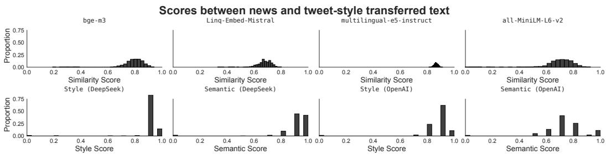  
Fig. 7. Evaluation of Text Style Transfer. Top: Histograms of similarity scores between original news and tweetstyle outputs, computed using four sentence embedding models. Botom: Histograms of Style Appropriateness and Semantic Preservation scores (normalized to 0–1) assigned by LLM judges.

Validation ofthe TST Module. To rigorously assess the contribution and quality of our LLMb<sub>ase</sub>d TST <sub>mo</sub>d<sub>u</sub>l<sub>e, we con</sub>d<sub>uc</sub>t<sub>e</sub>d <sub>a mu</sub>ltif<sub>ace</sub>t<sub>e</sub>d <sub>eva</sub>l<sub>ua</sub>ti<sub>on.</sub> Th<sub>e goa</sub>l i<sub>s</sub> t<sub>o ver</sub>if<sub>y</sub> th<sub>a</sub>t TST <sub>e</sub>f<sub>ec</sub>ti<sub>ve</sub>l<sub>y</sub> ada<sub>p</sub>ts formal news into tweet-st<sub>y</sub>le social media text while <sub>p</sub>reservin<sub>g</sub> semantic meanin<sub>g,</sub> which is crucial for downstream ideolo<sub>gy</sub> anal<sub>y</sub>sis. The evaluation com<sub>p</sub>rises two com<sub>p</sub>lementar<sub>y</sub> com<sub>p</sub>onents: Semantic Similarity Analysis and LLM-as-a-Judge Evaluation.

• For Semantic Similarit<sub>y</sub> Anal<sub>y</sub>sis, to ensure robustness and reduce model bias, we em<sub>p</sub>lo<sub>y</sub>ed four diverse embeddin<sub>g</sub> models: bge-m3 [13], Linq-Embed-Mistral [43], multilingual-e5 -large-instruct [80], and all-MiniLM-L6-v2<sup>3</sup>. These s<sub>p</sub>an multi<sub>p</sub>le architectures (e.<sub>g</sub>., MiniLM, XLM-R, Mistral, BGE) and sizes (22M–7.1B), <sub>p</sub>rovidin<sub>g</sub> an architecture-a<sub>g</sub>nostic similarit<sub>y</sub> estimate. Hi<sub>g</sub>h scores across models su<sub>gg</sub>est stron<sub>g</sub> semantic <sub>p</sub>reservation.

• For the LLM-as-a-Judge Evaluation, we employed DeepSeek-V3 [20] and GPT-4o [38] as automated evaluators [32, 89] to score outputs on Style Appropriateness and Semantic Preservation, <sub>comp</sub>l<sub>emen</sub>ti<sub>ng</sub> <sub>em</sub>b<sub>e</sub>ddi<sub>ng-</sub>b<sub>ase</sub>d <sub>me</sub>t<sub>r</sub>i<sub>cs.</sub>

Fi<sub>gu</sub>r<sub>e</sub> 7 <sub>su</sub>mm<sub>a</sub>riz<sub>es</sub> th<sub>e</sub> TST <sub>eva</sub>l<sub>ua</sub>ti<sub>o</sub>n r<sub>esu</sub>lt<sub>s.</sub> Th<sub>e</sub> t<sub>op</sub> r<sub>ow s</sub>h<sub>ows cos</sub>in<sub>e s</sub>imil<sub>a</sub>rit<sub>y</sub> di<sub>s</sub>trib<sub>u</sub>- tions across four embedding models. bge-m3 and all-MiniLM-L6-v2 concentrate in the 0.6–0.9 range, indicating solid semantic alignment. Linq-Embed-Mistral yields a similar pattern, slightly skewed lower. Notably, multilingual-e5-instruct peaks near 0.9, suggesting strong semantic <sub>cons</sub>i<sub>s</sub>t<sub>ency.</sub> O<sub>vera</sub>ll<sub>,</sub> th<sub>e</sub> <sub>resu</sub>lt<sub>s</sub> i<sub>n</sub>di<sub>ca</sub>t<sub>e</sub> <sub>goo</sub>d t<sub>o</sub> <sub>exce</sub>ll<sub>en</sub>t <sub>seman</sub>ti<sub>c</sub> <sub>preserva</sub>ti<sub>on.</sub> Th<sub>e</sub> b<sub>o</sub>tt<sub>om</sub> <sub>row</sub> shows LLM-based scores. For Style Appropriateness, both DeepSeek-V3 and GPT-4o peak around 0.9, confirming alignment with tweet-style norms. For Semantic Preservation, DeepSeek-V3 yields scores tightly clustered near 0.9–1.0; GPT-4o peaks more broadly around 0.7–0.8, still indicating <sub>s</sub>t<sub>rong</sub> fid<sub>e</sub>lit<sub>y.</sub> I<sub>n summary,</sub> b<sub>o</sub>th <sub>em</sub>b<sub>e</sub>ddi<sub>ng- an</sub>d LLM<sub>-</sub>b<sub>ase</sub>d <sub>eva</sub>l<sub>ua</sub>ti<sub>ons con</sub>fi<sub>rm</sub> th<sub>a</sub>t <sub>our</sub> TST module <sub>p</sub>roduces tweet-st<sub>y</sub>le out<sub>p</sub>uts with <sub>p</sub>reserved meanin<sub>g</sub>. This validates the PIDN <sub>p</sub>i<sub>p</sub>eline <sub>an</sub>d <sub>ensures</sub> d<sub>owns</sub>t<sub>ream</sub> t<sub>as</sub>k<sub>s opera</sub>t<sub>e on s</sub>t<sub>y</sub>li<sub>s</sub>ti<sub>ca</sub>ll<sub>y cons</sub>i<sub>s</sub>t<sub>en</sub>t<sub>, seman</sub>ti<sub>ca</sub>ll<sub>y</sub> f<sub>a</sub>ithf<sub>u</sub>l i<sub>npu</sub>t<sub>s.</sub>

Bias Analysis and Mitigation. Although the TST module is efective, LLM-based style transfer ma<sub>y</sub> still bias the data if <sub>p</sub>olitical cues are shifted unevenl<sub>y</sub> across ideolo<sub>gy</sub> <sub>g</sub>rou<sub>p</sub>s or <sub>p</sub>latforms [26]. We focus on three risks: ideology drift, where stance-bearing markers are amplified or softened more for one side; lexical homogenization, where frequent social-media tokens replace minority or platform-specific expressions and reduce linguistic variety for TGNNs; and source leakage, where <sub>p</sub>latform–ideolo<sub>gy</sub> correlations from <sub>p</sub>retrainin<sub>g</sub> are co<sub>p</sub>ied into transferred texts.

W<sub>e</sub> miti<sub>ga</sub>t<sub>e</sub> th<sub>ese e</sub>f<sub>ec</sub>t<sub>s</sub> in thr<sub>ee ways.</sub> Fir<sub>s</sub>t<sub>, we co</sub>n<sub>s</sub>tr<sub>a</sub>in th<sub>e</sub> TST <sub>p</sub>r<sub>o</sub>m<sub>p</sub>t t<sub>o</sub> r<sub>e</sub>t<sub>a</sub>in <sub>s</sub>t<sub>a</sub>n<sub>ce</sub> phrases and entity mentions, and to modify only surface style (e.g., emojis, contractions, tweet formattin<sub>g</sub>). Second, we <sub>p</sub>erform <sub>p</sub>ost-hoc filterin<sub>g</sub> and balancin<sub>g</sub>: <sub>p</sub>airs with <sub>g</sub>ood st<sub>y</sub>le but noticeabl<sub>y</sub> lower semantic scores from the LLM jud<sub>g</sub>es are discarded or re<sub>g</sub>enerated, and PIPN batches are b<sub>a</sub>l<sub>ance</sub>d <sub>across</sub> l<sub>a</sub>b<sub>e</sub>l<sub>s</sub> <sub>an</sub>d <sub>p</sub>l<sub>a</sub>tf<sub>orms</sub> t<sub>o</sub> <sub>preven</sub>t <sub>ar</sub>t<sub>e</sub>f<sub>ac</sub>t<sub>s</sub> f<sub>rom</sub> <sub>concen</sub>t<sub>ra</sub>ti<sub>ng</sub> i<sub>n</sub> <sub>one</sub> <sub>c</sub>l<sub>ass.</sub> Thi<sub>s</sub> <sub>ap-</sub> <sub>p</sub>roach ali<sub>g</sub>ns with methods for miti<sub>g</sub>atin<sub>g</sub> task-s<sub>p</sub>ecific biases [7]. Third, the evaluation setu<sub>p</sub> itself acts as a sa<sup>f</sup>eguar<sup>d</sup>: using <sup>f</sup>our sentence em<sup>b</sup>e<sup>dd</sup>ing mo<sup>d</sup>e<sup>l</sup>s an<sup>d</sup> two in<sup>d</sup>epen<sup>d</sup>ent LLM-as-a-ju<sup>d</sup>ge evaluators (DeepSeek-V3 and GPT-4o) lowers reliance on an<sub>y</sub> sin<sub>g</sub>le model, and their a<sub>g</sub>reement indicates that the TST ste<sub>p p</sub>reser<sub>v</sub>es meanin<sub>g w</sub>itho<sub>u</sub>t s<sub>y</sub>stematic distortion.

## 5.3 Evaluation of the Political Ideology Prediction Network (PIPN)

This section evaluates the PIPN module b<sub>y</sub> com<sub>p</sub>arin<sub>g</sub> the evaluated TGNNs with static GNN baselines on link <sub>p</sub>rediction and <sub>p</sub>olitical ideolo<sub>gy</sub> <sub>p</sub>rediction.

Model Comparison and Analysis. Table 8 presents the results of our comparative analysis. Fi<sub>n</sub>di<sub>ngs</sub> <sub>revea</sub>l di<sub>s</sub>ti<sub>nc</sub>t <sub>s</sub>t<sub>reng</sub>th<sub>s</sub> <sub>across</sub> <sub>mo</sub>d<sub>e</sub>l<sub>s,</sub> <sub>es</sub>t<sub>a</sub>bli<sub>s</sub>hi<sub>ng</sub> th<sub>e</sub> <sub>a</sub>d<sub>van</sub>t<sub>age</sub> <sub>o</sub>f t<sub>empora</sub>l <sub>mo</sub>d<sub>e</sub>li<sub>ng.</sub>

Table 8. Comparative results of static (✗) and temporal (<sup>✓</sup>) models. The evaluation covers Link Prediction (AP, AUC) and Ideology Prediction (Accuracy, MSE). Best performance for each metric is in bold; second best is underlined. Static models are not applicable (N/A) for the link prediction task.
<table><tr><td rowspan="2">Dataset</td><td rowspan="2">Model</td><td rowspan="2">Temporal</td><td colspan="2">Link Prediction</td><td colspan="2">Ideology Prediction</td></tr><tr><td> $\mathbf { A P ( \% ) \uparrow }$ </td><td> $\mathbf { A U C } ( \% ) \uparrow$ </td><td> $\mathbf { A c c . } ( \% ) \uparrow$ </td><td>MSE↓</td></tr><tr><td rowspan="5">Truth Social</td><td>GCN [44]</td><td>x</td><td>N/A</td><td>N/A</td><td> $5 8 . 3 5 \pm 0 . 8 5$ </td><td> $0 . 0 4 5 \pm 0 . 0 0 2$ </td></tr><tr><td>GAT [75]</td><td>x</td><td>N/A</td><td>N/A</td><td> $6 1 . 8 1 \pm 0 . 7 2$ </td><td> $0 . 0 4 3 \pm 0 . 0 0 2$  </td></tr><tr><td>TGN [66]</td><td>√</td><td> $\underline { { 9 9 . 2 5 \pm 0 . 0 8 } }$ </td><td> $\underline { { 9 9 . 1 4 \pm 0 . 0 9 } }$ </td><td> $7 2 . 4 2 \pm \mathbf { 0 . 3 5 }$ </td><td> $\mathbf { 0 . 0 3 6 \pm 0 . 0 0 1 }$ </td></tr><tr><td>JODIE [46]</td><td>√</td><td> $\mathbf { 9 9 . 7 3 \pm 0 . 0 4 }$ </td><td> $\mathbf { 9 9 . 6 9 \pm 0 . 0 5 }$ </td><td> $6 6 . 2 8 \pm 0 . 4 1$ </td><td> $\underline { { 0 . 0 3 9 \pm 0 . 0 0 1 } }$ </td></tr><tr><td>APAN [81]</td><td>√</td><td> $9 7 . 5 6 \pm 0 . 1 5$ </td><td> $9 7 . 2 4 \pm 0 . 1 8$ </td><td> $6 5 . 1 4 \pm 0 . 4 5$ </td><td> $\mathbf { 0 . 0 3 6 \pm 0 . 0 0 1 }$ </td></tr><tr><td rowspan="5">X (Twitter)</td><td>GCN</td><td>x</td><td>N/A</td><td>N/A</td><td> $9 6 . 8 5 \pm 0 . 2 2$ </td><td> $0 . 0 7 9 3 \pm 0 . 0 0 1 5$ </td></tr><tr><td>GAT</td><td>x</td><td>N/A</td><td>N/A</td><td> $9 5 . 8 9 \pm 0 . 2 8$ </td><td> $0 . 0 6 2 9 \pm 0 . 0 0 1 1$ </td></tr><tr><td>TGN</td><td>√</td><td> $\mathbf { 9 8 . 8 2 \pm 0 . 0 5 }$ </td><td> $\mathbf { 9 8 . 7 0 \pm 0 . 0 6 }$ </td><td> $\mathbf { 9 9 . 9 9 \pm 0 . 0 1 }$ </td><td> $\mathbf { 0 . 0 5 6 0 \pm 0 . 0 0 0 2 }$ </td></tr><tr><td>JODIE</td><td>√</td><td> $9 7 . 8 3 \pm 0 . 0 9$ </td><td> $9 7 . 7 2 \pm 0 . 1 0$ </td><td> $\underline { { 9 9 . 9 8 \pm 0 . 0 1 } }$ </td><td> $\underline { { 0 . 0 5 6 4 \pm 0 . 0 0 0 3 } }$ </td></tr><tr><td>APAN</td><td>√</td><td> $9 8 . 7 8 \pm 0 . 0 6$ </td><td> $9 8 . 6 5 \pm 0 . 0 7 $ </td><td> $9 9 . 9 8 \pm 0 . 0 1 $ </td><td> $\underline { { 0 . 0 5 6 4 } } \pm 0 . 0 0 0 4$ </td></tr></table>

On the Truth Social dataset, the results reveal a <sub>p</sub>erformance trade-of amon<sub>g</sub> TGNNs. JODIE achieves the best link-<sub>p</sub>rediction <sub>p</sub>erformance amon<sub>g</sub> the evaluated models (99.73% AP and 99.69% AUC). However, TGN demonstrates si<sub>g</sub>nificantl<sub>y</sub> better <sub>p</sub>erformance on the critical task of ideol o<sub>gy</sub> classification, achievin<sub>g</sub> the hi<sub>g</sub>hest accurac<sub>y</sub> (72.42%), and it ties with APAN for the lowest re<sub>g</sub>ression MSE (0.036). In stark contrast, the static baselines under<sub>p</sub>erform substantiall<sub>y</sub>. GAT, the stron<sub>g</sub>er of the two<sub>,</sub> achieves onl<sub>y</sub> 61.81% accurac<sub>y,</sub> la<sub>gg</sub>in<sub>g</sub> behind TGN b<sub>y</sub> over 10 <sub>p</sub>ercenta<sub>g</sub>e <sub>po</sub>i<sub>n</sub>t<sub>s.</sub> Thi<sub>s</sub> <sub>cons</sub>id<sub>era</sub>bl<sub>e</sub> <sub>per</sub>f<sub>ormance</sub> <sub>gap</sub> <sub>un</sub>d<sub>erscores</sub> th<sub>e</sub> <sub>nee</sub>d f<sub>or</sub> t<sub>empora</sub>l <sub>mo</sub>d<sub>e</sub>li<sub>ng</sub> t<sub>o</sub> <sub>cap</sub>t<sub>ure</sub> the evolvin<sub>g</sub> <sub>p</sub>atterns of ideolo<sub>g</sub>ical ex<sub>p</sub>ression on this <sub>p</sub>latform.

On the X (Twitter) dataset, TGN consistentl<sub>y</sub> out<sub>p</sub>erforms all other models. Here, the advanta<sub>g</sub>e <sub>o</sub>f t<sub>e</sub>m<sub>po</sub>r<sub>a</sub>l m<sub>o</sub>d<sub>e</sub>lin<sub>g</sub> b<sub>eco</sub>m<sub>es</sub> <sub>eve</sub>n m<sub>o</sub>r<sub>e</sub> <sub>p</sub>r<sub>o</sub>n<sub>ou</sub>n<sub>ce</sub>d<sub>.</sub> Th<sub>e</sub> <sub>s</sub>t<sub>a</sub>ti<sub>c</sub> GCN <sub>a</sub>nd GAT m<sub>o</sub>d<sub>e</sub>l<sub>s</sub> r<sub>eac</sub>h accuracies of 96.85% and 95.89%, res<sub>p</sub>ectivel<sub>y</sub>—substantiall<sub>y</sub> lower than those of the TGNNs (all exceedin<sub>g</sub> 99.9%). Moreover, the re<sub>g</sub>ression <sub>p</sub>erformance of the static models is inferior, with MSEs of 0.0793 (GCN) and 0.0629 (GAT), both considerabl<sub>y</sub> hi<sub>g</sub>her than TGN’s to<sub>p</sub>-<sub>p</sub>erformin<sub>g</sub> 0.0560. We attribute the <sub>p</sub>erformance <sub>g</sub>a<sub>p</sub> to the dataset’s extensive 16-<sub>y</sub>ear s<sub>p</sub>an and hi<sub>g</sub>h interaction densit<sub>y,</sub> w<sup>h</sup>ic<sup>h</sup> a<sup>ll</sup>ows tempora<sup>l</sup> mo<sup>d</sup>e<sup>l</sup>s to <sup>l</sup>earn evo<sup>l</sup>ving i<sup>d</sup>eo<sup>l</sup>ogica<sup>l</sup> trajectories t<sup>h</sup>at are in<sup>h</sup>erent<sup>l</sup>y <sup>l</sup>ost in the time-a<sub>gg</sub>re<sub>g</sub>ated <sub>g</sub>ra<sub>p</sub>hs used b<sub>y</sub> static models. This demonstrates that omittin<sub>g</sub> tem<sub>p</sub>oral i<sub>n</sub>f<sub>orma</sub>ti<sub>on resu</sub>lt<sub>s</sub> i<sub>n a</sub> l<sub>oss o</sub>f <sub>c</sub>l<sub>ass</sub>ifi<sub>ca</sub>ti<sub>on</sub> fid<sub>e</sub>lit<sub>y even w</sub>ith <sub>s</sub>t<sub>rong</sub> t<sub>op</sub>i<sub>ca</sub>l <sub>s</sub>i<sub>gna</sub>l<sub>s.</sub>

Thi<sub>s</sub> d<sub>ec</sub>i<sub>s</sub>i<sub>on</sub> i<sub>s</sub> f<sub>ur</sub>th<sub>er</sub> <sub>so</sub>lidifi<sub>e</sub>d b<sub>y</sub> th<sub>e</sub> <sub>su</sub>b<sub>s</sub>t<sub>an</sub>ti<sub>a</sub>l <sub>per</sub>f<sub>ormance</sub> <sub>gap</sub> <sub>ex</sub>hibit<sub>e</sub>d b<sub>y</sub> th<sub>e</sub> <sub>s</sub>t<sub>a</sub>ti<sub>c</sub> GCN <sub>a</sub>nd GAT b<sub>ase</sub>lin<sub>es.</sub> Th<sub>e</sub>ir in<sub>a</sub>bilit<sub>y</sub> t<sub>o</sub> m<sub>a</sub>t<sub>c</sub>h th<sub>e</sub> <sub>pe</sub>rf<sub>o</sub>rm<sub>a</sub>n<sub>ce</sub> <sub>o</sub>f t<sub>e</sub>m<sub>po</sub>r<sub>a</sub>l m<sub>o</sub>d<sub>e</sub>l<sub>s</sub> <sub>o</sub>n <sub>ou</sub>r <sub>co</sub>r<sub>e</sub> t<sub>as</sub>k<sub>s</sub> <sub>un</sub>d<sub>erscores</sub> th<sub>a</sub>t <sub>a</sub> t<sub>empora</sub>l <sub>mo</sub>d<sub>e</sub>li<sub>ng</sub> <sub>approac</sub>h i<sub>s</sub> <sub>no</sub>t <sub>mere</sub>l<sub>y</sub> <sub>a</sub>d<sub>van</sub>t<sub>ageous</sub> b<sub>u</sub>t <sub>essen</sub>ti<sub>a</sub>l f<sub>or</sub> accuratel<sub>y</sub> <sub>p</sub>redictin<sub>g</sub> <sub>p</sub>olitical ideolo<sub>gy</sub> in d<sub>y</sub>namic networks.

## 6 Results and Findings

This section inte<sub>g</sub>rates ex<sub>p</sub>erimental results to derive novel observations in social media <sub>p</sub>latforms.

## 6.1 A Validated Framework for Ideology Detection and Prediction

Our stud<sub>y</sub> validates an inte<sub>g</sub>rated two-sta<sub>g</sub>e framework for anal<sub>y</sub>zin<sub>g p</sub>olitical ideolo<sub>gy</sub> on social media. In Sta<sub>g</sub>e I, the NLP-based PIDN transforms raw textual content into reliable ideolo<sub>g</sub>ical annotations. Buildin<sub>g</sub> on this foundation, Sta<sub>g</sub>e II em<sub>p</sub>lo<sub>y</sub>s the TGNN-based PIPN to ca<sub>p</sub>ture the tem<sub>p</sub>oral evolution of user interactions and ideolo<sub>g</sub>ical structure d<sub>y</sub>namics. To<sub>g</sub>ether<sub>,</sub> these com<sub>p</sub>onents f<sub>orm a ro</sub>b<sub>us</sub>t b<sub>r</sub>id<sub>ge</sub> b<sub>e</sub>t<sub>ween m</sub>i<sub>cro-</sub>l<sub>eve</sub>l t<sub>ex</sub>t<sub>ua</sub>l <sub>express</sub>i<sub>on an</sub>d <sub>macro-</sub>l<sub>eve</sub>l <sub>ne</sub>t<sub>wor</sub>k d<sub>ynam</sub>i<sub>cs.</sub>

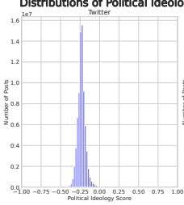

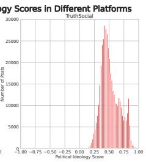  
(a)

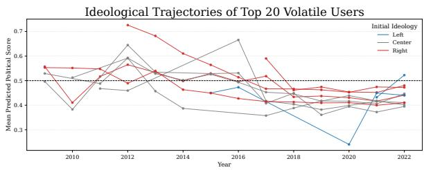  
(b)  
Fig. 8. Ideological structure and temporal dynamics across platforms. (a) shows how users on the two platforms are distributed along the left–right scale, which reflects cross-platform diferences in baseline audience composition. (b) tracks how highly unstable users move on the same scale over time.

## 6.2 Findings about Echo Chambers and Political Polarization

We con<sup>d</sup>ucte<sup>d d</sup>ata visua<sup>l</sup>ization o<sup>f</sup> socia<sup>l</sup> me<sup>d</sup>ia post content across <sup>d</sup>i<sup>f</sup>erent <sup>l</sup>eve<sup>l</sup>s an<sup>d</sup> o<sup>b</sup>jectives. Our <sub>g</sub>oal was to identif<sub>y</sub> shifts in <sub>p</sub>olitical ideolo<sub>gy</sub> across social media <sub>p</sub>latforms and ex<sub>p</sub>lore insi<sub>g</sub>hts into echo chambers and <sub>p</sub>olitical <sub>p</sub>olarization.

Diferent Social Media Platforms exhibit distinct overarching Political Ideologies. We used PIDN to ma<sub>p</sub> each <sub>p</sub>latform’s ideolo<sub>g</sub>ical landsca<sub>p</sub>e. As illustrated in Fi<sub>g</sub>ure 8a, des<sub>p</sub>ite diferences in dataset size<sub>,</sub> the ideolo<sub>g</sub>ical distributions ali<sub>g</sub>n with <sub>p</sub>revailin<sub>g</sub> <sub>p</sub>ublic <sub>p</sub>erce<sub>p</sub>tions: Twitter <sub>ex</sub>hibit<sub>s</sub> <sub>a</sub> <sub>mo</sub>d<sub>es</sub>t l<sub>e</sub>ft<sub>war</sub>d tilt<sub>,</sub> <sub>w</sub>hil<sub>e</sub> T<sub>ru</sub>th S<sub>oc</sub>i<sub>a</sub>l <sub>s</sub>k<sub>ews</sub> <sub>mar</sub>k<sub>e</sub>dl<sub>y</sub> t<sub>o</sub> th<sub>e</sub> <sub>r</sub>i<sub>g</sub>ht<sub>.</sub> T<sub>w</sub>itt<sub>er,</sub> <sub>as</sub> <sub>a</sub> <sub>w</sub>id<sub>e</sub>l <sub>use</sub>d <sub>ma</sub>i<sub>ns</sub>t<sub>ream</sub> l<sub>a</sub>tf<sub>orm,</sub> d<sub>raws</sub> f<sub>rom an</sub> i<sub>n</sub>t<sub>erne</sub>t<sub>-ac</sub>ti<sub>ve</sub> A<sub>mer</sub>i<sub>can o u</sub>l<sub>a</sub>ti<sub>on</sub> th<sub>a</sub>t t<sub>en</sub>d<sub>s</sub> to lean sli<sub>g</sub>htl<sub>y</sub> left. In contrast, Truth Social—founded b<sub>y</sub> former U.S. President Donald J. Trum<sub>p</sub>, a R<sub>epu</sub>bli<sub>can—na</sub>t<sub>ura</sub>ll<sub>y a</sub>tt<sub>rac</sub>t<sub>s a pre</sub>d<sub>om</sub>i<sub>nan</sub>tl<sub>y conserva</sub>ti<sub>ve user</sub> b<sub>ase.</sub> W<sub>e</sub> f<sub>ur</sub>th<sub>er</sub> h<sub>ypo</sub>th<sub>es</sub>i<sub>ze</sub> th<sub>a</sub>t th<sub>e pronounce</sub>d <sub>r</sub>i<sub>g</sub>ht<sub>war</sub>d <sub>s</sub>hift <sub>on</sub> T<sub>ru</sub>th S<sub>oc</sub>i<sub>a</sub>l <sub>s</sub>t<sub>ems</sub> f<sub>rom a com</sub>bi<sub>na</sub>ti<sub>on o</sub>f f<sub>ac</sub>t<sub>ors:</sub> th<sub>e p</sub>l<sub>a</sub>tf<sub>orm</sub>’<sub>s</sub> a<sub>pp</sub>eal to influential ri<sub>g</sub>ht-win<sub>g</sub> fi<sub>g</sub>ures and its broader user communit<sub>y,</sub> which ma<sub>y</sub> alread<sub>y p</sub>ossess <sub>a</sub> mild <sub>co</sub>n<sub>se</sub>r<sub>va</sub>ti<sub>ve</sub> <sub>o</sub>ri<sub>e</sub>nt<sub>a</sub>ti<sub>o</sub>n<sub>.</sub>

Ideological trajectories of highly volatile users on Twiter do not support the echo chamber or polarization hypothesis. To further examine the dynamics of ideological transformation at the individual level, we identified the to<sub>p</sub> 20 users in the X (Twitter) dataset with the lar<sub>g</sub>est s<sub>p</sub>read between their hi<sub>g</sub>hest and lowest <sub>y</sub>earl<sub>y</sub> mean ideolo<sub>gy</sub> scores. To ensure robust estimation<sub>,</sub> <sub>we res</sub>t<sub>r</sub>i<sub>c</sub>t<sub>e</sub>d th<sub>e ana</sub>l<sub>ys</sub>i<sub>s</sub> t<sub>o users w</sub>h<sub>o pos</sub>t<sub>e</sub>d <sub>a</sub>t l<sub>eas</sub>t 10 t<sub>wee</sub>t<sub>s per year an</sub>d <sub>a m</sub>i<sub>n</sub>i<sub>mum o</sub>f 50 tweets in total durin<sub>g</sub> the observation <sub>p</sub>eriod. Each user was assi<sub>g</sub>ned an initial <sub>p</sub>olitical leanin<sub>g</sub> (Left, Center, or Ri<sub>g</sub>ht) based on the mean ideolo<sub>gy</sub> score in their earliest available <sub>y</sub>ear. As shown in Figure 8<sup>b</sup>, we t<sup>h</sup>en visua<sup>l</sup>ize<sup>d</sup> eac<sup>h</sup> user<sup>’</sup>s i<sup>d</sup>eo<sup>l</sup>ogica<sup>l</sup> trajectory over time, wit<sup>h</sup> co<sup>l</sup>ors <sup>d</sup>enoting th<sub>e</sub>ir initi<sub>a</sub>l <sub>po</sub>liti<sub>ca</sub>l <sub>s</sub>t<sub>a</sub>n<sub>ce.</sub> W<sub>e use</sub>d th<sub>e</sub> T<sub>w</sub>itt<sub>e</sub>r d<sub>a</sub>t<sub>ase</sub>t f<sub>o</sub>r it<sub>s</sub> br<sub>oa</sub>d<sub>e</sub>r tim<sub>e spa</sub>n<sub>;</sub> Tr<sub>u</sub>th S<sub>oc</sub>i<sub>a</sub>l <sub>was</sub> <sub>exc</sub>l<sub>u</sub>d<sub>e</sub>d b<sub>ecause</sub> it<sub>s</sub> d<sub>a</sub>t<sub>a covers on</sub>l<sub>y</sub> 2022<sub>,</sub> t<sub>oo s</sub>h<sub>or</sub>t f<sub>or</sub> th<sub>e</sub> l<sub>ong-</sub>t<sub>erm s</sub>hift<sub>s cen</sub>t<sub>ra</sub>l t<sub>o</sub> thi<sub>s</sub> i<sub>nqu</sub>i<sub>ry.</sub>

C<sub>on</sub>t<sub>rary</sub> t<sub>o</sub> th<sub>e c</sub>l<sub>ass</sub>i<sub>ca</sub>l “<sub>ec</sub>h<sub>o c</sub>h<sub>am</sub>b<sub>er</sub>” h<sub>ypo</sub>th<sub>es</sub>i<sub>s—w</sub>hi<sub>c</sub>h <sub>pos</sub>it<sub>s</sub> th<sub>a</sub>t <sub>users</sub> t<sub>en</sub>d t<sub>o re</sub>i<sub>n</sub>f<sub>orce</sub> <sub>an</sub>d <sub>ra</sub>di<sub>ca</sub>li<sub>ze</sub> th<sub>e</sub>i<sub>r pre-ex</sub>i<sub>s</sub>ti<sub>ng</sub> b<sub>e</sub>li<sub>e</sub>f<sub>s—we o</sub>b<sub>serve</sub>d <sub>comp</sub>l<sub>ex an</sub>d <sub>mu</sub>ltidi<sub>rec</sub>ti<sub>ona</sub>l <sub>s</sub>hift<sub>s.</sub> M<sub>any</sub> initiall<sub>y</sub> ri<sub>g</sub>ht-leanin<sub>g</sub> users trended towards the ideolo<sub>g</sub>ical center<sub>,</sub> with several even crossin<sub>g</sub> the mid<sub>p</sub>oint into left-leanin<sub>g</sub> territor<sub>y</sub> over time. This <sub>p</sub>attern su<sub>gg</sub>ests a form of ideolo<sub>g</sub>ical moderation or de-radicalization<sub>,</sub> rather than an am<sub>p</sub>lification of <sub>p</sub>artisan view<sub>p</sub>oints. Meanwhile<sub>,</sub> th<sub>e</sub> f<sub>ew users</sub> i<sub>n our samp</sub>l<sub>e w</sub>h<sub>o were</sub> i<sub>n</sub>iti<sub>a</sub>ll<sub>y</sub> l<sub>e</sub>ft<sub>-</sub>l<sub>ean</sub>i<sub>ng a</sub>l<sub>so</sub> f<sub>a</sub>il<sub>e</sub>d t<sub>o s</sub>h<sub>ow a cons</sub>i<sub>s</sub>t<sub>en</sub>t <sub>pa</sub>tt<sub>ern</sub> <sub>o</sub>f l<sub>e</sub>ft<sub>war</sub>d <sub>po</sub>l<sub>ar</sub>i<sub>za</sub>ti<sub>on.</sub> O<sub>ne suc</sub>h <sub>user,</sub> d<sub>esp</sub>it<sub>e s</sub>i<sub>gn</sub>ifi<sub>can</sub>t fl<sub>uc</sub>t<sub>ua</sub>ti<sub>ons, u</sub>lti<sub>ma</sub>t<sub>e</sub>l<sub>y re</sub>t<sub>urne</sub>d t<sub>o an</sub> i<sup>d</sup>eo<sup>l</sup>ogica<sup>l</sup> position near t<sup>h</sup>eir starting point, w<sup>h</sup>i<sup>l</sup>e anot<sup>h</sup>er ex<sup>h</sup>i<sup>b</sup>ite<sup>d</sup> a c<sup>l</sup>ear trajectory towar<sup>d</sup> th<sub>e</sub> <sub>r</sub>i<sub>g</sub>ht<sub>.</sub> M<sub>os</sub>t <sub>s</sub>t<sub>r</sub>iki<sub>ng</sub>l<sub>y,</sub> <sub>users</sub> <sub>c</sub>l<sub>ass</sub>ifi<sub>e</sub>d <sub>as</sub> <sub>cen</sub>t<sub>r</sub>i<sub>s</sub>t did <sub>no</sub>t <sub>rema</sub>i<sub>n</sub> <sub>s</sub>t<sub>a</sub>bl<sub>e</sub> b<sub>u</sub>t i<sub>ns</sub>t<sub>ea</sub>d <sub>ex</sub>hibit<sub>e</sub>d

Table 9. Case study of three Twiter users illustrating non-polarizing trajectories within the U.S. political context. For each user, representative tweets are shown from two distinct periods. Key phrases are bolded.
<table><tr><td>User</td><td>Year</td><td>Representative tweet (truncated)</td><td>Score</td></tr><tr><td rowspan="5">1</td><td rowspan="2">2009</td><td>Is there such a thing as a &quot;Lie Factory&quot;? If so, its obvious right-wing Republicans &amp; their talking heads hold a great deal of stock in it.</td><td>0.073</td></tr><tr><td>3 days left. Vote 4 my rescue group 2 save lives! Retweet!</td><td>0.369</td></tr><tr><td rowspan="3">2022</td><td>As you know, currently the price per barrel of oil is $120. In this chart, note how low the price has to be for corps to profit by drilling. It&#x27;s the greed.</td><td>0.515</td></tr><tr><td>Next time a [Republican] points out that more have died from Covid under [President A] than [President B], remind them that correlation doesn&#x27;t equal causation.</td><td>0.521</td></tr><tr><td>This is where I want my taxes to go, investing in America and future generations. A population without access to higher education or drowning in debt cannot compete.</td><td>0.319</td></tr><tr><td rowspan="4">2</td><td rowspan="4">2017</td><td>There&#x27;s been some great addresses about #ScriptureStudy. What will you begin to study tomorrow? #[ReligiousConference]</td><td>0.321</td></tr><tr><td>#[ReligiousConference] #goals: Study EVERYTHING about Christ &amp; be a better #Disciple. Who&#x27;s with me?</td><td>0.431</td></tr><tr><td>We need our own testimony in these difficult times. Testimonies of others will only carry you so far. #[ChurchLeader]</td><td>0.240</td></tr><tr><td>Remember this started under [the former President] and is just being continued under [the current President].</td><td>0.457</td></tr><tr><td rowspan="3">2022</td><td rowspan="3">[Candidate B] or we will end up with 2016 all over again!&quot;</td><td>In 2020 I saw Republicans screaming &quot;you have to vote for [Candidate A]!&quot; But I also saw Dems saying &quot;you have to vote for</td><td>0.666</td></tr><tr><td>I&#x27;ve been saying the &quot;low unemployment&quot; and &quot;employee shortage&quot; have been partly due to the great amount of disabled from</td><td>0.455</td></tr><tr><td>Covid no longer in the work force. I was told I was fear-mongering.</td><td></td></tr><tr><td rowspan="4">3</td><td rowspan="4">2012</td><td>[The incumbent&#x27;s] Administration Closing 9 Border Patrol Stations [... ]. WTF??!!! We need MORE, not LESS! Voter fraud? Boston reports 129% voter turnout, 79% for [the incumbent]; 74% for [a Senate candidate].</td><td>0.579</td></tr><tr><td>In #Iran, one can be jailed, fined, &amp; whipped for defending #HumanRights. Dark reality for [a Christian pastor&#x27;s] attorney.</td><td>0.518</td></tr><tr><td></td><td>0.363</td></tr><tr><td>We also have a proud history of our laws &amp; Constitution being upheld. But today we have an illegal two-tiered system &amp; a Constitution that the Dems &amp; RINOs don&#x27;t obey.</td><td>0.874</td></tr><tr><td rowspan="2">2021</td><td rowspan="2"></td><td>THIS is why people are dying when they go into a hospital for &quot;C-19 treatment&quot;!!! STAY OUT OF HOSPITALS!!! Signed... a nurse!</td><td>0.899</td></tr><tr><td>We&#x27;re in the End Days, people. Accept Jesus [... ]. If ever we needed Jesus&#x27;s protection, it&#x27;s NOW!</td><td>0.714</td></tr></table>

si<sub>g</sub>nificant volatilit<sub>y,</sub> with their ideolo<sub>g</sub>ical scores fluctuatin<sub>g</sub> widel<sub>y</sub> across the <sub>p</sub>olitical s<sub>p</sub>ectrum. In this cohort<sub>,</sub> an initial centrist <sub>p</sub>osition did not <sub>p</sub>redict f<sub>u</sub>t<sub>u</sub>re stabilit<sub>y</sub>.

Qualitative analysis reveals diverse, non-polarizing ideological trajectories. To complement <sub>our quan</sub>tit<sub>a</sub>ti<sub>ve</sub> fi<sub>n</sub>di<sub>ngs, we con</sub>d<sub>uc</sub>t<sub>e</sub>d <sub>a case s</sub>t<sub>u</sub>d<sub>y</sub> t<sub>o exam</sub>i<sub>ne user-</sub>l<sub>eve</sub>l id<sub>eo</sub>l<sub>og</sub>i<sub>ca</sub>l d<sub>ynam</sub>i<sub>cs</sub> —s<sub>p</sub>ecificall<sub>y,</sub> whether individuals with hi<sub>g</sub>h variabilit<sub>y</sub> in <sub>p</sub>redicted ideolo<sub>gy</sub> scores exhibit <sub>p</sub>atterns <sub>cons</sub>i<sub>s</sub>t<sub>en</sub>t <sub>w</sub>ith <sub>po</sub>l<sub>ar</sub>i<sub>za</sub>ti<sub>on</sub> <sub>or</sub> <sub>s</sub>h<sub>ow</sub> <sub>more</sub> <sub>nuance</sub>d <sub>s</sub>hift<sub>s.</sub> W<sub>e</sub> <sub>measure</sub>d <sub>eac</sub>h <sub>user</sub>’<sub>s</sub> id<sub>eo</sub>l<sub>og</sub>i<sub>ca</sub>l <sub>vo</sub>l<sub>a</sub>tilit<sub>y as</sub> th<sub>e</sub> dif<sub>erence</sub> b<sub>e</sub>t<sub>ween</sub> th<sub>e</sub>i<sub>r max</sub>i<sub>mum an</sub>d <sub>m</sub>i<sub>n</sub>i<sub>mum year</sub>l<sub>y mean scores an</sub>d <sub>se</sub>l<sub>ec</sub>t<sub>e</sub>d th<sub>e</sub> t<sub>op</sub> 20 <sub>mos</sub>t <sub>vo</sub>l<sub>a</sub>til<sub>e users.</sub> F<sub>rom</sub> th<sub>ese, we ana</sub>l<sub>yze</sub>d th<sub>ree represen</sub>t<sub>a</sub>ti<sub>ve cases</sub> i<sub>n</sub> d<sub>e</sub>t<sub>a</sub>il<sub>.</sub> N<sub>one</sub> <sub>o</sub>f th<sub>ese users a</sub>li<sub>gn w</sub>ith th<sub>e c</sub>l<sub>ass</sub>i<sub>ca</sub>l <sub>ec</sub>h<sub>o c</sub>h<sub>am</sub>b<sub>er</sub> h<sub>ypo</sub>th<sub>es</sub>i<sub>s o</sub>f <sub>un</sub>idi<sub>rec</sub>ti<sub>ona</sub>l <sub>ra</sub>di<sub>ca</sub>li<sub>za</sub>ti<sub>on;</sub> T<sub>a</sub>bl<sub>e</sub> 9 <sub>presen</sub>t<sub>s</sub> th<sub>em.</sub>

• User 1 be<sub>g</sub>an usin<sub>g p</sub>artisan rhetoric in 2009, referrin<sub>g</sub> to Re<sub>p</sub>ublicans as a “Lie Factor<sub>y</sub>” (score 0.073) alon<sub>g</sub>side unrelated ever<sub>y</sub>da<sub>y</sub> a<sub>pp</sub>eals such as <sub>p</sub>romotin<sub>g</sub> an animal rescue <sub>g</sub>rou<sub>p</sub> (score 0.369). B<sub>y</sub> 2022, their tone had shifted toward moderation and anal<sub>y</sub>tical reasonin<sub>g</sub>—referencin<sub>g</sub> economic data like “<sub>p</sub>rice <sub>p</sub>er barrel of oil” (score 0.515) and cautionin<sub>g</sub> that “correlation doesn’t e<sub>q</sub>ual causation” (score 0.521). This trajector<sub>y</sub> reflects a reduction in rhetorical extremit<sub>y</sub> rather th<sub>an</sub> <sub>an</sub> i<sub>n</sub>t<sub>ens</sub>ifi<sub>ca</sub>ti<sub>on</sub> <sub>o</sub>f id<sub>eo</sub>l<sub>ogy.</sub>

• User 2 transitioned from a non-<sub>p</sub>olitical <sub>p</sub>artici<sub>p</sub>ant to a <sub>p</sub>oliticall<sub>y</sub> en<sub>g</sub>a<sub>g</sub>ed <sub>y</sub>et ideolo<sub>g</sub>icall<sub>y</sub> balanced commentator. In 2017, their <sub>p</sub>osts focused on reli<sub>g</sub>ious to<sub>p</sub>ics (e.<sub>g</sub>., #Scri<sub>p</sub>tureStud<sub>y</sub>, score 0.321). B<sub>y</sub> 2022, the<sub>y</sub> discussed <sub>p</sub>olicies s<sub>p</sub>annin<sub>g</sub> multi<sub>p</sub>le administrations (score 0.457) and observed commonalities in <sub>p</sub>artisan messa<sub>g</sub>in<sub>g</sub> strate<sub>g</sub>ies (score 0.666). These ex<sub>p</sub>ressions reflect a critical<sub>,</sub> cross-cuttin<sub>g</sub> awareness rather than ali<sub>g</sub>nment with a sin<sub>g</sub>le <sub>p</sub>olitical <sub>p</sub>ole.

• User 3 maintained consistent conservative views over a decade. In 2012, the<sub>y</sub> raised concerns about border securit<sub>y</sub> (score 0.579) and election inte<sub>g</sub>rit<sub>y</sub> (score 0.518). B<sub>y</sub> 2021, the<sub>y</sub> continued

Table 10. Representative Topics by Political Leaning and Year (2009–2022).
<table><tr><td>Year</td><td>Left-leaning Topics</td><td>Center-leaning Topics</td><td>Right-leaning Topics</td></tr><tr><td>2009</td><td>[hcr, health, reform] [copenhagen,cop15]</td><td>[stimulus, job, economy] [hcr, health, reform] [iran, iranelection]</td><td>[spending, stimulus, govt] [hcr, gop, tcot] [iran, iranelection]</td></tr><tr><td>2010</td><td>[health, reform, hcr] [haiti, earthquake]</td><td>[oil, bp, oilspill] [haiti] [election, mn2010, tea, teaparty]</td><td>[hcr, obamacare, repeal] [tea, party, teaparty] [flgov, scott, spending]</td></tr><tr><td>2011</td><td>[egypt, libya] [medicare, cuts, deficit] [wiunion]</td><td>[debt, debtceiling, boehner] [egypt, mubarak, libya] [bin laden, pakistan]</td><td>[libya, nato, war] [wiunion, gov, walker] [debt, obama, gop]</td></tr><tr><td>2012</td><td>[waronwomen, women] [romney, mitt, returns] [health, medicare]</td><td>[obama, romney, debate] [syria] [gun, guncontrol, newtown, nra]</td><td>[libya, benghazi, attack] [obama, romney, debate] [gun, shooting, aurora]</td></tr><tr><td>2013</td><td>[standwithwendy, txlege, abortion] [gun, guns, guncontroi] [blacklivesmatter]</td><td>[snowden, leak, nsa] [boston, marathon, bombing] [shutdown, government]</td><td>[irs, lerner, targeting] [benghazi, cia] [syria, assad, military]</td></tr><tr><td>2014</td><td>[ferguson, police, racism] [acaworks, aca] [climate, change]</td><td>[ferguson, michael brown] [ukraine, russia, putin] [ebola] [mh370]</td><td>[isis, syria, iraq] [benghazi] [bridgegate, christie] [irs, lerner, emails]</td></tr><tr><td>2015</td><td>[blacklivesmatter] [demdebate, berniesanders] [scottwalker, antiunion]</td><td>[trump, realdonaldtrump, gopdebate] [iran, irandeal] [paris, parisattacks]</td><td>[iran, deal, irandeal] [plannedparenthood, standwithpp] [gopdebate, trump]</td></tr><tr><td>2016</td><td>[feelthebern, berniesanders] [flintwatercrisis] [demsinphilly]</td><td>[trump, hillaryclinton, debate] [brexit, euref] [scalia, scotus]</td><td>[trump, realdonaldtrump, maga] [wikileaks, emails, clinton] [benghazi]</td></tr><tr><td>2017</td><td>[muslimban, travelban, nobannowall] [aca, healthcare] [impeachment]</td><td>[comey, mueller, trumprussia] [charlottesville] [metoo, sexual harassment]</td><td>[gorsuch, scotus] [fakenews, cnn] [tax, taxreform] [obamacare, repeal]</td></tr><tr><td>2018</td><td>[guncontrolnow, nra, parkland] [bluewave, midterms] [metoo, kavanaugh]</td><td>[kavanaugh, ford, kavanaughhearings] [border, children, familiesbelongtogether] [khashoggi]</td><td>[witch hunt, mueller, fbi] [caravan, border, buildthewall] [kavanaugh, confirmkavanaugh]</td></tr><tr><td>2019</td><td>[impeachment, impeach, repadamschiff] [greennewdeal] [demdebate, warren]</td><td>[impeachment, ukraine, whistleblower] [muellerreport, obstruction] [hong kong]</td><td>[impeachment, sham, hoax] [biden, hunter, ukraine] [border, wall, emergency] [obamagate, spygate]</td></tr><tr><td>2020</td><td>[covid19, pandemic, trumpvirus] [george floyd, blm, defundthepolice] [usps, mailin]</td><td>[coronavirus, covid19] [biden, trump, election] [george floyd, protests]</td><td>[reopenamerica, reopen] [voterfraud, electionfraud, stopthesteal]</td></tr><tr><td>2021</td><td>[jan 6, insurrection, coup] [votingrights, filibuster] [buildbackbetter, bbb]</td><td>[capitol, riot, jan 6] [afghanistan, withdrawal] [vaccine, mandate, delta]</td><td>[crt, critical race theory] [arizona, audit] [antimask, antivax, bordercrisis]</td></tr><tr><td>2022</td><td>[abortion, codifyroe, womensrights] [uvalde, gunreform] [ukraine, standwithukraine]</td><td>[ukraine, war, russia] [maralago, search, documents] [roe, wade, overturn]</td><td>[inflation, gas] [fbi, doj] [border, migrants] [hunter, laptop]</td></tr></table>

ex<sub>p</sub>ressin<sub>g</sub> ske<sub>p</sub>ticism toward institutions, citin<sub>g</sub> constitutional violations (score 0.874) and rejectin<sub>g</sub> <sub>p</sub>ublic health <sub>g</sub>uidance (score 0.899). Thou<sub>g</sub>h to<sub>p</sub>ics shifted, the ideolo<sub>g</sub>ical stance <sub>rema</sub>i<sub>ne</sub>d <sub>s</sub>t<sub>a</sub>bl<sub>e,</sub> <sub>re</sub>fl<sub>ec</sub>ti<sub>ng</sub> <sub>con</sub>ti<sub>nu</sub>it<sub>y</sub> <sub>ra</sub>th<sub>er</sub> th<sub>an</sub> <sub>ra</sub>di<sub>ca</sub>li<sub>za</sub>ti<sub>on.</sub>

T<sub>oge</sub>th<sub>er,</sub> th<sub>ese cases c</sub>h<sub>a</sub>ll<sub>enge</sub> th<sub>e un</sub>i<sub>versa</sub>lit<sub>y o</sub>f th<sub>e po</sub>l<sub>ar</sub>i<sub>za</sub>ti<sub>on narra</sub>ti<sub>ve.</sub>

Comparative Thematic Analysis Reveals Divergent Discursive Arenas. To complement our <sub>q</sub>uantitative findin<sub>g</sub>s<sub>,</sub> we conducted a thematic anal<sub>y</sub>sis of <sub>p</sub>olitical discourse on Twitter and Truth Social—two ideolo<sub>g</sub>icall<sub>y</sub> distinct <sub>p</sub>latforms. We <sub>g</sub>rou<sub>p</sub>ed users into Left-leanin<sub>g,</sub> Centrist<sub>,</sub> and Ri<sub>g</sub>ht-leanin<sub>g</sub> cate<sub>g</sub>ories based on a<sub>gg</sub>re<sub>g</sub>ated <sub>p</sub>ost-level ideolo<sub>gy</sub> scores, and a<sub>pp</sub>lied BERTo<sub>p</sub>ic [31] to extract dominant themes. BERTo<sub>p</sub>ic embeds doc<sub>u</sub>ments context<sub>u</sub>all<sub>y,</sub> red<sub>u</sub>ces their dimensionalit<sub>y,</sub> clusters them b<sub>y</sub> densit<sub>y,</sub> and extracts re<sub>p</sub>resentative ke<sub>y</sub>words <sub>p</sub>er to<sub>p</sub>ic. Results are shown in Table 10 (Twitter, 2009–2022) and Table 11 (Truth Social, 2022).

T<sub>w</sub>itt<sub>er revea</sub>l<sub>s a</sub> d<sub>ynam</sub>i<sub>c we</sub> t<sub>erm a</sub> “<sub>s</sub>h<sub>are</sub>d <sub>agen</sub>d<sub>a w</sub>ith <sub>compe</sub>ti<sub>ng</sub> f<sub>rames.</sub>” A<sub>cross</sub> th<sub>e po</sub>liti<sub>ca</sub>l spectrum, users engage with the same high-salience topics—from [hcr] in 2009 to [ukraine, war] in 2022—suggesting a common baseline of topical attention. However, ideological divergence emer<sub>g</sub>es in framin<sub>g</sub>. For exam<sub>p</sub>le<sub>,</sub> durin<sub>g</sub> the 2019 im<sub>p</sub>eachment<sub>,</sub> the Left referenced institutional actors ([repadamschiff]), while the Ri<sub>g</sub>ht used dele<sub>g</sub>itimizin<sub>g</sub> terms ([sham, hoax]). Similarl<sub>y</sub>, the events of January 6th surfaced as [insurrection, coup] on the Left and [capitol, riot] at the Center, while the Right’s 2021 agenda instead foregrounded [arizona, audit] and [crt, critical race theory]. This is a contested discursive space, not a set of isolated echo chambers.

Table 11. Representative Topics on Truth Social by Political Leaning (2022).
<table><tr><td>Year</td><td>Left-leaning Topics</td><td>Center-leaning Topics</td><td>Right-leaning Topics</td></tr><tr><td>2022</td><td>[abortion, roe, wade, overturned] [uvalde, shooting, gun, control] [ukraine, standwithukraine, kyiv] [jan6, committee, hearings, insurrection] [maralago, raid, fbi]</td><td>[ukraine, russia, war, putin] [maralago, raid, fbi, doj, warrant] [roe, wade, overturned, supreme, court] [inflation, recession, economy, prices] [hunter, laptop, bidens, fbi] [2000mules, ballot, harvesting, fraud]</td><td>[inflation, gas, prices, bidenflation] [fbi, doj, raid, corruption, witchhunt] [border, crisis, migrants, illegal] [hunter, laptop, biden, crimefamily] [stoptheshots, diedsuddenly, pureblood] [abortion, prolife, unborn, baby]</td></tr></table>

I<sub>n con</sub>t<sub>ras</sub>t<sub>,</sub> T<sub>ru</sub>th S<sub>oc</sub>i<sub>a</sub>l <sub>ex</sub>hibit<sub>s a</sub> “hi<sub>g</sub>h<sub>-con</sub>fli<sub>c</sub>t id<sub>eo</sub>l<sub>og</sub>i<sub>ca</sub>l <sub>arena</sub>” <sub>w</sub>ith <sub>a r</sub>i<sub>g</sub>ht<sub>-s</sub>hift<sub>e</sub>d di<sub>scur-</sub> sive center. Themes categorized as far-right on Twitter—e.g., [hunter, laptop]—appear under the <sup>“</sup>Centrist” label on Truth Social, alongside claims such as [2000mules, ballot] that have no Twitter counter<sub>p</sub>art<sub>,</sub> reflectin<sub>g</sub> that <sub>p</sub>artisan narratives constitute the <sub>p</sub>latform’s mainstream. Rhetorical intensit<sub>y</sub> is notabl<sub>y</sub> elevated: economic concerns are framed as [bidenflation], the Mar-a-Lago search is portrayed as a partisan [witchhunt] by a [corrupt] FBI, and the term [crimefamily] denounces the Bidens. Such vocabulary suggests a shift from political discourse to moral indictment. While Left-leanin<sub>g</sub> users exist on Truth Social<sub>,</sub> the<sub>y</sub> act more as ideolo<sub>g</sub>ical foils than dialogue participants. Topics like [jan6, hearings] and [gun control] appear, but often in o<sub>pp</sub>ositional framin<sub>g</sub>. Instead of reducin<sub>g</sub> <sub>p</sub>olarization<sub>,</sub> their <sub>p</sub>resence intensifies it b<sub>y</sub> <sub>p</sub>rovokin<sub>g</sub> adversarial res<sub>p</sub>onses. This d<sub>y</sub>namic is com<sub>p</sub>ounded b<sub>y</sub> cons<sub>p</sub>iratorial clusters—e.<sub>g</sub>.<sub>,</sub> [stoptheshots, pureblood]—which anchor its ideological extremity.

O<sub>vera</sub>ll<sub>, po</sub>l<sub>ar</sub>i<sub>za</sub>ti<sub>on man</sub>if<sub>es</sub>t<sub>s</sub> dif<sub>eren</sub>tl<sub>y across p</sub>l<sub>a</sub>tf<sub>orms:</sub> T<sub>w</sub>itt<sub>er</sub> h<sub>os</sub>t<sub>s a</sub> f<sub>ragmen</sub>t<sub>e</sub>d b<sub>u</sub>t interconnected <sub>p</sub>ublic s<sub>p</sub>here where com<sub>p</sub>etin<sub>g</sub> frames coexist<sub>,</sub> whereas Truth Social functions as <sub>a se</sub>lf<sub>-re</sub>i<sub>n</sub>f<sub>orc</sub>i<sub>ng enc</sub>l<sub>ave w</sub>h<sub>ose r</sub>i<sub>g</sub>ht<sub>-s</sub>hift<sub>e</sub>d <sub>cen</sub>t<sub>er, mora</sub>li<sub>ze</sub>d <sub>r</sub>h<sub>e</sub>t<sub>or</sub>i<sub>c, an</sub>d <sub>reac</sub>ti<sub>ve</sub> d<sub>ynam</sub>i<sub>cs</sub> am<sub>p</sub>lif<sub>y</sub> division rather than brid<sub>g</sub>e it.

## 7 Conclusion

This <sub>p</sub>a<sub>p</sub>er <sub>p</sub>resents TSN4PI, a unified framework that inte<sub>g</sub>rates natural lan<sub>g</sub>ua<sub>g</sub>e <sub>p</sub>rocessin<sub>g</sub> with t<sub>empora</sub>l <sub>grap</sub>h <sub>neura</sub>l <sub>ne</sub>t<sub>wor</sub>k<sub>s</sub> f<sub>or</sub> t<sub>rac</sub>ki<sub>ng po</sub>liti<sub>ca</sub>l id<sub>eo</sub>l<sub>og</sub>i<sub>es on soc</sub>i<sub>a</sub>l <sub>me</sub>di<sub>a.</sub> M<sub>e</sub>th<sub>o</sub>d<sub>o</sub>l<sub>og</sub>i<sub>ca</sub>ll<sub>y,</sub> <sub>we prov</sub>id<sub>e a ro</sub>b<sub>us</sub>t<sub>, en</sub>d<sub>-</sub>t<sub>o-en</sub>d <sub>p</sub>i<sub>pe</sub>li<sub>ne</sub> th<sub>a</sub>t <sub>e</sub>f<sub>ec</sub>ti<sub>ve</sub>l<sub>y</sub> b<sub>r</sub>id<sub>ges</sub> th<sub>e</sub> d<sub>oma</sub>i<sub>n gap</sub> b<sub>e</sub>t<sub>ween news an</sub>d social content<sub>,</sub> modelin<sub>g</sub> the d<sub>y</sub>namic evolution of user interactions. We also contribute two lar<sub>g</sub>escale, <sub>p</sub>ublicl<sub>y</sub> released datasets from X (formerl<sub>y</sub> Twitter) and allsides.com. Em<sub>p</sub>iricall<sub>y</sub>, our anal<sub>y</sub>sis <sub>o</sub>f th<sub>ese p</sub>l<sub>a</sub>tf<sub>orms revea</sub>l<sub>s</sub> th<sub>a</sub>t th<sub>e mos</sub>t id<sub>eo</sub>l<sub>og</sub>i<sub>ca</sub>ll<sub>y vo</sub>l<sub>a</sub>til<sub>e users</sub> t<sub>en</sub>d t<sub>o converge</sub> t<sub>owar</sub>d th<sub>e cen-</sub> ter<sub>,</sub> a findin<sub>g</sub> contrar<sub>y</sub> to widel<sub>y</sub> held assum<sub>p</sub>tions about increasin<sub>g</sub> online <sub>p</sub>olarization. Future work i<sub>nc</sub>l<sub>u</sub>d<sub>es</sub> <sub>ex</sub>t<sub>en</sub>di<sub>ng</sub> t<sub>o</sub> <sub>mu</sub>lti<sub>-</sub>di<sub>mens</sub>i<sub>ona</sub>l id<sub>eo</sub>l<sub>og</sub>i<sub>ca</sub>l <sub>mo</sub>d<sub>e</sub>l<sub>s</sub> <sub>an</sub>d <sub>cross-p</sub>l<sub>a</sub>tf<sub>orm</sub> <sub>compara</sub>ti<sub>ve</sub> <sub>s</sub>t<sub>u</sub>di<sub>es.</sub>

## Acknowledgments

This work was su<sub>pp</sub>orted in <sub>p</sub>art b<sub>y</sub> the National Natural Science Foundation of China (Grant Nos. 92370204 and 62506348), the National Ke<sub>y</sub> R&D Pro<sub>g</sub>ram of China (Grant No. 2023YFF0725001), t<sup>h</sup>e New Generation Arti<sup>fi</sup>cia<sup>l</sup> Inte<sup>ll</sup>igence-Nationa<sup>l</sup> Science an<sup>d</sup> Tec<sup>h</sup>no<sup>l</sup>ogy Major Project (Grant No. 2025ZD0122601), Guan<sub>g</sub>don<sub>g</sub> Provincial Ke<sub>y</sub> Laborator<sub>y</sub> of Frontier Basic Science for Alldomain Intelli<sub>g</sub>ence, the Guan<sub>g</sub>don<sub>g</sub> Basic and A<sub>pp</sub>lied Basic Research Foundation (Grant No. 2023B1515120057), the Key-Area Special Project of Guangdong Provincial Ordinary Universities (Grant No. 2024ZDZX1007), the Natural Science Foundation of Anhui Province (Grant No. 2508085QF211), and the Opening Foundation of State Key Laboratory of Cognitive Intelligence, iFLYTEK (Grant No. COGOS-2025HE02).

## Su<sub>pp</sub>lementar<sub>y</sub> Material

Thi<sub>s</sub> d<sub>ocumen</sub>t i<sub>s</sub> th<sub>e on</sub>li<sub>ne-on</sub>l<sub>y supp</sub>l<sub>emen</sub>t<sub>ary ma</sub>t<sub>er</sub>i<sub>a</sub>l f<sub>or</sub> th<sub>e ar</sub>ti<sub>c</sub>l<sub>e</sub> “A<sub>ga</sub>i<sub>ns</sub>t P<sub>o</sub>liti<sub>ca</sub>l P<sub>o-</sub> l<sub>a</sub>riz<sub>a</sub>ti<sub>o</sub>n: A Unifi<sub>e</sub>d Fr<sub>a</sub>m<sub>ewo</sub>rk f<sub>o</sub>r Tr<sub>ac</sub>in<sub>g</sub> E<sub>vo</sub>l<sub>v</sub>in<sub>g</sub> P<sub>o</sub>liti<sub>ca</sub>l Id<sub>eo</sub>l<sub>og</sub>i<sub>es o</sub>n S<sub>oc</sub>i<sub>a</sub>l M<sub>e</sub>di<sub>a.</sub>” It collects dataset details<sub>,</sub> im<sub>p</sub>lementation settin<sub>g</sub>s<sub>,</sub> <sub>p</sub>rom<sub>p</sub>t tem<sub>p</sub>lates<sub>,</sub> com<sub>p</sub>lexit<sub>y</sub> anal<sub>y</sub>sis<sub>,</sub> and the f<sub>u</sub>ll <sub>per-mo</sub>d<sub>e</sub>l <sub>resu</sub>lt<sub>s re</sub>f<sub>erence</sub>d f<sub>rom</sub> th<sub>e ma</sub>i<sub>n</sub> t<sub>ex</sub>t<sub>.</sub> S<sub>ec</sub>ti<sub>on,</sub> t<sub>a</sub>bl<sub>e, an</sub>d fi<sub>gure num</sub>b<sub>ers</sub> b<sub>e</sub>l<sub>ow are</sub> those cited in the main text as belon<sub>g</sub>in<sub>g</sub> to the su<sub>pp</sub>lementar<sub>y</sub> material.

## A Appendix

## Contents

A.1 D<sub>e</sub>t<sub>a</sub>il<sub>s o</sub>f th<sub>e</sub> D<sub>a</sub>t<sub>ase</sub>t<sub>s</sub> 23   
A.1.1 D<sub>a</sub>t<sub>a</sub> Pri<sub>vacy</sub> 23   
A.1.2 Th<sub>e a</sub>ll<sub>s</sub>id<sub>es.com</sub> D<sub>a</sub>t<sub>ase</sub>t 23   
A.1.3 The X (Twitter) Dataset 24   
A.1.4 Th<sub>e</sub> Tr<sub>u</sub>th S<sub>oc</sub>i<sub>a</sub>l D<sub>a</sub>t<sub>ase</sub>t 24   
A.2 Im<sub>p</sub>l<sub>e</sub>m<sub>e</sub>nt<sub>a</sub>ti<sub>o</sub>n D<sub>e</sub>t<sub>a</sub>il<sub>s</sub> 24   
A.3 Pr<sub>o</sub>m<sub>p</sub>t D<sub>e</sub>t<sub>a</sub>il<sub>s</sub> 25   
A.4 UDA Com<sub>p</sub>lexit<sub>y</sub> Anal<sub>y</sub>sis 28

## A.1 Details of the Datasets

A.1.1 Data Privacy. Given the sensitivity of political ideology, privacy is central to our data h<sub>an</sub>dli<sub>ng.</sub> All <sub>news</sub> d<sub>a</sub>t<sub>a were source</sub>d f<sub>rom pu</sub>bli<sub>c we</sub>b<sub>s</sub>it<sub>es.</sub> S<sub>oc</sub>i<sub>a</sub>l <sub>me</sub>di<sub>a</sub> d<sub>a</sub>t<sub>a were anonym</sub>i<sub>ze</sub>d to meet ethical standards. On X and Truth Social, <sub>p</sub>ersonal identifiers (e.<sub>g</sub>., names, handles) were re<sub>p</sub>laced with numeric IDs. Onl<sub>y p</sub>ublic <sub>p</sub>osts were retained<sub>;</sub> no <sub>p</sub>rivate user data was used.

D<sub>a</sub>t<sub>a</sub> R<sub>e</sub>l<sub>ease</sub> F<sub>orma</sub>t<sub>.</sub> T<sub>o respec</sub>t th<sub>e</sub> t<sub>erms o</sub>f th<sub>e un</sub>d<sub>er</sub>l<sub>y</sub>i<sub>ng sources,</sub> th<sub>e re</sub>l<sub>ease</sub>d d<sub>a</sub>t<sub>ase</sub>t<sub>s are</sub> distributed in a dehydrated form. For the X (Twitter) and Truth Social corpora we release post and user identifiers to<sub>g</sub>ether with our derived annotations (<sub>p</sub>olitical relevance labels, ideolo<sub>gy</sub> scores, and the tem<sub>p</sub>oral interaction ed<sub>g</sub>es used to build the <sub>g</sub>ra<sub>p</sub>hs), rather than the ori<sub>g</sub>inal <sub>p</sub>ost text; users can re<sup>h</sup>y<sup>d</sup>rate t<sup>h</sup>e text t<sup>h</sup>roug<sup>h</sup> t<sup>h</sup>e respective p<sup>l</sup>at<sup>f</sup>orm APIs su<sup>b</sup>ject to t<sup>h</sup>eir terms o<sup>f</sup> service. For th<sub>e</sub> <sub>news</sub> <sub>corpus</sub> <sub>we</sub> <sub>re</sub>l<sub>ease</sub> <sub>ar</sub>ti<sub>c</sub>l<sub>e</sub> URL<sub>s,</sub> <sub>ou</sub>tl<sub>e</sub>t <sub>names,</sub> <sub>pu</sub>bli<sub>ca</sub>ti<sub>on</sub> d<sub>a</sub>t<sub>es,</sub> <sub>an</sub>d th<sub>e</sub> AllSid<sub>es</sub> id<sub>eo</sub>l<sub>ogy</sub> <sub>score o</sub>f <sub>eac</sub>h <sub>ou</sub>tl<sub>e</sub>t<sub>, ra</sub>th<sub>er</sub> th<sub>an</sub> th<sub>e</sub> f<sub>u</sub>ll <sub>ar</sub>ti<sub>c</sub>l<sub>e</sub> t<sub>ex</sub>t<sub>, w</sub>hi<sub>c</sub>h <sub>rema</sub>i<sub>ns</sub> th<sub>e proper</sub>t<sub>y o</sub>f th<sub>e pu</sub>bli<sub>s</sub>hi<sub>ng</sub> <sub>ou</sub>tl<sub>e</sub>t<sub>s.</sub> Th<sub>e</sub> AllSid<sub>es</sub> r<sub>a</sub>tin<sub>gs</sub> r<sub>e</sub>di<sub>s</sub>trib<sub>u</sub>t<sub>e</sub>d in thi<sub>s</sub> <sub>way</sub> <sub>a</sub>r<sub>e</sub> <sub>cove</sub>r<sub>e</sub>d b<sub>y</sub> th<sub>e</sub> CC BY-NC 4<sub>.</sub>0 li<sub>ce</sub>n<sub>se</sub> <sub>an</sub>d <sub>are prov</sub>id<sub>e</sub>d <sub>w</sub>ith th<sub>e a</sub>tt<sub>r</sub>ib<sub>u</sub>ti<sub>on requ</sub>i<sub>re</sub>d b<sub>y</sub> th<sub>a</sub>t li<sub>cense;</sub> th<sub>e re</sub>l<sub>ease</sub>d <sub>co</sub>ll<sub>ec</sub>ti<sub>on</sub> i<sub>s</sub> th<sub>ere</sub>f<sub>ore</sub> <sub>ava</sub>il<sub>a</sub>bl<sub>e</sub> f<sub>or noncommerc</sub>i<sub>a</sub>l <sub>researc</sub>h <sub>use on</sub>l<sub>y.</sub> S<sub>cr</sub>i<sub>p</sub>t<sub>s</sub> f<sub>or re</sub>h<sub>y</sub>d<sub>ra</sub>ti<sub>on an</sub>d f<sub>or repro</sub>d<sub>uc</sub>i<sub>ng every</sub> ta<sup>bl</sup>e in t<sup>h</sup>e paper are provi<sup>d</sup>e<sup>d</sup> in t<sup>h</sup>e repository at <sup>h</sup>ttps://git<sup>h</sup>u<sup>b</sup>.com/yea<sup>h</sup>jac<sup>k</sup>/TSN4PI.

A.1.2 The allsides.com Dataset. The overview of the allsides.com dataset is as follows:

Table 1. Overview of the allsides.com news with annotated political ideology dataset.
<table><tr><td>Characteristic</td><td># of News Articles</td><td># of Media Outlets</td></tr><tr><td>Total Articles/Outlets</td><td>233,570</td><td>466</td></tr><tr><td>Political Ideology</td><td></td><td></td></tr><tr><td>Center</td><td>76,023</td><td>158</td></tr><tr><td>Lean Left</td><td>53,532</td><td>106</td></tr><tr><td>Right</td><td>45,506</td><td>75</td></tr><tr><td>Lean Right</td><td>32,555</td><td>62</td></tr><tr><td>Left</td><td>25,954</td><td>65</td></tr></table>

D<sub>a</sub>t<sub>a</sub> P<sub>reprocess</sub>i<sub>ng.</sub> A<sub>s</sub> <sub>w</sub>ith th<sub>e</sub> X d<sub>a</sub>t<sub>ase</sub>t d<sub>escr</sub>ib<sub>e</sub>d b<sub>e</sub>l<sub>ow,</sub> <sub>we</sub> <sub>re</sub>t<sub>a</sub>i<sub>ne</sub>d <sub>on</sub>l<sub>y</sub> E<sub>ng</sub>li<sub>s</sub>h <sub>ar</sub>ti<sub>c</sub>l<sub>es</sub> t<sub>o</sub> ensure lin<sub>g</sub>uistic consistenc<sub>y</sub>. We also normalized ideolo<sub>gy</sub> scores to ali<sub>g</sub>n with other framework <sub>co</sub>m<sub>po</sub>n<sub>e</sub>nt<sub>s.</sub> F<sub>o</sub>r <sub>a</sub>n <sub>a</sub>rti<sub>c</sub>l<sub>e</sub> � <sub>w</sub>ith <sub>o</sub>ri<sub>g</sub>in<sub>a</sub>l <sub>sco</sub>r<sub>e</sub> $S _ { \mathrm { r a w } } ~ \in ~ \left[ - 6 , 6 \right]$ , t<sup>h</sup>e a<sup>d</sup>juste<sup>d</sup> score $S _ { \mathrm { a d j u s t e d } }$ i<sub>s</sub> com<sub>p</sub>ute<sup>d</sup> as:

$$
S _ { \mathrm { a d j u s t e d } } ( N ) = \frac { S _ { \mathrm { r a w } } + 6 } { 1 2 } .\tag{1}
$$

This normalization ma<sub>p</sub>s the score to the [0, 1] interval, facilitatin<sub>g</sub> uniform scale inter<sub>p</sub>retation durin<sub>g</sub> model trainin<sub>g</sub> and evaluation.

Word Clouds Representing Titles of Different Political Leanings  
  
Fig. 1. Word Clouds Highlighting Common Terms in News Reports Titles by Political Leanings. The visualization spans from ‘Left’ to ‘Right’, with ‘Center’ in the middle, reflecting the language usage paterns in political news reporting.

W<sub>e a</sub>l<sub>so crea</sub>t<sub>e</sub>d <sub>wor</sub>d <sub>c</sub>l<sub>ou</sub>d<sub>s</sub> f<sub>or news</sub> titl<sub>es</sub> f<sub>rom</sub> dif<sub>eren</sub>t <sub>po</sub>liti<sub>ca</sub>l id<sub>eo</sub>l<sub>ogy</sub> f<sub>ac</sub>ti<sub>ons, as s</sub>h<sub>own</sub> i<sub>n</sub> Fi<sub>gure</sub> 1<sub>.</sub> W<sub>e</sub> f<sub>oun</sub>d th<sub>a</sub>t <sub>me</sub>di<sub>a</sub> <sub>w</sub>ith <sub>a</sub> l<sub>e</sub>ft<sub>-</sub>l<sub>ean</sub>i<sub>ng</sub> bi<sub>as</sub> <sub>genera</sub>ll<sub>y</sub> f<sub>ocus</sub> <sub>on</sub> t<sub>op</sub>i<sub>cs</sub> <sub>suc</sub>h <sub>as</sub> th<sub>e</sub> Ca<sub>p</sub>itol riot<sub>,</sub> the S<sub>up</sub>reme Co<sub>u</sub>rt<sub>,</sub> and COVID<sub>, w</sub>hile ri<sub>g</sub>ht-leanin<sub>g</sub> media often foc<sub>u</sub>s on Elon M<sub>u</sub>sk<sub>,</sub> P<sub>au</sub>l P<sub>e</sub>l<sub>os</sub>i<sub>,</sub> th<sub>e</sub> C<sub>o</sub>mmitt<sub>ee</sub> Crimin<sub>a</sub>l<sub>,</sub> <sub>a</sub>nd <sub>vacc</sub>in<sub>e</sub> m<sub>a</sub>nd<sub>a</sub>t<sub>es,</sub> <sub>w</sub>ith <sub>ce</sub>nt<sub>e</sub>r m<sub>e</sub>di<sub>a</sub> r<sub>epo</sub>rtin<sub>g</sub> <sub>o</sub>n b<sub>o</sub>th<sub>.</sub> Thi<sub>s re</sub>fl<sub>ec</sub>t<sub>s no</sub>t <sub>on</sub>l<sub>y</sub> th<sub>e</sub> dif<sub>eren</sub>t f<sub>ocus po</sub>i<sub>n</sub>t<sub>s o</sub>f <sub>me</sub>di<sub>a across</sub> th<sub>e po</sub>liti<sub>ca</sub>l <sub>spec</sub>t<sub>rum</sub> b<sub>u</sub>t <sub>a</sub>l<sub>so</sub> th<sub>e</sub> distinct use of lan<sub>g</sub>ua<sub>g</sub>e in re<sub>p</sub>ortin<sub>g</sub> the same to<sub>p</sub>ics<sub>,</sub> ali<sub>g</sub>nin<sub>g</sub> with our research h<sub>yp</sub>othesis: even f<sub>or</sub> th<sub>e</sub> <sub>same</sub> <sub>even</sub>t<sub>s,</sub> th<sub>e</sub> <sub>c</sub>h<sub>o</sub>i<sub>ce</sub> <sub>o</sub>f <sub>wor</sub>d<sub>s</sub> <sub>can</sub> <sub>s</sub>till <sub>revea</sub>l th<sub>e</sub>i<sub>r</sub> <sub>po</sub>liti<sub>ca</sub>l id<sub>eo</sub>l<sub>og</sub>i<sub>es.</sub>

A.1.3 The X (Twiter) Dataset. Data Preprocessing. To ensure linguistic consistency with our anal<sub>y</sub>tical focus of <sub>p</sub>residential elections in the United States<sub>,</sub> we retained onl<sub>y</sub> En<sub>g</sub>lish-lan<sub>g</sub>ua<sub>g</sub>e tweets. Lan<sub>g</sub>ua<sub>g</sub>e filterin<sub>g</sub> was <sub>p</sub>erformed usin<sub>g</sub> the fasttext-langdetect librar<sub>y</sub> [41, 42].

A.1.4 The Truth Social Dataset. Data Preprocessing. Preliminary cleaning and preprocessing <sub>were app</sub>li<sub>e</sub>d t<sub>o</sub> th<sub>e raw</sub> d<sub>a</sub>t<sub>ase</sub>t<sub>.</sub> Gi<sub>ven</sub> th<sub>a</sub>t <sub>some</sub> “T<sub>ru</sub>th<sub>s</sub>” h<sub>a</sub>d <sub>m</sub>i<sub>ss</sub>i<sub>ng or m</sub>i<sub>sa</sub>li<sub>gne</sub>d ti<sub>mes</sub>t<sub>amps,</sub> <sub>we</sub> <sub>u</sub>tili<sub>ze</sub>d <sub>we</sub>b <sub>scrap</sub>i<sub>ng</sub> t<sub>oo</sub>l<sub>s</sub> t<sub>o</sub> <sub>supp</sub>l<sub>emen</sub>t <sub>an</sub>d <sub>correc</sub>t th<sub>e</sub> ti<sub>mes</sub>t<sub>amps</sub> f<sub>or</sub> th<sub>ese</sub> <sub>access</sub>ibl<sub>e</sub> “T<sub>ru</sub>th<sub>s.</sub>”

## A.2 Implementation Details

Models were trained with a 90/10 train-test s<sub>p</sub>lit. For PIDN, we trained for 3 e<sub>p</sub>ochs with a learnin<sub>g</sub> <sub>ra</sub>t<sub>e o</sub>f $2 \times 1 0 ^ { - 5 }$ and a weight decay of 0.01. For the TST task, we used the Llama-3.1-8B-Instruct model to generate style-transferred texts with a temperature of 0.7, top\_p of 0.95, and a maximum generation length of 512 tokens, terminating on the <sup>“</sup></Tweet>” token. The prompts for directly using the LLM-based method to assess political relevance and assigning scores, TST and LLMas-a-judge for evaluation are provided in Tables 2, 3, and 4, respectively. To facilitate automatic evaluation, we levera<sub>g</sub>e tool callin<sub>g</sub> to <sub>p</sub>arse model res<sub>p</sub>onses into a structured JSON format. For PIDN, we used $( \alpha = 0 . 4 , \beta = 0 . 2 )$ d<sub>ur</sub>i<sub>ng</sub> th<sub>e</sub> <sub>pre</sub>li<sub>m</sub>i<sub>nary</sub> b<sub>ac</sub>kb<sub>one</sub> <sub>compar</sub>i<sub>son.</sub> Aft<sub>er</sub> th<sub>e</sub> d<sub>e</sub>di<sub>ca</sub>t<sub>e</sub>d tunin<sub>g</sub> sta<sub>g</sub>e re<sub>p</sub>orted in the main <sub>p</sub>a<sub>p</sub>er<sub>,</sub> we selected $( \alpha = 0 . 4 , \beta = 0 . 3 )$ f<sub>or</sub> th<sub>e a</sub>bl<sub>a</sub>ti<sub>on s</sub>t<sub>u</sub>d<sub>y an</sub>d final models. For PIPN, we ado<sub>p</sub>ted the default sam<sub>p</sub>lin<sub>g</sub>, memor<sub>y</sub>, and network confi<sub>g</sub>urations <sub>p</sub>rovided b<sub>y</sub> TGL [90] for the diferent TGNNs. Mixed-<sub>p</sub>recision trainin<sub>g</sub> and inference were ado<sub>p</sub>ted for eficiency. All experiments were conducted on eight machines, each equipped with 8 Nvidia A800 GPUs (80GB VRAM each), running Ubuntu 22.04 with Python 3.11. We used the vllm [47] framework for text <sub>g</sub>eneration tasks, and TGL [90] for TGNNs. For static <sub>g</sub>ra<sub>p</sub>h tasks, we used PyTorch Geometric [24]. The trainin<sub>g</sub> and inference were <sub>p</sub>erformed usin<sub>g</sub> PyTorch 2.4.0.

Guidelines & Tool Schema (record\_political\_analysis):   
Function Name: record\_political\_analysis   
Description: Records the political analysis of a tweet after careful reasoning.   
Parameters:   
- \`reasoning\` (string, required): Detailed step-by-step thinking.   
- \`relevance\` (string, required): '1' if political, '0' otherwise.   
- \`score\` (number, optional): Score 0.0-1.0. Only required if relevance=='1'.

## A.3 Prompt Details

Prompt for LLM-based method. Here we provide the prompt template used for the LLM-based <sub>me</sub>th<sub>o</sub>d<sub>,</sub> <sub>w</sub>hi<sub>c</sub>h i<sub>s</sub> d<sub>es</sub>i<sub>gne</sub>d t<sub>o</sub> <sub>genera</sub>t<sub>e</sub> <sub>re</sub>l<sub>evance</sub> <sub>an</sub>d <sub>scores</sub> f<sub>or</sub> <sub>pos</sub>t<sub>s.</sub> W<sub>e</sub> <sub>ena</sub>bl<sub>e</sub>d t<sub>oo</sub>l <sub>ca</sub>lli<sub>ng</sub> t<sub>o</sub> <sub>a</sub>ll<sub>ow</sub> th<sub>e</sub> <sub>mo</sub>d<sub>e</sub>l t<sub>o</sub> <sub>ou</sub>t<sub>pu</sub>t <sub>s</sub>t<sub>ruc</sub>t<sub>ure</sub>d <sub>resu</sub>lt<sub>s</sub> <sub>a</sub>ft<sub>er</sub> <sub>reason</sub>i<sub>ng</sub> <sub>a</sub>b<sub>ou</sub>t th<sub>e</sub> <sub>po</sub>liti<sub>ca</sub>l <sub>re</sub>l<sub>evance</sub> <sub>an</sub>d leanin<sub>g</sub> of a <sub>g</sub>iven tweet.

Pr<sub>o</sub>m<sub>p</sub>t T<sub>e</sub>m<sub>p</sub>l<sub>a</sub>t<sub>e</sub> f<sub>o</sub>r P<sub>o</sub>liti<sub>ca</sub>l T<sub>wee</sub>t An<sub>a</sub>l<sub>ys</sub>i<sub>s</sub> <sub>w</sub>ith F<sub>u</sub>n<sub>c</sub>ti<sub>o</sub>n C<sub>a</sub>llin<sub>g</sub>

You are an ex<sub>p</sub>ert <sub>p</sub>olitical anal<sub>y</sub>st s<sub>p</sub>ecializin<sub>g</sub> in U.S. <sub>p</sub>olitics. Your task is to anal<sub>y</sub>ze a <sub>g</sub>iven tweet and <sub>p</sub>rovide a structured analysis by using the record\_political\_analysis tool. Carefully determine the following <sub>parame</sub>t<sub>ers</sub> f<sub>or</sub> th<sub>e</sub> t<sub>oo</sub>l<sub>:</sub>

• relevance: Set to ’1’ if the tweet is politically relevant to the U.S. context, ’0’ otherwise.

• score: If relevant, assi<sub>g</sub>n a float from 0.0 (left-leanin<sub>g</sub>) to 1.0 (ri<sub>g</sub>ht-leanin<sub>g</sub>). This <sub>p</sub>arameter should <sub>on</sub>l<sub>y</sub> b<sub>e</sub> <sub>prov</sub>id<sub>e</sub>d f<sub>or</sub> <sub>re</sub>l<sub>evan</sub>t t<sub>wee</sub>t<sub>s.</sub>

• reasoning: Provide a clear, step-by-step explanation for your decisions. Escape all double quotes with \.

You must directly use the record\_political\_analysis function to output your findings.

Example Input Tweet: BREAKING: The Senate just passed the new infrastructure bill. A major win for the administration, but critics on both sides are already voicing concerns about the spending. Example Output (Tool Call Arguments):

```jsonl
{
" reasoning ": "The tweet discusses a major piece of U.S. legislation , the
infrastructure bill , and mentions the Senate and the administration .
This is clearly a political topic . The tweet presents a balanced view ,
noting it as a 'win ' but also mentioning 'critics on both sides
suggesting a centrist take . Therefore , the score is set to 0.5. ",
" relevance ": "1",
" score ": 0.5
}
```

Input Format: Analyze this tweet:\n\n{tweet\_text}   
St<sub>ar</sub>t <sub>o</sub>f R<sub>esponse:</sub> Th<sub>e mo</sub>d<sub>e</sub>l <sub>s</sub>h<sub>ou</sub>ld di<sub>rec</sub>tl<sub>y ou</sub>t<sub>pu</sub>t th<sub>e</sub> t<sub>oo</sub>l <sub>ca</sub>ll<sub>.</sub> Th<sub>e argumen</sub>t<sub>s s</sub>h<sub>ou</sub>ld b<sub>e a s</sub>i<sub>ng</sub>l<sub>e, we</sub>ll<sub>-</sub> formed JSON strin<sub>g</sub>.

Prompt for Text Style Transfer. Here we provide the prompt template used for the text style transfer (TST) task, which is desi<sub>g</sub>ned to convert news articles into concise tweets. This <sub>p</sub>rom<sub>p</sub>t is <sub>cruc</sub>i<sub>a</sub>l f<sub>or</sub> t<sub>ra</sub>i<sub>n</sub>i<sub>ng</sub> <sub>our</sub> <sub>mo</sub>d<sub>e</sub>l t<sub>o</sub> <sub>un</sub>d<sub>ers</sub>t<sub>an</sub>d th<sub>e</sub> <sub>nuances</sub> <sub>o</sub>f t<sub>wee</sub>t <sub>genera</sub>ti<sub>on</sub> f<sub>rom</sub> l<sub>onger</sub> <sub>news</sub> content.

Prom<sub>p</sub>t Tem<sub>p</sub>late for Ne<sub>w</sub>s-to-T<sub>w</sub>eet St<sub>y</sub>le Transfer   
<sup>S</sup><sub>y</sub>stem <sup>P</sup>rom<sub>p</sub>t:   
You will be <sub>g</sub>iven a news re<sub>p</sub>ort. Your task is to rewrite it as a tweet that ca<sub>p</sub>tures the core messa<sub>g</sub>e.   
G<sub>u</sub>id<sub>e</sub>lin<sub>es</sub>:   
Be concise and stay within 280 characters.   
Use common abbreviations (e.g., ICYMI, IMO).   
Add hashtags to highlight key topics (e.g., #Breaking).   
Mention relevant accounts using @ when applicable.   
Always produce a non-empty tweet in ENGLISH.   
End your generated tweet with the token: </Tweet>   
Example News: In an extraordinary face-to-face meeting at the White House on Wednesday, President Joe   
Biden told Ukrainian President Volodymyr Zelenskyy that. . .   
Example Tweet: President Biden meets with Ukrainian President Zelenskyy at the White House, pledging   
“unequivocal and unbending support” to Ukraine. #UkraineWar #WhiteHouseMeeting   
In ut Format: <Tweet>{news\_text}</Tweet>   
Start of Response: <Tweet>

Prompt for Text Style Transfer Evaluation. This prompt is used to evaluate the quality of the generated tweets from the TST task by LLM-as-a-judge. It is designed to assess the relevance and <sub>qua</sub>lit<sub>y o</sub>f th<sub>e genera</sub>t<sub>e</sub>d t<sub>wee</sub>t i<sub>n re</sub>l<sub>a</sub>ti<sub>on</sub> t<sub>o</sub> th<sub>e or</sub>i<sub>g</sub>i<sub>na</sub>l <sub>news ar</sub>ti<sub>c</sub>l<sub>e.</sub> W<sub>e ena</sub>bl<sub>e</sub>d t<sub>oo</sub>l <sub>ca</sub>lli<sub>ng</sub> t<sub>o</sub> <sub>a</sub>ll<sub>ow</sub> th<sub>e mo</sub>d<sub>e</sub>l t<sub>o ou</sub>t<sub>pu</sub>t <sub>s</sub>t<sub>ruc</sub>t<sub>ure</sub>d <sub>scores a</sub>ft<sub>er reason</sub>i<sub>ng a</sub>b<sub>ou</sub>t th<sub>e</sub> t<sub>wee</sub>t’<sub>s s</sub>t<sub>y</sub>l<sub>e an</sub>d <sub>seman</sub>ti<sub>c</sub> <sub>p</sub>reservat<sup>i</sup>on.

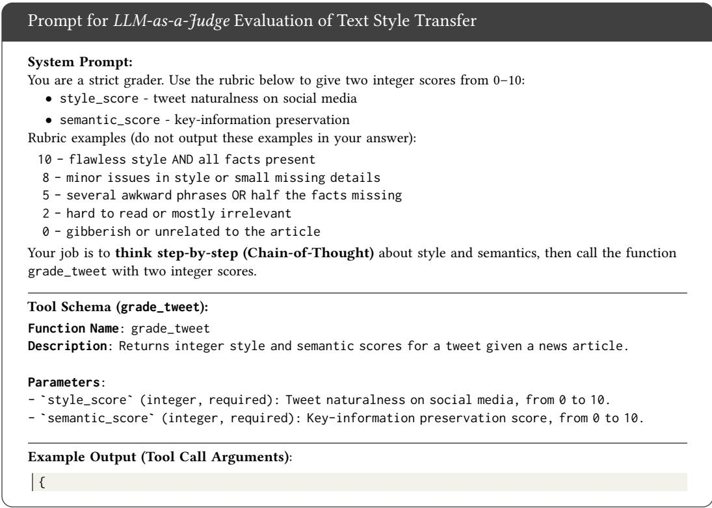

" style\_score ": 9,

" semantic\_score ": 10

## In<sub>p</sub>ut Format:

News article:

<ARTICLE>

[Original News Article Text Here]

</ARTICLE>

Generated tweet:

<TWEET>

[Style-Transferred Tweet Text Here]

</TWEET>

St<sub>ar</sub>t <sub>o</sub>f R<sub>esponse:</sub> Th<sub>e</sub> <sub>mo</sub>d<sub>e</sub>l <sub>s</sub>h<sub>ou</sub>ld fi<sub>rs</sub>t <sub>prov</sub>id<sub>e</sub> it<sub>s</sub> Ch<sub>a</sub>i<sub>n-o</sub>f<sub>-</sub>Th<sub>oug</sub>ht <sub>reason</sub>i<sub>ng,</sub> th<sub>en</sub> <sub>ou</sub>t<sub>pu</sub>t th<sub>e</sub> t<sub>oo</sub>l <sub>ca</sub>ll<sub>.</sub>

The final response must include the call to the grade\_tweet function.

## A.4 UDA Complexity Analysis

T<sub>o prov</sub>id<sub>e a compre</sub>h<sub>ens</sub>i<sub>ve un</sub>d<sub>ers</sub>t<sub>an</sub>di<sub>ng o</sub>f th<sub>e compu</sub>t<sub>a</sub>ti<sub>ona</sub>l <sub>over</sub>h<sub>ea</sub>d <sub>assoc</sub>i<sub>a</sub>t<sub>e</sub>d <sub>w</sub>ith <sub>our</sub> UDA module, we <sub>p</sub>resent a detailed com<sub>p</sub>lexit<sub>y</sub> anal<sub>y</sub>sis of the Maximum Mean Discre<sub>p</sub>anc<sub>y</sub> (MMD) and Kullback-Leibler (KL) diver<sub>g</sub>ence methods. This anal<sub>y</sub>sis examines theoretical time com<sub>p</sub>lexit<sub>y</sub>, floatin<sub>g</sub>-<sub>p</sub>oint o<sub>p</sub>erations (FLOPs), and <sub>p</sub>ractical characteristics ofGPU im<sub>p</sub>lementations. We assume t<sub>wo se</sub>t<sub>s o</sub>f <sub>em</sub>b<sub>e</sub>ddi<sub>ngs,</sub> $E _ { X }$ <sub>an</sub>d $E _ { Y }$ <sub>,</sub> each containin<sub>g</sub> � sam<sub>p</sub>les of dimension $D ,$ corres<sub>p</sub>on<sup>di</sup>n<sub>g</sub> to <sub>a</sub> b<sub>a</sub>t<sub>c</sub>h f<sub>rom</sub> th<sub>e source an</sub>d t<sub>arge</sub>t d<sub>oma</sub>i<sub>ns, respec</sub>ti<sub>ve</sub>l<sub>y.</sub>

Maximum Mean Discrepancy (MMD). The computational core of the MMD loss is the constructi<sub>on o</sub>f th<sub>ree</sub> k<sub>erne</sub>l <sub>ma</sub>t<sub>r</sub>i<sub>ces,</sub> $K _ { X X } , K _ { Y Y }$ <sub>an</sub>d $K _ { X Y }$ <sub>,</sub> <sub>eac</sub>h <sub>o</sub>f <sub>s</sub>i<sub>ze</sub> $N \times N$

Ti<sub>me</sub> C<sub>om</sub> l<sub>ex</sub>it <sub>.</sub> Th<sub>e ca</sub>l<sub>cu</sub>l<sub>a</sub>ti<sub>on</sub> i<sub>s</sub> d<sub>om</sub>i<sub>na</sub>t<sub>e</sub>d b th<sub>e a</sub>i<sub>rw</sub>i<sub>se eva</sub>l<sub>ua</sub>ti<sub>on o</sub>f th<sub>e</sub> k<sub>erne</sub>l f<sub>unc</sub>ti<sub>on.</sub> For the Gaussian RBF kernel<sub>,</sub> com<sub>p</sub>utin<sub>g</sub> the s<sub>q</sub>uared Euclidean distance $\| x - y \| ^ { 2 }$ b<sub>e</sub>t<sub>ween</sub> t<sub>wo</sub> �-dim<sub>e</sub>n<sub>s</sub>i<sub>o</sub>n<sub>a</sub>l <sub>vec</sub>t<sub>o</sub>r<sub>s</sub> r<sub>equ</sub>ir<sub>es</sub> $O ( D )$ <sub>opera</sub>ti<sub>ons.</sub> Si<sub>nce</sub> thi<sub>s mus</sub>t b<sub>e</sub> d<sub>one</sub> f<sub>or a</sub>ll $N \times N$ <sub>p</sub>a<sup>i</sup>rs to construct each kernel matrix<sub>,</sub> the com<sub>p</sub>lexit<sub>y</sub> of formin<sub>g</sub> one matrix is $O ( N ^ { 2 } D )$ <sub>.</sub> Th<sub>e</sub> fi<sub>na</sub>l <sub>summa</sub>ti<sub>on</sub> <sub>over</sub> th<sub>e</sub> k<sub>erne</sub>l <sub>ma</sub>t<sub>r</sub>i<sub>ces</sub> i<sub>s</sub> $O ( N ^ { 2 } )$ <sub>.</sub> Th<sub>ere</sub>f<sub>ore,</sub> th<sub>e overa</sub>ll ti<sub>me comp</sub>l<sub>ex</sub>it<sub>y</sub> i<sub>s</sub> d<sub>om</sub>i<sub>na</sub>t<sub>e</sub>d b<sub>y</sub> k<sub>erne</sub>l matrix com<sub>p</sub>utation<sub>,</sub> <sub>y</sub>ieldin<sub>g</sub> $O ( N ^ { 2 } D )$

Floating-Point Operations (FLOPs). We can estimate the FLOPs for the RBF kernel. The cal-<sub>cu</sub>l<sub>a</sub>ti<sub>on o</sub>f $\| x - y \| ^ { 2 }$ involves a<sub>pp</sub>roximatel<sub>y</sub> 3� FLOPs (� subtractions, � multi<sub>p</sub>lications, $D - 1$ additions). Constructin<sub>g</sub> the three $N { \times } N$ k<sub>erne</sub>l <sub>ma</sub>t<sub>r</sub>i<sub>ces</sub> th<sub>us</sub> <sub>requ</sub>i<sub>res</sub> <sub>roug</sub>hl<sub>y</sub> $3 \times N ^ { 2 } \times 3 D = 9 N ^ { 2 } D$ FLOPs. This <sub>q</sub>uadratic de<sub>p</sub>endence on � makes MMD com<sub>p</sub>utationall<sub>y</sub> demandin<sub>g</sub>.

GPU Latenc<sub>y</sub> and Bottlenecks. On GPU <sub>a</sub>r<sub>c</sub>hit<sub>ec</sub>t<sub>u</sub>r<sub>es,</sub> th<sub>e pa</sub>ir<sub>w</sub>i<sub>se</sub> di<sub>s</sub>t<sub>a</sub>n<sub>ce ca</sub>l<sub>cu</sub>l<sub>a</sub>ti<sub>o</sub>n<sub>s ca</sub>n be eficientl<sub>y</sub> ma<sub>pp</sub>ed to hi<sub>g</sub>hl<sub>y</sub> o<sub>p</sub>timized Generalized Matrix-Matrix Multi<sub>p</sub>lication (GEMM) o<sub>p</sub>erations. Ho<sub>w</sub>e<sub>v</sub>er<sub>,</sub> the $O ( N ^ { 2 } D )$ <sub>comp</sub>l<sub>ex</sub>it<sub>y</sub> <sub>ma</sub>k<sub>es</sub> th<sub>e</sub> <sub>a</sub>l<sub>gor</sub>ith<sub>m</sub> f<sub>un</sub>d<sub>amen</sub>t<sub>a</sub>ll<sub>y</sub> <sub>compu</sub>t<sub>e-</sub>b<sub>oun</sub>d<sub>.</sub> Latenc<sub>y g</sub>rows <sub>q</sub>uadraticall<sub>y</sub> with the batch size �<sub>,</sub> which ra<sub>p</sub>idl<sub>y</sub> becomes the <sub>p</sub>rimar<sub>y p</sub>erformance b<sub>o</sub>ttl<sub>enec</sub>k<sub>.</sub> F<sub>ur</sub>th<sub>ermore,</sub> <sub>s</sub>t<sub>or</sub>i<sub>ng</sub> th<sub>e</sub> i<sub>n</sub>t<sub>erme</sub>di<sub>a</sub>t<sub>e</sub> k<sub>erne</sub>l <sub>ma</sub>t<sub>r</sub>i<sub>ces</sub> <sub>requ</sub>i<sub>res</sub> $O ( N ^ { 2 } )$ <sub>memory,</sub> <sub>w</sub>hi<sub>c</sub>h <sub>ca</sub>n <sub>e</sub>xh<sub>aus</sub>t th<sub>e</sub> GPU’<sub>s</sub> VRAM f<sub>o</sub>r l<sub>a</sub>r<sub>ge</sub> $N \left( { \mathrm { e . g . , } } N > 4 0 9 6 \right)$ <sub>,</sub> thereb<sub>y</sub> im<sub>p</sub>osin<sub>g</sub> a <sub>p</sub>ractical limit on th<sub>e</sub> b<sub>a</sub>t<sub>c</sub>h <sub>s</sub>i<sub>ze.</sub>

Kullback-Leibler (KL) Divergence. The KL divergence loss is computed element-wise on the distribution-like outputs � and �, which are tensors of shape $( N , D )$

Time Com<sub>p</sub>lexit<sub>y</sub>. The com<sub>pu</sub>tation involves element-wise division<sub>,</sub> lo<sub>g</sub>arithm<sub>,</sub> and m<sub>u</sub>lti<sub>p</sub>lication across two $( N , D )$ t<sub>ensors,</sub> f<sub>o</sub>ll<sub>owe</sub>d b<sub>y</sub> <sub>a</sub> <sub>summa</sub>ti<sub>on.</sub> E<sub>ac</sub>h <sub>o</sub>f th<sub>ese</sub> <sub>e</sub>l<sub>emen</sub>t<sub>-w</sub>i<sub>se</sub> <sub>opera</sub>ti<sub>ons</sub> h<sub>as</sub> a time com<sub>p</sub>lexit<sub>y</sub> <sub>p</sub>ro<sub>p</sub>ortional to the number of elements. Thus<sub>,</sub> the overall time com<sub>p</sub>lexit<sub>y</sub> is linear with res<sub>p</sub>ect to both � and �, resultin<sub>g</sub> in �(��).

Floating-Point Operations (FLOPs). The se<sub>q</sub>uence of o<sub>p</sub>erations (division, logarithm, multi<sub>p</sub>lication, and summation) results in a<sub>pp</sub>roximatel<sub>y</sub> 4�� FLOPs. This is substantiall<sub>y</sub> lower than MMD’s <sub>q</sub>uadratic com<sub>p</sub>lexit<sub>y</sub>.

GPU L<sub>a</sub>t<sub>enc an</sub>d B<sub>o</sub>ttl<sub>enec</sub>k<sub>s.</sub> Th<sub>e e</sub>l<sub>emen</sub>t<sub>-w</sub>i<sub>se na</sub>t<sub>ure o</sub>f th<sub>e</sub> KL di<sub>ver ence ca</sub>l<sub>cu</sub>l<sub>a</sub>ti<sub>on ma</sub>k<sub>es</sub> it <sub>an</sub> “<sub>em</sub>b<sub>arrass</sub>i<sub>ng</sub>l<sub>y para</sub>ll<sub>e</sub>l” <sub>pro</sub>bl<sub>em,</sub> id<sub>ea</sub>ll<sub>y su</sub>it<sub>e</sub>d f<sub>or</sub> GPU <sub>execu</sub>ti<sub>on.</sub> Th<sub>e opera</sub>ti<sub>ons ex</sub>hibit hi<sub>g</sub>h data <sub>p</sub>arallelism and low com<sub>p</sub>utational intensit<sub>y</sub>. Conse<sub>q</sub>uentl<sub>y,</sub> the al<sub>g</sub>orithm is t<sub>yp</sub>icall<sub>y</sub> memor<sub>y</sub>-bo<sub>u</sub>nd<sub>;</sub> its latenc<sub>y</sub> is limited not b<sub>y</sub> the s<sub>p</sub>eed of com<sub>pu</sub>tation b<sub>u</sub>t b<sub>y</sub> the GPU’s memor<sub>y</sub> b<sub>an</sub>d<sub>w</sub>idth f<sub>or rea</sub>di<sub>ng</sub> th<sub>e</sub> i<sub>npu</sub>t t<sub>ensors</sub> � <sub>an</sub>d $Q .$ Th<sub>e overa</sub>ll l<sub>a</sub>t<sub>ency</sub> i<sub>s m</sub>i<sub>n</sub>i<sub>ma</sub>l <sub>an</sub>d <sub>sca</sub>l<sub>es</sub> li<sub>near</sub>l<sub>y</sub> <sub>w</sub>ith th<sub>e</sub> t<sub>o</sub>t<sub>a</sub>l <sub>num</sub>b<sub>er o</sub>f <sub>e</sub>l<sub>emen</sub>t<sub>s,</sub> $N \times D$

Summary and Implications. The choice between MMD and KL divergence for domain adaptation introd<sub>u</sub>ces a critical trade-of in com<sub>pu</sub>tational eficienc<sub>y</sub>. Table 5 s<sub>u</sub>mmarizes the com<sub>pu</sub>tational <sub>c</sub>h<sub>arac</sub>t<sub>er</sub>i<sub>s</sub>ti<sub>cs o</sub>f <sub>eac</sub>h <sub>me</sub>th<sub>o</sub>d<sub>.</sub>

In <sub>p</sub>ractice, the <sub>q</sub>uadratic com<sub>p</sub>lexit<sub>y</sub> of MMD restricts its a<sub>pp</sub>lication to smaller batch sizes (�), whereas KL diver<sub>g</sub>ence remains eficient even for lar<sub>g</sub>e-batch trainin<sub>g</sub>. This com<sub>p</sub>utational diference necessitates careful mana<sub>g</sub>ement of batch sizes when usin<sub>g</sub> MMD to maintain feasible trainin<sub>g</sub> ti<sub>mes, w</sub>hil<sub>e</sub> KL di<sub>vergence o</sub>f<sub>ers a more sca</sub>l<sub>a</sub>bl<sub>e a</sub>lt<sub>erna</sub>ti<sub>ve</sub> f<sub>rom a compu</sub>t<sub>a</sub>ti<sub>ona</sub>l <sub>s</sub>t<sub>an</sub>d<sub>po</sub>i<sub>n</sub>t<sub>.</sub>

Table 5. Computational complexity comparison of UDA methods.
<table><tr><td>Metric</td><td></td><td>Time Complexity FLOPs (Approx.) GPU Bottleneck</td><td></td></tr><tr><td>MMD</td><td> $O ( N ^ { 2 } D )$ </td><td> $9 N ^ { 2 } D$ </td><td>Compute-Bound</td></tr><tr><td>KL Divergence</td><td> $O ( N D )$ </td><td>4ND</td><td>Memory-Bound</td></tr></table>

Table 6. Unified performance analysis of the Qwen2.5 model family (Part 1: 0.5B, 3B, 7B). All models are evaluated from 0-shot to 200-shot setings.
<table><tr><td></td><td colspan="3">Classification (F1 ↑)</td><td colspan="2">Political Class Detail ↑</td><td colspan="2">Regression Error ↓</td></tr><tr><td>Model / Setting Non-political</td><td></td><td></td><td>Political Macro Avg.</td><td>Precision</td><td>Recall</td><td>MAE</td><td>RMSE</td></tr><tr><td colspan="8">Few-Shot for Qwen2.5-0.5B-Instruct</td></tr><tr><td>0-shot</td><td>0.510 ± 0.022</td><td> $0 . 7 2 7 \pm 0 . 0 0 7$ </td><td> $0 . 6 1 8 \pm 0 . 0 1 4$ </td><td> $0 . 6 0 1 \pm 0 . 0 0 7$ </td><td> $0 . 9 1 8 \pm 0 . 0 0 6$ </td><td>0.413± 0.007</td><td> $0 . 4 7 8 \pm 0 . 0 0 5$ </td></tr><tr><td>2-shot</td><td> $0 . 5 6 8 \pm 0 . 1 3 2$ </td><td> $0 . 7 1 7 \pm 0 . 0 3 5$ </td><td> $0 . 6 4 3 \pm 0 . 0 8 2$ </td><td> $0 . 6 2 9 \pm 0 . 0 9 4$ </td><td> $0 . 8 5 5 \pm 0 . 0 6 1$ </td><td>0.297 ± 0.055</td><td> $0 . 3 6 4 \pm 0 . 0 5 4$ </td></tr><tr><td>4-shot</td><td> $0 . 6 0 7 \pm 0 . 1 3 2$ </td><td> $0 . 7 5 1 \pm 0 . 0 5 1$ </td><td> $0 . 6 7 9 \pm 0 . 0 8 9$ </td><td> $0 . 6 6 2 \pm 0 . 1 2 6$ </td><td> $0 . 9 0 1 \pm 0 . 0 8 8$ </td><td> $0 . 3 3 0 \pm 0 . 0 3 1$ </td><td> $0 . 3 9 5 { \scriptstyle \pm 0 . 0 3 8 }$ </td></tr><tr><td>6-shot</td><td> $0 . 5 7 7 \pm 0 . 0 9 8$ </td><td> $0 . 7 5 0 \pm 0 . 0 3 2$ </td><td> $0 . 6 6 4 \pm 0 . 0 6 2$ </td><td> $0 . 6 2 2 \pm 0 . 0 4 0$ </td><td> $0 . 9 5 1 \pm 0 . 0 5 2$ </td><td> $0 . 3 0 5 \pm 0 . 0 1 6$ </td><td> $0 . 3 6 7 \pm 0 . 0 1 8$ </td></tr><tr><td>8-shot</td><td> $0 . 5 2 5 \pm 0 . 2 3 3$ </td><td> $0 . 7 5 3 \pm 0 . 0 5 8$ </td><td> $0 . 6 3 9 \pm 0 . 1 4 3$ </td><td> $0 . 6 2 8 \pm 0 . 0 8 8$ </td><td> $0 . 9 6 0 \pm 0 . 0 6 7$ </td><td> $0 . 2 5 7 \pm 0 . 0 2 4$ </td><td> $0 . 3 1 7 \pm 0 . 0 3 2$ </td></tr><tr><td>10-shot</td><td> $0 . 6 1 9 \pm 0 . 0 9 9$ </td><td> $0 . 7 7 3 \pm 0 . 0 2 3$ </td><td> $0 . 6 9 6 \pm 0 . 0 6 1$ </td><td> $0 . 6 4 7 \pm 0 . 0 5 3$ </td><td> $0 . 9 7 0 \pm 0 . 0 4 6$ </td><td> $0 . 2 8 7 \pm 0 . 0 5 6$ </td><td> $0 . 3 4 9 \pm 0 . 0 6 2$ </td></tr><tr><td>20-shot</td><td> $0 . 8 2 4 \pm 0 . 0 9 0$ </td><td> $0 . 8 6 7 \pm 0 . 0 4 6$ </td><td> $0 . 8 4 5 \pm 0 . 0 6 8$ </td><td> $0 . 7 9 7 \pm 0 . 0 9 7$ </td><td> $0 . 9 6 4 \pm 0 . 0 3 8$ </td><td> $0 . 2 8 5 \pm 0 . 0 1 9$ </td><td> $0 . 3 5 7 { \scriptstyle \pm 0 . 0 1 5 }$ </td></tr><tr><td>50-shot</td><td> $0 . 8 9 6 \pm 0 . 0 6 3$ </td><td> $0 . 9 1 6 \pm 0 . 0 4 3$ </td><td> $0 . 9 0 6 \pm 0 . 0 5 3$ </td><td> $0 . 8 4 9 \pm 0 . 0 7 4$ </td><td> $0 . 9 9 9 \pm 0 . 0 0 1$ </td><td> $0 . 2 8 2 \pm 0 . 0 2 7$ </td><td> $0 . 3 5 2 \pm 0 . 0 2 7$ </td></tr><tr><td>100-shot</td><td>0.988±0.007</td><td> $0 . 9 8 8 \pm 0 . 0 0 6$ </td><td> $0 . 9 8 8 \pm 0 . 0 0 6$ </td><td> $0 . 9 8 0 \pm 0 . 0 1 6$ </td><td> $0 . 9 9 6 \pm 0 . 0 0 6$ </td><td> $0 . 2 7 4 \pm 0 . 0 1 8$ </td><td> $0 . 3 3 8 \pm 0 . 0 1 7$ </td></tr><tr><td>200-shot</td><td> $0 . 9 8 8 \pm 0 . 0 0 9$ </td><td> $0 . 9 8 8 \pm 0 . 0 0 8$ </td><td> $0 . 9 8 8 \pm 0 . 0 0 9$ </td><td> $0 . 9 7 8 \pm 0 . 0 1 8$ </td><td> $0 . 9 9 8 \pm 0 . 0 0 3$ </td><td> $0 . 2 4 5 \pm 0 . 0 2 3$ </td><td> $0 . 3 0 9 \pm 0 . 0 2 7$ </td></tr></table>

<table><tr><td colspan="8">Few-Shot for Qwen2.5-3B-Instruct</td></tr><tr><td>0-shot</td><td>0.946±0.003 0.943±0.003</td><td></td><td> $0 . 9 4 5 \pm 0 . 0 0 3$ </td><td> $0 . 9 4 5 \pm 0 . 0 0 8$ </td><td>0.942 ± 0.006</td><td></td><td>0.283±0.005 0.333± 0.005</td></tr><tr><td>2-shot</td><td>0.977 ± 0.004</td><td> $0 . 9 7 6 \pm 0 . 0 0 5$ </td><td> $0 . 9 7 7 \pm 0 . 0 0 5$ </td><td>0.987 ± 0.005</td><td>0.965 ± 0.012</td><td>0.258±0.016</td><td> $0 . 2 9 9 \pm 0 . 0 2 1$ </td></tr><tr><td>4-shot</td><td>0.970 ± 0.015</td><td> $0 . 9 6 8 \pm 0 . 0 1 8$ </td><td> $0 . 9 6 9 \pm 0 . 0 1 6$ </td><td> $0 . 9 8 4 \pm 0 . 0 2 5$ </td><td> $0 . 9 5 4 \pm 0 . 0 4 2$ </td><td>0.271 ± 0.035</td><td> $0 . 3 2 1 \pm 0 . 0 4 6$ </td></tr><tr><td>6-shot</td><td>0.981 ± 0.012</td><td>0.979 ±0.014</td><td> $0 . 9 8 0 \pm 0 . 0 1 3$ </td><td>0.994 ±0.006</td><td>0.966 ± 0.027</td><td>0.260 ± 0.021</td><td>0.312± 0.029</td></tr><tr><td>8-shot</td><td>0.984±0.008</td><td> $0 . 9 8 2 \pm 0 . 0 1 0$ </td><td> $0 . 9 8 3 \pm 0 . 0 0 9$ </td><td> $0 . 9 9 3 \pm 0 . 0 0 4$ </td><td> $0 . 9 7 2 \pm 0 . 0 2 2$ </td><td>0.275±0.024</td><td> $0 . 3 3 5 \pm 0 . 0 3 2$ </td></tr><tr><td>10-shot</td><td>0.980±0.014</td><td> $0 . 9 7 8 \pm 0 . 0 1 6$ </td><td> $0 . 9 7 9 { \scriptstyle \pm 0 . 0 1 5 }$ </td><td> $0 . 9 9 7 \pm 0 . 0 0 3$ </td><td> $0 . 9 6 1 \pm 0 . 0 3 2$ </td><td>0.268±0.030</td><td> $0 . 3 3 1 \pm 0 . 0 3 8$ </td></tr><tr><td>20-shot</td><td>0.987 ± 0.002</td><td> $0 . 9 8 6 \pm 0 . 0 0 2$ </td><td> $0 . 9 8 6 \pm 0 . 0 0 2$ </td><td> $0 . 9 9 8 \pm 0 . 0 0 3$ </td><td> $0 . 9 7 4 \pm 0 . 0 0 4$ </td><td>0.260±0.028</td><td> $0 . 3 2 5 \pm 0 . 0 3 6$ </td></tr><tr><td>50-shot</td><td>0.985 ± 0.007</td><td> $0 . 9 8 3 \pm 0 . 0 0 9$ </td><td> $0 . 9 8 4 \pm 0 . 0 0 8$ </td><td> $1 . 0 0 0 \pm 0 . 0 0 0$ </td><td> $0 . 9 6 7 \pm 0 . 0 1 8$ </td><td> $0 . 2 9 1 \pm 0 . 0 3 4$ </td><td> $0 . 3 6 8 \pm 0 . 0 3 2$ </td></tr><tr><td>100-shot</td><td>0.978± 0.005</td><td> $0 . 9 7 2 \pm 0 . 0 0 9$ </td><td> $0 . 9 7 5 \pm 0 . 0 0 6$ </td><td> $1 . 0 0 0 \pm 0 . 0 0 0$ </td><td> $0 . 9 4 7 \pm 0 . 0 1 7$ </td><td>0.283 ± 0.025</td><td> $0 . 3 6 7 \pm 0 . 0 2 9$ </td></tr><tr><td>200-shot</td><td>0.992 ± 0.002</td><td> $0 . 9 8 9 \pm 0 . 0 0 3$ </td><td> $0 . 9 9 0 \pm 0 . 0 0 2$ </td><td> $0 . 9 9 8 \pm 0 . 0 0 2$ </td><td> $0 . 9 8 0 \pm 0 . 0 0 6$ </td><td>0.273 ± 0.015</td><td> $0 . 3 5 3 \pm 0 . 0 1 4$ </td></tr></table>

<table><tr><td colspan="8">Few-Shot for Qwen2.5-7B-Instruct</td></tr><tr><td>0-shot</td><td>0.927 ± 0.002</td><td> $0 . 9 0 5 \pm 0 . 0 0 3$ </td><td> $0 . 9 1 6 \pm 0 . 0 0 2$ </td><td> $0 . 9 9 2 \pm 0 . 0 0 3$ </td><td></td><td>0.833±0.004 0.238±0.004 0.288±0.005</td><td></td></tr><tr><td>2-shot</td><td> $0 . 9 3 6 \pm 0 . 0 2 1$ </td><td> $0 . 9 2 8 \pm 0 . 0 2 6$ </td><td> $0 . 9 3 2 \pm 0 . 0 2 4$ </td><td> $0 . 9 8 6 \pm 0 . 0 0 5$ </td><td> $0 . 8 7 9 \pm 0 . 0 4 9$ </td><td>0.242 ± 0.005</td><td> $0 . 2 9 2 \pm 0 . 0 0 7$ </td></tr><tr><td>4-shot</td><td> $0 . 9 2 0 \pm 0 . 0 3 2$ </td><td> $0 . 9 0 5 \pm 0 . 0 4 4$ </td><td> $0 . 9 1 2 \pm 0 . 0 3 8$ </td><td> $0 . 9 8 6 \pm 0 . 0 0 6$ </td><td> $0 . 8 4 0 \pm 0 . 0 7 9$ </td><td>0.230 ± 0.007</td><td> $0 . 2 8 2 \pm 0 . 0 1 2$ </td></tr><tr><td>6-shot</td><td>0.918 ±0.024</td><td> $0 . 9 0 3 \pm 0 . 0 3 5$ </td><td> $0 . 9 1 1 \pm 0 . 0 3 0$ </td><td> $0 . 9 8 7 \pm 0 . 0 0 8$ </td><td> $0 . 8 3 5 \pm 0 . 0 6 3$ </td><td>0.243 ± 0.007</td><td> $0 . 3 0 1 \pm 0 . 0 0 7$ </td></tr><tr><td>8-shot</td><td> $0 . 9 0 6 \pm 0 . 0 2 4$ </td><td> $0 . 8 8 6 \pm 0 . 0 3 5$ </td><td> $0 . 8 9 6 \pm 0 . 0 2 9$ </td><td> $0 . 9 9 0 \pm 0 . 0 0 7$ </td><td> $0 . 8 0 4 \pm 0 . 0 6 1$ </td><td>0.246 ± 0.007</td><td> $0 . 3 0 5 \pm 0 . 0 1 1$ </td></tr><tr><td>10-shot</td><td>0.898± 0.019</td><td> $0 . 8 7 4 \pm 0 . 0 2 8$ </td><td> $0 . 8 8 6 \pm 0 . 0 2 4$ </td><td> $0 . 9 9 5 \pm 0 . 0 0 2$ </td><td> $0 . 7 8 1 \pm 0 . 0 4 7$ </td><td>0.236 ± 0.012</td><td> $0 . 2 9 1 \pm 0 . 0 1 5$ </td></tr><tr><td>20-shot</td><td> $0 . 9 2 3 \pm 0 . 0 3 1$ </td><td>0.908±0.043</td><td> $0 . 9 1 6 \pm 0 . 0 3 7$ </td><td> $0 . 9 9 5 \pm 0 . 0 0 2$ </td><td> $0 . 8 3 8 \pm 0 . 0 7 4$ </td><td> $0 . 2 4 4 \pm 0 . 0 1 6$ </td><td> $0 . 3 0 6 \pm 0 . 0 1 9$ </td></tr><tr><td>50-shot</td><td>0.961 ± 0.014</td><td> $0 . 9 5 8 \pm 0 . 0 1 5$ </td><td> $0 . 9 6 0 \pm 0 . 0 1 4$ </td><td> $0 . 9 9 6 \pm 0 . 0 0 3$ </td><td> $0 . 9 2 4 \pm 0 . 0 3 1$ </td><td>0.241 ± 0.018</td><td> $0 . 3 0 4 \pm 0 . 0 2 0$ </td></tr><tr><td>100-shot</td><td>0.964±0.008 0.962±0.009</td><td></td><td> $0 . 9 6 3 \pm 0 . 0 0 9$ </td><td> $0 . 9 9 8 \pm 0 . 0 0 0$ </td><td> $0 . 9 2 9 \pm 0 . 0 1 7$ </td><td>0.237 ± 0.010</td><td> $0 . 3 0 7 \pm 0 . 0 1 2$ </td></tr><tr><td>200-shot</td><td>0.974± 0.008</td><td> $0 . 9 7 3 \pm 0 . 0 0 8$ </td><td> $0 . 9 7 3 \pm 0 . 0 0 8$ </td><td> $0 . 9 9 8 \pm 0 . 0 0 2$ </td><td> $0 . 9 5 0 \pm 0 . 0 1 7$ </td><td>0.243 ± 0.012</td><td> $0 . 3 1 5 \pm 0 . 0 1 8$ </td></tr></table>

Table 7. Unified performance analysis of the Qwen2.5 model family (Part 2: 14B, 32B, 72B). All models are evaluated from 0-shot to 200-shot setings.
<table><tr><td></td><td colspan="3">Classification (F1 ↑)</td><td colspan="2">Political Class Detail ↑</td><td colspan="2">Regression Error ↓</td></tr><tr><td>Model / Setting Non-political</td><td></td><td></td><td>Political Macro Avg.</td><td>Precision</td><td>Recall</td><td>MAE</td><td>RMSE</td></tr><tr><td colspan="6">Few-Shot for Qwen2.5-14B-Instruct</td><td colspan="2"></td></tr><tr><td>0-shot</td><td>0.918±0.003</td><td> $0 . 9 0 0 \pm 0 . 0 0 4$ </td><td> $0 . 9 0 9 \pm 0 . 0 0 3$ </td><td> $0 . 9 8 6 \pm 0 . 0 0 1$ </td><td> $0 . 8 2 7 \pm 0 . 0 0 6$ </td><td>0.227 ± 0.004</td><td> $0 . 2 8 5 \pm 0 . 0 0 3$ </td></tr><tr><td>2-shot</td><td>0.949± 0.022</td><td> $0 . 9 4 1 \pm 0 . 0 2 9$ </td><td> $0 . 9 4 5 \pm 0 . 0 2 6$ </td><td> $0 . 9 9 2 \pm 0 . 0 0 3$ </td><td> $0 . 8 9 6 \pm 0 . 0 5 4$ </td><td> $0 . 2 1 9 \pm 0 . 0 0 7$ </td><td> $0 . 2 7 3 \pm 0 . 0 1 1$ </td></tr><tr><td>4-shot</td><td> $0 . 9 5 5 \pm 0 . 0 0 9$ </td><td> $0 . 9 4 9 \pm 0 . 0 1 1$ </td><td> $0 . 9 5 2 \pm 0 . 0 1 0$ </td><td> $0 . 9 9 4 \pm 0 . 0 0 1$ </td><td> $0 . 9 0 8 \pm 0 . 0 2 1$ </td><td> $0 . 2 1 6 \pm 0 . 0 0 2$ </td><td> $0 . 2 7 1 \pm 0 . 0 0 7$ </td></tr><tr><td>6-shot</td><td>0.963 ± 0.014</td><td> $0 . 9 5 9 \pm 0 . 0 1 7$ </td><td> $0 . 9 6 1 \pm 0 . 0 1 6$ </td><td> $0 . 9 9 1 \pm 0 . 0 0 4$ </td><td> $0 . 9 2 9 \pm 0 . 0 3 4$ </td><td> $0 . 2 3 5 \pm 0 . 0 2 5$ </td><td> $0 . 2 9 9 \pm 0 . 0 3 2$ </td></tr><tr><td>8-shot</td><td> $0 . 9 6 1 \pm 0 . 0 1 9$ </td><td> $0 . 9 5 6 \pm 0 . 0 2 4$ </td><td> $0 . 9 5 9 \pm 0 . 0 2 2$ </td><td> $0 . 9 9 2 \pm 0 . 0 0 5$ </td><td> $0 . 9 2 4 \pm 0 . 0 4 7$ </td><td> $0 . 2 3 2 \pm 0 . 0 0 8$ </td><td> $0 . 2 9 5 \pm 0 . 0 1 4$ </td></tr><tr><td>10-shot</td><td>0.962 ± 0.015</td><td> $0 . 9 5 8 \pm 0 . 0 1 8$ </td><td> $0 . 9 6 0 \pm 0 . 0 1 7$ </td><td> $0 . 9 8 8 \pm 0 . 0 0 3$ </td><td> $0 . 9 3 0 \pm 0 . 0 3 6$ </td><td> $0 . 2 3 6 \pm 0 . 0 0 9$ </td><td> $0 . 3 0 5 \pm 0 . 0 1 3$ </td></tr><tr><td>20-shot</td><td>0.980±0.006</td><td> $0 . 9 7 8 \pm 0 . 0 0 6$ </td><td> $0 . 9 7 9 \pm 0 . 0 0 6$ </td><td> $0 . 9 9 0 \pm 0 . 0 0 2$ </td><td> $0 . 9 6 7 \pm 0 . 0 1 3$ </td><td> $0 . 2 3 5 \pm 0 . 0 1 0$ </td><td> $0 . 3 0 0 { \scriptstyle \pm 0 . 0 1 5 }$ </td></tr><tr><td>50-shot</td><td> $0 . 9 8 2 \pm 0 . 0 0 2$ </td><td> $0 . 9 8 1 \pm 0 . 0 0 2$ </td><td> $0 . 9 8 1 \pm 0 . 0 0 2$ </td><td> $0 . 9 9 1 \pm 0 . 0 0 2$ </td><td> $0 . 9 7 1 \pm 0 . 0 0 5$ </td><td> $0 . 2 3 9 \pm 0 . 0 0 6$ </td><td> $0 . 3 0 9 \pm 0 . 0 1 1$ </td></tr><tr><td>100-shot</td><td> $0 . 9 6 8 \pm 0 . 0 0 7$ </td><td> $0 . 9 6 5 \pm 0 . 0 0 8$ </td><td> $0 . 9 6 6 \pm 0 . 0 0 8$ </td><td> $0 . 9 8 8 \pm 0 . 0 0 4$ </td><td> $0 . 9 4 3 \pm 0 . 0 1 5$ </td><td> $0 . 2 4 1 \pm 0 . 0 0 7$ </td><td> $0 . 3 1 1 \pm 0 . 0 0 6$ </td></tr><tr><td>200-shot</td><td> $0 . 9 7 9 \pm 0 . 0 0 4$ </td><td> $0 . 9 7 9 \pm 0 . 0 0 5$ </td><td> $0 . 9 7 9 \pm 0 . 0 0 4$ </td><td> $0 . 9 9 5 \pm 0 . 0 0 1$ </td><td> $0 . 9 6 3 \pm 0 . 0 0 9$ </td><td> $0 . 2 2 3 \pm 0 . 0 0 4$ </td><td> $0 . 3 0 1 \pm 0 . 0 0 4$ </td></tr></table>

<table><tr><td colspan="8">Few-Shot for Qwen2.5-32B-Instruct</td></tr><tr><td>0-shot</td><td>0.946 ± 0.001</td><td>0.937 ± 0.002</td><td>0.942 ± 0.002</td><td>0.991 ± 0.001</td><td>0.889 ± 0.004</td><td>0.225 ± 0.002</td><td>0.283 ± 0.001</td></tr><tr><td>2-shot</td><td>0.956 ± 0.008</td><td>0.955 ± 0.009</td><td>0.956 ± 0.008</td><td>0.993 ± 0.002</td><td>0.921 ± 0.017</td><td>0.206 ± 0.009</td><td>0.263±0.012</td></tr><tr><td>4-shot</td><td>0.962±0.008</td><td>0.962± 0.008</td><td> $0 . 9 6 2 \pm 0 . 0 0 8$ </td><td>0.994 ± 0.001</td><td>0.933 ± 0.015</td><td>0.214± 0.005</td><td>0.275 ± 0.006</td></tr><tr><td>6-shot</td><td>0.968±0.005</td><td>0.969±0.005</td><td>0.968±0.005</td><td>0.992 ± 0.003</td><td>0.946 ± 0.011</td><td>0.212 ± 0.005</td><td>0.272 ±0.008</td></tr><tr><td>8-shot</td><td>0.976 ± 0.006</td><td> $0 . 9 7 7 \pm 0 . 0 0 6$ </td><td> $0 . 9 7 6 \pm 0 . 0 0 6$ </td><td>0.995 ± 0.002</td><td> $0 . 9 5 9 \pm 0 . 0 1 0$ </td><td>0.210±0.007</td><td>0.272 ± 0.011</td></tr><tr><td>10-shot</td><td>0.973 ± 0.009</td><td>0.974±0.010</td><td> $0 . 9 7 3 \pm 0 . 0 0 9$ </td><td> $0 . 9 9 4 \pm 0 . 0 0 1$ </td><td>0.954±0.018</td><td>0.207 ± 0.006</td><td>0.270 ± 0.010</td></tr><tr><td>20-shot</td><td>0.980 ± 0.004</td><td> $0 . 9 8 0 \pm 0 . 0 0 4$ </td><td> $0 . 9 8 0 \pm 0 . 0 0 4$ </td><td>0.993 ± 0.002</td><td>0.968 ± 0.009</td><td>0.219±0.011</td><td>0.284±0.016</td></tr><tr><td>50-shot</td><td>0.989±0.002</td><td> $0 . 9 8 9 \pm 0 . 0 0 2$ </td><td> $0 . 9 8 9 \pm 0 . 0 0 2$ </td><td> $0 . 9 9 5 \pm 0 . 0 0 2$ </td><td> $0 . 9 8 4 \pm 0 . 0 0 4$ </td><td>0.218±0.007</td><td> $0 . 2 8 5 \pm 0 . 0 0 8$ </td></tr><tr><td>100-shot</td><td>0.990± 0.001</td><td> $0 . 9 9 0 \pm 0 . 0 0 1$ </td><td> $0 . 9 9 0 \pm 0 . 0 0 1$ </td><td>0.996 ± 0.001</td><td> $0 . 9 8 5 \pm 0 . 0 0 2$ </td><td>0.225 ± 0.007</td><td> $0 . 2 9 6 \pm 0 . 0 0 7$ </td></tr><tr><td>200-shot</td><td>0.992 ±0.002</td><td> $0 . 9 9 3 \pm 0 . 0 0 2$ </td><td> $0 . 9 9 2 \pm 0 . 0 0 2$ </td><td> $0 . 9 9 6 \pm 0 . 0 0 1$ </td><td> $0 . 9 9 0 \pm 0 . 0 0 3$ </td><td>0.212±0.011</td><td> $0 . 2 8 4 \pm 0 . 0 1 1$ </td></tr></table>

<table><tr><td colspan="8">Few-Shot for Qwen2.5-72B-Instruct</td></tr><tr><td>0-shot</td><td>0.955 ±0.002 0.950 ± 0.003</td><td></td><td>0.953 ± 0.002</td><td> $0 . 9 9 4 \pm 0 . 0 0 2$ </td><td></td><td></td><td>0.910±0.004 0.216±0.004 0.275±0.004</td></tr><tr><td>2-shot</td><td>0.946 ± 0.015</td><td> $0 . 9 3 5 \pm 0 . 0 2 0$ </td><td> $0 . 9 4 0 \pm 0 . 0 1 7$ </td><td> $0 . 9 9 0 \pm 0 . 0 0 3$ </td><td>0.887 ± 0.037</td><td>0.206 ± 0.004</td><td>0.265 ± 0.003</td></tr><tr><td>4-shot</td><td> $0 . 9 7 2 \pm 0 . 0 0 7$ </td><td> $0 . 9 6 9 \pm 0 . 0 0 9$ </td><td> $0 . 9 7 1 \pm 0 . 0 0 8$ </td><td> $0 . 9 8 9 \pm 0 . 0 0 3$ </td><td>0.950 ± 0.018</td><td>0.206 ± 0.009</td><td> $0 . 2 6 8 \pm 0 . 0 1 1$ </td></tr><tr><td>6-shot</td><td>0.967 ±0.012</td><td> $0 . 9 6 2 \pm 0 . 0 1 4$ </td><td> $0 . 9 6 4 \pm 0 . 0 1 3$ </td><td> $0 . 9 8 9 \pm 0 . 0 0 2$ </td><td>0.937 ± 0.029</td><td>0.212 ± 0.008</td><td>0.277 ± 0.011</td></tr><tr><td>8-shot</td><td> $0 . 9 7 2 \pm 0 . 0 1 0$ </td><td> $0 . 9 6 9 \pm 0 . 0 1 2$ </td><td> $0 . 9 7 1 \pm 0 . 0 1 1$ </td><td> $0 . 9 9 0 \pm 0 . 0 0 3$ </td><td> $0 . 9 4 9 \pm 0 . 0 2 2$ </td><td>0.225 ± 0.016</td><td> $0 . 2 9 2 \pm 0 . 0 2 2$ </td></tr><tr><td>10-shot</td><td>0.965±0.014</td><td> $0 . 9 5 9 \pm 0 . 0 1 7$ </td><td> $0 . 9 6 2 \pm 0 . 0 1 5$ </td><td> $0 . 9 9 3 \pm 0 . 0 0 2$ </td><td> $0 . 9 2 8 \pm 0 . 0 3 2$ </td><td>0.217 ± 0.018</td><td> $0 . 2 8 5 \pm 0 . 0 2 2$ </td></tr><tr><td>20-shot</td><td>0.974±0.006</td><td> $0 . 9 7 1 \pm 0 . 0 0 7$ </td><td> $0 . 9 7 2 \pm 0 . 0 0 6$ </td><td> $0 . 9 9 2 \pm 0 . 0 0 2$ </td><td> $0 . 9 5 0 \pm 0 . 0 1 5$ </td><td>0.214±0.011</td><td> $0 . 2 7 9 { \scriptstyle \pm 0 . 0 1 3 }$ </td></tr><tr><td>50-shot</td><td>0.988± 0.005</td><td> $0 . 9 8 8 \pm 0 . 0 0 6$ </td><td> $0 . 9 8 8 \pm 0 . 0 0 6$ </td><td> $0 . 9 9 1 \pm 0 . 0 0 2$ </td><td> $0 . 9 8 5 \pm 0 . 0 1 2$ </td><td>0.213 ± 0.006</td><td> $0 . 2 8 4 \pm 0 . 0 0 9$ </td></tr><tr><td>100-shot</td><td>0.987±0.003</td><td> $0 . 9 9 2 \pm 0 . 0 0 1$ </td><td> $0 . 9 8 9 \pm 0 . 0 0 2$ </td><td> $0 . 9 9 2 \pm 0 . 0 0 1$ </td><td> $0 . 9 9 3 \pm 0 . 0 0 3$ </td><td>0.220 ± 0.014</td><td> $0 . 2 9 7 \pm 0 . 0 1 6$ </td></tr><tr><td>200-shot</td><td>0.985 ± 0.003</td><td>0.993 ±0.001</td><td>0.989±0.002</td><td> $0 . 9 9 4 \pm 0 . 0 0 2$ </td><td>0.991 ± 0.002</td><td>0.212± 0.007</td><td> $0 . 2 9 0 \pm 0 . 0 0 8$ </td></tr></table>

## References

[1] Christopher H. Achen. 1975. Mass Political Attitudes and the Survey Response. Am. Political Sci. Rev. (1975).

[2] Lin Ai, Sameer Gu<sub>p</sub>ta, Shre<sub>y</sub>a Oak, Zhen<sub>g</sub> Hui, Zizhou Liu, and Julia Hirschber<sub>g</sub>. 2024. TweetIntent@Crisis: A Dataset Revealing Narratives of Both Sides in the Russia-Ukraine Crisis. In ICWSM.

[3] AllSides. 2024. AllSides Media Bias Ratin<sub>g</sub>s. htt<sub>p</sub>s://www.allsides.com/media-bias/media-bias-ratin<sub>g</sub>s. Licensed under CC BY-NC 4<sub>.</sub>0<sub>.</sub>

[4] Isabelle Au<sub>g</sub>enstein, Tim Rocktäschel, Andreas Vlachos, and Kalina Bontcheva. 2016. Stance Detection with Bidirectiona Conditional Encoding. In EMNLP.

[5] Ram<sub>y</sub> Bal<sub>y</sub>, Geor<sub>g</sub>i Karadzhov, Abdelrhman Saleh, James Glass, and Preslav Nakov. 2019. Multi-Task Ordinal Re<sub>g</sub>ression for Jointly Predicting the Trustworthiness and the Leading Political Ideology of News Media. In NAACL.

[6] Iz Beltagy, Matthew E Peters, et al. 2020. Longformer: The Long-Document Transformer. arXiv:2004.05150 (2020)

[7] Rishabh Bhardwaj, Sourav Kumar, and Vikram Pudi. 2024. CAT-Gen: A Context-Aware Teleolo<sub>gy</sub>-Guided Generative Model for Mitigating Task-Specific Bias. In FAccT.

[8] Kamel Boukhalfa, Sami Belkacem, and Omar Boussaid. 2022. Rankin<sub>g</sub> Social Media News Feeds: A Com<sub>p</sub>arative Stud<sub>y</sub> of Personalized and Non-personalized Prediction Models. In AIAP.

[9] Tom B. Brown, Benjamin Mann, Nick R der, Melanie Subbiah, Jared D. Ka lan, Prafulla Dhariwal, Arvind Neelakantan Pr<sub>a</sub>n<sub>av</sub> Sh<sub>ya</sub>m<sub>,</sub> Giri<sub>s</sub>h S<sub>as</sub>tr<sub>y,</sub> Am<sub>a</sub>nd<sub>a</sub> A<sub>s</sub>k<sub>e</sub>ll<sub>,</sub> S<sub>a</sub>ndhini A<sub>ga</sub>r<sub>wa</sub>l<sub>,</sub> Ari<sub>e</sub>l H<sub>e</sub>rb<sub>e</sub>rt-V<sub>oss,</sub> Gr<sub>e</sub>t<sub>c</sub>h<sub>e</sub>n Kr<sub>uege</sub>r<sub>,</sub> T<sub>o</sub>m H<sub>e</sub>ni<sub>g</sub>h<sub>a</sub>n<sub>,</sub> Rewon Child, Adit<sub>y</sub>a Ramesh, Daniel M. Zie<sub>g</sub>ler, Jefre<sub>y</sub> Wu, Clemens Winter, Christo<sub>p</sub>her Hesse, Mark Chen, Eric Si ler, Mateusz Litwin, Scott Gra , Benjamin Chess, Jack Clark, Christo her Berner, Sam McCandlish, Alec Radford, Il a Sutskever, and Dario Amodei. 2020. Lan ua e Models are Few-Shot Learners. In NeurIPS.

[10] Cor<sub>y</sub> J. Cascalheira, Santosh Cha<sub>p</sub>a<sub>g</sub>ain, R<sub>y</sub>an E. Flinn, Dannie Klooster, Danica La<sub>p</sub>rade, Yuxuan Zhao, Emil<sub>y</sub> M. Lund, A<sup>l</sup>ejan<sup>d</sup>ra Gonza<sup>l</sup>ez, Ke<sup>l</sup>sey Corro, Ri<sup>kk</sup>i W<sup>h</sup>eat<sup>l</sup>ey, Ana Gutierrez, Ozie<sup>l</sup> Garcia Vi<sup>ll</sup>anueva, Koustuv Sa<sup>h</sup>a, Munmun De Choudhur<sub>y</sub>, Jillian R. Scheer, and Shah M. Hamdi. 2024. The LGBTQ+ Minorit<sub>y</sub> Stress on Social Media (MiSSoM) Dataset: A Labeled Dataset for Natural Language Processing and Machine Learning. In ICWSM.

[11] Pew Research Center. 2014. Political Polarization in the American Public. http://pewrsr.ch/1mHUL02

[12] Pew Research Center. 2021. Both Republicans and Democrats Prioritize Family, but They Difer over Other Sources of Meaning in Life. https://pewrsr.ch/3kXL0mF

[13] Jianlv Chen, Shitao Xiao, Peitian Zhan<sub>g</sub>, Kun Luo, Defu Lian, et al. 2024. BGE M3-Embeddin<sub>g</sub>: Multi-Lin<sub>g</sub>ual, Multi-Functionality, Multi-Granularity Text Embeddings Through Self-Knowledge Distillation. arXiv:2402.03216 (2024).

[14] Kai Chen, Zihao He, Keith Bur<sub>g</sub>hardt, Jin<sub>g</sub>xin Zhan<sub>g</sub>, and Kristina Lerman. 2024. IsamasRed: A Public Dataset Trackin<sub>g</sub> Reddit Discussions on Israel-Hamas Conflict. In ICWSM.

[15] Tao Chen, Bao<sub>y</sub>u Zhan<sub>g</sub>, Xiao Wan<sub>g</sub>, Weishan Zhan<sub>g</sub>, Chitin Hon, Wan<sub>g</sub> Di, Lon<sub>g</sub> Chen, Qian<sub>g</sub> Li, and Fei-Yue Wan<sub>g</sub>. 2024. Public Opinion Evolution in Cyberspace: A Case Analysis of Pelosi’s Visit to Taiwan. IEEE TCSS (2024).

[16] Ernesto Colacrai, Federico Cinus, Gianmarco De Francisci Morales, and Michele Starnini. 2024. Navi<sub>g</sub>atin<sub>g</sub> Multidi mensional Ideologies with Reddit’s Political Compass: Economic Conflict and Social Afinity. In WWW.

[17] Alexis Conneau, Kartika<sub>y</sub> Khandelwal, Naman Go<sub>y</sub>al, Vishrav Chaudhar<sub>y</sub>, Guillaume Wenzek, Francisco Guzmán, Edo<sub>u</sub>ard Gra<sub>v</sub>e<sub>,</sub> M<sub>y</sub>le Ott<sub>,</sub> L<sub>u</sub>ke Zettlemo<sub>y</sub>er<sub>,</sub> and Veselin Sto<sub>y</sub>ano<sub>v</sub>. 2019. Uns<sub>up</sub>er<sub>v</sub>ised Cross-Lin<sub>gu</sub>al Re<sub>p</sub>resentation Learning at Scale. arXiv:1911.02116 (2019).

[18] Michael D. Conover, Bruno Goncalves, Jacob Ratkiewicz, Alessandro Flammini, and Fili<sub>pp</sub>o Menczer. 2011. Predictin<sub>g</sub> the Political Ali nment of Twitter Users. In Proc. IEEE PASSAT and SocialCom.

[19] Lu Dai, Yijie Xu, Jinhui Ye, Hao Liu, and Hui Xion<sub>g</sub>. 2025. SePer: Measure Retrieval Utilit<sub>y</sub> Throu<sub>g</sub>h The Lens Of Semantic Perplexity Reduction. In ICLR.

[20] DeepSeek-AI. 2024. DeepSeek-V3 Technical Report. arXiv:2412.19437 (2024).

[21] Jacob Devlin, Min<sub>g</sub>-Wei Chan<sub>g</sub>, Kenton Lee, and Kristina Toutanova. 2018. BERT: Pre-trainin<sub>g</sub> of Dee<sub>p</sub> Bidirectiona Transformers for Language Understanding. arXiv:1810.04805 (2018).

[22] Qin<sub>g</sub>xiu Don<sub>g</sub>, Lei Li, Damai Dai, Ce Zhen<sub>g</sub>, Zihan<sub>g</sub> Wu, Baobao Chan<sub>g</sub>, Xu Sun, Jin<sub>g</sub> Li, and Zhifan<sub>g</sub> Sui. 2023. A Survey on In-Context Learning. AI Open (2023).

[23] Aleksandra Edwards and Jose Camacho-Collados. 2024. Lan<sub>g</sub>ua<sub>g</sub>e Models for Text Classification: Is In-Context Learnin<sub>g</sub> Enough?. In LREC-COLING 2024.

[24] Matthias Fey et al. 2019. Fast Graph Representation Learning with PyTorch Geometric. In ICLR GRL Workshop.

[25] James Flamino, Alessandro Galeazzi, Stuart Feldman, Michael W Mac<sub>y</sub>, Brendan Cross, Zhenkun Zhou, Matteo S<sub>era</sub>fi<sub>no,</sub> Al<sub>exan</sub>d<sub>re</sub> B<sub>ove</sub>t<sub>,</sub> H<sub>ern</sub>á<sub>n</sub> A M<sub>a</sub>k<sub>se, an</sub>d B<sub>o</sub>l<sub>es</sub>l<sub>aw</sub> K S<sub>z mans</sub>ki<sub>.</sub> 2023<sub>.</sub> P<sub>o</sub>liti<sub>ca</sub>l P<sub>o</sub>l<sub>ar</sub>i<sub>za</sub>ti<sub>on o</sub>f N<sub>ews</sub> M<sub>e</sub>di<sub>a</sub> and Influencers on Twitter in the 2016 and 2020 US Presidential Elections. Nature Human Behaviour (2023).

[26] Isabel O. Galle<sub>g</sub>os, Aleksandra Urman, Soroush Anna<sub>g</sub>ar, Celina Kac<sub>p</sub>erski, Iaco<sub>p</sub>o Lu<sub>p</sub>u, and Ira Ktena. 2023. Bias and Fairness in Large Language Models: A Survey. In FAccT.

[27] Alessandro Gambetti and Qiwei Han. 2024. AiGen-FoodReview: A Multimodal Dataset of Machine-Generated Restaurant Reviews and Images on Social Media. In ICWSM.

[28] Patrick Gerard, Nicholas Botzer, and Tim Wenin<sub>g</sub>er. 2023. Truth Social Dataset.

[29] Homero Gil de Zúñi<sub>g</sub>a, Nakwon Jun<sub>g</sub>, and Sebastián Valenzuela. 2012. Social Media Use for News and Individuals’ Social Capital, Civic Engagement and Political Participation. Journal ofComputer-Mediated Communication (2012).

[30] Eric Gilbert, Tony Bergstrom, et al. 2009. Blogs Are Echo Chambers: Blogs Are Echo Chambers. In HICSS.

[31] Maarten Grootendorst. 2022. BERTopic: Neural topic modeling with a class-based TF-IDF procedure. arXiv preprint arXiv:2203.05794 (2022).

[32] Jiawei Gu, Xuhui Jiang, Zhichao Shi, Hexiang Tan, Xuehao Zhai, Chengjin Xu, Wei Li, Yinghan Shen, Shengjie Ma, Honghao Liu, et al. 2024. A Survey on LLM-as-a-Judge. arXiv:2411.15594 (2024).

[33] Andrew Guess, Brendan N<sub>y</sub>han, Benjamin L<sub>y</sub>ons, and Jason Reifler. 2018. Avoidin<sub>g</sub> the Echo Chamber about Echo Chambers. Knight Foundation (2018).

[34] Weiyu Guo, Ziyang Chen, Shaoguang Wang, Jianxiang He, Yijie Xu, Jinhui Ye, Ying Sun, and Hui Xiong. 2025. Logic in-Fr<sub>a</sub>m<sub>es</sub>: D<sub>y</sub>n<sub>a</sub>mi<sub>c</sub> K<sub>ey</sub>fr<sub>a</sub>m<sub>e</sub> S<sub>ea</sub>r<sub>c</sub>h <sub>v</sub>i<sub>a</sub> Vi<sub>sua</sub>l S<sub>e</sub>m<sub>a</sub>nti<sub>c</sub>-L<sub>og</sub>i<sub>ca</sub>l V<sub>e</sub>rifi<sub>ca</sub>ti<sub>o</sub>n f<sub>o</sub>r L<sub>o</sub>n<sub>g</sub> Vid<sub>eo</sub> Und<sub>e</sub>r<sub>s</sub>t<sub>a</sub>ndin<sub>g.</sub> In NeurIPS.

[35] Qiuhan Han, Qian Wang, Atsushi Yoshikawa, and Masayuki Yamamura. 2025. PulseReddit: A Novel Reddit Dataset for Benchmarking MAS in High-Frequency Cryptocurrency Trading. arXiv preprint (2025).

[36] Matthew Henderson, Iñi<sub>g</sub>o Casanueva, Nikola Mrkšić, Pei-Hao Su, Ivan Vulić, and Tsun<sub>g</sub>-Hsien Wen. 2019. A Re<sub>p</sub>ositor<sub>y</sub> of Conversational Datasets. In ConvAI Workshop at ACL 2019.

[37] Yon<sub>g</sub> Hu, He<sub>y</sub>an Huan<sub>g</sub>, Anfan Chen, and Xian-Lin<sub>g</sub> Mao. 2020. Weibo-COV: A Lar<sub>g</sub>e-Scale COVID-19 Social Media Dataset from Weibo. In EMNLP Workshop on NLPfor COVID-19.

[38] Aaron Hurst, Adam Lerer, Adam P Goucher, Adam Perelman, Adit<sub>y</sub>a Ramesh, Aidan Clark, AJ Ostrow, Akila Welihinda, Alan Hayes, Alec Radford, et al. 2024. GPT-4o System Card. arXiv:2410.21276 (2024).

[39] Mohit I<sub>yy</sub>er, Peter Enns, Jordan Bo<sub>y</sub>d-Graber, and Phili<sub>p</sub> Resnik. 2014. Political Ideolo<sub>gy</sub> Detection Usin<sub>g</sub> Recursive Neural Networks. In ACL.

[40] Julie Jian<sub>g</sub>, Xian<sub>g</sub> Ren, and Emilio Ferrara. 2023. Retweet-BERT: Political Leanin<sub>g</sub> Detection Usin<sub>g</sub> Lan<sub>g</sub>ua<sub>g</sub>e Features and Information Difusion on Social Networks. In ICWSM.

[41] Armand Joulin, Edouard Grave, Piotr Bojanowski, Matthijs Douze, Hérve Jégou, and Tomas Mikolov. 2016. FastText.zip: Compressing text classification models. arXiv preprint arXiv:1612.03651 (2016).

[42] Armand Joulin, Edouard Grave, Piotr Bojanowski, and Tomas Mikolov. 2016. Ba<sub>g</sub> of Tricks for Eficient Text Classification. arXiv preprint arXiv:1607.01759 (2016).

[43] Junseong Kim, Seolhwa Lee, Jihoon Kwon, Sangmo Gu, Yejin Kim, Minkyung Cho, Jy-yong Sohn, and Chanyeol Choi. 2024<sub>.</sub> Lin<sub>q</sub>-Emb<sub>e</sub>d-Mi<sub>s</sub>tr<sub>a</sub>l: El<sub>eva</sub>tin<sub>g</sub> T<sub>e</sub>xt R<sub>e</sub>tri<sub>eva</sub>l <sub>w</sub>ith Im<sub>p</sub>r<sub>ove</sub>d GPT D<sub>a</sub>t<sub>a</sub> Thr<sub>oug</sub>h T<sub>as</sub>k-S<sub>pec</sub>ifi<sub>c</sub> C<sub>o</sub>ntr<sub>o</sub>l <sub>a</sub>nd Quality Refinement. Linq AI Research Blog. https://getlinq.com/blog/linq-embed-mistral/

[44] Thomas N. Kipf and Max Welling. 2017. Semi-Supervised Classification with Graph Convolutional Networks. In ICLR.

[45] Dilek Küçuk and Fazli Can. 2020. Stance Detection: A Survey. ACM CSUR (2020).

[46] Srijan Kumar, Xikun Zhang, and Jure Leskovec. 2019. Predicting Dynamic Embedding Trajectory in Temporal Interaction Networks. In ACM SIGKDD.

[47] Woosuk Kwon, Zhuohan Li, Si<sub>y</sub>uan Zhuan<sub>g</sub>, Yin<sub>g</sub> Shen<sub>g</sub>, Lianmin Zhen<sub>g</sub>, Cod<sub>y</sub> Hao Yu, Jose<sub>p</sub>h E. Gonzalez, et al. 2023. Eficient Memory Management for Large Language Model Serving with PagedAttention. In SOSP.

[48] Pen<sub>g</sub>ten<sub>g</sub> Li, Pinhao Son<sub>g</sub>, Wu<sub>y</sub>an<sub>g</sub> Li, Huizai Yao, Wei<sub>y</sub>u Guo, Yijie Xu, Du<sub>g</sub>an<sub>g</sub> Liu, and Hui Xion<sub>g</sub>. 2025. See&Trek: Training-Free Spatial Prompting for Multimodal Large Language Model. In NeurIPS.

[49] Yinhan Liu, M<sub>y</sub>le Ott, Naman Go<sub>y</sub>al, Jin<sub>g</sub>fei Du, Mandar Joshi, Dan<sub>q</sub>i Chen, Omer Lev<sub>y</sub>, Mike Lewis, Luke Zettlemo<sub>y</sub>er, and Veselin Stoyanov. 2019. RoBERTa: A Robustly Optimized BERT Pretraining Approach. arXiv:1907.11692 (2019).

[50] Kuan-Chieh Lo, Shih-Chieh Dai, Aiping Xiong, et al. 2021. Escape from An Echo Chamber. In WWW Companion.

[51] Imran Majid. 2023. Tweets Dataset. https://www.kaggle.com/datasets/i191796majid/tweets

[52] Amin Mekacher, Max Falkenber<sub>g</sub>, and Andrea Baronchelli. 2024. The Koo Dataset: An Indian Microblo<sub>gg</sub>in<sub>g</sub> Platform with Global Ambitions. In ICWSM.

[53] Aristides Milios, Siva Redd<sub>y</sub>, and Dzmitr<sub>y</sub> Bahdanau. 2023. In-Context Learnin<sub>g</sub> for Text Classification with Man<sub>y</sub> Labels. arXiv:2309.10954 (2023).

[54] Saif M. Mohammad, Svetlana Kiritchenko, Parinaz Sobhani, Xiaodan Zhu, and Colin Cherr<sub>y</sub>. 2016. SemEval-2016 Task 6: Detectin Stance in Tweets. In SemEval 2016.

[55] Martin Müller, Marcel Salathé, and Per E Kummervold. 2020. COVID-Twitter-BERT: A Natural Lan<sub>g</sub>ua<sub>g</sub>e Processin<sub>g</sub> Model to Analyse COVID-19 Content on Twitter. arXiv:2005.07503 (2020).

[56] Dat Quoc Nguyen et al. 2020. BERTweet: A Pre-trained Language Model for English Tweets. In EMNLP Demo.

[57] Lucas Santos de Oliveira, Marcelo S. Amaral, and Pedro O.S. Vaz-de Melo. 2021. Lon<sub>g</sub>-term Characterization of Politica Communications on Social Media. In IEEE/WIC/ACM WI.

[58] Chris Ou-Yan<sub>g</sub>. 2014. news<sub>p</sub>a<sub>p</sub>er3k: Article scra<sub>p</sub>in<sub>g</sub> & curation. P<sub>y</sub>thon librar<sub>y</sub>. Available at: htt<sub>p</sub>s://<sub>g</sub>ithub.com codelucas/news<sub>p</sub>a<sub>p</sub>er.

[59] Lon<sub>g</sub> Ou<sub>y</sub>an<sub>g</sub>, Jefre<sub>y</sub> Wu, Xu Jian<sub>g</sub>, Dio<sub>g</sub>o Almeida, Carroll Wainwri<sub>g</sub>ht, Pamela Mishkin, Chon<sub>g</sub> Zhan<sub>g</sub>, Sandhin A<sub>g</sub>ar<sub>w</sub>al<sub>,</sub> Katarina Slama<sub>,</sub> Alex Ra<sub>y,</sub> et al. 2022. Trainin<sub>g</sub> Lan<sub>gu</sub>a<sub>g</sub>e Models to Follo<sub>w</sub> Instr<sub>u</sub>ctions <sub>w</sub>ith H<sub>u</sub>man Feedback. In NeurIPS.

[60] Jay Patel, Pujan Paudel, Emiliano De Cristofaro, Gianluca Stringhini, and Jeremy Blackburn. 2024. iDRAMA-Scored-2024: A Dataset of the Scored Social Media Platform from 2020 to 2023. In ICWSM.

[61] Juan Manuel Pérez, Paula Mi<sub>g</sub>uel, and Viviana Cotik. 2025. Ex<sub>p</sub>lorin<sub>g</sub> Lar<sub>g</sub>e Lan<sub>g</sub>ua<sub>g</sub>e Models for Hate S<sub>p</sub>eech Detection in Rioplatense Spanish. In NAACL Findings.

[62] Paloma Piot, Patricia Martín-Rodilla, and Javier Para<sub>p</sub>ar. 2024. MetaHate: A Dataset for Unif<sub>y</sub>in<sub>g</sub> Eforts on Hate Speech Detection. In ICWSM.

[63] Reiner Po<sub>p</sub>e, Sholto Li, Harris Li, Marc Durdan, Mostofa Patwar<sub>y</sub>, Guanhua Chen<sub>g</sub>, Marcello Casarsa, Dee<sub>p</sub>ak Kalamkar, Joe Laurenzo, Jacob Adkins, et al. 2023. Eficiently Scaling Transformer Inference. In MLSys.

[64] Walter Quattrociocchi, Antonio Scala, and Cass R Sunstein. 2016. Echo Chambers on Facebook. SSRN (2016).

[65] Nils Reimers and Ir<sub>y</sub>na Gurev<sub>y</sub>ch. 2019. Sentence-BERT: Sentence Embeddin<sub>g</sub>s Usin<sub>g</sub> Siamese BERT-Networks. arXiv:1908.10084 (2019).

[66] Emanuele Rossi, Ben Chamberlain, Fabrizio Frasca, Davide E<sub>y</sub>nard, Federico Monti, and Michael Bronstein. 2020. Temporal Graph Networks for Deep Learning on Dynamic Graphs. In ICML GRL Workshop.

[67] Tim Sainbur<sub>g</sub>, Leland McInnes, and Timoth<sub>y</sub> Q. Gentner. 2020. Parametric UMAP: Learnin<sub>g</sub> Embeddin<sub>g</sub>s with Dee<sub>p</sub> Neural Networks for Representation and Semi-Supervised Learning. arXiv:2009.12981 (2020).

[68] Victor Sanh, L<sub>y</sub>sandre Debut, Julien Chaumond, and Thomas Wolf. 2019. DistilBERT: A Distilled Version of BERT: Smaller, Faster, Cheaper and Lighter. arXiv:1910.01108 (2019).

[69] Eitan Sapiro-Gheiler. 2019. Examining political trustworthiness through text-based measures of ideology. In AAAI.

[70] Lan<sub>y</sub>u Shan<sub>g</sub>, Bozhan<sub>g</sub> Chen, Anav Vora, Yan<sub>g</sub> Zhan<sub>g</sub>, Ximin<sub>g</sub> Cai, and Don<sub>g</sub> Wan<sub>g</sub>. 2024. SocialDrou<sub>g</sub>ht: A Social and News Media Driven Dataset and Analytical Platform towards Understanding Societal Impact of Drought. In ICWSM.

[71] Parinaz Sobhani, Diana Inkpen, and Stan Matwin. 2016. A Dataset for Stance Detection in Tweets. In LREC 2016.

[72] Qwen Team. 2025. Qwen2: The Next Generation of Qwen Language Models. Technical Report. Alibaba Cloud Computing Ltd. https://github.com/QwenLM/Qwen2

[73] Che-Wei Tsai, Yen-Hao Huan<sub>g</sub>, Tsu-Ken<sub>g</sub> Liao, Didier Fernando Salazar Estrada, Retnani Latifah, and Yi-Shin Chen. 2024. Leveraging Conflicts in Social Media Posts: Unintended Ofense Dataset. In EMNLP.

[74] Elsbeth Turcan and Kathleen McKeown. 2019. Dreaddit: A Reddit Dataset for Stress Anal<sub>y</sub>sis in Social Media. In EMNLP Workshop on LOUHI.

[75] Petar Veličković, Guillem Cucurull, Arantxa Casanova, Adriana Romero, Pietro Lio, and Yoshua Ben<sub>g</sub>io. 2018. Gra<sub>p</sub>h Attention Networks. In ICLR.

[76] Chao Wan<sub>g</sub>, Qi Liu, Runze Wu, Enhon<sub>g</sub> Chen, Chuanren Liu, Xun<sub>p</sub>en<sub>g</sub> Huan<sub>g</sub>, and Zhen<sub>y</sub>a Huan<sub>g</sub>. 2018. Confidence aware matrix factorization for recommender systems. In AAAI.

[77] Chao Wan<sub>g</sub>, Hen<sub>g</sub>shu Zhu, Qimin<sub>g</sub> Hao, Keli Xiao, and Hui Xion<sub>g</sub>. 2021. Variable interval time se<sub>q</sub>uence modelin<sub>g</sub> for career trajectory prediction: Deep collaborative perspective. In WWW.

[78] Chao Wan<sub>g</sub>, Hen<sub>g</sub>shu Zhu, Pen<sub>g</sub> Wan<sub>g</sub>, Chen Zhu, Xi Zhan<sub>g</sub>, Enhon<sub>g</sub> Chen, and Hui Xion<sub>g</sub>. 2021. Personalized and explainable employee training course recommendations: A bayesian variational approach. ACM TOIS (2021).

[79] Chao Wan<sub>g</sub>, Hen<sub>g</sub>shu Zhu, Chen Zhu, Chuan Qin, and Hui Xion<sub>g</sub>. 2020. Setrank: A setwise ba<sub>y</sub>esian a<sub>pp</sub>roach for collaborative ranking from implicit feedback. In AAAI.

[80] Liang Wang, Nan Yang, Xiaolong Huang, Linjun Yang, Rangan Majumder, and Furu Wei. 2024. Multilingual E5 Text Embeddings: A Technical Report. arXiv:2402.05672 (2024).

[81] Xuhong Wang, Ding Lyu, Mengjian Li, Yang Xia, Qi Yang, Xinwen Wang, Xinguang Wang, Ping Cui, Yupu Yang, et al. 2021. Apan: Asynchronous propagation attention network for real-time temporal graph embedding. In SIGMOD.

[82] Wei Wu, Zhuoshi Pan, Kun Fu, Chao Wan<sub>g</sub>, Li<sub>y</sub>i Chen, Yunchu Bai, Tianfu Wan<sub>g</sub>, Zhen<sub>g</sub> Wan<sub>g</sub>, and Hui Xion<sub>g</sub>. 2025. T<sub>o</sub>k<sub>e</sub>nS<sub>e</sub>l<sub>ec</sub>t: Efi<sub>c</sub>i<sub>e</sub>nt L<sub>o</sub>n<sub>g</sub>-C<sub>o</sub>nt<sub>e</sub>xt Inf<sub>e</sub>r<sub>e</sub>n<sub>ce</sub> <sub>a</sub>nd L<sub>e</sub>n<sub>g</sub>th Extr<sub>apo</sub>l<sub>a</sub>ti<sub>o</sub>n f<sub>o</sub>r LLM<sub>s</sub> <sub>v</sub>i<sub>a</sub> D<sub>y</sub>n<sub>a</sub>mi<sub>c</sub> T<sub>o</sub>k<sub>e</sub>n-L<sub>eve</sub>l KV C<sub>ac</sub>h<sub>e</sub> Selection. In EMNLP.

[83] Zhi<sub>p</sub>in<sub>g</sub> Xiao, Wei<sub>p</sub>in<sub>g</sub> Son<sub>g</sub>, Hao<sub>y</sub>an Xu, Zhichen<sub>g</sub> Ren, and Yizhou Sun. 2020. TIMME: Twitter ideolo<sub>gy</sub>-detection via multi-task multi-relational embedding. In ACM SIGKDD.

[84] Haoran Xin, Yin<sub>g</sub> Sun, Chao Wan<sub>g</sub>, and Hui Xion<sub>g</sub>. 2025. LLMCDSR: Enhancin<sub>g</sub> Cross-Domain Se<sub>q</sub>uential Recommen dation with Large Language Models. ACM TOIS (2025).

[85] Yijie Xu, Aiwei Liu, Xuming Hu, Lijie Wen, and Hui Xiong. 2025. Mark Your LLM: Detecting the Misuse of Open-Source Large Language Models via Watermarking. In ICLR 2025 Workshop on GenAI Watermarking.

[86] Yijie Xu, Huizai Yao, Zhi<sub>y</sub>u Guo, Pen<sub>g</sub>ten<sub>g</sub> Li, Aiwei Liu, Xumin<sub>g</sub> Hu, Wei<sub>y</sub>u Guo, and Hui Xion<sub>g</sub>. 2025. You onl<sub>y</sub> need 4 extra tokens: Synergistic Test-time Adaptation for LLMs. arXiv preprint arXiv:2510.10223 (2025).

[87] Xin<sub>y</sub>an<sub>g</sub> Zhan<sub>g</sub>, Yur<sub>y</sub> Malkov, Omar Florez, Serim Park, Brian McWilliams, Jiawei Han, et al. 2023. TwHIN-BERT: A Socially-Enriched Pre-trained Language Model for Multilingual Tweet Representations at Twitter. In ACM SIGKDD.

[88] Wa<sub>y</sub>ne Xin Zhao, Kun Zhou, Jun<sub>y</sub>i Li, Tian<sub>y</sub>i Tan<sub>g</sub>, Xiaolei Wan<sub>g</sub>, Yu<sub>p</sub>en<sub>g</sub> Hou, Yin<sub>gq</sub>ian Min, Beichen Zhan<sub>g</sub>, Junkun Zhang, Zican Dong, et al. 2023. A Survey of Large Language Models. arXiv:2303.18223 (2023).

[89] Lianmin Zhen<sub>g</sub>, Wei-Lin Chian<sub>g</sub>, Yin<sub>g</sub> Shen<sub>g</sub>, Si<sub>y</sub>uan Zhuan<sub>g</sub>, Zhan<sub>g</sub>hao Wu, Yon<sub>g</sub>hao Zhuan<sub>g</sub>, Zi Lin, Zhuohan Li, Dacheng Li, Eric Xing, et al. 2023. Judging LLM-as-a-Judge with MT-Bench and Chatbot Arena. In NeurIPS.

[90] Hon<sub>g</sub>kuan Zhou, Da Zhen<sub>g</sub>, Israt Nisa, Vasileios Ioannidis, Xian<sub>g</sub> Son<sub>g</sub>, and Geor<sub>g</sub>e Kar<sub>yp</sub>is. 2022. TGL: A General Framework for Temporal GNN Training on Billion-Scale Graphs. arXiv:2203.14883 (2022).

Received 18 March 2024; revised 10 October 2025; acce<sub>p</sub>ted 22 Jul<sub>y</sub> 2026