# Agentic ESOpt: Fine-Tuning Long-Horizon LLM Agents with Minimal GPU Memory Requirements

Zhi Zheng<sup>1</sup>, Rongsheng Chen<sup>2</sup>, Yunpeng Ba<sup>2</sup>, Zhenkun Wang<sup>2</sup>, Yee Whye Teh<sup>3</sup>, Wee Sun Lee<sup>1</sup>

<sup>1</sup>National University of Singapore, <sup>2</sup>Southern University of Science and Technology, <sup>3</sup>Oxford

## Abstract

Reinforcement Learning (RL) has been promising in single-turn LLM fine-tuning. However, long-horizon agentic reasoning introduces increasingly branching interactions and sparse rewards, exposing several limitations of RL: its heavyweight backpropagation makes it impractical to fine-tune larger LLMs, and longer-horizon trajectories make the credit assignment substantially harder. This paper argues that evolution strategies (ES) can be a better choice for fine-tuning long-horizon LLM agents. Compared with agentic RL, ES ofers three key advantages: 1) Model Scalability: ES enables full-parameter optimization requiring only minimal, inference-level GPU memory, making it possible to fine-tune large LLMs. 2) Flexibility: its lightweight, black-box feedback interface makes ES fine-tuning easy to compose with prompt-space evolution (e.g., skill optimization & test-time compute); and 3) Long-Horizon Scalability: ES performs trajectory-level parameter attribution without decomposing rewards across horizons, yielding better scalability than Agentic RL as the horizon length grows.

Based on this insight, we propose Agentic ESOpt, a full-parameter agentic fine-tuning framework tailored to flexible parameter–context co-evolution. At each step, Agentic ESOpt samples perturbations around the current LLM parameters, evaluates the resulting agents with rewards, and applies an online reward weighted update. To improve the exploration–adaptation trade-of, Agentic ESOpt further introduces a cosine decay schedule of the perturbation scale σ. We evaluate Agentic ESOpt across both train-time fine-tuning and agentic test-time compute settings. On long-horizon Sudoku, Agentic ESOpt outperforms RL methods by 12.50% with Qwen3.5-4B. On WebArena-Lite, full-parameter optimization of Qwen3.5- 27B improves the No Skill baseline by 6.69%, and combining Agentic ESOpt with Trace2Skill further improves the Trace2Skill baseline by 2.42%. In test-time automatic heuristic design, Agentic ESOpt performs online prompt–parameter co-evolution, improving its matched baseline in 28 of 36 settings.

GitHub : https://github.com/zz1358m/Agentic-ESOpt Correspondence: zhi.zheng@u.nus.edu

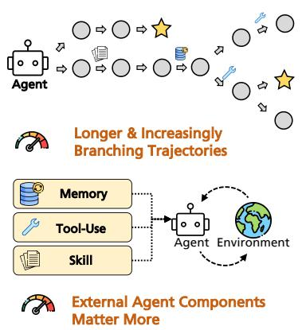  
(a) Challenges of Agentic Reasoning

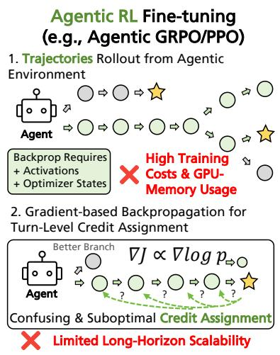  
(b) Bottlenecks of Agentic RL

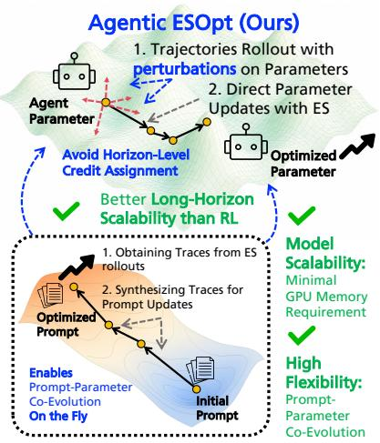  
(c) Advantages of Agentic ESOpt (Ours)

Figure 1 (a) Long-horizon agentic reasoning introduces new challenges for Agentic RL (b), including high GPU memory requirements in training and dificult credit assignment across horizons. Agentic ESOpt (c) addresses these issues through inference-level GPU memory, flexible black-box feedback, and better long-horizon scalability.

## 1 Introduction

Advanced Large Language Models (LLMs) such as Qwen3, DeepSeek-R1, and Gemini 2.5 have demonstrated strong capabilities as general-purpose agents (Yang et al., 2025; Guo et al., 2025; Gemini Team, 2025). With their capabilities in tool use, long-context processing, and multimodal interaction, these models can navigate websites (Zhou et al., 2024), edit repositories (Yang et al., 2024), and coordinate multi-step software workflows (Wang et al., 2024). However, general-purpose agents can still perform poorly on uncommon tool APIs (Ma et al., 2024) and specialized scientific or algorithmic tasks (Liu et al., 2024). Therefore, eficiently fine-tuning advanced LLM agents to adapt task-specific expertise remains important (Du et al., 2026).

Reinforcement learning (RL) has demonstrated remarkable efectiveness in single-turn LLM fine-tuning (Shao et al., 2024; Liu et al., 2025d; Zheng et al., 2025a; Tajwar et al., 2026). However, in long-horizon agentic reasoning, which introduces increasingly branching interactions and provides only sparse feedback, several limitations of Agentic RL are exposed. As illustrated in Figure 1, first, Agentic RL requires storing heavyweight activations, optimizer states, and performing backpropagation through trajectories, making full-parameter fine-tuning increasingly impractical for larger LLMs. Moreover, as trajectories become longer and more branching, assigning sparse trajectory-level rewards back to individual decisions becomes substantially harder (Kim et al., 2026).

This paper argues that evolution strategies (ES) (Salimans et al., 2017) can be a better choice for fine-tuning long-horizon LLM agents. Instead of performing backpropagation, ES samples perturbations around the current LLM parameters, evaluates the perturbed agents with environment rewards, and applies a reward-weighted parameter update. Compared with Agentic RL, ES ofers three key advantages:

• 1) Model Scalability: ES enables full-parameter optimization with only inference-level GPU memory, which is the minimal amount, substantially reducing the memory barrier to fine-tuning larger LLM agents.

• 2) Flexibility: Its lightweight, black-box feedback interface makes ES fine-tuning easy to compose with skill–space evolution (Ni et al., 2026) and test-time compute (Liu et al., 2024).

• 3) Long-Horizon Scalability: Unlike RL estimators that usually lead to poor long-horizon credit assignment, ES performs trajectory-level parameter attribution without decomposing rewards across turns, yielding better scalability than Agentic RL as the horizon length grows.

Recent work has explored ES for single-turn LLM reasoning (Qiu et al., 2026; Sun et al., 2026; Sarkar et al., 2025), where ES achieves higher GPU memory eficiency but slightly lower performance than RL methods. However, we argue that the structural advantages of ES are particularly pronounced in fine-tuning long-horizon agents, where ES can be significantly preferable to RL, rather than merely a cheaper alternative. To implement this advantage, we propose Agentic ESOpt, a full-parameter ES framework for both train-time agent fine-tuning and agentic test-time compute. At each generation, Agentic ESOpt samples full-parameter perturbations, evaluates the resulting agents with environment rewards, and applies an online reward-weighted update. Its lightweight black-box update enables on-the-fly parameter adaptation within prompt-space optimization loops allowing parameter updates to complement both skill-space optimization and test-time search. To improve the exploration–adaptation trade-of, Agentic ESOpt further introduces a cosine decay mechanism for the perturbation scale σ, which retains a nonzero terminal σ for mild smoothing regularization in train-time optimization, and decays σ<sub>T</sub> to 0 for progressively finer adaptation in test-time optimization.

We evaluate Agentic ESOpt for agentic fine-tuning in both train-time and test-time compute with LLMs from 4B to 27B. In the train-time fine-tuning, we study long-horizon reasoning, ReAct-style tool use, and web agents. On Sudoku, RL- and ES-based methods with matched FLOPs are competitive at smaller minimum successful horizons (5- and 10-horizon), but their relative ordering changes as the horizon grows: at 15 turns, Agentic ESOpt reaches +12.5% compared to the strongest GRPO baseline. Across ReAct-style Math and DocVQA, Agentic ESOpt achieves an average improvement of 13.7% over the Qwen3.5-4B base model and 8.3% over Agentic GRPO. On WebArena-Lite, full-parameter optimization of Qwen3.5-27B improves the No Skill baseline from 29.47% to 36.16%, while combining Agentic ESOpt with Trace2Skill raises it from 33.94% to 36.36%. In the test-time agentic heuristic design, Agentic ESOpt improves the matched baselines in 28 of 36 comparisons. Moreover, a preliminary population-sensitivity study further suggests that stronger LLM backbones can obtain useful ES updates with smaller populations. Our contributions are summarized as follows:

• We identify that, on long-horizon agentic reasoning, ES becomes preferable to Agentic RL. We attribute this shift to three key properties of ES: model scalability through inference-level GPU memory, flexibility through black-box trajectory feedback, and long-horizon scalability through trajectory-level parameter attribution.

• We introduce Agentic ESOpt, a backpropagation-free ES framework require only minimal GPU memory. It supports flexible agentic fine-tuning in both train-time adaptation and test-time compute. It allows parameter optimization to compose with prompt-space evolution, while a cosine schedule of perturbation improves the exploration–adaptation trade-of.

• We validate Agentic ESOpt across long-horizon Sudoku, ReAct-style tool use, web agents, and automatic heuristic design with models from 4B to 27B. Agentic ESOpt outperforms RL on long-horizon Sudoku and ReAct-style Math/DocVQA, enables full-parameter adaptation of a 27B WebArena agent, improves Trace2Skill, and enhances existing test-time evolutionary search in 28 of 36 settings.

## 2 Preliminaries: Agentic LLM Reasoning

We define a multi-turn LLM agent that repeatedly observes the environment and produces an action as follows:

$$
a _ { t } \sim \pi _ { \theta } ( a _ { t } \mid \sigma _ { \leq t } , c _ { t } ) ,
$$

where θ denotes model parameters, $\mathbf { \delta } _ { \mathbf { o } _ { \leq } t }$ is the interaction history, and $c _ { t }$ is an external prompt, memory, skill, or tool instruction. An episode induces a multi-turn trajectory $\pmb { \tau } = \left( o _ { 1 } , a _ { 1 } , \dotsc , o _ { H } , a _ { H } \right)$ , where the horizon H is the number of agent–environment turns before termination. Its return is $\begin{array} { r } { \dot { R } ( \tau ) = \dot { \sum _ { t = 1 } ^ { H } } \dot { \gamma ^ { t - 1 } } r _ { t } } \end{array}$ . In many agentic reasoning tasks, rewards are sparse: intermediate rewards are typically zero, $r _ { t } = 0$ for $t < H$ , and only the completed trajectory receives a task score. In some problems (e.g., MATH & DocVQA ReAct-style Tool Usage), the agent receives the complete multi-turn trajectory τ as input, but in some problems with (partial) Markov properties (Sudoku, WebArena), the agent only needs to receive partial local input (e.g., o<sub>t</sub> only).

The optimization of the Task-specific agent can act on c<sub>t</sub> or θ. Prompt-space optimization methods optimize c<sub>t</sub> while freezing the LLM. They are lightweight, but can only elicit behaviors already accessible to the frozen policy (Yang et al., 2026; Ni et al., 2026; Liu et al., 2024; Zheng et al., 2025b). Policy fine-tuning methods optimize θ for better agentic ability with Supervised Fine-Tuning (SFT), On-Policy Distillation (OPD), Group Relative Policy Optimization (GRPO), or Proximal Policy Optimization (PPO).

Agentic SFT & OPD. Agentic SFT learns from expert actions (Chu et al., 2025), while Agentic OPD learns from token distributions of higher-ability LLMs (Song and Zheng, 2026). Both methods require labels beyond the scalar environment reward, which requires additional cost, so we exclude them from our comparison scope.

Agentic PPO & GRPO. Agentic PPO and Agentic GRPO require a scalar environment reward, making them useful in many application scenarios (Qi et al., 2025). Agentic GRPO (Shao et al., 2024) samples G trajectories for the same task and assigns trajectory i the group-relative advantage as follows:

$$
\widehat { A } _ { i } = \frac { R _ { i } - \mathrm { m e a n } _ { j } ( R _ { j } ) } { \mathrm { s t d } _ { j } ( R _ { j } ) + \varepsilon } .
$$

Let $q _ { i , t } ( \theta ) = \pi _ { \theta } ( a _ { i , t } \mid h _ { i , t } ) / \pi _ { \theta _ { \mathrm { o l d } } } ( a _ { i , t } \mid h _ { i , t } )$ , where $h _ { i , t } = ( o _ { \le t } , c _ { t } )$ . Agentic GRPO minimizes the loss as follows:

$$
\mathcal { L } _ { \mathrm { G R P O } } = - \frac { 1 } { G } \sum _ { i = 1 } ^ { G } \sum _ { t = 1 } ^ { H _ { i } } \operatorname* { m i n } \Bigl ( q _ { i , t } \widehat { A } _ { i } , \mathrm { c l i p } ( q _ { i , t } , 1 - \epsilon , 1 + \epsilon ) \widehat { A } _ { i } \Bigr ) + \beta D _ { \mathrm { K L } } ( \pi _ { \theta } | | \pi _ { \mathrm { r e f } } ) ,\tag{1}
$$

However, recent studies (Feng et al., 2026; He et al., 2026; Zhang, 2026) point out that although GRPO’s group-relative advantage is representative in single-turn scenarios, it cannot cover multi-turn scenarios. To achieve better credit assignment, PPO has recently been adopted in multi-turn agentic RL (Li et al., 2026; Hou et al., 2026), which uses the same clipped surrogate but replaces $\widehat { A } _ { i }$ with a turn-level advantage estimated by a critic LLM (Schulman et al., 2017):

$$
\mathcal { L } _ { \mathrm { P P O } } = - \sum _ { t = 1 } ^ { H } \operatorname* { m i n } \Big ( q _ { t } \widehat { A } _ { t } , \mathrm { c l i p } ( q _ { t } , 1 - \epsilon , 1 + \epsilon ) \widehat { A } _ { t } \Big ) , \quad \widehat { A } _ { t } = \sum _ { l = 0 } ^ { H - t } ( \gamma \lambda ) ^ { l } \big ( r _ { t + l } + \gamma V _ { \phi } ( h _ { t + l + 1 } ) - V _ { \phi } ( h _ { t + l } ) \big ) .\tag{2}
$$

We argue that PPO cannot fully remove the long-horizon dificulty. It requires a critic warm-up phase to learn meaningful values, while sparse terminal rewards make its early advantages unreliable. Even with a well-trained critic, the policy gradient still sums H action-level score terms, so its variance remains dependent on the horizon length. These limitations motivate the trajectory-level estimator introduced next and analyzed in Appendix C.3. These drawbacks in credit assignment motivate the parameter-space ES formulation of Agentic ESOpt.

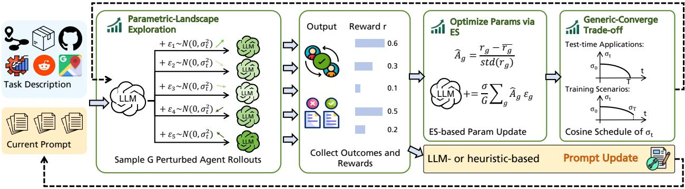  
High Flexibility: Supports Prompt-Parameter Co-Evolution via Shared Rollouts

Figure 2 Detailed workflow of Agentic ESOpt. Starting from the current LLM, Agentic ESOpt samples parameter perturbations, evaluates the perturbed agents in the environment, normalizes their scalar rewards, and applies a reward-weighted ES update. Compared with Agentic RL, Agentic ESOpt provides model scalability, optimization flexibility, and long-horizon scalability. Its lightweight black-box interface also allows easy composition with promptspace optimization methods such as Trace2Skill (LLM-based) and EoH (heuristic-based), enabling on-the-fly parameter adaptation within existing test-time compute procedures.

## 3 Methodology: Agentic ESOpt

As illustrated in Figure 2, Agentic ESOpt performs full-parameter ES optimization by sampling parameter perturbations around the current LLM, evaluating the perturbed agents with scalar environment rewards, and applying a reward-weighted parameter update. This update is forward-only, which only requires storing the noise seed and using in-place addition and subtraction (Qiu et al., 2026), so the GPU memory requirement of Agentic ESOpt remains minimal, the same as the inference requirements. Moreover, the same black-box trajectory feedback can be reused by skill-space optimizers or test-time compute.

Formally, let $\pmb { \tau } = \left( o _ { 0 } , a _ { 0 } , \dotsc , 0 H , a _ { H } \right)$ denote an interaction trajectory induced by policy π<sub>θ</sub>, and let $R ( \tau )$ denote its scalar trajectory return. For a fixed external agent state $c ,$ the objective is as follows:

$$
J ( \theta ; c ) = \mathbb { E } _ { \pmb { \tau } \sim \pi _ { \theta } ( \cdot | c ) } \left[ R ( \pmb { \tau } ) \right] .
$$

Agentic ESOpt optimizes the objective by searching over the parameter space around θ, where $\epsilon \in \mathbb { R } ^ { d }$ is a full-parameter perturbation on the d-dimensional parameters, and the Gaussian-smoothed objective is as:

$$
J _ { \sigma } ( \theta ; c ) = \mathbb { E } _ { \epsilon \sim \mathcal { N } ( 0 , I ) } \left[ J ( \theta + \sigma \epsilon ; c ) \right] .\tag{3}
$$

Then we can derive the ES pseudo-gradient as follows (Salimans et al., 2017; Qiu et al., 2026):

$$
\nabla _ { \theta } J _ { \sigma } ( \theta ; c ) = \frac { 1 } { \sigma } \mathbb { E } _ { \epsilon } \left[ J ( \theta + \sigma \epsilon ; c ) \epsilon \right] .\tag{4}
$$

The derivation is detailed in Appendix C.1. The ES gradients are estimated from scalar scores without diferentiating through the agent–environment interaction.

In implementation, to estimate Eq.(4), Agentic ESOpt samples G perturbations $\epsilon _ { 1 } , \ldots , \epsilon _ { G }$ , evaluates the corresponding perturbed agents, and obtains rewards $R _ { i } = R ( \tau _ { i } )$ . To reduce variance, we normalize the rewards within the population with a z-score as follows:

$$
\hat { R } _ { i } = \frac { R _ { i } - \mu _ { R } } { s _ { R } + \varepsilon } , \quad \mathrm { w h e r e } \quad \mu _ { R } = \frac { 1 } { G } \sum _ { j = 1 } ^ { G } R _ { j } , \quad s _ { R } ^ { 2 } = \frac { 1 } { G } \sum _ { j = 1 } ^ { G } ( R _ { j } - \mu _ { R } ) ^ { 2 } .
$$

In practice, unlike the canonical ES estimator in Eq. (4), our normalized update omits the explicit $1 / \sigma$ factor, with α serving as the efective update scale. The implemented update is therefore:

$$
\theta _ { t + 1 } = \theta _ { t } + \frac { \alpha } { G } \sum _ { i = 1 } ^ { G } \hat { R } _ { i } \pmb { \epsilon } _ { i } .
$$

We follow Qiu et al. (2026) in storing only the noise seed of each perturbation and using in-place addition and subtraction for each perturbed agent, so Agentic ESOpt requires only the same amount of GPU memory for inference.

Prompt-Space Composition and Prompt-Parameter Co-Evolution. Test-time compute and promptspace optimization methods typically keep the LLM parameters fixed throughout the search process. As a result, the search can only reweight or recombine behaviors already accessible to the frozen policy, which may limit optimization when solving the task requires changing the underlying policy itself. In contrast, the lightweight black-box updates of Agentic ESOpt allow parameter adaptation to be performed on the fly alongside prompt-space search, enabling prompt–parameter co-evolution.

Let $\mathcal { D } _ { t }$ denote the trajectories and scores collected at iteration $t , u _ { \mathrm { E S } }$ the Agentic ESOpt parameter update, and $\mathcal { U } _ { c }$ an external update rule for prompt $c _ { t } . \mathrm { ~ A ~ }$ general alternating outer loop can then update the two spaces as

$$
\begin{array} { r } { \theta _ { t + 1 } = \mathcal { U } _ { \mathrm { E S } } ( \theta _ { t } ; c _ { t } , \mathcal { D } _ { t } ) , \quad c _ { t + 1 } = \mathcal { U } _ { c } ( c _ { t } ; \mathcal { D } _ { t } ) . } \end{array}
$$

## 3.1 Cosine Decay of the Perturbation Radius $\sigma$

With perturbations $\epsilon \sim \mathcal { N } ( 0 , I )$ , Agentic ESOpt efectively optimizes the Gaussian-smoothed objective in $\mathrm { E q ~ ( 3 ) }$ However, a nonzero perturbation radius introduces a smoothing bias, whose leading term is characterized as:

Lemma 1 (Gaussian-smoothing bias). Assume $J ( \theta ; c )$ is suficiently smooth in a neighborhood of θ. Then

$$
J _ { \sigma } ( \theta ; c ) = J ( \theta ; c ) + \frac { \sigma ^ { 2 } } { 2 } \mathrm { T r } \Big ( \nabla _ { \theta } ^ { 2 } J ( \theta ; c ) \Big ) + { \cal O } ( \sigma ^ { 4 } ) .
$$

The proof is in Appendix C.2. The second-order term $\operatorname { T r } ( \nabla _ { \theta } ^ { 2 } { J } )$ can be viewed as a regularization term. For a maximization objective, it penalizes sharp local optima while favoring flatter parameter neighborhoods. Therefore, a larger σ introduces stronger regularization but also a larger bias from the original objective.

Existing ES methods for single-turn LLM fine-tuning typically use a fixed perturbation radius throughout optimization (Qiu et al., 2026), without explicitly adapting this trade-of. Agentic ESOpt instead gradually decreases σ over $T$ update steps, using a larger radius early for broader exploration and stronger regularization, and a smaller radius later for increased exploitation and reduced objective bias as follows:

$$
\sigma _ { t } = \sigma _ { T } + ( \sigma _ { 0 } - \sigma _ { T } ) \frac { 1 + \cos ( \pi t / T ) } { 2 } , \qquad t = 0 , \dots , T .
$$

For train-time Agentic ESOpt, we retain a nonzero $\sigma _ { T }$ to balance exploitation with exploration and regularization. In contrast, test-time compute focuses on the unbiased outcome of the current task instead of the generalization of the agent, so we decay $\sigma _ { T }$ to zero to minimize the objective bias toward the end of optimization.

## 4 Agentic Sudoku: Controlled Experiments on Long-Horizon Scalability

To demonstrate the advantage of Agentic ESOpt on long-horizon scalability compared to Agentic RL, this section first analyzes their characteristics theoretically. Then we evaluate the proposed Agentic ESOpt in a controlled multi-turn Sudoku environment, where the minimal possible horizon length H is strictly defined by the number of masks on the Sudoku board.

Theoretical Reason for Scalability. Consider a trajectory of H actions, $\pmb { a } = ( a _ { 1 } , \dots , a _ { H } )$ , with terminal return $R ( a )$ . A simple Agentic RL estimator $\left( \mathrm { e . g . , E q ~ ( 1 ) , E q ~ ( 2 ) } \right)$ with baseline b has the form as follows:

$$
\widehat { g } _ { \mathrm { P G } } = ( R ( \boldsymbol { a } ) - b ) \sum _ { t = 1 } ^ { H } \nabla _ { \boldsymbol { \theta } } \log \pi _ { \boldsymbol { \theta } } ( a _ { t } \mid \boldsymbol { s } _ { t } ) .
$$

Following the analysis of Salimans et al. (2017, Sec. 3.1), suppose the return has weak correlation with any individual action, the per-step score terms are approximately uncorrelated, and ES and policy gradients induce comparable return variation. The estimator variance will then grow nearly linearly with the horizon as follows:

$$
\mathrm { V a r } [ \widehat { g } _ { \mathrm { P G } } ] \approx \mathrm { V a r } [ R ( \boldsymbol { a } ) ] \mathrm { V a r } \left[ \sum _ { t = 1 } ^ { H } \nabla _ { \theta } \log \pi _ { \theta } ( a _ { t } \mid s _ { t } ) \right] \propto H .
$$

Agentic ESOpt samples one parameter perturbation ϵ for the complete rollout. Its corresponding estimator is as follows:

$$
\widehat { g } _ { \mathrm { E S } } = \left( R ( a ( \theta + \sigma \epsilon ) ) - b \right) \frac { \epsilon } { \sigma } , \quad \mathrm { V a r } [ \widehat { g } _ { \mathrm { E S } } ] \approx \mathrm { V a r } [ R ( a ) ] \mathrm { V a r } \left[ \frac { \epsilon } { \sigma } \right] .
$$

${ \mathrm { S o } } ,$ the parameter-score term $\epsilon / \sigma$ does not sum over H. Agentic ESOpt therefore assigns the terminal return directly to one coherent policy variation, without asking the same scalar outcome to distinguish among H horizons. This scaling argument predicts a relative advantage for Agentic ESOpt as the efective horizon grows.

Importantly, this comparison isolates the horizon-dependent structure of the two estimators. Agentic RL accumulates action-score terms across turns, whereas Agentic ESOpt avoids this with direct parameter-space search whose variance does not explicitly grow with H. This predicts an increasing relative advantage for parameter-space attribution as the efective horizon grows. A complete covariance expansion and discussion of other sources of estimator dificulty are provided in Appendix C.3. Figure 5 further visualizes local parameterspace neighborhoods as $H ^ { * }$ increases. Although the reward contrast decreases for harder settings, the ES parameter score itself does not introduce an additional sum over turns.

Controlled Long-Horizon Sudoku. To empirically test the predicted long-horizon scaling behavior, we design a multi-turn Sudoku environment with a controllable minimum successful horizon. The environment provides only a terminal reward, and each valid action fills at most one cell. We define the shortest successful horizon for task x as $\begin{array} { r } { H ^ { * } ( x ) = \operatorname* { m i n } _ { \tau : R ( \tau ) = 1 } } \end{array}$ |τ|. Masking 5, 10, or 15 cells therefore gives $H ^ { \ast } \in \{ 5 , 1 0 , 1 5 \}$ . The realized horizon $H = | \tau |$ may exceed $H ^ { * }$ because of invalid or unproductive actions. Our theoretical analysis concerns the realized horizon H, while the experiments are grouped by $H ^ { * }$

Experimental Setup. Sudoku experiments are conducted on 4×NVIDIA H100 80GB GPUs. We compare Agentic ESOpt with two 8-rollout Agentic GRPO runs with diferent sampling configurations, Agentic PPO (Li et al., 2026), and Vanilla Agentic ES on Qwen3.5-4B. We create a 32-instance training dataset and a 32-instance evaluation dataset for each $H ^ { * }$ . Following the recommendation in the model card, the temperature is 0.7, top-p is 0.8, and top-k is 20 across evaluations. We use task success rate as the primary metric, where an episode is successful only if the Sudoku is fully solved within the interaction budget, and report the mean and standard deviation over three evaluation runs. Detailed training and decoding configurations are in the Appendix D.1.1.

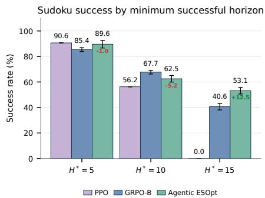  
(a) Final evaluation success

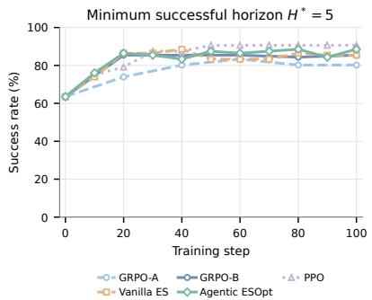  
(b) $H ^ { * } = 5$ evaluation curve

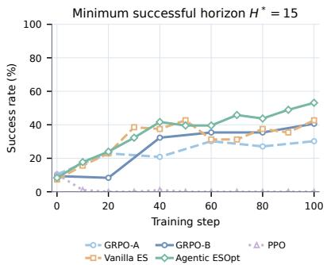  
(c) H<sup>∗</sup> = 15 evaluation curve  
Figure 3 Agentic Sudoku performance grouped by minimum successful horizon $H ^ { * }$ . (a) reports final success rate averaged over 3 runs with standard-deviation error bars for PPO, the stronger GRPO-B configuration, and Agentic ESOpt. Red/green annotations below the Agentic ESOpt values report its diference from the stronger Agentic RL result. (b) and (c) show evaluation curves for the methods. Both Vanilla ES and Agentic ESOpt use $G = 3 2$

Table 1 Agentic Sudoku final evaluation success rate (×100) and GPU memory requirement, grouped by minimum successful horizon $H ^ { * }$ . Values are reported as mean ± standard deviation.
<table><tr><td>Method</td><td>GPU Mem Req.</td><td> $H ^ { * } = 5$ </td><td> $H ^ { * } = 1 0$ </td><td> $H ^ { * } = 1 5$ </td></tr><tr><td>Qwen3.5-27B</td><td>51.75GB</td><td> $8 6 . 4 6 \pm 3 . 9 0$ </td><td> $5 0 . 0 0 \pm 2 . 5 5$ </td><td> $2 8 . 1 3 \pm 2 . 5 5$ </td></tr><tr><td>Qwen3.5-4B</td><td>8.41GB</td><td> $6 3 . 5 4 \pm 7 . 8 0$ </td><td> $3 1 . 2 5 \pm 4 . 4 2$ </td><td> $1 0 . 4 2 \pm 1 . 4 7$ </td></tr><tr><td>十  $\mathrm { A g e n t i c ~ P P O ^ { * } }$ </td><td>89.40GB</td><td> ${ \bf 9 0 . 6 3 \pm 0 . 0 0 }$ </td><td> $5 6 . 2 5 \pm 0 . 0 0$ </td><td> $0 . 0 0 \pm 0 . 0 0$ </td></tr><tr><td> $+ { \mathrm { ~ A g e n t i c ~ G R P O } } ^ { \dagger }$ </td><td>58.88GB</td><td> $8 0 . 2 1 \pm 1 . 4 7$ </td><td> $4 4 . 7 9 \pm 2 . 9 5$ </td><td> $3 0 . 2 1 \pm 2 . 9 5$ </td></tr><tr><td> $+ { \mathrm { ~ A g e n t i c ~ G R P O } } ^ { \ddag }$ </td><td>58.88GB</td><td> $8 5 . 4 2 \pm 1 . 4 7$ </td><td> ${ \bf 6 7 . 7 1 \pm 1 . 4 7 }$ </td><td> $4 0 . 6 3 \pm 2 . 5 5$ </td></tr><tr><td>+ Agentic ESOpt (G=32)</td><td>8.41GB</td><td> $8 9 . 5 8 \pm 2 . 9 5$ </td><td> $6 2 . 5 0 \pm 2 . 5 5$ </td><td> ${ \bf 5 3 . 1 3 \pm 2 . 5 5 }$  –</td></tr><tr><td>w/o σ decay (Vanilla ES)</td><td>8.41GB</td><td> $8 5 . 4 2 \pm 3 . 9 0$ </td><td> $5 5 . 2 1 \pm 5 . 8 9$ </td><td> $4 2 . 7 1 \pm 3 . 9 0$ </td></tr><tr><td> $\mathbf { w } / { \textrm { o } } \sigma _ { T } ~ ( { \mathrm { i . e . , } } ~ \sigma _ { t } = 0 )$ </td><td>8.41GB</td><td> $8 5 . 4 2 \pm 3 . 9 0$ </td><td> $5 4 . 1 7 \pm 3 . 9 0$ </td><td> $2 8 . 1 3 \pm 2 . 5 5$ </td></tr></table>

<sup>∗</sup>PPO training use temperature 1, $\textstyle \mathrm { t o p } - p = 1 $ , and top- $\cdot k = - 1$ . <sup>†</sup>GRPO training uses temperature 0.7, $\mathrm { t o p } \cdot p = 0 . 8 ,$ , and top-k = 20. <sup>‡</sup>GRPO training uses temperature 1, $\mathrm { t o p } { - } p = 1$ , and top-k = −1. All GRPO and PPO evaluations, as well as Vanilla ES and Agentic ESOpt training and evaluation rollouts, use the recommended temperature-0.7, top-p = 0.8, top-k = 20.

Table 1 and Figure 3 (a) show a clear tendency that changes with the minimum successful horizon. At $H ^ { * } = 5 ,$ PPO leads with 90.63%, followed by Agentic ESOpt at 89.58% and the stronger GRPO configuration at 85.42%. At $H ^ { * } = 1 0$ , GRPO leads with 67.71%, followed by Agentic ESOpt at 62.50% and PPO at 56.25%. At $H ^ { * } = 1 5 .$ Agentic ESOpt becomes strongest at 53.13%, 12.50 percentage points above GRPO at 40.63%, while PPO becomes inefective with only terminal reward. Under sparse terminal rewards, its critic fails to learn a reliable value signal, making the resulting advantage estimates uninformative for credit assignment. Agentic ESOpt does not dominate with small $H ^ { * } ;$ its relative advantage appears as $H ^ { * }$ grows, where the credit assignment of Agentic RL becomes harder. The ordering reversal—PPO at $H ^ { * } = 5 ,$ GRPO at $H ^ { * } = 1 0$ , and Agentic ESOpt at $H ^ { * } = 1 5$ —is therefore more informative than a uniform win: it is consistent with a horizon-dependent advantage regime rather than a globally stronger optimizer or a single favorable decoding configuration.

The evaluation curves Figure 3 (b,c) clarify how this separation develops. At $H ^ { * } = 5$ , methods have a similar learning curve. However, at $H ^ { * } = 1 5$ , GRPO variants fail to make fast improvements in the initial steps of training, while PPO quickly collapses. Their performance is related to the poor long-horizon credit assignment, where Agentic RL usually reaches the limit of the horizon (set to 45 for $H ^ { * } = 1 5 )$ . In Figure 6 (b), the $H ^ { * } = 1 5$ setting has a 45-turn interaction budget; the GRPO turn count improves at around step 60, whereas Agentic ESOpt stays close to the minimum successful horizon and ends at 15.41 turns.

Compared to Vanilla ES, Agentic ESOpt can improve late in the longer run, from 39.58% at step 60 to 53.13% at step 100. This means that earlier, more extensive exploration given by the sigma schedule avoids the algorithm getting trapped in local optima. As shown in Table 1, removing cosine decay over the sigma in Vanilla Agentic ES leads to worse results, while setting the final sigma to 0 results in overfitting and poor evaluation performance.

## Takeaway 1

Under the weak-correlation scaling assumptions used in the OpenAI ES analysis (Salimans et al., 2017, Sec. 3.1), parameter-space ES avoids the explicit horizon-wise score accumulation of action-space policy gradients. The Sudoku experiment exhibits the predicted horizon-dependent crossover: Agentic ESOpt is not uniformly strongest at short horizons, but becomes strongest at the largest controlled $H ^ { * }$

Table 2 Training compute and wall-clock time on agentic Sudoku. Both Agentic GRPO and Agentic ESOpt are executed on the same four NVIDIA H100 GPUs and fully utilize the available hardware.
<table><tr><td></td><td colspan="2"> $H ^ { * } = 5$ </td><td colspan="2"> $H ^ { * } = 1 0$ </td><td colspan="2"> $H ^ { * } = 1 5$ </td></tr><tr><td>Method</td><td>FLOPs</td><td>Time</td><td>FLOPs</td><td>Time</td><td>FLOPs</td><td>Time</td></tr><tr><td>Qwen3.5-4B + Agentic GRPO</td><td>3.2 EFLOPs</td><td>5.4 h</td><td>7.6 EFLOPs</td><td>13.1 h</td><td>10.9 EFLOPs</td><td>19.0 h</td></tr><tr><td>Qwen3.5-4B + Agentic ESOpt  $\left( G { = } 3 2 \right)$ </td><td>3.1 EFLOPs</td><td>3.1 h</td><td>6.3 EFLOPs</td><td>5.8 h</td><td>9.4 EFLOPs</td><td>9.4 h</td></tr></table>

Compute and wall-clock eficiency. The memory and compute results characterize two complementary eficiency properties of Agentic ESOpt. The GPU-memory results in Table 1 measure its minimal training-side requirement: Agentic ESOpt requires only 8.41GB, equal to the inference memory of the Qwen3.5-4B backbone and 85.7% below $\mathrm { { G R P O } ^ { \prime } { s } }$ 58.88GB requirement.

ES requires a larger population (G = 32 versus 8-rollout in GRPO); however, it does not introduce a corresponding model-compute disadvantage. As analyzed in Appendix C.5, Agentic ESOpt with G = 32 has a comparable model-FLOPs budget to eight-rollout GRPO. As shown in Table 2, in the actual four-H100 implementation, the measured wall-clock results indicate that the larger ES population does not translate into additional end-to-end overhead in this environment. This comparison should be interpreted along separate eficiency axes: Agentic ESOpt is substantially more memory eficient and competitive in model compute, while it intentionally spends more independent environment evaluations to replace reference-model evaluation and backpropagation.

## Takeaway 2

Agentic ESOpt demonstrates high model-side efficiency, requiring only inference-level GPU memory. Although it evaluates more trajectories than Agentic GRPO (G = 32 versus eight rollouts), the saved reference-model and backward-pass compute keeps model FLOPs and measured wall-clock time comparable in Sudoku, making full-parameter adaptation of the 27B agent in Table 4 practical.

## 5 Agentic ESOpt for Train-Time Fine-tuning

Besides the hand-crafted Sudoku, this section evaluates the ability of Agentic ESOpt in fine-tuning LLMs towards specific-purpose agents. We fine-tune agents for Python computation tool usage in Agentic Math reasoning and OCR and document-image analysis tool in DocVQA, and towards a web agent in WebArena.

## 5.1 Agentic ReAct-Style Tool Usage on Math and DocVQA

We first fine-tune LLMs for the tool-use ability in ReAct-style interaction (Yao et al., 2022). This task is a relatively long-horizon scenario with a usual horizon H > 10. We follow the setting and hyperparameters in Ni et al. (2026), training Math on 400 DAPO problems and evaluating it on 100 held-out DAPO problems and out-of-distribution 30-problem AIME 2026. For DocVQA, we fine-tune agents on a 50-question validation subset and evaluate them on held-out 100 questions. In evaluating all methods, we set the horizon limit to 50 turns for both MATH and DocVQA, confining the max\_token in each turn to 4096 for MATH and 512 for DocVQA, respectively. This setting will not cause significant truncation. We implement two fine-tuning methods, Agentic GRPO and Agentic ESOpt, on Qwen3.5-4B. Besides, we also implement a prompt-space optimization method, Trace2Skill, which collects trajectories by sampling and synthesizes trajectories for skills at the end. We also implement a sequential combination of fine-tuning methods and Trace2Skill, where Agentic GRPO + Trace2Skill and Agentic ESOpt + Trace2Skill represent using the trajectories collected during training over No Skill prompts for skill distillation. GRPO is 8-rollout as well, and we have G = 16 for Agentic ESOpt and 16 samples for Trace2Skill. As discussed in Appendix C.5, in fine-tuning agents, Agentic ESOpt consumes only approximately half the FLOPs of GRPO. Detailed settings are given in Sections D.2 and D.3.

Table 3 Math-reasoning and DocVQA results under No Skill and Trace2Skill contexts. Qwen3.5-27B No Skill is an evaluation-only baseline; all optimized rows use Qwen3.5-4B. DAPO, AIME 2026, and DocVQA accuracy are reported in %. Mean@4 averages four sampled Pass@1 accuracies; Pass@4 or Max@4 represent the best of four samples.
<table><tr><td rowspan="3">Model Method</td><td rowspan="3"></td><td colspan="4">Math reasoning</td><td colspan="4">DocVQA</td></tr><tr><td colspan="2">DAPO</td><td colspan="2">AIME 2026</td><td colspan="2">ANLS</td><td colspan="2">Accuracy</td></tr><tr><td>Mean@4 Pass@4</td><td></td><td>Mean@4</td><td>Pass@4</td><td>Mean@4 Max@4</td><td></td><td>Mean@4</td><td>Pass@4</td></tr><tr><td>Qwen3.5-27B</td><td>No Skill</td><td>65.8</td><td>87.0</td><td>76.7</td><td>93.3</td><td>0.5036</td><td>0.7843</td><td>51.8</td><td>69.0</td></tr><tr><td>Qwen3.5-4B</td><td>No Skill</td><td>63.0</td><td>86.0</td><td>55.8</td><td>86.7</td><td>0.3875</td><td>0.5981</td><td>40.3</td><td>53.0</td></tr><tr><td>Qwen3.5-4B</td><td>Agentic GRPO + No Skill</td><td>68.8</td><td>83.0</td><td>58.3</td><td>76.7</td><td>0.4627</td><td>0.5398</td><td>48.0</td><td>56.0</td></tr><tr><td>Qwen3.5-4B</td><td>Agentic ESOpt + No Skill</td><td>76.8</td><td>86.0</td><td>70.8</td><td>96.7</td><td>0.5043</td><td>0.6507</td><td>52.5</td><td>61.0</td></tr><tr><td></td><td>∆ vs No Skill</td><td>↑13.8</td><td>0.0</td><td>↑15.0</td><td>↑10.0</td><td>↑0.1168</td><td>↑0.0526</td><td>↑12.3</td><td>↑8.0</td></tr><tr><td>Qwen3.5-4B</td><td>Trace2Skill</td><td>64.8</td><td>82.0</td><td>50.8</td><td>83.3</td><td>0.4612</td><td>0.6772</td><td>47.3</td><td>69.0</td></tr><tr><td>Qwen3.5-4B</td><td>Agentic GRPO + Trace2Skill</td><td>67.8</td><td>85.0</td><td>50.0</td><td>80.0</td><td>0.4743</td><td>0.5692</td><td>49.5</td><td>60.0</td></tr><tr><td>Qwen3.5-4B</td><td>Agentic ESOpt + Trace2Skill</td><td>77.3</td><td>86.0</td><td>71.7</td><td>96.7</td><td>0.5086</td><td>0.6654</td><td>52.8</td><td>61.0</td></tr><tr><td></td><td>∆ vs Trace2Skill</td><td>↑12.5</td><td>↑4.0</td><td>↑20.8</td><td>↑13.3</td><td>↑0.0474</td><td>↓0.0118</td><td>↑5.5</td><td>↓8.0</td></tr></table>

As shown in Table 3, Agentic ESOpt consistently outperforms the matched Agentic GRPO baselines across ReAct-style Math and DocVQA. Without evolved skills, Agentic ESOpt improves the Qwen3.5-4B base model by 13.8 and 15.0 percentage points on DAPO and AIME 2026 Mean@4, respectively, and improves DocVQA Mean@4 accuracy by 12.3 points. Averaged across these three metrics, Agentic ESOpt improves the base model by 13.7 points and Agentic GRPO by 8.3 points. Agentic ESOpt also composes efectively with Trace2Skill: the combined method achieves the strongest Qwen3.5-4B Mean@4 results on DAPO, AIME 2026, and DocVQA, showing the flexibility of parameter-space optimization methods to compose with external skill optimization.

Beyond the average-performance gains, Agentic ESOpt also preserves strong Pass@4 performance. We show the full Pass@K performance in Appendix D.3.4 up to k = 32. Across datasets, Agentic ESOpt variants improve every reported Pass@K metric over their matched GRPO baselines (Yue et al., 2025). In AIME 2026 and DocVQA, Agentic ESOpt improves the Pass@K performance compared to the base LLM. This indicates that Agentic ESOpt performs a diferent and more favorable optimization paradigm compared to Agentic GRPO.

## Takeaway 3

Agentic ESOpt improves average performance without sacrificing Pass@K coverage: across Math and DocVQA, both Agentic ESOpt variants outperform their matched Agentic GRPO baselines on every reported Pass@4 metric, suggesting broader coverage of successful trajectories after parameter optimization.

## 5.2 Agentic Reasoning for WebArena: Experiments on Model Scalability

We then evaluate Agentic ESOpt on WebArena-Lite, a 165-task browser benchmark derived from WebArena (Liu et al., 2025c). Each task provides a natural-language goal and an interactive website state. The agent observes a WebRL-style textual browser representation, acts in an id-based action space, and receives task-success feedback after completing a trajectory (Zhou et al., 2024; Qi et al., 2025). The evaluation set contains 21 Reddit, 32 GitLab, 35 CMS, 28 Map, 46 OSS, and 3 Wikipedia tasks; the five major categories are shown separately in Table 4, while Wikipedia is only included in the dataset average.

This setting scales Agentic ESOpt to Qwen3.5-27B on four NVIDIA H100 80GB GPUs. At this model scale, full-parameter Agentic RL is no longer practical on four H100 80GB GPUs. In contrast, Agentic ESOpt retains inference-level memory requirements, providing feasibility for us to perform full-parameter adaptation of a 27B web agent. This experiment therefore focuses on large-model feasibility and real-world agent adaptation, complementing the controlled ES-versus-RL comparison in Section 4 and 5.1. We compare two paired settings using the same Qwen3.5-27B backbone: No Skill versus Agentic ESOpt + No Skill, and Trace2Skill versus Agentic ESOpt + Trace2Skill. Both Agentic ESOpt variants share the same parameter updates learned without skills; the combined variant additionally distills a skill from the resulting trajectories, without a second skill-conditioned ES stage or alternating joint optimization. We also report closed-source GPT-5.4, GPT-5.4-mini, and GPT-5.4-nano as reference points. Complete setup details and evaluation curves are provided in Appendix D.4 and D.4.4, while task prompts and distilled skills are provided in E.4, E.4.2, and E.4.3.

All the Qwen3.5-27B rollouts for Agentic ESOpt, Trace2skill, and evaluation use temperature 0.7, a 2048-token generation budget, WebRL-style observations, and WebRL id-based actions. Agentic ESOpt sets the population size G = 8, uses task success on sampled training cases as the reward. Trace2skill also samples each question for 8 runs. Final results are evaluated on the oficial 165-task WebArena-Lite evaluation set (Liu et al., 2025c).

Table 4 WebArena-Lite success rates (%). We report the average over 3 runs and the standard deviations. Improved Agentic ESOpt cells relative to their paired baseline are shaded green; bold denotes the best result in each column. The five displayed site categories contain 162 tasks; the remaining Wikipedia tasks are included in Dataset Avg.
<table><tr><td>Model</td><td>Method</td><td>Reddit (21)</td><td>GitLab (32)</td><td>CMS (35)</td><td>Map (28)</td><td>OSS (46)</td><td>Dataset Avg.</td></tr><tr><td colspan="2">Strong frozen baseline (evaluation only)</td><td></td><td></td><td></td><td></td><td></td><td></td></tr><tr><td>GPT-5.4</td><td>No Skill</td><td>47.62</td><td>46.88</td><td>46.67</td><td>19.05</td><td>21.01</td><td> $3 4 . 1 4 \pm 0 . 7 6$ </td></tr><tr><td>GPT-5.4-mini</td><td>No Skill</td><td>39.68</td><td>29.17</td><td>30.48</td><td>13.10</td><td>13.77</td><td> $2 3 . 2 3 \pm 1 . 1 4$ </td></tr><tr><td>GPT-5.4-nano</td><td>No Skill</td><td>39.68</td><td>27.08</td><td>19.05</td><td>11.90</td><td>8.70</td><td> $1 8 . 7 9 \pm 0 . 9 9$ </td></tr><tr><td>Qwen3.5-27B</td><td>No Skill</td><td>50.79</td><td>35.42</td><td>41.90</td><td>8.33</td><td>21.01</td><td> $2 9 . 4 7 \pm 1 . 1 4$ </td></tr><tr><td>Qwen3.5-27B</td><td>Agentic ESOpt + No Skill</td><td>49.21</td><td>43.75</td><td>49.52</td><td>14.29</td><td>30.43</td><td>36.16 ± 0.70</td></tr><tr><td></td><td>∆ vs No Skill</td><td>↓1.58</td><td>↑8.33</td><td>↑7.62</td><td>↑5.96</td><td>↑9.42</td><td>↑6.69</td></tr><tr><td>Qwen3.5-27B</td><td>Trace2Skill</td><td>49.21</td><td>39.58</td><td>46.67</td><td>13.10</td><td>28.26</td><td>33.94 ± 3.37</td></tr><tr><td>Qwen3.5-27B</td><td>Agentic ESOpt + Trace2Skill</td><td>52.80</td><td>41.67</td><td>50.48</td><td>10.71</td><td>32.61</td><td> ${ \bf 3 6 . 3 6 \pm 0 . 8 6 }$ </td></tr><tr><td></td><td>∆ vs Trace2Skill</td><td>↑3.59</td><td>↑2.09</td><td>↑3.81</td><td>↓2.39</td><td>↑4.35</td><td>↑2.42</td></tr></table>

As shown in Table 4, Agentic ESOpt improves the Qwen3.5-27B No Skill baseline from 29.47% to 36.16%, a gain of 6.69 percentage points. When combined with Trace2Skill, it further improves the Trace2Skill baseline from 33.94% to 36.36%, demonstrating the flexibility of Agentic ESOpt in composing with skill-space optimization on Larger LLMs.

## 6 Agentic ESOpt on Test-Time Compute: Automatic Heuristic Design

Traditional test-time compute generally fixes the LLM parameters throughout the search process, which may limit optimization when solving the task requires changing the underlying policy itself. Due to the high flexibility of Agentic ESOpt, it can incorporate test-time compute to improve its performance (Snell et al., 2024).

In this section, we evaluate the ability of Agentic ESOpt to boost a typical test-time compute problem–automatic heuristic design (AHD) (Liu et al., 2024; Zheng et al., 2025b; Huang et al., 2026; Liu et al., 2025a). Among them, the representative work EoH (Liu et al., 2024) improves the performance of these algorithms on a fixed training dataset by maintaining a population of heuristic algorithms and applying crossover and mutation operators. In generating each new heuristic, it provides an LLM agent with a problem description and a Python function signature; the LLM generates heuristic code, and the evaluator returns a scalar objective after executing the code within a solver. Agentic ESOpt can be inserted into existing EoH and pure sample procedures without changing their outer search scafold. Agentic ESOpt + Sample or EoH therefore supports both heuristic-space search and parameter-space adaptation. We consider two AHD scenarios and compare Sample and EoH with their corresponding Agentic ESOpt variants under the same evaluation budgets. In constructive AHD, the heuristic makes local decisions for NP-hard combinatorial optimization problems (defined in Appendix C.4): TSP, KP, and ASP; In ACO-style AHD, the algorithm provides heuristic information to an ant-colony optimizer for TSP, CVRP, and BPP. TSP, CVRP, and BPP are minimized, whereas KP and ASP are maximized.

For constructive tasks, the Optimal row reports the known optimum $x ^ { \star }$ only as a reference. We define the normalized optimality gap as $\begin{array} { r } { \dot { g } ( x ) = \frac { | x - x ^ { \star } | } { | x ^ { \star } | } } \end{array}$ , and report the gain of an Agentic ESOpt result m over its matched baseline b as $\begin{array} { r } { \Delta = \frac { g ( b ) } { g ( m ) } - 1 } \end{array}$ . The formal heuristic-space view, complete search settings, ACO-style results, ablations, and exact generation prompt are indexed in Appendix C.4, D.5, D.5.2, and E.5.

For Agentic ESOpt + EoH, all objectives are represented internally as minimization costs, and the reward is the selected parent’s cost minus the perturbed child’s cost. For Agentic ESOpt + Sample, the reward is the negative child cost. Rewards are z-score normalized within each parameter-update batch. Agentic ESOpt preserves the original EoH operators and attaches parameter updates only to the mutation operators m1 and m2. We report the best candidate from the final generation and average over repeated runs. A 20-run significance analysis on representative TSP and KP settings is provided in Table 18.

Table 5 Design constructive heuristics at total evaluation $T \in \{ 1 0 0 0 , 2 0 0 0 \}$ . TSP is minimized; KP and ASP are maximized. The Optimal row shows optimum objective values, not an experimental baseline. Sample and EoH are each paired with their Agentic ESOpt counterpart; the ∆ rows report the gap-ratio gain defined in the text. Baselines and Agentic ESOpt use LLaMA-3.1-8B-Instruct for all runs.
<table><tr><td>Method</td><td>TSP N = 20</td><td>TSP N = 50</td><td>KP  $N = 5 0 , W = 1 2 . 5$ </td><td>KP N = 100, W = 25</td><td>ASP  $N = 1 5 , W = 1 0$ </td><td>ASP  $N = 2 1 , W = 1 5$ </td></tr><tr><td colspan="7">3.8199</td></tr><tr><td>Optimal Greedy Construct</td><td>4.4797</td><td>5.6750 6.9590</td><td>20.0370 19.9850</td><td>40.2710 40.2250</td><td>3,003 1,530</td><td>43,596 15,050</td></tr><tr><td></td><td></td><td></td><td>Total Evaluations: T = 1000</td><td></td><td></td><td></td></tr><tr><td colspan="7"></td></tr><tr><td>Sample Agentic ESOpt + Sample</td><td>4.3286</td><td>6.7110</td><td>19.9896</td><td>40.2297 40.2314</td><td>2,753 2,729</td><td>30,336.67 31,082.67</td></tr><tr><td>∆ vs Sample</td><td>4.2336 ↓22.96%</td><td>6.5488 ↓18.56%</td><td>19.9899 ↑0.79%</td><td>↑4.42%</td><td>↓8.76%</td><td>↑5.96%</td></tr><tr><td>EoH</td><td></td><td></td><td></td><td></td><td></td><td></td></tr><tr><td>Agentic ESOpt + EoH</td><td>4.2481 4.2170</td><td>6.5450 6.4631</td><td>19.9958</td><td>40.2320 40.2351</td><td>2,760 2,770</td><td>28,465.67 30,887.33</td></tr><tr><td>∆ vs EoH</td><td>↓7.83%</td><td>↓10.39%</td><td>20.0007 ↑13.59%</td><td>↑8.65%</td><td>↑4.67%</td><td>↑29.18%</td></tr><tr><td></td><td></td><td></td><td></td><td></td><td></td><td></td></tr><tr><td colspan="7">Total Evaluations: T = 2000</td></tr><tr><td>Sample</td><td>4.2585</td><td>6.6008</td><td>19.99118</td><td>40.2320</td><td>2,759</td><td>30,123.33</td></tr><tr><td>Agentic ESOpt + Sample ∆ vs Sample</td><td>4.2098</td><td>6.5332</td><td>19.99120</td><td>40.2320</td><td>2,751</td><td>30,269.33</td></tr><tr><td></td><td>↓12.51%</td><td>↓7.88%</td><td>↑0.04%</td><td>0.00%</td><td>↓3.17%</td><td>↑1.10%</td></tr><tr><td>EoH</td><td>4.2165 4.1799</td><td>6.4706</td><td>19.9984</td><td>40.2356</td><td>2,764</td><td>28,016.00</td></tr><tr><td>Agentic ESOpt + EoH</td><td></td><td>6.4442</td><td>19.9987</td><td>40.2358</td><td>2,784</td><td>30,124.67</td></tr><tr><td>∆ vs EoH</td><td>↓10.19%</td><td>↓3.43%</td><td>↑0.81%</td><td>↑0.48%</td><td>↑9.92%</td><td>↑24.36%</td></tr></table>

As shown in Table 5, Agentic ESOpt + EoH improves all six constructive test sets at both evaluation budgets. Agentic ESOpt + Sample improves nine of twelve comparisons, with one tie and two regressions. Across both constructive baselines, Agentic ESOpt therefore improves 21 of 24 matched comparisons. The ACO-style results and additional ablations are reported in Section D.5.2. Combining the constructive and ACO-style settings, Agentic ESOpt improves 28 of 36 matched method–budget comparisons across 12 test sets and six scenarios.

## Takeaway 4

AHD demonstrates that Agentic ESOpt can extend test-time compute from search over a frozen LLM policy to coupled heuristic–parameter optimization. Without modifying the outer Sample or EoH search scafold and under matched evaluation budgets, Agentic ESOpt improves 28 of 36 comparisons, showing that lightweight black-box parameter adaptation can systematically enhance existing test-time search.

## 7 Discussion

We use this section to clarify the regime in which parameter-space ES is most attractive, the current scope of the evidence, and the main directions for extending Agentic ESOpt.

## 7.1 Population Scaling with Model Size

The population size G is a key hyperparameter of ES. Our current results provide preliminary evidence that stronger backbones may be less sensitive to small populations. As shown in Table 6, for the 4B model, increasing the population from G = 8 to G = 16 on the same 15-turn Sudoku setting increases the best test accuracy from 5.10% to 35.42%, and final test success increases from 2.95% to 22.92%. However, the 9B model is substantially less dependent on a large population. Increasing G from 8 to 16 changes best test success from 30.21% to 37.50%, a 24.1% relative improvement, while final test success remains 30.21%, giving no relative improvement.

Table 6 Vanilla-ES population sensitivity on 15-turn Sudoku. Relative changes compare G = 16 with G = 8.
<table><tr><td>Backbone</td><td>G</td><td>Best test</td><td>Final test</td><td>∆ best test</td><td>∆ final test</td></tr><tr><td>Qwen3.5-4B</td><td>8</td><td>5.10</td><td>2.95</td><td></td><td></td></tr><tr><td>Qwen3.5-4B</td><td>16</td><td>35.42</td><td>22.92</td><td>+594.5%</td><td>+677.0%</td></tr><tr><td>Qwen3.5-9B</td><td>8</td><td>30.21</td><td>30.21</td><td></td><td></td></tr><tr><td>Qwen3.5-9B</td><td>16</td><td>37.50</td><td>30.21</td><td>+24.1%</td><td>0.0%</td></tr></table>

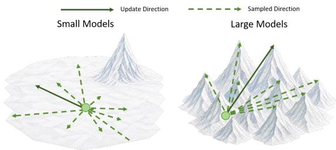  
Figure 4 Intuition for population scaling: sampled directions around a stronger backbone are more likely to align with a useful Agentic ESOpt direction.

As shown in Figure 4, one plausible interpretation is that a pre-trained stronger backbone will lead to a more competent local region, so a larger fraction of nearby perturbations produce behavior informative for the update. This interpretation is consistent with the finding of Gan and Isola (2026) that useful behavioral diversity becomes denser around stronger pre-trained models. This supports the prospect of using Agentic ESOpt to fine-tune larger advanced LLMs with fewer FLOPs; we will take establishing a universal scaling law and implementing Agentic ESOpt on frontier LLMs as future work.

Takeaway 5

The experiment provides initial population-sensitivity evidence: doubling G changes final-test success by +677.0% for 4B but 0.0% for 9B. That indicates stronger backbones may need fewer sampled directions.

## 8 Conclusion

This paper presents Agentic ESOpt, a full-parameter evolution-strategy framework for fine-tuning long-horizon LLM agents requiring only minimal inference-level GPU memory. We argue that for long-horizon agents, Agentic ESOpt is a more natural optimization paradigm than conventional Agentic RL. As interaction horizons grow and feedback becomes sparse, policy gradients must assign a trajectory-level outcome across an expanding sequence of actions. Agentic ESOpt instead attributes the outcome to a coherent policy perturbation, avoiding explicit horizon-wise action-score accumulation.

Our experiments support this shift. On controlled Sudoku, Agentic PPO and Agentic GRPO remain competitive at shorter horizons, whereas Agentic ESOpt becomes strongest as the minimum successful horizon grows; the advantage further extends to ReAct-style Math and DocVQA. Agentic ESOpt also provides a model-scaling advantage through forward-only optimization. Its inference-level memory footprint enables full-parameter adaptation of a Qwen3.5-27B WebArena agent on four H100 GPUs.

Beyond train-time fine-tuning, its flexibility naturally integrates parameter adaptation into broader optimization loops of test-time compute. Agentic ESOpt improves skill optimization and test-time heuristic search, including 28 of 36 matched AHD comparisons under fixed evaluation budgets.

Taken together, these results position ES not as a cheaper substitute for RL, but as a better-matched optimization mechanism for long-horizon, sparse-feedback LLM agents. As agentic systems move toward longer interactions, larger models, and increasingly complex prompt-space interactive components, Agentic ESOpt may become a central paradigm for agent fine-tuning and online self-improvement.

Limitations of the current study are discussed in Appendix A.1, and future work is outlined in Appendix A.2.

## Acknowledgement

We would like to sincerely thank Jiaying Wu, Penghui Qi, Zichen Liu, and Ziqiao Meng from the National University of Singapore, as well as Ziang Li from humans& for their important comments on the methodology and paper-writing.

## References

Tianzhe Chu, Yuexiang Zhai, Jihan Yang, Shengbang Tong, Saining Xie, Dale Schuurmans, Quoc V Le, Sergey Levine, and Yi Ma. Sft memorizes, rl generalizes: A comparative study of foundation model post-training. arXiv preprint arXiv:2501.17161, 2025.

Shangheng Du, Jiabao Zhao, Jinxin Shi, Zhentao Xie, Xin Jiang, Yanhong Bai, and Liang He. A survey on the optimization of large language model-based agents. ACM Computing Surveys, 58(9):1–37, 2026.

Lang Feng, Zhenghai Xue, Tingcong Liu, and Bo An. Group-in-group policy optimization for llm agent training. Advances in Neural Information Processing Systems, 38:46375–46408, 2026.

Zihang Fu, Haonan Wang, Jian Kang, Kenji Kawaguchi, and Jiaying Wu. Reasoning resides in layers: Restoring temporal reasoning in video-language models with layer-selective merging. arXiv preprint arXiv:2604.11399, 2026.

Yulu Gan and Phillip Isola. Neural thickets: Diverse task experts are dense around pretrained weights. arXiv preprint arXiv:2603.12228, 2026.

Gemini Team. Gemini 2.5: Pushing the frontier with advanced reasoning, multimodality, long context, and next generation agentic capabilities. arXiv preprint arXiv:2507.06261, 2025.

Yu Gu, Zhi Zheng, Yunpeng Ba, Xialiang Tong, Mingxuan Yuan, and Zhenkun Wang. Hyper-es: Efective evolution strategies for llm reasoning via descent direction merging. arXiv preprint arXiv:2608.05541, 2026.

Daya Guo, Dejian Yang, Haowei Zhang, Junxiao Song, Ruoyu Zhang, Runxin Xu, Qihao Zhu, Shirong Ma, Peiyi Wang, Xiao Bi, et al. Deepseek-r1: Incentivizing reasoning capability in llms via reinforcement learning. arXiv preprint arXiv:2501.12948, 2025.

Shuo He, Lang Feng, Xin Cheng, Lei Feng, Bo An, et al. Hierarchy-of-groups policy optimization for long-horizon agentic tasks. In International Conference on Learning Representations, volume 2026, pages 27572–27593, 2026.

Zhenyu Hou, Yujiang Li, Jie Tang, and Yuxiao Dong. Single-rollout asynchronous optimization for agentic reinforcement learning. arXiv preprint arXiv:2607.07508, 2026.

William Hoy, Binxu Wang, and Xu Pan. Matching accuracy, diferent geometry: Evolution strategies vs grpo in llm post-training. arXiv preprint arXiv:2604.01499, 2026.

Ziyao Huang, Weiwei Wu, Kui Wu, Wei-Bin Lee, and Jianping Wang. Calm: Co-evolution of algorithms and language model for automatic heuristic design. In International Conference on Learning Representations, volume 2026, pages 72468–72510, 2026.

Sunghwan Kim, Junhee Cho, Beong-woo Kwak, Taeyoon Kwon, Liang Wang, Nan Yang, Xingxing Zhang, Furu Wei, and Jinyoung Yeo. On training large language models for long-horizon tasks: An empirical study of horizon length. arXiv preprint arXiv:2605.02572, 2026.

Daria Korotyshova, Boris Shaposhnikov, Alexey Malakhov, Alexey Khokhulin, Nikita Surnachev, Kirill Ovcharenko, George Bredis, Alexey Gorbatovski, Viacheslav Sinii, and Daniil Gavrilov. Essa: Evolutionary strategies for scalable alignment. arXiv preprint arXiv:2507.04453, 2025.

Junbo Li, Peng Zhou, Rui Meng, Meet P Vadera, Lihong Li, and Yang Li. Turn-ppo: Turn-level advantage estimation with ppo for improved multi-turn rl in agentic llms. In Findings of the Association for Computational Linguistics: EACL 2026, pages 6227–6243, 2026.

Fei Liu, Xialiang Tong, Mingxuan Yuan, Xi Lin, Fu Luo, Zhenkun Wang, Zhichao Lu, and Qingfu Zhang. Evolution of heuristics: Towards eficient automatic algorithm design using large language model. arXiv preprint arXiv:2401.02051, 2024.

Fei Liu, Rui Zhang, Xi Lin, Zhichao Lu, and Qingfu Zhang. Fine-tuning large language model for automated algorithm design. arXiv preprint arXiv:2507.10614, 2025a.

WenTao Liu, Siyu Song, Hao Hao, and Aimin Zhou. Ea4llm: A gradient-free approach to large language model optimization via evolutionary algorithms. arXiv preprint arXiv:2510.10603, 2025b.

Xiao Liu, Tianjie Zhang, Yu Gu, Iat Long Iong, Song XiXuan, Yifan Xu, Shudan Zhang, Hanyu Lai, Jiadai Sun, Xinyue Yang, et al. Visualagentbench: Towards large multimodal models as visual foundation agents. In International Conference on Learning Representations, volume 2025, pages 95650–95707, 2025c.

Zichen Liu, Changyu Chen, Wenjun Li, Penghui Qi, Tianyu Pang, Chao Du, Wee Sun Lee, and Min Lin. Understanding r1-zero-like training: A critical perspective. arXiv preprint arXiv:2503.20783, 2025d.

Zichen Liu, Anya Sims, Keyu Duan, Changyu Chen, Simon Yu, Xiangxin Zhou, Haotian Xu, Shaopan Xiong, Bo Liu, Chenmien Tan, et al. Gem: A gym for agentic llms. arXiv preprint arXiv:2510.01051, 2025e.

Zeyao Ma, Bohan Zhang, Jing Zhang, Jifan Yu, Xiaokang Zhang, Xiaohan Zhang, Sijia Luo, Xi Wang, and Jie Tang. Spreadsheetbench: Towards challenging real world spreadsheet manipulation. Advances in Neural Information Processing Systems, 37:94871–94908, 2024.

Aman Madaan, Niket Tandon, Prakhar Gupta, Skyler Hallinan, Luyu Gao, Sarah Wiegrefe, Uri Alon, Nouha Dziri, Shrimai Prabhumoye, Yiming Yang, et al. Self-refine: Iterative refinement with self-feedback. Advances in neural information processing systems, 36:46534–46594, 2023.

Sadhika Malladi, Tianyu Gao, Eshaan Nichani, Alex Damian, Jason D Lee, Danqi Chen, and Sanjeev Arora. Fine-tuning language models with just forward passes. Advances in Neural Information Processing Systems, 36:53038–53075, 2023.

Jingwei Ni, Yihao Liu, Xinpeng Liu, Yutao Sun, Mengyu Zhou, Pengyu Cheng, Dexin Wang, Erchao Zhao, Xiaoxi Jiang, and Guanjun Jiang. Trace2skill: Distill trajectory-local lessons into transferable agent skills. arXiv preprint arXiv:2603.25158, 2026.

Zehan Qi, Xiao Liu, Iat Long Iong, Hanyu Lai, Xueqiao Sun, Jiadai Sun, Xinyue Yang, Yu Yang, Shuntian Yao, Wei Xu, et al. Webrl: Training llm web agents via self-evolving online curriculum reinforcement learning. In International Conference on Learning Representations, volume 2025, pages 79791–79821, 2025.

Xin Qiu, Yulu Gan, Conor F. Hayes, Qiyao Liang, Yinggan Xu, Roberto Dailey, Elliot Meyerson, Babak Hodjat, and Risto Miikkulainen. Evolution strategies at scale: LLM fine-tuning beyond reinforcement learning. In International Conference on Machine Learning, 2026.

Tim Salimans, Jonathan Ho, Xi Chen, Szymon Sidor, and Ilya Sutskever. Evolution strategies as a scalable alternative to reinforcement learning. arXiv preprint arXiv:1703.03864, 2017.

Bidipta Sarkar, Mattie Fellows, Juan Agustin Duque, Alistair Letcher, Antonio León Villares, Anya Sims, Clarisse Wibault, Dmitry Samsonov, Dylan Cope, Jarek Liesen, et al. Evolution strategies at the hyperscale. arXiv preprint arXiv:2511.16652, 2025.

John Schulman, Filip Wolski, Prafulla Dhariwal, Alec Radford, and Oleg Klimov. Proximal policy optimization algorithms. arXiv preprint arXiv:1707.06347, 2017.

Zhihong Shao, Peiyi Wang, Qihao Zhu, Runxin Xu, Junxiao Song, Xiao Bi, Haowei Zhang, Mingchuan Zhang, YK Li, Y Wu, et al. Deepseekmath: Pushing the limits of mathematical reasoning in open language models. arXiv preprint arXiv:2402.03300, 2024.

Yifei Shen, Bo Li, and Xinjie Zhang. Skillopt-lite: Better and faster agent self-evolution via one line of vibe. arXiv preprint arXiv:2607.03451, 2026.

Noah Shinn, Federico Cassano, Ashwin Gopinath, Karthik Narasimhan, and Shunyu Yao. Reflexion: Language agents with verbal reinforcement learning. Advances in neural information processing systems, 36:8634–8652, 2023.

Charlie Snell, Jaehoon Lee, Kelvin Xu, and Aviral Kumar. Scaling llm test-time compute optimally can be more efective than scaling model parameters. arXiv preprint arXiv:2408.03314, 2024.

Mingyang Song and Mao Zheng. A survey of on-policy distillation for large language models. arXiv preprint arXiv:2604.00626, 2026.

Zhishen Sun, Sizhe Dang, Guang Dai, and Haishan Ye. Essam: A novel competitive evolution strategies approach to reinforcement learning for memory eficient llms fine-tuning. arXiv preprint arXiv:2602.01003, 2026.

Fahim Tajwar, Guanning Zeng, Yueer Zhou, Yuda Song, Daman Arora, Yiding Jiang, Jef Schneider, Ruslan Salakhutdinov, Haiwen Feng, and Andrea Zanette. Maximum likelihood reinforcement learning. arXiv preprint arXiv:2602.02710, 2026.

Kimi Team, Tongtong Bai, Yifan Bai, Yiping Bao, Jianfeng Cai, Xinyuan Cai, Peizhou Cao, Yuxuan Cao, Ziwei Chai, Y Charles, et al. Kimi k3: Open frontier intelligence. arXiv preprint arXiv:2607.24653, 2026.

Guanzhi Wang, Yuqi Xie, Yunfan Jiang, Ajay Mandlekar, Chaowei Xiao, Yuke Zhu, Linxi Fan, and Anima Anandkumar. Voyager: An open-ended embodied agent with large language models. arXiv preprint arXiv:2305.16291, 2023.

Xingyao Wang, Boxuan Li, Yufan Song, Frank F. Xu, Xiangru Tang, Mingchen Zhuge, Jiayi Pan, et al. OpenHands: An open platform for AI software developers as generalist agents. arXiv preprint arXiv:2407.16741, 2024.

Zixuan Wang, Yuchen Yan, Hongxing Li, Teng Pan, Dingming Li, Ruiqing Zhang, Weiming Lu, Jun Xiao, Yueting Zhuang, and Yongliang Shen. Milestone-guided policy learning for long-horizon language agents. arXiv preprint arXiv:2605.06078, 2026.

Yaxiong Wu, Sheng Liang, Chen Zhang, Yichao Wang, Yongyue Zhang, Huifeng Guo, Ruiming Tang, and Yong Liu. From human memory to ai memory: A survey on memory mechanisms in the era of llms. arXiv preprint arXiv:2504.15965, 2025.

Wujiang Xu, Zujie Liang, Kai Mei, Hang Gao, Juntao Tan, and Yongfeng Zhang. A-mem: Agentic memory for llm agents. arXiv preprint arXiv:2502.12110, 2025.

An Yang, Anfeng Li, Baosong Yang, Beichen Zhang, Binyuan Hui, Bo Zheng, Bowen Yu, et al. Qwen3 technical report. arXiv preprint arXiv:2505.09388, 2025.

John Yang, Carlos E. Jimenez, Alexander Wettig, Kilian Lieret, Shunyu Yao, Karthik Narasimhan, and Ofir Press. SWE-agent: Agent–computer interfaces enable automated software engineering. arXiv preprint arXiv:2405.15793, 2024.

Yifan Yang, Ziyang Gong, Weiquan Huang, Qihao Yang, Ziwei Zhou, Zisu Huang, Yan Li, Xuemei Gao, Qi Dai, Bei Liu, et al. Skillopt: Executive strategy for self-evolving agent skills. arXiv preprint arXiv:2605.23904, 2026.

Shunyu Yao, Jefrey Zhao, Dian Yu, Nan Du, Izhak Shafran, Karthik Narasimhan, and Yuan Cao. React: Synergizing reasoning and acting in language models. arXiv preprint arXiv:2210.03629, 2022.

Shunyu Yao, Dian Yu, Jefrey Zhao, Izhak Shafran, Tom Grifiths, Yuan Cao, and Karthik Narasimhan. Tree of thoughts: Deliberate problem solving with large language models. Advances in neural information processing systems, 36:11809–11822, 2023.

Qiying Yu, Zheng Zhang, Ruofei Zhu, Yufeng Yuan, Xiaochen Zuo, Yu Yue, Weinan Dai, Tiantian Fan, Gaohong Liu, Lingjun Liu, et al. Dapo: An open-source llm reinforcement learning system at scale. arXiv preprint arXiv:2503.14476, 2025.

Yang Yue, Zhiqi Chen, Rui Lu, Andrew Zhao, Zhaokai Wang, Shiji Song, and Gao Huang. Does reinforcement learning really incentivize reasoning capacity in llms beyond the base model? arXiv preprint arXiv:2504.13837, 2025.

Chenchen Zhang. From reasoning to agentic: Credit assignment in reinforcement learning for large language models. arXiv preprint arXiv:2604.09459, 2026.

Yanjun Zhao, Sizhe Dang, Haishan Ye, Guang Dai, Yi Qian, and Ivor Tsang. Second-order fine-tuning without pain for llms: A hessian informed zeroth-order optimizer. In International Conference on Learning Representations, volume 2025, pages 43496–43520, 2025.

Zhi Zheng, Yu Gu, Wei Liu, Yee Whye Teh, and Wee Sun Lee. Soft-grpo: Surpassing discrete-token llm reinforcement learning via gumbel-reparameterized soft-thinking policy optimization. arXiv preprint arXiv:2511.06411, 2025a.

Zhi Zheng, Zhuoliang Xie, Zhenkun Wang, and Bryan Hooi. Monte carlo tree search for comprehensive exploration in llm-based automatic heuristic design. arXiv preprint arXiv:2501.08603, 2025b.

Shuyan Zhou, Frank F Xu, Hao Zhu, Xuhui Zhou, Robert Lo, Abishek Sridhar, Xianyi Cheng, Tianyue Ou, Yonatan Bisk, Daniel Fried, et al. Webarena: A realistic web environment for building autonomous agents. In International Conference on Learning Representations, volume 2024, pages 15585–15606, 2024.

King Zhu, Hanhao Li, Siwei Wu, Tianshun Xing, Dehua Ma, Xiangru Tang, Minghao Liu, Jian Yang, Jiaheng Liu, Yuchen Eleanor Jiang, et al. Scaling test-time compute for llm agents. arXiv preprint arXiv:2506.12928, 2025.

## Appendix Appendix Contents

A. Limitations & Future Work . . . . . . . . . . . . . . . . . . . . . . . . . . . . . . . . . . . . . . . . . . . . . . . . . . . . . . . . . . . . . . . . . . . . . . . . . . . . . 16   
A.1. Limitations . . . . . . . . . . . . . . . . . . . . . . . . . . . . . . . . . . . . . . . . . . . . . . . . . . . . . . . . . . . . . . . . . . . . . . . . . . . . . . . . . . . . . 16   
A.2. Future Work . . . . . . . . . . . . . . . . . . . . . . . . . . . . . . . . . . . . . . . . . . . . . . . . . . . . . . . . . . . . . . . . . . . . . . . . . . . . . . . . . . . . 16   
B. Additional Related Work . . . . . . . . . . . . . . . . . . . . . . . . . . . . . . . . . . . . . . . . . . . . . . . . . . . . . . . . . . . . . . . . . . . . . . . . . . . . . 17   
B.1. Agentic Reinforcement Learning . . . . . . . . . . . . . . . . . . . . . . . . . . . . . . . . . . . . . . . . . . . . . . . . . . . . . . . . . . . . . . . . . 17   
B.2. Evolution Strategies . . . . . . . . . . . . . . . . . . . . . . . . . . . . . . . . . . . . . . . . . . . . . . . . . . . . . . . . . . . . . . . . . . . . . . . . . . . . . 17   
B.3. Skill and Memory-Based Self-Improvement . . . . . . . . . . . . . . . . . . . . . . . . . . . . . . . . . . . . . . . . . . . . . . . . . . . . . . 17   
C. Theoretical Analysis and Computational Accounting . . . . . . . . . . . . . . . . . . . . . . . . . . . . . . . . . . . . . . . . . . . . . . . . . . . . . 18   
C.1. Derivation of the Scalar-Score ES Gradient . . . . . . . . . . . . . . . . . . . . . . . . . . . . . . . . . . . . . . . . . . . . . . . . . . . . . . 18   
C.2. Proof of the Gaussian-Smoothing Bias Expansion . . . . . . . . . . . . . . . . . . . . . . . . . . . . . . . . . . . . . . . . . . . . . . . . 18   
C.3. Long-Horizon Credit Assignment . . . . . . . . . . . . . . . . . . . . . . . . . . . . . . . . . . . . . . . . . . . . . . . . . . . . . . . . . . . . . . . . 19   
C.4. AHD as Heuristic-Space Optimization . . . . . . . . . . . . . . . . . . . . . . . . . . . . . . . . . . . . . . . . . . . . . . . . . . . . . . . . . . . 20   
C.5. Training FLOPs Calculation . . . . . . . . . . . . . . . . . . . . . . . . . . . . . . . . . . . . . . . . . . . . . . . . . . . . . . . . . . . . . . . . . . . . . 21   
D. Experimental Settings and Additional Results . . . . . . . . . . . . . . . . . . . . . . . . . . . . . . . . . . . . . . . . . . . . . . . . . . . . . . . . . . . 22   
D.1. Sudoku . . . . . . . . . . . . . . . . . . . . . . . . . . . . . . . . . . . . . . . . . . . . . . . . . . . . . . . . . . . . . . . . . . . . . . . . . . . . . . . . . . . 22   
D.2. Math Reasoning . . . . . . . . . . . . . . . . . . . . . . . . . . . . . . . . . . . . . . . . . . . . . . . . . . . . . . . . . . . . . . . . . . . . . . . . . . . . . . . . . 24   
D.3. DocVQA . . . . . . . . . . . . . . . . . . . . . . . . . . . . . . . . . . . . . . . . . . . . . . . . . . . . . . . . . . . . . . . . . . . . . . . . . . . . . . . . . . . . . . . . 25   
D.4. WebArena-Lite . . . . . . . . . . . . . . . . . . . . . . . . . . . . . . . . . . . . . . . . . . . . . . . . . . . . . . . . . . . . . . . . . . . . . . . . . . . . . . . . . . 27   
D.5. Automatic Heuristic Design . . . . . . . . . . . . . . . . . . . . . . . . . . . . . . . . . . . . . . . . . . . . . . . . . . . . . . . . . . . . . . . . . . . . . 28   
D.6. Cross-Setting Hyperparameter Summary . . . . . . . . . . . . . . . . . . . . . . . . . . . . . . . . . . . . . . . . . . . . . . . . . . . . . . . . 30   
E. Prompts and Skills . . . . . . . . . . . . . . . . . . . . . . . . . . . . . . . . . . . . . . . . . . . . . . . . . . . . . . . . . . . . . . . . . . . . . . . . . . . . . . . . . . . . . 32   
E.1. Sudoku . . . . . . . . . . . . . . . . . . . . . . . . . . . . . . . . . . . . . . . . . . . . . . . . . . . . . . . . . . . . . . . . . . . . . . . . . . . . . . . . . . . . 32   
E.2. Math Reasoning . . . . . . . . . . . . . . . . . . . . . . . . . . . . . . . . . . . . . . . . . . . . . . . . . . . . . . . . . . . . . . . . . . . . . . . . . . . . . . . . . 32   
E.3. DocVQA . . . . . . . . . . . . . . . . . . . . . . . . . . . . . . . . . . . . . . . . . . . . . . . . . . . . . . . . . . . . . . . . . . . . . . . . . . . . . . . . . . . . . . . . 33   
E.4. WebArena-Lite . . . . . . . . . . . . . . . . . . . . . . . . . . . . . . . . . . . . . . . . . . . . . . . . . . . . . . . . . . . . . . . . . . . . . . . . . . . . . . . . . . 34   
E.5. Automatic Heuristic Design . . . . . . . . . . . . . . . . . . . . . . . . . . . . . . . . . . . . . . . . . . . . . . . . . . . . . . . . . . . . . . . . . . . . . 36   
F. Licensing and External Components . . . . . . . . . . . . . . . . . . . . . . . . . . . . . . . . . . . . . . . . . . . . . . . . . . . . . . . . . . . . . . . . . . . . 37   
F.1. Licensing Scope . . . . . . . . . .   
F.2. Upstream Repositories Used by the Released Workflow . . . . . . . . . . . . . . . . . . . . . . . . . .

## A Limitations & Future Work

## A.1 Limitations

Introducing new hyperparameters. Compared to Agentic RL, Agentic ESOpt introduces hyperparameters for the perturbation radius σ. Their optimal values can depend on LLMs, reward distribution, and environment, which may introduce additional tuning cost compared with using a fixed training recipe. However, as summarized in Appendix D.6, we use relatively consistent configurations across tasks and LLMs, taking $\sigma _ { 0 } \approx 1 e - 3$ and α ≈ 5e − 4 across 5 experiments. This shows that this set of parameters is highly generic. We will take the automatic schedule for σ as future work.

Concerns in Expensive Evaluation Scenarios. Agentic ESOpt trades backpropagation cost for a larger number of independent environment evaluations: under matched model FLOPs, it can aford more trajectories because each trajectory requires only a forward pass. This trade-of may become less favorable when environment evaluation itself is extremely expensive, in which case rollout cost rather than model computation can dominate the total budget.

Continual learning remains unclear. The current experiments establish in-setting adaptation. As mentioned in Hoy et al. (2026), unlike GRPO, which usually does sparse updates, ES will lead to a random walk in directions irrelevant to the optimization objective, raising concerns about continual learning. However, although the ES update is dense in the strict sense, its magnitude is still highly concentrated. As shown in Table 7, Agentic ESOpt updates can still maintain sparsity within a certain threshold: 96.26% of the final parameter updates remain within the perturbation scale $\sigma ,$ and 99.42% are smaller than $2 . 0 \times 1 0 ^ { - 3 }$

Table 7 Distribution of parameter-update magnitudes after Agentic ESOpt for WebArena on Qwen3.5-27B with perturbation scale $\sigma _ { t } = 1 . 5 \times 1 0 ^ { - 3 }$
<table><tr><td>Update-magnitude threshold Fraction of parameters</td><td></td></tr><tr><td> $\left| \Delta \theta \right| \leq 1 . 0 \times 1 0 ^ { - 3 }$ </td><td>83.68%</td></tr><tr><td> $\Delta \theta \vert \le 1 . 5 \times 1 0 ^ { - 3 } ( = \sigma )$ </td><td>96.26%</td></tr><tr><td> $| \Delta \theta | \leq 2 . 0 \times 1 0 ^ { - 3 }$ </td><td>99.42%</td></tr></table>

## A.2 Future Work

Scaling to advanced LLMs and population scaling laws. The inference-level memory requirement of Agentic ESOpt provides a direct path toward full-parameter adaptation of substantially larger LLM agents. Our 4B/9B results further suggest that stronger backbones may require fewer perturbation directions, motivating a systematic study of population scaling with model capability. Moreover, as future work, scaling to advanced LLMs (Team et al., 2026; Guo et al., 2025; Gemini Team, 2025) may also enable online adaptation in industrial scenarios involving proprietary tools, APIs, and complex workflows.

Quantized ES optimization. Quantization could further extend the scalability of Agentic ESOpt, but applying dense parameter perturbations directly to quantized weights requires scale-aware noise generation and numerically stable updates (Sarkar et al., 2025). Developing ES-specific infra for quantization-compatible perturbation and seed-replay mechanisms is therefore an important systems direction for large-scale ES finetuning.

Tighter skill–parameter co-evolution. Our experiments demonstrate both shared-rollout skill distillation with Trace2Skill and online parameter adaptation inside EoH. A natural next step is fully coupled multi-step skill optimization (Yang et al., 2026; Shen et al., 2026) in which the external context $c _ { t }$ and model parameters $\theta _ { t }$ evolve on comparable timescales, allowing skill- and parameter-space updates to continually reshape the data distribution seen by one another.

## B Additional Related Work

## B.1 Agentic Reinforcement Learning

Reinforcement learning provides the standard route for optimizing model parameters from verifiable task feedback (Shao et al., 2024; Liu et al., 2025d; Yu et al., 2025; Zheng et al., 2025a; Tajwar et al., 2026). These methods have demonstrated strong performance on single-turn LLM reasoning.

The recent agentic scenarios bring new challenges about long-context and long-horizon credit assignment (Kim et al., 2026; Liu et al., 2025e), and there are studies that try to apply RL techniques to agentic scenarios (Qi et al., 2025; Feng et al., 2026; Wang et al., 2026). Some work highlights better rollout in a GRPO-style baseline (Feng et al., 2026; He et al., 2026), and there are also works training critic network and use PPO for better credit assignment (Hou et al., 2026). These methods can improve the credit assignment ability of RL, but we believe that considering Agentic ESOpt should be seen as a more direct solution. Gradient-based agentic RL usually requires a training stack that stores rollouts, estimates token-level policy gradients, manages reference models or KL constraints, and consumes substantial memory. Agentic ESOpt maintains the same high-level goal of parameter adaptation, but uses scalar black-box fitness so that the environment trajectory does not need to be diferentiable or retained for backpropagation.

## B.2 Evolution Strategies for single-turn LLM Fine-Tuning.

As advanced LLMs are equipped with larger and larger parameters, fine-tuning them on devices with moderate scales becomes unafordable, and ES have emerged as eficient gradient-free optimizers for fine-tuning single-turn LLMs. Qiu et al. (2026) demonstrated that ES can scale to full-parameter LLM fine-tuning, matching or exceeding GRPO in sample eficiency and training stability. This momentum has driven ES-based methods into pre-training (Liu et al., 2025b), few-shot adaptation (Gan and Isola, 2026; Korotyshova et al., 2025; Gu et al., 2026; Fu et al., 2026), and memory-eficient tuning via sharpness-aware mechanisms (Sun et al., 2026). In these methods, ES achieves higher GPU memory eficiency but lower performance than RL methods. However, we argue that the structural advantages of ES are actually pronounced in fine-tuning long-horizon agents, where Agentic ESOpt can become preferable to Agentic RL, instead of merely serving as a cheaper alternative.

As a similar category of gradient-free LLM fine-tuning, zeroth-order methods (Malladi et al., 2023; Zhao et al., 2025) focus on SFT, making them hard to apply to single-turn and multi-turn reasoning scenarios.

## B.3 Skill and Memory-Based Self-Improvement and Test-Time Compute

A broad class of self-improving agents improves behavior by optimizing external, non-parametric components while keeping the underlying LLM fixed. Reflexion converts failed trajectories into verbal feedback that conditions later trials (Shinn et al., 2023); Voyager accumulates executable skills for open-ended embodied exploration (Wang et al., 2023); and recent memory systems organize and retrieve past experience over long-horizon interactions (Xu et al., 2025; Wu et al., 2025). More recent methods such as SkillOpt and Trace2Skill make this optimization explicit by treating the skill document itself as an optimizable object (Yang et al., 2026; Ni et al., 2026).

Test-time compute (Snell et al., 2024; Zhu et al., 2025) methods follow a related principle: they improve task performance through additional search (Yao et al., 2023), sampling, reflection (Madaan et al., 2023), or evolution (Liu et al., 2024) at inference time, while typically leaving the model parameters unchanged. These approaches are lightweight and flexible, but their optimization remains constrained by the behaviors accessible to the frozen policy.

Agentic ESOpt complements these methods by introducing parameter adaptation as an additional optimization dimension. Its black-box update can reuse the same trajectory-level feedback already collected for skill, memory, or test-time search, allowing external-space optimization and parameter-space optimization to proceed together. This enables Agentic ESOpt to strengthen existing self-improvement and test-time compute pipelines without replacing their original search or skill-update mechanisms.

## C Theoretical Analysis and Computational Accounting

## C.1 Derivation of the Scalar-Score ES Gradient

Let d be the number of LLM parameters and let

$$
q _ { \sigma } ( \vartheta \mid \theta ) = \frac { 1 } { ( 2 \pi \sigma ^ { 2 } ) ^ { d / 2 } } \exp \left( - \frac { \vert \vert \vartheta - \theta \vert \vert _ { 2 } ^ { 2 } } { 2 \sigma ^ { 2 } } \right)
$$

denotes the density of a Gaussian perturbation centered at θ. Equivalently, $\vartheta = \theta + \sigma \epsilon$ with $\epsilon \sim \mathcal { N } ( 0 , I )$ . The smoothed objective can then be written as

$$
J _ { \sigma } ( \theta ; c ) = \int J ( \vartheta ; c ) q _ { \sigma } ( \vartheta \mid \theta ) d \vartheta .
$$

Assuming diferentiation and integration can be interchanged, the log-derivative identity gives

$$
\begin{array} { r l } & { \nabla _ { \theta } J _ { \sigma } ( \theta ; c ) = \displaystyle \int J ( \vartheta ; c ) \nabla _ { \theta } q _ { \sigma } ( \vartheta \mid \theta ) d \vartheta } \\ & { \qquad = \mathbb { E } _ { \vartheta \sim q _ { \sigma } ( \cdot \mid \theta ) } \left[ J ( \vartheta ; c ) \nabla _ { \theta } \log q _ { \sigma } ( \vartheta \mid \theta ) \right] . } \end{array}\tag{5}
$$

(6)

For the Gaussian density,

$$
\nabla _ { \boldsymbol { \theta } } \log q _ { \sigma } ( \boldsymbol { \vartheta } \mid \boldsymbol { \theta } ) = \frac { \boldsymbol { \vartheta } - \boldsymbol { \theta } } { \sigma ^ { 2 } } = \frac { \epsilon } { \sigma } ,
$$

and hence

$$
\nabla _ { \theta } J _ { \sigma } ( \theta ; c ) = \frac { 1 } { \sigma } \mathbb { E } _ { \epsilon } \left[ J ( \theta + \sigma \epsilon ; c ) \epsilon \right] .
$$

Now expand the inner objective using its trajectory definition:

$$
J ( \theta + \sigma \epsilon ; c ) = \mathbb { E } _ { \pmb { \tau } \sim \pi _ { \theta + \sigma \epsilon } ( \cdot | c ) } \left[ R ( \pmb { \tau } ) \right] .
$$

The law of total expectation therefore yields

$$
\nabla _ { \boldsymbol { \theta } } J _ { \sigma } ( \boldsymbol { \theta } ; c ) = \frac { 1 } { \sigma } \mathbb { E } _ { \mathbf { \Phi } _ { \tau \sim \pi _ { \boldsymbol { \theta } + \sigma \epsilon } } ( \cdot \vert c ) } \left[ R ( \tau ) \boldsymbol { \epsilon } \right] .
$$

Thus, for independent perturbations $\epsilon _ { i }$ and conditional rollouts $\tau _ { i } \sim \pi _ { \theta + \sigma \epsilon _ { i } } ( \cdot \mid c )$ , the canonical Monte Carlo estimator is

$$
\widehat { g } _ { \mathrm { E S } } = \frac { 1 } { G \sigma } \sum _ { i = 1 } ^ { G } R ( \tau _ { i } ) \boldsymbol { \epsilon } _ { i } , \qquad \mathbb { E } [ \widehat { g } _ { \mathrm { E S } } ] = \nabla _ { \boldsymbol { \theta } } J _ { \sigma } ( \boldsymbol { \theta } ; \boldsymbol { c } ) .
$$

Because $\mathbb { E } [ \boldsymbol { \epsilon } ] = 0$ , any perturbation-independent scalar baseline b may replace $R ( \tau _ { i } )$ by $R ( \pmb { \tau } _ { i } ) - b$ without changing this expectation. Crucially, the estimator uses the environment only to produce the scalar $R ( \tau _ { i } )$ ; no derivative of the sampled actions, environment transitions, or reward function is required. The within-population reward standardization used by Agentic ESOpt is the practical finite-sample variant described in the main text.

## C.2 Proof of the Gaussian-Smoothing Bias Expansion

This subsection proves Lemma 1. We suppress the fixed external context c for readability and write $J ( \theta )$ for the corresponding task objective.

Proof of Lemma 1. Define the Gaussian-smoothed objective

$$
J _ { \sigma } ( \theta ) = \mathbb { E } _ { \epsilon \sim \mathcal { N } ( 0 , I ) } \left[ J ( \theta + \sigma \epsilon ) \right] .
$$

By the Gaussian score-function identity, or equivalently integration by parts,

$$
\nabla _ { \boldsymbol { \theta } } J _ { \sigma } ( \boldsymbol { \theta } ) = \frac { 1 } { \sigma } \mathbb { E } _ { \epsilon } \left[ J ( \boldsymbol { \theta } + \sigma \epsilon ) \boldsymbol { \epsilon } \right] .
$$

Thus, the population ES estimator is unbiased for $\nabla _ { \boldsymbol { \theta } } J _ { \sigma } ( \boldsymbol { \theta } )$

To compare the smoothed and original objectives, expand $J ( \theta + \sigma \epsilon )$ around θ. Odd moments of a centered Gaussian vanish, and $\mathbb { E } [ \epsilon \epsilon ^ { \top } ] = I$ , giving

$$
J _ { \sigma } ( \theta ) = J ( \theta ) + \frac { \sigma ^ { 2 } } { 2 } \mathrm { T r } \Big ( \nabla _ { \theta } ^ { 2 } J ( \theta ) \Big ) + { \cal O } ( \sigma ^ { 4 } ) = J ( \theta ) + \frac { \sigma ^ { 2 } } { 2 } \Delta _ { \theta } J ( \theta ) + { \cal O } ( \sigma ^ { 4 } ) .
$$

Diferentiating the expansion yields

$$
\nabla _ { \boldsymbol { \theta } } J _ { \sigma } ( \boldsymbol { \theta } ) = \nabla _ { \boldsymbol { \theta } } J ( \boldsymbol { \theta } ) + \frac { \sigma ^ { 2 } } { 2 } \nabla _ { \boldsymbol { \theta } } \Delta _ { \boldsymbol { \theta } } J ( \boldsymbol { \theta } ) + O ( \sigma ^ { 4 } ) .
$$

Therefore, the leading smoothing bias relative to $\nabla _ { \boldsymbol { \theta } } J ( \boldsymbol { \theta } )$ is proportional to $\sigma ^ { 2 }$ , as stated in Lemma 1. □

## C.3 Long-Horizon Credit Assignment

Let $u _ { t } = \nabla _ { \theta }$ log $\pi _ { \boldsymbol { \theta } } { \left( a _ { t } \ \right| } \ s _ { t } )$ be the policy score at turn $t ,$ and let $\widetilde { R } = R - b$ denote the baseline-centered terminal return. The trajectory-level policy-gradient estimator is

$$
\widehat { g } _ { \mathrm { P G } } = \widetilde { R } \sum _ { t = 1 } ^ { H } u _ { t } .
$$

Assume, as a scaling approximation, that (i) the return has weak correlation with any individual action score, (ii) score terms at diferent turns are approximately uncorrelated, and (iii) their marginal covariance is comparable across turns, $\mathrm { C o v } ( u _ { t } ) \approx \Sigma _ { u }$ . Then

$$
\mathrm { C o v } ( \widehat { g } _ { \mathrm { P G } } ) \approx \mathrm { V a r } ( \widetilde { R } ) \mathrm { C o v } \left( \sum _ { t = 1 } ^ { H } u _ { t } \right)\tag{7}
$$

$$
= \operatorname { V a r } ( \widetilde { R } ) \left[ \sum _ { t = 1 } ^ { H } \operatorname { C o v } ( u _ { t } ) + \sum _ { s \neq t } \operatorname { C o v } ( u _ { s } , u _ { t } ) \right]\tag{8}
$$

$$
\approx H \ \mathrm { V a r } ( \widetilde { R } ) \Sigma _ { u } .\tag{9}
$$

Thus, under these assumptions, the policy-score contribution to the estimator variance grows approximately linearly with the realized horizon H.

For Agentic ESOpt, one perturbation $\epsilon \sim \mathcal { N } ( 0 , I )$ is sampled for the complete trajectory, giving

$$
\widehat { g } _ { \mathrm { E S } } = \widetilde { R } \big ( \theta + \sigma \epsilon \big ) \frac { \epsilon } { \sigma } .
$$

Under the analogous weak-correlation approximation,

$$
\mathrm { C o v } ( \widehat { g } _ { \mathrm { E S } } ) \approx \mathrm { V a r } ( \widetilde { R } ) \mathrm { C o v } \left( \frac { \epsilon } { \sigma } \right) ,
$$

whose parameter-score factor contains no sum over turns. The comparison therefore isolates an explicit horizon-dependent source of variance in action-space policy gradients that is absent from the ES parameter score.

Scope of the scaling comparison. The above argument concerns the horizon-dependent score structure of the two estimators. Agentic ESOpt can still become harder to optimize as the horizon grows because the return distribution may become sparser or less discriminative. Its estimator quality may also depend on the parameter dimension $d ,$ perturbation radius σ, population size $G ,$ and the local geometry of the smoothed objective. Accordingly, the analysis does not assert that the total variance of ES is independent of $H _ { ; }$ , nor that ES universally dominates policy gradients. The comparative prediction is that, when other sources of dificulty are approximately comparable, increasing the efective horizon introduces an additional accumulation of action-score terms for policy gradients but not for the ES parameter score. This follows the scaling perspective of Salimans et al. (2017, Sec. 3.1).

From realized horizon H to minimum successful horizon $H ^ { * }$ . The theoretical quantity above is the realized trajectory length H. In the Sudoku experiments, we instead control

$$
H ^ { * } ( x ) = \operatorname* { m i n } _ { \tau : R ( \tau ) = 1 } | \tau | ,
$$

which gives a task-dependent lower bound on the horizon of every successful trajectory. Because each valid Sudoku action fills at most one masked cell, masking 5, 10, and 15 cells yields $H ^ { * } = 5 , 1 0$ , and 15, respectively. Failed, invalid, or unproductive actions can make the realized horizon substantially larger than $H ^ { * }$

Increasing $H ^ { * }$ in this natural task family also changes aspects of task dificulty, such as the amount of missing information and the probability of completing all required actions correctly. The Sudoku study is therefore intended to test the practical prediction that the relative behavior of parameter-space and action-space attribution changes as the minimum interaction requirement grows, instead of identifying a pure delay efect in an otherwise identical MDP. The executed-turn analysis in Figure 6 complements $H ^ { * }$ by directly measuring how the realized horizon evolves during optimization.

## C.4 AHD as Heuristic-Space Optimization

Automatic heuristic design is not a language-generation task in the usual sense: the generated text matters only through the algorithmic behavior it induces. We therefore view AHD as optimization over a heuristic space (Zheng et al., 2025b). Let X be a distribution over problem instances and let $h \in { \mathcal { H } }$ denote a heuristic sampled from the LLM-induced proposal distribution. A solver $A _ { h }$ uses h to construct a solution $y = A _ { h } ( x )$ for instance x. The idealized objective is

$$
\operatorname* { m i n } _ { h \in \mathcal { H } } \mathbb { E } _ { x \sim \mathcal { X } } \left[ S ( y , x ) \right] , \qquad y = A _ { h } ( x ) ,
$$

where $S$ is a signed score chosen so that larger is better. This paper covers 5 NP-hard combinatorial optimization problems, including the Traveling Salesman Problem (TSP), which seeks the shortest tour visiting all nodes exactly once; the Capacitated Vehicle Routing Problem (CVRP), which minimizes the total routing cost for capacity-constrained vehicles serving customer demands; the 0-1 Knapsack Problem (KP), which maximizes the total value of selected items under a capacity constraint; the Bin-Packing Problem (BPP), which minimizes the number of fixed-capacity bins required to pack all items; and the Admissible Set Problem (ASP), which seeks the largest subset satisfying a predefined set of feasibility constraints.

For minimization problems such as TSP, CVRP, and BPP, S is the negative objective value; for maximization problems such as KP and ASP, S is the original objective value. The relevant object is therefore not the textual form of h, but the induced mapping from problem states to algorithmic decisions.

In constructive AHD, $A _ { h }$ is a sequential decision rule. At a partial solution state $s _ { t }$ , the heuristic induces a preference over feasible actions,

$$
a _ { t } \in \arg \operatorname* { m a x } _ { a \in \mathcal { A } ( s _ { t } ) } h ( s _ { t } , a ) , \qquad s _ { t + 1 } = T ( s _ { t } , a _ { t } ) ,
$$

until a complete solution is obtained. TSP evaluates the length of the constructed tour, KP evaluates the value of the selected item set under a capacity constraint, and ASP evaluates the cardinality of the constructed admissible set. These tasks test whether Agentic ESOpt can alter the LLM proposal distribution toward heuristics whose local decisions accumulate into better global solutions.

In ACO-style AHD, $A _ { h }$ is stochastic. The heuristic defines an energy or desirability function over solution components, which biases a sampling distribution of the form

$$
p _ { h } ( a _ { t } \mid s _ { t } ) \propto \exp \left( \beta h ( s _ { t } , a _ { t } ) \right) \cdot \Phi _ { t } ( s _ { t } , a _ { t } ) ,
$$

where $\Phi _ { t }$ denotes the non-learned search state, such as pheromone or feasibility terms, and $\beta$ controls the strength of the heuristic bias. The objective is the expected quality of solutions sampled by this stochastic solver. Agentic ESOpt + EoH preserves this outer optimization problem and changes only the model-induced distribution over $h .$

## C.5 Training FLOPs Calculation

We follow the FLOPs accounting of Gan and Isola (2026, Appendix E.1). For a model with P parameters and a trajectory containing L<sup>¯</sup> model-processed tokens, a forward pass requires approximately 2PL<sup>¯</sup> FLOPs, while a backward pass requires approximately 4PL<sup>¯</sup> FLOPs.

Let $T , B ,$ and G denote the number of training iterations, prompt batch size, and number of rollouts or perturbation directions per prompt, respectively. The method-specific training costs are

$$
\begin{array} { r l } & { \mathrm { F L O P s } _ { \mathrm { E S } } = T _ { \mathrm { E S } } B _ { \mathrm { E S } } G _ { \mathrm { E S } } \underbrace { ( 2 ) } _ { \mathrm { p o l i c y ~ f o r w a r d } } P \bar { L } _ { \mathrm { E S } } } \\ & { \mathrm { ~ \ ~ \ } = 2 T _ { \mathrm { E S } } B _ { \mathrm { E S } } G _ { \mathrm { E S } } P \bar { L } _ { \mathrm { E S } } , } \end{array}\tag{10}
$$

$$
\begin{array} { r l } { \mathrm { F L O P s } _ { \mathrm { G R P O } } = T _ { \mathrm { G R P O } } B _ { \mathrm { G R P O } } G _ { \mathrm { G R P O } } \underbrace { ( 2 + 2 + 4 ) } _ { \mathrm { p o l i c y ~ f o r w a r d } } } & { P \bar { L } _ { \mathrm { G R P O } } } \\ { + \mathrm { r e f e r e n c e ~ f o r w a r d } } & { } \\ { + \mathrm { p o l i c y ~ b a c k w a r d } } & { } \\ { = 8 T _ { \mathrm { G R P O } } B _ { \mathrm { G R P O } } G _ { \mathrm { G R P O } } P \bar { L } _ { \mathrm { G R P O } } , } \end{array}\tag{11}
$$

$$
\begin{array} { r l } & { \mathrm { F L O P s } _ { \mathrm { P P P O } } = T _ { \mathrm { P P O } } B _ { \mathrm { P P O } } G _ { \mathrm { P P O } } \underbrace { \left( 2 + 2 + 2 + 4 + 4 \right) } _ { \mathrm { p o l i c y ~ f o r w a r d + r e f e r e n c e ~ f o r w a r d } } \underbrace { P \bar { L } _ { \mathrm { P P O } } } _ { \mathrm { ( ) } } } \\ & { \qquad \quad + \mathrm { c r i t i c ~ f o r w a r d + p o l i c y ~ b a c k w a r d + c r i t i c ~ b a c k w a r d } } \\ & { \qquad \quad = 1 4 T _ { \mathrm { P P O } } B _ { \mathrm { P P O } } G _ { \mathrm { P P O } } P \bar { L } _ { \mathrm { P P O } } . } \end{array}\tag{12}
$$

Thus, for trajectories of equal length, Agentic ESOpt costs one policy forward pass per sampled trajectory, compared with approximately four forward-pass equivalents for Agentic GRPO and seven for Agentic PPO. Environment execution is excluded throughout, since the comparison measures model-side training FLOPs.

Sudoku. In the reported Sudoku comparison, Agentic ESOpt and GRPO both use 100 update rounds with a prompt batch size of 32, while Agentic PPO does 500 update rounds. Agentic ESOpt evaluates $G _ { \mathrm { E S } } = 3 2 $ perturbation directions per prompt, whereas Agentic GRPO uses $G _ { \mathrm { G R P O } } = 8$ rollouts. Therefore, assuming equal trajectory lengths,

$$
\frac { \mathrm { F L O P s } _ { \mathrm { E S } } } { \mathrm { F L O P s } _ { \mathrm { G R P O } } } \approx \frac { 2 \times 3 2 } { 8 \times 8 } = 1 .
$$

Hence, the fourfold larger ES population is exactly compensated by its fourfold lower model-side cost per trajectory. Agentic PPO is capped at 500 training steps to remain within a comparable compute budget. For the measured values in Table 2, we further replace the nominal trajectory length by the actual number of model-processed tokens, yielding 3.1/6.3/9.4 EFLOPs for Agentic ESOpt and $3 . 2 / 7 . 6 / 1 0 . 9$ EFLOPs for Agentic GRPO at $H ^ { * } \in \{ 5 , 1 0 , 1 5 \}$ . The extra FLOPs of Agentic GRPO are because the algorithm’s drawback in long-horizon credit assignment often results in longer trajectories.

Math Reasoning and DocVQA. For Math Reasoning, Agentic ESOpt (G = 16) and Agentic GRPO (G = 8) each cover the 400-example training set once. For DocVQA, both methods likewise cover 640 training examples. Under comparable trajectory lengths, their relative model-side FLOPs are therefore

$$
\frac { \mathrm { F L O P s } _ { \mathrm { E S } } } { \mathrm { F L O P s } _ { \mathrm { G R P O } } } \approx \frac { 2 \times 1 6 } { 8 \times 8 } = \frac { 1 } { 2 } .
$$

Agentic ESOpt therefore requires approximately half the model-side training FLOPs of the matched Agentic GRPO configuration on these two tasks.

## D Experimental Settings and Additional Results

This appendix provides the task-specific implementation details and additional diagnostics supporting the experiments in Sections 4–6. We follow the order of the main experiments: Sudoku, Math reasoning, DocVQA, WebArena-Lite, and automatic heuristic design, followed by a cross-setting summary of Agentic ESOpt hyperparameters.

## D.1 Sudoku

## D.1.1 Empirical Diagnostics for Long-Horizon Scaling

To complement the long-horizon scaling analysis in Section 4 and Appendix C.3, we examine three empirica diagnostics on Sudoku as the minimum successful horizon $H ^ { * }$ increases. We first visualize the local parameterspace reward landscape around the same Qwen3.5-4B checkpoint. We then relate per-turn correctness to trajectory-level success through a simple schematic calculation, and finally compare the realized horizons of Agentic GRPO and Agentic ESOpt during training.

For the landscape visualization, we select two orthogonal directions in the d-dimensional parameter space and evaluate a two-dimensional plane spanned by these directions around the current checkpoint. Each point in the heatmap corresponds to a perturbed model in that slice, and its value is the Gaussian-smoothed average terminal reward measured on the Sudoku batch. Since Sudoku provides only binary terminal feedback, this value can be interpreted as a smoothed local success score. The theoretical point is not that longer horizons leave the reward landscape unchanged, but that ES does not introduce an additional explicit accumulation over turns in its parameter-score factor.

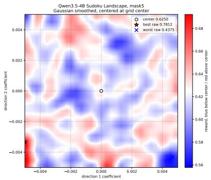

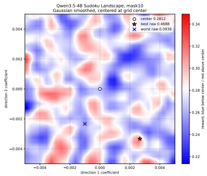

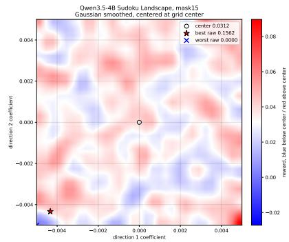  
(a) Minimum successful horizon $H ^ { * } = 5$ (b) Minimum successful horizon $H ^ { * } = 1 0$ (c) Minimum successful horizon $H ^ { * } = 1 5$

Figure 5 Two-dimensional Gaussian-smoothed reward landscapes around the Qwen3.5-4B checkpoint for Sudoku tasks with $H ^ { \ast } \in \{ 5 , 1 0 , 1 5 \}$ . Each panel marks the unperturbed checkpoint and the best and worst raw perturbations in the displayed slice. The heatmap value is the smoothed average terminal reward in the local neighborhood. As $H ^ { * }$ increases, the absolute reward level and contrast decrease, reflecting increasingly sparse trajectory feedback, while local parameter-space variation remains observable.

As shown in Figure 5, increasing $H ^ { * }$ substantially reduces the absolute reward level and reward contrast, making informative terminal feedback increasingly scarce. Nevertheless, useful variation remains visible in the local parameter neighborhood even at $H ^ { * } = 1 5$ . This is consistent with our theoretical characterization: longer horizons still make the return signal harder, but Agentic ESOpt does not incur an additional horizon-wise accumulation in its parameter-score factor.

Following the Sudoku step-accuracy definition of Kim et al. (2026), a turn is correct when it fills a masked cell with its unique target value. To connect per-turn correctness with trajectory-level success, consider a minimum-length successful path with homogeneous per-turn correctness probability $p .$ Its success probability is

$$
S _ { H ^ { * } } = p ^ { H ^ { * } } .
$$

This relation is schematic and is not fitted to the measured Sudoku trajectories; it simply illustrates how residual turn errors compound with the number of required actions.

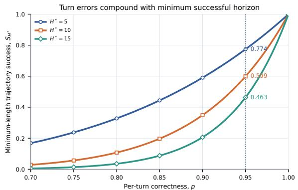  
(a) Schematic compounding from per-turn correctness to trajectory success.

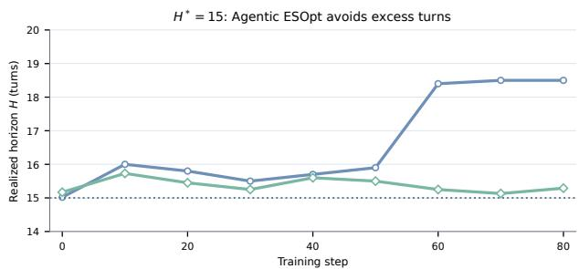  
GRPO Agentic ESOpt Minimum successful horizon H <sup>\*</sup> = 15  
(b) Measured realized-horizon diagnostics on the $H ^ { * } = 1 5$ setting.

Figure 6 Turn-level diagnostics for long-horizon Sudoku. Left: under the schematic relation $S _ { H ^ { * } } = p ^ { H ^ { * } }$ , the same per-turn error rate produces a larger trajectory-level penalty as the minimum successful horizon grows. For example, $p = 0 . 9 5$ gives $S _ { H ^ { * } } = 0 . 7 7 4 , 0 . 5 9 9$ , and 0.463 for $H ^ { * } = 5 ,$ , 10, and 15, respectively. Right: realized-horizon diagnostics on the $H ^ { * } = 1 5$ setting. Agentic $\mathrm { G R P O }$ training uses temperature 1, $\mathrm { t o p } { - } p = 1 $ , and $\mathrm { t o p } { - } k = - 1$ , while its evaluation uses temperature 0.7, $\mathrm { t o p } \cdot p = 0 . 8 ,$ and $\mathrm { { t o p } } \mathrm { { - } } k = 2 0 ;$ Agentic ESOpt uses the latter decoder for both training and evaluation. Agentic GRPO reaches the 45-turn interaction budget by step 60, whereas Agentic ESOpt remains near the 15-turn minimum and ends at 15.41 turns.

Figure 6 connects the theoretical argument to observable behavior. The left panel shows that even small residual turn errors become much more destructive as the required horizon grows. The right panel shows the corresponding training-time separation: Agentic GRPO progressively accumulates excess turns, whereas Agentic ESOpt stays close to the minimum-length solution path. These diagnostics are not a complete causal proof, but they are consistent with the estimator-level distinction in Section 4: Agentic ESOpt evaluates one coherent parameter perturbation using the complete trajectory outcome, rather than propagating terminal feedback through an expanding sequence of action-level decisions.

## D.1.2 Training Configuration

Agentic ESOpt and Vanilla ES. All fixed ES comparisons use Qwen3.5-4B for 100 generations. At each generation, $G = 3 2$ full-parameter directions are evaluated on the same batch of 32 puzzles, and the resulting trajectory rewards are z-score normalized before an update with $\alpha = 5 \times 1 0 ^ { - 4 }$ . The interaction budget is three times the mask count—15, 30, and 45 turns for $H ^ { * } = 5 , 1 0$ , and 15—with at most 64 generated tokens per turn. Training and evaluation use temperature 0.7, top- $\cdot p = 0 . 8$ , top-k = 20, min $- p = 0$ , presence penalty 1.5, and repetition penalty 1.0. Evaluation is performed every 10 generations with three repeated runs.

Table 8 Sudoku ES configurations. All profiles use G = 32, 32 puzzles per generation, 100 generations, and $\alpha = 5 \times 1 0 ^ { - 4 }$
<table><tr><td>Profile</td><td>Mask count</td><td>Sigma schedule</td><td>Maximum turns</td></tr><tr><td>Vanilla ES</td><td>5 / 10</td><td> $1 . 0 \times 1 0 ^ { - 3 }$  constant</td><td>15 / 30</td></tr><tr><td>Vanilla ES</td><td>15</td><td> $5 . 0 \times 1 0 ^ { - 4 }$  constant</td><td>45</td></tr><tr><td>Agentic ESOpt</td><td>5 / 10</td><td> $1 . 0 \times 1 0 ^ { - 3 } \xrightarrow { } 2 . 5 \times 1 0 ^ { - 4 }$  cosine</td><td>15 / 30</td></tr><tr><td>Agentic ESOpt</td><td>15</td><td> $7 . 0 \times 1 0 ^ { - 4 } \textless 5 . 0 \times 1 0 ^ { - 4 }$  cosine</td><td>45</td></tr></table>

Agentic RL. Both Agentic GRPO profiles run 100 rollout–update rounds with a global prompt batch of 32 and eight rollouts per prompt. They use rollout micro-batch 8, policy-training micro-batch 2, learning rate $1 0 ^ { - 6 }$ , KL coeficient $1 0 ^ { - 3 }$ , and clipping coeficient 0.2. GRPO-A samples with temperature 0.7, top-p = 0.8, and $\mathrm { t o p } { - } k = 2 0$ , while GRPO-B samples with temperature 1, $\mathrm { t o p } { - } p = 1$ , and $\mathrm { t o p } { - } k = - 1$ . Both are evaluated with the Agentic $\mathrm { E S O p t }$ decoder before training and every 20 rounds, with three repeated evaluations. One round denotes a complete rollout batch followed by the corresponding policy update.

We implement Turn-PPO (Li et al., 2026) as the Agentic PPO baseline. Turn-PPO uses a separate Qwen3.5-4B critic initialized with a newly added value head for turn-level advantage estimation. We follow the same interaction and evaluation protocol as the other Agentic RL baselines (temperature 1, $\mathrm { t o p } { - } p = 1$ , and $\mathrm { t o p } { - } k = - 1$ in training and with temperature 0.7, top-p = 0.8, and $\mathrm { t o p } { - } k = 2 0$ for evaluation), and train at most 500 steps to align the FLOPs.

## D.1.3 Vanilla-ES Population-Sensitivity Configuration

The 4B/9B comparison in Table 6 uses the $H ^ { * } = 1 5$ Sudoku environment for 100 generations and evaluates $G \in \{ 8 , 1 6 \}$ every 10 generations. To isolate population sensitivity, all runs use Vanilla ES with a constant perturbation scale $\sigma = 5 \times 1 0 ^ { - 4 }$ , update scale $\alpha = 5 \times 1 0 ^ { - 4 }$ , full-parameter perturbations, population z-score normalization, and eight training puzzles per direction. Each generation therefore contains 8G direction–puzzle rollouts. Perturbation rollouts and evaluation use temperature 0.7, top-p = 0.8, and $\mathrm { t o p } { - } k = 2 0$ , and each evaluation is repeated three times.

The environment provides a binary terminal reward: a rollout receives 1 only when the final board is a complete legal Sudoku solution preserving all given cells. Invalid formats, out-of-range values, attempts to modify given cells, and overwrites leave the board unchanged. This fixed setup makes population size the only varied ES hyperparameter in the ablation; the cosine perturbation schedule and intermediate reward shaping are not used.

## D.2 Math Reasoning

All method-specific configurations described below refer to training unless otherwise stated. Final evaluation is conducted under a common protocol shared by Agentic ESOpt, Agentic GRPO, Trace2Skill, their combined variants, and all other reported baselines. For Trace2Skill, we sample 16 runs for each instance and follow the instructions from Ni et al. (2026) in using at most one error trajectory per instance to distill skill.

## D.2.1 Agentic ESOpt Training Configuration

Experiments of ReAct-style Math Reasoning are conducted on four A100 80GB GPUs. We first optimize the No Skill Qwen3.5-4B policy and record the seed of every parameter update together with the trajectories later supplied to Trace2Skill. For final evaluation, the base checkpoint is reloaded, and the update sequence is deterministically reconstructed. The No Skill and skill-conditioned evaluations therefore share an identical parameter stage and difer only in the external skill context.

Table 9 Agentic ESOpt training configuration for Math reasoning.

<table><tr><td>Parameter</td><td>Value</td></tr><tr><td>Backbone</td><td>Qwen3.5-4B</td></tr><tr><td>ES generations</td><td>25</td></tr><tr><td>Population size G</td><td>16</td></tr><tr><td>Cases per direction</td><td>16</td></tr><tr><td>Update scale α</td><td> $5 \times 1 0 ^ { - 4 }$ </td></tr><tr><td>σ schedule</td><td> $1 0 ^ { - 3 } \to 5 \times 1 0 ^ { - 4 }$  cosine</td></tr><tr><td>Reward normalization</td><td> $\mathrm { P o p u l a t i o n \ z - s c o r e }$ </td></tr><tr><td>Maximum turns</td><td>50</td></tr><tr><td>Training generation limit</td><td>4096 tokens / turn</td></tr></table>

Each direction is evaluated on 16 problems, giving $1 6 \times 1 6 = 2 5 6$ direction–problem trajectories per generation. Training uses temperature 1, top-p = 1, top-k = 40, min-p = 0, presence penalty 2, and repetition penalty 1. The trajectory reward is exact match on the parsed final answer. Intermediate evaluation is performed every 10 generations with one sample per problem.

## D.2.2 Multi-Turn GRPO Training Configuration

The Math Agentic GRPO baseline follows the same sampling configuration as Agentic ESOpt, with learning rate $1 0 ^ { - 6 } \ !$ , eight rollouts per prompt, KL coeficient 10<sup>−3</sup> using the low-variance KL form, temperature 1, $\mathrm { t o p } { - } p = 1$ $ { \mathrm { t o p } }  { - } k = 4 0$ , presence penalty 2, and repetition penalty 1.

For full-parameter Agentic GRPO training, we appropriately compress the 4096-token per-turn generation configuration to satisfy the training-memory constraint on four A100 80GB GPUs. This adjustment applies only to the training rollout configuration and does not afect the final evaluation protocol. The 400 training records form 20 prompt batches per epoch.

## D.2.3 Common Evaluation Configuration

All reported methods and baselines use the same final evaluation protocol. For Math reasoning, we evaluate on 100 held-out DAPO problems and 30 AIME 2026 problems, with four samples per problem. Each trajectory is allowed at most 50 interaction turns and up to 4096 generated tokens per turn. We use temperature 1, $\mathrm { t o p } { - } p = 1$

Table 10 Multi-turn Agentic GRPO training configuration for Math reasoning.
<table><tr><td>Parameter</td><td>Value</td></tr><tr><td>Backbone</td><td>Qwen3.5-4B</td></tr><tr><td>Training records</td><td>400</td></tr><tr><td>Prompt batch size</td><td>20</td></tr><tr><td>Rollouts per prompt</td><td>8</td></tr><tr><td>Training epochs</td><td>1</td></tr><tr><td>Training rounds</td><td>20</td></tr><tr><td>Total trajectories</td><td>3,200</td></tr><tr><td>Learning rate</td><td> $1 0 ^ { - 6 }$ </td></tr><tr><td>KL coefficient</td><td> $1 0 ^ { - 3 }$ </td></tr><tr><td>Maximum interaction</td><td>100 user + 100 assistant turns</td></tr></table>

$ { \mathrm { t o p } }  { - } k = 4 0$ , min-p = 0, presence penalty 2, and repetition penalty 1 for all methods. These evaluation settings are shared by Agentic ESOpt, Agentic GRPO, Trace2Skill, their combined variants, and all other reported baselines, independent of their method-specific training configurations.

## D.3 DocVQA

As in Math reasoning, the configurations below specify the corresponding training procedures unless otherwise stated. For DocVQA, Agentic ESOpt and Agentic GRPO additionally use fully aligned interaction and generation settings during training, and all reported methods share the same final evaluation configuration. For Trace2Skill, we sample 16 runs for each instance and follow the instructions from Ni et al. (2026) in using at most one error trajectory and one correct trajectory per instance to distill skill.

## D.3.1 Agentic ESOpt Training Configuration

Experiments of ReAct-style DocVQA are also conducted on four A100 80GB GPUs. The DocVQA experiment follows the same paired reconstruction protocol as Math: the No Skill run records update seeds and source trajectories, and final evaluation replays the identical parameter sequence before adding the post-hoc skil context.

Table 11 Agentic ESOpt training configuration for DocVQA.
<table><tr><td>Parameter</td><td>Value</td></tr><tr><td>Backbone</td><td>Qwen3.5-4B</td></tr><tr><td>ES generations</td><td>40</td></tr><tr><td>Population size G</td><td>16</td></tr><tr><td>Cases per direction</td><td>16</td></tr><tr><td>Update scale α</td><td> $5 \times 1 0 ^ { - 4 }$ </td></tr><tr><td>σ schedule</td><td>10  $^ { - 3 }  5 \times 1 0 ^ { - 4 }$  cosine</td></tr><tr><td>Reward normalization</td><td>Population z-score</td></tr><tr><td>Maximum turns</td><td>50</td></tr><tr><td>Generation limit</td><td>512 tokens /turn</td></tr><tr><td>Total generation cap</td><td>32,768 tokens / trajectory</td></tr></table>

Each generation contains $1 6 \times 1 6 = 2 5 6$ direction–question trajectories. Training uses temperature 1, top- $- p = 1$ top-k = 40, min-p = 0, presence penalty 2, and repetition penalty 1. A valid trajectory must contain at least one parsed tool action before the final answer. Continuous ANLS is used as the training reward; threshold accuracy counts an answer as correct when ANLS is strictly greater than 0.5. Intermediate evaluation is performed every 10 generations with one sample per question.

## D.3.2 Multi-Turn GRPO Training Configuration

DocVQA Agentic GRPO uses the same sampling configuration and interaction budget as Agentic ESOpt, together with the same optimizer and KL settings as the Math baseline.

Agentic GRPO and Agentic ESOpt therefore use the same 50-turn interaction limit, 512-token per-turn generation limit, total trajectory generation cap, and sampling configuration during training. The final two records do not fill a four-question batch and are omitted, leaving 12 training rounds per epoch. Continuous ANLS is used as the training reward as well.

## D.3.3 Common Evaluation Configuration

All reported methods and baselines also follow the same final evaluation protocol on DocVQA. We evaluate on the same held-out set of 100 questions with four samples per question. Each trajectory is limited to 50 interaction turns, 512 generated tokens per turn, and 32,768 generated tokens in total. Sampling uses temperature 1, top-p = 1, top-k = 40, min-p = 0, presence penalty 2, and repetition penalty 1 for every method. Agentic ESOpt, Agentic GRPO, Trace2Skill, their combined variants, and all other reported baselines therefore use identical evaluation settings. In addition, the interaction and generation budgets of Agentic ESOpt and Agentic GRPO are fully aligned during DocVQA training.

Table 12 Multi-turn Agentic GRPO training configuration for DocVQA.
<table><tr><td>Parameter</td><td>Value</td></tr><tr><td>Backbone</td><td> $\mathrm { Q w e n 3 . 5 { - } 4 B }$ </td></tr><tr><td>Training records</td><td>50</td></tr><tr><td>Prompt batch size</td><td>4</td></tr><tr><td>Rollouts per prompt</td><td>8</td></tr><tr><td>Training epochs</td><td>15</td></tr><tr><td>Training rounds</td><td>180</td></tr><tr><td>Total trajectories</td><td> $5 , 7 6 0$ </td></tr><tr><td>Learning rate</td><td> $1 0 ^ { - 6 }$ </td></tr><tr><td>KL coefficient</td><td> $1 0 ^ { - 3 }$ </td></tr><tr><td>Maximum turns</td><td>50</td></tr><tr><td>Generation limit</td><td>512 tokens / assistant turn</td></tr><tr><td>Total generation cap</td><td>32,768 tokens / trajectory</td></tr></table>

## D.3.4 Repeated-Sampling Profiles for Math and DocVQA

Figure 7 extends the four-sample results in Table 3 to repeated-sampling budgets up to $k = 3 2$ , using the same evaluation decoder for each method.

No Skill Agentic GRPO Agentic ESOpt reported pass@1 reported pass@4

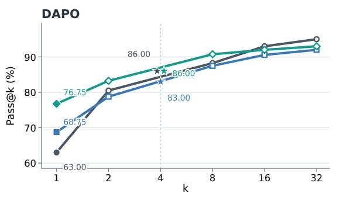

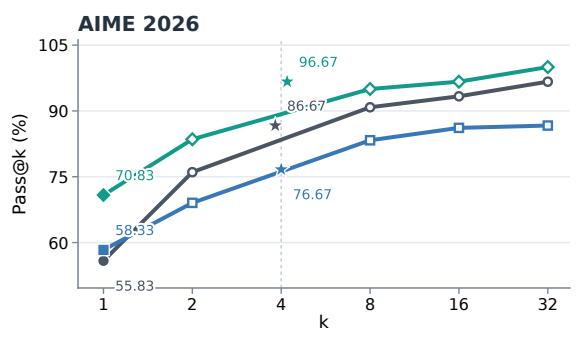

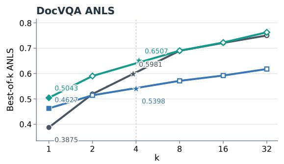

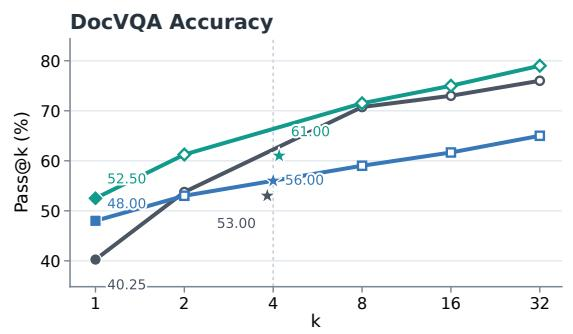  
Figure 7 Repeated-sampling profiles for DAPO, AIME 2026, DocVQA ANLS, and $\mathrm { D o c V Q A }$ accuracy. The $k = 1$ markers use the reported Mean@4 values as estimates of single-sample performance, while stars show the originally reported Pass@4 or Max@4 values. Curves report the newly estimated best-of-k results for $k \in \{ 2 , 8 , 1 6 , 3 2 \}$ ; the newly computed k = 4 curve points are omitted to keep the original four-sample measurements visually distinct.

Across all four panels, Agentic ESOpt remains above the matched Agentic GRPO baseline as the sampling budget increases. On AIME 2026 and both DocVQA metrics, it also preserves an advantage over the base policy at larger k, indicating that the average-performance gains are not obtained by collapsing repeated-sampling coverage.

## D.3.5 DocVQA Training-Stage Turn Diagnostics

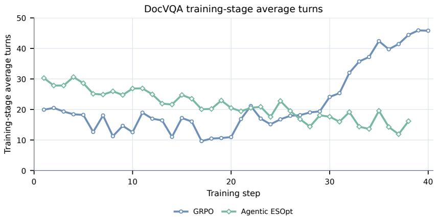  
Figure 8 Average realized trajectory length during DocVQA training. Agentic GRPO and Agentic ESOpt use the same rollout decoder; their training schedules are aligned to a common update axis and shown through step 40.

The two methods begin with similar trajectory lengths, but their behavior diverges later in training: Agentic GRPO trajectories grow rapidly, while Agentic ESOpt remains shorter and more stable. This diagnostic mirrors the excess-turn pattern observed in Sudoku and provides an additional view of optimization under sparse trajectory-level feedback.

## D.4 WebArena-Lite

## D.4.1 Goal-Conditioned Task Formulation

WebArena-Lite evaluates goal-conditioned control in a partially observed browser environment. A task g specifies a user goal and an initial latent web state. At time $t ,$ the agent receives observation $o _ { t } ,$ samples an action

$$
a _ { t } \sim \pi _ { \theta } ( \cdot \mid o _ { \leq t } , a _ { < t } , g , c ) ,
$$

and transitions to the next browser state. A trajectory $\pmb { \tau } = \left( o _ { 0 } , a _ { 0 } , \ldots , \ldots , o _ { T } \right)$ is successful when it satisfies the goal predicate within the interaction budget. The benchmark objective is

$$
J _ { \mathrm { w e b } } ( \theta ; c ) = \mathbb { E } _ { g \sim \mathcal { G } } \mathbb { E } _ { \pmb { \tau } \sim \pi _ { \theta } ( \cdot | g , c ) } \left[ \mathbb { 1 } _ { \mathrm { s u c c } } ( \pmb { \tau } , g ) \right] ,
$$

estimated by the empirical success rate over the held-out task set. The reward is sparse: intermediate actions receive no direct task credit, and the final score depends on whether the complete trajectory reaches the target web state.

The external context c represents non-parametric adaptation. In the No Skill condition, it contains the task instruction and interaction history; in the Trace2Skill condition, it additionally contains procedural knowledge distilled from previous trajectories. The No Skill pair in Table 4 isolates the parameter update, while the skill-conditioned pair compares the complete adaptation pipelines.

For website category $\mathcal { G } _ { k }$ , the reported conditional success rate is

$$
\widehat { J } _ { \mathcal { G } _ { k } } ( \theta ; c ) = \frac { 1 } { \left| \mathcal { G } _ { k } \right| } \sum _ { g \in \mathcal { G } _ { k } } \mathbb { 1 } _ { \mathrm { s u c c } } ( \tau _ { g } , g ) .
$$

The dataset average applies the same estimator to the full set ${ \mathcal { G } } .$

## D.4.2 Rollout Protocol and Data Split

All frozen and Agentic ESOpt rows use the same browser protocol. The agent observes WebRL-style textual browser states, acts in the WebRL id-based action space, and is limited to 30 browser actions per task. Each response has a 2,048-token budget, the browser viewport is $1 2 8 0 \times 7 2 0$ , and the evaluator assigns binary success after termination. Sampling uses temperature 0.7, top-p = 0.8, top-k = 20, min-p = 0, presence penalty 1.5, and repetition penalty 1. Final results average three complete evaluations over all 165 held-out tasks.

The training split is constructed from the original 812 WebArena tasks after excluding the 165 tasks mapped to WebArena-Lite by the benchmark-provided correspondence. Site-stratified splitting of the remaining 647 tasks yields 582 training tasks and 65 validation tasks. We run each model with three seeds to distill the skil (base model, Agentic RL model, Agentic ESOpt model) and select the best one on the validation dataset as the evaluation skill. WebArena-Lite tasks never contribute parameter-update rewards or trajectory-to-skill inputs, and periodic evaluation is read-only. All six sites—Reddit, GitLab, Wikipedia, Map, Shopping, and Shopping Admin—remain enabled.

## D.4.3 Parameter and Skill Adaptation Stages

Table 13 WebArena-Lite adaptation stages on Qwen3.5-27B. Both Agentic ESOpt conditions share the same No Skill parameter updates; the combined condition adds one post-hoc skill-distillation stage.
<table><tr><td>Condition</td><td>Parameter stage</td><td>Skill stage</td><td>Data per stage</td><td>Additional ES</td></tr><tr><td>No Skill baseline</td><td>none</td><td>none</td><td></td><td>none</td></tr><tr><td>Agentic ESOpt + No Skill</td><td>70 ES generations</td><td>none</td><td>G = 8 directions × 8 tasks/generation</td><td></td></tr><tr><td>Trace2Skill baseline</td><td>none</td><td>70 skill iterations</td><td>8 tasks × 8 rollouts/iteration</td><td>none</td></tr><tr><td>Agentic  $\mathrm { E S O p t + T r a c e 2 S k i l l }$ </td><td>same 70-generation ES run one post-hoc distillation</td><td></td><td>all completed ES trajectories</td><td>none</td></tr></table>

The Trace2Skill baseline starts from an empty skill and runs 70 skill-evolution iterations. Each iteration uses eight training tasks with eight sampled trajectories per task and selects at most one positive and one negative trajectory per task. Validation is performed every 10 iterations, and Table 4 reports the final evaluated skill.

The No Skill parameter stage performs 70 full-parameter ES updates with G = 8 on eight training tasks per generation. Each generation therefore contains $8 \times 8 = 6 4$ direction–task evaluations, with every perturbation scored on the same task batch. Rewards are z-score normalized, $\sigma _ { 0 } = 1 . 5 \times 1 0 ^ { - 3 } , \sigma _ { t } = 1 . 5 \times 1 0 ^ { - 3 } , \alpha = 2 . 5 \times 1 0 ^ { - 4 }$ and evaluation is performed every 10 generations.

After the parameter stage, trajectories from all completed ES generations are passed once to Trace2Skill. Final evaluation reconstructs the same No Skill update sequence and adds the distilled skill to the system prompt. This experiment implements sequential shared-trajectory composition; no additional skill-conditioned ES stage is performed.

## D.4.4 Full-Evaluation Curve

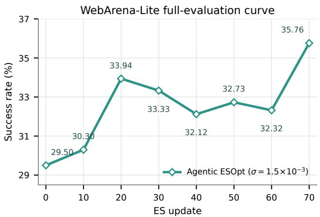  
Figure 9 Full WebArena-Lite evaluation success rate during the No Skill Qwen3.5-27B Agentic ESOpt run. Evaluation is performed every 10 ES updates; the curve starts from the 29.50% base checkpoint and reaches 35.76% after 70 updates.

The full-set curve is non-monotonic across intermediate checkpoints, but the final update reaches the best observed success rate. Table 4 reports the three-run final evaluation used for the main comparison.

## D.5 Automatic Heuristic Design

## D.5.1 Experimental Configuration

Experiments of AHD are done on a cluster of eight 3090 24GB GPUs. We evaluate Agentic ESOpt under two fixed outer search scafolds: independent Sample and EoH. In each paired comparison, the proposal budget and outer search procedure are unchanged; Agentic ESOpt adds only the parameter-space update. All runs use LLaMA-3.1-8B-Instruct.

EoH maintains $N = 1 0$ heuristics for 25 outer generations. Operators e1 and e2 each generate N candidates, while m1 and m2 each generate kN candidates, giving a total budget of $2 5 N ( 2 + 2 k )$ . We use $k = 1$ for $T = 1 { , } 0 0 0$ and k = 3 for $T = 2 { , } 0 0 0$ . The Sample scafold evaluates independent i1 proposals in batches of 20.

Table 14 AHD proposal budgets and Agentic ESOpt update units. Matched baselines use the same proposal counts. In EoH, m1 and m2 each form one ES update batch per outer generation.
<table><tr><td>Outer scaffold</td><td>T</td><td></td><td>Outer generations Candidates/generation ES update batches Directions/batch</td><td></td><td></td><td>σ0→σT</td></tr><tr><td>EoH  $( k = 1 )$ </td><td>1,000</td><td>25</td><td> $1 0 ( 2 + 2 k ) = 4 0$ </td><td>50</td><td>10</td><td> $1 0 ^ { - 3 }  0$ </td></tr><tr><td>EoH  $\left( k = 3 \right)$ </td><td>2,000</td><td>25</td><td> $1 0 ( 2 + 2 k ) = 8 0$ </td><td>50</td><td>30</td><td> $1 0 ^ { - 3 }  0$ </td></tr><tr><td>Independent Sample 1,000</td><td></td><td>50</td><td>20</td><td>50</td><td>20</td><td> $1 0 ^ { - 3 }  0$ </td></tr><tr><td>Independent Sample 2,000</td><td></td><td>100</td><td>20</td><td>100</td><td>20</td><td> $1 0 ^ { - 3 }  0$ </td></tr></table>

Agentic ESOpt uses full-parameter, one-sided Gaussian perturbations, cosine decay $\sigma : 1 0 ^ { - 3 }$ → 0, no warmup, $\alpha = 5 \times 1 0 ^ { - 4 }$ , and population z-score normalization. In EoH, only mutation operators m1 and m2 trigger parameter updates, yielding two update batches per outer generation; e1 and e2 remain unchanged. In Sample, each batch of 20 proposals forms one update.

All objectives are converted internally to minimization costs. EoH uses the selected parent’s cost minus the perturbed child’s cost, while Sample uses the negative child score. Invalid or non-finite programs receive a finite within-batch penalty before normalization, and an all-invalid batch produces no update. Candidate generation uses temperature 1, top $\not { p } - p = 0 . 9 8 $ , no top-k cutof, and at most 768 new tokens.

## D.5.2 Additional ACO-Style Results and Ablations

Table 15 AHD ACO-style results at total evaluation budgets $T \in \{ 1 0 0 0 , 2 0 0 0 \}$ . Lower is better for all columns. The ∆ rows report the ratio EoH/(Agentic $\mathrm { E S O p t + E o H ) - 1 ; }$ positive ratios denote improvement. Improvements are shaded green with green deltas; regressions remain unshaded with neutral-gray deltas.
<table><tr><td>Method</td><td>TSP  $N = 5 0$ </td><td>TSP  $N = 1 0 0$ </td><td>CVRP  $N = 5 0 , C = 5 0$ </td><td>CVRP  $N = 1 0 0 , C = 5 0$ </td><td>BPP  $N = 5 0 0 , C = 1 5 0$ </td><td>BPP  $N = 1 , 0 0 0 , C = 1 5 0$ </td></tr><tr><td></td><td>8.948</td><td></td><td>11.355</td><td>18.778</td><td>208.828</td><td>417.938</td></tr><tr><td colspan="7">Total Evaluations:  $T = 1 0 0 0$ </td></tr><tr><td>EoH</td><td>6.030</td><td>8.859</td><td>9.328</td><td>15.666</td><td>203.162</td><td>405.172</td></tr><tr><td>Agentic ESOpt + EoH</td><td>5.882</td><td>8.391</td><td>9.265</td><td>16.073</td><td>203.500</td><td>405.787</td></tr><tr><td>∆ vs EoH</td><td>↓2.53%</td><td>↓5.57%</td><td>↓0.68%</td><td>↑2.53%</td><td>↑0.17%</td><td>↑0.15%</td></tr><tr><td colspan="7">Total Evaluations:  $T = 2 0 0 0$ </td></tr><tr><td>EoH</td><td>5.886</td><td>8.368</td><td>9.379</td><td>15.989</td><td>203.307</td><td>405.688</td></tr><tr><td>Agentic  $\mathrm { E S O p t + E o H }$ </td><td>5.890</td><td>8.398</td><td>9.179</td><td>15.420</td><td>203.052</td><td>405.276</td></tr><tr><td>∆ vs EoH</td><td>↑0.08%</td><td>↑0.36%</td><td>↓2.18%</td><td>↓3.69%</td><td>↓0.13%</td><td>↓0.10%</td></tr></table>

ACO-style results. At T = 1,000, Agentic ESOpt + EoH improves three of the six ACO-style test sets: both TSP settings and CVRP-50. At $T = 2 { \mathrm { , 0 0 0 } }$ , it improves both CVRP and both BPP settings; the two TSP diferences are small (0.08% and 0.36%). Together with the constructive Sample and EoH comparisons, Agentic ESOpt improves 28 of 36 matched method–budget settings across 12 test sets and six scenarios, with one tie and seven regressions.

Table 16 Component ablation on constructive AHD at $T = 1 0 0 0$ TSP is minimized, and KP is maximized.
<table><tr><td>Method</td><td>TSP  $N = 5 0$ </td><td>KP  $N = 5 0 , W = 1 2 . 5$ </td></tr><tr><td>EoH (baseline)</td><td>6.545</td><td>19.996</td></tr><tr><td>Agentic  $\mathrm { E S O p t + E o H }$ </td><td>6.463</td><td>20.001</td></tr><tr><td>w/o ES (noise-only)</td><td>6.484</td><td>19.996</td></tr><tr><td>w/o cosine schedule</td><td>6.480</td><td>19.997</td></tr></table>

Table 17 EoH sampling-temperature ablation on constructive TSP $( N = 5 0 )$ at $T = 1 0 0 0$ with Agentic ESOpt included for comparison. Lower is better.
<table><tr><td>Setting</td><td>TSP</td></tr><tr><td>EoH (0.6)</td><td>6.51782</td></tr><tr><td>EoH (1.0)</td><td>6.545</td></tr><tr><td>EoH (1.5)</td><td>6.95927</td></tr><tr><td>Agentic ESOpt</td><td>6.463</td></tr></table>

Component and sampling-temperature ablations. The component ablation in Table 16 shows that both the reward-weighted parameter update and the cosine perturbation schedule contribute to the final result: retaining noise without the ES update, or fixing the perturbation radius, weakens performance on both tasks. Table 17 further shows that the gain is not reproduced by retuning the EoH sampling temperature. Temperature 0.6 is the strongest EoH setting, yet Agentic ESOpt remains better on TSP.

Repeated-run significance. We repeat the constructive EoH comparison 20 times per method on TSP (N = 50) and $\mathrm { K P } \ ( N = 1 0 0 , W = 2 5 )$ . Table 18 reports the mean and sample standard deviation across runs together with a one-sided, equal-variance t-test. KP values are converted back from the internally negated solver cost to the native maximization objective. The test is computed from the same 20 per-run observations summarized in the table.

Table 18 Repeated-run analysis for constructive AHD. Each method is evaluated over 20 independent runs. Lower is better for TSP and higher is better for the native KP objective.
<table><tr><td>Task</td><td>EoH</td><td>Agentic  $\mathrm { E S O p t + E o H }$ </td><td>p-value</td></tr><tr><td> $\mathrm { T S P } \left( N = 5 0 , \downarrow \right)$ </td><td> $6 . 5 5 1 7 \pm 0 . 0 7 2 9$ </td><td> $6 . 5 0 0 7 \pm 0 . 0 8 6 8$ </td><td>0.0258</td></tr><tr><td>KP  $( N = 1 0 0 , W = 2 5 , \uparrow )$ </td><td> $4 0 . 1 5 6 2 \pm 0 . 0 0 2 4$ </td><td> $4 0 . 1 5 7 8 \pm 0 . 0 0 1 7$ </td><td>0.0100</td></tr></table>

Both comparisons are significant at the 0.05 level. The repeated-run analysis therefore supports the consistency of the AHD gains beyond a single search seed.

On-the-fly runtime overhead. We additionally measure end-to-end wall-clock time for the constructive Sample scafold at T = 1000.

Table 19 End-to-end runtime for constructive Sample at $T = 1 0 0 0 .$ . All values are in minutes.
<table><tr><td>Task</td><td>Sample</td><td>Agentic ESOpt + Sample</td></tr><tr><td>Design constructive heuristics for TSP</td><td>54.8</td><td>60.6</td></tr><tr><td>Design constructive heuristics for KP</td><td>41.2</td><td>48.6</td></tr><tr><td>Design constructive heuristics for ASP</td><td>51.7</td><td>56.7</td></tr></table>

Across the three tasks, attaching Agentic ESOpt adds only 5.0–7.4 minutes, corresponding to a 9.7%–18.0% increase over the original Sample runtime. The parameter updates are therefore carried out nearly on the fly within the existing candidate-generation and evaluation loop, without a separate post-search training stage.

## D.6 Cross-Setting Hyperparameter Summary

Table 20 consolidates the Agentic ESOpt configurations used across all reported settings. The task-specific sections above provide the corresponding interaction limits, baseline settings, and evaluation protocols.

Table 20 Cross-setting Agentic ESOpt configurations. “Update batches” counts parameter updates, and “reward load/direction” specifies how each perturbation is scored. All settings use full-parameter, one-sided Gaussian perturbations and population z-score normalization.
<table><tr><td>Setting</td><td>Backbone</td><td>Update batches Directions/update Reward load/direction</td><td></td><td></td><td> $\sigma _ { 0 }  \sigma _ { T }$ </td><td>α</td></tr><tr><td>Sudoku,  $H ^ { * } = 5 / 1 0$ </td><td>Qwen3.5-4B</td><td>100</td><td>32</td><td>32 puzzles</td><td> $1 0 ^ { - 3 } \to 2 . 5 \times 1 0 ^ { - 4 }$ </td><td> $5 \times 1 0 ^ { - 4 }$ </td></tr><tr><td>Sudoku,  $H ^ { * } = 1 5$ </td><td>Qwen3.5-4B</td><td>100</td><td>32</td><td>32 puzzles</td><td> $7 \times 1 0 ^ { - 4 } \to 5 \times 1 0 ^ { - 4 }$ </td><td> $5 \times 1 0 ^ { - 4 }$ </td></tr><tr><td>Math</td><td>Qwen3.5-4B</td><td>25</td><td>16</td><td>16 problems</td><td> $1 0 ^ { - 3 } \to 5 \times 1 0 ^ { - 4 }$ </td><td> $5 \times 1 0 ^ { - 4 }$ </td></tr><tr><td> $\mathrm { D o c V Q A }$ </td><td>Qwen3.5-4B</td><td>40</td><td>16</td><td>16 examples</td><td> $1 0 ^ { - 3 } \to 5 \times 1 0 ^ { - 4 }$ </td><td> $5 \times { 1 0 } ^ { - 4 }$ </td></tr><tr><td>WebArena-Lite</td><td>Qwen3.5-27B</td><td>70</td><td>8</td><td>8 web tasks</td><td> $1 . 5 \times { 1 0 } ^ { - 3 }  { 1 . 5 } \times { 1 0 } ^ { - 3 }$  constant</td><td> $2 . 5 \times 1 0 ^ { - 4 }$ </td></tr><tr><td> $\mathrm { A H D } + \mathrm { E o H } , T = 1 , 0 0 0$ </td><td>Llama-3.1-8B</td><td>50</td><td>10</td><td>one heuristic objective</td><td> $1 0 ^ { - 3 }  0$ </td><td> $5 \times { 1 0 } ^ { - 4 }$ </td></tr><tr><td> $\mathrm { A H D } + \mathrm { E o H } , T = 2 , 0 0 0$ </td><td>Llama-3.1-8B</td><td>50</td><td>30</td><td>one heuristic objective</td><td> $1 0 ^ { - 3 }  0$ </td><td> $5 \times { 1 0 } ^ { - 4 }$ </td></tr><tr><td> $\mathrm { A H D } + \mathrm { S a m p l e } , T = 1 , 0 0 0 / 2 , 0 0 0$ </td><td>Llama-3.1-8B</td><td>50  /  100</td><td>20</td><td>one heuristic objective</td><td> $1 0 ^ { - 3 }  0$ </td><td> $5 \times { 1 0 } ^ { - 4 }$ </td></tr></table>

For candidate i, the implementation applies $\theta + \sigma _ { t } \epsilon _ { i } .$ evaluates the complete trajectory or generated heuristic, reverts the perturbation, and reconstructs the same direction from its integer seed during the update. The implementation uses one-sided perturbations and no explicit $1 / \sigma _ { t }$ multiplier, so α is the efective update scale. Task-specific baseline configurations are summarized in Tables 8 to 14.

The perturbation schedule reflects the optimization objective of each setting. Train-time experiments retain a nonzero terminal radius to preserve neighborhood smoothing: Sudoku uses horizon-specific terminal radii, Math and DocVQA decay to $5 \times 1 0 ^ { - 4 }$ , and WebArena-Lite keeps $\stackrel { \cdot } { \sigma } = 1 . 5 \times 1 0 ^ { - 3 }$ . AHD decays σ to zero because the final objective is the best task-specific heuristic found during test-time search.

Population size G and the number of tasks used to score each direction are chosen jointly. Increasing either quantity can improve update stability or task coverage, while also increasing rollout cost. Across settings, binary-reward tasks use multiple tasks per direction, whereas AHD assigns one executable heuristic objective to each direction.

Population z-score normalization provides a common update interface across heterogeneous rewards. It converts binary success, continuous ANLS, and problem-dependent heuristic objectives into relative within-population scores. For AHD, invalid or non-finite programs are mapped to finite within-batch penalties before normalization, and an all-invalid batch produces no parameter update.

Hyperparameter sensitivity and adaptive schedules for G and σ are discussed in Appendix A.

## E Prompts and Skills

## E.1 Sudoku

## E.1.1 Environment Prompt

Sudoku is implemented as a multi-turn action environment. The agent does not submit a full board in one response. Instead, at each turn it observes the original puzzle, the current board, the current empty-cell list, and optional environment feedback from the previous action, then emits exactly one action in the format set <row> <col> <value>. Rows and columns are 1-indexed. The episode terminates when all masked cells are filled, or the action budget is exhausted, and the final reward is binary.

The following is a turn-0 prompt from the evaluation split with 15 masked cells. Empty cells are rendered as “.”.

```csv
Prompt for Sudoku
You are an agent s o l v i n g Sudoku one a c t i o n at a time . At each turn , f i l l e x a c t l y one empty c e l l . Rows and columns a r e 1 - i n d e x e d . The board i s s p l i t
by | and h o r i z o n t a l l i n e s i n t o nine 3x3 boxes . Every row , every column , and every 3x3 box must contain d i g i t s 1 through 9 e x a c t l y once . Choose
the c e l l only from the Current empty c e l l s l i s t . Keep a l l o r i g i n a l g i v e n s fi x e d . Your e n t i r e r e s p o n s e must be e x a c t l y one l i n e c o n t a i n i n g one
a c t i o n and n o t h i n g e l s e . Do not e x p l a i n , r e a s o n aloud , wrap t h e answer i n code f e n c e s , o r output any e x t r a words . Use e x a c t l y t h i s fo r m a t :
s e t <row> <col > <value>
O r i g i n a l puzzle mask_count=15:
c1 c2 c3 c4 c5 c6 1 c7 c8 c9
r1: 3 5 9
r 2 : 2 1 8 5 4 6
r 3 : 2 8 1 3 5

r 4 : 6 2 1 5 3 9 4 7
r 5 : 3 5 4 6 2
r 6 : 6 2 8 3 5
r 7 : 6 8 5
r 8 : 2 6 1 3
r 9 : 8 3 5 4 7 6 2
Current board , turn =0, remaining_empty =15:
c c2 c3 c4 c5 c6 c7 c8 c9
r 1 : 3 9 7 8
r 2 : 2 1 8 9 5
r 3 : 7 6 2 8 1 5 9
+ +
r 4 : 2 8 5 3 9 4 7
r 5 : 3 5 9 4 6 2 1
r 6 : 7 6 2 8 3 5
+
r 7 : 6 1 3 8 5 9
r8: 5 9 2 6 | 1 3
r 9 : 8 3 5 7 6 2
Current empty c e l l s : r1c5 , r1c7 , r1c8 , r2c4 , r2c8 , r5c1 , r5c5 , r6c1 , r7c3 , r7c9 , r8c3 , r8c4 , r8c8 , r9c1 , r 9 c 6
```

For example, a valid response to this prompt is a single line such as set 1 5 6. The environment then applies the action and constructs the next prompt by inserting Last environment feedback: Filled r1c5 with 6. before the original puzzle block, updating the current board, setting turn=1, decreasing remaining\_empty to 14, and removing r1c5 from the current empty-cell list.

## E.2 Math Reasoning

## E.2.1 ReAct Prompt

Instead of a single direct answer call, the AIME setting is treated as an agentic ReAct environment. The model may call a command-line Python tool multiple times, receives each tool result as an observation, and stops when it emits the final boxed answer. The ES reward is the binary exact-match score of the final answer after the whole trajectory.

## Prompt for AIME ReAct

You are s o l v i n g a math r e a s o n i n g problem . You can think step - by - step and use command - l i n e Python when   
u s e f u l .   
Action format :   
A c t i o n :   
{   
"name": "bash "   
" arguments " : {"command " : "< s h e l l command>"}   
}   
A ft e r each Action , the environment e x e c u t e s the command and r e t u r n s an Observation . Repeat Thought/   
Action / Observation as needed . When fi n i s h e d , output the f i n a l r e s u l t as \boxed{ answer } .   
Problem :   
P a t r i c k s t a r t e d walking at a const ant r a t e along a s t r a i g h t road from s c h o o l to the park . One hour   
a f t e r P a t r i c k l e f t , Tanya s t a r t e d r u n n i n g a l o n g t h e same road from s c h o o l t o t h e park . One hour   
a ft e r Tanya l e ft , Jose s t a r t e d b i c y c l i n g along the same road from s c h o o l to the park . Tanya ran

at a c o n s t a n t r a t e o f 2 m i l e s per hour f a s t e r than P a t r i c k walked , J o s e b i c y c l e d at a c o n s t a n t   
r a t e o f 7 m i l e s p e r hour f a s t e r than Tanya ran , and a l l t h r e e a r r i v e d a t t h e park a t t h e same   
time . The d i s t a n c e from the s c h o o l to the park i s m/n miles , where m and n a r e r e l a t i v e l y prime   
p o s i t i v e i n t e g e r s . Find m+n .   
Thought : Let P a t r i c k ’ s t r a v e l time be T and speed be p . I can s o l v e the two equal - d i s t a n c e e q u a t i o n s   
with Python .   
A c t i o n :   
{   
"name " : " bash " ,   
" arguments " : {"command " : " python - c \" import sympy a s sp ; T, p=sp . symbols ( ’T p ’ ) ; s o l=sp . s o l v e ( [ sp . Eq   
( p , 2 \*T- 2 ) , sp . Eq( p , sp . R a t i o n a l ( 9 , 2 ) \*T- 9 ) ] , [ T, p ] ) ; T0 , p0=s o l [T] , s o l [ p ] ; d=sp . f a c t o r (T0\*p0 ) ;   
p r i n t (d , sp . numer ( d )+sp . denom( d ) ) \""}   
}   
Observation : 252/25 277   
Thought : The d i s t a n c e i s 252/25 , so m+n=277.   
F i n a l answer : \boxed {277}

## E.2.2 Trajectory-to-Skill Composition

Math considers trajectories from all 25 ES generations, keeps at most one failed trajectory for each of the 400 training problems, and excludes successful traces from skill distillation. A single post-hoc Trace2Skill pass uses GPT-5.4-nano, and temperature 1. We run each model with three seeds to distill the skill (base model, Agentic RL model, Agentic ESOpt model) and select the best result to report. Final evaluation reconstructs the same No Skill ES updates and injects the distilled skill only into the system context; it performs no further parameter optimization.

## E.3 DocVQA

## E.3.1 ReAct Prompt

DocVQA is also an agentic ReAct setting. The task exposes the document image path, and the agent may use command-line or Python tools to inspect the image, crop regions, or run OCR before submitting a short answer. The evaluator scores the final submitted answer with ANLS.

Answer the document v i s u a l q u e s t i o n . I n s p e c t the r e fe r e n c e d document image c a r e f u l l y . You can use   
command - l i n e and Python t o o l s over the image f i l e .   
[ O p t i o n a l s k i l l i n s t r u c t i o n s a r e i n s e r t e d h e r e . ]   
Action format :   
A c t i o n :   
{   
"name " : " bash " ,   
" arguments " : {"command " : "< s h e l l command>"}   
}   
A ft e r each Action , the environment r e t u r n s an Observation . Repeat Thought/ Action / Observation as needed   
. When fi n i s h e d , output only the s h o r t f i n a l answer .   
Image path : data \ t r a c e 2 s k i l l \ docvqa \ images \ 4 9 1 5 3 . png   
Question : What i s the ’ actual ’ value per 1000 , during the year 1975?   
Thought : I need i n s p e c t the document c h a r t and l o c a t e the 1975 v a l u e fo r the s e r i e s l a b e l e d " a c t u a l " .   
A c t i o n :   
{   
"name " : " bash " ,   
" arguments " : {"command " : " python - c \" from PIL import Image ; p=r ’ data \\ t r a c e 2 s k i l l \\ docvqa \\ images   
\ \ 4 9 1 5 3 . png ’ ; img=Image . open ( p ) ; p r i n t ( img . s i z e ) \""}   
}   
Observation : (1695 , 2200)   
Thought : I should zoom i n t o the c h a r t area around the 1975 t i c k and read the a c t u a l s e r i e s l a b e l / value   
b e fo r e answering .   
A c t i o n :   
{   
"name " : " bash " ,   
" arguments " : {"command " : " python - c \" from PIL import Image ; p=r ’ data \\ t r a c e 2 s k i l l \\ docvqa \\ images   
\ \ 4 9 1 5 3 . png ’ ; img=Image . op en ( p ) ; c r o p=img . c r o p ( ( 2 5 0 , 6 5 0 , 1 4 5 0 , 1 3 5 0 ) ) ; c r o p . s a v e ( ’   
docvqa\_49153\_chart\_crop . png ’ ) ; p r i n t ( ’ s aved docvqa\_49153\_chart\_crop . png ’ ) \""}   
}   
Ob se r v a ti on : s aved docvqa\_49153\_chart\_crop . png

Thought : The chart crop shows the 1975 a c t u a l v a l u e a s 0 . 2 8 p e r 1 0 0 0 .   
F i n a l answer : 0 . 2 8

## E.3.2 Trajectory-to-Skill Composition

DocVQA selects the final 50 task occurrences and keeps at most one failed and one successful trace per occurrence; when one outcome type is unavailable, only the observed type is retained. A single post-hoc Trace2Skill pass uses GPT-5.4-nano and temperature 1. We run each model with three seeds to distill the skill (base model, Agentic RL model, Agentic ESOpt model) and select the best result to report. Final evaluation reconstructs the same No Skill ES updates and injects the distilled skill only into the system context; it performs no further parameter optimization.

## E.4 WebArena-Lite

## E.4.1 Environment Prompt

WebArena-Lite uses the WebArena id-based accessibility-tree prompt. The full observation can be long, so the box shows the stable prompt structure and one real WebArena-Lite task objective.

You are an autonomous i n t e l l i g e n t agent tasked with n a v i g a t i n g a web browser . You w i l l be given web -   
based t a s k s . The i n fo r m a t i o n i n c l u d e s the user ’ s o bj e c t i v e , the c u r r e n t a c c e s s i b i l i t y t r e e , the   
c u r r e n t page address , open tabs , and the p r e v i o u s a c t i o n .   
A v a i l a b l e a c t i o n s i n c l u d e :   
c l i c k [ i d ]   
type [ i d ] [ c o n t e n t ] [ p r e s s \_ e n t e r \_ a ft e r =0|1]   
hover [ i d ]   
p r e s s [ key\_comb ]   
s c r o l l [ down | up ]   
g o t o [ u r l ]   
go\_back   
go\_forward   
s t o p [ answer ]   
OBSERVATION:   
[accessibility -tree nodes with element IDsl   
CURRENT PAGE: [ a d m i n i s t r a t i o n i n t e r fa c e ]   
OBJECTIVE : What i s t h e top - 1 b e s t - s e l l i n g p r o d u c t i n 2022   
PREVIOUS ACTION: None   
The r e s p o n s e s h o u l d r e a s o n b r i e f l y and end with :   
In summary , the next a c t i o n I w i l l perform i s ‘ ‘ ‘ < a c t i o n > ‘ ‘ ‘

## E.4.2 Trace2Skill Policy Context

The following box presents the WebArena skill used by the Trace2Skill-conditioned agents.

```markdown
# WebArena S k i l l
## WebArena workflow
Use only v i s i b l e page e v i d e n c e and c u r r e n t WebRL i d s ; re - r e s o l v e e l e m e n t s a f t e r any n a v i g a t i o n ,
r e fr e s h , r e r e n d e r , or l a y o u t change .
S t a r t from t h e most d i r e c t v i s i b l e path . P r e fe r s e a r c h , f i l t e r s , menus , o r b u i l t - i n n a v i g a t i o n
b e fo r e l o n g s c r o l l i n g or g u e s s i n g c o n t r o l s .
Re - read the c u r r e n t v i s i b l e page a f t e r ev ery c l i c k , s e l e c t i o n , t e x t entry , s c r o l l , or n a v i g a t i o n
s t e p . I f the page did not v i s i b l y change , do not r e p e a t the same a c t i o n ; choose a d i f f e r e n t
v i s i b l e c o n t r o l or r o u t e .
B e f o r e t y p i n g , v e r i f y t h e f i e l d l a b e l , c u r r e n t v a l u e , and i n p u t t y p e . C l e a r o r s e l e c t a l l e x i s t i n g
t e x t when o v e r w r i t i n g .
For dropdowns , p i c k e r s , autocomplete f i e l d s , and multi - s e l e c t s , i n s p e c t the c u r r e n t c o n t r o l s t a t e
f i r s t , choose the v i s i b l e o p t i o n t h a t matches the task , and c onfirm the s e l e c t e d v a l u e i s shown
a ft e r w a r d .
Treat s e a r c h r e s u l t s , s n i p p e t s , counts , and summary l i n k s a s d i s c o v e r y a i d s o n l y . Do not c o n c l u d e
co mpl et ion u n t i l the r e qu e s t e d s t a t e i s v i s i b l y shown on the r e l e v a n t page or d e t a i l view .
I f s e a r c h or f i l t e r r e s u l t s a r e empty , ambiguous , or stuck , a dj u s t the query , broaden or narrow the
f i l t e r , or s w i t c h to a d i f f e r e n t grounded view i n s t e a d o f r e p e a t i n g near - i d e n t i c a l s e a r c h e s .
```

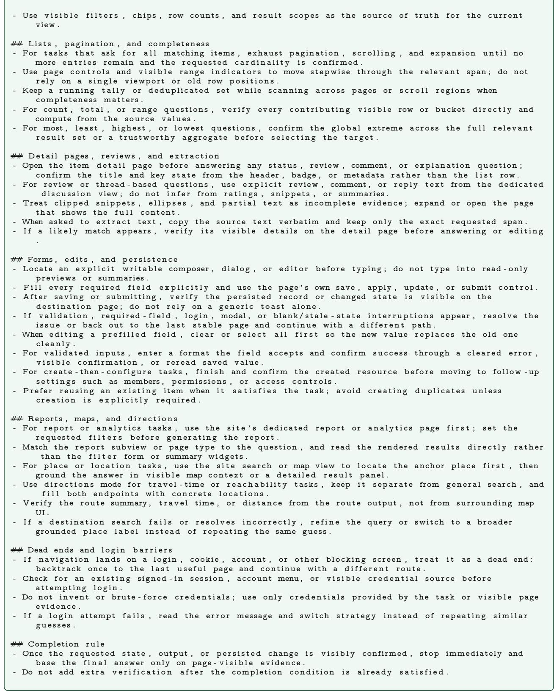  
E.4.3 Agentic ESOpt + Trace2Skill Policy Context

The following box presents the WebArena skill distilled from Agentic ESOpt trajectories and used for the combined result in Table 4. It is reported separately from the Trace2Skill-only skill above because the two conditions use diferent trajectory sources.

## # WebArena S k i l l

Use the most s p e c i f i c v i s i b l e page or view t h a t can d i r e c t l y show the r e qu e s t e d s i g n a l ; p r e fe r l i s t , d e t a i l , r e p o r t , o r management p a g e s o v e r i n f e r e n c e .

Use o n l y t h e c u r r e n t v i s i b l e page and DOM e v i d e n c e a f t e r each n a v i g a t i o n o r s t a t e change ; n e v e r r e u s e s t a l e element i d s .

B e f o r e a c t i n g , r e - s c a n t h e v i s i b l e c o n t r o l s and match t h e r e q u e s t e d v e r b t o t h e e x a c t UI c o n t r o l . Do not s u b s t i t u t e a nearby a c t i o n f o r t h e one t h e t a s k a s k s f o r .

C l e a r s t a l e or c o n f l i c t i n g f i l t e r s b e fo r e a p p l y i n g a new s e a r c h or c o n s t r a i n t , and co n fi r m the a c t i v e f i l t e r s and s o r t o r d e r b e fo r e e x t r a c t i n g anything .

- For s e a r c h - f i r s t t a s k s , u s e t h e page ’ s a c t u a l s e a r c h c o n t r o l o r Enter , then c o n fi r m t h e page i s t r u l y s h o w i n g s e a r c h r e s u l t s b e f o r e s e l e c t i n g a n y t h i n g .

A ft e r each c l i c k , search , f i l t e r , or s o r t , v e r i f y t h a t the page v i s i b l y changed . I f the same a c t i o n l e a v e s t h e page unchanged o r p r o d u c e s an e r r o r , s t o p r e p e a t i n g i t and s w i t c h t o a d i f f e r e n t c o n t r o l or path .

- For l i s t - based t a s k s , do not s t o p a t a p r e v i e w row . I n s p e c t enough p a g e s o r c a n d i d a t e s t o c o v e r t h e f u l l s c o p e , and u s e p a g i n a t i o n o r pag e - jump c o n t r o l s when a v a i l a b l e .

- For p l u r a l or broad t a s k s , v e r i f y each r e q u e s t e d item e x p l i c i t l y a g a i n s t the t a s k c r i t e r i o n b e fo r e e x i t i n g .

Open the e x a c t matching d e t a i l view b e fo r e u s i n g a r e c o r d ’ s date , time , s t a t u s , i d e n t i f i e r , or o t h e r e x a c t f i e l d as the answer .

For form , e d i t , o r d i a l o g workflows , type o n l y i n t o w r i t a b l e c o n t r o l s , f i l l a l l r e q u i r e d f i e l d s , co nfi rm dropdown s e l e c t i o n s v i s i b l y changed , and use the e x p l i c i t save , submit , or con fir m c o n t r o l .

A ft e r any save , submit , or o t h e r c r i t i c a l c l i c k , l o o k fo r e x p l i c i t v i s i b l e s u c c e s s e v i d e n c e and i n s p e c t a s t a b l e d e s t i n a t i o n o r r e o p e n e d view once t o c o n fi r m t h e p e r s i s t e d s t a t e matches t h e t a r g e t .

- Do not t r u s t t r a n s i e n t banners , t o a s t s , or typed t e x t without v i s i b l e page e v i d e n c e t h a t the change p e r s i s t e d .

- For d i s c u s s i o n , comment , r e p l y , or n o t i f i c a t i o n t a s k s , use the v i s i b l e composer / e d i t o r and the e x p l i c i t submit c o n t r o l from the record - l e v e l path .

I f an unexpected but r e l a t e d page opens , use back n a v i g a t i o n or breadcrumbs to r e t u r n to the s o u r c e l i s t or item and c o n t i n u e from t h e r e .

I f a c l i c k , submit , or n a v i g a t i o n a c t i o n has no v i s i b l e e f f e c t , do not r e p e a t i t b l i n d l y ; r e c o v e r a v i s i b l e s t a t e , l o c a t e t h e c o r r e c t c o n t r o l , and t r y a d i f f e r e n t p a t h .

I f the page becomes blank , s t a l e , or unexpected , s t o p u s i n g o l d element i d s and r e c o v e r a v i s i b l e s t a t e f i r s t by going back , r e l o a d i n g , or n a v i g a t i n g to a known page .

- For t o g g l e - s t y l e t a s k s , c l i c k the a c t u a l s t a t e - changing c o n t r o l , not a count , a u x i l i a r y l i n k , or p r o f i l e - l i k e d e t o u r .

- For s a v e d - i t e m o r w i s h l i s t - s t y l e t a s k s , c o n fi r m t h e i t e m a p p e a r s i n t h e p e r s i s t e n t s a v e d view , n o t j u s t i n a t r a n s i e n t c o n f i r m a t i o n m e s s a g e .

Track eve ry r e qu e s t e d t a r g e t e x p l i c i t l y i n multi - item t a s k s and v e r i f y each one i n the f i n a l v i s i b l e s t a t e b e f o r e e x i t i n g .

Stop i m m e d i a t e l y once t h e r e q u e s t e d page s t a t e , s a v e d change , o r answer i s v i s i b l y c o n fi r m e d ; do not add e x t r a e x p l o r a t i o n or v e r i f i c a t i o n a f t e r c omp letion .

## E.5 Automatic Heuristic Design

## E.5.1 TSP-Construct Prompt

For AHD, the agent writes a heuristic function instead of a direct task solution. The following box shows the TSP constructive setting and representative EoH operator prompts. The concrete parent algorithms and code blocks are inserted at the placeholders for crossover or mutation operators.

## Prompt for AHD TSP-Construct

Task :   
Given a s e t o f nodes with t h e i r c o o r d i n a t e s , f i n d t h e s h o r t e s t r o u t e t h a t v i s i t s each node once and   
r e t u r n s to the s t a r t i n g node . The t a s k can be s o l v e d step - by - s t e p by s t a r t i n g from the c u r r e n t   
node and i t e r a t i v e l y c h o o s i n g t h e n e x t node . H e l p me d e s i g n a n o v e l a l g o r i t h m t h a t i s d i f f e r e n t   
from a l g o r i t h m s i n l i t e r a t u r e t o s e l e c t t h e n e x t node i n e a c h s t e p .   
Function :   
d e f select\_next\_node ( current\_node , destination\_node , unvisited\_nodes , distance\_matrix ) :   
ret urn next\_node   
Input / output i n fo r m a t i o n :   
’ current\_node ’ , ’ destination\_node ’ , ’ next\_node ’ , and ’ unvisited\_nodes ’ a r e node IDs . ’ distance\_matrix ’   
i s the d i s t a n c e matrix o f nodes . A l l a r e Numpy a r r a y s .   
EoH o p e r a t o r prompts :   
[ i 1 ] F i r s t , d e s c r i b e your new a l g o r i t h m and main s t e p s i n one s e n t e n c e . The d e s c r i p t i o n must be i n s i d e   
a b r a c e . Next , implement i t i n Python as select\_next\_node ( . . . ) . Do not g i v e a d d i t i o n a l

e x p l a n a t i o n s .   
[ e1 ] Given s e v e r a l e x i s t i n g a l g o r i t h m s and t h e i r code , c r e a t e a new a l g o r i t h m t h a t has a t o t a l l y   
d i f f e r e n t form from the g i v e n ones .   
[ e2 ] Given s e v e r a l e x i s t i n g a l g o r i t h m s and t h e i r code , i d e n t i f y t h e i r common backbone idea , then   
c r e a t e a new a l g o r i t h m with a d i f f e r e n t form t h a t i s motivated by t h a t backbone .   
[ m1 ] Given one e x i s t i n g a l g o r i t h m and i t s code , c r e a t e a m o d i fi e d v e r s i o n with a d i f f e r e n t form .   
[ m2 ] Given one e x i s t i n g a l g o r i t h m and i t s code , i d e n t i f y t h e main a l g o r i t h m p a r a m e t e r s and c r e a t e a   
new a l g o r i t h m with d i f f e r e n t parameter s e t t i n g s o f the s c o r e fu n c t i o n .

## F Licensing and External Components

## F.1 Licensing Scope

The code introduced by this study is released under the MIT License. External code, benchmark assets, datasets, model checkpoints, and API services remain governed by their respective upstream licenses or terms. The table below is intentionally limited to repositories whose code or task data are directly invoked, vendored, or copied by the released workflow. Repositories consulted only as references, and baseline repositories whose implementations were not executed, are excluded.

The experiments additionally use Llama and Qwen checkpoints, API-hosted models, DAPO/AIME Math data, and DocVQA data under the terms of their respective authors and providers. Nothing in this release alters or supersedes those terms.

## F.2 Upstream Repositories Used by the Released Workflow

Table 21 A summary of licenses and external resources used in this work.
<table><tr><td>Resources</td><td>Type</td><td>License</td><td>URL</td></tr><tr><td>Qwen3.5-4B</td><td>Base LLM</td><td>Apache-2.0 License</td><td>https://huggingface.co/Qwen/Qwen3.5-4B</td></tr><tr><td>Qwen3.5-9B</td><td>Base LLM</td><td>Apache-2.0 License</td><td>https://huggingface.co/Qwen/Qwen3.5-9B</td></tr><tr><td>Qwen3.5-27B</td><td>Base LLM</td><td>Apache-2.0 License</td><td>https://huggingface.co/Qwen/Qwen3.5-27B</td></tr><tr><td>LLaMA-3.1-8B-Instruct Base LLM</td><td></td><td></td><td>Llama 3.1 Community License https://huggingface.co/meta-llama/Llama-3.1-8B-Instruct</td></tr><tr><td>verl</td><td>RL framework</td><td>Apache-2.0 License</td><td>https://github.com/volcengine/verl</td></tr><tr><td>EoH</td><td>AHD framework</td><td>MIT License</td><td>https://github.com/FeiLiu36/EoH</td></tr><tr><td>Trace2Skill</td><td>framework</td><td>Apache-2.0 License</td><td>https://github.com/Qwen-Applications/Trace2Skill</td></tr><tr><td>VisualAgentBench</td><td>Web-agent runtime</td><td>Apache-2.0 License</td><td>https://github.com/THUDM/VisualAgentBench</td></tr><tr><td>VisualWebArena</td><td>Web-agent environment MIT License</td><td></td><td>https://github.com/web-arena-x/visualwebarena</td></tr><tr><td>AHD Problems</td><td>Dataset / Benchmark</td><td>MIT License</td><td>https://github.com/zz1358m/MCTS-AHD-master</td></tr><tr><td>DAPO-Math-17k</td><td>Dataset</td><td>Apache-2.0 License</td><td>https://huggingface.co/datasets/BytedTsinghua-SIA/DAPO-Math-17k</td></tr><tr><td>AIME 2026</td><td>Dataset</td><td>Apache-2.0 License</td><td>https://huggingface.co/datasets/math-ai/aime26</td></tr><tr><td>DocVQA</td><td>Dataset</td><td>Challenge Terms</td><td>https://site.docvqa.org/datasets</td></tr><tr><td>WebArena(-Lite)</td><td>Dataset / Benchmark</td><td>Research use only</td><td>https://github.com/liushiliushi/JitRL</td></tr></table>