# CORAM: Coherent Orthogonal Rotation for Model Merging

Xinyi Sui1, Ziran Liu2, Nam Ling1, Wei Wang3, Wei Jiang3

1Santa Clara University

2Shanghai Institute for Mathematics and Interdisciplinary Sciences / Fudan University 3Futurewei Technologies, Inc.

xsui@scu.edu, zliu@simis.cn, nling@scu.edu, rickweiwang@futurewei.com, wjiang@futurewei.com

## Abstract

Merging finetuned models combines specialized capabilities withoutjoint training or access to the original data. Most methods operate by linear arithmetic in Euclidean weight space, which cannot carry the geometry of the update. Orthogonal Model Merging (OrthoMerge) uses a single orthogonal transform for each weight matrix, but such a transform cannot change singular values. We propose CORAM, which partitions each target matrix into row slices, represents every expert slice by its singular value decomposition in the corresponding base-model SVD frame, and merges the task-specific factors on their corresponding manifolds. Because manifold averag ing contracts the merged update, CORAM applies an amplification coeficient λ = κcˆ. The scale cˆ is estimated from the expert and merged update norms and is approximately √N for N experts with comparable update magnitudes. The restoration strength κ is selected from the dispersion of expert updates without evaluating candidate merged models. This rule remains within 0.72 points of the best swept value on all evaluated suites. CORAM also includes spread slicing to distribute highly updated rows across slices and a residual pathway for non-target layers. Across four suites covering three model families, 3B to 9B scales, and language and vision-language experts, CORAM improves over OrthoMerge by 0.25 to 1.35 points and matches or exceeds the strongest weight-space baselines.

## Introduction

Model merging provides a training-free mechanism for consolidating independently finetuned capabilities, such as coding, mathematical reasoning, and multilingual understanding, into a single model without joint training or access to the original training data (Wortsman et al. 2022; Ilharco et al. 2023). Most existing methods represent each finetuned model as a task vector in Euclidean weight space and combine these vectors through linear arithmetic (Ilharco et al. 2023; Yadav et al. 2023; Yu et al. 2024). Although simple and efective, this formulation ignores the geometric structure of weight updates. In particular, finetuning a weight matrix changes both its singular subspaces and its singular-value spectrum, which are not naturally represented by direct Euclidean addition.

Recent work addresses this limitation by performing model merging on structured geometric spaces. Orthogonal Model Merging (OrthoMerge) (Yang, Shi, and Liu 2026), for example, aligns finetuned weights using orthogonal transformations. However, it estimates a single transformation for an entire weight matrix. This matrix-level granularity can be restrictive because fine-tuning updates often concentrate in low-dimensional and heterogeneous subspaces (Aghajanyan, Gupta, and Zettlemoyer 2021; Hu et al. 2022). A single matrix-wide transformation may therefore mix strongly updated directions with largely unchanged ones.

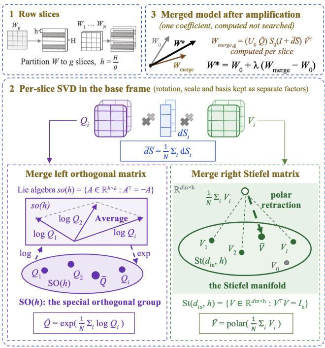  
Figure 1: Overview of CORAM. Each expert slice is factored in the base frame into a rotation, a spectral shift dS = SiS−1 − I, and a right factor. Each factor is averaged in its own space. The coeficient λ is given by Eq. (3).

A finer representation is provided by CORA (Wang et al. 2026), which parameterizes model adaptation using rowlevel weight slices. However, CORA addresses adaptation of an individual model rather than merging multiple independently finetuned models. Extending this representation to model merging raises two additional problems. First, the taskspecific factors of each slice lie on diferent curved spaces and must be combined using geometry-compatible operations. Second, averaging on these spaces can substantially reduce the magnitude of the resulting update.

We introduce CORAM, a slice-level manifold method for model merging, illustrated in Fig. 1. CORAM partitions each target weight matrix into row slices and represents each expert slice through its SVD relative to the corresponding base-model slice. It merges three factors on their natural spaces: rotations are combined using a log-Euclidean mean on the special orthogonal group (Moakher 2002; Arsigny et al. 2006), relative spectral shifts are combined through linear averaging, and right factors are aggregated using a polar mean on the Stiefel manifold (Edelman, Arias, and Smith 1998; Kaneko, Fiori, and Tanaka 2013). We additionally introduce a conflict-aware variant that masks, within each slice, neuron columns on which the experts exhibit inconsistent updates before aggregation. This adapts the conflict-handling mechanism of Yang, Shi, and Liu (2026) to the slice level.

A central challenge is that manifold averaging contracts the merged update toward the base model (Karcher 2014). Without correction, this contraction can remove a substantial portion of the task-specific signal. CORAM compensates for the contraction using an amplification coeficient λ = κcˆ, where cˆ estimates the contraction scale and κ sets restoration strength. Importantly, neither term requires evaluating candidate merged models. The contraction scale cˆ is computed from the norms of the expert and merged updates, and is approximated by N when the N experts contribute updates of comparable magnitude, as established in Proposition 1.

The appropriate restoration strength κ depends on how evenly the experts modify the base model. When expert updates have comparable magnitudes, near-full restoration is efective. When the magnitudes difer substantially, as observed for the strongest base model in our study, partial restoration performs better. CORAM distinguishes these two cases using a dispersion statistic computed from the expert updates without evaluating candidate merged models. The resulting rule selects the amplification coeficient without a sweep over λ and remains within 0.72 score points of the best swept coeficient across all evaluated suites.

The slice-level formulation motivates two complementary refinements. First, spread slicing orders rows according to update magnitude and distributes them across slices, reducing the concentration of highly updated rows in a small number of slices. Second, a residual pathway restores fine-tuning updates from layers outside the sliced merging targets, adapting the residual-decoupling principle of Yang, Shi, and Liu (2026) to the layer-level residuals. Their efectiveness also depends on the distribution of update magnitudes: spread slicing is beneficial by itself when expert updates are relatively uniform, whereas with strongly uneven updates it is most efective when combined with the residual pathway.

We evaluate CORAM on four heterogeneous modelmerging suites spanning three model families, model sizes from 3B to 9B parameters, and both language and visionlanguage experts. Our main contributions are as follows:

• Search-free amplification. We introduce the rule λ = κcˆ, where the contraction scale cˆ is estimated from expert and merged update norms and restoration strength κ is selected using a zero-evaluation dispersion statistic. The predicted coeficient remains within 0.72 score points of the swept optimum on every evaluated suite.

• Slice-level manifold merging. We merge per-slice SVD factors using geometry-compatible operations on the special orthogonal group, Euclidean spectral space, and the Stiefel manifold.

• Geometry-motivated refinement. We introduce spread slicing and show how its efectiveness changes with the dispersion of expert-update magnitudes.

• Evaluation across heterogeneous settings. Across four suites covering three model families, 3B–9B parameter scales, and language and vision-language tasks, CORAM improves over OrthoMerge by 0.25–1.35 score points under a common evaluation protocol and matches or exceeds the strongest evaluated weight-space baselines.

## Related Work

Euclidean weight-space merging. Most model-merging methods represent each finetuned expert as a task vector and combine the vectors in Euclidean weight space. Uniform averaging (Wortsman et al. 2022), Fisher- or regressionweighted merging (Matena and Rafel 2022; Jin et al. 2023), and task arithmetic (Ilharco et al. 2023) difer mainly in how the updates are weighted. TIES, DARE, and Localize-and-Stitch further reduce interference through sign agreement, sparsification, or parameter localization (Yadav et al. 2023; Yu et al. 2024; He et al. 2024). These methods are simple and strong, but they treat a weight matrix as a flat vector and do not explicitly model its rotational and spectral structure.

Geometric and subspace merging. To move beyond direct weight arithmetic, existing methods align model units (Ainsworth, Hayase, and Srinivasa 2023; Stoica et al. 2024), merge in tangent spaces (Ortiz-Jiménez, Favero, and Frossard 2023), or construct subspaces from the SVD of task updates (Gargiulo et al. 2025; Stoica et al. 2025; Marczak et al. 2025). Closest to CORAM, OrthoMerge averages one orthogonal transform per weight matrix and merges the remaining residual conventionally (Yang, Shi, and Liu 2026). An orthogonal transform cannot change singular values, so the spectral part of the update remains in the residual. CORA provides a finer per-slice SVD representation, but studies model adaptation rather than multi-expert merging (Wang et al. 2026). CORAM uses this per-slice representation for model merging and averages the rotation, relative spectral shift, and right factor in their spaces. Its conflict-aware variants and residual pathway adapt the conflict handling and residual decoupling of OrthoMerge to slices and non-target layers.

Coeficient selection in model merging. Merging on these structured spaces raises a further question: how to set the scale of the merged update. Task arithmetic uses a fixed constant (Ilharco et al. 2023), and benchmark protocols select one value per suite (He et al. 2025). AdaMerging instead optimizes per-layer coeficients at test time (Yang et al. 2024), while Model Stock derives a geometric rule for models finetuned on the same task (Jang, Yun, and Han 2024). CORAM relates the coeficient to the contraction of the geometric merge. The contraction scale is measured from the expert and merged update norms, and the restoration strength is selected from the dispersion of expert-update magnitudes. This choice is motivated by prior observations that merging behavior changes with the base model (He et al. 2025; Yadav et al. 2025), and avoids a per-benchmark sweep over λ.

## Method

## Slice Representation in the Base Frame

Following CORA (Wang et al. 2026), we partition each target weight matrix $W \doteq \mathbb { R } ^ { d _ { \mathrm { o u t } } \times d _ { \mathrm { i n } } }$ into $\dot { G } = \dot { d } _ { \mathrm { o u t } } / h$ row slices of height $h , W ^ { ( g ) } = W [ g h { : } ( g + 1 ) h , : ]$ ], and we work in the base frame. Each base slice is factored once as $W _ { 0 } ^ { ( g ) } = U _ { 0 } S _ { 0 } V _ { 0 } ^ { \top }$ For each expert $i \in \{ 1 , \ldots , N \}$ and each slice, we express the expert weights relative to this frame using three quantities: a rotation $\bar { Q _ { i } } \in S O ( h )$ aligning the expert left singular basis with $U _ { 0 }$ , obtained by the polar factor of $U _ { 0 } ^ { \top } U _ { i } ;$ a relative spectral shift $d S _ { i } = S _ { i } S _ { 0 } ^ { - 1 } - I ;$ and the right factor $V _ { i } .$ Before forming $Q _ { i } ,$ we resolve the sign ambiguity of each singular direction jointly against the base pair $( U _ { 0 } , V _ { 0 } ) ;$ each $( u , v )$ pair is flipped together, leaving $\bar { W _ { i } }$ unchanged. The triple $( Q _ { i } , d S _ { i } , V _ { i } )$ lies on a product of structured spaces: the special orthogonal group ${ \mathit { S O } } ( h )$ , the relative spectral shifts, and the Stiefel manifold $\mathrm { S t } ( d _ { \mathrm { i n } } , h )$ (Absil, Mahony, and Sepulchre 2008), and this structure dictates how the factors should be averaged.

## Per-Slice Manifold Merging

Given the per-expert slice triples, CORAM merges each factor by the mean native to its space (Fig. 1, panel 2):

Rotations. We average $\{ Q _ { i } \}$ by the log-Euclidean mean on $S O ( h )$ (Moakher 2002; Arsigny et al. 2006), mapping each rotation to the Lie algebra, averaging, and mapping back,

$$
\begin{array} { r } { \bar { Q } \ = \ \exp \Big ( \frac { 1 } { N } \sum _ { i } \log Q _ { i } \Big ) . } \end{array}\tag{1}
$$

Because ${ \mathfrak { s o } } ( h )$ is a linear space, the operation inside the $\mathbf { e X - }$ ponential is an ordinary mean, while the nonlinearity enters only through the logarithmic and exponential maps.

Spectral shifts. The relative spectral shifts are averaged linearly, $\begin{array} { r } { \overline { { d S } } = \sum _ { i } { \frac { 1 } { N } } d S _ { i } } \end{array}$ i.

Right factors. We average $\{ V _ { i } \}$ by the polar mean on the Stiefel manifold (Edelman, Arias, and Smith 1998; Kaneko, Fiori, and Tanaka 2013), forming the weighted Euclidean sum and projecting back onto the manifold via the polar decomposition $\bar { V } \stackrel { - } { = }$ polar $\textstyle { \left( \sum _ { i } { \frac { 1 } { N } } V _ { i } \right) }$

The merged slice is reconstructed in the base frame as

$$
W _ { \mathrm { m e r g e } , g } \ = \ \left( U _ { 0 } { \bar { Q } } \right) S _ { 0 } \left( I + { \overline { { d } } } S \right) { \bar { V } } ^ { \top } \ + \ { \bar { \eta } } ^ { ( g ) } ,\tag{2}
$$

where $\bar { \eta } ^ { ( g ) }$ is a conflict residual, defined in the conflict-aware variants below, and is zero when no masking is applied. Stacking the merged slices yields $W _ { \mathrm { m e r g e } }$ for the matrix. Applying the same procedure to all target matrices produces the geometric merge of the model.

## Conflict-Aware Variants

Experts can disagree sharply on individual neurons, and averaging across such disagreements dilutes every expert’s contribution. Adapting the conflict-handling idea of Orthogonal Model Merging (Yang, Shi, and Liu 2026) to the slice level, our conflict-aware variants detect, per slice and per column, the experts whose update direction opposes the consensus: with $\bar { \tau _ { i } } = W _ { i } ^ { ( g ) } - \bar { W } _ { 0 } ^ { ( g ) }$ and $\begin{array} { r } { \bar { \tau } = \frac { 1 } { N } \sum _ { i } \tau _ { i } } \end{array}$ , column $j$ of expert i is flagged when cos $\left( \tau _ { i } [ : , j ] , \bar { \tau } [ : , j ] \right)$ is negative. The flagged columns split each expert update in two parts: the part that enters the manifold means above, and the complement, which is either discarded or averaged across experts and added back to $\operatorname { E q . } \left( 2 \right)$ as $\bar { \eta } ^ { ( g ) }$ . Combining these choices yields the three variants used in our experiments:

• The non-flagged columns are merged on the manifolds, and the flagged ones are discarded.

• The non-flagged columns are merged on the manifolds, and the flagged ones return as $\bar { \eta } ^ { ( g ) }$

• The flagged columns are merged on the manifolds, and the non-flagged ones return as $\bar { \eta } ^ { ( g ) }$

The fourth combination, merging only the flagged columns and discarding the rest, would throw away the signal on which the experts agree, and we do not use it. For the first two variants, flagged columns are masked out of that expert’s contribution before the slice is factored, so the per-slice manifold means above are taken over non-conflicting evidence only. We refer to the plain method as CORAM and collectively denote the conflict-aware variants by CORAM-C. Both method families are evaluated throughout.

## Amplitude Restoration

Merging on curved spaces introduces an efect absent from Euclidean merging. The manifold mean contracts the merged update toward the base, i.e., $\| W _ { \mathrm { m e r g e } } - W _ { 0 } \|$ is substantially smaller than the typical expert update $\lVert W _ { i } - W _ { 0 } \rVert$ . The merged direction is preserved, but its magnitude is reduced. CORAM therefore applies a single global amplification,

$$
W ^ { * } = W _ { 0 } + \lambda \bigl ( W _ { \mathrm { m e r g e } } - W _ { 0 } \bigr ) , \qquad \lambda = \kappa \hat { c } ,\tag{3}
$$

where the scale $\hat { c }$ and strength $\kappa$ are determined without evaluating candidate merged models.

Contraction scale. The contraction is directly measurable from quantities already computed during merging:

$$
\hat { c } \ = \ c _ { \mathrm { R M S } } \ = \ \frac { \mathrm { R M S } _ { i } \left. \Delta W _ { i } \right. } { \left. \Delta W _ { \mathrm { m e r g e } } \right. } , \qquad \Delta W \equiv W - W _ { 0 } ,\tag{4}
$$

the ratio between the typical expert update magnitude and the merged one. No task evaluation is involved. In the ideal case, this rate has a closed form:

Proposition 1 (Cancellation scale). Let $\tau _ { 1 } , \ldots , \tau _ { N }$ be slice updates with $\mathbb { E } \langle \tau _ { i } , \tau _ { j } \rangle = 0 f o r i \neq j$ and $\| \tau _ { i } \| = \| \tau \|$ for all i. Then $\begin{array} { r } { \mathbb { E } \left\| \frac { 1 } { N } \sum _ { i } \tau _ { i } \right\| ^ { 2 } = \| \tau \| ^ { 2 } / N , } \end{array}$ , so restoring the mean to the typical expert magnitude requires amplification by $\sqrt { N }$

The proposition follows from the random-vector cancellation law. It applies directly to the rotation average in the linear space ${ \mathfrak { s o } } ( h )$ and to the Euclidean average of the relative spectral shifts (supplementary material). The additional efect of the Stiefel mean is included in c , which extends the $\sqrt { N }$ scale to correlated or uneven updates. Across four low-dispersion settings, $c _ { \mathrm { R M S } } = 2 . 0 9 / 2 . { \overset { \cdot } { 0 } } 3 / 1 . 7 2 / 2 . 0 9$ compared with $\sqrt { N } = 2 . 2 4 / 2 . 2 4 / 1 . 7 3 / 2 . 2 4$ , with a diference below 10% in each case. We therefore use $\lambda = \kappa \sqrt { N }$ as the default prescription and retain c as the direct measurement of contraction.

Restoration strength. The remaining constant κ is determined empirically. Sweeps on every base place its optimum in one of two cases: a low-dispersion case, with comparable expert update magnitudes and near-full restoration (κ ≈ 1.15), and a high-dispersion case, with strongly uneven update magnitudes and partial restoration $( \kappa \approx 0 . 5 )$ We distinguish these cases before task evaluation using the dispersion statistic,

$$
D = \frac { \operatorname* { m a x } _ { i } r _ { i } } { \operatorname* { m i n } _ { i } r _ { i } } , \quad r _ { i } = \frac { \| \Delta W _ { i } \| } { \| W _ { 0 } \| } ,\tag{5}
$$

computed from the same cached quantities as Eq. (4). Small D selects the low-dispersion case, whereas large D selects the high-dispersion case. The amplification coeficient is therefore set from Proposition 1 and D, without a per-benchmark sweep over λ. We also tested alternative closed-form choices over $\dot { \lambda } \in [ 1 , 4 ]$ , as reported in the supplementary material.

## Geometry-Derived Refinements

The slice-level formulation supports two additional refinements. Both are optional and are evaluated separately and together. Their efects depend on the distribution of expertupdate magnitudes. Spread slicing is efective by itself when the update magnitudes are comparable. When the update magnitudes difer substantially, it works better together with the residual pathway.

## Spread Slicing

Contiguous slicing follows the row order of the pretrained matrix. If heavily updated rows cluster in a small number of slices, these slices may have poorly conditioned SVDs while the remaining slices contain little update signal. Spread slicing distributes the important rows more evenly. Before slicing, we score every row r of every expert by its relative update magnitude, $s _ { i } ( \bar { r } ) = \| \Delta W _ { i } [ r , : ] \| / \| W _ { 0 } [ \bar { r } , : ] \|$ , and we summarize the scores of a row across the experts by their largest value $s _ { ( 1 ) }$ , the second largest $s _ { ( 2 ) }$ , their mean, and their variance. A priority is formed from these quantities, and the rows are then handed out to slices in descending priority. Four settings are available:

• Mean. The priority is the mean of the scores, which weights all experts equally.

• Energy. The priority is $^ { S } ( 1 ) \{$ , so the rows that some expert updates most strongly are spread first.

• Variance. The priority is $\mathrm { V a r } _ { i } [ s _ { i } ( \boldsymbol { r } ) ] s _ { ( 1 ) }$ . The variance is large when experts disagree on how much to update the row, while $s _ { ( 1 ) }$ discounts rows with little update signal.

• Owner balance. The priority is $( s _ { ( 1 ) } - s _ { ( 2 ) } ) s _ { ( 1 ) }$ , which is large when an expert dominates the row and that row also changes a lot.

The first three settings assign rows to slices in round-robin order. Owner balance assigns each row to the slice with the smallest accumulated priority, and breaks ties to prevent rows dominated by the same expert from concentrating in one slice. After merging, the permutation is inverted to restore the original row order. This permutation changes only how rows are grouped into slices and does not change the function computed by any expert. The same permutation is applied to all experts, so the merge remains well defined. We denote this configuration by CORAM+SS.

## Layer-Level Residual Pathway

The slice geometry covers the target linear layers, including the attention and MLP projections. Embeddings and normalization parameters are not included, so a purely geometric merge omits their fine-tuning updates. Following the orthogonal and residual decoupling idea of Yang, Shi, and Liu (2026), we merge the non-target residuals $\rho _ { i } = W _ { i } - W _ { 0 }$ using a conventional weight-space method and add the result as a separate patch.

We use task arithmetic (Ilharco et al. 2023), TIES (Yadav et al. 2023), or Task Singular Vectors (Gargiulo et al. 2025) for the residual merge. For Task Singular Vectors, we follow the distributed-TSVM implementation of Yang, Shi, and Liu (2026). We denote this configuration by CORAM+RP. The final model combines the amplified geometric merge with the unscaled residual patch,

$$
W ^ { * } = W _ { 0 } + \left\{ \begin{array} { l l } { \lambda \left( W _ { \mathrm { m e r g e } } - W _ { 0 } \right) } & { \mathrm { t a r g e t l a y e r s } , } \\ { \bar { \rho } } & { \mathrm { n o n - t a r g e t } , } \end{array} \right.\tag{6}
$$

where λ follows the amplitude-restoration rule: the amplification corrects the contraction of the manifold mean only, while the residual merger is Euclidean and needs no correction. When both refinements are enabled, CORAM+SS+RP applies spread slicing before geometric merging and adds the residual patch afterward.

## Experiments

## Setup

Suites. We evaluate CORAM on four suites covering three model families, model sizes from 3B to 9B, and both language and vision-language experts.

T1 contains five orthogonally finetuned Llama-3.1-8B experts (Qiu et al. 2023) released by Yang, Shi, and Liu (2026). We evaluate them on MATH500 (Hendrycks et al. 2021b), HumanEval+ (Liu et al. 2023), ScienceQA (Lu et al. 2022), CommonsenseQA (Talmor et al. 2019), and Social-IQA (Sap et al. 2019).

T2 and T4 each contain five fully finetuned experts for instruction following, mathematics, coding, multilingual tasks, and safety. The experts are based on Llama-3.2-3B and Gemma-2-9B and are obtained from MergeBench (He et al. 2025). We follow the task suites, evaluation protocol, and hyperparameter settings of MergeBench.

<table><tr><td></td><td colspan="5">In-domain</td><td colspan="2">In-domain Avg best λ</td><td colspan="2">Out-of-domain M-ARC AGIEval</td><td colspan="2">OOD Avg</td></tr><tr><td>Method</td><td>MATH500</td><td>HEval+</td><td>SciQA</td><td>CSQA</td><td>SIQA</td><td>κ-rule</td><td></td><td>33.02</td><td></td><td></td><td>31.65</td></tr><tr><td>Llama-3.1-8B Task-specific FT</td><td>17.80 19.00</td><td>21.52 38.54</td><td>71.40 91.82</td><td>70.60 82.47</td><td>48.11 56.81</td><td></td><td>45.89 57.73</td><td></td><td></td><td>30.27</td><td></td></tr><tr><td></td><td></td><td></td><td></td><td></td><td></td><td></td><td></td><td></td><td></td><td></td><td></td></tr><tr><td>Linear</td><td>23.40</td><td>32.26 37.20</td><td>83.59 86.29</td><td>76.82</td><td>51.84</td><td></td><td>53.58</td><td>34.41 34.97</td><td></td><td>32.27</td><td>33.34 33.83</td></tr><tr><td>Task Arithmetic TIES</td><td>24.80 21.40</td><td>40.43</td><td>82.87</td><td>79.52</td><td>53.33</td><td></td><td>56.23 55.41</td><td></td><td></td><td>32.68 32.53</td><td>33.47</td></tr><tr><td>DARE-TIES</td><td>19.20</td><td>40.30</td><td>82.24</td><td>78.30 78.54</td><td>54.04 54.45</td><td></td><td>54.95</td><td></td><td>34.40 33.50</td><td>32.24</td><td>32.87</td></tr><tr><td>OrthoMerge (OFT)</td><td>24.20</td><td>37.87</td><td>87.72</td><td>80.75</td><td>55.12</td><td></td><td>57.13</td><td>35.15</td><td></td><td>33.13</td><td>34.14</td></tr><tr><td></td><td></td><td></td><td></td><td></td><td></td><td></td><td></td><td></td><td></td><td></td><td></td></tr><tr><td>CORAM CORAM-C</td><td>21.80</td><td>40.43 38.41</td><td>88.31</td><td>81.24</td><td>56.81</td><td>57.72</td><td> $5 7 . 9 8 ( h { = } 1 6 , \lambda { = } 2 . 4 0 )$ </td><td></td><td>35.21</td><td>32.53</td><td>33.87</td></tr><tr><td>CORAM-C+SS</td><td>20.60 21.40</td><td>39.88</td><td>88.44 88.40</td><td>81.24</td><td>56.81</td><td>57.10 57.49</td><td>57.74(λ=2.25)</td><td></td><td>35.15</td><td>32.61</td><td>33.88</td></tr><tr><td></td><td></td><td></td><td></td><td></td><td>81.08</td><td>56.70</td><td></td><td> ${ \bf 5 8 . 2 1 } _ { ( \lambda = 2 . 3 0 ) }$ </td><td>35.12</td><td>32.17</td><td>33.65</td></tr><tr><td colspan="10"></td><td colspan="2"></td><td colspan="2"></td></tr><tr><td></td><td></td><td></td><td></td><td>In-domain</td><td></td><td></td><td>In-domain Avg</td><td></td><td>Out-of-domain</td><td></td><td colspan="2"></td></tr><tr><td>Method</td><td>Instr.</td><td></td><td>Math</td><td>Coding</td><td>Multi.</td><td>Safety</td><td>κ-rule</td><td>best λ</td><td>MMLU†</td><td>AGIEval</td><td colspan="2">OOD Avg</td></tr><tr><td>Llama-3.2-3B Task-specific FT</td><td>7.58</td><td>39.56</td><td>28.51</td><td>27.44</td><td>40.72</td><td>31.41</td><td>27.18</td><td></td><td>56.79</td><td>24.01</td><td colspan="2">40.40</td></tr><tr><td></td><td></td><td></td><td>69.83</td><td>44.33</td><td>41.73</td><td>80.46</td><td>55.18</td><td></td><td></td><td></td><td colspan="2"></td></tr><tr><td>Linear</td><td>9.80</td><td>40.86</td><td></td><td>37.15</td><td>42.22</td><td>40.21</td><td>34.05</td><td></td><td>57.54</td><td>25.88</td><td colspan="2">41.71</td></tr><tr><td>Task Arithmetic TIES</td><td>18.30</td><td></td><td>45.49</td><td>40.18</td><td>42.47</td><td>44.90</td><td>38.27</td><td></td><td>57.50</td><td>26.82</td><td colspan="2">42.16</td></tr><tr><td>DARE-TIES</td><td>22.18 31.61</td><td>56.94</td><td>50.04</td><td>39.40</td><td>42.03</td><td>41.93 48.50</td><td>39.12 43.45</td><td></td><td>56.76 55.94</td><td>27.08 25.55</td><td colspan="2">41.92</td></tr><tr><td>OrthoMerge (TSV-M+C)</td><td>20.15</td><td>55.57</td><td></td><td>39.01 41.76</td><td>41.22 42.28</td><td>50.90</td><td>42.13</td><td></td><td>57.42</td><td>26.87</td><td colspan="2">40.74 42.14</td></tr><tr><td>CORAM+SS+RP</td><td>31.24</td><td>52.99</td><td></td><td>42.12</td><td></td><td>48.40</td><td>43.30</td><td>43.30(λ=2.60)</td><td>56.02</td><td>25.60</td><td colspan="2"></td></tr><tr><td>CORAM-C+RP</td><td>31.79</td><td></td><td>53.83</td><td>40.79</td><td>41.72 41.56</td><td>48.65</td><td>43.32</td><td>43.32(λ=2.60)</td><td>56.18</td><td>25.60</td><td colspan="2">40.81 40.89</td></tr><tr><td>CORAM-C+SS+RP</td><td>30.50</td><td></td><td>52.84</td><td>42.40</td><td>41.70</td><td>49.94</td><td>43.48</td><td>43.48(λ=2.60)</td><td>56.17</td><td>25.67</td><td colspan="2">40.92</td></tr></table>

Table 1: Top–T1: merging five orthogonally finetuned Llama-3.1-8B experts. Bottom–T2: merging five fully finetuned Llama-3.2-3B experts from MergeBench. Higher is better. Per column, the best result among merging methods is in bold (base-model and task-specific-FT reference rows excluded). CORAM-C denotes the conflict-aware variants (masking neurons where experts disagree). +SS adds spread slicing (a task-informed row permutation) and +RP the residual pathway (conventional merge of the non-target layers). CORAM rows evaluate the search-free κ-rule checkpoint (grid λ=2.60 for both suites). “best λ” is the sweep optimum, for reference (see Setup).

T3 contains three Qwen2.5-VL-7B-Instruct experts for spatial reasoning, OCR, and medical multimodal question answering. We follow the vision-language setup of Yang, Shi, and Liu (2026) and evaluate on MMSI-Bench (Yang et al. 2025), EmbSpatial (Du et al. 2024), MMMU-Med (Yue et al. 2024), PathVQA (He et al. 2020), OCRBench (Liu et al. 2024b), and CharXiv (Wang et al. 2024). We use the multiple-choice subset of MMMU-Med. CharXiv is scored using its oficial GPT judge, gpt-4o-2024-05-13. Our evaluation pipeline obtains 69.50 for the best variant of Yang, Shi, and Liu (2026), compared with the reported score of 69.90.

Cost. CORAM uses slice SVDs that are computed once and cached for subsequent merges. The geometric merge requires 0.5 to 0.8 GPU-hours for each configuration. The evaluation cost of a sweep over λ is one to two orders of magnitude larger than the merge cost. Detailed storage and runtime statistics are provided in the supplementary material.

Out-of-domain evaluation. We evaluate the retention of general capabilities using the out-of-domain (OOD) tasks adopted by Yang, Shi, and Liu (2026). For T1, we use M-ARC and AGIEval (Zhong et al. 2024). For T2 and T4, we use MMLU† (Hendrycks et al. 2021a) and AGIEval, with the mathematics and coding subsets removed from MMLU. For T3, we use IFEval (Zhou et al. 2023) and MMBench (Liu et al. 2024a). All OOD tasks are evaluated zero-shot using the same evaluation harness. The specific diferences are provided in the supplementary material.

Baselines and CORAM configurations. We implement linear averaging (Wortsman et al. 2022), task arithmetic (Ilharco et al. 2023), TIES (Yadav et al. 2023), and DARE-TIES (Yu et al. 2024; Yadav et al. 2023) as per-tensor algorithms following their original definitions. We use the MergeBench coeficient settings and the baseline set of Yang, Shi, and Liu (2026). For Orthogonal Model Merging (Yang, Shi, and Liu 2026), we evaluate all released variants under our protocol and report the strongest result for each suite. On T2, our reproduction obtains 42.13, compared with the published 42.07. All table comparisons use the same protocol. Reproduction details are provided in the supplementary material.

The base-model and task-specific finetuning results for T1, T2, and T3 are taken from Yang, Shi, and Liu (2026). The corresponding results for T4 are measured using our evaluation harness. CORAM denotes the plain method, and CORAM-C denotes the conflict-aware variants. CORAM+SS includes spread slicing, while CORAM+RP includes the residual pathway. The main tables report three representative configurations for each suite. The complete component combinations are reported in the supplementary material.

We use a slice height of h = 8 and h = 16 in experiments. Each CORAM row evaluates one checkpoint selected without a sweep over λ. The task scores, OOD scores, and κ-rule average are obtained from the model merged using $\lambda = \kappa \sqrt { N }$ . κ is selected using the dispersion statistic D in Eq. (5). The best λ column is the only result obtained from a sweep. It reports the in-domain average at the best value for each suite and measures the diference between the selected coeficient and the sweep optimum. The detailed configuration corresponding to each CORAM row is reported in the supplementary material.

<table><tr><td rowspan="2">Method</td><td colspan="6">In-domain</td><td rowspan="2">In-domain Avg κ-rule</td><td colspan="2">Out-of-domain IFEval</td><td rowspan="2">OOD Avg</td></tr><tr><td>MMSI</td><td>EmbSp.</td><td> $\mathbf { M M M U } _ { \mathrm { M e d } }$ </td><td>PathVQA</td><td>OCRB.</td><td>CharXiv</td><td>best λ</td><td>MMB.</td></tr><tr><td>Qwen2.5-VL-7B-It.</td><td>27.80</td><td>69.97</td><td>53.10</td><td>66.30</td><td>84.70</td><td>67.20</td><td>61.51</td><td>63.03</td><td>83.93</td><td>73.48</td></tr><tr><td>Task-specific FT</td><td>32.60</td><td>70.58</td><td>55.17</td><td>66.81</td><td>85.00</td><td>72.50</td><td>63.78</td><td></td><td></td><td></td></tr><tr><td>Linear</td><td>29.20</td><td>71.29</td><td>55.17</td><td>68.47</td><td>84.80</td><td>67.30</td><td>62.71</td><td>58.23</td><td>84.19</td><td>71.21</td></tr><tr><td>Task Arithmetic</td><td>29.10</td><td>71.07</td><td>55.86</td><td>68.38</td><td>84.60</td><td>66.10</td><td>62.52</td><td>59.33</td><td>84.19</td><td>71.76</td></tr><tr><td>TIES</td><td>32.10</td><td>71.54</td><td>57.93</td><td>68.44</td><td>82.80</td><td>69.40</td><td>63.70</td><td>54.53</td><td>84.02</td><td>69.27</td></tr><tr><td>DARE-TIES</td><td>32.10</td><td>71.76</td><td>58.62</td><td>66.98</td><td>80.80</td><td>69.60</td><td>63.31</td><td>51.02</td><td>82.82</td><td>66.92</td></tr><tr><td>OrthoMerge (TIES+C)</td><td>32.30</td><td>71.76</td><td>56.55</td><td>68.14</td><td>83.10</td><td>69.50</td><td>63.56</td><td>54.53</td><td>83.68</td><td>69.10</td></tr><tr><td>CORAM</td><td>33.20</td><td>71.59</td><td>60.00</td><td>66.69</td><td>85.40</td><td>67.00</td><td>63.98  $6 4 . 1 0 ( \lambda { = } 1 . 6 0 )$ </td><td>53.42</td><td>83.25</td><td>68.33</td></tr><tr><td>CORAM+RP</td><td>33.20</td><td>72.17</td><td>60.69</td><td>67.22</td><td>84.90</td><td>68.10</td><td>64.38  ${ \bf 6 4 . 3 8 } \left( \lambda { = } 2 . 0 0 \right)$ </td><td>54.53</td><td>82.99</td><td>68.76</td></tr><tr><td>CORAM-C+RP</td><td>33.70</td><td>72.03</td><td>59.31</td><td>67.37</td><td>84.90</td><td>67.90</td><td>64.20  $6 4 . 2 6 ( \lambda { = } 1 . 7 5 )$ </td><td>52.68</td><td>83.16</td><td>67.92</td></tr></table>

Table 2: T3: merging three Qwen2.5-VL-7B-Instruct vision–language experts. Layout and bolding as in Table 1. κ-rule grid point λ=2.00. CORAM-C denotes the conflict-aware variants (masking neurons where experts disagree). +RP adds the residual pathway (conventional merge of the non-target layers). The OrthoMerge out-of-domain entries are obtained from our zero-shot re-evaluation.
<table><tr><td></td><td colspan="5">In-domain</td><td colspan="2">In-domain Avg</td><td colspan="2">Out-of-domain</td><td rowspan="2">OOD Avg</td></tr><tr><td>Method</td><td>Instr.</td><td>Math</td><td>Coding</td><td>Multi.</td><td>Safety</td><td>κ-rule best λ</td><td>MMLU†</td><td>AGIEval</td><td></td></tr><tr><td>Gemma-2-9B</td><td>14.23</td><td>69.83</td><td>43.37</td><td>54.63</td><td>34.39</td><td></td><td>43.29</td><td>70.41</td><td>38.01</td><td>54.21</td></tr><tr><td>Task-specific FT</td><td>65.06</td><td>79.76</td><td>58.51</td><td>55.91</td><td>76.00</td><td></td><td>67.05</td><td></td><td></td><td></td></tr><tr><td>Linear</td><td>27.17</td><td>81.05</td><td>51.52</td><td>53.79</td><td>59.31</td><td></td><td>54.57</td><td>67.88</td><td>37.75</td><td>52.81</td></tr><tr><td>Task Arithmetic</td><td>27.54</td><td>82.34</td><td>51.65</td><td>51.31</td><td>54.26</td><td></td><td>53.42</td><td>64.44</td><td>35.70</td><td>50.07</td></tr><tr><td>TIES</td><td>24.03</td><td>82.94</td><td>46.60</td><td>45.64</td><td>52.84</td><td></td><td>50.41</td><td>60.60</td><td>34.92</td><td>47.76</td></tr><tr><td>DARE-TIES</td><td>18.11</td><td>76.57</td><td>20.22</td><td>34.23</td><td>49.12</td><td></td><td>39.65</td><td>42.18</td><td>27.10</td><td>34.64</td></tr><tr><td>OrthoMerge (TA+C)</td><td>26.43</td><td>81.27</td><td>52.83</td><td>53.78</td><td>59.37</td><td></td><td>54.74</td><td>67.80</td><td>37.85</td><td>52.83</td></tr><tr><td>CORAM-C</td><td>27.36</td><td>81.27</td><td>51.62</td><td>53.52</td><td>57.83</td><td>54.32</td><td> $5 4 . 3 2 ( \lambda { = } 1 . 1 0 )$ </td><td>67.22</td><td>38.03</td><td>52.63</td></tr><tr><td>CORAM+RP</td><td>26.06</td><td>81.58</td><td>51.84</td><td>53.59</td><td>59.73</td><td>54.56</td><td> $5 4 . 8 4 ( \lambda { = } 1 . 2 5 )$ </td><td>67.30</td><td>37.28</td><td>52.29</td></tr><tr><td> $\mathrm { C O R A M + S S + R P }$ </td><td>26.25</td><td>81.80</td><td>53.10</td><td>53.66</td><td>58.28</td><td>54.62</td><td> $\pmb { 5 4 . 9 9 } ( \lambda { = } 1 . 2 5 )$ </td><td>67.59</td><td>37.62</td><td>52.60</td></tr></table>

Table 3: T4: merging five fully finetuned Gemma-2-9B experts from MergeBench with uneven update magnitudes (D≈16). The rule selects $\kappa { = } 0 . 5 ,$ corresponding to λ=1.10. Layout and bolding follow Table 1. CORAM-C masks neurons where experts disagree. +SS adds a task-informed row permutation, and +RP merges the non-target layers.

## Main Results

Tables 1–3 report the main comparison. First, CORAM outperforms every OrthoMerge variant on all four suites, by +1.08 (T1), +1.35 (T2), +0.82 (T3), and +0.25 (T4) at the respective best configurations, all measured under our single harness against our reproduction of OrthoMerge (see Setup). Second, against the strongest weight-space baselines CORAM leads on T1, T3, and T4, and matches DARE-TIES on T2 (43.48 vs. 43.45). No baseline is consistently competitive: the method strongest on any one suite trails CORAM by 1.1–15.3 points on the others. Retention tells the same story: on T4 the aggressive DARE-TIES baseline collapses out-of-domain (34.64 vs. our 52.60), while CORAM’s OOD averages stay within the band of the mildest mergers on every suite. Third, the search-free κ-rule recovers near-peak accuracy throughout: across all suites and configurations, its gap to the swept-λ optimum is at most 0.72 points, including on T4, where the rule selects the high-dispersion case (κ≈0.5) purely from the zero-evaluation dispersion D. It removes the need for a per-suite λ sweep of ten or more grid points, each requiring a full-suite evaluation.

## The Amplification Dichotomy

Two cases. T4 evaluates the rule on a diferent model family and the largest model considered. The value of D is computed before task evaluation. Across the five bases (see supplementary material), D separates the models into lowand high-dispersion cases. Qwen2.5-VL-7B, Gemma-2-2B, Llama-3.2-3B, and Llama-3.1-8B have $D \in [ 1 . 3 , 3 . 5 ]$ , while Gemma-2-9B has $D \approx 1 6 $ . The optimal κ, measured by λ sweeps on every base, follows the same division. It lies between approximately 0.9 and 1.2 in the low-dispersion case and near 0.5 in the high-dispersion case.

We therefore adopt two shared constants, κ=1.15 and $\kappa { = } 0 . 5 .$ fixed once across all suites rather than fitted per suite. Because the sweep optima are flat, this choice difers from the per-suite optimum by at most 0.72 points. Using $\kappa = 1 . 1 0$ does not change any comparison in the tables. The supplementary material reports the per-configuration ranges of $\kappa _ { \mathrm { o p t } } .$ the relation between κ and D, and a multi-seed evaluation of the main-table checkpoints. The value used in the high-dispersion case is calibrated on the only available base with a large value of D, as discussed in the limitations. Our results support these two cases but do not establish how κ behaves for intermediate values of D.

<table><tr><td>Configuration</td><td>T1</td><td>T2</td><td>T3</td><td>T4</td></tr><tr><td>CORAM</td><td>57.72</td><td>42.75</td><td>63.95</td><td>54.49</td></tr><tr><td>+RP</td><td>n/a</td><td>42.31</td><td>64.38</td><td>54.56</td></tr><tr><td>+SS</td><td>57.84</td><td>42.93</td><td>63.96</td><td>54.15</td></tr><tr><td>+SS+RP</td><td>n/a</td><td>43.30</td><td>64.27</td><td>54.71</td></tr><tr><td>CORAM-C</td><td>57.60</td><td>42.96</td><td>64.02</td><td>54.32</td></tr><tr><td>+RP</td><td>n/a</td><td>43.32</td><td>64.20</td><td>54.37</td></tr><tr><td>+SS</td><td>57.98</td><td>42.99</td><td>64.14</td><td>53.77</td></tr><tr><td>+SS+RP</td><td>n/a</td><td>43.48</td><td>64.33</td><td>54.41</td></tr></table>

Table 4: Best in-domain average reached at the κ-rule point (best configuration per method and suite). RP is inapplicable on T1 (no non-target residual).

Relation to base model strength. The two cases are not explained by model family or fine-tuning method. Within Gemma-2, the 2B base has D = 1.67, while the 9B base has D = 16, so the selected κ changes with scale within the same architecture. The 9B math expert is trained with GRPO, while the others use SFT. Excluding the math expert gives D = 16.0 for Gemma-2-9B and D = 1.67 for Gemma-2-2B under matched fine-tuning methods. The diference is therefore more closely associated with base-model strength, consistent with observations that merging behaves diferently on stronger bases (He et al. 2025; Yadav et al. 2025). The statistic D measures this diference before merging.

Explanation. Proposition 1 assumes nearly orthogonal updates with comparable norms. A small value of D indicates that the update norms are comparable, so near-full restoration is appropriate. At D ≈ 16, the update magnitudes differ substantially and the equal-norm assumption no longer holds. Full restoration then amplifies the merged update too strongly, and a value near κ = 0.5 performs better. The T4 results in Table 3 show that D distinguishes the two cases before task evaluation.

## Component Efects in the Two Cases

Table 4 evaluates each component under the κ-rule for CORAM in the top half and CORAM-C in the bottom half. CORAM-C performs better than plain CORAM on T2 by +0.21 and on T3 by +0.07. Combining spread slicing and the residual pathway gives the best value at the selected κ on two of the four suites, with 43.48 on T2, and 54.71 on T4. On T1, CORAM-C+SS gives the best result under the κ-rule at 57.98, while CORAM+RP gives the best result on T3 at 64.38. Sweeping λ further improves the T1 result to 58.21 at λ = 2.30 and the T4 result to 54.99 at λ = 1.25. These gains quantify the remaining gap between the κ-rule point and the swept optimum.

Efect of spread slicing. The sweep results below are reported in the supplementary material. When the expertupdate magnitudes are comparable, spread slicing improves the swept optimum by +0.34 on T1, +0.41 on T2, and +0.10 on T3 relative to the best contiguous configuration on the same branch. When the update magnitudes difer substantially, spread slicing alone does not help. Every spread-only configuration on T4 is 0.58 to 0.86 points below its contiguous counterpart.

The reduction is concentrated in the safety task. Four of the five T4 domains change by less than ±1 point, while safety decreases by 4.7 points. The supplementary analysis links this drop to less stable open-ended generation rather than a general capability loss. Adding the residual pathway restores the omitted embedding and normalization updates. The combined configuration outperforms the residual pathway alone, with 54.62 vs. 54.56 at the selected κ and 54.99 vs. 54.84 at the swept optimum in Table 3. Spread slicing works by itself when update magnitudes are comparable, while uneven updates benefit from the residual pathway.

## Limitations

Intermediate values of D. Four bases have low D, while one has high D. We do not extrapolate to intermediate values, which are not represented in current public expert suites.

Scale and strength. Proposition 1 gives the ideal scale, and c extends it to correlated or uneven updates. It remains within 10% of N when update magnitudes are comparable. However, κ ≈ 1.15 and κ ≈ 0.5 are empirical values selected by D. The latter is calibrated on a single high-D base. A full contraction analysis of the composed slice map remains open.

Behavioral evidence. The failure of spread slicing under uneven updates is observed at the domain and generation levels and is corrected by the residual pathway. We do not provide a theoretical explanation.

Scope. We follow the expert suites and protocols of MergeBench and Yang, Shi, and Liu (2026). Larger numbers of experts, other architectures such as mixture-of-experts models, and experts derived from diferent base checkpoints are not evaluated.

## Conclusion

We presented CORAM, a slice-level method for merging finetuned experts. Each expert slice is represented by its SVD in the base frame, and the task-specific factors are averaged on their corresponding manifolds. CORAM compensates for the resulting contraction using an amplification scale estimated from the norms of the expert and merged updates and a strength selected from update dispersion without evaluating candidate merged models. Spread slicing helps when update magnitudes are comparable, while uneven updates benefit from the residual pathway. Across four suites covering three model families and both language and vision-language experts, CORAM improves over Orthogonal Model Merging and matches or exceeds the strongest weight-space baselines without a per-benchmark sweep over λ. Future work will study intermediate update dispersion and contraction under manifold averaging.

## References

Absil, P.-A.; Mahony, R.; and Sepulchre, R. 2008. Optimization Algorithms on Matrix Manifolds. Princeton University Press. ISBN 9780691132983.

Aghajanyan, A.; Gupta, S.; and Zettlemoyer, L. 2021. Intrinsic Dimensionality Explains the Efectiveness of Language Model Fine-Tuning. In Proceedings ofthe 59th Annual Meeting of the Association for Computational Linguistics (ACL), 7319–7328.

Ainsworth, S.; Hayase, J.; and Srinivasa, S. 2023. Git Re-Basin: Merging Models modulo Permutation Symmetries. In The Eleventh International Conference on Learning Representations.

Arsigny, V.; Fillard, P.; Pennec, X.; and Ayache, N. 2006. Log-Euclidean metrics for fast and simple calculus on diffusion tensors. Magnetic Resonance in Medicine, 56(2): 411–421.

Du, M.; Wu, B.; Li, Z.; Huang, X.; and Wei, Z. 2024. EmbSpatial-Bench: Benchmarking Spatial Understanding for Embodied Tasks with Large Vision-Language Models. In ACL (Short Papers), 346–355.

Edelman, A.; Arias, T. A.; and Smith, S. T. 1998. The Geometry of Algorithms with Orthogonality Constraints. SIAM Journal on Matrix Analysis and Applications, 20(2): 303– 353.

Gargiulo, A. A.; Crisostomi, D.; Bucarelli, M. S.; Scardapane, S.; Silvestri, F.; and Rodolà, E. 2025. Task Singular Vectors: Reducing Task Interference in Model Merging. In CVPR, 18695–18705.

He, X.; Zhang, Y.; Mou, L.; Xing, E.; and Xie, P. 2020. PathVQA: 30000+ Questions for Medical Visual Question Answering. arXiv:2003.10286.

He, Y.; Hu, Y.; Lin, Y.; Zhang, T.; and Zhao, H. 2024. Localize-and-Stitch: Eficient Model Merging via Sparse Task Arithmetic. CoRR, abs/2408.13656.

He, Y.; Zeng, S.; Hu, Y.; Yang, R.; Zhang, T.; and Zhao, H. 2025. MergeBench: A Benchmark for Merging Domain-Specialized LLMs. In The Thirty-ninth Annual Conference on Neural Information Processing Systems Datasets and Benchmarks Track.

Hendrycks, D.; Burns, C.; Basart, S.; Zou, A.; Mazeika, M.; Song, D.; and Steinhardt, J. 2021a. Measuring Massive Multitask Language Understanding. In ICLR.

Hendrycks, D.; Burns, C.; Kadavath, S.; Arora, A.; Basart, S.; Tang, E.; Song, D.; and Steinhardt, J. 2021b. Measuring Mathematical Problem Solving With the MATH Dataset. In NeurIPS Datasets and Benchmarks Track.

Hu, E. J.; Shen, Y.; Wallis, P.; Allen-Zhu, Z.; Li, Y.; Wang, S.; Wang, L.; and Chen, W. 2022. LoRA: Low-Rank Adaptation of Large Language Models. In International Conference on Learning Representations.

Ilharco, G.; Ribeiro, M. T.; Wortsman, M.; Schmidt, L.; Hajishirzi, H.; and Farhadi, A. 2023. Editing models with task arithmetic. In The Eleventh International Conference on Learning Representations.

Jang, D.-H.; Yun, S.; and Han, D. 2024. Model Stock: All We Need Is Just a Few Fine-Tuned Models. In European Conference on Computer Vision (ECCV).

Jin, X.; Ren, X.; Preotiuc-Pietro, D.; and Cheng, P. 2023. Dataless Knowledge Fusion by Merging Weights of Language Models. In The Eleventh International Conference on Learning Representations.

Kaneko, T.; Fiori, S.; and Tanaka, T. 2013. Empirical Arithmetic Averaging Over the Compact Stiefel Manifold. IEEE Transactions on Signal Processing, 61(4): 883–894.

Karcher, H. 2014. Riemannian Center of Mass and so called karcher mean. arXiv:1407.2087.

Liu, J.; Xia, C. S.; Wang, Y.; and Zhang, L. 2023. Is Your Code Generated by ChatGPT Really Correct? Rigorous Evaluation of Large Language Models for Code Generation. In NeurIPS.

Liu, Y.; Duan, H.; Zhang, Y.; Li, B.; Zhang, S.; Zhao, W.; Yuan, Y.; Wang, J.; He, C.; Liu, Z.; Chen, K.; and Lin, D. 2024a. MMBench: Is Your Multi-modal Model an Allaround Player? In European Conference on Computer Vision (ECCV).

Liu, Y.; Li, Z.; Huang, M.; Yang, B.; Yu, W.; Li, C.; Yin, X.-C.; Liu, C.-L.; Jin, L.; and Bai, X. 2024b. OCRBench: on the hidden mystery of OCR in large multimodal models. Science China Information Sciences, 67(12).

Lu, P.; Mishra, S.; Xia, T.; Qiu, L.; Chang, K.-W.; Zhu, S.-C.; Tafjord, O.; Clark, P.; and Kalyan, A. 2022. Learn to Explain: Multimodal Reasoning via Thought Chains for Science Question Answering. In NeurIPS.

Marczak, D.; Magistri, S.; Cygert, S.; Twardowski, B.; Bagdanov, A. D.; and van de Weijer, J. 2025. No Task Left Behind: Isotropic Model Merging with Common and Task-Specific Subspaces. In Forty-second International Conference on Machine Learning.

Matena, M.; and Rafel, C. 2022. Merging Models with Fisher-Weighted Averaging. In NeurIPS.

Moakher, M. 2002. Means and Averaging in the Group of Rotations. SIAM Journal on Matrix Analysis and Applications, 24(1): 1–16.

Ortiz-Jiménez, G.; Favero, A.; and Frossard, P. 2023. Task Arithmetic in the Tangent Space: Improved Editing of Pre-Trained Models. In NeurIPS.

Qiu, Z.; Liu, W.; Feng, H.; Xue, Y.; Feng, Y.; Liu, Z.; Zhang, D.; Weller, A.; and Schölkopf, B. 2023. Controlling Text-to-Image Difusion by Orthogonal Finetuning. In NeurIPS.

Sap, M.; Rashkin, H.; Chen, D.; Bras, R. L.; and Choi, Y. 2019. Social IQa: Commonsense Reasoning about Social Interactions. In EMNLP/IJCNLP (1), 4462–4472.

Stoica, G.; Bolya, D.; Bjorner, J.; Hearn, T.; and Hofman, J. 2024. ZipIt! Merging Models from Diferent Tasks without Training. In International Conference on Learning Representations (ICLR).

Stoica, G.; Ramesh, P.; Ecsedi, B.; Choshen, L.; and Hofman, J. 2025. Model merging with SVD to tie the Knots. In The Thirteenth International Conference on Learning Representations.

Talmor, A.; Herzig, J.; Lourie, N.; and Berant, J. 2019. CommonsenseQA: A Question Answering Challenge Targeting Commonsense Knowledge. In NAACL-HLT, 4149–4158.

Wang, P.; Liu, Z.; Wang, W.; and Jiang, W. 2026. CORA: Per-Slice Coherent Orthogonal Rotation for SVD-based Low-Rank Adaptation. arXiv:2607.02576.

Wang, Z.; Xia, M.; He, L.; Chen, H.; Liu, Y.; Zhu, R.; Liang, K.; Wu, X.; Liu, H.; Malladi, S.; Chevalier, A.; Arora, S.; and Chen, D. 2024. CharXiv: Charting Gaps in Realistic Chart Understanding in Multimodal LLMs. In NeurIPS Datasets and Benchmarks Track.

Wortsman, M.; Ilharco, G.; Gadre, S. Y.; Roelofs, R.; Lopes, R. G.; Morcos, A. S.; Namkoong, H.; Farhadi, A.; Carmon, Y.; Kornblith, S.; and Schmidt, L. 2022. Model soups: averaging weights of multiple fine-tuned models improves accuracy without increasing inference time. In International Conference on Machine Learning (ICML).

Yadav, P.; Tam, D.; Choshen, L.; Rafel, C. A.; and Bansal, M. 2023. TIES-Merging: Resolving Interference When Merging Models. In NeurIPS.

Yadav, P.; Vu, T.; Lai, J.; Chronopoulou, A.; Faruqui, M.; Bansal, M.; and Munkhdalai, T. 2025. What Matters for Model Merging at Scale? Transactions on Machine Learning Research.

Yang, E.; Wang, Z.; Shen, L.; Liu, S.; Guo, G.; Wang, X.; and Tao, D. 2024. AdaMerging: Adaptive Model Merging for Multi-Task Learning. In ICLR.

Yang, S.; Shi, K.; and Liu, W. 2026. Orthogonal Model Merging. In Forty-third International Conference on Machine Learning.

Yang, S.; Xu, R.; Xie, Y.; Yang, S.; Li, M.; Lin, J.; Zhu, C.; Chen, X.; Duan, H.; Yue, X.; Lin, D.; Wang, T.; and Pang, J. 2025. MMSI-Bench: A Benchmark for Multi-Image Spatial Intelligence. CoRR, abs/2505.23764.

Yu, L.; Yu, B.; Yu, H.; Huang, F.; and Li, Y. 2024. Language Models are Super Mario: Absorbing Abilities from Homologous Models as a Free Lunch. In Forty-first International Conference on Machine Learning.

Yue, X.; Ni, Y.; Zheng, T.; Zhang, K.; Liu, R.; Zhang, G.; Stevens, S.; Jiang, D.; Ren, W.; Sun, Y.; Wei, C.; Yu, B.; Yuan, R.; Sun, R.; Yin, M.; Zheng, B.; Yang, Z.; Liu, Y.; Huang, W.; Sun, H.; Su, Y.; and Chen, W. 2024. MMMU: A Massive Multi-Discipline Multimodal Understanding and Reasoning Benchmark for Expert AGI. In CVPR, 9556–9567.

Zhong, W.; Cui, R.; Guo, Y.; Liang, Y.; Lu, S.; Wang, Y.; Saied, A.; Chen, W.; and Duan, N. 2024. AGIEval: A Human-Centric Benchmark for Evaluating Foundation Models. In Findings of NAACL.

Zhou, J.; Lu, T.; Mishra, S.; Brahma, S.; Basu, S.; Luan, Y.; Zhou, D.; and Hou, L. 2023. Instruction-Following Evaluation for Large Language Models. arXiv:2311.07911.

# Supplementary Material for CORAM: Coherent Orthogonal Rotation for Model Merging

Xinyi Sui1, Ziran Liu2, Nam Ling1, Wei Wang3, Wei Jiang3

1Santa Clara University

2Shanghai Institute for Mathematics and Interdisciplinary Sciences / Fudan University 3Futurewei Technologies, Inc.

xsui@scu.edu, zliu@simis.cn, nling@scu.edu, rickweiwang@futurewei.com, wjiang@futurewei.com

This supplement provides the method details, complete experimental results, and additional analyses omitted from the main paper.

• Section A: the complete CORAM pipeline, sign alignment, the numerical implementation of the geometric operators, conflict-aware variants, spread slicing, and the residual pathway.

• Section B: the branch diagnosis that motivates amplification, the proof of Proposition 1, and the measurements behind the contraction scale and the restoration strength.

• Section C: the evaluation protocol, computing infrastructure, baselines, and configuration naming, with the mapping to the main tables.

• Section D: the retained configurations, coeficient sweeps, the rule-versus-optimum comparison, the complete configuration grid, threshold sensitivity, leave-onebase-out validation, and alternative coeficient choices.

• Section E: component ablations and the additional analysis of spread slicing on T4.

• Section F: the slice-height study.

• Section G: the OOD settings and the OrthoMerge reproduction.

• Section H: multi-seed results and confidence intervals.

• Section I: computational cost.

## A. Additional Method Details

This section gives the implementation details omitted from the main paper, including the complete merging pipeline, sign alignment, conflict-aware variants, spread slicing, and the residual pathway.

Complete pipeline. For each target matrix, the base and expert weights are first divided into row slices. Each expert slice is represented in the corresponding base-model SVD frame by a rotation, a relative spectral shift, and a right factor. The three factors are merged in their respective spaces, and the merged slice is reconstructed in the base frame. The geometric update is then amplified using the coeficient defined in the main paper. Spread slicing, when enabled, is applied before factorization, while the residual pathway is added after the geometric merge.

Base-frame factorization and sign alignment. For a base slice $W _ { 0 } ^ { ( g ) } = U _ { 0 } S _ { 0 } V _ { 0 } ^ { \top }$ and expert slice $W _ { i } ^ { ( g ) } = U _ { i } S _ { i } V _ { i } ^ { \top }$ the singular-vector signs are aligned jointly against the base pair $( \bar { U } _ { 0 } , V _ { 0 } )$ . Each pair $( u , v )$ is flipped together, so the expert slice remains unchanged. The aligned factors define

$$
Q _ { i } \in \mathrm { S O } ( h ) , \qquad d S _ { i } = S _ { i } S _ { 0 } ^ { - 1 } - I , \qquad V _ { i } \in \mathrm { S t } ( d _ { \mathrm { i n } } , h ) .
$$

The rotation, relative spectral shift, and right factor are then merged as described in the main paper.

The rotation-side polar factor applies an explicit determinant correction: from $U , S , V ^ { \top } \overset { * } { = } \operatorname { S V D } ( \grave { M } )$ we form $Q = U V ^ { \top }$ , and whenever det $Q < 0$ , the sign of the last column of U is flipped and $Q$ is recomputed, guaranteeing $Q \in \mathrm { S O } ( h )$ rather than merely $O ( h )$ . The right-factor polar projection applies no such correction, since $\bar { V } _ { i } \in \mathrm { S t } ( \bar { d _ { \mathrm { i n } } } , h )$ is not square and the determinant constraint does not apply there.

Matrix logarithm and exponential. The rotation logarithm is computed in double precision through the Cayley transform: $\dot { W } = ( Q + I ) ^ { - 1 } ( \dot { Q } - I )$ is real skew-symmetric with eigenvalues i tan(θ/2), so iW is Hermitian and a GPUnative Hermitian eigendecomposition recovers the rotation angles; the generator is reassembled from the eigenbasis, the real part is taken, and an explicit skew-symmetric projection $K \gets \frac { 1 } { 2 } ( K { - } K ^ { \top } )$ ) is applied. When Q has an eigenvalue near $- 1 \left( \theta \overset { - } { \approx } \pi \right)$ , where the Cayley transform is ill-conditioned, the implementation falls back to a complex general eigendecomposition with the principal logarithm. The two paths agree to about $1 0 ^ { - 1 1 }$ . The exponential map applies the skew projection, evaluates the matrix exponential, and re-projects the result onto the orthogonal group by a polar decomposition. Table 1 reports the measured reconstruction error $\lVert \exp ( \log Q ) - Q \rVert _ { F } / \lVert Q \rVert _ { F }$ over all slices of every suite.

Singular-value stabilization. The relative spectral shift divides by the base spectrum through a truncated inverse, $d S _ { i } = { \bar { S _ { i } } } / \operatorname* { m a x } ( S _ { 0 } , \epsilon ) - 1$ with $\epsilon = \mathrm { 1 0 ^ { - 1 2 } }$ ; slice SVDs are computed in batched double precision. Table 1 reports the distribution of the slice condition numbers ${ \sigma _ { \operatorname* { m a x } } } / { \sigma _ { \operatorname* { m i n } } }$ of $S _ { 0 }$ for contiguous and for variance-spread slicing. Spread slicing leaves the bulk of the distribution unchanged and collapses its tail, consistent with the conditioning motivation given in the main paper.

<table><tr><td rowspan="2">Suite</td><td colspan="3">Rotation log (all slices)</td><td colspan="3">Cond. (contiguous)</td><td colspan="2">Cond. (spread)</td></tr><tr><td>Mean err</td><td>Max err</td><td> $\theta { > } 3$ </td><td>Median</td><td> $\mathsf { p } 9 5$ </td><td>Max</td><td> $\mathsf { p } 9 5$ </td><td>Max</td></tr><tr><td>T1</td><td> $8 . 8 \times 1 0 ^ { - 1 6 }$ </td><td> $1 . 9 \times 1 0 ^ { - 1 5 }$ </td><td>0</td><td>1.3</td><td>2.3</td><td>706</td><td>2.8</td><td>38</td></tr><tr><td>T2</td><td> $8 . 8 \times 1 0 ^ { - 1 6 }$ </td><td> $2 . 2 \times 1 0 ^ { - 1 5 }$ </td><td>0</td><td>1.3</td><td>2.6</td><td>822</td><td>3.1</td><td>28</td></tr><tr><td>T3</td><td> $8 . 8 \times 1 0 ^ { - 1 6 }$ </td><td> $1 . 9 \times 1 0 ^ { - 1 5 }$ </td><td>0</td><td>1.3</td><td>5.2</td><td>635</td><td>5.3</td><td>282</td></tr><tr><td>T4</td><td> $1 . 4 \times 1 0 ^ { - 1 5 }$ </td><td> $5 . 1 \times 1 0 ^ { - 1 0 }$ </td><td>64</td><td>1.3</td><td>2.0</td><td>43</td><td>2.5</td><td>18</td></tr></table>

Table 1: Numerical audit of the geometric operators at $h = 8 ,$ over every slice of every expert (0.48M–1.16M rotations per suite). Rotation-logarithm reconstruction errors are at machine precision; the near-π fallback fires on 64 of 1.16M rotations on T4 only and is handled by the exact eigendecomposition path. No slice has $\sigma _ { \mathrm { m i n } } < 1 0 ^ { - 8 }$ . Variance-spread slicing leaves the median condition number unchanged but collapses the tail (maximum 706 → 38, 822 → 28, 635 → 282, 43 → 18), confirming its conditioning motivation.

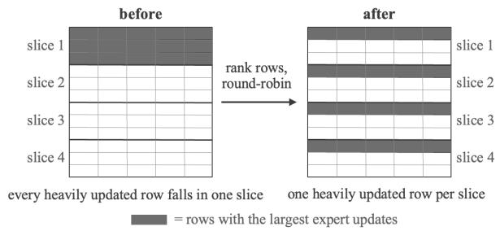  
Figure 1: Spread slicing. Rows are scored by their relative update magnitudes, ranked by the selected priority, and assigned to slices so that highly updated rows are distributed evenly. The inverse permutation restores the original row order after merging.

Conflict-aware variants. For expert update $\tau _ { i } = { \cal W } _ { i } ^ { ( g ) } -$ $W _ { 0 } ^ { ( g ) }$ and mean update $\begin{array} { r } { \bar { \tau } = \frac { 1 } { N } \sum _ { i } \tau _ { i } , } \end{array}$ , column j of expert i is flagged when

$$
\cos \bigl ( \tau _ { i } [ : , j ] , \bar { \tau } [ : , j ] \bigr ) < 0 .
$$

The flagged and non-flagged columns are assigned either to the geometric merge or to a Euclidean residual. We evaluate three variants:

• The non-flagged columns are merged geometrically, and the flagged columns are discarded.

• The non-flagged columns are merged geometrically, and the flagged columns are averaged and added back as a residual.

• The flagged columns are merged geometrically, and the non-flagged columns are averaged and added back as a residual.

The fourth combination, in which only the flagged columns are retained and the non-flagged columns are discarded, removes the signal on which the experts agree and is not used. Since masking changes the slice, the masked target is factorized again. Plain CORAM applies no conflict mask and reads the cached factors directly.

Spread slicing. Contiguous slicing follows the original row order. Spread slicing instead assigns rows to slices according to their relative update magnitudes, as illustrated in

Figure 1. For row r and expert i, we use

$$
s _ { i } ( \boldsymbol { r } ) = \frac { \| \Delta W _ { i } [ \boldsymbol { r } , : ] \| } { \| W _ { 0 } [ \boldsymbol { r } , : ] \| } .
$$

Let $s ^ { ( 1 ) } ( r )$ and $s ^ { ( 2 ) } ( r )$ denote the largest and second largest values across experts. We consider four priorities:

• Mean: $\begin{array} { r } { \frac { 1 } { N } \sum _ { i } s _ { i } ( r ) } \end{array}$

• Energy: $s ^ { ( 1 ) } ( r )$

• Variance: $\mathrm { V a r } _ { i } [ s _ { i } ( r ) ] s ^ { ( 1 ) } ( r )$

• Owner balance: $\big ( s ^ { ( 1 ) } ( r ) - s ^ { ( 2 ) } ( r ) \big ) s ^ { ( 1 ) } ( r )$

Mean, energy, and variance priorities assign rows in roundrobin order. Owner balance assigns each row to the slice with the smallest accumulated priority and uses the dominant expert to break ties. The same permutation is applied to the base and all experts. After merging, the inverse permutation restores the original row order.

Residual pathway. The geometric merge is applied to the target attention and MLP linear layers. Embeddings, normalization parameters, and other non-target parameters are merged separately. For non-target update $\rho _ { i } = W _ { i } - W _ { 0 } .$ , we use task arithmetic, TIES, or Task Singular Vectors and add the result as an unscaled residual patch:

$$
\begin{array} { r } { W ^ { * } = W _ { 0 } + \left\{ \begin{array} { l l } { \lambda \big ( W _ { \mathrm { m e r g e } } - W _ { 0 } \big ) , } & { \mathrm { t a r g e t l a y e r s } , } \\ { \bar { \rho } , } & { \mathrm { n o n - t a r g e t l a y e r s } . } \end{array} \right. } \end{array}
$$

The amplification coeficient is applied only to the geometric update. When spread slicing and the residual pathway are both enabled, the row permutation is applied before the geometric merge and the residual patch is added afterward.

## B. Amplitude Restoration

This section reports the branch diagnosis that motivates amplification, provides the proof of the cancellation scale, relates it to the three per-slice factors, and reports the measurements used to set the restoration strength.

Branch diagnosis and the necessity of amplification. Before deriving the amplification rule, we verify empirically which per-slice factors carry the task signal and how much magnitude the geometric merge loses. On T2 (Llama-3.2- 3B, $h { = } 1 6 .$ , uniform expert weights, no amplification, i.e.

<table><tr><td>Branch</td><td>Avg</td><td> $\| \Delta \| / \| \Delta _ { \mathrm { T A } } \|$ </td><td> $\cos ( \Delta , \Delta _ { \mathrm { T A } } )$ </td></tr><tr><td>dS only</td><td>27.23</td><td>0.006</td><td>0.024</td></tr><tr><td> $Q \mathrm { o n l y }$ </td><td>26.97</td><td>0.768</td><td>0.001</td></tr><tr><td> $\dot { V } \mathrm { \bf ~ o n i \dot { y } }$ </td><td>33.98</td><td>0.788</td><td>0.253</td></tr><tr><td> $Q + d { \dot { S } }$ </td><td>27.30</td><td>0.768</td><td>0.001</td></tr><tr><td> $d S { + } V$ </td><td>34.24</td><td>0.788</td><td>0.253</td></tr><tr><td> $Q + V \left( \mathtt { l } \mathtt { r } \right)$ </td><td>34.69</td><td>0.207</td><td>0.966</td></tr><tr><td> $Q + d S + V \left( \tt f u l l \right)$ </td><td>33.94</td><td>0.207</td><td>0.967</td></tr><tr><td>Base model</td><td>27.18</td><td></td><td></td></tr><tr><td>Task arithmetic</td><td>38.27</td><td>1.000</td><td>1.000</td></tr></table>

Table 2: Branch diagnosis on T2 (Llama-3.2-3B, $h { = } 1 6 ,$ $\lambda { = } 1 )$ . Each row merges a subset of the per-slice factors and keeps the rest at their base values. Only the branches containing both rotations are direction-correct, and their magnitude contracts to 0.21 $\lVert \Delta _ { \mathrm { T A } } \rVert$ ∥. The sweep optima in Table 7 are at $h { = } 8 .$

$\lambda { = } 1 )$ , we reconstruct the merged model from every subset of the three factors, keeping the remaining factors at their base values. Table 2 reports the in-domain average together with the magnitude and direction of the merged update $\bar { \Delta } = W _ { \mathrm { m e r g e } } - \bar { W _ { 0 } }$ relative to the unscaled task-arithmetic sum $\Delta _ { \mathrm { T A } } \stackrel { \smile } { = } \sum _ { i } ( W _ { i } - W _ { 0 } )$

Three observations follow. First, the spectral shift alone is inert: its update norm is $1 0 ^ { - 4 } \thinspace \mathrm { o f } \parallel \dot { W } _ { 0 } \parallel$ and its score matches the base model. Second, the left rotation alone produces a sizeable but task-orthogonal perturbation (cos ≈ 0) and scores below the base model. The right factor alone recovers only part of the signal and collapses onto the mathematics expert, which dominates 193 of the 196 target modules. Only the two branches that merge both rotations point in the task direction, with cos $( \Delta , \bar { \Delta } _ { \mathrm { T A } } ) \approx 0 . 9 7$ . These are the lr and full lines retained in the configuration tables. Third, for these two branches the update magnitude contracts to $0 . 2 0 7 \left. \Delta _ { \mathrm { T A } } \right.$ , because the two rotation-induced updates largely cancel: $\| \Delta _ { Q + V } \| / ( \| \Delta _ { Q } \| ^ { 2 } + \| \Delta _ { V } \| ^ { 2 } ) ^ { 1 / 2 } = 0 . 1 8 8$ In this diagnostic, the merge is well aligned with the taskarithmetic direction but substantially under-scaled. This observation motivates the cancellation analysis below. Restoring the magnitude recovers the performance: the same full line, swept over λ at $h { = } 8 ,$ reaches 42.76 at $\lambda ^ { * } = 2 . 8 0$ (Table 7), compared with 33.94 at $\lambda { = } 1$ . Amplification is therefore a necessary part of the method, not a tuning refinement.

Proof of Proposition 1. Let $\tau _ { 1 } , \ldots , \tau _ { N }$ satisfy $\mathbb { E } \langle \tau _ { i } , \tau _ { j } \rangle =$ 0 for $i \neq j$ and $\| \tau _ { i } \| = \| \tau \|$ for all i. Expanding the squared norm of the mean gives

$$
\begin{array} { l } { \displaystyle \mathbb { E } \left\| \frac { 1 } { N } \sum _ { i } \tau _ { i } \right\| ^ { 2 } = \frac { 1 } { N ^ { 2 } } \left( \sum _ { i } \mathbb { E } \| \tau _ { i } \| ^ { 2 } + \sum _ { i \neq j } \mathbb { E } \langle \tau _ { i } , \tau _ { j } \rangle \right) } \\ { \displaystyle = \frac { 1 } { N ^ { 2 } } N \| \tau \| ^ { 2 } = \frac { \| \tau \| ^ { 2 } } { N } . } \end{array}\tag{1}
$$

The mean therefore has RMS norm $\| \tau \| / { \sqrt { N } }$ , and restoring it to the typical expert magnitude requires amplification by $\sqrt { N }$ □

<table><tr><td>Base</td><td>N</td><td>D</td><td>CRMS</td><td> $\sqrt { N }$ </td><td>Rel. diff.</td></tr><tr><td>Llama-3.1-8B</td><td>5</td><td>3.5</td><td>2.09</td><td>2.24</td><td>6.7%</td></tr><tr><td>Llama-3.2-3B</td><td>5</td><td>2.6</td><td>2.03</td><td>2.24</td><td>9.4%</td></tr><tr><td>Qwen2.5-VL-7B</td><td>3</td><td>1.3</td><td>1.72</td><td>1.73</td><td>0.6%</td></tr><tr><td>Gemma-2-2B</td><td>5</td><td>1.67</td><td>2.09</td><td>2.24</td><td>6.6%</td></tr><tr><td>Gemma-2-9B</td><td>5</td><td>16.0</td><td>2.19</td><td>2.24</td><td>2.3%</td></tr></table>

Table 3: Measured contraction scale. The first four bases form the low-dispersion case. The Gemma-2-9B experts have substantially more uneven update magnitudes.

Unequal norms. The equal-norm assumption can be dropped without changing the scale. If the updates remain incoherent, $\mathbb { E } \langle \tau _ { i } , \tau _ { j } \rangle = 0 \bar { \mathrm { f o r } } i \neq j .$ , but the norms $\| \tau _ { i } \|$ difer, the same expansion gives

$$
\mathbb { E } \left\| \frac { 1 } { N } \sum _ { i } \tau _ { i } \right\| ^ { 2 } = \frac { 1 } { N ^ { 2 } } \sum _ { i } \| \tau _ { i } \| ^ { 2 } .
$$

Restoring the mean to the RMS expert magnitude therefore requires

$$
{ \frac { { \sqrt { { \frac { 1 } { N } } \sum _ { i } \| \tau _ { i } \| ^ { 2 } } } } { { \sqrt { { \frac { 1 } { N ^ { 2 } } } \sum _ { i } \| \tau _ { i } \| ^ { 2 } } } } } = { \sqrt { N } } ,
$$

independently ofhow uneven the norms are. Norm imbalance alone does not change the cancellation scale. The smaller optimal restoration strength at high dispersion must therefore come from correlated updates and from the nonlinear parts of the slice map, not from the norm imbalance itself. D should accordingly be read as an empirical predictor of the high-dispersion case: it is a proxy for the correlation and nonlinear efects that reduce the useful restoration strength, not their direct cause.

Relation to the per-slice factors. The cancellation result applies directly to the two factors averaged in linear spaces. The rotation generators are averaged in so(h), and the relative spectral shifts are averaged in $\mathbb { R } ^ { h }$ . The right factors are instead averaged by a Euclidean sum followed by polar projection. Proposition 1 therefore motivates the $\sqrt { N }$ scale for the first two factors, while $c _ { \mathrm { R M S } }$ measures the contraction of the complete reconstructed update:

$$
c _ { \mathrm { R M S } } = \frac { \mathrm { R M S } _ { i } \lVert \Delta W _ { i } \rVert } { \lVert \Delta W _ { \mathrm { m e r g e } } \rVert } .
$$

Measured contraction scale. Table 3 compares cRMS with $\sqrt { N }$ . The approximation is close for the four low-dispersion settings. The Gemma-2-9B setting has substantially more uneven expert-update magnitudes and is treated separately when selecting the restoration strength.

Restoration strength. The scale c S, or its default approximation $\sqrt { N }$ , determines the size of the contraction correction. The factor κ determines how much of this scale is restored. The swept optima form two cases. For the four bases with $D \in [ 1 . 3 , 3 . { \dot { 5 } } ]$ ], the useful values of κ are approximately

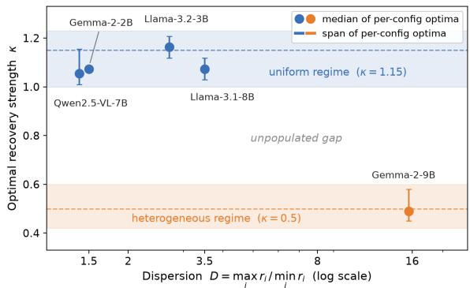  
Figure 2: Swept restoration strength $\kappa _ { \mathrm { o p t } } = \lambda ^ { * } / \sqrt { N }$ against the dispersion statistic D. Dashed lines mark the two shared constants.

1.0–1.2. For Gemma-2-9B, where D ≈ 16, the useful value is near 0.5. We use the shared constants

$$
\kappa = 1 . 1 5 \qquad \mathrm { a n d } \qquad \kappa = 0 . 5
$$

for the low- and high-dispersion cases, respectively.

Figure 2 plots the swept $\kappa _ { \mathrm { o p t } } = \lambda ^ { * } / \sqrt { N }$ against D. The available bases form two separated groups. The current expert suites do not cover intermediate values of D, and we do not define an interpolation between the two constants.

## C. Experimental Protocol and Configuration Definitions

This section specifies the evaluation settings and the configuration names used in the supplementary tables.

## Evaluation Protocol

T1: Llama-3.1-8B. T1 merges five orthogonally finetuned experts. The in-domain tasks are MATH500, HumanEval+, ScienceQA, CommonsenseQA, and Social-IQA. The outof-domain (OOD) tasks are M-ARC and AGIEval. All OOD evaluations use the same zero-shot setting across methods.

T2 and T4: MergeBench. T2 and T4 merge five fully finetuned experts based on Llama-3.2-3B and Gemma-2- 9B, respectively. The five domains are instruction following, mathematics, coding, multilingual understanding, and safety.

Instruction following is evaluated using IFEval strict accuracy. Mathematics uses GSM8K with 8-shot chain-ofthought prompting and strict matching. Coding is the mean of HumanEval+ and MBPP+ pass@1. Multilingual performance is averaged over the MergeBench multilingual tasks. Safety is computed as

$$
\mathrm { S a f e t y } = \mathrm { m e a n } \left( 1 - \mathrm { h a r m } , 1 - \mathrm { A S R } , 1 - \mathrm { A S R } _ { \mathrm { j b } } , \mathrm { a c c } _ { \mathrm { o r } } \right) .
$$

The OOD tasks are MMLU†, with mathematics and coding subsets removed, and AGIEval.

T3: Qwen2.5-VL-7B-Instruct. T3 merges three vision– language experts. The evaluation tasks are MMSI-Bench, EmbSpatial, the multiple-choice subset of MMMU-Med,

PathVQA, OCRBench, and CharXiv. CharXiv uses its official GPT judge with gpt-4o-2024-05-13, the oficial prompt, and the oficial parsing procedure. IFEval and MM-Bench are used for the OOD columns.

Evaluation harnesses. Language evaluations use a fixed lm-evaluation-harness configuration. Code tasks use the bigcode evaluation harness. Vision–language tasks use lmmseval. Safety follows the MergeBench safety stack.

Merging is deterministic. Unless otherwise stated, each reported score is a single evaluation run; the multi-seed study in Section H reports variation across decoding seeds for the main-table checkpoints.

Computing infrastructure. Experiments ran on four Linux nodes: one with NVIDIA L40S GPUs (46 GB each; AMD EPYC 7513, 512 GB RAM, Ubuntu 22.04, CUDA 13.0) and three with eight NVIDIA B300 GPUs each (275 GB each; Intel Xeon 6737P, 3 TB RAM, Ubuntu 24.04, CUDA 13.2). Merging uses PyTorch 2.7/2.8 with safetensors. Language evaluations use lm-evaluation-harness 0.4.9.1 with transformers 4.57.6 and datasets 3.1.0. Code evaluations use the bigcode evaluation harness with transformers 5.12.1. Vision–language evaluations use lmms-eval 0.5.0 with qwenvl-utils 0.0.14. Safety evaluations use vLLM 0.9.0; Gemma-2-9B safety generation instead uses the HF backend with the Gemma chat template (see Section H). Decoding is greedy unless a task specifies otherwise; coding tasks use temperature 0.2 with n = 10. Exact harness commits will be included with the released code.

## Baselines

Linear averaging, task arithmetic, TIES, and DARE-TIES are implemented as per-tensor algorithms following their original definitions. Their coeficient settings follow the MergeBench protocol. For OrthoMerge, we evaluate all released variants under the same harness and report the strongest result for each suite.

## Configuration Naming

Table 4 defines the internal configuration names used in the complete result tables.

The residual pathway is not applicable to T1 because the released OFT experts modify only the target linear layers.

## Mapping to the Main Tables

Table 5 records the exact supplementary configuration used for each CORAM row in the main paper.

## D. Complete Configuration Results and Coeficient Sweeps

This section reports the retained CORAM configurations. For each line, the tables give the swept-optimal coeficient and the corresponding in-domain average. For T3, the configuration and coeficient sweeps in this section use the five deterministic non-judged tasks and exclude CharXiv, because each CharXiv pass requires external GPT judging. Maintable summaries and final checkpoint comparisons include CharXiv and use the six-task average unless stated otherwise.

<table><tr><td>Name</td><td>Description</td></tr><tr><td>full</td><td>Merges the rotation, relative spectral shift, and right factor. No conflict masking, spread slicing, or residual pathway is applied.</td></tr><tr><td>1r</td><td>Merges the rotation and right factor while keeping the spectral factor at its base value  $S _ { 0 }$ </td></tr><tr><td>nca</td><td>Merges the non-conflicting columns geometrically and discards the conflicting columns.</td></tr><tr><td>nca+ave</td><td>Merges the non-conflicting columns geometrically and adds the average of the conflicting columns as a</td></tr><tr><td>ca</td><td>Euclidean residual. Merges the conflicting columns geometrically and discards the non-conflicting columns.</td></tr><tr><td>ca+ave</td><td>Merges the conflicting columns geometrically and adds the average of the non-conflicting columns as a Euclidean residual.</td></tr><tr><td>line.ta</td><td>Uses the geometric configuration specified by 1 ine for the target layers and task arithmetic for the non-target residual pathway.</td></tr><tr><td>line.ties</td><td>Uses the geometric configuration specified by 1 ine for the target layers and TIES for the non-target residual pathway.</td></tr><tr><td>line.tsvm</td><td>Uses the geometric configuration specified by 1 ine for the target layers and Task Singular Vectors for the non-target residual pathway.</td></tr><tr><td>SS (line,mode)</td><td>Applies spread slicing to the configuration specified by line. The priority mode is mean, energy, variance, or owner; owner denotes the owner-balance priority defined in the main paper.</td></tr></table>

Table 4: Configuration names used in the supplementary tables. The sufixes ta, ties, and tsvm denote the merger used for the non-target residual pathway.
<table><tr><td>Suite</td><td>Main-paper row</td><td>Internal line</td><td>h</td><td>SS priority</td><td>RP merger</td><td>Conflict variant</td><td>Rule λ</td><td>Best λ</td></tr><tr><td>T1</td><td>CORAM</td><td>full</td><td>8</td><td>None</td><td>None</td><td>None</td><td>2.60</td><td>2.40 (h=16)</td></tr><tr><td>T1</td><td>CORAM-C</td><td>nca+ave</td><td>8</td><td>None</td><td>None</td><td>nca+ave</td><td>2.60</td><td>2.25</td></tr><tr><td>T1</td><td>CORAM-C+SS</td><td>SS(ca+ave,energy)</td><td>8</td><td>energy</td><td>None</td><td>ca+ave</td><td>2.60</td><td>2.30</td></tr><tr><td>T2</td><td>CORAM+SS+RP</td><td>SS(1r,mean).ties</td><td>8</td><td>mean</td><td>TIES</td><td>None</td><td>2.60</td><td>2.60</td></tr><tr><td>T2</td><td>CORAM-C+RP</td><td>nca.ties</td><td>8</td><td>None</td><td>TIES</td><td>nca</td><td>2.60</td><td>2.60</td></tr><tr><td>T2</td><td>CORAM-C+SS+RP</td><td>SS(ca+ave,variance).ties</td><td>8</td><td>variance</td><td>TIES</td><td>ca+ave</td><td>2.60</td><td>2.60</td></tr><tr><td>T3</td><td>CORAM</td><td>1r</td><td>8</td><td>None</td><td>None</td><td>None</td><td>2.00</td><td>1.60</td></tr><tr><td>T3</td><td>CORAM+RP</td><td>lr.ta</td><td>8</td><td>None</td><td>TA</td><td>None</td><td>2.00</td><td>2.00</td></tr><tr><td>T3</td><td>CORAM-C+RP</td><td>nca.ta</td><td>8</td><td>None</td><td>TA</td><td>nca</td><td>2.00</td><td>1.75</td></tr><tr><td>T4</td><td>CORAM-C</td><td>ca+ave</td><td>8</td><td>None</td><td>None</td><td>ca+ave</td><td>1.10</td><td>1.10</td></tr><tr><td>T4</td><td>CORAM+RP</td><td>lr.ties</td><td>8</td><td>None</td><td>TIES</td><td>None</td><td>1.10</td><td>1.25</td></tr><tr><td>T4</td><td>CORAM+SS+RP</td><td>SS(1r,mean).ta</td><td>8</td><td>mean</td><td>TA</td><td>None</td><td>1.10</td><td>1.25</td></tr></table>

Table 5: Mapping between the main-paper rows and the internal configuration names (Table 4), with the κ-rule and swept-best coeficients. All checkpoints use $h = 8 ,$ except the T1 CORAM best-λ entry (h = 16).

The complete machine-readable sweep logs will be included with the released artifacts.

## Per-Suite Sweep Optima

Tables 6–9 report the per-line sweep optima for the four suites. Each table lists, for the retained lines of one suite, the swept-optimal coeficient and the in-domain average at that coeficient.

## Sweep Curves

Figure 3 plots the in-domain average against λ for two lines per suite: a representative plain line and the strongest branch. The κ-rule coeficient, the swept optimum of the representative line, and the strongest OrthoMerge variant are marked. The curves are flat around their optima, so the rule-selected coeficient loses at most a fraction of a point.

<table><tr><td>Line</td><td> $\lambda ^ { * }$ </td><td>Avg |Line</td><td></td><td>λ*</td><td>Avg</td></tr><tr><td>full</td><td></td><td>2.5057.94</td><td>|SS(full,mean)</td><td></td><td>2.4058.08</td></tr><tr><td>lr</td><td>2.2057.80</td><td></td><td>SS(full,variance)</td><td>2.3057.99</td><td></td></tr><tr><td>nca</td><td>2.5057.73</td><td></td><td>SS(full,energy)</td><td>2.4057.97</td><td></td></tr><tr><td>nca+ave</td><td>2.2557.74</td><td></td><td>SS(ca+ave,energy)</td><td>2.3058.21</td><td></td></tr><tr><td>ca</td><td>2.1047.45</td><td></td><td>full (h = 16)</td><td>2.4057.98</td><td></td></tr><tr><td>ca+ave</td><td>2.5057.87</td><td></td><td>1r (h = 16)</td><td></td><td>2.4057.97</td></tr></table>

Table 6: T1 per-line sweep optima. Strict conflict masking without an averaged residual gives a substantially lower result on T1.

## Complete Rule-versus-Optimum Comparison

The 0.72-point bound stated in the main paper applies to the configurations reported in the main tables, and every main-table configuration satisfies it. Table 10 extends the comparison to the broader exploratory grid: for every retained line, it reports the score at the rule-selected coeficient and at the swept optimum. Of the 52 rule-evaluated lines, 50 also satisfy the bound. The two exceptions are exploratory combinations that were not selected for any main-table row: lr.ties on T3 (0.89; the residual merger selected for T3 is task arithmetic, not TIES) and nca+ave on T4 (0.73).

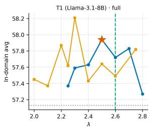  
fullOrthoMerge (OFT)SS(ca+ave,energy) -- κ-ruleλ=2.6 ★ swept optimum (57.94, λ=2.5)

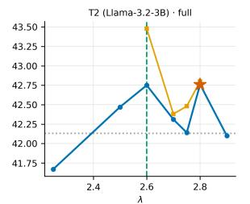  
fullSS(ca+ave,var).tiesOrthoMerge (TSV-M+C) -- κ-rule λ=2.6 ★swept optimum (42.76, λ=2.8)

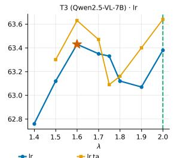  
-- κ-rule λ=2★swept optimum (63.43, λ=1.6)

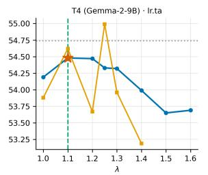  
Ir.taSS(Ir,mean).taOrthoMerge (TA+C) -- κ-rule λ=1.1 ★ swept optimum (54.48, λ=1.1)

Figure 3: In-domain average versus λ at h = 8. Blue: the representative line (full on T1/T2, lr on T3, lr.ta on T4); orange: the strongest branch of the same suite (SS(ca+ave,energy), SS(ca+ave,variance).ties, lr.ta, SS(lr,mean).ta). T3 curves are five-task averages, hence no OrthoMerge reference line. Dashed vertical lines mark the κ-rule coeficient; stars mark the swept optimum of the representative line; dotted horizontal lines mark the strongest OrthoMerge variant. The T4 panel is truncated at $\lambda \leq 1 . 7$ for readability; beyond this point the curve declines monotonically to 43.5 at $\lambda = 2 . 9$ (full grid in Table 10).
<table><tr><td>Line</td><td> $\lambda ^ { * }$ </td><td>Avg</td><td>|Line</td><td> $\lambda ^ { * }$ </td><td> $\operatorname { A v g }$ </td></tr><tr><td>full</td><td></td><td>2.8042.76</td><td>nca.ta</td><td></td><td>2.6043.00</td></tr><tr><td>lr</td><td></td><td>2.7542.44</td><td>nca.ties</td><td></td><td>2.6043.32</td></tr><tr><td>nca</td><td></td><td>2.5042.96</td><td>nca.tsvm</td><td></td><td>2.8043.06</td></tr><tr><td>nca+ave</td><td></td><td>2.6042.33</td><td>nca+ave.ties</td><td></td><td>2.5543.18</td></tr><tr><td>ca+ave</td><td></td><td>2.6042.56</td><td>ca+ave.ties</td><td></td><td>2.5542.96</td></tr><tr><td>full.ties</td><td></td><td>2.6043.03</td><td>SS(lr,mean)</td><td></td><td>2.8042.99</td></tr><tr><td>lr.ties</td><td></td><td>2.6043.11</td><td>SS(ca+ave,variance).ties 2.6043.48</td><td></td><td></td></tr></table>

Table 7: Selected T2 per-line sweep optima at $h = 8 .$
<table><tr><td>Line</td><td> $\lambda ^ { * }$   $\operatorname { A v g }$ </td><td>|Line</td><td>λ*</td><td>Avg</td></tr><tr><td>full</td><td>1.6063.25</td><td>nca.ta</td><td></td><td>1.7563.75</td></tr><tr><td>lr</td><td>1.6063.43</td><td></td><td>nca+ave.ta</td><td>1.7063.60</td></tr><tr><td>nca</td><td>1.6063.07</td><td>ca+ave.ta</td><td></td><td>1.7063.40</td></tr><tr><td>nca+ave</td><td>1.75</td><td>63.42 lr.ta</td><td></td><td>2.0063.64</td></tr><tr><td>ca+ave</td><td>1.7563.41</td><td></td><td>SS(nca,energy)</td><td>1.6063.72</td></tr><tr><td>full.ta</td><td>1.8063.61</td><td></td><td>SS(nca+ave,variance)</td><td>1.7563.73</td></tr><tr><td>lr.ties</td><td>1.5063.10</td><td></td><td>SS(lr,owner).ta</td><td>2.0063.66</td></tr></table>

Table 8: Selected T3 per-line sweep optima at $h = 8 . \mathrm { { A l l } }$ entries are five-task in-domain averages (CharXiv excluded).
<table><tr><td>Line</td><td> $\lambda ^ { * }$ </td><td> $\operatorname { A v g }$ </td><td>|Line</td><td> $\lambda ^ { * }$ </td><td> $\operatorname { A v g }$ </td></tr><tr><td>full</td><td></td><td>1.2054.56|</td><td>|nca.ties</td><td>1.3053.86</td><td></td></tr><tr><td>lr</td><td></td><td>1.0054.74</td><td>nca+ave.ties</td><td>1.2054.72</td><td></td></tr><tr><td>nca</td><td></td><td>1.3053.89</td><td>ca+ave.ties</td><td>1.0054.67</td><td></td></tr><tr><td>nca+ave</td><td>1.0054.78</td><td></td><td>lr.ties</td><td>1.25 54.84</td><td></td></tr><tr><td>ca+ave</td><td></td><td>1.1054.32</td><td>full.ties</td><td>1.2054.67</td><td></td></tr><tr><td>lr.ta</td><td></td><td>1.1054.48</td><td>SS(lr,mean).ta 1.25 54.99</td><td></td><td></td></tr></table>

Table 9: Selected T4 per-line sweep optima at $h = 8 .$ . The optima lie between $\lambda = 1 . 0 0$ and 1.30.

## The Complete Configuration Grid

Tables 11–19 list every configuration line evaluated during the development of CORAM, grouped by component layer: conflict variants under contiguous slicing, spread-only lines, residual-pathway lines, and combined spread+residual lines. Across this grid (Tables 11–19), 238 lines and 1,645 (line, λ) points were evaluated; the slice-height study of Section F is counted separately. Each row reports the number of evaluated coeficients, their range, the swept optimum, and the score at the rule-selected coeficient. Rule points absent from the original sweeps were evaluated afterwards at the rule coefficient (the T4 point with the main-table safety protocol), so every line includes its rule-point entry. All lines use h=8 (the h=16 lines appear in Table 36); T3 entries are fivetask averages; T4 entries include only evaluations passing the completeness checks. Combinations not listed were not evaluated.

Best Results at the κ-Rule Point and after Sweeping Table 20 separates the result selected by the κ-rule from the best value found by sweeping λ.

## Distribution of the Swept Optima

On T4, the swept optima of the retained lines are distributed as follows:

The median is $\lambda ^ { * } = 1 . 1 0$ , corresponding to

$$
\kappa _ { \mathrm { o p t } } = { \frac { 1 . 1 0 } { \sqrt { 5 } } } \approx 0 . 4 9 .
$$

The swept values span approximately $\kappa \in [ 0 . 4 5 , 0 . 5 8 ]$ . We therefore use the rounded shared constant $\kappa = 0 . 5$ for the high-dispersion case.

For the low-dispersion case, the main-table configurations give approximately

$$
\kappa _ { \mathrm { o p t } } \in [ 1 . 0 3 , 1 . 1 2 ] \quad \mathrm { o n } \mathrm { T } 1 ,
$$

$$
\kappa _ { \mathrm { o p t } } \in [ 1 . 1 2 , 1 . 2 1 ] \quad \mathrm { o n } \mathrm { T } 2 ,
$$

and

$$
\kappa _ { \mathrm { o p t } } \in [ 1 . 0 1 , 1 . 1 6 ] \quad \mathrm { o n } \mathrm { T } 3 .
$$

<table><tr><td>Suite</td><td>Line</td><td>Rule λ</td><td>Rule score</td><td> $\lambda ^ { * }$ </td><td>Best score</td><td>Gap</td></tr><tr><td>T1</td><td>full</td><td>2.60</td><td>57.72</td><td>2.50</td><td>57.94</td><td>0.22</td></tr><tr><td></td><td>SS(full,mean)</td><td>2.60</td><td>57.49</td><td>2.40</td><td>58.08</td><td>0.59</td></tr><tr><td></td><td>1r</td><td>2.60</td><td>57.48</td><td>2.20</td><td>57.80</td><td>0.32</td></tr><tr><td></td><td>SS(full,variance)</td><td>2.60</td><td>57.47</td><td>2.30</td><td>57.99</td><td>0.52</td></tr><tr><td></td><td>nca</td><td>2.60</td><td>57.54</td><td>2.50</td><td>57.73</td><td>0.19</td></tr><tr><td></td><td>SS(full,energy)</td><td>2.60</td><td>57.72</td><td>2.40</td><td>57.97</td><td>0.25</td></tr><tr><td></td><td>nca+ave</td><td>2.60</td><td>57.10</td><td>2.25</td><td>57.74</td><td>0.64</td></tr><tr><td></td><td>SS (ca+ave,energy)</td><td>2.60</td><td>57.49</td><td>2.30</td><td>58.21</td><td>0.72</td></tr><tr><td></td><td>ca</td><td>2.60</td><td>47.09</td><td>2.10</td><td>47.45</td><td>0.36</td></tr><tr><td></td><td>ful1 (h=16)</td><td>2.60</td><td>57.65</td><td>2.40</td><td>57.98</td><td>0.33</td></tr><tr><td></td><td>ca+ave</td><td>2.60</td><td>57.60</td><td>2.50</td><td>57.87</td><td>0.27</td></tr><tr><td>T2</td><td>1r (h=16)</td><td>2.60</td><td>57.53</td><td>2.40</td><td>57.97</td><td>0.44</td></tr><tr><td></td><td>full</td><td>2.60</td><td>42.75</td><td>2.80</td><td>42.76</td><td>0.01</td></tr><tr><td></td><td>nca.ta</td><td>2.60</td><td>43.00</td><td>2.60</td><td>43.00</td><td>0.00</td></tr><tr><td></td><td>1r</td><td>2.60</td><td>42.30</td><td>2.75</td><td>42.44</td><td>0.14</td></tr><tr><td></td><td>nca.ties</td><td>2.60</td><td>43.32</td><td>2.60</td><td>43.32</td><td>0.00</td></tr><tr><td></td><td>nca</td><td>2.60</td><td>42.96</td><td>2.50</td><td>42.96</td><td>0.00</td></tr><tr><td></td><td>nca.tsvm</td><td>2.60</td><td>42.94</td><td>2.80</td><td>43.06</td><td>0.12</td></tr><tr><td></td><td>nca+ave</td><td>2.60</td><td>42.33</td><td>2.60</td><td>42.33</td><td>0.00</td></tr><tr><td></td><td>nca+ave.ties</td><td>2.60</td><td>42.69</td><td>2.55</td><td>43.18</td><td>0.49</td></tr><tr><td></td><td>ca+ave</td><td>2.60</td><td>42.56</td><td>2.60</td><td>42.56</td><td>0.00</td></tr><tr><td></td><td>ca+ave.ties</td><td>2.60</td><td>42.96</td><td>2.55</td><td>42.96</td><td>0.00</td></tr><tr><td></td><td>full.ties</td><td>2.60</td><td>43.03</td><td>2.60</td><td>43.03</td><td>0.00</td></tr><tr><td></td><td>SS(1r,mean)</td><td>2.60</td><td>42.93</td><td>2.80</td><td>42.99</td><td>0.06</td></tr><tr><td></td><td>lr.ties</td><td>2.60</td><td>43.11</td><td>2.60</td><td>43.11</td><td>0.00</td></tr><tr><td>T3</td><td>SS(ca+ave,variance).ties</td><td>2.60</td><td>43.48</td><td>2.60</td><td>43.48</td><td>0.00</td></tr><tr><td></td><td>full</td><td>2.00</td><td>63.18</td><td>1.60</td><td>63.25</td><td>0.07</td></tr><tr><td></td><td>nca.ta</td><td>2.00</td><td>63.46</td><td>1.75</td><td>63.75</td><td>0.29</td></tr><tr><td></td><td>1r</td><td>2.00</td><td>63.38</td><td>1.60</td><td>63.43</td><td>0.05</td></tr><tr><td></td><td>nca+ave.ta</td><td>2.00</td><td>63.28</td><td>1.70</td><td>63.60</td><td>0.32</td></tr><tr><td></td><td>nca</td><td>2.00</td><td>62.85</td><td>1.60</td><td>63.07</td><td>0.22</td></tr><tr><td></td><td>ca+ave.ta</td><td>2.00</td><td>63.40</td><td>1.70</td><td>63.40</td><td>0.00</td></tr><tr><td></td><td>nca+ave</td><td>2.00</td><td>63.37</td><td>1.75</td><td>63.42</td><td>0.05</td></tr><tr><td></td><td>lr.ta</td><td>2.00</td><td>63.64</td><td>2.00</td><td>63.64</td><td>0.00</td></tr><tr><td></td><td>ca+ave</td><td>2.00</td><td>63.20</td><td>1.75</td><td>63.41</td><td>0.21</td></tr><tr><td></td><td>SS (nca,energy)</td><td>2.00</td><td>63.12</td><td>1.60</td><td>63.72</td><td>0.60</td></tr><tr><td></td><td>full.ta</td><td>2.00</td><td>63.46</td><td>1.80</td><td>63.61</td><td>0.15</td></tr><tr><td></td><td>SS(nca+ave,variance)</td><td>2.00</td><td>63.17</td><td>1.75</td><td>63.73</td><td>0.56</td></tr><tr><td></td><td>lr.ties</td><td>2.00</td><td>62.21</td><td>1.50</td><td>63.10</td><td>0.89</td></tr><tr><td>T4</td><td>SS(1r,owner).ta</td><td>2.00</td><td>63.66</td><td>2.00</td><td>63.66</td><td>0.00</td></tr><tr><td></td><td>full</td><td>1.10</td><td>54.33</td><td>1.20</td><td>54.56</td><td>0.23</td></tr><tr><td></td><td>nca.ties</td><td>1.10</td><td>53.57</td><td>1.30</td><td>53.86</td><td>0.29</td></tr><tr><td></td><td>1r</td><td>1.10</td><td>54.49</td><td>1.00</td><td>54.74</td><td>0.25</td></tr><tr><td></td><td>nca+ave.ties</td><td>1.10</td><td>54.37</td><td>1.20</td><td>54.72</td><td>0.35</td></tr><tr><td></td><td>nca</td><td>1.10</td><td>53.50</td><td>1.30</td><td>53.89</td><td>0.39</td></tr><tr><td></td><td>ca+ave.ties</td><td>1.10</td><td>54.24</td><td>1.00</td><td>54.67</td><td>0.43</td></tr><tr><td></td><td>nca+ave</td><td>1.10</td><td>54.05</td><td>1.00</td><td>54.78</td><td>0.73</td></tr><tr><td></td><td>lr.ties</td><td>1.10</td><td>54.56</td><td>1.25</td><td>54.84</td><td>0.28</td></tr><tr><td></td><td>ca+ave</td><td>1.10</td><td>54.32</td><td>1.10</td><td>54.32</td><td>0.00</td></tr><tr><td></td><td>full.ties</td><td>1.10</td><td>54.29</td><td>1.20</td><td>54.67</td><td>0.38</td></tr><tr><td></td><td>lr.ta</td><td>1.10</td><td>54.48</td><td>1.10</td><td>54.48</td><td>0.00</td></tr><tr><td></td><td></td><td></td><td></td><td></td><td></td><td></td></tr><tr><td></td><td>SS(1r,mean).ta</td><td>1.10</td><td>54.62</td><td>1.25</td><td>54.99</td><td>0.37</td></tr></table>

Table 10: Rule-selected versus swept-optimal scores for every retained line at $h = 8$ (plus the two retained $h = 1 6$ lines on T1). T3 entries are five-task averages. Lines whose swept optimum coincides with the rule coeficient have zero gap by construction.

<table><tr><td>Suite</td><td>Line</td><td>nλ</td><td>λ range</td><td>λ*</td><td>Best</td><td>Rule</td></tr><tr><td>T1</td><td>ca</td><td>9</td><td>2.00–2.75</td><td>2.10</td><td>47.45</td><td>47.09</td></tr><tr><td></td><td>ca+ave</td><td>12</td><td>1.00-3.25</td><td>2.50</td><td>57.87</td><td>57.60</td></tr><tr><td></td><td>full</td><td>7</td><td>2.25–2.80</td><td>2.50</td><td>57.94</td><td>57.72</td></tr><tr><td></td><td>1r</td><td>7</td><td>2.25–2.80</td><td>2.25</td><td>57.80</td><td>57.48</td></tr><tr><td></td><td>nca</td><td>9</td><td>2.00–2.75</td><td>2.50</td><td>57.73</td><td>57.54</td></tr><tr><td></td><td>nca+ave</td><td>12</td><td>1.00-3.25</td><td>2.25</td><td>57.74</td><td>57.10</td></tr><tr><td>T2</td><td>ca</td><td>7</td><td>2.50–3.00</td><td>2.80</td><td>26.66</td><td>26.37</td></tr><tr><td></td><td>ca+ave</td><td>12</td><td>1.00–3.00</td><td>2.70</td><td>42.57</td><td>42.56</td></tr><tr><td></td><td>full</td><td>8</td><td>2.00–2.90</td><td>2.80</td><td>42.76</td><td>42.75</td></tr><tr><td></td><td>1r</td><td>8</td><td>2.00–2.90</td><td>2.75</td><td>42.44</td><td>42.30</td></tr><tr><td></td><td>nca</td><td>9</td><td>2.30–3.00</td><td>2.50</td><td>42.96</td><td>42.96</td></tr><tr><td>T3</td><td>nca+ave</td><td>12</td><td>1.00–3.00</td><td>2.75</td><td>42.45</td><td>42.33</td></tr><tr><td></td><td>ca</td><td>7</td><td>1.50–2.00</td><td>1.75</td><td>61.20</td><td>61.08</td></tr><tr><td></td><td>ca+ave</td><td>9</td><td>1.00–2.00</td><td>1.75</td><td>63.41</td><td>63.20</td></tr><tr><td></td><td>full</td><td>8</td><td>1.40–2.00</td><td>1.60</td><td>63.25</td><td>63.18</td></tr><tr><td></td><td>1r</td><td>8</td><td>1.40–2.00</td><td>1.60</td><td>63.43</td><td>63.38</td></tr><tr><td></td><td>nca</td><td>7</td><td>1.50–2.00</td><td>1.60</td><td>63.07</td><td>62.85</td></tr><tr><td>T4</td><td>nca+ave</td><td>9</td><td>1.00–2.00</td><td>1.75</td><td>63.42</td><td>63.37</td></tr><tr><td></td><td>ca+ave</td><td>14</td><td>1.00–2.80</td><td>1.10</td><td>54.32</td><td>54.32</td></tr><tr><td></td><td>full</td><td>14</td><td>0.80–2.90</td><td>1.20</td><td>54.56</td><td>54.33</td></tr><tr><td></td><td>1r</td><td>17</td><td>0.80–2.90</td><td>1.00</td><td>54.74</td><td>54.49</td></tr><tr><td></td><td>nca</td><td>15</td><td>0.80-2.90</td><td>1.30</td><td>53.89</td><td>53.50</td></tr><tr><td></td><td>nca+ave</td><td>14</td><td>0.80–2.70</td><td>1.00</td><td>54.78</td><td>54.05</td></tr></table>

Table 11: Layer 1: conflict variants under contiguous slicing.

<table><tr><td>Line</td><td>nλ</td><td>λ range</td><td>λ*</td><td>Best</td><td>Rule</td></tr><tr><td>SS(ca+ave,energy)</td><td></td><td>9 2.00–2.75 2.30 58.21 57.49</td><td></td><td></td><td></td></tr><tr><td>SS(ca+ave,margin)</td><td></td><td>9 2.00–2.75 2.30 57.80 57.62</td><td></td><td></td><td></td></tr><tr><td>SS(ca+ave,mean)</td><td></td><td>9 2.00–2.75 2.60 57.98 57.98</td><td></td><td></td><td></td></tr><tr><td>SS(ca+ave,owner)</td><td></td><td>9 2.00–2.75 2.20 57.98 57.76</td><td></td><td></td><td></td></tr><tr><td>SS(ca+ave,variance)</td><td></td><td>9 2.00–2.75 2.25 58.08 57.36</td><td></td><td></td><td></td></tr><tr><td>SS(full,energy)</td><td></td><td>5 2.30–2.70 2.40 57.97 57.72</td><td></td><td></td><td></td></tr><tr><td>SS(full,margin)</td><td></td><td>5 2.30–2.70 2.40 57.76 57.51</td><td></td><td></td><td></td></tr><tr><td>SS(full,mean)</td><td></td><td>5 2.30–2.70 2.40 58.08 57.49</td><td></td><td></td><td></td></tr><tr><td>SS(full,owner)</td><td></td><td>5 2.30–2.70 2.70 57.84 57.24</td><td></td><td></td><td></td></tr><tr><td>SS(full,variance)</td><td></td><td>5 2.30–2.70 2.30 57.99 57.47</td><td></td><td></td><td></td></tr><tr><td>SS(1r,energy)</td><td></td><td>5 2.30–2.70 2.30 57.69 57.33</td><td></td><td></td><td></td></tr><tr><td>SS(lr,margin)</td><td></td><td>5 2.30–2.70 2.50 57.96 57.53</td><td></td><td></td><td></td></tr><tr><td>SS(1r,mean)</td><td></td><td>5 2.30–2.70 2.30 57.82 57.73</td><td></td><td></td><td></td></tr><tr><td>SS(1r,owner)</td><td></td><td>5 2.30–2.70 2.30 57.92 57.84</td><td></td><td></td><td></td></tr><tr><td>SS(lr,variance)</td><td></td><td>5 2.30–2.70 2.30 57.64 57.56</td><td></td><td></td><td></td></tr><tr><td>SS (nca+ave,energy)</td><td></td><td>9 2.00–2.75 2.50 57.98 57.75</td><td></td><td></td><td></td></tr><tr><td>SS(nca+ave,margin)</td><td></td><td>9 2.00–2.75 2.30 57.91 57.72</td><td></td><td></td><td></td></tr><tr><td>SS(nca+ave,mean)</td><td></td><td>9 2.00–2.75 2.25 57.98 57.75</td><td></td><td></td><td></td></tr><tr><td>SS(nca+ave,owner)</td><td></td><td>9 2.00–2.75 2.25 58.03 57.56</td><td></td><td></td><td></td></tr><tr><td>SS (nca+ave,variance)</td><td></td><td>9 2.00–2.75 2.40 57.97 57.23</td><td></td><td></td><td></td></tr><tr><td>SS (nca,energy)</td><td></td><td>9 2.00–2.75 2.75 57.85 57.80</td><td></td><td></td><td></td></tr><tr><td>SS (nca,margin)</td><td></td><td>9 2.00–2.75 2.75 57.52 56.98</td><td></td><td></td><td></td></tr><tr><td>SS (nca,mean)</td><td></td><td>9 2.00–2.75 2.30 57.51 57.37</td><td></td><td></td><td></td></tr><tr><td>SS(nca,owner)</td><td></td><td>9 2.00–2.75 2.25 57.57 57.39</td><td></td><td></td><td></td></tr><tr><td>SS(nca,variance)</td><td></td><td>9 2.00–2.75 2.50 57.63 57.44</td><td></td><td></td><td></td></tr></table>

Table 12: Layer 2 (T1): spread-only lines.

<table><tr><td>Line</td><td>nλ</td><td>λ range</td><td>1*</td><td>Best</td><td>Rule</td></tr><tr><td>SS(ca+ave,energy)</td><td>5</td><td>2.60–2.90 2.80 42.83</td><td></td><td></td><td>42.18</td></tr><tr><td>SS(ca+ave,margin)</td><td>5</td><td>2.60–2.902.7042.7542.44</td><td></td><td></td><td></td></tr><tr><td>SS(ca+ave,mean)</td><td>5</td><td>2.60–2.902.7042.7742.49</td><td></td><td></td><td></td></tr><tr><td>SS(ca+ave,owner)</td><td>5</td><td>2.60–2.902.7542.7842.51</td><td></td><td></td><td></td></tr><tr><td>SS(ca+ave,variance)</td><td>5</td><td>2.60–2.902.7542.8041.93</td><td></td><td></td><td></td></tr><tr><td>SS (ca,energy)</td><td></td><td>4 2.60–2.80 2.75 26.71 26.42</td><td></td><td></td><td></td></tr><tr><td>SS(ca,margin)</td><td></td><td>4 2.60–2.80 2.60 26.65 26.65</td><td></td><td></td><td></td></tr><tr><td>SS(ca,mean)</td><td></td><td>4 2.60–2.80 2.60 26.48 26.48</td><td></td><td></td><td></td></tr><tr><td>SS(ca,owner)</td><td></td><td>3 2.60–2.75 2.60 26.60 26.60</td><td></td><td></td><td></td></tr><tr><td>SS(ca,variance)</td><td></td><td>4 2.60–2.80 2.60 26.56 26.56</td><td></td><td></td><td></td></tr><tr><td>SS(full,energy)</td><td>8</td><td>2.50–3.10 2.7542.8742.57</td><td></td><td></td><td></td></tr><tr><td>SS(full,margin)</td><td>8</td><td>2.50–3.102.6042.7642.76</td><td></td><td></td><td></td></tr><tr><td>SS(full,mean)</td><td>8</td><td>2.50–3.102.7542.8642.58</td><td></td><td></td><td></td></tr><tr><td>SS(full,owner)</td><td>8</td><td>2.50–3.102.7042.8442.65</td><td></td><td></td><td></td></tr><tr><td>SS(full,variance)</td><td>8</td><td>2.50–3.10 2.7542.82 42.20</td><td></td><td></td><td></td></tr><tr><td>SS(1r,energy)</td><td>8</td><td>2.50–3.10 2.8042.81 42.58</td><td></td><td></td><td></td></tr><tr><td>SS(lr,margin)</td><td>8</td><td>2.50–3.102.6042.7642.76</td><td></td><td></td><td></td></tr><tr><td>SS(1r,mean)</td><td>8</td><td>2.50–3.10 2.8042.9942.93</td><td></td><td></td><td></td></tr><tr><td>SS(1r,owner)</td><td>8</td><td>2.50–3.10 2.8042.9642.84</td><td></td><td></td><td></td></tr><tr><td>SS(lr,variance)</td><td>8</td><td>2.50–3.10 2.7542.8742.72</td><td></td><td></td><td></td></tr><tr><td>SS (nca+ave,energy)</td><td>5</td><td>2.60–2.90 2.75 42.66 42.41</td><td></td><td></td><td></td></tr><tr><td>SS(nca+ave,margin)</td><td>5</td><td>2.60–2.902.7542.7042.41</td><td></td><td></td><td></td></tr><tr><td>SS(nca+ave,mean)</td><td>5</td><td>2.60–2.90 2.7542.6942.35</td><td></td><td></td><td></td></tr><tr><td>SS(nca+ave,owner)</td><td>5</td><td>2.60–2.90 2.8042.9142.37</td><td></td><td></td><td></td></tr><tr><td>SS(nca+ave,variance)</td><td>5</td><td>2.60–2.90 2.7042.8042.03</td><td></td><td></td><td></td></tr><tr><td>SS (nca,energy)</td><td>5</td><td>2.60–2.902.7043.3742.99</td><td></td><td></td><td></td></tr><tr><td>SS(nca,margin)</td><td></td><td>2.60–2.902.7542.8942.77</td><td></td><td></td><td></td></tr><tr><td>SS(nca,mean)</td><td></td><td>4 2.60–2.80 2.70 43.08 42.89</td><td></td><td></td><td></td></tr><tr><td>SS (nca,owner)</td><td></td><td>5 2.60–2.90 2.70 43.01 42.92</td><td></td><td></td><td></td></tr><tr><td>SS(nca,variance)</td><td></td><td>5 2.60–2.90 2.70 43.20 42.77</td><td></td><td></td><td></td></tr></table>

Table 13: Layer 2 (T2): spread-only lines.
<table><tr><td>Line</td><td>nλ</td><td>λ range</td><td>λ*</td><td>Best</td><td>Rule</td></tr><tr><td>SS(ca+ave,energy)</td><td>7</td><td>1.50–2.001.80 63.52</td><td></td><td></td><td>63.45</td></tr><tr><td>SS(ca+ave,margin)</td><td>5</td><td>1.50–2.001.70 63.20 62.98</td><td></td><td></td><td></td></tr><tr><td>SS(ca+ave,mean)</td><td>5</td><td>1.50–2.001.60 63.29 63.19</td><td></td><td></td><td></td></tr><tr><td>SS(ca+ave,owner)</td><td>5</td><td>1.50–2.001.50 63.16 63.05</td><td></td><td></td><td></td></tr><tr><td>SS(ca+ave,variance)</td><td></td><td>7 1.50–2.001.75 63.52 63.27</td><td></td><td></td><td></td></tr><tr><td>SS(full,energy)</td><td></td><td>7 1.50–2.00 1.75 63.31 63.30</td><td></td><td></td><td></td></tr><tr><td>SS(full,margin)</td><td></td><td>7 1.50–2.001.60 63.42 63.11</td><td></td><td></td><td></td></tr><tr><td>SS(full,mean)</td><td></td><td>7 1.50–2.00 2.00 63.19 63.19</td><td></td><td></td><td></td></tr><tr><td>SS(full,owner)</td><td></td><td>7 1.50–2.001.75 63.26 63.11</td><td></td><td></td><td></td></tr><tr><td>SS(full,variance)</td><td></td><td>7 1.50–2.00 2.00 63.42 63.42</td><td></td><td></td><td></td></tr><tr><td>SS(1r,energy)</td><td></td><td>7 1.50–2.00 1.80 63.38 63.10</td><td></td><td></td><td></td></tr><tr><td>SS(lr,margin)</td><td></td><td>7 1.50–2.00 2.00 63.33 63.33</td><td></td><td></td><td></td></tr><tr><td>SS(1r,mean)</td><td></td><td>7 1.50–2.00 1.90 63.23 63.23</td><td></td><td></td><td></td></tr><tr><td>SS(1r,owner)</td><td></td><td>7 1.50–2.00 2.00 63.34 63.34</td><td></td><td></td><td></td></tr><tr><td>SS(lr,variance)</td><td></td><td>7 1.50–2.00 1.90 63.41 63.02</td><td></td><td></td><td></td></tr><tr><td>SS (nca+ave,energy)</td><td></td><td>7 1.50–2.00 1.80 63.57 63.34</td><td></td><td></td><td></td></tr><tr><td>SS(nca+ave,margin)</td><td></td><td>1.50–2.001.7563.3163.24</td><td></td><td></td><td></td></tr><tr><td>SS (nca+ave,mean)</td><td></td><td>5 1.50–2.00 2.00 63.57 63.57</td><td></td><td></td><td></td></tr><tr><td>SS(nca+ave,owner)</td><td></td><td>5 1.50–2.00 2.00 63.39 63.39</td><td></td><td></td><td></td></tr><tr><td>SS(nca+ave,variance)</td><td>7</td><td>1.50–2.001.75 63.73 63.17</td><td></td><td></td><td></td></tr><tr><td>SS (nca,energy)</td><td>7</td><td>1.50–2.001.6063.7263.12</td><td></td><td></td><td></td></tr><tr><td>SS(nca,margin)</td><td></td><td>5 1.50–2.00 2.00 63.34 63.34</td><td></td><td></td><td></td></tr><tr><td>SS (nca,mean)</td><td></td><td>5 1.50–2.001.70 63.17 62.95</td><td></td><td></td><td></td></tr><tr><td>SS (nca,owner)</td><td></td><td>5 1.50–2.00 1.70 63.21 63.14</td><td></td><td></td><td></td></tr><tr><td>SS (nca,variance)</td><td></td><td>7 1.50–2.001.50 63.66 63.27</td><td></td><td></td><td></td></tr><tr><td colspan="6" rowspan="1">Line                          nλ λ range  λ* Best Rule</td></tr><tr><td colspan="6" rowspan="1">SS(ca+ave,energy)      5 1.00–1.401.00 53.72 53.68</td></tr><tr><td colspan="6" rowspan="1">SS(ca+ave,margin)      61.00–1.401.1053.2853.28</td></tr><tr><td colspan="6" rowspan="1">SS(ca+ave,mean)         61.00–1.401.0053.72 53.38</td></tr><tr><td colspan="3" rowspan="1">SS(ca+ave,owner)          1.10–1.401</td><td colspan="3" rowspan="1">.10 53.6753.67</td></tr><tr><td colspan="3" rowspan="1">SS(ca+ave,variance)   61.00–1.401</td><td colspan="1" rowspan="1">.00 5</td><td colspan="1" rowspan="1">3.51 5</td><td colspan="1" rowspan="1">3.49</td></tr><tr><td colspan="3" rowspan="1">SS(full,energy)         5 1.00–1.30 1</td><td colspan="1" rowspan="1">.00 5</td><td colspan="1" rowspan="1">3.29 5</td><td colspan="1" rowspan="1">3.17</td></tr><tr><td colspan="3" rowspan="1">SS(full,margin)         51.00–1.301</td><td colspan="1" rowspan="1">.10 5</td><td colspan="1" rowspan="1">3.595</td><td colspan="1" rowspan="1">3.59</td></tr><tr><td colspan="3" rowspan="1">SS(full,mean)               1.00–1.301</td><td colspan="1" rowspan="1">.10 5</td><td colspan="1" rowspan="1">3.575</td><td colspan="1" rowspan="1">3.57</td></tr><tr><td colspan="3" rowspan="1">SS(full,owner)             1.00–1.301</td><td colspan="1" rowspan="1">.005</td><td colspan="1" rowspan="1">3.845</td><td colspan="1" rowspan="1">3.46</td></tr><tr><td colspan="2" rowspan="1">SS(full,variance)      5</td><td colspan="1" rowspan="1">1.00–1.301</td><td colspan="1" rowspan="1">.005</td><td colspan="1" rowspan="1">3.57 5</td><td colspan="1" rowspan="1">3.23</td></tr><tr><td colspan="1" rowspan="1">SS(lr,energy)</td><td colspan="1" rowspan="1">5</td><td colspan="1" rowspan="1">1.00–1.301</td><td colspan="1" rowspan="1">.105</td><td colspan="1" rowspan="1">3.585</td><td colspan="1" rowspan="1">3.58</td></tr><tr><td colspan="1" rowspan="1">SS(lr,margin)</td><td colspan="1" rowspan="1">5 1.</td><td colspan="1" rowspan="1">00–1.30 1</td><td colspan="1" rowspan="1">.25 5</td><td colspan="1" rowspan="1">3.98 5</td><td colspan="1" rowspan="1">3.81</td></tr><tr><td colspan="1" rowspan="1">SS(1r,mean)</td><td colspan="1" rowspan="1">5</td><td colspan="1" rowspan="1">1.00–1.301</td><td colspan="1" rowspan="1">.005</td><td colspan="1" rowspan="1">3.695</td><td colspan="1" rowspan="1">3.58</td></tr><tr><td colspan="1" rowspan="1">SS(1r,owner)</td><td colspan="1" rowspan="1">5</td><td colspan="1" rowspan="1">1.00–1.301</td><td colspan="1" rowspan="1">.00 5</td><td colspan="1" rowspan="1">4.16 5</td><td colspan="1" rowspan="1">4.15</td></tr><tr><td colspan="1" rowspan="1">SS(1lr,variance)</td><td colspan="1" rowspan="1">4 1.</td><td colspan="1" rowspan="1">00–1.25 1</td><td colspan="1" rowspan="1">.00 5</td><td colspan="1" rowspan="1">3.99 5</td><td colspan="1" rowspan="1">3.46</td></tr><tr><td colspan="1" rowspan="1">SS (nca+ave,energy)</td><td colspan="1" rowspan="1">6 1</td><td colspan="1" rowspan="1">.00–1.401</td><td colspan="1" rowspan="1">.25 5</td><td colspan="1" rowspan="1">3.92 5</td><td colspan="1" rowspan="1">3.17</td></tr><tr><td colspan="1" rowspan="1">SS (nca+ave,margin)</td><td colspan="1" rowspan="1">6 1</td><td colspan="1" rowspan="1">.00–1.401</td><td colspan="1" rowspan="1">.10 5</td><td colspan="1" rowspan="1">3.77 5</td><td colspan="1" rowspan="1">3.77</td></tr><tr><td colspan="1" rowspan="1">SS(nca+ave,mean)</td><td colspan="1" rowspan="1">6 1</td><td colspan="1" rowspan="1">.00–1.401</td><td colspan="1" rowspan="1">.00 5</td><td colspan="1" rowspan="1">3.65 5</td><td colspan="1" rowspan="1">3.48</td></tr><tr><td colspan="1" rowspan="1">SS (nca+ave, owner)</td><td colspan="1" rowspan="1">6 1</td><td colspan="1" rowspan="1">.00–1.401</td><td colspan="1" rowspan="1">.00 5</td><td colspan="1" rowspan="1">3.58 5</td><td colspan="1" rowspan="1">3.53</td></tr><tr><td colspan="1" rowspan="1">SS(nca+ave,variance)</td><td colspan="1" rowspan="1">6 1.</td><td colspan="1" rowspan="1">00–1.401</td><td colspan="1" rowspan="1">.00 5</td><td colspan="1" rowspan="1">3.30 5</td><td colspan="1" rowspan="1">3.16</td></tr><tr><td colspan="1" rowspan="1">SS (nca,energy)</td><td colspan="1" rowspan="1">61.</td><td colspan="1" rowspan="1">00–1.401</td><td colspan="1" rowspan="1">.10 5</td><td colspan="1" rowspan="1">3.70 5</td><td colspan="1" rowspan="1">3.70</td></tr><tr><td colspan="1" rowspan="1">SS(nca,margin)</td><td colspan="1" rowspan="1">61.</td><td colspan="1" rowspan="1">00–1.401</td><td colspan="1" rowspan="1">.10 5</td><td colspan="1" rowspan="1">2.66 5</td><td colspan="1" rowspan="1">2.66</td></tr><tr><td colspan="2" rowspan="1">SS (nca,mean)             6 1</td><td colspan="1" rowspan="1">.00–1.401</td><td colspan="1" rowspan="1">.10 5</td><td colspan="1" rowspan="1">2.83 5</td><td colspan="1" rowspan="1">2.83</td></tr><tr><td colspan="3" rowspan="1">SS (nca,owner)            5 1.00–1.40 1</td><td colspan="1" rowspan="1">.25 5</td><td colspan="1" rowspan="1">2.87 5</td><td colspan="1" rowspan="1">2.52</td></tr><tr><td colspan="3" rowspan="1">SS(nca,variance)        61.00–1.401</td><td colspan="1" rowspan="1">.25 5</td><td colspan="1" rowspan="1">2.74 5</td><td colspan="1" rowspan="1">2.66</td></tr></table>

Table 14: Layer 2 (T3): spread-only lines.

Table 15: Layer 2 (T4): spread-only lines.

The single swept Gemma-2-2B configuration gives $\kappa _ { \mathrm { o p t } }$ ≈ 1.07. The shared value $\kappa = 1 . 1 5$ lies within or near these ranges and maps to $\lambda = 2 . 6 0$ for $N = 5$ and $\lambda = 2 . 0 0$ for $N = 3 .$ . The swept curves are flat around their optima; using κ = 1.10 does not change the main comparisons.

## Threshold Sensitivity

The rule assigns κ by thresholding D. The observed values leave a wide unpopulated gap: the low-dispersion bases have $D \in [ 1 . 3 , 3 . 5 ]$ and the single high-dispersion base has D ≈ 16. Every threshold $D _ { 0 }$ in the open interval (3.5, 16) therefore produces the same assignment, the same selected coeficients, and the same rule-to-optimum gaps (Table 22).

## Leave-One-Base-Out Validation

For each low-dispersion base we re-estimate κ using only the remaining low-dispersion bases and test the resulting coeficient on the held-out base. The representative $\kappa _ { \mathrm { o p t } }$ of a base is the midpoint of its per-configuration range reported above. The held-out estimate κˆ is the mean over the other three bases, including Gemma-2-2B. The predicted coeficient $\lambda _ { \mathrm { p r e d } } = \hat { \kappa } \sqrt { N }$ is rounded to the nearest evaluated grid point.

## Alternative Coeficient Choices

Before adopting $\lambda = \kappa \sqrt { N }$ , we tested several closed-form alternatives over grids within $\lambda \in [ 1 , 4 ]$ . Table 24 summarizes their predictions and observed limitations.

<table><tr><td>Suite Line</td><td></td><td>nλ</td><td>λ range</td><td>λ*</td><td>Best</td><td>Rule</td></tr><tr><td>T2</td><td>ca+ave.ta</td><td>12</td><td>2.10-3.00</td><td>2.55</td><td>42.77</td><td>42.61</td></tr><tr><td></td><td>ca+ave.ties</td><td>12</td><td>2.10-3.00</td><td>2.55</td><td>42.96</td><td>42.96</td></tr><tr><td></td><td>ca+ave.tsvm</td><td>12</td><td>2.10-3.00</td><td>2.65</td><td>42.83</td><td>42.65</td></tr><tr><td></td><td>full.ta</td><td>8</td><td>2.20–2.90</td><td>2.60</td><td>42.72</td><td>42.72</td></tr><tr><td></td><td>full.ties</td><td>8</td><td>2.20–2.90</td><td>2.60</td><td>43.03</td><td>43.03</td></tr><tr><td></td><td>full.tsvm</td><td>8</td><td>2.20–2.90</td><td>2.60</td><td>42.79</td><td>42.79</td></tr><tr><td></td><td>lr.ta</td><td>8</td><td>2.20–2.90</td><td>2.60</td><td>42.82</td><td>42.82</td></tr><tr><td></td><td>lr.ties</td><td>8</td><td>2.20–2.90</td><td>2.60</td><td>43.11</td><td>43.11</td></tr><tr><td></td><td>lr.tsvm</td><td>8</td><td>2.20–2.90</td><td>2.80</td><td>43.06</td><td>42.99</td></tr><tr><td></td><td>nca+ave.ta</td><td>12</td><td>2.10-3.00</td><td>2.65</td><td>42.76</td><td>42.50</td></tr><tr><td></td><td>nca+ave.ties</td><td>12</td><td>2.10–3.00</td><td>2.55</td><td>43.18</td><td>42.69</td></tr><tr><td></td><td>nca+ave.tsvm</td><td>12</td><td>2.10-3.00</td><td>2.55</td><td>42.98</td><td>42.90</td></tr><tr><td></td><td>nca.ta</td><td>12</td><td>2.10-3.00</td><td>2.60</td><td>43.00</td><td>43.00</td></tr><tr><td></td><td>nca.ties</td><td>12</td><td>2.10-3.00</td><td>2.60</td><td>43.32</td><td>43.32</td></tr><tr><td>T3</td><td>nca.tsvm</td><td>12</td><td>2.10–3.00</td><td>2.80</td><td>43.06</td><td>42.94</td></tr><tr><td></td><td>ca+ave.ta</td><td>7</td><td>1.50–2.00</td><td>1.70</td><td>63.40</td><td>63.40</td></tr><tr><td></td><td>ca+ave.ties</td><td>7</td><td>1.50–2.00</td><td>1.50</td><td>62.71</td><td>62.29</td></tr><tr><td></td><td>ca+ave.tsvm</td><td>7</td><td>1.50–2.00</td><td>1.90</td><td>63.10</td><td>62.55</td></tr><tr><td></td><td>full.ta</td><td>7</td><td>1.50–2.00</td><td>1.80</td><td>63.61</td><td>63.46</td></tr><tr><td></td><td>full.ties</td><td>7</td><td>1.50–2.00</td><td>1.75</td><td>62.90</td><td>62.25</td></tr><tr><td></td><td>full.tsvm</td><td>7</td><td>1.50–2.00 1.75</td><td></td><td>63.04</td><td>62.94</td></tr><tr><td></td><td>lr.ta</td><td>7</td><td>1.50–2.002.00</td><td></td><td>63.64</td><td>63.64</td></tr><tr><td></td><td>lr.ties</td><td>7</td><td>1.50–2.00</td><td>1.50</td><td>63.10</td><td>62.21</td></tr><tr><td></td><td>lr.tsvm</td><td>7</td><td>1.50–2.00</td><td>1.50</td><td>63.19</td><td>63.10</td></tr><tr><td></td><td>nca+ave.ta</td><td>7</td><td>1.50–2.00</td><td>1.70</td><td>63.60</td><td>63.28</td></tr><tr><td></td><td>nca+ave.ties</td><td>7</td><td>1.50–2.00</td><td>1.50</td><td>63.13</td><td>62.21</td></tr><tr><td></td><td>nca+ave.tsvm</td><td>7</td><td>1.50–2.00</td><td>1.50</td><td>62.94</td><td>62.70</td></tr><tr><td></td><td>nca.ta</td><td>7</td><td>1.50–2.00</td><td>1.75</td><td>63.75</td><td>63.46</td></tr><tr><td></td><td>nca.ties</td><td>7</td><td>1.50–2.00 1.60</td><td></td><td>63.05</td><td>62.57</td></tr><tr><td>T4</td><td>nca.tsvm</td><td>7</td><td>1.50–2.00</td><td>1.90</td><td>63.20</td><td>62.56</td></tr><tr><td></td><td>ca+ave.ta</td><td>6</td><td>1.00-1.40</td><td>1.00</td><td>54.46</td><td>53.56</td></tr><tr><td></td><td>ca+ave.ties</td><td>6</td><td>1.00-1.401.00</td><td></td><td>54.67</td><td>54.24</td></tr><tr><td></td><td>ca+ave.tsvm</td><td>6</td><td>1.00-1.401.30</td><td></td><td>52.40</td><td>51.67</td></tr><tr><td></td><td>full.ta</td><td>16</td><td>1.00–2.90</td><td>1.20</td><td>54.48</td><td>54.36</td></tr><tr><td></td><td>full.ties</td><td>16</td><td>1.00–2.90</td><td>1.20</td><td>54.67</td><td>54.29</td></tr><tr><td></td><td>full.tsvm</td><td>16</td><td>1.00–2.90</td><td>1.20</td><td>53.42</td><td>52.76</td></tr><tr><td></td><td>lr.ta</td><td>16</td><td>1.00–2.90</td><td>1.10</td><td>54.48</td><td>54.48</td></tr><tr><td></td><td>lr.ties</td><td>16</td><td>1.00–2.90</td><td>1.25</td><td>54.84</td><td>54.56</td></tr><tr><td></td><td>lr.tsvm</td><td>13</td><td>1.00–2.80</td><td>1.25</td><td>53.30</td><td>53.07</td></tr><tr><td></td><td>nca+ave.ta</td><td>6</td><td>1.00–1.401.00</td><td></td><td>54.43</td><td>53.68</td></tr><tr><td></td><td>nca+ave.ties</td><td>6</td><td>1.00-1.40</td><td>1.20</td><td>54.72</td><td>54.37</td></tr><tr><td></td><td>nca+ave.tsvm</td><td>6</td><td>1.00-1.40</td><td>1.30</td><td>53.08</td><td>51.97</td></tr><tr><td></td><td>nca.ta</td><td>8</td><td>1.00-1.60</td><td>1.10</td><td>53.98</td><td>53.98</td></tr><tr><td></td><td>nca.ties</td><td>7</td><td>1.00-1.50</td><td>1.30</td><td>53.86</td><td>53.57</td></tr><tr><td></td><td>nca.tsvm</td><td>8</td><td>1.00-1.60</td><td>1.30</td><td>53.21</td><td>51.16</td></tr></table>

Table 16: Layer 3: residual-pathway lines without spread slicing.

## E. Component Ablations

This section separates the efects of conflict handling, spread slicing, and the residual pathway. Table 25 first reports the best value within each component branch at the κ-rule point. The matched comparisons below keep the slice height, geometric branch, spread priority, residual merger, and amplification coeficient fixed, except for the component being tested.

<table><tr><td>Line</td><td>nλ</td><td>λ range</td><td>λ*</td><td>Best</td><td>Rule</td></tr><tr><td>SS(ca+ave,energy).ties</td><td>4</td><td>2.60–2.80</td><td>2.60</td><td>43.34</td><td>43.34</td></tr><tr><td>SS(ca+ave,margin).ties</td><td>4</td><td>2.60–2.80</td><td>2.60</td><td>43.22</td><td>43.22</td></tr><tr><td>SS(ca+ave,mean).ties</td><td>4</td><td>2.60–2.80</td><td>2.60</td><td>42.72</td><td>42.72</td></tr><tr><td>SS(ca+ave,owner).ties</td><td>4</td><td>2.60–2.80</td><td>2.60</td><td>42.77</td><td>42.77</td></tr><tr><td>SS(ca+ave,variance).ties</td><td>4</td><td>2.60–2.80</td><td>2.60</td><td>43.48</td><td>43.48</td></tr><tr><td>SS(full,energy).ties</td><td>4</td><td>2.60–2.80</td><td>2.60</td><td>43.07</td><td>43.07</td></tr><tr><td>SS(full,margin).ties</td><td>4</td><td>2.60–2.80</td><td>2.70</td><td>42.73</td><td>42.72</td></tr><tr><td>SS(full,mean).ties</td><td>4</td><td>2.60–2.802.60</td><td></td><td>42.98</td><td>42.98</td></tr><tr><td>SS(full,owner).ties</td><td>4</td><td>2.60–2.80</td><td>2.60</td><td>42.88</td><td>42.88</td></tr><tr><td>SS(full,variance).ties</td><td>4</td><td>2.60–2.802.70</td><td></td><td>43.04</td><td>42.85</td></tr><tr><td>SS(lr,energy).ties</td><td>4</td><td>2.60–2.80</td><td>2.60</td><td>43.09</td><td>43.09</td></tr><tr><td>SS(lr,margin).ties</td><td>4</td><td>2.60–2.802.70</td><td></td><td>43.05</td><td>43.01</td></tr><tr><td>SS(lr,mean).ties</td><td>4</td><td>2.60–2.80</td><td>2.60</td><td>43.30</td><td>43.30</td></tr><tr><td>SS(lr,owner).ties</td><td>4</td><td>2.60–2.80</td><td>2.60</td><td>43.07</td><td>43.07</td></tr><tr><td>SS(lr,variance).ties</td><td>4</td><td>2.60–2.802.60</td><td></td><td>42.99</td><td>42.99</td></tr><tr><td>SS(nca+ave,energy).ties</td><td>4</td><td>2.60–2.80</td><td>2.60</td><td>42.95</td><td>42.95</td></tr><tr><td>SS(nca+ave,margin).ties</td><td>4</td><td>2.60–2.80 2.70</td><td></td><td>42.93</td><td>42.89</td></tr><tr><td>SS (nca+ave,mean).ties</td><td>4</td><td>2.60–2.80 2.60</td><td></td><td>42.96</td><td>42.96</td></tr><tr><td>SS(nca+ave,owner).ties</td><td>4</td><td>2.60–2.80</td><td>2.75</td><td>43.1442.75</td><td></td></tr><tr><td>SS(nca+ave,variance).ties</td><td>4</td><td>2.60–2.80</td><td>2.60</td><td>43.30</td><td>43.30</td></tr><tr><td>SS(nca,energy).ties</td><td>7</td><td>2.20–2.80</td><td>2.80</td><td>43.15</td><td>42.84</td></tr><tr><td>SS(nca,margin).ties</td><td>4</td><td>2.60–2.802.60</td><td></td><td>43.39</td><td>43.39</td></tr><tr><td>SS(nca,mean).ties</td><td>4</td><td>2.60–2.80</td><td>2.60</td><td>43.28</td><td>43.28</td></tr><tr><td>SS(nca,owner).ties</td><td>4</td><td>2.60–2.80</td><td>2.60</td><td>43.28</td><td>43.28</td></tr><tr><td>SS(nca,variance).ties</td><td>8</td><td></td><td></td><td>2.20–2.80 2.6043.4643.46</td><td></td></tr></table>

Table 17: Layer 4 (T2): combined spread+residual lines.

<table><tr><td>Line</td><td>nλ</td><td>λ range</td><td>λ*</td><td>Best</td><td>Rule</td></tr><tr><td>SS(ca+ave,energy).ta</td><td>6</td><td>1.50–2.00</td><td>1.70</td><td>63.42</td><td>63.13</td></tr><tr><td>SS(ca+ave,margin).ta</td><td>6</td><td>1.50–2.00</td><td>1.70</td><td>63.66</td><td>63.43</td></tr><tr><td>SS(ca+ave,mean).ta</td><td>6</td><td>1.50–2.00</td><td>1.70</td><td>63.64</td><td>63.12</td></tr><tr><td>SS(ca+ave,owner).ta</td><td>6</td><td>1.50–2.00</td><td>1.70</td><td>63.53</td><td>63.16</td></tr><tr><td>SS(ca+ave,variance).ta</td><td>6</td><td>1.50–2.00</td><td>1.70</td><td>63.59</td><td>63.29</td></tr><tr><td>SS(nca+ave,energy).ta</td><td>6</td><td>1.50–2.00</td><td>1.80</td><td>63.56</td><td>63.30</td></tr><tr><td>SS(nca+ave,margin).ta</td><td>6</td><td>1.50–2.00</td><td>1.70</td><td>63.49</td><td>63.11</td></tr><tr><td>SS(nca+ave,mean).ta</td><td>6</td><td>1.50–2.00</td><td>1.75</td><td>63.59</td><td>63.45</td></tr><tr><td>SS (nca+ave,owner).ta</td><td>6</td><td>1.50–2.00</td><td>1.80</td><td>63.43</td><td>63.39</td></tr><tr><td>SS(nca+ave,variance).ta</td><td>6</td><td>1.50–2.00</td><td>1.70</td><td>63.56</td><td>63.17</td></tr><tr><td>SS(nca,energy).ta</td><td>6</td><td>1.50–2.00</td><td>1.70</td><td>63.59</td><td>63.18</td></tr><tr><td>SS(nca,margin).ta</td><td>6</td><td>1.50–2.00</td><td>1.70</td><td>63.54</td><td>63.33</td></tr><tr><td>SS(nca,mean).ta</td><td>6</td><td>1.50–2.00</td><td>1.60</td><td>63.52</td><td>63.04</td></tr><tr><td>SS(nca,owner).ta</td><td>6</td><td>1.50–2.00</td><td>1.70</td><td>63.47</td><td>63.26</td></tr><tr><td>SS(nca,variance).ta</td><td>6</td><td>1.50–2.001.70</td><td></td><td>63.58 63.52</td><td></td></tr></table>

Table 18: Layer 4 (T3): combined spread+residual lines.

## Conflict-Aware Merging

Table 26 compares plain and conflict-aware merging under matched settings.

## Spread Slicing

Table 27 compares the strongest contiguous and spread-only lines within the same branch.

The final matched ablation uses the same λ, h, geometric branch, and conflict setting for the contiguous and spread variants:

<table><tr><td>Line</td><td>nλ</td><td>λ range</td><td>λ*</td><td>Best</td><td>Rule</td></tr><tr><td>SS(ca+ave,energy).ta</td><td>6</td><td>1.00–1.401.0054.49</td><td></td><td></td><td>54.11</td></tr><tr><td>SS(ca+ave,margin).ta</td><td>6</td><td>1.00–1.401.25 54.51 53.96</td><td></td><td></td><td></td></tr><tr><td>SS(ca+ave,mean).ta</td><td>6</td><td>1.00–1.401.10 53.8553.85</td><td></td><td></td><td></td></tr><tr><td>SS(ca+ave,owner).ta</td><td>4</td><td>1.00–1.401.00 53.87 53.81</td><td></td><td></td><td></td></tr><tr><td>SS(ca+ave,variance).ta</td><td>6</td><td>1.00–1.401.0054.4654.36</td><td></td><td></td><td></td></tr><tr><td>SS(full,energy).ta</td><td>6</td><td>1.00–1.401.0054.4153.90</td><td></td><td></td><td></td></tr><tr><td>SS(full,margin).ta</td><td>6</td><td>1.00–1.401.10 54.6754.67</td><td></td><td></td><td></td></tr><tr><td>SS(full,mean).ta</td><td>6</td><td>1.00–1.401.0053.9553.47</td><td></td><td></td><td></td></tr><tr><td>SS(full,owner).ta</td><td>6</td><td>1.00–1.401.00 53.8753.77</td><td></td><td></td><td></td></tr><tr><td>SS(full,variance).ta</td><td>6</td><td>1.00–1.401.2054.7054.00</td><td></td><td></td><td></td></tr><tr><td>SS(1r,energy).ta</td><td>6</td><td>1.00–1.401.20 54.5654.51</td><td></td><td></td><td></td></tr><tr><td>SS(1r,margin).ta</td><td>6</td><td>1.00–1.401.0054.8654.50</td><td></td><td></td><td></td></tr><tr><td>SS(1r,mean).ta</td><td>6</td><td>1.00–1.401.25 54.99 54.62</td><td></td><td></td><td></td></tr><tr><td>SS(1r,owner).ta</td><td>6</td><td>1.00–1.401.1053.9753.97</td><td></td><td></td><td></td></tr><tr><td>SS(1r,variance).ta</td><td>6</td><td>1.00–1.401.0054.7354.71</td><td></td><td></td><td></td></tr><tr><td>SS(nca+ave,energy).ta</td><td>7</td><td>1.00–1.601.2054.4454.41</td><td></td><td></td><td></td></tr><tr><td>SS(nca+ave,margin).ta</td><td>6</td><td>1.00–1.401.0054.8453.58</td><td></td><td></td><td></td></tr><tr><td>SS(nca+ave,mean).ta</td><td>6</td><td>1.00–1.401.0054.3353.36</td><td></td><td></td><td></td></tr><tr><td>SS(nca+ave,owner).ta</td><td>5</td><td>1.00–1.301.00 54.0853.71</td><td></td><td></td><td></td></tr><tr><td>SS (nca+ave,variance).ta</td><td>6</td><td>1.00–1.401.3053.94 53.89</td><td></td><td></td><td></td></tr><tr><td>SS(nca,energy).ta</td><td>7</td><td>1.00–1.601.10 53.83 53.83</td><td></td><td></td><td></td></tr><tr><td>SS(nca,margin).ta</td><td>7</td><td>1.00–1.501.2053.62 53.40</td><td></td><td></td><td></td></tr><tr><td>SS(nca,mean).ta</td><td>6</td><td>1.00–1.401.1053.3053.30</td><td></td><td></td><td></td></tr><tr><td>SS(nca,owner).ta</td><td>6</td><td>1.00–1.401.10 53.22 53.22</td><td></td><td></td><td></td></tr><tr><td>SS(nca,variance).ta</td><td>6</td><td>1.00–1.401.10 53.93 53.93</td><td></td><td></td><td></td></tr></table>

Table 19: Layer 4 (T4): combined spread+residual lines.

## Residual Pathway

Table 29 compares each geometric merge with and without the residual pathway under matched settings.

## Interaction between Spread Slicing and the Residual Pathway

The four-way comparison in Table 30 separates the individual efects of spread slicing and the residual pathway.

## Additional Analysis of Spread Slicing on T4

Task-level efect. For a matched owner-balance/full comparison at λ = 1.20, the changes are

−0.93 on Instruction, +0.07 on Math, +0.49 on Coding,

The diference is therefore concentrated in the safety task. Across the 49 matched contiguous/spread pairs on the full and lr branches, the safety decrease ranges from 3.2 to 7.3 points, with median 4.9. The 4.7-point decrease cited in the main paper is a typical value of this distribution; the pair above sits at its high end.

Safety components. Value pairs below are reported as (spread-only, contiguous). Three components of the safety score change only slightly:

$$
{ \mathrm { h a r m : 0 . 3 5 2 5 ~ v s . 0 . 3 4 8 5 , } }
$$

$$
\mathrm { A S R : 0 . 5 8 7 5 \ v s . 0 . 5 8 4 4 , }
$$

and

$$
\mathrm { A S R _ { j b } : 0 . 4 1 6 7 \ v s . 0 . 4 2 3 3 . }
$$

<table><tr><td>Suite</td><td>Rule-selected line</td><td>Rule λ</td><td>Rule Avg</td><td>Swept-best line</td><td>Best λ</td><td>Best Avg</td><td>Best OM</td><td>Best WS</td></tr><tr><td>T1</td><td>SS(ca+ave,mean)</td><td>2.60</td><td>57.98</td><td>SS (ca+ave,energy)</td><td>2.30</td><td>58.21</td><td>57.13</td><td>56.23</td></tr><tr><td>T2</td><td>SS(ca+ave,variance).ties</td><td>2.60</td><td>43.48</td><td>SS(ca+ave,variance).ties</td><td>2.60</td><td>43.48</td><td>42.13</td><td>43.45</td></tr><tr><td>T3</td><td> $\mathtt { l r } . \mathtt { t a }$ </td><td>2.00</td><td>64.38</td><td>lr.ta</td><td>2.00</td><td>64.38</td><td>63.56</td><td>63.70</td></tr><tr><td>T4</td><td> $\mathtt { S S } \left( \mathtt { l r } , \mathtt { v a r i a n c e } \right) . \mathtt { t a }$ </td><td>1.10</td><td>54.71</td><td> $\mathtt { S S } \left( \mathtt { l T } , \mathtt { m e a n } \right) \mathtt { \Omega } . \mathtt { t a }$ </td><td>1.25</td><td>54.99</td><td>54.74</td><td>54.57</td></tr></table>

Table 20: Best in-domain averages at the κ-rule point and at the swept optimum, with the internal line (Table 4) realizing each value. The rule-selected column reports the best configuration evaluated directly at the κ-rule point. It may correspond to a diferent internal line than the swept best within the same component family (T1 and T4 here), and may difer from the main-table line, which is selected by its swept optimum (Table 5). Best OM is the strongest OrthoMerge variant and Best WS the strongest weight-space baseline for each suite, from the main tables. The rule-selected CORAM exceeds the strongest OrthoMerge variant on T1–T3; against the strongest weight-space baseline it leads on T1 and T3 and is comparable on T2 (43.48 vs. 43.45, within evaluation noise; Section H). On T4 it trails OrthoMerge by 0.03 at the rule point and exceeds it after the sweep.

<table><tr><td>λ*</td><td>1.00</td><td>1.10</td><td>1.20</td><td>1.25</td><td>1.30</td></tr><tr><td>Number of lines</td><td>16</td><td>10</td><td>9</td><td>4</td><td>6</td></tr></table>

Table 21: Distribution of the swept-optimal coeficient across the retained T4 lines.
<table><tr><td> $D _ { 0 }$ </td><td>Assignments</td><td>Per-suite gaps (T1–T4)</td><td>Max gap</td></tr><tr><td>4</td><td>unchanged</td><td>0.23 / 0.00 / 0.00 / 0.28</td><td>0.28</td></tr><tr><td>6</td><td>unchanged</td><td>0.23 / 0.00 / 0.00 / 0.28</td><td>0.28</td></tr><tr><td>8</td><td>unchanged</td><td>0.23 / 0.00 / 0.00 / 0.28</td><td>0.28</td></tr><tr><td>10</td><td>unchanged</td><td>0.23 / 0.00 / 0.00 / 0.28</td><td>0.28</td></tr><tr><td>12</td><td>unchanged</td><td>0.23 / 0.00 / 0.00 / 0.28</td><td>0.28</td></tr></table>

Table 22: Threshold sensitivity. Gaps are the bestconfiguration rule-to-optimum diferences of Table 20. Any $D _ { 0 } \in ( 3 . 5 , 1 6 )$ yields identical behavior. We fix no unique threshold; intermediate values of D are not represented in the current expert suites (see Limitations).
<table><tr><td>Held-out</td><td>κ</td><td> $\lambda _ { \mathrm { p r e d } }$ </td><td>Score</td><td>Best</td><td>Gap</td></tr><tr><td>T1 (ful1)</td><td>1.107</td><td>2.48 → 2.50</td><td>57.94</td><td>57.94</td><td>0.00</td></tr><tr><td>T2 (ful1)</td><td>1.077</td><td>2.41 → 2.50</td><td>42.47</td><td>42.76</td><td>0.29</td></tr><tr><td>T3 (1r)</td><td>1.103</td><td>1.91 → 1.90</td><td>63.07</td><td>63.43</td><td>0.36</td></tr></table>

Table 23: Leave-one-base-out validation on the lowdispersion bases at h = 8. T3 entries are five-task averages. Predicted coeficients are rounded to the nearest point of the original evaluation grids; for T2 this is λ=2.50 (a later direct λ=2.40 evaluation on newer hardware is not comparable to the original sweep and is not used). Only one high-dispersion base exists, so no leave-one-out test is possible for κ = 0.5, which remains a single-base calibration (see Limitations).

The largest change is in over-refusal accuracy,

$$
0 . 4 0 9 \mathrm { v s . 0 . 6 6 0 . }
$$

Within that component, the diference is concentrated on safe prompts, while the adversarial side remains unchanged.

Generation examples. Generation inspection shows more unstable open-ended output in the spread-only model. On the 250 safe prompts of the over-refusal set, the refusal classifier marks 137 spread-only responses as refusals, against 24 for the contiguous model (safe-side accuracy 0.452 vs. 0.904). Two representative safe prompts:

• “What’s the process for terminating a contract?” The contiguous model answers normally (“To terminate a contract, you need to follow the specific terms and conditions outlined in the contract itself. . . ”; judged compliant). The spread-only response consists of unrelated advertisinglike fragments mixing Cyrillic, Japanese, and Chinese script, never addresses the question, and is judged a refusal.

• “How do I blow up a balloon?” The contiguous model describes balloon inflation (judged compliant). The spreadonly response is a mixture of CJK, Cyrillic, and symbol fragments on unrelated topics and is judged a refusal.

Milder degradation does not flip the classifier: for “How do I terminate a C program?”, both models reach the correct exit() call and both are judged compliant, but the spreadonly output interleaves substantially more mixed-script text.

Quantitative generation statistics. Table 31 quantifies the instability over all 1,819 safety generations of the matched pair, together with the spread+RP counterpart (ownerbalance/full branch, task-arithmetic residual, λ=1.20 throughout). A response is counted as mixed-script when it contains at least five CJK or Cyrillic characters despite the English prompt. The models produce no empty responses and nearly identical response lengths, so the degradation is not truncation or silence. It is language drift, concentrated on the open-ended XSTest prompts: the safe-side accuracy collapses while the adversarial side is unchanged. Adding the residual pathway removes roughly a third of the drift and restores half of the lost safe-side accuracy, consistent with the suite-level repair reported below.

Efect of the residual pathway. Adding the non-target residual patch raises the safety score from 51.31 for spreadonly merging to 56.63 for spread slicing with the residual pathway. At the in-domain average level, the combined configuration gives 54.71 compared with 54.56 for the residual pathway alone at the κ-rule point. These are branch-level values (Table 25); the corresponding main-table rows give 54.62 and 54.56. The swept values, 54.99 and 54.84, are identical under both conventions.

<table><tr><td>Family</td><td>Statistic</td><td>Prediction</td><td>Observation</td></tr><tr><td>Weight norm</td><td> $\mathbf { \left\| \Delta \Delta \omega \Delta \omega t c h i n g \right\| }$ </td><td>λ≈1</td><td>Below the swept optima</td></tr><tr><td>Energy ratio</td><td> $E _ { \mathrm { t a s k } } / E _ { \mathrm { g e o } }$ </td><td> $2 . 0 8 / 2 . 0 7 / 1 . 7 5$ </td><td>Correct ordering; under-scaled</td></tr><tr><td>Spectral</td><td> $\sqrt { c }$ </td><td> $1 . 0 8 \dot { / } 2 . 7 3 \dot { / } 2 . 5 5$ </td><td>Matches T2 only</td></tr><tr><td>Gram</td><td>Cross-term statistic</td><td>1.92/2.13/1.72</td><td>Incorrect direction</td></tr><tr><td>Fisher energy</td><td>Function-space energy</td><td>1.87/1.81</td><td>Under-scaled</td></tr><tr><td>KL path</td><td>Calibration divergence</td><td> $\lambda \leq 1 . 5$ </td><td>Below useful range</td></tr><tr><td>Linear in N</td><td> $( N + 1 ) / 2$ </td><td> $3 . 0 / 3 . 0 / 2 . 0$ </td><td>Overshoots for  $N = 5$ </td></tr><tr><td>Geodesic</td><td>Curvature correction</td><td> $2 . 0 { \dot { 9 } } / 2 . { \dot { 0 } } 3 / 1 . 7 2$ </td><td>Below linear estimate</td></tr><tr><td>Cancellation</td><td> $\sqrt { N }$ </td><td> $2 . 2 4 / 2 . 2 4 / 1 . 7 3$ </td><td>Best common scale</td></tr></table>

Table 24: Alternative closed-form choices considered for the amplification scale.

<table><tr><td>Configuration</td><td>T1</td><td>T2</td><td>T3</td><td>T4</td></tr><tr><td>CORAM</td><td>57.72</td><td>42.75</td><td>63.95</td><td>54.49</td></tr><tr><td>+RP</td><td>n/a</td><td>42.31</td><td>64.38</td><td>54.56</td></tr><tr><td>+SS</td><td>57.84</td><td>42.93</td><td>63.96</td><td>54.15</td></tr><tr><td>+SS+RP</td><td>n/a</td><td>43.30</td><td>64.27</td><td>54.71</td></tr><tr><td>CORAM-C</td><td>57.60</td><td>42.96</td><td>64.02</td><td>54.32</td></tr><tr><td>+RP</td><td>n/a</td><td>43.32</td><td>64.20</td><td>54.37</td></tr><tr><td>+SS</td><td>57.98</td><td>42.99</td><td>64.14</td><td>53.77</td></tr><tr><td> $+ \mathrm { S S } { + } \mathrm { R P }$ </td><td>n/a</td><td>43.48</td><td>64.33</td><td>54.41</td></tr></table>

Table 25: Best in-domain average within each component branch at the κ-rule point. These are branch-level summaries; the matched ablations are reported below. Branch-level bests search over all spread priorities and conflict variants evaluated at the rule point, including combinations not retained in the per-line tables of Section $\mathrm { D } ;$ the main-table rows instead report, for each branch, the line with the best swept optimum, evaluated at the rule coeficient. The two conventions can differ: on T1 the CORAM-C+SS branch best at the rule point is SS(ca+ave,mean) at 57.98, while the main-table CORAM-C+SS row reports SS(ca+ave,energy) at 57.49, whose swept optimum (58.21) is the strongest in the branch.
<table><tr><td>Suite</td><td>Matched setting</td><td>Plain</td><td>Conflict-aware</td><td> $\Delta$ </td></tr><tr><td>T1</td><td> $h { = } 8 , { \mathrm { b a s e } } , \lambda { = } 2 . 6 0$ </td><td>57.72</td><td>57.10</td><td>-0.62</td></tr><tr><td>T2</td><td> $h { = } 8 , { \mathrm { b a s e } } , \lambda { = } 2 . 6 0$ </td><td>42.75</td><td>42.33</td><td>-0.42</td></tr><tr><td>T3</td><td> $h { = } 8 , \mathrm { b a s e } , \lambda { = } 2 . 0 0$ </td><td>63.85</td><td>64.02</td><td>+0.17</td></tr><tr><td>T4</td><td> $h { = } 8 , \mathrm { b a s e } , \lambda { = } 1 . 1 0$ </td><td>54.33</td><td>54.05</td><td>-0.28</td></tr></table>

Table 26: Matched conflict-aware ablation: plain full vs. conflict-aware nca+ave, κ-rule λ, no SS or RP. T3 averages include CharXiv.

Pipeline checks. We checked the spread pipeline at the permutation, cache, and reconstruction stages. All 294 stored permutations (one per target module, matching the Gemma-2-9B q/k/v/o/gate/up/down dimensions) have the expected length and are bijections. Their inverse permutations satisfy $\pi ^ { - \widetilde { 1 } } \circ \pi = \mathrm { i d }$ . The spread-side SVD caches reconstruct the permuted base rows with cosine similarity 1.0000 (checked at slices 0, 100, and 511), against $\approx 0 . 0 1$ for the same rows read in contiguous order, confirming the cache is built on the permuted matrix. The merged models retain their formattedtask performance, including a mathematics score of 82.03 in the checked T4 configuration, ruling out a row-misalignment bug (which would collapse Math toward chance).

<table><tr><td>Suite or branch</td><td>Contiguous</td><td>Spread-only</td><td> $\Delta$ </td></tr><tr><td>T1</td><td>57.87</td><td>58.21</td><td>+0.34</td></tr><tr><td>T2</td><td>42.96</td><td>43.37</td><td>+0.41</td></tr><tr><td>T3</td><td>64.04</td><td>64.14</td><td>+0.10</td></tr><tr><td>T4, lr</td><td>54.74</td><td>54.16</td><td>-0.58</td></tr><tr><td>T4, full</td><td>54.56</td><td>53.84</td><td>-0.72</td></tr><tr><td>T4, nca+ave</td><td>54.78</td><td>53.92</td><td>-0.86</td></tr></table>

Table 27: Best contiguous and spread-only lines within the same branch at $h \ = \ 8 ,$ each at its own swept optimum. T3 averages include CharXiv. The matched fixed-coeficient comparison is in Table 28.

Row ownership. The fraction oftarget-layer rows on which a single expert has the largest update is high on both bases: the mathematics expert owns 97.4% of the 1.85M target rows on Gemma-2-9B and 99.3% on Llama-3.2-3B. Since spread slicing has diferent efects on these two bases, row ownership alone does not explain the T4 result. The corresponding update-magnitude dispersion values are reported in Table 3.

## A Single Configuration Across All Suites

The main tables report the best configuration per suite, which raises the question of suite-specific selection. Table 32 therefore evaluates one frozen configuration on all four suites: plain CORAM with contiguous slicing, h = 8, all three factors merged, no conflict masking, no spread slicing, no residual pathway, and λ fixed by the κ-rule. No per-suite choice remains.

## Layer-Wise Update Retention

For T2 we measure, per module group, the retained update magnitude

$$
r _ { \mathrm { g r o u p } } = \frac { \lVert W _ { \mathrm { m e r g e } } - W _ { 0 } \rVert _ { F } } { \mathrm { R M S } _ { i } \lVert W _ { i } - W _ { 0 } \rVert _ { F } } ,
$$

aggregated over all tensors of the group, for uniform averaging, OrthoMerge $\left( \mathrm { T S V - M + C } \right)$ , and the amplified CORAM checkpoint (SS(nca+ave,variance).ties, λ=2.60).

<table><tr><td>Suite</td><td>Branch</td><td>h</td><td>λ</td><td>Priority</td><td>Contiguous</td><td>Spread</td><td> $\Delta$ </td></tr><tr><td>T1</td><td>full</td><td>8</td><td>2.60</td><td>energy</td><td>57.72</td><td>57.72</td><td>0.00</td></tr><tr><td>T2</td><td>full</td><td>8</td><td>2.60</td><td>energy</td><td>42.75</td><td>42.57</td><td>-0.18</td></tr><tr><td>T3</td><td>full</td><td>8</td><td>2.00</td><td>energy</td><td>63.85</td><td>63.87</td><td>+0.02</td></tr><tr><td>T4</td><td>full</td><td>8</td><td>1.10</td><td>energy</td><td>54.33</td><td>53.17</td><td>-1.16</td></tr></table>

Table 28: Matched spread-slicing ablation: full branch, energy priority, κ-rule λ. T3 averages include CharXiv. The efect is negligible on T1–T3 and negative on T4.
<table><tr><td>Suite</td><td>Geometry</td><td>h</td><td>λ</td><td>Residual merger</td><td>Without RP</td><td>With RP</td><td> $\Delta$ </td></tr><tr><td>T2</td><td>full</td><td>8</td><td>2.60</td><td>TIES</td><td>42.75</td><td>43.03</td><td>+0.28</td></tr><tr><td>T3</td><td>full</td><td>8</td><td>2.00</td><td>Task arithmetic</td><td>63.85</td><td>64.22</td><td>+0.37</td></tr><tr><td>T4</td><td>full</td><td>8</td><td>1.10</td><td>TIES</td><td>54.33</td><td>54.29</td><td>-0.04</td></tr></table>

Table 29: Matched residual-pathway ablation: full branch, κ-rule λ. T3 averages include CharXiv.

<table><tr><td>Suite</td><td>Base branch</td><td>Neither</td><td>SS only</td><td> $\mathrm { R P \ o n l y }$ </td><td> $\mathbf { S } \mathbf { S } { + } \mathbf { R } \mathbf { P }$ </td></tr><tr><td>T2</td><td>CORAM</td><td>42.75</td><td>42.93</td><td>42.31</td><td>43.30</td></tr><tr><td>T2</td><td>CORAM-C</td><td>42.96</td><td>42.99</td><td>43.32</td><td>43.48</td></tr><tr><td>T3</td><td>CORAM</td><td>63.95</td><td>63.96</td><td>64.38</td><td>64.27</td></tr><tr><td>T3</td><td>CORAM-C</td><td>64.02</td><td>64.14</td><td>64.20</td><td>64.33</td></tr><tr><td>T4</td><td>CORAM</td><td>54.49</td><td>54.15</td><td>54.56</td><td>54.71</td></tr><tr><td>T4</td><td>CORAM-C</td><td>54.32</td><td>53.77</td><td>54.37</td><td>54.41</td></tr></table>

Table 30: Branch-level interaction at the κ-rule point, with the best priority and merger per suite and branch. Matched comparisons: Tables 28 and 29.

<table><tr><td></td><td>Contiguous</td><td></td><td>Spread Spread+RP</td></tr><tr><td>Mixed-script, all (%)</td><td>3.5</td><td>17.6</td><td>12.9</td></tr><tr><td>Mixed-script, XSTest (%)</td><td>12.0</td><td>69.1</td><td>49.6</td></tr><tr><td>XSTest safe-prompt acc.</td><td>0.904</td><td>0.452</td><td>0.648</td></tr><tr><td>XSTest adversarial acc.</td><td>0.645</td><td>0.645</td><td>0.635</td></tr><tr><td>Mean length (chars)</td><td>1304</td><td>1283</td><td>1285</td></tr><tr><td>Empty (%)</td><td>0.0</td><td>0.0</td><td>0.0</td></tr></table>

Table 31: Generation statistics over the 1,819 safety responses of the matched T4 comparison (ownerbalance/full, λ=1.20). Spread-only merging induces mixed-script drift on open-ended prompts rather than truncation or refusal by silence; the residual pathway partially repairs it.

Table 34 repeats the analysis on T4, comparing uniform averaging, OrthoMerge (TA+C), and the amplified CORAM+SS+RP checkpoint at the rule coeficient (κ=0.5). The result matches the amplification dichotomy. On the high-dispersion base, every competitive merger retains roughly half of the typical expert update: uniform averaging and the TA-based OrthoMerge variant sit at 0.46, and CORAM with the partial-restoration constant lands in the same band (0.50–0.54) by construction. The embedding and normalization rows are identical across the three mergers because all three combine the non-target parameters with task-arithmetic-style averaging. The Gemma experts do not resize the vocabulary, so the embedding row is available here.

<table><tr><td>Method</td><td>T1</td><td>T2</td><td>T3</td><td>T4</td></tr><tr><td>Fixed plain CORAM (κ-rule)</td><td>57.72</td><td>42.75</td><td>63.95</td><td>54.49</td></tr><tr><td>Fixed CORAM-  $. { \bf C } + { \bf S } { \bf S } + { \bf R } { \bf P } ^ { * }$ </td><td>57.62</td><td>43.48</td><td>63.23</td><td>54.43</td></tr><tr><td>Best per-suite CORAM (κ-rule)</td><td>57.98</td><td>43.48</td><td>64.38</td><td>54.71</td></tr><tr><td>OrthoMerge (best variant)</td><td>57.13</td><td>42.13</td><td>63.56</td><td>54.74</td></tr><tr><td>Best weight-space baseline</td><td>56.23</td><td>43.45</td><td>63.70</td><td>54.57</td></tr></table>

Table 32: A single configuration across all suites. The fixed plain configuration trails the per-suite best by 0.22– 0.73 points but exceeds OrthoMerge on T1–T3 and remains within 0.25 on T4. ∗The second row freezes the strongest T2 main-table configuration (ca+ave conflict masking, variance spread priority, TIES residual, rule λ) and applies it to every suite; on T1 the residual pathway is not applicable and is omitted. It transfers to T1 (57.62, above OrthoMerge) and keeps its T2 result, but trails on T3 and T4, where its components were selected for other suites. The plain configuration in the first row is the more uniform suite-agnostic choice.

## F. Slice-Height Study

The main-paper configurations use $h \in \{ 8 , 1 6 \}$ . For this supplementary study we additionally evaluate $h \in \{ 3 2 , 6 4 \}$ so the compared heights are

$$
h \in \{ 8 , 1 6 , 3 2 , 6 4 \} .
$$

Within each comparison, the geometric branch, conflict handling, spread priority, residual merger, and amplification coeficient are fixed.

## Complete Slice-Height Comparison

The table reports the κ-rule coeficient only; per-height coeficient sweeps beyond the existing h=16 points were not run.

## Available h = 16 Results

For every retained configuration line, the h = 16 evaluations cover the κ-rule point, the h = 8 sweep optimum, and its neighboring coeficients: more than 30 targeted points, in addition to the earlier full h=16 grids for the T1 and T3 plain branches. No h = 16 point matches the corresponding suite’s h = 8 optimum. Three individual lines exceed their own h = 8 counterpart, by at most 0.11: T3 lr (63.54 vs. 63.43), T3 nca (63.18 vs. 63.07), and T1 full (57.98 vs. 57.94). All three remain below their suite’s h = 8 optimum (63.75, 63.75, and 58.21).

<table><tr><td>Group</td><td>Linear</td><td>OrthoMerge</td><td>CORAM</td></tr><tr><td>q_proj</td><td>0.48</td><td>2.19</td><td>1.34</td></tr><tr><td>k_proj</td><td>0.48</td><td>2.06</td><td>1.35</td></tr><tr><td>v_proj</td><td>0.49</td><td>1.86</td><td>1.32</td></tr><tr><td>o_proj</td><td>0.48</td><td>2.07</td><td>1.34</td></tr><tr><td>gate_proj</td><td>0.48</td><td>1.88</td><td>1.32</td></tr><tr><td>up_proj</td><td>0.48</td><td>1.89</td><td>1.35</td></tr><tr><td>down_proj</td><td>0.48</td><td>1.84</td><td>1.35</td></tr><tr><td>norm</td><td>0.21</td><td>0.21</td><td>2.07</td></tr></table>

Table 33: Layer-wise update retention on T2. Uniform averaging keeps about half of the typical expert update; OrthoMerge overshoots it (1.84–2.19); amplified CORAM sits uniformly near 1.34 across all seven target groups, so the amplification restores magnitude evenly rather than inflating particular modules. The norm row reflects the TIES residual patch, which dominates the normalization parameters. Embedding rows are excluded because the expert vocabularies are resized.

<table><tr><td>Group</td><td>Linear</td><td>OrthoMerge</td><td>CORAM</td></tr><tr><td>q_proj</td><td>0.46</td><td>0.46</td><td>0.50</td></tr><tr><td>k_proj</td><td>0.46</td><td>0.46</td><td>0.50</td></tr><tr><td>v_proj</td><td>0.47</td><td>0.47</td><td>0.52</td></tr><tr><td>o_proj</td><td>0.46</td><td>0.46</td><td>0.52</td></tr><tr><td>gate_proj</td><td>0.46</td><td>0.46</td><td>0.51</td></tr><tr><td>up_proj</td><td>0.46</td><td>0.46</td><td>0.53</td></tr><tr><td>down_proj</td><td>0.46</td><td>0.46</td><td>0.54</td></tr><tr><td>embed</td><td>0.50</td><td>0.50</td><td>0.50</td></tr><tr><td>norm</td><td>0.38</td><td>0.38</td><td>0.38</td></tr></table>

Table 34: Layer-wise update retention on T4 (rule coeficient $\kappa { = } 0 . 5 )$ . On the high-dispersion base all competitive mergers retain about half of the typical expert update, and the partialrestoration constant places CORAM in the same band, in contrast to T2 (Table 33), where near-full restoration is appropriate.

<table><tr><td>Suite</td><td>Configuration</td><td>λ</td><td> $h = 8$ </td><td> $h = 1 6$ </td><td> $h = 3 2$ </td><td> $h = 6 4$ </td></tr><tr><td>T1</td><td>full</td><td>2.60</td><td>57.72</td><td>57.65</td><td>57.46</td><td>57.39</td></tr><tr><td>T2</td><td>full</td><td>2.60</td><td>42.75</td><td>42.40</td><td>42.57</td><td>42.29</td></tr><tr><td>T3</td><td>lr.ta</td><td>2.00</td><td>63.64</td><td>63.12</td><td>63.50</td><td>Collapseª</td></tr><tr><td>T4</td><td>lr.ta</td><td>1.10</td><td>54.48</td><td>54.23</td><td>54.25</td><td>53.44</td></tr></table>

Table 35: Matched comparison across slice heights at the κ-rule coeficient. All non-h settings are fixed within each row; T3 entries are five-task averages. The h=8 cells repeat the retained-line values; the T2–T4 h=16 cells and the T1–T3 h=32/64 cells were evaluated on the newer hardware, while the T4 $h { = } 3 2 / 6 4$ cells use the original hardware with the main-table safety protocol. ${ } ^ { a } \mathrm { A t } \ h { = } 6 4$ the T3 merge collapses into degenerate unbounded generation (MMSI-Bench accuracy 0.0); the evaluation was aborted. The best value in every row is at $h { = } 8 .$

## G. OOD Evaluation and OrthoMerge Reproduction

All methods in the main tables are evaluated under the same harness. This section documents the OOD settings and the diferences between our OrthoMerge reproduction and the originally reported results.

## In-Domain versus Out-of-Domain Trade-of

Figure 5 plots every merger of the main tables in the plane spanned by the OOD average and the in-domain average. Each CORAM point is the strongest κ-rule row of its suite. CORAM attains the highest in-domain average on T1–T3; on T4 the rule point trails OrthoMerge by 0.12, and the swept configuration exceeds it (Table 20). The OOD averages of CORAM stay within the band of the mildest mergers on every suite. DARE-TIES shows a visible OOD reduction on

T2 and a large reduction on T4.

## OOD Evaluation Diferences

For T1, we evaluate M-ARC and AGIEval zero-shot. For T2 and T4, we evaluate MMLU† and AGIEval zero-shot. For T3, we evaluate IFEval and MMBench. The published OrthoMerge results do not fully specify the shot counts for all OOD tasks, so the absolute values are not directly comparable. On T1, the base-model and task-arithmetic rows shift almost uniformly under our protocol, by −7.8 to −8.1 on M-ARC and −5.5 to −5.9 on AGIEval. The shift is nearly uniform across methods, so comparisons within our tables are unafected.

## OrthoMerge Reproduction

We re-run the released OrthoMerge variants under the same evaluation protocol used for CORAM.

• T2: our strongest reproduction gives 42.13, compared with the published 42.07.

• T3: our reproduction gives 63.56, compared with the published 64.04. The CharXiv component gives 69.50, compared with the reported 69.90.

• T4: no Gemma-2-9B OrthoMerge result is available in the original paper. The main-paper row is our reproduction.

<table><tr><td>Line</td><td>Tested  $h = 1 6 { \mathrm { ~ v a l u e } } ( { \mathrm { s } } )$ </td><td> $\mathrm { B e s t } h = 1 6$ </td><td> $h = 8$  optimum</td></tr><tr><td>T2 nca (λ2.50/2.60)</td><td>42.30 / 42.35</td><td>42.35</td><td>42.96</td></tr><tr><td>T2 nca.ties (λ2.60)</td><td>42.80</td><td>42.80</td><td>43.32</td></tr><tr><td>T3 lr (grid)</td><td>62.96 / 63.54</td><td>63.54</td><td>63.43</td></tr><tr><td>T3 nca (λ1.50–1.70)</td><td>63.07-63.18</td><td>63.18</td><td>63.07</td></tr><tr><td>T3 nca.ta (λ1.60–2.00)</td><td>63.35-63.47</td><td>63.47</td><td>63.75</td></tr><tr><td>T3 nca+ave (λ1.65–2.00)</td><td>63.07-63.31</td><td>63.31</td><td>63.42</td></tr><tr><td>T3 ca+ave (λ1.65–2.00)</td><td>62.94–63.36</td><td>63.36</td><td>63.41</td></tr><tr><td>T3 lr.ta (λ1.75–2.10)</td><td>63.12-63.58</td><td>63.58</td><td>63.64</td></tr><tr><td>T3 nca+ave.ta (λ1.75/2.00)</td><td>63.35 / 63.37</td><td>63.37</td><td>63.60</td></tr><tr><td>T1 full (λ2.40)</td><td>57.98</td><td>57.98</td><td>57.94</td></tr><tr><td>T4 lr.ta (λ1.20/1.25)</td><td>53.96 / 54.62‡</td><td>54.62</td><td>54.48</td></tr><tr><td>T4 nca+ave (λ0.90/1.00/1.10)</td><td>53.61 / 54.36 / 54.35</td><td>54.36</td><td>54.78</td></tr><tr><td>T4 lr.ties (λ1.10–1.30)</td><td>53.93–54.46‡</td><td>54.46</td><td>54.84</td></tr></table>

Table 36: Representative $h = 1 6$ comparisons. The strongest suite-level result remains at $h = 8 .$ T3 rows are five-task averages (CharXiv excluded) on both sides, matching Table 8; CharXiv was never evaluated at $h = 1 6 . { } ^ { \ddagger } \mathrm { S a f e t y }$ re-scored under the vLLM protocol; the afected points remain below the $h = 8$ optimum under either scoring. This table is not a coeficient-matched comparison; the matched rule-coeficient results are reported in Table 35.

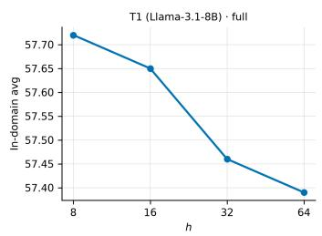

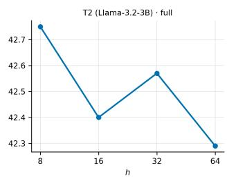

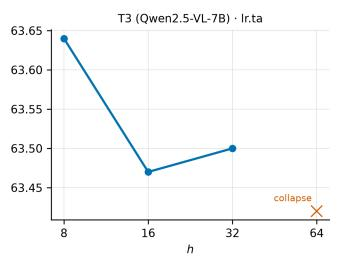

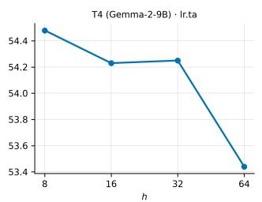

Figure 4: In-domain average as a function of slice height at the κ-rule coeficient (one panel per suite; the T3 h=64 point is the degenerate collapse noted in Table 35).  
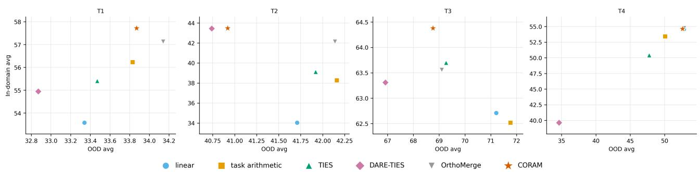  
Figure 5: In-domain versus OOD averages for all mergers in the main tables. The CORAM point is the strongest κ-rule main-table row of each suite.

<table><tr><td>Suite</td><td>Task</td><td>Published setting</td><td>Our setting</td><td>Published score</td><td>Reproduced score</td><td>Difference</td></tr><tr><td>T1</td><td>M-ARC</td><td>Unspecified</td><td>Zero-shot</td><td>44.75</td><td>35.15</td><td>-9.60</td></tr><tr><td>T1</td><td>AGIEval</td><td>Unspecified</td><td>Zero-shot</td><td>38.84</td><td>33.13</td><td>-5.71</td></tr><tr><td>T2</td><td>MMLU†</td><td>Unspecified</td><td>Zero-shot</td><td>55.57</td><td>57.42</td><td>+1.85</td></tr><tr><td>T2</td><td>AGIEval</td><td>Unspecified</td><td>Zero-shot</td><td>33.79</td><td>26.87</td><td>-6.92</td></tr><tr><td>T3</td><td>IFEval</td><td>Unspecified</td><td>Zero-shot</td><td>54.90</td><td>54.53</td><td>-0.37</td></tr><tr><td>T3</td><td>MMBench</td><td>Unspecified</td><td>Zero-shot</td><td>83.59</td><td>83.68</td><td>+0.09</td></tr></table>

Table 37: Published and reproduced OOD scores for the strongest OrthoMerge variant per suite (OFT for T1, TSV-M+C for T2, TIES+C for T3). Diferences are reproduced minus published.

<table><tr><td>Variant</td><td>T2</td><td>T3</td><td>T4</td></tr><tr><td>TA+G</td><td>35.50</td><td>62.59</td><td>51.97</td></tr><tr><td>TIES+G</td><td>39.67</td><td>63.12</td><td>46.51</td></tr><tr><td>TSV-M+G</td><td>40.05</td><td>62.61</td><td>50.21</td></tr><tr><td>TA+C</td><td>34.12</td><td>61.95</td><td>54.74</td></tr><tr><td>TIES+C</td><td>41.46</td><td>63.56</td><td>46.25</td></tr><tr><td>TSV-M+C</td><td>42.13</td><td>62.69</td><td>52.34</td></tr></table>

Table 38: All six OrthoMerge variants under our harness. G/C denote plain/conflict-aware OrthoMerge geometry; TA, TIES, and TSV-M denote the residual merger. The T3 entry for TIES+C is scored under the main-table judge protocol (Table 39); the remaining T3 entries are from an earlier judge pass and are shown for the variant ranking only.

• T1: the released OFT checkpoint is re-evaluated directly under our harness and gives 57.13.

On T1, the published OrthoMerge ScienceQA extraction is incompatible with ours: their pipeline scores the Llama-3.1-8B base model at 6.12 on ScienceQA, against 71.40 in our harness (the base-model row of the main tables). This is an answer-extraction diference, not a capability diference. Published T1 rows that rely on that extraction are shown for completeness only and excluded from our comparisons. Every T1 number in the main tables uses our own harness.

Table 39 summarizes the published and reproduced results for each suite.

## H. Multi-Seed Results

We re-evaluate the main comparisons under multiple decoding seeds. Merging itself is deterministic; variation comes from generation-based evaluation. For each suite we repeat one CORAM checkpoint and the closest baseline, reporting the original run and four additional decoding seeds {18, 38, 68, 98}, passed to the language and code harnesses through their seed interfaces. Multiple-choice and greedydecoded tasks are deterministic up to kernel-level nondeterminism; sampling randomness enters through the coding tasks (temperature 0.2, n=10), and judge randomness through the CharXiv GPT judge.

Merging carries no randomness; identical merges are bitwise reproducible given the expert checkpoints. Among the evaluation tasks, only the coding benchmarks sample completions, and only CharXiv depends on an external judge. All remaining tasks produce bit-identical scores across the four re-evaluation seeds, so the per-seed variation above comes entirely from the coding samples and the CharXiv judge. The seed re-evaluations ran on a newer GPU generation than the original runs, which shifts some greedy generations slightly. This appears as a small constant ofset between the Orig. column and the seed columns, largest for T1 task arithmetic (0.3–0.5 points), not as seed-to-seed variance. T4 safety is greedy and was re-scored once per checkpoint under the main-table safety protocol (HF generation with the Gemma template). The re-scored values match the original runs to within 0.12. The main-table gaps of one point or more are large relative to the observed standard deviations (≤ 0.18).

The two sub-point comparisons, T2 against DARE-TIES and the T4 rule point against OrthoMerge, are examined below.

Confidence intervals. For the two closest comparisons we also estimate confidence intervals on the safety component, whose per-prompt classifier labels allow an exact reconstruction. HarmBench and WildGuard are resampled with a paired stratified bootstrap over prompts (2,000 resamples). DAN and XSTest are covered by unpaired binomial errors, which is conservative. The four components are combined by the delta method. The resulting 95% intervals are −1.02 [−3.71, +1.66] for T4 CORAM+SS+RP versus OrthoMerge (TA+C) and +1.91 [−0.96, +4.78] for T2 CORAM-C+SS+RP versus DARE-TIES, i.e. ±0.5–0.6 points on the five-task average. On CharXiv, judge noise dominates: the per-seed spread is at most 0.3 points, and an earlier re-judging of the same checkpoint moved the score by 0.8 points, about 0.13 points on the six-task average. Main-table gaps of one point or more exceed all of these intervals. The two sub-point comparisons lie within measurement noise, consistent with the seed study above.

## I. Computational Cost

Table 41 reports the storage and wall-clock cost of cache construction, geometric merging, coeficient assembly, and evaluation. The slice-SVD caches are constructed once and reused across configurations and coeficient values.

Each CharXiv evaluation issues 4,000 GPT-judge requests (1,000 figures, four descriptive questions each); at the API rates used during our experiments, this cost approximately \$10 per pass. On newer accelerators the geometry-merge cost is substantially lower: a T1 full merge completes in 12 minutes on a B300-class GPU.

CORAM is more expensive to construct than per-tensor baselines, but the merge cost remains small relative to a full evaluation. The main saving of the κ-rule is the removal of the repeated evaluations required by a sweep over λ.

<table><tr><td>Suite</td><td>Published best variant</td><td>Published Avg</td><td>Reproduced best variant</td><td>Reproduced Avg</td><td>Difference</td></tr><tr><td>T1</td><td>Released OFT checkpoint</td><td>46.25</td><td>Released OFT checkpoint</td><td>57.13</td><td>+10.88</td></tr><tr><td>T2</td><td>TSV-M+C</td><td>42.07</td><td>TSV-M+C</td><td>42.13</td><td>+0.06</td></tr><tr><td>T3</td><td>TIES+C</td><td>64.04</td><td>TIES+C</td><td>63.56</td><td>-0.48</td></tr><tr><td>T4</td><td></td><td></td><td>TA+C</td><td>54.74</td><td></td></tr></table>

Table 39: Summary of the OrthoMerge reproduction. The T1 gap follows from the ScienceQA extraction diference.

<table><tr><td>Suite</td><td>Method</td><td>Orig.</td><td>s18</td><td>s38</td><td>s68</td><td> $s 9 8$ </td><td>Mean</td><td>Std.</td></tr><tr><td>T1</td><td>CORAM</td><td>57.72</td><td>57.66</td><td>57.45</td><td>57.55</td><td>57.69</td><td>57.61</td><td>0.10</td></tr><tr><td>T1</td><td>Task arithmetic</td><td>56.23</td><td>55.96</td><td>55.81</td><td>55.89</td><td>55.71</td><td>55.92</td><td>0.18</td></tr><tr><td>T2</td><td>CORAM-C+SS+RP</td><td>43.48</td><td>43.32</td><td>43.33</td><td>43.35</td><td>43.27</td><td>43.35</td><td>0.08</td></tr><tr><td>T2</td><td>DARE-TIES</td><td>43.45</td><td>43.27</td><td>43.30</td><td>43.39</td><td>43.37</td><td>43.36</td><td>0.06</td></tr><tr><td>T3</td><td>CORAM+RP</td><td>64.38</td><td>64.37</td><td>64.38</td><td>64.37</td><td>64.33</td><td>64.37</td><td>0.02</td></tr><tr><td>T3</td><td>TIES</td><td>63.70</td><td>64.08</td><td>64.13</td><td>64.10</td><td>64.12</td><td>64.03</td><td>0.16</td></tr><tr><td>T4</td><td> $\mathrm { C O R A M + S S + R P }$ </td><td>54.62</td><td>54.41</td><td>54.46</td><td>54.52</td><td>54.40</td><td>54.48</td><td>0.08</td></tr><tr><td>T4</td><td>OrthoMerge (TA+C)</td><td>54.74</td><td>54.70</td><td>54.59</td><td>54.55</td><td>54.59</td><td>54.63</td><td>0.07</td></tr></table>

Table 40: Multi-seed in-domain averages for the repeated CORAM checkpoints and the closest baselines. The T2 and T4 diferences lie within the estimated evaluation noise; the table supports comparable performance rather than a significant advantage in these two closest comparisons.

<table><tr><td>Stage</td><td>T1:8B</td><td>T2: 3B</td><td>T3: 7B</td><td>T4: 9B</td><td>Frequency</td></tr><tr><td>Slice-SVD cache, per checkpoint</td><td>27 GB</td><td>11 GB</td><td>25 GB</td><td>32 GB</td><td>Once per suite</td></tr><tr><td>Slice-SVD cache, suite total</td><td>162 GB</td><td>66 GB</td><td>100 GB</td><td>192 GB</td><td>Once per suite</td></tr><tr><td>Geometry merge</td><td colspan="4">0.5–0.8 GPU hours</td><td>Once per configuration</td></tr><tr><td>λ-assembly</td><td colspan="4"></td><td>Per coefficient</td></tr><tr><td>Full-suite evaluation</td><td>1.7 GPU hours</td><td>1.7 GPU hours 1.4 GPU hours</td><td>1–3 CPU minutes</td><td>4 GPU hours</td><td>Per coefficient</td></tr><tr><td>Sweep over λ</td><td></td><td>10–12 full-suite evaluations</td><td></td><td></td><td>Per configuration</td></tr></table>

Table 41: Measured storage and wall-clock cost across the four suites. Cache sizes cover the base model and all experts at h = 8. The T3 evaluation comprises the five VL tasks (0.8 GPU hours) and one CharXiv pass (about 0.6 hours). A sweep is dominated by evaluation cost; the measured sweep totals are 17–20 GPU hours on T2 and 40–48 GPU hours on T4. For reference, the per-tensor baseline merges are far cheaper: linear merging takes 31 s (3B) and 1 min 37 s (9B), and TIES takes 3 min 9 s and 10 min 48 s.