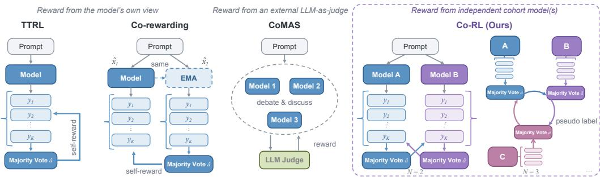
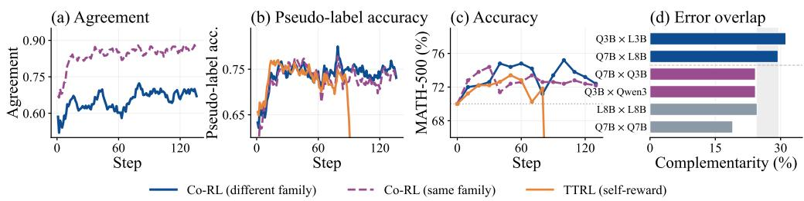
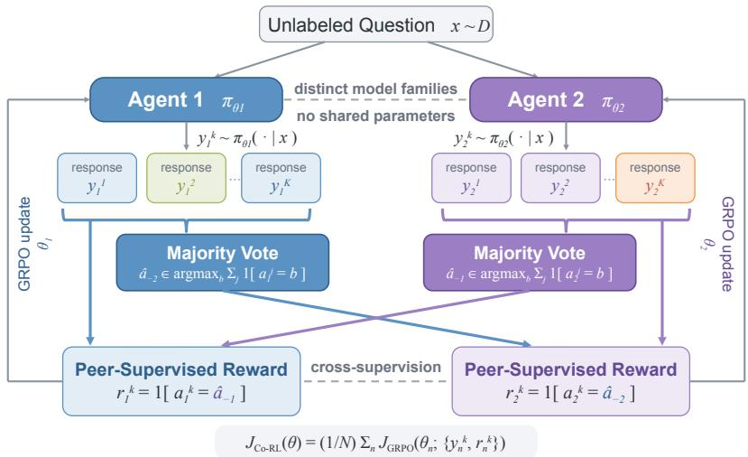
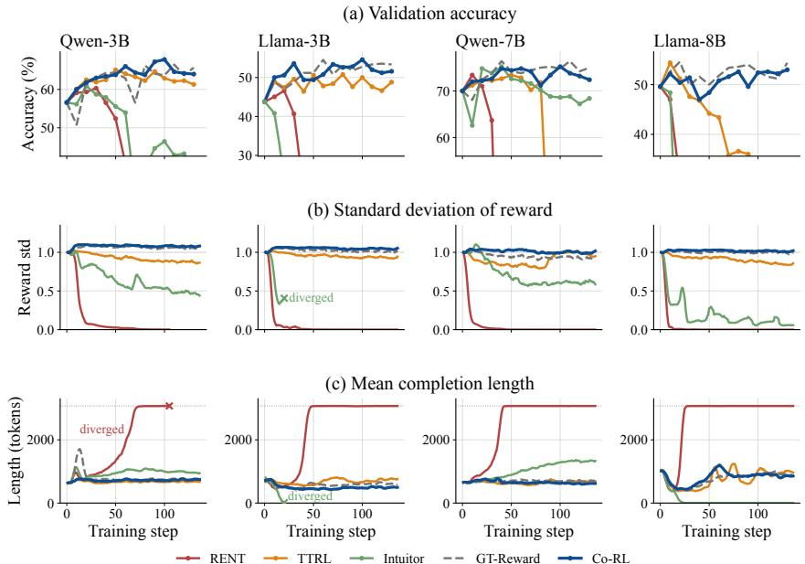
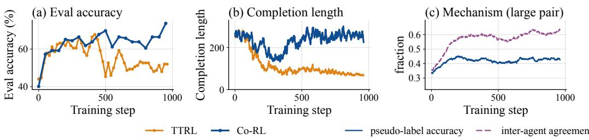

# Co-RL: Unsupervised Reasoning Emerges from Diverse Cohort in Multi-agent RL

Yunhao Yang<sup>♠∗</sup> Yuexin Bian\*<sup>♡</sup> Yunjie Tian<sup>♣</sup> Di Fu<sup>♣</sup> Tianjin Huang<sup>♢</sup> Yuanyuan Shi<sup>♡</sup> Ziang Xiao<sup>♠</sup> Nuno Vasconcelos<sup>♡</sup> Yijiang Li<sup>♡†</sup>

<sup>♠</sup>Johns Hopkins University <sup>♡</sup>UC San Diego <sup>♢</sup>University of Exeter <sup>♣</sup>ByteDance {yijiangli, nuno}@ucsd.edu

## Abstract

Reinforcement learning (RL) has emerged as a powerful approach for improving reasoning in language and vision-language models, yet its strongest successes still depend heavily on ground-truth supervision (e.g., verifiable reward). Such annotations are costly to obtain and become increasingly scarce as reasoning capabilities advance beyond what humans can reliably evaluate. Self-rewarding RL reduces this dependence by enabling models to derive reward signals from their own completions. However, training solely on self-generated feedback can reinforce existing biases and suboptimal behaviors, reduce response diversity, and ultimately lead to homogenized responses and training collapse. In this work, we show that unsupervised reasoning can emerge through cooperative multi-agent training. We introduce CO-RL, a framework in which multiple decoupled models, sharing no parameters, are simultaneously optimized through RL using rewards derived from their peers. We further show that increasing cohort diversity, through heterogeneous model families, sizes, and rephrased training samples, reduces the correlated errors that drive self-reinforcing feedback loops. This diversity consistently improves reasoning performance, maintains behavioral diversity, and mitigates training collapse. Across text-only and multimodal domains, CO-RL consistently outperforms the base models and prior label-free approaches, while matching or surpassing supervised methods, without access to any ground-truth labels. Concretely, CO-RL yields average gains of 3.0–8.6% across seven textonly benchmarks for LLMs and 2.3–7.2% across four multimodal benchmarks for VLMs. Code is available at https://github.com/DrStranded/Co-RL.

## 1 Introduction

Reinforcement learning with verifiable rewards (RLVR) has emerged as a powerful approach for improving reasoning in large language models [Lightman et al., 2024, DeepSeek-AI, 2025], yet its strongest successes still depend heavily on ground-truth supervision. Such supervision is costly to obtain and becomes increasingly scarce as target reasoning capabilities approach or surpass what humans can reliably evaluate [Yue et al., 2025]. Self-rewarding RL reduces this dependence by deriving rewards from the model’s own completions, incorporating signals such as agreement with its majority-vote prediction [Zuo et al., 2025], self-certainty [Zhao et al., 2026], predictive entropy [Prabhudesai et al., 2025], or consistency across paraphrased inputs or moving-average policies [Zhang et al., 2026b]. However, these signals remain within a single model’s own predictions. Without an external reference, such self-reinforcement can amplify existing biases and suboptimal behaviors, reduce response diversity, and ultimately lead to increasingly homogeneous outputs or even training collapse.

This raises a fundamental question: how can a model obtain a sufficiently independent learning signal to improve without any ground-truth supervision? In this work, we show that such a signal can emerge from independently trained models. Since their errors are not perfectly correlated, each model can provide corrective feedback that the other cannot derive from its own generations. We therefore take the learning signal from a separate model, giving each agent decorrelated supervision: a target produced by independently updated weights that is less likely to echo its own biases [Blum and Mitchell, 1998, Li et al., 2023].

Building on this insight, we introduce CO-RL, a cooperative multi-agent label-free RL method in which multiple decoupled models, sharing no parameters, are optimized simultaneously using rewards derived from their cohorts. Given an unlabeled prompt, each agent samples multiple completions and aggregates them into a pseudo-answer through majority voting [Wang et al., 2023]. The completions of one agent are then rewarded against another agent’s pseudo-answer, and the resulting rewards drive policy optimization with GRPO [Shao et al., 2024] or REINFORCE++ [Hu et al., 2025]. Unlike self-rewarding methods, where the policy and the reward come from the same model, CO-RL draws supervision from an independently updated partner, which breaks the feedback loop that amplifies a model’s own bias.

What a cohort teaches depends on how different its mistakes are. Highly similar models tend to make correlated errors and may reinforce the same incorrect answers. Therefore, cohort diversity is crucial to the effectiveness of CO-RL. Thus, we push it as far as the models allow: different families of architecture and pretrained weights, model size, and input formulation (e.g., rephrased prompt [Zhang et al., 2026b]). These differences expose agents to distinct inductive biases and decision boundaries, reducing correlated errors and strengthening the corrective signal available to their cohorts.

By incorporating multiple agents in the training loop, CO-RL naturally constitutes a multi-agent RL framework. However, unlike prior multi-agent methods built around debate or iterative communication [Du et al., 2024, Liang et al., 2024], CO-RL requires no interaction between agents beyond the reward stage and eliminates the need for an external LLM judge or learned reward model [Xue et al., 2026, Park et al., 2025, Zhang et al., 2026a]. The resulting framework is lightweight and symmetric: each agent serves simultaneously as a learner and a source of supervision, allowing all agents to improve within a single training run.

Across text-only and multimodal domains, diverse model families, and training settings, CO-RL consistently improves upon the base models and prior label-free approaches, while matching or surpassing supervised training in several settings, without access to ground-truth labels. Across seven text-only benchmarks spanning mathematical reasoning, coding, and knowledge-intensive reasoning, CO-RL improves four LLMs by 3.0–8.6% on average across seven text-only benchmarks, outperforming the strongest self-rewarding baselines by 0.8–2.0%. The gains extend consistently to multimodal reasoning, where CO-RL improves five VLMs ranging from 2B to 12B parameters by 2.3–7.2% across MathVision, MathVerse, MathVista, and We-Math. Under the controlled evaluation setting of CoMAS [Xue et al., 2026], CO-RL further outperforms prior multi-agent RL methods by 4.0% on average while using only half as many agents. Together, these results demonstrate that cross-agent supervision provides an effective and general learning signal across modalities, model families, and reasoning domains without relying on labeled supervision or external judges.

## 2 Related Work

Self-rewarding RL. While RLVR effectively improves LLM reasoning [Shao et al., 2024, DeepSeek-AI, 2025, Yu et al., 2025b], its reliance on high-quality ground-truth labels remains a major bottleneck [Yue et al., 2025]. Recent work therefore explores self-rewarding mechanisms that learn from unlabeled data. One prominent direction derives reward signals solely from a model’s own behavior, such as majority voting [Wang et al., 2023], self-consistency [Zuo et al., 2025], self-certainty [Zhao et al., 2026, Li et al., 2025], or predictive entropy [Prabhudesai et al., 2025, Zhang et al., 2025a]. This line extends earlier work on self-rewarding models [Yuan et al., 2024] and self-play supervision [Chen et al., 2024c], and now includes unsupervised self-training [Xu et al., 2025a, Fang et al., 2025], self-correction based on a model’s own judgments [Xiong et al., 2025], and zero-data self-evolution, where one or more models generate their own curricula [Zhao et al., 2025a, Huang et al., 2026a, Liu et al., 2026]. However, because these methods rely exclusively on a single model’s own view, they can reinforce and amplify existing biases and errors without providing an external corrective signal, often leading to substantial training collapse.

Co-training, cross-view supervision, and its origins. Using a second view to supervise a learner is a longstanding idea. Co-training shows that two conditionally independent views can teach each other [Blum and Mitchell, 1998], while subsequent analysis demonstrates that highly similar views tend to reinforce the same errors: the more alike the two views are, the more they simply agree on the same mistakes [Li et al., 2023]. Related principles underlie self-supervised representation learning, where augmentations, momentum targets, or stop-gradient operations prevent collapse [Chen et al., 2020, Grill et al., 2020, Caron et al., 2021], and deep mutual learning, where peer networks provide reciprocal supervision [Zhang et al., 2018]. Co-rewarding [Zhang et al., 2026b] brings this insight to label-free RL by deriving rewards from either paraphrased questions or a slowly updated model copy. However, because both views originate from the same model, their errors remain strongly correlated, only partially satisfying the independence required for effective two-view learning.

Multi-agent RL. Several methods improve reasoning by letting multiple models interact. At inference time, multi-agent debate and round-table consensus have models critique and revise one another [Du et al., 2024, Liang et al., 2024, Chen et al., 2024a, Sun et al., 2024], and general orchestration frameworks compose such agents into pipelines [Wu et al., 2023, Zhang et al., 2024b, Kim et al., 2024]. A more recent line trains the agents: CoMAS turns interactions scored by an LLM judge into rewards [Xue et al., 2026], MAPoRL and MARFT co-train agents against a learned or shared reward [Park et al., 2025, Liao et al., 2025], and other systems reinforce or bootstrap multi-agent cooperation directly [Motwani et al., 2024, Chen et al., 2025c, Zhao et al., 2025b, Zhang et al., 2026a, Chen et al., 2025d].

RLVR for multimodal reasoning. RLVR has rapidly expanded to vision-language models, with R1-style rule-based rewards underpinning a broad family of methods [Huang et al., 2026b, Shen et al., 2025, Feng et al., 2025, Liu et al., 2025b, Meng et al., 2025, Peng et al., 2025, Yang et al., 2025b, Wang et al., 2025b]. Existing work mainly improves reward design and training stability through curriculum or perception-aware rewards [Deng et al., 2025a, Yu et al., 2025a, Wang et al., 2025a], data augmentation and selection [Liu et al., 2025a, Wang et al., 2025c], and staged supervised-to-RL training [Deng et al., 2025b, Chen et al., 2025a], but still largely assumes verifiable labels. Label-free multimodal RL remains underexplored, and existing methods again rely on a single model’s own signals [Wei et al., 2025]. Cross-view supervision is especially promising here, since VLMs rarely share a vision encoder, pairing InternViT [Chen et al., 2024b], SigLIP [Gemma Team, 2025], or a native-resolution encoder [Bai et al., 2025, Zhang et al., 2025c,b] with different LLMs, yielding distinctive families of models.

## 3 Preliminary

## 3.1 Reinforcement Learning for Reasoning

Given a prompt $x \sim \mathcal { D }$ , an autoregressive language model $\pi _ { \theta }$ generates a response $y = ( y _ { 1 } , \dots , y _ { T } )$ according to $\textstyle \pi _ { \theta } ( y \mid x ) = \prod _ { t = 1 } ^ { T } \pi _ { \theta } ( y _ { t } \mid x , y _ { < t } )$ . Reinforcement learning optimizes the policy using a scalar reward $r ( x , y )$ that evaluates the quality of the generated response. The corresponding objective is

$$
\mathcal { I } ( \theta ) = \mathbb { E } _ { x \sim \mathcal { D } , y \sim \pi _ { \theta } ( \cdot | x ) } \left[ r ( x , y ) \right] .\tag{1}
$$

For reasoning tasks, the response y typically contains both an intermediate reasoning trajectory and a final answer, while the reward is commonly assigned at the response level based on answer correctness or another outcome-based criterion.

Among policy optimization algorithms, Group Relative Policy Optimization (GRPO) has been widely adopted as it improves reasoning performance without requiring a separately trained critic model [Shao et al. $, 2 0 2 4 .$ , DeepSeek-AI, 2025]. Given a prompt x, the old policy $\pi _ { \theta _ { \mathrm { o l d } } }$ samples a group of $K$ responses $\{ y ^ { 1 } , \ldots , y ^ { K } \}$ and assigns each response a reward $r ^ { k } = r ( x , y ^ { k } )$ . GRPO estimates the advantage of each response by normalizing rewards within the group: $\begin{array} { r } { \hat { A } ^ { k } = \frac { r ^ { k } - \mathrm { m e a n } ( \{ r ^ { j } \} _ { j = 1 } ^ { K } ) } { \mathrm { s t d } ( \{ r ^ { j } \} _ { j = 1 } ^ { K } ) + \epsilon } } \end{array}$ , where ϵ is a small constant for numerical stability. Let $\begin{array} { r } { \rho _ { k , t } ( \theta ) = \frac { \pi _ { \theta } ( y _ { t } ^ { k } | x , y _ { < t } ^ { k } ) } { \pi _ { \theta _ { \mathrm { o l d } } } ( y _ { t } ^ { k } | x , y _ { < t } ^ { k } ) } } \end{array}$ denote the token-level importance ratio. GRPO optimizes the clipped surrogate objective

$$
\mathcal { I } _ { \mathrm { G R P O } } ( \theta ) = \mathbb { E } \left[ \frac { 1 } { K } \sum _ { k = 1 } ^ { K } \frac { 1 } { | y ^ { k } | } \sum _ { t = 1 } ^ { | y ^ { k } | } \left[ \operatorname* { m i n } \Bigl ( \rho _ { k , t } ( \theta ) \hat { A } ^ { k } , \mathrm { c l i p } ( \rho _ { k , t } ( \theta ) , 1 - \delta , 1 + \delta ) \hat { A } ^ { k } \Bigr ) - \beta \mathcal { D } _ { \mathrm { K L } } ^ { k , t } \right] \right] ,\tag{2}
$$

where δ is the clipping threshold, $\beta$ controls the strength of KL regularization, and $\mathcal { D } _ { \mathrm { K L } } ^ { k , t }$ penalizes deviation from a reference policy $\pi _ { \mathrm { r e f } }$ . GRPO typically uses verifiable rewards from ground-truth answers or external verifiers. However, such supervision can be costly or difficult to obtain at scale. The following subsection considers model-generated rewards as an alternative, enabling reinforcement learning on unlabeled prompts.

## 3.2 Self-rewarding RL

In the absence of external verifiers, reward functions can be constructed directly from a model’s own outputs, thereby enabling RL on unlabeled prompts. Given an unlabeled prompt x, the policy $\pi _ { \theta }$ samples responses $y ^ { 1 } , \ldots , y ^ { K }$ , with answers $\mathring { a } ^ { k } \ = \ g ( y ^ { k } )$ extracted from each response. TTRL [Zuo et al., 2025] defines the reward for response $y ^ { k }$ as $r _ { \mathrm { m a j } } ^ { k } = \mathbf { 1 } [ a ^ { k } = { \hat { a } } _ { \theta } ( x ) ]$ ], where $\begin{array} { r } { \hat { a } _ { \boldsymbol { \theta } } ( \boldsymbol { x } ) = \arg \operatorname* { m a x } _ { b } \sum _ { j = 1 } ^ { K } \mathbf { 1 } [ a ^ { j } = b ] } \end{array}$ is the policy’s majority-vote answer. Intuitor [Zhao et al., 2026] instead measures token-level confidence using $\begin{array} { r } { r _ { \mathrm { c o n f } } ^ { k } = \frac { 1 } { | y ^ { k } | } \sum _ { t = 1 } ^ { | y ^ { k } | } D _ { \mathrm { K L } } ( \mathbf { U } \| \pi _ { \theta } ( \cdot  { | } x , y _ { < t } ^ { k } ) ) } \end{array}$ , where U denotes the uniform distribution over the vocabulary. RENT [Prabhudesai et al., 2025] operates on the predictive distribution, assigning $\begin{array} { r } { r _ { \mathrm { e n t } } ^ { k } = - { \frac { 1 } { | \boldsymbol { y } ^ { k } | } } \sum _ { t = 1 } ^ { | \boldsymbol { y } ^ { k } | } \mathcal { H } \big ( \pi _ { \boldsymbol { \theta } } \big ( \cdot \mid x , \boldsymbol { y } _ { < t } ^ { k } \big ) \big ) } \end{array}$ , where $\mathcal { H } ( \cdot )$ denotes entropy. Thus, TTRL [Zuo et al., 2025] rewards responses that agree with the policy’s majority-vote prediction, whereas Intuitor [Zhao et al., 2026] and RENT [Prabhudesai et al., 2025] derive rewards from the model’s token-level predictive distributions. Despite their different reward constructions, these methods ultimately produce scalar rewards that can be used for policy optimization. Under GRPO, the self-generated rewards $r ^ { k } { } _ { k = 1 } ^ { K }$ are normalized into group-relative advantages $\hat { A } ^ { k }$ and used directly in Eq. (2).

Despite their effectiveness, these signals originates from the same policy being optimized: without an external reference, training may reinforce existing biases and suboptimal behaviors, reduce response diversity, and eventually lead to homogenized responses or training collapse. We show this in (b) and (c) of Figure 2, where prolonged training causes TTRL to degenerate and lead to training collapse.

  
Figure 1: Comparison of CO-RL with prior label-free RL methods. Both TTRL and Co-rewarding derive rewards from self-generated agreement, and CoMAS scores multi-turn interactions with one of its own agents acting as judge. CO-RL instead derives rewards directly from peer votes. Beyond two agents, the votes pass along a directed ring (N=3 shown).

## 4 Method

## 4.1 Co-Reinforcement Learning (Co-RL)

This motivates a fundamental question: how can a model obtain a sufficiently independent learning signal without any ground-truth supervision? Our key insight is that such a signal can emerge from independently trained models, since their errors are decorrelated; one model can provide corrective feedback that another cannot derive from its own generations [Blum and Mitchell, 1998, Li et al., 2023]. We provide an overview of our method in the right of Figure 1, in comparison with prior self-rewarding RL paradigms.

Building on this principle, we introduce Co-Reinforcement Learning $( \mathbf { C O - R L } ) .$ , a label-free multiagent reinforcement learning method in which multiple decoupled agents independently generate completions to unlabeled problems and supervise one another through majority-voted pseudo reward from its cohort. The agents share neither parameters nor gradients; their optimization is coupled solely through the rewards they provide to one another.

Formally, let $x \sim \mathcal { D }$ denote an unlabeled reasoning problem. We consider a cohort of N agents with independently parameterized policies $\{ \pi _ { \theta _ { n } } \} _ { n = 1 } ^ { N }$ . The agents may be initialized from the same pretrained model or from models of different families and sizes. For each unlabeled reasoning problem x, each agent $n \in \{ 1 , \ldots , N \}$ independently rollout a group of K completions $y _ { n } ^ { k } \overset { \mathrm { i . i . d . } } { \sim }$ $\pi _ { \theta _ { n } } ( \cdot \mid x ) , k = 1 , \ldots , K$ and extracts the corresponding final answers as $a _ { n } ^ { k } = g ( y _ { n } ^ { k } )$ , with $g ( \cdot )$ denoting an answer-extraction function.

For each agent n, CO-RL constructs a supervision target exclusively from the answers generated by one designated peer. Specifically, the pseudo-label is constructed as

$$
\hat { a } _ { - n } ( x ) \in \arg \operatorname* { m a x } _ { b } \sum _ { j = 1 } ^ { K } \mathbf { 1 } \Big [ a _ { n - 1 } ^ { j } = b \Big ] ,\tag{3}
$$

where b ranges over the answers produced by agent $n - 1$ , with the index taken cyclically so that agent 1 is supervised by agent N. Thus, ${ \hat { a } } _ { - n } ( x )$ represents the majority-vote answer of the peer that supervises agent n. The reward assigned to the k-th response of agent n is then $r _ { n } ^ { k } = $ $\mathbf { 1 } \left[ a _ { n } ^ { k } = { \hat { a } } _ { - n } ( x ) \right]$ . A response therefore receives reward 1 when its extracted answer agrees with the constructed pseudo-label, and reward 0 otherwise. In the two-agent setting, the two agents supervise each other. Crucially, each agent does not contribute to its own supervision target ${ \hat { a } } _ { - n } ( x )$

Policy Optimization. Without loss of generality, we use GRPO [Shao et al., 2024] to train our agents. For each agent, the rewards $\{ r _ { n } ^ { k } \} _ { k = 1 } ^ { K }$ are normalized within its own rollout group to obtain group-relative advantages, which are then used in the GRPO objective in Eq. 4 to optimize the agent. Let $\pmb \theta = ( \theta _ { 1 } , \dots , \theta _ { N } )$ . The overall training objective can be written as

$$
\operatorname* { m a x } _ { \pmb { \theta } } \ \mathcal { I } _ { \mathrm { C o - R L } } ( \pmb { \theta } ) = \frac { 1 } { N } \sum _ { n = 1 } ^ { N } \mathcal { I } _ { \mathrm { G R P O } } \left( \theta _ { n } ; \{ y _ { n } ^ { k } , r _ { n } ^ { k } \} _ { k = 1 } ^ { K } \right) ,\tag{4}
$$

where

$$
\mathcal { I } _ { \mathrm { G R P O } } ( \theta _ { n } ) = \mathbb { E } \left[ \frac { 1 } { K } \sum _ { k = 1 } ^ { K } \frac { 1 } { | y _ { n } ^ { k } | } \sum _ { t = 1 } ^ { | y _ { n } ^ { k } | } \operatorname* { m i n } \left( \rho _ { n , t } ^ { k } \hat { A } _ { n } ^ { k } , \mathrm { c l i p } ( \rho _ { n , t } ^ { k } , 1 - \epsilon , 1 + \epsilon ) \hat { A } _ { n } ^ { k } \right) \right] - \beta D _ { \mathrm { K L } } \left( \pi _ { \theta _ { n } } \parallel \pi _ { \mathrm { r e f } , n } \right) .\tag{5}
$$

$$
\hat { A } _ { n } ^ { k } = \frac { r _ { n } ^ { k } - \mathrm { m e a n } \big ( \{ r _ { n } ^ { j } \} _ { j = 1 } ^ { K } \big ) } { \mathrm { s t d } \big ( \{ r _ { n } ^ { j } \} _ { j = 1 } ^ { K } \big ) } , \qquad \rho _ { n , t } ^ { k } = \frac { \pi _ { \theta _ { n } } \left( y _ { n , t } ^ { k } \mid x _ { n } , y _ { n , < t } ^ { k } \right) } { \pi _ { \theta _ { n } ^ { \mathrm { o l d } } } \left( y _ { n , t } ^ { k } \mid x _ { n } , y _ { n , < t } ^ { k } \right) } .\tag{6}
$$

Figure 3 illustrates the two-agent setting. At each training step, all rollouts and majority-vote pseudolabels are computed before any policy update. Given the resulting rewards, each policy is then updated independently.

Algorithm 1 summarizes the training procedure, in which all agents are updated at each optimization step. Our framework is also compatible with other policy optimization methods that support sequencelevel rewards.

## 4.2 Diverse Cohorts Enable Unsupervised Reasoner

What a cohort teaches depends on how different its mistakes are. Highly similar models tend to make correlated errors and may reinforce the same incorrect answers. Therefore, cohort diversity plays a crucial role in CO-RL. We push this diversity as far as the framework allows: policy optimization (Sec 4.1), model families and sizes, and input formation. Each source of diversity induces distinct inductive biases and reasoning behaviors, reducing correlated errors and strengthening the corrective signal available through peer supervision.

```latex
Algorithm 1 Co-Reinforcement Learning (Co-RL)
Require: Agents $\{ \pi _ { \theta _ { n } } \} _ { n = 1 } ^ { N }$ initialized from different models
1: for each training step do
2: Sample a batch of unlabeled prompts $B \subset D$
3: for $x \in B$ do
4: for $n = 1 , \ldots , N$ do ▷ Generate responses
5: Sample $y _ { n } ^ { k } \overset { \mathrm { i . i . d . } } { \sim } \pi _ { \theta _ { n } } ( \cdot | x )$ and extract answers $a _ { n } ^ { k }  g ( y _ { n } ^ { k } )$ for $k = 1 , \ldots , K$
6: end for
7: for $n = 1 , \ldots , N$ do ▷ Construct cross-agent rewards
8: Compute ${ \hat { a } } _ { - n } ( x )$ using Eq. (3)
9: for $\dot { k } = 1 , \dots , \overset { } { K }$ do
10: Assign $r _ { n } ^ { k }  \mathbf { 1 } \big [ a _ { n } ^ { k } = \hat { a } _ { - n } ( x ) \big ]$
11: end for
12: end for
13: end for
14: Update $\lbrace \boldsymbol { \theta } _ { n } \rbrace _ { n = 1 } ^ { N }$ with one GRPO step using the objective in (4)
15: end for
```

Decoupled policy optimization. As discussed in Sec. 4.1, CO-RL realizes decoupled policy optimization by training two policies independently, with interaction occurring only through the reward in Eq. (4). Each policy maintains its own parameters and optimizer state with no gradient propagated between policies. Thus, this decoupled policy optimization design also serves as a source of diversity: independent updates prevent the two policies from being directly coupled, maintaining less-correlated predictions throughout the training process. We show in Figure 2(b) and (c) that decoupled policy optimization stabilizes training and yields consistent improvements over self-rewarding methods.

Diversity across model families and sizes. Our primary source of diversity comes from independently pretrained model families. Distinct families differ throughout the model-development pipeline, including architecture, tokenization, pretraining data, and post-training, each of which brings inductive biases that can benefit co-learning. For example, Qwen2.5 and Llama 3 differ in their tokenizers, vocabulary sizes, architectural choices, and pretraining corpora [Yang et al., 2024, Grattafiori et al., 2024], while Gemma introduces a 256K-token vocabulary and interleaved local–global attention [Gemma Team, 2025]. Such differences are even more pronounced for VLMs, whose families employ distinct vision encoders: Qwen2.5-VL uses a natively trained dynamic-resolution ViT [Bai et al., 2025], InternVL adopts InternViT [Chen et al., 2024b], and Gemma 3 uses SigLIP [Gemma Team, 2025]. Appendix A further quantifies this diversity through the error-overlap ratios across model families. As shown in Figure 2(d), models from different families exhibit substantially less overlap in their errors. This complementary error structure is reflected by lower inter-model agreement during pseudo-labeling (Figure 2(a)) and, in turn, yields more accurate pseudo-labels (Figure 2(b)) and higher performance (Figure 2(c)) throughout training.

  
Figure 2: (a) Agreement between the two models, (b) pseudo-label accuracy, and (c) evaluation performance; (d) Error overlap before RL for two pairs each from a different family, the same family, and the same model under a different seed.

Model size provides an additional, orthogonal source of diversity. Models with different capacities exhibit distinct reasoning and prediction behaviors. Pairing models of different sizes therefore yields different error profiles, allowing each policy to provide informative reward signals on examples that the other does not solve correctly. The three-agent run in Section 6.2 trains models of different sizes together.

  
Figure 3: Overview of CO-RL with two agents. Each agent samples K responses to the same unlabeled question and generates a pseudo label with majority vote. Each rollout is then rewarded by agreement with the cohort’s pseudo label, and updates its own policy, with no sharing parameters and no gradient exchange except the cross-reward process.

Diversity across input formation. Despite model- and optimization-level decoupling, both agents are still trained on identical prompts. We further diversify their training data by rewriting each MATH problem with DeepSeek-V3 [DeepSeek-AI, 2024], training one agent on the original prompt and the other on its rewrite. The rewrite preserves the answer and sample order while typically recasting the problem into a different concrete scenario rather than performing superficial lexical substitutions. The two agents therefore solve semantically equivalent problems expressed in different forms, reducing correlated errors induced by prompt-specific phrasing. Appendix C provides examples.

We provide an illustration of diversified CO-RL in Figure 3.

## 5 Theoretical Analysis

In this section, we theoretically characterize the learning dynamics of CO-RL and compare them with self-rewarding GRPO, where each agent uses its own majority vote as the pseudo-label. A key limitation of self-rewarding is that an agent learns from a pseudo-label derived from its own predictions. As a result, when the agent is systematically wrong, its supervision signal is likely to reinforce the same error rather than correct it. In contrast, CO-RL derives supervision from other agents, allowing one agent’s correct prediction to provide a corrective signal for another agent’s mistake. Specifically, we ignore clipping and the KL term for simplicity. Our analysis shows that CO-RL can exploit complementary strengths across agents to correct errors that self-rewarding would otherwise reinforce, thereby expanding the set of prompts that converge to the correct answer.

To obtain a tractable characterization, we consider a fixed prompt x and reduce the induced answer distribution to two outcomes: the correct answer $a ^ { \star }$ and an aggregate incorrect answer. Let ${ { p } _ { n } } =$ $\operatorname* { P r } _ { \pi _ { \theta _ { n } } } \left( a = a ^ { \star } \mid x \right)$ denote the probability that agent n assigns to the correct answer; in the singleagent setting, we simply write p. We assume an odd number K of independently sampled rollouts, so that the majority vote has no ties, and let η denote the GRPO update rate. Our experiments use an even K, where a tie is resolved deterministically rather than discarded.

## 5.1 Comparison of training dynamics under self-rewarding and cross-agent supervision.

We study how the probability of generating the correct answer p evolves during training.

Proposition 1 (Training dynamics under self-rewarding and cross-agent supervision). Under the above definitions, the probability dynamics take thefollowingforms.

[1] Self-rewarding. Let $C \sim \mathrm { B i n } ( K , p )$ denote the number of correct responses among the K rollouts. The probability dynamics satisfy

$$
\dot { p } = \eta p ( 1 - p ) \mathbb { E } _ { C \sim \mathrm { B i n } ( K , p ) } \left[ \mathrm { s i g n } \bigg ( C - \frac { K } { 2 } \bigg ) \frac { \sqrt { C ( K - C ) } } { K } \right] .\tag{7}
$$

[2] CO-RL: Cross-agent supervision. For agent n, let $C _ { n } \sim \mathrm { B i n } ( K , p _ { n } )$ denote the number of correct responses among its K rollouts, and let $Z _ { - n } = \mathbf { 1 } [ \widehat { a } _ { - n } ( x ) = a ^ { \star } ]$ indicate whether the pseudo-label constructedfrom the other agents is correct. The probability dynamics satisfy

$$
\dot { p } _ { n } = \eta _ { n } p _ { n } ( 1 - p _ { n } ) \mathbb { E } \left[ \mathrm { s i g n } \bigg ( Z _ { - n } - \frac { 1 } { 2 } \bigg ) \right] \mathbb { E } _ { C _ { n } \sim \mathrm { B i n } ( K , p _ { n } ) } \left[ \frac { \sqrt { C _ { n } ( K - C _ { n } ) } } { K } \right] .\tag{8}
$$

In the two-agent setting, define $\phi _ { K } ( p ) = 2 V _ { K } ( p ) - 1$ as the signed majority-vote direction and $q _ { K } ( p ) = \eta p ( 1 - p ) \mathbb { E } _ { C \sim \mathrm { B i n } ( K , p ) } \left[ \frac { \sqrt { C ( K - C ) } } { K } \right] > 0$ as the positive update magnitude. Then Eq. (8) reduces to

$$
\dot { p } _ { A } = q _ { K } ( p _ { A } ) \phi _ { K } ( p _ { B } ) , \qquad \dot { p } _ { B } = q _ { K } ( p _ { B } ) \phi _ { K } ( p _ { A } ) .\tag{9}
$$

Proof. A complete proof is provided in Appendix B.1.

Proposition 1 highlights the structural difference between the two training mechanisms. Under self-rewarding, the pseudo-label is constructed from the same rollout group being optimized, making the update self-confirming: so the agent reinforces whichever answer is currently more likely, whether correct or not. In contrast, CO-RL decouples supervision from the optimized agent: since $q _ { K } ( p _ { A } ) > 0$ , the update direction of agent A is determined entirely by $\phi _ { K } ( p _ { B } )$ , the supervision signal provided by agent B.

## 5.2 Cross-agent supervision enlarges the basin of correct convergence.

Following Proposition 1, Proposition 2 shows that self-rewarding is self-confirming: the expected GRPO update amplifies the currently favored answer, regardless of its correctness. Thus, when $p < 1 / 2$ , self-rewarding further suppresses the correct answer instead of correcting the error.

Proposition 2 (Self-confirming dynamics). For odd K, sign $( G _ { K } ^ { \mathrm { s e l f } } ( p ) ) = \mathrm { s i g n } ( p - \textstyle { \frac { 1 } { 2 } } )$ . Consequently, $p ( 0 ) < \frac { 1 } { 2 } \Rightarrow p ( t ) \to 0 a n d p ( 0 ) > \frac { 1 } { 2 } \Rightarrow p ( t ) \to 1$

Proof. A complete proof is provided in Appendix B.2.

We next state our main result in Theorem 1, which characterizes the basin of attraction under cross-agent supervision.

Theorem 1 (Co-RL enlarges the basin of correct convergence). Consider the symmetric two-agent dynamics in Eq. (9) with interior initialization $( p _ { A } ( 0 ) , \ j _ { B } ( 0 ) ) \in ( 0 , 1 ) ^ { 2 }$ . The correct and incorrect consensus states (1, 1) and (0, 0) are asymptotically stable, while $( 1 / 2 , 1 / 2 )$ is a saddle point whose interior separatrix is $p _ { A } + p _ { B } = 1$ . Consequently,

$$
\begin{array} { r } { p _ { A } ( 0 ) + p _ { B } ( 0 ) > 1 \quad \Longrightarrow \quad ( p _ { A } ( t ) , p _ { B } ( t ) ) \to ( 1 , 1 ) , } \end{array}
$$

whereas

$$
\begin{array} { r } { p _ { A } ( 0 ) + p _ { B } ( 0 ) < 1 \quad \Longrightarrow \quad ( p _ { A } ( t ) , p _ { B } ( t ) ) \to ( 0 , 0 ) . } \end{array}
$$

Proof. A complete proof is provided in Appendix B.3.

(0.2, 0.9) on the other half. Each agent has average accuracy 0.55, but their strengths are perfectly complementary. Under self-rewarding, each agent succeeds only on the half of prompts where $p > 1 / 2$ , yielding a final accuracy of 0.5. In contrast, under CO- $\mathrm { R L } , p _ { A } + p _ { B } = 1 . 1 > 1$ on every prompt, so Theorem 1 predicts that both agents converge to the correct answer on all prompts, achieving accuracy 1.0. Thus, cross-agent supervision can exploit complementary expertise to correct errors that self-rewarding would otherwise reinforce.

## 6 Experiments

## 6.1 Experimental Setup

Datasets. For the main experiments, language models are trained on the level 3 to 5 split of MATH [Hendrycks et al., 2021b], following MARTI [Zhang et al., 2026a]. Vision-language models are trained on two multimodal math datasets. We use MMR1-Math [Leng et al., 2025] to match the training data of our baseline, MM-UPT [Wei et al., 2025], and additionally use multimodal-openr1 [LMMs-Lab, 2025] to verify that the observed gains are not specific to a particular training dataset.

Models. For language models, we consider Qwen3-1.7B [Yang et al., 2025a], Qwen2.5-3B paired with Llama-3.2-3B-Instruct, and Qwen2.5-7B paired with Llama-3.1-8B-Instruct [Yang et al., 2024, Grattafiori et al., 2024]. For vision-language models, we use Qwen2.5-VL (3B, 7B), InternVL3.5 (2B, 8B), and Gemma-3 (4B, 12B) [Bai et al., 2025, Chen et al., 2024b, Gemma Team, 2025], with models paired at comparable scales

Baselines. On language models, we compare our method against state-of-the-art label-free selfrewarding methods, including TTRL [Zuo et al., 2025], Intuitor [Zhao et al., 2026], RENT [Prabhudesai et al., 2025] and Co-rewarding-II [Zhang et al., 2026b]. On vision-language models, we compare with the recent self-rewarding method MM-UPT [Wei et al., 2025], which adopts the TTRL reward formulation. We also include GRPO with ground-truth rewards (GT-Reward) as a supervised reference [Shao et al., 2024]. For multi-agent RL baselines, we compare against MAPoRL [Park et al., 2025] and CoMAS [Xue et al., 2026].

Training details. All runs use the AdamW optimizer and sample rollouts at a temperature of 1.0. Following Co-rewarding [Zhang et al., 2026b], language models use a learning rate of $3 \times 1 0 ^ { - 6 } ,$ , an effective batch of 128 prompts per agent and a 3072-token cap, and train with K = 12 responses per prompt for 2 epochs. Following R1-V [Chen et al., 2025b], vision-language models use a learning rate of $1 \times 1 0 ^ { - 6 }$ , a 1024-token cap and K = 8 responses per prompt for 1 epoch. Because the rollout and policy distributions drift apart on Gemma-3, the vision-language runs additionally apply a token-level importance-sampling correction. All experiments use a single node of eight H100 GPUs, four per agent.

Evaluation. Language models are scored on seven reasoning benchmarks. For mathematics, we use GSM8K [Cobbe et al., 2021], MATH-500 [Lightman et al., 2024] and AMC [Project-Numina, 2024]. For code generation, we use HumanEval [Chen et al., 2021], MBPP [Austin et al., 2021] and LiveCodeBench [Jain et al., 2025]. For science, we use GPQA [Rein et al., 2024]. Visionlanguage models are scored on four multimodal math benchmarks, MathVision [Wang et al., 2024a], MathVerse [Zhang et al., 2024a], MathVista [Lu et al., 2024] and We-Math [Qiao et al., 2025]. Detailed experimental settings and the complete results are provided in Appendix D.

## 6.2 Main Results

CO-RL outperforms all self-rewarding methods on language models. We first compare CO-RL against single-agent self-rewarding baselines. Table 1 reports results against TTRL, RENT, Intuitor, and Co-Rewarding-II, with GRPO using ground-truth rewards included as a supervised reference. Appendix D.1 extends the same comparison to 7B and 8B models. We evaluate three variants of our framework: Same family jointly trains two independent agents initialized from the same base model; Different family pairs one agent from each of the two model families; Different family+ further applies data decoupling. Notably, the readily accessible Same family setting already yields substantial gains over the base models, improving the average performance by 8.0% and 4.0% for Qwen2.5-3B and Llama-3.2-3B-Instruct, respectively. Introducing cross-family diversity provides further benefits overall, and, when combined with data decoupling (Different family+), achieves the strongest label-free average performance for both model families.

<table><tr><td colspan="8">Method GSM8K MATH500 AMC HEval GPQA MBPP LCB Avg</td></tr><tr><td colspan="8">Qwen2.5-3B</td></tr><tr><td>Base GT-Reward</td><td>73.4 76.2</td><td>56.6 64.6</td><td>28.9 36.1</td><td>39.0 65.2</td><td>21.2 20.7</td><td>52.2 13.7 54.4 14.5</td><td>40.7 47.4</td></tr><tr><td>TTRL</td><td>80.4</td><td>66.4</td><td>31.3</td><td>63.4</td><td>22.2 51.8</td><td>15.9</td><td>47.3</td></tr><tr><td>RENT</td><td>75.6</td><td>62.8</td><td>31.3 59.2 26.5</td><td>18.2</td><td>52.4</td><td>14.5</td><td>44.9</td></tr><tr><td>Intuitor</td><td>74.9</td><td>64.2</td><td>59.8</td><td>27.3</td><td>50.4</td><td>16.4</td><td>45.6</td></tr><tr><td>Co-rewarding-II</td><td>75.5</td><td>63.4</td><td>30.1 61.0</td><td>24.8</td><td>53.2</td><td>11.0</td><td>45.6</td></tr><tr><td>Co-RL (Same family)</td><td>78.5</td><td>66.0</td><td>37.4 65.8</td><td>22.2</td><td>56.0</td><td>15.2</td><td>48.7</td></tr><tr><td>Co-RL (Different family)</td><td>80.1</td><td>66.8</td><td>33.7</td><td>64.0 22.7</td><td>56.8</td><td>15.2</td><td>48.5</td></tr><tr><td>Co-RL (Different family+)</td><td>81.0</td><td>66.6</td><td>36.1</td><td>62.8</td><td>25.8</td><td>55.6 17.2</td><td>49.3</td></tr><tr><td colspan="8">Llama-3.2-3B-Instruct</td></tr><tr><td>Base</td><td>73.6</td><td>43.8</td><td>18.1</td><td>51.2</td><td>21.2</td><td>50.8 12.0</td><td>38.7</td></tr><tr><td>GT-Reward</td><td>78.8</td><td>53.8</td><td>25.3</td><td>60.4 20.7</td><td>50.2</td><td>12.1</td><td>43.0</td></tr><tr><td>TTRL</td><td>77.9</td><td>50.2</td><td>26.5</td><td>59.2 24.8</td><td>51.2</td><td>12.0</td><td>43.1</td></tr><tr><td>RENT</td><td>75.4</td><td>45.2</td><td>12.0</td><td>59.2</td><td>17.7</td><td>49.4 11.5</td><td>38.6</td></tr><tr><td>Intuitor</td><td>75.8</td><td>40.8</td><td>21.7</td><td>54.3</td><td>21.7</td><td>51.4 12.0</td><td>39.7</td></tr><tr><td>Co-rewarding-II</td><td>75.4</td><td>53.4</td><td>24.1</td><td>54.9</td><td>23.7</td><td>49.2 12.1</td><td>41.8</td></tr><tr><td>Co-RL (Same family)</td><td>78.4</td><td>52.4</td><td>26.5</td><td>57.9</td><td>21.7</td><td>49.6 12.4</td><td>42.7</td></tr><tr><td>Co-RL (Different family)</td><td>80.5</td><td>56.2</td><td>27.7</td><td>59.2</td><td>21.2</td><td>50.4 11.0</td><td>43.7</td></tr><tr><td>Co-RL (Different family+)</td><td>78.4</td><td>55.2</td><td>30.1</td><td>59.2</td><td>22.2</td><td>50.4 12.0</td><td>43.9</td></tr></table>

Table 1: Full performance across seven benchmarks for 3B models (%). For each benchmark, the best label-free result is shown in bold and the second best is underlined, with ties sharing the marking. Base and GT-Reward serve as references and are excluded from the ranking. CO-RL (Same family) trains two agents initialized from the same base model. CO-RL (Different family) pairs one agent from each of the two families. CO-RL (Different family+) further decouples the training data. Appendix D.1 extends the comparison to 7B and 8B models.

CO-RL outperforms Multi-Agent RL. We next compare CO-RL with existing multi-agent RL methods. While these approaches also train multiple models jointly, existing state-of-the-art methods typically rely on an additional judging mechanism to construct rewards, such as an LLM judge in CoMAS or a learned reward model in MAPoRL. Following CoMAS, we adopt the same experimental setup, official implementation, and evaluation benchmarks to ensure a fair comparison. We report the CoMAS results as presented in the original paper. As shown in Table 2, CO-RL achieves the best average performance and leads on five of the seven benchmarks, outperforming CoMAS by 4.0% while using only half as many agents and requiring no additional judging mechanism.

Scaling CO-RL to Three Agents. We further extend CO-RL beyond the two-agent setting by jointly training Qwen2.5-3B, Llama-3.2-3B-Instruct, and Qwen3-1.7B in a single run. For each agent, we compare CO-RL against the same model trained independently using ground-truth rewards (GT-Reward) or self-generated majority-vote rewards (TTRL). Results are reported in Table 3. CO-RL consistently improves all three base models, with average gains of 7.8%, 6.0%, and 8.2%, respectively. Despite using no ground-truth supervision, three-agent CO-RL matches or outperforms GT-Reward in average performance for all three models, while also outperforming TTRL for Qwen2.5-3B and Llama-3.2-3B-Instruct. These results suggest that CO-RL naturally extends beyond pairwise training, allowing multiple heterogeneous agents to benefit from cross-agent supervision within a shared training run.

CO-RL Transfers to Vision-Language Models. Vision-language model families differ in both their visual encoders and language backbones, providing a stronger test of CO-RL under heterogeneous architectures. We therefore extend CO-RL to multimodal mathematical reasoning. Table 4 reports results for Qwen2.5-VL-3B and InternVL3.5-2B, while Appendix D.2 extends the evaluation to three model families from 7B to 12B. CO-RL achieves the best average performance in three of the four 2B-3B settings and remains competitive with ground-truth supervision. The gains persist at larger scales, where CO-RL consistently outperforms TTRL and even surpasses GT-Reward for Gemma-3-12B, demonstrating that CO-RL generalizes beyond text-only models.

<table><tr><td>Method</td><td>GSM8K</td><td>MATH-500</td><td>HumanEval</td><td>MBPP</td><td>MMLU</td><td>GPQA</td><td>SciBench</td><td>Avg</td></tr><tr><td>Base</td><td>85.40</td><td>55.00</td><td>73.78</td><td>55.80</td><td>63.20</td><td>28.79</td><td>36.47</td><td>56.92</td></tr><tr><td>MAPoRL</td><td>85.80</td><td>55.40</td><td>75.61</td><td>57.00</td><td>63.20</td><td>31.47</td><td>39.08</td><td>58.22</td></tr><tr><td>TTRL</td><td>88.20</td><td>56.80</td><td>73.78</td><td>59.00</td><td>63.80</td><td>27.23</td><td>38.48</td><td>58.18</td></tr><tr><td>CoMAS</td><td>87.20</td><td>55.80</td><td>77.44</td><td>59.20</td><td>65.60</td><td>29.69</td><td>37.68</td><td>58.94</td></tr><tr><td>Co-RL (Different family)</td><td>89.5</td><td>68.6</td><td>82.32</td><td>68.00</td><td>65.80</td><td>29.69</td><td>36.87</td><td>62.97</td></tr></table>

Table 2: Comparison under the CoMAS multi-agent RL setting (%). All methods train Qwen2.5-3B-Instruct on the same prompt mixture and are evaluated following the CoMAS protocol. Results for prior methods are reported from Xue et al. [2026].

<table><tr><td>Model</td><td>Method</td><td>GSM8K</td><td>MATH500</td><td>AMC</td><td>HEval</td><td>GPQA</td><td>MBPP</td><td>LCB</td><td>Avg</td></tr><tr><td rowspan="4">Qwen2.5-3B</td><td>Base</td><td>73.4</td><td>56.6</td><td>28.9</td><td>39.0</td><td>21.2</td><td>52.2</td><td>13.7</td><td>40.7</td></tr><tr><td>GT-Reward</td><td>76.2</td><td>64.6</td><td>36.1</td><td>65.2</td><td>20.7</td><td>54.4</td><td>14.5</td><td>47.4</td></tr><tr><td>TTRL</td><td>80.4</td><td>66.4</td><td>31.3</td><td>63.4</td><td>22.2</td><td>51.8</td><td>15.9</td><td>47.3</td></tr><tr><td>Co-RL (Different family)</td><td>79.8</td><td>66.3</td><td>33.6</td><td>64.6</td><td>23.2</td><td>56.0</td><td>15.8</td><td>48.5</td></tr><tr><td rowspan="4">Llama-3.2-3B-Instruct</td><td>Base</td><td>73.6</td><td>43.8</td><td>18.1</td><td>51.2</td><td>21.2</td><td>50.8</td><td>12.0</td><td>38.7</td></tr><tr><td>GT-Reward</td><td>78.8</td><td>53.8</td><td>25.3</td><td>60.4</td><td>20.7</td><td>50.2</td><td>12.1</td><td>43.0</td></tr><tr><td>TTRL</td><td>77.9</td><td>50.2</td><td>26.5</td><td>59.2</td><td>24.8</td><td>51.2</td><td>12.0</td><td>43.1</td></tr><tr><td>Co-RL (Different family)</td><td>77.8</td><td>54.2</td><td>28.8</td><td>64.4</td><td>25.1</td><td>50.9</td><td>11.7</td><td>44.7</td></tr><tr><td rowspan="4">Qwen3-1.7B</td><td>Base</td><td>67.0</td><td>60.9</td><td>27.5</td><td>40.0</td><td>15.3</td><td>50.6</td><td>12.4</td><td>39.1</td></tr><tr><td>GT-Reward</td><td>67.1</td><td>67.0</td><td>34.3</td><td>70.1</td><td>25.2</td><td>51.2</td><td>15.2</td><td>47.2</td></tr><tr><td>TTRL</td><td>70.3</td><td>67.6</td><td>32.1</td><td>69.5</td><td>24.8</td><td>52.0</td><td>15.1</td><td>47.3</td></tr><tr><td>Co-RL (Different family)</td><td>69.3</td><td>67.6</td><td>32.7</td><td>64.2</td><td>27.1</td><td>54.6</td><td>15.3</td><td>47.3</td></tr></table>

Table 3: Three-agent CO-RL with heterogeneous model families (%). Qwen2.5-3B, Llama-3.2-3B-Instruct, and Qwen3-1.7B are jointly trained in a single CO-RL run. For each model, we compare against the base model, training with ground-truth rewards (GT-Reward), and self-rewarding with majority-vote pseudo-labels (TTRL).

## 7 Ablation Study

Training dynamics and stability. We further examine the training dynamics of CO-RL in Appendix D.3. As shown in Figure 4, across text models, CO-RL maintains stable reward variation and completion lengths, whereas self-rewarding baselines can exhibit reward collapse, length degeneration, or divergence. We observe a similar pattern for VLMs: the agents retain partial agreement while the accuracy of their exchanged pseudo-labels improves throughout training. These results are consistent with our theory: by decoupling an agent’s update from its own predictions, cross-agent supervision avoids self-reinforcing errors and preserves an informative learning signal throughout training.

Controlling for training and inference budgets. To match the two-agent training budget of CO-RL, we construct a self-rewarding baseline with the same two base models. Each model is trained independently with TTRL. At inference, both CO-RL and TTRL ensemble the two models by pooling four rollouts from each for majority voting, thereby matching both training and test-time budgets. As shown in Appendix D.4, CO-RL consistently achieves the best average score across text and multimodal settings, showing that the gains come from cross-agent supervision rather than additional compute or ensembling alone.

<table><tr><td>Backbone</td><td>Data</td><td>Method</td><td>MathVision</td><td>MathVerse</td><td>MathVista</td><td>We-Math</td><td>Avg</td></tr><tr><td rowspan="7">InternVL-3.5-2B</td><td rowspan="5">open-r1</td><td>GT-Reward</td><td>26.55</td><td>35.33</td><td>59.60</td><td>59.31</td><td>45.20</td></tr><tr><td>Base</td><td>24.77</td><td>34.21</td><td>55.60</td><td>57.87</td><td>43.11</td></tr><tr><td>TTRL</td><td>25.86</td><td>34.24</td><td>57.60</td><td>62.47</td><td>45.04</td></tr><tr><td>Co-RL (Different family)</td><td>26.25</td><td>34.92</td><td>58.90</td><td>61.55</td><td>45.40</td></tr><tr><td>GT-Reward Base</td><td>25.99</td><td>34.37</td><td>59.00</td><td>59.25</td><td>44.65</td></tr><tr><td>MMR1 TTRL</td><td>24.77</td><td>34.21</td><td>55.60</td><td>57.87</td><td>43.11</td></tr><tr><td rowspan="5"></td><td>Co-RL (Different family)</td><td>26.38 26.05</td><td>35.36 34.80</td><td>57.70 58.60</td><td>61.78</td><td>45.30</td></tr><tr><td>GT-Reward</td><td></td><td></td><td></td><td>61.15</td><td>45.15</td></tr><tr><td>Base open-r1</td><td>21.71</td><td>31.29</td><td>60.90</td><td>57.99</td><td>42.97</td></tr><tr><td>TTRL</td><td>18.55</td><td>26.04</td><td>52.70</td><td>51.67</td><td>37.24</td></tr><tr><td>Co-RL (Different family)</td><td>21.15 21.94</td><td>30.05 30.48</td><td>57.40 60.20</td><td>61.55</td><td>42.54</td></tr><tr><td rowspan="5">Qwen2.5-VL-3B</td><td></td><td></td><td></td><td></td><td></td><td>62.93</td><td>43.89</td></tr><tr><td rowspan="5">MMR1</td><td>GT-Reward</td><td>19.57</td><td>27.34</td><td>59.40</td><td>57.82</td><td>41.03</td></tr><tr><td>Base</td><td>18.55</td><td>26.04</td><td>52.70</td><td>51.67</td><td>37.24</td></tr><tr><td>TTRL</td><td>17.99</td><td>24.72</td><td>56.30</td><td>52.87</td><td>37.97</td></tr><tr><td>Co-RL (Different family)</td><td>21.05</td><td>28.91</td><td>57.20</td><td>57.30</td><td>41.12</td></tr></table>

Table 4: Vision-language results for the small pair, Qwen2.5-VL-3B with InternVL3.5-2B, trained separately on open-r1 and MMR1 (%). Base is graded once with the corrected multiple-choice grader and is therefore identical across the two training sets. Base and GT-Reward serve as references and are excluded from the ranking.

  
Figure 4: Training dynamics at four scales, one column per backbone (Qwen2.5-3B, Llama-3.2-3B, Qwen2.5-7B, Llama-3.1-8B). (a) MATH-500 validation accuracy, (b) standard deviation of the reward within a rollout group, normalized to its value at the first step, and (c) mean completion length. Runs marked diverged leave the plotted range.

## 8 Conclusion

In this work, we introduced CO-RL, a label-free multi-agent RL framework for reasoning tasks. In our framework, multiple agents learn from rewards constructed from their peers’ predictions rather than ground-truth labels or external judges. Across text-only and multimodal reasoning benchmarks, CO-RL consistently improves diverse LLMs and VLMs, outperforming prior self-rewarding and multi-agent RL approaches and, in many settings, matching or surpassing training with groundtruth rewards. Our theoretical analysis shows that cross-agent supervision expands the set of initial conditions that converge to the correct solution, allowing CO-RL to correct errors that self-rewarding RL would otherwise reinforce. An important direction for future work is to understand how the number, diversity, and interaction topology of agents shape cross-agent learning, and to develop adaptive supervision mechanisms that more effectively exploit complementary expertise.

## References

Jacob Austin, Augustus Odena, Maxwell Nye, Maarten Bosma, Henryk Michalewski, David Dohan, Ellen Jiang, Carrie Cai, Michael Terry, Quoc Le, and Charles Sutton. Program synthesis with large language models. arXiv preprint arXiv:2108.07732, 2021.

Shuai Bai, Keqin Chen, Xuejing Liu, Jialin Wang, Wenbin Ge, Sibo Song, Kai Dang, Peng Wang, Shijie Wang, Jun Tang, et al. Qwen2.5-VL technical report. arXiv preprint arXiv:2502.13923, 2025.

Avrim Blum and Tom Mitchell. Combining labeled and unlabeled data with co-training. In Conference on Computational Learning Theory (COLT), pages 92–100, 1998.

Mathilde Caron, Hugo Touvron, Ishan Misra, Hervé Jégou, Julien Mairal, Piotr Bojanowski, and Armand Joulin. Emerging properties in self-supervised vision transformers. In IEEE/CVF International Conference on Computer Vision (ICCV), pages 9630–9640, 2021.

Hardy Chen, Haoqin Tu, Fali Wang, Hui Liu, Xianfeng Tang, Xinya Du, Yuyin Zhou, and Cihang Xie. SFT or RL? an early investigation into training R1-like reasoning large vision-language models. arXiv preprint arXiv:2504.11468, 2025a.

Justin Chih-Yao Chen, Swarnadeep Saha, and Mohit Bansal. ReConcile: Round-table conference improves reasoning via consensus among diverse LLMs. In Annual Meeting ofthe Associationfor Computational Linguistics (ACL), pages 7066–7085, 2024a.

Liang Chen, Lei Li, Haozhe Zhao, Yifan Song, and Vinci. R1-V: Reinforcing super generalization ability in vision-language models with less than \$3. https://github.com/Deep-Agent/R1-V, 2025b. Accessed: 2026-08-17.

Mark Chen, Jerry Tworek, Heewoo Jun, Qiming Yuan, Henrique Ponde de Oliveira Pinto, Jared Kaplan, Harri Edwards, Yuri Burda, Nicholas Joseph, Greg Brockman, et al. Evaluating large language models trained on code. arXiv preprint arXiv:2107.03374, 2021.

Ting Chen, Simon Kornblith, Mohammad Norouzi, and Geoffrey Hinton. A simple framework for contrastive learning of visual representations. In International Conference on Machine Learning (ICML), pages 1597–1607, 2020.

Weize Chen, Jiarui Yuan, Chen Qian, Cheng Yang, Zhiyuan Liu, and Maosong Sun. Optima: Optimizing effectiveness and efficiency for LLM-based multi-agent system. In Findings of the Association for Computational Linguistics: ACL 2025, pages 11534–11557, 2025c.

Yixing Chen, Yiding Wang, Siqi Zhu, Haofei Yu, Tao Feng, Muhan Zhang, Mostofa Patwary, and Jiaxuan You. Multi-agent evolve: LLM self-improve through co-evolution. arXiv preprint arXiv:2510.23595, 2025d.

Zhe Chen, Jiannan Wu, Wenhai Wang, Weijie Su, Guo Chen, Sen Xing, Muyan Zhong, Qinglong Zhang, Xizhou Zhu, Lewei Lu, et al. InternVL: Scaling up vision foundation models and aligning for generic visual-linguistic tasks. In IEEE/CVF Conference on Computer Vision and Pattern Recognition (CVPR), pages 24185–24198, 2024b.

Zixiang Chen, Yihe Deng, Huizhuo Yuan, Kaixuan Ji, and Quanquan Gu. Self-play fine-tuning converts weak language models to strong language models. In International Conference on Machine Learning (ICML), 2024c.

Karl Cobbe, Vineet Kosaraju, Mohammad Bavarian, Mark Chen, Heewoo Jun, Lukasz Kaiser, Matthias Plappert, Jerry Tworek, Jacob Hilton, Reiichiro Nakano, Christopher Hesse, and John Schulman. Training verifiers to solve math word problems. arXiv preprint arXiv:2110.14168, 2021.

Jacob Cohen. A coefficient of agreement for nominal scales. Educational and Psychological Measurement, 20(1):37–46, 1960.

DeepSeek-AI. DeepSeek-V3 technical report. arXiv preprint arXiv:2412.19437, 2024.

DeepSeek-AI. DeepSeek-R1: Incentivizing reasoning capability in LLMs via reinforcement learning. arXiv preprint arXiv:2501.12948, 2025.

Huilin Deng, Ding Zou, Rui Ma, Hongchen Luo, Yang Cao, and Yu Kang. Boosting the generalization and reasoning of vision language models with curriculum reinforcement learning. arXiv preprint arXiv:2503.07065, 2025a.

Yihe Deng, Hritik Bansal, Fan Yin, Nanyun Peng, Wei Wang, and Kai-Wei Chang. OpenVLThinker: Complex vision-language reasoning via iterative SFT-RL cycles. In Advances in Neural Information Processing Systems (NeurIPS), 2025b.

Yilun Du, Shuang Li, Antonio Torralba, Joshua B. Tenenbaum, and Igor Mordatch. Improving factuality and reasoning in language models through multiagent debate. In International Conference on Machine Learning (ICML), 2024.

Wenkai Fang, Shunyu Liu, Yang Zhou, Kongcheng Zhang, Tongya Zheng, Kaixuan Chen, Mingli Song, and Dacheng Tao. SeRL: Self-play reinforcement learning for large language models with limited data. In Advances in Neural Information Processing Systems (NeurIPS), 2025.

Yicheng Feng, Yijiang Li, Wanpeng Zhang, Sipeng Zheng, Hao Luo, Zihao Yue, and Zongqing Lu. VideoOrion: Tokenizing object dynamics in videos. In IEEE/CVF International Conference on Computer Vision (ICCV), pages 20401–20412, 2025.

Gemma Team. Gemma 3 technical report. arXiv preprint arXiv:2503.19786, 2025.

Aaron Grattafiori, Abhimanyu Dubey, Abhinav Jauhri, Abhinav Pandey, Abhishek Kadian, Ahmad Al-Dahle, Aiesha Letman, Akhil Mathur, Alan Schelten, Alex Vaughan, et al. The Llama 3 herd of models. arXiv preprint arXiv:2407.21783, 2024.

Jean-Bastien Grill, Florian Strub, Florent Altché, Corentin Tallec, Pierre Richemond, Elena Buchatskaya, Carl Doersch, Bernardo Avila Pires, Zhaohan Guo, Mohammad Gheshlaghi Azar, et al. Bootstrap your own latent: A new approach to self-supervised learning. In Advances in Neural Information Processing Systems (NeurIPS), pages 21271–21284, 2020.

Dan Hendrycks, Collin Burns, Steven Basart, Andy Zou, Mantas Mazeika, Dawn Song, and Jacob Steinhardt. Measuring massive multitask language understanding. In International Conference on Learning Representations (ICLR), 2021a.

Dan Hendrycks, Collin Burns, Saurav Kadavath, Akul Arora, Steven Basart, Eric Tang, Dawn Song, and Jacob Steinhardt. Measuring mathematical problem solving with the MATH dataset. In Advances in Neural Information Processing Systems (NeurIPS), Datasets and Benchmarks Track, 2021b.

Jian Hu, Jason Klein Liu, Haotian Xu, and Wei Shen. REINFORCE++: Stabilizing critic-free policy optimization with global advantage normalization. arXiv preprint arXiv:2501.03262, 2025.

Chengsong Huang, Wenhao Yu, Xiaoyang Wang, Hongming Zhang, Zongxia Li, Ruosen Li, Jiaxin Huang, Haitao Mi, and Dong Yu. R-Zero: Self-evolving reasoning LLM from zero data. In International Conference on Learning Representations (ICLR), 2026a.

Wenxuan Huang, Bohan Jia, Shaosheng Cao, Zheyu Ye, Zhe Xu, Yao Hu, Shaohui Lin, et al. Vision-R1: Incentivizing reasoning capability in multimodal large language models. In International Conference on Learning Representations (ICLR), 2026b.

Naman Jain, King Han, Alex Gu, Wen-Ding Li, Fanjia Yan, Tianjun Zhang, Sida Wang, Armando Solar-Lezama, Koushik Sen, and Ion Stoica. LiveCodeBench: Holistic and contamination free evaluation of large language models for code. In International Conference on Learning Representations (ICLR), 2025.

Yubin Kim, Chanwoo Park, Hyewon Jeong, Yik S. Chan, Xuhai Xu, Daniel McDuff, Hyeonhoon Lee, Marzyeh Ghassemi, Cynthia Breazeal, and Hae W. Park. MDAgents: An adaptive collaboration of LLMs for medical decision-making. In Advances in Neural Information Processing Systems (NeurIPS), 2024.

Anders Krogh and Jesper Vedelsby. Neural network ensembles, cross validation, and active learning. In Advances in Neural Information Processing Systems (NeurIPS), volume 7, 1994.

Ludmila I. Kuncheva and Christopher J. Whitaker. Measures of diversity in classifier ensembles and their relationship with the ensemble accuracy. Machine Learning, 51(2):181–207, 2003.

Sicong Leng, Jing Wang, Jiaxi Li, Hao Zhang, Zhiqiang Hu, Boqiang Zhang, Yuming Jiang, Hang Zhang, Xin Li, Lidong Bing, et al. MMR1: Enhancing multimodal reasoning with variance-aware sampling and open resources. arXiv preprint arXiv:2509.21268, 2025.

Pengyi Li, Matvey Skripkin, Alexander Zubrey, Andrey Kuznetsov, and Ivan Oseledets. Confidence is all you need: Few-shot RL fine-tuning of language models. arXiv preprint arXiv:2506.06395, 2025.

Yijiang Li, Xinjiang Wang, Lihe Yang, Litong Feng, Wayne Zhang, and Ying Gao. Diverse cotraining makes strong semi-supervised segmentor. In IEEE/CVF International Conference on Computer Vision (ICCV), 2023.

Tian Liang, Zhiwei He, Wenxiang Jiao, Xing Wang, Yan Wang, Rui Wang, Yujiu Yang, Shuming Shi, and Zhaopeng Tu. Encouraging divergent thinking in large language models through multi-agent debate. In Conference on Empirical Methods in Natural Language Processing (EMNLP), 2024.

Junwei Liao, Muning Wen, Jun Wang, and Weinan Zhang. MARFT: Multi-agent reinforcement fine-tuning. arXiv preprint arXiv:2504.16129, 2025.

Hunter Lightman, Vineet Kosaraju, Yura Burda, Harri Edwards, Bowen Baker, Teddy Lee, Jan Leike, John Schulman, Ilya Sutskever, and Karl Cobbe. Let’s verify step by step. In International Conference on Learning Representations (ICLR), 2024.

Bo Liu, Simon Yu, Zichen Liu, Leon Guertler, Penghui Qi, Daniel Balcells, Mickel Liu, Cheston Tan, Weiyan Shi, Min Lin, et al. SPIRAL: Self-play on zero-sum games incentivizes reasoning via multiagent multi-turn reinforcement learning. In International Conference on Learning Representations (ICLR), 2026.

Xiangyan Liu, Jinjie Ni, Zijian Wu, Chao Du, Longxu Dou, Haonan Wang, Tianyu Pang, and Michael Shieh. NoisyRollout: Reinforcing visual reasoning with data augmentation. In Advances in Neural Information Processing Systems (NeurIPS), 2025a.

Ziyu Liu, Zeyi Sun, Yuhang Zang, Xiaoyi Dong, Yuhang Cao, Haodong Duan, Dahua Lin, and Jiaqi Wang. Visual-RFT: Visual reinforcement fine-tuning. In IEEE/CVF International Conference on Computer Vision (ICCV), pages 2034–2044, 2025b.

LMMs-Lab. Multimodal open R1. https://huggingface.co/datasets/lmms-lab/ multimodal-open-r1-8k-verified, 2025. Accessed: 2026-08-17.

Pan Lu, Hritik Bansal, Tony Xia, Jiacheng Liu, Chunyuan Li, Hannaneh Hajishirzi, Hao Cheng, Kai-Wei Chang, Michel Galley, and Jianfeng Gao. MathVista: Evaluating mathematical reasoning of foundation models in visual contexts. In International Conference on Learning Representations (ICLR), 2024.

Xueguang Ma, Qian Liu, Dongfu Jiang, Ge Zhang, Zejun Ma, and Wenhu Chen. General-Reasoner: Advancing LLM reasoning across all domains. In Advances in Neural Information Processing Systems (NeurIPS), 2025.

Fanqing Meng, Lingxiao Du, Zongkai Liu, Zhixiang Zhou, Quanfeng Lu, Daocheng Fu, Tiancheng Han, Botian Shi, Wenhai Wang, Junjun He, et al. MM-Eureka: Exploring the frontiers of multimodal reasoning with rule-based reinforcement learning. arXiv preprint arXiv:2503.07365, 2025.

Sumeet Ramesh Motwani, Chandler Smith, Rocktim Jyoti Das, Rafael Rafailov, Ivan Laptev, Philip H. S. Torr, Fabio Pizzati, Ronald Clark, and Christian Schroeder de Witt. MALT: Improving reasoning with multi-agent LLM training. arXiv preprint arXiv:2412.01928, 2024.

Chanwoo Park, Seungju Han, Xingzhi Guo, Asuman E. Ozdaglar, Kaiqing Zhang, and Joo-Kyung Kim. MAPoRL: Multi-agent post-co-training for collaborative large language models with reinforcement learning. In Annual Meeting ofthe Associationfor Computational Linguistics (ACL), 2025.

Yingzhe Peng, Gongrui Zhang, Miaosen Zhang, Zhiyuan You, Jie Liu, Qipeng Zhu, Kai Yang, Xingzhong Xu, Xin Geng, and Xu Yang. LMM-R1: Empowering 3B LMMs with strong reasoning abilities through two-stage rule-based RL. arXiv preprint arXiv:2503.07536, 2025.

Mihir Prabhudesai, Lili Chen, Alex Ippoliti, Katerina Fragkiadaki, Hao Liu, and Deepak Pathak. Maximizing confidence alone improves reasoning. arXiv preprint arXiv:2505.22660, 2025.

Project-Numina. AIMO validation AMC. https://huggingface.co/datasets/AI-MO/ aimo-validation-amc, 2024. Accessed: 2026-08-17.

Runqi Qiao, Qiuna Tan, Guanting Dong, Minhui Wu, Chong Sun, Xiaoshuai Song, Jiapeng Wang, Zhuoma Gongque, Shanglin Lei, Yifan Zhang, et al. We-Math: Does your large multimodal model achieve human-like mathematical reasoning? In Annual Meeting of the Association for Computational Linguistics (ACL), 2025.

David Rein, Betty Li Hou, Asa Cooper Stickland, Jackson Petty, Richard Yuanzhe Pang, Julien Dirani, Julian Michael, and Samuel R. Bowman. GPQA: A graduate-level google-proof Q&A benchmark. In Conference on Language Modeling (COLM), 2024.

Zhihong Shao, Peiyi Wang, Qihao Zhu, Runxin Xu, Junxiao Song, Xiao Bi, Haowei Zhang, Mingchuan Zhang, Y. K. Li, Yang Wu, et al. DeepSeekMath: Pushing the limits of mathematical reasoning in open language models. arXiv preprint arXiv:2402.03300, 2024.

Haozhan Shen, Peng Liu, Jingcheng Li, Chunxin Fang, Yibo Ma, Jiajia Liao, Qiaoli Shen, Zilun Zhang, Kangjia Zhao, Qianqian Zhang, et al. VLM-R1: A stable and generalizable R1-style large vision-language model. arXiv preprint arXiv:2504.07615, 2025.

Qiushi Sun, Zhangyue Yin, Xiang Li, Zhiyong Wu, Xipeng Qiu, and Lingpeng Kong. Corex: Pushing the boundaries of complex reasoning through multi-model collaboration. In Conference on Language Modeling (COLM), 2024.

Haozhe Wang, Chao Qu, Zuming Huang, Wei Chu, Fangzhen Lin, and Wenhu Chen. VL-Rethinker: Incentivizing self-reflection of vision-language models with reinforcement learning. In Advances in Neural Information Processing Systems (NeurIPS), 2025a.

Ke Wang, Junting Pan, Weikang Shi, Zimu Lu, Houxing Ren, Aojun Zhou, Mingjie Zhan, and Hongsheng Li. Measuring multimodal mathematical reasoning with MATH-Vision dataset. In Advances in Neural Information Processing Systems (NeurIPS), Datasets and Benchmarks Track, 2024a.

Peiyu Wang, Yichen Wei, Yi Peng, Xiaokun Wang, Weijie Qiu, Wei Shen, Tianyidan Xie, Jiangbo Pei, Jianhao Zhang, Yunzhuo Hao, et al. Skywork R1V2: Multimodal hybrid reinforcement learning for reasoning. arXiv preprint arXiv:2504.16656, 2025b.

Xiaoxuan Wang, Ziniu Hu, Pan Lu, Yanqiao Zhu, Jieyu Zhang, Satyen Subramaniam, Arjun R. Loomba, Shichang Zhang, Yizhou Sun, and Wei Wang. SciBench: Evaluating college-level scientific problem-solving abilities of large language models. In International Conference on Machine Learning (ICML), 2024b.

Xiyao Wang, Zhengyuan Yang, Chao Feng, Hongjin Lu, Linjie Li, Chung-Ching Lin, Kevin Lin, Furong Huang, and Lijuan Wang. SoTA with less: MCTS-guided sample selection for dataefficient visual reasoning self-improvement. In Advances in Neural Information Processing Systems (NeurIPS), 2025c.

Xuezhi Wang, Jason Wei, Dale Schuurmans, Quoc Le, Ed Chi, Sharan Narang, Aakanksha Chowdhery, and Denny Zhou. Self-consistency improves chain of thought reasoning in language models. In International Conference on Learning Representations (ICLR), 2023.

Lai Wei, Yuting Li, Chen Wang, Yue Wang, Linghe Kong, Weiran Huang, and Lichao Sun. Unsupervised post-training for multi-modal LLM reasoning via GRPO. arXiv preprint arXiv:2505.22453, 2025.

Qingyun Wu, Gagan Bansal, Jieyu Zhang, Yiran Wu, Beibin Li, Erkang Zhu, Li Jiang, Xiaoyun Zhang, Shaokun Zhang, Jiale Liu, et al. AutoGen: Enabling next-gen LLM applications via multi-agent conversation. arXiv preprint arXiv:2308.08155, 2023.

Wei Xiong, Hanning Zhang, Chenlu Ye, Lichang Chen, Nan Jiang, and Tong Zhang. Self-rewarding correction for mathematical reasoning. arXiv preprint arXiv:2502.19613, 2025.

Fangzhi Xu, Hang Yan, Chang Ma, Haiteng Zhao, Qiushi Sun, Kanzhi Cheng, Junxian He, Jun Liu, and Zhiyong Wu. Genius: A generalizable and purely unsupervised self-training framework for advanced reasoning. In Annual Meeting ofthe Associationfor Computational Linguistics (ACL), pages 13153–13167, 2025a.

Zhangchen Xu, Yang Liu, Yueqin Yin, Mingyuan Zhou, and Radha Poovendran. KodCode: A diverse, challenging, and verifiable synthetic dataset for coding. In Findings of the Association for Computational Linguistics: ACL 2025, pages 6980–7008, 2025b.

Xiangyuan Xue, Yifan Zhou, Guibin Zhang, Zaibin Zhang, Yijiang Li, Chen Zhang, Zhenfei Yin, Philip Torr, Wanli Ouyang, and Lei Bai. CoMAS: Co-evolving multi-agent systems via interaction rewards. In International Conference on Learning Representations (ICLR), 2026.

An Yang, Baosong Yang, Beichen Zhang, Binyuan Hui, Bo Zheng, Bowen Yu, Chengyuan Li, Dayiheng Liu, Fei Huang, Haoran Wei, et al. Qwen2.5 technical report. arXiv preprint arXiv:2412.15115, 2024.

An Yang, Anfeng Li, Baosong Yang, Beichen Zhang, Binyuan Hui, Bo Zheng, Bowen Yu, Chang Gao, Chengen Huang, Chenxu Lv, et al. Qwen3 technical report. arXiv preprint arXiv:2505.09388, 2025a.

Yi Yang, Xiaoxuan He, Hongkun Pan, Xiyan Jiang, Yan Deng, Xingtao Yang, Haoyu Lu, Dacheng Yin, Fengyun Rao, Minfeng Zhu, et al. R1-OneVision: Advancing generalized multimodal reasoning through cross-modal formalization. In IEEE/CVF International Conference on Computer Vision (ICCV), pages 2376–2385, 2025b.

En Yu, Kangheng Lin, Liang Zhao, Yana Wei, Yuang Peng, Haoran Wei, Jianjian Sun, Chunrui Han, Zheng Ge, Xiangyu Zhang, et al. Perception-R1: Pioneering perception policy with reinforcement learning. In Advances in Neural Information Processing Systems (NeurIPS), 2025a.

Qiying Yu, Zheng Zhang, Ruofei Zhu, Yufeng Yuan, Xiaochen Zuo, Yu Yue, Weinan Dai, Tiantian Fan, Gaohong Liu, Lingjun Liu, et al. DAPO: An open-source LLM reinforcement learning system at scale. In Advances in Neural Information Processing Systems (NeurIPS), 2025b.

Weizhe Yuan, Richard Yuanzhe Pang, Kyunghyun Cho, Xian Li, Sainbayar Sukhbaatar, Jing Xu, and Jason Weston. Self-rewarding language models. arXiv preprint arXiv:2401.10020, 2024.

Yang Yue, Zhiqi Chen, Rui Lu, Andrew Zhao, Zhaokai Wang, Yang Yue, Shiji Song, and Gao Huang. Does reinforcement learning really incentivize reasoning capacity in LLMs beyond the base model? In Advances in Neural Information Processing Systems (NeurIPS), 2025.

Kaiyan Zhang, Kai Tian, Runze Liu, Sihang Zeng, Xuekai Zhu, Guoli Jia, Yuchen Fan, Xingtai Lv, Yuxin Zuo, Che Jiang, et al. MARTI: A framework for multi-agent LLM systems reinforced training and inference. In International Conference on Learning Representations (ICLR), 2026a.

Qingyang Zhang, Haitao Wu, Changqing Zhang, Peilin Zhao, and Yatao Bian. Right question is already half the answer: Fully unsupervised LLM reasoning incentivization. In Advances in Neural Information Processing Systems (NeurIPS), 2025a.

Renrui Zhang, Dongzhi Jiang, Yichi Zhang, Haokun Lin, Ziyu Guo, Pengshuo Qiu, Aojun Zhou, Pan Lu, Kai-Wei Chang, Yu Qiao, et al. MathVerse: Does your multi-modal LLM truly see the diagrams in visual math problems? In European Conference on Computer Vision (ECCV), pages 169–186, 2024a.

Wanpeng Zhang, Yicheng Feng, Hao Luo, Yijiang Li, Zihao Yue, Sipeng Zheng, and Zongqing Lu. Unified multimodal understanding via byte-pair visual encoding. In IEEE/CVF International Conference on Computer Vision (ICCV), pages 12976–12986, 2025b.

Wanpeng Zhang, Zilong Xie, Yicheng Feng, Yijiang Li, Xingrun Xing, Sipeng Zheng, and Zongqing Lu. From pixels to tokens: Byte-pair encoding on quantized visual modalities. In International Conference on Learning Representations (ICLR), 2025c.

Ying Zhang, Tao Xiang, Timothy M. Hospedales, and Huchuan Lu. Deep mutual learning. In IEEE/CVF Conference on Computer Vision and Pattern Recognition (CVPR), pages 4320–4328, 2018.

Yusen Zhang, Ruoxi Sun, Yanfei Chen, Tomas Pfister, Rui Zhang, and Sercan Ö. Arık. Chain of agents: Large language models collaborating on long-context tasks. In Advances in Neural Information Processing Systems (NeurIPS), 2024b.

Zizhuo Zhang, Jianing Zhu, Xinmu Ge, Zihua Zhao, Xuan Li, Xiao Feng, Jiangchao Yao, and Bo Han. Co-rewarding: Stable self-supervised RL for eliciting reasoning in large language models. In International Conference on Learning Representations (ICLR), 2026b.

Andrew Zhao, Yiran Wu, Tong Wu, Quentin Xu, Yang Yue, Matthieu Lin, Shenzhi Wang, Qingyun Wu, Zilong Zheng, and Gao Huang. Absolute zero: Reinforced self-play reasoning with zero data. In Advances in Neural Information Processing Systems (NeurIPS), 2025a.

Wanjia Zhao, Mert Yuksekgonul, Shirley Wu, and James Zou. SiriuS: Self-improving multi-agent systems via bootstrapped reasoning. In Advances in Neural Information Processing Systems (NeurIPS), 2025b.

Xuandong Zhao, Zhewei Kang, Aosong Feng, Sergey Levine, and Dawn Song. Learning to reason without external rewards. In International Conference on Learning Representations (ICLR), 2026.

Yuxin Zuo, Kaiyan Zhang, Li Sheng, Shang Qu, Ganqu Cui, Xuekai Zhu, Haozhan Li, Xinwei Long, Ermo Hua, Biqing Qi, et al. TTRL: Test-time reinforcement learning. In Advances in Neural Information Processing Systems (NeurIPS), 2025.

## A Pre-training Error Decoupling

Section 4.2 argues that a peer helps when its errors do not overlap with the agent’s own and Figure 2(d) previews this overlap for three kinds of model pairs. This appendix reports the full measurement. All numbers are computed on base checkpoints before any RL, so they describe the pretrained models themselves rather than anything our training produces.

Setup and metrics. We score base checkpoints on 500 MATH problems at levels 3 to 5, zero-shot and single-sample at T=0.8, with rule-based extraction and equivalence checking. For a pair of models, every problem lands in one of the four cells of Table 5, and the four diversity measures [Kuncheva and Whitaker, 2003] are counts over these cells. Complementarity c is the share of problems where exactly one model is correct, so one model can correct the other. Oracle accuracy u is the share of problems outside the both-wrong cell, which is the accuracy a perfect selector would reach [Krogh and Vedelsby, 1994]. Wrong-agreement w is the part of the both-wrong cell where the two models also return the same answer, which is the case a majority vote cannot detect. Cohen’s κ [Cohen, 1960] measures how strongly the two models land in the same cells beyond chance, so lower values mean more decoupled errors. All four numbers come from the same four cells. κ and c are therefore two readings of one measurement rather than independent evidence, and across the twelve pairs below they correlate at r = −0.98.

<table><tr><td></td><td>B correct</td><td>B wrong</td></tr><tr><td>A correct</td><td>both correct</td><td>only A correct</td></tr><tr><td>A wrong</td><td>only B correct</td><td>both wrong</td></tr></table>

Table 5: The four outcomes for a pair of models A and B. Every problem falls into exactly one cell, and all four diversity measures are counts over these cells.

<table><tr><td>Decoupling</td><td>Pair</td><td>κ↓</td><td>c ↑(%)</td><td>w ↓(%)</td><td>u ↑(%)</td></tr><tr><td>3B tier</td><td></td><td></td><td></td><td></td><td></td></tr><tr><td>different family</td><td>Llama-3.2-3B × Phi-3.5-mini</td><td>0.31</td><td>32.8</td><td>3.0</td><td>53.0</td></tr><tr><td>different family</td><td>Qwen2.5-3B × Llama-3.2-3B</td><td>0.38</td><td>31.2</td><td>2.4</td><td>63.0</td></tr><tr><td>different family</td><td>Qwen2.5-3B × Phi-3.5-mini</td><td>0.38</td><td>31.2</td><td>4.0</td><td>55.4</td></tr><tr><td>different family</td><td>Qwen2.5-3B × MiniCPM3-4B</td><td>0.41</td><td>29.4</td><td>4.4</td><td>60.4</td></tr><tr><td>same family</td><td>Qwen2.5-3B × Qwen3-1.7B-Base</td><td>0.52</td><td>24.2</td><td>4.2</td><td>63.2</td></tr><tr><td>seed only</td><td>Qwen3-1.7B-Base × itself</td><td>0.52</td><td>24.0</td><td>5.0</td><td>66.4</td></tr><tr><td>seed only</td><td>Qwen2.5-3B × itself</td><td>0.56</td><td>22.0</td><td>4.4</td><td>62.6</td></tr><tr><td>7B tier</td><td></td><td></td><td></td><td></td><td></td></tr><tr><td>different family</td><td>Qwen2.5-7B × Llama-3.1-8B</td><td>0.42</td><td>29.4</td><td>1.8</td><td>71.4</td></tr><tr><td>same family</td><td>Qwen2.5-7B × Qwen2.5-3B</td><td>0.51</td><td>24.2</td><td>3.8</td><td>69.8</td></tr><tr><td>same family</td><td> $\mathrm { Q w e n } 2 . 5 \mathrm { - } 7 \mathrm { B } \times \mathrm { Q w e n } 3 \mathrm { - } 1 . 7 \mathrm { B } \mathrm { - } \mathrm { B a s e }$ </td><td>0.51</td><td>24.4</td><td>4.0</td><td>70.4</td></tr><tr><td>seed only</td><td>Llama-3.1-8B × itself</td><td>0.51</td><td>24.6</td><td>3.0</td><td>62.0</td></tr><tr><td>seed only</td><td>Qwen2.5-7B × itself</td><td>0.58</td><td>19.0</td><td>5.2</td><td>74.6</td></tr></table>

Table 6: Error decoupling before RL, by what the two models differ in, sorted by κ within each block.

Three levels of decoupling. Table 6 groups pairs by what the two models differ in. Seed only pairs a checkpoint with itself under a different sampling seed, so the two views share every weight and differ in generation noise alone. Same family pairs models of one lineage across sizes or generations. Differentfamily pairs models with separate architectures and pretraining data. The first level is what CO-RL has by construction, and the third is what a different-family cohort adds.

The three levels separate without overlap. Every different-family pair reaches $\kappa \leq 0 . 4 2$ and $c \geq 2 9 . 4$ , and every same-family and seed-only pair sits at $\kappa \geq 0 . 5 1$ and $c \leq 2 4 . 6$ . No pair falls between the two groups, at either scale. Averaged within a group, crossing families lowers κ from 0.53 to 0.38 and raises c from 23.2 to 30.8. The same-family and seed-only groups are not distinguishable from one another, so changing the size, the generation or the sampling seed within a lineage leaves the error structure where it was.

Holding the anchor fixed gives the same ordering. Group averages mix models of different strength, so we also fix one model and vary only its partner (Table 7). Both anchors give a monotone ladder. Relative to pairing a model with itself, a same-family partner lowers κ by 0.04 and 0.07, and a different-family partner lowers it by 0.18 and 0.16 while raising c by 9.2% and 10.4%. Because the seed-only row is the anchor paired with itself, capability is identical along each ladder and the source of the partner is the only variable. Wrong-agreement follows the same direction, and is lowest for the different-family partner under both anchors, though it does not order the middle rows.

What this means for CO-RL. Two models trained by different groups on different data fail on different problems, and no amount of resampling or rescaling within one lineage reproduces that. A same-family cohort still gives each agent a target it did not produce itself, which is enough for stable training, but the target repeats what the agent would have answered anyway on three quarters of the problems. A different-family cohort is the cheapest way to buy the remaining headroom.

<table><tr><td>Partner</td><td>Decoupling</td><td>κ↓</td><td>c ↑(%)</td><td>w ↓(%)</td></tr><tr><td>Anchor: Qwen2.5-3B</td><td></td><td></td><td></td><td></td></tr><tr><td>itself, new seed</td><td>seed only</td><td>0.56</td><td>22.0</td><td>4.4</td></tr><tr><td>Qwen3-1.7B-Base</td><td>same family</td><td>0.52</td><td>24.2</td><td>4.2</td></tr><tr><td>MiniCPM3-4B</td><td>different family</td><td>0.41</td><td>29.4</td><td>4.4</td></tr><tr><td>Phi-3.5-mini</td><td>different family</td><td>0.38</td><td>31.2</td><td>4.0</td></tr><tr><td>Llama-3.2-3B</td><td>different family</td><td>0.38</td><td>31.2</td><td>2.4</td></tr><tr><td>Anchor: Qwen2.5-7B</td><td></td><td></td><td></td><td></td></tr><tr><td>itself, new seed</td><td>seed only</td><td>0.58</td><td>19.0</td><td>5.2</td></tr><tr><td>Qwen2.5-3B</td><td>same family</td><td>0.51</td><td>24.2</td><td>3.8</td></tr><tr><td>Qwen3-1.7B-Base</td><td>same family</td><td>0.51</td><td>24.4</td><td>4.0</td></tr><tr><td>Llama-3.1-8B</td><td>different family</td><td>0.42</td><td>29.4</td><td>1.8</td></tr></table>

Table 7: One model held fixed, partner varied. Capability is identical to the seed-only row along each ladder, so the source of the partner is the only variable.

## B Complete Proof

## B.1 Proof of Proposition 1

In this section, we derive the reward-induced GRPO dynamics in Proposition 1. We first derive a common update expression under a fixed pseudo-label and then specialize it to self-rewarding and cross-agent supervision.

For a fixed prompt x, let $X ^ { k } = \mathbf { 1 } [ a ^ { k } = a ^ { \star } ]$ indicate whether the k-th rollout is correct. Under the binary reduction, $X ^ { k } \overset { \mathrm { i . i . d . } } { \sim }$ Bernoulli(p), and

$$
C = \sum _ { k = 1 } ^ { K } X ^ { k } \sim \operatorname { B i n } ( K , p )
$$

denotes the number of correct responses among the K rollouts. To analyze the induced binary dynamics, we use the log-odds

$$
\ell = \log { \frac { p } { 1 - p } }
$$

as a one-dimensional coordinate. Equivalently, $p = \sigma ( \ell ) = 1 / ( 1 + e ^ { - \ell } )$ . We analyze the rewardinduced component of GRPO in the infinitesimal-update limit, where clipping is locally inactive.

GRPO update under a fixed pseudo-label. Let $Z \in \{ 0 , 1 \}$ indicate whether a fixed pseudo-label is correct, where $Z = 1$ corresponds to $a ^ { \star }$ and $Z = 0$ to the aggregate incorrect answer. The binary reward for rollout k is

$$
r ^ { k } = \mathbf { 1 } [ X ^ { k } = Z ] = ( 1 - Z ) + ( 2 Z - 1 ) X ^ { k } .
$$

Since $\textstyle C = \sum _ { k = 1 } ^ { K } X ^ { k }$ , the group-mean reward is

$$
\bar { r } = ( 1 - Z ) + ( 2 Z - 1 ) \frac { C } { K } ,
$$

and therefore

$$
r ^ { k } - \bar { r } = ( 2 Z - 1 ) \left( X ^ { k } - \frac { C } { K } \right) .\tag{10}
$$

The within-group standard deviation of the binary rewards is

$$
s _ { K } ( C ) \triangleq \sqrt { \frac { 1 } { K } \sum _ { j = 1 } ^ { K } ( r ^ { j } - \bar { r } ) ^ { 2 } } = \frac { \sqrt { C ( K - C ) } } { K } .
$$

For $0 < C < K$ , the normalized group-relative advantage is therefore

$$
\widehat { A } ^ { k } = \frac { r ^ { k } - \bar { r } } { s _ { K } ( C ) } = \frac { 2 Z - 1 } { s _ { K } ( C ) } \left( X ^ { k } - \frac { C } { K } \right) .
$$

For $C \in \{ 0 , K \}$ , all rewards are identical and the centered update is zero.

Treating the advantages as fixed during the policy update, the reward-induced GRPO gradient in the log-odds coordinate is

$$
\begin{array} { l } { \displaystyle q _ { \ell } ( C , Z ) \triangleq \frac { \partial } { \partial \ell } \left[ \frac { 1 } { K } \sum _ { k = 1 } ^ { K } \widehat { A } ^ { k } \log { \cal P } _ { \ell } ( X ^ { k } ) \right] } \\ { \displaystyle \quad = \frac { 1 } { K } \sum _ { k = 1 } ^ { K } \widehat { A } ^ { k } \frac { \partial } { \partial \ell } \left[ X ^ { k } \log p + ( 1 - X ^ { k } ) \log ( 1 - p ) \right] } \\ { \displaystyle \quad = \frac { 1 } { K } \sum _ { k = 1 } ^ { K } \widehat { A } ^ { k } ( X ^ { k } - p ) } \\ { \displaystyle \quad = \frac { 2 Z - 1 } { K s ( C ) } \sum _ { k = 1 } ^ { K } \left( X ^ { k } - \frac { C } { K } \right) ( X ^ { k } - p ) . } \end{array}
$$

Since $\scriptstyle \sum _ { k = 1 } ^ { K } ( X ^ { k } - C / K ) = 0$ , the terms involving p cancel. Using $( X ^ { k } ) ^ { 2 } = X ^ { k }$ and $\textstyle \sum _ { k = 1 } ^ { K } X ^ { k } = C$ gives

$$
\sum _ { k = 1 } ^ { K } \left( X ^ { k } - { \frac { C } { K } } \right) X ^ { k } = C - { \frac { C ^ { 2 } } { K } } = { \frac { C ( K - C ) } { K } } .
$$

Hence,

$$
g _ { \ell } ( C , Z ) = ( 2 Z - 1 ) \frac { \sqrt { C ( K - C ) } } { K } .\tag{11}
$$

[1] Self-rewarding. Under majority-vote self-rewarding, the pseudo-label is determined by the same rollout group:

$$
Z _ { \mathrm { s e l f } } = { \bf 1 } \bigg [ C > { \frac { K } { 2 } } \bigg ] .
$$

Since K is odd,

$$
2 Z _ { \mathrm { s e l f } } - 1 = \mathrm { s i g n } \bigg ( C - \frac { K } { 2 } \bigg ) .
$$

Substituting into Eq. (11) gives

$$
g _ { \ell } ( C , Z _ { \mathrm { s e l f } } ) = \mathrm { s i g n } \bigg ( C - \frac { K } { 2 } \bigg ) \frac { \sqrt { C ( K - C ) } } { K } .
$$

For a GRPO update with learning rate $\eta ,$

$$
\ell ^ { + } - \ell = \eta g _ { \ell } ( C , Z _ { \mathrm { s e l f } } ) .
$$

Since $C \sim \mathrm { B i n } ( K , p )$ is random, the conditional expected one-step update is

$$
\mathbb { E } [ \ell ^ { + } - \ell \mid p ] = \eta \mathbb { E } _ { C \sim \mathrm { B i n } ( K , p ) } \left[ \mathrm { s i g n } \bigg ( C - \frac { K } { 2 } \bigg ) \frac { \sqrt { C ( K - C ) } } { K } \right] .
$$

In the infinitesimal-update limit, the corresponding mean log-odds dynamics are

$$
\dot { \ell } = \eta \mathbb { E } _ { C \sim \mathrm { B i n } ( K , p ) } \left[ \mathrm { s i g n } \bigg ( C - \frac { K } { 2 } \bigg ) \frac { \sqrt { C ( K - C ) } } { K } \right] .
$$

Since $p = \sigma ( \ell )$

$$
\begin{array} { l } { \displaystyle { \dot { p } = \frac { \partial p } { \partial \ell } \dot { \ell } } } \\ { \displaystyle { = \eta p ( 1 - p ) \mathbb { E } _ { C \sim \mathrm { B i n } ( K , p ) } \left[ \mathrm { s i g n } \bigg ( C - \frac { K } { 2 } \bigg ) \frac { \sqrt { C ( K - C ) } } { K } \right] , } } \end{array}
$$

which recovers Eq. (7).

[2] CO-RL: Cross-agent supervision. For agent $n ,$ let $X _ { n } ^ { k } = \mathbf { 1 } [ a _ { n } ^ { k } = a ^ { \star } ]$ and

$$
C _ { n } = \sum _ { k = 1 } ^ { K } X _ { n } ^ { k } \sim \operatorname { B i n } ( K , p _ { n } ) .
$$

Let

$$
Z _ { - n } = \mathbf { 1 } [ \hat { a } _ { - n } ( x ) = a ^ { \star } ]
$$

indicate whether the pseudo-label constructed from the other agents is correct. Conditional on the prompt and current policies, $Z _ { - n }$ is independent of agent n’s rollout group, and hence

$$
Z _ { - n } \perp C _ { n } .
$$

Applying Eq. (11) to agent n gives

$$
g _ { \ell _ { n } } ( C _ { n } , Z _ { - n } ) = \mathrm { s i g n } \bigg ( Z _ { - n } - \frac { 1 } { 2 } \bigg ) { \frac { \sqrt { C _ { n } ( K - C _ { n } ) } } { K } } ,
$$

where $\begin{array} { r } { \ell _ { n } = \log \frac { p _ { n } } { 1 - p _ { n } } } \end{array}$ . Therefore,

$$
\begin{array} { l } { \displaystyle \mathbb { E } [ \ell _ { n } ^ { + } - \ell _ { n } \mid p _ { n } , p _ { - n } ] = \eta _ { n } \mathbb { E } \left[ \mathrm { s i g n } \bigg ( Z _ { - n } - \frac 1 2 \bigg ) \frac { \sqrt { C _ { n } ( K - C _ { n } ) } } { K } \right] } \\ { = \eta _ { n } \mathbb { E } \left[ \mathrm { s i g n } \bigg ( Z _ { - n } - \frac 1 2 \bigg ) \right] \mathbb { E } _ { C _ { n } \sim \mathrm { B i n } ( K , p _ { n } ) } \left[ \frac { \sqrt { C _ { n } ( K - C _ { n } ) } } { K } \right] , } \end{array}
$$

where the second equality follows from $Z _ { - n } \perp C _ { n }$

Taking the infinitesimal-update limit and using $\partial p _ { n } / \partial \ell _ { n } = p _ { n } ( 1 - p _ { n } )$ yields

$$
\begin{array} { l } { \displaystyle { { \dot { p } } _ { n } = \frac { \partial p _ { n } } { \partial \ell _ { n } } { \dot { \ell } } _ { n } } } \\ { \displaystyle { \quad = \eta _ { n } p _ { n } ( 1 - p _ { n } ) \mathbb { E } \left[ { \mathrm { s i g n } \Bigg ( } Z _ { - n } - \frac { 1 } { 2 } \Bigg ) \right] \mathbb { E } _ { C _ { n } \sim \mathrm { B i n } ( K , p _ { n } ) } \left[ \frac { \sqrt { C _ { n } ( K - C _ { n } ) } } { K } \right] , } } \end{array}
$$

which recovers Eq. (8).

Symmetric two-agent dynamics. We finally specialize the result to two symmetric agents A and $B .$ For agent A, its pseudo-label is the majority vote of agent $B ^ { \prime } { \mathrm { s } }$ rollouts. Hence, if $C _ { B } \sim \mathrm { B i n } ( K , p _ { B } )$

$$
Z _ { - A } = \mathbf { 1 } \biggl [ C _ { B } > \frac { K } { 2 } \biggr ] ,
$$

and therefore

$$
\begin{array} { r l } {  { \mathbb { E } [ \mathrm { s i g n } \bigg ( Z _ { - A } - \frac { 1 } { 2 } \bigg ) ] = \mathbb { E } _ { C _ { B } \sim \mathrm { B i n } ( K , p _ { B } ) } [ \mathrm { s i g n } \bigg ( C _ { B } - \frac { K } { 2 } \bigg ) ] } } \\ & { = 2 V _ { K } \big ( p _ { B } \big ) - 1 = \phi _ { K } \big ( p _ { B } \big ) . } \end{array}
$$

Similarly,

$$
\mathbb { E } \left[ \mathrm { s i g n } \Big ( Z _ { - B } - \frac { 1 } { 2 } \Big ) \right] = \phi _ { K } ( p _ { A } ) .
$$

Assuming the same learning rate η for both agents and defining

$$
q _ { K } ( p ) = \eta p ( 1 - p ) \mathbb { E } _ { C \sim \mathrm { B i n } ( K , p ) } \left[ \frac { \sqrt { C ( K - C ) } } { K } \right] > 0 ,
$$

we obtain

$$
\dot { p } _ { A } = q _ { K } ( p _ { A } ) \phi _ { K } ( p _ { B } ) , \qquad \dot { p } _ { B } = q _ { K } ( p _ { B } ) \phi _ { K } ( p _ { A } ) ,
$$

which recovers Eq. (9).

## B.2 Proof of Proposition 2

We prove that majority-vote self-rewarding reinforces the currently favored answer and therefore induces self-confirming dynamics. For convenience, denote

$$
G _ { K } ^ { \mathrm { s e l f } } ( p ) = \mathbb { E } _ { C \sim \mathrm { B i n } ( K , p ) } \left[ \mathrm { s i g n } \bigg ( C - \frac { K } { 2 } \bigg ) \frac { \sqrt { C ( K - C ) } } { K } \right] .
$$

Expanding the expectation gives

$$
G _ { K } ^ { \mathrm { s e l f } } ( p ) = \sum _ { c = 0 } ^ { K } \mathrm { s i g n } \biggl ( c - \frac { K } { 2 } \biggr ) \frac { \sqrt { c ( K - c ) } } { K } \operatorname* { P r } _ { p } ( C = c ) .
$$

Since the update magnitude satisfies

$$
{ \frac { { \sqrt { c ( K - c ) } } } { K } } = { \frac { \sqrt { ( K - c ) c } } { K } } ,
$$

each event $C = c > K / 2$ can be paired with its symmetric event $C = K - c < K / 2$ . Moreover, the update magnitude vanishes at $c = 0$ and $c = K$ . Hence,

$$
G _ { K } ^ { \mathrm { s e l f } } ( p ) = \sum _ { c = ( K + 1 ) / 2 } ^ { K - 1 } \frac { \sqrt { c ( K - c ) } } { K } \left[ \operatorname* { P r } _ { p } ( C = c ) - \operatorname* { P r } _ { p } ( C = K - c ) \right] .\tag{12}
$$

For $p \in ( 0 , 1 )$ and $c > K / 2$

$$
\begin{array} { r l r } & { } & { \frac { \mathrm { P r } _ { p } ( C = c ) } { \mathrm { P r } _ { p } ( C = K - c ) } = \frac { \binom { K } { c } p ^ { c } ( 1 - p ) ^ { K - c } } { \binom { K } { K - c } p ^ { K - c } ( 1 - p ) ^ { c } } } \\ & { } & { = \left( \frac { p } { 1 - p } \right) ^ { 2 c - K } , } \end{array}
$$

where we use $\textstyle { \binom { K } { c } } = { \binom { K } { K - c } }$ . Since $2 c - K > 0$

$$
\operatorname* { P r } _ { p } ( C = c ) - \operatorname* { P r } _ { p } ( C = K - c ) \left\{ { \begin{array} { l l } { > 0 , } & { p > { \frac { 1 } { 2 } } , } \\ { = 0 , } & { p = { \frac { 1 } { 2 } } , } \\ { < 0 , } & { p < { \frac { 1 } { 2 } } . } \end{array} } \right.
$$

The factor $\sqrt { c ( K - c ) } / K$ in Eq. (12) is strictly positive for $0 < c < K$ . Therefore, every term in the sum has the same sign, yielding

$$
\mathrm { s i g n } { \left( G _ { K } ^ { \mathrm { s e l f } } ( p ) \right) } = \mathrm { s i g n } \bigg ( p - \frac { 1 } { 2 } \bigg ) .\tag{13}
$$

We next characterize the limiting behavior. From Eq. (7),

$$
\dot { p } = \eta p ( 1 - p ) G _ { K } ^ { \mathrm { s e l f } } ( p ) .
$$

$\mathrm { I f ~ } 0 < p ( 0 ) < 1 / 2$ , Eq. (13) implies $\dot { p } < 0$ whenever $p \in ( 0 , 1 / 2 )$ . Thus, $p ( t )$ is monotonically decreasing and bounded below by zero, and therefore converges to some $p _ { \infty } \in [ 0 , 1 / 2 )$

Suppose $p _ { \infty } > 0$ . By Eq. (13),

$$
p _ { \infty } ( 1 - p _ { \infty } ) G _ { K } ^ { \mathrm { s e l f } } ( p _ { \infty } ) < 0 .
$$

Since the right-hand side of Eq. (7) is continuous, $\dot { p }$ remains strictly negative in a neighborhood of $p _ { \infty }$ , which contradicts convergence to an interior limit. Hence,

$$
p ( 0 ) < \frac { 1 } { 2 } \quad \Longrightarrow \quad p ( t ) \to 0 .
$$

Similarly, if $1 / 2 < p ( 0 ) < 1$ , then $\dot { p } > 0$ . Thus, $p ( t )$ is monotonically increasing and bounded above by one. The same argument rules out any interior limit, giving

$$
p ( 0 ) > { \frac { 1 } { 2 } } \quad \Longrightarrow \quad p ( t ) \to 1 .
$$

Finally, at $p = 1 / 2 ,$ symmetry gives $G _ { K } ^ { \mathrm { s e l f } } ( 1 / 2 ) = 0 , { \ s o p = 1 / 2 }$ is an unstable equilibrium. This completes the proof.

## B.3 Proof of Theorem 1

We prove Theorem 1 for the symmetric two-agent dynamics from Eq. (9),

$$
\dot { p } _ { A } = q _ { K } ( p _ { A } ) \phi _ { K } ( p _ { B } ) , \qquad \dot { p } _ { B } = q _ { K } ( p _ { B } ) \phi _ { K } ( p _ { A } ) ,\tag{14}
$$

where

$$
q _ { K } ( p ) = \eta p ( 1 - p ) \mathbb { E } _ { C \sim \mathrm { B i n } ( K , p ) } \left[ \frac { \sqrt { C ( K - C ) } } { K } \right] > 0
$$

for $p \in ( 0 , 1 )$ , and $\phi _ { K } ( p ) = 2 V _ { K } ( p ) - 1$

Proof. Symmetry of the dynamics. We first establish two useful symmetries. Since the distribution of $K - C$ under $C \sim \mathrm { B i n } ( K , p )$ is Bin $( K , 1 - p )$ and $\sqrt { C ( K - C ) }$ is invariant under $C \mapsto K - C$ we have

$$
q _ { K } ( 1 - p ) = q _ { K } ( p ) .
$$

Moreover, for odd $K ,$ complementing every rollout reverses the majority outcome, so

$$
V _ { K } ( 1 - p ) = 1 - V _ { K } ( p ) .
$$

Therefore,

$$
q _ { K } ( 1 - p ) = q _ { K } ( p ) , \qquad \phi _ { K } ( 1 - p ) = - \phi _ { K } ( p ) .\tag{15}
$$

Since $V _ { K } ( p )$ is strictly increasing and $V _ { K } ( 1 / 2 ) = 1 / 2 $

$$
\mathrm { s i g n } ( \phi _ { K } ( p ) ) = \mathrm { s i g n } \bigg ( p - \frac { 1 } { 2 } \bigg ) .
$$

A conserved quantity. Define

$$
F _ { K } ( p ) \triangleq \int _ { 1 / 2 } ^ { p } { \frac { \phi _ { K } ( u ) } { q _ { K } ( u ) } } d u .\tag{16}
$$

Along any interior trajectory of Eq. (14),

$$
\begin{array} { l } { \displaystyle \frac { d } { d t } \left[ F _ { K } ( p _ { A } ) - F _ { K } ( p _ { B } ) \right] = \frac { \phi _ { K } ( p _ { A } ) } { q _ { K } ( p _ { A } ) } \dot { p } _ { A } - \frac { \phi _ { K } ( p _ { B } ) } { q _ { K } ( p _ { B } ) } \dot { p } _ { B } } \\ { \displaystyle = \phi _ { K } ( p _ { A } ) \phi _ { K } ( p _ { B } ) - \phi _ { K } ( p _ { B } ) \phi _ { K } ( p _ { A } ) } \\ { \displaystyle = 0 . } \end{array}
$$

Hence,

$$
F _ { K } ( p _ { A } ) - F _ { K } ( p _ { B } ) = { \mathrm { c o n s t a n t } }\tag{17}
$$

along every trajectory.

From Eq. (15),

$$
F _ { K } ( 1 - p ) = F _ { K } ( p ) .
$$

Furthermore, $F _ { K } ^ { \prime } ( p ) = \phi _ { K } ( p ) / q _ { K } ( p )$ , so $F _ { K }$ is strictly decreasing on $( 0 , 1 / 2 )$ and strictly increasing on $( 1 / 2 , 1 )$ , with $F _ { K } ( 1 / 2 ) = 0$

Separatrix and basins of attraction. Consider first the disagreement region $p _ { A } < 1 / 2 < p _ { B }$ . In this region,

$$
\dot { p } _ { A } > 0 , \qquad \dot { p } _ { B } < 0 ,
$$

so the two agents move toward one another.

Suppose $p _ { A } + p _ { B } > 1$ . Then $p _ { B } > 1 - p _ { A } > 1 / 2$ . Since $F _ { K }$ is strictly increasing on $( 1 / 2 , 1 )$ and $F _ { K } ( 1 - p _ { A } ) = F _ { K } ( p _ { A } )$

$$
F _ { K } ( p _ { B } ) > F _ { K } ( 1 - p _ { A } ) = F _ { K } ( p _ { A } ) ,
$$

and therefore

$$
F _ { K } ( p _ { A } ) - F _ { K } ( p _ { B } ) < 0 .\tag{18}
$$

Because this quantity is conserved, agent B cannot reach $1 / 2$ before agent A: if $p _ { B } = 1 / 2$ , then $F _ { K } ( p _ { A } ) - \bar { F _ { K } } ( p _ { B } ) \dot { = } F _ { K } ( p _ { A } ) \ge 0$ , contradicting Eq. (18). Thus, agent A crosses the decision boundary first.

Once $p _ { A } , p _ { B } > 1 / 2$ , Eq. (14) gives

$$
\dot { p } _ { A } > 0 , \qquad \dot { p } _ { B } > 0 .
$$

Both probabilities therefore increase monotonically and are bounded above by one. No interior point of $( 1 { \dot { / } } 2 , 1 ) ^ { 2 }$ is an equilibrium because $q _ { K } ( p ) > 0$ and $\phi _ { K } ( p ) > 0$ there. Hence,

$$
( p _ { A } ( t ) , p _ { B } ( t ) ) \longrightarrow ( 1 , 1 ) .
$$

Conversely, if $p _ { A } + p _ { B } < 1$ , then $p _ { B } < 1 - p _ { A }$ , and the same symmetry gives

$$
F _ { K } ( p _ { A } ) - F _ { K } ( p _ { B } ) > 0 .
$$

The conserved quantity now prevents agent $A$ from reaching $1 / 2$ before agent $B .$ Thus, $B$ crosses below $1 / 2$ first, after which both agents satisfy

$$
\dot { p } _ { A } < 0 , \qquad \dot { p } _ { B } < 0 ,
$$

and consequently

$$
( p _ { A } ( t ) , p _ { B } ( t ) ) \longrightarrow ( 0 , 0 ) .
$$

The case $p _ { B } < 1 / 2 < p _ { A }$ follows symmetrically.

Now consider $p _ { A } + p _ { B } = 1$ . Setting $p _ { B } = 1 - p _ { A }$ and using Eq. (15),

$$
\begin{array} { c } { { \dot { p } _ { A } + \dot { p } _ { B } = q _ { K } ( p _ { A } ) \phi _ { K } ( 1 - p _ { A } ) + q _ { K } ( 1 - p _ { A } ) \phi _ { K } ( p _ { A } ) } } \\ { { = 0 . } } \end{array}
$$

Hence, the line

$$
p _ { A } + p _ { B } = 1\tag{19}
$$

is invariant. Along this line, if $p _ { A } < 1 / 2 < p _ { B }$ , then $\dot { p } _ { A } > 0$ and $\dot { p } _ { B } < 0 ;$ ; the reverse holds when $p _ { B } < 1 / 2 < p _ { A }$ . Thus, every interior trajectory on this line converges to $( 1 / 2 , 1 / 2 )$

The cases where both agents initially lie on the same side of $1 / 2$ follow directly from Eq. (14). Combining all cases,

$$
\begin{array} { r } { p _ { A } ( 0 ) + p _ { B } ( 0 ) > 1 \quad \Longrightarrow \quad ( p _ { A } ( t ) , p _ { B } ( t ) ) \to ( 1 , 1 ) , } \end{array}
$$

whereas

$$
\begin{array} { r } { p _ { A } ( 0 ) + p _ { B } ( 0 ) < 1 \quad \Longrightarrow \quad ( p _ { A } ( t ) , p _ { B } ( t ) ) \to ( 0 , 0 ) . } \end{array}
$$

Therefore, $p _ { A } + p _ { B } = 1$ is the interior separatrix between the two consensus basins.

Stability of the equilibria. In a neighborhood of $( 1 , 1 )$ , both agents satisfy $p _ { A } , p _ { B } > 1 / 2$ and hence both coordinates increase monotonically toward one. Thus, (1, 1) is asymptotically stable. By symmetry, (0, 0) is also asymptotically stable.

Finally, consider $( 1 / 2 , 1 / 2 )$ . Since $\phi _ { K } ( 1 / 2 ) = 0 \quad$ , let $p _ { A } = 1 / 2 + \delta _ { A }$ and $p _ { B } = 1 / 2 + \delta _ { B }$ . Linearizing Eq. (14) gives

$$
\left[ \begin{array} { l } { \dot { \delta } _ { A } } \\ { \dot { \delta } _ { B } } \end{array} \right] = q _ { K } ( 1 / 2 ) \phi _ { K } ^ { \prime } ( 1 / 2 ) \left[ \begin{array} { l l } { 0 } & { 1 } \\ { 1 } & { 0 } \end{array} \right] \left[ \begin{array} { l } { \delta _ { A } } \\ { \delta _ { B } } \end{array} \right] .
$$

For odd $K ,$

$$
\phi _ { K } ^ { \prime } ( 1 / 2 ) = 2 K \biggl ( { \cal K } - 1  \biggr ) \biggl ( \frac { 1 } { 2 } \biggr ) ^ { K - 1 } > 0 .
$$

The Jacobian therefore has eigenvalues

$$
\lambda _ { \pm } = \pm q _ { K } ( 1 / 2 ) \phi _ { K } ^ { \prime } ( 1 / 2 ) ,
$$

with corresponding eigenvectors (1, 1) and $( 1 , - 1 )$ . Thus, $( 1 / 2 , 1 / 2 )$ has one unstable and one stable direction and is therefore a saddle point. Its stable manifold is exactly the invariant line $p _ { A } + p _ { B } = 1$ established above.

Finally, Proposition 2 gives the correct-convergence basin under independent self-rewarding as

$$
\mathcal { B } _ { \mathrm { s e l f } } ^ { + } = \left\{ \left( p _ { A } , p _ { B } \right) : p _ { A } > \frac { 1 } { 2 } , \ p _ { B } > \frac { 1 } { 2 } \right\} .
$$

For CO-RL, the result above gives

$$
\mathcal { B } _ { \mathrm { C o - R L } } ^ { + } = \left\{ \left( p _ { A } , p _ { B } \right) : p _ { A } + p _ { B } > 1 \right\} .
$$

Therefore,

$$
B _ { \mathrm { s e l f } } ^ { + } \subsetneq B _ { \mathrm { C o - R L } } ^ { + } ,
$$

which establishes the strictly larger basin of correct convergence.

## C Rephrased Training Questions

The data-decoupled runs train one agent on the original MATH questions and the other on a rephrased copy produced by DeepSeek-V3. The two copies are aligned by row and the answer is never changed. The rewrites go beyond word substitution: most of them place the problem in a concrete scenario, roughly doubling the question length. In a sample of 300 pairs, every rewrite preserved the answer and the row alignment. Two representative pairs follow.

<table><tr><td colspan="2">Example 1 Answer: 2</td></tr><tr><td>ORIGINAL How many vertical asymptotes does the graph of  $\begin{array} { r } { y = \frac { { \textrm { 2 } } } { x ^ { 2 } + x - 6 } } \end{array}$  have?</td><td>REPHRASED The function  $\begin{array} { r } { f ( t ) = \frac { 2 } { t ^ { 2 } + t - 6 } } \end{array}$  describes the tem- perature of a chemical reaction over time t. How many vertical asymptotes appear on the graph of this function?</td></tr><tr><td>Example 2</td><td>Answer: 3√3</td></tr><tr><td>ORIGINAL In triangle ABC, AB = AC = 14 and BC = 26. What is the length of the shortest angle bisector in ABC? Express your answer in simplest radical form.</td><td>REPHRASED A triangular park has two equal sides of 14 meters and a third side of 26 meters. The city plans a path from each corner that bisects its angle, and will build only the shortest one. How long is that path? Express your answer in simplest radical form.</td></tr></table>

## D Complete Experiment Results

## D.1 Results on 7B and 8B language models

We extend the comparison in Section 6.2 to larger models, pairing Qwen2.5-7B with Llama-3.1-8B-Instruct. Table 8 reports the full results across the same seven benchmarks. The trends observed for 3B models continue to hold at this scale. All CO-RL variants improve over their respective base models on average, and using agents from different model families generally provides stronger gains than using two agents initialized from the same family. Further decoupling the training data yields the strongest overall variant, with CO-RL (Different family+) improving Qwen2.5-7B from 49.0 to 53.6 and Llama-3.1-8B-Instruct from 44.7 to 47.7 on average.

Compared with prior label-free methods, CO-RL (Different family+) achieves the best average performance for both models, outperforming the strongest self-rewarding baseline by 0.8% on Qwen2.5-7B and 1.1% on Llama-3.1-8B-Instruct. Notably, on Llama-3.1-8B-Instruct, it also surpasses GT-Reward (47.7 vs. 47.1) despite using no ground-truth labels. These results show that the benefits of cross-agent supervision persist as model scale increases, and further support the importance of diversity across agents for effective label-free learning.

## D.2 Results on 7B–12B Vision-Language Models

We further evaluate CO-RL on larger vision-language models from three different families: Qwen2.5- VL-7B, InternVL3.5-8B, and Gemma-3-12B, with InternVL3.5-8B serving as the shared training partner. Table 9 reports results across the same four multimodal reasoning benchmarks. The gains observed at smaller scales persist consistently: CO-RL improves the corresponding base models by 7.2%, 6.3%, and 5.8% on average for Qwen2.5-VL-7B, InternVL3.5-8B, and Gemma-3-12B, respectively, and outperforms TTRL for all three model families.

Despite using no ground-truth supervision, CO-RL approaches GT-Reward on Qwen2.5-VL-7B and InternVL3.5-8B, while surpassing it on Gemma-3-12B (47.56% vs. 45.17%). In particular, the improvement remains consistent across models with substantially different visual encoders and language backbones. Together with the 2B–3B results in Table 4, these results show that the benefits of cross-agent supervision extend across model scales and heterogeneous vision-language architectures.

<table><tr><td colspan="8">Method GSM8K MATH500 AMC HEval GPQA MBPP LCB Avg</td></tr><tr><td colspan="8">Qwen2.5-7B</td></tr><tr><td>Base GT-Reward</td><td>82.9 84.8</td><td>70.0 77.6</td><td>39.8 49.4</td><td>47.6 56.1</td><td>18.7 23.7</td><td>62.8 21.1 64.4 25.5</td><td>49.0 54.5</td></tr><tr><td>TTRL</td><td>80.6</td><td>74.8</td><td>39.8</td><td>51.8</td><td>25.8 65.4</td><td>23.9</td><td>51.7</td></tr><tr><td>RENT</td><td>78.8</td><td>75.4</td><td>47.0</td><td>50.6 29.8</td><td>61.6</td><td>26.2</td><td>52.8</td></tr><tr><td>Intuitor</td><td>82.9</td><td>75.4</td><td>41.0</td><td>51.8</td><td>28.3</td><td>64.0 24.8</td><td>52.6</td></tr><tr><td>Co-rewarding-II</td><td>81.9</td><td>72.6</td><td>43.4</td><td>52.4</td><td>26.8</td><td>64.0 25.9</td><td>52.4</td></tr><tr><td>Co-RL (Same family)</td><td>78.9</td><td>74.6</td><td>41.0</td><td>52.4</td><td>25.8</td><td>61.8 25.0</td><td>51.4</td></tr><tr><td>Co-RL (Different family)</td><td>81.3</td><td>75.2</td><td>44.6</td><td>52.4</td><td>26.3</td><td>65.6</td><td>53.1</td></tr><tr><td>Co-RL (Different family+)</td><td>80.2</td><td>74.4</td><td>38.6</td><td>54.3 37.9</td><td>63.2</td><td>26.5 26.6</td><td>53.6</td></tr><tr><td colspan="8">Llama-3.1-8B-Instruct</td></tr><tr><td>Base</td><td>82.9</td><td>49.6</td><td>18.1</td><td>65.2</td><td>22.2</td><td>58.4</td><td>16.8 44.7</td></tr><tr><td>GT-Reward</td><td>82.7</td><td>53.2</td><td>25.3</td><td>64.0</td><td>30.3 59.2</td><td>15.2</td><td>47.1</td></tr><tr><td>TTRL</td><td>83.9</td><td>51.0</td><td>27.7</td><td>64.6</td><td>21.2 58.2</td><td>16.3</td><td>46.1</td></tr><tr><td>RENT</td><td>79.5</td><td>48.2</td><td>21.7</td><td>67.7</td><td>19.7</td><td>60.0 16.0</td><td>44.7</td></tr><tr><td>Intuitor</td><td>79.7</td><td>45.8</td><td>21.7</td><td>65.8</td><td>26.8</td><td>58.0 16.1</td><td>44.8</td></tr><tr><td>Co-rewarding-II</td><td>84.7</td><td>52.0</td><td>24.1</td><td>67.1</td><td>22.2</td><td>59.8 16.5</td><td>46.6</td></tr><tr><td>Co-RL (Same family)</td><td>85.4</td><td>51.4</td><td>22.9</td><td>68.3</td><td>23.2</td><td>60.4 15.8</td><td>46.8</td></tr><tr><td>Co-RL (Different family)</td><td>83.6</td><td>54.8</td><td>27.7</td><td>67.7</td><td>18.2</td><td>57.6 17.7</td><td>46.8</td></tr><tr><td>Co-RL (Different family+)</td><td>85.4</td><td>55.6</td><td>26.5</td><td>64.6</td><td>27.3</td><td>57.2 17.1</td><td>47.7</td></tr></table>

Table 8: Results at 7B and 8B on the seven-benchmark suite (%). Base and GT-Reward serve as references and are excluded from the ranking.
<table><tr><td>Backbone</td><td>Method</td><td>MathVision</td><td>MathVerse</td><td>MathVista</td><td>We-Math</td><td>Avg</td></tr><tr><td rowspan="4">Qwen2.5-VL-7B</td><td>GT-Reward</td><td>26.74</td><td>41.07</td><td>71.90</td><td>67.01</td><td>51.68</td></tr><tr><td>Base</td><td>23.36</td><td>33.32</td><td>56.60</td><td>62.47</td><td>43.94</td></tr><tr><td>TTRL</td><td>23.62</td><td>37.26</td><td>69.40</td><td>65.23</td><td>48.88</td></tr><tr><td>Co-RL (Different family)</td><td>26.87</td><td>38.43</td><td>71.00</td><td>68.22</td><td>51.13</td></tr><tr><td rowspan="4">InternVL-3.5-8B</td><td>GT-Reward</td><td>37.24</td><td>43.35</td><td>69.30</td><td>73.51</td><td>55.85</td></tr><tr><td>Base</td><td>29.21</td><td>36.65</td><td>65.70</td><td>60.69</td><td>48.06</td></tr><tr><td>TTRL</td><td>35.07</td><td>41.24</td><td>68.60</td><td>71.72</td><td>54.16</td></tr><tr><td>Co-RL (Different family)</td><td>35.30</td><td>40.74</td><td>70.60</td><td>70.98</td><td>54.40</td></tr><tr><td rowspan="4">Gemma-3-12B</td><td>GT-Reward</td><td>30.89</td><td>33.63</td><td>56.90</td><td>59.25</td><td>45.17</td></tr><tr><td>Base</td><td>27.20</td><td>32.70</td><td>46.70</td><td>60.50</td><td>41.78</td></tr><tr><td>TTRL</td><td>27.93</td><td>36.37</td><td>54.70</td><td>58.79</td><td>44.45</td></tr><tr><td>Co-RL (Different family)</td><td>32.01</td><td>35.91</td><td>55.60</td><td>66.72</td><td>47.56</td></tr></table>

Table 9: Vision-language results at 7B to 12B on open-r1, with InternVL3.5-8B as the shared partner.

## D.3 Training Dynamics and Stability

Text models. Figure 4 compares validation accuracy, reward standard deviation, and mean comple tion length throughout training. Across all four model families, CO-RL maintains a non-degenerate reward standard deviation and relatively stable completion lengths while steadily improving validation accuracy. In contrast, several self-rewarding methods become unstable during training. RENT rapidly drives the reward standard deviation toward zero and often exhibits a sharp increase in completion length, accompanied by degraded accuracy or divergence. Intuitor similarly shows substantial reductions in reward variation and, for some models, degenerate completion lengths. TTRL is more stable, but its reward variation generally decreases and its validation performance remains below CO-RL.

  
Figure 5: Training dynamics for Qwen2.5-VL-7B trained with InternVL3.5-8B on open-r1. (a) Evaluation accuracy, (b) mean completion length, and (c) the accuracy of the exchanged pseudolabels together with the agreement between the two agents. CO-RL keeps improving and holds its completion length, while TTRL peaks and then degrades in both.

These observations align with the dynamics analyzed in Section 5. Under self-rewarding, the supervision signal is determined by the optimized agent itself. Consequently, incorrect predictions can be reinforced rather than corrected. As the model increasingly agrees with its own pseudo-labels, rollout rewards can also become homogeneous, reducing the group-relative learning signal. In CO-RL, supervision is instead provided by another agent: since the update direction of one agent is determined by its peer’s supervision signal, errors that would be self-reinforced can be corrected when the agents have complementary strengths. The stable reward variation observed in Figure 4 is consistent with this cross-agent signal remaining informative throughout training.

Vision-language models. We observe the same qualitative behavior in the multimodal setting. As shown in Figure 5, CO-RL continues to improve evaluation accuracy while maintaining stable completion lengths, whereas TTRL eventually degrades in both accuracy and response length. More importantly, the agreement between the two agents remains well below full agreement throughout training, while the accuracy of the exchanged pseudo-labels steadily increases. Thus, the agents do not simply converge to identical behaviors; instead, they preserve meaningful differences while providing increasingly reliable supervision to one another. This provides further empirical support for the mechanism predicted by our theory: cross-agent learning benefits from complementary supervision rather than requiring the agents to collapse to the same predictions.

## D.4 Controlling for the Two-Agent Training Budget

Unlike single-agent self-rewarding baselines, CO-RL jointly trains two agents. To control for this additional training budget, we construct a matched self-rewarding baseline that trains the same two base models independently with TTRL on the same prompts. At inference time, we ensemble the two independently trained models: each model generates four responses, and the resulting eight responses are pooled for majority voting. We apply the same ensemble protocol to the two agents trained with CO-RL, such that the compared methods use both the same training-model budget and the same test-time sampling budget. We additionally report each trained agent individually to separate the effect of training from that of ensembling.

Tables 10 and 11 report the results for text and multimodal reasoning, respectively. Simply training two self-rewarding agents and ensembling their predictions provides only limited gains over the stronger individual model. In contrast, ensembling the agents trained with CO-RL consistently gives the best macro-average on the text benchmarks and on the two multimodal settings. These results indicate that the advantage of CO-RL cannot be explained merely by training two models. Rather, cross-agent supervision produces agents whose predictions combine more effectively under the same training and inference budgets.

## D.5 Evaluation Details

Language model evaluation. All language benchmarks except LiveCodeBench run through lmevaluation-harness. Sampling uses a temperature of 0.6 with top-p 0.95 and a 3072-token generation budget. Trained checkpoints are evaluated with their tokenizer’s chat template, which matches the prompt format used during training. Base models never saw a template and are evaluated without one. For AMC we sample eight responses per problem and report avg@8, averaged over three evaluation seeds. All other benchmarks use a single sample. GPQA uses the Diamond subset with a boxed-answer prompt. Answers are scored by rule-based graders with math-aware normalization, and multiple-choice questions accept both the option letter and the option value. LiveCodeBench (release v6) runs through its official harness at its default temperature of 0.2 with one sample per problem. The harness hard-codes a gated Llama-3 tokenizer for prompt construction, and we substitute the openly available Llama-3.2-3B-Instruct tokenizer, which carries the same chat template.

<table><tr><td>Setting</td><td>GSM8K</td><td>MATH-500</td><td>AMC</td><td>Avg</td></tr><tr><td>TTRL (Qwen2.5-3B)</td><td>88.2</td><td>68.8</td><td>39.8</td><td>65.6</td></tr><tr><td>TTRL (Llama-3.2-3B)</td><td>65.7</td><td>56.0</td><td>27.7</td><td>49.8</td></tr><tr><td>TTRL (ensemble)</td><td>88.2</td><td>68.0</td><td>38.6</td><td>64.9</td></tr><tr><td>Co-RL (Qwen2.5-3B)</td><td>87.4</td><td>72.8</td><td>37.4</td><td>65.9</td></tr><tr><td>Co-RL (Llama-3.2-3B)</td><td>87.3</td><td>58.8</td><td>33.7</td><td>59.9</td></tr><tr><td>Co-RL (ensemble)</td><td>90.1</td><td>70.8</td><td>39.8</td><td>66.9</td></tr></table>

Table 10: Matched-budget comparison between TTRL and CO-RL on text reasoning benchmarks. Both settings train the same two base models, Qwen2.5-3B and Llama-3.2-3B-Instruct. The ensemble rows pool four rollouts from each of the two models for majority voting (maj@8, T = 0.6). Avg is the macro-average over the three benchmarks. For each benchmark, the best result is in bold and the second best is underlined, with ties sharing the marking.

<table><tr><td>Setting</td><td>MathVision</td><td>MathVerse</td><td>MathVista</td><td>We-Math</td><td>Avg</td></tr><tr><td colspan="6">open-rl</td></tr><tr><td>TTRL (Qwen2.5-VL)</td><td>22.96</td><td>31.45</td><td>61.10</td><td>63.39</td><td>44.73</td></tr><tr><td>TTRL (InternVL3.5)</td><td>29.67</td><td>38.91</td><td>62.30</td><td>67.24</td><td>49.53</td></tr><tr><td>TTRL (ensemble)</td><td>27.24</td><td>35.13</td><td>65.40</td><td>67.41</td><td>48.80</td></tr><tr><td>Co-RL (Qwen2.5-VL)</td><td>25.43</td><td>35.66</td><td>64.80</td><td>65.80</td><td>47.92</td></tr><tr><td>Co-RL (InternVL3.5)</td><td>30.46</td><td>38.60</td><td>63.30</td><td>67.87</td><td>50.06</td></tr><tr><td>Co-RL (ensemble)</td><td>28.95</td><td>38.48</td><td>67.00</td><td>69.08</td><td>50.88</td></tr><tr><td colspan="6">MMR1</td></tr><tr><td>TTRL (Qwen2.5-VL)</td><td>17.27</td><td>30.71</td><td>63.40</td><td>60.57</td><td></td></tr><tr><td>TTRL (InternVL3.5)</td><td>28.78</td><td>39.47</td><td>63.70</td><td>66.90</td><td>42.99 49.71</td></tr><tr><td>TTRL (ensemble)</td><td>25.53</td><td>37.77</td><td>67.00</td><td>66.44</td><td>49.19</td></tr><tr><td>Co-RL (Qwen2.5-VL)</td><td>25.86</td><td>34.59</td><td>66.00</td><td>64.94</td><td>47.85</td></tr><tr><td>Co-RL (InternVL3.5)</td><td>30.79</td><td>40.94</td><td>65.30</td><td>67.53</td><td>51.14</td></tr><tr><td>Co-RL (ensemble)</td><td>30.49</td><td>39.75</td><td>69.40</td><td>69.54</td><td>52.30</td></tr></table>

Table 11: Matched-budget comparison between TTRL and CO-RL on multimodal reasoning benchmarks. Both settings train the same two base models, Qwen2.5-VL-3B and InternVL3.5-2B. The ensemble rows pool four rollouts from each of the two models for majority voting (maj@8, T = 0.6, top-p 0.95). Rows are grouped by training set. MMR1 runs use the corrected multiple-choice grader and open-r1 runs the legacy grader, so the two blocks are not compared against each other.

CoMAS comparison. The comparison with CoMAS uses its benchmark suite (GSM8K, MATH-500, HumanEval, MBPP, SciBench [Wang et al., 2024b], GPQA and MMLU [Hendrycks et al., 2021a]), its driver and its graders, with training prompts drawn from their blended 2,000 problems from MATH [Hendrycks et al., 2021b], KodCode [Xu et al., 2025b] and WebInstruct-verified [Ma et al., 2025]. Their protocol draws five samples per question at temperature 0.7 and then issues a sixth call that reasons over the five drafts, and only the sixth response is graded. On coding benchmarks this aggregation admits a loophole. A response that quotes several candidate solutions has every code block executed, and grading stops at the first block that passes, so a model that quotes many candidates is effectively scored at pass@5 while a decisive one is scored at pass@1. In our measurement this is worth 7.3% to the untrained baseline and 2.4% to our model. On coding benchmarks we therefore keep the five-sample budget but replace the aggregation with majority voting over candidates clustered by their execution behavior on the public example inputs.

Three-agent runs. The three-agent runs use the same training configuration as the two-agent language runs and are evaluated with the protocol above.

Vision-language evaluation. We follow the benchmark splits of MM-UPT, the MathVision test set (3,040 problems), the MathVerse testmini split (3,940, all five versions), the MathVista testmini split (1,000) and the We-Math testmini split (1,740). Decoding is greedy with a 16384-token generation budget. Images are resized so that the long side does not exceed 1024 pixels, matching the trainingtime preprocessing. Trained checkpoints are prompted in the format they were trained on, with reasoning in think tags and the final answer in answer tags. Base models receive a standard boxedanswer prompt. Scoring is two-stage. A rule-based pass extracts the final answer and grades it with math-aware matching, and a response that never commits to an answer in a recognized format counts as incorrect. Responses that follow the format but fail the rule match are passed to an LLM judge, Qwen2.5-32B-Instruct at temperature 0, which accepts only semantically equivalent answers and rejects responses that are cut off. The judge can only recover rule-grading false negatives and never overturns a rule-credited answer. MMR1 runs use the corrected multiple-choice grader and open-r1 runs the legacy grader, so results across the two training sets are not compared.

Engineering notes. All fixes below ship with the released code. None of them changes the training or evaluation semantics. They repair crashes or a wrong backend choice in the underlying libraries.

Gemma-3, embedding initialization under ZeRO-3. At startup, the weight initializer zeroes the embedding row at padding\_idx. Under DeepSpeed ZeRO-3, most ranks hold empty parameter shards, so this write fails before training begins. The branch is reached only when a model sets padding\_idx, which Gemma-3 does and Qwen2.5-VL does not. We guard the initializer to skip embeddings whose local shard is empty.

Gemma-3, batched prompt tokenization. The Gemma-3 processor builds token\_type\_ids by stacking the unpadded prompts of a batch into one array. Prompts of unequal length make this stacking fail at the first training step. We wrap the processor to tokenize with padding and strip the padding through the attention mask immediately after. The wrapper is a no-op for every other processor.

Gemma-3, log-probability drift. Between the vLLM rollout engine and the training forward pass, Gemma-3 shows a systematic per-token log-probability drift of about 0.13. This is an architectural discrepancy rather than a removable bug. Following the reference recipes for this model, Gemma-3 runs, and only Gemma-3 runs, train with token-level truncation of the importance-sampling ratio.

Qwen2.5-VL, vision-tower attention backend. In vLLM 0.11.2, the helper that selects the vision tower’s attention backend silently promotes xFormers to the bundled FlashAttention build. That build supports head dimensions that are multiples of 32 only, and the Qwen2.5-VL vision tower has head dimension 80, so the model crashes at load. We patch the helper to keep the original xFormers choice, which has no head-dimension restriction. Gemma-3 and InternVL vision towers have head dimensions that are multiples of 32 and are unaffected, and later vLLM releases fix the bug.

InternVL3.5, processor and tiling. We use the transformers-native HF variants, whose checkpoints load through AutoProcessor without the legacy remote-code path. Dynamic patch tiling is disabled at both training and evaluation, so the image-token count per sample is identical in the two settings. Model families are detected from each checkpoint’s configuration file rather than from directory names, since CO-RL run directories contain both partners’ names.