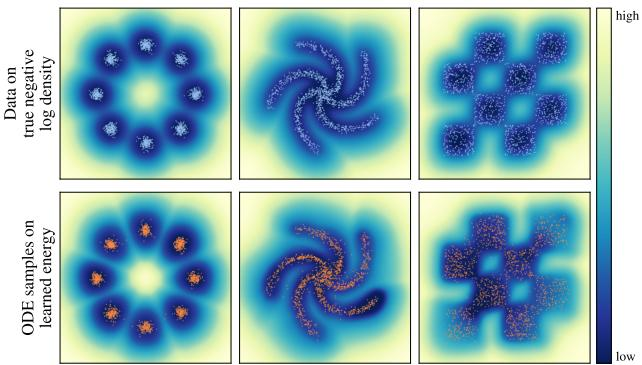
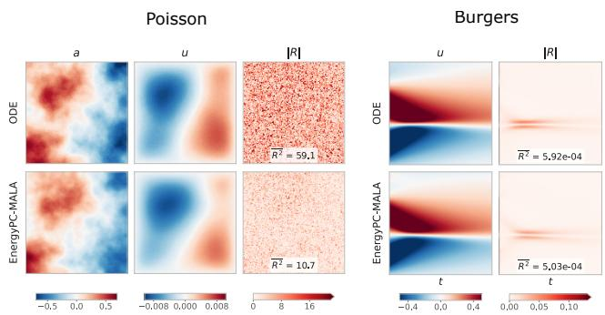
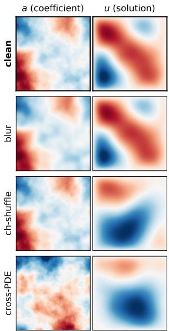
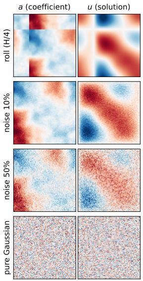
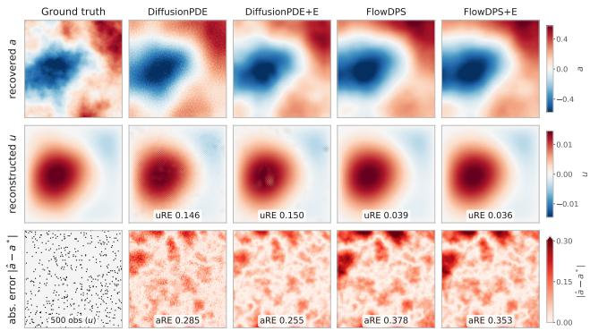
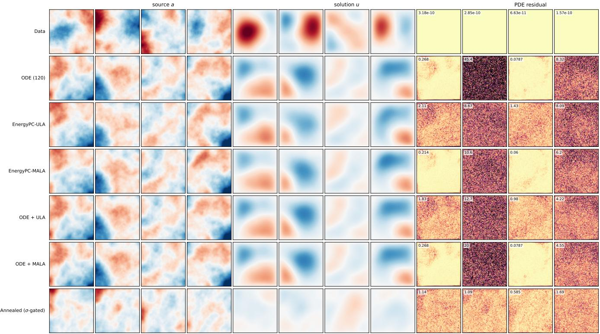
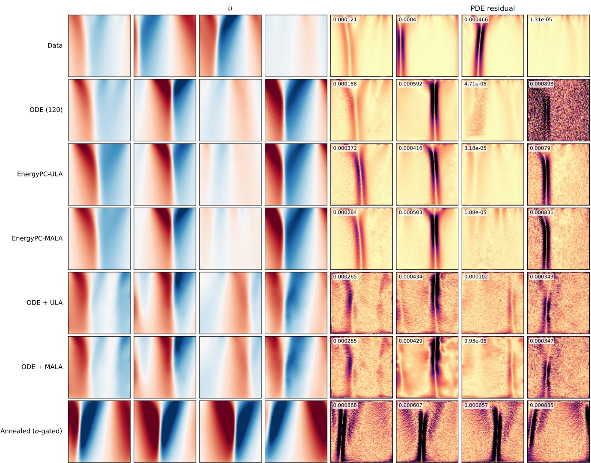

# Composing Flow-Matching Energies with Known Physics: Generation, OOD Detection, and Inversion on PDE Fields

Yixuan Sun1,∗, Anirban Samaddar1, Sandeep Madireddy1

1Mathematics and Computer Science, Argonne National Laboratory

## Abstract

Probabilistic modeling of physical fields benefits from both a data-driven prior and known physical structure such as the governing equations. Energy-based models (EBMs) are a natural fit since energies compose additively, which enables augmenting physics information during inference. However, EBMs have been dificult to train and sample from due to the intractable partition function. We show in this work that flow matching models with a potential-induced velocity yield an explicit scalar energy at all transport times, whose gradient is exactly the converted learned score and which recovers the marginal negative log-density at the population optimum. The time-dependent energy functions are obtained purely from the matching regression objective on an independent linear Gaus-sian interpolation, without a variational form or additional MCMC steps, and the sampling retains the flow ODE. Access to the energy function from a trained model serves three roles: energy-corrected data generation, energy as a scoring function for out-of-distribution (OOD) detection, and energy compositional posterior sampling for inverse problems. In particular, we show the explicit energy permits general MCMC samplers in the predictor-corrector sampling framework, reducing PDE residual and spectral distance compared to the flow ODE base- line. Furthermore, we demonstrate utilizing the data energy and physics-based energy (e.g., PDE residuals) as comple-mentary mechanisms to improve detection accuracy for OOD tasks. In addition, we explore the connection to MCMC-based inference for inverse problems by composing the energy with a quadratic observational likelihood that yields a posterior energy, used as an explicitly chosen family of inference-time targets.

## Introduction

Flow matching models (Lipman et al. 2022; Tong et al. 2023) have been widely used for high-dimensional data generation, including natural images as well as scientific data. In scien- tific machine learning, flow matching models not only pro- duce accurate solution fields for various PDE problems but also provide uncertainty quantification through sampling- based predictions (Li, Zhou, and Farimani 2025; Chen and Deng 2026; Kerrigan, Migliorini, and Smyth 2023). How-ever, beyond unconditional or conditional generation, other scientific tasks, such as out-of-distribution (OOD) detection, model composition, and inverse problems, often require ad- ditional machinery at inference time: flow matching allows exact likelihood computation but only through expensive integration and trace estimation; guidance-based posterior sampling does not faithfully target the posterior it defines (Du et al. 2023); and for inverse problems the required noisy likelihood must be approximated (Chung et al. 2022), for which the correction needs a diferent sampler (Wu et al. 2024a).

  
Figure 1: Energy landscapes and flow generated samples of 2D datasets from potential parameterized flow matching training. The flow ODE samplers correctly generate samples resembling true data points. At the same time, the learned energy landscapes share visually the same geometries as the true negative log densities, where a lower value represents higher likelihood.

Meanwhile, energy-based models (EBMs) (LeCun et al. 2006; Kim and Bengio 2016; Carbone 2024) as a family of generative models hold the promise of a single model for all three tasks, due to their access to explicit energy functions. However, energy-based models are challenging to train, often requiring expensive sampling using MCMC and extensive hyperparameter tuning (Du and Mordatch 2019; Song and Kingma 2021; Nijkamp et al. 2019). While methods such as denoising score matching (Vincent 2011) do not need ex-pensive negative samples from the model, they sufer from ill-defined scores and estimation dificulty outside of the data support (Song and Ermon 2019), and do not address the sam-pling obstacles where noise-initialized MCMC chains have poor mixing, especially in high-dimensional space (Koehler, Heckett, and Risteski 2022).

To combine the training and sampling eficiency of flow matching with the explicit unnormalized density of EBMs, several hybrid formulations have recently been proposed (Balcerak et al. 2025; Loo et al. 2025; Zhou et al. 2025). Each requires a customized training scheme rather than the stan- dard flow matching objective, and all remain under-explored for modeling PDE fields. In this work, we exploit the ex- plicit connection between flow matching models and EBMs by equating the score functions of the marginal distributions at all transport times in flow matching to the negative gradi- ent of the energy function. Using a potential-induced veloc- ity parameterization within standard flow matching training, we recover the time-dependent energy functions as a direct read-out. These energy functions, as unnormalized negative log densities (Figure 1), grant a single trained flow matching model the flexibility to perform eficient data generation, OOD detection, and inverse problems. In particular, for mod- eling PDE fields, we propose a total energy formulation that additively incorporates known physical structures into the energy function to augment the learned prior. This total en- ergy admits an efective scoring function for OOD detection and also improves sampling in data generation and inverse problems. We summarize our contributions as follows:

• We adopt a potential parameterization of standard flow matching that provides time-dependent EBMs along the transport path, making the converted score conservative by construction, enabling straightforward training and supporting multiple inference tasks.

• We construct a total energy by augmenting the data energy with known physical structures, and propose an Energy- based Predictor-Corrector (EnergyPC) framework that enables physics-aware unconditional generation and pos- terior sampling.

• We show that the data energy and the physical energy are complementary scoring functions for OOD detection, and that the total energy combining them is efective across the tested corruptions.

• We demonstrate the efectiveness of our approach on high-dimensional PDE datasets (Poisson, Helmholtz, and Burgers) through improved data generation, OOD detection, and PDE solution field reconstruction and coeficient inference compared to flow ODE, predictor–corrector, and guidance-based posterior sampling baselines.

## Related Work

Energy-based models. Probabilistic energy-based models (LeCun et al. 2006; Ngiam et al. 2011; Ackley, Hinton, and Sejnowski 1985) use the Boltzmann distribution to approxi-mate the target distribution through a parameterized energy function. EBMs have appealing properties arising from the explicit access to the unnormalized density, making them a natural choice for density estimation, out-of-distribution de- tection (Liu et al. 2020; Wu et al. 2024b; Grathwohl et al. 2019; Habring et al. 2025), model composition (Du and Kaelbling 2024; Wu et al. 2023), and uncertainty quantification (Fuchsgruber, Wollschläger, and Günnemann 2024; Friedli et al. 2025). However, EBMs have historically been dificult to train and sample from, requiring expensive Markov chain Monte Carlo sampling (Hinton 2002) or its variants (Hinton

2002; Tieleman 2008; Du and Mordatch 2019). Score matching eliminates the need for expensive MCMC but faces chal- lenges such as ill-defined scores and estimation dificulties in areas of the low-dimensional data manifold (Song and Ermon 2019). Multilevel EBMs and noise annealing substantially improve the learning of EBMs (Song and Ermon 2019; Gao et al. 2020; Li, Chen, and Sommer 2019), but they still require careful noise schedule design. Our work is closely related to the multilevel treatment of EBMs, where we construct a series of EBMs at diferent noise levels using a time-dependent energy function, but with a straightforward noise schedule from the flow matching training objective.

Flow Matching. Flow matching (Lipman et al. 2022; Tong et al. 2023) models attempt to learn a velocity field, param-eterized by a neural network, that transports samples from a source (easy to sample) to a target (complex) data distribution. The learned velocity is then used in either an ODE or SDE, initialized with random draws from the source distribu- tion and solved numerically to draw samples from the target distribution. A well-trained flow matching model learns the ground truth marginal distributions along the transport path (Liu, Gong, and Liu 2022). Despite their success in gen-erative modeling, flow matching models do not explicitly provide access to the likelihood or energy of the underlying data distribution. The likelihood can be accessed using the change-of-variables formula (Lipman et al. 2022; Chen et al. 2018), which is expensive for high-dimensional datasets arising from physical processes. Flow matching has also been applied to physical fields, with physics imposed through hard constraints, guidance, or fine-tuning of the learned velocity (Cheng et al. 2024; Utkarsh et al. 2025; Tauberschmidt et al. 2026; Liang et al. 2025). Our work instead uses a potential parameterization, whose gradient approximates the velocity field, and follows the standard flow matching training objective. This allows the construction of marginal energy func- tions, which incorporate physical structure additively and score OOD samples directly.

Energy-based flow/difusion models. Thanks to the com-mon connection to the score function, many works explore the relationship between flow matching (or difusion) models and EBMs. For example, Energy Matching (Balcerak et al. 2025) uses a global time-independent potential flow to trans-port samples from source distributions to near the target data manifold and then runs MLE training via MCMC to obtain the global energy. VAPO (Loo et al. 2025) creates a density- weighted Poisson equation and utilizes deep Ritz method to solve the variational form of the equation as the training ob- jective to obtain the Boltzmann energy. Equilibrium matching (Wang and Du 2025) learns an implicit energy based model by enforcing equilbrium point at the end of the flow transport. While leveraging simplicity and strength of flow matching, these frameworks need customized training target to attain the EBM. Our work aligns closely with the energy difusion models (Du et al. 2023; Du, Mao, and Tenenbaum 2024; Thornton et al. 2025) but under the flow matching framework for modeling PDE fields, where we access the time-dependent marginal energies through a parameterized potential that induces the flow and augment the data-learned prior energy with known physical structures.

## Methods

The objective of our work is to learn the transport between the source Gaussian $\mathcal { N } ( 0 , I )$ and the target distribution of PDE fields $p _ { \mathrm { d a t a } } ( x )$ through flow matching. Additionally, along the transport path, we are interested in modeling the marginal distributions as EBMs and learn the energy func- tions. We show in this section when parameterizing the flow velocity field using a scalar potential, the energy function of marginal distributions can be directly obtained in terms of the flow potential and the predefined noise schedule. Next, we augment the flow matching-trained energies for PDE fields with known physical structures, which enables energy-based correctors during sampling and admits a suitable scoring function for OOD detection.

Energy and Potential Flow. Let $x \in \mathbb { R } ^ { d }$ , and let $p _ { 0 } ( x ) =$ $\mathcal { N } ( 0 , \breve { I } )$ and $p _ { 1 } ( x ) = p _ { \mathrm { d a t a } } ( x )$ denote the source and target distributions. Given the interpolant $x _ { t } = \alpha _ { t } x _ { 1 } + \sigma _ { t } x _ { 0 }$ , let $p _ { t } ( x )$ denote the induced mar inal at $t \in [ 0 , 1 ]$ . We construct a series of time-dependent energy-based models such that

$$
p _ { t } ( x ) = \frac { \exp ( - E ( x , t ) ) } { Z _ { t } } , Z _ { t } = \int _ { \mathbb { R } ^ { d } } \exp ( - E ( x , t ) ) d x ,\tag{1}
$$

where $E : \mathbb { R } ^ { d } \times [ 0 , 1 ] \to \mathbb { R } .$ , so that the score of the time marginal is $\nabla _ { x } \log \bar { p _ { t } } ( \dot { x } ) = - \nabla _ { x } E ( x , t )$

Consider a forward difusion process transporting data samples to the source,

$$
d x _ { s } = f ( x , s ) d s + g ( s ) d W _ { s } , \ s : 0 \to 1 ,\tag{2}
$$

with $s = 1 - t .$ . Throughout we use the linear path $\alpha _ { t } = t ,$ $\sigma _ { t } = 1 - t .$ for which $\bar { f } ( x , 1 - t ) = - x / t$ and $\begin{array} { r } { { g } ^ { 2 } ( 1 - t ) = } \end{array}$ $2 ( 1 - t ) / t$ (see the supplementary material). Reversing (2) and substituting t back (Anderson 1982; Song et al. 2020), the associated probability flow ODE is

$$
\begin{array} { r } { d x _ { t } = \left[ - f ( x , 1 - t ) + \frac { 1 } { 2 } g ^ { 2 } ( 1 - t ) \nabla _ { x } \log p _ { t } ( x ) \right] d t . } \end{array}\tag{3}
$$

Let the drift in (3) be the gradient of a time-dependent potential $\Phi ( x , t )$ , so that $d x _ { t } \big / d t = \nabla _ { x } \Phi ( x , t )$ defines a flow $\phi _ { t } ( x _ { 0 } ) = x _ { t }$ . Note that this formulation restricts the velocity to curl-free fields; for a Gaussian path this is no restriction at the optimum, since $f$ is linear and isotropic in x and $g$ de- pends only on t, making both terms of the (3) drift gradients. The associated continuity equation

$$
\frac { \partial p _ { t } } { \partial t } = - \nabla _ { x } \cdot \left( p _ { t } \nabla _ { x } \Phi \right)\tag{4}
$$

shares the same marginal density as that induced by (2). Solving (3) for the score gives an explicit relationship between the time marginals and the potential-induced velocity field,

$$
\nabla _ { x } \log { p _ { t } ( x ) } = \frac { 2 \nabla _ { x } \Phi ( x , t ) + 2 f ( x , 1 - t ) } { g ( 1 - t ) ^ { 2 } } ,\tag{5}
$$

and combining with (1) yields the energy

$$
E ( x , t ) = \frac { \| x \| ^ { 2 } - 2 t \Phi ( x , t ) } { 2 ( 1 - t ) } + c ( t ) ,\tag{6}
$$

where $c ( t )$ is a constant of integration with respect to x. We adopt $c \equiv 0$ , for which $E ( x , \mathbf { \bar { 0 } } ) = \| x \| ^ { 2 } / 2$ recovers the energy of the Gaussian source.

This energy function is the direct read-out from the poten- tial that induces the flow transporting Gaussian samples to the target distribution, and setting $c ( t ) = 0$ does not afect fixed-time MCMC sampling and OOD scoring. Note that at transport terminal time $t = 1$ , the energy becomes an indeter- minate and numerically unstable representation. In practice, following the standard remedy (Karras et al. 2022; Ma et al. 2024) we set a minimum noise level $\sigma _ { \operatorname* { m i n } } > 0$ and treat the energy at that noise level as a close approximation to the true data energy.

EBM training through Flow Matching. To obtain the energy function in (6), we shift the learning objective from the velocity field to the potential function. We parameterize the potential function $\bar { \Phi } _ { \theta }$ using a neural network with the parameter set $\theta ,$ and we take the gradient, which is easily computable via automatic diferentiation. Using the linear interpolant (Lipman et al. 2022; Liu, Gong, and Liu 2022), where $x _ { t } = ( 1 - t ) x _ { 0 } + t x _ { 1 } , \ x _ { 0 } \sim \mathcal { N } ( 0 , I ) , \ x _ { 1 } \sim p _ { \mathrm { d a t a } } ( x )$ we obtain the standard flow matching objective

$$
\mathcal { L } ( \theta ) = \mathbb { E } _ { t , x _ { 0 } , x _ { 1 } } [ \| \nabla _ { x _ { t } } \Phi _ { \theta } ( x _ { t } , t ) - ( x _ { 1 } - x _ { 0 } ) \| _ { 2 } ^ { 2 } ] .\tag{7}
$$

Once the model is trained, we obtain the flow potential $\Phi _ { \theta } ( x , t )$ along with the learned energy functions $E _ { \theta } ( x , t )$ for downstream tasks. Note that (6) is an identity at the pop- ulation optimum, where the target marginal, the marginal induced by $\nabla _ { x } \Phi _ { \theta }$ , and the read-out density exp $\rangle \{ - E _ { \theta } \bar  \} / Z _ { \theta }$ coincide. Under finite training they need not, as (6) assigns the energy pointwise without enforcing consistency with the transport. We therefore treat $E _ { \theta }$ as a read-out that inherits the accuracy of the learned velocity, the same plug-in sta- tus as the velocity-to-score conversion in flow-based SDE and posterior samplers (Kim, Kim, and Ye 2025; Ma et al. 2024). Also, with a standard neural network implementation (e.g., afine maps, Lipschitz activations, and normalization layers), $\Phi _ { \theta }$ grows at most linearly in ∥x∥, so the energy in (6) yields a normalizable density for $t < 1$ , admitting a valid EBM. Such training of the EBMs takes advantage of the established matching objective, avoiding the expensive and unstable MCMC sampling required by conventional EBM training.

Sampling. Following the training outline above, a trained potential $\Phi _ { \theta }$ admits both the velocity field $\nabla _ { x } \Phi _ { \theta } ( x , t )$ , used for sampling by solving the ODE, and the energy function $E _ { \theta } ( x , t )$ , which allows MCMC-based samplers to be incor- porated. In addition, for general PDE fields, it is straightfor- ward to add known physical structures to the learned energy function to refine the prior energy. We consider the PDE residual as the additional structure and construct the total energy as

$$
\begin{array} { r } { E _ { \mathrm { t o t } } ( x , t ) = E _ { \theta } ( x , t ) + \lambda _ { t } \| R ( x ) \| ^ { 2 } , } \end{array}\tag{8}
$$

where $\| R ( x ) \|$ is squared the $L _ { 2 }$ norm of the PDE residual, corresponding to a Gaussian likelihood on the residual with $\begin{array} { r } { \lambda _ { t } = \frac { 1 } { 2 \sigma _ { R } ^ { 2 } ( t ) } } \end{array}$ and $\lambda _ { t }$ is a time-dependent non-negative scalar controlling its contribution. We present $E _ { \mathrm { t o t } }$ as an annealing family of inference-time targets rather than the exact inter- mediate marginals induced by the interpolant. The residual of a noisy field is uninformative, so we schedule $\lambda _ { t }$ to zero at high noise levels. Therefore, the intermediate members are not required to be the marginals of any distribution, and serve only as an annealing path along which the corrector tracks the target. At the terminal time the field is nearly clean, and the terminal member recovers the learned prior corrected by the known physical structure.

Algorithm 1: EnergyPC: energy-based predictor–corrector   
with optional adjustment   
Require: transport-time grid $0 = t _ { 0 } < \cdots < t _ { N } = 1 -$   
$\sigma _ { \mathrm { m i n } } ,$ corrector steps M, noise floor $\sigma _ { \mathrm { m i n } } , \mathrm { O D E }$ solver   
ODEStep, Langevin proposal $\mathcal { Q }$ with step size $\eta ,$ flag   
adjust   
Ensure: approximate sample from $p _ { 1 }$   
1: $x \sim \hat { \mathcal { N } } ( 0 , I )$   
2: for $k = \mathrm { { 0 } } , \ldots , N - 1$ do   
3: $x \left. \mathrm { O D E S T E P } \left( x , \ \nabla _ { x } \Phi _ { \theta } , t _ { k } \right. t _ { k + 1 } \right)$   
4: $\sigma \gets 1 - t _ { k + 1 }$   
5: for $j = 1 , \dotsc , M$ do   
6: $\dot { \left( { \hat { x } } , \Lambda \right) } \gets { \mathcal Q } . \operatorname { P R o p o s g } { \left( x , \nabla _ { x } E _ { \mathrm { t o t } } ( x , t _ { k + 1 } ) , \eta \right) }$   
where $\Lambda = \log q ( \boldsymbol { x } \mid \boldsymbol { \hat { x } } ) - \log \stackrel { } { q } ( \boldsymbol { \hat { x } } \mid \boldsymbol { x } )$   
7: if adjust then   
8: log $\alpha  E _ { \mathrm { t o t } } ( x , t _ { k + 1 } ) - E _ { \mathrm { t o t } } ( \hat { x } , t _ { k + 1 } ) + \Lambda$   
9: $u \sim \mathcal { U } ( 0 , 1 )$ ; x ← xˆ if log $u \textless$ log α else   
x   
10: else   
11: $x \gets { \hat { x } }$   
12: end if   
13: end for   
14: end for   
15: return $\hat { x } _ { 1 } \gets x + \sigma _ { \operatorname* { m i n } } \nabla _ { x } \Phi _ { \theta } ( x , 1 - \sigma _ { \operatorname* { m i n } } )$

Access to this total energy enables more general MCMC samplers to be used in the predictor-corrector (PC) framework introduced in (Song et al. 2020), which is efective at limiting error accumulation and improving distribution alignment when simulating the flow ODE. Moreover, a cor- rector that uses $E _ { \mathrm { t o t } }$ additionally encourages the physical feasibility of samples, which may not be captured by purely data-driven training. We use $E _ { \mathrm { t o t } }$ in the corrector step and name the resulting sampling process EnergyPC.

Algorithm 1 shows the EnergyPC framework that uses the Metropolis adjusted Langevin algorithm (MALA) as the MCMC corrector. Note that the energy-based PC frame- work also accepts other samplers that utilize energy, such as Hamiltonian Monte Carlo, replica exchange, and Jarzynski- reweighted variants (Earl and Deem 2005; Jarzynski 1997).

At each predictor step k and transport time $t ,$ we run M steps of corrector, for which the proposal is given by a Langevin step on the total energy,

$$
\widehat { x } _ { k } = x _ { k } - \eta \nabla _ { x } E _ { \mathrm { t o t } } + \sqrt { 2 \eta } \epsilon , ~ \epsilon \sim \mathcal { N } ( 0 , I )\tag{9}
$$

Then a Metropolis adjustment step decides whether to accept

the proposal,

$$
\alpha = \operatorname* { m i n } \left\{ 1 , \frac { p _ { t } ( \hat { x } _ { k } ) q ( x _ { k } \mid \hat { x } _ { k } ) } { p _ { t } ( x _ { k } ) q ( \hat { x } _ { k } \mid x _ { k } ) } \right\} ,\tag{10}
$$

where $q \big ( \hat { x } _ { k } ~ \mid ~ x _ { k } \big ) = \mathcal { N } \big ( \hat { x } _ { k } ; x _ { k } ~ - ~ \eta \nabla _ { x } E _ { \mathrm { t o t } } ( x _ { k } , t ) , 2 \eta I \big )$ and $q ( x _ { k } \mid \hat { x } _ { k } ) = \mathcal { N } ( x _ { k } ; \hat { x } _ { k } - \eta \nabla _ { \hat { x } } E _ { \mathrm { t o t } } ( \hat { x } _ { k } , t ) , 2 \eta I )$ . Ac- ceptance requires $\alpha \ge u , \ u \sim U [ 0 , 1 ]$ . Here, α is easily computable through the energy function as $p _ { t } ( x ) \ \propto$ $\mathrm { e x p } ( - \dot { E _ { \mathrm { t o t } } } ( x , t ) )$ . Compared to the unadjusted Langevin step used in the standard PC framework, the Metropolis adjustment makes the corrector kernel exactly invariant to $\mathrm { e x p } \{ - E _ { \mathrm { t o t } } ( x , t ) \}$ at each noise level, removing the dis- cretization bias of the unadjusted step (Roberts and Tweedie 1996).

Energy as Scoring Function. Energy functions measure the compatibility of the data with underlying distribution, where the compatible data with higher likelihood present low energy values. Therefore, energy functions provide suitable scoring for OOD tasks. Similar to the settings in (Liu et al. 2020; Wu et al. 2024b), we construct a classifier from the terminal time energy $E _ { \mathrm { t o t } } ( x , t _ { \mathrm { m a x } } ) , \ t _ { \mathrm { m a x } } = 1 - \sigma _ { \mathrm { m i n } }$ to perform inference time OOD using a discriminator defined as

$$
D ( x ) = \left\{ \begin{array} { l l } { 0 , E _ { \mathrm { t o t } } ( x , t _ { \mathrm { m a x } } ) \le \tau } \\ { 1 , E _ { \mathrm { t o t } } ( x , t _ { \mathrm { m a x } } ) > \tau } \end{array} \right. ,\tag{11}
$$

where τ is the scoring threshold, and an input of energy value greater than the threshold is considered an out-of-distribution sample, as a lower energy corresponds to a higher likelihood in (1).

We use AUROC (Hendrycks and Gimpel 2016) to eval-uate the performance of the energy function as a scoring function. Using $N _ { \mathrm { i n } }$ in-distribution test fields and an equal number $M = N _ { \mathrm { i n } }$ of corrupted fields per tier, we com- pute the energy values of these samples and denote them as $s _ { i } , ~ i = 1 , \ldots , N _ { \mathrm { i n } }$ and $t _ { j } , ~ j = 1 , \mathbf { \bar { \Gamma } } . \dots , M .$ . AUROC, de- fined in (12), measures the fraction of in-distribution and out-of-distribution pairs the energy ranks correctly, there- fore represents the probability of the energy score correctly ranking such pairs.

$$
{ \mathrm { A U R O C } } = { \frac { 1 } { N _ { \mathrm { i n } } M } } \sum _ { i } \sum _ { j } [ \mathbb { 1 } ( t _ { j } > s _ { i } ) + { \frac { 1 } { 2 } } \mathbb { 1 } ( t _ { j } = s _ { i } ) ]\tag{12}
$$

Here, a value of 1 indicates that the OOD samples are per- fectly separable using the energy score, while a value smaller than 0.5 means the OOD samples appear more in-distribution than real samples, which implies score failure that the energy carries the opposite information. A value of 0.5 means the energy carries no information to rank the sample pairs.

Posterior Energy for Inverse Problem. The learned en-ergy from flow matching training is useful in solving inverse problems, since EBMs provide a straightforward definition of the posterior by adding the likelihood energy term. For PDE fields with an $( a , u )$ pair, where a is the coeficient and u is the solution field, let $\{ o _ { i } \} _ { i = 1 } ^ { N }$ denote a set of observed points in the solution field, related to the field through the observation operator H as

$$
o = H ( x ) + \epsilon , \epsilon \sim \mathcal { N } ( 0 , \sigma _ { \mathrm { o b s } } ^ { 2 } I ) .\tag{13}
$$

The likelihood is then $p ( o \mid x ) = \mathcal { N } ( o ; H ( x ) , \sigma _ { \mathrm { o b s } } ^ { 2 } I )$ , and the posterior of the joint field $\boldsymbol { x } = \left( a , u \right)$ is

$$
\begin{array} { r } { \log p ( x | o ) = \log p ( x ) + \log p ( o \mid x ) + C \qquad } \\ { = - \underbrace { \bigg ( E _ { \mathrm { t o t } } + \frac { \| \{ o _ { i } \} _ { i = 1 } ^ { N } - H ( x ) \| ^ { 2 } } { 2 \sigma _ { \mathrm { o b s } } ^ { 2 } } \bigg ) } _ { \mathrm { p o s t e r i o r e n e r g y } = E _ { \mathrm { p o s } } } + C , } \end{array}\tag{14}
$$

where C collects the normalizing constants of the prior and likelihood terms. The likelihood energy from the conditional Gaussian distribution (13) is quadratic and composes directly with the prior energy. As with $E _ { \mathrm { t o t } } , E _ { \mathrm { p o s } }$ defines an anneal- ing family rather than the sequence of marginals the flow dynamics would transport. Here, the quadratic likelihood is evaluated on the current field at every noise level, which is accurate only as the field becomes clean, and the terminal member coincides with the flow posterior.

Similar to the use of energy in the PC framework, existing flow-based posterior samplers (e.g., FlowDPS (Kim, Kim, and Ye 2025)) can leverage the posterior energy to improve accuracy. At each posterior sampling step, the guided velocity with uidance coeficient ν at noise level t is

$$
\nabla _ { x } \Phi _ { \theta } ( x , t \mid o ) = \nabla _ { x } \Phi _ { \theta } ( x , t ) + \nu \nabla _ { x } \log p ( o \mid \mathbb { E } [ x _ { 1 } | x _ { t } ] ) ,\tag{15}
$$

and we apply the energy-based MCMC corrector (step 5-11 in Algorithm 1) at the same noise level

$$
x  \mathtt { E n e r g y C o r r } ( x , E _ { \mathrm { p o s } } , \eta ) .\tag{16}
$$

The posterior energy gives the corrector an explicit target at each noise level, which the guidance term alone does not provide.

## Experiments

We train and evaluate the potential flow matching framework on the PDE field datasets from (Huang et al. 2024) and show the impact of the energy functions in unconditional genera- tion, OOD detection, and inverse problems on solution field reconstruction and coeficient inference. Model architecture, hyperparameters, and training details are described in the supplementary material.

Unconditional generation We compare the performance of unconditional generation of the PDE fields using the pro- posed EnergyPC framework against the flow ODE sampler (Lipman et al. 2022; Tong et al. 2023) and the standard PC framework (Song et al. 2020) on the Poisson, Helmholtz, and Burgers equation datasets. Note that EnergyPC-ULA can also be considered the standard PC framework, as it requires only the gradient of the energy function. We use $E _ { \mathrm { t o t } } ( \dot { \boldsymbol { x } } , t )$ in the energy corrector step listed in Algorithm 1 and generate 100 samples from each sampling process. Sample quality is as- sessed using sliced $W _ { 2 }$ distance, radial log-spectral distance, mean squared error of the mean (MMSE), mean squared error of the standard deviation (SMSE), and PDE residuals (see the supplementary material for details).

We conduct two sets of comparisons against the ODE sampler: one with the same number of noise levels, where the EnergyPC framework consumes extra computation per step, and the other with the same computational budget, where it uses a coarser transport time grid. In particular, the ODE sampler runs at three budgets: 120, 240, and 360 transport steps. Standard PC and EnergyPC samplers use the same 120 predictor steps, with additional corrector cost matching 240 and 360 neural function evaluations for the ULA and MALA correctors, respectively.

  
Figure 2: Visualization of samples of Poisson and Burgers samples generated using the baseline flow ODE and Ener- gyPC with MALA.

Table 1 shows the generation metrics with diferent sam- plers for the three datasets. We observe that the corrector with energy-based adjustment (MALA) is superior to the purely score-based corrector (ULA), and that EnergyPC with ULA outperforms the standard PC on Poisson and has similar per- formance on Helmholtz and Burgers generation. Particularly, the application of EnergyPC with MALA efectively reduces the PDE residual and spectral distance on all three datasets. Figure 2 shows the efect of EnergyPC visually, where the refined samples present improved physical feasibility. Never- theless, unlike the physical feasibility, the EnergyPC frame- work has a less consistent efect on the MMSE and SMSE metrics. This could be due to the drift-dominant corrector step from the SNR-adjusted step size (Song and Ermon 2019) and the limited sample size.

Out-of-distribution detection We investigate the usage of $E _ { \mathrm { t o t } }$ in OOD tasks by comparing the energy values of cor- rupted samples against those of true data samples. We syn- thesize OOD samples from true data samples by applying blur, roll, channel shufle, and noise injection operations, and use samples across PDEs (Poisson and Helmholtz) as additional OOD instances. The blur operation is a Gaussian convolution, which acts as a low-pass filter on the original clean fields. The roll operation shifts the fields, preserving the bulk physical feasibility. Channel shufle creates a mis- match between the coeficient and solution fields, so that a and u are individually in-distribution but jointly out-ofdistribution. Noising operations add Gaussian noise scaled by the field standard deviation. Figure 3 shows example re- sults of the above operations.

We report the AUROC values computed from $N _ { \mathrm { i n } } = M =$ 256 true and OOD samples, using energy terms in (8) sepa-rately, where $E _ { \theta } ( x , t )$ encodes the distributional information learned from data, $\| \bf \dot { R } \|$ detects physical inconsistency, and

Table 1: Unconditional generation metrics across samplers and datasets, with 95% bootstrap confidence intervals (2000 resamples of the 100-sample ensemble). MMSE/SMSE $\times 1 0 ^ { - 4 } ;$ ; Burgers PDE residual $\times 1 0 ^ { - 4 }$ . Bold marks the best mean value per column within each dataset.
<table><tr><td>Dataset</td><td>Sampler</td><td>NFE</td><td> ${ \mathrm { S l i c e d } } { \mathrm { - } } W _ { 2 } { \downarrow }$ </td><td>Spectral↓</td><td>PDE resid↓</td><td>MMSE↓</td><td>SMSE↓</td></tr><tr><td rowspan="6">Poisson</td><td>ODE120</td><td>120</td><td> $0 . 0 5 3 2 { \scriptstyle \pm 0 . 0 0 4 6 }$ </td><td> $1 . 1 8 0 { \pm } 0 . 0 7 9$ </td><td>13.66±5.46</td><td>2.66±3.14</td><td>16.33±4.30</td></tr><tr><td>ODE240</td><td>240</td><td> $0 . 0 5 2 0 { \scriptstyle \pm 0 . 0 0 4 8 }$ </td><td> $1 . 1 8 1 { \pm } 0 . 0 7 9$ </td><td> $1 4 . 5 9 { \pm } 5 . 9 1 $ </td><td> $2 . 9 2 { \pm } 3 . 5 1 $ </td><td>12.72±3.75</td></tr><tr><td>ODE360</td><td>360</td><td> $0 . 0 5 1 8 { \pm } 0 . 0 0 4 8$ </td><td> $1 . 1 8 1 { \pm } 0 . 0 7 6$ </td><td> $1 4 . 9 4 { \pm } 5 . 8 2 $ </td><td> $3 . 0 1 { \pm } 3 . 7 1 $ </td><td> $\mathbf { 1 1 . 5 8 { \scriptstyle \pm 3 . 6 9 } }$ </td></tr><tr><td>Standard PC</td><td>240</td><td> $0 . 0 4 4 9 { \scriptstyle \pm 0 . 0 0 4 7 }$ </td><td> $1 . 0 1 3 { \pm } 0 . 0 3 4$ </td><td> $4 . 5 4 { \pm } 0 . 9 3 $ </td><td> $3 . 1 2 { \pm } 2 . 7 3$ </td><td> $2 2 . 5 1 { \pm } 4 . 9 1 $ </td></tr><tr><td>EnergyPC-ULA (ours)</td><td>240</td><td> $0 . 0 4 4 9 { \pm } 0 . 0 0 5 0$ </td><td> $0 . 9 7 9 { \scriptstyle \pm 0 . 0 2 4 }$ </td><td> $3 . 6 5 { \pm } 0 . 5 7 $ </td><td> $3 . 1 2 { \pm } 2 . 8 5 $ </td><td> $2 2 . 5 1 { \pm } 4 . 8 7$ </td></tr><tr><td>EnergyPC-MALA (ours)</td><td>360</td><td> $\mathbf { 0 . 0 4 2 0 { \pm } 0 . 0 0 5 0 }$ </td><td> $\mathbf { 0 . 9 1 5 { \pm } 0 . 0 3 2 }$ </td><td> $\mathbf { 2 . 4 6 { \pm } 0 . 6 4 }$ </td><td> $\mathbf { 1 . 8 1 \pm 2 . 0 6 }$ </td><td> $1 8 . 3 5 { \pm } 4 . 2 7 $ </td></tr><tr><td rowspan="6">Helmholtz</td><td>ODE120</td><td>120</td><td>0.0594±0.0038</td><td> $0 . 9 1 9 { \pm } 0 . 0 5 5$ </td><td>2.86±1.49</td><td>4.12±3.03</td><td> $2 8 . 4 0 { \scriptstyle \pm 4 . 7 7 }$ </td></tr><tr><td>ODE240</td><td>240</td><td> $0 . 0 5 6 1 { \scriptstyle \pm 0 . 0 0 3 8 }$ </td><td> $0 . 9 1 1 { \scriptstyle \pm 0 . 0 6 1 }$ </td><td>3.13±1.65</td><td>4.50±3.52</td><td> $2 3 . 0 7 { \scriptstyle \pm 4 . 4 7 }$ </td></tr><tr><td>ODE360</td><td>360</td><td>0.0550±0.0039</td><td> $0 . 9 0 9 { \pm } 0 . 0 5 9$ </td><td>3.24±1.59</td><td>4.65±3.79</td><td> $\mathbf { 2 1 . 2 8 { \pm } 4 . 4 6 }$ </td></tr><tr><td>Standard PC</td><td>240</td><td> $0 . 0 5 7 4 { \scriptstyle \pm 0 . 0 0 4 0 }$ </td><td> $0 . 9 4 2 { \scriptstyle \pm 0 . 0 2 2 }$ </td><td> $3 . 6 9 { \pm } 0 . 5 1 $ </td><td> $6 . 6 7 { \pm } 4 . 0 5$ </td><td> $3 0 . 5 3 { \pm } 5 . 1 4 $ </td></tr><tr><td>EnergyPC-ULA (ours)</td><td>240</td><td> $0 . 0 5 7 4 { \scriptstyle \pm 0 . 0 0 4 2 }$ </td><td> $0 . 9 4 2 { \pm } 0 . 0 1 8$ </td><td> $3 . 6 9 { \pm } 0 . 4 1$ </td><td>6.69±4.25</td><td>30.52±5.20</td></tr><tr><td>EnergyPC-MALA (ours)</td><td>360</td><td> $0 . 0 5 5 1 { \pm } 0 . 0 0 3 8$ </td><td> $\mathbf { 0 . 8 4 8 { \pm 0 . 0 2 6 } }$ </td><td> $\mathbf { 1 . 1 9 \pm 0 . 3 6 }$ </td><td>5.48±3.45</td><td>27.74±5.00</td></tr><tr><td rowspan="6">Burgers</td><td>ODE120</td><td>120</td><td> $0 . 0 5 2 1 { \scriptstyle \pm 0 . 0 1 4 7 }$ </td><td>1.734±0.098</td><td>3.59±0.69</td><td>9.16±13.57</td><td>12.07±9.96</td></tr><tr><td>ODE240</td><td>240</td><td> $0 . 0 6 1 6 { \pm } 0 . 0 1 5 5$ </td><td> $1 . 8 1 4 { \pm } 0 . 1 0 4$ </td><td> $4 . 2 1 { \pm } 0 . 8 2 $ </td><td> $9 . 9 5 { \pm } 1 4 . 0 9$ </td><td> $2 1 . 8 2 { \pm } 1 4 . 2 9$ </td></tr><tr><td>ODE360</td><td>360</td><td> $0 . 0 6 5 4 { \pm } 0 . 0 1 5 8$ </td><td> $1 . 8 4 2 { \scriptstyle \pm 0 . 1 0 2 }$ </td><td> $4 . 4 6 { \pm } 0 . 8 5 $ </td><td> $1 0 . 2 5 { \pm } 1 4 . 3 5$ </td><td>26.12±15.17</td></tr><tr><td>Standard PC</td><td>240</td><td> $0 . 0 4 5 1 { \pm } 0 . 0 1 1 8$ </td><td> $1 . 3 9 9 { \pm } 0 . 0 8 4$ </td><td> $3 . 3 6 { \pm } 0 . 6 2$ </td><td> $7 . 1 9 { \pm } 9 . 7 4 $ </td><td>11.43±8.13</td></tr><tr><td>EnergyPC-ULA (ours)</td><td>240</td><td> $0 . 0 4 5 1 { \scriptstyle \pm 0 . 0 1 2 0 }$ </td><td> $1 . 3 9 9 { \pm } 0 . 0 8 9$ </td><td> $3 . 3 6 { \pm } 0 . 6 2$ </td><td> $7 . 1 9 { \pm } 9 . 8 1 $ </td><td> $1 1 . 4 3 { \pm } 8 . 1 2 $ </td></tr><tr><td>EnergyPC-MALA (ours)</td><td>360</td><td> $\mathbf { 0 . 0 4 3 5 { \pm } 0 . 0 1 2 3 }$ </td><td> $\mathbf { 1 . 3 0 3 { \overset { . } { \mathop { \left. \right.} } 0 . 0 8 9  } }$ </td><td> $\mathbf { 3 . 0 5 { \pm } 0 . 5 2 }$ </td><td> $\mathbf { 4 . 6 4 \pm 8 . 0 2 }$ </td><td> $\mathbf { 8 . 5 0 \pm 6 . 9 1 }$ </td></tr></table>

Table 2: OOD detection AUROC with the energy, with 95% bootstrap confidence intervals (italic=at or near chance). The learned energy E and the PDE residual R are complementary: each is blind where the other separates, and the total energy $E _ { \mathrm { t o t } }$ flags every tier where either does.
<table><tr><td></td><td colspan="3">Poisson</td><td colspan="3">Helmholtz</td><td colspan="3">Burgers</td></tr><tr><td>OOD tier</td><td>E</td><td>R</td><td> $E _ { \mathrm { t o t } }$ </td><td>E</td><td>R</td><td> $E _ { \mathrm { t o t } }$ </td><td>E</td><td>R</td><td> $E _ { \mathrm { t o t } }$ </td></tr><tr><td>Gaussian noise</td><td>1.00</td><td>1.00</td><td>1.00</td><td>1.00</td><td>1.00</td><td>1.00</td><td>1.00</td><td>1.00</td><td>1.00</td></tr><tr><td>Noise (10% field std)</td><td>1.00</td><td>1.00</td><td>1.00</td><td>1.00</td><td>1.00</td><td>1.00</td><td>1.00</td><td>0.843±0.027</td><td>1.00</td></tr><tr><td>Noise (50% field std)</td><td>1.00</td><td>1.00</td><td>1.00</td><td>1.00</td><td>1.00</td><td>1.00</td><td>1.00</td><td>1.00</td><td>1.00</td></tr><tr><td>Channel shuffle</td><td>0.992±0.005</td><td>1.00</td><td>1.00</td><td>1.00</td><td>1.00</td><td>1.00</td><td></td><td></td><td></td></tr><tr><td>Cross-PDE</td><td>1.00</td><td>1.00</td><td>1.00</td><td>1.00</td><td>1.00</td><td>1.00</td><td></td><td></td><td></td></tr><tr><td>Blur / smoothing</td><td> $0 . 6 3 6 { \pm } 0 . 0 3 4$ </td><td>1.00</td><td>1.00</td><td>1.00</td><td>1.00</td><td>1.00</td><td>0.614±0.035</td><td> $0 . 4 9 0 { \pm } 0 . 0 3 4$ </td><td>0.672±0.032</td></tr><tr><td>Spatial roll</td><td>1.00</td><td>1.00</td><td>1.00</td><td>1.00</td><td>1.00</td><td>1.00</td><td>1.00</td><td> $0 . 5 5 8 { \pm } 0 . 0 3 5$ </td><td>1.00</td></tr></table>

$E _ { \mathrm { t o t } }$ combines the two complementary terms, which the ex- periments show to be a better scoring function for OOD detection. Values in Table 2 indicate that in most of the test- ing cases, the data energy and PDE residual alone are capable of perfect or near-perfect detection of OOD samples, which means the separate energy terms are adequate scoring func- tions that correctly rank true and OOD samples. In particular, all energies capture the channel-shufled cases, where each channel (a and u) individually satisfies the distribution. This demonstrates that the learned energies score the channels jointly, where the mismatched pairs are of-manifold.

samples from true samples, while $E _ { \mathrm { t o t } }$ improves the detec- tion accuracy for both datasets. Similarly, due to the periodic boundary conditions in the Burgers data, the spatial roll oper- ation preserves the physical feasibility of a sample but pulls it out of the data distribution. Thus, the physical energy term alone could not distinguish the corrupted samples cleanly, but $E _ { \mathrm { t o t } }$ prevents the failure.

The experiment showcases that the learned data energy and PDE residual energy are complementary as OOD scoring functions, and that the total $E _ { \mathrm { t o t } }$ is a suitable single scoring function for OOD detection purposes.

However, the Gaussian convolution blurred samples cause a large accuracy reduction on the data energy for both the Poisson and Burgers datasets. The smoothed samples are vi- sually consistent with true samples despite the loss of high frequency details, and lie towards the mode of the data distri- bution, corresponding to high likelihood regions, but not in the distribution’s typical set (Nalisnick et al. 2019). Hence, the data energy term alone struggles to distinguish the blurred

Inverse Modeling. We also test the role of energy functions in posterior sampling on top of popular guidance-based difusion posterior samplers. Following the inverse problem setup in (Huang et al. 2024), for the Poisson and Helmholtz datasets, we randomly sample 500 locations in the solution field u as the observed points, and reconstruct the solution field as well as infer the corresponding coeficient field a. We evaluate model performance by incorporating the energy correctors into the DifusionPDE (Huang et al. 2024) and FlowDPS (Kim, Kim, and Ye 2025) frameworks.

  
Figure 3: Synthetic OOD sample examples on the Poisson a and u pairs.

Table 3: Relative $L _ { 2 }$ errors of reconstructed u and inferred a in the inverse problem. Fields are the ensemble mean over 16 samples; energy correctors are added at the base’s own predictor levels. ± is the standard deviation over resamples of the 16 draws.
<table><tr><td>Dataset</td><td>Method</td><td>aRE↓</td><td>uRE↓</td></tr><tr><td rowspan="6">Poisson</td><td> $\mathrm { D i f f u s i o n P D E }$ </td><td> $0 . 2 8 5 { \pm } 0 . 0 2 0$ </td><td> $\mathbf { 0 . 1 4 6 { \pm 0 . 0 1 7 } }$ </td></tr><tr><td> $+ E _ { \mathrm { p o s } } \mathrm { - U L A }$ </td><td> $0 . 3 0 4 { \scriptstyle \pm 0 . 0 5 7 }$ </td><td> $0 . 1 5 1 { \pm } 0 . 0 1 8$ </td></tr><tr><td> $+ \dot { E _ { \mathrm { p o s } } } \mathbf { - M A L A }$ </td><td> $\mathbf { 0 . 2 5 5 { \pm 0 . 0 1 0 } }$ </td><td> $0 . 1 5 0 { \pm } 0 . 0 2 0$ </td></tr><tr><td>FlowDPS</td><td>0.378±0.008</td><td> $0 . 0 3 9 { \pm } 0 . 0 0 1$ </td></tr><tr><td> $+ E _ { \mathrm { p o s } } \mathrm { - U L A }$ </td><td> $0 . 3 7 3 { \scriptstyle \pm 0 . 0 0 7 }$ </td><td> $0 . 0 3 8 { \pm } 0 . 0 0 1$ </td></tr><tr><td> $+ E _ { \mathrm { p o s } } { \bf - M A L A }$ </td><td> $\mathbf { 0 . 3 5 3 { \overset { . } { \bot } } 0 . 0 1 2 }$ </td><td> $\mathbf { 0 . 0 3 6 { \pm 0 . 0 0 1 } }$ </td></tr><tr><td rowspan="6">Helmholtz</td><td>DiffusionPDE</td><td>0.254±0.008</td><td> $0 . 1 3 9 { \pm } 0 . 0 2 8$ </td></tr><tr><td> $+ E _ { \mathrm { p o s } } \mathrm { - U L A }$ </td><td>0.231±0.007</td><td> $0 . 1 2 9 { \pm } 0 . 0 1 8$ </td></tr><tr><td> $+ E _ { \mathrm { p o s } } { \bf - M A L A }$ </td><td>0.244±0.008</td><td> $\mathbf { 0 . 1 2 8 { \pm } 0 . 0 3 0 }$ </td></tr><tr><td> $\mathrm { F l o w D P S }$ </td><td> $0 . 3 3 8 { \pm } 0 . 0 0 9$ </td><td> $0 . 0 4 7 { \scriptstyle \pm 0 . 0 0 1 }$ </td></tr><tr><td> $+ E _ { \mathrm { p o s } } \mathrm { - U L A }$ </td><td> $\mathbf { 0 . 3 1 5 { \pm 0 . 0 0 7 } }$ </td><td> $\mathbf { 0 . 0 4 5 { \scriptstyle \pm 0 . 0 0 1 } }$ </td></tr><tr><td> $+ E _ { \mathrm { p o s } } { \bf - M A L A }$ </td><td> $0 . 3 1 9 { \scriptstyle \pm 0 . 0 0 7 }$ </td><td> $0 . 0 4 6 { \pm } 0 . 0 0 1$ </td></tr></table>

Similar to the procedure outlined in Algorithm 1, we apply an energy-based corrector step (16) with the posterior energy after each guidance-updated ODE integration step. Table 3 shows the relative $L _ { 2 }$ errors of the reconstructed solution and inferred coeficient fields produced by DifusionPDE, FlowDPS, and their energy-corrector extensions, and Fig- ure 4 shows an example of the efect. Overall, the energy correctors lead to improved results within both frameworks, with the largest and most consistent gains in coeficient in- ference; the exception is DifusionPDE on Poisson, where the solution field error increases slightly. More specifically, for the Poisson equation data, MALA energy correctors out- perform ULA energy correctors in both the DifusionPDE and FlowDPS settings. For the Helmholtz data, while both correctors outperform the baseline, the ULA corrector shows marginal improvement over the MALA corrector. Neverthe- less, rooted in the explicitly defined posterior energy, the energy correctors exhibit enhanced performance in posterior sampling.

  
Figure 4: Poisson solution field reconstruction and coeficient inference comparison using energy-corrector with MALA (+E) extended difusion posterior samplers.

## Conclusion

We show in this work that a potential-parameterized flow matching model with a Gaussian probability path provides explicit energy functions for the transport-time marginal distributions. When modeling PDE fields, such energies combined with additional physical structure create an aug- mented prior, the total energy, which enables a flexible en- ergy adjustment-based predictor–corrector framework (Ener-gyPC) for refined sampling that improves sample quality and physical feasibility. Concurrently, the total energy, consisting of complementary terms for OOD scoring, can also act as an efective single scoring function for OOD detection. Further- more, the total energy composes straightforwardly with the observational likelihood energy, which leads to better field reconstruction and coeficient inference in PDE field inverse problems.

Limitations. In spite of the success in data generation, OOD detection, and inverse problems, the proposed frame- work has two major limitations. First, the potential param-eterization of the flow leads to additional computational complexity compared to the standard flow matching mod- els, which will afect both training and sampling eficiency. Second, the read-out energy becomes singular algebraically at the terminal transport time $t = 1 . 5 0 ,$ , the true terminal en- ergy is not recoverable directly from this framework. Future work will focus on addressing these challenges.

## References

Ackley, D. H.; Hinton, G. E.; and Sejnowski, T. J. 1985. A learning algorithm for Boltzmann machines. Cognitive science, 9(1): 147–169.

Anderson, B. D. 1982. Reverse-time difusion equation mod- els. Stochastic Processes and their Applications, 12(3): 313– 326.

Balcerak, M.; Amiranashvili, T.; Terpin, A.; Shit, S.; Bo-gensperger, L.; Kaltenbach, S.; Koumoutsakos, P.; and

Menze, B. 2025. Energy Matching: Unifying flow match- ing and energy-based models for generative modeling. arXiv:2504.10612.

Carbone, D. 2024. Hitchhiker’s guide on the relation of Energy-Based Models with other generative models, sampling and statistical physics: a comprehensive review. arXiv:2406.13661.

Chen, R. T. Q.; Rubanova, Y.; Bettencourt, J.; and Du-venaud, D. 2018. Neural ordinary diferential equations. arXiv:1806.07366.

Chen, Z.; and Deng, S. 2026. Flow marching for a generative PDE foundation model. arXiv:2509.18611.

Cheng, C.; Han, B.; Maddix, D. C.; Ansari, A. F.; Stuart, A.; Mahoney, M. W.; and Wang, Y. 2024. Gradient-free generation for hard-constrained systems. arXiv:2412.01786.

Chung, H.; Kim, J.; Mccann, M. T.; Klasky, M. L.; and Ye, J. C. 2022. Difusion posterior sampling for general noisy inverse problems. arXiv:2209.14687.

Dhariwal, P.; and Nichol, A. 2021. Difusion Models Beat GANs on Image Synthesis. arXiv:2105.05233.

Du, Y.; Durkan, C.; Strudel, R.; Tenenbaum, J. B.; Diele- man, S.; Fergus, R.; Sohl-Dickstein, J.; Doucet, A.; and Grathwohl, W. 2023. Reduce, reuse, recycle: Compositional generation with energy-based difusion models and MCMC. arXiv:2302.11552.

Du, Y.; and Kaelbling, L. 2024. Compositional gen- erative modeling: A single model is not all you need. arXiv:2402.01103.

Du, Y.; Mao, J.; and Tenenbaum, J. B. 2024. Learning itera- tive reasoning through energy difusion. arXiv:2406.11179.

Du, Y.; and Mordatch, I. 2019. Implicit generation and mod- eling with energy based models. Neural Inf Process Syst, 3603–3613.

Durall, R.; Keuper, M.; and Keuper, J. 2020. Watch your Up-Convolution: CNN Based Generative Deep Neural Networks are Failing to Reproduce Spectral Distributions. arXiv:2003.01826.

Earl, D. J.; and Deem, M. W. 2005. Parallel tempering: The- ory, applications, and new perspectives. Physical Chemistry Chemical Physics, 7(23): 3910–3916.

Friedli, L.; Ginsbourger, D.; Doucet, A.; and Linde, N. 2025. An energy-based model approach to rare event probability estimation. SIAM/ASA Journal on Uncertainty Quantification, 13(2): 400–424.

Fuchsgruber, D.; Wollschläger, T.; and Günnemann, S. 2024. Energy-based epistemic uncertainty for graph neural net- works. Advances in Neural Information Processing Systems, 37: 34378–34428.

Gao, R.; Song, Y.; Poole, B.; Wu, Y. N.; and Kingma, D. P. 2020. Learning energy-based models by difusion recovery likelihood. arXiv:2012.08125.

Grathwohl, W.; Wang, K.-C.; Jacobsen, J.-H.; Duvenaud, D.; Norouzi, M.; and Swersky, K. 2019. Your classifier is secretly an energy based model and you should treat it like one. arXiv:1912.03263.

Habring, A.; Holler, M.; Pock, T.; and Zach, M. 2025. Energy-based models for inverse imaging problems. arXiv:2507.12432.

Hendrycks, D.; and Gimpel, K. 2016. A baseline for detect- ing misclassified and out-of-distribution examples in neural networks. arXiv preprint arXiv:1610.02136.

Hinton, G. E. 2002. Training products of experts by mini- mizing contrastive divergence. Neural computation, 14(8): 1771–1800.

Huang, J.; Yang, G.; Wang, Z.; and Park, J. J. 2024. Difu- sionPDE: Generative PDE-solving under partial observation. arXiv:2406.17763.

Jarzynski, C. 1997. Nonequilibrium equality for free energy diferences. Physical review letters, 78(14): 2690.

Karras, T.; Aittala, M.; Aila, T.; and Laine, S. 2022. Elucidat- ing the design space of difusion-based generative models. arXiv:2206.00364.

Kerrigan, G.; Migliorini, G.; and Smyth, P. 2023. Functional flow matching. arXiv preprint arXiv:2305.17209.

Kim, J.; Kim, B. S.; and Ye, J. C. 2025. FlowDPS: Flow-Driven Posterior Sampling for inverse problems. arXiv:2503.08136.

Kim, T.; and Bengio, Y. 2016. Deep directed gen- erative models with energy-based probability estimation. arXiv:1606.03439.

Koehler, F.; Heckett, A.; and Risteski, A. 2022. Statistical Eficiency of Score Matching: The View from Isoperimetry. arXiv:2210.00726.

Kolouri, S.; Nadjahi, K.; Simsekli, U.; Badeau, R.; and Rohde, G. K. 2019. Generalized Sliced Wasserstein Distances. arXiv:1902.00434.

LeCun, Y.; Chopra, S.; Hadsell, R.; Ranzato, A.; and Huang, F. J. 2006. A tutorial on energy-based learning.

Li, Z.; Chen, Y.; and Sommer, F. T. 2019. Learning energy- Based Models in high-dimensional spaces with multi-scale denoising score matching. arXiv:1910.07762.

Li, Z.; Zhou, A.; and Farimani, A. B. 2025. Generative latent neural pde solver using flow matching. URL https://arxiv. org/abs/2503.22600.

Liang, J.; Sun, Y.; Samaddar, A.; Madireddy, S.; and Fioretto, F. 2025. Chance-constrained Flow Matching for High- Fidelity Constraint-aware Generation. arXiv:2509.25157.

Lienen, M.; Lüdke, D.; Hansen-Palmus, J.; and Günnemann, S. 2024. From Zero to Turbulence: Generative Modeling for 3D Flow Simulation. arXiv:2306.01776.

Lipman, Y.; Chen, R. T. Q.; Ben-Hamu, H.; Nickel, M.; and Le, M. 2022. Flow Matching for generative modeling. arXiv:2210.02747.

Liu, W.; Wang, X.; Owens, J. D.; and Li, Y. 2020. Energy- based out-of-distribution detection. arXiv:2010.03759.

Liu, X.; Gong, C.; and Liu, Q. 2022. Flow Straight and Fast: Learning to Generate and Transfer Data with Rectified Flow. arXiv:2209.03003.

Loo, J. Y.; Adeline, M.; Lau, J. K.; Leong, F. Y.; Tew, H. H.; Pal, A.; Baskaran, V. M.; Ting, C.-M.; and Phan, R. C.-W. 2025. Learning energy-based generative models via potential flow: A variational principle approach to probability density homotopy matching. arXiv:2504.16262.

Ma, N.; Goldstein, M.; Albergo, M. S.; Bofi, N. M.; Vanden- Eijnden, E.; and Xie, S. 2024. SiT: Exploring Flow and Difusion-based Generative Models with Scalable Inter- polant Transformers. arXiv:2401.08740.

Nalisnick, E.; Matsukawa, A.; Teh, Y. W.; and Lakshmi- narayanan, B. 2019. Detecting out-of-distribution inputs to deep generative models using typicality. arXiv:1906.02994.

Ngiam, J.; Chen, Z.; Koh, P. W.; and Ng, A. Y. 2011. Learning deep energy models. In Proceedings of the 28th international conference on machine learning (ICML-11), 1105–1112.

Nijkamp, E.; Hill, M.; Han, T.; Zhu, S.-C.; and Wu, Y. N. 2019. On the anatomy of MCMC-based Maximum Likeli- hood learning of energy-based models. arXiv:1903.12370.

Roberts, G. O.; and Tweedie, R. L. 1996. Exponential con- vergence of Langevin distributions and their discrete approx- imations. Bernoulli, 2(4): 341 – 363.

Salimans, T.; and Ho, J. 2021. Should EBMs model the energy or the score? In Energy based models workshop-ICLR 2021.

Song, Y.; and Ermon, S. 2019. Generative modeling by esti- mating gradients of the data distribution. arXiv:1907.05600.

Song, Y.; and Kingma, D. P. 2021. How to train your energy- Based Models. arXiv:2101.03288.

Song, Y.; Sohl-Dickstein, J.; Kingma, D. P.; Kumar, A.; Ermon, S.; and Poole, B. 2020. Score-based gener- ative modeling through stochastic diferential equations. arXiv:2011.13456.

Tauberschmidt, J.; Fellenz, S.; Vollmer, S. J.; and Duncan, A. B. 2026. Physics-Constrained Fine-Tuning of Flow- Matching Models for Generation and Inverse Problems. arXiv:2508.09156.

Thornton, J.; Bethune, L.; Zhang, R.; Bradley, A.; Nakkiran, P.; and Zhai, S. 2025. Composition and control with dis- tilled energy difusion models and sequential Monte Carlo. arXiv:2502.12786.

Tieleman, T. 2008. Training restricted Boltzmann machines using approximations to the likelihood gradient. In Proceedings of the 25th international conference on Machine learning - ICML ’08. ACM Press.

Tong, A.; Fatras, K.; Malkin, N.; Huguet, G.; Zhang, Y.; Rector-Brooks, J.; Wolf, G.; and Bengio, Y. 2023. Improving and generalizing flow-based generative models with mini- batch optimal transport. arXiv:2302.00482.

Utkarsh, U.; Cai, P.; Edelman, A.; Gomez-Bombarelli, R.; and Rackauckas, C. V. 2025. Physics-Constrained Flow Matching: Sampling generative models with hard con- straints. arXiv:2506.04171.

Vincent, P. 2011. A connection between score matching and denoising autoencoders. Neural Comput., 23(7): 1661–1674.

Wang, R.; and Du, Y. 2025. Equilibrium Matching: Generative modeling with implicit energy-based models. arXiv:2510.02300.

Wu, L.; Trippe, B. L.; Naesseth, C. A.; Blei, D. M.; and Cunningham, J. P. 2024a. Practical and Asymptot- ically Exact Conditional Sampling in Difusion Models. arXiv:2306.17775.

Wu, T.; Maruyama, T.; Wei, L.; Zhang, T.; Du, Y.; Iaccarino, G.; and Leskovec, J. 2023. Compositional Generative Inverse Design. In The Twelfth International Conference on Learning Representations.

Wu, Y.; Ye, X.; Dai, S.; Pan, D.; Li, X.; Zhang, W.; and Chen, Y. 2024b. Revisiting energy-based model for out-of- distribution detection. arXiv:2412.03058.

Zhou, W.; Sprague, C. I.; Viliuga, V.; Tadiello, M.; Elofsson, A.; and Azizpour, H. 2025. Energy-based flow matching for generating 3D molecular structure. arXiv:2508.18949.

## A Energy formulation

## A.1 The identification of $f$ and g

From the main text, the linear interpolant is

$$
x _ { t } = t x _ { 1 } + ( 1 - t ) x _ { 0 } , \qquad x _ { 0 } \sim { \mathcal { N } } ( 0 , I ) , \qquad t : 0 \to 1 ,\tag{17}
$$

so the conditional path is Gaussian, $p _ { t } ( x \mid x _ { 1 } ) = \mathcal { N } \big ( \alpha _ { t } x _ { 1 } , \sigma _ { t } ^ { 2 } I \big )$ with

$$
\alpha _ { t } = t , \qquad \sigma _ { t } = 1 - t .\tag{18}
$$

Introduce the difusion time $s = 1 - t , \mathrm { { s o ~ } } s : { 1 \to 0 }$ is the forward direction corresponding the transport from data to source, and $\alpha ( s ) = 1 - s , \sigma ( s ) = s . \operatorname { A }$ linear forward SDE

$$
\mathrm { d } x = f ( x , s ) \mathrm { d } s + g ( s ) \mathrm { d } w , \qquad f ( x , s ) = h ( s ) x ,\tag{19}
$$

started at $x _ { 1 } \sim p _ { \mathrm { d a t a } }$ has mean and variance functions as

$$
\dot { \alpha } = h ( s ) \alpha ( s ) , \qquad \dot { \sigma ^ { 2 } } = 2 h ( s ) \sigma ^ { 2 } ( s ) + g ^ { 2 } ( s ) .\tag{20}
$$

Substituting $\alpha ( s ) = 1 - s$ into the first equation gives $h ( s ) = - 1 / ( 1 - s )$ , and then substituting $\sigma ^ { 2 } ( s ) = s ^ { 2 }$ into the second gives

$$
g ^ { 2 } ( s ) = 2 s + \frac { 2 s ^ { 2 } } { 1 - s } = \frac { 2 s } { 1 - s } .\tag{21}
$$

Therefore, we have

$$
f ( x , s ) = - { \frac { x } { 1 - s } } , \quad g ^ { 2 } ( s ) = { \frac { 2 s } { 1 - s } } ,\tag{22}
$$

Using the flow transport time t, which reaches

$$
f ( x , 1 - t ) = - \frac { x } { t } , \quad g ( 1 - t ) = \sqrt { \frac { 2 ( 1 - t ) } { t } } .\tag{23}
$$

## A.2 Terminal Energy

By setting the constant $c ( t ) \equiv 0$ , we obtain the energy of transport marginals as follows,

$$
E _ { t } ( x , t ) = \frac { \| x \| ^ { 2 } - 2 t \Phi ( x , t ) } { 2 ( 1 - t ) }\tag{24}
$$

We use this quantity faithfully for $t \in [ 0 , t _ { \mathrm { m a x } } ]$ . For qualitative visualization in Figure 1 and AUROC computation, we use $t _ { \mathrm { m a x } } = 0 . 9 9 9 9 9$ and a simplified scalar energy as $E ( \boldsymbol { \dot { x } } ) = \| \boldsymbol { x } \| ^ { 2 } - 2 \Phi ( \boldsymbol { x } , t _ { \operatorname* { m a x } } )$ , dropping the positive constant $1 / ( 1 - t _ { \operatorname* { m a x } } )$ and the factor $t _ { \mathrm { m a x } } .$ which largely preserves the energy landscape geometry and has minimal impact on $\mathbf { A U R O C }$ values. For EnergyPC usage in unconditional generation and inverse problem experiments, we set the noise floor $\sigma _ { \mathrm { m i n } } = 1 0 ^ { - 3 }$ , hence the corresponding terminal time $t _ { \mathrm { m a x } } = 0 . 9 9 9$

## B Potential flow model training details

We implement the framework in PyTorch 2.11 (CUDA 12.8, Python 3.12) and run all training and evaluation on a single NVIDIA A100-SXM4-40GB GPU; the Python environment is managed by uv and pinned by the uv.lock file shipped with the code.

Scalar-potential parameterization. The network is a scalar-valued map $\Phi _ { \theta } : \mathbb { R } ^ { d } \times [ 0 , 1 ] $ R formed from the dot product between an ADM/guided-difusion UNet backbone $N _ { \theta }$ (Dhariwal and Nichol 2021) and the input itself x:

$$
\Phi _ { \theta } ( x , t ) \ = \ \langle x , \ N _ { \theta } ( x , t ) \rangle ,\tag{25}
$$

with $\nabla _ { x } \Phi _ { \theta }$ computed by automatic diferentiation and being used in the training objective. The dot product formulation has, in both our experiment and a previous work (Du et al. 2023), had better empirical results than the denoising autoencoder objective form in (Salimans and Ho 2021). Time conditioning enters as two extra scalars appended to the flattened state, t and $\sigma = 1 - t ;$ t is passed through the usual sinusoidal timestep embedding.

Data normalization. The data is standardized channel-wise based on fixed values ported from DifuisonPDE codebase during both training and sampling.

$$
x _ { c } ^ { \mathrm { n o r m } } = \frac { x _ { c } - \mu _ { c } } { \sigma _ { c } }\tag{26}
$$

While distributional metrics are computed in the normalized space, we use the same statistics to rescale the generated samples back to the original physical scale to the compute PDE residuals.

$$
x _ { c } = \sigma _ { c } x _ { c } ^ { \mathrm { n o r m } } + \mu _ { c }\tag{27}
$$

Architecture. We use the same model architecture and hyperparameters for the three datasets, Poisson, Helmholtz, and Burgers. The detailed hyperparameter configuration are listed in the following table.
<table><tr><td>Hyperparameter</td><td>Value</td><td>Note</td></tr><tr><td>Backbone</td><td></td><td></td></tr><tr><td>dims</td><td>2</td><td>for 2D PDE fields</td></tr><tr><td>data.image_size</td><td>128</td><td>fields are 128 × 128</td></tr><tr><td>data.channels</td><td>2/1</td><td>Poisson, Helmholtz / Burgers</td></tr><tr><td>nf</td><td>128</td><td>base width</td></tr><tr><td>channel_mult</td><td>[1, 2, 2, 4]</td><td>widths 128, 256, 256, 512 at  $1 2 8 ^ { 2 } , 6 4 ^ { 2 } , 3 2 ^ { 2 } , 1 6 ^ { 2 }$  per resolution</td></tr><tr><td>num_res_blocks activation</td><td>4</td><td></td></tr><tr><td></td><td>silu</td><td>FiLM-style conditioning</td></tr><tr><td>use_scale_shift_norm</td><td>true</td><td>no learned resampling</td></tr><tr><td>conv_resample</td><td>false</td><td></td></tr><tr><td>resblock_updown</td><td>false</td><td></td></tr><tr><td>Attention</td><td></td><td></td></tr><tr><td>attention_resolutions</td><td>[4,8]</td><td>downsample factors, i.e.  $3 2 ^ { 2 }$  and  $1 6 ^ { 2 }$ </td></tr><tr><td>num_head_channels</td><td>64</td><td>sets head count; 19 blocks total</td></tr><tr><td>heads (derived)</td><td>4/8</td><td>256/64 at  $3 2 ^ { 2 }$  , 512/64 at  $1 6 ^ { 2 }$ </td></tr><tr><td>use_new_attention_order</td><td>true</td><td></td></tr><tr><td>Conditioning, regularization, head</td><td></td><td></td></tr><tr><td>temb_type</td><td>time</td><td>sinusoidal embedding of  $t ; \sigma = 1 - t$  appended</td></tr><tr><td>dropout</td><td>0.13</td><td></td></tr><tr><td>with_fourier_features</td><td>false</td><td></td></tr><tr><td>num_classes</td><td>null</td><td>unconditional; no CFG</td></tr><tr><td>output head</td><td> $\langle x , N _ { \theta } ( x , t ) \rangle$ </td><td>zero-init  $3 \times 3$  conv, then contract</td></tr><tr><td>Parameter count</td><td>121M</td><td></td></tr></table>

Model training. Table below lists the details of the implemented training objective, optimizer parameters, and number of gradient steps used for model training. The reported evaluation results use the raw (non-EMA) weights at step 34000 for Poisson and at the final ste 40000 for Helmholtz and Bur ers.

<table><tr><td>Hyperparameter</td><td>Value</td><td>Note</td></tr><tr><td>Interpolant and time sampling scheduling/fm_target t_start,t_max mean_power, var_power sigma_eps augment_t shift_schedule</td><td>fmot  $1 0 ^ { - 5 } .$  ,0.99999  $1 , 1$  0 true false</td><td>conditional-OT path; target  $v ^ { \star } = x _ { 1 } - \varepsilon$   $t \sim \mathcal { U } [ t _ { \mathrm { s t a r t } } , t _ { \mathrm { m a x } } ]$  per step  $\alpha _ { t } = t , \sigma _ { t } = 1 - t$  no additive noise floor on  $\sigma _ { t }$  t and  $\sigma _ { t }$  appended to the flat input no resolution-dependent t shift</td></tr><tr><td>1r beta1 eps weight_decay warmup anneal_rate,anneal_iters grad_clip,grad_clip_mode batch_size n_iters seed</td><td> $2 \times 1 0 ^ { - 4 }$  0.9  $1 0 ^ { - 8 }$  0 5000 1, [0, 0] 3, std 4 40,000</td><td> $\beta _ { 2 } = 0 . 9 9 9$  derived, not configured linear no LR decay clip to  $3 \sqrt { \hat { m } _ { 2 } } + 0 . 1$  per parameter smal1_bat ch_size = 4, so no subsetting</td></tr></table>

## C Additional details on EnergyPC

All samplers act on the normalized space. Samples are rescaled by to the original physical space for PDE residual computation and visualization.

Noise ladder and predictor. The network is conditioned on $t ,$ so the ladder is built in the noise scale $\sigma ( t ) = 1 - t$ and converted back. We place the given number of levels, L, geometrically in σ,

$$
\begin{array} { r } { \sigma _ { i } = \sigma _ { \operatorname* { m a x } } \bigg ( \frac { \sigma _ { \operatorname* { m i n } } } { \sigma _ { \operatorname* { m a x } } } \bigg ) ^ { i / ( L - 1 ) } , \qquad t _ { i } = 1 - \sigma _ { i } , } \end{array}\tag{28}
$$

with $\sigma _ { \mathrm { m a x } } = 1 - t _ { \mathrm { m i n } } = 1 - 1 0 ^ { - 5 }$ and $\sigma _ { \mathrm { m i n } } = 1 0 ^ { - 3 }$ , so t runs from $1 0 ^ { - 5 }$ to 0.999. The predictor is one explicit Euler step of the probability-flow ODE, x $ x + \sigma _ { \mathrm { m i n } } \nabla _ { x } \Phi \theta ( x , 1 - \sigma _ { \mathrm { m i n } } )$ , after which the corrector runs at $t _ { i + 1 }$

EnergyPC target. The EnergyPC targets the physics-augmented total energy

$$
E _ { \mathrm { t o t } } ( x ) = E _ { t } ( x ) \ + \ \lambda _ { t } \Vert R \Vert ^ { 2 } , \qquad R ( { \hat { x } } _ { 1 } ) = { \frac { F ( { \hat { x } } _ { 1 } ) } { N } } ,\tag{29}
$$

with $E _ { t }$ from (24), N is the number of discrete points for the length of the domain, and $\mathcal { F }$ the discrete PDE residual operator of Section D. We use the leaf gradient, $\nabla _ { \hat { x } _ { 1 } } \lambda _ { t } \| \dot { R } \| ^ { 2 }$ , of the physical energy term to get Langevin proposals; Metropolis steps direclty use $E _ { \mathrm { t o t } } .$ so the sampler targets $e ^ { - \dot { E } _ { \mathrm { t o t } } } / Z$

The step size is chosen per sample and per level as

$$
\eta = \operatorname* { m i n } \Bigl ( 2 \bigl ( \operatorname { s n r } \sqrt { d } / \left. \hat { s } \right. \bigr ) ^ { 2 } , c \sigma ^ { 2 } \Bigr ) , \qquad \operatorname { s u r } = 0 . 1 , \quad c = 0 . 5 ,\tag{30}
$$

where d is the flattened state dimension and $\begin{array} { r } { \hat { s } = - \frac { 1 } { 2 } \nabla E _ { \mathrm { t o t } } } \end{array}$ is the corrector drift of Eq. (29). The first term follows the SNRadaptive rule of (Song et al. 2020), sizing the move relative to the drift norm, with two changes: we evaluate it per sample rather than on the batch-averaged norms, and use $\sqrt { d } \approx \mathbb { E } \| z \|$ in place of the sampled noise norm. The second term is the classic NCSN step (Song and Ermon 2019), acting as a cap. The adaptive step is what allows the physics term to be run unclipped. Where $\hat { x } _ { 1 }$ is still of-manifold the residual gradient is stif and ∥sˆ∥ is large, and the rule shrinks $\eta$ there automatically; a fixed $c \sigma ^ { 2 }$ step would instead require clipping the drift, which would cost MALA its exact target. Evaluating it per sample matters for the same reason, since a sin le of-manifold sam le is what diver es and a batch-avera ed ste would size the move from the others. The rule also keeps acceptance nonzero at the top of the ladder, where a fixed step overshoots and is rejected almost surely, while the $c \sigma ^ { 2 }$ cap bounds the move at the other end, when ∥sˆ∥ is small.

Physics weight schedule $\lambda _ { t } .$ . In the reported PC rows the physics weight is gated on the noise scale,

$$
\lambda _ { i } = \lambda _ { \operatorname* { m a x } } \cdot \left\{ \begin{array} { l l } { 0 , } & { \sigma _ { i } \geq 0 . 3 , } \\ { \frac { 0 . 3 - \sigma _ { i } } { 0 . 2 5 } , } & { 0 . 0 5 < \sigma _ { i } < 0 . 3 , } \\ { 1 , } & { \sigma _ { i } \leq 0 . 0 5 , } \end{array} \right. \qquad \lambda _ { \operatorname* { m a x } } = 2 .\tag{31}
$$

At high noise $\hat { x } _ { 1 }$ is far of-manifold, so $\| \boldsymbol { R } \| ^ { 2 }$ and its gradient are large and dominate $\| { \hat { s } } \| ;$ the gate confines physics to the band where the Tweedie estimate is meaningful. Since the schedule multiplies $\lambda _ { \operatorname* { m a x } } .$ , it is identically zero when $\lambda _ { \operatorname* { m a x } } = 0 \colon$ the “Standard $\mathrm { P C } ^ { \prime \prime }$ rows run the same code path with the physics term absent at every level.

Inverse problems: EnergyPC on $E _ { \mathrm { p o s } }$ For the inverse experiments the predictor is an unmodified faithful DifusionPDE or FlowDPS guidance step and the corrector targets the true posterior energy

$$
E _ { \mathrm { p o s } } ( x , t ) \ = \ E _ { \mathrm { t o t } } ( x , t ) \ + \ \frac { 1 } { 2 \sigma _ { \mathrm { o b s } } ^ { 2 } } \big \| m \odot ( \hat { x } _ { 1 } - o ) \big \| _ { 2 } ^ { 2 } ,\tag{32}
$$

where m is the $0 / 1$ observation mask, o the normalized observations, and $\sigma _ { o } = \mathrm { n o i s e / s t d _ { c h a n n e l } }$ (values listed below) the true observation-noise standard deviation in normalized space. The observation term is the squared residual, so (32) is a proper Gaussian negative log-likelihood and the MH ratio is exact.

<table><tr><td>Dataset</td><td>Noise (physical)</td><td> $\mathtt { s t d } _ { \mathrm { c h a n n e l } }$ </td><td> $\sigma _ { o }$ </td></tr><tr><td>Poisson</td><td> $5 . 5 { \times } 1 0 ^ { - 4 }$ </td><td> $1 / 3 6 . 5 = 0 . 0 2 7 3 9 7$ </td><td>0.0201</td></tr><tr><td>Helmholtz</td><td> $5 . 6 \times 1 0 ^ { - 4 }$ </td><td>0.028</td><td>0.0200</td></tr></table>

Predictor settings. Both baselines are used unmodified at their released defaults, shown in the table below. Both guide the Tweedie estimate $\hat { x } _ { 1 } = x + \sigma \nabla _ { x } \Phi _ { \theta } ( x , t )$ with $L _ { 2 }$ -norm losses. Note that FlowDPS (Kim, Kim, and Ye 2025) is observation-only, whereas DifusionPDE (Huang et al. 2024) guides on both the observations and the residual.
<table><tr><td>Method</td><td>Parameter</td><td>Value</td></tr><tr><td rowspan="5">DiffusionPDE</td><td>steps</td><td>200</td></tr><tr><td>Šobs, Spde</td><td>1,1</td></tr><tr><td>PDE guidance start</td><td>after 80% of steps</td></tr><tr><td>late obs. scale</td><td>0.1</td></tr><tr><td>guidance-norm clip</td><td>50</td></tr><tr><td rowspan="4">FlowDPS</td><td>steps</td><td>200</td></tr><tr><td>DC step size</td><td>30.0</td></tr><tr><td>DC inner iterations</td><td>3</td></tr><tr><td>physics guidance</td><td>none</td></tr></table>

## D PDE datasets

All three datasets are the DifusionPDE release (Huang et al. 2024) (https://github.com/jhhuangchloe/DifusionPDE), read from the distributed .mat files at $1 2 8 \times 1 2 8$ resolution. Each has 10000 samples split contiguously into 9000 train (indices [0, 9000)) and 1000 test (indices [9000, 10000)); every evaluation in the paper draws from the test split only.
<table><tr><td>Dataset</td><td>Equation</td><td>Channels</td><td>Residual operator</td></tr><tr><td>Poisson</td><td> $\Delta u = a \mathrm { o n } ( 0 , 1 ) ^ { 2 } , u | _ { \partial \Omega } = 0$ </td><td> $[ a , u ] , C { = } 2$ </td><td> $\mathcal { F } = \Delta _ { h } u - a$ </td></tr><tr><td>Helmholtz</td><td> $\Delta u + u = a \mathrm { o n } ( 0 , 1 ) ^ { 2 } , u | _ { \partial \Omega } = 0$ </td><td> $[ a , u ] , C { = } 2$ </td><td> $\mathcal { F } = \Delta _ { h } u + u - a$ </td></tr><tr><td>Burgers</td><td> $u _ { t } + u u _ { x } - \nu u _ { x x } = 0 , \nu = 0 . 0 1$ </td><td> $[ u ( t , \dot { x } ) ] , C { = } 1$ </td><td> $\mathcal { F } = u _ { t } + u u _ { x } - \nu u _ { x x }$ </td></tr></table>

Discretization of the residual operators. PDE residual calculations are directly ported from the DifusionPDE codebase, matching their discretization exactly. Poisson and Helmholtz use the 5-point Laplacian with zero padding and grid spacing $h = 1 / ( \bar { S } - 1 ) , S = 1 2 8$ , and the four boundary edges are zeroed after applying the stencil. Burgers uses central-diference 3-tap stencils in both axes with unit grid spacing $\dot { ( \mathrm { d } t = \mathrm { d } x = 1 ) }$ and zero padding, with rows indexing time and columns space on a $1 2 8 \times 1 2 8$ space–time grid.

Channel-wise statistics. Following DifusionPDE, fields are normalized by a fixed per-channel standardization, where the mean is 0 for every channel, and standard deviation listed as follows
<table><tr><td>Dataset</td><td>Channel</td><td>mean  $\mu _ { c }$ </td><td>std  $s _ { c }$ </td></tr><tr><td rowspan="2">Poisson</td><td>f (source)</td><td>0</td><td>2.15</td></tr><tr><td>φ (solution)</td><td>0</td><td>0.027397</td></tr><tr><td rowspan="2">Helmholtz</td><td>a (forcing)</td><td>0</td><td>2.15</td></tr><tr><td>u (wave)</td><td>0</td><td>0.028</td></tr><tr><td>Burgers</td><td>u</td><td>0</td><td>1.415</td></tr></table>

## E Evaluation Metrics

Distributional metrics $( { \mathrm { s l i c e d } } { \cdot } W _ { 2 } ,$ , spectral distance, MMSE/SMSE) are computed in the normalized coordinates, which weights channels of very diferent physical scale comparably. The PDE residual is computed in the original physical scale.

Sliced $W _ { 2 } .$ . Given the sam le size limit $( m = 1 0 0 )$ , we use sliced Wasserstein distance (Kolouri et al. 2019) to measure the distributional discrepancy using the generated samples and true data samples

$$
\operatorname { S W } _ { 2 } ( \widehat { X } , X ) = \Big ( \mathbb { E } _ { \omega } \big [ W _ { 2 } ^ { 2 } ( \omega _ { \# } \widehat { X } , \omega _ { \# } X ) \big ] \Big ) ^ { 1 / 2 } ,\tag{33}
$$

where ω is a random unit vector in $\mathbb { R } ^ { d } , \omega _ { \# }$ denotes the distribution of the projections $\omega ^ { \top } x , X = \{ x ^ { ( i ) } \} _ { i = 1 } ^ { n }$ denotes the real fields (the test split), and $\widehat { X } = \{ \hat { x } ^ { ( j ) } \} _ { j = 1 } ^ { m }$ the generated ensemble. The sliced- $W _ { 2 }$ is estimated with 256 directions drawn i.i.d. Gaussian and normalized to the unit sphere, and 128 evenly spaced quantiles per projection.

Radial log-spectrum $L _ { 1 } .$ . We compare generated and reference fields through their radially averaged power spectra, the standard spectral-fidelity check for generative field models (Durall, Keuper, and Keuper 2020; Lienen et al. 2024). For each channel c we take the squared magnitude of the 2D DFT of every sample and average it over the m samples, giving one power value per frequency mode k. We then reduce this to a 1D profile by averaging over direction, where all modes whose distance from the zero-frequency center rounds to the same integer r are averaged together,

$$
\widehat E _ { c } ( r ) = \frac { 1 } { | A _ { r } | } \sum _ { k \in A _ { r } } \frac { 1 } { m } \sum _ { j = 1 } ^ { m } \big | \mathcal { F } \widehat x _ { c } ^ { ( j ) } ( k ) \big | ^ { 2 } , \qquad A _ { r } = \{ k : \mathrm { r o u n d } ( \| k \| ) = r \} ,\tag{34}
$$

so that r indexes spatial frequency, in wavelengths across the domain. On the $1 2 8 \times 1 2 8$ grid this gives $r = 0 , \ldots , R$ with $R = 9 1$ , the radius of the corner mode. Similarly, we compute $E _ { c } ( r )$ from the n real test fields and report the mean absolute diference of the log profiles over bins and channels,

$$
\operatorname { S p e c t r a l } ( { \widehat { X } } , X ) = { \frac { 1 } { C ( R + 1 ) } } \sum _ { c = 1 } ^ { C } \sum _ { r = 0 } ^ { R } { \big | } \log _ { 1 0 } { \widehat { E } } _ { c } ( r ) - \log _ { 1 0 } E _ { c } ( r ) { \big | } .\tag{35}
$$

This is the log-spectrum distance of (Lienen et al. 2024) with $L _ { 1 }$ in place of $L _ { 2 }$ and a per-bin mean in place of the norm, so the reported value is the mean absolute $\log _ { 1 0 }$ discrepancy per radial bin. This measures the discrepancy of energy at each spatial scale between the generated samples and real data.

Table 4: Additional unconditional samplers on Poisson, not reported in the main text.
<table><tr><td>Sampler</td><td>physics</td><td>NFE</td><td>Sliced  $\cdot W _ { 2 } \downarrow$ </td><td>PDE resid↓</td></tr><tr><td>ODE120†</td><td></td><td>120</td><td>0.0532</td><td>13.66</td></tr><tr><td>ODE + ULA polish</td><td>terminal</td><td>220</td><td>0.0408</td><td>10.33</td></tr><tr><td>ODE + MALA polish</td><td>terminal</td><td>320</td><td>0.0409</td><td>7.17</td></tr><tr><td>Annealed + σ-sched</td><td>gated</td><td>1752</td><td>0.0880</td><td>1.15</td></tr></table>

PDE residual. The reported column is the ensemble mean of $\| \boldsymbol { R } ( \hat { \boldsymbol { x } } ) \| ^ { 2 }$ , with $R = \mathcal { F } ( \hat { x } ) / N$ as in (29).

MMSE / SMSE. Let $\bar { \hat { x } } , s _ { \hat { x } }$ be the per-pixel mean and standard-deviation fields over the m generated samples, and ${ \bar { x } } , s _ { x }$ the same over the n test fields. Then

$$
\mathrm { M M S E } = \frac { \| \bar { \hat { x } } - \bar { x } \| ^ { 2 } } { C N ^ { 2 } } , \qquad \mathrm { S M S E } = \frac { \| s _ { \hat { x } } - s _ { x } \| ^ { 2 } } { C N ^ { 2 } } ,\tag{36}
$$

where C is the number of channels in the data. MMSE detects mean/bias error, SMSE detects spread mismatch.

OOD scores and AUROC. Two terms are computed independently of any weight: the learned prior read-of $E = \| x \| ^ { 2 } -$ $2 \Phi ( x , t _ { \mathrm { m a x } } )$ and the mean-square residual R. Their scales difer by orders of magnitude, so the reported total is scale-balanced,

$$
E _ { \mathrm { t o t } } = E + 2 \lambda _ { \mathrm { b a l } } R , \qquad \lambda _ { \mathrm { b a l } } = \frac { \mathrm { s t d } ( E ) } { 2 \mathrm { s t d } ( R ) } ,\tag{37}
$$

so that both terms carry the same in-distribution spread and $E _ { \mathrm { t o t } }$ flags a field if either term does. The fitted values are $\lambda _ { \mathrm { b a l } } = 1 . 7 2 9 \times 1 0 ^ { 1 1 }$ (Poisson), $1 . 0 1 8 \times 1 0 ^ { 1 1 }$ (Helmholtz), and $5 . 4 1 2 \times 1 0 ^ { 4 }$ (Burgers).

OOD corruption tiers. We construct the out-of-distribution sets as follows. Gaussian draws $\mathcal { N } ( 0 , I )$ directly in normalized space. For Noise s we add Gaussian noise with standard deviation $s \in \{ 0 . 1 , 0 . 5 \}$ times each channel’s own standard deviation, so the corruption is field-relative rather than absolute. For Blur we apply a separable Gaussian smoothing (kernel size $9 , \sigma = 3 . 0 \AA$ reflect padding) to all channels with the same kernel; For Roll we cyclically shift the field by $H / 4$ along both axes, and for Channel shufle we pair $a _ { i }$ with $u _ { j } , i \ne j$ , which applies to the two-channel datasets only (Poisson and Helmholtz). Finally, Cross-PDE uses the test fields of the other dataset (Poisson↔Helmholtz).

Inverse-problem error. For a field $F \in \{ a , u \}$ with ground truth $F ^ { \star }$ and ensemble mean $\bar { F }$ over $M = 1 6$ draws, in physical units,

$$
\operatorname { R E } ( F ) = { \frac { \| { \bar { F } } - F ^ { \star } \| } { \| F ^ { \star } \| } } ,\tag{38}
$$

reported as aRE for the recovered channel a and uRE for the observed channel u. Observations are 500 pixels of channel u drawn uniformly without replacement (fixed across methods and problems), corrupted by Gaussian noise with standard deviation $5 . 5 { \times } 1 0 ^ { - 4 }$ (Poisson) or $5 . 6 \times 1 0 ^ { - 4 }$ (Helmholtz), ≈ 2% of the field standard deviation.

Confidence intervals. All confidence intervals are computed from bootstrapped 2000 samples. The reference data is held fixed so the interval reflects generator variability only. For the inverse table the 16 posterior draws are resampled and the ensemble mean re-formed (5000 resamples).

## F Additional results

Access to the energy functions enables pure MCMC sampling either from the ODE samples or Gaussians. We include the results of two additional samplers in this section.

Energy-based refinement of ODE samples. We run MCMC refinement using the terminal time energy $E _ { \mathrm { t o t } } ( x , 1 - \sigma _ { \mathrm { m i n } } )$ with chains initialized by the baseline ODE samples. We run 100 steps of ULA and MALA using the SNR-adaptive step size $\eta ( x ) = \operatorname* { m i n } \left( 2 ( \operatorname { s n r } \sqrt { D } / \| \hat { s } ( x ) \| ) ^ { 2 } , c \sigma _ { \operatorname* { m i n } } ^ { 2 } \right)$ with $\mathrm { s n r } = 0 . 1 , c = 0 . 5$ and $\sigma _ { \mathrm { m i n } } = 1 0 ^ { - 3 }$

Energy annealing MCMC Inde endent of the ODE sam ler, we use the time-de endent (noise-level de endent) ener functions to run annealed MCMC to generate samples from Gaussians. Starting from $x \sim \mathcal { N } ( 0 , I )$ , we sweep the same geometric ladder of 120 noise levels used by the ODE sampler, $\sigma = 1  1 0 ^ { - 3 }$ , and take $K = 8$ Langevin steps at each level with the fixed step size $\delta = c \sigma ^ { 2 } , c = 0 . 5 .$ , followed by a single Tweedie denoise. The physics weight is gated by noise level: $\lambda = 0 \mathrm { f o r } \sigma \ge 0 . 3 $ , ramping linearly to $\lambda _ { \mathrm { m a x } }$ as σ falls to 0.05 and held there below. The steps are ULA for $\sigma \geq 0 . 3$ and switched to MALA when $\sigma < 0 . 3$

  
Figure 5: Unconditional generation of Poisson equation data with various samplers. All energy-based samplers reduce the PDE residuals compared to the baseline flow ODE sampler.

Table 5: Additional unconditional samplers on Burgers, not reported in the main text.
<table><tr><td>Sampler</td><td>physics</td><td>NFE</td><td> ${ \mathrm { S l i c e d } } { \mathrm { - } } W _ { 2 } { \downarrow }$ </td><td>PDE resid↓</td></tr><tr><td>ODE120†</td><td></td><td>120</td><td>0.0521</td><td>3.59</td></tr><tr><td>ODE + ULA polish</td><td>terminal</td><td>220</td><td>0.0531</td><td>2.58</td></tr><tr><td>ODE + MALA polish</td><td>terminal</td><td>320</td><td>0.0513</td><td>2.54</td></tr><tr><td>Annealed + σ-sched</td><td>gated</td><td>1752</td><td>0.1928</td><td>7.73</td></tr></table>

  
Figure 6: Unconditional generation of Burgers equation data with various samplers. Energy-based samplers, except the energy annealing sampler, reduce the PDE residual compared to the ODE baseline sampler.