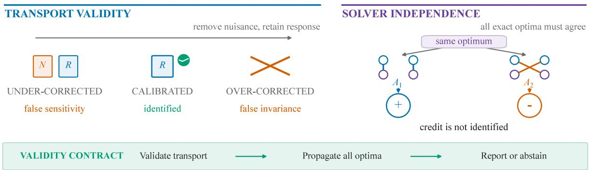
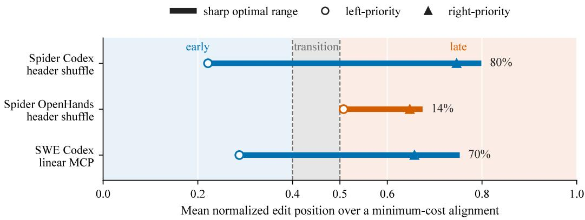
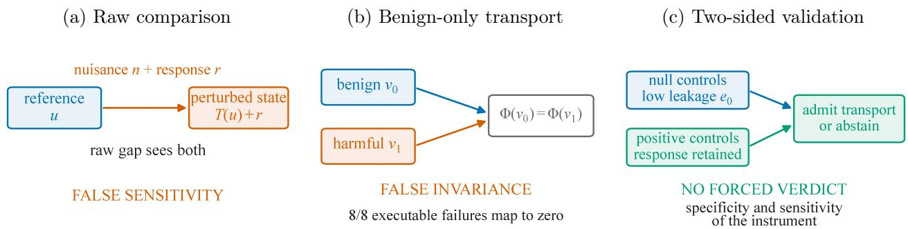

# Cross-View Correspondence Is a Measurement Intervention: Two-Sided Validation for Agent Evaluation and Credit Assignment

Zhen Zhang Ahmad Hafez Amr Alanwar

School of Computation, Information and Technology Technical University of Munich, Germany {zhenzhang.zhang, a.hafez, alanwar}@tum.de

## Abstract

Agent evaluations and trace-based learning often compare outputs across transformed views through a post-response correspondence treated as neutral preprocessing. We show that this correspondence is a measurement intervention: omitting it can manufacture sensitivity, an over aggressive map can manufacture invariance, and multiple optimal correspondences can leave mechanism labels and signed learning credit unidentified. We develop a validity theory and audit with three components: two-sided validation of nuisance removal and response preservation, all-optima identification of downstream conclusions, and uncertainty propagation after validity is established. We characterize the linear feasibility boundary for response-preserving nuisance removal, compute sharp ranges over exact-optimum correspondence sets, and give a distributionfree certificate that retains a credit coordinate only when all exact optima agree on its nonzero sign. Across public code and SQL pipelines, two deterministic optimal tracebacks disagree on temporal localization for 55.9% of 1,586 nonzero trajectory pairs; two frozen 800-rollout tool-use audits, including a task-and-seed-disjoint replication, expose exact-optimum reversals of intended turn-level credit, although a clean public quick-start subset shows none. A pre-registered transport gate failed on natural responses; frozen corrected and held-out controls then show that a map calibrated only on benign examples erases every retained harmful response, while two-sided validation selects response-preserving alternatives. Cross-view correspondence must therefore be declared, validated, and propagated into uncertainty before agent evaluation or credit assignment supports a point conclusion.

## 1 Introduction

An optimal matching can support opposite scientific conclusions. Suppose one reference tool call ties with two predicted calls. Either match preserves total score, yet credits a diferent turn and can induce opposite local credit after reward compilation. The objective is optimal but does not identify the downstream conclusion.

This problem arises whenever a pipeline transforms a prompt, tool schema, interface, repository, or observation before comparing agent behavior. The evaluator must then decide which elements correspond across views. We use correspondence for the full interface: cross-view transport, withinoutput matching, and completion of exact ties. Our central claim is that this interface is a measurement intervention, not neutral preprocessing. Unless a specific convention is part of the estimand, the scientific object is the set of conclusions supported by all legal correspondences, not the single conclusion returned by one solver run.

The intervention can fail in three directions (Figure 1). Omitting an appropriate transport leaves representational nuisance behind and manufactures sensitivity. A map calibrated only on benign examples can erase response-bearing diferences and manufacture invariance. Finally, several exact-optimal matchings can preserve the same scalar score while disagreeing on a mechanism label or signed learning credit. A cross-view point claim is therefore solver-independent only when the correspondence rule is declared, shown to remove nuisance without suppressing response, and supported by every legal exact optimum.

  
Figure 1: Correspondence validity has two parts. Transport must remove nuisance without erasing response, and all exact-optimal correspondences must support the same downstream conclusion. Our contract validates both requirements before returning a point, a common direction, or abstention.

Prior work separately studies declared transformations (Sclar et al., 2024; Ye et al., 2024; Yang et al., 2025; Li et al., 2026), unknown maps and acceptable matches (Gulrajani and Hashimoto, 2022; Lember et al., 2014; Morucci et al., 2022), and common-direction or structured inference (Sener and Koltun, 2018; Jaggi, 2013; Koller and Friedman, 2009). What is missing is one contract that validates the map, propagates every exact optimum, and certifies the resulting learning decision.

Our correspondence contract closes this gap; its contributions are as follows:

• A two-sided validity contract combines transport validation, all-optima identification, and subsequent uncertainty propagation.

• Legal-update geometry and a compiler-dependent frontier provide safe credit, common progress, compact certification, and a source-realizable hardness boundary.

• Natural audits expose hidden diagnosis and credit policies, repair a public strict metric, and preserve failed, corrected, and held-out falsification records.

The scope is not that every pipeline fails, but that a point conclusion requires a declared and validated correspondence contract.

## 2 Correspondence Contracts and Two-Sided Validity

Two levels of correspondence appear in the pipeline. We call the cross-view map ΦT a transport, and an assignment A between elements of two outputs a matching. The transport must be validated first; any remaining exact matching choices must then be propagated to the downstream conclusion. The two-way tie of Section 1 runs throughout.

The cross-view target. An audit fixes a task g and a base object $R _ { 0 }$ (prompt, tool schema, screen, repository), forms $R _ { 0 } ^ { \prime } = T ( R _ { 0 } )$ with a perturbation T intended to be semantics-preserving, and runs the same random agent $A _ { \omega }$ on both. Let $U = A _ { \omega } ( R _ { 0 } ) \in \mathcal { Z } _ { 0 }$ and $V = A _ { \omega } ( T ( R _ { 0 } ) ) \in \mathcal { Z } _ { T }$ be paired outputs. A transport $\Phi _ { T } : { \mathcal { Z } } _ { T } \to { \mathcal { Z } } _ { 0 }$ aligns the perturbed output with the original view. For a declared loss or distance d on $\mathcal { Z } _ { 0 }$ , the response of interest is

$$
J _ { T } ( \Phi _ { T } ) = \mathbb { E } [ d ( \Phi _ { T } ( V ) , U ) ] .\tag{1}
$$

Writing the raw gap $\mathbb { E } [ d ( V , U ) ]$ already assumes that the identity inclusion is a justified transport. For ${ \mathrm { A S T s } } .$ , renamed tools, GUIs, and trajectories, it often is not. For observed law P and declared class $\mathcal { P } _ { T }$ , the sharp population response set is

$$
\begin{array} { r } { \mathbb { Z } _ { T } ( P , \mathcal { P } _ { T } ) = \{ \mathbb { E } _ { P } [ d ( \Phi ( V ) , U ) ] : \Phi \in \mathcal { P } _ { T } \} . } \end{array}\tag{2}
$$

This set is sharp because $P$ does not select Φ: every declared Φ defines a compatible structural world and every admitted world uses one such map. A point claim therefore requires a declared map or agreement over the set; more samples cannot resolve an undeclared convention.

Consuming exact ties. Even after a transport has been declared, a lower-level matching objective can admit several exact assignments. The next definition records both the objective and what the pipeline does with that set.

Definition 1 (Correspondence contract). For input x, let $Q _ { x } ( A )$ be a correspondence objective with exact optimizer set $A _ { Q } ^ { \star } ( x )$ , and let $h ( A )$ be the downstream readout. A correspondence contract ${ \mathfrak { C } } = ( Q , \rho , h )$ declares both the objective and how its optimizer set is consumed. Policy ρ may be a deterministic selector s, a stochastic law π, or the requirement that the scientific conclusion be invariant over all admissible exact optima.

A deterministic tie-break defines a reproducible selector-relative target, but not a property independent of solver convention. A stochastic law defines another target and must state whether matching is sampled before or after downstream normalization. Soft matching changes $Q$ and hence the contract; it does not identify the original exact-optimum claim.

Why calibration must be two-sided. Let $\mathcal { C } _ { 0 }$ contain null controls $( u , v _ { 0 } )$ known to difer only by the inserted view, and define null leakage $\begin{array} { r } { e _ { 0 } ( \Phi ) = \operatorname* { s u p } _ { ( u , v _ { 0 } ) \in \mathcal { C } _ { 0 } } d ( \Phi ( v _ { 0 } ) , u ) } \end{array}$ . Small $e _ { 0 }$ prevents false sensitivity. It does not prevent false invariance. For a declared real-valued behavioral witness $q _ { T } : \mathcal { Z } _ { T } \to$ R and its original-view counterpart $q _ { 0 }$ , call $\Phi \ q { - } f a i t h f u l$ on V when $q _ { 0 } ( \Phi ( v ) ) = q _ { T } ( v )$ for every $v \in \mathcal V$ . When response magnitude is measured by a metric $d _ { T }$ , define the restricted response gain

$$
\kappa \mathcal { G } ( \Phi ) = \operatorname* { i n f } _ { ( v _ { 0 } , v _ { 1 } ) \in \mathcal { G } } \frac { d ( \Phi ( v _ { 1 } ) , \Phi ( v _ { 0 } ) ) } { d _ { T } ( v _ { 1 } , v _ { 0 } ) } ,\tag{3}
$$

over the positive-control response-pair set $\mathcal { G }$ with nonzero denominator (distinct from the response subspace R of part (c) and the transport class $\mathcal { P } _ { T } )$

Definition 2 (Two-sided alignment certificate). For declared null controls $\mathcal { C } _ { 0 }$ , response-bearing controls $\mathcal { G } _ { i }$ , and thresholds $\delta _ { 0 } \geq 0$ and $\kappa _ { 0 } > 0$ , a transport is certified when ${ e _ { 0 } ( \Phi ) \leq \delta _ { 0 } , \kappa _ { \mathcal { G } } ( \Phi ) \geq \kappa _ { 0 } }$ and every required behavioral witness is preserved. The certificate is relative to these controls and witnesses; it is not a claim of global semantic equivalence.

The following result explains why good reconstruction on benign examples is insuficient and gives a sharp linear boundary for simultaneously removing nuisance and retaining response.

Theorem 1 (Two-sided validity and its linear boundary). (a) One-sided insuficiency. Over an unrestricted transport class, any values of $e _ { 0 }$ on $\mathcal { C } _ { 0 }$ are compatible with $\kappa _ { \mathcal { G } } = 0$ on an untested response pair and with failure of q-faithfulness. Thus benign-only calibration cannot certify an invariance conclusion. (b) Witness certificate. If Φ is q-faithful and $q _ { 0 }$ is L-Lipschitz under d, then $| q _ { T } ( v _ { 1 } ) - q _ { T } ( v _ { 0 } ) | \leq L d ( \Phi ( v _ { 1 } ) , \Phi ( v _ { 0 } ) )$ ; transported invariance at radius τ therefore implies witness change at most Lτ . (c) Linear feasibility. In a finite-dimensional Hilbert space, let N and R be nuisance and response subspaces. A linear transport that kills N and has positive restricted gain on R exists if $\mathcal { N } \cap \mathcal { R } = \{ 0 \}$ . For orthogonal projection onto $\mathcal { N } ^ { \perp }$ , the gain is sin $\theta _ { \operatorname* { m i n } } ( \mathcal { R } , \mathcal { N } )$ , the sine of the smallest principal angle (Björck and Golub, 1973).

The proof mechanism is short. For $\mathrm { ( a ) }$ , leave every benign control fixed but map one untested response to its baseline; benign error is unchanged while response gain becomes zero. Part (b) follows directly from faithfulness and Lipschitzness. For (c), a shared nonzero response–nuisance direction must be annihilated by every nuisance-killing map; conversely, projection onto $\mathcal { N } ^ { \perp }$ is injective on $\mathcal { R }$ , and compactness of its unit sphere gives minimum gain sin $\theta _ { \operatorname* { m i n } } ( \mathcal { R } , \mathcal { N } )$ . Thus the theorem combines elementary validity implications and standard principal-angle geometry into a two-sided gate at the correspondence interface; App. A.1–A.2 give the identification and validity proofs in full. These arguments prove all three parts. Part (c) bounds linear transports only: the nonlinear source transformations audited in Section 4.4 are admitted by frozen controls, not by (c). The resulting refusal is explicit: invalid transport, correspondence-dependent conclusion, or statistical inconclusiveness.

## 3 Solver-Independent Credit: Geometry and Complexity

## 3.1 Legal Update Bodies and Safe Decisions

Validating the cross-view transport does not choose among tied output correspondences. We therefore carry every exact optimum through the same reward compiler and policy-score map, rather than treating one solver completion as the target.

Let $\mathcal { F } = \mathcal { A } _ { Q } ^ { \star } ( x )$ be the legal exact-correspondence set for a training group (the exact-optimum fiber), finite in every audited pipeline, so every body below is a compact polytope. Let $r ( A )$ be its fine-grained reward vector, N the declared reward compiler, and $S _ { \theta }$ the policy-score linear map at parameters θ. Each optimum produces $g _ { \theta } ( A ) = S _ { \theta } N ( r ( A ) )$ ). Their convex hull is the legal update body:

$$
\begin{array} { r } { \mathcal { K } _ { \theta } = \mathrm { c o n v } \{ g _ { \theta } ( A ) : A \in \mathcal { F } \} . } \end{array}\tag{4}
$$

A set and its convex hull share support functions, so convexification changes neither linear support nor the existence of a direction with positive inner product against every legal update. In the running two-way tie, $\mathcal { F }$ has two elements and $\displaystyle { \mathcal { K } } _ { \theta }$ is the line segment joining their compiled updates. The decision is whether that segment collapses to one point, stays strictly on one side of the origin, or reaches the origin.

Proposition 1 (Solver-independent update trichotomy). The update is solver-identified if $\displaystyle { \mathcal { K } } _ { \theta }$ is a singleton. A unit direction u with in $\Gamma _ { g \in \mathcal { K } _ { \theta } } \langle u , g \rangle > 0$ exists if $0 \not \in \mathcal { K } _ { \theta } . \ I f \ x ^ { \star }$ is the closest point in $\displaystyle { \mathcal { K } } _ { \theta }$ to the origin, then $u ^ { \star } = x ^ { \star } / \| x ^ { \star } \|$ certifies margin at least $\| x ^ { \star } \| . ~ I f 0 \in { \mathcal { K } } _ { \theta }$ , no strict common-progress direction exists.

This is the classical minimum-norm separation result used in multi-objective optimization (Fliege and Svaiter, 2000; Désidéri, 2012; Sener and Koltun, 2018); the new object is the body induced by compiling every legal correspondence. If each $F _ { A }$ is L-smooth with certified margin $m ,$ then

$F _ { A } ( \theta + \eta u ) \ge F _ { A } ( \theta ) + \eta m - L \eta ^ { 2 } / 2 ;$ hence every legal objective improves locally for $0 < \eta < 2 m / L$ $\left( \mathrm { A p p . ~ A . 6 } \right)$

The middle case can be certified without enumerating the entire body. A linear-support oracle for $\displaystyle { \mathcal { K } } _ { \theta }$ is enough to construct $x ^ { \star }$ with the classical fully corrective Frank–Wolfe/Gilbert procedure (Gilbert, 1966; Jaggi, 2013). At iterate $x ,$ one support query gives dual gap ζ and the explicit certificate

$$
\operatorname* { m i n } _ { g \in { \mathcal { K } } _ { \theta } } \langle x / \| x \| , g \rangle \geq \| x \| - \zeta / \| x \| .
$$

After median-norm rescaling, all 15 natural bodies reached $\zeta \leq 1 0 ^ { - 8 }$ in at most nine iterations (cap 1,000); direct full-hull QPs agreed within $8 . 3 3 \times 1 0 ^ { - 1 2 }$ . Coordinatewise diagnosis asks a diferent question. It keeps coordinate $j$ only when every $A \in { \mathcal { F } }$ has the same nonzero sign. This rule is pointwise maximal because any additional coordinate is zero or has the opposite sign under a legal optimum. Its vector need not lie in $\scriptstyle { \mathcal { K } } _ { \theta }$ and is not automatically a legal full-gradient update. Neither procedure invents a probability law over ties.

The compiler must be inside the body definition.

Proposition 2 (Relative-credit normalization trilemma). Let N be $C ^ { 1 }$ on a connected translationstable domain of nonconstant n-sample reward groups, $n \geq 3$ , and let 1 be the all-ones vector. Translation neutrality $N ( x + c mathbf { 1 } ) = N ( x )$ together with current-peer isolation $\partial N _ { i } / \partial x _ { j } = 0 \ f o r \ i \neq j$ forces N to be constant. On any ray-stable centered subdomain, exact scale neutrality $N ( a y ) = N ( y )$ implies $D N ( a y ) = a ^ { - 1 } D N ( y )$ , so a nonconstant N has no uniformly Lipschitz extension to zero dispersion. Finally, sampling an exact optimum before normalization and normalizing its fiber mean agree for every finitely supported law exactly when N is afine on the fiber hull.

Diferentiating translation neutrality yields $D N ( x ) { \bf 1 } = 0$ . Isolation makes the Jacobian diagonal, so it must vanish. Scale neutrality similarly yields $a D N ( a y ) = D N ( y )$ ; equality for every two-point law is segment preservation. The requirements therefore trade of peer dependence, stability near ties, and the order in which correspondence uncertainty is consumed $\left( \mathrm { A p p . ~ A . 3 – A . 5 } \right)$

## 3.2 A Compiler-Dependent Tractability Frontier

An update body may contain exponentially many completions without being hard to audit. The decisive object is the compiler: it determines whether local tie choices remain separate or become globally coupled.

Afine compilers. Suppose fiber i has at most q exact states. If r and N are afine on the product of exact assignment faces, Equation (4) has a polynomial-size extended formulation: support is a linear program and the closest point is a convex QP. Assignment polytopes are integral (Birkhof, 1946), so each face has exactly the exact matchings as vertices and the linear program is exact rather than a relaxation. Independent exact fibers give a Minkowski sum of local polytopes; constrained-zonotope representations support exact Minkowski sums through simple identities (Scott et al., 2016). Thus exponentially many completions need not imply exponential auditing.

Local nonlinear compilers. For a turn-local nonlinear compiler, a projected query factors as $c + \textstyle \sum _ { t } \psi _ { t } ( A _ { S _ { t } } )$ , where $S _ { t }$ contains the fibers whose choices change turn t. The compiler interaction graph joins fibers that co-occur in a factor. Standard min-sum elimination computes exact lower and upper support in $\mathrm { p o l y } ( n ) q ^ { w + 1 }$ time when this graph has treewidth w (Koller and Friedman, 2009). The graph is a property of the composed reward pipeline, not of the matching problems viewed separately. In all eight eligible natural groups its exact treewidth is at most three; min-sum elimination matches exhaustive lower support in all 45 frozen projected queries to $1 . 1 9 \times 1 0 ^ { - 1 9 }$

Shared normalization. Operationally, flag a compiler for joint all-optima auditing when an exact fiber is non-singleton, a group statistic is recomputed after tie completion, and normalization is non-afine on the fiber hull. The flag does not itself imply hardness. For $z \in \mathbb { R } ^ { n }$ , define $\mathrm { S t d } _ { \epsilon } ( z ) =$ $( z - \bar { z } { \bf 1 } ) / ( s ( z ) + \epsilon )$ , where $s ( z ) ^ { 2 } = ( n - 1 ) ^ { - 1 } \textstyle \sum _ { i } ( z _ { i } - \bar { z } ) ^ { 2 }$ . The audited dual-level compiler is $\begin{array} { r } { N _ { t , i } = \frac { 1 } { 2 } \operatorname { S t d } _ { \epsilon } ( G _ { t } ) _ { i } + \frac { 1 } { 2 } \operatorname { S t d } _ { \epsilon } ( R ) _ { i } } \end{array}$ , where $G _ { t }$ collects discounted turn-t returns and R scalar trajectory rewards. The theorem concerns this exact compiler: hardness comes from composition, not from finding one matching.

Theorem 2 (Group standardization is an Ising compiler). Fix rational discount $\gamma = 9 / 1 0$ and a positive rational $s t a b i l i z e r \epsilon$ (audited at the released $1 0 ^ { - 6 } \}$ . For every nonempty unweighted graph $G = ( V , E )$ with $m = | V |$ , there is a polynomial-size family of literal tool-call similarity instances such that: each ambiguous assignment fiber has exactly two exact optima; both preserve the same scalar trajectory reward; every trajectory total is equal; only two deterministic anchor trajectories carry the queried policy-score derivative; and the compiled gradient coordinate is

$$
\begin{array} { c } { { g _ { G } ( y ) = C _ { G } + { \cal J } _ { G } \displaystyle \sum _ { ( i , j ) \in E } y _ { i } y _ { j } , } } \\ { { y _ { i } \in \{ - 1 , + 1 \} , \qquad J _ { G } > 0 . } } \end{array}
$$

Adjacent cut sizes stay $\Omega ( m ^ { - 1 4 } )$ apart in support, so on a finite-bit promise formulation inversepolynomial-additive lower support is NP-hard and universal all-optima threshold certification is coNP-hard.

Proof idea. A cyclic assignment gadget gives each vertex two exact optima $y _ { i } \in \{ - 1 , + 1 \}$ Write $M = | E | , T = M + 1$ , and $N = m + 2$ . At the first M turns prescribe discounted returns $d _ { i , e } ^ { + } = \mathbf { 1 } \{ i \in e \}$ and $d _ { i } ^ { - } = - d _ { i } ^ { + }$ . Set $r _ { t } = d _ { t } - \gamma d _ { t + 1 } , r _ { T - 1 } = d _ { T - 1 }$ , and choose $d _ { T - 1 } = - [ d _ { 0 } +$ $\textstyle ( 1 - \gamma ) \sum _ { t = 1 } ^ { T - 2 } d _ { t } ] / ( 1 - \gamma )$ . Then each sign realizes the prescribed returns but has zero raw-reward total; two ±1 anchors use the same compensation. At $\theta = 0 .$ , one shared scalar two-action softmax realizes score derivatives $+ 1 , - 1 , 0$ from realized/alternative feature pairs $( + 1 , - 1 ) , ( - 1 , + 1 ) , ( 0 , 0 )$ Reusing $y _ { i }$ at every incident edge gives variable return group $\delta ( y _ { i } , y _ { j } , 0 , \dots , 0 , + 1 , - 1 )$ . Its unscaled variance is $v _ { e } ( y ) = [ 4 - ( y _ { i } + y _ { j } ) ^ { 2 } / N ] / ( N - 1 )$ , hence $v _ { \mathrm { c u t } } = 4 / ( N - 1 ) > v _ { \mathrm { u n c u t } } = 4 / N$ . Centering removes the common ofset, while the two anchors convert standardization into $\alpha ( v ) = \delta / ( \delta \sqrt { v } + \epsilon )$ Equal trajectory totals null the global branch, and $\alpha _ { \mathrm { c u t } } < \alpha _ { \mathrm { u n c u t } }$ gives $J _ { G } = ( \alpha _ { \mathrm { u n c u t } } - \alpha _ { \mathrm { c u t } } ) / 2 > 0$ Summing edges yields the displayed antiferromagnetic Hamiltonian, whose lower support encodes maximum cut (Garey et al., 1976). For finite-bit source realization, write each rational raw vector as integers $z _ { t } = 1 0 r _ { t } .$ , set $C _ { 0 } = ( T - 1 ) \operatorname* { m a x } _ { t } | z _ { t } | + 1$ , and place $C _ { 0 } + z _ { t }$ on identity cycle edges and $C _ { 0 } - z _ { t }$ on shifted-cycle edges. Pair-isolating parameter keys realize similarities $( 2 + c _ { i j } ) / ( L + 2 )$ with $L = 2 T C _ { 0 } ;$ every partial assignment improves to a full one, and any other permutation uses at most $T - 1$ cycle edges, so only the identity and cyclic shift attain $T C _ { 0 }$ . Their reward vectors are $K \mathbf { 1 } \pm \delta r$ , where $K = ( 2 + C _ { 0 } ) / ( L + 2 )$ and $\delta = 1 0 / ( L + 2 )$ , so both totals equal TK. Here $T = { \cal O } ( m ^ { 2 } ) , L = { \cal O } ( m ^ { 6 } )$ , and the return scale is $\Omega ( m ^ { - 6 } )$ ; the cut/uncut variance gap then gives adjacent support separation $\Omega ( m ^ { - 1 4 } )$ , so a polynomial-bit dyadic midpoint completes the Karp reduction. Independently, all 813 no-isolate graphs through five vertices (25,264 sign assignments), 105 literal call dictionaries, and extracted upstream code verify the three reduction layers (maximum numerical error $1 . 6 1 \times 1 0 ^ { - 6 } )$ . The result concerns data-dependent shared standardization, not a fixed external scale or centering alone. App. A.7 gives the full construction and gap bound; App. B.8 gives the conformance ledgers.

<table><tr><td></td><td>Contract / compiler Solver-invariant object</td><td>Exact method</td><td>Boundary</td></tr><tr><td>Declared selector</td><td>date</td><td>one assignment and up- assignment + compiler polynomial,</td><td>selector- relative</td></tr><tr><td>Affine on exact faces compact polytope</td><td></td><td>LP support; QP closest polynomial, all optima point</td><td></td></tr><tr><td>Local width w</td><td>nonlinear, finite factor graph</td><td>min-sum elimination</td><td> $\mathrm { p o l y } ( n ) q ^ { w + 1 }$ </td></tr><tr><td>dardizer</td><td>Shared group stan- coupled exact-tie states</td><td>support threshold</td><td>universal NP-hard / coNP-hard</td></tr></table>

Table 1: Complexity of all-optima auditing under diferent correspondence contracts and reward compilers. Afine and low-treewidth regimes admit exact classical algorithms; shared standardization reaches the hardness boundary in Theorem 2.

The gap is operational: one exact matching and its update remain polynomial in the construction, but certifying a threshold over every equally optimal completion is coNP-hard. Ising models, MAX-CUT, treewidth algorithms, and non-singleton bilevel optimization are not new; the contribution is the restricted source-level composition that creates this gap. It yields a constructive dispatch rule: use compact afine certification, exact low-treewidth elimination, or bounds/abstention instead of treating one cheap run as a certificate. Bounding is also the cheaper semantics: near-optima relaxation makes additive auditing NP-hard (Handler and Zang, 1980), and exact averaging over an optimal matching set is #P-hard (Valiant, 1979; Jerrum et al., 2004) (App. D).

## 4 Natural Consequences and Exact Repairs

Three audits test whether a readout is constant over all optimal correspondences—a temporal diagnosis, signed turn-level credit, and an advertised strict trajectory score—and a fourth tests transport validity. Pre-registered reanalysis, disjoint replication, a failed prospective gate, postdiagnostic correction, and pre-outcome held-out transfer are never pooled. Together they establish natural ambiguity and exact repairs, not final-policy efects or natural-case hardness.

## 4.1 Hidden Correspondence Dissolves Temporal Claims

Raj et al. (2026) compare base and perturbed agent trajectories with action-token Levenshtein metrics and weight later edits more heavily because early uncertainty can be expected while later deviations indicate unreliable execution. The resulting mechanism label depends on the selected correspondence. We leave their public action tokens, task outcomes, and unit edit objective unchanged. For each paired trajectory, let $\mathcal { A } ^ { \star }$ contain every minimum-cost alignment. A downstream diagnosis h(A) is identified by the metric only when it is constant on this set, min $_ { A \in { \mathcal { A } } ^ { \star } } h ( A ) = \operatorname* { m a x } _ { A \in { \mathcal { A } } ^ { \star } } h ( A )$ otherwise its reported value is fixed by a hidden tie-break rather than by the data. Every optimal path carries the same edit count, so additive min/max semirings over edge positions give sharp bounds on the mean position, and the same two-pass program over the optimal-path DAG decides constancy. We preregister early (< .40), late $( > . 5 0 )$ , and alignment-unidentified (the sharp range reaches both sides), requiring agreement under source-index and symmetric DP-state normalizations.

Across 1,699 released SWE-bench and Spider2-DBT pairs, 1,586 have nonzero edit distance. The threshold-free result is already substantial: deterministic left- versus right-priority optimal tracebacks give diferent temporal labels for 55.9% of non-null pairs, and mean sharp-range width is .466 for Codex versus .094 for the heterogeneous-action OpenHands control. Under the pre-registered early/late rule, 47.5% are alignment-unidentified under both normalizations. The ambiguity changes an aggregate conclusion, not only selected examples (Figure 2). For Spider Codex header\_shuffle, the sharp cell-mean range is [.221, .799] rather than a point near .217; for SWE Codex linear\_mcp, it is [.286, .753]. The same minimum edit count therefore supports either localization. The Spider OpenHands control is much tighter, [.498, .675], and never reaches the early regime.

  
Figure 2: Sharp temporal-localization ranges over minimum-cost trajectory alignments. Horizontal segments show the cell-mean edit position over all per-pair exact optima; symbols denote two deterministic optimal tracebacks. Percentages report pairs whose ranges span both the early (< .40) and late (> .50) regimes. Both homogeneous-action Codex cells cross the two regimes, whereas the heterogeneous-action OpenHands control does not reach the early regime.

The cleanest witness needs no model at all. Comparing one released M3-Bench trajectory to itself under its global Hungarian correspondence (Zhou et al., 2025) yields 32 exact optima— repeated identical names and canonicalized arguments hold every permutation of those copies at cosine one, so the ties are structural, not numerical—whose Order Consistency ranges over the full [0, 1] and whose Step Coherence ranges over [.43, 1]. No model, judge, or sampling noise explains that spread. A non-identical cross-revision pair spans [.44, .89], and the defect survives both dataset revisions. Across 260 task/assignment combinations, our implementation matches the oficial evaluator (maximum error 3.79 × 10−8). The auditors are exact for additive statistics on optimal-path DAGs and explicit optimal-assignment faces; general nonlinear statistics may require enumeration or certified bounds. This establishes metric non-identification across backends and domains, but not a model-ranking reversal, because M3-Bench releases no per-model predictions (App. B.2).

All frozen temporal controls pass: dominant-action share predicts range width (Spearman ρ = .606, 95% CI [.561, .647]). A preregistered endpoint convention gave 44.6% ambiguity; after matching the source paper’s state convention, the corrected value is 47.5%. Both versions reverse the same two aggregate cells, and frozen threshold sweeps span 43.2–49.4%. The audit changes no outcome, action count, or distance. Full ledgers are in App. B.1.

## 4.2 Hidden Correspondence Reverses Assigned Credit

MatchTIR (Qu et al., 2026) assigns dense turn rewards by bipartite matching between predicted and ground-truth tool traces, then combines turn- and trajectory-level advantages. Matching objective optimality does not imply credit identification: tied optima can distribute the same total similarity over diferent predicted calls. Before generation we froze the checkpoint, source revision, task rows, four rollout seeds, temperature 1, top-p 1, six turns, 768 new tokens per turn, the exact enumerator, and the promotion criteria. The frame holds 100 rows with repeated ground-truth tool names and 100 without; the released 4B checkpoint produced 800/800 trajectories. For trajectories with two to eight parsed calls, a bitmask program enumerates every unique per-call reward vector attaining the exact maximum-weight partial assignment. Frozen materiality requires two distinct predicted-call JSONs and reward width at least .10. In each four-rollout group, rewards are aggregated into turns, discounted at .9, standardized across rollouts at both turn and trajectory levels, and equally averaged. This is a consequence audit on the training distribution, not a held-out capability evaluation.

Our primary target is the multi-turn mechanism described in the source. The public quick-start does not visibly enable its default-of mask: reconstructing that path yields $6 / 2 0$ sign-flip groups over all material drivers, $1 / 9$ for all-distinct drivers, and $0 / 7$ after also removing tool errors. We therefore test whether the source-described compiler identifies local credit on natural rollouts, without inferring that an undocumented training run enabled the branch or that final policy quality changed; that last level remains unmeasured.

Under the source-described multi-turn branch, 495 trajectories are multi-call and 93 have material exact-optimum reward width (18.8%, row-clustered 95% CI [14.1, 24.0]%); every completion is exactly optimal. The intended multi-turn advantage reverses sign in $1 4 / 2 0$ afected task groups. As diagnostic coverage, the all-optima certificate retains $3 3 2 / 4 3 7 = 7 6 . 0 \%$ of canonical nonzero coordinates; its vector is not claimed to be a realizable full-gradient update. A task-and-seed-disjoint 800-rollout audit finds $1 4 / 2 2$ material groups with a reversal and retains $2 8 3 / 4 0 2 = 7 0 . 4 \%$ of exact strict signs with zero false signs. Seven groups contain a peer-only cross-sample sign-reversal witness. The overall frozen verdict is nevertheless Weak: only $5 / 1 1 = . 4 5 5$ witnesses clear both .05 margins (required .60), and the frozen risk score has AUC .589 (required .70).

The peer mechanism has an exact certificate. If independently matched rewards satisfy $x _ { i } \in [ \ell _ { i } , u _ { i } ]$ $w _ { i } = u _ { i } - \ell _ { i }$ , and $\begin{array} { r } { C _ { i } = x _ { i } - n ^ { - 1 } \sum _ { k } x _ { k } } \end{array}$ , then $C _ { i } \in [ L _ { i } , U _ { i } ]$ , where

$$
\begin{array} { r } { L _ { i } = ( ( n - 1 ) \ell _ { i } - \sum _ { j \neq i } u _ { j } ) / n , } \\ { U _ { i } = ( ( n - 1 ) u _ { i } - \sum _ { j \neq i } \ell _ { j } ) / n , } \\ { U _ { i } - L _ { i } = ( ( n - 1 ) w _ { i } + \sum _ { j \neq i } w _ { j } ) / n . } \end{array}
$$

The endpoints are attained by independent endpoint choices. Thus even $w _ { i } = 0$ inherits peer uncertainty, while division by a positive empirical scale preserves the centered-credit sign.

The hidden completion is a temporal credit policy. The released routine enumerates score edges in predicted-call order, stably sorts them by score, and greedily accepts them. Predicted calls are collected chronologically, so equal-score competition inherits an undeclared early-call priority not present in the matching objective. In a separately pre-registered analysis of the two frozen ledgers, we reversed only the call array presented to this selector and mapped its rewards back to the unchanged calls. Every reversed selection still attains the exact objective; every call, turn, and total reward is preserved.

The direction holds in all three public source strata and under aggregation by actual occupied turn, whereas 128 fixed random input permutations per trajectory reduce mean positional bias to about −.001. An independent implementation, a bitmask exact solver, and direct execution of the four relevant upstream functions agree on every retained trajectory, with original and reversed totals difering by at most $8 . 9 \times 1 0 ^ { - 1 6 }$ . Thus an order-free objective compiles into an order-sensitive learning policy solely through its hidden completion.

Pricing the declarable alternatives. The chronological selector is reproducible but favors earlier calls by .196 [.149, .246] and .174 [.133, .219], with negative slopes on 98.9% and 100% of trajectories. A uniform law over distinct exact-optimal reward vectors flips 20.1% of canonical nonzero coordinates in expectation; normalizing before versus after averaging disagrees in sign in $7 / 2 0$ and 8/22 groups. The all-optima certificate instead keeps 76.0% with zero false signs. These are local-credit non-identification results, not reported-score errors or measured policy-level efects (App. B.3–B.6).

## 4.3 A Natural Strictness Failure and Exact Repair

Earth-Agent (Feng et al., 2026) scores reasoning fidelity by “Tool-Exact-Match”. The source paper defines it as the longest common prefix over the ground-truth length, which gives a perfect value to any extension of a complete expected prefix, yet the paper reads the score as penalizing irrelevant extra steps.

For a nonempty reference r of length m and response p of length $n ,$ let $\ell ( r , p )$ be their exact name-prefix length. The source score is $s _ { \mathrm { r e f } } = \ell / m , \mathrm { s o } s _ { \mathrm { r e f } } ( r , r \parallel z ) = 1$ for every extra sufix z. Our frozen two-sided repair, $s _ { 2 } = \ell / \operatorname* { m a x } \{ m , n \} = \operatorname* { m i n } \{ \ell / m , \ell / n \}$ , equals one if and only if the complete name sequences agree, since $\ell \leq \operatorname* { m i n } \{ m , n \}$ forces $m = n = \ell ;$ full-call equality gives the analogous parameter certificate. This is conservative exactness accounting, not a claim to a new sequence metric.

Before reading prediction contents, we froze the public commit, the evaluator-defined RGB slice, 26 configurations, the repair, clustered inference, and six decision gates. Across 1,532 natural task-configuration cells, 218 non-exact traces receive source score one (14.23%, task-clustered 95% CI [7.58, 21.80]%). The defect appears in 22/26 configurations and 12/13 model families; 26.17% of cells change by at least .05. The repair creates nine pairwise ranking reversals and changes the top configuration from DeepSeek-V3.1 IF to GPT-4o AP. A source-parity script reproduces every saved score exactly; this CPU-only audit uses no model generation, LLM judge, or human labels. The top change survives all 59 leave-one-task-out omissions (App. B.11).

A post-hoc complete-case check retains defects in 23/26 configurations and all 13 families, with 18 pairwise reversals. In held-out MCPEval (Liu et al., 2025), 15/248 cells are false-perfect and one pair reverses, but frozen prevalence gates fail and its binary strict-success field already rejects extra calls. These metric-specific results neither judge extra-call semantics nor end-to-end accuracy.

Natural bodies are nontrivial but decision-redundant. Across 571 legal updates from 15 low-width tasks, median maximum pairwise angle is 25.13◦, 10/15 tasks exceed 15◦, and one reaches 161.90◦. Exact support still certifies the canonical update’s same 14 common-progress decisions and abstains once; the robust direction raises worst-case unit margin by median 6.4% and at most 28.3%. This post-hoc slice validates cheap low-width dispatch and certificate quality, not policy improvement (App. B.7).

## 4.4 Pre-Registered Two-Sided Transport Validation

To test the map itself, a pre-registered audit froze transport, null threshold $\tau = . 0 5$ , inference, one agent (gpt-5.5 at high reasoning efort, Codex CLI 0.144.5), and 24 paired three-stage trajectories; all 72 stages completed. Agent-free calibration gives zero residue on 133 held-out functions although T moves the region by median .134. On pylint, raw horizon-1 distance .175 matches the agent-free residue .176 and is 60.7× the largest within-view seed distance, so a raw point rule reads sensitivity;

the transported distance .019 is equivalent at τ, and both substrates appear invariant. The naturalresponse gate therefore failed. Later controlled and frozen checks diagnose this failure rather than retroactively pass it: benign reconstruction alone cannot establish response preservation.

The later gate compares destructive wrapper stripping, which removes outer wrapper logic, with call-site transport, which substitutes the helper at its call site while retaining preprocessing, postprocessing, exceptions, and return flow. Admission requires null-threshold compliance and preservation of each positive control’s signature and positive distance; candidates and selection rules were frozen before outcomes. We withdrew an earlier “8/8” cross-repository claim because four pylint test IDs did not exist, so its corrected witness is post-diagnostic; requests/pytest is separately pre-outcome held out. Wrapper stripping erases all 8/8 corrected and 8/8 held-out failures, while call-site transport preserves them. A frozen renaming/inversion gate similarly finds 10/16 failures erased by destructive maps versus 16/16 preserved by family-specific maps. On 36 natural states, call-site transport preserves every witness, reduces mean distance .1163 → .0244 (79.1%), and wins all four held-out folds with zero false invariance. Failed, corrected, and held-out records are never pooled (App. B.9–B.10).

## 5 Related Work

Unknown-map identification, extremal alignment, and robust matching are established (Gulrajani and Hashimoto, 2022; Lember et al., 2014; Morucci et al., 2022); process conformance also summarizes all optimal alignments (Bär et al., 2025). We borrow these tools but target the sharp downstream diagnosis or compiled update after validating the cross-view map. Probabilistic or soft matching instead declares a law or modified objective (Yousefi et al., 2019); known tie-breaking impossibilities do not show when a hidden completion becomes a replicated temporal policy (Feys, 2026).

Non-singleton lower levels, normalization pathologies, and GRPO gradients are established (Liu et al., 2020; Chen et al., 2024; Masiha et al., 2026; Liu et al., 2026; Fontana et al., 2026; Zhou et al., 2026). Our source-faithful interface composes these classical convex, MAX-CUT, and elimination tools (Fliege and Svaiter, 2000; Désidéri, 2012; Sener and Koltun, 2018; Jaggi, 2013; Garey et al., 1976; Koller and Friedman, 2009). Unlike perturbation and metamorphic tests of a declared statistic (Li et al., 2026; Mao et al., 2023; Murphy et al., 2008; Rauba et al., 2024), we first test whether correspondence identifies that statistic or update, using standard partial-identification machinery (Kaido et al., 2019; Scott et al., 2016).

## 6 Limitations and Conclusion

The natural gradient audit is post hoc and uses one 2,560-parameter tensor. Our worst-case construction is synthetic; finite-source executions are conformance checks. We establish neither final-policy degradation nor universal afectedness and do not know whether an undocumented MatchTIR run enabled the intended branch. The repaired strict metric is not end-to-end accuracy; the pre-registered downstream consequence remains Weak. Provider outputs lack immutable digests and controllable seeds; we test one agent family, one checkpoint, and one compiler family (App. C).

Within these boundaries, one returned optimum does not justify one conclusion. A correspondence contract records the objective, exact-optimum set, completion, normalization, and readout, then over all legal optima reports a point update, common-progress direction, or abstention. Hidden choices change diagnosis and signed credit under a fixed objective, and exact repair moves a public ranking.

Scope and navigation. Cross-references below use the numbering and labels of the main text. Appendix figures, tables, and equations carry an A-prefix so that they cannot be confused with maintext Figure 1, Figure 2, Table 1, or Equations (1)–(4). Appendix A restates and proves every formal main-text result. Appendix B gives additional experiments and robustness checks, with discovery, diagnostic, held-out, and post-hoc evidence kept separate. Appendix C states the exact claim boundaries, and Appendix D records the computational boundary of solver-independent auditing. The appendix is therefore suficient to check the formal claims without relying on implementation details, while every empirical result retains its analysis unit, evidence status, and explicit nonclaim. Main-text claims and complete support.

<table><tr><td>Main-text claim</td><td>Complete support and boundary</td></tr><tr><td>Thm. 1 and Eqs. (1)−(3)</td><td>A.1–A.2 give the sharp identified set and complete proof of one-sided insufficiency, witness control, and the exact linear feasibility boundary. The boundary is linear; nonlinear maps are validated by declared</td></tr><tr><td>Props. 1–2 and Eq. (4)</td><td>controls. A.4-A.6: normalization trilemma, randomization order, legal-update trichotomy, and executable certificate; B.7 tests natural bodies. No</td></tr><tr><td>Thm. 2 and Table 1</td><td>final-policy guarantee is inferred. A.7: finite-bit reduction and tractable regimes; B.8: source-level con- formance; D: audit-cost boundary.</td></tr><tr><td>Natural results</td><td>Sec. 4.1/Fig. 2: B.1–B.2; Sec. 4.2: A.3 and B.3–B.6; Sec. 4.3: B.11; Sec. 4.4: A.2 and B.9–B.10. Table A1 records denominators, evidence status, and nonclaims.</td></tr></table>

<table><tr><td colspan="2">Validity and scope map.</td></tr><tr><td>Potential concern</td><td>Decisive check and claim boundary</td></tr><tr><td>Solver bug or numerical near-tie</td><td>A.1 and B.1-B.3 use exact-optimum sets; B.3 includes objective-slack and all-distinct controls.</td></tr><tr><td>In-sample or backend-specific? Does random tie-breaking solve it?</td><td>B.2 changes domain and backend; B.4 changes tasks and seeds and reports every preregistered pass and failure. A.5 distinguishes sampling from marginalization; B.5 mea-</td></tr><tr><td></td><td>sures the resulting noncommutation in two independent samples.</td></tr><tr><td></td><td>Is Thm. 2 only a real-arithmetic sketch? A.7 gives source realizability, polynomial-bit separation, and a Karp reduction; B.8 and C delimit the natural-case claim. Coordinate correction changes the head- B.1 preserves the frozen endpoint result (44.6%) beside</td></tr><tr><td>line? MatchTIR branch is default-off</td><td>the source-state result (47.5%); both reverse the same two aggregate cells and the frozen sweep spans 43.2–49.4%. B.3 reports the reconstructed quick-start separately (6/20,</td></tr><tr><td></td><td>1/9, 0/7) and never pools it with the intended-branch re- sult. The claim is source-realizable non-identification, not deployment prevalence.</td></tr><tr><td></td><td>Outcome-driven transport or score repair B.9–B.10 retain the failed, post-diagnostic, and pre-outcome held-out gates separately; B.11 derives its exact repair from the public strictness contract before reading prediction contents.</td></tr><tr><td>No final-policy effect</td><td>B.11 supplies the measured operational consequence: nine pairwise model comparisons and the top-ranked configura- tion of a public benchmark, surviving all 59 leave-one-task- out omissions. Section C explicitly excludes unmeasured training and policy effects.</td></tr></table>

Contribution attribution. The appendix does not relabel established machinery as new theory. A.1–A.2 use standard partial-identification and principal-angle arguments; A.6 explicitly attributes minimum-norm separation to classical multi-objective optimization. The claimed technical novelty is the correspondence-induced composition: the compiler-dependent frontier and finite-bit construction in Theorem 2, together with natural audits showing that hidden exact completions alter diagnoses, signed credit, and a public ranking under fixed primary objectives.

## A Proofs

A.1 Identification relative to transport. Let P denote the observed joint law of (U, V) and let $\mathcal { P } _ { T }$ be the admissible transport class.

Proposition (Main-text Equations (1)–(2): identification relative to transport). The sharp population identified set is $\mathcal { Z } _ { T } ( P , \mathcal { P } _ { T } ) = \{ \mathbb { E } _ { P } [ d ( \Phi ( V ) , U ) ] : \Phi \in \mathcal { P } _ { T } \}$ . A singleton class point-identifies the response. If two admissible transports yield diferent expectations, the observation law alone cannot point-identify the response associated with the unknown transport. For compact $\mathcal { P } _ { T }$ and a continuous functional, the extrema are attained.

Proof. The observed law P fixes the distribution of $( U , V )$ but does not select an element of $\mathcal { P } _ { T }$ . For every admissible Φ, a structural world that shares P and uses Φ has response $j ( \Phi ) = \mathbb { E } _ { P } [ d ( \Phi ( V ) , U ) ]$ ; conversely every data-compatible world allowed by the model uses some $\Phi \in \mathcal { P } _ { T }$ . Hence the set of observationally compatible response values is exactly the displayed image, proving sharpness. A singleton image is point-identified. If $j ( \Phi _ { 0 } ) \neq j ( \Phi _ { 1 } )$ , the two worlds have the same P but diferent target values, so no measurable function of the observations can distinguish them. The unrestricted case is already witnessed by deterministic $U = V = 0$ on R, $d ( a , b ) = | a - b |$ , with $\Phi _ { 0 } ( z ) = z$ and $\Phi _ { 1 } ( z ) = z + 1$ , which give responses 0 and 1. Attainment of extrema follows from continuity on a compact class. □

The identified set need not itself be an interval for a nonconvex transport class. The paper reports its infimum and supremum because threshold decisions depend only on those extrema; that interval is the sharp interval hull. Randomized mixtures of admissible transports make the image an interval, but are not required for the non-identification claim.

Correspondence-contract semantics. For objective $Q _ { x }$ with exact optimizer set $\mathcal { A } _ { Q } ^ { \star } ( x )$ and readout h, the target is indexed by policy: a declared selector s defines $h ( s ( \mathcal { A } _ { Q } ^ { \star } ) )$ ; a declared law π defines $\mathbb { E } _ { A \sim \pi } [ h ( A ) ]$ ]; and a solver-invariant scientific claim is represented by the set $\{ h ( A ) : A \in \mathcal { A } _ { Q } ^ { \star } \}$ . The first target is algorithmically well-defined without being a solver-independent property of x. The third is sharp when every exact optimum is admissible and no scientifically justified selector or law further restricts the contract. Replacing Q by a soft objective changes the estimand rather than selecting within the original hard-optimum set.

## A.2 Two-sided correspondence validation.

Theorem (Main-text Theorem 1: two-sided validity and its linear boundary). Benign-only transport calibration does not certify response retention. If a transport is faithful for an L-Lipschitz behavioral witness, transported distance controls witness change. In the linear case, a nuisance-killing transport with positive response gain exists exactly when the nuisance and response subspaces intersect only at zero; orthogonal projection has gain equal to the sine of their smallest principal angle.

Part (c) takes the response subspace R to be nonzero. When $\mathcal { N } = \{ 0 \}$ , we use the standard limiting convention $\theta _ { \operatorname* { m i n } } ( \mathcal { R } , \mathcal { N } ) = \pi / 2$ , so the identity projection has gain one; a zero response subspace is vacuous for the positive-response question. Figure A1 isolates the transport-specific failure modes used by this certificate.

  
Figure A1: Transport-specific failure modes underlying two-sided certification. (a) Raw comparison conflates nuisance and response. (b) A map calibrated only on null controls can collapse harmful and benign states. (c) Two-sided validation separately tests nuisance leakage and response retention, admitting a transport only when both criteria pass.

Proof. For one-sided insuficiency, fix any transport values on the null-control points. Let $v _ { 0 }$ be a calibrated target-view null point and let $v _ { 1 }$ be an untested response point. Extend the transport to $v _ { 1 }$ by setting $\widetilde { \Phi } ( v _ { 1 } ) = \widetilde { \Phi } ( v _ { 0 } )$ , without changing it on any null control. The null leakage is unchanged, while the response pair has zero transported distance. Choosing a witness with $q _ { T } ( v _ { 1 } ) \neq q _ { T } ( v _ { 0 } )$ also violates witness faithfulness. Hence no bound on null leakage alone implies a positive response gain or faithful behavior.

For the witness certificate, faithfulness and Lipschitzness give directly

$$
\begin{array} { r l } & { | q _ { T } ( v _ { 1 } ) - q _ { T } ( v _ { 0 } ) | = | q _ { 0 } ( \Phi ( v _ { 1 } ) ) - q _ { 0 } ( \Phi ( v _ { 0 } ) ) | } \\ & { \qquad \leq L d ( \Phi ( v _ { 1 } ) , \Phi ( v _ { 0 } ) ) . } \end{array}
$$

For linear feasibility, suppose first that $0 \neq r \in \mathcal { R } \cap \mathcal { N }$ . Every linear map $P$ that kills $\mathcal { N }$ has $P r = 0$ , so its restricted response gain is zero. Conversely, if $\mathcal { R } \cap \mathcal { N } = \{ 0 \}$ , orthogonal projection $P _ { \mathcal { N } ^ { \bot } }$ is injective on $\mathcal { R }$ . The unit sphere in finite-dimensional R is compact, so the continuous map $r \mapsto \| P _ { \mathrm { \mathcal { N } ^ { \bot } } } r \|$ attains a strictly positive minimum. By the definition of principal angles, that minimum is sin $\theta _ { \operatorname* { m i n } } ( \mathcal { R } , \mathcal { N } )$ . Thus a positive-gain nuisance-killing map exists exactly under the stated intersection condition. □

A.3 Coordinatewise sign agreement as a diagnostic. Coordinatewise sign-agreement rule. Fix a canonical optimum $A _ { 0 } \in { \mathcal { A } } ^ { \star }$ and a nonzero canonical credit coordinate $a _ { i } ( A _ { 0 } )$ . Among coordinatewise rules that may only keep or zero this coordinate and that never keep it when its sign or nonzero status changes over $\mathcal { A } ^ { \star }$ , the unique pointwise-maximal rule keeps it if

$$
\{ \operatorname { s i g n } a _ { i } ( A ) : A \in { \mathcal { A } } ^ { \star } \} = \{ \operatorname { s i g n } a _ { i } ( A _ { 0 } ) \} .
$$

Proof. If the displayed equality holds, keeping the coordinate satisfies the required correspondenceuniform sign and nonzero condition. If it fails, some exact optimum gives either zero or a sign diferent from the canonical sign, so every valid keep-or-zero rule must zero that coordinate. Applying this argument independently to every coordinate proves feasibility and componentwise maximality. Uniqueness follows because any other pointwise-maximal rule must keep every feasible coordinate and zero every infeasible one. □

This rule concerns a declared set of exact optima. It neither chooses a probability law over that set nor guarantees final-policy improvement. The retained coordinate vector need not be an element of the legal update body, so the rule is a diagnostic sign certificate rather than an automatically valid full-gradient update. A distributional soft assignment answers a diferent question.

A.4 Relative-credit normalization tradeofs and constructive bounds. Let 1 be the all-ones vector and $V = \mathbf { 1 } ^ { \perp }$ . Current-peer isolation means $\partial N _ { i } / \partial x _ { j } = 0$ for every $j \neq i$

Theorem (Main-text Proposition 2, normalization clauses, plus a symmetric-peer corollary). Let N be $C ^ { 1 }$ on a connected, translation-stable domain of nonconstant n-sample reward groups, $n \geq 3$ (i) $I f N ( x + c \mathbf { 1 } ) = N ( x )$ and N is current-peer isolated, then N is constant. (ii) If the restriction of N to $V \setminus \{ 0 \}$ is exactly scale neutral, $N ( a y ) = N ( y )$ for $a > 0$ , then $D N ( a y ) = a ^ { - 1 } D N ( y )$ . A nonconstant N is not uniformly Lipschitz near zero dispersion and has no continuous nonconstant extension to the constant-reward line. (iii) If N is translation neutral and permutation equivariant, then at $x = ( u , v , \ldots , v )$ , writing $\alpha = \partial N _ { 1 } / \partial x _ { 1 }$ , every $j \neq 1$ satisfies $\partial N _ { 1 } / \partial x _ { j } = - \alpha / ( n - 1 )$

Proof. For (i), diferentiate translation neutrality in c to obtain $D N ( x ) { \bf 1 } = 0$ . Peer isolation makes $D N ( x )$ diagonal, so every diagonal entry is zero. Hence $D N = 0$ , and connectedness makes $N$ constant. For (ii), diferentiating $N ( a y ) = N ( y )$ with respect to y gives $a D N ( a y ) = D N ( y )$ . Since $V \setminus \{ 0 \}$ is connected for $n \geq 3$ , a nonconstant $C ^ { 1 }$ map has a nonzero derivative somewhere; its norm then diverges as $a ^ { - 1 }$ along that ray. A continuous extension at zero would instead give $\begin{array} { r } { N ( y ) = \operatorname* { l i m } _ { a \downarrow 0 } N ( a y ) = N ( 0 ) } \end{array}$ for every $y ,$ a contradiction. For (iii), permutations of coordinates $2 , \ldots , n$ fix $x ,$ so equivariance makes all first-row peer derivatives equal to some $\beta .$ Origin neutrality gives $\alpha + ( n - 1 ) \beta = 0$ □

These tradeofs are class-level: inverse-dispersion instability and peer influence are not peculiar to the standard-deviation formula. It also separates three repairs that are sometimes conflated. Let $P = I - \mathbf { 1 1 } ^ { \top } / n , y = P x$ , and

$$
N _ { \tau } ( x ) = \frac { y } { \sqrt { \| y \| ^ { 2 } / ( n - 1 ) + \tau ^ { 2 } } } , \qquad \tau > 0 .
$$

Its Jacobian on V has eigenvalue $1 / s$ orthogonal to y and $\tau ^ { 2 } / s ^ { 3 }$ along y, where $s ^ { 2 } = \| y \| ^ { 2 } / ( n - 1 ) + \tau ^ { 2 }$ the common direction is annihilated. Therefore $\| D N _ { \tau } ( x ) \| _ { 2  2 } \leq 1 / \tau$ globally. Damping preserves translation neutrality and caps magnitude amplification, but deliberately gives up exact scale neutrality near ties and does not certify a sign. By contrast, $( x _ { i } - b ) / \sigma$ with an independently estimated b and $\sigma > 0$ is $1 / \sigma \mathrm { - L i p s c h i t z }$ and has zero current-peer derivatives, but replaces withingroup origin and scale neutrality by covariance with a declared external anchor. Finally, the all-optima mask in A.3 addresses the upstream set-valued fiber: it retains only signs shared by every exact optimum. These guarantees are complementary, not claims that one normalizer is universally optimal.

A.5 Randomization order and the credit estimand. Let $r ( A )$ be the reward vector induced by exact optimum $A \in { \mathcal { A } } ^ { \star }$ , let $\pi$ be a declared law over exact optima, and let N denote the downstream relative normalizer acting on the joint reward vector.

Proposition (Main-text Proposition 2, randomization clause: normalization noncommutation). The two randomized-credit targets

$$
\begin{array} { r } { C _ { \mathrm { E N A } } = \mathbb { E } _ { A \sim \pi } [ N ( r ( A ) ) ] , } \\ { C _ { \mathrm { N A E } } = N ( \mathbb { E } _ { A \sim \pi } [ r ( A ) ] ) } \end{array}
$$

need not agree. They agree for every finitely supported law on the reward fiber if and only if N is afine on its convex hull. Hence a random tie-breaking law alone does not identify credit unless the compiler also declares whether matching is sampled before normalization or marginalized before normalization.

Proof. If N is afine, it preserves every finite convex combination, giving equality. Conversely, suppose the equality holds for every finitely supported π. Every point in the convex hull of the reward fiber is a finite convex combination of fiber points, and the displayed equality says that N maps each such combination to the same combination of its images. This is precisely afinity on that convex hull. Sampling an optimum and then normalizing computes $C _ { \mathrm { E N A } } ;$ averaging rewards over the fiber and then normalizing computes $C _ { \mathrm { N A E } }$ . Without afinity or a declared order, the two are distinct estimands. □

Standard centering followed by division by a sample-dependent scale is non-afine. Equality can still hold accidentally for a particular fiber or law; the proposition says it cannot be presumed from randomization itself. This is an application of the elementary preservation-of-mixtures criterion, not a claim of a new general theorem about nonlinear expectations.

A.6 Classical separation applied to the legal update body. For a fixed parameter value θ, write $\mathcal { U } _ { \theta } = \{ g _ { \theta } ( A ) : A \in \mathcal { F } \}$ and $\mathcal { K } _ { \theta } = \mathrm { c o n v } ( \mathcal { U } _ { \theta } )$ . The exact fiber is finite in the audited pipelines; the same statements hold for compact fibers and continuous $g _ { \boldsymbol { \theta } }$ . The following is the classical minimum-norm separation characterization applied to this correspondence-induced body (Fliege and Svaiter, 2000; Désidéri, 2012; Sener and Koltun, 2018).

Theorem (Main-text Proposition 1: solver-independent update trichotomy). (i) The update is identified $i f \ K _ { \theta }$ is a singleton. (ii) A unit vector u and margin $m > 0$ satisfying in $\mathrm { f } _ { g \in \mathcal { K } _ { \theta } } \langle u , g \rangle \geq$ m exist $i f f 0 \notin { \mathcal { K } } _ { \theta } . \ I f x ^ { \star } = \arg \operatorname* { m i n } _ { x \in { \mathcal { K } } _ { \theta } } \left\| x \right\|$ , then $u ^ { \star } = x ^ { \star } / \| x ^ { \star } \|$ has margin at least $\| x ^ { \star } \| . ~ ( \operatorname { i i i } ) ~ I f 0 \in K _ { \theta }$ no strict common-progress direction exists.

Proof. Part (i) is the definition of solver-invariant point identification. If $0 \not \in { \cal K } _ { \theta }$ , compact convex separation gives a strict separating direction. More explicitly, the projection optimality condition for $x ^ { \star }$ is $\left. g - x ^ { \star } , x ^ { \star } \right. \geq 0$ for every $g \in { \mathcal { K } } _ { \theta }$ . Dividing by $\| x ^ { \star } \|$ yields $\langle u ^ { \star } , g \rangle \geq \| x ^ { \star } \| > 0$ . Conversely, if $\begin{array} { r } { 0 = \sum _ { i } \lambda _ { j } g _ { j } \in \mathcal { K } _ { \theta } } \end{array}$ and one u had $\langle u , g \rangle > 0$ for every legal $^ { g , }$ then $0 = \langle u , \textstyle \sum _ { j } \lambda _ { j } g _ { j } \rangle > 0$ , a contradiction. □

If every legal compiled objective $F _ { A }$ is L-smooth at θ and $\nabla F _ { A } ( \theta ) = g _ { \theta } ( A )$ , the ascent lemma gives

$$
F _ { A } ( \theta + \eta u ) \geq F _ { A } ( \theta ) + \eta \langle u , g _ { \theta } ( A ) \rangle - \frac { L \eta ^ { 2 } } { 2 } .
$$

Thus a certified margin m improves every legal objective for $0 < \eta < 2 m / L$ . This is a local common-improvement statement, not a claim about an entire training trajectory.

The closest point can be approximated from a linear minimization oracle. At iterate $x \neq 0$ , let $s ( x ) \in \arg \operatorname* { m i n } _ { g \in \mathcal { K } _ { \theta } } \langle x , g \rangle$ and define the Frank–Wolfe gap $\zeta = \langle x , x - s ( x ) \rangle$ ⟩. Then

$$
\operatorname* { m i n } _ { g \in { \mathcal { K } } _ { \theta } } \left. { \frac { x } { \| x \| } } , g \right. = { \frac { \| x \| ^ { 2 } - \zeta } { \| x \| } } = \| x \| - { \frac { \zeta } { \| x \| } } .
$$

Consequently, $\zeta < \| x \| ^ { 2 }$ is an executable strict-progress certificate at any iteration. Fully corrective Frank–Wolfe/Gilbert optimization over the active oracle vertices is the standard procedure used in our implementation (Gilbert, 1966; Jaggi, 2013); no new convergence rate is claimed. Each iteration adds one support-oracle vertex and then reoptimizes the weights over the active hull. Because the audited natural gradients have norm near $1 0 ^ { - 3 }$ , the points are first divided by their median norm; the run then stops when the Frank–Wolfe gap satisfies $\zeta \leq 1 0 ^ { - 8 }$ on that rescaled problem, with an iteration cap of 1,000. All 15 audited task bodies met the gap criterion, using at most 9 iterations, so no reported dispatch decision was truncated by the cap.

A.7 Compiler tractability frontier. This section gives the complete proof of main-text Theorem 2 (the main text) and the tractability statements summarized in main-text Table $1 \ ( \mathrm { p . \ 5 } )$ It first establishes the afine and bounded-interaction regimes, then gives a source-realizable finite-bit reduction for shared standardization. The reduction is a worst-case compiler result; B.8 and C state the implementation checks and natural-case limits separately.

Theorem (Main-text Theorem 2: group standardization is an Ising compiler). Fix rational discount $\gamma = 9 / 1 0$ and a positive rational stabilizer ϵ. For every nonempty unweighted graph $G = ( V , E )$ with $m = | V |$ , there is a polynomial-size family of literal tool-call similarity instances such that each ambiguous assignment fiber has exactly two exact optima, both preserve the same scalar trajectory reward, every trajectory total is equal, only two deterministic anchor trajectories carry the queried policy-score derivative, and the compiled gradient coordinate is

$$
\begin{array} { c } { { g _ { G } ( y ) = C _ { G } + { \cal J } _ { G } \displaystyle \sum _ { ( i , j ) \in E } y _ { i } y _ { j } , } } \\ { { y _ { i } \in \{ - 1 , + 1 \} , \qquad J _ { G } > 0 . } } \end{array}
$$

Adjacent cut sizes stay $\Omega ( m ^ { - 1 4 } )$ apart in support. On the corresponding finite-bit promise formulation, inverse-polynomial-additive lower support is NP-hard and universal all-optima threshold certification is coNP-hard.

Afine exact-face formulation. Let fiber i be the set of integral exact optima of a bipartite assignment problem. Its convex hull $P _ { i }$ has the usual row/column assignment constraints plus the equality fixing the optimal objective value. Assignment integrality implies that the vertices of $P _ { i }$ are exactly the integral exact optima. If the compiled update is afine in the product variable $z = ( z _ { 1 } , \ldots , z _ { k } ) \in P _ { 1 } \times \cdot \cdot \cdot \times P _ { k }$

$$
g ( z ) = c + M z ,
$$

then the legal update body is exactly $g ( P _ { 1 } \times \cdots \times P _ { k } )$ . Directional support is an LP over this compact extended formulation, and the closest point to the origin is a convex $\mathrm { Q P }$ (or its epigraph SOCP). If every $P _ { i }$ is a segment with endpoints $p _ { i } ^ { - } , p _ { i } ^ { + }$ , then

$$
K = c ^ { \prime } + \sum _ { i } [ - v _ { i } , v _ { i } ] , \qquad v _ { i } = { \frac { M ( p _ { i } ^ { + } - p _ { i } ^ { - } ) } { 2 } } ,
$$

a translated zonotope. These are standard polyhedral facts; the contribution is identifying the exact correspondence face as the uncertainty source consumed by the reward compiler.

Local nonlinear factorization. Let finite fiber state $a _ { i }$ range over $\mathcal { A } _ { i } , | \mathcal { A } _ { i } | \leq q$ . If turn t depends only on states $a _ { S _ { t } }$ , any fixed projected compiler query has the exact form

$$
g ( a _ { 1 } , \dots , a _ { k } ) = c + \sum _ { t } \psi _ { t } ( a _ { S _ { t } } ) .
$$

Join two variables when they co-occur in a factor. Given a tree decomposition of width $w ,$ assign each factor to a bag containing its scope and eliminate variables by the standard min-sum recursion.

Every intermediate table has at most $q ^ { w + 1 }$ entries, giving time $\mathrm { p o l y } ( n ) q ^ { w + 1 }$ and memory $\mathrm { p o l y } ( n ) q ^ { w }$ ; replacing min by max gives upper support. This is standard graphical model variable elimination (Koller and Friedman, 2009). Backpointers recover the minimizing exact correspondence required by the support-oracle method.

Proof of Main-text Theorem 2.. Restricted Ising representation. We now prove the non-afine converse used in the main-text Ising compiler theorem. Let $G = ( V , E )$ be a nonempty unweighted graph. Isolated vertices can be deleted. Write $m = | V | , M = | E | , T = M + 1$ , and $N = m + 2$ . There is one ambiguous trajectory per vertex and two deterministic anchor trajectories.

Index the first M turns by edges. For vertex i, prescribe desired discounted returns $d _ { i , e } ^ { + } = 1$ when e is incident to i and 0 otherwise; define $d _ { i } ^ { - } = - d _ { i } ^ { + }$ . The final desired return is chosen so that the undiscounted raw-reward total is zero. In detail, for $0 \leq t < T - 1$ set $r _ { t } = d _ { t } - \gamma d _ { t + 1 }$ and $r _ { T - 1 } = d _ { T - 1 }$ . Since

$$
\sum _ { t = 0 } ^ { T - 1 } r _ { t } = d _ { 0 } + ( 1 - \gamma ) \sum _ { t = 1 } ^ { T - 1 } d _ { t } ,
$$

setting $\begin{array} { r } { d _ { T - 1 } = - [ d _ { 0 } + ( 1 - \gamma ) \sum _ { t = 1 } ^ { T - 2 } d _ { t } ] / ( 1 - \gamma ) } \end{array}$ makes this total zero. The positive anchor uses desired return +1 at every edge turn and the same compensation; the negative anchor is its negation.

For one zero-total rational raw vector r, take common denominator $D = 1 0$ and integers $z _ { t } = D r _ { t }$ Let $R = \operatorname* { m a x } _ { t } | z _ { t } |$ and $C _ { 0 } = ( T - 1 ) R + 1$ . Construct a $T \times T$ agreement-count matrix with $C _ { 0 } + z _ { t }$ on identity edge $( t , t ) , C _ { 0 } - z _ { t }$ on cyclic edge $( t , t + 1$ mod $T )$ , and zero elsewhere. Give every predicted and reference call the same tool name and the same $L = 2 T C _ { 0 }$ parameter keys. A key dedicated to pair $( i , j )$ has equal values only for that pair; all remaining values are distinct. The released similarity is therefore

$$
s _ { i j } = \frac { 2 + c _ { i j } } { L + 2 } .
$$

Identity and cyclic shift each collect bonus $T C _ { 0 } . \mathrm { ~ A ~ }$ ny other full permutation uses at most $T - 1$ cycle edges and has bonus at most $( T - 1 ) ( C _ { 0 } + R ) < T C _ { 0 }$ . Since every edge has a positive baseline, every partial assignment can be strictly improved by completion. Hence the exact fiber has precisely the two designated optima. Their raw reward vectors are $K + \delta r$ and $K - \delta r .$ where $K = ( 2 + C _ { 0 } ) / ( L + 2 )$ and $\delta = D / ( L + 2 )$ , so both have scalar total TK. For each anchor, place its strictly positive agreement counts only on the diagonal. Every full matching receives the same positive name-match baseline, while only the diagonal receives all agreement bonuses; the full diagonal is therefore the unique optimum and has the same total $T K$

The common raw ofset produces only a turn-dependent ofset shared by all trajectories and vanishes under group centering. At edge $e = ( i , j )$ , the variable part of the discounted-return group is

$$
\delta ( y _ { i } , y _ { j } , 0 , \ldots , 0 , + 1 , - 1 ) , \qquad y _ { i } \in \{ - 1 , + 1 \} .
$$

Its unscaled sample variance is

$$
v _ { e } ( y ) = \frac { 4 - ( y _ { i } + y _ { j } ) ^ { 2 } / N } { N - 1 } .
$$

Thus $v _ { \mathrm { c u t } } = 4 / ( N - 1 )$ and $v _ { \mathrm { u n c u t } } = 4 / N$ . Give the two anchors projected policy-score derivatives +1 and −1, and all other trajectories derivative zero. After the compiler’s equal global/local mixture, the queried edge contribution is

$$
\alpha ( v ) = \frac { \delta } { \delta \sqrt { v } + \epsilon } .
$$

All trajectory totals are equal, so the global branch is zero. Since $\alpha _ { \mathrm { c u t } } < \alpha _ { \mathrm { u n c u t } }$

$$
\begin{array} { l } { { \displaystyle g _ { G } ( y ) = \alpha _ { \mathrm { c u t } } \mathrm { c u t } _ { G } ( y ) + \alpha _ { \mathrm { u n c u t } } \big ( { \cal M } - \mathrm { c u t } _ { G } ( y ) \big ) } } \\ { { \displaystyle ~ = C _ { G } + { \cal J } _ { G } \sum _ { ( i , j ) \in E } y _ { i } y _ { j } } } \end{array}
$$

for $J _ { G } = ( \alpha _ { \mathrm { u n c u t } } - \alpha _ { \mathrm { c u t } } ) / 2 > 0$ . Its minimizers are exactly maximum cuts.

The score pattern is itself realizable. At $\theta = 0$ , use a two-action softmax with realized and alternative features $( + 1 , - 1 )$ in the positive-anchor contexts, swap them in the negative-anchor contexts, and use (0, 0) elsewhere. The derivatives of the realized log probabilities are then +1, −1, 0 under one shared scalar parameter.

Finally, the reduction has polynomial bit complexity. Here $T = O ( m ^ { 2 } ) , R = O ( M ) , C _ { 0 } = O ( M ^ { 2 } )$ ， $L = O ( M ^ { 3 } ) = O ( m ^ { 6 } )$ , and $\delta = \Omega ( m ^ { - 6 } )$ . Moreover,

$$
\frac { 2 } { \sqrt { m + 1 } } - \frac { 2 } { \sqrt { m + 2 } } \geq ( m + 2 ) ^ { - 3 / 2 } ,
$$

so $\Delta = \alpha _ { \mathrm { u n c u t } } - \alpha _ { \mathrm { c u t } } = \Omega ( m ^ { - 1 4 } )$ for fixed positive rational ϵ. The lower support is $M \alpha _ { \mathrm { u n c u t } } -$ ∆ MaxCut(G). Given a MAX-CUT threshold $k ,$ define the midpoint $\tau _ { k } = M \alpha _ { \mathrm { u n c u t } } - ( k - \frac { 1 } { 2 } ) \Delta$ . If $\mathrm { M a x C u t } ( G ) \geq k$ , lower support is at most $\tau _ { k } - \Delta / 2 ;$ if MaxCut $( G ) \leq k - 1$ , it is at least $\tau _ { k } + \Delta / 2$ Square roots of polynomial-bit rationals admit polynomial-time dyadic enclosure, so approximating $\tau _ { k }$ within $\Delta / 8$ requires only polynomially many bits and preserves both promise sides. This is a finite-bit Karp reduction from unweighted MAX-CUT (Garey et al., 1976). Lower-support gap decision is NP-hard; a violating correspondence is an NP-hard search problem; and the universal threshold statement is coNP-hard. We claim neither completeness nor fixed-precision asymptotic hardness. □

## B Additional Experimental Evidence and Robustness

Each analysis below extends a main-text claim with an additional derivation, robustness check, or scope test. Table A1 separates analysis units, evidence status, supported claims, and explicit nonclaims. This prevents discovery, post-diagnostic, held-out, and post-hoc results from being pooled under one evidential label.

B.1 Sharp temporal localization over all optimal alignments. We downloaded the public normalized trajectories associated with Raj et al. (2026) and retained every released paired SWEbench or Spider2-DBT record. We exactly replicate the released action extractor: every nonempty tool name emitted by an agent step becomes one token. No tool is renamed, collapsed, or semantically matched in the primary analysis.

For sequences $a _ { 1 : n } , b _ { 1 : m }$ , let $D _ { i j }$ be the sufix unit-cost Levenshtein optimum. An edge $e : ( i , j ) $ $( i ^ { \prime } , j ^ { \prime } )$ is admissible exactly when its local cost plus $D _ { i ^ { \prime } j ^ { \prime } }$ equals $D _ { i j } ;$ these edges form the optimalalignment DAG. For each edit edge we record source position $i / n$ and symmetric DP-state position $\textstyle { \frac { 1 } { 2 } } ( i / n + j / m )$ . Every optimal path contains exactly $D _ { 0 0 }$ edits, so forward addition of edge positions with min/max semirings gives the sharp minimum and maximum mean position in $O ( n m )$ time and memory. Lowest/highest optimal paths are known sequence-alignment objects (Lember et al., 2014); our use is to bound an agent-evaluation mechanism claim, not to claim a new alignment algorithm.

The analysis and cutofs were frozen before the natural-data run. Exact-null and unique-token early/late anchors pass. We also exhaustively enumerate every alignment for all 961 binary sequence pairs of lengths zero through four; distance, optimal-path count, and all four extrema match the DAG program. This exhaustive finite-sequence validation was completed before analysis. Across 1,586 non-null pairs, 47.5% are alignment-unidentified under both normalizations. Left/right-priority optimal tracebacks difer in label for 55.9%. Dominant-token share predicts symmetric range width (ρ = .606, pair-bootstrap 95% CI [.561, .647]), and the natural heterogeneous-action control is narrower (OpenHands .094 versus Codex .466). Of the thirteen audited cells the source study attaches a directional early/late mechanism claim to three (two Codex, one OpenHands); both Codex claims reverse over equally optimal alignments and the heterogeneous-action OpenHands claim does not, consistent with the repeated-action mechanism. Collapsing all tokens, a response-destructive diagnostic excluded from evidence, raises ambiguity from 48.8% (on the 1,545 collapse-comparable pairs) to 93.0%.

<table><tr><td>Evidence</td><td colspan="2">Analysis unit Provenance</td><td></td><td>Supports</td><td colspan="2">Does not support</td></tr><tr><td>Temporal local- 1,586 nonzero frozen thresh- 47.5% ization</td><td>code/SQL pairs</td><td>reanalysis</td><td>all optima</td><td>lack</td><td>one first discovery of the source pa- olds and exact early/late label across per&#x27;s routing hazard; a claim about every trajectory metric pub- pre-registered 14.23% false-perfect; a new sequence metric;</td></tr><tr><td>Strict trajectory 1,532 repair</td><td>lic configuration cells</td><td></td><td></td><td>sals</td><td>task- source audit nine model-pair rever- changed end-to-end accuracy; universal benchmark affected- ness</td></tr><tr><td>covery MatchTIR</td><td>groups</td><td></td><td>reversal</td><td>age</td><td>MatchTIR dis- 20 materially frozen 800- 14/20 groups admit branch use in the released affected task rollout sample intended-creditsign training run; final-policy dam- 20 material reconstructed 6/20 reversals; 0/7 in use of the intended branch;</td></tr><tr><td>quick-start</td><td>distinct groups</td><td></td><td>groups; 7 clean public path the clean subset</td><td></td><td>final-policy effect MatchTIR repli- 22 materially task-and-seed- 14/22 groups replicate deployment prevalence outside</td></tr><tr><td>cation</td><td>groups</td><td></td><td>affected task disjoint frozen sign reversal sample</td><td></td><td>the sampled frame Natural update 15 frozen tasks, post-hoc cer- 14 common-progress cer- changed training decisions or</td></tr><tr><td>bodies Prospective</td><td>tensor</td><td></td><td>tion</td><td>one parameter tificate audit tificates and one absten- policy improvement</td><td>24 paired tra- pre-registered agent-free residue di- successful prospective response</td></tr><tr><td>transport Corrected wit- eight harmful post-</td><td>jectories, 72 stages</td><td></td><td></td><td>agnosis and a failed preservation natural-response gate</td><td>benign-perfect destruc- independent discovery evi-</td></tr><tr><td>nesses</td><td>controls</td><td></td><td>diagnostic frozen replica- all eight tion</td><td>tive transport can erase dence</td><td></td></tr><tr><td>port</td><td>controls</td><td>eight harmful held-out</td><td>Held-out trans- two benign and pre-outcome repositories</td><td>tion preserves all fail- generality ures</td><td>frozen two-sided selec- natural-agent or second-family</td></tr></table>

Table A1: Evidence map for the current manuscript. “Frozen” denotes a fixed analysis or protocol; “pre-registered” fixes its population, analysis, and decision criteria before outcomes; “held out” additionally means the listed tasks, seeds, repositories, or outcomes were not used to construct the audited rule. Post-diagnostic and post-hoc results are labeled and are not treated as independent confirmation. Fractions are descriptive for the stated denominator.

We disclose one coordinate-convention correction. The frozen first analysis placed an edit at its DP transition endpoint. Comparison with the source paper’s reported .217 position then exposed that the paper defines local weight at state $( i , j )$ . We preserved v1 and reran after changing only that coordinate convention: endpoint v1 gives 44.6% ambiguity and the same two reversing cells; source-state v2 gives 47.5%. The preregistered threshold sweep gives 43.2%, 47.5%, and 49.4% ambiguity at early/late cutofs (.35, .45), (.40, .50), and (.45, .55), with the same two aggregate reversals. Because v2 follows a disclosed post-v1 correction, we report both rather than describing v2 alone as pristine preregistered confirmation.

<table><tr><td>Cell</td><td>Nonzero pairs</td><td>Sharp source-state mean range</td><td>fied</td><td>Pairwise unidenti- Published directional claim &amp; audit consequence</td></tr><tr><td>Spider2-DBT / header shuffle</td><td>Codex / 64</td><td>[.211, .816]</td><td>79.7%</td><td>early; reversible over exact op- tima</td></tr><tr><td>Spider2-DBT header translation</td><td>Codex / 64</td><td>[.229, .774]</td><td>78.1%</td><td>none</td></tr><tr><td>Spider2-DBT/</td><td>Codex / 64</td><td>[.208, .827]</td><td>82.8%</td><td>none</td></tr><tr><td>timestamp Spider2-DBT / OpenHands / 64 header shuffle</td><td></td><td>[.510, .682]</td><td>14.1%</td><td>late; retained over exact optima</td></tr><tr><td>Spider2-DBT / OpenHands / 64 header translation</td><td></td><td>[.518, .685]</td><td>12.5%</td><td>none</td></tr><tr><td>Spider2-DBT / OpenHands / 63</td><td></td><td>[.525, .702]</td><td>12.7%</td><td>none</td></tr><tr><td>timestamp SWE-bench / Codex / injec- 389 tion</td><td></td><td>[.266, .687]</td><td>56.6%</td><td>none</td></tr><tr><td>SWE-bench / Codex / linear 499 MCP</td><td></td><td>[.298, .747]</td><td>70.1%</td><td>early; reversible over exact op-</td></tr><tr><td>SWE-bench / OpenHands / 57 injection</td><td></td><td>[.472, .517]</td><td>0.0%</td><td>tima none</td></tr><tr><td>SWE-bench / OpenHands / 8 linear MCP</td><td></td><td>[.415, .463]</td><td>0.0%</td><td>none</td></tr><tr><td>SWE-bench / OpenHands / 161 noise</td><td></td><td>[.457, .505]</td><td>1.2%</td><td>none</td></tr><tr><td>SWE-bench / OpenHands / 31 paraphrase</td><td></td><td>[.483, .531]</td><td>0.0%</td><td>none</td></tr><tr><td>SWE-bench / OpenHands / 58 translation</td><td></td><td>[.471, .531]</td><td>5.2%</td><td>none</td></tr></table>

Table A2: Complete cell-level ledger for the temporal-localization audit under the corrected sourcestate convention. A range is the interval between the aggregate mean of the per-pair sharp lower endpoints and the aggregate mean of the per-pair sharp upper endpoints. “Pairwise unidentified” is the fraction whose sharp range crosses the frozen early/late decision under both reported normalizations. Codex denotes Codex-GPT5mini and OpenHands denotes OpenHands-KimiK2.

B.2 Second natural audit: global matching (M3-Bench). A second public pipeline exhibits the same non-identification under a diferent alignment family (global Hungarian matching, not an edit-distance DAG) and domain (multi-modal medical/tool-use, not code/SQL). M3-Bench (Zhou et al., 2025) buckets tool calls by name and maximizes summed argument-embedding cosine by Hungarian assignment, then reads Order Consistency, Step Coherence, and Merge Purity of the chosen assignment. We audit the pinned paper-release ground truth and dataset revision without generating model output. Whenever the same tool name and canonicalized arguments recur across steps, every permutation of those copies keeps each edge at cosine one, so the assignment is a certified global tie, not an embedding near-tie. Enumerating these exact-tie faces and copying the upstream metric definitions, all 260 task/assignment combinations match the pinned oficial evaluator (max absolute diference: Order Consistency 0, Step Coherence 0, Merge Purity $3 . 7 9 \times 1 0 ^ { - 8 }$ , the expected float32 efect). Of 213 released rows (208 unique task IDs under a disclosed last-row rule), 14 carry a cross-step exact tie and a non-point structural score. Task 00130004 (medical) has 32 certified optima; compared to itself, Order Consistency ranges the full [0, 1], Step Coherence [.43, 1], Merge Purity [.31, 1]—a hidden tie-break can diagnose the identical trajectory as perfectly ordered or maximally inconsistent. Repeated identical calls are ordinary agent behavior (iterated slide or figure generation, repeated retrieval or query), not a pathology. The metric is non-identified when ordering depends most directly on these repeated calls. Self-comparison is an axiomatic positive control (no model, judge, or sampling noise can explain the range); a non-identical cross-revision pair for task 00170002 (paper release nine calls, current release eight) has four certified optima with Step Coherence [.44, .89], Order Consistency [.67, .82], Merge Purity [.61, .89]. The ambiguity persists across both public dataset revisions (14 tie-tasks in the paper release, 10 in the current release), so it is a standing structural property, not a fixed defect: the specific tie-tasks turn over (00130004 is paper-release-only; all 10 current ties are generatepowerpoint) but the repeated-call mechanism survives the churn. Because the repository releases no per-model predictions, this is a metric-identification failure, not a demonstrated model-ranking reversal. The multiplicity lives in the fixed reference, so any prediction inherits these ties even without repeating a call: routing a single predicted call into a reference bucket that already holds identical copies sufices, and self-matching is the confound-free witness of a defect every prediction against these tie-tasks incurs. Algorithmic scope. Our two auditors share an interface but are not a universal solver: additive statistics on the Levenshtein optimal-path DAG and linear functionals over an explicit Hungarian optimal face admit exact sharp bounds; a general nonlinear statistic (e.g. inversion-based Order Consistency) may require enumeration or certified relaxations.

B.3 Natural learning audit: exact-optimum MatchTIR credit. MatchTIR (Qu et al., 2026) derives dense tool-call rewards by bipartite matching and combines turn-level with trajectorylevel advantage. We audit the released Qwen3-4B MatchTIR checkpoint, public training data, and released source version. The checkpoint supplies natural post-training rollouts on the distribution where the process reward is defined; this is not a held-out model comparison.

Study design. Before generation, we froze source/data versions, 200 task rows (half with repeated ground-truth tool names), four rollout seeds, temperature/top-p = 1, six turns, and 768 new tokens per turn. All 800/800 trajectories completed; 20 contain a tool error and parser attrition is zero. Outcome-blind memory-cap resumes changed no scientific setting.

Exact correspondence audit. For each trajectory with two to eight parsed calls, we reproduce the released sorted-edge greedy assignment, compute the exact maximum-weight partial one-toone objective, and enumerate every unique per-call reward vector attained by an exact optimum. A bitmask dynamic program is exponential only in the frozen at-most-eight reference calls; al retained groups are exactly enumerated, with no vector truncation or Cartesian-product exclusion. A trajectory is pre-registered as materially ambiguous when it has at least two distinct predicted-call JSONs and an exact-optimum per-call reward width at least .10. Row-clustered uncertainty uses 10,000 preregistered resamples of the 200 task rows.

Downstream credit. In each four-rollout task group, we reconstruct the intended .9-discounted turn returns and dual-level standardized advantage, enumerate the Cartesian product of exact-optimal reward vectors, and record every coordinate sign. The frozen gate required a prevalence-CI lower bound of 5%, at least 20 material groups and 20% sign-flip groups, at least 60% retained canonical nonzero coordinates, and coverage of at least two source strata.

All four criteria pass. Of 495 eligible rollouts, 93 are material (18.8%, row-clustered 95% CI [14.1, 24.0]%), spanning multi\_hop, parallel\_multi\_hop, and parallel\_single\_hop. The released greedy objective is never suboptimal. Of 20 material four-rollout groups, 14 admit an intended advantage-sign reversal. Across the 81 exactly enumerated groups, the strict mask retains 759/864 =

87.8% canonical nonzero coordinates. Restricted to material groups it retains $3 3 2 / 4 3 7 = 7 6 . 0 \%$ versus $1 4 4 / 4 3 7 = 3 3 . 0 \%$ under whole-group abstention; within the 14 sign-flip groups it retains $1 8 8 / 2 9 3 = 6 4 . 2 \%$ , versus zero under whole-group abstention.

Tie-breaking sensitivity. Under a post-hoc uniform law over distinct exact-optimal reward vectors, the discovery and replication samples give per-coordinate sign-change probabilities $. 2 0 1 / . 2 0 3 $ , mean task-level risks .547/.494, and nonzero risk in $1 4 / 2 0$ and $1 4 / 2 2$ groups. Thus the efect does not require an adversarial optimum, but these law-conditional quantities do not replace the distribution-free all-optima certificate.

Near-optimal sensitivity. We preregistered the relative-slack set $W ^ { \star } - W ( M ) \leq \rho \operatorname* { m a x } \{ | W ^ { \star } | , 1 \}$ Forced residual assignments give sharp coordinatewise ranges. Zero slack exactly reproduces the headline counts; no new material trajectory appears through $\rho = . 0 1$ in either sample. At .05, counts rise from 93 to 107 and from 90 to 116; the median slack required to create a .10 range is .20 in both samples. The claim is therefore stable to small solver tolerances. Soft matching remains a diferent estimand, while uniform tie-breaking requires a declared law.

Post-hoc hostile checks. Removing tool errors leaves $8 4 / 4 7 6 = 1 7 . 6 \%$ material rollouts; requiring distinct predicted-call JSONs leaves $2 9 / 4 0 8 = 7 . 1 \%$ ; imposing both leaves $2 4 / 3 9 4 = 6 . 1 \%$ . When only the nine clean all-distinct material rollouts vary, $5 / 7$ afected groups still reverse sign and the mask retains $1 5 0 / 1 5 9 = 9 4 . 3 \%$ canonical updates. Duplicates amplify but do not create the result.

Public-configuration boundary. The released quick-start invokes the multistep process scorer but does not visibly enable the default-of multi-turn mask. Reconstructing that efective sequence-mask path gives $6 / 2 0$ sign-flip groups over all material drivers, $1 / 9$ for all-distinct drivers, and $0 / 7$ after additionally removing tool errors. We therefore make no claim about an undocumented author override, final-policy degradation, or the reported benchmark scores. The primary result is about the turn-level mechanism described by the paper; the quick-start reconstruction is a disclosed boundary, not pooled with it.

B.4 Task-and-seed-held-out credit replication. The natural audit above establishes that the intended advantage can depend on a rollout’s own tied matching. We next asked a stricter question: can ambiguity in one rollout change the sign assigned to a diferent rollout whose own local reward is fixed? This is a nonlocal consequence of the group baseline, not a second matching ambiguity at the target.

Exact centering law. Consider one nondegenerate normalization cell containing n rollouts. Let rollout i’s scalar local reward range over $R _ { i } = [ \ell _ { i } , u _ { i } ]$ , with choices independent across rollouts because each trace is matched separately, and let $\begin{array} { r } { C _ { i } = x _ { i } - n ^ { - 1 } \sum _ { k = 1 } ^ { n } x _ { k } } \end{array}$ be its centered credit. Then its sharp identified interval is

$$
\begin{array} { l } { C _ { i } \in [ L _ { i } , U _ { i } ] , } \\ { L _ { i } = \displaystyle \frac { ( n - 1 ) \ell _ { i } - \sum _ { j \neq i } u _ { j } } { n } , } \\ { U _ { i } = \displaystyle \frac { ( n - 1 ) u _ { i } - \sum _ { j \neq i } \ell _ { j } } { n } . } \end{array}\tag{A1}
$$

Writing $w _ { i } = u _ { i } - \ell _ { i }$ , the width is exactly

$$
U _ { i } - L _ { i } = \frac { ( n - 1 ) w _ { i } + \sum _ { j \neq i } w _ { j } } { n } .\tag{A2}
$$

Both bounds are attained by choosing the displayed endpoint in every independently matched rollout. Consequently, even if the target is locally identified $( w _ { i } = 0 )$ , peer $j$ contributes exactly $w _ { j } / n$ to its centered-credit uncertainty. Standardization divides $C _ { i }$ by a positive empirical scale, so its sign is unchanged in a nondegenerate cell. Hence $L _ { i } > 0$ and $U _ { i } < 0$ certify positive and negative signs respectively; otherwise the rule abstains. The algebra is elementary. Its role is to expose why locally identified matching credit is not compositional under a coupled baseline and to provide a certificate that avoids Cartesian enumeration.

Frozen replication. Before inspecting a held-out outcome, we selected 200 task rows from the 1,440 eligible rows unused above, exactly matching the original repeated-name and source-stratum counts. We replaced all four rollout seeds with fresh values disjoint from discovery and retained the same checkpoint version, temperature, top-p, six-turn limit, and token limit. Thus neither task nor seed overlaps the first audit; the rows are not held out from checkpoint training. Six decision criteria were frozen before generation. Completion (800/800), material/sign-flip groups (22/14), direct contagion $( 7 / 1 4 = . 5 0 0$ , Wilson 95% CI [.268, .732]), and zero-false-sign recall $( 2 8 3 / 4 0 2 = . 7 0 4 )$ pass. Margin coverage $( 5 / 1 1 = . 4 5 5 )$ and the frozen risk score (AUC .589 versus the .70 threshold) fail, so the preregistered verdict is Weak, not Promote. The direct-contagion rate replicates the first audit’s $6 / 1 4 = . 4 2 9$ ; the risk ranking does not and is not refit.

Conditional mechanistic audit. Because C2 passed, we executed the separately frozen gradient audit on all 11 direct witnesses. To avoid treating a tied input/output embedding as an output-only parameter, the audit diferentiates the checkpoint’s 2,560-dimensional final-RMSNorm scale under the released sequence-mean/token-mean aggregation. All 166/166 scored turns round-trip exactly through the tokenizer. The median angle between correspondence-compatible group updates is $1 1 . 3 4 3 ^ { \circ }$ and the median relative displacement is .204; no witness reaches $4 5 ^ { \circ }$ or has a negative inner product. This audit is also Weak: correspondence measurably changes this parameter update, but the evidence does not license a large-gradient, full-parameter-training, or policy-quality claim.

The interval law additionally passes 8,750 randomized coordinate checks.

B.5 Independent compiler witness and randomization diagnostic. Randomization versus marginalization. We froze the two MatchTIR rollout samples, exact-optimum enumerator, uniform law over distinct optimal reward vectors, materiality rule, and promotion thresholds before comparing $\mathbb { E } [ N ( R _ { A } ) ]$ with $N ( \mathbb { E } [ R _ { A } ] )$ . In the discovery sample, $7 / 2 0 = 3 5 . 0 \%$ of material groups contain an opposite-sign coordinate and the median maximum absolute gap is .329; in the task-and-seed-disjoint sample the corresponding values are $8 / 2 2 = 3 6 . 4 \%$ and .241. The pooled cosines are nevertheless .988 and .990, and no held-out material group falls below cosine .90. The pre-registered geometry gate therefore fails in both samples. The result establishes a replicated local noncommutation diagnostic, not a large aggregate-gradient or final-policy efect.

LeTS source-level replication. LeTS (Zhang et al., 2025) constructs Jaccard process rewards for retrieval steps by one SciPy Hungarian assignment, standardizes the selected rewards within a rollout, and uses them to rescale group-relative learning credit. We froze the public source revision and exhaustively searched finite universes before inspecting any witness. For three pairwise-distinct current and three pairwise-distinct gold retrieval-result sets, the source-faithful Jaccard matrix

$$
\left[ \begin{array} { c c c } { { 1 } } & { { 1 / 2 } } & { { 1 / 3 } } \\ { { 0 } } & { { 0 } } & { { 1 / 3 } } \\ { { 1 / 2 } } & { { 1 / 3 } } & { { 2 / 3 } } \end{array} \right]
$$

has two exact assignments of total score $5 / 3$ . Their per-step rewards are $( 1 , 0 , 2 / 3 )$ and $( 1 , 1 / 3 , 1 / 3 )$ On the released negative-outcome branch with efective $\gamma = 1$ , the multiplier of the first fixed retrieval step is respectively +.127 and −.155. The released SciPy call returns only the latter optimum. Independent recomputation matches the extracted source function to floating-point precision.

This is an admitted source failure, not a prevalence estimate. The public training rollouts are not released. Moreover, the paper describes coeficient .1, while the frozen executable path leaves $\gamma = 1$ at this operation and does not consume the two shell-level .1 fields inspected in the audit. With coeficient .1, this witness changes multiplier magnitude but not sign. We therefore do not infer which coeficient produced the paper’s model, any efect on its reported results, or a final-policy consequence.

B.6 Hidden exact-tie completion as a temporal credit policy. The all-optima audit above asks whether intended credit is identified. We next froze a separate analysis asking which point the released implementation systematically selects from that fiber. This analysis reuses the two already frozen rollout samples; it performs no new model generation and does not alter their original preregistrations. Before computing an aggregate, we fixed the primary population, intervention, task-cluster bootstrap, and four promotion criteria. Primary trajectories have two to eight predicted calls, complete exact-vector enumeration, at least two distinct optimal reward vectors, distinct predictions, and exact-optimum reward width at least .10.

Source mechanism and intervention. The released routine constructs score edges in row-major predicted-call order, applies $\mathrm { P y }$ thon’s stable descending score sort, and greedily accepts an edge whenever its prediction and target remain free. The caller appends predicted calls chronologically. Hence score ties inherit temporal order as an unstated secondary key. Let $\mathcal { V } ^ { \star }$ be the set of distinct exact-optimal per-call reward vectors, let $\begin{array} { r } { \bar { r } = | \mathcal { V } ^ { \star } | ^ { - 1 } \sum _ { v \in \mathcal { V } ^ { \star } } v . } \end{array}$ , and let $r ^ { \mathrm { s r c } }$ be the released reward. The frozen intervention reverses only the row array given to the selector and maps the resulting reward $r ^ { \mathrm { r e v } }$ back to the original calls. It enters the analysis only when both selectors attain the independently computed exact objective.

For normalized call position $z _ { i } = i / ( m - 1 )$ , the trajectory bias is the slope of $r _ { i } ^ { \mathrm { s r c } } - \bar { r } _ { i }$ on $z _ { i } ;$ the reported contrast is the mean first-half minus last-half value. The promotion rule required, independently in both samples: at least 95% exact-objective preservation; early-minus-late contrast at least .05 with task-clustered 95% interval above zero; at least 65% negative within-trajectory slopes; and intended advantage-sign disagreement in at least 20% of afected four-rollout task groups.

<table><tr><td>Sample</td><td>n Exact</td><td>Bias [95% CI] Sign flips</td><td></td></tr><tr><td></td><td></td><td>Discovery 93 93/93 .196 [.149, .246]</td><td> $1 3 / 2 0$ </td></tr><tr><td>Held out </td><td></td><td>9090/90 .174 [.133, .219]</td><td>14/22</td></tr></table>

Negative slopes occur in $9 2 / 9 3 $ discovery and $9 0 / 9 0$ held-out trajectories. Thus all frozen criteria pass in both samples. This is not a solver-regret result: both the original and reversed completions attain the exact matching score, and their total rewards difer by at most $8 . 9 \times 1 0 ^ { - 1 6 }$

Independent hostile verification. An independent implementation and direct execution of four upstream functions agree on every retained scorer, selector, and objective value; all interventions preserve call multisets, turns, exact objectives, and totals. Re-aggregating over occupied turns gives contrasts .196 [.148, .247] and .173 [.134, .217], and all three source strata retain the direction. A post-hoc 128-permutation placebo reduces mean bias to about −.001 in both samples. The same $1 3 / 2 0$ and 14/22 groups retain positive-to-negative reversals when both advantages must be at least .05 from zero, ruling out a mere zero-crossing artifact.

Block characterization. If p ordered rows tie at score c for $q < p$ free columns, stable greedy completion credits the first $q$ rows, reversed enumeration credits the last $q ,$ and the fiber mean assigns $q c / p$ to each; all totals equal $q c .$ . The fact is elementary, but the frozen audits show that this hidden temporal policy reverses strict normalized learning signs in a released compiler.

Interpretation and boundary. Chronology can be a legitimate secondary objective, but then it is part of the reward contract and must be declared. The primary bipartite objective does not identify it. For a solver-invariant claim, the all-optima sign mask avoids inheriting that hidden policy; for a point-valued operational contract, a declared permutation-equivariant fractional or mixed completion is another option. Neither result proves that an undocumented training run enabled the branch or that changing the completion improves a final model.

B.7 Natural legal-update bodies and compiler interactions. This post-hoc analysis does not revise the frozen consequence gate. It uses both rollout samples, the exact reward enumerator, released compiler, and the complete 2,560-coordinate final-RMSNorm scale vector frozen in the original protocol. Other layers may have diferent geometry. For each task, we compile every exactoptimal reward product and form its gradient convex hull.

The primary cache contains 15 tasks and 571 exact completion combinations. Median maximum pairwise angle is $2 5 . 1 3 ^ { \circ }$ (task-bootstrap 95% CI [6.87, 51.87]); 10/15 tasks reach at least $1 5 ^ { \circ }$ ; median body diameter divided by median gradient norm is .451 (CI [.150, .802]); and median afine rank is 7. One task contains a negative-inner-product pair with angle 161.90◦. The canonical direction’s scalar support crosses zero in one task. Applying the fully corrective support-oracle procedure to the whole body gives 14 strict common-progress certificates and one abstention, uses at most nine oracle calls and six active vertices, and matches the direct full-hull QP within $8 . 3 3 \times 1 0 ^ { - 1 2 }$ . The canonical direction is already strict common progress on those same 14 tasks. The robust direction changes no binary decision in this slice but improves the worst-case unit margin by median 6.4% and at most 28.3%. This comparison is post hoc and establishes certificate quality, not a policy-performance gain.

A historically disjoint seven-task cache gives median maximum angle $1 7 . 2 0 ^ { \circ } , 4 / 7$ tasks above 15◦, median diameter-to-norm ratio .316, and common progress in all seven; this is a temporal replication, not a preregistered test.

Exact functional ANOVA finds nonzero higher-order energy in all eight multi-fiber tasks under the released standardizer (median 3.96%, range [.54, 10.33]%); freezing group statistics makes the compiler afine and drives the maximum below $7 . 1 \times 1 0 ^ { - 3 0 }$ . Their interaction graphs have median/max treewidth $2 / 3$ . Factor reconstruction and min-sum elimination match full enumeration on all $4 5 / 4 5$ frozen projected queries within $1 . 2 \times 1 0 ^ { - 1 9 }$

The frozen pre-registered consequence gate remains Weak: median angle $7 . 5 5 1 ^ { \circ }$ passed its directional threshold, normalized displacement .1317 missed .15, 26.7% exceeded $1 5 ^ { \circ }$ , and ambiguous mass was 11.6%. The post-hoc hull analysis changes the estimand from one canonical contrast to all legal updates; it does not turn this weak result into a policy-performance claim.

B.8 Source and complexity conformance audits. The theorem in $\mathrm { A } . 7$ is analytic. Executable tests are included only to falsify algebra, serialization, and implementation mistakes. An independent implementation checks all 813 no-isolate graphs through five vertices, 25,264 signs, and 160 gadgets with zero failures. Direct source calls recover exactly two vectors for 990 binary gadgets and one for 360 anchors. Literal call dictionaries preserve cut ordering in all 744 compiled assignments; the upstream PyTorch compiler matches the NumPy port on 420 random cases within $1 . 6 1 \times 1 0 ^ { - 6 }$ . Dyadic promise encodings through $m = 2 0 0 0$ use at most 109 denominator bits, and the full source/autograd chain preserves MAX-CUT minimizers through $m = 8$ . These checks test conformance, not asymptotic hardness.

The construction is intentionally synthetic and large: a loose serialized bound is $O ( m ^ { 9 } \log m )$ bits. The float checks do not establish fixed-precision asymptotic hardness.

<table><tr><td>Conformance check</td><td>Audited population</td><td>Exact result</td></tr><tr><td>Independent finite construction</td><td>813 no-isolate graphs zero failures through five vertices;</td><td></td></tr><tr><td>Binary source fibers</td><td>25,264 signs; 160 gadgets 990 binary gadgets</td><td>exactly two returned vectors per fiber</td></tr><tr><td>Anchor source fibers</td><td>360 anchors</td><td>exactly one returned vector per fiber</td></tr><tr><td></td><td>Literal call-dictionary compilation 744 compiled assignments</td><td>cut ordering preserved in every assign- ment</td></tr><tr><td>Upstream compiler versus inde- 420 random cases pendent port</td><td></td><td>maximum numerical discrepancy 1.61 ×  $1 0 ^ { - 6 }$ </td></tr><tr><td>Dyadic promise serialization</td><td>2000</td><td>graph sizes through m = at most 109 denominator bits</td></tr><tr><td>Full source/autograd chain</td><td>graph sizes through m = 8 MAX-CUT minimizers preserved</td><td></td></tr></table>

Table A3: Complete conformance ledger for the compiler construction. These checks falsify algebraic, serialization, and implementation errors in the finite construction; they are not evidence for averagecase hardness or for fixed-precision asymptotic hardness.

B.9 Prospective transport audit. This preregistered study is distinct from the banked audits. One gpt-5.5/high configuration ran all 24 paired trajectories and $7 2 / 7 2$ stages: two substrates, two views, six fresh seeds, three horizons, $\tau = . 0 5 , \hat { b } = 0$ , and Bonferroni $\alpha = . 0 5 / 2$ . A failed partial attempt contributes no data. The provider exposes neither immutable checkpoint digest nor controllable sampling seed, so bitwise regeneration is not claimed.

B.10 Two-sided transport-admissibility gates. The evidence has three nonexchangeable levels: a failed original natural-response gate, a post-diagnostic corrected-witness replication, and a later pre-outcome held-out validation. The original 2-repository × 4-mutation gate included four nonexistent pylint test nodes, whose “not found” output was misparsed. We withdraw its crossrepository 8/8 claim; only the four xarray cells were executable. The invalid run is disclosed here and excluded from evidence.

The replacement call-site transport substitutes the local implementation body at its actual call site, preserving wrapper-side preprocessing, postprocessing, exceptions, and return flow. In the corrected V3 witness, benign bases pass before/after and map to zero; all eight harmful controls retain identical failure signatures and positive distance. All four leave-one-family-out folds select this transport with zero false invariance. Across the 36 natural states used for selection, it reduces mean distance from .1163 to .0244 (79.1%). Because the witness was chosen after diagnosis, V3 is hypothesis-confirming, not independent discovery.

Before observing requests/pytest outcomes, we froze the implementation, candidate order, targets, tests, four mutation families, and seven conditions. The external matrix passes all seven: both benign views map to zero, all eight executable-harmful mutations preserve their failure signatures and positive distance, while a destructive transport erases all eight. A separately frozen family extension covers local alpha-renaming and branch inversion: all four benign pairs map to zero, all 16/16 harmful controls remain positive, and benign-perfect destructive maps erase 10/16. These results validate deterministic transfer across repositories and three transformation families, not new natural trajectories or a second agent family.

The separately frozen natural-response gate applies the exact paper transport to 36 evolved states. All baselines pass; response deletion occurs in all 18 xarray states and 0/18 pylint states, so the preregistered 75% and both-substrate conditions fail. The paper claims natural deletion only for xarray. A conservative exact-delegation guard accepts $2 / 2$ benign bases, rejects $8 / 8$ harmful wrappers, and safely abstains on all 36 evolved wrappers; the call-site transport covers all 36 while preserving their witnesses.

<table><tr><td>Audit</td><td>Status</td><td>Cells</td><td>False-perfect (clustered 95% CI)</td><td> $\Delta \geq . 0 5$ </td><td>Ranking effect</td><td></td></tr><tr><td>Earth-Agent RGB</td><td>pre-registered GO</td><td>1,532</td><td>14.23% [7.58, 21.80]%</td><td>26.17%</td><td>9 pair reversals; top changes</td><td></td></tr><tr><td>Earth-Agent common tasks</td><td>post-hoc robust- 5,278 ness</td><td></td><td>5.67% [3.45, 8.15]%</td><td>28.36%</td><td>18 pair reversals; top changes</td><td></td></tr><tr><td>MCPEval held pre-registered out</td><td>REDUCE</td><td>248</td><td>6.05% [2.82, 9.68]%</td><td>16.53%</td><td>1 pair reversal</td><td></td></tr></table>

Table A4: Natural audits of one-sided strict trajectory scores. The Earth-Agent RGB row is preregistered and primary. The complete-case row was designed after that verdict and is labeled post hoc. MCPEval is a weaker independent replication whose binary strict-success field already checks extra calls.

B.11 Natural strictness failure and exact repair. Public contract and source defect. Earth-Agent places Tool-Exact-Match in its step-by-step protocol and defines it as the longest common prefix divided by the ground-truth length, while attributing lower Tool-Exact-Match values to models that “introduce irrelevant steps” (Feng et al., 2026). Under that definition, steps appended after a complete correct prefix cost nothing. At the frozen source revision, the stepwise scorer stops at the first positional mismatch and divides the matching prefix by the number of expected calls. Its reported actual sequence is also truncated to the expected length. The parameter-accuracy helper has the same one-sided denominator for full call equality.

Proposition (Extension invariance and exact repair). Let r be a nonempty reference sequence, p a predicted sequence, and $\ell ( r , p )$ their exact prefix length. The reference-normalized score $s _ { \mathrm { r e f } } ( r , p ) =$ $\ell ( r , p ) / | r |$ assigns one to every extension $r \parallel z$ . The two-sided score $s _ { 2 } ( r , p ) = \ell ( r , p ) / \operatorname* { m a x } \{ | r | , | p | \}$ assigns one if and only $i f r = p$

Proof. For any sufix $z , \ell ( r , r \parallel z ) = | r |$ , proving the first statement. For the second, $s _ { 2 } = 1$ requires $\ell = \operatorname* { m a x } \{ | r | , | p | \}$ , while by definition $\ell \leq \operatorname* { m i n } \{ | r | , | p | \}$ ; hence both lengths equal ℓ and every position agrees. Equality of the complete sequences is suficient by substitution. For an empty reference we define score one only when the prediction is also empty. □

This repair is the minimum of reference coverage and prediction precision. We use it as a conservative certificate for the source’s advertised exactness contract, not as a new semantic similarity metric. Replacing name equality with name-and-input equality gives the parameter version.

Frozen protocol. Before reading prediction contents, the audit fixed the repository version, the evaluator-defined RGB slice (the final 59 of 247 ground-truth tasks), 26 named $\mathrm { A P / I F }$ configurations, at least 80% coverage eligibility, the name and parameter repairs, task-clustered bootstrap, and six decision gates. The preregistration and analysis were frozen before prediction contents were read. All 26 configurations are eligible; two cells are missing, leaving 1,532.

Primary result and parity. The pre-registered audit finds 218 name-level and 212 parameter-level false-perfect cells. Name defects occur in $2 2 / 2 6$ configurations and $1 2 / 1 3$ model families. The repaired name score changes nine pairwise comparisons and the top configuration from DeepSeek-V3.1 IF to GPT-4o AP (Kendall $\tau _ { b } = . 9 4 4 6 )$ . All exactness checks pass with zero repair errors. An independent source-parity check reproduces every saved oficial task score with maximum absolute diference zero. In post-hoc stress tests, the top change survives all 59 leave-one-task-out omissions; leave-one-family false-perfect prevalence stays in [13.7, 15.4]%.

Full-corpus and independent checks. The repository also contains predictions beyond the source evaluator’s RGB slice. An explicitly post-hoc available-case analysis covers 6,374 cells. To remove diferential missingness, an all-configuration complete-case analysis uses the 203 tasks observed for every configuration and finds the second row of Table A4: defects remain in 23/26 configurations and all 13 families, while the top configuration changes from Kimi-K2 IF to GPT-4o AP.

MCPEval (Liu et al., 2025) states that strict matching requires a generated trajectory exactly equal to ground truth and mainly reports a weighted overall score. At the frozen source revision, its binary strict-success field correctly checks extra calls, but name, parameter, and LCS order components use one-sided normalization inside the reported overall score. A discovery model was excluded before inspecting four held-out models. The held-out result in Table A4 misses its frozen prevalence and materiality gates, so it is supporting evidence only.

Independent reruns reproduce the frozen results exactly. These audits use no model generation, LLM judge, or human label. They correct the declared strict trajectory metric; they do not establish that extra calls are semantically harmful, alter end-to-end answer accuracy, or invalidate either source framework as a whole.

## C Extended Limitations and Scope

Contract-relative validity. Two-sided certification is relative to the declared null controls, positive controls, behavioral witnesses, and transport family. Passing those checks does not prove global semantic equivalence. The linear subspace theorem gives a sharp feasibility boundary for linear transports; it motivates, but does not by itself validate, the nonlinear source transformations used in the executable audits. Those transformations are validated by frozen tests and witnesses instead.

Natural-audit population. The temporal-alignment result concerns the released code and SQL trajectory pairs after excluding zero-edit pairs. The MatchTIR fractions condition on task groups with material exact-optimum reward width and are not estimates of ambiguity prevalence in an unrestricted deployment distribution. The discovery and task-and-seed-disjoint samples are reported separately, and the natural update-body analysis is post hoc rather than a pre-registered training comparison.

Learning-consequence boundary. The MatchTIR audit identifies turn rewards and intended advantage signs compatible with all exact-optimal correspondences on frozen post-training rollouts. The public quick-start does not visibly enable the intended multi-turn mask, and no published training trace exposes the assignment chosen at every update. Even with the branch enabled, a local sign reversal need not reduce final performance because later updates, trajectory-level credit, and optimization may compensate. A policy-level claim requires a frozen comparison of declared tie policies under one active training configuration. We report no such efect, and the pre-registered downstream consequence remains Weak.

Positive-control evidence levels. The prospective natural-response gate, the corrected-witness replication, and the later pre-outcome held-out validation are not exchangeable samples. The first failed, the second followed diagnosis, and only the third tests the frozen transport-selection rule on held-out repositories. They are never pooled into one success rate. The held-out result validates deterministic code transformations across four repositories, not new natural trajectories or a second agent family.

Complexity boundary. The shared-standardization reduction is a worst-case, finite-bit construction. Executable conformance checks falsify algebra and source-realizability errors but do not establish natural-case hardness or fixed-precision asymptotic hardness. The natural interaction graphs audited here have low treewidth and are exactly solvable. The theorem therefore separates compiler regimes; it does not claim that ordinary MatchTIR groups instantiate hard MAX-CUT cases.

Generality. Most reanalyses are deterministic from released or frozen samples. Provider-side agent outputs cannot be reproduced bitwise because immutable checkpoint digests and controllable sampling seeds were not available. The prospective transport audit uses one agent family, while the MatchTIR analysis uses one released checkpoint and one declared compiler family. Cross-model and cross-training-algorithm generality remain untested.

## D Computational Cost of Solver-Independent Auditing

The body audits report an envelope over an optimizer’s optimal set rather than a solver-returned point. Theorem 2 proves one compiler-dependent hardness boundary. This section introduces no additional complexity classification; it locates the diagnostics actually audited within the known landscape and gives a reporting rule when a backend leaves the tractable region.

D.1 Detection cost. For an additive readout h, deciding whether a point diagnosis is solverdetermined costs no more than its sharp envelope: the same two-pass dynamic program that returns min and max over the optimal-path DAG (Raj) decides constancy by comparing them, and an additive readout on an assignment face requires two min/max-cost matchings on the equality graph. For a nonlinear readout such as inversion-based Order Consistency, assignment multiplicity remains easy to detect, but multiplicity alone does not prove that h varies and no general two-matching claim is made. B.2 exactly enumerates the small public tie faces used in this paper.

D.2 Polynomial envelopes for the audited backends. For an additive diagnostic on a shortest-path DAG the endpoints are a two-pass DP; for an additive diagnostic on the optimalassignment face the endpoints are two min/max-cost matchings, and that face is an integral polytope (Birkhof–von Neumann (Birkhof, 1946)), so the extrema are attained at genuine matchings. Both audited pipelines fall in this region.

D.3 Complexity outside the audited backends. Two standard results bound what a genera solver-independent summary can cost; we cite them as the surrounding landscape, not as our contribution. First, once “optimal” is relaxed to near-optimal $( f \leq f ^ { \star } + \varepsilon )$ , optimizing an additive diagnostic over the enlarged set—the two additive edge weights being cost and diagnostic—is in general as hard as the resource-constrained shortest-path problem, which is NP-hard (Handler and Zang, 1980): exact-tie auditing can be easy while approximate-tie auditing is not. Second, exactly averaging even a linear diagnostic uniformly over an optimal matching set—a uniform edge-indicator average is the edge marginal $\mathrm { p e r } ( \cdot ) / \mathrm { p e r } -$ —is in general as hard as evaluating a permanent, hence #P-hard (Valiant, 1979), though it admits a fully polynomial randomized approximation scheme (Jerrum et al., 2004). Guarding (the sharp min / max) can thus be polynomial on the same fiber where exact fair averaging is intractable.

D.4 Reporting rule. Report the exact envelope where a polynomial backend applies, as both body audits do. Otherwise report a declared randomized estimate with its sampling error, or abstain, rather than reporting a single hidden tie-break as the diagnosis. This is guidance for deploying the auditor, not a claim that the paper’s diagnostics are hard: the cases we audit are exactly the tractable ones.

AI assistance. Generative AI supported language editing, exploratory code drafting, and literature search; the authors verified and retain responsibility for all content.

## References

Philipp Bär, Moe T. Wynn, and Sander Jacobus Johannes Leemans. A full picture in conformance checking: Eficiently summarizing all optimal alignments. In Business Process Management, volume 16044 of Lecture Notes in Computer Science, pages 69–87. Springer Nature Switzerland, 2025. doi: 10.1007/978-3-032-02867-9\_6.

Garrett Birkhof. Tres observaciones sobre el algebra lineal. Universidad Nacional de Tucumán, Revista A, 5:147–151, 1946.

Åke Björck and Gene H. Golub. Numerical methods for computing angles between linear subspaces. Mathematics of Computation, 27(123):579–594, 1973. doi: 10.1090/S0025-5718-1973-0348991-3.

Lesi Chen, Jing Xu, and Jingzhao Zhang. On finding small hyper-gradients in bilevel optimization: Hardness results and improved analysis. In Proceedings of the 37th Conference on Learning Theory, volume 247 of Proceedings of Machine Learning Research, pages 947–980, 2024. URL https://proceedings.mlr.press/v247/chen24a.html.

Jean-Antoine Désidéri. Multiple-gradient descent algorithm (MGDA) for multiobjective optimization. Comptes Rendus Mathématique, 350(5–6):313–318, 2012. doi: 10.1016/j.crma.2012.03.014. URL https://www.numdam.org/item/10.1016/j.crma.2012.03.014/.

Peilin Feng, Zhutao Lv, Junyan Ye, Xiaolei Wang, Xinjie Huo, Jinhua Yu, Wanghan Xu, Wenlong Zhang, Lei Bai, Conghui He, and Weijia Li. Earth-agent: Unlocking the full landscape of earth observation with agents. In International Conference on Learning Representations, 2026. URL https://openreview.net/forum?id=dkIXAbWuxO.

Frank M. V. Feys. An axiomatic theory of tie-breaking: Impossibility, characterization, and decomposition. arXiv preprint arXiv:2605.22846, 2026. URL https://arxiv.org/abs/2605.22846.

Jörg Fliege and Benar Fux Svaiter. Steepest descent methods for multicriteria optimization. Mathematical Methods of Operations Research, 51(3):479–494, 2000. doi: 10.1007/s001860000043.

Aleksandar Fontana, Marco Simoni, Giulio Rossolini, Andrea Saracino, and Paolo Mori. On the hidden objective biases of group-based reinforcement learning. arXiv:2601.05002, 2026. URL https://arxiv.org/abs/2601.05002.

M. R. Garey, D. S. Johnson, and L. Stockmeyer. Some simplified NP-complete graph problems. Theoretical Computer Science, 1(3):237–267, 1976. doi: 10.1016/0304-3975(76)90059-1.

Elmer G. Gilbert. An iterative procedure for computing the minimum of a quadratic form on a convex set. SIAM Journal on Control, 4(1):61–80, 1966. doi: 10.1137/0304007.

Ishaan Gulrajani and Tatsunori Hashimoto. Identifiability conditions for domain adaptation. In Proceedings of the 39th International Conference on Machine Learning, volume 162 of Proceedings of Machine Learning Research, pages 7982–7997. PMLR, 2022. URL https://proceedings.mlr. press/v162/gulrajani22a.html.

Gabriel Y. Handler and Israel Zang. A dual algorithm for the constrained shortest path problem. Networks, 10(4):293–309, 1980. doi: 10.1002/net.3230100403.

Martin Jaggi. Revisiting Frank-Wolfe: Projection-free sparse convex optimization. In Proceedings of the 30th International Conference on Machine Learning, volume 28 of Proceedings of Machine Learning Research, pages 427–435, 2013. URL https://proceedings.mlr.press/v28/jaggi13.html.

Mark Jerrum, Alistair Sinclair, and Eric Vigoda. A polynomial-time approximation algorithm for the permanent of a matrix with nonnegative entries. Journal of the ACM, 51(4):671–697, 2004. doi: 10.1145/1008731.1008738.

Hiroaki Kaido, Francesca Molinari, and Jörg Stoye. Confidence intervals for projections of partially identified parameters. Econometrica, 87(4):1397–1432, 2019. doi: 10.3982/ECTA14075.

Daphne Koller and Nir Friedman. Probabilistic Graphical Models: Principles and Techniques. MIT Press, 2009.

Jüri Lember, Heinrich Matzinger, and Anna Vollmer. Optimal alignments of longest common subsequences and their path properties. Bernoulli, 20(3):1292–1343, 2014. doi: 10.3150/13-BEJ522.

Hanyu Li, Yichi Zhang, Speed Zhu, Hang Su, Jun Zhu, and Yinpeng Dong. RepoMirage: Probing repository context reasoning in code agents with perturbations. arXiv:2605.26177, 2026.

Risheng Liu, Pan Mu, Xiaoming Yuan, Shangzhi Zeng, and Jin Zhang. A generic first-order algorithmic framework for bi-level programming beyond lower-level singleton. In Proceedings of the 37th International Conference on Machine Learning, volume 119 of Proceedings of Machine Learning Research, pages 6305–6315, 2020. URL https://proceedings.mlr.press/v119/liu20l.html.

Shih-Yang Liu, Xin Dong, Ximing Lu, Shizhe Diao, Peter Belcak, Mingjie Liu, Min-Hung Chen, Hongxu Yin, Yu-Chiang Frank Wang, Kwang-Ting Cheng, Yejin Choi, Jan Kautz, and Pavlo Molchanov. GDPO: Group reward-decoupled normalization policy optimization for multi-reward RL optimization. arXiv:2601.05242, 2026. URL https://arxiv.org/abs/2601.05242.

Zhiwei Liu, Jielin Qiu, Shiyu Wang, Jianguo Zhang, Zuxin Liu, Roshan Ram, Haolin Chen, Weiran Yao, Shelby Heinecke, Silvio Savarese, Huan Wang, and Caiming Xiong. MCPEval: Automatic MCPbased deep evaluation for AI agent models. In Proceedings of the 2025 Conference on Empirical Methods in Natural Language Processing: System Demonstrations, pages 373–402, Suzhou, China, 2025. Association for Computational Linguistics. doi: 10.18653/v1/2025.emnlp-demos.27. URL https://aclanthology.org/2025.emnlp-demos.27/.

Chengzhi Mao, Lingyu Zhang, Abhishek Vaibhav Joshi, Junfeng Yang, Hao Wang, and Carl Vondrick. Robust perception through equivariance. In Proceedings of the 40th International Conference on Machine Learning, volume 202 of Proceedings of Machine Learning Research, pages 23852–23870, 2023.

Saeed Masiha, Zebang Shen, Negar Kiyavash, and Niao He. Select-then-diferentiate: Solving bilevel optimization with manifold lower-level solution sets. arXiv:2605.09209, 2026. URL https://arxiv.org/abs/2605.09209.

Marco Morucci, Md. Noor-E-Alam, and Cynthia Rudin. A robust approach to quantifying uncertainty in matching problems of causal inference. INFORMS Journal on Data Science, 1(2):156–171, 2022. doi: 10.1287/ijds.2022.0020.

Christian Murphy, Gail E. Kaiser, Lifeng Hu, and Leon Wu. Properties of machine learning applications for use in metamorphic testing. In Proceedings of the 20th International Conference on Software Engineering and Knowledge Engineering, pages 867–872, 2008.

Changle Qu, Sunhao Dai, Hengyi Cai, Jun Xu, Shuaiqiang Wang, and Dawei Yin. MatchTIR: Finegrained supervision for tool-integrated reasoning via bipartite matching. In Proceedings of the 64th Annual Meeting of the Association for Computational Linguistics (Volume 1: Long Papers), pages 11953–11968. Association for Computational Linguistics, 2026. doi: 10.18653/v1/2026.acl-long.549. URL https://aclanthology.org/2026.acl-long.549/.

Harsh Raj, Niranjan Orkat, Suvrorup Mukherjee, Aritra Guha, Cheryl Flynn, and Subhabrata Majumdar. Consistency as a testable property: Statistical methods to evaluate AI agent reliability. arXiv:2605.10516, 2026.

Paulius Rauba, Qiyao Wei, and Mihaela van der Schaar. Quantifying perturbation impacts for large language models. arXiv:2412.00868, 2024.

Melanie Sclar, Yejin Choi, Yulia Tsvetkov, and Alane Suhr. Quantifying language models’ sensitivity to spurious features in prompt design or: How i learned to start worrying about prompt formatting. In International Conference on Learning Representations (ICLR), 2024. URL https://openreview. net/forum?id=RIu5lyNXjT.

Joseph K. Scott, Davide M. Raimondo, Giuseppe Roberto Marseglia, and Richard D. Braatz. Constrained zonotopes: A new tool for set-based estimation and fault detection. Automatica, 69: 126–136, 2016. doi: 10.1016/j.automatica.2016.02.036.

Ozan Sener and Vladlen Koltun. Multi-task learning as multi-objective optimization. In Advances in Neural Information Processing Systems, volume 31, 2018. URL https://papers.nips.cc/paper/ 2018/hash/432aca3a1e345e339f35a30c8f65edce-Abstract.html.

Leslie G. Valiant. The complexity of computing the permanent. Theoretical Computer Science, 8(2): 189–201, 1979. doi: 10.1016/0304-3975(79)90044-6.

Jingqi Yang, Zhilong Song, Jiawei Chen, Mingli Song, Sheng Zhou, Linjun Sun, Xiaogang Ouyang, Chun Chen, and Can Wang. GUI-Robust: A comprehensive dataset for testing GUI agent robustness in real-world anomalies. arXiv:2506.14477, 2025.

Junjie Ye, Yilong Wu, Songyang Gao, Caishuang Huang, Sixian Li, Guanyu Li, Xiaoran Fan, Qi Zhang, Tao Gui, and Xuanjing Huang. Rotbench: A multi-level benchmark for evaluating the robustness of large language models in tool learning. In Proceedings of the 2024 Conference on Empirical Methods in Natural Language Processing, pages 313–333. Association for Computational Linguistics, 2024. doi: 10.18653/v1/2024.emnlp-main.19. URL https://aclanthology.org/2024.emnlp-main.19/.

Midia Yousefi, Soheil Khorram, and John H. L. Hansen. Probabilistic permutation invariant training for speech separation. In Interspeech 2019, pages 4604–4608, 2019. doi: 10.21437/Interspeech.2019- 1827.

Qi Zhang, Shouqing Yang, Lirong Gao, Hao Chen, Xiaomeng Hu, Jinglei Chen, Jiexiang Wang, Sheng Guo, Bo Zheng, Haobo Wang, and Junbo Zhao. LeTS: Learning to think-and-search via processand-outcome reward hybridization. In Proceedings of the 2025 Conference on Empirical Methods in Natural Language Processing, pages 5109–5122. Association for Computational Linguistics, 2025. doi: 10.18653/v1/2025.emnlp-main.257. URL https://aclanthology.org/2025.emnlp-main.257/.

Hongyi Zhou, Kai Ye, Erhan Xu, Jin Zhu, Ying Yang, Shijin Gong, and Chengchun Shi. Demystifying group relative policy optimization: Its policy gradient is a U-statistic. arXiv:2603.01162, 2026. URL https://arxiv.org/abs/2603.01162.

Yang Zhou, Mingyu Zhao, Zhenting Wang, Difei Gu, Bangwei Guo, Ruosong Ye, Ligong Han, Can Jin, and Dimitris N. Metaxas. M3-Bench: Multi-modal, multi-hop, multi-threaded tool-using MLLM agent benchmark. arXiv:2511.17729, 2025.