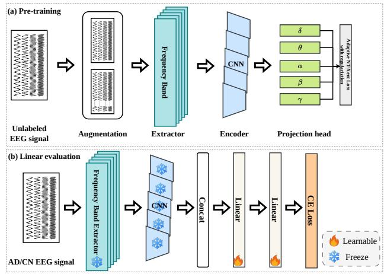

# Delta2Gamma: Band-Wise Adaptive Contrastive Learning of EEG for Alzheimer’s Disease Detection

Chanwoo Park

Department of Artificial Intelligence

Korea University

Seoul, Republic of Korea

cksdn1290@korea.ac.kr

Chanwoo Kim

Department of Artificial Intelligence

Korea University

Seoul, Republic of Korea

chanwcom@korea.ac.kr

Abstract—Low-cost, scalable screening for dementia remains an open problem. Imaging-based diagnosis is costly and hard to deploy widely. Electroencephalography (EEG) is portable and inexpensive, but its recordings are noisy, vary widely across subjects, and carry few clinical labels. We tackle this with Delta2Gamma, a self-supervised framework that learns EEG representations from unlabeled data by contrasting augmented views of each signal. Rather than treat EEG as a single stream, Delta2Gamma decomposes every recording into the five canonical neural rhythms (delta, theta, alpha, beta, gamma). Each band gets its own encoder and projection head. Each also gets a temperature that is predicted adaptively during contrastive training, so bands with different signal statistics are balanced automatically. On the ADFTD cohort under a strict leaveone-subject-out protocol, Delta2Gamma separates Alzheimer’s disease from cognitively normal controls with 92.4% accuracy. This exceeds both supervised backbones and recent dedicated EEG methods.

Index Terms—band-head, self-supervised learning, EEG, adaptive temperature, dementia, representation learning

## I. INTRODUCTION

Global aging and the explosive growth in dementia prevalence form a public-health crisis that is straining socioeconomic structures and healthcare systems worldwide [1], [2]. Traditional diagnostic methods such as magnetic resonance imaging (MRI) and positron emission tomography (PET) have limited value for early detection because of their high cost, limited accessibility, and dependence on large, stationary equipment and specialized personnel [3]. Because these modalities are confined to specialized medical centers, they cannot serve as frontline screening tools for the broad at-risk population. As a result, early-stage mild cognitive impairment, the precursor to dementia, is difficult to catch, and most patients are diagnosed only after their symptoms have substantially progressed [4].

Electroencephalography (EEG) offers a scalable alternative. It is non-invasive and directly and quantitatively measures declines in brain function [5], unlike functional MRI, which captures blood-flow changes that only indirectly proxy neural activity. By directly recording the electrical signals generated by neurons, EEG reflects how the neuropathological changes that define dementia impair brain function, providing critical insight into the neurophysiological basis of cognitive decline [6]. These properties make EEG well suited to portable, repeatable, and affordable cognitive monitoring outside the hospital. Other low-cost digital biomarkers have been pursued in parallel: large language models (LLMs) applied to spontaneous speech detect AD with chain-of-thought reasoning over transcribed narratives [7], and pairing them with visionlanguage models for picture-description tasks improves detection further [8]; clinically inspired cognitive test batteries have even been repurposed to evaluate the reasoning capacity of the LLMs themselves [9]. These behavioral markers, however, rely on language production and task compliance, whereas EEG measures the underlying neural dysfunction directly, which motivates our focus on resting-state recordings.

A large body of work identifies quantifiable spectral signatures of Alzheimer’s disease (AD) and other dementias, summarized as an overall slowing of brain oscillations. Patients show increased power in low-frequency bands, delta (δ, 0–4 Hz) and theta (θ, 4–8 Hz) [10], together with reduced power in higher-frequency bands, including alpha (α, 8–12 Hz), beta (β, 12–30 Hz), and a marked reduction in gamma (γ, >30 Hz) that is tightly linked to higher cognitive functions such as short-term memory [11]. These band-specific changes motivate a model that treats each rhythm separately rather than collapsing the signal into a single representation. Motivated by these biomarkers, the main contributions of this paper are:

1) Frequency-band-specific encoding: we propose the Delta2Gamma architecture, which decomposes EEG into the five canonical bands $( \delta , \theta , \alpha , \beta , \gamma )$ and processes each with an independent CNN encoder and projection head, preserving band-specific neural information.

2) Effective dementia classification: we design a selfsupervised model that captures the neurophysiological hallmarks of dementia (increased $\delta / \theta ,$ decreased α/β), achieving state-of-the-art accuracy under strict subjectindependent evaluation.

## II. PROPOSED METHOD

The framework (Fig. 1) has two stages: self-supervised pre-training and linear evaluation. We perform contrastive learning on unlabeled EEG so the model learns general signal characteristics, while data augmentation yields representations robust to transformations.

  
Fig. 1. Overview of the Delta2Gamma model. (a) Self-supervised pretraining: augmentation is applied to unlabeled EEG, then an adaptive NT-Xent contrastive loss with regularization trains the encoder to learn representations across the five bands $( \bar { \delta , } \theta , \alpha , \beta , \gamma ) .$ (b) Linear evaluation: a classifier is added on top of the frozen pre-trained encoder for AD vs. cognitively normal (CN) classification. Numbers on linear layers denote layer dimensionality.

## A. Self-Supervised Multi-Band Architecture

We build on SimCLR [12], a contrastive self-supervised method that pulls augmented views of the same sample together while pushing different instances apart. Our adaptation (Fig. 1(a)) is tailored to EEG: the model simultaneously processes the five frequency bands and uses an independent projection head per band for fine-grained feature learning. This is especially valuable in clinical settings, where unlabeled EEG is abundant but labels are scarce. The pre-training procedure is given in Algorithm 1.

A raw multi-channel EEG signal of shape [C, L] (C=19 channels; L = seconds × 500 Hz sampling rate) is decomposed into five canonical bands (δ: 0.5–4, θ: 4–8, α: 8–13, β: 13– 30, γ: 30–45 Hz) by bandpass filters, giving five parallel views of shape $[ 5 , C , L ]$ . The band extractor uses parallel 1-D depthwise convolutions (kernel size 7, padding 3, groups = C) followed by batch normalization [13] and ReLU [14], so each channel is processed independently to preserve its temporal patterns [15]. Each band is then passed through an independent encoder of three convolutional blocks with increasing channels (32→64→128), interleaved with batch normalization, ReLU, and max pooling, producing [5, C, L/32]. Global average pooling summarizes temporal dynamics, and the five pooled outputs are fused by a fully connected layer with batch normalization and ReLU into a compact 5 × 128-dimensional embedding, one projection vector per band.

## B. Data Augmentation

The core of self-supervised learning is to extract a meaningful signal from the data itself through a pretext task. For each EEG signal we generate two semantically identical but morphologically different views using Gaussian noise (std 0.03), amplitude scaling (factor in [0.8, 1.2]), and 10% random masking in both the time and frequency domains; with 10% probability we also drop 10% of the channels. The two views form an instance-discrimination task: views of the same signal are positive pairs and views of different signals are negatives, driving the model toward noise- and transformation-robust representations. By contrasting a weak and a strong view of each signal, the encoder is encouraged to discard nuisance variation while preserving the band-specific structure relevant to diagnosis.

Algorithm 1 SimCLR-based Self-Supervised Pre-training   
Require: Unlabeled EEG D, batch size B, epochs E   
Ensure: Pre-trained multi-frequency encoder $f _ { \theta }$   
1: Init encoder $f _ { \theta }$ with bands $\{ \delta , \theta , \alpha , \beta , \gamma \}$ , heads $\{ g _ { k } \} _ { k = 1 } ^ { 5 } ,$   
temperature nets $\{ \phi _ { k } \} _ { k = 1 } ^ { 5 }$   
2: for e = 1 to $E$ do   
3: for each mini-batch $\boldsymbol { B } = \{ x _ { i } \} _ { i = 1 } ^ { B } , x _ { i } \in \mathbb { R } ^ { C \times T }$ do   
4: $B ^ { ( 1 ) } \gets$ weak-aug(B); $B ^ { ( 2 ) } \gets$ strong-aug(B)   
5: for view $v \in \{ 1 , 2 \}$ , band b do   
6: $\mathbf { x } _ { b } ^ { ( v ) } \gets$ BandpassFilter ${ } _ { b } ( B ^ { ( v ) } )$   
7: $\mathbf z _ { b } ^ { ( v ) } \gets g _ { b } ( \mathbf { C N N } _ { b } ( \mathbf x _ { b } ^ { ( v ) } ) )$   
8: end for   
9: for each band b do   
10: $\tau _ { b } \gets \phi _ { b } ( \mathbf { z } _ { b } ^ { ( 1 ) } , \mathbf { z } _ { b } ^ { ( 2 ) } )$   
11: $\boldsymbol { \mathcal { L } ^ { ( b ) } } \gets$ NTXent $\begin{array} { r } { ( { \bf z } _ { b } ^ { ( 1 ) } , { \bf z } _ { b } ^ { ( 2 ) } , \tau _ { b } ) + \lambda \big ( \frac { d } { 2 } } \end{array}$ log τb +   
$\scriptstyle { \frac { 1 } { \tau _ { b } } } \neq$   
12: end for   
13: Update parameters w.r.t. $\begin{array} { r } { \mathcal { L } _ { \mathrm { t o t a l } } = \sum _ { b } \mathcal { L } ^ { ( b ) } } \end{array}$   
14: end for   
15: end for   
16: return $f _ { \theta }$

## C. Training Objective

The pre-training loss aggregates per-band adaptive NT-Xent losses with temperature regularization [16]: $\begin{array} { r } { \mathcal { L } _ { \mathrm { p t } } ^ { \mathrm { ~ ~ } } = \sum _ { b = 1 } ^ { B } \mathcal { L } _ { b } , } \end{array}$ where

$$
\begin{array} { r l } {  { \mathcal { L } _ { \mathrm { p t } } = \sum _ { b = 1 } ^ { B } \Big ( - \frac { 1 } { \tau ^ { b + } } \sin ( \mathbf { z } ^ { b } , \mathbf { z } ^ { b + } ) } } \\ & { \qquad + \frac { 1 } { \tau _ { n ^ { * } } ^ { b - } } \operatorname* { m a x } _ { n = 1 , \cdots , N } \sin ( \mathbf { z } ^ { b } , \mathbf { z } _ { n } ^ { b - } ) } \\ & { \qquad + \beta \Omega ( \tau ^ { b + } ) - \beta \Omega ( \tau _ { n ^ { * } } ^ { b - } ) \Big ) , } \end{array}\tag{1}
$$

sim $\iota ( \cdot , \cdot )$ is cosine similarity over positive pair $( \mathbf { z } ^ { b } , \mathbf { z } ^ { b + } )$ or negative pair $( \mathbf { z } ^ { b } , \mathbf { z } _ { n } ^ { b - } ) ;$ ; N is the number of negatives; $\tau ^ { b + }$ and $\tau _ { n } ^ { b - }$ are learnable adaptive positive and negative temperatures with $n ^ { * } = \arg \operatorname* { m a x } _ { n }$ sim $( \mathbf { z } ^ { b } , \mathbf { z } _ { n } ^ { b - } )$ ; and $\beta \geq 0$ controls the regularizer

$$
\Omega ( \tau ) = ( d ^ { \prime } / 2 ) \log ( \tau ) + 1 / \tau ,\tag{2}
$$

where $d ^ { \prime }$ is the projected dimension; this drives $\tau \to 2 / d ^ { \prime }$ Unlike fixed-temperature SimCLR, each band receives a dynamically predicted temperature reflecting its distribution and learning difficulty. Each band therefore receives a contrastive signal whose strength is matched to its own statistics, resolving the uniformity–tolerance trade-off that a single global temperature cannot address and stabilizing training across bands with very different power profiles.

## D. Downstream Task

For classification we attach a three-layer MLP on top of the pre-trained encoder (hidden sizes 512 and 256, each with ReLU [14], batch normalization, and dropout [17] of 0.3 and 0.2), with an output layer sized to the number of classes. We consider both freezing the encoder (linear evaluation, Fig. 1(b)) and fine-tuning all parameters.

## III. EXPERIMENTAL SETUP

Pre-training uses AdamW [18] (batch size 64, learning rate $1 \times 1 0 ^ { - 4 } )$ , the adaptive NT-Xent loss with temperature in [0.05, 0.5] and $\beta { = } 0 . 0 1$ , weight decay $1 \times 1 0 ^ { - 5 }$ , and cosine annealing with warm restarts. Linear evaluation uses Leave-One-Subject-Out (LOSO) cross-validation with frozen encoder weights, AdamW (batch size 32, learning rate $1 \times 1 0 ^ { - 4 } )$ , and cross-entropy loss. Both stages run up to 100 epochs with early stopping (patience 10) on an NVIDIA RTX 4090 GPU.

## A. Dataset

We use the publicly available ADFTD dataset [19]: restingstate, eyes-closed recordings from 88 participants (36 AD, 23 frontotemporal dementia [FTD], 29 CN). Mean MMSE scores were 17.75 (AD), 22.17 (FTD), and 30 (CN). Signals were recorded with a Nihon Kohden EEG-2100 system using 19 scalp electrodes (10–20 system) at 500 Hz with impedance below 5 kΩ. Because FTD is hard to identify from EEG alone, classification focuses on AD vs. CN; the 23 FTD subjects (not used for classification) provide unlabeled data for selfsupervised pre-training.

## B. Preprocessing and Segmentation

We compute an average reference across all channels, since referencing strongly affects amplitude measurements, and apply a 6th-order Butterworth bandpass filter (0.5–45 Hz) [20] that preserves the activity relevant to distinguishing AD from CN. Ocular and muscular artifacts are then removed via blind source separation with independent component analysis [21], all within MNE-Python [22]. Eyes-closed EEG is segmented into 30-second epochs, matching the standard epoch length used in sleep research [23] and minimizing the influence of external stimuli [24].

## C. Evaluation Protocol and Metrics

LOSO cross-validation [25] trains on N−1 subjects and tests on the held-out subject, repeating for all subjects. By preventing cross-subject data leakage, it provides a stringent, realistic estimate of generalization under high inter-individual variability. We report accuracy, precision, recall, weighted F1- score, and AUC.

## IV. RESULTS AND DISCUSSION

## A. LOSO Performance

We compare against major EEG benchmarks implemented with Braindecode [26] and prior AD-vs-CN studies, finetuning self-supervised baselines where pretrained weights are available. As summarized in Table I, common supervised and self-supervised EEG backbones (e.g., ATCNet [27], EEG-Net [15], EEGConformer [28], BIOT [29], Labram [30], S-JEPA [31]) reach only 39–74% accuracy on this task. Under strict LOSO cross-validation, our adaptive 5-band-head model attains 92.37% accuracy and 92.33% F1-score, surpassing recent dedicated AD-vs-CN methods (Table II). This shows the multi-band self-supervised approach is highly effective for the complex features of EEG and generalizes well despite intersubject variability.

## B. Multi-Band Feature Analysis

The band-specific encoders learn distinct activation strategies. The δ encoder exhibits a restricted activation range concentrated on a few features, the θ band is more uniformly distributed, the α band shows the highest and most consistent activations, and the $\beta$ and $\gamma$ bands remain at intermediate but irregular levels, indicating that each band adopts an encoding scheme matched to its own signal characteristics. Group-wise importance analysis is more revealing: peak importance in the δ band $( \approx 2 \times 1 0 ^ { - 4 } )$ is about twenty times that of the γ band $( \approx 1 \times 1 0 ^ { - 5 } )$ , indicating that low-frequency bands carry stronger diagnostic cues for dementia. Importantly, highly activated features are not necessarily the most diagnostic, suggesting the model separates general signal processing from the extraction of pathological patterns. The learned featurecorrelation structure echoes this: low-frequency bands (δ, θ) condense information into dense, near-diagonal correlations, whereas high-frequency bands (β, γ) form sparse, largely independent representations that capture complementary, nonredundant aspects of the signal. Topographically, the AD group shows localized δ-band increases over frontal, temporal, and parietal regions, whereas CN δ activity is weaker and posteriorly distributed, consistent with known biomarkers. Together these observations give the multi-band design both neurobiological plausibility and clinical utility.

## C. Ablation Study

Table III isolates the contribution of each component. A CNN trained from scratch without self-supervision reaches only 62.54% accuracy, whereas our full model reaches 92.37%, a 47.70% relative gain that confirms the value of contrastive pre-training when labels are scarce. Replacing the five band-specific heads with a single projection head drops accuracy to 89.65% versus 91.14% for five heads, and the adaptive model improves a further 3.03% (relative) over the single-head baseline, showing that per-band heads capture complementary frequency information. Fixing the temperature (τ=0.1) and removing the regularizer reduce accuracy to 87.37% and 90.50% respectively, indicating that both the adaptive temperature and its regularization contribute to the final performance. The model is also robust: accuracy remains stable across temperature settings and improves monotonically as the segmentation length grows from 5 to 30 seconds.

## V. CONCLUSION

We presented Delta2Gamma, a multi-head SimCLR framework for contrastive EEG representation learning that uses independent CNN encoders and adaptive temperatures for each of the five frequency bands. By computing and aggregating a per-band contrastive loss inspired by adaptive multi-head contrastive learning [16], the model achieves superior representation quality and state-of-the-art AD-vs-CN classification under strict LOSO evaluation, even with limited labels. The approach is readily deployable and extensible to other biosignal-analysis domains.

<table><tr><td>Model</td><td>Application</td><td>Train</td><td>Backbone</td><td>#Param</td><td>Accuracy (%)</td><td>F1-score (%)</td></tr><tr><td>ATCNet [27]</td><td>General</td><td>Supervised</td><td>CNN &amp; RNN &amp; Att</td><td>113,732</td><td>74</td><td>74</td></tr><tr><td>BIOT [29]</td><td>Sleep Staging Epilepsy</td><td>SSL</td><td>Att</td><td>3,183,879</td><td>53</td><td>40</td></tr><tr><td>CTNet [32]</td><td>Motor Imagery</td><td>Supervised</td><td>CNN &amp; Att</td><td>26,900</td><td>74</td><td>73</td></tr><tr><td>Deep4Net [26]</td><td>General</td><td>Supervised</td><td>CNN</td><td>282,879</td><td>49</td><td>49</td></tr><tr><td>EEGConformer [28]</td><td>General</td><td>Supervised</td><td>CNN &amp; Att</td><td>789,572</td><td>57</td><td>54</td></tr><tr><td>EEGInception [33]</td><td>Motor Imagery ERP &amp; SSVEP</td><td>Supervised</td><td>CNN</td><td>558,028</td><td>39</td><td>37</td></tr><tr><td>EEGNet [15]</td><td>General</td><td>Supervised</td><td>CNN</td><td>2,484</td><td>46</td><td>45</td></tr><tr><td>FBCNet [34]</td><td>Motor Imagery</td><td>Supervised</td><td>CNN</td><td>11,812</td><td>48</td><td>38</td></tr><tr><td>Labram [30]</td><td>General</td><td>SSL</td><td>CNN &amp; Att</td><td>5,866,180</td><td>54</td><td>38</td></tr><tr><td>S-JEPA [31]</td><td>Motor Imagery ERP &amp; SSVEP</td><td>SSL</td><td>CNN &amp; Att</td><td>3,456,882</td><td>50</td><td>50</td></tr><tr><td>SPARCNet [35]</td><td>Epilepsy</td><td>Supervised</td><td>CNN</td><td>1,141,921</td><td>54</td><td>53</td></tr><tr><td>TCN [36]</td><td>General</td><td>Supervised</td><td>CNN &amp; RNN</td><td>26,974</td><td>44</td><td>40</td></tr><tr><td>TIDNet [37]</td><td>General</td><td>Supervised</td><td>CNN</td><td>240,404</td><td>44</td><td>40</td></tr><tr><td>Ours (adaptive 5 band heads)</td><td>Dementia</td><td>SSL</td><td>CNN</td><td>976,635</td><td>92</td><td>92</td></tr></table>

TABLE I  
AD VS. CN CLASSIFICATION PERFORMANCE OF THE PROPOSED MODEL AGAINST LEADING SUPERVISED AND SELF-SUPERVISED EEG BENCHMARKS. “APPLICATION” DENOTES THE MODEL’S TYPICAL TARGET DOMAIN, WITH “GENERAL” INDICATING NO SPECIFIC ONE; “#PARAM” IS THE NUMBER OF PARAMETERS REQUIRED TO INSTANTIATE THE MODEL. ATT DENOTES ATTENTION MECHANISMS.

TABLE II  
LOSO COMPARISON FOR AD VS. CN CLASSIFICATION ON THE ADFTD DATASET [19].
<table><tr><td>Model</td><td>Acc (%)</td><td>F1 (%)</td><td>Prec. (%)</td><td>Rec. (%)</td></tr><tr><td>kNN [38]</td><td>60.30</td><td>58.90</td><td>57.90</td><td>59.90</td></tr><tr><td>CNN [39]</td><td>79.45</td><td>77.60</td><td>76.32</td><td>76.06</td></tr><tr><td>Random Forest [40]</td><td>80.00</td><td>81.69</td><td></td><td>80.55</td></tr><tr><td>DICE-Net [41]</td><td>83.28</td><td>84.12</td><td>88.94</td><td>79.81</td></tr><tr><td>CNN [42]</td><td>84.62</td><td>86.11</td><td></td><td>86.11</td></tr><tr><td>MJANet [43]</td><td>85.23</td><td>86.37</td><td>88.12</td><td>84.69</td></tr><tr><td>Dual-Branch [44]</td><td>85.78</td><td>一</td><td></td><td>83.22</td></tr><tr><td>Random Forest [45]</td><td>88.90</td><td>一</td><td>=</td><td></td></tr><tr><td>BI-MCGNN [46]</td><td>91.25</td><td>一</td><td></td><td>93.32</td></tr><tr><td>Ours</td><td>92.37</td><td>92.33</td><td>92.61</td><td>92.37</td></tr></table>

TABLE III

ABLATION STUDY OF THE PROPOSED MODEL ON THE ADFTD DATASET [19]. MULTI-HEAD (5 HEADS) DENOTES MULTIPLE INDEPENDENTLY LEARNED MLP PROJECTION HEADS, NOT FREQUENCY BANDS.
<table><tr><td>Model</td><td>Acc</td><td>F1</td><td>Prec.</td><td>Rec.</td><td>AUC</td></tr><tr><td>Adaptive 5 band heads</td><td>92.37</td><td>92.33</td><td>92.61</td><td>92.37</td><td>93.18</td></tr><tr><td>w/o self-supervised learning</td><td>62.54</td><td>61.02</td><td>62.79</td><td>62.54</td><td>65.61</td></tr><tr><td>constant temp. (τ=0.1)</td><td>87.37</td><td>87.40</td><td>87.99</td><td>87.37</td><td>88.38</td></tr><tr><td>Single-head</td><td>89.65</td><td>89.62</td><td>90.04</td><td>89.65</td><td>91.88</td></tr><tr><td>w/o regularization</td><td>90.50</td><td>90.47</td><td>91.22</td><td>89.89</td><td>91.13</td></tr><tr><td>Multi-head (5 heads)</td><td>91.14</td><td>91.11</td><td>91.49</td><td>91.14</td><td>93.21</td></tr></table>

## ACKNOWLEDGMENT

This work was supported in part by: the Institute of Information & Communications Technology Planning & Evaluation (IITP) grant funded by the Korean government (MSIT) under Grant No. RS-2019-II190079 for the Artificial Intelligence Graduate School Program at Korea University; the National Research Foundation of Korea (NRF) grant funded by the Korean government (MSIT) under Grant No. RS-2025-24535409; and the Supreme Prosecutor’s Office Research Grant in 2026 (research title: Development of fake voice detection technology robust in new voice generation technology and speaker recognition).

## REFERENCES

[1] E. Nichols, J. D. Steinmetz, S. E. Vollset, K. Fukutaki, J. Chalek, F. Abd-Allah, and X. Liu, “Estimation of the global prevalence of dementia in 2019 and forecasted prevalence in 2050: an analysis for the global burden of disease study 2019,” The Lancet Public Health, vol. 7, no. 2, pp. e105–e125, 2022.

[2] X. Li, X. Feng, X. Sun, N. Hou, F. Han, and Y. Liu, “Global, regional, and national burden of alzheimer’s disease and other dementias, 1990– 2019,” Frontiers in Aging Neuroscience, vol. 14, p. 937486, 2022.

[3] H. Haidar, R. E. Majzoub, S. Hajeer, and L. A. Abbas, “Arterial spin labeling (asl-mri) versus fluorodeoxyglucose-pet (fdg-pet) in diagnosing dementia: a systematic review and meta-analysis,” BMC Neurology, vol. 23, no. 1, p. 385, 2023.

[4] M. N. Sabbagh, M. Boada, S. Borson, M. Chilukuri, B. Dubois, J. Ingram, and H. Hampel, “Early detection of mild cognitive impairment (mci) in primary care,” The Journal of Prevention of Alzheimer’s Disease, vol. 7, pp. 165–170, 2020.

[5] T. Dabbabi, L. Bouafif, and A. Cherif, “A review of non invasive methods of brain activity measurements via eeg signals analysis,” in 2023 IEEE International Conference on Advanced Systems and Emergent Technologies (IC ASET). IEEE, Apr. 2023, pp. 01–06.

[6] U. Smailovic and V. Jelic, “Neurophysiological markers of alzheimer’s disease: quantitative eeg approach,” Neurology and Therapy, vol. 8, no. Suppl 2, pp. 37–55, 2019.

[7] C. Park, A. S. G. Choi, S. Cho, and C. Kim, “Reasoning-based approach with chain-of-thought for alzheimer’s detection using speech and large language models,” in Proc. Interspeech 2025, 2025, pp. 2185–2189.

[8] C. Park and C. Kim, “A novel chain-of-thought reasoning approach for alzheimer’s disease detection using large language and vision-language models,” IEEE Transactions on Neural Systems and Rehabilitation Engineering, vol. 33, pp. 4386–4395, 2025.

[9] C. Park and C. Kim, “Lmmse: A clinically inspired framework for cognitive evaluation of large language models,” Information Sciences, vol. 758, p. 123956, 2027.

[10] D. V. Moretti, C. Babiloni, G. Binetti, E. Cassetta, G. Dal Forno, F. Ferreric, others, and P. M. Rossini, “Individual analysis of eeg frequency and band power in mild alzheimer’s disease,” Clinical Neurophysiology, vol. 115, no. 2, pp. 299–308, 2004.

[11] A. Traikapi and N. Konstantinou, “Gamma oscillations in alzheimer’s disease and their potential therapeutic role,” Frontiers in Systems Neuroscience, vol. 15, p. 782399, 2021.

[12] T. Chen, S. Kornblith, M. Norouzi, and G. Hinton, “A simple framework for contrastive learning of visual representations,” in Proceedings of the 37th International Conference on Machine Learning, ser. Proceedings of Machine Learning Research, H. D. III and A. Singh, Eds., vol. 119. PMLR, July 2020, pp. 1597–1607. [Online]. Available: https://proceedings.mlr.press/v119/chen20j.html

[13] S. Ioffe and C. Szegedy, “Batch normalization: Accelerating deep network training by reducing internal covariate shift,” in International Conference on Machine Learning. PMLR, 2015, pp. 448–456.

[14] A. F. Agarap, “Deep learning using rectified linear units (relu),” arXiv preprint arXiv:1803.08375, 2018.

[15] V. J. Lawhern, A. J. Solon, N. R. Waytowich, S. M. Gordon, C. P. Hung, and B. J. Lance, “EEGNet: a compact convolutional neural network for EEG-based brain–computer interfaces,” Journal of Neural Engineering, vol. 15, no. 5, p. 056013, 2018.

[16] L. Wang, P. Koniusz, T. Gedeon, and L. Zheng, “Adaptive multi-head contrastive learning,” in European Conference on Computer Vision. Cham: Springer Nature Switzerland, September 2024, pp. 404–421.

[17] N. Srivastava, G. Hinton, A. Krizhevsky, I. Sutskever, and R. Salakhutdinov, “Dropout: a simple way to prevent neural networks from overfitting,” The Journal of Machine Learning Research, vol. 15, no. 1, pp. 1929–1958, 2014.

[18] I. Loshchilov and F. Hutter, “Decoupled weight decay regularization,” arXiv preprint arXiv:1711.05101, 2017.

[19] A. Miltiadous, K. D. Tzimourta, T. Afrantou, P. Ioannidis, N. Grigoriadis, D. G. Tsalikakis, others, and A. T. Tzallas, “A dataset of scalp eeg recordings of alzheimer’s disease, frontotemporal dementia and healthy subjects from routine eeg,” Data, vol. 8, no. 6, p. 95, 2023.

[20] M. Nour, U. Senturk, and K. Polat, “A novel hybrid model in the diagnosis and classification of alzheimer’s disease using eeg signals: Deep ensemble learning (del) approach,” Biomedical Signal Processing and Control, vol. 89, p. 105751, 2024.

[21] P. Comon, “Independent component analysis, a new concept?” Signal processing, vol. 36, no. 3, pp. 287–314, 1994.

[22] A. Gramfort, M. Luessi, E. Larson, D. A. Engemann, D. Strohmeier, C. Brodbeck, R. Goj, M. Jas, T. Brooks, L. Parkkonen, and M. S. Ham¨ al¨ ainen, “MEG and EEG data analysis with MNE-Python,”¨ Frontiers in Neuroscience, vol. 7, no. 267, pp. 1–13, 2013.

[23] C. Park, J. I. Byun, S. H. Choi, and W. C. Shin, “Machine learning classifier solving the problem of sleep stage imbalance between overnight sleep,” Biomedical Engineering Letters, vol. 15, no. 3, pp. 513–523, 2025.

[24] E. M. Ye, H. Sun, P. V. Krishnamurthy, N. Adra, W. Ganglberger, R. J. Thomas, and M. B. Westover, “Dementia detection from brain activity during sleep,” Sleep, vol. 46, no. 3, p. zsac286, 2023.

[25] S. Kunjan, T. S. Grummett, K. J. Pope, D. M. Powers, S. P. Fitzgibbon, T. Bastiampillai, and T. W. Lewis, “The necessity of leave one subject out (loso) cross validation for eeg disease diagnosis,” in Brain Informatics: 14th International Conference, BI 2021, Virtual Event, September 17–19, 2021, Proceedings 14. Springer International Publishing, 2021, pp. 558–567.

[26] R. T. Schirrmeister, J. T. Springenberg, L. D. J. Fiederer, M. Glasstetter, K. Eggensperger, M. Tangermann, F. Hutter, W. Burgard, and T. Ball, “Deep learning with convolutional neural networks for eeg decoding and visualization,” Human Brain Mapping, vol. 38, no. 11, pp. 5391–5420, 2017.

[27] H. Altaheri, G. Muhammad, and M. Alsulaiman, “Physics-informed attention temporal convolutional network for eeg-based motor imagery classification,” IEEE Transactions on Industrial Informatics, vol. 19, no. 2, pp. 2249–2258, 2022.

[28] Y. Song, Q. Zheng, B. Liu, and X. Gao, “EEG conformer: Convolutional transformer for EEG decoding and visualization,” IEEE Transactions on Neural Systems and Rehabilitation Engineering, vol. 31, pp. 710–719, 2022.

[29] C. Yang, M. B. Westover, and J. Sun, “Biot: Biosignal transformer for cross-data learning in the wild,” in Advances in Neural Information Processing Systems, vol. 36, 2023, pp. 78 240–78 260.

[30] W. B. Jiang, L. M. Zhao, and B. L. Lu, “Large brain model for learning generic representations with tremendous EEG data in BCI,” arXiv preprint arXiv:2405.18765, 2024.

[31] P. Guetschel, T. Moreau, and M. Tangermann, “S-jepa: Towards seamless cross-dataset transfer through dynamic spatial attention,” arXiv preprint arXiv:2403.11772, 2024.

[32] W. Zhao, X. Jiang, B. Zhang, S. Xiao, and S. Weng, “Ctnet: a convolutional transformer network for eeg-based motor imagery classification,” Scientific Reports, vol. 14, no. 1, p. 20237, 2024.

[33] E. Santamaria-Vazquez, V. Martinez-Cagigal, F. Vaquerizo-Villar, and R. Hornero, “Eeg-inception: a novel deep convolutional neural network for assistive erp-based brain-computer interfaces,” IEEE Transactions on Neural Systems and Rehabilitation Engineering, vol. 28, no. 12, pp. 2773–2782, 2020.

[34] R. Mane, E. T. Chew, K. M. Chua, K. K. Ang, N. Robinson, A. P. Vinod, and C. Guan, “Fbcnet: A multi-view convolutional neural network for brain-computer interface,” arXiv preprint arXiv:2104.01233, 2021.

[35] J. Jing, W. Ge, S. Hong, M. B. Fernandes, Z. Lin, C. Yang, and M. B. Westover, “Development of expert-level classification of seizures and rhythmic and periodic patterns during EEG interpretation,” Neurology, vol. 100, no. 17, pp. e1750–e1762, 2023.

[36] S. Bai, J. Z. Kolter, and V. Koltun, “An empirical evaluation of generic convolutional and recurrent networks for sequence modeling,” arXiv preprint arXiv:1803.01271, 2018.

[37] D. Kostas and F. Rudzicz, “Thinker invariance: enabling deep neural networks for BCI across more people,” Journal of Neural Engineering, vol. 17, no. 5, p. 056008, 2020.

[38] A. Ntetska, A. Miltiadous, M. G. Tsipouras, K. D. Tzimourta, T. Afrantou, P. Ioannidis, and A. T. Tzallas, “A complementary dataset of scalp eeg recordings featuring participants with alzheimer’s disease, frontotemporal dementia, and healthy controls, obtained from photostimulation eeg,” Data, vol. 10, no. 5, p. 64, 2025.

[39] K. Stefanou, K. D. Tzimourta, C. Bellos, G. Stergios, K. Markoglou, E. Gionanidis, others, and A. Miltiadous, “A novel cnn-based framework for alzheimer’s disease detection using eeg spectrogram representations,” Journal of Personalized Medicine, vol. 15, no. 1, p. 27, 2025.

[40] S. Sarkar, A. Chakraborty, A. Sinha, and S. K. Saha, “Detection of alzheimer’s disease using extreme band powers in eeg data,” in 2025 IEEE Applied Sensing Conference (APSCON). IEEE, 2025, pp. 331– 334.

[41] A. Miltiadous, E. Gionanidis, K. D. Tzimourta, N. Giannakeas, and A. T. Tzallas, “Dice-net: a novel convolution-transformer architecture for alzheimer detection in eeg signals,” IEEE Access, vol. 11, pp. 71 840– 71 858, 2023.

[42] T. Vo, A. K. Ibrahim, and H. Zhuang, “A multimodal multi-stage deep learning model for the diagnosis of alzheimer’s disease using eeg measurements,” Neurology International, vol. 17, no. 6, p. 91, 2025.

[43] Y. Sun, L. Feng, B. Xu, S. Jia, L. Duan, W. Ni, and Z. Jia, “Enhanced alzheimer’s detection with eeg source imaging and multi-branch joint attention,” Journal of Neural Engineering, vol. 22, no. 3, p. 036028, 2025.

[44] Y. Chen, H. Wang, D. Zhang, L. Zhang, and L. Tao, “Multi-feature fusion learning for alzheimer’s disease prediction using eeg signals in resting state,” Frontiers in Neuroscience, vol. 17, p. 1272834, 2023.

[45] A. Parihar and P. D. Swami, “Analysis of eeg signals with the use of wavelet transform for accurate classification of alzheimer disease, frontotemporal dementia and healthy subjects using machine learning models,” Fusion: Practice & Applications, vol. 14, no. 2, 2024.

[46] D. Zhang and C. Zhu, “A dual path graph neural network framework for dementia diagnosis,” Scientific Reports, vol. 15, no. 1, p. 23319, 2025.