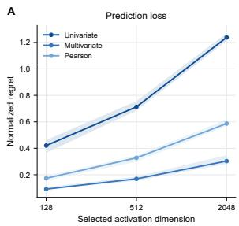
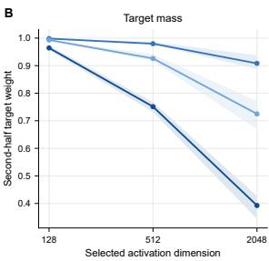
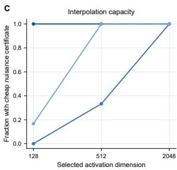
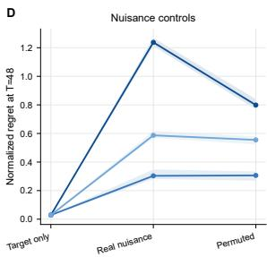
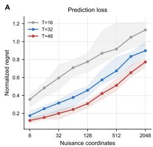
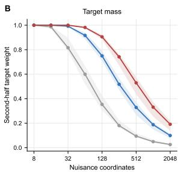
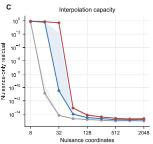
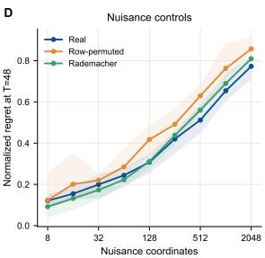

# Feature Priming in Online Linear Regression: Sparse-Regret Lower Bounds and a Tight Univariate Rate

Huibo Xu\* and Shi Fu\* and Qixin Zhang and Dacheng Tao† Nanyang Technological University, Singapore

## Abstract

In high-dimensional online prediction, sparse comparators motivate regret bounds that depend on sparsity rather than ambient dimension. Feature priming seeks such adaptation by reweighting features using past data and refitting a minimum-norm predictor. At COLT 2023, Warmuth and Amid (2023) posed the open problem of whether the univariate, Pearson, or multivariate priming rules admit competitive online regret guarantees. Under the natural past-only Moore–Penrose protocol, we establish sparse-regret lower bounds that refute the corresponding sparse-logarithmic guarantee. The key obstruction is cheap nuisance interpolation, which permits exact interpolation of the history while assigning insufficient weight to the truly predictive coordinate. An exact target-mass identity and a two-sign argument convert this obstruction into clipped prediction loss. Hadamard constructions yield Ω(min{T, d}) clipped regret for each of the three unit-power rules against a zero-loss one-sparse comparator, thereby excluding any uniform O(k log(ed/k)) guarantee. For every fixed power $\alpha \geq 1$ , one shared paired construction further yields linear regret simultaneously for all three powered rules and selectors among them in sufficiently high dimension. Conversely, a rank upper bound and a Euclidean-normalized triangular construction establish the tight worst-case rate Θ (min{T, d}) for powered univariate priming. This lower bound persists under any nonnegative second-stage ridge schedule, while a paired ridge construction yields linear lower bounds for all three powered rules. Exploratory diagnostics on frozen language-model activations are consistent with the same qualitative mechanism. Tight worst-case rates for multivariate and Pearson priming remain open.

## 1. Introduction

In high-dimensional online regression, a central goal is to obtain regret bounds that adapt to comparator sparsity rather than ambient dimension. Coordinate-sensitive methods such as multiplicative updates can achieve this behavior (Kivinen and Warmuth, 1997; Gerchinovitz, 2011), whereas minimum-norm least squares (LLS) has no intrinsic preference for the coordinates in which sparsity is defined. Feature priming was proposed to introduce such a preference without giving up the simplicity of LLS (Warmuth and Amid, 2023). It assigns each feature a univariate, Pearson, or multivariate LLS score, rescales the corresponding design column, and performs a second minimum-norm fit.

Warmuth and Amid (2023) observed that these rules can recover sparse targets faster than vanilla LLS and asked whether any of them admits a competitive online regret bound. Their comparison with multiplicative updates recalls O(k log(n/k)) regret when the target averages k bounded features. We therefore ask whether one of the priming rules can guarantee O(k log(ed/k)) regret uniformly over comparators supported on at most k coordinates. Under the natural nonanticipating implementation that applies the past-data map to each completed prefix, we give a clipping-robust negative answer to this sparse-logarithmic form of the open problem. This does not preclude dimension-dependent guarantees, as the rank bound below demonstrates.

The negative result has a common geometric source. Priming changes which interpolant the second minimum-norm fit prefers. When nuisance features interpolate the history at low primeweighted cost, the refit can match every past label while placing little weight on the coordinate that actually generates them. If $\pi _ { 1 }$ is the transformed target prime and κ is the minimum squared norm of a nuisance-only interpolant, we show that the learned target weight is exactly $w _ { 1 } = \pi _ { 1 } ^ { 2 } \kappa / ( 1 + \pi _ { 1 } ^ { 2 } \kappa )$ A two-sign argument then converts the missing target mass into clipped prediction loss. Hadamard features keep $\pi _ { 1 } ^ { 2 } \kappa$ small for all three prime rules, yielding Ω(min $\{ T , { \sqrt { d } } \} )$ regret on bounded sequences realizable with zero loss by the one-sparse comparator $e _ { 1 }$ . The regret is therefore linear when $d = \Theta ( T ^ { 2 } )$ ). Pairing each Hadamard query with its negative gives a stronger conclusion: for every fixed $\alpha \geq 1$ , the three powered rules produce the same coefficient vector on every query round. One fixed sequence therefore defeats all three rules, as well as current-input-dependent switchers and convex mixtures.

The failure is nevertheless constrained by the geometry of the observed data. A clipped predictor that interpolates its completed history can err only when the current input adds a new row-space direction, and hence has regret at most 4 rank $( X _ { 1 : T } )$ . A rational triangular construction matches this dependence for powered univariate priming, establishing the exact order $\Theta _ { \alpha } ( \operatorname* { m i n } \{ T , d \} )$ even when $\| x _ { t } \| _ { 2 } \leq 1$ . Nor is the lower bound an artifact of taking the exact Moore–Penrose limit. Under ridge regularization of the transformed second-stage coefficient, the same triangular sequence retains $\Theta _ { \alpha } ( \operatorname* { m i n } \{ T , d \} )$ ) regret for every nonnegative ridge schedule: weak regularization leaves room for cheap nuisance interpolation, while strong regularization shrinks the prediction toward zero. A paired-Hadamard variant gives linear regret for all three powered rules under past-only ridge, with a common distributional lower bound for pre-input switchers and mixtures.

Exploratory stress tests on frozen Qwen2.5 and Qwen3.8 activations exhibit the same observable pattern. As nuisance capacity grows, nuisance-only interpolation becomes cheaper, the learned target mass falls, and normalized regret increases. These diagnostics illustrate the geometry of the proof; they are not evidence that either model implements feature priming. Our results concern the three one-stage priming rules at fixed α and ridge regularization of their transformed second-stage coefficients. Regularized prime estimation, iterative or distribution-dependent variants, and general randomized algorithms beyond the stated switchers and mixtures remain open. The exact multivariate and Pearson frontiers are also unresolved.

## 2. Problem setup

We consider online square-loss regression with coordinatewise bounded inputs $x _ { t } \in [ - 1 , 1 ] ^ { d }$ . Before round t, the learner has observed the completed history $\left( X _ { < t } , y _ { < t } \right)$ , where the rows of $X _ { < t }$ are the previous inputs. It computes a coefficient vector from this history, observes $x _ { t } .$ , makes a prediction, and then receives the label. This is the standard nonanticipating online interpretation of the past-data priming map of Warmuth and Amid (2023). Labels are generated by a fixed sparse comparator. For $S \subseteq [ d ]$ with $| S | = k$ , let $\begin{array} { r } { u _ { S } = k ^ { - 1 } \sum _ { j \in S } e _ { j } } \end{array}$ and $y _ { t } = x _ { t } ^ { \top } u _ { S }$ . The comparator therefore has zero cumulative loss. Our lower bounds use only $k = 1$ and $S = \{ 1 \}$ , so $u _ { S } = e _ { 1 }$ and $y _ { t } = x _ { t , 1 }$ . Given a base-prime vector $p _ { t } \in \mathbb { R } ^ { d }$ , the unit-power rule uses $\pi _ { t } = p _ { t }$ . For a fixed $\alpha \geq 1$ , the powered rule

instead uses

$$
\pi _ { t , i } = \mathrm { s i g n } ( p _ { t , i } ) | p _ { t , i } | ^ { \alpha } .
$$

Here $\mathrm { s i g n } ( 0 ) = 0$ . Only the magnitudes of these multipliers affect the prediction. Indeed, write $\mathrm { d i a g } ( \pi _ { t } ) = D _ { + } S$ with $D _ { + } = \mathrm { d i a g } ( | p _ { t } | ^ { \alpha } )$ , where $S _ { i i } = \mathrm { s i g n } ( p _ { t , i } )$ for nonzero primes and $S _ { i i } = 1$ otherwise. The identity $( X D _ { + } S ) ^ { \dagger } = S ( X D _ { + } ) ^ { \dagger }$ shows that the two sign matrices cancel in the refit. In particular, signed squaring and literal squaring are prediction-equivalent. Write $D _ { t } = \mathrm { d i a g } ( \pi _ { t } )$ Priming rescales the columns of the historical design and performs a second minimum-norm fit:

$$
w _ { t } = D _ { t } ( X _ { < t } D _ { t } ) ^ { \dagger } y _ { < t } , \qquad \widehat { y } _ { t } = x _ { t } ^ { \top } w _ { t } .\tag{1}
$$

The empty-history prediction is zero. We also study $\widetilde { y } _ { t } = \mathrm { c l i p } ( \widehat { y } _ { t } ) = \operatorname* { m a x } \{ - 1 , \operatorname* { m i n } \{ 1 , \widehat { y } _ { t } \} \}$ . Since $y _ { t } \in [ - 1 , 1 ]$ , clipping cannot increase square loss.

We consider the three base primes proposed by Warmuth and Amid (2023, Sec. 2, p. 2):

1. Univariate LLS: $p _ { t , i } = X _ { < t } ( : , i ) ^ { \dagger } y _ { < t } = X _ { < t } ( : , i ) ^ { \top } y _ { < t } / \| X _ { < t } ( : , i ) \| _ { 2 } ^ { 2 }$ , with value zero for a zero column.

2. Pearson: whenever both empirical variances are positive, $p _ { t , i }$ is the empirical Pearson correlation between $X _ { < t } ( : , i )$ and $y _ { < t }$

3. Multivariate LLS: $p _ { t } = { X } _ { < t } ^ { \dagger } y _ { < t }$

Together with Equation (1), these agree with the original priming formulas whenever the statistics are defined.

Pearson correlation is undefined for histories of length at most one and whenever either argument has zero empirical variance. A finite totalization agrees with Pearson correlation whenever it is defined and assigns an arbitrary finite, deterministic, past-only value otherwise. It is target preserving if the filled target prime is nonzero whenever the past label vector is not identically zero. Our Pearson lower bounds hold for every finite totalization; the rank upper bound requires target preservation.

Because $e _ { 1 }$ has zero loss on all our constructions, regret equals learner loss. We write $\mathcal { R } _ { T } ^ { \mathrm { c l i p } } =$ $\textstyle \sum _ { t = 1 } ^ { T } ( \widetilde { y } _ { t } - y _ { t } ) ^ { 2 }$ for the clipped version. The constraint throughout is $x _ { t } \in [ - 1 , 1 ] ^ { d }$ ; it does not impose $\| x _ { t } \| _ { 2 } \leq 1$ unless stated explicitly. Unless a result states that its witness is shared, the adversarial sequence may depend on the rule and horizon but is fixed before online play. The unit-power separation uses such rule-specific witnesses. The powered separation instead uses one witness for all three rules at a common fixed exponent and holds pathwise for their selectors. The triangular ridge result is pointwise in the ridge schedule; the corresponding policy-uniform Hadamard statement is distributional. The full quantifiers are collected in Appendix A.

## 3. A nuisance-interpolation obstruction

Although the three prime rules assign their weights differently, their failures have the same geometric source. The labels in the history can be interpolated either by the target coordinate or by the nuisance coordinates. If the latter representation is cheap after priming, the minimum-norm refit places little weight on the target even though it interpolates every past label. This section isolates that obstruction without committing to a particular prime rule. Fix a completed history X with $\boldsymbol { y } = \boldsymbol { X } \boldsymbol { e } _ { 1 }$ , and let π denote the actual column multiplier used by the powered rule. Write $\Pi = \mathrm { d i a g } ( \pi ) , A = X \Pi$ $z = A ^ { \dagger } y , w = \Pi z ,$ , and $J = \| z \| _ { 2 } ^ { 2 }$ . Whenever $y \in \operatorname { c o l } ( A )$ , the vector z is the least-norm coefficient vector that interpolates y in the transformed design.

Lemma 1 (Target-mass identity) $\begin{array} { r } { I f y = X e _ { 1 } } \end{array}$ and $y \in \operatorname { c o l } ( X \Pi )$ , then

$$
w _ { 1 } = \pi _ { 1 } ^ { 2 } J .
$$

Proof The minimum-norm solution lies in the row space of XΠ, so $z = ( X \Pi ) ^ { \top } \lambda = \Pi X ^ { \top } \lambda$ for some λ. Since $X \Pi z = y$ , we have $J = \lambda ^ { \top } X \Pi z = \lambda ^ { \top } y = ( X ^ { \top } \lambda ) _ { 1 }$ . Thus $z _ { 1 } = \pi _ { 1 } J$ and $w _ { 1 } = \pi _ { 1 } z _ { 1 } = \pi _ { 1 } ^ { 2 } J .$

The next lemma turns missing target weight into loss. Its point is that an arbitrary nuisance contribution cannot make the two possible target signs simultaneously accurate, even after clipping.

Lemma 2 (Two-sign clipping) For every $b \in \mathbb { R }$ and $0 \leq w \leq 1$

$$
{ \frac { 1 } { 2 } } \left[ ( \mathrm { c l i p } ( b + w ) - 1 ) ^ { 2 } + ( \mathrm { c l i p } ( b - w ) + 1 ) ^ { 2 } \right] \geq ( 1 - w ) ^ { 2 } .
$$

Proof By symmetry, assume $b \geq 0 . \operatorname { I f } b \leq 1 - w .$ , neither prediction is clipped and the left-hand side is $b ^ { 2 } + ( 1 - w ) ^ { 2 }$ . If $1 - w \leq b \leq 1 + w$ , the first prediction clips to one and the average loss is at least $\begin{array} { r } { \frac { 1 } { 2 } ( 2 - 2 w ) ^ { 2 } . \operatorname { I f } b \geq 1 + w } \end{array}$ , both predictions clip to one and the average loss is 2. Each case is at least $( 1 - w ) ^ { 2 }$

We can now state the obstruction in terms of a single scalar. Decompose the transformed design as $A = [ \pi _ { 1 } y , B ]$ , where $B = X ( : , 2 : d ) \operatorname { d i a g } ( \pi _ { 2 : d } )$ contains the transformed nuisance columns.

Theorem 3 (Nuisance-interpolation obstruction) Suppose that $y \in \operatorname { c o l } ( B )$ , and let $\kappa = \| B ^ { \dagger } y \| _ { 2 } ^ { 2 }$ . The second-stagefit assigns the target coordinate weight

$$
w _ { 1 } = \frac { \pi _ { 1 } ^ { 2 } \kappa } { 1 + \pi _ { 1 } ^ { 2 } \kappa } .\tag{2}
$$

For any next nuisance row $h \in [ - 1 , 1 ] ^ { d - 1 }$ , consider the two legal examples $x ^ { \sigma } = ( \sigma , h )$ with labels $y ^ { \sigma } = \sigma$ , where $\sigma \in \{ - 1 , 1 \}$ . Their average clipped loss is at least $( 1 + \pi _ { 1 } ^ { 2 } \kappa ) ^ { - 2 }$ , and hence one of the two signs incurs at least this much loss.

Proof For a fixed transformed target coefficient $z _ { 1 }$ , the nuisance coefficients must satisfy $B z _ { 2 : d } =$ $( 1 - \pi _ { 1 } z _ { 1 } ) y$ and therefore have minimum squared norm $\kappa ( 1 - \pi _ { 1 } z _ { 1 } ) ^ { 2 }$ . The second-stage fit consequently minimizes $z _ { 1 } ^ { 2 } + \kappa ( 1 - \pi _ { 1 } z _ { 1 } ) ^ { 2 }$ , whose minimizer is $z _ { 1 } = \pi _ { 1 } \kappa / ( 1 + \pi _ { 1 } ^ { 2 } \kappa )$ . This gives Equation (2). The nuisance part of the next prediction contributes the same scalar $b = h ^ { \top } w _ { 2 : d }$ for both target signs. Since $1 - w _ { 1 } = ( 1 + \pi _ { 1 } ^ { 2 } \kappa ) ^ { - }$ −1, Lemma 2 gives the claimed loss bound.

Thus the relevant quantity is not the prime of any one coordinate in isolation, but the primeweighted cost $\pi _ { 1 } ^ { 2 } \kappa$ of explaining the history through nuisance features. The constructions in the next section all keep this quantity bounded while adding new examples.

## 4. Hadamard instantiations of the obstruction

We now instantiate Theorem 3 for each of the three prime rules. Fix a power of two $N _ { \ast }$ , let H be an $N \times N$ Hadamard matrix, and take $d = N + 1$ . A history of $r$ decisive examples has the form $X = [ a , H _ { r } ]$ , where $a \in \{ - 1 , 1 \} ^ { r }$ is both the target column and the label vector, and $H _ { r }$ contains r rows of $H$ . If $b = H _ { r } ^ { \top } a .$ then $v = N ^ { - 1 } b$ satisfies $H _ { r } v = a$ . Thus the nuisance coordinates interpolate the labels regardless of the chosen signs. What varies among the rules is only the prime-weighted cost of this interpolant.

Proposition 4 (Hadamard nuisance cost) Fix $\alpha \geq 1$ and let π be the powered column multiplier. For the history above, the powered univariate and multivariate rules satisfy $\begin{array} { r } { \pi _ { 1 } ^ { 2 } \| B ^ { \dagger } a \| _ { 2 } ^ { 2 } \leq \frac { r ^ { 2 \alpha } } { N } } \end{array}$ , where $B = H _ { r } \mathrm { d i a g } ( \pi _ { 2 : d } )$ . After s completed opposite pairs, the powered Pearson rule satisfies the same bound with $r = s .$ . The Pearson claim is independent ofthefinite totalization.

Proof For the univariate rule, $p _ { 1 } = 1$ and $p _ { j + 1 } = b _ { j } / r$ . Whenever $b _ { j } \neq 0$ , the coefficient that represents $v _ { j } = b _ { j } / N$ in the transformed nuisance design has magnitude $r ^ { \alpha } / ( N | b _ { j } | ^ { \alpha - 1 } ) \le r ^ { \alpha } / N$ when $b _ { j } = 0$ , both quantities vanish. This gives a feasible nuisance coefficient vector of squared norm at most $r ^ { 2 \alpha } / N$ , and $\pi _ { 1 } = 1$

For the multivariate rule, the base prime is $p = ( r , b ) / ( N + r )$ . Representing the same vector v in the transformed nuisance design costs at most $( N + r ) ^ { 2 \alpha } / N$ , because every nonzero $b _ { j }$ is an integer. Multiplication by $\pi _ { 1 } ^ { 2 } = [ r / ( N + r ) ] ^ { 2 \alpha }$ leaves the bound $r ^ { 2 \alpha } / N$ . On a history consisting of s opposite pairs, all empirical means vanish. The Pearson base primes are then exactly the univariate primes computed from one representative of each pair. Opposite duplication does not change the minimum-norm coefficient, so the univariate calculation applies with $r = s .$ . All active variances are positive, and hence no filled Pearson value enters the calculation.

At unit power, keeping $r \leq \sqrt { N } / 2$ makes the scalar in Theorem 3 at most $1 / 4 .$ At least one of the two legal target signs therefore produces constant clipped loss. Choosing such a sign recursively fixes the entire sequence before online play; for Pearson priming, the chosen query is followed by its negative so that the next charged round again begins from a paired history. Truncation, zero-padding, and the rounding from Hadamard dimensions to arbitrary $( T , d )$ yield the following separation. Appendix C gives the compiler and exact constants.

Theorem 5 (Sparse-regret separation at unit power) For every $T \geq 1$ and $d \geq 5$ , each of the unit-power multivariate LLS-prime and univariate-prime predictors admits a deterministic realizable sequence such that

$$
\mathcal { R } _ { T } ^ { \mathrm { c l i p } } \geq \frac { 1 } { 1 5 } \operatorname* { m i n } \{ T , \sqrt { d } \} .
$$

For the Pearson-prime predictor and $T \geq 4$ , a single deterministic sequence gives the same lower bound simultaneously for every finite totalization. In all cases the comparator is $e _ { 1 }$ and has zero cumulative loss.

Corollary 6 (Failure of uniform sparse-logarithmic regret) Under the past-only protocol of Section 2, none of the three unit-power rules admits a universal constant C such that $\mathcal { R } _ { T } ^ { \mathrm { c l i p } } \ \leq$ Ck log $( e d / k )$ for every $d , k , T ,$ , support S, and bounded sequence realizable by $u _ { S }$ . This already fails for $k = 1 ;$ for Pearson priming the conclusion is uniform over every finite totalization. The same is therefore true for the unmodified raw predictions.

Indeed, take $d = \Theta ( T ^ { 2 } )$ in Theorem 5. Its lower bound is linear in $T ,$ , whereas the proposed benchmark is only ${ \cal O } ( \log T )$ . Clipping cannot increase square loss, so the raw predictor cannot have a smaller worst-case loss. The witnesses in Theorem 5 may depend on the rule; the next result gives one sequence that works for all three and for every fixed prime power.

After s completed query–recovery pairs, let $b = H _ { s } ^ { \top } a$ . The three base-prime vectors obey

$$
p ^ { \mathrm { u n i } } = p ^ { \mathrm { P e a r s o n } } = ( 1 , b / s ) , \qquad p ^ { \mathrm { L L S } } = \frac { s } { N + s } p ^ { \mathrm { u n i } } .
$$

Raising them to a common power preserves the positive global factor, which cancels from the second minimum-norm fit. The three powered rules therefore return exactly the same coefficient vector on every charged query. A three-rule selector may switch among these rules, possibly at random and after seeing the current input, or take a convex mixture of either their coefficient vectors or their individually clipped predictions.

Theorem 7 (One shared witness for powered rules) Fix $\alpha \geq 1$ . For every integer $M \geq 1$ , there is a power of two N satisfying $8 M ^ { 2 \alpha } \leq N < 1 6 M ^ { 2 \alpha }$ . Set $d = N + 1$ and $T = 2 M$ . There exists a deterministic realizable sign sequence, fixed before play and independent of the prime rule, selector, andfinite Pearson totalization, such that each ofthe three clipped powered rules and every three-rule selector satisfies

$$
\mathcal { R } _ { T } ^ { \mathrm { c l i p } } \geq \frac { 4 9 M } { 6 4 } = \frac { 4 9 T } { 1 2 8 }
$$

for every realization of its internal randomness.

The witness alternates a charged query with its exact negative. The paired state makes the three refits identical, while Proposition 4 keeps the target weight bounded away from one; the two-sign argument then selects a common adverse sign. The construction is pathwise, so allowing a selector to depend on the current input or on its random tape does not help. There is also an oblivious distributional version: independent Rademacher query signs give expected clipped regret at least $4 9 M / 6 4 .$ , even after conditioning on the selector’s random tape. Appendix D contains the exact equivalence and compilation arguments.

Since $d = \Theta _ { \alpha } ( T ^ { 2 \alpha } )$ , Theorem 7 rules out the sparse-logarithmic benchmark for every fixed $\alpha \geq 1$ , including the squared-prime choice $\alpha = 2$ . The exponent is common and fixed throughout the sequence; the theorem does not cover procedures that tune it online or add an external correction to the primed prediction.

## 5. Rank controls loss and the univariate frontier

The Hadamard constructions can keep nuisance interpolation cheap only while the design continues to acquire new directions. More generally, a predictor that interpolates the completed history is already forced to be correct on its row span. Rank therefore measures the geometric resource consumed by each loss-producing round.

Theorem 8 (Rank bound for history interpolation) Let $x _ { t } \in [ - 1 , 1 ] ^ { d }$ , and suppose that a fixed comparator $u \in \mathbb { R } ^ { d }$ realizes the labels, $y _ { t } = x _ { t } ^ { \top } u \in [ - 1 , 1 ]$ . Assume that the online predictor outputs $w _ { t }$ satisfying $X _ { < t } w _ { t } = y _ { < t }$ and predicts cli $\mathrm { p } ( \boldsymbol { x } _ { t } ^ { \top } \boldsymbol { w } _ { t } )$ . Then

$$
\sum _ { t = 1 } ^ { T } \bigl ( \mathrm { c l i p } ( x _ { t } ^ { \top } w _ { t } ) - y _ { t } \bigr ) ^ { 2 } \leq 4 \operatorname { r a n k } ( X _ { 1 : T } ) \leq 4 \operatorname* { m i n } \{ T , d \} .
$$

For every fixed $\alpha \geq 1$ , the bound applies to the powered univariate and multivariate priming rules on sequences realizable by $e _ { 1 }$ . It also applies to powered Pearson priming under any target-preserving totalization.

Proof Suppose that $\boldsymbol { x } _ { t } ^ { \top }$ belongs to the row span of $X _ { < t }$ , and write $x _ { t } ^ { \top } = c ^ { \top } X _ { < t }$ . Interpolation and realizability give $x _ { t } ^ { \top } \dot { w } _ { t } = c ^ { \top } X _ { < t } w _ { t } = c ^ { \top } \dot { y } _ { < t } = c ^ { \top } X _ { < t } u = x _ { t } ^ { \top } u = y _ { t }$ . Positive loss is therefore possible only when $x _ { t }$ adds a new row-space direction. There are at most rank $( X _ { 1 : T } )$ such rounds, and clipping bounds the squared loss on each round by four.

It remains to verify interpolation for the listed priming rules. Write $X = X _ { < t }$ and $y = y _ { < t }$ If $y = 0$ , the second-stage least-norm fit is zero. Otherwise, the target prime of the powered univariate rule is one. For the multivariate rule, let $p = X ^ { \dagger } y$ and set $\pi _ { i } = \mathrm { s i g n } ( p _ { i } ) | p _ { i } | ^ { \alpha }$ . Defining $z _ { i } = p _ { i } / \pi _ { i }$ on supp(p) and $z _ { i } = 0$ elsewhere gives $X$ diag $\ ( \pi ) z = X p = y$ . For a target-preserving Pearson totalization, $\pi _ { 1 } \neq 0$ , and the transformed target column $\pi _ { 1 } y$ alone interpolates $y$ . Thus each second-stage predictor interpolates its history.

The bound adapts to the realized geometry: if all inputs lie in an r-dimensional subspace, regret is at most 4r, independently of the horizon. It is not a sparsity bound. Even when $e _ { 1 }$ generates every label, the observed design may have rank min $\{ T , d \}$ . For powered univariate priming, this rank dependence is unavoidable. A triangular design creates one new direction on each loss-producing round and matches the upper bound up to a constant depending only on $\alpha .$

Theorem 9 (Powered-univariate frontier) Fix $\alpha \geq 1$ , and let $c _ { \alpha }$ be the smaller of $1 / 8$ and $( 9 / 1 6 ) ( 5 / 8 ) ^ { 4 \alpha - 4 }$ . For every d, $T \geq 1$ , with $m = \operatorname* { m i n } \{ d , T \}$ , there is a fixed rational sequence in $[ - 1 , 1 ] ^ { d }$ , realizable with zero loss $b y ~ e _ { 1 }$ , on which the clipped power-α univariate rule has regret at least $c _ { \alpha } m$ . At unit power, the same sequence satisfies the sharper lower bound $1 + \lfloor m / 2 \rfloor$ . There is also a sequence satisfying $\| x _ { t } \| _ { 2 } \leq 1$ with regret at least $c _ { \alpha } m / 4$

The active $m \times m$ block has $y _ { t } = x _ { t , 1 } = 1$ and, for $2 \leq k \leq m$

$$
x _ { t , k } = \left\{ { \begin{array} { l l } { 1 / ( k - 1 ) , } & { t < k , } \\ { - 1 , } & { t = k , } \\ { 0 , } & { t > k . } \end{array} } \right.
$$

Before round $t ,$ expired coordinates have zero prime, while future coordinates retain reciprocal scales. With $\beta = 2 \alpha - 2$ , the least-norm split yields

$$
1 - \widehat { y } _ { t } = \frac { t ( t - 1 ) ^ { \beta } } { 1 + \sum _ { j = t - 1 } ^ { m - 1 } j ^ { \beta } } .
$$

This error is bounded away from zero on a constant fraction of the final rounds, giving the claimed $\Omega _ { \alpha } ( m )$ loss. $\mathrm { A t } \alpha = 1$ the same expression yields the sharper constant, and scaling the active rows by one half enforces $\| x _ { t } \| _ { 2 } \leq 1$ at only constant-factor cost. Appendix F contains the pseudoinverse calculation and the endpoint estimates.

Together with Theorem 8, the lower bound shows that the clipped worst-case regret of powered univariate priming is $\Theta _ { \alpha } ( \operatorname* { m i n } \{ T , d \} )$ , both with coordinatewise bounded inputs and under the additional Euclidean normalization. The rank theorem also covers multivariate and target-preserving Pearson priming, but their matching worst-case dependence on $( T , d )$ remains open.

## 6. Ridge changes the failure mode, not the rate

A natural response to the lower bounds is to regularize the second refit. We consider the standard ridge estimator in the transformed coordinates. With $A _ { t } = X _ { < t } D _ { t }$ and $\lambda _ { t } > 0$ , it returns

$$
z _ { t } ^ { \lambda _ { t } } = A _ { t } ^ { \top } ( A _ { t } A _ { t } ^ { \top } + \lambda _ { t } I ) ^ { - 1 } y _ { < t } , \qquad w _ { t } ^ { \lambda _ { t } } = D _ { t } z _ { t } ^ { \lambda _ { t } } ;
$$

at $\lambda _ { t } = 0$ we recover $z _ { t } ^ { 0 } = A _ { t } ^ { \dagger } y _ { < t }$ . Thus the penalty is on the transformed coefficient $z ,$ not on the transformed-back coefficient w. The nuisance-interpolation mechanism has an exact ridge analogue. For one history, split $A = [ \pi _ { 1 } y , B ]$ and define

$$
q _ { \lambda } = y ^ { \top } ( B B ^ { \top } + \lambda I ) ^ { - 1 } y , \qquad w _ { 1 } ^ { \lambda } = \frac { \pi _ { 1 } ^ { 2 } q _ { \lambda } } { 1 + \pi _ { 1 } ^ { 2 } q _ { \lambda } } .\tag{3}
$$

If $B u = y$ , then $q _ { \lambda } \leq \| u \| _ { 2 } ^ { 2 }$ , and $q _ { \lambda }$ decreases with $\lambda .$ Ridge therefore cannot restore target mass that is already suppressed by a cheap nuisance interpolant.

Theorem 10 (Ridge-robust univariate frontier) Fix $\alpha \geq 1$ and let $c _ { \alpha }$ be as in Theorem 9. For every $d , T \geq 1$ , the same fixed rational triangular sequence satisfies, simultaneously for every nonnegative ridge schedule $\left( \lambda _ { t } \right)$ with $\lambda _ { t } < \infty$

$$
\mathcal { R } _ { T } ^ { \mathrm { c l i p } } \geq c _ { \alpha } \operatorname* { m i n } \{ T , d \} .
$$

At unit power the lower bound is $1 + \lfloor \operatorname* { m i n } \{ T , d \} / 2 \rfloor$ . Under $\| x _ { t } \| _ { 2 } \leq 1$ and $\| e _ { 1 } \| _ { 2 } = 1$ , the bound remains $( c _ { \alpha } / 4 )$ min $\{ T , d \}$ . These statements hold pointwise in the schedule, even $i f \lambda _ { t }$ is randomized or selected after observing $x _ { t }$

The phase scale is explicit. Before triangular round $t \geq 2$ , let $s = t - 1$ and $S _ { t } ~ = ~ 1 +$ $\scriptstyle \sum _ { j = t - 1 } ^ { m - 1 } { \hat { j } } ^ { 2 \alpha - 2 }$ , where $m =$ min $\{ T , d \}$ . The entire ridge prediction is

$$
{ \widehat { y } } _ { t } ^ { \lambda } = \rho _ { t } ( \lambda ) { \widehat { y } } _ { t } ^ { 0 } , \qquad \rho _ { t } ( \lambda ) = { \frac { s S _ { t } } { \lambda + s S _ { t } } } = { \frac { 1 } { 1 + \lambda / \lambda _ { c } ( t ) } } , \qquad \lambda _ { c } ( t ) = s S _ { t } .\tag{4}
$$

For $\lambda \ll \lambda _ { c } ( t )$ , the nuisance-driven Moore–Penrose prediction persists; for $\lambda \gg \lambda _ { c } ( t )$ , the prediction approaches zero and underfits the label one. The crossover is therefore between two failure mechanisms, not between failure and success. The proof uses the rank-one transformed triangular history to derive Equation (4), then observes that shrinking a raw prediction $q \leq 1$ toward zero leaves clipped loss at least min $\{ ( 1 - q ) ^ { 2 } , 1 \}$ . Appendix G gives the complete proof. The resolvent bound following Equation (3) also preserves the paired-Hadamard obstruction for all three rules, although the regularized coefficient vectors no longer coincide.

Theorem 11 (Ridge-robust separation for all three rules) Fix $\alpha \geq 1$ and $M \geq 1$ , choose a power oftwo N with $8 M ^ { 2 \alpha } \leq N < 1 6 M ^ { 2 \alpha }$ , and set $T = 2 M$ and $d = N + 1$ . For each powered prime rule and each deterministic past-only ridge policy, there is a deterministic realizable paired-Hadamard sequence on which $\mathcal { R } _ { T } ^ { \mathrm { c l i p } } \geq 3 2 \dot { T } / 8 1$ . The sequence may depend on the rule and policy. Under independent Rademacher query signs, the same bound holds in expectationfor every possibly randomized past-only ridge policy andfor every pre-input switcher or convex mixture ofthe three ridge-regularized rules. The Pearson statements are uniform over everyfinite totalization.

  
Figure 1: Qwen3.8-27B reproduces the nuisance-capacity mechanism. Across six registered targets, increasing activation dimension raises normalized regret (A), lowers target weight (B), and makes cheap nuisance certificates common (C). Target-only, real-nuisance, and independently permuted-nuisance controls appear in D. Lines and bands in A, B, and D are target-level medians and interquartile ranges; C reports the target fraction satisfying the certificate.

The deterministic compiler requires the ridge value to be fixed before the current target sign is revealed. By contrast, Theorem 10 is pointwise in the schedule and therefore allows the univariate ridge value to depend on the current input. The common three-rule statement in Theorem 11 is distributional.

## 7. The obstruction in frozen language-model representations

As an exploratory diagnostic, we test the geometric mechanism on post-gating MLP activations from frozen Qwen2.5-7B-Instruct layers 6, 13, and 20, using Alpaca instruction records (Yang et al., 2024; Taori et al., 2023). Calibration data select six nondegenerate target neurons per layer. For target j, the bounded label is $y _ { t } = x _ { t , j } .$ , so $e _ { j }$ has zero loss and nested sets of other neurons serve as nuisance coordinates. We repeat the calibration-only selection, criterion, horizon, registered dimensions, and ordering protocol on frozen Qwen3.8-27B layers 14, 30, and 46 at corresponding relative depths (Qwen Team, 2026). The diagnostic is deliberately synthetic: labels are individual activation coordinates, and the input order is compiled offline to stress the priming maps.

Figure 1 gives the registered Qwen3.8 dimension scan. Increasing nuisance dimension raises normalized regret, lowers target mass, and makes cheap nuisance-only certificates common. On six fixed targets, target-only median normalized regret is 0.029 for all three rules; with 2,047 real nuisance neurons (2,048 coordinates including the target) it is 1.238, 0.303, and 0.587 for univariate, multivariate, and Pearson priming. Independently permuting each nuisance coordinate leaves medians 0.799, 0.306, and 0.555, so the effect does not require the model’s joint neuron correlations. The Qwen2.5 dimension sweep exhibits the same mechanism. Appendix H gives the cross-generation table, complete Qwen2.5 diagnostic, protocol details, and numerical checks. These are exploratory diagnostics of the proof’s geometry; they do not test whether either model internally implements feature priming.

## 8. Related work

Warmuth and Amid (2023, Sec. 2, p. 2) define the prime–refit map with univariate, Pearson, and multivariate LLS primes. Their Open Problem 1 asks whether any of these priming methods admits a competitive regret bound, without fixing dimension or horizon dependence. Because the note first compares with $O ( k \log ( n / k ) )$ regret for averages of k bounded features, we study the corresponding uniform sparse-logarithmic interpretation and answer it negatively. Dimension-dependent guarantees remain possible. Theorem 7 covers their squared-prime variant, and Section 2 proves that signed and literal squaring give the same second-stage prediction.

Sparse regret and adaptive geometry. The sparse-logarithmic benchmark reflects the classical contrast between coordinatewise and Euclidean updates. Exponentiated-gradient methods can exploit comparators supported on few coordinates (Kivinen and Warmuth, 1997), and exponential weighting with truncation gives deterministic sparsity regret bounds for online regression (Gerchinovitz, 2011). By contrast, competitive ridge and least-squares methods naturally yield norm- and dimension-dependent guarantees (Cesa-Bianchi et al., 1996; Vovk, 1997; Forster, 1999; Azoury and Warmuth, 2001; Vovk, 2001). Second-order aggregation and adaptive regularization provide other data-dependent guarantees (McMahan and Streeter, 2010; Duchi et al., 2011; Gaillard et al., 2014). Restricted feature observation introduces additional constraints in budgeted statistical learning (Cesa-Bianchi et al., 2011; Hazan and Koren, 2012) and online sparse regression (Foster et al., 2016; Kale et al., 2017; Ito et al., 2018; Li et al., 2025). These alternatives change the update rule, regularizer, feedback model, or structural assumptions; they do not analyze the same closed-form prime–refit map.

In batch sparse recovery, explicit $\ell _ { 1 }$ regularization, constrained selectors, greedy recovery, and iteratively reweighted least squares provide well-developed alternatives (Tibshirani, 1996; Candes\` and Tao, 2007; Needell and Tropp, 2009; Chartrand and Yin, 2008; Daubechies et al., 2010). Sparse solutions can also arise from the implicit bias of a reparameterized least-squares problem under additional design and optimization conditions (Vaskeviˇ cius et al.ˇ , 2019).

Rotation-invariance and symmetry lower bounds. The distinction between coordinate-sensitive and rotation-invariant methods is classical in sparse learning (Ng, 2004; Warmuth and Vishwanathan, 2005); more generally, optimization geometry determines which interpolating solution an underdetermined problem selects (Gunasekar et al., 2018). The closest geometric predecessor is the Hadamard separation of Warmuth et al. (2021), which gives a sample-efficiency lower bound for gradient-trained networks with fully connected input layers and rotation-invariant initialization. Feature priming is not rotation invariant: it deliberately rescales the observed coordinates. We retain the sparse-target Hadamard geometry but analyze three concrete, non-invariant prime–refit maps under adversarial online ordering and clipped square loss. The target-mass identity and clipping lemma provide the bridge to all three rules, while the matching rank upper bound and rational triangular construction yield the exact powered-univariate frontier. Related symmetry lower bounds have also been proved for sparse logistic models with hard labels under i.i.d. Gaussian covariates (Ghosh et al., 2026); those results concern statistical excess risk for an invariant algorithm class rather than online square loss for these three non-invariant algorithms.

Reweighting beyond one-stage priming. Negative results for the three one-stage rules do not preclude successful reweighting with a different outer estimator. Mirror-descent updates can themselves be represented through suitable gradient-descent reparameterizations (Amid and Warmuth,

2020). In their overconstrained noisy sparse-target model, Warmuth et al. (2025) establish statistical upper bounds for non-rotation-invariant procedures including an LLS-primed estimator followed by ridge regression at a specified regularization level. The linear recursive feature machine of Radhakrishnan et al. (2025) instead alternates reweighting and refitting, reduces to an iteratively reweighted least-squares variant in the linear setting, and has recovery guarantees for structured statistical problems; it builds on the average-gradient-outer-product feature-learning mechanism of Radhakrishnan et al. (2024). These methods use iteration or distributional assumptions absent from our adversarial online protocol. Theorem 10 rules out this repair on an adversarial triangular sequence, uniformly over the regularization level; it does not conflict with statistical guarantees under prescribed design and noise assumptions.

## 9. Scope and limitations

We study the three one-stage rules at fixed $\alpha \geq 1$ , together with standard ridge regularization of their transformed second-stage coefficient. A penalty on the transformed-back coefficient w, a regularized first-stage prime, iterative or alternative-prime procedures, and selectors that add other predictors or corrections remain outside scope. The paired-Hadamard witness is shared across rules, not powers or horizons. Its selector guarantee concerns only the three rules at one common fixed power; it permits mixtures of either their coefficients or their clipped predictions. For ridge, the deterministic Hadamard compiler requires a pre-sign regularization level; its policy-uniform version is distributional. The triangular theorem is pointwise and permits current-input-dependent regularization.

The shared witness uses $d = \Theta _ { \alpha } ( T ^ { 2 \alpha } )$ , which is not claimed sharp. The triangular family closes the powered-univariate frontier at $\Theta _ { \alpha } ( \operatorname* { m i n } \{ T , d \} )$ , whereas at unit power the multivariate and Pearson frontiers retain a ${ \sqrt { d } } { - } d \ g \mathrm { a p }$ . The rank-adaptive guarantee is ensured for Pearson by target preservation; more generally, its exact condition is interpolation by the transformed historical design.

The half-scaled triangular family satisfies $\| x _ { t } \| _ { 2 } , \| e _ { 1 } \| _ { 2 } \leq 1$ , so its exact frontier survives both Euclidean constraints. The Hadamard rows have norm ${ \sqrt { d } } ;$ normalized multivariate and Pearson separations remain open. The frozen-activation experiments test the three downstream priming maps on synthetic one-neuron labels inside two real representations. They do not test Qwen’s generation mechanism, natural semantic labels, or whether a Transformer implements these online updates internally.

## 10. Conclusion

Under the natural past-only Moore–Penrose protocol, none of the three one-stage feature-priming rules admits uniform sparse-logarithmic regret. The common obstruction is cheap nuisance interpolation: if κ is the least transformed cost of interpolating the history without the target, then the learned target weight is exactly $\pi _ { 1 } ^ { 2 } \kappa / ( 1 + \pi _ { 1 } ^ { 2 } \kappa )$ . Hadamard features keep this quantity small for all three prime definitions, producing $\Omega ( \operatorname* { m i n } \{ T , \sqrt { d } \} )$ clipped regret against a zero-loss one-sparse comparator. On paired histories the three powered refits coincide, so one sequence also defeats current-input-dependent switchers and convex mixtures for every fixed $\alpha \geq 1$

The same analysis also identifies the limit of the failure. Every clipped history-interpolating predictor has regret at most 4 rank $\left( X _ { 1 : T } \right)$ , because an error requires a new row-space direction. A Euclidean-normalized triangular sequence matches this dependence for powered univariate priming, giving $\Theta _ { \alpha } ( \operatorname* { m i n } \{ T , d \} )$ worst-case regret. This frontier survives transformed-coordinate ridge: small regularization preserves nuisance prediction, while large regularization underfits toward zero. More generally, paired Hadamard histories give linear regret for all three powered rules under past-only ridge policies, with a common distributional obstruction for pre-input switchers and mixtures. Thus successful empirical feature recovery does not by itself imply sparse online adaptation: nuisance features determine which interpolant priming selects, while rank determines how long that choice can remain costly. Matching frontiers for multivariate and Pearson priming remain open.

## References

Ehsan Amid and Manfred K. Warmuth. Reparameterizing mirror descent as gradient descent. In Advances in Neural Information Processing Systems 33, pages 8430–8439, 2020.

Katy S. Azoury and Manfred K. Warmuth. Relative loss bounds for on-line density estimation with the exponential family of distributions. Machine Learning, 43(3):211–246, 2001. doi: 10.1023/A:1010896012157.

Emmanuel Candes and Terence Tao. The dantzig selector: Statistical estimation when\` p is much larger than n. The Annals ofStatistics, 35(6):2313–2351, 2007. doi: 10.1214/009053606000001523.

Nicolo Cesa-Bianchi, Philip M. Long, and Manfred K. Warmuth. Worst-case quadratic loss bounds\` for prediction using linear functions and gradient descent. IEEE Transactions on Neural Networks, 7(3):604–619, 1996. doi: 10.1109/72.501719.

Nicolo Cesa-Bianchi, Shai Shalev-Shwartz, and Ohad Shamir. Efficient learning with partially\` observed attributes. Journal ofMachine Learning Research, 12(87):2857–2878, 2011.

Rick Chartrand and Wotao Yin. Iteratively reweighted algorithms for compressive sensing. In 2008 IEEE International Conference on Acoustics, Speech and Signal Processing, pages 3869–3872. IEEE, 2008. doi: 10.1109/ICASSP.2008.4518498.

Ingrid Daubechies, Ronald DeVore, Massimo Fornasier, and C. Sinan Gunt¨ urk. Iteratively reweighted¨ least squares minimization for sparse recovery. Communications on Pure and Applied Mathematics, 63(1):1–38, 2010. doi: 10.1002/cpa.20303.

John Duchi, Elad Hazan, and Yoram Singer. Adaptive subgradient methods for online learning and stochastic optimization. Journal ofMachine Learning Research, 12(61):2121–2159, 2011.

Jurgen Forster. On relative loss bounds in generalized linear regression. In ¨ Proceedings of the 12th International Symposium on Fundamentals ofComputation Theory, volume 1684 of Lecture Notes in Computer Science, pages 269–280. Springer, 1999. doi: 10.1007/3-540-48321-7 22.

Dean Foster, Satyen Kale, and Howard Karloff. Online sparse linear regression. In 29th Annual Conference on Learning Theory, volume 49 of Proceedings of Machine Learning Research, pages 960–970. PMLR, 2016.

Pierre Gaillard, Gilles Stoltz, and Tim van Erven. A second-order bound with excess losses. In Proceedings ofthe 27th Conference on Learning Theory, volume 35 of Proceedings ofMachine Learning Research, pages 176–196. PMLR, 2014.

Sebastien Gerchinovitz. Sparsity regret bounds for individual sequences in online linear regression.´ In Proceedings ofthe 24th Annual Conference on Learning Theory, volume 19 of Proceedings of Machine Learning Research, pages 377–396. PMLR, 2011.

Avrajit Ghosh, Bin Yu, Manfred K. Warmuth, and Peter L. Bartlett. Hard labels sampled from sparse targets mislead rotation invariant algorithms. arXiv preprint arXiv:2603.20967, 2026. URL https://arxiv.org/abs/2603.20967. Accepted at ICML 2026.

Suriya Gunasekar, Jason Lee, Daniel Soudry, and Nathan Srebro. Characterizing implicit bias in terms of optimization geometry. In Proceedings of the 35th International Conference on Machine Learning, volume 80 of Proceedings of Machine Learning Research, pages 1832–1841. PMLR, 2018.

Elad Hazan and Tomer Koren. Linear regression with limited observation. In Proceedings of the 29th International Conference on Machine Learning, pages 807–814, 2012.

Shinji Ito, Daisuke Hatano, Hanna Sumita, Akihiro Yabe, Takuro Fukunaga, Naonori Kakimura, and Ken-Ichi Kawarabayashi. Online regression with partial information: Generalization and linear projection. In Proceedings of the Twenty-First International Conference on Artificial Intelligence and Statistics, volume 84 of Proceedings ofMachine Learning Research, pages 1599–1607. PMLR, 2018.

Satyen Kale, Zohar Karnin, Tengyuan Liang, and David P ´ al. Adaptive feature selection: Computa- ´ tionally efficient online sparse linear regression under RIP. In Proceedings of the 34th International Conference on Machine Learning, volume 70 of Proceedings of Machine Learning Research, pages 1780–1788. PMLR, 2017.

Jyrki Kivinen and Manfred K. Warmuth. Exponentiated gradient versus gradient descent for linear predictors. Information and Computation, 132(1):1–63, 1997. doi: 10.1006/inco.1996.2612.

Junfan Li, Shizhong Liao, Zenglin Xu, and Liqiang Nie. A polynomial-time algorithm for online sparse linear regression with improved regret bound under weaker conditions. In Proceedings of the 38th Conference on Learning Theory, volume 291 of Proceedings of Machine Learning Research, pages 3623–3670. PMLR, 2025.

H. Brendan McMahan and Matthew J. Streeter. Adaptive bound optimization for online convex optimization. In Proceedings of the 23rd Annual Conference on Learning Theory, pages 244–256, 2010.

Deanna Needell and Joel A. Tropp. CoSaMP: Iterative signal recovery from incomplete and inaccurate samples. Applied and Computational Harmonic Analysis, 26(3):301–321, 2009. doi: 10.1016/j.acha.2008.07.002.

Andrew Y. Ng. Feature selection, l1 vs. l2 regularization, and rotational invariance. In Proceedings ofthe 21st International Conference on Machine Learning, page 78. ACM, 2004. doi: 10.1145/10 15330.1015435.

Qwen Team. Qwen3.8-27B model card. Hugging Face model repository, 2026. URL https: //huggingface.co/Qwen/Qwen3.8-27B. Accessed 2026-08-17.

Adityanarayanan Radhakrishnan, Daniel Beaglehole, Parthe Pandit, and Mikhail Belkin. Mechanism for feature learning in neural networks and backpropagation-free machine learning models. Science, 383(6690):1461–1467, 2024. doi: 10.1126/science.adi5639.

Adityanarayanan Radhakrishnan, Mikhail Belkin, and Dmitriy Drusvyatskiy. Linear recursive feature machines provably recover low-rank matrices. Proceedings of the National Academy of Sciences, 122(13):e2411325122, 2025. doi: 10.1073/pnas.2411325122.

Rohan Taori, Ishaan Gulrajani, Tianyi Zhang, Yann Dubois, Xuechen Li, Carlos Guestrin, Percy Liang, and Tatsunori B. Hashimoto. Alpaca: A strong, replicable instruction-following model. Stanford Center for Research on Foundation Models, 2023. URL https://crfm.stanford. edu/2023/03/13/alpaca.html.

Robert Tibshirani. Regression shrinkage and selection via the lasso. Journal of the Royal Statistical Society: Series B (Methodological), 58(1):267–288, 1996. doi: 10.1111/j.2517-6161.1996.tb020 80.x.

Tomas Vaskevi ˇ cius, Varun Kanade, and Patrick Rebeschini. Implicit regularization for optimal sparseˇ recovery. In Advances in Neural Information Processing Systems 32, 2019.

Volodya Vovk. Competitive on-line linear regression. In Advances in Neural Information Processing Systems 10, pages 364–370, 1997.

Volodya Vovk. Competitive on-line statistics. International Statistical Review, 69(2):213–248, 2001. doi: 10.1111/j.1751-5823.2001.tb00457.x.

Manfred K. Warmuth and Ehsan Amid. Open problem: Learning sparse linear concepts by priming the features. In Proceedings of the 36th Conference on Learning Theory, volume 195 of Proceedings of Machine Learning Research, pages 5937–5942. PMLR, 2023.

Manfred K. Warmuth and S. V. N. Vishwanathan. Leaving the span. In Learning Theory: 18th Annual Conference on Learning Theory, volume 3559 of Lecture Notes in Computer Science, pages 366–381. Springer, 2005. doi: 10.1007/11503415 25.

Manfred K. Warmuth, Wojciech Kotłowski, and Ehsan Amid. A case where a spindly two-layer linear network decisively outperforms any neural network with a fully connected input layer. In Proceedings ofthe 32nd International Conference on Algorithmic Learning Theory, volume 132 of Proceedings of Machine Learning Research, pages 1214–1236. PMLR, 2021.

Manfred K. Warmuth, Wojciech Kotłowski, Matt Jones, and Ehsan Amid. How rotation invariant algorithms are fooled by noise on sparse targets. In Proceedings of the 36th International Conference on Algorithmic Learning Theory, volume 272 of Proceedings of Machine Learning Research, pages 1316–1360. PMLR, 2025.

An Yang, Baosong Yang, Beichen Zhang, Binyuan Hui, Bo Zheng, Bowen Yu, Chengyuan Li, Dayiheng Liu, Fei Huang, Haoran Wei, et al. Qwen2.5 technical report. arXiv preprint arXiv:2412.15115, 2024. URL https://arxiv.org/abs/2412.15115.

## Appendix A. Formal protocol and conventions

The appendices follow the proof dependencies. Appendix B collects the common algebraic tools; Appendices C and D prove Theorems 5 and 7; Appendix E proves the rank upper bound; and Appendix F proves the matching powered-univariate frontier.

## A.1. Quantifiers

Fix a deterministic priming rule. A regret upper bound of sparse logarithmic form would assert that there is a universal constant C such that for every $d , k , T$ , every support $S \subseteq [ d ]$ with $| S | = k$ , and every possibly adaptive sequence $x _ { t } \in [ - 1 , 1 ] ^ { d }$ , the past-only predictor satisfies

$$
\mathcal { R } _ { T } \leq C k \log ( e d / k )
$$

when $y _ { t } = x _ { t } ^ { \top } u _ { S }$ and $\begin{array} { r } { u _ { S } = k ^ { - 1 } \sum _ { j \in S } e _ { j } } \end{array}$ . To refute this statement it is enough, for each of an unbounded set of horizons, to provide a possibly horizon-dependent dimension, support, and finite sequence whose regret grows faster than the right-hand side. The factor e keeps the logarithm positive at $k = d$ and is immaterial to the asymptotic benchmark recalled in the source note.

Our constructions use $S = \{ 1 \}$ . At every decisive round there are two legal target signs. Given the deterministic rule and a fixed tie-breaking convention, we simulate its prediction on the current prefix and record the sign with larger loss. For any fixed horizon this finite recursion specifies the entire sequence before the online game begins. Thus the witness is algorithm-dependent but oblivious after compilation: it is fixed before the actual interaction, although it may depend on the deterministic rule being tested.

The shared witness in Theorem 7 uses a stronger offline compiler. At each node of a finite paired-Hadamard sign tree, it evaluates the two possible next query signs. The three powered coefficient vectors are identical at every such node, so it selects a sign under which their common prediction incurs constant clipped loss. Appendix D proves the resulting linear loss for all three and for their switchers and mixtures. The selected sequence is therefore independent of which of the three rules is subsequently run and remains fixed throughout online play.

## A.2. Timing

At round t:

1. the learner has access only to $\left( X _ { < t } , y _ { < t } \right)$

2. the prime $p _ { t }$ and $w _ { t }$ are computed from that history;

3. $x _ { t }$ is presented and the learner predicts $x _ { t } ^ { \top } w _ { t }$ (or its clipped value);

4. the label $y _ { t } = x _ { t , 1 }$ is revealed and appended to the history.

No displayed weight uses $X _ { \leq t }$ when predicting at time t.

## A.3. Three-rule selectors

The selector extension in Theorem 7 concerns only the three powered priming rules at one common fixed exponent; it does not permit an additional predictor or correction term. We formalize both mixture semantics covered by the theorem.

Definition 12 (Three-rule selector) Fix $\alpha \geq 1$ and let R = {uni, LLS, Pearson}. At round t, rule R has coefficient $w _ { t } ^ { R } ,$ , computed from the completed history as in Equation (1). A possibly randomized selector has a random tape $\xi$ and, after observing the completed history and current input $x _ { t } ,$ , chooses

$$
\lambda _ { t } = \lambda _ { t } ( X _ { < t } , y _ { < t } , x _ { t } , \xi ) \in \Delta _ { \mathcal { R } } : = \left\{ \lambda \in [ 0 , 1 ] ^ { 3 } : \sum _ { R \in \mathcal { R } } \lambda _ { R } = 1 \right\} .
$$

The map from $( X _ { < t } , y _ { < t } , x _ { t } , \xi )$ to $\lambda _ { t }$ is measurable. The selector uses one of the following two predictions:

$$
\widetilde { y } _ { t } ^ { \mathrm { c o e f } } = \mathrm { c l i p } \left( x _ { t } ^ { \intercal } \sum _ { R \in \mathcal { R } } \lambda _ { t , R } w _ { t } ^ { R } \right) ,\tag{5}
$$

$$
\widetilde { y } _ { t } ^ { \mathrm { p r e d } } = \sum _ { R \in \mathcal { R } } \lambda _ { t , R } \mathrm { c l i p } ( x _ { t } ^ { \top } w _ { t } ^ { R } ) .\tag{6}
$$

A switcher is the special case in which $\lambda _ { t }$ is a simplex vertex.

The second output already lies in $[ - 1 , 1 ]$ , so applying a final clipping does not change it. In general Equations (5) and (6) are different because clipping and mixing do not commute. Theorem 7 covers both only because the three raw predictions coincide on every charged query round. The definition excludes arbitrary current-input corrections; such a broader learner could simply use ${ \boldsymbol { x } } _ { t , 1 }$ on our realizable witnesses.

## A.4. Moore–Penrose and zero-prime conventions

Every pseudoinverse is the unique Moore–Penrose pseudoinverse. Given a diagonal prime matrix $D _ { \colon }$ the second stage is exactly

$$
z = ( X D ) ^ { \dagger } y , \qquad w = D z .
$$

If $p _ { i } = 0$ , then $w _ { i } = 0$ automatically. In the weighted-norm formulation, we restrict the optimization to supp(p) and fix the remaining coordinates to zero. None of the proofs divides by a zero prime.

For the univariate rule, a historical zero column receives prime zero. On nonzero columns the one-dimensional pseudoinverse formula is used exactly.

## A.5. Pearson convention

For a history of length $n \geq 2$ , write

$$
\widetilde { X } _ { i } = X ( : , i ) - \bar { X } _ { i } { \bf { 1 } } , \qquad \widetilde { y } = y - \bar { y } { \bf { 1 } } .
$$

When both centered vectors are nonzero, the Pearson prime is

$$
p _ { i } = \frac { { \widetilde { X } _ { i } ^ { \top } \widetilde { y } } } { \Vert \widetilde { X } _ { i } \Vert _ { 2 } \Vert \widetilde { y } \Vert _ { 2 } } .
$$

The original statistic is undefined for histories of length zero or one and, at longer histories, whenever either empirical variance is zero. We call a rule afinite totalization of Pearson priming if it agrees with the displayed correlation whenever that correlation is defined and assigns every undefined prime an arbitrary finite real value determined only by the past. In particular, the fill cannot depend on the current input, current label, or future data. The second-stage predictor is then computed exactly as in Equation (1).

Both Pearson witnesses are independent of the chosen totalization. The rule-specific construction in Section C.4 starts with one opposite pair and charges only later query rounds, so its two conventiondependent seed losses are discarded. The shared powered construction in Appendix D charges the empty-history query, whose prediction is necessarily zero, and omits every recovery loss from its lower-bound sum; only the first recovery can depend on the Pearson fill. Every later charged history has positive variance in all active features and labels. Coordinate padding may add zero-variance columns, but their filled primes multiply identically zero features and cannot change a charged prediction.

## A.6. Raw and clipped predictions

The literal predictor uses $\widehat { y } = x ^ { \top } w$ . Since all labels in the lower bound are in $[ - 1 , 1 ]$ , the clipped value $\mathrm { c l i p } ( \widehat { y } )$ never has larger square loss. Theorem 5 proves its lower bound directly after clipping; it does not infer clipped failure from an out-of-range raw prediction.

## A.7. Comparator and boundedness

In every family, $u = e _ { 1 }$ is fixed before the sequence and $y _ { t } = x _ { t , 1 }$ . Hence its cumulative loss is identically zero. The Hadamard families are sign-valued in their base dimensions; the arbitrarydimensional embedding pads zero coordinates and therefore lies in $\{ - 1 , 0 , 1 \} ^ { d }$ . The triangular family lies in $[ - 1 , 1 ] ^ { d }$ and has rational entries.

The constraint $x _ { t } \in [ - 1 , 1 ] ^ { d }$ is coordinatewise, so the sign-valued Hadamard rows have Euclidean norm ${ \sqrt { d } } .$ Uniformly rescaling inputs and labels changes the scale at which clipping acts, so the clipped Hadamard lower bounds do not automatically transfer to Euclidean-normalized inputs. The present theorem makes no such normalized-input claim.

## Appendix B. Common algebraic and geometric tools

## B.1. Minimum-norm identities used throughout

Lemma 13 (Weighted minimum-norm representation) Let $p \in \mathbb { R } ^ { d } , D = \mathrm { d i a g } ( p )$ , and suppose $y \in \operatorname { c o l } ( X D )$ . Then $z = ( X D ) ^ { \dagger } y$ uniquely solves

$$
\operatorname* { m i n } _ { z \in \mathbb { R } ^ { d } } \| z \| _ { 2 } ^ { 2 } s u b j e c t t o \quad X D z = y .
$$

Writing $w = D z$ gives the equivalent problem

$$
\operatorname* { m i n } _ { w } \sum _ { i : p _ { i } \neq 0 } \frac { w _ { i } ^ { 2 } } { p _ { i } ^ { 2 } } \quad s u b j e c t t o \quad X w = y , \qquad w _ { i } = 0 \ i f p _ { i } = 0 .
$$

This is the prime-weighted geometry used in Lemma $I ;$ zero-prime coordinates are fixed at zero and never appear in a denominator.

Proof Because $y \in \operatorname { c o l } ( X D )$ , the Moore–Penrose vector $( X D ) ^ { \dagger } y$ is the unique minimum-Euclideannorm solution of the consistent system X $D z = y$ . If z is feasible, setting $z _ { i } = 0$ off $\operatorname { s u p p } ( p )$ does not change $X D z$ and can only decrease its norm. Hence every minimum-norm feasible vector is supported on supp(p). Restricted to this subspace, the map $w = D z$ satisfies $X w = y , w _ { i } = 0$ whenever $p _ { i } = 0$ , and $z _ { i } = w _ { i } / p _ { i }$ on $\operatorname { s u p p } ( p )$ . Conversely, if $X w = y$ and $w _ { i } = 0$ off $\operatorname { s u p p } ( p )$ , the vector defined by $z _ { i } = w _ { i } / p _ { i }$ on $\operatorname { s u p p } ( p )$ and zero elsewhere is feasible for $X D z = y$ . On these restricted spaces the two maps are inverse to one another. Moreover,

$$
\| z \| _ { 2 } ^ { 2 } = \sum _ { i : p _ { i } \neq 0 } z _ { i } ^ { 2 } = \sum _ { i : p _ { i } \neq 0 } \frac { w _ { i } ^ { 2 } } { p _ { i } ^ { 2 } } .
$$

Thus the bijection preserves the objective and identifies the two optimization problems and their unique minimum-norm representative.

The next elementary facts are used when a construction is paired, padded, or globally rescaled. We state them explicitly because all three operations involve rank-deficient matrices in some histories.

Lemma 14 (Pseudoinverse invariances) Let A be any real matrix.

1. For every nonzero scalar c, $( c A ) ^ { \dagger } = c ^ { - 1 } A ^ { \dagger }$

2. $H Q$ and R are orthogonal matrices of compatible sizes, then

$$
( Q A ) ^ { \dagger } = A ^ { \dagger } Q ^ { \top } , \qquad ( A R ) ^ { \dagger } = R ^ { \top } A ^ { \dagger } .
$$

In particular, a simultaneous row permutation of a design and its label vector does not change the minimum-norm coefficient.

3. If $\bar { A } = [ A ; - A ]$ and $\bar { y } = [ y ; - y ] , t h e n \bar { A } ^ { \dag } \bar { y } = A ^ { \dag } y .$

4. For every diagonal D and nonzero scalar $c ,$

$$
c D \big ( X ( c D ) \big ) ^ { \dagger } y = D ( X D ) ^ { \dagger } y .
$$

Proof We verify the identities without a rank assumption. For a nonzero scalar c, put $B = c ^ { - 1 } A ^ { \dagger }$ The four Moore–Penrose equations for the pair $( c A , B )$ are

$$
{ \begin{array} { r l } & { ( c A ) B ( c A ) = c A A ^ { \dagger } A = c A , } \\ & { \quad B ( c A ) B = c ^ { - 1 } A ^ { \dagger } A A ^ { \dagger } = B , } \\ & { \left( ( c A ) B \right) ^ { \top } = ( A A ^ { \dagger } ) ^ { \top } = A A ^ { \dagger } = ( c A ) B , } \\ & { \left( B ( c A ) \right) ^ { \top } = ( A ^ { \dagger } A ) ^ { \top } = A ^ { \dagger } A = B ( c A ) . } \end{array} }
$$

Uniqueness of the Moore–Penrose inverse gives $( c A ) ^ { \dagger } = c ^ { - 1 } A ^ { \dagger }$ , including when $c < 0$

Next take a full singular-value decomposition $A = U \Sigma V ^ { \top }$ . Then $A ^ { \dagger } = V \Sigma ^ { \dagger } U ^ { \dagger }$ . Orthogonality of $Q$ and R gives

$$
\begin{array} { r } { Q A = ( Q U ) \Sigma V ^ { \top } , \qquad A R = U \Sigma ( R ^ { \top } V ) ^ { \top } , } \end{array}
$$

and hence

$$
( Q A ) ^ { \dagger } = V \Sigma ^ { \dagger } U ^ { \top } Q ^ { \top } = A ^ { \dagger } Q ^ { \top } , \qquad ( A R ) ^ { \dagger } = R ^ { \top } V \Sigma ^ { \dagger } U ^ { \top } = R ^ { \top } A ^ { \dagger } .
$$

Taking $Q$ to be a permutation matrix therefore yields

$$
( Q A ) ^ { \dagger } ( Q y ) = A ^ { \dagger } Q ^ { \top } Q y = A ^ { \dagger } y .
$$

For the duplication identity, the least-squares objective for $\bar { A } z \approx \bar { y }$ is

$$
\| A z - y \| _ { 2 } ^ { 2 } + \| - A z + y \| _ { 2 } ^ { 2 } = 2 \| A z - y \| _ { 2 } ^ { 2 } .
$$

Thus the two problems have the same least-squares minimizers, and their unique minimum-norm minimizers coincide. The final identity is the first one with $A = X D$

$$
c D ( c X D ) ^ { \dagger } y = c D \bigl ( c ^ { - 1 } ( X D ) ^ { \dagger } \bigr ) y = D ( X D ) ^ { \dagger } y .
$$

Lemma 15 (Zero-coordinate embedding) Append $q \geq 0$ identically zerofeature columns to every historical and current input. For the univariate and multivariate prime rules, at everyfixed power $\alpha > 0$ , the prediction on the original coordinates is unchanged and all appended second-stage coefficients are zero. The same is true for a finitely totalized Pearson rule whenever its primes on the original coordinates agree before and after padding; in particular, this holds when all those original-coordinate correlations are defined.

Proof For univariate priming, each appended historical column has prime zero by definition. For multivariate priming,

$$
[ X , 0 ] ^ { \dagger } y = \left[ { \cal X } ^ { \dagger } y \right] ,
$$

as follows either from an SVD or from the minimum-norm characterization: the new coordinates do not affect the residual and are therefore zero in the minimum-norm solution. Thus the powered transformed design has the form $[ X D , 0 ]$ in both cases.

For Pearson, assume the original primes are unchanged. Each new prime may be an arbitrary finite fill, but it multiplies an identically zero column, so the powered transformed design again has the form $[ X D , 0 ]$ . This assumption is automatic when the original correlations are defined, because appending feature coordinates does not change their empirical means, variances, or covariances. In every stated case, the Moore–Penrose solution for $[ X D , 0 ]$ is

$$
[ X D , 0 ] ^ { \dagger } y = \left[ \begin{array} { c } { { ( X D ) ^ { \dagger } y } } \\ { { 0 _ { q } } } \end{array} \right] .
$$

Thus transforming back leaves the original coefficient and prediction unchanged. Without the agreement condition, a dimension-dependent Pearson totalization may change its undefined fills on old coordinates, and no general padding invariance is claimed.

Lemma 16 (Zero-tail extension) After any fixed finite active sequence, appending rounds with $x _ { t } = 0 \ : a n d y _ { t } = 0$ leaves all earlier losses unchanged and contributes zero loss on every new round, for both raw and clipped predictions.

Proof Earlier predictions depend only on their completed prefixes and hence cannot be changed by later data. On every appended round, linearity gives

$$
x _ { t } ^ { \top } w _ { t } - y _ { t } = 0 ^ { \top } w _ { t } - 0 = 0
$$

for any finite coefficient $w _ { t }$

## B.2. Hadamard interpolation

Lemma 17 (Hadamard interpolation and dyadic rounding) For every power of two $N ,$ the Sylvester construction provides $H \in \{ \pm 1 \} ^ { N \times N }$ with $H H ^ { \top } = N I _ { N }$ . Let $H _ { r }$ contain its first r rows. Then $H _ { r } H _ { r } ^ { \top } = N I _ { r }$ , and for every $a \in \mathbb { R } ^ { r }$

$$
v = \frac { 1 } { N } H _ { r } ^ { \top } a\tag{7}
$$

satisfies $H _ { r } v \ = \ a$ . This explicit nuisance-only interpolant drives the univariate and Pearson target-mass bounds

For every real $q \geq 1$ , some power of two N satisfies $q \leq N < 2 q$ . Taking $q = 4 ( T - 1 ) ^ { 2 }$ or $q = 4 M ^ { 2 }$ gives the dimensions below.

Proof Starting from $H _ { 1 } = [ 1 ]$ , use the Sylvester recursion

$$
H _ { 2 n } = \left[ { \begin{array} { c c } { H _ { n } } & { H _ { n } } \\ { H _ { n } } & { - H _ { n } } \end{array} } \right] .
$$

If $H _ { n } H _ { n } ^ { \top } = n I _ { n }$ , block multiplication gives

$$
H _ { 2 n } H _ { 2 n } ^ { \top } = \left[ \begin{array} { c c } { 2 H _ { n } H _ { n } ^ { \top } } & { 0 } \\ { 0 } & { 2 H _ { n } H _ { n } ^ { \top } } \end{array} \right] = 2 n I _ { 2 n } .
$$

Restricting this identity to the first r rows yields $H _ { r } H _ { r } ^ { \top } = N I _ { r }$ . Consequently, the vector in Equation (7) satisfies

$$
H _ { r } v = { \frac { 1 } { N } } H _ { r } H _ { r } ^ { \top } a = a .
$$

For the rounding statement take $N = 2 ^ { \lceil \log _ { 2 } q \rceil }$ ; then $q \leq N < 2 q$ , including when $q$ itself is a power of two. ■

Lemma 18 (Minimum norm for collinear transformed columns) Let the nonzero columns ofa consistent design be ciu, where u $\neq 0$ and the desired label vector is u. Among all coefficients z satisfying $\textstyle \sum _ { i } c _ { i } z _ { i } = 1$ , the unique minimum-norm vector is

$$
z _ { i } = { \frac { c _ { i } } { \sum _ { j } c _ { j } ^ { 2 } } } , \qquad \| z \| _ { 2 } ^ { 2 } = { \frac { 1 } { \sum _ { j } c _ { j } ^ { 2 } } } .
$$

Proof Cauchy–Schwarz gives

$$
1 = \left( \sum _ { i } c _ { i } z _ { i } \right) ^ { 2 } \leq \left( \sum _ { i } c _ { i } ^ { 2 } \right) \left( \sum _ { i } z _ { i } ^ { 2 } \right) .
$$

Equality holds exactly when $z = \lambda c$ for some scalar λ. Substituting this form into the constraint gives

$$
1 = \lambda \sum _ { i } c _ { i } ^ { 2 } , \qquad \lambda = \frac { 1 } { \sum _ { i } c _ { i } ^ { 2 } } .
$$

This proves both the displayed coefficient and its squared norm.

Lemma 19 (Exact interpolation criterion for a prime refit) Let D be any diagonal matrix, set $A = X D$ , and let $w = D A ^ { \dagger } y$ . Then

$$
X w = A A ^ { \dagger } y = P _ { \mathrm { c o l } ( A ) } y .
$$

Consequently the second-stage coefficient interpolates the history if and only $i f y \in \operatorname { c o l } ( X D )$

Proof Substituting $w = D A ^ { \dagger } y$ and $A = X D$ gives

$$
X w = X D A ^ { \dagger } y = A A ^ { \dagger } y .
$$

Take a compact singular-value decomposition $A = U _ { r } \Sigma _ { r } V _ { r } ^ { \top }$ . Then $A ^ { \dagger } = V _ { r } \Sigma _ { r } ^ { - 1 } U _ { r } ^ { \top }$ , so

$$
A A ^ { \dagger } = U _ { r } \Sigma _ { r } V _ { r } ^ { \top } V _ { r } \Sigma _ { r } ^ { - 1 } U _ { r } ^ { \top } = U _ { r } U _ { r } ^ { \top } ,
$$

the orthogonal projector onto span $( U _ { r } ) = \mathrm { c o l } ( A )$ . It fixes y exactly if and only if $y \in \operatorname { c o l } ( A )$

## Appendix C. Proof of the unit-power sparse-regret separation

This appendix proves Theorem 5 in the order in which its construction is assembled. We first state finite-block bounds for the three rules, then prove them from one Hadamard geometry, and finally convert the finite blocks to arbitrary horizons and dimensions.

## C.1. Rule-specific finite-block bounds

Proposition 20 (Clipping-robust rule-specific bounds) Consider the past-only protocol in Section 2 with comparator $u = e _ { 1 }$

1. For every $T \geq 2 ,$ , there exists a power of two N such that

$$
4 ( T - 1 ) ^ { 2 } \leq N < 8 ( T - 1 ) ^ { 2 } , \qquad d = N + 1 .
$$

For each ofthe clipped multivariate LLS-prime and univariate-prime predictors, there is a ruledependent offline-constructed sequence, fixed before play, $x _ { 1 } , . . . , x _ { T } \in \{ \pm 1 \} ^ { d }$ with $y _ { t } = x _ { t , 1 }$ such that

$$
\mathcal { R } _ { T } ^ { \mathrm { c l i p , L L S } } \geq \frac { T } { 4 } , \qquad \mathcal { R } _ { T } ^ { \mathrm { c l i p , u n i } } \geq \frac { 9 T } { 1 6 } ,
$$

respectively.

2. For every $M \geq 1$ , there exists a power of two N satisfying $4 M ^ { 2 } \leq N < 8 M ^ { 2 }$ and set $d = N + 1$ $T = 2 + 2 M$ . Under every finite Pearson totalization from Section 2, one offline-constructed sign-valued sequence, independent of the totalization and satisfying $y _ { t } = x _ { t , 1 }$ , obeys

$$
\mathcal { R } _ { T } ^ { \mathrm { c l i p , P e a r s o n } } \geq \frac { 9 M } { 1 6 } = \frac { 9 } { 3 2 } ( T - 2 ) .
$$

Every charged round has positive empirical variance in every feature and in the labels. In all three cases the one-sparse comparator has zero cumulative loss.

## C.2. Multivariate LLS prime

This section gives the complete multivariate part of Proposition 20. The proof first computes the prime on an arbitrary Hadamard prefix, then turns the resulting target-mass bound into a recursively fixed sign sequence.

## C.2.1. THE PRIME AND ITS TARGET MASS

Let N be a power of two, $d = N + 1$ , and let $h _ { 1 } , \ldots , h _ { N }$ be distinct rows of an $N \times N$ Hadamard matrix. After $r \geq 1$ rounds, write

$$
X = [ a , H _ { r } ] , \qquad a = ( a _ { 1 } , \dots , a _ { r } ) ^ { \top } \in \{ \pm 1 \} ^ { r } , \qquad b = H _ { r } ^ { \top } a .
$$

The target column is $^ { a , }$ and the nuisance block is $H _ { r }$

Lemma 21 (Multivariate prime on a Hadamard prefix) For the history above, the multivariate first-stage prime is

$$
p = X ^ { \dagger } a = \left( { \frac { r } { N + r } } , { \frac { b } { N + r } } \right) .\tag{8}
$$

$I f w = \operatorname { d i a g } ( p ) ( X \operatorname { d i a g } ( p ) )$ †a is the second-stage coefficient, then

$$
0 \leq w _ { 1 } \leq ( N + 1 ) \frac { r ^ { 2 } } { ( N + r ) ^ { 2 } } .\tag{9}
$$

In particular, $w _ { 1 } \leq 1 / 2$ whenever $r \leq { \sqrt { N } } / 2 .$

Proof Hadamard orthogonality gives

$$
X X ^ { \top } = a a ^ { \top } + H _ { r } H _ { r } ^ { \top } = a a ^ { \top } + N I _ { r } .
$$

This matrix is positive definite, so X has full row rank and $X ^ { \dagger } = X ^ { \top } ( X X ^ { \top } ) ^ { - 1 }$ . Since $a ^ { \top } a = r ,$

$$
( N I _ { r } + a a ^ { \top } ) a = ( N + r ) a , \qquad ( N I _ { r } + a a ^ { \top } ) ^ { - 1 } a = { \frac { a } { N + r } } .
$$

Multiplying by $X ^ { \top } = [ a , H _ { r } ] ^ { \top }$ proves Equation (8); in particular,

$$
p _ { 1 } = \frac { r } { N + r } .
$$

Because X has full row rank,

$$
X p = X X ^ { \dagger } a = a .
$$

Let $q _ { i } = 1$ on $\operatorname { s u p p } ( p )$ and $q _ { i } = 0$ otherwise. For $D = \mathrm { d i a g } ( p )$

$$
D q = p , \qquad X D q = X p = a .
$$

The vector q is therefore feasible for the transformed interpolation problem. If $J = \| ( \boldsymbol { X } \boldsymbol { D } ) ^ { \dagger } \boldsymbol { a } \| _ { 2 } ^ { 2 }$ Lemma 13 gives

$$
J \leq \| q \| _ { 2 } ^ { 2 } = | \operatorname { s u p p } ( p ) | \leq d = N + 1 .
$$

The target-mass identity now yields

$$
0 \leq w _ { 1 } = p _ { 1 } ^ { 2 } J \leq ( N + 1 ) \frac { r ^ { 2 } } { ( N + r ) ^ { 2 } } ,
$$

which is Equation (9). If $r \leq { \sqrt { N } } / 2 .$ , then

$$
w _ { 1 } \leq \frac { ( N + 1 ) r ^ { 2 } } { N ^ { 2 } } \leq \frac { N + 1 } { 4 N } \leq \frac { 1 } { 2 } ,
$$

where the last inequality uses $N \geq 1$

## C.2.2. OFFLINE SIGN COMPILATION

Proof of Proposition 20, multivariate case For a completed prefix $a _ { 1 } , \ldots , a _ { r } .$ , let $w ^ { ( r ) }$ denote the coefficient computed from that history. The online protocol fixes $w ^ { ( r ) }$ before the next input is shown. For each candidate sign $\sigma \in \{ \pm 1 \}$ , consider

$$
x _ { r + 1 } ^ { \sigma } = ( \sigma , h _ { r + 1 } ) , \qquad y _ { r + 1 } ^ { \sigma } = \sigma .
$$

Writing $c _ { r } = h _ { r + 1 } ^ { \top } w _ { 2 : d } ^ { ( r ) } .$ , the two raw predictions are

$$
\widehat { y } _ { r + 1 } ^ { \sigma } = c _ { r } + \sigma w _ { 1 } ^ { ( r ) } , \qquad \sigma \in \{ \pm 1 \} .
$$

If 1 $\leq r \leq \sqrt { N } / 2$ , Lemma 21 gives $0 \leq w _ { 1 } ^ { ( r ) } \leq 1 / 2$ , and Lemma 2 gives

$$
\frac { 1 } { 2 } \sum _ { \sigma \in \{ \pm 1 \} } \left( \mathrm { c l i p } \Big ( c _ { r } + \sigma w _ { 1 } ^ { ( r ) } \Big ) - \sigma \right) ^ { 2 } \geq ( 1 - w _ { 1 } ^ { ( r ) } ) ^ { 2 } \geq \frac { 1 } { 4 } .
$$

Since the maximum of two numbers is at least their average,

$$
\operatorname* { m a x } _ { \sigma \in \{ \pm 1 \} } \Big ( \mathrm { c l i p } ( c _ { r } + \sigma w _ { 1 } ^ { ( r ) } ) - \sigma \Big ) ^ { 2 } \geq \frac { 1 } { 4 } .
$$

Append a maximizing sign, choosing +1 when the two losses tie. $\mathbf { A } \mathbf { t } \ { \boldsymbol { r } } = 0$ the coefficient is zero, so both signs incur loss one and the same tie rule applies.

This recursion is finite and deterministic once the multivariate rule, N, the Hadamard rows, and a tie-breaking convention are fixed. It therefore defines the full sign sequence before the online

interaction is replayed; the sequence does not react to runtime predictions. Every label is the first coordinate, so the fixed comparator $e _ { 1 }$ has zero loss.

Let $L = \lfloor \sqrt { N } / 2 \rfloor + 1$ . Before each of the first $L$ rounds the number of historical rows satisfies $r \leq L - 1 \leq \sqrt { N } / 2$ . The preceding argument therefore gives

$$
\mathcal { R } _ { L } ^ { \mathrm { c l i p , L L S } } \geq \frac { L } { 4 } .
$$

The construction has enough distinct Hadamard rows: in the regime used by the proposition $N \geq 4$ and then $L \leq N$ . If $N \geq 4 ( T - 1 ) ^ { 2 }$ , then $T - 1 \le \sqrt { N } / 2$ , hence $T \leq L$ ; truncating the compiled sequence after T rounds proves

$$
\mathcal { R } _ { T } ^ { \mathrm { c l i p , L L S } } \geq \frac { T } { 4 } .
$$

## C.3. Univariate prime

Lemma 22 (Univariate target mass on a Hadamard prefix) Let $X = [ a , H _ { r } ]$ with $a \in \{ \pm 1 \} ^ { r }$ and $r \geq 1$ . The univariate primes satisfy

$$
p _ { 1 } = 1 , \qquad p _ { j + 1 } = \frac { b _ { j } } { r } \quad ( j \in [ N ] ) , \qquad b = H _ { r } ^ { \top } a .\tag{10}
$$

The corresponding second-stage target coefficient obeys

$$
0 \leq w _ { 1 } \leq \frac { r ^ { 2 } } { N } .
$$

Proof The target historical column is exactly $^ { a , }$ hence its one-dimensional regression coefficient is one. Each nuisance column has squared norm $^ { r , }$ which proves Equation (10). Let $v = N ^ { - 1 } H _ { r } ^ { \top } a = b / N$ By Equation (7), $H _ { r } v = a$

We construct a feasible transformed coefficient with zero target coordinate. Set $z _ { 1 } ^ { \mathrm { n u i } } = 0$ . For each $j \in [ N ]$ , when $b _ { j } \neq 0$ , set

$$
z _ { j + 1 } ^ { \mathrm { n u i } } = \frac { v _ { j } } { p _ { j + 1 } } = \frac { b _ { j } / N } { b _ { j } / r } = \frac { r } { N } ;
$$

when $b _ { j } = 0$ , both $v _ { j }$ and $p _ { \mathcal { j } + 1 }$ are zero, so set $z _ { j + 1 } ^ { \mathrm { n u i } } = 0$ . This support convention is essential: no division by a zero prime occurs. Feasibility follows coordinate by coordinate:

$$
D z ^ { \mathrm { n u i } } = \binom { 0 } { v } , \qquad X D z ^ { \mathrm { n u i } } = H _ { r } v = a .
$$

Moreover,

$$
\| z ^ { \mathrm { n u i } } \| _ { 2 } ^ { 2 } = | \{ j : b _ { j } \neq 0 \} | \frac { r ^ { 2 } } { N ^ { 2 } } \leq \frac { r ^ { 2 } } { N } .
$$

By minimum-norm optimality the actual transformed objective $J$ is no larger. Since $p _ { 1 } = 1$ , Lemma 1 gives $w _ { 1 } = J .$ , proving the claim. ■

Proof of Proposition 20, univariate case After a completed prefix of r labels, let $w ^ { ( r ) }$ be the univariate-primed coefficient computed from that prefix. It is fixed before the next input is revealed. Hold the next nuisance row $h _ { r + 1 }$ fixed and write $c _ { r } = h _ { r + 1 } ^ { \top } w _ { 2 : d } ^ { ( r ) }$ . The two legal candidate examples are

$$
x _ { r + 1 } ^ { \sigma } = ( \sigma , h _ { r + 1 } ) , \qquad y _ { r + 1 } ^ { \sigma } = \sigma , \qquad \sigma \in \{ \pm 1 \} ,
$$

Their raw predictions can be written uniformly as

$$
\widehat { y } _ { r + 1 } ^ { \sigma } = c _ { r } + \sigma w _ { 1 } ^ { ( r ) } , \qquad \sigma \in \{ \pm 1 \} .
$$

When $1 \leq r \leq \sqrt { N } / 2$ , Lemma 22 gives $0 \leq w _ { 1 } ^ { ( r ) } \leq 1 / 4$ . Lemma 2 therefore gives

$$
{ \frac { 1 } { 2 } } \sum _ { \sigma \in \{ \pm 1 \} } \left( \mathrm { c l i p } ( c _ { r } + \sigma w _ { 1 } ^ { ( r ) } ) - \sigma \right) ^ { 2 } \geq ( 1 - w _ { 1 } ^ { ( r ) } ) ^ { 2 } \geq { \frac { 9 } { 1 6 } } .
$$

The maximum of the two losses is at least their displayed average. Append a maximizing sign, choosing +1 in a tie. $\mathbf { A } \mathbf { t } \ r = 0$ the empty-history coefficient is zero, so both signs lose one and the same tie rule applies. Induction therefore compiles a finite deterministic sign string before it is replayed online; no sign is selected from a runtime prediction.

For $L = \lfloor \sqrt { N } / 2 \rfloor + 1$ , all L rounds are therefore valid and

$$
\mathcal { R } _ { L } ^ { \mathrm { c l i p , u n i } } \geq 1 + \frac { 9 } { 1 6 } ( L - 1 ) \geq \frac { 9 L } { 1 6 } .
$$

For $N \geq 4$ , one has $L \leq N$ , so all required Hadamard rows are available. If $N \geq 4 ( T - 1 ) ^ { 2 }$ , then $T \leq L ;$ truncation after $T$ rounds gives

$$
\mathcal { R } _ { T } ^ { \mathrm { c l i p , u n i } } \geq \frac { 9 T } { 1 6 } .
$$

## C.4. Pearson prime

Pearson correlation is undefined on an empty or constant history. We isolate that issue in a two-round seed and thereafter maintain a paired state in which every active correlation is defined. This yields one sign sequence that is simultaneously valid for every finite past-only totalization.

## C.4.1. THE PAIRED STATE

For $s \geq 1$ , a completed paired history consists, for each $\ell \in [ s ]$ , of the two examples

$$
( ( a _ { \ell } , h _ { \ell } ) , a _ { \ell } ) \quad { \mathrm { a n d } } \quad ( ( - a _ { \ell } , - h _ { \ell } ) , - a _ { \ell } ) , \qquad a _ { \ell } \in \{ \pm 1 \} .
$$

Let $\boldsymbol { a } = ( a _ { 1 } , \ldots , a _ { s } ) ^ { \top }$ , let $H _ { s }$ contain the corresponding Hadamard rows, and write $b = H _ { s } ^ { \top } a$

Lemma 23 (Pearson primes and target mass in a paired state) On a completed paired history, everyfeature column and the label vector has positive empirical variance. The Pearson primes are uniquely determined by the usual correlation formula and satisfy

$$
p _ { 1 } = 1 , \qquad p _ { j + 1 } = \frac { b _ { j } } { s } \quad ( j \in [ N ] ) .\tag{11}
$$

The second-stage target coefficient obeys

$$
0 \leq w _ { 1 } \leq \frac { s ^ { 2 } } { N } .
$$

Both conclusions are independent ofthefinite totalization.

Proof Each paired scalar column has the form $( q _ { 1 } , - q _ { 1 } , \dots , q _ { s } , - q _ { s } )$ with $q _ { \ell } \in \{ \pm 1 \}$ . Its empirical mean is zero and its squared centered norm is $2 s > 0 ;$ the label vector has the same properties. The target column equals the label vector, so its correlation is one. For nuisance coordinate $j ,$ , the centered covariance numerator is

$$
\sum _ { \ell = 1 } ^ { s } \bigl ( h _ { \ell j } a _ { \ell } + ( - h _ { \ell j } ) ( - a _ { \ell } ) \bigr ) = 2 H _ { s } ( : , j ) ^ { \top } a = 2 b _ { j } ,
$$

while both centered norms equal $\sqrt { 2 s }$ . This proves Equation (11). Because every variance is positive, a totalization has no freedom on these coordinates.

For completeness, we repeat rather than merely cite the nuisance certificate. Let

$$
v = \frac { 1 } { N } H _ { s } ^ { \top } a = \frac { b } { N } , \qquad H _ { s } v = a .
$$

Give the transformed target coordinate value zero. If $b _ { j } \neq 0$ , set

$$
z _ { j + 1 } ^ { \mathrm { n u i } } = \frac { v _ { j } } { p _ { j + 1 } } = \frac { b _ { j } / N } { b _ { j } / s } = \frac { s } { N } ;
$$

if $b _ { j } = 0$ , then both $v _ { j }$ and $p _ { j + 1 }$ vanish and we set $z _ { j + 1 } ^ { \mathrm { n u i } } = 0$ . On one representative from each pair the transformed nuisance prediction is $H _ { s } v = a ;$ by sign symmetry it also fits every opposite row because

$$
( - H _ { s } ) v = - a .
$$

Thus this vector is feasible for the full paired transformed system and

$$
\| z ^ { \mathrm { n u i } } \| _ { 2 } ^ { 2 } = | \{ j : b _ { j } \neq 0 \} | \frac { s ^ { 2 } } { N ^ { 2 } } \leq \frac { s ^ { 2 } } { N } .
$$

Minimum-norm optimality and Lemma 1, with $p _ { 1 } = 1$ , give $0 \leq w _ { 1 } = J \leq s ^ { 2 } / N$

Lemma 24 (Query–recovery invariant) Assume the history consists of $s \geq 1$ completed pairs and $s \leq { \sqrt { N } } / 2 $ . There is a query sign $a _ { s + 1 } \in \{ \pm 1 \}$ , independent of the finite Pearson totalization, whose clipped loss is at least $9 / 1 6 .$ . After its label is revealed, presenting the exact opposite example gives raw and clipped loss zero and restores a completed paired history with $s + 1$ pairs.

Proof Before the query, Lemma 23 gives $0 \le w _ { 1 } \le s ^ { 2 } / N \le 1 / 4$ . The coefficient is computed before the current input. Holding the nuisance row $h _ { s + 1 }$ fixed, the two legal inputs $( + 1 , h _ { s + 1 } )$ and $( - 1 , h _ { s + 1 } )$ therefore satisfy the hypotheses of Lemma 2. The larger of the two losses is at least their average, so choose a maximizing sign, taking +1 in a tie. Its loss is at least $( 1 - w _ { 1 } ) ^ { 2 } \ge 9 / 1 6$ . Every prime used for this query is uniquely defined by the paired history, so the chosen sign is the same for all finite totalizations.

Now append the query and reveal its label. In this enlarged history the target feature column still equals the complete label vector and is nonconstant, hence its Pearson prime is one. If D is the diagonal prime matrix, then

$$
X D e _ { 1 } = X e _ { 1 } = y .
$$

Thus the transformed coefficient $e _ { 1 }$ is feasible for $X D z = y , \ s o \ y \in \operatorname { c o l } ( X D )$ , and Lemma 19 shows that the Moore–Penrose refit interpolates every stored row. In particular, its raw prediction on the just appended query x equals its label $y .$ . The next round uses this refitted coefficient and input $- x$ with label $- y ;$ linearity gives

$$
( - x ) ^ { \top } w = - x ^ { \top } w = - y .
$$

Thus the recovery loss is zero. Appending the recovery row restores zero means and completes the new opposite pair.

## C.4.2. THE TOTALIZATION-UNIFORM CONSTRUCTION

Proof of Proposition 20, Pearson case Start with the fixed seed pair

$$
( x _ { 1 } , y _ { 1 } ) = ( ( 1 , h _ { 1 } ) , 1 ) , \qquad ( x _ { 2 } , y _ { 2 } ) = ( - ( 1 , h _ { 1 } ) , - 1 ) .
$$

The empty-history coefficient is zero. The prediction on the second seed round may depend on the arbitrary length-one totalization, but it is finite; neither seed loss is used in the lower bound. After the pair is stored, the history is in the state of Lemma 23 with $s = 1$

For $s = 1 , \ldots , M _ { ☉ }$ , apply Lemma 24, using a fixed tie-breaking convention, and append the selected query and its recovery. If $N \geq 4 M ^ { \bar { 2 } }$ , every charged stage satisfies $s \leq \sqrt { N } / 2$ . The construction also has enough distinct nuisance rows: $M + 1 \leq N$ follows from $N \geq 4 M ^ { 2 }$ for $M \geq 1$ . Because the paired-state prediction and the selected sign are independent of the totalization at every stage, this single finite recursion produces one sign sequence that works simultaneously for all finite past-only Pearson totalizations. The entire sequence is fixed before online replay.

There are M charged queries, each with loss at least $9 / 1 6 ;$ all recovery losses are zero and the two seed losses are nonnegative. Since every label is the first coordinate, comparator $e _ { 1 }$ has zero loss. With $T = 2 + 2 M$ ，

$$
\mathcal { R } _ { T } ^ { \mathrm { c l i p , P e a r s o n } } \geq \frac { 9 M } { 1 6 } = \frac { 9 } { 3 2 } ( T - 2 ) .
$$

This proves the Pearson part of Proposition 20.

## C.5. From finite blocks to arbitrary horizons and dimensions

The rule-specific proofs in Sections C.2–C.4 establish a slightly more flexible statement than Proposition 20. For any power of two $N \geq 4$ , the multivariate and univariate compilers are valid for every length at most

$$
L _ { N } = \left\lfloor { \frac { \sqrt { N } } { 2 } } \right\rfloor + 1 ,
$$

with per-round lower bounds $1 / 4$ and $9 / 1 6$ , respectively. For $N \ge 4 , L _ { N } \le N$ , so all rows $h _ { 1 } , \ldots , h _ { L _ { N } }$ required by either compiler are available. The Pearson compiler is valid for any number $q \leq \lfloor \sqrt { N } / 2 \rfloor$ of charged query–recovery cycles after its seed pair. Indeed, these are precisely the prefix conditions checked in Lemmas 21, 22, and 24. We now choose the largest available Hadamard block and account explicitly for all rounding.

Proof of Theorem 5 using the admissible-prefix constructions For the multivariate and univariate rules, take $x _ { 1 } = ( 1 , \ldots , 1 ) \in \{ \pm 1 \} ^ { d }$ and $y _ { 1 } = 1$ when $T = 1$ . The empty-history transformed design has zero rows, so its Moore–Penrose coefficient and the prediction are zero; the clipped loss is therefore $( 0 - 1 ) ^ { 2 } = 1$ . Hence assume $T \geq 2$ for those rules; the Pearson statement already assumes $T \geq 4 .$

Let N be the largest power of two not exceeding $d - 1$ and set $d ^ { \prime } = N + 1$ . Then $N \leq d - 1 < 2 N$ Since $d \geq 5$ , we have $N \geq 4$ , and

$$
d ^ { \prime } = N + 1 > \frac { d } { 2 } , \qquad d ^ { \prime } = N + 1 \leq \frac { 5 N } { 4 } .
$$

Run the construction in the first $d ^ { \prime }$ coordinates and pad the remaining $d - d ^ { \prime }$ coordinates with zeros. Lemma 15 shows that this embedding preserves every active prediction for the multivariate and univariate rules. For Pearson, every charged query begins from a completed paired history. Lemma 23 shows that all original-coordinate correlations are then defined and unchanged by padding, while every padded prime multiplies an identically zero column. The same is true after a query when the recovery coefficient is fitted. Thus the charged queries and exact recoveries remain totalizationindependent; only the two discarded seed losses may change with the dimension-dependent fill.

For the first two rules, compile $L = L _ { N }$ active rounds. Truncate if $T < L$ , and if $T > L$ use the zero-tail extension in Lemma 16. The smaller per-round constant is $1 / 4$ , so the regret is at least $\textstyle { \frac { 1 } { 4 } }$ min $\{ T , L \}$ . Since $L = \lfloor \sqrt { N } / 2 \rfloor + 1 \geq \sqrt { N } / 2$ and $d ^ { \prime } \leq 5 N / 4$

$$
L \geq \frac { \sqrt { d ^ { \prime } } } { \sqrt { 5 } } .
$$

For every $0 < c \leq 1$ , min $\{ A , c B \} \ge c \operatorname* { m i n } \{ A , B \}$ . Applying this fact twice, first with $c = 1 / \sqrt { 5 }$ and then using $\sqrt { d ^ { \prime } } > \sqrt { d } / \sqrt { 2 }$ , gives

$$
\begin{array} { l } { \displaystyle \mathcal { R } _ { T } ^ { \mathrm { c l i p } } \geq \frac { 1 } { 4 } \operatorname* { m i n } \{ T , L \} \geq \frac { 1 } { 4 \sqrt { 5 } } \operatorname* { m i n } \{ T , \sqrt { d ^ { \prime } } \} } \\ { \displaystyle \geq \frac { 1 } { 4 \sqrt { 1 0 } } \operatorname* { m i n } \{ T , \sqrt { d } \} . } \end{array}
$$

For Pearson, use

$$
q = \mathrm { m i n } \left\{ \left\lfloor \frac { T - 2 } { 2 } \right\rfloor , \left\lfloor \frac { \sqrt { N } } { 2 } \right\rfloor \right\}
$$

query–opposite cycles after the seed pair. This choice satisfies $2 + 2 q \ \leq \ T$ and the Pearson admissibility condition $q \leq \lfloor \sqrt { N } / 2 \rfloor$ . It also leaves enough distinct Hadamard rows for the seed and all queries: since $N \ge 4 , q + 1 \le \lfloor \sqrt { N } / 2 \rfloor + 1 \le N$ . For $T \geq 4 .$

$$
\left\lfloor { \frac { T - 2 } { 2 } } \right\rfloor \geq { \frac { T } { 5 } } :
$$

the case $T = 4$ holds directly because $1 \geq 4 / 5$ . For $T \geq 5 ,$

$$
\left\lfloor { \frac { T - 2 } { 2 } } \right\rfloor \geq { \frac { T - 3 } { 2 } } \geq { \frac { T } { 5 } } .
$$

Since $N \geq 4$

$$
\left\lfloor { \frac { \sqrt { N } } { 2 } } \right\rfloor \geq { \frac { \sqrt { N } } { 4 } } \geq { \frac { \sqrt { d ^ { \prime } } } { 2 { \sqrt { 5 } } } } \geq { \frac { \sqrt { d ^ { \prime } } } { 5 } } .
$$

It follows that $q \geq \frac { 1 } { 5 }$ min $\{ T , { \sqrt { d ^ { \prime } } } \}$ . The q query losses sum to at least

$$
\frac { 9 q } { 1 6 } \geq \frac { 9 } { 8 0 } \operatorname* { m i n } \{ T , \sqrt { d ^ { \prime } } \} \geq \frac { 9 } { 8 0 \sqrt { 2 } } \operatorname* { m i n } \{ T , \sqrt { d } \} .
$$

If $2 + 2 q < T$ , append the remaining zero-input, zero-label tail; by Lemma 16 it contributes exactly zero loss.

Finally,

$$
{ \frac { 1 } { 4 { \sqrt { 1 0 } } } } > { \frac { 1 } { 1 5 } } , \qquad { \frac { 9 } { 8 0 { \sqrt { 2 } } } } > { \frac { 1 } { 1 5 } } ,
$$

which proves the displayed constant in Theorem 5. To prove its sparse-logarithmic consequence, fix any of the three rules and suppose that some finite constant $C$ gave the uniform bound

$$
\mathcal { R } _ { T } \leq C k \log \left( \frac { e d } { k } \right) .
$$

Take $k = 1$ and dimensions of order $d = T ^ { 2 }$ , rounding to the next admissible integer if needed. Along this sequence of horizons,

$$
\mathcal { R } _ { T } \geq \frac { T } { 1 5 } \qquad \mathrm { b u t } \qquad C \log ( e d ) = O ( C \log T ) .
$$

This is impossible as $T \to \infty$ . Because clipping cannot increase square loss, the same sequence also refutes the corresponding raw-prediction guarantee. ■

## Appendix D. Proof of the powered shared-witness theorem

Fix $\alpha \geq 1$ and define

$$
f _ { \alpha } ( q ) = \mathrm { s i g n } ( q ) | q | ^ { \alpha } , \qquad D _ { \alpha } ( p ) = \mathrm { d i a g } \bigl ( f _ { \alpha } ( p _ { 1 } ) , \dots , f _ { \alpha } ( p _ { d } ) \bigr ) .
$$

The powered rule replaces the base-prime matrix by $D _ { \alpha } ( p )$ in the second Moore–Penrose fit. We first record the individual target-mass bounds, then prove the stronger fact used by Theorem 7: on completed paired histories, all three powered refits are exactly the same vector.

## D.1. Individual powered target-mass certificates

Lemma 25 (Powered Hadamard certificates) Let $H _ { r }$ contain $r \geq 1$ rows of an $N \times N$ Hadamard matrix, let $a \in \{ \pm 1 \} ^ { r }$ , and put $X = [ a , H _ { r } ]$ . Before the next query, the target coefficient of the powered-univariate refit satisfies

$$
0 \leq w _ { 1 } ^ { \mathrm { u n i } } \leq \frac { r ^ { 2 \alpha } } { N } ,
$$

whereas the powered-multivariate refit satisfies

$$
0 \leq w _ { 1 } ^ { \mathrm { L L S } } \leq \frac { r ^ { 2 \alpha } } { N } .
$$

After $s \geq 1$ completed opposite pairs, powered Pearson priming satisfies the univariate bound with $r = s ,$ independently of every finite Pearson totalization.

Proof Write $b = H _ { r } ^ { \top } a$ . For univariate priming, the target base prime is one and the nuisance base primes are

$$
p _ { 1 } = 1 , \qquad p _ { j + 1 } = \frac { b _ { j } } { r } , \quad j \in [ N ] .
$$

The nuisance vector $v = N ^ { - 1 } H _ { r } ^ { \top } a = b / N$ satisfies $H _ { r } v = a$ by Lemma 17. For $b _ { j } \neq 0$ , set

$$
z _ { j + 1 } = \frac { v _ { j } } { f _ { \alpha } ( b _ { j } / r ) } ,
$$

and set $z _ { j + 1 } = 0$ when $b _ { j } = 0 ;$ also set $z _ { 1 } = 0 . \ : \mathrm { H } \ : b _ { j } = 0$ , then $v _ { j } = 0$ , so no interpolation mass is lost. If $b _ { j } \neq 0$ , its integer value has magnitude at least one and

$$
| z _ { j + 1 } | = \frac { | b _ { j } | / N } { ( | b _ { j } | / r ) ^ { \alpha } } = \frac { r ^ { \alpha } } { N | b _ { j } | ^ { \alpha - 1 } } \leq \frac { r ^ { \alpha } } { N } .
$$

Coordinatewise, $D _ { \alpha } ( p ) z = ( 0 , v )$ , and hence

$$
X D _ { \alpha } ( p ) z = H _ { r } v = a , \qquad \| z \| _ { 2 } ^ { 2 } \leq N \left( { \frac { r ^ { \alpha } } { N } } \right) ^ { 2 } = { \frac { r ^ { 2 \alpha } } { N } } .
$$

The target-mass identity, Lemma 1, now gives $0 \leq w _ { 1 } ^ { \mathrm { u n i } } \leq r ^ { 2 \alpha } / N$

For multivariate priming, Lemma 21 gives the full base-prime vector

$$
p _ { 1 } = \frac { r } { N + r } , \qquad p _ { j + 1 } = \frac { b _ { j } } { N + r } , \quad j \in [ N ] , \qquad X p = a .
$$

Use the nuisance interpolant $v = b / N$ from the univariate calculation. For $b _ { j } \neq 0 ,$ , represent $v _ { j }$ in the transformed nuisance design by

$$
z _ { j + 1 } = \frac { v _ { j } } { f _ { \alpha } ( b _ { j } / ( N + r ) ) } ,
$$

and set $z _ { j + 1 } = 0$ when $b _ { j } = 0$ , as well as $z _ { 1 } = 0$ . Since every nonzero $b _ { j }$ is an integer,

$$
| z _ { j + 1 } | = \frac { ( N + r ) ^ { \alpha } } { N | b _ { j } | ^ { \alpha - 1 } } \leq \frac { ( N + r ) ^ { \alpha } } { N } .
$$

This nuisance-only vector interpolates a and has squared norm at most $( N + r ) ^ { 2 \alpha } / N$ . If J is the minimum squared transformed norm, Lemma 1 and feasibility give

$$
w _ { 1 } ^ { \mathrm { L L S } } = f _ { \alpha } ( p _ { 1 } ) ^ { 2 } J \leq \left( { \frac { r } { N + r } } \right) ^ { 2 \alpha } { \frac { ( N + r ) ^ { 2 \alpha } } { N } } = { \frac { r ^ { 2 \alpha } } { N } } .
$$

Finally, after s completed opposite pairs, every active column and the label vector have zero mean and squared centered norm 2s. The Pearson base primes are therefore

$$
p _ { 1 } = 1 , \qquad p _ { j + 1 } = \frac { H _ { s } ( : , j ) ^ { \top } a } { s } , \quad j \in [ N ] ,
$$

exactly as in Lemma 23. On one representative from each pair, the powered transformed system is therefore the powered-univariate system with $r = s$ . The full paired design and label vector stack this system with its negative. By the opposite-duplication identity in Lemma 14, stacking leaves the Moore–Penrose coefficient unchanged. The univariate certificate thus gives $w _ { 1 } ^ { \mathrm { P e a r s o n } } \leq s ^ { 2 \alpha } / N$ Since all correlations used here are defined, the calculation is independent of the Pearson totalization.

The individual bounds already allow rule-dependent adverse signs. The shared result is stronger because it identifies the entire coefficient vector, not only its first coordinate.

## D.2. Exact equivalence on paired histories

For $s \geq 1$ , let $H _ { s }$ be the first s Hadamard rows and let $a = ( \sigma _ { 1 } , \ldots , \sigma _ { s } ) ^ { \top } \in \{ \pm 1 \} ^ { s }$ . One representative from each completed pair forms

$$
X _ { s } = [ a , H _ { s } ] , \qquad y _ { s } = a .
$$

Up to a row permutation, the full paired history is

$$
\bar { X } _ { s } = \left[ \begin{array} { c } { { X _ { s } } } \\ { { - X _ { s } } } \end{array} \right] , \bar { y } _ { s } = \left[ \begin{array} { c } { { a } } \\ { { - a } } \end{array} \right] .\tag{12}
$$

Lemma 26 (Base primes on a paired history) Let $b = H _ { s } ^ { \top } .$ a. On the history in Equation (12),

$$
p ^ { \mathrm { u n i } } = p ^ { \mathrm { P e a r s o n } } = \left( 1 , \frac { b } { s } \right) , \qquad p ^ { \mathrm { L L S } } = \left( \frac { s } { N + s } , \frac { b } { N + s } \right) = \frac { s } { N + s } p ^ { \mathrm { u n i } } .
$$

Every Pearson correlation in this display is defined.

Proof All three first-stage statistics, and the second-stage Moore–Penrose refit, are invariant under a common permutation of the historical rows. For both least-squares fits this follows from the orthogonal row-factor identity in Lemma 14; for the univariate and Pearson primes it also follows directly because the relevant inner products, means, and norms are unchanged. We may therefore work with the stacked order in Equation (12) throughout this subsection.

Duplicating every row with its negative doubles each univariate numerator and denominator, so it leaves the univariate prime unchanged. This gives $p _ { 1 } ^ { \mathrm { u n i } } = 1$ and $p _ { j + 1 } ^ { \mathrm { u n i } } = b _ { j } / s$

Every paired feature column and the paired label vector have mean zero and squared norm $2 s > 0$ . Their Pearson correlation therefore has denominator $2 s$ . The target numerator is $2 s$ , whereas nuisance coordinate $j$ has numerator $2 b _ { j }$ . Hence $p ^ { \mathrm { P e a r s o n } } = p ^ { \mathrm { u n i } }$ , including when $b _ { j } = 0 .$

By Lemma 14, the first-stage multivariate minimum-norm coefficient on $( \bar { X } _ { s } , \bar { y } _ { s } )$ equals that on $( X _ { s } , a )$ . Since $X _ { s } X _ { s } ^ { \top } = N I _ { s } + a a ^ { \top }$ , the computation in Lemma 21 gives $p ^ { \mathrm { L L S } } = ( s , b ) / ( N + s )$ proving the final identity.

Lemma 27 (Exact powered-refit equivalence) Fix one common $\alpha \geq 1$ . On every nonempty completed paired history, the three powered second-stage coefficient vectors are identical. At empty history, all three coefficient vectors are zerofor everyfinite Pearson totalization.

Proof Let $c _ { s } = s / ( N + s ) > 0$ . Positive homogeneity of $f _ { \alpha }$ and Lemma 26 give

$$
D _ { \mathrm { { P e a r s o n } } } = D _ { \mathrm { { u n i } } } , \qquad D _ { \mathrm { { L L S } } } = c _ { s } ^ { \alpha } D _ { \mathrm { { u n i } } } .
$$

This remains true at zero-prime coordinates. Global diagonal scaling cancels from the refit by Lemma 14, so

$$
D _ { \mathrm { L L S } } ( \bar { X } _ { s } D _ { \mathrm { L L S } } ) ^ { \dagger } \bar { y } _ { s } = D _ { \mathrm { u n i } } ( \bar { X } _ { s } D _ { \mathrm { u n i } } ) ^ { \dagger } \bar { y } _ { s } = D _ { \mathrm { P e a r s o n } } ( \bar { X } _ { s } D _ { \mathrm { P e a r s o n } } ) ^ { \dagger } \bar { y } _ { s } .\tag{13}
$$

At empty history the transformed design has zero rows. Its pseudoinverse maps the empty label vector to zero, whatever finite primes a totalization assigns, so all three returned coefficients are zero.

Lemma 28 (Shared target-mass and two-sign loss) Let $w _ { s }$ denote the common coefficient before the next query after s completed pairs. $H 0 \leq s < M$ and $N \geq 8 M ^ { 2 \alpha }$ , then

$$
0 \leq w _ { s , 1 } \leq \frac { 1 } { 8 } .
$$

For thefixed next nuisance row $h _ { s + 1 }$ , let $L _ { s } ( \sigma )$ be the clipped loss on current input $( \sigma , h _ { s + 1 } )$ and label σ. Then

$$
\frac { L _ { s } ( + 1 ) + L _ { s } ( - 1 ) } { 2 } \geq ( 1 - w _ { s , 1 } ) ^ { 2 } \geq \frac { 4 9 } { 6 4 } .\tag{14}
$$

Proof For ${ s = 0 , w _ { s } = 0 }$ . For $s \geq 1$ , apply the univariate part of Lemma 25 to one representative from each pair. Lemma 14 shows that duplicating the transformed equations with their negatives does not change the refit, and therefore

$$
0 \leq w _ { s , 1 } \leq \frac { s ^ { 2 \alpha } } { N } \leq \frac { M ^ { 2 \alpha } } { N } \leq \frac { 1 } { 8 } .
$$

The common coefficient is computed before the current input is revealed. Writing $b _ { s } = h _ { s + 1 } ^ { \top } w _ { s , 2 : d } .$ the two raw predictions are

$$
\begin{array} { r } { \widehat { y } _ { s } ^ { \sigma } = b _ { s } + \sigma w _ { s , 1 } , \qquad \sigma \in \{ \pm 1 \} . } \end{array}
$$

Lemma 2 gives the first inequality in Equation (14); the target-mass bound gives the second.

## D.3. Oblivious compilation and selector robustness

Proposition 29 (One compiled string for all three-rule selectors) Fix $\alpha \geq 1$ and $M \geq 1$ , choose a power of two $N \in [ 8 M ^ { 2 \alpha } , 1 6 M ^ { 2 \alpha } )$ , andfix an $N \times N$ Hadamard matrix. There exists a sign string $\sigma ^ { * } = ( \sigma _ { 1 } ^ { * } , \ldots , \sigma _ { M } ^ { * } )$ , depending only on thesefixed objects, such that the length-2M sequence

$$
\begin{array} { l l } { { x _ { 2 s + 1 } = ( \sigma _ { s + 1 } ^ { * } , h _ { s + 1 } ) , } } & { { y _ { 2 s + 1 } = \sigma _ { s + 1 } ^ { * } , } } \\ { { { } } } & { { { } } } \\ { { x _ { 2 s + 2 } = ( - \sigma _ { s + 1 } ^ { * } , - h _ { s + 1 } ) , } } & { { y _ { 2 s + 2 } = - \sigma _ { s + 1 } ^ { * } , } } \end{array}
$$

for $s = 0 , \ldots , M - 1$ , gives clipped regret at least $4 9 M / 6 4$ to every three-rule selector in Definition 12. The bound holdsfor every realization ofthe selector’s random tape and everyfinite Pearson totalization, under both mixture semantics (5) and (6).

Proof We construct the string by a finite greedy recursion. Suppose the first s signs have been fixed and their query–opposite pairs have been appended. This completed prefix determines the common vector $w _ { s }$ in Lemma 27. Evaluate the two legal extensions $\sigma = + 1$ and $\sigma = - 1$ on the fixed next nuisance row $h _ { s + 1 }$ . By Lemma 28,

$$
\operatorname* { m a x } _ { \sigma \in \{ \pm 1 \} } L _ { s } ( \sigma ) \geq \frac { L _ { s } ( + 1 ) + L _ { s } ( - 1 ) } { 2 } \geq \frac { 4 9 } { 6 4 } .
$$

Select a maximizing sign, choosing +1 in a tie, and then append its exact opposite. Induction for $s = 0 , \ldots , M - 1$ produces a single finite string before online play.

On every charged query, Equation (13) makes the three powered second-stage coefficient vectors identical. Hence any convex coefficient mixture equals $w _ { s } .$ , even if its weights depend on the current input and the random tape. The three raw scalar predictions, and therefore their individually clipped versions, are also identical, so a convex mixture under the second semantics gives the same charged prediction. Switchers are simplex vertices and are covered as well. Thus every selector and every random-tape realization incurs at least $4 9 / 6 4$ on each of the M queries. We discard the nonnegative recovery losses.

$\mathbf { A } \mathbf { t } \ s = 0 .$ , the query uses the totalization-independent zero vector; the first recovery may depend on the Pearson fill, but its loss is discarded. For every $s \geq 1$ , Lemma 26 shows that all active Pearson correlations are defined and independent of the fill. The greedy choice is therefore uniform over all finite Pearson totalizations.

Corollary 30 (Oblivious random-sign companion) Under the same fixed $( \alpha , M , N , H )$ , let the query signs be independent uniform Rademacher variables, independent also of the selector’s random tape ξ, and append the exact opposite after every query. For every three-rule selector and every fixed random-tape realization $\xi ,$

$$
\mathbb { E } _ { \sigma } \left[ \mathcal { R } _ { 2 M } ^ { \mathrm { c l i p } } \mid \xi \right] \geq \frac { 4 9 M } { 6 4 } .
$$

Consequently the same inequality holds after also averaging over any law of ξ.

Proof Condition on the completed paired history before query $s + 1$ and on ξ. Although the selector may see the current sign through the current input, Lemma 27 makes all three available outputs identical for either sign. Its conditional expected query loss is therefore the two-sign average in

Equation (14), at least $4 9 / 6 4$ . Summing these conditional bounds over the M queries and discarding recovery losses proves the first statement. Averaging over ξ proves the second.

Proof of Theorem 7 Apply Lemma 17 with $q ~ = ~ 8 M ^ { 2 \alpha }$ to obtain a power of two $N \in$ $[ 8 M ^ { 2 \alpha } , 1 6 M ^ { 2 \alpha } )$ Proposition 29 supplies one deterministic sequence for all three rules and selectors. The required Hadamard rows exist because $N \geq 8 M ^ { 2 \alpha } \geq M$ for $M \geq 1$ and $\alpha \geq 1$ Every row is sign-valued, every label equals its first coordinate, and hence the fixed one-sparse comparator $e _ { 1 }$ has zero loss. Learner loss is therefore regret, and the proposition yields $\mathcal { R } _ { 2 M } ^ { \mathrm { c l i p } } \geq 4 9 M / 6 4$ pathwise.

With $T = 2 M$ and $d = N + 1$

$$
d = \Theta _ { \alpha } ( T ^ { 2 \alpha } ) , \qquad \log d = O _ { \alpha } ( \log T ) .
$$

Thus linear regret contradicts a uniform $O ( k \log ( e d / k ) )$ guarantee already at $k = 1$ . The unsigned and signed power conventions yield the same second-stage prediction by the sign-matrix identity in Section 2, so the statement also covers literal squaring at $\alpha = 2$

## Appendix E. Proof of the rank upper bound

This appendix proves the structural upper bound in Theorem 8. The argument first characterizes exact second-stage interpolation and then charges each positive-loss round to a new row-space direction.

## E.1. Rank spending and interpolation

Lemma 31 (Realizable interpolation spends one rank per mistake) Suppose $y _ { t } = x _ { t } ^ { \top } u \in$ $[ - 1 , 1 ]$ for one fixed $u ,$ and a coefficient $w _ { t }$ satisfies ${ \cal X } _ { < t } w _ { t } \ = \ y _ { < t }$ before round t. Then a positive clipped loss at round t implies $x _ { t } \notin \frac { \ d } { \ d t }$ rowspan $( X _ { < t } )$ . Consequently,

$$
\sum _ { t = 1 } ^ { T } \bigl ( \mathrm { c l i p } ( x _ { t } ^ { \top } w _ { t } ) - y _ { t } \bigr ) ^ { 2 } \leq 4 \operatorname { r a n k } ( X _ { 1 : T } ) .
$$

Proof If $x _ { t } ^ { \top } = c ^ { \top } X _ { < t }$ for some $^ { c , }$ then interpolation and realizability give

$$
x _ { t } ^ { \top } w _ { t } = c ^ { \top } X _ { < t } w _ { t } = c ^ { \top } y _ { < t } = c ^ { \top } X _ { < t } u = x _ { t } ^ { \top } u = y _ { t } .
$$

Thus the raw, and hence clipped, prediction is exact. Let $r _ { t } = \mathrm { r a n k } ( X _ { 1 : t } )$ and set $r _ { 0 } = 0$ . A positive-loss round has $x _ { t } \notin \frac { \ d H } { \ d t }$ rowspan $( X _ { < t } )$ , so adjoining that row gives $r _ { t } - r _ { t - 1 } = 1$ . Therefore the number of positive-loss rounds is at most

$$
\sum _ { t = 1 } ^ { T } ( r _ { t } - r _ { t - 1 } ) = r _ { T } = \mathrm { r a n k } ( X _ { 1 : T } ) .
$$

Both the clipped prediction and label lie in $[ - 1 , 1 ]$ , so each of those rounds contributes squared loss at most four.

Lemma 32 (History interpolation by the powered rules) On any history $X , y$ with $y = X e _ { 1 }$ every powered-univariate and powered-multivariate second-stage coefficient interpolates y. The same is true for a powered Pearson rule whenever its target prime is nonzero $i f y \ne 0 .$

Proof If $y = 0$ , then $A ^ { \dagger } y = 0$ for every transformed design A, so the second-stage coefficient and fitted vector are both zero. Suppose $y \ne 0$ . For univariate priming, the target historical column is y, so its base and powered primes are both one; the transformed design therefore contains y as a column. For multivariate priming, let $p = X ^ { \dagger } y$ . Since $y \in \operatorname { c o l } ( X )$ ,

$$
X p = X X ^ { \dagger } y = y .
$$

Let $\pi _ { i } = \mathrm { s i g n } ( p _ { i } ) | p _ { i } | ^ { \alpha }$ and define

$$
z _ { i } = { \left\{ \begin{array} { l l } { p _ { i } / \pi _ { i } , } & { p _ { i } \neq 0 , } \\ { 0 , } & { p _ { i } = 0 . } \end{array} \right. }
$$

Then

$$
\mathrm { d i a g } ( \pi ) z = p , \qquad X \mathrm { d i a g } ( \pi ) z = X p = y .
$$

Finally, if the Pearson target prime $\pi _ { 1 }$ is nonzero, the first transformed column is $\pi _ { 1 } y$ , so the coefficient $z = ( 1 / \pi _ { 1 } ) e _ { 1 }$ satisfies

$$
X \mathrm { d i a g } ( \pi ) z = y .
$$

In every case $y$ lies in the transformed column space, and Lemma 19 shows that the Moore–Penrose refit interpolates it exactly. ■

Detailed proof of Theorem 8 The generic inequality is Lemma 31. Lemma 32 verifies its interpolation hypothesis for the powered univariate and multivariate rules. For Pearson priming, the target-preserving convention in Theorem 8 is the nonzero-target-prime sufficient condition in that lemma. More generally, Lemma 19 gives the exact condition $y _ { < t } \in \mathrm { c o l } ( X _ { < t } D _ { t } )$ . Finally,

$$
\operatorname { r a n k } ( X _ { 1 : T } ) \leq \operatorname* { m i n } \{ T , d \} .
$$

## Appendix F. Proof of the powered-univariate exact frontier

## F.1. A linear-dimensional triangular construction

Let $m = \operatorname* { m i n } \{ d , T \}$ . We first give an active construction with dimension and horizon m; padding with zero coordinates and then zero rows embeds it into arbitrary d and T. Set

$$
x _ { t , 1 } = y _ { t } = 1 , \qquad t = 1 , \ldots , m ,
$$

and, for $k = 2 , \ldots , m$ , define

$$
x _ { t , k } = \left\{ { \begin{array} { l l } { 1 / ( k - 1 ) , } & { t < k , } \\ { - 1 , } & { t = k , } \\ { 0 , } & { t > k . } \end{array} } \right.\tag{15}
$$

Every entry is rational and belongs to [−1, 1], and the comparator $e _ { 1 }$ has zero loss.

Lemma 33 (Exact rank of the triangular design) The active $m \times m$ design in Equation (15) is nonsingular. More precisely,

$$
\operatorname* { d e t } ( X _ { 1 : m } ) = ( - 1 ) ^ { m - 1 } m .
$$

Consequently its first t rows are linearly independent for every $t \leq m ,$ so each active round introduces one new row-space direction.

Proof For every $k = 2 , \ldots , m$ , perform the column operation

$$
C _ { k } \gets C _ { k } - \frac { 1 } { k - 1 } C _ { 1 } .
$$

This operation does not change the determinant. The first row is then $( 1 , 0 , \ldots , 0 )$ . After deleting that row and the first column, the remaining matrix is lower triangular: column k is zero above its trap row and has diagonal entry $- 1 - ( k - 1 ) ^ { - 1 } = - k / ( k - 1 )$ . Hence

$$
\operatorname* { d e t } ( X _ { 1 : m } ) = \prod _ { k = 2 } ^ { m } \left( - { \frac { k } { k - 1 } } \right) = ( - 1 ) ^ { m - 1 } m \neq 0 .
$$

The same elimination applied to the leading $t \times t$ submatrix gives determinant $( - 1 ) ^ { t - 1 } t$ , proving independence of every active prefix.

Lemma 34 (Exact triangular prediction) Fix $\alpha \geq 1$ , put $\beta = 2 \alpha - 2 ,$ , and define

$$
S _ { t } = 1 + \sum _ { j = t - 1 } ^ { m - 1 } j ^ { \beta } .
$$

At every prediction round $2 \leq t \leq m$ , the powered-univariate primes and second-stage coefficients satisfy

$$
p _ { t , 1 } = 1 , p _ { t , k } = 0 ( k < t ) , p _ { t , k } = k - 1
$$

$$
( k \geq t ) ,\tag{16}
$$

$$
w _ { t , 1 } = \frac { 1 } { S _ { t } } , \qquad w _ { t , k } = 0 \qquad ( k < t ) , \qquad w _ { t , k } = \frac { ( k - 1 ) ^ { 2 \alpha - 1 } } { S _ { t } }
$$

$$
( k \geq t ) .\tag{17}
$$

Consequently,

$$
\widehat { y } _ { t } = \frac { 1 - ( t - 1 ) ^ { 2 \alpha - 1 } + \sum _ { j = t } ^ { m - 1 } j ^ { \beta } } { S _ { t } } ,\tag{18}
$$

$$
1 - \widehat { y } _ { t } = \frac { t ( t - 1 ) ^ { \beta } } { S _ { t } } ,\tag{19}
$$

and the clipped loss is

$$
\ell _ { t } ^ { \mathrm { c l i p } } = \operatorname* { m i n } \left\{ \left( \frac { t ( t - 1 ) ^ { \beta } } { S _ { t } } \right) ^ { 2 } , 4 \right\} .\tag{20}
$$

Proof The target historical column equals the all-one label vector, so $p _ { t , 1 } = 1$ . If $k < t$ , nuisance coordinate k has already passed its trap round. Its historical numerator and denominator are

$$
X _ { < t } ( : , k ) ^ { \top } y _ { < t } = ( k - 1 ) \frac { 1 } { k - 1 } - 1 = 0 ,
$$

$$
\| X _ { < t } ( : , k ) \| _ { 2 } ^ { 2 } = \frac { k - 1 } { ( k - 1 ) ^ { 2 } } + 1 = \frac { k } { k - 1 } > 0 .
$$

Hence its univariate prime is zero. $\operatorname { I f } k \geq t .$ , all $t - 1$ historical entries in that column equal $1 / ( k - 1 )$ , so

$$
p _ { t , k } = \frac { ( t - 1 ) / ( k - 1 ) } { ( t - 1 ) / ( k - 1 ) ^ { 2 } } = k - 1 .
$$

This proves Equation (16).

After powering, the nonzero transformed historical columns are multiples of the all-one vector. The target multiplier is one, while active nuisance column k has multiplier

$$
( k - 1 ) ^ { \alpha } { \frac { 1 } { k - 1 } } = ( k - 1 ) ^ { \alpha - 1 } .
$$

Lemma 18 assigns transformed coefficient $1 / S _ { t }$ to the target and $( k - 1 ) ^ { \alpha - 1 } / S _ { t }$ to column k.   
Multiplication by its powered prime $( k - 1 ) ^ { \alpha }$ gives Equation (17).

On the current row, coordinate t equals −1, while every later nuisance coordinate $k > t$ equals $1 / ( k - 1 )$ . Substitution of Equation (17) gives Equation (18). Since

$$
S _ { t } - \left( 1 - ( t - 1 ) ^ { 2 \alpha - 1 } + \sum _ { j = t } ^ { m - 1 } j ^ { \beta } \right) = ( t - 1 ) ^ { \beta } + ( t - 1 ) ^ { 2 \alpha - 1 } = t ( t - 1 ) ^ { \beta } ,
$$

Equation (19) follows. Its right-hand side is nonnegative, so $\widehat { y } _ { t } \leq 1$ . For a label equal to one, clipping a raw prediction $q \leq 1$ yields loss min $\{ ( 1 - q ) ^ { 2 } , 4 \}$ , which proves Equation (20).

Lemma 35 (Linear loss and the unit-power count) For the active m-round construction and everyfixed $\alpha \geq 1$

$$
\mathcal { R } _ { m } ^ { \mathrm { c l i p , u n i } , \alpha } \geq c _ { \alpha } m , \qquad c _ { \alpha } = \operatorname* { m i n } \left\{ \frac { 1 } { 8 } , \frac { 9 } { 1 6 } \left( \frac { 5 } { 8 } \right) ^ { 4 \alpha - 4 } \right\} .
$$

At unit power the sharper bound $\mathcal { R } _ { m } ^ { \mathrm { c l i p , u n i , 1 } } \geq 1 + \lfloor m / 2 \rfloor$ holds.

Proof First suppose m $\geq 8$ and $t \in \{ { \lceil 3 m / 4 \rceil } , \dots , m \}$ . Because $\beta \geq 0$ , every term in $S _ { t }$ is at most $( m - 1 ) ^ { \beta }$ , including the leading one. Hence

$$
S _ { t } \leq ( m - t + 2 ) ( m - 1 ) ^ { \beta } \leq \left( { \frac { m } { 4 } } + 2 \right) ( m - 1 ) ^ { \beta } \leq { \frac { m } { 2 } } ( m - 1 ) ^ { \beta } .
$$

Moreover, $t \geq 3 m / 4$ and, since $m \geq 8 , t - 1 \geq 3 m / 4 - 1 \geq 5 m / 8$ . Equation (19) therefore gives

$$
1 - { \widehat { y } } _ { t } \geq { \frac { ( 3 m / 4 ) ( 5 m / 8 ) ^ { \beta } } { ( m / 2 ) ( m - 1 ) ^ { \beta } } } \geq { \frac { 3 } { 2 } } \left( { \frac { 5 } { 8 } } \right) ^ { \beta } .
$$

The final lower bound is at most $3 / 2 < 2$ , so Equation (20) implies loss at least $\frac { 9 } { 4 } ( 5 / 8 ) ^ { 2 \beta }$ on every such round. Their number is $m - \lceil 3 m / 4 \rceil + 1 \geq m / 4$ . Summing them gives

$$
\mathcal { R } _ { m } ^ { \mathrm { c l i p } , \mathrm { u n i } , \alpha } \geq \frac { 9 m } { 1 6 } \left( \frac { 5 } { 8 } \right) ^ { 2 \beta } = \frac { 9 m } { 1 6 } \left( \frac { 5 } { 8 } \right) ^ { 4 \alpha - 4 } .
$$

If $m < 8 .$ , the empty-history prediction on the first round is zero and loses one, which is at least $m / 8 .$ The two cases prove the definition of $c _ { \alpha }$

When $\alpha = 1 , \beta = 0$ and Equation (19) becomes

$$
1 - \widehat { y } _ { t } = \frac { t } { m - t + 2 } .
$$

This quantity is at least one exactly when

$$
t \geq { \frac { m + 2 } { 2 } } .
$$

There are $\lfloor m / 2 \rfloor$ integer rounds $t \in \{ 2 , \ldots , m \}$ satisfying this condition, and each loses at least one. Adding the first-round loss proves $1 + \lfloor m / 2 \rfloor ;$ ; the same formula also covers $m = 1$ ■

Lower bound in Theorem 9 Take $m = \operatorname* { m i n } \{ d , T \}$ and run the active triangular construction in its first m coordinates and rounds. If $d > m$ , append zero feature coordinates; Lemma 15 shows that every prediction in the active prefix is unchanged. If $T > m$ , append $T - m$ zero inputs with zero labels. By Lemma 16, these rounds preserve realizability and contribute exactly zero loss, so Lemma 35 gives

$$
\begin{array} { r } { \mathcal { R } _ { T } ^ { \mathrm { c l i p , u n i } , \alpha } \geq c _ { \alpha } m = c _ { \alpha } \operatorname* { m i n } \{ T , d \} . } \end{array}
$$

The unit-power bound is embedded in the same way. The matching upper order follows from Theorem 8, since rank $\left( X _ { 1 : T } \right) \leq \operatorname* { m i n } \{ T , d \} = m$ ■

Lemma 36 (Uniform scaling and clipping) Every row of the triangular construction has squared Euclidean norm at most three. After multiplying every feature row and label by $c = 1 / 2 ,$ , the powered-univariate coefficient is unchanged, every input has norm at most one, and its clipped loss is at least one quarter ofthe corresponding unscaled clipped loss.

Proof On the first row,

$$
\| x _ { 1 } \| _ { 2 } ^ { 2 } = 1 + \sum _ { j = 1 } ^ { m - 1 } { \frac { 1 } { j ^ { 2 } } } \leq 1 + 1 + \int _ { 1 } ^ { \infty } x ^ { - 2 } d x = 3 .
$$

For $t \geq 2 .$ , the target and trap coordinates contribute two, while the remaining nonzero nuisance coordinates give

$$
\sum _ { j = t } ^ { m - 1 } { \frac { 1 } { j ^ { 2 } } } \leq \int _ { t - 1 } ^ { \infty } x ^ { - 2 } d x = { \frac { 1 } { t - 1 } } \leq 1 .
$$

Thus half-scaling makes every row norm at most ${ \sqrt { 3 } } / 2 < 1$ and leaves $\| e _ { 1 } \| _ { 2 } = 1$

Let $X ^ { \prime } = c X$ and $y ^ { \prime } = c y$ . For each nonzero historical feature column,

$$
{ \frac { ( c X _ { i } ) ^ { \top } ( c y ) } { \| c X _ { i } \| _ { 2 } ^ { 2 } } } = { \frac { X _ { i } ^ { \top } y } { \| X _ { i } \| _ { 2 } ^ { 2 } } } ,
$$

A zero historical feature column remains zero after scaling and receives prime zero both before and after scaling. Thus every base, and hence powered, univariate prime is unchanged. If D is the powered diagonal matrix, Lemma 14 gives

$$
( c X D ) ^ { \dag } ( c y ) = c ^ { - 1 } ( X D ) ^ { \dag } ( c y ) = ( X D ) ^ { \dag } y .
$$

The second-stage coefficient is therefore unchanged, and each raw prediction is multiplied by c.

It remains to compare clipping. Lemma 34 shows that every unscaled raw prediction q satisfies $q \leq 1$ . For $q \in [ - 1 , 1 ]$ , neither q nor cq is clipped and

$$
( \mathrm { c l i p } ( c q ) - c ) ^ { 2 } = c ^ { 2 } ( q - 1 ) ^ { 2 } = c ^ { 2 } ( \mathrm { c l i p } ( q ) - 1 ) ^ { 2 } .
$$

$\mathrm { I f } - 2 \le q < - 1$ , then $c q \in [ - 1 , - 1 / 2 )$ and the scaled loss is $c ^ { 2 } ( 1 - q ) ^ { 2 } \geq 4 c ^ { 2 } = 1$ , equal to the right side $c ^ { 2 } ( - 1 - 1 ) ^ { 2 } . \operatorname { I f } q < - 2$ , the scaled prediction clips $\mathrm { t o } - 1$ and its loss is $( 1 + c ) ^ { 2 } > 1 = 4 c ^ { 2 }$ Hence in all cases

$$
( \mathrm { c l i p } ( c q ) - c ) ^ { 2 } \geq c ^ { 2 } ( \mathrm { c l i p } ( q ) - 1 ) ^ { 2 } .
$$

With $c = 1 / 2$ , this is the claimed factor $1 / 4 .$

Euclidean-normalized part of Theorem 9 Let $m = \operatorname* { m i n } \{ T , d \}$ and half-scale every feature vector and label in the active m-round triangular construction. Lemma 36 gives input norm at most one, keeps the powered-univariate coefficient unchanged, and retains at least one quarter of each active clipped loss. If $d > m$ , append $d - m$ identically zero feature coordinates; Lemma 15 preserves every active prediction. If $T > m$ , append $T - m$ rounds with zero input and zero label; Lemma 16 gives zero additional loss. Throughout, the comparator remains $e _ { 1 }$ and the scaled labels satisfy $y _ { t } = x _ { t , 1 }$ Lemma 35 therefore yields

$$
\mathcal { R } _ { T } ^ { \mathrm { c l i p , u n i , } \alpha } \geq \frac { c _ { \alpha } } { 4 } \operatorname* { m i n } \{ T , d \} .
$$

The rank upper bound in Theorem 8 is unchanged, so the normalized worst-case order is $\Theta _ { \alpha } ( \operatorname* { m i n } \{ T , d \} )$ .

## Appendix G. Ridge robustness and the regularization crossover

This appendix proves Theorem 10 and records the corresponding Hadamard consequence for all three prime rules. Throughout, ridge is applied to the transformed second-stage coefficient. Given a powered prime matrix D, historical design X, labels y, and $A = X D$ , define for $\lambda > 0$

$$
z _ { \lambda } = \arg \operatorname* { m i n } _ { z } \{ \| A z - y \| _ { 2 } ^ { 2 } + \lambda \| z \| _ { 2 } ^ { 2 } \} = A ^ { \top } ( A A ^ { \top } + \lambda I ) ^ { - 1 } y , \qquad w _ { \lambda } = D z _ { \lambda } .\tag{21}
$$

At $\lambda = 0 .$ , set $z _ { 0 } = A ^ { \dagger } y$ . All ridge parameters below are finite and nonnegative.

## G.1. A resolvent form of target mass

Suppose the first historical feature column equals y. Separate the transformed target column from the nuisance columns:

$$
A = [ \pi _ { 1 } y , B ] .
$$

Lemma 37 (Ridge target-mass identity) For $\lambda > 0$ , let

$$
\begin{array} { r } { C _ { \lambda } = B B ^ { \top } + \lambda I , \qquad q _ { \lambda } = y ^ { \top } C _ { \lambda } ^ { - 1 } y . } \end{array}
$$

Then

$$
z _ { \lambda , 1 } = \frac { \pi _ { 1 } q _ { \lambda } } { 1 + \pi _ { 1 } ^ { 2 } q _ { \lambda } } , \qquad w _ { \lambda , 1 } = \frac { \pi _ { 1 } ^ { 2 } q _ { \lambda } } { 1 + \pi _ { 1 } ^ { 2 } q _ { \lambda } } .\tag{22}
$$

In particular, $0 \leq w _ { \lambda , 1 } < 1$

Proof The matrix $C _ { \lambda }$ is positive definite, and

$$
\boldsymbol { A } \boldsymbol { A } ^ { \top } = \boldsymbol { C } _ { \lambda } + \pi _ { 1 } ^ { 2 } \boldsymbol { y } \boldsymbol { y } ^ { \top } .
$$

Sherman–Morrison gives

$$
( C _ { \lambda } + \pi _ { 1 } ^ { 2 } y y ^ { \top } ) ^ { - 1 } y = \frac { C _ { \lambda } ^ { - 1 } y } { 1 + \pi _ { 1 } ^ { 2 } y ^ { \top } C _ { \lambda } ^ { - 1 } y } .
$$

The first row of $A ^ { \top }$ is $\pi _ { 1 } y ^ { \top }$ . Taking the first coordinate in Equation (21) and then multiplying by $\pi _ { 1 }$ proves Equation (22). Positive definiteness of $C _ { \lambda } ^ { - 1 }$ gives $q _ { \lambda } \geq 0$ , so the displayed fraction belongs to [0, 1).

Lemma 38 (Nuisance certificate and monotonicity) $H B u = y ,$ , then, for every $\lambda > 0$

$$
q _ { \lambda } \leq \| u \| _ { 2 } ^ { 2 } .\tag{23}
$$

Moreover,

$$
\frac { d } { d \lambda } q _ { \lambda } = - \boldsymbol { y } ^ { \top } ( \boldsymbol { B } \boldsymbol { B } ^ { \top } + \lambda I ) ^ { - 2 } \boldsymbol { y } \leq 0 .\tag{24}
$$

If $y \in \operatorname { c o l } ( B )$ , then

$$
\operatorname* { l i m } _ { \lambda \downarrow 0 } q _ { \lambda } = y ^ { \top } ( B B ^ { \top } ) ^ { \dagger } y = \operatorname* { m i n } \{ \| u \| _ { 2 } ^ { 2 } : B u = y \} .\tag{25}
$$

Thus Lemma 37 extends continuously to the Moore–Penrose endpoint.

Proof Set $v = C _ { \lambda } ^ { - 1 } y$ . Since $y = B u$

$$
\begin{array} { r } { \boldsymbol { q } _ { \lambda } = \boldsymbol { y } ^ { \top } \boldsymbol { v } = \boldsymbol { u } ^ { \top } \boldsymbol { B } ^ { \top } \boldsymbol { v } . } \end{array}
$$

The same quantity also satisfies

$$
q _ { \lambda } = \boldsymbol { v } ^ { \top } C _ { \lambda } \boldsymbol { v } = \| \boldsymbol { B } ^ { \top } \boldsymbol { v } \| _ { 2 } ^ { 2 } + \lambda \| \boldsymbol { v } \| _ { 2 } ^ { 2 } \geq \| \boldsymbol { B } ^ { \top } \boldsymbol { v } \| _ { 2 } ^ { 2 } .\tag{26}
$$

If $q _ { \lambda } = 0$ , Equation (23) is immediate. Otherwise, Cauchy–Schwarz and Equation (26) give

$$
q _ { \lambda } \leq \| u \| _ { 2 } \| B ^ { \top } v \| _ { 2 } \leq \| u \| _ { 2 } \sqrt { q _ { \lambda } } ,
$$

and division by $\sqrt { \boldsymbol { q } _ { \lambda } }$ proves the certificate bound. Differentiating the matrix inverse proves Equation (24).

For the endpoint, take a singular-value decomposition of $B .$ . Because $y \in \operatorname { c o l } ( B )$ , it has no component in $\ker ( B ^ { \top } )$ . Each nonzero singular component of $q _ { \lambda }$ therefore converges from $( \sigma _ { i } ^ { 2 } + \lambda ) ^ { - 1 }$ $\mathrm { t o } \ \sigma _ { i } ^ { \hat { - } 2 }$ . This proves the first equality in Equation (25); the second is the minimum-norm formula for the consistent system $B u = y$

In particular, if $B u = y$ and $\pi _ { 1 } ^ { 2 } \| u \| _ { 2 } ^ { 2 } \leq \theta .$ , then for every $\lambda \geq 0$

$$
0 \leq w _ { \lambda , 1 } \leq \frac { \theta } { 1 + \theta } .\tag{27}
$$

## G.2. The triangular sequence for every ridge schedule

Let $m = \operatorname* { m i n } \{ T , d \}$ and use the triangular sequence in Equation (15). Fix $\alpha \geq 1$ , put $\beta = 2 \alpha - 2$ and, before active round $t \geq 2$ , write

$$
s = t - 1 , \qquad S _ { t } = 1 + \sum _ { j = t - 1 } ^ { m - 1 } j ^ { \beta } .
$$

Lemma 39 (Exact triangular ridge shrinkage) The powered transformed historical design has the rank-oneform

$$
A _ { t } = \mathbf { 1 } _ { s } r _ { t } ^ { \top } , \qquad \| r _ { t } \| _ { 2 } ^ { 2 } = S _ { t } ,\tag{28}
$$

where

$$
r _ { t } = ( 1 , 0 , \ldots , 0 , ( t - 1 ) ^ { \alpha - 1 } , \ldots , ( m - 1 ) ^ { \alpha - 1 } ) ^ { \top } .
$$

For every $\lambda > 0$

$$
z _ { t } ^ { \lambda } = \frac { s } { \lambda + s S _ { t } } r _ { t } .\tag{29}
$$

$H w _ { t } ^ { 0 }$ and $\widehat { y } _ { t } ^ { 0 }$ denote the Moore–Penrose coefficient and current raw prediction, then for every $\lambda \geq 0$

$$
w _ { t } ^ { \lambda } = \rho _ { t } ( \lambda ) w _ { t } ^ { 0 } , \qquad \widehat { y } _ { t } ^ { \lambda } = \rho _ { t } ( \lambda ) \widehat { y } _ { t } ^ { 0 } , \qquad \rho _ { t } ( \lambda ) = \frac { s S _ { t } } { \lambda + s S _ { t } } .\tag{30}
$$

The target resolvent and target weight are

$$
q _ { t } ( \lambda ) = \frac { s } { \lambda + s ( S _ { t } - 1 ) } , \qquad w _ { t , 1 } ^ { \lambda } = \frac { s } { \lambda + s S _ { t } } .\tag{31}
$$

Proof Lemma 34 gives the historical primes: the target base prime is one, expired coordinates have prime zero, and future coordinate $k ,$ , indexed by $j = k - 1 \ge t - 1$ , has base prime $j .$ . Its powered transformed historical column is therefore $j ^ { \alpha } ( 1 / j ) \mathbf { 1 } _ { s } = j ^ { \alpha - 1 } \mathbf { 1 } _ { s }$ . This proves Equation (28), including its squared norm.

Since

$$
A _ { t } A _ { t } ^ { \top } = S _ { t } \mathbf { 1 } _ { s } \mathbf { 1 } _ { s } ^ { \top } ,
$$

the vector $\mathbf { 1 } _ { s }$ is an eigenvector with eigenvalue $s S _ { t }$ . Hence

$$
( A _ { t } A _ { t } ^ { \top } + \lambda I ) ^ { - 1 } { \bf 1 } _ { s } = \frac { { \bf 1 } _ { s } } { \lambda + s S _ { t } } .
$$

Multiplication by $A _ { t } ^ { \top } = r _ { t } \mathbf { 1 } _ { s } ^ { \top }$ proves Equation (29). $\mathbf { A } \mathbf { t } \ \lambda = 0$ , the minimum-norm coefficient is $z _ { t } ^ { 0 } = r _ { t } / S _ { t }$ , so their ratio is $\rho _ { t } ( \lambda )$ . Multiplication by the same prime diagonal and evaluation on the same current row preserve this scalar, proving Equation (30).

For Equation (31), remove the target entry of $r _ { t }$ . The nuisance transformed design $B _ { t }$ then satisfies $\bar { B _ { t } } \bar { B _ { t } ^ { \top } } = ( S _ { t } - 1 ) \mathbf { 1 } _ { s } \mathbf { 1 } _ { s } ^ { \top }$ . Applying its resolvent to $y = \mathbf { 1 } _ { s }$ gives $q _ { t } ( \lambda ) = s / [ \lambda + s ( S _ { t } - 1 ) ]$ Substitution into Lemma 37, with $\pi _ { 1 } = 1$ , yields the target weight. 一

The crossover in Equation (4) is now immediate:

$$
\rho _ { t } ( \lambda ) = \frac { 1 } { 1 + \lambda / \lambda _ { c } ( t ) } , \qquad \lambda _ { c } ( t ) = s S _ { t } .
$$

Lemma 40 (Shrinking a bad prediction) For every $q \leq 1$ and $\rho \in [ 0 , 1 ]$ , with label one,

$$
( \mathrm { c l i p } ( \rho q ) - 1 ) ^ { 2 } \geq \operatorname* { m i n } \{ ( 1 - q ) ^ { 2 } , 1 \} .
$$

Proof If $0 \leq q \leq 1$ , then $0 \leq \rho q \leq q \leq 1$ , so no clipping occurs and $1 - \rho q \geq 1 - q .$ . If $q < 0$ , then $\mathrm { c l i p } ( \rho q ) \leq 0$ , whose distance from the label one is at least one. ■

Proof of Theorem 10 On active round $t \geq 2$ , Equation (19) gives

$$
\widehat { y } _ { t } ^ { 0 } = 1 - \delta _ { t } , \qquad \delta _ { t } = \frac { t ( t - 1 ) ^ { \beta } } { S _ { t } } \geq 0 .
$$

Lemma 39 and Lemma 40 therefore imply, pointwise in every $\lambda _ { t } \geq 0$

$$
\ell _ { t } ^ { \lambda _ { t } } \geq \operatorname* { m i n } \{ \delta _ { t } ^ { 2 } , 1 \} .
$$

If $m < 8$ , the empty-history coefficient is zero for every ridge value, so the first loss is one and $1 \ge m / 8 \ge c _ { \alpha } m$ . Suppose m $\geq 8$ and take $t = \lceil 3 m / 4 \rceil , \ldots , m$ . The endpoint calculation in Lemma 35 gives

$$
\delta _ { t } \geq L _ { \alpha } , \qquad L _ { \alpha } = { \frac { 3 } { 2 } } \left( { \frac { 5 } { 8 } } \right) ^ { 2 \alpha - 2 } .
$$

There are at least $m / 4$ such rounds, so

$$
\begin{array} { l } { \displaystyle \mathcal { R } _ { m } ^ { \mathrm { c l i p } } \geq \frac { m } { 4 } \operatorname* { m i n } \{ 1 , L _ { \alpha } ^ { 2 } \} } \\ { \displaystyle \quad = \frac { m } { 4 } \operatorname* { m i n } \left\{ 1 , \frac { 9 } { 4 } \left( \frac { 5 } { 8 } \right) ^ { 4 \alpha - 4 } \right\} \geq c _ { \alpha } m . } \end{array}
$$

If the second argument of the minimum is at most one, the coefficient in the last line is exactly $( 9 / 1 6 ) ( 5 / 8 ) ^ { 4 \alpha - \bar { 4 } } ;$ otherwise it is $1 / 4 \geq 1 / 8$

At $\alpha = 1$ , Lemma 35 shows that precisely the final $\lfloor m / 2 \rfloor$ active rounds have $\delta _ { t } \geq 1$ . Their Moore–Penrose raw predictions are nonpositive. Multiplication by $\rho _ { t } ( \lambda _ { t } ) \ \in \ [ 0 , 1 ]$ keeps them nonpositive, so each has clipped loss at least one. Adding the first-round loss proves the sharper bound.

If $d > m$ , append identically zero feature coordinates. The ridge objective assigns zero to each new transformed coordinate because it does not affect the residual and a nonzero value would increase the penalty. Thus active predictions are unchanged. If $T > m$ , append zero-input, zero-label rounds; they have zero loss. This proves the coordinatewise-bounded statement for arbitrary $( T , d )$

For the normalized statement, half-scale every active input and label. Univariate primes remain unchanged by the calculation in Lemma 36. If $c = 1 / 2$ , direct substitution in Equation (21) gives

$$
z _ { \lambda } ^ { \prime } = ( c A ) ^ { \top } ( c ^ { 2 } A A ^ { \top } + \lambda I ) ^ { - 1 } ( c y ) = z _ { \lambda / c ^ { 2 } } .\tag{32}
$$

By Equation (32), the scaled raw prediction is c times the unscaled prediction at ridge value $\lambda / c ^ { 2 }$ The latter equals $\rho q _ { 0 }$ for some $\rho \in [ 0 , 1 ]$ , and the Moore–Penrose prediction $q _ { 0 }$ is at most one. The clipping calculation in Lemma 36 therefore applies verbatim and retains at least a factor $c ^ { 2 } = 1 / 4$ of the unscaled ridge loss. Since the theorem is uniform over all nonnegative ridge values, this yields $( c _ { \alpha } / 4 ) \operatorname* { m i n } \{ T , d \}$

Every inequality above is pointwise in $\lambda _ { t }$ . Hence the schedule may depend on the history, the current input, and an arbitrary fixed realization of internal randomness without changing the sequence or the bound. ■

## G.3. Hadamard ridge certificates for all three rules

The triangular theorem gives the exact frontier for univariate priming. The general resolvent also shows that the common target-mass obstruction survives ridge for each of the three rules. Use the completed-pair history from Equation (12):

$$
X _ { s } = [ a , H _ { s } ] , \qquad { \bar { X } } _ { s } = \left[ { \begin{array} { l } { X _ { s } } \\ { - X _ { s } } \end{array} } \right] , \qquad { \bar { y } } _ { s } = \left[ { \begin{array} { l } { a } \\ { - a } \end{array} } \right] , \qquad b = H _ { s } ^ { \top } a .
$$

Lemma 41 (Three ridge certificate costs) Fix $\alpha \geq 1$ and $s \geq 1$ . For each powered univariate, Pearson, and multivariate prime on the completed-pair history, there is a nuisance-only transformed coefficient u satisfying

$$
B u = \bar { y } _ { s } , \qquad \pi _ { 1 } ^ { 2 } \| u \| _ { 2 } ^ { 2 } \leq \frac { s ^ { 2 \alpha } } { N } .
$$

Consequently, for every $\lambda \geq 0$

$$
0 \leq w _ { \lambda , 1 } \leq \frac { s ^ { 2 \alpha } / N } { 1 + s ^ { 2 \alpha } / N } .\tag{33}
$$

The Pearson statement is uniform over every finite totalization.

Proof Hadamard orthogonality gives the original-coordinate nuisance interpolant

$$
v = \frac { 1 } { N } H _ { s } ^ { \top } a = \frac { b } { N } , \qquad H _ { s } v = a .
$$

By Lemma 26, the completed-pair univariate and Pearson base primes are $( 1 , b / s )$ . For $b _ { j } \neq 0$ , set

$$
u _ { j } = \frac { b _ { j } / N } { \mathrm { s i g n } ( b _ { j } ) | b _ { j } / s | ^ { \alpha } } = \frac { s ^ { \alpha } } { N } | b _ { j } | ^ { 1 - \alpha } ,
$$

and set $u _ { j } = 0$ when $b _ { j } = 0$ . Coordinatewise multiplication by the powered nuisance prime produces $b _ { j } / N$ , so the representative transformed system maps u to a and the full paired system maps it to $\bar { y } _ { s }$ Every nonzero $b _ { j }$ is an integer of magnitude at least one, whence

$$
\| u \| _ { 2 } ^ { 2 } \leq N ( s ^ { \alpha } / N ) ^ { 2 } = s ^ { 2 \alpha } / N .
$$

The powered target prime is one. All active Pearson correlations are defined on a nonempty paired history, so no totalized value enters.

For multivariate priming, Lemma 26 gives

$$
p ^ { \mathrm { L L S } } = \frac { ( s , b ) } { N + s } , \qquad \pi _ { 1 } = \left( \frac { s } { N + s } \right) ^ { \alpha } .
$$

For $b _ { j } \neq 0 ,$ , use

$$
u _ { j } = \frac { ( N + s ) ^ { \alpha } } { N } | b _ { j } | ^ { 1 - \alpha } ,
$$

and set the zero-correlation coordinates to zero. The powered nuisance diagonal again maps u to $b / N$ , so $B u = \bar { y } _ { s }$ , and

$$
\| u \| _ { 2 } ^ { 2 } \leq \frac { ( N + s ) ^ { 2 \alpha } } { N } .
$$

Multiplying by the squared target prime cancels $( N + s ) ^ { 2 \alpha }$ and gives $s ^ { 2 \alpha } / N$ . Finally, Equation (33) follows from Equation (27).

Proposition 42 (Rule-specific paired-Hadamard ridge lower bound) Fix $\alpha \geq 1$ , one of the three powered prime rules, a deterministic ridge schedule measurable with respect to the completed data history, and $M \geq 1$ . Choose a power of two N with $8 M ^ { 2 \alpha } \leq N < 1 6 M ^ { 2 \alpha }$ and set $T = 2 M , d = N + 1$ . There is a deterministic realizable paired-Hadamard sequence,fixed before replay, on which

$$
\mathcal { R } _ { T } ^ { \mathrm { c l i p } } \geq \frac { 6 4 M } { 8 1 } = \frac { 3 2 T } { 8 1 } .\tag{34}
$$

The sequence may depend on the rule and ridge policy. For Pearson priming, the same charged losses holdfor everyfinite totalization.

Proof After s completed pairs, the next nuisance row is the fixed Hadamard row $h _ { s + 1 }$ . For $s = 0$ the historical coefficient is zero and either query sign loses one. For $1 \leq s < M$ , Lemma 41 and the choice of N give

$$
0 \leq w _ { \lambda , 1 } \leq { \frac { 1 / 8 } { 1 + 1 / 8 } } = { \frac { 1 } { 9 } } .
$$

Because the ridge schedule is data-history measurable, this coefficient is fixed before the current input and its target sign are revealed. Let $c = h _ { s + 1 } ^ { \top } w _ { \lambda , 2 : d }$ . The two candidate raw predictions are $c + w _ { \lambda , 1 }$ and $c - w _ { \lambda , 1 }$ with labels +1 and −1. Lemma 2 yields

$$
\frac { L _ { s } ( + 1 ) + L _ { s } ( - 1 ) } { 2 } \geq ( 1 - w _ { \lambda , 1 } ) ^ { 2 } \geq \frac { 6 4 } { 8 1 } .\tag{35}
$$

Choose a maximizing sign, breaking ties toward +1, and append that query followed by its exact negative. Finite recursion compiles the full sign string before replay. Summing the M query losses and discarding all nonnegative recovery losses proves Equation (34). Every label is the first coordinate, ${ \bf s o } \ e _ { 1 }$ has zero loss.

The empty-history Pearson query uses the zero coefficient independently of the fill. Only the first uncharged recovery can see a one-sample undefined correlation. Every later charged state consists of completed opposite pairs, where all active variances are positive. Because the ridge schedule depends only on the data history, the compiled charged losses are uniform over finite Pearson totalizations.

Corollary 43 (Common random-sign ridge obstruction) Under the same $( \alpha , M , N , H )$ , take independent uniform Rademacher query signs, independently of the learner’s random tape, and append the exact opposite after each query. Every one of the three powered rules and every possibly randomized past-only ridge schedule satisfies

$$
\mathbb { E } \mathcal { R } _ { T } ^ { \mathrm { c l i p } } \geq \frac { 6 4 M } { 8 1 } .
$$

The same bound holds for a pre-input switcher, a pre-input convex mixture of the three coefficient vectors, or a pre-input convex mixture of their individually clipped predictions, all at the common power α.

Proof Condition on the completed-pair history and the learner’s random tape. The current sign remains uniform, whereas every component coefficient, ridge value, and mixture weight is fixed. Each component target weight lies in $[ 0 , 1 / 9 ]$ by Lemma 41; a convex coefficient mixture has the same property, so Equation (35) applies.

For a mixture of individually clipped predictions, write

$$
r _ { R } ^ { + } = \mathrm { c l i p } ( c _ { R } + w _ { R } ) , \qquad r _ { R } ^ { - } = \mathrm { c l i p } ( c _ { R } - w _ { R } ) .
$$

Monotonicity and one-Lipschitzness of clipping give $0 \leq r _ { R } ^ { + } - r _ { R } ^ { - } \leq 2 w _ { R }$ . Let $r ^ { + }$ and $r ^ { - }$ − be their convex mixtures, and put

$$
m _ { 0 } = \frac { r ^ { + } + r ^ { - } } { 2 } , \qquad \delta = \frac { r ^ { + } - r ^ { - } } { 2 } .
$$

Then $0 \leq \delta \leq 1 / 9$ and the conditional two-sign loss is

$$
\frac { ( r ^ { + } - 1 ) ^ { 2 } + ( r ^ { - } + 1 ) ^ { 2 } } { 2 } = m _ { 0 } ^ { 2 } + ( 1 - \delta ) ^ { 2 } \ge \frac { 6 4 } { 8 1 } .
$$

Thus both mixture semantics incur conditional expected query loss at least $6 4 / 8 1$ . The tower property and nonnegativity of recovery losses complete the proof.

The deterministic result requires the ridge policy to be fixed before the current target sign is visible; unlike Theorem 10, it does not cover a current-input-dependent ridge choice. The regularized coefficient vectors of the three rules also need not coincide, so the deterministic witness in Proposition 42 is rule–policy specific. The common statement in Corollary 43 is distributional.

## Appendix H. Frozen-activation experiment details

Representation and target selection. We use the input to the MLP down-projection (the postgating activation) at the last nonpadding token of Qwen2.5-7B-Instruct layers 6, 13, and 20. Text inputs are Alpaca instructions and optional inputs; model responses are unused. All four data pools are disjoint. Coordinate i is divided by its calibration 95th absolute percentile (floored at $1 0 ^ { - 4 } )$ and clipped to [−1, 1]. Eligibility requires standard deviation at least 0.08, a 5–95 percentile range of at least 0.25, and at least 32 distinct observed values. Before computing outcomes, a seeded permutation selects six eligible targets per layer; another orders each target’s remaining neurons into nested nuisance sets.

Online protocol and metrics. For target neuron $j ,$ each input is the selected activation vector and the label is $y _ { t } = x _ { t , j }$ , so the fixed $e _ { j }$ has zero loss. Strict-past predictions are clipped to [−1, 1], and normalized regret is cumulative loss divided by $\textstyle \sum _ { t } y _ { t } ^ { 2 }$ . We test the three unit-power rules from Section 2, with finite unit fill for undefined Pearson primes. For each target, one order is compiled offline against univariate priming, saved, and replayed unchanged for all methods. The compiler uses only the fixed activation records and strict-past predictions; it does not alter the features or labels.

Recovery result. The mechanism criterion requires normalized regret at least 0.25, a second-half target-weight statistic at most 0.5, historical residual at most $1 0 ^ { - 5 }$ , and prime-weighted nuisance cost $\pi _ { j } ^ { 2 } \| B ^ { \dagger } y \| _ { 2 } ^ { 2 } \leq 1$ . Success was defined as meeting all four conditions on at least 12 targets spanning at least two layers. The criterion passes for 16 targets across all three layers. Every compiled target exceeds the regret threshold for all three rules; their median regrets are 1.181, 0.355, and 0.641. The comparator error is zero and the largest historical residual is $2 . 3 6 7 \times 1 0 ^ { - 1 3 }$

Fresh dimension–horizon diagnostic. The fresh test uses 1,024 nonoverlapping records, two fixed orders, nuisance widths $8 , 1 6 , \ldots , 2 , 0 4 8$ , and horizons 16, 32, 48. Order outcomes are averaged within targets. The prespecified T = 48 comparison of widths 16 and 2,048 requires regret to rise by 0.10, target weight to fall by 0.20, and nuisance residuals to be respectively above $1 0 ^ { - 3 }$ and below 10−5. All 18 targets pass. Median regret rises by 0.619 (target-bootstrap 95% interval [0.541, 0.672]) and target weight falls by 0.809 ([0.784, 0.857]). At width 2,048, row-permuted and Rademacher controls have median regrets 0.857 and 0.810, versus 0.773 for real activations on the corresponding subset.

Cross-generation replication. After completing the Qwen2.5 experiment, we apply the same protocol and prespecified outcome thresholds to the official Qwen3.8-27B checkpoint (Qwen Team, 2026). We use post-gating activations from layers 14, 30, and 46, matching the relative depths of Qwen2.5 layers 6, 13, and 20. The split contains 384 calibration, 384 tuning, and 1,024 evaluation records. The protocol seed, calibration-only eligibility rules, six targets per layer, nuisance dimensions 128, 512, 2,048, horizon 48, five random-order seeds, and offline compiled order are unchanged.

The complete mechanism criterion passes for 17 of 18 Qwen3.8 targets: 6 of 6 in layers 14 and 30, and 5 of 6 in layer 46. The sole failure, neuron 7052 in layer 46, has normalized regret 1.215 but second-half target weight 0.507, just above the prespecified cutoff 0.5. Over the five registered random orders, median normalized regrets are 0.805, 0.796, and 0.774 for univariate, multivariate, and Pearson priming. The one-sparse comparator has exactly zero error, the largest historical relative residual is $2 . 4 0 1 \times 1 0 ^ { - 1 3 }$ , and an independent SVD recomputation of nine registered trajectories agrees in per-round loss to at most $8 . 0 1 \times 1 0 ^ { - 8 }$

These random-order medians are distinct from the compiled-order values in Table 1. For two fixed targets per layer, target-only median regret on compiled orders is 0.029 for each rule. Adding real nuisance coordinates gives medians 1.238, 0.303, and 0.587; independently row-permuting each nuisance coordinate gives 0.799, 0.306, and 0.555. As a post-hoc sparse-recovery check, exact best-one-sparse ERM selects the target throughout the second half of every registered sequence and has median normalized regret 0.058 on compiled orders. This replication diagnoses the same activation-space mechanism without asserting that Qwen internally uses the priming update.

Table 1: Cross-generation frozen-activation replication. Entries are median normalized regret on each model’s fixed compiled orders. The criterion column reports targets satisfying the complete prespecified mechanism signature. Targets and compiled orders are model specific, so the table is a replication check rather than a model ranking.
<table><tr><td>Frozen representation</td><td>Criterion</td><td>Univariate</td><td>Multivariate</td><td>Pearson</td></tr><tr><td>Qwen2.5-7B</td><td> $1 6 / 1 8$ </td><td>1.181</td><td>0.355</td><td>0.641</td></tr><tr><td>Qwen3.8-27B</td><td>17/18</td><td>1.223</td><td>0.303</td><td>0.593</td></tr></table>

  
Figure 2: The Qwen2.5 mechanism diagnostic. Lines and bands are target-level medians and interquartile ranges: 18 targets in A–C and six fixed control targets in D. As nuisance width grows, regret rises (A), target weight falls (B), and nuisance-only interpolation becomes exact (C); permuted and Rademacher controls reproduce the regret trend (D).