# GUPO: Gradient Uncertainty-aware Policy Optimization for Post-Training Large Language Models

Peizheng Guo1,2,3∗, Jianqi Zhang1,2,3∗, Xingyu Zhang1,2,3, Yun Fan3, Jiahuan Zhou4, Changwen Zheng1,2,3, Wenwen Qiang1,2,3†

1Institute of Software Chinese Academy of Sciences, 2University of Chinese Academy of Sciences,

3National Key Laboratory of Space Integrated Information System,

4Wangxuan Institute of Computer Technology, Peking University

## Abstract

Group Relative Policy Optimization (GRPO) has become a widely used approach for post-training Large Language Models (LLMs) for reasoning. In GRPO, the group gradients induced by diferent queries within the same mini-batch are directly averaged to form the policy update. However, these group gradients can point in conflicting directions. Our empir ical analysis suggests that group-gradient conflicts tend to be associated with less efective policy updates, motivating the need for a reliable aggregated update direction under such conflicts. Standard GRPO aggregation treats the realized group gradients as deterministic contributions and does not account for diferences in their reliability during aggregation. To address this issue, we propose Gradient Uncertainty-Aware Policy Optimization (GUPO), which models each group gradient as a random variable under a Bayesian formulation and estimates its probability distribution. GUPO then derives gradient uncertainty using a Dirichlet-based formulation and uses it to calibrate the contribution of each group gradient during aggregation. Extensive experiments on multiple benchmarks demonstrate the efectiveness of GUPO.

## Introduction

Large language models (LLMs) have demonstrated strong capabilities in language understanding, text generation, and complex reasoning (Brown et al. 2020; Chowdhery et al. 2023; Kojima et al. 2022; Wei et al. 2022). Reinforcementlearning-based post-training, particularly Group Relative Policy Optimization (GRPO) (Shao et al. 2024), has become an important approach for further improving the reasoning capabilities of LLMs. For each query, GRPO samples a group of responses, derives group-relative advantages from their rewards, and uses these advantages to weight token-level policy-gradient terms. The resulting gradient contributions are aggregated to update the policy parameters.

In GRPO, for each query, the gradients induced by its sampled response group are aggregated into a group gradient, which represents the contribution of that query group to the mini-batch update. The mini-batch gradient is then obtained by averaging the group gradients across queries, as illustrated in Figure 3 (Ge et al. 2026; Panaganti et al. 2026; Nguyen et al. 2026; Barakat et al. 2026). Based on this update mechanism, we observe an interesting phenomenon: group gradients induced by diferent queries within the same minibatch may point in conflicting directions. Specifically, for each mini-batch, we compute the group gradients and quantify their pairwise directional conflicts. We then analyze the association between the gradient conflict and the efectiveness of the corresponding policy update. As shown in Figure 2, group gradients are largely aligned in some mini-batches, whereas clear directional conflicts emerge in others. Mini batches with severe conflicts tend to exhibit limited validation update gains. They motivate the central question of this work: when group gradients induced by diferent queries conflict within the same GRPO mini-batch, how can we obtain a reliable aggregated update direction?

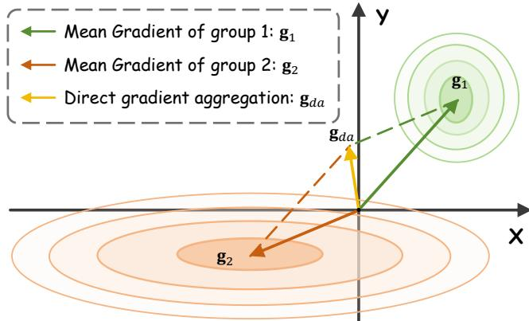  
Figure 1: Explanation of gradient uncertainty and conflicts. Two-dimensional example of two group gradients from the same GRPO mini-batch.

In this context, a reliable update direction can be understood as one that reasonably reflects the overall optimization tendency supported by the mini-batch, rather than being overly influenced by a few conflicting gradients. Gradient uncertainty provides a possible basis for assessing such reliability of diferent group gradients during aggregation (Ghavamzadeh, Engel, and Valko 2016; Akella et al. 2021). Specifically, group gradients can be treated as random variables and represented as probability distributions that describe the range of possible gradient values and their likelihoods. If the distribution is concentrated, most of its probability mass lies within a narrow range around the mean, indicating that the gradient values supported by the distribution are similar. Such limited variation among these values corresponds to lower gradient uncertainty and higher reliability. If the distribution is more dispersed, its probability mass extends over a broader range of substantially diferent gradient values. This larger variation among these values corresponds to higher gradient uncertainty and lower reliability. Figure 1 presents a two-dimensional example for illustration. g1 and g2 represent the mean gradients of two query groups, while the surrounding contours represent their probability distributions. The distribution of g1 concentrates more probability mass near the mean gradient, corresponding to lower uncertainty and higher reliability. By contrast, the distribution of g2 covers a broader range of gradient values, corresponding to higher uncertainty and lower reliability. Direct aggregation assigns the two group gradients equal coeficients without accounting for this diference in reliability. Consequently, the more uncertain group gradient may exert excessive influence on the directly aggregated direction gda. Based on this analysis, we propose to explicitly model group-gradient uncertainty and incorporate it into gradient aggregation, emphasizing more reliable group gradients while attenuating the influence of less reliable ones, with the aim of obtaining a reliable update direction when gradient conflicts occur.

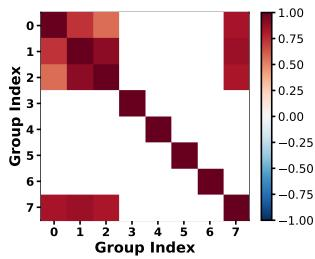  
(a) Low-Conflict Mini-batch

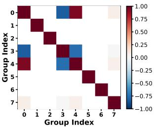  
(b) High-Conflict Mini-batch

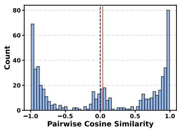  
(c) Conflict Distribution

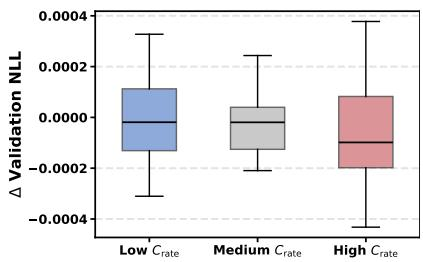  
(d) Conflict v.s. Performance  
Figure 2: Empirical results of group-gradient conflicts in GRPO. (a) and (b) show the pairwise cosine-similarity matrices of representative mini-batches with low and high conflict levels. (c) presents the distribution of pairwise cosine similarities among group gradients. (d) compares the validation ∆NLL across mini-batches with low, medium, and high conflict rates.

To this end, we propose Gradient Uncertainty-aware Policy Optimization (GUPO), explicitly modeling the uncertainty of group gradients within each mini-batch to achieve reliable policy updates. Rather than treating each group gradient solely as a deterministic vector, we model it as a random variable represented by a probability distribution. Specifically, under a Bayesian formulation (Dempster 1968; Box and Tiao 2011), we first estimate the probability distribution of each group gradient. The precision of the resulting distribution is then mapped to gradient evidence. Following the relationship among evidence, belief, and uncertainty in subjective logic (Jsang 2018; Bao, Yu, and Kong 2021; Sensoy, Kaplan, and Kandemir 2018), we derive dimension-wise beliefs and the overall uncertainty of each group gradient through a Dirichlet-based evidential formulation. The resulting group-level uncertainty is incorporated into gradient aggregation, increasing the relative contribution of loweruncertainty group gradients while attenuating that of higheruncertainty ones. In this way, GUPO aims to mitigate the excessive influence of highly uncertain gradients and obtain a more reliable aggregated update direction when groupgradient conflicts occur. Experiments across multiple benchmarks suggest the efectiveness of our method.

The main contributions can be summarized as follows: (i) We identify directional conflicts among group gradients induced by diferent queries within the same GRPO minibatch, and empirically show that conflicts can be associated with less efective policy updates, motivating the problem of obtaining a reliable aggregated update direction. (ii) We analyze this problem from the perspective of gradient uncertainty and propose GUPO, which models each group gradient as a probability distribution under a Bayesian formulation, derives its uncertainty through a Dirichlet-based evidential formulation, and incorporates the resulting uncertainty into gradient aggregation. (iii) Extensive experiments across multiple benchmarks demonstrate the efectiveness of GUPO, showing that incorporating group-gradient uncertainty into policy optimization can improve GRPO-based post-training.

## Related Work

Gradient Conflict in LLM Post-Training Reinforcement learning has become an important approach for LLM posttraining, with GRPO (Shao et al. 2024) being widely studied for improving reasoning capabilities. However, diferent gradients produced during GRPO optimization may result in incompatible directions, thereby interfering with efective policy updates. Recent studies investigate such gradient conflicts in GRPO-based post-training at diferent levels of the optimization process. DaGRPO (Xie et al. 2025) investigates conflicts within a rollout group, relating them to insuficient distinctiveness among sampled responses and applying sequence-level gradient correction. PCR (Qiang et al. 2026) studies conflicts between plasticity and stability gradients in GRPO and addresses them through probabilistic projection. ResRL (Lin et al. 2026) analyzes gradient interference between positive and negative responses and modulates negative gradients using projection residuals. These studies indicate that gradient conflicts can arise from diferent sources and at diferent granularities. Unlike prior works, we focus on conflicts among group gradients associated with diferent queries within the same GRPO mini-batch, and analyze them from the perspective of gradient uncertainty. We propose an optimization framework that explicitly characterizes the uncertainty of these query-level group gradients and calibrates their contributions during mini-batch gradient aggregation.

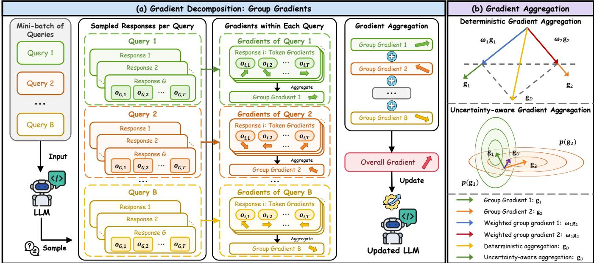  
Figure 3: Illustration of GRPO gradient optimization process.

Uncertainty Estimation in LLM Post-Training Uncertainty estimation provides a principled way to quantify the reliability of model outputs or evaluation signals and is widely applied to LLMs to assess the reliability of generated responses and alignment signals. Uncertainty-aware Reward Model (Lou et al. 2024) quantifies uncertainty in learned reward-model predictions by modeling stochastic human preferences and disagreement among reward models. SEED-GRPO (Chen et al. 2025) estimates query-level uncertainty from the semantic diversity of multiple sampled responses and uses it to modulate the corresponding advantages. CAPO (Wang et al. 2026) studies the overconfidence associated with uncertainty-agnostic advantage estimation in GRPO and introduces uncertainty-aware advantages to improve reasoning performance and confidence calibration. Recent works show that uncertainty can serve as an explicit measure of how reliably a prediction or scalar evaluation should be trusted. Unlike previous methods, we focus on conflicts among group gradients associated with diferent queries within the same GRPO mini-batch and analyze them from the perspective of gradient uncertainty. We model each group gradient as a random variable represented by a probability distribution under a Bayesian formulation, and derive an uncertainty estimation to reflect the reliability of its update signal. The resulting uncertainty is further incorporated into gradient aggregation to mitigate the adverse efects of gradient conflicts and guide more efective policy updates.

## Problem Settings and Analyses

Problem Settings For a given query $q \sim P ( Q )$ , GRPO samples a group of G candidate outputs $\{ \bar { o } _ { i } \} _ { i = 1 } ^ { G }$ from the old policy $\pi _ { \theta _ { \mathrm { o l d } } } .$ . Each output $o _ { i }$ is generated autoregressively as $o _ { i } = \{ o _ { i , 1 } , o _ { i , 2 } , . . . , o _ { i , T _ { i } } \}$ , where $T _ { i }$ denotes the length of the i-th output. After generation, each output is evaluated by an outcome reward function $r _ { i } = R _ { \mathrm { o u t } } ( q , o _ { i } )$ . In verifiable reasoning tasks, $R _ { \mathrm { o u t } }$ is usually defined according to whether the final answer is correct.

GRPO estimates the relative advantage of each output within the sampled group, encouraging the policy to increase the probability of outputs that obtain higher rewards.

$$
A _ { i } = { \frac { r _ { i } - \operatorname { m e a n } ( r _ { 1 } , r _ { 2 } , \dots , r _ { G } ) } { \operatorname { s t d } ( r _ { 1 } , r _ { 2 } , \dots , r _ { G } ) } } .\tag{1}
$$

The GRPO objective can then be written as

$$
\begin{array} { r l } & { \mathcal { I } _ { \mathrm { G R P O } } ( \theta ) = \mathbb { E } _ { q \sim P ( Q ) , \{ o _ { i } \} _ { i = 1 } ^ { G } \sim \pi _ { \theta _ { \mathrm { o l d } } } } } \\ & { \frac { 1 } { G } \displaystyle \sum _ { i = 1 } ^ { G } \frac { 1 } { T _ { i } } \sum _ { t = 1 } ^ { T _ { i } } \Big [ \operatorname* { m i n } ( \rho _ { i , t } ( \theta ) A _ { i } , \mathrm { c l i p } ( \rho _ { i , t } ( \theta ) , 1 - \varepsilon , 1 + \varepsilon ) A _ { i } ) - \beta D _ { \mathrm { K L } } ^ { i , t } \Big ] , } \end{array}\tag{2}
$$

where ε is the clipping coeficient and $\beta$ controls the strength of KL regularization. GRPO uses the importance ratio between the current policy $\pi _ { \theta }$ and the old policy $\pi _ { \theta _ { \mathrm { o l d } } }$

$$
\rho _ { i , t } ( \theta ) = \frac { \pi _ { \theta } ( o _ { i , t } \mid q , o _ { i , < t } ) } { \pi _ { \theta _ { \mathrm { o l d } } } ( o _ { i , t } \mid q , o _ { i , < t } ) } .\tag{3}
$$

The KL regularization is computed with respect to a fixed reference policy $\pi _ { \mathrm { r e f } }$ , which can be estimated as

$$
D _ { \mathrm { K L } } ^ { i , t } = \frac { \pi _ { \mathrm { r e f } } ( o _ { i , t } \mid q , o _ { i , < t } ) } { \pi _ { \theta } ( o _ { i , t } \mid q , o _ { i , < t } ) } - \log \frac { \pi _ { \mathrm { r e f } } ( o _ { i , t } \mid q , o _ { i , < t } ) } { \pi _ { \theta } ( o _ { i , t } \mid q , o _ { i , < t } ) } - 1 .\tag{4}
$$

For an optimization mini-batch containing B queries, we focus on the advantage-weighted policy-gradient signals that determine how the sampled responses contribute to the policy

update. The corresponding mini-batch gradient is

$$
\begin{array} { r l } & { \nabla _ { \theta } \mathcal { I } _ { \mathcal { B } } ( \theta ) = \displaystyle \frac { 1 } { B G } \sum _ { b = 1 } ^ { B } \sum _ { i = 1 } ^ { G } \frac { 1 } { T _ { b , i } } \sum _ { t = 1 } ^ { T _ { b , i } } } \\ & { A _ { b , i } \rho _ { b , i , t } ( \theta ) \nabla _ { \theta } \log \pi _ { \theta } \left( o _ { b , i , t } \mid q _ { b } , o _ { b , i , < t } \right) . } \end{array}\tag{5}
$$

This gradient can be decomposed according to the query groups within the mini-batch (Ge et al. 2026; Panaganti et al. 2026; Nguyen et al. 2026; Barakat et al. 2026). Specifically, the gradient contributed by the b-th query is defined as

$$
\begin{array} { r } { \mathbf { g } _ { b } ( \theta ) = \displaystyle \frac { 1 } { G } \sum _ { i = 1 } ^ { G } \frac { 1 } { T _ { b , i } } \sum _ { t = 1 } ^ { T _ { b , i } } \qquad } \\ { A _ { b , i } \rho _ { b , i , t } ( \theta ) \nabla _ { \theta } \log \pi _ { \theta } \left( o _ { b , i , t } ~ \middle | ~ q _ { b } , o _ { b , i , < t } \right) , } \end{array}\tag{6}
$$

which we term the group gradient. Accordingly, the overall gradient can be expressed as

$$
\nabla _ { \boldsymbol { \theta } } \mathcal { T } _ { B } ( \boldsymbol { \theta } ) = \frac { 1 } { B } \sum _ { b = 1 } ^ { B } \mathbf { g } _ { b } ( \boldsymbol { \theta } ) .\tag{7}
$$

Empirical Analysis In GRPO, the policy gradient of an optimization mini-batch can be decomposed as the aggregation of group gradients from diferent queries (Ge et al. 2026; Panaganti et al. 2026; Nguyen et al. 2026; Barakat et al. 2026). As illustrated in Figure 3a, the token-level gradients from the $G$ responses for query $q _ { b }$ are aggregated into the group gradient ${ \bf g } _ { b } ( \boldsymbol { \theta } )$ . For a mini-batch containing $B$ queries, the gradient is obtained by averaging these group gradients: $\begin{array} { r } { \nabla _ { \boldsymbol { \theta } } \mathcal { I } _ { B } ( \boldsymbol { \theta } ) = \frac { 1 } { B } \sum _ { b = 1 } ^ { B } \mathbf { g } _ { b } ( \boldsymbol { \theta } ) } \end{array}$

Based on this update mechanism, we conduct controlled experiments. Starting from the same checkpoint, we sample diferent mini-batches under identical settings, each containing B query groups with G responses per query. For each group-gradient pair, we compute the cosine similarity $\begin{array} { r } { c _ { b , b ^ { \prime } } = \frac { \mathbf { g } _ { b } ^ { \intercal } \mathbf { g } _ { b ^ { \prime } } } { \left\| \mathbf { g } _ { b } \right\| _ { 2 } \left\| \mathbf { g } _ { b ^ { \prime } } \right\| _ { 2 } } } \end{array}$ , where $c _ { b , b ^ { \prime } } < 0$ indicates a directional conflict. The conflict level of mini-batch $\boldsymbol { B }$ is measured by $\begin{array} { r } { C _ { \mathrm { r a t e } } ( \boldsymbol { B } ) = \frac { \sum _ { ( b , b ^ { \prime } ) \in \mathcal { P } _ { \mathcal { B } } } \mathbb { I } \left[ c _ { b , b ^ { \prime } } < 0 \right] } { | \mathcal { P } _ { \mathcal { B } } | } } \end{array}$ , where $\mathcal { P } _ { B }$ is the set of group-gradient pairs and I[·] is the indicator function. To evaluate the corresponding policy update, we perform GRPO update using each mini-batch and compute $\Delta \mathrm { N L L } = \mathrm { N L } \dot { \mathrm { L } } _ { \mathrm { b e f o r e } } - \mathrm { N L } \mathrm { L } _ { \mathrm { a f t e r } }$ on a fixed validation set, where a larger $\Delta \mathrm { N L I }$ indicates a more efective update. More details are provided in the Appendix.

Figure 2a shows a representative low-conflict mini-batch in which most cosine similarities are non-negative, indicating the group gradients are largely aligned. In contrast, Figure 2b presents a high-conflict mini-batch containing several groupgradient pairs with negative cosine similarities, showing that conflicts can arise within the same mini-batch. Figure 2c further summarizes the pairwise cosine similarities across all sampled mini-batches: among 563 group-gradient pairs, 262 pairs have negative cosine similarities, accounting for 46.5% of the total. Figure 2d compares the validation ∆NLL of mini-batches with low, medium, and high $C _ { \mathrm { r a t e } } .$ , where the high-conflict subset exhibits a relatively lower median and contains negative updates, suggesting that severe gradient conflicts can be associated with less efective policy updates.

These findings suggest that group gradients induced by diferent queries within the same mini-batch can exhibit conflicts. Therefore, this leads to the central scientific question of this work: When group gradients induced by diferent queries conflict within the same GRPO mini-batch, how can we obtain a reliable aggregated update direction?

Motivation Analysis When group gradients point in conflicting directions, directly averaging them may not yield a reliable update direction. Here, a reliable update direction refers to one that reasonably reflects the overall optimization tendency supported by the mini-batch, rather than being dominated by a few conflicting group gradients. Such a direction should preserve the optimization information jointly provided by the mini-batch while limiting the disproportion ate influence of particular conflicting signals.

Gradient uncertainty provides a possible basis for assessing such reliability of diferent group gradients during aggregation (Ghavamzadeh, Engel, and Valko 2016; Akella et al. 2021; Balles and Hennig 2018). A group gradient can be viewed as a random variable represented by a probability distribution, which describes not only the possible values of the group gradient, but also how likely these values are. When most of the probability mass is concentrated within a narrow region around the mean, the distribution mainly supports gradient values that are similar to one another. The limited variation among these values corresponds to lower gradient uncertainty and higher reliability. Conversely, when the probability mass is spread over a broader region, the distribution supports a wider range of substantially diferent gradient values. The larger variation among these values corresponds to higher gradient uncertainty and lower reliability. This notion of reliability characterizes how consistently a group-gradient direction is represented by its distribution, rather than whether that direction is necessarily correct. Figure 1 illustrates this perspective through a two-dimensional example. The arrows $\mathbf { g } _ { 1 }$ and $\mathbf { g } _ { 2 }$ denote the mean gradients of two query groups, while the surrounding contours depict their probability distributions. These two mean gradients point in conflicting directions, and their distributions exhibit diferent degrees of concentration. The compact contours around $\mathbf { g } _ { 1 }$ correspond to lower uncertainty and higher reliability, whereas the broader contours around $\mathbf { g } _ { 2 }$ correspond to higher uncertainty and lower reliability. Direct aggregation assigns the two group gradients equal coeficients without accounting for this diference in reliability. Consequently, the more uncertain group gradient may exert a disproportionate influence on the directly aggregated direction $\mathbf { g } _ { \mathrm { d a } }$

Motivated by the above, a natural way to address this problem is to account for group-gradient uncertainty during aggregation, placing greater emphasis on more reliable group gradients while limiting the influence of less reliable ones to obtain a more reliable update direction under conflicts.

## Methodology

Based on the above discussion, we propose Gradient Uncertainty-aware Policy Optimization (GUPO), a framework that incorporates the uncertainty of group gradients into the gradient aggregation of GRPO. Specifically, we first construct a probability distribution over the policy parameters under a Bayesian formulation and then estimate the induced distribution of each group gradient. We then transform the precision of the resulting gradient distributions into gradient evidence, from which the dimension-wise belief and group-level uncertainty are derived. Finally, we use the resulting uncertainty to calibrate the aggregation of group gradients within each mini-batch, assigning greater influence to lower-uncertainty gradients and attenuating the influence of higher-uncertainty ones. The overall framework is illustrated in Figure 4, with the pseudo-code provided in the Appendix.

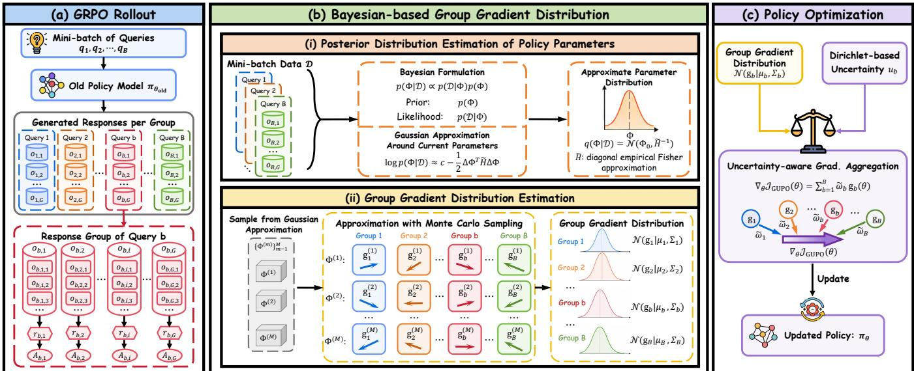  
Figure 4: Overview of our proposed method.

## Bayesian-based Group Gradient Distribution

In this subsection, we formulate each query-level group gradient as a random variable by propagating parameter uncertainty to the corresponding gradient. Specifically, we construct a parameter distribution and use Monte Carlo sampling to estimate the induced distribution of each group gradient.

Posterior Distribution Estimation of Policy Parameters Consider an optimization mini-batch containing B queries: $\boldsymbol { B } = \{ ( q _ { b } , \mathcal { O } _ { b } ) \} _ { b = 1 } ^ { B }$ , where $\mathcal { O } _ { b } = \{ o _ { b , 1 } , o _ { b , 2 } , . . . , o _ { b , G } \}$ contains the G responses sampled for query qb from the old policy $\pi _ { \theta _ { \mathrm { o l d } } } .$ . Each response $o _ { b , i } = \{ o _ { b , i , t } \} _ { t = 1 } ^ { T _ { b , i } }$ receives an outcome reward ${ r _ { b , i } }$ . Its group-relative advantage is defined as $\begin{array} { r } { A _ { b , i } = \frac { r _ { b , i } - \bar { r } _ { b } } { \sigma _ { r , b } } } \end{array}$ , where $\bar { r } _ { b }$ and $\sigma _ { r , b }$ denote the mean and standard deviation of the rewards within the b-th response group. We use $\mathcal { D } = \{ ( q _ { b } , \mathcal { O } _ { b } ) \} _ { b = 1 } ^ { B }$ to denote the rollout sequences contained in the mini-batch.

Directly constructing a posterior distribution over all parameters of an LLM is computationally prohibitive. We therefore adopt a Bayesian formulation for the parameter set $\Phi \subseteq \theta$ of the final trainable layer of the policy model. Given the rollout data D, the posterior distribution of Φ is $p ( \Phi \mid \mathcal { D } ) \propto p ( \mathcal { D } \mid \Phi ) p ( \Phi )$ , where $p ( \Phi )$ is the prior distribution and $p ( \mathcal { D } \mid \Phi )$ is the likelihood of the sampled responses. The specific prior and likelihood are in the Appendix.

The exact posterior is generally intractable because the likelihood depends nonlinearly on the policy parameters. We therefore use its expansion around $\Phi _ { 0 }$ to construct a Gaussian approximation. Let $\Delta \Phi = \Phi - \Phi _ { 0 }$ . The second-order Taylor expansion of the log-posterior is

$$
\begin{array} { r } { \log p ( \Phi | \mathcal { D } ) \approx c + \nabla _ { \Phi } \log p ( \Phi | \mathcal { D } ) \big | _ { \Phi = \Phi _ { 0 } } ^ { \top } \Delta \Phi - \frac { 1 } { 2 } \Delta \Phi ^ { \top } H \Delta \Phi , } \end{array}\tag{8}
$$

where c contains the terms independent of Φ, and $H =$ $- \nabla _ { \Phi } ^ { 2 } \log p ( \Phi | \mathcal { D } ) | _ { \Phi = \Phi _ { 0 } }$ is the negative Hessian matrix of the log-posterior. We omit the first-order term and retain the quadratic term to construct the Gaussian approximation $q ( \Phi$ ${ \mathcal { \hat { D } } } ) = { \mathcal { N } } ( \Phi \mid \Phi _ { 0 } , H ^ { - 1 } )$ centered at the current parameters (see Appendix for further discussion).

Directly computing the full Hessian matrix is infeasible for LLMs. We therefore construct a tractable approximation $\widetilde { H }$ using empirical Fisher information. Specifically, for each generated token $^ { O } b , i , t$ , we compute the gradient of its logprobability with respect to the trainable parameters: ${ \bf s } _ { b , i , t } =$ $\nabla _ { \Phi } \log \pi _ { \Phi } \left( \boldsymbol { o } _ { b , i , t } \vert \boldsymbol { q } _ { b } , \boldsymbol { o } _ { b , i , < t } \right) \vert _ { \Phi = \Phi _ { 0 } }$ , which describes how the generation probability of the token changes with the policy parameters. The empirical Fisher matrix is then obtained:

$$
F _ { \Phi } = \frac { 1 } { N _ { \mathrm { t o k e n } } } \sum _ { b = 1 } ^ { B } \sum _ { i = 1 } ^ { G } \sum _ { t = 1 } ^ { T _ { b , i } } s _ { b , i , t } s _ { b , i , t } ^ { \top } ,\tag{9}
$$

where $\begin{array} { r } { N _ { \mathrm { t o k e n } } = \sum _ { b = 1 } ^ { B } \sum _ { i = 1 } ^ { G } T _ { b , i } } \end{array}$ is the total number of tokens in the mini-batch. The negative Hessian is approximated as ${ \cal H } \approx { \widetilde H } = \mathrm { D i a g } ( F _ { \Phi } ) + \delta I , \delta > 0$ . Accordingly, using this diagonal empirical Fisher approximation, we obtain

$$
q ( \Phi \mid \mathcal { D } ) = \mathcal { N } ( \Phi \mid \Phi _ { 0 } , \widetilde { H } ^ { - 1 } ) .\tag{10}
$$

<table><tr><td rowspan="11">Model</td><td>Method</td><td>GSM8K</td><td>MATH500</td><td>MinervaMATH</td><td>AMC 2023</td><td>AIME 2024</td><td>AIME 2025</td><td>Average Results</td></tr><tr><td>Vanilla</td><td>89.6</td><td>85.2</td><td>24.6</td><td>83.0</td><td>42.8</td><td>36.7</td><td>60.3</td></tr><tr><td>GRPO (Shao et al. 2024)</td><td>89.4 (↓0.2)</td><td>84.9 (↓0.3)</td><td>24.7 (↑0.1)</td><td>81.5 (↓1.5)</td><td>44.5 (↑1.7)</td><td>39.3 (↑2.6)</td><td>60.7 (↑0.4)</td></tr><tr><td>Length penalty (Arora and Zanette 2026)</td><td>88.5 (↓1.1)</td><td>83.2 (↓2.0)</td><td>23.0 (↓1.6)</td><td>77.3 (↓5.7)</td><td>40.3 (↓2.5)</td><td>30.3 (↓6.4)</td><td>57.1 (↓3.2)</td></tr><tr><td>ReST-MCTS (Zhang et al. 2024)</td><td>89.9 (↑0.3)</td><td>84.8 (↓0.4)</td><td>23.9 (↓0.7)</td><td>83.4 (↑0.4)</td><td>45.5 (↑2.7)</td><td>39.5 (↑2.8)</td><td>61.2 (↑0.9)</td></tr><tr><td>GVPO (Zhang et al. 2026)</td><td>90.4 (↑0.8)</td><td>85.7 (↑0.5)</td><td>25.3 (↑0.7)</td><td>83.6 (↑0.6)</td><td>46.1 (↑3.3)</td><td>39.7 (↑3.0)</td><td>61.8 (↑1.5)</td></tr><tr><td>Dr.GRPO (Liu et al. 2025)</td><td>90.0 (↑0.4)</td><td>85.3 (↑0.1)</td><td>25.1 (↑0.5)</td><td>82.1 (↓0.9)</td><td>45.8 (↑3.0)</td><td>39.6 (↑2.9)</td><td>61.3 (↑1.0)</td></tr><tr><td>GCPO (Gu et al. 2026)</td><td>90.5 (↑0.9)</td><td>86.3 (↑1.1)</td><td>25.9 (↑1.3)</td><td>84.1 (↑1.1)</td><td>46.7 (↑3.9)</td><td>40.3 (↑3.6)</td><td>62.3 (↑2.0)</td></tr><tr><td>MRT (Qu et al. 2025)</td><td>89.9 (↑0.3)</td><td>85.1 (↓0.1)</td><td>24.2 (↓0.4)</td><td>83.1 (↑0.1)</td><td>47.2 (↑4.4)</td><td>39.7 (↑3.0)</td><td>61.5 (↑1.2)</td></tr><tr><td>GUPO (Ours)</td><td>91.7 (↑2.1)</td><td>87.9 (↑2.7)</td><td>26.4 (↑1.8)</td><td>85.5 (↑2.5)</td><td>48.7 (↑5.9)</td><td>40.2 (↑3.5)</td><td>63.4 (↑3.1)</td></tr><tr><td rowspan="11">DeepSeek-R1-Distill Qwen-1.5B</td><td>Vanilla</td><td>83.4</td><td>80.1</td><td>19.8</td><td>69.9</td><td>28.7</td><td>26.0</td><td>51.3</td></tr><tr><td>GRPO (Shao et al. 2024)</td><td>84.5 (↑1.1)</td><td>80.3 (↑0.2)</td><td>22.1 (↑2.3)</td><td>70.5 (↑0.6)</td><td>29.8 (↑1.1)</td><td>27.3 (↑1.3)</td><td>52.4 (↑1.1)</td></tr><tr><td>Length penalty (Arora and Zanette 2026)</td><td>82.6 (↓0.8)</td><td>77.1 (↓3.0)</td><td>18.8 (↓1.0)</td><td>64.4 (↓5.5)</td><td>27.5 (↓1.2)</td><td>22.6 (↓3.4)</td><td>48.8 (↓2.5)</td></tr><tr><td>ReST-MCTS (Zhang et al. 2024)</td><td>84.8 (↑1.4)</td><td>80.4 (↑0.3)</td><td>20.3 (↑0.5)</td><td>71.1 (↑1.2)</td><td>30.5 (↑1.8)</td><td>28.6 (↑2.6)</td><td>52.6 (↑1.3)</td></tr><tr><td>GVPO (Zhang et al. 2026)</td><td>85.0 (↑1.6)</td><td>80.5 (↑0.4)</td><td>23.1 (↑3.3)</td><td>71.5 (↑1.6)</td><td>30.6 (↑1.9)</td><td>28.2 (↑2.2)</td><td>53.2 (↑1.8)</td></tr><tr><td>Dr.GRPO (Liu et al. 2025)</td><td>85.0 (↑1.6)</td><td>80.8 (↑0.7)</td><td>22.9 (↑3.1)</td><td>71.3 (↑1.4)</td><td>30.4 (↑1.7)</td><td>28.4 (↑2.4)</td><td>53.1 (↑1.8)</td></tr><tr><td>GCPO (Gu et al. 2026)</td><td>85.3 (↑1.9)</td><td>81.6 (↑1.5)</td><td>23.4 (↑3.6)</td><td>71.8 (↑1.9)</td><td>31.0 (↑2.3)</td><td>29.0 (↑3.0)</td><td>53.7 (↑2.4)</td></tr><tr><td>MRT (Qu et al. 2025) GUPO (Ours)</td><td>84.7 (↑1.3)</td><td>80.4 (↑0.3)</td><td>22.5 (↑2.7)</td><td>72.9 (↑3.0)</td><td>30.3 (↑1.6)</td><td>29.3 (↑3.3)</td><td>53.4 (↑2.0)</td></tr><tr><td></td><td>86.3 (↑2.9)</td><td>84.9 (↑4.8)</td><td>24.8 (↑5.0)</td><td>73.5 (↑3.6)</td><td>33.2 (↑4.5)</td><td>29.9 (↑3.9)</td><td>55.4 (↑4.1)</td></tr><tr><td rowspan="11">DeepSeek-R1-Distill Qwen-7B</td><td>Vanilla</td><td>91.6</td><td>87.4</td><td>42.1</td><td>85.1</td><td>55.5</td><td>50.2</td><td>68.6</td></tr><tr><td>GRPO (Shao et al. 2024) Length penalty (Arora and Zanette 2026)</td><td>92.1 (↑0.5)</td><td>87.7 (↑0.3)</td><td>43.5 (↑1.4)</td><td>85.5 (↑0.4)</td><td>56.9 (↑1.4)</td><td>51.7 (↑1.5)</td><td>69.6 (↑0.9)</td></tr><tr><td></td><td>91.1 (↓0.5)</td><td>83.7 (↓3.7)</td><td>39.5 (↓2.6)</td><td>81.2 (↓3.9)</td><td>53.8 (↓1.7)</td><td>46.9 (↓3.3)</td><td>66.0 (↓2.6)</td></tr><tr><td>ReST-MCTS (Zhang et al. 2024) GVPO (Zhang et al. 2026)</td><td>92.0 (↑0.4)</td><td>87.9 (↑0.5)</td><td>42.8 (↑0.7)</td><td>85.7 (↑0.6)</td><td>57.1 (↑1.6)</td><td>52.4 (↑2.2)</td><td>69.7 (↑1.0)</td></tr><tr><td></td><td>92.9 (↑1.3)</td><td>88.5 (↑1.1)</td><td>44.2 (↑2.1)</td><td>86.3 (↑1.2)</td><td>57.5 (↑2.0)</td><td>52.1 (↑1.9)</td><td>70.3 (↑1.6)</td></tr><tr><td>Dr.GRPO (Liu et al. 2025)</td><td>92.3 (↑0.7)</td><td>88.2 (↑0.8)</td><td>44.0 (↑1.9)</td><td>86.4 (↑1.3)</td><td>57.4 (↑1.9)</td><td>52.3 (↑2.1)</td><td>70.1 (↑1.5)</td></tr><tr><td>GCPO (Gu et al. 2026)</td><td>92.6 (↑1.0)</td><td>89.1 (↑1.7)</td><td>45.0 (↑2.9)</td><td>87.3 (↑2.2)</td><td>58.3 (↑2.8)</td><td>53.0 (↑2.8)</td><td>70.9 (↑2.2)</td></tr><tr><td>MRT (Qu et al. 2025)</td><td>92.2 (↑0.6)</td><td>88.4 (↑1.0)</td><td>44.3 (↑2.2)</td><td>86.0 (↑0.9)</td><td>57.0 (↑1.5)</td><td>52.4 (↑2.2)</td><td>70.1 (↑1.4)</td></tr><tr><td>GUPO (Ours)</td><td>93.3 (↑1.7)</td><td>89.5 (↑2.1)</td><td>45.4 (↑3.3)</td><td>87.8 (↑2.7)</td><td>58.6 (↑3.1)</td><td>53.9 (↑3.7)</td><td>71.4 (↑2.8)</td></tr></table>

Table 1: Pass@1 performance on mathematical reasoning datasets. We compare base models trained with diferent approaches. The best results under each base model are highlighted in bold. More results are provided in the Appendix.

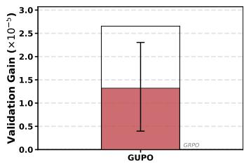  
(a) Mean Performance Gain

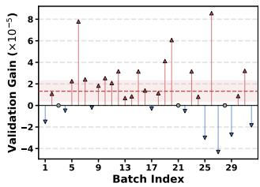  
(b) Batch Performance Gain

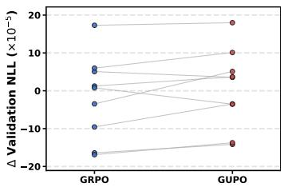  
(c) High-Conflict Batches

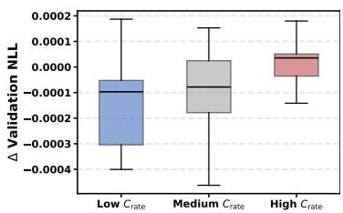  
(d) Conflict v.s. Performance  
Figure 5: Efect of GUPO. (a) and (b) report the mean and batch-wise validation gains over GRPO. (c) shows the performance comparison on high-conflict mini-batches. (d) compares validation ∆NLL produced by GUPO across diferent conflict levels.

Group Gradient Distribution Estimation Based on the approximate parameter distribution, we next estimate the distribution induced over each group gradient. As defined in Problem Settings, the group gradient associated with query $q _ { b }$ is denoted by ${ \bf g } _ { b } ( \boldsymbol { \theta } )$ . Because both the policy probabilities and their derivatives depend on the policy parameters, diferent values of Φ can produce diferent group gradients. Therefore, when $\Phi \sim q ( \bar { \Phi | \mathcal { D } } )$ , the corresponding group gradient can be regarded as a random variable.

Since the distribution of ${ \bf g } _ { b } ( \Phi )$ is generally dificult to derive in closed form, we approximate it through Monte Carlo sampling. Specifically, we draw M parameter samples from the parameter distribution $\{ \Phi ^ { ( m ) } \} _ { m = 1 } ^ { \bar { M } } \sim q ( \Phi | D )$ . For each parameter sample $\Phi ^ { ( m ) }$ , we construct the corresponding complete policy parameter set $\theta ^ { ( m ) } = \theta \left( \Phi ^ { ( m ) } \right)$ , while keeping the remaining policy parameters fixed. We then compute the b-th group gradient $\mathbf { g } _ { b } ^ { ( m ) } = \mathbf { g } _ { b } ( \theta ^ { ( m ) } )$ . The mean and covariance of the b-th group gradient are defined as

$$
\begin{array} { l } { { \displaystyle \mu _ { b } = \frac { 1 } { M } \sum _ { m = 1 } ^ { M } \mathbf { g } _ { b } ^ { ( m ) } } , \ ~ } \\ { { \displaystyle \Sigma _ { b } = \frac { 1 } { M - 1 } \sum _ { m = 1 } ^ { M } ( \mathbf { g } _ { b } ^ { ( m ) } - \pmb { \mu } _ { b } ) ( \mathbf { g } _ { b } ^ { ( m ) } - \pmb { \mu } _ { b } ) ^ { \top } } . \ ~ } \end{array}\tag{11}
$$

To avoid constructing a full covariance matrix in the highdimensional gradient space, we use the element-wise variance vector $\pmb { \sigma } _ { b } ^ { 2 }$ instead of the full covariance matrix. The probability distribution of $\mathbf { g } _ { b }$ is then approximated as

$$
q ( \mathbf { g } _ { b } \mid \mathcal { D } ) \approx \mathcal { N } ( \mathbf { g } _ { b } \mid \pmb { \mu } _ { b } , \mathrm { D i a g } ( \pmb { \sigma } _ { b } ^ { 2 } ) ) .\tag{12}
$$

Gradient Uncertainty-aware Policy Optimization In this subsection, we incorporate gradient uncertainty into the aggregation of group gradients. Specifically, we first derive the gradient precision and transform it into gradient evidence. The evidence is then used to derive dimension-wise belief and group-level uncertainty. The resulting group-level uncertainty is subsequently used to calibrate the aggregation of group gradients within the same mini-batch.

For the b-th group, let $\sigma _ { b , d } ^ { 2 }$ denote the variance of its gradient in the d-th dimension. We first compute the corresponding gradient precision $\begin{array} { r } { \lambda _ { b , d } = \frac { 1 } { \sigma _ { b , d } ^ { 2 } } } \end{array}$ , which describes the concentration of the gradient distribution in that dimension. A larger $\lambda _ { b , d }$ corresponds to a more concentrated gradient distribution in the corresponding dimension, indicating that the gradient varies less across the sampled parameters.

We then map the gradient precision to non-negative gradient evidence $e _ { b , d } = \phi \left( \lambda _ { b , d } \right) = \lambda _ { b , d } ^ { s } ,$ where $s > 0$ controls the sensitivity of the evidence to the gradient precision. A larger gradient precision produces stronger evidence, while a smaller gradient precision produces weaker evidence.

Inspired by subjective logic and evidence theory (Jsang 2018; Sensoy, Kaplan, and Kandemir 2018), the corresponding Dirichlet concentration parameter is defined as $\alpha _ { b , d } = e _ { b , d } + 1$ . The dimension-wise belief and group-level uncertainty are then defined as

$$
b _ { b , d } = \frac { e _ { b , d } } { S _ { b } } , \quad u _ { b } = \frac { K } { S _ { b } } , \quad S _ { b } = \sum _ { d = 1 } ^ { K } \alpha _ { b , d } .\tag{13}
$$

where $S _ { b }$ is the Dirichlet strength and K denotes the total number of gradient dimensions. $b _ { b , d }$ represents the belief supported by the evidence in the d-th dimension, while $u _ { b }$ summarizes the uncertainty of the b-th group gradient.

Then, we use the group-level uncertainty to adjust the aggregation of group gradients. The uncertainty-aware weight of the b-th group is defined as $\begin{array} { r } { \omega _ { b } = \frac { 1 - u _ { b } } { \sum _ { \ell = 1 } ^ { B } \left( 1 - u _ { \ell } \right) } } \end{array}$ . To preserve the original aggregation structure of GRPO, we further combine $\omega _ { b }$ with the original gradient coeficient $\textstyle { \frac { 1 } { B } } :$ $\begin{array} { r } { \widetilde { \omega } _ { b } = \frac { 1 - \eta } { B } + \eta \omega _ { b } } \end{array}$ , where $\eta \in [ 0 , 1 ]$ controls the degree to which group-gradient uncertainty adjusts the original gradient aggregation (see the Appendix for more discussion). The final GUPO gradient is

$$
\nabla _ { \boldsymbol { \theta } } \mathcal { I } _ { B } ^ { \mathrm { G U P O } } ( \boldsymbol { \theta } ) = \sum _ { b = 1 } ^ { B } \widetilde { \omega } _ { b } \mathbf { g } _ { b } ( \boldsymbol { \theta } ) .\tag{14}
$$

Under this aggregation, group gradients with lower uncertainty receive greater contributions, whereas those with higher uncertainty receive smaller contributions. Consequently, this aggregation aims to provide a more reliable update direction for policy optimization.

## Experiments

In this section, we conduct experiments on various benchmarks to evaluate GUPO. More details, experiments, and analysis are provided in the Appendix.

## Experimental Settings

Benchmarks and Baselines We compare our method with a series of representative post-training baselines, including GRPO (Shao et al. 2024), Length Penalty (Arora and Zanette 2026), ReST-MCTS (Zhang et al. 2024), GVPO (Zhang et al. 2026), Dr. GRPO (Liu et al. 2025), GCPO (Gu et al. 2026), and MRT (Qu et al. 2025). We evaluate our method on several widely used reasoning benchmarks: AIME 2024, AIME 2025, AMC 2023, MATH500 (Hendrycks et al. 2021), MinervaMATH (Lewkowycz et al. 2022), and GSM8K (Cobbe et al. 2021). AIME and AMC evaluate competition-level mathematical reasoning. MATH500 and MinervaMATH cover diverse mathematical problem-solving tasks. GSM8K focuses on multi-step grade-school arithmetic reasoning. We report Pass@1 accuracy on each benchmark and the average performance across all six benchmarks.

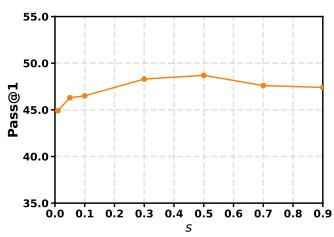  
(a) Parameter s

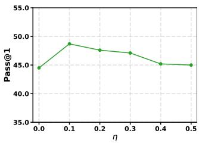  
(b) Parameter η  
Figure 6: Parameter sensitivity.

Implementation Details We conduct experiments on three base models at two scales: DeepScaleR-1.5B-Preview, DeepSeek-R1-Distill-Qwen-1.5B, and DeepSeek-R1-Distill-Qwen-7B. We use a learning rate of $1 \times 1 0 ^ { - 6 }$ , a weight decay of 0.01, and a global batch size of 256. All experiments are conducted on an NVIDIA H100 GPU cluster. More implementation details are provided in the Appendix.

## Main Results

Performance Comparison We compare GUPO with representative baselines across multiple benchmarks and base models. As shown in Table 1, the results demonstrate the efectiveness of GUPO, which incorporates group-gradient uncertainty into gradient aggregation.

Ablation Study about Parameter Sensitivity We conduct analysis of evaluating evidence sensitivity s at [0.01, 0.05, 0.1, 0.3, 0.5, 0.7, 0.9], and aggregation coeficient η over [0, 0.5] with an interval of 0.1. Figure 6 shows the best performance is achieved at s = 0.5 and $\eta = 0 . 1$ which are our final setting. More results are in the Appendix.

Analysis We further analyze the efect of GUPO under group-gradient conflicts. As shown in Figure 5, GUPO can improve validation performance over GRPO across sampled mini-batches, with the paired comparison on high-conflict mini-batches providing further evidence. The results suggest that GUPO can mitigate the degradation in update efectiveness associated with severe group-gradient conflicts.

## Conclusion

In this work, we investigate conflicts among group gradients induced by diferent queries within the same GRPO minibatch and show that such conflicts can be associated with less efective policy updates. To obtain a reliable update direction, we propose Gradient Uncertainty-aware Policy Optimization (GUPO), which models each group gradient as a probability distribution under a Bayesian formulation, estimates its uncertainty, and incorporates the resulting uncertainty into gradient aggregation. By enhancing the contribution of loweruncertainty group gradients and mitigating the influence of highly uncertain ones, GUPO can enable the aggregated gradient to better reflect the optimization tendency supported by the mini-batch. Experiments across multiple reasoning benchmarks demonstrate the efectiveness of GUPO.

## References

Akella, R. T.; Azizzadenesheli, K.; Ghavamzadeh, M.; Anandkumar, A.; and Yue, Y. 2021. Deep Bayesian quadrature policy optimization. In Proceedings ofthe AAAI conference on artificial intelligence, volume 35, 6600–6608.

Arora, D.; and Zanette, A. 2026. Training language models to reason eficiently. Advances in Neural Information Processing Systems, 38: 60770–60808.

Balles, L.; and Hennig, P. 2018. Dissecting adam: The sign, magnitude and variance of stochastic gradients. In International Conference on Machine Learning, 404–413. PMLR.

Bao, W.; Yu, Q.; and Kong, Y. 2021. Evidential deep learning for open set action recognition. In Proceedings of the IEEE/CVF international conference on computer vision, 13349–13358.

Barakat, A.; Chakraborty, S.; Pahwa, K.; and Bedi, A. S. 2026. Why pass@ k optimization can degrade pass@ 1: Prompt interference in llm post-training. arXiv preprint arXiv:2602.21189.

Box, G. E.; and Tiao, G. C. 2011. Bayesian inference in statistical analysis. John Wiley & Sons.

Brown, T.; Mann, B.; Ryder, N.; Subbiah, M.; Kaplan, J. D.; Dhariwal, P.; Neelakantan, A.; Shyam, P.; Sastry, G.; Askell, A.; et al. 2020. Language models are few-shot learners. Advances in neural information processing systems, 33: 1877– 1901.

Chen, M.; Chen, G.; Wang, W.; and Yang, Y. 2025. Seedgrpo: Semantic entropy enhanced grpo for uncertainty-aware policy optimization. arXiv preprint arXiv:2505.12346.

Chowdhery, A.; Narang, S.; Devlin, J.; Bosma, M.; Mishra, G.; Roberts, A.; Barham, P.; Chung, H. W.; Sutton, C.; Gehrmann, S.; et al. 2023. Palm: Scaling language modeling with pathways. Journal ofmachine learning research, 24(240): 1–113.

Cobbe, K.; Kosaraju, V.; Bavarian, M.; Chen, M.; Jun, H.; Kaiser, L.; Plappert, M.; Tworek, J.; Hilton, J.; Nakano, R.; et al. 2021. Training verifiers to solve math word problems. arXiv preprint arXiv:2110.14168.

Dempster, A. P. 1968. A generalization of Bayesian inference. Journal of the Royal Statistical Society: Series B (Methodological), 30(2): 205–232.

Ge, C.; Yin, C. H.; Liang, H.; and Zhang, J. 2026. Why GRPO Needs Normalization: A Local-Curvature Perspective on Adaptive Gradients. arXiv preprint arXiv:2601.23135.

Ghavamzadeh, M.; Engel, Y.; and Valko, M. 2016. Bayesian policy gradient and actor-critic algorithms. Journal of Machine Learning Research, 17(66): 1–53.

Gu, Z.; Wang, J.; Zuo, R.; Sun, C.; Song, Z.; Zheng, C.; and Qiang, W. 2026. Group causal policy optimization for posttraining large language models. In Proceedings of the AAAI Conference on Artificial Intelligence, volume 40, 30834– 30842.

Hendrycks, D.; Burns, C.; Kadavath, S.; Arora, A.; Basart, S.; Tang, E.; Song, D.; and Steinhardt, J. 2021. Measuring mathematical problem solving with the math dataset. arXiv preprint arXiv:2103.03874.

Jsang, A. 2018. Subjective Logic: A formalism for reasoning under uncertainty. Springer Publishing Company, Incorporated.

Kojima, T.; Gu, S. S.; Reid, M.; Matsuo, Y.; and Iwasawa, Y. 2022. Large language models are zero-shot reasoners. Advances in neural information processing systems, 35: 22199– 22213.

Lewkowycz, A.; Andreassen, A.; Dohan, D.; Dyer, E.; Michalewski, H.; Ramasesh, V.; Slone, A.; Anil, C.; Schlag, I.; Gutman-Solo, T.; et al. 2022. Solving quantitative reasoning problems with language models. Advances in neural information processing systems, 35: 3843–3857.

Lin, Z.; Wang, X.; Cao, J.; Chai, J.; Wang, L.; Lu, X.; Lin, W.; He, R.; and Yin, G. 2026. Resrl: Boosting llm reasoning via negative sample projection residual reinforcement learning. arXiv preprint arXiv:2605.00380.

Liu, Z.; Chen, C.; Li, W.; Qi, P.; Pang, T.; Du, C.; Lee, W. S.; and Lin, M. 2025. Understanding r1-zero-like training: A critical perspective. arXiv preprint arXiv:2503.20783.

Lou, X.; Yan, D.; Shen, W.; Yan, Y.; Xie, J.; and Zhang, J. 2024. Uncertainty-aware reward model: Teaching reward models to know what is unknown. arXiv preprint arXiv:2410.00847.

Nguyen, H. T.; Nguyen, B.; Ma, W.; Zhao, Y.; She, R.; and Nguyen, V. A. 2026. Adaptive Rollout Allocation for Online Reinforcement Learning with Verifiable Rewards. arXiv preprint arXiv:2602.01601.

Panaganti, K.; Liang, Z.; Yu, W.; Mi, H.; and Yu, D. 2026. Group Distributionally Robust Optimization-Driven Reinforcement Learning for LLM Reasoning. arXiv preprint arXiv:2601.19280.

Qiang, W.; Gu, Z.; Zhou, J.; Hu, J.; Wang, J.; Zheng, C.; and Xiong, H. 2026. On the Plasticity and Stability for Post-Training Large Language Models. arXiv preprint arXiv:2602.06453.

Qu, Y.; Yang, M. Y.; Setlur, A.; Tunstall, L.; Beeching, E. E.; Salakhutdinov, R.; and Kumar, A. 2025. Optimizing test-time compute via meta reinforcement fine-tuning. arXiv preprint arXiv:2503.07572.

Sensoy, M.; Kaplan, L.; and Kandemir, M. 2018. Evidential deep learning to quantify classification uncertainty. Advances in neural information processing systems, 31.

Shao, Z.; Wang, P.; Zhu, Q.; Xu, R.; Song, J.; Bi, X.; Zhang, H.; Zhang, M.; Li, Y.; Wu, Y.; et al. 2024. Deepseekmath: Pushing the limits of mathematical reasoning in open language models. arXiv preprint arXiv:2402.03300.

Wang, Z.; Lou, X.; Wu, M.; Wen, Z.; and Zhang, J. 2026. Calibration-Aware Policy Optimization for Reasoning LLMs. In Proceedings of the 64th Annual Meeting of the Association for Computational Linguistics (Volume 1: Long Papers), 18375–18390.

Wei, J.; Wang, X.; Schuurmans, D.; Bosma, M.; Xia, F.; Chi, E.; Le, Q. V.; Zhou, D.; et al. 2022. Chain-of-thought prompting elicits reasoning in large language models. Advances in neural information processing systems, 35: 24824–24837.

Xie, X.; Wang, X.; Wang, W.; Chen, S.; and Lin, W. 2025. Dagrpo: Rectifying gradient conflict in reasoning via distinctiveness-aware group relative policy optimization. arXiv preprint arXiv:2512.06337.

Zhang, D.; Zhoubian, S.; Hu, Z.; Yue, Y.; Dong, Y.; and Tang, J. 2024. Rest-mcts\*: Llm self-training via process reward guided tree search. Advances in Neural Information Processing Systems, 37: 64735–64772.

Zhang, K.; Hong, Y.; Bao, J.; Jiang, H.; Song, Y.; Dingqian, H.; and Xiong, H. 2026. Gvpo: Group variance policy optimization for large language model post-training. Advances in Neural Information Processing Systems, 38: 165798– 165820.